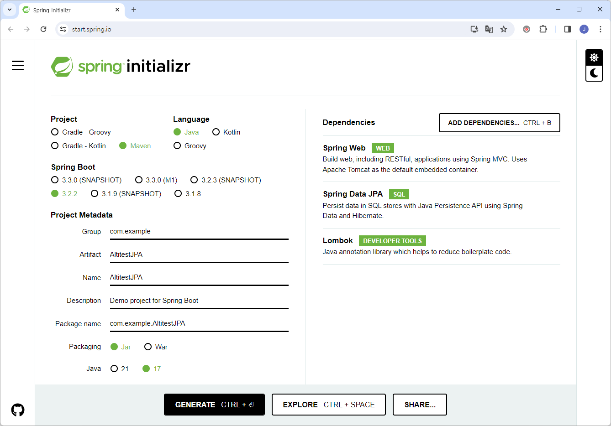

# Spring Data JPA With Hibernate 6.4 User's Guide for Altibase

<br/>

<br/>


# Table of Contents

- [Overview](#Overview)
- [Integrate Altibase With Spring Boot](#Integrate-Altibase-with-Spring-Boot)
- [Example](#Example)

<br/>

# Overview

This manual explains how to integrate Spring Data JPA with Hibernate 6.4 and an Altibase server using Spring Boot.

The document is based on the following versions:

- Spring Boot 3.2.2
- Spring Data JPA 3.2.2
- Java 17
- Altibase server 7.1.0.9.3 or above
- Altibase JDBC driver 7.1.0.9.0 or above

<br/>

# Integrate Altibase With Spring Boot

## 1. Generate Spring Boot Project With Spring initializr

Visit [https://start.spring.io/](#https://start.spring.io/), then enter the following information. After that, click on "Generate" to create the project. Click on "ADD DEPENDENCIES..." under Dependencies, and add "Spring Web" and "Spring Data JPA". For the convenience of writing example code, also add "Lombok".



## 2. Add Dependencies to pom.xml

### Add AltibaseDialect Dependency

Starting from Hibernate 6.4, the AltibaseDialect has been added to hibernate-community-dialect. Therefore, add a dependency on "hibernate-community-dialect" with a version of 6.4 or above. (If users are using Hibernate version under 6.4, they will need to manually compile and add the AltibaseDialect.)

```xml
<dependency>
    <groupId>org.hibernate.orm</groupId>
    <artifactId>hibernate-community-dialects</artifactId>
    <version>6.4.1.Final</version>
</dependency>
```

### Add Altibase JDBC Driver Dependency

From patch version Altibase 7.1.0.9.0 for Altibase 7.1 and Altibase 7.3.0.0.2 for Altibase 7.3, the Altibase JDBC driver can be downloaded from the [Maven Central Repository](https://mvnrepository.com/artifact/com.altibase/altibase-jdbc). Add to Altibase JDBC driver dependency as follows: 

* Add Altibase JDBC driver dependency for Altibase 7.3

  ```xml
  <dependency>
      <groupId>com.altibase</groupId>
      <artifactId>altibase-jdbc</artifactId>
      <version>7.3.0.0.2</version>
  </dependency>
  ```

* Add Altibase JDBC driver dependency for Altibase 7.1

  ```xml
  <dependency>
      <groupId>com.altibase</groupId>
      <artifactId>altibase-jdbc</artifactId>
      <version>7.1.0.9.2</version>
  </dependency>
  ```

## 3. Configure the application.properties

### Altibase JDBC Driver Configuration

```java
# Database
spring.datasource.driver-class-name=Altibase.jdbc.driver.AltibaseDriver
spring.datasource.url=jdbc:Altibase://localhost:20300/mydb
spring.datasource.username=sys
spring.datasource.password=manager

# JPA
spring.jpa.properties.hibernate.jdbc.lob.non_contextual_creation=true
```

> [!NOTE]
>
> **spring.jpa.properties.hibernate.jdbc.lob.non_contextual_creation=true** 
>
> This configuration is to suppress the java.sql.SQLFeatureNotSupportedException error that may occur when Hibernate calls Connection.createNClob() to check if the NClob type is supported or not. Altibase does not support the NClob type, which leads to the occurrence of this error. However, it can be safely ignored.

#### Altibase JDBC Driver Connection Attribute Configuration

If users use the Altibase 7.1 JDBC driver, users need to add the connection attribute configuration as follows. The Altibase 7.3 JDBC driver users can skip this step.

```java
jdbc:Altibase://127.0.0.1:20300/mydb?lob_null_select=off
```

> [!CAUTION]
>
> **lob_null_select=off**
>
> When the Lob column value is null, Hibernate operates based on the assumption that ResultSet.getBlob() and ResultSet.getClob() will return null according to the JDBC specification. However, in Altibase 7.1, if the lob column value is null, a Lob object is returned. Therefore it is required to set the 'lob_null_select' connection attribute to 'off' explicitly to use Lob-related functions in the Hibernate.
>
> Starting from Altibase 7.3, the default value of the 'lob_null_select' is off, so there is no need to modify or add connection attribute settings.

## 4. Write the Application Code 

The following is an example of the Spring Boot application.

```java
package com.example.AltitestJPA;

import org.springframework.boot.SpringApplication;
import org.springframework.boot.autoconfigure.SpringBootApplication;

@SpringBootApplication
public class AltitestJpaApplication {

	public static void main(String[] args) {
		SpringApplication.run(AltitestJpaApplication.class, args);
	}
}
```

## 5. Check the Altibase Server Connection

If users can see the message "Added connection Altibase.jdbc.driver.AltibaseConnection" in the console when building and running the application using Maven, it indicates a successful connection to the Altibase server.

```java
... 
2024-02-23T16:33:03.171+09:00  INFO 48644 --- [           main] o.hibernate.jpa.internal.util.LogHelper  : HHH000204: Processing PersistenceUnitInfo [name: default]
2024-02-23T16:33:03.252+09:00  INFO 48644 --- [           main] org.hibernate.Version                    : HHH000412: Hibernate ORM core version 6.4.1.Final
2024-02-23T16:33:03.294+09:00  INFO 48644 --- [           main] o.h.c.internal.RegionFactoryInitiator    : HHH000026: Second-level cache disabled
2024-02-23T16:33:03.582+09:00  INFO 48644 --- [           main] o.s.o.j.p.SpringPersistenceUnitInfo      : No LoadTimeWeaver setup: ignoring JPA class transformer
2024-02-23T16:33:03.614+09:00  INFO 48644 --- [           main] com.zaxxer.hikari.HikariDataSource       : HikariPool-1 - Starting...
2024-02-23T16:33:03.706+09:00  INFO 48644 --- [           main] com.zaxxer.hikari.pool.HikariPool        : HikariPool-1 - Added connection Altibase.jdbc.driver.AltibaseConnection@2a99ca99
2024-02-23T16:33:03.708+09:00  INFO 48644 --- [           main] com.zaxxer.hikari.HikariDataSource       : HikariPool-1 - Start completed.
...
```

# Example

This section provides a simple example that includes creating the entity class named Book.java under the com.example.AltitestJPA package, running the application, and checking whether the table is automatically created.

### Generate Entity Class

```java
//Book.java
package com.example.AltitestJPA;

import jakarta.persistence.Entity;
import jakarta.persistence.GeneratedValue;
import jakarta.persistence.GenerationType;
import jakarta.persistence.Id;
import lombok.Getter;
import lombok.NoArgsConstructor;
import lombok.Setter;

@Entity
@Getter @Setter @NoArgsConstructor
public class Book {
    @Id
    @GeneratedValue(strategy = GenerationType.SEQUENCE)
    private Integer id;
    private String title;
    private String author;

}
```

### Configure the application.properties

Configure the application.properties as follows for the JPA example test.

```java
# Altibase DB
spring.datasource.driver-class-name=Altibase.jdbc.driver.AltibaseDriver
spring.datasource.url=jdbc:Altibase://localhost:20300/mydb  
spring.datasource.username=sys
spring.datasource.password=manager


# JPA/Hibernate
spring.jpa.properties.hibernate.jdbc.lob.non_contextual_creation=true
spring.jpa.hibernate.ddl-auto=create                            
spring.jpa.show-sql=true
```

### Confirm the Table Creation

* Console

In the console, users can confirm that the table creation queries have been executed as follows.

```java
...
Hibernate: drop table book cascade constraints
Hibernate: drop sequence book_seq
Hibernate: create sequence book_seq start with 1 increment by 50
Hibernate: create table book (id integer not null, author varchar(255), title varchar(255), primary key (id))
...
```

* iSQL

Users also can check whether the table has been created using iSQL.

```sql
iSQL> desc book;
[ TABLESPACE : SYS_TBS_MEM_DATA ]
[ ATTRIBUTE ]
------------------------------------------------------------------------------
NAME                                     TYPE                        IS NULL
------------------------------------------------------------------------------
ID                                       INTEGER         FIXED       NOT NULL
AUTHOR                                   VARCHAR(255)    VARIABLE
TITLE                                    VARCHAR(255)    VARIABLE
[ INDEX ]
------------------------------------------------------------------------------
NAME                                     TYPE     IS UNIQUE     COLUMN
------------------------------------------------------------------------------
__SYS_IDX_ID_143                         BTREE    UNIQUE        ID ASC
[ PRIMARY KEY ]
------------------------------------------------------------------------------
ID
```

