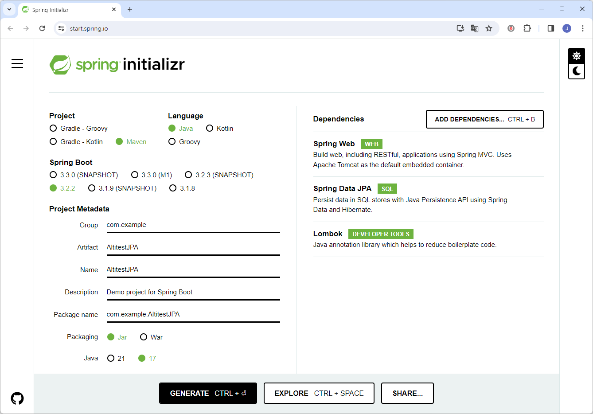

# Spring Data JPA with Hibernate 6.4 User's Guide for Altibase

<br/>

<br/>


# 목차

- [개요](#개요)
- [스프링 부트를 이용한 Altibase 연동](#스프링-부트를-이용한-Altibase-연동)
- [예제](#예제)

<br/>

# 개요

Hibernate 6.4가 포함된 Spring Data JPA와 Altibase 서버를 스프링 부트(Spring Boot)를 이용하여 연동하는 방법을 설명한다. 

이 문서는 아래 버전을 기준으로 작성되었다.

- Spring Boot 3.2.2
- Spring Data JPA 3.2.2
- Java 17
- Altibase 서버 7.1.0.9.3 이상
- Altibase JDBC 드라이버 7.1.0.9.0 이상 

<br/>

# 스프링 부트를 이용한 Altibase 연동

Hibernate 6.4 부터 AltibaseDialect가 hibernate-community-dialect에 포함되기 때문에, 스프링부트 3.2.2 이상을 이용하면 pom.xml에 의존성을 추가하는 것만으로 Altibase 서버와 연동할 수 있다.

## 1. Spring initializr를 통한 스프링 부트 프로젝트 생성

https://start.spring.io/ 에 접속한 다음, 아래와 같이 입력 후 Generate를 선택하여 프로젝트를 생성한다. Dependencies 에서 "ADD DEPENDENCIES..."를 클릭하여 "Spring Web", "Spring Data JPA" 를 추가한다. 예제 코드의 작성 편의를 위해 "Lombok"도 추가한다.



## 2. pom.xml에 의존성 추가

### AltibaseDialect 의존성 추가

Hibernate 6.4 부터 AltibaseDialect가 hibernate-community-dialect에 포함되기 때문에, 버전 6.4 이상의 "hibernate-community-dialect" 의존성을 추가한다. (Hibernate 6.4 이전에는 직접 Altibase Dialect를 컴파일하여 추가하는 작업이 필요하였으나, 이제는 필요없다.)

```xml
<dependency>
    <groupId>org.hibernate.orm</groupId>
    <artifactId>hibernate-community-dialects</artifactId>
    <version>6.4.1.Final</version>
</dependency>
```

### Altibase JDBC 드라이버 의존성 추가

Altibase 7.1.0.9.0 및 Altibase 7.3.0.0.2부터  [Maven Central Repository](https://mvnrepository.com/artifact/com.altibase/altibase-jdbc)에서 Altibase JDBC 드라이버를 다운로드할 수 있어서, 아래와 같이 의존성을 추가하면 된다.

* Altibase 7.3 의 의존성 추가 예시

  ```xml
  <dependency>
      <groupId>com.altibase</groupId>
      <artifactId>altibase-jdbc</artifactId>
      <version>7.3.0.0.2</version>
  </dependency>
  ```

* Altibase 7.1의 의존성 추가 예시

  ```xml
  <dependency>
      <groupId>com.altibase</groupId>
      <artifactId>altibase-jdbc</artifactId>
      <version>7.1.0.9.2</version>
  </dependency>
  ```

## 3. application.properties 설정

### Altibase JDBC 드라이버 설정

```java
# Database
spring.datasource.driver-class-name=Altibase.jdbc.driver.AltibaseDriver
spring.datasource.url=jdbc:Altibase://localhost:20300/mydb
spring.datasource.username=sys
spring.datasource.password=manager

# JPA
spring.jpa.properties.hibernate.jdbc.lob.non_contextual_creation=true
```

> [!NOTE]
>
> **Connection.createNClob SQLFeatureNotSupportedException** 
>
> Hibernate가 구동될 때 Connection.createNClob()을 호출하여 NClob 타입을 지원하는지 확인하는 과정에서 java.sql.SQLFeatureNotSupportedException 에러가 발생할 수 있다. Altibase 는 NClob 타입을 지원하지 않기 때문에 발생하며, 이 에러 메시지는 무시해도 된다. 해당 에러메시지를 제거하려면 application.properties에 다음의 설정을 추가하면 된다.
>
> ```
> spring.jpa.properties.hibernate.jdbc.lob.non_contextual_creation=true
> ```

#### Altibase JDBC 드라이버 연결 속성

Altibase 7.1 JDBC 드라이버를 이용하는 경우, 아래와 같이 연결 속성 설정을 추가해야 한다. Altibase 7.3 JDBC 드라이버는 이 작업을 수행하지 않아도 된다.

```java
jdbc:Altibase://127.0.0.1:20300/mydb?lob_null_select=false
```

> [!CAUTION]
>
> **lob_null_select=false**
>
> Lob 컬럼 값이 null 일때 Hibernate는 JDBC 스펙에 따라 ResultSet.getBlob(), ResultSet.getClob()이
> null을 리턴할 것을 가정하고 기능이 동작한다. 하지만 Altibase 7.1 에서는 lob 컬럼 값이 null 인 경우 Lob 객체가 반환되기 때문에 Hibernate에서 Lob 관련 기능을 사용하려면 JDBC 연결 속성을 반드시 off로 설정해야 한다.
>
> Altibase 7.3 부터 lob_null_select 연결 속성의 기본값이 off이기 때문에, 연결 속성 설정을 추가하지 않아도 된다.

## 4. 애플리케이션 코드 작성 

아래는 스프링 부트 애플리케이션의 예제이다.

```java
package com.example.AltitestJPA;

import org.springframework.boot.SpringApplication;
import org.springframework.boot.autoconfigure.SpringBootApplication;

@SpringBootApplication
public class AltitestJpaApplication {

	public static void main(String[] args) {
		SpringApplication.run(AltitestJpaApplication.class, args);
	}
}
```

## 5. Altibase 서버 연결 확인

maven을 이용하여 애플리케이션을 빌드하고 수행하면, 콘솔에 아래와 같이 "Added connection Altibase.jdbc.driver.AltibaseConnection" 를 확인하여  Altibase 서버와 연결되었음을 알 수 있다.

```java
... 
2024-02-23T16:33:03.171+09:00  INFO 48644 --- [           main] o.hibernate.jpa.internal.util.LogHelper  : HHH000204: Processing PersistenceUnitInfo [name: default]
2024-02-23T16:33:03.252+09:00  INFO 48644 --- [           main] org.hibernate.Version                    : HHH000412: Hibernate ORM core version 6.4.1.Final
2024-02-23T16:33:03.294+09:00  INFO 48644 --- [           main] o.h.c.internal.RegionFactoryInitiator    : HHH000026: Second-level cache disabled
2024-02-23T16:33:03.582+09:00  INFO 48644 --- [           main] o.s.o.j.p.SpringPersistenceUnitInfo      : No LoadTimeWeaver setup: ignoring JPA class transformer
2024-02-23T16:33:03.614+09:00  INFO 48644 --- [           main] com.zaxxer.hikari.HikariDataSource       : HikariPool-1 - Starting...
2024-02-23T16:33:03.706+09:00  INFO 48644 --- [           main] com.zaxxer.hikari.pool.HikariPool        : HikariPool-1 - Added connection Altibase.jdbc.driver.AltibaseConnection@2a99ca99
2024-02-23T16:33:03.708+09:00  INFO 48644 --- [           main] com.zaxxer.hikari.HikariDataSource       : HikariPool-1 - Start completed.
... 이하 생략
```

만약 Altibase 서버에 접속이 실패할 경우, 아래의 로그를 확인할 수 있다.

```java
...
2024-02-23T16:37:14.839+09:00  INFO 73180 --- [           main] com.zaxxer.hikari.HikariDataSource       : HikariPool-1 - Starting...
2024-02-23T16:37:17.966+09:00 ERROR 73180 --- [           main] com.zaxxer.hikari.pool.HikariPool        : HikariPool-1 - Exception during pool initialization.

java.sql.SQLException: Communication link failure: Connection refused: no further information
	at Altibase.jdbc.driver.ex.Error.throwCommunicationErrorException(Error.java:278) ~[altibase-jdbc-7.3.0.0.2.jar:na]
	at Altibase.jdbc.driver.cm.CmTcpSocket.open(CmTcpSocket.java:53) ~[altibase-jdbc-7.3.0.0.2.jar:na]
	at Altibase.jdbc.driver.cm.CmChannel.open(CmChannel.java:535) ~[altibase-jdbc-7.3.0.0.2.jar:na]
	at Altibase.jdbc.driver.cm.CmChannel.open(CmChannel.java:456) ~[altibase-jdbc-7.3.0.0.2.jar:na]
	at Altibase.jdbc.driver.AltibaseConnection.<init>(AltibaseConnection.java:132) ~[altibase-jdbc-7.3.0.0.2.jar:na]
	at Altibase.jdbc.driver.AltibaseDriver.createConnection(AltibaseDriver.java:70) ~[altibase-jdbc-7.3.0.0.2.jar:na]
	at Altibase.jdbc.driver.AltibaseDriver.connect(AltibaseDriver.java:65) ~[altibase-jdbc-7.3.0.0.2.jar:na]
	at com.zaxxer.hikari.util.DriverDataSource.getConnection(DriverDataSource.java:138) ~[HikariCP-5.0.1.jar:na]
	at com.zaxxer.hikari.pool.PoolBase.newConnection(PoolBase.java:359) ~[HikariCP-5.0.1.jar:na]
	at com.zaxxer.hikari.pool.PoolBase.newPoolEntry(PoolBase.java:201) ~[HikariCP-5.0.1.jar:na]
	at com.zaxxer.hikari.pool.HikariPool.createPoolEntry(HikariPool.java:470) ~[HikariCP-5.0.1.jar:na]
	at com.zaxxer.hikari.pool.HikariPool.checkFailFast(HikariPool.java:561) ~[HikariCP-5.0.1.jar:na]
	at com.zaxxer.hikari.pool.HikariPool.<init>(HikariPool.java:100) ~[HikariCP-5.0.1.jar:na]
	at com.zaxxer.hikari.HikariDataSource.getConnection(HikariDataSource.java:112) ~[HikariCP-5.0.1.jar:na]
... 이하 생략
```


# 예제

간단한 예제로 com.example.AltitestJPA 패키지 아래에 테스트용 Book.java 엔티티 클래스를 생성한 다음, 애플리케이션을 구동하여 테이블이 자동으로 생성되는지 확인해본다.

### Entity 클래스 생성

```java
//Book.java
package com.example.AltitestJPA;

import jakarta.persistence.Entity;
import jakarta.persistence.GeneratedValue;
import jakarta.persistence.GenerationType;
import jakarta.persistence.Id;
import lombok.Getter;
import lombok.NoArgsConstructor;
import lombok.Setter;

@Entity
@Getter @Setter @NoArgsConstructor
public class Book {
    @Id
    @GeneratedValue(strategy = GenerationType.SEQUENCE)
    private Integer id;
    private String title;
    private String author;

}
```

### application.properties 설정

JPA 예제 테스트를 위해 아래와 같이 설정한다.

```java
# Altibase DB
spring.datasource.driver-class-name=Altibase.jdbc.driver.AltibaseDriver
spring.datasource.url=jdbc:Altibase://localhost:20300/mydb  
spring.datasource.username=sys
spring.datasource.password=manager


# JPA/Hibernate
spring.jpa.properties.hibernate.jdbc.lob.non_contextual_creation=true
spring.jpa.hibernate.ddl-auto=create                            
spring.jpa.show-sql=true
```

### 테이블 생성 확인

* 콘솔

콘솔에서 아래와 같이 테이블 생성 쿼리가 수행된 것을 확인할 수 있다.

```java
...
Hibernate: drop table book cascade constraints
Hibernate: drop sequence book_seq
Hibernate: create sequence book_seq start with 1 increment by 50
Hibernate: create table book (id integer not null, author varchar(255), title varchar(255), primary key (id))
...이하 생략
```

* iSQL에서 확인

iSQL로 Altibase 서버에 접속하여 테이블의 생성 여부를 확인한다.

```sql
iSQL> desc book;
[ TABLESPACE : SYS_TBS_MEM_DATA ]
[ ATTRIBUTE ]
------------------------------------------------------------------------------
NAME                                     TYPE                        IS NULL
------------------------------------------------------------------------------
ID                                       INTEGER         FIXED       NOT NULL
AUTHOR                                   VARCHAR(255)    VARIABLE
TITLE                                    VARCHAR(255)    VARIABLE
[ INDEX ]
------------------------------------------------------------------------------
NAME                                     TYPE     IS UNIQUE     COLUMN
------------------------------------------------------------------------------
__SYS_IDX_ID_143                         BTREE    UNIQUE        ID ASC
[ PRIMARY KEY ]
------------------------------------------------------------------------------
ID
```

