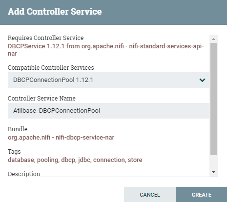

# NiFi User's Guide for Altibase

- [Introduction](#introduction)
- [Installing NiFi](#installing-nifi)
- [Starting and Stopping NiFi](#starting-and-stopping-nifi)
- [How to Use Altibase in NiFi](#how-to-use-altibase-in-nifi)


## Introduction

- This guide provides information on how to use Altibase in Apache NiFi (hereinafter NiFi ).

### What is NiFi?

- NiFi is a software project from the Apache Software Foundation designed to automate the flow of data between software systems. For more information, please refer to the [NiFi website](https://nifi.apache.org/).

### NiFi Components

Below are the components of NiFi required to deliver the instructions in this document. Further details about other NiFi components can be found on the NiFi website.

- FlowFile
  - It represents a single piece of data in NiFi and it is consisted of two components: FlowFile Attributes and FlowFile Content.
  - It is more of an object that exists in memory rather than a physical file stored on disk.
- Processor
  - It is the basic blocks of controlling a Data Flow. It routes, transforms, or extracts information from FlowFiles.
  - NiFi has numerous processors with default installation and each processor has different functionality. The user can choose an appropriate processor according to their needs.
- Connection
  - It provides the linkage between processors.
- Controller Service
  - It is shared resources that provide information processor needs according to the occasion.
  - For example, DB connection is used by multiple processors via controller service.

## Installing NiFi

### Precautions for Installing NiFi

- To process CLOB data type, NiFi version 1.12.1 or lower should be installed.
- BLOB data type cannot be processed.
- If the LOB data type is not to be processed, any version of NiFi can be installed.

### Software Requirements

- NiFi
  - Please refer to [Apache NiFi system requirements](https://nifi.apache.org/docs/nifi-docs/html/administration-guide.html#system_requirements).
- Altibase
  - JDBC driver for Altibase 7.1.0.5.6 or higher which partially supports JDBC API Specification 4.2
  - JDBC driver for Altibase 7.1.0.6.7 or higher is required to use CLOB data type

### Installation

1. Download [NiFi installation file](https://nifi.apache.org/download.html).

2. Simply uncompress the file in the desired directory to install NiFi.

3. Modify the following properties in $NIFI_HOME/conf/nifi.properties to allow Web UI to access. (Same port number cannot be used twice)

   ```
   nifi.web.http.host=
   nifi.web.http.port=8000
   ```

## Starting and Stopping NiFi 

### Linux

#### Starting

```
$ nifi.sh start
Java home: /usr/lib/jvm/java-8-openjdk-amd64
NiFi home: /home/altibase/NiFi/nifi-1.12.1
Bootstrap Config File: /home/altibase/NiFi/nifi-1.12.1/conf/bootstrap.conf
```

How to check the status to see if it is running: If the message below can be found in the $NIFI_HOME/logs/nifi-app.log file, NiFi is running and the browser can be accessed via the URL shown.

```
2021-12-15 17:49:17,732 INFO [main] org.apache.nifi.web.server.JettyServer NiFi has started. The UI is available at the following URLs:
2021-12-15 17:49:17,732 INFO [main] org.apache.nifi.web.server.JettyServer http://192.168.204.129:8000/nifi
2021-12-15 17:49:17,732 INFO [main] org.apache.nifi.web.server.JettyServer http://172.17.0.1:8000/nifi
2021-12-15 17:49:17,732 INFO [main] org.apache.nifi.web.server.JettyServer http://127.0.0.1:8000/nifi
```

#### Checking the Status

```
$ nifi.sh status
Java home: /usr/lib/jvm/java-8-openjdk-amd64
NiFi home: /home/altibase/NiFi/nifi-1.12.1
Bootstrap Config File: /home/altibase/NiFi/nifi-1.12.1/conf/bootstrap.conf
2021-12-15 17:50:29,587 INFO \[main\] org.apache.nifi.bootstrap.Command Apache NiFi is currently running, listening to Bootstrap on port 43345, PID=6517
```

#### Stopping

```
$ nifi.sh stop
Java home: /usr/lib/jvm/java-8-openjdk-amd64
NiFi home: /home/altibase/NiFi/nifi-1.12.1
Bootstrap Config File: /home/altibase/NiFi/nifi-1.12.1/conf/bootstrap.conf
2021-12-15 17:51:20,147 INFO \[main\] org.apache.nifi.bootstrap.Command Apache NiFi has accepted the Shutdown Command and is shutting down now
2021-12-15 17:51:20,277 INFO \[main\] org.apache.nifi.bootstrap.Command Waiting for Apache NiFi to finish shutting down...
2021-12-15 17:51:22,291 INFO \[main\] org.apache.nifi.bootstrap.Command NiFi has finished shutting down.
```

### Windows

#### Starting

- The following message is printed when run-nifi.bat is executed, but the actual running status can be found at $NIFI_HOME/logs/nifi-app.log.

  ```
  > 2021-12-08 13:28:57,145 INFO \[main\] org.apache.nifi.bootstrap.Command Launched Apache NiFi with Process ID 2840
  ```

#### Stopping

- To stop NiFi, press Ctrl+C.

### Accessing Web UI

- The URL above can be accessed via a web browser.

## How to Use Altibase in NiFi

1. Copy Altibase JDBC driver in $NIFI_HOME/lib directory.

   - Altibase 7.1

     Use $ALTIBASE_HOME/lib/Altibase42.jar. (From Altibase 7.1.0.5.6, JDBC driver that partially supports JDBC API Specification 4.2 is provided additionally)

   - Altibase 7.2

     Use $ALTIBASE_HOME/lib/Altibase.jar.

2. Restart NiFi to apply the JDBC driver.

3. Create Altibase connection pool via NiFi's controller service. Controller service can be registered using the processor's properties which are applicable. The registered contoller service can be used by other processors when chosen.

   Below is an example registering Altibase's controller service by registering one of GenerateTableFetch Processor's properties, Database Connection Pooling Service.

   3.1 Click 'Create new service...'

   

   3.2 Specify 'Controller Service Name' and click 'CREATE'.

   

   3.3 Click the arrow created on the third column after creating it.

   3.4 Click the gear icon to specify the properties of the controller service.

   3.5 Click 'PROPERTIES' tab, insert the following values and click 'APPLY' to connect to Altibase DB.

   - Database Connection URL: jdbc:Altibase://***host_ip:port_no/database_name***

     - To process CLOB larger than 32KB, set the force_clob_bind=true option.

       jdbc:Altibase://*host_ip:port_no/database_name*?**force_clob_bind=true**

   - Database Driver Class Name: Altibase.jdbc.driver.AltibaseDriver

   - Database Driver Location: The directory Altibase JDBC driver exists.

   - Database User: User account

   - Password: User password

     

     3.6 By clicking 'APPLY', it returns to the controller service list. Click the thunder icon to enable controller service.