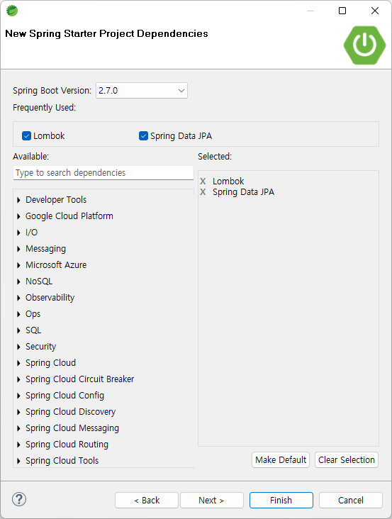

# Spring Data JPA User's Guide for Altibase


# Table of Contents

- [Create Spring Data JPA Project with Spring Boot](#create-spring-data-jpa-project-with-spring-boot)

- [Add Altibase Dialect Class File](#add-altibase-dialect-class-file)

- [Altibase JDBC Driver Setting](#altibase-jdbc-driver-setting)

- [Create Sample Code](#create-sample-code)

- [Check the Connection with Altibase Server](#check-the-connection-with-altibase-server)

  

# Introduction

This guide demonstrates how to connect to Altibase Server using Spring Data JPA with Spring Boot project on STS(Spring Tool Suite).

#### JPA and Spring Data JPA

JPA(Java Persistence API) is a J2EE specification for ORM(Object-Reliational Mapping), an interface defining how to use the relational database in java application. Several implementations of JPA are available such as Hibernate, EclipseLink and DataNucleus. Spring Data JPA is a module provided by Spring which abstracts JPA implementations therefore makes it easier to use JPA.

This guide is written based on the versions below.

- Spring Tool Suite 4.14.1
- Spring Boot 2.7.0
- Java 17
- Altibase Server and JDBC Driver Version 7.1.0.7.5 

# Create Spring Data JPA Project with Spring Boot

#### 1. Create Spring Boot Project

Click File -> New -> Spring Starter Project and fill in the project information such as name, group and package. Then, click Next.


#### 2. Add Spring Starter Project Dependencies

Spring Starter Project Dependencies is a set of essential libraries required to use certain features in Spring Boot. Select Spring Data JPA and add Lombok to write the sample code easier.



#### 3. Click Finish

When Finish button is clicked, Progress is enabled and relevant libraries are downloaded. After creating the project, the user can see the dependency libraries are added in build information file. The image below shows an example of Maven type's project, pom.xml.


# Add Altibase Dialect Class File

Spring uses Hibernate as the default JPA vendor. However, since Hibernate does not provide Dialect class for Altibase, the user has to manually compile and add to hibernate-core library.

#### 1. Download Altibase Dialect Java Source

Download the appropriate [Altibase Dialect Java Source](https://github.com/ALTIBASE/hibernate-orm/blob/master/ALTIBASE_DIALECT_PORTING.md#altibasedialectjava-compile) according to the Hibernate version.

```bash
./AltibaseDialect.java
./AltibaseLimitHandler.java
./SequenceInformationExtractorAltibaseDatabaseImpl.java
```

#### 2. Check hibernate-core Library File Path

- Maven project: Locates in *$HOME*/.m2/repository

  ```bash
  $ $HOME/.m2/repository/org/hibernate/hibernate-core/x.x.x.Final/hibernate-core-x.x.x.Final.jar
  ```

- Gradle project: Locates in *$HOME*/.gradle/caches/modules-2/files-2.1

  ```bash
  $ $HOME/.gradle/caches/modules-2/files-2.1/org.hibernate/x.x.x-Final/hash_value_of_the_library_file/hibernate-core-x.x.x.Final.jar
  ```

#### 3. Decompress hibernate-core-x.x.x.Final.jar File

Decompress hibernate-core-x.x.x.Final.jar file in the directory where Altibase Dialect Java Source is located.

```bash
jar xvf hibernate-core-x.x.x.Final.jar
```

#### 4. Compile Altibase Dialect Files

Compile Altibase Dialect files in the following order.

```bash
javac -d . -cp . SequenceInformationExtractorAltibaseDatabaseImpl.java
javac -d . -cp . AltibaseLimitHandler.java
javac -d . -cp . AltibaseDialect.java
```

#### 5. Check if the Class File is created

When successfully compiled, the class files as follows are created under the current directory.

```bash
./org/hibernate/tool/schema/extract/internal/SequenceInformationExtractorAltibaseDatabaseImpl.class
./org/hibernate/dialect/pagination/AltibaseLimitHandler.class
./org/hibernate/dialect/AltibaseDialect.class
```

#### 6. Delete Altibase Dialet Java Source(*.java)

Delete or move *.java files to another directory so Altibase Dialet Java source is not included in the jar file.

#### 7. Create hibernate-core-x.x.x.Final.jar File

Recreate hibernate-core-x.x.x.Final.jar file.

```bash
jar -cvfm hibernate-core-x.x.x.Final.jar META-INF/MANIFEST.MF .
```

#### 8. Copy and Paste hibernate-core-x.x.x.Final.jar File

Copy and paste the created JAR file to the library path from instruction # 2.

# Altibase JDBC Driver Setting

#### Prepare Altibase JDBC Driver

Download the Altibase JDBC driver to the path of user's choice. Altibase JDBC driver is Altibase.jar and this file exists in the lib directory where Altibase server is installed.

#### Add Altibase JDBC Driver File

Click Project -> Properties -> Java Build Path -> Libraries -> Add External JARs and add Altibase JDBC driver file.


# Create Sample Code

Create sample code to check the connection with Altibase Server.

#### Configure application.properties

Add Altibase server connection information to the src/main/resources/application.properties file.


```
# Altibase DB
# Altibase JDBC Driver Class Name : Altibase.jdbc.driver.AltibaseDriver
# Altibase Server URL : jdbc:Altibase://db_ip:db_port/db_name
spring.datasource.driver-class-name=Altibase.jdbc.driver.AltibaseDriver
spring.datasource.url=jdbc:Altibase://172.16.135.35:20300/mydb  
spring.datasource.username=sys
spring.datasource.password=manager

# to avoid isValid() error in Hikari CP
spring.datasource.hikari.connection-test-query=select 1 from dual

#JPA/Hibernate
spring.jpa.database-platform=org.hibernate.dialect.AltibaseDialect
spring.jpa.hibernate.ddl-auto=create                            
spring.jpa.show-sql=true
```

#### Create Package to write Sample Code

Click New -> Package and create entity package.


#### Create Class

Click New -> Class in the entity package created earlier and create a class named Account.


#### Write Sample Code

Write the following code in the Account class.


```java
package com.study.springboot.entity;

import javax.persistence.Column;
import javax.persistence.Entity;
import javax.persistence.Id;

import lombok.AccessLevel;
import lombok.AllArgsConstructor;
import lombok.Builder;
import lombok.Getter;
import lombok.NoArgsConstructor;
import lombok.Setter;

@Entity
@Getter @Setter
@NoArgsConstructor(access = AccessLevel.PROTECTED)
@AllArgsConstructor
@Builder
public class Account {
   @Id 
    private Long id;
   
    @Column(unique=true)
    private String username;
    
    @Column
    private String password;
}
```

# Check the Connection with Altibase Server

#### Click Start

Select the project in the Boot Dashboard and click (Re)Start.


#### Check the Result

Check the result in the console.


#### Check if the Table is created

Connect to Altibase server with iSQL and check if the table is created.

```
iSQL> desc account;
[ TABLESPACE : SYS_TBS_MEM_DATA ]

[ ATTRIBUTE ]
------------------------------------------------------------------------------

NAME                                     TYPE                        IS NULL
------------------------------------------------------------------------------

ID                                       BIGINT          FIXED       NOT NULL
PASSWORD                                 VARCHAR(255)    VARIABLE
USERNAME                                 VARCHAR(255)    VARIABLE

[ INDEX ]
------------------------------------------------------------------------------

NAME                                     TYPE     IS UNIQUE     COLUMN
------------------------------------------------------------------------------

UK_GEX1LMAQPG0IR5G1F5EFTYAA1             BTREE    UNIQUE        USERNAME ASC
__SYS_IDX_ID_173                         BTREE    UNIQUE        ID ASC

[ PRIMARY KEY ]
------------------------------------------------------------------------------

ID
```

