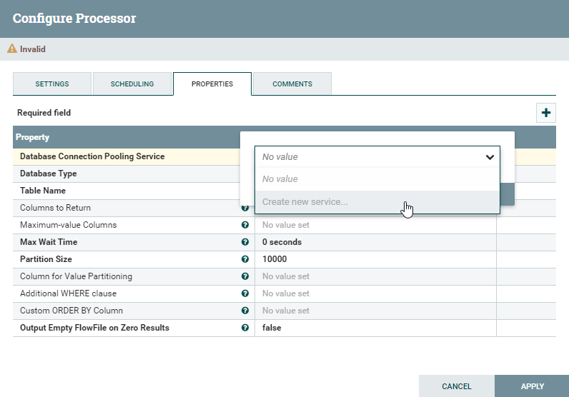

# NiFi User's Guide for Altibase

-   [개요](#개요)
-   [NiFi 설치](#NiFi-설치)
-   [NiFi 구동 및 종료](#NiFi-구동-및-종료)
-   [NiFi에서 Altibase 사용을 위한 설정](#NiFi에서-Altibase-사용을-위한-설정)


## 개요

-   Apache NiFi (이하 NiFi) 에서 Altibase 사용을 위한 설정 방법을 설명한다.


### NiFi 란?

- NiFi는 시스템 간 데이터 플로우 자동화를 위해 만들어진 아파치 재단 소프트웨어 프로젝트이다. 자세한 내용은 NiFi 홈페이지를 참고한다. (<https://nifi.apache.org/>)

  

### NiFi 구성요소 

아래 구성요소는 본 문서 내용 전달을 위해 필요한 부분으로, 기타 NiFi의 상세 구성 요소들은 NiFi 홈페이지를 참고한다. 

-   FlowFile
    -   NiFi에서 처리되는 기본 단위이며 Attributes + Content 로 구성되어 있다.
    -   디스크에 저장되는 물리 파일이라기 보다는 메모리상 존재하는 객체에 가까운 의미이다.

-   Processor
    -   Data Flow를 제어하는 기본 단위이며 FlowFile을 처리한다.
    -   NiFi 자체에 수 많은 Processor가 내장되어 있어 용도에 맞게 사용한다.

-   Connection
    -   Processor간 연결을 설정한다.

-   Controller Service
    - Processor가 필요에 따라 사용할 수 있도록 정보를 제공하는 공용 리소스이다.
    
    - 예를 들어, DB Connection은 Controller Service 통해 설정하여 여러 Processor에서 사용된다.
    
      
    
    

## NiFi 설치

### NiFi 설치 시 주의사항

-   CLOB 데이터 타입을 처리해야 하는 경우 NiFi 1.12.1 이하 버전으로 설치해야 한다.

-   BLOB 데이터 타입은 처리할 수 없다.

-   LOB 데이터 타입이 없는 경우 NiFi 설치 버전에 제약이 없다.

    

### 소프트웨어 요구사항

- NiFi
  - [Apache NiFi 시스템 요구사항](https://nifi.apache.org/docs/nifi-docs/html/administration-guide.html#system_requirements) 참고
- Altibase
  - JDBC API Specification 4.2을 부분 지원하는 Altibase 7.1.0.5.6 이상 JDBC 드라이버 필요
  - CLOB 데이터 타입을 사용하는 경우는 Altibase 7.1.0.6.7 이상 JDBC 드라이버 필요

### NiFi 설치

1. [NiFi 설치파일 다운로드](https://nifi.apache.org/download.html) 한다.

2. 다운로드 받은 파일을 특정 디렉토리에 압축 해제하면 설치가 완료된다.

3. Web UI 접근을 가능하기 위해 $NIFI_HOME/conf/nifi.properties 에 다음 내용을 수정한다. (port 번호는 중복 사용되지 않도록 수정해야 한다.)
   ```
   nifi.web.http.host=
   nifi.web.http.port=8000
   ```

   


## NiFi 구동 및 종료

### Linux

#### 구동

```
$ nifi.sh start
Java home: /usr/lib/jvm/java-8-openjdk-amd64
NiFi home: /home/altibase/NiFi/nifi-1.12.1
Bootstrap Config File: /home/altibase/NiFi/nifi-1.12.1/conf/bootstrap.conf
```
구동 상태 확인 : $NIFI_HOME/logs/nifi-app.log 파일에 아래 메세지가 보이면 구동된 상태이며, 해당 URL를 통해 브라우저로 접속 가능하다.
```
2021-12-15 17:49:17,732 INFO [main] org.apache.nifi.web.server.JettyServer NiFi has started. The UI is available at the following URLs:
2021-12-15 17:49:17,732 INFO [main] org.apache.nifi.web.server.JettyServer http://192.168.204.129:8000/nifi
2021-12-15 17:49:17,732 INFO [main] org.apache.nifi.web.server.JettyServer http://172.17.0.1:8000/nifi
2021-12-15 17:49:17,732 INFO [main] org.apache.nifi.web.server.JettyServer http://127.0.0.1:8000/nifi
```

#### 상태 확인

```
$ nifi.sh status
Java home: /usr/lib/jvm/java-8-openjdk-amd64
NiFi home: /home/altibase/NiFi/nifi-1.12.1
Bootstrap Config File: /home/altibase/NiFi/nifi-1.12.1/conf/bootstrap.conf
2021-12-15 17:50:29,587 INFO \[main\] org.apache.nifi.bootstrap.Command Apache NiFi is currently running, listening to Bootstrap on port 43345, PID=6517
```

#### 중지

```
$ nifi.sh stop
Java home: /usr/lib/jvm/java-8-openjdk-amd64
NiFi home: /home/altibase/NiFi/nifi-1.12.1
Bootstrap Config File: /home/altibase/NiFi/nifi-1.12.1/conf/bootstrap.conf
2021-12-15 17:51:20,147 INFO \[main\] org.apache.nifi.bootstrap.Command Apache NiFi has accepted the Shutdown Command and is shutting down now
2021-12-15 17:51:20,277 INFO \[main\] org.apache.nifi.bootstrap.Command Waiting for Apache NiFi to finish shutting down...
2021-12-15 17:51:22,291 INFO \[main\] org.apache.nifi.bootstrap.Command NiFi has finished shutting down.
```

### Windows

#### 구동

-   run-nifi.bat 수행하면 다음과 같은 메세지를 출력하며 최종 구동 여부는 $NIFI_HOME/logs/nifi-app.log 로 확인한다.
    ```
    > 2021-12-08 13:28:57,145 INFO \[main\] org.apache.nifi.bootstrap.Command Launched Apache NiFi with Process ID 2840
    ```

#### 중지

-   종료는 Console 창에서 Ctrl+C 를 누른다.

### Web UI 접속

- 웹브라우저를 통해 위 '구동 상태 확인' 내용에 있는 URL 로 접속할 수 있다.

  

  


## NiFi에서 Altibase 사용을 위한 설정

1. Altibase JDBC 드라이버를 $NIFI_HOME/lib에 복사한다.

   - Altibase 7.1

     $ALTIBASE_HOME/lib/Altibase42.jar를 사용한다. (※ Altibase 7.1.0.5.6 버전부터 JDBC API Specification 4.2을 부분 지원하는 JDBC 드라이버를 추가로 제공한다)

   - Altibase 7.2

     $ALTIBASE_HOME/lib/Altibase.jar를 사용한다.

2. 적용을 위해 NiFi를 재구동 한다.

3. NiFi의  Controller Service를 통해 Altibase 커넥션 풀(Connection Pool) 생성한다.
   Controller Service는, Controller Service를 등록할 수 있는 Processor의 속성을 통해 등록하며 등록한 Controller Service는 다른 Processor에서도 선택하여 사용 가능하다.
   다음은 GenerateTableFetch Processor의 Property중 Database Connection Pooling Service 등록을 통해 Altibase의 Controller Serivce 를 등록하는 예이다. 

   3.1 Create new service... 를 클릭한다.

   

   

   3.2 Controller Service Name을 입력 후 CREATE 버튼을 클릭한다.

   

   

   3.3 Create이후 세 번째 컬럼에 생성된 화살표를 클릭한다.

   3.4 Controller Service의 속성을 설정하기 위해 톱니바퀴 아이콘을 클릭한다.
   
   3.5 Altibase DB 접속을 위해 PROPERTIES 탭 선택 후 아래의 정보를 입력 후 APPLY 버튼을 클릭한다.
   
   - Database Connection URL : jdbc:Altibase://***host_ip:port_no/database_name***
     -  32k 보다 큰 CLOB을 처리하기 위해서는 아래와 같이 force_clob_bind=true 옵션을 적용한다.
     jdbc:Altibase://*host_ip:port_no/database_name*?**force_clob_bind=true**
     
   - Database Driver Class Name : Altibase.jdbc.driver.AltibaseDriver

   - Database Driver Location : Altibase JDBC 드라이버가 위치하는 디렉토리

   - Databsse User : 사용자 계정

   - Password : 사용자 패스워드

     
     
     
   
   3-6. APPLY 버튼 클릭 후 돌아온 Controller Service 목록 화면에서 번개 아이콘을 클릭하여 Controller Serivce를 Enable 시킨다. 
   
   
