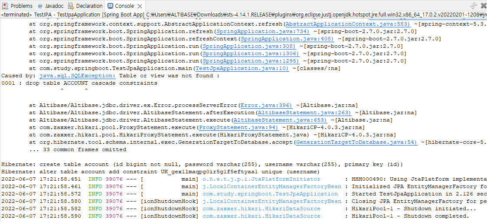

# Spring Data JPA User's Guide for Altibase

<br/>

<br/>


# 목차

- [개요](#개요)
- [스프링 부트를 이용한 Spring Data JPA 프로젝트 생성](#%EC%8A%A4%ED%94%84%EB%A7%81-%EB%B6%80%ED%8A%B8%EB%A5%BC-%EC%9D%B4%EC%9A%A9%ED%95%9C-spring-data-jpa-%ED%94%84%EB%A1%9C%EC%A0%9D%ED%8A%B8-%EC%83%9D%EC%84%B1)
- [Altibase Dialect 클래스 파일 추가](#altibase-dialect-%ED%81%B4%EB%9E%98%EC%8A%A4-%ED%8C%8C%EC%9D%BC-%EC%B6%94%EA%B0%80)
- [Altibase JDBC 드라이버 설정](#altibase-jdbc-%EB%93%9C%EB%9D%BC%EC%9D%B4%EB%B2%84-%EC%84%A4%EC%A0%95)
- [샘플 코드 생성](#%EC%83%98%ED%94%8C-%EC%BD%94%EB%93%9C-%EC%83%9D%EC%84%B1)
- [Altibase 연동 확인](#altibase-%EC%97%B0%EB%8F%99-%ED%99%95%EC%9D%B8)

<br/>

# 개요

STS(Spring Tool Suite) 에서 스프링 부트(Spring Boot) 프로젝트로 Spring Data JPA 기능을 사용하여 Altibase 서버와 연동하는 방법을 설명한다.

#### JPA 와 Spring Data JPA

JPA(Java Persistence API)는 ORM(Object-Reliational Mapping)을 위한 J2EE 스펙으로, 자바 어플리케이션에서 관계형 데이터베이스를 사용하는 방식을 정의한 인터페이스이다. JPA라는 명세서의 구현체로 하이버네이트(Hibernate), 이클립스링크(EclipseLink), DataNucleus 등이 있다. Spring Data JPA는 Spring에서 제공하는 모듈로, JPA 구현체들을 추상화하여 개발자가 JPA를 더 쉽고 편하게 사용할 수 있게 도와준다.

이 문서는 아래 버전을 기준으로 작성되었다.

- Spring Tool Suite 4.14.1
- Spring Boot 2.7.0
- Java 17
- Altibase 서버 및 JDBC 드라이버 버전 7.1.0.7.5 

<br/>

# 스프링 부트를 이용한 Spring Data JPA 프로젝트 생성

#### 1. 스프링 부트 프로젝트 생성

File 메뉴 -> New -> Spring Starter Project를 선택하고 프로젝트 설정 정보를 정의한다. Name과 Group, Package 등 입력하고 Next 버튼을 클릭한다.


#### 2. Spring Starter Project Dependencies 추가

Spring Starter Project Dependencies는 스프링 부트에서 특정 기능을 사용하는 데 필요한 필수 라이브러리의 묶음이다. 여기서 Spring Data JPA를 선택한다. 샘플 코드 작성 편의를 위해 Lombok도 추가한다.


#### 3. Finish 버튼 클릭

Finish 버튼을 클릭하면 Progress가 활성화되면서 관련 라이브러리를 내려받는다. 프로젝트 생성 후, 빌드 정보 파일에서 의존성 라이브러리가 추가된 것을 확인할 수 있다. 아래 이미지는 Maven 타입의 프로젝트의 pom.xml 예시이다. 


<br/>

# Altibase Dialect 클래스 파일 추가

Spring Data JPA는 기본 JPA 구현 공급자로 하이버네이트를 사용한다. 하이버네이트는 Altibase를 위한 Dialect 클래스를 제공하지 않으므로 사용자가 직접 컴파일하여 hibernate-core 라이브러리에 추가해야 한다.

#### 1. Altibase Dialect Java 소스 다운로드

Hibernate 버전에 해당하는 [Altibase Dialect Java 소스](https://github.com/ALTIBASE/hibernate-orm/blob/master/ALTIBASE_DIALECT_PORTING.md#altibasedialectjava-compile)를 내려받는다.

```bash
./AltibaseDialect.java
./AltibaseLimitHandler.java
./SequenceInformationExtractorAltibaseDatabaseImpl.java
```

#### 2. hibernate-core 라이브러리 파일 위치 확인

hibernate-core 라이브러리 파일 위치를 확인한다.

- 메이븐(maven) 프로젝트 : *$HOME*/.m2/repository 에 위치

  ```bash
  $ $HOME/.m2/repository/org/hibernate/hibernate-core/x.x.x.Final/hibernate-core-x.x.x.Final.jar
  ```

- 그레이들(gradle) 프로젝트 : *$HOME*/.gradle/caches/modules-2/files-2.1 에 위치

  ```bash
  $ $HOME/.gradle/caches/modules-2/files-2.1/org.hibernate/x.x.x-Final/라이브러리_파일_해쉬_값/hibernate-core-x.x.x.Final.jar
  ```

#### 3. hibernate-core-x.x.x.Final.jar 압축 해제

Altibase Dialect Java 소스가 있는 디렉터리에서 hibernate-core-x.x.x.Final.jar 파일 압축을 해제한다.

```bash
jar xvf hibernate-core-x.x.x.Final.jar
```

#### 4. Altibase Dialect 컴파일

Altibase Dialect 파일들을 다음 순서로 컴파일한다.

```bash
javac -d . -cp . SequenceInformationExtractorAltibaseDatabaseImpl.java
javac -d . -cp . AltibaseLimitHandler.java
javac -d . -cp . AltibaseDialect.java
```

#### 5. 클래스 파일 생성 확인

컴파일이 완료되면 현재 디렉터리 아래에 다음과 같이 클래스 파일이 생성된다.

```bash
./org/hibernate/tool/schema/extract/internal/SequenceInformationExtractorAltibaseDatabaseImpl.class
./org/hibernate/dialect/pagination/AltibaseLimitHandler.class
./org/hibernate/dialect/AltibaseDialect.class
```

#### 6. Altibase Dialet Java 소스(*.java) 삭제

Altibase Dialet Java 소스가 jar 파일에 포함되지 않도록 *.java 파일들을 삭제하거나 다른 디렉터리로 이동한다.

#### 7. hibernate-core-x.x.x.Final.jar 파일 생성

hibernate-core-x.x.x.Final.jar 파일을 다시 생성한다.

```bash
jar -cvfm hibernate-core-x.x.x.Final.jar META-INF/MANIFEST.MF .
```

#### 8. hibernate-core-x.x.x.Final.jar 파일 복사

생성한 JAR 파일을 2번에서 확인한 라이브러리 위치에 복사한다.

<br/>

# Altibase JDBC 드라이버 설정

#### Altibase JDBC 드라이버 준비

사용자가 지정한 경로에 Altibase JDBC 드라이버를 내려받는다. Altibase JDBC 드라이버는 Altibase.jar이고 이 파일은 Altibase 서버가 설치된 경로 아래 lib 디렉터리에 존재한다. 

#### Altibase JDBC 드라이버 파일 추가

Project -> Properties -> Java Build Path -> Libraries -> Add External JARs 를 클릭하여 Altibase JDBC 드라이버 파일을 추가한다.


<br/>

# 예제 코드 생성

예제 코드를 작성하여 Altibase와의 연동 여부를 확인한다.

#### application.properties 설정

src/main/resources/application.properties 파일에 Altibase 서버 접속 정보를 추가한다.


```
# Altibase DB
# Altibase JDBC Driver Class Name : Altibase.jdbc.driver.AltibaseDriver
# Altibase Server URL : jdbc:Altibase://db_ip:db_port/db_name
spring.datasource.driver-class-name=Altibase.jdbc.driver.AltibaseDriver
spring.datasource.url=jdbc:Altibase://172.16.135.35:20300/mydb  
spring.datasource.username=sys
spring.datasource.password=manager

# to avoid isValid() error in Hikari CP
spring.datasource.hikari.connection-test-query=select 1 from dual

#JPA/Hibernate
spring.jpa.database-platform=org.hibernate.dialect.AltibaseDialect
spring.jpa.hibernate.ddl-auto=create                            
spring.jpa.show-sql=true
```

#### 예제 코드 작성을 위한 패키지 생성

New -> Package를 클릭하여 entity 패키지를 생성한다.


#### 클래스 생성

위에서 생성한 entity 패키지에서 New -> Class를 클릭하여 Account 클래스를 생성한다. 


#### 예제 코드 작성

아래와 같이 Account 클래스를 작성한다.


```java
package com.study.springboot.entity;

import javax.persistence.Column;
import javax.persistence.Entity;
import javax.persistence.Id;

import lombok.AccessLevel;
import lombok.AllArgsConstructor;
import lombok.Builder;
import lombok.Getter;
import lombok.NoArgsConstructor;
import lombok.Setter;

@Entity
@Getter @Setter
@NoArgsConstructor(access = AccessLevel.PROTECTED)
@AllArgsConstructor
@Builder
public class Account {
   @Id 
    private Long id;
   
    @Column(unique=true)
    private String username;
    
    @Column
    private String password;
}
```

<br/>

# Altibase 연동 확인

#### Start 버튼 클릭

Boot Dashboard에서 해당하는 프로젝트를 선택하고 (Re)Start 버튼을 클릭한다.


#### 프로젝트 수행 결과 확인

Console 창에서 프로젝트 수행 결과를 확인한다.  




#### 테이블 생성 확인

iSQL로 Altibase 서버에 접속하여 테이블의 생성 여부를 확인한다.

```
iSQL> desc account;
[ TABLESPACE : SYS_TBS_MEM_DATA ]
[ ATTRIBUTE ]
------------------------------------------------------------------------------
NAME                                     TYPE                        IS NULL
------------------------------------------------------------------------------
ID                                       BIGINT          FIXED       NOT NULL
PASSWORD                                 VARCHAR(255)    VARIABLE
USERNAME                                 VARCHAR(255)    VARIABLE
[ INDEX ]
------------------------------------------------------------------------------
NAME                                     TYPE     IS UNIQUE     COLUMN
------------------------------------------------------------------------------
UK_GEX1LMAQPG0IR5G1F5EFTYAA1             BTREE    UNIQUE        USERNAME ASC
__SYS_IDX_ID_173                         BTREE    UNIQUE        ID ASC
[ PRIMARY KEY ]
------------------------------------------------------------------------------
ID
```
