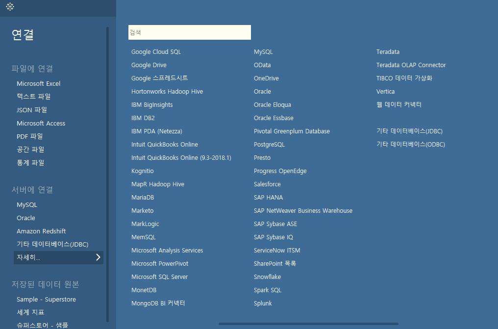
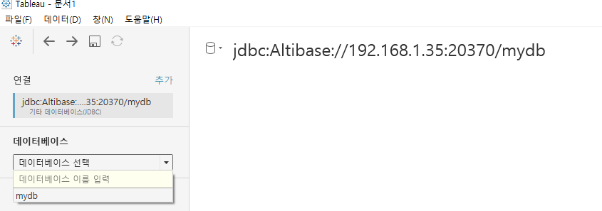

# Tableau User's Guide for Altibase

-   [개요](#Tableau)
-   [소프트웨어 설치 요구사항](#소프트웨어-설치-요구사항)
-   [Tableau에서 Altibase 사용을 위한 설정](#Tableau에서-Altibase-사용을-위한-설정)

## 개요

Tableau Desktop에서 Altibase 사용을 위한 JDBC 설정을 설명한다.

### Tableau 란?

Tableau Desktop 은 비즈니스 인텔리전스(BI)에 중점을 둔 데이터 시각화 툴로  Windows / Mac OS 플랫폼을 지원한다. 기타 Tableau의 자세한 내용은 홈페이지를 참조한다. (https://www.tableau.com/ko-kr)

## 소프트웨어 설치 요구사항

### Tableau

-   JDK 1.8 (64bit) 이상
-   JDBC API Specification 4.0 이상 지원
-   Type-4 JDBC 드라이버 (Pure Java)
-   자세한 내역은 Tableau 홈페이지 [관련 내용](https://help.tableau.com/current/pro/desktop/en-us/examples_otherdatabases_jdbc.htm)을 참조

### Atlibase

- JDBC API Specification 4.2을 부분 지원하는 Altibase 7.1.0.5.6 이상 JDBC 드라이버 필요

## Tableau에서 Altibase 사용을 위한 설정

1. Tableau 설치한다.

2. C:\\Program Files\\Tableau\\Drivers 에 Altibase JDBC 드라이버를 복사한다.

   - Altibase 7.1

     $ALTIBASE_HOME/lib/Altibase42.jar를 사용한다. (※ Altibase 7.1.0.5.6 버전부터 JDBC API Specification 4.2을 부분 지원하는 JDBC 드라이버를 추가로 제공한다.)

   - Altibase 7.2

     $ALTIBASE_HOME/lib/Altibase.jar를 사용한다.

3. Tableau 실행 -> 연결 -> 서버에 연결 -> 자세히... -> 기타 데이터베이스(JDBC) 를 클릭한다.

   

4. 아래 항목을 입력하여 로그인 한다.

   -   URL : jdbc:Altibase://***host_ip:port_no/database_name***

   -   사용자 이름 : 사용자 계정

   -   암호 : 사용자 패스워드

   -   속성 파일 : Altibase JDBC 드라이버를 선택 (아래 이미지는 Altibase 7.1 접속 예이다)

       

5. 로그인 후 아래 화면이 출력 되며, '데이터베이스 선택'에서 대상 데이터베이스를 선택 -> 스키마 선택으로 Tableau를 사용한다.

   

