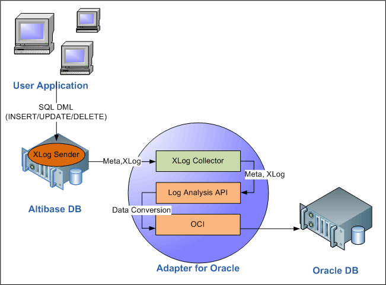
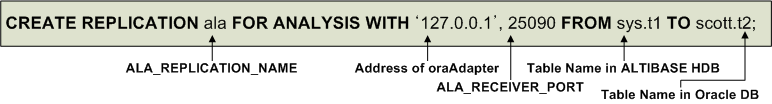

- [Adapter for Oracle User’s Manual](#adapter-for-oracle-users-manual)
  - [Preface](#preface)
  - [1. Introduction](#1-introduction)
    - [Adapter for Oracle](#adapter-for-oracle)
  - [2. Installation and Configuration](#2-installation-and-configuration)
    - [Pre-installation Tasks](#pre-installation-tasks)
    - [Installation](#installation)
    - [Post-installation Tasks](#post-installation-tasks)
    - [Configuration](#configuration)
    - [Properties](#properties)
  - [3. Managing Adapter for Oracle](#3-managing-adapter-for-oracle)
    - [oraAdapter Constraints](#oraadapter-constraints)
    - [Startup and Shutdown](#startup-and-shutdown)
    - [Data Types](#data-types)
    - [Adapter for Oracle Utility](#adapter-for-oracle-utility)
    - [Command-Line Options](#command-line-options)
  - [Appendix A: FAQ](#appendix-a-faq)
    - [FAQ](#faq)
  - [Appendix B: DDL order when using oraAdapter](#appendix-b-ddl-order-when-using-oraadapter)
    - [DDL execution order when using oraAdapter](#ddl-execution-order-when-using-oraadapter)


Altibase® Tool & Utilities

Adapter for Oracle User’s Manual
================================


Altibase Tool & Utilities Adapter for Oracle User’s Manual

Release 7.1

Copyright ⓒ 2001\~2021 Altibase Corp. All Rights Reserved.

This manual contains proprietary information of Altibase Corporation; it is provided under a license agreement containing restrictions on use and disclosure and is also protected by copyright patent and other intellectual property law. Reverse engineering of the software is prohibited. All trademarks, registered or otherwise, are the property of their respective owners.

**Altibase Corp**

10F, Daerung PostTower II, 306, Digital-ro, Guro-gu, Seoul 08378, Korea Telephone: +82-2-2082-1000 Fax: 82-2-2082-1099

Customer Service Portal: http://support.altibase.com/en/

Homepage: [[http://www.altibase.com](http://www.altibase.com/)]


Preface
----

- ### About This Manual

  This manual explains the Adapter for Oracle utility, which applies data that has been changed in Altibase to an Oracle database.

  #### Audience

  This manual has been prepared for the following Altibase users:

  -   Database administrators
  -   Performance administrators
  -   Database users
  -   Application developers
  -   Technical Supporters

  It is recommended for those reading this manual possess the following background knowledge:

  -   Basic knowledge in the use of computers, operating systems, and operating system utilities
  -   Experience in using relational database and an understanding of database concepts
  -   Computer programming experience
  -   Experience in database server management, operating system management, or network administration

#### Organization

This manual is organized as follows:

-   Chapter 1: Introduction  
    This chapter describes the concept of the Adapter for Oracle and how data that has been changed in Altibase is written to an Oracle database.
    
-   Chapter 2: Installation and Configuration  
    This chapter describes how to install and configure the Adapter for Oracle.

-   Chapter 3: Managing Adapter for Oracle  
    This chapter describes how to manage the Adapter for Oracle.
    
-   A. Appendix: FAQ

-   B. Appendix: The order of DDL when using oraAdapter

#### Documentation Conventions

This section describes the conventions used in this manual. Understanding these conventions will make it easier to find information in this manual and in the other manuals in the series. 

There are two sets of conventions:

-   Syntax diagram convetions
-   Sample code conventions

##### Syntax Diagram Conventions

This manual describes command syntax using diagrams composed of the following elements:

| Elements                                                     | Meaning                                                      |
| ------------------------------------------------------------ | ------------------------------------------------------------ |
| [](https://github.com/ALTIBASE/Documents/blob/master/Manuals/Altibase_7.1/eng/media/SQL/image1.gif) | Indicates the start of a command. If a syntactic element starts with an arrow, it is not a complete command. |
| [](https://github.com/ALTIBASE/Documents/blob/master/Manuals/Altibase_7.1/eng/media/SQL/image2.gif) | Indicates that the command continues to the next line. If a syntactic element ends with this symbol, it is not a complete command. |
| [](https://github.com/ALTIBASE/Documents/blob/master/Manuals/Altibase_7.1/eng/media/SQL/image3.gif) | Indicates taht the command continues from the previous line. If a syntactic element starts witht his symbol, it is not a complete command. |
| [](https://github.com/ALTIBASE/Documents/blob/master/Manuals/Altibase_7.1/eng/media/SQL/image4.gif) | Indicates the end of a statement.                            |
| [](https://github.com/ALTIBASE/Documents/blob/master/Manuals/Altibase_7.1/eng/media/SQL/image5.gif) | Indicates a manatory element.                                |
| [](https://github.com/ALTIBASE/Documents/blob/master/Manuals/Altibase_7.1/eng/media/SQL/image6.gif) | Indicates an optional element.                               |
| [](https://github.com/ALTIBASE/Documents/blob/master/Manuals/Altibase_7.1/eng/media/SQL/image7.gif) | Indicates a mandatory element comprised of options. One, and only one, option must be specified. |
| [](https://github.com/ALTIBASE/Documents/blob/master/Manuals/Altibase_7.1/eng/media/SQL/image8.gif) | Indicates an optional element comprised of options.          |
| [](https://github.com/ALTIBASE/Documents/blob/master/Manuals/Altibase_7.1/eng/media/SQL/image9.gif) | Indicates an optional element in which multiple elements may be specified. A comman must precede all but the first element. |

##### Sample Code Conventions

The code examples explain SQL statements, stored procedures, iSQL statements, and other command line syntax.

The following table describes the printing conventions used in the code examples.

| Rules            | Meaning                                                      | Example                                                      |
| ---------------- | ------------------------------------------------------------ | ------------------------------------------------------------ |
| [ ]              | Indicates an optional item                                   | VARCHAR [(*size*)] [[FIXED \|] VARIABLE]                     |
| { }              | Indicates a mandatory field for which one or more items must be selected. | { ENABLE \| DISABLE \| COMPILE }                             |
| \|               | A delimiter between optional or mandatory arguments.         | { ENABLE \| DISABLE \| COMPILE } [ ENABLE \| DISABLE \| COMPILE ] |
| . . .            | Indicates that the previous argument is repeated, or that sample code has been omitted. | SQL\> SELECT ename FROM employee;<br/> ENAME<br/>  -----------------------<br/> SWNO<br/>  HJNO<br/>  HSCHOI<br/>  .<br/> .<br/> .<br/> 20 rows selected. |
| Other Symbols    | Symbols other than those shown above are part of the actual code. | EXEC :p1 := 1; acc NUMBER(11,2)                              |
| Italics          | Statement elements in italics indicate variables and special values specified by the user. | SELECT \* FROM *table_name*; <br/>CONNECT *userID*/*password*; |
| Lower case words | Indicate program elements set by the user, such as table names, column names, file names, etc. | SELECT ename FROM employee;                                  |
| Upper case words | Keywords and all elements provided by the system appear in upper case. | DESC SYSTEM_.SYS_INDICES_;                                   |

#### Related Documentations

For more detailed information, please refer to the following documents.

-   Installation Guide

-   Administrator’s Manual

-   Replication Manual

-   Log Analyzer User's Manual

-   iSQL User’s Manual

-   Utilities Manual

-   Error Message Reference

#### Altibase Welcomes Your Comments and Feedbacks

Please let us know what you like or dislike about our manuals. To help us with better future versions of our manuals, please tell us if there is any corrections or classifications that you would find useful.

Include the following information:

- The name and version of the manual that you are using
- Any comments about the manual
- Your name, address, and phone number

If you need immediate assistance regarding any errors, omissions, and other technical issues, please contact [Altibase's Support Portal](http://support.altibase.com/en/).

Thank you. We always welcome your feedbacks and suggestions.

## 1. Introduction

This chapter describes the concept of the Adapter for Oracle and how data that has been changed in Altibase is written to an Oracle database.

### Adapter for Oracle

Altibase’s Adapter for Oracle (referred to as "oraAdapter") is a utility that enables data that has been modified in Altibase to be applied in an Oracle database.This is implented with Altibase Log Analysis API.

#### Structure and Concepts

To copy data that has been modified in Altibase to an Oracle DB, the user first needs to install Altibase, oraAdapter, and Oracle as shown in the following figure.

The Altibase Log Analysis API (referred to as "ALA"), and the Oracle Call Interface (referred to as "OCI") are integrated in oraAdapter. The ALA utility receives data that has been modified in Altibase, whereas OCI enables the data to be written to an Oracle database. For more detailed information about ALA, please refer to the *Log Analyzer User's Manual.*

The following figure illustrates how oraAdapter is used to apply data from Altibase to an Oracle database.



[Figure 1-1] The Structure of Adapter for Oracle

1.  When the user creates or updates data, an XLog Sender that exists within Altibase creates XLogs and meta information, and sends them to the XLog Collector. Note that meta information is exchanged only when handshaking takes place. 
2.  The XLog Collector, which exists within oraAdapter, uses ALA to provide XLogs and meta information to the user. If the call to ALA fails, a trace log will be written to the trc directory. 
3.  oraAdapter uses ALA to convert the acquired data so that the data can be used with an Oracle database. 
4.  The converted data is sent to the Oracle database using OCI.

#### Terms

##### XLog

An XLog is a logical log that is converted from a physical log. It stores the history of transactions involving DML (INSERT/UPDATE/DELETE) statements.

##### XLog Sender

The XLog Sender is the module that analyzes active logs to create XLogs and then passes them on to the XLog collector. 

The XLog Sender actively performs handshaking and XLog transmission.

##### XLog Collector

The XLog Collector is the module that receives meta data and XLogs from the XLog Sender. The XLog Collector contains meta data, an XLog queue, a transaction table, and an XLog pool.

##### Handshaking

Handshaking is the task of checking the protocol version and metadata before the XLog sender sends the XLog to the XLog collector.

##### Log Analysis API

The Log Analysis API provides XLogs and meta data that are used to interpret the XLogs. This is mainly used to obtain XLog and meta information used to interpret XLog.

##### OCI

The Oracle Call Interface (OCI) is a set of C-language APIs that provide an interface with an Oracle database.

##### XLog Pool

The XLog pool is a pre-allocated memory space for storing XLogs.

## 2. Installation and Configuration

This chapter describes how to install and configure the Adapter for Oracle.

### Pre-installation Tasks

The following system requirements must be met to install and run Adapter for Oracle (oraAdapter). It is also necessary to make some environment settings for the system to ensure that oraAdapter runs properly

For detailed information about system requirements, please contact Altibase's Customer Support site (http://altibase.com/support-center/en/).

#### OS

The following operating systems currently support oraAdapter: 

-   AIX 5.3

-   AIX 6.1

-   LINUX

#### Database Versions

-   Altibase: Version 5.5.1 or above
-   Oracle Database: Version 10g or higher (must be compatible with OCI). Refer to the Library_Path chapter for more details.

#### Database Character Sets

This is the default character set for saving data.

Setting Altibase and Oracle to the same database character set can reduce the cost associated with data conversion, so it is recommended to set the same character set.

#### National Character Set

Data in a language that is not supported by the database character set can be saved using the NCHAR and NVARCHAR types. Just as with the database character set, setting AltibaseAltibase and Oracle to use the same national character set can reduce the cost for data conversion; it is recommended to set the same national character set.

#### Interface

Before installing oraAdapter, make sure that Oracle Call Interface (hereinafter referred to as OCI) is installed. For detailed instructions on installing OCI, refer to the relevant Oracle documentation.

### Installation

The oraAdapter installer can be executed in GUI mode if suitable display settings have been made. The description of oraAdapter installation in this manual will assume that the installation is being conducted in GUI mode. It is also possible to install oraAdapter in text mode if the appropriate display settings have not been made.

#### Installing oraAdapter

1. The first task is to obtain the version of the oraAdapter installer that is correct for the system on which it is to be run. The picture shows the naming convention for the oraAdapter installer.   
   The oraAdapter version must be the same as the version of Altibase with which it will be run.
   
   

2. When the installer is executed, the dialog appears. Verify that the version of oraAdapter to be installed is the correct version and click "Next".
  
3. The next dialog is for choosing the directory in which oraAdapter is to be installed. By default, a directory called "oraAdapter" will be created within the home directory of the user performing the installation
  
4. To use oraAdapter, Altibase Log Analyzer (ALA) property settings should be as follows.


ALA_SENDER_IP: This is the IP address of the server on which Altibase is installed. It is set to 127.0.0.1 by default, assuming that Altibase and oraAdapter are operating on the same server.

   ALA_RECEIVER_PORT: This is the number of the port on which oraAdapter listens. It can be set within the range from 1024 to 65535.

   ALA_REPLICATION_NAME: This is the name of a replication object that exists in Altibase.

ALA_XLOG_POOL_SIZE: This is used to set the maximum size of the XLog pool. The default is 10,000 XLogs.

ALA_SOCKET_TYPE: This is used to set the communication protocol that is used by ALA. oraAdapter supports the use of TCP/IP and the UNIX Domain Socket protocols.

   ALA_LOGGING_ACTIVE: This setting determines whether ALA will output trace logs. The default value is 1, which means that trace logs will be output.

5. In the next dialog, appropriate Altibase property settings must be made. For more detailed information on properties, please refer to the section entitled “Properties for Checking Constraints” later in this chapter.
  
   ALTIBASE_USER: This is the name of the user account with which to access Altibase..

   ALTIBASE_PASSWORD: This is the password corresponding to the user account with which Altibase will be accessed.

   ALTIBASE_IP: This is the IP address of the server on which Altibase is installed. It is set to 127.0.0.1 by default, assuming that Altibase and oraAdapter are operating on the same server.

   This is the number of the port at which Altibase listens. It can be set within the range from 1024 to 65536.
   
6.  To use oraAdapter, appropriate Oracle DB property settings must be made. For more detailed information on properties, please refer to the section entitled “Properties for OCI” later in this chapter.
  
    ORACLE_SERVER_ALIAS: This is used to specify an alias for accessing an Oracle DB that is already set in an Oracle Client. If this is not specified, access will be made to the Oracle DB that is set as the default host.

    ORACLE_USER: This is the name of a user account with which to access the Oracle DB.
    

ORACLE_PASSWORD: This is the password corresponding to the user account with which to access the Oracle DB.
    
ORACLE_SKIP_INSERT:  If the user chooses “YES”, INSERT statements executed on Altibase will not be implemented on the Oracle DB.
    
ORACLE_SKIP_UPDATE: If the user chooses “YES”, UPDATE statements executed on Altibase will not be implemented on the Oracle DB.
    
    ORACLE_SKIP_DELETE:  If the user chooses “YES”, DELETE statements executed on Altibase will not be implemented on the Oracle DB.

7.  In the next two dialogs, appropriate Oracle DB property settings must be made. For more detailed information on these properties, please refer to the section entitled “Properties for OCI” later in this chapter.
  
    ORACLE_ASYNCHRONOUS_COMMIT: If the user chooses “YES”, “asynchronous commit” will be used on the Oracle DB.

    ORACLE_GROUP_COMMIT: If the user chooses “YES”, “group commit” will be used on the Oracle DB.
    

ORACLE_ARRAY_DML_MAX_SIZE: “Array DML” means grouping multiple DML statements. This property sets the maximum number of DML statements that are grouped in this way. To disable Array DML, set this property to 1.
    
    ORACLE_UPDATE_STATEMENT_CACHE_SIZE: This property is used to set the size of the cache in which prepared UPDATE statements are stored. If this property is set to 0, oraAdapter does not cache UPDATE statements.

8. Once all of the property settings pertaining to the use of oraAdapter have been made,  they can be verified in the confirmation dialog box. Verify that all of the properties have been correctly set and click "Next".
  
9. After the user has verified the property settings in the confirmation dialog box, the user is ready to install oraAdapter. Click "Next" to continue.

10. While oraAdapter is being installed, the following two environment variables are set. Note that in order for the system to make use of the two new environment variables, it will be necessary to log out and log back in.


ORA_ADAPTER_HOME: this environment variable is added with the oraAdapter home directory that was specified earlier during the installation process
    
    PATH: this environment variable is added with the value of “ORA_ADAPTER_HOME/bin”.

11. The dialog box appears after oraAdapter has been successfully installed.

### Post-installation Tasks

#### Setting Environment Variables

After oraAdapter has been installed, it is necessary to set environment variables, add a library path, and set the database and national character sets. 

For more detailed information on setting environment variables, please refer to the section entitled Configuration later in this chapter.

- ORA_ADAPTER_HOME  
  This is set automatically when oraAdapter is installed.

- Add a Library Path  
  Add the path to the OCI library. In AIX, the OCI library path can be added as below:
  
```
  $ export LIBPATH=$LIBPATH:$ORACLE_HOME/LIB
```

-   NLS_LANG  
    This is used to indicate the character set that is being used in Altibase.

#### Checking the Installation Directory

After oraAdapter installation is complete, verify that the bin, conf, msg, and trc directories have been created in the $ORA_ADAPTER_HOME directory. The structure and role of each directory is as follows:

-   bin directory  
    This directory contains the oraAdapter (Adapter for Oracle) and oaUtility (Adapter for Oracle Utility) executable files and some internally used files.
    
-   conf directory  
    The oraAdapter.conf file, in which the oraAdapter property settings are stored, is located in this directory.
    
-   msg directory  
    If any errors occur while oraAdapter is running, the messages in this directory will be used to write trace logs.
    
-   trc directory  
    The oraAdapter writes trace logs to files located in this directory.

### Configuration

To use oraAdapter, the following environment variables must be set.

#### ORA_ADAPTER_HOME

is is the directory in which oraAdapter was installed. This environment variable is set automatically during oraAdapter installation.

#### Library Path

oraAdapter uses an OCI library which is compatible with 10gOCI in order to apply modified data of ALTIBASE HDB to Oracle DB. Therefore, the path in which OCI library is located should be added into the environment variables of the user account which will run oraAdapter..

The environment variables in which a library is generally added is LD_LIBRARY_PATH, however, they vary depending on the OS which will be executing oraAdapter.

Example) AIX is LIBPATH, Solaris is LD_LIBRARY_PATH.

oraAdapter is supposed to dynamically link with the Oracle OCI 10g library(libclntsh.so.10.1). In order to use other version's Oracle OCI library, the version of OCI library should be linked with libclntsh.so.10.1.

For example, if Oracle 11g Instant Client is installed, libclntsh.so.11.1 should be linked with libclntsh.so.10.1 as follows.

```
$ cd $ORACLE_HOME/lib
$ ln -s libclntsh.so.11.1 libclntsh.so.10.1 
```

Refer to Oracle Call Interface for the compatibility between Oracle 10g OCI and other version's OCI library. Refer to the *Interface Manual* for the library compatibility between Oracle 10g OCI and other OCI version.

#### NLS_LANG

The NLS_LANG environment variable is used with the OCI. This environment variable is used to indicate the character set of the strings that are inputted to the OCI. The OCI refers to this environment variable when converting data retrieved from Altibase to the Oracle database character set. Because oraAdapter receives data from Altibase, the NLS_LANG environment variable must be set to the Oracle DB character set that corresponds to the Altibase character set.

Note that if the character set of the Oracle DB is not the same as that of Altibase, performance will suffer as a result of the data conversion task performed by the OCI.

The syntax of the NLS_LANG environment variable is as follows.


The following table shows the character sets that are supported for use with Altibase and the corresponding Oracle DB character sets and oraAdapter NLS_LANG environment variable settings.

| Altibase    | NLS_LANG        | Oracle DB      |
| ----------- | --------------- | -------------- |
| US7ASCII    | .US7ASCII       | US7ASCII       |
| KO16KSC5601 | .KO16KSC5601    | KO16KSC5601    |
| MS949       | .KO16MSWIN949   | KO16MSWIN949   |
| SHIFT-JIS   | .JA16SJIS       | JA16SJIS       |
| MS932       |                 | JA16SJIS       |
| EUC-JP      | .JA16EUC        | JA16EUC        |
| GB231280    | .ZHS16CGB231280 | ZHS16CGB231280 |
| BIG5        | .ZHT16BIG5      | ZHT16BIG5      |
| MS936       |                 | ZHS16GBK       |
| UTF-8       | .UTF8           | UTF8           |

[Table 2-1] Database Character Set

| Altibase | NLS_LANG   | Oracle DB |
| -------- | ---------- | --------- |
| UTF-8    | .UTF8      | UTF8      |
| UTF-16   | .AL16UTF16 | AL16UTF16 |

[Table 2-2] National Character Set

### Properties

The properties that are set within oraAdapter are used by the Altibase Log Analyzer and Oracle Call Interface, and are also necessary for making the settings that determine how oraAdapter will be executed.

The property file is oraAdapter.conf, which is located in the $ORA_ADAPTER_HOME/conf/ directory. 

The properties that are used within oraAdapter can be classified as follows:

-   Properties for ALA
-   Properties for Checking Constraints
-   Properties for OCI
-   DML-Related Properties

#### Properties for ALA

The following properties must be set in order for oraAdapter to be able to use the Altibase Log Analyzer. For more detailed information about ALA properties, please refer to the *Log Analyzer User's Manual.*

##### ALA_SENDER_IP

This is the IP of the XLog Sender. Set it to the IP of the server on which Altibase is installed.

-   Default Value: 127.0.0.1

##### ALA_SENDER_REPLICATION_PORT

This specifies how oraAdapter connects to the ALA replication sender while the Altibase ALA replication object is running.

-   Default Value: 0

-   Range : 0 \~ 65535

-   0: oraAdapter waits until the sender of the ALA duplication object attempts to connect.

-   Non-zero value: oraAdapter attempts to connect directly to the redundant sender using the corresponding port number.

##### ALA_RECEIVER_PORT

This is the port number at which the XLog Collector will listen to receive XLogs. Set it to the port number at which oraAdapter is listening.

-   Range: 1024 – 65535

##### ALA_RECEIVE_XLOG_TIMEOUT (Unit: seconds)

This property specifies the standby time for XLog collector to receive XLogs.

-   Default Value: 300

-   Range: 1 – 4294967295

##### ALA_REPLICATION_NAME

This is the name of the replication object used as the XLog Sender. It is set to the name of a replication object created within Altibase.

##### ALA_SOCKET_TYPE

This is used to set the protocol that is used by the Altibase Log Analyzer. Adapter for Oracle supports TCP/IP and the Unix Domain Protocol. However, in order to use a UNIX domain socket, Altibase and Adapter for Oracle must be located on the same server.

-   TCP: TCP/IP will be used(Default

-   UNIX: the Unix Domain Protocol will be used

##### ALA_XLOG_POOL_SIZE (Unit: Number)

This is the number of XLogs that oraAdapter can allocate.

The record modifications are accumulated with XLogs before a transaction of the original DB is committed in oraAdapter. If a transaction taking place changes multiple records, the oraAdapter cannot normally replicate due to the insufficient XLogs. Therefore, the value of this property should be adjusted in accordance with the type of transaction in the original DB. 

If ALA Sender performs sync task in the original DB, a commit is implemented for the number of times specified in REPLICATION_SYNC_TUPLE_COUNT property. Therefore, if the value of ALA_XLOG_POOL_SIZE property is smaller than that of the REPLICATION_SYNC_TUPLE_COUNT, sync task cannot be proceeded due to the insufficient XLogs; thus, the property value should be set to a large value.

-   Default Value: 100,000

-   Range: 1 – 2147483647

##### ALA_LOGGING_ACTIVE

This is used to set whether the Altibase Log Analyzer will output Trace Logs.

-   0: Trace logs are not output

-   1: Trace logs are output (Default Value

#### Properties for Checking Constraints

##### ALTIBASE_USER

This property specifies the name of a user account with which to connect to Altibase.

##### ALTIBASE_PASSWORD

This property specifies the password for the user account through which the connection to Altibase will be established.

##### ALTIBASE_IP

This property specifies the IP address of the server on which Altibase is installed.

-   Default Value: 127.0.0.1

##### ALTIBASE_PORT

This property specifies the number of the port at which Altibase listens.

-   Range: 1024 – 65535

#### Properties for OCI

The following properties must be set in order for Adapter for Oracle to be able to use the Oracle Call Interface (OCI). 

##### ORACLE_SERVER_ALIAS

This property is used to specify an alias for an Oracle DB server that is set in the tnsnames.ora file, which contains information about servers to which Oracle Clients connect. If this is not specified, connection will be made to the Oracle DB that is set as the default host. 

If, for example, the tnsname.ora file contains the information shown below, ORACLE_SERVER_ALIAS should be set to orcl10g.

```
orcl10g =
(DESCRIPTION =
  (ADDRESS = (PROTOCOL = TCP)(HOST = server1.us.oracle.com)(PORT = 1521))
  (CONNECT_DATA =
    (SERVER = DEDICATED)
    (SERVICE_NAME = orcl)
  )
)
```


##### ORACLE_USER

These properties are used to set whether DML statements executed in Altibase will also be executed in the Oracle DB.

##### ORACLE_PASSWORD

This property specifies to specify the password for the user account through which the connection to the Oracle DB will be established.

##### ORACLE_ASYNCRONOUS_COMMIT

This property determines whether or not to wait until commit logs have been written to disk.

-   Default Value: 1

-   0: This setting ensures that a commit message (i.e. a message indicating that the transaction has been committed) is returned to the client only after a commit log has been written to a persistent online redo log.
  
-   1: At this setting, a commit message is returned to the client regardless of whether the commit log has been completely written to disk. This is so-called “asynchronous commit”, which can improve performance. Note that using asynchronous commit compromises durability in the interests of speed. Therefore, at this setting, when the Oracle database crashes, it may be necessary to synchronize the Oracle database with the Altibase database.

##### ORACLE_GROUP_COMMIT

If this property is enabled, the logs for multiple transactions that are occurring at the same time are accumulated in a buffer. After a certain amount of logs has amassed in the buffer, they are written to disk all at once. This is so-called “group commit”, which allows redo information for multiple transactions to be written to disk in a single I/O operation.

Group Commit is suitable for environments in which transactions are frequently committed. The resultant improvement in performance comes at the cost of increased response times for individual transactions. It also introduces a problem whereby, if one of the transactions in the group cannot be committed, none of the transactions in the group are committed.

-   Default Value: 1

-   0: Group commit is not used.

-   1: Group commit is used.

##### ORACLE_ARRAY_DML_MAX_SIZE

"Array DML" means grouping multiple DML statements of the same kind. This realizes a performance improvement by reducing network costs.

-   Default Value: 10

-   Range: 1 – 32767

This property has the following characteristics:

-   It improves performance when the ORACLE_GROUP_COMMIT property is enabled. 
-   At present, this property only affects the INSERT and DELETE statements. 
-   To disable Array DML, set this property to 1.

##### ORACLE_UPDATE_STATEMENT_CACHE_SIZE

Statement caching improves performance by caching executable statements that are used repeatedly, such as in a loop or in a method that is called repeatedly.

-   Default Value: 20

-   Range : 0 – 4294967295

This property is used to set the size of the cache in which prepared UPDATE statements are stored.

-   Because the INSERT and DELETE statements already have their own cache, only UPDATE statements are stored in this cache.
  
-   If this property is set to 0, oraAdapter does not cache UPDATE statements.

#### Properties for DML

These properties determine whether to apply DML statements executed in Altibase to Oracle DB.

##### ORACLE_ERROR_RETRY_COUNT (Unit: Number)

This shows the number of retries when an error occurs while oraAdapter reflects a record in Oracle DB.

-   Default Value: 0

-   Range: 0 \~ 65535

-   0: Do not retry.

##### ORACLE_ERROR_RETRY_INTERVAL (Unit: Second)

When retrying the number of times set in the ORACLE_ERROR_RETRY_COUNT property, this indicates the retry cycle.

-   Default Value: 0

-   Range: 0 \~ 65535

-   0: There is no gap.

##### ORACLE_SKIP_ERROR

It is possible to specify whether or not to reflect the record when oraAdapter does not succeed even after retrying the record with ORACLE_ERROR_RETRY_INTERVAL cycles as many times as ORACLE_ERROR_RETRY_COUNT since the error occurred.

-   Default Value: 1
-   Range: 0, 1
-   0: Prints an error message while exiting oraAdapter. (This means not giving up the record)
    However, the record in which the error included in dbms_skip_error_include.list has occurred is abandoned and the next record is reflected.
-   1: Reflects from the record after the error.
    However, the oraAdapter terminates the record in which the error included in dbms_skip_error_exclude.list occurred.

The error values included in dbms_skip_error_include.list and dbms_skip_error_exclude.list are numeric values excluding prefix (ORA-) in OCI Error Message.

##### ORACLE_SKIP_INSERT

This property determines whether INSERT statements executed in Altibase are also executed in Oracle DB. If this is set to 1 (“skip”), the INSERT statement is skipped, which means that it is not executed in the Oracle DB.

-   Default Value: 0

-   0: Do not skip the statement. That is, the statement is executed normally.

-   1: Skip the statement

##### ORACLE_SKIP_UPDATE

This property determines whether the UPDATE statement executed in Altibase is also executed in Oracle DB. If this is set to 1 (“skip”), the UPDATE statement is skipped, which means that it is not executed in the Oracle DB.

-   Default: 0

-   0: Do not skip the statement. That is, the statement is executed normally.

-   1: Skip the statement

##### ORACLE_SKIP_DELETE

This property determines whether DELETE statements executed in Altibase are also executed in Oracle DB. If this is set to 1 (“skip”), the DELETE statement is skipped, meaning that it is not executed in the Oracle DB.

-   Default: 0
-   0: Do not skip the statement. That is, the statement is executed normally.

-   1: Skip the statement

##### ORACLE_SET_USER_TO_TABLE 

When executing DML on the Oracle DB, the user of the reflection table is set as the user specified in XLog Sender.

-   Default Value: 1

-   0: Do not specify the user

-   1: Specify the user

#### Other Properties

##### ADAPTER_ERROR_RESTART_COUNT (Unit: Number)

This property indicates the number of times that oraAdapter is retried when an error occurs while oraAdapter is reflecting records in Oracle DB.

-   Default Value: 0

-   Range: 0 \~ 65535

-   0: Exits oraAdapter and outputs an error message.

-   1 or more: Even if oraAdapter has been executed a specified number of times, or if oraAdapter's own error occurs only once, oraAdapter is terminated and an error message is output.

##### ADAPTER_ERROR_RESTART_INTERVAL (Unit: Second)

When retrying the number of times set in the ADAPTER_ERROR_RESTART_COUNT property, this property indicates the retry cycle.

-   Default Value: 0

-   Range: 0 \~ 65535

-   0: Retries without oraAdapter retry interval.

#### Property Constraints

Spaces or tabs cannot be used when setting property values. Also, to use characters including special characters together, the property values are executed with double quotation marks ("").


## 3. Managing Adapter for Oracle

This chapter describes how to start up and shut down oraAdapter and how to use the Adapter for Oracle Utility

### oraAdapter Constraints

There are various constraints in using oraAdapter(or oraAdapter). If the following conditions are not satiafied, oraAdapter will not be able to use.

#### Preliquisites

-   If a conflict occurs when executing INSEART/UPDATE/DELETE in the target database(Oracle or other altibase), the execution is cancelled and a message is left to an error log file or the execution is neglected in accordance with the configuration. 
-   An error which was occurred during the replication can be withdrawn. That is to say, if there is a duplicated data when inserting multiple data, the execution is completed except the duplicated data. 
-   The replication speed might be slower than that of the service.

#### Data Constraints

-   Primary key is required in the table to be replicated.
-   To be replicated, primary key of the table cannot be modified.
-   Tables to be replicated on both servers must have the same order and primary key constraints.

#### Connection Constraints

-   The maximum number of possible replication connection for XLog Sender and replication per one ALTIBASE HDB database is determined by specified value of REPLICATION_MAX_COUNT property

#### Allowed DDL Statements

In general, replication target tables cannot execute the data definition language(DDL). However, the followings statemsnts are able to excute DDL regardless of XLog Sender. Refer to the Executing DDL Statements on Replication Target Tables of deploying replication section in the *Replication Manual* for other allowable DDL statements.

-   ALTER INDEX REBUILD PARTITION

-   GRANT OBJECT

-   REVOKE OBJECT

-   CREATE TRIGGER

-   DROP TRIGGER

#### Allowable DDL Statements on Target Replication Tables

Generally, if DDL is executed in a replication target table, all modifications made before the current DDL are applied to the database, and then the databse is terminated. Once oraAdapter(altiAdapter) is terminated, the replication can be executed by re-starting oraAdapter(altiAdapter) after making table schemas identical through executing the same DDL on the target database.

Refer to the Executing DDL Statements in the *Replicaiton Manual* for other allowed DDL statements.

### Startup and Shutdown

This section describes how to startup and shutdown oraAdapter.

#### Startup

How to run oraAdapter will be explained step by step.

In order to use oraAdapter, Altibase and the Oracle DB must first both be running. Additionally, verify that the Adapter for Oracle property settings and environment variables have been set appropriately for the environment in which oraAdapter will be run.

If any environment variables or property settings are changed after oraAdapter has been started, it will be necessary to restart oraAdapter in order to apply the changes. For more information on setting environment variables, please refer to Post-installation Tasks in Chapter Two.

1. Check whether the Altibase REPLICATION_PORT_NO property[^1] has been set to a port number that is available for replication. If it is necessary to change this property setting, Altibase has to be restarted after the new value is given.
  
   [^1]: REPLICATION_PORT_NO specifies the replication port number of a local server for a replication connection. For more detail about this property, please refer to the [General Reference](https://github.com/ALTIBASE/Documents/blob/master/Manuals/Altibase_7.1/eng/General%20Reference-1.Data%20Types%20%26%20Altibase%20Properties.md#replication_port_no).  

2. Before starting oraAdapter, it is also necessary to configure the XLog Sender so that the Altibase Log Analyzer (ALA) can be used. The XLog Sender is used to send XLogs and Meta information from Altibase. FOR ANALYSIS PROPAGATION is used to send logs from the transactions replicated with PROPAGABLE LOGGING to another server.
   In the following statement, an XLog Sender is created so that the data in table t1, which belongs to the sys user in Altibase, can be replicated to table t2, which belongs to the user scott in the Oracle DB.

```
CREATE REPLICATION ala FOR ANALYSIS WITH '127.0.0.1', 25090
                                            FROM sys.t1 TO scott.t2;
```



3. Now it is time to start oraAdapter. oraAdapter can be started either by executing it directly, or using the Adapter for Oracle Utility. For detailed information on how to start oraAdapter using the Adapter for Oracle Utility, please refer to the Adapter for Oracle Utility section later in this chapter. In LINUX, the oraAdapter can be started using the command below:

```
$ cd $ORA_ADAPTER_HOME/bin
$ ./oraAdapter
```

4. If oraAdapter starts normally, you can check the start time and message in oraAdapter.trc file.

```
$ cat $ORA_ADAPTER_HOME/trc/oraAdapter.trc
[2016-07-26 15:53:12] Altibase Adapter started.
```

5. Start XLog sender for Altibase Log Analyzer. If you try to start the XLog sender before running oraAdapter, it will fail. When the XLog sender is executed, shake hands with the oraAdapter to check the authentication procedure. When the handshake is executed normally and the oraAdapter is ready to be cloned, you can check the ready message in the oraAdapter.trc file.


```
$ cat $ORA_ADAPTER_HOME/trc/oraAdapter.trc
[2016-07-26 20:52:51] Adapter is ready to process logs.
iSQL> ALTER REPLICATION ala START;
```


#### Shutdown

The process of shutting down oraAdapter includes the process of stopping the operation of the XLog Sender. If oraAdapter is shut down forcefully using the Adapter for Oracle Utility, it will be shut down successfully, but the Altibase XLog Sender will continue to attempt to connect to oraAdapter.

```
iSQL> ALTER REPLICATION ala STOP;
Alter success.
```


### Data Types

When data in Altibase are applied to an Oracle DB, the data types are converted as shown in the following table.

| Altibase            | Oracle DB            | Additional Information for Oracle DB |
| ------------------- | -------------------- | ------------------------------------ |
| FLOAT               | NUMBER               |                                      |
| NUMERIC             | NUMBER               |                                      |
| DOUBLE              | NUMBER               | BINARY_DOUBLE can also be used.      |
| REAL                | NUMBER               | BINARY_FLOAT can also be used.       |
| BIGINT              | NUMBER               |                                      |
| INTEGER             | NUMBER               |                                      |
| SMALLINT            | NUMBER               |                                      |
| DATE                | DATE                 |                                      |
| CHAR                | CHAR                 |                                      |
| VARCHAR             | VARCHAR2             |                                      |
| NCHAR<br />NVARCHAR | NCHAR<br />NVARCHAR2 |                                      |

[Table 3-1] Data Type Conversion

#### Example

The following example illustrates how the data types are converted when data in Altibase are applied to an Oracle DB, assuming that the National Character Set has been set to UTF-16. 

Assuming that the data types in Altibase have been set as follows:

```
CREATE TABLE T1(
    A1 INTEGER PRIMARY KEY,
    A2  CHAR(20),
    A3  VARCHAR(20),
    A4  NCHAR(20),
    A5  NVARCHAR(20)
    );
```

The data types in the Oracle DB would be set as shown below.

```
CREATE TABLE T1(
    A1 NUMBER PRIMARY KEY,
    A2 CHAR(20),
    A3 VARCHAR2(20),
    A4 NCHAR(20),
    A5 NVARCHAR2(20)
    );
```


### Adapter for Oracle Utility

Adapter for Oracle Utility (oaUtility) is a script that runs oraAdapter as a daemon and check its status. This script runs in a bash shell installed with GNU sed. 

The Adapter for Oracle Utility supports the following options:

-   oaUtility start

-   oaUtility stop

-   oaUtility status

-   oaUtility check

#### oaUtility Prerequisites

To make oaUtility work properly, the user needs to check the following:

-   -oraAdapter is controlled using sed, grep, ps, wc, iSQL (Altibase), and SQLPlus (Oracle) commands based on the Bash Shell. OaUtility works normally when all the utilities are installed and can be executed.
-   oaUtility is affected by personal preferences. Therefore, if the environment variable or personal environment (login.sql, glogin.sql) is set, initialize or change the path to prevent oaUtility from being affected.

#### oaUtility start

##### Syntax

```
oaUtility {start}
```


##### Description

This is used to start oraAdapter as a daemon.

#### oaUtility stop

##### Syntax

```
oaUtility {stop}
```


##### Description

This is used to forcefully terminate the Adapter for Oracle process. 

#### oaUtility status

##### Syntax

```
oaUtility {status}
```


##### Description

This is used to check whether oraAdapter is running.

#### oaUtility check

##### Syntax

```
oaUtility { check [ alive | constraints] }
```


##### Description

If neither the alive nor constraints option is specified, oaUtility continually checks whether oraAdapter is running, and if it has been shut down (regardless of whether it was shut down normally or forcibly), restarts it. 

If either the alive or constraints option is specified, the corresponding task is performed only once, and then oaUtility shuts down (i.e. does NOT perform continual checking). Specifying the alive option tells oaUtility to check whether oraAdapter is running. 

Specifying the constraints option tells oaUtility to check whether each of the primary keys in the tables to be ported from Altibase to Oracle DB are defined consistently, i.e. on the basis of columns having the same name.

### Command-Line Options

The following command-line options are supported for use with oraAdapter.

#### Syntax

```
oraAdapter [ -v | -version ]
```


#### Description

Replication can be prepared by directly executing the binary of oraAdapter (altiAdapter).

#### Example

```
$./oraAdapter -v
Altibase Adapter for Oracle version 5.5.1.1.2
...
```


Appendix A: FAQ
---------

### FAQ

#### What do I have to do after I change an environment variable or a property?

Once oraAdapter has been started, if any environment variables or properties are changed, it will be necessary to restart oraAdapter in order to implement the changes.

#### What if the data are not successfully applied to the Oracle DB?

If oraAdapter fails to write a data item to the Oracle DB, it merely writes a log message and proceeds to the next data item. This log message will be left in a trace log file in the '$ORA_ADAPTER_HOME/trc' directory.

Appendix B: DDL order when using oraAdapter
--------------------------------

### DDL execution order when using oraAdapter

When using oraAdapter, DDL that is performing replication must be executed in the following order.

<table>
<thead>
<tr>
<th>No</th>
<th>Active Server</th>
<th>jdbcAdapter</th>
<th>Standby Server</th>
</tr>
</thead>
<tbody>
<tr>
<td>
<p>1. Create schema on both servers</p>
</td>
<td>
<p>CREATE TABLE T1 ( C1 INTEGER PRIMARY KEY, C2 SMALLINT );</p>
</td>
<td>
<p>&nbsp;</p>
</td>
<td>
<p>CREATE TABLE T1 ( C1 INTEGER PRIMARY KEY, C2 SMALLINT );</p>
</td>
</tr>
<tr>
<td>
<p>2 Creating replication with .ANALYSIS</p>
</td>
<td>
<p>CREATE REPLICATION ala FOR ANALYSIS<br /> WITH 'Standby IP', Standby Port<br /> FROM SYS.T1 TO SYS T1;</p>
</td>
<td>
<p>&nbsp;</p>
</td>
<td>
<p>&nbsp;</p>
</td>
</tr>
<tr>
<td>
<p>3. Start oraAdapter</p>
</td>
<td>
<p>&nbsp;</p>
</td>
<td>
<p>$ oaUtility start</p>
</td>
<td>
<p>&nbsp;</p>
</td>
</tr>
<tr>
<td>
<p>4. Start replication</p>
</td>
<td>
<p>ALTER REPLICATION ala START;</p>
</td>
<td>
<p>&nbsp;</p>
</td>
<td>
<p>&nbsp;</p>
</td>
</tr>
<tr>
<td>
<p>5. Flush syntax to remove replicaiton gaps</p>
</td>
<td>
<p>ALTER REPLICATION ALA FLUSH ALL;</p>
</td>
<td>
<p>&nbsp;</p>
</td>
<td>
<p>&nbsp;</p>
</td>
</tr>
<tr>
<td>
<p>6. Set property values related to replication for DDL execution</p>
</td>
<td>
<p>ALTER SYSTEM SET REPLICATION_DDL_ENABLE = 1;</p>
<p>&nbsp;</p>
<p>ALTER SYSTEM SET REPLICATION_DDL_ENABLE_LEVEL = 1;</p>
</td>
<td>
<p>&nbsp;</p>
</td>
<td>
<p>&nbsp;</p>
</td>
</tr>
<tr>
<td>
<p>7. Execute DDL on the active server&nbsp;&nbsp;&nbsp;&nbsp;&nbsp;&nbsp;&nbsp;&nbsp;&nbsp;</p>
</td>
<td>
<p>&nbsp;</p>
</td>
<td>
<p> Adapter termination (due to DDL log processing)</p>
</td>
<td>
<p>&nbsp;</p>
</td>
</tr>
<tr>
<td>
<p>8. Check the oraAdapter trc log</p>
</td>
<td>
<p>SELECT REP_NAME, STATUS FROM V$REPSENDER;<br /> Check with STATUS to 2</p>
</td>
<td>
<p>'Log Record : Meta change xlog was arrived, adapter will be finished'<br /> Check trc log messages</p>
</td>
<td>
<p>&nbsp;</p>
</td>
</tr>
<tr>
<td>
<p>9. Execute DDL on the standby server</p>
</td>
<td>
<p>&nbsp;</p>
</td>
<td>
<p>&nbsp;</p>
</td>
<td>
<p>DDL</p>
</td>
</tr>
<tr>
<td>
<p>10. Restart oraAdapter</p>
</td>
<td>
<p>&nbsp;</p>
</td>
<td>
<p>$ oaUtility start</p>
</td>
<td>
<p>&nbsp;</p>
</td>
</tr>
<tr>
<td>
<p>11. Stop and restart replication (optional)</p>
</td>
<td>
<p>(optional)</p>
<p>ALTER REPLICATION ALA STOP;</p>
<p>ALTER REPLICATION ALA START;</p>
</td>
<td>
<p>&nbsp;</p>
</td>
<td>
<p>&nbsp;</p>
</td>
</tr>
<tr>
<td>
<p>12. Check for data replication</p>
</td>
<td>
<p>DML ( Service )</p>
</td>
<td>
<p>&nbsp;</p>
</td>
<td>
<p> Verify data replication</p>
</td>
</tr>
<tr>
<td>
<p>13. Setting property values related to replication to stop DDL</p>
</td>
<td>
<p>ALTER SYSTEM SET REPLICATION_DDL_ENABLE = 0;</p>
<p>ALTER SYSTEM SET REPLICATION_DDL_ENABLE_LEVEL = 0;</p>
</td>
<td>
<p>&nbsp;</p>
</td>
<td>
<p>&nbsp;</p>
</td>
</tr>
</tbody>
</table>


