<!-- START doctoc generated TOC please keep comment here to allow auto update -->
<!-- DON'T EDIT THIS SECTION, INSTEAD RE-RUN doctoc TO UPDATE -->

- [Administrator’s Manual](#administrators-manual)
  - [Preface](#%EC%84%9C%EB%AC%B8)
    - [About This Manual](#%EC%9D%B4-%EB%A7%A4%EB%89%B4%EC%96%BC%EC%97%90-%EB%8C%80%ED%95%98%EC%97%AC)
  - [1. Introduction](#1altibase-%EC%86%8C%EA%B0%9C)
    - [Hybrid DBMS Concept](#hybrid-dbms%EA%B0%9C%EB%85%90)
    - [Altibase Features](#altibase-%ED%8A%B9%EC%A7%95)
    - [Altibase Structure](#altibase-%EA%B5%AC%EC%A1%B0)
  - [2.Altibase Components](#2altibase-%EA%B5%AC%EC%84%B1%EC%9A%94%EC%86%8C)
    - [Altibase Directories](#altibase-%EB%94%94%EB%A0%89%ED%86%A0%EB%A6%AC)
    - [Executable Binaries](#%EC%8B%A4%ED%96%89-%EB%B0%94%EC%9D%B4%EB%84%88%EB%A6%AC)
    - [Altibase Libraries](#altibase-%EB%9D%BC%EC%9D%B4%EB%B8%8C%EB%9F%AC%EB%A6%AC)
  - [3. Creating a Database](#3%EB%8D%B0%EC%9D%B4%ED%84%B0%EB%B2%A0%EC%9D%B4%EC%8A%A4-%EC%83%9D%EC%84%B1)
    - [Creating a Database](#%EB%8D%B0%EC%9D%B4%ED%84%B0%EB%B2%A0%EC%9D%B4%EC%8A%A4-%EC%83%9D%EC%84%B1)
  - [4. Altibase Startup and Shutdown](#4altibase-%EA%B5%AC%EB%8F%99-%EB%B0%8F-%EC%A2%85%EB%A3%8C)
    - [Startup Procedure](#altibase-%EA%B5%AC%EB%8F%99)
    - [Shutdown Procedure](#altibase-%EC%A2%85%EB%A3%8C)
  - [5. Database Objects and Privileges](#5%EB%8D%B0%EC%9D%B4%ED%84%B0%EB%B2%A0%EC%9D%B4%EC%8A%A4-%EA%B0%9D%EC%B2%B4-%EB%B0%8F-%EA%B6%8C%ED%95%9C)
    - [Database Objects](#%EB%8D%B0%EC%9D%B4%ED%84%B0%EB%B2%A0%EC%9D%B4%EC%8A%A4-%EA%B0%9D%EC%B2%B4-%EA%B0%9C%EC%9A%94)
    - [Tables](#%ED%85%8C%EC%9D%B4%EB%B8%94)
    - [Temporary Tables](#%EC%9E%84%EC%8B%9C-%ED%85%8C%EC%9D%B4%EB%B8%94)
    - [Compressed Tables](#%EC%95%95%EC%B6%95-%ED%85%8C%EC%9D%B4%EB%B8%94)
    - [Queues](#%ED%81%90)
    - [Constraints](#%EC%A0%9C%EC%95%BD%EC%A1%B0%EA%B1%B4)
    - [Indexes](#%EC%9D%B8%EB%8D%B1%EC%8A%A4)
    - [View](#%EB%B7%B0)
    - [Materialized View](#materialized-view)
    - [Sequences](#%EC%8B%9C%ED%80%80%EC%8A%A4)
    - [Synonyms](#%EC%8B%9C%EB%85%B8%EB%8B%98)
    - [Stored Procedures and Functions](#%EC%A0%80%EC%9E%A5-%ED%94%84%EB%A1%9C%EC%8B%9C%EC%A0%80-%EB%B0%8F-%EC%A0%80%EC%9E%A5-%ED%95%A8%EC%88%98)
    - [Triggers](#%ED%8A%B8%EB%A6%AC%EA%B1%B0)
    - [Jobs](#%EC%9E%91%EC%97%85job)
    - [Database Users](#%EB%8D%B0%EC%9D%B4%ED%84%B0%EB%B2%A0%EC%9D%B4%EC%8A%A4-%EC%82%AC%EC%9A%A9%EC%9E%90)
    - [Privileges and Roles](#%EA%B6%8C%ED%95%9C%EA%B3%BC-%EB%A1%A4)
  - [6. Managing Tablespaces](#6%ED%85%8C%EC%9D%B4%EB%B8%94%EC%8A%A4%ED%8E%98%EC%9D%B4%EC%8A%A4)
    - [Tablespaces: Definition and Structure](#%ED%85%8C%EC%9D%B4%EB%B8%94%EC%8A%A4%ED%8E%98%EC%9D%B4%EC%8A%A4-%EC%A0%95%EC%9D%98-%EB%B0%8F-%EA%B5%AC%EC%A1%B0)
    - [Classifying Tablespaces](#%ED%85%8C%EC%9D%B4%EB%B8%94%EC%8A%A4%ED%8E%98%EC%9D%B4%EC%8A%A4-%EB%B6%84%EB%A5%98)
    - [Disk Tablespace](#%EB%94%94%EC%8A%A4%ED%81%AC-%ED%85%8C%EC%9D%B4%EB%B8%94%EC%8A%A4%ED%8E%98%EC%9D%B4%EC%8A%A4)
    - [Undo Tablespace](#%EC%96%B8%EB%91%90-%ED%85%8C%EC%9D%B4%EB%B8%94%EC%8A%A4%ED%8E%98%EC%9D%B4%EC%8A%A4)
    - [Tablespace States](#%ED%85%8C%EC%9D%B4%EB%B8%94%EC%8A%A4%ED%8E%98%EC%9D%B4%EC%8A%A4-%EC%83%81%ED%83%9C)
    - [Managing Tablespaces](#%ED%85%8C%EC%9D%B4%EB%B8%94%EC%8A%A4%ED%8E%98%EC%9D%B4%EC%8A%A4-%EA%B4%80%EB%A6%AC)
    - [Examples of Tablespace Use](#%ED%85%8C%EC%9D%B4%EB%B8%94%EC%8A%A4%ED%8E%98%EC%9D%B4%EC%8A%A4-%EC%82%AC%EC%9A%A9-%EC%98%88%EC%A0%9C)
    - [Managing Space in Tablespaces](#%ED%85%8C%EC%9D%B4%EB%B8%94%EC%8A%A4%ED%8E%98%EC%9D%B4%EC%8A%A4-%EA%B3%B5%EA%B0%84-%EA%B4%80%EB%A6%AC)

<!-- END doctoc generated TOC please keep comment here to allow auto update -->

Altibase® Administration

Administrator’s Manual 1
======================


Altibase Administration Administrator’s Manual

Release 7.1

Copyright ⓒ 2001\~2019 Altibase Corp. All Rights Reserved.

This manual contains proprietary information of Altibase Corporation; it is provided under a license agreement containing restrictions on use and disclosure and is also protected by copyright patent and other intellectual property law. Reverse engineering of the software is
prohibited. All trademarks, registered or otherwise, are the property of their respective owners.

**Altibase Corp**

10F, Daerung PostTower II,
306, Digital-ro, Guro-gu, Seoul 08378, Korea
Telephone: +82-2-2082-1000 Fax: 82-2-2082-1099

Customer Service Portal: <http://support.altibase.com/en/>

Homepage: [http://www.altibase.com]


Preface
----

- ### About This Manual

  This manual explains the concepts, components, and basic use of Altibase

  #### Audience

  This manual has been prepared for the following Altibase users:

  - Database managers
  - Performance managers
  - Database users
  - Application developers
  - Technical support engineers

It is recommended for those reading this manual possess the following background knowledge: 

- Basic knowledge in the use of computers, operating systems, and operating system utilities
- Experience in using relational databases and understanding of database concepts
- Computer programming experience
- Experience in database server management, operating system management, or network administration


#### Organization

This manual has been organized as follows:

-   Chapter 1: Introduction  
    This chapter introduces the concepts, features, and architecture of the Altibase server.
    
-   Chapter 2: Altibase Components  
    This chapter describes the components of the executable binaries and programming libraries that make up Altibase.
    
-   Chapter 3: Creating a Database
    This chapter describes the types of tablespaces and logging system that are representative components of a database, and how to create a database.
    
-   Chapter 4: Altibase Startup and Shutdown
    Tihs chapter describes how to startup and shutdown Altibase, and explains what to do internally during Altibase multi-state startup.
    
-   Chapter 5: Database Objects and Privileges  
    This chapter describes Altibase objects and privileges such as constraints, indexes, sequences, replication, tables, and users. This chapter also describes the privileges of the system and schema object levels.
    
-   Chapter 6: Managing Tablespaces  
    This chapter describes how to manage the database's logical structure in small units and manage the physical data space more efficiently. 
    
-   Chapter 7: Partitioned Objects  
    This chapter describes partitioned tables. Partitioned tables are managed by breaking a large database table into smaller tables.
    
-   Chapter 8: Managing Transactions
  
    This chapter describes the concepts behind transactions and locking, and explains how to manage transactions in the Altibase server.

-   Chapter 9: Database Buffer Manager
  
    This chapter describes the structure and functions of the buffer manager.
    
-   Chapter 10: Backup and Recovery
  
    This chapter describes the Altibase backup and recovery features and explains how to manage your database backup and recovery tasks.
    
-   Chapter 11: Incremental Backup and Recovery
  
    This chapter explains incremental backup and recovery provided by Altibase.

-   Chapter 12: Server/Client Communication
  
    This chapter describes the connection methods and protocols between the Altibase server and client application.

-   Chapter 13: Altibase Security
  
    This chapter describes Altibase's security features for protecting database information.

-   Chapter 14: Auditing Altibase
  
    This chapter describes the auditing feature which tracks and writes logs in real time of statements running on the Altibase server.

-   Chapter 15: Tuning Altibase
  
    This chapter describes log file groups and group commits to improve the performance of Altibase.

-   Chapter 16: Monitoring Altibase and PBT
  
    This chapter explains how to monitor and troubleshoot database servers. In addition, it describes the checklist and analysis method of various problems that may occur when Altibase is running. 
    
-   Appendix A: Trace Logs
  
    This appendix describes application trace logs and explains how to create and access them.
    
-   Appendix B: Altibase Limitations
  
    This appendix describes the maximum values of Altibase objects.

#### Documentation Conventions

This section describes the conventions used in this manual. Understanding these conventions will make it easier to find information in this manual and other manuals in the series.

There are two sets of conventions:

- Syntax diagrams
- Sample code conventions

##### Syntax diagrams

This manual describes command syntax using diagrams composed of the following elements:

| Elements                                   | Meaning                                                      |
| ------------------------------------------ | ------------------------------------------------------------ |
|  | Indicates the start of a command. If a syntactic element starts with an arrow, it is not a complete command. |
|  | Indicates that the command continues to the next line. if a syntactic element ends with this symbol, it is not a complete command. |
|  | Indicates that the command continues from the previous line. If a syntactic element starts with this symbol, it is not a complete command. |
|  | Indicates the end of a statement.                            |
|               | Indicates a mandatory element.                                                    |
|  | Indicates an optional element.                               |
|  | Indicates a mandatory element comprised of options. One, and only one, option must be specified. |
| 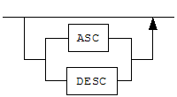 | Indicates an optional element comprised of options           |
|  | Indicates an optional element in which multiple elements may be specified. A comma must precede all but the first element. |

##### Sample Code Conventions

The code examples explain SQL, stored procedures, iSQL, and other command line syntax.

The following describes the conventions used in the cod examples:

| Rules            | Meaning                                                      | Example                                                      |
| ---------------- | ------------------------------------------------------------ | ------------------------------------------------------------ |
| [ ]              | Indicates optional fields                                    | VARCHAR [(*size*)] [[FIXED \|] VARIABLE]                     |
| { }              | Indicates  mandatory fields. Indicates to make sure to select at least one. | { ENABLE \| DISABLE \| COMPILE }                             |
| \|               | Argument indicating optional or mandatory fields             | { ENABLE \| DISABLE \| COMPILE } [ ENABLE \| DISABLE \| COMPILE ] |
| . . .            | Repetition of the previous argument. Omit the example codes. | SQL\> SELECT ename FROM employee; ENAME  ----------------------- SWNO  HJNO  HSCHOI  . . . 20 rows selected. |
| Other symbols    | Other symbols                                                | EXEC :p1 := 1; acc NUMBER(11,2);                             |
| Italicized words | Indicates variable or value taht must be provided by user    | SELECT \* FROM *table_name*; CONNECT *userID*/*password*;    |
| Lower case words | Problem elements provided by the user such as table names, colum names, file names, etc | SELECT ename FROM employee;                                  |
| Upper case words | Elements provided by the system or keyword appeared in the syntax | DESC SYSTEM_.SYS_INDICES_;                                   |

#### 

#### Related Documents

Please refer to the following documents for more detailed information:

-   Installation Guide

-   Getting Started Guide

-   SQL Reference

-   Stored Procedures Manual

-   iSQL User’s Manual

-   Utilities Manual

-   Error Message Reference

#### Altibase Welcomes Your Comments and Feedback

Please let us know what you like or dislike about our manuals. To help us with better future versions of our manuals, please tell us if there are any corrections or classifications that you would find useful.

Include the following information:

- The name and version of the manual that you are using
- Any comments about the manual
- Your name, address, and phone number

If you need immediate assistance regarding any errors, omissions, and other technical issues, please contact Altibase's Support Portal (http://altibase.com/support-center/en/).

Thank you. We always welcome your feedback and suggestions.

## 1. Introduction

-------------

This chapter describes the background of the emergence of Hybrid DBMS. It also describes the structure and features of Altibase.

### Hybrid DBMS Concept

This chapter introduces the Hybrid Database Management System (Hybrid DBMS), a new concept pioneered by Altibase.

#### Background of Hybrid DBMS

The development of the hybrid DBMS is closely related to the characteristics of memory and disk, the two major types of data storage media used by DBMS.

First, the memory consists of electronic gates. The time required to access memory is only a few nanoseconds (ns, billionths of a second), and is relatively consistent. However, in the event of a power failure, all data in memory are lost. That is, memory is a volatile storage medium.

In contrast, a disk consists of a head arm and a platter. Disk access time is on the order of microsecond (us, millionths of a second), which is relatively slow compared to random access memory (RAM). Furthermore, access time can be inconsistent. Even SSDs (Solid State Drives), which have recently become more popular, have vastly inferior access time when compared to volatile memory.

However, the data on the disk are stored permanently, even in the event of a power failure.

Second, the memory is connected to the main board through the system bus, and its maximum capacity is determined by the specifications of the main board. If the main board has a 32-bit CPU installed, the maximum possible amount of memory is 4GB, whereas, at present, if a 64-bit CPU is installed in the main board, the theoretical maximum amount of memory is on the order of hundreds of gigabytes (that is, hundreds of billions of bytes). In contrast, disks are connected to the main board and the I/O bus. Thus, terabytes of disk space can be installed, regardless of the characteristics of the main board.

In summary, memory typically has hundreds of times faster access time and better performance than disk, while data is lost during power outages and has limited storage capacity. In contrast, the disk is permanently stored and have close to unlimited capacity, while access time is slow and inconsistent.

DBMSs can be categorized as one of two kinds, depending on the distinct characteristics of the two kinds of storage devices: Disk-Resident DBMSs (referred to as "DRDBMS"), which store data on the disk, and Main memory DBMSs (referred to as "MMDBMS"), which store data in the memory.

##### Emergence of DRDBMS

In the DRDBMS structure, data are stored on disk. The DRDBMS reads data from the data from the disk into a memory buffer and delivers it to the application program. 

In this structure, the application typically uses SQL (Structured Query Language) to access the data. One major advantage of DRDBMS is the use of concurrency control and recovery strategies to protect the data, which makes it much easier to develop applications. Moreover, because the data are stored on disk, high-capacity DBMSs can be configured. 

Because of these advantages, DRDBMSs have been widely used in various industrial fields.

However, there has been a great demand for data processing due to the rapid progress of informatization throughout many industries and increased the performance of information processing. Thus, due to problems of inadequate data processing speed and inconsistent data access time, DRDBMSs are unusable in an increasing number of fields.

Therefore, custom-designed memory DBs have been used in many industries, requiring high performance and uniform performance data processing. 

However, as such data processing products are universal, they have to be individually developed from scratch. This has had the undesirable consequences of increased maintenance and repair costs and decreased performance, integration, and scalability.


##### Emergence of MMDBMS

MMDBMS are structured such that data are stored in memory and the data in memory are read and sent directly to client applications.

This structure preserves the main advantages of DRDBMS, namely the ability to access data using standard SQL statements and to protect data via concurrency control and recovery, thereby making it easy to develop applications and share data. 

In addition, because MMDBMS store data in memory, in contrast with the DRDBMS (which store data on disk) the average processing speed is significantly fast and performance is consistent. These are inherent characteristics of memory that are assured. Therefore, MMDBMS are receiving attention in fields where fast and consistent performance are necessary but development and maintenance issues make it difficult to implement DRDBMS.

An MMDBMS can typically perform an update operation about 10 times quicker than a DRDBMS, and a search operation about 4 times quicker.

The reason that an update operation cannot be performed hundreds of times faster than when using a DRDBMS is that, like a DRDBMS, an MMDBMS must also write log files to disk in order to protect the data. Nevertheless, the update operation of MMDBMS is faster because the MMDBMS is optimized and simplified for data protection than DRDBMS.

Similarly, the reason that a search operation is not hundreds of times faster than when using a DRDBMS is that a DRDBMS also uses memory buffers to improve data access performance.

Nevertheless, search operations are faster using an MMDBMS because data access is simplified and optimized, and access times are consistent when accessing memory (that is,so-called “jitter” is eliminated).

Despite the advantages of high and consistent performance, because MMDBMS must save data in memory, they encounter a limitation when data processing requirements are a large volume and store more than hundreds of GB of data.

##### **Combining MMDBMS and DRDBMS**

To overcome these problems, the most commonly solution is to divide and store the data separately. The data that needs high performance is stored in the MMDBMS, and the data that needs large capacity is stored in the DRDBMS.

This structure encounters the following problems: information shared by the MMDBMS and DRDBMS must be synchronized, applications that must bi-directionally communicate with both the MMDBMS and DRDBMS must be connected with both of them at the same time, and error recovery is complicated.

However, until now, since there has been no other way to simultaneously realize high data processing performance and handle large amounts of data, this approach has generally been adopted in fields in which fast data access and voluminous data processing are both required.

##### Emergence of Hybrid DBMS

Hybrid DBMSs have emerged to take advantage of the strong points and to overcome the weak points of MMDBMS, DRDBMS, and combined MMDBMS/DRDBMS.

In a Hybrid DBMS, the data are separated, and stores the data that requires high performance in memory and the data that needs large capacity on disk. However, a single DBMS processes both kinds of data in a unified manner.

Because high-performance and voluminous data are both handled by a single DBMS, the aforementioned problems related to combined DBMSs, namely complicated error handling and the requirement for applications to be complicated, are solved. Furthermore, a Hybrid DBMS can be implemented as an MMDBMS, a DRDBMS, or a Hybrid DBMS.

To summarize, the Hybrid DBMS combines the advantages of the MMDBMS, which is optimized for processing high-performance data, and the DRDBMS, which is optimized for processing large amounts of data, because the data are classified and saved according to their characteristics, but handled in an integrated manner.

In other words, hybrid DBMS is capable of high-performance information processing by efficient use of time, and large-scale information processing by efficient resource utilization.  Hybrid DBMS can now be adopted in all fields, including those requiring both high performance and the processing of large amounts of data.


[Figure 1-1] The Structure of a High Performance / Large capacity DBMS

### Altibase Features

This section provides an overview of the components and functionalities of Altibase.

The basic features of Altibase, the high-performance, large-volume hybrid database system, will now be introduced. The characteristics, structure, function, etc., of Altibase are explained briefly here. For more detailed information, please refer to each of the separately published Altibase manuals.

#### Data Model

The Altibase data model is patterned after employs the relational model. The relational model includes the three following major concepts:

Database Structures- The objects that databases use to save and access data are referred to as tables, indexes, views, etc. These objects are the basic operational units.

Operations- Operations define what actions users are permitted to conduct data and database structures. Operations are related to integrity constraints.

Integrity- Integrity constraints are rules pertaining to which operations are permitted on data and structures, and serve to protect data and data structures.

Relational database management systems provide the following benefits:

-   Physical data management and logical data management are independent of each other. 

-   All data can be accessed easily and in a variety of ways.

-   Databases can be freely designed as desired.

-   Database storage space requirements and data redundancy are reduced.

#### Engine Structure

Altibase supports a client-server architecture. In the client-server architecture, the client accesses the server over a communications network, as with a traditional RDBMS.

The Altibase server has a multithreaded internal structure.

#### Interfaces

Unlike other real-time database systems, Altibase supports a wide range of industry-standard interfaces for maximum compatibility. The Altibase query language complies with the SQL92 and SQL99 standard, and also provides extended features.

Because Altibase supports ODBC, JDBC, and C/C++ Precompiler, it can be used without converting the existing database application in order to use them with Altibase Hybrid MMDBMS

#### **Multi-Version Concurrency Control**

Altibase manages concurrency using the MVCC (Multi-Version Concurrency Control). MVCC is a technique of achieving maximum performance by eliminating collisions when reading and writing operations are performed on multiple versions of a single data item. 

In particular, this eliminates the problem of read operation placing a lock on data and causing a sub-sequent modify operation on that data to take a long time. This is a disadvantage of the conventional row locking mechanism. MVCC allows old and unnecessary data to be immediately removed, thereby preventing memory from being unnecessarily wasted. MVCC exhibits optimal performance in environments with large numbers of users, and supports "hot backup" systems, that is, databases in which backup operations can be performed at will without shutting the database down first.

Altibase provides MVCC in different ways for its memory table and disk tables in appearance, although this difference is imperceptible to the user. So-called “out-place MVCC” (where a new version of a record is created every time a record in a memory table is changed) is implemented for memory tables, whereas for disk tables, “in-place MVCC” (where new data are written over existing records and undo tablespaces are used to store and refer to previous versions of the data) is implemented.

#### Transaction Processing

The Altibase Hybrid DBMS architecture provides various features to achieve maximum performance. First, the number of transactions that can be simultaneously executed in the database can be controlled by configuring the properties in the altibase.properties file. Additionally, for efficient server operation, AUTOCOMMIT mode can be used. Furthermore, Altibase provides the following transaction isolation levels: “read committed” (0), “repeatable read” (1), and “no phantom read” (2), which can be selected appropriately depending on the user’s requirements.

#### **Logging**

For database stability and durability, Altibase logs to the contents of the changed database. In addition, the optimal log is created to maximize the performance of replication between systems.

#### Buffer Pool

To improve the performance of transactions that access disk tablespaces, disk I/O is minimized. This is accomplished using the buffer pool. Pages that have already been read from disk and cached in memory are prevented from being subsequently read from disk again. The buffer pool is managed by the Hot-Cold LRU (Least Recently Used) algorithm.

#### Double Write Files

If the page size of the Altibase system is different the physical page size of the file system, and if the Altibase server terminates abnormally during the disk I/O, the page may be corrupted.

To avoid this, Altibase saves the same image to a "double-write file" on the disk and then saves the page back to its original location when the page is flushed. Furthermore, when the Altibase server is restarted, it compares the contents of the double-write file with that of the actual page, and restores any corrupted pages. 

The double write function compensates for disk errors, but can degrade the system's performance. This feature may not be used by the user for performance. 

#### Fuzzy & Ping Pong Checkingpoint

Altibase uses fuzzy & ping pong checkpoints to ensure that the latest database state is safely backed up. 

In the main memory database, fuzzy checkpointing stores all changed data pages in a backup database, and because transactions that are currently underway can have an effect thereon, fuzzy and ping-pong checkpointing methods are used together. That is, because two backup databases are maintained, the processing burden associated with the checkpointing process can be decreased, and optimum transaction performance can be realized.

#### Stored Procedures

A stored procedure is a database procedure that takes an input argument, an output argument, and an input/output argument and executes multiple SQL statements at once depending on conditions defined in the body.

The stored procedure is functionally classified as either a procedure or a function depending on whether it returns a value or not. Please refer to the "*Stored Procedure User's Manual*" for more detailed information.

#### Deadlock Detection

Deadlock is a state in which transactions wait for each other to release the locked resources that they require. To deal with such cases, conventional DBMS has a separate thread or process which detects and handles such deadlocks. This kind of detection structure inevitably results in a temporary service interruption. Altibase does not have a separate deadlock detection thread. Instead, a deadlock is detected at the instant it occurs, and Altibase immediately takes steps to prevent service interruption depending on the case, in order to guarantee stable and continuous database operation.

#### Table Compaction

When a database is running, it is possible for a particular memory table to occupy more memory than it actually requires. This often happens when previously inserted data are updated or deleted. In these cases, it would be more efficient if the memory not needed by the table in question could be returned to the system. To meet this need, Altibase provides a memory table compaction function. Using this function, memory and tables can be more efficiently managed.

#### **Database Replication**

Altibase provides log-based database replication to realize both high availability and fault tolerance. This log-based replication system construction, in which database replication is conducted based on transaction logs, increases the efficiency of Altibase and decreases the load on the system. A replication management thread on a local system, which is currently operating, sends local transaction logs to a replication management thread on a remote system in real time. The replication management thread on the remote system analyzes the received log data and passes them to the Altibase server, which implements the changes in the database. In this way, a system can be provided in which, when normal operation of one of the servers is interrupted, service can be immediately restored without downtime.

Altibase also provides a load-balancing feature. In the replicated Altibase database environment, user transactions can be divided into two or more groups. Each group of transactions is executed on a corresponding server, and changes on one server are reflected on the other servers automatically. In this way, data consistency between the servers is ensured.

#### Altibase Sharding

Altibase introduces sharding technology  to Altibase, which improves storage capacity and throughput timely, enability distributed processing of large databases. 

Altibase Sharding can use both client-side and server-side sharding. In particular, client-side sharding can be applied by replacing only shard-specific libraries without modifying existing applications or SQL.

In addition, Altibase supports server-side sharding, allowing users to choose client-side sharding to improve application performance, or server-side sharding for compatibility.

Please refer to the "*Altibase Sharding Guide*" for more detailed information.

#### Client-Server Protocol

When running Altibase in a client-server architecture, a user can select and use a client-server protocol suitable for the configuration of the application system. The communication protocols that Altibase supports are TCP/IP, IPC, IPCDA and Unix domain socket.

TCP/IP (Transmission Control Protocol/Internet Protocol) is the protocol that is most commonly used between clients and servers over a network. The IPC(Inter-Process Communication) protocol provided by Altibase, which supports communication between client and server by using shared memory. Because the IPC uses shared memory, marshaling of communication packets is not needed, acceleration of high speed communication is technically feasible compared to other protocols. 

IPCDA is designed to maximize performance by minimizing the IPC-based communication method. The IPCDA enables direct reading and writing to shared memory in order to minimize memory access. Moreover, idle time in each process is minimized by using spinlock, which was originally developed by Altibase.

When the client application and Altibase are on different systems, TCP/IP, which uses Internet sockets, must be used, whereas, when they are on the same system, the Unix domain socket protocol or the IPC, IPCDA protocol can also be used. IPCDA offers the fastest performance of these communication protocols, followed by IPC, Unix domain socket, and then TCP/IP. However, LOB data is not supported in IPCDA.

For more detailed information on server and client communication, please refer to ‘Server/Client Communication’.

#### **Database Space**

An Altibase database consists of all of the data in the database stored in one or more tablespaces. The tablespaces are divided into memory tablespaces and disk tablespaces. 

Besides the system tablespace (which is created by Altibase), a user can add memory and disk tablespaces.

#### Direct-Path INSERT

Direct-Path INSERT inserts data by creating a new page instead of searching for empty space on the existing pages. That is, instead of using the table’s free space when entering data, a new extent is allocated from the tablespaces.

Moreover, because INSERT can be used in the same manner as APPEND, the number of redo and undo operations is reduced, and thus logging expenses are reduced.

#### Database Link

Database Link unites disparate data sources on interconnected servers to produce a single unified result, even if the data are stored in different kinds of data servers that are physically far apart from one another.

#### iSQL

Users can manage their databases quickly and easily using iSQL (the Altibase interactive SQL command utility).

#### altiComp

The altiComp feature compares and examine the tables of two databases, to output information about mismatching data and synchronize the databases.

#### iLoader

Altibase provides an iLoader utility that allows users to download or upload data on a table-by-table basis when moving a database or backing up a table.

### Structure of Altibase

This section describes the Altibase internal server processing structure and database structure based on the client-server structure of Altibase.

#### Overall Structure

The following figure shows a client-server system composed of Altibase and an application. The Altibase server component is displayed in a layered architecture to show the path in which client requests and data are processed. Other components are drivers and libraries for accessing applications and databases. 


[Figure 1-2] The Structure of the Altibase Server

#### **Internal Structure of Server Process**

The internal structure of an Altibase server process consists of the main thread, the dispatcher, the load balancer, the service thread pool, the service thread, the checkpoint thread, the garbage collection thread, the log flush thread, the buffer flush thread, and the archivelog thread. Each thread performs the function described below:

##### **Main Thread**

The main thread creates/shuts down all threads and manage created threads.

##### Dispatcher

When a client requests a connection, the dispacter connects the requesting client with the service thread that is available in the service thread pool.

##### Load Balancer

The load balancer detects the overload of each services, add or remove service threads, and distributes tasks to service threads. 

**Service Thread Pool**

Altibase creates and manages service threads for query processing and pools them in the Service Thread Pool. The number of service threads that are created corresponds to the user config- uration at the time the server was started.

**Service Thread**
The service thread processes queries and returns the result to the client. When the Altibase server starts up, Altibase creates and stores as many service threads in the service thread pool as specified in the configuration (altibase.properties) information. 

**Checkpoint Thread**

To reduce the amount of work required when recovering from a failure, the checkpoint thread records information about the current status of the database and the system in data files. Both manual checkpointing and automatic (periodic) checkpointing are available.

**Session Management Thread (Session Manager)**

The session management thread monitors the status of the connected session between the client and the service thread, that is, it monitors whether a given session has been interrupted.

**Garbage Collection Thread (Ager)

Using MVCC can cause old and unnecessary data to remain in memory. As soon as some data becomes unnecessary, the garbage collection thread recovers memory space so that it can be reused, in order to maximize the efficiency of memory usage. The garbage collection thread is also called the ager.

**Log Flush Thread**

The log flush thread maintains the logs that are created in response to every transaction that occurs in a database, and it updates large amounts of log data gathered in the log buffer to the log files on disk. These completely synchronized logs are used to ensure safe recovery in the event that the database system fails or a disaster occurs.

**Buffer Flush Thread (Flusher)

If all of the memory in the buffer pool is in use, disk I/O becomes inevitable and this can cause performance inconsistencies (“jitter”) on the transactions that are underway. The buffer flush thread regularly checks the buffer, always maintains a certain amount of available buffer memory, and flushes unused pages to disk, so that memory can be reused. The buffer flush thread is also called the flusher.

**Archivelog Thread**
The Archievelog thread regularly copies online log files to a predefined destination for use in recovery from storage media errors. The destination path is specified in the ARCHIVE_DIR property in the altibase.properties file. This feature works only when the database is in archive log mode.


[Figure 1-3] Internal Structure of an Altibase Server Process

#### Physical Database Structure

An Altibase database physically consists of log anchor files, log files, and data files.

**Log Anchor Files**

Log anchor files contain critical information indicating the relationship between files and transaction logs. They contain general information about the state of data files at specific points in time based on transaction log timestamps. These files must be backed up along with data files in order for database recovery to be possible.

**Log Files**

Log files, also known as “redo log files”, are used to maintain the atomicity and durability of transactions. Atomicity is the ability to return to the state that existed before a transaction by rolling back the transaction. Durability is the ability to restore a database to its original state, which reflects the result of all recently properly committed transactions, in the event of a database fault.

Log files are categorized into prepare log files, active log files and archive log files depending on their contents. A log file which is used to write current transaction logs is called an active log file. A prepare log file is an empty log file which is prepared in advance in order to increase the speed with which logs are written. An archive log file is a backup of a log file which is no longer being written to, but which is kept available for recovery purposes.

Log files are very important because they record the current status of the database. If a current log file should become damaged, the entire database will be damaged, regardless of whether or not a transaction was underway at the time, the log file was damaged. Log files are typically used in conjunction with backup files to restore the database in the event that data files become damaged.

##### Data Files

By default, the created system memory tablespace is saved in SYS_TBS_MEM_DATA, whereas the meta tables and the created disk tablespace are saved in SYS_TBS_MEM_DIC and system001.dbf, respectively. Moreover, the intermediate results of queries that are currently being executed are saved in temp001.dbf, and previous image information, which is used for MVCC (Multi-Version Concurrency Control) is saved in the undo file undo001.dbf.

Altibase manages files for storing data on the basis of pages. All data files consist of data pages, which are the smallest unit used by databases.

Pages are categorized into catalog pages, which contain information for managing the database, and data pages, which contain user data. Catalog pages contain detailed information about the current database, and are used to maintain information about changes and consistency checks, which are conducted when Altibase is started up and shut down.

Catalog pages contain lists and information about the use of the other data pages in the database. They are the first pages that can be found in backup databases, and are very important pages.

Actual user data are stored in data pages. Each data page consists of a page header and a page body. A page header consists of link and type information, used to maintain a list of pages, as well as a page identification number. A page body is divided into a number of slots, in which the actual data are ultimately stored.

#### Logical Database Structure

Altibase logically stores data in memory and disk tablespaces, and physically in data files that correspond to these tablespaces.

Each tablespace that makes up an Altibase database consists of one or more data files. However, a data file can only be associated with a single tablespace.

A database and its tablespaces and data files are intimately related as follows:

A database logically consists of one or more storage units known as tablespaces. Tablespaces are logical space in which all of the data in a database are saved. A database physically consists of one or more files called data files. That is to say, data files are the physical space in which all of the data in a database are stored.

The following figure describes the relationship between tablespaces and data files.


[Figure 1-4] The Logical Structure of a Database

Altibase allocates tablespaces – logical database areas – to all of the data in a database. The units of allocation of physical database space are pages, extents and segments.

A page is the smallest unit of logical storage. Altibase stores all data in pages.

The next logical step up from a page is an extent. That is, an extent consists of a particular number of consecutive pages.

The next logical database storage area up from an extent is called a segment. Each segment is a set of extents, and all extents in one segment are stored in the same tablespace.

For more detailed information, please refer to Chapter 6: Managing Tablespaces.

##### Boot Log File (altibase_boot.log)

The Altibase server records information about the booting status in this file. Because this file is written to every time Altibase is started up and shut down, detailed system information is available., In addition, when Altibase shuts down abnormally, this file provides clues about the error state.

##### Property File (altibase.properties)

This file is the Altibase server environment configuration file, and contains all of the information pertaining to how the Altibase server is executed and tweaked.

##### Error Message Files

This file contains error messages related to the data storage management module, the query processor module, and the Altibase server main module, as well as those related to function execution and data type.

## 2. Altibase Components

-----------------

This chapter describes the major components of Altibase. After installing the Altibase package, the user can check out components such as the binary section and the programming library section.

### **Altibase Directories**

When Altibase is installed, the following directories are created. The location of the Altibase home directory is saved in the environment variable ALTIBASE_HOME. The bin, conf, lib, include, msg, dbs, logs, sample, install, altiComp, trc, admin and arch_logs directories can all be found in this directory.

This section describes the purpose and contents of each of these directories.

#### admin Directory

This directory contains the adminview.sql script file, which creates views related to Altibase system information, as well as other script files for creating stored procedures that are used to view information related to tables, stored procedures, and replication objects.

#### arch_logs Directory

This is the directory containing backup log files for recovery. The location and name of this directory must be specified in the altibase.properties file.

#### altiComp Directory

This directory contains sample script files for the altiComp feature which synchronizes mismatching data during replication.

For more detailed information about the altiComp utility, please refer to the *Utilities Manual*.

#### bin Directory

This directory contains the Altibase management tool (including the Altibase executable file) and the executable file for the user support tool.

The bin directory contains the following files:

```
aexport, altiAudit, altibase, altierr, altimon.sh, altipasswd, altiPofile,
altiComp, checkServer, dumpbi, dumpct, dumpdb, dumpddf, dumpla, dumplf, iloader,
isql, killCheckServer, server, apre
```

For more detailed information on iloader, isql and apre, please refer to the *iLoader User's Manual, iSQL User's Manual*, and *Precompiler User's Manual*.

For more detailed information about other utilities, please refer to the *Utilities Manual*.

#### conf Directory

This directory contains the following files:

-   aexport.properties: the configuration file for aexport. For more detailed  information on the configurable properties, please refer to the *Utilities Manual*.
-   altibase.properties: the configuration file for Altibase. For more detailed  information on the configurable properties, please refer to the *General Reference*.
-   altibase_user.env: the file for setting the environment variables necessary for running Altibase
-   dblink.conf: the configuration file for database link. For more detailed information on the configurable properties, please refer to the *General Reference*
-   license: the Altibase license file

#### dbs Directory

When using the default values, database files are created in this directory. The location and name of this directory must be specified in the altibase.properties file.

By default, system memory tablespace is created and saved in SYS_TBS_MEM_DATA, meta tables are saved in SYS_TBS_MEM_DIC, disk tablespace is created and saved in system001.dbf, and query results that are temporarily needed while queries are being executed are saved in temp001.dbf.

Previous image information that is needed for SQL statement execution and restoration is saved in the undo001.dbf file. Disk pages are temporarily saved in *.dwf files, which are double-write buffer files.

#### include Directory

This directory contains the header files required when writing an application program using the Altibase CLI libraries.

##### alaAPI.h

An API header file that is used by the Altibase Log Analyzer.

##### sqlcli.h

A header file that is needed in order to create client applications.

##### sqltypes.h

This file contains information on basic data types that is needed when developing client applications that use ODBC.

##### sqlucode.h

The header file that defines Unicode.

##### ulpLibInterface.h

This file contains information on the structure of error-handling SQL statements for use when developing applications using the C/C++ Precompiler .

#### install Directory

This directory contains an altibase_env.mk file and a README file that contain macro settings for makefiles needed to write Altibase application.

#### lib Directory

This directory contains an application development library for developing client applications and contains the following files. For more detailed information on how to write applications using these library files, please refer to the *Getting Started Guide*.

##### Altibase.jar

This is the JDBC driver for accessing Altibase via Java applications. This is a Type 4 driver, and is thus a Pure Java driver. For more detailed information, please refer to the *JDBC User’s Manual*.

##### libapre.a

This library is needed in order to create embedded SQL programs. For more detailed information on writing embedded SQL programs, please refer to the *Precompiler User’s Manual*.

##### libodbccli.a

This library is used when authoring Altibase CLI applications. For more detailed information, please refer to the *CLI User’s Manual*.

##### libalticapi.a

This library is used when writing Altibase ACI applications. For more detailed information, please refer to the *ACI User’s Manual*.

##### libaltibase_odbc-64bit-ul64.so

This is the Altibase ODBC driver that can be used in Unix-like operating systems. Depending on the installation package and the operating system, the file extension and file name can be different. For more detailed information, please refer to the *ODBC User’s Manual*.

##### Others

-   libaltibaseMonitor.a: the library for the Monitoring API of Altibase. Please refer to the *Moni- toring API Developer’s Guide*.
-   libchksvr.a: the library for the CheckServer API of Altibase. Please refer to the *API User’s Manual*.
-   libiloader.a: the library for the Altibase iLoader API. Please refer to the *API User’s Manual*.
-   libsesc.a: this is provided for backward compatibility and is identical to libapre.a.

#### logs Directory

This directory contains log anchor files and log files.
The location and name of this directory must be specified in the altibase.properties file. The log anchor file name and the log file name are automatically set by Altibase. However, in order to be prepared in the event of an error in the file system containing the log anchor files, it is nevertheless recommended that the relevant properties be changed, and that individual log anchor files be located on different file systems.

#### msg Directory

This directory contains the following error message files. Although two message files exist in character sets US7ASCII and KO16KSC5601 for each module, the error messages inside the file are only provided in english.

##### E_SM_US7ASCII.msb

This file contains error messages pertaining to the Data Storage Manager.

##### E_QP_US7ASCII.msb

This file contains error messages pertaining to the Query Processor.

##### E_MM_US7ASCII.msb

This file contains error messages pertaining to the Altibase server main module.

##### E_CM_US7ASCII.msb

This file contains error messages pertaining to the Altibase communication module.

##### E_RP_US7ASCII.msb

This file contains error messages pertaining to the Altibase replication module.

##### E_ST_US7ASCII.msb

This file contains error messages pertaining to the Altibase spatial module.

##### E_DK_US7ASCII.msb

This file contains error messages pertaining to the Altibase database link module.

##### E_ID_US7ASCII.msb, E_MT_US7ASCII.msb

This file contains error messages pertaining to function execution or data types.

#### sample Directory

This directory contains sample Altibase applications.

It contains source code and Makefiles for programs written using the JDBC, ODBC, and C/C++ Precompiler libraries.

#### trc Directory

This directory contains trace files in which information of Altibase operation is written. Each internal module is written in its corresponding trace file as follows:

##### altibase_boot.log

The operating state of the Altibase server is recorded in this file. The information recorded in this file includes system details obtained when Altibase is started up and shut down.

##### altibase_error.log

The error messages which occur on the server are recorded in this file. Also, the process call stack is recorded when Altibase shuts down abnormally.

##### altibase_trc.log

Warnings and trace messages that are printed after Altibase has started are written to this file. Messages for threads of the same process are written in consecutive order.

##### altibase_dump.log

The working memory at the time the Altibase process is abnormally terminated is dumped to this file. This file is used to diagnose and debug Altibase program errors.

##### altibase_sm.log 

Warnings and trace messages pertaining to the storage manger module are written to this file.

##### altibase_rp.log

Warnings and trace messages pertaining to the replication module are written to this file.

##### altibase_qp.log

Warnings and trace messages pertaining to the Query Processor are written to this file.

##### altibase_mm.log

Warnings and trace messages pertaining to the Altibase server main module are written to this file.

##### altibase_cm.log

Warning messages and trace messages pertaining to the communication module are written to this file.

##### altibase_lb.log

Warning messages and trace messages pertaining to the load balancer are written to this file.

##### altibase_snmp.log

Warning messages and trace messages pertaining to the SNMP are written to this file.

##### altibase_dk.log

Warning messages and trace messages pertaining to the database link module are written to this file.

##### altibase_ipc.log

The resource information created when connecting with IPC is written to this file.

##### altibase_ipcda.log

The resource information created when connecting with IPCDA is written to this file.

##### altibase_xa.log

Warnings and trace messages pertaining to the global transactions processed on Altibase using the XA interface are written to this file.

##### killCheckServer.log

Execution results of the killCheckServer utility are written to this file.

### **Executable Binaries**

For more detailed information on these binary files other than those described here, please refer to the *Utilities Manual*

#### aexport

This is a tool that is used to achieve a sequence of tasks that must be conducted when upgrading Altibase to a new version. This program automatically creates SQL script files, iSQL executable shell files, and iLoader executable shell files pertaining to all database objects and users.

#### altibase

This is the server that is used when Altibase is executed in a client-server architecture scheme.

#### altierr

This is a tool that finds and outputs detailed information about Altibase error codes.

#### altimon.sh

This is a shell script program that monitors the Altibase server process.

#### altiProfile

This is a utility that collects statistical data (e.g. number of executions, execution time) about SQL statements.

#### altipasswd

This tool is for changing the password of the sys account.

#### altiComp

The altiComp feature compares the tables of two databases, to print information about mis- matching data and synchronize the databases.

For more detailed information, please refer to the *Utilities Manual*.

#### checkServer

This is a utility for executing script files to check the status of Altibase and perform tasks that must be fulfilled when Altibase terminates abnormally.

#### dumpla

This tool outputs and examines the contents of Altibase log anchor files.

#### dumplf

This tool outputs and examines the contents of Altibase log files.

#### iloader

This tool is for uploading and downloading particular database tables.
For detailed information on this tool, please refer to the *iLoader User’s Manual*.

#### isql

This is a tool for interactively executing database queries.
For more detailed information on this tool, please refer to the *iSQL User’s Manual*.

#### killCheckServer

This tool terminates execution of the checkServer utility.

#### server

This is a shell script program that is used to start up, shut down, or restart the Altibase server.

#### apre

This application is used for precompiling applications written in C/C++ that contain embedded SQL statements.

For more detailed information on this tool, please refer to the *Precompiler User’s Manual*.

### **Altibase Libraries**

The following are the components required when developing application programs using Altibase:

-   C or C++ programming libraries

-   Library that provides the Altibase CLI interface (libodbccli.a)

-   Java class library (Altibase.jar) for programming in the Java Language

-   Header files for programming

This is explained in detail in the *Getting Started Guide*.

## 3. Creating a Database

-----------------

After installing Altibase, the database administrator must create and manage the database by estimating the amount of user data generated. This chapter describes the main points to be aware of when creating a database.

### Creating a Database

An Altibase database consists of one or more logical storage units called tablespaces, which collectively store all of the database's data. Altibase stores data logically in tablespaces and physically in data files, which are associated with corresponding tablespaces. Before the database server can be started, it is first necessary to create a database manually using the CREATE DATABASE command.

This section describes the types of tablespaces and logging systems, and how to create a database.

#### Types of Tablespaces

An Altibase database consists of several kinds of tablespaces. Tablespaces are classified into several types, depending on their usage and how the data is stored.

By default, when the user runs the CREATE DATABASE statement, checkpoint images and data files are created in the $ALTIBASE_HOME/dbs directory.

> Note: *There is no limit on the filename extension or location of files specified when users create a tablespace.*

Altibase supports the following types of tablespaces:

##### Memory Tablespace

Memory tablespace exists in memory. Performance-critical objects are usually located in memory tablespace, along with dictionary tables, system objects such as sequences, and user-created memory tables.

##### Disk Tablespaces

Disk tablespace exists on disk, and usually consists of user disk tables and disk indexes. Disk tablespace is classified into system tablespace and user data tablespace.

##### Undo Tablespace

Undo Tablespace is the tablespace in which images of previous states of data (before update) are stored for a certain period in order to support Multiversion Concurrency Control (MVCC), which is the management of multiple versions of records that exist in disk tables.

##### Temporary Tablespace

Temporary Tablespace is the tablespace for storing temporary tables and indexes, which are created when queries are processed. Analogous to the data tablespace, this tablespace is categorized into system temporary tablespace and user temporary tablespace.

##### Volatile Tablespace

Volatile Tablespace is a tablespace for saving objects in memory in order to avoid disk input/output and therefore realize better performance. All data objects in volatile tablespace disappear when the database is shut down. The size of volatile tablespace can't exceed the available physical memory space in the system.

#### **The Altibase Logging System**

The data in a database must be durable under any circumstances. Altibase guarantees the durability of data using a logging system that consists of the following two kinds of files:

**Log Files**

These are files in which log records are written in order to be ready for use in performing complete system recovery in the event of an abnormal shutdown while transactions are underway. Altibase log files are named logfile** (where “**” indicates the sequential number of the log file).

**Log Anchor Files**

Data that are important for database execution (such as information about tablespaces, the location of data files, and checkpointing) are stored in log anchor files. In order for the server to start up correctly, the contents of these files must be valid, otherwise it will be impossible to start the server. Log anchor files are also used for database recovery.

When the database is first created, the log files and the log anchor files are created and saved in $ALTIBASE_HOME/logs/.

Altibase maintains a set of 3 log anchor files. These log files are created in the same location

when the database is created, but it is recommended that the 3 log anchor files be maintained on different file systems. The property for specifying the location of the log anchor files is LOGANCHOR_DIR.

For more detailed information about the Altibase properties, please refer to the *General Reference*.

#### **Preparing to Create a Database**

After installing the Altibase package, use the iSQL utility (which is provided as part of the package) to manually create a database as follows: First, execute the iSQL utility with SYSDBA privileges.

```
$ isql –u sys –p manager –sysdba
```

This does not access a database, but establishes an administration session. It will then be possible to see a display like the following:

```
------------------------------------------------
     Altibase Client Query utility.
     Release Version 7.1.0.0.1
     Copyright 2000, ALTIBASE Corporation or its subsidiaries.
     All Rights Reserved.
------------------------------------------------
ISQL_CONNECTION = TCP, SERVER = 127.0.0.1, PORT_NO = 20300
iSQL(sysdba)>
```

Once the preceding steps have been accomplished, it is first necessary to start the server process in order to execute the CREATE DATABASE statement. It is important to understand the Altibase startup phases. Several important administration tasks are only executable in particular startup phases.

1.  Phase 1: The Pre-Process Phase
  
    Before starting the server process, Altibase initializes database memory in this phase.
    
    A database can be created during the Process phase. In the Pre-process phase, execute the following command:

```
iSQL> startup process
Trying Connect to Altibase.. Connected with Altibase.
TRANSITION TO PHASE: PROCESS
Command execute success.
```

2. Phase 2: The Process Phase

   In this phase, the user can create a database or to retrieve and change Altibase properties using the CREATE DATABASE statement.

3. Phase 3: The Control Phase

   In this phase, all database files are loaded. It is ready for restart recovery. Please refer to the section "Recovering a Database" in Chapter 10 for a description of restart recovery.

4. Phase 4: The Meta Phase 
   In this phase, recovery is completed and in which it is possible to upgrade meta data and reset online logs.

5. Phase 5: The Service Phase

   In this final phase, the database is ready to pㄱovide the service to the user.

#### **Creating a Database**

In the Process phase, use the CREATE DATABASE command to create a database as shown below. 

For more detailed information on using the CREATE DATABASE statement, please refer to the *SQL Reference*.

 In the following example, a database is created using the default options:

```
iSQL> create database mydb initsize=50M noarchivelog character set ksc5601 national character set utf16;
DB Info (Page Size     = 32768)
        (Page Count    = 1537)
        (Total DB Size = 50364416)
        (DB File Size  = 1073741824)
        Creating MMDB FILES     [SUCCESS]
        Creating Catalog Tables [SUCCESS]
        Creating DRDB FILES     [SUCCESS]
  [SM] Rebuilding Indices [Total Count:0]  [SUCCESS]
DB Writing Completed. All Done.
Create success.
```

#### **Shutting Down a Database Server after Database Creation**

Once a database has been created, the server process that was started for that purpose can be shut down, or can proceed to the service phase. To shut down the server, use the shutdown command with the abort option, as follows:

```
iSQL(sysdba)> shutdown abort
iSQL(sysdba)>
```

Once the server has been shut down, iSQL is disconnected from the Altibase server process and returns to the pre-processing phase.

In addition to “abort”, the shutdown command can also be used with the “immediate” and “normal” options, but only when the server is running in the service phase.

#### **Database Initialization Properties**

When a database is created using the CREATE DATABASE statement, any properties that are not specified in the CREATE DATABASE statement are set depending on the settings made in the altibase.properties file, which is located in the $ALTIBASE_HOME/conf/ directory. The relevant properties are listed below. In the table, a question mark (“?”) indicates the path specified using the ALTIBASE_HOME environment variable.

Please fully understand the Altibase properties related to database initialization listed in the table below.

| Property Name             | Description                                                  | Default |
| ------------------------- | ------------------------------------------------------------ | ------- |
| MEM_MAX_DB_SIZE           | The maximum size to which the memory da- tabase can dynamically increase. | 4G      |
| SERVER_MSGLOG_DIR         | The directory for storing the files (altibase_boot.log) in which Altibase server messages are recorded. | ?/trc   |
| SYS_DATA_FILE_INIT_SIZE   | The initial system tablespace size when the CREATE DATABASE statement is executed. | 100M    |
| SYS_DATA_FILE_MAX_SIZE    | The maximum size of a data file in system tablespace.        | 2G      |
| SYS_DATA_FILE_NEXT_SIZE   | The amount by which a data file in system tablespace is automatically increased when the auto-extend option is used. | 1M      |
| SYS_DATA_TBS_EXTENT_SIZ E | The size of an extent for system data tablespace.            | 256K    |
| SYS_TEMP_FILE_INIT_SIZE   | The initial size of temporary tablespace when the CREATE DATABASE statement is exe- cuted. | 100M    |
| SYS_TEMP_FILE_MAX_SIZE    | The maximum size of a data file in temporary tablespace.     | 2G      |
| SYS_TEMP_FILE_NEXT_SIZE   | The amount by which a data file in temporary tablespace is automatically increased when the auto-extend option is used. | 1M      |
| SYS_TEMP_TBS_EXTENT_SIZ E | The size of an extent in temporary tablespace.               | 256K    |
| SYS_UNDO_FILE_INIT_SIZE   | The initial size of undo tablespace when the CREATE DATABASE statement is executed. | 100M    |
| SYS_UNDO_FILE_MAX_SIZE    | The maximum size of a data file in undo tablespace.          | 2G      |
| SYS_UNDO_FILE_NEXT_SIZE   | The amount by which a data file in undo tablespace is automatically increased. | 1M      |
| SYS_UNDO_TBS_EXTENT_SIZ E | The size of an extent in undo tablespace.                    | 128K    |
| TEMP_PAGE_CHUNK_COUNT     | The number of temporary pages in memory tablespace that are allocated at one time. | 128     |


| Property Name               | Description                                                  | Default |
| --------------------------- | ------------------------------------------------------------ | ------- |
| USER_DATA_FILE_INIT_SIZE    | The initial size of user tablespace when the CREATE DATABASE statement is executed. | 100M    |
| USER_DATA_FILE_MAX_SIZE     | The maximum size of a data file in user tablespace.          | 2G      |
| USER_DATA_FILE_NEXT_SIZE    | The amount by which a data file in user tablespace is automatically increased. | 1M      |
| US- ER_DATA_TBS_EXTENT_SIZE | The size of a single extent in user tablespace.              | 256K    |
| USER_TEMP_FILE_INIT_SIZE    | The initial size of user temporary tablespace when the CREATE DATABASE statement is executed. | 100M    |
| USER_TEMP_FILE_MAX_SIZE     | The maximum size of a data file in user tem- porary tablespace. | 2G      |
| USER_TEMP_FILE_NEXT_SIZE    | The amount by which a temporary data file is increased in size when user temporary tablespace is extended automatically. | 1M      |
| US- ER_TEMP_TBS_EXTENT_SIZE | The size of an extent in user temporary tablespace.          | 256K    |

For more detailed information about the Altibase properties, please refer to the *General Reference.*

## 4. Startup and Shutdown

---------------------

To provide service after creating a database, the Altibase server must be started to the server phase. This chapter describes the references for starting and shutting down the database.

### Startup Procedure

There are two ways to start up an Altibase server:

-   A database administrator logs in to the server using the sys account, accesses the server in -sysdba administrator mode, and then uses the privileges granted to him/her to manually start the server.
  
-   The server is started using a script called server.

To start up Altibase, first, execute iSQL using the -sysdba option in the same way as when creating a database.

The following demonstrates how to start up an Altibase database using iSQL:

```
$ isql –u sys –p manager –sysdba
----------------------------------------------
 Altibase Client Query utility.
 Release Version 7.1.0.0.1
 Copyright 2000, Altibase Corporation or its subsidiaries.
 All Rights Reserved.
----------------------------------------------
ISQL_CONNECTION = TCP, SERVER = 127.0.0.1, PORT_NO = 20300
iSQL(sysdba)>
```

> Note: The Altibase startup command can only be executed using the account with which Altibase (including iSQL)
was installed.
>

During the startup procedure, the status of the Altibase progress in sequence through the following phases:

1.  PRE_PROCESS

2.  PROCESS

3.  CONTROL

4.  META

5.  SERVICE

The startup command can be used with the following phase options:

```
STARTUP [PROCESS | CONTROL | META | SERVICE];
```

Users other than the SYS user can access the database only in the SERVICE phase.

> Note: *Altibase can only progress from earlier phases to subsequent phases; it is impossible to revert to a previous phase.*

The following is an example of starting the server in the service phase:

```
iSQL> startup service; 
Trying Connect to Altibase..... Connected with Altibase. 
TRANSITION TO PHASE: PROCESS
TRANSITION TO PHASE: CONTROL
TRANSITION TO PHASE: META
  [SM] Checking Database Phase:  .*.*.*[SUCCESS]
  [SM] Recovery Phase - 1: Preparing Database...[SUCCESS]
  [SM] Recovery Phase - 2: Loading Database : Dynamic Memory Version
                            Serial Bulk Loading
                            . is 8192k: *..[SUCCESS]
  [SM] Recovery Phase - 3: Skipping Recovery & Starting Threads...[SUCCESS]
                            Refining Disk Table [SUCCESS]
  [SM] Garbage Collection: ....................................... [SUCCESS]
  [SM] Rebuilding Indices [Total Count:61] ****************.....................
.................................................... [SUCCESS]
TRANSITION TO PHASE: SERVICE
          No IPC Initialize: Disabled
--- STARTUP Process SUCCESS ---
Command execute success.
```

The database performs the following tasks in each phase:

| Phase       | Tasks                                                        |
| ----------- | ------------------------------------------------------------ |
| PRE-PROCESS | The initial phase. The server prepares to advance to the PROCESS phase. |
| PROCESS     | In this phase, the CREATE DATABASE and DROP DATABASE statements can be executed, a limited number of performance views can be used to ob- tain information, and property values can be changed. The server prepares to advance to the CONTROL phase. |
| CONTROL     | Media Recovery can be performed in this phase. The server prepares to ad- vance to the META phase. If incomplete recovery is performed during the CONTROL phase, online logs must be reset when proceeding to the META phase. |
| META        | Meta data (the dictionary table) can be upgraded in this phase. For infor- mation about incomplete recovery, please refer to the section on [Complete vs.](https://docs.google.com/document/d/1_FQUZ3Tg55qkjy0M95erMM0ZOeU1dtlKwdKFOD5KEVg/edit#heading=h.1087892) [Incomplete Recovery ](https://docs.google.com/document/d/1_FQUZ3Tg55qkjy0M95erMM0ZOeU1dtlKwdKFOD5KEVg/edit#heading=h.1087892)in Chapter 10. The server prepares to advance to the SERVICE phase. |
| SERVICE     | The SERVICE phase is the normal operational state of Altibase. Users other than the SYS user can establish connections to Altibase in this phase.SHUTDOWN NORMAL/IMMEDIATE/ABORT can all be executed. |


### Shutdown Procedure

To shut down the Altibase server that is currently running, use the SHUTDOWN statement. The following options are available: 

```
SHUTDOWN [NORMAL | IMMEDIATE | ABORT];
```

SHUTDOWN NORMAL and SHUTDOWN IMMEDIATE can only be executed while Altibase is running in the SERVICE phase, whereas SHUTDOWN ABORT can be executed in any phase.

> Note: *The Altibase SHUTDOWN command can only be executed using the account with which Altibase (including iSQL) was installed.*

##### SHUTDOWN NORMAL

This method shuts down the server normally. The server waits for termination until all clients disconnect from the server. The following operations are performed internally when the server is shut down:

-   Threads that function to detect client-server communication sessions are shut down.
-   Service threads are shut down.
-   The storage manager is shut down.
-   Finally, after all the remaining tasks have been completely performed, the Altibase server shuts down.

When Altibase is shut down in this way, the following messages are output:

```
iSQL(sysdba)> shutdown normal;
Ok..Shutdown Proceeding....

TRANSITION TO PHASE : Shutdown Altibase
  [RP] Finalization : PASS
shutdown normal success.
```

##### SHUTDOWN IMMEDIATE

When SHUTDOWN IMMEDIATE is executed, the Altibase server first forcibly disconnects currently connected sessions, then rolls back pending transactions and shuts down the Altibase server.

When Altibase is shut down in this way, the following is output:

```
iSQL(sysdba)> shutdown immediate
Ok..Shutdown Proceeding....

TRANSITION TO PHASE : Shutdown Altibase
  [RP] Finalization : PASS
shutdown immediate success.
```

The server can also be forcibly shut down using a server script:

```
$ server stop
-----------------------------------------------
     Altibase Client Query utility.
     Release Version 7.1.0.0.1
     Copyright 2000, Altibase Corporation or its subsidiaries.
     All Rights Reserved.
-----------------------------------------------
ISQL_CONNECTION = TCP, SERVER = 127.0.0.1, PORT_NO = 20300
Alter success.
Alter success.
Alter success.
Ok..Shutdown Proceeding....

TRANSITION TO PHASE : Shutdown Altibase
  [RP] Finalization : PASS
shutdown immediate success.
```

##### SHUTDOWN ABORT

SHUTDOWN ABORT forcibly kills the Altibase server. When Altibase is shut down in this way, the contents of the database will likely be invalid, and thus the next time the server is executed, restart recovery will be automatically performed.

When Altibase is shut down in this way, the following is output:

```
iSQL(sysdba)> shutdown abort
iSQL(sysdba)>
```

The server can also be forcibly shut down using a server script.

```
$ server kill 
--------------------------------------------------------
     Altibase Client Query utility.
     Release Version 7.1.0.0.1
     Copyright 2000, Altibase Corporation or its subsidiaries.
     All Rights Reserved.
--------------------------------------------------------
ISQL_CONNECTION = TCP, SERVER = 127.0.0.1, PORT_NO = 20300
$
```

## 5. Objects and Privileges
-------------------------

This chapter describes how to manage objects and privileges in Altibase.

### Database Objects

Database objects are classified as either schema objects, which are managed within particular schema, or non-schema objects, which are managed by Altibase. This chapter describes the characteristics of both schema and non-schema database objects.

#### Schema Objects

A schema is a logical group set of database objects that are owned by a single user and managed using SQL statements. The objects included in these schema are called schema objects, and Altibase provides the following schema objects:

##### Tables 

Tables are the basic units of data storage in an Altibase database. Tables are groups of records, each comprising the same number of columns. In Altibase, tables are classified as either memory tables or disk tables, depending on location in which data are stored. Additionally, tables are classified as either system tables, which are created and managed by the system, or user tables, which are created and managed by general users.

Moreover, special consideration must be given to the management of tables which are to be replicated and tables containing very large amounts of data.

This is described in detail in the "Tables" section below.

##### Partitioned Tables

When a table data are divided into pieces(each pice is called a partition) and stored them in different table spaces, this table is called a partitioned table. For large tables, partitioned tables can make data management much easier.

More detailed information about partitioned tables, please refer to "Chapter 7: Partitioned Objects".

##### Partitioned Indexes

Depending on whether indexes are partitioned, it is classified as partitioned indexes or non-partitioned indexes. Non-partitioned indexes are indexes that is not partitioned. Partitioned indexes, similar to a partitioned table, refer to indexes partitioned, based on partition conditions. 

For more detailed information about partitioned indexes, please refer to "Chapter 7: Partitioned Objects".

##### Temporary Tables

Temporary tables are used to temporarily hold data for the duration of a session or transaction. The use of temporary tables can enhance the performance speed of complex queries.

Temporary tables can only be created on the volatile tablespace.

##### Queue Tables

The Altibase message queuing function supports asynchronous data transfer between the database and client applications. Queue tables are database objects, just like other database tables, and thus can be controlled using DDL and DML statements.

The concept and function of the queue table is described in detail in the "Queues" section below.

##### Constraints

Constraints are restrictions that are imposed when data are inserted or modified in order to maintain the integrity of data. 

Constraints are classified as either column constraints or table constraints depending on the target of the constraint, and are also classified as one of the following kinds of constraints depending on the nature of the restrictions:

-   NOT NULL / NULL Constraints

-   CHECK Constraints

-   Unique Key Constraints

-   Primary Key Constraints

-   Foreign Key Constraints

-   TIMESTAMP Constraints

##### Indexes

Indexes are optionally created in association with specific tables so that the data in those tables can be accessed more quickly, thereby improving the performance of DML statements.

##### Views 

Views do not themselves actually contain any data, but are logical tables that are constructed on the basis of one or more tables, materialized views, or other views.

##### Materialized Views

A materialized view is a database object that stores query results as data. Data can be based on more than one table, a view, or another materialized view.

##### Sequences

Altibase provides sequences for generating unique sequential numerical values.

##### Synonyms

Synonyms are provided as aliases for tables, sequences, views, stored procedures, and stored functions so that they can be used without being accessed the object name directly.

##### Stored Procedure or Function

A procedure or function is a schema object that consists of a set of SQL statements, flow control statements, allocation statements, and error-handling routines. Procedures and functions are permanently saved in the database and allow a complete set of operations corresponding to a single task to be executed merely by calling the relevant procedure or function by name.

Procedures and functions are distinguished from each other in that a function returns a value, while a procedure does not.

##### Type Sets

Type sets are database objects that allow to gather and manage user-defined types used in stored procedures and stored functions in one place.

For more detailed information, please refer to the *Stored Procedures Manual*.

**Database Triggers**

A trigger is a special kind of stored procedure that is executed by the system when data are inserted into a table, deleted from a table, or updated, so that a particular task can be automatically executed. Along with constraints, user-defined triggers can help maintain the consistency of the data stored in tables.

##### Database Links

Database Link unites disparate data sources on interconnected servers to produce a single unified result, even if the data are stored in different kinds of data servers that are physically far apart from one another.

For more detailed information, please refer to the *Database Link User's Manual*.

##### External Procedures or Functions

External procedures or external function objects are database objects that correspond to user-defined C/C++ functions on a one-to-one basis. User-defined functions are executed through external procedure objects or external function objects. Depending on whether or not they return values differentiates external procedures from external functions.

For more detailed information, please refer to *C/C++ External Procedures Manual*.

##### Libraries 

External procedures or external function objects are database objects that correspond to us- er-defined C/C++ functions on a one-to-one basis. User-defined functions are executed through external procedure objects or external function objects. Depending on whether or not they return values differentiates external procedures from external functions.

For more detailed information, please refer to *C/C++ External Procedures Manual*.

#### Non-Schema Objects

Non-schema objects are objects that are not assigned to any specific schema, but are managed at the database level. Altibase supports the following non-schema objects:

##### Directories

Stored procedures are able to control files, which allow them to read from and write to text files in the file system managed by the operating system. Thanks to this functionality, the user can perform various kinds of tasks using stored procedures such as leaving messages in files, reporting the results of files or reading data from files for insertion into tables. The directory object is used to manage information about the directories accessed by stored procedures.

For more detailed information about the directory object, please refer to the *SQL Reference*.

For more detailed information on how to handle files using stored procedures, please refer to the *Stored Procedures Manual*.

**Replications**

A replication is an object that maintains the consistency of the data in tables on different servers by automatically transferring data from a local server to a remote server.

For more detailed information on how to manage replication, please refer to the *Replication Manual*.

##### Tablespaces

A database is divided into multiple tablespaces, which are the largest logical data storage unit.

Tablespaces are broadly classified as memory tablespaces and disk tablespaces based on the location in which data are stored. Every database contains the system tablespaces, which are created automatically when a database is created and cannot be deleted. Additionally, you are free to create or delete user tablespaces as required.

For more detailed information on how to manage tablespaces, please refer to "Chapter 6: Tablespaces".

##### **Users**

User accounts are necessary in order to connect to Altibase and to function as the owners of a schema. Users are created using the system, and are classified either as system users who manage the system, or as general users. General users require suitable privileges in order for them to connect to the database and perform operations on data.


##### Jobs

A JOB is the addition of an execution schedule to a stored procedure. The stored procedure to be executed, the point in time of execution, the interval after which it is to be executed and etc. can be set when creating the JOB object. For the created JOB to automatically run, the value of the JOB_SCHEDULER_ENABLE property must be set to 1.

The creation, alteration, and deletion of the JOB, and the management of the job scheduler is only enabled for the SYS user.


### Tables

Tables are the basic units of data storage in an Altibase database. They are constructed of columns and contain multiple rows. This section defines the terminology related to tables and explains the concepts and methods pertaining to table management.

#### Memory Tables and Disk Tables

Tables are classified as either memory tables or disk tables, depending on where the data they contain are stored. When a table is created, whether it is a memory table or a disk table (that is, whether it is to be maintained in memory tablespace or disk tablespace) must be specified.

**System Tables and User Tables**

Tables are additionally classified as either system tables, which are internally created and managed by the system, and user tables, which are created and managed by users.

System tables, which are also known as the data dictionary, are further classified as either meta tables, in which information about database objects is stored, and process tables, in which information about processes is stored. Process tables are still further classified as either static tables or performance views.

For more detailed information on the data dictionary, please refer to the *General Reference*.

#### Large Memory Tables

Before executing SQL statements on large memory tables, it is important to understand the following:

##### **Altering the Specifications of Large Memory Tables Using DDL**

When it is desired to execute a DDL statement on a table containing a large amount of data, rather than executing an ADD COLUMN or DROP COLUMN statement directly on the table, it is preferable to use the iLoader utility to download the data from the table, drop the table, create the table again with the new schema, and then use the iLoader utility to populate the table with the downloaded data.

##### **Manipulating Data in Large Memory Tables Using DML**

Executing DML statements on tables that do not contain much data does not cause a big

problem from the viewpoint of Altibase performance or usage, as long as the data are properly managed. However, when even a single UPDATE or DELETE DML statement affects a large number of records in a table, the transaction associated with this DML statement can take a long time to execute. The occurrence of such slow transactions can cause the following serious problems, which negatively affect the use of Altibase:

###### **Exclusive Access to the Table**

If a transaction takes a long time to process, other transactions attempting to access the table will be suspended because of the lock held by the transaction that is taking a long time. Moreover, if the size of records being changed exceeds the size specified by the LOCK_ESCALATION_MEMORY_SIZE property in the altibase.properties file, lock escalation can occur, in which case, even other transactions that merely intend to read data can fail to gain access to the table.

###### **Increased Altibase Memory Usage**

In Altibase, an SCN (System Commit Number) is used so that the garbage collector can determine which versions of records are to be deleted. The garbage collector only deletes records that have SCNs lower than the SCNs that are being used by transactions that have not been committed. Therefore, transactions that are taking a long time to execute can fool the garbage collector into believing that there are no records to delete, and thus unnecessary records will not be deleted.

When bulk update/delete transactions take a long time to execute, the garbage collector stops working, and unnecessary versions of records accumulate, which increases the size of the database as well as the amount of memory consumed by Altibase.

###### **Accumulation of Log Files**

Log files created by transactions, aside from those logs that are necessary for replication or for restart recovery, are deleted from disk when checkpointing occurs. The log file that is necessary for restart recovery is the oldest of the log files created by transactions that were underway at the time that checkpointing occurred.

Therefore, even after checkpointing has occurred, a transaction that takes a long time to execute can prevent the removal of log files that are unnecessary for restart recovery, and thus the file system in which the log files are saved may become incapable of storing any additional log files.

#### **Multiplexed Page Lists**

In the case of memory tables, when the log file group feature is enabled, the number of page lists that is created is the same as the number of LFGs.

For more detailed information about the Log File Group functionality, please refer to the Tuning Altibase.

#### **Replicated Tables**

In Altibase, DDL statements can be executed on tables that are to be replicated, but the following properties must first be set as below:

-   Set REPLICATION_DDL_ENABLE to 1.

-   Set the REPLICATION property of the session, which is set using the ALTER SESSION SET REPLICATION statement, to a value other than NONE.

For more detailed information about managing replicated tables, please refer to the *Replication Manual*.

#### **Creating Tables**

Tables can be created using the CREATE TABLE statement.

When creating a table, you can specify column definitions, constraints, the tablespace to store the table, the maximum number of records that can be inserted into the table, how to use space in pages, the data access mode for the table or its partitions, etc.

##### Example

```
CREATE TABLE book(  
  isbn   CHAR(10) CONSTRAINT const1 PRIMARY,
  title        VARCHAR(50),
  author     VARCHAR(30),
  edition     INTEGER DEFAULT 1,
  publishingyear INTEGER,
  price      NUMBER(10,2),  
  pubcode  CHAR(4)) MAXROWS 2 TABLESPACE user_data;

CREATE TABLE dept_c002
  AS SELECT * FROM employees
  WHERE dno = 4002;
```

##### Considerations for Defining a Column in a Memory Table

The user can specify a column of the VARCHAR data type as either FIXED or VARIABLE. If this is not set by the user and the length of the data is shorter than the value set in the MEMORY_VARIABLE_COLUMN_IN_ROW_SIZE property, the data are automatically stored in the FIXED area; otherwise, the data are stored in the VARIABLE area. For a FIXED type column, even though the type is VARCHAR, space for saving data up to the specified length is pre-allocated as it would be for a CHAR data type column, whereas for a VARIABLE type column, the amount of space that is allocated corresponds to the actual length of the data. When VARCHAR type data are compared, the columns are not padded with blank spaces, regardless of whether they are FIXED or VARIABLE type columns.

The following diagram shows how data are saved in columns declared as FIXED or VARIABLE. For a FIXED type column, even though the data type is VARCHAR, space in memory is pre-allocated just as for the CHAR data type, whereas for a VARIABLE type column, memory space corresponding to the actual length of the data is allocated.


Figure 5-1 VARCHAR Column Structure

Because the “name“ column in the “item“ table was declared as VARCHAR(20) of type FIXED, even though the actual data that are inserted (“msjung“) is only 6 characters long, 20 bytes of space are allocated within the record.

In contrast, because the “description“ column in the “item“ table was declared as VARCHAR(1000) of type VARIABLE, the amount of space that is allocated to store the value is equal to the actual length of the value that is inserted (“variable test”), which is 13 characters long. However, this is not continuous space within the recordp; rather, it is a separately allocated space<sup>1</sup>.

[<sup>1</sup>] If an amount of memory corresponding to the size of data were allocated every time actual data were stored in a VARCHAR column of type VARIABLE, performance would be affected. Therefore, in Altibase, slots having internally determined sizes, such as 4kB, 8kB, and 16kB, are set aside in advance, and the server selects the optimal slot size for saving the data when entering data into a VARIABLE type VARCHAR column.

The column declared with the VARIABLE attribute of the VARCHAR data type keeps the location of the actual data in the record header. For each slot separately stored, a variable header of 16 bytes and (n + 1) * 2 additional space for storing the positions of n columns are needed. Therefore, in the example above, the actual space used to store the value of the description column is 35 bytes.

#### **Altering Tables**

Using the ALTER TABLE and RENAME statements, table definitions can be altered in the following ways.

-   Changing table names
-   Adding new columns
-   Dropping existing columns
-   Specifying column default values
-   Changing column names
-   Adding constraints
-   Dropping constraints
-   Compacting memory tables
-   Increasing the maximum allowable record count
-   Enabling and disabling indexes
-   Data access mode for tables or partitions

##### Example

```
ALTER TABLE book
    ADD COLUMN (isbn CHAR(10) PRIMARY KEY,
    edition INTEGER DEFAULT 1);

ALTER TABLE book
    DROP COLUMN isbn;

ALTER TABLE department
RENAME COLUMN dno TO dcode;
```

For more detailed information about the ALTER TABLE statement, please refer to the *SQL Reference*.

#### **Dropping Tables**

Tables can be dropped (removed) using the DROP TABLE statement.

##### Example

```
DROP TABLE employees; 
```

#### Truncating Tables

Table records can be deleted not only using the DELETE statement but also using the TRUNCATE TABLE statement. Internally, when the DELETE statement is executed, records are deleted one by one, whereas the TRUNCATE TABLE statement executes the DROP TABLE DDL statement and creates a new table having the identical specification.

Therefore, when executing the TRUNCATE TABLE statement, the entire table is first locked, and, after the TRUNCATE TABLE statement is successfully executed, the data cannot be restored using the ROLLBACK statement.

#### Data Manipulation

The records in tables can be manipulated using the following DML statements:

-   INSERT

-   DELETE

-   UPDATE

-   SELECT

As mentioned above, because it is dangerous to perform bulk UPDATE/DELETE operations on large data while Altibase is running, when writing applications using Altibase CLI or preprocessor (APRE), it is recommended to do so in such a way that UPDATE/DELETE operations are first performed on individual records and then committed.

The following is an example of a program authored using the C/C++ Precompiler that avoids bulk UPDATE/DELETE operations and UPDATEs records individually:

<table>
    <tr>
    	<td>(a) using iSQL to perform a bulk update operation<br/>
iSQL >update t1 set col1=2 where col1 > 1000;
</td>
        <td>(b) using APRE C/C++ Precompiler to update individual records<br/>
 .......<br/>
EXEC SQL DECLARE update_cursor CURSOR<br/>
FOR<br/>
    select col1 from t1 where col1 > 1000;<br/>
EXEC SQL  OPEN update_cursor;<br/>
while (1)<br/>
{<br/>
    EXEC SQL FETCH update_cursor INTO :t1_col;<br/>
   if (sqlca.sqlcode == SQL_NO_DATA) break;<br/>
    EXEC SQL update t1 set col1=2 <br/>
where col1=:t1_col;<br/>
}<br/>
.......<br/>
</td>
    </tr>
</table>


#### **Related SQL Statements**

The following SQL statements are supported for use with tables. For more detailed information, please refer to the *SQL Reference*.

-   CREATE TABLE

-   ALTER TABLE

-   RENAME TABLE

-   TRUNCATE TABLE

-   LOCK TABLE

-   INSERT

-   DELETE

-   UPDATE

-   SELECT

### **Temporary Tables**

Temporary tables temporarily store data while a session or transaction is running. These tables can improve the execution speed of compound queries. Users should use these tables to temporarily store the result sets of multiple DML operations.

Temporary table definitions can be viewed in all sessions. However, you can only view temporary table data in the session that inserted data into the table.

Indexes can be created on temporary tables. These indexes are also temporary. Index data stay valid in the session and transaction level with the same table data.

Unlike normal tables, temporary tables and their indexes are not automatically allocated segments when an object is created. However, segments are allocated for the first INSERT (or CREATE TABLE AS SELECT) operation.

Only one temporary table is allowed for one transaction.

Temporary table data is temporary, and it is impossible to recover it from backups or system failures. Users should take appropriate action to preserve temporary table data.

##### **Considerations**

-   Temporary tables can only be created in volatile tablespaces.

#### **Creating Tables**

Tables can be created using the CREATE [GLOBAL] TEMPORARY TABLE statement. The ON COMMIT clause specifies the scope of data commitment. 

For more detailed information about this clause, please refer to the *SQL Reference*.

Since a temporary table can only be created in a volatile tablespace, users need to specify a volatile tablespace in the TABLESPACE clause.

##### Example

\<Query> Create a temporary table that commits a transaction:

```
CREATE VOLATILE TABLESPACE my_vol_tbs SIZE 12M AUTOEXTEND ON MAXSIZE 1G;

CREATE TEMPORARY TABLE temp1(i1 INTEGER, i2 VARCHAR(10))
	ON COMMIT DELETE ROWS
	TABLESPACE my_vol_tbs;
```

#### **Altering Tables**

A temporary table in a session allows DDL operations (ALTER TABLE, DROP TABLE, CREATE INDEX, etc.) only if it is not bound to the session.

A temporary table in a transaction allows DDL operations, regardless of being bound or not.

However, if a DDL statement is operated on a temporary table, its table data disappears. This is because Altibase commits data before performing DDL operations.

##### Example

\<Query> Execute a DDL statement on a temporary table that is bound to a session.

```
CREATE VOLATILE TABLESPACE my_vol_tbs SIZE 12M AUTOEXTEND ON MAXSIZE 1G;
CREATE TEMPORARY TABLE temp1(i1 INTEGER, i2 VARCHAR(10))
	ON COMMIT PRESERVE ROWS
	TABLESPACE my_vol_tbs;
INSERT INTO temp1 VALUES (1, 'ABC');

iSQL> ALTER TABLE temp1 ADD CONSTRAINT temp1_pk PRIMARY KEY (i1);
[ERR-31363 : Cannot execute DDL when a temporary table is in use.]
```

#### Dropping Tables

Temporary tables can be dropped (removed) using the DROP TABLE statement.

##### Example

\<Query> Drop the temporary table temp1.

```
DROP TABLE temp1;
```

#### **Data Manipulation**

Like normal tables, temporary table data can be manipulated with the following DML statements:

* DELETE
* INSERT
* UPDATE

#### **Related SQL Statements**

The following SQL statements are supported for temporary tables. For more detailed information, please refer to the *SQL Reference*.

-   CREATE TABLE

-   ALTER TABLE

-   RENAME TABLE

-   TRUNCATE TABLE

-   LOCK TABLE

-   INSERT

-   DELETE

-   UPDATE

-   SELECT

### **Compressed Tables**

A compressed table is a table that has a compressed column. If you create a table with a compressed column, the Altibase server automatically creates a dictionary table and a unique index to speed up SELECT operations. The dictionary table is the table that stores data, and a dictionary table is created for each compressed column. If data is inserted into or altered in a compressed column, the actual data is inserted into the dictionary table, whereas pointers (or OIDs) that point to the actual data are stored in compressed columns. Regardless of whether a compressed table is a memory table or a disk table, the dictionary table is generated in memory tablespace.


[Figure 5-2] The Relationship between Compressed Columns and Dictionary Tables

A compressed column stores data in a separate table to prevent duplicate values, and this can decrease memory usage. However, memory usage can increase if there are little duplicates because additional data storage space would need to be consumed for compression.

Regardless of whether the compression table is a memory table or a disk table, the dictionary table is created in the memory tablespace.

#### Constraints

-   Compressed columns can only be created in memory and disk tablespaces.
-   For disk compressed tables, if the OID is saved to a compressed column and the transaction is rolled back afterward, data inserted to the dictionary table is not deleted, but retained.

#### Creating Tables

Like normal tables, compressed tables can be created with the CREATE TABLE statement. However, you need to specify the column to be compressed in the COMPRESS clause. For more detailed information about the COMPRESS clause, please refer to the *SQL Reference*.

##### Example

<Query> Compress the columns department and position, and create the compressed table emp.

```
CREATE TABLE emp (
    name       CHAR( 20 ),
    department CHAR( 20 ),
    position   CHAR( 20 )
) COMPRESS ( department, position );
```

#### **Altering Tables**

Like normal tables, compressed table definitions can be changed with the ALTER TABLE and RENAME statements. You can add compressed columns with the COMPRESS clause.

##### Example

\<Query> Add the salary and join_date columns to the table emp, but add join_date as a compressed column.

```
ALTER TABLE emp
    ADD COLUMN (salary NUMBER, join_date DATE)
 COMPRESS (join_date);
```

#### Rebuilding Tables

The ALTER TABLE *table_name* REORGANIZE statement drops data that is not referenced in the dictionary table and manages storage space.

When users execute the DELETE or UPDATE statement on a compressed table, only new data is inserted without dropping or altering the corresponding data from the dictionary table. If users execute the DELETE or UPDATE multiple times on a compressed table, unreferenced data is stacked in the dictionary table. A compressed table is rebuilt so that unnecessary data does not consume memory storage space.

##### **Example**

<Query> Insert data into the compressed table emp, delete it, and then rebuild the table.

```
CREATE TABLE emp (
    name       CHAR( 20 ),
    department CHAR( 20 )
) COMPRESS ( department );
INSERT INTO emp VALUES ( 'Park',  'Personel' );
INSERT INTO emp VALUES ( 'Yun',   'Sales'    );
INSERT INTO emp VALUES ( 'Min',   'Personel' );
DELETE FROM emp WHERE name = 'Yun';

ALTER TABLE emp REORGANIZE COLUMN ( department );
```

#### **Dropping Tables**

Compressed tables can be dropped (removed) using the DROP TABLE statement.

##### **Example**

\<Query> Drop the compressed table temp1.

```
DROP TABLE temp1;
```

#### **Data Manipulation**

Like normal tables, compressed table data can be manipulated with the following DML statements:

* DELETE
* INSERT
* UPDATE

#### Related SQL Statement

The following SQL statements are supported for compressed tables. For more detailed information, please refer to the *SQL Reference*.

-   CREATE TABLE

-   ALTER TABLE

-   RENAME TABLE

-   TRUNCATE TABLE

-   LOCK TABLE

-   INSERT

-   DELETE

-   UPDATE

-   SELECT

### Queues

The Altibase message queuing function supports asynchronous data transfer between the database and client applications. Queue tables are database objects, just like other database tables, and thus can be controlled using DDL and DML statements.

#### Creating Queues

When the user uses the CREATE QUEUE statement to create a queue, the database creates a table having the name specified by the user. This is called a queue table. Queue tables have the following structure:

| Column name  | Type    | Length         | Default | Description                                         |
| ------------ | ------- | -------------- | ------- | --------------------------------------------------- |
| MSGID        | BIGINT  | 8              | \-      | A message identifier set by the user                |
| CORRID       | INTEGER | 4              | 0       | The time that the message was added to the queue    |
| MESSAGE      | VARCHAR | Message length | \-      | The message text                                    |
| ENQUEUE_TIME | DATE    | 8              | SYSDATE | A message identifier, set by Altibase automatically |

The user cannot freely change the name of the queue table or the names of its columns. A primary key is automatically created in the MSGID column.

The database internally creates a sequence called *queue_name*_NEXT_MSG_ID to generate unique MSGID values. The user can use the SYSTEM_.SYS_TABLES_ meta table to view information about this sequence.

Because the sequence must be maintained until the queue table is deleted, the DROP SEQUENCE statement cannot be used to remove the sequence expressly.

Queue tables are saved as type 'Q' in the SYSTEM_.SYS_TABLES meta table. Indexes can be created for queue tables as desired using the CREATE INDEX statement.

##### Example

```
CREATE QUEUE Q1(40);
```

#### Alter Queues

The structure of queue tables, which are created using the CREATE QUEUE statement, cannot be changed using an ALTER TABLE statement or the like. Queues can only be removed using the DROP QUEUE statement. However, the user can manipulate the data in queues using statements such as ENQUEUE/DEQUEUE, DELETE, SELECT, etc.

#### Removing Queues

Queue tables can be removed from the database using the DROP QUEUE statement.

##### Example

```
DROP QUEUE Q1;
```

#### **Deleting Data**

The TRUNCATE TABLE statement can be used when it is desired only to delete all of the messages loaded into a queue.

##### Example

```
TRUNCATE TABLE Q1;
```

#### Data Manipulation

The records in queue tables can be manipulated using the following SQL statements:

-   ENQUEUE

-   DEQUEUE

-   DELETE

-   SELECT

#### Related SQL Statements

The following SQL statements are provided for use with queue tables. For more detailed information about queues, please refer to the *SQL Reference*.

-   CREATE QUEUE

-   DROP QUEUE

-   ENQUEUE

-   DEQUEUE

### **Constraints**

Constraints are limitations that govern the insertion of data into tables and the changes that can be made to existing data. This section explains the kinds of constraints and how to use them to ensure data consistency.

#### Types

The following kinds of constraints are supported in Altibase:

##### NOT NULL/NULL 

NOT NULL is a constraint that prevents NULL from being inserted into a column. NOT NULL can be defined in column units. Specifying NULL allows NULL values. If NOT NULL is not specified for a column, NULL is allowed by default.

##### CHECK Constraints

The CHECK constraint enables the user to enforce integrity rules on data. CHECK constraints specify conditions evaluating to TRUE, FALSE, or NULL on one or more columns. If the value of a column modified by a DML statement results in the condition of the constraint evaluating to FALSE, the statement is processed as an error.

The following limitations concern the conditions of CHECK constraints:

-   SYNONYM, Subqueries, sequences, all pseudo columns, such as LEVEL, ROWNUM, etc., and non-deterministic SQL functions, such as SYSDATE, USER_ID, etc., cannot be included.
  
-   PRIOR operator cannot be used.

-   LOB type data cannot be used.

Multiple CHECK constraints can be defined on a single column; however, the user cannot specify the order in which CHECK constraints are to be evaluated. Altibase does not check the mutual exclusivity of CHECK constraints; the user must design CHECK constraints, so there is no conflict.

As omission of the year or month of the DATE constant as below is valid for CHECK constraints, caution is required for its use:

-   If no year is entered, the current year is entered by default.
-   If no month is entered, the current month is entered by default.

##### UNIQUE KEY

This constraint, which can be defined for one or more columns, prevents the insertion of duplicate values into one or more columns. A unique index is created when a unique key constraint is defined.

##### PRIMARY KEY

The Primary Key constraint can be thought of as a combination of the Unique Key constraint and the NOT NULL constraint. A primary key constraint can be defined for one or more columns. When it is created, a unique index is created internally. NULL values cannot be entered in any of the columns included in the primary key constraint.

##### FOREIGN KEY

A FOREIGN KEY constraint requires each value in a column or set of columns to match a value in an associated table's UNIQUE or PRIMARY KEY. A FOREIGN KEY constraint helps protect referential integrity.

##### TIMESTAMP

This constraint sets the value of a column to the system time when a new record is inserted, or an existing record is updated. A TIMESTAMP constraint is usually set for one column of a table that is replicated.

#### Column Constraints and Table Constraints

A column constraint is a constraint that is set for a single column, whereas a table constraint is a single constraint that is set for the entire table, and applies to multiple columns in the table.

The NOT NULL/NULL and TIMESTAMP constraints can only be used as column constraints, but the other kinds of constraints can be set as either column constraints or table constraints.

#### **Creating Constraints**

The user can define a constraint when creating a table using the CREATE TABLE statement or altering a table using the ALTER TABLE statement.

The user can specify the name of a constraint when defining the constraint. If the user does not set the name of the constraint, the system will automatically assign a name. If the constraint is of a type that requires an index, the system automatically creates the index and assigns a name to it.

##### Example

```
CREATE TABLE inventory(
  subscriptionid CHAR(10),
  isbn CHAR(10),
  storecode CHAR(4),
  purchasedate DATE NOT NULL,
  quantity INTEGER CHECK(quantity < 1000),
  paid CHAR(1),
  PRIMARY KEY(subscriptionid, isbn),
CONSTRAINT fk_isbn FOREIGN KEY(isbn, storecode) REFERENCES book(isbn, storecode))
TABLESPACE user_data;

ALTER TABLE book
ADD CONSTRAINT const1 UNIQUE(bno);
```

#### **Dropping Constraints**

A constraint can be removed by using the ALTER TABLE statement.

##### **Example**

```
ALTER TABLE book DROP UNIQUE(bno);
```

#### Related SQL Statements

The following SQL statements are supported for use with constraints. For more detailed information, please refer to the *SQL Reference*.

-   CREATE TABLE

-   ALTER TABLE

### Indexes

Indexes allow the records in tables to be accessed more quickly. This section describes the types of indexes that are supported in Altibase and how to manage and use index objects.

#### Index Types

Altibase supports two types of indexes: B-tree indexes and R-tree indexes. The R-tree index is a multi-dimensional index type for use with spatial queries.

##### B-tree Indexes

B-tree indexes are used with all data types except the GEOMETRY data type, which is a spatial data type. B-tree indexes have historically been used with DBMSs, and many variants thereof have arisen over the years due to a large amount of research that has been conducted to date. Of these variants, Altibase supports the B+-tree index type.

A B+-tree index consists of leaf nodes at the lowest index level, a root node at the highest level, and internal nodes in between the root and leaf nodes. Key values exist only for all leaf nodes, and root and index nodes comprise separator keys between left child nodes and right child nodes.

##### **R-Tree Indexes**

R-Tree Indexes are used with the GEOMETRY spatial data type.

When finding target objects using R-tree indexes, the following procedure is used:

1.  Conditional filtering is conducted using the MBR (Minimum Bounding Rectangle) that covers each spatial object.
2.  “Refinement”, which is checking for accurate index search conditions about objects that remain after step 1, is conducted.

The algorithms for adding, deleting, splitting, and merging nodes in R-Tree Indexes are similar to those for B-tree Indexes, except that they are based on MBRs.

#### **Index Attributes**

Based on how a key column is configured when an index is created and on the attributes of the key column, an index has the following attributes.

##### **Unique Index**

This index prevents the use of duplicate values in indexed columns.

##### **Unique Keys vs. Primary Keys**

Unique Keys and Primary Keys are alike in that neither of them permits the existence of duplicate values. However, they differ in whether they permit NULL values. Primary Keys do not permit NULL values.

##### Non-unique Index

This index type permits duplicate values in index columns. If the UNIQUE KEY option is not set when an index is created, the default is to allow duplicate values.

##### **Non-Composite Index**

This kind of index is based on only one column.

##### **Composite Index**

When a single index is created based on multiple columns, it is called a Composite Index.

##### Direct Key Index

Whereas a normal index stores only a record pointer in an index node, a direct key index stores the record pointer and the record in the index node, and reduces index scan cost.

#### **Index Management**

Indexes are used to enable quicker access to the records in tables. Because an index is an object that is physical and logically independent from a table, it can be built, deleted, or changed without consideration for the table on which it is based.

If table records are changed, the corresponding indexes are also changed. Therefore, the user should create indexes only when necessary and should modify or delete them so that they are managed optimally based on the way in which the associated tables are accessed.

##### Creating Indexes

An index is created for one or more columns in the table. Indexes are automatically created when constraints are defined, or users can explicitly create indexes using the CREATE INDEX statement.

###### **Example**

Creating an index by defining a table constraint:

```
CREATE TABLE TB1 (C1 INTEGER PRIMARY KEY, C2 INTEGER UNIQUE);
```

Creating an index by changing a table constraint:

```
ALTER TABLE TB1 ADD PRIMARY KEY (C1);
ALTER TABLE TB1 ADD UNIQUE (C2);
```

Specifying the order of columns when creating a composite index:

```
CREATE INDEX TB1_IDX1 ON TB1 (C1 ASC, C2 DESC);
```

Creating a index using the INDEXTYPE option to specify the type of index:

```
CREATE INDEX TB1_IDX1 ON TB1 (C1) INDEXTYPE IS BTREE ;
```

Creating a unique index using the UNIQUE option:

```
CREATE UNIQUE INDEX TB1_IDX ON TB1 (C1) ;
```

##### **Options for Creating Disk B-Tree Indexes (NOLOGGING, NOFORCE)**

When a disk B-tree index is built, a log is recorded so that it can be used to recover the index in the event of a system error. In order to reduce the size of logs and the amount of time taken to build an index, the NOLOGGING option can be specified when the index is created.

When the NOLOGGING option is used, all pages of an index are written to disk immediately after the index is built, thus ensuring the consistency of the index after it is built, even if a system fault occurs.

However, when indexes are created with the NOLOGGING option, if the NOFORCE option (which specifies that index pages are not to be written to disk immediately) is also specified, although the time required to build the index is reduced, index consistency may be lost if a system or media fault occurs. Media backup should be conducted in order to ensure the durability of indexes that are created with both the NOLOGGING and NOFORCE options.

|                   | Total Index Build Time                                  | Consistency & Durability                                     |
| ----------------- | ------------------------------------------------------- | ------------------------------------------------------------ |
| LOGGING           | Index Building Time + Logging Time                      | Recoverable when a system or media fault occurs              |
| NOLOGGING FORCE   | Index Building TIme + Time Taken to Write Index to Disk | Recoverable when a system fault occurs, but consistency may be lost when a media fault occurs. |
| NOLOGGING NOFORCE | Index Building Time                                     | Consistency may be lost when a system or media fault occurs. |

###### Example

Creating an index that is not logged and write the index to disk:

```
CREATE INDEX TB1_IDX1 ON TB1(C1) NOLOGGING;
```

or

```
CREATE INDEX TB1_IDX1 ON TB1(C1) NOLOGGING FORCE;
```

Creating an index that is not logged (NOLOGGING) and that is not written to disk after being built (NOFORCE):

```
CREATE INDEX TB1_IDX1 ON TB1(C1) NOLOGGING NOFORCE;
```

##### **Modifying Indexes**

The attributes of an index can be changed using the ALTER INDEX statement.

##### **Dropping Indexes**

An index can be removed explicitly using the DROP INDEX statement, or implicitly by removing the associated constraint.

###### Example

```
DROP INDEX emp_idx1;
```

#### **Using Indexes**

##### **Bottom-Up Index Building**

In Altibase, indexes are built from the bottom up. Therefore, it is more efficient to build indexes after data have been uploaded. If a large volume of data is inserted into a table for which an index has been built, slow performance may result, because each time a record is inserted, the index will need to be changed to reflect this.

##### **Disk Index Consistency**

For disk table indexes created with the NOLOGGING option, index consistency cannot be guaranteed in the event of a system or media fault. If such a fault occurs, use the V$DISK_BTREE_HEADER performance view to check the consistency of disk indexes. If an index for which IS_CONSISTENT is set to ‘F’ is found, delete the index and rebuild it when it is needed.

##### Function-based Index

A function-based index is an index that is created based on the result values of functions or expressions. If a query that includes an identical expression used to create a function-based index is processed, the function-based index is used, and faster query processing speed can be anticipated.

#### **Related SQL Statements**

The following SQL statements are supported for use with indexes. For more detailed information, please refer to the *SQL Reference*.

-   CREATE TABLE

-   ALTER TABLE

-   CREATE INDEX

-   ALTER INDEX

-   DROP INDEX

### View

A view is a presentation of data from one or more tables, materialized views or other views. A view contains no actual data, but rather presents data from the tables and views on which it is based. Views can be thought of as logical tables. This section describes how to manage views.

#### **Base Tables and Views**

So-called “base tables” are just the objects (tables, materialized views, or other views) that views access, and from which they read data. More than one base table can be associated with a single view.

#### Creating Views

Views can be created using the CREATE VIEW statement.

##### Example

```
CREATE VIEW avg_sal AS
  SELECT DNO, AVG(salary) emp_avg_sal
  -- salary average of each department
  FROM employees
  GROUP BY dno;
```

#### Modifying Views

Use the CREATE OR REPLACE VIEW statement to change the contents of an existing view, that is, change its underlying SELECT query statement.

##### Example

```
CREATE OR REPLACE VIEW emp_cus AS
  SELECT DISTINCT o.eno, e.e_lastname, c.c_lastname
  FROM employees e, customers c, orders o
  WHERE e.eno = o.eno AND o.cno = c.cno;
```

#### Compiling Views

Because views are based on base tables, when the definition of a base table is changed using a DDL statement, any views based on the table may become invalid, that is, unable to be viewed. In such cases, the ALTER VIEW statement can be used with the COMPILE option to recompile the view so that it is valid.

##### Example

```
ALTER VIEW avg_sal COMPILE;
```

#### Dropping Views

Views can be removed using the DROP VIEW statement.

##### Example

```
DROP VIEW avg_sal;
```

#### Data Manipulation

Similar to normal tables, data can be queried with the SELECT statement and modified with INSERT, UPDATE, or DELETE statements on views. Updatable views are views that can modify data of the base table by executing DML statements(INSERT, UPDATE, DELETE). Rows of updatable views must have a one-to-one relationship with rows of base tables; however, views that contain the following cannot be modified:


-   Aggregate functions, analytic functions

-   DISTINCT, ROWNUM operators

-   GROUP BY, HAVING clause

-   Set operators, such as UNION or UNION ALL, etc

-   Subqueries or column operators in the select list

-   Unmodifiable views in the FROM clause

-   Subqueries in the WHERE clause referencing the table of the FROM clause

-   CONNECT BY or START WITH clause

##### Example

Create the updatable join view simple_emp, and then execute UPDATE on this view. Values for Salary before and after executing UPDATE are varied. 

```
CREATE VIEW simple_emp AS
  SELECT eno, e_lastname, salary
    FROM employees;

iSQL> select * from simple_emp where eno=20;
ENO         E_LASTNAME            SALARY
--------------------------------------------------
20          Blake
1 row selected.

iSQL> update simple_emp set salary=2000 where eno=20;
1 row updated.

iSQL> select * from simple_emp where eno=20;
ENO         E_LASTNAME            SALARY
--------------------------------------------------
20          Blake                 2000
1 row selected.
```

#### Related SQL Statements

The following SQL statements are supported for use with views. For more detailed information on these statements, please refer to the SQL Reference

-   CREATE VIEW

-   ALTER VIEW

-   DROP VIEW

-   SELECT

-   INSERT

-   DELETE

-   UPDATE

### Materialized View

A materialized view is a database object that stores query results as data. Data can be based on more than one table, view, or another materialized view. A materialized view cannot be replicated.

This section describes how to manage a materialized view.

#### Base Tables and Materialized Views

A base table is an object(table, materialized view, or view) that a view accesses and reads data from. It is possible for multiple base tables to be related to only one view. 

Altibase only supports a read-only materialized view. Updatable materialized view and writable materialized view are not supported. 

#### Creating Materialized Views

A materialized view can be created by using the CREATE MATERIALIZED VIEW statement. Although the tablespace where data is to be stored can be specified like other tables, column definitions and constraints cannot be created. After creation, however, the alteration of column definitions or the addition of constraints is possible using the “ALTER TABLE mview_name…” statement.

##### Example

```
CREATE MATERIALIZED VIEW avg_sal
    TABLESPACE sys_tbs_mem_data
    BUILD IMMEDIATE
    REFRESH FORCE ON DEMAND
    AS SELECT DNO, AVG(salary) emp_avg_sal
    FROM employees
    GROUP BY dno;
```

#### Modifying Material Views

The refresh method and time can be altered by using the ALTER MATERIALIZED VIEW statement.

Altering the definition of the materialized view is possible by altering the definition of a table that has an identical name as the materialized view that is actually storing the data. If the table definition is altered in this manner, refreshing the materialized view may fail. 

##### Example

\<Example\> Alter the refresh method of the materialized view.

```
ALTER MATERIALIZED VIEW avg_sal REFRESH COMPLETE;
```

\<Example> Alter the definition of the materialized view.

```
ALTER TABLE avg_sal ADD PRIMARY KEY (dno);
```

#### Refreshing Materialized Views

A user can manually update data from the materialized view by using the REFRESH_MATERIALIZED_VIEW stored procedure. 

##### Example

```
EXEC REFRESH_MATERIALIZED_VIEW('SYS', 'AVG_SAL');
```

#### Dropping Materialized Views

A materialized view can be deleted by using the DROP MATERIALIZED VIEW statement.

##### Example

```
DROP MATERIALIZED VIEW avg_sal;
```

#### Truncating Materialized Views

Data of the materialized view can be deleted by using the TRUNCATE TABLE statement.

#### Data Manipulation

Altibase only supports SELECT for materialized views.

#### Related SQL Statements

The following SQL statements are provided for the materialized view. For more detailed information, please refer to *SQL Reference*:

-   CREATE MATERIALIZED VIEW

-   ALTER MATERIALIZED VIEW

-   DROP MATERIALIZED VIEW

- #### Truncating Materialized Views

  Data of the materialized view can be deleted by using the TRUNCATE TABLE statement.

  #### Data Manipul

  Altibase only support SELECT for materialized views.

  #### Related SQL Statements

  The following SQL statements are provided for the materialized view. For more detailed information, please refer to *SQL Reference*

### Sequences

In Altibase, the Sequence object is provided for use as a generator of sequences of unique numbers. Next sequence values can be cached to ensure consistent performance. 

#### Using Sequences

The sequence generator is particularly useful in multi-universe environments for generating sequences of unique numbers without the overhead of disk I/O or transaction locking. For example, assume two users are simultaneously inserting new records into a table called "orders". By using a sequence to generate unique order numbers for the order_id column, neither of the users has to wait for the other to enter the next available order number. The sequence automatically generates a unique value for each user. 

A sequence is generally used to generate a key value that is set in the desired column using a DML statement. The expressions sequence_name.NEXTVAL and sequence_name.CURRVAL are used to access the sequence. 

-   sequence_name.CURRVAL is used to obtain the current value in the sequence
-   sequence_name.NEXTVAL is used to obtain the next value in the sequence

After a sequence is created and is the first time being executed, the sequence's sequence_name.CURRVAL value cannot be used. In order to use the sequence_name.CURRVAL value for a newly created sequence, the sequence_name.NEXTVAL value must first be accessed.

Every time the sequence's next value is accessed, the value of the sequence increments internally by the amount specified. The increment of the sequence is explicitly specified using the INCREMENT BY option when the index is created, and defaults to 1 if not specified.

#### Using Sequences in INSERT Statements

The following example shows how to generate a key value using a sequence and insert it into a table:

##### Example

```
create sequence seq1; 
insert into t1 values (seq1.nextval);
```

In the above example, assuming that the sequence has been newly created, its initial value of 1 will be entered into table t1, and seq1.nextval will increase from 1 to 2.

#### Creating Sequences

The CREATE SEQUENCE statement is used to create a sequence. The following options can be used when creating a sequence:

-   START WITH  
    This is the starting value of the sequence.

-   INCREMENT BY  
    This is the amount by which the sequence increases or decreases.

-   MAXVALUE  
    This is the maximum value of the sequence.

-   MINVALUE  
    This is the minimum value of the sequence.

-   CYCLE  
    This option is specified to ensure that the sequence will continue to generate values when it reaches its maximum or minimum value. The sequence cycles again from the minimum value in the case of an ascending sequence, or from the maximum value in the case of a descending sequence.
    
-   CACHE  
    Sequence values can be created in advance and cached in memory so that they can be returned more quickly. The number of sequence values cached in this way is equal to the value specified using the CACHE option. The cache is populated when a key value is first requested from a new sequence, and is accessed every time the next key value is subsequently requested from the sequence. After the last sequence value in the cache has been used, the next request for a key value from the sequence causes new sequence values to be created and cached in memory. Then the first value is returned from this new cache. When a sequence is created, the default CACHE value is 20.

##### Example

Creating a basic sequence (starting from 1 and incrementing by 1):

```
CREATE SEQUENCE seq1;
```

Creating a sequence that generates even numbers and cycles from 0 to 100:

```
CREATE SEQUENCE seq1
START WITH 0
INCREMENT BY 2
MAXVALUE 100
CYCLE ;
```

#### Modifying Sequences

All sequence options except for the START WITH value can be modified using the ALTER SEQUENCE statement.

##### Example

```
ALTER SEQUENCE seq1
  INCREMENT BY 1
  MINVALUE 0
  MAXVALUE 100;
```

#### Dropping Sequences

Sequences can be removed as desired by using the DROP SEQUENCE statement.

##### Example

```
DROP SEQUENCE seq1;
```

#### Related SQL Statements

The following SQL statements are provided for use with sequences. For more detailed information, please refer to the SQL Reference.

-   CREATE SEQUENCE

-   ALTER SEQUENCE

-   DROP SEQUENCE

### Synonyms

Altibase supports the use of synonyms as aliases for tables, views, sequences, stored procedures, or stored functions. 

#### Advantage of Synonyms

Database synonyms are advantageously used in the following cases: 

-   When it is desired to conceal the original name of a particular object or the identity of the user who created it
-   To simplify the use of a SQL statement
-   To minimize the changes that must be made to applications in order for them to be used by various users.

#### Creating Synonyms

Synonyms can be created by using the CREATE SYNONYM statement

##### Example

To create the synonym “my_dept” as an alias for the table “dept”:

```
CREATE SYNONYM my_dept FOR dept;
```

#### Dropping Synonyms

Synonyms can be removed by using the DROP SYNONYM statement.

##### Example

To remove the synonym “my_dept”:

```
DROP SYNONYM my_dept;
```

#### Related SQL Statements

The following SQL statements are provided for use with synonyms. For more detailed information, please refer to the SQL Reference.

-   CREATE SYNONYM

-   DROP SYNONYM

### Stored Procedures and Functions

A stored procedure is a set of SQL statements, flow control statements, assignment statements, error handling routines, etc. that are programmed in a single module that corresponds to a complete business task. The module is permanently stored in the database as a database object so that the entire business task can be conducted merely via the single action of calling the module on the server by name. This chapter describes how to manage stored procedures.

Stored procedures and stored functions are different in that stored functions return a value to the caller, while stored procedures do not. Because they are identical in all other respects, explanations of stored procedures can also be understood to apply to stored functions unless otherwise noted. 

This chapter provides simple examples of how to manage stored procedures. For a more detailed explanation of the terminology, concepts, and management of stored procedures and stored functions, please refer to the *Stored Procedures Manual*.

#### Categories

##### Stored Procedure

A stored procedure is a database object that executes multiple SQL statements at one time in consideration of input, output, and input/output parameters according to conditions defined in its body. It does not have a return value, and thus sends values to the client using output or input/output parameters. Because it does not have a single return value, it cannot be used as an operand within an expression in another SQL statement.

##### Stored Function

A stored function is identical to a stored procedure except that it has a return value. Because it differs from a stored procedure in this way, it can be used as an operand in an expression within another SQL statement, just like the functions provided by the system.

##### Typeset

A typeset is a set of user-defined types used within a stored procedure. Typesets are usually used when stored procedures exchange user-defined types, that is, parameters and return values, with each other.

#### SQL Statements Related to Stored Procedures

The following table shows the kinds of SQL statements that can be used with stored procedures.

<table>
    <tr>
    	<th>Task</th>
    	<th>Statemnet</th>
        <th>Description</th>
    </tr>
    <tr>
    	<td rowspan="3">CREATE</td>
        <td>CREATE [OR REPLACE]
PROCEDURE</td>
        <td>Creates a new stored procedure or redefines an
existing stored procedure</td>
    </tr>
    <tr>
    	<td>CREATE [OR REPLACE]
FUNCTION</td>
        <td>Creates a new stored function or redefines an
existing stored function</td>
    </tr>
    <tr>
    	<td>CREATE [OR REPLACE]
TYPESET</td>
        <td>Creates or modifies a typeset</td>
    </tr>
    <tr>
    	<td rowspan="2">ALTER</td>
        <td>ALTER PROCEDURE</td>
        <td>If the definitions of objects referred to in a stored
procedure are changed after the stored procedure
has been created, the current stored procedure
execution plan tree may not be optimized. In such
cases, this statement recompiles the stored procedure to create an optimized execution plan tree.</td>
    </tr>
    <tr>
    	<td>ALTER FUNCTION</td>
        <td>If the definitions of objects referred to in a stored
function are changed after the stored function has
been created, the current stored function execution plan tree may not be optimized. In such cases, this statement recompiles the stored function to create an optimized execution plan tree.</td>
    </tr>
    <tr>
    	<td rowspan="3">DROP</td>
        <td>DROP PROCEDURE</td>
        <td>Removes a previously created stored procedure</td>
    </tr>
    <tr>
        <td>DROP FUNCTION</td>
        <td>Removes a previously created stored function</td>
    </tr>
    <tr>
        <td>DROP TYPESET</td>
        <td>Removes a previously created typeset</td>
    </tr>
    <tr>
    	<td rowspan="2">EXECUTE</td>
        <td>EXECUTE </td>
        <td>Executes a stored procedure or stored function</td>
    </tr>
    <tr>
        <td>[function name]</td>
        <td>Executes a stored function within a SQL statement, just like a built-in function</td>
    </tr>
</table>

#### Creating Stored Procedures

A stored procedure can be created using the CREATE PROCEDURE statement.

##### Example

```
CREATE PROCEDURE proc1
(p1 IN INTEGER, p2 IN INTEGER, p3 IN INTEGER)
AS
  v1 INTEGER;
  v2 t1.i2%type;
  v3 INTEGER;
BEGIN
  SELECT *
  INTO v1, v2, v3
  FROM t1
  WHERE i1 = p1 AND i2 = p2 AND i3 = p3;

  IF v1 = 1 AND v2 = 1 AND v3 = 1 THEN
    UPDATE t1 SET i2 = 7 WHERE i1 = v1;
  ELSIF v1 = 2 AND v2 = 2 AND v3 = 2 then
    UPDATE t1 SET i2 = 7 WHERE i1 = v1;
  ELSIF v1 = 3 AND v2 = 3 AND v3 = 3 then
    UPDATE t1 SET i2 = 7 WHERE i1 = v1;
  ELSIF v1 = 4 AND v2 = 4 AND v3 = 4 then
    UPDATE t1 SET i2 = 7 WHERE i1 = v1;
  ELSE    -- ELSIF v1 = 5 AND v2 = 5 AND v3 = 5 then
    DELETE FROM t1;
  END IF;

  INSERT INTO t1 VALUES (p1+10, p2+10, p3+10);
END;
/
```


#### Creating or Replacing Procedures

If a user wants to change the stored procedure's parameters or main frame while retaining the name of an existing stored procedure, a muser use the CREATE OR REPLACE PROCEDURE to recreate the stored procedure

##### Example

```
CREATE OR REPLACE PROCEDURE proc1
(p1 IN INTEGER, p2 IN INTEGER, p3 IN INTEGER)
AS
  v1 INTEGER;
  v2 t1.i2%type;
  v3 INTEGER;
BEGIN
.
.
.
END;
/
```

If the definition of a table, sequence, and other stored procedure or function referenced in a stored procedure change from its definition from when it was created, the stored procedure will not be able to execute. In this case, this stored procedure is called invalid.

For example, if the indexes  that existed when the stored procedure was first created is deleted, the previous execution schedule is intended to access the table through the indexes, so the table cannot be accessed by using the previous execution schedule.

The ALTER PROCEDURE statement is used to recompile invalid stored procedures to recreate an execution schedule with valid status.

##### Example

```
ALTER PROCEDURE proc1 COMPILE;
```

#### Dropping Stored Procedures

Stored procedures can be removed using the DROP PROCEDURE statement.

##### Example

```
DROP PROCEDURE proc1;
```

#### Related SQL Statements

The following SQL statements are supported for use with stored procedures and stored functions. For more detailed information, please refer to the SQL Reference

-   CREATE PROCEDURE

-   CREATE FUNCTION

-   CREATE TYPESET

-   ALTER PROCEDURE

-   ALTER FUNCTION

-   DROP PROCEDURE

-   DROP FUNCTION

-   DROP TYPE SET

-   EXECUTE

-   FUNCTION NAME

### Triggers

A trigger is a special kind of stored procedure that is automatically executed (or “fired”) by the system in order to accomplish a particular task when data are inserted into a table, deleted from a table, or modified. This section describes how to manage triggers.

#### Trigger Components

The following trigger constituents determine when a trigger fires, whether it fires, and what it executes.

-   Trigger Event  
    This is the SQL statement that causes the trigger to fire when executed.

-   Trigger condition (WHEN Clause) 
    This is a SQL condition that must be satisfied to fire the trigger.

-   Trigger Action  
    This is the body of the stored procedure that the trigger executes when the trigger condition is TRUE.

#### Trigger Event

One of three DML statements can be specified as the event that causes the trigger to fire: 

-   DELETE  
    Specify DELETE to tell the trigger to fire whenever a row is removed from the table using a DELETE statement

-   INSERT  
    Specify INSERT to tell the trigger to fire whenever a row is added to the table using an INSERT statement.

-   UPDATE  
    Specify UPDATE to tell the trigger to fire whenever data in the table are changed using an UPDATE statement. If an OF clause is present in the UPDATE trigger event, the trigger fires only if data in the columns explicitly named in the OF clause are changed.

> Note: In order to maintain the integrity of the database, changes made to tables by replication will not be processed as trigger events.

#### Creating Trigger

Triggers can be created using the CREATE TRIGGER statement.

##### Example

```
CREATE TRIGGER del_trigger
  AFTER DELETE ON orders
  REFERENCING OLD ROW old_row
  FOR EACH ROW
  AS BEGIN
    INSERT INTO log_tbl VALUES(old_row.ono, old_row.cno, old_row.qty, old_row.arrival_date, sysdate);
  END;
/
```

#### Modifying Triggers

The ALTER TRIGGER statement can be used to disable the execution of an existing trigger or recompile an invalid trigger. When a trigger is first created, it is automatically enabled by default. It can be subsequently disabled and enabled using the DISABLE and ENABLE clause with the ALTER TRIGGER statement.

##### Example

```
ALTER TRIGGER del_trigger DISABLE;
```

#### Dropping Triggers

The DROP TRIGGER statement can be used to remove a trigger from the database.

##### Example

```
DROP TRIGGER del_trigger;
```

#### Related SQL Statements

The following SQL statements are supported for use with triggers. For more detailed information, please refer to the SQL Reference.

-   CREATE TRIGGER

-   ALTER TRIGGER

-   DROP TRIGGER

Additionally, because a trigger is a kind of stored procedure, for a detailed description of the trigger body, please refer to the Stored Procedures Manual.

### Jobs

Altibase provides the JOB object, which is the addition of an execution schedule to a stored procedure. The stored procedure to be executed, the point in time of execution, the interval after which it is to be executed and etc. can be set when creating the JOB object. 

Only the SYS user can create, alter, or drop the JOB, and only one procedure can be registered per JOB. 

For the created JOB to run according to schedule, the job scheduler must be enabled. The operations of the job scheduler can be controlled with the JOB_SCHEDULER_ENABLE property. 

This section explains how to control the job scheduler and also how to create, alter, and drop the JOB object.

#### Starting and Ending the Job Scheduler

The creation of the JOB object is merely the registration of an execution schedule for a stored procedure. 

##### Starting the Job Scheduler

To start the job scheduler, first change the values of the following properties. If the value of the JOB_SCHEDULER_ENABLE property is set to 1, but the value of the JOB_THREAD_COUNT property is 0, the job scheduler will not start. 

-   JOB_SCHEDULER_ENABLE (0 inactive (default), 1: active)

-   JOB_THREAD_COUNT (default: 0)

##### Ending the Job Scheduler

To end the job scheduler, change the value of the JOB_SCHEDULER_ENABLE property to 0.

##### Constraints

-   Job scheduler can only be controlled by the SYS user.

-   JOB_THREAD_COUNT  After changing the value of the JOB_THREAD_COUNT property, restart the server.

##### Example

< Query > Start the job scheduler for the registered JOB to run.

```
iSQL> ALTER SYSTEM SET job_scheduler_enable = 1;
Alter success.
```

< Query > Terminate the operation of the job scheduler.

```
iSQL> ALTER SYSTEM SET job_scheduler_enable = 0;
Alter success.
```

#### Creating Jobs

With the CREATE JOB statement, a JOB can be created and the stored procedure to be executed, the point in time of execution, the interval after which it is to be executed and etc. can also be set. If the user name of the procedure to be registered is omitted, the SYS user is assumed by Objects and Privileges 81 default.

When a JOB is created, it is in the DISABLE state by default. In order to operate the JOB according to the execution cycle, it must be changed to the ENABLE state.

Please refer to the CREATE JOB statement described in SQL Reference for more detailed information.

##### Constraints

-   The value of JOB_SCHEDULER_ENABLE, JOB_THREAD_COUNT property should be set other than 0 before creating JOBs. Please refer to the General Reference for more detailed information on properties.
  
-   •Only one procedure can be registered per JOB.

##### Examples

\< Query > Create a JOB where the procedure proc1 runs for the first time in the current point in time for every hour and ends in three days: 

```
iSQL> CREATE JOB job1 
EXEC proc1
START sysdate 
END sysdate + 3 
INTERVAL 1 HOUR;
Create success.
```

\< Query > If the EABLE option is not set when creating job1, the status of the job1 is DISABLED. Modify it to ENABLE state so that job1 can be executed in the scheduler:

```
iSQL> ALTER JOB job1 SET ENABLE;
Alter success.
```

#### Altering Jobs

With the ALTER JOB statement, the definition of the JOB statement can be altered. For more detailed information, please refer to ALTER JOB statement described in SQL Reference.

##### Example

< Query > Alter the start time of the JOB with the name job1 to January 1st, 2013:

```
ALTER JOB job1 SET START to_date('20130101','YYYYMMDD');
```

#### Dropping Jobs

With the DROP JOB statement, a specified JOB can be dropped.

##### Example

\< Query > Drop the JOB object, job1: 

```
DROP JOB job1;
```

#### Checking the Job Log

If the procedure of the most recently run JOB fails, the error code is stored in the ERROR_CODE column in the SYS_JOBS_ meta table, and detailed information, such as error messages, are stored to the trace log file(default: $ALTIBASE_HOME/trc/altibase_qp.log) set for the QP_MSGLOG_FILE property. However, trace logs are only written if the TRCLEVEL 2 for the QP module is turned on; therefore, the FLAG of TRCLEVEL 2 should be checked with the following query.

```
iSQL> SELECT * from V$TRACELOG 
WHERE MODULE_NAME='QP' AND DESCRIPTION!='---';
MODULE_NAME  TRCLEVEL    FLAG      POWLEVEL             DESCRIPTION
----------------------------------------------------------------------------------
QP        1           X         1                    PSM Error Line Trace Log
QP        2           O         2                    DDL Trace Log
QP        99          SUM       2                    Total Sum of Trace Log Values
```

If the FLAG of TRCLEVEL 2 is ‘X’, the trace logging level can be altered with the following statement:

```
ALTER SYSTEM SET qp_msglog_flag = <previous value + 2>;
```

The previous value can be checked by querying the value of the POWLEVEL column of the record which has the value of 99 for the TRCLEVE column. 

#### Related Properties and Meta Tables

The following SQL statements are provided; for more detailed information, please refer to SQL Reference. 

* ALTER JOB
* CREATE JOB
* DROP JOB

The following properties are related to the job scheduler:

-   JOB_SCHEDULER_ENABLE

-   JOB_THREAD_COUNT

-   JOB_THREAD_QUEUE_SIZE

Information of created jobs can be viewed in the SYS_JOBS_ meta table. For more detailed information on the SYS_JOBS_ meta table, please refer to *General Reference.*

###  Database Users

After creating a database, only the system administrators, SYSTEM _ and SYS, exist in the database. Since these users are DBAs (database administrators), general users must be created to manage schema objects by constructing general schema. This section describes how to create and manage users.

#### The SYSTEM_ and SYS Users

Database users can be classified into system administrators (created by the system when creating a database) and general users.

The system administrators comprise the SYSTEM_ user, who is the owner of meta tables and thus has the right to execute DDL and DML statements on meta tables, and the SYS user, a DBA (database administrator) who possesses all rights for normal tables and the right to conduct all tasks at the system level. 

These users cannot be modified or removed using the DDL statements.

#### Creating Users

Users can be created by using the CREATE USER statement. It is necessary to have the CREATE USER system privilege in order to execute this statement. When a user is created using the CREATE USER statement, a password must be specified. Additionally, the default tablespace for user-created objects can also be specified.

##### Example

```
CREATE USER DLR IDENTIFIED BY DLR123
DEFAULT TABLESPACE user_data
TEMPORARY TABLESPACE temp_data
ACCESS sys_tbs_memory ON;
```

#### Modifying Users

The ALTER USER statement can be used to change a user's password or modify tablespace settings.

##### Example

To change the user's password

```
ALTER USER dlr IDENTIFIED BY dlr12345;
```

To change a user's default table

```
ALTER USER dlr DEFAULT TABLESPACE dlr1_data;
```

To change a user's temporary tablespace

```
ALTER USER dlr TEMPORARY TABLESPACE dlr1_tmp;
```

To change user's access rights for a particular tablespace: 

```
ALTER USER dlr ACCESS dlr2_data ON;
```

#### Dropping Users

To remove a user, use the DROP USER statement. Additionally, to simultaneously delete all of the objects owned by the user, use the CASCADE option. Executing the DROP USER statement without the CASCADE option while there are objects remaining in the user's schema will result in an error.

##### Example

```
DROP USER dlr CASCADE;
```

#### Related SQL Statement

The following SQL statements are provided for use on users. For more detailed information, please refer to the *SQL Reference*.

-   CREATE USER

-   ALTER USER

-   DROP USER

### Privileges and Roles

In order to access objects and data in a database, a user must have appropriate privileges. This section describes system privileges, object privileges, roles and how to manage them. 

#### Types of Privileges and Roles

Altibase supports system privileges, object privileges and roles.

##### System Privileges

System privileges are generally managed by the DBA. Users with system privileges can perform all the database tasks and access and access objects in all schemas.

A complete list of the system access privileges supported in Altibase is provided in the following table. For more detailed information about each privilege, please refer to the *SQL Reference*.

<table>
    <tr>
    	<th>System Privilege</th>
        <th>SQL Statement</th>
    </tr>
    <tr>
        <td rowspan="3">DATABASE</td>
        <td>ALTER SYSTEM</td>
    </tr>
   <tr>
        <td>ALTER DATABASE</td>
    </tr>
    <tr>
        <td>DROP DATABASE</td>
    </tr>
    <tr>
        <td rowspan="3">INDEX</td>
        <td>CREATE ANY INDEX</td>
    </tr>
   <tr>
        <td>ALTER ANY INDEX</td>
    </tr>
    <tr>
        <td>DROP ANY INDEX</td>
    </tr>
     <tr>
        <td rowspan="4">LIBRARY</td>
        <td>CREATE LIBRARY</td>
    </tr>
   <tr>
        <td>CREATE ANY LIBRARY</td>
    </tr>
    <tr>
        <td>ALTER ANY LIBRARY</td>
    </tr>
    <tr>
        <td>DROP ANY LIBRARY</td>
    </tr>
     <tr>
        <td rowspan="5">PROCEDURE</td>
        <td>CREATE PROCEDURE</td>
    </tr>
   <tr>
        <td>CREATE ANY PROCEDURE</td>
    </tr>
    <tr>
        <td>ALTER ANY PROCEDURE</td>
    </tr>
    <tr>
        <td>DROP ANY PROCEDURE</td>
    </tr>
     <tr>
        <td>EXECUTE ANY PROCEDURE</td>
    </tr>
    <tr>
        <td rowspan="5">SEQUENCE</td>
        <td>CREATE SEQUENCE</td>
    </tr>
   <tr>
        <td>CREATE ANY SEQUENCE</td>
    </tr>
    <tr>
        <td>ALTER ANY SEQUENCE</td>
    </tr>
    <tr>
        <td>DROP ANY SEQUENCE</td>
    </tr>
     <tr>
        <td>SELECT ANY SEQUENCE</td>
    </tr>
    <tr>
        <td rowspan="2">SESSION</td>
        <td>CREATE SESSION</td>
    </tr>
   <tr>
        <td>ALTER SESSION</td>
    </tr>
     <tr>
        <td rowspan="9">TABLE</td>
        <td>CREATE TABLE</td>
    </tr>
   <tr>
        <td>CREATE ANY TABLE</td>
    </tr>
    <tr>
        <td>ALTER ANY TABLE</td>
    </tr>
    <tr>
        <td>DELETE ANY TABLE</td>
    </tr>
     <tr>
        <td>DROP ANY TABLE</td>
    </tr>
     <tr>
        <td>INSERT ANY TABLE</td>
    </tr>
     <tr>
        <td>LOCK ANY TABLE</td>
    </tr>
     <tr>
        <td>SELECT ANY TABLE</td>
    </tr>
     <tr>
        <td>UPDATE ANY TABLE</td>
    </tr>
    <tr>
    	<td rowspan="4">TABLESPACE</td>
        <td>CREATE TABLESPACE</td>
    </tr>
    <tr>
        <td>ALTER TABLESPACE</td>
    </tr>
    <tr>
    	<td>DROP TABLESPACE</td>
    </tr>
    <tr>
    	<td>MANAGE TABLESPACE</td>
    </tr>
	<tr>
    	<td rowspan="3">USER</td>
        <td>CREATE USER</td>
    </tr>
    <tr>
        <td>ALTER USER</td>
    </tr>
    <tr>
    	<td>DROP USER</td>
    </tr>
    <tr>
    	<td rowspan="3">VIEW</td>
        <td>CREATE VIEW</td>
    </tr>
    <tr>
        <td>CREATE ANY VIEW</td>
    </tr>
    <tr>
    	<td>DROP ANY VIEW</td>
    </tr>
    <tr>
    	<td>MISCELLANEOUS</td>
        <td>GRANT ANY PRIVILEGES</td>
    </tr>
    <tr>
    	<td rowspan="4">TRIGGER</td>
        <td>CREATE TRIGGER</td>
    </tr>
    <tr>
        <td>CREATE ANY TRIGGER</td>
    </tr>
    <tr>
    	<td>ALTER ANY TRIGGER</td>
    </tr>
    <tr>
    	<td>DROP ANY TRIGGER</td>
    </tr>
	<tr>
    	<td rowspan="4">MATERIALIZED VIEW</td>
        <td>CREATE MATERIALIZED VIEW</td>
    </tr>
    <tr>
        <td>CREATE ANY MATERIALIZED VIEW</td>
    </tr>
    <tr>
    	<td>ALTER ANY MATERIALIZED VIEW</td>
    </tr>
    <tr>
    	<td>DROP ANY MATERIALIZED VIEW</td>
    </tr>
    <tr>
    	<td rowspan="3">ROLE</td>
        <td>CREATE ROLE</td>
    </tr>
    <tr>
        <td>DROP ANY ROLE</td>
    </tr>
    <tr>
    	<td>GRANT ANY ROLE</td>
    </tr>
     <tr>
        <td rowspan="5">SYNONYM</td>
        <td>CREATE ANY SYNONYM</td>
    </tr>
   <tr>
        <td>CREATE PUBLIC SYNONYM</td>
    </tr>
    <tr>
        <td>CREATE SYNONYM</td>
    </tr>
    <tr>
        <td>DROP ANY SYNONYM</td>
    </tr>
     <tr>
        <td>DROP PUBLIC SYNONYM</td>
    </tr>
     <tr>
    	<td rowspan="3">JOB</td>
        <td>ALTER ANY JOB</td>
    </tr>
    <tr>
        <td>CREATE ANY JOB</td>
    </tr>
    <tr>
    	<td>DROP ANY JOB</td>
    </tr>
    <tr>
        <td rowspan="2">DIRECTORY</td>
        <td>CREATE ANY DIRECTORY</td>
    </tr>
   <tr>
        <td>DROP ANY DIRECTORY</td>
    </tr>
     <tr>
    	<td rowspan="3">DATABASE LINK</td>
        <td>CREATE DATABASE LINK</td>
    </tr>
    <tr>
        <td>CREATE PUBLIC DATABASE LINK</td>
    </tr>
    <tr>
    	<td>DROP PUBLIC DATABASE LINK</td>
    </tr>
</table>

##### Object Privileges

The privileges for access to objects are managed by the owner of the object. These privileges govern access to and manipulation of objects

The object access privileges supported in Altibase are shown in the following table:

| Object privilege | Table | Sequence | PSM/ External Procedure | View | directory | External Library |
|------------------|-------|----------|-------------------------|------|-----------|------------------|
| ALTER            | O     | O        |                         |      |           |                  |
| DELETE           | O     |          |                         |      |           |                  |
| EXECUTE          |       |          | O                       |      |           | O                |
| INDEX            | O     |          |                         |      |           |                  |
| INSERT           | O     |          |                         |      |           |                  |
| REFERENCES       | O     |          |                         |      |           |                  |
| SELECT           | O     | O        |                         | O    | O         |                  |
| UPDATE           | O     |          |                         |      | O         |                  |

##### Roles

A role is a group of privileges; by using roles, you can easily grant multiple privileges to users. For further information on roles and their restrictions, please refer to the *SQL Reference*.

#### Granting Privileges

The GRANT statement is used to to grant privileges to specific users or roles explicitly.

The SYSTEM_ and SYS users have all privileges as database administrators and can grant any privilege to a general user or role. 

If a general user is created using the CREATE USER statement, the system automatically grants the following minimum privileges:

-   CREATE SESSION

-   CREATE TABLE

-   CREATE SEQUENCE

-   CREATE PROCEDURE

-   CREATE VIEW

-   CREATE TRIGGER

-   CREATE SYNONYM

-   CREATE MATERIALIZED VIEW

-   CREATE LIBRARY

##### Example

Granting system privileges: 

```
GRANT ALTER ANY SEQUENCE, INSERT ANY TABLE, SELECT ANY SEQUENCE TO uare5;
GRANT ALTER ANY SEQUENCE, INSERT ANY TABLE, SELECT ANY SEQUENCE TO role1;
```

Granting object privileges: 

```
GRANT SELECT, DELETE ON sys.employees TO uare8; 
GRANT SELECT, DELETE ON sys.employees TO role2;
```

#### Revoking Privileges

Privileges or roles that have previously been granted to users can be removed using the REVOKE statement. 

##### Example

Revoking system privileges: 

```
REVOKE ALTER ANY TABLE, INSERT ANY TABLE, SELECT ANY TABLE, 
DELETE ANY TABLE FROM uare10;
REVOKE ALTER ANY SEQUENCE, INSERT ANY TABLE FROM role1;
```

Revoking object privileges

```
REVOKE SELECT, DELETE ON sys.employees FROM uare7, uare8;
REVOKE DELETE ON sys.employees FROM role2;
```

#### Related SQL statements

The following SQL statements are provided for use in managing privileges. For more detailed information, please refer to the *SQL Reference.*

-   CREATE ROLE

-   DROP ROLE

-   GRANT

-   REVOKE

## 6. Managing Tablespaces

--------------

This chapter explains the tablespace concept, describes the structure of tablespaces and functions supported for use with them and presents information that administrators should be familiar with in order to manage tablespaces efficiently. 

### Tablespaces: Definition and Structure

This section describes what a tablespace is. It also examines the relationship between tablespaces and databases, and describes the respective structures of disk tablespaces, memory tablespaces, and volatile tablespaces. 

#### What Is a Tablespace? 

A tablespace is a logical storage space for storing tables, indexes, and other database objects. A database usually requires at least one tablespace in order to operate correctly. The system tablespaces are created automatically when a database is created. In addition, the user can also create user-defined tablespaces as desired. 

In Altibase, user-defined tablespaces are classified as disk tablespaces, in which database objects reside on disk, memory tablespaces, in which the objects reside in memory, and volatile tablespaces, in which the objects reside in memory and for which logging is not performed. The user determines which kind of tablespace to use depending on the characteristics of the data to be stored in the tablespace. 

Disk tablespaces are an appropriate choice for large volumes of data, such as for example historical data, while memory tablespaces are suitable for small volumes of data that are accessed frequently, and volatile tablespaces are appropriate for storing data temporarily so that they can be processed quickly.

#### The Relationship between a Database and Tablespaces

When a database is created, four system tablespaces are automatically created: system dictionary tablespaces, system data tablespaces, system undo tablespaces, and system temporary tablespaces. 

In addition, the user can create user-defined tablespaces (disk, memory, or volatile tablespaces) as needed. The user can create user-defined tablespaces either on disk or in memory, depending on the characteristics of the data. 

[Figure 6-1] shows the relationship between a database and tablespaces.

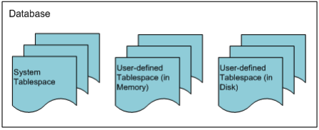

Figure 6-1 The Relationship between a database and tablespaces

#### The Structure of Disk Tablespace

A disk tablespace is a tablespace where all data are stored on disk. It is physically organized into data files and logically organized into segments, extends, and pages.  

##### Disk Tablespace Physical Structure

Disk tablespaces are closely related to data files and segments. [Figure 6-2] shows the relationship between disk tablespace and data files and segments. 

Disk tablespaces, data files, and segments have the following characteristics: A disk tablespace consists of one or more data files, which exist in the form of files supported by the operating system. A segment is stored in a tablespace logically and in a data file physically. A segment is wholly contained within a particular disk tablespace, but segments can refer to segments that are stored in other disk tablespaces.

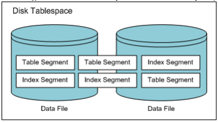

Figure 6-2 The Relationships between Disk Tablespaces, Data Files and Segments

##### Disk Tablespace Logical Structure

A disk tablespace logically consists of segments, extents, and pages. The relationships between them are shown in [Figure 6-3]. 

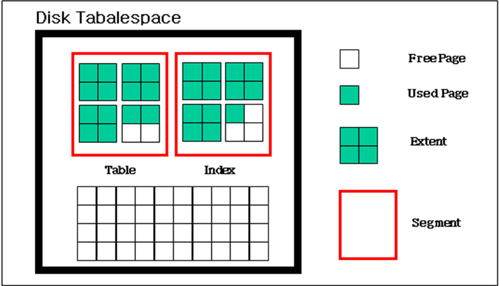

Figure 6-3 The Logical Structure of a Disk Tablespace

###### Segment

A segment is a set of extents that contains all of the data for an object within a tablespace. Segments are units that allocate tables or indexes within a tablespace. A single table or index is logically the same as one segment. The types of segments used in Altibase are as follows:

| Segment Type  | Description                                                  |
| ------------- | ------------------------------------------------------------ |
| Table Segment | This segment type is the most basic means of storing data within a database. All of the data in a table, or, in the case of a partitioned table, all of the data in a partition, are stored in a single table segment. When a table is created, Altibase allocates this table segment in a tablespace. |
| Index Segment | A single index segment contains all of the data for one index, or for one partition of a partitioned index. The purpose of an index is to assist in locating data in a table based on some particular key. When an index is created, Altibase allocates an index segment to a tablespace. |
| Undo Segment  | Undo segments are used by transactions that change the database. Before a table or index is changed, the value before the change (i.e. the "before-image") is stored in an undo segment so that the change can be undone if the associated transaction is rolled back. |
| TSS Segment   | These are used for managing Transaction Status Slots, which are managed internally within Altibase. They are allocated within system undo tablespace. |

Table 6-1 Segment Type

Each segment internally maintains a free extent list and a full extent list. When there are not enough free extents, a request is made to add one or more additional extents to a tablespace

###### Extent

In disk tablespace, an extent is a unit by which contiguous pages, which are the resource required for storing data objects, are assigned. When saving data, if there are not enough free pages available to save the data, additional pages are allocated in extent units. 

By default, a single disk tablespace extent consists of 64 pages (512KB). In Altibase, the extent size can be specified individually for each tablespace.

###### Page

The smallest unit for storing records in tables and indexes is called the page, which is also the smallest unit for performing I/O. In Altibase, the page size is 8KB. (The simultaneous use of multiple page sizes isn't supported in Altibase.) 

There are several kinds of pages, including data pages, index pages, and undo pages, corresponding to the kind of data that are stored in the pages. 

The basic structure of pages, as well as how to store data in them, are described below.

###### Page Structure

A page has a header for storing basic information about the page, free slots (this is the only instance of the term “Free slot” in this document), and the like. Records are stored in the remaining space. A page is internally divided into 5 areas, as shown below: 

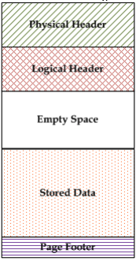

Figure 6-4 The Structure of a Page in Disk Tablespace

-   Physical Header  
    This area contains information that is common to all data pages, regardless of type.

-   Logical Header 
    This area contains information that is necessary depending on the type of page.

-   Free Space
  

This area is used to save new data.
    
-   Stored Procedure Data  
    Rows, indexes, or undo records are stored here depending on the type of page.

-   Page Footer
  
    This area is located at the end of the page, and contains information that is used to check page integrity.

###### How Records are Stored in a Page

The records in a page are stored in free space, starting from the end of the page and working towards the beginning of the page. 

The logical header of the page is saved extending toward the end of the page. Its size is variable.

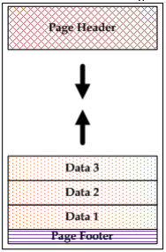

[Figure 6-5] How Records are Stored in a Page

#### The Structure of Memory Tablespace

A memory tablespace is a tablespace in which all data are stored in memory. The physical structure consists of checkpoint image files and logically consists of pages and page lists. 

##### Memory Tablespace Physical Structure

Memory tablespaces are closely related to checkpoint image files. [Figure 6-6] shows the relationship between a memory table space, tables, and checkpoint image files. 

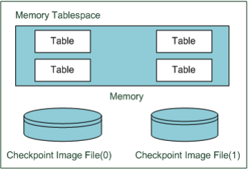

[Figure 6-6] The Relationship between a Memory Tablespace , Tables and Checkpoint Image Files

Memory tablespaces, tables, and checkpoint image files have the following characteristics: 

A memory tablespace, unlike a disk tablespace, stores data in linear memory space rather than in data files. 

Because a continuous memory space is divided into pages, a table can be thought of as a list of pages. In the interests of managing disk I/O expense and tables containing large amounts of data, disk tablespaces are managed in units of extents, not pages. A segment is, conceptually, a way of managing a list of extents.

However, because the purpose of memory tablespace is to provide faster access to data than managing large amounts of data, the concept of segments and extents is not necessary. Therefore, tables in a memory tablespace are managed using lists of pages. 

Memory tables are physically backed up in checkpoint image files when checkpointing occurs. The purpose of checkpoint image files is different from that of data files in a disk tablespace. Data files in a disk tablespace are for storing objects, whereas checkpoint image files are for backing up objects in a memory tablespace. Checkpoint image files are not directly required for the operation of the database. However, they are required in order to reduce the amount of time taken to perform backup and recovery. 

When checkpointing occurs, pages in memory are stored in files of a type supported by the operating system. In Altibase, so-called "ping-pong checkpointing" is implemented, which means that two sets of checkpoint image files (namely, #0 and #1) are maintained, and used alternately when checkpointing takes place. In addition, each checkpoint image can be divided into several small files, with the goal of distributing disk I/O expenses.

##### Memory Tablespace Logical Structure

The elements that logically constitute memory tablespace are page lists and pages. The relationship between these elements is shown in [Figure 6-7].

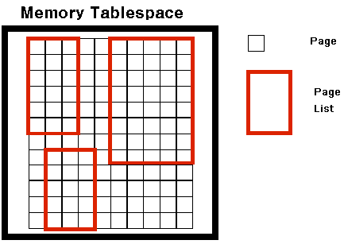

[Figure 6-7] The Logical Structure of Memory Tablespace

###### Page List

The concept of a page list explains how tables are logically configured in a memory tablespace. A page list is a list of pages, which are the unit into which the memory occupied by a memory tablespace is divided. 

Tables are the only memory tablespace objects for which page lists are maintained. Because the object of indexes is not to maintain database consistency, they do not use page lists. When the system is restarted, memory table indexes are rebuilt, which eliminates the load that would otherwise be imposed by performing index logging while the database is running. 

###### Page

The characteristics of memory tablespaces are different from those of disk tablespaces with respect to the structure of pages and the way that data are stored. 

Unlike disk tablespaces, when dealing with memory tablespaces, there is no need to consider disk I/O expense, and thus the method of updating records is so-called “out-place update”. 

In the out-place update, the existing record image is not directly changed; rather, record space is allocated for the new version of the record. This update process consists of deleting the existing record and inserting a new record, thereby eliminating the cost of rearranging the record that currently exists. In addition, it allows direct access to existing data, ensuring fast performance in highly concurrent applications.

#### The Structure of Volatile Tablespace

The structure of a volatile tablespace is identical with that of a memory tablespace in that all data are stored in memory. The difference between them is that, in a volatile tablespace, there is no checkpoint image file on disk. The data in a volatile tablespace reside only in memory.

Since tasks that are conducted in a volatile tablespace are not accompanied by disk logging and are not subjected to checkpointing, they entail absolutely no disk I/O. As a result, volatile tablespaces are useful in applications requiring fast performance. Logically, they consist of page lists and pages.

##### Volatile Tablespace Physical Structure

The structure of volatile tablespaces is identical with that of memory tablespaces in that database objects reside in memory. However, volatile tablespaces do not have checkpoint image files. 

##### Volatile Tablespace Logical Structure

Just like memory tablespaces, the constituent elements of volatile tablespaces are page lists and pages.

### Classifying Tablespaces

The tablespaces provided in Altibase can be classified into three kinds based on the three following criteria. A single type of tablespace can have more than one of the properties listed below:

-   Where the Data are Stored

-   By What Data are Stored

-   By Who the Creator is

#### By Where the Data are Stored

Altibase tablespaces can be classified depending on where the data are stored as follows:

-   Memory-Resident Tablespace

-   Disk Tablespace

##### Memory-Resident Tablespace

Memory-resident tablespaces are classified as either memory tablespace or volatile tablespace based on whether logging is performed and on whether disk image files exist. 

Memory tablespaces are tablespaces for storing objects in memory. Because all objects stored in memory tablespaces use memory-based database technology, the user can access data in real time. However, the size of memory tablespaces is limited by the amount of physical memory space that is available in the system. 

Volatile tablespaces are tablespaces for storing objects in memory without disk I/O operations. Because all objects stored in volatile tablespaces use memory-based database technology and additional technologies, the user can access data in real time. However, the size of the volatile tablespace cannot exceed the available physical memory space of the system, and all volatile data objects will be lost when the database server shuts down.

##### Disk Tablespace

A disk tablespace is a tablespace for storing disk-based objects. It is intended for the management of large amounts of data rather than for rapid data access. Accessing objects that are stored in disk tablespaces entails disk I/O. Because this disk I/O expense accounts for most of the data access time, disk tablespaces use memory buffers to reduce disk I/O expenses. 

#### By What Data are stored

Altibase tablespaces can also be classified depending on what data are stored in them as follows: 

-   The Dictionary Tablespace 
-   The Undo Tablespace 
-   Temporary Tablespace 
-   Data Tablespace

##### The Dictionary Tablespace

The dictionary tablespace is the tablespace for storing the meta data that are required for system operation. A database can have only one dictionary tablespace, which is automatically created by the system when a database is created. Users cannot create objects in dictionary tablespace; only the system can create system objects for managing meta data. In order to ensure fast access to meta data, the dictionary tablespace exists in memory. If the dictionary tablespace crashes, the entire database becomes inoperable, in which case the database will need to be restored through backup and media recovery. 

##### The Undo Tablespace

The undo tablespace is for storing undo images that remain after operations are conducted on disk objects. Since Altibase uses Multi-Version Concurrency Control, it requires space in which to store images that show the state of data before changes were made. These so-called "before images" are stored in the undo tablespace. 

Only one undo tablespace can exist in the database, and it is shared by all disk tablespaces in the database. This makes the undo tablespace essential for system operation, like the dictionary tablespace. It can be backed up, but the entire tablespace must be backed up at one time.

##### Temporary Tablespace

A temporary tablespace is a tablespace for storing temporary results generated during query execution. As a result, all data in the temporary tablespace pertaining to the query disappear when the associated transaction is completed.

With this type of tablespace, concurrency control, logging for recovery and the like are not conducted, enabling fast read and write speeds. There can be more than one temporary tablespace in the database, and users can create user-defined temporary tablespaces as desired. Note that temporary tablespaces cannot be backed up. 

##### Data Tablespace

Data tablespaces are for storing user-defined objects. There can be more than one data tablespace in the database, and the user can create a data tablespace as a disk, memory, or volatile tablespace based on the characteristics of the data to be stored therein. 

#### By Who the Creator Is

Additionally, Altibase tablespaces can be classified by who created them as follows: 

-   System Tablespace

-   User-defined Tablespace

##### System Tablespace

A system tablespace is a tablespace for storing data required for the operation system. The system tablespaces include the system dictionary tablespace,  system undo tablespace, system data tablespace, and system temporary tablespace. System tablespaces are created when the database is created, and cannot be deleted or renamed by users. Backup and media recovery can be performed for system tablespaces.

##### User-defined Tablespace

A user-defined tablespace is a tablespace for storing the content of user-defined objects. The meta data pertaining to objects defined in user-defined tablespaces are stored in the dictionary tablespace. User-defined tablespaces can be explicitly deleted or renamed by users. Additionally, backup and media recovery can be performed for entire tablespaces.

#### Tablespace List

Multiple tablespaces are created when a database is created. 

As shown in the below table, these include the system tablespaces, temporary tablespaces, and basic memory and disk tablespaces for direct use by users. 

In addition, users can add more tablespaces using the ‘CREATE TABLESPACE’ statement.

| **ID** | **Tablespace Type**              | **Data Storage Location** | **Tablespace Name** | **Time of Creation**             |
| ------ | -------------------------------- | ------------------------- | ------------------- | -------------------------------- |
| 0      | SYSTEM DICTIONARY TABLESPACE     | Memory                    | SYS_TBS_MEM_DIC     | CREATE DATABASE                  |
| 1      | SYSTEM MEMORY DEFAULT TABLESPACE | Memory                    | SYS_TBS_MEM_DATA    | CREATE DATABASE                  |
| 2      | SYSTEM DISK DEFAULT TABLESPACE   | Disk                      | SYS_TBS_DISK_DATA   | CREATE DATABASE                  |
| 3      | SYSTEM UNDO TABLESPACE           | Disk                      | SYS_TBS_DISK_UNDO   | CREATE DATABASE                  |
| 4      | SYSTEM DISK TEMPORARY TABLESPACE | Disk                      | SYS_TBS_DISK_TEMP   | CREATE DATABASE                  |
| >=5    | USER MEMORY DATA TABLESPACE      | Memory                    | User-Defined        | CREATE MEMORY DATA TABLESPACE    |
| >=5    | USER DISK DATA TABLESPACE        | Disk                      | User-Defined        | CREATE DISK DATA TABLESPACE      |
| >=5    | USER DISK TEMPORARY TABLESPACE   | Disk                      | User-Defined        | CREATE DISK TEMPORARY TABLESPACE |
| >=5    | USER VOLATILE DATA TABLESPACE    | Memory                    | User-Defined        | CREATE VOLATILE DATA TABLESPACE  |

[Table 6-2] Tablespace List

### Disk Tablespace

A disk tablespace is a tablespace in which all of the data therein are stored on disk. This section discusses the structure of disk tablespaces, which is based on disk data pages, and how row data are input into disk pages.

#### Data Page Structure

In Altibase, the smallest unit of database storage space management is the page. The size of a page is 8KB. Multiple page sizes are not supported.

A data page is one of several kinds of pages, and stores row data. Row data are stored in free space, starting from the end of the page. If there is not enough free space, it is advisable to create larger regions of free space using compaction to turn fragmented space into contiguous space.

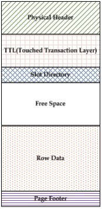

[Figure 6-8] The Structure of a Data Page in Disk Tablespace

The data page consists of six different areas, as shown in [Figure 6-8].

-   Physical Header 
    This area contains information common to all pages, regardless of the type of page.
    
-   TTL (Touched Transaction Layer)  
    This area contains MVCC (Multi-Version Concurrency Control) related information.

-   Slot Directory
    This area contains information about so-called “row offset”, that is, the location within the page at which the Row Data area is saved.
    
-   Free Space  
    This area is available space that is used for saving the results of operations such as insert and update operations.

-   Row Data

-   Page Footer  
    This area is located at the end of the page and contains information that is used for checking page integrity. 

#### Managing Space in Disk Tablespace

Disk tablespace can be manually managed using the PCTFREE and PCTUSED parameters. 

The PCTFREE and PCTUSED parameters can be used to control the use of free space when performing input or update operation on raw data. 

These two parameters are set using the PCTFREE and PCTUSED properties in the altibase.properties file. They can also be explicitly specified when a table is created using the CREATE TABLE statement or changed using the ALTER TABLE statement.

##### PCTFREE

PCTFREE is the minimum amount of free space, expressed as a percentage, that is reserved for updating rows that have already been stored in a page. 

For example, if PCTFREE is set to 20, data can be inserted into the page until it is 80% full, and the remaining 20% of the page will be set aside for use in updating existing rows.

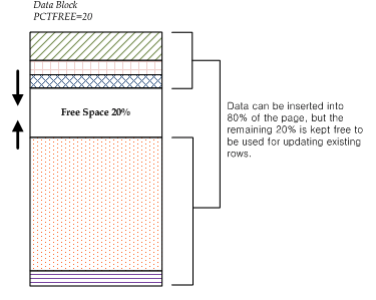

[Figure 6-9] PCTFREE and Page Structure

##### PCTUSED

PCTUSED is the threshold percentage below which the amount of used space in a page must decrease in order for the page to change from the state in which only update operations are possible to the state in which records can be inserted. 

If the amount of free space falls below the limit specified in PCTFREE, it becomes impossible to insert new records into the page, and free space in the page can only be used to update existing rows. This state persists until the percentage of used space falls below the threshold specified by PCTUSED.

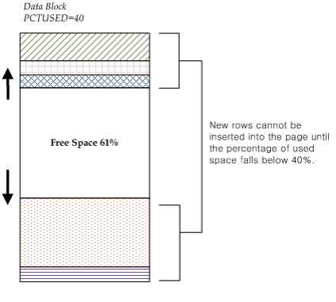

[Figure 6-10] PCTUSED and Page Structure

#### Row Structure

Rows can be divided into one or more pieces. If it is possible to store an entire row in a page, it is saved as one row piece. However, if it is not possible to store the row in a single page, the row is divided into several pieces and then saved. 

These row pieces are "chained", that is, they are associated with each other via a common ROWID value.

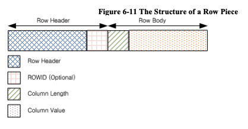

[Figure 6-11] The Structure of a Row Piece

A row piece consists of a row header and a row body. 

A row header contains header information of 18 bytes size. In the case of a chained row piece, the row header contains 6 more bytes for storing the value of ROWID.

In the row body, pairs comprising the length of a column and the value stored in the column are stored sequentially. If the value stored in the column is less than 250 bytes, only 1 byte is necessary for storing the column length, whereas 3 bytes are used to store the column length if the value stored in the column exceeds 250 bytes. 

In order to conserve space, if the value of the column is NULL, only the length of the column, which is 0, is saved. No column value is saved. Additionally, for columns that contain NULL values and are located at the end of the row, neither the column value nor the length is saved.

Columns are saved in the order in which they are specified in the CREATE TABLE statement. Therefore, when executing the CREATE TABLE statement, locating columns that are expectedto contain NULL values at the end of the row frequently is good practice, because it can reduce the amount of space required to store rows.

#### Row Chaining and Migration

When row data are too large to be saved in a single page, row chaining and row migration will occur. 

Row chaining occurs when data that are being inserted are so large that the row containing them cannot fit in a single page. When row chaining occurs, long rows are divided into pieces and saved in multiple pages. These pieces are associated with one another by their common ROWID value.

Row migration occurs when a row that was saved in a single page is increased in size by an update operation and thus can no longer fit in a single page. In this case, the entire row is migrated to new pages. The original row becomes a pointer that indicates the new location where the row is saved. However, when a row is migrated, the ROWIDs of its pieces do not change.

When row chaining or migration occurs, one more page must be read during DML processing, resulting in performance deflation due to disk I/O.

### The Undo Tablespace

The undo tablespace is for storing information that is used to cancel update operations. Because Altibase uses Multi-Version Concurrency Control (MVCC), which requires free space to store images of data before update operations. 

Only one undo tablespace exists in the database and is shared by all disk tablespaces in the database. 

This section describes the features of the undo tablespace and how to manage it, including how to determine its size.

-   Undo Record

-   Features of the Undo Tablespace

-   Transaction Segment Management

-   Reusing Segment Space

-   Modifying the Undo Tablespace

#### Undo Records

The database must maintain related information to rollback or undo the results of updated transactions. This information is usually stored as undo records before the transactions are committed. 

Undo records are used for the following purposes: 

-   Rolling back transactions
-   Recovering the database
-   Guaranteeing read consistency.

When a ROLLBACk statement is executed, undo records are used to undo database changes caused by uncommitted transactions. 

Undo records are also used during database recovery. After the database has been restored by re-executing transactions (“REDO”) on the basis of log files, undo records are used to cancel changes that were not committed.

Additionally, when a record that is in the process of being changed by a transaction is read by another transaction, even though the transactions access the record simultaneously, read consistency is guaranteed because an image of the record before the change is stored in the undo record.

#### Features of the Undo Tablespace

The features of the undo tablespace are as follows:

-   The undo tablespace is automatically managed by the system. 
-   The default undo tablespace file is undo001.dbf, which is in auto extension mode. Data files can be added to the undo tablespace, and their sizes can be changed. 
-   The undo tablespace can be backed up online. 
-   Database objects other than TSS segments and undo segments cannot be created in the undo tablespace. 
-   Because the undo tablespace is a system tablespace, it cannot be taken offline or discarded. 
-   The undo tablespace is reset whenever the server is restarted.

In Altibase, information about the undo tablespace and the space in the undo tablespace are managed by the system. In other words, the server automatically manages the space and segments in the undo tablespace. 

The undo tablespace is created when the database is created. Because it is a system tablespace, only one undo tablespace can exist. If the undo tablespace does not exist, the server will fail to start up, and an error message will be written to the boot log.

In the undo tablespace, transaction segments (TSS segments and undo segments) are managed. The user can change the number of transaction segments using the TRANSACTION_SEGMENT_COUNT property. The numbers of TSS segments and undo segments that are created, respectively, equal the number specified by the user in this property. If the TRANSACTION_SEGMENT_COUNT property is set to 255, 255 TSS segments and 255 undo segments are created every time the server is started up

If this property is changed to other values to specify a different number of transaction segments, that number of segments will be created the next time the server is restarted.

#### Transaction Segment Management

A transaction segment consists of one TSS segment and one undo segment, that is essential for update transactions in disk tablespaces. A transaction segment can't be simultaneously shared by multiple transactions, because one transaction segment is bound to one update transaction, and is not unbound until the disk update transaction has been completed.

The transaction segments that are currently bound can be checked by querying the V＄TXSEGS performance view. When a transaction segment is bound to an update transaction that takes place in a disk tablespace, a record indicating the segment ID and the transaction ID is created in V$TXSEGS. When the segment is unbound, the record is deleted. 

In addition, space allocated for TSS segments and undo segments can be reused by other transactions after the segments expire. Therefore, when space is required for undo transactions, the undo tablespace does not necessarily need to be expanded by creating segments; instead, segments that have expired can be reused.

TSS segments are allocated for reuse in units of one megabyte (1MB), and undo segments in units of two megabytes (2MB).

The following user properties pertain to undo tablespace: 

-   SYS_UNDO_FILE_INIT_SIZE  
    The initial size of the undo tablespace data files at the time of creation 

-   SYS_UNDO_FILE_MAX_SIZE  
    The maximum size of the undo tablespace data files

-   SYS_UNDO_TBS_NEXT_SIZE  
    The amount by which the size of the undo tablespace data files is automatically extended

-   SYS_UNDO_TBS_EXTENT_SIZE  
    The number of pages in one extent in undo tablespace 

-   TRANSACTION_SEGMENT_COUNT  
    The number of transaction segments 

#### Reusing Segment Space

After a transaction has been committed, undo data are needed for rollback or recovery transaction. However, so-called "long-term transactions", meaning transactions that take a long time to commit, require previous versions of records that rely on undo data for read consistency. However, after sufficient time has passed, undo data are not required for the purpose of ensuring read consistency either.

Therefore, Altibase maintains undo records pertaining to committed transactions only as long as necessary, allows other transactions to resue the space occupied by the undo data after that period. 

If there are no active transactions accessing the space containing the undo data for transactions that have been committed, the so-called "undo space" is said to have expired. Conversely, if active transactions that might need to access the undo space still exist, space is considered valid, or unexpired. Expired undo space can be reused by other transactions, whereas unexpired space cannot. 

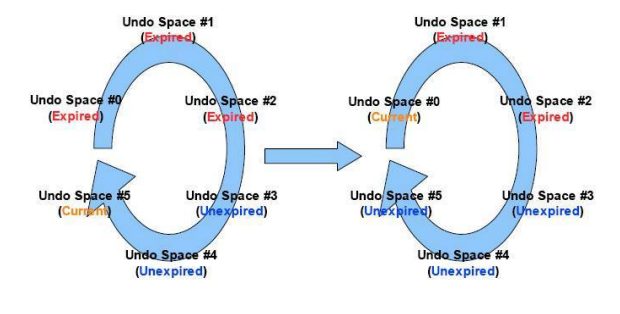

[Figure 6-12] Reusing Undo Spaces in an Undo Segment

In the above figure, it shows how the cyclical structure of undo segments allows undo space to be reused

Undo spaces are used sequentially starting with undo space #0, until undo space #5 that is currently being used. Then, if undo space #0, which is the next undo space to be used, is confirmed to have expired, then when all of undo space #5 has been used up, undo space #0 is reused without requiring expansion of the undo segment.

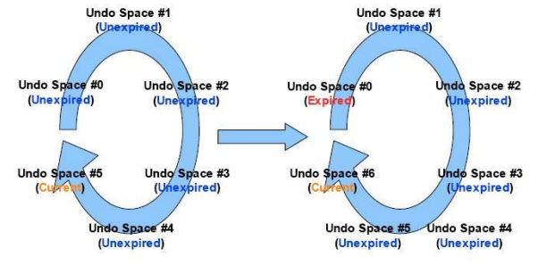

[Figure 6-13] Undo Segment Expansion

However, if undo space #0 has not expired, extents are added to the undo segment, thus creating undo space #6, as can be seen in [Figure 6-13]. 

This reuse of segment space applies equally to TSS segments. 

#### Modifying the Undo Tablespace

The undo tablespace can be modified using the ALTER TABLESPACE statement. However, because the undo tablespace is usually managed by the system, only the following operations can be conducted by the user:

-   Adding or dropping data files

-   Increasing or reducing the size of data files

-   Starting or completing the online backup of data files

If the undo tablespace has insufficient space, or in order to prevent errors related to insufficient space, either add data files to the undo tablespace or increase the size of the existing data files. 

The following example is an exampole of adding a data file to an undo tablespace:

```
ALTER TABLESPACE SYS_TBS_DISK_UNDO 
ADD DATAFILE ‘undo002.dbf’ AUTOEXTEND ON NEXT 1M MAXSIZE 2G;
```

A data file can be dropped using the ALTER TABLESPACE … DROP DATAFILE statement, and can be increased or decreased in size using the ALTER TABLESPACE ... ALTER DATAFILE… statement. 

Additionally, data file backup can be commenced using the ALTER TABLESPACE … BEGIN BACKUP statement, and can be completed using the ALTER TABLESPACE … END BACKUP statement.

### Tablespace States

A tablespace can be in an online, offline, or discarded state depending on the service state. 

The state of user-defined disk and memory tablespaces can be changed from online to offline or vice-versa. However, the state of volatile and temporary tablespaces cannot be changed. Additionally, the state of tablespaces that contain tables to be replicated cannot be changed.

The ALTER TABLESPACE ONLINE and ALTER TABLESPACE OFFLINE statements can be used to change the state of a tablespace. 

However, please note that this can only be achieved during the Meta and Service startup phases.

#### Online

In this state, all resources related to the tablespace are allocated and prepared,  and the tablespace is ready to be used in the database. DML and DDL statements can be executed on the tablespace and on the tables and indexes within them. If it is desired to temporarily prevent a tablespace that is currently online, along with all of the tables and indexes it contains, from being used, all that is required is to take it offline by executing the ALTER TABLESPACE ... OFFLINE statement.

#### Offline

It is impossible to execute DML and DDL statements on the tables or indexes that exist in an offline tablespace. 

In addition, the only DDL statements that can be executed on the tablespace are the DROP TABLESPACE, ALTER TABLESPACE DISCARD, and ALTER TABLESPACE ONLINE statements.

The ALTER TABLESPACE ONLINE statement is used to bring an offline tablespace back online so that it can be accessed, along with the tables and indexes it contains. 

Because the objects in a memory tablespace are not loaded into memory when the memory tablespace is offline, in situations where the amount of memory is limiting (that is, insufficient), the user is advised to take memory tablespaces offline.

#### Discard

If Altibase fails to start normally due to the consistency of a particular tablespace has been broken, the database should be able to operate normally except for the broken tablespace. In order to accomplish this, the tablespace must be discarded.

Tablespaces are discarded during the ALTER TABLESPACE DISCARD statement, which can be executed only during the control startup phase. 

Please be aware that the only statement that can be executed on a discarded tablespace is the DROP TABLESPACE statement, and thus care should  be taken when executing the ALTER TABLESPACE DISCARD statement. 

### Managing Tablespaces

This section describes how to manage tablespaces in Altibase.

#### CREATE

A tablespace can be created only by the SYS user or by a user to whom the Create Tablespace authority has been granted. To create a tablespace, use the CREATE TABLESPACE … SQL statement. Only user-defined data tablespaces can be created. That is, system tablespaces cannot be created by the user.

Disk tablespaces are classified as either disk data tablespaces or disk temporary tablespaces. 

Memory tablespaces are memory data tablespaces. There is no such thing as a “memory temporary tablespace”. 

Similarly, all volatile tablespaces are volatile data tablespaces. There are no “volatile temporary tablespaces”. 

The SQL statement that is used to create tablespaces is described below:

```
CREATE [DISK/MEMORY/VOLATILE] [DATA/TEMPORARY] TABLESPACE
```

(1) Tablespace Name

(2) Disk Data File Attributes

(3) Disk Temporary File Attributes

(4) Memory Tablespace Attribute

(5) Volatile Tablespace Attribute

When determining whether to create a memory, disk, or volatile tablespace, the user should consider the characteristics of the objects to be stored in the tablespace, such as their size and how often it is expected that they will be accessed. 

The tablespace attributes that can be specified when a tablespace is created vary depending on whether the tablespace is a disk, memory, or volatile tablespace. Unlike a disk tablespace, in which multiple data files are managed, in a memory tablespace, the objects are stored in single continuous memory space. Therefore, when a disk tablespace is created, some of the attributes that are specified apply to individual data files, whereas when a memory tablespace is created, all of the attributes apply to the entire memory tablespace. In other words, attributes such as the initial size and the size to which the tablespace can expand are set for a memory tablespace, whereas the attributes that are set for a disk tablespace apply to its data files.

##### Tablespace Name

The tablespace name must be unique. No more than one object of the same name can be created. While the names of data files can be set in a disk tablespace, for a memory tablespace, only the path where the checkpoint image will be stored can be specified. The name of the checkpoint image is automatically generated based on the name of a tablespace.

##### Disk Data File Attributes

Data file attributes can only be set for disk data tablespaces. The DATAFILE clause has the following form: 

```
DATAFILE [DATAFILE Clause
AUTOEXTEND [AUTOEXTEND CLAUSE 
MAXSIZE [MAXSIZE Clause] ] ] 
EXTENTSIZE [EXTENTSIZE Clause]
```

Each data file can have the following attributes:

###### DATAFILE Clause

```
DATAFILE {datafile path and name} SIZE integer [K/M/G] [REUSE]
```

This is used to specify the data file path and name. The SIZE clause and the REUSE clause can be omitted. The SIZE clause is used to specify the initial size of a data file when it is created. Each data file includes a file header. SIZE is the total size of all pages, excluding the page for the file header (1 page). As a result, the specified initial size of a data file and its actual size are not the same. If the maximum file size supported by the operating system is smaller than the specified initial size, an error will be returned.

###### AUTOEXTEND Clause

```
AUTOEXTEND [{ON NEXT integer [K/M/G]}/{OFF}]
```

This attribute determines whether a disk data file will increase in size. If it is set to ON, the size of the data file is automatically increased by the system. If it is set to OFF, the user must explicitly increase the file size. The increment by which the temporary file is extended can be specified by the user in the NEXT clause.

When a data file is being extended, that is, when it is being increased in size, all operations that are underway in the tablespace to which the data file belongs must wait until the operation to increase the size of the data file is complete.

###### MAXSIZE Clause

```
MAXSIZE {{integer [K/M/G]}/{UNLIMITED}}
```

This clause is a subclause of the AUTOEXTEND clause and indicates the maximum size to which the data file can be increased. Like the initial size, if the maximum file size supported by the operating system is smaller than the maximum size specified for a data file, the maximum size is set to the maximum file size of the operating system. If MAXSIZE is set to UNLIMITED, the data file is increased in size until all of the available disk space has been used up.

###### EXTENTSIZE Clause

```
EXTENTSIZE {{integer [K/M/G]}/{UNLIMITED}}
```

This clause defines the size of an extent, that is, (the size of a page) * (the number of pages that are allocated to a table segment or index segment in disk tablespace at one time). If the extent size is not specified, it defaults to 512kB (64 pages).

##### Disk Temporary File Attributes

Temporary file attributes can only be set for disk temporary tablespaces. The TEMPFILE clause has the following form:

```
TEMPFILE {TEMPFILE Clause}
AUTOEXTED [AUTOEXTEND Clause
MAXSIZE [MAXSIZE Clause] ]
EXTENDSIZE [EXTENTSIZE Clause]
```

Each temporary file can have the following attributes:

###### TEMPFILE Clause

```
TEMPFILE {datafile path and name} SIZE integer [K/M/G] [REUSE]
```

This specifies the path and name of a temporary file. The SIZE clause and the REUSE clause can be omitted. The SIZE clause is used to specify the initial size of a temporary file when it is created. Each temporary file includes a file header. SIZE is the total size of all pages, excluding the page for the file header (1 page). As a result, the specified initial size of a temporary file and its actual size are not the same. If the maximum file size supported by an operating system is smaller than the specified initial size, an error will be returned.

###### AUTOEXTEND Clause

```
AUTOEXTEND [{ON NEXT integer [K/M/G]}/{OFF}]
```

This attribute determines whether a disk temporary file will increase in size. If it is set to ON, the size of the data file is automatically increased by the system. If it is set to OFF, the user must explicitly increase the file size. The increment by which the data file is extended can be specified by the user in the NEXT clause.

###### MAXSIZE Clause

```
MAXSIZE {{integer [K/M/G]}/{UNLIMITED}}
```

This clause is a subclause of the AUTOEXTEND clause and indicates the maximum size to which the temporary file can be increased. Like the initial size, if the maximum file size supported by the operating system is smaller than the maximum size specified for a temporary file, the maximum size is set to the maximum file size of the operating system. If MAXSIZE is set to UNLIMITED, the temporary file is increased in size until all of the available disk space has been used up.

###### EXTENTSIZE Clause

```
EXTENTSIZE integer [K/M/G]
```

This clause defines the size of an extent, that is, (the size of a page) * (the number of pages that are allocated to a table segment or index segment in temporary tablespace at one time). If the extent size is not specified, it defaults to 256kB (32 pages).

##### Memory Tablespace Attributes

The attributes for memory tablespace are similar to those for disk tablespaces, but additionally include a checkpoint image path attribute. Their syntax is as follows:

```
SIZE {SIZE Clause} 
AUTOEXTED [AUTOEXTEND Clause
MAXSIZE [MAXSIZE Clause] ]
CHECKPOINT PATH [CHECKPOINT PATH]
```

Memory tablespaces can have the following attributes:

###### SIZE Clause

```
SIZE integer [K/M/G]
```

This is the amount of memory that must be initially allocated when a memory tablespace is created. This value must be a multiple of the default extension increment size for memory tablespaces. (This increment size is equal to the number of page(s) specified in the EXPAND_CHUNK_PAGE_COUNT property multiplied by the size of a memory tablespace page(32KB).<sup>2</sup>)

[<sup>2</sup>]For example, if EXPAND_CHUCK_PAGE_COUNT is set to 128, the default expansion size of the memory tablespace is calculated to be 128 * 32K, which is 4MB. Therefore, the specified size as SIZE is a multiple of 4MB.

The size can be specified in kilobytes (“K”), megabytes (“M”) or gigabytes (“G”). If no units are specified, the default unit is kilobytes (“K”).

###### AUTOEXTEND Clause

```
AUTOEXTEND [{ON NEXT integer [K/M/G]}/{OFF}]
```

This determines whether the size of memory tablespace will be increased automatically. If it is set to ON, the tablespace is automatically increased in size by the system, whereas if it is set to OFF, the user must explicitly increase the size of the tablespace. The extension increment size, that is, the amount by which the size is increased, can be specified by the user. The NEXT clause indicates the extension increment size. 

Like the initial size, the extension size must be set to a multiple of the page size specified in the EXPAND_CHUNK_PAGE_COUNT property. 

If the automatic extension size is too small, the automatic extension can occur too often. When Altibase performs automatic extension, it adds up the size of all memory tablespaces and compares the total size with the size specified in the MEM_MAX_DB_SIZE property. Frequently performing these operations can degrade system performance. 

###### MAXSIZE Clause

```
MAXSIZE {{integer [K/M/G]}/{UNLIMITED}}
```

This is a subclause of the AUTOEXTEND clause and indicates the maximum size to which a memory tablespace can be extended. Like the initial size, it cannot exceed the amount of memory space available in the system. If it is set to UNLIMITED, the tablespace is automatically increased in size until the total size of all memory tablespaces in the system reaches the limit specified in the MEM_MAX_DB_SIZE property. 

###### CHECKPOINT PATH

```
CHECKPOINT PATH ‘Checkpoint Image Path List’ 
SPLIT EACH integer [K/M/G]
```

The checkpoint image path attribute only applies to memory tablespaces. Altibase uses ping-pong checkpointing for high-performance transaction processing in memory tablespaces. For ping-pong checkpointing, at least two sets of checkpoint images are created on disk. Each checkpoint image can be divided into several files and saved in that form. The size of the files into which the checkpoint image is divided can be specified using the SPLIT EACH clause. These files can be stored in different paths in order to distribute the expense of disk I/O. The user can freely specify the size of the files into which the checkpoint image is divided and the path where the checkpoint images are saved. The user can add or change paths for saving checkpoint image files, but cannot change the size of the files into which the checkpoint image is divided once it has been set.

##### Volatile Tablespace Attributes

The attributes that are applicable to volatile tablespaces are similar to those for memory tablespaces, with the exception that the checkpoint image path attribute is not supported.

```
SIZE {SIZE Clause} 
AUTOEXTED [AUTOEXTEND Clause
MAXSIZE [MAXSIZE Clause] ]
```

Volatile tablespaces can have the following attributes:

###### SIZE Clause

```
SIZE  integer [K/M/G]
```

This specifies the initial memory size that is allocated when a volatile tablespace is created. This value must be a multiple of the default extension increment size for memory tablespaces. (This increment size is equal to the number of page(s) specified in the EXPAND_CHUNK_PAGE_COUNT property multiplied by the size of a memory tablespace page (32KB).<sup>3</sup>)

[<sup>3</sup>] For example, if EXPAND_CHUCK_PAGE_COUNT is set to 128, the default expansion size of the memory tablespace is calculated to be 128 * 32K, which is 4MB. Therefore, the specified size as SIZE is a multiple of 4MB.

The size can be specified in kilobytes ("K"), megabytes ("M") or gigabytes ("G"). If no units are specified, the default unit is kilobytes ("K").

###### AUTOEXTEND Clause

```
AUTOEXTEND [{ON NEXT integer [K/M/G]}/{OFF}]
```

This determines whether the size of volatile tablespace will be increased automatically. If it is set to ON, the tablespace is automatically increased in size by the system, whereas if it is set to OFF, the user must explicitly increase the size of the tablespace. The extension increment size, that is, the amount by which the size is increased, can be specified by the user in The NEXT clause. 

Like the initial size, the extension size must be set to a multiple of the page size specified in the EXPAND_CHUNK_PAGE_COUNT property.

If the automatic extension size is too small, automatic extension can occur too often. When Altibase performs automatic extension, it adds up the size of all volatile tablespaces and compares the total size with the size specified in the VOLATILE_MAX_DB_SIZE property. Frequently performing these operations can degrade the system performance. 

###### MAXSIZE Clause

```
MAXSIZE {{integer [K/M/G]}/{UNLIMITED}}
```

This is a subclause of the AUTOEXTEND clause and indicates the maximum size to which a volatile tablespace can be extended. Like the initial size, it cannot exceed the memory space available in the system. If it is set to UNLIMITED, the tablespace is automatically increased in size until the total size of all memory tablespaces in the system reaches the limit specified in the VOLATILE_MAX_DB_SIZE property.

*Examples*

Ex.1) To create a disk data tablespace comprising 3 data files:

```
iSQL> CREATE DISK DATA TABLESPACE user_data DATAFILE
‘/tmp/tbs1.user’ SIZE 10M AUTOEXTEND ON NEXT 1M MAXSIZE 1G,
‘/tmp/tbs2.user’ SIZE 10M AUTOEXTEND ON NEXT 1M MAXSIZE 500M,
‘/tmp/tbs3.user’ SIZE 10M AUTOEXTEND ON NEXT 1M MAXSIZE 1G;
Create success.
```

Ex.2) To create a memory data tablespace:

```
iSQL> CREATE MEMORY DATA TABLESPACE user_data SIZE 12M
AUTOEXTEND ON  NEXT 4M MAXSIZE 500M
CHECKPOINT PATH ‘/tmp/checkpoint_image_path1’,  ‘/tmp/checkpoint_image_path2’ SPLIT EACH
12M;
Create success.
```

Ex.3) To create a volatile data tablespace:

```
iSQL> CREATE VOLATILE DATA TABLESPACE user_data SIZE 12M
AUTOEXTEND ON NEXT 4M MAXSIZE 500M;
Create success.
```

#### Dropping Tablespaces

A tablespace can be deleted only by the SYS user or by a user who has been granted the DROP TABLESPACE privilege. To delete a tablespace, use the ‘DROP TABLESPACE …’ SQL statement. System tablespaces cannot be deleted by general users. Memory, disk, and volatile tablespaces are all deleted the same way, using the following command:

```
DROP TABLESPACE {Tablespace Name} 
[{INCLUDING CONTENTS} [AND DATAFILES] 
[CASCADE CONSTRAINTS]];
```

The tablespace to be deleted is identified by name. The available options are described below. If the following options are not specified, the only thing that is deleted from the log anchor is the tablespace schema.

##### INCLUDING CONTENTS Clause

```
INCLUDING CONTENTS
```

This is used to specify that the objects (that is, the tables and indexes) in the tablespace are also to be deleted. If any objects are present in the tablespace, this option must be set, otherwise the DROP TABLESPACE operation will fail. 

##### AND DATAFILES Clause

```
INCLUDING CONTENTS AND DATAFILES
```

Specifying the INCLUDING CONTENTS clause deletes the records and keys of an object, but not the data files themselves. Therefore, in order to delete the data files, the AND DATAFILES clause must also be used. The AND DATAFILES clause is a subclause of the INCLUDING CONTENTS clause. If it is used, when dropping a disk tablespace, all of the data files in the tablespace are physically deleted. 

If it is specified when dropping a memory tablespace, all of the checkpoint image files for the memory tablespace are physically deleted, whereas an error will occur if it is specified when dropping a volatile tablespace.

##### CASCADE CONSTRAINTS Clause

```
INCLUDING CONTENTS AND DATAFILES CASCADE CONSTRAINTS
```

This is also a subclause of the INCLUDING CONTENTS clause. If an attempt is made to drop a tablespace when there are constraints in other tablespaces that refer to objects in the tablespace to be dropped, the drop operation will fail, and an error indicating that objects remain in the tablespace will be raised. In this case, the CASCADE CONSTRAINTS clause should be used to delete all external references to objects in the tablespace additionally. 

#### Modifying Tablespaces (ALTER)

A tablespace can be modified only by the SYS user or by a user to whom the Alter Tablespace authority has been granted. Tablespaces are modified using the 'ALTER TABLESPACE ...' SQL statement. This command can be used to change the definition of an existing tablespace, the attributes of one or more data files or temporary files, or the attributes of memory or volatile tablespace. The related SQL syntax is as follows: 

```
ALTER TABLESPACE {Tablespace Name} 
{{ALTER Disk Data File Clause}/ 
  {ALTER Temporary File Clause}/
  {ALTER Memory Tablespace Clause}/
  {ALTER Volatile Tablespace Clause}/
  {ALTER Tablespace State Clause}};
```

##### ALTER Disk Data File Clause

This clause can be used on a disk system tablespace or a disk data tablespace, and has the following options:

```
ALTER TABLESPACE {Tablespace Name}
{ADD Data File Clause
DROP Data File Clause
ALTER Data File Size Clause
RENAME Data File Clause}
```

###### ADD Data File Clause

```
ADD {DATAFILE} {Data File Clause}
 		[AUTOEXTEND [AUTOEXTEND Clause
		 MAXSIZE [MAXSIZE Clause]]
```

This clause is used to increase the amount of data storage space in a disk tablespace. The available options are the same as the data file options for the CREATE TABLESPACE statement.

###### DROP Data File Clause

```
DROP {DATAFILE} {Data File Name}
```

This is used to reduce the amount of data storage space for a disk tablespace. While the data storage space can be freely increased by adding more data files, a data file can be deleted only when it is not in use, that is, when no extents have been allocated to the data file.

###### ALTER Data File Size Clause

```
ALTER {DATAFILE} {Data File Name}
 				{{AUTOEXTEND [AUTOEXTEND Clause]}
				 {SIZE [SIZE Clause]}}
```

This is used to alter the current size, maximum size, extension increment size, and whether to auto-extend each data file in the disk tablespace. 

The specified current size and maximum size must be greater than the amount that is currently being used.

###### RENAME Data File Clause

```
RENAME {DATAFILE} {The path and name of the existing data file}
 		TO {The path and name of a new data file}
```

This is used to change the location of a data file. This clause can be used in any startup phase, regardless of whether the applicable tablespace is online or offline. However, it can only be used with offline tablespaces in the service phase.

##### ALTER Temporary File Clause

This can be used only with disk temporary tablespaces. It has the following options:

```
ALTER TABLESPACE {Tablespace Name}
 				{ADD Temporary File Clause
 					DROP Temporary File Clause
					ALTER Temporary File Size Clause
 					RENAME Temporary File Clause}
```

###### ADD Temporary File Clause

```
ADD {TEMPFILE} {Temporary File Clause}
AUTOEXTEND [AUTOEXTEND Clause
MAXSIZE [MAXSIZE Clause]]
```

This is used to extend the data storage space in a disk temporary tablespace. The available options are the same as the temporary file options that are available when a disk temporary tablespace is created.

###### DROP Temporary File Clause

```
DROP {TEMPFILE} {Temporary File Name}
```

This is used to reduce the amount of data storage space in a disk temporary tablespace. While the data storage space can be freely extended by adding more data files, a data file can be deleted only when it is not in use, that is, when no extents have been allocated to the data file.

###### ALTER Temporary File Size Clause

```
ALTER {TEMPFILE} {Temporary File Name}
 			{{AUTOEXTEND [AUTOEXTEND Clause]}
 			 {SIZE [SIZE Clause]}}
```

This is used to change the current size, maximum size, extension increment size, and whether to expand each temporary file in the disk temporary tablespace automatically. 

###### RENAME Temporary File Clause

```
RENAME {TEMPFILE} {The path and name of the existing temporary file}
 				TO {The path and name of a new temporary file}
```

This command can be used to change the location of a data file. This clause can be used in any startup phase, regardless of whether the applicable tablespace is online or offline. However, it can only be used with offline tablespaces in the service phase.

##### ALTER Memory Tablespace Clause

This can be used with a system or user-defined tablespaces in memory and has the following options. Checkpoint paths can be added, deleted or changed during any startup phase. However, during the service phase, only tablespaces that are offline can be modified.

```
ALTER TABLESPACE {Tablespace Name}
 			{ADD Checkpoint Path Clause
 			DROP Checkpoint Path Clause
 			RENAME Checkpoint Path Clause
 			ALTER Tablespace Size Clause}
```

###### ADD Checkpoint Path Clause

```
ADD CHECKPOINT PATH {Directory Path}
```

This is used to set an additional checkpoint image path.

###### DROP Checkpoint Path Clause

```
DROP CHECKPOINT PATH {Directory Path}
```

This is used to delete an existing checkpoint image path.

###### RENAME Checkpoint Path Clause

```
RENAME CHECKPOINT PATH {The existing directory path}
 				TO {A new directory path}
```

This is used to change an existing checkpoint image path to a new path.

###### ALTER Tablespace Size Clause

```
ALTER
 				{{AUTOEXTEND [AUTOEXTEND Clause]}
				{SIZE [SIZE Clause]}}
```

This is used to change the attributes of a memory tablespace, such as its maximum size, extension increment size, and whether it is automatically increased in size.

##### ALTER Volatile Tablespace Clause

This is used with volatile user-defined tablespaces, and has the following option: 

```
ALTER TABLESPACE {Tablespace Name}
 				{ALTER Tablespace Size Clause}
```

######  ALTER Tablespace Size Clause

```
ALTER
 				{{AUTOEXTEND [AUTOEXTEND Clause]}
 			  {SIZE [SIZE Clause]}}
```

This is used to change the attributes of a volatile tablespace, such as its maximum size, extension increment size, and whether it is increased in size automatically. 

##### ALTER Tablespace State Clause

The state of a tablespace can be either online or offline, which can be set using the following clause:

```
ALTER TABLESPACE {Tablespace Name}
 					{ONLINE/OFFLINE/DISCARD} 
```

ONLINE is the normal state of a tablespace. In this state, its objects can be accessed by users. In contrast, when a tablespace is offline, only tablespace-related DLL statements can be executed on it; the objects it contains cannot be accessed by users in other ways. This offline state can be used to overcome limitations, to perform a RENAME operation during the service phase, etc. However, system tablespaces must always remain online; that is, they cannot be taken offline. This clause cannot be used with volatile tablespaces.

The DISCARD option is used when Altibase can't be started due to a data error in one of the tablespaces currently in use.<sup>4</sup> DISCARDing the tablespace allows the user to start up Altibase with the remaining tablespaces. Because the only operation that can be performed on a discarded tablespace is the DROP operation, care should be taken when using this option. Additionally, tablespaces can be discarded only during the control phase. This option can be performed on both disk and memory data tablespaces.

[<sup>4</sup>] For example, assume that the DBA has mistakenly deleted a checkpoint image file for a particular memory tablespace. In this case, since the memory tablespace cannot be loaded when the server is started, the DBA might first consider re-creating the deleted checkpoint image by performing media recovery. However, if archive logging has not been conducted, media recovery will be impossible, and thus this method will be unusable. In such cases, as long as the tablespace can be deleted without causing a problem, the DBA can discard the tablespace, restart the database without the tablespace, and then remove the tablespace.

#### Tablespace Backup and Recovery

This section provides a simple overview of the concept of online and offline tablespace backup. For more detailed information on backup and recovery in Altibase, please refer to the Backup and Recovery chapter of this manual and the *Getting Started Guide*.

##### Tablespace Online Backup (HOT Backup)

The term "tablespace online backup" refers to backup that is conducted while the tablespace is actively providing service. Because online backup does not influence the execution of transactions, it can be performed during the service phase. Online backup has the following characteristics:

-   Online backup is only possible when the database is operating in archive log mode. 
-   In the archive log mode, because all log files are backed up in a separate storage space, a sufficiently large storage space must be set aside, even if checkpointing and log flushing have just been conducted. 
-   Use the ALTER DATABASE BACKUP statement to perform an online backup while the database is running. 
-   Even if a fault causes data files to be damaged or lost, media recovery can be performed to restore data files to the current point in time. 

[Figure 6-14] The Concepts of Media Recovery

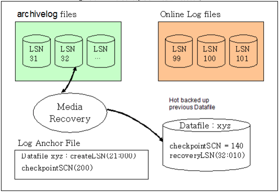

-   If data file xyz, which exists in a disk tablespace, is damaged, it can be restored using a data file that was previously created during a hot backup. A memory tablespace can be recovered using a checkpoint image file that was previously created during a hot backup. 
-   On the basis of the final checkpoint SCN (140) and recovery LSN (32:010), which are written in the header of the data file that was created during the backup, the file can be restored to the current final checkpoint SCN (200). 
-   When the system is restarted, the most recent image of a data file or memory tablespace can be recovered by repeating all recent transactions using online logs and rolling back all uncommitted transactions using UNDO logs and REDO logs.

##### Offline Backup of Tablespaces (Cold Backup)

When a tablespace is backed up offline, the tablespace service is suspended while the backup is performed. Offline backup is faster than online backup, and thus enables recovery to be performed more quickly. Offline backup has the following characteristics:

-   Offline backup is possible when the database is operating in noarchivelog mode. 
-   Offline backup is performed by copying data files, log files, and log anchor files after the database is shut down normally. 
-   When a data file is damaged or lost due to a fault, it can be restored only up to the time point at which offline backup was most recently performed.

##### Offline Recovery

Recovery is a process in which the consistency of a database is restored using a backup image. Recovery cannot be performed while the database is online; it must be performed offline. 

Recovery is performed by replacing the existing database with offline backup files while database service is stopped and then restarting the database.

### Examples of Tablespace Use

This section describes examples of using memory tablespaces and volatile tablespaces.

#### Memory Tablespaces

##### Creating a Memory Tablespace - Basics

The simplest and easiest way to create a memory tablespace is to use the CREATE MEMORY TABLESPACE statement, specifying the initial size with the SIZE clause.

```
iSQL> CREATE MEMORY TABLESPACE USER_MEM_TBS SIZE 256M; 
Create success.
```

Here, because the automatic extension mode was not set, it will default to OFF. When all 256 MB of the tablespace have been used, any attempt to allocate more space to the tablespace<sup>5</sup> will result in an error message saying that there is not enough room in the tablespace.

[<sup>5</sup>] If a table is created in a tablespace, if data are entered into an existing table, or if the data in an existing table are changed, additional space is allocated from the tablespace.

In addition, one or more checkpoint paths, as specified in the MEM_DB_DIR property, will be used as the checkpoint paths for the new tablespace

Supposing that two checkpoint paths are specified in the altibase.properties. Two paths have been saved for the MEM_DB_DIR property: dbs1 and dbs2, both of which are located in the Altibase home directory.

```
# altibase.properties
MEM_DB_DIR    =  ?/dbs1 
MEM_DB_DIR    =  ?/dbs2
```

The following query can be executed to verify that dbs1 and dbs2, which were specified using the MEM_DB_DIR property, are the checkpoint paths for the USER_MEM_TBS tablespace created above:

```
iSQL> SELECT CHECKPOINT_PATH 
FROM V$MEM_TABLESPACE_CHECKPOINT_PATHS 
WHERE SPACE_ID = 
  (SELECT SPACE_ID 
   FROM V$MEM_TABLESPACES 
   WHERE SPACE_NAME='USER_MEM_TBS'); 
CHECKPOINT_PATH
---------------------------------------------------
/altibase_home/dbs1
/altibase_home/dbs2
2 rows selected.
```

First, let’s take a look at the files in the checkpoint folders. The 6 files shown below can be found in the dbs1 directory:

```
SYS_TBS_MEM_DATA-0-0 
SYS_TBS_MEM_DATA-1-0 
SYS_TBS_MEM_DIC-0-0 
SYS_TBS_MEM_DIC-1-0 
USER_MEM_TBS-0-0 
USER_MEM_TBS-1-0
```

All of these files are checkpoint image files for the memory tablespace. Their filename format is 'Tablespace Name-{Ping Pong Number}-{File Number}'. 'Ping Pong No.' is either 0 or 1, each of which indicates one of the two checkpoint images used for ping-pong checkpointing<sub>6</sub> . In addition, because each of the checkpoint images can be stored as multiple files, 'File Number', at the end of the filename, indicates the number of each checkpoint image file, which begins at 0 and increments by 1. The size of the checkpoint image files is specified by using the SPLIT EACH clause with the CREATE TABLESPACE statement. Since the SPLIT EACH clause was not used in the CREATE MEMORY TABLESPACE statement above, the checkpoint image will be split into files 1 GB in size, which is the default value specified using the DEFAULT_MEM_DB_FILE_SIZE property. Because the space used by the above three tablespaces has not reached 1 GB yet, the only file number that can be seen is 0

[<sup>6</sup>] To ensure the durability of tablespace data in memory, data are saved in disk files. The files in which tablespace data are stored are called images. In ping-pong checkpointing, which is used in Altibase, a pair of checkpoint images is maintained, and tablespace data are stored alternately in each of them.

In the above example, SYS_TBS_MEM_DIC is a system dictionary tablespace containing metadata. This tablespace is automatically created when a database is created. 

SYS_TBS_MEM_DATA is the default system data tablespace. When a user creates a table without specifying a tablespace, the data in the table are stored in this tablespace. 

Finally, USER_MEM_TBS is the user-defined data tablespace that was created above.

For reference, the initial size, which is specified in the SIZE clause in the CREATE MEMORY TABLESPACE statement, must be a multiple of the extension increment size. For example, if the EXPAND_CHUNK_PAGE_COUNT property, which indicates the number of pages by which a memory tablespace will be incremented when it is expanded, is set to 128, because the size of one memory page is 32 KB, the default extension increment size of a memory tablespace will be 4 MB and the initial size can be set to a multiple of 4M.

If the size specified in the SIZE clause cannot be divided by the extension increment size, the following error will occur:

```
iSQL> CREATE MEMORY TABLESPACE USER_MEM_TBS SIZE 1M; 
[ERR-110EE : The initial size of the tablespace should be a multiple of expand chunk size ( EXPAND_CHUNK_PAGE_COUNT * PAGE_SIZE(32K) = 4096K )]
```

##### Creating Memory Tablespaces - Details

This section describes various ways to create a memory tablespace.

In the following example, the initial size of the tablespace is set to 256 MB, the automatic extension mode is set to ON, and the tablespace is configured to extend by 128 MB every time it is extended, to a maximum of 1 GB.

```
iSQL> CREATE MEMORY TABLESPACE USER_MEM_TBS SIZE 256M 
AUTOEXTEND ON NEXT 128M MAXSIZE 1G; 
Create success.
```

Like its initial size, the automatic extension increment size of a tablespace must be set to a multiple of the EXPAND_CHUNK_PAGE_COUNT property * the size of one page, which is the default number of pages by which a tablespace is extended. For more detailed information, please refer to ‘Creating Memory Tablespace – Basics.’

A tablespace can be created with no MAXSIZE, as shown below. If the MAXSIZE clause is not specified, the system operates as if it were set to UNLIMITED. 

```
iSQL> CREATE MEMORY TABLESPACE USER_MEM_TBS SIZE 256M 
AUTOEXTEND ON NEXT 128M MAXSIZE UNLIMITED; 
Create success.
```

In this case, USER_MEM_TBS is extended, but not past the point where the total space allocated to all memory tablespaces in the system exceeds MEM_MAX_DB_SIZE.

Checkpoint paths can also be specified when creating a memory tablespace, as follows:

```
iSQL> CREATE MEMORY TABLESPACE USER_MEM_TBS SIZE 256M 
CHECKPOINT PATH 'dbs1', '/new_disk/dbs2'; 
Create success.
```

In the above example, the relative path "dbs1" was specified for the checkpoint path, which has the same effect as if "$ALTIBASE_HOME/dbs1" were specified. Additionally, the DBA must first manually create the checkpoint paths specified in the CREATE TABLESPACE statement in the actual file system and then grant write and file execution privileges for them before creating a tablespace.

The size of the files into which a checkpoint image is divided can also be specified, as seen below:

```
iSQL> CREATE MEMORY TABLESPACE USER_MEM_TBS SIZE 256M 
SPLIT EACH 512M; 
Create success.
```

Like the initial size and the expansion increment size, the size of the files into which a checkpoint image is divided must be set to a multiple of the number of pages specified using the EXPAND_CHUNK_PAGE_COUNT property * the size of one page. For more detailed information, please refer to ‘Creating Memory Tablespace – Basics.’

A tablespace can be created offline and then taken online before it is used. Since a memory tablespace takes up the amount of system memory that was specified when it was created, in cases where a tablespace will not be used immediately after it is created, this practice can help optimize the use of system resources.

```
iSQL> CREATE MEMORY TABLESPACE USER_MEM_TBS SIZE 256M
OFFLINE; 
Create success.
iSQL> ALTER TABLESPACE USER_MEM_TBS ONLINE; 
Alter success.
```

Here is an example that combines the memory tablespace creation options seen above:

```
iSQL> CREATE MEMORY TABLESPACE USER_MEM_TBS SIZE 256M 
AUTOEXTEND ON NEXT 128M MAXSIZE 1G 
CHECKPOINT PATH 'dbs1', '/new_disk/dbs2'
SPLIT EACH 512M OFFLINE; 
Create success.
```

##### Adding a Checkpoint Path to a Memory Tablespace

This section describes how to add a checkpoint path to a memory tablespace. 

The checkpoint paths for a memory tablespace can only be set during the control phase. After shutting down the Altibase server, restart it in the control phase.

```
$ isql -u sys -p manager -sysdba 
iSQL(sysdba)> startup process 
iSQL(sysdba)> startup control 
```

In the control phase, the V＄TABLESPACES performance view, which pertains to all tablespaces, can be queried. The V$MEM_TABLESPACES performance view, which displays the attributes that are unique to memory tablespaces, can only be viewed in or after the meta phase. In the control phase, it is thus necessary to view memory tablespaces using V＄TABLESPACES.

The V$MEM_TABLESPACE_CHECKPOINT_PATHS performance view can be used to view the checkpoint paths belonging to the USER_MEM_TBS tablespace, which was created earlier. 

If the data in the tablespace change frequently, resulting in increased disk I/O during checkpointing, this can be alleviated by adding a new checkpoint path to a disk that is physically different from the disk used by the existing checkpoint path, as follows: 

Let’s add the “/new_disk/dbs3” path to USER_MEM_TBS. 

In order to do this, the checkpoint path and directory to be added must first be created, and the Altibase process must be granted write and execute privileges for that directory. Supposing that Altibase is started using the "altibase" operating system user account, this would be conducted as follows:

```
$ su - root
$ mkdir /new_disk/dbs3
$ chown altibase /new_disk/dbs3
```

As shown below, a checkpoint path can now be added using the ADD CHECKPOINT PATH statement:

```
iSQL(sysdba)> ALTER TABLESPACE USER_MEM_TBS 
ADD CHECKPOINT PATH '/new_disk/dbs3'; 
Alter success.
```

It is the DBA's responsibility to move or copy the checkpoint image files from the existing checkpoint path to the newly added checkpoint path. After a checkpoint path is added, if a new checkpoint image file is needed, the file is created in the new checkpoint path by Altibase.<sup>7</sup>

[<sup>7</sup>] When checkpoint image files are created for a tablespace during checkpointing, they are alternately created in each of the checkpoint paths for that tablespace.

##### Changing the Checkpoint Path for a Memory Tablespace

This section describes how to change a checkpoint path for a memory tablespace. 

Checkpoint paths for memory tablespaces can only be set during the CONTROL phase. As noted in the Adding a Checkpoint Path to a Memory Tablespace section above, after shutting down the Altibase server, restart it in the control phase. 

This example shows the procedure of moving dbs1 under the Altibase home directory, the old checkpoint path, to the newly installed disk "/new_disk".

For more detailed information on viewing a checkpoint path for a tablespace during the control phase, please refer to the Adding a Checkpoint Path to a Memory Tablespace section above.

To change a checkpoint path, the absolute path of the existing checkpoint path must be correctly entered. For information on viewing a checkpoint path for a tablespace during the control phase, please refer to the Adding a Checkpoint Path to a Memory Tablespace section above. 

Just as when adding a checkpoint path, when changing a checkpoint path, the DBA must first manually create the directory and grant write and execute privileges for the directory to the OS user account under which Altibase is started. Again, it is assumed that the username under which the Altibase process is started is 'altibase.'

```
$ su - root
$ mkdir /new_disk/dbs1
$ chown altibase /new_disk/dbs1
```

Now the checkpoint path can be changed from the "dbs1" checkpoint directory, which is located in the Altibase home directory, to the "/new_disk/dbs1" path on the newly added disk using the RENAME CHECKPOINT PATH statement. 

```
iSQL(sysdba)>  ALTER TABLESPACE USER_MEM_TBS
RENAME CHECKPOINT PATH '/opt/altibase_home/dbs1' TO '/new_disk/dbs1'; 
Alter success.
```

Finally, all checkpoint images for the USER_MEM_TBS tablespace, which are located in the existing $ALTIBASE_HOME/dbs1 directory, are moved to the /new_disk/dbs1 directory.

```
$ mv $ALTIBASE_HOME/dbs1/USER_MEM_TBS* /new_disk/dbs1
```

##### Removing a Checkpoint Path from a Memory Tablespace

This section describes how to remove a checkpoint path from a memory tablespace. 

As noted above, checkpoint paths for memory tablespaces can only be set during the control phase, and thus it is necessary to shut down the Altibase server and restart it in the control phase first. 

This example shows how to remove an existing checkpoint path, namely the "dbs2" directory located in the Altibase home directory. 

To change a checkpoint path, the absolute existing checkpoint path must be entered correctly. For information on how to view the checkpoint paths for a tablespace during the control phase, please refer to the Adding a Checkpoint Path to a Memory Tablespace section above. 

The $ALTIBASE_HOME/dbs2 checkpoint path can now be removed using the DROP CHECKPOINT PATH statement as follows:

```
iSQL(sysdba)>  ALTER TABLESPACE USER_MEM_TBS 
DROP CHECKPOINT PATH '/opt/altibase_home/dbs2' 
Alter success.
```

Finally, all of the checkpoint images for the USER_MEM_TBS tablespace that are located in the existing $ALTIBASE_HOME/dbs2 directory must be moved to one of the other checkpoint paths defined for the USER_MEM_TBS tablespace.

```
$ mv $ALTIBASE_HOME/dbs2/USER_MEM_TBS* /new_disk/dbs1
```

##### Changing the Auto Extension Setting for a Memory Tablespace

This section describes how to change the auto extension settings for a memory tablespace. 

If the AUTOEXTEND clause is not specified when a memory tablespace is created, the tablespace is set to not auto-extend by default.

```
iSQL> CREATE MEMORY TABLESPACE USER_MEM_TBS SIZE 256M; 
Create success.
```

In this case, the the simplest way to change a tablespace so that it extends automatically is as follows:

```
iSQL> ALTER TABLESPACE USER_MEM_TBS 
ALTER AUTOEXTEND ON;
Alter success.
```

In the above example, the tablespace will be extended in increments equal to the number of pages specified in the EXPAND_CHUNK_PAGE_COUNT property, which is the default unit of extension for tablespaces

In addition, the tablespace will be able to increase in size the same as if the maximum size were set to UNLIMITED, up to the limit at which the total size of all memory tablespaces in the system would not exceed the MEM_MAX_DB_SIZE property. 

Unlike disk tablespaces, checkpoint image files for memory tablespaces do not need to be managed by the DBA. This is because checkpoint image files are automatically created by Altibase when it is necessary to increase the size of a database automatically.

To specify the unit of extension for a memory tablespace, use a statement like the following:

```
iSQL> ALTER TABLESPACE USER_MEM_TBS 
ALTER AUTOEXTEND ON NEXT 128M;
Alter success.
```

To specify the maximum size of a memory tablespace, use a statement like the following:

```
iSQL> ALTER TABLESPACE USER_MEM_TBS 
ALTER AUTOEXTEND ON MAXSIZE 1G;
Alter success.
```

To specify both the unit of extension and the maximum size of a memory tablespace, use a statement like the following:

```
iSQL> ALTER TABLESPACE USER_MEM_TBS 
ALTER AUTOEXTEND ON NEXT 128M MAXSIZE 1G;
Alter success.
```

To turn off the automatic extension setting for a memory tablespace, use a statement like the following: 

```
iSQL> ALTER TABLESPACE USER_MEM_TBS 
ALTER AUTOEXTEND OFF;
Alter success.
```

##### Bringing a Memory Tablespace Online or Taking It Offline

This example describes how to change a memory tablespace from an online state to an offline state and vice-versa. 

All of the data in an Altibase memory tablespace are loaded into memory. To accomplish this, an amount of system memory equal to the amount of memory currently being used by a memory tablespace is allocated to the tablespace. Altibase provides functions for allocating memory to memory tablespaces and freeing memory so that DBAs can manage memory usage more easily.

Of course, when the memory of a memory tablespace is returned, all objects created in the tablespace are temporarily inaccessible. To free the memory space being used by a memory tablespace, take the tablespace offline.

```
iSQL> ALTER TABLESPACE USER_MEM_TBS OFFLINE;
Alter success.
```

When it is subsequently desired to use a table that exists in the memory tablespace that was taken offline, bring the tablespace online as follows:

```
iSQL> ALTER TABLESPACE USER_MEM_TBS ONLINE;
Alter success.
```

#### Volatile Tablespaces

##### Creating a Volatile Tablespace

The statements for creating, changing, and deleting volatile tablespaces are essentially identical to those for memory tablespaces. The main difference between them is that the statements related to checkpoint image files are of no use with volatile tablespaces.

A volatile tablespace 256 MB in size can be created using the following statement:

```
iSQL> CREATE VOLATILE DATA TABLESPACE USER_VOL_TBS 
SIZE 256M; 
Create success.
```

In the above example, the size of the tablespace is fixed at 256 MB, that is, it is not automatically extended. A tablespace that automatically increases in size can be created using the following statement:

```
iSQL> CREATE VOLATILE DATA TABLESPACE USER_VOL_TBS 
SIZE 256M AUTOEXTEND ON; 
Create success.
```

In the above example, the initial size of the tablespace is 256 MB, but it can be automatically extended up to the size specified using the VOLATILE_MAX_DB_SIZE property. The increment by which it automatically increases in size is 4 MB. To create a volatile tablespace for which the unit of automatic extension is 8 MB and the maximum size is 512 MB, execute a statement like the following:

```
iSQL> CREATE VOLATILE DATA TABLESPACE USER_VOL_TBS 
SIZE 256M AUTOEXTEND ON NEXT 8M MAXSIZE 512M;
Create success.
```

##### Modifying a Volatile Tablespace

The automatic extension mode, automatic extension increment size, and maximum size settings for volatile tablespaces can be changed. 

The following statement enables the automatic extension for a volatile tablespace for which automatic extension was previously disabled:

```
iSQL> ALTER TABLESPACE USER_VOL_TBS ALTER AUTOEXTEND ON;
Alter success.
```

The following statement enables automatic extension mode, sets the automatic extension increment size to 8 MB, and sets the maximum size of the tablespace at 512 MB.

```
iSQL> ALTER TABLESPACE USER_VOL_TBS ALTER 
AUTOEXTEND ON NEXT 8M MAXSIZE 512M;
Alter success.
```

The following statement turns off the automatic extension mode. Before using this statement, the automatic extension mode must previously have been set to ON.

```
iSQL> ALTER TABLESPACE USER_VOL_TBS ALTER AUTOEXTEND OFF;
Alter success.
```

#### DROP Tablespace - for Disk, Memory and Volatile Tablespaces

##### Discarding Tablespace – Removing Tablespace with Corrupt Data

This section describes how to discard a tablespace. 

If the DBA accidentally deletes a data file of a disk tablespace or a checkpoint file of a memory tablespace, or if the contents of such a file are lost due to a media fault, it will become impossible to start Altibase. 

In such cases, the first thing to try is to restore the lost or damaged file through media recovery. However, media recovery can only be performed when archive logging has been performed, such that copies of all existing log files remain available in a separate archive. 

If this is not the case, and media recovery is therefore impossible, the tablespace associated with the lost data file or checkpoint image file can be discarded using the ALTER TABLESPACE DISCARD statement, and Altibase can then be started with only the remaining tablespaces. 

Once a tablespace has been discarded using the ALTER TABLESPACE DISCARD statement, the objects in the tablespace become inaccessible, and the only action that can subsequently be performed on the tablespace is to DROP it. Therefore, this statement should be used with caution. 

In the following example, the memory tablespace USER_MEM_TBS is created and then, assuming that the checkpoint images for this tablespace have been deleted. Altibase can be started up with the remaining tablespaces after the tablespace is discarded.

First, create a memory tablespace, as shown below:

```
iSQL> CREATE MEMORY TABLESPACE USER_MEM_TBS SIZE 256M;
Create success.
```

Then shut down Altibase and delete the checkpoint files for the tablespace. When an attempt is made to start up Altibase, the following error will occur:

```
[SM-WARNING] CANNOT IDENTIFY DATAFILE 
                 [TBS:USER_MEM_TBS, PPID-0-FID-0] Datafile Not Found 

[SM-WARNING] CANNOT IDENTIFY DATAFILE 
               [TBS:USER_MEM_TBS, PPID-1-FID-0] Datafile Not Found 

[FAILURE] The data file does not exist. 
Startup Failed.... 
[ERR-91015 : Communication failure.] 
```

Altibase will generate an error if there are no data files and checkpoint images for a tablespace.

Now it is time to discard USER_MEM_TBS.

The Discard statement can be executed only during the control phase. So, start up Altibase in the control phase.

```
$ isql -u sys -p manager -sysdba 
iSQL(sysdba)> startup control 
```

Now USER_MEM_TBS, which is missing a checkpoint file, can be discarded.

```
iSQL(sysdba)> ALTER TABLESPACE USER_MEM_TBS DISCARD; 
Alter success. 
```

Then execute the STARTUP SERVICE command to start up Altibase in the service phase.

```
iSQL(sysdba)> startup service 
Command execute success. 
```

Issuing the ALTER TABLESPACE DISCARD command is merely the first step in discarding the tablespace. Therefore, the tablespace and its objects must be manually removed directly by using the DROP TABLESPACE INCLUDING CONTENTS statement.

```
iSQL> DROP TABLESPACE USER_MEM_TBS 
INCLUDING CONTENTS AND DATAFILES; 
Drop success. 
```

If a data file in a disk tablespace is lost, or if some of the contents of a data file become corrupt due to a media fault, Altibase can be started up after discarding the corresponding tablespace in the same way.

##### Removing Tablespace

This example shows how to remove a tablespace.

If a tablespace contains no objects, it can be easily removed, as seen below. However, this method does not remove the data files of a disk tablespace or the checkpoint image files for a memory tablespace.

```
iSQL> DROP TABLESPACE MY_TBS;
Drop success.
```

If a tablespace contains objects, all objects in the tablespace can be dropped by using the INCLUDING CONTENTS clause together with the DROP statement, as shown below. However, even when using this method, the data files or checkpoint image files are not removed from the file system.

```
iSQL> DROP TABLESPACE MY_TBS 
INCLUDING CONTENTS;
Drop success.
```

If a data file in a disk tablespace is lost, or if some of the contents of a data file become corrupt due to a media fault, Altibase can be started up after discarding the corresponding tablespace in the same way.

```
iSQL> DROP TABLESPACE MY_TBS 
INCLUDING CONTENTS CASCADE CONSTRAINTS;
Drop success. 
```

To remove referential constraints from tables in other tablespaces, use the CASCADE CONSTRAINTS clause together with the INCLUDING CONTENTS clause. However, even when using this method, the data files or checkpoint image files are still not removed from the file system.

```
iSQL> DROP TABLESPACE MY_TBS 
INCLUDING CONTENTS AND DATAFILES;
Drop success.

iSQL> DROP TABLESPACE MY_TBS 
INCLUDING CONTENTS AND DATAFILES
CASCADE CONSTRAINTS;
Drop success.
```

### Managing Space in Tablespaces 

This section describes how to manage space in tablespaces.

#### Estimating the Size Required for the Undo Tablespace

The undo tablespace is used for storing undo segments. Because insufficient undo tablespace can negatively affect the performance of transactions, a DBA should manage it to an appropriate size. If update transactions, especially those that execute statements for a long time, the undo segment will be relatedly extended. This can lead to a lack of space in the undo tablespace.

The user can set the undo tablespace to automatic extension mode, or set it to a fixed-size mode that estimates the approximate maximum size and specifies that estimate as to the maximum size. 

##### Auto Extension Mode of Undo Tablespace

It is not easy for the user to predict how much undo tablespace will be required when first running an application. In such cases, it is recommended to set the undo tablespace to automatic extension mode so that it increases automatically to the required size.

In Altibase, automatic extension mode is provided for the undo tablespace so that the size of the undo tablespace can be easily estimated in an application development environment. The undo tablespace is set to automatic extension mode by default. This can be changed using the ALTER TABLESPACE statement.

##### Fixed Size Mode of Undo Tablespace

If it is desired to fix the size of the undo tablespace, the required size must be estimated. To achieve this, the user must observe and analyze patterns of space usage in TSS and undo segments while client applications are running.

The required undo table size can generally be approximated by the following formula: 

-   Size of Undo Tablespace = 
  
    Long-Term Transaction Time (sec) x (the number of undo pages allocated per second + the number of TSS pages allocated per second) x page size (8KB)

In this example, if the executing time of a long-term transaction is 600 seconds (10 minutes) and 1000 undo pages and 24 TSS pages are allocated per second, then 10 x 60 x (1000 + 24) x 8K = 4800 MB, which requires about 4.7G of the undo tablespace.

However, if it is difficult to estimate the size of undo tablespace in this way, it is also acceptable to simply allocate large amounts of space, as long as disk space permits.

##### Undo Tablespace Extension

If update transactions (especially long-term transactions, that is, those that take a long time to be committed) frequently occur in the system, it is possible to run out of undo tablespace. In this situation, it is necessary to increase the size of the tablespace, either by adding one or more suitably sized data file(s) or increasing the size of the file(s) in undo tablespace using the ALTER TABLESPACE statement.

#### Estimating the Size of Memory Tables

##### Calculating the Size of Data

The data size of the memory table can be estimated based on the data type of each column and padding for column alignment. Expressed as a mathematical formula as follows: 

```
data size = [ ( the total estimated size plus padding for each column ) * the number of data records ]
```

The estimated size of each data type is shown in the following table.

(P = Precision, V = Value length)

| Data Type | Estimated Column Size              |
| --------- | ---------------------------------- |
| INTEGER   | 4                                  |
| SMALLINT  | 2                                  |
| BIGINT    | 8                                  |
| DATE      | 8                                  |
| DOUBLE    | 8                                  |
| CHAR      | 2 + P                              |
| VARCHAR   | 22 + V                             |
| NCHAR     | 2+(P \* 2)-UTF8 </br> 2+(P \* 3)-UTF16   |
| NVARCHAR  | 22+(V \* 2)-UTF8 </br> 22+(V \* 3)-UTF16 |
| BIT       | 4 + (P/8)                          |
| VARBIT    | 22 + (P/8)                         |
| FLOAT     | 3 + (P+2)/2                        |
| NUMERIC   | 3 + (P+2)/2                        |

In the above table, P (Precision) indicates the size of the column determined when the table is created. Data longer than P cannot be inserted into a column of the corresponding data type. V (Value) is the actual length of the inserted data, so V cannot be greater than P. 

In fixed-length columns, such as those of type CHAR, NCHAR, BIT etc., space equal to P is always occupied, and therefore the length of the column is fixed regardless of the actual length of the data. However, for variable-length columns, such as those of type VARCHAR, NVARCHAR, VARBIT, etc., the amount of space occupied varies depending on the length of the data.

Unlike disk tables, memory tables contain padded space to increase the speed of data access. The size of this space varies according to the data type and the position of the column.

##### Estimating the Size of an Index

Memory indexes are not saved in the tablespace in which data are saved. Since a pointer that points to the data storage location is saved in each bucket of a node of a memory index, the index size can be estimated based on the pointer size and the number of records currently saved in the table, regardless of the data type.

```
index size = (number of data records) * p
( p = Pointer Size )
```

In the above formula, p is the pointer size, that is, the size required to save a pointer. On a 32-bit system, this size is 4 bytes, whereas on a 64-bit system, it is 8 bytes. In this formula, the size of the index is taken as being equal to the total size of all leaf nodes (i.e., the lowest nodes on a B-Tree) of the index. In addition to leaf nodes, a B-Tree also consists of internal nodes (i.e., nodes higher than leaf nodes), but their total size is 1/128 that of the leaf nodes, which is so small that they can be safely ignored. In addition, the size of additional information used to manage the index is about 1/16 the size of the leaf nodes, which is also negligibly small. 

Therefore it is acceptable to calculate the total size of the index based on the total size of all leaf nodes.

However, the value estimated using this formula can differ from the actual size of the index because it considers only the case where all buckets of all leaf nodes have key values saved therein. That is to say, if there are many empty buckets within nodes, the actual size of the index can be much greater than the estimated size. In this case, the index size can be reduced by rebuilding the index.

##### Example 1

Let's try to estimate the size of the data when a table is created as shown below:  

```
CREATE TABLE T1 ( C1 Integer, C2 char(1024), C3 varchar(1024) )
tablespace user_data01;
```

In this table, column C1 and column C2 are fixed-length columns, whereas column C3 is a variable-length column. Therefore, the size of a record will vary depending on the size of column C3. If the size of one record is calculated in consideration of this, as seen below, the size of the data in table T1 equals (the length of one record * the number of records). 

```
[record header] = 32 bytes
[column C1] = 4 bytes
[column C2] = 2+P bytes = 2+1024 bytes
[column C3] = 22+V bytes
```

-   • If the length of the data in column C3 is 200 bytes:

```
[record size] = 32 + ( 4 ) + (2+1024) + (22+200) + padding = (1284 + padding) bytes
```

-   If the length of the data in column C3 is 500 bytes:

```
[record size] = 32 + ( 4 ) + (2+1024) + (22+500) + padding = (1584 + padding) bytes
```

##### Example 2

Let's calculate the index size of the table T1 created by the following statement, assuming that table T1 currently contains 500,000 records and the system is a 64-bit system: 

```
CREATE TABLE T1 ( C1 Integer, C2 char(300), C3 varchar(500)) 
tablespace user_data01;
CREATE INDEX T1_IDX1 ON T1( C1, C2, C3 );

[index size] = 500,000 records * 8 = 3.814 Megabytes
```

##### Example 3

Now let's calculate the data and index size of the table created by the following statement, assuming that table T1 currently contains 1,000,000 records and the system is a 64-bit system: 

```
CREATE TABLE TEST001 (
C1 char(8) primary key, 
C2 char(128), N1 integer,
IN_DATE date) 
tablespace user_data01;
```

-   The size of one record and the total data size

```
[The size of a record] = 32[header size] + (2+8) + (2+128) + (4) + (8) = 184 bytes
[The total size of all records] = [ 184 ] * 1,000,000 records = 175.47 Mbytes
```

* The index size

```
[total index size] = 8 * 1,000,000 records = 7.629 Megabytes
```

Note that this value is calculated only based on the size of data and leaf nodes. Thus, in reality, additional space will be used for the page header, index nodes, and memory for managing free pages.

#### Estimating the Size of Disk Tables

In Altibase, the size of a disk table can be calculated on the basis of the data types and data contents, that is, it is equal to [ total length of a row in the table * number of rows ]. The following table shows the length of each data type.

(P = Precision, V = Value length)

<table>
    <tr>
    	<th rowspan="2">Data Type</th>
        <th colspan="3">Estimated Column Size</th>
    </tr>
    <tr>
    	<th>Null</th>
        <th>250 bytes and below 250 bytes</th>
        <th>Greater than 250 bytes</th>
    </tr>
    <tr>
    	<td>Integer</td>
        <td>1</td>
        <td>5</td>
        <td>X</td>
    </tr>
    <tr>
    	<td>SmallInt</td>
        <td>1</td>
        <td>3</td>
        <td>X</td>
    </tr>
    <tr>
    	<td>BigInt</td>
        <td>1</td>
        <td>9</td>
        <td>X</td>
    </tr>
    <tr>
    	<td>Date</td>
        <td>1</td>
        <td>9</td>
        <td>X</td>
    </tr>
    <tr>
    	<td>Double</td>
        <td>1</td>
        <td>9</td>
        <td>X</td>
    </tr>
    <tr>
    	<td>Char</td>
        <td>1</td>
        <td>1+P</td>
        <td>3+P</td>
    </tr>
    <tr>
    	<td>Varchar</td>
        <td>1</td>
        <td>1+V</td>
        <td>3+V</td>
    </tr>
    <tr>
    	<td>NChar</td>
        <td>1</td>
        <td>1+P</td>
        <td>3+P</td>
    </tr>
    <tr>
    	<td>NVarchar</td>
        <td>1</td>
        <td>1+V</td>
        <td>3+V</td>
    </tr>
    <tr>
    	<td>Bit</td>
        <td>1</td>
        <td>5+(P/8)</td>
        <td>7+(P/8)</td>
    </tr>
    <tr>
    	<td>Varbit</td>
        <td>1</td>
        <td>5+(V/8)</td>
        <td>7+(V/8)</td>
    </tr>
    <tr>
    	<td>Float</td>
        <td>1</td>
        <td>4+(V+2) / 2</td>
        <td>6+(V+2) / 2</td>
    </tr>
    <tr>
    	<td>Numeric</td>
        <td>1</td>
        <td>4+(V+2) / 2</td>
        <td>6+(V+2) / 2</td>
    </tr>
</table>

In the above table, P (Precision) indicates the maximum size of the column, which is set when the table is created. Data longer than P cannot be inserted into a column of that type. Additionally, for fixed-length columns, such as those of type CHAR, NCHAR, BIT, etc., space equal to P is always occupied, and therefore the length of the column is fixed regardless of the actual length of the data.

V (Value) denotes the actual length of the inserted data, which of course cannot be greater than P. In addition, the amount of space occupied by variable-length columns, such as those of type VARCHAR, NVARCHAR, VARBIT, etc., varies according to the length of the data. Therefore, the column size can vary depending on the size of the data.

##### Estimating Row Size

This section describes how to calculate the row size for a table having the schema shown below:

```
CREATE TABLE T1 ( C1 char(32), C2 char(1024), C3 varchar(512) ) 
tablespace user_data02;
```

In this schema, column C1 and column C2 are fixed-length columns, whereas column C3 is a variable-length column. Therefore, the size of a row will vary depending on the size of column C3. The size of a row will also vary depending on whether any columns contain NULL values. If the size of one row is calculated in consideration of this, as seen below, the size of the data in table T1 equals (the total length of one row * the number of rows).

[Row Header] 34 bytes

[column C1] 1+P Bytes = 1+32 Bytes 

[column C2] 3+P Bytes = 3+1024 Bytes 

[column C3] 3+V Bytes

-   If the size of the data in the column C3 is 200 bytes

[Total Length of One Record] = 34 + (1+32) + (3+1024) + (3+200) = 1295 Bytes

-   If the size of the data in 

[Total Length of One Record] = 34 + (1+32) + (3+1024) + (3+500) = 1597 Bytes

-   If column C2 is NULL and the size of column C3 is 300 bytes:

[Total Length of One Record] = 34 + (1+32) + (1) + (3+300) = 371 Bytes

-   If column C3 is NULL:

Total Length of One Record] = 34 + (1+32) + (3+1024) + (0) = 1094 Bytes  


:If the last column is null and has no data, the last colum will not be saved and reflected in size.

##### Estimating the Size of an Index

In Altibase, the size of a disk index can be calculated based on the actual data types and data contents. The following table shows the length of each data type to use when calculating the index size: 

(P = Precision, V = Value length)

<table>
    <tr>
    	<th rowspan="2">Data Type</th>
        <th colspan="3">Size of Index Key</th>
    </tr>
    <tr>
    	<th>Null</th>
        <th>250 bytes and below 250 bytes</th>
        <th>Greater than 250 bytes</th>
    </tr>
    <tr>
    	<td>Integer</td>
        <td>4</td>
        <td>4</td>
        <td>X</td>
    </tr>
    <tr>
    	<td>SmallInt</td>
        <td>2</td>
        <td>2</td>
        <td>X</td>
    </tr>
    <tr>
    	<td>BigInt</td>
        <td>8</td>
        <td>8</td>
        <td>X</td>
    </tr>
    <tr>
    	<td>Date</td>
        <td>8</td>
        <td>8</td>
        <td>X</td>
    </tr>
    <tr>
    	<td>Double</td>
        <td>8</td>
        <td>8</td>
        <td>X</td>
    </tr>
    <tr>
    	<td>Char</td>
        <td>1</td>
        <td>1+P</td>
        <td>3+P</td>
    </tr>
    <tr>
    	<td>Varchar</td>
        <td>1</td>
        <td>1+V</td>
        <td>3+V</td>
    </tr>
    <tr>
    	<td>NChar</td>
        <td>1</td>
        <td>1+P</td>
        <td>3+P</td>
    </tr>
    <tr>
    	<td>NVarchar</td>
        <td>1</td>
        <td>1+V</td>
        <td>3+V</td>
    </tr>
    <tr>
    	<td>Bit</td>
        <td>1</td>
        <td>5+(P/8)</td>
        <td>7+(P/8)</td>
    </tr>
    <tr>
    	<td>Varbit</td>
        <td>1</td>
        <td>5+(V/8)</td>
        <td>7+(V/8)</td>
    </tr>
    <tr>
    	<td>Float</td>
        <td>1</td>
        <td>4+(V+2) / 2</td>
        <td>6+(V+2) / 2</td>
    </tr>
    <tr>
    	<td>Numeric</td>
        <td>1</td>
        <td>4+(V+2) / 2</td>
        <td>6+(V+2) / 2</td>
    </tr>
</table>

In the above table, P (Precision) and V (Value) respectively indicate the maximum size of the column, which is set when the table is created, and the size of the data that are actually inserted into the table. 

The size of an index is calculated as follows:

```
[10 (header length) + (total length of key columns)] * number of records
```

The above formula is used to calculate the approximate size of leaf nodes (the lowest nodes on a B-Tree). In addition to leaf nodes, a B-Tree also consists of internal nodes (nodes higher than leaf nodes), but they can be safely ignored when the key column size is small.

However, if the key column size is greater than 2kB, the depth of the B*Tree increases, and thus the size of internal nodes must be included in the calculation because their size can approach 50% of the total size of leaf nodes.

The following shows how to estimate the size of index T1 for table T1, the creation statements for both of which are shown below. 

```
CREATE TABLE T1 ( C1 Integer, C2 varchar(500)) tablespace user_data02; 
CREATE INDEX T1_IDX1 ON T1( C1, C2 ); 
```

Column C1 is always 4 bytes in size because it an integer type column. The length of column C2, which is a variable-length column, varies depending on the size of the data.

```
[Key Header] 10 bytes
[column C1] 4 bytes
[column C2] 1+V bytes
```

-   If the size of the data in column C2 is 50 bytes:

```
[Total Length] = 10 + 4 + (1+50) = 65 bytes
```

-   If the size of the data in column C2 is 500 bytes:

```
[Total Length] = 10 + 4 + (3+500) = 517 bytes
```

-   If column C2 is NULL:

```
[Total Length] = 10 + 4 + 1 = 15 bytes
```

##### Table Size Calculation Example

The following shows how to estimate the size of the table created, as shown below, assuming that it contains 1,000,000 records. The table size consists of the total size of all the records plus the size of the index. 

```
CREATE TABLE TEST001 (
C1 char(8) primary key, 
C2 char(128), N1 integer, 
IN_DATE date) 
tablespace user_data02;
```

-   Row Size and Total Data Size

Row Size: 34[Header] + (1+8) + (1+130) + (1+4) + (1+8) = 188 bytes Total Size of Data: [ 188 ] * 1,000,000 data = 179.29 Megabytes

-   Index Size

Index Size for one Row: 10[Header] + (1+8)[C1] = 19 bytes Total Index Size: 19 * 1,000,000 data = 18.12 Megabytes

-   Total Amount of Disk Space Occupied by TEST001

179.29 (Data Size) + 18.12 (Index Size) = 197.41 M bytes

The above calculation takes into consideration only the size of the data. In reality, additional space is also occupied by the page header, internal nodes, space for managing segments, etc. When the space used for these purposes is also considered, the total amount of space occupied by the table is determined to be about 240 Megabytes.

#### Calculating Table Storage Space

Below, table TEST001, which was used above for the estimation of table size, will be used to show how to determine the table size that is suitable for storing all of the records and indexes in the table. The following must be kept in mind when determining the suitable table size.

##### Consider the Relative Frequency of Transaction Types

If a lot of update transactions are executed on the table, PCTFREE should be set to a high value for better transaction performance, and PCTUSED should be set to a low value to ensure sufficient free space for update transactions.

In contrast, if a lot of insert transactions are performed on the table but the number of update transactions is low, PCTFREE should be set to a low value, and PCTUSED should be set to a high value in order to minimize the amount of unnecessary free space.

-   PCTFREE  
    The default value is 10. It can be set anywhere from 0 to 99 when a disk table is created. This is the percentage of free space on each page that is set aside in advance for updating existing records when saving data in tables. Therefore, supposing that PCTFREE has been set to 10 and only insert transactions occur, if the total size of the table is 100MB, the amount of space that can be used for the records and the index of the table is 90M.
-   PCTUSED  
    The default value is 40. It can be set anywhere from 0 to 99 when a disk table is created. After the amount of free space in a particular page drops below the percentage specified in PCTFREE, no more data will be inserted into the page until the amount of used space subsequently drops below 40% (e.g. 39%) as a result of update or delete transactions. Therefore, greater amounts of free space must be allocated to tables on which updates transactions occur frequently.

<table>
    <tr>
    	<th>Circumstances</th>
        <th>Table Size Estimation</th>
    </tr>
    <tr>
    	<td>Only SELECT transactions occur, or record size doesn't increase during UPDATE transactions</td>
        <td>In the case where PCTFREE is set to 5 and PCTUSED is set to 90:
① Estimated minimum table size:
TEST001(Total size=215.53MB)
The minimum size in which to save the table is calculated as follows:
total table size / [1-(PCTFREE / 100) = 215.53/0.95 ≒ 227MB
② Weighted estimation:
A weighting factor is taken into account in the determination of the
minimum size. The weighting differs depending on the circumstances.
The following is just one example of how to include weighting in the
size determination.
Minimum Size * [ 1- (PCTUSED / 100) ] * 2 = 227 * 0.1 * 2 ≒ 45M
③ Therefore, a table 272M in size should be created.
</td>
    </tr>
    <tr>
    	<td>UPDATE transactions
occur frequently and
tend to increase the size
of records</td>
        <td>In the case where PCTFREE is set to 20 and PCTUSED is set to 40:
① Estimated minimum table size:
TEST001(total size=213.63MB)
The minimum size in which to save the table is calculated as follows:
total table size / [1-(PCTFREE / 100)= 213.63/0.8 ≒ 267MB
② Weighted estimation:
A weighting factor is taken into account in the determination of the
minimum size. The following is one example of how to include
weighting in the size determination.
Minimum Size * [ 1- (PCTUSED / 100) ] * 2 = 267 * 0.6 * 2 ≒ 320M
③ Therefore, a table approximately 587M in size should be created.
</td>
    </tr>
    <tr>
    	<td>INSERT and UPDATE transactions occur frequently but UPDATE
transactions do not increase the size of rows</td>
        <td>PCTFREE is set to 10 and PCTUSED is set to 60.</td>
    </tr>
</table>

[Table 6-3] Table Size Estimation based on Relative Frequency of Transactions by Type

> Note: The table size estimation method shown above should not be considered a rigid standard. It is also necessary to take into account the possibility that the amount of data will suddenly increase in the event of abnormal system operation.

##### Consider Suitable Backup Space 

In practice, it is rare for a tablespace to have only one table saved in it. It is more efficient to group tables according to business purposes or backup strategies and stores them collectively in a single tablespace. 

In such cases, the appropriate size of a tablespace should be set in consideration of the backup time for the tablespace.

The figure below shows how tablespaces are organized in consideration of business purposes and backup strategies.

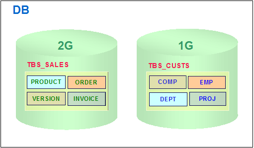

[Figure 6-15] Determining Tablespace Size in Consideration of Backup Strategy

#### Tablespace Information

To help manage tablespaces, Altibase provides performance views and meta tables to monitor the state of tablespaces in order to manage them. 

```
SYSTEM_.SYS_TBS_USERS_ 
```

Also, the following performance views can be used to obtain information on the size, usage, and status of the database used by users: 

```
V$TABLESPACES, V$DATAFILES, V$MEM_TABLESPACES 
```
