Administrator’s Manual
================

#### Altibase 7.1

Altibase® Administration

<br><br><br><br><br><br>
<!-- PDF 변환을 위한 여백입니다. --> 


<!-- PDF 변환을 위한 여백입니다. --> 

<div align="left">
    
</div>

<br><br><!-- PDF 변환을 위한 여백입니다. --> 


<!-- PDF 변환을 위한 여백입니다. --> 

<pre>
Altibase Administration Administrator’s Manual
Release 7.1
Copyright ⓒ 2001~2023 Altibase Corp. All Rights Reserved.<br>
This manual contains proprietary information of Altibase® Corporation; it is provided under a license agreement containing restrictions on use and disclosure and is also protected by copyright patent and other intellectual property law. Reverse engineering of the
software is prohibited.<br>
All trademarks, registered or otherwise, are the property of their respective owners.<br>
<b>Altibase Corp</b>
10F, Daerung PostTower II,
306, Digital-ro, Guro-gu, Seoul 08378, Korea
Telephone : +82-2-2082-1000 
Fax       : +82-2-2082-1099
Customer Service Portal : <a href='http://support.altibase.com/en/'>http://support.altibase.com/en/</a>
Homepage                : <a href='http://www.altibase.com'>http://www.altibase.com</a></pre>
<br>

# Table Of Contents

- [Preface](#preface)
- [1. Introduction](#1-introduction)
  - [Hybrid DBMS Concept](#hybrid-dbms-concept)
  - [Altibase Features](#altibase-features)
  - [Structure of Altibase](#structure-of-altibase)
- [2. Altibase Components](#2-altibase-components)
  - [Altibase Directories](#altibase-directories)
  - [Executable Binaries](#executable-binaries)
  - [Altibase Libraries](#altibase-libraries)
- [3. Creating a Database](#3-creating-a-database)
  - [Creating a Database](#creating-a-database)
- [4. Startup and Shutdown](#4-startup-and-shutdown)
  - [Startup Procedure](#startup-procedure)
  - [Shutdown Procedure](#shutdown-procedure)
- [5. Objects and Privileges](#5-objects-and-privileges)
  - [Database Objects](#database-objects)
  - [Tables](#tables-1)
  - [Temporary Tables](#temporary-tables-1)
  - [Compressed Tables](#compressed-tables)
  - [Queues](#queues)
  - [Constraints](#constraints-2)
  - [Indexes](#indexes)
  - [View](#view)
  - [Materialized View](#materialized-view)
  - [Sequences](#sequences)
  - [Synonyms](#synonyms)
  - [Stored Procedures and Functions](#stored-procedures-and-functions)
  - [Triggers](#triggers)
  - [Jobs](#jobs-1)
  - [Database Users](#database-users)
  - [Privileges and Roles](#privileges-and-roles)
- [6. Managing Tablespaces](#6-managing-tablespaces)
  - [Tablespaces: Definition and Structure](#tablespaces-definition-and-structure)
  - [Classifying Tablespaces](#classifying-tablespaces)
  - [Disk Tablespace](#disk-tablespace)
  - [The Undo Tablespace](#the-undo-tablespace)
  - [Tablespace States](#tablespace-states)
  - [Managing Tablespaces](#managing-tablespaces)
  - [Examples of Tablespace Use](#examples-of-tablespace-use)
  - [Managing Space in Tablespaces](#managing-space-in-tablespaces)
- [7. Paritioned Objects](#7-paritioned-objects)
  - [What is Partitioning?](#what-is-partitioning)
  - [Partitioned Objects](#partitioned-objects)
  - [Partitioned Conditions](#partitioned-conditions)
  - [Partitioning Methods](#partitioning-methods)
- [8. Managing Transactions](#8-managing-transactions)
  - [Transactions](#transactions)
  - [Locking](#locking)
  - [Multi-Version Concurrency Control (MVCC)](#multi-version-concurrency-control-mvcc)
  - [Transaction Durability](#transaction-durability)
  - [Checkpointing](#checkpointing)
- [9. Database Buffer Manager](#9-database-buffer-manager)
  - [Structure of the Buffer Manager](#structure-of-the-buffer-manager)
  - [Managing Database Buffers](#managing-database-buffers)
  - [Related Database Properties](#related-database-properties)
  - [Statistics for Buffer Management](#statistics-for-buffer-management)
- [10. Backup and Recovery](#10-backup-and-recovery)
  - [Database Backup](#database-backup)
  - [Database Recovery](#database-recovery)
  - [Backup and Recovery Examples](#backup-and-recovery-examples)
- [11. Incremental Backup and Recovery](#11-incremental-backup-and-recovery)
  - [Incremental Backup](#incremental-backup)
  - [Types of Incremental Backups](#types-of-incremental-backups)
  - [Media Restoration with Incremental Backups](#media-restoration-with-incremental-backups)
  - [Managing Backup Files](#managing-backup-files)
- [12. Communication Layer](#12-communication-layer)
  - [Communication Protocol](#communication-protocol)
- [13. Securing Data](#13-securing-data)
  - [Overview](#overview)
  - [How Security is Organized in Altibase](#how-security-is-organized-in-altibase)
  - [Integrating a Security Module](#integrating-a-security-module)
  - [Starting Security Modules and Encrypting Data](#starting-security-modules-and-encrypting-data)
- [14. Database Auditing](#14-database-auditing)
  - [Introduction](#introduction)
  - [Related Meta Tables and Properties](#related-meta-tables-and-properties)
  - [Audit Control Statements](#audit-control-statements)
  - [Audit Condition Statements](#audit-condition-statements)
  - [Viewing Auditing Results](#viewing-auditing-results)
- [15. Tuning Altibase](#15-tuning-altibase)
  - [Log File Groups](#log-file-groups)
  - [Group Commit](#group-commit)
- [16. DB Diagnostic Monitoring](#16-db-diagnostic-monitoring)
  - [Monitoring Database Servers](#monitoring-database-servers)
  - [Troubleshooting Procedures](#troubleshooting-procedures)
- [Appendix A. Trace Logs](#appendix-a-trace-logs)
  - [Using Application Trace Logs](#using-application-trace-logs)
- [Appendix B. Altibase Limitations](#appendix-b-altibase-limitations)
  - [Maximum Altibase Values](#maximum-altibase-values)


Preface
====

- ### About This Manual

  This manual explains the concepts, components, and basic use of Altibase.

  #### Audience

  This manual has been prepared for the following Altibase users:

  - Database managers
  - Performance managers
  - Database users
  - Application developers
  - Technical support engineers

It is recommended for those reading this manual possess the following background knowledge: 

- Basic knowledge in the use of computers, operating systems, and operating system utilities
- Experience in using relational databases and understanding of database concepts
- Computer programming experience
- Experience in database server management, operating system management, or network administration


#### Organization

This manual has been organized as follows:

-   Chapter 1: Introduction  
    This chapter introduces the concepts, features, and architecture of the Altibase server.
    
-   Chapter 2: Altibase Components  
    This chapter describes the components of the executable binaries and programming libraries that make up Altibase.
    
-   Chapter 3: Creating a Database
    This chapter describes the types of tablespaces and logging system that are representative components of a database, and how to create a database.
    
-   Chapter 4: Altibase Startup and Shutdown
    Tihs chapter describes how to startup and shutdown Altibase, and explains what to do internally during Altibase multi-state startup.
    
-   Chapter 5: Database Objects and Privileges  
    This chapter describes Altibase objects and privileges such as constraints, indexes, sequences, replication, tables, and users. This chapter also describes the privileges of the system and schema object levels.
    
-   Chapter 6: Managing Tablespaces  
    This chapter describes how to manage the database's logical structure in small units and manage the physical data space more efficiently. 
    
-   Chapter 7: Partitioned Objects  
    This chapter describes partitioned tables. Partitioned tables are managed by breaking a large database table into smaller tables.
    
-   Chapter 8: Managing Transactions
  
    This chapter describes the concepts behind transactions and locking, and explains how to manage transactions in the Altibase server.

-   Chapter 9: Database Buffer Manager
  
    This chapter describes the structure and functions of the buffer manager.
    
-   Chapter 10: Backup and Recovery
  
    This chapter describes the Altibase backup and recovery features and explains how to manage your database backup and recovery tasks.
    
-   Chapter 11: Incremental Backup and Recovery
  
    This chapter explains incremental backup and recovery provided by Altibase.

-   Chapter 12: Server/Client Communication
  
    This chapter describes the connection methods and protocols between the Altibase server and client application.

-   Chapter 13: Altibase Security
  
    This chapter describes Altibase's security features for protecting database information.

-   Chapter 14: Auditing Altibase
  
    This chapter describes the auditing feature which tracks and writes logs in real time of statements running on the Altibase server.

-   Chapter 15: Tuning Altibase
  
    This chapter describes log file groups and group commits to improve the performance of Altibase.

-   Chapter 16: Monitoring Altibase and PBT
  
    This chapter explains how to monitor and troubleshoot database servers. In addition, it describes the checklist and analysis method of various problems that may occur when Altibase is running. 
    
-   Appendix A: Trace Logs
  
    This appendix describes application trace logs and explains how to create and access them.
    
-   Appendix B: Altibase Limitations
  
    This appendix describes the maximum values of Altibase objects.

#### Documentation Conventions

This section describes the conventions used in this manual. Understanding these conventions will make it easier to find information in this manual and other manuals in the series.

There are two sets of conventions:

- Syntax diagrams
- Sample code conventions

##### Syntax diagrams

This manual describes command syntax using diagrams composed of the following elements:

| Elements                                   | Meaning                                                      |
| ------------------------------------------ | ------------------------------------------------------------ |
|  | Indicates the start of a command. If a syntactic element starts with an arrow, it is not a complete command. |
|  | Indicates that the command continues to the next line. if a syntactic element ends with this symbol, it is not a complete command. |
|  | Indicates that the command continues from the previous line. If a syntactic element starts with this symbol, it is not a complete command. |
|  | Indicates the end of a statement.                            |
|               | Indicates a mandatory element.                                                    |
|  | Indicates an optional element.                               |
|  | Indicates a mandatory element comprised of options. One, and only one, option must be specified. |
|  | Indicates an optional element comprised of options           |
|  | Indicates an optional element in which multiple elements may be specified. A comma must precede all but the first element. |

##### Sample Code Conventions

The code examples explain SQL, stored procedures, iSQL, and other command line syntax.

The following describes the conventions used in the cod examples:

| Rules            | Meaning                                                      | Example                                                      |
| ---------------- | ------------------------------------------------------------ | ------------------------------------------------------------ |
| [ ]              | Indicates an optional item                                   | VARCHAR [(*size*)] [[FIXED \|] VARIABLE]                     |
| { }              | Indicates a mandatory field for which one or more items must be selected. | { ENABLE \| DISABLE \| COMPILE }                             |
| \|               | A delimiter between optional or mandatory arguments.         | { ENABLE \| DISABLE \| COMPILE } [ ENABLE \| DISABLE \| COMPILE ] |
| . . .            | Indicates that the previous argument is repeated, or that sample code has been omitted. | SQL\> SELECT ename FROM employee;<br/> ENAME<br/>  -----------------------<br/> SWNO<br/>  HJNO<br/>  HSCHOI<br/>  .<br/> .<br/> .<br/> 20 rows selected. |
| Other Symbols    | Symbols other than those shown above are part of the actual code. | EXEC :p1 := 1; acc NUMBER(11,2)                              |
| Italics          | Statement elements in italics indicate variables and special values specified by the user. | SELECT \* FROM *table_name*; <br/>CONNECT *userID*/*password*; |
| Lower case words | Indicate program elements set by the user, such as table names, column names, file names, etc. | SELECT ename FROM employee;                                  |
| Upper case words | Keywords and all elements provided by the system appear in upper case. | DESC SYSTEM_.SYS_INDICES_;                                   |

#### 

#### Related Documents

Please refer to the following documents for more detailed information:

-   Installation Guide

-   Getting Started Guide

-   SQL Reference

-   Stored Procedures Manual

-   iSQL User’s Manual

-   Utilities Manual

-   Error Message Reference

#### Altibase Welcomes Your Comments and Feedback

Please let us know what you like or dislike about our manuals. To help us with better future versions of our manuals, please tell us if there are any corrections or classifications that you would find useful.

Include the following information:

- The name and version of the manual that you are using
- Any comments about the manual
- Your name, address, and phone number

If you need immediate assistance regarding any errors, omissions, and other technical issues, please contact [Altibase's Support Portal](http://support.altibase.com/en/).

Thank you. We always welcome your feedback and suggestions.

# 1. Introduction

-------------

This chapter describes the background of the emergence of Hybrid DBMS. It also describes the structure and features of Altibase.

### Hybrid DBMS Concept

This chapter introduces the Hybrid Database Management System (Hybrid DBMS), a new concept pioneered by Altibase.

#### Background of Hybrid DBMS

The development of the hybrid DBMS is closely related to the characteristics of memory and disk, the two major types of data storage media used by DBMS.

First, the memory consists of electronic gates. The time required to access memory is only a few nanoseconds (ns, billionths of a second), and is relatively consistent. However, in the event of a power failure, all data in memory are lost. That is, memory is a volatile storage medium.

In contrast, a disk consists of a head arm and a platter. Disk access time is on the order of microsecond (us, millionths of a second), which is relatively slow compared to random access memory (RAM). Furthermore, access time can be inconsistent. Even SSDs (Solid State Drives), which have recently become more popular, have vastly inferior access time when compared to volatile memory.

However, the data on the disk are stored permanently, even in the event of a power failure.

Second, the memory is connected to the main board through the system bus, and its maximum capacity is determined by the specifications of the main board. If the main board has a 32-bit CPU installed, the maximum possible amount of memory is 4GB, whereas, at present, if a 64-bit CPU is installed in the main board, the theoretical maximum amount of memory is on the order of hundreds of gigabytes (that is, hundreds of billions of bytes). In contrast, disks are connected to the main board and the I/O bus. Thus, terabytes of disk space can be installed, regardless of the characteristics of the main board.

In summary, memory typically has hundreds of times faster access time and better performance than disk, while data is lost during power outages and has limited storage capacity. In contrast, the disk is permanently stored and have close to unlimited capacity, while access time is slow and inconsistent.

DBMSs can be categorized as one of two kinds, depending on the distinct characteristics of the two kinds of storage devices: Disk-Resident DBMSs (referred to as "DRDBMS"), which store data on the disk, and Main memory DBMSs (referred to as "MMDBMS"), which store data in the memory.

##### Emergence of DRDBMS

In the DRDBMS structure, data are stored on disk. The DRDBMS reads data from the data from the disk into a memory buffer and delivers it to the application program. 

In this structure, the application typically uses SQL (Structured Query Language) to access the data. One major advantage of DRDBMS is the use of concurrency control and recovery strategies to protect the data, which makes it much easier to develop applications. Moreover, because the data are stored on disk, high-capacity DBMSs can be configured. 

Because of these advantages, DRDBMSs have been widely used in various industrial fields.

However, there has been a great demand for data processing due to the rapid progress of informatization throughout many industries and increased the performance of information processing. Thus, due to problems of inadequate data processing speed and inconsistent data access time, DRDBMSs are unusable in an increasing number of fields.

Therefore, custom-designed memory DBs have been used in many industries, requiring high performance and uniform performance data processing. 

However, as such data processing products are universal, they have to be individually developed from scratch. This has had the undesirable consequences of increased maintenance and repair costs and decreased performance, integration, and scalability.


##### Emergence of MMDBMS

MMDBMS are structured such that data are stored in memory and the data in memory are read and sent directly to client applications.

This structure preserves the main advantages of DRDBMS, namely the ability to access data using standard SQL statements and to protect data via concurrency control and recovery, thereby making it easy to develop applications and share data. 

In addition, because MMDBMS store data in memory, in contrast with the DRDBMS (which store data on disk) the average processing speed is significantly fast and performance is consistent. These are inherent characteristics of memory that are assured. Therefore, MMDBMS are receiving attention in fields where fast and consistent performance are necessary but development and maintenance issues make it difficult to implement DRDBMS.

An MMDBMS can typically perform an update operation about 10 times quicker than a DRDBMS, and a search operation about 4 times quicker.

The reason that an update operation cannot be performed hundreds of times faster than when using a DRDBMS is that, like a DRDBMS, an MMDBMS must also write log files to disk in order to protect the data. Nevertheless, the update operation of MMDBMS is faster because the MMDBMS is optimized and simplified for data protection than DRDBMS.

Similarly, the reason that a search operation is not hundreds of times faster than when using a DRDBMS is that a DRDBMS also uses memory buffers to improve data access performance.

Nevertheless, search operations are faster using an MMDBMS because data access is simplified and optimized, and access times are consistent when accessing memory (that is,so-called “jitter” is eliminated).

Despite the advantages of high and consistent performance, because MMDBMS must save data in memory, they encounter a limitation when data processing requirements are a large volume and store more than hundreds of GB of data.

##### **Combining MMDBMS and DRDBMS**

To overcome these problems, the most commonly solution is to divide and store the data separately. The data that needs high performance is stored in the MMDBMS, and the data that needs large capacity is stored in the DRDBMS.

This structure encounters the following problems: information shared by the MMDBMS and DRDBMS must be synchronized, applications that must bi-directionally communicate with both the MMDBMS and DRDBMS must be connected with both of them at the same time, and error recovery is complicated.

However, until now, since there has been no other way to simultaneously realize high data processing performance and handle large amounts of data, this approach has generally been adopted in fields in which fast data access and voluminous data processing are both required.

##### Emergence of Hybrid DBMS

Hybrid DBMSs have emerged to take advantage of the strong points and to overcome the weak points of MMDBMS, DRDBMS, and combined MMDBMS/DRDBMS.

In a Hybrid DBMS, the data are separated, and stores the data that requires high performance in memory and the data that needs large capacity on disk. However, a single DBMS processes both kinds of data in a unified manner.

Because high-performance and voluminous data are both handled by a single DBMS, the aforementioned problems related to combined DBMSs, namely complicated error handling and the requirement for applications to be complicated, are solved. Furthermore, a Hybrid DBMS can be implemented as an MMDBMS, a DRDBMS, or a Hybrid DBMS.

To summarize, the Hybrid DBMS combines the advantages of the MMDBMS, which is optimized for processing high-performance data, and the DRDBMS, which is optimized for processing large amounts of data, because the data are classified and saved according to their characteristics, but handled in an integrated manner.

In other words, hybrid DBMS is capable of high-performance information processing by efficient use of time, and large-scale information processing by efficient resource utilization.  Hybrid DBMS can now be adopted in all fields, including those requiring both high performance and the processing of large amounts of data.

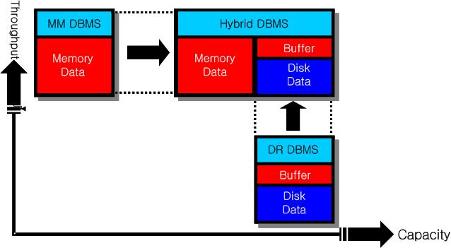

[Figure 1-1] The Structure of a High Performance / Large capacity DBMS

### Altibase Features

This section provides an overview of the components and functionalities of Altibase.

The basic features of Altibase, the high-performance, large-volume hybrid database system, will now be introduced. The characteristics, structure, function, etc., of Altibase are explained briefly here. For more detailed information, please refer to each of the separately published Altibase manuals.

#### Data Model

The Altibase data model is patterned after employs the relational model. The relational model includes the three following major concepts:

Database Structures- The objects that databases use to save and access data are referred to as tables, indexes, views, etc. These objects are the basic operational units.

Operations- Operations define what actions users are permitted to conduct data and database structures. Operations are related to integrity constraints.

Integrity- Integrity constraints are rules pertaining to which operations are permitted on data and structures, and serve to protect data and data structures.

Relational database management systems provide the following benefits:

-   Physical data management and logical data management are independent of each other. 

-   All data can be accessed easily and in a variety of ways.

-   Databases can be freely designed as desired.

-   Database storage space requirements and data redundancy are reduced.

#### Engine Structure

Altibase supports a client-server architecture. In the client-server architecture, the client accesses the server over a communications network, as with a traditional RDBMS.

The Altibase server has a multithreaded internal structure.

#### Interfaces

Unlike other real-time database systems, Altibase supports a wide range of industry-standard interfaces for maximum compatibility. The Altibase query language complies with the SQL92 and SQL99 standard, and also provides extended features.

Because Altibase supports ODBC, JDBC, and C/C++ Precompiler, it can be used without converting the existing database application in order to use them with Altibase Hybrid MMDBMS

#### **Multi-Version Concurrency Control**

Altibase manages concurrency using the MVCC (Multi-Version Concurrency Control). MVCC is a technique of achieving maximum performance by eliminating collisions when reading and writing operations are performed on multiple versions of a single data item. 

In particular, this eliminates the problem of read operation placing a lock on data and causing a sub-sequent modify operation on that data to take a long time. This is a disadvantage of the conventional row locking mechanism. MVCC allows old and unnecessary data to be immediately removed, thereby preventing memory from being unnecessarily wasted. MVCC exhibits optimal performance in environments with large numbers of users, and supports "hot backup" systems, that is, databases in which backup operations can be performed at will without shutting the database down first.

Altibase provides MVCC in different ways for its memory table and disk tables in appearance, although this difference is imperceptible to the user. So-called “out-place MVCC” (where a new version of a record is created every time a record in a memory table is changed) is implemented for memory tables, whereas for disk tables, “in-place MVCC” (where new data are written over existing records and undo tablespaces are used to store and refer to previous versions of the data) is implemented.

#### Transaction Processing

The Altibase Hybrid DBMS architecture provides various features to achieve maximum performance. First, the number of transactions that can be simultaneously executed in the database can be controlled by configuring the properties in the altibase.properties file. Additionally, for efficient server operation, AUTOCOMMIT mode can be used. Furthermore, Altibase provides the following transaction isolation levels: “read committed” (0), “repeatable read” (1), and “no phantom read” (2), which can be selected appropriately depending on the user’s requirements.

#### **Logging**

For database stability and durability, Altibase logs to the contents of the changed database. In addition, the optimal log is created to maximize the performance of replication between systems.

#### Buffer Pool

To improve the performance of transactions that access disk tablespaces, disk I/O is minimized. This is accomplished using the buffer pool. Pages that have already been read from disk and cached in memory are prevented from being subsequently read from disk again. The buffer pool is managed by the Hot-Cold LRU (Least Recently Used) algorithm.

#### Double Write Files

If the page size of the Altibase system is different the physical page size of the file system, and if the Altibase server terminates abnormally during the disk I/O, the page may be corrupted.

To avoid this, Altibase saves the same image to a "double-write file" on the disk and then saves the page back to its original location when the page is flushed. Furthermore, when the Altibase server is restarted, it compares the contents of the double-write file with that of the actual page, and restores any corrupted pages. 

The double write function compensates for disk errors, but can degrade the system's performance. This feature may not be used by the user for performance. 

#### Fuzzy & Ping Pong Checkingpoint

Altibase uses fuzzy & ping pong checkpoints to ensure that the latest database state is safely backed up. 

In the main memory database, fuzzy checkpointing stores all changed data pages in a backup database, and because transactions that are currently underway can have an effect thereon, fuzzy and ping-pong checkpointing methods are used together. That is, because two backup databases are maintained, the processing burden associated with the checkpointing process can be decreased, and optimum transaction performance can be realized.

#### Stored Procedures

A stored procedure is a database procedure that takes an input argument, an output argument, and an input/output argument and executes multiple SQL statements at once depending on conditions defined in the body.

The stored procedure is functionally classified as either a procedure or a function depending on whether it returns a value or not. Please refer to the [*Stored Procedure User's Manual*](https://github.com/ALTIBASE/Documents/blob/master/Manuals/Altibase_7.1/eng/Stored%20Procedures%20Manual.md) for more detailed information.

#### Deadlock Detection

Deadlock is a state in which transactions wait for each other to release the locked resources that they require. To deal with such cases, conventional DBMS has a separate thread or process which detects and handles such deadlocks. This kind of detection structure inevitably results in a temporary service interruption. Altibase does not have a separate deadlock detection thread. Instead, a deadlock is detected at the instant it occurs, and Altibase immediately takes steps to prevent service interruption depending on the case, in order to guarantee stable and continuous database operation.

#### Table Compaction

When a database is running, it is possible for a particular memory table to occupy more memory than it actually requires. This often happens when previously inserted data are updated or deleted. In these cases, it would be more efficient if the memory not needed by the table in question could be returned to the system. To meet this need, Altibase provides a memory table compaction function. Using this function, memory and tables can be more efficiently managed.

#### **Database Replication**

Altibase provides log-based database replication to realize both high availability and fault tolerance. This log-based replication system construction, in which database replication is conducted based on transaction logs, increases the efficiency of Altibase and decreases the load on the system. A replication management thread on a local system, which is currently operating, sends local transaction logs to a replication management thread on a remote system in real time. The replication management thread on the remote system analyzes the received log data and passes them to the Altibase server, which implements the changes in the database. In this way, a system can be provided in which, when normal operation of one of the servers is interrupted, service can be immediately restored without downtime.

Altibase also provides a load-balancing feature. In the replicated Altibase database environment, user transactions can be divided into two or more groups. Each group of transactions is executed on a corresponding server, and changes on one server are reflected on the other servers automatically. In this way, data consistency between the servers is ensured.

#### Client-Server Protocol

When running Altibase in a client-server architecture, a user can select and use a client-server protocol suitable for the configuration of the application system. The communication protocols that Altibase supports are TCP/IP, IPC, IPCDA and Unix domain socket.

TCP/IP (Transmission Control Protocol/Internet Protocol) is the protocol that is most commonly used between clients and servers over a network. The IPC(Inter-Process Communication) protocol provided by Altibase, which supports communication between client and server by using shared memory. Because the IPC uses shared memory, marshaling of communication packets is not needed, acceleration of high speed communication is technically feasible compared to other protocols. 

IPCDA is designed to maximize performance by minimizing the IPC-based communication method. The IPCDA enables direct reading and writing to shared memory in order to minimize memory access. Moreover, idle time in each process is minimized by using spinlock, which was originally developed by Altibase.

When the client application and Altibase are on different systems, TCP/IP, which uses Internet sockets, must be used, whereas, when they are on the same system, the Unix domain socket protocol or the IPC, IPCDA protocol can also be used. IPCDA offers the fastest performance of these communication protocols, followed by IPC, Unix domain socket, and then TCP/IP. However, LOB data is not supported in IPCDA.

For more detailed information on server and client communication, please refer to ‘Server/Client Communication’.

#### **Database Space**

Altibase database consists of all of the data in the database stored in one or more tablespaces. The tablespaces are divided into memory tablespaces and disk tablespaces. 

Besides the system tablespace (which is created by Altibase), a user can add memory and disk tablespaces.

#### Direct-Path INSERT

Direct-Path INSERT inserts data by creating a new page instead of searching for empty space on the existing pages. That is, instead of using the table’s free space when entering data, a new extent is allocated from the tablespaces.

Moreover, because INSERT can be used in the same manner as APPEND, the number of redo and undo operations is reduced, and thus logging expenses are reduced.

#### Database Link

Database Link unites disparate data sources on interconnected servers to produce a single unified result, even if the data are stored in different kinds of data servers that are physically far apart from one another.

#### iSQL

The users can manage their databases quickly and easily using iSQL (the Altibase interactive SQL command utility).

#### altiComp

The altiComp feature compares and examine the tables of two databases, to output information about mismatching data and synchronize the databases.

#### iLoader

Altibase provides an iLoader utility that allows users to download or upload data on a table-by-table basis when moving a database or backing up a table.

### Structure of Altibase

This section describes the Altibase internal server processing structure and database structure based on the client-server structure of Altibase.

#### Overall Structure

The following figure shows a client-server system composed of Altibase and an application. The Altibase server component is displayed in a layered architecture to show the path in which client requests and data are processed. Other components are drivers and libraries for accessing applications and databases. 


[Figure 1-2] The Structure of the Altibase Server

#### **Internal Structure of Server Process**

The internal structure of an Altibase server process consists of the main thread, the dispatcher, the load balancer, the service thread pool, the service thread, the checkpoint thread, the garbage collection thread, the log flush thread, the buffer flush thread, and the archivelog thread. Each thread performs the function described below:

##### **Main Thread**

The main thread creates/shuts down all threads and manage created threads.

##### Dispatcher

When a client requests a connection, the dispatcher connects the requesting client with the service thread that is available in the service thread pool.

##### Load Balancer

The load balancer detects the overload of each services, add or remove service threads, and distributes tasks to service threads. 

**Service Thread Pool**

Altibase creates and manages service threads for query processing and pools them in the Service Thread Pool. The number of service threads that are created corresponds to the user config- uration at the time the server was started.

**Service Thread**
The service thread processes queries and returns the result to the client. When the Altibase server starts up, Altibase creates and stores as many service threads in the service thread pool as specified in the configuration (altibase.properties) information. 

**Checkpoint Thread**

To reduce the amount of work required when recovering from a failure, the checkpoint thread records information about the current status of the database and the system in data files. Both manual checkpointing and automatic (periodic) checkpointing are available.

**Session Management Thread (Session Manager)**

The session management thread monitors the status of the connected session between the client and the service thread, that is, it monitors whether a given session has been interrupted.

**Garbage Collection Thread (Ager)

Using MVCC can cause old and unnecessary data to remain in memory. As soon as some data becomes unnecessary, the garbage collection thread recovers memory space so that it can be reused, in order to maximize the efficiency of memory usage. The garbage collection thread is also called the ager.

**Log Flush Thread**

The log flush thread maintains the logs that are created in response to every transaction that occurs in a database, and it updates large amounts of log data gathered in the log buffer to the log files on disk. These completely synchronized logs are used to ensure safe recovery in the event that the database system fails or a disaster occurs.

**Buffer Flush Thread (Flusher)

If all of the memory in the buffer pool is in use, disk I/O becomes inevitable and this can cause performance inconsistencies (“jitter”) on the transactions that are underway. The buffer flush thread regularly checks the buffer, always maintains a certain amount of available buffer memory, and flushes unused pages to disk, so that memory can be reused. The buffer flush thread is also called the flusher.

**Archivelog Thread**
The Archievelog thread regularly copies online log files to a predefined destination for use in recovery from storage media errors. The destination path is specified in the ARCHIVE_DIR property in the altibase.properties file. This feature works only when the database is in archive log mode.


[Figure 1-3] Internal Structure of an Altibase Server Process

#### Physical Database Structure

Altibase database physically consists of log anchor files, log files, and data files.

**Log Anchor Files**

Log anchor files contain critical information indicating the relationship between files and transaction logs. They contain general information about the state of data files at specific points in time based on transaction log timestamps. These files must be backed up along with data files in order for database recovery to be possible.

**Log Files**

Log files, also known as “redo log files”, are used to maintain the atomicity and durability of transactions. Atomicity is the ability to return to the state that existed before a transaction by rolling back the transaction. Durability is the ability to restore a database to its original state, which reflects the result of all recently properly committed transactions, in the event of a database fault.

Log files are categorized into prepare log files, active log files and archive log files depending on their contents. A log file which is used to write current transaction logs is called an active log file. A prepare log file is an empty log file which is prepared in advance in order to increase the speed with which logs are written. An archive log file is a backup of a log file which is no longer being written to, but which is kept available for recovery purposes.

Log files are very important because they record the current status of the database. If a current log file should become damaged, the entire database will be damaged, regardless of whether or not a transaction was underway at the time, the log file was damaged. Log files are typically used in conjunction with backup files to restore the database in the event that data files become damaged.

##### Data Files

By default, the created system memory tablespace is saved in SYS_TBS_MEM_DATA, whereas the meta tables and the created disk tablespace are saved in SYS_TBS_MEM_DIC and system001.dbf, respectively. Moreover, the intermediate results of queries that are currently being executed are saved in temp001.dbf, and previous image information, which is used for MVCC (Multi-Version Concurrency Control) is saved in the undo file undo001.dbf.

Altibase manages files for storing data on the basis of pages. All data files consist of data pages, which are the smallest unit used by databases.

Pages are categorized into catalog pages, which contain information for managing the database, and data pages, which contain user data. Catalog pages contain detailed information about the current database, and are used to maintain information about changes and consistency checks, which are conducted when Altibase is started up and shut down.

Catalog pages contain lists and information about the use of the other data pages in the database. They are the first pages that can be found in backup databases, and are very important pages.

Actual user data are stored in data pages. Each data page consists of a page header and a page body. A page header consists of link and type information, used to maintain a list of pages, as well as a page identification number. A page body is divided into a number of slots, in which the actual data are ultimately stored.

#### Logical Database Structure

Altibase logically stores data in memory and disk tablespaces, and physically in data files that correspond to these tablespaces.

Each tablespace that makes up an Altibase database consists of one or more data files. However, a data file can only be associated with a single tablespace.

A database and its tablespaces and data files are intimately related as follows:

A database logically consists of one or more storage units known as tablespaces. Tablespaces are logical space in which all of the data in a database are saved. A database physically consists of one or more files called data files. That is to say, data files are the physical space in which all of the data in a database are stored.

The following figure describes the relationship between tablespaces and data files.


[Figure 1-4] The Logical Structure of a Database

Altibase allocates tablespaces – logical database areas – to all of the data in a database. The units of allocation of physical database space are pages, extents and segments.

A page is the smallest unit of logical storage. Altibase stores all data in pages.

The next logical step up from a page is an extent. That is, an extent consists of a particular number of consecutive pages.

The next logical database storage area up from an extent is called a segment. Each segment is a set of extents, and all extents in one segment are stored in the same tablespace.

For more detailed information, please refer to [Chapter 6: Managing Tablespaces.](#6-managing-tablespaces)

##### Boot Log File (altibase_boot.log)

The Altibase server records information about the booting status in this file. Because this file is written to every time Altibase is started up and shut down, detailed system information is available., In addition, when Altibase shuts down abnormally, this file provides clues about the error state.

##### Property File (altibase.properties)

This file is the Altibase server environment configuration file, and contains all of the information pertaining to how the Altibase server is executed and tweaked.

##### Error Message Files

This file contains error messages related to the data storage management module, the query processor module, and the Altibase server main module, as well as those related to function execution and data type.

# 2. Altibase Components

-----------------

This chapter describes the major components of Altibase. After installing the Altibase package, the user can check out components such as the binary section and the programming library section.

### Altibase Directories

When Altibase is installed, the following directories are created. The location of the Altibase home directory is saved in the environment variable ALTIBASE_HOME. The bin, conf, lib, include, msg, dbs, logs, sample, install, altiComp, trc, admin and arch_logs directories can all be found in this directory.

This section describes the purpose and contents of each of these directories.

#### APatch Directory

This directory contains information about Altibase installation and patches. It also contains information about the environment Altibase product was built, logs written during the installation and files required to rollback the patches. For more detailed information, please refer to the *[Altibase 7.1 Installation Guide](https://github.com/ALTIBASE/Documents/blob/master/Manuals/Altibase_7.1/eng/Installation%20Guide.md#apatch-directory).*

#### admin Directory

This directory contains the adminview.sql script file, which creates views related to Altibase system information, as well as other script files for creating stored procedures that are used to view information related to tables, stored procedures, and replication objects. For more detailed information, please refer to the *[Altibase 7.1 Installation Guide](https://github.com/ALTIBASE/Documents/blob/master/Manuals/Altibase_7.1/eng/Installation%20Guide.md#apatch-directory).*

#### arch_logs Directory

This directory contains archive log file. The location and name of this directory can be specified and changed in the altibase.properties file according to the user environment.

#### altiComp Directory

This directory contains sample script files for the altiComp feature which synchronizes mismatching data during replication.

For more detailed information about the altiComp utility, please refer to the *[Utilities Manual](https://github.com/ALTIBASE/Documents/blob/master/Manuals/Altibase_7.1/eng/Utilities%20Manual.md#2-alticomp)*.

#### altiMon Directory

This directory contains xml configuration files, shell scripts, sql files, log directories required to run altiMon(Altibase Monitoring Daemon). For more information about the subdirectories, please refer to the *[Utilities Manual](https://github.com/ALTIBASE/Documents/blob/master/Manuals/Altibase_7.1/eng/Utilities%20Manual.md#altimon)*.

#### arch_logs Directory

This directory contains archive log file. The location and name of this directory can be specified and changed in the altibase.properties file according to the user environment.

#### bin Directory

This directory contains the Altibase management tool (including the Altibase executable file) and the executable file for the user support tool.

The bin directory contains the following files:

```
aexport, altiAudit, altibase, altierr, altimon.sh, altipasswd, altiPofile,
altiComp, checkServer, dumpbi, dumpct, dumpdb, dumpddf, dumpla, dumplf, iloader,
isql, killCheckServer, server, apre
```

For more detailed information on iloader, isql, and apre, please refer to the *[iLoader User's Manual](https://github.com/ALTIBASE/Documents/blob/master/Manuals/Altibase_7.1/eng/iLoader%20User's%20Manual.md), [iSQL User's Manual](https://github.com/ALTIBASE/Documents/blob/master/Manuals/Altibase_7.1/eng/iSQL%20User's%20Manual.md)*, and *[Precompiler User's Manual](https://github.com/ALTIBASE/Documents/blob/master/Manuals/Altibase_7.1/eng/Precompiler%20User%E2%80%99s%20Manual.md)*.

For more detailed information about other utilities, please refer to the *[Utilities Manual](https://github.com/ALTIBASE/Documents/blob/master/Manuals/Altibase_7.1/eng/Utilities%20Manual.md)*.

#### conf Directory

This directory contains the following files:

-   altibase_user.env: the file for setting the environment variables necessary for running Altibase
-   altibase.properties: the configuration file for Altibase. For more detailed information on the configurable properties, please refer to the *[General Reference-1.Data Types & Altibase Properties](https://github.com/ALTIBASE/Documents/blob/master/Manuals/Altibase_7.1/eng/General%20Reference-1.Data%20Types%20%26%20Altibase%20Properties.md#2-altibase-properties)*.
-   license: the Altibase license file
-   dblink.conf: the configuration file for database link. For more detailed information on the configurable properties, please refer to the *[General Reference-1.Data Types & Altibase Properties](https://github.com/ALTIBASE/Documents/blob/master/Manuals/Altibase_7.1/eng/General%20Reference-1.Data%20Types%20%26%20Altibase%20Properties.md#database-link-properties)*.
-   aexport.properties: the configuration file for aexport. For more detailed information on the configurable properties, please refer to the *[Utilities Manual](https://github.com/ALTIBASE/Documents/blob/master/Manuals/Altibase_7.1/eng/Utilities%20Manual.md#list-of-aexport-properties)*.
-   syspassword: the file password of sys user is stored. For more detailed information on how to use this file, please refer to the *[Utilities Manual](https://github.com/ALTIBASE/Documents/blob/master/Manuals/Altibase_7.1/eng/Utilities%20Manual.md#altipasswd)*.

#### dbs Directory

When using the default values, database files are created in this directory. The location and name of this directory must be specified in the altibase.properties file.

By default, system memory tablespace is created and saved in SYS_TBS_MEM_DATA, meta tables are saved in SYS_TBS_MEM_DIC, disk tablespace is created and saved in system001.dbf, and query results that are temporarily needed while queries are being executed are saved in temp001.dbf.

Previous image information that is needed for SQL statement execution and restoration is saved in the undo001.dbf file. Disk pages are temporarily saved in *.dwf files, which are double-write buffer files.

#### include Directory

This directory contains the header files required when writing an application program using the Altibase CLI libraries.

##### alaAPI.h

The API header file that is used by the Altibase Log Analyzer.

##### sqlcli.h

The header file that is needed in order to create client applications.

##### sqltypes.h

This file contains information on basic data types that is needed when developing client applications that use ODBC.

##### sqlucode.h

The header file that defines Unicode.

##### ulpLibInterface.h

This file contains information on the structure of error-handling SQL statements for use when developing applications using the C/C++ Precompiler .

#### install Directory

This directory contains an altibase_env.mk file and a README file that contain macro settings for makefiles needed to write Altibase application.

#### lib Directory

This directory contains an application development library for developing client applications and contains the following files. For more detailed information on how to write applications using these library files, please refer to the *[Getting Started Guide](https://github.com/ALTIBASE/Documents/blob/master/Manuals/Altibase_7.1/eng/Getting%20Started%20Guide.md)*.

##### Altibase.jar

This is the JDBC driver for accessing Altibase via Java applications. This is a Type 4 driver, and is thus a Pure Java driver. For more detailed information, please refer to the *[JDBC User’s Manual](https://github.com/ALTIBASE/Documents/blob/master/Manuals/Altibase_7.1/eng/JDBC%20User's%20Manual.md)*.

##### libapre.a

This library is needed in order to create embedded SQL programs. For more detailed information on writing embedded SQL programs, please refer to the *[Precompiler User’s Manual](https://github.com/ALTIBASE/Documents/blob/master/Manuals/Altibase_7.1/eng/Precompiler%20User%E2%80%99s%20Manual.md)*.

##### libodbccli.a

This library is used when writing Altibase CLI applications. For more detailed information, please refer to the *[CLI User’s Manual](https://github.com/ALTIBASE/Documents/blob/master/Manuals/Altibase_7.1/eng/CLI%20User's%20Manual.md)*.

##### libalticapi.a

This library is used when writing Altibase ACI applications. For more detailed information, please refer to the *[ACI User’s Manual](https://github.com/ALTIBASE/Documents/blob/master/Manuals/Altibase_7.1/eng/Altibase%20C%20Interface%20Manual.md)*.

##### libaltibase_odbc-64bit-ul64.so

This is the Altibase ODBC driver that can be used in Unix-like operating systems. Depending on the installation package and the operating system, the file extension and file name can be different. For more detailed information, please refer to the *[ODBC User’s Manual](https://github.com/ALTIBASE/Documents/blob/master/Manuals/Altibase_7.1/eng/ODBC%20User's%20Manual.md)*.

##### Others

-   libaltibaseMonitor.a: the library for the Monitoring API of Altibase. Please refer to the *[Monitoring API Developer’s Guide](https://github.com/ALTIBASE/Documents/blob/master/Manuals/Altibase_7.1/eng/Monitoring%20API%20Developer's%20Guide.md)*.
-   libchksvr.a: the library for the CheckServer API of Altibase. Please refer to the *[API User’s Manual](https://github.com/ALTIBASE/Documents/blob/master/Manuals/Altibase_7.1/eng/API%20User's%20Manual.md)*.
-   libiloader.a: the library for the Altibase iLoader API. Please refer to the *[API User’s Manual](https://github.com/ALTIBASE/Documents/blob/master/Manuals/Altibase_7.1/eng/API%20User's%20Manual.md)*.
-   libsesc.a: this is provided for backward compatibility and is identical to libapre.a.

#### logs Directory

This directory contains log anchor files and log files.
The location and name of this directory must be specified in the altibase.properties file. The log anchor file name and the log file name are automatically set by Altibase. However, in order to be prepared in the event of an error in the file system containing the log anchor files, it is nevertheless recommended that the relevant properties be changed, and that individual log anchor files be located on different file systems. do_not_remove_log_files, never_remove_log_files are dummy files preventing log files from getting deleted.

#### msg Directory

This directory contains the following error message files. Although two message files exist in character sets US7ASCII and KO16KSC5601 for each module, the error messages inside the file are only provided in english.

##### E_SM_US7ASCII.msb

This file contains error messages pertaining to the Data Storage Manager.

##### E_QP_US7ASCII.msb

This file contains error messages pertaining to the Query Processor.

##### E_MM_US7ASCII.msb

This file contains error messages pertaining to the Altibase server main module.

##### E_CM_US7ASCII.msb

This file contains error messages pertaining to the Altibase communication module.

##### E_RP_US7ASCII.msb

This file contains error messages pertaining to the Altibase replication module.

##### E_ST_US7ASCII.msb

This file contains error messages pertaining to the Altibase spatial module.

##### E_DK_US7ASCII.msb

This file contains error messages pertaining to the Altibase database link module.

##### E_ID_US7ASCII.msb, E_MT_US7ASCII.msb

This file contains error messages pertaining to function execution or data types.

#### packages Directory

This directory contains system defined stored packages and catproc.sql file which is a script used to create the packages at once. For more information about the system defined stored packages, please refer to the Altibase Stored Packages in *[Stored Procedures Manual](https://github.com/ALTIBASE/Documents/blob/master/Manuals/Altibase_7.1/eng/Stored%20Procedures%20Manual.md#13-altibase-system-defined-stored-packages)*.

#### sample Directory

This directory contains sample Altibase applications.

It contains source code and Makefiles for programs written using the JDBC, ODBC, and C/C++ Precompiler libraries.

#### thirdparty

This directory contains scripts or libraries required when using 3rd parties.

#### trc Directory

This directory contains trace files in which information of Altibase operation is written. Each internal module is written in its corresponding trace file as follows:

##### altibase_boot.log

The operating state of the Altibase server is recorded in this file. The information recorded in this file includes system details obtained when Altibase is started up and shut down.

##### altibase_error.log

The error messages which occur on the server are recorded in this file. Also, the process call stack is recorded when Altibase shuts down abnormally.

##### altibase_trc.log

Warnings and trace messages that are printed after Altibase has started are written to this file. Messages for threads of the same process are written in consecutive order.

##### altibase_dump.log

The working memory at the time the Altibase process is abnormally terminated is dumped to this file. This file is used to diagnose and debug Altibase program errors.

##### altibase_sm.log 

Warnings and trace messages pertaining to the storage manger module are written to this file.

##### altibase_rp.log

Warnings and trace messages pertaining to the replication module are written to this file.

##### altibase_qp.log

Warnings and trace messages pertaining to the Query Processor are written to this file.

##### altibase_mm.log

Warnings and trace messages pertaining to the Altibase server main module are written to this file.

##### altibase_cm.log

Warning messages and trace messages pertaining to the communication module are written to this file.

##### altibase_lb.log

Warning messages and trace messages pertaining to the load balancer are written to this file.

##### altibase_snmp.log

Warning messages and trace messages pertaining to the SNMP are written to this file.

##### altibase_dk.log

Warning messages and trace messages pertaining to the database link module are written to this file.

##### altibase_ipc.log

The resource information created when connecting with IPC is written to this file.

##### altibase_ipcda.log

The resource information created when connecting with IPCDA is written to this file.

##### altibase_xa.log

Warnings and trace messages pertaining to the global transactions processed on Altibase using the XA interface are written to this file.

##### killCheckServer.log

Execution results of the killCheckServer utility are written to this file.

### Executable Binaries

For more detailed information on these binary files other than those described here, please refer to the [*Utilities Manual.*](https://github.com/ALTIBASE/Documents/blob/master/Manuals/Altibase_7.1/eng/Utilities%20Manual.md)

#### aexport

This is a tool that is used to achieve a sequence of tasks that must be conducted when upgrading Altibase to a new version. This program automatically creates SQL script files, iSQL executable shell files, and iLoader executable shell files pertaining to all database objects and users.

#### altibase

This is the server that is used when Altibase is executed in a client-server architecture scheme.

#### altierr

This is a tool that finds and outputs detailed information about Altibase error codes.

#### altimon.sh

This is a shell script program that monitors the Altibase server process.

#### altiProfile

This is a utility that collects statistical data (e.g. number of executions, execution time) about SQL statements.

#### altipasswd

This tool is for changing the password of the sys account.

#### altiComp

The altiComp feature compares the tables of two databases, to print information about mis- matching data and synchronize the databases.

For more detailed information, please refer to the *[Utilities Manual](https://github.com/ALTIBASE/Documents/blob/master/Manuals/Altibase_7.1/eng/Utilities%20Manual.md#2-alticomp)*.

#### checkServer

This is a utility for executing script files to check the status of Altibase and perform tasks that must be fulfilled when Altibase terminates abnormally.

#### dumpla

This tool outputs and examines the contents of Altibase log anchor files.

#### dumplf

This tool outputs and examines the contents of Altibase log files.

#### iloader

This tool is for uploading and downloading particular database tables.
For detailed information on this tool, please refer to the *[iLoader User’s Manual](https://github.com/ALTIBASE/Documents/blob/master/Manuals/Altibase_7.1/eng/iLoader%20User's%20Manual.md)*.

#### isql

This is a tool for interactively executing database queries.
For more detailed information on this tool, please refer to the *[iSQL User’s Manual](https://github.com/ALTIBASE/Documents/blob/master/Manuals/Altibase_7.1/eng/iSQL%20User's%20Manual.md)*.

#### killCheckServer

This tool terminates execution of the checkServer utility.

#### server

This is a shell script program that is used to start up, shut down, or restart the Altibase server.

#### apre

This application is used for precompiling applications written in C/C++ that contain embedded SQL statements.

For more detailed information on this tool, please refer to the *[Precompiler User’s Manual](https://github.com/ALTIBASE/Documents/blob/master/Manuals/Altibase_7.1/eng/Precompiler%20User%E2%80%99s%20Manual.md)*.

### Altibase Libraries

The following are the components required when developing application programs using Altibase:

-   C or C++ programming libraries

-   Library that provides the Altibase CLI interface (libodbccli.a)

-   Java class library (Altibase.jar) for programming in the Java Language

-   Header files for programming

This is explained in detail in the *[Getting Started Guide](https://github.com/ALTIBASE/Documents/blob/master/Manuals/Altibase_7.1/eng/Getting%20Started%20Guide.md)*.

# 3. Creating a Database

-----------------

After installing Altibase, the database administrator must create and manage the database by estimating the amount of user data generated. This chapter describes the main points to be aware of when creating a database.

### Creating a Database

Altibase database consists of one or more logical storage units called tablespaces, which collectively store all of the database's data. Altibase stores data logically in tablespaces and physically in data files, which are associated with corresponding tablespaces. Before the database server can be started, it is first necessary to create a database manually using the CREATE DATABASE command.

This section describes the types of tablespaces and logging systems, and how to create a database.

#### Types of Tablespaces

Altibase database consists of several kinds of tablespaces. Tablespaces are classified into several types, depending on their usage and how the data is stored.

By default, when the user runs the CREATE DATABASE statement, checkpoint images and data files are created in the $ALTIBASE_HOME/dbs directory.

> Note: *There is no limit on the filename extension or location of files specified when users create a tablespace.*

Altibase supports the following types of tablespaces:

##### Memory Tablespace

Memory tablespace exists in memory. Performance-critical objects are usually located in memory tablespace, along with dictionary tables, system objects such as sequences, and user-created memory tables.

##### Disk Tablespaces

Disk tablespace exists on disk, and usually consists of user disk tables and disk indexes. Disk tablespace is classified into system tablespace and user data tablespace.

##### Undo Tablespace

Undo Tablespace is the tablespace in which images of previous states of data (before update) are stored for a certain period in order to support Multiversion Concurrency Control (MVCC), which is the management of multiple versions of records that exist in disk tables.

##### Temporary Tablespace

Temporary Tablespace is the tablespace for storing temporary tables and indexes, which are created when queries are processed. Analogous to the data tablespace, this tablespace is categorized into system temporary tablespace and user temporary tablespace.

##### Volatile Tablespace

Volatile Tablespace is a tablespace for saving objects in memory in order to avoid disk input/output and therefore realize better performance. All data objects in volatile tablespace disappear when the database is shut down. The size of volatile tablespace can't exceed the available physical memory space in the system.

#### **The Altibase Logging System**

The data in a database must be durable under any circumstances. Altibase guarantees the durability of data using a logging system that consists of the following two kinds of files:

**Log Files**

These are files in which log records are written in order to be ready for use in performing complete system recovery in the event of an abnormal shutdown while transactions are underway. Altibase log files are named logfile** (where “**” indicates the sequential number of the log file).

**Log Anchor Files**

Data that are important for database execution (such as information about tablespaces, the location of data files, and checkpointing) are stored in log anchor files. In order for the server to start up correctly, the contents of these files must be valid, otherwise it will be impossible to start the server. Log anchor files are also used for database recovery.

When the database is first created, the log files and the log anchor files are created and saved in $ALTIBASE_HOME/logs/.

Altibase maintains a set of 3 log anchor files. These log files are created in the same location

When the database is created, but it is recommended that the 3 log anchor files be maintained on different file systems. The property for specifying the location of the log anchor files is LOGANCHOR_DIR.

For more detailed information about the Altibase properties, please refer to the [*General Reference-1.Data Types & Altibase Properties*.](https://github.com/ALTIBASE/Documents/blob/master/Manuals/Altibase_7.1/eng/General%20Reference-1.Data%20Types%20%26%20Altibase%20Properties.md)

#### **Preparing to Create a Database**

After installing the Altibase package, use the iSQL utility (which is provided as part of the package) to manually create a database as follows: First, execute the iSQL utility with SYSDBA privileges.

```
$ isql –u sys –p manager –sysdba
```

This does not access a database, but establishes an administration session. It will then be possible to see a display like the following:

```
------------------------------------------------
     Altibase Client Query utility.
     Release Version 7.1.0.0.1
     Copyright 2000, ALTIBASE Corporation or its subsidiaries.
     All Rights Reserved.
------------------------------------------------
ISQL_CONNECTION = TCP, SERVER = 127.0.0.1, PORT_NO = 20300
iSQL(sysdba)>
```

Once the preceding steps have been accomplished, it is first necessary to start the server process in order to execute the CREATE DATABASE statement. It is important to understand the Altibase startup phases. Several important administration tasks are only executable in particular startup phases.

1.  Phase 1: The Pre-Process Phase
  
    Before starting the server process, Altibase initializes database memory in this phase.
    
    A database can be created during the Process phase. In the Pre-process phase, execute the following command:

```
iSQL> startup process
Trying Connect to Altibase.. Connected with Altibase.
TRANSITION TO PHASE: PROCESS
Command execute success.
```

2. Phase 2: The Process Phase

   In this phase, the user can create a database or to retrieve and change Altibase properties using the CREATE DATABASE statement.

3. Phase 3: The Control Phase

   In this phase, all database files are loaded. It is ready for restart recovery. Please refer to the section "Recovering a Database" in Chapter 10 for a description of restart recovery.

4. Phase 4: The Meta Phase 
   In this phase, recovery is completed and in which it is possible to upgrade meta data and reset online logs.

5. Phase 5: The Service Phase

   In this final phase, the database is ready to pㄱovide the service to the user.

#### **Creating a Database**

In the Process phase, use the CREATE DATABASE command to create a database as shown below. 

For more detailed information on using the CREATE DATABASE statement, please refer to the *[SQL Reference](https://github.com/ALTIBASE/Documents/blob/master/Manuals/Altibase_7.1/eng/SQL%20Reference.md)*.

In the following example, a database is created using the default options:

```
iSQL> create database mydb initsize=50M noarchivelog character set ksc5601 national character set utf16;
DB Info (Page Size     = 32768)
        (Page Count    = 1537)
        (Total DB Size = 50364416)
        (DB File Size  = 1073741824)
        Creating MMDB FILES     [SUCCESS]
        Creating Catalog Tables [SUCCESS]
        Creating DRDB FILES     [SUCCESS]
  [SM] Rebuilding Indices [Total Count:0]  [SUCCESS]
DB Writing Completed. All Done.
Create success.
```

#### **Shutting Down a Database Server after Database Creation**

Once a database has been created, the server process that was started for that purpose can be shut down, or can proceed to the service phase. To shut down the server, use the shutdown command with the abort option, as follows:

```
iSQL(sysdba)> shutdown abort
iSQL(sysdba)>
```

Once the server has been shut down, iSQL is disconnected from the Altibase server process and returns to the pre-processing phase.

In addition to “abort”, the shutdown command can also be used with the “immediate” and “normal” options, but only when the server is running in the service phase.

#### **Database Initialization Properties**

When a database is created using the CREATE DATABASE statement, any properties that are not specified in the CREATE DATABASE statement are set depending on the settings made in the altibase.properties file, which is located in the $ALTIBASE_HOME/conf/ directory. The relevant properties are listed below. In the table, a question mark (“?”) indicates the path specified using the ALTIBASE_HOME environment variable.

Please fully understand the Altibase properties related to database initialization listed in the table below.

| Property Name             | Description                                                  | Default |
| ------------------------- | ------------------------------------------------------------ | ------- |
| MEM_MAX_DB_SIZE           | The maximum size to which the memory da- tabase can dynamically increase. | 4G      |
| SERVER_MSGLOG_DIR         | The directory for storing the files (altibase_boot.log) in which Altibase server messages are recorded. | ?/trc   |
| SYS_DATA_FILE_INIT_SIZE   | The initial system tablespace size when the CREATE DATABASE statement is executed. | 100M    |
| SYS_DATA_FILE_MAX_SIZE    | The maximum size of a data file in system tablespace.        | 2G      |
| SYS_DATA_FILE_NEXT_SIZE   | The amount by which a data file in system tablespace is automatically increased when the auto-extend option is used. | 1M      |
| SYS_DATA_TBS_EXTENT_SIZ E | The size of an extent for system data tablespace.            | 256K    |
| SYS_TEMP_FILE_INIT_SIZE   | The initial size of temporary tablespace when the CREATE DATABASE statement is exe- cuted. | 100M    |
| SYS_TEMP_FILE_MAX_SIZE    | The maximum size of a data file in temporary tablespace.     | 2G      |
| SYS_TEMP_FILE_NEXT_SIZE   | The amount by which a data file in temporary tablespace is automatically increased when the auto-extend option is used. | 1M      |
| SYS_TEMP_TBS_EXTENT_SIZ E | The size of an extent in temporary tablespace.               | 256K    |
| SYS_UNDO_FILE_INIT_SIZE   | The initial size of undo tablespace when the CREATE DATABASE statement is executed. | 100M    |
| SYS_UNDO_FILE_MAX_SIZE    | The maximum size of a data file in undo tablespace.          | 2G      |
| SYS_UNDO_FILE_NEXT_SIZE   | The amount by which a data file in undo tablespace is automatically increased. | 1M      |
| SYS_UNDO_TBS_EXTENT_SIZ E | The size of an extent in undo tablespace.                    | 128K    |
| TEMP_PAGE_CHUNK_COUNT     | The number of temporary pages in memory tablespace that are allocated at one time. | 128     |


| Property Name               | Description                                                  | Default |
| --------------------------- | ------------------------------------------------------------ | ------- |
| USER_DATA_FILE_INIT_SIZE    | The initial size of user tablespace when the CREATE DATABASE statement is executed. | 100M    |
| USER_DATA_FILE_MAX_SIZE     | The maximum size of a data file in user tablespace.          | 2G      |
| USER_DATA_FILE_NEXT_SIZE    | The amount by which a data file in user tablespace is automatically increased. | 1M      |
| US- ER_DATA_TBS_EXTENT_SIZE | The size of a single extent in user tablespace.              | 256K    |
| USER_TEMP_FILE_INIT_SIZE    | The initial size of user temporary tablespace when the CREATE DATABASE statement is executed. | 100M    |
| USER_TEMP_FILE_MAX_SIZE     | The maximum size of a data file in user tem- porary tablespace. | 2G      |
| USER_TEMP_FILE_NEXT_SIZE    | The amount by which a temporary data file is increased in size when user temporary tablespace is extended automatically. | 1M      |
| US- ER_TEMP_TBS_EXTENT_SIZE | The size of an extent in user temporary tablespace.          | 256K    |

For more detailed information about the Altibase properties, please refer to the [*General Reference-1.Data Types & Altibase Properties.*](https://github.com/ALTIBASE/Documents/blob/master/Manuals/Altibase_7.1/eng/General%20Reference-1.Data%20Types%20%26%20Altibase%20Properties.md)

# 4. Startup and Shutdown

---------------------

To provide service after creating a database, the Altibase server must be started to the server phase. This chapter describes the references for starting and shutting down the database.

### Startup Procedure

There are two ways to start up an Altibase server:

-   A database administrator logs in to the server using the sys account, accesses the server in -sysdba administrator mode, and then uses the privileges granted to him/her to manually start the server.
  
-   The server is started using a script called server.

To start up Altibase, first, execute iSQL using the -sysdba option in the same way as when creating a database.

The following demonstrates how to start up an Altibase database using iSQL:

```
$ isql –u sys –p manager –sysdba
----------------------------------------------
 Altibase Client Query utility.
 Release Version 7.1.0.0.1
 Copyright 2000, Altibase Corporation or its subsidiaries.
 All Rights Reserved.
----------------------------------------------
ISQL_CONNECTION = TCP, SERVER = 127.0.0.1, PORT_NO = 20300
iSQL(sysdba)>
```

> Note: The Altibase startup command can only be executed using the account with which Altibase (including iSQL)
was installed.
>

During the startup procedure, the status of the Altibase progress in sequence through the following phases:

1.  PRE_PROCESS

2.  PROCESS

3.  CONTROL

4.  META

5.  SERVICE

The startup command can be used with the following phase options:

```
STARTUP [PROCESS | CONTROL | META | SERVICE];
```

Users other than the SYS user can access the database only in the SERVICE phase.

> Note: *Altibase can only progress from earlier phases to subsequent phases; it is impossible to revert to a previous phase.*

The following is an example of starting the server in the service phase:

```
iSQL> startup service; 
Trying Connect to Altibase..... Connected with Altibase. 
TRANSITION TO PHASE: PROCESS
TRANSITION TO PHASE: CONTROL
TRANSITION TO PHASE: META
  [SM] Checking Database Phase:  .*.*.*[SUCCESS]
  [SM] Recovery Phase - 1: Preparing Database...[SUCCESS]
  [SM] Recovery Phase - 2: Loading Database : Dynamic Memory Version
                            Serial Bulk Loading
                            . is 8192k: *..[SUCCESS]
  [SM] Recovery Phase - 3: Skipping Recovery & Starting Threads...[SUCCESS]
                            Refining Disk Table [SUCCESS]
  [SM] Garbage Collection: ....................................... [SUCCESS]
  [SM] Rebuilding Indices [Total Count:61] ****************.....................
.................................................... [SUCCESS]
TRANSITION TO PHASE: SERVICE
          No IPC Initialize: Disabled
--- STARTUP Process SUCCESS ---
Command execute success.
```

The database performs the following tasks in each phase:

| Phase       | Tasks                                                        |
| ----------- | ------------------------------------------------------------ |
| PRE-PROCESS | The initial phase. The server prepares to advance to the PROCESS phase. |
| PROCESS     | In this phase, the CREATE DATABASE and DROP DATABASE statements can be executed, a limited number of performance views can be used to ob- tain information, and property values can be changed. The server prepares to advance to the CONTROL phase. |
| CONTROL     | Media Recovery can be performed in this phase. The server prepares to ad- vance to the META phase. If incomplete recovery is performed during the CONTROL phase, online logs must be reset when proceeding to the META phase. |
| META        | Meta data (the dictionary table) can be upgraded in this phase. For information about incomplete recovery, please refer to the section on [Complete vs.](https://docs.google.com/document/d/1_FQUZ3Tg55qkjy0M95erMM0ZOeU1dtlKwdKFOD5KEVg/edit#heading=h.1087892) [Incomplete Recovery ](https://docs.google.com/document/d/1_FQUZ3Tg55qkjy0M95erMM0ZOeU1dtlKwdKFOD5KEVg/edit#heading=h.1087892)in Chapter 10. The server prepares to advance to the SERVICE phase. |
| SERVICE     | The SERVICE phase is the normal operational state of Altibase. Users other than the SYS user can establish connections to Altibase in this phase.SHUTDOWN NORMAL/IMMEDIATE/ABORT can all be executed. |


### Shutdown Procedure

To shut down the Altibase server that is currently running, use the SHUTDOWN statement. The following options are available: 

```
SHUTDOWN [NORMAL | IMMEDIATE | ABORT];
```

SHUTDOWN NORMAL and SHUTDOWN IMMEDIATE can only be executed while Altibase is running in the SERVICE phase, whereas SHUTDOWN ABORT can be executed in any phase.

> Note: *The Altibase SHUTDOWN command can only be executed using the account with which Altibase (including iSQL) was installed.*

##### SHUTDOWN NORMAL

This method shuts down the server normally. The server waits for termination until all clients disconnect from the server. The following operations are performed internally when the server is shut down:

-   Threads that function to detect client-server communication sessions are shut down.
-   Service threads are shut down.
-   The storage manager is shut down.
-   Finally, after all the remaining tasks have been completely performed, the Altibase server shuts down.

When Altibase is shut down in this way, the following messages are output:

```
iSQL(sysdba)> shutdown normal;
Ok..Shutdown Proceeding....

TRANSITION TO PHASE : Shutdown Altibase
  [RP] Finalization : PASS
shutdown normal success.
```

##### SHUTDOWN IMMEDIATE

When SHUTDOWN IMMEDIATE is executed, the Altibase server first forcibly disconnects currently connected sessions, then rolls back pending transactions and shuts down the Altibase server.

When Altibase is shut down in this way, the following is output:

```
iSQL(sysdba)> shutdown immediate
Ok..Shutdown Proceeding....

TRANSITION TO PHASE : Shutdown Altibase
  [RP] Finalization : PASS
shutdown immediate success.
```

The server can also be forcibly shut down using a server script:

```
$ server stop
-----------------------------------------------
     Altibase Client Query utility.
     Release Version 7.1.0.0.1
     Copyright 2000, Altibase Corporation or its subsidiaries.
     All Rights Reserved.
-----------------------------------------------
ISQL_CONNECTION = TCP, SERVER = 127.0.0.1, PORT_NO = 20300
Alter success.
Alter success.
Alter success.
Ok..Shutdown Proceeding....

TRANSITION TO PHASE : Shutdown Altibase
  [RP] Finalization : PASS
shutdown immediate success.
```

##### SHUTDOWN ABORT

SHUTDOWN ABORT forcibly kills the Altibase server. When Altibase is shut down in this way, the contents of the database will likely be invalid, and thus the next time the server is executed, restart recovery will be automatically performed.

When Altibase is shut down in this way, the following is output:

```
iSQL(sysdba)> shutdown abort
iSQL(sysdba)>
```

The server can also be forcibly shut down using a server script.

```
$ server kill 
--------------------------------------------------------
     Altibase Client Query utility.
     Release Version 7.1.0.0.1
     Copyright 2000, Altibase Corporation or its subsidiaries.
     All Rights Reserved.
--------------------------------------------------------
ISQL_CONNECTION = TCP, SERVER = 127.0.0.1, PORT_NO = 20300
$
```

# 5. Objects and Privileges
-------------------------

This chapter describes how to manage objects and privileges in Altibase.

### Database Objects

Database objects are classified as either schema objects, which are managed within particular schema, or non-schema objects, which are managed by Altibase. This chapter describes the characteristics of both schema and non-schema database objects.

#### Schema Objects

A schema is a logical group set of database objects that are owned by a single user and managed using SQL statements. The objects included in these schema are called schema objects, and Altibase provides the following schema objects:

##### Tables 

Tables are the basic units of data storage in an Altibase database. Tables are groups of records, each comprising the same number of columns. In Altibase, tables are classified as either memory tables or disk tables, depending on location in which data are stored. Additionally, tables are classified as either system tables, which are created and managed by the system, or user tables, which are created and managed by general users.

Moreover, special consideration must be given to the management of tables which are to be replicated and tables containing very large amounts of data.

This is described in detail in the "Tables" section below.

##### Partitioned Tables

When a table data are divided into pieces(each pice is called a partition) and stored them in different table spaces, this table is called a partitioned table. For large tables, partitioned tables can make data management much easier.

More detailed information about partitioned tables, please refer to "Chapter 7: Partitioned Objects".

##### Partitioned Indexes

Depending on whether indexes are partitioned, it is classified as partitioned indexes or non-partitioned indexes. Non-partitioned indexes are indexes that is not partitioned. Partitioned indexes, similar to a partitioned table, refer to indexes partitioned, based on partition conditions. 

For more detailed information about partitioned indexes, please refer to "Chapter 7: Partitioned Objects".

##### Temporary Tables

Temporary tables are used to temporarily hold data for the duration of a session or transaction. The use of temporary tables can enhance the performance speed of complex queries.

Temporary tables can only be created on the volatile tablespace.

##### Queue Tables

The Altibase message queuing function supports asynchronous data transfer between the database and client applications. Queue tables are database objects, just like other database tables, and thus can be controlled using DDL and DML statements.

The concept and function of the queue table is described in detail in the "Queues" section below.

##### Constraints

Constraints are restrictions that are imposed when data are inserted or modified in order to maintain the integrity of data. 

Constraints are classified as either column constraints or table constraints depending on the target of the constraint, and are also classified as one of the following kinds of constraints depending on the nature of the restrictions:

-   NOT NULL / NULL Constraints

-   CHECK Constraints

-   Unique Key Constraints

-   Primary Key Constraints

-   Foreign Key Constraints

-   TIMESTAMP Constraints

##### Indexes

Indexes are optionally created in association with specific tables so that the data in those tables can be accessed more quickly, thereby improving the performance of DML statements.

##### Views 

Views do not themselves actually contain any data, but are logical tables that are constructed on the basis of one or more tables, materialized views, or other views.

##### Materialized Views

A materialized view is a database object that stores query results as data. Data can be based on more than one table, a view, or another materialized view.

##### Sequences

Altibase provides sequences for generating unique sequential numerical values.

##### Synonyms

Synonyms are provided as aliases for tables, sequences, views, stored procedures, and stored functions so that they can be used without being accessed the object name directly.

##### Stored Procedure or Function

A procedure or function is a schema object that consists of a set of SQL statements, flow control statements, allocation statements, and error-handling routines. Procedures and functions are permanently saved in the database and allow a complete set of operations corresponding to a single task to be executed merely by calling the relevant procedure or function by name.

Procedures and functions are distinguished from each other in that a function returns a value, while a procedure does not.

##### Type Sets

Type sets are database objects that allow to gather and manage user-defined types used in stored procedures and stored functions in one place.

For more detailed information, please refer to the [*Stored Procedures Manual*.](https://github.com/ALTIBASE/Documents/blob/master/Manuals/Altibase_7.1/eng/Stored%20Procedures%20Manual.md)

**Database Triggers**

A trigger is a special kind of stored procedure that is executed by the system when data are inserted into a table, deleted from a table, or updated, so that a particular task can be automatically executed. Along with constraints, user-defined triggers can help maintain the consistency of the data stored in tables.

##### Database Links

Database Link unites disparate data sources on interconnected servers to produce a single unified result, even if the data are stored in different kinds of data servers that are physically far apart from one another.

For more detailed information, please refer to the [*DB Link User's Manual*.](https://github.com/ALTIBASE/Documents/blob/master/Manuals/Altibase_7.1/eng/DB%20Link%20User's%20Manual.md)

##### External Procedures or Functions

External procedures or external function objects are database objects that correspond to user-defined C/C++ functions on a one-to-one basis. User-defined functions are executed through external procedure objects or external function objects. Depending on whether or not they return values differentiates external procedures from external functions.

For more detailed information, please refer to [*External Procedures Manual*.](https://github.com/ALTIBASE/Documents/blob/master/Manuals/Altibase_7.1/eng/External%20Procedures%20Manual.md)

##### Libraries 

External procedures or external function objects are database objects that correspond to us- er-defined C/C++ functions on a one-to-one basis. User-defined functions are executed through external procedure objects or external function objects. Depending on whether or not they return values differentiates external procedures from external functions.

For more detailed information, please refer to [*External Procedures Manual*.](https://github.com/ALTIBASE/Documents/blob/master/Manuals/Altibase_7.1/eng/External%20Procedures%20Manual.md)

#### Non-Schema Objects

Non-schema objects are objects that are not assigned to any specific schema, but are managed at the database level. Altibase supports the following non-schema objects:

##### Directories

Stored procedures are able to control files, which allow them to read from and write to text files in the file system managed by the operating system. Thanks to this functionality, the user can perform various kinds of tasks using stored procedures such as leaving messages in files, reporting the results of files or reading data from files for insertion into tables. The directory object is used to manage information about the directories accessed by stored procedures.

For more detailed information about the directory object, please refer to the [*SQL Reference](https://github.com/ALTIBASE/Documents/blob/master/Manuals/Altibase_7.1/eng/SQL%20Reference.md)*.

For more detailed information on how to handle files using stored procedures, please refer to the [*Stored Procedures Manual*.](https://github.com/ALTIBASE/Documents/blob/master/Manuals/Altibase_7.1/eng/Stored%20Procedures%20Manual.md)

**Replications**

A replication is an object that maintains the consistency of the data in tables on different servers by automatically transferring data from a local server to a remote server.

For more detailed information on how to manage replication, please refer to the [*Replication Manual*.](https://github.com/ALTIBASE/Documents/blob/master/Manuals/Altibase_7.1/eng/Replication%20Manual.md)

##### Tablespaces

A database is divided into multiple tablespaces, which are the largest logical data storage unit.

Tablespaces are broadly classified as memory tablespaces and disk tablespaces based on the location in which data are stored. Every database contains the system tablespaces, which are created automatically when a database is created and cannot be deleted. Additionally, you are free to create or delete user tablespaces as required.

For more detailed information on how to manage tablespaces, please refer to "Chapter 6: Tablespaces".

##### **Users**

User accounts are necessary in order to connect to Altibase and to function as the owners of a schema. Users are created using the system, and are classified either as system users who manage the system, or as general users. General users require suitable privileges in order for them to connect to the database and perform operations on data.

##### Jobs

A JOB is the addition of an execution schedule to a stored procedure. The stored procedure to be executed, the point in time of execution, the interval after which it is to be executed and etc. can be set when creating the JOB object. For the created JOB to automatically run, the value of the JOB_SCHEDULER_ENABLE property must be set to 1.

The creation, alteration, and deletion of the JOB, and the management of the job scheduler is only enabled for the SYS user.

### Tables

Tables are the basic units of data storage in an Altibase database. They are constructed of columns and contain multiple rows. This section defines the terminology related to tables and explains the concepts and methods pertaining to table management.

#### Memory Tables and Disk Tables

Tables are classified as either memory tables or disk tables, depending on where the data they contain are stored. When a table is created, whether it is a memory table or a disk table (that is, whether it is to be maintained in memory tablespace or disk tablespace) must be specified.

**System Tables and User Tables**

Tables are additionally classified as either system tables, which are internally created and managed by the system, and user tables, which are created and managed by users.

System tables, which are also known as the data dictionary, are further classified as either meta tables, in which information about database objects is stored, and process tables, in which information about processes is stored. Process tables are still further classified as either static tables or performance views.

For more detailed information on the data dictionary, please refer to the *[General Reference-2.The Data Dictionary](https://github.com/ALTIBASE/Documents/blob/master/Manuals/Altibase_7.1/eng/General Reference-2.The Data Dictionary.md).*

#### Large Memory Tables

Before executing SQL statements on large memory tables, it is important to understand the following:

##### **Altering the Specifications of Large Memory Tables Using DDL**

When it is desired to execute a DDL statement on a table containing a large amount of data, rather than executing an ADD COLUMN or DROP COLUMN statement directly on the table, it is preferable to use the iLoader utility to download the data from the table, drop the table, create the table again with the new schema, and then use the iLoader utility to populate the table with the downloaded data.

##### **Manipulating Data in Large Memory Tables Using DML**

Executing DML statements on tables that do not contain much data does not cause a big problem from the viewpoint of Altibase performance or usage, as long as the data are properly managed. However, when even a single UPDATE or DELETE DML statement affects a large number of records in a table, the transaction associated with this DML statement can take a long time to execute. The occurrence of such slow transactions can cause the following serious problems, which negatively affect the use of Altibase:

###### **Exclusive Access to the Table**

If a transaction takes a long time to process, other transactions attempting to access the table will be suspended because of the lock held by the transaction that is taking a long time. Moreover, if the size of records being changed exceeds the size specified by the LOCK_ESCALATION_MEMORY_SIZE property in the altibase.properties file, lock escalation can occur, in which case, even other transactions that merely intend to read data can fail to gain access to the table.

###### **Increased Altibase Memory Usage**

In Altibase, an SCN (System Commit Number) is used so that the garbage collector can determine which versions of records are to be deleted. The garbage collector only deletes records that have SCNs lower than the SCNs that are being used by transactions that have not been committed. Therefore, transactions that are taking a long time to execute can fool the garbage collector into believing that there are no records to delete, and thus unnecessary records will not be deleted.

When bulk update/delete transactions take a long time to execute, the garbage collector stops working, and unnecessary versions of records accumulate, which increases the size of the database as well as the amount of memory consumed by Altibase.

###### **Accumulation of Log Files**

Log files created by transactions, aside from those logs that are necessary for replication or for restart recovery, are deleted from disk when checkpointing occurs. The log file that is necessary for restart recovery is the oldest of the log files created by transactions that were underway at the time that checkpointing occurred.

Therefore, even after checkpointing has occurred, a transaction that takes a long time to execute can prevent the removal of log files that are unnecessary for restart recovery, and thus the file system in which the log files are saved may become incapable of storing any additional log files.

#### **Multiplexed Page Lists**

In the case of memory tables, when the log file group feature is enabled, the number of page lists that is created is the same as the number of LFGs.

For more detailed information about the Log File Group functionality, please refer to the Tuning Altibase.

#### **Replicated Tables**

In Altibase, DDL statements can be executed on tables that are to be replicated, but the following properties must first be set as below:

-   Set REPLICATION_DDL_ENABLE to 1.

-   Set the REPLICATION property of the session, which is set using the ALTER SESSION SET REPLICATION statement, to a value other than NONE.

For more detailed information about managing replicated tables, please refer to the [*Replication Manual*.](https://github.com/ALTIBASE/Documents/blob/master/Manuals/Altibase_7.1/eng/Replication%20Manual.md)

#### **Creating Tables**

Tables can be created using the CREATE TABLE statement.

When creating a table, you can specify column definitions, constraints, the tablespace to store the table, the maximum number of records that can be inserted into the table, how to use space in pages, the data access mode for the table or its partitions, etc.

##### Example

```
CREATE TABLE book(  
  isbn   CHAR(10) CONSTRAINT const1 PRIMARY,
  title        VARCHAR(50),
  author     VARCHAR(30),
  edition     INTEGER DEFAULT 1,
  publishingyear INTEGER,
  price      NUMBER(10,2),  
  pubcode  CHAR(4)) MAXROWS 2 TABLESPACE user_data;

CREATE TABLE dept_c002
  AS SELECT * FROM employees
  WHERE dno = 4002;
```

##### Considerations for Defining a Column in a Memory Table

The user can specify a column of the VARCHAR data type as either FIXED or VARIABLE. If this is not set by the user and the length of the data is shorter than the value set in the MEMORY_VARIABLE_COLUMN_IN_ROW_SIZE property, the data are automatically stored in the FIXED area; otherwise, the data are stored in the VARIABLE area. For a FIXED type column, even though the type is VARCHAR, space for saving data up to the specified length is pre-allocated as it would be for a CHAR data type column, whereas for a VARIABLE type column, the amount of space that is allocated corresponds to the actual length of the data. When VARCHAR type data are compared, the columns are not padded with blank spaces, regardless of whether they are FIXED or VARIABLE type columns.

The following diagram shows how data are saved in columns declared as FIXED or VARIABLE. For a FIXED type column, even though the data type is VARCHAR, space in memory is pre-allocated just as for the CHAR data type, whereas for a VARIABLE type column, memory space corresponding to the actual length of the data is allocated.

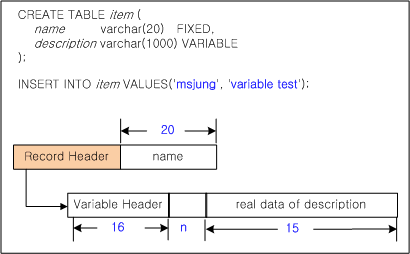

Figure 5-1 VARCHAR Column Structure

Because the “name“ column in the “item“ table was declared as VARCHAR(20) of type FIXED, even though the actual data that are inserted (“msjung“) is only 6 characters long, 20 bytes of space are allocated within the record.

In contrast, because the “description“ column in the “item“ table was declared as VARCHAR(1000) of type VARIABLE, the amount of space that is allocated to store the value is equal to the actual length of the value that is inserted (“variable test”), which is 13 characters long. However, this is not continuous space within the recordp; rather, it is a separately allocated space<sup>1</sup>.

[<sup>1</sup>] If an amount of memory corresponding to the size of data were allocated every time actual data were stored in a VARCHAR column of type VARIABLE, performance would be affected. Therefore, in Altibase, slots having internally determined sizes, such as 4kB, 8kB, and 16kB, are set aside in advance, and the server selects the optimal slot size for saving the data when entering data into a VARIABLE type VARCHAR column.

The column declared with the VARIABLE attribute of the VARCHAR data type keeps the location of the actual data in the record header. For each slot separately stored, a variable header of 16 bytes and (n + 1) * 2 additional space for storing the positions of n columns are needed. Therefore, in the example above, the actual space used to store the value of the description column is 35 bytes.

#### **Altering Tables**

Using the ALTER TABLE and RENAME statements, table definitions can be altered in the following ways.

-   Changing table names
-   Adding new columns
-   Dropping existing columns
-   Specifying column default values
-   Changing column names
-   Adding constraints
-   Dropping constraints
-   Compacting memory tables
-   Increasing the maximum allowable record count
-   Enabling and disabling indexes
-   Data access mode for tables or partitions

##### Example

```
ALTER TABLE book
    ADD COLUMN (isbn CHAR(10) PRIMARY KEY,
    edition INTEGER DEFAULT 1);

ALTER TABLE book
    DROP COLUMN isbn;

ALTER TABLE department
RENAME COLUMN dno TO dcode;
```

For more detailed information about the ALTER TABLE statement, please refer to the [*SQL Reference*.](https://github.com/ALTIBASE/Documents/blob/master/Manuals/Altibase_7.1/eng/SQL%20Reference.md#alter-table)

#### **Dropping Tables**

Tables can be dropped (removed) using the DROP TABLE statement.

##### Example

```
DROP TABLE employees; 
```

#### Truncating Tables

Table records can be deleted not only using the DELETE statement but also using the TRUNCATE TABLE statement. Internally, when the DELETE statement is executed, records are deleted one by one, whereas the TRUNCATE TABLE statement executes the DROP TABLE DDL statement and creates a new table having the identical specification.

Therefore, when executing the TRUNCATE TABLE statement, the entire table is first locked, and, after the TRUNCATE TABLE statement is successfully executed, the data cannot be restored using the ROLLBACK statement.

#### Data Manipulation

The records in tables can be manipulated using the following DML statements:

-   INSERT

-   DELETE

-   UPDATE

-   SELECT

As mentioned above, because it is dangerous to perform bulk UPDATE/DELETE operations on large data while Altibase is running, when writing applications using Altibase CLI or preprocessor (APRE), it is recommended to do so in such a way that UPDATE/DELETE operations are first performed on individual records and then committed.

The following is an example of a program authored using the C/C++ Precompiler that avoids bulk UPDATE/DELETE operations and UPDATEs records individually:

<table>
    <tr>
    	<td>(a) using iSQL to perform a bulk update operation<br/>
iSQL >update t1 set col1=2 where col1 > 1000;
</td>
        <td>(b) using APRE C/C++ Precompiler to update individual records<br/>
 .......<br/>
EXEC SQL DECLARE update_cursor CURSOR<br/>
FOR<br/>
    select col1 from t1 where col1 > 1000;<br/>
EXEC SQL  OPEN update_cursor;<br/>
while (1)<br/>
{<br/>
    EXEC SQL FETCH update_cursor INTO :t1_col;<br/>
   if (sqlca.sqlcode == SQL_NO_DATA) break;<br/>
    EXEC SQL update t1 set col1=2 <br/>
where col1=:t1_col;<br/>
}<br/>
.......<br/>
</td>
    </tr>
</table>


#### **Related SQL Statements**

The following SQL statements are supported for use with tables. For more detailed information, please refer to the [*SQL Reference*.](https://github.com/ALTIBASE/Documents/blob/master/Manuals/Altibase_7.1/eng/SQL%20Reference.md)

-   CREATE TABLE

-   ALTER TABLE

-   RENAME TABLE

-   TRUNCATE TABLE

-   LOCK TABLE

-   INSERT

-   DELETE

-   UPDATE

-   SELECT

### Temporary Tables

Temporary tables temporarily store data while a session or transaction is running. These tables can improve the execution speed of compound queries. Users should use these tables to temporarily store the result sets of multiple DML operations.

Temporary table definitions can be viewed in all sessions. However, you can only view temporary table data in the session that inserted data into the table.

Indexes can be created on temporary tables. These indexes are also temporary. Index data stay valid in the session and transaction level with the same table data.

Unlike normal tables, temporary tables and their indexes are not automatically allocated segments when an object is created. However, segments are allocated for the first INSERT (or CREATE TABLE AS SELECT) operation.

Only one temporary table is allowed for one transaction.

Temporary table data is temporary, and it is impossible to recover it from backups or system failures. Users should take appropriate action to preserve temporary table data.

##### **Considerations**

-   Temporary tables can only be created in volatile tablespaces.

#### **Creating Tables**

Tables can be created using the CREATE [GLOBAL] TEMPORARY TABLE statement. The ON COMMIT clause specifies the scope of data commitment. 

For more detailed information about this clause, please refer to the [*SQL Reference*.](https://github.com/ALTIBASE/Documents/blob/master/Manuals/Altibase_7.1/eng/SQL%20Reference.md#create-table)

Since a temporary table can only be created in a volatile tablespace, users need to specify a volatile tablespace in the TABLESPACE clause.

##### Example

\<Query> Create a temporary table that commits a transaction:

```
CREATE VOLATILE TABLESPACE my_vol_tbs SIZE 12M AUTOEXTEND ON MAXSIZE 1G;

CREATE TEMPORARY TABLE temp1(i1 INTEGER, i2 VARCHAR(10))
	ON COMMIT DELETE ROWS
	TABLESPACE my_vol_tbs;
```

#### **Altering Tables**

A temporary table in a session allows DDL operations (ALTER TABLE, DROP TABLE, CREATE INDEX, etc.) only if it is not bound to the session.

A temporary table in a transaction allows DDL operations, regardless of being bound or not.

However, if a DDL statement is operated on a temporary table, its table data disappears. This is because Altibase commits data before performing DDL operations.

##### Example

\<Query> Execute a DDL statement on a temporary table that is bound to a session.

```
CREATE VOLATILE TABLESPACE my_vol_tbs SIZE 12M AUTOEXTEND ON MAXSIZE 1G;
CREATE TEMPORARY TABLE temp1(i1 INTEGER, i2 VARCHAR(10))
	ON COMMIT PRESERVE ROWS
	TABLESPACE my_vol_tbs;
INSERT INTO temp1 VALUES (1, 'ABC');

iSQL> ALTER TABLE temp1 ADD CONSTRAINT temp1_pk PRIMARY KEY (i1);
[ERR-31363 : Cannot execute DDL when a temporary table is in use.]
```

#### Dropping Tables

Temporary tables can be dropped (removed) using the DROP TABLE statement.

##### Example

\<Query> Drop the temporary table temp1.

```
DROP TABLE temp1;
```

#### **Data Manipulation**

Like normal tables, temporary table data can be manipulated with the following DML statements:

* DELETE
* INSERT
* UPDATE

#### **Related SQL Statements**

The following SQL statements are supported for temporary tables. For more detailed information, please refer to the [*SQL Reference*.](https://github.com/ALTIBASE/Documents/blob/master/Manuals/Altibase_7.1/eng/SQL%20Reference.md)

-   CREATE TABLE

-   ALTER TABLE

-   RENAME TABLE

-   TRUNCATE TABLE

-   LOCK TABLE

-   INSERT

-   DELETE

-   UPDATE

-   SELECT

### Compressed Tables

A compressed table is a table that has a compressed column. If a table is created with a compressed column, the Altibase server automatically creates a dictionary table and a unique index to speed up SELECT operations. The dictionary table is the table that stores data, and a dictionary table is created for each compressed column. If data is inserted into or altered in a compressed column, the actual data is inserted into the dictionary table, whereas pointers (or OIDs) that point to the actual data are stored in compressed columns. Regardless of whether a compressed table is a memory table or a disk table, the dictionary table is generated in memory tablespace.


[Figure 5-2] The Relationship between Compressed Columns and Dictionary Tables

A compressed column stores data in a separate table to prevent duplicate values, and this can decrease memory usage. However, memory usage can increase if there are little duplicates because additional data storage space would need to be consumed for compression.

Regardless of whether the compression table is a memory table or a disk table, the dictionary table is created in the memory tablespace.

#### Constraints

-   Compressed columns can only be created in memory and disk tablespaces.
-   For disk compressed tables, if the OID is saved to a compressed column and the transaction is rolled back afterward, data inserted to the dictionary table is not deleted, but retained.

#### Creating Tables

Like normal tables, compressed tables can be created with the CREATE TABLE statement. However, you need to specify the column to be compressed in the COMPRESS clause. For more detailed information about the COMPRESS clause, please refer to the [*SQL Reference*.](https://github.com/ALTIBASE/Documents/blob/master/Manuals/Altibase_7.1/eng/SQL%20Reference.md#table_compression_clause)

##### Example

<Query> Compress the columns department and position, and create the compressed table emp.

```
CREATE TABLE emp (
    name       CHAR( 20 ),
    department CHAR( 20 ),
    position   CHAR( 20 )
) COMPRESS ( department, position );
```

#### **Altering Tables**

Like normal tables, compressed table definitions can be changed with the ALTER TABLE and RENAME statements. You can add compressed columns with the COMPRESS clause.

##### Example

\<Query> Add the salary and join_date columns to the table emp, but add join_date as a compressed column.

```
ALTER TABLE emp
    ADD COLUMN (salary NUMBER, join_date DATE)
 COMPRESS (join_date);
```

#### Rebuilding Tables

The ALTER TABLE *table_name* REORGANIZE statement drops data that is not referenced in the dictionary table and manages storage space.

When users execute the DELETE or UPDATE statement on a compressed table, only new data is inserted without dropping or altering the corresponding data from the dictionary table. If users execute the DELETE or UPDATE multiple times on a compressed table, unreferenced data is stacked in the dictionary table. A compressed table is rebuilt so that unnecessary data does not consume memory storage space.

##### **Example**

<Query> Insert data into the compressed table emp, delete it, and then rebuild the table.

```
CREATE TABLE emp (
    name       CHAR( 20 ),
    department CHAR( 20 )
) COMPRESS ( department );
INSERT INTO emp VALUES ( 'Park',  'Personel' );
INSERT INTO emp VALUES ( 'Yun',   'Sales'    );
INSERT INTO emp VALUES ( 'Min',   'Personel' );
DELETE FROM emp WHERE name = 'Yun';

ALTER TABLE emp REORGANIZE COLUMN ( department );
```

#### **Dropping Tables**

Compressed tables can be dropped (removed) using the DROP TABLE statement.

##### **Example**

\<Query> Drop the compressed table temp1.

```
DROP TABLE temp1;
```

#### **Data Manipulation**

Like normal tables, compressed table data can be manipulated with the following DML statements:

* DELETE
* INSERT
* UPDATE

#### Related SQL Statement

The following SQL statements are supported for compressed tables. For more detailed information, please refer to the [*SQL Reference*.](https://github.com/ALTIBASE/Documents/blob/master/Manuals/Altibase_7.1/eng/SQL%20Reference.md)

-   CREATE TABLE

-   ALTER TABLE

-   RENAME TABLE

-   TRUNCATE TABLE

-   LOCK TABLE

-   INSERT

-   DELETE

-   UPDATE

-   SELECT

### Queues

The Altibase message queuing function supports asynchronous data transfer between the database and client applications. Queue tables are database objects, just like other database tables, and thus can be controlled using DDL and DML statements.

#### Creating Queues

When the user uses the CREATE QUEUE statement to create a queue, the database creates a table having the name specified by the user. This is called a queue table. Queue tables have the following structure:

| Column name  | Type    | Length         | Default | Description                                         |
| ------------ | ------- | -------------- | ------- | --------------------------------------------------- |
| MSGID        | BIGINT  | 8              | \-      | A message identifier set by the user                |
| CORRID       | INTEGER | 4              | 0       | The time that the message was added to the queue    |
| MESSAGE      | VARCHAR | Message length | \-      | The message text                                    |
| ENQUEUE_TIME | DATE    | 8              | SYSDATE | A message identifier, set by Altibase automatically |

The user cannot freely change the name of the queue table or the names of its columns. A primary key is automatically created in the MSGID column.

The database internally creates a sequence called *queue_name*_NEXT_MSG_ID to generate unique MSGID values. The user can use the SYSTEM_.SYS_TABLES_ meta table to view information about this sequence.

Because the sequence must be maintained until the queue table is deleted, the DROP SEQUENCE statement cannot be used to remove the sequence expressly.

Queue tables are saved as type 'Q' in the SYSTEM_.SYS_TABLES meta table. Indexes can be created for queue tables as desired using the CREATE INDEX statement.

##### Example

```
CREATE QUEUE Q1(40);
```

#### Alter Queues

The structure of queue tables, which are created using the CREATE QUEUE statement, cannot be changed using an ALTER TABLE statement or the like. Queues can only be removed using the DROP QUEUE statement. However, the user can manipulate the data in queues using statements such as ENQUEUE/DEQUEUE, DELETE, SELECT, etc.

#### Removing Queues

Queue tables can be removed from the database using the DROP QUEUE statement.

##### Example

```
DROP QUEUE Q1;
```

#### **Deleting Data**

The TRUNCATE TABLE statement can be used when it is desired only to delete all of the messages loaded into a queue.

##### Example

```
TRUNCATE TABLE Q1;
```

#### Data Manipulation

The records in queue tables can be manipulated using the following SQL statements:

-   ENQUEUE

-   DEQUEUE

-   DELETE

-   SELECT

#### Related SQL Statements

The following SQL statements are provided for use with queue tables. For more detailed information about queues, please refer to the [*SQL Reference*.](https://github.com/ALTIBASE/Documents/blob/master/Manuals/Altibase_7.1/eng/SQL%20Reference.md)

-   CREATE QUEUE

-   DROP QUEUE

-   ENQUEUE

-   DEQUEUE

### **Constraints**

Constraints are limitations that control the insertion of data into tables and the changes that can be made to existing data. This section explains the kinds of constraints and how to use them to ensure data consistency.

#### Types

The following kinds of constraints are supported in Altibase:

##### NOT NULL/NULL 

NOT NULL is a constraint that prevents NULL from being inserted into a column. NOT NULL can be defined in column units. Specifying NULL allows NULL values. If NOT NULL is not specified for a column, NULL is allowed by default.

##### CHECK Constraints

The CHECK constraint enables the user to enforce integrity rules on data. CHECK constraints specify conditions evaluating to TRUE, FALSE, or NULL on one or more columns. If the value of a column modified by a DML statement results in the condition of the constraint evaluating to FALSE, the statement is processed as an error.

The following limitations concern the conditions of CHECK constraints:

-   SYNONYM, Subqueries, sequences, all pseudo columns, such as LEVEL, ROWNUM, etc., and non-deterministic SQL functions, such as SYSDATE, USER_ID, etc., cannot be included.
  
-   PRIOR operator cannot be used.

-   LOB type data cannot be used.

Multiple CHECK constraints can be defined on a single column; however, the user cannot specify the order in which CHECK constraints are to be evaluated. Altibase does not check the mutual exclusivity of CHECK constraints; the user must design CHECK constraints, so there is no conflict.

As omission of the year or month of the DATE constant as below is valid for CHECK constraints, caution is required for its use:

-   If no year is entered, the current year is entered by default.
-   If no month is entered, the current month is entered by default.

##### UNIQUE KEY

This constraint, which can be defined for one or more columns, prevents the insertion of duplicate values into one or more columns. A unique index is created when a unique key constraint is defined.

##### PRIMARY KEY

The Primary Key constraint can be thought of as a combination of the Unique Key constraint and the NOT NULL constraint. A primary key constraint can be defined for one or more columns. When it is created, a unique index is created internally. NULL values cannot be entered in any of the columns included in the primary key constraint.

##### FOREIGN KEY

A FOREIGN KEY constraint requires each value in a column or set of columns to match a value in an associated table's UNIQUE or PRIMARY KEY. A FOREIGN KEY constraint helps protect referential integrity.

##### TIMESTAMP

This constraint sets the value of a column to the system time when a new record is inserted, or an existing record is updated. A TIMESTAMP constraint is usually set for one column of a table that is replicated.

#### Column Constraints and Table Constraints

A column constraint is a constraint that is set for a single column, whereas a table constraint is a single constraint that is set for the entire table, and applies to multiple columns in the table.

The NOT NULL/NULL and TIMESTAMP constraints can only be used as column constraints, but the other kinds of constraints can be set as either column constraints or table constraints.

#### **Creating Constraints**

The user can define a constraint when creating a table using the CREATE TABLE statement or altering a table using the ALTER TABLE statement.

The user can specify the name of a constraint when defining the constraint. If the user does not set the name of the constraint, the system will automatically assign a name. If the constraint is of a type that requires an index, the system automatically creates the index and assigns a name to it.

##### Example

```
CREATE TABLE inventory(
  subscriptionid CHAR(10),
  isbn CHAR(10),
  storecode CHAR(4),
  purchasedate DATE NOT NULL,
  quantity INTEGER CHECK(quantity < 1000),
  paid CHAR(1),
  PRIMARY KEY(subscriptionid, isbn),
CONSTRAINT fk_isbn FOREIGN KEY(isbn, storecode) REFERENCES book(isbn, storecode))
TABLESPACE user_data;

ALTER TABLE book
ADD CONSTRAINT const1 UNIQUE(bno);
```

#### **Dropping Constraints**

A constraint can be removed by using the ALTER TABLE statement.

##### **Example**

```
ALTER TABLE book DROP UNIQUE(bno);
```

#### Related SQL Statements

The following SQL statements are supported for use with constraints. For more detailed information, please refer to the [*SQL Reference*.](https://github.com/ALTIBASE/Documents/blob/master/Manuals/Altibase_7.1/eng/SQL%20Reference.md)

-   CREATE TABLE

-   ALTER TABLE

### Indexes

Indexes allow the records in tables to be accessed more quickly. This section describes the types of indexes that are supported in Altibase and how to manage and use index objects.

#### Index Types

Altibase supports two types of indexes: B-tree indexes and R-tree indexes. The R-tree index is a multi-dimensional index type for use with spatial queries.

##### B-tree Indexes

B-tree indexes are used with all data types except the GEOMETRY data type, which is a spatial data type. B-tree indexes have historically been used with DBMSs, and many variants thereof have arisen over the years due to a large amount of research that has been conducted to date. Of these variants, Altibase supports the B+-tree index type.

A B+-tree index consists of leaf nodes at the lowest index level, a root node at the highest level, and internal nodes in between the root and leaf nodes. Key values exist only for all leaf nodes, and root and index nodes comprise separator keys between left child nodes and right child nodes.

##### **R-Tree Indexes**

R-Tree Indexes are used with the GEOMETRY spatial data type.

When finding target objects using R-tree indexes, the following procedure is used:

1.  Conditional filtering is conducted using the MBR (Minimum Bounding Rectangle) that covers each spatial object.
2.  “Refinement”, which is checking for accurate index search conditions about objects that remain after step 1, is conducted.

The algorithms for adding, deleting, splitting, and merging nodes in R-Tree Indexes are similar to those for B-tree Indexes, except that they are based on MBRs.

#### **Index Attributes**

Based on how a key column is configured when an index is created and on the attributes of the key column, an index has the following attributes.

##### **Unique Index**

This index prevents the use of duplicate values in indexed columns.

##### **Unique Keys vs. Primary Keys**

Unique Keys and Primary Keys are alike in that neither of them permits the existence of duplicate values. However, they differ in whether they permit NULL values. Primary Keys do not permit NULL values.

##### Non-unique Index

This index type permits duplicate values in index columns. If the UNIQUE KEY option is not set when an index is created, the default is to allow duplicate values.

##### **Non-Composite Index**

This kind of index is based on only one column.

##### **Composite Index**

When a single index is created based on multiple columns, it is called a Composite Index.

##### Direct Key Index

Whereas a normal index stores only a record pointer in an index node, a direct key index stores the record pointer and the record in the index node, and reduces index scan cost.

#### **Index Management**

Indexes are used to enable quicker access to the records in tables. Because an index is an object that is physical and logically independent from a table, it can be built, deleted, or changed without consideration for the table on which it is based.

If table records are changed, the corresponding indexes are also changed. Therefore, the user should create indexes only when necessary and should modify or delete them so that they are managed optimally based on the way in which the associated tables are accessed.

##### Creating Indexes

An index is created for one or more columns in the table. Indexes are automatically created when constraints are defined, or users can explicitly create indexes using the CREATE INDEX statement.

###### **Example**

Creating an index by defining a table constraint:

```
CREATE TABLE TB1 (C1 INTEGER PRIMARY KEY, C2 INTEGER UNIQUE);
```

Creating an index by changing a table constraint:

```
ALTER TABLE TB1 ADD PRIMARY KEY (C1);
ALTER TABLE TB1 ADD UNIQUE (C2);
```

Specifying the order of columns when creating a composite index:

```
CREATE INDEX TB1_IDX1 ON TB1 (C1 ASC, C2 DESC);
```

Creating a index using the INDEXTYPE option to specify the type of index:

```
CREATE INDEX TB1_IDX1 ON TB1 (C1) INDEXTYPE IS BTREE ;
```

Creating a unique index using the UNIQUE option:

```
CREATE UNIQUE INDEX TB1_IDX ON TB1 (C1) ;
```

##### **Options for Creating Disk B-Tree Indexes (NOLOGGING, NOFORCE)**

When a disk B-tree index is built, a log is recorded so that it can be used to recover the index in the event of a system error. In order to reduce the size of logs and the amount of time taken to build an index, the NOLOGGING option can be specified when the index is created.

When the NOLOGGING option is used, all pages of an index are written to disk immediately after the index is built, thus ensuring the consistency of the index after it is built, even if a system fault occurs.

However, when indexes are created with the NOLOGGING option, if the NOFORCE option (which specifies that index pages are not to be written to disk immediately) is also specified, although the time required to build the index is reduced, index consistency may be lost if a system or media fault occurs. Media backup should be conducted in order to ensure the durability of indexes that are created with both the NOLOGGING and NOFORCE options.

|                   | Total Index Build Time                                  | Consistency & Durability                                     |
| ----------------- | ------------------------------------------------------- | ------------------------------------------------------------ |
| LOGGING           | Index Building Time + Logging Time                      | Recoverable when a system or media fault occurs              |
| NOLOGGING FORCE   | Index Building TIme + Time Taken to Write Index to Disk | Recoverable when a system fault occurs, but consistency may be lost when a media fault occurs. |
| NOLOGGING NOFORCE | Index Building Time                                     | Consistency may be lost when a system or media fault occurs. |

###### Example

Creating an index that is not logged and write the index to disk:

```
CREATE INDEX TB1_IDX1 ON TB1(C1) NOLOGGING;
```

or

```
CREATE INDEX TB1_IDX1 ON TB1(C1) NOLOGGING FORCE;
```

Creating an index that is not logged (NOLOGGING) and that is not written to disk after being built (NOFORCE):

```
CREATE INDEX TB1_IDX1 ON TB1(C1) NOLOGGING NOFORCE;
```

##### **Modifying Indexes**

The attributes of an index can be changed using the ALTER INDEX statement.

##### **Dropping Indexes**

Index can be removed explicitly using the DROP INDEX statement, or implicitly by removing the associated constraint.

###### Example

```
DROP INDEX emp_idx1;
```

#### **Using Indexes**

##### **Bottom-Up Index Building**

In Altibase, indexes are built from the bottom up. Therefore, it is more efficient to build indexes after data have been uploaded. If a large volume of data is inserted into a table for which an index has been built, slow performance may result, because each time a record is inserted, the index will need to be changed to reflect this.

##### **Disk Index Consistency**

For disk table indexes created with the NOLOGGING option, index consistency cannot be guaranteed in the event of a system or media fault. If such a fault occurs, use the V$DISK_BTREE_HEADER performance view to check the consistency of disk indexes. If an index for which IS_CONSISTENT is set to ‘F’ is found, delete the index and rebuild it when it is needed.

##### Function-based Index

A function-based index is an index that is created based on the result values of functions or expressions. If a query that includes an identical expression used to create a function-based index is processed, the function-based index is used, and faster query processing speed can be anticipated.

#### **Related SQL Statements**

The following SQL statements are supported for use with indexes. For more detailed information, please refer to the [*SQL Reference*.](https://github.com/ALTIBASE/Documents/blob/master/Manuals/Altibase_7.1/eng/SQL%20Reference.md)

-   CREATE TABLE

-   ALTER TABLE

-   CREATE INDEX

-   ALTER INDEX

-   DROP INDEX

### View

A view is a presentation of data from one or more tables, materialized views or other views. A view contains no actual data, but rather presents data from the tables and views on which it is based. Views can be thought of as logical tables. This section describes how to manage views.

#### **Base Tables and Views**

So-called “base tables” are just the objects (tables, materialized views, or other views) that views access, and from which they read data. More than one base table can be associated with a single view.

#### Creating Views

Views can be created using the CREATE VIEW statement.

##### Example

```
CREATE VIEW avg_sal AS
  SELECT DNO, AVG(salary) emp_avg_sal
  -- salary average of each department
  FROM employees
  GROUP BY dno;
```

#### Modifying Views

Use the CREATE OR REPLACE VIEW statement to change the contents of an existing view, that is, change its underlying SELECT query statement.

##### Example

```
CREATE OR REPLACE VIEW emp_cus AS
  SELECT DISTINCT o.eno, e.e_lastname, c.c_lastname
  FROM employees e, customers c, orders o
  WHERE e.eno = o.eno AND o.cno = c.cno;
```

#### Compiling Views

Because views are based on base tables, when the definition of a base table is changed using a DDL statement, any views based on the table may become invalid, that is, unable to be viewed. In such cases, the ALTER VIEW statement can be used with the COMPILE option to recompile the view so that it is valid.

##### Example

```
ALTER VIEW avg_sal COMPILE;
```

#### Dropping Views

Views can be removed using the DROP VIEW statement.

##### Example

```
DROP VIEW avg_sal;
```

#### Data Manipulation

Similar to normal tables, data can be queried with the SELECT statement and modified with INSERT, UPDATE, or DELETE statements on views. Updatable views are views that can modify data of the base table by executing DML statements(INSERT, UPDATE, DELETE). Rows of updatable views must have a one-to-one relationship with rows of base tables; however, views that contain the following cannot be modified:


-   Aggregate functions, analytic functions

-   DISTINCT, ROWNUM operators

-   GROUP BY, HAVING clause

-   Set operators, such as UNION or UNION ALL, etc

-   Subqueries or column operators in the select list

-   Unmodifiable views in the FROM clause

-   Subqueries in the WHERE clause referencing the table of the FROM clause

-   CONNECT BY or START WITH clause

##### Example

Create the updatable join view simple_emp, and then execute UPDATE on this view. Values for Salary before and after executing UPDATE are varied. 

```
CREATE VIEW simple_emp AS
  SELECT eno, e_lastname, salary
    FROM employees;

iSQL> select * from simple_emp where eno=20;
ENO         E_LASTNAME            SALARY
--------------------------------------------------
20          Blake
1 row selected.

iSQL> update simple_emp set salary=2000 where eno=20;
1 row updated.

iSQL> select * from simple_emp where eno=20;
ENO         E_LASTNAME            SALARY
--------------------------------------------------
20          Blake                 2000
1 row selected.
```

#### Related SQL Statements

The following SQL statements are supported for use with views. For more detailed information on these statements, please refer to the *[SQL Reference](https://github.com/ALTIBASE/Documents/blob/master/Manuals/Altibase_7.1/eng/SQL%20Reference.md)*

-   CREATE VIEW

-   ALTER VIEW

-   DROP VIEW

-   SELECT

-   INSERT

-   DELETE

-   UPDATE

### Materialized View

A materialized view is a database object that stores query results as data. Data can be based on more than one table, view, or another materialized view. A materialized view cannot be replicated.

This section describes how to manage a materialized view.

#### Base Tables and Materialized Views

A base table is an object(table, materialized view, or view) that a view accesses and reads data from. It is possible for multiple base tables to be related to only one view. 

Altibase only supports a read-only materialized view. Updatable materialized view and writable materialized view are not supported. 

#### Creating Materialized Views

A materialized view can be created by using the CREATE MATERIALIZED VIEW statement. Although the tablespace where data is to be stored can be specified like other tables, column definitions and constraints cannot be created. After creation, however, the alteration of column definitions or the addition of constraints is possible using the “ALTER TABLE mview_name…” statement.

##### Example

```
CREATE MATERIALIZED VIEW avg_sal
    TABLESPACE sys_tbs_mem_data
    BUILD IMMEDIATE
    REFRESH FORCE ON DEMAND
    AS SELECT DNO, AVG(salary) emp_avg_sal
    FROM employees
    GROUP BY dno;
```

#### Modifying Material Views

The refresh method and time can be altered by using the ALTER MATERIALIZED VIEW statement.

Altering the definition of the materialized view is possible by altering the definition of a table that has an identical name as the materialized view that is actually storing the data. If the table definition is altered in this manner, refreshing the materialized view may fail. 

##### Example

\<Example\> Alter the refresh method of the materialized view.

```
ALTER MATERIALIZED VIEW avg_sal REFRESH COMPLETE;
```

\<Example> Alter the definition of the materialized view.

```
ALTER TABLE avg_sal ADD PRIMARY KEY (dno);
```

#### Refreshing Materialized Views

A user can manually update data from the materialized view by using the REFRESH_MATERIALIZED_VIEW stored procedure. 

##### Example

```
EXEC REFRESH_MATERIALIZED_VIEW('SYS', 'AVG_SAL');
```

#### Dropping Materialized Views

A materialized view can be deleted by using the DROP MATERIALIZED VIEW statement.

##### Example

```
DROP MATERIALIZED VIEW avg_sal;
```

#### Truncating Materialized Views

Data of the materialized view can be deleted by using the TRUNCATE TABLE statement.

#### Data Manipulation

Altibase only supports SELECT for materialized views.

#### Related SQL Statements

The following SQL statements are provided for the materialized view. For more detailed information, please refer to *[SQL Reference](https://github.com/ALTIBASE/Documents/blob/master/Manuals/Altibase_7.1/eng/SQL%20Reference.md)*:

-   CREATE MATERIALIZED VIEW
-   ALTER MATERIALIZED VIEW
-   DROP MATERIALIZED VIEW

#### Truncating Materialized Views

Data of the materialized view can be deleted by using the TRUNCATE TABLE statement.

#### Data Manipulation

Altibase only support SELECT for materialized views.

#### Related SQL Statements

The following SQL statements are provided for the materialized view. For more detailed information, please refer to *[SQL Reference](https://github.com/ALTIBASE/Documents/blob/master/Manuals/Altibase_7.1/eng/SQL%20Reference.md)*.

### Sequences

In Altibase, the Sequence object is provided for use as a generator of sequences of unique numbers. Next sequence values can be cached to ensure consistent performance. 

#### Using Sequences

The sequence generator is particularly useful in multi-universe environments for generating sequences of unique numbers without the overhead of disk I/O or transaction locking. For example, assume two users are simultaneously inserting new records into a table called "orders". By using a sequence to generate unique order numbers for the order_id column, neither of the users has to wait for the other to enter the next available order number. The sequence automatically generates a unique value for each user. 

A sequence is generally used to generate a key value that is set in the desired column using a DML statement. The expressions sequence_name.NEXTVAL and sequence_name.CURRVAL are used to access the sequence. 

-   sequence_name.CURRVAL is used to obtain the current value in the sequence
-   sequence_name.NEXTVAL is used to obtain the next value in the sequence

After a sequence is created and is the first time being executed, the sequence's sequence_name.CURRVAL value cannot be used. In order to use the sequence_name.CURRVAL value for a newly created sequence, the sequence_name.NEXTVAL value must first be accessed.

Every time the sequence's next value is accessed, the value of the sequence increments internally by the amount specified. The increment of the sequence is explicitly specified using the INCREMENT BY option when the index is created, and defaults to 1 if not specified.

#### Using Sequences in INSERT Statements

The following example shows how to create a key value using a sequence and insert it into a table:

##### Example

```
create sequence seq1; 
insert into t1 values (seq1.nextval);
```

In the above example, assuming that the sequence has been newly created, its initial value of 1 will be entered into table t1, and seq1.nextval will increase from 1 to 2.

#### Creating Sequences

The CREATE SEQUENCE statement is used to create a sequence. The following options can be used when creating a sequence:

-   START WITH  
    This is the starting value of the sequence.

-   INCREMENT BY  
    This is the amount by which the sequence increases or decreases.

-   MAXVALUE  
    This is the maximum value of the sequence.

-   MINVALUE  
    This is the minimum value of the sequence.

-   CYCLE  
    This option is specified to ensure that the sequence will continue to create values when it reaches its maximum or minimum value. The sequence cycles again from the minimum value in the case of an ascending sequence, or from the maximum value in the case of a descending sequence.
    
-   CACHE  
    Sequence values can be created in advance and cached in memory so that they can be returned more quickly. The number of sequence values cached in this way is equal to the value specified using the CACHE option. The cache is populated when a key value is first requested from a new sequence, and is accessed every time the next key value is subsequently requested from the sequence. After the last sequence value in the cache has been used, the next request for a key value from the sequence causes new sequence values to be created and cached in memory. Then the first value is returned from this new cache. When a sequence is created, the default CACHE value is 20.

##### Example

Creating a basic sequence (starting from 1 and incrementing by 1):

```
CREATE SEQUENCE seq1;
```

Creating a sequence that generates even numbers and cycles from 0 to 100:

```
CREATE SEQUENCE seq1
START WITH 0
INCREMENT BY 2
MAXVALUE 100
CYCLE ;
```

#### Modifying Sequences

All sequence options except for the START WITH value can be modified using the ALTER SEQUENCE statement.

##### Example

```
ALTER SEQUENCE seq1
  INCREMENT BY 1
  MINVALUE 0
  MAXVALUE 100;
```

#### Dropping Sequences

Sequences can be removed as desired by using the DROP SEQUENCE statement.

##### Example

```
DROP SEQUENCE seq1;
```

#### Related SQL Statements

The following SQL statements are provided for use with sequences. For more detailed information, please refer to the *[SQL Reference.](https://github.com/ALTIBASE/Documents/blob/master/Manuals/Altibase_7.1/eng/SQL%20Reference.md)*

-   CREATE SEQUENCE

-   ALTER SEQUENCE

-   DROP SEQUENCE

### Synonyms

Altibase supports the use of synonyms as aliases for tables, views, sequences, stored procedures, or stored functions. 

#### Advantage of Synonyms

Database synonyms are advantageously used in the following cases: 

-   When it is desired to conceal the original name of a particular object or the identity of the user who created it
-   To simplify the use of a SQL statement
-   To minimize the changes that must be made to applications in order for them to be used by various users.

#### Creating Synonyms

Synonyms can be created by using the CREATE SYNONYM statement

##### Example

To create the synonym “my_dept” as an alias for the table “dept”:

```
CREATE SYNONYM my_dept FOR dept;
```

#### Dropping Synonyms

Synonyms can be removed by using the DROP SYNONYM statement.

##### Example

To remove the synonym “my_dept”:

```
DROP SYNONYM my_dept;
```

#### Related SQL Statements

The following SQL statements are provided for use with synonyms. For more detailed information, please refer to the *[SQL Reference.](https://github.com/ALTIBASE/Documents/blob/master/Manuals/Altibase_7.1/eng/SQL%20Reference.md)*

-   CREATE SYNONYM

-   DROP SYNONYM

### Stored Procedures and Functions

A stored procedure is a set of SQL statements, flow control statements, assignment statements, error handling routines, etc. that are programmed in a single module that corresponds to a complete business task. The module is permanently stored in the database as a database object so that the entire business task can be conducted merely via the single action of calling the module on the server by name. This chapter describes how to manage stored procedures.

Stored procedures and stored functions are different in that stored functions return a value to the caller, while stored procedures do not. Because they are identical in all other respects, explanations of stored procedures can also be understood to apply to stored functions unless otherwise noted. 

This chapter provides simple examples of how to manage stored procedures. For a more detailed explanation of the terminology, concepts, and management of stored procedures and stored functions, please refer to the [*Stored Procedures Manual*.](https://github.com/ALTIBASE/Documents/blob/master/Manuals/Altibase_7.1/eng/Stored%20Procedures%20Manual.md)

#### Categories

##### Stored Procedure

A stored procedure is a database object that executes multiple SQL statements at one time in consideration of input, output, and input/output parameters according to conditions defined in its body. It does not have a return value, and thus sends values to the client using output or input/output parameters. Because it does not have a single return value, it cannot be used as an operand within an expression in another SQL statement.

##### Stored Function

A stored function is identical to a stored procedure except that it has a return value. Because it differs from a stored procedure in this way, it can be used as an operand in an expression within another SQL statement, just like the functions provided by the system.

##### Typeset

A typeset is a set of user-defined types used within a stored procedure. Typesets are usually used when stored procedures exchange user-defined types, that is, parameters and return values, with each other.

#### SQL Statements Related to Stored Procedures

The following table shows the kinds of SQL statements that can be used with stored procedures.

<table>
    <tr>
    	<th>Task</th>
    	<th>Statemnet</th>
        <th>Description</th>
    </tr>
    <tr>
    	<td rowspan="3">CREATE</td>
        <td>CREATE [OR REPLACE]
PROCEDURE</td>
        <td>Creates a new stored procedure or redefines an
existing stored procedure</td>
    </tr>
    <tr>
    	<td>CREATE [OR REPLACE]
FUNCTION</td>
        <td>Creates a new stored function or redefines an
existing stored function</td>
    </tr>
    <tr>
    	<td>CREATE [OR REPLACE]
TYPESET</td>
        <td>Creates or modifies a typeset</td>
    </tr>
    <tr>
    	<td rowspan="2">ALTER</td>
        <td>ALTER PROCEDURE</td>
        <td>If the definitions of objects referred to in a stored
procedure are changed after the stored procedure
has been created, the current stored procedure
execution plan tree may not be optimized. In such
cases, this statement recompiles the stored procedure to create an optimized execution plan tree.</td>
    </tr>
    <tr>
    	<td>ALTER FUNCTION</td>
        <td>If the definitions of objects referred to in a stored
function are changed after the stored function has
been created, the current stored function execution plan tree may not be optimized. In such cases, this statement recompiles the stored function to create an optimized execution plan tree.</td>
    </tr>
    <tr>
    	<td rowspan="3">DROP</td>
        <td>DROP PROCEDURE</td>
        <td>Removes a previously created stored procedure</td>
    </tr>
    <tr>
        <td>DROP FUNCTION</td>
        <td>Removes a previously created stored function</td>
    </tr>
    <tr>
        <td>DROP TYPESET</td>
        <td>Removes a previously created typeset</td>
    </tr>
    <tr>
    	<td rowspan="2">EXECUTE</td>
        <td>EXECUTE </td>
        <td>Executes a stored procedure or stored function</td>
    </tr>
    <tr>
        <td>[function name]</td>
        <td>Executes a stored function within a SQL statement, just like a built-in function</td>
    </tr>
</table>

#### Creating Stored Procedures

A stored procedure can be created using the CREATE PROCEDURE statement.

##### Example

```
CREATE PROCEDURE proc1
(p1 IN INTEGER, p2 IN INTEGER, p3 IN INTEGER)
AS
  v1 INTEGER;
  v2 t1.i2%type;
  v3 INTEGER;
BEGIN
  SELECT *
  INTO v1, v2, v3
  FROM t1
  WHERE i1 = p1 AND i2 = p2 AND i3 = p3;

  IF v1 = 1 AND v2 = 1 AND v3 = 1 THEN
    UPDATE t1 SET i2 = 7 WHERE i1 = v1;
  ELSIF v1 = 2 AND v2 = 2 AND v3 = 2 then
    UPDATE t1 SET i2 = 7 WHERE i1 = v1;
  ELSIF v1 = 3 AND v2 = 3 AND v3 = 3 then
    UPDATE t1 SET i2 = 7 WHERE i1 = v1;
  ELSIF v1 = 4 AND v2 = 4 AND v3 = 4 then
    UPDATE t1 SET i2 = 7 WHERE i1 = v1;
  ELSE    -- ELSIF v1 = 5 AND v2 = 5 AND v3 = 5 then
    DELETE FROM t1;
  END IF;

  INSERT INTO t1 VALUES (p1+10, p2+10, p3+10);
END;
/
```


#### Creating or Replacing Procedures

If the user wants to change the stored procedure's parameters or main frame while retaining the name of an existing stored procedure, the user use the CREATE OR REPLACE PROCEDURE to recreate the stored procedure

##### Example

```
CREATE OR REPLACE PROCEDURE proc1
(p1 IN INTEGER, p2 IN INTEGER, p3 IN INTEGER)
AS
  v1 INTEGER;
  v2 t1.i2%type;
  v3 INTEGER;
BEGIN
.
.
.
END;
/
```

If the definition of a table, sequence, and other stored procedure or function referenced in a stored procedure change from its definition from when it was created, the stored procedure will not be able to execute. In this case, this stored procedure is called invalid.

For example, if the indexes  that existed when the stored procedure was first created is deleted, the previous execution schedule is intended to access the table through the indexes, so the table cannot be accessed by using the previous execution schedule.

The ALTER PROCEDURE statement is used to recompile invalid stored procedures to recreate an execution schedule with valid status.

##### Example

```
ALTER PROCEDURE proc1 COMPILE;
```

#### Dropping Stored Procedures

Stored procedures can be removed using the DROP PROCEDURE statement.

##### Example

```
DROP PROCEDURE proc1;
```

#### Related SQL Statements

The following SQL statements are supported for use with stored procedures and stored functions. For more detailed information, please refer to the *[SQL Reference.](https://github.com/ALTIBASE/Documents/blob/master/Manuals/Altibase_7.1/eng/SQL%20Reference.md)*

-   CREATE PROCEDURE

-   CREATE FUNCTION

-   CREATE TYPESET

-   ALTER PROCEDURE

-   ALTER FUNCTION

-   DROP PROCEDURE

-   DROP FUNCTION

-   DROP TYPE SET

-   EXECUTE

-   FUNCTION NAME

### Triggers

A trigger is a special kind of stored procedure that is automatically executed (or “fired”) by the system in order to accomplish a particular task when data are inserted into a table, deleted from a table, or modified. This section describes how to manage triggers.

#### Trigger Components

The following trigger constituents determine when a trigger fires, whether it fires, and what it executes.

-   Trigger Event  
    This is the SQL statement that causes the trigger to fire when executed.

-   Trigger condition (WHEN Clause) 
    This is a SQL condition that must be satisfied to fire the trigger.

-   Trigger Action  
    This is the body of the stored procedure that the trigger executes when the trigger condition is TRUE.

#### Trigger Event

One of three DML statements can be specified as the event that causes the trigger to fire: 

-   DELETE  
    Specify DELETE to tell the trigger to fire whenever a row is removed from the table using a DELETE statement

-   INSERT  
    Specify INSERT to tell the trigger to fire whenever a row is added to the table using an INSERT statement.

-   UPDATE  
    Specify UPDATE to tell the trigger to fire whenever data in the table are changed using an UPDATE statement. If an OF clause is present in the UPDATE trigger event, the trigger fires only if data in the columns explicitly named in the OF clause are changed.

> Note: In order to maintain the integrity of the database, changes made to tables by replication will not be processed as trigger events.

#### Creating Trigger

Triggers can be created using the CREATE TRIGGER statement.

##### Example

```
CREATE TRIGGER del_trigger
  AFTER DELETE ON orders
  REFERENCING OLD ROW old_row
  FOR EACH ROW
  AS BEGIN
    INSERT INTO log_tbl VALUES(old_row.ono, old_row.cno, old_row.qty, old_row.arrival_date, sysdate);
  END;
/
```

#### Modifying Triggers

The ALTER TRIGGER statement can be used to disable the execution of an existing trigger or recompile an invalid trigger. When a trigger is first created, it is automatically enabled by default. It can be subsequently disabled and enabled using the DISABLE and ENABLE clause with the ALTER TRIGGER statement.

##### Example

```
ALTER TRIGGER del_trigger DISABLE;
```

#### Dropping Triggers

The DROP TRIGGER statement can be used to remove a trigger from the database.

##### Example

```
DROP TRIGGER del_trigger;
```

#### Related SQL Statements

The following SQL statements are supported for use with triggers. For more detailed information, please refer to the *[SQL Reference.](https://github.com/ALTIBASE/Documents/blob/master/Manuals/Altibase_7.1/eng/SQL%20Reference.md)*.

-   CREATE TRIGGER

-   ALTER TRIGGER

-   DROP TRIGGER

Additionally, because a trigger is a kind of stored procedure, for a detailed description of the trigger body, please refer to the *[Stored Procedures Manual](https://github.com/ALTIBASE/Documents/blob/master/Manuals/Altibase_7.1/eng/Stored%20Procedures%20Manual.md)*.

### Jobs

Altibase provides the JOB object, which is the addition of an execution schedule to a stored procedure. The stored procedure to be executed, the point in time of execution, the interval after which it is to be executed and etc. can be set when creating the JOB object. 

Only the SYS user can create, alter, or drop the JOB, and only one procedure can be registered per JOB. 

For the created JOB to run according to schedule, the job scheduler must be enabled. The operations of the job scheduler can be controlled with the JOB_SCHEDULER_ENABLE property. 

This section explains how to control the job scheduler and also how to create, alter, and drop the JOB object.

#### Starting and Ending the Job Scheduler

The creation of the JOB object is merely the registration of an execution schedule for a stored procedure. 

##### Starting the Job Scheduler

To start the job scheduler, first change the values of the following properties. If the value of the JOB_SCHEDULER_ENABLE property is set to 1, but the value of the JOB_THREAD_COUNT property is 0, the job scheduler will not start. 

-   JOB_SCHEDULER_ENABLE (0 inactive (default), 1: active)

-   JOB_THREAD_COUNT (default: 0)

##### Ending the Job Scheduler

To end the job scheduler, change the value of the JOB_SCHEDULER_ENABLE property to 0.

##### Constraints

-   Job scheduler can only be controlled by the SYS user.

-   After changing the value of the JOB_THREAD_COUNT property, restart the Altibase server.

##### Example

< Query > Start the job scheduler for the registered JOB to run.

```
iSQL> ALTER SYSTEM SET job_scheduler_enable = 1;
Alter success.
```

< Query > Terminate the operation of the job scheduler.

```
iSQL> ALTER SYSTEM SET job_scheduler_enable = 0;
Alter success.
```

#### Creating Jobs

A JOB can be created using CREATE JOB statement. Here, the stored procedure to be executed, when to execute and the interval time of execution can be specified. If the user name of the procedure to be registered is omitted, it is assumed as SYS user by default.

When a JOB is created, it is in the DISABLE state by default. In order to operate the JOB according to the execution cycle, it must be changed to the ENABLE state.

Please refer to the *[CREATE JOB statement described in SQL Reference](https://github.com/ALTIBASE/Documents/blob/master/Manuals/Altibase_7.1/eng/SQL%20Reference.md#create-job)* for more detailed information.

##### Constraints

-   The value of JOB_SCHEDULER_ENABLE, JOB_THREAD_COUNT property should be set other than 0 before creating JOBs. Please refer to the [*General Reference-1.Data Types & Altibase Properties*](https://github.com/ALTIBASE/Documents/blob/master/Manuals/Altibase_7.1/eng/General%20Reference-1.Data%20Types%20%26%20Altibase%20Properties.md) for more detailed information on properties.
  
-   Only one procedure can be registered per JOB.

##### Examples

\< Query > Create a JOB where the procedure proc1 runs for the first time in the current point in time for every hour and ends in three days: 

```
iSQL> CREATE JOB job1 
EXEC proc1
START sysdate 
END sysdate + 3 
INTERVAL 1 HOUR;
Create success.
```

\< Query > If the EABLE option is not set when creating job1, the status of the job1 is DISABLED. Modify it to ENABLE state so that job1 can be executed in the scheduler:

```
iSQL> ALTER JOB job1 SET ENABLE;
Alter success.
```

#### Altering Jobs

With the ALTER JOB statement, the definition of the JOB statement can be altered. For more detailed information, please refer to *[ALTER JOB statement described in SQL Reference.](https://github.com/ALTIBASE/Documents/blob/master/Manuals/Altibase_7.1/eng/SQL%20Reference.md#alter-job)*

##### Example

< Query > Alter the start time of the JOB with the name job1 to January 1st, 2013:

```
ALTER JOB job1 SET START to_date('20130101','YYYYMMDD');
```

#### Dropping Jobs

With the DROP JOB statement, a specified JOB can be dropped.

##### Example

\< Query > Drop the JOB object, job1: 

```
DROP JOB job1;
```

#### Checking the Job Log

If the procedure of the most recently run JOB fails, the error code is stored in the ERROR_CODE column in the SYS_JOBS_ meta table, and detailed information, such as error messages, are stored to the trace log file(default: $ALTIBASE_HOME/trc/altibase_qp.log) set for the QP_MSGLOG_FILE property. However, trace logs are only written if the TRCLEVEL 2 for the QP module is turned on; therefore, the FLAG of TRCLEVEL 2 should be checked with the following query.

```
iSQL> SELECT * from V$TRACELOG 
WHERE MODULE_NAME='QP' AND DESCRIPTION!='---';
MODULE_NAME  TRCLEVEL    FLAG      POWLEVEL             DESCRIPTION
----------------------------------------------------------------------------------
QP        1           X         1                    PSM Error Line Trace Log
QP        2           O         2                    DDL Trace Log
QP        99          SUM       2                    Total Sum of Trace Log Values
```

If the FLAG of TRCLEVEL 2 is ‘X’, the trace logging level can be altered with the following statement:

```
ALTER SYSTEM SET qp_msglog_flag = <previous value + 2>;
```

The previous value can be checked by querying the value of the POWLEVEL column of the record which has the value of 99 for the TRCLEVE column. 

#### Related Properties and Meta Tables

The following SQL statements are provided; for more detailed information, please refer to the *[SQL Reference.](https://github.com/ALTIBASE/Documents/blob/master/Manuals/Altibase_7.1/eng/SQL%20Reference.md)*. 

* ALTER JOB
* CREATE JOB
* DROP JOB

The following properties are related to the job scheduler:

-   JOB_SCHEDULER_ENABLE

-   JOB_THREAD_COUNT

-   JOB_THREAD_QUEUE_SIZE

Information of created jobs can be viewed in the SYS_JOBS_ meta table. For more detailed information on the SYS_JOBS_ meta table, please refer to [*General Reference-2.The Data Dictionary*.](https://github.com/ALTIBASE/Documents/blob/master/Manuals/Altibase_7.1/eng/General%20Reference-2.The%20Data%20Dictionary.md)

###  Database Users

After creating a database, only the system administrators, SYSTEM _ and SYS, exist in the database. Since these users are DBAs (database administrators), general users must be created to manage schema objects by constructing general schema. This section describes how to create and manage users.

#### The SYSTEM_ and SYS Users

Database users can be classified into system administrators (created by the system when creating a database) and general users.

The system administrators comprise the SYSTEM_ user, who is the owner of meta tables and thus has the right to execute DDL and DML statements on meta tables, and the SYS user, a DBA (database administrator) who possesses all rights for normal tables and the right to conduct all tasks at the system level. 

These users cannot be modified or removed using the DDL statements.

#### Creating Users

Users can be created by using the CREATE USER statement. It is necessary to have the CREATE USER system privilege in order to execute this statement. When a user is created using the CREATE USER statement, a password must be specified. Additionally, the default tablespace for user-created objects can also be specified.

##### Example

```
CREATE USER DLR IDENTIFIED BY DLR123
DEFAULT TABLESPACE user_data
TEMPORARY TABLESPACE temp_data
ACCESS sys_tbs_memory ON;
```

#### Modifying Users

The ALTER USER statement can be used to change a user's password or modify tablespace settings.

##### Example

To change the user's password

```
ALTER USER dlr IDENTIFIED BY dlr12345;
```

To change a user's default table

```
ALTER USER dlr DEFAULT TABLESPACE dlr1_data;
```

To change a user's temporary tablespace

```
ALTER USER dlr TEMPORARY TABLESPACE dlr1_tmp;
```

To change user's access rights for a particular tablespace: 

```
ALTER USER dlr ACCESS dlr2_data ON;
```

#### Dropping Users

To remove a user, use the DROP USER statement. Additionally, to simultaneously delete all of the objects owned by the user, use the CASCADE option. Executing the DROP USER statement without the CASCADE option while there are objects remaining in the user's schema will result in an error.

##### Example

```
DROP USER dlr CASCADE;
```

#### Related SQL Statement

The following SQL statements are provided for use on users. For more detailed information, please refer to the *SQL Reference*.

-   CREATE USER

-   ALTER USER

-   DROP USER

### Privileges and Roles

In order to access objects and data in a database, a user must have appropriate privileges. This section describes system privileges, object privileges, roles and how to manage them. 

#### Types of Privileges and Roles

Altibase supports system privileges, object privileges and roles.

##### System Privileges

System privileges are generally managed by the DBA. Users with system privileges can perform all the database tasks and access and access objects in all schemas.

A complete list of the system access privileges supported in Altibase is provided in the following table. For more detailed information about each privilege, please refer to the *SQL Reference*.

<table>
    <tr>
    	<th>System Privilege</th>
        <th>SQL Statement</th>
    </tr>
    <tr>
        <td rowspan="3">DATABASE</td>
        <td>ALTER SYSTEM</td>
    </tr>
   <tr>
        <td>ALTER DATABASE</td>
    </tr>
    <tr>
        <td>DROP DATABASE</td>
    </tr>
    <tr>
        <td rowspan="3">INDEX</td>
        <td>CREATE ANY INDEX</td>
    </tr>
   <tr>
        <td>ALTER ANY INDEX</td>
    </tr>
    <tr>
        <td>DROP ANY INDEX</td>
    </tr>
     <tr>
        <td rowspan="4">LIBRARY</td>
        <td>CREATE LIBRARY</td>
    </tr>
   <tr>
        <td>CREATE ANY LIBRARY</td>
    </tr>
    <tr>
        <td>ALTER ANY LIBRARY</td>
    </tr>
    <tr>
        <td>DROP ANY LIBRARY</td>
    </tr>
     <tr>
        <td rowspan="5">PROCEDURE</td>
        <td>CREATE PROCEDURE</td>
    </tr>
   <tr>
        <td>CREATE ANY PROCEDURE</td>
    </tr>
    <tr>
        <td>ALTER ANY PROCEDURE</td>
    </tr>
    <tr>
        <td>DROP ANY PROCEDURE</td>
    </tr>
     <tr>
        <td>EXECUTE ANY PROCEDURE</td>
    </tr>
    <tr>
        <td rowspan="5">SEQUENCE</td>
        <td>CREATE SEQUENCE</td>
    </tr>
   <tr>
        <td>CREATE ANY SEQUENCE</td>
    </tr>
    <tr>
        <td>ALTER ANY SEQUENCE</td>
    </tr>
    <tr>
        <td>DROP ANY SEQUENCE</td>
    </tr>
     <tr>
        <td>SELECT ANY SEQUENCE</td>
    </tr>
    <tr>
        <td rowspan="2">SESSION</td>
        <td>CREATE SESSION</td>
    </tr>
   <tr>
        <td>ALTER SESSION</td>
    </tr>
     <tr>
        <td rowspan="9">TABLE</td>
        <td>CREATE TABLE</td>
    </tr>
   <tr>
        <td>CREATE ANY TABLE</td>
    </tr>
    <tr>
        <td>ALTER ANY TABLE</td>
    </tr>
    <tr>
        <td>DELETE ANY TABLE</td>
    </tr>
     <tr>
        <td>DROP ANY TABLE</td>
    </tr>
     <tr>
        <td>INSERT ANY TABLE</td>
    </tr>
     <tr>
        <td>LOCK ANY TABLE</td>
    </tr>
     <tr>
        <td>SELECT ANY TABLE</td>
    </tr>
     <tr>
        <td>UPDATE ANY TABLE</td>
    </tr>
    <tr>
    	<td rowspan="4">TABLESPACE</td>
        <td>CREATE TABLESPACE</td>
    </tr>
    <tr>
        <td>ALTER TABLESPACE</td>
    </tr>
    <tr>
    	<td>DROP TABLESPACE</td>
    </tr>
    <tr>
    	<td>MANAGE TABLESPACE</td>
    </tr>
	<tr>
    	<td rowspan="3">USER</td>
        <td>CREATE USER</td>
    </tr>
    <tr>
        <td>ALTER USER</td>
    </tr>
    <tr>
    	<td>DROP USER</td>
    </tr>
    <tr>
    	<td rowspan="3">VIEW</td>
        <td>CREATE VIEW</td>
    </tr>
    <tr>
        <td>CREATE ANY VIEW</td>
    </tr>
    <tr>
    	<td>DROP ANY VIEW</td>
    </tr>
    <tr>
    	<td>MISCELLANEOUS</td>
        <td>GRANT ANY PRIVILEGES</td>
    </tr>
    <tr>
    	<td rowspan="4">TRIGGER</td>
        <td>CREATE TRIGGER</td>
    </tr>
    <tr>
        <td>CREATE ANY TRIGGER</td>
    </tr>
    <tr>
    	<td>ALTER ANY TRIGGER</td>
    </tr>
    <tr>
    	<td>DROP ANY TRIGGER</td>
    </tr>
	<tr>
    	<td rowspan="4">MATERIALIZED VIEW</td>
        <td>CREATE MATERIALIZED VIEW</td>
    </tr>
    <tr>
        <td>CREATE ANY MATERIALIZED VIEW</td>
    </tr>
    <tr>
    	<td>ALTER ANY MATERIALIZED VIEW</td>
    </tr>
    <tr>
    	<td>DROP ANY MATERIALIZED VIEW</td>
    </tr>
    <tr>
    	<td rowspan="3">ROLE</td>
        <td>CREATE ROLE</td>
    </tr>
    <tr>
        <td>DROP ANY ROLE</td>
    </tr>
    <tr>
    	<td>GRANT ANY ROLE</td>
    </tr>
     <tr>
        <td rowspan="5">SYNONYM</td>
        <td>CREATE ANY SYNONYM</td>
    </tr>
   <tr>
        <td>CREATE PUBLIC SYNONYM</td>
    </tr>
    <tr>
        <td>CREATE SYNONYM</td>
    </tr>
    <tr>
        <td>DROP ANY SYNONYM</td>
    </tr>
     <tr>
        <td>DROP PUBLIC SYNONYM</td>
    </tr>
     <tr>
    	<td rowspan="3">JOB</td>
        <td>ALTER ANY JOB</td>
    </tr>
    <tr>
        <td>CREATE ANY JOB</td>
    </tr>
    <tr>
    	<td>DROP ANY JOB</td>
    </tr>
    <tr>
        <td rowspan="2">DIRECTORY</td>
        <td>CREATE ANY DIRECTORY</td>
    </tr>
   <tr>
        <td>DROP ANY DIRECTORY</td>
    </tr>
     <tr>
    	<td rowspan="3">DATABASE LINK</td>
        <td>CREATE DATABASE LINK</td>
    </tr>
    <tr>
        <td>CREATE PUBLIC DATABASE LINK</td>
    </tr>
    <tr>
    	<td>DROP PUBLIC DATABASE LINK</td>
    </tr>
</table>

##### Object Privileges

The privileges for access to objects are managed by the owner of the object. These privileges govern access to and manipulation of objects

The object access privileges supported in Altibase are shown in the following table:

| Object privilege | Table | Sequence | PSM/ External Procedure | View | directory | External Library |
|------------------|-------|----------|-------------------------|------|-----------|------------------|
| ALTER            | O     | O        |                         |      |           |                  |
| DELETE           | O     |          |                         |      |           |                  |
| EXECUTE          |       |          | O                       |      |           | O                |
| INDEX            | O     |          |                         |      |           |                  |
| INSERT           | O     |          |                         |      |           |                  |
| REFERENCES       | O     |          |                         |      |           |                  |
| SELECT           | O     | O        |                         | O    | O         |                  |
| UPDATE           | O     |          |                         |      | O         |                  |

##### Roles

A role is a group of privileges; by using roles, you can easily grant multiple privileges to users. For further information on roles and their restrictions, please refer to the *SQL Reference*.

#### Granting Privileges

The GRANT statement is used to to grant privileges to specific users or roles explicitly.

The SYSTEM_ and SYS users have all privileges as database administrators and can grant any privilege to a general user or role. 

If a general user is created using the CREATE USER statement, the system automatically grants the following minimum privileges:

-   CREATE SESSION

-   CREATE TABLE

-   CREATE SEQUENCE

-   CREATE PROCEDURE

-   CREATE VIEW

-   CREATE TRIGGER

-   CREATE SYNONYM

-   CREATE MATERIALIZED VIEW

-   CREATE LIBRARY

##### Example

Granting system privileges: 

```
GRANT ALTER ANY SEQUENCE, INSERT ANY TABLE, SELECT ANY SEQUENCE TO uare5;
GRANT ALTER ANY SEQUENCE, INSERT ANY TABLE, SELECT ANY SEQUENCE TO role1;
```

Granting object privileges: 

```
GRANT SELECT, DELETE ON sys.employees TO uare8; 
GRANT SELECT, DELETE ON sys.employees TO role2;
```

#### Revoking Privileges

Privileges or roles that have previously been granted to users can be removed using the REVOKE statement. 

##### Example

Revoking system privileges: 

```
REVOKE ALTER ANY TABLE, INSERT ANY TABLE, SELECT ANY TABLE, 
DELETE ANY TABLE FROM uare10;
REVOKE ALTER ANY SEQUENCE, INSERT ANY TABLE FROM role1;
```

Revoking object privileges

```
REVOKE SELECT, DELETE ON sys.employees FROM uare7, uare8;
REVOKE DELETE ON sys.employees FROM role2;
```

#### Related SQL statements

The following SQL statements are provided for use in managing privileges. For more detailed information, please refer to the *SQL Reference.*

-   CREATE ROLE

-   DROP ROLE

-   GRANT

-   REVOKE

# 6. Managing Tablespaces

--------------

This chapter explains the tablespace concept, describes the structure of tablespaces and functions supported for use with them and presents information that administrators should be familiar with in order to manage tablespaces efficiently. 

### Tablespaces: Definition and Structure

This section describes what a tablespace is. It also examines the relationship between tablespaces and databases, and describes the respective structures of disk tablespaces, memory tablespaces, and volatile tablespaces. 

#### What Is a Tablespace? 

A tablespace is a logical storage space for storing tables, indexes, and other database objects. A database usually requires at least one tablespace in order to operate correctly. The system tablespaces are created automatically when a database is created. In addition, the user can also create user-defined tablespaces as desired. 

In Altibase, user-defined tablespaces are classified as disk tablespaces, in which database objects reside on disk, memory tablespaces, in which the objects reside in memory, and volatile tablespaces, in which the objects reside in memory and for which logging is not performed. The user determines which kind of tablespace to use depending on the characteristics of the data to be stored in the tablespace. 

Disk tablespaces are an appropriate choice for large volumes of data, such as for example historical data, while memory tablespaces are suitable for small volumes of data that are accessed frequently, and volatile tablespaces are appropriate for storing data temporarily so that they can be processed quickly.

#### The Relationship between a Database and Tablespaces

When a database is created, four system tablespaces are automatically created: system dictionary tablespaces, system data tablespaces, system undo tablespaces, and system temporary tablespaces. 

In addition, the user can create user-defined tablespaces (disk, memory, or volatile tablespaces) as needed. The user can create user-defined tablespaces either on disk or in memory, depending on the characteristics of the data. 

[Figure 6-1] shows the relationship between a database and tablespaces.

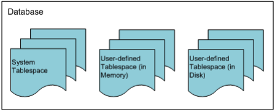

Figure 6-1 The Relationship between a database and tablespaces

#### The Structure of Disk Tablespace

A disk tablespace is a tablespace where all data are stored on disk. It is physically organized into data files and logically organized into segments, extends, and pages.  

##### Disk Tablespace Physical Structure

Disk tablespaces are closely related to data files and segments. [Figure 6-2] shows the relationship between disk tablespace and data files and segments. 

Disk tablespaces, data files, and segments have the following characteristics: A disk tablespace consists of one or more data files, which exist in the form of files supported by the operating system. A segment is stored in a tablespace logically and in a data file physically. A segment is wholly contained within a particular disk tablespace, but segments can refer to segments that are stored in other disk tablespaces.


Figure 6-2 The Relationships between Disk Tablespaces, Data Files and Segments

##### Disk Tablespace Logical Structure

A disk tablespace logically consists of segments, extents, and pages. The relationships between them are shown in [Figure 6-3]. 


Figure 6-3 The Logical Structure of a Disk Tablespace

###### Segment

A segment is a set of extents that contains all of the data for an object within a tablespace. Segments are units that allocate tables or indexes within a tablespace. A single table or index is logically the same as one segment. The types of segments used in Altibase are as follows:

| Segment Type  | Description                                                  |
| ------------- | ------------------------------------------------------------ |
| Table Segment | This segment type is the most basic means of storing data within a database. All of the data in a table, or, in the case of a partitioned table, all of the data in a partition, are stored in a single table segment. When a table is created, Altibase allocates this table segment in a tablespace. |
| Index Segment | A single index segment contains all of the data for one index, or for one partition of a partitioned index. The purpose of an index is to assist in locating data in a table based on some particular key. When an index is created, Altibase allocates an index segment to a tablespace. |
| Undo Segment  | Undo segments are used by transactions that change the database. Before a table or index is changed, the value before the change (i.e. the "before-image") is stored in an undo segment so that the change can be undone if the associated transaction is rolled back. |
| TSS Segment   | These are used for managing Transaction Status Slots, which are managed internally within Altibase. They are allocated within system undo tablespace. |

Table 6-1 Segment Type

Each segment internally maintains a free extent list and a full extent list. When there are not enough free extents, a request is made to add one or more additional extents to a tablespace

###### Extent

In disk tablespace, an extent is a unit by which contiguous pages, which are the resource required for storing data objects, are assigned. When saving data, if there are not enough free pages available to save the data, additional pages are allocated in extent units. 

By default, a single disk tablespace extent consists of 64 pages (512KB). In Altibase, the extent size can be specified individually for each tablespace.

###### Page

The smallest unit for storing records in tables and indexes is called the page, which is also the smallest unit for performing I/O. In Altibase, the page size is 8KB. (The simultaneous use of multiple page sizes isn't supported in Altibase.) 

There are several kinds of pages, including data pages, index pages, and undo pages, corresponding to the kind of data that are stored in the pages. 

The basic structure of pages, as well as how to store data in them, are described below.

###### Page Structure

A page has a header for storing basic information about the page, free slots (this is the only instance of the term “Free slot” in this document), and the like. Records are stored in the remaining space. A page is internally divided into 5 areas, as shown below: 


Figure 6-4 The Structure of a Page in Disk Tablespace

-   Physical Header  
    This area contains information that is common to all data pages, regardless of type.

-   Logical Header 
    This area contains information that is necessary depending on the type of page.

-   Free Space
    This area is used to save new data.
    
-   Stored Procedure Data  
    Rows, indexes, or undo records are stored here depending on the type of page.

-   Page Footer
    This area is located at the end of the page, and contains information that is used to check page integrity.

###### How Records are Stored in a Page

The records in a page are stored in free space, starting from the end of the page and working towards the beginning of the page. 

The logical header of the page is saved extending toward the end of the page. Its size is variable.


[Figure 6-5] How Records are Stored in a Page

#### The Structure of Memory Tablespace

A memory tablespace is a tablespace in which all data are stored in memory. The physical structure consists of checkpoint image files and logically consists of pages and page lists. 

##### Memory Tablespace Physical Structure

Memory tablespaces are closely related to checkpoint image files. [Figure 6-6] shows the relationship between a memory table space, tables, and checkpoint image files. 

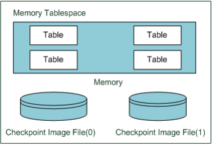

[Figure 6-6] The Relationship between a Memory Tablespace , Tables and Checkpoint Image Files

Memory tablespaces, tables, and checkpoint image files have the following characteristics: 

A memory tablespace, unlike a disk tablespace, stores data in linear memory space rather than in data files. 

Because a continuous memory space is divided into pages, a table can be thought of as a list of pages. In the interests of managing disk I/O expense and tables containing large amounts of data, disk tablespaces are managed in units of extents, not pages. A segment is, conceptually, a way of managing a list of extents.

However, because the purpose of memory tablespace is to provide faster access to data than managing large amounts of data, the concept of segments and extents is not necessary. Therefore, tables in a memory tablespace are managed using lists of pages. 

Memory tables are physically backed up in checkpoint image files when checkpointing occurs. The purpose of checkpoint image files is different from that of data files in a disk tablespace. Data files in a disk tablespace are for storing objects, whereas checkpoint image files are for backing up objects in a memory tablespace. Checkpoint image files are not directly required for the operation of the database. However, they are required in order to reduce the amount of time taken to perform backup and recovery. 

When checkpointing occurs, pages in memory are stored in files of a type supported by the operating system. In Altibase, so-called "ping-pong checkpointing" is implemented, which means that two sets of checkpoint image files (namely, #0 and #1) are maintained, and used alternately when checkpointing takes place. In addition, each checkpoint image can be divided into several small files, with the goal of distributing disk I/O expenses.

##### Memory Tablespace Logical Structure

The elements that logically constitute memory tablespace are page lists and pages. The relationship between these elements is shown in [Figure 6-7].

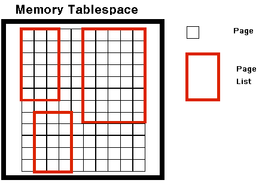

[Figure 6-7] The Logical Structure of Memory Tablespace

###### Page List

The concept of a page list explains how tables are logically configured in a memory tablespace. A page list is a list of pages, which are the unit into which the memory occupied by a memory tablespace is divided. 

Tables are the only memory tablespace objects for which page lists are maintained. Because the object of indexes is not to maintain database consistency, they do not use page lists. When the system is restarted, memory table indexes are rebuilt, which eliminates the load that would otherwise be imposed by performing index logging while the database is running. 

###### Page

The characteristics of memory tablespaces are different from those of disk tablespaces with respect to the structure of pages and the way that data are stored. 

Unlike disk tablespaces, when dealing with memory tablespaces, there is no need to consider disk I/O expense, and thus the method of updating records is so-called “out-place update”. 

In the out-place update, the existing record image is not directly changed; rather, record space is allocated for the new version of the record. This update process consists of deleting the existing record and inserting a new record, thereby eliminating the cost of rearranging the record that currently exists. In addition, it allows direct access to existing data, ensuring fast performance in highly concurrent applications.

#### The Structure of Volatile Tablespace

The structure of a volatile tablespace is identical with that of a memory tablespace in that all data are stored in memory. The difference between them is that, in a volatile tablespace, there is no checkpoint image file on disk. The data in a volatile tablespace reside only in memory.

Since tasks that are conducted in a volatile tablespace are not accompanied by disk logging and are not subjected to checkpointing, they entail absolutely no disk I/O. As a result, volatile tablespaces are useful in applications requiring fast performance. Logically, they consist of page lists and pages.

##### Volatile Tablespace Physical Structure

The structure of volatile tablespaces is identical with that of memory tablespaces in that database objects reside in memory. However, volatile tablespaces do not have checkpoint image files. 

##### Volatile Tablespace Logical Structure

Just like memory tablespaces, the constituent elements of volatile tablespaces are page lists and pages.

### Classifying Tablespaces

The tablespaces provided in Altibase can be classified into three kinds based on the three following criteria. A single type of tablespace can have more than one of the properties listed below:

-   Where the Data are Stored

-   By What Data are Stored

-   By Who the Creator is

#### By Where the Data are Stored

Altibase tablespaces can be classified depending on where the data are stored as follows:

-   Memory-Resident Tablespace

-   Disk Tablespace

##### Memory-Resident Tablespace

Memory-resident tablespaces are classified as either memory tablespace or volatile tablespace based on whether logging is performed and on whether disk image files exist. 

Memory tablespaces are tablespaces for storing objects in memory. Because all objects stored in memory tablespaces use memory-based database technology, the user can access data in real time. However, the size of memory tablespaces is limited by the amount of physical memory space that is available in the system. 

Volatile tablespaces are tablespaces for storing objects in memory without disk I/O operations. Because all objects stored in volatile tablespaces use memory-based database technology and additional technologies, the user can access data in real time. However, the size of the volatile tablespace cannot exceed the available physical memory space of the system, and all volatile data objects will be lost when the database server shuts down.

##### Disk Tablespace

A disk tablespace is a tablespace for storing disk-based objects. It is intended for the management of large amounts of data rather than for rapid data access. Accessing objects that are stored in disk tablespaces entails disk I/O. Because this disk I/O expense accounts for most of the data access time, disk tablespaces use memory buffers to reduce disk I/O expenses. 

#### By What Data are stored

Altibase tablespaces can also be classified depending on what data are stored in them as follows: 

-   Dictionary Tablespace 
-   Undo Tablespace 
-   Temporary Tablespace 
-   Data Tablespace

##### Dictionary Tablespace

The dictionary tablespace is the tablespace for storing the meta data that are required for system operation. A database can have only one dictionary tablespace, which is automatically created by the system when a database is created. Users cannot create objects in dictionary tablespace; only the system can create system objects for managing meta data. In order to ensure fast access to meta data, the dictionary tablespace exists in memory. If the dictionary tablespace crashes, the entire database becomes inoperable, in which case the database will need to be restored through backup and media recovery. 

##### Undo Tablespace

An undo tablespace is for storing undo images that remain after operations are conducted on disk objects. Since Altibase uses Multi-Version Concurrency Control, it requires space in which to store images that show the state of data before changes were made. These so-called "before images" are stored in the undo tablespace. 

Only one undo tablespace can exist in the database, and it is shared by all disk tablespaces in the database. This makes the undo tablespace essential for system operation, like the dictionary tablespace. It can be backed up, but the entire tablespace must be backed up at one time.

##### Temporary Tablespace

A temporary tablespace is a tablespace for storing temporary results generated during query execution. As a result, all data in the temporary tablespace pertaining to the query disappear when the associated transaction is completed.

With this type of tablespace, concurrency control, logging for recovery and the like are not conducted, enabling fast read and write speeds. There can be more than one temporary tablespace in the database, and users can create user-defined temporary tablespaces as desired. Note that temporary tablespaces cannot be backed up. 

##### Data Tablespace

Data tablespaces are for storing user-defined objects. There can be more than one data tablespace in the database, and the user can create a data tablespace as a disk, memory, or volatile tablespace based on the characteristics of the data to be stored therein. 

#### By Who the Creator Is

Additionally, Altibase tablespaces can be classified by who created them as follows: 

-   System Tablespace

-   User-defined Tablespace

##### System Tablespace

A system tablespace is a tablespace for storing data required for the operation system. The system tablespaces include the system dictionary tablespace,  system undo tablespace, system data tablespace, and system temporary tablespace. System tablespaces are created when the database is created, and cannot be deleted or renamed by users. Backup and media recovery can be performed for system tablespaces.

##### User-defined Tablespace

A user-defined tablespace is a tablespace for storing the content of user-defined objects. The meta data pertaining to objects defined in user-defined tablespaces are stored in the dictionary tablespace. User-defined tablespaces can be explicitly deleted or renamed by users. Additionally, backup and media recovery can be performed for entire tablespaces.

#### Tablespace List

Multiple tablespaces are created when a database is created. 

As shown in the below table, these include the system tablespaces, temporary tablespaces, and basic memory and disk tablespaces for direct use by users. 

In addition, users can add more tablespaces using the ‘CREATE TABLESPACE’ statement.

| **ID** | **Tablespace Type**              | **Data Storage Location** | **Tablespace Name** | **Time of Creation**             |
| ------ | -------------------------------- | ------------------------- | ------------------- | -------------------------------- |
| 0      | SYSTEM DICTIONARY TABLESPACE     | Memory                    | SYS_TBS_MEM_DIC     | CREATE DATABASE                  |
| 1      | SYSTEM MEMORY DEFAULT TABLESPACE | Memory                    | SYS_TBS_MEM_DATA    | CREATE DATABASE                  |
| 2      | SYSTEM DISK DEFAULT TABLESPACE   | Disk                      | SYS_TBS_DISK_DATA   | CREATE DATABASE                  |
| 3      | SYSTEM UNDO TABLESPACE           | Disk                      | SYS_TBS_DISK_UNDO   | CREATE DATABASE                  |
| 4      | SYSTEM DISK TEMPORARY TABLESPACE | Disk                      | SYS_TBS_DISK_TEMP   | CREATE DATABASE                  |
| >=5    | USER MEMORY DATA TABLESPACE      | Memory                    | User-Defined        | CREATE MEMORY DATA TABLESPACE    |
| >=5    | USER DISK DATA TABLESPACE        | Disk                      | User-Defined        | CREATE DISK DATA TABLESPACE      |
| >=5    | USER DISK TEMPORARY TABLESPACE   | Disk                      | User-Defined        | CREATE DISK TEMPORARY TABLESPACE |
| >=5    | USER VOLATILE DATA TABLESPACE    | Memory                    | User-Defined        | CREATE VOLATILE DATA TABLESPACE  |

[Table 6-2] Tablespace List

### Disk Tablespace

A disk tablespace is a tablespace in which all of the data therein are stored on disk. This section discusses the structure of disk tablespaces, which is based on disk data pages, and how row data are input into disk pages.

#### Data Page Structure

In Altibase, the smallest unit of database storage space management is the page. The size of a page is 8KB. Multiple page sizes are not supported.

A data page is one of several kinds of pages, and stores row data. Row data are stored in free space, starting from the end of the page. If there is not enough free space, it is advisable to create larger regions of free space using compaction to turn fragmented space into contiguous space.

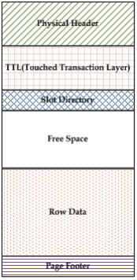

[Figure 6-8] The Structure of a Data Page in Disk Tablespace

The data page consists of six different areas, as shown in [Figure 6-8].

-   Physical Header 
    This area contains information common to all pages, regardless of the type of page.
    
-   TTL (Touched Transaction Layer)  
    This area contains MVCC (Multi-Version Concurrency Control) related information.

-   Slot Directory
    This area contains information about so-called “row offset”, that is, the location within the page at which the Row Data area is saved.
    
-   Free Space  
    This area is available space that is used for saving the results of operations such as insert and update operations.

-   Row Data

-   Page Footer  
    This area is located at the end of the page and contains information that is used for checking page integrity. 

#### Managing Space in Disk Tablespace

Disk tablespace can be manually managed using the PCTFREE and PCTUSED parameters. 

PCTFREE and PCTUSED parameters can be used to control the use of free space when performing input or update operation on raw data. 

These two parameters are set using the PCTFREE and PCTUSED properties in the altibase.properties file. They can also be explicitly specified when a table is created using the CREATE TABLE statement or changed using the ALTER TABLE statement.

##### PCTFREE

PCTFREE is the minimum amount of free space, expressed as a percentage, that is reserved for updating rows that have already been stored in a page. 

For example, if PCTFREE is set to 20, data can be inserted into the page until it is 80% full, and the remaining 20% of the page will be set aside for use in updating existing rows.

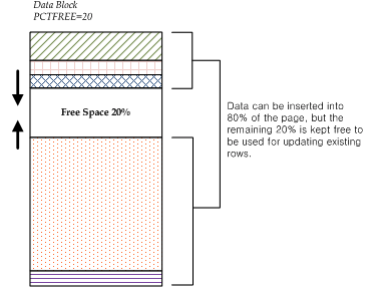

[Figure 6-9] PCTFREE and Page Structure

##### PCTUSED

PCTUSED is the threshold percentage below which the amount of used space in a page must decrease in order for the page to change from the state in which only update operations are possible to the state in which records can be inserted. 

If the amount of free space falls below the limit specified in PCTFREE, it becomes impossible to insert new records into the page, and free space in the page can only be used to update existing rows. This state persists until the percentage of used space falls below the threshold specified by PCTUSED.


[Figure 6-10] PCTUSED and Page Structure

#### Row Structure

Rows can be divided into one or more pieces. If it is possible to store an entire row in a page, it is saved as one row piece. However, if it is not possible to store the row in a single page, the row is divided into several pieces and then saved. 

These row pieces are "chained", that is, they are associated with each other via a common ROWID value.

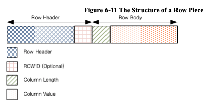

[Figure 6-11] The Structure of a Row Piece

A row piece consists of a row header and a row body. 

A row header contains header information of 18 bytes size. In the case of a chained row piece, the row header contains 6 more bytes for storing the value of ROWID.

In the row body, pairs comprising the length of a column and the value stored in the column are stored sequentially. If the value stored in the column is less than 250 bytes, only 1 byte is necessary for storing the column length, whereas 3 bytes are used to store the column length if the value stored in the column exceeds 250 bytes. 

In order to conserve space, if the value of the column is NULL, only the length of the column, which is 0, is saved. No column value is saved. Additionally, for columns that contain NULL values and are located at the end of the row, neither the column value nor the length is saved.

Columns are saved in the order in which they are specified in the CREATE TABLE statement. Therefore, when executing the CREATE TABLE statement, locating columns that are expectedto contain NULL values at the end of the row frequently is good practice, because it can reduce the amount of space required to store rows.

#### Row Chaining and Migration

When row data are too large to be saved in a single page, row chaining and row migration will occur. 

Row chaining occurs when data that are being inserted are so large that the row containing them cannot fit in a single page. When row chaining occurs, long rows are divided into pieces and saved in multiple pages. These pieces are associated with one another by their common ROWID value.

Row migration occurs when a row that was saved in a single page is increased in size by an update operation and thus can no longer fit in a single page. In this case, the entire row is migrated to new pages. The original row becomes a pointer that indicates the new location where the row is saved. However, when a row is migrated, the ROWIDs of its pieces do not change.

When row chaining or migration occurs, one more page must be read during DML processing, resulting in performance deflation due to disk I/O.

### The Undo Tablespace

The undo tablespace is for storing information that is used to cancel update operations. Because Altibase uses Multi-Version Concurrency Control (MVCC), which requires free space to store images of data before update operations. 

Only one undo tablespace exists in the database and is shared by all disk tablespaces in the database. 

This section describes the features of the undo tablespace and how to manage it, including how to determine its size.

-   Undo Record

-   Features of the Undo Tablespace

-   Transaction Segment Management

-   Reusing Segment Space

-   Modifying the Undo Tablespace

#### Undo Records

Database must maintain related information to rollback or undo the results of updated transactions. This information is usually stored as undo records before the transactions are committed. 

Undo records are used for the following purposes: 

-   Rolling back transactions
-   Recovering the database
-   Guaranteeing read consistency.

When a ROLLBACk statement is executed, undo records are used to undo database changes caused by uncommitted transactions. 

Undo records are also used during database recovery. After the database has been restored by re-executing transactions (“REDO”) on the basis of log files, undo records are used to cancel changes that were not committed.

Additionally, when a record that is in the process of being changed by a transaction is read by another transaction, even though the transactions access the record simultaneously, read consistency is guaranteed because an image of the record before the change is stored in the undo record.

#### Features of the Undo Tablespace

The features of the undo tablespace are as follows:

-   Undo tablespace is automatically managed by the system. 
-   Default undo tablespace file is undo001.dbf, which is in auto extension mode. Data files can be added to the undo tablespace, and their sizes can be changed. 
-   Undo tablespace can be backed up online. 
-   Database objects other than TSS segments and undo segments cannot be created in the undo tablespace. 
-   Because the undo tablespace is a system tablespace, it cannot be taken offline or discarded. 
-   Undo tablespace is reset whenever the server is restarted.

In Altibase, information about the undo tablespace and the space in the undo tablespace are managed by the system. In other words, the server automatically manages the space and segments in the undo tablespace. 

Undo tablespace is created when the database is created. Because it is a system tablespace, only one undo tablespace can exist. If the undo tablespace does not exist, the server will fail to start up, and an error message will be written to the boot log.

In the undo tablespace, transaction segments (TSS segments and undo segments) are managed. The user can change the number of transaction segments using the TRANSACTION_SEGMENT_COUNT property. The numbers of TSS segments and undo segments that are created, respectively, equal the number specified by the user in this property. If the TRANSACTION_SEGMENT_COUNT property is set to 255, 255 TSS segments and 255 undo segments are created every time the server is started up

If this property is changed to other values to specify a different number of transaction segments, that number of segments will be created the next time the server is restarted.

#### Transaction Segment Management

A transaction segment consists of one TSS segment and one undo segment, that is essential for update transactions in disk tablespaces. A transaction segment can't be simultaneously shared by multiple transactions, because one transaction segment is bound to one update transaction, and is not unbound until the disk update transaction has been completed.

The transaction segments that are currently bound can be checked by querying the V＄TXSEGS performance view. When a transaction segment is bound to an update transaction that takes place in a disk tablespace, a record indicating the segment ID and the transaction ID is created in V$TXSEGS. When the segment is unbound, the record is deleted. 

In addition, space allocated for TSS segments and undo segments can be reused by other transactions after the segments expire. Therefore, when space is required for undo transactions, the undo tablespace does not necessarily need to be expanded by creating segments; instead, segments that have expired can be reused.

TSS segments are allocated for reuse in units of one megabyte (1MB), and undo segments in units of two megabytes (2MB).

The following user properties pertain to undo tablespace: 

-   SYS_UNDO_FILE_INIT_SIZE  
    The initial size of the undo tablespace data files at the time of creation 

-   SYS_UNDO_FILE_MAX_SIZE  
    The maximum size of the undo tablespace data files

-   SYS_UNDO_TBS_NEXT_SIZE  
    The amount by which the size of the undo tablespace data files is automatically extended

-   SYS_UNDO_TBS_EXTENT_SIZE  
    The number of pages in one extent in undo tablespace 

-   TRANSACTION_SEGMENT_COUNT  
    The number of transaction segments 

#### Reusing Segment Space

After a transaction has been committed, undo data are needed for rollback or recovery transaction. However, so-called "long-term transactions", meaning transactions that take a long time to commit, require previous versions of records that rely on undo data for read consistency. However, after sufficient time has passed, undo data are not required for the purpose of ensuring read consistency either.

Therefore, Altibase maintains undo records pertaining to committed transactions only as long as necessary, allows other transactions to resue the space occupied by the undo data after that period. 

If there are no active transactions accessing the space containing the undo data for transactions that have been committed, the so-called "undo space" is said to have expired. Conversely, if active transactions that might need to access the undo space still exist, space is considered valid, or unexpired. Expired undo space can be reused by other transactions, whereas unexpired space cannot. 

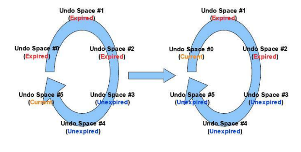

[Figure 6-12] Reusing Undo Spaces in an Undo Segment

In the above figure, it shows how the cyclical structure of undo segments allows undo space to be reused

Undo spaces are used sequentially starting with undo space #0, until undo space #5 that is currently being used. Then, if undo space #0, which is the next undo space to be used, is confirmed to have expired, then when all of undo space #5 has been used up, undo space #0 is reused without requiring expansion of the undo segment.

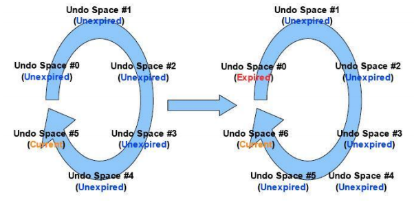

[Figure 6-13] Undo Segment Expansion

However, if undo space #0 has not expired, extents are added to the undo segment, thus creating undo space #6, as can be seen in [Figure 6-13]. 

This reuse of segment space applies equally to TSS segments. 

#### Modifying the Undo Tablespace

The undo tablespace can be modified using the ALTER TABLESPACE statement. However, because the undo tablespace is usually managed by the system, only the following operations can be conducted by the user:

-   Adding or dropping data files

-   Increasing or reducing the size of data files

-   Starting or completing the online backup of data files

If the undo tablespace has insufficient space, or in order to prevent errors related to insufficient space, either add data files to the undo tablespace or increase the size of the existing data files. 

The following example is an exampole of adding a data file to an undo tablespace:

```
ALTER TABLESPACE SYS_TBS_DISK_UNDO 
ADD DATAFILE ‘undo002.dbf’ AUTOEXTEND ON NEXT 1M MAXSIZE 2G;
```

A data file can be dropped using the ALTER TABLESPACE … DROP DATAFILE statement, and can be increased or decreased in size using the ALTER TABLESPACE ... ALTER DATAFILE… statement. 

Additionally, data file backup can be commenced using the ALTER TABLESPACE … BEGIN BACKUP statement, and can be completed using the ALTER TABLESPACE … END BACKUP statement.

### Tablespace States

Tablespace can be in an online, offline, or discarded state depending on the service state. 

The state of user-defined disk and memory tablespaces can be changed from online to offline or vice-versa. However, the state of volatile and temporary tablespaces cannot be changed. Additionally, the state of tablespaces that contain tables to be replicated cannot be changed.

ALTER TABLESPACE ONLINE and ALTER TABLESPACE OFFLINE statements can be used to change the state of a tablespace. 

However, please note that this can only be achieved during the Meta and Service startup phases.

#### Online

In this state, all resources related to the tablespace are allocated and prepared,  and the tablespace is ready to be used in the database. DML and DDL statements can be executed on the tablespace and on the tables and indexes within them. If it is desired to temporarily prevent a tablespace that is currently online, along with all of the tables and indexes it contains, from being used, all that is required is to take it offline by executing the ALTER TABLESPACE ... OFFLINE statement.

#### Offline

It is impossible to execute DML and DDL statements on the tables or indexes that exist in an offline tablespace. 

In addition, the only DDL statements that can be executed on the tablespace are the DROP TABLESPACE, ALTER TABLESPACE DISCARD, and ALTER TABLESPACE ONLINE statements.

ALTER TABLESPACE ONLINE statement is used to bring an offline tablespace back online so that it can be accessed, along with the tables and indexes it contains. 

Because the objects in a memory tablespace are not loaded into memory when the memory tablespace is offline, in situations where the amount of memory is limiting (that is, insufficient), the user is advised to take memory tablespaces offline.

#### Discard

If Altibase fails to start normally due to the consistency of a particular tablespace has been broken, the database should be able to operate normally except for the broken tablespace. In order to accomplish this, the tablespace must be discarded.

Tablespaces are discarded during the ALTER TABLESPACE DISCARD statement, which can be executed only during the control startup phase. 

Please be aware that the only statement that can be executed on a discarded tablespace is the DROP TABLESPACE statement, and thus care should  be taken when executing the ALTER TABLESPACE DISCARD statement. 

### Managing Tablespaces

This section describes how to manage tablespaces in Altibase.

#### CREATE

A tablespace can be created only by the SYS user or by a user to whom the Create Tablespace authority has been granted. To create a tablespace, use the CREATE TABLESPACE … SQL statement. Only user-defined data tablespaces can be created. That is, system tablespaces cannot be created by the user.

Disk tablespaces are classified as either disk data tablespaces or disk temporary tablespaces. 

Memory tablespaces are memory data tablespaces. There is no such thing as a “memory temporary tablespace”. 

Similarly, all volatile tablespaces are volatile data tablespaces. There are no “volatile temporary tablespaces”. 

The SQL statement that is used to create tablespaces is described below:

```
CREATE [DISK/MEMORY/VOLATILE] [DATA/TEMPORARY] TABLESPACE
```

(1) Tablespace Name

(2) Disk Data File Attributes

(3) Disk Temporary File Attributes

(4) Memory Tablespace Attribute

(5) Volatile Tablespace Attribute

When determining whether to create a memory, disk, or volatile tablespace, the user should consider the characteristics of the objects to be stored in the tablespace, such as their size and how often it is expected that they will be accessed. 

The tablespace attributes that can be specified when a tablespace is created vary depending on whether the tablespace is a disk, memory, or volatile tablespace. Unlike a disk tablespace, in which multiple data files are managed, in a memory tablespace, the objects are stored in single continuous memory space. Therefore, when a disk tablespace is created, some of the attributes that are specified apply to individual data files, whereas when a memory tablespace is created, all of the attributes apply to the entire memory tablespace. In other words, attributes such as the initial size and the size to which the tablespace can expand are set for a memory tablespace, whereas the attributes that are set for a disk tablespace apply to its data files.

##### Tablespace Name

Tablespace name must be unique. No more than one object of the same name can be created. While the names of data files can be set in a disk tablespace, for a memory tablespace, only the path where the checkpoint image will be stored can be specified. The name of the checkpoint image is automatically generated based on the name of a tablespace.

##### Disk Data File Attributes

Data file attributes can only be set for disk data tablespaces. The DATAFILE clause has the following form: 

```
DATAFILE [DATAFILE Clause
AUTOEXTEND [AUTOEXTEND CLAUSE 
MAXSIZE [MAXSIZE Clause] ] ] 
EXTENTSIZE [EXTENTSIZE Clause]
```

Each data file can have the following attributes:

###### DATAFILE Clause

```
DATAFILE {datafile path and name} SIZE integer [K/M/G] [REUSE]
```

This is used to specify the data file path and name. The SIZE clause and the REUSE clause can be omitted. The SIZE clause is used to specify the initial size of a data file when it is created. Each data file includes a file header. SIZE is the total size of all pages, excluding the page for the file header (1 page). As a result, the specified initial size of a data file and its actual size are not the same. If the maximum file size supported by the operating system is smaller than the specified initial size, an error will be returned.

###### AUTOEXTEND Clause

```
AUTOEXTEND [{ON NEXT integer [K/M/G]}/{OFF}]
```

This attribute determines whether a disk data file will increase in size. If it is set to ON, the size of the data file is automatically increased by the system. If it is set to OFF, the user must explicitly increase the file size. The increment by which the temporary file is extended can be specified by the user in the NEXT clause.

When a data file is being extended, that is, when it is being increased in size, all operations that are underway in the tablespace to which the data file belongs must wait until the operation to increase the size of the data file is complete.

###### MAXSIZE Clause

```
MAXSIZE {{integer [K/M/G]}/{UNLIMITED}}
```

This clause is a subclause of the AUTOEXTEND clause and indicates the maximum size to which the data file can be increased. Like the initial size, if the maximum file size supported by the operating system is smaller than the maximum size specified for a data file, the maximum size is set to the maximum file size of the operating system. If MAXSIZE is set to UNLIMITED, the data file is increased in size until all of the available disk space has been used up.

###### EXTENTSIZE Clause

```
EXTENTSIZE {{integer [K/M/G]}/{UNLIMITED}}
```

This clause defines the size of an extent, that is, (the size of a page) * (the number of pages that are allocated to a table segment or index segment in disk tablespace at one time). If the extent size is not specified, it defaults to 512kB (64 pages).

##### Disk Temporary File Attributes

Temporary file attributes can only be set for disk temporary tablespaces. The TEMPFILE clause has the following form:

```
TEMPFILE {TEMPFILE Clause}
AUTOEXTED [AUTOEXTEND Clause
MAXSIZE [MAXSIZE Clause] ]
EXTENDSIZE [EXTENTSIZE Clause]
```

Each temporary file can have the following attributes:

###### TEMPFILE Clause

```
TEMPFILE {datafile path and name} SIZE integer [K/M/G] [REUSE]
```

This specifies the path and name of a temporary file. The SIZE clause and the REUSE clause can be omitted. The SIZE clause is used to specify the initial size of a temporary file when it is created. Each temporary file includes a file header. SIZE is the total size of all pages, excluding the page for the file header (1 page). As a result, the specified initial size of a temporary file and its actual size are not the same. If the maximum file size supported by an operating system is smaller than the specified initial size, an error will be returned.

###### AUTOEXTEND Clause

```
AUTOEXTEND [{ON NEXT integer [K/M/G]}/{OFF}]
```

This attribute determines whether a disk temporary file will increase in size. If it is set to ON, the size of the data file is automatically increased by the system. If it is set to OFF, the user must explicitly increase the file size. The increment by which the data file is extended can be specified by the user in the NEXT clause.

###### MAXSIZE Clause

```
MAXSIZE {{integer [K/M/G]}/{UNLIMITED}}
```

This clause is a subclause of the AUTOEXTEND clause and indicates the maximum size to which the temporary file can be increased. Like the initial size, if the maximum file size supported by the operating system is smaller than the maximum size specified for a temporary file, the maximum size is set to the maximum file size of the operating system. If MAXSIZE is set to UNLIMITED, the temporary file is increased in size until all of the available disk space has been used up.

###### EXTENTSIZE Clause

```
EXTENTSIZE integer [K/M/G]
```

This clause defines the size of an extent, that is, (the size of a page) * (the number of pages that are allocated to a table segment or index segment in temporary tablespace at one time). If the extent size is not specified, it defaults to 256kB (32 pages).

##### Memory Tablespace Attributes

The attributes for memory tablespace are similar to those for disk tablespaces, but additionally include a checkpoint image path attribute. Their syntax is as follows:

```
SIZE {SIZE Clause} 
AUTOEXTED [AUTOEXTEND Clause
MAXSIZE [MAXSIZE Clause] ]
CHECKPOINT PATH [CHECKPOINT PATH]
```

Memory tablespaces can have the following attributes:

###### SIZE Clause

```
SIZE integer [K/M/G]
```

This is the amount of memory that must be initially allocated when a memory tablespace is created. This value must be a multiple of the default extension increment size for memory tablespaces. (This increment size is equal to the number of page(s) specified in the EXPAND_CHUNK_PAGE_COUNT property multiplied by the size of a memory tablespace page(32KB).<sup>2</sup>)

[<sup>2</sup>]For example, if EXPAND_CHUCK_PAGE_COUNT is set to 128, the default expansion size of the memory tablespace is calculated to be 128 * 32K, which is 4MB. Therefore, the specified size as SIZE is a multiple of 4MB.

The size can be specified in kilobytes (“K”), megabytes (“M”) or gigabytes (“G”). If no units are specified, the default unit is kilobytes (“K”).

###### AUTOEXTEND Clause

```
AUTOEXTEND [{ON NEXT integer [K/M/G]}/{OFF}]
```

This determines whether the size of memory tablespace will be increased automatically. If it is set to ON, the tablespace is automatically increased in size by the system, whereas if it is set to OFF, the user must explicitly increase the size of the tablespace. The extension increment size, that is, the amount by which the size is increased, can be specified by the user. The NEXT clause indicates the extension increment size. 

Like the initial size, the extension size must be set to a multiple of the page size specified in the EXPAND_CHUNK_PAGE_COUNT property. 

If the automatic extension size is too small, the automatic extension can occur too often. When Altibase performs automatic extension, it adds up the size of all memory tablespaces and compares the total size with the size specified in the MEM_MAX_DB_SIZE property. Frequently performing these operations can degrade system performance. 

###### MAXSIZE Clause

```
MAXSIZE {{integer [K/M/G]}/{UNLIMITED}}
```

This is a subclause of the AUTOEXTEND clause and indicates the maximum size to which a memory tablespace can be extended. Like the initial size, it cannot exceed the amount of memory space available in the system. If it is set to UNLIMITED, the tablespace is automatically increased in size until the total size of all memory tablespaces in the system reaches the limit specified in the MEM_MAX_DB_SIZE property. 

###### CHECKPOINT PATH

```
CHECKPOINT PATH ‘Checkpoint Image Path List’ 
SPLIT EACH integer [K/M/G]
```

Checkpoint image path attribute only applies to memory tablespaces. Altibase uses ping-pong checkpointing for high-performance transaction processing in memory tablespaces. For ping-pong checkpointing, at least two sets of checkpoint images are created on disk. Each checkpoint image can be divided into several files and saved in that form. The size of the files into which the checkpoint image is divided can be specified using the SPLIT EACH clause. These files can be stored in different paths in order to distribute the expense of disk I/O. The user can freely specify the size of the files into which the checkpoint image is divided and the path where the checkpoint images are saved. The user can add or change paths for saving checkpoint image files, but cannot change the size of the files into which the checkpoint image is divided once it has been set.

##### Volatile Tablespace Attributes

The attributes that are applicable to volatile tablespaces are similar to those for memory tablespaces, with the exception that the checkpoint image path attribute is not supported.

```
SIZE {SIZE Clause} 
AUTOEXTED [AUTOEXTEND Clause
MAXSIZE [MAXSIZE Clause] ]
```

Volatile tablespaces can have the following attributes:

###### SIZE Clause

```
SIZE  integer [K/M/G]
```

This specifies the initial memory size that is allocated when a volatile tablespace is created. This value must be a multiple of the default extension increment size for memory tablespaces. (This increment size is equal to the number of page(s) specified in the EXPAND_CHUNK_PAGE_COUNT property multiplied by the size of a memory tablespace page (32KB).<sup>3</sup>)

[<sup>3</sup>] For example, if EXPAND_CHUCK_PAGE_COUNT is set to 128, the default expansion size of the memory tablespace is calculated to be 128 * 32K, which is 4MB. Therefore, the specified size as SIZE is a multiple of 4MB.

The size can be specified in kilobytes ("K"), megabytes ("M") or gigabytes ("G"). If no units are specified, the default unit is kilobytes ("K").

###### AUTOEXTEND Clause

```
AUTOEXTEND [{ON NEXT integer [K/M/G]}/{OFF}]
```

This determines whether the size of volatile tablespace will be increased automatically. If it is set to ON, the tablespace is automatically increased in size by the system, whereas if it is set to OFF, the user must explicitly increase the size of the tablespace. The extension increment size, that is, the amount by which the size is increased, can be specified by the user in The NEXT clause. 

Like the initial size, the extension size must be set to a multiple of the page size specified in the EXPAND_CHUNK_PAGE_COUNT property.

If the automatic extension size is too small, automatic extension can occur too often. When Altibase performs automatic extension, it adds up the size of all volatile tablespaces and compares the total size with the size specified in the VOLATILE_MAX_DB_SIZE property. Frequently performing these operations can degrade the system performance. 

###### MAXSIZE Clause

```
MAXSIZE {{integer [K/M/G]}/{UNLIMITED}}
```

This is a subclause of the AUTOEXTEND clause and indicates the maximum size to which a volatile tablespace can be extended. Like the initial size, it cannot exceed the memory space available in the system. If it is set to UNLIMITED, the tablespace is automatically increased in size until the total size of all memory tablespaces in the system reaches the limit specified in the VOLATILE_MAX_DB_SIZE property.

*Examples*

Ex.1) To create a disk data tablespace comprising 3 data files:

```
iSQL> CREATE DISK DATA TABLESPACE user_data DATAFILE
‘/tmp/tbs1.user’ SIZE 10M AUTOEXTEND ON NEXT 1M MAXSIZE 1G,
‘/tmp/tbs2.user’ SIZE 10M AUTOEXTEND ON NEXT 1M MAXSIZE 500M,
‘/tmp/tbs3.user’ SIZE 10M AUTOEXTEND ON NEXT 1M MAXSIZE 1G;
Create success.
```

Ex.2) To create a memory data tablespace:

```
iSQL> CREATE MEMORY DATA TABLESPACE user_data SIZE 12M
AUTOEXTEND ON  NEXT 4M MAXSIZE 500M
CHECKPOINT PATH ‘/tmp/checkpoint_image_path1’,  ‘/tmp/checkpoint_image_path2’ SPLIT EACH
12M;
Create success.
```

Ex.3) To create a volatile data tablespace:

```
iSQL> CREATE VOLATILE DATA TABLESPACE user_data SIZE 12M
AUTOEXTEND ON NEXT 4M MAXSIZE 500M;
Create success.
```

#### Dropping Tablespaces

Tablespace can be deleted only by the SYS user or by a user who has been granted the DROP TABLESPACE privilege. To delete a tablespace, use the ‘DROP TABLESPACE …’ SQL statement. System tablespaces cannot be deleted by general users. Memory, disk, and volatile tablespaces are all deleted the same way, using the following command:

```
DROP TABLESPACE {Tablespace Name} 
[{INCLUDING CONTENTS} [AND DATAFILES] 
[CASCADE CONSTRAINTS]];
```

The tablespace to be deleted is identified by name. The available options are described below. If the following options are not specified, the only thing that is deleted from the log anchor is the tablespace schema.

##### INCLUDING CONTENTS Clause

```
INCLUDING CONTENTS
```

This is used to specify that the objects (that is, the tables and indexes) in the tablespace are also to be deleted. If any objects are present in the tablespace, this option must be set, otherwise the DROP TABLESPACE operation will fail. 

##### AND DATAFILES Clause

```
INCLUDING CONTENTS AND DATAFILES
```

Specifying the INCLUDING CONTENTS clause deletes the records and keys of an object, but not the data files themselves. Therefore, in order to delete the data files, the AND DATAFILES clause must also be used. The AND DATAFILES clause is a subclause of the INCLUDING CONTENTS clause. If it is used, when dropping a disk tablespace, all of the data files in the tablespace are physically deleted. 

If it is specified when dropping a memory tablespace, all of the checkpoint image files for the memory tablespace are physically deleted.

##### CASCADE CONSTRAINTS Clause

```
INCLUDING CONTENTS AND DATAFILES CASCADE CONSTRAINTS
```

This is also a subclause of the INCLUDING CONTENTS clause. If an attempt is made to drop a tablespace when there are constraints in other tablespaces that refer to objects in the tablespace to be dropped, the drop operation will fail, and an error indicating that objects remain in the tablespace will be raised. In this case, the CASCADE CONSTRAINTS clause should be used to delete all external references to objects in the tablespace additionally. 

#### Modifying Tablespaces (ALTER)

A tablespace can be modified only by the SYS user or by a user to whom the Alter Tablespace authority has been granted. Tablespaces are modified using the 'ALTER TABLESPACE ...' SQL statement. This command can be used to change the definition of an existing tablespace, the attributes of one or more data files or temporary files, or the attributes of memory or volatile tablespace. The related SQL syntax is as follows: 

```
ALTER TABLESPACE {Tablespace Name} 
{{ALTER Disk Data File Clause}/ 
  {ALTER Temporary File Clause}/
  {ALTER Memory Tablespace Clause}/
  {ALTER Volatile Tablespace Clause}/
  {ALTER Tablespace State Clause}};
```

##### ALTER Disk Data File Clause

This clause can be used on a disk system tablespace or a disk data tablespace, and has the following options:

```
ALTER TABLESPACE {Tablespace Name}
{ADD Data File Clause
DROP Data File Clause
ALTER Data File Size Clause
RENAME Data File Clause}
```

###### ADD Data File Clause

```
ADD {DATAFILE} {Data File Clause}
 		[AUTOEXTEND [AUTOEXTEND Clause
		 MAXSIZE [MAXSIZE Clause]]
```

This clause is used to increase the amount of data storage space in a disk tablespace. The available options are the same as the data file options for the CREATE TABLESPACE statement.

###### DROP Data File Clause

```
DROP {DATAFILE} {Data File Name}
```

This is used to reduce the amount of data storage space for a disk tablespace. While the data storage space can be freely increased by adding more data files, a data file can be deleted only when it is not in use, that is, when no extents have been allocated to the data file.

###### ALTER Data File Size Clause

```
ALTER {DATAFILE} {Data File Name}
 				{{AUTOEXTEND [AUTOEXTEND Clause]}
				 {SIZE [SIZE Clause]}}
```

This is used to alter the current size, maximum size, extension increment size, and whether to auto-extend each data file in the disk tablespace. 

The specified current size and maximum size must be greater than the amount that is currently being used.

###### RENAME Data File Clause

```
RENAME {DATAFILE} {The path and name of the existing data file}
 		TO {The path and name of a new data file}
```

This is used to change the location of a data file. This clause can be used in any startup phase, regardless of whether the applicable tablespace is online or offline. However, it can only be used with offline tablespaces in the service phase.

##### ALTER Temporary File Clause

This can be used only with disk temporary tablespaces. It has the following options:

```
ALTER TABLESPACE {Tablespace Name}
 				{ADD Temporary File Clause
 					DROP Temporary File Clause
					ALTER Temporary File Size Clause
 					RENAME Temporary File Clause}
```

###### ADD Temporary File Clause

```
ADD {TEMPFILE} {Temporary File Clause}
AUTOEXTEND [AUTOEXTEND Clause
MAXSIZE [MAXSIZE Clause]]
```

This is used to extend the data storage space in a disk temporary tablespace. The available options are the same as the temporary file options that are available when a disk temporary tablespace is created.

###### DROP Temporary File Clause

```
DROP {TEMPFILE} {Temporary File Name}
```

This is used to reduce the amount of data storage space in a disk temporary tablespace. While the data storage space can be freely extended by adding more data files, a data file can be deleted only when it is not in use, that is, when no extents have been allocated to the data file.

###### ALTER Temporary File Size Clause

```
ALTER {TEMPFILE} {Temporary File Name}
 			{{AUTOEXTEND [AUTOEXTEND Clause]}
 			 {SIZE [SIZE Clause]}}
```

This is used to change the current size, maximum size, extension increment size, and whether to expand each temporary file in the disk temporary tablespace automatically. 

###### RENAME Temporary File Clause

```
RENAME {TEMPFILE} {The path and name of the existing temporary file}
 				TO {The path and name of a new temporary file}
```

This command can be used to change the location of a data file. This clause can be used in any startup phase, regardless of whether the applicable tablespace is online or offline. However, it can only be used with offline tablespaces in the service phase.

##### ALTER Memory Tablespace Clause

This can be used with a system or user-defined tablespaces in memory and has the following options. Checkpoint paths can be added, deleted or changed during any startup phase. However, during the service phase, only tablespaces that are offline can be modified.

```
ALTER TABLESPACE {Tablespace Name}
 			{ADD Checkpoint Path Clause
 			DROP Checkpoint Path Clause
 			RENAME Checkpoint Path Clause
 			ALTER Tablespace Size Clause}
```

###### ADD Checkpoint Path Clause

```
ADD CHECKPOINT PATH {Directory Path}
```

This is used to set an additional checkpoint image path.

###### DROP Checkpoint Path Clause

```
DROP CHECKPOINT PATH {Directory Path}
```

This is used to delete an existing checkpoint image path.

###### RENAME Checkpoint Path Clause

```
RENAME CHECKPOINT PATH {The existing directory path}
 				TO {A new directory path}
```

This is used to change an existing checkpoint image path to a new path.

###### ALTER Tablespace Size Clause

```
ALTER
 				{{AUTOEXTEND [AUTOEXTEND Clause]}
				{SIZE [SIZE Clause]}}
```

This is used to change the attributes of a memory tablespace, such as its maximum size, extension increment size, and whether it is automatically increased in size.

##### ALTER Volatile Tablespace Clause

This is used with volatile user-defined tablespaces, and has the following option: 

```
ALTER TABLESPACE {Tablespace Name}
 				{ALTER Tablespace Size Clause}
```

######  ALTER Tablespace Size Clause

```
ALTER
 				{{AUTOEXTEND [AUTOEXTEND Clause]}
 			  {SIZE [SIZE Clause]}}
```

This is used to change the attributes of a volatile tablespace, such as its maximum size, extension increment size, and whether it is increased in size automatically. 

##### ALTER Tablespace State Clause

The state of a tablespace can be either online or offline, which can be set using the following clause:

```
ALTER TABLESPACE {Tablespace Name}
 					{ONLINE/OFFLINE/DISCARD} 
```

ONLINE is the normal state of a tablespace. In this state, its objects can be accessed by users. In contrast, when a tablespace is offline, only tablespace-related DLL statements can be executed on it; the objects it contains cannot be accessed by users in other ways. This offline state can be used to overcome limitations, to perform a RENAME operation during the service phase, etc. However, system tablespaces must always remain online; that is, they cannot be taken offline. This clause cannot be used with volatile tablespaces.

The DISCARD option is used when Altibase can't be started due to a data error in one of the tablespaces currently in use.<sup>4</sup> DISCARDing the tablespace allows the user to start up Altibase with the remaining tablespaces. Because the only operation that can be performed on a discarded tablespace is the DROP operation, care should be taken when using this option. Additionally, tablespaces can be discarded only during the control phase. This option can be performed on both disk and memory data tablespaces.

[<sup>4</sup>] For example, assume that the DBA has mistakenly deleted a checkpoint image file for a particular memory tablespace. In this case, since the memory tablespace cannot be loaded when the server is started, the DBA might first consider re-creating the deleted checkpoint image by performing media recovery. However, if archive logging has not been conducted, media recovery will be impossible, and thus this method will be unusable. In such cases, as long as the tablespace can be deleted without causing a problem, the DBA can discard the tablespace, restart the database without the tablespace, and then remove the tablespace.

#### Tablespace Backup and Recovery

This section provides a simple overview of the concept of online and offline tablespace backup. For more detailed information on backup and recovery in Altibase, please refer to the Backup and Recovery chapter of this manual and the [*Getting Started Guide*.](https://github.com/ALTIBASE/Documents/blob/master/Manuals/Altibase_7.1/eng/Getting%20Started%20Guide.md)

##### Tablespace Online Backup (HOT Backup)

The term "tablespace online backup" refers to backup that is conducted while the tablespace is actively providing service. Because online backup does not influence the execution of transactions, it can be performed during the service phase. Online backup has the following characteristics:

-   Online backup is only possible when the database is operating in archive log mode. 
-   In the archive log mode, because all log files are backed up in a separate storage space, a sufficiently large storage space must be set aside, even if checkpointing and log flushing have just been conducted. 
-   Use the ALTER DATABASE BACKUP statement to perform an online backup while the database is running. 
-   Even if a fault causes data files to be damaged or lost, media recovery can be performed to restore data files to the current point in time. 

[Figure 6-14] The Concepts of Media Recovery

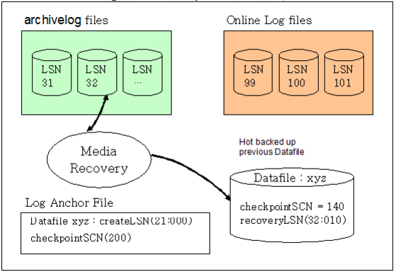

-   If data file xyz, which exists in a disk tablespace, is damaged, it can be restored using a data file that was previously created during a hot backup. A memory tablespace can be recovered using a checkpoint image file that was previously created during a hot backup. 
-   On the basis of the final checkpoint SCN (140) and recovery LSN (32:010), which are written in the header of the data file that was created during the backup, the file can be restored to the current final checkpoint SCN (200). 
-   When the system is restarted, the most recent image of a data file or memory tablespace can be recovered by repeating all recent transactions using online logs and rolling back all uncommitted transactions using UNDO logs and REDO logs.

##### Offline Backup of Tablespaces (Cold Backup)

When a tablespace is backed up offline, the tablespace service is suspended while the backup is performed. Offline backup is faster than online backup, and thus enables recovery to be performed more quickly. Offline backup has the following characteristics:

-   Offline backup is possible when the database is operating in noarchivelog mode. 
-   Offline backup is performed by copying data files, log files, and log anchor files after the database is shut down normally. 
-   When a data file is damaged or lost due to a fault, it can be restored only up to the time point at which offline backup was most recently performed.

##### Offline Recovery

Recovery is a process in which the consistency of a database is restored using a backup image. Recovery cannot be performed while the database is online; it must be performed offline. 

Recovery is performed by replacing the existing database with offline backup files while database service is stopped and then restarting the database.

### Examples of Tablespace Use

This section describes examples of using memory tablespaces and volatile tablespaces.

#### Memory Tablespaces

##### Creating a Memory Tablespace - Basics

The simplest and easiest way to create a memory tablespace is to use the CREATE MEMORY TABLESPACE statement, specifying the initial size with the SIZE clause.

```
iSQL> CREATE MEMORY TABLESPACE USER_MEM_TBS SIZE 256M; 
Create success.
```

Here, because the automatic extension mode was not set, it will default to OFF. When all 256 MB of the tablespace have been used, any attempt to allocate more space to the tablespace<sup>5</sup> will result in an error message saying that there is not enough room in the tablespace.

[<sup>5</sup>] If a table is created in a tablespace, if data are entered into an existing table, or if the data in an existing table are changed, additional space is allocated from the tablespace.

In addition, one or more checkpoint paths, as specified in the MEM_DB_DIR property, will be used as the checkpoint paths for the new tablespace

Supposing that two checkpoint paths are specified in the altibase.properties. Two paths have been saved for the MEM_DB_DIR property: dbs1 and dbs2, both of which are located in the Altibase home directory.

```
# altibase.properties
MEM_DB_DIR    =  ?/dbs1 
MEM_DB_DIR    =  ?/dbs2
```

The following query can be executed to verify that dbs1 and dbs2, which were specified using the MEM_DB_DIR property, are the checkpoint paths for the USER_MEM_TBS tablespace created above:

```
iSQL> SELECT CHECKPOINT_PATH 
FROM V$MEM_TABLESPACE_CHECKPOINT_PATHS 
WHERE SPACE_ID = 
  (SELECT SPACE_ID 
   FROM V$MEM_TABLESPACES 
   WHERE SPACE_NAME='USER_MEM_TBS'); 
CHECKPOINT_PATH
---------------------------------------------------
/altibase_home/dbs1
/altibase_home/dbs2
2 rows selected.
```

First, let’s take a look at the files in the checkpoint folders. The 6 files shown below can be found in the dbs1 directory:

```
SYS_TBS_MEM_DATA-0-0 
SYS_TBS_MEM_DATA-1-0 
SYS_TBS_MEM_DIC-0-0 
SYS_TBS_MEM_DIC-1-0 
USER_MEM_TBS-0-0 
USER_MEM_TBS-1-0
```

All of these files are checkpoint image files for the memory tablespace. Their filename format is 'Tablespace Name-{Ping Pong Number}-{File Number}'. 'Ping Pong No.' is either 0 or 1, each of which indicates one of the two checkpoint images used for ping-pong checkpointing<sub>6</sub> . In addition, because each of the checkpoint images can be stored as multiple files, 'File Number', at the end of the filename, indicates the number of each checkpoint image file, which begins at 0 and increments by 1. The size of the checkpoint image files is specified by using the SPLIT EACH clause with the CREATE TABLESPACE statement. Since the SPLIT EACH clause was not used in the CREATE MEMORY TABLESPACE statement above, the checkpoint image will be split into files 1 GB in size, which is the default value specified using the DEFAULT_MEM_DB_FILE_SIZE property. Because the space used by the above three tablespaces has not reached 1 GB yet, the only file number that can be seen is 0

[<sup>6</sup>] To ensure the durability of tablespace data in memory, data are saved in disk files. The files in which tablespace data are stored are called images. In ping-pong checkpointing, which is used in Altibase, a pair of checkpoint images is maintained, and tablespace data are stored alternately in each of them.

In the above example, SYS_TBS_MEM_DIC is a system dictionary tablespace containing metadata. This tablespace is automatically created when a database is created. 

SYS_TBS_MEM_DATA is the default system data tablespace. When a user creates a table without specifying a tablespace, the data in the table are stored in this tablespace. 

Finally, USER_MEM_TBS is the user-defined data tablespace that was created above.

For reference, the initial size, which is specified in the SIZE clause in the CREATE MEMORY TABLESPACE statement, must be a multiple of the extension increment size. For example, if the EXPAND_CHUNK_PAGE_COUNT property, which indicates the number of pages by which a memory tablespace will be incremented when it is expanded, is set to 128, because the size of one memory page is 32 KB, the default extension increment size of a memory tablespace will be 4 MB and the initial size can be set to a multiple of 4M.

If the size specified in the SIZE clause cannot be divided by the extension increment size, the following error will occur:

```
iSQL> CREATE MEMORY TABLESPACE USER_MEM_TBS SIZE 1M; 
[ERR-110EE : The initial size of the tablespace should be a multiple of expand chunk size ( EXPAND_CHUNK_PAGE_COUNT * PAGE_SIZE(32K) = 4096K )]
```

##### Creating Memory Tablespaces - Details

This section describes various ways to create a memory tablespace.

In the following example, the initial size of the tablespace is set to 256 MB, the automatic extension mode is set to ON, and the tablespace is configured to extend by 128 MB every time it is extended, to a maximum of 1 GB.

```
iSQL> CREATE MEMORY TABLESPACE USER_MEM_TBS SIZE 256M 
AUTOEXTEND ON NEXT 128M MAXSIZE 1G; 
Create success.
```

Like its initial size, the automatic extension increment size of a tablespace must be set to a multiple of the EXPAND_CHUNK_PAGE_COUNT property * the size of one page, which is the default number of pages by which a tablespace is extended. For more detailed information, please refer to ‘Creating Memory Tablespace – Basics.’

A tablespace can be created with no MAXSIZE, as shown below. If the MAXSIZE clause is not specified, the system operates as if it were set to UNLIMITED. 

```
iSQL> CREATE MEMORY TABLESPACE USER_MEM_TBS SIZE 256M 
AUTOEXTEND ON NEXT 128M MAXSIZE UNLIMITED; 
Create success.
```

In this case, USER_MEM_TBS is extended, but not past the point where the total space allocated to all memory tablespaces in the system exceeds MEM_MAX_DB_SIZE.

Checkpoint paths can also be specified when creating a memory tablespace, as follows:

```
iSQL> CREATE MEMORY TABLESPACE USER_MEM_TBS SIZE 256M 
CHECKPOINT PATH 'dbs1', '/new_disk/dbs2'; 
Create success.
```

In the above example, the relative path "dbs1" was specified for the checkpoint path, which has the same effect as if "$ALTIBASE_HOME/dbs1" were specified. Additionally, the DBA must first manually create the checkpoint paths specified in the CREATE TABLESPACE statement in the actual file system and then grant write and file execution privileges for them before creating a tablespace.

The size of the files into which a checkpoint image is divided can also be specified, as seen below:

```
iSQL> CREATE MEMORY TABLESPACE USER_MEM_TBS SIZE 256M 
SPLIT EACH 512M; 
Create success.
```

Like the initial size and the expansion increment size, the size of the files into which a checkpoint image is divided must be set to a multiple of the number of pages specified using the EXPAND_CHUNK_PAGE_COUNT property * the size of one page. For more detailed information, please refer to ‘Creating Memory Tablespace – Basics.’

A tablespace can be created offline and then taken online before it is used. Since a memory tablespace takes up the amount of system memory that was specified when it was created, in cases where a tablespace will not be used immediately after it is created, this practice can help optimize the use of system resources.

```
iSQL> CREATE MEMORY TABLESPACE USER_MEM_TBS SIZE 256M
OFFLINE; 
Create success.
iSQL> ALTER TABLESPACE USER_MEM_TBS ONLINE; 
Alter success.
```

Here is an example that combines the memory tablespace creation options seen above:

```
iSQL> CREATE MEMORY TABLESPACE USER_MEM_TBS SIZE 256M 
AUTOEXTEND ON NEXT 128M MAXSIZE 1G 
CHECKPOINT PATH 'dbs1', '/new_disk/dbs2'
SPLIT EACH 512M OFFLINE; 
Create success.
```

##### Adding a Checkpoint Path to a Memory Tablespace

This section describes how to add a checkpoint path to a memory tablespace. 

The checkpoint paths for a memory tablespace can only be set during the control stage. After shutting down the Altibase server, restart it in the control stage.

```
$ isql -u sys -p manager -sysdba 
iSQL(sysdba)> startup process 
iSQL(sysdba)> startup control 
```

In the control phase, the V＄TABLESPACES performance view, which pertains to all tablespaces, can be queried. The V$MEM_TABLESPACES performance view, which displays the attributes that are unique to memory tablespaces, can only be viewed in or after the meta phase. In the control phase, it is thus necessary to view memory tablespaces using V＄TABLESPACES.

The V$MEM_TABLESPACE_CHECKPOINT_PATHS performance view can be used to view the checkpoint paths belonging to the USER_MEM_TBS tablespace, which was created earlier. 

If the data in the tablespace change frequently, resulting in increased disk I/O during checkpointing, this can be alleviated by adding a new checkpoint path to a disk that is physically different from the disk used by the existing checkpoint path, as follows: 

Let’s add the “/new_disk/dbs3” path to USER_MEM_TBS. 

In order to do this, the checkpoint path and directory to be added must first be created, and the Altibase process must be granted write and execute privileges for that directory. Supposing that Altibase is started using the "altibase" operating system user account, this would be conducted as follows:

```
$ su - root
$ mkdir /new_disk/dbs3
$ chown altibase /new_disk/dbs3
```

As shown below, a checkpoint path can now be added using the ADD CHECKPOINT PATH statement:

```
iSQL(sysdba)> ALTER TABLESPACE USER_MEM_TBS 
ADD CHECKPOINT PATH '/new_disk/dbs3'; 
Alter success.
```

It is the DBA's responsibility to move or copy the checkpoint image files from the existing checkpoint path to the newly added checkpoint path. After a checkpoint path is added, if a new checkpoint image file is needed, the file is created in the new checkpoint path by Altibase.<sup>7</sup>

[<sup>7</sup>] When checkpoint image files are created for a tablespace during checkpointing, they are alternately created in each of the checkpoint paths for that tablespace.

##### Changing the Checkpoint Path for a Memory Tablespace

This section describes how to change a checkpoint path for a memory tablespace. 

Checkpoint paths for memory tablespaces can only be set during the CONTROL phase. As noted in the Adding a Checkpoint Path to a Memory Tablespace section above, after shutting down the Altibase server, restart it in the control phase. 

This example shows the procedure of moving dbs1 under the Altibase home directory, the old checkpoint path, to the newly installed disk "/new_disk".

For more detailed information on viewing a checkpoint path for a tablespace during the control phase, please refer to the Adding a Checkpoint Path to a Memory Tablespace section above.

To change a checkpoint path, the absolute path of the existing checkpoint path must be correctly entered. For information on viewing a checkpoint path for a tablespace during the control phase, please refer to the Adding a Checkpoint Path to a Memory Tablespace section above. 

Just as when adding a checkpoint path, when changing a checkpoint path, the DBA must first manually create the directory and grant write and execute privileges for the directory to the OS user account under which Altibase is started. Again, it is assumed that the username under which the Altibase process is started is 'altibase.'

```
$ su - root
$ mkdir /new_disk/dbs1
$ chown altibase /new_disk/dbs1
```

Now the checkpoint path can be changed from the "dbs1" checkpoint directory, which is located in the Altibase home directory, to the "/new_disk/dbs1" path on the newly added disk using the RENAME CHECKPOINT PATH statement. 

```
iSQL(sysdba)>  ALTER TABLESPACE USER_MEM_TBS
RENAME CHECKPOINT PATH '/opt/altibase_home/dbs1' TO '/new_disk/dbs1'; 
Alter success.
```

Finally, all checkpoint images for the USER_MEM_TBS tablespace, which are located in the existing $ALTIBASE_HOME/dbs1 directory, are moved to the /new_disk/dbs1 directory.

```
$ mv $ALTIBASE_HOME/dbs1/USER_MEM_TBS* /new_disk/dbs1
```

##### Removing a Checkpoint Path from a Memory Tablespace

This section describes how to remove a checkpoint path from a memory tablespace. 

As noted above, checkpoint paths for memory tablespaces can only be set during the control phase, and thus it is necessary to shut down the Altibase server and restart it in the control phase first. 

This example shows how to remove an existing checkpoint path, namely the "dbs2" directory located in the Altibase home directory. 

To change a checkpoint path, the absolute existing checkpoint path must be entered correctly. For information on how to view the checkpoint paths for a tablespace during the control phase, please refer to the Adding a Checkpoint Path to a Memory Tablespace section above. 

The $ALTIBASE_HOME/dbs2 checkpoint path can now be removed using the DROP CHECKPOINT PATH statement as follows:

```
iSQL(sysdba)>  ALTER TABLESPACE USER_MEM_TBS 
DROP CHECKPOINT PATH '/opt/altibase_home/dbs2' 
Alter success.
```

Finally, all of the checkpoint images for the USER_MEM_TBS tablespace that are located in the existing $ALTIBASE_HOME/dbs2 directory must be moved to one of the other checkpoint paths defined for the USER_MEM_TBS tablespace.

```
$ mv $ALTIBASE_HOME/dbs2/USER_MEM_TBS* /new_disk/dbs1
```

##### Changing the Auto Extension Setting for a Memory Tablespace

This section describes how to change the auto extension settings for a memory tablespace. 

If the AUTOEXTEND clause is not specified when a memory tablespace is created, the tablespace is set to not auto-extend by default.

```
iSQL> CREATE MEMORY TABLESPACE USER_MEM_TBS SIZE 256M; 
Create success.
```

In this case, the the simplest way to change a tablespace so that it extends automatically is as follows:

```
iSQL> ALTER TABLESPACE USER_MEM_TBS 
ALTER AUTOEXTEND ON;
Alter success.
```

In the above example, the tablespace will be extended in increments equal to the number of pages specified in the EXPAND_CHUNK_PAGE_COUNT property, which is the default unit of extension for tablespaces.

In addition, the tablespace will be able to increase in size the same as if the maximum size were set to UNLIMITED, up to the limit at which the total size of all memory tablespaces in the system would not exceed the MEM_MAX_DB_SIZE property. 

Unlike disk tablespaces, checkpoint image files for memory tablespaces do not need to be managed by the DBA. This is because checkpoint image files are automatically created by Altibase when it is necessary to increase the size of a database automatically.

To specify the unit of extension for a memory tablespace, use a statement like the following:

```
iSQL> ALTER TABLESPACE USER_MEM_TBS 
ALTER AUTOEXTEND ON NEXT 128M;
Alter success.
```

To specify the maximum size of a memory tablespace, use a statement like the following:

```
iSQL> ALTER TABLESPACE USER_MEM_TBS 
ALTER AUTOEXTEND ON MAXSIZE 1G;
Alter success.
```

To specify both the unit of extension and the maximum size of a memory tablespace, use a statement like the following:

```
iSQL> ALTER TABLESPACE USER_MEM_TBS 
ALTER AUTOEXTEND ON NEXT 128M MAXSIZE 1G;
Alter success.
```

To turn off the automatic extension setting for a memory tablespace, use a statement like the following: 

```
iSQL> ALTER TABLESPACE USER_MEM_TBS 
ALTER AUTOEXTEND OFF;
Alter success.
```

##### Bringing a Memory Tablespace Online or Taking It Offline

This example describes how to change a memory tablespace from an online state to an offline state and vice-versa. 

All of the data in an Altibase memory tablespace are loaded into memory. To accomplish this, an amount of system memory equal to the amount of memory currently being used by a memory tablespace is allocated to the tablespace. Altibase provides functions for allocating memory to memory tablespaces and freeing memory so that DBAs can manage memory usage more easily.

Of course, when the memory of a memory tablespace is returned, all objects created in the tablespace are temporarily inaccessible. To free the memory space being used by a memory tablespace, take the tablespace offline.

```
iSQL> ALTER TABLESPACE USER_MEM_TBS OFFLINE;
Alter success.
```

When it is subsequently desired to use a table that exists in the memory tablespace that was taken offline, bring the tablespace online as follows:

```
iSQL> ALTER TABLESPACE USER_MEM_TBS ONLINE;
Alter success.
```

#### Volatile Tablespaces

##### Creating a Volatile Tablespace

The statements for creating, changing, and deleting volatile tablespaces are essentially identical to those for memory tablespaces. The main difference between them is that the statements related to checkpoint image files are of no use with volatile tablespaces.

A volatile tablespace 256 MB in size can be created using the following statement:

```
iSQL> CREATE VOLATILE DATA TABLESPACE USER_VOL_TBS 
SIZE 256M; 
Create success.
```

In the above example, the size of the tablespace is fixed at 256 MB, that is, it is not automatically extended. A tablespace that automatically increases in size can be created using the following statement:

```
iSQL> CREATE VOLATILE DATA TABLESPACE USER_VOL_TBS 
SIZE 256M AUTOEXTEND ON; 
Create success.
```

In the above example, the initial size of the tablespace is 256 MB, but it can be automatically extended up to the size specified using the VOLATILE_MAX_DB_SIZE property. The increment by which it automatically increases in size is 4 MB. To create a volatile tablespace for which the unit of automatic extension is 8 MB and the maximum size is 512 MB, execute a statement like the following:

```
iSQL> CREATE VOLATILE DATA TABLESPACE USER_VOL_TBS 
SIZE 256M AUTOEXTEND ON NEXT 8M MAXSIZE 512M;
Create success.
```

##### Modifying a Volatile Tablespace

The automatic extension mode, automatic extension increment size, and maximum size settings for volatile tablespaces can be changed. 

The following statement enables the automatic extension for a volatile tablespace for which automatic extension was previously disabled:

```
iSQL> ALTER TABLESPACE USER_VOL_TBS ALTER AUTOEXTEND ON;
Alter success.
```

The following statement enables automatic extension mode, sets the automatic extension increment size to 8 MB, and sets the maximum size of the tablespace at 512 MB.

```
iSQL> ALTER TABLESPACE USER_VOL_TBS ALTER 
AUTOEXTEND ON NEXT 8M MAXSIZE 512M;
Alter success.
```

The following statement turns off the automatic extension mode. Before using this statement, the automatic extension mode must previously have been set to ON.

```
iSQL> ALTER TABLESPACE USER_VOL_TBS ALTER AUTOEXTEND OFF;
Alter success.
```

#### DROP Tablespace - for Disk, Memory and Volatile Tablespaces

##### Discarding Tablespace – Removing Tablespace with Corrupt Data

This section describes how to discard a tablespace. 

If the DBA accidentally deletes a data file of a disk tablespace or a checkpoint file of a memory tablespace, or if the contents of such a file are lost due to a media fault, it will become impossible to start Altibase. 

In such cases, the first thing to try is to restore the lost or damaged file through media recovery. However, media recovery can only be performed when archive logging has been performed, such that copies of all existing log files remain available in a separate archive. 

If this is not the case, and media recovery is therefore impossible, the tablespace associated with the lost data file or checkpoint image file can be discarded using the ALTER TABLESPACE DISCARD statement, and Altibase can then be started with only the remaining tablespaces. 

Once a tablespace has been discarded using the ALTER TABLESPACE DISCARD statement, the objects in the tablespace become inaccessible, and the only action that can subsequently be performed on the tablespace is to DROP it. Therefore, this statement should be used with caution. 

In the following example, the memory tablespace USER_MEM_TBS is created and then, assuming that the checkpoint images for this tablespace have been deleted. Altibase can be started up with the remaining tablespaces after the tablespace is discarded.

First, create a memory tablespace, as shown below:

```
iSQL> CREATE MEMORY TABLESPACE USER_MEM_TBS SIZE 256M;
Create success.
```

Then, shut down Altibase and delete the checkpoint files for the tablespace. When an attempt is made to start up Altibase, the following error will occur:

```
[SM-WARNING] CANNOT IDENTIFY DATAFILE 
                 [TBS:USER_MEM_TBS, PPID-0-FID-0] Datafile Not Found 

[SM-WARNING] CANNOT IDENTIFY DATAFILE 
               [TBS:USER_MEM_TBS, PPID-1-FID-0] Datafile Not Found 

[FAILURE] The data file does not exist. 
Startup Failed.... 
[ERR-91015 : Communication failure.] 
```

Altibase will generate an error if there are no data files and checkpoint images for a tablespace.

Now it is time to discard USER_MEM_TBS.

The Discard statement can be executed only during the control stage. So, start up Altibase in the control stage.

```
$ isql -u sys -p manager -sysdba 
iSQL(sysdba)> startup control 
```

Now USER_MEM_TBS, which is missing a checkpoint file, can be discarded.

```
iSQL(sysdba)> ALTER TABLESPACE USER_MEM_TBS DISCARD; 
Alter success. 
```

Then execute the STARTUP SERVICE command to start up Altibase in the service stage.

```
iSQL(sysdba)> startup service 
Command execute success. 
```

Issuing the ALTER TABLESPACE DISCARD command is merely the first step in discarding the tablespace. Therefore, the tablespace and its objects must be manually removed directly by using the DROP TABLESPACE INCLUDING CONTENTS statement.

```
iSQL> DROP TABLESPACE USER_MEM_TBS 
INCLUDING CONTENTS AND DATAFILES; 
Drop success. 
```

If a data file in a disk tablespace is lost, or if some of the contents of a data file become corrupt due to a media fault, Altibase can be started up after discarding the corresponding tablespace in the same way.

##### Removing Tablespace

This example shows how to remove a tablespace.

If a tablespace contains no objects, it can be easily removed, as seen below. However, this method does not remove the data files of a disk tablespace or the checkpoint image files for a memory tablespace.

```
iSQL> DROP TABLESPACE MY_TBS;
Drop success.
```

If a tablespace contains objects, all objects in the tablespace can be dropped by using the INCLUDING CONTENTS clause together with the DROP statement, as shown below. However, even when using this method, the data files or checkpoint image files are not removed from the file system.

```
iSQL> DROP TABLESPACE MY_TBS 
INCLUDING CONTENTS;
Drop success.
```

If a data file in a disk tablespace is lost, or if some of the contents of a data file become corrupt due to a media fault, Altibase can be started up after discarding the corresponding tablespace in the same way.

```
iSQL> DROP TABLESPACE MY_TBS 
INCLUDING CONTENTS CASCADE CONSTRAINTS;
Drop success. 
```

To remove referential constraints from tables in other tablespaces, use the CASCADE CONSTRAINTS clause together with the INCLUDING CONTENTS clause. However, even when using this method, the data files or checkpoint image files are still not removed from the file system.

```
iSQL> DROP TABLESPACE MY_TBS 
INCLUDING CONTENTS AND DATAFILES;
Drop success.

iSQL> DROP TABLESPACE MY_TBS 
INCLUDING CONTENTS AND DATAFILES
CASCADE CONSTRAINTS;
Drop success.
```

### Managing Space in Tablespaces 

This section describes how to manage space in tablespaces.

#### Estimating the Size Required for the Undo Tablespace

The undo tablespace is used for storing undo segments. Because insufficient undo tablespace can negatively affect the performance of transactions, a DBA should manage it to an appropriate size. If update transactions, especially those that execute statements for a long time, the undo segment will be relatedly extended. This can lead to a lack of space in the undo tablespace.

The user can set the undo tablespace to automatic extension mode, or set it to a fixed-size mode that estimates the approximate maximum size and specifies that estimate as to the maximum size. 

##### Auto Extension Mode of Undo Tablespace

It is not easy for the user to predict how much undo tablespace will be required when first running an application. In such cases, it is recommended to set the undo tablespace to automatic extension mode so that it increases automatically to the required size.

In Altibase, automatic extension mode is provided for the undo tablespace so that the size of the undo tablespace can be easily estimated in an application development environment. The undo tablespace is set to automatic extension mode by default. This can be changed using the ALTER TABLESPACE statement.

##### Fixed Size Mode of Undo Tablespace

If it is desired to fix the size of the undo tablespace, the required size must be estimated. To achieve this, the user must observe and analyze patterns of space usage in TSS and undo segments while client applications are running.

The required undo table size can generally be approximated by the following formula: 

-   Size of Undo Tablespace = 
  
    Long-Term Transaction Time (sec) x (the number of undo pages allocated per second + the number of TSS pages allocated per second) x page size (8KB)

In this example, if the executing time of a long-term transaction is 600 seconds (10 minutes) and 1000 undo pages and 24 TSS pages are allocated per second, then 10 x 60 x (1000 + 24) x 8K = 4800 MB, which requires about 4.7G of the undo tablespace.

However, if it is difficult to estimate the size of undo tablespace in this way, it is also acceptable to simply allocate large amounts of space, as long as disk space permits.

##### Undo Tablespace Extension

If update transactions (especially long-term transactions, that is, those that take a long time to be committed) frequently occur in the system, it is possible to run out of undo tablespace. In this situation, it is necessary to increase the size of the tablespace, either by adding one or more suitably sized data file(s) or increasing the size of the file(s) in undo tablespace using the ALTER TABLESPACE statement.

#### Estimating the Size of Memory Tables

##### Calculating the Size of Data

The data size of the memory table can be estimated based on the data type of each column and padding for column alignment. Expressed as a mathematical formula as follows: 

```
data size = [ ( the total estimated size plus padding for each column ) * the number of data records ]
```

The estimated size of each data type is shown in the following table.

(P = Precision, V = Value length)

| Data Type | Estimated Column Size              |
| --------- | ---------------------------------- |
| INTEGER   | 4                                  |
| SMALLINT  | 2                                  |
| BIGINT    | 8                                  |
| DATE      | 8                                  |
| DOUBLE    | 8                                  |
| CHAR      | 2 + P                              |
| VARCHAR   | 22 + V                             |
| NCHAR     | 2+(P \* 2)-UTF8 </br> 2+(P \* 3)-UTF16   |
| NVARCHAR  | 22+(V \* 2)-UTF8 </br> 22+(V \* 3)-UTF16 |
| BIT       | 4 + (P/8)                          |
| VARBIT    | 22 + (P/8)                         |
| FLOAT     | 3 + (P+2)/2                        |
| NUMERIC   | 3 + (P+2)/2                        |

In the above table, P (Precision) indicates the size of the column determined when the table is created. Data longer than P cannot be inserted into a column of the corresponding data type. V (Value) is the actual length of the inserted data, so V cannot be greater than P. 

In fixed-length columns, such as those of type CHAR, NCHAR, BIT etc., space equal to P is always occupied, and therefore the length of the column is fixed regardless of the actual length of the data. However, for variable-length columns, such as those of type VARCHAR, NVARCHAR, VARBIT, etc., the amount of space occupied varies depending on the length of the data.

Unlike disk tables, memory tables contain padded space to increase the speed of data access. The size of this space varies according to the data type and the position of the column.

##### Estimating the Size of an Index

Memory indexes are not saved in the tablespace in which data are saved. Since a pointer that points to the data storage location is saved in each bucket of a node of a memory index, the index size can be estimated based on the pointer size and the number of records currently saved in the table, regardless of the data type.

```
index size = (number of data records) * p
( p = Pointer Size )
```

In the above formula, p is the pointer size, that is, the size required to save a pointer. On a 32-bit system, this size is 4 bytes, whereas on a 64-bit system, it is 8 bytes. In this formula, the size of the index is taken as being equal to the total size of all leaf nodes (i.e., the lowest nodes on a B-Tree) of the index. In addition to leaf nodes, a B-Tree also consists of internal nodes (i.e., nodes higher than leaf nodes), but their total size is 1/128 that of the leaf nodes, which is so small that they can be safely ignored. In addition, the size of additional information used to manage the index is about 1/16 the size of the leaf nodes, which is also negligibly small. 

Therefore it is acceptable to calculate the total size of the index based on the total size of all leaf nodes.

However, the value estimated using this formula can differ from the actual size of the index because it considers only the case where all buckets of all leaf nodes have key values saved therein. That is to say, if there are many empty buckets within nodes, the actual size of the index can be much greater than the estimated size. In this case, the index size can be reduced by rebuilding the index.

##### Example 1

Let's try to estimate the size of the data when a table is created as shown below:  

```
CREATE TABLE T1 ( C1 Integer, C2 char(1024), C3 varchar(1024) )
tablespace user_data01;
```

In this table, column C1 and column C2 are fixed-length columns, whereas column C3 is a variable-length column. Therefore, the size of a record will vary depending on the size of column C3. If the size of one record is calculated in consideration of this, as seen below, the size of the data in table T1 equals (the length of one record * the number of records). 

```
[record header] = 32 bytes
[column C1] = 4 bytes
[column C2] = 2+P bytes = 2+1024 bytes
[column C3] = 22+V bytes
```

-   • If the length of the data in column C3 is 200 bytes:

```
[record size] = 32 + ( 4 ) + (2+1024) + (22+200) + padding = (1284 + padding) bytes
```

-   If the length of the data in column C3 is 500 bytes:

```
[record size] = 32 + ( 4 ) + (2+1024) + (22+500) + padding = (1584 + padding) bytes
```

##### Example 2

Let's calculate the index size of the table T1 created by the following statement, assuming that table T1 currently contains 500,000 records and the system is a 64-bit system: 

```
CREATE TABLE T1 ( C1 Integer, C2 char(300), C3 varchar(500)) 
tablespace user_data01;
CREATE INDEX T1_IDX1 ON T1( C1, C2, C3 );

[index size] = 500,000 records * 8 = 3.814 Megabytes
```

##### Example 3

Now let's calculate the data and index size of the table created by the following statement, assuming that table T1 currently contains 1,000,000 records and the system is a 64-bit system: 

```
CREATE TABLE TEST001 (
C1 char(8) primary key, 
C2 char(128), N1 integer,
IN_DATE date) 
tablespace user_data01;
```

-   The size of one record and the total data size

```
[The size of a record] = 32[header size] + (2+8) + (2+128) + (4) + (8) = 184 bytes
[The total size of all records] = [ 184 ] * 1,000,000 records = 175.47 Mbytes
```

* The index size

```
[total index size] = 8 * 1,000,000 records = 7.629 Megabytes
```

Note that this value is calculated only based on the size of data and leaf nodes. Thus, in reality, additional space will be used for the page header, index nodes, and memory for managing free pages.

#### Estimating the Size of Disk Tables

In Altibase, the size of a disk table can be calculated on the basis of the data types and data contents, that is, it is equal to [ total length of a row in the table * number of rows ]. The following table shows the length of each data type.

(P = Precision, V = Value length)

<table>
    <tr>
    	<th rowspan="2">Data Type</th>
        <th colspan="3">Estimated Column Size</th>
    </tr>
    <tr>
    	<th>Null</th>
        <th>250 bytes and below 250 bytes</th>
        <th>Greater than 250 bytes</th>
    </tr>
    <tr>
    	<td>Integer</td>
        <td>1</td>
        <td>5</td>
        <td>X</td>
    </tr>
    <tr>
    	<td>SmallInt</td>
        <td>1</td>
        <td>3</td>
        <td>X</td>
    </tr>
    <tr>
    	<td>BigInt</td>
        <td>1</td>
        <td>9</td>
        <td>X</td>
    </tr>
    <tr>
    	<td>Date</td>
        <td>1</td>
        <td>9</td>
        <td>X</td>
    </tr>
    <tr>
    	<td>Double</td>
        <td>1</td>
        <td>9</td>
        <td>X</td>
    </tr>
    <tr>
    	<td>Char</td>
        <td>1</td>
        <td>1+P</td>
        <td>3+P</td>
    </tr>
    <tr>
    	<td>Varchar</td>
        <td>1</td>
        <td>1+V</td>
        <td>3+V</td>
    </tr>
    <tr>
    	<td>NChar</td>
        <td>1</td>
        <td>1+P</td>
        <td>3+P</td>
    </tr>
    <tr>
    	<td>NVarchar</td>
        <td>1</td>
        <td>1+V</td>
        <td>3+V</td>
    </tr>
    <tr>
    	<td>Bit</td>
        <td>1</td>
        <td>5+(P/8)</td>
        <td>7+(P/8)</td>
    </tr>
    <tr>
    	<td>Varbit</td>
        <td>1</td>
        <td>5+(V/8)</td>
        <td>7+(V/8)</td>
    </tr>
    <tr>
    	<td>Float</td>
        <td>1</td>
        <td>4+(V+2) / 2</td>
        <td>6+(V+2) / 2</td>
    </tr>
    <tr>
    	<td>Numeric</td>
        <td>1</td>
        <td>4+(V+2) / 2</td>
        <td>6+(V+2) / 2</td>
    </tr>
</table>

In the above table, P (Precision) indicates the maximum size of the column, which is set when the table is created. Data longer than P cannot be inserted into a column of that type. Additionally, for fixed-length columns, such as those of type CHAR, NCHAR, BIT, etc., space equal to P is always occupied, and therefore the length of the column is fixed regardless of the actual length of the data.

V (Value) denotes the actual length of the inserted data, which of course cannot be greater than P. In addition, the amount of space occupied by variable-length columns, such as those of type VARCHAR, NVARCHAR, VARBIT, etc., varies according to the length of the data. Therefore, the column size can vary depending on the size of the data.

##### Estimating Row Size

This section describes how to calculate the row size for a table having the schema shown below:

```
CREATE TABLE T1 ( C1 char(32), C2 char(1024), C3 varchar(512) ) 
tablespace user_data02;
```

In this schema, column C1 and column C2 are fixed-length columns, whereas column C3 is a variable-length column. Therefore, the size of a row will vary depending on the size of column C3. The size of a row will also vary depending on whether any columns contain NULL values. If the size of one row is calculated in consideration of this, as seen below, the size of the data in table T1 equals (the total length of one row * the number of rows).

[Row Header] 34 bytes

[column C1] 1+P Bytes = 1+32 Bytes 

[column C2] 3+P Bytes = 3+1024 Bytes 

[column C3] 3+V Bytes

-   If the size of the data in the column C3 is 200 bytes

[Total Length of One Record] = 34 + (1+32) + (3+1024) + (3+200) = 1295 Bytes

-   If the size of the data in 

[Total Length of One Record] = 34 + (1+32) + (3+1024) + (3+500) = 1597 Bytes

-   If column C2 is NULL and the size of column C3 is 300 bytes:

[Total Length of One Record] = 34 + (1+32) + (1) + (3+300) = 371 Bytes

-   If column C3 is NULL:

Total Length of One Record] = 34 + (1+32) + (3+1024) + (0) = 1094 Bytes  


:If the last column is null and has no data, the last colum will not be saved and reflected in size.

##### Estimating the Size of an Index

In Altibase, the size of a disk index can be calculated based on the actual data types and data contents. The following table shows the length of each data type to use when calculating the index size: 

(P = Precision, V = Value length)

<table>
    <tr>
    	<th rowspan="2">Data Type</th>
        <th colspan="3">Size of Index Key</th>
    </tr>
    <tr>
    	<th>Null</th>
        <th>250 bytes and below 250 bytes</th>
        <th>Greater than 250 bytes</th>
    </tr>
    <tr>
    	<td>Integer</td>
        <td>4</td>
        <td>4</td>
        <td>X</td>
    </tr>
    <tr>
    	<td>SmallInt</td>
        <td>2</td>
        <td>2</td>
        <td>X</td>
    </tr>
    <tr>
    	<td>BigInt</td>
        <td>8</td>
        <td>8</td>
        <td>X</td>
    </tr>
    <tr>
    	<td>Date</td>
        <td>8</td>
        <td>8</td>
        <td>X</td>
    </tr>
    <tr>
    	<td>Double</td>
        <td>8</td>
        <td>8</td>
        <td>X</td>
    </tr>
    <tr>
    	<td>Char</td>
        <td>1</td>
        <td>1+P</td>
        <td>3+P</td>
    </tr>
    <tr>
    	<td>Varchar</td>
        <td>1</td>
        <td>1+V</td>
        <td>3+V</td>
    </tr>
    <tr>
    	<td>NChar</td>
        <td>1</td>
        <td>1+P</td>
        <td>3+P</td>
    </tr>
    <tr>
    	<td>NVarchar</td>
        <td>1</td>
        <td>1+V</td>
        <td>3+V</td>
    </tr>
    <tr>
    	<td>Bit</td>
        <td>1</td>
        <td>5+(P/8)</td>
        <td>7+(P/8)</td>
    </tr>
    <tr>
    	<td>Varbit</td>
        <td>1</td>
        <td>5+(V/8)</td>
        <td>7+(V/8)</td>
    </tr>
    <tr>
    	<td>Float</td>
        <td>1</td>
        <td>4+(V+2) / 2</td>
        <td>6+(V+2) / 2</td>
    </tr>
    <tr>
    	<td>Numeric</td>
        <td>1</td>
        <td>4+(V+2) / 2</td>
        <td>6+(V+2) / 2</td>
    </tr>
</table>

In the above table, P (Precision) and V (Value) respectively indicate the maximum size of the column, which is set when the table is created, and the size of the data that are actually inserted into the table. 

The size of an index is calculated as follows:

```
[10 (header length) + (total length of key columns)] * number of records
```

The above formula is used to calculate the approximate size of leaf nodes (the lowest nodes on a B-Tree). In addition to leaf nodes, a B-Tree also consists of internal nodes (nodes higher than leaf nodes), but they can be safely ignored when the key column size is small.

However, if the key column size is greater than 2kB, the depth of the B*Tree increases, and thus the size of internal nodes must be included in the calculation because their size can approach 50% of the total size of leaf nodes.

The following shows how to estimate the size of index T1 for table T1, the creation statements for both of which are shown below. 

```
CREATE TABLE T1 ( C1 Integer, C2 varchar(500)) tablespace user_data02; 
CREATE INDEX T1_IDX1 ON T1( C1, C2 ); 
```

Column C1 is always 4 bytes in size because it an integer type column. The length of column C2, which is a variable-length column, varies depending on the size of the data.

```
[Key Header] 10 bytes
[column C1] 4 bytes
[column C2] 1+V bytes
```

-   If the size of the data in column C2 is 50 bytes:

```
[Total Length] = 10 + 4 + (1+50) = 65 bytes
```

-   If the size of the data in column C2 is 500 bytes:

```
[Total Length] = 10 + 4 + (3+500) = 517 bytes
```

-   If column C2 is NULL:

```
[Total Length] = 10 + 4 + 1 = 15 bytes
```

##### Table Size Calculation Example

The following shows how to estimate the size of the table created, as shown below, assuming that it contains 1,000,000 records. The table size consists of the total size of all the records plus the size of the index. 

```
CREATE TABLE TEST001 (
C1 char(8) primary key, 
C2 char(128), N1 integer, 
IN_DATE date) 
tablespace user_data02;
```

-   Row Size and Total Data Size

Row Size: 34[Header] + (1+8) + (1+130) + (1+4) + (1+8) = 188 bytes 
Total Size of Data: [ 188 ] * 1,000,000 data = 179.29 Megabytes

-   Index Size

Index Size for one Row: 10[Header] + (1+8)[C1] = 19 bytes 
Total Index Size: 19 * 1,000,000 data = 18.12 Megabytes

-   Total Amount of Disk Space Occupied by TEST001

179.29 (Data Size) + 18.12 (Index Size) = 197.41 M bytes

The above calculation takes into consideration only the size of the data. In reality, additional space is also occupied by the page header, internal nodes, space for managing segments, etc. When the space used for these purposes is also considered, the total amount of space occupied by the table is determined to be about 240 Megabytes.

#### Calculating Table Storage Space

Below, table TEST001, which was used above for the estimation of table size, will be used to show how to determine the table size that is suitable for storing all of the records and indexes in the table. The following must be kept in mind when determining the suitable table size.

##### Consider the Relative Frequency of Transaction Types

If a lot of update transactions are executed on the table, PCTFREE should be set to a high value for better transaction performance, and PCTUSED should be set to a low value to ensure sufficient free space for update transactions.

In contrast, if a lot of insert transactions are performed on the table but the number of update transactions is low, PCTFREE should be set to a low value, and PCTUSED should be set to a high value in order to minimize the amount of unnecessary free space.

-   PCTFREE  
    The default value is 10. It can be set anywhere from 0 to 99 when a disk table is created. This is the percentage of free space on each page that is set aside in advance for updating existing records when saving data in tables. Therefore, supposing that PCTFREE has been set to 10 and only insert transactions occur, if the total size of the table is 100MB, the amount of space that can be used for the records and the index of the table is 90M.
-   PCTUSED  
    The default value is 40. It can be set anywhere from 0 to 99 when a disk table is created. After the amount of free space in a particular page drops below the percentage specified in PCTFREE, no more data will be inserted into the page until the amount of used space subsequently drops below 40% (e.g. 39%) as a result of update or delete transactions. Therefore, greater amounts of free space must be allocated to tables on which updates transactions occur frequently.

<table>
    <tr>
    	<th>Circumstances</th>
        <th>Table Size Estimation</th>
    </tr>
    <tr>
    	<td>Only SELECT transactions occur, or record size doesn't increase during UPDATE transactions</td>
        <td>In the case where PCTFREE is set to 5 and PCTUSED is set to 90:
① Estimated minimum table size:
TEST001(Total size=215.53MB)
The minimum size in which to save the table is calculated as follows:
total table size / [1-(PCTFREE / 100) = 215.53/0.95 ≒ 227MB
② Weighted estimation:
A weighting factor is taken into account in the determination of the
minimum size. The weighting differs depending on the circumstances.
The following is just one example of how to include weighting in the
size determination.
Minimum Size * [ 1- (PCTUSED / 100) ] * 2 = 227 * 0.1 * 2 ≒ 45M
③ Therefore, a table 272M in size should be created.
</td>
    </tr>
    <tr>
    	<td>UPDATE transactions
occur frequently and
tend to increase the size
of records</td>
        <td>In the case where PCTFREE is set to 20 and PCTUSED is set to 40:
① Estimated minimum table size:
TEST001(total size=213.63MB)
The minimum size in which to save the table is calculated as follows:
total table size / [1-(PCTFREE / 100)= 213.63/0.8 ≒ 267MB
② Weighted estimation:
A weighting factor is taken into account in the determination of the
minimum size. The following is one example of how to include
weighting in the size determination.
Minimum Size * [ 1- (PCTUSED / 100) ] * 2 = 267 * 0.6 * 2 ≒ 320M
③ Therefore, a table approximately 587M in size should be created.
</td>
    </tr>
    <tr>
    	<td>INSERT and UPDATE transactions occur frequently but UPDATE
transactions do not increase the size of rows</td>
        <td>PCTFREE is set to 10 and PCTUSED is set to 60.</td>
    </tr>
</table>

[Table 6-3] Table Size Estimation based on Relative Frequency of Transactions by Type

> Note: The table size estimation method shown above should not be considered a rigid standard. It is also necessary to take into account the possibility that the amount of data will suddenly increase in the event of abnormal system operation.

##### Consider Suitable Backup Space 

In practice, it is rare for a tablespace to have only one table saved in it. It is more efficient to group tables according to business purposes or backup strategies and stores them collectively in a single tablespace. 

In such cases, the appropriate size of a tablespace should be set in consideration of the backup time for the tablespace.

The figure below shows how tablespaces are organized in consideration of business purposes and backup strategies.


[Figure 6-15] Determining Tablespace Size in Consideration of Backup Strategy

#### Tablespace Information

To help manage tablespaces, Altibase provides performance views and meta tables to monitor the state of tablespaces in order to manage them. 

```
SYSTEM_.SYS_TBS_USERS_ 
```

Also, the following performance views can be used to obtain information on the size, usage, and status of the database used by users: 

```
V$TABLESPACES, V$DATAFILES, V$MEM_TABLESPACES 
```


# 7. Paritioned Objects

### What is Partitioning?

Partitioning is the division of a large database object into several small pieces for easier management. 

A large database object that has been partitioned is called a “partitioned object”, and each piece of a partitioned object is called a “partition”.

#### Partitioned Objects and Non-Partitioned Objects

When an end-user accesses a partitioned object, the user cannot perceive any difference from a non-partitioned object. That is, from the user's perspective, both partitioned and non-partitioned objects are recognized as database objects, and it is not apparent whether a particular object has been partitioned. This allows the user to execute queries or DML statements (i.e. insert, delete and update records) in the same way regardless of the partition of the object.

The differences between partitioned objects and non-partitioned objects in terms of database structure are as follows.

##### Internal Structure 

A non-partitioned object is an object that depends on one table space. A nonpartitioned object is stored in only one tablespace.

A partitioned object can be stored across multiple tablespaces. This is illustrated in [Figure 7-1].


[Figure 7-1] The Relationships between Tablespaces, Partitioned Objects, and Non-Partitioned Objects

A partitioned object internally consists of multiple partitions. Each partition has the same constraints as nonpartitioned objects, and one partition only depends on a single tablespace.

A partitioned object causes partitions distributed across multiple tablespaces to appear as a single object. [Figure 7-2] shows the internal structure of a partitioned object.


[Figure 7-2] The Internal Structure of a Partitioned Object

##### Advantages of Partitioned Objects

Due to this structure characteristics, a partitioned object has the following advantages: 

- Faster data loading and index rebuilding 
- Faster partial deletes 
- Faster table and index scans 
- More flexible response to disk failures

#### Partition Key

A partition key is a basis on which tables are partitioned. A partition key consists of one or more of the columns of the table to be partitioned. These columns are called partition key columns.

A partition key column must have a data type that supports size comparisons (i.e. <, >, =). Only such columns can be used as partition key columns.

For example, when a record is inserting a record, it must be clear on which partition will hold the inserted record. In order to satisfy this requirement, it must be possible to compare partition key columns according to the relevant conditions unambiguously. Therefore, non-comparable types such as BINARY, GEOMETRY, BLOB, and CLOB cannot be partitioning key columns.

### Partitioned Objects

Tables and indexes are the database objects that can be partitioned. 

When a table is partitioned, the table is called a “partitioned table”, and when an index is partitioned, it is called a “partitioned index”. These partitioned tables and partitioned indexes are collectively known as “partitioned objects”. 

A partitioned object must satisfy the following rule:

```
non-partitioned_object ≡ ∑partition ………………… rule1
```

The above rule means that a non-partitioned object must be equal to the sum of its partitions if it were partitioned. In other words, it is not possible to partition only part of a non-partitioned object.

#### Partitioned Tables

The term “partitioned table” refers to a large table that has been partitioned into multiple partitions based on partitioning conditions (range, list, or hash). This is illustrated in [Figure 7-3]. 

In [Figure 7-3], a non-partitioned table is partitioned based on color, resulting in a partitioned table with three partitions. 

From a structural point of view, the database object that conceptually bears the closest resemblance to a partitioned table is a union view. A union view allows multiple tables to be treated as a single object, but does not itself take up any physical space. Likewise, the partitions in a partitioned table occupy physical space, but the partitioned table itself does not. 

However, there are some characteristics of partitioned tables that make them different from union views.

- Updatability  
  Partitioned tables can be updated. In contrast, a union for union views, records can be updated by accessing individual tables, but not by accessing the union view.
- Index Range 
  Indexes can be built for partitioned tables. In contrast, indexes can be built for the individual tables that make up union views, but not for the union views themselves.


[Figure 7-3] Partitioned Tables and Non-partitioned Tables

A partitioned table can thus be thought of as a union view that can be accessed to update records, and for which an index can be built.

Partitioned tables can be classified as follows based on the type of storage medium on which the partitions are saved. 

- Partitioned Memory Table: A partitioned table for which all partitions are stored in a memory tablespace.
- Partitioned Disk Table: A partitioned table for which all partitions are stored in a disk tablespace.

#### Partitioned Indexes

Indexes for partitioned tables can be classified according to the following:

- Whether they are partitioned:

  Partitioned indexes vs. Non-partitioned indexes

- The relationship between table and index:
  
  Global indexes vs. Local indexes

##### Partitioned Indexes vs. Non-Partitioned Indexes

An index is classified either as a partitioned index or as a non-partitioned index, depending on whether it is partitioned.

The term “non-partitioned index” refers to an index that is not partitioned, whereas the term “partitioned index” refers to a large index that, just like a partitioned table, is divided into multiple partitions according to some partitioning criteria. This is illustrated in [Figure 7-4]. 


[Figure 7-4] Partitioned Indexes vs. Non-Partitioned Indexes

[Figure 7-4] shows a non-partitioned index that has been partitioned based on color, resulting in a partitioned index that consists of three partitions.

Partitioned indexes, which are partitioned according to some partition conditions, are classified as either prefixed indexes or non-prefixed indexes based on the relationship between an index partition key and an index key.

- Prefixed Index
  In a prefixed index, the first column of an index key and the first column of an index partition key are the same column.
- Non-prefixed Index
  In a non-prefixed index, the first column of an index key and the first column of an index partition key are not the same column. 

[Figure 7-5] shows the difference between a prefixed index and a non-prefixed index, using a table that consists of the “sales_id” and “sales_date” columns as an example.


[Figure 7-5] Examples of Prefixed and Non-prefixed Indexes

In the figure above, the indexes are partitioned on the basis of the “sales_date” column. Each index is classified as either a prefixed index or a non-prefixed index based on the key on which it was built. 

In the figure, the prefixed index has the key “sales_date”. In other words, the index partition key and the index key are based on the same column. This type of index is called a “prefixed index”. In contrast, the non-prefixed index in the figure is sorted by “sales_id”. Because this type of index is sorted according to a key other than the index partition key, it is called a “non-prefixed index”

The reason for distinguishing between prefixed and non-prefixed indexes is related to the UNIQUE attribute. Because the index key of a prefixed index is the same as its index partition key, the Altibase server can perform unique checks without searching all partitions in the partitioned index. However, in the case of non-prefixed indexes, the Altibase server must search all partitions included in the partitioned index. [Figure 7-6] displays an example of this: 


[Figure 7-6] Example of Unique Check with Non-Prefixed Index (Impossible)

In the example shown in [Figure 7-6], suppose that the index partition key of the table is the sales_date column, and that duplicate values are not allowed for the sales_id column. If a non-prefixed index (“IDX_NON_PREFIX”) is built using the sales_id column as the index key, consider whether a unique check can be performed using IDX_NON_PREFIX when records are inserted using the following SQL statement: 

```
INSERT INTO TBL_SALES VALUES(9, January);
```

Because the value in the sales_date column of the record to be inserted is “January”, a key will be inserted into IDX_PART_1. Even though a key value of 9 is present in the sales_id column in the IDX_PART_2 partition, the same value will be inserted without error into the IDX_PART_1 partition. Therefore, it is necessary to check all of the indexes when performing a unique check using a non-prefixed index.

##### Global Index and Local Index

An index is classified as either a global index or a local index based on the relationship between a table partition key and an index partition key. The term “global index” refers to an index in which the index partition key and the table partition key are different (index_partition_key != table_partition_key), whereas the term “local index” refers to an index in which the index partition key and the table partition key are the same (index_partition_key == table_partition_key).


[Figure 7-7] Examples of Local and Global Indexes

[Figure 7-7] shows the difference between a global index and a local index with reference by way of example to a table that consists of the sales_id and sales_date columns. In the figure, the indexes are sorted by sales_date, and each index is categorized as either a local or global index based on which index partition key is used to partition it. 

In the figure, a local index is partitioned into three partitions on the basis of the sales_date column. A partitioned index in which the index partition key (sales_date) and the table partition key (sales_date) are the same is called a local index.

In contrast, at the bottom of the figure, a global index is partitioned on the basis of the sales_id column. That is, the index partition key (sales_id) and the table partition key (sales_date) are not the same. This type of partitioned index is called a global index

The reason that indexes are classified as global or local indexes is that they have different characteristics based on whether or not the table partition key and the index partition key are the same. 

Building a partitioned index on the basis of a column other than the table partition key means that the keys in an index partition of a global index will point to several different table partitions. The result of this is that the use of a table modification statement (e.g. ALTER TABLE ....MERGE ...) on a partitioned table can cause the global index to be rebuilt. 

In contrast, for a local index, because a partitioned table modification statement only changes the local index of the partitions, overall consistency does not suffer.

##### Global Non-partitioned Index

Global non-partitioned indexes operate similarly to non-partitioned indexes. These indexes are created globally without an index partition key on a partitioned table.

The following figure shows the creation of a global non-partitioned index without specifying an index partition key on the table tbl_sales, which is divided into three partitions.


Figure 7-8 Example of a global non-partitioned index

##### Types of Indexes

[Figure 7-9] shows the types of indexes that have been examined so far:


[Figure 7-9] Types of Indexes

Altibase currently supports only local and global non-partitioned indexes. Global partitioned indexes are not supported. Please refer to the following table and figure: 

|                                         | Non-partitioned Table | Partitioned Table |
| --------------------------------------- | --------------------- | ----------------- |
| (Partitioned) Local Prefixed Index      | X                     | O                 |
| (Partitioned)Local Non-prefixed Index   | X                     | O                 |
| (Partitioned) Global Prefixed Index     | X                     | X                 |
| (Partitioned) Global Non-prefixed Index | X                     | X                 |
| Global Non-partitioned Index            | O                     | O                 |

[Table 7-1] Index Types Supported in Disk Tables

Only global non-partitioned indexes can be built for non-partitioned tables and partitioned tables; local prefixed indexes and local non-prefixed indexes can be built for partitioned tables.

However, global non-partitioned indexes cannot be built for partitioned memory tables. The supported index types for memory tables are listed in the following table. 

|                                         | Non-partitioned Table | Partitioned Table |
| --------------------------------------- | --------------------- | ----------------- |
| (Partitioned) Local Prefixed Index      | X                     | O                 |
| (Partitioned) Local Non-prefixed Index  | X                     | O                 |
| (Partitioned) Global Prefixed Index     | X                     | X                 |
| (Partitioned) Global Non-prefixed Index | X                     | X                 |
| Global Non-partitioned Index            | O                     | X                 |

[Table 7-2] Index Types Supported in Memory Tables

#### Hybrid Partitioned Table

The partitioned table can be converted into another tablespace regardless of the storage space (e.g., disk/memory).

When converting from a disk partitioned table to memory/volatile partitioned table, even if the column is fixed or variable. It is treated as fixed.

However, the type of memory partitioned table stays the same even though it is converted into a disk partitioned table. Furthermore, the LOB column always becomes variable, but the data is stored as fixed or variable in accordance with the specified values in the IN ROW clause.

##### Restrictions

- The global index does not support hybrid partitioned tables. 
- The hybrid partitioned table cannot use Direct key Index, JOIN, and DISJOIN. 
- ALTER TABLE MODIFY COLUMN cannot be used

### Partitioned Conditions

This section describes partition conditions and default partitions

#### Partition Pre-Conditions

A partition condition refers to the criteria for partitioning. These criteria must comply with the following condition: 

```
partition_conditioni ∩ partition_conditioni+1 = ∮…………rule2
```

The above rule means that there must not be any intersection between partition conditions for a partitioned table. If partition conditions intersect, it may not be clear in which partition a record is to be inserted. Therefore, if this rule is not satisfied when a partitioned object is created, the attempt to create the partitioned object will fail. 

Additionally, partition conditions must always output the same value regardless of the circumstances. Assuming that a record is inserted into partition A at time t, the same record should be inserted into partition A, even if it is inserted at time t + 1. To satisfy this condition, the partition condition value described in the partition condition must always be a constant or deterministic built-in function. A determinable built-in function is a non-user-defined function provided by the system that returns the same value regardless of time.

#### The Default Partition 

In Altibase, partition conditions must always satisfy the following rule: 

```
column_domain ≡ ∪partition_condition ……………… rule3
```

The above rule states that the entire domain of the partition key columns must equal the union of domains that satisfy each partition condition. This means that all partition conditions must be specified when a partitioned table is created.

In reality, however, Altibase provides the concept of a default partition because it is impossible for a user to specify all partition conditions. 

[Figure 7-10] illustrates the concept of a default partition with reference by way of example to a partitioned object having three partitions. In the following statement, the user specifies partition conditions (partition_condition1 and partition_condition2) for partitions P1 and P2, and declares P3 as a default partition. Therefore, if a record to be inserted into this object satisfies neither partition_condition1 nor partition_condition2, it will be inserted into partition P3. In other words, the default partition is equivalent to the portion of the domain of a partition key column that remains after the domains satisfying the user-specified partition conditions have been subtracted from the entire domain.


[Figure 7-10] Default Partition Example

The default partition must be specified when a partitioned object is created. If no default partition is specified, the attempt to create the partitioned object will fail.

### Partitioning Methods

Objects can be partitioned in four ways: range partitioning, list partitioning, hash partitioning and range partitioning using hash.

Range partitioning is a method of partitioning an object based on a range of partition key values. Range partitioning is suitable for data that are distributed across a linear range. In list partitioning, an object is partitioned based on sets of partition key values. List partitioning is useful with data that fall into discrete categories. In hash partitioning, an object is partitioned based on hash values that correspond to partition key values. Range partitioning using hash partitions by deciding the range according to the hash values that correspond to partition key values.

The following operations are supported on partitions created by each partitioning method:

| Operation | Partitions created by Range Partitioning | Partitions created by List Partitioning | Partitions created by Hash Partitioning | **Partitions created by Range Partitioning using Hash** |
| --------- | ---------------------------------------- | --------------------------------------- | --------------------------------------- | ------------------------------------------------------- |
| Alter     | ○                                        | ○                                       | ○                                       | ○                                                       |
| Add       | △ (conditionally allowed)                | X                                       | ○                                       | X                                                       |
| Coalesce  | X                                        | X                                       | ○                                       | X                                                       |
| Drop      | ○                                        | ○                                       | X                                       | ○                                                       |
| Merge     | ○                                        | ○                                       | X                                       | ○                                                       |
| Rename    | ○                                        | ○                                       | ○                                       | ○                                                       |
| Split     | ○                                        | ○                                       | X                                       | ○                                                       |
| Truncate  | ○                                        | ○                                       | ○                                       | ○                                                       |

[Table 7-3] Operations Supported for Partitionss

#### Range Partitioning

Range partitioning is commonly used with date data types in situations where it is necessary to manipulate historical data.

The only partition condition that is supported when defining a partition is 'LESS THAN'. 

Default partitions can be defined using 'DEFAULT' clause and also can be omitted. Keep noted when creating a range partitioned table because default table cannot be deleted from the partitioned table with a default partition and default table cannot be added to the partitioned table without default partition.

The following is an example of range partitioning:

```
CREATE TABLE part_table
(
    sales_date        DATE,
    sales_id            NUMBER,
    sales_city         VARCHAR(20),
    ....
) 
PARTITION BY RANGE(sales_date)
(
    PARTITION part_1 VALUES LESS THAN ( TO_DATE(‘01-FEB-2006’) ),
    PARTITION part_2 VALUES LESS THAN ( TO_DATE(‘01-MAR-2006’) ),
    PARTITION part_3 VALUES LESS THAN ( TO_DATE(‘01-APR-2006’) ),
    PARTITION part_def VALUES DEFAULT
) TABLESPACE SYS_TBS_DISK_DATA;
```

In the example above, the part_table table is created and range-partitioned into 4 partitions. The first three partitions handle data values prior to the beginning of February, March, and April, respectively. The default partition part_def handles data that do not satisfy any of the conditions for the other partitions.

[Figure 7-11] shows the above example in graphical form:


[Figure 7-11] Partition Areas of a Range-Partitioned Table

##### Multi-Column Partitioning

Multi-column partitioning is a method of partitioning an object using a partition key composed of multiple columns. Multi-column partitioning has the same concept as an index with multiple keys.

The following figure depicts a partition key constructed on the basis of two columns (i1, i2) in one dimension. 


[Figure 7-12] Partition Areas in Multi-Column Partitioning

The following describes multi-column partitioning with reference to a SQL statement as an example:

```
CREATE TABLE part_table
(
    sales_date        DATE,
    sales_id            NUMBER,
    sales_city         VARCHAR(20),
    ....
) 
PARTITION BY RANGE(sales_date, sales_id)
(
    PARTITION part_1 VALUES LESS THAN ( TO_DATE(‘01-FEB-2006’), 200),
    PARTITION part_2 VALUES LESS THAN ( TO_DATE(‘01-MAR-2006’), 100),
    PARTITION part_3 VALUES LESS THAN ( TO_DATE(‘02-MAR-2006’)),
    PARTITION part_4 VALUES LESS THAN ( TO_DATE(‘01-APR-2006’) ),
    PARTITION part_def VALUES DEFAULT
) TABLESPACE SYS_TBS_DISK_DATA;
```

The above CREATE TABLE statement is illustrated below:


[Figure 7-13] Partition Areas in Example SQL Statement

The following table shows the partition into which records will be inserted and the insertion conditions depending on the values of the records to be inserted.

| Value of the Record to be Inserted (sales_date, sales_id) | Partition into which Record Will be Inserted |
| --------------------------------------------------------- | -------------------------------------------- |
| TO_DATE(‘15-JAN-2006’), 100                               | part_1                                       |
| TO_DATE(‘01-FEB-2006’), 100                               | part_1                                       |
| TO_DATE(‘01-FEB-2006’), 200                               | part_2                                       |
| TO_DATE(‘15-FEB-2006’), NULL                              | part_2                                       |
| TO_DATE(‘01-MAR-2006’), 50                                | part_2                                       |
| TO_DATE(‘01-MAR-2006’), NULL                              | part_3                                       |
| TO_DATE(‘15-MAR-2006’), 200                               | part_4                                       |
| NULL, 100                                                 | part_def                                     |
| NULL, NULL                                                | part_def                                     |

##### Operations on Range-Partitioned Objects

There are 5 operations that can be performed on range-partitioned objects. These are: SPLIT PARTITION, DROP PARTITION, MERGE PARTITION, RENAME PARTITION and TRUNCATE PARTITION. Changing partition condition is currently not supported.

The process of adding a partition to a range-partitioned object is the same as the process of splitting partition conditions. Therefore, to add a partition, use ‘Split Partition’. 

Similarly, deleting a partition is the same as deleting partition conditions. Therefore, to delete a partition, use DROP PARTITION. When a partition is deleted, the deleted partition conditions become included in the partition conditions of a neighboring partition. Additionally, DROP PARTITION is distinguished from MERGE PARTITION based on whether or not records are deleted. 

A partition can be renamed using RENAME PARTITION. To delete records from a partition, use TRUNCATE PARTITION; this deleteㄴ all records stored in the partition. 

###### SPLIT PARTITION

Split Partition is an operation in which a partition of a partitioned object is divided into two partitions. SPLIT PARTITION can be performed in one of two ways:

- In-place Split
  With In-Place Split, some of the records are deleted from an existing partition and moved to a new partition; that is, the contents of the existing partition are changed. 
  
  In-Place Split is used when the name of one of the new partitions is the same as the name of the existing partition and the tablespace in which the new partitions are to be created is not specified. (Please refer to [Figure 7-14])
  
- Out-Place Split 
  
  With Out-Place Split, the contents of the existing partition are not changed. Instead, two new partitions are created, and then the records in the existing partition are divided and copied into them.
  
  This method is used when the names of both of the new partitions are set differently from the name of the existing partition. Even if the name of one of the new partitions is the same as the name of the existing partition, this method is used when the tablespace in which the new partition having the same name of the existing partition is to be created is specified. (Refer to [Figure 7-15].)
  
  The Out-Place and In-Place partition splitting methods described above differ from each other in various aspects related to performance and efficiency. When using In-Place Split, because the existing partition is the same as one of the new partitions, only one new partition is created. Therefore, In-Place Split is advantageous from the aspect of efficiency of the use of space.
  
  Meanwhile, Out-Place Split consists of a process of creating two new partitions and inserting records into each of them. With In-Place Split, the operation that is performed on a record is a move operation, which consists of both an INSERT operation and a DELETE operation. In an MVCC environment, a DELETE operation has a more negative impact on system performance than an INSERT operation. Therefore, In-Place Split is more efficient when there is not enough storage space, whereas Out-Place Split realizes better performance in an MVCC environment when there is no shortage of storage space. 


[Figure 7-14] In-place Split of a Range-Partitioned Object

In the example shown in the above figure, part_2, which belongs to a partitioned object that originally consists of 4 partitions, is divided into part_2 and part_4.

① The new partition, part_4, is created, after which ② records are moved from part_2 to part_4 (move: INSERT & DELETE). Finally, ③ the conditions for part_2 are narrowed to the specified conditions.


[Figure 7-15] Out-place Split of a Range-Partitioned Object

In the example shown in the above figure, part_2, which belongs to a partitioned object that originally consists of 4 partitions, is divided into part_2 and part_4. ① The new partitions part_2 and part_4 are created, and ② records are inserted from the old part_2 into the new part_2 and part_4. Finally, ③ the old part_2 is physically deleted.

When the default partition is divided, the second partition in the INTO clause is automatically set as the default partition. This is because no command for specifying the default partition in the INTO subclause is supported.

###### DROP PARTITION

Drop Partition is an operation in which a specific partition in a partitioned object is deleted. When a partition is deleted, all records and meta data in that partition are physically deleted. Furthermore, the conditions for that partition are incorporated in a neighboring partition.


Figure 7-16 DROPping a Partition from a Range-Partitioned Object

The figure above illustrates an example in which a partition called part_2 is dropped from a partitioned object that consists of 4 partitions.

① The physical space (records and meta data) of part_2 is deleted, and ② its partition conditions are incorporated in the neighboring partition part_3, whose conditions are expanded to include the conditions of part_2

###### MERGE PARTITION

MERGE PARTITION is an operation of merging two specified partitions among a partitioned object into one partition. The partitions to be merged must be neighboring partitions. The MERGE PARTITION operation can be conducted in one of two ways: In-Place Merge and Out-Place Merge. 

- In-place Merge  
  As two existing partitions are merged into one of the partitions, the records from the other partition are inserted into it. This method is used when the names of the new partition and one of the existing partitions are the same and the tablespace in which the new partition is to be created is not specified. Please refer to [Figure 7-17].
- Out-place Merge  
  A new partition is created and the records in the existing partitions are copied into the new partition. This method is used when the name of the new partition is different from the names of the existing partitions. Additionally, even if the name of the new partition is the same as that of one of the existing partitions, this method is used if the tablespace in which the new partition is to be created is specified. Please refer to [Figure 7-18].

In-Place Merge and Out-Place Merge may differ from each other with respect to performance and efficiency. Because In-Place Merge does not create a new partition, but merely conducts an operation of INSERTing records, it is preferable to Out-place Merge from the aspect of performance.


[Figure 7-17] In-Place Merge of a Range-Partitioned Object

In the example shown in the above figure, in a partitioned object comprising 4 partitions, the part_2 partition and the part_3 partition are merged into the original part_3 partition. ① The conditions for the existing part_3 are extended, and ② records from part_2 are inserted into part_3. Finally, ③ part_2 is physically deleted.


[Figure 7-18] Out-Place Merge of a Range-Partitioned Object

In [Figure 7-18], in a partitioned object comprising 4 partitions, the part_2 partition and the part_3 partition are merged into a newly created part_3 partition.

① The new part_3 partition is created, and ② records from part_2 and the old part_3 are inserted into the new part_3. Finally, ③ part_2 and the old part_3 are physically deleted.

###### RENAME PARTITION

RENAME PARTITION changes the name of a partition without changing the partition conditions.

###### TRUNCATE PARTITION

TRUNCATE PARTITION does not change the partition conditions but deletes all of the records stored in a partition.

#### List Partitioning

List partitioning is a method of partitioning an object based on a set of partition key column values. List partitioning is commonly used when the range of partition key column values is not broad (e.g. January – December). List partitioning does not support multiple keys for partition key columns. 

As with range partitioning, the DEFAULT clause is supported for creating basic partitions.

The following is an example of list partitioning:

```
CREATE TABLE part_table
(
    sales_date DATE,
    sales_id NUMBER,
    sales_city VARCHAR(20),
    ....
) 
PARTITION BY LIST(sales_city)
(
    PARTITION part_1 VALUES ( ‘SEOUL’ , ‘INCHEON’ ),
    PARTITION part_2 VALUES ( ‘PUSAN’ , ‘JUNJU’ ),
    PARTITION part_3 VALUES ( ‘CHUNGJU’ , ‘DAEJUN’ ),
    PARTITION part_def VALUES DEFAULT
) TABLESPACE SYS_TBS_DISK_DATA;
```

In the example above, the part_table table is created and list-partitioned so that it has 4 partitions. The first three partitions manage data by specific cities, while the default partition, part_def, handles data that do not meet any of the conditions specified for the other partitions. The example is illustrated below:


[Figure 7-19] Partition Area of List-Partitioned Table

##### Operations on List-Partitioned Objects

There are five types of operations that can be performed on list-partitioned objects. These are: SPLIT PARTITION, DROP PARTITION, MERGE PARTITION, RENAME PARTITION and TRUNCATE PARTITION. The SQL statements that are used are the same as for range-partitioned objects. Changing partition conditions are currently not supported.

###### SPLIT PARTITION

As in range partitioning, in list partitioning, the SPLIT PARTITION operation can be conducted as either In-Place Split or Out-Place Split. When splitting a partition, if the name of one of the new partitions is the same as the name of the old partition, whether In-Place Split or Out-Place Split is used depends on whether a tablespace is specified.


[Figure 7-20] In-Place Split of a List-Partitioned Object

In the example shown in the above figure, in a partitioned object with 4 partitions, the part_2 partition is divided into the part_2 partition and the part_4 partition. ① A new partition, part_4, is created, and ② records are moved from part_2 to part_4 (move: INSERT & DELETE). Finally, ③ the conditions for the part_2 partition are narrowed to the newly specified conditions ({‘PUSAN’, ‘JUNJU’} -> {‘JUNJU’}). 


[Figure 7-21] Out-Place Split of a List-Partitioned Object

The sample shown in the figure above illustrates partitioning part_2 into part_2 and part_4 in a partitioned object with four partitions ① The new part_2 and part_4 partitions are created, and ② records from the old part_2 partition are inserted into the new part_2 partition and the part_4 partition. Finally, ③ the old part_2 partition is physically deleted.

###### DROP PARTITION

Dropping a partition from a list-partitioned object is similar to dropping one from a range-partitioned object, except that the partition conditions of the partition to be dropped are incorporated as the conditions of the default partition rather than neighboring partition. 


[Figure 7-22] DROPping a Partition from a List-Partitioned Object

The example shown in the figure above illustrates dropping part_2 partition from a partitioned object with four partitions. ① The physical space (records and meta data) of the part_2 partition is dropped, and ② the conditions for part_2 are incorporated into those for the default partition part_def.

###### MERGE PARTITION

As with range-partitioned objects, there are two ways to merge the partitions of a list-partitioned object: In-Place Merge and Out-Place Merge. If the name of the new partition is the same as that of one of the partitions being merged, whether In-Place Merge or Out-Place Merge is used depends on whether a tablespace is specified.


[Figure 7-23] In-Place Merge in a List-Partitioned Object

The example shown in the figure above illustrates the merging of part_2 and part_3 into part_3 (old) in a partitioned object with four partitions. ① The conditions for the existing part_3 are extended, and ② records from the part_2 partition are inserted into the part_3 partition. Finally, ③ the part_2 partition is physically deleted.


[Figure 7-24] Out-Place Merge in a List-Partitioned Object

The example shown in the figure above illustrates the merging of part_2 and part_3 into part_3 (new) in a partitioned object with four partitions. ① The new partition part_3 is created, and ② records from the part_2 partition and the original part_3 partition are inserted into the new part_3 partition. Finally, ③ the part_2 partition and the original part_3 partition are physically deleted

###### RENAME PARTITION

RENAME PARTITION changes the name of a partition without changing the partition conditions.

###### TRUNCATE PARTITION

This deletes all of the records from a partition without changing the partition conditions.

#### Hash Partitioning

Hash partitioning is a method of partitioning an object based on a hash value of a partition key. The partition key can consist of multiple columns. Hash partitioning is typically used for uniform load distribution rather than for manageability

Due to the characteristics of hash functions, hash partitioning is limited to general partition operations. Unlike range partitions and list partitions, SPLIT PARTITION, DROP PARTITION, and MERGE PARTITION cannot be performed on hash partitions; however, operations such as ADD PARTITION and COALESCE PARTITION are supported

Unlike range partitioning and list partitioning,  there is no default partition in hash partitioning. This is because the hash function can accept any value of the partition key. The location where records having NULL partition key values are inserted depends on the hash value for the NULL data. Although the hash value corresponding to NULL data is constant, different values can be output depending on the data type. The location in which records having NULL partition key values are stored can be different depending on the column type. 

The following is an example of hash partitioning:

```
CREATE TABLE part_table
(
    sales_date        DATE,
    sales_id            NUMBER,
    sales_city         VARCHAR(20),
    ....
) 
PARTITION BY HASH(sales_id)
(
    PARTITION part_1,
    PARTITION part_2,
    PARTITION part_3,
    PARTITION part_4
) TABLESPACE SYS_TBS_DISK_DATA;
```

The example above shows that the table_part_table with four partitions is created using hash partitioning. Each partition manages data divided according to the hash function HASH(sales_id, 4). The above example is shown in [Figure 7-25].


[Figure 7-25] Partition Areas of a Hash-Partitioned Table

##### Operations on Hash-Partitioned Objects

There are four types of operations that can be performed on hash-partitioned objects. These are ADD PARTITION, COALESCE PARTITION, RENAME PARTITION, and TRUNCATE PARTITION. 

* To add a partition to a hash-partitioned object, use ADD PARTITION. 

* To get rid of a partition but keep its data, use COALESCE PARTITION. This operation deletes the last partition and reorganizes the entire partitioned object, combining the records from the deleted partition with the existing records in all other partitions. 

* To rename a partition, use RENAME PARTITION. 

* To truncate a partition, that is, delete all of the records in the partition, use TRUNCATE PARTITION.

###### ADD PARTITION

Adding a partition to a hash-partitioned object means increasing the number of hash keys. Adding a partition affects all existing partitions. If a hash key is changed, the entire records of the table are reorganized into the new partitions. The following figure illustrates the process of adding a partition. 

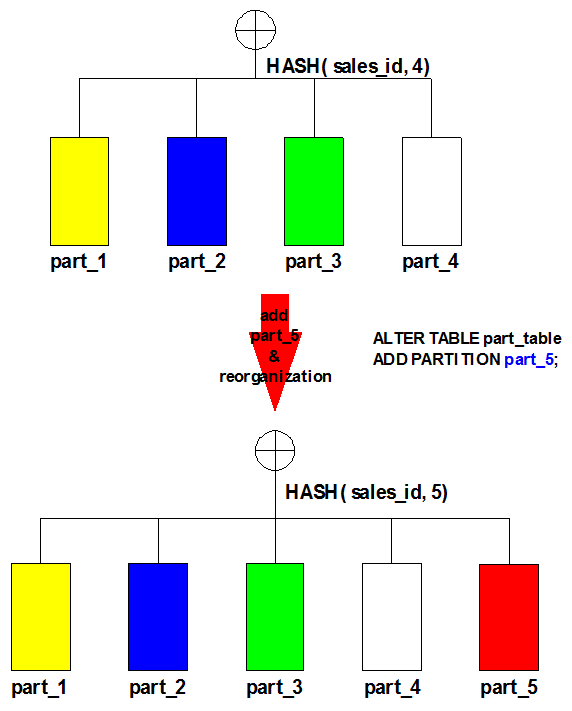

[Figure 7-26] Adding a Partition to a Hash-Partitioned Object

In the example shown in the above figure, the part_5 partition is added to a partitioned object that originally consists of 4 partitions. The new part_5 partition is created, and ② the records in the four existing partitions are redistributed among the four existing partitions and the newly created partition.

###### COALESCE PARTITION

'Coalescing' the partitions of a hash-partitioned object means decreasing the number of hash keys. Coalescing a partition affects all existing partitions. To coalesce the partitions of a hash-partitioned object, use COALESCE PARTITION. The last partition is deleted, and the records from the deleted partition are redistributed throughout the partitioned object together with the existing records. When coalescing partitions, the name of the partition to delete cannot be specified. The partitions are deleted one by one, starting with the last one and ending with the first one.

For example, if a hash-partitioned object comprising 4 partitions (part_1, part_2, part_3 and part_4) is coalesced, it is reduced to a partitioned object comprising 3 partitions (part_1, part_2 and part_3). The following figure illustrates this process of coalescing partitions. 

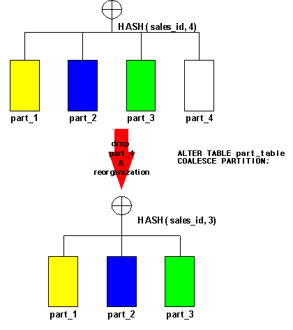

[Figure 7-27] Coalescing the Partitions of a Hash-Partitioned Object

In the example shown in the above figure, the partitions of a hash-partitioned object consisting of 4 partitions are coalesced. ① The records in the four existing partitions are redistributed among the part_1, part_2 and part_3 partitions, and ② the last partition, part_4, is deleted

###### RENAME PARTITION

RENAME PARTITION changes the name of a partition without changing the partition conditions.

###### TRUNCATE PARTITION

TRUNCATE PARTITION deletes all of the records from a partition without changing the partition conditions. 

#### Range Partitioning using Hash

Range partitioning using hash is a method of partitioning an object by specifying the range based on the hash value of a partition key. Partition key only allows single column. Range partitioning using hash is typically used for uniform load distribution and manageability.

Unlike hash partitioning, range partitioning using hash supports SPLIT PARTITION, DROP PARTITION, and MERGE PARTITION but not COALESCE PARTITION.

The default execution is same as range partitioning and supports default partition. However, only single columns are allowed for partition key and the range of hash value is 0 to 1000.

The following is an example of range partitioning using hash.

```
CREATE TABLE part_table
(
    sales_date        DATE,
    sales_id          NUMBER,
    sales_city        VARCHAR(20),
    ....
) 
PARTITION BY RANGE_USING_HASH(sales_id)
(
    PARTITION part_1 VALUES LESS THAN ( 250 ),
    PARTITION part_2 VALUES LESS THAN ( 500 ),
    PARTITION part_3 VALUES LESS THAN ( 750 ),
    PARTITION part_def VALUES DEFAULT
) TABLESPACE SYS_TBS_DISK_DATA;
```

The table creating statement above can be shown as figure below.


[Figure 7-28] Partition Areas of a Hash using Range Partitioned Table

The operation on hash using range partitioned object is the same as range partitioned object.

## 

# 8. Managing Transactions

Concurrency control and data consistency are two of the most fundamental concepts in database management. This chapter describes how to manage transactions in an Altibase database.

### Transactions

A transaction is a logical unit of work that is comprised of one or more SQL statements. A transaction begins with the first execution of a SQL statement by a user, and ends when it is committed or rolled back, either explicitly with a COMMIT or ROLLBACK statement or implicitly when a DDL statement is issued.

#### Definition of Transaction

A transaction ensures the consistency of data changes to a user as long as the SQL statements within a transaction are logically grouped. A transaction should consist of all of the necessary parts for one logical unit of work—no more and no less. Data in all referenced tables that are in a consistent state before the transaction begins should also be in a consistent state after it ends. Transactions should consist of only the SQL statements that make one consistent change to the data.

Transferring deposit at the bank is a representative example of a transaction. In order to transfer $100 from account A to account B, the following tasks must be completed:

1. Decrease the balance of account A by $100.
2. Increase the balance of account B by $100.
3. Make a record of the fact that money was transferred from account A to account B

When a transaction is normally executed on a database that was in a consistent state before the transaction, the database will still be consistent after the transaction. If even one of the three tasks constituting the above transaction is not performed correctly, the integrity of the database will be compromised, and either the holder of account A, the holder of account B or the bank will suffer damages.

To maintain database integrity, a properly executed transaction must exhibit the four ACID properties: Atomicity, Consistency, Isolation, and Durability.

- Atomicity - Either all of the statements that constitute a transaction are completely executed, or none of them are. That is, the transaction cannot be partially successful.
- Consistency - The execution of a transaction must not break the integrity of the database.
- Isolation: When multiple transaction are executed at the same time,  no transaction should be afffected by the results of other transactions.
- Durability: Once a transaction has been committed, the resultant changes are not lost under any circumstances, such as system failure. 

#### Autonomous_Transaction

If Autonomous_Transaction Pragma statement is used, PSM object is able to operate from the main transaction independently. Since the autonomous transaction does not share sources, lock, commit, or recovery operations are performed independently. 

For more detailed information, please refer to the Pragma in [*Stored Procedure Manual*.](https://github.com/ALTIBASE/Documents/blob/master/Manuals/Altibase_7.1/eng/Stored%20Procedures%20Manual.md#10-pragma)

#### Transaction Termination

A transaction will be terminated if any of the following occurs.

- The transaction is terminated when the user executes the ROLLBACK statement without a SAVEPOINT clause, or executes the COMMIT statement.
- When the user executes a DDL statement, the transaction is committed.
- When the user disconnects from Altibase, the transaction is committed.
- If the user session terminates abnormally, the current transaction is rolled back.

#### Statements

The term “statement” refers to a SQL statement within a transaction. SQL statements fall into the three following categories:

- DCL (Data Control Language): This type of statement is used to change the status of the database, its properties, or its physical configuration.
- DDL (Data Definition Language): This type of statement is used to create, change, or delete database logical structural elements, such as tables, sequences, indexes, and the like. Examples are the CREATE TABLE, CREATE INDEX, ALTER, and DROP statements.
- DML (Data Manipulation Language): Data Manipulation Language commands are used to insert, delete, modify, or view the actual data saved in a database. Example DML statements are the UPDATE, INSERT, and DELETE statements

A statement is usually just a single SQL statement, but one or more underlying statements are executed when a stored procedure or function is executed.

If an error occurs while a statement is being executed, all of the data affected by the statement are restored to their original state. To make this possible, a so-called “Implicit Save Point” is set before each statement is executed, and the database is restored to this point if an error occurs.

#### Commit

Committing a transaction means permanently saving the results of all SQL statements executed within the transaction up to that point in time and ending the transaction. When a transaction is committed, the database is moved from a previous state, in which it had integrity, to a new state that also has integrity.

When a transaction is committed in Altibase, the following tasks are performed:

- A transaction commit log is written to a log file. 
- Resources that are no longer needed by the transaction and thus can be released are handed over to the Garbage Collector. 
- The status of the transaction is changed to “committed”. 
- Resources allocated during execution of the transaction, such as locks and temporary memory, are released.

#### Rollback

If there is a fatal error in themiddle of a transaction and cannot proceed any further, all SQL statements executed by the transaction must be undone, and the database must be returned to the state that existed before execution of the transaction. This is referred to as “rolling back” a transaction.

Rollback of a transaction is implemented by performing a compensation operation on each log recorded during the transaction.

When a transaction is rolled back in Altibase, the following tasks are performed: 

- The log records are read in the opposite order in which they were written, and compensatory operations are executed. 
- A transaction rollback log is recorded. 
- Resources that were allocated for insert operations, etc. are returned to the garbage collector. 
- The status of the transaction is changed to “rolled back.”
- Resources allocated during execution of the transaction, such as locks and temporary memory, are released.

#### Explicit Savepoint

To manage a long transaction by dividing it into several portions, explicit save points can be declared at the start point of each portion

Because each explicit save point can have a name, multiple save points can be declared within a single transaction. If an error occurs after an explicit save point is declared, the transaction can be rolled back to the save point to restore the database.

When a transaction is rolled back to an explicit save point, all of the resources such as table and row locks acquired since that savepoint are released, and all savepoints declared since that point are canceled.

### Locking

The purpose of a “lock” is to set access rights to a particular object in the database. 

Altibase uses locks to control concurrent access to data. When data are updated, those data are locked until the update is committed. Until that happens, no one else can access the locked data. This helps ensure the integrity of the data in the system.

#### Locking Modes

Locks are acquired at row level or table level depending on their purpose. Common uses for locks include the following: 

* to ensure that only one user can modify a record at a time 
* to ensure that a table cannot be dropped if it is being queried 
* to ensure that one user cannot delete a record while another is updating it

##### Table Level Lock Modes

| **Lock Mode** | **Description**                   | Property                                                     |
| ------------- | --------------------------------- | ------------------------------------------------------------ |
| S             | Shared Lock                       | The holder of the lock can read all of the records in a table, and does not lock individual records. Other transactions that only read the table can be executed at the same time. |
| X             | Exclusive Lock                    | The holder of the lock can read and modify all of the records in a table, and does not lock individual records. No other transactions can read or modify the table. Used with most DDL statements. |
| IS            | Intent Shared Lock                | This mode is the same as S mode except that the lock holder locks individual records before reading them. Used with SELECT statements. |
| IX            | Intent Exclusive Lock             | The lock holder can read and modify records after obtaining a lock on the records. Multiple transactions that write to different records in the same table can exist at the same time. Used with change DML (INSERT, UPDATE, DELETE) statements or SELECT FOR UPDATE. |
| SIX           | Shared with Intent Exclusive Lock | The lock holder can read and modify records after obtaining a lock on the records. Only one transaction can update records in the table. Used with Direct-Path INSERT. |

[Table 8-1] Lock Modes

##### Intention Mode Lock - IS, IX, SIX

There are many types of objects that can be locked. These objects can have various sizes within the database. Examples of objects that can be locked include the entire database, schemas, tables, records and columns. Arranged in descending order of size, these are: 

database > schema > table > record > column

Lock granularity refers to the size of the object to be locked. If locking was supported only for large objects, concurrency control would suffer. Suppose that multiple transactions attempt to perform operations on individual records in a table. If locking was supported only for objects larger than records, (e.g. for the entire table,) when a transaction is executed, even if it performed an operation on only a single record, all other transactions wishing to perform operations on other records in the table would have to wait until the operation that started first was successfully completed.

Therefore, it is most efficient to make the record the smallest lockable unit. To acquire a lock on the smallest unit, the lock on larger objects must also be acquired. This is referred to as the “lock granularity protocol”.

When acquiring a lock on larger objects, it is recommended to choose a suitable lock mode from among the various lock modes that are provided, so that multiple transactions can perform operations on the same table as long as they are not accessing the same records. So-called “intention mode locking” is used for this purpose.

##### Lock Compatibility

The term “lock compatibility” refers to compatibility between lock modes, that is, to whether a request to place a particular kind of lock on an object will be accepted when the object in question has already been locked by another transaction.

The compatibility between the various lock modes is set forth in the following table:

<table>
    <tr>
    	<th></th>
        <th colspan="6">Granted Mode</th>
    </tr>
    <tr>
    	<td>Requested Mode</td>
        <td>NONE</td>
        <td>IS</td>
        <td>IX</td>
        <td>SIX</td>
        <td>S</td>
        <td>X</td>
    </tr>
    <tr>
    	<td>IS</td>
        <td>O</td>
        <td>O</td>
        <td>O</td>
        <td>O</td>
        <td>O</td>
        <td>-</td>
    </tr>
     <tr>
    	<td>IX</td>
        <td>O</td>
        <td>O</td>
        <td>O</td>
        <td>-</td>
        <td>-</td>
         <td>-</td>
    </tr>
     <tr>
    	<td>SIX</td>
        <td>O</td>
        <td>O</td>
        <td>-</td>
        <td>-</td>
        <td>-</td>
        <td>-</td>
    </tr>
     <tr>
    	<td>S</td>
        <td>O</td>
        <td>O</td>
        <td>-</td>
        <td>-</td>
        <td>O</td>
        <td>-</td>
    </tr>
    <tr>
    	<td>X</td>
        <td>-</td>
        <td>-</td>
        <td>-</td>
        <td>-</td>
        <td>-</td>
        <td>-</td>
    </tr>
</table>

[Table 8-2] Lock Mode Compatibility

##### Record Level Lock Modes

The INSERT, UPDATE, and DELETE DML statements obtain X locks on individual records, whereas read operations obtain S locks on individual records.

| Lock Mode | Description    | Property                  |
| --------- | -------------- | ------------------------- |
| S         | Shred Lock     | Records can only be read. |
| X         | Exclusive Lock | Records can be modified.  |

[Table 8-3] Record-Level Lock Modes

Normally, S locks conflict with X locks, and the two types of locks are not considered inter-compatible. However, thanks to the Altibase MVCC (Multi-Version Concurrency Control) implementation, these kinds of locks do not conflict with each other. Thus, read operations can be performed on records that are being updated, and update operations can be performed on records that are being read.

### Multi-Version Concurrency Control (MVCC)

In Altibase, MVCC (Multi-Version Concurrency Control) is used to ensure the consistency of records. MVCC is a concurrency control method in which, when a DML statement is executed on a record, the record is maintained in its original state and the DML statement is executed on a copy of the record to create a new version of the record. In this way, any transaction that is performing an operation on a record will not affect other transactions that read the same record.

The MVCC concurrency control method cannot be implemented in the same way for memory tablespaces and disk tablespaces due to the differences in their characteristics. Altibase uses the so-called “Out-Place MVCC” for memory tablespaces and “In-Place MVCC” for disk tablespaces. Because these two techniques superficially appear to work in the same manner, there is no need for users to distinguish between the two.

This section briefly describes the internal processes that are conducted to support MVCC when each kind of DML statement is executed. First, the cases in which MVCC is not used are described first. Out-place MVCC for memory tablespaces is then described, followed by in-place MVCC for disk tablespaces. Finally, some cautionary notes to keep in mind when using MVCC are described.

#### Updating without Using MVCC

For the sake of comparison with MVCC, this section describes how an update statement is internally handled in a non-MVCC environment. 

The following figure shows how the records in a table are changed in response to an update operation when MVCC is not being used.


[Figure 8-1] Non-MVCC Transaction

In the above [Figure 8-1], (a) illustrates the state in which record A has been initially inserted into table T1. If col1 of record A is updated to the value of 2, as shown in (b) above, record A is modified in its original location without changing the amount of space allocated to T1. Similarly, DELETE operations are also performed in the original location of the record.

When MVCC is not being used, an UPDATE or DELETE operation does not change the amount of space allocated to a table. The space allocated to a table can be increased only by the execution of an INSERT statement.

####  Out-Place MVCC and Memory Tablespaces

In out-place MVCC, which is used with memory tablespaces in Altibase, a new version of a record is created and associated with previous versions of the record every time an UPDATE operation occurs.

##### UPDATE Operation

The following [Figure 8-2] shows the effect of executing an UPDATE statement when using out-place MVCC


[Figure 8-2] Transaction using Out-Place MVCC

In the initial state, in which record A has been inserted into table T1, as shown at (a), if the value in col1 of record A in table T1 is updated to 2, an identical record is created and the value in this record is changed to 2, as shown at (b). Therefore, table T1 occupies one more slot than it did before the transaction took place

When the new version of record A is created, a pointer in the header of the original version of record A is used to indicate the newly added record. In this way, different versions of the same record can, therefore, be managed simultaneously

If another UPDATE operation is performed on record A, which is still in the state indicated by (b) in the above figure, yet another record will be created, and the UPDATE operation will be executed on the new record. Ultimately, the number of versions of the same record will equal the number of UPDATE operations performed on the record.

So, does the tablespace increase in size without limit as more UPDATE operations are performed?

When each transaction that performs an UPDATE operation on a particular record is committed, only the most recent of the multiple versions of the record are valid, and the previous versions do not need to be saved in the database. Unnecessary versions are deleted by the garbage collector, and the emptied spaces previously occupied by these versions are reused by subsequent INSERT/UPDATE statements. Therefore, even though a new version of a record is created every time an UPDATE operation occurs, the database does not occupy infinitely increasing amounts of space

##### DELETE Operation

Just like an UPDATE operation, whenever a DELETE operation is executed on a record, a new version of the record is created. Unlike an UPDATE operation, however, the new version of the record to be deleted does not actually contain any data. Therefore, it is not necessary to create a new version of every record when a DELETE operation is performed. It is sufficient to create a single version representing all deleted records.

The following figure shows how much space is used depending on whether or not new versions of each record are created when a DELETE operation is performed:


[Figure 8-3] DELETE Transaction using MVCC

The case indicated by (a) in the above figure represents the case in which a new version is created for every record that is deleted. If a transaction deletes records A and B using a single DELETE statement, new versions will be created for each record, and thus table T1 will have two additional records.

In the case indicated by (b), only one additional record is created, even though the DELETE statement deletes multiple records. As shown in the above figure, the case indicated by (b) generates fewer unnecessary versions of records, thereby increasing the efficiency of space utilization. Altibase uses the case indicated by (b) when DELETE statements are executed on tables in memory tablespace.

#### In-Place MVCC and Disk Tablespaces

According to in-place MVCC, which Altibase uses for disk tablespaces, when an UPDATE operation occurs, the contents of columns that belong to the original records and are being changed are written as so-called “undo log records” to an undo page, which exists in undo tablespace, and the new data are written to the location of the original record.

##### Insert Operation

When a record is first inserted, the system allocates space for the record in a data tablespace and creates the record. The system also allocates an area for an undo log record in an undo tablespace and creates the undo log record. Finally, the system links the location of the undo log record with the rollback RID of the actual record in the data tablespace.

##### Update Operation

Assuming that version 1 is the record that was originally inserted, the following figure shows how version 1 is updated to version 2 and then to version 3.

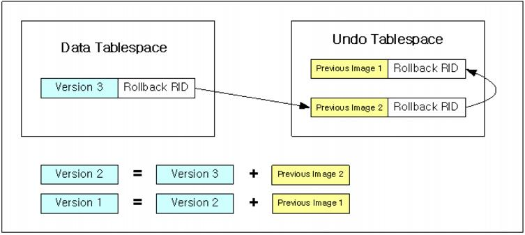

[Figure 8-4] Using MVCC with Disk Tablespaces

As shown in the above figure, the most recent image of a record always exists in the data tablespace. If the execution of some statement starts before version 3 is committed, it executes on the basis of the previous version, which is version 2, because it cannot read version 3. In such cases, the statement copies the image of version 3 to a buffer that it manages privately. It then reads the previous version 2 from the location indicated by the rollback RID of the record and stores this in its private buffer, where it copied version 3. If the statement cannot read version 2 either, it repeats the process and creates its own copy of version 1.

If the statement cannot read version 1, this means that the execution of the statement started before the record was initially inserted, so the statement will ignore the record.

###### Clearing the Undo Log Record Area

In the case of disk tablespace, the size of the data tablespace does not increase much if a great number of update operations occur in a short period of time. However, because the effect of in-place MVCC is to increase the number of undo log records, the amount of space being used in the undo tablespace would increase in this situation. Because the size of the undo tablespace is set when the CREATE DATABASE statement is executed, and cannot be changed, it is necessary to reuse undo log records. Undo log records are registered in the undo tablespace header when transactions are committed, and are managed in a linked list. When it is no longer necessary to refer to undo log records pertaining to particular transactions, the records are cleared from the system. In contrast, when a transaction is rolled back, the undo log records are cleared immediately instead of being registered in the undo tablespace. 

The undo log records that are created by insert operations are managed separately from those created by the update and delete operations. This is so that the undo log records created by insert operations can be cleared immediately when transactions are committed.

##### Delete Operation

Delete operations are executed in the same way as update operations. Because the information that is altered by a delete operation is a delete flag that is set in the header of the record, only information about the record header is recorded in undo log record images. 

The space occupied by a deleted record is not reused immediately. First, all index keys pertaining to the record are deleted, then the actual record is deleted, and then the garbage collector removes the delete undo log record pertaining to the deleted record. Then, the space occupied by the record can be reused.

#### In-place MVCC vs. Out-place MVCC

The in-place method, which is used with disk tablespaces, checks record versions differently than the out-place method, which is used with memory tablespaces. In the out-place method, a Commit SCN is saved for every transaction that creates a new version of a record, and this Commit SCN is used to check record versions. That is, a read transaction reads versions that have a Commit SCN lower than the SCN of the read transaction. The commit SCN of a transaction is set when the transaction is committed, and is written to all versions of records created by that transaction.

In contrast, setting the Commit SCN for a transaction in a disk tablespace requires all record versions created by the transaction to be accessed, which is unfeasible in practice. This is because transaction performance is greatly reduced, attributable to disk I/O expense.

A TSS (Transaction Status Slot) is a type of record that indicates the current state of a transaction. Each TSS has a commit SCN written in it. TSSs are permanently written in undo tablespace, and when they are no longer needed, they are deleted by the Ager. Deleted TSSs can be reused for other transactions.

A transaction that is being committed does not set a Commit SCN in all of the record versions that it has created; instead, it sets the Commit SCN in the TSS with which it is associated. Additionally, when a record is updated, a TSS identifier is written in the record, and the written TSS identifier is used by the transaction for checking record versions. That is, the transaction compares its SCN with the Commit SCN of the TSS of each record, and only reads records having Commit SCNs lower than its SCN.

#### Considerations when Using MVCC

Altibase uses MVCC for concurrency control with both memory and disk tablespaces. Because MVCC is different than Single Version Concurrency Control (SVCC), its precursor, there are a few things to keep in mind when using MVCC.

- **Transactions that take a long time increase the size of the database.**
  
  If a particular transaction takes a long period of time to execute and is not committed, because there is the chance that the transaction may need to read images of previous versions of data, the garbage collector will not be able to delete previous images created by other transactions (previous record versions in the case of memory tables, and undo log records in the case of disk tables) and the index keys for these records. This increases the size of memory tables and the amount of space used in disk undo tablespace. In addition, in order to roll back the transaction later, log files cannot be deleted, which can consume all of the space on the file system containing the log files.
  
- **A large number of simultaneous transactions increases the size of the database.**  
  Previous images created by MVCC are cleared by the garbage collector. If the number of simultaneous transactions is much greater than the number of CPUs, the garbage collector may not have enough time to delete previous images, and the size of the database will continue to increase.
  
- **Large amounts of UPDATE operations increase the size of the database**  
  If operations that generate large amounts of previous versions of data are executed frequently, memory tables increase in size, and the undo tablespace, which is used with disk tables, increases in size as well.
  
- **Large numbers of previous images decrease performance.**  
  If excessive numbers of previous images remain in the database for the reasons mentioned above, the cost of searching for a specific record might increase, which can degrade overall performance.
  
- **Repeatable Read Vs. Consistent Read**  
  In typical DBMSs in which SVCC is implemented, when records are read, an S lock is set, which conflicts with X locks, with the result that records that are being read cannot be altered. Accordingly, the isolation level of the database is set to Repeatable Read. In contrast, in Altibase, a record can be updated while it is being read, and thus Consistent Read is the default isolation level. As a result, a transaction that repeatedly reads a table without being committed might obtain different results every time. To avoid this, set the isolation level to Repeatable Read or use the SELECT FOR UPDATE command.

### Transaction Durability 

Generally, the term “transaction” refers to an independent unit that serially reads and updates a stored object (a page or record; implemented differently depending on the DBMS).

To improve performance, DBMSs interleave multiple transactions so that they can be executed simultaneously. Concurrency control ensures that transactions are performed concurrently without violating data integrity, and guarantees that the result of multiple transactions executed simultaneously is the same as if the transactions were executed sequentially without overlapping in time.

Therefore, DBMSs are designed to guarantee that transactions in order to record all data even under all unexpected system failures accurately: 

- Atomicity
- Consistency
- Isolation
- Durability

#### Concept

Of the four properties of a transaction, durability means that after a transaction has been committed, the committed transaction must be guaranteed, even if a database failure occurs before the changed data are physically written to disk.

To ensure the durability of transactions, DBMSs manage transaction logs, that is, a redo log record, in which contains changes to the data page. If a system failure occurs before the data changed by a committed transaction are written to disk, the DBMS reads the logs when the system is restarted, and the data are restored according to the contents of the logs.

Transaction durability is an important factor in determining transaction processing performance. In memory-based DBMSs (which exhibit performance tens of times better than disk-based DBMSs), guaranteeing transaction durability has a much bigger impact on performance than in disk-based DBMS.

For example, logs for all database updates must be written to a log file on disk in order for a DBMS to provide complete transaction durability. Disk I/O occurs when all of the logs in the memory log buffer are written to log files, and this disk I/O acts as a bottleneck in processing transactions, which degrades processing performance. That is to say, there is a tradeoff between complete transaction durability and transaction processing performance.

Altibase guarantees complete transaction durability and provides a transaction durability management method that allows the balance between transaction processing performance and transaction durability to be controlled in order to realize high transaction-processing performance in multiple-system implementations.

#### How to Manage Durability

In Altibase, durability is managed using the COMMIT_WRITE_WAIT_MODE and LOG_BUFFER_TYPE properties in the altibase.properties file. COMMIT_WRITE_WAIT_MODE specifies whether a transaction waits until an update log has been written to a log file on disk. This property can be specified for the entire system or for individual sessions. 

LOG_BUFFER_TYPE specifies the type of log buffer that is used when update logs are written to a log file. This property can't be changed while the system is running. 

For more detailed information on these properties, please refer to the *[General Reference-1.Data Types & Altibase Properties](https://github.com/ALTIBASE/Documents/blob/master/Manuals/Altibase_7.1/eng/General Reference-1.Data Types %26 Altibase Properties.md)*.

**The case where a transaction does not wait until logs have been written to disk and a kernel log buffer is used: (Durability Level 3)**


[Figure 8-5] Durability in The Case where a Transaction Does Not Wait until Logs Have Been Written to Disk and a Kernel Log Buffer Is Used:

Set both COMMIT_WRITE_WAIT_MODE and LOG_BUFFER_TYPE to 0 and 0. With the default Altibase durability property settings, update logs are stored in the log buffer of the OS kernel area, and transactions do not wait until their update logs have been written to the log file. 

**The case where a transaction does not wait until logs have been written to disk and a memory log buffer is used: (Durability Level 2)**


[Figure 8-6] Durability in The Case where a Transaction Does Not Wait until Logs Have Been Written to Disk and a Memory Log Buffer Is Used:

Set COMMIT_WRITE_WAIT_MODE and LOG_BUFFER_TYPE to 0 and 1, respectively. With this method, transactions store their update logs in a memory log buffer, and the log flush thread itself flushes the logs in the log buffer to the log file. 

**The case where a transaction waits until logs have been written to disk and a kernel log buffer is used: (Durability Level 4)**


[Figure 8-7] Durability in The Case where a Transaction Waits until Logs Have Been Written to Disk and a Kernel Log Buffer Is Used:

Set COMMIT_WRITE_WAIT_MODE and LOG_BUFFER_TYPE to 1 and 0, respectively. With this method, transaction update logs are stored in the log buffer of the OS kernel area, and logs for committed transactions are written directly to a log file.

**The case where a transaction waits until logs have been written to disk and a memory log buffer is used: (Durability Level 5)**

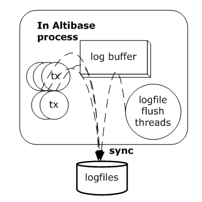

[Figure 8-8] Durability in The Case where a Transaction Waits until Logs Have Been Written to Disk and a Memory Log Buffer Is Used

Set COMMIT_WRITE_WAIT_MODE and LOG_BUFFER_TYPE to 1 and 1, respectively. With this method, transactions store their update logs in a memory log buffer, and logs for committed transactions are written directly to a log file, as mentioned above.

### Checkpointing

Checkpointing stores content of the main memory database to backup data files on a regular basis. The purpose of checkpointing is to minimize the time taken to recover a database from a system failure.

Altibase uses fuzzy and ping-pong checkpointing methods to securely back up and manage databases.

#### Checkpointing Memory Databases

Altibase prioritizes transaction performance and database stability by implementing fuzzy checkpointing and ping-pong checkpointing together for checkpointing memory databases. 

General databases implement the WAL(Write Ahead Logging) protocol which writes log records to disk before applying the modified data page to disk, in order to ensure database consistency. The database server controls concurrency with logs by acquiring the latch in the checkpoint target page to implement the WAL protocol. Degradation of other transactions can occur throughout this process.

Altibase performs checkpoint operations without acquiring a latch in the checkpoint target page to resolve the degradation of transactions. Altibase also maintains two checkpoint image files to address inconsistency in checkpoint image files which can occur for not conforming to the WAL protocol while checkpointing. For example, if the Altibase server fails in a state due to the inconsistency of the last checkpoint image file, the previous one of two checkpoint image files can be recovered. 

Ping-pong checkpointing maintains two checkpoint image files as described above and uses a different image file in turn for each checkpoint. Fuzzy checkpointing allows the execution of other transactions while checkpointing, thus, data of committed or uncommitted transactions can be mixed in the checkpoint image files for fuzzy checkpoint operations; “fuzzy checkpoint” derives from this state. 

#### Checkpointing Disk Databases

Altibase implements fuzzy checkpointing, which has the following characteristics, for checkpointing disk databases.

- Other transactions are not prevented from starting while checkpointing.
- Not all dirty pages are applied to the disk while checkpointing. Dirty pages are applied to the disk, according to the buffer replacement policy.

Most disk DBMSs implement fuzzy checkpointing since it can be performed without stopping the DBMS. 

However, the log file with the minimum(oldest) LSN among the Begin LSNs of active transactions and the LSNs of dirty pages, and the log files following it, are necessary for recovery from failure. Database recovery time and log files to be kept by the server increase for every dirty page not applied to disk. 

#### Checkpointing Process

The following table describes the steps in which checkpointing is started and completed for checkpointing operations. 

When the message [CHECKPOINT BEGIN] appears, prior to recording the Checkpoint Begin Log([CHECKPOINT-step2]), Altibase computes and determines the LSN of the Redo log for Restart Recovery. At this point, dirty pages in the disk DB are flushed and the determined Recovery LSN is recorded to the log anchor. 

The checkpoint message for each step is written to $ALTIBASE_HOME/trc/altibase_sm.log. The following table summarizes checkpoint messages

| Checkpoint Message                                    | Description                                                  |
| ----------------------------------------------------- | ------------------------------------------------------------ |
| [CHECKPOINT-BEGIN]                                    | Checkpointing begins                                         |
|                                                       | Flushes dirty pages in database buffer Tablespace log anchor synchronization |
| [CHECKPOINT-step2] Write BeginChkpt Log [0,1036171]   | Writes Checkpoint Begin Log                                  |
| [CHECKPOINT-step3] Flush Dirty Page(s)                | Flushes dirty pages in memory DB                             |
| [CHECKPOINT-step4] sync Database File                 | Memory database synchronization                              |
|                                                       | Writes Redo LSN to the header files of data files in all tablespaces |
| [CHECKPOINT-step5] Write End_Chkpt Log [0,1037350]    | Writes Checkpoint End Log                                    |
| [CHECKPOINT-step6] Sync Log File                      | Log file synchronization                                     |
| [CHECKPOINT-step7] Check LogFiles that are not Needed | Confirms unnecessary log files                               |
| [CHECKPOINT-step8] Update and Flush Log Anchor        | Updates and flushes log anchor                               |
| [CHECKPOINT-step9] Remove Online Log File             | Deletes online log files                                     |
| [CHECKPOINT-END]                                      | Checkpointing completes                                      |

The following figure shows the process of threads checkpointing in the Altibase Process when checkpointing occurs.


[Figure 8-9] The Checkpointing Process

#### Controlling Checkpointing

Checkpointing can be triggered by time conditions, log conditions or the user

##### Periodic Checkpointing

Checkpointing occurs at regular intervals during operations. This interval is determined by CHECKPOINT_INTERVAL_IN_SEC, an Altibase property. For more detailed information on this property, please refer to [*General Reference*.](https://github.com/ALTIBASE/Documents/blob/master/Manuals/Altibase_7.1/eng/General%20Reference-1.Data%20Types%20%26%20Altibase%20Properties.md#checkpoint_interval_in_sec-unit-second)

##### Log Checkpointing

Checkpointing occurs as many times as log files are generated in the database. The number of times is specified by the CHECKPOINT_INTERVAL_IN_LOG property. For detailed information on this property, please refer to *[General Reference.](https://github.com/ALTIBASE/Documents/blob/master/Manuals/Altibase_7.1/eng/General%20Reference-1.Data%20Types%20%26%20Altibase%20Properties.md#checkpoint_interval_in_log)*

##### Manual Checkpointing

Checkpointing occurs when the user manually issues the "ALTER SYSTEM CHECKPOINT" statement.

#### Checkpointing Related Properties

The following are properties related to checkpointing. For more detailed information on each property, please refer to *General Reference*.

- CHECKPOINT_BULK_WRITE_PAGE_COUNT
- CHECKPOINT_BULK_WRITE_SLEEP_SEC
- CHECKPOINT_BULK_WRITE_SLEEP_USEC
- CHECKPOINT_BULK_SYNC_PAGE_COUNT
- CHECKPOINT_ENABLED
- CHECKPOINT_INTERVAL_IN_LOG
- CHECKPOINT_INTERVAL_IN_SEC
- DIRECT_IO_ENABLED
- DATABASE_IO_TYPE

# 9. Database Buffer Manager

In Altibase, data objects in the disk tablespace must be loaded from disk into memory in order for them to be accessed or updated. Memory that is used temporarily in this way is referred to as a ”buffer”, and in Altibase this memory is collectively called the ”buffer pool”.

If all of the data on disk were loaded into the buffer pool, it would be possible to access any data quickly without incurring any disk I/O expense. However, because the amount of memory is limited, it is only possible to load some of the data that exist on disk into the buffer pool. When data that have been loaded into the buffer pool are removed to make way for other data, this is called data replacement. Because this has such a strong impact on system performance, an efficient algorithm must be used to determine which data are to be saved in the buffer pool and how long to save the data in the buffer pool. 

In Altibase, the entity that manages the buffer pool is known as the buffer manager. The main role of the buffer manager is to save more frequently accessed data in the buffer longer, and to manage the buffer efficiently.

This chapter describes the structure and function of the buffer manager, how to manage the buffer pool, related properties, and so on. 

### Structure of the Buffer Manager

#### Components

The components of the buffer manager include the buffer area, the buffer pool, buffer frames, and Buffer Control Blocks (BCBs). The buffers in the buffer pool are organized as follows: an LRU list, a prepare list, a flush list, a checkpoint list and a hash table. This section describes the components of the buffer manager. 

##### Buffer Area

The buffer area is the reserved memory space which is assigned to the buffer pool. The size of the buffer managed by the buffer manager depends on the size of the buffer area.

##### Buffer Pool

The buffer pool is the key element of the buffer manager, and is the implementation of the buffer replacement policy. It loads the requested data pages into the buffer and returns the memory address of the area into which the pages were loaded. Internally, the buffer pool manages BCBs using the hash table, LRU list, prepare list, and flush lists.

##### Buffer Frame

A buffer frame is a space allocated for loading one page in memory. One buffer fram is the same size as one page. A set of buffer frames are assembled to form a buffer fool. A buffer pool is configured a gathering of buffer frames.

##### BCB (Buffer Control Block) 

Buffer Control Blocks (BCBs) contain information about buffer frames. One BCB corresponds to a single buffer frame. The buffer manager uses BCBs to manage information about all of the pages loaded into buffers, whereas buffer frames are merely space into which pages can be loaded. Each BCB maintains an address for the corresponding buffer frame.

The following figure and table describe the structure and information of buffer control blocks.


[Figure 9-1] BCB Structure

| Property             | Description                                                  |
| -------------------- | ------------------------------------------------------------ |
| BCB Status           | This is the current status of the buffer frame. Possible values: FREE/CLEAN/DIRTY FREE: no page is loaded in the buffer frame CLEAN: page is loaded in buffer frame but not updated DIRTY: page is loaded in buffer frame and updated but not written to disk |
| Buffer Frame Address | Buffer Frame Address The address of the buffer frame corresponding to the BCB |
| Space ID             | The identifier of the tablespace containing the page         |
| Page ID              | The unique identifier of the page in the tablespace          |
| Page Owner Lock      | In order to access a page, it is first necessary to acquire a lock. Read, Write, and Fix mode locks can be acquired. A page in the buffer can be accessed after a lock on a BCB corresponding to the page is acquired in a particular mode. |
| Modified LSN         | The next time the contents of the disk buffer are flushed to disk, the portion of the disk buffer that will be flushed to disk is the portion corresponding to all changes up to and including the change corresponding to this LSN. |
| Fix Count            | This is the number of transactions that are simultaneously accessing a page. If this value is 1 or higher, the page can't be replaced, whereas if it is 0, the page can be replaced. |
| Touch Count          | This is the number of transactions that have accessed a page since it was loaded into a buffer. This value is used to determine whether the page is hot or cold. |

[Table 9-1] BCB Information

##### Hash Table

When the Altibase server receives a request for a page, it searches for the BCB of the page in the hash table in order to check whether the page has already been loaded into the buffer. The BCBs of all pages that are loaded into the buffer are registered in the hash table.

##### LRU (Least Recently Used) List

This is used to determine which buffers have not been accessed for a long time so that they can be replaced first. 

In Altibase, the LRU list is separated into hot and cold zones, and can thus be called a “hot-cold LRU list”. Buffers that are accessed frequently are placed in the hot zone, whereas those that are not accessed frequently are placed in the cold zone. When a buffer needs to be replaced, only the cold zone is searched, meaning that hot buffers are not considered as replacement candidates. 

When a page is first loaded into a buffer, it is inserted at the mid-point (LRU cold first) of the LRU list. When allocating a buffer to the new data page, if there are no free buffers in the prepare list, the end (LRU cold last) of this list is searched first, and a cold buffer is then replaced. The buffer that is replaced is called a “victim”.


[Figure 9-2] hot-cold LRU list

Buffers that are read frequently are moved to the ”LRU hot first” position in the hot zone. Meanwhile, dirty buffers (buffers containing pages that have been updated but haven't been flushed to disk) are moved to the flush list. Additionally, clean buffers (buffers containing pages that haven't been updated) are designated as replacement buffers as long as they are not in the hot zone.

The relative size of the hot zone can be set using the HOT_LIST_PCT property. The default is 50, which means that half of the LRU list is used as the hot zone.

##### Flush List

If dirty buffers are found while an LRU list is searched for buffers to replace, they are moved to the flush list. The flush list is a collection of buffers containing pages that have been updated but that hasn't been written to disk yet. However, not all dirty buffers are on the flush list. This is because they are moved to the flush list, not at the time point at which they are updated, but when the LRU list is searched for buffers to replace.

When a replacement flush occurs, the updated pages on this list are written to disk, and clean buffers are thus obtained.

##### Prepare List

All buffers on the flush list that have been written to disk are moved to the prepare list. That is to say, the prepare list consists of clean buffers that have been flushed

When the buffer manager searches for buffers to replace, it first searches the prepare list. If it can't find suitable buffers in the prepare list, it then searches the LRU list. However, even if a buffer is on the prepare list, it isn't necessarily clean. This is because the contents of the buffer can be updated.

##### Checkpoint List

Since the LRU list, flush list, and prepare list are mutually exclusive, so a buffer can't exist on two or more lists. However, because the checkpoint list is managed independently of the other lists, buffers on any of the other 3 lists may also be found on the checkpoint list. 

Dirty buffers, that is, updated buffers, are present on the checkpoint list, and all buffers on the checkpoint list are dirty. The buffers on this list are assigned LSNs corresponding to the time points of the first update, and are sorted and managed based on this. When the checkpoint list is flushed, the buffers on the checkpoint list having the lowest LSNs are flushed first.

[Figure 9-3 Buffer Pool] shows that all of the buffers on the LRU list, flush list, and prepare list can be accessed using a hash table.


[Figure 9-3] Buffer Pool 

##### List Multiplexing

The LRU list, flush list, prepare list, and checkpoint list can each be multiplexed. List multiplexing prevents multiple databases clients from simultaneously causing list lock contention when requesting services.

The number of each kind of list can be specified using the BUFFER_LRU_LIST_CNT, BUFFER_PREPARE_LIST_CNT, BUFFER_FLUSH_LIST_CNT, and BUFFER_CHECKPOINT_LIST_CNT properties, and can be checked by querying the LRU_LIST_COUNT, PREPARE_LIST_COUNT, FLUSH_LIST_COUNT, and CHECKPOINT_LIST_ COUNT columns of the V$BUFFPOOL_STAT performance view. However, these values cannot be changed while the server is running.

#### BCB State Transition

Each BCB always has one of three states: FREE, CLEAN, or DIRTY.

##### FREE

This status indicates that no pages are loaded in the buffer. When the system first starts up, most of its buffers will be free. In addition, when a tablespace is dropped or taken offline, all buffers corresponding to pages belonging to the tablespace are freed.

##### CLEAN

This status indicates that pages are loaded into the buffer but haven't been updated. In this status, the contents of buffer pages is the same as the contents of pages on disk. The buffer can be accessed using a hash table. The buffer can be found on one of the LRU list, flush list, and prepare list, but cannot be present on the checkpoint list.

##### DIRTY

This status indicates that the pages in the buffer have been updated, but have not yet been written to disk. Dirty buffers are present on the checkpoint list, and also on one of the LRU lists, flush list and prepare list. The dirty buffer is changed to CLEAN state after being flushed.

The flusher performs flushing, which means writing to disk the contents of all buffers that are to be replaced. In Altibase, there are two types of flushes: replacement flush and checkpoint flush.

- Replacement Flushing  
  In replacement flushing, updated buffers that have not been accessed for a long time are flushed so that they can be replaced.
- Checkpoint Flushing  
  In checkpoint flushing, buffers that were first updated a long time previously are flushed to decrease the amount of time taken to perform checkpointing.

The replacement flush is forcibly executed either periodically or when no replacement buffer is found. Checkpoint flushing can also occur periodically, but can be executed by the user with the ALTER SYSTEM CHECKPOINT command.

The flusher performs periodic checkpoint flushing only in the case where it was first performed replacement flushing and then has no pending tasks. That is, if the flusher finds buffers to be replaced after waiting for some specified time, it writes them to disk. The flusher waits for an amount of time that is greater than that specified using DEFAULT_FLUSHER_WAIT_SEC and less than that specified using MAX_FLUSHER_WAIT_SEC. After performing replacement flushing, the flusher again waits for the specified amount of time, and if there are no buffers to be replaced at that time, it decides whether or not to perform checkpoint flushing or to continue waiting. 

The conditions for checkpoint flushing are as follows: 

- The amount of time specified in CHECKPOINT_FLUSH_MAX_WAIT_SEC has passed since the flusher most recently performed flushing. 
- The number of logs pertaining to pages that must be recovered exceeds some specified number when the system is restarted. That is, the lowest LSN of the LSNs of pages that have been updated and haven't been flushed to disk equals the value of CHECKPOINT_FLUSH_MAX_GAP.

However, even if the flusher is instructed to wait for a long time, if the number of buffers to be replaced becomes high as the result of frequent transactions, forced flushing may occur. 

The number of buffer frames that can be flushed in one flusher cycle can be specified for checkpoint flushing using the CHECKPOINT_FLUSH_COUNT property.

Additionally, multiple flushers can be specified using the BUFFER_FLUSHER_CNT property. However, this property cannot be changed while the server is running. Each flusher can be started or paused using the ALTER SYSTEM START/STOP FLUSHER statement.

Please refer to the *[SQL Reference](https://github.com/ALTIBASE/Documents/blob/master/Manuals/Altibase_7.1/eng/SQL%20Reference.md)* for more detailed information about SQL.

### Managing Database Buffers

#### Access Modes

A lock must be acquired in order to access a page. Access modes are categorized, according to the kind of authority that is granted, into read, write and fix modes, which are outlined below:

| Access mode | Description                                                  |
| ----------- | ------------------------------------------------------------ |
| Read        | This access mode is only for reading pages that have been loaded into the buffer. Multiple transactions can access the buffer at the same time. |
| Write       | This access mode is for writing to the pages that have been loaded into the buffer. In this mode, only one transaction can access a page at a time. |
| Fix         | In this access mode, after the page has been uploaded to the buffer, it is guaranteed that it will not be replaced by the buffer manager. If a transaction accesses and reads a page in fix mode, the accuracy of the data cannot be guaranteed. In order to be sure that the data being read are correct, the page must be accessed in read mode. |

[Table 9-2] Buffer Access Mode

The permission relationship between access modes is as follows.

<table>
    <tr>
    	<th>Permissions</th>
        <th>Read</th>
        <th>Write</th>
        <th>Fix</th>
    </tr>
    <tr>
    	<td>Read</td>
        <td>O</td>
        <td>X</td>
        <td>O</td>
    </tr>
    <tr>
    	<td>Write</td>
        <td>X</td>
        <td>X</td>
        <td>O</td>
    </tr>
    <tr>
    	<td>Fix</td>
        <td>O</td>
        <td>O</td>
        <td>O</td>
    </tr>
</table>

[Table 9-3] Permissions and Access Modes

As shown in [Table 9-3], when a transaction requests write mode, if another transaction is already acquiring read or write, the request will either be queued or fail. Meanwhile, if some other transaction has already acquired a read mode lock, a request for access in read mode will succeed, but a request for access in write mode will fail.

#### Standby Modes

The standby mode determines whether to wait or to return an error immediately when access cannot be granted in the requested mode because the requested page is being used by another transaction.

| Access mode | Description                                                  |
| ----------- | ------------------------------------------------------------ |
| Wait        | If another transaction has already acquired a lock and access in the requested mode cannot be granted, wait until the lock is released after the other transaction finishes its task. |
| No-Wait     | If another transaction has already acquired a lock and the access in the requested mode cannot be granted, return an error without waiting for the other transaction to finish its task. |

[Table 9‑4] Standy Modes

#### Page Request Procedure

##### 1. Search the Hash Table 

The buffer manager receives a page request, that includes information about the page ID, access mode, and wait mode. 

When the buffer manager receives a request, it first checks the hash table for the BCB. If the requested page has already been loaded into a buffer, the BCB for that page will be found in the hash table. If the BCB cannot be found in the hash table, this means that the page has not been loaded into a buffer, and the page must be read from disk and loaded into a buffer.


[Figure 9-4] Searching the Hash Table

##### 2. Acquire a Lock

In Altibase, in order to guarantee that data are accurately read, pages that are being read from disk may not be accessed by other transactions until they have been completely read. 

This is accomplished by requiring that write privileges be acquired when reading from disk. This means that if a transaction is able to acquire read or writes privileges for a page, the data were not being read from disk at that point in time.

As shown in the following table, whether a lock is granted differs depending on the access mode, on whether pages are read from disk, and on the standby mode.

| Access Mode | Read Disk | Standby Mode   | Result                                                       |
| ----------- | --------- | -------------- | ------------------------------------------------------------ |
| Fix         | O         | Not applicable | Allow after waiting for reading to finish                    |
| Fix         | X         | Not applicable | Allow                                                        |
| Read        | O         | Wait           | Allow when the access mode is permitted; stand by if access fails |
| Read        | O         | No-Wait        | Allow when the access mode is permitted; stand by if access fails |
| Read        | X         | Wait           | Allow when the access mode is permitted; stand by if access fails |
| Read        | X         | No-Wait        | Allow when the access mode is permitted; return an error if access fails |
| Write       | O         | Wait           | Allow when the access mode is permitted; stand by if access fails |
| Write       | O         | No-Wait        | Allow when the access mode is permitted; stand by if access fails |
| Write       | X         | Wait           | Allow when the access mode is permitted; stand by if access fails |
| Write       | X         | No-Wait        | Allow when the access mode is permitted; return an error if access fails |

[Table 9‑5] Acquire a Lock

As shown in the above table, if access is requested in fix mode, it will be granted immediately regardless of the privileges with which other locks are set for the current page. However, if the page is being read from disk, the request must stand by until the page has been completely read from disk. 

Moreover, when a request for access with read or write privileges is made in No-Wait mode, if the page is being read from disk, the request must stand by until the page has been completely read from disk.

#### Reading Pages from Disk

If a page requested by the buffer manager has not been loaded into a buffer, the page is read from disk according to the following procedure.

##### 1. An Available BCB is Acquired

When a page has not been loaded into a buffer, the Altibase server must first acquire a BCB in order to load the page into a buffer. To find a buffer into which to load the page, the prepare list is searched first. Finding a free buffer on the prepare list is the easiest way to load a page.

However, if no free buffer can be obtained in this way, the next step is to find a buffer to replace. When the system is initially started up, there are a lot of free buffers, but after that the likelihood of finding a free buffer in the buffer pool is low unless a tablespace is dropped or taken offline. Additionally, no buffers are newly freed after flushing, because buffers are used to store the contents of pages even after they have been flushed. 

##### 2.  A Buffer is Replaced 

The prepare list is checked first when searching for buffers to replace. This is because the prepare list contains clean buffers, which were flushed and moved from the flush list. 

If buffers suitable for replacement can't be found on the prepare list, the LRU list is searched. However, if no clean buffers can be found even when the LRU list is searched, another prepare list is checked. This process is repeated until a clean buffer is found or until all prepare lists have been searched. 

However, if no clean buffers can be found even after all prepare lists have been searched, the flushers are instructed to operate, and the search for a buffer pauses to wait for a buffer to be added to a prepare list. This waiting time is specified in the BUFFER_VICTIM_SEARCH_INTERVAL property. If no buffers can be found during this waiting time, the search proceeds to the next prepare list. In Altibase, this phenomenon is called “victim search warp”. 

If the value of VICTIM_SEARCH_WARP, which can be observed in the V$BUFFPOOL_STAT performance view, is high, this indicates long waits for buffer replacement. If this problem persists, increase either the size of buffers or the number of flush threads, and restart the system. 

In order for buffers on the LRU list to be replaced, they must meet the following conditions:

- They have never been fixed (buffers whose fix count = 0). 
- They have pages loaded into them, but those pages have not been modified (clean buffers). 
- They are not hot (buffers whose touch count < HOT_TOUCH_CNT).

If buffers suitable for replacement are found, they are removed from the hash table, and the next task is performed.

##### 3. The Page is Verified after Being Read 

After a BCB has been acquired, a page is loaded from the disk to the buffer. However, a portion of the page on the disk may have been lost or corrupted due to some unforeseeable circumstances such as a hard disk error or a power failure. If such a problem goes unnoticed, users might be presented with invalid data, so it is important that the Altibase server be aware of such problems. Therefore the Altibase server checks the integrity of each page immediately after the page has been loaded from disk to the buffer. 


[Figure 9-5] Verify the Page

#### Flushing

##### 1. Selecting Buffers to Flush 

Pages that have been modified since they were loaded into buffers are flushed either when they are selected as victims or during checkpointing. Pages that have been loaded into buffers must meet the following conditions in order to be flushed:

- They have been updated at least once. 
- They have never been fixed (fix count = 0).

Pages can be read by other transactions while being flushed. Therefore, in order to perform flushing, read mode privileges are required.

##### 2. Copying Pages to the I/O Buffer 

Once pages to be flushed have been chosen, they are first copied into I/O buffer memory before being written to disk. They are written to disk after being copied there because I/O tasks are expensive and time-consuming compared to memory operations.

When buffer pages have been copied to the I/O buffer, this buffer can be read and updated by other transactions. However, if the I/O buffer were not used, it would be impossible to read or update these pages while they are being written to disk (that is, while the I/O task is being conducted).

##### 3. Log Flushing 

Before a modified page is written to disk, a log of the changes must be written to disk first. This is called the WAL (Write-Ahead Logging) protocol. 

Additionally, a checksum value is calculated and written to check whether the page has been corrupted when a page is loaded from disk into a buffer. Every time the page is read from disk, the checksum value is calculated and compared with the checksum for the page to verify the integrity of the page.

##### 4.  Writing Pages in the I/O Buffer to Disk 

When the pages in the I/O buffer are written to disk, the entire contents of the buffer are first written all at once to a so-called “double-write file”, and then each page is written to a data file.

The reason for writing pages to disk twice in this way is that it is impossible to recover partially written pages, such as those that are generated if a system failure occurs while pages are being written to disk. Such inconsistent pages cannot be recovered even using redo logs.

In Altibase, the directory in which the double write file is saved is specified using the DOUBLE_WRITE_DIRECTORY property. This file is used to verify the consistency of data files when the system is started and to perform system recovery. If this file doesn't exist, these tasks are not conducted.

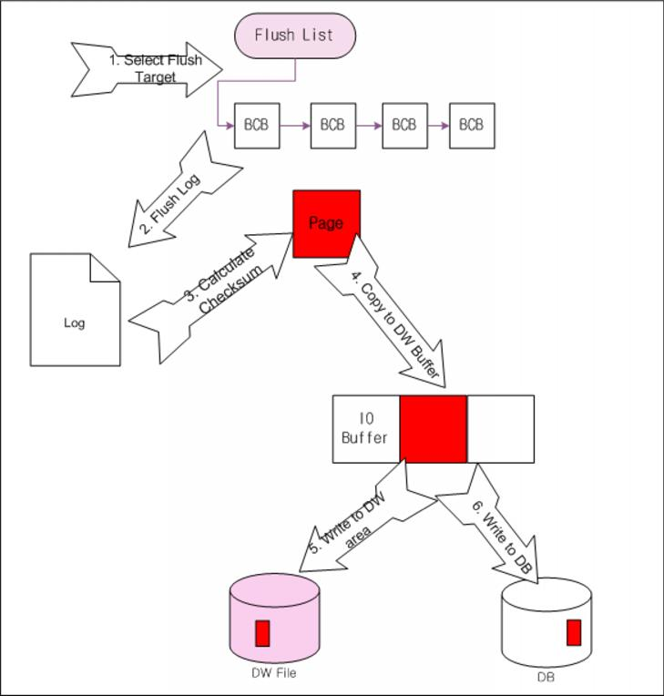

[Figure 9-6] Flushing Pages to Disk

### Related Database Properties

To use the buffer manager, the properties in the altibase.properties file must be suitably configured set. The properties related to buffers are listed below. For detailed information about each of these properties, please refer to the *[General Reference-1.Data Types & Altibase Properties](https://github.com/ALTIBASE/Documents/blob/master/Manuals/Altibase_7.1/eng/General Reference-1.Data Types %26 Altibase Properties.md)*.

- BUFFER_AREA_CHUNK_SIZE
- BUFFER_AREA_SIZE
- BUFFER_CHECKPOINT_LIST_CNT
- BUFFER_FLUSH_LIST_CNT
- BUFFER_FLUSHER_CNT
- BUFFER_HASH_BUCKET_DENSITY
- BUFFER_HASH_CHAIN_LATCH_DENSITY
- BUFFER_LRU_LIST_CNT
- BUFFER_PINNING_COUNT
- BUFFER_PINNING_HISTORY_COUNT
- BUFFER_PREPARE_LIST_CNT
- BUFFER_VICTIM_SEARCH_INTERVAL
- BUFFER_VICTIM_SEARCH_PCT
- BULKIO_PAGE_COUNT_FOR_DIRECT_PATH_INSERT
- CHECKPOINT_FLUSH_COUNT
- CHECKPOINT_FLUSH_MAX_GAP
- CHECKPOINT_FLUSH_MAX_WAIT_SEC
- CM_BUFFER_MAX_PENDING_LIST
- DEFAULT_FLUSHER_WAIT_SEC
- DIRECT_PATH_BUFFER_PAGE_COUNT
- FAST_UNLOCK_LOG_ALLOC_MUTEX
- HIGH_FLUSH_PCT
- HOT_LIST_PCT
- HOT_TOUCH_CNT
- LOG_BUFFER_TYPE
- **L**OG_FILE_SIZE
- LOW_FLUSH_PCT
- LOW_PREPARE_PCT
- MAX_FLUSHER_WAIT_SEC
- REPLICATION_LOG_BUFFER_SIZE
- SECONDARY_BUFFER_ENABLE
- SECONDARY_BUFFER_FILE_DIRECTORY
- SECONDARY_BUFFER_FLUSHER_CNT
- SECONDARY_BUFFER_SIZE
- SECONDARY_BUFFER_TYPE
- SMALL_TABLE_THRESHOLD
- TABLE_BACKUP_FILE_BUFFER_SIZE
- TOUCH_TIME_INTERVAL

### Statistics for Buffer Management

Statistical information about the buffer manager can be checked using the performance views provided with Altibase. Please refer to the *[General Reference-2.The Data Dictionary](https://github.com/ALTIBASE/Documents/blob/master/Manuals/Altibase_7.1/eng/General%20Reference-2.The%20Data%20Dictionary.md#performance-views)* for detailed descriptions of the available performance views.

Information related to the buffer pool can be viewed using V\$BUFFERPOOL_STAT, and information related to the flusher can be checked using V​\$FLUSHINFO and V\$FLUSHER. Statistical information related to the buffer frames managed by the buffer manager can be viewed using V\$BUFFPAGEINFO, and statistical information related to the buffer pool of undo tablespace can be viewed using V\$UNDO_BUFF_STAT.

Because the statistical information accumulates from the time the server is started, to obtain statistics for a particular period, a calculation must be performed for all columns in this way: (present value - value at the start of the period of interest).

#### Calculating Hit Ratio

The accumulated hit ratio of the buffer pool can be checked in the HIT_RATIO column of the V\$BUFFPOOL_STAT performance view.

The Hit Ratio can be calculated using the following formula:

```
Hit Ratio = (GET_PAGES + FIX_PAGES - READ_PAGES) / (GET_PAGES + FIX_PAGES)
```

##### Example

```
iSQL> select hit_ratio from V$BUFFPOOL_STAT;
```

# 10. Backup and Recovery

This chapter explains the Altibase backup and recovery features which are provided to help prevent the loss of data in the event of unforeseen circumstances such as the loss or damage of a disk or data file, and explains how to manage database backup and recovery tasks.

### Database Backup

This section describes the backup methods and policies supported for memory and disk tablespaces depending on whether the database is in Archivelog or Nonarchievelog mode. 

#### The Altibase Backup Policy

Altibase supports the following types of backup operations: 

- Logical Backup  
  Utility backup
  
- Physical Backup  
  Offline backup  
  Online backup

When logical backup is performed using the aexport or iLoader utility, script files for creating tables, indexes and files in which table records are written are created.

Physical backup means that the data files and log anchor files constituting the database are copied.

Physical backup is categorized as either online backup or offline backup, depending on whether the service is interrupted while a snapshot of the data file or files is taken.

Before performing an offline backup, the database server must be shut down normally, and then all tablespace files, log anchor files and log files must be copied.

In the online backup, the database's data files, log anchor files, etc. are copied without interrupting service. During this process, some uncommitted data may also be backed up. Therefore, in the event of recovery, log files will be required in order to undo these uncommitted transactions. Additionally, online backup is only possible in archivelog mode, in which archive log files are created. 

When performing online backup, the entire database can be backed up, or a specific tablespace or log anchor file can be backed up as desired. 

The statements that would be used in each case are as follows:

- To back up the entire database:

```
iSQL> alter database backup database to '/backup_dir';
```

- To back up an individual tablespace:

```
iSQL> alter database backup tablespace SYS_TBS_DISK_DATA to '/backup_dir';
iSQL> alter tablespace SYS_TBS_DISK_DATA begin backup;
$ cp SYS_TBS_DISK_DATA-DATA-FILES /backup_dir
…
iSQL> alter tablespace SYS_TBS_DISK_DATA end backup;
```

SYS_TBS_MEM_DIC, the memory tablespace that contains system catalog data, can be backed up with tablespace backup or full database backup.

The following table describes the various backup modes of Altibase: 

| Backup Type                          | Backup Method                                                | Backup Object                                                | Restoration Method                                           | Possbile while Online? |
| ------------------------------------ | ------------------------------------------------------------ | ------------------------------------------------------------ | ------------------------------------------------------------ | ---------------------- |
| Backup using the iLoader utility     | Use the iLoader “out” command                                | User-defined tables                                          | Use the iLoader “in” command.                                | O                      |
| Online backup of entire database     | Use the SQL statement: ALTER DATABASE BACKUP DATABASE TO backup_dir; | All data files and log anchor files in all tablespaces in the system | 1> Use the UNIX “cp” command 2> ALTER DATABASE RECOVER DATABASE; | O                      |
| Online backup of specific tablespace | 1Use the SQL statement: ALTER DATABASE BACKUP TABLESPACE tablespace name TO backup_dir; or 1. ALTER TABLESPACE tablespace name BEGIN BACKUP; 2. Use the UNIX “cp” command cp   3. ALTER TABLESPACE tablespace name END BACKUP; | All data files in the tablespace                             | 1> Use the UNIX “cp” command 2> ALTER DATABASE RECOVER DATABASE; | O                      |
| Offline backup                       | 1> Shut down the database 2> Use the UNIX “cp” command       | The entire database                                          | Use the UNIX “cp” command                                    | X                      |
| Backup Time Comparison               | iLoader < online backup < offline backup                     |                                                              |                                                              |                        |

[Table 10-1] Backup Methods

##### Classifying Backup According to Scope

- Database-Level Backup
  
  All data files in the database are backed up. 
  
  Ensures that all backup-related log files are archived.
  
- Tablespace-Level Backup 
  
  All data files in a specific memory or disk tablespace are backed up. 
  
  Because the archiving of backup-related log files is not guaranteed, they must be archived separately using a DCL statement.

##### Classifying Backup according to Method

- Database-Driven Backup  
  Files are copied by the Altibase server. 
  
  When a single DCL statement is executed, the entire DB (or specified tablespace) is backed up according to a predetermined order. 
  
  Can be used to perform both database-level backup and tablespace-level backup. 
  
- DBA-Driven Backup  
  
  Files are copied by the DBA. 
  
  Because multiple tablespaces can be backed up in parallel, integration with 3rd-party backup solutions is supported. 
  
  Can be used to perform only tablespace-level backup.

#### Database Mode

Depending on the way that online log files, in which all changes made to data are recorded, are managed, the database runs in either the archivelog mode or noarchivelog mode.

In the archivelog mode, when a log file fills up, logging continues in a new log file, and the previous log file is copied to an archive directory. The archive log directory is set using the ARCHIVE_DIR property in the $ALTIBASE_HOME/conf/altibase.properties file. 

In the noarchivelog mode, these log files are deleted automatically by the system after checkpointing.

[Table 10-2] outlines the pros and cons of each database mode.

| Database Mode     | Pros                                                         | Cons                                                         |
| ----------------- | ------------------------------------------------------------ | ------------------------------------------------------------ |
| archivelog mode   | \- Media recovery is supported. The database can be recovered up to the current point even if data files are lost or corrupted. | \- Disk space is required to store archive log files. - Because the DBA must provide a separate storage device in which to store archive logs, organize files, etc., the burden of management tasks is increased. - If there is not enough disk space for archive logs, a fault occurs. |
| noarchivelog mode | \- The DBA does not have to manage archive log files.        | - The DBA can only perform recovery using offline backups, even if data files are corrupted. Changes to the data that were made between the time of the backup and the time point at which the data file was corrupted cannot be recovered. |

[Table 10-2] Pros and Cons of Each Database Mode

The database mode is determined when the database is created using the CREATE DATABASE statement, and can be changed during the control phase when the database is started.

An example of creating a database in archivelog mode is shown below:

```
create database mydb INITSIZE=100M archivelog;
```

The following example shows how to change the database mode to archivelog mode during the control phase when starting up the database:

```
$ isql -silent -u sys -p manager -sysdba
iSQL(sysdba)> startup control;
iSQL(sysdba)> alter database archivelog;
```

#### Online Backup and Media Recovery in Different Database Modes

| Mode                            | Backup Method                              | Media Recovery Type                                          |
| ------------------------------- | ------------------------------------------ | ------------------------------------------------------------ |
| noarchivelog modeOffline backup | Offline backup                             | Full database recovery                                       |
| archivelog mode                 | Online backup (offline backup is possible) | Complete recovery<br/> - Full database recovery<br/>Incomplete <br/> - Cancel-based recovery <br/>- Time-based recovery |
| Either mode                     | Backup using the iLoader utility           | Recovery using the iLoader utility                           |

[Table 10-4] Backup and Recovery in Different Database Modes

#### Online Backup and Media Recovery in Different Tablespace States

| Tablespace State | Online Backup | Media Recovery |
| ---------------- | ------------- | -------------- |
| ONLINE           | Yes           | Yes            |
| OFFLINE          | Yes           | Yes            |
| DISCARDED        | No            | No             |
| DROPPED          | No            | No             |
| BACKUP           | No            | n/a            |

[Table 10-5] Online Backup and Media Recovery in Different Tablespace States

#### Cautions when Performing Online Backup

Online backup and checkpointing cannot be performed at the same time

Because the contents of the database that are maintained in memory are written to disk during checkpointing, and online backup only guarantees that the data are backed up to the point in time at which the backup was made, checkpointing and online backup are considered mutually exclusive, and cannot be run at the same time.

If a request to perform an online backup is received during checkpointing, the online backup will start after checkpointing is complete.

Similarly, if a request to perform checkpointing is received while the online backup is underway, checkpointing will start after the online backup is complete. Because Altibase is a hybrid database, one of its characteristics is that memory tablespaces are backed up first, followed by disk tablespaces, when the database is backed up. 

Checkpointing cannot be performed on memory tablespaces while they are being backed up. When the backup of memory tablespaces is complete, and the backup of disk tablespaces is underway, memory tablespaces can be checkpointed, but disk tablespaces cannot.

### Database Recovery

In every database system, the possibility of a system or hardware failure always exists. If a failure that affects the database occurs, then recovery must be performed to restore the database. The goals after such failure are to ensure that the effects of all committed transactions are preserved in the recovered database and to return to normal operation as quickly as possible while insulating users from problems caused by the failure.

#### Altibase Recovery Policy

Altibase supports the following types of recovery:

- Recovery using Logical Backup
- Restart Recovery
- Media Recovery

Restart recovery is automatically executed during the startup phase if the Altibase process was terminated abnormally due to a system crash or software error. 

If a data file is lost or corrupted, media recovery uses a snapshot of a previous backup of the data file and re-executes all operations from the recovery start LSN to the current LSN to restore all data from the backup of the data file to the current point in time. 

Whether it is necessary to perform media recovery is determined by checking whether the version of the data file which is written in the log anchor file is the same as the version of the current data file. This is illustrated below:


[Figure 10-1] The Altibase Recovery Process

Media recovery can be performed only during the control phase when starting up the database. That is, Alitibase only supports offline media recovery.

##### Example

The following is an example of media recovery. The data file 'user1.dbf,' which belonged to the tablespace TEST, has been lost. The lost data file is restored to its current state using the file 'user1.dbf,' an online backup that was made two days ago.

```
$ cp /bck/user1.dbf  $ALTIBASE_HOME/dbs
$ isql -silent -u sys -p manager -sysdba
[ERR-00000 : Connected to idle instance]
iSQL(sysdba)> startup control;
Trying Connect to Altibase.. Connected with Altibase.
TRANSITION TO PHASE : PROCESS
TRANSITION TO PHASE : CONTROL
Command execute success.

iSQL(sysdba)> alter database recover database;
Alter success.
```

The data file ‘user1.dbf’ in the tablespace TEST has been restored.

```
iSQL(sysdba)> startup service;
```

Media recovery has been completed, and thus the system progresses to the service phase.

#### Complete vs. Incomplete Recovery

The Altibase media recovery policies support both complete and incomplete recovery.

“Complete recovery” means restoring data files up to the current time point in the case where online logs and archive logs have not been lost.

“Incomplete recovery“ refers to the case in which archive log files or online log files have been lost, and thus the database is recovered to the point in time immediately before the log files were lost, or the case where the entire database is rewound to a certain time point in the past in order to restore the database at that point in time.

The following is an example of complete recovery:

```
ALTER DATABASE RECOVER DATABASE;
```

Incomplete recovery can be classified into two cases:

- To rewind the entire database to a certain point in the past: 
  
  Copy all database backup files, which were created on September 10, 2007, and use them to perform recovery.

```
ALTER DATABASE RECOVER DATABASE UNTIL TIME
‘2007-09-10:17:55:00’;
```

- When the database cannot be restored to the present point in time due to the corruption of a particular online log file, it is restored to the time point immediately before the corruption of the online log file using the following command:

```
ALTER DATABASE RECOVER DATABASE UNTIL CANCEL;
```

If incomplete recovery was performed in the control startup phase, the following statement must be subsequently executed in order to proceed to the meta startup phase

```
ALTER DATABASE db_name META RESETLOGS;
```

Because the database has been restored to a specific past time point, it will be necessary to prevent automatic recovery (“restart recover”) from executing when the database is restarted. To accomplish this, the online logs are initialized using the resetlogs option.

When the database is started up in the meta startup phase, if the resetlogs option is used to reset the logs, the entire database must be backed up, either offline or online.

The reason for this is as follows: if the logs are reset when proceeding to the meta startup phase and then another media error occurs two days later, it will only be possible to recover the data to the time point before the logs were reset. That is, changes made to the data in the two days since the logs were reset will be lost.

#### Cautions when Performing Media Recovery

**Due to the media recovery algorithm, the current log anchor files must be used for media recovery whenever possible. **

When recovery is performed, only the data files should be restored from backup copies. Except for special cases, log anchor files should not be restored from backup copies. 

One such special case is the case where a user accidentally deletes a tablespace using the DROP TABLESPACE command. Because there are no data pertaining to the dropped tablespace in the current log anchor files at that time, it is acceptable to restore log anchor files from backup copies. 

**When recovering a data file of a memory tablespace, the stable memory data file must be used to restore the other memory data file.**

Because ping-pong checkpointing is used for memory tablespaces in Altibase, two data files pertaining to each memory tablespace are maintained on disk. A pair of data files, in which the same image is saved, is stored in a location set using the MEM_DB_DIR property. Both data files must exist in order for Altibase to operate normally. At any particular point in time, the memory tablespace is only using one of these data files.

In order to reduce the time required to perform backups, only the most recently checkpointed data file for the memory tablespace is backed up.

The data files containing the backup of memory tablespace are as follows:

```
SYS_TBS_MEM_DIC-1-0, 
SYS_TBS_MEM_DIC-1-1, 
SYS_TBS_MEM_DIC-1-2
```

The data files for a memory tablespace must be copied in the following manner:

```
$ cp SYS_TBS_MEM_DIC-1-0  $ALTIBASE_HOME/dbs;
$ cp SYS_TBS_MEM_DIC-1-1  $ALTIBASE_HOME/dbs;
$ cp SYS_TBS_MEM_DIC-1-2  $ALTIBASE_HOME/dbs;
```

When recovery is complete, automatically copies the stable memory data file to create an unstable memory data file.

**If a tablespace is added or deleted or the name of a tablespace is changed, the dictionary tablespace (SYS_TBS_MEM_DIC) and the changed tablespace will need to be backed up. Otherwise, the entire database will need to be backed up.**

```
iSQL(sysdba)> ALTER DATABASE BACKUP TABLESPACE
SYS_TBS_MEM_DIC TO ‘/backup_dir’;
```

Because log anchor files include information about the tablespaces in the database, they must be backed up along with the dictionary tablespace whenever the structure of a tablespace is changed.

```
iSQL(sysdba)> ALTER DATABASE BACKUP LOGANCHOR TO 'anchor_path';
```

**Altibase encounters the following problems when the database is backed up and restored with a replicated database.**

If the database backed up on one server is restored on another server, there might be problems to use replication after Altibase recovery because the network addresses are different.

Even if the database is restored on the same system, replication can be retransmitted based on meta information at the time of backup. In this case, some data may be changed to data at the time of backup.

Therefore, if replication is active, it is necessary to either: (1) the value of REPLICATION_SENDER_AUTO_START property changes to '0', and performs the recovery using the backup file (2) when the recovery is completed, RESET the replication or recreate the replication objects.

### Backup and Recovery Examples 

#### Backing Up and Restoring Tables Using the iLoader Utility

Backup can be used in order to be prepared for unforeseen problems with individual tables, or to back up a particular table for some specific reason.

##### Before Backup

Before a backup can be performed, it is necessary to create a schema file, called a FORM file, for the table to be backed up. The FORM file contains basic information about the table, such as the name and data type of each column.

Example) To create a form file for table t1 (a file called t1.fmt will be created):

```
iLoader> formout –T t1 –f t1.fmt
```

##### Backup

Use the iLoader utility with the out option. A backup of the table will be created having the name specified by the user

Example) Back up table t1 (the form file to use is t1.fmt, and the backup file that will be created is t1.dat) 

```
iLoader> out –d t1.dat –f t1.fmt
```

##### Restore

Use the iLoader utility with the in option

Example) Restore table t1

```
iLoader> in –d t1.dat –f t1.fmt
```

#### Offline Backup and Recovery

Offline backup and recovery are generally used when the database was created in the noarchivelog mode.

##### Cautions When Performing Offline Backup

Before performing the offline backup, stop all services related to Altibase.

If an offline backup is performed while the database is running, the contents of log files will change during the backup, and thus the backup will not be performed correctly. Therefore, be sure that the Altibase server is stopped before performing an offline backup.

##### How to Perform Backup

Use the UNIX cp (copy) command, or a similar command depending on the OS, to back up all of the data files, log files and log anchor files in all tablespaces. In Altibase, not only the memory data files but also the data files and log anchor files pertaining to disk tablespaces must be backed up.

The location where the data files for memory tablespace are stored is set using the MEM_DB_DIR property in the Altibase property file $ALTIBASE_HOME/conf/altibase.properties. To back up the data files for memory tablespace, all of the directories specified using MEM_DB_DIR must be copied.

The location of the log anchor files is set using the LOGANCHOR_DIR property in the $ALTIBASE_HOME/conf/altibase.properties file. The files in the directory specified using LOGANCHOR_DIR must be copied in order to back up the log anchor files. Furthermore, the data files for disk tablespaces should be copied after consulting the data dictionary.

 Example)

```
$ALTIBASE_HOME/conf/altibase.properties 
MEM_DB_DIR=$ALTIBASE_HOME/dbs0
MEM_DB_DIR =$ALTIBASE_HOME/dbs1
LOGANCHOR_DIR =$ALTIBASE_HOME/logs
```

Disk tablespace have been being only system tablespace, undo tablespace, and temp tablespace. 

Location where backup file stores: /home/backup

```
$cp –r $ALTIBASE_HOME/dbs0  /home/backup 
$cp –r $ALTIBASE_HOME/dbs1  /home/backup
$cp –r $ALTIBASE_HOME/logs  /home/backup
$cp –r $ALTIBASE_HOME/dbs/system*.dbf /home/backup
$cp –r $ALTIBASE_HOME/dbs/undo.dbf /home/backup
$cp –r $ALTIBASE_HOME/dbs/temp.dbf /home/backup
```

##### How to Perform Recovery

The Altibase properties file that was used when the database was backed up must be used when performing recovery. The backup files created during backup can be restored using the “cp” copy command or equivalent. It is necessary to have sufficient privileges to access these files.

In the following example, the database that was backed up above is restored.

Example) Restore using database backup

```
$cp –r /home/backup/dbs0  ALTIBASE_HOME/dbs0
$cp –r /home/backup/dbs1  $ALTIBASE_HOME/dbs1
$cp –r /home/backup/logs   $ALTIBASE_HOME/logs
$cp –r /home/backup/system*.dbf  $ALTIBASE_HOME/dbs
$cp –r /home/backup/undo.dbf   $ALTIBASE_HOME/dbs
$cp –r /home/backup/temp.dbf   $ALTIBASE_HOME/dbs
```

#### Database-Driven Online Backup

##### Database-Level Online Backup

The entire database is backed up online to the /backup_dir directory.

```
iSQL(sysdba)> alter database backup database to‘/backup_dir’;
$ ls /backup_dir
SYS_TBS_MEM_DIC-0-0   
SYS_TBS_MEM_DATA-0-0
system001.dbf 
system002.dbf 
undo001.dbf
loganchor0 
loganchor2 
loganchor1
```

##### Tablespace-Level Online Backup

The stable versions of the data files in the SYS_TBS_MEM_DIC tablespace are backed up online to the /backup_dir directory.

```
iSQL(sysdba)> alter database backup tablespace SYS_TBS_MEM_DIC to ‘/backup_dir’;
$ ls /backup_dir
SYS_TBS_MEM_DIC-0-0
```

##### Loganchor Online Backup

All loganchor files are backed up online to the /backup_dir directory.

```
iSQL(sysdba)> alter database backup loganchor to ‘/backup_dir’;
$ ls /backup_dir
loganchor0 loganchor1 loganchor2
```

#### DBA-Driven Online Backup

##### Tablespace-Level Online Backup 

Back up the data files in the USER_MEMORY_TBS and USER_DISK_TBS tablespaces online to the /backup_dir directory.

The data files in the memory tablespace are backed up online after checking that they are stable copies. 

```
iSQL(sysdba)> alter tablespace USER_MEMORY_TBS begin backup;
iSQL(sysdba)> select * from v$stable_mem_datafiles;
V$STABLE_MEM_DATAFILES.MEM_DATA_FILE
------------------------------
/altibase_home/dbs/USER_MEM_TBS-0-0

$ cp $ALTIBASE_HOME/dbs/USER_MEMORY_TBS-0-0  /backup_dir/

iSQL(sysdba)> alter tablespace USER_MEMORY_TBS end backup;
iSQL(sysdba)> alter tablespace USER_DISK_TBS begin backup;

$ cp $ALTIBASE_HOME/dbs/USER_DISK_TBS.dbf /backup_dir/

iSQL(sysdba)> alter tablespace USER_DISK_TBS end backup;

$ ls /backup_dir
USER_MEMORY_TBS-0-0 USER_DISK_TBS.dbf 
```

#### SNAPSHOT Backup

SNAPSHOT backup can be performed by Altibase iLoader after specifying a certain spot with SCN.

In general, the snapshot backup is efficient for tables with foreign keys or triggers, and when performing data backup with iLoader at the time of service. This is because the snapshot backup can keep the data consistency. 

Only the DBA with SYSDBA privilege can set up or disable the snapshot.

##### SNAPSHOT Setting

```
iSQL(sysdba)> ALTER DATABASE BEGIN SNAPSHOT; 
```

If snapshot is set up, the SCN value specified in the V$SNAPSHOT performance view is able to be confirmed.

##### Disabling SNAPSHOT

```
iSQL(sysdba)> ALTER DATABASE END SNAPSHOT; 
```

> ##### Caution
>
> - If the snapshot SCN is specified, it should be used in case of not frequent DML since the data after SCN is not deleted.
> - The snapshot will be stopped if thresholds specified in the SNAPSHOT_MEM_THRESHOLD, and SNAPSHOT_DISK_UNDO_THRESHOLD properties are exceeded.
> - The standard point of snapshot while receiving data from the receiver performing replication or updating a large amount of tables may be varied.
> - The snapshot setting cannot be specified during exporting data with iLoader.
> 

#### Completing Online Backup

When manually backing up the database online, the final step is to issue a command to archive the backup-related log files forcibly. This command closes the current log file, even if it is not full. Logging continues in the next log file.

```
iSQL(sysdba)> ALTER SYSTEM SWITCH LOGFILE;
```

A message indicating that online backup is complete is written to altibase_sm.log. In this example of manual backup, the completion of backup is indicated by a message saying that the log file named logfile15341 is being archived.

```
[2007/09/18 14:42:38] [Thread-6] [Level-9] 
Waiting logfile15341 to archive 
 
[2007/09/18 14:42:43] [Thread-6] [Level-9] 
Database-Level Backup Completed [SUCCESS] 
```

#### Media Recovery Example 1

Suppose that the database is operating in archivelog mode and that the data file $ALTIBASE_HOME/dbs/abc.dbf, which was not backed up, has been lost.

> Note*: Data files in a memory tablespace cannot be recovered in this way.
>

##### Recovery Procedure

Check which archive log files are required for complete recovery.

```
iSQL(sysdba)> SELECT NAME, CREATE_LSN_LFGID,
              CREATE_LSN_FILENO FROM V$DATAFILES;
---------------------------------------------------------
…
/altibase_home/dbs/abc.dbf
0            18320
```

To check the log file deleted most recently, view the contents of the log anchor file using the “dumpla” utility

```
$ dumpla loganchor0
[LOGANCHOR HEADER]
Binary DB Version        	 [ 5.3.3 ]                               
Archivelog Mode          	 [ Archivelog ]                          
Begin Checkpoint LSN     	 [ 20345, 469859 ]                    
End Checkpoint LSN       	 [ 20345, 470300 ]                    
Disk Redo LSN            	 [ 20345, 469859 ]                    
Server Status            	 [ SERVER SHUTDOWN ]                     
End LSN                  	 [ 20345,470341 ]                     
ResetLog LSN             	 [ 4294967295, 4294967295 ]  
Last Created Logfile Num 	 [ 20350 ]                               
Delete Logfile(s) Range  	 [ 20333 ~ 20344 ]                       
Update And Flush Count   	 [ 316 ]                                 
New Tablespace ID        	 [ 8 ]
```

Check whether the log files ranging from logfile18320 to logfile20344 exist in the directory specified using the ARCHIVE_DIR property. If not, copy the archive log files from a backup storage device to the directory specified using the ARCHIVE_DIR property.

All log files after logfile20345 are online log files that exist in the directory specified using the LOG_DIR property. That is, the log files ranging from logfile18320 to logfile20345 are required in order to recover the lost abc.dbf file completely.

To avoid the waste of disk space that would occur if duplicate log files existed in the directories specified using both the ARCHIVE_DIR and LOG_DIR properties, Altibase directly reads the log files from the directory specified using the ARCHIVE_DIR property.

Create the lost abc.dbf file by executing the following command during the control startup phase.

```
iSQL(sysdba)> ALTER DATABASE CREATE DATAFILE‘abc.dbf’;
```

Perform complete media recovery by executing the following command during the control phase. 

```
iSQL(sysdba)> alter DATABASE RECOVER DATABASE;
```

#### Media Recovery Example 2

Suppose that the database is operating in archivelog mode and that the data files in the USER_DISK_TBS tablespace were backed up three days ago.

All of the data files in the USER_DISK_TBS tablespaces were lost this morning.

##### Backup Procedure

The backup from three days ago was performed as follows:

```
iSQL(sysdba)> ALTER DATABASE BACKUP TABLESPACE user_disk_tbs TO ‘/backup1’;
iSQL(sysdba)> ALTER SYSTEM SWITCH LOGFILE;
$ ls   /backup1
USER_DISK_TBS01.dbf USER_DISK_TBS02.dbf USER_DISK_TBS03.dbf
```

##### Recovery Procedure

After determining which archive log files are required for complete recovery, these files are copied into the archive directory. The method of determining which archive log files are required is to check the headers of the data files that are to be recovered. The header information can be viewed using the dumpddf utility, as shown below:

```
$ dumpddf -m -f USER_DISK_TBS01.dbf
[BEGIN DATABASE FILE HEADER]

Binary DB Version [ 5.4.1 ]
Redo LSN          [ 4, 2257550 ]
Create LSN        [ 0, 657403 ]

[END DATABASE FILE HEADER]
```

The above results indicate that the logfile4 archive log file and subsequent files are required in order to restore the database using the backup data files.

Copy the data file backups in the backup_dir directory to the original location of the data files for the USER_DISK_TBS tablespace, which is the $ALTIBASE_HOME/dbs/ directory.

```
$ cp /backup_dir/*.dbf  $ALTIBASE_HOME/dbs;
```

Perform complete media recovery during the control phase. 

```
iSQL(sysdba)> ALTER DATABASE RECOVER DATABASE;
```

#### Media Recovery Example 3

Suppose that the database is operating in archivelog mode and that the data files in the USER_DISK_TBS tablespace were backed up seven days ago.

This afternoon, the /disk1 file system, which contained the data files for the USER_DISK_TBS tablespace, was corrupted, but the /disk2 file system remains intact.

In this case, because the /disk1 partition is corrupt, the backup data files are moved to the healthy partition, which is /disk2, in order to perform media recovery. 

##### Backup Procedure

The backup from seven days ago was performed as follows:

```
iSQL(sysdba)> ALTER DATABASE BACKUP TABLESPACE user_disk_tbs TO '/backup_dir’;
iSQL(sysdba)>ALTER SYSTEM SWITCH LOGFILE;

$ ls  /backup_dir
USER_DISK_TBS01.dbf USER_DISK_TBS02.dbf 
```

##### Recovery Procedure

After checking which archive log files are required to perform complete recovery, these files are copied to the archive directory.

Copy the backups of the files for the USER_DISK_TBS tablespace, which are in the backup_dir directory, to the /disk2 filesystem.

```
$ cp /backup_dir/*.dbf /disk2/dbs;
```

Change the file path for the data files for the USER_DISK_TBS tablespace during the CONTROL phase. 

```
iSQL(sysdba)> ALTER DATABASE RENAME DATAFILE 
'/disk1/dbs/USER_DISK_TBS01.dbf' TO 
'/disk2/dbs/USER_DISK_TBS01.dbf';
iSQL(sysdba)> ALTER DATABASE RENAME DATAFILE 
'/disk1/dbs/USER_DISK_TBS02.dbf' TO 
'/disk2/dbs/USER_DISK_TBS02.dbf';
```

> Note: The alter tablespace command can also be used to perform this task.
>

```
iSQL(sysdba)> ALTER TABLESPACE user_disk_tbs RENAME DATAFILE 
'/disk1/dbs/USER_DISK_TBS02.dbf' TO 
'/disk2/dbs/USER_DISK_TBS02.dbf';
```

Check the V$DATAFILE performance view to verify that the data file path was correctly changed.

```
iSQL(sysdba)> SELECT * FROM V$DATAFILES;
```

Complete media recovery can be performed by executing the following command during the control phase.

```
iSQL(sysdba)> ALTER DATABASE RECOVER DATABASE;
```

#### Media Recovery Example 4

Suppose that the database is operating in archivelog mode and that a user accidentally dropped the summary table. 

- The time of completion of the most recent full online backup: September 18, 2007, 12:00 
- The time when the table was dropped: September 18, 2007, 15:00 
- The current time: September 18, 2007, 18:00

In order to recover the summary table, it will be necessary to perform incomplete media recovery to restore the database to its state at 14:30 on September 18, 2007, which is 3.5 hours before the current time.

##### Backup Procedure

When the last backup was performed, the entire database was backed up, as shown below: 

```
iSQL(sysdba)> ALTER DATABASE BACKUP DATABASE TO‘/backup_dir’;
iSQL(sysdba)> alter SYSTEM SWITCH LOGFILE;
```

##### Recovery Procedure

1. Copy the backups of the data files to their original location.

```
$ cp /backup_dir/*.dbf $ALTIBASE_HOME/dbs;
```

2. Because the ping-pong checkpointing technique is used with memory tablespaces, when the database is backed up, only the stable data files for a memory tablespace are copied.   
   Example) The backups of the data files for a memory tablespace are as follows:

```
SYS_TBS_MEM_DIC-1-0, 
SYS_TBS_MEM_DIC-1-1, 
SYS_TBS_MEM_DIC-1-2
SYS_TBS_MEM_DATA-0-0, 
SYS_TBS_MEM_DATA-0-1, 
SYS_TBS_MEM_DATA-0-2
```

3. Since the backup of the memory tablespace contains valid data files, they can be copied without checking their validity. 

```
$ cp  SYS_TBS_MEM_DIC-1-0  $ALTIBASE_HOME/dbs
$ cp  SYS_TBS_MEM_DIC-1-1  $ALTIBASE_HOME/dbs
$ cp  SYS_TBS_MEM_DIC-1-2  $ALTIBASE_HOME/dbs
$ cp  SYS_TBS_MEM_DATA-0-0  $ALTIBASE_HOME/dbs 
$ cp  SYS_TBS_MEM_DATA-0-1  $ALTIBASE_HOME/dbs
$ cp  SYS_TBS_MEM_DATA-0-2  $ALTIBASE_HOME/dbs
```

4. Incomplete recovery uses the backups of the log anchor files. Copy the log anchor files from the backup storage device.

```
$ cp /backup_dir/loganchor* $ALTIBASE_HOME/logs
```

5. Check which archive log files are required for incomplete recovery, as shown below:

```
iSQL(sysdba)> select last_deleted_logfile from v$lfg; 
LAST_DELETED_LOGFILE 
-------------------------------------------------------------------------------        
15021
```

6. Check the altibase_sm.log file, which is in the $ALTIBASE_HOME/trc directory, to verify that the backup-related log files were forcibly archived at the end of the backup. 

```
logfile15361  logfile15362  logfile15363  logfile15364  logfile15365
```

7. According to the results above, copy all files ranging from logfile15022 to logfile15360, which is the last archive log file in which logging was performed at the end of backup, from the directory specified using the ARCHIVE_DIR property (or a backup device) to the directory specified using the LOG_DIR property. Unlike complete recovery, when performing incomplete recovery, the duplication of log files is inevitable.
8. Because SYS_TBS_DISK_TEMP was not backed up, create the corresponding file. 

```
iSQL(sysdba)> ALTER DATABASE CREATE DATAFILE 'temp001.dbf'
```

9. Perform incomplete media recovery as shown below.

```
iSQL(sysdba)> ALTER DATABASE RECOVER DATABASE 
UNTIL TIME ‘2007-09-18:14:30:00';
```

10. Because incomplete media recovery has been performed, the resetlogs option must be used when proceeding to the meta startup phase.

```
iSQL(sysdba)> ALTER DATABASE MYDB META RESETLOGS;
```

11. Once resetlogs has been performed, perform a complete database backup.

```
iSQL(sysdba)> ALTER DATABASE BACKUP DATABASE TO ‘backup_dir’;
```

#### Media Recovery Example 5

Suppose that the database is running in archivelog mode, that log files numbered between #499 and #600 exist, and that log file #570 has been lost.

##### Recovery Procedure 

Copy the data files and log anchor files required to perform incomplete recovery. 

Check which archive log files are required to perform incomplete recovery. 

Apply the redo records of the log files from #499 to #569 to the database, but not the redo records of log file #570 and subsequent files.

```
iSQL(sysdba)> ALTER DATABASE RECOVER DATABASE UNTIL CANCEL;
```

Since incomplete media recovery has been performed, the resetlogs option must be used when proceeding to the meta startup phase. 

```
iSQL(sysdba)> ALTER DATABASE MYDB META RESETLOGS;
```

Once resetlogs is complete, perform a complete database backup. 

```
iSQL(sysdba)> ALTER DATABASE BACKUP DATABASE TO ‘/backup_dir’;
```

#### Media Recovery Example 6

In some cases, media recovery can be performed even if the database is running in noarchivelog mode. One such case is the case where data files in the temporary tablespace are lost. This is because there are no changes that must be reapplied to the database during the recovery of the temporary tablespace.

##### Recovery Procedure

In the control startup phase, create a new file called temp001.dbf to replace the lost file for the SYS_TBS_DISK_TEMP tablespace. 

```
iSQL(sysdba)> ALTER DATABASE CREATE DATAFILE  ‘temp001.dbf’;
```

Start the server.

```
iSQL(sysdba)> ALTER DATABASE dbname SERVICE;
```

#### Media Recovery Example 7

Suppose that the database is running in archivelog mode and that the data files that belong to the SYS_TBS_MEM_DIC dictionary tablespace have been lost.

##### Backup Procedure

At the last backup, back up the entire database as follows.

```
iSQL(sysdba)> ALTER DATABASE BACKUP DATABASE to ‘/backup_dir’;
```

##### Recovery Procedure

After checking which archive log files are required in order to perform complete recovery, copy these files to the archive directory. The method of determining which archive log files are required is to check the headers of the checkpoint image files that are to be recovered. The header information can be viewed using the *dumpdb* utility, which will yield results similar to those shown below.

```
% dumpdb -j 0 -f SYS_TBS_MEM_DIC-0-0
[BEGIN CHECKPOINT IMAGE HEADER]
Binary DB Version          [ 5.4.1 ]
Redo LSN    [ 4, 2257550 ]
Create LSN  [ 0, 657403 ]
[END CHECKPOINT IMAGE HEADER]
```

The above results indicate that the logfile4 archive log file and subsequent files are required in order to restore the database using the backup data files. 

The backed up stable data file should be copied to the original position. Supposing that the backup file is SYS_TBS_MEM_DIC-0-0, copy the backup data file as shown below: 

```
$ cp /backup_dir/SYS_TBS_MEM_DIC-0-0 $ALTIBASE_HOME/dbs;
```

In the results of $ALTIBASE_HOME/bin/dumpla loganchor0, check the “Stable Checkpoint Image Num” tablespace attribute for the tablespace named SYS_TBS_MEM_DIC.

```
% dumpla loganchor0
[ TABLESPACE ATTRIBUTE ]
Tablespace ID                 [ 0 ]
Tablespace Name               [ SYS_TBS_MEM_DIC ]
New Database File ID          [ 0 ]
Tablespace Status             [ ONLINE ]
TableSpace Type               [ 0 ]
Checkpoint Path Count         [ 0 ]
Autoextend Mode               [ Autoextend ]
Shared Memory Key             [ 0 ]
Stable Checkpoint Image Num.  [ 1 ]
Init Size                     [ 4 MBytes ( 129 Pages ) ]
Next Size                     [ 4 MBytes ( 128 Pages ) ]
Maximum Size                  [ 134217727 MBytes ( 4294967295 Pages ) ]
Split File Size               [ 1024 MBytes ( 32768 Pages ) ]


[ MEMORY CHECKPOINT PATH ATTRIBUTE ]
Tablespace ID                 [ 0 ]
Checkpoint Path               [ /home/altibase_home/dbs ]
[ MEMORY CHECKPOINT IMAGE ATTRIBUTE ]
Tablespace ID                 [ 0 ]
File Number                   [ 0 ]
Create LSN                    [ 0, 2028 ]
Create On Disk (PingPong 0)   [ Created ]
Create On Disk (PingPong 1)   [ Created ]
```

Since the backup datafile number is [0] and the current stable datafile number is [1], copy the tablespace as shown below.

```
$ cd $ALTIBASE_HOME/dbs
$ cp SYS_TBS_MEM_DIC-0-0  SYS_TBS_MEM_DIC-1-0 
```

Perform media recovery during the control phase. 

```
iSQL(sysdba)> ALTER DATABASE RECOVER DATABASE;
```

Now that media recovery is complete, restart recovery will occur automatically. 

```
iSQL(sysdba)> ALTER DATABASE dbname SERVICE;
```

#### Media Recovery Example 8

Suppose that the database is running in archivelog mode and that a user deleted the USER_DISK_TBS tablespace by mistake. The tablespace was deleted at 22:30 on April 6, 2007. The database will be restored to its state as of 10 minutes before that time, when the tablespace existed. 

##### Backup Procedure

When the last backup was performed, the entire database was backed up, as shown below:

```
iSQL(sysdba)> ALTER DATABASE BACKUP DATABASE TO ‘/backup_dir’;
```

##### Recovery Procedure

Copy the backups of the data files and log anchor files that are required for incomplete recovery. 

Copy the data files for all disk tablespaces in the backup of the database to the original location of the data files.

```
$ cp /backup_dir/*.dbf $ALTIBASE_HOME/dbs
$ cp /backup_dir/SYS_TBS_* $ALTIBASE_HOME/dbs
```

Check which archive log files are required to perform incomplete recovery. 

Incomplete recovery uses the backups of the log anchor files. Copy the log anchor files from the backup storage device.

```
$ cp /backup_dir/loganchor* /ALTIBASE_HOME/logs;
```

Because the SYS_TBS_DISK_TEMP tablespace is not backed up, create a new data file for it.

```
iSQL(sysdba)> ALTER DATABASE CREATE DATAFILE ‘temp001.dbf’
```

Perform incomplete media recovery. 

```
iSQL(sysdba)> ALTER DATABASE RECOVER DATABASE 
UNTIL TIME '2007-04-06:22:20:00';
```

Because incomplete media recovery has been performed, logs must be reset when proceeding to the meta startup phase.

```
iSQL(sysdba)> ALTER DATABASE mydb META RESETLOGS;
```

Start the server. 

```
iSQL(sysdba)> ALTER DATABASE mydb SERVICE;
```

Because the logs have been reset, it is recommended that the entire database be backed up. 

```
iSQL(sysdba)> ALTER DATABASE BACKUP DATABASE TO ‘/backup_dir’; 
```

# 11. Incremental Backup and Recovery

This chapter explains incremental backups and recovery with incremental backups offered by Altibase.

### Incremental Backup

Altibase can recover lost or damaged data with incremental or full backup.

An incremental backup is a type of backup which only backs up changed data pages from data files after the most recent incremental backup was performed. Compared to a full backup, an incremental backup backs up a lesser amount of data. Not only is disk space necessary for backup saved, but due to lesser disk I/O, backup performance is also faster. Altibase offers incremental backups which physically back up pages of data files and can be executed when the server is online.

Incremental backups are classified as level 0 and level 1. The types of incremental backups are described in the following sections.

The original full backup backs up all data files. For more detailed information on full backups, please refer to “Chapter 10. Backup and Recovery” of *Administrator’s Manual*.

### Types of Incremental Backups

Incremental backups are classified into level 0 and level 1. A level 0 incremental backup is similar to a full backup, but is a prerequisite for the execution of a level 1 incremental backup. Level 0 incremental backups store backup information to the backupInfo file which enables level 1 incremental backups.

- Level 0 incremental backups
- Level 1 incremental backups
  - Differential incremental backups
  - Cumulative incremental backups

#### Level 0 Incremental Backups

A level 0 incremental backup is equivalent to a full backup in the sense that all pages of the data files are backed up. However, a full backup cannot be part of an incremental backup strategy. Depending on strategic needs, an incremental backup at either level 0 or level 1 can be selected for use; however, a level 1 incremental backup requires the precedence of a level 0 incremental backup at least once.

The following describes the difference between a level 0 incremental backup and a full backup.

- A level 0 incremental backup operates in the same manner as a full backup(online full backup); however, a level 0 incremental backup records information about the point in time at which a backup is performed.
- A level 0 incremental backup establishes criteria for determining whether or not changes have been made to database pages.

#### Level 1 Incremental Backups

A level 1 incremental backup only backs up pages that have been changed after the most recently performed incremental backup; therefore, the size of the backup file is small and takes little time to back up. Level 1 incremental backups can be divided into differential incremental backups and cumulative incremental backups.

##### Differential Incremental Backups

A differential incremental backup backs up pages that have been changed after the most recently performed incremental backup at level 0 or level 1. For a differential incremental backup, Altibase tracks the most recently performed level 1 incremental backup and backs up all pages which have been changed thereafter.

If a level 1 incremental backup does not exist, all of the pages which have been changed after a level 0 backup are backed up. If even a level 0 incremental backup does not exist, an error is returned that a level 1 backup is impossible.

The size of the backup file generated by a differential incremental backup is smaller than the size of the backup file generated by a cumulative incremental backup and, therefore, takes lesser time to back up. However, if many differential incremental backups are performed and the number of backup files increases, recovery can take longer for a media restoration, due to as many backup files having to be restored.

##### Cumulative Incremental Backup

A cumulative incremental backup backs up pages that have been changed after the most recently performed level 0 incremental backup. 

As time elapses after a level 0 incremental backup, the size of the backup file of a cumulative incremental backup increases; therefore, it takes longer to back up. 

However, if media is restored with a cumulative incremental backup, recovery is faster than with a differential incremental backup, since only the backup file of the most recently performed level 1 incremental backup need to be restored.

#### Features and Files Related to Incremental Backups

##### Page Change Tracking

The page change tracking feature enhances the performance of incremental backups by recording changed pages in each data file into page change tracking files.

The page change tracking feature manages the information of pages which have been changed after a level 0 incremental backup in the page change tracking file as bitmaps. Altibase checks these bitmaps and only backs up changed pages when performing a level 1 incremental backup.

One bit of a bitmap corresponds to one or more pages. A bundle of such pages corresponding to one bit is defined as an incremental chunk. If one page of an incremental chunk is changed, all pages of the incremental chunk are backed up. The size of an incremental chunk can be controlled with the INCREMENTAL_BACKUP_CHUNK_SIZE property. For more detailed information on this property, please refer to [*General Reference*.](https://github.com/ALTIBASE/Documents/blob/master/Manuals/Altibase_7.1/eng/General%20Reference-1.Data%20Types%20%26%20Altibase%20Properties.md#incremental_backup_chunk_size)

When tracking is enabled, the server uses the page change tracking file to identify the changed files for an incremental backup, instead of tracking all pages of the data files.

Page change tracking can be enabled with the following statement.

```
iSQL(sysdba)> ALTER DATABASE ENABLE INCREMENTAL CHUNK CHANGE TRACKING;
```

This statement can only be executed in the SERVICE phase by the sysdba privilege. When tracking is enabled, the change tracking file and the backupInfo file are created in the $ALTIBASE_HOME/dbs directory.

To disable page change tracking, use the following statement: 

```
iSQL(sysdba)> ALTER DATABASE DISABLE INCREMENTAL CHUNK CHANGE TRACKING;
```

This statement can be executed in all phases by the sysdba privilege. When tracking is disabled, the change tracking file is deleted from the $ALTIBASE_HOME/dbs directory.

> Note*: Even if page change tracking is enabled, changed pages are not immediately tracked. The tracking of changed pages starts when a level 0 incremental backup is performed.

##### changeTracking File

The information of changed pages is stored as bitmaps to the changeTracking file. The changeTracking file is a prerequisite for performing an incremental backup. 

The changeTracking file is located in the $ALTIBASE_HOME/dbs directory.

> Note*:
>
> - If the changeTracking file is lost or invalid, the SYS user must recreate it by executing a SQL statement which enables changeTracking by the sysdba privilege. When the changeTracking file is recreated, accumulated information of changed pages that have been tracked disappears. Therefore, a level 0 incremental backup must precede a level 1 incremental backup.
> - Change tracking can decrease Altibase server performance. If tracking is disabled in this case, server performance can be improved; however, an incremental backup cannot be performed. 
> 

##### backupInfo File

The backupInfo file stores information of incremental backups. The incremental backup level, backup type, backup tag name, backup start time, backup completion time and backup file location for each incremental backup are chronologically stored to the backupInfo file.

The backupInfo file provides information necessary for assessing the order of backup files to be restored for a media restoration. if the backupInfo file does not exist, recovery is not possible even if the backup file exists.

The backupInfo file is located in the $ALTIBASE_HOME/dbs directory.

> Note*: Backup information is stored in chronological order of incremental backups to the backupInfo file. If the backupInfo file is lost, incremental backup files created theretofore can no longer be used. Consequently, the backupInfo file is automatically backed up when an incremental backup is performed.

#### Examples of Incremental Backups

The following examples show how to perform a level 0 incremental backup and a level 1 incremental backup for each database and tablespace.

##### Setting the Backup Path

The Altibase server manages incremental backup files. Therefore, the following statement must specify the location where the incremental backup file will be stored: 

```
iSQL(sysdba)> ALTER DATABASE CHANGE BACKUP DIRECTORY '/backup_dir';
```

> Note*: This statement can only be executed when change tracking is enabled.
>

##### Level 0 Incremental Backups

As described above, level 0 incremental backups are equivalent to full backups, except that level 0 incremental backups record backup information to the backupInfo file and that level 0 incremental backup files, which are criteria for incremental backups cannot be replaced with full backup files.

###### Incremental backups on databases

This is an example of a statement that backs up without specifying a backup tag.

```
iSQL(sysdba)> ALTER DATABASE BACKUP INCREMENTAL LEVEL 0 DATABASE;
```

This is the result of checked files in the backup path after performing backup:

```
%ls /backup_dir
TAG_20121030_214906
 
%ls /backup_dir/TAG_20121030_214906
SYS_TBS_MEM_DATA-0-0_TAG_20121030_214906.ibak
backupinfo
loganchor1
loganchor0
loganchor2
system001.dbf_TAG_20121030_214906.ibak
SYS_TBS_MEM_DIC-0-0_TAG_20121030_214906.ibak
undo001.dbf_TAG_20121030_214906.ibak
```

The following example shows how to backup by specifying a backup tag:

```
iSQL(sysdba)> ALTER DATABASE BACKUP INCREMENTAL LEVEL 0 DATABASE WITH TAG 'MONDAY';
```

This is the result of checked files in the backup path after performing backup:

```
%ls /backup_dir
TAG_MONDAY
 
%ls /backup_dir/TAG_MONDAY
SYS_TBS_MEM_DATA-0-0_TAG_MONDAY.ibak
backupinfo
loganchor1
loganchor0
loganchor2
system001.dbf_TAG_MONDAY.ibak
SYS_TBS_MEM_DIC-0-0_TAG_MONDAY.ibak
undo001.dbf_TAG_MONDAY.ibak
```

###### Incremental Backups on Tablespace

The following example shows how to back up without specifying a backup tag: 

```
iSQL(sysdba)> ALTER DATABASE BACKUP INCREMENTAL LEVEL 0 TABLESPACE SYS_TBS_MEM_DIC;
```

This is the result of checked files in the backup path after performing backup:

```
%ls /backup_dir
TAG_20121031_040537
 
%ls backup_dir/TAG_20121031_040537
SYS_TBS_MEM_DIC-0-0_TAG_20121031_040537.ibak
backupinfo
```

The following example shows how to backup by specifying a backup tag: 

```
iSQL(sysdba)> ALTER DATABASE BACKUP INCREMENTAL LEVEL 0 TABLESPACE SYS_TBS_MEM_DIC WITH TAG 'MONDAY';
```

This is the result of checked files in the backup bath after performing backup: 

```
%ls /backup_dir
TAG_MONDAY
 
%ls backup_dir/TAG_MONDAY
SYS_TBS_MEM_DIC-0-0_TAG_MONDAY.ibak
backupinfo
```

##### Level 1 Incremental Backups

> Note*: A level 1 incremental backup requires only if the level 0 incremental backup has been performed before at least once.

###### 1 Incremental backups on databases

This is an example of a statement which performs a differential incremental backup.

```
iSQL(sysdba)> ALTER DATABASE BACKUP INCREMENTAL LEVEL 1 DATABASE;
```

This is the result of checking files in the backup path after performing backup: 

```
%ls /backup_dir
TAG_20121031_043507
 
%ls /backup_dir/TAG_20121031_043507
SYS_TBS_MEM_DATA-0-0_TAG_20121031_043507.ibak
backupinfo
loganchor1
loganchor0
loganchor2
system001.dbf_TAG_20121031_043507.ibak
SYS_TBS_MEM_DIC-0-0_TAG_20121031_043507.ibak
undo001.dbf_TAG_20121031_043507.ibak
```

This is an example of a statement which performs a cumulative incremental backup.

```
iSQL(sysdba)> ALTER DATABASE BACKUP INCREMENTAL LEVEL 1 CUMULATIVE DATABASE;
```

There is no difference in the names of the files generated from cumulative incremental backups and the names of the files generated from differential incremental backups; however, there is a difference in the file contents.

This is an example of a statement which performs an incremental backup at level 1 by specifying a backup tag.

```
iSQL(sysdba)> ALTER DATABASE BACKUP INCREMENTAL LEVEL 1 DATABASE WITH TAG 'TUESDAY';
```

This is the result of checking files in the backup path after performing backup: 

```
%ls /backup_dir
TAG_TUESDAY
 
%ls /backup_dir/TAG_TUESDAY
SYS_TBS_MEM_DATA-0-0_TAG_TUESDAY.ibak
SYS_TBS_MEM_DIC-0-0_TAG_TUESDAY.ibak
backupinfo
loganchor0
loganchor1
loganchor2
system001.dbf_TAG_TUESDAY.ibak
undo001.dbf_TAG_TUESDAY.ibak
```

######  Incremental backups on tablespaces

This is an example of a statement which performs a differential incremental backup.

```
iSQL(sysdba)> ALTER DATABASE BACKUP INCREMENTAL LEVEL 1 TABLESPACE SYS_TBS_MEM_DIC;
```

This is the result of checking files in the backup path after performing backup:

```
%ls /backup_dir
TAG_20121031_211432
 
%ls /backup_dir/TAG_20121031_211432
SYS_TBS_MEM_DIC-0-0_TAG_20121031_211432.ibak
backupinfo
```

This is an example of a statement which performs a cumulative incremental backup.

```
iSQL(sysdba)> ALTER DATABASE BACKUP INCREMENTAL LEVEL 1 CUMULATIVE TABLESPACE SYS_TBS_MEM_DIC;
```

There is no difference in the names of the files generated from cumulative incremental backups and the names of the files generated from differential incremental backups; however, there is a difference in the file contents.

This is an example of a statement which performs an incremental backup at level 1 by specifying a backup tag.

```
iSQL(sysdba)> ALTER DATABASE BACKUP INCREMENTAL LEVEL 1 TABLESPACE SYS_TBS_MEM_DIC WITH TAG 'WEDNESDAY';
```

This is the result of checking files in the backup path after performing backup:

```
%ls /backup_dir
TAG_WEDNESDAY
 
%ls /backup_dir/TAG_WEDNESDAY
SYS_TBS_MEM_DIC-0-0_TAG_WEDNESDAY.ibak
backupinfo
```

### Media Restoration with Incremental Backups

This section describes media restoration and media recovery with incremental backup files.

#### Media Restoration and Recovery

Media restoration and recovery using incremental backup files can be performed in the CONTROL startup phase of Altibase.

##### Media Restoration

If database files are lost due to media failure, the process of copying backup files and replacing the lost files with them is called a restoration

When performing a media restoration with full backup files, DBAs can restore lost data files by using copy commands(e.g., cp); however, when performing a media recovery with incremental backup files, lost data can be restored with the following SQL statement.

```
iSQL(sysdba)> ALTER DATABASE RESTORE DATABASE;
```

##### Media Recovery

The application of archive logs to data files that are restored as backup files is called a recovery. Recovery with incremental backups can be performed with the following SQL statement, in the same manner as for recovery with full backups.

```
iSQL(sysdba)> ALTER DATABASE RECOVER DATABASE;
```

> Note*: Once a media recovery with incremental backup files is complete, a subsequent media recovery can be performed in the same manner as a media recovery with online full backup files, and the recovery steps are also the same.

#### Recovery Steps with Incremental Backups

This section outlines the steps of database recovery with incremental backups. First, this section will describe how to restore the changeTracking file and the backupInfo file, and then explains how to perform a database recovery will be explained.

If a media failure occurs and the changeTracking file or the backupInfo file in the $ALTIBASE_HOME/dbs directory is lost, the server cannot be started in the CONTROL phase. In this case, the server must be started in the PROCESS phase and the following operations must be executed on the changeTracking file and the backupInfo file.

- changeTracking file  
  This file is not needed for a media restoration. Thus, the following statement must be executed to disable the server from further tracking this file.

```
iSQL(sysdb)> ALTER DATABASE DISABLE INCREMENTAL CHUNK CHANGE TRACKING;
```

- backupInfo file  
  This file is needed for a media recovery and is automatically backed up when an incremental backup is performed. Thus, this file must be restored from the path of the most recently performed incremental backup, with the copy command.

```
% cp /backup_dir/BACKUP_TAG/backupInfo $ALTIBASE_HOME/dbs
```

As described in the previous chapter, the following two “incomplete recovery” methods are supported for full backups.

- Incomplete recovery to a specific point in time

```
iSQL(sysdba)> ALTER DATABASE RECOVER DATABASE UNTIL TIME ’2012-10-31:17:55:00’;
```

- Incomplete recovery to the point in time of a valid log

```
iSQL(sysdba)> ALTER DATABASE RECOVER DATABASE UNTIL CANCEL;
```

For incremental backups, apart from the aforementioned two methods, incomplete restoration and recovery with backup tag names are supported.

- Incomplete restoration with backup tag names

```
iSQL(sysdba)> ALTER DATABASE RESTORE DATABASE FROM TAG 'TUESDAY';
```

- Incomplete recovery with backup tag names

```
iSQL(sysdba)> ALTER DATABASE RECOVER DATABASE FROM TAG 'TUESDAY';
```

Since log files are not used for media restoration with incremental backups, the ALTER DATABASE RESTORE DATABASE UNTIL CANCEL statement is not supported (however, the UNTIL TIME statement is supported).

For recovery after an incomplete restoration with backup tag names, the backup tag name used for restoration and recovery must be the same. If different backup tag names are used for restoration and recovery, as shown below, recovery fails. ‘TUESDAY’, instead of ‘SUNDAY’, must be used to ensure a successful recovery.

```
ALTER DATABASE RESTORE DATABASE FROM TAG 'TUESDAY';
ALTER DATABASE RECOVER DATABASE FROM TAG ‘SUNDAY';
```

If the user wishes to restore with the backup tag ‘TUESDAY’ and perform an incomplete recovery to a point in time thereafter, the UNTIL TIME or UNTIL CANCEL statement must be used as follows.

```
ALTER DATABASE RESTORE DATABASE FROM TAG 'TUESDAY';
ALTER DATABASE RECOVER DATABASE UNTIL CANCEL;
```

#### Examples of Media Restoration

Before giving examples of media restoration and recovery, let us assume that the following incremental backups have been made.

```
iSQL(sysdba)> ALTER DATABASE BACKUP INCREMENTAL LEVEL 0 DATABASE WITH TAG 'MONDAY';
iSQL(sysdba)> ALTER DATABASE BACKUP INCREMENTAL LEVEL 1 DATABASE WITH TAG 'TUESDAY';
iSQL(sysdba)> ALTER DATABASE BACKUP INCREMENTAL LEVEL 1 DATABASE WITH TAG 'WEDNESDAY';
iSQL(sysdba)> ALTER DATABASE BACKUP INCREMENTAL LEVEL 0 DATABASE WITH TAG 'THURSDAY';
iSQL(sysdba)> ALTER DATABASE BACKUP INCREMENTAL LEVEL 1 DATABASE WITH TAG 'FRIDAY';
iSQL(sysdba)> ALTER DATABASE BACKUP INCREMENTAL LEVEL 1 CUMULATIVE DATABASE WITH TAG 'SATURDAY';
iSQL(sysdba)> ALTER DATABASE BACKUP INCREMENTAL LEVEL 1 DATABASE WITH TAG 'SUNDAY';
```

##### Complete Restoration

A complete restoration can be performed with the following statement.

```
iSQL(sysdba)> ALTER DATABASE RESTORE DATABASE;
```

The execution of this statement restores to the most recently performed level 0 incremental backup (tag name: ‘THURSDAY’) first. This statement then restores to the level 1 cumulative incremental backup (tag name: ‘SATURDAY’) and ultimately restores to the level 1 differential incremental backup (tag name: ‘SUNDAY’).

##### Incomplete Restoration

###### Incomplete restoration to the backup tag name 'WEDNESDAY'

An incomplete restoration to the backup tag name ‘WEDNESDAY' can be performed with the following statement.

```
iSQL(sysdba)> ALTER DATABASE RESTORE DATABASE FROM TAG 'WEDNESDAY';
```

The execution of this statement restores to the most recently performed level 0 incremental backup with the tag name 'MONDAY', prior to the backup tag name ‘WEDNESDAY'. This statement then restores to a level 1 differential incremental backup with the tag names, ‘TUESDAY' and ‘WEDNESDAY'

###### Incomplete restoration to the backup tag name 'SATURDAY’

An incomplete restoration to the backup tag name 'SATURDAY’ can be performed with the following statement.

```
iSQL(sysdba)> ALTER DATABASE RESTORE DATABASE FROM TAG 'SATURDAY';
```

The execution of this statement restores to the most recently performed level 0 incremental backup with the tag name 'THURSDAY’, prior to the backup tag name 'SATURDAY’. This statement then restores to a level 1 differential incremental backup with the tag name 'SATURDAY’. 

#### Examples of Media Recovery

##### Complete Recovery

###### Complete recovery after complete restoration

With the following statement, restore data files from the most recently performed backup with the backup tag ‘SUNDAY’.

```
iSQL(sysdba)> ALTER DATABASE RESTORE DATABASE;
```

Using media restoration, apply the archive logs to the current point in time.

```
iSQL(sysdba)> ALTER DATABASE RECOVER DATABASE;
```

Since the files for the system temporary tablespace SYS_TBS_DISK_TEMP cannot be backed up, manually create the files and then start the server.

```
iSQL(sysdba)> ALTER DATABASE CREATE DATAFILE ’temp001.dbf’;
iSQL(sysdba)> STARTUP SERVICE;
```

###### Complete recovery after incomplete restoration

With the following statement, perform an incomplete restoration from the backup tag name ‘WEDNESDAY'.

```
iSQL(sysdba)> ALTER DATABASE RESTORE DATABASE FROM TAG 'WEDNESDAY';
```

Using media recovery, apply the archive logs, from the backup tag name ‘WEDNESDAY' to the current point in time.

```
iSQL(sysdba)> ALTER DATABASE RECOVER DATABASE;
```

Since the files for the system temporary tablespace SYS_TBS_DISK_TEMP cannot be backed up, manually create the files and then start the server.

```
iSQL(sysdba)> ALTER DATABASE CREATE DATAFILE ’temp001.dbf’;
iSQL(sysdba)> STARTUP SERVICE;
```

A complete recovery after incomplete restoration is a recovery method which can be used when incremental backup files have been lost. In this case, after performing restoration with backup files prior to the lost incremental backup files, a complete recovery with archive logs can be performed.

##### Incomplete Recovery

###### Incomplete recovery after complete restoration

The loganchor file and the backupInfo file of the past are necessary for an incomplete restoration. After an incomplete recovery with the loganchor file and the backupInfo file is performed to a point in time in the past, and the logs are reset with the ALTER DATABASE MYDB META RESETLOGS statement, the backup files corresponding to backup information which exist in the most recent backupInfo file prior to the recovery, but do not exist in the backupInfo file restored to the past, are no longer available for use.

Restore the loganchor file and the backupInfo file using the loganchor and backupInfo files of a point in time in the past at which an incomplete recovery is desired, as follows.

```
%cp /backup_dir/TAG_WEDNESDAY/ loganchor* $ALTIBASE_HOME/logs
%cp /backup_dir/TAG_WEDNESDAY/ backupinfo $ALTIBASE_HOME/dbs
```

Since the loganchor file has been restored to an older version, the changeTracking file is no longer valid. Thus, the changeTracking file must be deleted by disabling change tracking with the following statement when the server is in the PROCESS phase.

```
iSQL(sysdba)> ALTER DATABASE DISABLE INCREMENTAL CHUNK CHANGE TRACKING;
```

The following statement restores the datafile from the most recent backup with tag name ‘SUNDAY'.

```
iSQL(sysdba)> ALTER DATABASE RESTORE DATABASE;
```

After restoring the database, perform an incomplete recovery using archive logs.

```
iSQL(sysdba)> ALTER DATABASE RECOVER DATABASE UNTIL CANCEL;
```

Since the files for the system temporary tablespace SYS_TBS_DISK_TEMP cannot be backed up, execute resetlogs and then start the server, after manually creating the files.

```
iSQL(sysdba)> ALTER DATABASE CREATE DATAFILE ’temp001.dbf’;
iSQL(sysdba)> ALTER DATABASE MYDB META RESETLOGS;
iSQL(sysdba)> STARTUP SERVICE;
```

###### Incomplete recovery after incomplete restoration

Restore the loganchor file and the backupInfo file using the loganchor file and the backupInfo file of a point in time in the past at which an incomplete recovery is desired, as follows.

```
%cp /backup_dir/TAG_WEDNESDAY/ loganchor* $ALTIBASE_HOME/logs
%cp /backup_dir/TAG_WEDNESDAY/ backupinfo $ALTIBASE_HOME/dbs
```

Since the loganchor file has been restored to an older version, the changeTracking file is no longer valid. Thus, the changeTracking file must be deleted by disabling change tracking with the following statement when the server is in the PROCESS phase.

```
iSQL(sysdba)> ALTER DATABASE DISABLE INCREMENTAL CHUNK CHANGE TRACKING;
```

Restore the datafile from the most recently performed incremental backup, prior to the point in time at which an incomplete recovery is desired, with the following statement.

```
iSQL(sysdba)> ALTER DATABASE RESTORE DATABASE FROM TAG 'WEDNESDAY';
```

Perform an incomplete recovery, after an incomplete restoration.

```
iSQL(sysdba)> ALTER DATABASE RECOVER DATABASE UNTIL CANCEL;
```

Execute resetlogs and start the server.

```
iSQL(sysdba)> ALTER DATABASE MYDB META RESETLOGS;
iSQL(sysdba)> STARTUP SERVICE;
```

### Managing Backup Files

Unlike full backups, backup files generated from incremental backups are managed by the Altibase server, instead of the DBA.

#### Specifying/Changing the Backup Path

The location of backup files generated by performing an incremental backup can be specified with the following statement. The backup path must be specified before performing a backup.

```
iSQL(sysdba)> ALTER DATABASE CHANGE BACKUP DIRECTORY '/backup_dir';
```

If the previously specified path has insufficient disk space, a new backup path can be specified with the above statement.

If the transfer rate of backup files is slow or the size of the generated backup files cannot be retained in one backup device, changing the backup path is an appropriate way to manage disk space. 

#### Transferring Backup Files

When the backup path lacks disk space, backup files can be transferred to a path of another device in either of the following ways:

1. Change only the backup file path in the backupInfo file with a SQL statement, and manually transfer old backup files with the copy command(cp).

```
iSQL(sysdba)> ALTER DATABASE MOVE BACKUP FILE TO '/backup_dir2';
$ cp ... /backup_dir2
```

2. Simultaneously change the backup file path in the backupInfo file and transfer backup files with a SQL statement.

```
iSQL(sysdba)> ALTER DATABASE MOVE BACKUP FILE TO '/backup_dir2' WITH CONTENTS;
```

#### Deleting Backup Files

Extra disk space can be secured by deleting backup files past the expiration date with the following statement.

```
iSQL(sysdba)> ALTER DATABASE DELETE OBSOLETE BACKUP FILES;
```

This statement only deletes the backup files displayed in the V$OBSOLETE_BACKUP_INFO performance view. No files will be deleted if nothing is queried in this performance view. 

# 12. Communication Layer

This chapter describes the methods and protocols involved in establishing a connection between a client application and an Altibase database server.

### Communication Protocol

A network protocol is a set of rules that governs the communication between computers on a network. This section describes the communication protocols that can be used by an Altibase database server and client applications.

- TCP/IP
- Unix Domain Socket
- IPC using Shared Memory 
- IPCDA
- SSL/TLS

#### TCP/IP

Transmission Control Protocol/Internet Protocol (TCP/IP) is an industry-standard  networking protocols used to build the global internet. TCP is a protocol for exchanging data reliably and directly between two network hosts. IP is a protocol used for communicating data across packet-switched networks.

Altibase supports both Internet Protocol Version 4 (IPv4) and Internet Protocol Version 6 (IPv6). IPv6 addresses the problem currently afflicting IPv4, which is the exhaustion of addresses for connecting computers or hosts on the Internet. IPv6 has a very large address space, because an IPv6 address consists of 128 bits, as compared to 32 bits in IPv4.

For more information about IPv6, please refer to the Internet Protocol Version 6 (IPv6) Specification, RFC 2460 (http://tools.ietf.org/html/rfc2460).

##### IPv6 Address Notation

IPv6 addresses are denoted by eight groups of 16-bit hexadecimal quartets, seprated by colons (:).

The following is an example of a valid IPv6 address:

```
2001:cdba:0000:0000:0000:0000:3257:9652
```

Any four-digit group of zeroes within an IPv6 address may be reduced to a single zero, or may even be omitted altogether. Therefore, the following IPv6 addresses are equivalent notations:

```
2001:cdba:0000:0000:0000:0000:3257:9652
2001:cdba:0:0:0:0:3257:9652
2001:cdba::3257:9652
```

The URL for the above address will be of the form:

[http://[2001:cdba:0000:0000:0000:0000:3257:9652]/](http://[2001:cdba:0000:0000:0000:0000:3257:9652]/)

Altibase supports the standard IPv6 address notation specified by RFC2732. When connecting to an Altibase database server, the IPv6 address must be enclosed between a left square bracket([) and a right square bracket(]).

The following are examples of valid IPv6 addresses in Altibase:

```
[::1]
[2002:c0a8:101:1:216:e6ff:fed2:7aea]
$ isql -s [2002:c0a8:101:1:216:e6ff:fed2:7aea] -u sys
```

In the case of a link-local address that begins with FE80, a zone index is appended to the address, separated by a percent sign (%). The zone index is the index for the interface to which the link-local address is assigned.

In Linux systems, a link-local address needs to be qualified with a zone index in order to connect to an Altibase server. (The exception is JDBC applications, for which this is not required.) An example of such a zone index is shown below:

```
[fe80::221:86ff:fe94:f51f%eth0]
$ isql -s [fe80::221:86ff:fe94:f51f%eth0] -u sys
```

##### IP Stack

A host may have one of a variety of different protocol stacks7 installed. There are three types of IP hosts, which differ based on their ability to support the two protocols.

[<sup>8</sup>] 7The term “protocol stack” refers to the software implementation of a networking protocol suite.

<table>
    <tr>
    	<td>IPv4-only host</td>
        <td>A host having only an IPv4 stack installed. An IPv4-only host cannot understand IPv6 addresses.</td>
    </tr>
     <tr>
    	<td>IPv6/IPv4 host</td>
        <td>A host having a dual stack installed, thus supporting both IPv4 and IPv6.</td>
    </tr>
     <tr>
    	<td>IPv6-only host</td>
        <td>A host having only an IPv6 stack installed. An IPv6 only host does not support IPv4.</td>
    </tr>
</table>

##### IPv6 Client/Server Connectivity

”Network connectivity” refers to establishing a connection and communication between two or more computers over a network.

The following table shows the protocol versions that can be used for communication between a server and client for different combinations of hosts having different protocol stacks. Supported (v6) means that the client/server hosts have protocol stacks that support IPv6, and that they can connect to other hosts using the IPv6 interface.

|                       | IPv4-only Server | Dual-Stack Server  | IPv6-only Only |
| --------------------- | ---------------- | ------------------ | -------------- |
| **IPv4-only Client**  | Supported (v4)   | Supported (v4)     | Not supported  |
| **Dual-Stack Client** | Supported (v4)   | Supported (v4, v6) | Supported (v6) |
| **IPv6-only Client**  | Not supported    | Supported (v6)     | Supported (v6) |

##### IPv6 Support in Altibase

Support for IPv5 by the components of Altibase has outlined above in the table in the previous "IPv6 Client/Server Connectivity" section.

- Server  
  To support IPv6, the NET_CONN_IP_STACK property in the altibase.properties file must be set to 1 or 2. For more detailed information about that property, please refer to the [*General Reference*.](https://github.com/ALTIBASE/Documents/blob/master/Manuals/Altibase_7.1/eng/General%20Reference-1.Data%20Types%20%26%20Altibase%20Properties.md#net_conn_ip_stack)
  
- Client  
  To connect using IPv6, the DSN attribute must be set to an IPv6 address, or the DSN attribute must be set to a host name and the PREFER_IPV6 attribute must be set to TRUE.  
  For a given host name, Altibase clients attempt to connect to all IP addresses returned by a call to getaddrinfo() until a successful connection is established, or until all addresses have been attempted. If more than one IP address is returned, Altibase clients attempt to establish a connection to each of those IP addresses in an order determined in consideration of the PREFER_IPV6 attribute. If the PREFER_IPV6 attribute is not set, or if it is set to FALSE, an attempt is first made to connect to any IPv4 addresses that were returned. If this attempt fails, the client then attempts to connect to any IPv6 addresses that were returned. If the PREFER_IPV6 attribute is set to TRUE, an attempt is first made to connect to any IPv6 addresses that were returned. If this attempt fails, the client then attempts to connect to any IPv4 addresses that were returned.
  
  For more detailed information about the PREFER_IPV6 attribute, please refer to *[ODBC Reference](https://github.com/ALTIBASE/Documents/blob/master/Manuals/Altibase_7.1/eng/ODBC%20User's%20Manual.md)*, *[API User’s Manual](https://github.com/ALTIBASE/Documents/blob/master/Manuals/Altibase_7.1/eng/API%20User's%20Manual.md)*, and the manuals for the respective utilities.

#### Unix Domain Socket

On UNIX platforms, when both the client and database server is installed on a single machine, Unix domain sockets can be used for communication. Using UNIX domain sockets realizes better performance than when using TCP/IP. To use UNIX domain sockets, the CONNTYPE for ODBC/CLI and the ISQL_CONNECTION environment for the Altibase utilities must be set.

For more detailed information, please refer to the ODBC Reference and to the manuals for the respective utilities.

#### IPC using Shared Memory

This section describes the inter-process communication (IPC) using shared memory provided by Altibase, that is to, how to exchange data between concurrently running processes is delineated as well in this section. When the client and Altibase database server are installed on the same machine, the client application will implement much-advanced performance when using this communication method. IPC using shared memory provides the best performance, however, it uses additional memory. In order to use the IPC method, the following details should be executed first:

- Configure the server property in the altibase.properties file. Refer to the [*General Reference* > *Session Properties*.](https://github.com/ALTIBASE/Documents/blob/master/Manuals/Altibase_7.1/eng/General%20Reference-1.Data%20Types%20%26%20Altibase%20Properties.md#session-properties)
- Specify CONNTYPE attribute in ODBC/CLI application program, and specify ISQL_CONNECTION environment in Altibase utilities, such as iLoader and iSQL. Refer to the *[CLI User's Manual](https://github.com/ALTIBASE/Documents/blob/master/Manuals/Altibase_7.1/eng/CLI%20User's%20Manual.md)*, *[iLoader User's Manual,](https://github.com/ALTIBASE/Documents/blob/master/Manuals/Altibase_7.1/eng/iLoader%20User's%20Manual.md)* *[iSQL User's Manual](https://github.com/ALTIBASE/Documents/blob/master/Manuals/Altibase_7.1/eng/iSQL%20User's%20Manual.md)* for in-depth information.

#### IPCDA

IPCDA (Inter Process Communication Direct Attach), similar to IPC, exchanges data between the client and database server by using shared memory. IPCDA simplifies reading and writing data, and it raises the performance quality by reducing idle time between the client and server rather than IPC.

It should be noted that, as constraints, IPCDA can be only used in Linux, and in common with IPC, CLI, and ODBC is supported but JDBC is not supported. In addition, LOB data cannot be used when using IPCDA.

The following configurations should be executed prior to use IPCDA:

- IPCDA related server properties should be specified in altibase.properties file. Please refer to *[General Reference-1.Data Types & Altibase Properties](https://github.com/ALTIBASE/Documents/blob/master/Manuals/Altibase_7.1/eng/General Reference-1.Data Types %26 Altibase Properties.md)* for in-depth information on each property.  
  IPCDA_CHANNEL_COUNT  
  IPCDA_FILEPATH  
  IPCDA_DATABLOCK_SIZE
- Specify CONNTYPE attribute in ODBC/CLI application program. Please refer to the *[CLI User's Manual](https://github.com/ALTIBASE/Documents/blob/master/Manuals/Altibase_7.1/eng/CLI%20User's%20Manual.md)* for more detailed information

#### SSL/TLS

Altibase implements the SSL/TLS protocol, which uses a systematic key algorithm to encrypt and decrypt data and an asystemtic algorithm to securely exchange a pair of public and private keys for authentication.

The SSL/TLS feature of Altibase has the following characteristics.

- Secure access to the Altibase server is based on the OpenSSL API developed by the OpenSSL project. The OpenSSL project supports the SSL 2.0 / 3.0 and TLS 1.0 protocols, including a general cryptographic library. 
- Altibase supports server-only authentication and mutual authentication.
- In order to support SSL communication in the Altibase server, a separate service port is required in addition to the existing TCP port. 
- In order to use SSL communication with the server, both ALTIBASE_PORT_NO and ALTIBASE_SSL_PORT_NO must be defined as environment variables.
- Altibase provides the JDBC and ODBC interfaces for SSL connection, which is currently supported only in Linux.

For more detailed information about how to configure and implement SSL/TLS in Altibase, please refer to the *[Altibase SSL/TLS User’s Guide.](https://github.com/ALTIBASE/Documents/blob/master/Manuals/Altibase_7.1/eng/Altibase%20SSL%20TLS%20User's%20Guide.md)* 

# 13. Securing Data 

The chapter describes how to use security modules to develop a database encryption strategy. 

### Overview 

As the protection of information becomes an increasingly important issue, and with the increased awareness of the highly sensitive nature of personal and business information, information protection legislation is being enacted, which is creating the need for more sophisticated database security management functionality.

With the goal of protecting your database from both internal and external threats, Altibase provides security module integration function to effectively protect the database by interlocking a security module suitable for user needs. 

This chapter will focus on how to implement security modules in an integrated manner with the aim of protecting your data.

The Altibase security module integration functionality provides powerful encryption management that integrates Altibase server and independent security modules without modifying client applications to provide a complete system for protecting personal information. Altibase supports the integration of trusted third-party security modules with the Altibase server to improve on vulnerabilities in database security, and provides an interface that can be used to integrate security modules effectively.

Altibase provides an architectural framework that allows security modules to be used to encrypt data, intensively control database access and performing at the database level. All operations pertaining to security are performed by the security module that is integrated with Altibase server, rather than by the Altibase server itself.

Encryption applies to columns in tables. The data in encrypted columns are secured regardless of whether the data reside on disk or in a memory buffer.

Access control tasks are roughly categorized into two areas: determining what is to be protected and determining which users have the right to access protected objects.

Like encryption, access control also applies to columns in tables. Every user wishing to access a protected column must first have been granted access rights for the corresponding object. 

Which items are protected, which users have the right to access protected data, and all encryption tasks are logged for ing purposes

The security-related features provided with Altibase are as follows:

- Encrypted data can be stored and managed either on disk or in memory
- Data to be output is decrypted according to security privileges
- Indexes are built in such a way that the chronological order of the original data is maintained
- Tables that contain encrypted columns can be replicated

### How Security is Organized in Altibase 

Altibase and a security module are independent of each other. Encryption keys, security policy, and information about security privileges are managed in a security module that is not part of the database itself.

Altibase can operate normally even when it is not integrated with a security module. However, queries executed on encrypted columns will fail if no security modules are present.

Altibase is integrated with a security module both by setting security module-related properties appropriately and by executing SQL statements. Altibase evaluates the validity of the connection between the security module and Altibase server and guarantees that the connection is valid.

When Altibase evaluates the connection with the security module, it compares security-related information, such as the module name, version, and information about encrypted columns, in the database with the corresponding information in the security module.

Columns can be encrypted without requiring that any changes be made to existing applications that connect to Altibase. Encrypted columns can be created and deleted using SQL. Other tasks can be accomplished without changing any of the queries that are used in the existing application.

In Altibase, the security-related functions of the main module are as follows: 

- Integrating Altibase with security modules in accordance with environment variables and SQL statements while the database is running
- Supporting data structures and meta information for managing encrypted data
- Supporting extended SQL for security
- Supporting replication

The roles played by an external security module are as follows:

- Managing encryption algorithm settings, including the kind of algorithm that is used and the initialization vector, if applicable 
- Managing settings for encrypted columns, including the encryption algorithm and encryption/decryption permissions 
- Encrypting and decrypting data 
- Managing access control settings, including access to specific IPs and access by specific users 
- ing, including encryption/decryption logging and access control logging

### Integrating a Security Module

This section describes the important steps to integrate the security module.

The tasks that must be performed in order to integrate a security module will now be explained.

A single server can be integrated with only one security module. In order to integrate the security module, the security policy of the ECC algorithm (the Altibase ECC algorithm is a form of Order Preserving Encryption), which guarantees that the order of the encrypted data is the same as the order of the original data, the name of the module and the location of the module in the file system are set. The security module can then be integrated.

In Altibase, ECC is an acronym for Encrypted Comparison Code, and is a hash value that guarantees that the order of the encrypted data is the same as the order of the original data. An ECC is generated using a hashing algorithm that allows only one-way transformation to ensure that encrypted data cannot be converted back to their original form. Using an ECC allows comparison operations to be rapidly executed on encrypted columns within Altibase, without exposing the actual data to database administrators or users. 

The term “ECC algorithm“ denotes a hashing algorithm used to generate an ECC. External security modules support various ECC algorithms. However, only one ECC algorithm can be used at one time on one server.

The following steps are taken to integrate a security module with Altibase:

-  Install the external security module 
- Configure the Altibase environment 
- Start the security module 
- Create encrypted columns and convert existing columns into encrypted columns

Because the step of installing the external security module varies depending on the type of security module that is used, please refer to the documentation for the external security module to be installed. The remaining steps, such as the steps of configuring the Altibase environment, starting the security module, creating encrypted columns, or converting existing columns into encrypted columns, as well as stopping the security module and decrypting columns will be explained in this document. 

#### Configuring Altibase for Security

Set the path of the security module in the Altibase properties file, which is located at $ALTIBASE_HOME/conf/altibase.properties, as follows:

```
SECURITY_MODULE_NAME      	= altibase 
SECURITY_MODULE_LIBRARY  	= libsecurity.so
SECURITY_ECC_POLICY_NAME 	= ecc_policy1
```

Please note in mind that the property values are case-sensitive. Set the value of the SECURITY_MODULE_NAME property appropriately to identify the security module being used. 

Set the value of the SECURITY_MODULE_LIBRARY property to the name of the installed security module library file. The SECURITY_ECC_POLICY_NAME property must be set in order for Altibase to distinguish the security policy from other items internally.

The values of these properties can be set or changed using the ALTER SYSTEM statement while the system is running. When the values of these properties are changed using the ALTER SYSTEM statement, the value set for the SECURITY_MODULE_LIBRARY must include the absolute path to the library file.

```
ALTER SYSTEM SET SECURITY_MODULE_NAME = 'altibase';
ALTER SYSTEM SET SECURITY_MODULE_LIBRARY = '/altibase_home/lib/libsecurity.so';
ALTER SYSTEM SET SECURITY_ECC_POLICY_NAME = 'ecc_policy1';
```

### Starting Security Modules and Encrypting Data

This section explains how to start security modules and encrypt data, and introduces the related statements.

#### Starting up the Security Module

Once all of the properties related to the security module have been set, it can be started up. The following is a brief description of the internal processes that occur when the security module is started:

1. Security module authentication  
   If mutual authentication fails, the security module cannot be used.
2. Initialization and validation of the security module  
   The security module's internal settings, license, and the like are checked.
3. Examining ECC security policy  
   The ECC security policy, which is set using properties in the security module, is checked to determine whether it is valid or not. 

The security module can be started up using the ALTER SYSTEM statement with the START SECURITY option. It will be necessary to access the system as an administrator with suitable privileges.

##### Example

1. Access an idle instance of Altibase as an administrator with suitable privileges

```
ISQL> CONNECT sys/manager
```

2. Set security module-related properties as appropriate. 

```
iSQL> ALTER SYSTEM SET SECURITY_MODULE_NAME = 'altibase';
iSQL> ALTER SYSTEM SET SECURITY_MODULE_LIBRARY = '/altibase_home/lib/libsecurity.so';
iSQL> ALTER SYSTEM SET SECURITY_ECC_POLICY_NAME = 'ecc_policy1';
```

3. Start the security module.

```
iSQL> ALTER SYSTEM START SECURITY;
```

4. Check if the security module is running correctly.

```
iSQL> SELECT * FROM SYSTEM_.SYS_SECURITY_;
MODULE_NAME MODULE_VERSION ECC_POLICY_NAME ECC_POLICY_CODE
--------------------------------------------------------------
altibase 1.0 ecc_policy1 abcde12345
```

#### Stopping the Security Module

Just as when starting up the security module, it is necessary to access Altibase as an administrator with suitable privileges in order to stop the security module. Then, execute the following statement:

```
iSQL> ALTER SYSTEM STOP SECURITY;
```

The inactive status of the security module can be verified using the following statement:

```
iSQL> SELECT * FROM SYSTEM_.SYS_SECURITY_;
MODULE_NAME  MODULE_VERSION ECC_POLICY_NAME ECC_POLICY_CODE
--------------------------------------------------------------
No rows selected.
```

> Note*: The security module can be shut down only if there are no encrypted columns. 
>

#### Column Encryption

When it is necessary to secure confidential data in particular columns, those columns can be encrypted. Column encryption is supported for the CHAR and VARCHAR data types. 

Columns can be encrypted at the time that they are created using the CREATE TABLE statement, or alternatively, columns in existing tables can be encrypted using the ALTER TABLE statement. 

In both cases, use the ENCRYPT USING clause to specify the security policy to use to encrypt the column data. 

Use the DESC statement to confirm that a column has been encrypted.

##### Command Syntax

```
CREATE TABLE table_name (column_name datatype [ENCRYPT USING ‘policy_name’]);
```

> ##### Restriction*:
>
> The data type of an encrypted column cannot be changed. 
>

##### Example

Query1> Specify the empID1 and ssn1 columns as encrypted columns when creating a table. 

```
CREATE TABLE t1 (name1  varchar(5), 
	             empID1 varchar(10) ENCRYPT USING ‘policy_id’,
	             ssn1   char(12) ENCRYPT USING ‘policy_ssn’);
```

Query2> Check whether any encrypted columns exist in a table.

```
iSQL> DESC t1
----------------------------------------------------------------
NAME             TYPE                                  IS NULL
----------------------------------------------------------------
NAME1            VARCHAR(10) FIXED
EMPID1            VARCHAR(8) ENCRYPT  FIXED
SSN               CHAR(12) ENCRYPT FIXED
```

#### Encrypting Existing Columns

Regular columns can be converted into encrypted columns using the ALTER TABLE statement. 

##### Command Syntax

```
ALTER TABLE table_name MODIFY (column_name [ENCRYPT USING ‘policy_name’]); 
```

> ##### Restrictions*:
>
> - Encrypted columns cannot be encrypted again.
> - The data type of an encrypted column cannot be changed.
>

##### Example

Query> Convert the empID1 column in t1, an existing table, to an encrypted column using the policy_ssn policy.

```
ALTER TABLE t1 MODIFY (empID1 ENCRYPT USING ‘policy_ssn’);
```

#### Canceling Encryption

Encrypted columns can be converted back into regular columns using the ALTER TABLE statement with the MODIFY option.

##### Command Syntax

```
ALTER TABLE table_name MODIFY (column_name [DECRYPT]); 
```

##### Example

Query> Convert the empID1 column in table t1 back into a regular column.

```
ALTER TABLE t1 MODIFY (empID1 DECRYPT); 
```

# 14. Database Auditing

This chapter describes the auditing feature which tracks and writes logs in real time of statements running on the Altibase server. Basic guidelines on how DBAs administer and manage auditing are provided.

The auditing feature described in this chapter differs from replication auditing which is dealt with in the *Audit User's Manual*.

### Introduction

The auditing feature monitors the execution of certain database operations and writes related information to files. DBAs can specify statements and objects as auditing targets.

When auditing a database server, the server tracks every statement being executed and writes logs in real time. 

Thus, the server processing speed can be relatively slower than usual. Altibase supports audit logs in binary or syslog format (syslog is only supported in Linux).

#### Terminology

The following terminology is related to the auditing feature.

- Statement Auditing  
  The auditing of certain statements.
- Object Auditing  
  The auditing of operations being executed on objects existing in the database.
- Audit Log  
  When one of the auditing target statements is executed, the Altibase server writes logs in binary format to a certain file. These are called audit logs.
- Audit Control Statement  
  The SQL statements provided for the control of the auditing feature. With these statements, DBAs can start/stop auditing, and apply newly added auditing conditions to the server.
- Audit Condition Statement 
  The SQL statements provided for the addition of auditing conditions. With these statements, DBAs can specify the SQL statements and objects to be audited.
- altiAudit  
  The utility which outputs audit logs written by the Altibase server in text format for the legibility of users. Altibase saves binary audit logs in the $ALTIBASE_HOME/bin directory and syslog in /var/log. To save audit logs on syslog, change the AUDIT_OUTPUT_METHOD property value, and then re-start the server. 

### Related Meta Tables and Properties

This section describes the meta tables and properties necessary for DBAs to administer and manage auditing.

#### Related Meta Tables

The following is a list of meta tables and views used in auditing. With these, DBAs can check the auditing status and the specified auditing conditions

- SYS_AUDIT_: The meta table which stores the auditing status.
- SYS_AUDIT_OPTS_: The view which stores the auditing conditions. User-specified auditing conditions are stored in the meta table SYS_AUDIT_ALL_OPTS_ (the base table of this view); however, DBAs are recommended to use the view SYS_AUDIT_OPTS_ , since it only stores information useful to DBAs.

For more detailed information on the columns of each meta table and more, please refer to *[General Reference-2.The Data Dictionary](https://github.com/ALTIBASE/Documents/blob/master/Manuals/Altibase_7.1/eng/General Reference-2.The Data Dictionary.md).*

#### Related Properties

Auditing information collected by the Altibase server is written to a file. The following properties are provided for the management of this file.

- AUDIT_FILE_SIZE
- AUDIT_LOG_DIR
- AUDIT_OUTPUT_METHOD
- AUDIT_TAG_NAME_IN_SYSLOG

For more detailed information on each property, please refer to *[General Reference-1.Data Types & Altibase Properties](https://github.com/ALTIBASE/Documents/blob/master/Manuals/Altibase_7.1/eng/General Reference-1.Data Types %26 Altibase Properties.md)*.

### Audit Control Statements

The following SQL statements are provided for starting/stopping database auditing, and the management of newly added auditing conditions.

For more detailed information on SQL statements, please refer to *[SQL Reference](https://github.com/ALTIBASE/Documents/blob/master/Manuals/Altibase_7.1/eng/SQL Reference.md)*.

#### Starting Auditing

The following statement starts the auditing function: 

```
ALTER SYSTEM START AUDIT;
```

When auditing starts, the values of the SYS_AUDIIT_ meta table are altered as follows:

```
iSQL> ALTER SYSTEM START AUDIT;
Alter success.

iSQL> set vertical on;
iSQL> SELECT * FROM SYSTEM_.SYS_AUDIT_;

SYS_AUDIT_.IS_STARTED : 1 
SYS_AUDIT_.START_TIME : 16-MAY-2013 
SYS_AUDIT_.STOP_TIME : 
SYS_AUDIT_.RELOAD_TIME : 16-MAY-2013

1 row selected.
```

#### Stopping Auditing

The following statement stops the current auditing function:

```
ALTER SYSTEM STOP AUDIT;
```

When auditing is stopped, the values of the SYS_AUDIT_ meta table are altered as follows:

```
iSQL> ALTER SYSTEM STOP AUDIT;
Alter success.

iSQL> set vertical on;
iSQL> SELECT * FROM SYSTEM_.SYS_AUDIT_;
SYS_AUDIT_.IS_STARTED : 0 
SYS_AUDIT_.START_TIME : 
SYS_AUDIT_.STOP_TIME : 16-MAY-2013 
SYS_AUDIT_.RELOAD_TIME : 16-MAY-2013

1 row selected.
```

#### Applying Auditing Conditions

Even if DBAs add new auditing conditions with audit control statements, these new conditions are not immediately applied to server auditing. For the newly added auditing conditions to be applied to a running server, auditing must either start or auditing must be reloaded with the below statement:

```
ALTER SYSTEM RELOAD AUDIT;
```

When this statement is executed, the database server purges its auditing-related internal memory, and then updates the memory by retrieving new conditions from the meta tables.

While the database server is performing auditing, DBAs can use the RELOAD statement for the database server to continue auditing with new conditions. If auditing is not being performed on the server, however, new conditions can be applied by simply starting auditing.

#### Deleting Auditing Conditions

Auditing conditions that have been enabled to perform auditing within the Altibase server can be deleted with the DELAUDIT statement. Auditing conditions in the following categories can be deleted:

- Statement auditing and DDL statement auditing conditions that have been enabled with the AUDIT … BY user_name statement
- Statement auditing and DDL statement auditing conditions that have been enabled without the BY user_name clause
- Object auditing conditions 

Auditing conditions cannot be deleted if auditing has already started. You can terminate auditing with the following statement and then delete them.

```
ALTER SYSTEM STOP AUDIT;
```

The following example demonstrates how to delete auditing conditions for the user user1. After executing the DELAUDIT statement, you can check that the auditing conditions for user1 have been deleted from SYS_AUDIT_OPTS_.

```
iSQL> DELAUDIT by user1;
Audit success.
iSQL> SELECT * from SYSTEM_.SYS_AUDIT_OPTS_;
No rows selected.
```

> #### Notes
>
> Before starting auditing, it is recommended to initialize the SQL plan cache with the following statement.
> 
>```
> ALTER SYSTEM RESET SQL_PLAN_CACHE;
> ```
> 
>If the Altibase server uses the SQL plan cache, it is possible that some audit logs may not be written; since related information are not written to audit logs when a SQL execution plan, which is stored in the cache prior to auditing, is reused after auditing.

### Audit Condition Statements

This statement specifies, among the statements being executed on the database server, which of the statements operating on a given object are to be audited.

This section explains how to enable/disable auditing conditions for objects, statements, or DDL statements, with examples.

#### Object Auditing

This is the monitoring and the writing of logs of the execution of certain operations on certain objects.

##### Enablement

The following statement enables object auditing conditions.

```
AUDIT operation_comma_list
ON object_name
BY ACCESS | SESSION
WHENEVER [NOT] SUCCESSFUL;
```

For more detailed information on statements, please refer to the *[SQL Reference.](https://github.com/ALTIBASE/Documents/blob/master/Manuals/Altibase_7.1/eng/SQL%20Reference.md)*.

##### Examples of Enablement

<Query 1\> Write logs of all INSERT, UPDATE, DELETE statements that fail during execution on the table friends of user user1.

```
AUDIT insert, update, delete ON user1.friends BY ACCESS WHENEVER NOT SUCCESSFUL;
```

<Query 2\> Write logs if the execution of every DDL statement on the table friends of user user1 is successful in the session

```
AUDIT all ON user1.friends BY SESSION WHENEVER SUCCESSFUL;
```

Once auditing is enabled as above, the enabled conditions can be checked by selecting the SYS_AUDIT_OPTS_ view.

```
iSQL> set vertical on;
iSQL> SELECT * FROM SYSTEM_.SYS_AUDIT_OPTS_ WHERE USER_NAME = 'USER1' AND OBJECT_NAME = 'FRIENDS';

USER_NAME        : USER1
OBJECT_NAME      : FRIENDS
OBJECT_TYPE      : TABLE
SELECT_OP        : S/-
INSERT_OP        : S/A
UPDATE_OP        : S/A
DELETE_OP        : S/A
MOVE_OP          : S/-
MERGE_OP         : S/-
ENQUEUE_OP       : S/-
DEQUEUE_OP       : S/-
LOCK_TABLE_OP    : S/-
EXECUTE_OP       : S/-
COMMIT_OP        : -/-
ROLLBACK_OP      : -/-
SAVEPOINT_OP     : -/-
CONNECT_OP       : -/-
DISCONNECT_OP    : -/-
ALTER_SESSION_OP : -/-
ALTER_SYSTEM_OP  : -/-
DDL_OP           : -/-

1 row selected.
```

<Query 3\>Write audit logs if the execution of the stored procedure proc1 is successful; on failure, write logs in the unit of accesses.

```
AUDIT execute ON proc1 BY SESSION WHENEVER SUCCESSFUL;

AUDIT execute ON proc1 BY ACCESS WHENEVER NOT SUCCESSFUL;
```

Once auditing is enabled as above, the enabled conditions can be checked by selecting the SYS_AUDIT_OPTS_ view.

```
iSQL> set vertical on;
iSQL> SELECT * FROM SYSTEM_.SYS_AUDIT_OPTS_ WHERE OBJECT_NAME = 'PROC1';
USER_NAME        : SYS
OBJECT_NAME      : PROC1
OBJECT_TYPE      : PROCEDURE
SELECT_OP        : -/-
INSERT_OP        : -/-
UPDATE_OP        : -/-
DELETE_OP        : -/-
MOVE_OP          : -/-
MERGE_OP         : -/-
ENQUEUE_OP       : -/-
DEQUEUE_OP       : -/-
LOCK_TABLE_OP    : -/-
EXECUTE_OP       : S/A
COMMIT_OP        : -/-
ROLLBACK_OP      : -/-
SAVEPOINT_OP     : -/-
CONNECT_OP       : -/-
DISCONNECT_OP    : -/-
ALTER_SESSION_OP : -/-
ALTER_SYSTEM_OP  : -/-
DDL_OP           : -/-

1 row selected.
```

<Query 4/> Write audit logs, in the unit of accesses, of calls made to the stored procedure proc1 in the SELECT statement.

```
AUDIT select ON proc1 BY ACCESS;
```

Once auditing is enabled as above, the enabled conditions can be checked by selecting the SYS_AUDIT_OPTS_ view.

```
iSQL> set vertical on;
iSQL> SELECT * FROM SYSTEM_.SYS_AUDIT_OPTS_ WHERE OBJECT_NAME = 'PROC1';
USER_NAME        : SYS
OBJECT_NAME      : PROC1
OBJECT_TYPE      : PROCEDURE
SELECT_OP        : A/A
INSERT_OP        : -/-
UPDATE_OP        : -/-
DELETE_OP        : -/-
MOVE_OP          : -/-
MERGE_OP         : -/-
ENQUEUE_OP       : -/-
DEQUEUE_OP       : -/-
LOCK_TABLE_OP    : -/-
EXECUTE_OP       : -/-
COMMIT_OP        : -/-
ROLLBACK_OP      : -/-
SAVEPOINT_OP     : -/-
CONNECT_OP       : -/-
DISCONNECT_OP    : -/-
ALTER_SESSION_OP : -/-
ALTER_SYSTEM_OP  : -/-
DDL_OP           : -/-

1 row selected.
```

<Query 5\> Write audit logs, in the unit of sessions, of calls made to the sequence seq1 in the INSERT statement. 

```
AUDIT insert ON seq1;
```

Once auditing is enabled as above, the enabled conditions can be checked by selecting the SYS_AUDIT_OPTS_ view.

```
iSQL> set vertical on;
iSQL> SELECT * FROM SYSTEM_.SYS_AUDIT_OPTS_ WHERE OBJECT_NAME = 'SEQ1';
USER_NAME        : SYS
OBJECT_NAME      : SEQ1
OBJECT_TYPE      : SEQUENCE
SELECT_OP        : -/-
INSERT_OP        : S/S
UPDATE_OP        : -/-
DELETE_OP        : -/-
MOVE_OP          : -/-
MERGE_OP         : -/-
ENQUEUE_OP       : -/-
DEQUEUE_OP       : -/-
LOCK_TABLE_OP    : -/-
EXECUTE_OP       : -/-
COMMIT_OP        : -/-
ROLLBACK_OP      : -/-
SAVEPOINT_OP     : -/-
CONNECT_OP       : -/-
DISCONNECT_OP    : -/-
ALTER_SESSION_OP : -/-
ALTER_SYSTEM_OP  : -/-
DDL_OP           : -/-

1 row selected.
```

<Query 6\> Write audit logs, in the unit of sessions, when the execution of every DML statement calling the sequence seq1 is successful.

```
AUDIT all ON seq1 WHENEVER SUCCESSFUL;
```

Once auditing is enabled as above, the enabled conditions can be checked by selecting the SYS_AUDIT_OPTS_ view

```
iSQL> set vertical on;
iSQL> SELECT * FROM SYSTEM_.SYS_AUDIT_OPTS_ WHERE OBJECT_NAME = 'SEQ1';
USER_NAME        : SYS
OBJECT_NAME      : SEQ1
OBJECT_TYPE      : SEQUENCE
SELECT_OP        : S/-
INSERT_OP        : S/-
UPDATE_OP        : S/-
DELETE_OP        : S/-
MOVE_OP          : S/-
MERGE_OP         : S/-
ENQUEUE_OP       : S/-
DEQUEUE_OP       : S/-
LOCK_TABLE_OP    : S/-
EXECUTE_OP       : S/-
COMMIT_OP        : -/-
ROLLBACK_OP      : -/-
SAVEPOINT_OP     : -/-
CONNECT_OP       : -/-
DISCONNECT_OP    : -/-
ALTER_SESSION_OP : -/-
ALTER_SYSTEM_OP  : -/-
DDL_OP           : -/-

1 row selected.
```

##### Disablement

The following statement disables the enabled auditing conditions.

```
NOAUDIT  operation_comma_list
ON object_name
WHENEVER [NOT] SUCCESSFUL;
```

For more detailed information on statements, please refer to the *[SQL Reference.](https://github.com/ALTIBASE/Documents/blob/master/Manuals/Altibase_7.1/eng/SQL%20Reference.md)*.

##### Examples of Disablement

<Query 1\> Assume the following auditing conditions are enabled for the table friends. iSQL> SELECT * FROM SYSTEM_.SYS_AUDIT_OPTS_ WHERE OBJECT_NAME = 'FRIENDS';

```
iSQL> SELECT * FROM SYSTEM_.SYS_AUDIT_OPTS_ WHERE OBJECT_NAME = 'FRIENDS';


USER_NAME : SYS
OBJECT_NAME : FRIENDS
OBJECT_TYPE : TABLE
SELECT_OP : S/S
INSERT_OP : S/S
UPDATE_OP : S/S
DELETE_OP : S/S
MOVE_OP : S/S
MERGE_OP : S/S
ENQUEUE_OP : S/S
DEQUEUE_OP : S/S
LOCK_TABLE_OP : S/S
EXECUTE_OP : S/S
COMMIT_OP : -/-
ROLLBACK_OP : -/-
SAVEPOINT_OP : -/-
CONNECT_OP : -/-
DISCONNECT_OP : -/-
ALTER_SESSION_OP : -/-
ALTER_SYSTEM_OP : -/-
DDL_OP : -/-
```

Among these conditions, disable auditing for SELECT statements that complete successfully.

```
iSQL> NOAUDIT select ON friends WHENEVER SUCCESSFUL;

iSQL> SELECT * FROM SYSTEM_.SYS_AUDIT_OPTS_ WHERE OBJECT_NAME = 'FRIENDS';


USER_NAME : SYS
OBJECT_NAME : FRIENDS
OBJECT_TYPE : TABLE
SELECT_OP : -/S
INSERT_OP : S/S
UPDATE_OP : S/S
DELETE_OP : S/S
MOVE_OP : S/S
MERGE_OP : S/S
ENQUEUE_OP : S/S
DEQUEUE_OP : S/S
LOCK_TABLE_OP : S/S
EXECUTE_OP : S/S
COMMIT_OP : -/-
ROLLBACK_OP : -/-
SAVEPOINT_OP : -/-
CONNECT_OP : -/-
DISCONNECT_OP : -/-
ALTER_SESSION_OP : -/-
ALTER_SYSTEM_OP : -/-
DDL_OP : -/-

1 row selected.
```

#### Statement Auditing

This is the monitoring and the writing of logs of the execution of certain SQL statements on the Altibase server.

##### Enablement

The following statement enables statement auditing conditions.

```
AUDIT operation_comma_list 
BY user_name
BY ACCESS|SESSION
WHENEVER [NOT] SUCCESSFUL;
```

For more detailed information on statements, please refer to the *[SQL Reference.](https://github.com/ALTIBASE/Documents/blob/master/Manuals/Altibase_7.1/eng/SQL%20Reference.md)*.

##### Examples of Enablement

<Query 1/> Write logs, in the unit of accesses, of all CONNECT and DISCONNECT statements that fail execution on the Altibase server. 

```
iSQL> AUDIT connect, disconnect BY ACCESS WHENEVER NOT SUCCESSFUL;
Audit success

iSQL> SELECT * FROM SYSTEM_.SYS_AUDIT_OPTS_;

USER_NAME : ALL
OBJECT_NAME : ALL
OBJECT_TYPE :
SELECT_OP : -/-
INSERT_OP : -/-
UPDATE_OP : -/-
DELETE_OP : -/-
MOVE_OP : -/-
MERGE_OP : -/-
ENQUEUE_OP : -/-
DEQUEUE_OP : -/-
LOCK_TABLE_OP : -/-
EXECUTE_OP : -/-
COMMIT_OP : -/-
ROLLBACK_OP : -/-
SAVEPOINT_OP : -/-
CONNECT_OP : -/A
DISCONNECT_OP : -/A
ALTER_SESSION_OP : -/-
ALTER_SYSTEM_OP : -/-
DDL_OP : -/-

1 row selected.
```

<Query 2\> Write logs, in the unit of sessions, of all INSERT statements executed on the Altibase server. 

```
iSQL> AUDIT insert;
Audit success.

iSQL> SELECT * FROM SYSTEM_.SYS_AUDIT_OPTS_;

USER_NAME : ALL
OBJECT_NAME : ALL
OBJECT_TYPE :
SELECT_OP : -/-
INSERT_OP : S/S
UPDATE_OP : -/-
DELETE_OP : -/-
MOVE_OP : -/-
MERGE_OP : -/-
ENQUEUE_OP : -/-
DEQUEUE_OP : -/-
LOCK_TABLE_OP : -/-
EXECUTE_OP : -/-
COMMIT_OP : -/-
ROLLBACK_OP : -/-
SAVEPOINT_OP : -/-
CONNECT_OP : -/-
DISCONNECT_OP : -/-
ALTER_SESSION_OP : -/-
ALTER_SYSTEM_OP : -/-
DDL_OP : -/-

1 row selected.
```

<Query 3\> Write logs, in the unit of accesses, of every INSERT, UPDATE, SELECT and DELETE statement that fail execution on the Altibase. 

```
iSQL> AUDIT insert, update, select, delete BY ACCESS WHENEVER NOT SUCCESSFUL;
Audit success.

iSQL> SELECT * FROM SYSTEM_.SYS_AUDIT_OPTS_;

USER_NAME : ALL
OBJECT_NAME : ALL
OBJECT_TYPE :
SELECT_OP : -/A
INSERT_OP : -/A
UPDATE_OP : -/A
DELETE_OP : -/A
MOVE_OP : -/-
MERGE_OP : -/-
ENQUEUE_OP : -/-
DEQUEUE_OP : -/-
LOCK_TABLE_OP : -/-
EXECUTE_OP : -/-
COMMIT_OP : -/-
ROLLBACK_OP : -/-
SAVEPOINT_OP : -/-
CONNECT_OP : -/-
DISCONNECT_OP : -/-
ALTER_SESSION_OP : -/-
ALTER_SYSTEM_OP : -/-
DDL_OP : -/-

1 row selected.
```

##### Disenablement

The following statement disables statement auditing conditions.

```
NOAUDIT operation_comma_list
BY user_name
WHENEVER [NOT] SUCCESSFUL;
```

For more detailed information on statements, please refer to *SQL Reference*.

##### Examples of Disablement

<Query 1\> Assume the following auditing conditions are enabled.

```
iSQL> SELECT * FROM SYSTEM_.SYS_AUDIT_OPTS_;

    USER_NAME : ALL
    OBJECT_NAME : ALL
    OBJECT_TYPE :
    SELECT_OP : -/A
    INSERT_OP : -/A
    UPDATE_OP : -/A
    DELETE_OP : -/A
    MOVE_OP : -/-
    MERGE_OP : -/-
    ENQUEUE_OP : -/-
    DEQUEUE_OP : -/-
    LOCK_TABLE_OP : -/-
    EXECUTE_OP : -/-
    COMMIT_OP : -/-
    ROLLBACK_OP : -/-
    SAVEPOINT_OP : -/-
    CONNECT_OP : -/-
    DISCONNECT_OP : -/-
    ALTER_SESSION_OP : -/-
    ALTER_SYSTEM_OP : -/-
    DDL_OP : -/-

    1 row selected.
```

Among these conditions, disable auditing SELECT statements. 

```
iSQL> NOAUDIT select;
Audit success.

iSQL> SELECT * FROM SYSTEM_.SYS_AUDIT_OPTS_;

USER_NAME : ALL
OBJECT_NAME : ALL
OBJECT_TYPE :
SELECT_OP : -/-
INSERT_OP : -/A
UPDATE_OP : -/A
DELETE_OP : -/A
MOVE_OP : -/-
MERGE_OP : -/-
ENQUEUE_OP : -/-
DEQUEUE_OP : -/-
LOCK_TABLE_OP : -/-
EXECUTE_OP : -/-
COMMIT_OP : -/-
ROLLBACK_OP : -/-
SAVEPOINT_OP : -/-
CONNECT_OP : -/-
DISCONNECT_OP : -/-
ALTER_SESSION_OP : -/-
ALTER_SYSTEM_OP : -/-
DDL_OP : -/-

1 row selected.
```

#### DDL Statement Auditing

This is the monitoring and the writing of logs of all DDL statements being executed on the Altibase server.

##### Enablement

The following statement enables DDL statement auditing conditions.

```
AUDIT DDL
BY user_name
WHENEVER [NOT] SUCCESSFUL;
```

For more detailed information on statements, please refer to *SQL Reference*.

##### Examples of Enablement

<Query 1\> Write logs of all DDL statements executed by user user1.

```
iSQL> AUDIT DDL BY user1;
Audit success.

iSQL> SELECT * FROM SYSTEM_.SYS_AUDIT_OPTS_;

USER_NAME : USER1
OBJECT_NAME : ALL
OBJECT_TYPE :
SELECT_OP : -/-
INSERT_OP : -/-
UPDATE_OP : -/-
DELETE_OP : -/-
MOVE_OP : -/-
MERGE_OP : -/-
ENQUEUE_OP : -/-
DEQUEUE_OP : -/-
LOCK_TABLE_OP : -/-
EXECUTE_OP : -/-
COMMIT_OP : -/-
ROLLBACK_OP : -/-
SAVEPOINT_OP : -/-
CONNECT_OP : -/-
DISCONNECT_OP : -/-
ALTER_SESSION_OP : -/-
ALTER_SYSTEM_OP : -/-
DDL_OP : T/T

1 row selected.
```

<Query 2\> Write logs of all DDL statements that fail on the database server.

```
iSQL> AUDIT DDL WHENEVER NOT SUCCESSFUL;
Audit success.

iSQL> SELECT * FROM SYSTEM_.SYS_AUDIT_OPTS_;

USER_NAME : ALL
OBJECT_NAME : ALL
OBJECT_TYPE :
SELECT_OP : -/-
INSERT_OP : -/-
UPDATE_OP : -/-
DELETE_OP : -/-
MOVE_OP : -/-
MERGE_OP : -/-
ENQUEUE_OP : -/-
DEQUEUE_OP : -/-
LOCK_TABLE_OP : -/-
EXECUTE_OP : -/-
COMMIT_OP : -/-
ROLLBACK_OP : -/-
SAVEPOINT_OP : -/-
CONNECT_OP : -/-
DISCONNECT_OP : -/-
ALTER_SESSION_OP : -/-
ALTER_SYSTEM_OP : -/-
DDL_OP : -/T

1 row selected.
```

##### Disablement

The following statement disables DDL statement auditing conditions.

```
NOAUDIT DDL
BY user_name
WHENEVER [NOT] SUCCESSFUL;
```

For more detailed information on statements, please refer to the *[SQL Reference.](https://github.com/ALTIBASE/Documents/blob/master/Manuals/Altibase_7.1/eng/SQL%20Reference.md)*.

##### Example

<Query 1\> Assume the following auditing conditions are enabled.

```
iSQL> SELECT * FROM SYSTEM_.SYS_AUDIT_OPTS_;

USER_NAME : ALL
OBJECT_NAME : ALL
OBJECT_TYPE :
SELECT_OP : -/-
INSERT_OP : -/-
UPDATE_OP : -/-
DELETE_OP : -/-
MOVE_OP : -/-
MERGE_OP : -/-
ENQUEUE_OP : -/-
DEQUEUE_OP : -/-
LOCK_TABLE_OP : -/-
EXECUTE_OP : -/-
COMMIT_OP : -/-
ROLLBACK_OP : -/-
SAVEPOINT_OP : -/-
CONNECT_OP : -/-
DISCONNECT_OP : -/-
ALTER_SESSION_OP : -/-
ALTER_SYSTEM_OP : -/-
DDL_OP : T/T

1 row selected.
```

Disable auditing DDL statements.

```
iSQL> NOAUDIT DDL;
Audit success.

iSQL> SELECT * FROM SYSTEM_.SYS_AUDIT_OPTS_;

USER_NAME : ALL
OBJECT_NAME : ALL
OBJECT_TYPE :
SELECT_OP : -/-
INSERT_OP : -/-
UPDATE_OP : -/-
DELETE_OP : -/-
MOVE_OP : -/-
MERGE_OP : -/-
ENQUEUE_OP : -/-
DEQUEUE_OP : -/-
LOCK_TABLE_OP : -/-
EXECUTE_OP : -/-
COMMIT_OP : -/-
ROLLBACK_OP : -/-
SAVEPOINT_OP : -/-
CONNECT_OP : -/-
DISCONNECT_OP : -/-
ALTER_SESSION_OP : -/-
ALTER_SYSTEM_OP : -/-
DDL_OP : -/-

1 row selected.
```

> #### Note*:
>
> Statement auditing is the auditing of the success or failure to EXECUTE a SQL statement; the success or failure to PREPARE a SQL statement is not an auditing target.

### Viewing Auditing Results

When auditing is being performed on the database server, the auditing results are stored on the memory in real-time, and under the following circumstances, they are written to a file on the disk.

- Whenever one block (32kB) is filled in the memory buffer (1MB).
- When auditing is terminated with the ALTER SYSTEM STOP AUDIT statement.
- When the Altibase server is terminated.

Altibase can store audit logs in binary files or syslog, depending on the AUDIT_OUTPUT_METHOD property value. The differences between binary records and syslog records are listed in the table below.

|                            | Binary Records                   | Syslog Records                                              |
| -------------------------- | -------------------------------- | ----------------------------------------------------------- |
| Storage Format             | Binary                           | Text                                                        |
| Storage Location           | AUDIT_LOG_DIR                    | location specified in slog.conf(or syslog.conf)             |
| Record Length              | Unlimited                        | 1024 characters(max) per record                             |
| Reading Method             | Uses AltiAudit                   | Reads file specified in syslog.conf(e.g.,/var/log/messages) |
| Output Format              | Detailed output / Summary output | Summary output                                              |
| Supported Operating System | All                              | Linux                                                       |

[Table 14-1] Record Storage Method : Binary versus Syslog

For more detailed information on the altiAudit utility, please refer to the *[Utilities Manual.](https://github.com/ALTIBASE/Documents/blob/master/Manuals/Altibase_7.1/eng/Utilities%20Manual.md)*

#### Viewing Binary Audit Logs

The default file location is the $ALTIBASE_HOME/trc directory, however, it can be changed with the AUDIT_LOG_DIR property. The file name format is as below.

```
alti-[the_epoch_time_sec]-[sequence].aud
Example) alti-1366989680-0.aud
```

Since audit logs are stored in binary format, the user cannot read them. Altibase provides the altiAudit utility for the purpose of printing audit logs saved in binary format as text format. 

The following example shows how to do so.

```
altiAudit  $ALTIBASE_HOME/trc/alti-1366989680-0.aud
```

#### Viewing Syslog Audit Logs

If AUDIT_OUTPUT_METHOD is set between 1~9, logs are stored in syslog. However, syslog is only supported on Linux.

The following example shows audit logs output using syslog. The [AUDIT] delimiter is set by AUDIT_TAG_NAME_IN_SYSLOG. 

```
$ tail /var/log/user.log
Oct 27 09:22:19 mmj altibase: [AUDIT]SYS,1,127.0.0.1,CLI-64LE,isql,DDL,1,65537,19905,4,2,1,0,0,0,0,0,0,0,0,0,0,0,"create table t1(i int)"
```

# 15. Tuning Altibase

This chapter describes the following two features:

- Log File Group
- Group Commit

### Log File Groups 

This section describes what Log File Groups (LFGs) are and how to use them.

#### The Log File Group Concept

By default, Altibase maintains log files in a single directory, the location of which is specified using the LOG_DIR property. Furthermore, only one of those log files is written to at one time while the database server is active. Logging is essential in order to ensure that transactions meet the Durability criterion (one of the four ACID properties of reliable transactions). 

A single directory containing multiple log files, one of which is active at any point in time, is the basic building block from which a logging system is built, and is known as a Log File Group (LFG). Hereinafter, the term “Log File Group“ will be abbreviated to “LFG“ for the sake of brevity.

#### The Constituent Elements of LFGs

LFG is comprised of the following constituent parts:

- LOG_DIR Property
  The LOG_DIR property specifies the path and directory in which log files are stored. This directory contains one or more log files. Altibase can only write to one of those log files. 
  
- ARCHIVE_DIR Property  
  If the database is running in archivelog mode, when the log files located in the directory specified using the LOG_DIR property are finished being written to, they are copied to the directory specified using the ARCHIVE_DIR property. These archive log files are used for database backup and recovery.   
  
  The number of values specified for this property must be the same as the number specified using the LOG_DIR property. Moreover, when multiple values are specified for the LOG_DIR property, each of the directories specified using the ARCHIVE_DIR property is mapped to a corresponding directory specified using the LOG_DIR property. The directories are mapped in the order in which they are specified. 

There are three types of threads for LFGs:

- Log File Prepare Thread  
  When the active log file in LFG becomes full, Altibase starts recording the logs in a new log file. At this point, if Altibase creates a new log file when it needs to be replaced with a new log file, a problem arises in that a transaction to write a log must wait without performing any other risks while the log file is being created. 
  This thread creates a log file before it needs a new log file to continue logging. 
  For reference, log files that are no longer being used while checkpointing is underway are identified and deleted when the checkpoint is completed.
- Log Flush Thread  
  The log flush thread periodically writes recently recorded logs to disk. When a transaction is committed, Altibase checks whether this thread has already written the related log entries to disk, and only writes those that have not already been written.  
  That is, by periodically writing log entries to disk, this thread reduces the number of log entries that need to be written to disk at the time that a transaction is committed.
- Archive Log Thread  
  When one of the log files in LFG fills up, logging continues in a new log file. At this time, the archive log thread copies the previous log file, to which logs were being written until just recently (but has been filled up and is thus no longer being used) to an archive log file.

#### Example

These two properties are related to LFGs:

```
LOG_DIR
ARCHIVE_DIR
```

By default, Altibase is set to use only one LFG. Additionally, separate paths are defined for the log directory and the archive directory using the LOG_DIR and ARCHIVE_DIR properties

The following shows how the relevant portion of the altibase.properties file would appear in the case where LFG is in use: 

```
LOG_DIR = ?/logs                   # log file path
ARCHIVE_DIR = ?/arch_logs         # archive log file path
```

The question mark (”?”) indicates the \$ALTIBASE_HOME directory. Thus, the complete LOG_DIR path would be $ALTIBASE_HOME/logs. 

After a database is created, examining the contents of the log file directory will reveal three log files, numbered from logfile0 to logfile2, as shown below. One of these three files is written to when the contents of the database are changed.

```
-rw-------   1 kmkim kmkim 10485760 Jun 22 15:46 logfile0
-rw-------   1 kmkim kmkim 10485760 Jun 22 15:46 logfile1
-rw-------   1 kmkim kmkim 10485760 Jun 22 15:46 logfile2
```

### Group Commit

This section describes the Altibase Group Commit feature, which is provided to improve transaciton processing performance. 

#### The Group Commit Concept

Using Group Commit helps to reduce disk I/O overhead by executing multiple commit requests at the same time.

After a single transaction has been committed, the changes made by the transaction must not be lost under any circumstances. In order to ensure this, it must be verified that all of the logs generated by the transaction have been written to disk, and then the client application must be informed of this.

However, because the disk I/O performed during this process takes a longer time than writing to memory, when disk I/O requests for multiple transactions are processed separately at the same time, system performance suffers

The time is taken to perform disk I/O has a greater effect on system performance than the actual volume of I/O, due to the number of times the disk is accessed. Therefore, grouping I/O tasks that would otherwise be performed separately and executing them together can have a positive impact on system performance

Group commit can improve the performance of a system by collecting disk I/O for the logs of several transactions to be processed and processing them as a single I/O.

#### How Group Commit Works

In order to perform all of the disk I/O required to commit multiple transactions at one time, Altibase memorizes the time at which the most recent disk I/O occurred, and for a fixed period of time after that, does not permit disk I/O, but makes transactions wait until the next occurrence of disk I/O.

If the specified disk I/O wait time is too short, disk I/O occurs very frequently, with the result that performance is not very different from the case where Group Commit is not used. Conversely, if the specified wait time is too long, transactions wait needlessly long periods of time for disk I/O, with a consequent drop in performance.

For more detailed information about tuning the Group Commit disk I/O waiting time, please refer to the Tuning Group Commit-Related Properties section in this chapter.

When attempting to perform Group Commit disk I/O to write logs to disk in the process of committing a transaction, the following steps are performed, and the appropriate action is taken. 

1. If the log entries to be written to disk have already been flushed to disk by other transactions, because the log entries have already been written to disk (and thus do not need to be written to disk again) no disk I/O is performed for the transaction. 
   
   Otherwise, number 2 is performed.
   
2. If the number of transactions in this LFG that changes the contents of the database is less than the number specified using the LFG_GROUP_COMMIT_UPDATE_TX_COUNT property, disk I/O is not performed at this time, but is postponed. 

   Otherwise, number 3 is performed.

3. If the amount of time that has elapsed since the most recent disk I/O occurred has not surpassed the time interval set using the LFG_GROUP_COMMIT_INTERVAL_USEC property, disk I/O is not performed at that time, but is postponed. 

   Otherwise, number 4 is performed.

4. The time at which disk I/O occurs is noted, disk I/O is performed, and all pending logs are written to disk.

#### Unit of Operation for Group Commit

The task of writing transaction logs to disk is executed separately in the unit of log file groups. 

#### COMMIT_WRITE_WAIT_MODE and Group Commit

If COMMIT_WRITE_WAIT_MODE is set to 0, because the server does not wait until commit logs have been written to disk when a transaction is committed, durability is not guaranteed in the event of a power outage.

Group Commit is an optimization technique that groups disk I/O tasks for processing without compromising the durability of transactions. Therefore, it is meaningful only when COMMIT_WRITE_WAIT_MODE is set to 1. This is because, when a transaction is committed, the transaction waits until commit logs have been written to disk only when this property is set to 1.

#### Considerations

Group Commit only has a noticeable effect when it is used in an environment in which multiple transactions are committed at the same time. For example, if only one transaction needs to be committed in a system, that is, no other transactions are waiting to be committed, there are no transactions to be grouped for processing via a single disk I/O task. In such cases, committing and logging each transaction directly would result in better performance than using Group Commit. 

As mentioned above, Group Commit is executed in the unit of LFGs. The decision of whether to use Group Commit is also made on the basis of the number of uncommitted transactions in LFGs. Altibase maintains a separate count of the number of transactions that change the contents of the database in the unit of LFGs.

The DBA must determine the optimal value for the LFG_GROUP_COMMIT_UPDATE_TX_COUNT property in consideration of system characteristics. The default value for this property is 80.

Group Commit improves performance by allowing as many transactions as possible to be committed in a given amount of time. However, because Group Commit works by grouping many transactions and committing them at the same time, the response time for individual transactions will be slightly longer than when not using Group Commit. 

#### Statistics Related to Group Commit

Altibase provides statistics to help DBAs monitor Group Commit execution. Because Group Commit is executed in the unit of LFGs, the Group Commit-related statistics are viewed using the V$LFG performance view. 

The Group Commit-related statistics in the V$LFG performance view are as follows:

- UPDATE_TX_COUNT  
  This statistic shows, in real time, the total number of transactions that change the database. Altibase performs Group Commit only when this value exceeds the value specified using the LFG_GROUP_COMMIT_UPDATE_TX_COUNT property.
- GC_WAIT_COUNT  
  This statistic shows the number of times that disk I/O was postponed since the most recent occurrence of disk I/O. This count increases by one whenever disk I/O cannot be performed because the amount of time specified using the LFG_GROUP_COMMIT_INTERVAL_USEC property has not passed.
- GC_ALREADY_SYNC_COUNT  
  When the contents of logs that must be written to disk in order to commit a transaction have already been written to disk by another transaction, no additional disk I/O needs to be performed in order to commit the transaction. In this situation, disk I/O is not performed, a commit response is sent, and this value is increased by 1.
- GC_REAL_SYNC_COUNT  
  The value of this property is increased by 1 whenever disk I/O is actually performed to write logs to disk. This value is incremented when one of these two cases occurs:
  - If, at the time that logs are to be written to disk to commit a transaction, the UPDATE_TX_COUNT value in the V$LFG performance view is less than the value specified for the LFG_GROUP_COMMIT_UPDATE_TX_COUNT property, Group Commit is not performed, so disk I/O to write logs is directly performed for that transaction.  
  - Under conditions in which Group Commit is active, when an amount of time equal to the value specified using the LFG_GROUP_COMMIT_INTERVAL_USEC property has passed since disk I/O was most recently performed, disk I/O is performed again.

#### Tuning Group Commit-Related Properties 

To optimize the performance of Group Commit, it is necessary to consider both system performance and the system load under the conditions in which a lot of transactions are committed. This section describes how to optimize each of the properties related to Group Commit.

- LFG_GROUP_COMMIT_UPDATE_TX_COUNT  
  If this property is set too low, Group Commit will become active even if the number of transactions that change the database is not very high. In such cases, the number of disk I/O operations for writing logs increases, thereby compromising system performance.  
  On the other hand, if this property is set too high, even if the number of transactions that change the database is high enough to warrant the use of Group Commit, this will be disregarded, and Group Commit will not be used.   
  When the database is congested with multiple transactions, the DBA is advised to monitor the UPDATE_TX_COUNT value in the V$LFG performance view and set the LFG_GROUP_COMMIT_UPDATE_TX_COUNT property to a suitable value.
- LFG_GROUP_COMMIT_INTERVAL_USEC  
  If this property is set too low, disk I/O occurs very frequently, which has a negative impact on system performance. Under such circumstances, the value of GC_REAL_SYNC_COUNT in the V$LFG performance view will increase very quickly, attributable to the increased frequency of disk I/O for committing transactions.   
  Conversely, performance will also suffer if this property is set too high, because the available disk I/O capacity cannot be utilized effectively. When this is the case, the value of GC_WAIT_COUNT in the V\$LFG performance view will increase very quickly, attributable to the increased number of waits to perform disk I/O  
  To optimize the value of this property, measure the database performance in TPS (Transactions Per Second) while adjusting the value. Start with the default value, which is 1000 (one millisecond), double it, and measure again.   
  When the value of GC_REAL_SYNC_COUNT decreases gradually and performance is optimal, it means that this property has been optimized.  
  Decreasing value of GC_REAL_SYNC_COUNT does not itself mean that performance is optimal. As explained above, if this property is set too large, then transactions that need to be committed wait a needlessly long time for disk I/O, because disk I/O is not performed even when it is possible. In such cases, the optimal value of this property is found using a method similar to that described above, starting with the default value of 1000 and halving it (dividing it by 2) every time.
- LFG_GROUP_COMMIT_RETRY_USEC  
  If this property is set too low, the transactions that are waiting for disk I/O check more frequently whether the time to perform disk I/O has arrived. In such circumstances, the response time of individual transactions is shortened, but CPU usage increases due to the frequent checks of whether disk I/O is possible. Moreover, because many transactions enter a waiting state after checking whether disk I/O is possible, the value of GC_WAIT_COUNT in the V\$LFG performance view will increase more quickly than when this property is set to a high value.  
  On the other hand, if this property is set too high, CPU usage will be very low, because transactions do not check whether disk I/O is possible very frequently. However, because the amount of time that a transaction waits before checking whether disk I/O is possible is higher, individual transactions have to wait a longer time to receive a response after being committed.  
  To optimize this property, measure the average response time of individual transactions, and use a tool such as the “top“ system monitor in Unix to monitor the amount of CPU used by the Altibase process when this property is set to different values.

# 16. DB Diagnostic Monitoring

This chapter explains how to check and analyze the operational status of an Altibase database. 

### Monitoring Database Servers

Meta tables and performance views are used to check the operation status of Altibase database. For more detailed information on meta tables and performance views available in Altibase, please refer to the *[General Reference-2.The Data Dictionary.](https://github.com/ALTIBASE/Documents/blob/master/Manuals/Altibase_7.1/eng/General Reference-2.The Data Dictionary.md)*

The major entities to be monitored are as follows:

**Session and Statements**

Information on currently connected sessions can be checked using performance views while Altibase is running. Multiple statements can be assigned to a single session<sup>8</sup>. Session properties can be set differently for each session.


[<sup>8</sup>] A so-called “statement“ in this context is an internally used object for processing a single SQL statement on a one-to-one basis.

The following performance views store information on sessions and statements.

- V$SESSION: Information on sessions created in an Altibase server responding to a client
- V$STATEMENT: Information on the executed statements for each currently connected session in the Altibase server

Database Information (Tables and Indexes) 

Information about the entire database and each tablespace, table and index, can be checked using meta tables and performance views.

- V\$DATABASE: Internal information about memory database space 
- V$TABLESPACES: Information about tablespaces 
- SYS_TABLES_: Information on tables
- _SYS_INDICES_: Information on indexes

**Memory Usage**

Information on the memory areas used by Altibase while it is running can also be checked using performance views. This includes information about the amount of memory used for memory tablespace data (including old versions of records) storage, index storage space, temporary areas for use in processing queries, session information storage space, the memory buffer pool, and the like

Information on the memory usage of the Altibase server can be checked using the following performance views.

- V\$MEMSTAT: Statistical information about the memory usage for each internal module by Altibase processes 
- V​\$MEMTBL_INFO: Information about memory tables 
- V$BUFFPOOL_STAT: Statistical information related to buffer pools

**Replication Status** 

Finally, the status of replication can also be checked using performance views. This includes the status of threads related to replication, particularly the Sender and Receiver threads, as well as the status of replication data transmission.

- V\$REPRECEIVER, V\$REPRECEIVER_PARALLEL:  Information about the replication Receiver, and replication Receiver threads working in parallel
- V\$REPSENDER, V\$REPSENDER_PARALLEL: Information about the replication Sender, and replication Sender threads working in parallel

### Troubleshooting Procedures

This section describes how to check and analyze various problem situations that may occur while Altibase is running.

 Because it is impossible to foresee all of the wide variety of problems that can occur in an actual operating environment, the problems you experience will probably not be exactly the same as those described here. Nevertheless, this section classifies the sorts of problems that fall within the range of what can reasonably be expected, and provides detailed information on how to respond to them.

The problems that are typically experienced can generally be thought of as falling into one of the following categories:

- [Abnormal termination of failure to restart Altibase](#abnormal-termination-or-failure-to-restart-altibase)
- [Poor server responsiveness](#poor-server-responsiveness)
- [Excessive disk usage](#excessive-disk-usage)
- [Excessive memory usage](#excessive-memory-usage)
- [Excessive CPU usage](#excessive-cpu-usage)
- [Replicated related problems](#replication-related-problems)
- [Problems related to applications and query execution](#problems-related-to-applications-query-execution)

The general troubleshooting procedure is as follows:


[Figure 16-1] General Troubleshooting Procedure

The Altibase Administrator Logs are text logs that are created and maintained in the $ALTIBASE_HOME/trc/ directory with the ”*.log” filename extension. This directory contains the following trace log files:

- altibase_boot.log
- altibase_id.log
- altibase_mt.log
- altibase_qp.log
- altibase_rp.log
- altibase_sm.log

#### Diagnosing Abnormal Server Termination and Restart Failure

##### Abnormal Termination

The following are some of the possible causes for the Altibase to shut down abnormally: 

- Insufficient memory 
- System OS in panic status

In the event of an abnormal shutdown, check the error messages left in the Administrator logs and make a judgment about the cause on the basis of those error messages. Unless the shutdown was caused by insufficient memory, consult with a professional systems engineer for advice.

If the shutdown was caused by insufficient memory, a system call error message related to memory allocation, such as ”Memory allocation failed” or ”Unable to invoke the shmget() system function” will have been recorded in one or more of the Administrator Logs.

If this is the case, check the amount of memory that is currently in use to determine whether any needlessly large areas of memory are being used. If this is the case, release the memory and identify the cause of the excessive memory usage to prevent the reoccurrence of the problem. If there does not seem to be any specific cause of excessive memory usage, consider upgrading the system memory.

Memory-related problems will be discussed further in greater detail in the next section, “Memory Usage“.

##### Altibase Restart Failure

Restart failures may be caused by any of the following:

- Another Altibase process exists, and is already using the same service port (specified using the PORT_NO property).
- Files required for startup or recovery are missing, or alternatively, files could not be accessed, attributable either to file permissions or to a problem with the file system.  
  If there is a file access error message in the admin log, verify the presence of all files, including all log files, log anchor files, and data files, to determine whether the relevant file or files exist. If the error occurred even though the file exists and can be accessed, the file might be corrupted, in which case the database will need to be created again or recovery procedures will need to be performed.
- Insufficient system resources  
  If system startup failed due to insufficient system resources, identify which resource is lacking, check the actual amount of that resource that has been loaded and is available on the system, check the system kernel settings, and fix the area having the problem.  
  Most system resource-related problems that cause startup to fail are memory- or semaphore-related.  
  For memory-related problems, check the amount of memory that is available to a single process, the maximum size of a segment and the like in the system kernel settings.

#### Diagnosing Poor Server Responsiveness

If the Altibase server is actually processing a query but the response time is very slow, it is easy for a user to conclude that the server has become nonresponsive erroneously.

In the case of a slow response when requesting a query, the cause is most likely either bacause an entire table is being scanned, or because memory swapping is taking place due to insufficient memory. In this case, check the system information managed by the operating system and the information about the session in which the query was executed to determine whether the query is actually being processed. If swapping occurs due to the excessive CPU usage or insufficient memory, it is likely that the query is being processed.

A more detailed description will be provided below in the section entitled “Diagnosing Problems related to Application and Query Execution“.

Another cause of nonresponsiveness is insufficient disk space. This possibility should be considered in cases where there is no response after data are changed or entered. In such cases, an error message indicating insufficient disk space is recorded in one or more of the Administrator Logs, and the nonresponsive status will persist until sufficient disk space has been acquired. A detailed description of how to solve problems related to insufficient disk space will be provided below in the section entitled “Diagnosing Problems related to Disk Usage“.

If there are other problems that leave the Altibase unresponsive, consult a professional system engineer. 

#### Diagnosing Problems Related to Disk Usage

##### Insufficient Disk Space

If the amount of disk space becomes insufficient while Altibase is running, the system will stop operating without any further data changes. In such cases, the first task is to determine which of the file systems is lacking in disk space

While Altibase is running, it uses disk space in the following ways:

- For log file storage 
- For tablespace file storage

Active logs and archive logs are continuously generated while Altibase is running. Active log files are saved in the directory designated using the LOG_DIR property in the Altibase configuration file, altibase.properties. Additionally, when the database is operating in archive log mode, archive log files are automatically saved in the directory designated using the ARCHIVE_DIR property.

If, due to insufficient disk space, Altibase becomes unable to save any more active log files, Altibase stops operation. In this case, because deleting log files or log anchor files would make a recovery impossible, it is necessary to either extend the size of the file system or delete unnecessary files.

In the case of archive log files, if the ARCHIVE_FULL_ACTION property in the altibase.properties file is set to 0, when the system runs out of space for saving archive logs, it will continue to operate without saving them. If this property is set to 1, however, the system will stop operating until additional space is made available.

If the number of log files saved in the directory specified using the LOG_DIR property increases, resulting in a shortage of space for saving log files, first check the Administrator Log files to determine whether checkpointing is executing normally, and verify that the CHECKPOINT_INTERVAL_IN_SEC and CHECKPOINT_INTERVAL_IN_LOG properties in the Altibase configuration file are properly set. If checkpointing is executing normally but there are still log files that have been deleted or archived remaining in the directory specified using the LOG_DIR property, check the status of replication transmission. If replication transmission is slow, or if replication logs cannot be sent, log files will not be archived or deleted, and will thus accumulate in the directory specified using the LOG_DIR property, which can lead to a shortage of log storage space.

A more detailed description will be provided below in the section entitled “Diagnosing Problems related to Replication”.

Memory and system tablespaces are saved in the directory specified using the MEM_DB_DIR property in the altibase.properties file. If the shortage in disk space is tablespace-related, check this property and the amount of space available for storing user-created tablespace files. The file system that stores the tablespace must have at least as much free space as the tablespace increased.

Because the storage space for all memory tablespaces is used for checkpointing, the amount of free space must be greater than the size of all memory tablespaces existing in memory.

#### Diagnosing Problems related to Memory Usage

If Altibase runs out of memory while it is running, the response time can greatly increase, and Altibase might shut down abnormally. In this case, check the amount of memory that Altibase is using to determine whether it is reasonable, and eliminate any causes of unnecessary memory space usage, if any. If there do not seem to be any factors causing unnecessary memory space usage, consider providing additional memory.

The memory space used by Altibase during operation can be broadly classified as follows:

- Memory tablespaces
- Temporary memory spaces
- Memory buffers.

Both actual (current) memory table records and previous versions of those records, which are required in order to support MVCC, are stored in memory tablespaces.

Temporary memory space is used to store indexes for memory tables, space for sorting records when querying memory tables, information about sessions, and the like.

The memory buffer is used to sort disk table records and perform other kinds of operations on disk tables.

If excessive use of memory is suspected, for a set period monitor the number of statements that are created, the amount of temporary memory space that is used, memory tablespace usage, the size of memory table indexes and the like to determine whether they have increased, and use system monitoring utilities such as “ps” and “top” in Unix to determine whether the size of a process is increasing continuously.

When Altibase is initially started up, memory usage may be higher than normal for a period of time, due to temporary memory area allocations, multiple previous versions of records are reconstructed, and the amount of session information increases, which is normal.

However, if memory usage continues to rise after a period of operation, a memory leak or similar problem may be the culprit. In this case, consult with a professional system engineer.

#### Diagnosing Excessive CPU Usage

When Altibase exhibits sudden surges in CPU usage, the following scenarios should be suspected as possible causes: 

- A query of a memory table was processed without using an index. 
- Excessive disk I/O occurred when a query of a disk table was processed. 
- Swapping occurred due to insufficient memory.

Use a system performance monitoring tool to check the amount of memory that is being used. If memory swapping is occurring due to insufficient memory, it may be necessary to install additional memory. A more detailed description is provided in the section entitled “Diagnosing Problems related to Memory Usage”.

If the problem was caused not by insufficient memory but by the full scan of a memory table or excessive disk usage relating to a query of a disk table, the problem can be solved by tuning the corresponding query or modifying the table.

A detailed description will be provided below in the section entitled “Diagnosing Problems related to Application and Query Execution”.

#### Diagnosing Problems related to Replication

The following types of replication-related problems may occur:

- Failure to start replication 
- Slow progress of replication 
- Inconsistent number of records in the tables being replicated

If a replication transmission problem occurs, log files accumulate in the log storage space (which can decrease the amount of free space to the point where it is insufficient), ultimately resulting in a service interruption.

If a replication-related problem occurs, check the administrator log files for any replication-related error messages, and pass this information on to a specialized engineer.

If one of the systems in a replication environment develops a fault and remains faulty for a long time, it will be impossible to transmit replication data, decreasing the amount of available space in the log storage directory. Therefore, if it is taking a long time to solve the problem with the system in which the fault occurred, consider pausing replication and deleting the replication object to prevent problems with the system that is still running. In such cases, once the problem has been solved, it will subsequently be necessary to perform data recovery on the system that developed the fault. The data can be recovered either using the iLoader tool or by running replication in SYNC mode.

If it is difficult to delete the replication object, it will be necessary to continuously monitor the amount of available space in the log storage directory and add additional space if it becomes insufficient

Similar measures should be taken in the event of a problem with the replication network connection, or in the event that replication connection is unsuccessful for a long time due to some replication-related error.

#### Diagnosing Problems related to Application and Query Execution

The problems that may occur while executing applications and queries fall generally into the following two cases:

- An application fails to connect to Altibase. 
- After an application submits a query processing request to Altibase, the system stops operating, or the query times out

##### Altibase Access Failure

If an application fails to access Altibase, determine whether it is possible to connect to Altibase using the iSQL Altibase utility. Because Altibase supports four different access methods (TCP/IP, Unix domain socket, IPC, IPCDA), test the connection using the access method that is used by the application.

The access method can be configured by setting the ISQL_CONNECTION environment variable to one of TCP, UNIX, IPC, or IPCDA.

If it is possible to connect to Altibase using iSQL, the problem is related to internal access settings within the application, and can be solved by adjusting these settings. If connection via iSQL fails, either of the following scenarios may be the reason:

-  The number of connected sessions exceeds the value specified using the MAX_CLIENT property in the altibase.properties file. 
- If the access protocol is IPC, the number of sessions connected via IPC exceeds the value specified using the IPC_CHANNEL_COUNT property.

##### Nonresponsiveness or Session Disconnected due to Timeout

If no response to a query processing request is received due to slow query processing, any of the following situations may be the cause:

- Swapping is taking place because the amount of memory is insufficient. 
- Performance is decreased due to a scan of an entire table. 
- The system is waiting to acquire a lock on a table.

First, use a system performance monitoring tool and check the CPU usage and memory usage to identify whether the problem is caused by insufficient memory. If this is the case, please refer to the “Diagnosing Problems related to Memory Usage” section above.

If there is no memory shortage problem, but CPU usage is high, check all of the queries that are currently executing to determine whether any of them is performing a full scan of a table.

To view a list of the queries that are currently being processed, connect using iSQL and check the QUERY column in the V$STATEMENT performance view.

Determine which of the queries that are currently executing is likely to be causing the problem,  check the execution plan for that query, and tune the query if a problem is found

For a detailed explanation of how to tune queries, please refer to [*Performance Tuning Guide.*](https://github.com/ALTIBASE/Documents/blob/master/Manuals/Altibase_7.1/eng/Performance%20Tuning%20Guide.md)

If the problem does not seem to have been caused by either of the above two reasons, it is likely that the system is waiting to acquire a lock on a resource. Check the information on currently held locks in the V\$LOCK and V​\$LOCK_WAIT performance views to verify whether any unnecessary locks are being continuously held in any sessions. If this is the case, forcibly terminating the session will solve the problem.

# Appendix A. Trace Logs

### Using Application Trace Logs

Thㄷ following properties that can be used to specify various kinds of information of SQL statements, error message types, and execution times of SQL statements in the Altibase server in the altibase_boot.log file.

The default value for this property is 0; to specify that information is to be written to a trace log, set the corresponding property to 1.

The value set in the property file can be overridden using the ALTER SYSTEM statement. For more detailed information about this property, please refer to the [*General Reference*](https://github.com/ALTIBASE/Documents/blob/master/Manuals/Altibase_7.1/eng/General%20Reference-1.Data%20Types%20%26%20Altibase%20Properties.md#trclog_detail_predicate).

| TRCLOG                  | Description                                                  |
| ----------------------- | ------------------------------------------------------------ |
| TRCLOG_DETAIL_PREDICATE | When EXPLAIN PLAN is set to ON (or ONLY), information about the status of the predicate portion of the WHERE clause is also output. |

# Appendix B. Altibase Limitations

### Maximum Altibase Values

The following table lists the maximum possible values that various Altibase objects can have. 

<table>
    <tr>
    	<th>Identification</th>
        <th>Maximum Values of Objects</th>
        <th>Remarks</th>
    </tr>
    <tr>
    	<td>DB_NAME Length</td>
        <td>128</td>
        <td>The maximum length of
the database name</td>
    </tr>
     <tr>
    	<td>OBJECT Length</td>
        <td>40</td>
        <td>The maximum length of
database object names</td>
    </tr>
     <tr>
    	<td>The Number of
Tablespaces</td>
        <td>64K (Including System Tablespaces)</td>
        <td>The maximum number
of tablespaces in one DB</td>
    </tr>
     <tr>
    	<td rowspan="2">The Number of Data
Files</td>
        <td>1,024</td>
        <td>The maximum number
of data files in one
tablespace</td>
    </tr>
     <tr>
        <td>67,108,864 (64K * 1024)</td>
        <td>The maximum number
of data files in one DB</td>
    </tr>
     <tr>
    	<td>The Number of Users </td>
        <td>2,147,483,638 (Including System Users) </td>
        <td>The maximum number
of users in one DB</td>
    </tr>
     <tr>
    	<td>The Number of Tables</td>
        <td>2,097,151(Including Meta Tables) </td>
        <td>The maximum number
of tables in one DB</td>
    </tr>
     <tr>
    	<td>The Number of Indexes</td>
        <td>64</td>
        <td>The maximum number
of indexes per table</td>
    </tr>
     <tr>
    	<td rowspan="2">The Number of
Columns</td>
        <td>1,024</td>
        <td>The maximum number
of columns per table</td>
    </tr>
     <tr>
        <td>32</td>
        <td>The maximum number
of key columns per index</td>
    </tr>
     <tr>
    	<td>The Number of Rows </td>
        <td>Unlimited </td>
        <td>The maximum number
of row per table</td>
    </tr>
     <tr>
    	<td>The Number of Partitions</td>
        <td>2,147,483,638 (In the Entire System)</td>
        <td>The maximum number
of partitions in one DB</td>
    </tr>
     <tr>
    	<td>The Number of Constraints</td>
        <td>2,147,483,638 (In the Entire System)</td>
        <td>The maximum number
of constraints in one DB</td>
    </tr>
</table>
