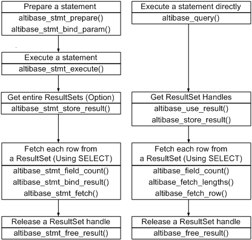

<!-- START doctoc generated TOC please keep comment here to allow auto update -->
<!-- DON'T EDIT THIS SECTION, INSTEAD RE-RUN doctoc TO UPDATE -->


- [Altibase C Interface Manual](#altibase-c-interface-manual)
  - [Preface](#preface)
    - [About This Manual](#about-this-manual)
  - [1. Introduction to Altibase C Interface](#1-introduction-to-altibase-c-interface)
    - [What is the Altibase C Interface?](#what-is-the-altibase-c-interface)
    - [Using ACI](#using-aci)
    - [Building Client Applications](#building-client-applications)
  - [2. Data Type](#2-data-type)
    - [ACI Data Types](#aci-data-types)
  - [3.ACI Functions Description](#3aci-functions-description)
    - [altibase_affected_rows()](#altibase_affected_rows)
    - [altibase_client_version()](#altibase_client_version)
    - [altibase_client_verstr()](#altibase_client_verstr)
    - [altibase_close()](#altibase_close)
    - [altibase_commit()](#altibase_commit)
    - [altibase_connect()](#altibase_connect)
    - [altibase_data_seek()](#altibase_data_seek)
    - [altibase_errno()](#altibase_errno)
    - [altibase_error()](#altibase_error)
    - [altibase_fetch_lengths()](#altibase_fetch_lengths)
    - [altibase_fetch_row()](#altibase_fetch_row)
    - [altibase_field()](#altibase_field)
    - [altibase_field_count()](#altibase_field_count)
    - [altibase_free_result()](#altibase_free_result)
    - [altibase_get_charset()](#altibase_get_charset)
    - [altibase_get_charset_info()](#altibase_get_charset_info)
    - [altibase_host_info()](#altibase_host_info)
    - [altibase_init()](#altibase_init)
    - [altibase_list_fields()](#altibase_list_fields)
    - [altibase_list_tables()](#altibase_list_tables)
    - [altibase_next_result()](#altibase_next_result)
    - [altibase_num_fields()](#altibase_num_fields)
    - [altibase_num_rows()](#altibase_num_rows)
    - [altibase_proto_version()](#altibase_proto_version)
    - [altibase_proto_verstr()](#altibase_proto_verstr)
    - [altibase_query()](#altibase_query)
    - [altibase_rollback()](#altibase_rollback)
    - [altibase_server_version()](#altibase_server_version)
    - [altibase_server_verstr()](#altibase_server_verstr)
    - [altibase_set_charset()](#altibase_set_charset)
    - [altibase_set_autocommit()](#altibase_set_autocommit)
    - [altibase_set_failover_callback()](#altibase_set_failover_callback)
    - [altibase_set_option()](#altibase_set_option)
    - [altibase_sqlstate()](#altibase_sqlstate)
    - [altibase_store_result()](#altibase_store_result)
    - [altibase_use_result()](#altibase_use_result)
  - [4. Prepared Statement Function Descriptions](#4-prepared-statement-function-descriptions)
    - [altibase_stmt_affected_rows()](#altibase_stmt_affected_rows)
    - [altibase_stmt_bind_param()](#altibase_stmt_bind_param)
    - [altibase_stmt_bind_result()](#altibase_stmt_bind_result)
    - [altibase_stmt_close()](#altibase_stmt_close)
    - [altibase_stmt_data_seek()](#altibase_stmt_data_seek)
    - [altibase_stmt_errno()](#altibase_stmt_errno)
    - [altibase_stmt_error()](#altibase_stmt_error)
    - [altibase_stmt_execute()](#altibase_stmt_execute)
    - [altibase_stmt_fetch()](#altibase_stmt_fetch)
    - [altibase_stmt_fetch_column()](#altibase_stmt_fetch_column)
    - [altibase_stmt_fetched()](#altibase_stmt_fetched)
    - [altibase_stmt_field_count()](#altibase_stmt_field_count)
    - [altibase_stmt_free_result()](#altibase_stmt_free_result)
    - [altibase_stmt_get_attr()](#altibase_stmt_get_attr)
    - [altibase_stmt_init()](#altibase_stmt_init)
    - [altibase_stmt_num_rows()](#altibase_stmt_num_rows)
    - [altibase_stmt_param_count()](#altibase_stmt_param_count)
    - [altibase_stmt_prepare()](#altibase_stmt_prepare)
    - [altibase_stmt_processed()](#altibase_stmt_processed)
    - [altibase_stmt_reset()](#altibase_stmt_reset)
    - [altibase_stmt_result_metadata()](#altibase_stmt_result_metadata)
    - [altibase_stmt_send_long_data()](#altibase_stmt_send_long_data)
    - [altibase_stmt_set_array_bind()](#altibase_stmt_set_array_bind)
    - [altibase_stmt_set_array_fetch()](#altibase_stmt_set_array_fetch)
    - [altibase_stmt_set_attr()](#altibase_stmt_set_attr)
    - [altibase_stmt_sqlstate()](#altibase_stmt_sqlstate)
    - [altibase_stmt_status()](#altibase_stmt_status)
    - [altibase_stmt_store_result()](#altibase_stmt_store_result)
  - [5. Using Array Binding and Array Fetching](#5-using-array-binding-and-array-fetching)
    - [Overview](#overview)
    - [Array Binding](#array-binding)
    - [Array Fetch](#array-fetch)
  - [6. Using Failover](#6-using-failover)
    - [Overview](#overview-1)
    - [How to Use Failover](#how-to-use-failover)

<!-- END doctoc generated TOC please keep comment here to allow auto update -->

Altibase® Application Development

Altibase C Interface Manual
===========================


Altibase Application Development ACI Manual

Release 7.1

Copyright ⓒ 2001\~2021 Altibase Corp. All Rights Reserved.

This manual contains proprietary information of Altibase Corporation; it is provided under a license agreement containing restrictions on use and disclosure and is also protected by copyright patent and other intellectual property law. Reverse engineering of the software is prohibited. All trademarks, registered or otherwise, are the property of their respective owners.

**Altibase Corp**

10F, Daerung PostTower II, 306, Digital-ro, Guro-gu, Seoul 08378, Korea Telephone: +82-2-2082-1000 Fax: 82-2-2082-1099

Customer Service Portal: http://support.altibase.com/en/

Homepage: [[http://www.altibase.com](http://www.altibase.com/)]

Preface
----

### About This Manual

This manual describes how to use the Altibase C Interface.

#### Audience

This manual has been prepared for the following users of Altibase:

-   Database administrators
-   Performance administrators
-   Database users
-   Application developers
-   Technical Supporters

It is recommended for those reading this manual possess the following background knowledge:

-   Basic knowledge in the use of computers, operating systems, and operating system utilities
-   Experience in using relational database and an understanding of database concepts
-   Computer programming experience
-   Experience in database server management, operating system management, or network administration


#### Organization

This manual is organized as follows:

-   Chapter 1: Introduction to Altibase C Interface  
    This chapter introduces the Altibase C interface and explains its basic usage.
    
-   Chapter 2: Data Types  
    This chapter describes the data types used with the Altibase C interface.

-   Chapter 3: Functions Description  
    This chapter describes the specification of Altibase C interface functions.

-   Chapter 4: Prepared Statement Function Description  
    This chapter describes the specification of Altibase C interface functions related to prepared statements.
    
-   Chapter 5: Using Array Binding and Array Fetching  
    This chapter describes how to use array binding and array fetching.
    
-   Chapter 6: Using Fail-Over  
    This chapter describes how to perform Failover-related tasks using the Altibase C interface.

#### Documentation Conventions

This section describes the conventions used in this manual. Understanding these conventions will make it easier to find information in this manual and in the other manuals in the series. 

There are two sets of conventions:

-   Syntax diagram convetions
-   Sample code conventions

##### Syntax Diagram Conventions

This manual describes command syntax using diagrams composed of the following elements:

| Elements                                                     | Meaning                                                      |
| ------------------------------------------------------------ | ------------------------------------------------------------ |
| [](https://github.com/ALTIBASE/Documents/blob/master/Manuals/Altibase_7.1/eng/media/SQL/image1.gif) | Indicates the start of a command. If a syntactic element starts with an arrow, it is not a complete command. |
| [](https://github.com/ALTIBASE/Documents/blob/master/Manuals/Altibase_7.1/eng/media/SQL/image2.gif) | Indicates that the command continues to the next line. If a syntactic element ends with this symbol, it is not a complete command. |
| [](https://github.com/ALTIBASE/Documents/blob/master/Manuals/Altibase_7.1/eng/media/SQL/image3.gif) | Indicates taht the command continues from the previous line. If a syntactic element starts witht his symbol, it is not a complete command. |
| [](https://github.com/ALTIBASE/Documents/blob/master/Manuals/Altibase_7.1/eng/media/SQL/image4.gif) | Indicates the end of a statement.                            |
| [](https://github.com/ALTIBASE/Documents/blob/master/Manuals/Altibase_7.1/eng/media/SQL/image5.gif) | Indicates a manatory element.                                |
| [](https://github.com/ALTIBASE/Documents/blob/master/Manuals/Altibase_7.1/eng/media/SQL/image6.gif) | Indicates an optional element.                               |
| [](https://github.com/ALTIBASE/Documents/blob/master/Manuals/Altibase_7.1/eng/media/SQL/image7.gif) | Indicates a mandatory element comprised of options. One, and only one, option must be specified. |
| [](https://github.com/ALTIBASE/Documents/blob/master/Manuals/Altibase_7.1/eng/media/SQL/image8.gif) | Indicates an optional element comprised of options.          |
| [](https://github.com/ALTIBASE/Documents/blob/master/Manuals/Altibase_7.1/eng/media/SQL/image9.gif) | Indicates an optional element in which multiple elements may be specified. A comman must precede all but the first element. |

##### Sample Code Conventions

The code examples explain SQL statements, stored procedures, iSQL statements, and other command line syntax.

The following table describes the printing conventions used in the code examples.

| Rules            | Meaning                                                      | Example                                                      |
| ---------------- | ------------------------------------------------------------ | ------------------------------------------------------------ |
| [ ]              | Indicates an optional item                                   | VARCHAR [(*size*)][[FIXED \|] VARIABLE]                      |
| { }              | Indicates a mandatory field for which one or more items must be selected. | { ENABLE \| DISABLE \| COMPILE }                             |
| \|               | A delimiter between optional or mandatory arguments.         | { ENABLE \| DISABLE \| COMPILE } [ ENABLE \| DISABLE \| COMPILE ] |
| . . .            | Indicates that the previous argument is repeated, or that sample code has been omitted. | SQL> SELECT ename FROM employee; ENAME ----------------------- SWNO HJNO HSCHOI . . . 20 rows selected. |
| Other Symbols    | Symbols other than those shown above are part of the actual code.Other Symbols | EXEC :p1 := 1; acc NUMBER(11,2);Symbols other than those shown above are part of the actual code. |
| Italics          | Statement elements in italics indicate variables and special values specified by the user. | SELECT * FROM *table_name*; CONNECT *userID*/*password*;     |
| Lower case words | Indicate program elements set by the user, such as table names, column names, file names, etc. | SELECT ename FROM employee;                                  |
| Upper case words | Keywords and all elements provided by the system appear in upper case. | DESC SYSTEM_.SYS_INDICES_;                                   |

#### Related Documentations

For more detailed information, please refer to the following documents.

-   Installation Guide

-   Administrator’s Manual

-   Replication Manual

-   Precompiler User’s Manual

-   CLI User's Manual

-   iSQL User’s Manual

-   Utilities Manual

-   Error Message Reference

#### Altibase Welcomes Your Comments and Feedbacks

Please let us know what you like or dislike about our manuals. To help us with better future versions of our manuals, please tell us if there is any corrections or classifications that you would find useful.

Include the following information:

- The name and version of the manual that you are using
- Any comments about the manual
- Your name, address, and phone number

If you need immediate assistance regarding any errors, omissions, and other technical issues, please contact Altibase's Support Portal (http://altibase.com/support-center/en/).

Thank you. We always welcome your feedbacks and suggestions.

## 1. Introduction to Altibase C Interface

This chapter introduces the Altibase C interface and explains its basic usage.

### What is the Altibase C Interface?

The Altibase C Interface (ACI) is a mechanism for interacting with a computer operating system or software to perform specific tasks. ACI facilitates easier communication between applications and databases. More specifically, ACI allows applications to access data from a variety of database management systems, and provides calling level interfaces to access database servers and execute SQL statements.

ACI is designed to be independent of programming languages, database systems, and operating systems. Thus, any application can use ACI to query data from a database, regardless of the platform it is on or the database it uses.

#### ACI vs. CLI

ACI is used to type commands, whereas CLI is used to perform various functions. However, the user should make fewer function calls with fewer arguments (than CLI) when using ACI to ensure successful execution. It is easier for the user to customize ACI, than CLI.

### Using ACI

This chapter explains how to develop application programs using ACI.

#### Basic Usages

An ACI application program generally consists of following three parts:

-   Initializing handles
-   Processing transactions
-   Release handles

In addition to the above steps, in case of an error, a step of checking a diagnostic message may be added.


#### Initializing Handles

This part allocates and initializes environment and connection handles. A handle is a memory pointer that stores information about the execution result of a previous phase. Transition from phases is made through the transmission of handles. 

The following handle types are provided:

##### ALTIBASE Handle

The ALTIBASE handle is a memory pointer that stores information related to connections managed by ACI. This information includes connection status and transaction status. The application must create and initialize an ALTIBASE handle for each connection, which can be used to connect to Altibase. You can also use this handle to execute SQL statements in Altibase.

##### ALTIBASE_STMT Handle

To execute SQL statements in the Prepare-Execution method, the ALTIBASE_STMT handle must be used. A maximum of 1024 ALTIBASE_STMT handles can be allocated to one connection handle.

#### Processing of Transactions

The following figure is a general procedure of calling functions to processing a transaction.



#### Releasing Handle

This step is for releasing the handles and meory allocated by an application, and finishing an application

#### Managing Diagnosis Messages

Diagnosis is to handle the warning or error status occurred in an application. When calling function, the user recieve return value and then can know whether function works successfully or not. For details of return value for each function, refer to Chapter3: Function Descriptions.

If function fails to work successfully, diagnosis messages are usually created. If you want to get more information from them in detail, you can do by using other functions as follows. Following functions are grouped depending on what handle to be used for calling functions previously. 

<table>
	<tr>
		<td>Handle Type</td>
		<td>ALTIBASE</td>
		<td>ALTIBASE_STMT</td>
		<td>Description</td>
	</tr>
	<tr>
		<td rowspan="3">Function</td>
		<td>altibase_errno()</td>
		<td>altibase_stmt_errno()</td>
		<td>Error code</td>
	</tr>
	<tr>
		<td>altibase_error()</td>
		<td>altibase_stmt_error()</td>
		<td>Error message</td>
	</tr>
	<tr>
		<td>altibase_sqlstate()</td>
		<td>altibase_stmt_sqlstate()</td>
		<td>SQLSTATE message</td>
	</tr>
</table>


The diagnosis messages are returned except the case of SQL_SUCCESS, SQL_NO_DATA_FOUND, SQL_INVALID_HANDLE. To check the diagnosis message, call SQLGetDiagRec(), SQLGetDiagField().

##### Diagnosis Messages

The diagnosis message is a five-bytes alphanumeric character string. The heading two characters refer to the class, and the next three character refer to the sub class. ACI diagnosis messages follow the standard of X/Open SQL CAE specifications.

> #### Restrictions
>
> -   When writing multithreaded programs, an environment handle and connection handle must be allocated for each thread. 
>   
>-   Altibase client library doesn't use signal processor. Therefore, if access to network terminates due to external factors, application can be shut down compulsorily by receiving signal of SIGPIPE.   
>     To prevent this forced termination, the SIGPIPE signal must be handled by the user application. Calling the Altibase client library function from within a function that handles SIGPIPE signal processing can cause the program to hang, so be careful about writing signal processing functions. However, after signal processing, it is possible to call Altibase client library functions.
> 

### Building Client Applications 

This section describes the header and library files needed to build client applications.

#### The Header Files

The header file to build ACI applications is “alticapi.h” and located in $ALTIBASE_HOME/include/. For GCC, using following option will set the directory searchable by the compiler:

```
-I$ALTIBASE_HOME/include
```

#### The Library Files

The ACI library file and ODBC library file must be linked by the compiler to build ACI applications. Below is the list of the ACI library and ODBC library files that can be found under $ALTIBASE_HOME/lib directory:

-   libalticapi.a

-   libodbccli.a

For GCC, using following option will help compilers to locate the library files:

```
-L$ALTIBASE_HOME/lib -lalticapi -lodbccli
```

## 2. Data Type

This chapter describes the data types used with the Altibase C interface.

### ACI Data Types

This section describes the data structures of the Altibase C interface. These data structures will be used with ACI functions when writing the application. The data structures are broadly classified as follows:

-   Handle types

-   Structure types

-   Other data types

#### Altibase Handles

There are three ACI handles:

-   ALTIBASE

-   ALTIBASE_STMT

-   ALTIBASE_RES

##### ALTIBASE

ALTIBASE is a connection handle to a database. Connection handles are used for most ACI functions. The user must initialize this handle with altibase_init () and release it with altibase_close ().

The connection handle returns and manages only one result set handle (ALTIBASE_RES). In other words, to use one result set and get a handle to another, the user must first release the result set handle in use.

##### ALTIBASE_STMT

This data type is a handle for a prepared statement. If a statement contains parameter markers or you want to get data by using the bind operation, you must use the prepared statement. The user must initialize the handle with altibase_stmt_init() and close it with altibase_stmt_close().

##### ALTIBASE_RES

This data type represents the result of a query that returns rows. The information returned from a query is called the result set in the remainder of this chapter. The result set can be used to process total number of columns and individual column information. 

The user must call altibase_use_result() or altibase_store_result() for every statement that successfully produces a result set. You must also call altibase_free_result() after you are done with the result set.

#### Data Structures

The data structures that can be used with ACI are:

-   struct ALTIBASE_BIND

-   struct ALTIBASE_CHARSET_INFO

-   struct ALTIBASE_FIELD

-   struct ALTIBASE_NUMERIC

-   struct ALTIBASE_TIMESTAMP

##### struct ALTIBASE_BIND

This structure is used to bind input and output variables, and the user specifies binding information here. altibase_stmt_bind_param () binds a buffer for input parameters
Function. altibase_stmt_bind_result () is a function that binds a buffer to get column data of the retrieved result set.

This structure contains the following members:

| Member        | Type               | Description                                                  |
| ------------- | ------------------ | ------------------------------------------------------------ |
| buffer_type   | ALTIBASE_BIND_TYPE | This indicates the data type. For more details, see enum ALTIBASE_BIND_TYPE. |
| buffer        | void \*            | This indicates a pointer to be used for data transfer. For input, buffer is a pointer to the variable in which you store the data value for a statement parameter. For output, buffer is a pointer to the variable in which to return a result set column value. |
| buffer_length | ALTIBASE_LONG      | This indicates the actual size of buffer. You do not have to define data types whose lengths are fixed across platforms as follows for the binding operation. To achieve this, their lengths must be set to 0 after initialization. <br/> ALTIBASE_BIND_SMALLINT, ALTIBASE_BIND_INTEGER, ALTIBASE_BIND_BIGINT, ALTIBASE_BIND_REAL, ALTIBASE_BIND_DOUBLE, ALTIBASE_BIND_DATE The user must set buffer_length to a valid value when binding a string variable by specifying a data type such as ALTIBASE_BIND_STRING whose length is not fixed. If the size of actual data is greater than a value of buffer_length, data can be buffered only as much as you set a value. For example, if you specify buffer_length as 2, 2bytes from the starting are buffered in the value of int. You must set buffer_length to a valid value to return a valid result. |
| length        | ALTIBASE_LONG \*   | This indicates the actual number of bytes of data. You do not have to define data types such as short and int whose lengths are variable across platforms. You must define character string or binary data as a valid value because the sizes of character string and binary data may be smaller than that of buffer. The user can use ALTIBASE_NULL_DATA to fetch data. This indicates the return value is null. |
| is_null       | ALTIBASE_BOOL \*   | This member points to an ALTIBASE_BOOL* variable that is ALTIBASE_TRUE if a value is null. It is recommended to check if a value is null by using this variable before using a value. |
| error         | int                | This member points to an int variable to have information for the parameter stored after the binding operation. When the binding operation fails, the user can check what argument fails specifically by using this variable. A value is returned by calling altibase_errno(). For more details, see 3.8 altibase_errno() |

##### struct ALTIBASE_CHARSET_INFO

Structure that contains character set information. When the altibase_get_charset_info () function is called, this structure returns information about the character set.

This structure contains the following members:	

| Member      | Type         | Description                                      |
| ----------- | ------------ | ------------------------------------------------ |
| id          | unsigned int | The identification of character set              |
| name        | void \*      | The name of character set encoded as UTF8        |
| name_length | int          | The name length of chaset                        |
| mbmaxlen    | int          | The maximum length of one character (Unit: Byte) |

##### struct ALTIBASE_FIELD

Structure that contains column information of the result set retrieved by a SELECT statement. Column information can be obtained from this structure type using the altibase_field () or altibase_fields () functions. The value of the memory pointed to by the structure pointer thus obtained is managed internally by the ACI, so the user should not change or free it.

This structure contains the following members.

| Member           | Type                               | Description                                                  |
| ---------------- | ---------------------------------- | ------------------------------------------------------------ |
| type             | ALTIBASE_FIELD_TYPE                | The type of the filed                                        |
| name             | char [ALTIBASE_MAX_FIELD_NAME_LEN] | Name of the column. If an alias was given to the column in the query, this value will be the given alias. |
| name_length      | int                                | The length of field name                                     |
| org_name         | char [ALTIBASE_MAX_FIELD_NAME_LEN] | The name of the original field                               |
| org_name_length  | int                                | The length of org_name                                       |
| table            | char [ALTIBASE_MAX_TABLE_NAME_LEN] | Name of the table that contains this column. If the query gave an alias to a table, this value will be the given alias. |
| table_length     | int                                | The length of table name                                     |
| org_table        | char [ALTIBASE_MAX_TABLE_NAME_LEN] | The name of the original table                               |
| org_table_length | int                                | The length of org_table                                      |
| size             | int                                | The size or precision of the field                           |
| scale            | int                                | The numerical scale                                          |

##### struct ALTIBASE_NUMERIC

The struct ALTIBASE_NUMERIC is used to send and receive numerical data to and from the server.

This structure contains the following members.

| Member    | Type                                     |
| --------- | ---------------------------------------- |
| precision | unsigned char                            |
| scale     | unsigned char                            |
| sign      | char                                     |
| val       | unsigned char [ALTIBASE_MAX_NUMERIC_LEN] |

##### struct ALTIBASE_TIMESTAMP

The struct ALTIBASE_TIMESTAMP is used to send and receive date data to and from the server.

This structure contains the following members.

| Member   | Member Type    | Description                          |
| -------- | -------------- | ------------------------------------ |
| year     | short          | Year                                 |
| month    | unsigned short | Month                                |
| day      | unsigned short | Day                                  |
| hour     | unsigned short | Hour                                 |
| minute   | unsigned short | Minute                               |
| second   | unsigned short | Seceond                              |
| fraction | int            | One over one hundred thousand second |

#### Other Data Types

In addition to the handles and structures described above, the following types can be used:

-   ALTIBASE_ROW

-   ALTIBASE_LONG

-   ALTIBASE_NTS

-   enum ALTIBASE_BIND_TYPE

-   enum ALTIBASE_FAILOVER_EVENT

-   enum ALTIBASE_FIELD_TYPE

-   enum ALTIBASE_OPTION

-   enum ALTIBASE_STMT_ATTR_TYPE

##### ALTIBASE_ROW

This is a type-safe representation of one row of data. Rows are obtained by calling altibase_fetch_row() when altibase_query() is used with a statement such as SELECT which returns a reuslt set. 

A field value contains binary data or character string. If fields have data types such as BLOB, BYTE, NIBBLE, BIT, VARBIT or GEOMETRY, fields are encoded as binary data. Otherwise, fields are encoded as character string. 

The NIBBLE, BIT and VARBIT are all based on binary logic in special form. A NIBBLE is a four-bit aggregation and a BIT is the basic unit of information. To obtain these easily, database effectively performs the required macro substitutions by using GET_NIBBLE_VALUE() and GET_BIT_VALUE().

The user must not change or release their values as you please because they are managed within procedure.

##### ALTIBASE_LONG

This can be defined as a 32-bit integer or a 64-bit integer. This works similarly to SQLLEN defined by the Altibase ODBC driver. This is used to get row number or the number of rows.

##### ALTIBASE_NTS

This is a macro used to indicate that the data is a null terminated string. When input binding a string, the user can set the data length to this value instead of the actual length.

When input binding binary data, do not set the data length to ALTIBASE_NTS.

##### enum ALTIBASE_BIND_TYPE

This returns the data type of the bind variable as follows.

The elements of this enum type are:

| enum Value             | Description                                                  |
| ---------------------- | ------------------------------------------------------------ |
| ALTIBASE_BIND_NULL     | This is used to input NULL data into a column. Equivalent to setting the is_null member variable of the ALTIBASE_BIND structure to ALTIBASE_TRUE. Can only be used when binding parameters. |
| ALTIBASE_BIND_BINARY   | This is used for binary data whose type is BYTE, NIBBLE, BIT, VARBIT, BLOB or GEOMETRY. |
| ALTIBASE_BIND_STRING   | This is used for character strings such as CHAR, VARCHAR, NCHAR and NVARCHAR. |
| ALTIBASE_BIND_WSTRING  | This is used for unicode character.                          |
| ALTIBASE_BIND_SMALLINT | This is used for the SMALLINT type which is a 16 bit sized signed integer. |
| ALTIBASE_BIND_INTEGER  | This is used for the INTEGER type which is a 32 bit sized signed integer. |
| ALTIBASE_BIND_BIGINT   | This is used for the BIGINT type which is a 64 bit sized signed integer. |
| ALTIBASE_BIND_REAL     | This is used for the REAL type which is a single prcision floating-point number. |
| ALTIBASE_BIND_DOUBLE   | This is used to represent the DOUBLE type which is a double prefloating-point number. |
| ALTIBASE_BIND_NUMERIC  | This is used to store numeric data types such as NUMERIC, DECIMAL NUMBER and FLOAT. |
| ALTIBASE_BIND_DATE     | This is used to represent DATE type storing date and time values. |

##### enum ALTIBASE_FAILOVER_EVENT

This is an enumeration that represents a Failover event. Ifthe failover callback functionis registered, the failover callback function is notified of values returned by the failover events. They are used when the failover callback function determines its advance to the next step. For more details, refer to Chapter6: Using Failover.

| Enum Value        | Description                                                  |
| ----------------- | ------------------------------------------------------------ |
| ALTIBASE_FO_BEGIN | This notifies the start of STF (Service Time Failover).      |
| ALTIBASE_FO_END   | This notifies the success of STF.                            |
| ALTIBASE_FO_ABORT | This notifies the failure of STF.                            |
| ALTIBASE_FO_GO    | FailOverCallback sends this so that STF can advance to the next step. |
| ALTIBASE_FO_QUIT  | FailOverCallback sends this to prevent STF from advancing to the next step. |

##### enum ALTIBASE_FIELD_TYPE

This is an enumeration that contains the data types of the columns.

the IS_NUM_TYPE () macro can be used to check that it is a numeric type. In numeric type
There are SMALLINT, INTEGER, BIGINT, REAL, DOUBLE, FLOAT, and NUMERIC.

You can use the IS_BIN_TYPE () macro to check for a binary type. Binary
Types include BYTE, BLOB, NIBBLE, BIT, VARBIT, and GEOMETRY.

Refer to the alticapi.h header file for definitions of the IS_NUM_TYPE () and IS_BIN_TYPE () macros.

The elements of this enum type are:

| enum Value             | Data Type |
| ---------------------- | --------- |
| ALTIBASE_TYPE_CHAR     | CHAR      |
| ALTIBASE_TYPE_VARCHAR  | VARCHAR   |
| ALTIBASE_TYPE_NCHAR    | NCHAR     |
| ALTIBASE_TYPE_NVARCHAR | NVARCHAR  |
| ALTIBASE_TYPE_SMALLINT | SMALLINT  |
| ALTIBASE_TYPE_INTEGER  | INTEGER   |
| ALTIBASE_TYPE_BIGINT   | BIGINT    |
| ALTIBASE_TYPE_REAL     | REAL      |
| ALTIBASE_TYPE_DOUBLE   | DOUBLE    |
| ALTIBASE_TYPE_FLOAT    | FLOAT     |
| ALTIBASE_TYPE_NUMERIC  | NUMERIC   |
| ALTIBASE_TYPE_DATE     | DATE      |
| ALTIBASE_TYPE_BLOB     | BLOB      |
| ALTIBASE_TYPE_CLOB     | CLOB      |
| ALTIBASE_TYPE_BYTE     | BYTE      |
| ALTIBASE_TYPE_NIBBLE   | NIBBLE    |
| ALTIBASE_TYPE_BIT      | BIT       |
| ALTIBASE_TYPE_VARBIT   | VARBIT    |
| ALTIBASE_TYPE_GEOMETRY | GEOMETRY  |

##### enum ALTIBASE_OPTION

It is recommended to use altibase_set_autocommit() when you want to set ALTIBASE_AUTOCOMMIT.

The elements of this enum type (that is, the connection attributes) and the types and maximum sizes of values that can be specified for each attribute are as follows:

| enum Value                         | Data Type | Maximum Size                  | Description                                                  |
| ---------------------------------- | --------- | ----------------------------- | ------------------------------------------------------------ |
| ALTIBASE_AUTOCOMMIT                | int       | sizeof(int)                   | This is used to set connect options and affect behavior for a connection. This represents a 32 bit. ALTIBASE_AUTOCOMMIT_ON: each individual SQL statement is automatically committed right after it is executed. ALTIBASE_AUTOCOMMIT_OFF: each individual SQL statement is not automatically committed right after it is executed. |
| ALTIBASE_CONNECTION_TIMEOUT        | int       | sizeof(int)                   | This is used to set the value of timeout to make a connection to the database server in a nonblocking manner. Blocking can be caused by using the select() or poll() when network is unstable. |
| ALTIBASE_PORT                      | int       | sizeof(int)                   | This is used to define server port.                          |
| ALTIBASE_TXN_ISOLATION             | int       | sizeof(int)                   | This is used to determine the transaction isolation level for current connection. |
| ALTIBASE_APP_INFO                  | char \*   | ALTIBASE_MAX_APP_INFO_LEN     | The client uses the application ID retrieved using ALTIBASE_APP_INFO. The user can know speinformation of user's session by using this because ALTIBASE_APP_INFO runs consent in the session. |
| ALTIBASE_DATE_FORMAT               | char \*   | ALTIBASE_MAX_DATE_FORMAT_LEN  | This is used to display date data in formats. The default is YYYY/MM/DD HH:MI:SS. |
| ALTIBASE_NLS_USE                   | char \*   | ALTIBASE_MAX_NLS_USE_LEN      | This determines whether to check national character set data by parsing a SQL statement. |
| ALTIBASE_NLS_NCHAR_LITERAL_REPLACE | int       | sizeof(int)                   | This is used to select language. (US7ASCII : English character set, KO16KSC5601 : Korean chaset) |
| ALTIBASE_IPC_FILEPATH              | char \*   | ALTIBASE_MAX_IPC_FILEPATH_LEN | The UNIX domain can be used to communicate between processes on IPC. One process usually acts as a server and the other process is the client. The UNIX domain provides a socket address space on IPC. Communicating processes connect through addresses In the UNIX domain, a connection is usually composed of one path name as ALTIBASE_HOME. The server binds its socket to a previously agreed path or address. However, if two processes connect through different paths of ALTIBASE_HOME respectively, you cannot establish a connection between them because a socket domain also provides different addressing structures. At this time, if you use ALTIBASE_HOME/trc/cm-ipc file, the Unix domain is available. Therefore, you can pass data retrieved from a shared memory between processes. |

##### enum ALTIBASE_STMT_ATTR_TYPE

This is an enumeration used to set properties for a statement handle.

The elements of this enum type are:

| Enum Value                      | Data Type | Maximum Size | Description                                                  |
| ------------------------------- | --------- | ------------ | ------------------------------------------------------------ |
| ALTIBASE_STMT_ATTR_ATOMIC_ARRAY | int       | sizeof(int)  | This specifies whether all of the rows should be inserted as an atomic operation or not. ARRAY INSERT inserts a single data into a given array separately and independently. In comparison, the multiple inserts are processed as a single statement when you use the ATOMIC ARRAY INSERT. You can set ALTIBASE_ATOMIC_ARRAY_ON or ALTIBASE_ATOMIC_ARRAY_OFF. If other value is set except them, error occurs during the execution of an insert. If you set ALTIBASE_ATOMIC_ARRAY_ON, ATOMIC ARRAY INSERT is in effect. Array size effects in performance. Therefore, you should declare right size of array. You would realize the performance improvements with using ATOMI ARRAY INSERT rather than ARRAY INSERT. When a_stmt_status() and altibase_stmt_processed() returns the result, only the first value of the result is valid because multiple inserts are processed as a single statement by using the ATOMIC ARRAY INSERT. |

#### Relationship Between Data Types

The following figure illustrates the relationships among Altibase handles and other data types


Looking at the above relationship diagram, it can be seen that ALTIBASE_ROW cannot be obtained with ALTIBASE_RES obtained using the ALTIBASE_STMT handle (shown as a dotted line).
Notice that the ALTIBASE_ROW cannot be obtained (indicated by the dashed line). ALTIBASE_ROW can be obtained only through the altibase_query () related function that executes SQL statements directly without binding. Refer to description of each function for details.

3.ACI Functions Description
--------

This chapter describes the specifications of ACI functions used with Altibase handle. For each ACI functions, the following information are described.

-   Name of the function and purpose of use 
-   Arguments list of the function 
-   Return Values 
-   Usages of function and notes 
-   Diagnosis message that can be displayed when an error occurrs in function 
-   Example source codes

### altibase_affected_rows()

altibase_affected_rows() may be called immediately after executing a statement. It returns the number of rows changed, deleted, or inserted by the last statement if it was an UPDATE, DELETE, or INSERT.

#### Syntax

```
ALTIBASE_LONG  altibase_affected_rows (
    ALTIBASE altibase );
```

#### Example

| Data Type | Argument   | In/Output | Description       |
| --------- | ---------- | --------- | ----------------- |
| ALTIBASE  | *altibase* | Input     | Connection handle |

#### Return Values	

| Return Value                 | Description                                                  |
| ---------------------------- | ------------------------------------------------------------ |
| Greater than 0               | An integer indicates the number of rows affected or retrieved |
| 0                            | Zeo indicates that no rows were updated or that no query has yet been executed |
| ALTIBASE_INVALID_AFFECTEDROW | Error during UPDATE, DELETE, or INSERT                       |

#### Description

This function returns the following values, depending on the type of the last SQL statement executed:

-   UPDATE statement: Number of records changed
-   DELETE statement: Number of records deleted
-   INSERT statement: number of records added

If the last SQL statement executed was a SELECT statement, this function will return 0.
To get the number of records selected by the SELECT statement, use altibase_num_rows () should be used.

#### Example

```
#define QSTR "UPDATE employees SET salary = salary * 1.1 WHERE group = 1"

rc = altibase_query(altibase, QSTR);
/* ... check return value ... */

printf("%ld updated\n", altibase_affected_rows(altibase));
```

### altibase_client_version()

altibase_client_version() returns a constant that represents the client library version. 

#### Syntax

```
int  altibase_client_version( void );
```

#### Return Values

altibase_client_version() returns the client library version in a numeric format.

#### Description 

altibase_client_version() returns the client library information as a constant. The value has the format MMmmttSSpp whose specific meaning is as follows.

| Format | Meaning                        | Remarks                                                      |
| ------ | ------------------------------ | ------------------------------------------------------------ |
| MM     | Where MM is the major version. |                                                              |
| mm     | Where mm is the minor version. | When the value is assigned to mm, if the value is shorter than the declared length of this, Altibase pads 0 to the rest space. |
| tt     | Where tt is the term           | If the value is shorter than 2, Altibase pads 0 to the rest space. |
| SS     | Where SS is the patch set.     | If the value is shorter than 2, Altibase pads 0 to the rest space. |
| pp     | Where pp is the patch.         | If the value is shorter than 2, Altibase pads 0 to the rest space. |

For example, if the returned value of this function is 605010309, the the client library version of 7.1.0.3.9.

### altibase_client_verstr()

altibase_client_verstr() returns a string that represents the client library version.

#### Syntax

```
const char *  altibase_client_verstr ( void );
```

#### Return Value

altibase_client_verstr() returns a string that represents the client library version.

#### Description

altibase_client_verstr() returns a string that represents the client library version. The value has the format x.x.x.x and each x represents the main version, minor version, term, patch set, patch in order. 

The memory pointed to by the char pointer returned by this function is managed inside the library and should never be changed or released by the user.

### altibase_close()

altibase_close() closes a previously opened connection.

#### Syntax

```
int  altibase_close (
    ALTIBASE altibase );
```

#### Argument	

| Data Type | Argument   | In/Out | Description       |
| --------- | ---------- | ------ | ----------------- |
| ALTIBASE  | *altibase* | Input  | Connection handle |

#### Return Value

altibase_close() returns ALTIBASE_SUCCESS on success or ALTIBASE_ERROR on failure.

#### Description

This function closes the connection to the server and frees all resources allocated for the connection handle.

All statement handles belonging to the connection handle passed as arguments when this function is called
Processing of SQL statements related to (ALTIBASE_STMT) is aborted, the results are discarded, and all resources associated with these statement handles are freed.

If the user has a result set handle returned using a connection handle, the user must first call the altibase_free_result () function to free the result set handle before executing this function.
do.

#### Example

```
altibase = altibase_init();
if (altibase == NULL)
{
    return 1;
}

/* ... omit ... */

rc = altibase_close(altibase);
/* ... check return value ... */
```

### altibase_commit()

altibase_commit() commits the current trasnaction. 

#### Syntax

```
int  altibase_commit (
    ALTIBASE altibase );
```

#### Argument

| Data Type | Argument   | In/Output | Description       |
| --------- | ---------- | --------- | ----------------- |
| ALTIBASE  | *altibase* | Input     | Connection handle |

#### Return Value

The function returns ALTIBASE_SUCCESS if successful or ALTIBASE_ERROR if unsuccessful.

#### Description

This function commits a transaction running in the currently connected session. If the session is not in AUTOCOMMIT mode, a new transaction is automatically started at the next SQL statement execution after executing this function.

#### Example

Refer to the example in altibase_set_autocommit().

### altibase_connect()

altibase_connect() attempts to establish a connection to an Altibase database engine running on host by using connection string.

#### Syntax

```
int  altibase_connect (
    ALTIBASE      altibase,
    const char*   connstr );
```

#### Arguments

| Data Type    | Argument   | In/Output | Description       |
| ------------ | ---------- | --------- | ----------------- |
| ALTIBASE     | *altibase* | Input     | Connection handle |
| const char\* | *connstr*  | Input     | Connection string |

#### Return Values

The function returns ALTIBASE_SUCCESS if successful, or ALTIBASE_ERROR if an error occurred.

#### Description

Connection string is used to send each value of more than one parameter such as DSN, PORT_NO, UID, PWD, CONNTYPE or NLS_USE. For more detailed information, please refer to *CLI User' Manual.*

The connection attribute string must be a NULL terminated string.

#### Example

```
#define CONNSTR "DSN=127.0.0.1;PORT_NO=20300;UID=sys;PWD=manager"

ALTIBASE altibase;

altibase = altibase_init();
/* ... check return value ... */

rc = altibase_set_option(altibase, ALTIBASE_APP_INFO, "your_app_name");
/* ... check return value ... */

rc = altibase_connect(altibase, CONNSTR);
if (ALTIBASE_NOT_SUCCEEDED(rc))
{
    fprintf(stderr, "Failed to connect : %s\n", altibase_error(altibase));
}
```

### altibase_data_seek()

altibase_data_seek() seeks to an arbitrary row in a query result set and changes the pointer location of the resource.

#### Syntax

```
int  altibase_data_seek (
    ALTIBASE_RES    result,
    ALTIBASE_LONG   offset );
```

#### Arguments		

| Data Type     | Argument | In/Output | Descriptions                                                 |
| ------------- | -------- | --------- | ------------------------------------------------------------ |
| ALTIBASE_RES  | *result* | Input     | Result handle                                                 |
| ALTIBASE_LONG | *offset* | Input     | The offset value is a row number and should be in the range from 0. |

#### Return Values

The function returns ALTIBASE_SUCCESS if successful or ALTIBASE_ERROR if an error occurred.

#### Description

altibase_data_seek() moves the internal row pointer of the result associated with the specified result indentifier to point to the specified row number. The offset value is a row number and should be in the range from 0 to altibase_num_rows(result) - 1. 

altibase_data_seek() may be used only in conjunction with altibase_store_result().

#### Example

```
#define QSTR "SELECT last_name, first_name FROM friends"

rc = altibase_qeury(altibase, QSTR);
/* ... check return value ... */

result = altibase_store_result(altibase);
/* ... check return value ... */

row_count = altibase_num_rows(result);
for (i = 0; i < row_count; i++)
{
    rc = altibase_data_seek(result, i);
    if (ALTIBASE_NOT_SUCCEEDED(rc))
    {
        printf("ERR : %d : ", i, altibase_error());
        continue;
    }

    /* ... omit ... */
}

rc = altibase_free_result(result);
/* ... check return value ... */
```

### altibase_errno()

For the connection specified by Altibase, altibase_errno() returns the error code for the most recently invoked API function that can succeed or fail.

#### Syntax

```
unsigned int  altibase_errno (
    ALTIBASE altibase );
```

#### Argument

| Data Type | Argument   | In/Output | Description       |
| --------- | ---------- | --------- | ----------------- |
| ALTIBASE  | *altibase* | Input     | Connection handle |

#### Return Values

0 means no error occurred. An error code value for the last altibase_errno() call is returned if it failed.

#### Description

altibase_errno() returns the numerical value of the error code from previous function. All functuins do not return error codes. Error codes are returned by queries for their operation. Errors are listed at *Error Message Refrence* in detail. 

Make sure to check the value before calling another function because it is initialized or new one is created instead if another function is called. The value returned by altibase_errno() is different from that of SQLSTATE. altibase_sqlstate() must be used to find a specific SQLSTATE when handling errors.

#### Example

```
rc = altibase_query(altibase, QSTR);
if (ALTIBASE_NOT_SUCCEEDED(rc))
{
    printf("error no  : %05X\n", altibase_errno(altibase));
    printf("error msg : %s\n", altibase_error(altibase));
    printf("sqlstate  : %s\n", altibase_sqlstate(altibase));
    return 1;
}

/* ... omit ... */
```

### altibase_error()

For the connection specified by Altibase, altibase_error() returns error message for the most recently invoked API function.

#### Syntax

```
const char *  altibase_error (
    ALTIBASE altibase );
```

#### Argument

| Data Type | Argument   | In/Output | Description       |
| --------- | ---------- | --------- | ----------------- |
| ALTIBASE  | *altibase* | Input     | Connection handle |

#### Return Values

altibase_error() returns the error text from the last function, or an empty string if no error occurred.

#### Description

This function returns an error message indicating the reason for the failure if the previously executed function failed.

If an error occurs while executing a function, calling the other function without checking the error immediately removes the information about the error. Therefore, when an error occurs, you should use this function to check the error information.

The memory pointed to by the char pointer returned by this function is managed inside the library and should never be changed or released by the user.

#### Example

Refer to the example in altibase_errno().

### altibase_fetch_lengths()

altibase_fetch_lengths() returns the lengths of the columns of the current row within a result set.

#### Syntax

```
ALTIBASE_LONG *  altibase_fetch_lengths (
    ALTIBASE_RES result );
```

#### Argument

| Data Type    | Argument | In/Output | Description   |
| ------------ | -------- | --------- | ------------- |
| ALTIBASE_RES | *result* | Input     | Result handle |

#### Result Values

altibase_fetch_lengths() returns an array of unsigned long integer representing the size of each column on success, or null if an error occurred.

#### Description

This function returns the data length of each column constituting the current row as an array.
You can use the return value of this function to determine the size of the buffer to hold the data for each column.

If the column data is a string, the length is returned without the NULL terminator.

If the column data is NULL, the length returned is ALTIBASE_NULL_DATA.

Altibase_fetch_row () must be executed more than once on the result set handle before calling this function. This function returns NULL before executing altibase_fetch_row () or when there are no more rows to return in the result set.

Since the data obtained by altibase_fetch_row () may contain binary data, you should not estimate the length of the data using the strlen () function. The user must check the length of the data to be returned using the altibase_fetch_lengths () function.

The memory pointed to by the pointer returned by this function is managed inside the library and must never be changed or released by the user.

#### Example

```
ALTIBASE_LONG *lengths;
int            num_fields;
int            i;

/* ... omit ... */

num_fields = altibase_num_fields(result);
row = altibase_fetch_row(result);
if (row != NULL)
{
    lengths = altibase_fetch_lengths(result);
    for (i = 0; i < num_fields; i++)
    {
         printf("Column length %d : %ld\n", i, lengths[i]);
    }
}

/* ... omit ... */
```

### altibase_fetch_row()

altibase_fetch_row() retrieves a row of a result set.

#### Syntax

```
ALTIBASE_ROW  altibase_fetch_row (
    ALTIBASE_RES result );
```

#### Argument

| Data Type    | Argument | In/Output | Description   |
| ------------ | -------- | --------- | ------------- |
| ALTIBASE_RES | *result* | Input     | Result handle |

#### Return Values

altibase_fetch_row() returns data in a row on success, or null if error occurs or no rows are left.

#### Description

altibase_fetch_row() fetches one row of data from the result set. The function returns null if error occurs or no rows are left. When used after altibase_store_result(), altibase_fetch_row() returns null when there are no more rows to retrieve. 

A numerical array corresponds to a fetched row. The offset value is a column number and should be in the range from 0 to altibase_num_fields(result) - 1. 

The value can contain a character string or binary data because this is type-safe representation of one row of data. If you want to treat a value as a number, the user must convert the string yourself. For more details, refer to chapter 2: ALTIBASE_ROW.

If a value has null, null values are represented by null pointers in the ALTIBASE_ROW array. The lengths of the values in the row may be obtained by calling altibase_fetch_lengths(). The user must not get string length by calling strlen() because their lengths returned by altibase_fetch_row() can contain binary data.

The user must use the lengths of the values by calling altibase_fetch_lengths(). altibase_fetch_row() returns data storing the lengths of each result column in a row. Therefore, there can be insufficient memory if result set contains large amounts of data such as LOB or geometry. In case like that, it is more convenient to use a parepared statement for sending SQL statements to the database with separating data. Prepared statements are designed in a more secure and efficient manner. If you want to execute a statement many times, it normally reduces execution time to use a prepared statement instead. 

The value returned by altibase_fetch_row() is valid only before calling altibase_fetch_row() again. You must store the value in the row variable of application to remember. The user must not change or release it as you please because it is manged within procedure.

#### Example

Refer to the example in altibase_query().

### altibase_field()

altibase_field() returns the definition of one column of a result set.

#### Syntax

```
ALTIBASE_FIELD *  altibase_field (
    ALTIBASE_RES result,
    int             fieldnr );
```

#### Arguments	

| Data Type    | Argument  | In/Output | Description                                |
| ------------ | --------- | --------- | ------------------------------------------ |
| ALTIBASE_RES | *result*  | Input     | Result handle                              |
| int          | *fieldnr* | Input     | This is a column number which starts at 0. |

#### Return Values

altibase_field() returns the pointer to the definition of a specified column on success, or null if error occurs or no columns are left.

#### Description

This function returns information about the specified column as an ALTIBASE_FIELD pointer. appointed
Possible column numbers are values from 0 (altibase_num_fields (result) -1).

The memory pointed to by the pointer returned by this function is managed internally by the library. It should never be changed or released by the user.

#### Example

```
ALTIBASE_FIELD *field;
int num_fields;
int i;

num_fields = altibase_num_fields(result);
for (i = 0; i < num_fields; i++)
{
    field = altibase_field(result, i);
    printf("%d : %s\n", i, field->name);
}
```

### altibase_field_count()

altibase_field_count() returns the number of columns for the most recent query on the connection.

#### Syntax

```
int  altibase_field_count (
    ALTIBASE altibase );
```

#### Arguments

| Data Type | Argument   | In/Output | Description       |
| --------- | ---------- | --------- | ----------------- |
| ALTIBASE  | *altibase* | Input     | Connection handle |

#### Return Values

| Return Value                | Description                                               |
| --------------------------- | --------------------------------------------------------- |
| Greater than 0              | An integer indicates the number of columns in result set. |
| 0                           | Zeo indicates that no result sets are left.               |
| ALTIBASE_INVALID_FIELDCOUNT | Error occurs.                                             |

#### Description

altibase_field_count() returns the number of columns for the most recent query. This enables the client program to take proper action with returning 0 if the query was a SELECT statement.

#### Example

```

/* ... omit ... */

rc = altibase_query(altibase, qstr);
/* ... check return value ... */

printf("field count = %d\n", altibase_field_count(altibase));
```

### altibase_free_result()

altibase_free_result() frees the memory allocated for a result set.

#### Syntax

```
int  altibase_free_result (
    ALTIBASE_RES result );
```

#### Argument

| Data Type    | Argument | In/Output | Description   |
| ------------ | -------- | --------- | ------------- |
| ALTIBASE_RES | *result* | Input     | Result handle |

#### Return Values

The function returns ALTIBASE_SUCCESS if successful or ALTIBASE_ERROR if unsuccessful.

#### Description

This function returns the memory allocated to the system to store the result set.

Once the user have a handle to the result set using the following function, the user must call altibase_free_result () to free the allocated memory after the result set handle has been used.

-   altibase_store_result()

-   altibase_use_result()

-   altibase_list_fields()

-   altibase_list_tables()

After a handle is released, it must not be used to call ACI functions.

When the user got a result set handle using a connection handle, the user should release the result set handle first by calling the altibase_free_result() function before reusing the handle or calling altibase_close() function. Also when you got a result set handle using the command handle, the user should call the altiibase_free_result() function before calling altibase_stmt_close() function.

#### Example

Refer to the example in altibase_query().

### altibase_get_charset()

altibase_get_charset() returns character set name for the current connection.

#### Syntax

```
const char * altibase_get_charset (
    ALTIBASE altibase );
```

#### Argument

| Data Type | Argument   | In/Output | Description       |
| --------- | ---------- | --------- | ----------------- |
| ALTIBASE  | *altibase* | Input     | Connection handle |

#### Return Values

altibase_get_charset() returns the name of character set derived from NLS_USE environment variable.

#### Description

altibase_get_charset() returns character set name for the current connection. It can be derived from NLS_USE environment variable or connection string, or can be defined by using altibase_set_charset() before sending data from and to the database server. If it is not set, it returns the default character set. 

The memory pointed to by the char pointer returned by this function is managed internally by the library.
It should never be changed or released by the user.

#### Example

```
rc = altibase_set_charset(altibase, "KO16KSC5601");
/* ... check return value ... */

printf("NLS_USE = %s\n", altibase_get_charset(altibase));
```

### altibase_get_charset_info()

This function is not currently supported.

### altibase_host_info()

This function is not currently supported.

### altibase_init()

altibase_init() allocates or initializes an Altibase object as a connection handle.

#### Syntax

```
ALTIBASE  altibase_init ( void );
```

#### Argument

| Data Type | Argument   | In/Out | Descriptiion      |
| --------- | ---------- | ------ | ----------------- |
| ALTIBASE  | *altibase* | Input  | Connection handle |

#### Result Values

altibase_init() returns an initialized Altibase connection handle on success, or null if it failed.

#### Description

altibase_init() allocates an Altibase object as a connection handle suitable for altibase_connect(). If altibase_init() allocates a new object as a connection handle, it is freed when altibase_close() is called to close the connection.

#### Example

```
altibase = altibase_init();
if (altibase == NULL)
{
    return 1;
}

/* ... omit ... */

rc = altibase_close(altibase);
/* ... check return value ... */
```

### altibase_list_fields()

altibase_list_fields() returns a result set consisting of field names in the given table.

#### Syntax

```
ALTIBASE_RES  altibase_list_fields (
    ALTIBASE       altibase,
    const char *  conditions[] );
```

#### Arguments

| Data Type       | Argument     | In/Output | Description                                                  |
| --------------- | ------------ | --------- | ------------------------------------------------------------ |
| ALTIBASE        | *altibase*   | Input     | Connection handle                                            |
| const char \*\* | *conditions* | Input     | This works as a restriction, and denotes a string containing 3 array elements. |

#### Return Values

altibase_list_fields() returns result set for success, or null if an error occurred.

#### Description

altibase_list_fields() returns result set consisting of field names applied to requests that meet the coditions. A string should contain 3 array elements. If there are more than 3 array elements, the rest are ignored execept 3 array elements from the first. The following array elements work as a restriction.

| Index | Condition   | Meaning                                                      |
| ----- | ----------- | ------------------------------------------------------------ |
| 0     | User name   | This is the LIKE condition which allows you to retrieve information of user name. If a user name argument is set to null or ALTIBASE_ALL_USERS, all privileges are granted on a user name argument. |
| 1     | Table name  | This is the LIKE condition which allows you to retrieve information of table name. If a table name argument is set to null or ALTIBASE_ALL_TABLES, all privileges are granted on a table name argument. |
| 2     | Column name | This is the LIKE condition which allows you to retrieve information of column name. If a column name argument is set to null or ALTIBASE_ALL_COLUMNS, all privileges are granted on a column name argument. |

The value specified by the constraint means a pattern. The format of the pattern is the same as that specified in the LIKE condition of an SQL statement. For more information, please refer to *SQL Reference*.

Do not enter NULL as the second argument of this function. One of the array elements, i.e. at least one of the constraints, must be a valid value.

This function should not be called while executing another query, or execute another query while using the result set returned by executing this function.

The columns in the result set returned by this function are:

| Column Number | Column Name       | Data Type           | Description                                                  |
| ------------- | ----------------- | ------------------- | ------------------------------------------------------------ |
| 1             | TABLE_CAT         | VARCHAR             | This field contains the catalog name of the table, and always returns null. |
| 2             | TABLE_SCHEM       | VARCHAR             | This field contains the schema name of the table. If this is not appropriate for database, this returns null. |
| 3             | TABLE_NAME        | VARCHAR (NOT NULL)  | This field contains the name of the table.                   |
| 4             | COLUMN_NAME       | VARCHAR (NOT NULL)  | This field contains the name of the column. If column is not defined, it returns an empty string, |
| 5             | DATA_TYPE         | VARCHAR (NOT NULL)  | This field contains SQL data type.                           |
| 6             | TYPE_NAME         | VARCHAR (NOT NULL)  | This field contains a character string which represents the name of the data type corresponding to DATA_TYPE. |
| 7             | COLUMN_SIZE       | INTEGER             | This field contains the size of the column. If this is not appropriate for database, this returns null |
| 8             | BUFFER_LENGTH     | INTEGER             | This field denotes maximum buffer length to store the data.  |
| 9             | DECIMAL_DIGITS    | SMALLINT            | This field denotes number of decimal digits stored in the column. If this cannot be applied to data type, this returns null. |
| 10            | NUM_PREC_RADIX    | SMALLINT            | If the column has a decimal numeric type and NUM_PREC_RADIX has the value 10, COLUMN_SIZE and DECIMAL_DIGITS have values which are decimal numbers allowed in the columnn. For example, a DECIMAL value is defined as DECIMAL(12, 5), this indicates that NUM_PREC_RADIX has the value 10, COLUMN_SIZE has the value 12, and DECIMAL_DIGITS has the value 5. |
| 11            | NULLABLE          | SMALLINT (NOT NULL) | This field indicates if null values can be ever supported. If they can, this returns 1. Otherwise, this returns 0. |
| 12            | REMARKS           | VARCHAR             | This field contains a description of the column in the table. |
| 13            | COLUMN_DEF        | VARCHAR             | This field indicates default value of the column, and can be used to initialize the table. |
| 14            | SQL_DATA_TYPE     | SMALLINT (NOT NULL) | This field contains SQL data type.                           |
| 15            | SQL_DATETIME_SUB  | SMALLINT            | This field returns an integer value representing a datetime subtype code, or null for SQL data types to which this does not apply. |
| 16            | CHAR_OCTET_LENGTH | INTEGER             | This field returns maximum number of digits for character or binary string, or null for other data types. |
| 17            | ORDINAL_POSITION  | INTEGER (NOT NULL)  | This fiedl indicates column order of the table. The column number starts at offset 1. |
| 18            | IS_NULLABLE       | VARCHAR             | NO : nulls are not included in the column. <br/>YES : nulls are included in the column. |
| 19            | STORE_TYPE        | CHAR(1)             | This field determines the type of column to store. V: A column is stored in variable length format. <br/>F: A column is stored in fixed length format. <br>L: A column is stored in LOB format. |

The results are aligned by using TABLE_CAT, TABLE_SCHEM, TABLE_NAME and ORDINAL_POSITION.  is returned.

The results are aligned by using TABLE_CAT, TABLE_SCHEM, TABLE_NAME and ORDINAL_POSITION. altibase_list_fields() cannot be used with the functions such as altibase_use_result() and altibase_list_tables() which return result set. You must free current result set handle with altibase_free_result() to obtain other one.

### altibase_list_tables()

altibase_list_tables() returns a result set consisting of table names in the current database.

#### Syntax

```
ALTIBASE_RES  altibase_list_tables (
    ALTIBASE   altibase,
    const char *  conditions[] );
```

#### Arguments

| Data Type       | Argument     | In/Output | Description                                                  |
| --------------- | ------------ | --------- | ------------------------------------------------------------ |
| ALTIBASE        | *altibase*   | Input     | Connection handle                                            |
| const char \*\* | *conditions* | Input     | This works as a restriction, and denotes a string containing 3 array elements. |

#### Return Values

altibase_list_tables() returns result set for success, or null if an error occurred.

#### Description

altibase_list_tables() returns a result set consisting of table names applied to requests that meet the conditions. A string should contain 3 array elements. If there are more than 3 array elements, the rest are ignored except 3 array elements from the first. The following array elements work as a restriction

| Index | Condition  | Description                                                  |
| ----- | ---------- | ------------------------------------------------------------ |
| 0     | User name  | This is the LIKE condition which allows you to retrieve information of user name. If a user name argument is set to null or ALTIBASE_ALL_USERS, all privileges are granted on a user name argument. |
| 1     | Table name | This is the LIKE condition which allows you to retrieve information of table name. If a table name argument is set to null or ALTIBASE_ALL_TABLES, all privileges are granted on a table name argument. |
| 2     | Table type | This is the LIKE condition which allows you to retrieve information of column name. If a column name argument is set to null or ALTIBASE_ALL_TABLE_TYPES, all privileges are granted on a column name argument. |

The value specified by the constraint means a pattern. The format of the pattern is the same as that specified in the LIKE condition of an SQL statement. For more information, please refer to *SQL Reference*.

Do not enter NULL as the second argument of this function. One of the array elements, i.e. at least one of the constraints, must be a valid value.

This function should not be called while executing another query, or execute another query while using the result set returned by executing this function.

The columns in the result set returned by this function are:

| Column  Number | Column Name     | Data Type          | Description                                                  |
| -------------- | --------------- | ------------------ | ------------------------------------------------------------ |
| 1              | TABLE_CAT       | VARCHAR            | This field contains the catalog name of the table, and always returns null. |
| 2              | TABLE_SCHEM     | VARCHAR            | This field contains the schema name of the table. If this is not appropriate for database, this returns null. |
| 3              | TABLE_NAME      | VARCHAR (NOT NULL) | This field contains the name of the table.                   |
| 4              | TABLE_TYPE      | VARCHAR            | This field denotes the table type. (Only TABLE exists in Altibase.) |
| 5              | REMARKS         | VARCHAR            | This field is not enabled.                                   |
| 6              | MAXROW          | BIGINT             | This field represents the maximum number of rows a result set can contain. If this is set to 0, the number of rows is not limited. |
| 7              | TABLESPACE_NAME | VARCHAR            | This field represents the name of the tablespace.            |
| 8              | TABLESPACE_TYPE | INTEGER            | This field represents the type of the tablespace.            |
| 9              | PCTFREE         | INTEGER            | PCTFREE value set in the table. For a description of PCTFREE, refer to the CREATE TABLE statement in *SQL Reference*. |
| 10             | PCTUSED         | INTEGER            | PCTUSED value set in the table. For a description of PCTUSED, refer to the CREATE TABLE statement in *SQL Reference*. |

The results are aligned by using TABLE_TYPE, TABLE_CAT, TABLE_SCHEM and TABLE_NAME. altibase_list_tables() cannot곗 be used with the functions such as altibase_use_result() and altibase_list_tables() which return result set. The user must free current result set handle with altibase_free_result() to obtain other one.

### altibase_next_result()

altibase_next_result() moves the cursor position on the next statement result set to read.

#### Syntax

```
int  altibase_next_result (
    ALTIBASE altibase );
```

#### Arguments

| Data Type | Argument   | In/Output | Description       |
| --------- | ---------- | --------- | ----------------- |
| ALTIBASE  | *altibase* | Input     | Connection handle |

#### Return Values

| Return Value     | Description                                  |
| ---------------- | -------------------------------------------- |
| ALTIBASE_SUCCESS | Successful and there are more result sets    |
| ALTIBASE_NO_DATA | Successful and there are no more result sets |
| ALTIBASE_ERROR   | An error occurred.                           |

#### Description

This function is used when executing multiple statements and then reading the next statement result set. Before each call to altibase_next_result(), the user must call altibase_free_result() for the current statement if it is a statement that returned a result set. 

After calling altibase_next_result(), the state of the connection is as if you had called altibase_query() for the next statement. This means that you can call altibase_store_result() and altibase_affected_rows().

### altibase_num_fields()

altibase_num_fields() returns the number of columns in a result set.

#### Syntax

```
int  altibase_num_fields (
    ALTIBASE_RES result );
```

#### Arguments

| Data Type    | Argument | In/Output | Description   |
| ------------ | -------- | --------- | ------------- |
| ALTIBASE_RES | *result* | Input     | Result handle |

#### Return Values

altibase_num_fields() returns the number of columns in a result set for success, or ALTIBASE_INVALID_FIELDCOUNT if an error occurred.

#### Description

This function returns the number of columns in the result set:

The number of columns can be obtained using the result set handle or the connection handle. If previous
NULL returned by altibase_store_result () or altibase_use_result () calls, the connection handle must be used.

The altibase_field_count () function should be used to get the number of columns by the connection handle.

### altibase_num_rows()

altibase_num_rows() returns the number of rows in the result set.

#### Syntax

```
ALTIBASE_LONG altibase_num_rows (
    ALTIBASE_RES result );
```

#### Argument

| Data Type    | Argument | In/Output | Description   |
| ------------ | -------- | --------- | ------------- |
| ALTIBASE_RES | *result* | Input     | Result handle |

#### Return Values

altibase_num_rows() returns the number of rows in the result set.

#### Description

altibase_num_rows() retrives the number of rows from a result set. The use of altibase_num_rows() depends on whether you use altibase_store_result() or altibase_use_result() to return the result set. 

If the user uses altibase_store_result(), altibase_num_rows() returns the correct value. However, if the user uses altibase_num_rows(), altibase_num_rows() does not return the correct value until all the rows in the result set have been retrieved. 

altibase_num_rows() is intended to use with statements that return a result set such as SELECT. For statements such as INSERT, UPDATE and DELETE, the number of affected rows can be obtained with altibase_affected_rows(). 

### altibase_proto_version()

altibase_proto_version() returns a constant representing the protocol version used by the current connection.

#### Syntax

```
int  altibase_proto_version (
    ALTIBASE altibase );
```

#### Arguments

| Data Type | Argument   | In/Out | Description       |
| --------- | ---------- | ------ | ----------------- |
| ALTIBASE  | *altibase* | Input  | Connection handle |

#### Return Values

altibase_proto_version() returns the protocol version used by the current connection as a constant on success, or ALTIBASE_INVALID_VERSION if connection handle is not valid or connection is closed.

#### Description

altibase_proto_version() returns a constant representing the protocol version used by the current connection. The value has the format MMmmttSSpp whose specific meaning is as follows.

| Format | Meaning                        | Remarks                                                      |
| ------ | ------------------------------ | ------------------------------------------------------------ |
| MM     | Where MM is the major version. |                                                              |
| mm     | Where mm is the minor version  | If the value is shorter than 2, Altibase pads 0 to the rest space. |
| tt     | Where tt is the term           | Altibase always pads 0 and return the value.                 |
| SS     | Where SS is the patch set      | Altibase always pads 0 and return the value.                 |
| pp     | Where pp is the patch          | If the value is shorter than 2, Altibase pads 0 to the rest space. |

For example, if the returned value of this function is 605000001, the the protocol version is 7.1.0

### altibase_proto_verstr()

altibase_proto_verstr() returns a string representing the protocol version used by the current connection.

#### Syntax

```
const char *  altibase_proto_verstr (
    ALTIBASE altibase );
```

#### Argument

| Data Type | Argument   | In/Output | Description       |
| --------- | ---------- | --------- | ----------------- |
| ALTIBASE  | *altibase* | Input     | Connection handle |

#### Return Values

altibase_proto_verstr() returns the protocol version used by the current connection as a string on success, or null if connection handle for a string is not valid or connection is closed.

#### Description

altibase_proto_verstr() returns a string that represents the client library version. The value has the format x.x.0.0.x. and each x represents the main version, minor version and patch in order.

The memory pointed to by the char pointer returned by this function is managed inside the library and should never be changed or released by the user.

### altibase_query()

altibase_query() executes the SQL statement.

#### Syntax

```
int  altibase_query (
    ALTIBASE      altibase,
    const char *  qstr );
```

#### Arguments

| Data Type     | Argument   | In/Output | Description                                                |
| ------------- | ---------- | --------- | ---------------------------------------------------------- |
| ALTIBASE      | *altibase* | Input     | Connection handle                                          |
| const char \* | *qstr*     | Input     | The SQL statement pointed to by the null-terminated string |

#### Return Values

altibase_query() returns ALTIBASE_SUCCESS if the statement was successful. The function returns ALTIBASE_ERROR if an error occurred.

#### Description

If altibase_query() sends a query to Altibase, the SQL statement must be pointed by the null-terminated string which should consist of a single SQL statement. Multiple-statement execution has not been enabled. The string cannot contain several statements separated by semicolons. Enabling multiple-statement execution with this function need to permit processing of stored procedures.

#### Example

```
#define QSTR "SELECT last_name, first_name FROM friends"

ALTIBASE       altibase;
ALTIBASE_RES   result;
ALTIBASE_ROW   row;
ALTIBASE_LONG *lengths;
int            num_fields;
int            rc;
int            i;

/* ... omit ... */

rc = altibase_qeury(altibase, QSTR);
/* ... check return value ... */

result = altibase_use_result(altibase);
/* ... check return value ... */

num_fields = altibase_num_fields(result);
while ((row = altibase_fetch_row(result)) != NULL)
{
   lengths = altibase_fetch_lengths(result);
   for (i = 0; i < num_fields; i++)
   {
       printf("(%ld) %s", lengths[i], (row[i] == NULL ? "null" : row[i]));
   }
   printf("\n");
}

rc = altibase_free_result(result);
/* ... check return value ... */

/* ... omit ... */
```

### altibase_rollback()

altibase_rollback() rolls back the current transaction. In other words, the function aborts the queries you have sent before and reverts them to the old values in the database.

#### Syntax

```
int  altibase_rollback (
    ALTIBASE altibase );
```

#### Arguments

| Data Type | Argument   | In/Out | Description       |
| --------- | ---------- | ------ | ----------------- |
| ALTIBASE  | *altibase* | Input  | Connection handle |

#### Return Values

The function returns ALTIBASE_SUCCESS if successful or ALTIBASE_ERROR if an error occurred.

#### Description

This function cancels (rolls back) a transaction currently running in the connected session. If the session is not in AUTOCOMMIT mode, a new transaction is automatically started at the next SQL statement execution after executing this function.

#### Example

Refer to the xample in altibase_set_autocommit().

### altibase_server_version()

altibase_server_version() returns the version number of the server.

#### Syntax

```
int  altibase_server_version (
    ALTIBASE altibase );
```

#### Argument

| Data Type | Argument   | In/Output | Description       |
| --------- | ---------- | --------- | ----------------- |
| ALTIBASE  | *altibase* | Input     | Connection handle |

#### Return Values

altibase_server_version() returns the number that represents the Altibase server version on success, or ALTIBASE_INVALID_VERSION if connection handle is not valid, connection is closed or the function fails to return the value.

#### Description

altibase_server_version() returns a constant representing the protocol version used by the current connection. The value has the format MMmmttSSpp whose specific meaning is as follows.

| Format | Meaning                       | Remarks                                                      |
| ------ | ----------------------------- | ------------------------------------------------------------ |
| MM     | When MM is the major version  |                                                              |
| mm     | Where mm is the minor version | If the value is shorter than 2, Altibase pads 0 to the rest space. |
| tt     | Where tt is the term          | Altibase always pads 0 and return the value.                 |
| SS     | Where SS is the patch set     | Altibase always pads 0 and return the value.                 |
| pp     | Where pp is the patch         | If the value is shorter than 2, Altibase pads 0 to the rest space. |

For example, if the returned value of this function is 605010309, the the protocol version is 7.1.0.3.9.

### altibase_server_verstr()

altibase_server_verstr() returns a string that represents the server version number.

#### Syntax

```
const char *  altibase_server_verstr (
    ALTIBASE altibase );
```

#### Arguments

| Data Type | Argument   | In/Output | Description       |
| --------- | ---------- | --------- | ----------------- |
| ALTIBASE  | *altibase* | Input     | Connection handle |

#### Return Values

altibase_server_verstr() returns a character string that represents the server version number on success, or null if connection handle is not valid, connection is closed, or the function fails to return the value.

#### Description

This function returns a string that represents the client library version. The value has the format x.x.x.x.x and each x represents the main version, minor version, term version, patch set, patch version in order.

The memory pointed to by the char pointer returned by this function is managed inside the library and should never be changed or released by the user.

### altibase_set_charset()

altibase_set_charset() is used to set the character set for the current connection.

#### Syntax

```
int  altibase_set_charset (
    ALTIBASE       altibase,
    const char *   charset );
```

#### Arguments

| Data Type     | Argument   | In/Output | Description        |
| ------------- | ---------- | --------- | ------------------ |
| ALTIBASE      | *altibase* | Input     | Connection handle  |
| const char \* | *charset*  | Input     | Character set name |

#### Return Values

altibase_set_charset() returns ALTIBASE_SUCCESS for success, or ALTIBASE_ERROR if an error occurred.

#### Description

altibase_set_charset() is used to set the character set for the current connection. The character set must be set before connecting to the server.

In addition to this function, the character set can also be set using the ALTIBASE_NLS_USE environment variable or the connection string attribute when connecting to the server. Character set settings are given priority in order of the altibase_set_charset () function, the connection attribute string, and the ALTIBASE_NLS_USE environment variable.

#### Example

```
ALTIBASE altibase;

altibase = altibase_init();
/* ... check return value ... */

rc = altibase_set_charset(altibase, "KO16KSC5601"));
if (ALTIBASE_NOT_SUCCEEDED(rc))
{
    /* ... error handling ... */
}

rc = altibase_connect(altibase, CONNSTR);
/* ... check return value ... */
```

### altibase_set_autocommit()

altibase_set_autocommit() sets the autocommit mode to on.

#### Syntax

```
int  altibase_set_autocommit (
    ALTIBASE    altibase,
    int         mode );
```

#### Arguments

| Data Type | Argument   | In/Output | Description                                               |
| --------- | ---------- | --------- | --------------------------------------------------------- |
| ALTIBASE  | *altibase* | Input     | Connection handle                                         |
| int       | *mode*     | Input     | This determines whether the autocommit mode is set to on. |

#### Return Values

The function returns ALTIBASE_SUCCESS if successful or ALTIBASE_ERROR if an error occurred.

#### Description

The value of the autocommit mode can be ALTIBASE_AUTOCOMMIT_ON or ALTIBASE_AUTOCOMMIT_OFF. If it cannot, error occurs. altibase_set_autocommit() enables the autocommit mode if ALTIBASE_AUTOCOMMIT_ON is set, or disables it if ALTIBASE_AUTOCOMMIT_OFF is set. By default, autocommit is enabled.

#### Example

```
rc = altibase_set_autocommit(altibase, ALTIBASE_AUTOCOMMIT_OFF);
/* ... check return value ... */

/* ... omit ... */

rc = (error_exist) ? altibase_rollback(altibase) : altibase_commit(altibase);
if (ALTIBASE_NOT_SUCCEEDED(rc))
{
    /* ... error handling ... */
}

rc = altibase_set_autocommit(altibase, ALTIBASE_AUTOCOMMIT_ON);
/* ... check return value ... */
```

### altibase_set_failover_callback()

altibase_set_failover_callback() registers failover callbcaks for the failover to happen in Altibase.

#### Syntax

```
int  altibase_set_failover_callback (
    ALTIBASE                         altibase,
    ALTIBASE_FAILOVER_CALLBACK       callback,
    void *                           app_context );
```

#### Arguments

| Data Type                  | Argument      | In/Output | Description                                                  |
| -------------------------- | ------------- | --------- | ------------------------------------------------------------ |
| ALTIBASE                   | *altibase*    | Input     | Connection handle                                            |
| ALTIBASE_FAILOVER_CALLBACK | *callback*    | Input     | This denotes failover callback for registeration. If this is set to null, you can cancel the registeration. |
| void \*                    | *app_context* | Input     | This denotes user context. This is also function pointer used by callback to store an address of a function. |

#### Return Values

altibase_set_failover_callback() returns ALTIBASE_SUCCESS for success, or ALTIBASE_ERROR if an error occurred.

#### Description

altibase_set_failover_callback() need to be called to register failover callbcaks for communication with user application only at the time of STF(Service Time Failover). If the user wants to cancel the registeration, the callback argument should be set to null. 

The user must register failover callbacks after calling altibase_connect() successfully.

#### Example

Refer to the example in chapter 4. Fail-Over of *Replication Manual.*

### altibase_set_option()

altibase_set_option() enables or disables an option for the connection.

#### Syntax

```
int  altibase_set_option (
    ALTIBASE           altibase,
    ALTIBASE_OPTION    option,
    const void *       arg );
```

#### Argument

| Data Type       | Argument   | In/Output | Description       |
| --------------- | ---------- | --------- | ----------------- |
| ALTIBASE        | *altibase* | Input     | Connection handle |
| ALTIBASE_OPTION | *option*   | Input     | Option type       |
| const void \*   | *arg*      | Input     | Option value      |

#### Return Values

altibase_set_option() returns ALTIBASE_SUCCESS for success, or ALTIBASE_ERROR if an error occurred.

#### Description

altibase_set_option() enables or disables an option for the connection. The user can call this function many times when enabling several options. 

altibase_set_option() can be used after calling altibase_init() and before calling altibase_connect(). For details about an option for connection, refer to enum ALTIBASE_OPTION.

#### Example

```
ALTIBASE altibase;

altibase = altibase_init();
/* ... check return value ... */

rc = altibase_set_option(altibase, ALTIBASE_APP_INFO, "myapp");
/* ... check return value ... */
rc = altibase_set_option(altibase, ALTIBASE_NLS_USE, "KO16KSC5601");
/* ... check return value ... */

rc = altibase_connect(altibase, CONNSTR);
if (ALTIBASE_NOT_SUCCEEDED(rc))
{
    fprintf(stderr, "Failed to connect: %s\n", altibase_error(altibase));
}
```

### altibase_sqlstate()

altibase_sqlstate() returns a null-terminated string containing the SQLSTATE error code for the most recently executed SQL statement.

#### Syntax

```
const char *  altibase_sqlstate (
    ALTIBASE altibase );
```

#### Arguments

| Data Type | Argument   | In/Output | Description       |
| --------- | ---------- | --------- | ----------------- |
| ALTIBASE  | *altibase* | Input     | Connection handle |

#### Return Values

altibase_sqlstate() returns a null-terminated string containing the SQLSTATE error code.

#### Description

altibase_sqlstate() returns a null-terminated string containing the SQLSTATE error code for the most recently executed SQL statement. The error code consists of five characters. '00000' means "no error". For a list of possible values of SQLSTATE, refer to *Altibase Error Message Reference*. 

SQLSTATE values returned by altibase_sqlstate() differ from Altibase-specific error numbers returned by altibase_errno(). It is recommanded not to check the values returned by altibase_errno() but those of SQLSTATE if you need error code. 

Not all Altibase error numbers returned by altibase_errno() are mapped to SQLSTATE error codes. Therefore, you cannot know the values of SQLSTATE by checking thoses returned by altibase_errno(), or you cannot know the values returned by altibase_errno() by checking those of SQLSTATE exactly. 

Make sure you check the value before calling another function because it is initialized or new one is created instead if you call another function. You must not change or cancel it as you please because it is managed within procedure.

#### Example

Refer to the example in altibase_errno().

### altibase_store_result()

The statement can produce a result set successfully by calling altibase_store_result().

#### Syntax

```
ALTIBASE_RES  altibase_store_result (
    ALTIBASE altibase );
```

#### Arguments

| Data Type | Argument   | In/Output | Description       |
| --------- | ---------- | --------- | ----------------- |
| ALTIBASE  | *altibase* | Input     | Connection handle |

#### Return Values 

altibase_store_result() returns an ALTIBASE_RES result structure with the results for success, or null if an error occurred.

#### Description

altibase_store_result() returns the contents of one cell from an Altibase result set of a query. 

If the user calls altibase_store_result(), the function reads the entire result of a query to the client and allocates a ALTIBASE_RES structure. And then the function places the result into this structure. It is not neccessary to communicate with the client when you call () because entire result is already stored. Therefore, altibase_fetch_row() returns the values which are already placed by altibase_store_result().

Great attention should be paid to call altibase_store_result() because there can be insufficient memory if result set contaions large amounts of data such as LOB or geometry. An empty result set is returned instead of null if there are no row returned. Therefore, if you have called altibase_store_result() and gotten back a result that is a null pointer for a SELECT statement, the user can know error occurs. If calling altibase_store_result() instead of altibase_use_result(), the user can use the followings additionally.

-   altibase_num_rows()

-   altibase_data_seek()

altibase_store_result() cannot be used with the functions such as altibase_use_result() and altibase_list_tables() which return result set. The user must call altibase_free_result() to free current result set handle and obtain other one after you are done with the result set.

#### Example

Refer to the examples in altibase_data_seek() and altibase_query().

### altibase_use_result()

altibase_use_results gets the result set for query execution.

#### Syntax

```
ALTIBASE_RES  altibase_use_result (
    ALTIBASE altibase );
```

#### Argument

| Data Type | Argument   | In/Output | Description       |
| --------- | ---------- | --------- | ----------------- |
| ALTIBASE  | *altibase* | Input     | Connection handle |

#### Return Values

altibase_use_result() returns an ALTIBASE_RES result structure for success, or null if an error occurred

#### Description

altibase_use_result() returns result set of a query. 

This function does not actually read the result set into the client like altibase_store_result() does. Instead, each row must be retrieved individually by making calls to altibase_fetch_row(). This reads the result of a query directly from the server without storing it in a temporary table or local buffer.

altibase_use_result () returns an empty result set instead of NULL even when there are no query results. If NULL is returned by a call to altibase_use_result (), the result set failed to be read.

altibase_use_result () cannot be mixed with other functions that return a result set, such as altibase_store_result () and altibase_list_tables (). That is, for functions that return a result set, first release the result set returned by one function and then the user can use functions to get different result sets.

The user must call altibase_free_result() to free current result set handle and obtain other one after done with the result set.

#### Example

Refer to the example in altibase_query().

## 4. Prepared Statement Function Descriptions

This chapter describes the functions available for prepared statement processing by using statement handle in great detail.

### altibase_stmt_affected_rows()

altibase_stmt_affected_rows() may be called immediately after executing a statement. It returns the number of rows changed, deleted, or inserted by the last statement if it was an UPDATE, DELETE, or INSERT. It is like altibase_affected_rows() but for prepared statements.

#### Syntax

```
ALTIBASE_LONG  altibase_stmt_affected_rows (
    ALTIBASE_STMT stmt );
```

#### Syntax	

| Data Type     | Argument | In/Output | Description      |
| ------------- | -------- | --------- | ---------------- |
| ALTIBASE_STMT | *stmt*   | Input     | Statement handle |

#### Return Values

| Return Value                 | Description                                                  |
| ---------------------------- | ------------------------------------------------------------ |
| Greater than 0               | An integer indicates the number of rows affected or retrieved. |
| 0                            | No record affected by the SQL statement                      |
| ALTIBASE_INVALID_AFFECTEDROW | Error during UPDATE, DELETE, or INSERT                       |

#### Description

altibase_stmt_affected_rows() returns the value that it would return for the last statement executed within the procedure

-   UPDATE statements: the affected-rows value by default is the number of rows actually changed

-   DELETE statements: the affected-rows value is the number of deleted rows

-   INSERT statements: the affected-rows value is the number of existing rows which are updated

For SELECT statements, the affected-rows value is 0, and altibase_stmt_affected_rows() works like altibase_num_rows() which returns the number of rows selected by a SELECT statement.

#### Example

```
char *qstr = "UPDATE t1 SET val = val * 1.1 WHERE type = 1";

rc = altibase_stmt_prepare(stmt, qstr);
/* ... check return value ... */

rc = altibase_stmt_execute(stmt);
/* ... check return value ... */

printf("%ld updated\n", altibase_stmt_affected_rows(stmt));
```

### altibase_stmt_bind_param()

altibase_stmt_bind_param() is used to bind input data for the parameter markers in the SQL statement.

#### Syntax

```
int  altibase_stmt_bind_param (
    ALTIBASE_STMT    stmt,
    ALTIBASE_BIND *  bind );
```

#### Arguments

| Data Type        | Argument | In/Output | Description                                   |
| ---------------- | -------- | --------- | --------------------------------------------- |
| ALTIBASE_STMT    | *stmt*   | Input     | Statement handle                              |
| ALTIBASE_BIND \* | *bind*   | Input     | The array of data to bind and its information |

#### Return Values

altibase_stmt_bind_param() returns ALTIBASE_SUCCESS if the bind operation was successful, or ALTIBASE_ERROR if an error occurred.

#### Description

altibase_stmt_bind_param() binds variables to a prepared statement as the parameter marker in the SQL statement. The values of parameter markers are substitued for the question marks in SQL statement.

The client library expects the array to contain one element for each "?" parameter marker that is present in the query. If three parameter markers are declared, the array of ALTIBASE_BIND structures must contain three elements. The bind argument is available before the user calls altibase_stmt_reset(), altibase_stmt_close() or altibase_close(). Therefore, if inputting several data in the SQL statement, you can  Prepared Statement substitue the bound data for the values and then call altibase_stmt_execute() multiple times after passing the SQL statement to altibase_stmt_prepare() and altibase_stmt_bind_param(). altibase_stmt_bind_param() must be called after calling altibase_stmt_prepare() and altibase_stmt_set_array_bind(), and before calling altibase_stmt_execute().

#### Example

```
#define PARAM_COUNT 2
#define STR_SIZE    50
#define QSTR        "INSERT INTO t1 VALUES (?, ?)"

int           int_dat;
char          str_dat[STR_SIZE];
ALTIBASE_LONG length[PARAM_COUNT];

ALTIBASE      altibase;
ALTIBASE_STMT stmt;
ALTIBASE_BIND bind[PARAM_COUNT];
int           rc;
int           i;

/* ... omit ... */

int_dat = 1;
strcpy(str_dat, "test1");

length[0] = sizeof(int);
length[1] = ALTIBASE_NTS;

memset(bind, 0, sizeof(bind));

bind[0].buffer_type   = ALTIBASE_BIND_INTEGER;
bind[0].buffer        = &int_dat;
bind[0].length        = &length[0];

bind[1].buffer_type   = ALTIBASE_BIND_STRING;
bind[1].buffer        = str_dat;
bind[1].buffer_length = STR_SIZE;
bind[1].length        = &length[1];

stmt = altibase_stmt_init(altibase);
/* ... check return value ... */

rc = altibase_stmt_prepare(stmt, QSTR);
/* ... check return value ... */

rc = altibase_stmt_bind_param(stmt, bind);
if (ALTIBASE_NOT_SUCCEEDED(rc))
{
    for (i = 0; i < PARAM_COUNT; i++)
    {
        printf("bind %d : %d\n", i, bind[i].error);
    }
    /* ... error handling ... */
}

rc = altibase_stmt_execute(stmt);
/* ... check return value ... */
```

### altibase_stmt_bind_result()

altibase_stmt_bind_result() is used to bind output columns in the result set.

#### Syntax

```
int  altibase_stmt_bind_result (
    ALTIBASE_STMT   stmt,
    ALTIBASE_BIND * bind );

```

#### Arguments

| Data Type        | Argument | In/Outpu | Description                                                  |
| ---------------- | -------- | -------- | ------------------------------------------------------------ |
| ALTIBASE_STMT    | *stmt*   | Input    | Statement handle                                             |
| ALTIBASE_BIND \* | *bind*   | Input    | An array of buffers to receive data and data related information |

#### Return Values

altibase_stmt_bind_result() returns ALTIBASE_SUCCESS if the bind operation was successful, or ALTIBASE_ERROR if an error occurred.

#### Description

altibase_stmt_bind_result() binds variables to a prepared statement for result storage. 

The client library expects the array to contain one element for each column of the result set. If three parameter markers are declared, the array of ALTIBASE_BIND structures must contain three elements.

The bind argument is available before the user calls altibase_stmt_reset(), altibase_stmt_close() or altibase_close(). When altibase_stmt_fetch() is called to fetch data, the Altibase protocol places the data for the bound columns into the specified buffers. Therefore, the user can know the values returned by altibase_stmt_bind_result() in this way. altibase_stmt_bind_result() must be called after calling altibase_stmt_prepare() and altibase_stmt_set_array_fetch(), and before calling altibase_stmt_store_result() or altibase_stmt_fetch().

#### Example

```
#define FIELD_COUNT 2
#define STR_SIZE    50
#define QSTR        "SELECT * FROM t1"

ALTIBASE      altibase;
ALTIBASE_STMT stmt;
ALTIBASE_BIND bind[FIELD_COUNT];
int           int_dat;
char          str_dat[STR_SIZE];
ALTIBASE_LONG length[FIELD_COUNT];
ALTIBASE_BOOL is_null[FIELD_COUNT];
int           rc;
int           row;

/* ... omit ... */

stmt = altibase_stmt_init(altibase);
/* ... check return value ... */

rc = altibase_stmt_prepare(stmt, QSTR);
/* ... check return value ... */

rc = altibase_stmt_execute(stmt);
/* ... check return value ... */

memset(bind, 0, sizeof(bind));

bind[0].buffer_type   = ALTIBASE_BIND_INTEGER;
bind[0].buffer        = &int_dat;
bind[0].length        = &length[0];
bind[0].is_null       = &is_null[0];

bind[1].buffer_type   = ALTIBASE_BIND_STRING;
bind[1].buffer        = str_dat;
bind[1].buffer_length = STR_SIZE;
bind[1].length        = &length[1];
bind[1].is_null       = &is_null[1];

rc = altibase_stmt_bind_result(stmt, bind);
if (ALTIBASE_NOT_SUCCEEDED(rc))
{
    for (i = 0; i < FIELD_COUNT; i++)
    {
        printf("bind %d : %d\n", i, bind[i].error);
    }
    /* ... error handling ... */
}

/* altibase_stmt_store_result() is optional */
rc = altibase_stmt_store_result(stmt);
/* ... check return value ... */

for (row = 0; (rc = altibase_stmt_fetch(stmt)) != ALTIBASE_NO_DATA; row++)
{
    if (ALTIBASE_NOT_SUCCEEDED(rc))
    {
        /* ... error handling ... */
        break;
    }

    printf("row %d : ", row);
    if (is_null[0] == ALTIBASE_TRUE)
    {
        printf("{null}");
    }
    else
    {
        printf("%d", int_dat);
    }
    printf(", ");
    if (is_null[1] == ALTIBASE_TRUE)
    {
        printf("{null}");
    }
    else
    {
        printf("(%d) %s", length[1], str_dat);
    }
    printf("\n");
}

rc = altibase_stmt_free_result(stmt);
/* ... check return value ... */
```

### altibase_stmt_close()

altibase_stmt_close() closes the prepared statement.

#### Syntax

```
int  altibase_stmt_close (
    ALTIBASE_STMT stmt );
```

#### Argument

| Data Type     | Argument | In/Output | Description      |
| ------------- | -------- | --------- | ---------------- |
| ALTIBASE_STMT | *stmt*   | Input     | Statement handle |

#### Return Values

altibase_stmt_close() returns ALTIBASE_SUCCESS if the statement was freed successfully, or ALTIBASE_ERROR if an error occurred.

#### Description 

altibase_stmt_close() closes the prepared statement and also deallocates the statement handle. The function removes entire resources allocated to connection handle.

#### Example

Refer to the example in altibase_stmt_init().

### altibase_stmt_data_seek()

altibase_stmt_data_seek() seeks to an arbitrary row in a statememt result set and moves its position. 

#### Syntax

```
int  altibase_stmt_data_seek (
    ALTIBASE_STMT  stmt,
    ALTIBASE_LONG  offset );
```

#### Arguments

| Data Type     | Argument | In/Output | Description                             |
| ------------- | -------- | --------- | --------------------------------------- |
| ALTIBASE_STMT | *stmt*   | Input     | Statement handle                        |
| ALTIBASE_LONG | *offset* | Input     | This is a row number which starts at 0. |

#### Return Values

altibase_stmt_data_seek() returns ALTIBASE_SUCCESS if successful, or ALTIBASE_ERROR if an error occurred.

#### Description

altibase_stmt_data_seek() moves the row position in a stateiment result set to the specified place, The offset value is a row number and should be in the range from 0 to altibase_stmt_num_rows(stmt) - 1. 

altibase_stmt_data_seek() may be used only in conjunction with altibase_stimt_store_result().

#### Example

```
#define QSTR "SELECT last_name, first_name FROM friends"

/* ... omit ... */

rc = altibase_stmt_store_result(stmt);
/* ... check return value ... */

row_count = altibase_stmt_num_rows(stmt);
for (i = 0; i < row_count; i++)
{
    rc = altibase_stmt_data_seek(stmt, i);
    if (ALTIBASE_NOT_SUCCEEDED(rc))
    {
        printf("ERR : %d : ", i, altibase_error());
        continue;
    }

    rc = altibase_stmt_fetch(stmt);
    /* ... check return value ... */

    /* ... omit ... */
}

rc = altibase_stmt_free_result(stmt);
/* ... check return value ... */
```

### altibase_stmt_errno()

altibase_stmt_errno() returns the error code for the most recently invoked statement.

#### Syntax

```
unsigned int  altibase_stmt_ errno (
    ALTIBASE_STMT stmt );
```

#### Argument

| Data Type     | Argument | In/Output | Description      |
| ------------- | -------- | --------- | ---------------- |
| ALTIBASE_STMT | *stmt*   | Input     | Statement handle |

#### Result Values

altibase_stmt_errno() returns 0 if the most recently invoked statement was successful and no error occurred. The function returns an error code value if an error occurred.

#### Description

altibase_stmt_errno() returns the error code for the most recently invoked statemenf function that can fail.

Even if the function just executed fails, no error code is returned for every function. An error code is generated only if the function executed just before was a function mainly related to SQL statement execution. For more information about error codes, refer to *Error Message Reference.*

If an error occurs while executing a function, calling the other function without checking the error immediately removes the information about the error. Therefore, when an error occurs, the user should use this function to check the error information.

The value returned by altibase_stmt_errno () is an Altibase self-defined error code that is different from the SQLSTATE defined in the ODBC specification. The user must use altibase_stmt_sqlstate () to get the SQLSTATE. It is generally not recommended to write an error handling routine by checking the return value of altibase_errno ().

#### Example

```
rc = altibase_stmt_execute(stmt);
if (ALTIBASE_NOT_SUCCEEDED(rc))
{
    printf("error no  : %05X\n", altibase_stmt_errno(stmt));
    printf("error msg : %s\n", altibase_stmt_error(stmt));
    printf("sqlstate  : %s\n", altibase_stmt_sqlstate(stmt));
    return 1;
}

/* ... omit ... */
```

### altibase_stmt_error()

altibase_stmt_error() returns error message for the most recently invoked statement.

#### Syntax

```
const char *  altibase_stmt_error (
ALTIBASE_STMT stmt );
```

#### Argument

| Data Type     | Argument | In/Output | Description      |
| ------------- | -------- | --------- | ---------------- |
| ALTIBASE_STMT | *stmt*   | Input     | Statement handle |

#### Result Values

altibase_error() returns the error text from the last function, or an empty string if no error occurred.

#### Description

This function returns an error message indicating the reason for the failure if the previously executed function failed. If the previously executed function did not fail, an empty string or error messages related to errors that occurred earlier will be returned.

If an error occurs while executing a function, calling the other function without checking the error immediately removes the information about the error. Therefore, when an error occurs, this function must be used to check the error information.

The memory pointed to by the char pointer returned by this function is managed inside the library and should never be changed or released by the user.

#### Example

Refer to the example in altibase_stmt_errno().

### altibase_stmt_execute()

altibase_stmt_execute() executes the prepared query associated with the statement handle.

#### Syntax

```
Int  altibase_stmt_execute (
    ALTIBASE_STMT stmt );
```

#### Argument

| Data Type     | Argument | In/Output | Description      |
| ------------- | -------- | --------- | ---------------- |
| ALTIBASE_STMT | *stmt*   | Input     | Statement handle |

#### Return Values

| Return Value       | Description                                                  |
| ------------------ | ------------------------------------------------------------ |
| ALTIBASE_SUCCESS   | Execution was successful.                                    |
| ALTIBASE_NEED_DATA | There is data to send to the server using altibase_stmt_send_long_data (). |
| ALTIBASE_ERROR     | An error occurred.                                           |

#### Description

This function executes a prepared statement on the statement handle.

If the statement is an UPDATE, DELETE, or INSER statement altibase_stmt_affected_rows can be used to check how many rows have changed since executing this function.

If the statement returns a result set like a SELECT statement, the user must use altbase_stmt_fetch () to fetch data, and then use altbase_stmt_free_result () to free the result set after the user have finished using the result set.

#### Example

Refer to the examples in altibase_stmt_bind_param() and altibase_stmt_bind_result().

### altibase_stmt_fetch()

altibase_stmt_fetch() fetches a row from the result set in a prepared statement.

#### Syntax

```
int  altibase_stmt_fetch (
    ALTIBASE_STMT stmt );
```

#### Arguments

| Data Type     | Argument | In/Output | Description      |
| ------------- | -------- | --------- | ---------------- |
| ALTIBASE_STMT | *stmt*   | Input     | Statement handle |

#### Return Values

| Return Value               | Description                                              |
| -------------------------- | -------------------------------------------------------- |
| ALTIBASE_SUCCESS           | Successful, the data has been fetched.                   |
| ALTIBASE_SUCCESS_WITH_INFO | The data has been fetched. However, error also occurred. |
| ALTIBASE_NO_DATA           | No more data exists.                                     |
| ALTIBASE_ERROR             | An error occurred.                                       |

#### Description

altibase_stmt_fetch() returns a row data from the result set in a prepared statement using the buffers bound.

#### Example

Refer to the example in altibase_stmt_bind_result().

### altibase_stmt_fetch_column()

altibase_stmt_fetch_column() fetches one column from the current result set row.

#### Syntax

```
int  altibase_stmt_bind_result (
    ALTIBASE_STMT    stmt,
    ALTIBASE_BIND    *  bind,
    int              column,
    ALTIBASE_LONG    offset );
```

#### Arguments

| Data Type        | Argument | In/Output    | Description                                                  |
| ---------------- | -------- | ------------ | ------------------------------------------------------------ |
| ALTIBASE_STMT    | *stmt*   | Input        | Statement handle                                             |
| ALTIBASE_BIND \* | *bind*   | Input/Output | This denotes a buffer storing data.                          |
| int              | *column* | Input        | This is the number of a returned column. Its value starts at 0. |
| ALTIBASE_LONG    | *offset* | Input        | Start position (starting at zero) within the column data to be imported |

#### Return Values

altibase_stmt_fetch_columns() returns ALTIBASE_SUCCESS in case of success, or ALTIBASE_ERROR if an error occurred.

#### Description

altibase_stmt_fetch_column() returns one column from the current result set row to the bind argument. 

The *offset* argument is the offset within the data value at which to begin retrieving data. This can be used for fetching the data value in pieces. The beginning of the value is *offset* 0. If the offset argument is set to ALTIBASE_FETCH_CONT, altibase_stmt_fetch_column() returns columns which are placed after the returned one previously. If altibase_stmt_fetch_column() has not returned one column before, the function returns it at the starting position. 

Depending on whether the user has previously called altibase_stmt_store_result (), the usage is slightly different.

| altibase_stmt_store_result()                             | The bind argument                                            | The offset argument                                          |
| -------------------------------------------------------- | ------------------------------------------------------------ | ------------------------------------------------------------ |
| Yes (that is, bringing all the result set to the client) | The value of its buffer_type should be same as that returned by altibase_stmt_bind_result(). | Any value can be used                                        |
| No                                                       | Any buffer type can be used                                  | Data must be imported sequentially using ALTIBASE_FETCH_COUNT |

An error will be returned if the constraints of the *bind* and *offset* arguments described in the table above are not met.

#### Example

```
#define STR_SIZE 50

char           str_dat[STR_SIZE];
ALTIBASE_LONG  length;
ALTIBASE_BOOL  is_null;
ALTIBASE_BIND  bind;
int            rc;
int            i;

/* ... omit ... */

rc = altibase_stmt_execute(stmt);
/* ... check return value ... */

memset(bind, 0, sizeof(bind));

bind.buffer_type   = ALTIBASE_BIND_STRING;
bind.buffer        = str_dat;
bind.buffer_length = STR_SIZE;
bind.length        = &length;
bind.is_null       = &is_null;

while (1)
{
    rc = altibase_stmt_fetch(stmt);
    if (rc == ALTIBASE_NO_DATA)
    {
        break;
    }
    if (ALTIBASE_NOT_SUCCEEDED(rc))
    {
        /* ... error handling ... */
    }

    for (i = 0; ; i++)
    {
        rc = altibase_stmt_fetch_column(stmt, &bind, 0, ALTIBASE_FETCH_CONT);
        if (ALTIBASE_NOT_SUCCEEDED(rc))
        {
            /* ... error handling ... */
        }

        printf("%d : (%d) %s\n", i, length, str_dat);
    }
}
```

### altibase_stmt_fetched()

altibase_stmt_fetched() returns the number of the exisitng rows fetched previously after fetching new result as an array.

#### Syntax

```
ALTIBASE_LONG  altibase_stmt_fetched (
    ALTIBASE_STMT stmt );
```

#### Argument

| Data Type     | Argument | In/Output | Description      |
| ------------- | -------- | --------- | ---------------- |
| ALTIBASE_STMT | *stmt*   | Input     | Statement handle |

#### Return Values

altibase_stmt_fetched() returns the number of the exisitng rows fetched previously after fetching new result as an array in case of success, or ALTIBASE_INVALID_FETCHED if an error occurred.

#### Description

This function can be used after retrieving several rows from the result set into an array variable at once (called array fetch), which returns the number of rows retrieved. Array
When fetching data from a result set using fetch, the user can use the return value of this function to check the condition of altibase_stmt_fetch () iterations.

altibase_stmt_fetched() returns the number of the exisitng rows fetched previously only after fetching new result as an array.

#### Example

Refer to Array Fetching in Chapter 5: Using Array Binding and Array Fetching.

### altibase_stmt_field_count()

altibase_stmt_field_count() returns the number of columns for the most recent statement for the statement handler.

#### Syntax

```
int  altibase_stmt_field_count (
    ALTIBASE_STMT stmt );
```

#### Argument

| Data Type     | Argument | In/Output | Description      |
| ------------- | -------- | --------- | ---------------- |
| ALTIBASE_STMT | *stmt*   | Input     | Statement handle |

#### Return Values

| Return Value                | Description                                                  |
| --------------------------- | ------------------------------------------------------------ |
| Greater than 0              | The number of columns in the result set of the most recently prepared statement. |
| 0                           | This means that the prepared statement is one that does not produce a result set. |
| ALTIBASE_INVALID_FIELDCOUNT | Error while executing function.                              |

#### Description

altibase_stmt_field_count() returns the number of columns for the most recent statement for the statement handler. The function returns 0 for statements such as INSERT, DELETE and UPDATE which do not return a result set. altibase_stmt_field_count() can be called after the user has prepared a statement by invoking ().

#### Example

Refer to the example in altibase_stmt_prepare().

### altibase_stmt_free_result()

altibase_stmt_field_count() returns the number of columns for the most recent statement for the statement handler.

#### Syntax

```
int  altibase_stmt_free_result (
    ALTIBASE_STMT stmt );
```

#### Argument

| Data Type     | Argument | In/Output | Description      |
| ------------- | -------- | --------- | ---------------- |
| ALTIBASE_STMT | *stmt*   | Input     | Statement handle |

#### Return Values

If the function succeeds, ALTIBASE_SUCCESS is returned. Otherwise, ALTIBASE_ERROR is returned.

#### Description

This function frees resources allocated for the result set produced by the execution of a prepared statement on the statement handle.

#### Example

Refer to the examples in altibase_stmt_bind_result() and altibase_stmt_data_seek().

### altibase_stmt_get_attr()

altibase_stmt_get_attr() can be used to get the current value for a statement attribute.

#### Syntax

```
int  altibase_stmt_get_attr (
    ALTIBASE_STMT               stmt,
    ALTIBASE_STMT_ATTR_TYPE     option,
    void *                      arg );
```

#### Arguments

| Data Type               | Argument | In/Output | Description                                             |
| ----------------------- | -------- | --------- | ------------------------------------------------------- |
| ALTIBASE_STMT           | *stmt*   | Input     | Statement handle                                        |
| ALTIBASE_STMT_ATTR_TYPE | *option* | Input     | The option argument is the option that you want to get. |
| void \*                 | *arg*    | 입력      | The arg is the output buffer.                           |

#### Return Values

altibase_stmt_get_attr() returns ALTIBASE_SUCCESS if successful, or ALTIBASE_ERROR if an error occurred.

#### Description

This function returns the value of a specific attribute currently set on the statement handle.

The client library assumes that the size of the * arg * buffer is large enough, so the user must pass as a parameter the maximum size of the buffer that the desired attribute value can have.

For more information about statement attributes, refer to "enum AlTIBASE_STMT_ATTR_TYPE" in Chapter 2.

#### Example

Refer to the example in altibase_stmt_set_attr().

### altibase_stmt_init()

altibase_stmt_init() creates an ALTIBASE_STMT handle.

#### Syntax

```
ALTIBASE_STMT  altibase_stmt_init (
    ALTIBASE  altibase );
```

#### Argument

| Data Type | Argument   | In/Output | Description       |
| --------- | ---------- | --------- | ----------------- |
| ALTIBASE  | *altibase* | Input     | Connection handle |

#### Return Values

altibase_stmt_init() returns an ALTIBASE_STMT handle in case of success, or null if out of memory.

#### Description

altibase_stmt_init() creates an ALTIBASE_STMT handle with using a connection handle. 

When you have finished using the statement handle, the user must use altibase_stmt_close () to release it.

#### Example

```
stmt = altibase_stmt_init(altibase);
if (stmt == NULL)
{
    /* ... error handling ... */
}

/* ... omit ... */

rc = altibase_stmt_close(stmt);
if (! ALTIBASE_SUCCEEDE(rc))
{
    /* ... error handling ... */
}
```

### altibase_stmt_num_rows()

altibase_stmt_num_rows() returns the number of rows in the result set.

#### Syntax

```
ALTIBASE_LONG altibase_stmt_num_rows (
    ALTIBASE_STMT stmt );
```

#### Argument

| Data Type     | Argument | In/Out | Description      |
| ------------- | -------- | ------ | ---------------- |
| ALTIBASE_STMT | *stmt*   | Input  | Statement handle |

#### Return Value

altibase_stmt_num_rows() returns the number of rows in the result set.

#### Description

altibase_stmt_num_rows() returns the number of rows in the result set. The use of altibase_stmt_num_rows() depends on whether you used altibase_stmt_store_result() to buffer the entire result set. If you use altibase_stmt_store_result(), altibase_stmt_num_rosw() may be called immediately. Otherwise, the row count is unavailable unless the user counts the rows while fetching. 

altibase_stmt_num_rows() is intended for use with statements that return a result set, such as SELECT. For statements such as INSERT, UPDATE, or DELETE, the number of affected rows can be obtained with altibase_stmt_affected_rows().

#### Example

Refer to the example in altibase_stmt_data_seek().

### altibase_stmt_param_count()

altibase_stmt_param_count() returns the number of parameter markers present in the prepared statement.

#### Syntax

```
int  altibase_stmt_param_count (
    ALTIBASE_STMT  stmt );
```

#### Argument

| Data Type     | Argument | In/Output | Description      |
| ------------- | -------- | --------- | ---------------- |
| ALTIBASE_STMT | *stmt*   | Input     | Statement handle |

#### Return Value

altibase_stmt_param_count() returns the number of parameter markers if successful, or ALTIBASE_INVALID_PARAMCOUNT if an error occurred.

#### Description

altibase_stmt_param_count() returns the number of parameter markers present in the prepared statement. If no parameter marker exists, the function returns 0.

This function must be used after calling altibase_stmt_prepare().

#### Example

Refer to the example in altibase_stmt_prepare().

### altibase_stmt_prepare()

altibase_stmt_prepare() prepares the SQL statement and returns a status value.

#### Syntax

```
int  altibase_stmt_prepare (
    ALTIBASE_STMT       stmt,
    const char *        qstr );
```

#### Arguments

| Data Type     | Argument | In/Output | Description                                                 |
| ------------- | -------- | --------- | ----------------------------------------------------------- |
| ALTIBASE_STMT | *stmt*   | Input     | Statement handle                                            |
| const char \* | *qstr*   | Input     | The SQL statement pointed to by the null-terminated string. |

#### Return Values

altibase_stmt_prepare() returns ALTIBASE_SUCCESS if the statement was successful. The function returns ALTIBASE_ERROR if an error occurred.

#### Description

altibase_stmt_prepare() prepares a SQL statement for execution. The SQL statement must be pointed to by null-terminated string. Normally the string must consist of a single SQL statement and you should not add a terminating semicolon(“;”). Therefore, multiple-statement execution has not been enabled because the string cannot contain several statements separated by semicolons. To enable multiple-statement execution, you can process stored procedure that produce result sets.

The application can include one or more parameter markers in the SQL statement by embedding question mark (“?”) characters into the SQL string at the appropriate positions. If embedding question mark (“?”) characters into the SQL string, you must bind input data for the parameter markers by using altibase_stmt_bind_param() before calling altibase_stmt_execute().

Once prepared, the statement is valid until another SQL statement executes altibase_stmt_prepare () with the statement handle of this prepared statement, or by calling altibase_stmt_close () or altibase_close () to release the associated handle.

When altibase_stmt_prepare () is executed, all previous information related to the statement handle is initialized. That is, all previously set binding information and array related information disappear. Therefore, if necessary, the binding information and array related information for the new SQL statement should be reset.

If the user executes multiple SQL statements of the same structure with only data, using altibase_stmt_prepare (), altibase_stmt_bind_param (), and altibase_stmt_execute () can provide better performance than executing the SQL statement every time with altibase_query ().

#### Example

```
rc = altibase_stmt_prepare(stmt, qstr);
if (ALTIBASE_NOT_SUCCEEDED(rc))
{
    /* ... error handling ... */
}

printf("field count : %d\n", altibase_stmt_param_count(stmt));
printf("field count : %d\n", altibase_stmt_field_count(stmt));
```

### altibase_stmt_processed()

altibase_stmt_processed() returns the number of rows after using the array binding.

#### Syntax

```
ALTIBASE_LONG  altibase_stmt_processed (
    ALTIBASE_STMT  stmt );
```

#### Argument

| Data Type     | Argument | In/Output | Description      |
| ------------- | -------- | --------- | ---------------- |
| ALTIBASE_STMT | *stmt*   | Input     | Statement handle |

#### Return Values

altibase_stmt_processed() returns the number of rows after using the array binding in case of success, or ALTIBASE_INVALID_PROCESSED if an error occurred.

#### Description

This function returns the number of elements processed in the array when the array variable is used for input binding (called array binding). If successful, the return value will be the size of the bound array.

This function can be used only when array binding is performed.

#### Example

Refer to Array Binding in Chapter 5: Using Array Binding and Array Fetching.

### altibase_stmt_reset()

altibase_stmt_reset() resets statement handle for a prepared statement on client and server to state after prepare.

#### Syntax

```
int  altibase_stmt_reset (
    ALTIBASE_STMT  stmt );
```

#### Argument

| Data Type     | Argument | In/Output | Description      |
| ------------- | -------- | --------- | ---------------- |
| ALTIBASE_STMT | *stmt*   | Input     | Statement handle |

#### Return Value

altibase_stmt_reset() returns ALTIBASE_SUCCESS if the statement was successful. The function returns ALTIBASE_ERROR if an error occurred.

#### Description

This function initializes the information set in the statement handle. In other words, when this function is executed, all previously set binding information and array related settings are lost. But the prepared state
It stays the same.

Therefore, if necessary, the binding information for the new SQL statement and the array fetch related information should be reset.

If a result set is returned before using the function, the user must call altibase_stmt_free_result() first. Otehrwise, an error occurs.

### altibase_stmt_result_metadata()

If the SQL statement passed to the server with altibase_stmt_prepare () is a statement that generates a result set, this function returns the metadata of the result set.

#### Syntax

```
ALTIBASE_RES  altibase_stmt_result_metadata (
    ALTIBASE_RES  stmt );
```

#### Argument

| Data Type     | Argument | In/Output | Description      |
| ------------- | -------- | --------- | ---------------- |
| ALTIBASE_STMT | *stmt*   | Input     | Statement handle |

#### Return Values

The handle of the result set containing the metadata is returned. If an error occurs, NULL is returned.

#### Description

The statement prepared by altibase_stmt_prepare () is a statement that generates a result set like a SELECT statement. In this case, this function returns a handle to the result set that contains column information from the result set.

The user can get multiple column information by passing the result set handle returned by this function as an argument to the following functions:

-   altibase_num_fields()

-   altibase_field()

-   altibase_fields()

The result set returned by this function must be freed using altibase_free_result ().

### altibase_stmt_send_long_data()

This function is not currently supported.

### altibase_stmt_set_array_bind()

altibase_stmt_set_array_bind() specifies the size of array when you want to use the array binding.

#### Syntax

```
int  altibase_stmt_set_array_bind (
    ALTIBASE_ STMT     stmt,
    int                array_size );
```

#### Arguments	

| Data Type     | Argument     | In/Output | Description       |
| ------------- | ------------ | --------- | ----------------- |
| ALTIBASE_STMT | *stmt*       | Input     | Statement handle  |
| int           | *array_size* | Input     | The size of array |

#### Return Values

altibase_stmt_set_array_bind() returns ALTIBASE_SUCCESS if the statement was successful. The function returns ALTIBASE_ERROR if an error occurred.

#### Description

This function is used to set the size of array when you want to bind array. Array binding is set only when * array_size * is greater than 1. To unbind an array, pass * array_size * as 1.

The configured array binding information is valid until altibase_stmt_reset (), altibase_stmt_prepare (), or altibase_stmt_close () are called.

This function should be used after altibase_stmt_prepare () is called but before altibase_stmt_bind_param () is called.

#### Example

Refer to Array Binding in Chapter 5: Using Array Binding and Array Fetching. 

### altibase_stmt_set_array_fetch()

altibase_stmt_set_array_fetch() specifies the size of array when the user wants to fetch an array.

#### Syntax

```
int  altibase_stmt_set_array_fetch (
    ALTIBASE_ STMT     stmt,
    int                array_size );
```

#### Arguments

| Data Type     | Argument     | In/Out | Description       |
| ------------- | ------------ | ------ | ----------------- |
| ALTIBASE_STMT | *stmt*       | Input  | Statement handle  |
| int           | *array_size* | Input  | The size of array |

#### Return Values

altibase_stmt_set_array_fetch() returns ALTIBASE_SUCCESS if the statement was successful. The function returns ALTIBASE_ERROR if an error occurred.

#### Description

This function is used to set the size of an array when the user wants to fetch an array.
An array fetch is set only when * array_size * is greater than 1. To release the array fetch, pass the value of * array_size * to 1.

It is available to fetch an array only before calling altibase_stmt_reset(), altibase_stmt_prepare() and altibase_stmt_close(). altibase_stmt_set_array_bind() can be used after calling altibase_stmt_prepare() and before calling altibase_stmt_bind_result().

#### Example

Refer to Array Binding in Chapter 5: Using Array Binding and Array Fetching. 

### altibase_stmt_set_attr()

altibase_stmt_set_attr() can be used to affect behavior for a prepared statement. This function may be called to set the value for a statement attribute.

#### Syntax

```
int  altibase_stmt_bind_result (
    ALTIBASE_STMT               stmt,
    ALTIBASE_STMT_ATTR_TYPE     option,
    void *                      arg );
```

#### Arguments

| Data Type               | Argument | In/Output | Description                                                  |
| ----------------------- | -------- | --------- | ------------------------------------------------------------ |
| ALTIBASE_STMT           | *stmt*   | Input     | Statement handle                                             |
| ALTIBASE_STMT_ATTR_TYPE | *option* | Input     | The option argument is the option that you want to set.      |
| void \*                 | *arg*    | Input     | The arg argument is the value for the option. arg should point to a variable that is set to the desired attribute value. |

#### Return Values

altibase_stmt_set_attr() returns ALTIBASE_SUCCESS if successful, or ALTIBASE_ERROR if an error occurred.

#### Description

Once set, the statement attribute is valid until the same attribute is reset using altibase_stmt_set_attr () or the handle is released with altibase_stmt_close () or altibase_close ().

For more information about statement attributes, refer to "enum ALTIBASE_STMT_ATTR_TYPE" in Chapter 2.

#### Example

```
int atomic_array = ALTIBASE_ATOMIC_ARRAY_ON;

rc = altibase_stmt_set_attr(stmt, ALTIBASE_STMT_ATTR_ATOMIC_ARRAY,
                            (void*)atomic_array);
/* ... check return value ... */

rc = altibase_stmt_get_attr(stmt, ALTIBASE_STMT_ATTR_ATOMIC_ARRAY,
                            &atomic_array);
/* ... check return value ... */

printf("Atomic array : %d\n", atomic_array);
```

### altibase_stmt_sqlstate()

altibase_stmt_sqlstate() returns a null-terminating string containing the SQLSTATE error code for the most recently invoked prepared statement function that can succeed or fail.

#### Syntax

```
const char *  altibase_stmt_sqlstate (
    ALTIBASE_STMT  stmt );
```

#### Argument

| Data Type     | Argument | In/Output | Description      |
| ------------- | -------- | --------- | ---------------- |
| ALTIBASE_STMT | *stmt*   | Input     | Statement handle |

#### Return Values

altibase_stmt_sqlstate() returns a null-terminating character string containing the SQLSTATE error code in case of success.

#### Description

altibase_stmt_sqlstate() returns a null-terminating string containing the SQLSTATE error code for the most recently invoked prepared statement function that can succeed of fail. The error code consists of five characters. “00000” means “no error”. For a list of possible values, refer to *Error Message Reference*.

Make sure you check the value before calling another function becuase it is initialized or new one is created instead if you call another function. The value returned by altobase_stmt_errno() is different from that of SQLSTATE. altobase_sqlstate() should be used to find a specific SQLSTATE when handling errors. It is recommended not to check the values returned by altibase_stmt_errno() but those of SQLSTATE if you need error code.

Not all Altibase error number returned by altibase_stmt_errno() are mapped to SQLSTATE error codes. Therefore, the user cannot know the values of SQLSTATE by checking those returned by altibase_stmt_errno(), or the user cannot know the values returned by altibase_stmt_errno() by checking those of SQLSTATE exactly. The user must not change or cancel it as you please because it is managed within procedure.

#### Example

Refer to the example in altibase_stmt_errno().

### altibase_stmt_status()

altibase_stmt_status() returns the results returned after uisng the array binding or fetching an array.

#### Statement

```
unsigned short *  altibase_stmt_status (
    ALTIBASE_STMT  stmt );
```

#### Argument

| Data Type     | Argument | In/Output | Description      |
| ------------- | -------- | --------- | ---------------- |
| ALTIBASE_STMT | *stmt*   | Input     | Statement handle |

#### Return Values

altibase_stmt_status() returns an array from an Altibase result set of a query using the array binding or fetching an array in case of success.

#### Description

This function returns the result of array binding or array fetch depending on whether fetch is performed. This function can only be used if the user has enabled array binding or array fetch.

If the user did not retrieve the result set, this function returns the result of array binding. The array returned by this function stores the result of executing an SQL statement using the values of each element of the bound array. The state value will be one of the following values.

| Return Value                     | Description                                                  |
| -------------------------------- | ------------------------------------------------------------ |
| ALTIBASE_PARAM_SUCCESS           | Successfully executed                                        |
| ALTIBASE_PARAM_SUCCESS_WITH_INFO | Successfully executed, but a warning occurred                |
| ALTIBASE_PARAM_ERROR             | An error occurs when executing with the value of a parameter variable |
| ALTIBASE_PARAM_UNUSED            | The value of this parameter variable is not used. Perhaps an error occurs when running with the previous parameter value, and further processing stops. |

After fetching the result set, this function returns the result of the array fetch. The array returned by this function stores the result of fetching each row of the result set into a bound array variable. The state value will be one of the following values.

| Return Values                  | Description                                                  |
| ------------------------------ | ------------------------------------------------------------ |
| ALTIBASE_ROW_SUCCESS           | Execution was successful.                                    |
| ALTIBASE_ROW_SUCCESS_WITH_INFO | Execution was successful. However, error also occurred.      |
| ALTIBASE_ROW_NOROW             | This is an array element which is not fetched when the number of the fetched rows is lower than the size of array. |
| ALTIBASE_ROW_ERROR             | An error occurred when fetched a row.                        |

The user must not change or release the values as you please because they are managed within procedure.

#### Example

Refer to Chapter 5: Using Array Binding and Array Fetching.

### altibase_stmt_store_result()

altibase_stmt_store_result() is called to buffer the complete result set.

#### Syntax

```
int  altibase_stmt_store_result (
    ALTIBASE_STMT  stmt );
```

#### Argument

| Data Type     | Argument | In/Output | Description      |
| ------------- | -------- | --------- | ---------------- |
| ALTIBASE_STMT | *stmt*   | Input     | Statement handle |

#### Result Values

altibase_stmt_store_result() returns ALTIBASE_SUCCESS if the results are buffered, or ALTIBASE_ERROR if an error occurred.

#### Description

This function retrieves the entire result set of the query execution.

When this function is executed, all query execution results are retrieved from the server and stored in the client. When calling altibase_stmt_fetch () after calling this function, all result sets have already been received from the server, so they are not communicated with the server and the data of the result set is returned.

When executing this function, all result sets are taken. If the user has a large column such as LOB or GEOMETRY, or if the number of result rows is large, memory may be used excessively, so be careful when using this function.

altbase_stmt_store_result() can be used after calling altibase_stmt_bind_result() and before calling altibase_stmt_fetch(). If calling altibase_stmt_store_result(), the user can use the followings additionally.

-   altibase_stmt_num_rows()

-   altibase_stmt_data_seek()

The result set obtained through this function should be freed with altibase_stmt_free_result () after it is finished using.

#### Example

Refer to the examples in altibase_stmt_bind_result() and altibase_stmt_data_seek().

## 5. Using Array Binding and Array Fetching

This chapter describes array binding and array fetching to insert multiple data with one executing statement.

### Overview

Array Binding is a method of passing array values to the server for each parameter of an SQL statement. These methods can provide a decrease in network round-trip time and significant performance benefits when moving large amounts of data.

The following figure illustrates the array binding operation briefly. With using this, it takes shorter time for more data to be transfered because signals sent or received in networks decrease.

The following figure briefly illustrates the Array Binding. It can be seen that the number of network transmissions is reduced, allowing more data to be transmitted in a shorter time.


For more detailed information about using the array binding and array fetching, refer to *ODBC Reference.*

#### How to Set ALTIBASE_BIND

To use the array binding and array fetching, the user should use ALTIBASE_BIND as you whould when using traditional method. After this, you can set the bind argument which is the address of an array of ALTIBASE_BIND by using altibase_stmt_bind_param() or altibase_stmt_bind_result().

If specifying a size of an array by using altibase_stmt_set_array bind() or altibase_stmt_set_array_fetch(), ACI automatically recognizes that you want to use the array binding or array fetching, and considers that the bind argument is sent in suitable usage for the array binding and array fetching. Using the array binding or array fetching requires special care in specifying buffer and buffer_length.

##### buffer

The buffer must be sufficiently large to hold the number of rows specified in array size. The folloiwng example shows how the application should allocate a large enough buffer if array size is set to 5 and column type is ALTIBASE_BIND_INTEGER in the buffer.

```
#define ARRAY_SIZE 5

/* ... omit ... */

int           int_dat[ARRAY_SIZE];
ALTIBASE_BIND bind;

/* ... omit ... */

bind.buffer_type   = ALTIBASE_BIND_INTEGER;
bind.buffer        = int_dat;
```

If the total length of the buffer is greater than array size, the rest is ignored except the number of rows specified in array size.

##### buffer_length

buffer_length must be specified as the fixed value if you want to use variable-length data such as ALTIBASE_BIND_STRING contained in the buffer. The following example shows how to set buffer_length if array size is set to 5 and maximum size of CHAR is specified as 50.

```
#define ARRAY_SIZE 5
#define STR_SIZE   50

/* ... omit ... */

char           str_dat[ARRAY_SIZE][STR_SIZE];
ALTIBASE_BIND bind;

/* ... omit ... */

bind.buffer_type   = ALTIBASE_BIND_STRING;
bind.buffer        = str_dat;
bind.buffer_length = STR_SIZE;
```

In the case of a type that is sized like ALTIBASE_BIND_INTEGER, the buffer_length value does not need to be set to the size of the buffer. If buffer_length is initialized to 0 when the buffer is of fixed size type, the ACI library assumes that the buffer has been allocated the size necessary to hold the data.

### Array Binding

Array Binding is a method of passing array values to the server by binding array variables for each parameter of an SQL statement. This method can provide significant performance benefits. The example of using this method is provided as follows.

#### Example

```
#define ARRAY_SIZE  2
#define PARAM_COUNT 2
#define STR_SIZE    50
#define QSTR        "INSERT INTO t1 VALUES (?, ?)"

int           int_dat[ARRAY_SIZE];
char          str_dat[ARRAY_SIZE][STR_SIZE];
ALTIBASE_LONG length[PARAM_COUNT][ARRAY_SIZE];

ALTIBASE      altibase;
ALTIBASE_STMT stmt;
ALTIBASE_BIND bind[PARAM_COUNT];
int           rc;
int           i;

/* ... omit ... */

int_dat[0] = 1;
int_dat[1] = 2;
strcpy(str_dat[0], "test1");
strcpy(str_dat[1], "test2");

length[0][0] = sizeof(int);
length[0][1] = sizeof(int);
length[1][0] = strlen(str_dat[0]);
length[1][1] = ALTIBASE_NTS;

memset(bind, 0, sizeof(bind));

bind[0].buffer_type   = ALTIBASE_BIND_INTEGER;
bind[0].buffer        = int_dat;
bind[0].length        = length[0];

bind[1].buffer_type   = ALTIBASE_BIND_STRING;
bind[1].buffer        = str_dat;
bind[1].buffer_length = STR_SIZE;
bind[1].length        = length[1];

stmt = altibase_stmt_init(altibase);
/* ... check return value ... */

rc = altibase_stmt_prepare(stmt, QSTR);
/* ... check return value ... */

rc = altibase_stmt_set_array_bind(stmt, ARRAY_SIZE);
/* ... check return value ... */

rc = altibase_stmt_bind_param(stmt, bind);
/* ... check return value ... */

rc = altibase_stmt_execute(stmt);
/* ... check return value ... */

printf("processed : %d\n", altibase_stmt_processed(stmt));
for (i = 0; i < ARRAY_SIZE; i++)
{
    printf("%d status : %d\n", i, altibase_stmt_status(stmt)[i]);
}
```

### Array Fetch

At fetch time, multiple rows worth of a column are copied to an array of variable by using the array fetching, This method can provide significant performance benefits.

When using Array Fetch, the number of rows retrieved when executing altibase_stmt_fetch () may be smaller than the size of the configured array. Therefore, after executing altibase_stmt_fetch (), the user should check the number of rows actually retrieved using altibase_stmt_fetched ().
If the value returned by altibase_stmt_fetched () is smaller than the size of the configured array, it means that there are no more rows to fetch.

#### Example

```
#define ARRAY_SIZE  2
#define FIELD_COUNT 2
#define STR_SIZE    50
#define QSTR        "SELECT * FROM t1"

int           int_dat[ARRAY_SIZE];
char          str_dat[ARRAY_SIZE][STR_SIZE];
ALTIBASE_LONG length[FIELD_COUNT][ARRAY_SIZE];
ALTIBASE_BOOL is_null[FIELD_COUNT][ARRAY_SIZE];

ALTIBASE      altibase;
ALTIBASE_STMT stmt;
ALTIBASE_BIND bind[FIELD_COUNT];
int           rc;
int           i;
int           row;
int           fetched;
int           status;

/* ... omit ... */

stmt = altibase_stmt_init(altibase);
/* ... check return value ... */

rc = altibase_stmt_prepare(stmt, QSTR);
/* ... check return value ... */

rc = altibase_stmt_execute(stmt);
/* ... check return value ... */

rc = altibase_stmt_set_array_fetch(stmt, ARRAY_SIZE);
/* ... check return value ... */

memset(bind, 0, sizeof(bind));

bind[0].buffer_type   = ALTIBASE_BIND_INTEGER;
bind[0].buffer        = int_dat;
bind[0].length        = length[0];
bind[0].is_null       = is_null[0];

bind[1].buffer_type   = ALTIBASE_BIND_STRING;
bind[1].buffer        = str_dat;
bind[1].buffer_length = STR_SIZE;
bind[1].length        = length[1];
bind[1].is_null       = is_null[1];

rc = altibase_stmt_bind_result(stmt, bind);
/* ... check return value ... */

do
{
    rc = altibase_stmt_fetch(stmt);
    if (rc == ALTIBASE_NO_DATA)
    {
        break;
    }
    if (ALTIBASE_NOT_SUCCEEDED(rc))
    {
        /* ... error handling ... */
        break;
    }

    fetched = altibase_stmt_fetched(stmt);
    for (i = 0; i < fetched; i++)
    {
        printf("row %d : ", row);
        status = altibase_stmt_status(stmt)[i];
        if (ALTIBASE_ROW_SUCCEEDED(status))
        {
            if (is_null[0][i] == ALTIBASE_TRUE)
            {
                printf("{null}");
            }
            else
            {
                printf("%d", int_dat[i]);
            }
            printf(", ");
            if (is_null[1][i] == ALTIBASE_TRUE)
            {
                printf("{null}");
            }
            else
            {
                printf("(%d) %s", length[1][i], str_dat[i]);
            }
        }
        else
        {
            printf("{status:%d}", status);
        }
        printf("\n");
        row++;
    }
} while (fetched == ARRAY_SIZE);
```

## 6. Using Failover

This chapter describes how to perform Failover-related tasks using the Altibase C interface.

### Overview

The failover features is provided so that a fault that occurs while a database is providing service can continue to be provided as though no fault had occurred. For example, failover is the capability to switch over automatically to a standby server upon abnormal termination of the previously active server where you execute queries. This feature allows you to retry task which you wanted to do before abnormal termination without establishing a connection again in application. For more detailed information, refer to Replication Manual.

### How to Use Failover

This section describes the data structures provided for writing Failover-related tasks in the application and how to use them.

#### Failover-related Data Types

To support writing Failover-related tasks in your application, Altibase provides the following Failover event values and function pointers for callback functions.

##### enum ALTIBASE_FAILOVER_EVENT

An enumeration that contains a Failover event.

If the user has registered a Failover callback function, it will receive one of the following event values through the event argument of the registered function.

The user can also use this value when returning to the client library whether the Failover callback function should continue with the next step of the Failover.

| Enumerated Value  | Description                                                  |
| ----------------- | ------------------------------------------------------------ |
| ALTIBASE_FO_BEGIN | Indicates that failover has detected a lost connection and that failover is starting. |
| ALTIBASE_FO_END   | Indicates successful completion of failover.                 |
| ALTIBASE_FO_ABORT | Indicates thata failover was unsuccessful, and there is no option of retrying. |
| ALTIBASE_FO_GO    | FailOverCallback sends this so that STF (Service Time Failover) can advance to the next step. |
| ALTIBASE_FO_QUIT  | FailOverCallback sends this to prevent STF from advancing to the next step. |

##### Callback Function Pointer (altibase_failover_callback_func)

The following is a function pointer provided by Altibase for creating a Failover callback function.

```
typedef ALTIBASE_FAILOVER_EVENT (*altibase_failover_callback_func)
(
    ALTIBASE                     altibase,
    void                         *app_context,
    ALTIBASE_FAILOVER_EVENT      event
);
```

app_context argument is used to receive data for failover callback function. If the user passes a pointer of data type used for registering callback to the function, the result is returned by app_context argument for callback function.

The event argument notifies the callback function which callback event occurred. For more information about events, refer to "enum ALTIBASE_FAILOVER_EVENT".

#### How to register a Failover Callback

This section describes how to register a callback function to be used when a failover occurs and a pointer to the data to be referred to by the callback function. The user must register the callback function after successfully connecting to the server.

The following is an example of source code for registering a callback function.

```
#define CONNSTR "DSN=127.0.0.1;PORT_NO=20300;UID=sys;PWD=manager;" \
                "AlternateServers=(192.168.3.54:20300,192.168.3.53:20300);" \
                "ConnectionRetryCount=3;ConnectionRetryDelay=5;" \
                "LoadBalance=on;SessionFailOver=on;"

/* ... omit ... */

if ((altibase = altibase_init()) == NULL)
{
    /* ... error handling ... */
}

rc = altibase_connect(altibase, CONNSTR);
/* ... check return value ... */

rc = altibase_set_failover_callback(altibase, my_callback_func, &my_context);
/* ... check return value ... */

/* ... omit ... */

rc = altibase_set_failover_callback(altibase, NULL, NULL);
/* ... check return value ... */

```

Failover sets up a connection rather than a statement, so the connection handle is used to register the callback function. The failover operation also affects all statements belonging to that connection handle. If the user wants to apply failover to only one statement, the user must create a separate connection handle that belongs only to that statement.

#### Task upon a Failover

This refers to restoring prepare and bind operations perviously performed by the user when a failover occurs.

To achieve a successful failover due to an error in the database session where database was executing a command, database can implement logic that chathces the errors during failover, and then retry and failed work. If there were no errors, database returns ALTIBASE_FAILOVER_SUCCESS. If database fails to achieve a failover or cannot complete the work even after a failover, database also retruns an error code depending on this case. While you use altibase_stmt_execute() or altibase_stmt_fetch(), an error message can be returned by the failure of work such as preparing a SQL statement or binding data. At this time, you must check if how you set the failover and server works normally because database can achieve a successful failover but fails to complete its actual work.

#### Example

The following is an example of source code related to Failover operation.

Upon a failover due to an error in the database session where database was executing a prepared statement, database can immediately re-execute the work that was attempted but not completed because database automatically prepares a SQL statement and binds data again.

```
rc = altibase_stmt_prepare(stmt, qstr);
/* ... check return value ... */

/* ... omit ... */

:retry

rc = altibase_stmt_execute(stmt);
if (ALTIBASE_NOT_SUCCEEDED(rc))
{
    if (altibase_stmt_errno(stmt) == ALTIBASE_FAILOVER_SUCCESS)
    {
        /* Database re-executes a statement because it is automatically prepared.  */
        goto retry;
    }
    else
    {
        /* ... error handling ... */
    }
}

/* altibase_stmt_store_result() is optional */
rc = altibase_stmt_store_result(stmt);
if (ALTIBASE_NOT_SUCCEEDED(rc))
{
    if (altibase_stmt_errno(stmt) == ALTIBASE_FAILOVER_SUCCESS)
    {
        /* Database re-executes a statement because it is automatically prepared. */
        goto retry;
    }
    else
    {
        /* ... error handling ... */
    }
}

while (1)
{
    rc = altibase_stmt_fetch(stmt)
    if (ALTIBASE_NOT_SUCCEEDED(rc))
    {
        if (altibase_stmt_errno(stmt) == ALTIBASE_FAILOVER_SUCCESS)
        {
            /*  re-execute. */
            goto retry;
        }
        else
        {
            /* ... error handling ... */
            break;
        }
    }

    /* TODO something */
}
```

