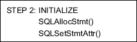
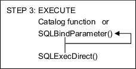

- [CLI User's Manual](#cli-users-manual)
  - [Preface](#preface)
    - [About This Manual](#about-this-manual)
  - [1. Altibase CLI Introduction](#1-altibase-cli-introduction)
    - [Overview](#overview)
    - [Basic Usages](#basic-usages)
    - [Basic Programming Steps](#basic-programming-steps)
    - [Building an Altibase CLI Application](#building-an-altibase-cli-application)
  - [2. Altibase CLI Functions](#2-altibase-cli-functions)
    - [Altibase CLI API](#altibase-cli-api)
    - [SQLAllocConnect](#sqlallocconnect)
    - [SQLAllocEnv](#sqlallocenv)
    - [SQLAllocHandle](#sqlallochandle)
    - [SQLAllocStmt](#sqlallocstmt)
    - [SQLBindCol](#sqlbindcol)
    - [SQLBindParameter](#sqlbindparameter)
    - [SQLBulkOperations](#sqlbulkoperations)
    - [SQLCancel](#sqlcancel)
    - [SQLCloseCursor](#sqlclosecursor)
    - [SQLColAttribute](#sqlcolattribute)
    - [SQLColumns](#sqlcolumns)
    - [SQLConnect](#sqlconnect)
    - [SQLDescribeCol](#sqldescribecol)
    - [SQLDescribeParam](#sqldescribeparam)
    - [SQLDisconnect](#sqldisconnect)
    - [SQLDriverConnect](#sqldriverconnect)
    - [SQLEndTran](#sqlendtran)
    - [SQLError](#sqlerror)
    - [SQLExecDirect](#sqlexecdirect)
    - [SQLExecute](#sqlexecute)
    - [SQLFetch](#sqlfetch)
    - [SQLFetchScroll](#sqlfetchscroll)
    - [SQLForeignKeys](#sqlforeignkeys)
    - [SQLFreeConnect](#sqlfreeconnect)
    - [SQLFreeEnv](#sqlfreeenv)
    - [SQLFreeHandle](#sqlfreehandle)
    - [SQLFreeStmt](#sqlfreestmt)
    - [SQLGetConnectAttr](#sqlgetconnectattr)
    - [SQLGetData](#sqlgetdata)
    - [SQLGetDescField](#sqlgetdescfield)
    - [SQLGetDescRec](#sqlgetdescrec)
    - [SQLGetDiagField](#sqlgetdiagfield)
    - [SQLGetDiagRec](#sqlgetdiagrec)
    - [SQLGetEnvAttr](#sqlgetenvattr)
    - [SQLGetFunctions](#sqlgetfunctions)
    - [SQLGetInfo](#sqlgetinfo)
    - [SQLGetPlan](#sqlgetplan)
    - [SQLGetStmtAttr](#sqlgetstmtattr)
    - [SQLGetTypeInfo](#sqlgettypeinfo)
    - [SQLMoreResults](#sqlmoreresults)
    - [SQLNativeSql](#sqlnativesql)
    - [SQLNumParams](#sqlnumparams)
    - [SQLNumResultCols](#sqlnumresultcols)
    - [SQLParamData](#sqlparamdata)
    - [SQLPrepare](#sqlprepare)
    - [SQLPrimaryKeys](#sqlprimarykeys)
    - [SQLProcedureColumns](#sqlprocedurecolumns)
    - [SQLProcedures](#sqlprocedures)
    - [SQLPutData](#sqlputdata)
    - [SQLRowCount](#sqlrowcount)
    - [SQLSetConnectAttr](#sqlsetconnectattr)
    - [SQLSetDescField](#sqlsetdescfield)
    - [SQLSetEnvAttr](#sqlsetenvattr)
    - [SQLSetPos](#sqlsetpos)
    - [SQLSetStmtAttr](#sqlsetstmtattr)
    - [SQLSpecialColumns](#sqlspecialcolumns)
    - [SQLStatistics](#sqlstatistics)
    - [SQLTablePrivileges](#sqltableprivileges)
    - [SQLTables](#sqltables)
    - [SQLTransact](#sqltransact)
  - [3. LOB Interface](#3-lob-interface)
    - [LOB data types](#lob-data-types)
    - [LOB Function Overview](#lob-function-overview)
    - [SQLBindFileToCol](#sqlbindfiletocol)
    - [SQLindFileToParam](#sqlindfiletoparam)
    - [SQLGetLobLength](#sqlgetloblength)
    - [SQLGetLob](#sqlgetlob)
    - [SQLPutLob](#sqlputlob)
    - [SQLTrimLob](#sqltrimlob)
    - [SQLFreeLob](#sqlfreelob)
  - [4. Using Cursors](#4-using-cursors)
    - [Cursor Characteristics](#cursor-characteristics)
    - [Implicit Cursor Conversionse](#implicit-cursor-conversionse)
    - [Scrolling and Fetching Rows](#scrolling-and-fetching-rows)
    - [Restrictions](#restrictions)
  - [Appendix A. Sample Codes](#appendix-a-sample-codes)
    - [Programing Considerations](#programing-considerations)
    - [Sample of Simple Basic Program](#sample-of-simple-basic-program)
    - [Sample of Using Metadata](#sample-of-using-metadata)
    - [Example of Procedure Test Program](#example-of-procedure-test-program)
  - [Appendix B. Data Types](#appendix-b-data-types)
    - [SQL Data Types](#sql-data-types)
    - [C Data Types](#c-data-types)
    - [Converting SQL Data into C Data Types](#converting-sql-data-into-c-data-types)
    - [Converting C Data into SQL Data types](#converting-c-data-into-sql-data-types)
  - [Appendix C. Error Codes](#appendix-c-error-codes)
    - [SQLSTATE](#sqlstate)
    - [Statement State Transition-related Errors](#statement-state-transition-related-errors)
    - [State Transition Table](#state-transition-table)
  - [Appendix D. Upgrade](#appendix-d-upgrade)
    - [Data Type](#data-type)
    - [Other Changes](#other-changes)


Altibase® Application Development

# CLI User's Manual


Altibase Application Development Altibase CLI User's Manual

Release 7.1

Copyright ⓒ 2001\~2021 Altibase Corp. All Rights Reserved.

This manual contains proprietary information of Altibase Corporation; it is provided under a license agreement containing restrictions on use and disclosure and is also protected by copyright patent and other intellectual property law. Reverse engineering of the software is prohibited. All trademarks, registered or otherwise, are the property of their respective owners.

**Altibase Corp**

10F, Daerung PostTower II, 306, Digital-ro, Guro-gu, Seoul 08378, Korea Telephone: +82-2-2082-1000 Fax: 82-2-2082-1099

Customer Service Portal: http://support.altibase.com/en/

Homepage: [[http://www.altibase.com](http://www.altibase.com/)]

## Preface

### About This Manual

This manual describes how to use Altibase CLI.

#### Audience

This manual has been prepared for the following Altibase users:

-   Database administrators
-   Performance administrators
-   Database users
-   Application developers
-   Technical Supporters

It is recommended for those reading this manual possess the following background knowledge:

-   Basic knowledge in the use of computers, operating systems, and operating system utilities
-   Experience in using relational database and an understanding of database concepts
-   Computer programming experience
-   Experience in database server management, operating system management, or network administration

#### Organization

This manual is organized as follows: 

-   Chapter 1: Altibase CLI Introduction  
    This chapter briefly introduces the background of Altibase CLI, how to use it, its programming steps, and more.
    
-   Chapter 2: Altibase CLI Functions  
    This chapter provides the syntax, arguments, return value and an example for each Altibase CLI function.
    
-   Chapter 3: LOB Interface  
    This chapter describes the functions and data types necessary for using LOB data.

-   Appendix A. Sample Codes  
    This appendix shows all the sample codes used in this document.

-   Appendix B. Data Type  
    This appendix explains the Altibase SQL data types, C data types, and the conversionpossibilities between the data types.
    
-   Appendix C. Error Codes  
    This appendix categorizes the errors which occur while using Altibase CLI to their SQLSTATE, and explains them.

-   Appendix D. Upgrade  
    This appendix describes the data types which were added or redefined and other changes that were made to enable the use of ODBC applications that were used in the previous version, prior to the upgrade.

#### Documentation Conventions

This section describes the conventions used in this manual. Understanding these conventions will make it easier to find information in this manual and in the other manuals in the series. 

There are two sets of conventions:

-   Syntax diagram convetions
-   Sample code conventions

##### Syntax Diagram Conventions

This manual describes command syntax using diagrams composed of the following elements:

| Elements                                                     | Meaning                                                      |
| ------------------------------------------------------------ | ------------------------------------------------------------ |
| [](https://github.com/ALTIBASE/Documents/blob/master/Manuals/Altibase_7.1/eng/media/SQL/image1.gif) | Indicates the start of a command. If a syntactic element starts with an arrow, it is not a complete command. |
| [](https://github.com/ALTIBASE/Documents/blob/master/Manuals/Altibase_7.1/eng/media/SQL/image2.gif) | Indicates that the command continues to the next line. If a syntactic element ends with this symbol, it is not a complete command. |
| [](https://github.com/ALTIBASE/Documents/blob/master/Manuals/Altibase_7.1/eng/media/SQL/image3.gif) | Indicates taht the command continues from the previous line. If a syntactic element starts witht his symbol, it is not a complete command. |
| [](https://github.com/ALTIBASE/Documents/blob/master/Manuals/Altibase_7.1/eng/media/SQL/image4.gif) | Indicates the end of a statement.                            |
| [](https://github.com/ALTIBASE/Documents/blob/master/Manuals/Altibase_7.1/eng/media/SQL/image5.gif) | Indicates a manatory element.                                |
| [](https://github.com/ALTIBASE/Documents/blob/master/Manuals/Altibase_7.1/eng/media/SQL/image6.gif) | Indicates an optional element.                               |
| [](https://github.com/ALTIBASE/Documents/blob/master/Manuals/Altibase_7.1/eng/media/SQL/image7.gif) | Indicates a mandatory element comprised of options. One, and only one, option must be specified. |
| [](https://github.com/ALTIBASE/Documents/blob/master/Manuals/Altibase_7.1/eng/media/SQL/image8.gif) | Indicates an optional element comprised of options.          |
| [](https://github.com/ALTIBASE/Documents/blob/master/Manuals/Altibase_7.1/eng/media/SQL/image9.gif) | Indicates an optional element in which multiple elements may be specified. A comman must precede all but the first element. |

##### Sample Code Conventions

The code examples explain SQL statements, stored procedures, iSQL statements, and other command line syntax.

The following table describes the printing conventions used in the code examples.

| Rules            | Meaning                                                      | Example                                                      |
| ---------------- | ------------------------------------------------------------ | ------------------------------------------------------------ |
| [ ]              | Indicates an optional item                                   | VARCHAR [(*size*)] [[FIXED \|] VARIABLE]                     |
| { }              | Indicates a mandatory field for which one or more items must be selected. | { ENABLE \| DISABLE \| COMPILE }                             |
| \|               | A delimiter between optional or mandatory arguments.         | { ENABLE \| DISABLE \| COMPILE } [ ENABLE \| DISABLE \| COMPILE ] |
| . . .            | Indicates that the previous argument is repeated, or that sample code has been omitted. | SQL\> SELECT ename FROM employee;<br/> ENAME<br/>  -----------------------<br/> SWNO<br/>  HJNO<br/>  HSCHOI<br/>  .<br/> .<br/> .<br/> 20 rows selected. |
| Other Symbols    | Symbols other than those shown above are part of the actual code. | EXEC :p1 := 1; acc NUMBER(11,2)                              |
| Italics          | Statement elements in italics indicate variables and special values specified by the user. | SELECT \* FROM *table_name*; <br/>CONNECT *userID*/*password*; |
| Lower case words | Indicate program elements set by the user, such as table names, column names, file names, etc. | SELECT ename FROM employee;                                  |
| Upper case words | Keywords and all elements provided by the system appear in upper case. | DESC SYSTEM_.SYS_INDICES_;                                   |

#### Related Documentations

For more detailed information, please refer to the following documents.

-   Installation Guide

-   Administrator’s Manual

-   Replication Manual

-   Precompiler User’s Manual

-   ODBC User's Manual

-   Application Program Interface User’s Manual

-   iSQL User’s Manual

-   Utilities Manual

-   Error Message Reference

#### Altibase Welcomes Your Comments and Feedbacks

Please let us know what you like or dislike about our manuals. To help us with better future versions of our manuals, please tell us if there is any corrections or classifications that you would find useful.

Include the following information:

- The name and version of the manual that you are using
- Any comments about the manual
- Your name, address, and phone number

If you need immediate assistance regarding any errors, omissions, and other technical issues, please contact [Altibase's Support Portal](http://support.altibase.com/en/).

Thank you. We always welcome your feedbacks and suggestions.

## 1. Altibase CLI Introduction

This chapter briefly introduces the background of Altibase CLI, how to use it, its programming steps, and more.

### Overview

X/Open CLI and ODBC are standard open application program interfaces to access the database, and are callable SQL programming interfaces. A callable programming SQL interface is an interface which accesses the database and executes a SQL statement by calling a CLI function.

#### X/Open CLI and ODBC

The standard callable SQL interface (called X/Open CLI or SAG CLI) was created by X/Open and SQL Access Group (SAG).

Microsoft’s ODBC for Windows was also built upon the X/Open CLI specification. 

#### What is Altibase CLI?

Altibase CLI is a callable SQL programming interface supported for Altibase. The Altibase CLI driver can be used singularly for the CLI application, or as the sub-library of the following libraries. 

-   libalticapi.a: Altibase C API library 
-   libapre.a: APRE C/C++ library 
-   libiloader.a: iLoader API library

The Altibase CLI driver is included in the Altibase server and client packages as a library, and is required to build or run the following applications. 

-   Altibase CLI applications 
-   Altibase C API applications 
-   APRE C/C++ applications 
-   XA applications 
-   iLoader API applications

#### Altibase ODBC Driver

For an ODBC application to access a database, a separate module or driver provided by the database to be accessed is required, apart from the ODBC software (e.g., ODBC Driver Manager). Altibase provides the ODBC driver for this purpose. For further information on the Altibase ODBC driver, please refer to the *Altibase ODBC User’s Manual.*

#### Differences Between CLI and ODBC

Altibase CLI conforms to X/Open CLI standards and ODBC specifications to maximum levels, and is very similar to an ODBC interface. However, since the Altibase CLI application does not run through the ODBC Driver Manager at runtime, Altibase CLI guarantees faster response time than an ODBC application.


[Figure 1-1] The CLI Driver and the ODBC Driver Accessing the Database

#### Before Reading This Manual

Altibase CLI conforms not only to X/Open CLI standards, but also to ODBC specifications. Also, since the Altibase CLI core module runs in the lower part of the Altibase ODBC Driver as shown in the figure above, most of the internal operations of the Altibase CLI driver and Altibase ODBC driver are similar. 

The contents of this manual mostly apply also to the ODBC driver, and terminologies related to both ODBC and Altibase CLI are used.

### Basic Usages

This section explores the prior knowledge necessary for writing applications using Altibase CLI. 

As shown in [Figure 1-1] below, Altibase CLI applications are typically composed of the following three steps:

-   Initialization of Handles 
-   Processing of Transactions 
-   Release of Handles

Operations other than the above, such as processing diagnostic messages, occur throughout the whole application. 


[Figure 1-2] Altibase CLI Application Steps

#### Initialization of Handles

This step allocates and initializes the environment and connection handles. Transition from one step to the next step is made by passing the appropriate handles to send information about the execution results of the previous step. Handle types provided by Altibase CLI are as follows:

##### Environment Handles

The environment handle references the overall environment of an application’s state. An environment handle must be allocated prior to allocating a connection handle, and multiple environment handles can be allocated in a single application. 

##### Connection Handles

The connection handle references information related to the connections managed by Altibase CLI. This information includes the general status, transaction status, and diagnostic information. An application allocates a connection handle for each connection to attempt connection to the Altibase server. 

##### Statement Handles

The statement handle references information of the SQL statements managed by Altibase CLI, and is associated with the connection handle. A statement handle is allocated to execute a statement. A maximum number of 1,024 statements can be allocated to a single connection. 

#### Processing of Transactions

Below figure shows the execution order of a function call.


[Figure 1-3] The Execution Order of a Function Call

#### Release of Handles

This step releases the allocated handles, recovers the allocated memory, and then terminates the application.

#### Processing Diagnostic Messages

A diagnosis is an operation which handles warnings or error states that are generated in an application.

##### Application Return Values

| Return Values         | Description                                                  |
| --------------------- | ------------------------------------------------------------ |
| SQL_SUCCESS           | The function completed successfully                          |
| SQL_SUCCESS_WITH_INFO | The function executed successfully with a warning and other information |
| SQL_NO_DATA           | The function executed successfully, but no related data is available. |
| SQL_ERROR             | The function failed                                          |
| SQL_INVALID_HANDLE    | The function failed due to an invalid input handle.          |

Diagnostic messages are generated for all, but SQL_SUCCESS, SQL_NO_DATA_FOUND, and SQL_INVALID_HANDLE. To check the diagnostic message, you can call SQLGetDiagRec() and SQLGetDiagField().

##### Diagnostic Messages

A diagnostic message is a five-byte alphanumeric string. The first two characters depict the class, and the last three characters depict the sub class. 

The diagnostic messages provided by Altibase CLI conform with X/Open SQL CAE specifications.

#### Restrictions

The Altibase client library does not handle signals.

Therefore, if the network is disconnected due to an external issue, a running application can be forcefully terminated by receiving the SIGPIPE signal. To prevent the application from forcefully terminating, the SIGPIPE signal must be handled within the user application. Since the application can hang if you call an Altibase client library function within a SIGPIPE signal handler function, caution is required when writing signal handler functions. Nevertheless, it is possible to call an Altibase client library function after signal handling is complete.

### Basic Programming Steps


#### Step 1: Connect to the Database

For any application, the first step is to connect to the database. The following functions are necessary for this step:


The first operation required to connect to the database, is to allocate an environment handle using SQLAllocHandle(). 

An application sets the environment attributes of the current environment by calling SQLSetEnvAttr(). 

Next, the application allocates a connection handle using SQLAllocHandle(), and calls SQLDriverConnect() to connect to the data source. 

After that, the application sets the connection attributes using SQLSetConnectAttr().

#### Step 2: Initialize the Application

The second step is to initialize the application as shown in the following figure. The exact operation is dependent on the application.



An application allocates a statement handle using SQLAllocStmt(), and most applications specify statement attributes (such as the cursor type) using SQLSetStmtAttr().

#### Step 3: Build and Execute a SQL Statement

The third step is to build and execute a SQL statement as shown below. This step can be processed in many different ways. An application creates or executes a SQL statement, based on the SQL statement input by the user.



When a SQL statement is created and the variables are bound, the statement is executed with SQLExecDirect. For statements that are executed multiple times, it is more efficient performance wise to prepare the statement with SQLPrepare() and repeatedly execute it with SQLExecute().

If a SQL statement includes parameter markers(‘?’), an application calls SQLBindParameter() and binds each argument to an application variable. SQLPrepare() must be executed before binding the arguments, SQLExecute() can be executed after they have been bound.

An application can delay the execution of a SQL statement and call a function that returns a result set which includes information from the system catalogs instead. 

The next step for the application to take depends on how the SQL statement is executed. 

| SQL Statement Types        | Aniticipated Actions                                         |
| -------------------------- | ------------------------------------------------------------ |
| SELECT or Catalog Funciton | Step 4a: Fetches the results.                                |
| UPDATE, DELETE, or INSERT  | Step 4b: Fetches the number of affected rows.                |
| Other SQL Statements       | Step 3: Builds and excutes a SQL statement. Or Step 5: Commits the transaction |

#### Step 4a: Fetch the Results

This step fetches the results as shown in the above figure.


If the statement executed in Step 3 is a SELECT statement or catalog function, an application calls SQLNumResultCols() to figure out the number of columns in the result set. This step is unnecessary if the application already knows the number of columns in the result set.

Next, the application fetches the name of each column in the result set, the data type, precision and etc. using SQLDescribeCol(). Likewise, this step is unnecessary if the application already knows this information. Afterwards, the application sends this information to SQLBindCol(), which binds application variables to columns in the result set.

Now the application calls SQLFetch() to fetch the first row of data and stores the data to the bound variable using SQLBindCol(). If there is long data in the row, data can be retrieved using SQLGetData(). To fetch additional data, the application continues to call SQLFetch() and when necessary, SQLGetData().

Once all of the data has been fetched in the above procedure, the application must close the open cursor using SQLCloseCursor(), before executing another statement using SQLPrepare() and SQLExecute(), to fetch data. 

The application returns to Step 3 to execute another statement in the same transaction, or goes to Step 5 to commit or roll back the transaction. 

#### Step 4b: Fetch the Row Count 


If the statement executed in Step 3 is either an UPDATE, INSERT, or DELETE statement, an application fetches the number of affected rows using SQLRowCount(). 

If multiple statements have been executed using array bind or etc., the rows that were affected by the execution of each statement can be fetched using the SQLMoreResults() and SQLRowCount() functions. 

The application returns to Step 3 to execute another statement in the same transaction, or goes to Step 5 to commit or roll back the transaction. 

#### Step 5: Commit/Rollback the Transaction


This step calls SQLEndTran() to commit or roll back the transaction. An application performs this step only when the transaction commit mode is set to non-auto-commit mode. If the transaction commit mode is auto-commit, the transaction automatically is commited when a statement is executed. 

To execute a statement in a new transaction, the application must return to Step 3; To disconnect from the database, the application goes to Step 6.

####  Step 6: Disconnect from the Altibase

The final step is to disconnect from the database, as shown in the following figure. First, the application calls SQLFreeHandle () to free the handle.


The final step is to disconnect from the database. First, an application calls SQLFreeHandle() and frees handles. 

Next, the application disconnects from the database using SQLDisconnect(), and frees the connection handle using SQLFreeConnect().

Lastly, the application frees the environment handle using SQLFreeEnv() and terminates the program.

### Building an Altibase CLI Application

This section describes how to build an Altibase CLI application.

#### Header File and Library

To write and build an application using Altibase CLI, the following header and library files in the include and lib subdirectories of the $ALTIBASE_HOME directory are required.

```
$ALTIBASE_HOME/include/sqlcli.h
$ALTIBASE_HOME/lib/libodbccli.a
```

#### Compiling

When compiling, use the following option in the compile command.

```
-I$ALTIBASE_HOME/include
```

When linking, use the following option in the link command.

```
-L$ALTIBASE_HOME/lib -lodbccli
```

## 2. Altibase CLI Functions

This chapter describes the specifications of Altibase CLI functions.

For each Altibase CLI functions, the following information are described.

-   Name of the function and purpose of use
-   Function prototype for C/C++ Users 
-   Arguments list of the function 
-   Return Values 
-   Usages of function and notes 
-   Diagnosis message that can be displayed when an error occurrs in function 
-   Related Function list 
-   Example source codes

### Altibase CLI API

#### API Categorization

The API of the Altibase CLI consists of functions that define environment for running applications, managing connections, and processing SQL statements and transactions. Depending on the features of each function, these are grouped by followings:

-   Managing Environments and Connections 
-   SQL Processing 
-   Setting and Retrieving Driver Attributes 
-   Meta data processing

##### Managing Environments and Connections

The APIs that allocate resources necessary for the connection to the database server and provide connection-related features. Releases the memory space after disconnected from datasources.

##### SQL Processing

The APIs that allocate resources and prepare commands for the processing, executing and retreiving results of SQL statements.

##### Setting and Retrieving Driver Attributes

The APIs that set the environment for the processing of the SQL, connection status, and statement attributes.

##### Metadata Processing

The APIs that provide features to define tables and columns and to retrieve database metadata.

#### API List

Altibase CLI functions are listed in the following table. For further information on each function, please refer to Chapter 2: Altibase CLI Functions.

<table>
<tr>
	<td colspan="2">Task</td>
    <td>Function Name</td>
    <td>Purpose</td>
</tr>
<tr>
    <td rowspan="14" colspan="2"> Managing
environments and
connections<br/>
    <td>SQLAllocConnect</td>
    <td> Obtains an environment, connection, statement,
or descriptor handle</td>
</tr>
<tr>
    <td>SQLAllocEnv</td>
    <td> Allocates an environment, connection, statement,
or descriptor handle</td>
</tr>
<tr>
    <td>SQLAllocStmt</td>
    <td>Obtains statement handles and Allocates
memory</td>
</tr>
<tr>
    <td>SQLAllocHandle</td>
    <td>Initializes of resources, environments, and
statement handles and allocates memory</td>
</tr>
<tr>
    <td>SQLCloseCursor</td>
    <td>This closes cursor and discards pending results</td>
</tr>
<tr>
    <td>SQLConnect</td>
    <td>Connects to a target database</td>
</tr>
<tr>
    <td>SQLDisconnect</td>
    <td>Closes the connection. Releases an environment,
connection, statement, or descriptor handle</td>
</tr>
<tr>
    <td>SQLDriverConnect</td>
    <td>Connects to a specific driver by connection string
or requests that the Driver Manager and driver
display connection dialog boxes for the user</td>
</tr>
<tr>
    <td>SQLEndTran</td>
    <td>Commits or rolls back a transaction</td>
</tr>
<tr>
    <td>SQLFreeConnect</td>
    <td>Closes the connection handle, and releases the
memory</td>
</tr>
<tr>
    <td>SQLFreeEnv</td>
    <td>Closes the environment handle, and releases the
memory</td>
</tr>
<tr>
    <td>SQLFreeHandle</td>
    <td>Releases the memory allocated to the connection,
the handle, and the command</td>
</tr>
 <tr>
    <td>SQLFreeStmt</td>
    <td>Closes the statement handle, and releases the
allocated memory</td>
</tr>
 <tr>
    <td>SQLTransact</td>
    <td>Commits or releases all changes related to the
database</td>
</tr>
<tr>
    <td rowspan="23">SQL Processing</td>
    <td rowspan="7">Requesting</td>
    <td>SQLBindParameter</td>
    <td>Binds the parameter to a SQL statement </td>
</tr>
<tr>
	<td>SQLExecDirect</td>
	<td>Directly executes a SQL statement</td>
</tr>
<tr>
    <td>SQLExecute</td>
    <td>Executes a prepared SQL statement</td>
</tr>
<tr>
    <td>SQLNativeSql</td>
    <td>Efficiently tests the syntax of SQL
statements and converts it to that Altibase
supports</td>
</tr>
<tr>
    <td>SQLParamData</td>
    <td> Supplies data at statement execution
time.</td>
</tr>
<tr>
    <td>SQLPrepare</td>
    <td>Prepares a SQL statement for later execution</td>
</tr>
<tr>
    <td>SQLPutData</td>
    <td>This is used to supply data at statement execution
time</td>
</tr>
<tr>
    <td rowspan="16">Retrieving</td>
    <td>SQLBindCol</td>
    <td>Defines the buffer and the data type to receive the
columns of the result set</td>
</tr>
<tr>
    <td>SQLColAttribute</td>
    <td>Defines the attributes about the columns of the
result set</td>
</tr>
<tr>
    <td>SQLDescribeCol</td>
    <td>Checks the metadata about one column in the
result set</td>
</tr>
<tr>
    <td>SQLDescribeParam</td>
    <td>Checks information related to the parameter
marker (?) in the result set</td>
</tr>
<tr>
    <td>SQLError</td>
    <td>Checks diagnosis messages related to the recently
called Altibase CLI function</td>
</tr>
<tr>
    <td>SQLFetch</td>
    <td>Returns multiple result rows</td>
</tr>
<tr>
    <td>SQLFetchScroll</td>
    <td>The result set the cursor to the desired direction
of progress, and get a column to bind</td>
</tr>
<tr>
    <td>SQLGetConnectAttr</td>
    <td>Returns the properties setting of connection</td>
</tr>
<tr>
    <td>SQLGetData</td>
    <td>Returns the data of a specified column in the
result set</td>
</tr>
<tr>
    <td>SQLGetInfo</td>
    <td>Retrieve DBMS information connected to the application</td>
</tr>
<tr>
    <td>SQLGetStmtAttr</td>
    <td>Returns the attributes related to the current
statement handle</td>
</tr>
<tr>
    <td>SQLGetTypeInfo</td>
    <td>Returns the information about the data type
supported by the database</td>
</tr>
<tr>
    <td>SQLNumParams</td>
    <td>SReturns the number of parameters in a SQL
statement</td>
</tr>
<tr>
    <td>SQLNumResultCols</td>
    <td>Returns the number of columns in the result set</td>
</tr>
<tr>
    <td>SQLRowCount</td>
    <td>Returns the number of rows affected by an insert,
update, or delete request</td>
</tr>
<tr>
    <td>SQLMoreResults</td>
    <td>If multiple results are generated execution, it changes the result of interest to the next result.</td>
</tr>
<tr>
    <td rowspan="5" colspan="2">Setting and
retrieving driver
attributes</td>
    <td>SQLGetEnvAttr</td>
    <td>Returns the current setting of an environment
attribute</td>
</tr>
<tr>
    <td>SQLGetFunctions</td>
    <td>Returns information about whether a driver
supports a specific Altibase CLI function.</td>
</tr>
<tr>
    <td>SQLSetConnectAttr</td>
    <td>Sets the connection attributes</td>
</tr>
<tr>
    <td>SQLSetEnvAttr</td>
    <td>Sets the environment attributes</td>
</tr>
<tr>
    <td>SQLSetStmtAttr</td>
    <td>Sets the statement attributes</td>
</tr>
<tr>
    <td rowspan="14" colspan="2">Metadata
Processing (catalog
functions)</td>
    <td>SQLColumns</td>
    <td>Returns the list of column names in specified
tables</td>
</tr>
<tr>
    <td>SQLForeignKeys</td>
    <td>Returns a list of column names that make up
foreign keys, if they exist for a specified table</td>
</tr>
<tr>
    <td>SQLGetDescField</td>
    <td> Returns a single field of a descriptor record</td>
</tr>
<tr>
    <td>SQLGetDescRec</td>
    <td>Returns values of multiple fields of a
descriptor record</td>
</tr>
<tr>
    <td>SQLGetDiagField</td>
    <td>Diagnoses the result after the function is used</td>
</tr>
<tr>
    <td>SQLGetDiagRec</td>
    <td>Returns several commonly used fields of a
diagnostic record after using the function</td>
</tr>
<tr>
    <td>SQLPrimaryKeys</td>
    <td>Returns the list of column names that make up
the primary key for a table</td>
</tr>
<tr>
    <td>SQLProcedureColumns</td>
    <td>Returns the list of input and output parameters, as
well as the columns that make up the result set
for the specified procedures</td>
</tr>
<tr>
    <td>SQLProcedures</td>
    <td>Returns the list of procedure names stored in a
specific database</td>
</tr>
<tr>
    <td>SQLSetDescField</td>
    <td>Sets the descriptor field</td>
</tr>
<tr>
    <td>SQLSpecialColumns</td>
    <td>
Searches for specific columns</td>
</tr>
<tr>
    <td>SQLStatistics</td>
    <td>Returns statistics about a single table and
the list of indexes associated with the table</td>
</tr>
<tr>
    <td>SQLTablePrivileges</td>
    <td>Returns a list of tables and the privileges
associated with each table</td>
</tr>
<tr>
    <td>SQLTables</td>
    <td>Returns the list of table names stored in a
specific database</td>
</tr>
</table>


### SQLAllocConnect 

SQLAllocConnect allocates an environment, connection, statement, or descriptor handle. This function allocates the related resources in the environment identified by the connection handles and the input environment handles.

SQLAllocConnect () can be replaced by SQLAllocHandle ().

#### Syntax

```
SQLRETURN  SQLAllocConnect (
	SQLHENV	    env,
	SQLHDBC *	dbc );
```

#### Arguments

| Data Type  | Argument | In/Output | Description               |
| ---------- | -------- | --------- | ------------------------- |
| SQLHENV    | env      | Input     | Environment Handle        |
| SQLHDBC \* | dbc      | Output    | Connection Handle Pointer |

#### Return Values

```
SQL_SUCCESS
SQL_INVALID_HANDLE
SQL_ERROR
```

#### Description

The Altibase CLI Driver uses the output connection handle to refer to all information related to the connection such as connection status, transaction status, and error information. 

If the pointer (dbc) indicating the connection handle refers to the valid connection handle allocated by SQLAllocConnect (), the calling result will change the original value. If it is application programming error, it is not detected by Altibase CLI Driver.

> \* SQLAllocEnv () must be called before calling this function.
>

#### Diagnosis

| SQLSTATE | Description                            | Comments                                              |
| -------- | -------------------------------------- | ----------------------------------------------------- |
| HY000    | General error                          | Channel initialization error                          |
| HY001    | Memory allocation error                | Failed to allocate the memory for the explicit handle |
| HY009    | Invalid Arguments used (null pointer). | dbc is a NULL pointer.                                |

#### Related Functions

```
SQLAllocEnv
SQLConnect
SQLDisconnect
SQLFreeConnect
```

#### Example

< Refer to: /sample/SQLCLI/demo_ex1.cpp >

```
/* Memory allocation for the environment */
if (SQLAllocEnv (&env) != SQL_SUCCESS)
{
    printf("SQLAllocEnv error!!\n");
    return SQL_ERROR;
}

/* Memory allocation for the connection  */
if (SQLAllocConnect (env, &dbc) != SQL_SUCCESS)
{
    printf("SQLAllocConnect error!!\n");
    return SQL_ERROR;
}
```

### SQLAllocEnv 

SQLAllocEnv allocates the resources related to the environment handles.

SQLAllocEnv () can be replaced by SQLAllocHandle ().

#### Syntax

```
SQLRETURN  SQLAllocEnv ( 
	SQLHENV *	env );
```

#### Argument

| Data Type  | Argument | In/Output | Description                |
| ---------- | -------- | --------- | -------------------------- |
| SQLHENV \* | env      | Output    | Environment handle pointer |

#### Return Values

```
SQL_SUCCESS
SQL_ERROR
```

#### Description

One application can use various environment variables.

To use resources of the Altibase CLI, the program that called SQLAllocEnv () must not terminate or get out of the stack. Otherwise, an application may lose the statement handles and other allocated resources.

Before calling SQLAllocConnect () or other Altibase CLI functions, an application must call this function. Then, the env value will be sent to all functions that require the environment handles as input values.

#### Related Functions

```
SQLAllocConnect
SQLAllocStmt
SQLFreeEnv
```

#### Example

< Refer to: $ALTIBASE_HOME/sample/SQLCLI/demo_ex1.cpp >

```
/* Memory allocation for the environment */
if (SQLAllocEnv (&env) != SQL_SUCCESS)
{
    printf("SQLAllocEnv error!!\n");
    return SQL_ERROR;
}
```

### SQLAllocHandle 

SQLAllocHandle allocates and initializes the memory for the environment, connection, and statement handles.

#### Syntax

```
SQLRETURN  SQLAllocHandle (
	SQLSMALLINT	    HandleType,
	SQLHANDLE		InputHandle,
	SQLHANDLE *		OutputHandlePtr );
```

#### Arguments

| Data Type    | Argument        | In/Output | Description                                                  |
| ------------ | --------------- | --------- | ------------------------------------------------------------ |
| SQLSMALLINT  | HandleType      | Input     | One of the following handle type is allocated: SQL_HANDLE_ENV, SQL_HANDLE_DBC, SQL_HANDLE_STMT |
| SQLHANDLE    | InputHandle     | Input     | If the input HandleType is SQL_HANDLE_ENV, InputHandle will be SQL_Null_Handle. Or if the input HandleTyp is SQL_HANDLE_DBC, it will be the environment handle. In case of SQL_HANDLE_STMT, it will be the connection handle. |
| SQLHANDLE \* | OutputHandlePtr | Output    | The pointer of the allocated handle                          |

#### Return Values

```
SQL_SUCCESS
SQL_SUCCESS_WITH_INFO
SQL_INVALID_HANDLE
SQL_ERROR
```

#### Description

SQLAllocHandle () allocates the environment, connection and statement handles to be described in the next paragraph. 

This function will replace SQLAllocEnv (), SQLAllocConnect () and SQLAllocStmt () functions. To request the environment handle, an application calls SQLAllocHandle () of which HandleTyp is SQL_HANDLE_ENV and input handle is SQL_Null_Handle. To request the connection handle, an application must call SQLAllocHandle () of which HandleTyp is SQL_HANDLE_DBC and the input handle must be a valid environment handle. To request the statement handle, an application must call SQLAllocHandle () of which HandleTyp is SQL_HANDLE_STMT and the input handle must be a valid connection handle. 

One application can allocate multiple environment, connection, and statement handles at one time. However, several environment, connection or statement handle cannot be used at the same time on another thread of one process.

##### Allocation of the Environment Handles

The environment handle provides global information about the validity or activation of the connection handle

To request an environment handle, an application must call SQLAllocHandle () of which HandleTyp is SQL_HANDLE_ENV and input handle is SQL_Null_Handle. The Altibase CLI driver allocates the memory needed for environment information and returns the handle related to the \**OutputHandle*. An application sends the *OutputHandle value to the subsequent callings that require the environment handles.

##### Allocation of the Connection Handles

The connection handle provides information about the validity of the statement handle or activation of the transaction.

To request the connection handle, an application calls SQLAllocHandle () of which *HandleType* is SQL_HANDLE_DBC. *InputHandle* argument calls SQLAllocHandle () and is set as the returned environment handle. The Altibase CLI driver allocates the memory necessary for the connection and returns the handle values related to the \**OutputHandle*. An application sends the **OutputHandle* to the subsequent callings that require the connection handle.

##### Allocation of the Statement handles

The statement handle provides command information such as error messages about processing a SQL statement and status state. 

To request the statement handle, an application connects to the database and calls SQLAllocHandle () before sending a SQL statement. For this calling, the *HandleType* must be set as SQL_HANDLE_STM and the I argument must be set as a connection handle to be returned by calling SQLAllocHandle (). The Altibase CLI driver allocates the memory necessary for the command, connects the statement handle, and returns the handle related to **OutputHandle*. An application sends \**OutputHandle* value to the subsequent callings that require the statement handle.

#### Diagnosis

| SQLSTATE | Description                           | Comments                                              |
| -------- | ------------------------------------- | ----------------------------------------------------- |
| HY000    | General error                         |                                                       |
| HY001    | Memory allocation error               | Failed to allocate the memory for the explicit handle |
| HY009    | Invalid argumnets used (null pointer) | OutputHandlePtr is a NULL pointer                     |

#### Related Functions

```
SQLExecDirect
SQLExecute
SQLFreeHandle
SQLPrepare
SQLSetConnectAttr
SQLSetEnvAttr
SQLSetStmtAttr
```

#### Example

< Refer to: $ALTIBASE_HOME/sample/SQLCLI/demo_meta1.cpp >

```
/* Memory allocation for the environment */
if (SQLAllocHandle(SQL_HANDLE_ENV, SQL_NULL_HENV, &env) != SQL_SUCCESS)
{
    printf("SQLAllocEnv error!!\n");
    return SQL_ERROR;
}
    
/* Memory allocation for the connection  */
if (SQLAllocHandle(SQL_HANDLE_DBC, env, &dbc) != SQL_SUCCESS)
{   
    printf("SQLAllocConnect error!!\n");
    return SQL_ERROR;
}
```

### SQLAllocStmt

SQLAllocStmt allocates and initializes the memory for the SQL statements. Up to 1024 statements are allocated to one connection. 

SQLAllocStmt () can be replaced by SQLAllocHandle ().

#### Syntax

```
SQLRETURN  SQLAllocStmt (
	SQLHDBC	    dbc,
	SQLHSTMT *	stmt );
```

#### Arguments

| Data Type   | Arguments | In/Output | Description                 |
| ----------- | --------- | --------- | --------------------------- |
| SQLHDBC     | dbc       | Input     | Connection Handle           |
| SQLHSTMT \* | stmt      | Output    | Pointer of statement handle |

#### Arguments

```
SQL_SUCCESS
SQL_SUCCESS_WITH_INFO
SQL_INVALID_HANDLE
SQL_ERROR
```

In case SQL_ERROR is returned, stmt arguments will be set as SQL_NULL_STMT. An application must set stmt arguments as SQL_NULL_STMT and calls SQLERROR ().

#### Description

The Altibase CLI driver relates the descriptors, results and status data with the processed SQL statements by using each statement handle. Each SQL statement must have a statement handle, but other commands can use the handles again.

When this function is called, the database connection used by the databasec must be referred to.

If the input pointer indicates the valid statement handle allocated by the previous calling of SQLAllocStmt (), the original value will be changed according to the result of this calling. As an application programming error, it is not detected by Altibase CLI driver.

> \* Call SQLAllocEnv() before calling this function. This function must be called before other functions that have SQLPrepare (), SQLExecute (), SQLExecDirect () or statement handle as an input Arguments.

#### Diagnosis

| SQLSTATE | Description                                                  | Comments                                    |
| -------- | ------------------------------------------------------------ | ------------------------------------------- |
| HY000    | General Error                                                | The number of stmt (1024) exceeds           |
| HY001    | Memory allocation error                                      | Failed to allocate the memory for the stmt. |
| HY009    | Invalid Arguments used (null pointer)                        | stmt is a NULL pointer.                     |
| HY010    | Continuous function error (not connected or disconnected status) | dbc is not connected or disconnected        |

#### Related Functions

```
SQLConnect
SQLFreeStmt
```

#### Example

< Refer to: $ALTIBASE_HOME/sample/SQLCLI/demo_ex1.cpp >

```
/* Memory allocation for a statement */
if (SQL_ERROR == SQLAllocStmt(dbc, &stmt))
{
    printf("SQLAllocStmt error!!\n");
    return SQL_ERROR;
}
```

### SQLBindCol

SQLBindCol binds an application variables to the columns of the result sets for all data types.

#### Syntax

```
SQLRETURN  SQLBindCol (
	SQLHSTMT	stmt, 
	SQLSMALLINT	col,
	SQLSMALLINT	cType,
	SQLPOINTER	value,
	SQLLEN		max,
	SQLLEN *	valueLength );

```

#### Arguments

| Data Type   | Argument    | In/Out                   | Description                                                  |
| ----------- | ----------- | ------------------------ | ------------------------------------------------------------ |
| SQLHSTMT    | stmt        | Input                    | Statement handle                                             |
| SQLSMALLINT | col         | Input                    | Column position in the result set to bind. Starts with 1.    |
| SQLSMALLINT | cType       | Input/Output( Suspended) | C data type identifier of the *Value buffer. About the data types, see the appendix of this document. |
| SQLPOINTER  | value       | Output                   | Pointer of the buffer to store the data. SQLFetch () returns the data to this buffer.If the value is a NULL pointer, the Altibase CLI driver will unbind the data buffer for the result set columns. An application unbinds all columns by calling SQLFreeStmt () using SQL_UNBind option. However, if the ValueLength argument is valid even though the value argument is a NULL pointer, an application still have buffer for binding. of the length. |
| SQLLEN      | max         | Input                    | Maximum size of the buffer (in bytes). When returning the character data to the *Value, the *Value argument must include space for the NULL-terminatior. Otherwise, the Altibase CLI driver cuts out the data. In case a fixed length data (integer, date structure, etc) are returned, the Altibase CLI driver will ignore max. Therefore, a sufficient buffer size must be allocated. Otherwise, the Altibase CLI driver passes through the end of the buffer and saves the garbage data. |
| SQLLEN \*   | valueLength | Input/Output( Suspended) | Is a pointer for the data length or NULL. SQLFetch () function be able to return the |

#### Return Values

```
SQL_SUCCESS
SQL_SUCCESS_WITH_INFO
SQL_INVALID_HANDLE
SQL_ERROR
```

#### Description

The pointer value and ValueLength are suspended output variables for this function. Thememory address indicated by this pointer will not be updated until SQLFetch () is called. The position referred to by this pointer must be valid till SQLFetch () is called.

SQLBindCol () binds application variables to the columns of the result set for all data types. When SQLFetch () is called, the data will be sent from the databaseMS to an application.

An application calls SQLBindCol () once for each column. When SQLFetch () is called, the data of each bound column is stored in the address allocated by the value or the ValueLength pointer.

An application can inquire the attributes such as the data type or length of the column by calling SQLDescribeCol () or SQLColAttribute (). This information can be used to indicate the proper data type or to convert the data into another data type.

The columns are identified in a series of numbers from the left to the right. The number of columns in the result set can be decided by setting SQL_DESC_Count in SQLNumResultCols () or fieldIdentifier argument and by calling SQLColAttribute ().

An application may not bind any column. The data in unbound column can be searched by SQLGetData () after SQLFetch () is called. In usuall case SQLBindCol () is more efficient than SQLGetData ().

> \* To get the data from the buffer identified by this function, SQLBindCol () must be called before SQLFetch ().

#### Diagnosis

| SQLSTATE | Description                             | Comments                                                     |
| -------- | --------------------------------------- | ------------------------------------------------------------ |
| 07009    | Invalid column number                   | col Arguments exceeds the maximum number of columns in the result set |
| HY000    | General error                           |                                                              |
| HY001    | Memory allocation error                 | Failed to allocate the memory for the explicit handle        |
| HY003    | An application buffer type is not valid | cType argument is not valid                                  |

#### Related Functions

```
SQLDescribeCol	
SQLFetch
SQLFreeStmt
SQLGetData
SQLNumResultCols
```

#### Example

< Refer to: $ALTIBASE_HOME/sample/SQLCLI/demo_ex2.cpp >

```
sprintf(query,"SELECT * FROM DEMO_EX2 WHERE id=?");
if (SQLPrepare(stmt, (SQLCHAR *)query, SQL_NTS) != SQL_SUCCESS)
{
    execute_err(dbc, stmt, query);
    SQLFreeStmt(stmt, SQL_DROP);
    return SQL_ERROR;
}

if (SQLBindParameter(stmt, 1, SQL_PARAM_INPUT,
                     SQL_C_CHAR, SQL_CHAR,
                     8, 0,
                     id_in, sizeof(id_in), NULL) != SQL_SUCCESS)
{
    execute_err(dbc, stmt, query);
    SQLFreeStmt(stmt, SQL_DROP);
    return SQL_ERROR;
}

/* binds application data buffers to columns in the result set */
if (SQLBindCol(stmt, 1, SQL_C_CHAR,
               id, sizeof(id), NULL) != SQL_SUCCESS)
{
    printf("SQLBindCol error!!!\n");
    execute_err(dbc, stmt, query);
    SQLFreeStmt(stmt, SQL_DROP);
    return SQL_ERROR;
}
if (SQLBindCol(stmt, 2, SQL_C_CHAR,
               name, sizeof(name), NULL) != SQL_SUCCESS)
{
    printf("SQLBindCol error!!!\n");
    execute_err(dbc, stmt, query);
    SQLFreeStmt(stmt, SQL_DROP);
    return SQL_ERROR;
}
if (SQLBindCol(stmt, 3, SQL_C_SLONG,
               &age, 0, NULL) != SQL_SUCCESS)
{
    printf("SQLBindCol error!!!\n");
    execute_err(dbc, stmt, query);
    SQLFreeStmt(stmt, SQL_DROP);
    return SQL_ERROR;
}
if (SQLBindCol(stmt, 4, SQL_C_TYPE_TIMESTAMP,
               &birth, 0, NULL) != SQL_SUCCESS)
{
    printf("SQLBindCol error!!!\n");
    execute_err(dbc, stmt, query);
    SQLFreeStmt(stmt, SQL_DROP);
    return SQL_ERROR;
}
if (SQLBindCol(stmt, 5, SQL_C_SSHORT,
               &sex, 0, NULL) != SQL_SUCCESS)
{
    printf("SQLBindCol error!!!\n");
    execute_err(dbc, stmt, query);
    SQLFreeStmt(stmt, SQL_DROP);
    return SQL_ERROR;
}
if (SQLBindCol(stmt, 6, SQL_C_DOUBLE,
               &etc, 0, &etc_ind) != SQL_SUCCESS)
{
    printf("SQLBindCol error!!!\n");
    execute_err(dbc, stmt, query);
    SQLFreeStmt(stmt, SQL_DROP);
    return SQL_ERROR;
}

/* fetches the next rowset of data from the result set and print to stdout */
printf("id\tName\tAge\tbirth\tsex\tetc\n");
printf("=====================================================================\n");
for ( i=1; i<=3; i++ )
{
    sprintf(id_in, "%d0000000", i);
    if ( SQLExecute(stmt) != SQL_SUCCESS )
    {
        execute_err(dbc, stmt, "SQLExecute : ");
        SQLFreeStmt(stmt, SQL_DROP);
        return SQL_ERROR;
    }

    if ( (rc = SQLFetch(stmt)) != SQL_NO_DATA && (rc == SQL_SUCCESS || rc == SQL_SUCCESS_WITH_INFO))
    {
        printf("%-10s%-20s%-5d%4d/%02d/%02d %02d:%02d:%02d\t%-2d\t",
                id, name, age, birth.year, birth.month, birth.day,
                birth.hour, birth.minute, birth.second, sex);
        if (etc_ind == SQL_NULL_DATA)
        {
            printf("NULL\n");
        }
        else
        {
            printf("%.3f\n", etc);
        }
    }
    else
    {
        execute_err(dbc, stmt, query);
        break;
    }
    rc = SQLCloseCursor(stmt);
    if (rc != SQL_SUCCESS && rc != SQL_SUCCESS_WITH_INFO)
    {
        execute_err(dbc, stmt, "SQLCloseCursor : ");
        SQLFreeStmt(stmt, SQL_DROP);
        return SQL_ERROR;
    }
}

```

### SQLBindParameter

SQLBindParameter binds the parameter marker of a SQL statement with an application variables. The data is transmitted from an application to the database when SQLExecute () is called.

#### Syntax

```
SQLRETURN  SQLBindParameter ( 		
	SQLHSTMT		stmt,	
	SQLSMALLINT		par,	
	SQLSMALLINT		pType, 		
	SQLSMALLINT		cType, 		
	SQLSMALLINT		sqlType, 		
	SQLULEN 		columnSize, 
	SQLSMALLINT		scale,		
	SQLPOINTER		value,
	SQLLEN  		valueMax,		
	SQLLEN *		valueLength );
```

#### Arguments

| Data Type   | Argument    | In/Output         | Description                                                  |
| ----------- | ----------- | ----------------- | ------------------------------------------------------------ |
| SQLHSTMT    | stmt        | Input             | Statement handle                                             |
| SQLSMALLINT | par         | Input             | Parameter order. Starting with 1.                            |
| SQLSMALLINT | pType       | Input             | Parameter type. All parameters in a SQL statement must be input variables (SQL_PARAM_INPUT). When executing a stored procedure, arguments can be are input, output, or input/output type variables. (SQL_PARAM_INPUT, SQL_PARAM_OUTPUT, SQL_PARAM_INPUT_OUTPUT) |
| SQLSMALLINT | cType       | Input             | C data type of the parameter (SQL_C_CHAR, SQL_C_SBIGINT, etc) See: Appendix of this document |
| SQLSMALLINT | sqlType     | Input             | SQL data type of the parameter (SQL_CHAR, SQL_VARCHAR, etc) See: Appendix of this document |
| SQLULEN     | columnSize  | Input             | An argument that indicates the precision of a parameter marker. Based on SQL type, it can be used as follows:<br> \* SQL_CHAR, SQL_VARCHAR: Indicates the max allowed length of a parameter marker.<br>(If columnSize is 0, the default columnSize is used. For SQL_CHAR and SQL_VARCHAR, their columnSize is 32,000.)<br>\* SQL_DECIMAL, SQL_NUMERIC: Indicates the decimal significant digits of a parameter marker.<br>(If columnSize is 0, the default columnSize is used. For both SQL_DECIMAL and SQL_NUMERIC, the columnSize is 38, which is the max number of decimal significant digits.)<br>\* SQL_BINARY, SQL_BYTES, SQL_NIBBLE, SQL_VARBIT: Indicates the max allowed length of a parameter marker<br>.(If columnSize is 0, the default columnSize is used. The columnSize for each type is as follows: For SQL_BINARY, SQL_BYTE and SQL_VARBIT, their columnSize is 32000. For SQL_NIBBLE, its columnSize is 254.)<br>\* For other types, the user-defined columnSize argument is ignored and the following fixed value is used.<br>SQL_SMALLINT 5 <br>SQL_INTEGER 10 <br>SQL_BIGINT 19 <br>SQL_REAL 7 <br>SQL_FLOAT 38 <br>SQL_DOUBLE 15 <br>SQL_TYPE_DATE 30 <br>SQL_TYPE_TIME 30 <br>SQL_TYPE_TIMESTAMP 30 <br>SQL_INTERVAL 10 <br>SQL_GEOMETRY 3200 |
| SQLSMALLINT | scale       | Input             | Decimal number according to \*Value or parameter marker If the SQL data type is SQL_NUMERIC, the number of digits after the decimal point |
| SQLPOINTER  | value       | Input (Suspended) | The pointer of the actual data about the parameter when SQLExecute () or SQLExecDirect () is called. |
| SQLLEN      | valueMax    | Input/Out         | Maximum length of the *Value buffer for the character or binary C data |
| SQLLEN \*   | valueLength | Input (Suspended) | Pointer of the input/output data length when SQLExecute () or SQLExecDirect () is called |

#### Return Values

```
SQL_SUCCESS
SQL_SUCCESS_WITH_INFO
SQL_INVALID_HANDLE
SQL_ERROR
```

#### Description

**Binding Arrays**

The array binding method reduces the network round-trip count and improves the speed by sending the parameter using array types. 

The following figure briefly shows how works array binding. Larger amount of data can be sent in a shorter time due to reduced network paging count.


[Figure 2‑1] Array Binding

There are two array binding types:

##### Column-wise Parameter Binding

When using column-wise binding, an application binds one or two, or in some cases three, arrays to each column for which data is to be returned. To use a column-wise binding, do the following:

Set SQL_ATTR_PARAM_BIND_TYPE in Arguments Attribute of an application function SQLSetStmtAttr().

Set SQL_PARAM_BIND_BY_COLUMN in param. 

1.  Allocate the parameter buffer array. 
2.  Allocate the indicator buffer array. 
3.  Call SQLBindParameter () with arguments.

-   cType is C data type of the single element in the parameter buffer array. 
-   sqlType is the SQL data type of the parameter. 
-   Value is the address of the parameter buffer array. 
-   valueMax is the size of the single element in the parameter buffer array. 
-   valueLength is the address of the length/indicator array.

The following figure shows how the column-wise binding operates for each column.


[Figure 2‑2] Column-wise Binding

##### Example

```
#define DESC_LEN 51
#define ARRAY_SIZE 10

SQLCHAR *      Statement = "INSERT INTO Parts (PartID, Description,  Price) "
                                                "VALUES (?, ?, ?)";
SQLUINTEGER    PartIDArray[ARRAY_SIZE];
SQLCHAR        DescArray[ARRAY_SIZE][DESC_LEN];
SQLREAL        PriceArray[ARRAY_SIZE];
SQLINTEGER     PartIDIndArray[ARRAY_SIZE], DescLenOrIndArray[ARRAY_SIZE],
               PriceIndArray[ARRAY_SIZE];
SQLUSMALLINT   i, ParamStatusArray[ARRAY_SIZE];
SQLUINTEGER ParamsProcessed;

// Set the SQL_ATTR_PARAM_BIND_TYPE statement attribute to use
// column-wise binding.
SQLSetStmtAttr(hstmt, SQL_ATTR_PARAM_BIND_TYPE, SQL_PARAM_BIND_BY_COLUMN, 0);

// Specify the number of elements in each parameter array.
SQLSetStmtAttr(hstmt, SQL_ATTR_PARAMSET_SIZE, ARRAY_SIZE, 0);

// Specify an array in which to return the status of each set of
// parameters.
SQLSetStmtAttr(hstmt, SQL_ATTR_PARAM_STATUS_PTR, ParamStatusArray, 0);

// Specify an SQLUINTEGER value in which to return the number of sets of
// parameters processed.
SQLSetStmtAttr(hstmt, SQL_ATTR_PARAMS_PROCESSED_PTR, &ParamsProcessed, 0);

// Bind the parameters in column-wise fashion.
SQLBindParameter(hstmt, 1, SQL_PARAM_INPUT, SQL_C_ULONG, SQL_INTEGER, 5, 0,
                  PartIDArray, 0, PartIDIndArray);
SQLBindParameter(hstmt, 2, SQL_PARAM_INPUT, SQL_C_CHAR, SQL_CHAR, DESC_LEN - 1, 0,
                  DescArray, DESC_LEN, DescLenOrIndArray);
SQLBindParameter(hstmt, 3, SQL_PARAM_INPUT, SQL_C_FLOAT, SQL_REAL, 7, 0,
                  PriceArray, 0, PriceIndArray);

```

##### Row-wise Parameter Binding

When using row style bindings, the application defines a structure (array) that contains a parameter and a length / indicator buffer for each parameter to be bound.

An application performs the next procedures to use the row-wise binding.

Define the array to include the single set of the parameters (including parameters and the length/indicator buffers).

Set SQL_ATTR_PARAM_BIND_TYPE in argument attributes of function SQLSetStmtAttr (), and set the size of the array including program variables in the argument parameter, and binds the address of each element to the first element of the array.

Call SQLBindParameter () with following arguments.

-   cType is the component type of the parameter buffer. 
-   sqlType is the SQL data type of the parameter. 
-   Value is the address of the parameter buffer component in the first array element. 
-   valueMax is the size of the parameter buffer component. 
-   valueLength is the address of the length/indicator to be bound

The following figure shows how row-wise binding operates.


[Figure 2‑3] Row-wise Binding

##### Example

```
#define DESC_LEN 51
#define ARRAY_SIZE 10

typedef tagPartStruct {
   SQLREAL       Price;
   SQLUINTEGER   PartID;
   SQLCHAR       Desc[DESC_LEN];
   SQLINTEGER    PriceInd;
   SQLINTEGER    PartIDInd;
   SQLINTEGER    DescLenOrInd;
} PartStruct;

PartStruct PartArray[ARRAY_SIZE];
SQLCHAR *      Statement = "INSERT INTO Parts (PartID, Description,
                Price) "
               "VALUES (?, ?, ?)";
SQLUSMALLINT   i, ParamStatusArray[ARRAY_SIZE];
SQLUINTEGER ParamsProcessed;

// Set the SQL_ATTR_PARAM_BIND_TYPE statement attribute to use
// column-wise binding.
SQLSetStmtAttr(hstmt, SQL_ATTR_PARAM_BIND_TYPE, sizeof(PartStruct), 0);

// Specify the number of elements in each parameter array.
SQLSetStmtAttr(hstmt, SQL_ATTR_PARAMSET_SIZE, ARRAY_SIZE, 0);

// Specify an array in which to return the status of each set of
// parameters.
SQLSetStmtAttr(hstmt, SQL_ATTR_PARAM_STATUS_PTR, ParamStatusArray, 0);

// Specify an SQLUINTEGER value in which to return the number of sets of
// parameters processed.
SQLSetStmtAttr(hstmt, SQL_ATTR_PARAMS_PROCESSED_PTR, &ParamsProcessed, 0);

// Bind the parameters in row-wise fashion.
SQLBindParameter(hstmt, 1, SQL_PARAM_INPUT, SQL_C_ULONG, SQL_INTEGER, 5, 0,
                  &PartArray[0].PartID, 0, &PartArray[0].PartIDInd);
SQLBindParameter(hstmt, 2, SQL_PARAM_INPUT, SQL_C_CHAR, SQL_CHAR, DESC_LEN - 1, 0,
                  PartArray[0].Desc, DESC_LEN, &PartArray[0].DescLenOrInd);
SQLBindParameter(hstmt, 3, SQL_PARAM_INPUT, SQL_C_FLOAT, SQL_REAL, 7, 0,
                  &PartArray[0].Price, 0, &PartArray[0].PriceInd);
```

#### Constraints

For SQL_BINARY, SQL_BYTES, SQL_NIBBLE and SQL_VARBIT types, the buffer size and column size must be specified. 

For SQL_CHAR and SQL_VARCHAR types, the default precision is the max size that a column can have. For SQL_NUMERIC and SQL_NUMBER types, the precision is 38.

#### Note:

If the value argument is set to a pointer to an empty string ('') and the cType argument is set to SQL_C_CHAR, the sqlType argument is set to 0 if the native type (SQL_DOUBLE, SQL_REAL, SQL_BIGINT, SQL_INTEGER, SQL_SMALLINT) is set. If it is set as non-native type (SQL_NUMERIC, SQL_DECIMAL, SQL_FLOAT), NULL is entered.

#### Diagnosis

| SQLSTATE | Description                                   | Comments                                                     |
| -------- | --------------------------------------------- | ------------------------------------------------------------ |
| 07006    | Violation of the limited data type attributes | A cType data type cannot be converted into a sqlType data type |
| 07009    | Invalid numberInvalid number                  | Indicated par value is smaller than 1                        |
| HY000    | General error                                 |                                                              |
| HY001    | Memory allocation error                       | Failed to allocate the memory for the explicit handle        |
| HY003    | An application buffer type is not valid       | A cType value is invalided C data type.                      |
| HY009    | Invalid pointer used(null pointer)            | valueLength is a NULL pointer and pType is not SQL_PARAM_OUTPUT. |
| HY090    | Invalid buffer length                         | valueMax value is smaller than 0 or higher than 64K          |
| HY105    | Invalid parameter type                        | pType is invalided value (in, out, inout)                    |

#### Related Functions

```
SQLExecDirect
SQLExecute
SQLFreeStmt
```

#### Example

< Refer to: $ALTIBASE_HOME/sample/SQLCLI/demo_ex2.cpp >

```
sprintf(query,"INSERT INTO DEMO_EX2 VALUES( ?, ?, ?, ?, ?, ? )");

/* prepares an SQL string for execution */
if (SQLPrepare(stmt, (SQLCHAR *)query, SQL_NTS) != SQL_SUCCESS)
{
    execute_err(dbc, stmt, query);
    SQLFreeStmt(stmt, SQL_DROP);
    return SQL_ERROR;
}

/* binds a buffer to a parameter marker in an SQL statement */
if (SQLBindParameter(stmt,
                     1, /* Parameter number, starting at 1 */
                     SQL_PARAM_INPUT, /* in, out, inout */
                     SQL_C_CHAR, /* C data type of the parameter */
                     SQL_CHAR,   /* SQL data type of the parameter : char(8)*/
                     8,          /* size of the column or expression, precision */
                     0,          /* The decimal digits, scale */
                     id,         /* A pointer to a buffer for the parameter’s data */
                     sizeof(id), /* Length of the ParameterValuePtr buffer in bytes */
                     &id_ind     /* indicator */
                     ) != SQL_SUCCESS)
{
    execute_err(dbc, stmt, query);
    SQLFreeStmt(stmt, SQL_DROP);
    return SQL_ERROR;
}
if (SQLBindParameter(stmt, 2, SQL_PARAM_INPUT,
                     SQL_C_CHAR, SQL_VARCHAR,
                     20,  /* varchar(20) */
                     0,
                     name, sizeof(name), &name_ind) != SQL_SUCCESS)
{
    execute_err(dbc, stmt, query);
    SQLFreeStmt(stmt, SQL_DROP);
    return SQL_ERROR;
}
if (SQLBindParameter(stmt, 3, SQL_PARAM_INPUT,
                     SQL_C_SLONG, SQL_INTEGER,
                     0, 0, &age,
                     0,/* For all fixed size C data type, this argument is ignored */
                     NULL) != SQL_SUCCESS)
{
    execute_err(dbc, stmt, query);
    SQLFreeStmt(stmt, SQL_DROP);
    return SQL_ERROR;
}
if (SQLBindParameter(stmt, 4, SQL_PARAM_INPUT,
                     SQL_C_TYPE_TIMESTAMP, SQL_DATE,
                     0, 0, &birth, 0, NULL) != SQL_SUCCESS)
{
    execute_err(dbc, stmt, query);
    SQLFreeStmt(stmt, SQL_DROP);
    return SQL_ERROR;
}
if (SQLBindParameter(stmt, 5, SQL_PARAM_INPUT,
                     SQL_C_SSHORT, SQL_SMALLINT,
                     0, 0, &sex, 0, NULL) != SQL_SUCCESS)
{
    execute_err(dbc, stmt, query);
    SQLFreeStmt(stmt, SQL_DROP);
    return SQL_ERROR;
}
if (SQLBindParameter(stmt, 6, SQL_PARAM_INPUT,
                     SQL_C_DOUBLE, SQL_NUMERIC,
                     10, 3, &etc, 0, &etc_ind) != SQL_SUCCESS)
{
    execute_err(dbc, stmt, query);
    SQLFreeStmt(stmt, SQL_DROP);
    return SQL_ERROR;
}

/* executes a prepared statement */

sprintf(id, "10000000");
sprintf(name, "name1");
age = 28;
birth.year=1980;birth.month=10;birth.day=10;
birth.hour=8;birth.minute=50;birth.second=10;
birth.fraction=0;
sex = 1;
etc = 10.2;
id_ind = SQL_NTS;        /* id   => null terminated string */
name_ind = 5;            /* name => length=5 */
etc_ind = 0;
if (SQLExecute(stmt) != SQL_SUCCESS)
{
    execute_err(dbc, stmt, query);
    SQLFreeStmt(stmt, SQL_DROP);
    return SQL_ERROR;
}
```

### SQLBulkOperations

This function performs bulk insertions or updates, deletes, and fetches bookmarked rows.

#### Syntax

```
SQLRETURN  SQLBulkOperations (
	SQLHSTMT 	    stmt,
	SQLUSMALLINT 	operation);
```

#### Argument

| Data Type    | Argument  | In/Output | Description                                                  |
| ------------ | --------- | --------- | ------------------------------------------------------------ |
| SQLHSTMT     | stmt      | Input     | Statement handle                                             |
| SQLUSMALLINT | operation | Input     | Operation to be performed. One of the following operations can be performed: SQL_ADD SQL_UPDATE_BY_BOOKMARK SQL_DELETE_BY_BOOKMARK SQL_FETCH_BY_BOOKMARK |

#### Return Values

```
SQL_SUCCESS
SQL_SUCCESS_WITH_INFO
SQL_NEED_DATA
SQL_STILL_EXECUTING
SQL_INVALID_HANDLE
SQL_ERROR 
```

#### Description

The following operations can be performed using this function.

| Option                 | Operation              | Cursor Type                         |
| ---------------------- | ---------------------- | ----------------------------------- |
| SQL_ADD                | Inserts new data       | UPDATABLE                           |
| SQL_UPDATE_BY_BOOKMARK | Updates bookmarked row | UPDATABLE, SCROLLABLE, USE_BOOKMARK |
| SQL_DELETE_BY_BOOKMARK | Deletes bookmarted row | UPDATABLE, SCROLLABLE, USE_BOOKMARK |
| SQL_FETCH_BY_BOOKMARK  | Fetches bookmarked row | UPDATABLE, SCROLLABLE, USE_BOOKMARK |

In order to execute UPDATE, DELETE or FETCH commands on bookmarked rows, bookmarks must first be specified before calling this function. Also, since operational options differ according to cursor types, the appropriate cursor must be opened. 

After calling SQLBulkOperations, the cursor position is left undefined. Therefore, the cursor position must be set by calling SQLFetchScroll with the SQL_FETCH_FIRST, SQL_FETCH_LAST, SQL_FETCH_ABSOLUTE or SQL_FETCH_BOOKMARK option. However, calling SQLFetch or SQLFetchScroll with the SQL_FETCH_PRIOR, SQL_FETCH_NEXT or SQL_FETCH_RELATIVE option does not define the cursor position. 

If the user wishes to ignore a certain column in the bulk operation performed by this function, the column length/indicator argument of SQLBindCol should be set to SQL_COLUMN_IGNORE; however, this method does not apply to SQL_DELETE_BY_BOOKMARK bulk operations. 

Rows cannot be ignored when performing bulk operations with this function. Therefore, there is no need to set the SQL_ATTR_ROW_OPERATION_PTR statement attribute when an application calls SQLBulkOperations. 

The result of the bulk operation is returned to the array specified for the SQL_ATTR_ROW_STATUS_PTR statement attribute. The state of each row is displayed as SQL_ROW_ADDED, SQL_ROW_DELETED or SQL_ROW_UPDATED, according to its operational option; if an error occurs, SQL_ROW_ERROR is returned.

When performing bulk operations with the SQL_FETCH_BY_BOOKMARK option, if the driver detects a HOLE (a HOLE is a row which exists in an initial SELECT operation, but is not retrieved in a bulk fetch operation), the row status value is returned as SQL_ROW_DELETED. If this function is executed with the SQL_FETCH_BY_BOOKMARK option for SENSITIVE type cursors, the latest data from the database is retrieved; for non-SENSITIVE type cursors, existing data from the cache is retrieved.

##### Bulk Insert

To insert data with SQLBulkOperations, write the program in the following order:

1. Execute a SELECT query which returns a result set.

2. Set the SQL_ATTR_ROW_ARRAY_SIZE statement attribute to the number of rows to be inserted.

3. Call SQLBindCol to bind the data to be inserted.

   A. The data to be bound must be an array of the same size as the SQL_ATTR_ROW_ARRAY_SIZE value.
   

   B. The size of the array specified for the SQL_ATTR_ROW_STATUS_PTR statement attribute must be equal to, or larger than SQL_ATTR_ROW_ARRY_SIZE

4. Call SQLBulkOperations(stmt, SQL_ADD).

   A. If the SQL_ATTR_ROW_STATUS_PTR statement attribute is set to a status array, the operational result of each row (whether or not it is SQL_ROW_ADDED) can be checked. 

When executing a SELECT query to perform bulk insertions, the user is recommended to use only a simple query statement which searches for pure columns on a single table. If a column is contained multiple times or an expression is included in the SELECT list, bulk insertion can fail. 

##### Using Bookmarks to Bulk Update

When performing bulk updates with SQLBulkOperations and bookmarks, write the program in the following order: 

1. Set the SQL_ATTR_USE_BOOKMARKS statement attribute to SQL_UB_VARIABLE.

2. . Execute a SELECT query which returns a result set.

3. Set the SQL_ATTR_ROW_ARRAY_SIZE statement attribute to the number of rows to be updated.

4. Call SQLBindCol to bind the data to be updated.

   A. The data to be bound must be an array of the same size as the SQL_ATTR_ROW_ARRAY_SIZE value.
   

   B. The array which is to store the bookmark value of the row to be updated is bound to the 0th column (the bookmark column).

5. Set data.

   A. Copies the bookmark of the rows to be updated into the array bound to the 0th column.

   B. Converts data of the bound buffer to values to be updated.

6. Call SQLBulkOperations(stmt, SQL_UPDATE_BY_BOOKMARK).

   A. If the SQL_ATTR_ROW_STATUS_PTR statement attribute is set to a status array, the operational result of each row (whether or not it is SQL_ROW_UPDATED) can be checked.

If the SQL_ATTR_ROW_STATUS_PTR statement attribute is set to a status array, the operational result of each row (whether or not it is SQL_ROW_UPDATED) can be checked.

The bookmark values specified for the 0th column must not be duplicated; on duplication, bulk update can fail.

##### Using Bookmarks to Bulk Fetch

When performing bulk fetches with SQLBulkOperations and bookmarks, write the program in the following order:

1. Set the SQL_ATTR_USE_BOOKMARKS statement attribute to SQL_UB_VARIABLE.

2. Execute a SELECT query which returns a result set.

3.  Set the SQL_ATTR_ROW_ARRAY_SIZE statement attribute to the number of rows to be fetched.

4. Call SQLBindCol to bind the data to be fetched.

   A. The data to be bound must be an array of the same size as the SQL_ATTR_ROW_ARRAY_SIZE value.
   

   B. The array which is to store the bookmark value of the row to be fetched is bound to the 0th column (the bookmark column).

5. Copy the bookmark of the row to be fetched into the array buffer bound to the 0th column.

6. Call SQLBulkOperations(stmt, SQL_FETCH_BY_BOOKMARK).

   A. If the SQL_ATTR_ROW_STATUS_PTR statement attribute is set to a status array, the operational result of each row (whether it is SQL_ROW_SUCCESS or SQL_ROW_DELETED) can be checked.

If a SENSITIVE cursor was opened, the driver is capable of detecting a HOLE (a HOLE is a row which exists in an initial SELECT operation, but is not retrieved in a bulk fetch operation). If an application has set a status array (an array specified for the SQL_ATTR_ROW_STATUS_PTR statement attribute) and the driver detects a HOLE, SQL_ROW_DELETED is returned for the array element corresponding to the row that is a HOLE; if a status array has not been set, however, and the driver detects a HOLE, an error is returned. 

##### Using Bookmarks to Bulk Delete

When performing bulk deletion with SQLBulkOperations and bookmarks, write the program in the following order:

1. Set the SQL_ATTR_USE_BOOKMARKS statement attribute to SQL_UB_VARIABLE. 

2. Execute a SELECT query which returns a result set. 

3. Set the SQL_ATTR_ROW_ARRAY_SIZE statement attribute to the number of rows to be fetched. 

4. Call SQLBindCol to bind the 0th column (the bookmark column). 

5. Copies the bookmark of the row to be deleted into the array buffer bound to the 0th column. 

6. Call SQLBulkOperations(stmt, SQL_DELETE_BY_BOOKMARK).

   A. If the SQL_ATTR_ROW_STATUS_PTR statement attribute is set to a status array, the operational result of each row (whether or not it is SQL_ROW_ADDED) can be checked. 

The bookmark values specified for the 0th column must not be duplicated; on duplication, bulk deletion can fail.

#### Diagnosis

| SQLSTATE | Description                                                  | Comments                                                     |
| -------- | ------------------------------------------------------------ | ------------------------------------------------------------ |
| HY000    | General error                                                |                                                              |
| HY001    | Memory allocation error                                      | Memory required for Altibase CLI driver to process and complete the function cannot be allocated |
| 08S01    | Communication channel error(data transmission failure)       | Communication channel error occurred before function process between Altibase CLI driver and DB completed |
| 08003    |                                                              | Stmt was released or connection was not in a connected state |
| HY010    | Function sequence error                                      | Given *stmt* cannot process the function. Asynchronous operations are unsupported |
| HY024    | Invalid array size                                           |                                                              |
| 21S02    | Type and number of columns in derived table does not match column list |                                                              |
| HY111    | Invalid bookmark value                                       |                                                              |
| 02502    | Delete or update hole detected                               |                                                              |
| 24519    | Hole detected but no indicator variable provided             |                                                              |
| 07006    | Restricted data type attribute violation                     | Invalid data type used                                       |
| HY003    | Data type in program is out of range                         |                                                              |
| 01S01    | Error(s) in row(s)                                           | When operation is SQL_ADD, an error occurred in one or more rows during operations are unsupported. |
| 01001    | 01001 Cursor operation conflict                              |                                                              |
| 01S07    | Fractional truncation                                        |                                                              |
| 01004    | String data truncated                                        |                                                              |
| 07009    | Invalid descriptor index                                     |                                                              |
| 22003    | Value out of range                                           |                                                              |
| 22007    | Invalid DATETIME format                                      |                                                              |
| 22008    | Datetime field overflow                                      |                                                              |
| 24000    | Invalid cursor state                                         |                                                              |
| HY008    | Operation canceled                                           |                                                              |

#### Related Functions

```
SQLBindCol
SQLCancel
SQLFetchScroll
SQLGetDescField
SQLGetDescRec
SQLSetDescField
SQLSetDescRec
SQLSetPos
SQLSetStmtAttr
```

### SQLCancel

This function cancels the statement under proc

#### Syntax

```
SQLRETURN  SQLCancel (
	SQLHSTMT 	stmt);
```

#### Arguments

| Data Type | Argument | In/Output | Description      |
| --------- | -------- | --------- | ---------------- |
| SQLHSTMT  | stmt     | Input     | Statement handle |

#### Return Values	

```
SQL_SUCCESS
SQL_SUCCESS_WITH_INFO
SQL_ERROR 
SQL_INVALID_HANDLE
```

#### Description	

SQLCancel can cancel the following statements under process:

-   Statements that need data 
-   Statements under process on another thread

If the statement associated with the specified statement handle is not under process or has already completed processing, SQLCancel is ignored. If the statement which was to be canceled has already completed processing, the result of the statement is reflected in the database. If a query returns a result set, this result set can be retrieved.

##### Canceling Statements that Need Data

The process of a statement can be canceled by calling SQLExecute, SQLExecDirect, SQLBulkOperations or SQLSetPos with the DATA_AT_EXEC option and then calling SQLCancel before all of the data has been sent to the server. After a statement has been canceled, functions such as SQLExecute or SQLExecDirect can be called again.

The cursor state or the current cursor position is not affected by canceling SQLBulkOperations or SQLSetPos.

##### Canceling Functions Under Process on Another Thread

SQLCancel can be called to cancel a function under process on another thread in a multithread application. Using the same statement handle as the one used in the function to be canceled, the user should make a call to SQLCancel on another thread.

SA function which is canceled with SQLCancel immediately returns SQL_ERROR. Whether the given function failed to process the statement or was canceled by the user can be checked by referring to the diagnosis. 

#### Diagnosis

| SQLSTATE | Description                                             | Comments                                                     |
| -------- | ------------------------------------------------------- | ------------------------------------------------------------ |
| HY000    | General Error                                           |                                                              |
| HY001    | Memory allocation error                                 | Memory required for Altibase CLI driver to process and complete the function cannot be allocated. |
| 08S01    | Communication channel error (data transmission failure) | Communication channel error occurred before function process between Altibase CLI driver and DB completed. |
| 08003    |                                                         | stmt was released or connection was not in a connected state. |
| HY010    | Function sequence error                                 | Given Stmt cannot process the function. Asynchronous operations are unsupported |
| HY008    | Operation Cancel                                        |                                                              |

#### Related Functions

```
SQLBindParameter
SQLBulkOperations
SQLExecDirect
SQLExecute
SQLFreeStmt
SQLGetDiagField
SQLGetDiagRec
SQLParamData
SQLPutData
SQLSetPos
```

### SQLCloseCursor

This closes cursor and discards the suspended results. 

#### Syntax

```
SQLRETURN SQLCloseCursor (
		SQLHSTMT 	stmt);
```

#### Argument

| Data Type | Argument | In/Output | Description    |
| --------- | -------- | --------- | -------------- |
| SQLHSTMT  | *stmt*   | Input     | Command handle |

#### Return Values

```
SQL_SUCCESS
SQL_SUCCESS_WITH_INFO
SQL_INVALID_HANDLE
SQL_ERROR
```

#### Description

This closes cursor and discars the suspended results. 

This option has same functionality as using SQL_CLOSE option in SQLFreeStmt(). However, 240000 errors occur if cursor is not open in SQLCloseCorsor().

#### Diagnosis

| SQLSTATE | Description                      | Comment                                             |
| -------- | -------------------------------- | --------------------------------------------------- |
| HY000    | General Error                    |                                                     |
| HY001    | Memory Allocation Error          | This denotes to fail to allocate memory for handle. |
| 24000    | The state of cursor is incorrect | No cursor is opened in command handle.              |

#### Related Function

```
SQLFreeHandle
```

### SQLColAttribute

SQLColAttribute brings the attributes for the column of the result set, and judges the count of columns. 

SQLColAttributeW() as a Unicode string supports same execution as SQLColAttribute().

#### Syntax

```
SQLRETURN  SQLColAttribute (
	SQLHSTMT 		stmt,
	SQLSMALLINT 		columnNumber,
	SQLSMALLINT 		fieldIdentifier,
	SQLCHAR * 		charAttributePtr,
	SQLSMALLINT		bufferLength,
	SQLSMALLINT * 		stringLengthPtr,
	SQLPOINTER*		numericAttributePtr );
```

#### Arguments

| Data Type      | Argument            | In/Output | Description                                                  |
| -------------- | ------------------- | --------- | ------------------------------------------------------------ |
| SQLHSTMT       | stmt                | Input     | Statement handle                                             |
| SQLSMALLINT    | columnNumber        | Input     | The column position in the result set. Starts with 1.        |
| SQLSMALLINT    | fieldIdentifier     | Input     | Information identifier to know: SQL_DESC_CASE_SENSITIVE, SQL_DESC_CATALOG_NAME, SQL_DESC_COUNT, SQL_DESC_DISPLAY_SIZE, SQL_DESC_LABEL, SQL_DESC_LENGTH, SQL_DESC_NAME, SQL_DESC_NULLABLE, SQL_DESC_PRECISION, SQL_DESC_SCALE, SQL_DESC_SCHEMA_NAME, SQL_DESC_TABLE_NAME, SQL_DESC_TYPE, SQL_DESC_TYPE_NAME, SQL_DESC_UNSIGNED |
| SQLCHAR \*     | charAttributePtr    | Output    | Buffer pointer to store data to be returned when *fieldIdentifier* in *columnNumber* is the character string. If field value is an integer, it is not used. |
| SQLSMALLINT    | bufferLength        | Input     | The character number of *charAttributePtrIf *charAttributePtr is an integer, this field is ignored. |
| SQLSMALLINT \* | stringLengthPtr     | Output    | Pointer to a buffer in whih to return the total number of bytes (excluding the null-termination byte) available to return in *charAttributePtr*. |
| SQLPOINTER*    | numericAttributePtr | Output    | Pointer of the integer buffer to which the value of *fieldIdentifier* field in *columnNumber* row is returned. |

#### Return Values

```
SQL_SUCCESS
SQL_INVALID_HANDLE
SQL_ERROR
```

#### Description

Instead of returning a specified arguments set such as SQLDescribeCol (),using SQLColAttribute () the attributes for a specified column can be defined. In case the required information is a string type, it will be returned to charAttributePtr. In case the required information is numeric type, it will be returned to numericAttributePtr.

The column is identified by its position (from left to the right, starting with 1). 

Call SQLNumResultCols () before calling SQLColAttribute () to check whether the result set exists. 

SQLDescribeCol () must be called before SQLBindCol () in case an application does not know about column attributes such as data types, length, etc.

##### fieldIdentifier Descriptor Types

The following table shows the descriptor types returned by SQLColAttribute ().

| Descriptor (fieldIdentifier) | Data Type  | Description                                                  |
| ---------------------------- | ---------- | ------------------------------------------------------------ |
| SQL_DESC_AUTO_UNIQUE_VALUE   | SQLINTEGER | Whether the type of the column is auto increment data SQL_TRUE: Increase SQL_FALSE: Not available |
| SQL_DESC_BASE_COLUMN_NAME    | SQLCHAR \* | The default column name of the result set column             |
| SQL_DESC_BASE_TABLE_NAME     | SQLCHAR \* | The name of the base table that contains the column          |
| SQL_DESC_CASE_SENSITIVE      | SQLINTEGER | The discrimination of upper and lower characters             |
| SQL_DESC_CATALOG_NAME        | SQLCHAR \* | The catalog of the table including columns                   |
| SQL_DESC_CONCISE_TYPE        | SQLINTEGER | Concise data type. datetime and interval data types return a concise form |
| SQL_DESC_COUNT               | SQLINTEGER | The column number of the result set is returned.             |
| SQL_DESC_DISPLAY_SIZE        | SQLINTEGER | The maximum number of characters to display the column data  |
| SQL_DESC_FIXED_PREC_SCALE    | SQLLEN     | Whether the column contains a different fixed precision and nonzero scale for each data source SQL_TRUE: include  SQL_FALSE: not included |
| SQL_DESC_LABEL               | SQLCHAR \* | The label of the column. If there is no label, the column name is returned. If there is no label and the column name is returned, an empty string is returned. |
| SQL_DESC_LENGTH              | SQLINTEGER | The maximum value of column string or binary data type or length of actual string |
| SQL_DESC_LITERAL_PREFIX      | SQLCHAR \* | Prefix characters recognized when using this data type as a literal |
| SQL_DESC_LITERAL_SUFFIX      | SQLCHAR \* | Suffix characters recognized when using the data type as a literal |
| SQL_DESC_LOCAL_TYPE_NAME     | SQLCHAR \* | Localized (national) names for data types                    |
| SQL_DESC_NAME                | SQLCHAR \* | The name of the column                                       |
| SQL_DESC_NULLABLE            | SQLINTEGER | Whether the column can contain NULL <br/>SQL_NULLABLE: can contain NULL <br/>SQL_NO_NULLS: cannot contain NULL <br/> SQL_NULLABLE_UNKNOWN: Unknown |
| SQL_DESC_OCTET_LENGTH        | SQLLEN     | The length of the string or binary data type in bytes        |
| SQL_DESC_PRECISION           | SQLINTEGER | Precision attribute of the column                            |
| SQL_DESC_SCALE               | SQLINTEGER | Decimal point attributes of the column                       |
| SQL_DESC_SCHEMA_NAME         | SQLCHAR \* | Schema of the table including the columns                    |
| SQL_DESC_SEARCHABLE          | SQLINTEGER | SQL_PRED_NONE: The column is not available in the WHERE clause (equivalent to SQL_UNSEARCHABLE in ODBC 2.x)<br/>SQL_PRED_CHAR: If the column can only use the LIKE condition in the WHERE clause (equivalent to SQL_LIKE_ONLY in ODBC 2.x)  <br/>SQL_PRED_BASIC: The column can be used with any comparison operator except the LIKE condition in the WHERE clause (equivalent to SQL_EXCEPT_LIKE in ODBC 2.x)  <br/>SQL_PRED_SEARCHABLE: the column can be used with all comparison operators in the WHERE clause |
| SQL_DESC_TABLE_NAME          | SQLCHAR \* | Table Name                                                   |
| SQL_DESC_TYPE                | SQLINTEGER | SQL data type                                                |
| SQL_DESC_TYPE_NAME           | SQLCHAR \* | Database type name                                           |
| SQL_DESC_UNNAMED             | SQLINTEGER | SQL_NAMED: if the column name or column alias exists  SQL_UNNAMED: if the column name or column alias does not exist |
| SQL_DESC_UNSIGNED            | SQLINTEGER | Inspection of column items                                   |
| SQL_DESC_UPDATABLE           | SQLINTEGER | Returns whether the data in the result set column is updatable. <br/>SQL_ATTR_READONLY: read only  SQL_ATTR_WRITE: Read-Write  SQL_ATTR_READWRITE_UNKNOWN: Unknown if updateable |

#### Diagnosis	

| SQLSTATE | Description           | Comments                                                     |
| -------- | --------------------- | ------------------------------------------------------------ |
| 07009    | Invalid column number | columnNumber is 0 or higher than the number of columns in the result set |
| HY000    | General error         |                                                              |

#### Related Functions	

```
SQLBindCol
SQLDescribeCol	
SQLFetch
```

#### Example

< Refer to: $ALTIBASE_HOME/sample/SQLCLI/demo_meta8.cpp >

```
sprintf(query,"SELECT * FROM DEMO_META8");
if (SQLExecDirect(stmt, (SQLCHAR *)query, SQL_NTS) != SQL_SUCCESS)
{
    execute_err(dbc, stmt, query);
    SQLFreeStmt(stmt, SQL_DROP);
    return SQL_ERROR;
}

SQLNumResultCols(stmt, &columnCount);

for ( i=0; i<columnCount; i++ )
{
    SQLColAttribute(stmt, i+1,
                    SQL_DESC_NAME,
                    columnName, sizeof(columnName), &columnNameLength,
                    NULL);
    SQLColAttribute(stmt, i+1,
                    SQL_DESC_TYPE,
                    NULL, 0, NULL,
                    &dataType);
    if (dataType == SQL_NUMERIC)
    {
        SQLColAttribute(stmt, i+1,
                        SQL_DESC_PRECISION,
                        NULL, 0, NULL,
                        &precision);
    }
    else
    {
        SQLColAttribute(stmt, i+1,
                        SQL_DESC_LENGTH,
                        NULL, 0, NULL,
                        &columnSize);
    }
    SQLColAttribute(stmt, i+1,
                    SQL_DESC_SCALE,
                    NULL, 0, NULL,
                    &scale);
    SQLColAttribute(stmt, i+1,
                    SQL_DESC_NULLABLE,
                    NULL, 0, NULL,
                    &nullable);
}

```

### SQLColumns

SQLColumns retrieves column information of a specified table as an result set format. 

SQLColumnsW() as a Unicode string supports same execution as SQLColumns().

#### Syntax

```
SQLRETURN  SQLColumns (
	SQLHSTMT 		stmt,
	SQLCHAR * 		cName,
	SQLSMALLINT 		cNameLength,
	SQLCHAR * 		sName,
	SQLSMALLINT 		sNameLength,
	SQLCHAR * 		tName,
	SQLSMALLINT 		tNameLength,
	SQLCHAR * 		colName,
	SQLSMALLINT		colNameLength );

```

#### Arguments

| Data Type   | Argument      | In/Output | Description                       |
| ----------- | ------------- | --------- | --------------------------------- |
| SQLHSTMT    | stmt          | Input     | Statement handle                  |
| SQLCHAR\*   | cName         | Input     | Catalog name                      |
| SQLSMALLINT | cNameLength   | Input     | The character number of *cName    |
| SQLCHAR \*  | sName         | Input     | Name of the schema to retrieve    |
| SQLSMALLINT | sNameLength   | Input     | The lenth, in bytes, of *sName    |
| SQLCHAR \*  | tName         | Input     | Table Name to retrieve            |
| SQLSMALLINT | tNameLength   | Input     | The length, in bytes, of *tName   |
| SQLCHAR \*  | colName       | Input     | Column to retrieve                |
| SQLSMALLINT | colNameLength | Input     | The length, in bytes, of *colName |

#### Return Values

```
SQL_SUCCESS
SQL_SUCCESS_WITH_INFO
SQL_INVALID_HANDLE
SQL_ERROR
```

#### Description

This function is usually used before execution of the command to get column information in the database catalog. SQLColumns () can be used to retrieve all data types returned by SQLTables (). On the contrary, SQLColAttribute () and SQLDescribeCol () functions describe columns of the result set and SQLNumResultCols() returns the number of columns in the result set.

SQLColumns () returns the results in the standard result set format sorted by TABLE_CAT, TABLE_SCHEM, TABLE_NAME, and ORDINAL_POSITION. 

Some of columns returned by SQLStatistics () are not returned by SQLColumns (). For example, SQLColumns () does not return index columns created by expressions such as “Salary + Benefits” or “DEPT = 0012” and the filter.

##### Columns Returned by SQLColumns ()

The following table lists the columns of the result sets. 

| Name              | No.  | Data Type           | Description                                                  |
| ----------------- | ---- | ------------------- | ------------------------------------------------------------ |
| TABLE_CAT         | 1    | VARCHAR             | Always return NULL                                           |
| TABLE_SCHEM       | 2    | VARCHAR             | Schema name; NULL in case not suitable for the database      |
| TABLE_NAME        | 3    | VARCHAR (NOT NULL)  | Table Name                                                   |
| COLUMN_NAME       | 4    | VARCHAR (NOT NULL)  | Column Name                                                  |
| DATA_TYPE         | 5    | SMALLINT (NOT NULL) | SQL data type                                                |
| TYPE_NAME         | 6    | VARCHAR (NOT NULL)  | Character string representing the name of the data type corresponding to DATA_TYPE. |
| COLUMN_SIZE       | 7    | INTEGER             | or character data types, the maximum string length of the column is returned. For the Date data type, this column returns the number of characters needed to represent the date converted to a string. For numeric data types, this value is the number of digits in the number. |
| BUFFER_LENGTH     | 8    | INTEGER             | The maximum buffer length to store the data                  |
| DECIMAL_DIGITS    | 9    | SMALLINT            | NULL will be returned when the data type cannot apply the decimal points of the string and the decimal points. |
| NUM_PREC_RADIX    | 10   | SMALLINT            | In case of the numeric data type, it is 10: For COLUMN_SIZE and DECIMAL_DIGIT, decimal digits allowable in this string is given. For example, DECIMAL(12,5) string can return NUM_PREC_RADIX 10, COLUMN_SIZE 12, and DECIMAL_DIGITS 5. |
| NULLABLE          | 11   | SMALLINT (NOT NULL) | SQL_NO_NULLS when the column is not allowed NULL or SQL_NULLABLE when NULL is allowed. |
| REMARKS           | 12   | VARCHAR             | Description of the column                                    |
| COLUMN_DEF        | 13   | VARCHAR             | Default value of the column                                  |
| SQL_DATA_TYPE     | 14   | SMALLINT (NOT NULL) | SQL data type                                                |
| SQL_DATETIME_SUB  | 15   | SMALLINT            | Subtype code for the data type. NULL is returned for other data types. |
| CHAR_OCTET_LENGTH | 16   | INTEGER             | Maximum digits of the character of binary datatype string. For other data types, NULL will be returned. |
| ORDINAL_POSITION  | 17   | INTEGER (NOT NULL)  | Column order of the table. The first column number is 1 in the table. |
| IS_NULLABLE       | 18   | VARCHAR             | NO : When the column does not include NULL:YES : When the column includes NULL: |

#### Diagnosis		

| SQLSTATE | Description                 | Comments                                                     |
| -------- | --------------------------- | ------------------------------------------------------------ |
| 08S01    | Communication channel error | Communication channel error before the function processing is completed between the Altibase CLI driver and the database. |
| HY000    | General error               |                                                              |

#### Related Functions 

```
SQLBindCol
SQLFetch
SQLStatistics
SQLTables
```

#### Example

< Refer to: $ALTIBASE_HOME/sample/SQLCLI/demo_meta2.cpp >

```
if (SQLColumns(stmt,NULL, 0,
               (SQLCHAR *)USERNAME, SQL_NTS,
               (SQLCHAR *)"DEMO_META2", SQL_NTS,
               NULL, 0) != SQL_SUCCESS)
{
    execute_err(dbc, stmt, "SQLColumns");
    SQLFreeStmt(stmt, SQL_DROP);
    return SQL_ERROR;
}

SQLBindCol(stmt, 1, SQL_C_CHAR, szCatalog, STR_LEN, &cbCatalog);
SQLBindCol(stmt, 2, SQL_C_CHAR, szSchema, STR_LEN, &cbSchema);
SQLBindCol(stmt, 3, SQL_C_CHAR, szTableName, STR_LEN,&cbTableName);
SQLBindCol(stmt, 4, SQL_C_CHAR, szColumnName, STR_LEN, &cbColumnName);
SQLBindCol(stmt, 5, SQL_C_SSHORT, &DataType, 0, &cbDataType);
SQLBindCol(stmt, 6, SQL_C_CHAR, szTypeName, STR_LEN, &cbTypeName);
SQLBindCol(stmt, 7, SQL_C_SLONG, &ColumnSize, 0, &cbColumnSize);
SQLBindCol(stmt, 8, SQL_C_SLONG, &BufferLength, 0, &cbBufferLength);
SQLBindCol(stmt, 9, SQL_C_SSHORT, &DecimalDigits, 0, &cbDecimalDigits);
SQLBindCol(stmt, 10, SQL_C_SSHORT, &NumPrecRadix, 0, &cbNumPrecRadix);
SQLBindCol(stmt, 11, SQL_C_SSHORT, &Nullable, 0, &cbNullable);
SQLBindCol(stmt, 17, SQL_C_SLONG, &OrdinalPosition, 0, &cbOrdinalPosition);
SQLBindCol(stmt, 18, SQL_C_CHAR, szIsNullable, STR_LEN, &cbIsNullable);


/* fetches the next rowset of data from the result set and print to stdout */
printf("POSITION\tCOL_NAME\tDATA_TYPE\tPRECISION\tSCALE\tIsNullable\n");
printf("=======================================================================================\n");
while ( (rc = SQLFetch(stmt)) != SQL_NO_DATA)
{
    if ( rc == SQL_ERROR )
    {
        execute_err(dbc, stmt, "SQLColumns:SQLFetch");
        break;
    }
    printf("%-10d\t%-20s%-20s%-10d%-10d%s\n", OrdinalPosition,
            szColumnName, szTypeName, ColumnSize,
            DecimalDigits, szIsNullable);
}
```

### SQLConnect

SQLConnect connects the Altibase CLI driver with the database. The connection handle refers to all data related to the database connection including connection status, transaction status, and error data. 

SQLConnectW() as a Unicode string supports same execution as SQLConnect().

#### Syntax

```
SQLRETURN  SQLConnect (
	SQLHDBC		    dbc,
	SQLCHAR * 		db,
	SQLSMALLINT		dbLength,
	SQLCHAR * 		usr,
	SQLSMALLINT		usrLength,
	SQLCHAR * 		pwd,
	SQLSMALLINT		pwdLength );

```

#### Arguments

| Data Type   | Argument  | In/Output | Description                                |
| ----------- | --------- | --------- | ------------------------------------------ |
| SQLHDBC     | dbc       | Input     | Connection handle                          |
| SQLCHAR \*  | db        | Input     | Host IP                                    |
| SQLSMALLINT | dbLength  | Input     | The character of number of *db             |
| SQLCHAR \*  | usr       | Input     | User identifier                            |
| SQLSMALLINT | usrLength | Input     | The character number of *usr               |
| SQLCHAR \*  | pwd       | Input     | Authentication character string (password) |
| SQLSMALLINT | pwdLength | Input     | The character number of *pwd               |

#### Return Values

```
SQL_SUCCESS
SQL_SUCCESS_WITH_INFO
SQL_INVALID_HANDLE
SQL_ERROR
```

#### Description

The input length Arguments (*dbLength, usrLength, pwdLength*) can be set to actual length of the related data. SQL_NTS to indicate that the related data terminated with NULL, or a length value that does not include a NULL termination character can be set.

> \* SQLAllocConnect () must be called before this function.
>

This function must be called before SQLAllocStmt (). 

Informations such as IP address, user name, and password can be set by SQLSetConnectAttr () as an argument string. 

Set the parameters excepting dbc on null or zero in the distributed transaction(Reference the SQLSetConnectAttr).

#### Diagnosis

| SQLSTATE | Description                           | Comments                                                     |
| -------- | ------------------------------------- | ------------------------------------------------------------ |
| 08001    | Cannot be connected to the server.    | Altibase CLI driver cannot establish connection with the database. |
| 08002    | The connection name is already in use | The corresponding dbc is already connected to the database.  |
| 08S01    | Communication channel error           | Communication channel error before the function processing is completed between the Altibase CLI driver and the database. |
| HY000    | General error                         | The character set does not exist.                            |
| HY001    | Memory allocation error               | Cannot allocate the requested memory for the Altibase CLI driver to execute the function and complete execution. |

#### Related Functions

```
SQLAllocHandle
SQLDisconnect
SQLDriverConnect
SQLSetConnectAttr
```

### SQLDescribeCol

SQLDescribeCol returns the name of the column, data type, decimal value, and NULLability of columns from the result set. 

SQLDescribeColW() as a Unicode string supports same execution as SQLDescribeCol().

#### Syntax

```
SQLRETURN SQLDescribeCol (
	SQLHSTMT 		stmt,
	SQLSMALLINT 		col,
	SQLCHAR *		name,
	SQLSMALLINT 		nameMax,
	SQLSMALLINT *		nameLength,
	SQLSMALLINT *		type,
	SQLINTEGER * 		precision,
	SQLSMALLINT *		scale,
	SQLSMALLINT *		nullable );
```

#### Arguments

| Data Type      | Argument   | In/Output | Description                                                  |
| -------------- | ---------- | --------- | ------------------------------------------------------------ |
| SQLHSTMT       | stmt       | Input     | Statement handle                                             |
| SQLSMALLINT    | col        | Input     | Order of the parameter marker. Starts with 1                 |
| SQLCHAR\*      | name       | Output    | Pointer of the column name                                   |
| SQLSMALLINT    | nameMax    | Input     | The character number of the *Name                            |
| SQLSMALLINT \* | nameLength | Output    | The length of the *name (excluding NULL-termination byte)    |
| SQLSMALLINT \* | type       | Output    | Pointer of the SQL data type in the column                   |
| SQLINTEGER \*  | precision  | Output    | Pointer of column size in databaseThe Altibase CLI driver returns 0 ,when pointer column size cannot be decided |
| SQLSMALLINT \* | scale      | Output    | Pointer of the number of decimal values in databaseIf the number of decimal values in the database cannot be decided or is not proper, the Altibase CLI driver will return 0. |
| SQLSMALLINT \* | nullable   | Output    | The pointer of the value that indicates whether the column allows NULL. <br/>SQL_NO_NULLS: The column does not allow NULL data. <br/>SQL_NULLABLE: The column allows NULL data |

#### Return Values

```
SQL_SUCCESS
SQL_SUCCESS_WITH_INFO
SQL_INVALID_HANDLE
SQL_ERROR
```


#### Description

An application usually calls SQLPrepare (), and calls SQLDescribeCol () before SQLExecute (). An application can call also SQLDescribeCol () after calling SQLExecDirect (). 

SQLDescribeCol () searches names, types, and lengths of the columns created by SELECT statements. If the column is an expression, *name will be also an expression.

#### Diagnosis	

| SQLSTATE | Description                     | Comments                                                     |
| -------- | ------------------------------- | ------------------------------------------------------------ |
| 01004    | String data, right-truncated    | If the buffer *name is not long enough to return the entire column name, the length of the full column name will be returned as *nameLength. |
| 07009    | Invalid descriptor index        | The col value is 0. The identified col value is higher than the number of columns in the result set. |
| HY000    | General error                   |                                                              |
| HY090    | Invalid string or buffer length | The identified nameMax is smaller than 0.                    |

If SQLDescribeCol () is called after SQLPrepare () and before SQLExecute (), all SQLSTATE that can be returned by SQLPrepare () or SQLExecute () can be returned.

#### Related Functions

```
SQLBindCol
SQLColAttribute
SQLFetch
SQLNumResultCols
SQLPrepare
```

#### Example

< Refer to: $ALTIBASE_HOME/sample/SQLCLI/demo_ex1.cpp >

```
sprintf(query,"SELECT * FROM DEMO_EX1");
if (SQLExecDirect(stmt, (SQLCHAR *)query, SQL_NTS) != SQL_SUCCESS)
{
    execute_err(dbc, stmt, query);
    SQLFreeStmt(stmt, SQL_DROP);
    return SQL_ERROR;
}

SQLNumResultCols(stmt, &columnCount);
for ( i=0; i<columnCount; i++ )
{
    SQLDescribeCol(stmt, i+1,
                   (SQLCHAR *)columnName, sizeof(columnName), &columnNameLength,
                   &dataType, &columnSize, &scale, &nullable);
    printf("columnName = %s, nullable = %d\n", columnName, nullable);
}
```

### SQLDescribeParam

SQLDescibe returns the SQL data types of the columns related to the parameter marker (?) of the dynamic SQL statements, size, data types, expressions of the corresponding parameter markers, number of decimal values, and the NULLability

#### Syntax

```
SQLRETURN	SQLDescribeParam (
	SQLHSTMT 		stmt,
	SQLSMALLINT 	iparam,
	SQLSMALLINT *	type,
	SQLINTEGER * 	size,
	SQLSMALLINT *	decimaldigit,
	SQLSMALLINT *	nullable );,
```

#### Arguments

| Data Type      | Argument     | In/Output | Description                                                  |
| -------------- | ------------ | --------- | ------------------------------------------------------------ |
| SQLHSTMT       | stmt         | Input     | Statement handle                                             |
| SQLSMALLINT    | iparam       | Input     | Order of the parameter marker, starting with 1               |
| SQLSMALLINT \* | type         | Output    | SQL data type pointer of the parameter                       |
| SQLINTEGER \*  | size         | Output    | SQL data type pointer of the parameter. Column size or expression pointer of the corresponding parameter |
| SQLSMALLINT \* | decimaldigit | Output    | Number of decimal values of the column, expression pointer of the corresponding parameter |
| SQLSMALLINT \* | nullable     | Output    | Pointer of the value that shows whether NULL is allowed for the parameter or not |

#### Return Values

```
SQL_SUCCESS
SQL_SUCCESS_WITH_INFO
SQL_INVALID_HANDLE
SQL_ERROR
```

#### Description

Parameter iparam is identified by the number. It is numbered from the left to the right starting with 1. 

SQLPrepare () must be called before this function. 

Before SQLBindParameter (), SQLDescribeParam () must be called. 

*types, sizes, decimal digits*, and *NULLable* of the parameter have the following limitations:

-   *type*: SQL_VARCHAR

-   *size*: 4000

-   decimaldigit: 0

-   *nullable*:  SQL_NULLABLE_UNKNOWN - The Altibase CLI driver cannot decide whether the parameter allows NULL data.

#### Diagnosis

| SQLSTATE | Description                     | Comments                                       |
| -------- | ------------------------------- | ---------------------------------------------- |
| 07009    | Invalid column number           | *iparam* is out of the entire argument range   |
| HY010    | Error in function-calling order | Called before SQLPrepare () / SQLExecDirect () |

#### Related Functions

```
SQLExecDirect
SQLNumParams
SQLPrepare
```

#### Example

< Refer to: $ALTIBASE_HOME/sample/SQLCLI/demo_info2.cpp >

```
SQLPrepare(hstmt, Statement, SQL_NTS);

// Check to see if there are any parameters. If so, process them.
SQLNumParams(hstmt, &NumParams);
if (NumParams) {
   // Allocate memory for three arrays. The first holds pointers to buffers in which
   // each parameter value will be stored in character form. The second contains the
   // length of each buffer. The third contains the length/indicator value for each
   // parameter.
   PtrArray = (SQLPOINTER *) malloc(NumParams * sizeof(SQLPOINTER));
   BufferLenArray = (SQLINTEGER *) malloc(NumParams * sizeof(SQLINTEGER));
   LenOrIndArray = (SQLINTEGER *) malloc(NumParams * sizeof(SQLINTEGER));

   for (i = 0; i < NumParams; i++) {
   // Describe the parameter.
   SQLDescribeParam(hstmt, i + 1, &DataType, &ParamSize, &DecimalDigits, &Nullable);

   // Call a helper function to allocate a buffer in which to store the parameter
   // value in character form. The function determines the size of the buffer from
   // the SQL data type and parameter size returned by SQLDescribeParam and returns
   // a pointer to the buffer and the length of the buffer.
   PtrArray[i] = (char*)malloc(ParamSize);
   BufferLenArray[i] = SQL_NTS;


   // Bind the memory to the parameter. Assume that we only have input parameters.
   SQLBindParameter(hstmt, i + 1, SQL_PARAM_INPUT, SQL_C_CHAR, DataType, ParamSize,
         DecimalDigits, PtrArray[i], BufferLenArray[i],
         &LenOrIndArray[i]);

   // Prompt the user for the value of the parameter and store it in the memory
   // allocated earlier. For simplicity, this function does not check the value
   // against the information returned by SQLDescribeParam. Instead, the driver does
   // this when the statement is executed.
   strcpy((char*)PtrArray[i], "AAAAAAA");
   BufferLenArray[i] = 7;
   }
}
```

### SQLDisconnect

SQLDisconnect colses a connection and releases the handles for the connection.

#### Syntax

```
SQLRETURN  SQLDisconnect (
	SQLHDBC 	dbc );
```

#### Argument

| Data Type | Argument | In/Ouput | Description        |
| --------- | -------- | -------- | ------------------ |
| SQLHDBC   | dbc      | Input    | Connection handler |

#### Return Values

```
SQL_SUCCESS
SQL_SUCCESS_WITH_INFO
SQL_INVALID_HANDLE
SQL_ERROR
```

#### Description

If an application calls SQLDisconnect () before releasing the statement handles related to the connection, the connection with the database will be closed. 

When SQL_SUCCESS_WITH_INFO is returned, it means that database is successfully disconnected but additional errors or specified implementation program data exist. The cases are as follows: 

An error occurred after disconnection. When connection is not established due to other problems such as communication failure.

An application can use the databasec to request another SQLConnect () after successfully calling SQLDisconnect (). 

> \* To connect another database after calling this function, call SQLConnect () or SQLDriverConnect ().

#### Diagnosis

| SQLSTATE | Description   | Comments |
| -------- | ------------- | -------- |
| HY000    | General error |          |

#### Related Functions

```
SQLAllocHandle
SQLConnect
SQLDriverConnect
SQLEndTran
SQLFreeConnect
```

#### Example

< Refer to: $ALTIBASE_HOME/sample/SQLCLI/demo_ex1.cpp >

```
SQLDisconnect( dbc );
```

### SQLDriverConnect

SQLDriverConnect () is alternative to SQLConnect (). This function supports the connection string that requires more information than three arguments (DSN, user ID, and password) of SQLConnect (). 

SQLDriverConnect () provides connection attributes as follows:

host IP or host name

One or more user IDs

One or more passwords

port number

NLS_USE

LOGIN_TIMEOUT(TIMEOUT) setting

SQLDriverConnectW() as a Unicode string supports same execution as SQLDriverConnect().

#### Syntax

```
SQLRETURN  SQLDriverConnect (
	SQLHDBC		    dbc,
	SQLPOINTER		windowHandle,
	SQLCHAR *		InConnectionString,
	SQLSMALLINT		length1,
	SQLCHAR * 		OutConnectionString,
	SQLSMALLINT 	bufferLength,
	SQLSMALLINT *	strLength2Ptr,
	SQLSMALLINT 	DriverCompletion );
```

#### Arguments

| Data Type      | Argument            | In/Ouput | Description                                                  |
| -------------- | ------------------- | -------- | ------------------------------------------------------------ |
| SQLHDBC        | dbc                 | Input    | Connection handler                                           |
| SQLPOINTER     | windowHandle        | Input    | Not used.                                                    |
| SQLCHAR\*      | InConnectionString  | Input    | A complete connection string, a partial connection string, or an empty character string. For more information see the following description section |
| SQLSMALLINT    | length1             | Input    | The length, in bytes, of the contents of the *InConnectionString* argument |
| SQLCHAR \*     | OutConnectionString | Output   | Not used                                                     |
| SQLSMALLINT    | bufferLength        | Input    | Not used                                                     |
| SQLSMALLINT \* | strLength2Ptr       | Output   | Not used                                                     |
| SQLSMALLINT    | DriverCompletion    | Input    | Not used                                                     |

#### Return Values

```
SQL_SUCCESS
SQL_SUCCESS_WITH_INFO
SQL_NO_DATA
SQL_INVALID_HANDLE
SQL_ERROR
```

#### Description

This connection string is used to transmit one or more values needed for completion of the connection. The contents of the connection string and *DriverCompletion* determine the connection method.

Each keyword has following attributes:

-   DSN  
    It can be a host name, an IPv4 address, or an IPv6 address. An IPv6 address must be enclosed by a left square bracket([) and a right square bracket(]). For example, in the case of localhost (meaning this computer), localhost can be specified as the host name, 127.0.0.1 as the IPv4 address, or [::1] as the IPv6 address. For more information about the IPv6 address notation, please refer to the *Altibase Administrator’s Manual.*
-   UID  
    User Id
-   PWD  
    Password
-   CONNTYPE  
    Connection methods (1 : TCP/IP, 2 : UNIX DOMAIN, 3 : IPC)
-   PRIVILEGE  
    If this property is set to SYSDBA, the SYS account can connect to the Altibase server with the SYSDBA privilege. With the SYSDBA privilege, the user can connect to the server via any connection method(TCP/IP, UNIX DOMAIN, or IPC); when connected via IPC with the SYSDBA privilege, however, SHUTDOWN NORMAL and SHUTDOWN IMMEDIATE cannot be executed.
-   PORT_NO  
    Connection port number
-   NLS_USE  
    NLS language. such as US7ASCII for English, KO16KSC5601 for Korean
-   NLS_NCHAR_LITERAL_REPLACE  
    This checks to use NCHAR with analyzing SQL statements. (0: doesn't analyze SQL statments, 1: analyzes SQL statements. This causes worse performance.)
-   TIMEOUT  
    Time waiting for server connection attemption. The default value is 60 seconds. The default value is 0 second (infinite waiting).
-   CONNECTION_TIMEOUT  
    Set timeout value to prevent blocking that may occur in select() or poll() in an unstable network. The default value is 0 second (infinite waiting).
-   DATE_FORMAT  
    Date Format. The default date format is YYYY/MM/DD HH:MI:SS. 
-   IpcFilePath  
    Client can't connect to server through IPC in Unix because they have different socket paths if having different ALTIBASE_HOMEs each other. You can communicate with Unix domain by using ALTIBASE_HOME/trc/cm-ipc, and then you can get information of shared memory. 
-   APP_INFO  
    This sets information of program you connect to, and you can check this with the following statement.select CLIENT_APP_INFO from v$session;
-   AUTOCOMMIT  
    This denotes to set AUTOCOMMIT mode (ON or OFF).
-   LONGDATACOMPAT  
    This enables BLOB and CLOB to be types for ODBC when you connect to ODBC with data whose type is BLOB or CLOB (YES or No). 
-   DEFER_PREPARES  
    This property specifies whether or not communication to the server is to be deferred(ON, OFF) when SQLPrepare is called. If this property is set to ON, prepare requests are not sent to the server until the SQLExecute function is called, even if SQLPrepare is called. If this property is set to OFF, however, prepare requests are immediately sent to the server when SQLPrepare is called.   
    On omission, the default value for this property is OFF.   
    The deferred prepare feature enhances application performance by minimizing network flow.

```
InConnectionString :
DSN=192.168.1.11;UID=SYS;PWD=MANAGER;CONNTYPE=1;NLS_USE=KO16KSC5601;PORT_NO=20202;TIMEOUT=5;CONNECTION_TIMEOUT=10;DATE_FORMAT=DD-MON-YYYY;IPCFILEPATH="…/cm-ipc”
```

-   SOCK_RCVBUF_BLOCK_RATIO  
    Set the size of the socket receive buffer in 32K increments. For example, if this property value is set to 2, the socket receive buffer size is set to 64K. If the value of this attribute is not set, refer to the ALTIBASE_SOCK_RCVBUF_BLOCK_RATIO environment variable for the value. Set it. The default value is 0.  
    If the maximum socket receive buffer size among the TCP kernel parameters is set to less than the socket receive buffer size set by this property value, this property may be ignored or an error may be generated depending on the OS. ('Linux.core.rmem_max' TCP kernel parameter).

> #### Restrictions
>
> -   The user can access to database remotely with sysdba privilege, but can't start up database.
> -   When the user tries to contact local server with sysdba privilege through TCP/IP in the state of no remote access specified in REMOTE_SYSDBA_ENABLE and no loop back (127.0.0.1), local server can regard this trial as remote access and then can't allow it.
> 
> ```
> $ isql -u sys -p manager -s 192.168.3.91 -port 11515 –sysdba ISQL_CONNECTION = TCP, SERVER = 192.168.3.91, PORT_NO = 11515
> [ERR-410C8 : remote access as SYSDBA not allowed]
>```
> 
> - If the values of PORT_NO and NLS_USE aren't specified in connection string, you should set same value of environment variable below as the value specified in property file. 
>   However, if you want to set national-character figurative constant instead of environment variable, you should specify ALTIBASE_NLS_NCHAR_LITERAL_REPLACE as 1. This causes parsing additionally
>   
>  ```
>   export ALTIBASE_PORT_NO=20300  
> export ALTIBASE_NLS_USE=US7ASCII  
>   export ALTIBASE_NLS_NCHAR_LITERAL_REPLACE=0
>  ```
> 

#### Restriction for Deferred prepare

When the deferred prepare feature is activated(ON), calls to SQLPrepare() within an application always return SQL_SUCCESS; if prepare requests are running on the server, however, errors can be returned. 

If SQLPrepare is called, and thereafter, a function which requires the result of the prepared execution is called, the Altibase CLI driver immediately sends a prepare request to the server and retrieves the result, instead of waiting for the SQLExecute function to be called - even if the DEFER_PREPARES property is set to ON. The following functions require the result of a prepared execution prior to its execution: SQLExecute, SQLColAttribute, SQLDescribeCol, SQLDescribeParam, SQLNumParams, SQLNumResultCols


#### Diagnosis

| SQLSTATE | Description                    | Comments                                                     |
| -------- | ------------------------------ | ------------------------------------------------------------ |
| 08001    | Unable to establish connection | The client is unable to connect to a server.                 |
| 08002    | The connection name is in use  | The connection handle dbc is already connected to the database and still open. |
| 08S01    | Communication channel error    | Communication line fails before function processing completes between Altibase CLI driver and DB |
| HY000    | General error                  | Character set does not exist                                 |
| HY001    | Memory allocation error        | Cannot allocate the requested memory for the Altibase CLI driver to execute the function and complete execution. |

#### Related Functions

```
SQLAllocHandle
SQLConnect
SQLDisconnect
SQLFreeHandle
SQLSetConnectAttr
```

#### Example

< Refer to: $ALTIBASE_HOME/sample/SQLCLI/demo_ex1.cpp >

```
sprintf(connStr,
        "DSN=127.0.0.1;UID=%s;PWD=%s;CONNTYPE=%d;NLS_USE=%s", /* ;PORT_NO=20300", */
        USERNAME, PASSWD, 1, NLS);

/* establish connection */
if (SQLDriverConnect( dbc, NULL, (SQLCHAR *)connStr, SQL_NTS,
                      NULL, 0, NULL,
                      SQL_DRIVER_NOPROMPT ) != SQL_SUCCESS)
{
    execute_err(dbc, SQL_NULL_HSTMT, "SQLDriverConnect");
    return SQL_ERROR;
}
```

### SQLEndTran

SQLEndTran requests a commit or rollback operation for all active operations on all statements associated with a connection. SQLEndTran can also request that a commit or rollback operation be performed for all connections associated with an environment.

#### Syntax

```
SQLRETURN  SQLEndTran (
	SQLSMALLINT 	handleType,
	SQLHENV 		handle,	
	SQLSMALLINT 	type );
```


#### Arguments
| Data Type   | Argument   | In/Output | Description                                                  |
| ----------- | ---------- | --------- | ------------------------------------------------------------ |
| SQLSMALLINT | handleType | Input     | Handle type identifier. it should be eitherSQL_HANDLE_ENV or SQL_HANDLE_DBC.<br/> |
| SQLHENV     | handle     | Input     | Type indicated by * handleType *                             |
| SQLSMALLINT | type       | Input     | One of the following two values: SQL_COMMIT or SQL_ROLLBACK  |

#### Return Values

```
SQL_SUCCESS
SQL_SUCCESS_WITH_INFO
SQL_INVALID_HANDLE
SQL_ERROR
```

#### Description

If the handleType is SQL_HANDLE_ENV and the handle is effective environment handle, the Altibase CLI driver will call SQLEndTran () for each connection handle related to the environment. The handle argument to call the Altibase CLI API must be the environment handle of the Altibase CLI. In this case, the Altibase CLI driver may commit the transaction or attempt to rollback depending on the type in the connected status.

If the type is SQL_COMMIT, SQLEndTran () will send commit command to the session related to the connection. If the type is SQL_ROLLBACK, SQLEndTran () will give rollback request to the connection-related session. 

In case of the manual commit mode, by calling SQLSetConnectAttr () that can set SQL_ATTR_AutoCommit statement attribute as SQL_AutoCommit_OFF, the new transaction will internally start when a SQL statement to be included in the transaction is executed.

#### Diagnosis

| SQLSTATE | Description   | Comments |
| -------- | ------------- | -------- |
| HY000    | General error |          |

#### Related Funciton

```
SQLFreeHandle
SQLFreeStmt
```

#### Example

< Refer to: $ALTIBASE_HOME/sample/SQLCLI/demo_tran1.cpp >

```
SQLEndTran(SQL_HANDLE_DBC, dbc, SQL_COMMIT);
```

### SQLError

SQLError returns error or status information. 

SQLErrorW() as a Unicode string supports same execution as SQLError().

#### Syntax

```
SQLRETURN  SQLError (
	SQLHENV 	    env,
	SQLHDBC		    dbc,
	SQLHSTMT 	    stmt,
	SQLCHAR *	    state,
	SQLINTEGER *    err,
	SQLCHAR *		msg,
	SQLSMALLINT 	msgMax,
	SQLSMALLINT * 	msgLength );
```

#### Arguments

| Data Type      | Argument  | In/Output | Description                                                  |
| -------------- | --------- | --------- | ------------------------------------------------------------ |
| SQLHENV        | env       | Input     | Environment handle                                           |
| SQLHDBC        | dbc       | Input     | Connection handle                                            |
| SQLHSTMT       | stmt      | Input     | Statement handle                                             |
| SQLCHAR \*     | state     | Output    | Pointer of SQLSTATE                                          |
| SQLINTEGER \*  | err       | Output    | Pointer of unique Altibase error code                        |
| SQLCHAR \*     | msg       | Output    | Pointer of the diagnosis message                             |
| SQLSMALLINT    | msgMax    | Input     | The character number of the *msg buffer                      |
| SQLSMALLINT \* | msgLength | Output    | Pointer of the total length of return buffer. Excludes NULL termination character. |

#### Return Values

```
SQL_SUCCESS
SQL_SUCCESS_WITH_INFO
SQL_INVALID_HANDLE
SQL_ERROR
```

#### Description

SQLSTATE is the same as defined by X/OPEN SQL CAE and X/OPEN SQLCLI snapshot. 

SQLERROR() gets diagnosis information as followings: 

To gain environment-related diagnosis information, send a valid environment handle. Set dbc and stmt as SQL_NULL_DBC and SQL_NULL_STMT. 

To acquire connection-related diagnosis information, send the valid database connection handle and set stmt as SQL_NULL_STMT. Arguments env will be ignored. 

To acquire diagnosis information related to a command, send the valid statement handle. env and dbc Arguments will be ignored. 

If diagnosis information created by one Altibase CLI function is not catched before functions other than SQLERROR () are called by the same handle, information related to calling of the previous functions will be lost. Always true regardless whether there is diagnosis information created by the second calling of the Altibase CLI function. 

To prevent the error message from being cut, the buffer length will be declared as SQL_MAX_MESSAGE_LENGTH + 1. The message text cannot be longer than this.

#### Example

< Refer to: $ALTIBASE_HOME/sample/SQLCLI/demo_ex6.cpp >

```
SQLINTEGER errNo;
SQLSMALLINT msgLength;
SQLCHAR errMsg[MSG_LEN];

if (SQLError ( SQL_NULL_HENV, aCon, aStmt,
                   NULL, &errNo,
                   errMsg, MSG_LEN, &msgLength ) == SQL_SUCCESS)
{
        printf(" Error : # %ld, %s\n", errNo, errMsg);
}
```

### SQLExecDirect

If a SQL statement includes parameters, the given SQL statement will be directly executed using the current value of the parameter marker. When Using SQLExecDirect(), the SQL statement can be executed only once and is the fastest method to submit for an one-time execution.

SQLExecDirectW() as a Unicode string supports same execution as SQLExecDirect().

#### Syntax

```
SQLRETURN  SQLExecDirect (
	SQLHSTMT 	stmt,
	SQLCHAR *	sql,
	SQLINTEGER	sqlLength );
```

#### Arguments

| Data Type  | Argument  | In/Output | Description                                                 |
| ---------- | --------- | --------- | ----------------------------------------------------------- |
| SQLHSTMT   | stmt      | Input     | Statement handle                                            |
| SQLCHAR \* | sql       | Input     | SQL statement to be executed                                |
| SQLINTEGER | sqlLength | Input     | The length, in bytes, of the contents of the *sql* argument |

#### Return Values

```
SQL_SUCCESS
SQL_SUCCESS_WITH_INFO
SQL_NO_DATA
SQL_INVALID_HANDLE
SQL_ERROR
```

#### Description

The parameter marker can be included in a SQL statement string. Tthe parameter marker specified by "?" and designates the place of the parameters to be replaced as an application variable when SQLExecDirect() is called. SQLBindParameter () binds an application variable with the parameter marker, and displays whether data must be converted during data transmission. All parameters must be bound before SQLExecDirect () is called.  
To select the row in the result set received from the server when a SQL statement is SELECT, the buffer must be bound by SQLBindCol () after SQLExecDirect () is successfully returned and SQLFetch () must be called to refer to the bound buffer.

If SQLExecDirect () executes an UPDATE or DELETE statement that does not affect any row, calling SQLExecDirect () will return SQL_NO_DATA. Use SQLRowCount() to check the number of affecting records

#### Diagnosis	

| SQLSTATE | Description                           | Comments                                              |
| -------- | ------------------------------------- | ----------------------------------------------------- |
| 08003    |                                       | *stmt* is not connected or disconnected               |
| 08S01    | Communication failure                 | Communication channel error                           |
| HY000    | General error                         |                                                       |
| HY001    | Memory allocation error               | Failed to allocate the memory for the explicit handle |
| HY009    | Invalid Arguments used (null pointer) | **sql* is a NULL pointer                              |

#### Related Functions

```
SQLBindCol
SQLEndTran
SQLExecute
SQLFetch
SQLGetData
SQLPrepare
SQLStmtAttr
```

#### Example

< Refer to: $ALTIBASE_HOME/sample/SQLCLI/demo_ex1.cpp >

```
sprintf(query,"SELECT * FROM DEMO_EX1");
if (SQLExecDirect(stmt,query, SQL_NTS) != SQL_SUCCESS)
{
   execute_err(dbc, stmt, query);
        SQLFreeStmt(stmt, SQL_DROP);
        return SQL_ERROR;
}

```

### SQLExecute

SQLExecute submits a prepared statement, using the current values of the parameter marker variables if any parameter markers exist in the statement.

#### Syntax

```
SQLRETURN  SQLExecute (
	SQLHSTMT	  stmt );
```

#### Arguments

| Data Type | Argument | In/Output | Description      |
| --------- | -------- | --------- | ---------------- |
| SQLHSTMT  | stmt     | Input     | Statement handle |

#### Return Values

```
SQL_SUCCESS
SQL_SUCCESS_WITH_INFO
SQL_NO_DATA
SQL_INVALID_HANDLE
SQL_ERROR
```

#### Description

The parameter marker can be included in a SQL statement string. The parameter marker specified by ‘?’ and designates the place of the parameters to be replaced as an application variable when SQLExecute () is called. SQLBindParameter () must bind each parameter marker with a corresponding application variable, and displays whether the data must be converted for transmission. All parameters must be bound before SQLExecute () is called. 

SQLExecute() executes a statement prepared by SQLPrepare(). After the application processes or discards the results from a call to SQLExecute, the application can call SQLExecute() again with new parameter values.

The command executed by SQLExecDirect () cannot be execute again by SQLExecute (). SQLPrepare () must be called first. 

In case SQLExecute () executes an UPDATE and DELETE statement that does not affect any row in the database, calling SQLExecute () will return SQL_NO_DATA. Use SQLRowCount() to check the number of record.

If SQL_ATTR_PARAMSET_SIZE statement attribute is higher than 1 and the SQL statement has at least one parameter marker, SQLExecute () will execute a SQL statement once for a series of the parameters in the array indicated by the *Value argument upon calling of SQLBindParameter ().

#### Diagnosis

| SQLSTATE | Description                              | Comments                                                     |
| -------- | ---------------------------------------- | ------------------------------------------------------------ |
| 07006    | Restricted data type attribute violation | The column data within the result set must not be converted to the data type expressed in cType of SQLBindCol(). |
| 08003    |                                          | When *stmt* is not connected or the connection is released   |
| 08S01    | Communication channel error              | The communication link between the driver and the database to which the driver was connected failed before the function completed processing. |
| HY000    | General error                            |                                                              |
| HY090    | Invalid string or buffer length          | If SQLBindParameter () and the related parameters are NULL pointers, the parameter length is not 0 or SQL_NULL_DATA. If the parameter designated with SQLBindParameter () is not the NULL pointer, C data type will be SQL_C_BINARY or SQL_C_CHAR and the parameter length will be smaller than 0. |

SQLExecute () can return all SQLSTATE data that are returned by SQLPrepare ().

#### Related Functions

```
SQLBindCol
SQLEndTran
SQLExecDirect
SQLFetch
SQLFreeStmt
SQLGetData
SQLPrepare
SQLSetStmtAttr
```

#### Example

< Refer to: $ALTIBASE_HOME/sample/SQLCLI/demo_ex2.cpp >

```
See the examples of SQLBindParameter ().
```

### SQLFetch

SQLFetch() fetches the next rowset of data from the result set and returns data for all bound columns. 

The user can separately get columns by directly receiving the data for the variables specified in SQLBindCol () using or by calling SQLGetData () to fetch. In case SQLFetch () is called while conversion is set upon binding of the column, the data will be converted.

#### Syntax

```
SQLRETURN  SQLFetch (
	SQLHSTMT 	stmt);
```

#### Argument

| Data Type | Argument | In/Output | Description      |
| --------- | -------- | --------- | ---------------- |
| SQLHSTMT  | stmt     | Input     | Statement handle |

#### Return Values

```
SQL_SUCCESS
SQL_SUCCESS_WITH_INFO
SQL_INVALID_HANDLE
SQL_ERROR 
SQL_NO_DATA
```

#### Description

SQLFetch() can be called only when the recently executed command in *stmt* is a SELECT statement. 

SQLBindCol () and the number of binding variables of the application must not exceed the number of columns in the result set. Otherwise, SQLFetch () will fail.

##### Positioning the Cursor

When the result set is created, the cursor is positioned before the start of the result set. SQLFetch () returns the next row set in the result set. The SQL_ATTR_ROW_ARRAY_SIZE statement attribute specifies the number of rows in the rowset. For example, if the number of rows is 5 when the result set has total 100 rows, the result row set of initial SQLFetch () is from 1 to 5. Also, if the result set is from the 52nd row to 56th row of the current row set, 57th rows to 61st rows will be returned by SQLFetch (). SQL_SUCCESS will be returned, and the number of released rows will be 5. The following table shows the row set and returns the code that was returned by SQLFetch ().

| Current row set | Returned code | New row set                                     | Number of the fetched rows |
| --------------- | ------------- | ----------------------------------------------- | -------------------------- |
| Before start    | SQL_SUCCESS   | 1 to 5                                          | 5                          |
| 1 to 5          | SQL_SUCCESS   | 6 to 10                                         | 5                          |
| 52 to 56        | SQL_SUCCESS   | 57 to 61                                        | 5                          |
| 91 to 95        | SQL_SUCCESS   | 96 to 100                                       | 5                          |
| 93 to 97        | SQL_SUCCESS   | 98 to 100. SQL_ROW_NOROW is set on rows 4 and 5 | 3                          |
| 96 to 100       | SQL_NO_DATA   | None                                            | 0                          |
| 99 to 100       | SQL_NO_DATA   | None                                            | 0                          |
| After end       | SQL_NO_DATA   | None                                            | 0                          |

After SQLFetch () is returned, the current row will become the first row of the row set.

##### Returning the Data in Bound Columns

As SQLFetch() returns each row, it places the data for each bound column in the buffer bound to that column. If no columns are bound, SQLFetch does not return any data but does move the block cursor forward. 

For each bound column, SQLFetch () does the following:

1.  . When the data is NULL, set SQL_NULL_DATA in the length/indicator buffer and go to the next column. If the data for the column is not NULL, SQLFetch proceeds to step 2.
2.  Converts the data of the type specified in the type argument of SQLBindCol ().
3.  If the data is converted into the flexible length data type, SQLFetch () will inspect whether the data length (including NULL-terminatior when converted into SQL_C_CHAR) exceeds the data buffer length. If the character data length exceeds the data buffer length, SQLFetch () will cut the NULL-terminatior according to the data buffer length. In this way, finish the data composed of NULL characters. If the binary data length exceeds the data buffer length, SQLFetch () will cut the data according to the data buffer. The length of the data buffer is specified in SQLBindCol () length. 
4.  Positions the converted data in the data buffer. 
5.  Positions the data length in the length/indicator buffer. If the indicator pointer and the length pointer are set as the same buffer, the length will be recorded for the valid data and SQL_NULL_DATA will be recorded for the NULL data. If there is no bound length/indicator buffer, SQLFetch () will not return the length.

The contents of the bound data buffer and the length/indicator buffer are not defined unless SQLFetch () returns SQL_SUCCESS or SQL_SUCCESS_WITH_INFO. When the result of SQLFetch () is SQL_ERROR, it is invalid value.

##### Row Status Array

The row status array is used to return the status of each row in the rowset. The address of this array is specified with the SQL_ATTR_ROW_STATUS_PTR statement attribute. The array is allocated by the application and must have as many elements as are specified by the SQL_ATTR_ROW_ARRAY_SIZE statement attribute. If the value of SQL_ATTR_ROW_STATUS_PTR is a NULL pointer, SQLFetch () will not return the row status.

##### Rows Fetched Buffer

The rows fetched buffer is used to return the number of rows fetched, including those rows for which no data was returned because an error occurred while they were being fetched. In other words, it is the number of rows for which the value in the row status array is not SQL_ROW_NOROW. The address of this buffer is specified with the SQL_ATTR_ROWS_FETCHED_PTR statement attribute. The buffer is allocated by the application. This buffer is allocated by an application and set by SQLFetch (). If SQL_ATTR_ROWS_FETCHED_PTR statement attribute is a NULL pointer, SQLFetch () will not return the number of the fetched rows.

If SQLFetch () does not return SQL_SUCCESS or SQL_SUCCESS_WITH_INFO except SQL_NO_DATA, the contents of the row fetched buffer will not be determined. In this case, the row fetched buffer will be set to 0.

##### Error Handling

Errors and warnings can apply to individual rows or to the entire function. 

Errors and warnings for the entire function. 

If a random warning is applied to the entire function, SQLFetch () will return SQL_SUCCESS_WITH_INFO and proper SQLSTATE. The warning status records applied to the function must be returned before the status records are applied to each row.

#### Diagnosis	

| SQLSTATE | Description                              | Comments                                                     |
| -------- | ---------------------------------------- | ------------------------------------------------------------ |
| 01004    | String data, right truncated             | String or binary data returned for a column resulted in the truncation of nonblank character or non-NULL binary data. If it was a string value, it was right-truncated. |
| 07006    | Restricted data type attribute violation | The column data within the result set must not be converted to the data type expressed in cType of SQLBindCol(). |
| 08S01    | Communication channel error              | Communication channel failure before the function processing is completed between the Altibase CLI driver and the database |
| HY000    | General error                            |                                                              |

#### Related Functions

```
SQLBindCol
SQLDescribeCol	
SQLExecDirect
SQLExecute
SQLFreeStmt
SQLGetData
SQLNumResultCols
SQLPrepare
```

#### Example

< Refer to: $ALTIBASE_HOME/sample/SQLCLI/demo_ex2.cpp >

```
See example of SQLBindCol() 
```

### SQLFetchScroll

SQLFetchScroll() fetches the specified rowset of data from the result set and returns data for all bound columns. Rowsets can be specified at an absolute or relative position.

#### Syntax

```
SQLRETURN SQLFetchScroll(SQLHSTMT    stmt,
                         SQLSMALLINT fOrient,
                         SQLINTEGER  fOffset)
```

#### Arguments

| Data Type   | Argument | In/Output | Description                                                  |
| ----------- | -------- | --------- | ------------------------------------------------------------ |
| SQLHSTMT    | stmt     | Input     | Statement handle                                             |
| SQLSMALLINT | fOrient  | Input     | Type of fetch, This argument determines scroll direction. SQL_FETCH_NEXT SQL_FETCH_PRIOR SQL_FETCH_FIRST SQL_FETCH_LAST SQL_FETCH_ABSOLUTE SQL_FETCH_RELATIVE SQL_FETCH_BOOKMARK The above values determine the scroll direction. |
| SQLINTEGER  | fOffset  | Input     | Number rows to fetch                                         |

#### Return Values

```
SQL_SUCCESS
SQL_SUCCESS_WITH_INFO
SQL_INVALID_HANDLE
SQL_ERROR 
SQL_NO_DATA
```

#### Description

This function returns the desired rowset from the result set. This rowset can be specified by the absolute or relative position, or by bookmark, however, SQL_FETCH_NEXT is only valid if the cursor attribute is SQL_CURSOR_FORWARD_ONLY.

The location of the cursor can be specified as follows:

**SQL_FETCH_NEXT**

Return the next rowset. This is equivalent to calling SQLFetch(). SQLFetchScroll() ignores the value of FetchOffset. 

**SQL_FETCH_PRIOR**

Return the prior rowset. SQLFetchScroll() ignores the value of FetchOffset. 

**SQL_FETCH_RELATIVE**

Return the rowset FetchOffset from the start of the current rowset. 

**SQL_FETCH_ABSOLUTE**

Return the rowset starting at row FetchOffset. 

**SQL_FETCH_FIRST**

Return the first rowset in the result set. SQLFetchScroll() ignores the value of FetchOffset.

**SQL_FETCH_LAST**

Return the last complete rowset in the result set. SQLFetchScroll() ignores the value of FetchOffset.

**SQL_FETCH_BOOKMARK**

Returns the rowset by scrolling the cursor as far as from the bookmark, specified for the SQL_ATTR_FETCH_BOOKMARK_PTR statement attribute, to fOffset.

#### Diagnosis	

| SQLSTATE | Description                  | Comments                                                     |
| -------- | ---------------------------- | ------------------------------------------------------------ |
| 01004    | String data, right truncated | The size of the value to be returned is greater than the size of the given buffer |
| 08S01    | Communication                | Communication channel failure before the function processing is completed between the Altibase CLI driver and the database |
| HY000    | General error                |                                                              |

#### Error Handling

The handling of errors and warnings can be applied to each row individually or to all functions.

If any warning applies to all functions, SQLFetchScroll () returns SQL_SUCCESS_WITH_INFO and the appropriate SQLSTATE. Warning status records that apply to the function are returned before the status records are individually applied to the rows.

#### Related Function

```
SQLFetch
```

#### Example

```
SQLFetchScroll(stmt , SQL_FETCH_RELATIVE, 10);
```

### SQLForeignKeys

SQLForeignkeys

-   A list of foreign keys of a specified table (columns of a specified table referring to the primary keys of other tables) 
-   A list of foreign keys of other tables referring to the primary keys of a specified table

SQLForeignKeysW() as a Unicode string supports same execution as SQLForeignKeys().

#### Syntax

```
SQLRETURN  SQLForeignKeys (
	SQLHSTMT		stmt,	
	SQLCHAR *		pkcName,	
	SQLSMALLINT		pkcNaneLength, 		
	SQLCHAR *		pksName, 		
	SQLSMALLINT		pksNameLength, 		
	SQLCHAR *		pktName, 
	SQLSMALLINT		pktNameLength,		
	SQLCHAR *		fkcName,
	SQLINTEGER		fkcNaneLength,		
	SQLCHAR *		fksName,
	SQLSMALLINT		fksNameLength,
	SQLCHAR *		fktName,
	SQLSMALLINT		fktNameLength);
```

#### Arguments

| Data Type   | Argument      | In/Output | Description                         |
| ----------- | ------------- | --------- | ----------------------------------- |
| SQLHSTMT    | stmt          | Input     | Statement handle                    |
| SQLCHAR\*   | pkcName       | Input     | Primary key table catalog name      |
| SQLSMALLINT | pksNameLength | Input     | The length, in bytes, of **pksName* |
| SQLCHAR \*  | pktName       | Input     | Primary key table                   |
| SQLSMALLINT | pktNameLength | Input     | The length, in bytes, of **pktName* |
| SQLCHAR \*  | fkcName       | Input     | Foreign key table catalog name      |
| SQLSMALLINT | fkcNameLength | Input     | The length, in bytes, of **ksName*  |

#### Return Values

```
SQL_SUCCESS
SQL_SUCCESS_WITH_INFO
SQL_INVALID_HANDLE
SQL_ERROR
```

#### Description

If **pktName* contains a table name, SQLForeignKeys ()returns a result set containing the primary key of the specified table and all of the foreign keys that refer to it. The list of foreign keys in other tables does not include foreign keys that point to unique constraints in the specified table.

If **fktName* has a table name, SQLForeignKeys () will returns a result set containing all of the foreign keys in the specified table that point to primary keys in others tables, and the primary keys in the other tables to which they refer. The list of foreign keys in the specified table does not contain foreign keys that refer to unique constraints in other tables. 

If both **pktName* and **fktName* have table names, SQLForeignKeys will return the foreign keys of the table specified by \**fktName*. For *\*fktName*, refer to the primary keys of the table specified in **pktName*.

SQLForeignKeys () returns the result in the standard result set form sorted by FKTABLE_CAT, FKTABLE_SCHEM, FKTABLE_Name, and KEY_SEQ in case the foreign keys related to the primary keys are requested. If the primary keys related to the foreign keys are requested, the result in the standard result set sorted by PKTABLE_CAT, PKTABLE_SCHEM, PKTABLE_Name, and KEY_SEQ will be returned. The following table lists the strings of the result sets.

| String Name   | String No. | Data Type           | Description                                                  |
| ------------- | ---------- | ------------------- | ------------------------------------------------------------ |
| PKTABLE_CAT   | 1          | VARCHAR             | Always NULL return                                           |
| PKTABLE_SCHEM | 2          | VARCHAR             | Foreign key table schema name; NULL if not applicable to the database. |
| PKTABLE_NAME  | 3          | VARCHAR (NOT NULL)  | Primary key table name                                       |
| PKCOLUMN_NAME | 4          | VARCHAR (NOT NULL)  | Primary key column name. As for the unnamed column, Altibase CLI driver makes the empty character string return. |
| FKTABLE_CAT   | 5          | VARCHAR             | Always NULL Return                                           |
| FKTABLE_SCHEM | 6          | VARCHAR             | Primary key table schema name; NULL if not applicable to the database |
| FKTABLE_NAME  | 7          | VARCHAR (NOT NULL)  | Foreign key table name                                       |
| FKCOLUMN_NAME | 8          | VARCHAR (NOT NULL)  | Foreign key column name. As for the unnamed column, Altibase CLI driver makes the empty character string return. |
| KEY_SEQ       | 9          | SMALLINT (NOT NULL) | Column number sequence (starting with 1)                     |
| UPDATE_RULE   | 10         | SMALLINT            | Application of SQL_NO_ACTION to the foreign key upon UPDATE operation |
| DELETE_RULE   | 11         | SMALLINT            | Application of SQL_NO_ACTION to the foreign key upon DELETE operation |
| FK_NAME       | 12         | VARCHAR             | Foreign key name. NULL not proper for the database           |
| PK_NAME       | 13         | VARCHAR             | Primary key name. NULL not proper for the database           |
| DEFERRABILITY | 14         | SMALLINT            | SQL_INITIALLY_IMMEDIATE                                      |

[Table 2‑1] Columns Returned by SQLForeignKeys ()

#### Diagnosis

| SQLSTATE | Description                                 | Comments                                                     |
| -------- | ------------------------------------------- | ------------------------------------------------------------ |
| 08S01    | Communication channel error                 | Communication channel failure before the function processing between the Altibase CLI driver and the database is completed |
| HY009    | HY009 Invalid Arguments used (null pointer) | Argument *pktName* and *fktName* are NULL pointer.           |
| HY090    | Invalid string or buffer length             | The value of one of the name length arguments was less than 0 but not equal to SQL_NTS. |

#### Related Functions

```
SQLBindCol
SQLFetch
SQLPrimaryKeys
SQLStatistics
```

#### Example

< Refer to: $ALTIBASE_HOME/sample/SQLCLI/demo_meta9.cpp >

```
if (SQLForeignKeys(stmt,
                       NULL, 0,
                       "SYS", SQL_NTS,
                       "ORDERS", SQL_NTS,
                       NULL, 0,
                       NULL, 0,
                       NULL, 0) != SQL_SUCCESS)
    {
        execute_err(dbc, stmt, "SQLForeignKeys");
        SQLFreeStmt(stmt, SQL_DROP);
        return SQL_ERROR;
    }

    SQLBindCol(stmt, 2, SQL_C_CHAR, szPKSchema, NAME_LEN, &cbPKSchema);
    SQLBindCol(stmt, 3, SQL_C_CHAR, szPKTableName, NAME_LEN,&cbPKTableName);
    SQLBindCol(stmt, 4, SQL_C_CHAR, szPKColumnName, NAME_LEN, &cbPKColumnName);
    SQLBindCol(stmt, 6, SQL_C_CHAR, szFKSchema, NAME_LEN, &cbFKSchema);
    SQLBindCol(stmt, 7, SQL_C_CHAR, szFKTableName, NAME_LEN,&cbFKTableName);
    SQLBindCol(stmt, 8, SQL_C_CHAR, szFKColumnName, NAME_LEN, &cbFKColumnName);
    SQLBindCol(stmt, 9, SQL_C_SSHORT, &KeySeq, 0, &cbKeySeq);
```

### SQLFreeConnect

SQLFreeConnect() frees resources associated with a specific connection. 

SQLFreeConnect () has been replaced by SQLFreeHandle ().

#### Syntax

```
SQLRETURN  SQLFreeConnect (
	SQLHDBC 	dbc );
```

#### Argument

| Data Type | Argument | In/Output | Description               |
| --------- | -------- | --------- | ------------------------- |
| SQLHDBC   | dbc      | Input     | Connection handle pointer |

#### Return Values

```
SQL_SUCCESS
SQL_INVALID_HANDLE
SQL_ERROR
```

#### Description

When this function is called in the connected status, SQL_ERROR will be returned but the connection handle is still valid.

#### Related Functions

```
SQLDisconnect
SQLFreeEnv
```

#### Example

< Refer to: $ALTIBASE_HOME/sample/SQLCLI/demo_ex1.cpp >

```
if ( conn_flag == 1 )
{   
    SQLDisconnect( dbc );
}
if ( dbc != NULL )
{
    SQLFreeConnect( dbc );
}
if ( env != NULL )
{   
    SQLFreeEnv( env );
}

```

### SQLFreeEnv

SQLFreeEnv frees resources associated with a specific environment. 

SQLFreeEnv () has been replaced by SQLFreeHandle ().

#### Syntax

```
SQLRETURN  SQLFreeEnv (
	SQLHENV	env );
```

#### Argument

| Data Type | Argument | In/Output | Description        |
| --------- | -------- | --------- | ------------------ |
| SQLHENV   | env      | Input     | Environment handle |

#### Return Values

```
SQL_SUCCESS
SQL_INVALID_HANDLE
SQL_ERROR
```

#### Description

In case this function is called in a valid connection handle, SQL_ERROR will be returned but the environment handle is still valid.

> \* SQLFreeConnect () must be called before this function.
>

#### Related Function

```
SQLFreeConnect
```

#### Example

< Refer to:$ALTIBASE_HOME/sample/SQLCLI/demo_ex1.cpp >

```
SQLFreeConnect() See example of SQLFreeConnect() 
```

### SQLFreeHandle

SQLFreeHandle frees resources associated with a specific environment, connection, statement, or descriptor handle.

#### Syntax

```
SQLRETURN  SQLFreeHandle (
	SQLSMALLINT	handleType,
	SQLHANDLE 	handle );
```


#### Arguments

| Data Type   | Argument   | In/Output | Description                                                  |
| ----------- | ---------- | --------- | ------------------------------------------------------------ |
| SQLSMALLINT | handleType | Input     | Handle type to be freed: SQL_HANDLE_ENV SQL_HANDLE_DBC SQL_HANDLE_STMT - If the *handleType* is not the one of these values, SQLFreeHandle() free SQL_INVALID_HANDLE. |
| SQLHANDLE   | handle     | Input     | Handle to be freed                                           |

#### Return Values

```
SQL_SUCCESS
SQL_INVALID_HANDLE
SQL_ERROR
```

If SQLFreeHandle () returns SQL_ERROR, the handle is valid.

#### Description

SQLFreeHandle () can replace with SQLFreeEnv (), SQLFreeConnect (), and SQLFreeStmt () function.

Once the handle is released, an application cannot use the released handle.

##### Freeing an Environment Handle

Before handleType calls SQLFreeHandle (), SQL_HANDLE_ENV, an application must call SQLFreeHandle () of which handleType is SQL_HANDLE_DBC for all connections allocated in the corresponding environment. Otherwise, calling SQLFreeHandle () will return SQL_ERROR and the corresponding environment and the random activated connection remains still vaild.

##### Freeing a Connection Handle

If an error is detected on this handle before handleType calls SQLFreeHandle (), SQL_HANDLE_DBC, an application must call SQLDisconnect () for the connection. Otherwise, calling of SQLFreeHandle () will return SQL_ERROR and connection will be still vaild.

##### Freeing a Statement Hanle

Calling SQLFreeHandle () of which handleType is SQL_HANDLE_STMT will release all resources allocated by calling SQLAllocHandle of which handleType is SQL_HANDLE_STMT. Calling SQLFreeHandle () to release the command with the result suspended by an application will delete the suspended results.

#### Diagnosis

| SQLSTATE | Description             | Comments                                               |
| -------- | ----------------------- | ------------------------------------------------------ |
| HY000    | General error           |                                                        |
| HY001    | Memory allocation error | Failed to allocate the memory for the explicit handle. |

#### Related Function

```
SQLAllocHandle
```

#### Example

< Refer to: $ALTIBASE_HOME/sample/SQLCLI/demo_meta1.cpp >

```
if ( dbc != NULL ) 
{
    SQLFreeHandle( SQL_HANDLE_DBC, dbc );
}
if ( env != NULL ) 
{
    SQLFreeHandle( SQL_HANDLE_ENV, env );
}
```

### SQLFreeStmt

SQLFreeStmt stops processing associated with a specific statement, closes any open cursors associated with the statement, discards pending results, or, optionally, frees all resources associated with the statement handle.

#### Syntax

```
SQLRETURN  SQLFreeStmt (
	SQLHSTMT	stmt,
	SQLSMALLINT	fOption );
```

#### Arguments

| Data Type   | Argument | In/Output | Description                                                  |
| ----------- | -------- | --------- | ------------------------------------------------------------ |
| SQLHSTMT    | stmt     | Input     | Statement handle                                             |
| SQLSMALLINT | fOption  | Input     | Handle Control Method <br/>SQL_CLOSE, SQL_DROP, SQL_UNBIND, SQL_RESET_PARAMS |

#### Return Values

```
SQL_SUCCESS
SQL_SUCCESS_WITH_INFO
SQL_INVALID_HANDLE
SQL_ERROR
```

#### Description

Calls SQLFreeStmt () with the one of following options:

SQL_CLOSE: Closes the cursor related to *stmt*, and discards all pending results. An application can open this cursor again by executing SELECT statement again using the same or different variables. However, if no cursor is open, this option will not effect for the application.

SQL_DROP: The resources related to the input statement handle will be released, and the handle will be freed. In case there is an open cursor, the cursor will be closed and all pending results will be deleted.

SQL_UNBIND: Releases all column buffers bound by SQLBindCol for the given StatementHandle

SQL_RESET_PARAMS: Releases all parameter buffers set by SQLBindParameter (). The relation between an application variable or file reference and a SQL statement parameter marker of the statement handle will be released.

#### Diagnosis		

| SQLSTATE | Description   | Comments |
| -------- | ------------- | -------- |
| HY000    | General error |          |

#### Related Functions 

```
SQLAllocHandle
SQLFreeHandle
```

#### Example

< Refer to: $ALTIBASE_HOME/sample/SQLCLI/demo_ex1.cpp >

```
SQLFreeStmt(stmt, SQL_DROP);
```

### SQLGetConnectAttr

SQLGetConnectAttr gets the current setting of connection.

SQLGetConnectAttrW() as a Unicode string supports same execution as SQLGetConnectAttr().

#### Syntax

```
SQLRETURN SQLGetConnectAttr (
       SQLHDBC		    dbc,
       SQLINTEGER		Attribute,
       SQLPOINTER		ValuePtr,
       SQLINTEGER		BufferLength,
       SQLINTEGER		*StringLengthPtr );	
```

#### Arguments

| Data Type  | Argument        | In/Output | Description                                                  |
| ---------- | --------------- | --------- | ------------------------------------------------------------ |
| SQLHDBC    | dbc             | Input     | Connection handle                                            |
| SQLINTEGER | Attribute       | Input     | Attribute to retrieve                                        |
| SQLPOINTER | ValuePtr        | Output    | Memory pointer to bring the value corresponding to the attribute |
| SQLINTEGER | BufferLength    | Input     | If *ValuePtr is the pointer of character string, this has the byte length of string or the value of SQL_NTS. If *ValuePtr is the pointer of binary buffer, its value is the binary length of data. If *ValuePtr is the pointer with fixedlength data type like integer, its value is ignored. |
| SQLINTEGER | StringLengthPtr | Output    | This returns bytes (excluding the nulltermination characater) available to return in *ValuePtr. |

#### Return Values

```
SQL_SUCCESS
SQL_SUCCESS_WITH_INFO
SQL_INVALID_HANDLE
SQL_ERROR
```

#### Description

In case the attribute returns the string, ValuePtr will be a pointer indicating the string buffer. 

The maximum length of the returned string including the NULL-terminatior will be the BufferLength bytes. 

Depending on the attribute, an application must establish connections before calling SQLGetConnectAttr ().

##### List of Connection Attributes

| Attribute                        | Contents                                                     |
| -------------------------------- | ------------------------------------------------------------ |
| SQL_ATTR_AUTOCOMMIT              | 32-bit value to set reflection for the connection. SQL_AUTOCOMMIT_ON: Each SQL statement is automatically committed. SQL_AUTOCOMMIT_OFF: Not automatically committed. |
| SQL_ATTR_CONNECTION_TIMEOUT      | Set timeout value to prevent blocking that may occur in select() or poll() in an unstable network |
| SQL_ATTR_PORT                    | Server port number (32-bit Integer)                          |
| SQL_ATTR_TXN_ISOLATION           | 32-bit value that sets the transaction isolation level for the current connection referred to by *dbc*. |
| SQL_ATTR_LOGIN_TIMEOUT           | SQLINTEGER value corresponding to the waiting time (in seconds) for logging in before the data is returned to an application. The default depends on the driver. If *ValuePtr* is 0, timeout will be disabled and connection attempt will be permanently awaited. |
| SQL_ATTR_CONNECTION_DEAD         | SQL_CD_TRUE Disconnected status<br/>SQL_CD_FALSE: Connected status |
| ALTIBASE_SOCK_RCVBUF_BLOCK_RATIO | 32K unit rate of memory size set by socket receive buffer    |

#### Diagnosis

| SQLSTATE | Description                       | Comments                                                     |
| -------- | --------------------------------- | ------------------------------------------------------------ |
| 08S01    | Communication channel error       | Communication channel failure before the function processing is completed between the Altibase CLI driver and the database |
| HYC00    | Optional feature not implemented. | Not supported by the driver specified in the argument Attribute. |

#### Related Funciton

```
SQLSetConnectAttr
```

#### Example

< Refer to: $ALTIBASE_HOME/sample/SQLCLI/demo_dead.cpp >

```
rc = SQLGetConnectAttr( dbc, SQL_ATTR_CONNECTION_DEAD, &isDead, 0, NULL );
…

if ( rc == SQL_SUCCESS )
    {
        if ( isDead == SQL_CD_TRUE )
        {
            printf("The Connection has been lost.\n");
        }
        else
        {
            printf("The Connection is active.\n");
        } 
    }

```

### SQLGetData

SQLGetData retrieves data for a specified column in the result set. It can be called multiple times to retrieve variable-length data in parts. 

SQLGetData () will be called for each column, and SQLFetch () will be called to retrieve one or more rows:

#### Syntax

```
SQLRETURN  SQLGetData (
	SQLHSTMT 	stmt,
	SQLSMALLINT	col,
	SQLSMALLINT	cType,
	SQLPOINTER	Value,
	SQLLEN		ValueMax,
	SQLLEN * 	pcbValue );
```

#### Arguments

| Data Type   | Argument | In/Output | Description                                                  |
| ----------- | -------- | --------- | ------------------------------------------------------------ |
| SQLHSTMT    | stmt     | Input     | Statement handle                                             |
| SQLSMALLINT | col      | Input     | Column sequence. Starting with 1                             |
| SQLSMALLINT | cType    | Input     | The type identifier of C data type in the * Value buffer     |
| SQLPOINTER  | Value    | Output    | Pointer of the buffer to return the data                     |
| SQLLEN      | ValueMax | Input     | Length of *Value buffer, in bytesWhen returning the character data to the *Value, the *Value argument must include a NULL-terminatior. Otherwise, the Altibase CLI driver cuts out the data. In case of a fixed length data such as integer, date structure, etc, are returned, the Altibase CLI driver will ignore ValueMax. Therefore, a sufficient buffer size must be allocated. Otherwise, the Altibase CLI driver passes through the end of the buffer and saves the data. If ValueMaxis smaller than 0, SQLGetData () will return SQLSTATE HY090. If the Value is not set as a NULL pointer, ValueMax will be ignored by the Altibase CLI driver. |
| SQLLEN \*   | pcbValue | Output    | Pointer of buffer that will return the length or indicator variable. If this variable is a NULL pointer, no length or indicator will be returned. When the fetched data is NULL, this variable will return the error (SQL_SUCCESS_WITH_INFO). SQLGetData () will return the following to the length/indicator buffer: The length of the data available to return SQL_NO_TOTAL SQL_NULL_DATA |

#### Return Values

```
SQL_SUCCESS
SQL_SUCCESS_WITH_INFO
SQL_NO_DATA
SQL_ERROR
SQL_INVALID_HANDLE
```

#### Description

SQLGetData () returns the data of a specified column. SQLGetData () can be called only after one or more rows are fetched by SQLFetch (). Although there are some exceptions, the user can bind a several columns in the row and call SQLGetData () for the other columns.

##### Using SQLGetData ()

This function returns only the data of unbound columnsWhen SQLGetData () is called, the col value must be higher than or the equal to previously called column. In other words, the data must be searched in ascending order.

##### Retrieving Data with SQLGetData ()

To return the data to a specified column, SQLGetData () must execute the following series of procedures

1.  Returns SQL_NO_DATA if it has already returned all of the data for the column. 
2.  If the data is NULL, SQL_NULL_DATA will be set in *pcbValue. If the data for the corresponding column is not NULL, SQLGetData () will proceed to the next phase. 
3.  If the data is converted into flexible data types such as character type or binary type, SQLGetData () will check whether the data length exceeds ValueMax. If the length of the data including NULL-terminatior exceeds ValueMax, SQLGetData () will cut the data to ValueMax length with the NULL-terminatior length deducted. In this way, finish the data composed of NULL characters. If the binary data length exceeds the data buffer length, SQLGetData () will cut the data according to the ValueMax. If the data buffer is small and does not include the NULL-terminatior, SQLGetData () will return SQL_SUCCESS_WITH_INFO. SQLGetData () does not cut the data converted into the fixed-length data type. SQLGetData () always assumes that the *Value length is the size of the data type. 
4.  Places the converted (or cut) data in *Value. 
5.  Places the data length in *pcbValue. If *pcbValue is a NULL pointer, SQLGetData () will not return the length. For CLOB data, if the driver cannot determine the number of available bytes, as is sometimes the case with long data, it sets the length to SQL_NO_TOTAL and returns SQLSTATE 01004(Data truncated) and SQL_SUCCESS_WITH_INFO. The last call to SQLGetData() returns the length of the data available(including the null-termination character) at the current call; that is , the length decreases with each subsequent call.
6.  . If the data is cut during conversion although there is no loss of significant information (for example, 1.234 is converted into 1) or if valueMax is too small (for example, character string "abcde" i placed in the 4-byte buffer), SQLGetData () will return SQLSTATE 01004 (Data truncated) and SQL_SUCCESS_WITH_INFO.

If SQLGetData () does not return SQL_SUCCESS or SQL_SUCCESS_WITH_INFO, contents of the bound data buffer and the length/indicator buffer will not be defined.

#### Diagnosis

| SQLSTATE | Description                     | Comments                                                     |
| -------- | ------------------------------- | ------------------------------------------------------------ |
| 01004    | String data, right truncated    | If the size of the value to be returned is greater than the size of the given buffer. |
| 07009    | Invalid descriptor index        | The col value is 0. The col value is higher than the column value in the result set. An application has already called SLQGetData () for the current row. The number of columns in the current calling is smaller than the number of columns in the previous calling. |
| HY000    | General error                   |                                                              |
| HY010    | Continuous function error       | The given *stmt* cannot execute this function. This function can be called after the result set creation phase |
| HY090    | Invalid string or buffer length | *valueMax* is smaller than 0.                                |

#### Related Function

```
SQLBindCol
SQLExecDirect
SQLExecute
SQLFetch
```

#### Example

< Refer to: $ALTIBASE_HOME/sample/SQLCLI/demo_info1.cpp >

```
See example of SQLGetTypeInfo()
```

### SQLGetDescField

This retrieves an attribute of descriptor. Unicode SQLGetDescFieldW() supports same execution as SQLGetDescField().

#### Syntax

```
SQLRETURN SQLGetDescField (
	SQLHDESC    desc,
	SQLSMALLINT recNumber,
	SQLSMALLINT fieldIdentifier,
	SQLPOINTER ValuePtr,
	SQLINTEGER *bufferLength,
	SQLINTEGER *stringLengthPtr);
```

#### Arguments	

| Data Type     | Argument        | In/Out | Description                                         |
| ------------- | --------------- | ------ | --------------------------------------------------- |
| SQLHDESC      | desc            | Input  | Descriptor Handle                                   |
| SQLSMALLINT   | recNumber       | Input  | This starts from 1 of column number.                |
| SQLSMALLINT   | fieldIdentifier | Input  | This specifies the attribute of column to retrieve. |
| SQLPOINTER    | ValuePtr        | Output | BUffer pointer where attributes are saved           |
| SQLINTEGER \* | bufferLength    | Input  | ValuePtr size                                       |
| SQLINTEGER \* | stringLengthPtr | Output | Size specified in ValuePtr                          |

#### Return Value

```
SQL_SUCCESS
SQL_SUCCESS_WITH_INFO
SQL_NO_DATA
SQL_INVALID_HANDLE
SQL_ERROR
```

#### Description

This retrieves one column information with descriptor handle. 

#### Diagnostics

| SQLSTATE | Description              | Comments                                                     |
| -------- | ------------------------ | ------------------------------------------------------------ |
| HY000    | General Error            | No error occurs explicitly.                                  |
| HY001    | Memory Allocation Error  | This denotes to fail to allocate memory for handle.          |
| HY010    | Function Sequence Error  |                                                              |
| 01004    | Data is cut off          | The size of ValuePtr buffer is lesser than the size of returned data |
| 07009    | Invalid Descriptor Index | The value of recNumber is incorrect.                         |

#### Related Function

```
SQLGetDescRec
SQLSetDescField
SQLSetDescRec
```

### SQLGetDescRec

This retrieves multiple number of descriptor attributes. Unicode SQLGetDescRecW() supports same execution as SQLGetDescRec().

#### Syntax

```
SQLRETURN SQLGetDescRec (
		SQLHDESC    desc,
		SQLSMALLINT recNumber,
		SQLCHAR     *name,
		SQLSMALLINT bufferLength,
		SQLSMALLINT *stringLength,
		SQLSMALLINT *type,
		SQLSMALLINT *subType,
		SQLLEN      *lengthPtr,
		SQLSMALLINT *precision,
		SQLSMALLINT *scale,
		SQLSMALLINT *nullable);
```

#### Arguments

| Data Type      | Argument     | In/Output | Description                                         |
| -------------- | ------------ | --------- | --------------------------------------------------- |
| SQLHDESC       | desc         | Input     | Descriptor handle                                   |
| SQLSMALLINT    | recNumber    | Input     | This starts from 1 of column number.                |
| SQLCHAR \*     | name         | Output    | Pointer receiving column name                       |
| SQLSMALLINT    | bufferLength | Input     | Size of name buffer                                 |
| SQLSMALLINT \* | stringLength | Output    | Size specified in name                              |
| SQLSMALLINT \* | type         | Output    | Pointer receiving column type                       |
| SQLSMALLINT \* | subType      | Output    | Pointer receiving subtype of column                 |
| SQLLEN \*      | lengthPtr    | Output    | Pointer receiving column length                     |
| SQLSMALLINT \* | precision    | Ouput     | Pointer receiving column precision                  |
| SQLSMALLINT \* | scale        | Output    | Pointer receiving column scale                      |
| SQLSMALLINT \* | nullable     | Output    | Pointer receiving whether to specify null in column |

#### Return Values

```
SQL_SUCCESS
SQL_SUCCESS_WITH_INFO
SQL_NO_DATA
SQL_INVALID_HANDLE
SQL_ERROR
```

#### Description

The user can retrieve several information of column with descriptor handle. 

#### Diagnosis

| SQLSTATE | Description              | Comments                                                     |
| -------- | ------------------------ | ------------------------------------------------------------ |
| HY000    | General error            | No error occurs explicitly.                                  |
| HY001    | Memory allocation error  | This denotes to fail to allocate memory for handle           |
| HY010    | Function sequence error  |                                                              |
| 01004    | Data is cut off          | The size of name buffer is lesser than that of returned data. |
| 07009    | Invalid descriptor index | the value of recNumber is incorrect.                         |

#### Related Functions

```
SQLBindCol
SQLBindParameter
SQLGetDescFiled
```

### SQLGetDiagField

SQLGetDiagField is Used to diagnose the result after an Altibase CLI function is used. 

SQLGetDiagFieldW() as a Unicode string supports same execution as SQLGetDiagField().

#### Syntax

```
SQLRETURN SQLGetDiagField(SQLSMALLINT  HandleType,
                          SQLHANDLE    Handle,
                          SQLSMALLINT  RecNumber,
                          SQLSMALLINT  DiagIdentifier,
                          SQLPOINTER   DiagInfoPtr,
                          SQLSMALLINT  BufferLength,
                          SQLSMALLINT  *StringLengthPtr)
```

#### Arugments

| Data Type    | Argument        | In/Output | Description                                                  |
| ------------ | --------------- | --------- | ------------------------------------------------------------ |
| SQLSMALLINT  | HandleType      | Input     | A handle type to be assigned. It can be any of the followings: SQL_HANDLE_ENV SQL_HANDLE_DBC SQL_HANDLE_STMT |
| SQLHANDLE    | Handle          | Input     | If input HandleType is SQL_HANDLE_ENV, InputHandle should be SQL_NULL_HANDLE. If SQL_HANDLE_DBC, it should be an environment handle. If SQL_HANDLE_STMT, it should be a connection handle. |
| SQLSMALLINT  | DiagIdentifier  | Input     | A type to be diagnosed. For now, SQL_DIAG_NUMBER is only supported. |
| SQLPOINTER   | DiagInfoPtr     | Output    | A pointer to the buffer to which diagnostic information is returned. |
| SQLINTEGER   | BufferLength    | Input     | If *DiagInfoPtr is the pointer of character string, this has the byte length of string or the value of SQL_NTS.<br/> If *DiagInfoPtr is the pointer of binary buffer, this has the binary length of data. <br/>If *DiagInfoPtr is the pointer with fixed-length data type, its value is ignored. |
| SQLINTEGER\* | StringLengthPtr | Output    | This returns bytes (excluding the null-termination character) available to return in *ValuePtr. |

#### Result Value

An error message for each handle type.

#### Description

This function is used to diagnose the execution result for an error. It is used in the following case: 

In Altibase CLI functions, when SQL_ERROR or SQL_SUCCESS_WITH_INFO is returned, error and warning information is gathered. This function is used to determine the gathered information. 

Any Altibase CLI function can call this function for diagnosis after its execution. This function shows the most recently stored diagnosis information. 

Currently, it works for the following handle types:

```
SQL_HANDLE_ENV
SQL_HANDLE_DBC
SQL_HANDLE_STMT
```

For an input Argument, if HandleType is SQL_HANDLE_ENV, InputHandle should be SQL_NULL_HANDLE, or if SQL_HANDLE_DBC, it should be an environment handle, or if SQL_HANDLE_STMT, it should be a connection handle. That is, a value should be set properly for each input handle.

#### Related Function

```
SQLError
```

### SQLGetDiagRec

The user can use this when retrieving serveral attributes of diagnostic message after using Altibase CLI function. 

Unicode SQLGetDiagRecW() supports same execution as SQLGetDiagRec().

#### Syntax

```
SQLRETURN SQLGetDiagRec (
		SQLSMALLINT handleType,
		SQLHANDLE   handle,
		SQLSMALLINT recNumber,
		SQLCHAR     *sqlstatus,
		SQLINTEGER  *nativeError,
		SQLCHAR     *messageText,
		SQLSMALLINT bufferLength,
		SQLSMALLINT *stringLength);
```

#### Argument

| Data Type     | Argument     | In/Output | Description                               |
| ------------- | ------------ | --------- | ----------------------------------------- |
| SQLSMALLINT   | handleType   | Input     | Handle type                               |
| SQLHANDLE     | handle       | Input     | Handle                                    |
| SQLSMALLINT   | recNumber    | Input     | This starts from 1 of diagnostic message. |
| SQLCHAR \*    | sqlstatus    | Output    | SQLSTATE                                  |
| SQLINTEGER \* | nativeError  | Output    | Unique error number                       |
| SQLCHAR \*    | messageText  | Output    | Buffer pointer receiving message          |
| SQLSMALLINT   | bufferLength | Input     | Size of message text                      |
| SQLSMALLINT   | stringLength | Output    | Size specified in message text            |

#### Return Values

```
SQL_SUCCESS
SQL_SUCCESS_WITH_INFO
SQL_INVALID_HANDLE
SQL_ERROR
```

#### Description

This retrieves several attributes of diagnostic message. 

#### Related Function

```
SQLGetDiagField
```

### SQLGetEnvAttr

This retrieves attribute value of environment handle.This retrieves attribute value of environment handle.

#### Syntax

```
SQLRETURN SQLGetEnvAttr (
		SQLHENV    env,
		SQLINTEGER attribute,
		SQLPOINTER value,
		SQLINTEGER bufferLength,
		SQLINTEGER *stringLength);
```

#### Arguments

| Data Type     | Argument     | In/Output | Description                                  |
| ------------- | ------------ | --------- | -------------------------------------------- |
| SQLHENV       | env          | Input     | Environment handle                           |
| SQLINTEGER    | attribute    | Input     | This inserts attribute of environment handle |
| SQLPOINTER    | value        | Output    | Buffer pointer where attributes are saved    |
| SQLINTEGER    | bufferLength | Input     | Size of attributes value                     |
| SQLINTEGER \* | stringLength | Ouput     | Size specified in the value of attribute     |

#### Return Values

```
SQL_SUCCESS
SQL_SUCCESS_WITH_INFO
SQL_NO_DATA
SQL_INVALID_HANDLE
SQL_ERROR
```

#### Description

This retrieves attribute value of environment handle.

#### Diagnosis

| SQLSTATE | Description                 | Comments                                                     |
| -------- | --------------------------- | ------------------------------------------------------------ |
| HY000    | General error               | No error occurs explicitly                                   |
| HY001    | Memory allocation error     | This denotes to fial to allocate memory for handle.          |
| HY092    | Invalid attribute or option | The value specified in attribute is not valid one supported by this driver. |
| 01004    | Data is cut off             | The size of value buffer is lesser than the size of returned data. |
| HYC00    | Unsupported Attribute Use   | The value specified in attribute is unsupported in driver.   |

#### Related Function

```
SQLSetEnvAttr
```

### SQLGetFunctions

This retrieves function list supported by Altibase CLI driver.

#### Syntax

```
SQLRETURN SQLGetFunctions (
		SQLHDBC      dbc,
		SQLUSMALLINT functionId,
		SQLUSMALLINT *supported);
```

#### Arguments

| Data Type       | Argument   | In/Output | Description                                         |
| --------------- | ---------- | --------- | --------------------------------------------------- |
| SQLHDBC         | dbc        | Input     | Connection handle                                   |
| SQLUSMALLINT    | functionId | Input     | Function ID                                         |
| SQLUSMALLINT \* | supported  | Output    | Array pointer receiving the supported function list |

#### Return Values

```
SQL_SUCCESS
SQL_SUCCESS_WITH_INFO
SQL_INVALID_HANDLE
SQL_ERROR
```

#### Description

This retrieves function list supported by Altibase CLI driver. One list can be retrieved at a time or all lists can be retrieved with SQL_API_ALL_FUNCTIONS and SQL_API_ODBC3_ALL_FUNCTIONS.

Users should pinpoint the location suited for ID value of function in argumnet Supported. If this function is supported, SQL_TRUE is returned. Otherwise, SQL_FALSE is returned.

If using SQL_API_ALL_FUNCTIONS, users should apply pointer of array whose size is 100 to Supported pointer and pinpoint the location suited for  the value of function ID. 

If using SQL_API_ODBC3_ALL_FUNCTIONS, users should apply pointer of array whose size is the value of SQL_API_ODBC3_ALL_FUNCTIONS_SIZE to Supported pointer and you can check supported functions by using SQL_FUNC_EXISTS.

#### Diagnosis

| SQLSTATE | Description             | Comments                                           |
| -------- | ----------------------- | -------------------------------------------------- |
| HY000    | General error           | No error occurs explicitly                         |
| HY001    | Memory allocation error | This denotes to fail to allocate memory for handle |
| HY010    | Function sequence error |                                                    |

#### Related Function

```
SQLGetInfo
```

### SQLGetInfo

This indicates to return general information of DBMS accessed to application. 

SQLGetInfoW() as a Unicode string supports same execution as SQLGetInfo()

#### Syntax

```
SQLRETURN SQLGetInfo(
	SQLHANDLE    ConnectionHandle,
	SQLUSMALLINT InfoType,
	SQLPOINTER   InfoValuePtr,
	SQLSMALLINT  BufferLength,
	SQLSMALLINT  *StringLengthPtr );
```

#### Arguments

| Data Type      | Argument         | In/Output | Description                                                  |
| -------------- | ---------------- | --------- | ------------------------------------------------------------ |
| SQLHANDLE      | ConnectionHandle | Input     | Database connection handle                                   |
| SQLUSMALLINT   | InfoType         | Input     | Type of information which you want to search. The following values are available in addition to the values provided by the ODBC standard. ALTIBASE_PROTO_VER: A character string that indicates the protocol version of the Altibase connected by the Altibase CLI driver. |
| SQLPOINTER     | InfoValuePtr     | Output    | 5 kinds of data are outputted according to data types of buffer pointer which makes data returned: <br/>16 bit integer value <br/>32 bit integer value <br/>32 bit binary value <br/>32 bit mask <br/>Null-terminated Character String |
| SQLSMALLINT    | BufferLength     | Input     | The byte size of buffer which InfoValuePtr indicates         |
| SQLSMALLINT \* | StringLengthPtr  | Output    | The byte length of result values which InfoValuePtr indicates |

#### Return Values

```
SQL_SUCCESS
SQL_SUCCESS_WITH_INFO
SQL_ERROR
SQL_INVALID_HANDLE
```

#### Description

SQLGetInfo() is used to get general information of DBMS. You can get relevant information of each type according to InfoType with this function, and Altibase follows the standard of ODBC.

#### Diagnosis		

| SQLSTATE | Description                                                 | Comments                                                     |
| -------- | ----------------------------------------------------------- | ------------------------------------------------------------ |
| 01004    | String data, right truncated                                | The size of returned values is bigger than that of the given buffer. |
| 08003    | Disconnection                                               | Disconnection Status                                         |
| 08S01    | Communication channel error(Data Sending/Recieving Failure) | Communication channel error before the function processing is completed between the Altibase CLI driver and the database. |
| HY000    | General error                                               |                                                              |
| HY090    | Invalid arguments used                                      | One value among name length arguments must be under 0 or not be equal to SQL_NTS. |
| HY096    | Out of InfoType range                                       | IThe values specified in InfoType are invalid in the version which ODBC provides. |

### SQLGetPlan

This is nonstandard function returning execution information.

#### Syntax

```
SQLRETURN SQLGetPlan (
    SQLHSTMT	stmt,
    SQLCHAR**	aPlan);
```

#### Arguments

| Data Type   | Argument | In/Output | Description                                   |
| ----------- | -------- | --------- | --------------------------------------------- |
| SQLHSTMT    | stmt     | Input     | Input statement handle                        |
| SQLCHAR\*\* | aPlan    | Output    | Pointer to store output execution information |

#### Returned Values

```
SQL_SUCCESS
SQL_ERROR
```

#### Description

SQLGetPlan is nonstandard function, but you can use it when retrieving information of execution plan. 

At this time, you shouldn't modify information returned by aPlan.

#### Related Function

```
SQLSetConnectAttr
```

#### Example

< Refer to: $ALTIBASE_HOME/sample/SQLCLI/demo_plan.cpp >

```
if( SQLSetConnectAttr( dbc, ALTIBASE_EXPLAIN_PLAN,
                           (SQLPOINTER) 1, 0) != SQL_SUCCESS)
.
.
.
    if ( SQLGetPlan(stmt, (SQLCHAR**)&plan) != SQL_SUCCESS )
```

### SQLGetStmtAttr

SQLGetStmtAttr retrieves the attributes related to the current statement handle. 

SQLGetStmtAttrW() as a Unicode string supports same execution as SQLGetStmtAttr().

#### Syntax

```
SQLRETURN  SQLGetStmtAttr (
	SQLHSTMT 		stmt,
	SQLINTEGER		Attribute,
	SQLPOINTER		param,
	SQLINTEGER  	StringLength
	SQLINTEGER *	StringLengthPtr );
```

#### Arguments

| Data Type     | Argument        | In/Output | Description                                                  |
| ------------- | --------------- | --------- | ------------------------------------------------------------ |
| SQLHSTMT      | stmt            | Input     | Statement handle                                             |
| SQLINTEGER    | Attribute       | Input     | Attribute to set. Refer to SQLSetStmtAttr.                   |
| SQLPOINTER    | param           | Output    | Pointer of the value related to the attributeDepending on the Attribute, the param will be a 32-bit integer, the pointer of the Null-terminator, the binary pointer, or the value defined in the ODBC. If Attribute is the unique value of the ODBC, *param* is the integral number with a sign. |
| SQLINTEGER    | StringLength    | Input     | If the Attribute has been defined in the ODBC and if the param indicates the character string or binary buffer, this argument must be the length of *param. If the Attribute is defined in the ODBC and param is an integer, this Arguments will be ignored. |
| SQLINTEGER \* | StringLengthPtr | Output    | Returns the length (excluding the NULLterminatior) of the value returned to *ValuePtr.* |

#### Return Values

```
SQL_SUCCESS
SQL_SUCCESS_WITH_INFO
SQL_ERROR
SQL_INVALID_HANDLE
```

#### Description

SQLGetStmtAttr () returns the attribute related to the statement handle. For the statement attribute or more information, refer to SQLSetStmtAttr ().

#### Diagnosis

| SQLSTATE | Descriptionb                    | Comments                                                     |
| -------- | ------------------------------- | ------------------------------------------------------------ |
| HY090    | Invalid string or buffer length | StringLength is smaller than 0.                              |
| HY092    | Invalid attribute or option     | The value specified in the attribute argument is not supported by this driver. |
| HYC00    | Option not implemented          | The value specified in the attribute argument of ODBC is valid but not supported by this driver. |

#### Related Functions

```
SQLGetConnectAttr
SQLSetConnectAttr
SQLSetStmtAttr
```

### SQLGetTypeInfo

SQLGetTypeInfo returns information related to the data types that the database supports. The Altibase CLI driver returns the information in the form of a SQL result set. The data type is used in the DDL statement.

#### Syntax

```
SQLRETURN  SQLGetTypeInfo (
	SQLHSTMT 		stmt,
	SQLSMALLINT		type );
```

#### Arguments

| Data Type   | Argument | In/Output | Description      |
| ----------- | -------- | --------- | ---------------- |
| SQLHSTMT    | stmt     | Input     | Statement handle |
| SQLSMALLINT | type     | Input     | SQL data type    |

#### Return Values

```
SQL_SUCCESS
SQL_SUCCESS_WITH_INFO
SQL_INVALID_HANDLE
SQL_ERROR
```

#### Description

SQLGetTypeInfo () converts data type information that Altibase provides into the standard result set type. The current result set is sorted by TYPE_NAME in ascending orders to be returned.

#### Diagnosis

| SQLSTATE | Description                 | Comments                                                     |
| -------- | --------------------------- | ------------------------------------------------------------ |
| 08S01    | Communication channel error | Communication channel failure before the function processing between the Altibase CLI driver and the database is completed |
| HY000    | General error               |                                                              |
| HY001    | Memory allocation error     | Cannot allocate the requested memory for the Altibase CLI driver to execute the function and complete execution |

#### Related Functions

```
SQLBindCol
SQLColAttribute
SQLFetch
```

#### Example

< Refer to: $ALTIBASE_HOME/sample/SQLCLI/demo_info1.cpp >

```
if (SQLGetTypeInfo(stmt, SQL_ALL_TYPES) != SQL_SUCCESS)
{
    execute_err(dbc, stmt, "SQLGetTypeInfo");
    SQLFreeStmt(stmt, SQL_DROP);
    return SQL_ERROR; 
}

while ( (rc = SQLFetch(stmt)) != SQL_NO_DATA)
{
    if ( rc == SQL_ERROR )
    {
        execute_err(dbc, stmt, "SQLGetTypeInfo:SQLFetch");
        break;
    }
    SQLGetData(stmt, 1, SQL_C_CHAR, szTypeName, STR_LEN, &cbTypeName);
    SQLGetData(stmt, 2, SQL_C_SSHORT, &DataType, 0, &cbDataType);
      SQLGetData(stmt, 3, SQL_C_SLONG, &ColumnSize, 0, &cbColumnSize);
      SQLGetData(stmt, 9, SQL_C_SSHORT, &Searchable, 0, NULL);
      SQLGetData(stmt, 14, SQL_C_SSHORT, &MinScale, 0, &cbMinScale);
      SQLGetData(stmt, 15, SQL_C_SSHORT, &MaxScale, 0, &cbMaxScale);
      SQLGetData(stmt, 16, SQL_C_SSHORT, &SQLDataType, 0, &cbSQLDataType);
      SQLGetData(stmt, 18, SQL_C_SLONG, &NumPrecRadix, 0, &cbNumPrecRadix);

      printf("%-20s%10d%10d%10d\t",
szTypeName, DataType, ColumnSize, SQLDataType);
      if ( Searchable == SQL_PRED_NONE )
      {
          printf("SQL_PRED_NONE\n");
      }
      else if ( Searchable == SQL_PRED_CHAR )
      {
          printf("SQL_PRED_CHAR\n");
      }
      else if ( Searchable == SQL_PRED_BASIC )
      {   
          printf("SQL_PRED_BASIC\n");
      }
      else if ( Searchable == SQL_SEARCHABLE )
      {   
          printf("SQL_SEARCHABLE\n");
      }
}
```

### SQLMoreResults

SQLMoreResults returns whether there is more result.

#### Syntax

```
SQLRETURN SQLMoreResults (
	SQLHSTMT 		stmt);
```

#### Argument

| Data Type | Argument | In/Output | Description        |
| --------- | -------- | --------- | ------------------ |
| SQLHSTMT  | stmt     | Input     | Instruction handle |

#### Result Values

```
SQL_SUCCESS
SQL_NO_DATA
```

#### Description

When a statement is fetched to obtain its result, the corresponding cursor is located at the first record of the result set. Depending on an application, when its result set is used, a further check is performed to see if there is more result left. If there are more result values left, SQL_SUCCESS is returned, and if not, SQL_NO_DATA_FOUND is returned.

If the result set is fetched, the cursor is located at the first result set. Depending on an application, when its result set is used, a further check is performed to see if there is more result left. If there are more result values left, SQL_SUCCESS is returned, and if not, SQL_NO_DATA_FOUND is returned.

#### Related Function

```
SQLFetch
```

### SQLNativeSql

This coverts SQL statements to statements supported by Altibase CLI driver. 

Unicode SQLNativeSqlW() supports same execution as SQLNativeSql().

#### Syntax

```
SQLRETURN SQLNativeSql (
		SQLHDBC dbc,
		SQLCHAR *InstatementText,
		SQLINTEGER textLength,
		SQLCHAR *OutStstementText,
		SQLINTEGER bufferLength,
		SQLINTEGER textLength);
```

#### Argument

| Data Type  | Argument         | In/Output | Description                                                  |
| ---------- | ---------------- | --------- | ------------------------------------------------------------ |
| SQLHDBC    | dbc              | Input     | Connection handle                                            |
| SQLCHAR \* | InstatementText  | Input     | SQL statements to convert                                    |
| SQLINTEGER | textLength       | Input     | The length, in bytes, of the contents of the InstatementText argument |
| SQLCHAR \* | OutStstementText | Output    | Buffer Pointer recieving the converted SQL statements        |
| SQLINTEGER | bufferLength     | Input     | Size of OutStstementText                                     |
| SQLINTEGER | textLength       | Output    | Size specified in OutStstementText                           |

#### Return Values

```
SQL_SUCCESS
SQL_SUCCESS_WITH_INFO
SQL_INVALID_HANDLE
SQL_ERROR
```

#### Description 

This converts SQL statements to statements supported by Altibase CLI driver.

Altibase supports the following syntaxes:

-   {d, '1981-09-27'} → TO_DATE('1981-09-27', 'YYYY-MM-DD')

-   {t, '07:23:56'} → TO_DATE('07:23:56', 'HH:MI:SS')

-   {ts, '1981-09-27 07:23:56'} → TO_DATE('1981-09-27 07:23:56', 'YYYY-MM-DD
    HH:MI:SS')

-   {? = call PROC1(a, ?, c)} → EXECUTE ? := PROC1(a, ? ,c)

#### Diagnosis

| SQLSTATE | Description             | Comments                                                     |
| -------- | ----------------------- | ------------------------------------------------------------ |
| HY000    | General error           | No error occurs explicitly.                                  |
| HY001    | Memory allocation error | This denotes to fail to allocate memory for handle.          |
| 01004    | Data is cut off         | Buffer size of OutStstementText is lesser than the size of returned data. |

#### Example

```
SQLNativeSql(  dbc, 
               (SQLCHAR*)"INSERT INTO T1 VALUES( {d '1981-09-27'} )",
               SQL_NTS,
               outText,
               100,
               &outTextLen);
outText에 INSERT INTO T1 VALUES( TO_DATE('1981-09-27', 'YYYY-MM-DD'))가 저장된다.
```

### SQLNumParams

SQLNumParams returns the number of parameters in a SQL statement.

#### Syntax

```
SQLRETURN  SQLNumParams (
	SQLHSTMT 		    stmt,
	SQLSMALLINT * 		parameterCounterPtr );
```

#### Arguments

| Data Type      | Argument          | In/Out | Description                             |
| -------------- | ----------------- | ------ | --------------------------------------- |
| SQLHSTMT       | stmt              | Input  | Statement handle                        |
| SQLSMALLINT \* | parameterCountPtr | Output | Pointer of the number of the parameters |

#### Return Values

```
SQL_SUCCESS
```

#### Description

This function can be called only after SQLPrepare () is called. 

If the stmt does not include parameters, SQLNumParams () will set 0 in **parameterCountPtr*.

#### Diagnosis	

| SQLSTATE | Description   | Comments |
| -------- | ------------- | -------- |
| HY000    | General error |          |

#### Related Functions 

```
SQLBindParameter
SQLDescribeParam	
```

#### Example

< Refer to: $ALTIBASE_HOME/sample/SQLCLI/demo_info2.cpp >

```
SQLPrepare(hstmt, Statement, SQL_NTS);

// Check to see if there are any parameters. If so, process them.
SQLNumParams(hstmt, &NumParams);
if (NumParams) {
   // Allocate memory for three arrays. The first holds pointers to buffers in which
   // each parameter value will be stored in character form. The second contains the
   // length of each buffer. The third contains the length/indicator value for each
   // parameter.
   PtrArray = (SQLPOINTER *) malloc(NumParams * sizeof(SQLPOINTER));
   BufferLenArray = (SQLINTEGER *) malloc(NumParams * sizeof(SQLINTEGER));
   LenOrIndArray = (SQLINTEGER *) malloc(NumParams * sizeof(SQLINTEGER));

   for (i = 0; i < NumParams; i++) {
   // Describe the parameter.
   SQLDescribeParam(hstmt, i + 1, &DataType, &ParamSize, &DecimalDigits, &Nullable);

   // Call a helper function to allocate a buffer in which to store the parameter
   // value in character form. The function determines the size of the buffer from
   // the SQL data type and parameter size returned by SQLDescribeParam and returns
   // a pointer to the buffer and the length of the buffer.
   PtrArray[i] = (char*)malloc(ParamSize);
   BufferLenArray[i] = SQL_NTS;


   // Bind the memory to the parameter. Assume that we only have input parameters.
   SQLBindParameter(hstmt, i + 1, SQL_PARAM_INPUT, SQL_C_CHAR, DataType, ParamSize,
         DecimalDigits, PtrArray[i], BufferLenArray[i],
         &LenOrIndArray[i]);

   // Prompt the user for the value of the parameter and store it in the memory
   // allocated earlier. For simplicity, this function does not check the value
   // against the information returned by SQLDescribeParam. Instead, the driver does
   // this when the statement is executed.
   strcpy((char*)PtrArray[i], "AAAAAAA");
   BufferLenArray[i] = 7;
   }
}
```

### SQLNumResultCols

SQLNumResultCols returns the number of columns in a result set.

#### Syntax

```
SQLRETURN  SQLNumResultCols (
	SQLHSTMT 		    stmt,
	SQLSMALLINT * 		col );
```

#### Arguments	

| Data Type      | Argument | In/Output | Description                                            |
| -------------- | -------- | --------- | ------------------------------------------------------ |
| SQLHSTMT       | stmt     | Input     | Statement handle                                       |
| SQLSMALLINT \* | col      | Output    | Pointer to save the number of columns in a result set. |

#### Return Values

```
SQL_SUCCESS
SQL_SUCCESS_WITH_INFO
SQL_INVALID_HANDLE
SQL_ERROR
```

#### Description

If the commands related to stmt do not return columns, SQLNumResultCols () will set 0 in *col. 

This function can be called only after SQLPrepare () or SQLExecDirect () is called. After this function is called, SQLDescribeCol (), SQLColAttribute (), SQLBindCol () or SQLGetData () can be called. 

When the command is in ready, executed, or defined status, SQLNumResultCols () can be successfully called.

#### Diagnosis

| SQLSTATE | Description                 | Comments                                                     |
| -------- | --------------------------- | ------------------------------------------------------------ |
| 08S01    | Communication channel error | Communication channel failure before the function processing is completed between the Altibase CLI driver and the database |
| HY000    | General error               |                                                              |

If SQLNumResultCols () is called after SQLPrepare () and before SQLExecute (), no SQLSTATE returned by these two functions can be returned.

#### Related Functions

```
SQLBindCol
SQLColAttribute
SQLDescribeCol	
SQLExecDirect
SQLExecute
SQLFetch
SQLGetData
SQLPrepare
SQLSetStmtAttr
```

#### Example

< Refer to: $ALTIBASE_HOME/sample/SQLCLI/demo_ex1.cpp >

```
sprintf(query,"SELECT * FROM DEMO_EX1");
if (SQLExecDirect(stmt,query, SQL_NTS) != SQL_SUCCESS)
{
    execute_err(dbc, stmt, query);
    SQLFreeStmt(stmt, SQL_DROP);
    return SQL_ERROR;
}           
SQLNumResultCols(stmt, &columnCount);
```

### SQLParamData

You can use this when inserting data while running command.

#### Syntax

```
SQLRETURN SQLParamData (
		SQLHSTMT   stmt,
		SQLPOINTER *value);
```

#### Arguments	

| Data Type     | Argument | In/Output | Description                                           |
| ------------- | -------- | --------- | ----------------------------------------------------- |
| SQLHSTMT      | stmt     | Input     | Command handle                                        |
| SQLPOINTER \* | value    | Out       | Pointer to save address specified in SQLBindParameter |

#### Return Values

```
SQL_SUCCESS
SQL_SUCCESS_WITH_INFO
SQL_NEED_DATA
SQL_NO_DATA
SQL_INVALID_HANDLE
SQL_ERROR
```

#### Description

This puts data while the statement is executing.

Use with SQLPutData.

#### Diagnosis

| SQLSTATE | Description               | Comments                                            |
| -------- | ------------------------- | --------------------------------------------------- |
| HY000    | General error             | No error occurs explicitly                          |
| HY001    | Memory allocation error   | This denotes to fail to allocate memory for handle. |
| HY010    | Continuous function error |                                                     |

#### Related Functions

```
SQLBindParameter
SQLExecDirect
SQLExecute
SQLPutData
```

### SQLPrepare

This prepares a SQL string for execution. 

SQLPrepareW() as a Unicode string supports same execution as SQLPrepare().

#### Syntax

```
SQLRETURN  SQLPrepare (
	SQLHSTMT 		stmt,
	SQLCHAR *		sql,
	SQLSMALLINT 		sqlLength );
```

#### Arguments

| Data Type   | Argument  | In/Out | Description                                                 |
| ----------- | --------- | ------ | ----------------------------------------------------------- |
| SQLHSTMT    | stmt      | Input  | Statement handle                                            |
| SQLCHAR \*  | sql       | Input  | SQL text string column                                      |
| SQLSMALLINT | sqlLength | Input  | The length, in bytes, of the contents of the *sql* argument |

#### Return Values

```
SQL_SUCCESS
SQL_SUCCESS_WITH_INFO
SQL_INVALID_HANDLE
SQL_ERROR
```

#### Description

An application calls SQLPrepare () to send a SQL statement to the database. The application may include more than one parameter markers (?) in the SQL statement. To include the parameter marker, an application inserts the parameter marker in the SQL character string at a proper position.

Once the statement is ready, an application calls the function. To refer to the statement, use the statement handle. The statements related to the statement handle can be executed again when an application calls SQLFreeStmt () using SQL_DROP option to release the statement or when the statement handle is used again to call SQLPrepare (), SQLExecDirect (), or catalog function such like SQLColumns (), SQLTables (). Once an application prepares the statement, an application an request information about the result set format. Calling SQLDescribeCol () after SQLPrepare () may not be as effective as calling it after SQLExecute () or SQLExecDirect ().

The ODBC data type will be inspected when the command is executed (in case not all parameters are bound.) For maximum inter-operation, an application must unbound all parameters applied to the previous SQL statement before the same command prepares a new SQL statement. This prevents errors that occur due to pervious parameters applied to new information.

#### Diagnosis

| SQLSTATE | Description                           | Comments                                                     |
| -------- | ------------------------------------- | ------------------------------------------------------------ |
| 08003    |                                       | When *stmt* is not connected or the connection is released   |
| 08S01    | Communication channel error           | Communication channel failure before the function processing is completed between the Altibase CLI driver and the database |
| HY000    | General error                         |                                                              |
| HY001    | Memory allocation error               | Cannot allocate the requested memory for the Altibase CLI driver to execute the function and complete execution. |
| HY009    | Use an invalid pointer (null pointer) | sql is a NULL pointer                                        |

#### Related Functions

```
SQLAllocHandle
SQLBindCol
SQLBindParameter
SQLEndTran
SQLExecDirect
SQLExecute
SQLRowCount
```

#### Example

< Refer to: $ALTIBASE_HOME/sample/SQLCLI/demo_ex2.cpp >

```
sprintf(query,"INSERT INTO DEMO_EX2 VALUES( ?, ?, ?, ?, ?, ? )");

/*  Prepare for a statement and bind the variable.  */
if (SQLPrepare(stmt, query, SQL_NTS) != SQL_SUCCESS)
{
    execute_err(dbc, stmt, query);
    SQLFreeStmt(stmt, SQL_DROP);
    return SQL_ERROR;
}
```

### SQLPrimaryKeys

SQLPrimaryKeys returns the column names that make up the primary key for a table. The driver returns the information as a result set. This function does not support returning primary keys from multiple tables in a single call.

SQLPrimarykeysW() as a Unicode string supports same execution as SQLPrimarykey().

#### Syntax

```
SQLRETURN SQLPrimaryKeys (
		SQLHSTMT	stmt,
		SQLCHAR *	cName,
		SQLSMALLINT 	cNameLength,
		SQLCHAR *	sName,
		SQLSMALLINT 	sNameLength,
		SQLCHAR *	tName,
		SQLSMALLINT 	tNameLength );
```

#### Arguments

| Data Type   | Argument      | In/Output | Description                                                  |
| ----------- | ------------- | --------- | ------------------------------------------------------------ |
| SQLHSTMT    | *stmt*        | Input     | Statement handle                                             |
| SQLCHAR \*  | *cName*       | Input     | Catalog name                                                 |
| SQLSMALLINT | *cNameLength* | Input     | The length, in bytes, of **cName*                            |
| SQLCHAR \*  | *sName*       | Input     | Schema name                                                  |
| SQLSMALLINT | *sNameLength* | Input     | The length, in bytes, of **sName*                            |
| SQLCHAR \*  | *tName*       | Input     | The table name. Cannot be a NULL pointer. tName cannot contain a string search pattern. |
| SQLSMALLINT | *tNameLength* | Input     | The length, in bytes, of **tName*                            |

#### Return Values

```
SQL_SUCCESS
SQL_SUCCESS_WITH_INFO
SQL_INVALID_HANDLE
SQL_ERROR
```

#### Description

SQLPrimaryKeys () returns the results in the format of standard result set which is sorted in order by TABLE_CAT, TABLE_SCHEM, TABLE_NAME, and KEY_SEQ. 

The search type cannot be used to define the schema-defining arguments or the table name. In many cases, calling of SQLPrimaryKeys () is mapped on the search that is complex and cost a lot. 

Therefore, the stored result set must be used instead of repeating the calling.

The following table lists the columns of the result set.

| No.  | Name        | Data Type           | Description                                            |
| ---- | ----------- | ------------------- | ------------------------------------------------------ |
| 1    | TABLE_CAT   | VARCHAR             | Null will be always returned                           |
| 2    | TABLE_SCHEM | VARCHAR             | Primary key table schema name                          |
| 3    | TABLE_NAME  | VARCHAR (NOT NULL)  | Primary key table name                                 |
| 4    | COLUMN_NAME | VARCHAR (NOT NULL)  | First primary key column name                          |
| 5    | KEY_SEQ     | SMALLINT (NOT NULL) | Column orders of the first primary key starting with 1 |
| 6    | PK_NAME     | VARCHAR             | First primary key name                                 |

[Table 2‑2] Columns Returned by SQLPrimaryKeys ()

#### Diagnosis

| SQLSTATE | Desctipiton                           | Comments                                                     |
| -------- | ------------------------------------- | ------------------------------------------------------------ |
| 08S01    | Communication channel error           | Communication channel failure before the function processing is completed between the Altibase CLI driver and the database |
| HY000    | General error                         |                                                              |
| HY009    | Invalid arguments used (null pointer) | tNameTransfer NULL pointer                                   |

#### Related Functions

```
SQLBindCol
SQLFetch
SQLStatistics
```

#### Example

< Refer to: $ALTIBASE_HOME/sample/SQLCLI/demo_meta3.cpp >

```
if (SQLPrimaryKeys(stmt,
                   NULL, 0,
                   NULL, 0,
                   (char*)"DEMO_META3", SQL_NTS) != SQL_SUCCESS)
{
    execute_err(dbc, stmt, "SQLPrimaryKeys");
    SQLFreeStmt(stmt, SQL_DROP);
    return SQL_ERROR;
}

SQLBindCol(stmt, 1, SQL_C_CHAR, szCatalog, STR_LEN,&cbCatalog);
SQLBindCol(stmt, 2, SQL_C_CHAR, szSchema, STR_LEN, &cbSchema);
SQLBindCol(stmt, 3, SQL_C_CHAR, szTableName, STR_LEN,&cbTableName);
SQLBindCol(stmt, 4, SQL_C_CHAR, szColumnName, STR_LEN, &cbColumnName);
SQLBindCol(stmt, 5, SQL_C_SSHORT, &KeySeq, 0, &cbKeySeq);
SQLBindCol(stmt, 6, SQL_C_CHAR, szPkName, STR_LEN, &cbPkName);
while ( (rc = SQLFetch(stmt)) != SQL_NO_DATA)
{
    if ( rc == SQL_ERROR )
    {
        execute_err(dbc, stmt, "SQLPrimaryKeys:SQLFetch");
        break;
    }
    printf("%-20s%-20s%-3d%-20s\n", szTableName,
                szColumnName, KeySeq, szPkName);
}
```

### SQLProcedureColumns

SQLProcedureColumns returns the list of input and output parameters, as well as the columns that make up the result set for the specified procedures. The driver returns the information as a result set on the specified statement. 

SQLProcedureColumnsW() as a Unicode string supports same execution as SQLProcedureColumns().

#### Syntax

```
SQLRETURN  SQLProcedureColumns (
	SQLHSTMT		stmt,
	SQLCHAR *		cName,
	SQLSMALLINT 	cNameLength,
	SQLCHAR *		sName,
	SQLSMALLINT 	sNameLength,
	SQLCHAR *		pName,
	SQLSMALLINT 	pNameLength,
	SQLCHAR * 		colName,
	SQLSMALLINT	    colNameLength );
```

#### Arguments

| Data Type   | Argument      | In/Output | Description                                                  |
| ----------- | ------------- | --------- | ------------------------------------------------------------ |
| SQLHSTMT    | stmt          | Input     | Statement handle                                             |
| SQLCHAR \*  | cName         | Input     | Procedure catalog name                                       |
| SQLSMALLINT | cNameLength   | Input     | The length, in bytes, of **cName*                            |
| SQLCHAR \*  | sName         | Input     | Procedure schema name                                        |
| SQLSMALLINT | sNameLength   | Input     | The length, in bytes, of **sName*                            |
| SQLCHAR \*  | pName         | Input     | Procedure name. Cannot be a NULL pointer. *pName* must not include the character string search pattern. |
| SQLSMALLINT | pNameLength   | Input     | The length, in bytes, of **pName*                            |
| SQLCHAR \*  | colName       | Input     | Column name                                                  |
| SQLSMALLINT | colNameLength | Input     | The length, in bytes, of **colName*                          |

#### Return Values

```
SQL_SUCCESS
SQL_SUCCESS_WITH_INFO
SQL_INVALID_HANDLE
SQL_ERROR
```

#### Description

This function is used before a statement is executed to retrieve the procedure parameters and the columns that form the result sets returned by the procedure.

SQLProcedureColumns () returns the results in the standard result set sorted in order by PROCEDURE_CAT, PROCEDURE_SCHEM, PROCEDURE_NAME, and COLUMN_TYPE.

The column names will be returned for each procedure in the following order: 

-   Name of returned value
-   Each parameter names to call the procedures (or calling order)
-   Column names of the result set returned by the procedure (or column order)

The columns returned by SQLProcedureColumns () are shown in [Table 2-3].

| Name              | No.  | Data Type           | Description                                                  |
| ----------------- | ---- | ------------------- | ------------------------------------------------------------ |
| PROCEDURE_CAT     | 1    | VARCHAR             | Always returns NULL                                          |
| PROCEDURE \_SCHEM | 2    | VARCHAR             | Procedure schema name; NULL if not applicable to the database |
| PROCEDURE \_NAME  | 3    | VARCHAR (NOT NULL)  | Procedure name                                               |
| COLUMN_NAME       | 4    | VARCHAR (NOT NULL)  | Procedure column name. The driver returns an empty string for a procedure column that does not have a name. |
| COLUMN_TYPE       | 5    | SMALLINT (NOT NULL) | Defines the procedure column as a parameter or a result set column: SQL_PARAM_INPUT: The procedure column is the input parameter. SQL_PARAM_INPUT_OUTPUT: The procedure column is the input/output parameters. SQL_PARAM_OUTPUT: The procedure column is the output parameter. |
| DATA_TYPE         | 6    | SMALLINT (NOT NULL) | SQL data type                                                |
| TYPE_NAME         | 7    | VARCHAR (NOT NULL)  | Name of the data type corresponding to the database          |
| COLUMN_SIZE       | 8    | INTEGER             | Column Size. NULL will be returned when the column size is not proper. |
| BUFFER_LENGTH     | 9    | INTEGER             | The maximum byte storing the data                            |
| DECIMAL_DIGITS    | 10   | SMALLINT            | The NULL will return the data type that cannot apply the decimal points of the string and the decimal points. |
| NUM_PREC_RADIX    | 11   | SMALLINT            | In case of the numeric data type 10: For COLUMN_SIZE and DECIMAL_DIGIT, decimal digits allowable in this string is be given. For example, DECIMAL(12,5) string can return NUM_PREC_RADIX 10, COLUMN_SIZE 12, and DECIMAL_DIGITS 5. |
| NULLABLE          | 12   | SMALLINT (NOT NULL) | SQL_NO_NullS when the procedure column does not allow NULL value, or SQL_Nullable when NULL is allowed. |
| REMARKS           | 13   | VARCHAR             | Description of the procedure column                          |
| COLUMN_DEF        | 14   | VARCHAR             | The default value of the column. If NULL was specified as the default value, this column is the word NULL, not enclosed in quotation marks. If the default value cannot be represented without truncation, this column contains TRUNCATED, with no enclosing single quotation marks. If no default value was specified, this column is NULL. The value of COLUMN_DEF can be used in generating a new column definition, except when it contains the value TRUNCATED. |
| SQL_DATA_TYPE     | 15   | SMALLINT (NOT NULL) | SQL data type                                                |
| SQL_DATETIME_SUB  | 16   | SMALLINT            | Subtype code for the Date data type. ∅ is returned for any other data type |
| CHAR_OCTET_LENGTH | 17   | INTEGER             | Maximum digits of the character string or binary data-type string. |
| ORDINAL_POSITION  | 18   | INTEGER (NOT NULL)  | Location of the order of the parameters in the procedure definition (starting with 1) |
| IS_NULLABLE       | 19   | VARCHAR             | NO : When the string does not contain the NULL <br/>YES : When the string contain the NULL |

[Table 2‑3] Columns Returned by SQLProcedureColumns ()

#### Diagnosis

| SQLSTATE | Description                           | Comments                  |
| -------- | ------------------------------------- | ------------------------- |
| HY000    | General error                         |                           |
| HY009    | Invalid arguments used (null pointer) | *CName* is a NULL pointer |

#### Related Functions

```
SQLBindCol
SQLFetch
SQLProcedures
```

#### Example

< Refer to: $ALTIBASE_HOME/sample/SQLCLI/demo_meta6.cpp >

```
if (SQLProcedureColumns(stmt,
                        NULL, 0,
                        NULL, 0,
                        "DEMO_META6_PROC", SQL_NTS,
                        NULL, 0) != SQL_SUCCESS)
{                       
    execute_err(dbc, stmt, "SQLProcedureColumns");
      SQLFreeStmt(stmt, SQL_DROP);
      return SQL_ERROR;
}

SQLBindCol(stmt, 1, SQL_C_CHAR, szCatalog, STR_LEN,&cbCatalog);
  SQLBindCol(stmt, 2, SQL_C_CHAR, szSchema, STR_LEN, &cbSchema);
  SQLBindCol(stmt, 3, SQL_C_CHAR, szProcName, STR_LEN,&cbProcName);
  SQLBindCol(stmt, 4, SQL_C_CHAR, szColumnName, STR_LEN, &cbColumnName);
  SQLBindCol(stmt, 5, SQL_C_SSHORT, &ColumnType, 0, &cbColumnType);
  SQLBindCol(stmt, 7, SQL_C_CHAR, szTypeName, STR_LEN, &cbTypeName);
  SQLBindCol(stmt, 8, SQL_C_SLONG, &ColumnSize, 0, &cbColumnSize);
  SQLBindCol(stmt, 10, SQL_C_SSHORT, &DecimalDigits, 0, &cbDecimalDigits);
  SQLBindCol(stmt, 11, SQL_C_SSHORT, &NumPrecRadix, 0, &cbNumPrecRadix);
  SQLBindCol(stmt, 18, SQL_C_SLONG, &OrdinalPosition, 0, &cbOrdinalPosition);
```

### SQLProcedures

SQLProcedures returns the list of procedure names stored in a specific database. Procedure is a generic term used to describe an executable object, or a named entity that can be invoked using input and output parameters. 

SQLProceduresW() as a Unicode string supports same execution as SQLProcedures().

#### Syntax

```
SQLRETURN  SQLProcedures (
	SQLHSTMT		stmt,
	SQLCHAR *		cName,
	SQLSMALLINT 	cNameLength,
	SQLCHAR *		sName ,
	SQLSMALLINT 	sNameLength,
	SQLCHAR *		pName,
	SQLSMALLINT 	pNameLength );
```

#### Arguments

| Data Type   | Argument    | In/Out | Description                                                  |
| ----------- | ----------- | ------ | ------------------------------------------------------------ |
| SQLHSTMT    | stmt        | Input  | Statement handle                                             |
| SQLCHAR \*  | cName       | Input  | Procedure catalog name                                       |
| SQLSMALLINT | cNameLength | Input  | The length, in bytes, of **cName*                            |
| SQLCHAR \*  | sName       | Input  | Procedure schema name                                        |
| SQLSMALLINT | sNameLength | Input  | The length, in bytes, of **sName*                            |
| SQLCHAR \*  | pName       | Input  | Procedure name. Cannot be a NULL pointer. pName must not contain the string search-patterns. |
| SQLSMALLINT | pNameLength | Input  | The length, in bytes, of **pName*                            |

#### Return Values

```
SQL_SUCCESS
SQL_SUCCESS_WITH_INFO
SQL_INVALID_HANDLE
SQL_ERROR
```

#### Description

SQLProcedures () displays the list of all procedures in the required range. The user may have or have not a privilege to use and execute these procedures. 

SQLProcedures () returns the results in the format of the standard result set format sorted in order by PROCEDURE_CAT, PROCEDURE_SCHEM, and PROCEDURE_NAME.

> Note:  SQLProcedures () may not return all procedures. An application can use the valid procedures whether the procedure is returned by SQLProcedures () or not.

| Name              | No.  | Data Type          | Description                                                  |
| ----------------- | ---- | ------------------ | ------------------------------------------------------------ |
| PROCEDURE_CAT     | 1    | VARCHAR            | Procedure catalog identifier; NULL if not applicable to the database |
| PROCEDURE \_SCHEM | 2    | VARCHAR            | Procedure schema identifier; NULL if not applicable to the database |
| PROCEDURE \_NAME  | 3    | VARCHAR (NOT NULL) | Procedure identifier                                         |
| NUM_INPUT_PARAMS  | 4    | N/A                | Reserved for future use. An application must not apply any returned data to this result string. |
| NUM_OUTPUT_PARAMS | 5    | N/A                | Reserved for future use. An application must not apply any returned data to this result string. |
| NUM_RESULT_SETS   | 6    | N/A                | Reserved for future use. An application must not apply any returned data to this result string. |
| REMARKS           | 7    | VARCHAR            | Procedure description                                        |
| PROCEDURE_TYPE    | 8    | SMALLINT           | Definition of the procedure type SQL_PT_UNKNOWN: It cannot be determined whether the procedure returns a value. SQL_PT_PROCEDURE: The returned object is a procedure; that is, it does not have a return value. SQL_PT_FUNCTION: The returned object is a function; that is, it has a return value. |

[Table 2‑4] The Column Returned by SQLProcedures ()

#### Diagnosis

| SQLSTATE | Description                           | Comments                                                     |
| -------- | ------------------------------------- | ------------------------------------------------------------ |
| 08S01    | Communication channel error           | Communication channel failure before the function processing is completed between the Altibase CLI driver and the database |
| HY000    | General error                         |                                                              |
| HY009    | Invalid arguments used (null pointer) | *CName* is a NULL pointer *sNme, pName* are NULL pointer     |

#### Related Functions

```
SQLBindCol
SQLFetch
SQLProcedureColumns
```

#### Example

< Refer to: $ALTIBASE_HOME/sample/SQLCLI/demo_meta5.cpp >

```
if (SQLProcedures(stmt,
                  NULL, 0,
                  NULL, 0,
                  NULL, 0) != SQL_SUCCESS)
{
    execute_err(dbc, stmt, "SQLProcedures");
    SQLFreeStmt(stmt, SQL_DROP);
    return SQL_ERROR;
}
```

### SQLPutData

The user can use this when inserting data while running command.

#### Syntax

```
SQLRETURN SQLPutData (
		SQLHSTMT 	stmt,
		SQLPOINTER 	data,
		SQLLEN 	    strLength);
```

#### Arguments

| Data Type  | Argument    | In/Output | Description            |
| ---------- | ----------- | --------- | ---------------------- |
| SQLHSTMT   | *stmt*      | Input     | Command handle         |
| SQLPOINTER | *data*      | Input     | Pointer of data buffer |
| SQLLEN     | *strLength* | Input     | Data size              |

#### Return Values

```
SQL_SUCCESS
SQL_SUCCESS_WITH_INFO
SQL_INVALID_HANDLE
SQL_ERROR
```

#### Description

This inserts data while executing a statement. This is used with SQLParamData.

#### Diagnosis

| SQLSTATE | Description               | Comments                                           |
| -------- | ------------------------- | -------------------------------------------------- |
| HY000    | General error             | No error occurs explicitly                         |
| HY001    | Memory allocation error   | This denotes to fail to allocate memory for handle |
| HY010    | Continuous function error |                                                    |

#### Related Functions

```
SQLBindParameter
SQLExecDirect
SQLExecute
SQLParamData
```

### SQLRowCount

SQLRowCount returns the number of rows affected by an UPDATE, DELETE,or INSERT statement.

#### Syntax

```
SQLRETURN  SQLRowCount (
	SQLHSTMT		stmt,
	SQLLEN *		row );
```

#### Arguments

| Data Type | Argument | In/Output | Description                       |
| --------- | -------- | --------- | --------------------------------- |
| SQLHSTMT  | stmt     | Input     | Statement handle                  |
| SQLLEN \* | row      | Output    | Pointer to save the number of row |

#### Return Values

```
SQL_SUCCESS
SQL_SUCCESS_WITH_INFO
SQL_INVALID_HANDLE
SQL_ERROR
```

#### Description

This function returns the number of rows affected by an UPDATE, INSERT or DELETE statement. For SQL statements which alter rows, such as MOVE, ENQUEUE and MERGE, the number of affected rows is returned in **row*; if no rows are affected, 0 is returned. 

If the SQL statement which was most recently executed by the input statement handle is not one listed above, or it failed to execute successfully, this function returns -1 in **row*. 

The rows in the tables affected by the SQL statement such as cascading delete operationare not included.

Before this funciton is called, SQLExecute () or SQLExecDirect () must be called.

#### Diagnosis

| SQLSTATE | Description   | Comments |
| -------- | ------------- | -------- |
| HY000    | General error |          |

#### Related Functions 

```
SQLExecDirect
SQLExecute
```

#### Example

< Refer to: $ALTIBASE_HOME/sample/SQLCLI/demo_exa5.cpp >

```
if (SQLExecute(stmt) != SQL_SUCCESS)
{
    execute_err(dbc, stmt, query);
    SQLFreeStmt(stmt, SQL_DROP);
    return SQL_ERROR;
}
SQLRowCount(stmt, &row_count);
```

### SQLSetConnectAttr	

SQLSetConnectAttr() sets attributes that govern aspects of connections.

SQLSetConnectAttrW() as a Unicode string supports same execution as SQLSetConnectAttr().

#### Syntax

```
SQLRETURN  SQLSetConnectAttr (
	SQLHDBC 	dbc,
	SQLINTEGER 	Attribute,
	SQLPOINTER	ValuePtr,
	SQLINTEGER 	StringLength );
```

#### Arguments

| Data Type  | Argument     | In/Output | Description                                                  |
| ---------- | ------------ | --------- | ------------------------------------------------------------ |
| SQLHDBC    | dbc          | Input     | Connection handle                                            |
| SQLINTEGER | Attribute    | Input     | Attribute to set                                             |
| SQLPOINTER | ValuePtr     | Input     | Pointer of value contaied attribute. Depending on the Attribute value, the ValuePtr will be either a 32-bit unsigned integer or a pointer indicating the Nullterminator string. <br/>SQL_ATTR_AUTOCOMMIT <br/>SQL_ATTR_CONNECTION_TIMEOUT <br/>SQL_ATTR_PORT <br/>SQL_ATTR_TXN_ISOLATION <br/>ALTIBASE_APP_INFO <br/>ALTIBASE_DATE_FORMAT |
| SQLINTEGER | StringLength | Input     | When *ValuePtr* is the character string, *StringLength* is the length of the character string or SQL_NTS. If *ValuePtr* is 32-bit integer, this argument is ignored. |

#### Return Values

```
SQL_SUCCESS
SQL_SUCCESS_WITH_INFO
SQL_INVALID_HANDLE
SQL_ERROR
```

#### Description

An application can call SQLSetConnectAttr () at any point whether the connection is allocated or released. All connections successfully set by an application and statement attribute are stored until SQLFreeHandle () is called in the current connection

| Attribute                         | Contents                                                     |
| --------------------------------- | ------------------------------------------------------------ |
| SQL_ATTR_AUTOCOMMIT               | 32-bit value to set the commit mode. SQL_AUTOCOMMIT_ON: Each SQL statement is automatically committed SQL_AUTOCOMMIT_OFF: Not automatically committed. |
| SQL_ATTR_CONNECTION_TIMEOUT       | Set timeout value to prevent blocking that may occur in select() or poll() in an unstable network |
| SQL_ATTR_PORT                     | Server port setting (32-bit Integer)                         |
| SQL_ATTR_TXN_ISOLATION            | 32-bit value that sets the transaction isolation level for the current connection referred to by dbc. |
| SQL_ATTR_ENLIST_IN_DTC            | Participate in a distributed transaction initiated by a Distributed Transaction Coordinator (DTC). To participate in a distributed transaction, set the distributed transaction's object (ITransaction \ *) as an attribute value or set SQL_DTC_DONE. SQL_DTC_DONE: If the value is set, it will be executed as a local transaction after completing participation in distributed transaction. |
| ALTIBASE_APP_INFO                 | Specify an identifier for an Altibase CLI application to obtain more detailed information on the user's session. |
| ALTIBASE_DATE_FORMAT              | Sets the date format. Supports YYYY/MM/DD HH:MI:SS as the default. |
| ALTIBASE_CONN_ATTR_IPC_FILEPATH   | If ALTIBASE_HOME is different when server and client are connected by IPC in Unix environment, the socket path of Unix domain does not match. At this time, if ALTIBASE_HOME / trc / cm-ipc file is used, Unix domain communication is possible and information of shared memory can be obtained. |
| ALTIBASE_SOCK_RCVBUF_BLOCK_RATIO  | Sets the size of the socket receive buffer in 32K increments. If the value of this property is set to 2, the size of the socket receive buffer is 64K. The default value is 0. If the maximum socket receive buffer size among the TCP kernel parameters is set to less than the socket receive buffer size set by this property value, this property may be ignored or an error may be generated depending on the OS. (For Linux OS, it corresponds to 'net.core.rmem_max' TCP kernel parameter.) |
| ALTIBASE_MESSAGE_CALLBACK         | Registers a callback function to receive a message from the server. The user can handle the received message with a callback function. For details, refer to the sample below: <$ ALTIBASE_HOME / sample / SQLCLI / demo_message.cpp> |

#### Diagnosis	

| SQLSTATE | Description                                                  | Comments                                                     |
| -------- | ------------------------------------------------------------ | ------------------------------------------------------------ |
| 08S01    | Communication channel error                                  | Communication channel failure before the function processing is completed between the Altibase CLI driver and the database |
| 25000    | Operation is not possible because local transaction is running | Fails when attempting to join a distributed transaction with the SQL_ATTR_ENLIST_IN_DTC attribute in NON-AUTOCOMMIT mode |
| HY000    | General error                                                |                                                              |

In case of the statement attribute, SQLSetConnectAttr () can return any SQL state returned by SQLSetStmtAttr ().

#### Related Function

```
SQLAllocHandle
```

#### Example 

< Refer to: $ALTIBASE_HOME/sample/SQLCLI/demo_tran1.cpp >

```
if (SQLSetConnectAttr(dbc, SQL_ATTR_AUTOCOMMIT,
                    (void*)SQL_AUTOCOMMIT_OFF, 0) != SQL_SUCCESS)
{              
    execute_err(dbc, SQL_NULL_HSTMT, "Autocommit OFF");
    return SQL_ERROR;
}
```

### SQLSetDescField

This specifies an attribute of descriptor. Unicode SQLSetDescFieldW() supports same execution as SQLSetDescField().

#### Syntax

```
SQLRETURN SQLSetDescField (
		SQLHDESC 	desc,
		SQLSMALLINT 	recNumber,
		SQLSMALLINT 	fieldIdentifier,
		SQLPOINTER	value,
		SQLINTEGER 	bufferLength);
```

#### Arguments

| Data Type   | Argument          | In/Out | Description                                         |
| ----------- | ----------------- | ------ | --------------------------------------------------- |
| SQLHDESC    | *desc*            | Input  | Descriptor hanlde                                   |
| SQLSMALLINT | *renNumber*       | Input  | This starts from 1 of column number.                |
| SQLSMALLINT | *fieldIdentifier* | Input  | This specifies the attribute of column to retrieve. |
| SQLPOINTER  | *value*           | Input  | Buffer pointer specifying attributes                |
| SQLINTEGER  | *bufferLength*    | Input  | Value size                                          |

#### Return Values

```
SQL_SUCCESS
SQL_SUCCESS_WITH_INFO
SQL_INVALID_HANDLE
SQL_ERROR
```

#### Description	

This specifies an attribute of descriptor. 

#### Diagnosis

| SQLSTATE | Description                     | Comments                                            |
| -------- | ------------------------------- | --------------------------------------------------- |
| HY000    | General error                   | No error occurs explicitly.                         |
| HY001    | Memory allocation error         | This denotes to fail to allocate memory for handle. |
| HY010    | Order error of calling function |                                                     |
| 07009    | Invalid descriptor index        | The value of recNumber is incorrect.                |

#### Related Functions

```
SQLBindCol
SQLBindParameter
SQLGetDescField
SQLGetDescRec
```

### SQLSetEnvAttr

SQLSetEnvAttr() sets the environment attribute for the current environment.

#### Syntax

```
SQLRETURN  SQLSetEnvAttr (
	SQLHENV 	env,
	SQLINTEGER	Attribute,
	SQLPOINTER	Value,
	SQLINTEGER	StringLength );
```

#### Argument

| Data Type  | Argument     | In/Output | Description                                                  |
| ---------- | ------------ | --------- | ------------------------------------------------------------ |
| SQLHENV    | env          | Input     | Environment handle                                           |
| SQLINTEGER | Attribute    | Input     | Environment attribute to set                                 |
| SQLPOINTER | Value        | Input     | Pointer of the value related to the Attribute. Depending on the Attribute, the Value will be either a 32-bit unsigned integer or a pointer indicating the Nullterminator string |
| SQLINTEGER | StringLength | Input     | In case the attribute is the character, it is the length of *Value. |

#### Return Values

```
SQL_SUCCESS
SQL_SUCCESS_WITH_INFO
SQL_INVALID_HANDLE
SQL_ERROR
```

#### Description

An application can call SQLSetEnvAttr () only when no connection handle is allocated in the current environment. All environment attribute successfully set in an application are stored till SQLFreeHandle () is called in the current environment.

#### Environment Attributes			

| Attribute             | Descirption                                           |
| --------------------- | ----------------------------------------------------- |
| SQL_ATTR_ODBC_VERSION | (Applied only in Win32.) SQL_OV_ODBC3 or SQL_OV_ODBC2 |

#### Diagnosis

| SQLSTATE | Description   | Comments |
| -------- | ------------- | -------- |
| HY000    | General error |          |

#### Related Function

```
SQLAllocHandle
```

### SQLSetPos

This function specifies the cursor position in a rowset.

#### Syntax

```
SQLRETURN  SQLSetPos (
	SQLHSTMT 	stmt,
	SQLSETPOSIROW 	rowNumber,
	SQLUSMALLINT 	operation,
	SQLUSMALLINT 	lockType);
```

#### Arguments

| Data Type     | Argument  | In/Output | Description                                                  |
| ------------- | --------- | --------- | ------------------------------------------------------------ |
| SQLHSTMT      | stmt      | Input     | Statement handle                                             |
| SQLSETPOSIROW | rowNumber | Input     | Position of the row in the rowset on which the operation specified by the operation argument is to be performed. Starts from 1. For 0, the operation applies to every row of the rowset. |
| SQLUSMALLINT  | operation | Input     | Operation to be performed. One of the following can be used: <br/>SQL_POSITION <br/>SQL_REFRESH <br/>SQL_UPDATE <br/>SQL_DELETE |
| SQLUSMALLINT  | lockType  | Input     | Lock type. Currently not supported                           |

#### Return Values

```
SQL_SUCCESS
SQL_SUCCESS_WITH_INFO
SQL_NEED_DATA
SQL_STILL_EXECUTING
SQL_INVALID_HANDLE
SQL_ERROR 
```

#### Description

SQLSetPos specifies the cursor position in the rowset, and enables an application to refresh, update or delete data of that position. *rowNumber* specifies the number of the row in the rowset on which the operation is to be performed. If *rowNumber* is 1, the operation is performed on the first row in the rowset; if rowNumber is 0, the operation is performed on every row in the rowset. If *operation* is SQL_POSITION, however, *rowNumber* cannot be 0.

A cursor position is required for the following operations:

-   Calls to SQLGetData 
-   Calls to SQLSetPos with the SQL_DELETE, SQL_REFRESH, or SQL_UPDATE option

For the initial fetch after executing a SELECT statement, the cursor position in the rowset is 1. 

The following options are provided for the operation argument of the SQLSetPos function:

| Option       | Description                                                  |
| ------------ | ------------------------------------------------------------ |
| SQL_POSITION | The driver positions the cursor on the row specified by *rowNumber.* |
| SQL_REFRESH  | The driver positions the cursor on the row specified by *rowNumber*, and refreshes data in the rowset buffer for that row. If 0 is specified for *rowNumber*, data of every row in the rowset is refreshed. If the driver detects a HOLE, SQL_ROW_DELETED is returned as the row status value. For SENSITIVE type cursors, the latest data from the database is retrieved; for non-SENSITIVE type cursors, existing data from the cache is retrieved. |
| SQL_UPDATE   | The driver positions the cursor on the row specified by *rowNumber*, and updates data of the database with the data of that row in the rowset buffer. If 0 is specified for rowNumber, the database is updated with all of the data in the rowset. If the length/indicator argument of SQLBindCol is set to SQL_COLUMN_IGNORE, the column is not updated. If a row which is specified as SQL_ROW_IGNORE for the SQL_ATTR_ROW_OPERATION_PTR statement attribute exists in the row operation array, that row is ignored and operations are performed on the next row. |
| SQL_DELETE   | The driver positions the cursor on the row specified by *rowNumber*, and deletes the row. If *rowNumber* is set to 0, every row in the rowset is deleted. If a row which is specified as SQL_ROW_IGNORE for the SQL_ATTR_ROW_OPERATION_PTR statement attribute exists in the row operation array, that row is ignored and operations are performed on the next row. |

##### Using SQLSetPos 

When calling SQLSetPos, write the program in the following order:

1. Call SQLBindCol to bind buffers

2. Execute a SELECT query statement with SQLExecDirect, etc. 

3. To call SQLSetPos with the SQL_UPDATE option, 

   A. Change the data of the bound buffer to the desired value. 

   B. To ignore a certain column, call SQLBindCol again with the length/indicator set to SQL_COLUMN_IGNORE. 

   C. To exclude a certain row from the operation, set the SQL_ATTR_ROW_OPERATION statement attribute and its corresponding array element to SQL_ROW_IGNORE

4. Call SQLSetPos 

   A. If the SQL_ATTR_ROW_STATUS_PTR statement attribute is set to a status array, the operational result of each row (whether or not it is SQL_ROW_DELETED) can be checked.

#### Diagnosis

| SQLSTATE | Description                                                  | Comments                                                     |
| -------- | ------------------------------------------------------------ | ------------------------------------------------------------ |
| HY000    | General error                                                |                                                              |
| HY001    | Memory allocation error                                      | Memory required for Altibase CLI driver to process and complete the function cannot be allocated. |
| 08S01    | Communication channel error(data transmission failure)       | Communication channel error occurred before function process between Altibase CLI driver and DB completed. |
| 08003    |                                                              | *stmt* was released or connection was not in a connected state. |
| HY010    | Function sequence error                                      | Given *stmt* cannot process the function. Asynchronous operations are unsupported. |
| 24519    | Hole detected but no indicator variable provided             |                                                              |
| 01S01    | Error(s) in row(s)                                           | The *rowNumber* value was 0, and an error occurred in one or more rows during operation. |
| HY107    | Row value out of range                                       | The value specified for rowNumber is larger than the number of rows in the rowset. |
| HY109    | Invalid cursor position                                      |                                                              |
| 01001    | Cursor operation conflict                                    |                                                              |
| HY024    | Invalid array size                                           |                                                              |
| 21S02    | Type and number of column in derived table does not match column list |                                                              |
| HY092    | Invalid attribute/option                                     |                                                              |
| 24000    | Invalid cursor state                                         |                                                              |

#### Related Functions

```
SQLBindCol
SQLBulkOperations
SQLCancel
SQLFetchScroll
SQLGetDescField
SQLGetDescRec
SQLSetDescField
SQLSetDescRec
SQLSetStmtAttr
```

### SQLSetStmtAttr

SQLSetStmtAttr() sets the attribute related to the statement handle. 

SQLSetStmtAttrW() as a Unicode string supports same execution as SQLSetStmtAttr().

#### Syntax

```
SQLRETURN  SQLSetStmtAttr (
	SQLHSTMT 	stmt,
	SQLINTEGER	Attribute,
	SQLPOINTER	param,
	SQLINTEGER	StringLength );
```

#### Arguments

| Data Type  | Argument     | In/Output | Description                                                  |
| ---------- | ------------ | --------- | ------------------------------------------------------------ |
| SQLHENV    | stmt         | Input     | Statement handle                                             |
| SQLINTEGER | Attribute    | Input     | Attribute to set, Supported attribute value: SQL_ATTR_CONCURRENCY, SQL_ATTR_CURSOR_SCROLLABLE, SQL_ATTR_CURSOR_SENSITIVITY, SQL_ATTR_CURSOR_TYPE, SQL_ATTR_PARAM_BIND_TYPE, SQL_ATTR_PARAM_STATUS_PTR, SQL_ATTR_PARAMS_PROCESSED_PTR, SQL_ATTR_PARAMS_ROW_COUNTS_P TR, SQL_ATTR_PARAMS_SET_ROW_COUN TS, SQL_ATTR_PARAMSET_SIZE, SQL_ATTR_PREFETCH_ROWS, SQL_ATTR_ROW_ARRAY_SIZE, SQL_ATTR_ROW_BIND_TYPE, SQL_ATTR_ROW_STATUS_PTR, SQL_ATTR_ROWS_FETCHED_PTR ALTIBASE_STMT_ATTR_ATOMIC_ARR AY, SQL_ATTR_FETCH_BOOKMARK_PTR, SQL_ATTR_ROW_OPERATION_PTR, SQL_ATTR_USE_BOOKMARKS, SQL_ATTR_CURSOR_HOLD ALTIBASE_PREPARE_WITH_DESCRIBE PARAM Attribute value which is not currently being supported: SQL_ATTR_APP_PARAM_DESC, SQL_ATTR_APP_ROW_DESC, SQL_ATTR_ASYNC_ENABLE, SQL_ATTR_ENABLE_AUTO_IPD, SQL_ATTR_IMP_PARAM_DESC, SQL_ATTR_IMP_ROW_DESC, SQL_ATTR_KEYSET_SIZE, SQL_ATTR_MAX_LENGTH, SQL_ATTR_METADATA_ID, SQL_ATTR_NOSCAN, SQL_ATTR_PARAM_BIND_OFFSET_PTR , SQL_ATTR_PARAM_OPERATION_PTR, SQL_ATTR_QUERY_TIMEOUT, SQL_ATTR_RETRIEVE_DATA, SQL_ATTR_ROW_BIND_OFFSET_PTR, SQL_ATTR_ROW_NUMBER, SQL_ATTR_SIMULATE_CURSOR |
| SQLPOINTER | param        | Input     | Pointer of the value related to the Attribute Depending on the pointer, Attribute, the param will be a 32-bit integer, the pointer of the Null-terminator, the character string’s pointer, the binary pointer, or the value defined in the ODBC. If Attribute is the unique value of the ODBC, param is the integer number with a sign. |
| SQLINTEGER | StringLength | Input     | If Attribute has been defined in the ODBC and param indicates the character string or binary buffer, this argument must be the byte length of *param. If Attribute has been defined in the ODBC and param is an integer, this argument is ignored. |

#### Return Values

```
SQL_SUCCESS	
SQL_SUCCESS_WITH_INFO
SQL_INVALID_HANDLE	
SQL_ERROR
```

#### Description

The command option for stmt is valid until the option is changed by calling of SQLSetStmtAttr () or till stmt is removed by calling of SQLFreeHandle (). Handle release method: Calling SQL_CLOSE, SQL_UNBIND, or SQL_RESET_PARAMS with SQLFreeStmt () does not reset the statement attribute. 

To use a column-wise binding, set SQL_ATTR_PARAM_BIND_TYPE in Arguments Attribute of an application function SQLSetStmtAttr() and set SQL_PARAM_BIND_BY_COLUMN in param. ARRAY_SIZE changes only PARAM_SIZE at every execution moment. PARAM_STATUS_PTR is the vaule to return if each column will be executed, and specifies SQLSMALLINT array. If succeeds, SQL_SUCCESS, SQL_SUCCESS_WITH_INFO will be returned, and if fails, then SQL_PARAM_UNUSED will be returned respectively. 

For Macro values: SQL_PARAM_SUCCESS is 0SQL_PARAM_ERROR is 5, SQL_PARAM_SUCCESS_WITH_INFO is 6SQL_PARAM_UNUSED is 7

```
SQLSetStmtAttr(stmt, SQL_ATTR_PARAM_BIND_TYPE, SQL_PARAM_BIND_BY_COLUMN);
SQLSetStmtAttr(stmt, SQL_ATTR_PARAMSET_SIZE, ARRAY_SIZE, 0);
SQLSetStmtAttr(stmt, SQL_ATTR_PARAM_STATUS_PTR, ParamStatusArray, 0);
```

Designates the pointer of the variables to store the number of columns processed by PARAMS_PROCESSED_PTR. The pointer type of SQLINTEGER. Then, execute SQLBindParameter () like before.

```
SQLSetStmtAttr(stmt, SQL_ATTR_PARAMS_PROCESSED_PTR, &ParamsProcessed, 0);
```

Then, executing SQLBINDParameter().

When using the row-wise binding, define the size of the structure in PARAM_Bind_Type, unlike in the column-wise binding.

```
SQLSetStmtAttr(stmt, SQL_ATTR_PARAM_BIND_TYPE, sizeof(struct…));
SQLSetStmtAttr(stmt, SQL_ATTR_PARAMSET_SIZE, ARRAY_SIZE, 0);
SQLSetStmtAttr(stmt, SQL_ATTR_PARAM_STATUS_PTR, ParamStatusArray, 0);
SQLSetStmtAttr(stmt, SQL_ATTR_PARAMS_PROCESSED_PTR, &ParamsProcessed, 0);
```

Then, executing SQLBINDParameter().

**Statement Attributes**

| Attribute                           | Contents                                                     |
| ----------------------------------- | ------------------------------------------------------------ |
| SQL_ATTR_CONCURRENCY                | SQLUINTEGER value specifying the temporary processing of the cursor: SQL_CONCUR_READ_ONLY: The cursor supports readonly. Updating is not allowed. SQL_CONCUR_ROWVER: The concurrency is controlled with row versions. SQL_CONCUR_LOCK and SQL_CONCUR_VALUES are not supported. |
| SQL_ATTR_CURSOR_SCROLLABLE          | The 32-bit integer value which specifies whether or not the open cursor associated with the statement handle is scrollable. |
| SQL_ATTR_CURSOR_SENSITIVITY         | The 32-bit integer value which specifies whether or not data modified by another cursor is visible to the open cursor associated with the statement handle. SQL_INSENSITIVE or SQL_SENSITIVE is supported; SQL_UNSPECIFIED is not supported. |
| SQL_ATTR_CURSOR_TYPE                | SQLUINTEGER indicating the cursor type. SQL_CURSOR_FORWARD_ONLY: The cursor only proceeds forward. SQL_CURSOR_STATIC: The data located in the result set are static. SQL_CURSOR_KEYSET_DRIVEN: The membership and order of rows included in the cursor are fixed. The Altibase CLI driver supports pure keyset-driven cursors. The SQL_KEYSET_SIZE statement attribute is ignored. |
| SQL_ATTR_PARAM_BIND_TYPE            | Setting value which is necessary for array binding To retrieve the data by the column-wise binding, SQL_PARAM_BIND_BY_COLUMN (default) is set in this field. To retrieve the data by the row-wise binding, the length of the structure or the length of the buffer to which the dynamic parameter will be bound will be set. This length must include the bound parameter space. |
| SQL_ATTR_PARAM_STATUS_PTR           | This field is requested only when PARAMSET_SIZE is higher than 1. Status values are as follows:<br/>SQL_PARAM_SUCCESS: A SQL statement has been successfully executed. The macro value is 0.<br/>SQL_PARAM_SUCCESS_WITH_INFO: A SQL statement has been successfully executed.: however, the warning data can be viewed from the diagnosis data structure. The macro value is 5. <br/> SQL_PARAM_ERROR: Error occurs during the execution of parameters. additional error information can be viewed on the diagnosis data structure. The macro value is 6. <br/>SQL_PARAM_UNUSED: This parameter set is not used partly because an error has occurred preventing the previous parameter from further proceeding. The macro value is 7. |
| SQL_ATTR_PARAMS_PROCESSED_PTR       | (Necessary for array binding) Indicates the buffer that return the number of parameters including the errors. In case of the NULL pointer, no data will be returned. If SQL_SUCCESS or SQL_SUCCESS_WITH_INFO is not returned upon calling of SQLExecDirect () or SQLExecute (), the contents of the buffer will not be defined. |
| SQL_ATTR_PARAMS_ROW_COUNTS_PTR      | (Necessary for array binding) Sets the buffer that returns the following values as the result of SQLExecute to array binding. SQL_SUCCESS: When a SQL statement was successfully executed for all array elements SQL_ERROR When even one array element fails to execute SQL statement SQL_NO_DATA: When no array element was changed (inputted or deleted) |
| SQL_ATTR_PARAMS_SET_ROW_COUNTS      | (Necessary for array binding) SQL_ROW_COUNTS_ON: Returns the number of records changed by each array element. In other words, if there are changed records, the number of records will be returned. If there is no record changed, 0 will be returned. In case an error occurs, SQL_USHRT_MAX (65534) will be returned. SQL_ROW_COUNTS_OFF: Existing behaviors of attribute SQL_ATTR_PARAM_STATUS_PTR will be maintained. |
| SQL_ATTR_PARAMSET_SIZE              | (Necessary for array binding) SQLUINTEGER value that indicates the number of values for each parameter. |
| SQL_ATTR_PREFETCH_ROWS              | Specifies the number of rows to fetch from the server in one fetch operation. If this attribute is set to 0, the CLI driver fetches the maximum size of data that can be contained in one network packet from the server. A value between 0 and 2147483647 can be specified for this attribute. |
| SQL_ATTR_ROW_ARRAY_SIZE             | (Necessary setting value at the time of the array fetch in the SELECT statement) SQLUINTEGER that indicates the number of rows returned by calling each SQLFetch (). |
| SQL_ATTR_ROW_BIND_TYPE              | (Necessary setting value at the time of the array fetch in the SELECT statement) SQLUINTEGER that sets the direction of the binding to be used upon calling of SQLFetch (). The column-wise binding is searched by setting SQL_BIND_BY_COLUMN. The row-wise binding searches the data by setting the length of the structure or the length of the buffer to which the results columns will be bound. In case the length is specified, the space for the columns to be bound must be included. |
| SQL_ATTR_ROW_STATUS_PTR             | (Necessary setting value at the time of the array fetch in the SELECT statement) The size of the array is same as the number of rows of the row set. In this attribute, the NULL pointer can be set. In this case, the Altibase CLI driver does not return the column status value. |
| SQL_ATTR_ROWS_FETCHED_PTR           | (Necessary setting value at the time of the array fetch in the SELECT statement) SQLUINTEGER* value indicating the buffer that returns the number of fetched rows after SQLFetch () is called |
| ALTIBASE_STMT_ATTR_ATOMIC_ARRAY     | This is Altibase only attribute indicating to execute Atomic Array Insert. Array Insert can execute the entire statements respectively, whereas Atomic Array Insert can execute several statements at one execution and this results in them executed as a single statement in other words. You may specify ALTIBASE_STMT_ATTR_ATOMIC_ARRAY in Attribute and SQL_TRUE/SQL_FALSE in the param argument. If you choose SQL_TRUE, you can execute Atomic Array Insert. However, you must specify Array Size in order that Atomic Array Insert has better performance than the existing Array Insert does.(SQL_ATTR_PARAMSET_SIZE) And you can save result values with using the following attributes. SQL_ATTR_PARAM_STATUS_PRT : Real result values are saved only in the first row and the rest is successfully processed. SQL_ATTR_PARAMS_PROCESSED_PTR : Real result values are saved only in the first row and the rest of them are ignored. |
| SQL_ATTR_FETCH_BOOKMARK_PTR         | The pointer which points to a buffer which stores a binary bookmark value. When SQLFetchScroll is called with SQL_FETCH_BOOKMARK, the driver scrolls the row using the bookmark value set for this attribute. The default value of this attribute is the null pointer. The bookmark value set for this attribute is not used for delete, update or fetch by bookmark operations using SQLBulkOperations; SQLBulkOperations uses bookmarks cached in rowset buffers. |
| SQL_ATTR_ROW_OPERATION_PTR          | The pointer which points to the array of SQLUSMALLINT values in order to specify which row to ignore or operate on during bulk operations using SQLSetPos. SQL_ROW_IGNORE: Row to be excluded from bulk operations. SQL_ROW_PROCEED: Row to be included in bulk operations. The value of this array is not applied during SQLBulkOperations. |
| SQL_ATTR_USE_BOOKMARKS              | The SQLULEN value that specifies whether or not to use bookmarks. SQL_UB_OFF: The default value SQL_UB_ON or SQL_UB_FIXED: Bookmarks with a fixed length of 4 bytes are used. SQL_UB_VARIABLE: Bookmarks of variable length are used. |
| SQL_ATTR_CURSOR_HOLD                | The SQLULEN value which controls the effect of transaction completion on the open cursor. SQL_CURSOR_HOLD_ON: The cursor is not closed when the transaction is committed SQL_CURSOR_HOLD_OFF: The cursor is closed when the transaction is committed. The default value is SQL_CURSOR_HOLD_OFF. |
| ALTIBASE_PREFETCH_ASYNC             | Improving fetch performance by performing prefetch asynchronously. Only available for TCP and SSL connections. ALTIBASE_PREFETCH_ASYNC_OFF: Performs a prefetch synchronously (default). ALTIBASE_PREFETCH_ASYNC_PREFERRED: Performs a prefetch asynchronously. Asynchronous prefetch can be set for each statement, but only one statement per connection is performed asynchronously. |
| ALTIBASE_PREFETCH_AUTO_TUNING       | If a prefetch is performed asynchronously, specify whether to auto-tuning according to the network status. Auto-tuning is a function that automatically adjusts the number of prefetch rows according to network conditions. This feature is only available on Linux. ALTIBASE_PREFETCH_AUTO_TUNING_OFF: Do not use auto-tuning (default on non-Linux OS) ALTIBASE_PREFETCH_AUTO_TUNING_ON: Use auto-tuning. (Default on Linux) |
| ALTIBASE_PREPARE_WITH_DESCRIBEPARAM | This property is to reduce network I / O cost by requesting parameter information when preparing. If you need parameter information, you can use it to improve performance. ALTIBASE_PREPARE_WITH_DESCRIBEPARAM_OFF: Do not request parameter information when preparing. (Default) ALTIBASE_PREPARE_WITH_DESCRIBEPARAM_ON: Request parameter information when preparing together. |

#### Diagonsis

| SQLSTATE | Description                                                 | Comments                                                     |
| -------- | ----------------------------------------------------------- | ------------------------------------------------------------ |
| HY000    | General error                                               |                                                              |
| 24000    | Invalid cursor state                                        |                                                              |
| HY010    | Funciton sequence error                                     |                                                              |
| HY011    | Attribute cannot be set now                                 |                                                              |
| HY013    | Memory management error                                     |                                                              |
| HYC00    | Use of unsupported attribute                                | The value specified for the argument *Attribute* is not supported by the driver. |
| HY009    | Invalid use of null pointer                                 |                                                              |
| HY017    | Invalid use of an automatically allocated descriptor handle |                                                              |
| 01S02    | Option value changed                                        |                                                              |
| HY024    | Invalid attribute value                                     | The value specified for the given *Attribute* is invalid.    |
| HY024    | Invalid array size                                          |                                                              |

#### Example

< Refer to: $ALTIBASE_HOME/sample/SQLCLI/demo_ex4.cpp >

```
SQLSetStmtAttr(stmt, SQL_ATTR_PARAM_BIND_TYPE, (void*)sizeof(demo_ex4_data), 0);
SQLSetStmtAttr(stmt, SQL_ATTR_PARAMSET_SIZE, (void*)10, 0);
SQLSetStmtAttr(stmt, SQL_ATTR_PARAMS_PROCESSED_PTR,(void*) &processed_ptr, 0);
SQLSetStmtAttr(stmt, SQL_ATTR_PARAM_STATUS_PTR, (void*)status, 0);
You may use Automic Array Insert.
SQLSetStmtAttr(stmt, SQL_ATTR_PARAMSET_SIZE, (SQLPOINTER) array_size, 0); // Specify Array Size.
SQLSetStmtAttr(stmt, ALTIBASE_STMT_ATTR_ATOMIC_ARRAY, (SQLPOINTER) SQL_TRUE, 0); // Specify Atomic attribute.
The following is an example code which specifies the cursor type.
SQLAllocStmt(sDbc, &sStmt);
SQLSetStmtAttr(sStmt, SQL_ATTR_CURSOR_TYPE, (SQLPOINTER) SQL_CURSOR_KEYSET_DRIVEN, NULL);
SQLSetStmtAttr(sStmt, SQL_ATTR_ROW_STATUS_PTR, (SQLPOINTER) sRowStatus, NULL);

/* ... */

SQLExecDirect(sStmt, (SQLCHAR *)"SELECT t1.* FROM t1", SQL_NTS);
while (1)
{
	sRC = SQLFetch(sStmt);
	if (! SQL_SUCCEEDED(sRC))
	{
	break;
	}
	if (sRowStatus == SQL_ROW_DELETED)
	{
	/* hole */
	}
	else
	{
	/* todo */
	}
}
...
```

### SQLSpecialColumns

SQLSpecialColumns retrieves the following information about columns within a specified table: 

-   The optimal set of columns that uniquely identifies a row in the table. 
-   Columns that are automatically updated when any value in the row is updated by a transaction.

SQLSpecialColumnsW() as a Unicode string supports same execution as SQLSpecialColumns().

#### Syntax

```
SQLRETURN  SQLSpecialColumns (
	SQLHSTMT 		stmt,
	SQLSMALLINT		fColType,
	SQLCHAR *		szTableQual,
	SQLSMALLINT		cbTableQual,
	SQLCHAR *		szTableOwner,
	SQLSMALLINT     cbTableOwner,
	SQLCHAR *		szTableName,
	SQLSMALLINT		cbTableName,
	SQLSMALLINT		fScope,
	SQLSMALLINT 	fNullable );
```

#### Arguments

| Data Type   | Argument     | In/Output | Description                                                  |
| ----------- | ------------ | --------- | ------------------------------------------------------------ |
| SQLHSTMT    | stmt         | Input     | Statement handle                                             |
| SQLSMALLINT | fColType     | Input     | Type of the column to be returned SQL_BEST_ROWID: Returns the optimal column that uniquely identify the rows in the table by searching column value(s). |
| SQLCHAR \*  | szTableQual  | Input     | Null will be always returned.                                |
| SQLSMALLINT | cbTableQual  | Input     | The length, in bytes, of *szTableQual                        |
| SQLCHAR \*  | szTableOwner | Input     | Schema name                                                  |
| SQLSMALLINT | cbTableOwner | Input     | The length, in bytes, of *szTableOwner                       |
| SQLCHAR \*  | szTableName  | Input     | The table name. Cannot be a NULL pointer.                    |
| SQLSMALLINT | cbTableName  | Input     | The length, in bytes, of *szTableName                        |
| SQLSMALLINT | fScope       | Input     | Not used                                                     |
| SQLSMALLINT | fNullable    | Input     | Not used (Does not allow NULL data because the corresponding columns are returned to the primary keys.) |

#### Return Values

```
SQL_SUCCESS
SQL_SUCCESS_WITH_INFO
SQL_INVALID_HANDLE
SQL_ERROR
```

#### Description

When *fColType* is SQL_BEST_ROWID, SQLSpecialColumns () returns column(s) that uniquely identify each row in the table. These columns can be used in select-list or Where clause.

SQLSpecialColumns () is used to return these columns because SQLColumns () does not return the columns that are automatically updated when columns or rows are updated by the transaction. 

If there are no columns that uniquely identifies each row in the table, SQLSpecialColumns () will return the row set without rows. To subsequently call SQLFetch () on the command syntax, return SQL_NO_DATA. 

When the fact that the database does not support *fColType, fScope*, and *fNullable* arguments is stated, SQLSpecialColumns () will return the empty result set.

| Name           | No.  | Data Type           | Description                                                  |
| -------------- | ---- | ------------------- | ------------------------------------------------------------ |
| SCOPE          | 1    | SMALLINT            | SQL_SCOPE_SESSION value is fixed to 2.                       |
| COLUMN_NAME    | 2    | VARCHAR (NOT NULL)  | Column Name.As for the unnamed string, Altibase CLI driver returns the empty character string. |
| DATA_TYPE      | 3    | SMALLINT (NOT NULL) | SQL data type                                                |
| TYPE_NAME      | 4    | VARCHAR (NOT NULL)  | Character string representing the name of the data type corresponding to DATA_TYPE. |
| COLUMN_SIZE    | 5    | INTEGER             | Column Size. NULL will be returned when the string size is not proper. |
| BUFFER_LENGTH  | 6    | INTEGER             | The maximum byte storing the data                            |
| DECIMAL_DIGITS | 7    | SMALLINT            | The NULL will return the data type that cannot apply the decimal points of the column and the decimal points. |
| PSEUDO_COLUMN  | 8    | SMALLINT            | Maximum digits of the character of binary datatype string. For other data types, NULL will be returned. |

#### Diagnosis

| SQLSTATE | Description                           | Comments                                                     |
| -------- | ------------------------------------- | ------------------------------------------------------------ |
| 08S01    | Communication line failure            | Communication channel failure before the function processing is completed between the Altibase CLI driver and the database |
| HY009    | Use an invalid pointer (null pointer) | *szTableName* is a NULL pointer.                             |

#### Related Functions

```
SQLBindCol
SQLColumns
SQLFetch
SQLPrimaryKeys
```

#### Example

< Refer to: $ALTIBASE_HOME/sample/SQLCLI/demo_meta7.cpp >

```
if (SQLSpecialColumns(stmt, 0,
                          NULL, 0,
                          NULL, 0,
                          "DEMO_META7", SQL_NTS,
                          NULL, 0) != SQL_SUCCESS)
{
    execute_err(dbc, stmt, "SQLColumns");
      SQLFreeStmt(stmt, SQL_DROP);
      return SQL_ERROR;
}

  SQLBindCol(stmt, 2, SQL_C_CHAR, szColumnName, STR_LEN, &cbColumnName);
  SQLBindCol(stmt, 3, SQL_C_SSHORT, &DataType, 0, &cbDataType);
  SQLBindCol(stmt, 4, SQL_C_CHAR, szTypeName, STR_LEN, &cbTypeName);
  SQLBindCol(stmt, 5, SQL_C_SLONG, &ColumnSize, 0, &cbColumnSize);
  SQLBindCol(stmt, 6, SQL_C_SLONG, &BufferLength, 0, &cbBufferLength);
  SQLBindCol(stmt, 7, SQL_C_SSHORT, &DecimalDigits, 0, &cbDecimalDigits);
```

### SQLStatistics

SQLStatistics retrieves a list of statistics about a single table and the indexes associated with the table. The driver returns the information as a result set. 

SQLStatisticsW() as a Unicode string supports same execution as SQLStatistics().

#### Syntax

```
SQLRETURN  SQLStatistics (
	SQLHSTMT 		stmt,
	SQLCHAR *		cName,
	SQLSMALLINT		cNameLength,
	SQLCHAR *		sName,
	SQLSMALLINT 	sNameLength,
	SQLCHAR *		tName,
	SQLSMALLINT		tNameLength,
	SQLSMALLINT		unique,
	SQLSMALLINT 	reserved );
```

#### Arguments

| Data Type   | Argument    | In/Ouput | Description                                  |
| ----------- | ----------- | -------- | -------------------------------------------- |
| SQLHSTMT    | stmt        | Input    | Statement handle                             |
| SQLCHAR \*  | cName       | Input    | Catalog name                                 |
| SQLSMALLINT | cNameLength | Input    | The length, in bytes, of **cName*            |
| SQLCHAR \*  | sName       | Input    | Schema nam                                   |
| SQLSMALLINT | sNameLength | Input    | The length, in bytes, of **sName*            |
| SQLCHAR \*  | tName       | Input    | The table name. Cannot be a NULL pointer.    |
| SQLSMALLINT | tNameLength | Input    | The length, in bytes, of **tName*            |
| SQLSMALLINT | unique      | Input    | index type:SQL_INDEX_UNIQUE or SQL_INDEX_ALL |
| SQLSMALLINT | reserved    | Input    | Not used                                     |

#### Return Values

```
SQL_SUCCESS
SQL_SUCCESS_WITH_INFO
SQL_INVALID_HANDLE
SQL_ERROR
```

#### Description

returns information about a single table as a standard result set, ordered by NON_UNIQUE, TYPE, INDEX_QUALIFIER, INDEX_NAME, and ORDINAL_POSITION. The result set combines the statistical information of the table and the data for index.

| Column Name      | No.  | Data Type           | Description                                                  |
| ---------------- | ---- | ------------------- | ------------------------------------------------------------ |
| TABLE_CAT        | 1    | VARCHAR             | Null will be always returned.                                |
| TABLE_SCHEM      | 2    | VARCHAR             | Schema name including TABLE_NAME                             |
| TABLE_NAME       | 3    | VARCHAR (NOT NULL)  | Table name of the table to which the statistic or index applies. |
| NON_UNIQUE       | 4    | SMALLINT            | Indicates whether the index prohibits duplicate values: SQL_TRUE if the index values can be nonunique. SQL_FALSE if the index values must be unique. NULL is returned if TYPE is SQL_TABLE_STAT. |
| INDEX_QUALIFIER  | 5    | VARCHAR             | An empty character string is returned.                       |
| INDEX_NAME       | 6    | VARCHAR             | Index name; NULL data will be returned when the TYPE is SQL_TABLE_STAT. |
| TYPE             | 7    | SMALLINT (NOT NULL) | TYPE of the returned data SQL_TABLE_STAT: Indicates whether the statistical data for the table are displayed SQL_INDEX_BTREE: Indicates B-Tree index. SQL_INDEX_HASHED: Indicates the hashed index. SQL_INDEX_OTHER : Indicates other index types. (T-Tree) |
| ORDINAL_POSITION | 8    | SMALLINT            | Position of the columns in order in the index. (Starting with 1) NULL data will be returned when the TYPE is SQL_TABLE_STAT |
| COLUMN_NAME      | 9    | VARCHAR             | Column name. If the column is expression (e.g. SALARY + BENEFITS), the expression will be returned. If the expression cannot be determined, the empty character string will be returned. Null data will be returned when the TYPE is SQL_TABLE_STAT. |
| ASC_OR_DESC      | 10   | CHAR(1)             | Column sorting order. A: In ascending orders, D In descending orders, If the database does not support the sorting orders and the TYPE is SQL_TABLE_STAT, NULL data will be returned |
| CARDINALITY      | 11   | INTEGER             | Table or index order. When the TYPE is SQL_TABLE_STAT, the row number will be returned. If the TYPE is not SQL_TABLE_STAT, the unique number of the index will be returned. If the database does not support the TYPE, NULL data will be returned. |
| PAGES            | 12   | INTEGER             | Page number used to store data in the index or table. If the TYPE is SQL_TABLE_STAT, this column will include the number of pages used to define the table. If the TYPE is not SQL_TABLE_STAT, this column contains the number of pages used to store the index. If the database does not support the TYPE, NULL data returns. |
| FILTER_CONDITION | 13   | VARCHAR             | In case of the filtered index, this column will have the filtering conditions. 30000; filter" conditions cannot be decided, this column is an empty character string. Null In case the filter has not been faltered. When it is not possible to decide whether the index has been filtered or the TYPE is SQL_TABLE_STAT. |

[Table 2‑5] Column returned by SQLStatistics ()

#### Diagnosis	

| SQLSTATE | Description                           | Comments                                                     |
| -------- | ------------------------------------- | ------------------------------------------------------------ |
| 08S01    | Communication channel error           | Communication channel failure before the function processing is completed between the Altibase CLI driver and the database |
| HY000    | General error                         |                                                              |
| HY009    | Use an invalid pointer (null pointer) | tName is a NULL pointer <br/>cName is a NULL pointer<br/>sName is a NULL pointer |

#### Related Functions

```
SQLBindCol
SQLFetch
SQLPrimaryKeys
```

#### Example

< Refer to:  $ALTIBASE_HOME/sample/SQLCLI/demo_meta4.cpp >

```
if (SQLStatistics(stmt,NULL, 0,
                      NULL, 0,
                      "DEMO_META4", SQL_NTS,
                      SQL_INDEX_ALL, 0) != SQL_SUCCESS)
    {
        execute_err(dbc, stmt, "SQLStatistics");
        SQLFreeStmt(stmt, SQL_DROP);
        return SQL_ERROR;
    }

    SQLBindCol(stmt, 2, SQL_C_CHAR, szSchema, STR_LEN, &cbSchema);
    SQLBindCol(stmt, 3, SQL_C_CHAR, szTableName, STR_LEN,&cbTableName);
    SQLBindCol(stmt, 4, SQL_C_SSHORT, &NonUnique, 0, &cbNonUnique);
    SQLBindCol(stmt, 6, SQL_C_CHAR, szIndexName, STR_LEN, &cbIndexName);
    SQLBindCol(stmt, 8, SQL_C_SSHORT, &OrdinalPosition, 0, &cbOrdinalPosition);
    SQLBindCol(stmt, 9, SQL_C_CHAR, szColumnName, STR_LEN, &cbColumnName);
    SQLBindCol(stmt, 10, SQL_C_CHAR, szAscDesc, 2, &cbAscDesc);
```

### SQLTablePrivileges

SQLTablePrivileges returns a list of tables and the privileges associated with each table. The driver returns the information as a result set on the specified statement.

SQLTablePrivilegesW() as a Unicode string supports same execution as SQLTablePrivileges().

#### Syntax

```
SQLRETURN  SQLTablePrivileges(
	SQLHSTMT		stmt,	
	SQLCHAR *		cName,	
	SQLSMALLINT		cNaneLength, 		
	SQLCHAR *		sName, 		
	SQLSMALLINT		sNameLength, 		
	SQLCHAR *		tName, 
	SQLSMALLINT		tNameLength);
```

#### Arguments

| Data Type   | Argument    | In/Out | Description                       |
| ----------- | ----------- | ------ | --------------------------------- |
| SQLHSTMT    | stmt        | Input  | Statement handle                  |
| SQLCHAR\*   | cName       | Input  | Catalog nam                       |
| SQLSMALLINT | cNameLength | Input  | The length, in bytes, of **cName* |
| SQLCHAR \*  | sName       | Input  | Name of the schema to retrieve    |
| SQLSMALLINT | sNameLength | Input  | The length, in bytes, of **sName* |
| SQLCHAR \*  | tName       | Input  | Table name to retrieve            |
| SQLSMALLINT | tNameLength | Input  | The length, in bytes, of **tName* |

#### Result Values

```
SQL_SUCCESS
SQL_SUCCESS_WITH_INFO
SQL_INVALID_HANDLE
SQL_ERROR
```

#### Description

SQLTablePrivileges () returns the data in the standard result set format sorted by TABLE_CAT, TABLE_SCHEM, TABLE_NAME, PRIVILEGE, and GRANTEE.

| Column Name  | No.  | Data Type          | Description                                                  |
| ------------ | ---- | ------------------ | ------------------------------------------------------------ |
| TABLE_CAT    | 1    | VARCHAR            | Always NULL Return                                           |
| TABLE_SCHEM  | 2    | VARCHAR            | Schema name; NULL if not applicable to the database.         |
| TABLE_NAME   | 3    | VARCHAR (NOT NULL) | Table name                                                   |
| GRANTOR      | 4    | VARCHAR            | Name of the user who granted the privilege; NULL if not applicable to the database. |
| GRANTEE      | 5    | VARCHAR (NOT NULL) | Name of the user to whom the privilege was granted.          |
| PRIVILEGE    | 6    | VARCHAR (NOT NULL) | Table privilege. One of the following privileges: Alter: The grantee can change the definition of the table. Delete: The grantee can dele the rows in the table. Index: The grantee can perform index operations (such as create or alter) for the table. INSERT: The grantee can insert new rows to the table. REFERENCES: The grantee can refer to the columns of the table with the limited conditions. SELECT: The grantee can search one or multiple columns in the table. UPDATE: The grantee can modify one or more data for the table. |
| IS_GRANTABLE | 7    | VARCHAR            | Indicates whether the grantee can give privilege to other users. Yes. No. Or NULL if unknown or not applicable to the database. |

[Table 2‑6] Columns Returned by SQLTablePrivileges ()

#### Diagnosis	

| SQLSTATE | Description                               | Comments                                                     |
| -------- | ----------------------------------------- | ------------------------------------------------------------ |
| 08S01    | Communication channel error               | Communication channel failure before the function processing is completed between the Altibase CLI driver and the database |
| HY009    | Invalid Arguments used (null pointer).    | Argument *cName* is a NULL pointer.                          |
| HY090    | Invalid character string or buffer length | One of the name length Arguments is smaller than 0 or is not equal to SQL_NTS. |

#### Related Functions

```
SQLBindCol
SQLCancel
SQLColumns
SQLFetch
SQLPrimaryKeys
SQLStatistics
SQLTables
```

#### Example

< Refer to: $ALTIBASE_HOME/sample/SQLCLI/demo_meta10.cpp >

```
if (SQLTablePrivileges(stmt,
                       NULL, 0,
                       "SYS", SQL_NTS,
                       "DEMO_META10", SQL_NTS) != SQL_SUCCESS)
    {
        execute_err(dbc, stmt, "SQLTablePrivileges");
        SQLFreeStmt(stmt, SQL_DROP);
        return SQL_ERROR;
    }

    SQLBindCol(stmt, 2, SQL_C_CHAR, szSchema, NAME_LEN, &cbSchema);
    SQLBindCol(stmt, 3, SQL_C_CHAR, szTableName, NAME_LEN,&cbTableName);
    SQLBindCol(stmt, 4, SQL_C_CHAR, szGrantor, NAME_LEN, &cbGrantor);
    SQLBindCol(stmt, 5, SQL_C_CHAR, szGrantee, NAME_LEN, &cbGrantee);
    SQLBindCol(stmt, 6, SQL_C_CHAR, szPrivilege, NAME_LEN,&cbPrivilege);
    SQLBindCol(stmt, 7, SQL_C_CHAR, szGrantable, 5, &cbGrantable);
```

### SQLTables

SQLTables returns the list of table, catalog, or schema names, and table types, stored in a specific data source. The driver returns the information as a result set. 

SQLTablesW() as a Unicode string supports same execution as SQLTables().

#### Syntax

```
SQLRETURN  SQLTables (
	SQLHSTMT 		stmt,
	SQLCHAR *		cName,
	SQLSMALLINT 	cNameLength,
	SQLCHAR *		sName,
	SQLSMALLINT 	sNameLength,
	SQLCHAR *		tName,
	SQLSMALLINT 	tNameLength,
	SQLCHAR *		tableType,
	SQLSMALLINT 	tableTypeLength);
```

#### Argument

| Data Type   | Argument        | In/Output | Description                              |
| ----------- | --------------- | --------- | ---------------------------------------- |
| SQLHSTMT    | stmt            | Input     | Statement handle for the searched result |
| SQLCHAR \*  | cName           | Input     | Catalog Name                             |
| SQLSMALLINT | cNameLength     | Input     | The length, in bytes, of **cName*        |
| SQLCHAR \*  | sName           | Input     | Schema Name                              |
| SQLSMALLINT | sNameLength     | Input     | The length, in bytes, of **sName*        |
| SQLCHAR \*  | tName           | Input     | Table name                               |
| SQLSMALLINT | tNameLength     | Input     | The length, in bytes, of **tName*        |
| SQLCHAR \*  | tableType       | Input     | Table type list to compare               |
| SQLSMALLINT | tableTypeLength | Input     | The length, in bytes, of **tableType*    |

#### Return Values

```
SQL_SUCCESS
SQL_SUCCESS_WITH_INFO
SQL_INVALID_HANDLE
SQL_ERROR
```

#### Description

SQLTables () displays all table information within the required range. Some users may or may not have the SELECT privilege to any of these tables. 

The application must be able to handle a situation where the user selects a table for which SELECT privileges are not granted. 

The following special syntaxes are defined for cName, sName, tName, and tableType of SQLTables () to support the catalogs, schema, and the list of table types: 

If sName is SQL_ALL_SCHEMAS and cName and tName are empty character strings, the result set will include the schema list valid for the database. (All columns expect that TABLE_SCHEM columns will include NULL data.) 

If tableType is SQL_ALL_TABLE_TYPES and cName, sName, and tName are empty character strings, the result set will include the list of table types valid for the database. (All columns except TABLE_TYPE column will include the NULL data.) 

An application must alwas specify the tableType in capital letters. One of the following can be specified: SQL_ALL_TABLE_TYPES, "SYSTEM TABLE", "TABLE", "VIEW", "QUEUE", "SYNONYM", "MATERIALIZED VIEW". 

SQLTables () returns the data in the standard result set format sorted by TABLE_TYPE, TABLE_CAT, TABLE_SCHEM, and TABLE_NAME.

The following table lists the columns in the result set.

| Column Name | No.  | Data Type          | Description                                                  |
| ----------- | ---- | ------------------ | ------------------------------------------------------------ |
| TABLE_CAT   | 1    | VARCHAR            | Null will be always returned.                                |
| TABLE_SCHEM | 2    | VARCHAR            | Schema name including TABLE_Name; NULL if not applicable to the database |
| TABLE_NAME  | 3    | VARCHAR (NOT NULL) | Table Name                                                   |
| TABLE_TYPE  | 4    | VARCHAR            | Table type name. One of the following types are returned: SQL_ALL_TABLE_TYPES 'SYSTEM TABLE' 'TABLE' 'VIEW' 'QUEUE' 'SYNONYM' 'MATERIALIZED VIEW' |
| REMARKS     | 5    | VARCHAR            | Not used                                                     |

[Table 2‑7] Columns Returned by SQLTables ()

#### Diagnosis

| SQLSTATE | Description                 | Comments                                                     |
| -------- | --------------------------- | ------------------------------------------------------------ |
| 08S01    | Communication channel error | Communication channel failure before the function processing is completed between the Altibase CLI driver and the database |
| HY000    | General erro                |                                                              |

#### Related Functions

```
SQLBindCol
SQLColumns
SQLFetch
SQLStatistics
```

#### Example

< Refer to: $ALTIBASE_HOME/sample/SQLCLI/demo_meta1.cpp >

```
if (SQLTables(stmt,
                  NULL, 0,
                  NULL, 0,
                  NULL, 0,
                  NULL, 0) != SQL_SUCCESS)
    {             
        execute_err(dbc, stmt, "SQLTables");
        SQLFreeStmt(stmt, SQL_DROP);
        return SQL_ERROR; 
    }

    if (SQLBindCol(stmt, 2, SQL_C_CHAR,
                   schem, sizeof(schem), &schem_ind) != SQL_SUCCESS)
    {
        execute_err(dbc, stmt, "SQLBindCol");
        SQLFreeStmt(stmt, SQL_DROP);
        return SQL_ERROR;
    }

    if (SQLBindCol(stmt, 3, SQL_C_CHAR,
                   name, sizeof(name), &name_ind) != SQL_SUCCESS)
    {
        execute_err(dbc, stmt, "SQLBindCol");
        SQLFreeStmt(stmt, SQL_DROP);
        return SQL_ERROR;
    }

    if (SQLBindCol(stmt, 4, SQL_C_CHAR,
                   type, sizeof(type), &type_ind) != SQL_SUCCESS)
    {
        execute_err(dbc, stmt, "SQLBindCol");
        SQLFreeStmt(stmt, SQL_DROP);
        return SQL_ERROR;
    }
while ( (rc = SQLFetch(stmt)) != SQL_NO_DATA)
    {
        if ( rc == SQL_ERROR )
        {
            execute_err(dbc, stmt, "SQLFetch");
            break;
        }
        printf("%-40s%-40s%s\n", schem, name, type);
    }

```

### SQLTransact

SQLTransact requests a commit or rollback operation for all active operations on all statements associated with a connection. 

Normally terminates or cancels all changed in the database made after the connection or before calling of SQLTransact (). 

If the transaction is in use in the connection status, an application must call SQLTransact () before disconnecting the database. 

SQLTransact () has been replaced by SQLEndTran ().

#### Syntax

```
SQLRETURN  SQLTransact (
	SQLHENV 		env,
	SQLHDBC 		dbc,
	SQLSMALLINT 	type );
```

#### Arguments

| Data Type   | Argument | In/Output | Description                                               |
| ----------- | -------- | --------- | --------------------------------------------------------- |
| SQLHENV     | env      | Input     | Environment handle                                        |
| SQLHDBC     | dbc      | Input     | Connection handle                                         |
| SQLSMALLINT | type     | Input     | One of the following two values. SQL_COMMIT, SQL_ROLLBACK |

#### Return Values

```
SQL_SUCCESS
SQL_INVALID_HANDLE
SQL_ERROR
```

#### Description

Completing the transaction with SQL_COMMIT or SQL_ROLLBACK will have the following effects: 

Even after SQLTransact () is called, the statement handle remains valid. 

The bound parameter and the column binding remain alive longer than the transaction. 

Discarding incompleted result sets.

Calling SQLTransact () when there is not transaction is currently used will return SQL_SUCCESS without any affecting the database server. 

SQLTransact() may fail while Commit or Rollback is executed due to loss of connection. In this case, an application cannot judge whether commit or rollback was made.In this case the database administrator handles it manually.

#### Example

< Refer to: $ALTIBASE_HOME/sample/SQLCLI/demo_tran1.cpp >

```
SQLTransact(SQL_NULL_HENV, dbc, SQL_COMMIT);
```

## 3. LOB Interface

This chapter describes functions and data types that can be used for handling LOB data.

### LOB data types

The following table shows SQL data type identifiers that support LOB:

| SQL Type Identifier | Data Type | Description                                           |
| ------------------- | --------- | ----------------------------------------------------- |
| SQL_BLOB            | BLOB      | BLOB is a binary data type with a variable length.    |
| SQL_CLOB            | CLOB      | CLOB is a character data type with a variable length. |

[Table 3‑1] Identifier of the SQL data type

The following table shows C data type identifiers that support LOB. It lists C data type of ODBC for each identifier and their definition.

| C Type Identifier  | ODBC C Type | C Type Definition |
| ------------------ | ----------- | ----------------- |
| SQL_C_BLOB_LOCATOR | SQLUBIGINT  | unsigned \_int64  |
| SQL_C_CLOB_LOCATOR | SQLUBIGINT  | unsigned \_int64  |

[Table 3‑2] Identifier for LOB-supported C data types

The name of a 64-bit integer type may vary depending on platform. The _int64 shown in the above table is the name of a 64-bit integer that is used in several platforms. 

Use SQL_C_CHAR for CLOB data and SQL_C_BINARY for BLOB data to bind user variables. 

To obtain a LOB locator, bind SQL_C_CLOB_LOCATOR or SQL_C_BLOB_LOCATOR appropriately based on the LOB column type. A LOB locator in this context, – a LOB location input scheme – is a handle that is used during LOB data operation like a file pointer in an operating system. 

The LOB location input scheme for Read can be obtained after SELECT LOB column name FROM table where… and select are executed. The LOB location input scheme for Write can be obtained after SELECT LOB column name FROM table where… FOR UPDATE are executed. 

Since a LOB location input scheme refers to LOB data at a certain point in relation to MVCC, it has the same life cycle with the transaction that has created itself. Therefore, to perform LOB operation with a LOB location input scheme, a connection should be always established in Non-Autocommit Mode. 

Care must be taken as there is no LOB type of a user variable such as SQL_C_BLOB or SQL_C_CLOB. 

### LOB Function Overview

The functions that are available for manipulating LOB data are as follows:

1.  SQLBindFileToCol()  (Non-standard)  
    Full Retrieve

2.  SQLBindFileToParam()  (Non-standard)  
    Full Insert, Full Update

3.  SQLGetLobLength()  (Non-standard)  
    Get the length of LOB data.

4.  SQLGetLob()  (Non-standard)  
    Partial Retrieve

5.  SQLPutLob()  (Non-standard)  
    Partial Insert, Partial Update, Partial Delete

6.  SQLFreeLob() (Non-standard)  
    Release the LOB locator being used.

7.  SQLGetData(), SQLPutData() (Non-standard)  
    Full Retrieve/Update

8.  Other ODBC standard functions

Among the above functions, the functions #1 through #6 are special functions that are provided by Altibase for LOB manipulation, and they are not ODBC standard functions.

ODBC standard functions such as #7 and #8 can be used to access LOB data whether the database column type is LOB or not. However, when only a standard function is used, the functions for partial update and partial retrieve are not available. If a user wants to do programming with ODBC Driver Manager, he should add the following entry to the odbc.ini file:

```
LongDataCompat = yes
or
LongDataCompat = on
```

If the above entry is added, the types such as SQL_BLOB and SQL_CLOB are converted to SQL_LONGVARBINARY and SQL_LONGVARCHAR types respectively before they are passed to the user. Therefore, if ODBC Driver Manager is used, transparent manipulation of LOB data can be ensured.

### SQLBindFileToCol

SQLBindFileToCol binds a file or files to the columns in the result set for BLOB or CLOB data type

#### Syntax

```
SQLRETURN SQLBindFileToCol(
    SQLHSTMT      	  stmt,
    SQLSMALLINT  	  col,
    SQLCHAR *    	  fileName,
    SQLLEN *    	  fileNameLength,
    SQLUINTEGER * 	  fileOptions,
    SQLLEN   		  fileNameBufferSize,
    SQLLEN *      	  valueLength);
```

#### Arguments

| Data Type      | Argument           | In/Output       | Description                                                  |
| -------------- | ------------------ | --------------- | ------------------------------------------------------------ |
| SQLHSTMT       | stmt               | Input           | An instruction handle for the found results.                 |
| SQLSMALLINT    | col                | Input           | Begins from #1 in the order of columns in the result set to bind. |
| SQLCHAR \*     | filename           | Input (Pending) | A pointer to the buffer that holds a filename or an array of filenames. It cannot be NULL.Upon SQLFetch(), there should be a filename stored in this buffer, and SQLFetch() returns data to the file(s).Either of an absolute path (recommended) and a relative path is allowed. |
| SQLLEN \*      | fileNameLength     | Input (Pending) | A pointer to the buffer that holds a filename length or an array of filename lengths.Upon SQLFetch(), there should be a filename length stored in this buffer.If this argument is NULL, a filename is regarded as a null-terminated string. That is, it has the same effect as if SQL_NTS were stored in the memory pointed by this argument.The max. length of a filename is 255 characters. |
| SQLUINTEGER \* | fileOptions        | Input (Pending) | A pointer to the buffer that holds a file option or an array of file options. Upon SQLFetch(), there should a file option stored in this buffer. The following options are available: SQL_FILE_CREATE creates one if there is no file, and returns SQL_ERROR if there is a file. SQL_FILE_OVERWRITE creates one if there is no file, and overwrites it if there is a file. SQL_FILE_APPEND creates one if there is no file, and appends to it if there is a file.Only one of the above options can be selected and there is no default option. This argument cannot be NULL. |
| SQLLEN         | fileNameBufferSize | Input           | Sets the length of the fileName buffer.                      |
| SQLLEN \*      | valueLength        | Output(Pending) | A pointer to the buffer that holds an indicator variable or an array of indicator variables. It cannot be NULL. It is used to return the length of the data stored in a file or to indicate that LOB is NULL. SQLFetch() can return the following values to the buffer pointed by this pointer: 1. Data length, 2. SQL_NULL_DATA. |

#### Return Values

```
SQL_SUCCESS
SQL_SUCCESS_WITH_INFO
SQL_INVALID_HANDLE
SQL_ERROR
```

#### Description

SQLBindFileToCol() binds LOB data in the result set to a file, and SQLBindCol() binds it to an application variable (memory buffer).

If SQLFetch() is called after SQLBindFileToCol() is called, LOB data from DBMS is stored in a file, and the length (byte) of the data stored in the file is stored in the buffer pointed by the valueLength pointer. If LOB is NULL, SQL_NULL_DATA is stored in the buffer pointed by the valueLength pointer. The values of fileName, fileNameLength and fileOptions arguments are referred to upon SQLFetch(), and any error in these arguments is also reported during fetching.

To transfer more than one LOB to a file at once upon fetching, all of the fileName, fileNameLength, fileOptions and valueLength arguments should be arrays. 

#### Diagnosis	

| SQLSTATE | Description                                          | Comments                                                     |
| -------- | ---------------------------------------------------- | ------------------------------------------------------------ |
| 08S01    | Communication line fault (Data transmission failure) | Communication line fails before function processing is complete between Altibase CLI driver and DB. |
| HY000    | General error                                        |                                                              |

#### Related Functions

```
SQLBindCol
SQLBindFileToParam
SQLDescribeCol
SQLFetch
```

#### Examples

It is assumed that a table has been created with the following DDL.

```
CREATE TABLE T1 (i1 INTEGER PRIMARY KEY, i2 BLOB);
```

##### Write one LOB to a file.

```
SQLCHAR fileName[16];
SQLLEN fileNameLength = 15;
SQLUINTEGER fileOptions = SQL_FILE_CREATE;
SQLLEN valueLength;
.
strcpy(query, "SELECT i2 FROM T1 WHERE i1=1");
if (SQLPrepare(stmt, query, SQL_NTS) != SQL_SUCCESS)
{
    execute_err(dbc, stmt, “SQLPrepare : ”);
    SQLFreeStmt(stmt, SQL_DROP);
    return SQL_ERROR;
}

/* Specify a file to put the result values of Select. */
strcpy(fileName, "Terminator2.avi");
if (SQLBindFileToCol(stmt, 1, fileName, &fileNameLength, &fileOptions, 16, &valueLength) != SQL_SUCCESS)
{
    execute_err(dbc, stmt, “SQLBindFileToCol : “);
    SQLFreeStmt(stmt, SQL_DROP);
    return SQL_ERROR;
}

if (SQLExecute(stmt) != SQL_SUCCESS)
{
    execute_err(dbc, stmt, "SQLExecute : ");
    SQLFreeStmt(stmt, SQL_DROP);
    return SQL_ERROR;
}

if (SQLFetch(stmt) == SQL_SUCCESS)
{
    printf("SQLFetch success!!!\n");
}
else
{
    execute_err(dbc, stmt, “SQLFetch : “);
}
```

##### Write three LOB’s to a file

```
SQLCHAR fileName[3][10];
SQLLEN fileNameLength[3];
SQLUINTEGER fileOptions[3];
SQLLEN valueLength[3];
.
.
.
if (SQLSetStmtAttr(stmt, SQL_ATTR_ROW_ARRAY_SIZE, (SQLPOINTER) 3, 0) != SQL_SUCCESS)
{
    execute_err(dbc, stmt, "SQLSetStmtAttr : ");
    SQLFreeStmt(stmt, SQL_DROP);
    return SQL_ERROR;
}

if (SQLSetStmtAttr(stmt, SQL_ATTR_ROW_BIND_TYPE, SQL_BIND_BY_COLUMN, 0) != SQL_SUCCESS)
{
    execute_err(dbc, stmt, "SQLSetStmtAttr : ");
    SQLFreeStmt(stmt, SQL_DROP);
    return SQL_ERROR;
}

strcpy(query, "SELECT i2 FROM T1 WHERE i1 >= 1 AND i1 <= 3");

if (SQLExecDirect(stmt, query, SQL_NTS) != SQL_SUCCESS)
{
    execute_err(dbc, stmt, "SQLExecDirect : ");
    SQLFreeStmt(stmt, SQL_DROP);
    return SQL_ERROR;
}

/* Specify a file to put the result values of Select. */
strcpy(fileName[0], "Cube.avi");
strcpy(fileName[1], "Movie.avi");
strcpy(fileName[2], "Term.avi");

for (i = 0; i < 3; i++)
{
    fileNameLength[i] = strlen(fileName[i]);
    fileOptions[i] = SQL_FILE_CREATE;
}

if (SQLBindFileToCol(stmt, 1, (SQLCHAR *) fileName, fileNameLength, fileOptions, 10, valueLength) != SQL_SUCCESS)
{
    execute_err(dbc, stmt, “SQLBindFileToCol : “);
    SQLFreeStmt(stmt, SQL_DROP);
    return SQL_ERROR;
}

if (SQLFetch(stmt) == SQL_SUCCESS)
{
    printf("SQLFetch success!!!\n");
}
else
{
    execute_err(dbc, stmt, “SQLFetch : “);
```

##### Write n LOB’s to a file

```
SQLCHAR fileName[11];
SQLLEN fileNameLength = 10;
SQLUINTEGER fileOptions = SQL_FILE_OVERWRITE;
SQLLEN valueLength;
.
strcpy(query, "SELECT i2 FROM T1");

if (SQLExecDirect(stmt, query, SQL_NTS) != SQL_SUCCESS)
{
    execute_err(dbc, stmt, "SQLExecDirect : ");
    SQLFreeStmt(stmt, SQL_DROP);
    return SQL_ERROR;
}

if (SQLBindFileToCol(stmt, 1, fileName, &fileNameLength, &fileOptions, 11, &valueLength) != SQL_SUCCESS)
{
    execute_err(dbc, stmt, "SQLBindFileToCol : “);
    SQLFreeStmt(stmt, SQL_DROP);
    return SQL_ERROR;
}

for (i = 0; ; i++)
{
    sprintf(fileName, "Term%02d.avi", i + 1);

    rc = SQLFetch(stmt);
    if (rc == SQL_SUCCESS)
    {
        printf("SQLFetch of file[%02] success!!!\n", i + 1);
    }
    else if (rc == SQL_NO_DATA)
    {
        break;
    }
    else
    {
        execute_err(dbc, stmt, "SQLFetch : ");
        break;
    }
}
```

### SQLindFileToParam

SQLBindFileToParam binds the parameter market ‘?’ used for LOB data type to a file or files. When SQLExecute() or SQLExecDirect() is called, data is transferred from the file(s) to the database management system.

#### Syntax

```
SQLRETURN SQLBindFileToParam(
    SQLHSTMT         stmt,
    SQLSMALLINT      par,
    SQLSMALLINT      sqlType,
    SQLCHAR *        fileName,
    SQLLEN *         fileNameLength,
    SQLUINTEGER *    fileOptions,
    SQLLEN           maxFileNameLength,
    SQLLEN *         ind);
```

#### Arguments

| Data Type      | Argument           | In/Output       | Description                                                  |
| -------------- | ------------------ | --------------- | ------------------------------------------------------------ |
| SQLHSTMT       | stmt               | Input           | A handle for the found results.                              |
| SQLSMALLINT    | Par                | Input           | The order of parameters. Begins at 1.                        |
| SQLSMALLINT    | sqlType            | Input           | The SQL data type of a parameter.The following options are available: SQL_BLOB SQL_CLOB |
| SQLCHAR \*     | fileName           | Input(Pending ) | A pointer to the buffer that holds a filename or an array of filenames. Upon SQLExecute() or SQLExecDirect(), there should be a filename stored in this buffer. Either of an absolute path (recommended) and a relative path is allowed. This argument cannot be NULL. |
| SQLLEN \*      | fileNameLength     | Input(Pending)  | A pointer to the buffer that holds a filename length or an array of filename lengths.Upon SQLExecute() or SQLExecDirect(), there should be a filename length stored in this buffer.If this argument is NULL, a filename is regarded as a null-terminated string. That is, it has the same effect as if SQL_NTS were stored in the memory pointed by this argument.The max. length of a filename is 255 characters. |
| SQLUINTEGER \* | fileOptions        | Input(Pending)  | A pointer to the buffer that holds a file option or an array of file options. Upon SQLExecute() or SQLExecDirect(), there should a file option stored in this buffer.The following option is available: SQL_FILE_READ. |
| SQLLEN         | fileNameBufferSize | Input           | The length of the filename buffer.                           |
| SQLLEN \*      | Ind                | Input(Pending ) | A pointer to the buffer that holds an indicator variable or an array of indicator variables. It cannot be NULL.It is used to determine if LOB is NULL.The following values can be set for the buffer pointed by this pointer: 0, SQL_NULL_DATA. |

#### Result Values

```
SQL_SUCCESS
SQL_SUCCESS_WITH_INFO
SQL_INVALID_HANDLE
SQL_ERROR
```

#### Description

SQLBindFileToParam() binds a LOB parameter marker to a file. SQLBindParameter() can be used to bind a parameter marker to an application variable (memory buffer). For SQLBindFileToParam() and SQLBindParameter(), only the binding by the most recently called bind function is valid.

Because the values of fileName, fileNameLength, fileOptions and ind arguments are referred to upon SQLExecute() or SQLExecDirect(), they should be set before SQLExecute() or SQLExecDirect() is called. When SQLExecute() or SQLExecDirect() is called, data is transferred from the file being bound to DBMS.

If LOB is NULL, the buffer pointed by the ind pointer should be set to SQL_NULL_DATA, and then SQLExecute() or SQLExecDirect() should be called. If LOB is not NULL, the buffer pointed by the ind pointer should be set to 0. The ind argument cannot be a NULL pointer. 

To bind an array of files to a parameter marker, all of the fileName, fileNameLength, fileOptions and ind arguments should be arrays.

#### Diagnosis

| SQLSTATE | Description                                          | Comments                                                     |
| -------- | ---------------------------------------------------- | ------------------------------------------------------------ |
| 08S01    | Communication link fault (Data transmission failure) | Communication link failed before function processing is complete between Altibase CLI driver and DB |
| HY000    | General error                                        |                                                              |

#### Related Functions

```
SQLBindCol
SQLBindFileToCol
SQLExecute
SQLExecDirect
SQLDescribeParam
```

#### Examples

```
It is assumed that a table has been created with the following DDL.
CREATE TABLE T1 (i1 INTEGER PRIMARY KEY, i2 BLOB);
```

##### Input one LOB to a table

```
SQLCHAR fileName[16];
SQLLEN fileNameLength = 15;
SQLUINTEGER fileOptions = SQL_FILE_READ;
SQLLEN ind = 0;
.
strcpy(query, "INSERT INTO T1 VALUES (1, ?)");

/* Prepare a statement and bind a file */
if (SQLPrepare(stmt, query, SQL_NTS) != SQL_SUCCESS)
{
    execute_err(dbc, stmt, “SQLPrepare : ”);
    SQLFreeStmt(stmt, SQL_DROP);
    return SQL_ERROR;
}

strcpy(fileName, "Terminator2.avi");
if (SQLBindFileToParam(stmt, 1, SQL_BLOB, fileName, &fileNameLength, &fileOptions, 16, &ind) != SQL_SUCCESS)
{
    execute_err(dbc, stmt, “SQLBindFileToParam : “);
    SQLFreeStmt(stmt, SQL_DROP);
    return SQL_ERROR;
}

if (SQLExecute(stmt) != SQL_SUCCESS)
{
    execute_err(dbc, stmt, "SQLExecute : ");
    SQLFreeStmt(stmt, SQL_DROP);
    return SQL_ERROR;
}
```

##### Input three LOB’s to a table

```
SQLINTEGER i1[3];
SQLCHAR fileName[3][10];
SQLLEN fileNameLength[3];
SQLUINTEGER fileOptions[3];
SQLLEN ind[3];
.
if (SQLSetStmtAttr(stmt, SQL_ATTR_PARAMSET_SIZE, (SQLPOINTER) 3, 0) != SQL_SUCCESS)
{
    execute_err(dbc, stmt, "SQLSetStmtAttr : ");
    SQLFreeStmt(stmt, SQL_DROP);
    return SQL_ERROR;
}

if (SQLSetStmtAttr(stmt, SQL_ATTR_PARAM_BIND_TYPE, SQL_PARAM_BIND_BY_COLUMN, 0) != SQL_SUCCESS)
{
    execute_err(dbc, stmt, "SQLSetStmtAttr : ");
    SQLFreeStmt(stmt, SQL_DROP);
    return SQL_ERROR;
}

strcpy(query, "INSERT INTO T1 VALUES (?, ?)");

/* Prepare a statement and bind a file. */
if (SQLPrepare(stmt, query, SQL_NTS) != SQL_SUCCESS)
{
    execute_err(dbc, stmt, “SQLPrepare : ”);
    SQLFreeStmt(stmt, SQL_DROP);
    return SQL_ERROR;
}

if (SQLBindParameter(stmt, 1, SQL_PARAM_INPUT, SQL_C_INTEGER, SQL_INTEGER, 0, 0, (SQLPOINTER) i1, 0, NULL) != SQL_SUCCESS)
{
    execute_err(dbc, stmt, “SQLBindParameter : “);
    SQLFreeStmt(stmt, SQL_DROP);
    return SQL_ERROR;
}

if (SQLBindFileToParam(stmt, 2, SQL_BLOB, (SQLCHAR *) fileName, fileNameLength, fileOptions, 10, ind) != SQL_SUCCESS)
{
    execute_err(dbc, stmt, “SQLBindFileToParam : “);
    SQLFreeStmt(stmt, SQL_DROP);
    return SQL_ERROR;
}

/* Specify a file to insert data. */
strcpy(fileName[0], "Cube.avi");
strcpy(fileName[1], "Movie.avi");
strcpy(fileName[2], "Term.avi");

for (i = 0; i < 3; i++)
{
    i1[i] = i + 1;
    fileNameLength[i] = strlen(fileName[i]);
    fileOptions[i] = SQL_FILE_READ;
    ind[i] = 0;
}

if (SQLExecute(stmt) != SQL_SUCCESS)
{
    execute_err(dbc, stmt, "SQLExecute : ");
    SQLFreeStmt(stmt, SQL_DROP);
    return SQL_ERROR;
}
```

##### Update one LOB in a table

```
SQLCHAR fileName[16];
SQLLEN fileNameLength = 15;
SQLUINTEGER fileOptions = SQL_FILE_READ;
SQLLEN ind = 0;
.
strcpy(query, "UPDATE T1 SET i2=? WHERE i1=1");

/* Prepare a statement and bind a file. */
if (SQLPrepare(stmt, query, SQL_NTS) != SQL_SUCCESS)
{
    execute_err(dbc, stmt, “SQLPrepare : ”);
    SQLFreeStmt(stmt, SQL_DROP);
    return SQL_ERROR;
}

strcpy(fileName, "Terminator2_fix.avi");
if (SQLBindFileToParam(stmt, 1, SQL_BLOB, fileName, &fileNameLength, &fileOptions, 16, &ind) != SQL_SUCCESS)
{
    execute_err(dbc, stmt, “SQLBindFileToParam : “);
    SQLFreeStmt(stmt, SQL_DROP);
    return SQL_ERROR;
}

if (SQLExecute(stmt) != SQL_SUCCESS)
{
    execute_err(dbc, stmt, "SQLExecute : ");
    SQLFreeStmt(stmt, SQL_DROP);
    return SQL_ERROR;
}
```

### SQLGetLobLength

SQLGetLobLength gets the length of the LOB pointed by the LOB locator obtained during the current transaction.

#### Syntax

```
SQLRETURN SQLGetLobLength(
    SQLHSTMT         stmt,
    SQLUBIGINT       locator,
    SQLSMALLINT      locatorCType,
    SQLUINTEGER *    valueLength);
```

#### Arguments

| Data Type      | Argument     | In/Output | Description                                                  |
| -------------- | ------------ | --------- | ------------------------------------------------------------ |
| SQLHSTMT       | stmt         | Input     | A handle for the found results.                              |
| SQLUBIGINT     | locator      | Input     | LOB Locator                                                  |
| SQLSMALLINT    | locatorCType | Input     | The C data type of A LOB locator. It can have the following values: SQL_C_BLOB_LOCATOR SQL_C_CLOB_LOCATOR |
| SQLUINTEGER \* | valueLength  | Output    | It stores the length of a LOB. The buffer pointed to by the pointer returns the data length. |

#### Return Values

```
SQL_SUCCESS
SQL_SUCCESS_WITH_INFO
SQL_INVALID_HANDLE
SQL_ERROR
```

#### Description

A function that is used to get the length of the LOB pointed by a LOB locator. 

A LOB locator has the value that directly points LOB in a database (not offset in LOB). A LOB locator can be obtained in two ways: 

It can be obtained from the LOB column in the result set of the SELECT SQL statement with SQLBindCol() or SQLGetData() function. 

In this case, the application buffer type bound by the user should be SQL_C_CLOB_LOCATOR or SQL_C_BLOB_LOCATOR. 

It can be obtained from the output parameter of SQLBindParameter(). 

In this case, the application buffer type bound by the user should be SQL_C_CLOB_LOCATOR or SQL_C_BLOB_LOCATOR. 

If a LOB locator has not been obtained during the current transaction, it cannot be used as an argument for this function. This is because a LOB locator becomes invalid if a transaction is terminated. If an invalid LOB locator is used as an argument, this function will return SQL_ERROR, and the buffer pointed by the valueLength argument will not be changed. 

The length of LOB is returned via the valueLength argument. However, If a LOB locator points NULL LOB, SQL_NULL_DATA is returned to the buffer pointed by the valueLength argument. If a LOB locator points NULL LOB, this function will not return an error.

#### Diagnosis

| SQLSTATE | Description                                          | Note                                                         |
| -------- | ---------------------------------------------------- | ------------------------------------------------------------ |
| 08S01    | Communication link fault (Data transmission failure) | Communication link failed before function processing is complete between Altibase CLI driver and DB. |
| HY000    | General error                                        |                                                              |

#### Related Functions

```
SQLBindCol
SQLBindParameter
SQLFetch
SQLExecute
SQLGetLob
SQLPutLob
```

#### Example

It is assumed that a table has been created with the following DDL.

```
CREATE TABLE T1 (i1 INTEGER PRIMARY KEY, i2 BLOB);
```

##### Retrieve the length of LOB data

```
SQLINTEGER valueLength;
SQLUBIGINT lobLoc;
.
.
.
strcpy(query, "SELECT i2 FROM T1 WHERE i1=1");
if (SQLExecDirect(stmt, query, SQL_NTS) != SQL_SUCCESS)
{
    execute_err(dbc, stmt, “SQLExecDirect : ”);
    SQLFreeStmt(stmt, SQL_DROP);
    return SQL_ERROR;
}

if (SQLBindCol(stmt, 1, SQL_C_BLOB_LOCATOR, &lobLoc, 0, NULL) != SQL_SUCCESS)
{
    execute_err(dbc, stmt, “SQLBindCol : ”);
    SQLFreeStmt(stmt, SQL_DROP);
    return SQL_ERROR;
}

if (SQLFetch(stmt) != SQL_SUCCESS)
{
    execute_err(dbc, stmt, “SQLFetch : ”);
    SQLFreeStmt(stmt, SQL_DROP);
    return SQL_ERROR;
}

if (SQLGetLobLength(stmt, lobLoc, SQL_C_BLOB_LOCATOR, &valueLength) != SQL_SUCCESS)
{
    execute_err(dbc, stmt, “SQLGetLobLength : ”);
    SQLFreeStmt(stmt, SQL_DROP);
    return SQL_ERROR;
}

printf("SQLGetLobLength success!!!\n");

if (SQLFreeLob(stmt, lobLoc) != SQL_SUCCESS)
{
    execute_err(dbc, stmt, “SQLFreeLob : ”);
    SQLFreeStmt(stmt, SQL_DROP);
    return SQL_ERROR;
}
```

### SQLGetLob

SQLGetLob gets a part of data in the LOB pointed by the LOB locator obtained during the current transaction to an application data buffer.

#### Syntax

```
SQLRETURN SQLGetLob(
    SQLHSTMT        stmt,
    SQLSMALLINT     locatorCType,
    SQLUBIGINT      sourceLocator,
    SQLUINTEGER     fromPosition,
    SQLUINTEGER     forLength,
    SQLSMALLINT     targetCType,
    SQLPOINTER      value,
    SQLUINTEGER     bufferSize,
    SQLUINTEGER *   valueLength);
```

#### Arguments

| Data Type     | Argument      | In/Output | Description                                                  |
| ------------- | ------------- | --------- | ------------------------------------------------------------ |
| SQLHSTMT      | stmt          | Input     | Handle for the found results.                                |
| SQLSMALLINT   | locatorCType  | Input     | The C data type identifier of a LOB locator. It can have the following values: SQL_C_BLOB_LOCATOR SQL_C_CLOB_LOCATOR |
| SQLUBIGINT    | sourceLocator | Input     | Source LOB Locator                                           |
| SQLUINTEGER   | fromPosition  | Input     | The start point of data to transfer from LOB (byte). It begins at 1. |
| SQLUINTEGER   | forLength     | Input     | The length of data to transfer from LOB (byte).              |
| SQLSMALLINT   | targetCType   | Input     | The C data type identifier of the value buffer. It can have the following values: SQL_C_BINARY SQL_C_CHAR If the user reads BLOB data into the SQL_C_CHAR buffer, BINARY is converted to CHAR, and the result value is stored in an application buffer. |
| SQLPOINTER    | value         | Output    | A pointer to the buffer that holds data.                     |
| SQLUINTEGER   | bufferSize    | Input     | The size of the value buffer (byte).                         |
| SQLUINTEGER\* | valueLength   | Output    | A pointer to the buffer to which the length of data stored in the value buffer is returned. This argument cannot be NULL. |

#### Result Values

```
SQL_SUCCESS
SQL_SUCCESS_WITH_INFO
SQL_INVALID_HANDLE
SQL_ERROR
```

#### Description

Gets a part of data in the LOB pointed by the source locator to an application data buffer. It is used to get LOB data in parts. The total length of LOB can be obtained by calling SQLGetLobLength(). 

If a source locator is not the LOB locator obtained during the current transaction, it cannot be used as an argument for this function. This is because a LOB locator becomes invalid if a transaction is terminated. If a source LOB locator is not valid, the SQLGetLob() function will return SQL_ERROR, and the buffer pointed by the value and valueLength arguments will not be changed. 

If a source locator points NULL LOB, the SQLGetLob() function works in the same way as when a LOB locator points LOB with length 0.

If the size of data that will be returned by calling SQLGetLob() exceeds the size of bufferSize, the SQLGetLob() will return SQL_SUCCESS_WITH_INFO (SQLSTATE=01004), and the data will be truncated to fit the buffer size before it is returned to the buffer.

#### Diagnosis	

| SQLSTATE | Description                                          | Comments                                                     |
| -------- | ---------------------------------------------------- | ------------------------------------------------------------ |
| 08S01    | Communication link fault (Data transmission failure) | Communication link failed before function processing is complete between Altibase CLI driver and DB. |
| HY000    | General error                                        |                                                              |

#### Related Functions

```
SQLGetLobLength
SQLPutLob
```

#### Example

It is assumed that a table has been created with the following DDL.

```
CREATE TABLE T1 (i1 INTEGER PRIMARY KEY, i2 CLOB);
```

##### Retrieve LOB data to an application buffer by using the SQLGetLob() function

```
SQLCHAR buf[1024];
SQLINTEGER valueLength, accumLength, forLength, procLength;
SQLUBIGINT lobLoc;
.
.
strcpy(query, "SELECT i2 FROM T1 WHERE i1=1");
if (SQLExecDirect(stmt, query, SQL_NTS) != SQL_SUCCESS)
{
    execute_err(dbc, stmt, “SQLExecDirect : ”);
    SQLFreeStmt(stmt, SQL_DROP);
    return SQL_ERROR;
}

if (SQLBindCol(stmt, 1, SQL_C_CLOB_LOCATOR, &lobLoc, 0, NULL) != SQL_SUCCESS)
{
    execute_err(dbc, stmt, “SQLBindCol : ”);
    SQLFreeStmt(stmt, SQL_DROP);
    return SQL_ERROR;
}

if (SQLFetch(stmt) != SQL_SUCCESS)
{
    execute_err(dbc, stmt, “SQLFetch : ”);
    SQLFreeStmt(stmt, SQL_DROP);
    return SQL_ERROR;
}

if (SQLGetLobLength(stmt, lobLoc, SQL_C_CLOB_LOCATOR, &valueLength) != SQL_SUCCESS)
{
    execute_err(dbc, stmt, “SQLGetLobLength : ”);
    SQLFreeStmt(stmt, SQL_DROP);
    return SQL_ERROR;
}

for (accumLength = 0; accumLength < valueLength; accumLength += procLength)
{
    if (valueLength - accumLength > 256)
    {
        forLength = 256;
    }
    else
    {
        forLength = valueLength - accumLength;
    }

    if (SQLGetLob(stmt, SQL_C_CLOB_LOCATOR, lobLoc, accumLength, forLength, SQL_C_CHAR, buf, 256, &procLength) != SQL_SUCCESS)
    {
        execute_err(dbc, stmt, “SQLGetLob : ”);
        SQLFreeStmt(stmt, SQL_DROP);
        return SQL_ERROR;
    }

    printf("%s", buf);
}

if (SQLFreeLob(stmt, lobLoc) != SQL_SUCCESS)
{
    execute_err(dbc, stmt, “SQLFreeLob : ”);
    SQLFreeStmt(stmt, SQL_DROP);
    return SQL_ERROR;
}
```

### SQLPutLob

All operations of this function are performed as internal updates. Insertion is the operation of updating existing LOB data of 0 length value into another value. Depending on the argument value, update either overwrites existing data with another value, starting at a specified position, or appends another value at the end of existing data.

#### Syntax

```
SQLRETURN SQLPutLob(
    SQLHSTMT        stmt,
    SQLSMALLINT     locatorCType,
    SQLUBIGINT      targetLocator,
    SQLUINTEGER     fromPosition,
    SQLUINTEGER     forLength,
    SQLSMALLINT     sourceCType,
    SQLPOINTER      value,
    SQLUINTEGER     valueLength);
```

#### Arguments

| Data Type   | Argument      | In/Output | Description                                                  |
| ----------- | ------------- | --------- | ------------------------------------------------------------ |
| SQLHSTMT    | stmt          | Input     | Handle for the found results.                                |
| SQLSMALLINT | locatorCType  | Input     | The C data type of a target LOB locator. SQL_C_BLOB_LOCATOR SQL_C_CLOB_LOCATOR |
| SQLUBIGINT  | targetLocator | Input     | Target LOB Locator                                           |
| SQLUINTEGER | fromPosition  | Input     | The start point to update data in LOB (byte). It begins at 1. |
| SQLUINTEGER | forLength     | Input     | Not used.                                                    |
| SQLSMALLINT | sourceCType   | Input     | The C data type identifier of the value buffer. SQL_C_BINARY (for BLOB), SQL_C_CHAR (for CLOB) |
| SQLPOINTER  | value         | Input     | The pointer that points to the buffer storing input data.    |
| SQLUINTEGER | valueLength   | Input     | The length of data input in the value buffer (unit: bytes). A value larger than 0 must be set; SQL_NULL_DATA is not accepted. |

#### Return Values

```
SQL_SUCCESS
SQL_SUCCESS_WITH_INFO
SQL_INVALID_HANDLE
SQL_ERROR
```

#### Description

This function inserts or updates data stored in the application data buffer into the LOB which the target LOB locator points to. 

When this function is operated, the server overwrites data of the target LOB, starting at the position of fromPosition, for the length of valueLength of the value buffer. If valueLength is larger than (LOBSize - fromPosition), the length of the target LOB of the database is extended; if fromPosition points to the end position of the target LOB value, data of the length of valueLength of the value buffer is appended to the end of the existing value. 

If the LOB locator is not one which is opened in the current session, it is not accepted as an argument for this function, since the LOB locator becomes invalid when the transaction terminates. If the target LOB locator is invalid, the SQLPutLob() function returns SQL_ERROR. 

If the target LOB locator points to a LOB with the value of NULL, the SQLPutLob() function operates equivalent to the LOB locator pointing to a LOB with the length of 0. 

The fromPosition argument must not be larger than the length of the target LOB at the time point of calling. If the value of the fromPosition argument is larger than the length of the target LOB, the SQLPutLob() function returns SQL_ERROR.

#### Diagnosis

| SQLSTATE | Description                                          | Comments                                                     |
| -------- | ---------------------------------------------------- | ------------------------------------------------------------ |
| 08S01    | Communication link fault (Data transmission failure) | Communication link failed before function processing is complete between Altibase CLI driver and DB. |
| HY000    | 일반 오류                                            |                                                              |

#### Related Functions

```
SQLGetLobLength
SQLGetLob
```

#### Examples

It is assumed that a table has been created with the following DDL.

```
CREATE TABLE T1 (i1 INTEGER PRIMARY KEY, i2 CLOB);
```

##### After inserting a record with the CLOB column value being ‘Ver.Beta’, replace ‘Beta’ with ‘Gamma’

```
SQLCHAR buf[5];
SQLUBIGINT lobLoc;
.
strcpy(query, "INSERT INTO T1 VALUES (1, 'Ver.Beta')");
if (SQLExecDirect(stmt, query, SQL_NTS) != SQL_SUCCESS)
{
    execute_err(dbc, stmt, “SQLExecDirect : ”);
    SQLFreeStmt(stmt, SQL_DROP);
    return SQL_ERROR;
}

.
strcpy(query, "SELECT i2 FROM T1 WHERE i1=1 FOR UPDATE");
if (SQLExecDirect(stmt, query, SQL_NTS) != SQL_SUCCESS)
{
    execute_err(dbc, stmt, “SQLExecDirect : ”);
    SQLFreeStmt(stmt, SQL_DROP);
    return SQL_ERROR;
}

if (SQLBindCol(stmt, 1, SQL_C_CLOB_LOCATOR, &lobLoc, 0, NULL) != SQL_SUCCESS)
{
    execute_err(dbc, stmt, “SQLBindCol : ”);
    SQLFreeStmt(stmt, SQL_DROP);
    return SQL_ERROR;
}

if (SQLFetch(stmt) != SQL_SUCCESS)
{
    execute_err(dbc, stmt, “SQLFetch : ”);
    SQLFreeStmt(stmt, SQL_DROP);
    return SQL_ERROR;
}

memcpy(buf, "Gamma", 5);
if (SQLPutLob(stmt, SQL_C_CLOB_LOCATOR, lobLoc, 4, 4, SQL_C_CHAR, buf, 5) != SQL_SUCCESS)
{
    execute_err(dbc, stmt, “SQLPutLob : ”);
    SQLFreeStmt(stmt, SQL_DROP);
    return SQL_ERROR;
}

if (SQLFreeLob(stmt, lobLoc) != SQL_SUCCESS)
{
    execute_err(dbc, stmt, “SQLFreeLob : ”);
    SQLFreeStmt(stmt, SQL_DROP);
    return SQL_ERROR;
}
```

##### Insert a record with the CLOB column value being ‘Ver.0.9a’

```
SQLCHAR buf[8];
SQLINTEGER lobInd;
SQLUBIGINT lobLoc;
.
.
.
strcpy(query, "INSERT INTO T1 VALUES (5, ?)");
if (SQLPrepare(stmt, query, SQL_NTS) != SQL_SUCCESS)
{
    execute_err(dbc, stmt, “SQLPrepare : ”);
    SQLFreeStmt(stmt, SQL_DROP);
    return SQL_ERROR;
}

if (SQLBindParameter(stmt, 1, SQL_PARAM_OUTPUT, SQL_C_CLOB_LOCATOR, SQL_CLOB_LOCATOR, 0, 0, &lobLoc, 0, &lobInd) != SQL_SUCCESS)
{
    execute_err(dbc, stmt, “SQLBindParameter : ”);
    SQLFreeStmt(stmt, SQL_DROP);
    return SQL_ERROR;
}

if (SQLExecute(stmt) != SQL_SUCCESS)
{
    execute_err(dbc, stmt, “SQLExecute : ”);
    SQLFreeStmt(stmt, SQL_DROP);
    return SQL_ERROR;
}

memcpy(buf, "Ver.0.9a", 8);
if (SQLPutLob(stmt, SQL_C_CLOB_LOCATOR, lobLoc, 0, 0, SQL_C_CHAR, buf, 7) != SQL_SUCCESS)
{
    execute_err(dbc, stmt, “SQLPutLob : ”);
    SQLFreeStmt(stmt, SQL_DROP);
    return SQL_ERROR;
}

/*  In ‘Ver.0.9a’, replace ‘0.9’ with ‘1’. */
memcpy(buf, "1", 1);
if (SQLPutLob(stmt, SQL_C_CLOB_LOCATOR, lobLoc, 4, 3, SQL_C_CHAR, buf, 1) != SQL_SUCCESS)
{
    execute_err(dbc, stmt, “SQLPutLob : ”);
    SQLFreeStmt(stmt, SQL_DROP);
    return SQL_ERROR;
}

if (SQLFreeLob(stmt, lobLoc) != SQL_SUCCESS)
{
    execute_err(dbc, stmt, “SQLFreeLob : ”);
    SQLFreeStmt(stmt, SQL_DROP);
    return SQL_ERROR;
}
```

##### Change the CLOB of multiple records to ‘Retail’ at once

```
SQLCHAR buf[6];
SQLINTEGER lobInd;
SQLUBIGINT lobLoc;
.
.
.
strcpy(query, "UPDATE T1 SET i2=? WHERE i1>=1 AND i1<=100");
if (SQLPrepare(stmt, query, SQL_NTS) != SQL_SUCCESS)
{
    execute_err(dbc, stmt, “SQLPrepare : ”);
    SQLFreeStmt(stmt, SQL_DROP);
    return SQL_ERROR;
}

/*  If an UPDATE query is executed after a LOB locator parameter is being outbound, LOB columns to be updated will be truncated to null automatically.  */
if (SQLBindParameter(stmt, 1, SQL_PARAM_OUTPUT, SQL_C_CLOB_LOCATOR, SQL_CLOB_LOCATOR, 0, 0, &lobLoc, 0, &lobInd) != SQL_SUCCESS)
{
    execute_err(dbc, stmt, “SQLBindParameter : ”);
    SQLFreeStmt(stmt, SQL_DROP);
    return SQL_ERROR;
}

if (SQLExecute(stmt) != SQL_SUCCESS)
{
    execute_err(dbc, stmt, “SQLExecute : ”);
    SQLFreeStmt(stmt, SQL_DROP);
    return SQL_ERROR;
}

memcpy(buf, “Retail”, 6);
if (SQLPutLob(stmt, SQL_C_CLOB_LOCATOR, lobLoc, 0, 0, SQL_C_CHAR, buf, 6) != SQL_SUCCESS)
{
    execute_err(dbc, stmt, “SQLPutLob : ”);
    SQLFreeStmt(stmt, SQL_DROP);
    return SQL_ERROR;
}

if (SQLFreeLob(stmt, lobLoc) != SQL_SUCCESS)
{
    execute_err(dbc, stmt, “SQLFreeLob : ”);
    SQLFreeStmt(stmt, SQL_DROP);
    return SQL_ERROR;
}
```

### SQLTrimLob

This function deletes the latter portion of data from a specified position, of the LOB value that the LOB locater points to.

#### Syntax

```
SQLRETURN SQLTrimLob(
    SQLHSTMT         stmt,
    SQLSMALLINT      locatorCType,
    SQLUBIGINT       targetLocator,
    SQLLEN           fromPosition);
```

#### Arguments

| Data Type   | Argument      | In/Output | Description                                                  |
| ----------- | ------------- | --------- | ------------------------------------------------------------ |
| SQLHSTMT    | stmt          | Input     | The handle for the found results.                            |
| SQLSMALLINT | locatorCType  | Input     | The C data type identifier of the target LOB locator. SQL_C_BLOB_LOCATOR SQL_C_CLOB_LOCATOR |
| SQLUBIGINT  | targetLocator | Input     | Target LOB Locator                                           |
| SQLLEN      | fromPosition  | Input     | The position at which to start deleting LOB data (unit:bytes). Begins at 0. |

#### Result Values

```
SQL_SUCCESS
SQL_INVALID_HANDLE
SQL_ERROR
```

#### Description

This function deletes the latter portion of data from a specified position, of the LOB value that the LOB locater points to. After deletion, the length of the target LOB is shortened.

If the LOB locator is not one which is opened in the current session, it is not accepted as an argument for this function, since the LOB locator becomes invalid when the transaction terminates. If the target LOB locator is invalid, the SQLTrimLob() function returns SQL_ERROR.

#### Diagnosis

| SQLSTATE | Description                                          | Comments                                                     |
| -------- | ---------------------------------------------------- | ------------------------------------------------------------ |
| 08S01    | Communication link fault (Data transmission failure) | A communication link failed before function processing is complete between Altibase CLI driver and DB. |
| HY000    | General error                                        |                                                              |

#### Related Functions

```
SQLGetLobLength
SQLGetLob
```

#### Examples

It is assumed that a table is created with the following DDL.

```
CREATE TABLE T1 (i1 INTEGER PRIMARY KEY, i2 CLOB);
```

##### After inserting a record with the CLOB column value ‘Ver.Beta’, delete ‘Beta’

```
SQLCHAR buf[5];
SQLUBIGINT lobLoc;
 
strcpy(query, "INSERT INTO T1 VALUES (1, 'Ver.Beta')");
if (SQLExecDirect(stmt, query, SQL_NTS) != SQL_SUCCESS)
{
     execute_err(dbc, stmt, “SQLExecDirect : ”);
     SQLFreeStmt(stmt, SQL_DROP);
     return SQL_ERROR;
}
 
strcpy(query, "SELECT i2 FROM T1 WHERE i1=1 FOR UPDATE");
if (SQLExecDirect(stmt, query, SQL_NTS) != SQL_SUCCESS)
{
     execute_err(dbc, stmt, “SQLExecDirect : ”);
     SQLFreeStmt(stmt, SQL_DROP);
     return SQL_ERROR;
}
if (SQLBindCol(stmt, 1, SQL_C_CLOB_LOCATOR, &lobLoc, 0, NULL) != SQL_SUCCESS)
{
     execute_err(dbc, stmt, “SQLBindCol : ”);
     SQLFreeStmt(stmt, SQL_DROP);
 
     return SQL_ERROR;
}
if (SQLFetch(stmt) != SQL_SUCCESS)
{
     execute_err(dbc, stmt, “SQLFetch : ”);
     SQLFreeStmt(stmt, SQL_DROP);
     return SQL_ERROR;
}
 
if (SQLTrimLob(stmt, SQL_C_CLOB_LOCATOR, lobLoc, 4) != SQL_SUCCESS)
{
     execute_err(dbc, stmt, “SQLTrimLob : ”);
     SQLFreeStmt(stmt, SQL_DROP);
     return SQL_ERROR;
}
if (SQLFreeLob(stmt, lobLoc) != SQL_SUCCESS)
{
     execute_err(dbc, stmt, “SQLFreeLob : ”);
     SQLFreeStmt(stmt, SQL_DROP);
     return SQL_ERROR;
}
```

### SQLFreeLob

SQLFreeLob releases resources that are related to a LOB locator opened during the current transaction.

#### Syntax

```
SQLRETURN SQLFreeLob (
    SQLHSTMT        stmt,
    SQLUBIGINT      locator);
```

#### Arguments

| Data Type  | Argument | In/Out | Description                  |
| ---------- | -------- | ------ | ---------------------------- |
| SQLHSTMT   | stmt     | Input  | Handle for the found results |
| SQLUBIGINT | locator  | Input  | LOB Locator                  |

#### Return Values

```
SQL_SUCCESS
SQL_INVALID_HANDLE
SQL_ERROR
```

#### Description

Reports that operation of LOB pointed by a LOB locator is complete. This will release the LOB locator assigned by a server and other related resources in the server.

This function does not commit or rollback changes to LOB pointed by a LOB locator.

If a transaction is terminated with SQLEndTran(), a LOB locator is automatically released and this function does have to be called.

#### Diagnosis

| SQLSTATE | Description                                          | Comments                                                     |
| -------- | ---------------------------------------------------- | ------------------------------------------------------------ |
| 08S01    | Communication link fault (Data transmission failure) | Communication link failed before function processing is complete between Altibase CLI driver and DB. |
| HY000    | General error                                        |                                                              |

#### Related Functions

```
SQLGetLobLength
SQLGetLob
SQLPutLob
```

#### Example

Please see the examples of SQLGetLobLength(), SQLGetLob() and SQLPutLob().

## 4. Using Cursors

This chapter explains how to use cursors provided by the Altibase CLI driver.

### Cursor Characteristics

The Altibase CLI driver supports the following cursors:

-   Diverse types of cursors 
-   Scrolling and positioning within cursors 
-   Multiple concurrency options 
-   Positioned updates

Cursor characteristics are controlled by statement attributes set with SQLSetStmtAttr before executing SQL statements. Altibase CLI API functions for processing result sets support all-inall cursor functionality, such as fetch, scroll and positioned update. 

#### Setting Cursor Attributes

An application can control cursor behavior by setting one or more cursor attributes before executing a SQL statement. There are two ways of specifying cursor characteristics in the ODBC Standard:

-   Cursor Type  
    Cursor types can be set using the SQL_ATTR_CURSOR_TYPE attribute of SQLSetStmtAttr. The Altibase CLI driver supports forward-only, static, and keyset-driven cursor types. 
    
-   Cursor Behavior  
    Cursor behavior can be set using the SQL_ATTR_CURSOR_SCROLLABLE, SQL_ATTR_CURSOR_SENSITIVITY, and SQL_ATTR_CONCURRENCY attributes of SQLSetStmtAttr.

Cursor types are ODBC-style and cursor behavior is SQL-92/ISO style. 

#### Cursor Types

The Altibase CLI driver supports the following three cursor types:

-   Forward-only cursors: Scrolling is not supported; fetching rows are only supported from the start to the end of the cursor.
  
-   Static cursor: Displays the result set as it was when the cursor was opened, and is readonly.

-   Keyset-driven cursors: Row order is fixed when the cursor is opened. Data modifications made to nonkey columns are visible through the cursor.

#### Cursor Behavior

Cursor scrollability, sensitivity and concurrency can be specified using the SQL_ATTR_CURSOR_SCROLLABLE, SQL_ATTR_CURSOR_SENSITIVITY, and SQL_ATTR_CONCURRENCY attributes of SQLSetStmtAttr.

-   Scrollability  
    If SQL_ATTR_CURSOR_SCROLLABLE is set to SQL_SCROLLABLE, the cursor supports scrolling in various directions; if SQL_ATTR_CURSOR_SCROLLABLE is set to SQL_NONSCROLLABLE, the cursor supports scrolling only in the SQL_FETCH_NEXT direction.
    
-   Sensitivity  
    If SQL_ATTR_CURSOR_SENSITIVITY is set to SQL_SENSITIVE, the cursor reflects data modifications of the database, and retrieves the latest data from the database upon a repeated request of a rowset; If SQL_ATTR_CURSOR_SENSITIVITY is set to SQL_INSENSITIVE, the cursor does not reflect data modifications, and retrieves cached data upon a repeated request of a rowset.
    
-   Concurrency  
    Cursor concurrency is set using the SQL_ATTR_CONCURRENCY attribute of SQLSetStmtAttr. the Altibase CLI driver supports the following two types of cursor concurrency: 
    -   SQL_CONCUR_READONLY: Read-only
    
    -   SQL_CONCUR_ROWVER: Concurrency control with row versions.

### Implicit Cursor Conversionse

Instead of specifying the cursor type, an application can specify each characteristic related to cursor behavior separately, by setting the SQL_ATTR_CURSOR_SCROLLABLE, SQL_ATTR_CURSOR_SENSITIVITY, and SQL_ATTR_CONCURRENCY statement attributes before opening a cursor associated with the statement handle. The Altibase CLI driver then selects the cursor type which most efficiently provides the characteristic requested by the application. 

Whenever an application sets either of the SQL_ATTR_CURSOR_SCROLLABLE, SQL_ATTR_CURSOR_SENSITIVITY, SQL_ATTR_CONCURRENCY, or SQL_ATTR_CURSOR_TYPE statement attributes, the driver converts another attribute value for the four attribute values to be compatible. If an application specifies an attribute related to cursor behavior, the driver can convert an attribute which defines the cursor type, on the basis of implicit selection; if an application specifies the cursor type, the driver can convert other attributes to ensure compatibility among attribute values and characteristics of the selected cursor type. 

Caution is required as there is a possibility of begetting a cursor of unintentional characteristics if an application specifies both the cursor type and cursor behavior. 

The following table shows basic cursor behaviors according to cursor types. 

| Cursor Type   | Sensitivity | Scrollability  | Concurrency |
| ------------- | ----------- | -------------- | ----------- |
| Forward-only  | insensitive | non-scrollable | read-only   |
| Static        | insensitive | scrollable     | read-only   |
| Keyset-driven | sensitive   | scrollable     | updatable   |
| Dynamic       | \-          | \-             | \-          |

The Altibase CLI driver does not support dynamic cursors. For forward-only and static cursors, any other behavior combination apart from that of the table above is not supported. For keyset-driven cursors, apart from the combinations of the table above, the (SENSITIVE, SCROLLABLE, READ-ONLY) combination is supported. 

Cursor conversion rules are as follows:

-   If the user-specified cursor attribute is not compatible with the cursor type, the driver converts the cursor type in the following order:
  
    -   dynamic → keyset-driven → static → foward-only
  
-   If an application specifies the cursor type, the driver converts the remaining attributes in the following order, until they are compatible with the characteristics of the selected type:
  
    -   sensitive → insensitive
    
    -   scrollable → non-scrollable
    
    -   updatable → read-only

### Scrolling and Fetching Rows

To use scrollable cursors, the following must be executed in Altibase CLI applications:

-   The cursor attributes must be set using SQLSetStmtAttr. 
-   The cursor must be opened using SQLExecute or SQLExecDirect. 
-   Rows must be scrolled and fetched using SQLFetch or SQLFetchScroll.

ODBC cursors do not limit one fetch to one row. Multiple rows can be fetched whenever SQLFetch or SQLFetchScroll is called. For client/server model database operations like ODBC application programs, it is efficient to fetch multiple rows at one time. The number of rows returned from a fetch is said to be the size of the rowset, and this can be specified using SQL_ATTR_ROW_ARRAY_SIZE of SQLSetStmtAttr. 

Cursors with a rowset size larger than 1 are called block cursors, and data can be queried from block cursors by binding arrays. 

For more detailed information, refer to the SQLFetch function in Chapter 2: SQLFetch can be used only for forward-only cursors and SQLFetchScroll can scroll cursors in various directions. 

#### Setting Bookmarks For Rowsets

A bookmark is a value used to identify a row of data. In Altibase CLI applications, bookmarks for certain rows are requested, stored, and then passed to the cursor to return to the row. 

When fetching rows with SQLFetchScroll, an application can select the starting row, using a bookmark as a basis. This bookmark takes the form of an absolute address, since it does not refer to the current cursor position. An application can scroll a bookmarked row by calling SQLFetchScroll, using SQL_FETCH_BOOKMARK. This operation uses the bookmark specified in the SQL_ATTR_FETCH_BOOKMARK_PTR statement attribute; rowsets are returned, starting from the row identified by the bookmark. An application can take an offset as an argument when calling SQLFetchScroll. When the offset is specified, the first row of the returned rowset is determined by adding the number of offsets to the row identified by the bookmark. The Altibase CLI driver only supports bookmarks on static and keyset-driven cursors. If bookmarks are set on and a dynamic cursor is requested, a keyset-driven cursor is opened instead. 

### Restrictions

In order to use Altibase CLI driver cursors, the SELECT statement which retrieves the result set is restricted in the following manner:

-   Only one table can be specified in the FROM clause. 
-   The column name must be specified in the ORDER BY clause.

In order to execute positioned updates in a cursor, the following restrictions apply additionally: 

-   Only regular tables can be specified in the FROM clause. 
-   Only pure columns can be specified in the SELECT list; neither expressions, nor functions can be included. Columns that have a NOT NULL constraint, but do not have a DEFAULT value must be included in the SELECT list.

## Appendix A. Sample Codes

The following describes notes on programming the client using the Altibase CLI and frequent errors:

### Programing Considerations

The following describes notes on programming the client using the Altibase CLI and frequent errors:

#### Binding Parameters

Note on using the last argument, valueLength (indicator), upon calling SQLBindCol () and SQLBindParameter (). 

In case the value fetched by the output argument in SQLBindCol () is NULL, SQL_NULL_DATA will be returned to the indicator argument. 

The valueLength of SQLBindParameter () is used to indicate the length of the buffer when the data type of the argument bound to the input buffer is the variable type. (When the parameter inout type is SQL_PARAM_INOUT)

For example, the user can specify the following values for * valueLength *:

-   SQL_NTS: A string in which the buffer ends with NULL ( '' )
-   SQL_NULL_DATA: Binding the NULL value
-   Result of the SQL_DATA_AT_EXEC or SQL_LEN_DATA_AT_EXEC () macro: This means that data will be inserted using a combination of SQLPutData () and SQLParamData (). SQLExecute () returns SQL_NEED_DATA when executed.

When SQLBindParameter () specifies the input / output type in SQL_PARAM_OUTPUT *valueLength* is equivalent to *valueLength* of the SQLBindCol () function used when executing a SELECT statement. Play the same role.

#### Transaction Commit Mode

All transactions that are not committed when an application program is terminated in an autocommit off session are rolled back by the Altibase server. However, the Altibase server commits the transactions which were not committed if the application program is terminated after SQLDisconnect() was called.

#### Using SQLFreeStmt() function

If the second argument is SQL_DROP in SQLFreeStmt (), the status of the handle will be changed into the previous status before the handle was allocated. however, when SQL_CLOSE argument is used, the handle status after SQLAllocStmt () is executed will be selected and can be used for other queries. In case the command executes SQLPrepare (), the status will be changed into the preparation status after SQLFreeStmt () is called by SQL_CLOSE. 

In case SELECT statement is executed by SQLPrepare (). Execution result of SELECT statement upon changing from SQLExecute () to SQLFetch (). When SQLExecute () is called again by binding other hosts variables without fetching untill the last record of the result set, "invalid cursor state" may occur. To prevent this, the user must call SQLFreeStmt ( .. , SQL_CLOSE ) and SQLExecute ().However, if SQLFetch () was executed until the last record in the execution result of SELECT statement, SQLFreeStmt () of SQL_CLOSE does not need to be called for normal operation.

### Sample of Simple Basic Program

```
/***********************************************
**  File name = demo_ex1.cpp
***********************************************/
#include <sqlcli.h>
#include <stdio.h>
#include <stdlib.h>


#define SQL_LEN 1000
#define MSG_LEN 1024

SQLHENV  env;  // Environment Handle
SQLHDBC  dbc;  // Connection Handle
int      conn_flag;

SQLRETURN alloc_handle();
SQLRETURN db_connect();
void free_handle();

SQLRETURN execute_select();
void execute_err(SQLHDBC aCon, SQLHSTMT aStmt, char* q);

int main()
{
    SQLRETURN    rc;

    env = SQL_NULL_HENV;
    dbc = SQL_NULL_HDBC;
    conn_flag = 0;

    /* allocate handle */
    rc = alloc_handle();
    if ( rc != SQL_SUCCESS )
    {
        free_handle();
        exit(1);
    }

    /* Connect to Altibase Server */
    rc = db_connect();
    if ( rc != SQL_SUCCESS )
    {
        free_handle();
        exit(1);
    }

    rc = execute_select();
    if ( rc != SQL_SUCCESS )
    {
        free_handle();
        exit(1);
    }

    free_handle();
}


static void print_diagnostic(SQLSMALLINT aHandleType, SQLHANDLE aHandle)
{
    SQLRETURN   rc;
    SQLSMALLINT sRecordNo;
    SQLCHAR     sSQLSTATE[6];
    SQLCHAR     sMessage[2048];
    SQLSMALLINT sMessageLength;
    SQLINTEGER  sNativeError;

    sRecordNo = 1;

    while ((rc = SQLGetDiagRec(aHandleType,
                               aHandle,
                               sRecordNo,
                               sSQLSTATE,
                               &sNativeError,
                               sMessage,
                               sizeof(sMessage),
                               &sMessageLength)) != SQL_NO_DATA)
    {
        printf("Diagnostic Record %d\n", sRecordNo);
        printf("     SQLSTATE     : %s\n", sSQLSTATE);
        printf("     Message text : %s\n", sMessage);
        printf("     Message len  : %d\n", sMessageLength);
        printf("     Native error : 0x%X\n", sNativeError);

        if (rc != SQL_SUCCESS && rc != SQL_SUCCESS_WITH_INFO)
        {
            break;
        }

        sRecordNo++;
    }
}

void execute_err(SQLHDBC aCon, SQLHSTMT aStmt, char* q)
{
    printf("Error : %s\n",q);

    if (aStmt == SQL_NULL_HSTMT)
    {
        if (aCon != SQL_NULL_HDBC)
        {
            print_diagnostic(SQL_HANDLE_DBC, aCon);
        }
    }
    else
    {
        print_diagnostic(SQL_HANDLE_STMT, aStmt);
    }
}

SQLRETURN alloc_handle()
{
    /* allocate Environment handle */
    if (SQLAllocEnv(&env) != SQL_SUCCESS)
    {
        printf("SQLAllocEnv error!!\n");
        return SQL_ERROR;
    }

    /* allocate Connection handle */
    if (SQLAllocConnect(env, &dbc) != SQL_SUCCESS)
    {
        printf("SQLAllocConnect error!!\n");
        return SQL_ERROR;
    }
    return SQL_SUCCESS;
}

void free_handle()
{
    if ( conn_flag == 1 )
    {
        /* close connection */
        SQLDisconnect( dbc );
    }
    /* free connection handle */
    if ( dbc != NULL )
    {
        SQLFreeConnect( dbc );
    }
    if ( env != NULL )
    {
        SQLFreeEnv( env );
    }
}

SQLRETURN db_connect()
{
    char    *USERNAME = "SYS";        // user name
    char    *PASSWD   = "MANAGER";    // user password
    char    *NLS      = "US7ASCII";   // NLS_USE ( KO16KSC5601, US7ASCII )
    char     connStr[1024];

    sprintf(connStr,
            "DSN=127.0.0.1;UID=%s;PWD=%s;CONNTYPE=%d;NLS_USE=%s", /* ;PORT_NO=20300", */
            USERNAME, PASSWD, 1, NLS);

    /* establish connection */
    if (SQLDriverConnect( dbc, NULL, (SQLCHAR *)connStr, SQL_NTS,
                          NULL, 0, NULL,
                          SQL_DRIVER_NOPROMPT ) != SQL_SUCCESS)
    {
        execute_err(dbc, SQL_NULL_HSTMT, "SQLDriverConnect");
        return SQL_ERROR;
    }

    conn_flag = 1;

    return SQL_SUCCESS;
}

SQLRETURN execute_select()
{
    SQLHSTMT     stmt = SQL_NULL_HSTMT;
    SQLRETURN    rc;
    int          i;
    char         query[SQL_LEN];

    SQLSMALLINT  columnCount;
    char         columnName[50];
    SQLSMALLINT  columnNameLength;
    SQLSMALLINT  dataType;
    SQLSMALLINT  scale;
    SQLSMALLINT  nullable;
    SQLULEN      columnSize;

    void       **columnPtr;
    SQLLEN      *columnInd;

    /* allocate Statement handle */
    if (SQL_ERROR == SQLAllocStmt(dbc, &stmt))
    {
        printf("SQLAllocStmt error!!\n");
        return SQL_ERROR;
    }

    sprintf(query,"SELECT * FROM DEMO_EX1");
    if (SQLExecDirect(stmt, (SQLCHAR *)query, SQL_NTS) != SQL_SUCCESS)
    {
        execute_err(dbc, stmt, query);
        SQLFreeStmt(stmt, SQL_DROP);
        return SQL_ERROR;
    }

    SQLNumResultCols(stmt, &columnCount);
    columnPtr = (void**) malloc( sizeof(void*) * columnCount );
    columnInd = (SQLLEN*) malloc( sizeof(SQLLEN) * columnCount );
    if ( columnPtr == NULL )
    {
        return SQL_ERROR;
    }

    for ( i=0; i<columnCount; i++ )
    {
        SQLDescribeCol(stmt, i+1,
                       (SQLCHAR *)columnName, sizeof(columnName), &columnNameLength,
                       &dataType, &columnSize, &scale, &nullable);
        printf("columnName = %s, nullable = %d\n", columnName, nullable);
        switch (dataType)
        {
        case SQL_CHAR:
            printf("%s : CHAR(%d)\n", columnName, columnSize);
            columnPtr[i] = (char*) malloc( columnSize + 1 );
            SQLBindCol(stmt, i+1, SQL_C_CHAR, columnPtr[i], columnSize+1, &columnInd[i]);
            break;
        case SQL_VARCHAR:
            printf("%s : VARCHAR(%d)\n", columnName, columnSize);
            columnPtr[i] = (char*) malloc( columnSize + 1 );
            SQLBindCol(stmt, i+1, SQL_C_CHAR, columnPtr[i], columnSize+1, &columnInd[i]);
            break;
        case SQL_INTEGER:
            printf("%s : INTEGER\n", columnName);
            columnPtr[i] = (int*) malloc( sizeof(int) );
            SQLBindCol(stmt, i+1, SQL_C_SLONG, columnPtr[i], 0, &columnInd[i]);
            break;
        case SQL_SMALLINT:
            printf("%s : SMALLINT\n", columnName);
            columnPtr[i] = (short*) malloc( sizeof(short) );
            SQLBindCol(stmt, i+1, SQL_C_SSHORT, columnPtr[i], 0, &columnInd[i]);
            break;
        case SQL_NUMERIC:
            printf("%s : NUMERIC(%d,%d)\n", columnName, columnSize, scale);
            columnPtr[i] = (double*) malloc( sizeof(double) );
            SQLBindCol(stmt, i+1, SQL_C_DOUBLE, columnPtr[i], 0, &columnInd[i]);
            break;
        case SQL_TYPE_TIMESTAMP:
            printf("%s : DATE\n", columnName);
            columnPtr[i] = (SQL_TIMESTAMP_STRUCT*) malloc( sizeof(SQL_TIMESTAMP_STRUCT) );
            SQLBindCol(stmt, i+1, SQL_C_TYPE_TIMESTAMP, columnPtr[i], 0, &columnInd[i]);
            break;
        }
    }

    /* fetches next rowset of data from the result set and print to stdout */
    printf("==========================================================================\n");
    while ( (rc = SQLFetch(stmt)) != SQL_NO_DATA)
    {
        if ( rc != SQL_SUCCESS )
        {
            execute_err(dbc, stmt, query);
            break;
        }
        for ( i=0; i<columnCount; i++ )
        {
            SQLDescribeCol(stmt, i+1,
                           NULL, 0, NULL,
                           &dataType, NULL, NULL, NULL);
            if ( columnInd[i] == SQL_NULL_DATA )
            {
                printf("NULL\t");
                continue;
            }
            switch (dataType)
            {
            case SQL_CHAR:
            case SQL_VARCHAR:
                printf("%s\t", columnPtr[i]);
                break;
            case SQL_INTEGER:
                printf("%d\t", *(int*)columnPtr[i]);
                break;
            case SQL_SMALLINT:
                printf("%d\t", *(short*)columnPtr[i]);
                break;
            case SQL_NUMERIC:
                printf("%10.3f\t", *(double*)columnPtr[i]);
                break;
            case SQL_TYPE_TIMESTAMP:
                printf("%4d/%02d/%02d %02d:%02d:%02d\t",
                        ((SQL_TIMESTAMP_STRUCT*)columnPtr[i])->year,
                        ((SQL_TIMESTAMP_STRUCT*)columnPtr[i])->month,
                        ((SQL_TIMESTAMP_STRUCT*)columnPtr[i])->day,
                        ((SQL_TIMESTAMP_STRUCT*)columnPtr[i])->hour,
                        ((SQL_TIMESTAMP_STRUCT*)columnPtr[i])->minute,
                        ((SQL_TIMESTAMP_STRUCT*)columnPtr[i])->second);
                break;
            }
        }
        printf("\n");
    }

    SQLFreeStmt(stmt, SQL_DROP);

    for ( i=0; i<columnCount; i++ )
    {
        free( columnPtr[i] );
    }
    free( columnPtr );
    free( columnInd );

    return SQL_SUCCESS;
}
```

### Sample of Using Metadata

```
/***********************************************
**  File name = demo_meta1.cpp
**  Meta data search program example
************************************************/
#include <sqlcli.h>
#include <stdio.h>
#include <stdlib.h>

#define SQL_LEN 1000
#define MSG_LEN 1024

SQLHENV  env;  // Environment Handle
SQLHDBC  dbc;  // Connection Handle
int      conn_flag;

SQLRETURN alloc_handle();
SQLRETURN db_connect();
void free_handle();

SQLRETURN get_tables();
void execute_err(SQLHDBC aCon, SQLHSTMT aStmt, char* q);

int main()
{
    SQLRETURN    rc;

    env = SQL_NULL_HENV;
    dbc = SQL_NULL_HDBC;
    conn_flag = 0;

    /* allocate handle */
    rc = alloc_handle();
    if ( rc != SQL_SUCCESS )
    {
        free_handle();
        exit(1);
    }

    /* Connect to Altibase Server */
    rc = db_connect();
    if ( rc != SQL_SUCCESS )
    {
        free_handle();
        exit(1);
    }

    rc = get_tables();
    if ( rc != SQL_SUCCESS )
    {
        free_handle();
        exit(1);
    }

    free_handle();
}


static void print_diagnostic(SQLSMALLINT aHandleType, SQLHANDLE aHandle)
{
    SQLRETURN   rc;
    SQLSMALLINT sRecordNo;
    SQLCHAR     sSQLSTATE[6];
    SQLCHAR     sMessage[2048];
    SQLSMALLINT sMessageLength;
    SQLINTEGER  sNativeError;

    sRecordNo = 1;

    while ((rc = SQLGetDiagRec(aHandleType,
                               aHandle,
                               sRecordNo,
                               sSQLSTATE,
                               &sNativeError,
                               sMessage,
                               sizeof(sMessage),
                               &sMessageLength)) != SQL_NO_DATA)
    {
        printf("Diagnostic Record %d\n", sRecordNo);
        printf("     SQLSTATE     : %s\n", sSQLSTATE);
        printf("     Message text : %s\n", sMessage);
        printf("     Message len  : %d\n", sMessageLength);
        printf("     Native error : 0x%X\n", sNativeError);

        if (rc != SQL_SUCCESS && rc != SQL_SUCCESS_WITH_INFO)
        {
            break;
        }

        sRecordNo++;
    }
}

void execute_err(SQLHDBC aCon, SQLHSTMT aStmt, char* q)
{
    printf("Error : %s\n",q);

    if (aStmt == SQL_NULL_HSTMT)
    {
        if (aCon != SQL_NULL_HDBC)
        {
            print_diagnostic(SQL_HANDLE_DBC, aCon);
        }
    }
    else
    {
        print_diagnostic(SQL_HANDLE_STMT, aStmt);
    }
}


SQLRETURN alloc_handle()
{
    /* allocate Environment handle */
    if (SQLAllocEnv(&env) != SQL_SUCCESS)
    {
        printf("SQLAllocEnv error!!\n");
        return SQL_ERROR;
    }

    /* allocate Connection handle */
    if (SQLAllocConnect(env, &dbc) != SQL_SUCCESS)
    {
        printf("SQLAllocConnect error!!\n");
        return SQL_ERROR;
    }
    return SQL_SUCCESS;
}

void free_handle()
{
    if ( conn_flag == 1 )
    {
        /* close connection */
        SQLDisconnect( dbc );
    }
    /* free connection handle */
    if ( dbc != NULL )
    {
        SQLFreeConnect( dbc );
    }
    if ( env != NULL )
    {
        SQLFreeEnv( env );
    }
}

SQLRETURN db_connect()
{
    char    *USERNAME = "SYS";        // user name
    char    *PASSWD   = "MANAGER";    // user password
    char    *NLS      = "US7ASCII";   // NLS_USE ( KO16KSC5601, US7ASCII )
    char     connStr[1024];

    sprintf(connStr,
            "DSN=127.0.0.1;UID=%s;PWD=%s;CONNTYPE=%d;NLS_USE=%s", /* ;PORT_NO=20300", */
            USERNAME, PASSWD, 1, NLS);

    /* establish connection */
    if (SQLDriverConnect( dbc, NULL, (SQLCHAR *) connStr, SQL_NTS,
                          NULL, 0, NULL,
                          SQL_DRIVER_NOPROMPT ) != SQL_SUCCESS)
    {
        execute_err(dbc, SQL_NULL_HSTMT, "SQLDriverConnect");
        return SQL_ERROR;
    }

    conn_flag = 1;

    return SQL_SUCCESS;
}

SQLRETURN get_tables()
{
    SQLHSTMT     stmt = SQL_NULL_HSTMT;
    SQLRETURN    rc;

    char         schem[50+1] = {0};
    char         name[50+1] = {0};
    char         type[50+1] = {0};
    SQLLEN       schem_ind;
    SQLLEN       name_ind;
    SQLLEN       type_ind;

    /* allocate Statement handle */
    if (SQL_ERROR == SQLAllocHandle(SQL_HANDLE_STMT, dbc, &stmt))
    {
        printf("SQLAllocHandle error!!\n");
        return SQL_ERROR;
    }

    if (SQLTables(stmt,
                  NULL, 0,
                  NULL, 0,
                  NULL, 0,
                  NULL, 0) != SQL_SUCCESS)
    {
        execute_err(dbc, stmt, "SQLTables");
        SQLFreeStmt(stmt, SQL_DROP);
        return SQL_ERROR;
    }

    if (SQLBindCol(stmt, 2, SQL_C_CHAR,
                   schem, sizeof(schem), &schem_ind) != SQL_SUCCESS)
    {
        execute_err(dbc, stmt, "SQLBindCol");
        SQLFreeStmt(stmt, SQL_DROP);
        return SQL_ERROR;
    }

    if (SQLBindCol(stmt, 3, SQL_C_CHAR,
                   name, sizeof(name), &name_ind) != SQL_SUCCESS)
    {
        execute_err(dbc, stmt, "SQLBindCol");
        SQLFreeStmt(stmt, SQL_DROP);
        return SQL_ERROR;
    }

    if (SQLBindCol(stmt, 4, SQL_C_CHAR,
                   type, sizeof(type), &type_ind) != SQL_SUCCESS)
    {
        execute_err(dbc, stmt, "SQLBindCol");
        SQLFreeStmt(stmt, SQL_DROP);
        return SQL_ERROR;
    }

    /* fetches the next rowset of data from the result set and print to stdout */
    printf("TABLE_SCHEM\t\tTABLE_NAME\t\tTABLE_TYPE\n");
    printf("=============================================================\n");
    while ( (rc = SQLFetch(stmt)) != SQL_NO_DATA)
    {
        if ( rc == SQL_ERROR )
        {
            execute_err(dbc, stmt, "SQLFetch");
            break;
        }
        printf("%-40s%-40s%s\n", schem, name, type);
    }

    SQLFreeHandle(SQL_HANDLE_STMT, stmt);/* == SQLFreeStmt(stmt, SQL_DROP); */

    return SQL_SUCCESS;
}
```

### Example of Procedure Test Program

```
/***********************************************
**   File name = demo_ex6.cpp
** Example of procedure test program
************************************************/
#include <sqlcli.h>
#include <stdio.h>
#include <stdlib.h>


#define SQL_LEN 1000
#define MSG_LEN 1024

SQLHENV  env;  // Environment Handle
SQLHDBC  dbc;  // Connection Handle
int      conn_flag;

SQLRETURN alloc_handle();
SQLRETURN db_connect();
void free_handle();

SQLRETURN execute_proc();
SQLRETURN execute_select();

void execute_err(SQLHDBC aCon, SQLHSTMT aStmt, char* q);

int main()
{
    SQLRETURN    rc;

    env = SQL_NULL_HENV;
    dbc = SQL_NULL_HDBC;
    conn_flag = 0;

    /* allocate handle */
    rc = alloc_handle();
    if ( rc != SQL_SUCCESS )
    {
        free_handle();
        exit(1);
    }

    /* Connect to Altibase Server */
    rc = db_connect();
    if ( rc != SQL_SUCCESS )
    {
        free_handle();
        exit(1);
    }

    /* select data */
    rc = execute_select();
    if ( rc != SQL_SUCCESS )
    {
        free_handle();
        exit(1);
    }

    /* procedure execution */
    rc = execute_proc();
    if ( rc != SQL_SUCCESS )
    {
        free_handle();
        exit(1);
    }

    /* select data */
    rc = execute_select();
    if ( rc != SQL_SUCCESS )
    {
        free_handle();
        exit(1);
    }

    /* disconnect, free handles */
    free_handle();
}

void execute_err(SQLHDBC aCon, SQLHSTMT aStmt, char* q)
{
    SQLINTEGER errNo;
    SQLSMALLINT msgLength;
    SQLCHAR errMsg[MSG_LEN];

    printf("Error : %s\n",q);

    if (SQLError ( SQL_NULL_HENV, aCon, aStmt,
                   NULL, &errNo,
                   errMsg, MSG_LEN, &msgLength ) == SQL_SUCCESS)
    {
        printf(" Error : # %ld, %s\n", errNo, errMsg);
    }
}

SQLRETURN alloc_handle()
{
    /* allocate Environment handle */
    if (SQLAllocEnv(&env) != SQL_SUCCESS)
    {
        printf("SQLAllocEnv error!!\n");
        return SQL_ERROR;
    }

    /* allocate Connection handle */
    if (SQLAllocConnect(env, &dbc) != SQL_SUCCESS)
    {
        printf("SQLAllocConnect error!!\n");
        return SQL_ERROR;
    }
    return SQL_SUCCESS;
}

void free_handle()
{
    if ( conn_flag == 1 )
    {
        /* close connection */
        SQLDisconnect( dbc );
    }
    /* free connection handle */
    if ( dbc != NULL )
    {
        SQLFreeConnect( dbc );
    }
    if ( env != NULL )
    {
        SQLFreeEnv( env );
    }
}

SQLRETURN db_connect()
{
    char    *USERNAME = "SYS";        // user name
    char    *PASSWD   = "MANAGER";    // user password
    char    *NLS      = "US7ASCII";   // NLS_USE ( KO16KSC5601, US7ASCII )
    char     connStr[1024];

    sprintf(connStr,
            "DSN=127.0.0.1;UID=%s;PWD=%s;CONNTYPE=%d;NLS_USE=%s", /* ;PORT_NO=20300", */
            USERNAME, PASSWD, 1, NLS);

    /* establish connection */
    if (SQLDriverConnect( dbc, NULL, (SQLCHAR *) connStr, SQL_NTS,
                          NULL, 0, NULL,
                          SQL_DRIVER_NOPROMPT ) != SQL_SUCCESS)
    {
        execute_err(dbc, SQL_NULL_HSTMT, "SQLDriverConnect");
        return SQL_ERROR;
    }

    conn_flag = 1;

    return SQL_SUCCESS;
}

SQLRETURN execute_select()
{
    SQLHSTMT     stmt = SQL_NULL_HSTMT;
    SQLRETURN    rc;
    char         query[SQL_LEN];

    SQLINTEGER           id;
    char                 name[20+1];
    SQL_TIMESTAMP_STRUCT birth;

    /* allocate Statement handle */
    if (SQL_ERROR == SQLAllocStmt(dbc, &stmt))
    {
        printf("SQLAllocStmt error!!\n");
        return SQL_ERROR;
    }

    sprintf(query,"SELECT * FROM DEMO_EX6");
    if (SQLPrepare(stmt, (SQLCHAR *)query, SQL_NTS) != SQL_SUCCESS)
    {
        execute_err(dbc, stmt, query);
        SQLFreeStmt(stmt, SQL_DROP);
        return SQL_ERROR;
    }

    /* binds application data buffers to columns in the result set */
    if (SQLBindCol(stmt, 1, SQL_C_SLONG,
                   &id, 0, NULL) != SQL_SUCCESS)
    {
        printf("SQLBindCol error!!!\n");
        execute_err(dbc, stmt, query);
        SQLFreeStmt(stmt, SQL_DROP);
        return SQL_ERROR;
    }
    if (SQLBindCol(stmt, 2, SQL_C_CHAR,
                   name, sizeof(name), NULL) != SQL_SUCCESS)
    {
        printf("SQLBindCol error!!!\n");
        execute_err(dbc, stmt, query);
        SQLFreeStmt(stmt, SQL_DROP);
        return SQL_ERROR;
    }
    if (SQLBindCol(stmt, 3, SQL_C_TYPE_TIMESTAMP,
                   &birth, 0, NULL) != SQL_SUCCESS)
    {
        printf("SQLBindCol error!!!\n");
        execute_err(dbc, stmt, query);
        SQLFreeStmt(stmt, SQL_DROP);
        return SQL_ERROR;
    }

    /* fetches the next rowset of data from the result set and print to stdout */
    printf("id\t        Name\tbirth\n");
    printf("=====================================================================\n");
    if ( SQLExecute(stmt) != SQL_SUCCESS )
    {
        execute_err(dbc, stmt, "SQLExecute : ");
        SQLFreeStmt(stmt, SQL_DROP);
        return SQL_ERROR;
    }

    while ( (rc = SQLFetch(stmt)) != SQL_NO_DATA )
    {
        if ( rc != SQL_SUCCESS )
        {
            execute_err(dbc, stmt, query);
            break;
        }
        printf("%d%20s\t%4d/%02d/%02d %02d:%02d:%02d\n",
                id, name, birth.year, birth.month, birth.day,
                birth.hour, birth.minute, birth.second);
    }

    SQLFreeStmt(stmt, SQL_DROP);

    return SQL_SUCCESS;
}

SQLRETURN execute_proc()
{
    SQLHSTMT     stmt = SQL_NULL_HSTMT;
    char         query[SQL_LEN];

    SQLINTEGER           id;
    char                 name[20+1];
    SQL_TIMESTAMP_STRUCT birth;
    SQLINTEGER           ret = 0;

    SQLLEN               name_ind = SQL_NTS;

    /* allocate Statement handle */
    if (SQL_ERROR == SQLAllocStmt(dbc, &stmt))
    {
        printf("SQLAllocStmt error!!\n");
        return SQL_ERROR;
    }

    sprintf(query,"EXEC DEMO_PROC6( ?, ?, ?, ? )");

    /* prepares an SQL string for execution */
    if (SQLPrepare(stmt, (SQLCHAR *) query, SQL_NTS) != SQL_SUCCESS)
    {
        execute_err(dbc, stmt, query);
        SQLFreeStmt(stmt, SQL_DROP);
        return SQL_ERROR;
    }

    if (SQLBindParameter(stmt,
                         1, /* Parameter number, starting at 1 */
                         SQL_PARAM_INPUT, /* in, out, inout */
                         SQL_C_SLONG, /* C data type of the parameter */
                         SQL_INTEGER, /* SQL data type of the parameter : char(8)*/
                         0,          /* size of the column or expression, precision */
                         0,          /* The decimal digits, scale */
                         &id,        /* A pointer to a buffer for the parameter’s data */
                         0,          /* Length of the ParameterValuePtr buffer in bytes */
                         NULL        /* indicator */
                         ) != SQL_SUCCESS)
    {
        execute_err(dbc, stmt, query);
        SQLFreeStmt(stmt, SQL_DROP);
        return SQL_ERROR;
    }
    if (SQLBindParameter(stmt, 2, SQL_PARAM_INPUT,
                         SQL_C_CHAR, SQL_VARCHAR,
                         20,  /* varchar(20) */
                         0,
                         name, sizeof(name), &name_ind) != SQL_SUCCESS)
    {
        execute_err(dbc, stmt, query);
        SQLFreeStmt(stmt, SQL_DROP);
        return SQL_ERROR;
    }
    if (SQLBindParameter(stmt, 3, SQL_PARAM_INPUT,
                         SQL_C_TYPE_TIMESTAMP, SQL_DATE,
                         0, 0, &birth, 0, NULL) != SQL_SUCCESS)
    {
        execute_err(dbc, stmt, query);
        SQLFreeStmt(stmt, SQL_DROP);
        return SQL_ERROR;
    }
    if (SQLBindParameter(stmt, 4, SQL_PARAM_OUTPUT,
                         SQL_C_SLONG, SQL_INTEGER,
                         0, 0, &ret,
                         0,/* For all fixed size C data type, this argument is ignored */
                         NULL) != SQL_SUCCESS)
    {
        execute_err(dbc, stmt, query);
        SQLFreeStmt(stmt, SQL_DROP);
        return SQL_ERROR;
    }

    /* executes a prepared statement */

    id = 5;
    sprintf(name, "name5");
    birth.year=2004;birth.month=5;birth.day=14;
    birth.hour=15;birth.minute=17;birth.second=20;
    birth.fraction=0;
    name_ind = 5;            /* name => length=5 */
    if (SQLExecute(stmt) != SQL_SUCCESS)
    {
        execute_err(dbc, stmt, query);
        SQLFreeStmt(stmt, SQL_DROP);
        return SQL_ERROR;
    }
    else
    {
        printf("\n======= Result of exec procedure ======\n");
        printf("ret => %d\n\n", ret);
    }

    SQLFreeStmt(stmt, SQL_DROP);

    return SQL_SUCCESS;
}
```

## Appendix B. Data Types

This appendix describes the data types of Altibase SQL data types, C data types, and the data conversion.

### SQL Data Types

To find which data types the Altibase CLI supports, call SQLGetTypeInfo (). 

THe user can find out what data types the ODBC driver and Altibase CLI support by calling SQLGetTypeInfo ().

The following table shows the list of the Altibase SQL data types and the standard SQL type identifier.

| SQL Type Identifier | Data Types of Altibase | Comments                                                     |
| ------------------- | ---------------------- | ------------------------------------------------------------ |
| SQL_CHAR            | CHAR(n)                | Character string of fixed string length n.                   |
| SQL_VARCHAR         | VARCHAR(n)             | Variable-length character string with a maximum string length n. |
| SQL_WCHAR           | NCHAR(n)               | Unicode character data type with fixed length(n)N means the number of characters. |
| SQL_WVARCHAR        | NVARCHAR(n)            | Unicode character data type with variable length: If declared as fixed, SQL_WVARCHAR has a fixed length. If declared as variable, SQL_WVARCHAR has a variable length.N means the number of characters. |
| SQL_DECIMAL         | DECIMAL(p, s)          | Same data type as the NUMERIC data type                      |
| SQL_NUMERIC         | NUMERIC(p, s)          | Signed, exact, numeric value with a precision p and scale s (1<=p<=38, -84<=s<=126) |
| SQL_SMALLINT        | SMALLINT               | 2-byte integer data type(-2^15+1 ~ 2^15-1)                   |
| SQL_INTEGER         | INTEGER                | 4-byte integer data type(-2^31+1 ~ 2^31-1)                   |
| SQL_BIGINT          | BIGINT                 | 8-byte integer data type(-2^63+1 ~2^63-1)                    |
| SQL_REAL            | REAL                   | The same data type as Float of C                             |
| SQL_FLOAT           | FLOAT(p)               | Fixed decimal numeric type data from -1E+120 to 1E+120 (1<=p<=38) |
| SQL_DOUBLE          | DOUBLE                 | The same data type with DOUBLE of C                          |
| SQL_BLOB            | BLOB                   | Variable-length binary data type with up to 4GB-1Bytes length |
| SQL_CLOB            | CLOB                   | Variable-length character data type with up to 4GB-1Byte length |
| SQL_TYPE_DATE       | DATE                   | Year, month, and day fields, conforming to the rules of the Gregorian calendar. |
| SQL_TYPE_TIME       | DATE                   | Hour, minute, and second fields, with valid values for hours of 00 to 23, valid values for minutes of 00 to 59, and valid values for seconds of 00 to 61. |
| SQL_TYPE_TIMESTAMP  | DATE                   | Year, month, day, hour, minute, and second fields, with valid values as defined for the DATE and TIME data types. |
| SQL_INTERVAL        | \-                     | The result type of the DATE – DATE                           |
| SQL_BYTES           | BYTE(n)                | Binary data type with the fixed length as long as the specified size (1 byte<=n<=32000 bytes) |
| SQL_NIBBLE          | NIBBLE(n)              | Binary data type with the fixed length as long as the changeable size (n) (1 byte<=n<=255 bytes) |
| SQL_GEOMETRY        | GEOMETRY               | Internally, it implies properties of seven data types (Point, LineString, Polygon, GeometryCollection, MultiLineString, MultiPolygon, MultiPoint), and these implied properties can be distinguished as functions supported by each type: Fixed when declared as FIXED Use a storage of length and a variable length of storage if declared as VARIABLE |

### C Data Types

C data types refer to the data type of C buffer used to store the data in an application. 

C data type is specified with the type argument in SQLBindCol () and SQLGetData (), and in SQLBindParameter () with cType. 

The following table is the list of valid type identifiers for C data type. Also, the table lists the definitions of C data type of the ODBC Standard and the data types corresponding to each identifier.

| C Type Identifier    | ODBC C typedef       | C type                                                       |
| -------------------- | -------------------- | ------------------------------------------------------------ |
| SQL_C_CHAR           | SQLSCHAR \*          | char \*                                                      |
| SQL_C_WCHAR          | SQLWCHAR \*          | short \*                                                     |
| SQL_C_STINYINT       | SQLSCHAR             | signed char                                                  |
| SQL_C_UTINYINT       | SQLCHAR              | unsigned char                                                |
| SQL_C_SBIGINT        | SQLBIGINT            | \_int64                                                      |
| SQL_C_UBIGINT        | SQLUBIGINT           | unsigned \_int64                                             |
| SQL_C_SSHORT         | SQLSMALLINT          | short int                                                    |
| SQL_C_USHORT         | SQLUSMALLINT         | unsigned short int                                           |
| SQL_C_SLONG          | SQLINTEGER           | int                                                          |
| SQL_C_ULONG          | SQLUINTEGER          | unsigned int                                                 |
| SQL_C_FLOAT          | SQLREAL              | float                                                        |
| SQL_C_DOUBLE         | SQLDOUBLE            | double                                                       |
| SQL_C_BINARY         | SQLCHAR \*           | unsigned char \*                                             |
| C Type 식별자        | ODBC C typedef       | C type                                                       |
| SQL_C_TYPE_DATE      | SQL_DATE_STRUCT      | struct tagDATE_STRUCT { SQLSMALLINT year; SQLSMALLINT month; SQLSMALLINT day; } DATE_STRUCT |
| SQL_C_TYPE_TIME      | SQL_TIME_STRUCT      | struct tagTIME_STRUCT { SQLSMALLINT hour; SQLSMALLINT minute; SQLSMALLINT second; } TIME_STRUCT |
| SQL_C_TYPE_TIMESTAMP | SQL_TIMESTAMP_STRUCT | struct tagTIMESTAMP_STRUCT {SQLSMALLINT year; SQLSMALLINT month; SQLSMALLINT day; SQLSMALLINT hour; SQLSMALLINT minute; SQLSMALLINT second; SQLINTEGER fraction; **}** TIMESTAMP_STRUCT; |
| SQL_C_NIBBLE         | SQL_NIBBLE_STRUCT    | struct tagNIBBLE_STRUCT { SQLCHAR length; SQLCHAR value[1]; } NIBBLE_STRUCT |

### Converting SQL Data into C Data Types


|                      | SQL_C_CHAR | SQL_C_WCHAR | SQL_C_BIT | SQL_C_STINYINT | SQL_C_UTINYINT | SQL_C_SBIGINT | SQL_C_UBIGINT | SQL_C_SSHORT | SQL_C_USHORT | SQL_C_SLONG | SQL_C_ULONG | SQL_C_FLOAT | SQL_C_DOUBLE | SQL_C_BINARY | SQL_C_TYPE_DATE | SQL_C_TYPE_TIME | SQL_C_TYPE_TIMESTAMP | SQL_C_BYTES | SQL_C_NIBBLE |
|----------------------|------------|-------------|-----------|----------------|----------------|---------------|---------------|--------------|--------------|-------------|-------------|-------------|--------------|--------------|-----------------|-----------------|----------------------|-------------|--------------|
| SQL_CHAR             | \#         |             | ○         | ○              | ○              |               |               |              |              |             |             |             |              | ○            |                 |                 |                      |             |              |
| SQL_VARCHAR          | \#         |             | ○         | ○              | ○              |               |               |              |              |             |             |             |              | ○            |                 |                 |                      |             |              |
| SQL_WCHAR            |            | \#          | ○         | ○              | ○              |               |               |              |              |             |             |             |              | ○            |                 |                 |                      |             |              |
| SQL_WVARCHAR         |            | \#          | ○         | ○              | ○              |               |               |              |              |             |             |             |              | ○            |                 |                 |                      |             |              |
| SQL_DECIMAL          | \#         |             | ○         | ○              | ○              | ○             | ○             | ○            | ○            | ○           | ○           | \#          | ○            | ○            |                 |                 |                      |             |              |
| SQL_NUMERIC          | \#         |             | ○         | ○              | ○              | ○             | ○             | ○            | ○            | ○           | ○           | \#          | ○            | ○            |                 |                 |                      |             |              |
| SQL_SMALLINT         | ○          |             | ○         | ○              | ○              | ○             | ○             | \#           | ○            | ○           | ○           | ○           | ○            | ○            |                 |                 |                      |             |              |
| (signed)             |            |             |           |                |                |               |               |              |              |             |             |             |              |              |                 |                 |                      |             |              |
| SQL_INTEGER          | ○          |             | ○         | ○              | ○              | ○             | ○             | ○            | ○            | \#          | ○           | ○           | ○            | ○            |                 |                 |                      |             |              |
| (signed)             |            |             |           |                |                |               |               |              |              |             |             |             |              |              |                 |                 |                      |             |              |
| SQL_BIGINT           | ○          |             | ○         | ○              | ○              | \#            | ○             | ○            | ○            | ○           | ○           | ○           | ○            | ○            |                 |                 |                      |             |              |
| (signed)             |            |             |           |                |                |               |               |              |              |             |             |             |              |              |                 |                 |                      |             |              |
| SQL_REAL             | ○          |             | ○         | ○              | ○              | ○             | ○             | ○            | ○            | ○           | ○           | \#          | ○            | ○            |                 |                 |                      |             |              |
| SQL_FLOAT            | \#         |             | ○         | ○              | ○              | ○             | ○             | ○            | ○            | ○           | ○           | \#          | ○            | ○            |                 |                 |                      |             |              |
| SQL_DOUBLE           | ○          |             | ○         | ○              | ○              | ○             | ○             | ○            | ○            | ○           | ○           | ○           | \#           | ○            |                 |                 |                      |             |              |
| SQL_BINARY           | ○          |             |           |                |                |               |               |              |              |             |             |             |              | \#           |                 |                 |                      |             |              |
| SQL_TYPE_DATE        | ○          |             |           |                |                |               |               |              |              |             |             |             |              | ○            | \#              |                 | ○                    |             |              |
| SQL_TYPE_TIME        | ○          |             |           |                |                |               |               |              |              |             |             |             |              | ○            |                 | \#              | ○                    |             |              |
| SQL_TYPE_TIMESTAMP   | ○          |             |           |                |                |               |               |              |              |             |             |             |              | ○            | ○               | ○               | \#                   |             |              |
| SQL_INTERVAL         | ○          |             |           |                |                |               |               |              |              |             |             | ○           | \#           | ○            |                 |                 |                      |             |              |
| SQL_BYTES            | ○          |             |           |                |                |               |               |              |              |             |             |             |              | ○            |                 |                 |                      | \#          |              |
| SQL_NIBBLE           | ○          |             |           |                |                |               |               |              |              |             |             |             |              | ○            |                 |                 |                      |             | \#           |
| SQL_GEOMETRY         |            |             |           |                |                |               |               |              |              |             |             |             |              | \#           |                 |                 |                      |             |              |

\# : Default conversion

○ : Supported conversion

### Converting C Data into SQL Data types


|                      | SQL_CHAR | SQL_VARCHAR | SQL_WCHAR | SQL_WVARCHAR | SQL_DECIMAL | SQL_NUMERIC | SQL_SMALLINT(signed) | SQL_INTEGER(signed) | SQL_BIGINT(signed) | SQL_REAL | SQL_FLOAT | SQL_DOUBLE | SQL_BINARY | SQL_DATE | SQL_INTERVAL | SQL_BYTES | SQL_NIBBLE | SQL_GEOMETRY |
|----------------------|----------|-------------|-----------|--------------|-------------|-------------|----------------------|---------------------|--------------------|----------|-----------|------------|------------|----------|--------------|-----------|------------|--------------|
| SQL_C_CHAR           | \#       | \#          |           |              | \#          | \#          | ○                    | ○                   | ○                  | ○        | ○         | ○          | ○          | ○        |              | ○         | ○          |              |
| SQL_C_WCHAR          |          |             | \#        | \#           |             |             |                      |                     |                    |          |           |            |            |          |              |           |            |              |
| SQL_C_BIT            | ○        | ○           | ○         | ○            | ○           | ○           | ○                    | ○                   | ○                  | ○        | ○         | ○          |            |          |              |           |            |              |
| SQL_C_STINYINT       | ○        | ○           | ○         | ○            | ○           | ○           | ○                    | ○                   | ○                  | ○        | ○         | ○          |            |          |              |           |            |              |
| SQL_C_UTINYINT       | ○        | ○           | ○         | ○            | ○           | ○           | ○                    | ○                   | ○                  | ○        | ○         | ○          |            |          |              |           |            |              |
| SQL_C_SBIGINT        | ○        | ○           | ○         | ○            | ○           | ○           | ○                    | ○                   | \#                 | ○        | ○         | ○          |            |          |              |           |            |              |
| SQL_C_UBIGINT        | ○        | ○           | ○         | ○            | ○           | ○           | ○                    | ○                   | ○                  | ○        | ○         | ○          |            |          |              |           |            |              |
| SQL_C_SSHORT         | ○        | ○           | ○         | ○            | ○           | ○           | \#                   | ○                   | ○                  | ○        | ○         | ○          |            |          |              |           |            |              |
| SQL_C_USHORT         | ○        | ○           | ○         | ○            | ○           | ○           | ○                    | ○                   | ○                  | ○        | ○         | ○          |            |          |              |           |            |              |
| SQL_C_SLONG          | ○        | ○           | ○         | ○            | ○           | ○           | ○                    | \#                  | ○                  | ○        | ○         | ○          |            |          |              |           |            |              |
| SQL_C_ULONG          | ○        | ○           | ○         | ○            | ○           | ○           | ○                    | ○                   | ○                  | ○        | ○         | ○          |            |          |              |           |            |              |
| SQL_C_FLOAT          | ○        | ○           | ○         | ○            | ○           | ○           | ○                    | ○                   | ○                  | \#       | ○         | ○          |            |          |              |           |            |              |
| SQL_C_DOUBLE         | ○        | ○           | ○         | ○            | ○           | ○           | ○                    | ○                   | ○                  | ○        | \#        | \#         |            |          |              |           |            |              |
| SQL_C_BINARY         | ○        | ○           | ○         | ○            |             |             |                      |                     |                    |          |           |            | \#         |          |              |           |            | ○            |
| SQL_C_TYPE_DATE      |          |             |           |              |             |             |                      |                     |                    |          |           |            |            |          |              |           |            |              |
| SQL_C_TYPE_TIME      |          |             |           |              |             |             |                      |                     |                    |          |           |            |            | ○        |              |           |            |              |
| SQL_C_TYPE_TIMESTAMP |          |             |           |              |             |             |                      |                     |                    |          |           |            |            | ○        |              |           |            |              |
| SQL_C_BYTES          |          |             |           |              |             |             |                      |                     |                    |          |           |            |            | ○        |              | \#        |            |              |
| SQL_C_NIBBLE         |          |             |           |              |             |             |                      |                     |                    |          |           |            |            |          |              |           | \#         |              |

\# : Default conversion

○ : Supported conversion

## Appendix C. Error Codes

SQLError returns SQLSTATE values as defined in the X/Open and SQL Access Group SQL CAE specification (1992), and ODBC specifications. SQLSTATE is a five-byte alphanumeric string. This Appendix describes SQLSTATE values for Altibase CLI and ODBC.

### SQLSTATE

The following table displays SQLSTATE values that can be returned by SQLError of the Altibase CLI driver.

| SQLSTATE | Error                                                        | Can be returned from                                         |
| -------- | ------------------------------------------------------------ | ------------------------------------------------------------ |
| 01004    | Data truncation (if the size of the value to be returned is larger than the size of the buffer) | SQLDescribeCol SQLFetch SQLGetData                           |
| 07006    | Restricted data type attribute violation                     | SQLBindParameter SQLExecute SQLFetch                         |
| 07009    | Invalid descriptor index                                     | SQLBindCol SQLBindParameter SQLColAttribute SQLDescribeCol SQLDescribeParam SQLGetData |

> \* For SQLSTATE 08001, 08002, 08003, and 08S01, refer to the next table.
>

| SQLSTATE | Error                                                        | Can be returned from                                         |
| -------- | ------------------------------------------------------------ | ------------------------------------------------------------ |
| HY000    | General error                                                | SQLAllocStmt SQLAllocConnect SQLBindCol SQLBindParameter SQLColAttribute SQLColumns SQLConnect SQLDescribeCol SQLDisconnect SQLDriverConnect SQLEndTran SQLExecDirect SQLExecute SQLFetch SQLFreeHandle SQLFreeStmt SQLGetData SQLNumParams SQLNumResultCols SQLPrepare SQLPrimaryKeys SQLProcedureColumns SQLProcedures SQLRowCount SQLSetAttribute SQLSetConnectAttr SQLSetEnvAttr SQLStatistics SQLTables |
| HY001    | Memory allocation error (Cannot allocate the requested memory for the ODBC driver to execute and complete the function.) | SQLAllocConnect SQLAllocStmt SQLBindCol SQLBindParameter SQLConnect SQLDriverConnect SQLExecDirect SQLGetTypeInfo SQLPrepare |
| HY003    | Invalid application buffer type (the cType argument value is not a valid C data type.) | SQLBindCol SQLBindParameter                                  |
| HY009    | Invalid argument (null pointer)                              | SQLAllocConnect SQLAllocStmt SQLBindParameter SQLExecDirect SQLForeignKeys SQLPrimaryKeys SQLProcedureColumns SQLProcedures SQLSpecialColumns SQLStatistics SQLTablePrivileges |
| HY010    | Function sequence error                                      | SQLAllocStmt SQLDescribeParam SQLGetData                     |
| HY090    | Invalid character string or buffer length                    | SQLBindParameter SQLDescribeCol SQLExecute SQLForeignKeys SQLGetData SQLGetStmtAttr SQLTablePrivileges |
| HY092    | Invalid attribute or option                                  | SQLGetStmtAttr                                               |
| HY105    | Invalid parameter type                                       | SQLBindParameter                                             |
| HYC00    | Unsupported attribute                                        | SQLGetConnectAttr SQLGetStmtAttr                             |

#### Database Connection-related Error Codes			

| SQLSTATE | Code    | Error                                                        | Can be returned from        |
| -------- | ------- | ------------------------------------------------------------ | --------------------------- |
| HY000    | 0x51001 | The character set does not exist.                            | SQLConnect SQLDriverConnect |
|          | 0x5003b | The communication buffer is insufficient. (It exceeded the length of the communication buffer.) | SQLExecute                  |
| HY001    | 0x5104A | Memory allocation error (Cannot allocate the memory requested for the driver to execute the function and complete execution) | SQLConnect SQLDriverConnect |
| 08001    | 0x50032 | The driver cannot set the connection to the database.        | SQLConnect SQLDriverConnect |

#### Network-related Error Codes

| SQLSTATE | Code    | Error                                                        | Can be returned from                                         |
| -------- | ------- | ------------------------------------------------------------ | ------------------------------------------------------------ |
| 08002    | 0x51035 | The *dbc* is already connected to the database.              | SQLConnect SQLDriverConnect                                  |
| 08003    | 0x51036 | *stmt* is unconnected or disconnected.                       | SQLExecDirect SQLExecute SQLPrepare                          |
| 08S01    | 0x51043 | Communication channel error (Communication channel failure occurred before the execution of the function was complete between the ODBC driver and the database.) | SQLColumns SQLConnect SQLDriverConnect SQLExecDirect SQLExecute SQLFetch SQLForeignKeys SQLGetConnectAttr SQLPrepare SQLPrimaryKeys SQLProcedureColumns SQLProcedures SQLSetConnectAttr SQLSpecialColumns SQLStatistics SQLTablePrivileges SQLTables |

### Statement State Transition-related Errors

The following tables show how each state changes when an Altibase CLI function that uses an environment, connection or statement handle is called in a statement state. 

Altibase CLI statements have the following states.

| State | Description                                                                 |
|-------|-----------------------------------------------------------------------------|
| S0    | Unallocated statement. (The connection state must be connected connection.) |
| S1    | Allocated statement.                                                        |
| S2    | Prepared statement. (A (possibly empty) result set will be created.)        |
| S6    | Cursor positioned with SQLFetch.                                            |

The entry values in the transition table are as follows:

-   \-- : When the state remains the same after the function is executed

-   Sn : When the statement state is transitioned to a specified state

-   (IH) : Invalid Handle

-   (HY010) : Function sequence error

-   (24000) :

> Note*
>
> -   S : Success. In this case, the function returns one of the following values: SQL_SUCCESS_WITH_INFO or SQL_SUCCESS.
>   
>-   E : Error. In this case, the function returns SQL_ERROR.
> 
>-   R : Results. There is a result set when the statement is executed. (There is a possibility that the result set is an empty set.)
>   
> -   NR : No Results. There is no result set when the statement is executed.
>
> -   NF : No Data Found. The function returns SQL_NO_DATA.
>
> -   RD : Receive Done
>
> -   P : Prepared. The statement was prepared
>
> -   NP : Not Prepared. The statement was not prepared.
>

The following example shows how to view a statement state transition table for the SQLPrepare function.

<table>
   <tr>
      <th>S0 Unallocated</th>
      <th>S1Allocated</th>
      <th>S2 Prepared</th>
      <th>S6 Infetch</th>
   </tr>
   <tr>
      <td rowspan="2">(IH)</td>
       <td rowspan="2">S => S1</td>
       <td>S => S2 </td>
       <td rowspan="2">(24000)</td>
   </tr>  
   <tr> 
      <td>E => S1</td>
   </tr>
</table>
If the SQLPrepare function is called when the handle type is SQL_HANDLE_STMT and the statement state is S0, SQL_INVALID_Handle (IH) is returned. If SQLPrepare is called and successfully executed when the handle type is SQL_HANDLE_STMT and the state is S1, this state is retained. If SQLPrepare is called and successfully executed when the handle type is SQL_HANDLE_STMT and the state is S2, the statement state is transitioned to S2; if unsuccessful, the statement state remains S1 as before. If the function is called while the handle type is SQL_HANDLE_STMT and the state is S6, SQL_ERROR and SQLSTATE 24000 (Invalid Cursor State) are always returned.

**SQLAllocHandle**
<table>
   <tr>
      <th>S0 Unallocated</th>
      <th>S1Allocated</th>
      <th>S2 Prepared</th>
      <th>S6 Infetch</th>
   </tr>
   <tr>
      <td>--</td>
      <td rowspan="2">--</td>
       <td rowspan="2">--</td>  
       <td rowspan="2">--</td>
   </tr>  
   <tr> 
      <td>S1*</td>
   </tr>
</table>


>  \* When HandleType is SQL_HANDLE_STMT
>

**SQLBindCol**

| S0 Unallocated | S1 Allocated | S2 Prepared | S6 Infetch |
|----------------|--------------|-------------|------------|
| (IH)           | \--          | \--         | \--        |

**SQLBindParameter**

| S0 Unallocated | S1 Allocated | S2 Prepared | S6 Infetch |
|----------------|--------------|-------------|------------|
| (IH)           | \--          | \--         | \--        |

**SQLColumns, SQLGetTypeInfo, SQLPrimaryKeys, SQLProcedureColumns,
SQLProcedures, SQLStatistics, SQLTables**

<table>
   <tr>
      <th>S0 Unallocated</th>
      <th>S1Allocated</th>
      <th>S2 Prepared</th>
      <th>S6 Infetch</th>
   </tr>
   <tr>
      <td rowspan="2">(IH)</td>
      <td rowspan="2"> S => S6</td>
       <td >E => S1</td>  
       <td rowspan="2">(24000) </td>
   </tr>  
   <tr> 
      <td>S => S6 </td>
   </tr>
</table>


**SQLConnect**

| S0 Unallocated | S1 Allocated | S2 Prepared | S6 Infetch |
|----------------|--------------|-------------|------------|
| (Error)        | (Error)      | (Error)     | (Error)    |

**SQLDisconnect**

| S0 Unallocated | S1 Allocated | S2 Prepared | S6 Infetch |
|----------------|--------------|-------------|------------|
| \--            | \* =\> S0    | \* =\> S0   | \* =\> S0  |

> \* *When the SQLDisconnect function is called, all statements related to the connection handle are terminated. This function moves a connection from a connection state to an allocated connection state; the connection state is C4 (connected connection) before the statement state becomes S0.

**SQLDriverConnect**

Please refer to SQLConnect.

**SQLExecDirect**
<table>
   <tr>
      <th>S0 Unallocated</th>
      <th>S1Allocated</th>
      <th>S2 Prepared</th>
      <th>S6 Infetch</th>
   </tr>
   <tr>
      <td rowspan="3">(IH)</td>
      <td> S, NR => --</td>
      <td >S, NR => S1</td>  
      <td rowspan="3">(24000) </td>
   </tr>  
   <tr> 
   	  <td  rowspan="2">S, R => S6 </td>
      <td> S, R => S6  </td>
   </tr>
   <tr> 
      <td> E => S1 </td>
   </tr>
</table>


**SQLExecute**

<table>
   <tr>
      <th>S0 Unallocated</th>
      <th>S1Allocated</th>
      <th>S2 Prepared</th>
      <th>S6 Infetch</th>
   </tr>
   <tr>
      <td rowspan="3">(IH)</td>
      <td rowspan="3"> (HY010) </td>
      <td >S, NR => --</td>  
      <td rowspan="3">(24000) </td>
   </tr>  
   <tr> 
      <td> S, R => S6 </td>
   </tr>
   <tr> 
      <td> E => --  </td>
   </tr>
</table>

**SQLFetch**

<table>
   <tr>
      <th>S0 Unallocated</th>
      <th>S1Allocated</th>
      <th>S2 Prepared</th>
      <th>S6 Infetch</th>
   </tr>
   <tr>
      <td rowspan="2">(IH)</td>
      <td rowspan="2"> (HY010) </td>      
      <td rowspan="2">(HY010) </td>
      <td >S => --</td>  
   </tr>  
   <tr> 
      <td> RD || NF || E =>
(if NP => S1,
if P => S2)
</td>
   </tr>
</table>


**SQLFreeHandle**

| S0 Unallocated | S1 Allocated | S2 Prepared | S6 Infetch |
|----------------|--------------|-------------|------------|
| \--            | (HY010)      | (HY010)     | (HY010)    |
| (IH)           | S0           | S0          | S0         |

(1) When the handleType of the first row is SQL_HANDLE_ENV or SQL_HANDLE_DBC 

(2) When the handleType of the second row is SQL_HANDLE_STMT

**SQLFreeStmt**
<table>
   <tr>
      <th>S0 Unallocated</th>
      <th>S1Allocated</th>
      <th>S2 Prepared</th>
      <th>S6 Infetch</th>
   </tr>
   <tr>
      <td rowspan="2">(IH)</td>
      <td rowspan="2"> -- </td>      
      <td rowspan="2">--</td>
      <td >NP = > S1</td>  
   </tr>  
   <tr>
       <td> P => S2</td>
   </tr>
   <tr> 
      <td> (IH)</td>
      <td>S0</td>
      <td>S0</td>
      <td>S0</td>
   </tr>
</table>
(1) When *fOption* of the first row is SQL_CLOSE 

(2) When *fOption* of the second row is SQL_DROP

**SQLGetData**

| S0 Unallocated | S1 Allocated | S2 Prepared | S6 Infetch       |
|----------------|--------------|-------------|------------------|
| (IH)           | (HY010)      | (HY010)     | S \|\| NF =\> -- |


**SQLGetTypeInfo**

Please refer to SQLColumns.

**SQLNumResultCols**

| S0 Unallocated | S1 Allocated | S2 Prepared | S6 Infetch |
|----------------|--------------|-------------|------------|
| (IH)           | (HY010)      | S =\> --    | S =\> --   |

**SQLPrepare**
<table>
   <tr>
      <th>S0 Unallocated</th>
      <th>S1Allocated</th>
      <th>S2 Prepared</th>
      <th>S6 Infetch</th>
   </tr>
   <tr>
      <td rowspan="2">(IH)</td>
      <td rowspan="2">S => -- </td>      
      <td> S => --</td>
      <td rowspan="2">(24000) </td>  
   </tr>  
   <tr>
       <td> E => S1 </td>
   </tr>
</table>

**SQLPrimaryKeys**

Please refer to SQLColumns.

**SQLProcedureColumns**

Please refer to SQLColumns.

**SQLProcedures**

Please refer to SQLColumns.

**SQLSetConnectAttr**

| S0 Unallocated | S1 Allocated | S2 Prepared | S6 Infetch |
|----------------|--------------|-------------|------------|
| \--\*          | \--          | \--         | (24000)    |

> \* When the set Attribute is a connection attribute; please refer to SQLSetStmtAttr if the set Attribute is a statement attribute.

**SQLSetEnvAttr**

| S0 Unallocated | S1 Allocated | S2 Prepared | S6 Infetch |
|----------------|--------------|-------------|------------|
| (Error)        | (Error)      | (Error)     | (Error)    |

**SQLSetStmtAttr**
<table>
   <tr>
      <th>S0 Unallocated</th>
      <th>S1Allocated</th>
      <th>S2 Prepared</th>
      <th>S6 Infetch</th>
   </tr>
   <tr>
      <td rowspan="2">(IH)</td>
      <td rowspan="2">-- </td>      
      <td> (1) => -- </td>
      <td>(1) => --  </td>  
   </tr>  
   <tr>
       <td> (2) => (Error) </td>
       <td>(2) => (24000)  </td>
   </tr>
</table>

(1) When the Attribute argument is neither SQL_ATTR_CONCURRENCY, SQL_ATTR_CURSOR_TYPE, SQL_ATTR_SIMULATE_CURSOR, SQL_ATTR_USE_BOOKMARKS, SQL_ATTR_CURSOR_SCROLLABLE, nor SQL_ATTR_CURSOR_SENSITIVITY

(2) When the Attribute argument is either SQL_ATTR_CONCURRENCY, SQL_ATTR_CURSOR_TYPE, SQL_ATTR_SIMULATE_CURSOR, SQL_ATTR_USE_BOOKMARKS, SQL_ATTR_CURSOR_SCROLLABLE, or SQL_ATTR_CURSOR_SENSITIVITY

**SQLStatistics**

Please refer to SQLColumns.

**SQLTables**

Please refer to SQLColumns.

### State Transition Table

The following table lists the major functions that affect state transition:
<table>
  <tr>
    <th></th>
    <th>S0
UNALLOCATED
</th>
    <th>S1
ALLOCATED
</th>
    <th>S2
PREPARED
</th>
    <th>S6
INFETCH
</th>
  </tr>
  <tr>
        <td rowspan="2">Prepare</td>
        <td rowspan="2">(IH)</td>
        <td rowspan="2">S => S1</td>
        <td>S => S2</td>
        <td rowspan="2">(24000)</td>
  </tr>
  <tr>
   		<td>E => S1</td>
   </tr>
   <tr>
        <td rowspan="3">ExecDirect</td>
        <td rowspan="3">(IH)</td>
        <td>S,NR => S1</td>
        <td>S => S2</td>
        <td rowspan="3">(24000)</td>
    </tr>
    <tr>
        <td rowspan="2">S,R => S6</td>
        <td>S,R => S6</td>
    </tr>
    <tr>
    	<td>E => S1</td>
    </tr>
    <tr>
        <td rowspan="3">Execute</td>
        <td rowspan="3">(IH)</td>
        <td rowspan="3">(HY010)</td>
        <td>S,NR => S2</td>
        <td rowspan="3">(24000)</td>
    </tr>
    <tr>
        <td>S,R => S6</td>
    </tr>
    <tr>
    	<td>E => S2</td>
    </tr>
     <tr>
        <td rowspan="2">Fetch</td>
        <td rowspan="2">(IH)</td>
        <td rowspan="2">(HY010)</td>
        <td rowspan="2">(HY010)</td>
        <td>S => S6</td>        
    </tr>
    <tr>
        <td>RD || NF || E =>
(if NP => S1,
if P => S2 )
</td>
    </tr>
    <tr>
        <td rowspan="2">FreeStmt
(CLOSE)
</td>
        <td rowspan="2">(IH)</td>
        <td rowspan="2">S1</td>
        <td rowspan="2">S2</td>
        <td>NP => S1</td>        
    </tr>
    <tr>
        <td>P => S2</td>
    </tr>
    <tr>
    	<td>FreeStmt
(DROP)
</td>
    	<td>(IH)</td>
        <td>S0</td>
        <td>S0</td>
        <td>S0</td>
    </tr>
</table>

Cf )

\- (IH) : Invalid Handle (HY010) : Function Sequence Error

\- (24000) : Invalid Cursor State

\- S : Success E : Error except Network Error

\- R : Results NR : No Results NF : No data Found RD: Receive Done

\- P : Prepared NP : Not Prepared

## Appendix D. Upgrade

This appendix describes the requirements to make ODBC or Altibase CLI applications for Altibase 4 available for Altibase 5 as follows. 

The level of CLI interface has been improved since the upgrade to Altibase 5. Especially it has high compatibility with user applications and general purpose applications to follow the standard of X/Open CLI or ODBC specification to the highest degree.

This appendix explains data types newly added or defined, and other changes.

-   Data Types
-   Other Changes

### Data Type

This section describes data types newly added to Altibase 5. 

The user can resolve the problems derived from compiling the existing applications to firmly keep the standard compared to previous version.

#### SQLCHAR, SQLSCHAR

The previous CLI applications have used SQLCHAR and char together. However, standardoriented SQLCHAR is defined newly as follows.

```
typedef unsigned char SQLCHAR;
typedef signed char SQLSCHAR;
```

Therefore, errors occur when you compile the existing applications with the following statements.

```
char *query = “....”;
SQLPrepare(stmt, query, SQL_NTS);
```

The user only have to modify type casting as follows to solve this problem.

```
char *query = “....”;
SQLPrepare(stmt, (SQLCHAR *)query, SQL_NTS);
```

#### SQL_BIT, SQL_VARBIT

Subsequent releases, starting with version 5, support BIT type as standard SQL92 and VARBIT type for your convenience. Refer to *SQL Reference* for details about them.

##### BIT to C type

The following indicates conversion table related to BIT.	
<table>
   <tr>
      <th>C type id</th>
      <th>Test</th>
      <th>*TargetValuePtr</th>
      <th>*StrLen_or_IndPtr</th>
      <th>SQLSTATE</th>
   </tr>
   <tr>
      <td rowspan="2">SQL_C_CHAR</td>
      <td>BufferLength > 1</td>      
      <td>Data (‘0’ or ‘1’) </td>
      <td>1 </td>  
      <td>n/a</td>
   </tr>  
   <tr>
      <td>BufferLength <= 1</td>      
      <td>Undefined</td>
      <td>Undefined </td>  
      <td>22003</td>
   </tr>  
   <tr>
       <td> SQL_C_STINYINT
SQL_C_UTINYINT
SQL_C_SBIGINT
SQL_C_UBIGINT
SQL_C_SSHORT
SQL_C_USHORT
SQL_C_SLONG
SQL_C_ULONG
SQL_C_FLOAT
SQL_C_DOUBLE
SQL_C_NUMERIC
</td>
       <td>None(The values of
BufferLength have
the fixed type like
this, and they are
ignored in case of
coversion.)
  </td>
  <td>Data (0 or 1) </td>
  <td>Size of C type</td>
  <td>n/a</td> 
   </tr>
   <tr>
       <td>SQL_C_BIT</td>
       <td>None</td>
       <td>Data (0 or 1)</td>
       <td>1</td>
       <td>n/a</td>
   </tr>
    <tr>
       <td>SQL_C_BINARY</td>
       <td>None</td>
       <td>Data 
Data (See below
for formats)
</td>
       <td>Data length to be
written in the
memory the user
binds</td>
       <td>n/a</td>
   </tr>
</table>


##### VARBIT to C type

The following indicates conversion table related to VARBIT.
<table>
   <tr>
      <th>C type id</th>
      <th>Test</th>
      <th>*TargetValuePtr</th>
      <th>*StrLen_or_IndPtr</th>
      <th>SQLSTATE</th>
   </tr>
   <tr>
      <td rowspan="2">SQL_C_CHAR</td>
      <td>BufferLength > 1</td>      
      <td>Data</td>
      <td>Precision of varbit n </td>  
      <td>n/a</td>
   </tr>  
   <tr>
      <td>BufferLength <= 1</td>      
      <td>Undefined</td>
      <td>Undefined </td>  
      <td>22003</td>
   </tr>  
   <tr>
       <td> SQL_C_BIT</td>
       <td>None  </td>
       <td>Data (0 or 1)</td>
       <td>1</td>
       <td>n/a</td> 
   </tr>
   <tr>
       <td>SQL_C_BINARY</td>
       <td></td>
       <td>Data 
(Data (Its format
is same as that
of BIT)
</td>
       <td>Data length to be
written in the
memory the user
binds</td>
       <td>n/a</td>
   </tr>
</table>


##### C type to BIT/VARBIT

No type is converted to BIT currently.

##### Binary Format
<table>
    <tr>
      <td>0 7</td>      
      <td>8 15</td>
      <td>16 23 </td>  
      <td>24 31</td>
      <td>32 39</td>
      <td>...</td>
      <td>8n 8n+7</td>
   </tr>  
   <tr>
      <td colspan="4">Precision</td>
      <td colspan="3">Data ....</td>      
   </tr>  
</table>

where n= (Precision+7)/8 + 3

Precision : Length of BIT data

Data : BIT Data

##### Data Type Conversion Example

###### BIT/VARBIT SQL_C_BINARY

Data themselves are sent from server to user when you bind and fetch BIT to SQL_C_BINARY. Data formats sotred in user buffer are as mentioned above. 

The user can access to the server conveniently if specifying struct bit_t as the following examples and using it.

```
CREATE TABLE T1(I1 BIT(17), I2 VARBIT(37));
INSERT INTO T1 VALUES(BIT'11111011010011011', 
VARBIT'0010010010101110001010100010010011011');
INSERT INTO T1 VALUES(BIT'110011011',
VARBIT'001110001010100010010011011');

----------------------

void dump(unsigned char *Buffer, SQLINTEGER Length)
{
for (SQLINTEGER i = 0; i < Length; i++) 
{
printf(“%02X “, *(Buffer + i));
}
}

typedef struct bit_t
{
SQLUINTEGER mPrecision;
unsigned char mData[1];
} bit_t;

bit_t *Bit;
bit_t *Varbit;
SQLLEN Length;
SQLRETURN rc;

Bit = (bit_t *)malloc(BUFFER_SIZE);
Varbit = (bit_t *)malloc(BUFFER_SIZE);

SQLBindCol( stmt, 1, 
SQL_C_BINARY, 
(SQLPOINTER)Bit, 
BUFFER_SIZE, 
&LengthBit);

SQLBindCol( stmt, 2, 
SQL_C_BINARY, 
(SQLPOINTER)Varbit, 
BUFFER_SIZE, 
&LengthVarbit);
do
{
memset(Buffer, 0, BUFFER_SIZE);
rc = SQLFetch(stmt);

printf(“-----\n”);

printf(“>> Bit\n”);
printf(“Length : %d\n”, LengthBit);
printf(“Precision : %d\n”, Bit->mPrecision);
dump(Bit->mData, LengthBit – sizeof(SQLUINTEGER));

printf(“>> Varbit\n”);
printf(“Length : %d\n”, LengthVarbit);
printf(“Precision : %d\n”, Varbit->mPrecision);
dump(Varbit->mData, LengthVarbit – sizeof(SQLUINTEGER));
} while (rc != SQL_NO_DATA);
When the above program is executed, the following output is displayed.
------
>> Bit
Length : 7
Precision : 17
FB 4D 80 (1111 1011 0100 1101 1)
>> Varbit
Length : 9
Precision : 37
24 AE 2A 24 D8 (0010 0100 1010 1110 0010 1010 0010 0100 1101 1)
------
>> Bit
Length : 7
Precision : 17 -> Precision indicates 17 because “0” bit is appended.
CD 80 00 (1100 1101 1000 0000)
>> Varbit
Length : 8
Precision : 27 ->  Precision indicates 27 because VARBIT doesn’t perform padding.
38 A8 93 60 (0011 1000 1010 1000 1001 0011 011)
```

If BUFFER_SIZE is less than required, SQLFetch() returns SQL_SUCCESS_WITH_INFO, and wirtes its data in the memory bound as BUFFER_SIZE.

###### BIT/VARBIT to SQL_C_BIT

SQL_C_BIT of ODBC requires special care because it is the unsigned 8bit integer whose value is 0 or 1. In other words, bound variables don’t have 0x64 but 0x01 even though BIT ‘011001’ is stored on the table of server when you bind them with SQL_C_BIT and fetch them.

###### BIT to SQL_C_CHAR

If you bind BIT column with SQL_C_CHAR when fetching it, the result always has 0 or 1 following ODBC type conversion rules.

```
CREATE TABLE T1 (I1 BIT(12));
INSERT INTO T1 VALUES(BIT’110011000010’);
INSERT INTO T1 VALUES(BIT’010011000010’);

SQLCHAR sData[128];
SQLLEN sLength;

sQuery = (SQLCHAR *)”SELECT I1 FROM T1”;

SQLBindCol(stmt, 1, SQL_C_CHAR, sData, sizeof(sData), sLength);

SQLExecDirect(stmt, sQuery, SQL_NTS);

while (SQLFetch(stmt) != SQL_NO_DATA)
{
printf(“bit value = %s, ”, sData);
printf(“sLength = %d\n”, sLength);
}
When the above program is executed, the following output is displayed.
1, sLength = 1
0, sLength = 1
```

###### VARBIT to SQL_C_CHAR

Since there is no VARBIT type in the ODBC standard, so the conversion tool is built on its own, when fetching a VARBIT column, all the data in that column is fetched.

```
CREATE TABLE T1 (I1 VARBIT(12));
INSERT INTO T1 VALUES(VARBIT’110011000010’);
INSERT INTO T1 VALUES(VARBIT’01011010’);

SQLCHAR sData[128];
SQLLEN sLength;
sQuery = (SQLCHAR *)”SELECT I1 FROM T1”;
SQLBindCol(stmt, 1, SQL_C_CHAR, sData, sizeof(sData), &sLength);
SQLExecDirect(stmt, sQuery, SQL_NTS);
while (SQLFetch(stmt) != SQL_NO_DATA)
{
printf(“bit value = %s, ”, sData);
printf(“sLength = %d\n”, sLength);
}
When the above program is executed, the following output is displayed.
110011000010, sLength = 12
01011010, sLength = 8
```

#### SQL_NIBBLE

SQL_C_NIBBLE supported in Altibase 4 is not available to Altibase 5. However, you can fetch data with SQL_C_BINARY.

##### NIBBLE to C type

Conversion is available only to SQL_C_CHAR and SQL_C_BINARY.
<table>
   <tr>
      <th>C type id</th>
      <th>Test</th>
      <th>*TargetValuePtr</th>
      <th>*StrLen_or_IndPtr</th>
      <th>SQLSTATE</th>
   </tr>
   <tr>
      <td rowspan="2">SQL_C_CHAR</td>
      <td>BufferLength > 1</td>      
      <td>Data (‘0’ or ‘1’) </td>
      <td>Data length to be
written in the
memory the user
binds (Except null
and termination
character) </td>  
      <td>n/a</td>
   </tr>  
   <tr>
      <td>BufferLength <= 1</td>      
      <td>Undefined</td>
      <td>Undefined </td>  
      <td>22003</td>
   </tr>  
   <tr>
       <td> SQL_C_BINARY</td>
       <td>None  </td>
       <td>Data (See below
for formats)
</td>
       <td>Data length to be
written in the
memory the user
binds</td>
       <td>n/a</td> 
   </tr>
</table>

NIBBLE is fetched in binary format in the same way as BIT, but binary format of NIBBLE is different from that of BIT because its precision field has 1 byte integer.

##### Binary Format

<table>
    <tr>
      <td>0 7</td>      
      <td>8 15</td>
      <td>...</td>
      <td>8n 8n+7</td>
   </tr>  
   <tr>
      <td colspan="2">Precision</td>
      <td colspan="2">Data ....</td>      
   </tr>  
</table>
Where n = (Precision+1)/2

Precision : Length of NIBBLE data

Data : Nibble Data

##### Data Type Conversion Example

###### NIBBLE to SQL_C_BINARY

Data themselves are sent from server to user when you bind and fetch NIBBLE to SQL_C_BINARY. Data types stored in user buffer are as metioned above.

The user can access to the server conveniently if specifying nibble_t as the results are as follows.

```
CREATE TABLE T1(I1 NIBBLE, I2 NIBBLE(10), I3 NIBBLE(21) NOT NULL);
INSERT INTO T1 VALUES(NIBBLE'A', NIBBLE'0123456789', NIBBLE'0123456789ABCDEF00121');
INSERT INTO T1 VALUES(NIBBLE'B', NIBBLE'789', NIBBLE'ABCD1234');

-------------------

void dump(unsigned char *Buffer, int Length)
{
for (int i = 0; i < Length; i++) printf(“%02X “, *(Buffer + i));
}

typedef struct nibble_t
{
unsigned char mPrecision;
unsigned char mData[1];
} nibble_t;

nibble_t *Buffer;
SQLLEN Length;
SQLRETURN rc;

Buffer = (nibble_t *)malloc(BUFFER_SIZE);

SQLBindCol(stmt, 2, SQL_C_BINARY, (SQLPOINTER)Buffer, BUFFER_SIZE, &Length);
do
{
memset(Buffer, 0, BUFFER_SIZE);
rc = SQLFetch(stmt);

printf(“----\n”);
printf(“Length : %d\n”, Length);
printf(“Precision : %d\n”, Buffer->mPrecision);
dump(Buffer->mData, Length – sizeof(SQLUINTEGER));
} while (rc != SQL_NO_DATA);
When the above program is executed, the following output is displayed.
Length : 6
Precision : 10
01 23 45 67 89
----
Length : 3
Precision : 3
78 90
```

###### NIBBLE to SQL_C_CHAR

Examples and results are omitted cause of no unusual events in this case.

#### SQL_BYTE

This is bound to SQL_C_BINARY instead of SQL_C_BYTE in Altibase 4 and then is executed in the same way as this is in Altibase 4

##### BYTE to C types

Conversion to other types is not available except SQL_C_CHAR and SQL_C_BINARY. However, original data requires special care that its 1 byte is expressed as ASCII 2 characters when you convert binary data to SQL_C_CHAR.
<table>
   <tr>
      <th>C type id</th>
      <th>Test</th>
      <th>*TargetValuePtr</th>
      <th>*StrLen_or_IndPtr</th>
      <th>SQLSTATE</th>
   </tr>
   <tr>
      <td rowspan="2">SQL_C_CHAR</td>
      <td>(Byte length of data) * 2 < BufferLength </td>      
      <td>Data</td>
      <td>Length of data in bytes</td>  
      <td>n/a</td>
   </tr>  
   <tr>
      <td>(Byte length of data) * 2 >= BufferLength</td>      
      <td>Truncated data</td>
      <td>Length of data in bytes </td>  
      <td>01004</td>
   </tr>  
   <tr>
       <td rowspan="2"> SQL_C_BINARY</td>
       <td>Byte length of data <= BufferLength  </td>
       <td>Data </td>
       <td>Length of data in bytes</td>
       <td>n/a</td> 
   </tr>
   <tr>
       <td>Byte length of data > BufferLength</td>
       <td>Truncated data</td>
       <td>Length of data in bytes</td>
       <td>01004</td>
   </tr>
</table>
Each byte of binary data is always converted to a pair of hex characters when the Altibase CLI converts them to SQL_C_CHAR. Therefore, if buffer size of bound SQL_C_CHAR indicates the even, NULL termination character is printed not in the last byte of it but in ahead of that.

<table>
   <tr>
      <th>Source binary data
(hex characters)
</th>
      <th>Size of bound buffer
(bytes)
</th>
      <th>Contents of the buffer bound as SQL_C_CHAR</th>
      <th>*StrLen_or_IndPtr</th>
      <th>SQLSTATE</th>
   </tr>
   <tr>
      <td rowspan="2">AA BB 11 12</td>
      <td>8 </td>      
      <td>hex : 41 41 42 42 31 31 00 ??<sup>1</sup> 
string : “AABB11”
</td>
      <td>8</td>  
      <td>01004</td>
   </tr>  
     <tr>
      <td>9 </td>      
      <td>hex : 41 41 42 42 31 31 31 32 00
string : “AABB1112”
</td>
      <td>8</td>  
      <td>n/a</td>
   </tr>  
</table>

[<sup>1</sup>] The part marked with ?? is not defined.

##### Binary Format	

Byte type doesn't have special format like NIBBLE or BIT, but is the conjuction of binary data.

##### Data Type Conversion Example

###### BYTE to SQL_C_CHAR

```
CREATE TABLE T1(I1 BYTE(30));
INSERT INTO T1 VALUES(BYTE’56789ABC’);

-------------------
SQLLEN Length;
SQLRETURN rc;

// execution query : SELECT * FROM T1;

Buffer = (nibble_t *)malloc(BUFFER_SIZE);

SQLBindCol(stmt, 1, SQL_C_CHAR, (SQLPOINTER)Buffer, BUFFER_SIZE, &Length);
do
{
memset(Buffer, 0, BUFFER_SIZE);
rc = SQLFetch(stmt);
printf(“Length : %d\n”, Length);
printf(“Data : %s\n”, Length);
} while (rc != SQL_NO_DATA);
When the above program is executed, the following output is displayed.
Execution Query 1 : BUFFER_SIZE >= 9
Length : 8
Data : 56789ABC

Execution Query 2 : BUFFER_SIZE == 8
Length : 8
Data : 56789A -> 8 This is bound in byte buffer, and then only 6 characters are expressed.

Execution Query 3 : BUFFER_SIZE == 7
Length : 8
Data : 56789A -> same as BUFFER_SIZE == 8

Execution Query 4 : BUFFER_SIZE == 6
Length : 8
Data : 5678

SQLFetch() returns SQL_SUCCESS_WITH_INFO for execution results except 1. SQLSTATE
indicates 01004.
```

###### BYTE to SQL_C_BINARY

No unusual events for binding to binary in this case.

#### DATE : SQL_TYPE_TIMESTAMP

SQL_TYPE_TIMESTAMP is retuned when Altibase 5 inserts data as SQL Type into DATE column with using SQLDescribeCol() or SQLColAttribute(). SQL_TYPE_TIMESTAMP is similar to Altibase DATE type of ODBC standard, and consists of year, month, day, hour and second.

However, if you call SQLColAttribute() or SQLDescribeCol(), SQL_DATE is returned as SQL type because DATE type in Altibase 4 consists of basic elements such as day and hour, and much data such as special characters separating basic elements. 

Therefore, when you use the Altibase CLI of Altibase 5, SQL_TYPE_DATE, SQL_TYPE_TIME and SQL_TYPE_TIMESTAMP as constant numbers for ODBC 3.0 are recommended.

#### LOB

##### Data Type

In Altibase 4, length of LOB type is limited to page size. However, it consists of BLOB and CLOB supporting maximum 4GB-1byte.

###### Altibase 4 DDL

```
CREATE TABLE T1 (I1 BLOB(3));
```

###### Altibase 5 DDL

```
CREATE TABLE T1 (I1 BLOB); ---> This precision in brackets disappears.
```

##### Using LOB Functions

Altibase CLI application supports private functions to use LOB. Refer to Chapter3: LOB Interface for details about special functions for LOB. 

You can use functions available to general binary and character type except functions for LOB. You can store and search LOB data with standard ODBC in ODBC application cause of these features. 

You can’t update and retrieve data partially in ODBC application, whereas you can in Altibase CLI application with SQLGetLob and SQLPutLob.

```
CREATE TABLE T1 (I1 BLOB, I2 CLOB);  // Turn off the AUTOCOMMIT mode of the connection.

SQLCHAR sBlobData[128];
SQLCHAR sClobData[128];
SQLLEN sBlobLength;
SQLLEN sClobLength;

SQLCHAR *sQuery = (SQLCHAR *)”INSERT INTO T1 VALUES(?, ?)”;
SQLPrepare(stmt, sQuery, SQL_NTS);

SQLBindParameter(stmt, 1, SQL_C_BINARY, SQL_BLOB,0, 0, sBlobData, sizeof(sBlobData), sBlobLength);
SQLBindParameter(stmt, 2, SQL_C_CHAR, SQL_CLOB,0, 0, sClobData, sizeof(sClobData), &sClobLength);
sBlobLength = create_blob_data(sBlobData);
sprintf((char *)sClobData, “this is clob data”);
sClobLength = SQL_NTS;

SQLExecute(stmt);
```

##### Using LOB in ODBC application

In order to fetch LOB column in ODBC application and store data in LOB column, call SQLDescribeCol, SQLColAttribute or SQLDescribeParam. 

If these functions are executed in LOB column, they are returned as data types of SQL_BLOB and SQL_CLOB. However, ODBC application doesn’t recognize data types such as SQL_BLOB or SQL_CLOB. 

Therefore, the user may return them as data type which ODBC application recognizes. The user can solve this problem by setting LongDataCompat = on in odbc.ini. If you call SQLColAttribute() in LOB column for this option, ODBC returns SQL_LONGVINARYto SQL_BLOB and SQL_LONGVARCHAR to SQL_CLOB relatively

##### Use Examples in PHP Program

The following is an example of using LOB in a PHP application. 

Before running the program, you should check two properties in php.ini:

```
odbc.defaultlrl = 4096 (This value must be specified as greater than 1)
odbc.defaultbinmode = 0 (You must specify this as 0 for using LOB because this can be executed
without allocating additional memory.)
~/.odbc.ini  is as follows.
[Altibase]
Driver = AltibaseODBCDriver
Description = Altibase DSN
ServerType = Altibase
UserName = SYS
Password = MANAGER
Server = 127.0.0.1
Port = 20073
LongDataCompat = on
NLS_USE = US7ASCII
php program
<?
/*
* =================================================
* Connection Trial
* =================================================
*/

$Connection = @odbc_connect("Altibase", "SYS", "MANAGER");
if (!$Connection)
{
echo "ConnectFail!!!\n";
exit;
}

/*
* =================================================
* Table Creation
* =================================================
*/

@odbc_exec($Connection, "DROP TABLE T2 ");
if (!@odbc_exec($Connection, 
"CREATE TABLE T2 (I1 INTEGER, B2 BLOB, C3 CLOB) TABLESPACE SYS_TBS_DATA"))
{
echo "create test table Fail!!!\n";
exit;
}

/*
* =================================================
*  autocommit off for using LOB
* =================================================
*/

odbc_autocommit($Connection, FALSE);

/*
* =================================================
* Data Insertion
* =================================================
*/

$query = "INSERT INTO T2 VALUES (?, ?, ?)";
$Result1 = @odbc_prepare($Connection, $query);
if (!$Result1)
{
$msg = odbc_errormsg($Connection);
echo "prepare insert: $msg\n";
exit;
}

for ($i = 0; $i < 10; $i++)
{

/*
* ----------------------
* Reading in File
* ----------------------
*/

$fileno2 = $i + 1;
$filename2 = "a$fileno2.txt";
print("filename = $filename2\n");
$fp = fopen($filename2, "r");
$blob = fread($fp, 1000000);
fclose($fp);

$fileno3 = 10 - $i;
$filename3 = "a$fileno3.txt";
print("filename = $filename3\n");
$fp = fopen($filename3, "r");
$clob = fread($fp, 1000000);
fclose($fp);

/*
* ----------------------
* INSERT
* ----------------------
*/
	
$Result2 = @odbc_execute($Result1, array($i, $blob, $clob));
	
print("inserting $i ,$filename2 and $filename3 into T2 ......... ");
	
if (!$Result2)
{
print("FAIL\n");
$msg = odbc_errormsg($Connection);
echo "execute insert: $msg \n";
exit;
}

print("OK\n");
}

/*
* =================================================
* COMMIT
* =================================================
*/

odbc_commit($Connection);

/*
* =================================================
* Check inserted data
* =================================================
*/
print "\n\n";
print "==========================================\n";
print "Selecting from table\n";
print "==========================================\n";

$query = "select * from t2";
$Result1 = @odbc_exec($Connection, $query);
if (!$Result1)
{
$msg = odbc_errormsg($Connection);
echo "ERROR select: $msg\n";
exit;
}

$rownumber = 0;
while (odbc_fetch_row($Result1))
{
$data1 = odbc_result($Result1, 1);
$data2 = odbc_result($Result1, 2);
$data3 = odbc_result($Result1, 3);
$len2 = strlen($data2); 
$len3 = strlen($data3); 
	
print "\n==========================================\n";
print "Row $rownumber....\n";
$rownumber++;
print "data1 = ".$data1."\n";
print "-------\n";
print "data2 = \n";
// print $data2; //  Output is omitted because this is binary data.
print "\n";
print "dataLen2 = [$len2]\n";
print "-------\n";
print "data3 = \n";
print $data3;
print "\n";
print "dataLen3 = [$len3]\n";
}

odbc_commit($Connection);

@odbc_close($Connection);
?>
```

### Other Changes

This section describes changes except data types.

#### SQLCloseCursor

Since there is no ODBC state machine in Altibase 4, the Altibase CLI library calls the functions in the following order.

```
SQLHSTMT stmt;
SQLAllocHandle(SQL_HANDLE_STMT, dbc, &stmt);
SQLPrepare(stmt, (SQLCHAR *)”SELECT I1 FROM T1”, SQL_NTS);

SQLExecute(stmt);
SQLFetch(stmt);
SQLExecute(stmt);
```

However, if codes above are executed with the Altibase CLI driver in Altibase 5, function sequence error occurs in SQLExecute(stmt). 

Because stmt performing SQLExecute() first indicates to generate result set. Therefore, ODBC cursor becomes open and state of stmt indicates S5. (Refer to MSDN ODBC specification.). However, error occurs in this state cause of no performing SQLExecute().

In order to perform SQLExecute() again, call SQLCloseCursor() clearly as follows and then make stmt have S1 or S3 state.

```
SQLExecute(stmt);
SQLFetch(stmt);
SQLCloseCursor(stmt); 

SQLExecute(stmt);
```

#### SQLBindParameter – ColumnSize Argument

ColumnSize of SQLBindParameter() as the 6th parameter in Altibase 5 is different from that of previous one. If you insert 0 into this argument for previous version, no problem. However, if you insert maximum length of data transmitted to server in Altibase 5, its performance has problem because it checks their information whenever executed. 

#### SQLBindParameter – StrLen_or_IndPtr Argument

CLI library in Altibase 4 references data only if they, which StrLen_or_IndPtr argument indicates, have variable length. However, Altibase 5 references the values in the memory StrLen_or_IndPtr argument indicates whenever performing SQLExecute() or SQLExecDirect() because Altibase 5 can implement SQLPutData() and SQLParamData(). 

Therefore, The user needs special care in perfectly initializing memory the pointer indicates if sending StrLen_or_Ind as the last argument of SQLBindParameter() to not Null pointer but valid pointer variables. 

If SQL_DATA_AT_EXEC is -2 as constant number or SQL_LEN_DATA_AT_EXEC() is less than - 100 without initializing memory completely, CLI library judges user intends to send the argument with SQLPutData(). And CLI library returns SQL_NEED_DATA when you call SQLExecute(). 

If SQLExecDirect() returns the unintended value(SQL_NEED_DATA) cause of no initialized value above, this influences on functions called next. So The user needs special care that function sequence errors in all functions called next cause to return SQL_ERROR.

#### SQLPutData(), SQLParamData()

The Altibase CLI in Altibase 5 supports SQLPutData() and SQLParamData() provided not in previous version. Refer to MSDN for details about each function. 

The following is the example program with using functions and StrLen_or_IndPtr mentioned above.

```
Table Schema : 
CREATE TABLE T2_CHAR (I1 INTEGER, I2 CHAR(50));

void putdata_test(void)
{
SQLRETURN sRetCode;
SQLHANDLE sStmt;

SQLINTEGER i1;
SQLLEN i1ind;

SQLCHAR *i2[10] =
{
(unsigned char *)"0000000000000.",
(unsigned char *)"1111111111111. test has been done.",
(unsigned char *)"2222222222222. Abra ca dabra",
(unsigned char *)"3333333333333. Short accounts make long friends.",
(unsigned char *)"4444444444444. Whar the hell are you doing man!",
(unsigned char *)"5555555555555. Oops! I missed this row. What an idiot!",
(unsigned char *)"6666666666666. SQLPutData test is well under way.",
(unsigned char *)"7777777777777. The length of this line is well over 50 characters.",
(unsigned char *)"8888888888888. Hehehe",
(unsigned char *)"9999999999999. Can you see this?",
};

SQLLEN i2ind;

SQLINTEGER i;

SQLINTEGER sMarker = 0;

i1ind = SQL_DATA_AT_EXEC;
i2ind = SQL_DATA_AT_EXEC;

sRetCode = SQLAllocHandle(SQL_HANDLE_STMT, gHdbc, &sStmt);
check_error(SQL_HANDLE_DBC, gHdbc, "STMT handle allocation", sRetCode);

sRetCode = SQLBindParameter(sStmt, 1, SQL_PARAM_INPUT, 
SQL_C_SLONG, SQL_INTEGER, 
0, 0, (SQLPOINTER *)1, 0, &i1ind);

sRetCode = SQLBindParameter(sStmt, 2, SQL_PARAM_INPUT, 
SQL_C_CHAR, SQL_CHAR, 
60, 0, (SQLPOINTER *)2, 0, &i2ind);

sRetCode = SQLPrepare(sStmt, 
(SQLCHAR *)"insert into t2_char values (?, ?)", SQL_NTS);

for(i = 0; i < 10; i++)
{
i1 = i + 1000;

printf("\n");
printf(">>>>>>>> row %d : inserting %d, \"%s\"\n", i, i1, i2[i]);
sRetCode = SQLExecute(sStmt);

if(sRetCode == SQL_NEED_DATA)
{
sRetCode = SQLParamData(sStmt, (void **)&sMarker);

while(sRetCode == SQL_NEED_DATA)
{
printf("SQLParamData gave : %d\n", sMarker);

if(sMarker == 1)
{
sRetCode = SQLPutData(sStmt, &i1, 0);
}
else if(sMarker == 2)
{
int unitsize = 20;
int size;
int pos;
int len;

len = strlen((char *)(i2[i]));
for(pos = 0; pos < len;)
{
size = len - pos;
if(unitsize < size)
{
size = unitsize;
}
sRetCode = SQLPutData(sStmt, i2[i] + pos, size);

pos += size;
}
}
else
{
printf("bbbbbbbbbbbbbbbbbbbbbbbbbbbbb!!! unknown marker value\n");
exit(1);
}

sRetCode = SQLParamData(sStmt, (void **)&sMarker);
}
}
}

sRetCode = SQLFreeHandle(SQL_HANDLE_STMT, sStmt);
check_error(SQL_HANDLE_DBC, gHdbc, "STMT free", sRetCode);
}
```

#### Limitation on ALTER SESSION statements

Altibase 4 specifies AUTOCOMMIT MODE and DEFAULT_DATE_FORMAT as session properties as follows.

```
SQLExecDirect(stmt, 
“ALTER SESSION SET AUTOCOMMIT=FALSE”, 
SQL_NTS);

SQLExecDirect(stmt,
“ALTER SESSION SET DEFAULT_DATE_FORMAT='YYYY/MM/DD'",
SQL_NTS); 
```

The Altibase CLI driver must have information on two session-related properties above because they definitely affect conversion of Altibase CLI and operation of functions related to transactions. 

However, the Altibase CLI driver cannot know property changes if transmitting SQL syntaxes to server directly with using SQLExecDirect(). The Altibase CLI driver can get information from server to know the values of property, but this causes to have worse performance. 

In Altibase 5 the property is modified with SQLSetConnectAttr() to solve this problem. Altibase 5 always makes the property in the Altibase CLI driver same as that in server. 

You can write as follows when using the Altibase CLI.

```
SQLSetConnectAttr(conn,
SQL_ATTR_AUTOCOMMIT,
(SQLPOINTER)SQL_AUTOCOMMIT_OFF,
0);
SQLSetConnectAttr(conn,
ALTIBASE_DATE_FORMAT,
(SQLPOINTER)"YYYY/MM/DD",
SQL_NTS); 
```

#### SQLRowCount(), SQLMoreResults() functions

There are two results of the Altibase CLI.

-   Number of affected rows

-   Result set

The Altibase CLI considers multiple results in Altibase 5. In other words, you can get them by one execution. Therefore, returned results of SQLRoewCount() are different from those of Altibase 4 when you use array binding.

-   SQLRowCount() : gets affected row count in “current” result.

-   SQLMoreResults() : moves to “next” result and returns SQL_NO_DATA if current result is last.

##### Example

```
CREATE TABLE T1 (I1 INTEGER);
INSERT INTO T1 VALUES(1);
INSERT INTO T1 VALUES(2); ........ repeat 1000 times
SELECT * FROM T1;
T1
----- 
1 
2 
3 
. 
. 
. 
1000 
-----

SQLINTEGER p1[3];
SQLINTEGER p2[3];
SQLLEN rowcount = 0L;
SQLLEN totalRowcount = 0L;

p1[0] = 10; p2[0] = 20;
p1[1] = 100; p2[1] = 200;
p1[2] = 11; p2[2] = 14;

SQLSetStmtAttr(stmt, SQL_ATTR_PARAMSET_SIZE, 3); // <--- array binding

SQLBindParameter(stmt, 1, p1 ..);
SQLBindParameter(stmt, 2, p2 ..);

SQLExecDirect(stmt, 
(SQLCHAR *)"DELETE FROM T1 WHERE I1>? AND I1<?”, 
SQL_NTS);

do {
SQLRowCount(stmt, &rowcount);
printf("%d\n", rowcount);
totalRowcount += rowcount;
rc = SQLMoreResults(stmt);
} while (rc != SQL_NO_DATA);

printf(“totalRowcount = %d\n”, totalRowCount);
Execution Results
9 => This is affected row count of DELETE FROM T1 WHERE I1>10 AND I1<20
199 => This is affected row count of DELETE FROM T1 WHERE I1>100 AND I1<200
0 => This is affected row count of DELETE FROM T1 WHERE I1>11 AND I1<14
 (No record exists because it is deleted by the first execution.)
208 => This is the total of affected row counts
```

Each execution result of syntax the argument indicates is created, and then sent to the Altibase CLI driver. When multiple results are created like this, each data can move for next result with SQLMoreResults() and have its result with SQLRowCount().

In Altibase 4, when all three results are summed together, SQLRowCount () is 208 Return the result. 

If you want to get the same result as Altibase 4 in Altibase 5, SQLMoreResults () The function must be repeated until it returns SQL_NO_DATA and added to the result obtained by SQLRowCount ().

#### Unlimited Array Execute, Array Fetch

Altibase does not have restrictions on Array Execute and Array Fetch as buffer size.

Therefore, the user can bind array in the allocated memory and can use CM_BUFF_SIZE no more.

#### Unavailable Properties

##### Batch Processing Mode

The placement keyword of the connection string is no longer supported. 

In addition, the connection attribute SQL_ATTR_BATCH is no longer supported.

##### SQL_ATTR_MAX_ROWS

This indicates to specify the number of prefetched row for better performance in Altibase 4. 

However, this property is similar to LIMIT of SELECT statement following ODBC. This option is not available for the Altibase CLI of Altibase. Therefore, if you specify property above as SQLSetStmtAttr(), this asks your attention because error occurs like ‘Optional feature not implemented’.
