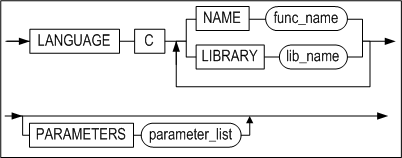
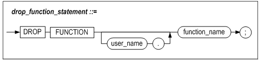
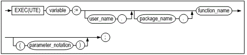

- [C/C++ External Procedures Manual](#cc-external-procedures-manual)
  - [Preface](#preface)
    - [About This Manual](#about-this-manual)
  - [1. Introduction](#1-introduction)
    - [What are C/C++ External Procedures?](#what-are-cc-external-procedures)
  - [2. How to Use External Procedures](#2-how-to-use-external-procedures)
    - [Data Types and Database Objects](#data-types-and-database-objects)
    - [Basic Instruction](#basic-instruction)
    - [Related Meta Tables and Performance Views](#related-meta-tables-and-performance-views)
    - [Related Properties](#related-properties)
  - [3. SQL Statements for External Procedures](#3-sql-statements-for-external-procedures)
    - [CREATE LIBRARY statement](#create-library-statement)
    - [ALTER LIBRARY statement](#alter-library-statement)
    - [DROP LIBRARY statement](#drop-library-statement)
    - [CREATE PROCEDURE statement](#create-procedure-statement)
    - [DROP PROCEDURE statement](#drop-procedure-statement)
    - [CREATE FUNCTION](#create-function)
    - [DROP FUNCTION](#drop-function)
    - [EXECUTE](#execute)


Altibase® Application Development

# C/C++ External Procedures Manual


 Altibase Application Development C/C++ External Stored Procedures Manual

Release 7.1

Copyright ⓒ 2001\~2021 Altibase Corp. All Rights Reserved.

This manual contains proprietary information of Altibase Corporation; it is provided under a license agreement containing restrictions on use and disclosure and is also protected by copyright patent and other intellectual property law. Reverse engineering of the software is prohibited. All trademarks, registered or otherwise, are the property of their respective owners.

**Altibase Corp**

10F, Daerung PostTower II, 306, Digital-ro, Guro-gu, Seoul 08378, Korea Telephone: +82-2-2082-1000 Fax: 82-2-2082-1099

Customer Service Portal: http://support.altibase.com/en/

Homepage: [[http://www.altibase.com](http://www.altibase.com/)]


## Preface

### About This Manual

This manual describes the concept of C/C++ external procedures and functions (hereafter C/C++ external procedures or other procedures) and how to use them.

#### Audience

This manual has been prepared for the following Altibase users:

-   Database administrators
-   Performance administrators
-   Database users
-   Application developers
-   Technical Supporters

It is recommended for those reading this manual possess the following background knowledge:

-   Basic knowledge in the use of computers, operating systems, and operating system utilities
-   Experience in using relational database and an understanding of database concepts
-   Computer programming experience
-   Experience in database server management, operating system management, or network administration

#### Organization

This manual is organized as follows:

-   Chapter 1: Introduction  
    This chapter introduces C/C++ external procedures and functions. Circumstances in which the use of external procedures is necessary are explained and an overview of Altibase external procedures is provided.
    
-   Chapter 2: How to Use External Procedures  
    This chapter describes how to use external procedures in Altibase.

-   Chapter 3: SQL Statements for External Procedures  
    This chapter describes SQL statements supported by Altibase for the use of external procedures.

#### Documentation Conventions

This section describes the conventions used in this manual. Understanding these conventions will make it easier to find information in this manual and in the other manuals in the series. 

There are two sets of conventions:

-   Syntax diagram convetions
-   Sample code conventions

##### Syntax Diagram Conventions

This manual describes command syntax using diagrams composed of the following elements:

| Elements                                                     | Meaning                                                      |
| ------------------------------------------------------------ | ------------------------------------------------------------ |
| [](https://github.com/ALTIBASE/Documents/blob/master/Manuals/Altibase_7.1/eng/media/SQL/image1.gif) | Indicates the start of a command. If a syntactic element starts with an arrow, it is not a complete command. |
| [](https://github.com/ALTIBASE/Documents/blob/master/Manuals/Altibase_7.1/eng/media/SQL/image2.gif) | Indicates that the command continues to the next line. If a syntactic element ends with this symbol, it is not a complete command. |
| [](https://github.com/ALTIBASE/Documents/blob/master/Manuals/Altibase_7.1/eng/media/SQL/image3.gif) | Indicates taht the command continues from the previous line. If a syntactic element starts witht his symbol, it is not a complete command. |
| [](https://github.com/ALTIBASE/Documents/blob/master/Manuals/Altibase_7.1/eng/media/SQL/image4.gif) | Indicates the end of a statement.                            |
| [](https://github.com/ALTIBASE/Documents/blob/master/Manuals/Altibase_7.1/eng/media/SQL/image5.gif) | Indicates a manatory element.                                |
| [](https://github.com/ALTIBASE/Documents/blob/master/Manuals/Altibase_7.1/eng/media/SQL/image6.gif) | Indicates an optional element.                               |
| [](https://github.com/ALTIBASE/Documents/blob/master/Manuals/Altibase_7.1/eng/media/SQL/image7.gif) | Indicates a mandatory element comprised of options. One, and only one, option must be specified. |
| [](https://github.com/ALTIBASE/Documents/blob/master/Manuals/Altibase_7.1/eng/media/SQL/image8.gif) | Indicates an optional element comprised of options.          |
| [](https://github.com/ALTIBASE/Documents/blob/master/Manuals/Altibase_7.1/eng/media/SQL/image9.gif) | Indicates an optional element in which multiple elements may be specified. A comman must precede all but the first element. |

##### Sample Code Conventions

The code examples explain SQL statements, stored procedures, iSQL statements, and other command line syntax.

The following table describes the printing conventions used in the code examples.

| Rules            | Meaning                                                      | Example                                                      |
| ---------------- | ------------------------------------------------------------ | ------------------------------------------------------------ |
| [ ]              | Indicates an optional item                                   | VARCHAR [(*size*)][[FIXED \|] VARIABLE]                      |
| { }              | Indicates a mandatory field for which one or more items must be selected. | { ENABLE \| DISABLE \| COMPILE }                             |
| \|               | A delimiter between optional or mandatory arguments.         | { ENABLE \| DISABLE \| COMPILE } [ ENABLE \| DISABLE \| COMPILE ] |
| . . .            | Indicates that the previous argument is repeated, or that sample code has been omitted. | SQL> SELECT ename FROM employee; ENAME ----------------------- SWNO HJNO HSCHOI . . . 20 rows selected. |
| Other Symbols    | Symbols other than those shown above are part of the actual code.Other Symbols | EXEC :p1 := 1; acc NUMBER(11,2);Symbols other than those shown above are part of the actual code. |
| Italics          | Statement elements in italics indicate variables and special values specified by the user. | SELECT * FROM *table_name*; CONNECT *userID*/*password*;     |
| Lower case words | Indicate program elements set by the user, such as table names, column names, file names, etc. | SELECT ename FROM employee;                                  |
| Upper case words | Keywords and all elements provided by the system appear in upper case. | DESC SYSTEM_.SYS_INDICES_;                                   |

##### Sample Schema

Some of the examples in this manual are based on sample tables, including the employees, departments and orders tables. These tables can be created using the schema.sql file in the $ALTIBASE_HOME/sample/APRE/schema directory. For complete information on the sample schema, please refer to the Altibase *General Reference.*

#### Related Documentations

For more detailed information, please refer to the following documents.

-   Installation Guide

-   Getting Started Guide

-   SQL Reference

-   iSQL User’s Manual

-   Error Message Reference

#### Altibase Welcomes Your Comments and Feedbacks

Please let us know what you like or dislike about our manuals. To help us with better future versions of our manuals, please tell us if there is any corrections or classifications that you would find useful.

Include the following information:

- The name and version of the manual that you are using
- Any comments about the manual
- Your name, address, and phone number

If you need immediate assistance regarding any errors, omissions, and other technical issues, please contact Altibase's Support Portal (http://altibase.com/support-center/en/).

Thank you. We always welcome your feedbacks and suggestions.


## 1. Introduction

This chapter introduces C/C++ external procedures and functions. In addition, this chapter introdces the needs for external procedures and discusses the features of Altibase external procedures.


### What are C/C++ External Procedures?

A C/C++ external procedure refers to a function written in C or C++, that is compiled and stored in the Dynamic Link Library(DLL). C/C++ external procedures can be used by calling them within SQL statements. An external procedure can be executed through Altibase external procedure object, and is executed in the same manner as calling a stored procedure within a SQL statement or an application program.

#### Features

External procedures provided by Altibase include external mode and internal mode, and have the following features and advantages:

##### Common
-   Since the implementation body and the call specification of C/C++ external procedures are unassociated, alteration of the C/C++ external procedure body does not require alteration of the calling program which calls the procedure.
-   Since the execution of C/C++ external procedures and Altibase server processes are separated, the database is not affected even if there is an error in the C/C++ external procedure written by the user. 
-   Inherent functions of the C/C++ languages, previously unsupported by PSM(Stored procedures), are available for use. 
-   Some computation-intensive tasks are executed most efficiently, when written in lower level programming languages, such as the C language. 
-   By simply converting previously written C/C++ functions to external procedures, calls can be directly made from PSM. In other words, it is possible to reuse the C/C++ functions written once, thus reducing development costs.

##### External mode
-   Since the execution of C/C++ external procedures and the Altibase server process are separated, there is no effect on the databaase even if there is a problem with C/C++ external procedure written by the user

##### Internal mode
-   Because the Altibase server process directly calls external procedures, the server may crash if the user-written external procedure is defective. A memory leak may occur if memory allocated by a user-written C/C++ external procedure is not released. Therefore, testing is required to ensure that there are no problems with user-written C/C++ external procedure.

#### Flow of Calling External Procedures

Like regular stored procedures(PSM), external procedures can also be called in the client session. The overall flow from the creation of an external procedure to its invocation is depicted below. 

##### Common
After building a dynamic library from a user-written function in C or C++(an external procedure) and storing it in a location identifiable by Altibase, you should create an external procedure object (a stored procedure that registers the external procedure) with a SQL statement.

##### External mode
Afterwards, the stored procedure that registered the external procedure is called in the client session, and the Altibase server starts the Agent Process.

The Agent Process loads the dynamic library file related to the external procedure and executes the related C/C++ function within the library, and then sends the result to the Altibase server, which then returns the result to the client. 

##### Internal mode
When a store procedure that registers an external procedure is called in a client session, the Altibase server calls the corresponding function. When creating a stored procedure that registers an external procedure, or compiling, load a dynamic library containing C/C++ external procedures written by the user.

If multiple external procedures that use the same dynamic library are created, load the dynamic library only once and increment the reference count by 1. Removing or recreating an external procedure reduces the number of dynamic library references, and unloads the dynamic library file if there is no external procedure referencing the dynamic library.

The number of external procedures referencing the dynamic library can be checked with V$LIBRARY.

The following is a diagram schematically showing the flow of the external procedure called by the client.


[Figure 1-1] The flow of a call to an external procedure and its execution

#### Agent Process

The Agent Process is a process separately created by the Altibase server to load DLL files storing C/C++ functions for external procedures, and to execute functions within the DLL files. 

When the stored procedure that registered an external procedure is invoked in the client session, the Altibase server starts the Agent Process for external procedures. And when the execution of external procedures is complete, the Altibase server stands by for a while and, if no other external procedure is being executed, terminates the Agent Process. 

Because the Agent Process is subordinate to the service session of the Altibase server, a number of n Agent Processes are created when external procedures are invoked in a number of n client sessions. Also, the Agent Process created by a session also terminates when the session does.

Internal mode loads a dynamic library directly from the Altibase server without an agent process and executes external procedures.


## 2. How to Use External Procedures

This chapter describes how to use external procedures in Altibase.

First, it describes the C / C ++ data types and database objects that are supported for external procedures, and describes how to write and build dynamic libraries that the Altibase server can recognize.


### Data Types and Database Objects

This section introduces data types supported for writing external procedures, and external library objects and external procedure objects provided for using external procedures.

#### Data Type

The following table concatenates valid PSM data types of arguments for the creation of external procedure objects, and valid data types of user-defined C/C++ function arguments. The user should note that pointer types can vary for user-defined C/C++ functions depending on the input/output mode of arguments.

| PSM Data Type | IN                   | INOUT/OUT               | RETURN               | REMARK                                                       |
| ------------- | -------------------- | ----------------------- | -------------------- | ------------------------------------------------------------ |
| BIGINT        | long long            | long long \*            | long long            |                                                              |
| BOOLEAN       | char                 | char \*                 | char                 | In the case of BOOLEAN, the following two values are allowed: 0: FALSE 1: TRUE |
| SMALLINT      | int                  | int \*                  | int                  |                                                              |
| INTEGER       |                      |                         |                      |                                                              |
| REAL          | float                | float \*                | float                |                                                              |
| DOUBLE        | double               | double \*               | double               |                                                              |
| CHAR          | char \*              | char \*                 | char \*              |                                                              |
| VARCHAR       |                      |                         |                      |                                                              |
| NCHAR         |                      |                         |                      |                                                              |
| NVARCHAR      |                      |                         |                      |                                                              |
| BYTE          |                      |                         |                      |                                                              |
| VARBYTE       |                      |                         |                      |                                                              |
| NUMERIC       | double               | double \*               | double               | Higer precision factors can cause data loss during conversion to double |
| DECIMAL       |                      |                         |                      |                                                              |
| NUMBER        |                      |                         |                      |                                                              |
| FLOAT         |                      |                         |                      |                                                              |
| DATE          | SQL_TIMESTAMP_STRUCT | SQL_TIMESTAMP_STRUCT \* | SQL_TIMESTAMP_STRUCT |                                                              |
| INTERVAL      | SQL_TIMESTAMP_STRUCT | SQL_TIMESTAMP_STRUCT \* | SQL_TIMESTAMP_STRUCT |                                                              |

#### External Library Objects

It is necessary for user-defined functions or, in other words, the dynamic library file in which the external procedure resides to be made identifiable by the Altibase server. For this purpose, Altibase provides the external library object, which is a database object, and SQL statements for its management.

To use an external procedure as a stored procedure, the user must first create an external library object and save the related dynamic library file in the $ALTIBASE_HOME/lib directory. It is possible to create an external procedure object without the dynamic library file. However, the existence of a related dynamic library file is a prerequisite for the execution of an external procedure.

#### External Procedure/Function Objects

Altibase differentiates a stored procedure that registered an external procedure from a regular stored procedure and defines it as an external procedure object. An external procedure object is a database object that corresponds to a user-defined function on a oneto-one basis. User-defined functions(external procedures) are executed through external procedure objects. All information on related library objects and user-defined functions must be specified when creating external procedure objects.

Altibase provides SQL statements for the management of external procedure objects.

### Basic Instruction

The general steps in using an external procedure is as follows:

-   Writing User-Defined Funcitons
-   Writing Entry Functions
-   Creating External Library Objects
-   Creating External Procedure/Function Objects
-   Creating the Dynamic Library
-   Calling External Procedures

This section offers an explanation of the above steps, along with examples.

#### Writing User-Defined Functions

The user can write C/C++ functions for external procedures in the same manner as when creating regular C/C++ functions. 

This section provides an example of a user-defined function which corresponds to a stored procedure and a function with the following arguments and return type.

~~~~~~~~~~~~~~~~~~~~~~~~~~~~~~~~~~~~~~~~~~~~~~~~~~~~~~~~~~~~~~~~~~
procedure str_uppercase_proc( a1 in char(30), a2 out char(30) )
function str_uppercase_func_int( a1 in char(30), a2 out char(30) ) return int
function str_uppercase_func_char( a1 in char(30), a2 out char(30) ) return
char(30)
~~~~~~~~~~~~~~~~~~~~~~~~~~~~~~~~~~~~~~~~~~~~~~~~~~~~~~~~~~~~~~~~~~
The user-defined function, str_uppercase, which corresponds to str_uppercase_proc requires three arguments, and the function prototype is as follows.

```
extern "C" void str_uppercase( char\* str1, long long str1_len, char\* str2 );
```

Here, the second argument is used to pass the length of the string, to be input to the first argument, to the user-defined function. 

The prototypes of the C/C++ user-defined functions corresponding to str_uppercase_func_int and str_uppercase_func_char are as follows. 

~~~~~~~~~~~~~~~~~~~~~~~~~~~~~~~~~~~~~~~~~~~~~~~~~~~~~~~~~~~~~~~~~~
extern "C" int str_uppercase_count( char* str1, long long str1_len, char* str2 );
extern "C" char* str_uppercase_return( char* str1, long long str1_len, char* str2 );
~~~~~~~~~~~~~~~~~~~~~~~~~~~~~~~~~~~~~~~~~~~~~~~~~~~~~~~~~~~~~~~~~~
The following is an example code of user-defined functions.

~~~~~~~~~~~~~~~~~~~~~~~~~~~~~~~~~~~~~~~~~~~~~~~~~~~~~~~~~~~~~~~~~~~~
void str_uppercase(char *str1, long long str1_len, char * str2)
{
    for( int i=0; i < str1_len; i++ )
    {
        str2[i] = toupper(str1[i]);
    }
}

int str_uppercase_count(char *str1, long long str1_len, char * str2)
{
    int capCount = 0;
    int i        = 0;
 
    while( i < str1_len )
    {   
        if( str1[i] >= 'A' && str1[i] <= 'Z' )
        {
            capCount++; 
        }
 
        i++;
    }   
 
    return capCount;
}

char* str_uppercase_return(char *str1, long long str1_len, char * str2)
{
    for( int i=0; i < str1_len; i++ )
    {
        str2[i] = toupper(str1[i]);
    }
    return str2;
}

~~~~~~~~~~~~~~~~~~~~~~~~~~~~~~~~~~~~~~~~~~~~~~~~~~~~~~~~~~~~~~~~~~~~

> Note: The extern “C” keyword must be written in the declaration of a user-defined function.
>

#### Writing Entry Functions

Apart from user-defined functions, standardized functions to execute user-defined functions are required. These functions are called entry functions. 

When the Agent Process calls an entry function, the entry function calls a user-defined function and returns the result. Thus, entry functions must exist in the dynamic library. 

A routine that actually calls user-defined functions must be included in an entry function. 

The following is an example of an entry function that calls the above user-defined functions, str_uppercase, str_uppercase_count and str_uppercase_return.

~~~~~~~~~~~~~~~~~~~~~~~~~~~~~~~~~~~~~~~~~~~~~~~~~~~~~~~~~~~~~~~~~~
extern "C" void entryfunction(char* func_name, int arg_count, void ** args, void ** returnArg);

void entryfunction(char* func_name, int arg_count, void ** args, void ** returnArg)
{
    // User definition
    if(strcmp(func_name, "str_uppercase") == 0)
    {   
        str_uppercase((char*)args[0], *((long long *)args[1]), (char*)args[2]);
    }
    else if(strcmp(func_name, "str_uppercase_count") == 0)
    {
        if( *returnArg != NULL ) // Returns int type
        {
            **(int**)returnArg = str_uppercase_count ((char*)args[0], *((long long*)args[1]), (char*)args[2]);
        }
    } 
    else if(strcmp(func_name, "str_uppercase_return") == 0)
    {
        if( returnArg != NULL ) // Returns char* type
        {
            *(char**)returnArg = str_uppercase_return ((char*)args[0], *((long long*)args[1]), (char*)args[2]);
        }
    } 
}
~~~~~~~~~~~~~~~~~~~~~~~~~~~~~~~~~~~~~~~~~~~~~~~~~~~~~~~~~~~~~~~~~~
The following are explanations for each argument of entry functions.

-   func_name: The string which indicates the function name. 
-   arg_count: The number of arguments. 
-   args: The array of arguments. The order specified in the external procedure must be followed. The user should note that each mapped C data type differs, depending on the input/output mode of arguments and PSM data types. 
-   returnArg: The argument for the return value. NULL is always returned for external procedures having no return values, and the pointer pointing to the return value is returned for external functions. 

> ##### Notes
>
> -   The user must not discretionally change the name of the entry function(entryfunction) and the data types of arguments within the dynamic library. 
> -   If two or more user-defined functions are contained in one library, the source code must be written as to make separate calls to each user-defined function within one entry function. 
>-   If a user-defined function in an external procedure, instead of an external function, is called and its return value is assigned to the returnArg variable, there is a possibility of the Agent Process terminating abnormally. For external functions, therefore, whether or not the returnArg is NULL must be checked and afterwards, the return value should be typecasted according to the function return type. 
> -   As for user-defined functions, the extern “C” keyword must also be written in the declaration of entry functions. 
> -   The user should take note of the code in the above example, where the user-defined function is being processed. The code checks whether or not the returnArg variable(the last argument of the entry function) which is to be assigned the return value is NULL, and differs, depending on the function return type
>
> ```
> if( *returnArg != NULL ) // When int type is returned
> ...
> if( returnArg != NULL ) // When char* type is returned
>```
> 

##### Type-casting the Return Value

After making a call to a user-defined function corresponding to an external function, it is necessary to typecast the return value to the appropriate return type of the function.

| Return Type          | Type-casting in Code                           |
| -------------------- | ---------------------------------------------- |
| char                 | \*\*(char\*\*)returnArg = ...                  |
| int                  | \*\*( int\*\*)returnArg = ...                  |
| long long            | \*\*( long long\*\*)returnArg = ...            |
| float                | \*\*( float\*\*)returnArg = ...                |
| double               | \*\*( double\*\*)returnArg = ...               |
| char \*              | \*(char\*\*)returnArg = ...                    |
| SQL_TIMESTAMP_STRUCT | \*\*( SQL_TIMESTAMP_STRUCT\*\*)returnArg = ... |

#### Creating External Library Objects

For the Altibase server to identify the dynamic library file, the library object must be created in the database first. For example, if the user wishes to use the dynamic library file shlib.so, the external library object can be created in the database as below.

```
CREATE OR REPLACE LIBRARY lib1 AS 'shlib.so';
```

Now Altibase can identify the dynamic library file shlib.so, as the external library object lib1.

#### Creating External Procedure/Function Objects

An external procedure object which registers a user-defined function must be created in the database before executing an external procedure(C/C++ user-defined function). 

An external procedure object can be created as shown below.

~~~~~~~~~~~~~~~~~~~~~~~~~~~~~~~~~~~~~~~~~~~~~~~~~~~~~~~~~~~~~~~~~~
create or replace procedure str_uppercase_proc( a1 in char(30), a2 out char(30) )

as

language c

library lib1

name "str_uppercase"

parameters( a1, a1 LENGTH, a2 )

;

/
~~~~~~~~~~~~~~~~~~~~~~~~~~~~~~~~~~~~~~~~~~~~~~~~~~~~~~~~~~~~~~~~~~
The return type must be specified for external functions. The following is an example of a SQL statement which creates an external function which returns an int type and a char array.
~~~~~~~~~~~~~~~~~~~~~~~~~~~~~~~~~~~~~~~~~~~~~~~~~~~~~~~~~~~~~~~~~~
create or replace function str_uppercase_func_int( a1 in char(30), a2 out
char(30) ) return int

as

language c

library lib1

name "str_uppercase_count"

parameters( a1, a1 LENGTH, a2 )

;

/

create or replace function str_uppercase_func_char( a1 in char(30), a2 out
char(30) ) return char(30)

as

language c

library lib1

name "str_uppercase_return"

parameters( a1, a1 LENGTH, a2 )

;

/
~~~~~~~~~~~~~~~~~~~~~~~~~~~~~~~~~~~~~~~~~~~~~~~~~~~~~~~~~~~~~~~~~~
#### Creating the Dynamic Library

If the source file of one or more user-defined functions and entry functions is prepared, it can be compiled to create the dynamic library. The *.so file for UNIX-like operating systems is the dynamic library files.

The following example shows how to create the dynamic library by compiling the source file on UNIX-like operation systems.

```
$ g++ -g -fPIC -shared -o shlib.so extproc.cpp
```

If the user-defined functions and entry point functions are composed of multiple files, each source file can be compiled, and then linked, as shown below.

```
$ g++ -fPIC -c extproc.cpp
$ g++ -fPIC -c entry.cpp
$ g++ -shared -o shlib.so entry.o extproc.o
```

The created dynamic library file must be moved to a location which is identifiable by the Altibase server. The location is $ALTIBASE_HOME/lib; you cannot change this location at your discretion.

```
$ mv shlib.so $ALTIBASE_HOME/lib/
```

#### Calling External Procedures

The following example shows the execution of an external procedure on iSQL.
~~~~~~~~~~~~~~~~~~~~~~~~~~~~~~~~~~~~~~~~~~~~~~~~~~~~~~~~~~~~~~~~~~
var var1 char(30);
var var2 char(30);
 
exec :var1 := 'hello world';
exec str_uppercase_proc( :var1, :var2 );
 
iSQL> print var;
[ HOST VARIABLE ]
-------------------------------------------------------
NAME                 TYPE                 VALUE
-------------------------------------------------------
VAR1                 CHAR(30)             hello world
VAR2                 CHAR(30)             HELLO WORLD
~~~~~~~~~~~~~~~~~~~~~~~~~~~~~~~~~~~~~~~~~~~~~~~~~~~~~~~~~~~~~~~~~~

#### extproc.cpp

The following source file, extproc.cpp, has written the user-defined functions used as an the example in the previous section.

```
#include <string.h>
#include <ctype.h>

extern "C" void str_uppercase( char* str1, long long str1_len, char* str2 );
extern "C" int str_uppercase_count( char* str1, long long str1_len, char* str2 );
extern "C" char* str_uppercase_return( char* str1, long long str1_len, char* str2 );


extern "C" void entryfunction(char* func_name, int arg_count, void ** args, void ** returnArg);

void entryfunction(char* func_name, int arg_count, void ** args, void ** returnArg)
{
    if(strcmp(func_name, "str_uppercase") == 0)
    {
        str_uppercase((char*)args[0], *((long long*)args[1]), (char*)args[2]);
    }
    else if(strcmp(func_name, "str_uppercase_count") == 0)
    {
        if( *returnArg != NULL ) // return int type
        {
            **(int**)returnArg = str_uppercase_count ((char*)args[0], *((long long*)args[1]), (char*)args[2]);
        }
    }
    else if(strcmp(func_name, "str_uppercase_return") == 0)
    {
        if( returnArg != NULL ) // return char* type
        {
            *(char**)returnArg = str_uppercase_return ((char*)args[0], *((long long*)args[1]), (char*)args[2]);
        }
    }
}

void str_uppercase(char *str1, long long str1_len, char * str2)
{
    for( int i=0; i < str1_len; i++ )
    {
        str2[i] = toupper(str1[i]);
    }
}

int str_uppercase_count(char *str1, long long str1_len, char * str2)
{
    int capCount = 0;
    int i        = 0;

    while( i < str1_len )
    {
        if( str1[i] >= 'A' && str1[i] <= 'Z' )
        {
            capCount++;
        }

        i++;
    }

    return capCount;
}

char* str_uppercase_return(char *str1, long long str1_len, char * str2)
{
    for( int i=0; i < str1_len; i++ )
    {
        str2[i] = toupper(str1[i]);
    }
    return str2;
}
```

### Related Meta Tables and Performance Views

Information on external library objects that have been created and are currently existent in the database can be obtained from the meta table below.

-   SYS_LIBRARIES\_

Information about dynamic libraries loaded directly from the current database can be viewed in the performance view below

-   V\$EXTPROC_AGENT

For more detailed information on each meta table and performance view, please refer to *General Reference.*

-   V\$LIBRARY

The mode of the external procedure can be checked in the current database in the performance view below.

-   V\$PROCINFO

For detailed description of each meta table and performance view, refer to *General Reference*.


### Related Properties

The following are properties related to agent operations for external procedures. The internal mode that does not create an agent process is not affected.

-   EXTPROC_AGENT_CONNECT_TIMEOUT

-   EXTPROC_AGENT_CALL_RETRY_COUNT

-   EXTPROC_AGENT_IDLE_TIMEOUT

-   EXTPROC_AGENT_SOCKET_FILEPATH

For more detailed information on each property, please refer to *General Reference*.


## 3. SQL Statements for External Procedures

---------------------

This chapter describes SQL statements supported by Altibase for the use of external procedures

### CREATE LIBRARY statement

#### Syntax


#### Description

This creates a new external library object or changes the previously existing external library into a new external library.

##### library_name

This specifies the name of the library object.

##### file_name

This specifies the name of the dynamic library file. This file must be located at $ALTIBASE_HOME/lib. Even if the user-specified file does not exist in the given directory, however, a library object is created. Whether or not the dynamic library file exists is checked at the execution of an external procedure; if it does not exist, the given external procedure object status changes to ‘INVALID’.

#### Example
~~~~~~~~~~~~~~~~~~~~~~~~~~~~~~~~~~~~~~~~~~~~~~
CREATE OR REPLACE LIBRARY lib1 AS 'shlib.so';
~~~~~~~~~~~~~~~~~~~~~~~~~~~~~~~~~~~~~~~~~~~~~~


### ALTER LIBRARY statement

#### Syntax


#### Description

This compiles the library object.

Since only the C/C++ languages are supported for external procedures, the execution of this statement does not set off any operations on the server. This is a reserved statement for the support of other languages in the future.

#### Example
~~~~~~~~~~~~~~~~~~~~~~~~~~~~~~~~~~~~~~~~~~~~~~
ALTER LIBRARY lib1 COMPILE;
~~~~~~~~~~~~~~~~~~~~~~~~~~~~~~~~~~~~~~~~~~~~~~


### DROP LIBRARY statement

#### Syntax


#### Description

This drops the external library object in the database.

Even if an external procedure, which is included in the library object to be dropped, is being executed, the given library object is dropped. Only the library object is dropped from the database, however, and the related dynamic library file is left intact.

#### Example
~~~~~~~~~~~~~~~~~~~~~~~~~~~~~~~~~~~~~~~~~~~~~~
DROP LIBRARY lib1;
~~~~~~~~~~~~~~~~~~~~~~~~~~~~~~~~~~~~~~~~~~~~~~


### CREATE PROCEDURE statement

#### Syntax

**create_procedure ::=**


**argument_list ::=**


**argument_declaration ::=**


**call_spec ::=**


**parameter_list ::=**


**parameter_declaration::=**


#### Description

This creates a new external procedure, or changes a previously existing external procedure into a new external procedure.

##### procedure_name

This specifies the name of the external procedure object.

##### argument_list

The argument can be omitted; on specification, the name, data type and input/output of the argument must be defined. Valid input/output types must be one of the following; on omission, IN is the default value.

-   IN: The input argument which receives an input value when a procedure is called. 
-   OUT: The argument which returns the output value after executing the procedure. 
-   INOUT: The shared argument for input and output; it receives an input value when a procedure is called and returns an output value after a procedure is executed.

When the external procedure is being executed, the value is passed to the procedure with the IN argument, and the procedure returns the value to the called routine with the OUT argument.

##### call_spec

This specifies the names of user-defined functions, library objects and parameters. The order in which user-defined functions and library objects are specified is irrelevant, however, they must be specified only once.

##### fun_name

This specifies the name of the user-defined function corresponding to the external procedure.

##### lib_name

This specifies the name of the external library object which contains the user-defined function corresponding to the external procedure.

##### parameter_list

This clause is specified to assign the arguments of the external procedure object to the corresponding arguments of the user-defined function. In general, the argument names of argument_list should be taken as they are for the argument names of this clause. 

With the following properties, additional information for each parameter can be passed to user-defined functions. Property parameters that are specified with properties merely assist the actual parameter and are not related to the arguments of external procedure objects.

| Property Name | For IN, Data Type | INOUT/ OUT/ For RETURN, Data Type | Description                                                  |
| ------------- | ----------------- | --------------------------------- | ------------------------------------------------------------ |
| INDICATOR     | short             | short \*                          | Indicates whether or not the value of the given parameter is NULL. One of the following values can be taken. ALTIBASE_EXTPROC_IND_NULL ALTIBASE_EXTPROC_IND_NOTNULL |
| LENGTH        | long long         | long long \*                      | Indicates the length of the given parameter value in bytes. Note that for strings, the number of bytes, instead of the number of characters, is displayed. For data types other than strings, the size of the given data type is displayed. |
| MAXLEN        | \-                | long long                         | Indicates the buffer size of the given parameter. For IN mode parameters, this property parameter cannot be specified. |

In the following example, the PARAMETERS clause specifies the arguments and properties of the arguments that are passed to user-defined functions.
~~~~~~~~~~~~~~~~~~~~~~~~~~~~~~~~~~~~~~~~~~~~~~~~~~~~~~~~~~~~~~~~~~
CREATE OR REPLACE PROCEDURE proc1(

a1 IN CHAR(30),

a2 OUT CHAR(30) )

AS

LANGUAGE C

LIBRARY lib1

NAME "str_uppercase"

PARAMETERS( a1, a1 LENGTH, a2 );

/
~~~~~~~~~~~~~~~~~~~~~~~~~~~~~~~~~~~~~~~~~~~~~~~~~~~~~~~~~~~~~~~~~~
From the PARAMETERS clause of the above procedure, the str_uppercase function prototype can be surmised to be as below:

```
extern "C" void str_uppercase( char* str1, long long str1_len, char* str2 );
```

#### Example
~~~~~~~~~~~~~~~~~~~~~~~~~~~~~~~~~~~~~~~~~~~~~~~~~~~~~~~~~~~~~~~~~~
create or replace procedure proc1( a1 in char(30), a2 out char(30) )

as

language c

library lib1

name "str_uppercase"

parameters( a1, a1 LENGTH, a2 )

;

/
~~~~~~~~~~~~~~~~~~~~~~~~~~~~~~~~~~~~~~~~~~~~~~~~~~~~~~~~~~~~~~~~~~


### DROP PROCEDURE statement

#### Syntax


#### Description

This drops the external procedure object from the database. 

If the external procedure to be dropped is being executed, an error is raised, instead of performing deletion.

#### Example

~~~~~~~~~~~~~~~~~~~~~~~~~~~~~~~~~~~~~~~~~~~~~~~~~~~~~~~~~~~~~~~~~~
DROP PROCEDURE proc1;
~~~~~~~~~~~~~~~~~~~~~~~~~~~~~~~~~~~~~~~~~~~~~~~~~~~~~~~~~~~~~~~~~~


### CREATE FUNCTION

#### Syntax

**create_function ::=**


**argument_list ::=**


**argument_declaration ::=**


**call_spec ::=**



**parameter_list ::=**


**parameter_declaration::=**


#### Description

This creates a new external function or changes a previously existing external function into a new external function.

##### func_name

This specifies the name of the external function object.

##### argument_list

Please refer to the section of the CREATE PROCEDURE statement.

##### call_spec

This specifies the names of user-defined functions, library objects and parameters and return values. The order in which user-defined functions and library objects are specified is irrelevant, however, they must be specified only once.

##### fun_name

This specifies the name of the user-defined function corresponding to the given external procedure. 

##### lib_name

This specifies the name of the external library object which contains the user-defined function corresponding to the given external procedure.

##### parameter_list

Please refer to the section of the CREATE PROCEDURE statement.

##### RETURN

This keyword specifies that the given parameter is used to get the return value of the external function. After the RETURN clause, property parameters can be additionally specified, as with function parameters. For further information on property parameters, please refer to the description of the CREATE PROCEDURE statement.

Restriction:

-   The RETURN clause must be specified at last, after specifying all of the parameters for function arguments; otherwise, an error is raised.
  
-   Not specifying property parameters after the RETURN clause is equivalent to not specifying the RETURN clause at all. Thus, (a, b, RETURN) and (a, b) are the same.


### DROP FUNCTION

#### Syntax



#### Description

Drops the external function object from the database. 

If the external function to be dropped is being executed, an error is raised, instead of performing deletion. 

#### Example

~~~~~~~~~~~~~~~~~~~~~~~~~~~~~~~~~~~~~~~~~~~~~~~~~~~~~~~~~~~~~~~~~~
DROP FUNCTION func1;
~~~~~~~~~~~~~~~~~~~~~~~~~~~~~~~~~~~~~~~~~~~~~~~~~~~~~~~~~~~~~~~~~~


### EXECUTE

#### Syntax

**execute_procedure_statement::=**


**execute_function_statement::=**



**parameter_notation::=**


#### Description

This executes the external procedure or external function.

##### parameter_notation

The way to pass a value to a parameter is as follows:

-   Postional-based: This is a basic delivery method, based on the position of a defined parameter. The value is entered.
  
-   Name-based: Enter the name of the defined parameter and the value after the arrow (=\>). Values can be passed in any order.
  
-   Mixed: Position-based and name-basedcan be used together. However, the position-based delivery method must be entered first.

#### Example.

~~~~~~~~~~~~~~~~~~~~~~~~~~~~~~~~~~~~~~~~~~~~~~~~~~~~~~~~~~~~~~~~~~
var var1 char(30);

var var2 char(30);

exec :var1 := 'hello world';

exec proc1( var1, var2 );

print var2;
~~~~~~~~~~~~~~~~~~~~~~~~~~~~~~~~~~~~~~~~~~~~~~~~~~~~~~~~~~~~~~~~~~
