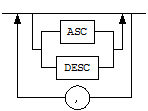
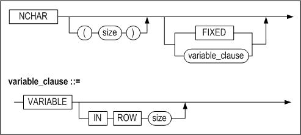
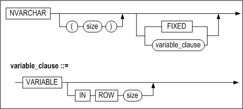
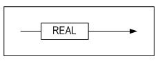
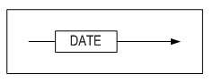
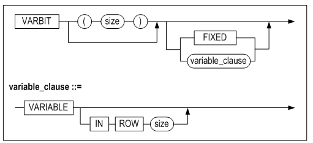
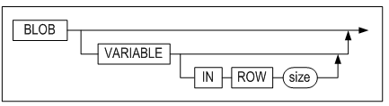
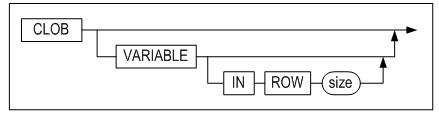

<!-- START doctoc generated TOC please keep comment here to allow auto update -->
<!-- DON'T EDIT THIS SECTION, INSTEAD RE-RUN doctoc TO UPDATE -->

- [General Reference](#general-reference)
  - [Preface](#%EC%84%9C%EB%AC%B8)
    - [About This Manual](#%EC%9D%B4-%EB%A7%A4%EB%89%B4%EC%96%BC%EC%97%90-%EB%8C%80%ED%95%98%EC%97%AC)
  - [1. Data Types](#1%EC%9E%90%EB%A3%8C%ED%98%95)
    - [Overview](#%EC%9E%90%EB%A3%8C%ED%98%95%EC%9D%98-%EA%B0%9C%EC%9A%94)
    - [Character Data Types](#%EB%AC%B8%EC%9E%90%ED%98%95-%EB%8D%B0%EC%9D%B4%ED%84%B0-%ED%83%80%EC%9E%85)
    - [Numeric Data Types](#%EC%88%AB%EC%9E%90%ED%98%95-%EB%8D%B0%EC%9D%B4%ED%84%B0-%ED%83%80%EC%9E%85)
    - [Date Data Types](#%EB%82%A0%EC%A7%9C%ED%98%95-%EB%8D%B0%EC%9D%B4%ED%83%80-%ED%83%80%EC%9E%85)
    - [Binary Types](#%EC%9D%B4%EC%A7%84-%EB%8D%B0%EC%9D%B4%ED%84%B0-%ED%83%80%EC%9E%85)
    - [LOB Data Types](#lob-%EB%8D%B0%EC%9D%B4%ED%83%80-%ED%83%80%EC%9E%85)
    - [LOB Data Types](#%EA%B3%B5%EA%B0%84-%EB%8D%B0%EC%9D%B4%ED%84%B0-%ED%83%80%EC%9E%85)
  - [2. Altibase Properties](#2altibase-%ED%94%84%EB%A1%9C%ED%8D%BC%ED%8B%B0)
    - [Configuration](#%ED%99%98%EA%B2%BD-%EC%84%A4%EC%A0%95-%EB%B0%A9%EB%B2%95)
    - [Properties Overview](#%ED%94%84%EB%A1%9C%ED%8D%BC%ED%8B%B0-%EC%9A%94%EC%95%BD)
    - [Database Initialization Properties](#%EB%8D%B0%EC%9D%B4%ED%84%B0%EB%B2%A0%EC%9D%B4%EC%8A%A4-%EC%B4%88%EA%B8%B0%ED%99%94-%ED%94%84%EB%A1%9C%ED%8D%BC%ED%8B%B0)
    - [Performance Related Properties](#%EC%84%B1%EB%8A%A5-%EA%B4%80%EB%A0%A8-%ED%94%84%EB%A1%9C%ED%8D%BC%ED%8B%B0)

<!-- END doctoc generated TOC please keep comment here to allow auto update -->

Altibase® Administration

# General Reference


Altibase Administration General Reference


Release 7.1

Copyright ⓒ 2001\~2021 Altibase Corp. All Rights Reserved.

This manual contains proprietary information of Altibase Corporation; it is provided under a license agreement containing restrictions on use and disclosure and is also protected by copyright patent and other intellectual property law. Reverse engineering of the software is prohibited. All trademarks, registered or otherwise, are the property of their respective owners.

**Altibase Corp**

10F, Daerung PostTower II, 306, Digital-ro, Guro-gu, Seoul 08378, Korea Telephone: +82-2-2082-1000 Fax: 82-2-2082-1099

Customer Service Portal: http://support.altibase.com/en/

Homepage: [[http://www.altibase.com](http://www.altibase.com/)]

## Preface

### About This Manual

This manual explains the concepts, components, and basic use of Altibase

#### Audience

This manual has been prepared for the following Altibase users:

- Database managers
- Performance managers
- Database users
- Application developers
- Technical support engineers

It is recommended for those reading this manual possess the following background knowledge:

- Basic knowledge in the use of computers, operating systems, and operating system utilities
- Experience in using relational databases and understanding of database concepts
- Computer programming experience
- Experience in database server management, operating system management, or network administration

#### Organization

This manual has been organized as follows:

- Chapter 1. Data Types  
  This chapter explains the data types that are supported in Altibase
- Chapter 2. Altibase Properties  
  This chapter explains the Altibase properties
- Chapter 3. The Data Dictionary  
  This chapter describes the specification of the Altibase data dictionary. The data dictionary of Altibase consists of meta tables, in which information about objects is stored, and the process tables, in which information about processes is stroed.
- Chapter 4. Sample Schema  
  This chapter describes the example table information, ER diagram, and sample data.

#### Documentation Conventions

This section describes the conventions used in this manual. Understanding these conventions will make it easier to find information in this manual and other manuals in the series.

There are two sets of conventions:

- Syntax diagrams
- Sample code conventions

##### Syntax diagrams

This manual describes command syntax using diagrams composed of the following elements:

| Elements                                                   | Meaning                                                      |
| ---------------------------------------------------------- | ------------------------------------------------------------ |
|  | Indicates the start of a command. If a syntactic element starts with an arrow, it is not a complete command. |
|                    | Indicates that the command continues to the next line. if a syntactic element ends with this symbol, it is not a complete command. |
|                    | Indicates that the command continues from the previous line. If a syntactic element starts with this symbol, it is not a complete command. |
|                    | Indicates the end of a statement.                            |
|                    | Indicates a mandatory element.                               |
|                    | Indicates an optional element.                               |
|                    | Indicates a mandatory element comprised of options. One, and only one, option must be specified. |
|                    | Indicates an optional element comprised of options.          |
|                    | Indicates an optional element in which multiple elements may be specified. A comma must precede all but the first element. |

##### Sample Code Conventions

The code examples explain SQL, stored procedures, iSQL, and other command line syntax.

The following describes the conventions used in the code examples:

| Rules            | Meaning                                                      | Example                                                      |
| ---------------- | ------------------------------------------------------------ | ------------------------------------------------------------ |
| [ ]              | Indicates optional fields                                    | VARCHAR [(*size*)][[FIXED \|] VARIABLE]                      |
| { }              | Indicates mandatory fields. Indicates to make sure to select at least one. | { ENABLE \| DISABLE \| COMPILE }                             |
| \|               | Argument indicating optional or mandatory fields             | { ENABLE \| DISABLE \| COMPILE } [ ENABLE \| DISABLE \| COMPILE ] |
| . . .            | Repetition of the previous argument. Omit the example codes. | SQL\> SELECT ename FROM employee; <br/>ENAME<br/> ------------------------<br/> SWNO<br/> HJNO<br/> HSCHOI<br/> .<br/> .<br/> . <br/>20 rows selected. |
| Other symbols    | Other symbols                                                | EXEC :p1 := 1; acc NUMBER(11,2);                             |
| Italicized words | Indicates variable or value taht must be provided by user    | SELECT \* FROM *table_name*;<br/> CONNECT *userID*/*password*; |
| Lower case words | Problem elements provided by the user such as table names, colum names, file names, etc | SELECT ename FROM employee;                                  |
| Upper case words | Elements provided by the system or keyword appeared in the syntax | DESC SYSTEM_.SYS_INDICES_;                                   |

#### Related Documents

For more detailed information, please refer to the following documents:

- Installation Guide
- Getting Started Guide
- Administrator’s Manual
- Replication Manual

#### Altibase Welcomes Your Comments and Feedback

Please let us know what you like or dislike about our manuals. To help us with better future versions of our manuals, please tell us if there are any corrections or classifications that you would find useful.

Include the following information:

- The name and version of the manual that you are using
- Any comments about the manual
- Your name, address, and phone number

If you need immediate assistance regarding any errors, omissions, and other technical issues, please contact Altibase's Support Portal (http://altibase.com/support-center/en/).

Thank you. We always welcome your feedback and suggestions.

## 1. Data Types

In order to use SQL to store, change, and query the data in a database, it is first necessary to possess a thorough understanding of the available data types. This chapter presents a detailed explanation of the data types supported in Altibase.

### Overview

#### Data Type Overview

The following data types are supported in Altibase:

##### Character Data Types

<table>
    <tr>
    	<td colspan="3">M: Defined column length<br/>L: The length of the input string
</td>
    </tr>
    <tr>
    	<th>Type</th>
        <th>Length</th>
        <th>Size</th>
    </tr>
    <tr>
    	<td>CHAR(M)</td>
        <td>1 ~ 32000</td>
        <td>M + 2</td>
    </tr>
    <tr>
    	<td>VARCHAR(M)</td>
        <td>1 ~ 32000</td>
        <td>length + 2, where
length = L if the input value is stored in a variable area
length = M if the input value is stored in a fixed area
</td>
    </tr>
     <tr>
    	<td>NCHAR(M)</td>
        <td>1~16000(UTF16)
1~10666(UTF8)
</td>
        <td>M*2 + 2(UTF16)
M*3 + 2(UTF8)
</td>
    </tr>
     <tr>
    	<td>NVARCHAR(M)</td>
        <td>1~16000(UTF16)
1~10666(UTF8)
</td>
        <td>length*2 + 2(UTF16)
length*2 + 2(UTF16)
length*3 + 2(UTF8)
where:
length = L if the input value is stored in a variable area
length = M if the input value is stored in a fixed area
</td>
    </tr>
    </table>

NCHAR and NVARCHAR are Unicode character types. The available maximum length of a UTF16-encoded string is different from that of a UTF8-encoded string.

##### Numerical Data Types

<table>
    <tr>
        <td rowspan="12">Non-native</td>
        <th>Type</th>
        <th>Precision</th>
        <th>Scale</th>
        <th>Size (bytes)</th>
        <th>Remakrs</th>
    </tr>
    <tr>
        <td>NUMERIC</td>
        <td>38</td>
        <td>0</td>
        <td rowspan="8">3+((precision)+2)/2</td>
        <td rowspan="8">*Fixed-Point Numbers
* The NUMERIC data type is the same as the DECIMAL datatype.</td>
    </tr>
    <tr>
        <td>NUMERIC(p)</td>
        <td>1 ~ 38</td>
        <td>0</td>
    </tr>
    <tr>
        <td>NUMERIC(p,s)</td>
        <td>1 ~ 38</td>
        <td>-84 ~ 128</td>
    </tr>
    <tr>
        <td>DECIMAL</td>
        <td>38</td>
        <td>0</td>
    </tr>
    <tr>
        <td>DECIMAL(p)</td>
        <td>1 ~ 38</td>
        <td>0</td>
    </tr>
    <tr>
        <td>DECIMAL(p,s)</td>
        <td>1 ~ 38</td>
        <td>-84 ~ 128</td>
    </tr>
    <tr>     
        <td>NUMBER(p)</td>
        <td>1 ~ 38</td>
        <td>0</td>
    </tr>
      <tr>     
        <td>NUMBER(p,s)</td>
        <td>1 ~ 38</td>
        <td>-84 ~ 128</td>
    </tr>
    <tr>
    	<td>NUMBER</td>
        <td>38</td>
        <td>X</td>
        <td rowspan="3">3+((precision)+2)/2</td>
        <td rowspan="3">* Floating-Point Numbers</td>
    </tr>
    <tr>
    	<td>FLOAT</td>
        <td>38</td>
        <td>X</td>
    </tr>
    <tr>
    	<td>FLOAT(p)</td>
        <td>1 ~ 38</td>
        <td>X</td>
    </tr>
    <tr>
    	<td rowspan="6">Native</td>
        <th>Type</th>
        <th colspan="2">Compatible C Type</th>
        <th>Size(bytes)</th>
        <th>Remarks</th>
    </tr>
    <tr>
    	<td>DOUBLE</td>
        <td colspan="2">double</td>
        <td>8</td>
        <td rowspan="2">*Floating-Point Numbers</td>
    </tr>
    <tr>
    	<td>REAL</td>
        <td colspan="2">float</td>
        <td>4</td>
    </tr>
    <tr>
    	<td>BIGINT</td>
        <td colspan="2">long or long long 
</td>
        <td>8</td>
        <td rowspan="3">*Integer Type</td>
    </tr>
    <tr>
    	<td>INTEGER</td>
        <td colspan="2">int</td>
        <td>4</td>
    </tr> 
     <tr>
    	<td>SMALLINT</td>
        <td colspan="2">short</td>
        <td>2</td>
    </tr> 
</table>

###### Example 1

Fixed-Point Numbers Size Calculation: 

( 3 + ( ( p ) + 2 ) / 2 )

```
- NUMERIC  
  NUMERIC(38, 0): Size = 3 + 40/2 = 23 bytes

- NUMERIC(p) / NUMERIC(p, 0)  
  NUMERIC(10): Size = 3 + 12/2 = 9 bytes

- NUMERIC(p, s)  
  NUMERIC(10, 9): Size = 3 + 12/2 = 9 bytes
  
- DECIMAL: the same as NUMERIC
— DECIMAL(p): the same as NUMERIC(p)
— DECIMAL(p,s): the same as NUMERIC(p,s)
— NUMBER(p): the same as NUMERIC(p)
— NUMBER(p,s): the same as NUMERIC(p,s)
```

###### Example 2

Floating-Point Numbers Size Calculation: ( 3 + ( ( p ) + 2 ) / 2 )

```
- FLOAT  
  FLOAT(38): Size = 3 + 40/2 = 23 bytes
  
- FLOAT(p)  
  FLOAT(20): Size = 3 + 22/2 = 14 bytes
  
- - NUMBER: the same as FLOAT
```

**Date Data Type**

| Type | Size (byte) |
| ---- | ----------- |
| DATE | 8           |

**Binary Data Types**

<table>
    <tr>
    	<td colspan="3">M: Defined column length<br/>L: The length of the input value
</td>
    </tr>
    <tr>
    	<th>Type</th>
        <th>Length</th>
        <th>Size</th>
    </tr>
    <tr>
    	<td>BLOB/CLOB</td>
        <td></td>
        <td>1~4294967295</td>
    </tr>
    <tr>
    	<td>BYTE</td>
        <td>1~32000</td>
        <td>M + 2</td>
    </tr>
     <tr>
    	<td>NIBBLE</td>
        <td>1~254</td>
        <td>M/2 + 1</td>
    </tr>
     <tr>
    	<td>BIT</td>
        <td>1~64000</td>
        <td>M/8 + 4</td>
    </tr>
    <tr>
    	<td>VARBIT</td>
        <td>1~64000</td>
        <td>length/8 + 4, where
length = L if the input value is stored in a variable area
length = M if the input value is stored in a fixed area
</td>
    </tr>
    </table>

**Geomerty Data Type**

| Type     | Length       | Size (byte) |
| -------- | ------------ | ----------- |
| GEOMETRY | 8\~104857600 | length + 40 |

The actual record size is the size of each data type as indicated above, plus the size of header information. The size of the header information varies depending on the OS.

#### NULL

When a row is inserted into a table, the value of a column is set to NULL if the value for that column is not known or has not been determined yet. In other words, NULL indicates that no value exists. Therefore, NULL is not the same as 0 (zero) or blank space, and is handled differently when performing comparison operations or saving data.

If any operation other than the NVL() function or the IS NULL or IS NOT NULL conditions is performed on a NULL value, the final result of the formula containing the operation will be NULL. In other words, comparisons and operations are meaningless when performed on NULL values.

NULL can appear in columns of any data type, as long as they are not restricted by NOT NULL or PRIMARY KEY constraints.

#### Data Type Conversion

The data type conversions that are possible are shown in matrix form in the following table.

When a comparison operation is to be performed on two values having the same data type, the comparison operation is performed on the values directly without any prior conversion. In contrast, when a comparison operation is to be performed on two values having different data types, the comparison is performed after one of the values is converted into the same type as the other value. Note however that when comparisons are performed, character data types are always converted into the data type of the other comparison operand, not the other way around

The following table shows convertible matrices of implicit data types (O: shows that attributes are retained even when data types are converted). For more detailed information on how to convert an existing table's data type to MODIFY, please refer to *modify_column_clause* statement in the *SQL Reference*.

| After Before | char | var char | nchar | nvarchar | clob | big int | deci mal | dou ble | float | int eger | num ber | num eric | real | small int | date | blob | byte | varbyte | nibble | bit  | varbit | geometry |
| ------------ | ---- | -------- | ----- | -------- | ---- | ------- | -------- | ------- | ----- | -------- | ------- | -------- | ---- | --------- | ---- | ---- | ---- | ------- | ------ | ---- | ------ | -------- |
| char         | o    | o        | o     | o        |      | o       | o        | o       | o     | o        | o       | o        | o    | o         | o    |      |      |         |        |      |        |          |
| varchar      | o    | o        | o     | o        | o    | o       | o        | o       | o     | o        | o       | o        | o    | o         | o    |      |      |         |        |      |        |          |
| nchar        | o    | o        | o     | o        |      | o       | o        | o       | o     | o        | o       | o        | o    | o         | o    |      |      |         |        |      |        |          |
| nvarchar     | o    | o        | o     | o        | o    | o       | o        | o       | o     | o        | o       | o        | o    | o         | o    |      |      |         |        |      |        |          |
| clob         |      |          |       |          | o    |         |          |         |       |          |         |          |      |           |      |      |      |         |        |      |        |          |
| bigint       | o    | o        | o     | o        |      | o       | o        | o       | o     | o        | o       | o        | o    | o         |      |      |      |         |        |      |        |          |
| decimal      | o    | o        | o     | o        |      | o       | o        | o       | o     | o        | o       | o        | o    | o         |      |      |      |         |        |      |        |          |
| double       | o    | o        | o     | o        |      | o       | o        | o       | o     | o        | o       | o        | o    | o         |      |      |      |         |        |      |        |          |
| float        | o    | o        | o     | o        |      | o       | o        | o       | o     | o        | o       | o        | o    | o         |      |      |      |         |        |      |        |          |
| integer      | o    | o        | o     | o        |      | o       | o        | o       | o     | o        | o       | o        | o    | o         |      |      |      |         |        |      |        |          |
| number       | o    | o        | o     | o        |      | o       | o        | o       | o     | o        | o       | o        | o    | o         |      |      |      |         |        |      |        |          |
| numeric      | o    | o        | o     | o        |      | o       | o        | o       | o     | o        | o       | o        | o    | o         |      |      |      |         |        |      |        |          |
| real         | o    | o        | o     | o        |      | o       | o        | o       | o     | o        | o       | o        | o    | o         |      |      |      |         |        |      |        |          |
| smallint     | o    | o        | o     | o        |      | o       | o        | o       | o     | o        | o       | o        | o    | o         |      |      |      |         |        |      |        |          |
| date         | o    | o        | o     | o        |      |         |          |         |       |          |         |          |      |           | o    |      |      |         |        |      |        |          |
| blob         |      |          |       |          |      |         |          |         |       |          |         |          |      |           |      | o    |      |         |        |      |        |          |
| byte         |      |          |       |          |      |         |          |         |       |          |         |          |      |           |      | o    | o    | o       |        |      |        |          |
| varbyte      |      |          |       |          |      |         |          |         |       |          |         |          |      |           |      | o    | o    | o       |        |      |        |          |
| nibble       |      |          |       |          |      |         |          |         |       |          |         |          |      |           |      |      |      |         | o      |      |        |          |
| bit          |      |          |       |          |      |         |          |         |       |          |         |          |      |           |      |      |      |         |        | o    | o      |          |
| varbit       |      | o        |       |          |      |         |          |         |       |          |         |          |      |           |      |      |      |         |        | o    | o      |          |
| geometry     |      |          |       |          |      |         |          |         |       |          |         |          |      |           |      |      |      |         |        |      |        | o        |

##### Implicit Data Type Conversion

If '1000' of bit type is entered into table t10 table, the conversion succeeds to integer '1000', but it is not an implicit data type conversion because the attribute of data type is changed.

```
iSQL> create table t10 (i1 integer);
Create success.
iSQL> insert into t10 values (bit'1000');
1 row inserted.
iSQL> select * from t10;
I1
--------------
1000
1 row selected.
```

Therefore, implicit data type conversion follows the rules below:

- When comparing numeric or character data types or arithmetic operations, the character data types are converted to numeric data types.
- When comparing the date data type with the character data type, the character data type is converted to the date data type and the comparison opertion is performed.
- Operation that cannot convert data types are invalidated.
- The argument used in the function is converted to the data type of the argument defined in the function.
- If a character data type or numeric data type that uses decimal precisions to a floating-point data type that uses binary precision is converted
- When executing an INSERT or UPDATE, the data type is converted to the data type of the INSERT and UPDATE columns. 

##### Example

\<Query> When comparing numeric data types, character data type '10' is converted to numeric data.

```
iSQL> create table emp (empno integer, name varchar(10), hire_date date);
insert into emp values (10,'altibase', '10-nov-2015');

iSQL> select name from emp where empno = '10';
NAME
--------------
altibase
1 row selected.
```

\<Query> When arithmetic between numeric data type and character data type, character data type '10' is converted to numeric data type.

```
iSQL> select empno + '10' from emp;
EMPNO+'10'
-------------------------
20
1 row selected.
```

\<Query> When comparing a date date type with a character data type, the character data type '10-nov-2015' is converted to a date data type.

```
iSQL> select hire_date from emp where hire_date = '10-nov-2015';
HIRE_DATE
---------------
10-NOV-2015
1 row selected.
```

\<Query> When arithmetic between numeric data type and character type is performed, binary data type cannot be converted to numeric data type and operation is invalidated.

```
iSQL> select empno + cast(12345 as nibble(6)) from emp;
[ERR-2100C : Conversion not applicable.
0001 : select EMPNO + CAST(12345 as NIBBLE(6)) from EMP
             ^                               ^
]
```

\<Query> When the function SUM receives the character data type '10' as an argument, it is converted.

```
iSQL> select sum('10') from dual;
SUM('10')
--------------
10
1 row selected.
```

\<Query> When the character data type '12.123456789' is converted to a floating-point numeric data type, the number of significant digits becomes float (11), which causes a loss of value.

```
iSQL> select float'12.123456789' from dual;
FLOAT'12.123456789'
----------------------
12.1234568
1 row selected.
```

\<Query\> The value of numeric data to be inserted is converted according to the data type of the column to be inserted and the value is INSERT.

```
iSQL>  create table t1 ( i1 char(10), i2 integer, i3 double);
Create success.
iSQL>  insert into t1 values (integer'1020', char'1928', float'123.1234');
1 row inserted.
iSQL>     select * from t1;
I1          I2          I3
---------------------------------------------------
1020        1928        123.1234
1 row selected.
```

#### Explicit Data Type Conversion

Data type conversion can be explicitly performed using SQL conversion functions or by type-casting, as shown below. The SQL functions that are used to explicitly convert a value from one data type to another are explained in the *SQL Reference*.

##### Syntax

```
datatype 'string or constant literal '
```

##### Description

Explicitly converts a numeric value from on data type to another. In the following example, the number 157.27 is converted to the characters "157.27".

```
CHAR '157.27'
```

#### Using the Character Strings

Single quotation mark should be used when displaying character strings in a SQL query. Since the single quoration mark becomes an escape letter when displaying a single quotation mark ('), the single quotation mark should be used in font.

##### Example

```
SELECT * FROM EMPLOYEE WHERE NAME = ’KIM’;
INSERT INTO EMPLOYEE VALUES (‘GILDONG’’’);//Insert the value GILDONG'
SELECT * FROM REMOTE_TABLE(link1, ‘SELECT * FROM EMPLOYEE WHERE NAME=‘’KIM‘’’; //''are not the double quotation mark, it is two single quotation marks
```

#### FIXED/VARIABLE Option

FIXED or VARIABLE specifies where the data in a column will be stored.

When an entire record is stored in a contiguous space, this is called a 'FIXED' area. When one of the columns is stored in a separated space, rather than being stored in the fixed area contiguous with the rest of the record, this column is said to be stored in a 'VARIABLE' area.

When a column is stored in a variable area, the header information for the column, such as the length of the data and the pointer to the actual data, is stored in the fixed area, whereas the data for that column are stored in the variable area.

When a table is created in a disk tablespace, whether the user specifies FIXED or VARIABLE is ignored, and all columns in the table are treated as FIXED. However, when a table is created in a memory table space, the user-specified value is used.

However, the exception to this is that all LOB data type columns are always treated as VARIABLE, and the data can thus be stored in a fixed or variable area depending on the value specified using the IN ROW clause.

The following data types can be specified as VARIABLE: CHAR, VARCHAR, NCHAR, NVARCHAR, BYTE, VARBATE, NIBBLE, BIT, VARBIT, BLOB, and CLOB

#### IN ROW Clause

This clause pertains only to column data that are to be stored in a variable area. If the FIXED and IN ROW clause are both specified when a table is created, the IN ROW clause is ignored. When data are entered into a VARIABLE column, if the length of the data is less than or equal to the value specified using the IN ROW clause, the data will be stored in the fixed area, whereas if the data length is greated than the value specified using the IN ROW clause, the data will be sotred in the variable area.

Here, "data length" does not mean the length of the input data, but the length of the data to be sotred in memory or on disk, which will be somewhat larger. For example, when a column is defined as "VARCHAR(400) in row 200", data will be inserted into the fixed area if the length of the data that is input is smaller than or equal to 198, because 2 additional bytes are required when storing the data.

The default size of lob data stored in the fixed area can be specified using the MEMORY_LOB_COLUMN_IN_ROW_SIZE property for memory tables and the DISK_LOB_COLUMN_IN_ROW_SIZE for disk tables. Additionally, the default size for columns containing other types of data with the VARIABLE option can be specified using the MEMORY_VARIABLE_COLUMN_IN_ROW_SIZE property. 

Setting these properties eliminates the need to use the IN ROW clause repeatedly for each column when creating a table. For more detailed information about these properties, please refer to chapter 2.

### Character Data Types

Character data types are used to store character (alphanumeric) data, meaning words or free-form text, in either the database character set or the national character set.

In Altibase, character data typers comprise the following types:

- CHAR
- VARCHAR
- NCHAR
- NVARCHAR

#### CHAR

##### Syntax Diagram


##### Syntax

```
CHAR [(size)] [ FIXED | VARIABLE [IN ROW size] ]
```

##### Description

Tihs is a character data type that has a fixed length equal to the specified size. If an input value is shorter than the specified size, the remaining area is filled with blank spaces.

The default size of CHAR column is 1byte, and its maximum length is 32000 bytes.

For more detailed information about the FIXED and VARIABLE clauses, please refer to the "FIXED/VARIABLE OPTIONS" and "IN ROW clauses" section above.

#### VARCHAR

##### Syntax Diagram


##### Syntax

```
VARCHAR [(size)] [ FIXED | VARIABLE [IN ROW size] ]
```

##### Description

This is a character data type for storing alphanumeric data that vary in length within a specified size.

The default size of VARCHAR column is 1byte, and its maximum length is 32000 bytes.

VARCHAR is a variable length data type; that is, when the length of input data is shorter than the specified column size, only the data that were actually inserted are stored. In contrast, for the CHAR data type, if the length of input data is shorter than the column length, the remaining space in the column is padded with blank spaces. For example, if a column is defined as CHAR(10) and the word “magic” is to be stored, it will be stored as “magic_____”, where “_” represents a blank space.

For more detailed information about the FIXED and VARIABLE clauses, please refer to the "FIXED/VARIABLE OPTIONS" and "IN ROW Clauses" section above.

#### NCHAR

##### Syntax Diagram



##### Syntax

```
NCHAR [(size)] [ FIXED | VARIABLE [IN ROW size] ]
```

##### Description 

This is a character data type having a specified fixed length. If an input value is shorter than the specified size, the remainder is filled with blank spaces.

If the national character set is UTF16, the size of one character in an NCHAR column is fixed at 2 bytes, that is, it does not vary in length. In contrast, if the national character set is UTF8, the size of one character in an NCHAR column is not fixed; rather, it varies from 1 to 3 bytes.

The maximum size is 16000 bytes if the national character set is UTF16.

For more detailed information about the FIXED and VARIABLE clauses, please refer to the "FIXED/VARIABLE OPTIONS" and "IN ROW Clauses" section above.

#### NVARCHAR

##### Syntax Diagram



##### Syntax

```
NVARCHAR [(size)] [ FIXED | VARIABLE [IN ROW size] ]
```

##### Description

This is a character data type for storing Unicode alphanumeric data that vary in length within a specified size.

If the national character set is UTF16, the size of one character in an NVARCHAR column is fixed at 2 bytes, that is, it does not vary in length. In contrast, if the national character set is UTF8, the size of one character in an NVARCHAR column is not fixed; rather, it varies from 1 to 3 bytes.

In other aspects, the NVARCHAR type is the same as the VARCHAR type, so for more detailed information please refer to the description of the VARCHAR type.

For more detailed information about the FIXED and VARIABLE clauses, please refer to the "FIXED/VARIABLE OPTIONS" and "IN ROW Clauses" section above.

### Numeric Data Types

Numeric data types are used to store zero as well as positive and negative numbers having fixed values. Altibase supports the following numeric types:

- BIGINT
- DECIMAL
- DOUBLE
- FLOAT
- INTEGER
- NUMBER
- NUMERIC
- REAL
- SMALLINT

#### BIGINT

##### Syntax Diagram


##### Syntax

```
BIGINT
```

##### Description

This is an 8-byte integer data type.

It is equivalent to the “long” (on 64-bit systems) and “long long” (on 32-bit systems) types in the C language.

Range: -2<sup>63</sup> + 1(-9223372036854775807) \~ 2<sup>63</sup> – 1(9223372036854775807)

#### DECIMAL

##### Syntax Diagram


##### Syntax

```
DECIMAL [(precision[, scale])]
```

##### Description

This data type is the same as the NUMERIC type.

#### DOUBLE

##### Syntax Diagram


##### Syntax

```
DOUBLE
```

##### Description

This is an 8-byte floating-point numeric data type. 

It is the same as the “double” type in the C language.

#### FLOAT

##### Syntax Diagram


##### Syntax

```
FLOAT [(precision)]
```

##### Description

This is a floating-point numeric data type that can store a value ranging from -1E+120 to 1E+120. 

Precision is the number of significant digits, that is, the number of digits used to express the mantissa of the floating-point number. 

Precision can range from 1 to 38. If it is not expressly specified, the default precision is 38. 

#### INTEGER

##### Syntax Diagram


##### Syntax

```
INTEGER
```

##### Description

This is an integer data type that is 4 bytes in size. 

It is the same as the “int” data type in the C language. 

It can have an integer value ranging from -2,147,483,647 to 2,147,483,647.

#### NUMBER

##### Syntax Diagram


##### Syntax

```
NUMBER [(precision, scale)]
```

##### Description

This is an alias of the NUMERIC data type. However, when precision and scale are not defined, they are the same as for the FLOAT data type.

#### NUMERIC

##### Syntax Diagram


##### Syntax

```
NUMERIC [(precision, scale)]
```

##### Description

NUMERIC is a fixed decimal data type that can contain a total number of significant digits up to the value specified using precision and a number of digits to the right of the decimal place up to the value specified using scale. In contrast to the FLOAT data type, which is a floating-point numerical data type used for representing real numbers, when both precision and scale are omitted from a NUMERIC data type declaration, precision defaults to 38 and scale to 0, i.e. 

-  Precision can be specified within the range from 1 to 38. 
- Scale can be specified within the range from -84 to 128. 
- If precision is omitted, the default is 38. 
- If scale is omitted, the default is 0.

The following shows the respective values that would result when the input value 1234567.89 is converted to the NUMERIC types defined as shown.

-  NUMERIC=> 1234568 
- NUMERIC(9)=> 1234568 
- NUMERIC(9, 2)=> 1234567.89 
- NUMERIC(9, 1)=> 1234567.9 
- NUMERIC(6)=> Precision exceeded 
- NUMERIC(7, -2)=> 1234500 
- NUMERIC(7, 2)=> Precision exceeded

#### REAL

##### Syntax Diagram



##### Syntax

```
REAL
```

##### Description

The data type is used to store 4-byte floating-point numeric values

It is the same as the “float” type in the C language.

#### SMALLINT

##### Syntax Diagram


##### Syntax

```
SMALLINT
```

##### Description

This data type is used to store 2-byte integer values.

It is the same as the "short" type in the C language

It can be used to store integers ranging from -2<sup>15</sup> + 1(-32,767)에서 2<sup>15</sup> - 1(32,767) inclusive

#### Number Format Model

When data are converted using typecasting functions such as TO_CHAR or TO_NUMBER, numeric data can be specified in the following formats. A number format model consists of one or more elements that represent a number. In this section, each of these elements will be explained with reference to examples showing the related number formats. 

##### , (Comma)

###### Descriptions

Outputs a comma at the specified position.

Commas can be used multiple times.

###### Restriction

A comman cannot be placed at the end of a number, to the right of a decimal point, or at the very beginning of a number.

###### Example

```
iSQL> SELECT TO_CHAR (1234, '99,99') FROM dual;
TO_CHAR (1234, '99,99')  
---------------------------
 12,34           
1 row selected.

iSQL> SELECT TO_NUMBER ( '12,34', '99,99') FROM dual;
TO_NUMBER ( '12,34', '99,99') 
--------------------------------
1234        
1 row selected.
```

##### . (Decimal Point)

###### Description

Adds a decimal point at the specified position

###### Restriction

Only one decimal point can be used within a number

###### Example

```
iSQL> SELECT TO_CHAR (1.234, '99.999') FROM dual;
TO_CHAR (1.234, '99.999')  
-----------------------------
  1.234          
1 row selected.

iSQL> SELECT TO_NUMBER ( '1.234', '99.999') FROM dual;
TO_NUMBER ( '1.234', '99.999') 
---------------------------------
1.234       
1 row selected.
```

##### \$

###### Description

Prepends the $ sign to a number

###### Example

```
iSQL> SELECT TO_CHAR (123, '$9999') FROM dual;
TO_CHAR (123, '$9999')  
--------------------------
  $123           
1 row selected.

iSQL> SELECT TO_NUMBER ( '$0123', '09$99') FROM dual;
TO_NUMBER ( '$0123', '09$99') 
--------------------------------
123         
1 row selected.
```

##### 0(Numeral 0)

###### Description

If the number of significant digits to be output exceeds the number of digits in the number that is input, 0's (zeroes) are prepended to the number before it is returned. In all other aspects, this element is the same as the “9” element, which is described below.

###### Example

```
iSQL> SELECT TO_CHAR (123, '0999') FROM dual;
TO_CHAR (123, '0999')  
-------------------------
 0123
```

##### 9(Numeral 9)

###### Description

Uses the numeral 9 to indicate the number of digits to output. If the number of 9's is greater than the number of digits in the number that is input, the space to the left of the number is padded with blank spaces before the number is output. If the number of 9's to the left of the decimal point is less than the number of digits to the left of the decimal point in the input number, the pound sign (“#”) is repeatedly output. The number of pound signs that are output is the number of characters in the user-defined format plus one (a sign character). A decimal point placed in between 9's separates the integer and fractional parts of a number

When there are digits to the right of the decimal point in the first argument, i.e. when the input number has a fractional part, but the user-defined format either has no fractional part or has a fractional part with a smaller number of decimal places than the input number, the input number is rounded off to the number of decimal places in the user-defined format

###### Example

```
iSQL> SELECT TO_CHAR (123, '99999') FROM dual;
TO_CHAR (123, '99999')  
--------------------------
   123

iSQL> SELECT TO_CHAR (123.55, '999') FROM dual;
TO_CHAR (123.55, '999')  
---------------------------
 124             
1 row selected.

iSQL> SELECT TO_CHAR (123.4567, '999999') FROM dual;
TO_CHAR (123.4567, '999999')  
--------------------------------
    123          
1 row selected.

iSQL> SELECT TO_CHAR (1234.578, '9999.99') FROM dual;
TO_CHAR (1234.578, '9999.99')  
---------------------------------
 1234.58         
1 row selected.

iSQL> SELECT TO_CHAR (1234.578, '999.99999') FROM dual;
TO_CHAR (1234.578, '999.99999')  
-----------------------------------
##########       
1 row selected.

iSQL> SELECT TO_NUMBER ( '123', '99999') FROM dual;
TO_NUMBER ( '123', '99999') 
------------------------------
123         
1 row selected.
iSQL> SELECT TO_NUMBER ( '1234.58', '9999.99') FROM dual;
TO_NUMBER ( '1234.58', '9999.99') 
------------------------------------
1234.58     
1 row selected.
```
##### FM

###### Description

Removes spaces or zeroes from the left part of the output string.

###### Example

```
iSQL> select to_char(00123.100,'99999.999') from dual;
TO_CHAR(00123.100,'99999.999')
----------------------------------
   123.100
1 row selected.
iSQL> select to_char(00123.100,'FM99999.999') from dual;
TO_CHAR(00123.100,'FM99999.999')
------------------------------------
123.100
1 row selected.
```
##### B

###### Description

0's (zeroes) in the integer part of the fixed-point number are replaced with blank spaces.

###### Example

```
iSQL> SELECT TO_CHAR (0.4, 'B9') FROM T1;
TO_CHAR (0.4, 'B9')  
-----------------------
                 
1 row selected.
```

##### C

###### Description

Returns the ISO currency symbol(the value set for the NLS_ISO_CURRENCY property) in the specified position.

###### Example

```
iSQL> SELECT TO_CHAR (4000, 'C9999') FROM dual;
TO_CHAR (4000, 'C9999')
---------------------------
 KRW4000
1 row selected.
```

##### D

###### Description

Returns the decimal character(the value set for the NLS_NUMERIC_CHARACTER property) in the specified position. The default value is a period(.).

###### Restriction

 Only one decimal character can be included when specifying a number format model.

###### Example

```
iSQL> SELECT TO_CHAR (24.06, '99D99') FROM dual;
TO_CHAR (24.06, '99D99')
----------------------------
 24.06
1 row selected.
iSQL> SELECT TO_CHAR (206, '999D99') FROM dual;
TO_CHAR (206, '999D99')
---------------------------
 206.00
1 row selected.
```

##### EEEE

###### Description

Displays the input number in exponential notation

###### Restriction

EEEE should always be at the right end. It is possible to be at the left rather than S, PR, or MI. It cannot be used with commas. In addition, it cannot be used in the TO_NUMBER function.  

###### Example

```
iSQL> SELECT TO_CHAR (1234, '9.9EEEE') FROM dual;
TO_CHAR (1234, '9.9EEEE')  
-----------------------------
  1.2E+03        
1 row selected.
```

##### G

###### Description

Returns the group separator(the value set for the NLS_NUMERIC_CHARACTER property) in the specified position. Multiple group separators can be specified for a number format model.

###### Restriction

In a number format model, a group separator cannot appear to the right of a decimal character or a period.

###### Example

```
iSQL> SELECT TO_CHAR (2534.3, '999G999D99') FROM dual;
TO_CHAR (2534.3, '999G999D99')
----------------------------------
   2,534.30
1 row selected.
```

##### L

###### Description

Returns the local currency symbol(the value set for the NLS_CURRENCY property) in the specified position.

###### Example

```
iSQL> SELECT TO_CHAR (4000, 'L9999') FROM dual;
TO_CHAR (4000, 'L9999')
---------------------------
 ?4000
1 row selected.
```

##### MI

###### Description

When MI is used at the rightmost place in the number format, if the input value is negative, the minus (-) sign is output at the end of the number, rather than at the beginning. If the input value is positive, a blank space is output instead of the minus sign.

###### Restrictions

MI must always be at the rightmost place in the number format. It cannot be used together with S or PR.

###### Example

```
iSQL> SELECT TO_CHAR (-123, '999MI') FROM dual;
TO_CHAR (-123, '999MI')  
---------------------------
123-             
1 row selected.

iSQL> SELECT TO_NUMBER ( '123-', '999MI') FROM dual;
TO_NUMBER ( '123-', '999MI') 
-------------------------------
-123        
1 row selected.
```

##### PR

###### Description

When PR is used at the rightmost place in the number format, if the input value is negative, the value is output in the form of “”, rather than using the minus (“-”) sign.

###### Restriction 

PR must always be at the rightmost place in the number format. It cannot be used together with S or MI.

###### Example

```
iSQL> SELECT TO_CHAR (-123, '999PR') FROM dual;
TO_CHAR (-123, '999PR')  
---------------------------
<123>            
1 row selected.

iSQL> SELECT TO_NUMBER ( '<123>', '999PR') FROM dual;
TO_NUMBER ( '<123>', '999PR') 
--------------------------------
-123        
1 row selected.
```

##### RN

###### Description

Converts an input number to Roman numerals. The valid input range is from 1 to 3,999. If the lower-case letters “rn” are used in the number format, lower-case Roman numerals are output.

###### Restriction

RN cannot be used with any other number format elements or with the TO_NUMBER function.

###### Example

```
iSQL> SELECT TO_CHAR (14, 'RN') FROM dual;
TO_CHAR (14, 'RN')  
----------------------
XIV              
1 row selected.
```

##### S

###### Description

When S is placed at the beginning or end of the number format, a plus (“+”) or minus (“-”) sign is output at the same position, corresponding to the sign of the input number.

###### Restriction

S can be placed at the beginning or end of the number format. It cannot be used with MI or PR.

###### Example

```
iSQL> SELECT TO_CHAR (123, 'S999.99') FROM dual;
TO_CHAR (123, 'S999.99')  
----------------------------
+123.00          
1 row selected.

iSQL> SELECT TO_CHAR (-123, '999.99S') FROM dual;
TO_CHAR (-123, '999.99S')  
-----------------------------
123.00-          
1 row selected.

iSQL> SELECT TO_NUMBER ( '+123', 'S999.99') FROM dual;
TO_NUMBER ( '+123', 'S999.99') 
---------------------------------
123         
1 row selected.

iSQL> SELECT TO_NUMBER ( '123.00-', '999.99S') FROM dual;
TO_NUMBER ( '123.00-', '999.99S') 
------------------------------------
-123        
1 row selected.
```

##### V

###### Description

The input number is multiplied by 10 to the power of the number of 9's after V. The number of 9's before V represents the number of significant digits to return from the input number.

###### Restriction

V cannot be used with a decimal point, and cannot be used with the TO_NUMBER function.

###### Example

```
iSQL> SELECT TO_CHAR (12, '99V99') FROM dual;
TO_CHAR (12, '99V99')  
-------------------------
 1200            
1 row selected.

iSQL> SELECT TO_CHAR (1200, '99V99') FROM dual;
TO_CHAR (1200, '99V99')  
---------------------------
######           
1 row selected.

iSQL> SELECT TO_CHAR (-123.456, '999V999EEEEMI') from dual;
TO_CHAR (-123.456, '999V999EEEEMI')  
---------------------------------------
 1235E+02-        
1 row selected.
```

##### XXXX

###### Description

Converts the input number to a hexadecimal number. If the input number is not an integer, it is rounded off before being converted to a hexadecimal number. Specifying “xxxx” in lower-case returns the letters in the hexadecimal number in lower-case.

###### Restriction

XXXX cannot be used with other number format elements. The number to be converted must be greater than 0 (zero).

###### Example

```
iSQL> SELECT TO_CHAR (123, 'XXXX') FROM dual;
TO_CHAR (123, 'XXXX')  
-------------------------
7B               
1 row selected.

iSQL> SELECT TO_NUMBER ('ABC', 'XXXX') FROM dual;
TO_NUMBER ('ABC', 'XXXX') 
----------------------------
2748        
1 row selected.
```

### Date Data Type

The DATE type is used to store date and time information

#### DATE

###### Syntax Diagram



###### Syntax

```
DATE
```

###### Description

This data type is used to store date values in 8 bytes.

The range of dates that can be stored depends on the system. Typically, the dates that can be stored range from 0001/01/01 - 9999/12/31.

The date value can be displayed in various formats using a date format string.

#### The Datetime Formal Model

The date data type is managed as numerical data d it is internally managed by the database. However, it can be displayed with character strings with the conversion function TO_CHAR or TO_DATE. The user should specify a character string of the date data type in accordance with a report format when using conversion functions.

The date data types are comprised of the following basic elements.

- AM, PM
- SCC, CC
- D, DD, DDD, DAY,DY
- HH, HH12, HH24
- MM, MON, MONTH
- MI
- Q
- SS, SSSSS, SSSSSS, SSSSSSSS, FF[1..6]
- WW, WW2, W, IW
- Y,YYY
- SYYYY, YYYY, YYY, YY, Y, RR, RRRR
- IYYY, IYY, IY, I

Along with these basic elements, the datetime format model also consists of the following punctuation marks and special characters:

- Hyphen (-) 
- Slash (/) 
- Comma (,) 
- Period (.) 
- Colon (:) 
- Single Quotation (‘) 

The meaning and use of each of these basic elements will be explained below with reference to examples.

##### AM, PM

###### Description

Returns either “AM” or “PM” depending on whether the input time is before or after noon. (AM or PM)

###### Example

```
iSQL> SELECT TO_CHAR ( TO_DATE( '13', 'HH' ), 'AM' ) FROM dual;
TO_CHAR ( TO_DATE( '13', 'HH' ), 'AM' )  
-------------------------------------------
PM      
1 row selected.

iSQL> SELECT TO_DATE('1980-12-28 PM', 'YYYY-MM-DD AM') FROM dual;
TO_DATE('1980-12-28 PM', 'YYYY-MM-DD AM' 
-------------------------------------------
1980/12/28 12:00:00  
1 row selected.
```

##### SCC

###### Description

Represents a century

- If the last 2 digits of an input 4-digit year are within the range from 01 to 99, the sum of 1 plus the first 2 digits of the 4-digit year is returned.
- If the last 2 digits of an input 4-digit year are 00, the first 2 digits of the 4-digit year are returned unchanged.

BC is preceded by a year with a minus sign (-).

- A year of 0000 is one year B.C.E and -0001 is a two year B.C.E.
- 0000 to -0099 are in -1 century and are represented by -01.

SCC cannot be used as an argument for the TO_DATE function.

###### Example

```
iSQL> SELECT TO_CHAR ( '28-DEC-1980', 'SCC' ) FROM dual;
TO_CHAR ( '28-DEC-1980', 'SCC' )  
------------------------------------
 20 
1 row selected.

iSQL> SELECT TO_CHAR ( DATE'01-JAN-0001' - 1, 'SCC' ) FROM dual;
TO_CHAR ( DATE'01-JAN-0001' - 1, 'SCC' )  
--------------------------------------------
-01 
1 row selected.
```

##### CC

###### Description

Represents a century

- If the last 2 digits of an input 4-digit year are within the range from 01 to 99, the sum of 1 plus the first 2 digits of the 4-digit year is returned.
- If the last 2 digits of an input 4-digit year are 00, the first 2 digits of the 4-digit year are returned unchanged.

CC cannot be used as an argument for the TO_DATE function.

###### Example

```
iSQL> SELECT TO_CHAR ( '28-DEC-1980', 'CC' ) FROM dual;
TO_CHAR ( '28-DEC-1980', 'CC' )  
-----------------------------------
20      
1 row selected.
```

##### D

###### Description

Returns the day of the week, represented by a number from 1 to 7. Sunday is represented by the number 1. 

D cannot be used as an argument for the TO_DATE function.

###### Example

```
iSQL> SELECT TO_CHAR ( '28-DEC-1980', 'D' ) FROM dual;
TO_CHAR ( '28-DEC-1980', 'D' )  
----------------------------------
1    
1 row selected.
```

##### DAY

###### Description

Returns the day of the week in upper-case letters in English (SUNDAY, MONDAY,…). 

DAY cannot be used with the TO_DATE function.

###### Example

```
iSQL> SELECT TO_CHAR ( '28-DEC-1980', 'DAY' ) FROM dual;
TO_CHAR ( '28-DEC-1980', 'DAY' )  
------------------------------------
SUNDAY     
1 row selected.
```

##### DD

###### Description

Returns the day of the month, represented by a number from 1 to 31.

###### Example

```
iSQL> SELECT TO_CHAR ( '28-DEC-1980', 'DD' ) FROM dual;
TO_CHAR ( '28-DEC-1980', 'DD' )  
-----------------------------------
28      
1 row selected.

iSQL> SELECT TO_DATE( '1980-12-28', 'YYYY-MM-DD') FROM dual;
TO_DATE( '1980-12-28', 'YYYY-MM-DD') 
---------------------------------------
1980/12/28 00:00:00  
1 row selected.
```

##### DDD

###### Description

Returns the day of the year, represented by a number from 1 to 366.

DDD cannot be used with the TO_DATE function.

###### Example

```
iSQL> SELECT TO_CHAR ( '28-DEC-1980', 'DDD' ) FROM dual;
TO_CHAR ( '28-DEC-1980', 'DDD' )  
------------------------------------
363        
1 row selected.
```

##### DY

###### Description

Returns the day of the week in abbreviated form (SUN, MON, TUE, …).

DY cannot be used with the TO_DATE function.

###### Example

```
iSQL> SELECT TO_CHAR ( '28-DEC-1980', 'DY' ) FROM dual;
TO_CHAR ( '28-DEC-1980', 'DY' )  
-----------------------------------
SUN     
1 row selected.
```

##### FF [1..6]

###### Description

A number from 1 to 6 after FF is used to represent the number of microseconds (0~999999). The FF returns the same result as FF6.

FF cannot be used with the TO_DATE function.

###### Example

```
iSQL> SELECT TO_CHAR ( SYSDATE, 'FF5' ) FROM dual;
TO_CHAR ( SYSDATE, 'FF5' )  
------------------------------
34528      
1 row selected.
```

##### HH, HH24

###### Description

Returns the hour of the day in 24-hour format 

###### Example

```
iSQL> SELECT TO_CHAR ( TO_DATE( '2008-12-28 17:30:29', 'YYYY-MM-DD HH:MI:SS' ), 'HH' ) FROM dual;
TO_CHAR ( TO_DATE( '2008-12-28 17:30:29'  
--------------------------------------------
17      
1 row selected.

iSQL> SELECT TO_CHAR ( TO_DATE( '2008-12-28 17:30:29', 'YYYY-MM-DD HH24:MI:SS' ), 'YYYY-MM-DD HH24:MI:SS' ) FROM dual;
TO_CHAR ( TO_DATE( '2008-12-28 17:30:29',
------------------------------------------
2008-12-28 17:30:29
1 row selected.
```

##### HH12

###### Description

Returns the hour of the day in 12-hour format (i.e. returns a number from 1 to 12).

###### Example

```
iSQL> SELECT TO_CHAR ( TO_DATE( '2008-12-28 17:30:29', 'YYYY-MM-DD HH:MI:SS' ), 'HH12' ) FROM dual;
TO_CHAR ( TO_DATE( '2008-12-28 17:30:29',
---------------------------------------------
05
1 row selected.

iSQL> SELECT TO_CHAR( TO_DATE ( '08-12-28 05:30:29', 'RR-MM-DD HH12:MI:SS' ), 'RR-MM-DD HH12:MI:SS') FROM dual;
TO_CHAR( TO_DATE ( '08-12-28 05:30:29', 'R
--------------------------------------------
08-12-28 05:30:29
1 row selected.
```

##### MI

###### Description

Returns a number ranging from 0 to 59, indicating the minutes portion of the input date.

###### Example

```
iSQL> SELECT TO_CHAR ( TO_DATE( '1980-12-28 17:30:29', 'YYYY-MM-DD HH:MI:SS' ), 'HH' ) FROM dual;
TO_CHAR ( TO_DATE( '1980-12-28 17:30:29'  
--------------------------------------------
17      
1 row selected.

iSQL> SELECT TO_DATE ( '05-12-28 14:30:29', 'RR-MM-DD HH:MI:SS' ) FROM dual;
TO_DATE ( '05-12-28 14:30:29', 'RR-MM-DD 
-------------------------------------------
2005/12/28 14:30:29  
1 row selected.
```

##### MM

###### Description

Returns a number ranging from 01 to 12, indicating the month of the input date.

###### Example

```
iSQL> SELECT TO_CHAR ( TO_DATE( '1980-12-28 17:30:29', 'YYYY-MM-DD HH:MI:SS' ), 'HH' ) FROM dual;
TO_CHAR ( TO_DATE( '1980-12-28 17:30:29'  
--------------------------------------------
17      
1 row selected.

iSQL> SELECT TO_DATE ( '05-12-28 14:30:29', 'RR-MM-DD HH:MI:SS' ) FROM dual;
TO_DATE ( '05-12-28 14:30:29', 'RR-MM-DD 
-------------------------------------------
2005/12/28 14:30:29  
1 row selected.

```

##### MON

###### Description

Returns the name of the month in upper case in abbreviated form ( JAN, FEB, MAR, …).

###### Example

```
SQL> SELECT TO_CHAR (TO_DATE ('1995-12-05', 'YYYY-MM-DD'), 'MON') FROM dual;
TO_
---
DEC
```

##### MONTH

###### Description

Returns the name of the month in upper case. (JANUARY, FEBRUARY, … )

###### Example

```
iSQL> SELECT TO_CHAR ( '28-DEC-1980', 'Month' ) FROM dual;
TO_CHAR ( '28-DEC-1980', 'Month' )  
--------------------------------------
December         
1 row selected.

iSQL> SELECT TO_DATE ( '05-APRIL-28 14:30:29', 'RR-MONTH-DD HH:MI:SS' ) FROM dual;
TO_DATE ( '05-APRIL-28 14:30:29', 'RR-MO 
-------------------------------------------
2005/04/28 14:30:29  
1 row selected.
```

##### Q

###### Description

Returns a number ranging from 1 to 4, indicating the quarter of the year of the input date.

This element cannot be used with the TO_DATE function.

###### Example

```
iSQL> SELECT TO_CHAR ( '28-DEC-1980', 'Q' ) FROM dual;
TO_CHAR ( '28-DEC-1980', 'Q' )  
----------------------------------
4    
1 row selected.
```

##### RM

###### Description

Returns the month of the input date in Roman numerals (I, II, III, IV... ).

###### Example

```
iSQL> SELECT TO_CHAR ( '28-DEC-1980', 'RM' ) FROM dual;
TO_CHAR ( '28-DEC-1980', 'RM' )  
-----------------------------------
XII     
1 row selected.

iSQL> SELECT TO_DATE ('28-V-1980', 'DD-RM-YYYY') FROM dual;
TO_DATE ('28-V-1980', 'DD-RM-YYYY') 
--------------------------------------
1980/05/28 00:00:00  
1 row selected.
```

##### RR

###### Description

Returns the year of the input date as a 2-digit integer. When the year portion of the input date has 2 digits, if it is less than 50, 2000 is added to it (i.e. the 21st Century is assumed), whereas if it is greater than or equal to 50, 1900 is added to it before it is displayed. Therefore, the range of years that can be displayed is between 1950 – 2049.

###### Example

```
iSQL> SELECT TO_CHAR ( '28-DEC-80', 'RR' ) FROM dual;
TO_CHAR ( '28-DEC-80', 'RR' )  
---------------------------------
80      
1 row selected.

iSQL> SELECT TO_DATE ( '28-DEC-80', 'DD-MON-RR' ) FROM dual;
TO_DATE ( '28-DEC-80', 'DD-MON-RR' ) 
---------------------------------------
1980/12/28 00:00:00  
1 row selected.
```

##### RRRR

###### Description

Year (0 - 9999) 

Returns the year of the input date as a 4-digit integer. When the year portion of the input date has 2 digits, if it is less than 50, 2000 is added to it (i.e. the 21st Century is assumed), whereas if it is greater than or equal to 50 and less than 100, 1900 is added to it before it is displayed. When the year portion of the input date has 4 digits, it is output without change.

###### Example

```
iSQL> SELECT TO_CHAR ( '28-DEC-1980', 'RRRR' ) FROM dual;
TO_CHAR ( '28-DEC-1980', 'RRRR' )  
-------------------------------------
1980          
1 row selected.

iSQL> SELECT TO_CHAR ( '28-DEC-1980', 'DD-MON-RRRR' ) FROM dual;
TO_CHAR ( '28-DEC-1980', 'DD-MON-RRRR' )  
--------------------------------------------
28-DEC-1980                        
1 row selected.
```

##### SS

###### Description

Returns a number ranging from 0 to 59, indicating the seconds' portion of the input date.

###### Example

```
iSQL> SELECT TO_CHAR ( TO_DATE( '1980-12-28 17:30:29', 'YYYY-MM-DD HH:MI:SS' ), 'HH' ) FROM dual;
TO_CHAR ( TO_DATE( '1980-12-28 17:30:29'  
--------------------------------------------
17      
1 row selected.

iSQL> SELECT TO_DATE ( '05-12-28 14:30:29', 'RR-MM-DD HH:MI:SS' ) FROM dual;
TO_DATE ( '05-12-28 14:30:29', 'RR-MM-DD 
-------------------------------------------
2005/12/28 14:30:29  
1 row selected.
```

##### SSSSS

###### Description

Returns a number ranging from 0 to 86399, indicating the number of seconds that have passed since midnight.

###### Example

```
iSQL> SELECT TO_CHAR ( TO_DATE( '1980-12-28 17:30:29', 'YYYY-MM-DD HH24:MI:SS' ), 'SSSSS' ) FROM dual;
TO_CHAR ( TO_DATE( '1980-12-28 17:30:29'  
--------------------------------------------
62940            
1 row selected.

iSQL> SELECT TO_DATE('1980-12-28 12345', 'YYYY-MM-DD SSSSS') FROM dual;
TO_DATE('1980-12-28 12345', 'YYYY-MM-DD  
-------------------------------------------
1980/12/28 03:25:45  
1 row selected.
```

##### SSSSSS

###### Description

Returns the fractional part of a second. (0 ~ 999999)

###### Example

```
iSQL> SELECT TO_CHAR (SYSDATE, 'SSSSSS') FROM dual;
TO_CHAR (SYSDATE, 'SSSSSS')  
-------------------------------
490927              
1 row selected.  

iSQL> SELECT TO_CHAR ( TO_DATE('1980-12-28 123456', 'YYYY-MM-DD SSSSSS'), 'SSSSSS' ) FROM dual;
TO_CHAR ( TO_DATE('1980-12-28 123456', '  
--------------------------------------------
123456              
1 row selected.
```

##### SSSSSSSS

###### Description

Returns the integer and fractional parts of the number of seconds in the input date, expressed as an 8-digit integer ranging from 0 to 59999999. The first two digits indicate the number of seconds, and the remaining 6 digits represent the fractional part of the second.

###### Example

```
iSQL> SELECT TO_CHAR (SYSDATE, 'SSSSSSSS') FROM dual;
TO_CHAR (SYSDATE, 'SSSSSSSS')  
---------------------------------
48987403                  
1 row selected.  

iSQL> SELECT TO_DATE ( '12.345678', 'SS.SSSSSS') FROM dual;
TO_DATE ( '12.345678', 'SS.SSSSSS') 
--------------------------------------
2005/12/01 00:00:12  
1 row selected.

iSQL> SELECT TO_CHAR( TO_DATE( '12.345678', 'SS.SSSSSS'), 'SSSSSS') FROM dual;
TO_CHAR( TO_DATE( '12.345678', 'SS.SSSSS  
--------------------------------------------
345678              
1 row selected.
```

##### WW

###### Description

Returns a number ranging from 1 to 54, indicating the week of the year. The period from January 1 to the first Saturday is considered the first week of the year.

This element cannot be used with the TO_DATE function.

###### Example

```
iSQL> SELECT TO_CHAR ( '28-DEC-1980', 'WW' ) FROM dual;
TO_CHAR ( '28-DEC-1980', 'WW' )  
-----------------------------------
53      
1 row selected.
```

##### WW2

###### Description

This date type indicates the week of the year regardless of day of the week. The first week begins with the 1st of January distinguished by a 7-days unit (1st to 53th week). 

This element cannot be used within the TO_DATE funcion.

###### Example

```
iSQL> SELECT TO_CHAR ( '28-DEC-1980', 'WW2' ) FROM dual;
TO_CHAR ( '28-DEC-1980', 'WW2' )  
-----------------------------------
52      
1 row selected.
```

##### W

###### Description

Returns a number ranging from 1 to 6, indicating the week of the month. The period from the first day of the month to the first Saturday is considered the first week of the year.

This element cannot be used with the TO_DATE function.

###### Example

```
iSQL> SELECT TO_CHAR ( '28-DEC-1980', 'W' ) FROM dual;
TO_CHAR ( '28-DEC-1980', 'W' )  
----------------------------------
5    
1 row selected.
```

##### IW

###### Description

This displays which week of the year it is (1~52 or 1~53) depending on ISO 8601. The start of the week is Monday, and the first week includes the first Thursday (January, 4th) of the year.

This element cannot be used with the TO_DATE function.

- 12.31. 2012 (Mon) ~ 01.06. 2013 (Sun): 1st week in 2013
- 12.29. 2014 (Mon) ~ 01.04. 2015 (Sun): 1st week in 2015
- 12.28. 2015 (Mon) ~ 01.03. 2016 (Sun): 53th week in 2015
- 12.26. 2016 (Mon) ~ 01.01. 2017 (Sun): 52th week in 2016

###### Example

```
iSQL> SELECT TO_CHAR ( '28-DEC-1980', 'IW' ) FROM dual;
TO_CHAR ( '28-DEC-1980', 'IW' )  
-----------------------------------
52       
1 row selected.
```

##### Y,YYY

###### Description

Returns the year of the input date. A comma can be inserted at any place within a number representing the year, including the very beginning or end.

This element cannot be used with the TO_DATE function.

###### Example

```
iSQL> SELECT TO_CHAR ( '28-DEC-1980', 'Y,YYY' ) FROM dual;
TO_CHAR ( '28-DEC-1980', 'Y,YYY' )  
--------------------------------------
1,980            
1 row selected.
```

##### SYYYY

###### Description

Returns the four digits of the year. BC is marked with a minus sign '-". (-9999 ~ 9999)

If the year is 0000, one year B.C.E, -0001 represents two years B.C.E.

###### Example

```
iSQL> SELECT TO_CHAR ( '28-DEC-1980', 'SYYYY' ) FROM dual;
TO_CHAR ( '28-DEC-1980', 'SYYYY' )  
--------------------------------------
 1980     
1 row selected.

iSQL> SELECT TO_CHAR ( DATE'01-JAN-0000' - 1, 'SYYYY-MM-DD' ) FROM dual;
TO_CHAR ( DATE'01-JAN-0000' - 1, 'SYYYY-MM  
----------------------------------------------
-0001-12-31 
1 row selected.
```

##### YYYY

###### Description

Handles a positvie four-digit number ranging form 0 - 9999 as the year.

###### Example

```
iSQL> SELECT TO_CHAR ( '28-DEC-1980', 'YYYY' ) FROM dual;
TO_CHAR ( '28-DEC-1980', 'YYYY' )  
-------------------------------------
1980          
1 row selected.

iSQL> SELECT TO_DATE ( '28-DEC-1980', 'DD-MON-YYYY' ) FROM dual;
TO_DATE ( '28-DEC-1980', 'DD-MON-YYYY' ) 
-------------------------------------------
1980/12/28 00:00:00  
1 row selected.
```

##### YY

###### Description

Returns the last two digits of the year. The 21st Century is assumed, so 2000 is added to it to obtain the actual year, which can range from 2000 to 2099.

###### Example 1

```
iSQL> SELECT TO_CHAR ( '28-DEC-1980', 'YY' ) FROM dual;
TO_CHAR ( '28-DEC-1980', 'YY' )  
-----------------------------------
80      
1 row selected.

iSQL> SELECT TO_DATE ( '28-DEC-80', 'DD-MON-YY' ) FROM dual;
TO_DATE ( '28-DEC-80', 'DD-MON-YY' ) 
---------------------------------------
2080/12/28 00:00:00  
1 row selected.
```

###### Example 2

```
iSQL> CREATE TABLE timetbl(i1 INTEGER, t1 DATE, etc VARCHAR(10));
Create success.

iSQL> INSERT INTO timetbl VALUES (1, SYSDATE, 'Start');
1 row inserted.

iSQL> INSERT INTO timetbl VALUES (2, TO_DATE('2003-02-20 12:15:50', 'YYYY-MM-DD HH:MI:SS'), 'The end');
1 row inserted.

iSQL> SELECT TO_CHAR(T1, 'YYYY YY MM MON Mon mon DD HH MI SS SSSSSS D DDD') Date_format FROM timetbl WHERE I1 = 2;
DATE_FORMAT                                         
------------------------------------------------
2003 03 02 FEB Feb feb 20 12 15 50 000000 5 051     
1 row selected.
```

##### RR, RRRR, YY, YYYY Comparison

obtain the actual year, which can range from 2000 to 2099.

- [YYYY]: The number is treated as a year, without change.

‘23-FEB-5’ = February 23, 0005 

‘23-FEB-05’ = February 23, 0005 

‘23-FEB-2005’= February 23, 2005 

‘23-FEB-95’ = February 23, 0095

- [YY]: 2000 is added to YY to obtain the year.

‘23-FEB-5’ = February 23, 2005 

‘23-FEB-05’ = February 23, 2005 

‘23-FEB-2005’= Error 

‘23-FEB-95’ = February 23, 2095 

‘23-FEB-05’ = February 23, 2005 

‘23-FEB-2005’= Error 

‘23-FEB-95’ = February 23, 2095

- [RRRR]: A number greater than 100 is taken as the year without change. If the input number has one or two digits, if it is < 50, 2000 is added to it, and if it is >= 50 and < 100, 1900 is added to it before it is output.

‘23-FEB-5’: February 23, 2005 

‘23-FEB-05’: February 23, 2005 

‘23-FEB-2005’: February 23, 2005 

‘23-FEB-95’: February 23, 1995 

‘23-FEB-100’: February 23, 0100 

‘23-FEB-0005’: February 23, 0005

- [RR]: If the input number is < 50, 2000 is added to it, whereas if the input number is >= 50 and < 100, 1900 is added to it before it is output.

‘23-FEB-5’: February 23, 2005 

‘23-FEB-05’: February 23, 2005 

‘23-FEB-2005’: Error 

‘23-FEB-95’: February 23, 1995

##### YYY

###### Description

The last 3 digits of the year. As the 21st Century is assumed, 2000 is added to it to obtain the actual year, which can range from 2000 to 2099.

##### Y

###### Description

The final digit of the year. As the 21st Century is assumed, 2000 is added to it to obtain the actual year, which can range from 2000 to 2099.

##### IYYY, IYY, IY, I

###### Description

Represents a year according to the ISO 8601 standard. The start of the week is Monday, and the first week includes the first Thursday of the year.

IYYYY returns the ISO standard year. 

IYY returns the last three difigts of the ISO standard year. 

IY returns the last two digits of the ISO standard year. 

I returns the last 1 digit of the ISO startdard year.

This cannot be used with thee TO_DATE function.

- 2012.12.31 (MONDAY) ~ 2013.01.06 (SUNDAY) : 2013
- 2014.12.29 (MONDAY) ~ 2015.01.04 (SUNDAY) : 2015
- 2015.12.28 (MONDAY) ~ 2016.01.03 (SUNDAY) : 2015
- 2016.12.26 (MONDAY) ~ 2017.01.01 (SUNDAY) : 2016

###### Example

```
iSQL> SELECT TO_CHAR ( '1-JAN-2017', 'IYYY IYY IY I' ) FROM dual;
TO_CHAR('1-JAN-2017','IYYY IYY IY I')        
--------------------------------------------
2016 016 16 6                             
1 row selected
```

### Binary Types

Large and unstructured data such as text, images, video, and spatial data can be stored as binary data. Altibase supports the following binary types:

- BYTE
- VARBYTE
- NIBBLE
- BIT
- VARBIT

#### BYTE

##### Syntax Diagram


##### Syntax

```
BYTE [(size)] [[FIXED |] VARIABLE ( IN ROW size ) ]
```

###### Description

The BYTE is a binary data type containing a specified length. The right space of inserted data is filled with '0' if a character string with a shorter length, which is shorter than the specified the length, is inserted. 

The default size of a BYTE column is 1 byte. The maximum length of a BYTE column is 32000 bytes. The data can be expressed in hexadecimal format using a combination of alphabet and numeric characters, such as '0FAE13.' The allowable alphanumeric characters are 0 (zero) to 9 and A to F. 

The specified size should be adjusted when executing data retrieval or entering the BYTE column. Two characters can be inserted in a byte; for example, if BYTE(3) is defined, values ranging from ‘000000’ to ‘FFFFFF’ can be inserted. 

In the case of inserting the lower case letters from 'a' from 'f', they are stored as being converted.

For more detailed information about the FIXED and VARIABLE clauses, please refer to the "FIXED/VARIABLE OPTIONS" and "IN ROW Clauses" sections above.

###### Example

```
iSQL> CREATE TABLE T1 (I1 BYTE(1), I2 BYTE(5));
Create success.
iSQL> INSERT INTO T1 VALUES (BYTE'11', BYTE'0011');
1 row inserted.
iSQL> SELECT TO_CHAR(I1), TO_CHAR(I2) FROM T1;
TO_CHAR(I1)  TO_CHAR(I2)  
-----------------------------
11  0011000000  
1 row selected.
```

#### VARBYTE 

##### Syntax Diagram


##### Syntax

```
VARBYTE [(size)] [[FIXED |] VARIABLE ( IN ROW size ) ]
```

##### Description

This is a binary data type containing a variable length. The default size of a VARBYTE column is one byte, and its maximum size is 32000 bytes.

The data can be expressed through a hexadecimal format with combination of alphabets and numbers such as ‘0FAE13’. The allocable alphabet and numeric characters range from 0 to 9 and A to F. The specified size should be adjusted when executing data retrieval or entering the BYTE column.

Two characters can be inserted in a byte; for example, if BYTE(3) is defined, values ranging from ‘000000’ to ‘FFFFFF’ can be inserted. In the case of inserting the lower case letters from 'a' from 'f', they are stored as being converted.

For more detailed information about the FIXED and VARIABLE clauses, please refer to the "FIXED/VARIABLE OPTIONS" and "IN ROW Clauses" sections above.

##### Example

```
iSQL> CREATE TABLE T1 (I1 VARBYTE(1), I2 VARBYTE(5) );
Create success.
iSQL> INSERT INTO T1 VALUES (VARBYTE'11', VARBYTE'0011');
1 row inserted.
iSQL> SELECT TO_CHAR(I1), TO_CHAR(I2) FROM T1;
TO_CHAR(I1)  TO_CHAR(I2)  
-----------------------------
11  0011        
1 row selected.
```

#### NIBBLE

##### Syntax Diagram


##### Syntax

```
NIBBLE [(size)] [[FIXED |] VARIABLE ( IN ROW size ) ]
```

##### Description

NIBBLE column is that of a single character, and the maximum size is 254nibbles. 

The data can be expressed in hexadecimal format using a combination of alphabet and numeric characters. The allowable alphanumeric characters are 0 (zero) to 9 and A to F. Unlike the BYTE type, only one character can be entered into one nibble. 

For example, for NIBBLE (6), '000000' to 'FFFFFF' can be inserted. 

When the lower case letters 'a' through 'f' are input, they are converted into upper-case letters.

For more detailed information about the FIXED and VARIABLE clauses, please refer to the "FIXED/VARIABLE OPTIONS" and "IN ROW Clauses" sections above.

#### BIT

##### Syntax Diagram


##### Syntax

```
BIT [(size)] [[FIXED |] VARIABLE ( IN ROW size ) ]
```

##### Description

This is a binary data type that has a fixed length and consists only of 0's and 1's. 

The default size of a BIT column is one bit. Its maximum size is 64000 bits. 

If an attempt is made to input a string that is longer than the specified length, an 'Invalid data type length' error will be raised. If a string shorter than the specified length is input, the space to the right of the input data is populated with 0's. If a value other than 0 or 1 is input, an 'Invalid literal' error is raised.

For more detailed information about the FIXED and VARIABLE clauses, please refer to the "FIXED/VARIABLE OPTIONS" and "IN ROW Clauses" sections above.

##### Example

```
iSQL> CREATE TABLE T1 ( I1 BIT(1), I2 BIT(5) );
Create success.
iSQL> INSERT INTO T1 VALUES ( BIT'1', BIT'011' );
1 row inserted.
iSQL> SELECT TO_CHAR(I1), TO_CHAR(I2) FROM T1;
TO_CHAR(I1)  TO_CHAR(I2)
-----------------------------
1  01100
1 row selected.
iSQL> INSERT INTO T1 VALUES ( BIT'1111', BIT'011' );
[ERR-2100D : Invalid data type length]
iSQL> INSERT INTO T1 VALUES ( BIT'1', BIT'1234' );
[ERR-21011 : Invalid literal]
```

#### VARBIT

##### Syntax Diagram



##### Syntax

```
VARBIT [(size)] [[FIXED |] VARIABLE ( IN ROW size ) ]
```

##### Description

This is a binary data type that has a variable length and consists only of 0's and 1's. 

The default size of a BIT column is one bit. Its maximum size is 64000 bits. If an attempt is made to input a string that is longer than the specified length, an “Invalid data type length” error will be raised. 

For more detailed information about the FIXED and VARIABLE clauses, please refer to the "FIXED/VARIABLE OPTIONS" and "IN ROW Clauses" sections above.

##### Example

```
iSQL> CREATE TABLE T1 ( I1 VARBIT(1), I2 VARBIT(5) );
Create success.
iSQL> INSERT INTO T1 VALUES ( VARBIT'1', VARBIT'011' );
1 row inserted.
iSQL> SELECT TO_CHAR(I1), TO_CHAR(I2) FROM T1;
TO_CHAR(I1)  TO_CHAR(I2)
-----------------------------
1  011
1 row selected.
iSQL> INSERT INTO T1 VALUES ( VARBIT'1111', VARBIT'011' );
[ERR-2100D : Invalid data type length]
iSQL> INSERT INTO T1 VALUES ( VARBIT'1', VARBIT'1234' );
[ERR-21011 : Invalid literal]
```

### LOB Data Type

#### Overview

The LOB (which stands for Large Object) data type is for holding large amounts of data. Up to 2 GB can be stored in one column of LOB data. Unlike other data types, the length of a LOB column does not need to be specified when a table is created. Additionally, more than one LOB type column can be defined in a table.

The LOB data type is divided into the Binary Large Object (BLOB) type, which is for holding binary data such as image and video files, and the Character Large Object (CLOB) type, which is for holding string data.

#### The Features of LOB

The LOB data type provided with Altibase has the following features:

- Data Sotrage Functions
- Partial Read
- Disk LOB Partitioning

##### Features of LOB

The LOB data type provided with Altibase has the following features:

* Data Storage Functions 
* Partial Read 
* Disk LOB Partitioning

##### Partial Read

It is possible to read only a desired portion of LOB data. A specific amount of data, offset a specific distance from the beginning of the file, can be read using the SQLGetLob function in Altibase ODBC.

##### Disk LOB Partitioning

Disk LOB data can be stored in a disk tablespace other than the one in which the table is stored. This tablespace can be configured in a method similar to partitioning. 

#### Storing LOB Columns

In most cases, LOB data are stored in a variable area, away from the rest of the record. However, if a small amount of data is stored in the LOB column, the column can be stored in an area that is contiguous with the rest of the record (i.e. in the fixed area) using the 'in row' option. Note that this is possible for memory tables only; regardless of their size, LOB data in disk tables are always stored in a separate, variable area.

Because the amount of LOB column data that is stored in the variable area is typically very large, storing it in the same tablespace as the rest of the record has a negative impact on the efficiency of usage of space. 

In a disk table, LOB column data can be stored in a tablespace other than the one containing the table to which the LOB column belongs. However, in a memory table, LOB column data cannot be stored separately, and thus are stored in the same tablespace as the table. 

#### BLOB

##### Syntax Diagram



##### Syntax

```
BLOB [ VARIABLE ( IN ROW size ) ]
```

##### Description

BLOB is a binary data type that can vary in length up to 4GB-1bye and is intedned for use in storing large amounts of binary data.

For more detailed information about the FIXED and VARIABLE clauses, please refer to the "FIXED/VARIABLE OPTIONS" and "IN ROW Clauses" sections above.

#### CLOB

##### Syntax Diagram



##### Syntax

```
CLOB [ VARIABLE ( IN ROW size ) ]
```

##### Description

CLOB is a character data type that can vary in length up to 4GB-bye  and is intended for use in storing large amounts of character data.

For more detailed information about the FIXED and VARIABLE clauses, please refer to the "FIXED/VARIABLE OPTIONS" and "IN ROW Clauses" sections above.

#### Restriction

- LOB type columns can't be used with cursors. 
- LOB type columns can't be used in volatile tables or disk temporary tablespaces. 
- LOB columns associated with tables in discarded tablespaces cannot be accessed. 
- LOB type columns cannot be used for partitioning conditions, because in order to partition a column it must be possible to perform comparisons on the data in the column. 
- Indexes cannot be created for LOB columns. 
- It is possible to define a NOT NULL constraint for a LOB type column. However, when an insert attempt is made, a constraint violation error may be raised while the Altibase server is internally processing the data. Therefore, it is recommended that the NOT NULL constraint not be used with LOB type columns.

### Spatial Types

The only geometry data type that is defined and supported for use with SQL in Altibase is the GEOMETRY data type. The Geometry data type consists of the following seven subtypes:

- Point
- LineString
- Polygon
- GeomCollection
- MultiPolygon
- MultiLineString
- MultiPoint

For more detailed information information about the geometry datatype, please refer to the *Spatial SQL Refernce*.

## 2. Altibase Properties

Altibase server can be run in various modes. The altibase.properties file is used to set Altibase server environment settings. The altibase.properties file contains all elements related to the operation and adjustment of the Altibase server.

This chapter describes the Altibase properties that need to be set and managed to configure and operate Altibase as a database suitable for the user's purposes.

### Configuration

There are three ways to set Altibase server environment settings. 

The first method involves making changes to the Altibase properties file, which is located at $ALTIBASE_HOME/conf/altibase.properties. Because this method of configuration is static, meaning that changes can only be made while Altibase is not running, the Altibase instance must be restarted in order for the changes to the properties file to take effect.

The second method is dynamic, meaning that configuration changes can be made even while Altibase server is running. Although this method confers the advantage of being able to make and apply changes without shutting down the server, it is not possible for all properties. For properties that can be dynamically changed, the ALTER SYSTEM or ALTER SESSION statements can be used to apply the configuration changes to the entire Altibase server or to individual sessions, respectively.

The third method of configuring the Altibase environment is through the use of operating system environment variables. Like the method involving the altibase.properties file, this configuration method is also static. Properties that are read-only or that can only have a single value can be set in this way. After specifying the environment variable as ALTIBASE_property_name, it will be necessary to reboot the database server in order to implement the changes.

Here is an example

```
$ export ALTIBASE_DEFAULT_DATE_FORMAT=YYYY/MM/DD
```

The precedence of the property-setting methods is as follows:

1. Environment variable settings
2. altibase.properties file settings
3. Default system values

As can be seen in the following example, when properties are set, because environment variables take highest precedence, the value of DEFAULT_DATE_FORMAT in the altibase.properties file is ignored, and the value of the environment variable is used.

```
$ export ALTIBASE_DEFAULT_DATE_FORMAT=YYYY-MM-DD
DEFAULT_DATE_FORMAT=YYYY-MM-DD (altibase.properties)
```

Similarly, in the following example, NLS_USE in the altibase.properties file is ignored, and UTF-8, which is specified by the NLS_USE environment variable, is used, because environment variables have the highest priority.

```
$ export ALTIBASE_NLS_USE=UTF8
NLS_USE=KO16KSC5601 (altibase.properties)
```

### Properties Overview

The property file for configuring the Altibase server is called "altibase.properties" and is located in the conf subdirectory of ALTIBASE_HOME. The properties therein are broadly grouped as follows:

- Database initialization properties
- Performance properties
- Session properties
- Transaction properties
- Backup and recovery properties
- Replication properties
- Network and security properties
- Message logging properties
- Database link properties
- Auditing properties
- C/C++ external procedure agent properties
- User account security properties
- Other properties

The following table lists all Altibase properties. For reference, each group in the table has the following meaning:

- D: Database initialization properties
- P: Performance properties
- S: Session properties
- T: Transaction properties
- B: Backup and recovery properties
- R: Replication properties
- NM: Network Management and security properties
- M: Message logging properties
- L: Database link properties
- U: Auditing properties
- A: C/C++ external procedure agent properties
- AS: Account Security properties
- E: Other properties

The values in the “Alter Level” column have the following meaning:

- SESSION: the property can be changed using an ALTER SESSION statement. 

- SYSTEM: the property can be changed using an ALTER SYSTEM statement. 

- BOTH: the property can be changed using either an ALTER SESSION or an ALTER SYSTEM statement

- NONE: Cannot be changed

  <table>
      <tr>
      	<th>Group</th>
          <th>Class</th>
          <th>Property Name</th>
          <th>Alter Level</th>
      </tr>
      <tr>
      	<td rowspan="90">D</td>
          <td rowspan="90"></td>
          <td>BUFFER_AREA_CHUNK_SIZE</td>
          <td></td>
      </tr>
      <tr>
          <td>BUFFER_AREA_SIZE</td>
          <td>SYSTEM</td>
      </tr>
      <tr>
      	<td>BUFFER_CHECKPOINT_LIST_CNT</td>
          <td rowspan="9"></td>
      </tr>
      <tr>
      	<td>BUFFER_FLUSHER_CNT </td>
      </tr>
      <tr>
      	<td>BUFFER_FLUSH_LIST_CNT</td>
      </tr>
      <tr>
      	<td>BUFFER_HASH_BUCKET_DENSITY</td>
      </tr>
      <tr>
      	<td>BUFFER_HASH_CHAIN_LATCH_DENSITY</td>
      </tr>
      <tr>
      	<td>BUFFER_LRU_LIST_CNT</td>
      </tr>
      <tr>
      	<td>BUFFER_PREPARE_LIST_CNT</td>
      </tr>
      <tr>
      	<td>COMPRESSION_RESOURCE_GC_SECOND</td>
      </tr>
      <tr>
      	<td>DB_NAME</td>
      </tr>
      <tr>
      	<td>DDL_SUPPLEMENTAL_LOG_ENABLE</td>
          <td>SYSTEM</td>
      </tr>
      <tr>
      	<td>DEFAULT_DISK_DB_DIR</td>
          <td rowspan="7"></td>
      </tr>
      <tr>
      	<td>DEFAULT_MEM_DB_FILE_SIZE</td>
      </tr>
      <tr>
      	<td>DEFAULT_SEGMENT_MANAGEMENT_TYPE</td>
      </tr>
      <tr>
      	<td>DEFAULT_SEGMENT_STORAGE_INITEXTENTS</td>
      </tr>
      <tr>
      	<td>DEFAULT_SEGMENT_STORAGE_MAXEXTENTS</td>
      </tr>
      <tr>
      	<td>DEFAULT_SEGMENT_STORAGE_MINEXTENTS</td>
      </tr>
      <tr>
      	<td>DEFAULT_SEGMENT_STORAGE_NEXTEXTENTS</td>
      </tr>
      <tr>
      	<td>DIRECT_PATH_BUFFER_PAGE_COUNT</td>
          <td>SYSTEM</td>
      </tr>
      <tr>
      	<td>DISK_INDEX_UNBALANCED_SPLIT_RATE</td>
          <td>SYSTEM</td>
      </tr>
      <tr>
      	<td>DISK_LOB_COLUMN_IN_ROW_SIZE</td>
          <td rowspan="4"></td>
      </tr>
      <tr>
      	<td>DISK_MAX_DB_SIZE</td>
      </tr>
      <tr>
      	<td>DOUBLE_WRITE_DIRECTORY</td>
      </tr>
      <tr>
      	<td>DOUBLE_WRITE_DIRECTORY_COUNT</td>
      </tr>
      <tr>
      	<td>DRDB_FD_MAX_COUNT_PER_DATAFILE</td>
          <td>SYSTEM</td>
      </tr>
      <tr>
      	<td>EXPAND_CHUNK_PAGE_COUNT</td>
          <td rowspan="3"></td>
      </tr>
      <tr>
      	<td>LOB_OBJECT_BUFFER_SIZE</td>
      </tr>
      <tr>
      	<td>LOCK_MGR_CACHE_NODE</td>
      </tr>
      <tr>
      	<td>LOCK_MGR_DETECTDEADLOCK_INTERVAL</td>
          <td>SYSTEM</td>
      </tr>   
      <tr>
      	<td>LOCK_MGR_MAX_SLEEP</td>
          <td>SYSTEM</td>
      </tr>
      <tr>
      	<td>LOCK_MGR_MIN_SLEEP</td>
          <td>SYSTEM</td>
      </tr>
      <tr>
      	<td>LOCK_MGR_SPIN_COUNT</td>
          <td>SYSTEM</td>
      </tr>
      <tr>
      	<td>LOCK_MGR_TYPE</td>
          <td rowspan="8"></td>
      </tr>
      <tr>
      	<td>LOCK_NODE_CACHE_COUNT</td>
      </tr>
      <tr>
      	<td>LOGANCHOR_DIR</td>
      </tr>
      <tr>
      	<td>LOG_DIR</td>
      </tr>
      <tr>
      	<td>LOG_FILE_SIZE</td>
      </tr>
      <tr>
      	<td>MAX_CLIENT</td>
      </tr>
      <tr>
      	<td>MEM_DB_DIR</td>
      </tr>
      <tr>
      	<td>MEM_MAX_DB_SIZE</td>
      </tr>
      <tr>
      	<td>MEMORY_INDEX_BUILD_RUN_SIZE</td>
          <td>SYSTEM</td>
      </tr>
      <tr>
      	<td>MEMORY_INDEX_BUILD_VALUE_LENGTH_THRESHOLD</td>
          <td>SYSTEM</td>
      </tr>
      <tr>
      	<td>MEMORY_INDEX_UNBALANCED_SPLIT_RATE</td>
          <td>SYSTEM</td>
      </tr>
      <tr>
      	<td>MEMORY_LOB_COLUMN_IN_ROW_SIZE</td>
          <td rowspan="4"></td>
      </tr>
      <tr>
      	<td>MEMORY_VARIABLE_COLUMN_IN_ROW_SIZE</td>
      </tr>
      <tr>
      	<td>MEM_SIZE_CLASS_COUNT</td>
      </tr>
      <tr>
      	<td>MIN_COMPRESSION_RESOURCE_COUNT</td>
      </tr>
      <tr>
      	<td>MIN_LOG_RECORD_SIZE_FOR_COMPRESS</td>
          <td>SYSTEM</td>
      </tr>
      <tr>
      	<td>MIN_PAGES_ON_DB_FREE_LIST</td>
          <td></td>
      </tr>
      <tr>
      	<td>MIN_PAGES_ON_TABLE_FREE_LIST</td>
          <td>SYSTEM</td>
      </tr>
      <tr>
      	<td>MIN_TASK_COUNT_FOR_THREAD_LIVE</td>
          <td>SYSTEM</td>
      </tr>
      <tr>
      	<td>PCTFREE</td>
          <td rowspan="3"></td>
      </tr>
      <tr>
      	<td>PCTUSED</td>
      </tr>
      <tr>
      	<td>QP_MEMORY_CHUNK_SIZE</td>
      </tr>
      <tr>
      	<td>RECYCLEBIN_DISK_MAX_SIZE</td>
          <td>SYSTEM</td>
      </tr>
      <tr>
      	<td>RECYCLEBIN_ENABLE</td>
          <td>SESSION</td>
      </tr>
      <tr>
      	<td>RECYCLEBIN_MEM_MAX_SIZE</td>
          <td>SYSTEM</td>
      </tr>
      <tr>
      	<td>REDUCE_TEMP_MEMORY_ENABLE</td>
          <td>SYSTEM</td>
      </tr>
      <tr>
      	<td>SECURITY_ECC_POLICY_NAME</td>
          <td>SYSTEM</td>
      </tr>
      <tr>
      	<td>SECURITY_MODULE_LIBRARY</td>
          <td>SYSTEM</td>
      </tr>
      <tr>
      	<td>SECURITY_MODULE_NAME</td>
          <td>SYSTEM</td>
      </tr>
      <tr>
      	<td>SERVICE_THREAD_INITIAL_LIFESPAN</td>
          <td>SYSTEM</td>
      </tr>
      <tr>
      	<td>SMALL_TABLE_THRESHOLD</td>
          <td>SYSTEM</td>
      </tr>
      <tr>
      	<td>ST_OBJECT_BUFFER_SIZE</td>
          <td>BOTH</td>
      </tr>
      <tr>
      	<td>SYS_DATA_FILE_INIT_SIZE</td>
          <td rowspan="13"></td>
      </tr>
      <tr>
      	<td>SYS_DATA_FILE_MAX_SIZE</td>       
      </tr>
      <tr>
      	<td>SYS_DATA_FILE_NEXT_SIZE</td>
      </tr>
      <tr>
      	<td>SYS_DATA_TBS_EXTENT_SIZE</td>
      </tr>
      <tr>
      	<td>SYS_TEMP_FILE_INIT_SIZE</td>
      </tr>
      <tr>
      	<td>SYS_TEMP_FILE_MAX_SIZE</td>
      </tr>
      <tr>
      	<td>SYS_TEMP_FILE_NEXT_SIZE</td>
      </tr>
      <tr>
      	<td>SYS_TEMP_TBS_EXTENT_SIZE</td>
      </tr>
      <tr>
      	<td>SYS_UNDO_FILE_INIT_SIZE</td>
      </tr>
      <tr>
      	<td>SYS_UNDO_FILE_MAX_SIZE</td>
      </tr>
      <tr>
      	<td>SYS_UNDO_FILE_NEXT_SIZE</td>
      </tr>
      <tr>
      	<td>SYS_UNDO_TBS_EXTENT_SIZE</td>
      </tr>
      <tr>
      	<td>TABLE_BACKUP_FILE_BUFFER_SIZE</td>
      </tr>
      <tr>
      	<td>TABLE_COMPACT_AT_SHUTDOW</td>
          <td>SYSTEM</td>
      </tr>
      <tr>
      	<td>TEMP_HASH_BUCKET_DENSITY</td>
          <td rowspan="11"></td>
      </tr>  
      <tr>
        	<td>TEMP_PAGE_CHUNK_COUNT</td>
      </tr>
      <tr>
      	<td>USER_DATA_FILE_INIT_SIZE</td>
      </tr>
      <tr>
      	<td>USER_DATA_FILE_MAX_SIZE</td>
      </tr>
      <tr>
      	<td>USER_DATA_FILE_NEXT_SIZE</td>
      </tr>
      <tr>
      	<td>USER_DATA_TBS_EXTENT_SIZE</td>
      </tr>
      <tr>
      	<td>USER_TEMP_FILE_INIT_SIZE</td>
      </tr>
      <tr>
      	<td>USER_TEMP_FILE_MAX_SIZE</td>
      </tr>
      <tr>
      	<td>USER_TEMP_FILE_NEXT_SIZE</td>
      </tr>
      <tr>
      	<td>USER_TEMP_TBS_EXTENT_SIZE</td>
      </tr>
      <tr>
      	<td>VOLATILE_MAX_DB_SIZE</td>
      </tr>
      <tr>
      	<td rowspan="101">P</td>
          <td rowspan="101"></td>
          <td>AGER_WAIT_MAXIMUM</td>
          <td rowspan="2"></td>
      </tr>
       <tr>
      	<td>AGER_WAIT_MINIMUM</td>
      </tr>
      <tr>
      	<td>BUFFER_VICTIM_SEARCH_INTERVAL</td>
          <td>SYSTEM</td>
      </tr>
      <tr>
      	<td>BUFFER_VICTIM_SEARCH_PCT</td>
          <td>SYSTEM</td>
      </tr>
      <tr>
      	<td>BULKIO_PAGE_COUNT_FOR_DIRECT_PATH_INSERT</td>
          <td>SYSTEM</td>
      </tr>
      <tr>
          <td>CHECKPOINT_BULK_SYNC_PAGE_COUNT</td>
          <td>SYSTEM</td>
      </tr>
      <tr>
      	<td>CHECKPOINT_BULK_WRITE_PAGE_COUNT</td>
          <td>SYSTEM</td>
      </tr>
      <tr>
      	<td>CHECKPOINT_BULK_WRITE_SLEEP_SEC</td>
          <td>SYSTEM</td>
      </tr>
      <tr>
      	<td>CHECKPOINT_BULK_WRITE_SLEEP_USEC</td>
          <td>SYSTEM</td>
      </tr>
      <tr>
      	<td>CHECKPOINT_FLUSH_COUNT</td>
          <td>SYSTEM</td>
      </tr>
      <tr>
      	<td>CHECKPOINT_FLUSH_MAX_GAP</td>
          <td>SYSTEM</td>
      </tr>
      <tr>
      	<td>CHECKPOINT_FLUSH_MAX_WAIT_SEC</td>
          <td>SYSTEM</td>
      </tr>
      <tr>
      	<td>CM_BUFFER_MAX_PENDING_LIST</td>
          <td rowspan="3"></td>
      </tr>
      <tr>
      	<td>CM_DISPATCHER_SOCK_POLL_TYPE</td>
      </tr>
      <tr>
      	<td>DATABASE_IO_TYPE</td>
      </tr>
      <tr>
      	<td>DATAFILE_WRITE_UNIT_SIZE</td>
          <td>SYSTEM</td>
      </tr>
      <tr>
      	<td>DB_FILE_MULTIPAGE_READ_COUNT</td>
          <td>SYSTEM</td>
      </tr>
      <tr>
      	<td>DEDICATED_THREAD_CHECK_INTERVAL</td>
          <td rowspan="4"></td>
      </tr>
      <tr>
      	<td>DEDICATED_THREAD_INIT_COUNT</td>
      </tr>
      <tr>
      	<td>DEDICATED_THREAD_MAX_COUNT</td>
      </tr>
      <tr>
      	<td>DEDICATED_THREAD_MODE</td>
      </tr>
      <tr>
      	<td>DEFAULT_FLUSHER_WAIT_SEC</td>
          <td>SYSTEM</td>
      </tr>
      <tr>
      	<td>DELAYED_FLUSH_LIST_PCT</td>
          <td>SYSTEM</td>
      </tr>
      <tr>
      	<td>DELAYED_FLUSH_PROTECTION_TIME_MSEC</td>
          <td>SYSTEM</td>
      </tr>
      <tr>
      	<td>DIRECT_IO_ENABLED</td>
          <td></td>
      </tr>
      <tr>
      	<td>DISK_INDEX_BUILD_MERGE_PAGE_COUNT</td>
          <td>SYSTEM</td>
      </tr>
      <tr>
      	<td>EXECUTE_STMT_MEMORY_MAXIMUM</td>
          <td>SYSTEM</td>
      </tr>
      <tr>
      	<td>EXECUTOR_FAST_SIMPLE_QUERY</td>
          <td></td>
      </tr>
      <tr>
      	<td>
          _TARGET</td>
          <td>SYSTEM</td>
      </tr>
      <tr>
      	<td>FAST_START_LOGFILE_TARGET</td>
          <td>SYSTEM</td>
      </tr>
      <tr>
      	<td>FAST_UNLOCK_LOG_ALLOC_MUTEX</td>
          <td></td>
      </tr>
      <tr>
      	<td>HASH_AREA_SIZE</td>
          <td>SYSTEM</td>
      </tr>
      <tr>
      	<td>HASH_JOIN_MEM_TEMP_AUTO_BUCKET_COUNT_DISABLE</td>
          <td>SYSTEM</td>
      </tr>
      <tr>
      	<td>HASH_JOIN_MEM_TEMP_PARTITIONING_DISABLE</td>
          <td>SYSTEM</td>
      </tr>
      <tr>
      	<td>HIGH_FLUSH_PCT</td>
          <td>SYSTEM</td>
      </tr>
      <tr>
      	<td>HOT_LIST_PCT</td>
          <td>SYSTEM</td>
      </tr>
      <tr>
      	<td>HOT_TOUCH_CNT</td>
          <td>SYSTEM</td>
      </tr>
      <tr>
      	<td>INDEX_BUILD_THREAD_COUNT</td>
          <td>SYSTEM</td>
      </tr>
      <tr>
      	<td>INDEX_INITRANS</td>
          <td rowspan="5"></td>
      </tr>
      <tr>
      	<td>INDEX_MAXTRANS</td>
      </tr>
      <tr>
      	<td>LFG_GROUP_COMMIT_INTERVAL_USEC</td>
      </tr>
      <tr>
      	<td>LFG_GROUP_COMMIT_RETRY_USEC</td>
      </tr>
      <tr>
      	<td>LFG_GROUP_COMMIT_UPDATE_TX_COUNT</td>
      </tr>
      <tr>
      	<td>LOB_CACHE_THRESHOLD</td>
          <td>BOTH</td>
      </tr>
      <tr>
      	<td>LOCK_ESCALATION_MEMORY_SIZE</td>
          <td>SYSTEM</td>
      </tr>
      <tr>
          <td>LOG_CREATE_METHOD</td>
      	<td rowspan="2"></td>
      </tr>
      <tr>
      	<td>LOG_IO_TYPE</td>
      </tr>
      <tr>
      	<td>LOW_FLUSH_PCT</td>
          <td>SYSTEM</td>
      </tr>
      <tr>
      	<td>LOW_PREPARE_PCT</td>
          <td>SYSTEM</td>
      </tr>
      <tr>
      	<td>MATHEMATICS_TEMP_MEMORY_MAXIMUM</td>
          <td>SYSTEM</td>
      </tr>
      <tr>
      	<td>MAX_FLUSHER_WAIT_SEC</td>
          <td>SYSTEM</td>
      </tr>
      <tr>
      	<td>MEM_INDEX_KEY_REDISTRIBUTION</td>
          <td>SYSTEM</td>
      </tr>
      <tr>
      	<td>MEM_INDEX_KEY_REDISTRIBUTION_STANDARD_RATE</td>
          <td>SYSTEM</td>
      </tr>
      <tr>
      	<td>MULTIPLEXING_CHECK_INTERVAL</td>
          <td>SYSTEM</td>
      </tr>
      <tr>
      	<td>MULTIPLEXING_MAX_THREAD_COUNT</td>
          <td>SYSTEM</td>
      </tr>
      <tr>
      	<td>MULTIPLEXING_THREAD_COUNT</td>
          <td></td>
      </tr>
      <tr>
      	<td>NORMALFORM_MAXIMUM</td>
          <td>BOTH</td>
      </tr>
      <tr>
      	<td>OPTIMIZER_AUTO_STATS</td>
          <td>BOTH</td>
      </tr>
      <tr>
      	<td>OPTIMIZER_DELAYED_EXECUTION</td>
          <td>SESSION</td>
      </tr>
      <tr>
      	<td>OPTIMIZER_FEATURE_ENABLE</td>
          <td>SYSTEM</td>
      </tr>
      <tr>
      	<td>OPTIMIZER_MODE</td>
          <td>BOTH</td>
      </tr>
      <tr>
      	<td>OPTIMIZER_PERFORMANCE_VIEW</td>
          <td></td>
      </tr>
      <tr>
      	<td>OPTIMIZER_UNNEST_AGGREGATION_SUBQUERY</td>
          <td>SYSTEM</td>
      </tr>
      <tr>
      	<td>OPTIMIZER_UNNEST_COMPLEX_SUBQUERY</td>
          <td>SYSTEM</td>
      </tr>
      <tr>
      	<td>OPTIMIZER_UNNEST_SUBQUERY</td>
          <td>SYSTEM</td>
      </tr>
      <tr>
      	<td>OUTER_JOIN_OPERATOR_TRANSFORM_ENABLE</td>
          <td>SYSTEM</td>
      </tr>
      <tr>
      	<td>PARALLEL_LOAD_FACTOR</td>
          <td></td>
      </tr>
      <tr>
      	<td>PARALLEL_QUERY_THREAD_MAX</td>
          <td>SYSTEM</td>
      </tr>
      <tr>
      	<td>PARALLEL_QUERY_QUEUE_SIZE</td>
          <td>SYSTEM</td>
      </tr>
      <tr>
      	<td>PREPARE_STMT_MEMORY_MAXIMUM</td>
          <td>SYSTEM</td>
      </tr>
      <tr>
      	<td>QUERY_REWRITE_ENABLE</td>
          <td>BOTH</td>
      </tr>
      <tr>
      	<td>REFINE_PAGE_COUNT</td>
      	<td></td>
      </tr>
      <tr>
      	<td>RESULT_CACHE_ENABLE</td>
          <td>BOTH</td>
      </tr>
      <tr>
      	<td>RESULT_CACHE_MEMORY_MAXIMUM</td>
          <td>SYSTEM</td>
      </tr>
      <tr>
      	<td>SECONDARY_BUFFER_ENABLE</td>
          <td rowspan="5"></td>
      </tr>
      <tr>
      	<td>SECONDARY_BUFFER_FILE_DIRECTORY</td>
      </tr>
      <tr>
      	<td>SECONDARY_BUFFER_FLUSHER_CNT</td>
      </tr>
      <tr>
      	<td>SECONDARY_BUFFER_SIZE</td>
      </tr>
      <tr>
      	<td>SECONDARY_BUFFER_TYPE</td>
      </tr>
      <tr>
      	<td>SORT_AREA_SIZE</td>
          <td>SYSTEM</td>
      </tr>
      <tr>
      	<td>SQL_PLAN_CACHE_BUCKET_CNT</td>
          <td></td>
      </tr>
      <tr>
      	<td>SQL_PLAN_CACHE_HOT_REGION_LRU_RATIO</td>
          <td>SYSTEM</td>
      </tr>
      <tr>
      	<td>SQL_PLAN_CACHE_PREPARED_EXECUTION_CONTEXT_CNT</td>
          <td>SYSTEM</td>     
      </tr>
      <tr>
          <td>SQL_PLAN_CACHE_SIZE</td>
      	<td>SYSTEM</td>
      </tr>
      <tr>
      	<td>STATEMENT_LIST_PARTIAL_SCAN_COUNT</td>
          <td>SYSTEM</td>
      </tr>
      <tr>
      	<td>TABLE_INITRANS</td>
          <td></td>
      </tr>
      <tr>
      	<td>TABLE_LOCK_ENABLE</td>
          <td>SYSTEM</td>
      </tr>
      <tr>
          <td>TABLE_LOCK_MODE</td>
          <td rowspan="2"></td>
      </tr>
      <tr>
      	<td>TABLE_MAXTRANS</td>
      </tr>
      <tr>
      	<td>TABLESPACE_LOCK_ENABLE</td>
          <td>BOTH</td>
      </tr>
      <tr>
      	<td>TEMP_MAX_PAGE_COUNT</td>
          <td>SYSTEM</td>
      </tr>
      <tr>
      	<td>TEMP_STATS_WATCH_TIME</td>
          <td>SYSTEM</td>
      </tr>
      <tr>
      	<td>THREAD_CPU_AFFINITY</td>
          <td rowspan="2"></td>
      </tr>
      <tr>
      	<td>THREAD_REUSE_ENABLE</td>
      </tr>
      <tr>
          <td>TIMED_STATISTICS</td>
          <td>SYSTEM</td>
      </tr>
      <tr>
      	<td>TIMER_RUNNING_LEVEL</td>
          <td></td>
      </tr>
      <tr>
      	<td>TIMER_THREAD_RESOLUTION</td>
          <td>SYSTEM</td>
      </tr>
       <tr>
      	<td>TOP_RESULT_CACHE_MODE</td>
          <td>BOTH</td>
      </tr>
       <tr>
      	<td>TOTAL_WA_SIZE</td>
          <td>SYSTEM</td>
      </tr>
       <tr>
      	<td>TOUCH_TIME_INTERVAL</td>
          <td>SYSTEM</td>
      </tr>
       <tr>
      	<td>TRANSACTION_SEGMENT_COUNT</td>
          <td>SYSTEM</td>
      </tr>
       <tr>
      	<td>TRX_UPDATE_MAX_LOGSIZE</td>
          <td>BOTH</td>
      </tr>
      <tr>
          <td rowspan="42">S</td>
          <td rowspan="31">Normal</td>
          <td>CM_DISCONN_DETECT_TIME</td>
          <td></td>
      </tr>
       <tr>
      	<td>CONCURRENT_EXEC_DEGREE_DEFAULT</td>
          <td>SYSTEM</td>
      </tr>
      <tr>
      	<td>CONCURRENT_EXEC_DEGREE_MAX </td>
          <td></td>
      </tr>
      <tr>
      	<td>CONCURRENT_EXEC_WAIT_INTERVAL</td>
          <td>SYSTEM</td>
      </tr>
      <tr>
      	<td>DEFAULT_THREAD_STACK_SIZE</td>
          <td rowspan="4"></td>
      </tr>
      <tr>
      	<td>IPC_CHANNEL_COUNT</td>
      </tr>
      <tr>
      	<td>IPC_FILEPATH</td>
      </tr>
      <tr>
      	<td>IPCDA_CHANNEL_COUNT</td>
      </tr>
      <tr>
      	<td>IPCDA_DATABLOCK_SIZE</td>
          <td>SYSTEM</td>
      </tr>
      <tr>
      	<td>IPCDA_FILEPATH</td>
          <td rowspan="2"></td>
      </tr>
      <tr>
      	<td>MAX_LISTEN</td>
      </tr>
      <tr>
          <td>MAX_STATEMENTS_PER_SESSION</td>
          <td>BOTH</td>
      </tr>
      <tr>
      	<td>NET_CONN_IP_STACK</td>
          <td rowspan="2"></td>
      </tr>
      <tr>
      	<td>NLS_COMP</td>
      </tr>
      <tr>
      	<td>NLS_CURRENCY</td>
      	<td>SESSION</td>
      </tr>
      <tr>
      	<td>NLS_ISO_CURRENCY</td>
          <td>SESSION</td>
      </tr>
      <tr>
      	<td>NLS_NCHAR_CONV_EXCP</td>
          <td>SESSION</td>
      </tr>
      <tr>
      	<td>NLS_NCHAR_LITERAL_REPLACE</td>
          <td>SESSION</td>
      </tr>
      <tr>
      	<td>NLS_NUMERIC_CHARACTERS</td>
          <td>SESSION</td>
      </tr>
      <tr>
      	<td>NLS_TERRITORY</td>
          <td>SESSION</td>
      </tr>
      <tr>
      	<td>PORT_NO</td>
          <td></td>
      </tr>
      <tr>
      	<td>PSM_CURSOR_OPEN_LIMIT</td>
          <td>SYSTEM</td>
      </tr>
      <tr>
      	<td>PSM_FILE_OPEN_LIMIT</td>
          <td>SYSTEM</td>
      </tr>
      <tr>
      	<td>TIME_ZONE</td>
          <td>SESSION</td>
      </tr>
      <tr>
      	<td>UNIXDOMAIN_FILEPATH</td>
          <td rowspan="2"></td>
      </tr>
      <tr>
      	<td>USE_MEMORY_POOL</td>
      </tr>
      <tr>
      	<td>USER_LOCK_POOL_INIT_SIZE</td>
          <td>SYSTEM</td>
      </tr>
      <tr>
      	<td>USER_LOCK_REQUEST_CHECK_INTERVAL</td>
          <td>SYSTEM</td>
      </tr>
      <tr>
      	<td>USER_LOCK_REQUEST_LIMIT</td>
          <td>SYSTEM</td>
      </tr>
      <tr>
      	<td>USER_LOCK_REQUEST_TIMEOUT</td>
          <td>SYSTEM</td>
      </tr>
      <tr>
      	<td>XA_HEURISTIC_COMPLETE</td>
          <td></td>
      </tr>
      <tr>
      	<td rowspan="11">Time-Out</td>
          <td>BLOCK_ALL_TX_TIME_OUT</td>
          <td>SYSTEM</td>
      </tr>
      <tr>
      	<td>DDL_LOCK_TIMEOUT</td>
          <td>SYSTEM</td>
      </tr>
      <tr>
      	<td>DDL_TIMEOUT</td>
          <td>BOTH</td>
      </tr>
      <tr>
      	<td>FETCH_TIMEOUT</td>
          <td>BOTH</td>
      </tr>
      <tr>
      	<td>IDLE_TIMEOUT</td>
          <td>BOTH</td>
      </tr>
      <tr>
      	<td>LOGIN_TIMEOUT</td>
          <td>SYSTEM</td>
      </tr>
      <tr>
      	<td>MULTIPLEXING_POLL_TIMEOUT</td>
          <td>SYSTEM</td>
      </tr>
      <tr>
      	<td>QUERY_TIMEOUT</td>
          <td>BOTH</td>
      </tr>
      <tr>
      	<td>SHUTDOWN_IMMEDIATE_TIMEOUT</td>
          <td>SYSTEM</td>
      </tr>
      <tr>
      	<td>UTRANS_TIMEOUT</td>
          <td>BOTH</td>
      </tr>
      <tr>
      	<td>XA_INDOUBT_TX_TIMEOUT</td>
          <td></td>
      </tr>
      <tr>
      	<td rowspan="3">T</td>
          <td rowspan="3"></td>
          <td>AUTO_COMMIT</td>
          <td>SYSTEM</td>
      </tr>
      <tr>
      	<td>ISOLATION_LEVEL</td>
          <td rowspan="2"></td>
      </tr>
      <tr>
      	<td>TRANSACTION_TABLE_SIZE</td>
      </tr>
      <tr>
      	<td rowspan="17">B</td>
          <td rowspan="17"></td>
          <td>ARCHIVE_DIR</td>
          <td rowspan="6"></td>
      </tr>
      <tr>
      	<td>ARCHIVE_FULL_ACTION</td>
      </tr>
      <tr>
      	<td>ARCHIVE_MULTIPLEX_COUNT</td>
      </tr>
      <tr>
      	<td>ARCHIVE_MULTIPLEX_DIR</td>
      </tr>
      <tr>
      	<td>ARCHIVE_THREAD_AUTOSTART</td>
      </tr>
      <tr>
      	<td>CHECKPOINT_ENABLED</td>
      </tr>
      <tr>
      	<td>CHECKPOINT_INTERVAL_IN_LOG</td>
          <td>SYSTEM</td>
      </tr>
      <tr>
      	<td>CHECKPOINT_INTERVAL_IN_SEC</td>
          <td>SYSTEM</td>
      </tr>
      <tr>
      	<td>COMMIT_WRITE_WAIT_MODE</td>
          <td>BOTH</td>
      </tr>
      <tr>
      	<td>INCREMENTAL_BACKUP_CHUNK_SIZE</td>
          <td rowspan="6"></td>
      </tr>
      <tr>
      	<td>INCREMENTAL_BACKUP_INFO_RETENTION_PERIOD</td>
      </tr>
      <tr>
      	<td>LOG_BUFFER_TYPE</td>
      </tr>
      <tr>
      	<td>LOG_MULTIPLEX_COUNT</td>
      </tr>
      <tr>
      	<td>LOG_MULTIPLEX_DIR</td>
      </tr>
      <tr>
      	<td>PREPARE_LOG_FILE_COUNT</td>
      </tr>
      <tr>
      	<td>SNAPSHOT_MEM_THRESHOLD</td>
          <td>SYSTEM</td>
      </tr>
      <tr>
      	<td>SNAPSHOT_DISK_UNDO_THRESHOLD</td>
          <td>SYSTEM</td>
      </tr>
      <tr>
      	<td rowspan="53">R</td>
          <td rowspan="53"></td>
          <td>REPLICATION_ACK_XLOG_COUNT</td>
          <td></td>
      </tr>
      <tr>
      	<td>REPLICATION_ALLOW_DUPLICATE_HOSTS</td>
          <td>SYSTEM</td>
      </tr>
      <tr>
      	<td>REPLICATION_BEFORE_IMAGE_LOG_ENABLE</td>
          <td>SYSTEM</td>
      </tr>
      <tr>
      	<td>REPLICATION_COMMIT_WRITE_WAIT_MODE</td>
          <td>SYSTEM</td>
      </tr>
      <tr>
      	<td>REPLICATION_CONNECT_RECEIVE_TIMEOUT</td>
          <td>SYSTEM</td>
      </tr>
      <tr>
      	<td>REPLICATION_CONNECT_TIMEOUT</td>
          <td>SYSTEM</td>
      </tr>
      <tr>
      	<td>REPLICATION_DDL_ENABLE</td>
          <td>SYSTEM</td>
      </tr>
      <tr>
      	<td>REPLICATION_DDL_ENABLE_LEVEL</td>
          <td rowspan="2"></td>
      </tr>
      <tr>
      	<td>REPLICATION_EAGER_PARALLEL_FACTOR</td>
      </tr>
      <tr>
      	<td>REPLICATION_EAGER_RECEIVER_MAX_ERROR_COUNT</td>
          <td>SYSTEM</td>
      </tr>
      <tr>
      	<td>REPLICATION_FAILBACK_INCREMENTAL_SYNC</td>
          <td></td>
      </tr>
      <tr>
      	<td>REPLICATION_GAP_UNIT</td>
          <td></td>
      </tr>
      <tr>
      	<td>REPLICATION_GAPLESS_ALLOW_TIME</td>
          <td>SYSTEM</td>
      </tr>
      <tr>
      	<td>REPLICATION_GAPLESS_MAX_WAIT_TIME</td>
          <td>SYSTEM</td>
      </tr>
      <tr>
      	<td>REPLICATION_GROUPING_AHEAD_READ_NEXT_LOG_FILE</td>
          <td>SYSTEM</td>
      </tr>
      <tr>
      	<td>REPLICATION_GROUPING_TRANSACTION_MAX_COUNT</td>
          <td>SYSTEM</td>
      </tr>
      <tr>
      	<td>REPLICATION_HBT_CONNECT_WAIT_TIME</td>
          <td>SYSTEM</td>
      </tr>
      <tr>
      	<td>REPLICATION_HBT_DETECT_HIGHWATER_MARK</td>
          <td>SYSTEM</td>
      </tr>
      <tr>
      	<td>REPLICATION_HBT_DETECT_TIME</td>
          <td>SYSTEM</td>
      </tr>
      <tr>
      	<td>REPLICATION_IB_LATENCY</td>
          <td rowspan="2"></td>
      </tr>
      <tr>
      	<td>REPLICATION_IB_PORT_NO</td>
      </tr>
      <tr>
      	<td>REPLICATION_INSERT_REPLACE</td>
          <td>SYSTEM</td>
      </tr>
      <tr>
          <td>REPLICATION_KEEP_ALIVE_CNT</td>
          <td></td>
      </tr>
      <tr>
      	<td>REPLICATION_LOCK_TIMEOUT</td>
          <td>SYSTEM</td>
      </tr>
      <tr>
      	<td>REPLICATION_LOG_BUFFER_SIZE</td>
          <td rowspan="3"></td>
      </tr>
      <tr>
      	<td>REPLICATION_MAX_COUNT</td>
      </tr>
      <tr>
      	<td>REPLICATION_MAX_LISTEN</td>
      </tr>
      <tr>
      	<td>REPLICATION_MAX_LOGFILE</td>
          <td>SYSTEM</td>
      </tr>
      <tr>
      	<td>REPLICATION_POOL_ELEMENT_COUNT</td>
          <td>SYSTEM</td>
      </tr>
      <tr>
      	<td>REPLICATION_POOL_ELEMENT_SIZE</td>
          <td>SYSTEM</td>
      </tr>
      <tr>
      	<td>REPLICATION_PORT_NO</td>
          <td></td>
      </tr>
      <tr>
      	<td>REPLICATION_RECEIVE_TIMEOUT</td>
          <td>SYSTEM</td>
      </tr>
      <tr>
      	<td>REPLICATION_RECEIVER_APPLIER_ASSIGN_MODE</td>
          <td>SYSTEM</td>
      </tr>
      <tr>
      	<td>REPLICATION_RECEIVER_APPLIER_QUEUE_SIZE</td>
          <td>SYSTEM</td>
      </tr>
      <tr>
      	<td>REPLICATION_PREFETCH_LOGFILE_COUNT</td>
          <td>SYSTEM</td>
      </tr>
      <tr>
      	<td>REPLICATION_RECOVERY_MAX_LOGFILE</td>
          <td rowspan="3"></td>
      </tr>
      <tr>
      	<td>REPLICATION_RECOVERY_MAX_TIME</td>
      </tr>
      <tr>
      	<td>REPLICATION_SENDER_AUTO_START</td>
      </tr>
      <tr>
      	<td>REPLICATION_SENDER_COMPRESS_XLOG</td>
          <td>SYSTEM</td>
      </tr>
      <tr>
      	<td>REPLICATION_SENDER_ENCRYPT_XLOG</td>
          <td></td>
      </tr>
      <tr>
      	<td>REPLICATION_SENDER_SEND_TIMEOUT</td>
          <td>SYSTEM</td>
      </tr>
      <tr>
      	<td>REPLICATION_SENDER_SLEEP_TIME</td>
          <td></td>
      </tr>
      <tr>
      	<td>REPLICATION_SENDER_SLEEP_TIMEOUT</td>
          <td>SYSTEM</td>
      </tr>
      <tr>
      	<td>REPLICATION_SENDER_START_AFTER_GIVING_UP</td>
          <td>SYSTEM</td>
      </tr>
      <tr>
      	<td>REPLICATION_SERVER_FAILBACK_MAX_TIME</td>
          <td rowspan="2"></td>
      </tr>
      <tr>
      	<td>REPLICATION_SQL_APPLY_ENABLE</td>
      </tr>
      <tr>
      	<td>REPLICATION_SYNC_APPLY_METHOD</td>
          <td>SYSTEM</td>
      </tr>
      <tr>
      	<td>REPLICATION_SYNC_LOCK_TIMEOUT</td>
          <td>SYSTEM</td>
      </tr>
      <tr>
      	<td>REPLICATION_SYNC_LOG</td>
          <td></td>
      </tr>
      <tr>
      	<td>REPLICATION_SYNC_TUPLE_COUNT</td>
          <td>SYSTEM</td>
      </tr>
      <tr>
      	<td>REPLICATION_TIMESTAMP_RESOLUTION</td>
          <td>SYSTEM</td>
      </tr>
      <tr>
      	<td>REPLICATION_TRANSACTION_POOL_SIZE</td>
          <td>SYSTEM</td>
      </tr>
      <tr>
           <td>REPLICATION_UPDATE_REPLACE</td>
           <td>SYSTEM</td>
      </tr>
      <tr>
          <td rowspan="26">NM</td>
          <td rowspan="26"></td>
          <td>IB_CONCHKSPIN</td>
          <td rowspan="5"></td>
      </tr>
      <tr>
          <td>IB_ENABLE</td>
      </tr>
      <tr>
      	<td>IB_LATENCY</td>
      </tr>
      <tr>
      	<td>IB_LISTEN_DISABLE</td>
      </tr>
      <tr>
      	<td>IB_MAX_LISTEN</td>
      </tr>
      <tr>
      	<td>IB_PORT_NO</td>
          <td>SYSTEM</td>
      </tr>
      <tr>
      	<td>SNMP_ALARM_QUERY_TIMEOUT</td>
          <td rowspan="5"></td>
      </tr>
      <tr>
      	<td>SNMP_ALARM_FETCH_TIMEOUT</td>
      </tr>
      <tr>
      	<td>SNMP_ALARM_UTRANS_TIMEOUT</td>
      </tr>
       <tr>
      	<td>SNMP_ALARM_SESSION_FAILURE_COUNT</td>
      </tr>
       <tr>
      	<td>SNMP_ENABLE</td>
      </tr>
      <tr>
      	<td>SNMP_MSGLOG_FLAG</td>
          <td>SYSTEM</td>
      </tr>
      <tr>
      	<td>SNMP_PORT_NO</td>
          <td rowspan="12"></td>
      </tr>
      <tr>
      	<td>SNMP_TRAP_PORT_NO</td>
      </tr>
      <tr>
      	<td>SNMP_RECV_TIMEOUT</td>
      </tr>
      <tr>
      	<td>SNMP_SEND_TIMEOUT</td>
      </tr>
      <tr>
      	<td>SSL_CA</td>
      </tr>
      <tr>
      	<td>SSL_CAPATH</td>
      </tr>
      <tr>
      	<td>SSL_CERT</td>
      </tr>
      <tr>
      	<td>SSL_CIPHER_LIST</td>
      </tr>
      <tr>
      	<td>SSL_CLIENT_AUTHENTICATION</td>
      </tr>
      <tr>
      	<td>SSL_ENABLE</td>
      </tr>
      <tr>
      	<td>SSL_KEY</td>
      </tr>
      <tr>
      	<td>SSL_MAX_LISTEN</td>
      </tr>
      <tr>
      	<td>SSL_PORT_NO</td>
          <td>SYSTEM</td>
      </tr>
      <tr>
      	<td>TCP_ENABLE</td>
          <td></td>
      </tr>
      <tr>
      	<td rowspan="60">M</td>
          <td rowspan="60"></td>
          <td>ALL_MSGLOG_FLUSH</td>
          <td>SYSTEM</td>
      </tr>
      <tr>
      	<td>COLLECT_DUMP_INFO</td>
          <td>SYSTEM</td>
      </tr>
      <tr>
      	<td>DK_MSGLOG_COUNT</td>
          <td rowspan="2"></td>
      </tr>
      <tr>
      	<td>DK_MSGLOG_FILE</td>
      </tr>
      <tr>
      	<td>DK_MSGLOG_FLAG</td>
          <td>SYSTEM</td>
      </tr>
      <tr>
      	<td>DK_MSGLOG_RESERVE_SIZE</td>
          <td rowspan="17"></td>
      </tr>
      <tr>
      	<td>DK_MSGLOG_SIZE</td>
      </tr>
      <tr>
      	<td>DUMP_MSGLOG_COUNT</td>
      </tr>
      <tr>
      	<td>DUMP_MSGLOG_SIZE</td>
      </tr>
      <tr>
      	<td>DUMP_MSGLOG_RESERVE_SIZE</td>
      </tr>
      <tr>
      	<td>ERROR_MSGLOG_COUNT</td>
      </tr>
      <tr>
      	<td>ERROR_MSGLOG_FILE</td>
      </tr>
      <tr>
      	<td>ERROR_MSGLOG_SIZE</td>
      </tr>
      <tr>
      	<td>ERROR_MSGLOG_RESERVE_SIZE</td>
      </tr>
      <tr>
      	<td>LB_MSGLOG_COUNT</td>
      </tr>
      <tr>
      	<td>LB_MSGLOG_FILE</td>
      </tr>
      <tr>
      	<td>LB_MSGLOG_FLAG</td>
      </tr>
      <tr>
      	<td>LB_MSGLOG_SIZE</td>
      </tr>
      <tr>
      	<td>MM_MSGLOG_COUNT</td>
      </tr>
      <tr>
      	<td>MM_MSGLOG_FILE</td>
      </tr>
      <tr>
      	<td>MM_MSGLOG_RESERVE_SIZE</td>
      </tr>
      <tr>
      	<td>MM_MSGLOG_SIZE</td>
      </tr>
      <tr>
      	<td>MM_SESSION_LOGGING</td>
          <td>SYSTEM</td>
      </tr>
      <tr>
      	<td>NETWORK_ERROR_LOG</td>
          <td>SYSTEM</td>
      </tr>
      <tr>
      	<td>QP_MSGLOG_COUNT</td>
          <td rowspan="2"></td>
      </tr>
      <tr>
      	<td>QP_MSGLOG_FILE</td>
      </tr>
      <tr>
      	<td>QP_MSGLOG_FLAG</td>
          <td>SYSTEM</td>
      </tr>
      <tr>
      	<td>QP_MSGLOG_RESERVE_SIZE</td>
          <td rowspan="2"></td>
      </tr>
      <tr>
      	<td>QP_MSGLOG_SIZE</td>
      </tr>
      <tr>
      	<td>QUERY_PROF_FLAG</td>
          <td>SYSTEM</td>
      </tr>
      <tr>
      	<td>QUERY_PROF_LOG_DIR</td>
          <td>SYSTEM</td>
      </tr>
      <tr>
      	<td>RP_CONFLICT_MSGLOG_COUNT</td>
          <td rowspan="4"></td>
      </tr>
      <tr>
      	<td>RP_CONFLICT_MSGLOG_DIR</td>
      </tr>
       <tr>
      	<td>RP_CONFLICT_MSGLOG_ENABLE</td>
      </tr>
       <tr>
      	<td>RP_CONFLICT_MSGLOG_FILE</td>
      </tr>
      <tr>
      	<td>RP_CONFLICT_MSGLOG_FLAG</td>
          <td>SYSTEM</td>
      </tr>
      <tr>
      	<td>RP_CONFLICT_MSGLOG_SIZE</td>
          <td rowspan="3"></td>
      </tr>
      <tr>
      	<td>RP_MSGLOG_COUNT</td>
      </tr>
      <tr>
      	<td>RP_MSGLOG_FILE</td>
      </tr>
      <tr>
      	<td>RP_MSGLOG_FLAG</td>
          <td>SYSTEM</td>
      </tr>
      <tr>
      	<td>RP_MSGLOG_RESERVE_SIZE</td>
          <td rowspan="5"></td>
      </tr>
      <tr>
      	<td>RP_MSGLOG_SIZE</td>
      </tr>
      <tr>
      	<td>SERVER_MSGLOG_COUNT</td>
      </tr>
      <tr>
      	<td>SERVER_MSGLOG_DIR</td>
      </tr>
      <tr>
      	<td>ERVER_MSGLOG_FILE</td>
      </tr>
      <tr>
      	<td>SERVER_MSGLOG_FLAG</td>
          <td>SYSTEM</td>
      </tr>
      <tr>
      	<td>SERVER_MSGLOG_RESERVE_SIZE</td>
          <td rowspan="4"></td>
      </tr>
      <tr>
      	<td>SERVER_MSGLOG_SIZE</td>
      </tr>
      <tr>
      	<td>SM_MSGLOG_COUNT</td>
      </tr>
      <tr>
      	<td>SM_MSGLOG_FILE</td>
      </tr>
      <tr>
      	<td>SM_MSGLOG_FLAG</td>
          <td>SYSTEM</td>
      </tr>
      <tr>
      	<td>SM_MSGLOG_RESERVE_SIZE</td>
          <td rowspan="3"></td>
      </tr>
      <tr>
      	<td>SM_MSGLOG_SIZE</td>
      </tr>
      <tr>
      	<td>TRC_MSGLOG_RESERVE_SIZE</td>
      </tr>
      <tr>
      	<td>TRCLOG_DETAIL_PREDICATE</td>
          <td>SYSTEM</td>
      </tr>
      <tr>
      	<td>XA_MSGLOG_COUNT</td>
          <td rowspan="2"></td>
      </tr>
      <tr>
      	<td>XA_MSGLOG_FILE</td>
      </tr>
      <tr>
      	<td>XA_MSGLOG_FLAG</td>
          <td>SYSTEM</td>
      </tr>
      <tr>
      	<td>XA_MSGLOG_RESERVE_SIZE</td>
          <td rowspan="2"></td>
      </tr>
      <tr>
      	<td>XA_MSGLOG_SIZE</td>
      </tr>
      <tr>
      	<td rowspan="9">L</td>
          <td rowspan="9"></td>
          <td>DBLINK_ALTILINKER_CONNECT_TIMEOUT</td>
          <td rowspan="6"></td>
      </tr>
      <tr>
      	<td>DBLINK_DATA_BUFFER_ALLOC_RATIO</td>
      </tr>
      <tr>
      	<td>DBLINK_DATA_BUFFER_BLOCK_COUNT</td>
      </tr>
      <tr>
      	<td>DBLINK_DATA_BUFFER_BLOCK_SIZE</td>
      </tr>
      <tr>
      	<td>DBLINK_ENABLE</td>
      </tr>
      <tr>
      	<td>DBLINK_GLOBAL_TRANSACTION_LEVEL</td>
      </tr>
      <tr>
      	<td>DBLINK_RECOVERY_MAX_LOGFILE</td>
          <td>SYSTEM</td>
      </tr>
      <tr>
      	<td>DBLINK_REMOTE_STATEMENT_AUTOCOMMIT</td>
          <td>BOTH</td>
      </tr>
      <tr>
          <td>DBLINK_REMOTE_TABLE_BUFFER_SIZE</td>
          <td></td>
      </tr>
      <tr>
      	<td rowspan="4">U</td>
          <td rowspan="4"></td>
          <td>AUDIT_FILE_SIZE</td>
          <td>SYSTEM</td>
      </tr>
      <tr>
      	<td>AUDIT_LOG_DIR</td>
          <td>SYSTEM</td>
      </tr>
      <tr>
      	<td>AUDIT_OUTPUT_METHOD</td>
          <td>SYSTEM</td>
      </tr>
      <tr>
      	<td>AUDIT_TAG_NAME_IN_SYSLOG</td>
          <td>SYSTEM</td>
      </tr>
      <tr>
      	<td rowspan="4">A</td>
          <td rowspan="4"></td>
          <td>EXTPROC_AGENT_CONNECT_TIMEOUT</td>
          <td>SYSTEM</td>
      </tr>
      <tr>
      	<td>EXTPROC_AGENT_CALL_RETRY_COUNT</td>
          <td>SYSTEM</td>
      </tr>
      <tr>
      	<td>EXTPROC_AGENT_IDLE_TIMEOUT</td>
          <td>SYSTEM</td>
      </tr>
      <tr>
      	<td>EXTPROC_AGENT_SOCKET_FILEPATH</td>
          <td></td>
      </tr>
      <tr>
      	<td rowspan="8">AS</td>
          <td rowspan="8"></td>
          <td>CASE_SENSITIVE_PASSWORD</td>
          <td>SYSTEM</td>
      </tr>
      <tr>
      	<td>FAILED_LOGIN_ATTEMPTS</td>
          <td rowspan="7"></td>
      </tr>
      <tr>
          <td>PASSWORD_LOCK_TIME</td>
      </tr>
      <tr>
          <td>PASSWORD_LIFE_TIME</td>
      </tr>
      <tr>
      	<td>PASSWORD_GRACE_TIME</td>
      </tr>
      <tr>
      	<td>PASSWORD_REUSE_TIME</td>
      </tr>
      <tr>
      	<td>PASSWORD_REUSE_MAX</td>
      </tr>
      <tr>
      	<td>PASSWORD_VERIFY_FUNCTION</td>
      </tr>
      <tr>
          <td rowspan="27">E</td>
          <td rowspan="27"></td>
          <td>ACCESS_LIST</td>
          <td rowspan="2"></td>
      </tr>
  	<tr>
      	<td>ACCESS_LIST_FILE</td>     
      </tr>
      <tr>
      	<td>ADMIN_MODE</td>
          <td>SYSTEM</td>
      </tr>
      <tr>
      	<td>ARITHMETIC_OPERATION_MODE</td>
          <td>SESSION</td>
      </tr>
      <tr>
      	<td>CHECK_MUTEX_DURATION_TIME_ENABLE</td>
          <td>SYSTEM</td>
      </tr>
      <tr>
      	<td>COERCE_HOST_VAR_IN_SELECT_LIST_TO_VARCHAR</td>
          <td rowspan="2"></td>
      </tr>
      <tr>
      	<td>DEFAULT_DATE_FORMAT</td>
      </tr>
      <tr>
      	<td>EXEC_DDL_DISABLE</td>
          <td>SYSTEM</td>
      </tr>
      <tr>
      	<td>GROUP_CONCAT_PRECISION</td>
          <td>SYSTEM</td>
      </tr>
      <tr>
      	<td>JOB_SCHEDULER_ENABLE</td>
          <td>SYSTEM</td>
      </tr>
      <tr>
      	<td>JOB_THREAD_COUNT</td>
          <td rowspan="4"></td>
      </tr>
      <tr>
      	<td>JOB_THREAD_QUEUE_SIZE</td>
      </tr>
      <tr>
      	<td>MSG_QUEUE_PERMISSION</td>
      </tr>
      <tr>
      	<td>PSM_CHAR_DEFAULT_PRECISION</td>
      </tr>
      <tr>
      	<td>PSM_IGNORE_NO_DATA_FOUND_ERROR</td>
          <td>SYSTEM</td>
      </tr>
      <tr>
      	<td>PSM_NCHAR_UTF16_DEFAULT_PRECISION</td>
          <td rowspan="6"></td>
      </tr>
      <tr>
      	<td>PSM_NCHAR_UTF8_DEFAULT_PRECISION</td>
      </tr>
      <tr>
      	<td>PSM_NVARCHAR_UTF16_DEFAULT_PRECISION</td>
      </tr>
      <tr>
      	<td>PSM_NVARCHAR_UTF8_DEFAULT_PRECISION</td>
      </tr>
      <tr>
      	<td>PSM_PARAM_AND_RETURN_WITHOUT_PRECISION_ENABLE</td>
      </tr>
      <tr>
      	<td>PSM_VARCHAR_DEFAULT_PRECISION</td>
      </tr>
      <tr>
      	<td>QUERY_STACK_SIZE</td>
          <td>BOTH</td>
      </tr>
      <tr>
      	<td>RECURSION_LEVEL_MAXIMUM</td>
          <td>SESSION</td>
      </tr>
      <tr>
      	<td>REMOTE_SYSDBA_ENABLE</td>
          <td>SYSTEM</td>
      </tr>
      <tr>
      	<td>SELECT_HEADER_DISPLAY</td>
          <td>BOTH</td>
      </tr>
      <tr>
      	<td>SYS_CONNECT_BY_PATH_PRECISION</td>
          <td>SYSTEM</td>
      </tr>
      <tr>
      	<td>SERIAL_EXECUTE_MODE</td>
          <td>BOTH</td>
      </tr>
  </table>

In this chapter, each property is explained as follows:

- Property name 
- Data type 
- Default value 
- Attributes (e.g. read-only vs. read-write, single vs. multiple values) 
- Range (maximum and minimum possible values) 
- Description

### Database Initialization Properties

#### BUFFER_AREA_CHUNK_SIZE (Unit: byte)

##### Data Type

Unsigned Long

##### Default Value

33554432 (32M)

##### Attributes

Read-Only, Single Value

##### Range

[8192, 2<sup>64</sup>-1]

##### Description

This indicates the unit, in bytes, by which the buffer size is incremented. When the buffer size is increased, it is increased in multiples of this number. This property can’t be changed while the server is running.

#### BUFFER_AREA_SIZE (Unit: byte)

##### Data Type

Unsigned Long

##### Default Value

134217728 (128M)

##### Attributes

Read-Write, Single Value

##### Range

[8192, 2<sup>64</sup>-1]

##### Description

This indicates the total memory size, in bytes, used by the buffer pool of Altibase. The value specified by the user will be rounded up to the nearest multiple of BUFFER_AREA_CHUNK_SIZE.
The size of the buffer pool is governed by the size of the page that can be used by a single transaction and the number of transactions executing at the same time. Therefore, when modifying the property that is related to the number of pages or the DISK_INDEX_BUILD_MERGE_PAGE_COUNT property, the BUFFER_AREA_SIZE property shouldn’t be too small.

#### BUFFER_CHECKPOINT_LIST_CNT 

##### Data Type

Unsigned Integer

##### Default Value

4

##### Attributes

Read-Only, Single Value

##### Range

[1, 64]

##### Description

This indicates the number of checkpoint lists. The greater the number of checkpoint lists, the less lock contention there is among transactions.

#### BUFFER_FLUSH_LIST_CNT

##### Data Type

Unsigned Integer

##### Default Value

1

##### Attributes

Read-Only, Single Value

##### Range

[1, 64]

##### Description

This indicates the number of flush lists. The more flush lists there are, the less lock contention there is among transactions.

#### BUFFER_FLUSHER_CNT

##### Data Type

Unsigned Integer

##### Default Value

2

##### Attributes

Read-Only, Single Value

##### Range

[1, 16]

##### Description

This indicates the number of buffer flushers. This parameter can’t be changed while the server is running.

#### BUFFER_HASH_BUCKET_DENSITY

##### Data Type

Unsigned Integer

##### Default Value

1

##### Attributes

Read-Only, Single Value

##### Range

[1, 100]

##### Description

This indicates the percentage of BCBs (Buffer Control Blocks) that can be contained in one bucket. For example, when the number of BCBs is 100, if this value is set to 1, lock contention is minimized because the number of buckets is the same as the number of buffer frames in the buffer pool. If this value is set to 2, the number of buckets is half the number of frames, whereas if this value is set to 100, there is only one bucket. As this value is increased, less memory is used; however, operational costs increase because a single bucket will manage more buffer frames.

#### BUFFER_HASH_CHAIN_LATCH_DENSITY

##### Data type

Unsigned Integer

##### Default Value

1

##### Attributes

Read-Only, Single Value

##### Range

[1, 100]

##### Description

This sets the percentage of buckets that correspond to each latch in a hash table. For example, when the number of buckets is 1000, if this value is 1, one latch corresponds to ten buckets. If this value is 2, twenty buckets share a single latch. If this value is 100, only one latch exists for the entire hash table

This property is used to control concurrency when inserting a BCB (Buffer Control Block) into a hash table or deleting it therefrom. The more latches there are, the less hash chain latch contention will occur.

#### BUFFER_LRU_LIST_CNT

##### Data Type

Unsigned Integer

##### Default Value

7

##### Attributes

Read-Only, Single Value

##### Range

[1, 64]

##### Description

This indicates the number of LRU lists. LRU list lock contention among transactions decreases as this value is increased.

#### BUFFER_PREPARE_LIST_CNT

##### Data Type

Unsigned Integer

##### Default Value

7

##### Attributes

Read-Only, Single Value

##### Range

[1, 64]

##### Description

This indicates the number of prepare lists. The greater this value is, the less prepare list lock contention there is among transactions

#### BULKIO_PAGE_COUNT_FOR_DIRECT_PATH_INSERT (Unit: count)

##### Data Type

Unsigned Integer

##### Default Value

128

##### Attributes

Read-Write, Single Value

##### Rnage

[128, 12800]

##### Description

This property indicates how many pages can be simultaneously written to disk when entering data using direct-path INSERT. 

This property can be changed using the ALTER SYSTEM statement while Altibase is running.

#### COMPRESSION_RESOURCE_GC_SECOND (Unit: second)

##### Data Type

Unsigned Integer

##### Default Value

3600

##### Attributes

Read-Only, Single Value

##### Range

[1, (2<sup>64</sup>-1)/1000000]

##### Description

This property specifies the amount of time, in seconds, that unused resources are retained in the log compression resource pool before they are discarded.

#### DB_NAME

##### Data Type

String

##### Default Value

mydb

##### Attributes

Read-Only, Single Value

##### Range

None

##### Description

This indicates the database name. When a database is created, you must set the database name to the same value as the value in this property. A new database needs to be created in order to modify the database name.

#### DDL_SUPPLEMENTAL_LOG_ENABLE

##### Data Type

Unsigned Integer

##### Default Value

0

##### Attributes

Read-Write, Single Value

##### Range

[0, 1]

##### Description

This property determines whether to add a log file when a DDL statement is executed. This property can be changed using the ALTER SYSTEM statement while Altibase is running. 

0: Disabled (Do not add a log file) 

1: Enabled (add a log file)

#### DEFAULT_DISK_DB_DIR 

##### Data Type

String

##### Default Value

\$ALTIBASE_HOME/dbs

##### Attributes

Read-Only, Single Value

##### Range

None

##### Description

This property specifies the directory in which to save the disk database files. This property must be set, even if the DRDBMS feature is not used. The default value is $ALTIBASE_HOME/dbs.

#### DEFAULT_MEM_DB_FILE_SIZE (Unit: byte)

##### Data Type

Unsigned Long

##### Default Value

1073741824 bytes (1G)

##### Attributes

Read-Only, Single Value

##### Range

[4194304 (4M), 2<sup>64</sup>-1]

##### Description

This property indicates the default checkpoint image file size, in bytes, for memory tablespaces.

#### DEFAULT_SEGMENT_MANAGEMENT_TYPE

##### Data Type

Unsigned Integer

##### Default Value

1

##### Attributes

Read-Only, Single Value

##### Range

None

##### Description

This indicates how segments are managed when creating disk tablespaces. 

0: MANUAL –segments are created on the basis of a so-called "free list" method of managing available space in the user tablespace. 

1: AUTO –segments are created on the basis of a bitmap index to manage available space in the user tablespace.

#### DEFAULT_SEGMENT_STORAGE_INITEXTENTS (Unit: count)

##### Data Type

Unsigned Integer

##### Default Value

1

##### Attributes

Read-Only, Single Value

##### Range

[1, 2<sup>32</sup>-1]

##### Description

This sets the default number of extents that are initially allocated to a segment.

#### DEFAULT_SEGMENT_STORAGE_MAXEXTENTS (Unit: count)

##### Data Type

Unsigned Integer

##### Default Value

2<sup>32</sup>-1

##### Attributes

Read-Only, Single Value

##### Range

[1, 2<sup>32</sup>-1]

##### Description

This sets the minimum number of extents that can be allocated to a segment.

#### DEFAULT_SEGMENT_STORAGE_MINEXTENTS (Unit: count)

##### Data Type

Unsigned Integer

##### Default Value

1

##### Attributes

Read-Only, Single Value

##### Range

[1, 2<sup>32</sup>-1]

##### Description

This sets the minimum number of extents that can be allocated to a segment.

#### DEFAULT_SEGMENT_STORAGE_NEXTEXTENTS (Unit: count)

##### Data Type

Unsigned Integer

##### Default Value

1

##### Attributes

Read-Only, Single Value

##### Range

[1, 2<sup>32</sup>-1]

##### Description

This sets the number of extents that can be added to an existing segment.

#### DIRECT_PATH_BUFFER_PAGE_COUNT (Unit: count)

##### Data Type

Unsigned Integer

##### Default Value

1024

##### Attributes

Read-Write, Single Value

##### Range

[1024, 2<sup>32</sup>-1]

##### Description

This sets the number of pages in the direct-path INSERT buffer. 

This property can be changed using the ALTER SYSTEM statement while Altibase is running.

#### DISK_INDEX_UNBALANCED_SPLIT_RATE (Unit: percentage)

##### Data Type

Unsigned Integer

##### Default Value

90

##### Attributes

Read-Write, Single Value

##### Range

[50, 99]

##### Description

In a disk B+ tree index, when the last child node of a leaf node in the lowest rank is divided, this property specifies the ratio by which to divide keys between the node to be divided and the created node. When this value is set to 90, which is the default value, the key ratio between the 2 nodes is 90:10. 

This property can be changed using the ALTER SYSTEM statement while Altibase is running.

#### DISK_LOB_COLUMN_IN_ROW_SIZE (Unit: bytes)

##### Data Type

Unsigned Long

##### Default Value

4000

##### Attributes

Read-Only, Single Value

##### Range

[0,4000]

##### Description

Ths property sets the default column size, in bytes, when LOB type data are stored directly in disk tables. When data are entered into a LOB data type column, if the data length is smaller or the same as the value specified here, they are saved in table segment, whereas if the data are larger than this value, they are saved in a LOB segment. This property pertains only to disk tables, and has no effect on how memory tables are managed.

For more detailed information about LOB type data, please refer to Chapter1: Data Types.

#### DISK_MAX_DB_SIZE (Unit: byte)

##### Data Type

Unsigned Long

##### Default Value

2<sup>64</sup>-1

##### Attributes

Read-Only, Single Value

##### Range

64bits: [2097152, 2<sup>64</sup>]

##### Description

The maximum size (in bytes) Altibase allows to be set for a disk database. 

When a database exceeds DISK_MAX_DB_SIZE, the transaction being executed fails as well as all subsequent SQL statements (except SELECTs)..

#### DOUBLE_WRITE_DIRECTORY

##### Data Type

String

##### Default Value

None

##### Attributes

Read-Only, Multiple Values

##### Range

None

##### Description

This specifies the directory in which double-write files are saved. Multiple values can be saved for this property, according to the value specified in DOUBLE_WRITE_DIRECTORY_COUNT

#### DOUBLE_WRITE_DIRECTORY_COUNT

##### Data Type

Unsigned Integer

##### Default Value

2

##### Attributes

Read-Only, Single Value

##### Range

[1, 16]

##### Description

This specifies the number of directories in which double-write files are saved. Double write files can independently be saved on different disks. Because respective double-write files are used for each flusher, better flush performance can be realized when directories on different disks are specified.

#### DRDB_FD_MAX_COUNT_PER_DATAFILE

##### Data Type

Unsigned Integer

##### Default Value

8

##### Attributes

Read-Write, Single Value

##### Range

[1, 1024]

##### Description

This property specifies the maximum number of FD (File Descriptors) that can be opened for I/O operations on a single disk data file. If the maximum number of FDs specified in this property has been opened, requests to open additional FDs will wait until previous I/O operations are completed. 

#### EXPAND_CHUNK_PAGE_COUNT

##### Data Type

Unsigned Integer

##### Default Value

128

##### Attributes

Read-Only, Single Value

##### Range

[64, 2<sup>32</sup>-1]

##### Description

This property specifies the number of pages by which to increase the size of the memory database. An Expand Chunk is a unit that can extend a page in a memory database. The user can set it when you create the database, and if you want to change the number of pages, you need to regenerate the database.

#### LOB_OBJECT_BUFFER_SIZE (Unit: byte)

##### Data Type

Unsigned Integer

##### Default Value

32000

##### Attributes

Read-Only, Single Value.

##### Range

[32000, 104857600]

##### Description

This property specifies the maximum size of the LOB data internally used by the Altibase server in order to process LOB values during the execution of stored procedures/functions or triggers that have parameters, internal variables or return values type declared as LOB.

#### LOCK_MGR_CACHE_NODE 

##### Data Type

Unsigned Integer

##### Default Value

1

##### Attributes

Read-Only, Single Value

##### Range

[0, 2]

##### Description

This property specifies the cache type of a table lock node. It cannot be modified during the server operation. 

0: It does not cache. 

1: It caches with a linked list.

2: It caches with an array, and fixed with 64

#### LOCK_MGR_DETECTDEADLOCK_INTERVAL (Unit: seconds)

##### Data Type

Unsigned Integer

##### Default Value

3

##### Attributes

Read-Write, Single Value

##### Range

[0, 10]

##### Description

This property specifies intervals (Unit: second) for detecting a deadlock in the spin mode.
(The spin mode is deprecated and the value is ignored starting from Altibase 7.1.0.3.2)

#### LOCK_MGR_MAX_SLEEP (Unit: microsecond)

##### Date Type

Unsigned Integer

##### Default Value

1000

##### Attributes

Read-Write, Single Value

##### Range

[0, 1000000]

##### Description

This property specifies the maximum sleep time(Unit: microsecond) when obtaining a lock fails even after retrying for the number of reattempt times in a spin mode. 
(The spin mode is deprecated and the value is ignored starting from Altibase 7.1.0.3.2)

#### LOCK_MGR_MIN_SLEEP (Unit: microsecond)

##### Data Type

Unsigned Integer

##### Default Value

50

##### Attributes

Read-Write, Single Value

##### Range

[0, 1000000]

##### Description

This property specifies the sleep time(Unit: microsecond) when obtaining a lock fails even after retrying for the number of reattempt times in a spin mode. 
(The spin mode is deprecated and the value is ignored starting from Altibase 7.1.0.3.2)

#### LOCK_MGR_SPIN_COUNT (Unit: frequency)

##### Data Type

Unsigned Integer

##### Default Value

1000

##### Attributes

Read-Write, Single Value

##### Range

[0, 3000]

##### Description

This property specifies the reattempt counts for a case which fails to obtain a lock in a spin mode.
(The spin mode is deprecated and the value is ignored starting from Altibase 7.1.0.3.2)

#### LOCK_MGR_TYPE 

##### Data Type

Unsigned Integer

##### Default Value

0

##### Attributes

Read-Only, Single Value

##### Range

[0, 1]

##### Description

This property is used to select a table lock manager type and it cannot be modified during the server operation.

0: Mutex mode

1: Spin lock mode (deprecated, 7.1.0.3.2)

2: light Mutex (added, 7.1.0.3.2)

#### LOCK_NODE_CACHE_COUNT (Unit: count)

##### Data Type

Unsigned Integer

##### Default Value

2

##### Attributes

Read-Only, Single Value

##### Range

[0, 1024]

##### Description

This property specifies the number(Unit: count) of table lock nodes which will be cached if the case is LOCK_MGR_CACHE_NODE=1.

#### LOGANCHOR_DIR

##### Data Type

String

##### Default Value

\$ALTIBASE_HOME/logs

##### Attributes

Read-Only, Multiple Values

##### Range

None

##### Description 

This property specifies the pathnames for the log anchor files. There must be three log anchor file pathways. They are all set to the same default path.

#### LOG_DIR

##### Data Type

String

##### Default Value

\$ALTIBASE_HOME/logs

##### Attributes

Read-Only, Multiple Values

##### Range

None

##### Description

This property specifies the pathname for log files

#### LOG_FILE_SIZE (Unit: byte)

##### Data Type

Unsigned long

##### Default Value

10 \* 1024 \* 1024

##### Attributes

Read-Only, Single Value

##### Range

[1024 \* 1024, 2<sup>64</sup>-1]

##### Description

This property specifies the size, in bytes, of a log file. When an active log file fills up, writing continues in a new log file. This property can be set only when creating a database; it can't be changed afterwards. The user should create a new database in order to modify the log file size.

> \* Restriction
>
> - In order to perform offline replication, this property must be set the same on the local (active) server and the remote (standby) server
> 

#### MAX_CLIENT

##### Data Type

Unsigned Integer

##### Default Value

1000

##### Attributes

Read-Only, Single Value

##### Range

[0, 65535]

However, if the value of JOB_THREAD_COUNT property is set to greater than 0, the maximum value is obtained by subtracting the value of the JOB_THREAD_COUNT property from 65535.

##### Description

This is used to specify the maximum number of clients which can be accessed to the Altibase. 

#### MEM_DB_DIR 

##### Data Type

String

##### Default Value

\$ALTIBASE_HOME/dbs

##### Attributes

Read-Only, Multiple Values

##### Range

None

##### Description

This property specifies the pathname for the memory database files.

It is possible to specify a minimum of 1 to a maximum of 8 paths. If multiple paths are specified, the database files are distributed among the paths. All of the paths specified using this property must be actual existing paths. The default number of paths is two, and they are both set to $ALTIBASE_HOME/dbs.

#### MEM_MAX_DB_SIZE (Unit: byte)

##### Data Type

Unsigned Long

##### Default Value

2<sup>31</sup>

##### Attributes

Read-Only, Single Value

##### Range

32-bit: [2097152, 2<sup>32</sup>+1]

64-bit: [2097152, 2<sup>64</sup>]

##### Description

This property specifies the maximum size, in bytes, to which a memory database can dynamically increase while the server is running. The default value is 2GB for both 32-bit and 64-bit mode.

If a database expands to a size exceeding MEM_MAX_DB_SIZE, the offending transaction is treated as an error, and all subsequent SQL statements other than SELECT statements are also treated as errors.

#### MEMORY_INDEX_BUILD_RUN_SIZE (Unit: byte)

##### Data Type

Unsigned Long

##### Default Value

131072

##### Attributes

Read-Write, Single Value

##### Range

[1024, 2<sup>64</sup>-1]

##### Description

This sets the size, in bytes, of the in-memory sorting area for building memory indexes. 

This property can be changed using the ALTER SYSTEM statement while Altibase is running.

#### MEMORY_INDEX_BUILD_VALUE_LENGTH_THRESHOLD (Unit: byte)

##### Data Type

Unsigned Long

##### Default Value

64

##### Attributes

Read-Write, Single Value

##### Range

[0, 2<sup>64</sup>-1]

##### Description

This property sets the maximum length, in bytes, of the key value used for intermediate sorting when building memory indexes. If the length of the key value is less than this value, the key value s used for intermediate sorting. If this property is set to 0, the index build thread uses a pointer to the record rather than this key value. 

This property can be changed using the ALTER SYSTEM statement while Altibase is running.

#### MEMORY_INDEX_UNBALANCED_SPLIT_RATE (Unit: percentage)

##### Data Type

Unsigned Integer

##### Default Value

50

##### Attributes

Read-Write, Single Value

##### Range

[50, 99]

##### Description

In a memory B+ tree index, when the last child node of a leaf node in the lowest rank is divided, the MEMORY_INDEX_UNBALANCED_SPLIT_RATE property sets the ratio by which to divide keys between the node to be divided and the created node. 

When this value is set to 50, which is the default value, the key ratio between the 2 nodes is 50:50. 

The user can change the value of the MEMORY_INDEX_UNBALANCED_SPLIT_RATE property using the ALTER SYSTEM statement while Altibase is running.

#### MEMORY_LOB_COLUMN_IN_ROW_SIZE (Unit: bytes)

##### Data Type

Unsigned Long

##### Default Value

64

##### Attributes

Read-Only, Single Value

##### Range

[0,4000]

##### Description

This property sets the default column size, in bytes, when LOB type data are stored directly in memory tables

When data are entered into a LOB data type column, if the data length is smaller or the same as the value specified here, they are saved in a fixed amount of area, whereas if the data are larger than this value, they are saved in a variable area. This property pertains only to memory tables, and has no effect on how disk tables are managed. 

For more detailed information about LOB type data, please refer to Chapter1: Data Types.

#### MEMORY_VARIABLE_COLUMN_IN_ROW_SIZE (Unit: bytes)

##### Data Type

Unsigned Long

##### Default Value

32

##### Attributes

Read-Write, Single Value

##### Range

[0,4000]

##### Description

This property sets the default column size, in bytes, when the variable type data are stored directly in memory tables. When data are entered into the variable type column, if the data length is smaller or the same as the value specified here, they are saved in a fixed amount of area, whereas if the data are arger than this value, they are saved in a variable area. This property pertains only to memory tables, and has no effect on how disk tables are managed. 

For more detailed information about the IN ROW clause, please refer to Chapter1: Data Types

#### MEM_SIZE_CLASS_COUNT (Unit: count)

##### Data Type

Unsigned Integer

##### Default

4

##### Attributes

Read-Only, Single Value

##### Range

[1, 4]

##### Description

This property determines the number of categories into which memory pages are classified based on the amount of free space in them.

#### MIN_COMPRESSION_RESOURCE_COUNT (Unit: counts)

##### Data Type

unsigned integer

##### Default Value

16

##### Attributes

Read-Only, Single value

##### Range

[1, 16384]

##### Description

This property indicates the minimum number of buffer chunks used by the log manager for log compression. (One compression buffer chunk is about 16kB.)

#### MIN_LOG_RECORD_SIZE_FOR_COMPRESS (Unit: bytes)

##### Data Type

Unsigned Integer

##### Default Value

512

##### Attributes

Read-Write, Single Value

##### Range

[0, 2<sup>32</sup>-1]

##### Description

This property specifies the log size, in bytes, that is used to determine whether to compress logs. When this property is set to 0, logs are never compressed. If the size of a log exceeds the size specified here, logs will be compressed. 

This property can be changed using the ALTER SYSTEM statement while Altibase is running.

#### MIN_PAGES_ON_DB_FREE_LIST

##### Data Typer

Unsigned Integer

##### Default Value

16

##### Attributes

Read-Only, Single Value

##### Range

[1, 2<sup>32</sup>-1]

##### Description

This property specifies the minimum number of free pages that must be available on each list of free pages. These pages are allocated to table free lists as required.

#### MIN_PAGES_ON_TABLE_FREE_LIST

##### Data Type

Unsigned Integer

##### Default

1

##### Attributes

Read-Write, Single Value

##### Range

[ 1, 2<sup>32</sup>-1]

##### Description

This property specifies the minimum number of free pages that each table must maintain on its own list of free pages

#### MIN_TASK_COUNT_FOR_THREAD_LIVE

##### Data Type

Unsigned Integer

##### Default value

1

##### Attributes

Read-Write, Single Value

##### Range

[1, 1024]

##### Description

This property specifies the minimum number of clients a service thread is to be allocated in order to avoid being destroyed. If the number of clients a service thread is allocated is smaller than the value of this property, instead of being destroyed immediately, it is put in standby mode for a given time. If the number of clients allocated to the service thread on standby within the time limit set for the SERVICE_THREAD_INITIAL_LIFESPAN property is smaller than the value set for the MIN_TASK_COUNT_FOR_THREAD_LIVE property, the service thread is destroyed.

The value of this property can be changed using the ALTER SYSTEM statement while Altibase is running.

#### PCTFREE (Unit: Percentage)

##### Data Type

Unsigned Integer

##### Default Value

10

##### Attributes

Read-Only, Single Value

##### Range

[0, 99]

##### Description

This property indicates the minimum percentage of space to keep free in each page for the  insertion of data. The value specified by PCTFREE indicates the percentage of space that is kept free in order to allow existing records to be updated.

If the total size of the tablespace is 100MB and the value of PCTFREE is 10, up to 90MB of data, or data equivalent in size to 90% of the total space, can be inserted. 

If the value of PCTFREE is not set using a CREATE TABLE statement when a disk table is created, the default value is used.

#### PCTUSED

##### Data Type

Unsigned Integer

##### Default Value

40

##### Attributes

Read-Only, Single Value

##### Range

[0, 99]

##### Description

The PCTUSED property is the minimum percentage of used space for reinsertion when Altibase can only update record. This property indicates the amount of space that is used to convert the state of a tablespace page from one on which only updates can be performed to one on which insert operations can also be performed. 

When enough data have been entered that the amount of used page space reaches the value specified in PCTFREE, only update operations can be performed. In this state, if the amount of used space falls below the value of PCTUSED due to update and delete operations, new records can be inserted. 

If the value of PCTUSED is not explicitly set using a CREATE TABLE statement when a disk table is created, the default value is used.

#### QP_MEMORY_CHUNK_SIZE (Unit: byte)

##### Data Type

Unsigned long

##### Default Value

65536

##### Attributes

Read-Only, Single Value

##### Range

[1024, 2<sup>64</sup>-1]

##### Description

This property specifies the number of additional bytes allocated by the system each time the Query Processor requires additional memory.

#### RECYCLEBIN_DISK_MAX_SIZE (Unit: byte)

##### Data Type

Unsigned Long

##### Default Value

2<sup>64</sup>-1

##### Attributes

Read-Only, Single Value

##### Range

[0, 2<sup>64</sup>-1]

##### Description

Specifies the size of the recycle bin (in bytes) to which disk tables are moved. 

The value of this property can be changed using the ALTER SYSTEM statement while Altibase is running. 

#### RECYCLEBIN_ENABLE 

##### Data Type

Unsigned Integer

##### Default Value

0

##### Attributes

Read-Write, Single Value

##### Range

[0, 1]

##### Description

When a table is dropped with the DROP statement, RECYCLEBIN_ENABLE specifies whether a table is to be moved to a recycle bin or dropped directly from the database system.

Tables dropped into the trash are renamed with special names. In addition, the table type has been changed to the 'R' type, any other DDL and INSERT/UPDATE/DELETE cannot be executed. However, SELECT is possible.

If the recycle bin contains a table, the table can be queried or recovered/dropped with the FLASHBACK or PURGE statement, even if the value of this property is altered to 0. 

The value of this property can be changed using the ALTER SYSTEM statement while Altibase is running. 

0 : Disable(default) - The table is dropped from the database

1 : Enable - The table is moved to the recycle bin.

#### RECYCLEBIN_MEM_MAX_SIZE (Unit: byte)

##### Data Type

Unsigned Long

##### Default Value

4 GB

##### Attributes

Read-Write, Single Value

##### Range

[0, 2<sup>64</sup>-1]

##### Description

Specifies the size of the recycle bin to which memory tables are dropped. The value of this property can be changed using the ALTER SYSTEM statement while Altibase is running.

#### REDUCE_TEMP_MEMORY_ENABLE 

##### Data Type

Unsigned Integer

##### Default Value

0

##### Attributes

Read-Write, Single Value

##### Range

[0, 1]

##### Description

This property can minimize the space occupied by data of variable-length columns, when the data is temporarily stored in the memory tablespace.

The disk temporary tablespace is where the Altibase server temporarily stores intermediate results by default, when processing queries on disk tables or views. To enhance performance, intermediate results can be stored in the memory tablespace, using the TEMP_TBS_MEMORY  hint(please refer to Administrator's Manual and *Performance Tuning Guide*).

The default value 0 can occupy unnecessary space, due to data of variable-length columns using temporary storage space of a fixed length, as data of fixed-length columns do. To reduce such waste of space, this property can be set to 1 and only as much space as the actual data of the variable-length column is used. While memory usage is smaller, however, the speed of query processing can slow down.

0: The variable-length columns use as much temporary storage space as the length defined.

1: The variable-length columns use as much temporary storage space as the actual data.

The value of this property can be changed using the ALTER SYSTEM statement while Altibase is running.

#### SECURITY_ECC_POLICY_NAME

##### Data Type

String

##### Default Value

None

##### Attributes

Read-Write, Single Value

##### Range

None

##### Description

This property indicates the name of the ECC (Encrypted Comparison Code) algorithm used when you run the security module for the encrypted columns.

#### SECURITY_MODULE_LIBRARY

##### Data Type

String

##### Default value

None

##### Attributes

Read-Write, Single Value

##### Range

None

##### Description

This property indicates the library file name of the security module, and is used when you perform the security module.

#### SECURITY_MODULE_NAME

##### Data Type

String

##### Default Value

None

##### Attributes

Read-Write, Single Value

##### Range

None

##### Description

This property indicates the name of the security module, and is used when you perform the security module.

#### SERVICE_THREAD_INITIAL_LIFESPAN

##### Data Type

Unsigned Integer

##### Default Value

6000

##### Attributes

Read-Write, Single Value

##### Range

[30, 2<sup>32</sup>-1]

##### Description

This property specifies the number of times necessary for the thread manager to check the status of standby service threads, in order to destroy the threads. If the standby service threads are not allocated a client for the number of times the thread manager has set for this property, they are destroyed.

Service threads are placed on standby when they are allocated a smaller number of clients than the value set for the MIN_TASK_COUNT_FOR_THREAD_LIVE property.

The value of this property can be changed using the ALTER SYSTEM statement while Altibase is running.

#### SMALL_TABLE_THRESHOLD

##### Data Type

Unsigned Integer

##### Default Value

128

##### Attributes

Read-Write, Single Value

##### Range

[0, 2<sup>32</sup>-1]

##### Description

When a full scan is performed on a disk table, if the number of pages in the table is equal to or less than the number specified in this property, the pages that have been read from disk to a buffer all at one time will remain in the buffer after the full scan. If the number of pages in the table is greater than the number specified here, the pages will not remain in the buffer.

If this property is set to 0, no pages will be maintained in buffers regardless of the number of pages in the table.

If this property is set to the maximum value, which is 2<sup>32</sup>-1, pages will always remain in buffers, regardless of the number of pages in a table.

#### ST_OBJECT_BUFFER_SIZE (Unit: byte)

##### Data Type

Unsigned long

##### Default Value

32000 (32KByte)

##### Properties

Read-Write, Single Value

##### Range

[32000, 104857600]

##### Description

This sets the maximum size, in bytes, of a single geometry object.

#### SYS_DATA_FILE_INIT_SIZE (Unit: byte)

##### Data Type

Unsigned long

##### Default

100M (100 \* 1024 \* 1024)

##### Attributes

Read-Only, Single Value

##### Range

[8\*8K, 32GB]

##### Description

This specifies the initial size, in bytes, of the data file (system001.dbf) when SYS_TBS_DISK_DATA (system disk tablespace) is created. Moreover, if the initial size is not specified when a data file (that is, a user-specified file other than system001.dbf) is added to SYS_TBS_DISK_DATA, the initial size of that data file also defaults to the value specified here.

#### SYS_DATA_FILE_MAX_SIZE (Unit: byte)

##### Data Type

Unsigned long

##### Default Value

2 \* 1024 \* 1024 \* 1024

##### Attributes

Read-Only, Single Value

##### Range

[8 \* 8K, 32GB]

##### Description

This property specifies the maximum size, in bytes, of the allocated data file when SYS_TBS_DISK_DATA (system disk tablespace) is created. It must be equal to or greater than the value of SYS_DATA_FILE_INIT_SIZE. The minimum possible value is 64kB. 

Moreover, if no maximum value is set when data files are added to SYS_TBS_DISK_DATA (system disk tablespace), the value specified here will be taken for SYS_DATA_FILE_MAX_SIZE.

#### SYS_DATA_FILE_NEXT_SIZE (Unit: byte)

##### Data Type

Unsigned long

##### Default Value

1 \* 1024 \* 1024

##### Attributes

Read-Only, Single Value

##### Range

[8 \* 8K, 32GB]

##### Description

When the autoextend property of the system disk tablespace (SYS_TBS_DISK_DATA) is set to “autoextend on”, data files are automatically incremented in size by the number of bytes specified here in order to accommodate increased amounts of data.

If the size of a data file reaches the value specified in SYS_DATA_FILE_MAX_SIZE , and additionally the amount of valid space in other data files is less than that specified in SYS_DATA_FILE_NEXT_SIZE, an insufficient tablespace error will be raised.

#### SYS_DATA_TBS_EXTENT_SIZE (Unit: byte)

##### Data Type

Unsigned long

##### Default Value

512 \* 1024

##### Attributes

Read-Only, Single Value

##### Range

[40K, 32G]

##### Description

This specifies the size, in bytes, of an extent when SYS_TBS_DISK_DATA (system disk tablespace<sup>1</sup>) is created . In order for an extent to contain at least 5 pages, the minimum value of this property is 40kB (5*8kB)<sup>2</sup>.

[<sup>1</sup>] System Disk Data Tablespace:

This is the disk tablespace that is created by default when a database is created. The disk table and disk index are the only database objects that are saved.

[<sup>2</sup>] The initial extent size cannot be changed after the database has been created. The default value is 32 pages.

#### SYS_TEMP_FILE_INIT_SIZE (Unit: byte)

##### Data Type

Unsigned long

##### Default Value

100M (100 \* 1024 \* 1024)

##### Attributes

Read-Only, Single Value

##### Range

[ 8 \* 8kB, 32GB]

##### Description

This specifies the initial size, in bytes, of the temporary data file (temp001.dbf) when SYS_TBS_DISK_TEMP is created. Moreover, if the initial size is not specified when a temporary data file is added to SYS_TBS_DISK_TEMP, the value specified here is used.

#### SYS_TEMP_FILE_MAX_SIZE (Unit: byte)

##### Data Type

Unsigned long

##### Default Value

2 \* 1024 \* 1024 \* 1024

##### Attributes 

Read-Only, Single Value

##### Range

[8 \* 8K, 32GB]

##### Description

This specifies the maximum size, in bytes, of the data file (temp001.dbf) that is allocated when SYS_TBS_DISK_TEMP is created. 

The value of this property must be at least as great as that of SYS_TEMP_FILE_INIT_SIZE. The minimum possible value is 64kB. Moreover, if the maximum size is not specified when a temporary data file is added to SYS_TBS_DISK_TEMP, the size specified here is the default maximum size

#### SYS_TEMP_FILE_NEXT_SIZE (Unit: byte)

##### Data Type

Unsigned long

##### Default Value

1 \* 1024 \* 1024

##### Attributes

Read-Only, Single Value

##### Range

[8 \* 8kB, 32GB]

##### Description

If there is not enough space in a data file in the SYS_TBS_DISK_TEMP tablespace, the size of the file is increased by the amount specified here.

#### SYS_TEMP_TBS_EXTENT_SIZE (Unit: byte)

##### Data Type

Unsigned long

##### Default Value

256 \* 1024

##### Attributes

Read-Only, Single Value

##### Range

[40kB, 32GB]

##### Description

This specifies the size, in bytes, of an extent when the SYS_TBS_DISK_TEMP (system disk temporary tablespace)<sup>3</sup> is created. 

It must be large enough to contain at least five pages (40kB = 5 * 8kB).

[<sup>3</sup>] System disk temporary tablespace:

This is automatically created by default when a database is created, and is a tablespace for temporary storage related to various kinds of database operations. It is set as the default temporary tablespace for storing objects on disk for all users. The only database objects that are stored here are disk tables and disk indexes.

#### SYS_UNDO_FILE_INIT_SIZE (Unit: byte)

##### Data Type

Unsigned long

##### Default Value

100 \* 1024 \* 1024

##### Attributes

Read-Only, Single Value

##### Range

[32 \* 8kB, 32GB]

##### Description 

This specifies the default size, in bytes, of the data file (undo001.dbf) when the SYS_TBS_DISK_UNDO tablespace is created. Additionally, when a data file is added to SYS_TBS_DISK_UNDO without specifying its initial size, the size specified here is used.

#### SYS_UNDO_FILE_MAX_SIZE (Unit: byte)

##### Data Type

Unsigned long

##### Default Value

2 \* 1024 \* 1024 \* 1024

##### Attributes

Read-Only, Single Value

##### Range

[32 \* 8kB, 32GB]

##### Description

This specifies the maximum size, in bytes, of the data file (undo001.dbf) that is allocated when the SYS_TBS_DISK_UNDO is created.

The value of this property must be at least as great as that of SYS_UNDO_FILE_INIT_SIZE. The minimum possible value is 256kB. Moreover, if the maximum size is not specified when a temporary data file is added to SYS_TBS_DISK_UNDO, the value specified here is used as the default maximum size.

#### SYS_UNDO_FILE_NEXT_SIZE (Unit: byte)

##### Data Type

Unsigned long

##### Default Value

1 \* 1024 \* 1024

##### Attributes

Read-Only, Single Value

##### Range

[8 \* 8kB, 32GB]

##### Description

When there is not enough space in the SYS_TBS_DISK_UNDO tablespace data file, the size of the data file is incremented by the number of bytes specified here.

#### SYS_UNDO_TBS_EXTENT_SIZE (Unit: byte)

##### Data Type

Unsigned long

##### Default Value

256 \* 1024

##### Attributes

Read-Only, Single Value

##### Range

[40kB, 32GB]

##### Description 

This specifies the size, in bytes, of an extent when SYS_TBS_DISK_UNDO (system disk undo <sup>4</sup> is created.

[<sup>4</sup>] System disk undo tablespace):

This is automatically created by default when a database is created, and is used only for saving undo information. Only one system disk undo tablespace exists in a database. The user cannot create or delete tables, indexes, or anything else in the system disk undo tablespace.

#### TABLE_BACKUP_FILE_BUFFER_SIZE (Unit: byte)

##### Data Type

Unsigned Integer

##### Default Value

1024

##### Attributes

Read-Only, Single Value

##### Range

[0, 1048576]

##### Description

This property specifies the table backup buffer size, in bytes, for use when using the ALTER TABLE command to add or delete columns to or from memory tables.

#### TABLE_COMPACT_AT_SHUTDOWN

##### Data Type

Unsigned Integer

##### Default Value

1

##### Attributes

Read-Write, Single Value

##### Range

[0, 1]

##### Description

This property indicates whether to compact tables when you shut down the database. It is recommended to specify this property as 1 to reduce memory consumption of tables when you restart the database.

#### TEMP_HASH_BUCKET_DENSITY

##### Data Type

Unsigned Integer

##### Default Value

1

##### Attributes

Read-Only, Single Value

##### Range

[1, 50]

##### Description

This specifies as a percentage the number of page frames of a temporary table one hash bucket is to manage. As this value increases, less memory is used as the number of necessary hash buckets decreases; however, operational costs increase since the number of temporary page frames to be managed per bucket increases.

For example, when the number of temporary page frames is 100 and this value is set to 1, the number of buckets and frames are the same. If this value is set to 2, the number of buckets is 50, half the number of frames, whereas if this value is set to 100, there is only one bucket.

For more detailed information about temporary tables, please refer to the TEMP_MAX_PAGE_COUNT property. 

#### TEMP_PAGE_CHUNK_COUNT 

##### Data Type

Unsigned Integer

##### Default Value

128

##### Attributes

Read-Only, Single Value

##### Range

[1, 2<sup>32</sup>-1]

##### Description

This property indicates the number of temporary data pages that can be allocated at one time.

#### USER_DATA_FILE_INIT_SIZE (Unit: byte)

##### Data Type

Unsigned long

##### Default Value

100 \* 1024 \* 1024

##### Attributes

Read-Only, Single Value

##### Range

[8 \* 8kB, 32GB]

##### Description

This property sets the initial size, in bytes, of a user-defined data file that is created or added to a user disk data tablespace. The default value specified here is used if no initial size is specified

#### USER_DATA_FILE_MAX_SIZE (Unit: byte)

##### Data Type

Unsigned long

##### Default Value

2 \* 1024 \* 1024 \* 1024

##### Attributes

Read-Only, Single Value

##### Range

[8 \* 8kB, 32GB]

##### Description

This sets the maximum size, in bytes, of a user-defined data file that is created or added to a user disk data tablespace. 

The value of this property should be at least as big as that specified in USER_DATA_FILE_INIT_SIZE. The minimum possible value is 64kB. If no maximum size is specified when a data file is created or added, the default value specified here is used.

#### USER_DATA_FILE_NEXT_SIZE (Unit: byte)

##### Data Type

Unsigned long

##### Default Value

1 \* 1024 \* 1024

##### Attributes

Read-Only, Single Value

##### Range

[8 \* 8kB, 32GB]

##### Description

If the data file in the user-defined data file of the user disk data tablespace lacks space, the data file size is increased as specified for this property. 

#### USER_DATA_TBS_EXTENT_SIZE (Unit: byte)

##### Data Type

Unsigned long

##### Default Value

512 \* 1024

##### Attributes

Read-Only, Single Value

##### Range

[2 \* 8kB, 2<sup>64</sup>-1]

##### Description

This specifies the size, in bytes, of an extent when a user disk data tablespace<sup>5</sup> is created.

[<sup>5</sup>] User disk data tablespace:

This is a tablespace for storing user objects. Only disk tables and disk indexes are stored among database objects.

#### USER_TEMP_FILE_INIT_SIZE (Unit: byte)

##### Data Type

Unsigned long

##### Default Value

100 \* 1024 \* 1024

##### Attributes

Read-Only, Single Value

##### Range

[8 \* 8kB, 32GB]

##### Description

This specifies the initial size, in bytes, of a data file when a user-defined temporary data file is created or added to a user temporary tablespace. If no initial size is specified, the default value specifed here is used.

#### USER_TEMP_FILE_MAX_SIZE (Unit: byte)

##### Data Type

Unsigned long

##### Default Value

2 \* 1024 \* 1024 \* 1024

##### Attributes

Read-Only, Single Value

##### Range

[8 \* 8kB, 32GB]

##### Description

This property limits the maximum size, in bytes, of user-defined temporary data files that are created in or added to a user temporary tablespace.

This parameter must be at least as great as USER_DATA_FILE_INIT_SIZE. The minimum possible value is 64kB. If no maximum size is specified when temporary data files are created or added, the default value specified here is used.

#### USER_TEMP_FILE_NEXT_SIZE (Unit: byte)

##### Data Type

Unsigned long

##### Default Value

1 \* 1024 \* 1024

##### Attributes

Read-Only, Single value

##### Range

[8 \* 8kB, 32GB]

##### Description

If there is insufficient space in a user-defined temporary data file in a user temporary tablespace, the size of the data file is increased by the number of bytes specified here.

#### USER_TEMP_TBS_EXTENT_SIZE (Unit: byte)

##### Data Type

Unsigned long

##### Default Value

256 \* 1024

##### Attributes

Read-Only, Single Value

##### Range

[2 \* 8kB, 2<sup>64</sup>-1]

##### Description

This specifies the size, in bytes, of an extent when a user temporary tablespace is created. It must be at least 2 pages (16kB = 2 * 8kB).

#### VOLATILE_MAX_DB_SIZE (Unit: byte)

##### Data Type

Unsigned long

##### Default Value

2<sup>32</sup>+1

##### Attributes

Read-Only, Single Value

##### Range

32 bits: [2097152, 2<sup>32</sup>+1]

64 bits: [2097152, 2<sup>64</sup>]

##### Description

This property specifies the maximum size, in bytes, of volatile tablespaces.

### Performance Properties

#### AGER_WAIT_MAXIMUM (Unit: microsecond)

##### Data Type

Unsigned Integer

##### Default Value

1000000

##### Attributes

Read-Only, Single Value

##### Range

[0, 2<sup>32</sup>-1]

##### Description

This property specifies the maximum waiting time, in microseconds, of the garbage collector (also known as the “Ager”).

This property is intended to prevent deterioration in performance (especially in HP systems) resulting from excessive “sleep” system calls by threads related to the garbage collector while the garbage collector is asleep. This parameter allows the maximum sleep time of the garbage collector to be suitably regulated while the server is running.

#### AGER_WAIT_MINIMUM (Unit: microsecond)

##### Data Type

Unsigned Integer

##### Default Value

200000

##### Attributes

Read-Only, Single Value

##### Range

[0, 2<sup>32</sup>-1]

##### Description

This property specifies the minimum waiting time, in microseconds, of the garbage collector (also known as the “Ager”). 

This property is intended to prevent deterioration in performance (especially in HP systems) resulting from excessive “sleep” system calls by threads related to the garbage collector while the garbage collector is asleep. This parameter allows the minimum sleep time of the garbage collector to be suitably regulated while the server is running.

#### BUFFER_VICTIM_SEARCH_INTERVAL (Unit: millisecond)

##### Data Type

Unsigned Integer

##### Default Value

3000

##### Attributes

Read-Write, Single Value

##### Range

[0, 86400000]

##### Description

After a search for a replacement BCB (“victim”) fails, this property specifies the amount of time, in milliseconds, to wait for the flusher to flush dirty buffer frames before searching again for a victim. 

If, as the result of the subsequent search, a replacement BCB still cannot be found, the value of VICTIM_SEARCH_WARP in the V$BUFFPOOL_STAT performance view is increased.

#### BUFFER_VICTIM_SEARCH_PCT(Unit: Percentage)

##### Data Type

Unsigned Integer

##### Default Value

5

##### Attributes

Read-Write, Single Value

##### Range

[0, 100]

##### Description

This property sets how much to explore when searching for replacement buffers in an LRU list. In other words, this property indicates the percentage of an LRU list that is searched, with the least recently accessed records searched first. A value of 100 indicates that the entire list is searched.

#### CHECKPOINT_BULK_SYNC_PAGE_COUNT (Unit: page count)

##### Data Type

Unsigned Integer

##### Default Value

3200

##### Attributes

Read-Write, Single Value

##### Range

[0, 2<sup>32</sup>-1]

##### Description

When performing checkpointing between memory and disk tables, this property sets the number of pages that are synchronized at one time. 

This property can be changed using the ALTER SYSTEM statement while Altibase is running.

#### CHECKPOINT_BULK_WRITE_PAGE_COUNT (Unit: count)

##### Data Type

Unsigned Integer

##### Default Value

0

##### Attributes

Read-Write, Single Value

##### Range

[0, 2<sup>32</sup>-1]

##### Description 

When checkpointing, a given number of dirty pages can be separated and saved to disk. When this happens, this property specifies the number of dirty pages that are saved to disk at one time. If this is set to 0, all of the dirty pages are saved to the disk database at one time. 

This property can be changed using the ALTER SYSTEM statement while Altibase is running

#### CHECKPOINT_BULK_WRITE_SLEEP_SEC (Unit: second)

##### Data Type

Unsigned Integer

##### Default Value

0

##### Attributes

Read-Write, Single Value

##### Range

[0, 2592000]

##### Description

This property specifies the amount of time to wait (in seconds) after saving dirty pages to disk if the value of CHECKPOINT_BULK_WRITE_PAGE_COUNT is not set to 0. 

This property can be changed using the ALTER SYSTEM statement while Altibase is running.

#### CHECKPOINT_BULK_WRITE_SLEEP_USEC (Unit: microsecond)

##### Data Type

Unsigned Integer

##### Default Value

0

##### Attributes

Read-Write, Single Value

##### Range

[0, 60000000]

##### Description

This property specifies the amount of time to wait (in microseconds) after saving dirty pages to disk if the value of CHECKPOINT_BULK_WRITE_PAGE_COUNT is not set to 0. 

This property can be changed using the ALTER SYSTEM statement while Altibase is running.

#### CHECKPOINT_FLUSH_COUNT (Unit: frame count)

##### Data Type

Unsigned Integer

##### Default Value

64

##### Attributes

Read-Write, Single Value

##### Range

[1, 2<sup>64</sup>-1]

##### Description

This property specifies the number of buffer pages (frames) that can be flushed in one flusher cycle when checkpoint flushing.

#### CHECKPOINT_FLUSH_MAX_GAP (Unit: log files count)

##### Data Type

Unsigned Integer

##### Default Value

10

##### Attributes

Read-Write, Single Value

##### Range

[0, 2<sup>32</sup>-1]

##### Description

This is one of the conditions for conducting checkpoint processing. Checkpoint flushing is performed when the number of logfiles between the most recent LSN (Log Sequence Number) and the earliest LSN reaches this value.

This property influences the recovery time when the server is restarted. Greater values mean that checkpoint processing is performed less often, and that it takes more time for the server to recover when restarted. 

#### CHECKPOINT_FLUSH_MAX_WAIT_SEC (Unit: second)

##### Data Type

Unsigned Integer

##### Default Value

10

##### Attributes

Read-Write, Single Value

##### Range

[0, 2<sup>32</sup>-1]

##### Description

This is one of the conditions for conducting checkpoint processing. Checkpoint flushing is performed when the number of seconds specified by this property has passed since the most recent flush.

#### CM_BUFFER_MAX_PENDING_LIST

##### Data Type

Unsigned Integer

##### Default Value

512

##### Attributes

Read-Only, Single Value

##### Range

[1, 512]

##### Description

In order to prevent sudden increases in memory usage, this property specifies the maximum number of communication buffer blocks that can be allocated in one session.

#### CM_DISPATCHER_SOCK_POLL_TYPE 

##### Data Type

Unsigned Integer

##### Default Value

1

##### Attribute

Read-Only, Single Value

##### Range

[1, 2, 3]

##### Description

This property enables the Altibase dispatcher to select the system call for detecting sockets. If there are more than 1,000 concurrent client connections, using the POLL() system call helps improve performance.

- 1: SELECT() system call 
- 2: POLL() system call; available for use only on supported operating systems 
- 3: EPOLL() system call; available for use only on supported operating systems

#### DATABASE_IO_TYPE 

##### Data Type

Unsigned Integer

##### Default Value

0

##### Attributes

Read-Only, Single Value

##### Range

[0, 1]

##### Description

Altibase provides two disk I/O methods related to database files: 

* Direct I/O 

* Buffered I/O 

  To use direct I/O, set this parameter to 1, or to use buffered I/O, set it to 0. 

  The advantage of Direct I/O is that it reduces CPU resources during the occurrence of Disk I/O. On the other hand, since buffered I/O uses the read-ahead and asynchronous write techniques, it does not necessarily incur disk access every time disk I/O is requested. This means that buffered I/O can realize better performance than direct I/O from the aspect of client applications; however, buffered I/O consumes more CPU resources than direct I/O.

#### DATAFILE_WRITE_UNIT_SIZE (Unit: count)

##### Data Type

Unsigned Long

##### Default Value

1024

##### Attributes

Read-Write, Single Value

##### Range

[1, 1024]

##### Description

This property specifies the default data unit size when a data file is created. 

This property can be changed using the ALTER SYSTEM statement while Altibase is running.

#### DB_FILE_MULTIPAGE_READ_COUNT 

##### Data Type

Unsigned Integer

##### Default Value

8

##### Attributes

Read-Write, Single Value

##### Range

[1, 128]

##### Description

This property determines the number of pages to read at a time when a full scan is performed on a disk table. 

At this time, if a disk table’s extent size, that is, the number of pages in the extent, is a multiple of (and greater than) the value specified here, Multiple Page Read (MPR) is conducted. However, if the extent size is not a multiple of, or is smaller than, the value specified here, Single Page Read (SPR) is conducted. 

This property can be changed using the ALTER SYSTEM statement while Altibase is running.

#### DEDICATED_THREAD_CHECK_INTERVAL (Unit: second)

##### Data Type

Unsigned Integer

##### Default Value

3600

##### Attributes

Read-Only, Single Value

##### Range

[0, 2<sup>64</sup>-1]

##### Description

This property specifies the time interval at which to terminate service threads in dedicated thread mode. This property is only valid if the value of the DEDICATED_THREAD_MODE property is 1.

Idle service threads are terminated at the time interval set in this property; however, the number of service threads specified in the DEDICATED_THREAD_INIT_COUNT property is maintained.

Service threads are not terminated if this property is set to 0.

#### DEDICATED_THREAD_INIT_COUNT

##### Data Type

Unsigned Integer

##### Default Value

1

##### Attributes

Read-Only, Single Value

##### Range

[0, 65535]

##### Description

This property specifies the number of initial service threads to be created in dedicated thread mode. This property is only valid if the value of the DEDICATED_THREAD_MODE property is 1.

The value of the DEDICATED_THREAD_INIT_COUNT property must be smaller than the value set in the DEDICATED_THREAD_MAX_COUNT property.

#### DEDICATED_THREAD_MAX_COUNT

##### Data Type

Unsigned Integer

##### Default Value

1

##### Attributes

Read-Only, Single Value

##### Range

[0, 65535]

##### Description

This property specifies the maximum number of service threads to be created in dedicated thread mode. This property is only valid if the value of the DEDICATED_THREAD_MODE property is 1.

If all of the initial service threads created are allocated to clients, the number of service threads can increase up to the value of the DEDICATED_THREAD_MAX_COUNT property.

The value of the DEDICATED_THREAD_MAX_COUNT property must be smaller than the value set in the MAX_CLIENT property. 

#### DEDICATED_THREAD_MODE

##### Data Type

Unsigned Integer

##### Default Value

0

##### Attributes

Read-Only, Single Value

##### Range

[0, 1]

##### Description

This property specifies whether or not service threads are to be run in dedicated thread mode for clients. 

* 1: Service threads run in dedicated mode 
* 0: Service threads run in multiplexing mode

#### DEFAULT_FLUSHER_WAIT_SEC (Unit: second)

##### Data Type

Unsigned Integer

##### Default Value

1

##### Attributes

Read-Write, Single Value

##### Range

[1, 2<sup>32</sup>-1]

##### Description

This property sets the minimum number of seconds that the flusher waits. As long as there are no special conditions, flushing is always conducted after waiting this amount of time. The wait time is repeatedly incremented 1 second at a time if the flusher is removed from the queue or doesn't perform any flushing work.

#### DELAYED_FLUSH_LIST_PCT (Unit: percentage)

##### Data Type

Unsigned Integer

##### Default Value

30

##### Attributes

Read-Write, Single Value

##### Range

[0, 100]

##### Description

This property specifies the maximum rate of the delayed flush list. This property can be changed using the ALTER SYSTEM statement while the server is running.

#### DELAYED_FLUSH_PROTECTION_TIME_MSEC (Unit: millisecond)

##### Data Type

Unsigned Integer

##### Default Value

100

##### Attributes

Read-Write, Single Value

##### Range

[0, 100000]

##### Description

This property indicates the reference time to determine the last used page. If the last used time is below the set value, it is judged to be the last used page. This property can be changed using the ALTER SYSTEM statement while the server is running.

#### DIRECT_IO_ENABLED

##### Data Types

Unsigned Integer

##### Default Value

1

##### Attributes

Read-Only, Single Value

##### Range

[0, 1]

##### Description

This property indicates whether database I/O can be performed via direct disk access. 

0: Disable 

1: Enable

#### DISK_INDEX_BUILD_MERGE_PAGE_COUNT (Unit: page count) 

##### Data Type

Unsigned Integer

##### Default Value

128

##### Attributes

Read-Write, Single Value

##### Range

[2, 2<sup>32</sup>-1]

##### Description

When a disk index is created, if the keys extracted from data cannot all be sorted in memory at the same time, this property specifies the number of pages to be used for external sorting. 

This property can be changed using the ALTER SYSTEM statement during system operation.

#### EXECUTE_STMT_MEMORY_MAXIMUM (Unit: byte)

##### Data Type

Unsigned Long

##### Default Value

1G

##### Attributes

Read-Write, Single Value

##### Range

[1024\*1024, 2<sup>64</sup>-1]

##### Description

This property limits the number of bytes of memory that can be used to execute a single query statement. 

This property can be changed using the ALTER SYSTEM statement during system operation.

#### EXECUTOR_FAST_SIMPLE_QUERY

##### Data Type

Unsigned Integer

##### Default Value

0

##### Attributes

Read-Write, Single Value

##### Range

[0, 2]

##### Description

This property prints a simple query plan; it optimizes the execution plan of simple DML statements or statements that use nested loop joins for faster performance. 

The value of this property can be changed using the ALTER SYSTEM statement while Altibase is running. 

0: Uses the SIMPLE QUERY PLAN

1: Uses the SIMPLE QUERY PLAN on a memory table.

2:  Uses the SIMPLE QUERY PLAN on a partition table.

#### FAST_START_IO_TARGET (Unit: page count)

##### Data Type

Unsigned Long

##### Default Value

10000

##### Attributes

Read-Write, Single Value

##### Range

[1, 2<sup>64</sup>-1]

##### Description

This property indicates the number of redo pages that the server reads when performing recovery after being restarted. 

When the flusher performs checkpoint flushing while the system is running, if the number of dirty pages remaining in the buffer is greater than the value saved in this property, the oldest dirty pages, equal in number to the difference therebetween, are written to disk. 

This value is important in determining the recovery time when the server is restarted. Because the number of pages to be flushed increases as this value is decreased, the recovery time when the server is restarted can be reduced.

The value of this property can be changed using the ALTER SYSTEM statement while the server is running.

#### FAST_START_LOGFILE_TARGET (Unit: log file count)

##### Data Type

Unsigned Integer

##### Default Value

100

##### Attributes

Read-Write, Single Value

##### Range

[1, 2<sup>32</sup>-1]

##### Description

This property indicates the number of log files that the server reads when performing recovery after being restarted. 

When the flusher performs checkpoint flushing while the server is running, if the difference between the LogFileNo of the LSN of the current log and the LogFileNo of the LSN of one of the dirty pages in the checkpoint list is greater than the value specified in this property, that page is flushed. 

This value is important in determining the recovery time when the server is restarted. Because the number of pages to be flushed increases as this value is decreased, the recovery time when the server is restarted can be reduced. 

The value of this property can be changed using the ALTER SYSTEM statement while the server is running.

#### FAST_UNLOCK_LOG_ALLOC_MUTEX

##### Data Type

Unsigned Integer

##### Default Value

1

##### Attributes

Read-Only, Single Value

##### Range

[0, 1]

##### Description

This property specifies whether or not the log buffer can be simultaneously accessed by multiple threads of the server. If the value of this property is set to 0, multiple server threads can sequentially access the log buffer; if the value of this property is set to 1, server threads can simultaneously access the log buffer. 

0: Simultaneous access is disabled. 

1: Simultaneous access is enabled.

#### HASH_AREA_SIZE (Unit: byte)

##### Data Type

Unsigned Long

##### Default Value

4MB

##### Attributes

Read-Write, Single Value

##### Range

[512K, 2<sup>64</sup>-1]

##### Description

This property specifies the memory size, in bytes, of each temporary table that the server uses for hashing operations..

The value of this property can be changed using the ALTER SYSTEM statement while Altibase is running.

#### HASH_JOIN_MEM_TEMP_AUTO_BUCKET_COUNT_DISABLE 

##### Data Type

Unsigned Integer

##### Default Value

0

##### Attributes

Read-Write, Single Value

##### Range

[0, 1]

##### Description

Sets the necessary number of buckets for memory hash temporary tables used in hash joins. 

* 0 : The number of actual records inserted into a hash table. 
* 1 : The number of buckets predicted by the query optimizer or set with the /*+ HASH BUCKET COUNT () */ hint.

If the value for the HASH_JOIN_MEM_TEMP_PARTITIONING_DISABLE property is 0 (partitioning method), it is efficient to divide as many sections as there are buckets. 

If the value for the HASH_JOIN_MEM_TEMP_PARTITIONING_DISABLE property is 1 (bucket method), the number of buckets is predicted by the query optimizer or set by a hint. 

The value of the HASH_JOIN_MEM_TEMP_PARTITIONING_DISABLE property can be altered using the ALTER SYSTEM statement while Altibase is running. 


#### HASH_JOIN_MEM_TEMP_PARTITIONING_DISABLE

##### Data Type

Unsigned Integer

##### Default Value

0

##### Attributes

Read-Write, Single Value

##### Range

[0, 1]

##### Description

Sets how to insert records into and scan memory hash temporary tables that are used in hash joins.

0 : Partitioning method

1 : Bucket method

The partitioning method scans the records by partitions; the number of partitions is automatically set according to the number of records inserted into the temporary space. The bucket method stores records into buckets in list format and scans records by buckets. The partitioning method consumes additional memory; however, it inserts and scans faster than the bucket method when handling bulk databases. 

The value of the HASH_JOIN_MEM_TEMP_PARTITIONING_DISABLE property can be altered using the ALTER SYSTEM statement while Altibase is running. 

#### HIGH_FLUSH_PCT (Unit: percentage)

##### Data Type

Unsigned Integer

##### Default Value

5

##### Attributes

Read-Write, Single Value

##### Range

[0, 100]

##### Description

When the flusher is not in a waiting state, if the flush list is longer than the percentage of the total buffer size specified here, replacement flushing occurs. At this time, all updated buffers in the flush list are flushed sequentially without waiting.

#### HOT_LIST_PCT (Unit: percentage)

##### Data Type

Unsigned Integer

##### Default Value

0

##### Attributes

Read-Write, Single Value

##### Default Value

[0, 100]

##### Description

This property specifies the percentage of an LRU list that is a hot area. The value of this property can be changed while the server is running.

#### HOT_TOUCH_CNT

##### Data Type

Unsigned Integer

##### Default Value

2

##### Attributes 

Read-Write, Single Value

##### Range

[1, 2<sup>32</sup>-1]

##### Description

This property defines what constitutes a hot buffer in terms of the number of times the buffer is accessed. If the buffer is accessed more times than the value specified for this property, the buffer is considered hot. Hot buffers are moved to the hot list when replacement buffer searching is performed.

#### INDEX_BUILD_THREAD_COUNT 

##### Data Type

Unsigned Integer

##### Default Value

The number of physical core

##### Attributes

Read-Write, Single Value

##### Range

[1, 512]

##### Description

This property indicates the number of index-building threads that are created when an index is rebuilt at runtime. 

If this property is commented out, the default number of parallel threads generated by the system is equal to the number of physical core.

#### INDEX_INITRANS (Unit: count)

##### Data Type

Unsigned Integer

##### Default Value

8

##### Attributes

Read-Only, Single Value

##### Range

[0, 30]

##### Description

This property indicates the initial number of TTS (Touched Transaction Slots) in an index page.

#### INDEX_MAXTRANS (Unit: count)

##### Data Type

Unsigned Integer

##### Range

30

##### Attributes

Read-Only, Single Value

##### Range

[0, 30]

##### Description

This property indicates the maximum number of TTS (Touched Transaction Slots) in an index page. 

#### LFG_GROUP_COMMIT_INTERVAL_USEC (Unit: microsecond)

##### Data Type

Unsigned Integer

##### Default Value

1000

##### Attributes

Read-Only, Single Value

##### Range

[0, 2<sup>32</sup>-1]

##### Description

This property pertains to group commit.

A record is kept of the last time point at which disk I/O was performed for writing logs to disk to commit transactions. Logs are written to disk after the number of microseconds specified in this property has passed since that time point

In this way, multiple transactions can be collectively committed to disk at the same time, and the required disk I/O can all be performed at once.

#### LFG_GROUP_COMMIT_RETRY_USEC (Unit: microsecond)

##### Data Type

Unsigned Integer

##### Default Value

100

##### Attributes

Read-Only, Single Value

##### Range

[0, 60000000]

##### Description

This property pertains to group commit.

If the amount of time specified in LFG_GROUP_COMMIT_INTERVAL_USEC has not passed since the last time disk I/O was performed to record logs, a transaction to be committed waits for the number of microseconds specified in this property and then checks again whether sufficient time has passed to perform disk I/O.

#### LFG_GROUP_COMMIT_UPDATE_TX_COUNT

##### Data Type

Unsigned Integer

##### Default Value

80

##### Attributes

Read-Only, Single Value

##### Range

[0, 2<sup>32</sup>-1]

##### Description

This property pertains to group commit.

When the number of uncommitted database UPDATE transactions (note: this can be checked by querying the UPDATE_TX_COUNT column in the V$LFG performance view) is greater than the value specified in this property, group commit is performed. If this property is set to 0, group commit is disabled.

#### LOB_CACHE_THRESHOLD (Unit: byte)

##### Data Type

Unsigned Integer

##### Default Value

8192

##### Attributes

Read-Write, Single Value

##### Range

[0, 524288]

##### Description

This property specifies the maximum size, in bytes, for LOB data capable of being stored on the client LOB cache. If a value larger than 0 is specified for this property, LOB data that does not exceed the specified value is temporarily stored on the client; if 0 is specified for this property, LOB data is not temporarily stored on the client.

If the threshold is appropriately adjusted with the use of this property, LOB data is stored on the client LOB cache and Bulk-select speed is improved.

This property can be changed using either the ALTER SYSTEM or ALTER SESSION statement while Altibase is running.

#### LOCK_ESCALATION_MEMORY_SIZE (Unit: byte)

##### Data Type

Unsigned Integer

##### Default Value

100M

##### Attributes

Read-Write, Single Value

##### Range

[0, 1000MB]

##### Description

This property is used to prevent abnormal increases in memory usage due to versioning when large-volume UPDATE batch tasks are performed on memory tables. If the size of logs created by a DML statement increases beyond the value specified in this property, so-called “in-place update”<sup>6</sup> is performed without versioning in order to prevent increased memory usage.

[<sup>6</sup>] In-place update” means directly updating the value of a column in an original record without creating another version of the record.

When using versioning while updating records, an X lock is placed on the record, and an IX lock is placed on the table. However, when in-place update is performed, an X lock, that is, an exclusive lock, is placed on the table. Therefore, care must be taken when setting this value as it can degrade the scalability of the corresponding table if the value is set too low. This property value can be changed using the ALTER SYSTEM statement while A is running.

This property can be changed using the ALTER SYSTEM statement while Altibase is running.

#### LOG_IO_TYPE

##### Data Type

Unsigned Integer

##### Default Value

1

##### Attributes

Read-Only, Single Value

##### Range

[0, 1]

##### Description

This indicates the I/O mode used to write logs.

0: buffered I/O

1: direct I/O

#### LOG_CREATE_METHOD

##### Data Type

Unsigned Integer

##### Default Value

0

##### Attributes

Read-Only, Single Value

##### Range

[0, 1]

##### Description

This property selects the system call used to creat the log file. Optionally, the value written to the awrite utility can be used to help improve performance. For more detailed information about the awrite utility, please refer to the *Utilities Manual*.

0 : write() system call

1: fallocate() system call ; Only available for supported operating systems

#### LOW_FLUSH_PCT (Unit: percentage)

##### Data Type

Unsigned Integer

##### Default Value

1

##### Attributes

Read-Write, Single Value

##### Attributes

[0, 100]

##### Description

If the length of the flush list becomes equal to or greater than the percentage of the total buffer size specified by this value, replacement flushing occurs. At this time, all update buffers in the flush list are flushed

#### LOW_PREPARE_PCT (Unit: percentage)

##### Data Type

Unsigned Integer

##### Default Value

1

##### Attributes

Read-Write, Single Value

##### Range

[0, 100]

##### Description

When the flusher awakes from a waiting state, if the length of the Prepare list is less than or equal to the percentage of the total buffer size specified by this value, replacement flushing occurs. At this time, all update buffers in the flush list are flushed.

#### MATHEMATICS_TEMP_MEMORY_MAXIMUM (Unit: byte)

##### Data Type

Unsigned Long
##### Default Value

0

##### Attributes

Read-Write, Single Value

##### Range

[0, 2<sup>64</sup>-1]

##### Description

This property limits the amount of memory in MATHEMATICS TEMP used by analytic functions on the system. (Analytic functions: listagg, percentile_cont, percentile_disk, ...) An error occurs if the amount of used memory is equal or greater than MATHEMATICS_TEMP_MEMORY_MAXIMUM. If the property value is 0, the memory usage is not checked.

#### MAX_FLUSHER_WAIT_SEC (Unit: second)

##### Data Type

Unsigned Integer

##### Default Value

10

##### Attributes

Read-Write, Single Value

##### Range

[1, 2<sup>32</sup>-1]

##### Description

This property specifies the maximum number of seconds that the flusher waits. The flusher wait time can increase depending on the frequency with which a task is conducted, but cannot exceed this value.

#### MEM_INDEX_KEY_REDISTRIBUTION

##### Data Type

Unsigned Integer

##### Default Value

1

##### Attributes

Read-Only, Single Value

##### Range 

[0, 1]

##### Description

The MEM_INDEX_KEY_REDISTRIBUTION property redistributes memory index keys. 

This property is highly efficient to use for inserting numerous reverse index keys, a lot of leaf node splits, or when the index range is much larger than that of the database.

0: The memory index keys are not redistributed.

1: Teh memory index keys are redistributed (Default value)

The value of this property can be changed using the ALTER SYSTEM statement while Altibase is running.

#### MEM_INDEX_KEY_REDISTRIBUTION_STANDARD_RATE

##### Data Type

Unsigned Integer

##### Default Value

50

##### Attributes

Read-Only, Single Value

##### Range

[10, 90]

##### Description

The MEM_INDEX_KEY_REDISTRIBUTION_STANDARD_RATE property sets up the minimum values for ratio of unused space in order to redistribute the memory index keys. For example, if the value of this property is 30, the memory key indexes are redistributed when there is at least minimum 30% of unused space of leaf nodes

MEM_INDEX_KEY_REDISTRIBUTION property would not be working if it is set to 0. 

The value of this property can be changed using the ALTER SYSTEM statement while Altibase is running.

#### MULTIPLEXING_CHECK_INTERVAL(Unit: microsecond)

##### Data Type

Unsigned Integer

##### Default Value

200000

##### Attributes

Read-Write, Single Value

##### Range

[100000, 10000000]

##### Description

This property indicates the interval at which sessions are checked, so that the thread manager service thread can be distributed. It is expressed in units of microseconds. 

The thread manger periodically checks the status of threads, updates statistical data, and adds and deletes service threads.

#### MULTIPLEXING_MAX_THREAD_COUNT

##### Data Type

Unsigned Integer

##### Default Value

1024

##### Attributes

Read-Write, Single Value

##### Range

[1, 1024]

##### Description

This is the maximum number of multiplex threads.

If the capacity of existing threads is exceeded, new threads are automatically added. However, because performance can suffer if new threads are continually created, care must be taken to set this property appropriately

Nevertheless, when queuing (QUEUE) is used, a number of threads exceeding the value specified by this property can be created.

#### MULTIPLEXING_THREAD_COUNT

##### Data Type

Unsigned Integer

##### Default Value

The number of CPUs in the host

##### Attributes

Read-Only, Single Value

##### Range

[1, 1024]

##### Description

This is the minimum number of shared service threads that Altibase keeps running. The default is the number of CPUs. 

This parameter cannot be changed after the server has been started..

#### NORMALFORM_MAXIMUM

##### Data Type

Unsigned Integer

##### Default Value

2048

##### Range

Read-Write, Single Value

##### Range

[1, 2<sup>32</sup>-1]

##### Description

This property specifies the maximum number of normal form nodes when normalizing a condition clause.

When the predicates in a WHERE statement of a SELECT query are complicated by the use of logical operators (AND, OR), Altibase normalizes the predicates so that the table(s) can be searched more quickly. 

There are two normalization methods: Conjunctive Normal Form (CNF) and Disjunctive Normal Form (DNF). If the use of either of these normal forms results in the number of nodes specified here being exceeded, no attempt to perform normalization using that normal form is made.

If both of the normal forms exceed the number specified here, execution proceeds Not Normal Form(NNF) without the condition clause being normalized. Using the NNF method, the condition is not normalized and the index can not be used.

On the other hand, if the value specified here is set to a larger number to avoid the NNF, the process of normalizing the complicated condition clause can use vast amounts of memory, thus the normalizing process itself becomes so expensive

Therefore, it is important to avoid the excessive use of logical operators when writing condition clauses, and to write condition clauses in normal forms.

Similarly, this rule also applies to an ON predicate joined to an ON condition.

#### OPTIMIZER_AUTO_STATS

##### Data Type

Unsigned Integer

##### Default Value

0

##### Attributes

Read-Write, Single Value

##### Range

[0, 10]

##### Description

This property can automatically collects statistical information when there is no available statistical information the optimizer can use. 

The number of collectable pages range from 1 to 10 as described below. If it is set to 0, the statistical information cannot be automatically collected.

This property can be changed by using the ALTER SESSION and SYSTEM statements while the system is running.

| Value            | Pages        | Collection Status for gathering statistics (ON/OFf) |
| ---------------- | ------------ | --------------------------------------------------- |
| 0(Default value) | 0            | OFF                                                 |
| 1                | 32           | ON                                                  |
| 2                | 64           | ON                                                  |
| 3                | 128          | ON                                                  |
| 4                | 256          | ON                                                  |
| 5                | 512          | ON                                                  |
| 6                | 1024         | ON                                                  |
| 7                | 4096 (32M)   | ON                                                  |
| 8                | 16384 (128M) | ON                                                  |
| 9                | 65536 (512M) | ON                                                  |
| 10               | ALL          | ON                                                  |

#### OPTIMIZER_DELAYED_EXECUTION

##### Data Type

Unsigned Integer

##### Default Value

0

##### Attributes

Read-Write, Single Value

##### Range

[0, 1]

##### Description

This property performs execution of hierarchy, sorting, windowing, grouping, set, and distinction in fetch based upon execution plan graphs. The user can check the added DELAY plan under the top PROJECTION in the execution plan

This property reduces execution time and extends the first fetch time by delaying execution to be carried out in the first fetch when executing a query. The first fetch time remains the same, and the execution time can be viewed with the performance view V$STATEMENT.

0 : disable (Deactivated, Default value)

1 : enable (Activated)

This property can be modified with the ALTER SESSION during the Altibase operation.

#### OPTIMIZER_FEATURE_ENABLE

##### Data Type

String

##### Default Value

Altibase Server Version

##### Attributes

Read-Write, Single Value

##### Range

[6.1.1.0.6 \| 6.1.1.0.7 \| 6.3.1.0.1 \| 6.5.1.0.0\| 7.1.0.0.0]

##### Description

This property controls properties related to the query optimizer in a uniform manner.

Only the versions specified in the range of this property can be altered with the ALTER SYSTEM statement.

```
e.g) ALTER SYSTEM SET optimizer_feature_enable = '6.1.1.0.6';
```

The following table shows how values of properties related to the query optimizer are set according to the settings of this property

| OPTIMIZER_FEATURE_ENABLE              | 6.1.1.0.6 | 6.1.1.0.7 | 6.3.1.0.1 | 6.5.1.0.0 | 7.1.0.0.0 |
| ------------------------------------- | --------- | --------- | --------- | --------- | --------- |
| QUERY_REWRITE_ENABLE                  | 0 (off)   | 0 (off)   | 0 (off)   | 0 (off)   | 0 (off)   |
| OPTIMIZER_UNNEST_SUBQUERY             | 0 (off)   | 0 (off)   | 1 (on)    | 1 (on)    | 1 (on)    |
| OPTIMIZER_UNNEST_COMPLEX_SUBQUERY     | 0 (off)   | 0 (off)   | 1 (on)    | 1 (on)    | 1 (on)    |
| OPTIMIZER_UNNEST_AGGREGATION_SUBQUERY | 0 (off)   | 0 (off)   | 0 (off)   | 1 (on)    | 1 (on)    |
| RESULT_CACHE_ENABLE                   | 0 (off)   | 0 (off)   | 0 (off)   | 0 (off)   | 0 (off)   |
| TOP_RESULT_CACHE_MODE                 | 0 (off)   | 0 (off)   | 0 (off)   | 0 (off)   | 0 (off)   |
| OPTIMIZER_AUTO_STATS                  | 0 (off)   | 0 (off)   | 0 (off)   | 0 (off)   | 0 (off)   |
| OPTIMIZER_PERFORMANCE_VIEW            | 0 (off)   | 0 (off)   | 0 (off)   | 0 (off)   | 1 (on)    |

#### OPTIMIZER_MODE

##### Data Type

Unsigned Integer

##### Default Value

0

##### Attributes

Read-Write, Single Value

##### Range

[0, 1]

##### Description

If this property is set to 0, cost-based optimization will be used to optimize query statements, whereas if it is set to 1, rule-based optimization will be used. 

This property can be changed using the ALTER SYSTEM or ALTER SESSION statement while Altibase is running.

#### OPTIMIZER_PERFORMANCE_VIEW

##### Data Type

Unsigned Integer

##### Default Value

1

##### Attributes

Read-Only, Single Value

##### Range

[0, 1]

##### Description

This property configures whether or not to set a constraint on the memory. Internal enhancement can be expected when monitoring information of Altibase system

0: (Not apply) : There is no constraints on the memory

1: {Apply, Default Value) : Memory constraints exist. If the value of EXECUTE_STMT_MEMORY_MAXIMUM exceeds, query execution fails.

#### OPTIMIZER_UNNEST_AGGREGATION_SUBQUERY

##### Data Type

Unsigned Integer

##### Default Value

1

##### Attributes

Read-Write, Single Value

##### Range

[0, 1]

##### Description

If a “nested subquery<sup>7</sup>,which only contains an aggregate function without the GROUP BY clause”, is included in the SELECT statement, this property specifies whether or not the query optimizer is to unnest the subquery.

[<sup>7</sup>] (Nested Subquery)

This is a subquery that is contained in the WHERE clause. A nested subquery mainly references columns from a main query in order to limit the result set. Converting a query that contains a nested subquery into an unnested join statement is called “Subquery Unnesting”

The value of this property can be modified using the ALTER SYSTEM statement while Altibase is running. 

0: unnesting is disabled

1: unnesting is disabled

#### OPTIMIZER_UNNEST_COMPLEX_SUBQUERY

##### Data Type

Unsigned Integer

##### Default Value

1

##### Attributes

Read-Write, Single Value

##### Range

[0, 1]

##### Description

If a complex nested subquery is included in the SELECT statement, this property specifies whether or not the query optimizer is to unnest the subquery. Complexity denotes the existence of two or more tables within the FROM clause or the inclusion of other clauses other than the SELECT, FROM, WHERE clause. 

The value of this property can be modified using the ALTER SYSTEM statement while Altibase is running.

0: unnesting is disabled.

1: unnesting is enabled.

#### OPTIMIZER_UNNEST_SUBQUERY

##### Data Type

Unsigned Integer

##### Default Value

1

##### Attributes

Read-Write, Single Value

##### Range

[0, 1]

##### Description

If a nested subquery is included in the SELECT statement, this property specifies whether or not the query optimizer is to unnest the subquery.

The value of this property can be modified using the ALTER SYSTEM statement while Altibase is running. 

0: unnesting is disabled

1: unnesting is enabled

#### OUTER_JOIN_OPERATOR_TRANSFORM_ENABLE

##### Data Type

Unsigned Integer

##### Default Value

1

##### Attributes

Read-Only, Single Value

##### Range

[0, 1]

##### Description

This property allows the user to execute an optimized query plan by specifying that an outer join operation supported by the ANSI/ISO SQL standard is to be performed.

If this value is set to 0, an outer join operation supported by the ANSI/ISO SQL standard is performed. If the query statement has an Oracle outer join operator (+), an error occurs. The default value is 1 and uses the Oracle outer join operator (+).

0 : Disable

1 : Enable (Default value, uses the Oracle outer join operator)

The value of this property can be changed using the ALTER SYSTEM statement while Altibase is running. 

#### PARALLEL_LOAD_FACTOR

##### Data Type

Unsigned Integer

##### Default Value

2N (N: the number of logical core)

##### Attributes

Read-Only, Single Value

##### Range

[1, 512]

##### Description

This property controls the number of database refinement and index rebuilding threads that are created to refine the database or rebuild indexes when an Altibase server is restarted.

If this property is commented out, the default system behavior is to generate a number of parallel threads equal to the double of logical core.

#### PARALLEL_QUERY_THREAD_MAX

##### Data Type

Unsigned Integer

##### Default Value

The number of CPUs

##### Attributes

Read-Write, Single Value

##### Range

[1, 1024]

##### Description

This property specifies the maximum number of worker threads that Altibase can create for the execution of parallel queries. On omission, the number of CPUs under the system is set as the default value for this property.

The value of this property can be changed using the ALTER SYSTEM statement while Altibase is running.

#### PARALLEL_QUERY_QUEUE_SIZE

##### Data Type

Unsigned Integer

##### Default Value

1024

##### Attributes

Read-Write, Single Value

##### Range

[4, 1048576]

##### Description

This property specifies the size of the queue which temporarily stores data on the PARALLEL-QUEUE (PRLQ) node when the Altibase server executes parallel queries. 

The value of this property can be changed using the ALTER SYSTEM statement while Altibase is running. 

#### PREPARE_STMT_MEMORY_MAXIMUM (Unit: byte)

##### Data Type

Unsigned Long

##### Default Value

100M

##### Attributes

Read-Write, Single Value

##### Range

[1024\*1024, 2<sup>64</sup>-1]

##### Description

This property indicates the maximum amount of memory, in bytes, that can be used to prepare a query statement. 

This property may be changed using the ALTER SYSTEM statement while Altibase is running.

#### QUERY_REWRITE_ENABLE 

##### Data Type

Unsigned Integer

##### Default Value

0

##### Attributes

Read-Write, Single Value

##### Range

[0, 1]

##### Description

This property specifies whether or not to apply function-based indexes on query conversion by the Altibase server.

0: disable 

1: enable

#### REFINE_PAGE_COUNT

##### Data Type

Unsigned Integer

##### Default Value

50

##### Attributes

Read-Only, Single Value

##### Range

[0, 2<sup>32</sup>-1]

##### Description

One of the Altibase startup steps handles database refinement. When the Altibase server was shut down the previous time, some so-called “versioning records” created by transactions are not handled by the garbage collector, and thus unneeded records may exist in the database, and furthermore, other versioning records created by recovery processes when the server is started up may also exist. The database refining step is conducted so that these records can be reused.

Because this process can be time-consuming when many records are to be refined, it is conducted in parallel by multiple threads. This property specifies the number of pages handled by each thread.

#### RESULT_CACHE_ENABLE

##### Data Type

Unsigned Integer

##### Default Value

0

##### Attributes

Read-Write, Single Value

##### Range

[0, 1]

##### Description

This is a property that uses the result cache to save the execution plan of intermediate results.

0: Disabled (Default value) – Do not use the cache function

1: Enabled – Use the cache function

This property may be changed using the ALTER SYSTEM or ALTER SESSION statement while Altibase is running.

#### RESULT_CACHE_MEMORY_MAXIMUM (Unit: byte)

##### Data Type

Unsigned Long

##### Default Value

10M

##### Attributes

Read-Write, Single Value

##### Range

[4096, ULONG MAX]

##### Description

When using result cache and top result cache, it limits the amount of memory to store. If this size is exceeded, it is not stored in memory but released. This property is a constraint for one query and does not provide a system-wide constraint.

This property may be changed using the ALTER SYSTEM statement while Altibase is running.

#### SECONDARY_BUFFER_ENABLE

##### Data Type

Unsigned Integer

##### Default Value

0

##### Attributes

Read-Only, Single Value

##### Range

[0, 1]

##### Description

The secondary buffer feature is the flushing of data pages of a memory buffer to the secondary buffer of an SSD(Solid-state Drive) first, instead of flushing them immediately to disk. The data pages of a secondary buffer are flushed to disk by a separate thread within the Altibase server

In order to use the secondary buffer feature normally, the SECONDARY_BUFFER_ENABLE, SECONDARY_BUFFER_FILE_DIRECTORY and SECONDARY_BUFFER_SIZE properties must be specified.

This property specifies whether or not to enable secondary buffer.

0: Enables secondary buffer.

1: Disables secondary buffer.

#### SECONDARY_BUFFER_FILE_DIRECTORY

##### Data Type

String

##### Default Value

""

##### Attributes

Read-Only, Single Value

##### Range

None

##### Description

This property specifies the path of the directory where the secondary buffer file is to exist. The file name is fixed as sbuffer.sbf and cannot be changed. When this property is unspecified, secondary buffer is disabled, even if the SECONDARY_BUFFER_ENABLE property is set to 1.

For more detailed information about the secondary buffer feature, please refer to the description of the SECONDARY_BUFFER_ENABLE property. 

#### SECONDARY_BUFFER_FLUSHER_CNT

##### Data Type

Unsigned Integer

##### Default Value

2

##### Attributes

Read-Only, Single Value

##### Range

[1, 16]

##### Description

This property specifies the number of flushers that flush data pages of the secondary buffer to the hard disk.

For more detailed information about the secondary buffer feature, please refer to the description of the SECONDARY_BUFFER_ENABLE property

#### SECONDARY_BUFFER_SIZE (Unit: byte)

##### Data Type

Unsigned Long

##### Default Value

0

##### Attributes

Read-Only, Single Value

##### Range

[0, 32GB]

##### Description

This property specifies the size, in bytes, of the secondary buffer file. When the value of this property is set to 0, secondary buffer is disabled, even if the SECONDARY_BUFFER_ENABLE property is set to 1.

For further information about the secondary buffer feature, please refer to the description of the SECONDARY_BUFFER_ENABLE property.

#### SECONDARY_BUFFER_TYPE 

##### Data Type

Unsigned Integer

##### Default Value

2

##### Attributes

Read-Only, Single Value

##### Range

[0, 2]

##### Description

This property specifies the data page type which is to be stored in the secondary buffer. One of the following values can be specified:

0: Pages of all types

1: Dirty pages

2: Clean pages

For more detailed information about the secondary buffer feature, please refer to the description of the SECONDARY_BUFFER_ENABLE property.

#### SORT_AREA_SIZE (Unit: byte)

##### Data Type

Unsigned long

##### Default Value

1048576

##### Attributes

Read-Write, Single Value

##### Range

[512, 2<sup>64</sup>-1]

##### Description

This property specifies the memory size, in bytes, of each temporary table that the server uses for sorting operations. 

This property can be changed using the ALTER SYSTEM statement while the system is running.

#### SQL_PLAN_CACHE_BUCKET_CNT

##### Data Type

Unsigned Integer

##### Default Value

127

##### Attributes

Read-Only, Single Value

##### Range

[5, 4096]

##### Description

This property inidicates the number of hash table buckets in a SQL plan cache.

#### SQL_PLAN_CACHE_HOT_REGION_LRU_RATIO (Unit: percentage)

##### Data Type

Unsigned Integer

##### Default Value

50

##### Attributes

Read-Write, Single Value

##### Range

[10, 100]

##### Description

This property inidicates the percentage of a hot area in an LRU list in a SQL plan cache. A HOT area in an LRU list is a separate portion of an LRU list in a SQL plan cache in which plans that are referred to frequently are saved. 

This property can be changed using the ALTER SYSTEM statement while the system is running.

#### SQL_PLAN_CACHE_PREPARED_EXECUTION_CONTEXT_CNT

##### Data Type

Unsigned Integer

##### Default Value

1

##### Attributes

Read-Write, Single Value

##### Range

[0, 1024]

##### Description

This property indicates the number of execution contexts that are initially created when plans are generated.

The initial number of execution contexts is specified before plans are created, however, this only determines the initial number. The number of execution contexts increases or decreases automatically as required during runtime.

Increasing this value can help realize better performance when only one plan is executed at a time, however, in other cases the plan size is merely increased, without realizing improved performance

#### SQL_PLAN_CACHE_SIZE (Unit: byte)

##### Data Type

Unsigned long

##### Default Value

64 M

##### Attributes

Read-Write, Single Value

##### Range

[0, 2<sup>64</sup>-1]

##### Description

This property indicates the maximum size, in bytes, of the SQL plan cache. If set to 0, the cache can't be used. This property can be checked by viewing the value of MAX_CACHE_SIZE of V$SQL_PLAN_CACHE.

This property can be changed using the ALTER SYSTEM statement while the system is running.

#### STATEMENT_LIST_PARTIAL_SCAN_COUNT

##### Data Type

Unsigned Integer

##### Default Value

0

##### Attributes

Read-Write, Single Value

##### Range

[0, 2<sup>32</sup>-1]

##### Description

This property indicates the maximum number of statements to return to the application in response to a SELECT query executed on V$STATEMENT, V$SQLTEXT, or V$PLANTEXT. If this property is set to 0, all rows pertaining to all statements are returned.

This property can be changed using the ALTER SYSTEM statement while the system is running.

#### TABLE_INITRANS

##### Data Type

Unsigned Integer

##### Default Value

2

##### Attributes

Read-Only, Single Value

##### Range

[0, 120]

##### Description

This property indicates the initial number of TTS (Touched Transaction Slots) to be maintained in a table page.

#### TABLE_LOCK_ENABLE

##### Data Type

Unsigned Integer

##### Default Value

1

##### Attributes

Read-Write, Single Value

##### Range

[0, 1]

##### Description

This property controls the lock level.

0: This does not support the table lock, but the record lock. Efficiency is improved when using it on a simple DML.

1: This supports the table and record lock.

If the value of this property is set to 0, the following restrictions are applied:

- DDL statements cannot be executed.
- CREATE DATABASE cannot be executed.
- Parallel SYNC cannot be used when performing replication.

This property can be changed using the ALTER SYSTEM statement.

#### TABLE_LOCK_MODE

##### Data Type

Unsigned Integer

##### Default Value

0

##### Attributes

Read-Only, Single Value

##### Range

[0, 1]

##### Description

This property controls the lock level of a table partition lock. This property is available for use only if the TABLE_LOCK_ENABLE is set to 1.

0: Table partition lock is supported. If the partition lock is used, the simultaneity is enhanced when using a query statement executing per a partition, such as ALTER TABLE…TRUNCATE PARTITION

1: This does not support the table partition lock, it is identical with the lock on a non-partitioned table of a partitioned table. DML performance is much more improved due to the reduced lock count.

#### TABLE_MAXTRANS

##### Data Type

Unsigned Integer

##### Default Value

120

##### Attributes

Read-Only, Single Value

##### Range

[0, 120]

##### Description

This property indicates the maximum size of the TTS (Touched Transaction Slots) that is maintained for one table page.

#### TABLESPACE_LOCK_ENABLE

##### Data Type

Unsigned Integer

##### Default Value

1

##### Attributes

Read-Write, Single Value

##### Range

[0, 1]

##### Description

This property specifies the lock level for tablespaces.

1: Locks for table spaces are supported.com

0: Locks for tablespaces are unsupported. In this case, the processing speed is enhanced for the execution of simple DML statements; however, the following restrictions apply.

- DDL statements cannot be executed. 
- The CREATE DATABASE statement cannot be executed. 
- Parallel Synchronization for replication is not supported.

The value of this property can be changed using the ALTER SYSTEM or the ALTER SESSION statement while Altibase is running. However, it can only be changed in the absence of activated transactions

#### TEMP_MAX_PAGE_COUNT

##### Data Type

Unsigned Integer

##### Default Value

524288

##### Attributes

Read-Write, Single Value

##### Range

[1024, 2<sup>32</sup>-1]

##### Description

This property specifies the maximum number of pages that one temporary table<sup>8</sup> can use. Since information about the pages allocated to temporary tables is managed within the space specified for the TOTAL_WA_SIZE property, the space available for the server to perform sorting or hashing operations decreases as the value of this property increases.

[<sup>8</sup>] Temporary table: a table which is internally created in the temporary tablespace on the disk for the storage of intermediate results while the server processes a query; the temporary table differs from the user temporary table.

The value of this property can be changed using the ALTER SYSTEM statement while Altibase is running.

#### TEMP_STATS_WATCH_TIME

##### Data Type

Unsigned Int

##### Default Value

10

##### Attributes

Read-Write, Single Value

##### Range

[0, 2<sup>32</sup>-1]

##### Description

This property specifies the standard time to be registered for statistical information. Among the operations using temporary tables, operations that take longer than the value specified for this property are registered for statistical information. For further information about temporary tables, please refer to the description of the TEMP_MAX_PAGE_COUNT property.

The value of this property can be changed using the ALTER SYSTEM statement while Altibase is running.

#### THREAD_CPU_AFFINITY

##### Data Type

Unsigned Integer

##### Default Value

0

##### Attributes

Read-Only, Single Value

##### Range

[0, 1]

##### Description

This property specifies whether or not to bind CPUs to service threads. If this is turned on, a service thread will only be assigned to the same CPU core during its execution. It will reduce costs for moving thread information from one CPU core to another CPU core.

- 0: Do not use CPU affinity feature
- 1: Use CPU affinity feature

However, logging bottlenecks can occur when using CPU affinity on HP-UX IA64. Thus, the Altibase server does not enable CPU affinity, even if the value of this property is set to 1 ( in the altibase.properties file ) on HP-UX IA64.

#### THREAD_REUSE_ENABLE 

##### Data Type

Unsigned Integer

##### Default Value

1

##### Attributes

Read-Only, Single Value

##### Range

[0, 1]

##### Description

This property indicates whether or not to reuse threads used on internal Altibase server.

0: New threads

1: Reusing threads (default value)

When you reuse a thread, reduce the cost of creating threads because using the threads waiting in memory.

#### TIMED_STATISTICS 

##### Data Type

Unsigned Integer

##### Default Value

0

##### Attributes

Read-Write, Single Value

##### Range

[0, 1]

##### Description

This property determines whether to measure the wait time for wait events and the time required for SQL operations. Using this property to specify that the time is to be measured can negatively impact performance.

0: Do not measure the time

1: Measure the time

#### TIMER_RUNNING_LEVEL 

##### Data Type

Unsigned Integer

##### Default Value

The default value for this property differs depending on the platform as follows:

1 : all platforms not listed below  
2 : IBM-AIX  
3 : x86-linux, Amd64-linux

##### Attributes

Read-Only, Single Value

##### Range

[1, 3]

##### Description

This property specifies how to measure the wait time for wait events and the time required for SQL operation

1: The time measurement thread measures the time at regular intervals specified in the property TIMER_THREAD_RESOLUTION.

2: The time is measured using the library functions provided with respective platforms.

3: This method is similar to #1, but the time is measured using the system clock. Therefore, this method doesn't hinder performance as much as the other methods.

If this property is set to 3 on OS platforms other than Linux and PA-RISC-HP-64, it may become impossible to start the Altibase server due to the inability to correctly check the system time. In this case, the Altibase server will leave a warning message in the altibase_boot.log file, reset the TIMER_RUNNING_LEVEL property to its default value, and restart. On platforms for which the default value is 1, the following message is written to the boot log:

[Warning] Because a TIMER_RUNNING_LEVEL of 3 is not supported on this platform,
it has been set to the default(=1) for this platform.

#### TIMER_THREAD_RESOLUTION (Unit: microsecond)

##### Data Type

Unsigned Integer

##### Default Value

1000

##### Attributes

Read-Write, Single Value

##### Range

[50, 10000000]

##### Description

If TIMER_RUNNING_LEVEL is set to 1, this property specifies the time interval.

#### TOP_RESULT_CACHE_MODE

##### Data Type

Unsigned Integer

##### Default Value

0

##### Attributes

Read-Only, Single Value

##### Range

[0, 3]

##### Description

This property sets whether to save the execution plan of the final result using the top result cache.

0: Disabled (default value) – Do not use the top result cache function

1: MEMORY - cache the final result of queries using only memory tables

2: DISK – cache the final result of queries using only disk tables

3: ALL – cache the final result of queries regardless of the table type.

The value of this property can be changed using the ALTER SYSTEM or ALTER SESSION statement while Altibase is running.

#### TOTAL_WA_SIZE (Unit: byte)

##### Data Type

Unsigned Long

##### Default Value

128MB

##### Attributes

Read-Write, Single Value

##### Range

[512K, 2<sup>64</sup>-1]

##### Description

This property specifies the maximum size of memory available for allocation for sorting or hashing operations

The value of this property can be changed using the ALTER SYSTEM statement while Altibase is running. The response to a request for alteration is immediately returned, however, the altered value is not actually applied to the server until the temporary table in use is nonexistent. For further information about temporary tables, please refer to the description of the TEMP_MAX_PAGE_COUNT property.

#### TOUCH_TIME_INTERVAL (Unit: second)

##### Data Type

Unsigned Integer

##### Default Value

3

##### Attributes

Read-Write, Single Value

##### Range

[0, 100]

##### Description

This property specifies the minimum time interval, in seconds, at which to increase the buffer access count. After the value specified in this property has passed since the last time the buffer was accessed, the access count is increased.

If this property is set to 3, which is the default value, the access count is not updated if a particular buffer is accessed again less than 3 seconds since it was previously accessed.

#### TRANSACTION_SEGMENT_COUNT (Unit: count)

##### Data Type

Unsigned Integer

##### Default Value

256

##### Attributes

Read-Write, Single Value

##### Range

[1, 512]

##### Description

This property specifies the number of transaction segments (Undo segments and TTS segments) created when the server is started. 

This property can be changed using the ALTER SYSTEM statement while Altibase is running.

#### TRX_UPDATE_MAX_LOGSIZE (Unit: byte)

##### Data Type

Unsigned Integer

##### Default

10 MB

##### Attributes

Read-Write, Single Value

##### Range

[0, 2<sup>64</sup>-1]

##### Description

If the size of logs created by a DML statement becomes greater than the number of bytes specified in this property, the corresponding transaction is aborted and an error is returned.

This property is used to prevent unusual increases in system load attributable to large volume batch tasks that result from the user’s carelessness.

Because the log size has no limit if this property is set to 0, logs can be used without limit when records are updated. This property can be changed using the ALTER SYSTEM or ALTER SESSION statement when Altibase is running.

#### SERIAL_EXECUTE_MODE

##### Data Type

Unsigned Integer

##### Default Value

0

##### Attributes

Read-Write, Single value

##### Range

[0, 1]

##### Description

This property optimizes the filter in the SCAN PLAN to improve the performance of the filter. At this time, it is optimized only for simple filter, and whether it is optimized can be checked in PLAN TREE.

0: Not optimized

1: Optimized
