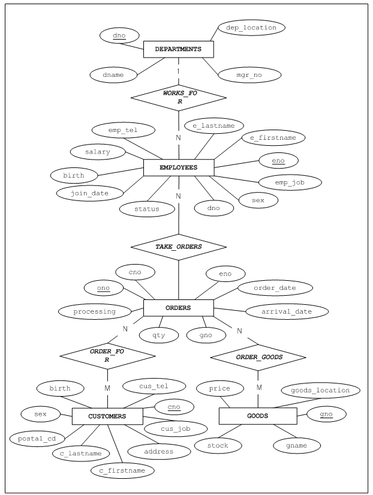

- [General Reference](#general-reference)
   - [3. The Data Dictionary](#3%EB%8D%B0%EC%9D%B4%ED%84%B0-%EB%94%95%EC%85%94%EB%84%88%EB%A6%AC)
    - [V\$LATCH](#vlatch)
    - [V\$LIBRARY](#vlibrary)
    - [V\$LFG](#vlfg)
    - [V\$LOCK](#vlock)
    - [V\$LOCK_STATEMENT](#vlock_statement)
    - [V\$LOG](#vlog)
    - [V\$LOCK_WAIT](#vlock_wait)
    - [V\$MEMGC](#vmemgc)
    - [V\$MEMSTAT](#vmemstat)
    - [V\$MEMTBL_INFO](#vmemtbl_info)
    - [V\$MEM_BTREE_HEADER](#vmem_btree_header)
    - [V\$MEM_BTREE_NODEPOOL](#vmem_btree_nodepool)
    - [V\$MEM_RTREE_HEADER](#vmem_rtree_header)
    - [V\$MEM_RTREE_NODEPOOL](#vmem_rtree_nodepool)
    - [V\$MEM_TABLESPACES](#vmem_tablespaces)
    - [V\$MEM_TABLESPACE_CHECKPOINT_PATHS](#vmem_tablespace_checkpoint_paths)
    - [V\$MEM_TABLESPACE_STATUS_DESC](#vmem_tablespace_status_desc)
    - [V\$MUTEX](#vmutex)
    - [V\$NLS_PARAMETERS](#vnls_parameters)
    - [V\$NLS_TERRITORY](#vnls_territory)
    - [V\$OBSOLETE_BACKUP_INFO](#vobsolete_backup_info)
    - [V\$PKGTEXT](#vpkgtext)
    - [V\$PLANTEXT](#vplantext)
    - [V\$PROCINFO](#vprocinfo)
    - [V\$PROCTEXT](#vproctext)
    - [V\$PROPERTY](#vproperty)
    - [V\$REPEXEC](#vrepexec)
    - [V\$REPGAP](#vrepgap)
    - [V\$REPGAP_PARALLEL](#vrepgap_parallel)
    - [V\$REPLOGBUFFER](#vreplogbuffer)
    - [V\$REPOFFLINE_STATUS](#vrepoffline_status)
    - [V\$REPRECEIVER](#vrepreceiver)
    - [V\$REPRECEIVER_COLUMN](#vrepreceiver_column)
    - [V\$REPRECEIVER_PARALLEL](#vrepreceiver_parallel)
    - [V\$REPRECEIVER_PARALLEL_APPLY](#vrepreceiver_parallel_apply)
    - [V\$REPRECEIVER_STATISTICS](#vrepreceiver_statistics)
    - [V\$REPRECEIVER_TRANSTBL](#vrepreceiver_transtbl)
    - [V\$REPRECEIVER_TRANSTBL_PARALLEL](#vrepreceiver_transtbl_parallel)
    - [V\$REPRECOVERY](#vreprecovery)
    - [V\$REPSENDER](#vrepsender)
    - [V\$REPSENDER_PARALLEL](#vrepsender_parallel)
    - [V\$REPSENDER_SENT_LOG_COUNT](#vrepsender_sent_log_count)
    - [V\$REPSENDER_SENT_LOG_COUNT_PARALLEL](#vrepsender_sent_log_count_parallel)
    - [V\$REPSENDER_STATISTICS](#vrepsender_statistics)
    - [V\$REPSENDER_TRANSTBL](#vrepsender_transtbl)
    - [V\$REPSENDER_TRANSTBL_PARALLEL](#vrepsender_transtbl_parallel)
    - [V\$REPSYNC](#vrepsync)
    - [V\$RESERVED_WORDS](#vreserved_words)
    - [V\$SBUFFER_STAT](#vsbuffer_stat)
    - [V\$SEGMENT](#vsegment)
    - [V\$SEQ](#vseq)
    - [V\$SERVICE_THREAD](#vservice_thread)
    - [V\$SERVICE_THREAD_MGR](#vservice_thread_mgr)
    - [V\$SESSION](#vsession)
    - [V\$SESSION_EVENT](#vsession_event)
    - [V\$SESSION_WAIT](#vsession_wait)
    - [V\$SESSION_WAIT_CLASS](#vsession_wait_class)
    - [V\$SESSIONMGR](#vsessionmgr)
    - [V\$SESSTAT](#vsesstat)
    - [V\$SFLUSHER](#vsflusher)
    - [V\$SFLUSHINFO](#vsflushinfo)
    - [V\$SNAPSHOT](#vsnapshot)
    - [V\$SQLTEXT](#vsqltext)
    - [V\$SQL_PLAN_CACHE](#vsql_plan_cache)
    - [V\$SQL_PLAN_CACHE_PCO](#vsql_plan_cache_pco)
    - [V\$SQL_PLAN_CACHE_SQLTEXT](#vsql_plan_cache_sqltext)
    - [V\$STABLE_MEM_DATAFILES](#vstable_mem_datafiles)
    - [V\$STATEMENT](#vstatement)
    - [V\$STATNAME](#vstatname)
    - [V\$SYSSTAT](#vsysstat)
    - [V\$SYSTEM_CONFLICT_PAGE](#vsystem_conflict_page)
    - [V\$SYSTEM_EVENT](#vsystem_event)
    - [V\$SYSTEM_WAIT_CLASS](#vsystem_wait_class)
    - [V\$TABLE](#vtable)
    - [V\$TABLESPACES](#vtablespaces)
    - [V\$TIME_ZONE_NAMES](#vtime_zone_names)
    - [V\$TRACELOG](#vtracelog)
    - [V\$TRANSACTION](#vtransaction)
    - [V\$TRANSACTION_MGR](#vtransaction_mgr)
    - [V\$TSSEGS](#vtssegs)
    - [V\$TXSEGS](#vtxsegs)
    - [V\$UDSEGS](#vudsegs)
    - [V\$UNDO_BUFF_STAT](#vundo_buff_stat)
    - [V\$USAGE](#vusage)
    - [V\$VERSION](#vversion)
    - [V\$VOL_TABLESPACES](#vvol_tablespaces)
    - [V\$WAIT_CLASS_NAME](#vwait_class_name)
    - [V\$XID](#vxid)
  - [4. The Sample Schema](#4%EC%83%98%ED%94%8C-%EC%8A%A4%ED%82%A4%EB%A7%88)
    - [Information about the Sample Schema](#%EC%98%88%EC%A0%9C-%ED%85%8C%EC%9D%B4%EB%B8%94-%EC%A0%95%EB%B3%B4)
    - [Entity-Relationship (ER) Diagram and Sample Data](#e-r-%EB%8B%A4%EC%9D%B4%EC%96%B4%EA%B7%B8%EB%9E%A8%EA%B3%BC-%EC%83%98%ED%94%8C-%EB%8D%B0%EC%9D%B4%ED%83%80)


Altibase® Administration

# General Reference


Altibase Administration General Reference

Release 7.1

Copyright ⓒ 2001\~2020 Altibase Corp. All Rights Reserved.

This manual contains proprietary information of Altibase Corporation; it is provided under a license agreement containing restrictions on use and disclosure and is also protected by copyright patent and other intellectual property law. Reverse engineering of the software is prohibited. All trademarks, registered or otherwise, are the property of their respective owners.

**Altibase Corp**

10F, Daerung PostTower II, 306, Digital-ro, Guro-gu, Seoul 08378, Korea Telephone: +82-2-2082-1000 Fax: 82-2-2082-1099

Customer Service Portal: http://support.altibase.com/en/

Homepage: [http://www.altibase.com]

## 3. The Data Dictionary

### V\$LATCH

This view displays statistical information about the BCB latch of the buffer pool, including the number of attempts to obtain a latch on pages on which it is desired to perform read or write I/O, the number of latches that were successfully obtained immediately, and the number of failures to obtain a latch. These statistics are calculated separately for read and write latches.

| Column name        | Type    | Description                                               |
| ------------------ | ------- | --------------------------------------------------------- |
| SPACE_ID           | INTEGER | The tablespace identifier                                 |
| PAGE_ID            | INTEGER | The page identifier                                       |
| TRY_READ_LATCH     | BIGINT  | The number of attempts to obtain read latches             |
| READ_SUCCESS_IMME  | BIGINT  | The number of immediate successes to obtain read latches  |
| READ_MISS          | BIGINT  | The number of failures to obtain read latches             |
| TRY_WRITE_LATCH    | BIGINT  | The number of attempts to obtain write latches            |
| WRITE_SUCCESS_IMME | BIGINT  | The number of immediate successes to obtain write latches |
| WRITE_MISS         | BIGINT  | The number of failures to obtain write latches            |
| SLEEPS_CNT         | BIGINT  | The number of sleeps related to latch attempts            |

### V\$LIBRARY

This view provides information of dynamically library in C/C++ internal procedure. This can be checked whether the desired library is properly loaded with the library information.

| Column name        | Type        | Description                                        |
|--------------------|-------------|----------------------------------------------------|
| FILE_SPEC          | CHAR(4000)  | The path to dynamic library files                         |
| REFERENCE_COUNT    | INTEGER     | The number of internal procedures referencing dynamic libraries |
| FILE_SIZE          | INTEGER     | The file size of dynamic library (Bytes)                |
| CREATE_TIME        | VARCHAR(48) | The time the dynamic library was created                    |
| OPEN_TIME          | VARCHAR(48) | The time dynamic library was loaded                       |

#### Column Information

##### FILE_SPEC

This indicates the path of dynamic library file pointed to by the library object. It is displayed as a relative path to the default path ($\ALTIBASE_HOME/lib) where the library files are located.

##### REFERENCE_COUNT

This indicates the number of internal stored procedures or stored functions referencing a dynamic library.

##### FILE_SIZE

This indicates the size of a dynamic library file. (Unit: Bytes)

##### CREATE_TIME

This indicates the date and time when the dynamic library was created. This is received and saved from file information.

##### OPEN_TIME
This indicates the date and time when the dynamic library was loaded.

### V\$LFG

This view provides statistical information to help database administrators monitor group commit activity. For more detailed information about each column, please refer to the commit section in this manual.

| Column name           | Type    | Description                                                  |
| --------------------- | ------- | ------------------------------------------------------------ |
| LFG_ID                | INTEGER | The log file group identifier                                |
| CUR_WRITE_LF_NO       | INTEGER | The log file number of the log file currently being written to |
| CUR_WRITE_LF_OFFSET   | INTEGER | The offset of the log file currently being written to        |
| LF_OPEN_COUNT         | INTEGER | The number of open log files                                 |
| LF_PREPARE_COUNT      | INTEGER | The number of log files that have been created in advance    |
| LF_PREPARE_WAIT_COUNT | INTEGER | The number of waits to switch to new log files               |
| LST_PREPARE_LF_NO     | INTEGER | The identifier of the most recently prepared log file        |
| END_LSN_LFGID         | INTEGER | Not used. (0)                                                |
| END_LSN_FILE_NO       | INTEGER | The file number portion of the LSN (Log Sequence Number) at which a REDO operation will start when Altibase is restarted |
| END_LSN_OFFSET        | INTEGER | The offset within a LSN (Log Sequence Number) at which a REDO operation will start when Altibase is restarted |
| FIRST_DELETED_LOGFILE | INTEGER | The first log file that was deleted (inclusive)              |
| LAST_DELETED_LOGFILE  | INTEGER | The log file is the last log file that was deleted           |
| RESET_LSN_LFGID       | INTEGER | Not used. (0)                                                |
| RESET_LSN_FILE_NO     | INTEGER | The file number portion of the LSN (Log Sequence Number) used after database recovery |
| RESET_LSN_OFFSET      | INTEGER | The offset of the LSN (Log Sequence Number) used after database recovery |
| UPDATE_TX_COUNT       | INTEGER | The number of transactions in the LFG that are currently making changes to the database (only available for group commit) |
| GC_WAIT_COUNT         | INTEGER | The number of waits for disk I/O (only available for group commit) |
| GC_ALREADY_SYNC_COUNT | INTEGER | The number of completed disk I/O operations (only available for group commit) |
| GC_REAL_SYNC_COUNT    | INTEGER | The number of actual disk I/O operations that occurred during group commit |

#### Column Information

##### LFG_ID

This is a unique log file group number of the value 0.

##### CUR_WRITE_LF_NO

This is the number of the log file currently being used to store logs.

##### CUR_WRITE_LF_OFFSET

This is the log file offset currently being used to store logs.

##### LF_OPEN_COUNT

This is the number of log files on disk that are open for use by Altibase.

##### LF_PREPARE_COUNT

This is the number of log files that have been created in advance (prepared) by the log file creation thread up to the present moment

##### LF_PREPARE_WAIT_COUNT

When all of the prepared log files have been used, it is necessary to create new log files. This is the total number of waits for log files to be created in order to switch to a new log file. 

If this value is large, setting the PREPARE_LOG_FILE_COUNT property to a higher value will help ensure that a sufficient number of log files is prepared in advance. For more information about PREPARE_LOG_FILE_COUNT, please refer to the *General Reference*.

##### LST_PREPARE_LF_NO

This is the number of the log file that was most recently prepared (created in advance) by the log file creation thread.

##### END_LSN_FILE_NO

This shows the number of the log file, which is part of the LSN (Log Sequence Number), at which REDO commences when the system is restarted. It can be guaranteed that REDO will definitely begin with a log having a greater LSN value than the one shown here.

##### END_LSN_OFFSET

This shows the offset within the log file, which is part of the LSN (Log Sequence Number), at which REDO commences when the system is restarted. It can be guaranteed that REDO will definitely begin with a log having a greater LSN value than the one shown here.

##### FIRST_DELETED_LOGFILE

This shows the number of the first of the log files that were classified as unnecessary and deleted during checkpointing. This means that the log file having this number was deleted during checkpointing. 

##### LAST_DELETED_LOGFILE

This shows the last log files that were classified as unnecessary and deleted during checkpointing. This number means that the corresponding log file has been deleted during the checkpoint.

##### RESET_LSN_FILE_NO

RESET_LSN is the first LSN after the time point at which recovery was performed. RESET_LSN_FILE_NO is the log file number portion of RESET_LSN.

##### RESET_LSN_OFFSET

This shows the offset within the log file, and is a portion of RESET_LSN.

##### UPDATE_TX_COUNT

This returns, in real time, the number of transactions in the LFG that are currently making changes to the database.

##### GC_WAIT_COUNT

This shows the total number of times transactions in this LFG had to wait for disk I/O for group commit.

##### GC_ALREADY_SYNC_COUNT

During group commit, it is sometimes not necessary to perform disk I/O for some transactions, because the logs containing them have already been written to disk. This is the cumulative number of times this has occurred.

##### GC_REAL_SYNC_COUNT

This shows the number of actual disk I/O operations related to transactions in this LFG during group commit.

### V\$LOCK

This view displays information about lock nodes for all tables in the database at the current point in time.

| Column name    | Type        | Description                                                  |
| -------------- | ----------- | ------------------------------------------------------------ |
| LOCK_ITEM_TYPE | VARCHAR(7)  | The type of object that is locked                            |
| TBS_ID         | INTEGER     | The tablespace identifier                                    |
| TABLE_OID      | BIGINT      | The table object identifier                                  |
| DBF_ID         | BIGINT      | The database file identifier                                 |
| TRANS_ID       | BIGINT      | The transaction identifier                                   |
| LOCK_DESC      | VARCHAR(32) | A character string indicating the lock mode e.g.) IX, IS, X  |
| LOCK_CNT       | INTEGER     | The number of locks for this lock node                       |
| IS_GRANT       | BIGINT      | Indicates whether the table is locked or is waiting to be locked |

#### Column Information

##### LOCK_ITEM_TYPE

This indicates the type of object that is locked, and can have the following values: 

| Value   | Description            |
| ------- | ---------------------- |
| NONE    | Cannot have this value |
| TBS     | Tablespace             |
| TBL     | Table                  |
| DBF     | Database file          |
| UNKNOWN | Unknown object type    |

### V\$LOCK_STATEMENT

This view displays information about statements that are holding or waiting to acquire locks.

| Column name    | Type           | Description                                                  |
| -------------- | -------------- | ------------------------------------------------------------ |
| SESSION_ID     | INTEGER        | The session identifier                                       |
| ID             | INTEGER        | The statement identifier                                     |
| TX_ID          | BIGINT         | The transaction identifier                                   |
| QUERY          | VARCHAR(16384) | The query statement                                          |
| STATE          | INTEGER        | The state of the statement                                   |
| BEGIN_FLAG     | INTEGER        | A flag indicating the beginning of the statement             |
| LOCK_ITEM_TYPE | VARCHAR(7)     | The type of object that is locked                            |
| TBS_ID         | INTEGER        | The transaction identifier                                   |
| TABLE_OID      | BIGINT         | The table object identifier                                  |
| DBF_ID         | BIGINT         | The database file identifier                                 |
| LOCK_DESC      | VARCHAR(32)    | A character string indicating the lock mode e.g.) IX, IS, X  |
| LOCK_CNT       | INTEGER        | The number of locks for the lock node                        |
| IS_GRANT       | BIGINT         | Indicates whether the table is locked or is waiting to be locked |

### V\$LOG

This view displays information about log anchors.

| Column name               | Type        | Description                                                  |
| ------------------------- | ----------- | ------------------------------------------------------------ |
| BEGIN_CHKPT_LFGID         | INTEGER     | Not used(0)                                                  |
| BEGIN_CHKPT_FILE_NO       | INTEGER     | The log file number of the checkpoint start log of the most recently executed checkpoint |
| BEGIN_CHKPT_FILE_OFFSET   | INTEGER     | The log offset of the checkpoint start log of the most recently executed checkpoint |
| END_CHKPT_LFGID           | INTEGER     | Not used(0)                                                  |
| END_CHKPT_FILE_NO         | INTEGER     | The log file number of the checkpoint end log of the most recently executed checkpoint |
| END_CHKPT_FILE_OFFSET     | INTEGER     | The log offset of the checkpoint end log of the most recently executed checkpoint |
| SERVER_STATUS             | VARCHAR(15) | A character string indicating the status of the server       |
| ARCHIVELOG_MODE           | VARCHAR(12) | A character string indicating the status of database archive mode |
| TRANSACTION_SEGMENT_COUNT | INTEGER     | The number of transaction segments to be created in the undo tablespace |
| OLDEST_LFGID              | INTEGER     | Not used(0)                                                  |
| OLDEST_LOGFILE_NO         | INTEGER     | When restart recovery is performed, the log file number from which disk-related redo will begin |
| OLDEST_LOGFILE_OFFSET     | INTEGER     | When restart recovery is performed, the log file offset from which disk-related redo will begin |

#### Column Information

##### SERVER_STATUS

This is the status of the server.

-   SERVER SHUTDOWN: The server has been shut down.

-   SERVER STARTED: The server is running.

##### ARCHIVELOG_MODE

This indicates whether Archivelog mode is enabled for the database.

-   ARCHIVE: In this mode, unnecessary log files are stored in an extra directory for use in
    performing media recovery.

-   NOARCHIVE: In this mode, unnecessary log files are deleted.

### V\$LOCK_WAIT

This view shows wait information between transactions that are executed on the system.

| Column name       | Type   | Description                                        |
| ----------------- | ------ | -------------------------------------------------- |
| TRANS_ID          | BIGINT | The identifier of the waiting transaction          |
| WAIT_FOR_TRANS_ID | BIGINT | The identifier of the transaction being waited for |

#### Column Information

##### TRANS_ID

This is the identifier of the transaction that is currently waiting.

##### WAIT_FOR_TRANS_ID

This is the identifier of the transaction for which the transaction identified by TRANS_ID is waiting.

```
SQL> select * from v$lock_wait;
V$LOCK_WAIT.TRANS_ID  V$LOCK_WAIT.WAIT_FOR_TRANS_ID 
---------------------------------------------
1216                          2208                 
5344                         2208                 
2 rows selected.	
```

In the above example, transactions 1216 and 5344 are waiting for transaction 2208. 

### V\$MEMGC

This view displays memory space recovery (that is, memory garbage collection) information.

| Column name             | Type         | Description                                                  |
| ----------------------- | ------------ | ------------------------------------------------------------ |
| GC_NAME                 | VARCHAR(128) | MEM_LOGICAL_AGER: Previous version index key slot release thread MEM_DELTHR: A thread that releases deleted records and supports pending operations such as DROP TABLE etc. |
| CURRSYSTEMVIEWSCN       | VARCHAR(29)  | The current system view SCN                                  |
| MINMEMSCNINTXS          | VARCHAR(29)  | The lowest of the view SCNs for memory-related transactions  |
| OLDESTTX                | INTEGER      | The identifier of the oldest transaction (the identifier of the transaction to which MINMEMSCNINTXS belongs) |
| SCNOFTAIL               | VARCHAR(29)  | The commit SCN of the tail in garbage collection OID list    |
| IS_EMPTY_OIDLIST        | BIGINT       | Whether the garbage collection OID list is empty 0: empty 1: not empty |
| ADD_OID_CNT             | BIGINT       | The number of transactions that caused OIDs to be added for garbage collection management |
| GC_OID_CNT              | BIGINT       | The number of times OIDs are deleted for garbage collection  |
| AGING_REQUEST_OID_CNT   | BIGINT       | The number of outdated versions of records for which deletion has been requested |
| AGING_PROCESSED_OID_CNT | BIGINT       | The number of outdated versions of records that have been deleted |
| THREAD_COUNT            | INTEGER      | The number of garbage collection threads                     |

#### Column Information

Because Altibase supports MVCC, multiple versions of a single record can exist. In other words, one record consists of a most recent version and a number of previous versions. For more detailed information on MVCC, please refer to the sections pertaining to Multi-Version Concurrency Control (MVCC) in both the *Altibase* *Administrator’s Manual* and the *Altibase Getting Started Guide*.

##### AGING_REQUEST_OID_CNT

If 10 records are deleted in one transaction, which is then committed, there are now 10 outdated records that can be cleared to recover space. However, because ADD_OID_CNT is determined on the basis of transactions, it is incremented by 1. To remedy this, AGING_REQUEST_OID_CNT, which is determined on the basis of OIDs, is incremented by 10.

##### AGING_PROCESSED_OID_CNT

If the garbage collector (or ager) deletes 10 outdated versions of records from the same OID list, GC_OID_CNT is only incremented by 1 because it determined on the basis of lists. To remedy this, AGING_PROCESSED_OID_CNT, which is determined on the basis of OIDs, is incremented by 10. 

##### THREAD_COUNT

This shows the number of garbage collection threads.

### V\$MEMSTAT

This view displays statistics about the memory being used by Altibase processes.

| Column name    | Type     | Description                                              |
| -------------- | -------- | -------------------------------------------------------- |
| NAME           | CHAR(64) | The name of the memory module                            |
| ALLOC_SIZE     | BIGINT   | The amount of memory being used by the module (in bytes) |
| ALLOC_COUNT    | BIGINT   | The number of units of memory that make up ALLOC_SIZE    |
| MAX_TOTAL_SIZE | BIGINT   | The maximum memory size of the module (in bytes)         |

#### Column Information

##### NAME

This is the name of the module being used by Altibase. This column contains the following memory modules.

| Name                                   | Description                                                  |
| -------------------------------------- | ------------------------------------------------------------ |
| Altiwrap                               | The memory used for Altiwrap                                 |
| Async_IO_Manager                       | The memory that is used when asynchronous I/O occurs         |
| Audit_Manager                          | The memory for Audit administrators                          |
| CatalogCache_Memory                    | Not currently used                                           |
| Clock_Manager                          | The memory for the clock manager. The clock manager uses the CPU clock when it checks the system time. |
| CM_Buffer                              | The buffer memory used for communication (TCP, Unix domain Socket, IPC, and IPCDA) |
| CM_DataType                            | The memory that is used for sending and receiving large packets |
| CM_Interface                           | The memory used by CM Interface                              |
| CM_Multiplexing                        | The memory that is used for saving session information for communication |
| CM_NetworkInterface                    | The memory that is used for saving information about individual communication nodes |
| Condition_Variable                     | The memory used to manage condition variables for multithreaded control |
| DatabaseLink                           | The memory that is used by Database Link                     |
| Disaster_recovery                      | The memory used by disaster recovery                         |
| Disaster_recovery_Control              | The memory used by the role manager in disaster recovery     |
| Disaster_recovery_Executor             | The memory used during disaster recovery                     |
| Disaster_recovery_Storage              | Not currently used                                           |
| Dynamic Module Loader                  | The memory used when loading shared libraries                |
| External_Procedure                     | The memory used by external procedures                       |
| External_Procedure_Agent               | The Memory used by the external procedure agent              |
| Fixed_Table                            | The memory that is used for fixed tables                     |
| GIS_DataType                           | The memory that is used for handling GIS data                |
| GIS_Disk_Index                         | The memory that is used for managing the Disk Spatial Index for GIS data |
| GIS_Function                           | The memory that is used for space-related calculations       |
| GIS_TEMP_MEMORY                        | The memory that is used for creating R-tree indexes          |
| IDU_MEM_OTHER                          | The memory that is used for creating R-tree indexes          |
| Index_Memory                           | The memory used to manage index information                  |
| InMemoryRecovery_Memory                | Not currently used                                           |
| Latch                                  | The administrative memory used by latch                      |
| Legacy_Transaction_Manager             | The memory used to manage legacy transaction information     |
| LOG_Memory                             | Not currently used                                           |
| Main_Module_CDBC_CONDITIONBUF_MEMPOOL  | Not currently used                                           |
| Main_Module_CDBC_CURSORDATA_MEMPOOL    | Not currently used                                           |
| Main_Module_CDBC_MAIN                  | Not currently used                                           |
| Main_Module_CDBC_QP                    | Not currently used                                           |
| Main_Module_CDBC_STATE_MEMPOOL         | Not currently used                                           |
| Main_Module_Channel                    | The memory used by Altibase main module                      |
| Main_Module_DirectAttach               | Not currently used                                           |
| Main_Module_Distributed                | The memory used for XA management                            |
| Main_Module_Queue                      | The memory that is used for queues                           |
| Main_Module_Thread                     | The memory that is used for managing threads                 |
| Main_Module_Utility                    | Not currently used                                           |
| Mathematics                            | The memory that is used for various kinds of mathematical operations |
| MMAP                                   | The memory allocated by mmap system call                     |
| Mutex                                  | The memory that is used for managing mutexes                 |
| OS_Independent                         | Not currently used                                           |
| Process_ThreadInfo                     | Not currently used                                           |
| Profile_Manager                        | The memory that is used by the Profile Manager               |
| Query_Binding                          | The memory that is used for binding host variables           |
| Query_Common                           | Memory that is used for other purposes                       |
| Query_Common_Remote_Call               | Not currently used                                           |
| Query_Conversion                       | Not currently used                                           |
| Query_DML                              | The memory that is used for executing DML statements         |
| Query_Execute                          | The memory that is used when queries are executed            |
| Query_Execute_Cache                    | The memory used for caching deterministic function results   |
| Query_Result_Cache                     | The memory used to cache results                             |
| Query_Meta                             | The memory that is used to manage cached meta information, which is checked while the server is active |
| Query_Prepare                          | The memory that is used for preparing queries for execution  |
| Query_PSM_Concurrent_Execute           | The memory that is used for executing the DBMS_CONCURRENT_EXEC package |
| Query_PSM_Execute                      | The memory that is used for executing PSM (Persistent Stored Module) |
| Query_PSM_Node                         | The memory that is used for managing PSM array variables     |
| Query_Sequence                         | The memory that is used for managing sequences               |
| Query_Transaction                      | The memory that is used for executing triggers               |
| Remote_Call_Client                     | Not currently used                                           |
| Remote_Call_Server                     | Not currently used                                           |
| Replication_Common                     | Not currently used                                           |
| Replication_Control                    | The memory that is used by the Replication Manager           |
| Replication_Data                       | The memory that is used for processing XLOGs                 |
| Replication_Executor                   | Not currently used                                           |
| Replication_Met                        | 메타 캐시에 의해 사용되는 메모리                             |
| Replication_Module_Property            | Not currently used                                           |
| Replication_Network                    | The memory that is used for communication for replication    |
| Replication_Receiver                   | The memory that is used by the replication Receiver          |
| Replication_Recovery                   | The memory that is used to perform recovery using replication |
| Replication_Sender                     | The memory that is used by the replication Sender            |
| Replication_Storage                    | The memory that is used to apply XLOGs                       |
| Replication_Sync                       | The memory that is used for synchronization in replication   |
| RESERVED                               | Allocated, but not allocated when using the TLSF memory manager |
| Socket_Manager                         | Not currently used                                           |
| SQL Plan Cache Control                 | The memory that is used for the SQL Plan Cache               |
| Storage_DataPort                       | Memory that is used for executing DataPort                   |
| Storage_Disk_Buffer                    | The memory that is used by the Disk Buffer Manager           |
| Storage_Disk_Collection                | The memory that is used for performing Direct-Path Insert and LOB calculations for disk tables |
| Storage_Disk_Datafile                  | The memory that is used for data file management tasks, such as creating I/O buffers and data file nodes |
| Storage_Disk_Index                     | The memory that is used for managing disk indexes            |
| Storage_Disk_Page                      | The memory that is used for assigning disk LOB segment descriptors and disk table page list mutexes |
| Storage_Disk_Recovery                  | The memory that is used to ensure the consistency of a disk database |
| Storage_Disk_SecondaryBuffer           | The memory used by secondary disk buffer manager             |
| Storage_Global_Memory_Manager          | Not currently used                                           |
| Storage_Memory_Ager                    | The memory that is used for the garbage collector and the database recovery ("refining") thread |
| Storage_Memory_Collection              | The memory that is used for managing records in memory tables |
| Storage_Memory_Index                   | The memory that is used for managing memory indexes          |
| Storage_Memory_Interface               | The memory that is used at the storage module interface level |
| Storage_Memory_Locking                 | The memory that is used for locking tables and tablespaces   |
| Storage_Memory_Logical_Ager            | Not currently used                                           |
| Storage_Memory_Manager                 | The memory in which memory data are actually stored          |
| Storage_Memory_Page                    | The memory that is used for managing memory pages            |
| Storage_Memory_Recovery                | The memory that is used to perform recovery                  |
| Storage_Memory_Recovery_Archive_Thread | Not currently used                                           |
| Storage_Memory_Recovery_Chkpt_Thread   | Not currently used                                           |
| Storage_Memory_Recovery_LFG_Thread     | Not currently used                                           |
| Storage_Memory_Transaction             | The memory that is used for managing transaction information |
| Storage_Memory_Utility                 | The memory that is used when the Storage Manager Tool is used |
| Storage_Tablespace                     | The memory that is used for managing and allocating tablespace nodes |
| SYSTEM                                 | The memory allocated directly by the operating system using the malloc function |
| Tablespace Free Extent Pool            | The memory that is used for managing free extent pools of tablespaces |
| Temp_Memory                            | The memory that is used when allocating temporary space      |
| Thread_Stack                           | The memory used by the thread stack when the thread is created |
| Timer_Manager                          | The memory for the timer manager, which uses the timer thread when checking the system time |
| Transaction_DiskPage_Touched_List      | The memory that is used for managing disk data pages that are affected by a transaction |
| Transaction_OID_List                   | The memory that is used for making the OID (object identifier) list of a memory database |
| Transaction_Private_Buffer             | Not currently used                                           |
| Transaction_Segment_Table              | The memory that is used for managing Undo segments and Transaction Status segments |
| Transaction_Table                      | The memory that is used for assigning transaction objects    |
| Transaction_Table_Info                 | The memory that is used for managing information about the tables changed by a transaction |
| Utility_Module                         | Not currently used                                           |
| Volatile_Log_Buffer                    | Volatile Log Buffer memory                                   |
| Volatile_Memory_Manager                | The memory in which volatile memory data are stored          |
| Volatile_Memory_Page                   | The memory that is used for managing volatile memory pages   |
| WATCHDOG                               | Not currently used                                           |

##### ALLOC_SIZE

This indicates the memory usage of the module.

##### ALLOC_COUNT	

This is the number of unit memories that make up ALLOC_SIZE in the module

##### MAX_TOTAL_SIZE

This indicates the maximum memory size the module has.

### V\$MEMTBL_INFO

This view displays information about the status of memory tables.

| Column name             | Type     | Description                                                  |
| ----------------------- | -------- | ------------------------------------------------------------ |
| TABLESPACE_ID           | SMALLINT | The tablespace identifier                                    |
| TABLE_OID               | BIGINT   | The table object identifier                                  |
| MEM_PAGE_CNT            | BIGINT   | The number of pages containing fixed-length columns in the table |
| MEM_VAR_PAGE_CNT        | BIGINT   | The number of pages containing variable-length columns in the table |
| MEM_SLOT_PERPAGE        | INTEGER  | The number of slots that can be stored in a page containing fixed-length columns |
| MEM_SLOT_SIZE           | BIGINT   | The size of the fixed area in the table record               |
| FIXED_ALLOC_MEM         | DOUBLE   | The amount of fixed memory area (in bytes) allocated to a table |
| FIXED_USED_MEM          | BIGINT   | The amount of fixed memory area (in bytes) actually being used by a table |
| VAR_ALLOC_MEM           | DOUBLE   | The amount of variable memory area (in bytes) allocated to a table |
| VAR_USED_MEM            | BIGINT   | The amount of variable memory area (in bytes) actually being used by a table |
| MEM_FIRST_PAGEID        | BIGINT   | The number of the first of the fixed-length pages in the table |
| STATEMENT_REBUILD_COUNT | BIGINT   | The number of times a statement has been rebuilt             |
| UNIQUE_VIOLATION_COUNT  | BIGINT   | The number of times a unique key violation has occurred      |
| UPDATE_RETRY_COUNT      | BIGINT   | The number of times an update operation has been retried     |
| DELETE_RETRY_COUNT      | BIGINT   | The number of times a delete operation has been retried      |
| COMPRESSED_LOGGING      | INTEGER  | Indicates whether log compression is enabled or not          |
| IS_CONSISTENT           | INTEGER  | Whether an table is consistent                               |

To view this information together with the table name, join this view with the SYS_TABLES_ meta table and execute a query as follows:

```
SELECT A.TABLE_NAME,
	B.MEM_PAGE_CNT, 
	B.MEM_SLOT_SIZE,
	B.MEM_FIRST_PAGEID
FROM    SYSTEM_.SYS_TABLES_ A, V$MEMTBL_INFO B  
WHERE   A.TABLE_OID = B.TABLE_OID;
```

#### Column Information

##### TABLESPACE_ID

This is the identifier of the tablespace in which the current table is stored. The following tablespaces are created by default. Identifiers of new user-created tablespaces will have values greater than 4.

-   0: SYS_TBS_MEM_DIC

-   1: SYS_TBS_MEM_DATA

-   2: SYS_TBS_DISK_DATA

-   3: SYS_TBS_DISK_UNDO

-   4: SYS_TBS_DISK_TEMP

##### TABLE_OID

This is the default table object identifier, and indicates the physical location of the header that contains information about the table. This is only used internally by the system.

##### STATEMENT_REBUILD_COUNT

When the Prepare-Execute process is performed, a prepared statement is executed without being parsed, validated, or optimized. However, after the statement is prepared, if a DDL statement is executed on a query target object (a tablespace, table or index), the corresponding statement is automatically rebuilt when the statement is executed, and this value is incremented. 

##### UNIQUE_VIOLATION_COUNT

This value is incremented when a unique key restriction is violated. 

##### UPDATE_RETRY_COUNT

This value is incremented when an attempt to perform an update operation is repeated. 

##### DELETE_RETRY_COUNT

This value is incremented when an attempt to perform a delete operation is repeated.

###  V\$MEM_BTREE_HEADER

This view shows information about a memory BTREE header.

| Column name        | Type         | Description                                                  |
| ------------------ | ------------ | ------------------------------------------------------------ |
| INDEX_NAME         | VARCHAR(128) | The name of the index                                        |
| INDEX_ID           | INTEGER      | The index identifier                                         |
| INDEX_TBS_ID       | INTEGER      | The tablespace in which the index is stored                  |
| TABLE_TBS_ID       | INTEGER      | The tablespace in which the associated table is stored       |
| IS_UNIQUE          | CHAR(1)      | Whether an index is a unique key index                       |
| IS_NOT_NULL        | CHAR(1)      | Whether NULL values are allowed                              |
| USED_NODE_COUNT    | INTEGER      | The number of nodes that are being used by an index          |
| PREPARE_NODE_COUNT | INTEGER      | The number of nodes that are prepared in advance to meet the demand for nodes |
| BUILT_TYPE         | CHAR(1)      | The key type that was used when the index was created        |

#### Column Information

##### INDEX_NAME

This is the name of the index.

##### INDEX_ID

This is a unique identifier for the index in the system. 

##### INDEX_TBS_ID

This is the identifier of the tablespace in which the index is stored. 

##### TABLE_TBS_ID

This is the identifier of the tablespace containing the table that is related to the index.

##### IS_UNIQUE

This indicates whether the index is a unique key index. It is set to ‘T’ to indicate a unique key index, and to ‘F’ to indicate a duplicate key index.

##### IS_NOT_NULL

This indicates whether NULL values are allowed. It is set to ‘T’ for a primary key index, and to ‘F’ for other kinds of indexes.

##### USED_NODE_COUNT

This indicates the total number of nodes for the current index. This number increases when a node is split, and decreases when a node is deleted.

##### PREPARE_NODE_COUNT

This is the number of nodes that are allocated in advance in consideration of system load, based on the number of nodes that have been assigned.

##### BUILT_TYPE

This indicates whether a key value or a record pointer was used when the index was built. It is set to ‘V’ to indicate that a key value was used, and to ‘P’ to indicate that a record pointer was used. 

### V\$MEM_BTREE_NODEPOOL

This view shows information about the node pool for memory BTREE indexes. The node pool manages node allocation and return for all memory BTREE indexes. 

| Column name      | Type    | Description                                                  |
| ---------------- | ------- | ------------------------------------------------------------ |
| TOTAL_PAGE_COUNT | INTEGER | The total number of pages in the node pool                   |
| TOTAL_NODE_COUNT | INTEGER | The total number of nodes in the node pool                   |
| FREE_NODE_COUNT  | INTEGER | The number of unallocated nodes in the node pool             |
| USED_NODE_COUNT  | INTEGER | The number of nodes allocated to indexes                     |
| NODE_SIZE        | INTEGER | The size of a node (in bytes)                                |
| TOTAL_ALLOC_REQ  | BIGINT  | The cumulative number of node allocation requests made to the node pool |
| TOTAL_FREE_REQ   | BIGINT  | The cumulative number of node deletion requests made to the node pool |
| FREE_REQ_COUNT   | INTEGER | The number of nodes in the node pool waiting to be deleted   |

#### Column Information

##### TOTAL_PAGE_COUNT

This shows the number of pages allocated to the node pool for BTREE indexes.

##### TOTAL_NODE_COUNT

This indicates the number of nodes allocated to the node pool for BTREE indexes. It is determined by TOTAL_PAGE_COUNT and NODE_SIZE.

##### FREE_NODE_COUNT

This is the number of nodes that have not been allocated to BTREE indexes, and thus remain in the node pool.

##### USED_NODE_COUNT

This shows the total number of nodes that are currently allocated to BTREE indexes.

##### NODE_SIZE

This is the size of a BTREE index node.

##### TOTAL_ALLOC_REQ

This is the number of node allocation requests that have been made to the node pool. This is the cumulative number since the system was started.

##### TOTAL_FREE_REQ

인덱스에서 사용되었던 노드가 삭제되어 노드 풀에 반환 요청된 횟수를 나타낸다.
시스템이 시작된 후부터 누적된 값을 유지한다.

##### FREE_REQ_COUNT

This is the number of return requests that have been made to the node pool for nodes that were used for BTREE indexes and then deleted. This is the cumulative number since the system was started

### V\$MEM_RTREE_HEADER

This view shows information about the header of a memory RTREE index.

| Column name        | Type     | Description                                                  |
| ------------------ | -------- | ------------------------------------------------------------ |
| INDEX_NAME         | CHAR(40) | The name of the index                                        |
| INDEX_ID           | INTEGER  | The index identifier                                         |
| TABLE_TBS_ID       | INTEGER  | The identifier of the tablespace in which the table is stored |
| TREE_MBR_MIN_X     | DOUBLE   | The minimum X value of the RTREE index                       |
| TREE_MBR_MIN_Y     | DOUBLE   | The minimum Y value of the RTREE index                       |
| TREE_MBR_MAX_X     | DOUBLE   | The maximum X value of the RTREE index                       |
| TREE_MBR_MAX_Y     | DOUBLE   | The maximum Y value of the RTREE index                       |
| USED_NODE_COUNT    | INTEGER  | The number of nodes that are being used by the index         |
| PREPARE_NODE_COUNT | INTEGER  | The number of nodes that have been pre-allocated to meet node demand |

#### Column Information

##### INDEX_NAME

This is the name of the index.

##### INDEX_ID

This is the identifier of the index. This identifier is unique within the system. 

##### TABLE_TBS_ID

This is the identifier of the tablespace containing the table that is related to the index.

##### TREE_MBR_MIN_X

This is the minimum X value of the minimum bounding box of the RTREE index.

##### TREE_MBR_MIN_Y

This is the minimum Y value of the minimum bounding box of the RTREE index.

##### TREE_MBR_MAX_X

This is the maximum X value of the minimum bounding box of the RTREE index.

##### TREE_MBR_MAX_Y

This is the maximum Y value of the minimum bounding box of the RTREE index.

##### USED_NODE_COUNT

This is the total number of nodes being used by the current index. This number increases when a node is split and decreases when a node is deleted.

##### PREPARE_NODE_COUNT

This is the number of nodes that are allocated in advance in consideration of system load, based on the number of nodes that have been assigned.

### V\$MEM_RTREE_NODEPOOL

This view shows information about the node pool for memory RTREE indexes. This node pool manages node allocation and return for all memory RTREE indexes.

| Column name      | Type    | Description                                                  |
| ---------------- | ------- | ------------------------------------------------------------ |
| TOTAL_PAGE_COUNT | INTEGER | The total number of pages in the node pool                   |
| TOTAL_NODE_COUNT | INTEGER | The number of nodes allocated to indexes                     |
| FREE_NODE_COUNT  | INTEGER | The number of unallocated nodes in the node pool             |
| USED_NODE_COUNT  | INTEGER | The number of nodes allocated to indexes                     |
| NODE_SIZE        | INTEGER | The size of a node (in bytes)                                |
| TOTAL_ALLOC_REQ  | BIGINT  | The cumulative number of node allocation requests made to the node pool |
| TOTAL_FREE_REQ   | BIGINT  | The cumulative number of node deletion requests made to the node pool |
| FREE_REQ_COUNT   | INTEGER | The number of nodes in the node pool that are waiting to be deleted |

#### Column Information


##### TOTAL_PAGE_COUNT

This is the number of pages allocated to the node pool for RTREE indexes.

##### TOTAL_NODE_COUNT

This is the total number of nodes allocated to the node pool for RTREE indexes. It is determined by TOTAL_PAGE_COUNT and NODE_SIZE.

##### FREE_NODE_COUNT

This is the number of nodes that have not been allocated to RTREE indexes and thus remain in the node pool.

##### USED_NODE_COUNT

This is the total number of nodes that are currently allocated to RTREE indexes

##### NODE_SIZE

This is the size of an RTREE index node.

##### TOTAL_ALLOC_REQ

This is the number of node allocation requests that have been made to the node pool. This is the cumulative number since the system was started.

##### TOTAL_FREE_REQ

This is the number of return requests that have been made to the node pool for nodes that were being used by RTREE indexes and were then deleted. This is the cumulative number since the system was started.

##### FREE_REQ_COUNT

This is the number of nodes that were being used by RTREE indexes and are waiting to be deleted.

### V\$MEM_TABLESPACES

This view shows information about tablespaces that exist in memory.

| Column name         | Type         | Description                                                  |
| ------------------- | ------------ | ------------------------------------------------------------ |
| SPACE_ID            | INTEGER      | The tablespace identifier                                    |
| SPACE_NAME          | VARCHAR(512) | The name of the tablespace                                   |
| SPACE_STATUS        | INTEGER      | The tablespace status                                        |
| SPACE_SHM_KEY       | INTEGER      | The share memory key of the tablespace                       |
| AUTOEXTEND_MODE     | INTEGER      | The auto extension mode of the tablespace                    |
| AUTOEXTEND_NEXTSIZE | BIGINT       | The size (in bytes) by which the tablespace is automatically extended |
| MAXSIZE             | BIGINT       | The maximum size of the tablespace (in bytes)                |
| CURRENT_SIZE        | BIGINT       | The current size of the tablespace (in bytes)                |
| DBFILE_SIZE         | DOUBLE       | The size of the database image files (in bytes)              |
| DBFILE_COUNT_0      | INTEGER      | The number of database image files in file group #0          |
| DBFILE_COUNT_1      | INTEGER      | The number of database image files in file group #1          |
| TIMESTAMP           | VARCHAR(64)  | The time point at which the tablespace was created           |
| ALLOC_PAGE_COUNT    | BIGINT       | The total number of pages in the tablespace                  |
| FREE_PAGE_COUNT     | BIGINT       | The number of free pages in the tablespace                   |
| RESTORE_TYPE        | BIGINT       | How to load the tablespace into memory                       |
| CURRENT_DB          | INTEGER      | A set of files that are the target for ping pong checkpointing |
| HIGH_LIMIT_PAGE     | BIGINT       | The maximum number of pages that the tablespace can have     |
| PAGE_COUNT_PER_FILE | BIGINT       | The number of pages per database image file                  |
| PAGE_COUNT_IN_DIS K | INTEGER      | The number of pages that exist on disk                       |

#### Column Information

##### SPACE_STATUS

This is a value that indicates the tablespace status. Please refer to V$MEM_TABLESPACE_STATUS_DESC for details.

##### SPACE_SHM_KEY

This is a shared memory key, which is used when a tablespace is loaded into shared memory.

##### AUTOEXTEND_MODE

This indicates whether Autoextend mode is enabled. If it is set to 1, Autoextend mode is enabled, whereas if it is set to some other value, Autoextend mode is not enabled..

##### AUTOEXTEND_NEXTSIZE

When the tablespace is automatically extended, this indicates the size (in bytes) by which the tablespace is automatically extended.

##### MAXSIZE

This is the maximum size of the tablespace (in bytes).

##### CURRENT_SIZE

This is the current size of the tablespace (in bytes).

##### DBFILE_SIZE

This is the size of the database image files for the tablespace (in bytes). 

##### DBFILE_COUNT_0

Because Altibase uses ping pong checkpointing, it maintains two sets of databases image files. This value indicates the number of files in file group #0, which is one of these sets. 

##### DBFILE_COUNT_1

Because Altibase uses ping pong checkpointing, it maintains two sets of databases image files. This value indicates the number of files in file group #1, which is one of these sets.

##### TIMESTAMP

This timestamp value indicates the time point at which the tablespace was created. 

##### ALLOC_PAGE_COUNT

This is the number of pages in the tablespace.

##### FREE_PAGE_COUNT

This is the number of free pages in the tablespace.

##### RESTORE_TYPE

This indicates how the tablespace is loaded into memory. It can have the following values: 

| Loading Metho           | Value | Description                                                  |
| ----------------------- | ----- | ------------------------------------------------------------ |
| RESTORE_TYPE_DYNAMIC    | 0     | The tablespace is loaded into dynamic memory.                |
| RESTORE_TYPE_SHM_CREATE | 1     | The shared memory is created and the tablespace is loaded into shared memory. |
| RESTORE_TYPE_SHM_ATTACH | 2     | The tablespace is attached to shared memory. Attach shared memory to a process while the database is already in shared memory. |

##### CURRENT_DB

This is the database image file group into which dirty pages (changed pages) are downloaded during checkpointing. It can be 0 or 1.

##### HIGH_LIMIT_PAGE

This is the maximum number of pages that the tablespace can have.

##### PAGE_COUNT_PER_FILE

This is the number of pages per database image file.

##### PAGE_COUNT_IN_DISK

This is the total number of pages in all database image files that exist on disk. Altibase increases the size of a database during checkpointing, rather than directly increasing the size of files on disk. Therefore, the number of database pages that exist in memory can be different from the number of pages on disk. 

### V\$MEM_TABLESPACE_CHECKPOINT_PATHS 

This view shows the directory path of the database image files in which changed pages (dirty pages) are recorded during checkpointing for a tablespace.

| Column name     | Type         | Description                                                 |
| --------------- | ------------ | ----------------------------------------------------------- |
| SPACE_ID        | INTEGER      | The tablespace identifier                                   |
| CHECKPOINT_PATH | VARCHAR(512) | The directory in which the database image files are located |

### V\$MEM_TABLESPACE_STATUS_DESC 

This view provides descriptions of values that indicate the memory tablespace status. These are the values that the SPACE_STATUS column in the V$MEM_TABLESPACES view can have.

| Column name | Type        | Description                           |
| ----------- | ----------- | ------------------------------------- |
| STATUS      | INTEGER     | The status value of memory tablespace |
| STATUS_DESC | VARCHAR(64) | The description of the status value   |

#### Column Information

##### STATUS

This is the status value of the memory tablespace. 

##### STATUS_DESC

This is a description of the status value of the memory tablespace. 

The status values and corresponding descriptions are as follows:

| STATUS_DESC          | Description                                                  |
| -------------------- | ------------------------------------------------------------ |
| OFFLINE              | The tablespace is offline.                                   |
| ONLINE               | The tablespace is online.                                    |
| DISCARDED            | The tablespace has been discarded.                           |
| DROPPED              | The tablespace has been deleted                              |
| BACKUP               | The tablespace is being backed up.                           |
| CREATING             | The tablespace is being created.                             |
| DROPPING             | A request has been made to delete the tablespace.            |
| DROP_PENDING         | The tablespace is being deleted.                             |
| SWITCHING_TO_OFFLINE | The tablespace is switching to offline status.               |
| SWITCHING_TO_ONLINE  | The tablespace is switching to online status.                |
| BLOCK_BACKUP         | The tablespace cannot be backed up. Because another operation is in progress, it is necessary to wait until the other operation is complete before backup can be performed. |

### V\$MUTEX

This view displays statistical information about mutexes, which are related to concurrency control performed by Altibase processes.

| Column name        | Type        | Description                                                  |
| ------------------ | ----------- | ------------------------------------------------------------ |
| NAME               | VARCHAR(64) | The name of the mutex                                        |
| TRY_COUNT          | BIGINT      | The number of lock attempts                                  |
| LOCK_COUNT         | BIGINT      | The number of successful lock attempts                       |
| MISS_COUNT         | BIGINT      | The number of waits resulting from missed lock attempts      |
| SPIN_VALUE         | INTEGER     | This field is reserved for future use.                       |
| TOTAL_LOCK_TIME_US | BIGINT      | The total amount of time this mutex has been locked (in microseconds) |
| MAX_LOCK_TIME_US   | BIGINT      | The maximum time elapsed while locking this mutex (in microseconds) |
| THREAD_ID          | VARCHAR(64) | The identifier of a thread currently holding a lock.         |

### V\$NLS_PARAMETERS

This view shows NLS (National Language Support)-related information for both the server and client for each session.

| Column name               | Type        | Description                                                  |
| ------------------------- | ----------- | ------------------------------------------------------------ |
| SESSION_ID                | BIGINT      | The session identifier                                       |
| NLS_USE                   | VARCHAR(40) | The client character set                                     |
| NLS_CHARACTERSET          | VARCHAR(40) | The database character set                                   |
| NLS_NCHAR_CHARACTERSET    | VARCHAR(40) | The national character set                                   |
| NLS_COMP                  | VARCHAR(7)  | How characters are compared                                  |
| NLS_NCHAR_CONV_EXCP       | VARCHAR(7)  | How to handle errors that arise when converting character sets |
| NLS_NCHAR_LITERAL_REPLACE | VARCHAR(7)  | Whether to check for the presence of NCHAR literals within SQL statements |

#### Column Information

##### SESSION_ID

This is the unique number of the session

##### NLS_USE

This is the client character set. The default character set should be set when processing character data on the client. The character sets and related NLS_USE settings currently supported by Altibase are as follows:

| Language          | Character Set        | NLS_USE                                  |
| ----------------- | -------------------- | ---------------------------------------- |
| English (default) | US7ASCII             | US7ASCII, ASCII, ENGLISH                 |
| Korean            | KSC-5601 Complete    | KSC5601, KO16KSC5601, KOREAN             |
|                   | MS Extended Complete | MS949, CP949, WINDOWS949                 |
| Japanese          | EUC-JP (UNIX)        | EUCJP                                    |
|                   | Shift-JIS (Windows)  | SHIFTJIS                                 |
|                   | MS932 (Windows)      | MS932, CP932                             |
| Chinese           | China                | GB231280, ZHS16CGB231280, CHINESE, MS936 |
|                   | Taiwan               | BIG5, ZHT16BIG5, TAIWAN                  |
| Universal         | Unicode (UTF-8)      | UTF8, UNICODE                            |

When storing data of a different character set than the database character set, it is important to consider convertibility and compatibility between the individual character sets. Please refer to the *Getting Started* for more detailed information about multilingual support.

##### NLS_CHARACTERSET

This is the database character set used on the server. 

##### NLS_NCHAR_CHARACTERSET

This is the national character set. 

##### NLS_COMP

This indicates the order in which characters are compared according to how they appear in a dictionary of the language corresponding to the character set that was specified when the database was created. At present, this is useful only when Korean (KSC-5601 Completion or MS Extended Completion) is specified as the database character set.

##### NLS_NCHAR_CONV_EXCP

This shows how errors are handled when the character set is converted.

##### NLS_NCHAR_LITERAL_REPLACE

This shows whether the client will check whether NCHAR literals exist within a SQL statement. If this is TRUE, the client always checks whether NCHAR literals exist, and convert the remainder of the SQL statement, other than the NCHAR literals, to the database character set. If this is FALSE, the client doesn't check this, and convert the entire SQL statement to to the database character set.

### V\$NLS_TERRITORY

This view stores the names of territories available to be set for the database or the current session.

| Column name | Type        | Description                                   |
| ----------- | ----------- | --------------------------------------------- |
| NAME        | VARCHAR(40) | The name of the territory available to be set |

### V\$OBSOLETE_BACKUP_INFO

This view displays information about backups which are no longer required to be retained.

Since columns of this view are part of the V\$BACKUP_INFO performance view, please refer to column information about the V$BACKUP_INFO performance view for further information.

| Column name                    | Type      | Description                     |
| ------------------------------ | --------- | ------------------------------- |
| BEGIN_BACKUP_TIME              | CHAR(24)  | The start time of backup        |
| END_BACKUP_TIME                | CHAR(24)  | The completion time of backup   |
| INCREMENTAL_BACKUP_CHUNK_COUNT | INTEGER   | The incremental chunk size      |
| BACKUP_TARGET                  | INTEGER   | The backup target               |
| BACKUP_LEVEL                   | INTEGER   | The backup level                |
| BACKUP_TYPE                    | INTEGER   | The backup type                 |
| TABLESPACE_ID                  | INTEGER   | The backup target tablespace ID |
| FILE_ID                        | INTEGER   | The backup target datafile ID   |
| BACKUP_TAG                     | CHAR(128) | The backup tag name             |
| BACKUP_FILE                    | CHAR(512) | The backup file                 |

### V\$PKGTEXT

This view contains information about strings of the packages executed on the system.

| Column name | Type        | Description                               |
| ----------- | ----------- | ----------------------------------------- |
| PACKAGE_OID | BIGINT      | The package identifier                    |
| PIECE       | INTEGER     | The serial number of the string piece     |
| TEXT        | VARCHAR(64) | The string piece of the package statement |

#### Column Information

##### PACKAGE_OID

This is the object identifier which only points to the package; the OID.

##### PIECE

The entire statement of the package is split into strings with the length of 64 bytes and saved. PIECE is the serial number of the 64-byte split pieces, and starts from 0.

##### TEXT

This is the column which displays the text of the 64-byte text pieces which are parts of the package text.

### V\$PLANTEXT

This view displays information about execution plans for SQL statements that are executed by the server. 

| Column name | Type        | Description                                               |
| ----------- | ----------- | --------------------------------------------------------- |
| SID         | INTEGER     | The session identifier                                    |
| STMT_ID     | INTEGER     | The statement identifier                                  |
| PIECE       | INTEGER     | The serial number for the fragment of execution plan text |
| TEXT        | VARCHAR(64) | A fragment of execution plan text                         |

#### Column Information

##### SID

This is the identifier of the session.

##### STMT_ID

This is the identifier of the statement. 

##### PIECE

A complete execution plan for one statement is divided into text fragments 64 bytes long and then saved. PIECE shows the serial numbers for these 64-byte fragments, starting from 0.

##### TEXT

This shows the contents of the 64-byte text fragment that is part of the execution plan statement. 

### V\$PROCINFO

| Column name  | Type        | Description                      |
|--------------|-------------|----------------------------------|
| PROC_OID     | BIGINT      | The object identifier of the stored procedure        |
| MODIFY_COUNT | INTEGER     | The number of times a stored procedure was recreated or recompiled |
| STATUS       | VARCHAR(7)  | The status of the object. If INVALID, it is cannot be executed |
| SESSION_ID   | INTEGER     | The ID of the session that changed the STATUS of the stored procedure |
| PROC_TYPE    | VARCHAR(10) | The type of stored procedure |

#### Column information

##### PROC_OID

This is an identifier of a stored procedure or stored function, which is the same as a PROC_OID value in the SYS_PROCEDURES meta table.

##### MODIFY_COUNT

This increments by 1 each time a stored procedure or function is recreated or compiled. The initial value is 0

##### STATUS

This indicates whether a stored procedure or function can be executed. VALID indicates that it can be executed. Refer to the description of the STATUS column in the SYS_PROCEDURES_ meta table

##### SESSION_ID

This indicates the ID of the session that changed the status of the stored procedure or function to INVALID. If the state has never changed, this value is 0 or -1.

##### PROC_TYPE

This indicates the type of stored procedure. The possible values are:

- NORMAL : Normal Procedure

- EXTERNAL C : C/C++ External Procedure

- INTERNAL C : C/C++ Internal Procedure

- UNKNOWN : If the compliation of the stored procedure fails when starting the server, the internal procedure type is not known and marked as UNKNOWN. Subsequently, when compiled and in VALID status, the correct type is set.


###  V\$PROCTEXT

This view displays information about stored procedures being used by the system. 

| Column name | Type        | Description                                         |
| ----------- | ----------- | --------------------------------------------------- |
| PROC_OID    | BIGINT      | The object identifier of a stored procedure         |
| PIECE       | INTEGER     | The serial number for the stored procedure fragment |
| TEXT        | VARCHAR(64) | A fragment of the stored procedure text             |

#### Column Information

##### PROC_OID

This is an OID, which is a unique object identifier for a stored procedure. 

##### PIECE

The complete text for a stored procedure is divided into text fragments 64 bytes long and then saved. PIECE shows the serial numbers for these 64-byte fragments, starting from 0.

##### TEXT

This shows the contents of the 64-byte text fragment that is part of the stored procedure text. 

### V\$PROPERTY

This view displays information about all internally set Altibase properties.

| Column name | Type         | Description                               |
| ----------- | ------------ | ----------------------------------------- |
| NAME        | VARCHAR(256) | The property name                         |
| STOREDCOUNT | INTEGER      | The number of values set for the property |
| ATTR        | BIGINT       | The property attribute                    |
| MIN         | VARCHAR(256) | The minimum value                         |
| MAX         | VARCHAR(256) | The maximum value                         |
| VALUE1      | VARCHAR(256) | The first value                           |
| VALUE2      | VARCHAR(256) | The second value                          |
| VALUE3      | VARCHAR(256) | The third value                           |
| VALUE4      | VARCHAR(256) | The fourth value                          |
| VALUE5      | VARCHAR(256) | The fifth value                           |
| VALUE6      | VARCHAR(256) | The sixth value                           |
| VALUE7      | VARCHAR(256) | The seventh value                         |
| VALUE8      | VARCHAR(256) | The eighth value                          |

#### Column Information

##### NAME

This is the name of the property.

##### STOREDCOUNT

STOREDCOUNT displays the number of values set in the property. A property can have up to eight duplicate values.

##### ATTR

This is the attribute of the property.

##### MIN

This is the minimum value that the property can have.

##### MAX

This is the maximum value that the property can have.

##### VALUE1 \~ 8

The actual values set for the property.

### V\$REPEXEC

This view displays information related to the replication manager.

| Column name        | Type    | Description                            |
| ------------------ | ------- | -------------------------------------- |
| PORT               | INTEGER | The port number currently being used   |
| MAX_SENDER_COUNT   | INTEGER | The maximum number of Sender threads   |
| MAX_RECEIVER_COUNT | INTEGER | The maximum number of Receiver threads |

#### Column Information

##### PORT

The number of the port through which the replication manager on the local server receives replication requests from the remote server.

##### MAX_SENDER_COUNT

This is the maximum number of replication Sender threads that can be created on the local server.

##### MAX_RECEIVER_COUNT

This is the maximum number of replication Receiver threads that can be created on the local server.

### V\$REPGAP

This shows the difference between the most recently created log record and the log record currently being processed by the replication Sender. Please note that this information is only available while the replication Sender thread is active.

| Column name  | Type        | Description                                                  |
| ------------ | ----------- | ------------------------------------------------------------ |
| REP_NAME     | VARCHAR(40) | The name of the replication object                           |
| START_FLAG   | BIGINT      | Startup options                                              |
| REP_LAST_SN  | BIGINT      | The sequence number of the last log record                   |
| REP_SN       | BIGINT      | The sequence number of the log record currently being sent   |
| REP_GAP      | BIGINT      | The actual size of the log file corresponding to the replication gap<br />(Unit: Unit set in property [REPLICATION_GAP_UNIT](https://github.com/ALTIBASE/Documents/blob/master/Manuals/Altibase_7.1/eng/GeneralReference_2_7.1_Eng.md#replication_gap_unit-unit-byte)) |
| REP_GAP_SIZE | BIGINT      | The actual size of the log file corresponding to the replication gap<br />(bytes) |
| READ_LFG_ID  | INTEGER     | The log file group currently being read (Not used, 0)        |
| READ_FILE_NO | INTEGER     | The log file number currently being read                     |
| READ_OFFSET  | INTEGER     | The location currently being read                            |

#### Column Information

##### REP_NAME

This is the name of the replication object on the local server.

##### START_FLAG

This is a replication startup option for use when replication is started on the local server. The following values are possible:

-   NORMAL: 0

-   QUICK: 1

-   SYNC: 2

-   SYNC_ONLY: 3

-   SYNC RUN: 4

-   SYNC END: 5

-   RECOVERY from Replication: 6

-   OFFLINE: 7

-   PARALLEL: 8

##### REP_LAST_SN

This is the sequence number of the log record that was most recently written in response to a transaction on the local server. 

##### REP_SN

This is the sequence number of the log record that is currently being sent by the replication Sender on the local server.

##### REP_GAP

This shows the interval between the log sequence numbers of REP_LAST_SN and REP_SN. In other words, this is the interval between the log record that was most recently written due to a transaction on the local server and the log record that is currently being sent by the replication Sender thread.

##### REP_GAP_SIZE

This shows the log file size of the replication gap, in bytes.

##### READ_FILE_NO

This is the log file number which is currently being read by the replication sender. However, this is not updated while the replication sender is reading the replication log in the buffer. To check to see if the log is being read in the replication log buffer, verify the READ_SN value is between BUFFER_MIN_SN and BUFFER_MAX_SN. 

##### READ_OFFSET

This indicates the location in the log file that is currently being read. 

### V\$REPGAP_PARALLEL

This view shows the difference between the most recently created log record and the log record currently being processed by replication Sender threads working in parallel. Please note that this information is only available when multiple replication Sender threads are working in parallel.

| Column name  | Type        | Description                                                  |
| ------------ | ----------- | ------------------------------------------------------------ |
| REP_NAME     | VARCHAR(40) | The name of the replication                                  |
| CURRENT_TYPE | VARCHAR(9)  | The type of the replication Sender thread                    |
| REP_LAST_SN  | BIGINT      | The last log file number                                     |
| REP_SN       | BIGINT      | The sequence number of the log record currently being sent   |
| REP_GAP      | BIGINT      | The actual size of the log file corresponding to the replication gap<br />(Unit: unit set in property [REPLCIATION_GAP_UNIT](https://github.com/ALTIBASE/Documents/blob/master/Manuals/Altibase_7.1/eng/GeneralReference_2_7.1_Eng.md#replication_gap_unit-unit-byte)) |
| REP_GAP_SIZE | BIGINT      | The actual size of the log file corresponding to the replication gap<br />(bytes) |
| READ_LFG_ID  | INTEGER     | The identifier of the log file group currently being read    |
| READ_FILE_NO | INTEGER     | The log file number currently being read                     |
| READ_OFFSET  | INTEGER     | The current reading offset                                   |
| PARALLEL_ID  | INTEGER     | The identifier of one of several threads working in parallel for one Sender |

#### Column Information

##### REP_NAME

This is the name of the replication object on the local server.

##### CURRENT_TYPE

This can have one of the following values, which denote the current status of the replication Sender thread.

-   NORMAL: This means that the Sender thread analyzes transaction logs and converts them to XLOGs on the active server. The Sender thread then transfers the XLOGs to a standby server. 
-   QUICK: This value can be returned when replication was started with the QUICKSTART option, and indicates the state in which the starting location is being changed so that the Sender thread will ignore old logs and start sending from the most recent log. After the starting location is changed, NORMAL will be returned, rather than this value. 
-   SYNC: This value can be returned when replication was started with the SYNC option. After synchronization is complete, NORMAL (LAZY mode) or PARALLEL (EAGER mode) will be returned, rather than this value. 
-   SYNC_ONLY: This value can be returned when replication was started with the SYNC ONLY option. After synchronization is complete, the Sender thread will be terminated. 
-   RECOVERY: This value indicates that the Sender thread is running in order to restore data that were lost on another server. 
-   OFFLINE: This value indicates that the Sender thread is running in order to read logs on the active server when the active server is offline and apply them to the standby server. 
-   PARALLEL: This value indicates that several Sender threads are sending XLOGs pertaining to the table(s) that is (or are) being replicated in parallel. This value can be returned when replication was started in EAGER mode with the PARALLEL option. It is different from the PARALLEL option which can be specified when starting replication with the SYNC or SYNC_ONLY option.

##### REP_LAST_SN

This is the most recent log record sequence number on the local server. 

##### REP_SN

This is the sequence number of the log record that is currently being sent by the replication Sender on the local server.

##### REP_GAP

This is the difference between the log serial number returned by REP_LAST_SN and that returned by REP_SN. In other words, this is the gap between the log record that was most recently written by a transaction on the local server and the log record that is currently being sent by the replication Sender thread.

##### REP_GAP_SIZE

This is the log file size of the replication gap, in bytes.

##### READ_FILE_NO

This indicates the number of the log file that is currently being read. 

##### READ_OFFSET

This indicates the current location in the log file that is currently being read. 

##### PARALLEL_ID

This is the identifier of one of several threads working in parallel for one Sender.

### V\$REPLOGBUFFER

This view displays information about the state of the log buffer used by the replication Sender while the replication Sender thread is working

| Column name   | Type        | Description                                                  |
| ------------- | ----------- | ------------------------------------------------------------ |
| REP_NAME      | VARCHAR(40) | The name of the replication object                           |
| BUFFER_MIN_SN | BIGINT      | The lowest log sequence number in the buffer that is being used by the replication Sender |
| READ_SN       | BIGINT      | The sequence number of the log record to be read next by the replication Sender thread |
| BUFFER_MAX_SN | BIGINT      | The highest log sequence number in the buffer that is being used by the replication Sender |

#### Column Information

##### REP_NAME

This is the name of the replication object on the local server.

##### BUFFER_MIN_SN

This is the lowest of the sequence numbers of log records saved in the log buffer that is used for replication.

##### READ_SN

This is the sequence number of the log record that is to be read next by the replication Sender thread in the log buffer that is being used for replication.

##### BUFFRT_MAX_SN

This is the highest of the sequence numbers of log records saved in the log buffer that is being used for replication.

### V\$REPOFFLINE_STATUS

This view shows the status of offline replication.

| Column name  | Type        | Description                                                  |
| ------------ | ----------- | ------------------------------------------------------------ |
| REP_NAME     | VARCHAR(40) | The name of the replication object                           |
| STATUS       | BIGINT      | The status of offline replication execution                  |
| SUCCESS_TIME | INTEGER     | The time taken for offline replication to execute successfully |

#### Column Information

##### REP_NAME

This is the name of the replication object on the local server. 

##### STATUS

This is the status of offline replication.

-   0: offline replication has not been started 
-   1: offline replication has been started 
-   2: offline replication has completed 
-   3: offline replication failed

##### SUCCESS_TIME

This is the time point at which the most recent successful execution of offline replication occurred. It is based on the system time. In the case where replication was successfully started and completed, it is the time taken for replication to complete, and is 0 otherwise.

### V\$REPRECEIVER

This view displays information about the replication Receiver.

| Column name               | Type        | Description                                                  |
| ------------------------- | ----------- | ------------------------------------------------------------ |
| REP_NAME                  | VARCHAR(40) | The name of the replication object                           |
| MY_IP                     | VARCHAR(64) | The IP address of the local sever                            |
| MY_PORT                   | INTEGER     | The port number on the local server                          |
| PEER_IP                   | VARCHAR(64) | The IP address on the remote server                          |
| PEER_PORT                 | INTEGER     | The port number on the remote server                         |
| APPLY_XSN                 | BIGINT      | The XSN currently being processed                            |
| INSERT_SUCCESS_COUNT      | BIGINT      | The number of INSERT log records successfully applied to the local database by the replication Receiver thread |
| INSERT_FAILURE_COUNT      | BIGINT      | The number of INSERT log records that could not be applied to the local database by the replication Receiver thread |
| UPDATE \_SUCCESS_COUNT    | BIGINT      | The number of UPDATE log records successfully applied to the local database by the replication Receiver thread |
| UPDATE_FAILURE_COUNT      | BIGINT      | The number of UPDATE log records that could not be applied to the local database by the replication Receiver thread |
| DELETE_SUCCESS_COUNT      | BIGINT      | The number of DELETE log records successfully applied to the local database by the replication Receiver thread |
| DELETE_FAILURE_COUNT      | BIGINT      | The number of DELETE log records that could not be applied to the local database by the replication Receiver thread |
| PARALLEL_ID               | INTEGER     | Always displays 0                                            |
| SQL_APPLY_TABLE_COUNT     | INTEGER     | The number of tables operating in SQQL reflection mode       |
| APPLIER_INIT_BUFFER_USAGE | BIGINT      | The current size of the queue waiting on the parallel applicator (unit: byte) |

#### Column Information

##### REP_NAME

This is the name of the replication object on the local server.

##### MY_IP

This is the IP address of the local server.

##### MY_PORT

This is the port number being used by the Receiver thread on the local server.

##### PEER_IP

This is the IP address of the remote server.

##### PEER_PORT

This is the port number being used by the Sender thread on the remote server.

##### APPLY_XSN

This shows the XLog sequence number (XSN) of the XLog that was sent by the Sender thread on the remote server and is being used by the Receiver thread on the local server.

##### INSERT_SUCCESS_COUNT

This is the number of INSERT log records that were successfully applied to the local database by the replication Receiver thread. 

This number is not dependent on whether statements are committed or rolled back. In other words, if a statement is rolled back, this number is not decreased.

##### INSERT_FAILURE_COUNT

This is the number of INSERT log records (including conflicts) that could not be applied to the local database by the replication Receiver thread. 

This number is not dependent on whether statements are committed or rolled back. In other words, if a statement is rolled back, this number is not decreased.

##### UPDATE_SUCCESS_COUNT

This is the number of UPDATE log records that were successfully applied to the local database by the replication Receiver thread. 

This number is not dependent on whether statements are committed or rolled back. In other words, if a statement is rolled back, this number is not decreased.

##### UPDATE_FAILURE_COUNT

This is the number of UPDATE log records (including conflicts) that could not be applied to the local database by the replication Receiver thread. 

This number is not dependent on whether statements are committed or rolled back. In other words, if a statement is rolled back, this number is not decreased.

##### DELETE_SUCCESS_COUNT

This is the number of DELETE log records that were successfully applied to the local database by the replication Receiver thread. 

This number is not dependent on whether statements are committed or rolled back. In other words, if a statement is rolled back, this number is not decreased.

##### DELETE_FAILURE_COUNT

This is the number of DELETE log records that were successfully applied to the local database by the replication Receiver thread. 

This number is not dependent on whether statements are committed or rolled back. In other words, if a statement is rolled back, this number is not decreased.

##### PARALLE_ID

Always displays 0. 

In eager mode, this is the same Receiver as the replication Receiver whose PARALLEL_ID is 0 in V$REPRECEIVER_PARALLEL. For other modes, this value is meaningless.

##### SQL_APPLY_TABLE_COUNT

This is the number of tables running in SQL refleciton mode.

##### APPLIER_INIT_BUFFER_USAGE

This is the total memory usage of the XLog allocated to the applier thread, when using replication with the parallel applier option (in bytes)

### V\$REPRECEIVER_COLUMN

This view shows information about columns that are replication targets used by the replication Receiver. 

| Column name    | Type         | Description                 |
| -------------- | ------------ | --------------------------- |
| REP_NAME       | VARCHAR(40)  | The name of the replication |
| USER_NAME      | VARCHAR(128) | The user name               |
| TABLE_NAME     | VARCHAR(128) | The table nam               |
| PARTITION_NAME | VARCHAR(128) | The name of the partition   |
| COLUMN_NAME    | VARCHAR(128) | The column name             |
| APPLY_MODE     | INTEGER      | 0: Binary mode 1: SQL mode  |

#### Column Information

##### REP_NAME

This is the name of the replication object on the local server.

##### USER_NAME

This is the user name of the owner of the table that is the target of replication on the local server. Its value corresponds to a USER_NAME in the SYS_USERS_ meta table.

##### TABLE_NAME

This is the name of a table that is the target of replication on the local server. It corresponds to a TABLE_NAME in the SYS_TABLES_ meta table. 

##### PARTITION_NAME

This is the name of the partition that is the target for replication on the local server. 

##### COLUMN_NAME

This is the name of the column that is the target of replication on the local server.

##### APPLY_MODE

This mode reflects data in a table.

-   0: Binary mode

-   1: SQL mode

### V\$REPRECEIVER_PARALLEL

This view displays information about replication Receiver threads working in parallel.

| Column name            | Type        | Description                                                  |
| ---------------------- | ----------- | ------------------------------------------------------------ |
| REP_NAME               | VARCHAR(40) | The name of the replication object                           |
| MY_IP                  | VARCHAR(64) | The IP address of the local server                           |
| MY_PORT                | INTEGER     | The port number on the local server                          |
| PEER_IP                | VARCHAR(64) | The IP address of the remote server                          |
| PEER_PORT              | INTEGER     | The port number on the remote server                         |
| APPLY_XSN              | BIGINT      | The XSN currently being processed                            |
| INSERT_SUCCESS_COUNT   | BIGINT      | The number of INSERT transactions successfully applied to the local database by the replication Receiver thread. |
| INSERT_FAILURE_COUNT   | BIGINT      | The number of INSERT transactions that could not be applied to the local database by the replication Receiver thread. |
| UPDATE \_SUCCESS_COUNT | BIGINT      | The number of UPDATE transactions successfully applied to the local database by the replication Receiver thread. |
| UPDATE_FAILURE_COUNT   | BIGINT      | The number of UPDATE transactions that could not be applied to the local database by the replication Receiver thread. |
| DELETE_SUCCESS_COUNT   | BIGINT      | The number of DELETE transactions successfully applied to the local database by the replication Receiver thread. |
| DELETE_FAILURE_COUNT   | BIGINT      | The number of DELETE transactions that could not be applied to the local database by the replication Receiver thread. |
| PARALLEL_ID            | INTEGER     | The identifier of one of several replication Receiver threads working in parallel |

#### Column Information

##### REP_NAME

This is the name of the replication object.

##### MY_IP

This is the IP address of the local server.

##### MY_PORT

This is the port number used by the Receiver on the local server.

##### PEER_IP

This is the IP address of the remote server.

##### PEER_PORT

This is the port number used by the Sender on the remote server.

##### APPLY_XSN

This shows the XLog sequence number of the XLog that was sent by a Sender thread on the remote server and is being applied by the Receiver thread on the local server.

##### INSERT_SUCCESS_COUNT

This is the number of INSERT transactions that were successfully applied to the local database by the replication Receiver thread. 

This number is not dependent on whether statements are committed or rolled back. In other words, if a statement is rolled back, this number is not decreased.

##### INSERT_FAILURE_COUNT

This is the number of INSERT transactions (including conflicts) that could not be applied to the local database by the replication Receiver thread. 

This number is not dependent on whether statements are committed or rolled back. In other words, if a statement is rolled back, this number is not decreased.

##### UPDATE_SUCCESS_COUNT

This is the number of UPDATE transactions that were successfully applied to the local database by the replication Receiver thread. 

This number is not dependent on whether statements are committed or rolled back. In other words, if a statement is rolled back, this number is not decreased.

##### UPDATE_FAILURE_COUNT

This is the number of INSERT transactions (including conflicts) that could not be applied to the local database by the replication Receiver thread. 

This number is not dependent on whether statements are committed or rolled back. In other words, if a statement is rolled back, this number is not decreased.

##### DELETE_SUCCESS_COUNT

This is the number of DELETE transactions that were successfully applied to the local database by the replication Receiver thread. 

This number is not dependent on whether statements are committed or rolled back. In other words, if a statement is rolled back, this number is not decreased.

##### DELETE_FAILURE_COUNT

This is the number of INSERT transactions (including conflicts) that could not be applied to the local database by the replication Receiver thread. 

This number is not dependent on whether statements are committed or rolled back. In other words, if a statement is rolled back, this number is not decreased.

##### PARALLEL_ID

This is the identifier of one of several replication Receivers having the same name.

### V\$REPRECEIVER_PARALLEL_APPLY 

This view displays information about replication applier threads.

| Column name            | Type        | Description                                                  |
| ---------------------- | ----------- | ------------------------------------------------------------ |
| REP_NAME               | VARCHAR(40) | The name of the replication object                           |
| PARALLEL_APPLIER_INDEX | INTEGER     | The applier number                                           |
| APPLY_XSN              | BIGINT      | The XSN currently being processed                            |
| INSERT_SUCCESS_COUNT   | BIGINT      | The number of INSERT transactions successfully applied to the local database by the replication Receiver thread. |
| INSERT_FAILURE_COUNT   | BIGINT      | The number of INSERT transactions that could not be applied to the local database by the replication Receiver thread. |
| UPDATE_SUCCESS_COUNT   | BIGINT      | The number of UPDATE transactions successfully applied to the local database by the replication Receiver thread. |
| UPDATE_FAILURE_COUNT   | BIGINT      | The number of UPDATE transactions that could not be applied to the local database by the replication Receiver thread. |
| DELETE_SUCCESS_COUNT   | BIGINT      | The number of DELETE transactions successfully applied to the local database by the replication Receiver thread. |
| DELETE_FAILURE_COUNT   | BIGINT      | The number of DELETE transactions that could not be applied to the local database by the replication Receiver thread. |

#### Column Information

For more detailed information, please refer to V$REPRECEIVER.

### V\$REPRECEIVER_STATISTICS

This view shows statistical information about the time that it takes for replication Receivers to perform various tasks. When the TIMED_STATISTICS property is set to 1, cumulative statistics are maintained in this view. The interval at which this statistical information is updated is determined by the TIMER_THREAD_RESOLUTION and TIMER_RUNNING_LEVEL properties.

| Column name         | Type        | Description                                                  |
| ------------------- | ----------- | ------------------------------------------------------------ |
| REP_NAME            | VARCHAR(40) | This is the name of the replication object.                  |
| PARALLEL_ID         | INTEGER     | This is the identifier of one of several replication Receiver threads working in parallel. |
| RECV_XLOG           | BIGINT      | This is the cumulative amount of time taken to receive XLogs. |
| CONVERT_ENDIAN      | BIGINT      | This is the cumulative amount of time taken to perform byte order conversion. |
| BEGIN_TRANSACTION   | BIGINT      | This is the cumulative amount of time taken to begin transactions. |
| COMMIT_TRANSACTION  | BIGINT      | This is the cumulative amount of time taken to commit transactions. |
| ABORT_TRANSACTION   | BIGINT      | This is the cumulative amount of time taken to roll back transactions. |
| OPEN_TABLE_CURSOR   | BIGINT      | This is the cumulative amount of time taken to open table cursors. |
| CLOSE_TABLE_CURSOR  | BIGINT      | This is the cumulative amount of time taken to close table cursors. |
| INSERT_ROW          | BIGINT      | This is the cumulative amount of time taken to replay logs for INSERT statements. |
| UPDATE_ROW          | BIGINT      | This is the cumulative amount of time taken to replay logs for UPDATE statements. |
| DELETE_ROW          | BIGINT      | This is the cumulative amount of time taken to replay logs for DELETE statements. |
| OPEN_LOB_CURSOR     | BIGINT      | This is the cumulative amount of time taken to open LOB cursors. |
| PREPARE_LOB_WRITING | BIGINT      | This is the cumulative amount of time taken to prepare to write LOBs. |
| WRITE_LOB_PIECE     | BIGINT      | This is the cumulative amount of time taken to write LOB pieces. |
| FINISH_LOB_WRITE    | BIGINT      | This is the cumulative amount of time taken to finish writing LOBs. |
| CLOSE_LOB_CURSOR    | BIGINT      | This is the cumulative amount of time taken to close LOB cursors. |
| COMPARE_IMAGE       | BIGINT      | This is the cumulative amount of time taken to compare data in order to resolve conflicts. |
| SEND_ACK            | BIGINT      | This is the cumulative amount of time taken to send ACK.     |

#### Column Information

##### REP_NAME

This is the name of the replication object.

##### PARALLEL_ID

This is the identifier of one of several replication Receiver threads having the same replication name. When parallel Receiver threads are working in eager mode, a unique ID is given to each thread.

##### RECV_XLOG

This is the cumulative amount of time taken to receive XLogs from Sender Thread(s). This value includes the amount of time spent waiting for new XLogs to arrive at Receiver Thread(s).

##### CONVERT_ENDIAN

This is the cumulative amount of time taken to perform byte order conversions. Byte order conversion is performed when the byte order of the platform on which the Sender is running is different from that of the Receiver.

##### BEGIN_TRANSACTION

This is the cumulative amount of time taken to begin transactions.

##### COMMIT_TRANSACTION

This is the cumulative amount of time taken to commit transactions.

##### ABORT_TRANSACTION

This is the cumulative amount of time taken to roll back transactions.

##### OPEN_TABLE_CURSOR

This is the cumulative amount of time taken to open table cursors.

##### CLOSE_TABLE_CURSOR

This is the cumulative amount of time taken to close table cursors.

##### INSERT_ROW

This is the cumulative amount of time that Receiver thread(s) have taken to replay logs for INSERT statements.

##### UPDATE_ROW

This is the cumulative amount of time that Receiver thread(s) have taken to replay logs for UPDATE statements.

##### DELETE_ROW

This is the cumulative amount of time that Receiver thread(s) have taken to replay logs for DELETE statements.

##### OPEN_LOB_CURSOR

This is the cumulative amount of time taken to open LOB cursors.

##### PREPARE_LOB_WRITING

This is the cumulative amount of time taken to prepare to write LOBs.

##### WRITE_LOB_PIECE

This is the cumulative amount of time taken to write LOB pieces.

##### FINISH_LOB_WRITE

This is the cumulative amount of time taken to finish writing LOBs.

##### CLOSE_LOB_CURSOR

This is the cumulative amount of time taken to close LOB cursors.

##### COMPARE_IMAGE

This is the cumulative amount of time taken to compare data in order to resolve data conflicts.

##### SEND_ACK

This is the cumulative amount of time taken to send ACK to Sender Thread(s).

### V\$REPRECEIVER_TRANSTBL

This view displays information about the replication Receiver’s transaction table.

| Column name            | Type        | Description                                                  |
| ---------------------- | ----------- | ------------------------------------------------------------ |
| REP_NAME               | VARCHAR(40) | The name of the replication object                           |
| LOCAL_TID              | BIGINT      | The local transaction identifier                             |
| REMOTE_TID             | BIGINT      | The remote transaction identifier                            |
| BEGIN_FLAG             | INTEGER     | Not currently used                                           |
| BEGIN_SN               | BIGINT      | The first log record sequence number of the transaction      |
| PARALLEL_ID            | INTEGER     | The identifier of one of multiple replication receiver threads operating in parallel among the identical replication objects |
| PARALLEL_APPLIER_INDEX | INTEGER     | The number of the applier that is running the transaction    |

#### Column Information

##### REP_NAME

This is the name of the replication object on the local server.

##### LOCAL_TID

This is the identifier of the transaction that is being executed on the local server.

##### REMOTE_TID

This is the identifier of the transaction that is executed on the remote server. It may or may not have already finished being executed.

### V\$REPRECEIVER_TRANSTBL_PARALLEL

This view displays information about transaction tables used by multiple replication Receiver threads working in parallel.

| Column name | Type        | Description                                                  |
| ----------- | ----------- | ------------------------------------------------------------ |
| REP_NAME    | VARCHAR(40) | The name of the replication object                           |
| LOCAL_TID   | INTEGER     | The local transaction identifier                             |
| REMOTE_TID  | INTEGER     | The remote transaction identifier                            |
| BEGIN_FLAG  | INTEGER     | Not currently used                                           |
| BEGIN_SN    | BIGINT      | The first log record sequence number of the transaction      |
| PARALLEL_ID | INTEGER     | The identifier of one of several Receivers having the same name |

#### Column Information

##### REP_NAME

This is the name of the replication object on the local server.

##### LOCAL_TID

This is the identifier of a transaction that is being executed on the local server.

##### REMOTE_TID

This is the identifier of a transaction that is executed on the remote server. It may or may not have already finished being executed.

##### PARALLEL_ID

This is the identifier of one of several replication Receivers working in parallel. 

### V\$REPRECOVERY

This view shows information pertaining to recovery using replication.

| Column name          | Type        | Description                                                  |
| -------------------- | ----------- | ------------------------------------------------------------ |
| REP_NAME             | VARCHAR(40) | The name of the replication object                           |
| STATUS               | INTEGER     | The present status of recovery 1: Generating recovery information 2: Recovery request pending 3: Recovery in progress |
| START_XSN            | BIGINT      | The first SN sent for recovery                               |
| XSN                  | BIGINT      | The SN currently being sent for recovery                     |
| END_XSN              | BIGINT      | The last SN sent for recovery                                |
| RECOVERY_SENDER_IP   | VARCHAR(64) | The IP address of the Sender for recovery of the local server |
| PEER_IP              | VARCHAR(64) | The IP address of the Receiver for recovery of the remote server |
| RECOVERY_SENDER_PORT | INTEGER     | The port number used by the Sender for recovery of the local server |
| PEER_PORT            | INTEGER     | The port number used by the Receiver for recovery of the remote server |

#### Column Information

##### REP_NAME

This is the name of the replication object on the local server.

##### STATUS

This is the present status of replication Sender threads on the local server.

-   1: Recovery information is being generated 
-   2: A recovery request is waiting 
-   3: Recovery is underway

##### START_XSN

This shows the sequence number of the first log record to be sent by the Sender thread for recovery of the local server.

##### XSN

This shows the sequence number of the log record currently being sent by the Sender thread for recovery of the local server.

##### END_XSN

This shows the sequence number of the last log record to be sent by the Sender thread for recovery of the local server. 

##### RECOVERY_SENDER_IP

This is the IP address of the Sender for recovery of the local server.

##### PEER_IP

This is the IP address of the remote server for recovery of the remote server.

##### RECOVERY_SENDER_PORT

This is the port number being used by the Sender thread for recovery of the local server.

##### PEER_PORT

This is the port number being used by the Receiver thread for recovery of the remote server. 

### V\$REPSENDER

This view displays information about the replication Sender.

| Column name    | Type        | Description                                                  |
| -------------- | ----------- | ------------------------------------------------------------ |
| REP_NAME       | VARCHAR(40) | The name of the replication object                           |
| START_FLAG     | BIGINT      | A flag indicating startup options                            |
| NET_ERROR_FLAG | BIGINT      | A flag indicating a network error                            |
| XSN            | BIGINT      | The sequence number of the log record being sent             |
| COMMIT_XSN     | BIGINT      | The sequence number of the committed log record that was most recently read by the Sender |
| STATUS         | BIGINT      | The current status of the replication Sender                 |
| SENDER_IP      | VARCHAR(64) | The IP address of the Sender                                 |
| PEER_IP        | VARCHAR(64) | The IP address of the remote server                          |
| SENDER_PORT    | INTEGER     | The port number used by the Sender                           |
| PEER_PORT      | INTEGER     | The port number used by the Receiver on the remote server    |
| READ_LOG_COUNT | BIGINT      | The number of logs that have been read                       |
| SEND_LOG_COUNT | BIGINT      | The number of logs that have been read and sent              |
| REPL_MODE      | VARCHAR(7)  | The replication mode specified by the user                   |
| ACT_REPL_MODE  | VARCHAR(7)  | The actual replication mode                                  |

#### Column Information

##### REP_NAME

This is the name of the replication object on the local server.

##### START_FLAG

This is a flag indicating the replication startup options on the local server. It can have the following values:

-   : 0

-   QUICK: 1

-   SYNC: 2

-   SYNC_ONLY: 3

-   SYNC RUN : 4

-   SYNC END : 5

-   RECOVERY from Replication : 6

-   OFFLINE: 7

-   PARALLEL: 8

##### NET_ERROR_FLAG

This indicates whether a network error has occurred. The default value is 0; 1 indicates that an error has occurred. 

##### XSN

This is the sequence number of the log record that is currently being sent by the replication Sender thread on the local server. 

##### COMMIT_XSN

This is the sequence number of the committed log record that was most recently read by the replication Sender.

##### STATUS

This is the current status of the replication Sender on the local server. It can have the following values:

-   0: STOP

-   1: RUN

-   2: RETRY

-   3: FAILBACK NORMAL

-   4: FAILBACK MASTER

-   5: FAILBACK SLAVE

-   6: SYNC

-   7: FAILBACK EAGER

-   8: FAILBACK FLUSH

-   9: IDLE

##### SENDER_IP

This is the IP address of the local server.

##### PEER_IP

This is the IP address of the remote server.

##### SENDER_PORT

This is the port number used by the replication Sender thread on the local server.

##### PEER_PORT

This is the port number used by the replication Receiver thread on the remote server.

##### READ_LOG_COUNT

This is the number of log records that have been read by the Sender thread on the local server.

##### SEND_LOG_COUNT

This is the number of log records that have been read and sent by the Sender thread on the local server.

#### REPL_MODE

This indicates the replication mode set by the user. The type of replicaiton mode is LAZY or EAGER.

For more detailed information about the replication mode, please refer to the *Replication Manual.*

##### ACT_REPL_MODE

This represents the replication mode in operation and may be different from REPL_MODE.

When the replication mdoe is set to EAGER, if there is a replication gap due to a failure, replication will be operate in LAZY mode.

Otherwise, it is the same as the value of REPL_MODE.

### V\$REPSENDER_PARALLEL

This view displays information about replication Sender threads working in parallel. 

| Column name    | Type        | Description                                                  |
| -------------- | ----------- | ------------------------------------------------------------ |
| REP_NAME       | VARCHAR(40) | The name of the replication object                           |
| CURRENT_TYPE   | VARCHAR(9)  | The type of the replication Sender thread                    |
| NET_ERROR_FLAG | BIGINT      | A flag indicating a network error                            |
| XSN            | BIGINT      | The sequence number of the log record currently being sent   |
| COMMIT_XSN     | BIGINT      | The sequence number of the most recently committed log record |
| STATUS         | VARCHAR(15) | The current status of the replication Sender                 |
| SENDER_IP      | VARCHAR(64) | The IP address of the Sender                                 |
| PEER_IP        | VARCHAR(64) | The IP address of the remote server                          |
| SENDER_PORT    | INTEGER     | The port number used by the Sender                           |
| PEER_PORT      | INTEGER     | The port number used by the Receiver on the remote server    |
| READ_LOG_COUNT | BIGINT      | The number of logs that have been read                       |
| SEND_LOG_COUNT | BIGINT      | The number of logs that have been read and transmitted       |
| REPL_MODE      | VARCHAR(7)  | The current replication mode                                 |
| PARALLEL_ID    | INTEGER     | The identifier of one of several replication Senders having the same name |

#### Column Information

##### REP_NAME

This is the name of the replication object on the local server.

##### CURRENT_TYPE

Please refer to the description of the CURRENT_TYPE column in the V$REPGAP_PARALLEL performance view.

##### NET_ERROR_FLAG

This indicates whether a network error has occurred. The default value is 0; 1 indicates that an error has occurred. 

##### XSN

This is the sequence number of the log record that is currently being sent by the corresponding replication Sender thread on the local server. 

##### COMMIT_XSN

This is the sequence number of the committed log record that was most recently read by this Sender thread.

##### STATUS

This is the current status of the replication Sender on the local server. It can have the following values:

-   0: STOP

-   1: RUN

-   2: RETRY

-   3: FAILBACK NORMAL

-   4: FAILBACK MASTER

-   5: FAILBACK SLAVE

-   6: SYNC

-   7: FAILBACK EAGER

-   8: FAILBACK FLUSH

-   9: IDLE

##### SENDER_IP

This is the IP address of the local server.

##### PEER_IP

This is the IP address of the remote server.

##### SENDER_PORT

This is the port number used by this replication Sender thread on the local server.

##### PEER_PORT

This is the port number used by the corresponding replication Receiver thread on the remote server.

##### READ_LOG_COUNT

This is the number of log records read by this Sender thread on the local server.

##### SEND_LOG_COUNT

This is the number of log records read and transmitted by this Sender thread on the local server.

##### REPL_MODE

This is the replication mode. It can be set to LAZY or EAGER. 

For more detailed information about replication modes, please refer to the *Replication Manual*.

##### PARALLEL_ID

This is the identifier of one of several replication Senders working in parallel.

### V\$REPSENDER_SENT_LOG_COUNT

This performance view displays the number of logs sent by the replication Sender, sorted by the DML type. Whenever the number of replication logs specified for the REPLICATION_SENDER_LOG_COUNT_PERIOD property is sent, the data of this performance view is updated. 

For parallel replication in EAGER mode, only the information about the Parent Sender is displayed in this performance view; information about each Sender thread is displayed in the V$REPSENDER_SENT_LOG_COUNT_PARALLEL performance view

| Column name      | Type        | Description                                        |
| ---------------- | ----------- | -------------------------------------------------- |
| REP_NAME         | VARCHAR(40) | This is the name of the replication object.        |
| CURRENT_TYPE     | VARCHAR(9)  | This is the type of the replication Sender thread. |
| TABLE_OID        | BIGINT      | This is the table object identifier.               |
| INSERT_LOG_COUNT | INTEGER     | This is the table object identifier.               |
| DELETE_LOG_COUNT | INTEGER     | This is the number of DELETE logs sent.            |
| UPDATE_LOG_COUNT | INTEGER     | This is the number of UPDATE logs sent.            |
| LOB_LOG_COUNT    | INTEGER     | This is the number of LOB-related logs sent.       |

#### Column Information

##### REP_NAME

This is the name of the replication object created on the local server.

##### CURRENT_TYPE

Please refer to the description of the CURRENT_TYPE column in the V$REPGAP_PARALLEL performance view.

### V\$REPSENDER_SENT_LOG_COUNT_PARALLEL

This performance view displays the number of logs sent by the replication Sender, sorted by DML type. Whenever the number of replication logs specified for the REPLICATION_SENDER_LOG_COUNT_PERIOD property is sent, the data of this performance view is updated. 

For parallel replication in EAGER mode, only the information about each Sender thread is displayed in this performance view; information about the Parent Sender is displayed in the V$REPSENDER_SENT_LOG_COUNT_PARALLEL performance view.

| Column name      | Type        | Description                                                  |
| ---------------- | ----------- | ------------------------------------------------------------ |
| REP_NAME         | VARCHAR(40) | This is the name of the replication object.                  |
| CURRENT_TYPE     | VARCHAR(9)  | This is the type of the replication Sender thread.           |
| PARALLEL_ID      | INTEGER     | This is the identifier of one of several threads working in parallel for one Sender. |
| TABLE_OID        | BIGINT      | This is the table object identifier.                         |
| INSERT_LOG_COUNT | INTEGER     | This is the number of INSERT logs sent.                      |
| DELETE_LOG_COUNT | INTEGER     | This is the number of DELETE logs sent.                      |
| UPDATE_LOG_COUNT | INTEGER     | This is the number of UPDATE logs sent.                      |
| LOB_LOG_COUNT    | INTEGER     | This is the number of LOB-related logs sent.                 |

#### Column Information

##### REP_NAME

This is the name of the replication object created on the local server.

##### CURRENT_TYPE

Please refer to the description of the CURRENT_TYPE column in the V$REPGAP_PARALLEL performance view.

##### PARALLEL_ID

This is the identifier of one of several threads working in parallel for one Sender.

### V\$REPSENDER_STATISTICS

This view shows statistical information about the time that it takes for replication Senders to perform various tasks. When the TIMED_STATISTICS property is set to 1, cumulative statistics are maintained in this view. The interval at which this statistical information is updated is determined by the TIMER_THREAD_RESOLUTION and TIMER_RUNNING_LEVEL properties.

| Column name              | Type        | Description                                                  |
| ------------------------ | ----------- | ------------------------------------------------------------ |
| REP_NAME                 | VARCHAR(40) | This is the name of the replication object.                  |
| PARALLEL_ID              | INTEGER     | This is the identifier of one of several replication Sender threads working in parallel. |
| WAIT_NEW_LOG             | BIGINT      | This is the cumulative amount of time spent waiting for new logs to be written to the log buffer or log files. |
| READ_LOG_FROM_REPLBUFFER | BIGINT      | This is the cumulative amount of time taken to read logs from the replication log buffer. |
| READ_LOG_FROM_FILE       | BIGINT      | This is the cumulative amount of time taken to read logs from log files. |
| CHECK_USEFUL_LOG         | BIGINT      | This is the cumulative amount of time taken to determine whether logs must be sent for replication. |
| ANALYZE_LOG              | BIGINT      | This is the cumulative amount of time taken to analyze logs and convert them into XLogs. |
| SEND_XLOG                | BIGINT      | This is the cumulative amount of time taken to send XLogs to Receiver Thread(s). |
| RECV_ACK                 | BIGINT      | This is the cumulative amount of time spent waiting for and receiving ACK from Receiver Thread(s). |
| SET_ACKEDVALUE           | BIGINT      | This is the cumulative amount of time spent analyzing ACK values received from Receiver Thread(s). |

#### Column Information

##### REP_NAME

This is the name of the replication object on the local server.

##### PARALLEL_ID

This is the identifier of one of several replicationSender threads having the same replication name. When parallel Sender threads are working in eager mode, a unique ID is given to each thread.

##### WAIT_NEW_LOG

This is the cumulative amount of time spent waiting for new logs to be written to the log buffer or log files. The Sender thread(s) reads these logs in order to send them to the Receiver thread(s).

##### READ_LOG_FROM_REPLBUFFER

This is the cumulative amount of time taken to read logs from the replication log buffer. This value is meaningful only when the REPLICATION_LOG_BUFFER_SIZE property is set to a value greater than 0.

##### READ_LOG_FROM_FILE

This is the cumulative amount of time taken to read logs from log files.

##### CHECK_USEFUL_LOG

This is the cumulative amount of time taken to determine whether logs must be sent for replication.

##### ANALYZE_LOG

This is the cumulative amount of time taken to analyze logs and convert them into XLogs.

##### SEND_XLOG

This is the cumulative amount of time taken to send XLogs to Receiver Thread(s).

##### RECV_ACK

This is the cumulative amount of time spent waiting for ACK and receiving ACK from Receiver Thread(s).

##### SET_ACKEDVALUE

This is the cumulative amount of time spent analyzing ACK values received from Receiver Thread(s).

### V\$REPSENDER_TRANSTBL

This view displays information about the replication Sender’s transaction table.

| Column name | Type        | Description                                             |
| ----------- | ----------- | ------------------------------------------------------- |
| REP_NAME    | VARCHAR(40) | The name of the replication object                      |
| START_FLAG  | BIGINT      | A flag indicating startup options                       |
| LOCAL_TID   | BIGINT      | The local transaction identifier                        |
| REMOTE_TID  | BIGINT      | The remote transaction identifier                       |
| BEGIN_FLAG  | INTEGER     | Indicates whether ‘BEGIN’ acknowledgement has been sent |
| BEGIN_SN    | BIGINT      | The first log record sequence number of the transaction |

#### Column Information

##### REP_NAME

This is the name of the replication object on the local server.

##### START_FLAG

Please refer to the description of the START_FLAG column in the V$REPSENDER performance view.

##### LOCAL_TID

This is the identifier of the transaction being executed on the local server.

##### REMOTE_TID

This is the identifier of the transaction being executed on the remote server.

### V\$REPSENDER_TRANSTBL_PARALLEL

This view displays information about transaction tables used by multiple replication Sender threads working in parallel.

| Column name  | Type        | Description                                                  |
| ------------ | ----------- | ------------------------------------------------------------ |
| REP_NAME     | VARCHAR(40) | The name of the replication object                           |
| CURRENT_TYPE | VARCHAR(9)  | The type of the replication Sender thread                    |
| LOCAL_TID    | BIGINT      | The local transaction identifier                             |
| REMOTE_TID   | BIGINT      | The remote transaction identifier                            |
| BEGIN_FLAG   | INTEGER     | Indicates whether ‘BEGIN’ acknowledgement has been sent      |
| BEGIN_SN     | BIGINT      | The first log record sequence number of the transaction      |
| PARALLEL_ID  | INTEGER     | The identifier of one of several replication Senders working in parallel |

#### Column Information

##### REP_NAME

This is the name of the replication object.

##### CURRENT_TYPE

Please refer to the description of the CURRENT_TYPE column in the V$REPGAP_PARALLEL performance view.

##### LOCAL_TID

This is the identifier of the transaction being executed on the local server.

##### REMOTE_TID

This is the identifier of the transaction being executed on the remote server.

##### PARALLEL_ID

This is the identifier of one of several replication Sender threads working in parallel.

### V\$REPSYNC

This view displays information about tables that are synchronized using replication.

| Column name       | Type         | Description                                                  |
| ----------------- | ------------ | ------------------------------------------------------------ |
| REP_NAME          | VARCHAR(40)  | The name of the replication object                           |
| SYNC_TABLE        | VARCHAR(128) | The name of the table to be synchronized                     |
| SYNC_PARTITION    | VARCHAR(128) | The name of the partition to be synchronized                 |
| SYNC_RECORD_COUNT | BIGINT       | The number of records that have been synchronized on the remote server |
| SYNC_SN           | BIGINT       | Not currently used                                           |

#### Column Information

##### REP_NAME

This is the name of the replication object on the local server.

##### SYNC_TABLE

This is the name of the table that is the target for synchronization.

##### SYNC_PARTITION

This is the name of the partition that is the target for synchronization.

##### SYNC_RECORD_COUNT

When data in replication target tables on the local server are synchronized with those on the remote server, the data are synchronized in batches of records, the size of which is specified in the REPLICATION_SYNC_TUPLE_COUNT property of Altibase. 

While synchronization is underway, this is the number of records that have been synchronized. A value of -1 indicates that synchronization is complete. 

### V\$RESERVED_WORDS

This view displays all the keywords supported by SQL statement.

| Column name   | Type        | Description               |
| ------------- | ----------- | ------------------------- |
| KEYWORD       | VARCHAR(40) | The name of the keyword.  |
| LENGTH        | INTEGER     | The length of the keyword |
| RESERVED_TYPE | INTEGER     | The type of the keyword.  |

#### Column Information

##### KEYWORD

This is the name of the keyword.

##### LENGTH

This is the length of the keyword.

##### RESERVED_TYPE

This is the type of the keyword.

-   0: This keyword cannot be used as column name.

-   1: This keyword can be used as column name.

### V\$SBUFFER_STAT

This view displays statistical information about secondary buffers.

| Column name            | Type    | Description                                      |
| ---------------------- | ------- | ------------------------------------------------ |
| PAGE_COUNT             | INTEGER | The secondary buffer size (the number of pages)  |
| HASH_BUCKET_COUNT      | INTEGER | The number of hash table buckets                 |
| HASH_CHAIN_LATCH_COUNT | INTEGER | The number of latches used in the hash table     |
| CHECKPOINT_LIST_COUNT  | INTEGER | The number of pages in checkpoint lists          |
| HASH_PAGES             | INTEGER | The number of pages inserted into the hash table |
| FLUSH_PAGES            | INTEGER | The number of flushed pages                      |
| CHECKPOINT_LIST_PAGES  | INTEGER | The number of pages in checkpoint lists          |
| GET_PAGES              | BIGINT  | The number of page requests                      |
| READ_PAGES             | BIGINT  | The number of page reads                         |
| WRITE_PAGES            | BIGINT  | The number of page writes                        |
| HIT_RATIO              | DOUBLE  | The secondary buffer hit ratio                   |
| SINGLE_PAGE_READ_USEC  | BIGINT  | The single page read time                        |
| SINGLE_PAGE_WRITE_USEC | BIGINT  | The single page write time                       |
| MPR_READ_USEC          | BIGINT  | The time spent on reading for full scan read     |
| MPR_READ_PAGE_COUNT    | BIGINT  | The number of pages read for full scan read      |
| SINGLE_READ_PERF       | DOUBLE  | The amount of single pages read(KB)/sec          |
| MULTI_READ_PERF        | DOUBLE  | The amount of pages read by mpr(KB)/sec          |

#### Column Information

##### PAGE_COUNT

This displays the size of secondary buffers in the number of pages.

##### HASH_BUCKET_COUNT

This is the number of hash table buckets.

##### HASH_CHAIN_LATCH_COUNT

This is the number of chain latches used in the hash table.

##### CHECKPOINT_LIST_COUNT

This is the number of checkpoint lists.

##### HASH_PAGES

This is the number of pages inserted into the hash table. This value denotes the number of pages currently in use.

##### FLUSH_PAGES

This is the total number of pages flushed from secondary buffers, from server startup to the present.

##### CHECKPOINT_LIST_PAGES

This is the number of pages existing in checkpoint lists.

##### GET_PAGES

This is the cumulative number of times the buffer manager has requested for secondary buffer pages for the purpose of reading data, from server startup to the present.

##### READ_PAGES

This is the cumulative number of times the buffer manager has requested for secondary buffer pages for the purpose of reading data, from server startup to the present.

##### WRITE_PAGES

This is the cumulative number of times pages were written to secondary buffers.

##### HIT_RATIO

This is the cumulative hit ratio for secondary buffers, from server startup to the present.

##### SINGLE_PAGE_READ_USEC

This is the cumulative amount of time spent on reading one page from secondary buffers (unit: micro-seconds).

##### SINGLE_PAGE_WRITE_USEC

하나의 페이지를 보조 버퍼에 쓰는데 소요된 누적 시간이다. (단위: micro-seconds)

##### MPR_READ_USEC

This is the cumulative amount of time spent on writing one page to secondary buffers (unit: micro-seconds).

##### MPR_READ_PAGE_COUNT

This is the cumulative number of data pages read simultaneously from secondary buffers for the execution of a “full scan”.

##### SINGLE_READ_PERF

This is the average number of bytes read per second when one data page is read from secondary buffers (unit: kB/sec).

##### MULTI_READ_PERF

This is the average number of bytes read per second when multiple data pages are read from secondary buffers for the execution of a "full scan" (unit: kB/sec).

###  V\$SEGMENT

This view shows information about segments that make up disk tables and disk indexes, including their status, kind, and the index to which they are allocated.

| Column name        | Type       | Description                                               |
| ------------------ | ---------- | --------------------------------------------------------- |
| SPACE_ID           | INTEGER    | The tablespace identifier                                 |
| TABLE_OID          | BIGINT     | The object identifier of the table header                 |
| SEGMENT_PID        | INTEGER    | The identifier of the page in which the segment is stored |
| SEGMENT_TYPE       | VARCHAR(7) | The type of segment                                       |
| SEGMENT_STATE      | VARCHAR(7) | The status of the segment                                 |
| EXTENT_TOTAL_COUNT | BIGINT     | The total number of extents assigned to the segment       |

#### Column Information

##### SEGMENT_PID

This is the identifier of the page in which the segment header is stored. 

##### SEGMENT_TYPE

-   INDEX: This indicates that the segment is an index segment. 
-   LOB: This indicates that the segment is an LOB segment. 
-   TABLE: This indicates that the segment is an table segment. 
-   TSSEG: This indicates that the segment is a TSS segment. 
-   UDSEG: This indicates that the segment is an undo segment. 

##### SEGMENT_STATE

-   USED: This indicates that the segment is being used. 
-   FREE: This indicates that the segment is empty.

##### EXTENT_TOTAL_COUNT

This is the total number of extents allocated to the segment.

### V\$SEQ

This view displays sequence-related information.

| Column name   | Type       | Description                                |
| ------------- | ---------- | ------------------------------------------ |
| SEQ_OID       | BIGINT     | The object identifier of the sequence      |
| CURRENT_SEQ   | BIGINT     | The current value of the sequence          |
| START_SEQ     | BIGINT     | The starting value of the sequence         |
| INCREMENT_SEQ | BIGINT     | The increment value of the sequence        |
| CACHE_SIZE    | BIGINT     | The size of the cache                      |
| MAX_SEQ       | BIGINT     | The maximum sequence value                 |
| MIN_SEQ       | BIGINT     | The minimum sequence value                 |
| IS_CYCLE      | VARCHAR(7) | Indicates whether the sequence is cyclical |

#### Column Information

##### SEQ_OID

This is a unique sequence identifier, which is assigned internally by the system when the sequence is created. It has the same value as a TABLE_OID in the SYS_TABLES_ meta table, for which the value in the TABLE_TYPE column will be 'S' (Sequence).

##### CURRENT_SEQ

This is the current sequence value.

##### START_SEQ

This is the sequence value that was specified when the sequence was first created.

##### INCREMENT_SEQ

This is value by which the sequence is incremented.

##### MAX_SEQ

This is the maximum value that can be generated using the sequence.

##### MIN_SEQ

This is the minimum value that can be generated using the sequence.

##### IS_CYCLE

When the sequence reaches its maximum possible value, this indicates whether the sequence will cycle and generate values starting from the minimum value again.

-   The sequence cycles 
-   NO: The sequence does not cycle. If the sequence has reached the maximum possible value and an attempt is made to generate another sequence value, an error occurs.

### V\$SERVICE_THREAD

This view displays information about service threads.

| Column name      | Type        | Description                                                  |
| ---------------- | ----------- | ------------------------------------------------------------ |
| ID               | INTEGER     | The service thread identifier                                |
| TYPE             | VARCHAR(20) | The service thread access method                             |
| STATE            | VARCHAR(10) | The current status of the service thread                     |
| RUN_MODE         | VARCHAR(9)  | The mode of execution of the service thread                  |
| SESSION_ID       | BIGINT      | The identifier of the session in which the service thread is executed |
| STATEMENT_ID     | INTEGER     | The identifier of the statement being executed by the service thread |
| START_TIME       | INTEGER     | The time at which the service thread was created             |
| EXECUTE_TIME     | BIGINT      | The time taken for the service thread to execute a query     |
| TASK_COUNT       | INTEGER     | The number of sessions being handled by the service thread   |
| READY_TASK_COUNT | INTEGER     | The number of sessions waiting for service threads to process their requests |
| THREAD_ID        | BIGINT      | The thread ID of the service thread                          |

A thread in server process that receives and fulfills request(queries) from clients is called a service thread. Altibase provides the following two modes for the creation of service threads:

-   Dedicated Thread Mode:  
    When a multiple number of clients connect to the server and execute queries, one service thread is created for each client session in order to execute queries.
    
-   Multiplexing Thread Mode:  
    The Altibase server creates only the number of service threads optimized for the server and client sessions share these. 

Altibase is designed to always maintain the optimal number of service threads by dynamically adding or deleting service threads as needed; however, the minimum number of service threads specified in the DEDICATED_THREAD_INIT_COUNT or MULTIPLEXING_THREAD_COUNT property is maintained.

#### Column Information

##### ID

This is the identifier of the service thread. This is an identifier that is managed within Altibase, rather than a system thread identifier (that is, a Light Weight Process ID).

##### TYPE

This shows the service thread connection method. It can have the following values:

-   SOCKET (MULTIPLEXING): Connection via TCP or Unix Domain (UDP) 
-   SOCKET (DEDICATED): Connection via TCP or Unix Domain Socket 
-   IPC: Connection via IPC 
-   IPCDA: Connection via IPCDA

##### STATE

This indicates the current status of the service thread. It can have the following values:

-   NONE: The service thread is being initialized. 
-   POLL: The service thread is waiting for an event. 
-   QUEUE-WAIT: The service thread is waiting in the queue. 
-   EXECUTE: The service thread is executing a statement. 
-   UNKNOWN: The status of the service thread cannot be determined.

##### RUN_MODE

This shows the mode of execution of the service thread. It can be either SHARED or DEDICATED.

-   SHARED: The service thread run in multiplexing mode, and one service thread serves multiple client connections.

-   DEDICATED: One client connection is allocated to one service thread, and uses the thread exclusively.

Switching the operating mode of a service thread is currently possible only for queue-related tasks. The mode can only be switched from SHARED mode to DEDICATED mode.

##### STATEMENT_ID

This is the identifier of the SQL statement that is currently being executed by the service thread.

##### START_TIME

This is the time point at which the service thread was created. It is based on system time. (Unit: seconds)

##### EXECUTE_TIME

This is the amount of time that the service thread has taken to execute the current query. (Unit: microseconds)

##### TASK_COUNT

This is the total number of sessions that are assigned to the service thread.

##### READY_TASK_COUNT

This is the number of sessions that are waiting for their requests to be processed by service threads

### V\$SERVICE_THREAD_MGR

This view displays the number of added and removed service threads. 

| Column name      | Type    | Description                                                  |
| ---------------- | ------- | ------------------------------------------------------------ |
| ADD_THR_COUNT    | INTEGER | The accumulated number of times that service threads has been added |
| REMOVE_THR_COUNT | INTEGER | The accumulated number of times that service threads has been removed |

 Altibase always maintains the optimal number of service threads by dynamically adding or deleting service threads as needed; this performance view displays the accumulated number of times service threads have been added and removed.

#### Column Information

##### ADD_THR_COUNT

This is the accumulated number of times that service threads have been added.

##### REMOVE_THR_COUNT

This is the accumulated number of times that service threads have been removed.

### V\$SESSION

The V$SESSION represents information on a client session created in Altibase.

| Column name                        | Type         | Description                                                  |
| ---------------------------------- | ------------ | ------------------------------------------------------------ |
| ID                                 | BIGINT       | The session identifier                                       |
| TRANS_ID                           | BIGINT       | The identifier of the transaction currently being executed in the session |
| TASK_STATE                         | VARCHAR(11)  | The task status                                              |
| COMM_NAME                          | VARCHAR(64)  | Connection information                                       |
| XA_SESSION_FLAG                    | INTEGER      | The XA session flag                                          |
| XA_ASSOCIATE_FLAG                  | INTEGER      | The XA associate flag                                        |
| QUERY_TIME_LIMIT                   | BIGINT       | See below                                                    |
| DDL_TIME_LIMIT                     | BIGINT       | See below                                                    |
| FETCH_TIME_LIMIT                   | BIGINT       | See below                                                    |
| UTRANS_TIME_LIMIT                  | BIGINT       | See below                                                    |
| IDLE_TIME_LIMIT                    | BIGINT       | See below                                                    |
| IDLE_START_TIME                    | INTEGER      | See below                                                    |
| ACTIVE_FLAG                        | INTEGER      | The active transaction flag                                  |
| OPENED_STMT_COUNT                  | INTEGER      | The number of opened statements                              |
| CLIENT_PACKAGE_VERSION             | VARCHAR(40)  | The client package version                                   |
| CLIENT_PROTOCOL_VERSION            | VARCHAR(40)  | The client communication protocol version                    |
| CLIENT_PID                         | BIGINT       | The client process ID                                        |
| CLIENT_TYPE                        | VARCHAR(40)  | The type of the client                                       |
| CLIENT_APP_INFO                    | VARCHAR(128) | The type of the client application                           |
| CLIENT_NLS                         | VARCHAR(40)  | The client character set                                     |
| DB_USERNAME                        | VARCHAR(128) | The database user name                                       |
| DB_USERID                          | INTEGER      | The database user identifier                                 |
| DEFAULT_TBSID                      | BIGINT       | The user’s default tablespace identifier                     |
| DEFAULT_TEMP_TBSID                 | BIGINT       | The user’s default temporary tablespace identifier           |
| SYSDBA_FLAG                        | INTEGER      | Indicates whether the connection was made as sysdba          |
| AUTOCOMMIT_FLAG                    | INTEGER      | The autocommit flag                                          |
| SESSION_STATE                      | VARCHAR(13)  | The status of the session                                    |
| ISOLATION_LEVEL                    | INTEGER      | The isolation level                                          |
| REPLICATION_MODE                   | INTEGER      | The replication mode                                         |
| TRANSACTION_MODE                   | INTEGER      | The transaction mode                                         |
| COMMIT_WRITE_WAIT_MODE             | INTEGER      | See below                                                    |
| OPTIMIZER_MODE                     | INTEGER      | The optimization mode                                        |
| HEADER_DISPLAY_MODE                | INTEGER      | Indicates whether only the column names are output, or whether the table names are output along with the column names when the results of a SELECT query are output. 0: The table names are displayed along with the column names. 1: Only the column names are output. |
| CURRENT_STMT_ID                    | INTEGER      | The identifier of the current statement                      |
| STACK_SIZE                         | INTEGER      | The size of the stack (Unit: bytes)                          |
| DEFAULT_DATE_FORMAT                | VARCHAR(64)  | The default date format e.g.) DD-MON-RRRR                    |
| TRX_UPDATE_MAX_LOGSIZE             | BIGINT       | The maximum size of the DML Log (Unit: bytes)                |
| PARALLE_DML_MODE                   | INTEGER      | Deprecated                                                   |
| LOGIN_TIME                         | INTEGER      | The amount of time the client has been logged in             |
| FAILOVER_SOURCE                    | VARCHAR(256) | The kind of Fail-Over and information about the connection for which Fail-Over was conducted |
| NLS_TERRITORY                      | VARCHAR(40)  | The territory name of the session                            |
| NLS_ISO_CURRENCY                   | VARCHAR(40)  | The ISO currency symbol of the session                       |
| NLS_CURRENCY                       | VARCHAR(10)  | The local currency symbol of the session                     |
| NLS_NUMERIC_CHARACTERS             | VARCHAR(2)   | The decimal character and group separator of the session     |
| TIME_ZONE                          | VARCHAR(40)  | The region name, abbreviation or UTC offset value of the time zone set for the session. |
| LOB_CACHE_THRESHOLD                | INTEGER      | The value set for the LOB_CACHE_THRESHOLD property           |
| QUERY_REWRITE_ENABLE               | VARCHAR(7)   | The value set for the QUERY_REWRITE_ENABLE property          |
| DBLINK_GLOBAL_TRANSACTION_LEVEL    | INTEGER      | The value set for the DBLINK_GLOBAL_TRANSACTION_LEV EL property |
| DBLINK_REMOTE_STATEMENT_AUTOCOMMIT | INTEGER      | The value set for the DBLINK_REMOTE_STATEMENT_AUTO COMMIT property |
| MAX_STATEMENTS_PER_SESSION         | INTEGER      | The maximum number of statements that are allowed in session. |
| SSL_CIPHER                         | VARCHAR(256) | The cipher algorithm currently being used                    |
| SSL_CERTIFICATE_SUBJECT            | VARCHAR(256) | Client certificate information                               |
| SSL_CERTIFICATE_ISSUER             | VARCHAR(256) | The certificate authority that signed the client certificate |
| CLIENT_INFO                        | VARCHAR(128) | The information of accessed client application               |
| MODULE                             | VARCHAR(128) | The name of a module in a procedure which is currently being executed. |
| ACTION                             | VARCHAR(128) | The action status of a procedure currently being executed.   |
| REPLICATION_DDL_SYNC               | INTEGER      | Wheter to replicate DDL during replication                   |
| REPLICATION_DDL_TIMELIMIT          | BIGINT       | See below                                                    |
| MESSAGE_CALLBACK                   | VARCHAR(7)   | The client message callback registration status              |

#### Column Information

##### ID

This is the unique identifier of a currently connected session.

##### TRANS_ID

This is the identifier of the transaction currently being executed in the session. If no transaction is currently underway, the value of -1 will be shown.

##### TASK_STATE

This indicates the status of the current task. It can have the following values:

| STATE       | Description                                                  |
| ----------- | ------------------------------------------------------------ |
| WAITING     | The state in which the task is waiting for a request from a client |
| READY       | The state in which the task has been received from a client and is waiting for a thread to be assigned to it |
| EXECUTING   | The state in which a thread has been assigned to the task and is processing it |
| QUEUE WAIT  | The state in which the task is waiting to be queued. After the task is queued, it is eventually dequeued. |
| QUEUE READY | The state in which the task has been queued. It will be dequeued once a thread has been assigned to it. |
| UNKNOWN     | The state of the task cannot be determined.                  |

##### COMM_NAME

This is the client connection information, the format of which varies depending on which communication protocol (TCP/IP, UNIX domain sockets, IPC, IPCDA or SSL) is used. In the case of TCP/IP and SSL, this information also includes the client IP address and port number.

##### XA_SESSION_FLAG

Indicates whether the current session is an XA session.

-   0: NON-XA (not an XA session)

##### XA_ASSOCIATE_FLAG

This shows the state of association between the session and the global transaction.

##### QUERY_TIME_LIMIT

This is the query timeout value for the current session.

##### DDL_TIME_LIMIT

This is the timeout value for DDL statements for the current session.

##### FETCH_TIME_LIMIT

This is the fetch timeout value for the current session.

##### UTRANS_TIME_LIMIT

This is the update transaction timeout value for the current session.

##### IDLE_TIME_LIMIT

This is the idle timeout value for the current session.

##### IDLE_START_TIME

This shows the time at which the session entered an Idle state.

##### ACTIVE_FLAG

If the session is executing a statement, the value of 1 is shown. However, if the session has merely connected, or has finished committing or rolling back a transaction, a value of 0 will be shown. 

##### OPENED_STMT_COUNT

This shows the number of statements that are currently being executed by the session.

##### CLIENT_PACKAGE_VERSION

This is the package version of the connected client.

##### CLIENT_PROTOCOL \_VERSION

This is the communication protocol version being used by the connected client.

##### CLIENT_PID

This is the process ID of the connected client. This value is not available for Java applications.

##### CLIENT_TYPE

This is a string that indicates the type of the connected client. 

It consists of the following:

```
CLIENT_TYPE ::= app-type hypen word-size endian
	app-type  ::= CLI | WIN_ODBC | UNIX_ODBC
	hypen     ::= -
	word-size ::= 32 | 64
	endian    ::= BE | LE
BE : Big Endian, LE : Little Endian
```

Example)

```
CLI-32LE
UNIX_ODBC-32BE
```

##### CLIENT_APP_INFO

This is information about the connected client application. This information is set by the client application.

##### CLIENT_NLS

This indicates the character set in use on the connected client.

##### DB_USERNAME

This is the name of the database user being used on the connected client.

##### DB_USERID

This is a numerically expressed user identifier, used by Altibase to distinguish between users.

##### DEFAULT_TBSID

This is the identifier of the default tablespace for the user.

##### DEFAULT_TEMP_TBSID

This is the identifier of the default temporary tablespace for the user.

##### SYSDBA_FLAG

This indicates whether or not the session is connected in sysdba mode.

-   1: sysdba mode

##### AUTOCOMMIT_FLAG

This indicates whether AUTOCOMMIT is active for the connected session. 

-   0: non-autocommit

-   1: autocommit

##### SESSION_STATE

| STATE         | Description                                                  |
| ------------- | ------------------------------------------------------------ |
| INIT          | The state in which the session is waiting for a request from a client |
| AUTH          | The state in which user authorization is complete            |
| SERVICE READY | The state in which service is ready (The state “A transaction cannot be created” is returned only for XA sessions.) |
| SERVICE       | The service state                                            |
| END           | The state of normal completion (COMMIT in the case where there is a transaction) |
| ROLLBACK      | The state of abnormal termination (ROLLBACK in the case where there is a transaction) This occurs when a client is disconnected or a server forcibly disconnects a session. |
| UNKNOWN       | The state cannot be determined                               |

##### ISOLATION_LEVEL

This indicates the isolation level for the session. 

##### REPLICATION_MODE

This indicates the replication mode for the session.

-   0: DEFAULT(Réplication)

-   64: NONE

##### TRANSACTION_MODE

This indicates the transaction mode for the session.

-   0: READ/WRITE

-   4: READ ONLY

##### COMMIT_WRITE_WAIT_MODE

-   0: When a transaction is committed, do not wait until the logs are written to disk.

-   1: When a transaction is committed, wait until the logs are written to disk.

##### OPTIMIZER_MODE

This indicates the optimization mode that has been set for the session.

-   1:  the optimization mode is rule-based 

-   0:  the optimization mode is cost-baseCURRENT_STMT_ID

This indicates the identifier of the statement currently being executed.

##### STACK_SIZE

This is the size of the stack for the query processor that has been set for the current session.

##### DEFAULT_DATE_FORMAT

This is the default date format that has been set for the session. (Please refer to the description of the Datetime data type in Chapter1: Data Types.)

Example)

```
DD-MON-RRRR
```

##### TRX_UPDATE_MAX_LOGSIZE

This is the maximum size of logs that can be generated by a single DML statement.

##### LOGIN_TIME

This indicates the amount of time that the client has been logged in. 

##### FAILOVER_SOURCE

This value indicates the kind of Fail-Over that occurred, as well as the connection properties for the server related to which Fail-Over was performed. “Connection properties” means, in the case of CTF (Connection Time Fail-Over), the IP address and port number of the database server to which a connection attempt was first made, and, in the case of STF (Service Time Failover), the IP address and port number of the database server with which a connection was interrupted.

Example) When the connection properties of the Active (primary) Server are 127.0.0.1:10000 and the connection properties of the Standby (secondary) Server are 127.0.0.2:20000:

-   If a CTF occurs after failure to connect to 127.0.0.1 and connects to 127.0.0.2, the value of FAILOVER_SOURCE is as follows: CTF 127.0.0.1:10000
  
-   If it is connected to 127.0.0.2 but got an error and got STF with 127.0.0.1, the value of FAILOVER_SOURCE is as follows: STF 127.0.0.2:20000

##### NLS_TERRITORY

This displays the territory name of the currently connected session.

##### NLS_ISO_CURRENCY

This displays the ISO currency symbol of the currently connected session.

##### NLS_CURRENCY

This displays the local currency symbol of the currently connected session.

##### NLS_NUMERIC_CHARACTERS

This displays the decimal character and group separator of the currently connected session.

##### TIME_ZONE

The region name, abbreviation or UTC offset value of the time zone set for the session.

##### LOB_CACHE_THRESHOLD

This indicates the value set for the LOB_CACHE_THRESHOLD property in the session. For further information about the LOB_CACHE_THRESHOLD property, please refer to Chapter 2.

##### QUERY_REWRITE_ENABLE

This indicates the value set for the QUERY_REWRITE_ENABLE property in the session. For more detailed information about the QUERY_REWRITE_ENABLE property, please refer to Chapter 2.

-   FALSE: The function-based indexes are not applied when rewriting a query on the Altibase server (disable).

-   TRUE: The function-based indexes are applied when rewriting a query on the Altibase server (enable). 

##### DBLINK_GLOBAL_TRANSACTION_LEVEL

This indicates the execution level of global transactions set for the DBLINK_GLOBAL_TRANSACTION_LEVEL property in the session. For further information about the DBLINK_GLOBAL_TRANSACTION_LEVEL property, please refer to Chapter 2.

-   0: remote statement execution level

-   1: simple transaction commit level

-   2: Two-Phase Commit

##### DBLINK_REMOTE_STATEMENT_AUTOCOMMIT

This indicates the AUTOCOMMIT mode of the remote database set for the DBLINK_REMOTE_STATEMENT_AUTOCOMMIT property in the session. For further information about the DBLINK_REMOTE_STATEMENT_AUTOCOMMIT property, please refer to Chapter 2.

-   0: autocommit-off

-   1: autocommit-on

##### MAX_STATEMENTS_PER_SESSION

The value of the MAX_STATEMENTS_PER_SESSION is the default value.

##### SSL_CERTIFICATE_SUBJECT

This is not displayed if client authentication has been ommitted (i.e. if the value of the SSL_CLIENT_AUTHENTICATION property is 0). 

##### SSL_CERTIFICATE_ISSUER

This is not displayed if client authentication has been ommitted (i.e. if the value of the SSL_CLIENT_AUTHENTICATION property is 0). 

##### CLIENT_INFO

The CLIENT_INFO is the information of accessed client application, and the value is configured by the client application program.

##### MODULE

This is information on the name of a module in a procedure which is currently being executed. Configuration can be arranged through the built-in procedure SET_MODULE( ).

##### ACTION

This is information on the action status of a procedure currently being executed.Configuration can be arranged through the built-in procedure SET_MODULE( ).

##### REPLICATION_DDL_SYNC

This indicates whether to allow DDL replication.

- 0: DDL replication is not supported during replicaiton
- 1: DDL replicaiton is supported during replication.

##### REPLICATION_DDL_TIMEOUT

This indicates DDL replication execution timeout value through replication of the current session.

The excess value is measured based on the local server performing DDL replicaiton.

##### MESSAGE_CALLBACK

This indicates the message callback registration status of the conncted client.

Depending on the message callback registration status, the server decides whether to send the message.

- REG
  The client registers a message callback, and the server sends a message to the client.
- UNREG
  The client has not registered a message callback, and the server does not send a message to the client.
- UNKNOWN
  If it is unknown whether the client has client registered a message callback, and the server sends the message to the client. If an older client without this feature connects, it will have in the UNKNOWN state.

### V\$SESSION_EVENT

This view shows cumulative statistical wait information about all wait events for each session that is currently connected to an Altibase. 

| Column name       | Type         | Description                                                  |
| ----------------- | ------------ | ------------------------------------------------------------ |
| SID               | INTEGER      | The identifier of the session                                |
| EVENT             | VARCHAR(128) | The name of the wait event                                   |
| TOTAL_WAITS       | BIGINT       | The total number of waits related to the wait event          |
| TOTAL_TIMEOUTS    | BIGINT       | The total number of times that a resource could not be accessed after the specified time |
| TIME_WAITED       | BIGINT       | The total amount of time spent waiting for the wait event (in milliseconds) |
| AVERAGE_WAIT      | BIGINT       | The average amount of time spent waiting for the wait event (in milliseconds) |
| MAX_WAIT          | BIGINT       | The maximum time spent waiting for the wait event (in milliseconds) |
| TIME_WAITED_MICRO | BIGINT       | The total amount of time spent waiting for the wait event (in microseconds) |
| EVENT_ID          | INTEGER      | The identifier of the wait event                             |
| WAIT_CLASS_ID     | INTEGER      | The identifier of the class of the wait event                |
| WAIT_CLASS        | VARCHAR(128) | The name of the class of the wait event                      |

#### Column Information

#### SID

This is the identifier of a waiting session. 

##### EVENT

This is the name of the wait event. 

##### TOTAL_WAITS

This is the total number of waits related to the wait event. 

##### TOTAL_TIMEOUTS

This is the number of failures to gain access to the requested resource even after the specified time has elapsed. 

##### TIME_WAITED

This is the total time spent waiting for this wait event (in milliseconds). 

##### AVERAGE_WAIT

This is the average amount of time spent waiting for the wait event (in milliseconds). 

##### MAX_WAIT

This is the maximum time spent waiting for the wait event (in milliseconds). 

##### TIME_WAITED_MICRO

This is the total amount of time spent waiting for this wait event (in microseconds). 

##### EVENT_ID

This is the identifier of the wait event. 

##### WAIT_CLASS_ID

This is the identifier of the wait class in which the wait event is classified.

##### WAIT_CLASS

This is the name of the class in which the wait event is classified.

### V\$SESSION_WAIT

This view displays information about wait events for all currently connected sessions. This view does not provide Information about wait events related to sessions that are no longer connected.

| Column name    | Type         | Description                              |
| -------------- | ------------ | ---------------------------------------- |
| SID            | BIGINT       | The identifier of the session            |
| SEQNUM         | INTEGER      | The identifier of the wait event         |
| EVENT          | VARCHAR(128) | The name of the wait event               |
| P1             | BIGINT       | Parameter 1 of the wait event            |
| P2             | BIGINT       | Parameter 2 of the wait event            |
| P3             | BIGINT       | Parameter 3 of the wait event            |
| WAIT_CLASS_ID  | INTEGER      | The identifier of the wait class         |
| WAIT_CLASS     | VARCHAR(128) | The name of the wait class               |
| WAIT_TIME      | BIGINT       | The time spent waiting (in milliseconds) |
| SECOND_IN_WAIT | BIGINT       | The time spent waiting (in seconds)      |

#### Column Information

##### SID

This is the identifier of a currently connected session. 

##### SEQNUM

This is the identifier of the wait event associated with the session.

##### EVENT

This is the name of the wait event. 

##### WAIT_CLASS_ID

This is the identifier of the class of the wait event.

##### WAIT_CLASS

This is the name of the wait class.

##### WAIT_TIME

This is the amount of time spent waiting for the wait event (in milliseconds). 

##### SECOND_IN_WAIT

This is the amount of time spent waiting for the wait event (in seconds). 

### V\$SESSION_WAIT_CLASS

This view shows cumulative statistical information about waits, classified according to session and wait event, for all currently connected sessions. This view does not provide information about wait events related to sessions that are no longer connected.

| Column name   | Type         | Description                                                  |
| ------------- | ------------ | ------------------------------------------------------------ |
| SID           | INTEGER      | The session identifier                                       |
| SERIAL        | INTEGER      | The identifier of the wait event                             |
| WAIT_CLASS_ID | INTEGER      | The identifier of the wait class                             |
| WAIT_CLASS    | VARCHAR(128) | The name of the wait class                                   |
| TOTAL_WAITS   | BIGINT       | The total number of waits for this wait event in this session |
| TIME_WAITED   | DOUBLE       | The total amount of time waited for this wait event in this session (in milliseconds) |

#### Column Information

##### SID

This is the identifier of the session. 

##### SERIAL

This is the identifier of the wait event. 

##### WAIT_CLASS_ID

This is the identifier of the wait class. 

##### WAIT_CLASS

This is the name of the wait class. 

##### TOTAL_WAITS

This is the total number of waits for this wait event in this session. 

##### TIME_WAITED

This is the total time (in milliseconds) spent waiting for this wait event in this session.

#### Example

\<Example\>  The following SELECT query outputs the total number of waits and the total amount of time spent waiting for each wait event in each session, classified by session, wait event and wait class.

```
select sid, serial, wait_class_id, sum(total_waits), sum(time_waited) 
from v$session_wait_class 
group by sid, serial, wait_class_id 
order by total_waits desc;
```

### V\$SESSIONMGR

This view displays statistical information about sessions.

| Column name             | Type    | Description                      |
| ----------------------- | ------- | -------------------------------- |
| TASK_COUNT              | INTEGER | The number of connected sessions |
| BASE_TIME               | INTEGER | The current time                 |
| LOGIN_TIMEOUT_COUNT     | INTEGER | See below                        |
| IDLE_TIMEOUT_COUNT      | INTEGER | See below                        |
| QUERY_TIMEOUT_COUNT     | INTEGER | See below                        |
| DDL_TIMEOUT_COUNT       | INTEGER | See below                        |
| FETCH_TIMEOUT_COUNT     | INTEGER | See below                        |
| UTRANS_TIMEOUT_COUNT    | INTEGER | See below                        |
| SESSION_TERMINATE_COUNT | INTEGER | See below                        |

#### Column Information

##### TASK_COUNT

This is the total number of currently connected sessions.

##### BASE_TIME

This is the current time, expressed in seconds.

##### LOGIN_TIMEOUT_COUNT

This is the number of login timeouts that have occurred since Altibase was started.

##### IDLE_TIMEOUT_COUNT

This is the number of idle timeouts that have occurred since Altibase was started.

##### DDL_TIMEOUT_COUNT

This is the number of times that DDL statements have timed out since Altibase was started.

##### QUERY_TIMEOUT_COUNT

This is the number of query timeouts that have occurred since Altibase was started.

##### FETCH_TIMEOUT_COUNT

This is the number of fetch timeouts that have occurred since Altibase was started.

##### UTRANS_TIMEOUT_COUNT

This is the number of UPDATE transaction timeouts that have occurred since Altibase was started.

##### SESSION_TERMINATE_COUNT

This is the number of sessions that have been forcibly disconnected by the sysdba since Altibase was started.

###  V\$SESSTAT

This view shows statistics for all currently connected sessions.

| Column name | Type         | Description                          |
| ----------- | ------------ | ------------------------------------ |
| SID         | INTEGER      | The identifier of the session.       |
| SEQNUM      | INTEGER      | The serial number of each statistic  |
| NAME        | VARCHAR(128) | The name of the statistic            |
| VALUE       | BIGINT       | The value returned for the statistic |

For information about each status, please refer to V$STATNAME.

#### Column Information

##### SID

This is the unique identifier for the session.

##### SEQNUM

This is a serial number for the statistic.

##### NAME

This is the name of the statistic.

##### VALUE

This is the value returned for the statistic, expressed as a 64-bit integer. 

### V\$SFLUSHER 

This view displays information about tasks flushing secondary buffer pages to disk.

| Column name            | Type    | Description                                                  |
| ---------------------- | ------- | ------------------------------------------------------------ |
| ID                     | INTEGER | The flusher identifier                                       |
| ALIVE                  | INTEGER | Whether or not the flusher is currently active               |
| CURRENT_JOB            | INTEGER | The current job being performed: 1: Replacement flushing 2: Checkpoint flushing 3: Object flushing |
| DOING_IO               | INTEGER | Whether or not the flusher is performing disk I/O            |
| INIOB_COUNT            | INTEGER | The number of times an internal buffer has been directly accessed in order to save contents to be flushed therein |
| REPLACE_FLUSH_JOBS     | BIGINT  | The cumulative number of completed replacement flushing tasks |
| REPLACE_FLUSH_PAGES    | BIGINT  | The cumulative number of pages written to disk by replacement flushing |
| REPLACE_SKIP_PAGES     | BIGINT  | The cumulative number of pages for which flushing was canceled during replacement flushing |
| CHECKPOINT_FLUSH_JOBS  | BIGINT  | The cumulative number of completed checkpoint flushing tasks |
| CHECKPOINT_FLUSH_PAGES | BIGINT  | The cumulative number of pages written to disk by checkpoint flushing |
| CHECKPOINT_SKIP_PAGES  | BIGINT  | The cumulative number of pages for which flushing was canceled during checkpoint flushing |
| OBJECT_FLUSH_JOBS      | BIGINT  | The cumulative number of times object flushing has been performed |
| OBJECT_FLUSH_PAGES     | BIGINT  | The cumulative number of pages written to disk by object flushing |
| OBJECT_SKIP_PAGES      | BIGINT  | The cumulative number of pages for which flushing was canceled during object flushing |
| LAST_SLEEP_SEC         | INTEGER | This is the length of time the flusher has slept after having completed all of its tasks |
| TIMEOUT                | BIGINT  | The number of times the sleeping flusher has woken up to check whether or not it has any tasks |
| SIGNALED               | BIGINT  | The number of times the flusher has been woken up by a signal from the Altibase server |
| TOTAL_SLEEP_SEC        | BIGINT  | The total length of time the flusher has slept               |
| TOTAL_FLUSH_PAGES      | BIGINT  | The cumulative number of flushed pages                       |
| TOTAL_DW_USEC          | BIGINT  | The cumulative amount of time spent on writing the contents of doublewrite buffers to disk |
| TOTAL_WRITE_USEC       | BIGINT  | The cumulative amount of time spent on writing temporary pages to temporary files |
| TOTAL_SYNC_USEC        | BIGINT  | The cumulative amount of time spent on forcefully flushing data pages to disk |
| TOTAL_FLUSH_TEMP_PAGES | BIGINT  | The cumulative number of flushed temporary pages             |
| TOTAL_TEMP_WRITE_USEC  | BIGINT  | The cumulative amount of time spent on writing temporary pages to temporary files |
| DB_WRITE_PERF          | DOUBLE  | The average number of bytes per second for writing data pages to data files |
| TEMP_WRITE_PERF        | DOUBLE  | The average number of bytes per second for writing temporary pages to temporary files |

#### Column Information

##### ID

This is the flusher identifier; this value is not a duplicate.

##### ALIVE

This indicates whether or not the flusher is currently active. Each flusher can be started or stopped with DCL statements.

##### CURRENT_JOB

This indicates the type of job the flusher is currently performing.

-   1: The flusher is performing replacement flushing. The purpose of replacement flushing is to flush buffers that have not been accessed for a long time to enable their replacement. 
-   2: The flusher is performing checkpoint flushing. The purpose of checkpoint flushing is to flush buffers that have not been flushed for the longest time to shorten checkpoint time. 
-   3: The flusher is performing object flushing on a certain object, such as an index, a table, a segment, and etc

##### DOING_IO

This indicates whether or not the flusher is performing disk I/O for the execution of its current task.

##### INIOB_COUNT

To save pages to disk, the flusher stores the contents in an internal buffer (IOB). This value indicates the number of times the internal buffer has been directly accessed in order to save contents to be flushed therein. 

##### REPLACE_FLUSH_JOBS

This is the cumulative number of times replacement flushing has been performed.

##### REPLACE_FLUSH_PAGES

This is the cumulative number of pages written to disk by replacement flushing.

##### REPLACE_SKIP_PAGES

This is the cumulative number of pages for which flushing was canceled during replacement flushing, due to either policy or efficiency issues.

##### CHECKPOINT_FLUSH_JOBS

This is the cumulative number of times checkpoint flushing has been performed.

##### CHECKPOINT_FLUSH_PAGES

This is the cumulative number of pages written to disk by checkpoint flushing.

##### CHECKPOINT_SKIP_PAGES

This is the cumulative number of pages for which flushing was canceled during checkpoint flushing, due to either policy or efficiency issues.

##### OBJECT_FLUSH_JOBS

This is the cumulative number of times object flushing has been performed.

##### OBJECT_FLUSH_PAGES

This is the cumulative number of pages written to disk by object flushing.

##### OBJECT_SKIP_PAGES

This is the cumulative number of pages for which flushing was canceled during object flushing, due to either policy or efficiency issues.

##### LAST_SLEEP_SEC

This is the length of time the flusher has most recently slept after having completed all of its tasks.

##### TIMEOUT

For flushers that go to sleep in the absence of tasks, it is necessary for them to wake up at regular intervals to check whether or not they have tasks. This value is the cumulative number of times the flusher has woken up. 

##### SIGNALED

To enhance the performance of a certain task, Altibase can signal a sleeping flusher and wake it up. This value is the number of times that the flusher has been woken up by such a signal.

##### TOTAL_SLEEP_SEC

This is the total length of time that the flusher was asleep on standby in the absence of tasks.

##### TOTAL_FLUSH_PAGES

This is the cumulative number of pages that have been flushed in the course of checkpoint flushing, replacement flushing or object flushing. 

##### TOTAL_DW_USEC

This is the cumulative amount of time taken to write the contents of doublewrite buffers to disk. To ”doublewrite” is to write pages first to the DW file, called the doublewrite buffer, before writing them to data files. Once they have been written to the doublewrite buffer, they are then written to data files in the correct location. If the operating system crashes during the process of writing pages to data files, or the data files are corrupted, it is possible to perform data recovery using the uncorrupted pages in the doublewrite buffer. 

##### TOTAL_WRITE_USEC

This is the cumulative amount of time spent on writing data pages to data files. This value does not include the amount of time spent flushing data to disk. 

##### TOTAL_SYNC_USEC

This is the cumulative amount of time spent on forcefully flushing data to disk.

##### TOTAL_FLUSH_TEMP_PAGES

This is the cumulative number of flushed temporary pages (temporary pages are used for storing temporary tables, which are used for sort operations and hash joins).

##### TOTAL_TEMP_WRITE_USEC

This is the amount of time spent on writing temporary pages to temporary files.

##### DB_WRITE_PERF

This is the average number of bytes per second for writing data pages to data files (unit: kB/sec).

##### TEMP_WRITE_PERF

This is the average number of bytes per second for writing temporary pages to temporary files (unit: kB/sec).

### V\$SFLUSHINFO

This view displays flush information about secondary buffers.

| Column name           | Type    | Description                                                  |
| --------------------- | ------- | ------------------------------------------------------------ |
| FLUSHER_COUNT         | INTEGER | The number of pages to be flushed                            |
| CHECKPOINT_LIST_COUNT | INTEGER | The number of checkpoint lists                               |
| REQ_JOB_COUNT         | INTEGER | The number of tasks currently registered for the flush manager |
| REPLACE_PAGES         | INTEGER | The number of pages to be flushed by replacement flushing    |
| CHECKPOINT_PAGES      | INTEGER | The number of pages to be flushed by checkpoint flushing     |
| MIN_BCB_ID            | INTEGER | The BCB identifier which corresponds to the checkpoint target page with the fastest recovery LSN |
| MIN_SPACEID           | INTEGER | The tablespace ID of the checkpoint target page with the fastest recovery LSN |
| MIN_PAGEID            | INTEGER | The page ID of the checkpoint target page with the fastest recovery LSN |

#### Column Information

##### FLUSHER_COUNT

This is the number of pages to be flushed from the secondary buffer to disk.

##### CHECKPOINT_LIST_COUNT

This is the number of checkpoint lists.

##### REQ_JOB_COUNT

This is the number of tasks registered for the flush manager.

##### REPLACE_PAGES

This is the number of pages to be flushed by replacement flushing, from the secondary buffer to disk.

##### CHECKPOINT_PAGES

This is the number of pages to be flushed by checkpoint flushing, from the secondary buffer to disk.

##### MIN_BCB_ID

This is the BCB identifier which corresponds to the checkpoint target page with the fastest recover LSN.

##### MIN_SPACEID

This is the tablespace ID of the checkpoint target page with the fastest recovery LSN.

##### MIN_PAGEID

This is the page ID of the checkpoint target page with the fastest recovery LSN.

### V\$SNAPSHOT

The following table indicates the information of SNAPSHOT settings, usage information of memory and disk undo tablespace.

| Column name             | Type    | Description                                                  |
| ----------------------- | ------- | ------------------------------------------------------------ |
| SCN                     | BIGINT  | The SNAPSHOT SCN value specified in the snapshot             |
| BEGIN_TIME              | BIGINT  | UNIX_TIME when specifying the snapshot settings.             |
| BEGIN_MEM_USAGE         | INTEGER | Memory usage ration when specifying the snapshot settings    |
| BEGIN_DISK_UNDO_USAGE   | INTEGER | The usage ratio of disk undo tablespace at BEGIN when specifying the snapshot settings |
| CURRENT_TIME            | BIGINT  | The current UNIX_TIME                                        |
| CURRENT_MEM_USAGE       | INTEGER | The current memory usage ratio                               |
| CURRENT_DISK_UNDO_USAGE | INTEGER | The usage ratio of current disk undo tablespace              |

#### Column Information

##### SCN

SCN indicates the SCN value specified when BEGIN SNAPSHOT settings were configured. iLoader executes EXPORT data based upon SCN.

##### BEGIN_TIME

The time when BEGING SNAPSHOT statement is executed is expressed with UNIX_TIME by BEGIN_TIME.

##### BEGIN_MEM_USAGE

The memory usage when BEGIN SNAPSHOT statement is implemented through the percentage. 

##### BEGIN_DISK_UNDO_USAGE

The percentage of disk undo tablespace is displayed when the BEGING SNAPSHOT statement is executed.

##### CURRENT_TIME

The current time is expressed with UNIX_TIME.

##### CURRENT_MEM_USAGE

The current memory usage is displayed with the percentage.

##### CURRENT_DISK_UNDO_USAGE

The current usage of disk undo tablespace is displayed with the percentage.

### V\$SQLTEXT

This view displays information about SQL that is currently being executed in the server. 

| Column name | Type        | Description                            |
| ----------- | ----------- | -------------------------------------- |
| SID         | INTEGER     | The identifier of the session          |
| STMT_ID     | INTEGER     | The identifier of the statement        |
| PIECE       | INTEGER     | The serial number of the text fragment |
| TEXT        | VARCHAR(64) | A fragment of SQL text                 |

#### Column Information

##### SID

This is a unique number identifying the session in which the SQL text is being executed.

##### STMT_ID

This is the serial number of the fragment of the SQL statement being executed in the session.

##### PIECE

The complete SQL statement that is being executed is divided into 64-byte fragments of text and saved. PIECE is a serial number that identifies each line of text, ascending from 0.

##### TEXT

This is the actual 64-byte fragment of text constituting part of the SQL statement.

### V\$SQL_PLAN_CACHE

This view shows the current status of the SQL Plan Cache along with some related statistical 

| Column name              | Type    | Description                                                  |
| ------------------------ | ------- | ------------------------------------------------------------ |
| MAX_CACHE_SIZE           | BIGINT  | The maximum size of the SQL Plan Cache (in bytes)            |
| CURRENT_HOT_LRU_SIZE     | BIGINT  | The current size of the HOT area of an LRU list              |
| CURRENT_COLD_LRU_SIZE    | BIGINT  | The current size of the COLD area of an LRU list             |
| CURRENT_CACHE_SIZE       | BIGINT  | The current size of the SQL Plan Cache (in bytes)            |
| CURRENT_CACHE_OBJ_COUNT  | INTEGER | The number of plan objects currently registered in the SQL Plan Cache |
| CACHE_HIT_COUNT          | BIGINT  | The usage count of plan cache object registered in SQL Plan Cache |
| CACHE_MISS_COUNT         | BIGINT  | The number of times a plan object was not found while searching for plans in the SQL Plan Cache |
| CACHE_IN_FAIL_COUNT      | BIGINT  | The number of failures due to cache maxmium size constraint when inserting new plan object into SQL Plan Cache |
| CACHE_OUT_COUNT          | BIGINT  | The number of plan objects removed from the SQL Plan Cache   |
| CACHE_INSERTED_COUNT     | BIGINT  | The number of plan objects added to the SQL Plan Cache       |
| NONE_CACHE_SQL_TRY_COUNT | BIGINT  | The number of attempts by non-cached statements such as DDL and DCL |

#### Column Information

##### MAX_CACHE_SIZE

This is the maximum size of the SQL Plan Cache. To reduce or increase this maximum size, execute ‘alter system set SQL_PLAN_CACHE_SIZE = ’.

##### CURRENT_HOT_LRU_SIZE

The plan cache objects on the SQL Plan Cache LRU list that are frequently referred to are managed in a HOT area, the size of which is expressed in bytes.

##### CURRENT_COLD_LRU_SIZE

The plan cache objects on the SQL Plan Cache LRU list that are not frequently referred to are managed in a COLD area, the size of which is expressed in bytes.

##### CURRENT_CACHE_SIZE

This is the total size of plan cache objects that are currently in the SQL Plan Cache.

##### CURRENT_CACHE_OBJ_COUNT

This is the number of plan cache objects that are in the SQL Plan Cache.

##### CACHE_HIT_COUNT

This is the total number of times that plan cache objects in the SQL Plan Cache have been used.

##### CACHE_MISS_COUNT

This is the number of attempts to refer to plan cache objects that do not exist in the SQL Plan Cache.

##### CACHE_IN_FAIL_COUNT

This is the number of times that a plan cache object could not be inserted into the cache due to the maximum memory size restriction of the cache, even though an attempt was made to delete or remove infrequently consulted plan cache objects from the cache.

##### CACHE_OUT_COUNT

This is the number of plan cache objects that were deleted from the SQL Plan Cache. 

##### CACHE_INSERTED_COUNT

This is the number of plan cache objects that were added to the SQL Plan Cache. 

##### NONE_CACHE_SQL_TRY_COUNT

This is the number of attempts to execute statements that do not affect the plan cache. These statements are usually DDL or DCL statements.

### V\$SQL_PLAN_CACHE_PCO

This view displays information about plan cache objects registered in the SQL Plan Cache.

| Column name     | Type        | Description                                                  |
| --------------- | ----------- | ------------------------------------------------------------ |
| SQL_TEXT_ID     | VARCHAR(64) | The identifier of the SQL text object containing the plan cache object |
| PCO_ID          | INTEGER     | The identifier of the plan cache object in the SQL text object |
| CREATE_REASON   | VARCHAR(28) | The reason the plan cache object was created                 |
| HIT_COUNT       | INTEGER     | The number of times the plan cache object has been referred to |
| REBUILD_COUNT   | INTEGER     | The number of times the plan cache object has been rebuilt   |
| PLAN_STATE      | VARCHAR(17) | The state of the plan of the plan cache object               |
| LRU_REGION      | VARCHAR(11) | The region of the plan in the LRU list, which can be HOT_REGION or COLD_REGION |
| PLAN_SIZE       | INTEGER     | The state of the plan of the plan cache object               |
| FIX_COUNT       | INTEGER     | The number of statements referencing the plan cache object   |
| PLAN_CACHE_KEEP | VARCHAR(6)  | The Keep state of plan cache object                          |

#### Column Information

##### SQL_TEXT_ID

This is the identifier of the SQL text object to which the plan cache object belongs. 

##### PCO_ID

This is the identifier of the plan cache object in the SQL text object.

##### CREATE_REASON

This is the reason for creating the plan cache object. It can have the following values:

-   CREATE_BY_CACHE_MISS  
    The plan cache object was created because no such object existed in the SQL Plan Cache.

-   CREATE_BY_PLAN_INVALIATION  
    A plan cache object was found in the SQL Plan Cache during PREPARE work, but a new object was created because the database object referred to in the plan was not valid.
    
-   CREATE_BY_PLAN_TOO_OLD  
    A new plan cache object was created, either because the range of statistical information about objects to which the plan refers has changed excessively, or because a DDL statement was executed

##### HIT_COUNT

This is the number of times the plan cache object has been referred to.

##### REBUILD_COUNT

This is the number of times the plan cache object has been recompiled.

##### PLAN_STATE

This is the status of the plan of the plan cache object. It can have the following values:

-   NOT_READY  
    This is the state in which a plan and environment have not yet been assigned to the plan cache object.

-   READY  
    This is the state in which a plan and environment have been assigned to the plan cache object.

-   HARD-PREPARE-NEED  
    This is the state in which Hard Prepare (forcible plan creation) is necessary because the statement does not affect the plan cache or because there is insufficient plan cache area.
    
-   OLD_PLAN  
    This is the state in which the plan is not valid and will not be used in the future.

##### LRU_REGION

The region of the plan in the LRU list, which can be HOT_REGION or COLD_REGION.

##### PLAN_SIZE

This is the plan size of the plan cache object.

##### FIX_COUNT

This shows the number of statements referencing the plan cache object. If FIX_COUNT is 1 or more, no victim is selected.

##### PLAN_CACHE_KEEP

This indicates the keep status of plan cache object and can have the following: 

- KEEP
  PLAN is kept and will not be selected for victims
- UNKEEP
  PLAN can be selected as victim with unkeep status

###  V\$SQL_PLAN_CACHE_SQLTEXT

This view displays information about SQL statements registered in the SQL Plan Cache.

| Column name            | Type           | Description                                                  |
| ---------------------- | -------------- | ------------------------------------------------------------ |
| SQL_TEXT_ID            | VARCHAR(64)    | The identifier of the SQL statement in the SQL Plan Cache    |
| SQL_TEXT               | VARCHAR(16384) | The SQL statements                                           |
| CHILD_PCO_COUNT        | INTEGER        | The number of Child Plan Cache objects                       |
| CHILD_PCO_CREATE_COUNT | INTEGER        | The number of Child Plan Cache objects that have been created |
| PLAN_CACHE_KEEP        | VARCHAR(6)     | The keep status of the Plan Cache object corresponding to SQL_TEXT_ID |

#### Column Information

##### SQL_TEXT_ID

This is the identifier of the SQL statement in the SQL Plan Cache. The first 4 digits indicate the number of the bucket in which the SQL statement is stored in the SQL Plan Cache. The remaining digits indicate the serial number of the SQL statement in the bucket.

##### SQL_TEXT

This is the actual SQL statement. 

##### CHILD_PCO_COUNT

This is the number of Child Plan Cache objects that the SQL Text Plan object currently possesses.

##### CHILD_PCO_CREATE_COUNT

This is the number of Child Plan Caches that have been created in the SQL Text Plan object so far. New Child Plan Cache objects are created in the SQL Text Plan object in the following two cases:

-   A Child Plan Cache object is created when the SQL statement is the same but the environment in which the plan was created has changed. 
-   A new plan cache object is created when objects that refer to the plan cache object have changed, or when the range of statistical information about objects has changed excessively.

##### PLAN_CACHE_KEEP

This shows the keep status of plan cache object corresponding to SQL_TEXT_ID and can have the following values: 

- KEEP
  PLAN is kept and is not selected as victim.
- UNKEEP
  PLAN can be selected as victim with unkeep status.

### <a name="vstable_mem_datafiles"><a/>V\$STABLE_MEM_DATAFILES

This view shows the complete file path of the data files in the database. 

| Column name   | Type           | Description                    |
| ------------- | -------------- | ------------------------------ |
| MEM_DATA_FILE | VARCHAR( 4096) | The full path of the data file |

#### Column Information

##### MEM_DATA_FILE

This is the full path of the data files in the database. 

### V\$STATEMENT

This view shows information about the most recently executed query in each currently connected session.


| Column name               | Type           | Description                                                  |
| ------------------------- | -------------- | ------------------------------------------------------------ |
| ID                        | INTEGER        | The identifier of the statement                              |
| PARENT_ID                 | INTEGER        | The identifier of the parent statement                       |
| CURSOR_TYPE               | INTEGER        | The cursor type                                              |
| SESSION_ID                | INTEGER        | The ID of the session to which the statement belongs         |
| TX_ID                     | BIGINT         | The identifier of the transaction                            |
| QUERY                     | VARCHAR(16384) | SQL string performed                                         |
| LAST_QUERY_START_TIME     | INTEGER        | The start time of the most recent query                      |
| QUERY_START_TIME          | INTEGER        | The start time of the current query                          |
| FETCH_START_TIME          | INTEGER        | The start time of the current fetch                          |
| EXECUTE_STATE             | VARCHAR(8)     | The start time of the current fetch                          |
| FETCH_STATE               | VARCHAR(12)    | The fetch state of statement                                 |
| ARRAY_FLAG                | INTEGER        | The array execution flag                                     |
| ROW_NUMBER                | INTEGER        | The number of the current row                                |
| EXECUTE_FLAG              | INTEGER        | The execution flag                                           |
| BEGIN_FLAG                | INTEGER        | A flag that shows whether the current statement is opened or not |
| TOTAL_TIME                | BIGINT         | The total elapsed time                                       |
| PARSE_TIME                | BIGINT         | The time taken to parse the statement                        |
| VALIDATE_TIME             | BIGINT         | The time taken to validate the statement                     |
| OPTIMIZE_TIME             | BIGINT         | The time taken to optimize the statement                     |
| EXECUTE_TIME              | BIGINT         | The time taken to execute the statement                      |
| FETCH_TIME                | BIGINT         | The time taken to perform a fetch operation                  |
| SOFT_PREPARE_TIME         | BIGINT         | The time taken to search for a plan in the SQL Plan Cache during the Prepare process |
| SQL_CACHE_TEXT_ID         | VARCHAR(64)    | The SQL Text identifier of the SQL plan cache object         |
| SQL_CACHE_PCO_ID          | INTEGER        | The identifier of the plan cache object                      |
| OPTIMIZER                 | BIGINT         | The optimization mode                                        |
| COST                      | BIGINT         | The optimization cost                                        |
| USED_MEMORY               | BIGINT         | Reserved for future use                                      |
| READ_PAGE                 | BIGINT         | The optimization cost                                        |
| WRITE_PAGE                | BIGINT         | The number of disk pages that have been written to           |
| GET_PAGE                  | BIGINT         | The number of disk pages that have been accessed             |
| CREATE_PAGE               | BIGINT         | The number of disk pages that have been created              |
| UNDO_READ_PAGE            | BIGINT         | The number of disk UNDO pages that have been read            |
| UNDO_WRITE_PAGE           | BIGINT         | The number of disk UNDO pages that have been written to      |
| UNDO_GET_PAGE             | BIGINT         | The number of disk UNDO pages that have been accessed        |
| UNDO_CREATE_PAGE          | BIGINT         | The number of disk UNDO pages that have been created         |
| MEM_CURSOR_FULL_SCAN      | BIGINT         | The number of memory table searches without indexes          |
| MEM_CURSOR_INDEX_SCAN     | BIGINT         | The number of memory table searches that use indexes         |
| DISK_CURSOR_FULL_SCAN     | BIGINT         | The number of disk table searches without indexes            |
| DISK_CURSOR_INDEX_SCAN    | BIGINT         | The number of disk table searches that use indexes           |
| EXECUTE_SUCCESS           | BIGINT         | The number of successful statement executions                |
| EXECUTE_FAILURE           | BIGINT         | The number of failed statement executions                    |
| FETCH_SUCCESS             | BIGINT         | The number of successful fetches                             |
| FETCH_FAILURE             | BIGINT         | The number of failed fetches                                 |
| PROCESS_ROW               | BIGINT         | The number of processed records                              |
| MEMORY_TABLE_ACCESS_COUNT | BIGINT         | The number of records that a statement retrieves from the target memory table(s) |
| SEQNUM                    | INTEGER        | The identifier of a wait event                               |
| EVENT                     | VARCHAR(128)   | The name of a wait event                                     |
| P1                        | BIGINT         | Parameter 1 of the wait event                                |
| P2                        | BIGINT         | Parameter 2 of the wait event                                |
| P3                        | BIGINT         | Parameter 3 of the wait event                                |
| WAIT_TIME                 | BIGINT         | The time spent waiting (in milliseconds)                     |
| SECOND_IN_TIME            | BIGINT         | The time spent waiting (in seconds)                          |

#### Column Information

##### ID

This is a unique identifier that distinguishes the statement within a session. 

##### PARENT_ID

This is the identifier of the parent statement of the given statement. 

##### CURSOR_TYPE

A hex value of 0x02 indicates a memory cursor, whereas a hex value of 0x04 indicates a disk cursor.

##### SESSION_ID

This is the identifier of the session to which the statement belongs.

##### TX_ID

This is the identifier of the transaction that is currently being executed.

##### QUERY

This is a query string that is currently being executed or was executed by the statement.

##### LAST_QUERY_START_TIME

This is the absolute start time of execution of the most recently executed query, in seconds.

##### QUERY_START_TIME

This is the absolute start time of execution of the currently executed query, in seconds.

##### FETCH_START_TIME

If the current statement is a SELECT statement, this is the time at which the fetch started, in seconds.

##### EXECUTE_STATE

This is the state of the current statement. It can have the following values:

-   ALLOC: The statement has been initialized and assigned.

-   PREPARED: The statement has been prepared

-   EXECUTED: EXECUTE of the statement has ended.

-   UNKNOWN: Unkown state

##### FETCH_STATE

This shows the fetch state of a statement, and has the following values: 

-   PROCEED: FETCH in progress

-   CLOSE: FETCH ended

-   NO_RESULTSET: Statement that does not generate result sets

-   INVALIDATED: Invalid state

-   UNKNOWN: Unknown state

##### ARRAY_FLAG

This indicates whether or not the current statement is being executed in array or batch mode. It can have the following values:

-   0: Not executed in array or batch mode 
-   1: Executed in array or batch mode

##### ROW_NUMBER

If the current statement is being executed in array or batch mode, this is the number of the row currently being processed, starting at 1.

##### EXECUTE_FLAG

Indicates whether the current statement is being executed. It can have the following values:

-   0: Not currently being executed

-   1: Currently being executed

##### BEGIN_FLAG

Indicates whether the current statement is being executed. It can have the following values:

-   0: Not currently being executed

-   1: Currently being executed

##### TOTAL_TIME

This is the total execution time of the current statement, in microseconds.

Depending on the type of the statement, the PVO time or fetch time can be added to EXECUTE_TIME. 

##### PARSE_TIME

This is the time taken to check the syntax of the query, in microseconds.

##### VALIDATE_TIME

This is the time taken to validate the query, in microseconds.

##### OPTIMIZE_TIME

This is the time taken to optimize the query, in microseconds.

##### EXECUTE_TIME

This is the time actually taken to execute a query, in microseconds. In the case of a statement, this is the execution time up until the first fetch occurs.

##### FETCH_TIME

For a SELECT query, this is the time that elapses during fetching, in microseconds.

##### SOFT_PREPARE_TIME

This is the time taken to find an appropriate plan cache object in the SQL Plan Cache when creating a SQL statement and plan as part of a Prepare task. (Unit: microsecond)

##### SQL_CACHE_TEXT_ID

This is the identifier of the SQL Cache Text object when searching for a plan object in the SQL Plan Cache.

##### SQL_CACHE_PCO_ID

This is the object identifier of a shared plan cache in the SQL Cache Text object. 

##### OPTIMIZER

This is the optimization mode. It can have the following values:

-   0: Cost-based optimization

-   1: Rule-based optimization

##### COST

This is the cost of optimizing the query.

##### USED_MEMORY

Reserved for future use.

##### READ_PAGE

This is the number of disk data pages that are physically read when executing a query.

##### WRITE_PAGE

This is the number of disk data pages that are physically written to when executing a query.

##### GET_PAGE

This is the number of disk data pages that are accessed when executing a query.

##### CREATE_PAGE

This is the number of disk data pages that are created when executing a query.

##### UNDO_READ_PAGE

This is the number of disk UNDO pages that are physically read when executing a query.

##### UNDO_WRITE_PAGE

This is the number of disk UNDO pages that are physically written to when executing a query.

##### UNDO_CREATE_PAGE

This is the number of disk UNDO pages that are created when executing a query.

##### MEM_CURSOR_FULL_SCAN

This is the number of times that a memory table is searched without using an index when executing a query

##### MEM_CURSOR_INDEX_SCAN

This is the number of times that a memory table is searched using an index when executing a query.

##### DISK_CURSOR_FULL_SCAN

This is the number of times that a memory table is searched without using an index when executing a query.

##### DISK_CURSOR_INDEX_SCAN

This is the number of times that a memory table is searched using an index when executing a query.

##### EXECUTE_SUCCESS

This is the number of successful query executions.

##### EXECUTE_FAILURE

This is the number of failed query executions.

##### PROCESS_ROW

This is the number of records that were processed when a query was executed.

##### MEMORY_TABLE_ACCESS_COUNT

This is the total number of records that are found in memory tables when a statement is executed. It should be the same as the total number of accesses specified in the execution plan of the statement.

##### SEQNUM

This is the identifier of the wait event.

##### EVENT

This is the name of the wait event.

##### P1

This is a parameter used by the wait event.

##### P2

This is a parameter used by the wait event.

##### P3

This is a parameter used by the wait event.

##### WAIT_TIME

This is the time spent waiting (in milliseconds). 

##### SECOND_IN_TIME

This is the time spent waiting (in seconds). 

### V\$STATNAME

This view shows the numeric identifiers and names of statistics, and is the basis for V\$SYSSTAT, which shows the overall statistics for the system, and V$SESSTAT, which shows the statistics for individual sessions. 

This table alone does not have any meaning; it should be viewed through one of the above two performance views in order to provide meaningful information. 

| Column name | Type         | Description                                 |
| ----------- | ------------ | ------------------------------------------- |
| SEQNUM      | INTEGER      | The identifier for the particular statistic |
| NAME        | VARCHAR(128) | The name of the statistic                   |

#### Column Information

##### SEQNUM

This is the identifier of the statistic, which is shown in one of the above performance views.

##### NAME

This is the name of the statistic, which is shown in one of the above performance views. The serial number and a brief description of each statistic are provided in the following table. Each statistic value is expressed as a 64-bit integer in the V$SYSSTAT and V$SESSTAT performance views.

| SEQ  | NAME                                                         | Description                                                  |
| ---- | ------------------------------------------------------------ | ------------------------------------------------------------ |
| 0    | logon current                                                | The number of users that are currently connected             |
| 1    | logon cumulative                                             | The cumulative number of users who have connected            |
| 2    | data page read                                               | The number of times that pages were read in the system or session |
| 3    | data page write                                              | The number of times that pages were written to in the system or session |
| 4    | data page gets                                               | The number of times that pages were accessed in the system or session using latches |
| 5    | data page fix                                                | The number of times that pages were accessed in the system or session without using latches |
| 6    | data page create                                             | The number of pages that were created in the system or session |
| 7    | undo page read                                               | The number of times that UNDO pages were read in the system or session |
| 8    | undo page write                                              | The number of times that UNDO pages were written to in the system or session |
| 9    | undo page gets                                               | The number of times that UNDO pages were accessed in the system or session using latches |
| 10   | undo page fix                                                | The number of times that UNDO pages were accessed in the system or session without using latches |
| 11   | undo page create                                             | The number of UNDO pages that were created in the system or session |
| 12   | base time in second                                          | The internal time that is maintained by the system (in seconds) |
| 13   | query timeout                                                | The number of query timeouts that have occurred in the system or session |
| 14   | ddl timeout                                                  | The number of times that DDL statements have timed out in the system or session |
| 15   | idle timeout                                                 | The number of idle timeouts that have occurred in the system or session |
| 16   | fetch timeout                                                | The number of fetch timeouts that have occurred in the system or session |
| 17   | utrans timeout                                               | The number of utrans timeouts that have occurred in the system or session |
| 18   | session terminated                                           | The number of sessions that have been forcibly shut down in the system |
| 19   | ddl sync timeout                                             | The number of DDL sync timeouts that occurred in the system/session |
| 20   | statement rebuild count                                      | The number of times that a statement has been rebuilt in the system or session |
| 21   | unique violation count                                       | The number of times that a unique key constraint has been violated in the system or session |
| 22   | update retry count                                           | The number of times that an update operation has been reattempted in the system or session |
| 23   | delete retry count                                           | The number of times that a delete operation has been reattempted in the system or session |
| 24   | lock row retry count                                         | The number of times that an attempt to lock a row has been repeated in the system or session |
| 25   | session commit                                               | The number of commits that have occurred in the system or session |
| 26   | session rollback                                             | The number of rollbacks that have occurred in the system or session |
| 27   | fetch success count                                          | The number of successful fetches in the system or session    |
| 28   | fetch failure count                                          | The number of times a fetch failed in the system or session  |
| 29   | execute success count                                        | The number of times that queries were successfully executed in the system or session |
| 30   | execute success count : insert                               | The number of times for successfully executed select statements in the system or session. |
| 31   | execute success count : update                               | The number of times for successfully executed update statements in the system or session. |
| 32   | execute success count : delete                               | The number of times for successfully executed delete statements in the system or session. |
| 33   | execute success count : select                               | The number of times for successfully executed select statements in the system or session. |
| 34   | rep_execute success count : insert                           | The number of times for successfully executed insert statements on the replication target table. |
| 35   | rep_execute success count : update                           | The number of times for successfully executed update statements on the replication target table in the system/session. |
| 36   | rep_execute success count : delete                           | The number of time for successfully executed delete statements on the replication target table in the system/session. |
| 37   | execute failure count                                        | The number of failures to execute a query in the system or session |
| 38   | prepare success count                                        | The number of times that a Prepare operation was successfully conducted in the system or session |
| 39   | prepare failure count                                        | The number of times that a Prepare operation failed in the system or session |
| 40   | rebuild count                                                | The number of times a plan cache object was rebuilt in the system or session |
| 41   | write redo log count                                         | The number of log records that were recorded in the system or session |
| 42   | write redo log bytes                                         | The total number of bytes of logs that were recorded in the system or session |
| 43   | read socket count                                            | The number of times that data were read from a socket in the system or session |
| 44   | write socket count                                           | The number of times that data were written to a socket in the system or session |
| 45   | byte received via inet                                       | The number of bytes of data read using an INET socket in the system or session |
| 46   | byte sent via inet                                           | The number of bytes of data written using an INET socket in the system or session |
| 47   | byte received via unix domain                                | The number of bytes of data read using the Unix domain socket in the system or session |
| 48   | byte sent via unix domain                                    | The number of bytes of data written using the Unix domain socket in the system or session |
| 49   | semop count for receiving via ipc                            | The number of semaphore operations for IPC read tasks in the system or session |
| 50   | semop count for sending via ipc                              | The number of semaphore operations for IPC write tasks in the system or session |
| 51   | memory table cursor full scan count                          | The number of full scan cursors (a full scan cursor is a forward-only cursor that scans an entire table) opened on memory tables using sequential read |
| 52   | memory table cursor index scan count                         | The number of index scan cursors opened on memory tables     |
| 53   | memory table cursor GRID scan count                          | The number of GRID scan cursors opened on memory tables executed in the system/session. |
| 54   | disk table cursor full scan count                            | The number of full scan cursors opened on disk tables using sequential read |
| 55   | disk table cursor index scan count                           | The number of index scan cursors opened on disk tables       |
| 56   | disk table cursor GRID scan count                            | The number of GRID cursors opened on disk tables executed in the system/session. |
| 57   | lock acquired count                                          | The number of table locks that were obtained in the system or session (Caution: For internal reasons, when viewing V\$SYSSTAT, this value may not be the same as the number of locks that have been released. However, for V$SESSTAT, the two values should be the same.) |
| 58   | lock released count                                          | The number of table locks that have been released in the system or session |
| 59   | service thread created count                                 | The number of service threads that have been created in the system or session |
| 60   | memory table access count                                    | The number of times that memory tables have been accessed in the system or session |
| 61   | missing ppco x-trylatch count                                | The number of x-trylatch failures in Parent PCO.             |
| 62   | read IB count                                                | The number of times data was read from IB in the system/session |
| 63   | write IB count                                               | The number of times data was written to IB by the system/session |
| 64   | byte received via IB                                         | Data read using IB from the system/session (Unit: bytes)     |
| 65   | byte sent via IB                                             | Data written using IB in the system/session (Unit: bytes)    |
| 66   | elapsed time<sup>15</sup>: query parse                       | The total amount of time taken to parse a query. This is a cumulative value. |
| 67   | elapsed time: query validate                                 | The total amount of time taken to validate a query. This is a cumulative value. |
| 68   | elapsed time: query optimize                                 | The total amount of time taken to optimize a query. This is a cumulative value. |
| 69   | elapsed time: query execute                                  | The total amount of time taken to execute a query. This is a cumulative value. |
| 70   | elapsed time: query fetch                                    | The total amount of time taken for a query to return records. |
| 71   | elapsed time: soft prepare                                   | The total amount of time taken for soft prepare.             |
| 72   | elapsed time: analyze values in DML(disk)                    | The total amount of time taken to analyze the input column values when executing DML statements (INSERT or UPDATE) in the system or session. |
| 73   | elapsed time: record lock validation in DML(disk)            | The amount of time taken to check whether or not records can be updated in the system or session. |
| 74   | elapsed time: allocate data slot in DML(disk)                | The amount of time taken to allocate data slots during a DML operation in the system or session. |
| 75   | elapsed time: write undo record in DML(disk)                 | The amount of time taken to write undo records in the system or session. |
| 76   | elapsed time: allocate tss in DML(disk)                      | The amount of time taken to allocate transaction slots in the system or session. |
| 77   | elapsed time: allocate undopage in DML(disk)                 | The amount of time taken to allocate undo pages in the system or session. |
| 78   | elapsed time: index operation in DML(disk)                   | The amount of time taken to add keys to indexes in the system or session. |
| 79   | elapsed time: create page(disk)                              | The amount of time taken to create pages in the system or session. |
| 80   | elapsed time: get page(disk)                                 | The amount of time taken to access pages with latches in the system or session. |
| 81   | elapsed time: fix page(disk)                                 | The amount of time taken to access pages without latches in the system or session. |
| 82   | elapsed time: logical aging by tx in DML(disk)               | Not currently used.                                          |
| 83   | elapsed time: physical aging by tx in DML(disk)              | Not currently used.                                          |
| 84   | elapsed time: replace (plan cache)                           | The time taken to replace one plan with another plan from a list. |
| 85   | elapsed time: victim free in replace (plan cache)            | The time taken to release a victim while replacing one plan with another plan from a list. |
| 86   | elapsed time: hard rebuild                                   | When a plan is found in the plan cache but is determined to be invalid, this is the amount of time taken to re-build it. |
| 87   | elapsed time: soft rebuild                                   | When a plan is found in the plan cache but is determined to be invalid and is thus to be rebuilt, this is the amount of time spent waiting for another transaction to re-build the plan. |
| 88   | elapsed time: add hard-prepared plan to plan cache           | The amount of time taken to add a plan created by hard prepare (i.e. a forcibly created plan) to the plan cache. |
| 89   | elapsed time: add hard-rebuilt plan to plan cache            | The amount of time taken to add a plan created by hard rebuild (refer to #86) to the plan cache. |
| 90   | elapsed time: search time for parent PCO                     | The amount of time taken to find a parent PCO (Plan Cache Object that has SQL text). |
| 91   | elapsed time: creation time for parent PCO                   | The amount of time taken to create a new parent PCO.         |
| 92   | elapsed time: search time for child PCO                      | The sum of #98 and #99 (i.e. 98 + 99). This is a cumulative value. |
| 93   | elapsed time: creation time for child PCO                    | The amount of time taken to create a new child PCO (Plan Cache Object which has an execution plan). |
| 94   | elapsed time: validation time for child PCO                  | The amount of time taken to validate a child PCO.            |
| 95   | elapsed time: creation time for new child PCO by rebuild at execution | The amount of time taken to create a new child PCO in the case where a plan is re-built during the execution phase. |
| 96   | elapsed time: creation time for new child PCO by rebuild at soft prepare | The amount of time taken to create a new child PCO in the case where a plan is re-built during the soft prepare phase. |
| 97   | elapsed time: hard prepare time                              | The amount of time taken for a hard prepare, that is, to create a plan when no plan exists in the plan cache. |
| 98   | elapsed time: matching time for child PCO                    | The amount of time taken to determine which plan is the desired plan in the case where there are two or more child PCOs that have the same SQL text. |
| 99   | elapsed time: waiting time for hard prepare                  | The sum of #97 and #88 (i.e. 97 + 88). This is a cumulative value. |
| 100  | elapsed time: moving time from cold region to hot region     | The amount of time taken to move a plan from a cold area to a hot area. |
| 101  | elapsed time: waiting time for parent PCO when choosing plan cache replacement victim | The amount of time spent waiting for a parent PCO latch to check child PCOs when choosing a replacement target. |
| 102  | elapsed time: privilege checking time during soft prepare    | The amount of time taken to check privileges for access to objects during soft prepare. |
| 103  | elapsed time: copying logs to replication log buffer (sender side) | This is the cumulative amount of time taken for Sender Thread(s) to copy logs to the replication log buffer. |
| 104  | elapsed time: sender(s) waiting for new logs                 | This is the cumulative amount of time spent waiting for new logs to be written to the log buffer or log files. |
| 105  | elapsed time: sender(s) reading logs from replication log buffer | This is the cumulative amount of time that Sender Thread(s) have spent reading logs from the replication log buffer. |
| 106  | elapsed time: sender(s) reading logs from log file(s)        | This is the cumulative amount of time that Sender Thread(s) have spent reading logs from log files. |
| 107  | elapsed time: sender(s) checking whether logs are useful     | This is the cumulative amount of time that Sender Thread(s) have spent checking whether logs must be sent for replication. |
| 108  | elapsed time: sender(s) analyzing logs                       | This is the cumulative amount of time that Sender Thread(s) have spent analyzing logs and converting them into XLogs. |
| 109  | elapsed time: sender(s) sending XLogs to receiver(s)         | This is the total amount of time that Sender Thread(s) have spent sending XLogs to Receiver Thread(s). |
| 110  | elapsed time: sender(s) receiving ACK from receiver(s)       | This is the cumulative amount of time spent waiting for and receiving ACK from Receiver Thread(s). |
| 111  | elapsed time: sender(s) setting ACKed value                  | This is the total amount of time that Sender Thread(s) have spent analyzing ACK values received from Receiver Thread(s). |
| 112  | elapsed time: receiver(s) receiving XLogs from sender(s)     | This is the cumulative amount of time that Receiver Thread(s) have spent receiving XLogs from Sender Thread(s). |
| 113  | elapsed time: receiver(s) performing endian conversion       | This is the cumulative amount of time that Receiver Thread(s) have spent performing byte order conversion. |
| 114  | elapsed time: receiver(s) beginning transaction(s)           | This is the cumulative amount of time that Receiver Thread(s) have spent beginning transactions. |
| 115  | elapsed time: receiver(s) committing transaction(s)          | This is the cumulative amount of time that Receiver Thread(s) have spent committing transactions. |
| 116  | elapsed time: receiver(s) aborting transaction(s)            | This is the cumulative amount of time that Receiver Thread(s) have spent rolling back transactions. |
| 117  | elapsed time: receiver(s) opening table cursor(s)            | This is the cumulative amount of time that Receiver Thread(s) have spent opening table cursors. |
| 118  | elapsed time: receiver(s) closing table cursor(s)            | This is the cumulative amount of time that Receiver Thread(s) have spent closing table cursors. |
| 119  | elapsed time: receiver(s) inserting rows                     | This is the cumulative amount of time that Receiver Thread(s) have spent inserting records. |
| 120  | elapsed time: receiver(s) updating rows                      | This is the cumulative amount of time that Receiver Thread(s) have spent updating records. |
| 121  | elapsed time: receiver(s) deleting rows                      | This is the cumulative amount of time that Receiver Thread(s) have spent deleting records. |
| 122  | elapsed time: receiver(s) opening lob cursor(s)              | This is the cumulative amount of time that Receiver Thread(s) have spent opening LOB cursors. |
| 123  | elapsed time: receiver(s) preparing to write LOB(s)          | This is the cumulative amount of time that Receiver Thread(s) have spent preparing to write LOBs. |
| 124  | elapsed time: receiver(s) writing LOB piece(s)               | This is the cumulative amount of time that Receiver Thread(s) have spent writing LOB pieces. |
| 125  | elapsed time: receiver(s) finish writing LOBs                | This is the cumulative amount of time that Receiver Thread(s) have spent finishing writing LOBs. |
| 126  | elapsed time: receiver(s) closing LOB cursor(s)              | This is the cumulative amount of time that Receiver Thread(s) have spent closing LOB cursors. |
| 127  | elapsed time: receiver(s) comparing images to check for conflicts | This is the cumulative amount of time that Receiver Thread(s) have spent comparing data to check for data conflicts. |
| 128  | elapsed time: receiver(s) sending ACK                        | This is the cumulative amount of time that Receiver Thread(s) have spent sending ACK to Sender Thread(s). |
| 129  | elapsed time: receiver(s) trim LOB(s)                        | This is the accumulative time for the Receiver Threads to finish LOB trim. |
| 130  | elapsed time: task schedule                                  | This is the total amount of accumulative time with task scheduling. (Unit: microsecond ) |
| 131  | max time: task schedule                                      | tThis is the maximum time for waiting with the task scheduling. The longest waiting time is only written.(단위: microsecond) |

[<sup>15</sup>] elapsed time unit : microsecond

###  V\$SYSSTAT

This view shows the status of the system. It should be noted that the shown value may be out of date, because the status values are updated every 3 seconds based on the data for all sessions

| Column name | Type         | Description                                |
| ----------- | ------------ | ------------------------------------------ |
| SEQNUM      | INTEGER      | The identifier of the statistical category |
| NAME        | VARCHAR(128) | The name of the statistic                  |
| VALUE       | BIGINT       | The value of the statistic                 |

For information about each statistic, please refer to V$STATNAME.

#### Column Information

##### SEQNUM

This is the serial number of the system statistic.

##### NAME

This is the name corresponding to the statistic serial number.

##### VALUE

This is the current system value corresponding to the statistic serial number, expressed as a 64-bit integer. 

### V\$SYSTEM_CONFLICT_PAGE

This displays conflict information, classified by page type, for use in analyzing bottlenecks caused by page latch contention in disk buffer space. 

This information is collected only if the TIMED_STATISTICS property is set to 1.

| Column name     | Type        | Description                               |
| --------------- | ----------- | ----------------------------------------- |
| PAGE_TYPE       | VARCHAR(21) | The type of page                          |
| LATCH_MISS_CNT  | BIGINT      | The number of failures to acquire latches |
| LATCH_MISS_TIME | BIGINT      | The waiting time                          |

#### Column

##### PAGE_TYPE

This is the type of page. 

##### LATCH_MISS_CNT

This is the number of failures to acquire buffer page latches.

##### LATCH_MISS_TIME

This is the amount of time (in microseconds) spent waiting for failed attempts to acquire buffer page latches. 

### V\$SYSTEM_EVENT

This view shows cumulative statistical information about waits, classified according to wait event, from the time Altibase was started to the present.

| Column name       | Type         | Description                                                  |
| ----------------- | ------------ | ------------------------------------------------------------ |
| EVENT             | VARCHAR(128) | The name of the wait event                                   |
| TOTAL_WAITS       | BIGINT       | The total number of waits for this event                     |
| TOTAL_TIMEOUTS    | BIGINT       | The number of failures to gain access to the requested resource within the specified time |
| TIME_WAITED       | BIGINT       | The total time spent waiting for this wait event by all sessions (in milliseconds) |
| AVERAGE_WAIT      | BIGINT       | The average length of a wait for this event (in milliseconds) |
| TIME_WAITED_MICRO | BIGINT       | The total time spent waiting for this wait event by all sessions (in microseconds) |
| EVENT_ID          | INTEGER      | The identifier of the wait event                             |
| WAIT_CLASS_ID     | INTEGER      | The identifier of the wait class                             |
| WAIT_CLASS        | VARCHAR(128) | The name of the wait class                                   |

#### Column Information

##### EVENT

This is the name of the wait event. 

##### TOTAL_WAITS

This is the total number of waits for this event. 

##### TOTAL_TIMEOUTS

This is the number of failures to gain access to the requested resource even after the specified time has elapsed. 

##### TIME_WAITED

This is the total amount of time spent waiting for this wait event by all sessions (in milliseconds). 

##### AVERAGE_WAIT

This is the average time spent waiting for this wait event (in milliseconds). 

##### TIME_WAITED_MICRO

This is the total amount of time spent waiting for this event by all sessions (in microseconds). 

##### EVENT_ID

This is the identifier of the wait event. 

##### WAIT_CLASS_ID

This is the identifier of the wait class into which the event being waited for in the session is categorized. 

##### WAIT_CLASS

This is the name of the wait class into which the event being waited for in the session is categorized. 

### V\$SYSTEM_WAIT_CLASS

This view shows cumulative statistical information about waits, classified according to wait class, from the time Altibase was started to the present. 

| Column name   | Type          | Description                                                  |
| ------------- | ------------- | ------------------------------------------------------------ |
| WAIT_CLASS_ID | INTEGER       | The identifier of the wait class                             |
| WAIT_CLASS    | VHARCHAR(128) | The name of the wait class                                   |
| TOTAL_WAITS   | BIGINT        | The total number of waits in this wait class                 |
| TIME_WAITED   | DOUBLE        | The total amount of time spent waiting for this wait class by all processes (in milliseconds) |

#### Column Information

##### WAIT_CLASS_ID

This is the identifier of the wait class. 

##### WAIT_CLASS

This is the name of the wait class. 

##### TOTAL_WAITS

This is the total number of waits for this class. 

##### TIME_WAITED

This is the total time (in milliseconds) spent waiting for this wait class by all sessions.

#### Example

<Example 1> The following query outputs the waiting time and the number of waits in each wait class for all current wait events

```
iSQL> select * from v$system_wait_class order by total_waits desc;
```

\<Example 2\>  The following query outputs the proportion of waits in each wait class to total waits and the proportion of time spent waiting in each wait class to the total amount of time spent waiting, in descending order, starting with the wait class in which the longest waits have occurred.

```
iSQL> select	 
          	WAIT_CLASS,
          	TOTAL_WAITS,
         	round(100 * (TOTAL_WAITS / SUM_WAITS),2) PCT_WAITS,
         	TIME_WAITED,
         	round(100 * (TIME_WAITED / SUM_TIME),2) PCT_TIME
from 
	(select WAIT_CLASS,
	TOTAL_WAITS,
         	TIME_WAITED
     from V$SYSTEM_WAIT_CLASS
     where	 WAIT_CLASS != 'Idle'),
 	 (select sum(TOTAL_WAITS) SUM_WAITS,
          	sum(TIME_WAITED) SUM_TIME
     from V$SYSTEM_WAIT_CLASS
     where WAIT_CLASS != 'Idle')
order by 5 desc;
```

### V\$TABLE

This view shows the list of performance views.

| Column name | Type        | Description           |
| ----------- | ----------- | --------------------- |
| NAME        | VARCHAR(39) | The name of the view  |
| SLOTSIZE    | INTEGER     | The record size       |
| COLUMNCOUNT | SMALLINT    | The number of columns |

#### Column Information

##### NAME

This is the name of the performance view.

##### SLOTSIZE

This is the size of one record in the performance view.

##### COLUMNCOUNT

This is the number of columns in the performance view. 

### V\$TABLESPACES

This view shows information about tablespaces.

| Column name          | Type        | Description                                                  |
| -------------------- | ----------- | ------------------------------------------------------------ |
| ID                   | INTEGER     | The tablespace identifier                                    |
| NAME                 | VARCHAR(40) | The tablespace name                                          |
| NEXT_FILE_ID         | INTEGER     | The identifier of the next data file to be created           |
| TYPE                 | INTEGER     | The type of tablespace                                       |
| STATE                | INTEGER     | The status of the tablespace                                 |
| EXTENT_MANAGEMENT    | VARCHAR(20) | The method of managing extents, which is set when the user creates a disk tablespace |
| SEGMENT_MANAGEMENT   | VARCHAR(20) | The type of segment in the tablespace                        |
| DATAFILE_COUNT       | INTEGER     | The number of files in the tablespace                        |
| TOTAL_PAGE_COUNT     | BIGINT      | The total number of pages                                    |
| EXTENT_PAGE_COUNT    | INTEGER     | The size of an extent (number of pages) in the tablespace    |
| ALLOCATED_PAGE_COUNT | BIGINT      | The initial number of pages in the tablespace                |
| PAGE_SIZE            | INTEGER     | The size of a page in the tablespace (unit: bytes)           |
| ATTR_LOG_COMPRESS    | INTEGER     | The initial number of pages in the tablespace                |

#### Column Information

##### ID

This is the identifier of the tablespace. The identifiers of user tablespaces start at 5 and increment. 

##### NAME

This is the name of the tablespace, which was defined using the CREATE TABLESPACE statement. 

##### NEXT_FILE_ID

This is an identifier that is assigned to a data file when the data file is added to the tablespace. This value increases by 1 for every individual data file that is added.

##### TYPE

This value indicates the type of tablespace: 

-   0: MEMORY_SYSTEM_DICTIONARY

-   1: MEMORY_SYSTEM_DATA

-   2: MEMORY_USER_DATA

-   3: DISK_SYSTEM_DATA

-   4: DISK_USER_DATA

-   5: DISK_SYSTEM_TEMP

-   6: DISK_USER_TEMP

-   7: DISK_SYSTEM_UNDO

-   8: VOLATILE_USER_DATA

##### STATE

This value indicates the status of the tablespace.

-   1: OFFLINE

-   2: ONLINE

-   5: Offline tablespace that is being backed up

-   6: Online tablespace that is being backed up

-   128: DROPPED

-   1024: Discarded tablespace

-   1028: Discarded tablespace that is being backed up

##### EXTENT_MANAGEMENT

This is the method of managing extents, which is set when a user disk tablespace is created. At present, the BITMAP method is supported.

-   BITMAP: This indicates whether all EXTENTs of a tablespace are allocated.

##### SEGMENT_MANAGEMENT

When a segment is created in a tablespace, this indicates which type of segment is to be created.

-   MANUAL: This indicates that a Free list Management Segment (FMS) is to be created. 
-   AUTO: This indicates that a bitmap-based Tree Management Segment (TMS) is to be created.

##### DATAFILE_COUNT

This is the number of data files in the tablespace.

##### TOTAL_PAGE_COUNT

This is the size of the tablespace, expressed as the number of pages. The actual size of the tablespace can be calculated by multiplying this value by the page size (TOTAL_PAGE_COUNT * PAGE_SIZE). This is the actual number of usable pages, and does not include the single file header page for each file. 

##### EXTENT_PAGE_COUNT

This is the size of an extent for this tablespace, expressed as the number of pages. An extent has at least 3 pages.

##### ALLOCATED_PAGE_COUNT

This is the initial number of pages that were allocated to the tablespace.

##### PAGE_SIZE

This is the size of each of the pages in the tablespace. It is 8 kB for disk tablespaces and 32 kB for memory tablespaces.

##### ATTR_LOG_COMPRESS

This indicates whether to perform log compression when executing DML statements on tables in the tablespace.

-   0: do not compress logs 

-   1: compress logs

### V\$TIME_ZONE_NAMES

This view displays region names, abbreviations and UTC offset values available to be set for the TIME_ZONE property.

| Column name | Type        | Description                     |
| ----------- | ----------- | ------------------------------- |
| NAME        | VARCHAR(40) | The region name or abbreviation |
| UTC_OFFSET  | VARCHAR(6)  | The UTC offset                  |

#### Column Information

##### NAME

This is the character string or abbreviation of a region name used to set the time zone such as Asia/Seoul or KST.

##### UTC_OFFSET

This is the offset value from the UTC(Coordinated Universal Time) of the time zone. For example, the UTC offset value for Asia/Seoul is +09:00.

### V\$TRACELOG

This view displays information related to message logging, for use in leaving records related to internal database operation. 

| Column name | Type        | Description                                              |
| ----------- | ----------- | -------------------------------------------------------- |
| MODULE_NAME | VARCHAR(16) | The name of the module                                   |
| TRCLEVEL    | INTEGER     | The logging level (1~32)                                 |
| FLAG        | VARCHAR(8)  | Whether logging is enabled for this module and level.    |
| POWLEVEL    | BIGINT      | Two to the power of the level minus one (2^(TRCLEVEL-1)) |
| DESCRIPTION | VARCHAR(64) | A description of this module and level                   |

#### Column Information

##### MODULE_NAME

This is the name of an Altibase module. At present, Altibase consists of the SERVER, QP, RP and SM modules, each of which can perform message logging.

##### TRCLEVEL

This is the message logging level. It has a value between 1 and 32.

##### FLAG

This displays the setting that determines whether history messages for this module and level are output. 

-   X: Not output

-   O: Output

-   SUM: This value indicates that the POWLEVEL column for this record contains the sum of POWLEVELs for which the FLAG is set to ‘O’ in each module

For information about output settings, please refer to the following description.

##### POWLEVEL

This is 2 to the power of the TRCLEVEL minus one, that is, 2^(TRCLEVEL-1). The stored procedures addTrcLevel() and delTrcLevel() are provided so that users can easily set the logging level. These stored procedures can be created by executing tracelog.sql, which comes with the package. 

##### DESCRIPTION

This is an explanation of the corresponding module and level.

#### Example

To check the trace logging level currently set for the server module:

```
iSQL> select module_name, trclevel, flag, powlevel, description from v$tracelog where module_name like '%SER%';
MODULE_NAME TRCLEVEL FLAG POWLEVEL DESCRIPTION
------------------------------------------------
SERVER 1 O 1 [DEFAULT] TimeOut(Query,Fetch,Idle,UTrans) Trace Log
SERVER 2 O 2 [DEFAULT] Network Operation Fail Trace Log
SERVER 3 O 4 [DEFAULT] Memory Operation Warning Trace Log
SERVER 4 X 8 ---
SERVER 5 X 16 ---
SERVER 6 X 32 ---
SERVER 7 X 64 ---
SERVER 8 X 128 ---
SERVER 9 X 256 ---
SERVER 10 X 512 ---
SERVER 11 X 1024 ---
SERVER 12 X 2048 ---
SERVER 13 X 4096 ---
SERVER 14 X 8192 ---
SERVER 15 X 16384 ---
SERVER 16 X 32768 ---
SERVER 17 X 65536 ---
SERVER 18 X 131072 ---
SERVER 19 X 262144 ---
SERVER 20 X 524288 ---
SERVER 21 X 1048576 ---
SERVER 22 X 2097152 ---
SERVER 23 X 4194304 ---
SERVER 24 X 8388608 ---
SERVER 25 X 16777216 ---
SERVER 26 X 33554432 ---
SERVER 27 X 67108864 ---
SERVER 28 X 134217728 ---
SERVER 29 X 268435456 ---
SERVER 30 X 536870912 ---
SERVER 31 X 1073741824 ---
SERVER 32 X 2147483648 ---
SERVER 99 SUM 7 Total Sum of Trace Log Values
33 rows selected.
```

#### Usage

Altibase provides 6 messages logging properties such as the SERVER, SM, QP, RP, RP_CONFILICT, DR as follows.

-   SERVER_MSGLOG_FLAG: Communication and server messages

-   SM \_MSGLOG_FLAG: Storage manager-related messages

-   QP_MSGLOG_FLAG:: Query processor-related messages

-   RP_MSGLOG_FLAG: Replication-related messages

-   RP_CONFLICT_MSGLOG_FLAG: Replication conflict-related message

-   LB_MSGLOG_FLAG: Service thread action-related messages

Each property can be set to 32bits. Refer to V$TRACELOG for more information on each message type and details.

The message logging details can be changed as follows.

-   To disable the output of all server logging messages:

```
alter system set server_msglog_flag=0
```

-   To enable the output of server logging messages related to the 1st, 2nd and 5th bits (1+2+5):

```
alter system set server_msglog_lfag=8
```

-   To disable the output of all replication logging messages except conflict-related messages:

```
alter system set rp_msglog_flag=2
```

-   To enable stored procedure error line logging (the 1st bit) and details pertaining to the execution of DDL statements (the 2nd bit) for the query processor (1+2):

```
alter system set qp_msglog_flag=3
```

-   To disable the output of all replication conflict-related logging messages except SQL(the 3rd bit):

```
alter system set rp_conflict_msglog_flag=4
```

### V\$TRANSACTION

This view displays information about transaction objects.

| Column name                  | Type        | Description                   |
| ---------------------------- | ----------- | ----------------------------- |
| ID                           | BIGINT      | The transaction identifier    |
| SESSION_ID                   | INTEGER     | See below                     |
| MEMORY_VIEW_SCN              | VARCHAR(29) | See below                     |
| MIN_MEMORY_LOB_VIEW_SCN      | VARCHAR(29) | See below                     |
| DISK_VIEW_SCN                | VARCHAR(29) | See below                     |
| MIN_DISK_LOB_VIEW_SCN        | VARCHAR(29) | See below                     |
| COMMIT_SCN                   | VARCHAR(29) | See below                     |
| STATUS                       | BIGINT      | See below                     |
| UPDATE_STATUS                | BIGINT      | See below                     |
| LOG_TYPE                     | INTEGER     | See below                     |
| XA_COMMIT_STATUS             | BIGINT      | See below                     |
| XA_PREPARED_TIME             | VARCHAR(64) | See below                     |
| FIRST_UNDO_NEXT_LSN_LFGID    | INTEGER     | Not used (0)                  |
| FIRST_UNDO_NEXT_LSN_FILENO   | INTEGER     | See below                     |
| FIRST_UNDO_NEXT_LSN_OFFSET   | INTEGER     | See below                     |
| CURRENT_UNDO_NEXT_SN         | BIGINT      | For internal use              |
| CURRENT_UNDO_NEXT_LSN_LFGID  | INTEGER     | Not used (0)                  |
| CURRENT_UNDO_NEXT_LSN_FILENO | INTEGER     | For internal use              |
| CURRENT_UNDO_NEXT_LSN_OFFSET | INTEGER     | For internal use              |
| LAST_UNDO_NEXT_LSN_LFGID     | INTEGER     | Not used (0)                  |
| LAST_UNDO_NEXT_LSN_FILENO    | INTEGER     | See below                     |
| LAST_UNDO_NEXT_LSN_OFFSET    | INTEGER     | See below                     |
| LAST_UNDO_NEXT_SN            | BIGINT      | See below                     |
| SLOT_NO                      | INTEGER     | See below                     |
| UPDATE_SIZE                  | BIGINT      | See below                     |
| ENABLE_ROLLBACK              | BIGINT      | For internal use              |
| FIRST_UPDATE_TIME            | INTEGER     | See below                     |
| LOG_BUF_SIZE                 | INTEGER     | For internal use              |
| LOG_OFFSET                   | INTEGER     | For internal use              |
| SKIP_CHECK_FLAG              | BIGINT      | For internal use              |
| SKIP_CHECK_SCN_FLAG          | BIGINT      | For internal use              |
| DDL_FLAG                     | BIGINT      | See below                     |
| TSS_RID                      | BIGINT      | See below                     |
| RESOURCE_GROUP_ID            | INTEGER     | The log file group identifier |
| LEGACY_TRANS_COUNT           | INTEGER     | For internal use              |
| ISOLATION_LEVEL              | INTEGER     | See below                     |

#### Column Information

##### ID

This is a number for classifying the transaction, ranging from 0 to 2^32 – 1. These values can be reused

##### SESSION_ID

This is the identifier of the session in which the transaction is executing. If no session is associated with the transaction, this value is -1, which indicates that the transaction branch is in a prepared state in an XA environment.

##### MEMORY_VIEW_SCN

Because Altibase uses MVCC, it has an SCN that indicates the relative point in time at which each cursor for a table was opened. This value is the smallest value of the View SCNs for memory table cursors for the transaction. A value of 2^63 means that no cursor is open.

##### MIN_MEMORY_LOB_VIEW_SCN

This is the SCN of the oldest of the currently open disk LOB cursors for the present transaction. A value of 2^63 means that no cursors are open.

##### DISK_VIEW_SCN

This is the lowest of the View SCN values for cursors that are currently open for disk tables for the present transaction. The range of values is the same as for MEMORY_VIEW_SCN

##### MIN_DISK_LOB_VIEW_SCN

This is the SCN of the oldest of the currently open disk LOB cursors for the present transaction. A value of 2^63 means that no cursors are open.

##### COMMIT_SCN

This is the system SCN at the point in time at which the transaction is committed. A value of 263 means that the transaction has not been committed yet.

##### STATUS

This is the status of the current transaction. The possible values are:

-   0: BEGIN

-   1: PRECOMMIT

-   2: COMMIT_IN_MEMORY

-   3: COMMIT

-   4: ABORT

-   5: BLOCKED

-   6: END

##### UPDATE_STATUS

This indicates whether the transaction is a transaction that is still updating or a read-only transaction.

-   0: read-only

-   1: updating

##### LOG_TYPE

This indicates whether the transaction updates tables related to replication. The possible values are:

-   0: General

-   1: Replication-related

##### XA_COMMIT_STATUS

This is the status of a local transaction that is caused by a global transaction. It can have the following values:

-   0: BEGIN

-   1: PREPARED

-   2: COMPLETE

##### XA_PREPARED_TIME

This is the point in time at which a PREPARE command was received from the global transaction manager as the result of a global transaction.

##### FIRST_UNDO_NEXT_LSN_FILENO

This is the file number portion of the LSN, which indicates the location of the first log recorded for the transaction.

##### FIRST_UNDO_NEXT_LSN_OFFSET

This is the offset portion of the LSN, which indicates the location of the first log recorded for the transaction. The offset indicates the location of the log within a file.

##### LAST_UNDO_NEXT_LSN_FILENO

This is the file number portion of the LSN, which indicates the location of the last log recorded for the transaction.

##### LAST_UNDO_NEXT_LSN_OFFSET

This is the offset portion of the LSN, which indicates the location of the last log recorded for the transaction. The offset indicates the location of the log within a file.

##### LAST_UNDO_NEXT_SN

This is the sequence number (SN) of the last log recorded for the transaction.

##### SLOT_NO

This is the location of the transaction object in the transaction pool.

##### UPDATE_SIZE

This is the size of the data created as the result of an UPDATE operation executed by the transaction. If this value is greater than the value of the LOCK_ESCALATION_MEMORY_SIZE property, the table is locked with an X-lock and updates are performed according to the in-place update method.

##### FIRST_UPDATE_TIME

This is the point in time at which the database was first updated.

##### DDL_FLAG

This indicates whether the transaction is one that executes a DLL statement:

-   0: non-DDL

-   1: DDL

##### TSS_RID

This is the physical location of the Transaction Status Slot (TSL), which is obtained in order to perform an UPDATE operation on a disk table. A nonzero value means that the transaction has executed at least one update operation on a disk table.

##### ISOLATION_LEVEL

This is the isolation level of transaction.

-   0: READ COMMITTED

-   1: REPEATABLE READ

-   2: SERIALIZABLE

### V\$TRANSACTION_MGR

This value displays information about the Altibase Transaction Manager.

| Column name          | Type        | Description                                          |
| -------------------- | ----------- | ---------------------------------------------------- |
| TOTAL_COUNT          | INTEGER     | The total number of transactions                     |
| FREE_LIST_COUNT      | INTEGER     | The number of free lists                             |
| BEGIN_ENABLE         | BIGINT      | Indicates whether a new transaction can be commenced |
| ACTIVE_COUNT         | INTEGER     | The number of active transactions                    |
| SYS_MIN_DISK_VIEWSCN | VARCHAR(29) | The lowest transaction disk view SCN                 |

#### Column Information

##### TOTAL_COUNT

When Altibase is started, it creates a number of transaction objects equal to the number defined in this property, and uses these objects as the transaction pool. TOTAL_COUNT is the total number of transactions that have been created.

##### FREE_LIST_COUNT

This is the number of lists used to separately manage the transaction pool.

##### BEGIN_ENABLE

This indicates whether a new transaction can begin.

-   0: disabled

-   1: enabled

##### ACTIVE_COUNT

This is the number of transaction objects that have been assigned to tasks and are currently executing them.

##### SYS_MIN_DISK_VIEWSCN

This is the lowest transaction disk view SCN (System Change Number). 

### V\$TSSEGS

This view outputs a list of all TSS segments that exist in the undo tablespace. 

| Column name          | Type    | Description                                                  |
| -------------------- | ------- | ------------------------------------------------------------ |
| SPACE_ID             | INTEGER | The identifier of the undo tablespace                        |
| SEG_PID              | INTEGER | The identifier of the TSS segment page                       |
| TXSEG_ENTRY_ID       | INTEGER | The identifier of the transaction segment                    |
| CUR_ALLOC_EXTENT_RID | BIGINT  | The RID of the extent currently being used in the TSS segment |
| CUR_ALLOC_PAGE_ID    | INTEGER | The identifier of the page currently being used in the TSS segment |
| TOTAL_EXTENT_COUNT   | BIGINT  | The total number of extents in the TSS segment               |
| TOTAL_EXTDIR_COUNT   | BIGINT  | The total number of extent directories in the TSS segment    |
| PAGE_COUNT_IN_EXTENT | INTEGER | The total number of pages in one extent                      |

#### Column Information

##### SPACE_ID

This is the identifier of the undo tablespace. 

##### SEG_PID

This is the identifier of the TSS segment page. 

##### TXSEG_ENTRY_ID

This is the identifier of the transaction segment. 

##### CUR_ALLOC_EXTENT_RID

This is the RID (resource identifier) of the extent currently being used in the TSS segment. 

##### CUR_ALLOC_PAGE_ID

This is the identifier of the page currently being used in the TSS segment. 

##### TOTAL_EXTENT_COUNT

This is the total number of extents in the TSS segment. 

##### TOTAL_EXTDIR_COUNT

This is the total number of extent directories in the TSS segment. 

##### PAGE_COUNT_IN_EXTENT

This is the total number of pages in one extent. 

### V\$TXSEGS

This view outputs the list of transaction segments that are bound to transactions, and thus online (active).

| Column name          | Type        | Description                                                  |
| -------------------- | ----------- | ------------------------------------------------------------ |
| ID                   | INTEGER     | The identifier of the transaction segment                    |
| TRANS_ID             | BIGINT      | The identifier of the transaction to which the segment is bound |
| MIN_DISK_VIEW_SCN    | VARCHAR(29) | The lowest disk view SCN of the transaction                  |
| COMMIT_SCN           | VARCHAR(29) | The commit SCN of the transaction                            |
| FIRST_DISK_VIEW_SCN  | VARCHAR(29) | The first disk view SCN of the transaction                   |
| TSS_RID              | BIGINT      | The RID of the TSS for the transaction                       |
| TSSEG_EXTENT_RID     | BIGINT      | The RID of the extent of the TSS segment allocated to the TSS |
| FST_UDSEG_EXTENT_RID | BIGINT      | The RID of the first extent of the UNDO segment used by the transaction |
| LST_UDSEG_EXTENT_RID | BIGINT      | The RID of the last extent of the UNDO segment used by the transaction |
| FST_UNDO_PAGEID      | INTEGER     | The identifier of the page containing the first UNDO record written by the transaction |
| FST_UNDO_SLOTNUM     | SMALLINT    | The slot number of the first UNDO record written by the transaction |
| LST_UNDO_PAGEID      | INTEGER     | The identifier of the page containing the last UNDO record written by the transaction |
| LST_UNDO_SLOTNUM     | SMALLINT    | The slot number of the last UNDO record written by the transaction |

#### Column Information

##### ID

This is the identifier of the transaction segment.

##### TRANS_ID

This is the identifier of the transaction to which the segment is bound. 

##### MIN_DISK_VIEW_SCN

This is the lowest disk view SCN for the transaction. 

##### COMMIT_SCN

This is the commit SCN for the transaction.

##### FIRST_DISK_VIEW_SCN

This is the first disk view SCN for the transaction. 

##### TSS_RID

This is the RID (resource identifier) of the TSS (Transaction Status Slot) allocated to the transaction. 

##### TSSEG_EXTENT_RID

This is the RID (resource identifier) of the extent of the TSS segment allocated to the TSS. 

##### FST_UDSEG_EXTENT_RID

This is the RID (resource identifier) of the first extent of the UNDO segment used by the transaction. 

##### LST_UDSEG_EXTENT_RID

This is the RID (resource identifier) of the last extent of the UNDO segment used by the transaction.

##### FST_UNDO_PAGEID

This is the identifier of the page containing the first UNDO record written when the transaction is updated. 

##### FST_UNDO_SLOTNUM

This is the slot number in the page containing the first UNDO record written when the transaction is updated. 

##### LST_UNDO_PAGEID

This is the identifier of the page containing the last UNDO record written when the transaction is updated. 

##### LST_UNDO_SLOTNUM

This is the slot number in the page containing the last UNDO record written when the transaction is updated. 

### V\$UDSEGS

This view outputs a list of all UNDO segments existing in the undo tablespace. 

| Column name          | Type    | Description                                                  |
| -------------------- | ------- | ------------------------------------------------------------ |
| SPACE_ID             | INTEGER | The undo tablespace identifier                               |
| SEG_PID              | INTEGER | The UNDO segment page identifier                             |
| TXSEG_ENTRY_ID       | INTEGER | The transaction segment identifier                           |
| CUR_ALLOC_EXTENT_RID | BIGINT  | The RID of the extent currently used in the UNDO segment     |
| CUR_ALLOC_PAGE_ID    | INTEGER | The identifier of the page currently used in the UNDO segment |
| TOTAL_EXTENT_COUNT   | BIGINT  | The total number of extents in the UNDO segment              |
| TOTAL_EXTDIR_COUNT   | BIGINT  | The total number of extent directories in the UNDO segment   |
| PAGE_COUNT_IN_EXTENT | INTEGER | The total number of pages in one extent                      |

#### Column Information

##### SPACE_ID

This is the identifier of the undo tablespace. 

##### SEG_PID

This is the identifier of the page associated with the UNDO segment. 

##### TXSEG_ENTRY_ID

This is the identifier of the segment used by the transaction. 

##### CUR_ALLOC_EXTENT_RID

This is the RID of the extent that is currently being used in the UNDO segment.

##### CUR_ALLOC_PAGE_ID

This is the identifier of the page that is currently being used in the UNDO segment.

##### TOTAL_EXTENT_COUNT

This is the total number of extents in the UNDO segment.

##### TOTAL_EXTDIR_COUNT

This is the total number of extent directories in the UNDO segment.

##### PAGE_COUNT_IN_EXTENT

This is the total number of pages in one extent.

### V\$UNDO_BUFF_STAT

This view displays buffer pool statistics related to the undo tablespace.

| Column name       | Type   | Description                                                 |
| ----------------- | ------ | ----------------------------------------------------------- |
| READ_PAGE_COUNT   | BIGINT | See below                                                   |
| GET_PAGE_COUNT    | BIGINT | The number of page requests made to the buffer manager      |
| FIX_PAGE_COUNT    | BIGINT | The number of UNDO page requests made to the buffer manager |
| CREATE_PAGE_COUNT | BIGINT | See below                                                   |
| HIT_RATIO         | DOUBLE | The hit ratio of the buffer frame                           |

#### Column Information

##### READ_PAGE_COUNT

The total number of pages read from disk since the buffer was initialized.

##### GET_PAGE_COUNT

This is the total number of page requests made to the buffer manager since the buffer was initialized. If the page is in the buffer, the buffer manager returns the requested page, otherwise the page is read from disk and then returned.

##### FIX_PAGE_COUNT

This is the total number of UNDO page requests made without latches to the buffer manager since the buffer was initialized.

##### CREATE_PAGE_COUNT

This is the total number of page creation requests made by transactions to the buffer manager since the buffer was initialized. The buffer manager responds to such requests by obtaining a free BCB from the buffer and then creating and returning a page. This operation does not incur any disk I/O.

### V\$USAGE

This view outputs information about the amount of space used by all of the tables and indexes that exist in the database. In order for the information presented in this view to be correct, it is first necessary to execute the built-in DBMS Stat stored procedures to gather statistical information.

For a detailed explanation of the built-in DBMS Stat stored procedures, please refer to the *Stored Procedures Manual*.

| Column name   | Type    | Description                                                  |
| ------------- | ------- | ------------------------------------------------------------ |
| TYPE          | CHAR(1) | The type of the object                                       |
| TARGET_ID     | BIGINT  | An identifier for the object                                 |
| META_SPACE    | BIGINT  | The amount of space occupied by meta information about the object |
| USED_SPACE    | BIGINT  | The amount of space occupied by the actual data in the object |
| AGEABLE_SPACE | BIGINT  | The amount of space occupied by outdated data that must be retained for concurrency control |
| FREE_SPACE    | BIGINT  | The amount of free space in the object                       |

#### Column Information

##### TYPE

This indicates the type of object. The value is "T" for a table and "I" for an index.

##### TARGET_ID

This is an identifier for the object. For a table, it is TABLE_OID (the table object identifier), whereas for an index it is INDEX_ID. To output the name of the object, use this column to join this table to the SYSTEM_.SYS_TABLES_ meta table using the TABLE_OID column, or to the SYSTEM_.SYS_INDICES_ meta table using the INDEX_ID column.

##### META_SPACE

This is the amount of space used to store the meta information for the object.

##### USED_SPACE

This is the amount of space used to store the actual data contained by the object.

##### AGEABLE_SPACE

Because MVCC is implemented in Altibase, even after data has already been deleted from a table or an index, previous versions of data are maintained for a short time in order to support concurrency control. This column indicates the amount of space occupied by such data.

##### FREE_SPACE

This is the amount of space in the object that has either never been used, or that was used but has since been freed and can be reused.

#### Example

```
iSQL> exec gather_database_stats();
SYSTEM_.SYS_TABLES_
SYSTEM_.SYS_COLUMNS_
SYSTEM_.SYS_DATABASE_
SYSTEM_.SYS_USERS_
SYSTEM_.SYS_DN_USERS_
SYSTEM_.SYS_TBS_USERS_
SYSTEM_.SYS_INDICES_
SYSTEM_.SYS_INDEX_COLUMNS_
...
Execute success.

iSQL> DESC V$USAGE;
[ ATTRIBUTE ]
------------------------------------------------------------------------------
NAME                                     TYPE
------------------------------------------------------------------------------
TYPE                                     CHAR(1)
TARGET_ID                                BIGINT
META_SPACE                               BIGINT
USED_SPACE                               BIGINT
AGABLE_SPACE                             BIGINT
FREE_SPACE                               BIGINT
 
iSQL> select * from v$usage limit 10;
V$USAGE.TYPE  V$USAGE.TARGET_ID    V$USAGE.META_SPACE   V$USAGE.USED_SPACE   V$USAGE.AGABLE_SPACE V$USAGE.FREE_SPACE
------------------------------------------------------------------------------------------------------------------------------
T  65568                128                  12672                0                    19968
I  5                    0                    528                  0                    1520
I  6                    0                    528                  0                    1520
I  7                    0                    528                  0                    1520
I  8                    0                    528                  0                    1520
T  67976                464                  66624                0                    63984
I  9                    0                    3240                 0                    856
I  10                   0                    3240                 0                    856
I  11                   0                    3240                 0                    856
T  89648                848                  2128                 0                    29792
10 rows selected.
```

### V\$VERSION

This view displays information about the version of the database.

| Column name             | Type         | Description                                 |
| ----------------------- | ------------ | ------------------------------------------- |
| PRODUCT_VERSION         | VARCHAR(128) | The product version, e.g. 6.1.1.1           |
| PKG_BUILD_PLATFORM_INFO | VARCHAR(128) | The platform on which the package was built |
| PRODUCT_TIME            | VARCHAR(128) | The date on which the package was built     |
| SM_VERSION              | VARCHAR(128) | The version of the Storage Manager          |
| META_VERSION            | VARCHAR(128) | The meta table version                      |
| PROTOCOL_VERSION        | VARCHAR(128) | The communication protocol version          |
| REPL_PROTOCOL_VERSION   | VARCHAR(128) | The replication protocol version            |

#### Column Information

##### PRODUCT_VERSION

This is the version of the Altibase product.

##### PKG_BUILD_PLATFORM_INFO

This is information about the platform on which the package was built.

##### PRODUCT_TIME

This is the date and time when the current package was built on the platform.

##### SM_VERSION

This is the version of the Storage Manager. This version information changes every time the storage structure changes.

##### META_VERSION

This is the version of the meta tables, in which database information is managed.

##### PROTOCOL_VERSION

This is the version of the protocols used for database communication.

##### REPL_PROTOCOL_VERSION

This is the version of the protocol used for replication.

### V\$VOL_TABLESPACES

This view shows information about volatile tablespaces, which exist in memory.

| Column name      | Type         | Description                                   |
| ---------------- | ------------ | --------------------------------------------- |
| SPACE_ID         | INTEGER      | The identifier of the tablespace              |
| SPACE_NAME       | VARCHAR(512) | The name of the tablespace                    |
| SPACE_STATUS     | INTEGER      | The status of the tablespace                  |
| INIT_SIZE        | BIGINT       | The initial size of the tablespace (in bytes) |
| AUTOEXTEND_MODE  | INTEGER      | The auto extension mode of the tablespace     |
| NEXT_SIZE        | BIGINT       | The auto extension increment size (in bytes)  |
| MAX_SIZE         | BIGINT       | The maximum size of the tablespace (in bytes) |
| CURRENT_SIZE     | BIGINT       | The current size of the tablespace (in bytes) |
| ALLOC_PAGE_COUNT | BIGINT       | The total number of pages in the tablespace   |
| FREE_PAGE_COUNT  | BIGINT       | The number of free pages in the tablespace    |

#### Column Information

##### SPACE_STATUS

This is a value indicating the status of the tablespace. Please refer to V$MEM_TABLESPACE_STATUS_DESC for details.

##### AUTOEXTEND_MODE

This indicates the Autoextend mode. If it is set to 1, Autoextend is enabled; if not, Autoextend is disabled.

##### NEXTSIZE

This is the size to expand during auto expansion (in bytes).

##### MAXSIZE

This is the maximum size of the tablespace (in bytes).

##### CURRENT_SIZE

This is the current size of the tablespace (in bytes).

##### ALLOC_PAGE_COUNT

This is the number of pages in the tablespace.

##### FREE_PAGE_COUNT

This is the number of free pages in the tablespace.

### V\$WAIT_CLASS_NAME

This view shows information for classifying Altibase server wait events. This performance view can be used to check wait classes, which are a higher concept for classifying the various kinds of wait events. 

| Column name   | Type         | Description                      |
| ------------- | ------------ | -------------------------------- |
| WAIT_CLASS_ID | INTEGER      | The identifier of the wait class |
| WAIT_CLASS    | VARCHAR(128) | The name of the wait class       |

#### Column Information

##### WAIT_CLASS_ID

This is the class identifier of the wait event. 

##### WAIT_CLASS

This is the wait class, which is a higher concept for classifying and grouping wait events. In Altibase, wait events are classified into the following 8 wait event classes: 

| WAIT_CLASS_ID | WAIT_CLASS     | Description                                                  |
| ------------- | -------------- | ------------------------------------------------------------ |
| 0             | Other          | This wait class includes all wait events not included in any of the following classes. |
| 1             | Administrative | This class includes wait events that make the user wait due to the execution of a command with SYSDBA privileges. |
| 2             | Configuration  | This class includes wait events pertaining to unsuitable settings for database resources. |
| 3             | Concurrency    | This class includes wait events pertaining to internal database resources. |
| 4             | Commit         | This class includes wait events pertaining to the synchronization of REDO logs in log files |
| 5             | Idle           | This class includes wait events pertaining to requested tasks in sessions. |
| 6             | User I/O       | This class includes wait events pertaining to user I/O.      |
| 7             | System I/O     | This class includes wait events pertaining to system I/O.    |
| 8             | Replication    | This class includes wait events pertaining to replication.   |

### V\$XID

This view displays a list of XIDs, which are identifiers for distributed transactions in the DBMS. In compliance with XA, the distributed transaction identifier is generated internally by the TM (Transaction Manager) and sent to the RM (Resource Manager), that is, to other database nodes, when a distributed transaction commences.

| Column name      | Type         | Description                                                  |
| ---------------- | ------------ | ------------------------------------------------------------ |
| XID_VALUE        | VARCHAR(256) | This returns the XID value as a character string             |
| ASSOC_SESSION_ID | INTEGER      | The identifier of the session connected to the XID object    |
| TRANS_ID         | INTEGER      | The identifier of the distributed transaction within the XID object |
| STATE            | VARCHAR(24)  | The state of the XID object                                  |
| STATE_START_TIME | INTEGER      | The time at which the state of the XID object was determined |
| STATE_DURATION   | BIGINT       | The amount of time that has elapsed since the state of the XID was determined |
| TX_BEGIN_FLAG    | VARCHAR(9)   | A flag within the XID object indicating whether the transaction has begun |
| REF_COUNT        | INTEGER      | The number of current references to the XID object           |

#### Column Information

##### XID_VALUE

This is the XID value, expressed as a character string. 

##### ASSOC_SESSION_ID

This is the identifier of the session related to the XID object, that is, the session which executed XA_START for this XID

##### TRANS_ID

This is the internal identifier of the distributed transaction within the XID object.

##### STATE

This is the state of execution of the XID object. The possible values for this state are as follows:

-   IDLE: This means that no sessions are connected to the XID. 
-   ACTIVE: This means that there is a session connected to the XID. In other words, XA_START has been executed for this XID. 
-   PREPARED: This means that a Prepare command has been received for a 2PC (Phase Commit) task. 
-   HEURISTICALLY_COMMITED: This means that the DBMS has forcefully committed the transaction branch of the XID. 
-   HEURISTICALLY_ROLLBACKED: This means that the DBMS has forcefully rolled back the transaction branch of the XID. 
-   NO_TX: This means that the XID has just been initialized, or that the transaction branch related to the XID has been committed or rolled back.

##### STATE_START_TIME

This is the time at which the state of the XID object was determined. 

##### STATE_DURATION

This is the amount of time that has elapsed since the state of the XID object was determined. 

##### TX_BEGIN_FLAG

This is an internal flag within the XID object that indicates whether the transaction branch has been started in the RM.

-   BEGIN: The transaction has started 

-   NOT BEGIN: The transaction has not started 

##### REF_COUNT

This is the number of current references to the XID object. 

## 4. Sample Schema

-----------

This appendix provides information about the schemas and data used in the examples in the Altibase Manuals.

### Information about the Sample Schema

#### Script Files

A schema creation file is provided at $ALTIBASE_HOME/sample/APRE/schema/schema.sql. 

Executing this file creates the tables referenced in the manuals and populates them with sample data. 

Therefore, if you would like to work with the examples described in the manuals, first execute the schema creation file, after which it will be possible to follow the provided examples.

#### The Sample Schema

Purpose: Managing Customers and Orders

Tables: employees, departments, customers, orders, goods

##### employees Table

Primary Key: Employee Number (eno)

| Column Name | Data Type    | Description         | Other                     |
| ----------- | ------------ | ------------------- | ------------------------- |
| eno         | INTEGER      | Employee Number     | PRIMARY KEY               |
| e_lastname  | CHAR(20)     | Employee Last Name  | NOT NULL                  |
| e_firstname | CHAR(20)     | Employee First Name | NOT NULL                  |
| emp_job     | VARCHAR(15)  | Title               | NULL allowed              |
| emp_tel     | CHAR(15)     | Telephone Number    | NULL allowed              |
| dno         | SMALLINT     | Department Number   | NULL allowed, INDEX ASC   |
| salary      | NUMBER(10,2) | Monthly Salary      | NULL allowed, DEFAULT 0   |
| sex         | CHAR(1)      | Sex (Gender)        | NULL allowed              |
| birth       | CHAR(6)      | Birthday            | NULL allowed              |
| join_date   | DATE         | Date of entry       | NULL allowed              |
| status      | CHAR(1)      | Status              | NULL allowed, DEFAULT ‘H’ |

##### departments Table

Primary Key: Department Number (dno)

| Column Name  | Data Type | Description          | Other                   |
| ------------ | --------- | -------------------- | ----------------------- |
| dno          | SMALLINT  | Department Number    | PRIMARY KEY             |
| dname        | CHAR(30)  | Department Name      | NOT NULL                |
| dep_location | CHAR(15)  | Department Location  | NULL allowed            |
| mgr_no       | INTEGER   | Administrator Number | NULL allowed, INDEX ASC |

##### customers Table

Primary Key: Resident Registration Number (cno)

| Column Name | Data Type   | Description         | Other        |
| ----------- | ----------- | ------------------- | ------------ |
| cno         | CHAR(14)    | Customer Number     | PRIMARY KEY  |
| c_lastname  | CHAR(20)    | Customer Last Name  | NOT NULL     |
| c_firstname | CHAR(20)    | Customer First Name | NOT NULL     |
| cus_job     | VARCHAR(20) | Occupation          | NULL allowed |
| cus_tel     | NIBBLE(15)  | Telephone Number    | NOT NULL     |
| sex         | CHAR(1)     | Sex (Gender)        | NOT NULL     |
| birth       | CHAR(6)     | Birthday            | NULL allowed |
| postal_cd   | VARCHAR(9)  | Postal Code         | NULL allowed |
| address     | VARCHAR(60) | Address             | NULL allowed |

##### orders Table

Primary Keys: Order Number & Order Date (ono, order_date)

| Column Name  | Data Type | Description           | Other                                                        |
| ------------ | --------- | --------------------- | ------------------------------------------------------------ |
| ono          | BIGINT    | Order Number          | PRIMARY KEY                                                  |
| order_date   | DATE      | Order Date            | PRIMARY KEY                                                  |
| eno          | INTEGER   | Sales Clerk           | NOT NULL, INDEX ASC                                          |
| cno          | BIGINT    | Customer Number       | NOT NULL, INDEX DESC                                         |
| gno          | CHAR(10)  | Product No.           | NOT NULL, INDEX ASC                                          |
| qty          | INTEGER   | Order Quantity        | NULL allowed, DEFAULT 1                                      |
| arrival_date | DATE      | Expected Arrival Date | NULL allowed                                                 |
| processing   | CHAR(1)   | Order Status          | NUL allowed L, O: ORDER, R: PREPARE, D: DELIVERY, C: COMPLETE, DEFALT ‘O’ |

##### goods Table

Primary Key: Product No. (gno)

| Column Name    | Data Type     | Description      | Other                   |
| -------------- | ------------- | ---------------- | ----------------------- |
| gno            | CHAR(10)      | Product Number   | PRIMARY KEY             |
| gname          | CHAR(20)      | Product Name     | NOT NULL, UNIQUE        |
| goods_location | CHAR(9)       | Storage Location | NULL allowed            |
| stock          | INTEGER       | Stored Quantity  | NULL allowed, DEFAULT 0 |
| price          | NUMERIC(10,2) | Item Price       | NULL allowed            |

##### dual Table

Record Size: 1

| Column Name | Data Type | Description | Other |
| ----------- | --------- | ----------- | ----- |
| DUMMY       | CHAR(1)   |             |       |

### E-R Entity-Relationship (ER) Diagram and Sample Data

#### E-R Diagram



#### Sample Data

##### Employees Table

```
iSQL> select * from employees;
ENO         E_LASTNAME            E_FIRSTNAME           EMP_JOB
----------------------------------------------------------------------------
EMP_TEL          DNO         SALARY      SEX  BIRTH   JOIN_DATE    STATUS
----------------------------------------------------------------------------
1           Moon                  Chan-seung            CEO
01195662365      3002                    M                       R
2           Davenport             Susan                 designer
0113654540                   1500        F  721219  18-NOV-2009  H
3           Kobain                Ken                   engineer
0162581369       1001        2000        M  650226  11-JAN-2010  H
4           Foster                Aaron                 PL
0182563984       3001        1800        M  820730               H
5           Ghorbani              Farhad                PL
01145582310      3002        2500        M          20-DEC-2009  H
6           Momoi                 Ryu                   programmer
0197853222       1002        1700        M  790822  09-SEP-2010  H
7           Fleischer             Gottlieb              manager
0175221002       4002        500         M  840417  24-JAN-2004  H
8           Wang                  Xiong                 manager
0178829663       4001                    M  810726  29-NOV-2009  H
9           Diaz                  Curtis                planner
0165293668       4001        1200        M  660102  14-JUN-2010  H
10          Bae                   Elizabeth             programmer
0167452000       1003        4000        F  710213  05-JAN-2010  H
11          Liu                   Zhen                  webmaster
0114553206       1003        2750        M          28-APR-2011  H
12          Hammond               Sandra                sales rep
0174562330       4002        1890        F  810211  14-DEC-2009  H
13          Jones                 Mitch                 PM
0187636550       1002        980         M  801102               H
14          Miura                 Yuu                   PM
0197664120       1003        2003        M                       H
15          Davenport             Jason                 webmaster
0119556884       1003        1000        M  901212               H
16          Chen                  Wei-Wei               manager
0195562100       1001        2300        F  780509               H
17          Fubuki                Takahiro              PM
0165293886       2001        1400        M  781026  07-MAY-2010  H
18          Huxley                John                  planner
01755231044      4001        1900        M          30-OCT-2007  H
19          Marquez               Alvar                 sales rep
0185698550       4002        1800        M          18-NOV-2010  H
20          Blake                 William               sales rep
01154112366      4002                    M          18-NOV-2006  H
20 rows selected.
```

##### departments Table

```
iSQL> select * from departments;
DNO         DNAME                           DEP_LOCATION     MGR_NO
----------------------------------------------------------------------------
1001        RESEARCH DEVELOPMENT DEPT 1     New York         16
1002        RESEARCH DEVELOPMENT DEPT 2     Sydney           13
1003        SOLUTION DEVELOPMENT DEPT       Osaka            14
2001        QUALITY ASSURANCE DEPT          Seoul            17
3001        CUSTOMERS SUPPORT DEPT          London           4
3002        PRESALES DEPT                   Peking           5
4001        MARKETING DEPT                  Brasilia         8
4002        BUSINESS DEPT                   Palo Alto        7
8 rows selected.
```

##### customers Table

```
iSQL> select * from customers;
CNO                  C_LASTNAME            C_FIRSTNAME
---------------------------------------------------------------------
CUS_JOB               CUS_TEL          SEX  BIRTH   POSTAL_CD
---------------------------------------------------------------------
ADDRESS
----------------------------------------------------------------
1                    Sanchez               Estevan
engineer              0514685282       M  720828  90021
2100 Exposition Boulevard Los Angeles USA
2                    Martin                Pierre
doctor                023242121        M  821215  V6T 1F2
4712 West 10th Avenue Vancouver BC Canada
3                    Morris                Gabriel
designer              023442542        M  811111  75010
D914 Puteaux Ile-de-France France
4                    Park                  Soo-jung
engineer              022326393        F  840305  609-735
Geumjeong-Gu Busan South Korea
5                    Stone                 James
webmaster             0233452141       M  821012  6060
142 Francis Street Western Australia AUS
6                    Dureault              Phil
WEBPD                 025743215        M  810209  H1R-2W1
1000 Rue Rachel Est Montreal Canada
7                    Lalani                Yasmin
planner               023143366        F  821225  156772
176 Robinson Road Singapore
8                    Kanazawa              Tsubasa
PD                    024721114        M  730801  141-0031
2-4-6 Nishi-Gotanda Shinagawa-ku Tokyo JP
9                    Yuan                  Ai
designer              0512543734       F  690211  200020
10th Floor No. 334 Jiujiang Road Shanghai
10                   Nguyen                Anh Dung
                      0516232256       M  790815  70000
8A Ton Duc Thang Street District 1 HCMC Vietnam
11                   Sato                  Naoki
manager               027664545        M  810101  455-8205
3-23 Oye-cho Minato-ku Nagoya Aichi Japan
12                   Rodriguez             Aida
banker                023343214        F  810905  76152
3484 Taylor Street Dallas TX USA
13                   White                 Crystal
engineer              022320119        F  801230  WC2B 4BM
12th Floor Five Kemble Street London UK
14                   Kim                   Cheol-soo
banker                024720112        M  660508  135-740
222-55 Samsung-dong Gangnam-gu Seoul Korea
15                   Fedorov               Fyodor
manager               0518064398       M  750625  50696
No 6 Leboh Ampang 50100 Kuala Lumpur Malaysia
16                   Lefebvre              Daniel
planner               027544147        M  761225  21004
Chaussee de Wavre 114a 1050 Brussels Belgium
17                   Yoshida               Daichi
                      023543541        M  811001  530-0100
2-7 3-Chome-Kita Tenjinbashi Kita-ku Osaka
18                   Zhang                 Bao
engineer              024560207        F  840419  100008
2 Chaoyang Men Wai Street Chaoyang Beijing
19                   Pahlavi               Saeed
                      022371234        M  741231  20037
3300 L Street NW Washington DC USA
20                   Dubois                Alisee
webmaster             024560002        F  860405  1357
Chemin de Messidor 7-6 CH-1006 Lausanne Suisse
20 rows selected.
```

##### orders Table

```
iSQL> select * from orders;
ONO                  ORDER_DATE   ENO         CNO
------------------------------------------------------------------------
GNO         QTY         ARRIVAL_DATE PROCESSING
------------------------------------------------------
11290007             29-NOV-2011  12          3
A111100002  70          02-DEC-2011  C
11290011             29-NOV-2011  12          17
E111100001  1000        05-DEC-2011  D
11290100             29-NOV-2011  19          11
E111100001  500         07-DEC-2011  D
12100277             10-DEC-2011  19          5
D111100008  2500        12-DEC-2011  C
12300001             01-DEC-2011  19          1
D111100004  1000        02-JAN-2012  P
12300002             29-DEC-2011  12          2
C111100001  300         02-JAN-2012  P
12300003             29-DEC-2011  20          14
E111100002  900         02-JAN-2012  P
12300004             30-DEC-2011  20          15
D111100002  1000        02-JAN-2012  P
12300005             30-DEC-2011  19          4
D111100008  4000        02-JAN-2012  P
12300006             30-DEC-2011  20          13
A111100002  20          02-JAN-2012  P
12300007             30-DEC-2011  12          7
D111100002  2500        02-JAN-2012  P
12300008             30-DEC-2011  20          11
D111100011  300         02-JAN-2012  P
12300009             30-DEC-2011  20          19
D111100003  500         02-JAN-2012  P
12300010             30-DEC-2011  19          16
D111100010  2000        02-JAN-2012  P
12300011             30-DEC-2011  20          15
C111100001  1000        02-JAN-2012  P
12300012             30-DEC-2011  12          3
E111100012  1300        02-JAN-2012  P
12300013             30-DEC-2011  20          6
C111100001  5000        02-JAN-2012  P
12300014             30-DEC-2011  12          12
F111100001  800         02-JAN-2012  P
12310001             31-DEC-2011  20          15
A111100002  50          09-DEC-2011  O
12310002             31-DEC-2011  12          10
D111100008  10000       03-JAN-2012  O
12310003             31-DEC-2011  20          18
E111100009  1500        03-JAN-2012  O
12310004             31-DEC-2011  19          5
E111100010  5000        08-JAN-2012  O
12310005             31-DEC-2011  20          14
E111100007  940         03-JAN-2012  O
12310006             31-DEC-2011  20          2
D111100004  500         03-JAN-2012  O
12310007             31-DEC-2011  12          19
E111100012  1400        03-JAN-2012  O
12310008             31-DEC-2011  19          1
D111100003  100         03-JAN-2012  O
12310009             31-DEC-2011  12          5
E111100013  500         03-JAN-2012  O
12310010             31-DEC-2011  20          6
D111100010  1500        03-JAN-2012  O
12310011             31-DEC-2011  19          15
E111100012  10000       03-JAN-2012  O
12310012             31-DEC-2011  19          1
C111100001  250         03-JAN-2012  O
30 rows selected.
```

##### goods Table

```
iSQL> SELECT * FROM goods;
GOODS.GNO      GOODS.GNAME      GOODS.GOODS_LOCATION      GOODS.STOCK 
-------------------------------------------------------------------------
GOODS.PRICE 
--------------
A111100001     IM-300           AC0001                    1000 
78000 
A111100002     IM-310           DD0001                    100 
98000 
B111100001     NT-H5000         AC0002                    780 
35800 
C111100001     IT-U950          FA0001                    35000 
7820.55 
C111100002     IT-U200          AC0003                    1000 
9455.21 
D111100001     TM-H5000         AC0004                    7800 
12000 
D111100002     TM-T88           BF0001                    10000 
72000 


D111100003     TM-L60           BF0002                    650 
45100 
D111100004     TM-U950          DD0002                    8000 
96200 
D111100005     TM-U925          AC0005                    9800 
23000 
D111100006     TM-U375          EB0001                    1200 
57400 
D111100007     TM-U325          EB0002                    20000 
84500 
D111100008     TM-U200          AC0006                    61000 
10000 
D111100009     TM-U300          DD0003                    9000 
50000 
D111100010     TM-U590          DD0004                    7900 
36800 
D111100011     TM-U295          FA0002                    1000 
45600 
E111100001     M-T245           AC0007                    900 
2290.54 
E111100002     M-150            FD0001                    4300 
7527.35 
E111100003     M-180            BF0003                    1000 
2300.55 
E111100004     M-190G           CE0001                    88000 
5638.76 
E111100005     M-U310           CE0002                    11200 
1450.5 
E111100006     M-T153           FD0002                    900 
2338.62 
E111100007     M-T102           BF0004                    7890 
966.99 
E111100008     M-T500           EB0003                    5000 
1000.54 
E111100009     M-T300           FA0003                    7000 
3099.88 
E111100010     M-T260           AC0008                    4000 
9200.5 
E111100011     M-780            AC0009                    9800 
9832.98 
E111100012     M-U420           CE0003                    43200 
3566.78 
E111100013     M-U290           FD0003                    12000 
1295.44 
F111100001     AU-100           AC0010                    10000 
100000 
30 rows selected.
```

##### dual Table

```
iSQL> SELECT * FROM dual;
DUAL.X 
------------
X 
1 row selected.
```
