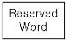
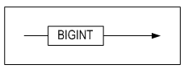
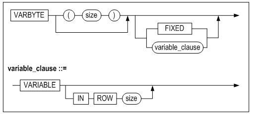
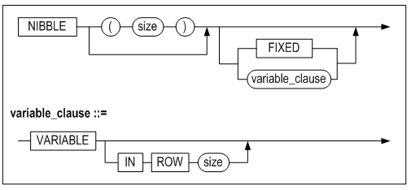

- [General Reference](#general-reference)
  - [Preface](#preface)
    - [About This Manual](#about-this-manual)
  - [1. Data Types](#1-data-types)
    - [Overview](#overview)
    - [Character Data Types](#character-data-types)
    - [Numeric Data Types](#numeric-data-types)
    - [Date Data Type](#date-data-type)
    - [Binary Types](#binary-types)
    - [LOB Data Type](#lob-data-type)
    - [Spatial Types](#spatial-types)
  - [2. Altibase Properties](#2-altibase-properties)
    - [Configuration](#configuration)
    - [Properties Overview](#properties-overview)
    - [Database Initialization Properties](#database-initialization-properties)
    - [Performance Properties](#performance-properties)
    - [Session Properties](#session-properties)
    - [Time-out Properties](#time-out-properties)
    - [Tranaction Properties](#tranaction-properties)
    - [Backup and Recovery Properties](#backup-and-recovery-properties)
    - [Replication Properties](#replication-properties)
    - [Network and Security Properties](#network-and-security-properties)
    - [Message Logging Properties](#message-logging-properties)
    - [Database Link Properties](#database-link-properties)
    - [Auditing Properties](#auditing-properties)
    - [C/C++ External Procedure Agent Properties](#cc-external-procedure-agent-properties)
    - [Account Security Properties](#account-security-properties)
    - [Other Properties](#other-properties)


Altibase® Administration

# General Reference


Altibase Administration General Reference


Release 7.1

Copyright ⓒ 2001\~2021 Altibase Corp. All Rights Reserved.

This manual contains proprietary information of Altibase Corporation; it is provided under a license agreement containing restrictions on use and disclosure and is also protected by copyright patent and other intellectual property law. Reverse engineering of the software is prohibited. All trademarks, registered or otherwise, are the property of their respective owners.

**Altibase Corp**

10F, Daerung PostTower II, 306, Digital-ro, Guro-gu, Seoul 08378, Korea Telephone: +82-2-2082-1000 Fax: 82-2-2082-1099

Customer Service Portal: http://support.altibase.com/en/

Homepage: [[http://www.altibase.com](http://www.altibase.com/)]

## Preface

### About This Manual

This manual explains the concepts, components, and basic use of Altibase

#### Audience

This manual has been prepared for the following Altibase users:

- Database managers
- Performance managers
- Database users
- Application developers
- Technical support engineers

It is recommended for those reading this manual possess the following background knowledge:

- Basic knowledge in the use of computers, operating systems, and operating system utilities
- Experience in using relational databases and understanding of database concepts
- Computer programming experience
- Experience in database server management, operating system management, or network administration

#### Organization

This manual has been organized as follows:

- Chapter 1. Data Types  
  This chapter explains the data types that are supported in Altibase
- Chapter 2. Altibase Properties  
  This chapter explains the Altibase properties
- Chapter 3. The Data Dictionary  
  This chapter describes the specification of the Altibase data dictionary. The data dictionary of Altibase consists of meta tables, in which information about objects is stored, and the process tables, in which information about processes is stroed.
- Chapter 4. Sample Schema  
  This chapter describes the example table information, ER diagram, and sample data.

#### Documentation Conventions

This section describes the conventions used in this manual. Understanding these conventions will make it easier to find information in this manual and other manuals in the series.

There are two sets of conventions:

- Syntax diagrams
- Sample code conventions

##### Syntax diagrams

This manual describes command syntax using diagrams composed of the following elements:

| Elements                                                   | Meaning                                                      |
| ---------------------------------------------------------- | ------------------------------------------------------------ |
|  | Indicates the start of a command. If a syntactic element starts with an arrow, it is not a complete command. |
|                    | Indicates that the command continues to the next line. if a syntactic element ends with this symbol, it is not a complete command. |
|                    | Indicates that the command continues from the previous line. If a syntactic element starts with this symbol, it is not a complete command. |
|                    | Indicates the end of a statement.                            |
|                    | Indicates a mandatory element.                               |
|                    | Indicates an optional element.                               |
|                    | Indicates a mandatory element comprised of options. One, and only one, option must be specified. |
|                    | Indicates an optional element comprised of options.          |
|                    | Indicates an optional element in which multiple elements may be specified. A comma must precede all but the first element. |

##### Sample Code Conventions

The code examples explain SQL, stored procedures, iSQL, and other command line syntax.

The following describes the conventions used in the code examples:

| Rules            | Meaning                                                      | Example                                                      |
| ---------------- | ------------------------------------------------------------ | ------------------------------------------------------------ |
| [ ]              | Indicates optional fields                                    | VARCHAR [(*size*)][[FIXED \|] VARIABLE]                      |
| { }              | Indicates mandatory fields. Indicates to make sure to select at least one. | { ENABLE \| DISABLE \| COMPILE }                             |
| \|               | Argument indicating optional or mandatory fields             | { ENABLE \| DISABLE \| COMPILE } [ ENABLE \| DISABLE \| COMPILE ] |
| . . .            | Repetition of the previous argument. Omit the example codes. | SQL\> SELECT ename FROM employee; <br/>ENAME<br/> ------------------------<br/> SWNO<br/> HJNO<br/> HSCHOI<br/> .<br/> .<br/> . <br/>20 rows selected. |
| Other symbols    | Other symbols                                                | EXEC :p1 := 1; acc NUMBER(11,2);                             |
| Italicized words | Indicates variable or value taht must be provided by user    | SELECT \* FROM *table_name*;<br/> CONNECT *userID*/*password*; |
| Lower case words | Problem elements provided by the user such as table names, colum names, file names, etc | SELECT ename FROM employee;                                  |
| Upper case words | Elements provided by the system or keyword appeared in the syntax | DESC SYSTEM_.SYS_INDICES_;                                   |

#### Related Documents

For more detailed information, please refer to the following documents:

- Installation Guide
- Getting Started Guide
- Administrator’s Manual
- Replication Manual

#### Altibase Welcomes Your Comments and Feedback

Please let us know what you like or dislike about our manuals. To help us with better future versions of our manuals, please tell us if there are any corrections or classifications that you would find useful.

Include the following information:

- The name and version of the manual that you are using
- Any comments about the manual
- Your name, address, and phone number

If you need immediate assistance regarding any errors, omissions, and other technical issues, please contact Altibase's Support Portal (http://altibase.com/support-center/en/).

Thank you. We always welcome your feedback and suggestions.

## 1. Data Types

In order to use SQL to store, change, and query the data in a database, it is first necessary to possess a thorough understanding of the available data types. This chapter presents a detailed explanation of the data types supported in Altibase.

### Overview

#### Data Type Overview

The following data types are supported in Altibase:

##### Character Data Types

<table>
    <tr>
    	<td colspan="3">M: Defined column length<br/>L: The length of the input string
</td>
    </tr>
    <tr>
    	<th>Type</th>
        <th>Length</th>
        <th>Size</th>
    </tr>
    <tr>
    	<td>CHAR(M)</td>
        <td>1 ~ 32000</td>
        <td>M + 2</td>
    </tr>
    <tr>
    	<td>VARCHAR(M)</td>
        <td>1 ~ 32000</td>
        <td>length + 2, where
length = L if the input value is stored in a variable area
length = M if the input value is stored in a fixed area
</td>
    </tr>
     <tr>
    	<td>NCHAR(M)</td>
        <td>1~16000(UTF16)
1~10666(UTF8)
</td>
        <td>M*2 + 2(UTF16)
M*3 + 2(UTF8)
</td>
    </tr>
     <tr>
    	<td>NVARCHAR(M)</td>
        <td>1~16000(UTF16)
1~10666(UTF8)
</td>
        <td>length*2 + 2(UTF16)
length*2 + 2(UTF16)
length*3 + 2(UTF8)
where:
length = L if the input value is stored in a variable area
length = M if the input value is stored in a fixed area
</td>
    </tr>
    </table>

NCHAR and NVARCHAR are Unicode character types. The available maximum length of a UTF16-encoded string is different from that of a UTF8-encoded string.

##### Numerical Data Types

<table>
    <tr>
        <td rowspan="12">Non-native</td>
        <th>Type</th>
        <th>Precision</th>
        <th>Scale</th>
        <th>Size (bytes)</th>
        <th>Remakrs</th>
    </tr>
    <tr>
        <td>NUMERIC</td>
        <td>38</td>
        <td>0</td>
        <td rowspan="8">3+((precision)+2)/2</td>
        <td rowspan="8">*Fixed-Point Numbers
* The NUMERIC data type is the same as the DECIMAL datatype.</td>
    </tr>
    <tr>
        <td>NUMERIC(p)</td>
        <td>1 ~ 38</td>
        <td>0</td>
    </tr>
    <tr>
        <td>NUMERIC(p,s)</td>
        <td>1 ~ 38</td>
        <td>-84 ~ 128</td>
    </tr>
    <tr>
        <td>DECIMAL</td>
        <td>38</td>
        <td>0</td>
    </tr>
    <tr>
        <td>DECIMAL(p)</td>
        <td>1 ~ 38</td>
        <td>0</td>
    </tr>
    <tr>
        <td>DECIMAL(p,s)</td>
        <td>1 ~ 38</td>
        <td>-84 ~ 128</td>
    </tr>
    <tr>     
        <td>NUMBER(p)</td>
        <td>1 ~ 38</td>
        <td>0</td>
    </tr>
      <tr>     
        <td>NUMBER(p,s)</td>
        <td>1 ~ 38</td>
        <td>-84 ~ 128</td>
    </tr>
    <tr>
    	<td>NUMBER</td>
        <td>38</td>
        <td>X</td>
        <td rowspan="3">3+((precision)+2)/2</td>
        <td rowspan="3">* Floating-Point Numbers</td>
    </tr>
    <tr>
    	<td>FLOAT</td>
        <td>38</td>
        <td>X</td>
    </tr>
    <tr>
    	<td>FLOAT(p)</td>
        <td>1 ~ 38</td>
        <td>X</td>
    </tr>
    <tr>
    	<td rowspan="6">Native</td>
        <th>Type</th>
        <th colspan="2">Compatible C Type</th>
        <th>Size(bytes)</th>
        <th>Remarks</th>
    </tr>
    <tr>
    	<td>DOUBLE</td>
        <td colspan="2">double</td>
        <td>8</td>
        <td rowspan="2">*Floating-Point Numbers</td>
    </tr>
    <tr>
    	<td>REAL</td>
        <td colspan="2">float</td>
        <td>4</td>
    </tr>
    <tr>
    	<td>BIGINT</td>
        <td colspan="2">long or long long 
</td>
        <td>8</td>
        <td rowspan="3">*Integer Type</td>
    </tr>
    <tr>
    	<td>INTEGER</td>
        <td colspan="2">int</td>
        <td>4</td>
    </tr> 
     <tr>
    	<td>SMALLINT</td>
        <td colspan="2">short</td>
        <td>2</td>
    </tr> 
</table>

###### Example 1

Fixed-Point Numbers Size Calculation: 

( 3 + ( ( p ) + 2 ) / 2 )

```
- NUMERIC  
  NUMERIC(38, 0): Size = 3 + 40/2 = 23 bytes

- NUMERIC(p) / NUMERIC(p, 0)  
  NUMERIC(10): Size = 3 + 12/2 = 9 bytes

- NUMERIC(p, s)  
  NUMERIC(10, 9): Size = 3 + 12/2 = 9 bytes
  
- DECIMAL: the same as NUMERIC
— DECIMAL(p): the same as NUMERIC(p)
— DECIMAL(p,s): the same as NUMERIC(p,s)
— NUMBER(p): the same as NUMERIC(p)
— NUMBER(p,s): the same as NUMERIC(p,s)
```

###### Example 2

Floating-Point Numbers Size Calculation: ( 3 + ( ( p ) + 2 ) / 2 )

```
- FLOAT  
  FLOAT(38): Size = 3 + 40/2 = 23 bytes
  
- FLOAT(p)  
  FLOAT(20): Size = 3 + 22/2 = 14 bytes
  
- - NUMBER: the same as FLOAT
```

**Date Data Type**

| Type | Size (byte) |
| ---- | ----------- |
| DATE | 8           |

**Binary Data Types**

<table>
    <tr>
    	<td colspan="3">M: Defined column length<br/>L: The length of the input value
</td>
    </tr>
    <tr>
    	<th>Type</th>
        <th>Length</th>
        <th>Size</th>
    </tr>
    <tr>
    	<td>BLOB/CLOB</td>
        <td></td>
        <td>1~4294967295</td>
    </tr>
    <tr>
    	<td>BYTE</td>
        <td>1~32000</td>
        <td>M + 2</td>
    </tr>
     <tr>
    	<td>NIBBLE</td>
        <td>1~254</td>
        <td>M/2 + 1</td>
    </tr>
     <tr>
    	<td>BIT</td>
        <td>1~64000</td>
        <td>M/8 + 4</td>
    </tr>
    <tr>
    	<td>VARBIT</td>
        <td>1~64000</td>
        <td>length/8 + 4, where
length = L if the input value is stored in a variable area
length = M if the input value is stored in a fixed area
</td>
    </tr>
    </table>

**Geomerty Data Type**

| Type     | Length       | Size (byte) |
| -------- | ------------ | ----------- |
| GEOMETRY | 8\~104857600 | length + 40 |

The actual record size is the size of each data type as indicated above, plus the size of header information. The size of the header information varies depending on the OS.

#### NULL

When a row is inserted into a table, the value of a column is set to NULL if the value for that column is not known or has not been determined yet. In other words, NULL indicates that no value exists. Therefore, NULL is not the same as 0 (zero) or blank space, and is handled differently when performing comparison operations or saving data.

If any operation other than the NVL() function or the IS NULL or IS NOT NULL conditions is performed on a NULL value, the final result of the formula containing the operation will be NULL. In other words, comparisons and operations are meaningless when performed on NULL values.

NULL can appear in columns of any data type, as long as they are not restricted by NOT NULL or PRIMARY KEY constraints.

#### Data Type Conversion

The data type conversions that are possible are shown in matrix form in the following table.

When a comparison operation is to be performed on two values having the same data type, the comparison operation is performed on the values directly without any prior conversion. In contrast, when a comparison operation is to be performed on two values having different data types, the comparison is performed after one of the values is converted into the same type as the other value. Note however that when comparisons are performed, character data types are always converted into the data type of the other comparison operand, not the other way around

The following table shows convertible matrices of implicit data types (O: shows that attributes are retained even when data types are converted). For more detailed information on how to convert an existing table's data type to MODIFY, please refer to *modify_column_clause* statement in the *SQL Reference*.

| After Before | char | var char | nchar | nvarchar | clob | big int | deci mal | dou ble | float | int eger | num ber | num eric | real | small int | date | blob | byte | varbyte | nibble | bit  | varbit | geometry |
| ------------ | ---- | -------- | ----- | -------- | ---- | ------- | -------- | ------- | ----- | -------- | ------- | -------- | ---- | --------- | ---- | ---- | ---- | ------- | ------ | ---- | ------ | -------- |
| char         | o    | o        | o     | o        |      | o       | o        | o       | o     | o        | o       | o        | o    | o         | o    |      |      |         |        |      |        |          |
| varchar      | o    | o        | o     | o        | o    | o       | o        | o       | o     | o        | o       | o        | o    | o         | o    |      |      |         |        |      |        |          |
| nchar        | o    | o        | o     | o        |      | o       | o        | o       | o     | o        | o       | o        | o    | o         | o    |      |      |         |        |      |        |          |
| nvarchar     | o    | o        | o     | o        | o    | o       | o        | o       | o     | o        | o       | o        | o    | o         | o    |      |      |         |        |      |        |          |
| clob         |      |          |       |          | o    |         |          |         |       |          |         |          |      |           |      |      |      |         |        |      |        |          |
| bigint       | o    | o        | o     | o        |      | o       | o        | o       | o     | o        | o       | o        | o    | o         |      |      |      |         |        |      |        |          |
| decimal      | o    | o        | o     | o        |      | o       | o        | o       | o     | o        | o       | o        | o    | o         |      |      |      |         |        |      |        |          |
| double       | o    | o        | o     | o        |      | o       | o        | o       | o     | o        | o       | o        | o    | o         |      |      |      |         |        |      |        |          |
| float        | o    | o        | o     | o        |      | o       | o        | o       | o     | o        | o       | o        | o    | o         |      |      |      |         |        |      |        |          |
| integer      | o    | o        | o     | o        |      | o       | o        | o       | o     | o        | o       | o        | o    | o         |      |      |      |         |        |      |        |          |
| number       | o    | o        | o     | o        |      | o       | o        | o       | o     | o        | o       | o        | o    | o         |      |      |      |         |        |      |        |          |
| numeric      | o    | o        | o     | o        |      | o       | o        | o       | o     | o        | o       | o        | o    | o         |      |      |      |         |        |      |        |          |
| real         | o    | o        | o     | o        |      | o       | o        | o       | o     | o        | o       | o        | o    | o         |      |      |      |         |        |      |        |          |
| smallint     | o    | o        | o     | o        |      | o       | o        | o       | o     | o        | o       | o        | o    | o         |      |      |      |         |        |      |        |          |
| date         | o    | o        | o     | o        |      |         |          |         |       |          |         |          |      |           | o    |      |      |         |        |      |        |          |
| blob         |      |          |       |          |      |         |          |         |       |          |         |          |      |           |      | o    |      |         |        |      |        |          |
| byte         |      |          |       |          |      |         |          |         |       |          |         |          |      |           |      | o    | o    | o       |        |      |        |          |
| varbyte      |      |          |       |          |      |         |          |         |       |          |         |          |      |           |      | o    | o    | o       |        |      |        |          |
| nibble       |      |          |       |          |      |         |          |         |       |          |         |          |      |           |      |      |      |         | o      |      |        |          |
| bit          |      |          |       |          |      |         |          |         |       |          |         |          |      |           |      |      |      |         |        | o    | o      |          |
| varbit       |      | o        |       |          |      |         |          |         |       |          |         |          |      |           |      |      |      |         |        | o    | o      |          |
| geometry     |      |          |       |          |      |         |          |         |       |          |         |          |      |           |      |      |      |         |        |      |        | o        |

##### Implicit Data Type Conversion

If '1000' of bit type is entered into table t10 table, the conversion succeeds to integer '1000', but it is not an implicit data type conversion because the attribute of data type is changed.

```
iSQL> create table t10 (i1 integer);
Create success.
iSQL> insert into t10 values (bit'1000');
1 row inserted.
iSQL> select * from t10;
I1
--------------
1000
1 row selected.
```

Therefore, implicit data type conversion follows the rules below:

- When comparing numeric or character data types or arithmetic operations, the character data types are converted to numeric data types.
- When comparing the date data type with the character data type, the character data type is converted to the date data type and the comparison opertion is performed.
- Operation that cannot convert data types are invalidated.
- The argument used in the function is converted to the data type of the argument defined in the function.
- If a character data type or numeric data type that uses decimal precisions to a floating-point data type that uses binary precision is converted
- When executing an INSERT or UPDATE, the data type is converted to the data type of the INSERT and UPDATE columns. 

##### Example

\<Query> When comparing numeric data types, character data type '10' is converted to numeric data.

```
iSQL> create table emp (empno integer, name varchar(10), hire_date date);
insert into emp values (10,'altibase', '10-nov-2015');

iSQL> select name from emp where empno = '10';
NAME
--------------
altibase
1 row selected.
```

\<Query> When arithmetic between numeric data type and character data type, character data type '10' is converted to numeric data type.

```
iSQL> select empno + '10' from emp;
EMPNO+'10'
-------------------------
20
1 row selected.
```

\<Query> When comparing a date date type with a character data type, the character data type '10-nov-2015' is converted to a date data type.

```
iSQL> select hire_date from emp where hire_date = '10-nov-2015';
HIRE_DATE
---------------
10-NOV-2015
1 row selected.
```

\<Query> When arithmetic between numeric data type and character type is performed, binary data type cannot be converted to numeric data type and operation is invalidated.

```
iSQL> select empno + cast(12345 as nibble(6)) from emp;
[ERR-2100C : Conversion not applicable.
0001 : select EMPNO + CAST(12345 as NIBBLE(6)) from EMP
             ^                               ^
]
```

\<Query> When the function SUM receives the character data type '10' as an argument, it is converted.

```
iSQL> select sum('10') from dual;
SUM('10')
--------------
10
1 row selected.
```

\<Query> When the character data type '12.123456789' is converted to a floating-point numeric data type, the number of significant digits becomes float (11), which causes a loss of value.

```
iSQL> select float'12.123456789' from dual;
FLOAT'12.123456789'
----------------------
12.1234568
1 row selected.
```

\<Query\> The value of numeric data to be inserted is converted according to the data type of the column to be inserted and the value is INSERT.

```
iSQL>  create table t1 ( i1 char(10), i2 integer, i3 double);
Create success.
iSQL>  insert into t1 values (integer'1020', char'1928', float'123.1234');
1 row inserted.
iSQL>     select * from t1;
I1          I2          I3
---------------------------------------------------
1020        1928        123.1234
1 row selected.
```

#### Explicit Data Type Conversion

Data type conversion can be explicitly performed using SQL conversion functions or by type-casting, as shown below. The SQL functions that are used to explicitly convert a value from one data type to another are explained in the *SQL Reference*.

##### Syntax

```
datatype 'string or constant literal '
```

##### Description

Explicitly converts a numeric value from on data type to another. In the following example, the number 157.27 is converted to the characters "157.27".

```
CHAR '157.27'
```

#### Using the Character Strings

Single quotation mark should be used when displaying character strings in a SQL query. Since the single quoration mark becomes an escape letter when displaying a single quotation mark ('), the single quotation mark should be used in font.

##### Example

```
SELECT * FROM EMPLOYEE WHERE NAME = ’KIM’;
INSERT INTO EMPLOYEE VALUES (‘GILDONG’’’);//Insert the value GILDONG'
SELECT * FROM REMOTE_TABLE(link1, ‘SELECT * FROM EMPLOYEE WHERE NAME=‘’KIM‘’’; //''are not the double quotation mark, it is two single quotation marks
```

#### FIXED/VARIABLE Option

FIXED or VARIABLE specifies where the data in a column will be stored.

When an entire record is stored in a contiguous space, this is called a 'FIXED' area. When one of the columns is stored in a separated space, rather than being stored in the fixed area contiguous with the rest of the record, this column is said to be stored in a 'VARIABLE' area.

When a column is stored in a variable area, the header information for the column, such as the length of the data and the pointer to the actual data, is stored in the fixed area, whereas the data for that column are stored in the variable area.

When a table is created in a disk tablespace, whether the user specifies FIXED or VARIABLE is ignored, and all columns in the table are treated as FIXED. However, when a table is created in a memory table space, the user-specified value is used.

However, the exception to this is that all LOB data type columns are always treated as VARIABLE, and the data can thus be stored in a fixed or variable area depending on the value specified using the IN ROW clause.

The following data types can be specified as VARIABLE: CHAR, VARCHAR, NCHAR, NVARCHAR, BYTE, VARBATE, NIBBLE, BIT, VARBIT, BLOB, and CLOB

#### IN ROW Clause

This clause pertains only to column data that are to be stored in a variable area. If the FIXED and IN ROW clause are both specified when a table is created, the IN ROW clause is ignored. When data are entered into a VARIABLE column, if the length of the data is less than or equal to the value specified using the IN ROW clause, the data will be stored in the fixed area, whereas if the data length is greated than the value specified using the IN ROW clause, the data will be sotred in the variable area.

Here, "data length" does not mean the length of the input data, but the length of the data to be sotred in memory or on disk, which will be somewhat larger. For example, when a column is defined as "VARCHAR(400) in row 200", data will be inserted into the fixed area if the length of the data that is input is smaller than or equal to 198, because 2 additional bytes are required when storing the data.

The default size of lob data stored in the fixed area can be specified using the MEMORY_LOB_COLUMN_IN_ROW_SIZE property for memory tables and the DISK_LOB_COLUMN_IN_ROW_SIZE for disk tables. Additionally, the default size for columns containing other types of data with the VARIABLE option can be specified using the MEMORY_VARIABLE_COLUMN_IN_ROW_SIZE property. 

Setting these properties eliminates the need to use the IN ROW clause repeatedly for each column when creating a table. For more detailed information about these properties, please refer to chapter 2.

### Character Data Types

Character data types are used to store character (alphanumeric) data, meaning words or free-form text, in either the database character set or the national character set.

In Altibase, character data typers comprise the following types:

- CHAR
- VARCHAR
- NCHAR
- NVARCHAR

#### CHAR

##### Syntax Diagram


##### Syntax

```
CHAR [(size)] [ FIXED | VARIABLE [IN ROW size] ]
```

##### Description

Tihs is a character data type that has a fixed length equal to the specified size. If an input value is shorter than the specified size, the remaining area is filled with blank spaces.

The default size of CHAR column is 1byte, and its maximum length is 32000 bytes.

For more detailed information about the FIXED and VARIABLE clauses, please refer to the "FIXED/VARIABLE OPTIONS" and "IN ROW clauses" section above.

#### VARCHAR

##### Syntax Diagram


##### Syntax

```
VARCHAR [(size)] [ FIXED | VARIABLE [IN ROW size] ]
```

##### Description

This is a character data type for storing alphanumeric data that vary in length within a specified size.

The default size of VARCHAR column is 1byte, and its maximum length is 32000 bytes.

VARCHAR is a variable length data type; that is, when the length of input data is shorter than the specified column size, only the data that were actually inserted are stored. In contrast, for the CHAR data type, if the length of input data is shorter than the column length, the remaining space in the column is padded with blank spaces. For example, if a column is defined as CHAR(10) and the word “magic” is to be stored, it will be stored as “magic_____”, where “_” represents a blank space.

For more detailed information about the FIXED and VARIABLE clauses, please refer to the "FIXED/VARIABLE OPTIONS" and "IN ROW Clauses" section above.

#### NCHAR

##### Syntax Diagram


##### Syntax

```
NCHAR [(size)] [ FIXED | VARIABLE [IN ROW size] ]
```

##### Description 

This is a character data type having a specified fixed length. If an input value is shorter than the specified size, the remainder is filled with blank spaces.

If the national character set is UTF16, the size of one character in an NCHAR column is fixed at 2 bytes, that is, it does not vary in length. In contrast, if the national character set is UTF8, the size of one character in an NCHAR column is not fixed; rather, it varies from 1 to 3 bytes.

The maximum size is 16000 bytes if the national character set is UTF16.

For more detailed information about the FIXED and VARIABLE clauses, please refer to the "FIXED/VARIABLE OPTIONS" and "IN ROW Clauses" section above.

#### NVARCHAR

##### Syntax Diagram


##### Syntax

```
NVARCHAR [(size)] [ FIXED | VARIABLE [IN ROW size] ]
```

##### Description

This is a character data type for storing Unicode alphanumeric data that vary in length within a specified size.

If the national character set is UTF16, the size of one character in an NVARCHAR column is fixed at 2 bytes, that is, it does not vary in length. In contrast, if the national character set is UTF8, the size of one character in an NVARCHAR column is not fixed; rather, it varies from 1 to 3 bytes.

In other aspects, the NVARCHAR type is the same as the VARCHAR type, so for more detailed information please refer to the description of the VARCHAR type.

For more detailed information about the FIXED and VARIABLE clauses, please refer to the "FIXED/VARIABLE OPTIONS" and "IN ROW Clauses" section above.

### Numeric Data Types

Numeric data types are used to store zero as well as positive and negative numbers having fixed values. Altibase supports the following numeric types:

- BIGINT
- DECIMAL
- DOUBLE
- FLOAT
- INTEGER
- NUMBER
- NUMERIC
- REAL
- SMALLINT

#### BIGINT

##### Syntax Diagram



##### Syntax

```
BIGINT
```

##### Description

This is an 8-byte integer data type.

It is equivalent to the “long” (on 64-bit systems) and “long long” (on 32-bit systems) types in the C language.

Range: -2<sup>63</sup> + 1(-9223372036854775807) \~ 2<sup>63</sup> – 1(9223372036854775807)

#### DECIMAL

##### Syntax Diagram


##### Syntax

```
DECIMAL [(precision[, scale])]
```

##### Description

This data type is the same as the NUMERIC type.

#### DOUBLE

##### Syntax Diagram


##### Syntax

```
DOUBLE
```

##### Description

This is an 8-byte floating-point numeric data type. 

It is the same as the “double” type in the C language.

#### FLOAT

##### Syntax Diagram


##### Syntax

```
FLOAT [(precision)]
```

##### Description

This is a floating-point numeric data type that can store a value ranging from -1E+120 to 1E+120. 

Precision is the number of significant digits, that is, the number of digits used to express the mantissa of the floating-point number. 

Precision can range from 1 to 38. If it is not expressly specified, the default precision is 38. 

#### INTEGER

##### Syntax Diagram


##### Syntax

```
INTEGER
```

##### Description

This is an integer data type that is 4 bytes in size. 

It is the same as the “int” data type in the C language. 

It can have an integer value ranging from -2,147,483,647 to 2,147,483,647.

#### NUMBER

##### Syntax Diagram


##### Syntax

```
NUMBER [(precision, scale)]
```

##### Description

This is an alias of the NUMERIC data type. However, when precision and scale are not defined, they are the same as for the FLOAT data type.

#### NUMERIC

##### Syntax Diagram


##### Syntax

```
NUMERIC [(precision, scale)]
```

##### Description

NUMERIC is a fixed decimal data type that can contain a total number of significant digits up to the value specified using precision and a number of digits to the right of the decimal place up to the value specified using scale. In contrast to the FLOAT data type, which is a floating-point numerical data type used for representing real numbers, when both precision and scale are omitted from a NUMERIC data type declaration, precision defaults to 38 and scale to 0, i.e. 

-  Precision can be specified within the range from 1 to 38. 
- Scale can be specified within the range from -84 to 128. 
- If precision is omitted, the default is 38. 
- If scale is omitted, the default is 0.

The following shows the respective values that would result when the input value 1234567.89 is converted to the NUMERIC types defined as shown.

-  NUMERIC=> 1234568 
- NUMERIC(9)=> 1234568 
- NUMERIC(9, 2)=> 1234567.89 
- NUMERIC(9, 1)=> 1234567.9 
- NUMERIC(6)=> Precision exceeded 
- NUMERIC(7, -2)=> 1234500 
- NUMERIC(7, 2)=> Precision exceeded

#### REAL

##### Syntax Diagram


##### Syntax

```
REAL
```

##### Description

The data type is used to store 4-byte floating-point numeric values

It is the same as the “float” type in the C language.

#### SMALLINT

##### Syntax Diagram


##### Syntax

```
SMALLINT
```

##### Description

This data type is used to store 2-byte integer values.

It is the same as the "short" type in the C language

It can be used to store integers ranging from -2<sup>15</sup> + 1(-32,767)에서 2<sup>15</sup> - 1(32,767) inclusive

#### Number Format Model

When data are converted using typecasting functions such as TO_CHAR or TO_NUMBER, numeric data can be specified in the following formats. A number format model consists of one or more elements that represent a number. In this section, each of these elements will be explained with reference to examples showing the related number formats. 

##### , (Comma)

###### Descriptions

Outputs a comma at the specified position.

Commas can be used multiple times.

###### Restriction

A comman cannot be placed at the end of a number, to the right of a decimal point, or at the very beginning of a number.

###### Example

```
iSQL> SELECT TO_CHAR (1234, '99,99') FROM dual;
TO_CHAR (1234, '99,99')  
---------------------------
 12,34           
1 row selected.

iSQL> SELECT TO_NUMBER ( '12,34', '99,99') FROM dual;
TO_NUMBER ( '12,34', '99,99') 
--------------------------------
1234        
1 row selected.
```

##### . (Decimal Point)

###### Description

Adds a decimal point at the specified position

###### Restriction

Only one decimal point can be used within a number

###### Example

```
iSQL> SELECT TO_CHAR (1.234, '99.999') FROM dual;
TO_CHAR (1.234, '99.999')  
-----------------------------
  1.234          
1 row selected.

iSQL> SELECT TO_NUMBER ( '1.234', '99.999') FROM dual;
TO_NUMBER ( '1.234', '99.999') 
---------------------------------
1.234       
1 row selected.
```

##### \$

###### Description

Prepends the $ sign to a number

###### Example

```
iSQL> SELECT TO_CHAR (123, '$9999') FROM dual;
TO_CHAR (123, '$9999')  
--------------------------
  $123           
1 row selected.

iSQL> SELECT TO_NUMBER ( '$0123', '09$99') FROM dual;
TO_NUMBER ( '$0123', '09$99') 
--------------------------------
123         
1 row selected.
```

##### 0(Numeral 0)

###### Description

If the number of significant digits to be output exceeds the number of digits in the number that is input, 0's (zeroes) are prepended to the number before it is returned. In all other aspects, this element is the same as the “9” element, which is described below.

###### Example

```
iSQL> SELECT TO_CHAR (123, '0999') FROM dual;
TO_CHAR (123, '0999')  
-------------------------
 0123
```

##### 9(Numeral 9)

###### Description

Uses the numeral 9 to indicate the number of digits to output. If the number of 9's is greater than the number of digits in the number that is input, the space to the left of the number is padded with blank spaces before the number is output. If the number of 9's to the left of the decimal point is less than the number of digits to the left of the decimal point in the input number, the pound sign (“#”) is repeatedly output. The number of pound signs that are output is the number of characters in the user-defined format plus one (a sign character). A decimal point placed in between 9's separates the integer and fractional parts of a number

When there are digits to the right of the decimal point in the first argument, i.e. when the input number has a fractional part, but the user-defined format either has no fractional part or has a fractional part with a smaller number of decimal places than the input number, the input number is rounded off to the number of decimal places in the user-defined format

###### Example

```
iSQL> SELECT TO_CHAR (123, '99999') FROM dual;
TO_CHAR (123, '99999')  
--------------------------
   123

iSQL> SELECT TO_CHAR (123.55, '999') FROM dual;
TO_CHAR (123.55, '999')  
---------------------------
 124             
1 row selected.

iSQL> SELECT TO_CHAR (123.4567, '999999') FROM dual;
TO_CHAR (123.4567, '999999')  
--------------------------------
    123          
1 row selected.

iSQL> SELECT TO_CHAR (1234.578, '9999.99') FROM dual;
TO_CHAR (1234.578, '9999.99')  
---------------------------------
 1234.58         
1 row selected.

iSQL> SELECT TO_CHAR (1234.578, '999.99999') FROM dual;
TO_CHAR (1234.578, '999.99999')  
-----------------------------------
##########       
1 row selected.

iSQL> SELECT TO_NUMBER ( '123', '99999') FROM dual;
TO_NUMBER ( '123', '99999') 
------------------------------
123         
1 row selected.
iSQL> SELECT TO_NUMBER ( '1234.58', '9999.99') FROM dual;
TO_NUMBER ( '1234.58', '9999.99') 
------------------------------------
1234.58     
1 row selected.
```
##### FM

###### Description

Removes spaces or zeroes from the left part of the output string.

###### Example

```
iSQL> select to_char(00123.100,'99999.999') from dual;
TO_CHAR(00123.100,'99999.999')
----------------------------------
   123.100
1 row selected.
iSQL> select to_char(00123.100,'FM99999.999') from dual;
TO_CHAR(00123.100,'FM99999.999')
------------------------------------
123.100
1 row selected.
```
##### B

###### Description

0's (zeroes) in the integer part of the fixed-point number are replaced with blank spaces.

###### Example

```
iSQL> SELECT TO_CHAR (0.4, 'B9') FROM T1;
TO_CHAR (0.4, 'B9')  
-----------------------
                 
1 row selected.
```

##### C

###### Description

Returns the ISO currency symbol(the value set for the NLS_ISO_CURRENCY property) in the specified position.

###### Example

```
iSQL> SELECT TO_CHAR (4000, 'C9999') FROM dual;
TO_CHAR (4000, 'C9999')
---------------------------
 KRW4000
1 row selected.
```

##### D

###### Description

Returns the decimal character(the value set for the NLS_NUMERIC_CHARACTER property) in the specified position. The default value is a period(.).

###### Restriction

 Only one decimal character can be included when specifying a number format model.

###### Example

```
iSQL> SELECT TO_CHAR (24.06, '99D99') FROM dual;
TO_CHAR (24.06, '99D99')
----------------------------
 24.06
1 row selected.
iSQL> SELECT TO_CHAR (206, '999D99') FROM dual;
TO_CHAR (206, '999D99')
---------------------------
 206.00
1 row selected.
```

##### EEEE

###### Description

Displays the input number in exponential notation

###### Restriction

EEEE should always be at the right end. It is possible to be at the left rather than S, PR, or MI. It cannot be used with commas. In addition, it cannot be used in the TO_NUMBER function.  

###### Example

```
iSQL> SELECT TO_CHAR (1234, '9.9EEEE') FROM dual;
TO_CHAR (1234, '9.9EEEE')  
-----------------------------
  1.2E+03        
1 row selected.
```

##### G

###### Description

Returns the group separator(the value set for the NLS_NUMERIC_CHARACTER property) in the specified position. Multiple group separators can be specified for a number format model.

###### Restriction

In a number format model, a group separator cannot appear to the right of a decimal character or a period.

###### Example

```
iSQL> SELECT TO_CHAR (2534.3, '999G999D99') FROM dual;
TO_CHAR (2534.3, '999G999D99')
----------------------------------
   2,534.30
1 row selected.
```

##### L

###### Description

Returns the local currency symbol(the value set for the NLS_CURRENCY property) in the specified position.

###### Example

```
iSQL> SELECT TO_CHAR (4000, 'L9999') FROM dual;
TO_CHAR (4000, 'L9999')
---------------------------
 ?4000
1 row selected.
```

##### MI

###### Description

When MI is used at the rightmost place in the number format, if the input value is negative, the minus (-) sign is output at the end of the number, rather than at the beginning. If the input value is positive, a blank space is output instead of the minus sign.

###### Restrictions

MI must always be at the rightmost place in the number format. It cannot be used together with S or PR.

###### Example

```
iSQL> SELECT TO_CHAR (-123, '999MI') FROM dual;
TO_CHAR (-123, '999MI')  
---------------------------
123-             
1 row selected.

iSQL> SELECT TO_NUMBER ( '123-', '999MI') FROM dual;
TO_NUMBER ( '123-', '999MI') 
-------------------------------
-123        
1 row selected.
```

##### PR

###### Description

When PR is used at the rightmost place in the number format, if the input value is negative, the value is output in the form of “”, rather than using the minus (“-”) sign.

###### Restriction 

PR must always be at the rightmost place in the number format. It cannot be used together with S or MI.

###### Example

```
iSQL> SELECT TO_CHAR (-123, '999PR') FROM dual;
TO_CHAR (-123, '999PR')  
---------------------------
<123>            
1 row selected.

iSQL> SELECT TO_NUMBER ( '<123>', '999PR') FROM dual;
TO_NUMBER ( '<123>', '999PR') 
--------------------------------
-123        
1 row selected.
```

##### RN

###### Description

Converts an input number to Roman numerals. The valid input range is from 1 to 3,999. If the lower-case letters “rn” are used in the number format, lower-case Roman numerals are output.

###### Restriction

RN cannot be used with any other number format elements or with the TO_NUMBER function.

###### Example

```
iSQL> SELECT TO_CHAR (14, 'RN') FROM dual;
TO_CHAR (14, 'RN')  
----------------------
XIV              
1 row selected.
```

##### S

###### Description

When S is placed at the beginning or end of the number format, a plus (“+”) or minus (“-”) sign is output at the same position, corresponding to the sign of the input number.

###### Restriction

S can be placed at the beginning or end of the number format. It cannot be used with MI or PR.

###### Example

```
iSQL> SELECT TO_CHAR (123, 'S999.99') FROM dual;
TO_CHAR (123, 'S999.99')  
----------------------------
+123.00          
1 row selected.

iSQL> SELECT TO_CHAR (-123, '999.99S') FROM dual;
TO_CHAR (-123, '999.99S')  
-----------------------------
123.00-          
1 row selected.

iSQL> SELECT TO_NUMBER ( '+123', 'S999.99') FROM dual;
TO_NUMBER ( '+123', 'S999.99') 
---------------------------------
123         
1 row selected.

iSQL> SELECT TO_NUMBER ( '123.00-', '999.99S') FROM dual;
TO_NUMBER ( '123.00-', '999.99S') 
------------------------------------
-123        
1 row selected.
```

##### V

###### Description

The input number is multiplied by 10 to the power of the number of 9's after V. The number of 9's before V represents the number of significant digits to return from the input number.

###### Restriction

V cannot be used with a decimal point, and cannot be used with the TO_NUMBER function.

###### Example

```
iSQL> SELECT TO_CHAR (12, '99V99') FROM dual;
TO_CHAR (12, '99V99')  
-------------------------
 1200            
1 row selected.

iSQL> SELECT TO_CHAR (1200, '99V99') FROM dual;
TO_CHAR (1200, '99V99')  
---------------------------
######           
1 row selected.

iSQL> SELECT TO_CHAR (-123.456, '999V999EEEEMI') from dual;
TO_CHAR (-123.456, '999V999EEEEMI')  
---------------------------------------
 1235E+02-        
1 row selected.
```

##### XXXX

###### Description

Converts the input number to a hexadecimal number. If the input number is not an integer, it is rounded off before being converted to a hexadecimal number. Specifying “xxxx” in lower-case returns the letters in the hexadecimal number in lower-case.

###### Restriction

XXXX cannot be used with other number format elements. The number to be converted must be greater than 0 (zero).

###### Example

```
iSQL> SELECT TO_CHAR (123, 'XXXX') FROM dual;
TO_CHAR (123, 'XXXX')  
-------------------------
7B               
1 row selected.

iSQL> SELECT TO_NUMBER ('ABC', 'XXXX') FROM dual;
TO_NUMBER ('ABC', 'XXXX') 
----------------------------
2748        
1 row selected.
```

### Date Data Type

The DATE type is used to store date and time information

#### DATE

###### Syntax Diagram


###### Syntax

```
DATE
```

###### Description

This data type is used to store date values in 8 bytes.

The range of dates that can be stored depends on the system. Typically, the dates that can be stored range from 0001/01/01 - 9999/12/31.

The date value can be displayed in various formats using a date format string.

#### The Datetime Formal Model

The date data type is managed as numerical data d it is internally managed by the database. However, it can be displayed with character strings with the conversion function TO_CHAR or TO_DATE. The user should specify a character string of the date data type in accordance with a report format when using conversion functions.

The date data types are comprised of the following basic elements.

- AM, PM
- SCC, CC
- D, DD, DDD, DAY,DY
- HH, HH12, HH24
- MM, MON, MONTH
- MI
- Q
- SS, SSSSS, SSSSSS, SSSSSSSS, FF[1..6]
- WW, WW2, W, IW
- Y,YYY
- SYYYY, YYYY, YYY, YY, Y, RR, RRRR
- IYYY, IYY, IY, I

Along with these basic elements, the datetime format model also consists of the following punctuation marks and special characters:

- Hyphen (-) 
- Slash (/) 
- Comma (,) 
- Period (.) 
- Colon (:) 
- Single Quotation (‘) 

The meaning and use of each of these basic elements will be explained below with reference to examples.

##### AM, PM

###### Description

Returns either “AM” or “PM” depending on whether the input time is before or after noon. (AM or PM)

###### Example

```
iSQL> SELECT TO_CHAR ( TO_DATE( '13', 'HH' ), 'AM' ) FROM dual;
TO_CHAR ( TO_DATE( '13', 'HH' ), 'AM' )  
-------------------------------------------
PM      
1 row selected.

iSQL> SELECT TO_DATE('1980-12-28 PM', 'YYYY-MM-DD AM') FROM dual;
TO_DATE('1980-12-28 PM', 'YYYY-MM-DD AM' 
-------------------------------------------
1980/12/28 12:00:00  
1 row selected.
```

##### SCC

###### Description

Represents a century

- If the last 2 digits of an input 4-digit year are within the range from 01 to 99, the sum of 1 plus the first 2 digits of the 4-digit year is returned.
- If the last 2 digits of an input 4-digit year are 00, the first 2 digits of the 4-digit year are returned unchanged.

BC is preceded by a year with a minus sign (-).

- A year of 0000 is one year B.C.E and -0001 is a two year B.C.E.
- 0000 to -0099 are in -1 century and are represented by -01.

SCC cannot be used as an argument for the TO_DATE function.

###### Example

```
iSQL> SELECT TO_CHAR ( '28-DEC-1980', 'SCC' ) FROM dual;
TO_CHAR ( '28-DEC-1980', 'SCC' )  
------------------------------------
 20 
1 row selected.

iSQL> SELECT TO_CHAR ( DATE'01-JAN-0001' - 1, 'SCC' ) FROM dual;
TO_CHAR ( DATE'01-JAN-0001' - 1, 'SCC' )  
--------------------------------------------
-01 
1 row selected.
```

##### CC

###### Description

Represents a century

- If the last 2 digits of an input 4-digit year are within the range from 01 to 99, the sum of 1 plus the first 2 digits of the 4-digit year is returned.
- If the last 2 digits of an input 4-digit year are 00, the first 2 digits of the 4-digit year are returned unchanged.

CC cannot be used as an argument for the TO_DATE function.

###### Example

```
iSQL> SELECT TO_CHAR ( '28-DEC-1980', 'CC' ) FROM dual;
TO_CHAR ( '28-DEC-1980', 'CC' )  
-----------------------------------
20      
1 row selected.
```

##### D

###### Description

Returns the day of the week, represented by a number from 1 to 7. Sunday is represented by the number 1. 

D cannot be used as an argument for the TO_DATE function.

###### Example

```
iSQL> SELECT TO_CHAR ( '28-DEC-1980', 'D' ) FROM dual;
TO_CHAR ( '28-DEC-1980', 'D' )  
----------------------------------
1    
1 row selected.
```

##### DAY

###### Description

Returns the day of the week in upper-case letters in English (SUNDAY, MONDAY,…). 

DAY cannot be used with the TO_DATE function.

###### Example

```
iSQL> SELECT TO_CHAR ( '28-DEC-1980', 'DAY' ) FROM dual;
TO_CHAR ( '28-DEC-1980', 'DAY' )  
------------------------------------
SUNDAY     
1 row selected.
```

##### DD

###### Description

Returns the day of the month, represented by a number from 1 to 31.

###### Example

```
iSQL> SELECT TO_CHAR ( '28-DEC-1980', 'DD' ) FROM dual;
TO_CHAR ( '28-DEC-1980', 'DD' )  
-----------------------------------
28      
1 row selected.

iSQL> SELECT TO_DATE( '1980-12-28', 'YYYY-MM-DD') FROM dual;
TO_DATE( '1980-12-28', 'YYYY-MM-DD') 
---------------------------------------
1980/12/28 00:00:00  
1 row selected.
```

##### DDD

###### Description

Returns the day of the year, represented by a number from 1 to 366.

DDD cannot be used with the TO_DATE function.

###### Example

```
iSQL> SELECT TO_CHAR ( '28-DEC-1980', 'DDD' ) FROM dual;
TO_CHAR ( '28-DEC-1980', 'DDD' )  
------------------------------------
363        
1 row selected.
```

##### DY

###### Description

Returns the day of the week in abbreviated form (SUN, MON, TUE, …).

DY cannot be used with the TO_DATE function.

###### Example

```
iSQL> SELECT TO_CHAR ( '28-DEC-1980', 'DY' ) FROM dual;
TO_CHAR ( '28-DEC-1980', 'DY' )  
-----------------------------------
SUN     
1 row selected.
```

##### FF [1..6]

###### Description

A number from 1 to 6 after FF is used to represent the number of microseconds (0~999999). The FF returns the same result as FF6.

FF cannot be used with the TO_DATE function.

###### Example

```
iSQL> SELECT TO_CHAR ( SYSDATE, 'FF5' ) FROM dual;
TO_CHAR ( SYSDATE, 'FF5' )  
------------------------------
34528      
1 row selected.
```

##### HH, HH24

###### Description

Returns the hour of the day in 24-hour format 

###### Example

```
iSQL> SELECT TO_CHAR ( TO_DATE( '2008-12-28 17:30:29', 'YYYY-MM-DD HH:MI:SS' ), 'HH' ) FROM dual;
TO_CHAR ( TO_DATE( '2008-12-28 17:30:29'  
--------------------------------------------
17      
1 row selected.

iSQL> SELECT TO_CHAR ( TO_DATE( '2008-12-28 17:30:29', 'YYYY-MM-DD HH24:MI:SS' ), 'YYYY-MM-DD HH24:MI:SS' ) FROM dual;
TO_CHAR ( TO_DATE( '2008-12-28 17:30:29',
------------------------------------------
2008-12-28 17:30:29
1 row selected.
```

##### HH12

###### Description

Returns the hour of the day in 12-hour format (i.e. returns a number from 1 to 12).

###### Example

```
iSQL> SELECT TO_CHAR ( TO_DATE( '2008-12-28 17:30:29', 'YYYY-MM-DD HH:MI:SS' ), 'HH12' ) FROM dual;
TO_CHAR ( TO_DATE( '2008-12-28 17:30:29',
---------------------------------------------
05
1 row selected.

iSQL> SELECT TO_CHAR( TO_DATE ( '08-12-28 05:30:29', 'RR-MM-DD HH12:MI:SS' ), 'RR-MM-DD HH12:MI:SS') FROM dual;
TO_CHAR( TO_DATE ( '08-12-28 05:30:29', 'R
--------------------------------------------
08-12-28 05:30:29
1 row selected.
```

##### MI

###### Description

Returns a number ranging from 0 to 59, indicating the minutes portion of the input date.

###### Example

```
iSQL> SELECT TO_CHAR ( TO_DATE( '1980-12-28 17:30:29', 'YYYY-MM-DD HH:MI:SS' ), 'HH' ) FROM dual;
TO_CHAR ( TO_DATE( '1980-12-28 17:30:29'  
--------------------------------------------
17      
1 row selected.

iSQL> SELECT TO_DATE ( '05-12-28 14:30:29', 'RR-MM-DD HH:MI:SS' ) FROM dual;
TO_DATE ( '05-12-28 14:30:29', 'RR-MM-DD 
-------------------------------------------
2005/12/28 14:30:29  
1 row selected.
```

##### MM

###### Description

Returns a number ranging from 01 to 12, indicating the month of the input date.

###### Example

```
iSQL> SELECT TO_CHAR ( TO_DATE( '1980-12-28 17:30:29', 'YYYY-MM-DD HH:MI:SS' ), 'HH' ) FROM dual;
TO_CHAR ( TO_DATE( '1980-12-28 17:30:29'  
--------------------------------------------
17      
1 row selected.

iSQL> SELECT TO_DATE ( '05-12-28 14:30:29', 'RR-MM-DD HH:MI:SS' ) FROM dual;
TO_DATE ( '05-12-28 14:30:29', 'RR-MM-DD 
-------------------------------------------
2005/12/28 14:30:29  
1 row selected.

```

##### MON

###### Description

Returns the name of the month in upper case in abbreviated form ( JAN, FEB, MAR, …).

###### Example

```
SQL> SELECT TO_CHAR (TO_DATE ('1995-12-05', 'YYYY-MM-DD'), 'MON') FROM dual;
TO_
---
DEC
```

##### MONTH

###### Description

Returns the name of the month in upper case. (JANUARY, FEBRUARY, … )

###### Example

```
iSQL> SELECT TO_CHAR ( '28-DEC-1980', 'Month' ) FROM dual;
TO_CHAR ( '28-DEC-1980', 'Month' )  
--------------------------------------
December         
1 row selected.

iSQL> SELECT TO_DATE ( '05-APRIL-28 14:30:29', 'RR-MONTH-DD HH:MI:SS' ) FROM dual;
TO_DATE ( '05-APRIL-28 14:30:29', 'RR-MO 
-------------------------------------------
2005/04/28 14:30:29  
1 row selected.
```

##### Q

###### Description

Returns a number ranging from 1 to 4, indicating the quarter of the year of the input date.

This element cannot be used with the TO_DATE function.

###### Example

```
iSQL> SELECT TO_CHAR ( '28-DEC-1980', 'Q' ) FROM dual;
TO_CHAR ( '28-DEC-1980', 'Q' )  
----------------------------------
4    
1 row selected.
```

##### RM

###### Description

Returns the month of the input date in Roman numerals (I, II, III, IV... ).

###### Example

```
iSQL> SELECT TO_CHAR ( '28-DEC-1980', 'RM' ) FROM dual;
TO_CHAR ( '28-DEC-1980', 'RM' )  
-----------------------------------
XII     
1 row selected.

iSQL> SELECT TO_DATE ('28-V-1980', 'DD-RM-YYYY') FROM dual;
TO_DATE ('28-V-1980', 'DD-RM-YYYY') 
--------------------------------------
1980/05/28 00:00:00  
1 row selected.
```

##### RR

###### Description

Returns the year of the input date as a 2-digit integer. When the year portion of the input date has 2 digits, if it is less than 50, 2000 is added to it (i.e. the 21st Century is assumed), whereas if it is greater than or equal to 50, 1900 is added to it before it is displayed. Therefore, the range of years that can be displayed is between 1950 – 2049.

###### Example

```
iSQL> SELECT TO_CHAR ( '28-DEC-80', 'RR' ) FROM dual;
TO_CHAR ( '28-DEC-80', 'RR' )  
---------------------------------
80      
1 row selected.

iSQL> SELECT TO_DATE ( '28-DEC-80', 'DD-MON-RR' ) FROM dual;
TO_DATE ( '28-DEC-80', 'DD-MON-RR' ) 
---------------------------------------
1980/12/28 00:00:00  
1 row selected.
```

##### RRRR

###### Description

Year (0 - 9999) 

Returns the year of the input date as a 4-digit integer. When the year portion of the input date has 2 digits, if it is less than 50, 2000 is added to it (i.e. the 21st Century is assumed), whereas if it is greater than or equal to 50 and less than 100, 1900 is added to it before it is displayed. When the year portion of the input date has 4 digits, it is output without change.

###### Example

```
iSQL> SELECT TO_CHAR ( '28-DEC-1980', 'RRRR' ) FROM dual;
TO_CHAR ( '28-DEC-1980', 'RRRR' )  
-------------------------------------
1980          
1 row selected.

iSQL> SELECT TO_CHAR ( '28-DEC-1980', 'DD-MON-RRRR' ) FROM dual;
TO_CHAR ( '28-DEC-1980', 'DD-MON-RRRR' )  
--------------------------------------------
28-DEC-1980                        
1 row selected.
```

##### SS

###### Description

Returns a number ranging from 0 to 59, indicating the seconds' portion of the input date.

###### Example

```
iSQL> SELECT TO_CHAR ( TO_DATE( '1980-12-28 17:30:29', 'YYYY-MM-DD HH:MI:SS' ), 'HH' ) FROM dual;
TO_CHAR ( TO_DATE( '1980-12-28 17:30:29'  
--------------------------------------------
17      
1 row selected.

iSQL> SELECT TO_DATE ( '05-12-28 14:30:29', 'RR-MM-DD HH:MI:SS' ) FROM dual;
TO_DATE ( '05-12-28 14:30:29', 'RR-MM-DD 
-------------------------------------------
2005/12/28 14:30:29  
1 row selected.
```

##### SSSSS

###### Description

Returns a number ranging from 0 to 86399, indicating the number of seconds that have passed since midnight.

###### Example

```
iSQL> SELECT TO_CHAR ( TO_DATE( '1980-12-28 17:30:29', 'YYYY-MM-DD HH24:MI:SS' ), 'SSSSS' ) FROM dual;
TO_CHAR ( TO_DATE( '1980-12-28 17:30:29'  
--------------------------------------------
62940            
1 row selected.

iSQL> SELECT TO_DATE('1980-12-28 12345', 'YYYY-MM-DD SSSSS') FROM dual;
TO_DATE('1980-12-28 12345', 'YYYY-MM-DD  
-------------------------------------------
1980/12/28 03:25:45  
1 row selected.
```

##### SSSSSS

###### Description

Returns the fractional part of a second. (0 ~ 999999)

###### Example

```
iSQL> SELECT TO_CHAR (SYSDATE, 'SSSSSS') FROM dual;
TO_CHAR (SYSDATE, 'SSSSSS')  
-------------------------------
490927              
1 row selected.  

iSQL> SELECT TO_CHAR ( TO_DATE('1980-12-28 123456', 'YYYY-MM-DD SSSSSS'), 'SSSSSS' ) FROM dual;
TO_CHAR ( TO_DATE('1980-12-28 123456', '  
--------------------------------------------
123456              
1 row selected.
```

##### SSSSSSSS

###### Description

Returns the integer and fractional parts of the number of seconds in the input date, expressed as an 8-digit integer ranging from 0 to 59999999. The first two digits indicate the number of seconds, and the remaining 6 digits represent the fractional part of the second.

###### Example

```
iSQL> SELECT TO_CHAR (SYSDATE, 'SSSSSSSS') FROM dual;
TO_CHAR (SYSDATE, 'SSSSSSSS')  
---------------------------------
48987403                  
1 row selected.  

iSQL> SELECT TO_DATE ( '12.345678', 'SS.SSSSSS') FROM dual;
TO_DATE ( '12.345678', 'SS.SSSSSS') 
--------------------------------------
2005/12/01 00:00:12  
1 row selected.

iSQL> SELECT TO_CHAR( TO_DATE( '12.345678', 'SS.SSSSSS'), 'SSSSSS') FROM dual;
TO_CHAR( TO_DATE( '12.345678', 'SS.SSSSS  
--------------------------------------------
345678              
1 row selected.
```

##### WW

###### Description

Returns a number ranging from 1 to 54, indicating the week of the year. The period from January 1 to the first Saturday is considered the first week of the year.

This element cannot be used with the TO_DATE function.

###### Example

```
iSQL> SELECT TO_CHAR ( '28-DEC-1980', 'WW' ) FROM dual;
TO_CHAR ( '28-DEC-1980', 'WW' )  
-----------------------------------
53      
1 row selected.
```

##### WW2

###### Description

This date type indicates the week of the year regardless of day of the week. The first week begins with the 1st of January distinguished by a 7-days unit (1st to 53th week). 

This element cannot be used within the TO_DATE funcion.

###### Example

```
iSQL> SELECT TO_CHAR ( '28-DEC-1980', 'WW2' ) FROM dual;
TO_CHAR ( '28-DEC-1980', 'WW2' )  
-----------------------------------
52      
1 row selected.
```

##### W

###### Description

Returns a number ranging from 1 to 6, indicating the week of the month. The period from the first day of the month to the first Saturday is considered the first week of the year.

This element cannot be used with the TO_DATE function.

###### Example

```
iSQL> SELECT TO_CHAR ( '28-DEC-1980', 'W' ) FROM dual;
TO_CHAR ( '28-DEC-1980', 'W' )  
----------------------------------
5    
1 row selected.
```

##### IW

###### Description

This displays which week of the year it is (1~52 or 1~53) depending on ISO 8601. The start of the week is Monday, and the first week includes the first Thursday (January, 4th) of the year.

This element cannot be used with the TO_DATE function.

- 12.31. 2012 (Mon) ~ 01.06. 2013 (Sun): 1st week in 2013
- 12.29. 2014 (Mon) ~ 01.04. 2015 (Sun): 1st week in 2015
- 12.28. 2015 (Mon) ~ 01.03. 2016 (Sun): 53th week in 2015
- 12.26. 2016 (Mon) ~ 01.01. 2017 (Sun): 52th week in 2016

###### Example

```
iSQL> SELECT TO_CHAR ( '28-DEC-1980', 'IW' ) FROM dual;
TO_CHAR ( '28-DEC-1980', 'IW' )  
-----------------------------------
52       
1 row selected.
```

##### Y,YYY

###### Description

Returns the year of the input date. A comma can be inserted at any place within a number representing the year, including the very beginning or end.

This element cannot be used with the TO_DATE function.

###### Example

```
iSQL> SELECT TO_CHAR ( '28-DEC-1980', 'Y,YYY' ) FROM dual;
TO_CHAR ( '28-DEC-1980', 'Y,YYY' )  
--------------------------------------
1,980            
1 row selected.
```

##### SYYYY

###### Description

Returns the four digits of the year. BC is marked with a minus sign '-". (-9999 ~ 9999)

If the year is 0000, one year B.C.E, -0001 represents two years B.C.E.

###### Example

```
iSQL> SELECT TO_CHAR ( '28-DEC-1980', 'SYYYY' ) FROM dual;
TO_CHAR ( '28-DEC-1980', 'SYYYY' )  
--------------------------------------
 1980     
1 row selected.

iSQL> SELECT TO_CHAR ( DATE'01-JAN-0000' - 1, 'SYYYY-MM-DD' ) FROM dual;
TO_CHAR ( DATE'01-JAN-0000' - 1, 'SYYYY-MM  
----------------------------------------------
-0001-12-31 
1 row selected.
```

##### YYYY

###### Description

Handles a positvie four-digit number ranging form 0 - 9999 as the year.

###### Example

```
iSQL> SELECT TO_CHAR ( '28-DEC-1980', 'YYYY' ) FROM dual;
TO_CHAR ( '28-DEC-1980', 'YYYY' )  
-------------------------------------
1980          
1 row selected.

iSQL> SELECT TO_DATE ( '28-DEC-1980', 'DD-MON-YYYY' ) FROM dual;
TO_DATE ( '28-DEC-1980', 'DD-MON-YYYY' ) 
-------------------------------------------
1980/12/28 00:00:00  
1 row selected.
```

##### YY

###### Description

Returns the last two digits of the year. The 21st Century is assumed, so 2000 is added to it to obtain the actual year, which can range from 2000 to 2099.

###### Example 1

```
iSQL> SELECT TO_CHAR ( '28-DEC-1980', 'YY' ) FROM dual;
TO_CHAR ( '28-DEC-1980', 'YY' )  
-----------------------------------
80      
1 row selected.

iSQL> SELECT TO_DATE ( '28-DEC-80', 'DD-MON-YY' ) FROM dual;
TO_DATE ( '28-DEC-80', 'DD-MON-YY' ) 
---------------------------------------
2080/12/28 00:00:00  
1 row selected.
```

###### Example 2

```
iSQL> CREATE TABLE timetbl(i1 INTEGER, t1 DATE, etc VARCHAR(10));
Create success.

iSQL> INSERT INTO timetbl VALUES (1, SYSDATE, 'Start');
1 row inserted.

iSQL> INSERT INTO timetbl VALUES (2, TO_DATE('2003-02-20 12:15:50', 'YYYY-MM-DD HH:MI:SS'), 'The end');
1 row inserted.

iSQL> SELECT TO_CHAR(T1, 'YYYY YY MM MON Mon mon DD HH MI SS SSSSSS D DDD') Date_format FROM timetbl WHERE I1 = 2;
DATE_FORMAT                                         
------------------------------------------------
2003 03 02 FEB Feb feb 20 12 15 50 000000 5 051     
1 row selected.
```

##### RR, RRRR, YY, YYYY Comparison

obtain the actual year, which can range from 2000 to 2099.

- [YYYY]: The number is treated as a year, without change.

‘23-FEB-5’ = February 23, 0005 

‘23-FEB-05’ = February 23, 0005 

‘23-FEB-2005’= February 23, 2005 

‘23-FEB-95’ = February 23, 0095

- [YY]: 2000 is added to YY to obtain the year.

‘23-FEB-5’ = February 23, 2005 

‘23-FEB-05’ = February 23, 2005 

‘23-FEB-2005’= Error 

‘23-FEB-95’ = February 23, 2095 

‘23-FEB-05’ = February 23, 2005 

‘23-FEB-2005’= Error 

‘23-FEB-95’ = February 23, 2095

- [RRRR]: A number greater than 100 is taken as the year without change. If the input number has one or two digits, if it is < 50, 2000 is added to it, and if it is >= 50 and < 100, 1900 is added to it before it is output.

‘23-FEB-5’: February 23, 2005 

‘23-FEB-05’: February 23, 2005 

‘23-FEB-2005’: February 23, 2005 

‘23-FEB-95’: February 23, 1995 

‘23-FEB-100’: February 23, 0100 

‘23-FEB-0005’: February 23, 0005

- [RR]: If the input number is < 50, 2000 is added to it, whereas if the input number is >= 50 and < 100, 1900 is added to it before it is output.

‘23-FEB-5’: February 23, 2005 

‘23-FEB-05’: February 23, 2005 

‘23-FEB-2005’: Error 

‘23-FEB-95’: February 23, 1995

##### YYY

###### Description

The last 3 digits of the year. As the 21st Century is assumed, 2000 is added to it to obtain the actual year, which can range from 2000 to 2099.

##### Y

###### Description

The final digit of the year. As the 21st Century is assumed, 2000 is added to it to obtain the actual year, which can range from 2000 to 2099.

##### IYYY, IYY, IY, I

###### Description

Represents a year according to the ISO 8601 standard. The start of the week is Monday, and the first week includes the first Thursday of the year.

IYYYY returns the ISO standard year. 

IYY returns the last three difigts of the ISO standard year. 

IY returns the last two digits of the ISO standard year. 

I returns the last 1 digit of the ISO startdard year.

This cannot be used with thee TO_DATE function.

- 2012.12.31 (MONDAY) ~ 2013.01.06 (SUNDAY) : 2013
- 2014.12.29 (MONDAY) ~ 2015.01.04 (SUNDAY) : 2015
- 2015.12.28 (MONDAY) ~ 2016.01.03 (SUNDAY) : 2015
- 2016.12.26 (MONDAY) ~ 2017.01.01 (SUNDAY) : 2016

###### Example

```
iSQL> SELECT TO_CHAR ( '1-JAN-2017', 'IYYY IYY IY I' ) FROM dual;
TO_CHAR('1-JAN-2017','IYYY IYY IY I')        
--------------------------------------------
2016 016 16 6                             
1 row selected
```

### Binary Types

Large and unstructured data such as text, images, video, and spatial data can be stored as binary data. Altibase supports the following binary types:

- BYTE
- VARBYTE
- NIBBLE
- BIT
- VARBIT

#### BYTE

##### Syntax Diagram


##### Syntax

```
BYTE [(size)] [[FIXED |] VARIABLE ( IN ROW size ) ]
```

###### Description

The BYTE is a binary data type containing a specified length. The right space of inserted data is filled with '0' if a character string with a shorter length, which is shorter than the specified the length, is inserted. 

The default size of a BYTE column is 1 byte. The maximum length of a BYTE column is 32000 bytes. The data can be expressed in hexadecimal format using a combination of alphabet and numeric characters, such as '0FAE13.' The allowable alphanumeric characters are 0 (zero) to 9 and A to F. 

The specified size should be adjusted when executing data retrieval or entering the BYTE column. Two characters can be inserted in a byte; for example, if BYTE(3) is defined, values ranging from ‘000000’ to ‘FFFFFF’ can be inserted. 

In the case of inserting the lower case letters from 'a' from 'f', they are stored as being converted.

For more detailed information about the FIXED and VARIABLE clauses, please refer to the "FIXED/VARIABLE OPTIONS" and "IN ROW Clauses" sections above.

###### Example

```
iSQL> CREATE TABLE T1 (I1 BYTE(1), I2 BYTE(5));
Create success.
iSQL> INSERT INTO T1 VALUES (BYTE'11', BYTE'0011');
1 row inserted.
iSQL> SELECT TO_CHAR(I1), TO_CHAR(I2) FROM T1;
TO_CHAR(I1)  TO_CHAR(I2)  
-----------------------------
11  0011000000  
1 row selected.
```

#### VARBYTE 

##### Syntax Diagram



##### Syntax

```
VARBYTE [(size)] [[FIXED |] VARIABLE ( IN ROW size ) ]
```

##### Description

This is a binary data type containing a variable length. The default size of a VARBYTE column is one byte, and its maximum size is 32000 bytes.

The data can be expressed through a hexadecimal format with combination of alphabets and numbers such as ‘0FAE13’. The allocable alphabet and numeric characters range from 0 to 9 and A to F. The specified size should be adjusted when executing data retrieval or entering the BYTE column.

Two characters can be inserted in a byte; for example, if BYTE(3) is defined, values ranging from ‘000000’ to ‘FFFFFF’ can be inserted. In the case of inserting the lower case letters from 'a' from 'f', they are stored as being converted.

For more detailed information about the FIXED and VARIABLE clauses, please refer to the "FIXED/VARIABLE OPTIONS" and "IN ROW Clauses" sections above.

##### Example

```
iSQL> CREATE TABLE T1 (I1 VARBYTE(1), I2 VARBYTE(5) );
Create success.
iSQL> INSERT INTO T1 VALUES (VARBYTE'11', VARBYTE'0011');
1 row inserted.
iSQL> SELECT TO_CHAR(I1), TO_CHAR(I2) FROM T1;
TO_CHAR(I1)  TO_CHAR(I2)  
-----------------------------
11  0011        
1 row selected.
```

#### NIBBLE

##### Syntax Diagram



##### Syntax

```
NIBBLE [(size)] [[FIXED |] VARIABLE ( IN ROW size ) ]
```

##### Description

NIBBLE column is that of a single character, and the maximum size is 254nibbles. 

The data can be expressed in hexadecimal format using a combination of alphabet and numeric characters. The allowable alphanumeric characters are 0 (zero) to 9 and A to F. Unlike the BYTE type, only one character can be entered into one nibble. 

For example, for NIBBLE (6), '000000' to 'FFFFFF' can be inserted. 

When the lower case letters 'a' through 'f' are input, they are converted into upper-case letters.

For more detailed information about the FIXED and VARIABLE clauses, please refer to the "FIXED/VARIABLE OPTIONS" and "IN ROW Clauses" sections above.

#### BIT

##### Syntax Diagram


##### Syntax

```
BIT [(size)] [[FIXED |] VARIABLE ( IN ROW size ) ]
```

##### Description

This is a binary data type that has a fixed length and consists only of 0's and 1's. 

The default size of a BIT column is one bit. Its maximum size is 64000 bits. 

If an attempt is made to input a string that is longer than the specified length, an 'Invalid data type length' error will be raised. If a string shorter than the specified length is input, the space to the right of the input data is populated with 0's. If a value other than 0 or 1 is input, an 'Invalid literal' error is raised.

For more detailed information about the FIXED and VARIABLE clauses, please refer to the "FIXED/VARIABLE OPTIONS" and "IN ROW Clauses" sections above.

##### Example

```
iSQL> CREATE TABLE T1 ( I1 BIT(1), I2 BIT(5) );
Create success.
iSQL> INSERT INTO T1 VALUES ( BIT'1', BIT'011' );
1 row inserted.
iSQL> SELECT TO_CHAR(I1), TO_CHAR(I2) FROM T1;
TO_CHAR(I1)  TO_CHAR(I2)
-----------------------------
1  01100
1 row selected.
iSQL> INSERT INTO T1 VALUES ( BIT'1111', BIT'011' );
[ERR-2100D : Invalid data type length]
iSQL> INSERT INTO T1 VALUES ( BIT'1', BIT'1234' );
[ERR-21011 : Invalid literal]
```

#### VARBIT

##### Syntax Diagram


##### Syntax

```
VARBIT [(size)] [[FIXED |] VARIABLE ( IN ROW size ) ]
```

##### Description

This is a binary data type that has a variable length and consists only of 0's and 1's. 

The default size of a BIT column is one bit. Its maximum size is 64000 bits. If an attempt is made to input a string that is longer than the specified length, an “Invalid data type length” error will be raised. 

For more detailed information about the FIXED and VARIABLE clauses, please refer to the "FIXED/VARIABLE OPTIONS" and "IN ROW Clauses" sections above.

##### Example

```
iSQL> CREATE TABLE T1 ( I1 VARBIT(1), I2 VARBIT(5) );
Create success.
iSQL> INSERT INTO T1 VALUES ( VARBIT'1', VARBIT'011' );
1 row inserted.
iSQL> SELECT TO_CHAR(I1), TO_CHAR(I2) FROM T1;
TO_CHAR(I1)  TO_CHAR(I2)
-----------------------------
1  011
1 row selected.
iSQL> INSERT INTO T1 VALUES ( VARBIT'1111', VARBIT'011' );
[ERR-2100D : Invalid data type length]
iSQL> INSERT INTO T1 VALUES ( VARBIT'1', VARBIT'1234' );
[ERR-21011 : Invalid literal]
```

### LOB Data Type

#### Overview

The LOB (which stands for Large Object) data type is for holding large amounts of data. Up to 4GB-1byte can be stored in one column of LOB data. Unlike other data types, the length of a LOB column does not need to be specified when a table is created. Additionally, more than one LOB type column can be defined in a table.

The LOB data type is divided into the Binary Large Object (BLOB) type, which is for holding binary data such as image and video files, and the Character Large Object (CLOB) type, which is for holding string data.

#### The Features of LOB

The LOB data type provided with Altibase has the following features:

- Data Sotrage Functions
- Partial Read
- Disk LOB Partitioning

##### Features of LOB

The LOB data type provided with Altibase has the following features:

* Data Storage Functions 
* Partial Read 
* Disk LOB Partitioning

##### Partial Read

It is possible to read only a desired portion of LOB data. A specific amount of data, offset a specific distance from the beginning of the file, can be read using the SQLGetLob function in Altibase ODBC.

##### Disk LOB Partitioning

Disk LOB data can be stored in a disk tablespace other than the one in which the table is stored. This tablespace can be configured in a method similar to partitioning. 

#### Storing LOB Columns

In most cases, LOB data are stored in a variable area, away from the rest of the record. However, if a small amount of data is stored in the LOB column, the column can be stored in an area that is contiguous with the rest of the record (i.e. in the fixed area) using the 'in row' option. Note that this is possible for memory tables only; regardless of their size, LOB data in disk tables are always stored in a separate, variable area.

Because the amount of LOB column data that is stored in the variable area is typically very large, storing it in the same tablespace as the rest of the record has a negative impact on the efficiency of usage of space. 

In a disk table, LOB column data can be stored in a tablespace other than the one containing the table to which the LOB column belongs. However, in a memory table, LOB column data cannot be stored separately, and thus are stored in the same tablespace as the table. 

#### BLOB

##### Syntax Diagram


##### Syntax

```
BLOB [ VARIABLE ( IN ROW size ) ]
```

##### Description

BLOB is a binary data type that can vary in length up to 4GB-1byte and is intedned for use in storing large amounts of binary data.

For more detailed information about the FIXED and VARIABLE clauses, please refer to the "FIXED/VARIABLE OPTIONS" and "IN ROW Clauses" sections above.

#### CLOB

##### Syntax Diagram


##### Syntax

```
CLOB [ VARIABLE ( IN ROW size ) ]
```

##### Description

CLOB is a character data type that can vary in length up to 4GB-1byte  and is intended for use in storing large amounts of character data.

For more detailed information about the FIXED and VARIABLE clauses, please refer to the "FIXED/VARIABLE OPTIONS" and "IN ROW Clauses" sections above.

#### Restriction

- LOB type columns can't be used with cursors. 
- LOB type columns can't be used in volatile tables or disk temporary tablespaces. 
- LOB columns associated with tables in discarded tablespaces cannot be accessed. 
- LOB type columns cannot be used for partitioning conditions, because in order to partition a column it must be possible to perform comparisons on the data in the column. 
- Indexes cannot be created for LOB columns. 
- It is possible to define a NOT NULL constraint for a LOB type column. However, when an insert attempt is made, a constraint violation error may be raised while the Altibase server is internally processing the data. Therefore, it is recommended that the NOT NULL constraint not be used with LOB type columns.

### Spatial Types

The only geometry data type that is defined and supported for use with SQL in Altibase is the GEOMETRY data type. The Geometry data type consists of the following seven subtypes:

- Point
- LineString
- Polygon
- GeomCollection
- MultiPolygon
- MultiLineString
- MultiPoint

For more detailed information information about the geometry datatype, please refer to the *Spatial SQL Refernce*.

## 2. Altibase Properties

Altibase server can be run in various modes. The altibase.properties file is used to set Altibase server environment settings. The altibase.properties file contains all elements related to the operation and adjustment of the Altibase server.

This chapter describes the Altibase properties that need to be set and managed to configure and operate Altibase as a database suitable for the user's purposes.

### Configuration

There are three ways to set Altibase server environment settings. 

The first method involves making changes to the Altibase properties file, which is located at $ALTIBASE_HOME/conf/altibase.properties. Because this method of configuration is static, meaning that changes can only be made while Altibase is not running, the Altibase instance must be restarted in order for the changes to the properties file to take effect.

The second method is dynamic, meaning that configuration changes can be made even while Altibase server is running. Although this method confers the advantage of being able to make and apply changes without shutting down the server, it is not possible for all properties. For properties that can be dynamically changed, the ALTER SYSTEM or ALTER SESSION statements can be used to apply the configuration changes to the entire Altibase server or to individual sessions, respectively.

The third method of configuring the Altibase environment is through the use of operating system environment variables. Like the method involving the altibase.properties file, this configuration method is also static. Properties that are read-only or that can only have a single value can be set in this way. After specifying the environment variable as ALTIBASE_property_name, it will be necessary to reboot the database server in order to implement the changes.

Here is an example

```
$ export ALTIBASE_DEFAULT_DATE_FORMAT=YYYY/MM/DD
```

The precedence of the property-setting methods is as follows:

1. Environment variable settings
2. altibase.properties file settings
3. Default system values

As can be seen in the following example, when properties are set, because environment variables take highest precedence, the value of DEFAULT_DATE_FORMAT in the altibase.properties file is ignored, and the value of the environment variable is used.

```
$ export ALTIBASE_DEFAULT_DATE_FORMAT=YYYY-MM-DD
DEFAULT_DATE_FORMAT=YYYY-MM-DD (altibase.properties)
```

Similarly, in the following example, NLS_USE in the altibase.properties file is ignored, and UTF-8, which is specified by the NLS_USE environment variable, is used, because environment variables have the highest priority.

```
$ export ALTIBASE_NLS_USE=UTF8
NLS_USE=KO16KSC5601 (altibase.properties)
```

### Properties Overview

The property file for configuring the Altibase server is called "altibase.properties" and is located in the conf subdirectory of ALTIBASE_HOME. The properties therein are broadly grouped as follows:

- Database initialization properties
- Performance properties
- Session properties
- Transaction properties
- Backup and recovery properties
- Replication properties
- Network and security properties
- Message logging properties
- Database link properties
- Auditing properties
- C/C++ external procedure agent properties
- User account security properties
- Other properties

The following table lists all Altibase properties. For reference, each group in the table has the following meaning:

- D: Database initialization properties
- P: Performance properties
- S: Session properties
- T: Transaction properties
- B: Backup and recovery properties
- R: Replication properties
- NM: Network Management and security properties
- M: Message logging properties
- L: Database link properties
- U: Auditing properties
- A: C/C++ external procedure agent properties
- AS: Account Security properties
- E: Other properties

The values in the “Alter Level” column have the following meaning:

- SESSION: the property can be changed using an ALTER SESSION statement. 

- SYSTEM: the property can be changed using an ALTER SYSTEM statement. 

- BOTH: the property can be changed using either an ALTER SESSION or an ALTER SYSTEM statement

- NONE: Cannot be changed

  <table>
      <tr>
      	<th>Group</th>
          <th>Class</th>
          <th>Property Name</th>
          <th>Alter Level</th>
      </tr>
      <tr>
      	<td rowspan="90">D</td>
          <td rowspan="90"></td>
          <td>BUFFER_AREA_CHUNK_SIZE</td>
          <td></td>
      </tr>
      <tr>
          <td>BUFFER_AREA_SIZE</td>
          <td>SYSTEM</td>
      </tr>
      <tr>
      	<td>BUFFER_CHECKPOINT_LIST_CNT</td>
          <td rowspan="9"></td>
      </tr>
      <tr>
      	<td>BUFFER_FLUSHER_CNT </td>
      </tr>
      <tr>
      	<td>BUFFER_FLUSH_LIST_CNT</td>
      </tr>
      <tr>
      	<td>BUFFER_HASH_BUCKET_DENSITY</td>
      </tr>
      <tr>
      	<td>BUFFER_HASH_CHAIN_LATCH_DENSITY</td>
      </tr>
      <tr>
      	<td>BUFFER_LRU_LIST_CNT</td>
      </tr>
      <tr>
      	<td>BUFFER_PREPARE_LIST_CNT</td>
      </tr>
      <tr>
      	<td>COMPRESSION_RESOURCE_GC_SECOND</td>
      </tr>
      <tr>
      	<td>DB_NAME</td>
      </tr>
      <tr>
      	<td>DDL_SUPPLEMENTAL_LOG_ENABLE</td>
          <td>SYSTEM</td>
      </tr>
      <tr>
      	<td>DEFAULT_DISK_DB_DIR</td>
          <td rowspan="7"></td>
      </tr>
      <tr>
      	<td>DEFAULT_MEM_DB_FILE_SIZE</td>
      </tr>
      <tr>
      	<td>DEFAULT_SEGMENT_MANAGEMENT_TYPE</td>
      </tr>
      <tr>
      	<td>DEFAULT_SEGMENT_STORAGE_INITEXTENTS</td>
      </tr>
      <tr>
      	<td>DEFAULT_SEGMENT_STORAGE_MAXEXTENTS</td>
      </tr>
      <tr>
      	<td>DEFAULT_SEGMENT_STORAGE_MINEXTENTS</td>
      </tr>
      <tr>
      	<td>DEFAULT_SEGMENT_STORAGE_NEXTEXTENTS</td>
      </tr>
      <tr>
      	<td>DIRECT_PATH_BUFFER_PAGE_COUNT</td>
          <td>SYSTEM</td>
      </tr>
      <tr>
      	<td>DISK_INDEX_UNBALANCED_SPLIT_RATE</td>
          <td>SYSTEM</td>
      </tr>
      <tr>
      	<td>DISK_LOB_COLUMN_IN_ROW_SIZE</td>
          <td rowspan="4"></td>
      </tr>
      <tr>
      	<td>DISK_MAX_DB_SIZE</td>
      </tr>
      <tr>
      	<td>DOUBLE_WRITE_DIRECTORY</td>
      </tr>
      <tr>
      	<td>DOUBLE_WRITE_DIRECTORY_COUNT</td>
      </tr>
      <tr>
      	<td>DRDB_FD_MAX_COUNT_PER_DATAFILE</td>
          <td>SYSTEM</td>
      </tr>
      <tr>
      	<td>EXPAND_CHUNK_PAGE_COUNT</td>
          <td rowspan="3"></td>
      </tr>
      <tr>
      	<td>LOB_OBJECT_BUFFER_SIZE</td>
      </tr>
      <tr>
      	<td>LOCK_MGR_CACHE_NODE</td>
      </tr>
      <tr>
      	<td>LOCK_MGR_DETECTDEADLOCK_INTERVAL</td>
          <td>SYSTEM</td>
      </tr>   
      <tr>
      	<td>LOCK_MGR_MAX_SLEEP</td>
          <td>SYSTEM</td>
      </tr>
      <tr>
      	<td>LOCK_MGR_MIN_SLEEP</td>
          <td>SYSTEM</td>
      </tr>
      <tr>
      	<td>LOCK_MGR_SPIN_COUNT</td>
          <td>SYSTEM</td>
      </tr>
      <tr>
      	<td>LOCK_MGR_TYPE</td>
          <td rowspan="8"></td>
      </tr>
      <tr>
      	<td>LOCK_NODE_CACHE_COUNT</td>
      </tr>
      <tr>
      	<td>LOGANCHOR_DIR</td>
      </tr>
      <tr>
      	<td>LOG_DIR</td>
      </tr>
      <tr>
      	<td>LOG_FILE_SIZE</td>
      </tr>
      <tr>
      	<td>MAX_CLIENT</td>
      </tr>
      <tr>
      	<td>MEM_DB_DIR</td>
      </tr>
      <tr>
      	<td>MEM_MAX_DB_SIZE</td>
      </tr>
      <tr>
      	<td>MEMORY_INDEX_BUILD_RUN_SIZE</td>
          <td>SYSTEM</td>
      </tr>
      <tr>
      	<td>MEMORY_INDEX_BUILD_VALUE_LENGTH_THRESHOLD</td>
          <td>SYSTEM</td>
      </tr>
      <tr>
      	<td>MEMORY_INDEX_UNBALANCED_SPLIT_RATE</td>
          <td>SYSTEM</td>
      </tr>
      <tr>
      	<td>MEMORY_LOB_COLUMN_IN_ROW_SIZE</td>
          <td rowspan="4"></td>
      </tr>
      <tr>
      	<td>MEMORY_VARIABLE_COLUMN_IN_ROW_SIZE</td>
      </tr>
      <tr>
      	<td>MEM_SIZE_CLASS_COUNT</td>
      </tr>
      <tr>
      	<td>MIN_COMPRESSION_RESOURCE_COUNT</td>
      </tr>
      <tr>
      	<td>MIN_LOG_RECORD_SIZE_FOR_COMPRESS</td>
          <td>SYSTEM</td>
      </tr>
      <tr>
      	<td>MIN_PAGES_ON_DB_FREE_LIST</td>
          <td></td>
      </tr>
      <tr>
      	<td>MIN_PAGES_ON_TABLE_FREE_LIST</td>
          <td>SYSTEM</td>
      </tr>
      <tr>
      	<td>MIN_TASK_COUNT_FOR_THREAD_LIVE</td>
          <td>SYSTEM</td>
      </tr>
      <tr>
      	<td>PCTFREE</td>
          <td rowspan="3"></td>
      </tr>
      <tr>
      	<td>PCTUSED</td>
      </tr>
      <tr>
      	<td>QP_MEMORY_CHUNK_SIZE</td>
      </tr>
      <tr>
      	<td>RECYCLEBIN_DISK_MAX_SIZE</td>
          <td>SYSTEM</td>
      </tr>
      <tr>
      	<td>RECYCLEBIN_ENABLE</td>
          <td>SESSION</td>
      </tr>
      <tr>
      	<td>RECYCLEBIN_MEM_MAX_SIZE</td>
          <td>SYSTEM</td>
      </tr>
      <tr>
      	<td>REDUCE_TEMP_MEMORY_ENABLE</td>
          <td>SYSTEM</td>
      </tr>
      <tr>
      	<td>SECURITY_ECC_POLICY_NAME</td>
          <td>SYSTEM</td>
      </tr>
      <tr>
      	<td>SECURITY_MODULE_LIBRARY</td>
          <td>SYSTEM</td>
      </tr>
      <tr>
      	<td>SECURITY_MODULE_NAME</td>
          <td>SYSTEM</td>
      </tr>
      <tr>
      	<td>SERVICE_THREAD_INITIAL_LIFESPAN</td>
          <td>SYSTEM</td>
      </tr>
      <tr>
      	<td>SMALL_TABLE_THRESHOLD</td>
          <td>SYSTEM</td>
      </tr>
      <tr>
      	<td>ST_OBJECT_BUFFER_SIZE</td>
          <td>BOTH</td>
      </tr>
      <tr>
      	<td>SYS_DATA_FILE_INIT_SIZE</td>
          <td rowspan="13"></td>
      </tr>
      <tr>
      	<td>SYS_DATA_FILE_MAX_SIZE</td>       
      </tr>
      <tr>
      	<td>SYS_DATA_FILE_NEXT_SIZE</td>
      </tr>
      <tr>
      	<td>SYS_DATA_TBS_EXTENT_SIZE</td>
      </tr>
      <tr>
      	<td>SYS_TEMP_FILE_INIT_SIZE</td>
      </tr>
      <tr>
      	<td>SYS_TEMP_FILE_MAX_SIZE</td>
      </tr>
      <tr>
      	<td>SYS_TEMP_FILE_NEXT_SIZE</td>
      </tr>
      <tr>
      	<td>SYS_TEMP_TBS_EXTENT_SIZE</td>
      </tr>
      <tr>
      	<td>SYS_UNDO_FILE_INIT_SIZE</td>
      </tr>
      <tr>
      	<td>SYS_UNDO_FILE_MAX_SIZE</td>
      </tr>
      <tr>
      	<td>SYS_UNDO_FILE_NEXT_SIZE</td>
      </tr>
      <tr>
      	<td>SYS_UNDO_TBS_EXTENT_SIZE</td>
      </tr>
      <tr>
      	<td>TABLE_BACKUP_FILE_BUFFER_SIZE</td>
      </tr>
      <tr>
      	<td>TABLE_COMPACT_AT_SHUTDOW</td>
          <td>SYSTEM</td>
      </tr>
      <tr>
      	<td>TEMP_HASH_BUCKET_DENSITY</td>
          <td rowspan="11"></td>
      </tr>  
      <tr>
        	<td>TEMP_PAGE_CHUNK_COUNT</td>
      </tr>
      <tr>
      	<td>USER_DATA_FILE_INIT_SIZE</td>
      </tr>
      <tr>
      	<td>USER_DATA_FILE_MAX_SIZE</td>
      </tr>
      <tr>
      	<td>USER_DATA_FILE_NEXT_SIZE</td>
      </tr>
      <tr>
      	<td>USER_DATA_TBS_EXTENT_SIZE</td>
      </tr>
      <tr>
      	<td>USER_TEMP_FILE_INIT_SIZE</td>
      </tr>
      <tr>
      	<td>USER_TEMP_FILE_MAX_SIZE</td>
      </tr>
      <tr>
      	<td>USER_TEMP_FILE_NEXT_SIZE</td>
      </tr>
      <tr>
      	<td>USER_TEMP_TBS_EXTENT_SIZE</td>
      </tr>
      <tr>
      	<td>VOLATILE_MAX_DB_SIZE</td>
      </tr>
      <tr>
      	<td rowspan="102">P</td>
          <td rowspan="102"></td>
          <td>AGER_WAIT_MAXIMUM</td>
          <td rowspan="2"></td>
      </tr>
       <tr>
      	<td>AGER_WAIT_MINIMUM</td>
      </tr>
      <tr>
      	<td>BUFFER_VICTIM_SEARCH_INTERVAL</td>
          <td>SYSTEM</td>
      </tr>
      <tr>
      	<td>BUFFER_VICTIM_SEARCH_PCT</td>
          <td>SYSTEM</td>
      </tr>
      <tr>
      	<td>BULKIO_PAGE_COUNT_FOR_DIRECT_PATH_INSERT</td>
          <td>SYSTEM</td>
      </tr>
      <tr>
          <td>CHECKPOINT_BULK_SYNC_PAGE_COUNT</td>
          <td>SYSTEM</td>
      </tr>
      <tr>
      	<td>CHECKPOINT_BULK_WRITE_PAGE_COUNT</td>
          <td>SYSTEM</td>
      </tr>
      <tr>
      	<td>CHECKPOINT_BULK_WRITE_SLEEP_SEC</td>
          <td>SYSTEM</td>
      </tr>
      <tr>
      	<td>CHECKPOINT_BULK_WRITE_SLEEP_USEC</td>
          <td>SYSTEM</td>
      </tr>
      <tr>
      	<td>CHECKPOINT_FLUSH_COUNT</td>
          <td>SYSTEM</td>
      </tr>
      <tr>
      	<td>CHECKPOINT_FLUSH_MAX_GAP</td>
          <td>SYSTEM</td>
      </tr>
      <tr>
      	<td>CHECKPOINT_FLUSH_MAX_WAIT_SEC</td>
          <td>SYSTEM</td>
      </tr>
      <tr>
      	<td>CM_BUFFER_MAX_PENDING_LIST</td>
          <td rowspan="3"></td>
      </tr>
      <tr>
      	<td>CM_DISPATCHER_SOCK_POLL_TYPE</td>
      </tr>
      <tr>
      	<td>DATABASE_IO_TYPE</td>
      </tr>
      <tr>
      	<td>DATAFILE_WRITE_UNIT_SIZE</td>
          <td>SYSTEM</td>
      </tr>
      <tr>
      	<td>DB_FILE_MULTIPAGE_READ_COUNT</td>
          <td>SYSTEM</td>
      </tr>
      <tr>
      	<td>DEDICATED_THREAD_CHECK_INTERVAL</td>
          <td rowspan="4"></td>
      </tr>
      <tr>
      	<td>DEDICATED_THREAD_INIT_COUNT</td>
      </tr>
      <tr>
      	<td>DEDICATED_THREAD_MAX_COUNT</td>
      </tr>
      <tr>
      	<td>DEDICATED_THREAD_MODE</td>
      </tr>
      <tr>
      	<td>DEFAULT_FLUSHER_WAIT_SEC</td>
          <td>SYSTEM</td>
      </tr>
      <tr>
      	<td>DELAYED_FLUSH_LIST_PCT</td>
          <td>SYSTEM</td>
      </tr>
      <tr>
      	<td>DELAYED_FLUSH_PROTECTION_TIME_MSEC</td>
          <td>SYSTEM</td>
      </tr>
      <tr>
      	<td>DIRECT_IO_ENABLED</td>
          <td></td>
      </tr>
      <tr>
      	<td>DISK_INDEX_BUILD_MERGE_PAGE_COUNT</td>
          <td>SYSTEM</td>
      </tr>
      <tr>
      	<td>EXECUTE_STMT_MEMORY_MAXIMUM</td>
          <td>SYSTEM</td>
      </tr>
      <tr>
      	<td>EXECUTOR_FAST_SIMPLE_QUERY</td>
          <td></td>
      </tr>
      <tr>
      	<td>
          _TARGET</td>
          <td>SYSTEM</td>
      </tr>
      <tr>
      	<td>FAST_START_LOGFILE_TARGET</td>
          <td>SYSTEM</td>
      </tr>
      <tr>
      	<td>FAST_UNLOCK_LOG_ALLOC_MUTEX</td>
          <td></td>
      </tr>
      <tr>
      	<td>HASH_AREA_SIZE</td>
          <td>SYSTEM</td>
      </tr>
      <tr>
      	<td>HASH_JOIN_MEM_TEMP_AUTO_BUCKET_COUNT_DISABLE</td>
          <td>SYSTEM</td>
      </tr>
      <tr>
      	<td>HASH_JOIN_MEM_TEMP_PARTITIONING_DISABLE</td>
          <td>SYSTEM</td>
      </tr>
      <tr>
      	<td>HIGH_FLUSH_PCT</td>
          <td>SYSTEM</td>
      </tr>
      <tr>
      	<td>HOT_LIST_PCT</td>
          <td>SYSTEM</td>
      </tr>
      <tr>
      	<td>HOT_TOUCH_CNT</td>
          <td>SYSTEM</td>
      </tr>
      <tr>
      	<td>INDEX_BUILD_THREAD_COUNT</td>
          <td>SYSTEM</td>
      </tr>
      <tr>
      	<td>INDEX_INITRANS</td>
          <td rowspan="5"></td>
      </tr>
      <tr>
      	<td>INDEX_MAXTRANS</td>
      </tr>
      <tr>
      	<td>LFG_GROUP_COMMIT_INTERVAL_USEC</td>
      </tr>
      <tr>
      	<td>LFG_GROUP_COMMIT_RETRY_USEC</td>
      </tr>
      <tr>
      	<td>LFG_GROUP_COMMIT_UPDATE_TX_COUNT</td>
      </tr>
      <tr>
      	<td>LOB_CACHE_THRESHOLD</td>
          <td>BOTH</td>
      </tr>
      <tr>
      	<td>LOCK_ESCALATION_MEMORY_SIZE</td>
          <td>SYSTEM</td>
      </tr>
      <tr>
          <td>LOG_CREATE_METHOD</td>
      	<td rowspan="2"></td>
      </tr>
      <tr>
      	<td>LOG_IO_TYPE</td>
      </tr>
      <tr>
      	<td>LOW_FLUSH_PCT</td>
          <td>SYSTEM</td>
      </tr>
      <tr>
      	<td>LOW_PREPARE_PCT</td>
          <td>SYSTEM</td>
      </tr>
      <tr>
      	<td>MATHEMATICS_TEMP_MEMORY_MAXIMUM</td>
          <td>SYSTEM</td>
      </tr>
      <tr>
      	<td>MAX_FLUSHER_WAIT_SEC</td>
          <td>SYSTEM</td>
      </tr>
      <tr>
      	<td>MEM_INDEX_KEY_REDISTRIBUTION</td>
          <td>SYSTEM</td>
      </tr>
      <tr>
      	<td>MEM_INDEX_KEY_REDISTRIBUTION_STANDARD_RATE</td>
          <td>SYSTEM</td>
      </tr>
      <tr>
      	<td>MULTIPLEXING_CHECK_INTERVAL</td>
          <td>SYSTEM</td>
      </tr>
      <tr>
      	<td>MULTIPLEXING_MAX_THREAD_COUNT</td>
          <td>SYSTEM</td>
      </tr>
      <tr>
      	<td>MULTIPLEXING_THREAD_COUNT</td>
          <td></td>
      </tr>
      <tr>
      	<td>NORMALFORM_MAXIMUM</td>
          <td>BOTH</td>
      </tr>
      <tr>
      	<td>OPTIMIZER_AUTO_STATS</td>
          <td>BOTH</td>
      </tr>
      <tr>
      	<td>OPTIMIZER_DELAYED_EXECUTION</td>
          <td>SESSION</td>
      </tr>
      <tr>
      	<td>OPTIMIZER_FEATURE_ENABLE</td>
          <td>SYSTEM</td>
      </tr>
      <tr>
      	<td>OPTIMIZER_MODE</td>
          <td>BOTH</td>
      </tr>
      <tr>
      	<td>OPTIMIZER_PERFORMANCE_VIEW</td>
          <td></td>
      </tr>
      <tr>
      	<td>OPTIMIZER_UNNEST_AGGREGATION_SUBQUERY</td>
          <td>SYSTEM</td>
      </tr>
      <tr>
      	<td>OPTIMIZER_UNNEST_COMPLEX_SUBQUERY</td>
          <td>SYSTEM</td>
      </tr>
      <tr>
      	<td>OPTIMIZER_UNNEST_SUBQUERY</td>
          <td>SYSTEM</td>
      </tr>
      <tr>
      	<td>OUTER_JOIN_OPERATOR_TRANSFORM_ENABLE</td>
          <td>SYSTEM</td>
      </tr>
      <tr>
      	<td>PARALLEL_LOAD_FACTOR</td>
          <td></td>
      </tr>
      <tr>
      	<td>PARALLEL_QUERY_THREAD_MAX</td>
          <td>SYSTEM</td>
      </tr>
      <tr>
      	<td>PARALLEL_QUERY_QUEUE_SIZE</td>
          <td>SYSTEM</td>
      </tr>
      <tr>
      	<td>PREPARE_STMT_MEMORY_MAXIMUM</td>
          <td>SYSTEM</td>
      </tr>
      <tr>
      	<td>QUERY_REWRITE_ENABLE</td>
          <td>BOTH</td>
      </tr>
      <tr>
      	<td>REFINE_PAGE_COUNT</td>
      	<td></td>
      </tr>
      <tr>
      	<td>RESULT_CACHE_ENABLE</td>
          <td>BOTH</td>
      </tr>
      <tr>
      	<td>RESULT_CACHE_MEMORY_MAXIMUM</td>
          <td>SYSTEM</td>
      </tr>
      <tr>
      	<td>SECONDARY_BUFFER_ENABLE</td>
          <td rowspan="5"></td>
      </tr>
      <tr>
      	<td>SECONDARY_BUFFER_FILE_DIRECTORY</td>
      </tr>
      <tr>
      	<td>SECONDARY_BUFFER_FLUSHER_CNT</td>
      </tr>
      <tr>
      	<td>SECONDARY_BUFFER_SIZE</td>
      </tr>
      <tr>
      	<td>SECONDARY_BUFFER_TYPE</td>
      </tr>
      <tr>
      	<td>SORT_AREA_SIZE</td>
          <td>SYSTEM</td>
      </tr>
      <tr>
      	<td>SQL_PLAN_CACHE_BUCKET_CNT</td>
          <td></td>
      </tr>
      <tr>
      	<td>SQL_PLAN_CACHE_HOT_REGION_LRU_RATIO</td>
          <td>SYSTEM</td>
      </tr>
      <tr>
      	<td>SQL_PLAN_CACHE_PREPARED_EXECUTION_CONTEXT_CNT</td>
          <td>SYSTEM</td>     
      </tr>
      <tr>
          <td>SQL_PLAN_CACHE_SIZE</td>
      	<td>SYSTEM</td>
      </tr>
      <tr>
      	<td>STATEMENT_LIST_PARTIAL_SCAN_COUNT</td>
          <td>SYSTEM</td>
      </tr>
      <tr>
      	<td>TABLE_INITRANS</td>
          <td></td>
      </tr>
      <tr>
      	<td>TABLE_LOCK_ENABLE</td>
          <td>SYSTEM</td>
      </tr>
      <tr>
          <td>TABLE_LOCK_MODE</td>
          <td rowspan="2"></td>
      </tr>
      <tr>
      	<td>TABLE_MAXTRANS</td>
      </tr>
      <tr>
      	<td>TABLESPACE_LOCK_ENABLE</td>
          <td>BOTH</td>
      </tr>
      <tr>
      	<td>TEMP_MAX_PAGE_COUNT</td>
          <td>SYSTEM</td>
      </tr>
      <tr>
      	<td>TEMP_STATS_WATCH_TIME</td>
          <td>SYSTEM</td>
      </tr>
      <tr>
      	<td>THREAD_CPU_AFFINITY</td>
          <td rowspan="2"></td>
      </tr>
      <tr>
      	<td>THREAD_REUSE_ENABLE</td>
      </tr>
      <tr>
          <td>TIMED_STATISTICS</td>
          <td>SYSTEM</td>
      </tr>
      <tr>
      	<td>TIMER_RUNNING_LEVEL</td>
          <td></td>
      </tr>
      <tr>
      	<td>TIMER_THREAD_RESOLUTION</td>
          <td>SYSTEM</td>
      </tr>
       <tr>
      	<td>TOP_RESULT_CACHE_MODE</td>
          <td>BOTH</td>
      </tr>
       <tr>
      	<td>TOTAL_WA_SIZE</td>
          <td>SYSTEM</td>
      </tr>
       <tr>
      	<td>TOUCH_TIME_INTERVAL</td>
          <td>SYSTEM</td>
      </tr>
       <tr>
      	<td>TRANSACTION_SEGMENT_COUNT</td>
          <td>SYSTEM</td>
      </tr>
       <tr>
      	<td>TRX_UPDATE_MAX_LOGSIZE</td>
          <td>BOTH</td>
      </tr>
      <tr>
          <td rowspan="42">S</td>
          <td rowspan="31">Normal</td>
          <td>CM_DISCONN_DETECT_TIME</td>
          <td></td>
      </tr>
       <tr>
      	<td>CONCURRENT_EXEC_DEGREE_DEFAULT</td>
          <td>SYSTEM</td>
      </tr>
      <tr>
      	<td>CONCURRENT_EXEC_DEGREE_MAX </td>
          <td></td>
      </tr>
      <tr>
      	<td>CONCURRENT_EXEC_WAIT_INTERVAL</td>
          <td>SYSTEM</td>
      </tr>
      <tr>
      	<td>DEFAULT_THREAD_STACK_SIZE</td>
          <td rowspan="4"></td>
      </tr>
      <tr>
      	<td>IPC_CHANNEL_COUNT</td>
      </tr>
      <tr>
      	<td>IPC_FILEPATH</td>
      </tr>
      <tr>
      	<td>IPCDA_CHANNEL_COUNT</td>
      </tr>
      <tr>
      	<td>IPCDA_DATABLOCK_SIZE</td>
          <td>SYSTEM</td>
      </tr>
      <tr>
      	<td>IPCDA_FILEPATH</td>
          <td rowspan="2"></td>
      </tr>
      <tr>
      	<td>MAX_LISTEN</td>
      </tr>
      <tr>
          <td>MAX_STATEMENTS_PER_SESSION</td>
          <td>BOTH</td>
      </tr>
      <tr>
      	<td>NET_CONN_IP_STACK</td>
          <td rowspan="2"></td>
      </tr>
      <tr>
      	<td>NLS_COMP</td>
      </tr>
      <tr>
      	<td>NLS_CURRENCY</td>
      	<td>SESSION</td>
      </tr>
      <tr>
      	<td>NLS_ISO_CURRENCY</td>
          <td>SESSION</td>
      </tr>
      <tr>
      	<td>NLS_NCHAR_CONV_EXCP</td>
          <td>SESSION</td>
      </tr>
      <tr>
      	<td>NLS_NCHAR_LITERAL_REPLACE</td>
          <td>SESSION</td>
      </tr>
      <tr>
      	<td>NLS_NUMERIC_CHARACTERS</td>
          <td>SESSION</td>
      </tr>
      <tr>
      	<td>NLS_TERRITORY</td>
          <td>SESSION</td>
      </tr>
      <tr>
      	<td>PORT_NO</td>
          <td></td>
      </tr>
      <tr>
      	<td>PSM_CURSOR_OPEN_LIMIT</td>
          <td>SYSTEM</td>
      </tr>
      <tr>
      	<td>PSM_FILE_OPEN_LIMIT</td>
          <td>SYSTEM</td>
      </tr>
      <tr>
      	<td>TIME_ZONE</td>
          <td>SESSION</td>
      </tr>
      <tr>
      	<td>UNIXDOMAIN_FILEPATH</td>
          <td rowspan="2"></td>
      </tr>
      <tr>
      	<td>USE_MEMORY_POOL</td>
      </tr>
      <tr>
      	<td>USER_LOCK_POOL_INIT_SIZE</td>
          <td>SYSTEM</td>
      </tr>
      <tr>
      	<td>USER_LOCK_REQUEST_CHECK_INTERVAL</td>
          <td>SYSTEM</td>
      </tr>
      <tr>
      	<td>USER_LOCK_REQUEST_LIMIT</td>
          <td>SYSTEM</td>
      </tr>
      <tr>
      	<td>USER_LOCK_REQUEST_TIMEOUT</td>
          <td>SYSTEM</td>
      </tr>
      <tr>
      	<td>XA_HEURISTIC_COMPLETE</td>
          <td></td>
      </tr>
      <tr>
      	<td rowspan="11">Time-Out</td>
          <td>BLOCK_ALL_TX_TIME_OUT</td>
          <td>SYSTEM</td>
      </tr>
      <tr>
      	<td>DDL_LOCK_TIMEOUT</td>
          <td>SYSTEM</td>
      </tr>
      <tr>
      	<td>DDL_TIMEOUT</td>
          <td>BOTH</td>
      </tr>
      <tr>
      	<td>FETCH_TIMEOUT</td>
          <td>BOTH</td>
      </tr>
      <tr>
      	<td>IDLE_TIMEOUT</td>
          <td>BOTH</td>
      </tr>
      <tr>
      	<td>LOGIN_TIMEOUT</td>
          <td>SYSTEM</td>
      </tr>
      <tr>
      	<td>MULTIPLEXING_POLL_TIMEOUT</td>
          <td>SYSTEM</td>
      </tr>
      <tr>
      	<td>QUERY_TIMEOUT</td>
          <td>BOTH</td>
      </tr>
      <tr>
      	<td>SHUTDOWN_IMMEDIATE_TIMEOUT</td>
          <td>SYSTEM</td>
      </tr>
      <tr>
      	<td>UTRANS_TIMEOUT</td>
          <td>BOTH</td>
      </tr>
      <tr>
      	<td>XA_INDOUBT_TX_TIMEOUT</td>
          <td></td>
      </tr>
      <tr>
      	<td rowspan="3">T</td>
          <td rowspan="3"></td>
          <td>AUTO_COMMIT</td>
          <td>SYSTEM</td>
      </tr>
      <tr>
      	<td>ISOLATION_LEVEL</td>
          <td rowspan="2"></td>
      </tr>
      <tr>
      	<td>TRANSACTION_TABLE_SIZE</td>
      </tr>
      <tr>
      	<td rowspan="17">B</td>
          <td rowspan="17"></td>
          <td>ARCHIVE_DIR</td>
          <td rowspan="6"></td>
      </tr>
      <tr>
      	<td>ARCHIVE_FULL_ACTION</td>
      </tr>
      <tr>
      	<td>ARCHIVE_MULTIPLEX_COUNT</td>
      </tr>
      <tr>
      	<td>ARCHIVE_MULTIPLEX_DIR</td>
      </tr>
      <tr>
      	<td>ARCHIVE_THREAD_AUTOSTART</td>
      </tr>
      <tr>
      	<td>CHECKPOINT_ENABLED</td>
      </tr>
      <tr>
      	<td>CHECKPOINT_INTERVAL_IN_LOG</td>
          <td>SYSTEM</td>
      </tr>
      <tr>
      	<td>CHECKPOINT_INTERVAL_IN_SEC</td>
          <td>SYSTEM</td>
      </tr>
      <tr>
      	<td>COMMIT_WRITE_WAIT_MODE</td>
          <td>BOTH</td>
      </tr>
      <tr>
      	<td>INCREMENTAL_BACKUP_CHUNK_SIZE</td>
          <td rowspan="6"></td>
      </tr>
      <tr>
      	<td>INCREMENTAL_BACKUP_INFO_RETENTION_PERIOD</td>
      </tr>
      <tr>
      	<td>LOG_BUFFER_TYPE</td>
      </tr>
      <tr>
      	<td>LOG_MULTIPLEX_COUNT</td>
      </tr>
      <tr>
      	<td>LOG_MULTIPLEX_DIR</td>
      </tr>
      <tr>
      	<td>PREPARE_LOG_FILE_COUNT</td>
      </tr>
      <tr>
      	<td>SNAPSHOT_MEM_THRESHOLD</td>
          <td>SYSTEM</td>
      </tr>
      <tr>
      	<td>SNAPSHOT_DISK_UNDO_THRESHOLD</td>
          <td>SYSTEM</td>
      </tr>
      <tr>
      	<td rowspan="53">R</td>
          <td rowspan="53"></td>
          <td>REPLICATION_ACK_XLOG_COUNT</td>
          <td></td>
      </tr>
      <tr>
      	<td>REPLICATION_ALLOW_DUPLICATE_HOSTS</td>
          <td>SYSTEM</td>
      </tr>
      <tr>
      	<td>REPLICATION_BEFORE_IMAGE_LOG_ENABLE</td>
          <td>SYSTEM</td>
      </tr>
      <tr>
      	<td>REPLICATION_COMMIT_WRITE_WAIT_MODE</td>
          <td>SYSTEM</td>
      </tr>
      <tr>
      	<td>REPLICATION_CONNECT_RECEIVE_TIMEOUT</td>
          <td>SYSTEM</td>
      </tr>
      <tr>
      	<td>REPLICATION_CONNECT_TIMEOUT</td>
          <td>SYSTEM</td>
      </tr>
      <tr>
      	<td>REPLICATION_DDL_ENABLE</td>
          <td>SYSTEM</td>
      </tr>
      <tr>
      	<td>REPLICATION_DDL_ENABLE_LEVEL</td>
          <td rowspan="2"></td>
      </tr>
      <tr>
      	<td>REPLICATION_EAGER_PARALLEL_FACTOR</td>
      </tr>
      <tr>
      	<td>REPLICATION_EAGER_RECEIVER_MAX_ERROR_COUNT</td>
          <td>SYSTEM</td>
      </tr>
      <tr>
      	<td>REPLICATION_FAILBACK_INCREMENTAL_SYNC</td>
          <td></td>
      </tr>
      <tr>
      	<td>REPLICATION_GAP_UNIT</td>
          <td></td>
      </tr>
      <tr>
      	<td>REPLICATION_GAPLESS_ALLOW_TIME</td>
          <td>SYSTEM</td>
      </tr>
      <tr>
      	<td>REPLICATION_GAPLESS_MAX_WAIT_TIME</td>
          <td>SYSTEM</td>
      </tr>
      <tr>
      	<td>REPLICATION_GROUPING_AHEAD_READ_NEXT_LOG_FILE</td>
          <td>SYSTEM</td>
      </tr>
      <tr>
      	<td>REPLICATION_GROUPING_TRANSACTION_MAX_COUNT</td>
          <td>SYSTEM</td>
      </tr>
      <tr>
      	<td>REPLICATION_HBT_CONNECT_WAIT_TIME</td>
          <td>SYSTEM</td>
      </tr>
      <tr>
      	<td>REPLICATION_HBT_DETECT_HIGHWATER_MARK</td>
          <td>SYSTEM</td>
      </tr>
      <tr>
      	<td>REPLICATION_HBT_DETECT_TIME</td>
          <td>SYSTEM</td>
      </tr>
      <tr>
      	<td>REPLICATION_IB_LATENCY</td>
          <td rowspan="2"></td>
      </tr>
      <tr>
      	<td>REPLICATION_IB_PORT_NO</td>
      </tr>
      <tr>
      	<td>REPLICATION_INSERT_REPLACE</td>
          <td>SYSTEM</td>
      </tr>
      <tr>
          <td>REPLICATION_KEEP_ALIVE_CNT</td>
          <td></td>
      </tr>
      <tr>
      	<td>REPLICATION_LOCK_TIMEOUT</td>
          <td>SYSTEM</td>
      </tr>
      <tr>
      	<td>REPLICATION_LOG_BUFFER_SIZE</td>
          <td rowspan="3"></td>
      </tr>
      <tr>
      	<td>REPLICATION_MAX_COUNT</td>
      </tr>
      <tr>
      	<td>REPLICATION_MAX_LISTEN</td>
      </tr>
      <tr>
      	<td>REPLICATION_MAX_LOGFILE</td>
          <td>SYSTEM</td>
      </tr>
      <tr>
      	<td>REPLICATION_POOL_ELEMENT_COUNT</td>
          <td>SYSTEM</td>
      </tr>
      <tr>
      	<td>REPLICATION_POOL_ELEMENT_SIZE</td>
          <td>SYSTEM</td>
      </tr>
      <tr>
      	<td>REPLICATION_PORT_NO</td>
          <td></td>
      </tr>
      <tr>
      	<td>REPLICATION_RECEIVE_TIMEOUT</td>
          <td>SYSTEM</td>
      </tr>
      <tr>
      	<td>REPLICATION_RECEIVER_APPLIER_ASSIGN_MODE</td>
          <td>SYSTEM</td>
      </tr>
      <tr>
      	<td>REPLICATION_RECEIVER_APPLIER_QUEUE_SIZE</td>
          <td>SYSTEM</td>
      </tr>
      <tr>
      	<td>REPLICATION_PREFETCH_LOGFILE_COUNT</td>
          <td>SYSTEM</td>
      </tr>
      <tr>
      	<td>REPLICATION_RECOVERY_MAX_LOGFILE</td>
          <td rowspan="3"></td>
      </tr>
      <tr>
      	<td>REPLICATION_RECOVERY_MAX_TIME</td>
      </tr>
      <tr>
      	<td>REPLICATION_SENDER_AUTO_START</td>
      </tr>
      <tr>
      	<td>REPLICATION_SENDER_COMPRESS_XLOG</td>
          <td>SYSTEM</td>
      </tr>
      <tr>
      	<td>REPLICATION_SENDER_ENCRYPT_XLOG</td>
          <td></td>
      </tr>
      <tr>
      	<td>REPLICATION_SENDER_SEND_TIMEOUT</td>
          <td>SYSTEM</td>
      </tr>
      <tr>
      	<td>REPLICATION_SENDER_SLEEP_TIME</td>
          <td></td>
      </tr>
      <tr>
      	<td>REPLICATION_SENDER_SLEEP_TIMEOUT</td>
          <td>SYSTEM</td>
      </tr>
      <tr>
      	<td>REPLICATION_SENDER_START_AFTER_GIVING_UP</td>
          <td>SYSTEM</td>
      </tr>
      <tr>
      	<td>REPLICATION_SERVER_FAILBACK_MAX_TIME</td>
          <td rowspan="2"></td>
      </tr>
      <tr>
      	<td>REPLICATION_SQL_APPLY_ENABLE</td>
      </tr>
      <tr>
      	<td>REPLICATION_SYNC_APPLY_METHOD</td>
          <td>SYSTEM</td>
      </tr>
      <tr>
      	<td>REPLICATION_SYNC_LOCK_TIMEOUT</td>
          <td>SYSTEM</td>
      </tr>
      <tr>
      	<td>REPLICATION_SYNC_LOG</td>
          <td></td>
      </tr>
      <tr>
      	<td>REPLICATION_SYNC_TUPLE_COUNT</td>
          <td>SYSTEM</td>
      </tr>
      <tr>
      	<td>REPLICATION_TIMESTAMP_RESOLUTION</td>
          <td>SYSTEM</td>
      </tr>
      <tr>
      	<td>REPLICATION_TRANSACTION_POOL_SIZE</td>
          <td>SYSTEM</td>
      </tr>
      <tr>
           <td>REPLICATION_UPDATE_REPLACE</td>
           <td>SYSTEM</td>
      </tr>
      <tr>
          <td rowspan="26">NM</td>
          <td rowspan="26"></td>
          <td>IB_CONCHKSPIN</td>
          <td rowspan="5"></td>
      </tr>
      <tr>
          <td>IB_ENABLE</td>
      </tr>
      <tr>
      	<td>IB_LATENCY</td>
      </tr>
      <tr>
      	<td>IB_LISTEN_DISABLE</td>
      </tr>
      <tr>
      	<td>IB_MAX_LISTEN</td>
      </tr>
      <tr>
      	<td>IB_PORT_NO</td>
          <td>SYSTEM</td>
      </tr>
      <tr>
      	<td>SNMP_ALARM_QUERY_TIMEOUT</td>
          <td rowspan="5"></td>
      </tr>
      <tr>
      	<td>SNMP_ALARM_FETCH_TIMEOUT</td>
      </tr>
      <tr>
      	<td>SNMP_ALARM_UTRANS_TIMEOUT</td>
      </tr>
       <tr>
      	<td>SNMP_ALARM_SESSION_FAILURE_COUNT</td>
      </tr>
       <tr>
      	<td>SNMP_ENABLE</td>
      </tr>
      <tr>
      	<td>SNMP_MSGLOG_FLAG</td>
          <td>SYSTEM</td>
      </tr>
      <tr>
      	<td>SNMP_PORT_NO</td>
          <td rowspan="12"></td>
      </tr>
      <tr>
      	<td>SNMP_TRAP_PORT_NO</td>
      </tr>
      <tr>
      	<td>SNMP_RECV_TIMEOUT</td>
      </tr>
      <tr>
      	<td>SNMP_SEND_TIMEOUT</td>
      </tr>
      <tr>
      	<td>SSL_CA</td>
      </tr>
      <tr>
      	<td>SSL_CAPATH</td>
      </tr>
      <tr>
      	<td>SSL_CERT</td>
      </tr>
      <tr>
      	<td>SSL_CIPHER_LIST</td>
      </tr>
      <tr>
      	<td>SSL_CLIENT_AUTHENTICATION</td>
      </tr>
      <tr>
      	<td>SSL_ENABLE</td>
      </tr>
      <tr>
      	<td>SSL_KEY</td>
      </tr>
      <tr>
      	<td>SSL_MAX_LISTEN</td>
      </tr>
      <tr>
      	<td>SSL_PORT_NO</td>
          <td>SYSTEM</td>
      </tr>
      <tr>
      	<td>TCP_ENABLE</td>
          <td></td>
      </tr>
      <tr>
      	<td rowspan="60">M</td>
          <td rowspan="60"></td>
          <td>ALL_MSGLOG_FLUSH</td>
          <td>SYSTEM</td>
      </tr>
      <tr>
      	<td>COLLECT_DUMP_INFO</td>
          <td>SYSTEM</td>
      </tr>
      <tr>
      	<td>DK_MSGLOG_COUNT</td>
          <td rowspan="2"></td>
      </tr>
      <tr>
      	<td>DK_MSGLOG_FILE</td>
      </tr>
      <tr>
      	<td>DK_MSGLOG_FLAG</td>
          <td>SYSTEM</td>
      </tr>
      <tr>
      	<td>DK_MSGLOG_RESERVE_SIZE</td>
          <td rowspan="17"></td>
      </tr>
      <tr>
      	<td>DK_MSGLOG_SIZE</td>
      </tr>
      <tr>
      	<td>DUMP_MSGLOG_COUNT</td>
      </tr>
      <tr>
      	<td>DUMP_MSGLOG_SIZE</td>
      </tr>
      <tr>
      	<td>DUMP_MSGLOG_RESERVE_SIZE</td>
      </tr>
      <tr>
      	<td>ERROR_MSGLOG_COUNT</td>
      </tr>
      <tr>
      	<td>ERROR_MSGLOG_FILE</td>
      </tr>
      <tr>
      	<td>ERROR_MSGLOG_SIZE</td>
      </tr>
      <tr>
      	<td>ERROR_MSGLOG_RESERVE_SIZE</td>
      </tr>
      <tr>
      	<td>LB_MSGLOG_COUNT</td>
      </tr>
      <tr>
      	<td>LB_MSGLOG_FILE</td>
      </tr>
      <tr>
      	<td>LB_MSGLOG_FLAG</td>
      </tr>
      <tr>
      	<td>LB_MSGLOG_SIZE</td>
      </tr>
      <tr>
      	<td>MM_MSGLOG_COUNT</td>
      </tr>
      <tr>
      	<td>MM_MSGLOG_FILE</td>
      </tr>
      <tr>
      	<td>MM_MSGLOG_RESERVE_SIZE</td>
      </tr>
      <tr>
      	<td>MM_MSGLOG_SIZE</td>
      </tr>
      <tr>
      	<td>MM_SESSION_LOGGING</td>
          <td>SYSTEM</td>
      </tr>
      <tr>
      	<td>NETWORK_ERROR_LOG</td>
          <td>SYSTEM</td>
      </tr>
      <tr>
      	<td>QP_MSGLOG_COUNT</td>
          <td rowspan="2"></td>
      </tr>
      <tr>
      	<td>QP_MSGLOG_FILE</td>
      </tr>
      <tr>
      	<td>QP_MSGLOG_FLAG</td>
          <td>SYSTEM</td>
      </tr>
      <tr>
      	<td>QP_MSGLOG_RESERVE_SIZE</td>
          <td rowspan="2"></td>
      </tr>
      <tr>
      	<td>QP_MSGLOG_SIZE</td>
      </tr>
      <tr>
      	<td>QUERY_PROF_FLAG</td>
          <td>SYSTEM</td>
      </tr>
      <tr>
      	<td>QUERY_PROF_LOG_DIR</td>
          <td>SYSTEM</td>
      </tr>
      <tr>
      	<td>RP_CONFLICT_MSGLOG_COUNT</td>
          <td rowspan="4"></td>
      </tr>
      <tr>
      	<td>RP_CONFLICT_MSGLOG_DIR</td>
      </tr>
       <tr>
      	<td>RP_CONFLICT_MSGLOG_ENABLE</td>
      </tr>
       <tr>
      	<td>RP_CONFLICT_MSGLOG_FILE</td>
      </tr>
      <tr>
      	<td>RP_CONFLICT_MSGLOG_FLAG</td>
          <td>SYSTEM</td>
      </tr>
      <tr>
      	<td>RP_CONFLICT_MSGLOG_SIZE</td>
          <td rowspan="3"></td>
      </tr>
      <tr>
      	<td>RP_MSGLOG_COUNT</td>
      </tr>
      <tr>
      	<td>RP_MSGLOG_FILE</td>
      </tr>
      <tr>
      	<td>RP_MSGLOG_FLAG</td>
          <td>SYSTEM</td>
      </tr>
      <tr>
      	<td>RP_MSGLOG_RESERVE_SIZE</td>
          <td rowspan="5"></td>
      </tr>
      <tr>
      	<td>RP_MSGLOG_SIZE</td>
      </tr>
      <tr>
      	<td>SERVER_MSGLOG_COUNT</td>
      </tr>
      <tr>
      	<td>SERVER_MSGLOG_DIR</td>
      </tr>
      <tr>
      	<td>ERVER_MSGLOG_FILE</td>
      </tr>
      <tr>
      	<td>SERVER_MSGLOG_FLAG</td>
          <td>SYSTEM</td>
      </tr>
      <tr>
      	<td>SERVER_MSGLOG_RESERVE_SIZE</td>
          <td rowspan="4"></td>
      </tr>
      <tr>
      	<td>SERVER_MSGLOG_SIZE</td>
      </tr>
      <tr>
      	<td>SM_MSGLOG_COUNT</td>
      </tr>
      <tr>
      	<td>SM_MSGLOG_FILE</td>
      </tr>
      <tr>
      	<td>SM_MSGLOG_FLAG</td>
          <td>SYSTEM</td>
      </tr>
      <tr>
      	<td>SM_MSGLOG_RESERVE_SIZE</td>
          <td rowspan="3"></td>
      </tr>
      <tr>
      	<td>SM_MSGLOG_SIZE</td>
      </tr>
      <tr>
      	<td>TRC_MSGLOG_RESERVE_SIZE</td>
      </tr>
      <tr>
      	<td>TRCLOG_DETAIL_PREDICATE</td>
          <td>SYSTEM</td>
      </tr>
      <tr>
      	<td>XA_MSGLOG_COUNT</td>
          <td rowspan="2"></td>
      </tr>
      <tr>
      	<td>XA_MSGLOG_FILE</td>
      </tr>
      <tr>
      	<td>XA_MSGLOG_FLAG</td>
          <td>SYSTEM</td>
      </tr>
      <tr>
      	<td>XA_MSGLOG_RESERVE_SIZE</td>
          <td rowspan="2"></td>
      </tr>
      <tr>
      	<td>XA_MSGLOG_SIZE</td>
      </tr>
      <tr>
      	<td rowspan="9">L</td>
          <td rowspan="9"></td>
          <td>DBLINK_ALTILINKER_CONNECT_TIMEOUT</td>
          <td rowspan="6"></td>
      </tr>
      <tr>
      	<td>DBLINK_DATA_BUFFER_ALLOC_RATIO</td>
      </tr>
      <tr>
      	<td>DBLINK_DATA_BUFFER_BLOCK_COUNT</td>
      </tr>
      <tr>
      	<td>DBLINK_DATA_BUFFER_BLOCK_SIZE</td>
      </tr>
      <tr>
      	<td>DBLINK_ENABLE</td>
      </tr>
      <tr>
      	<td>DBLINK_GLOBAL_TRANSACTION_LEVEL</td>
      </tr>
      <tr>
      	<td>DBLINK_RECOVERY_MAX_LOGFILE</td>
          <td>SYSTEM</td>
      </tr>
      <tr>
      	<td>DBLINK_REMOTE_STATEMENT_AUTOCOMMIT</td>
          <td>BOTH</td>
      </tr>
      <tr>
          <td>DBLINK_REMOTE_TABLE_BUFFER_SIZE</td>
          <td></td>
      </tr>
      <tr>
      	<td rowspan="4">U</td>
          <td rowspan="4"></td>
          <td>AUDIT_FILE_SIZE</td>
          <td>SYSTEM</td>
      </tr>
      <tr>
      	<td>AUDIT_LOG_DIR</td>
          <td>SYSTEM</td>
      </tr>
      <tr>
      	<td>AUDIT_OUTPUT_METHOD</td>
          <td>SYSTEM</td>
      </tr>
      <tr>
      	<td>AUDIT_TAG_NAME_IN_SYSLOG</td>
          <td>SYSTEM</td>
      </tr>
      <tr>
      	<td rowspan="4">A</td>
          <td rowspan="4"></td>
          <td>EXTPROC_AGENT_CONNECT_TIMEOUT</td>
          <td>SYSTEM</td>
      </tr>
      <tr>
      	<td>EXTPROC_AGENT_CALL_RETRY_COUNT</td>
          <td>SYSTEM</td>
      </tr>
      <tr>
      	<td>EXTPROC_AGENT_IDLE_TIMEOUT</td>
          <td>SYSTEM</td>
      </tr>
      <tr>
      	<td>EXTPROC_AGENT_SOCKET_FILEPATH</td>
          <td></td>
      </tr>
      <tr>
      	<td rowspan="8">AS</td>
          <td rowspan="8"></td>
          <td>CASE_SENSITIVE_PASSWORD</td>
          <td>SYSTEM</td>
      </tr>
      <tr>
      	<td>FAILED_LOGIN_ATTEMPTS</td>
          <td rowspan="7"></td>
      </tr>
      <tr>
          <td>PASSWORD_LOCK_TIME</td>
      </tr>
      <tr>
          <td>PASSWORD_LIFE_TIME</td>
      </tr>
      <tr>
      	<td>PASSWORD_GRACE_TIME</td>
      </tr>
      <tr>
      	<td>PASSWORD_REUSE_TIME</td>
      </tr>
      <tr>
      	<td>PASSWORD_REUSE_MAX</td>
      </tr>
      <tr>
      	<td>PASSWORD_VERIFY_FUNCTION</td>
      </tr>
      <tr>
          <td rowspan="27">E</td>
          <td rowspan="27"></td>
          <td>ACCESS_LIST</td>
          <td rowspan="2"></td>
      </tr>
  	<tr>
      	<td>ACCESS_LIST_FILE</td>     
      </tr>
      <tr>
      	<td>ADMIN_MODE</td>
          <td>SYSTEM</td>
      </tr>
      <tr>
      	<td>ARITHMETIC_OPERATION_MODE</td>
          <td>SESSION</td>
      </tr>
      <tr>
      	<td>CHECK_MUTEX_DURATION_TIME_ENABLE</td>
          <td>SYSTEM</td>
      </tr>
      <tr>
      	<td>COERCE_HOST_VAR_IN_SELECT_LIST_TO_VARCHAR</td>
          <td rowspan="2"></td>
      </tr>
      <tr>
      	<td>DEFAULT_DATE_FORMAT</td>
      </tr>
      <tr>
      	<td>EXEC_DDL_DISABLE</td>
          <td>SYSTEM</td>
      </tr>
      <tr>
      	<td>GROUP_CONCAT_PRECISION</td>
          <td>SYSTEM</td>
      </tr>
      <tr>
      	<td>JOB_SCHEDULER_ENABLE</td>
          <td>SYSTEM</td>
      </tr>
      <tr>
      	<td>JOB_THREAD_COUNT</td>
          <td rowspan="4"></td>
      </tr>
      <tr>
      	<td>JOB_THREAD_QUEUE_SIZE</td>
      </tr>
      <tr>
      	<td>MSG_QUEUE_PERMISSION</td>
      </tr>
      <tr>
      	<td>PSM_CHAR_DEFAULT_PRECISION</td>
      </tr>
      <tr>
      	<td>PSM_IGNORE_NO_DATA_FOUND_ERROR</td>
          <td>SYSTEM</td>
      </tr>
      <tr>
      	<td>PSM_NCHAR_UTF16_DEFAULT_PRECISION</td>
          <td rowspan="6"></td>
      </tr>
      <tr>
      	<td>PSM_NCHAR_UTF8_DEFAULT_PRECISION</td>
      </tr>
      <tr>
      	<td>PSM_NVARCHAR_UTF16_DEFAULT_PRECISION</td>
      </tr>
      <tr>
      	<td>PSM_NVARCHAR_UTF8_DEFAULT_PRECISION</td>
      </tr>
      <tr>
      	<td>PSM_PARAM_AND_RETURN_WITHOUT_PRECISION_ENABLE</td>
      </tr>
      <tr>
      	<td>PSM_VARCHAR_DEFAULT_PRECISION</td>
      </tr>
      <tr>
      	<td>QUERY_STACK_SIZE</td>
          <td>BOTH</td>
      </tr>
      <tr>
      	<td>RECURSION_LEVEL_MAXIMUM</td>
          <td>SESSION</td>
      </tr>
      <tr>
      	<td>REMOTE_SYSDBA_ENABLE</td>
          <td>SYSTEM</td>
      </tr>
      <tr>
      	<td>SELECT_HEADER_DISPLAY</td>
          <td>BOTH</td>
      </tr>
      <tr>
      	<td>SYS_CONNECT_BY_PATH_PRECISION</td>
          <td>SYSTEM</td>
      </tr>
      <tr>
      	<td>SERIAL_EXECUTE_MODE</td>
          <td>BOTH</td>
      </tr>
  </table>

In this chapter, each property is explained as follows:

- Property name 
- Data type 
- Default value 
- Attributes (e.g. read-only vs. read-write, single vs. multiple values) 
- Range (maximum and minimum possible values) 
- Description

### Database Initialization Properties

#### BUFFER_AREA_CHUNK_SIZE (Unit: byte)

##### Data Type

Unsigned Long

##### Default Value

33554432 (32M)

##### Attributes

Read-Only, Single Value

##### Range

[8192, 2<sup>64</sup>-1]

##### Description

This indicates the unit, in bytes, by which the buffer size is incremented. When the buffer size is increased, it is increased in multiples of this number. This property can’t be changed while the server is running.

#### BUFFER_AREA_SIZE (Unit: byte)

##### Data Type

Unsigned Long

##### Default Value

134217728 (128M)

##### Attributes

Read-Write, Single Value

##### Range

[8192, 2<sup>64</sup>-1]

##### Description

This indicates the total memory size, in bytes, used by the buffer pool of Altibase. The value specified by the user will be rounded up to the nearest multiple of BUFFER_AREA_CHUNK_SIZE.
The size of the buffer pool is governed by the size of the page that can be used by a single transaction and the number of transactions executing at the same time. Therefore, when modifying the property that is related to the number of pages or the DISK_INDEX_BUILD_MERGE_PAGE_COUNT property, the BUFFER_AREA_SIZE property shouldn’t be too small.

#### BUFFER_CHECKPOINT_LIST_CNT 

##### Data Type

Unsigned Integer

##### Default Value

4

##### Attributes

Read-Only, Single Value

##### Range

[1, 64]

##### Description

This indicates the number of checkpoint lists. The greater the number of checkpoint lists, the less lock contention there is among transactions.

#### BUFFER_FLUSH_LIST_CNT

##### Data Type

Unsigned Integer

##### Default Value

1

##### Attributes

Read-Only, Single Value

##### Range

[1, 64]

##### Description

This indicates the number of flush lists. The more flush lists there are, the less lock contention there is among transactions.

#### BUFFER_FLUSHER_CNT

##### Data Type

Unsigned Integer

##### Default Value

2

##### Attributes

Read-Only, Single Value

##### Range

[1, 16]

##### Description

This indicates the number of buffer flushers. This parameter can’t be changed while the server is running.

#### BUFFER_HASH_BUCKET_DENSITY

##### Data Type

Unsigned Integer

##### Default Value

1

##### Attributes

Read-Only, Single Value

##### Range

[1, 100]

##### Description

This indicates the percentage of BCBs (Buffer Control Blocks) that can be contained in one bucket. For example, when the number of BCBs is 100, if this value is set to 1, lock contention is minimized because the number of buckets is the same as the number of buffer frames in the buffer pool. If this value is set to 2, the number of buckets is half the number of frames, whereas if this value is set to 100, there is only one bucket. As this value is increased, less memory is used; however, operational costs increase because a single bucket will manage more buffer frames.

#### BUFFER_HASH_CHAIN_LATCH_DENSITY

##### Data type

Unsigned Integer

##### Default Value

1

##### Attributes

Read-Only, Single Value

##### Range

[1, 100]

##### Description

This sets the percentage of buckets that correspond to each latch in a hash table. For example, when the number of buckets is 1000, if this value is 1, one latch corresponds to ten buckets. If this value is 2, twenty buckets share a single latch. If this value is 100, only one latch exists for the entire hash table

This property is used to control concurrency when inserting a BCB (Buffer Control Block) into a hash table or deleting it therefrom. The more latches there are, the less hash chain latch contention will occur.

#### BUFFER_LRU_LIST_CNT

##### Data Type

Unsigned Integer

##### Default Value

7

##### Attributes

Read-Only, Single Value

##### Range

[1, 64]

##### Description

This indicates the number of LRU lists. LRU list lock contention among transactions decreases as this value is increased.

#### BUFFER_PREPARE_LIST_CNT

##### Data Type

Unsigned Integer

##### Default Value

7

##### Attributes

Read-Only, Single Value

##### Range

[1, 64]

##### Description

This indicates the number of prepare lists. The greater this value is, the less prepare list lock contention there is among transactions

#### BULKIO_PAGE_COUNT_FOR_DIRECT_PATH_INSERT (Unit: count)

##### Data Type

Unsigned Integer

##### Default Value

128

##### Attributes

Read-Write, Single Value

##### Rnage

[128, 12800]

##### Description

This property indicates how many pages can be simultaneously written to disk when entering data using direct-path INSERT. 

This property can be changed using the ALTER SYSTEM statement while Altibase is running.

#### COMPRESSION_RESOURCE_GC_SECOND (Unit: second)

##### Data Type

Unsigned Integer

##### Default Value

3600

##### Attributes

Read-Only, Single Value

##### Range

[1, (2<sup>64</sup>-1)/1000000]

##### Description

This property specifies the amount of time, in seconds, that unused resources are retained in the log compression resource pool before they are discarded.

#### DB_NAME

##### Data Type

String

##### Default Value

mydb

##### Attributes

Read-Only, Single Value

##### Range

None

##### Description

This indicates the database name. When a database is created, you must set the database name to the same value as the value in this property. A new database needs to be created in order to modify the database name.

#### DDL_SUPPLEMENTAL_LOG_ENABLE

##### Data Type

Unsigned Integer

##### Default Value

0

##### Attributes

Read-Write, Single Value

##### Range

[0, 1]

##### Description

This property determines whether to add a log file when a DDL statement is executed. This property can be changed using the ALTER SYSTEM statement while Altibase is running. 

0: Disabled (Do not add a log file) 

1: Enabled (add a log file)

#### DEFAULT_DISK_DB_DIR 

##### Data Type

String

##### Default Value

\$ALTIBASE_HOME/dbs

##### Attributes

Read-Only, Single Value

##### Range

None

##### Description

This property specifies the directory in which to save the disk database files. This property must be set, even if the DRDBMS feature is not used. The default value is $ALTIBASE_HOME/dbs.

#### DEFAULT_MEM_DB_FILE_SIZE (Unit: byte)

##### Data Type

Unsigned Long

##### Default Value

1073741824 bytes (1G)

##### Attributes

Read-Only, Single Value

##### Range

[4194304 (4M), 2<sup>64</sup>-1]

##### Description

This property indicates the default checkpoint image file size, in bytes, for memory tablespaces.

#### DEFAULT_SEGMENT_MANAGEMENT_TYPE

##### Data Type

Unsigned Integer

##### Default Value

1

##### Attributes

Read-Only, Single Value

##### Range

None

##### Description

This indicates how segments are managed when creating disk tablespaces. 

0: MANUAL –segments are created on the basis of a so-called "free list" method of managing available space in the user tablespace. 

1: AUTO –segments are created on the basis of a bitmap index to manage available space in the user tablespace.

#### DEFAULT_SEGMENT_STORAGE_INITEXTENTS (Unit: count)

##### Data Type

Unsigned Integer

##### Default Value

1

##### Attributes

Read-Only, Single Value

##### Range

[1, 2<sup>32</sup>-1]

##### Description

This sets the default number of extents that are initially allocated to a segment.

#### DEFAULT_SEGMENT_STORAGE_MAXEXTENTS (Unit: count)

##### Data Type

Unsigned Integer

##### Default Value

2<sup>32</sup>-1

##### Attributes

Read-Only, Single Value

##### Range

[1, 2<sup>32</sup>-1]

##### Description

This sets the minimum number of extents that can be allocated to a segment.

#### DEFAULT_SEGMENT_STORAGE_MINEXTENTS (Unit: count)

##### Data Type

Unsigned Integer

##### Default Value

1

##### Attributes

Read-Only, Single Value

##### Range

[1, 2<sup>32</sup>-1]

##### Description

This sets the minimum number of extents that can be allocated to a segment.

#### DEFAULT_SEGMENT_STORAGE_NEXTEXTENTS (Unit: count)

##### Data Type

Unsigned Integer

##### Default Value

1

##### Attributes

Read-Only, Single Value

##### Range

[1, 2<sup>32</sup>-1]

##### Description

This sets the number of extents that can be added to an existing segment.

#### DIRECT_PATH_BUFFER_PAGE_COUNT (Unit: count)

##### Data Type

Unsigned Integer

##### Default Value

1024

##### Attributes

Read-Write, Single Value

##### Range

[1024, 2<sup>32</sup>-1]

##### Description

This sets the number of pages in the direct-path INSERT buffer. 

This property can be changed using the ALTER SYSTEM statement while Altibase is running.

#### DISK_INDEX_UNBALANCED_SPLIT_RATE (Unit: percentage)

##### Data Type

Unsigned Integer

##### Default Value

90

##### Attributes

Read-Write, Single Value

##### Range

[50, 99]

##### Description

In a disk B+ tree index, when the last child node of a leaf node in the lowest rank is divided, this property specifies the ratio by which to divide keys between the node to be divided and the created node. When this value is set to 90, which is the default value, the key ratio between the 2 nodes is 90:10. 

This property can be changed using the ALTER SYSTEM statement while Altibase is running.

#### DISK_LOB_COLUMN_IN_ROW_SIZE (Unit: bytes)

##### Data Type

Unsigned Long

##### Default Value

4000

##### Attributes

Read-Only, Single Value

##### Range

[0,4000]

##### Description

Ths property sets the default column size, in bytes, when LOB type data are stored directly in disk tables. When data are entered into a LOB data type column, if the data length is smaller or the same as the value specified here, they are saved in table segment, whereas if the data are larger than this value, they are saved in a LOB segment. This property pertains only to disk tables, and has no effect on how memory tables are managed.

For more detailed information about LOB type data, please refer to Chapter1: Data Types.

#### DISK_MAX_DB_SIZE (Unit: byte)

##### Data Type

Unsigned Long

##### Default Value

2<sup>64</sup>-1

##### Attributes

Read-Only, Single Value

##### Range

64bits: [2097152, 2<sup>64</sup>]

##### Description

The maximum size (in bytes) Altibase allows to be set for a disk database. 

When a database exceeds DISK_MAX_DB_SIZE, the transaction being executed fails as well as all subsequent SQL statements (except SELECTs)..

#### DOUBLE_WRITE_DIRECTORY

##### Data Type

String

##### Default Value

None

##### Attributes

Read-Only, Multiple Values

##### Range

None

##### Description

This specifies the directory in which double-write files are saved. Multiple values can be saved for this property, according to the value specified in DOUBLE_WRITE_DIRECTORY_COUNT

#### DOUBLE_WRITE_DIRECTORY_COUNT

##### Data Type

Unsigned Integer

##### Default Value

2

##### Attributes

Read-Only, Single Value

##### Range

[1, 16]

##### Description

This specifies the number of directories in which double-write files are saved. Double write files can independently be saved on different disks. Because respective double-write files are used for each flusher, better flush performance can be realized when directories on different disks are specified.

#### DRDB_FD_MAX_COUNT_PER_DATAFILE

##### Data Type

Unsigned Integer

##### Default Value

8

##### Attributes

Read-Write, Single Value

##### Range

[1, 1024]

##### Description

This property specifies the maximum number of FD (File Descriptors) that can be opened for I/O operations on a single disk data file. If the maximum number of FDs specified in this property has been opened, requests to open additional FDs will wait until previous I/O operations are completed. 

#### EXPAND_CHUNK_PAGE_COUNT

##### Data Type

Unsigned Integer

##### Default Value

128

##### Attributes

Read-Only, Single Value

##### Range

[64, 2<sup>32</sup>-1]

##### Description

This property specifies the number of pages by which to increase the size of the memory database. An Expand Chunk is a unit that can extend a page in a memory database. The user can set it when you create the database, and if you want to change the number of pages, you need to regenerate the database.

#### LOB_OBJECT_BUFFER_SIZE (Unit: byte)

##### Data Type

Unsigned Integer

##### Default Value

32000

##### Attributes

Read-Only, Single Value.

##### Range

[32000, 104857600]

##### Description

This property specifies the maximum size of the LOB data internally used by the Altibase server in order to process LOB values during the execution of stored procedures/functions or triggers that have parameters, internal variables or return values type declared as LOB.

#### LOCK_MGR_CACHE_NODE 

##### Data Type

Unsigned Integer

##### Default Value

1

##### Attributes

Read-Only, Single Value

##### Range

[0, 2]

##### Description

This property specifies the cache type of a table lock node. It cannot be modified during the server operation. 

0: It does not cache. 

1: It caches with a linked list.

2: It caches with an array, and fixed with 64

#### LOCK_MGR_DETECTDEADLOCK_INTERVAL (Unit: seconds)

##### Data Type

Unsigned Integer

##### Default Value

3

##### Attributes

Read-Write, Single Value

##### Range

[0, 10]

##### Description

This property specifies intervals (Unit: second) for detecting a deadlock in the spin mode.
(The spin mode is deprecated and the value is ignored starting from Altibase 7.1.0.3.2)

#### LOCK_MGR_MAX_SLEEP (Unit: microsecond)

##### Date Type

Unsigned Integer

##### Default Value

1000

##### Attributes

Read-Write, Single Value

##### Range

[0, 1000000]

##### Description

This property specifies the maximum sleep time(Unit: microsecond) when obtaining a lock fails even after retrying for the number of reattempt times in a spin mode. 
(The spin mode is deprecated and the value is ignored starting from Altibase 7.1.0.3.2)

#### LOCK_MGR_MIN_SLEEP (Unit: microsecond)

##### Data Type

Unsigned Integer

##### Default Value

50

##### Attributes

Read-Write, Single Value

##### Range

[0, 1000000]

##### Description

This property specifies the sleep time(Unit: microsecond) when obtaining a lock fails even after retrying for the number of reattempt times in a spin mode. 
(The spin mode is deprecated and the value is ignored starting from Altibase 7.1.0.3.2)

#### LOCK_MGR_SPIN_COUNT (Unit: frequency)

##### Data Type

Unsigned Integer

##### Default Value

1000

##### Attributes

Read-Write, Single Value

##### Range

[0, 3000]

##### Description

This property specifies the reattempt counts for a case which fails to obtain a lock in a spin mode.
(The spin mode is deprecated and the value is ignored starting from Altibase 7.1.0.3.2)

#### LOCK_MGR_TYPE 

##### Data Type

Unsigned Integer

##### Default Value

0

##### Attributes

Read-Only, Single Value

##### Range

[0, 1]

##### Description

This property is used to select a table lock manager type and it cannot be modified during the server operation.

0: Mutex mode

1: Spin lock mode (deprecated, 7.1.0.3.2)

2: light Mutex (added, 7.1.0.3.2)

#### LOCK_NODE_CACHE_COUNT (Unit: count)

##### Data Type

Unsigned Integer

##### Default Value

2

##### Attributes

Read-Only, Single Value

##### Range

[0, 1024]

##### Description

This property specifies the number(Unit: count) of table lock nodes which will be cached if the case is LOCK_MGR_CACHE_NODE=1.

#### LOGANCHOR_DIR

##### Data Type

String

##### Default Value

\$ALTIBASE_HOME/logs

##### Attributes

Read-Only, Multiple Values

##### Range

None

##### Description 

This property specifies the pathnames for the log anchor files. There must be three log anchor file pathways. They are all set to the same default path.

#### LOG_DIR

##### Data Type

String

##### Default Value

\$ALTIBASE_HOME/logs

##### Attributes

Read-Only, Multiple Values

##### Range

None

##### Description

This property specifies the pathname for log files

#### LOG_FILE_SIZE (Unit: byte)

##### Data Type

Unsigned long

##### Default Value

10 \* 1024 \* 1024

##### Attributes

Read-Only, Single Value

##### Range

[1024 \* 1024, 2<sup>64</sup>-1]

##### Description

This property specifies the size, in bytes, of a log file. When an active log file fills up, writing continues in a new log file. This property can be set only when creating a database; it can't be changed afterwards. The user should create a new database in order to modify the log file size.

> \* Restriction
>
> - In order to perform offline replication, this property must be set the same on the local (active) server and the remote (standby) server
> 

#### MAX_CLIENT

##### Data Type

Unsigned Integer

##### Default Value

1000

##### Attributes

Read-Only, Single Value

##### Range

[0, 65535]

However, if the value of JOB_THREAD_COUNT property is set to greater than 0, the maximum value is obtained by subtracting the value of the JOB_THREAD_COUNT property from 65535.

##### Description

This is used to specify the maximum number of clients which can be accessed to the Altibase. 

#### MEM_DB_DIR 

##### Data Type

String

##### Default Value

\$ALTIBASE_HOME/dbs

##### Attributes

Read-Only, Multiple Values

##### Range

None

##### Description

This property specifies the pathname for the memory database files.

It is possible to specify a minimum of 1 to a maximum of 8 paths. If multiple paths are specified, the database files are distributed among the paths. All of the paths specified using this property must be actual existing paths. The default number of paths is two, and they are both set to $ALTIBASE_HOME/dbs.

#### MEM_MAX_DB_SIZE (Unit: byte)

##### Data Type

Unsigned Long

##### Default Value

2<sup>31</sup>

##### Attributes

Read-Only, Single Value

##### Range

32-bit: [2097152, 2<sup>32</sup>+1]

64-bit: [2097152, 2<sup>64</sup>]

##### Description

This property specifies the maximum size, in bytes, to which a memory database can dynamically increase while the server is running. The default value is 2GB for both 32-bit and 64-bit mode.

If a database expands to a size exceeding MEM_MAX_DB_SIZE, the offending transaction is treated as an error, and all subsequent SQL statements other than SELECT statements are also treated as errors.

#### MEMORY_INDEX_BUILD_RUN_SIZE (Unit: byte)

##### Data Type

Unsigned Long

##### Default Value

131072

##### Attributes

Read-Write, Single Value

##### Range

[1024, 2<sup>64</sup>-1]

##### Description

This sets the size, in bytes, of the in-memory sorting area for building memory indexes. 

This property can be changed using the ALTER SYSTEM statement while Altibase is running.

#### MEMORY_INDEX_BUILD_VALUE_LENGTH_THRESHOLD (Unit: byte)

##### Data Type

Unsigned Long

##### Default Value

64

##### Attributes

Read-Write, Single Value

##### Range

[0, 2<sup>64</sup>-1]

##### Description

This property sets the maximum length, in bytes, of the key value used for intermediate sorting when building memory indexes. If the length of the key value is less than this value, the key value s used for intermediate sorting. If this property is set to 0, the index build thread uses a pointer to the record rather than this key value. 

This property can be changed using the ALTER SYSTEM statement while Altibase is running.

#### MEMORY_INDEX_UNBALANCED_SPLIT_RATE (Unit: percentage)

##### Data Type

Unsigned Integer

##### Default Value

50

##### Attributes

Read-Write, Single Value

##### Range

[50, 99]

##### Description

In a memory B+ tree index, when the last child node of a leaf node in the lowest rank is divided, the MEMORY_INDEX_UNBALANCED_SPLIT_RATE property sets the ratio by which to divide keys between the node to be divided and the created node. 

When this value is set to 50, which is the default value, the key ratio between the 2 nodes is 50:50. 

The user can change the value of the MEMORY_INDEX_UNBALANCED_SPLIT_RATE property using the ALTER SYSTEM statement while Altibase is running.

#### MEMORY_LOB_COLUMN_IN_ROW_SIZE (Unit: bytes)

##### Data Type

Unsigned Long

##### Default Value

64

##### Attributes

Read-Only, Single Value

##### Range

[0,4000]

##### Description

This property sets the default column size, in bytes, when LOB type data are stored directly in memory tables

When data are entered into a LOB data type column, if the data length is smaller or the same as the value specified here, they are saved in a fixed amount of area, whereas if the data are larger than this value, they are saved in a variable area. This property pertains only to memory tables, and has no effect on how disk tables are managed. 

For more detailed information about LOB type data, please refer to Chapter1: Data Types.

#### MEMORY_VARIABLE_COLUMN_IN_ROW_SIZE (Unit: bytes)

##### Data Type

Unsigned Long

##### Default Value

32

##### Attributes

Read-Write, Single Value

##### Range

[0,4000]

##### Description

This property sets the default column size, in bytes, when the variable type data are stored directly in memory tables. When data are entered into the variable type column, if the data length is smaller or the same as the value specified here, they are saved in a fixed amount of area, whereas if the data are arger than this value, they are saved in a variable area. This property pertains only to memory tables, and has no effect on how disk tables are managed. 

For more detailed information about the IN ROW clause, please refer to Chapter1: Data Types

#### MEM_SIZE_CLASS_COUNT (Unit: count)

##### Data Type

Unsigned Integer

##### Default

4

##### Attributes

Read-Only, Single Value

##### Range

[1, 4]

##### Description

This property determines the number of categories into which memory pages are classified based on the amount of free space in them.

#### MIN_COMPRESSION_RESOURCE_COUNT (Unit: counts)

##### Data Type

unsigned integer

##### Default Value

16

##### Attributes

Read-Only, Single value

##### Range

[1, 16384]

##### Description

This property indicates the minimum number of buffer chunks used by the log manager for log compression. (One compression buffer chunk is about 16kB.)

#### MIN_LOG_RECORD_SIZE_FOR_COMPRESS (Unit: bytes)

##### Data Type

Unsigned Integer

##### Default Value

512

##### Attributes

Read-Write, Single Value

##### Range

[0, 2<sup>32</sup>-1]

##### Description

This property specifies the log size, in bytes, that is used to determine whether to compress logs. When this property is set to 0, logs are never compressed. If the size of a log exceeds the size specified here, logs will be compressed. 

This property can be changed using the ALTER SYSTEM statement while Altibase is running.

#### MIN_PAGES_ON_DB_FREE_LIST

##### Data Typer

Unsigned Integer

##### Default Value

16

##### Attributes

Read-Only, Single Value

##### Range

[1, 2<sup>32</sup>-1]

##### Description

This property specifies the minimum number of free pages that must be available on each list of free pages. These pages are allocated to table free lists as required.

#### MIN_PAGES_ON_TABLE_FREE_LIST

##### Data Type

Unsigned Integer

##### Default

1

##### Attributes

Read-Write, Single Value

##### Range

[ 1, 2<sup>32</sup>-1]

##### Description

This property specifies the minimum number of free pages that each table must maintain on its own list of free pages

#### MIN_TASK_COUNT_FOR_THREAD_LIVE

##### Data Type

Unsigned Integer

##### Default value

1

##### Attributes

Read-Write, Single Value

##### Range

[1, 1024]

##### Description

This property specifies the minimum number of clients a service thread is to be allocated in order to avoid being destroyed. If the number of clients a service thread is allocated is smaller than the value of this property, instead of being destroyed immediately, it is put in standby mode for a given time. If the number of clients allocated to the service thread on standby within the time limit set for the SERVICE_THREAD_INITIAL_LIFESPAN property is smaller than the value set for the MIN_TASK_COUNT_FOR_THREAD_LIVE property, the service thread is destroyed.

The value of this property can be changed using the ALTER SYSTEM statement while Altibase is running.

#### PCTFREE (Unit: Percentage)

##### Data Type

Unsigned Integer

##### Default Value

10

##### Attributes

Read-Only, Single Value

##### Range

[0, 99]

##### Description

This property indicates the minimum percentage of space to keep free in each page for the  insertion of data. The value specified by PCTFREE indicates the percentage of space that is kept free in order to allow existing records to be updated.

If the total size of the tablespace is 100MB and the value of PCTFREE is 10, up to 90MB of data, or data equivalent in size to 90% of the total space, can be inserted. 

If the value of PCTFREE is not set using a CREATE TABLE statement when a disk table is created, the default value is used.

#### PCTUSED

##### Data Type

Unsigned Integer

##### Default Value

40

##### Attributes

Read-Only, Single Value

##### Range

[0, 99]

##### Description

The PCTUSED property is the minimum percentage of used space for reinsertion when Altibase can only update record. This property indicates the amount of space that is used to convert the state of a tablespace page from one on which only updates can be performed to one on which insert operations can also be performed. 

When enough data have been entered that the amount of used page space reaches the value specified in PCTFREE, only update operations can be performed. In this state, if the amount of used space falls below the value of PCTUSED due to update and delete operations, new records can be inserted. 

If the value of PCTUSED is not explicitly set using a CREATE TABLE statement when a disk table is created, the default value is used.

#### QP_MEMORY_CHUNK_SIZE (Unit: byte)

##### Data Type

Unsigned long

##### Default Value

65536

##### Attributes

Read-Only, Single Value

##### Range

[1024, 2<sup>64</sup>-1]

##### Description

This property specifies the number of additional bytes allocated by the system each time the Query Processor requires additional memory.

#### RECYCLEBIN_DISK_MAX_SIZE (Unit: byte)

##### Data Type

Unsigned Long

##### Default Value

2<sup>64</sup>-1

##### Attributes

Read-Only, Single Value

##### Range

[0, 2<sup>64</sup>-1]

##### Description

Specifies the size of the recycle bin (in bytes) to which disk tables are moved. 

The value of this property can be changed using the ALTER SYSTEM statement while Altibase is running. 

#### RECYCLEBIN_ENABLE 

##### Data Type

Unsigned Integer

##### Default Value

0

##### Attributes

Read-Write, Single Value

##### Range

[0, 1]

##### Description

When a table is dropped with the DROP statement, RECYCLEBIN_ENABLE specifies whether a table is to be moved to a recycle bin or dropped directly from the database system.

Tables dropped into the trash are renamed with special names. In addition, the table type has been changed to the 'R' type, any other DDL and INSERT/UPDATE/DELETE cannot be executed. However, SELECT is possible.

If the recycle bin contains a table, the table can be queried or recovered/dropped with the FLASHBACK or PURGE statement, even if the value of this property is altered to 0. 

The value of this property can be changed using the ALTER SYSTEM statement while Altibase is running. 

0 : Disable(default) - The table is dropped from the database

1 : Enable - The table is moved to the recycle bin.

#### RECYCLEBIN_MEM_MAX_SIZE (Unit: byte)

##### Data Type

Unsigned Long

##### Default Value

4 GB

##### Attributes

Read-Write, Single Value

##### Range

[0, 2<sup>64</sup>-1]

##### Description

Specifies the size of the recycle bin to which memory tables are dropped. The value of this property can be changed using the ALTER SYSTEM statement while Altibase is running.

#### REDUCE_TEMP_MEMORY_ENABLE 

##### Data Type

Unsigned Integer

##### Default Value

0

##### Attributes

Read-Write, Single Value

##### Range

[0, 1]

##### Description

This property can minimize the space occupied by data of variable-length columns, when the data is temporarily stored in the memory tablespace.

The disk temporary tablespace is where the Altibase server temporarily stores intermediate results by default, when processing queries on disk tables or views. To enhance performance, intermediate results can be stored in the memory tablespace, using the TEMP_TBS_MEMORY  hint(please refer to Administrator's Manual and *Performance Tuning Guide*).

The default value 0 can occupy unnecessary space, due to data of variable-length columns using temporary storage space of a fixed length, as data of fixed-length columns do. To reduce such waste of space, this property can be set to 1 and only as much space as the actual data of the variable-length column is used. While memory usage is smaller, however, the speed of query processing can slow down.

0: The variable-length columns use as much temporary storage space as the length defined.

1: The variable-length columns use as much temporary storage space as the actual data.

The value of this property can be changed using the ALTER SYSTEM statement while Altibase is running.

#### SECURITY_ECC_POLICY_NAME

##### Data Type

String

##### Default Value

None

##### Attributes

Read-Write, Single Value

##### Range

None

##### Description

This property indicates the name of the ECC (Encrypted Comparison Code) algorithm used when you run the security module for the encrypted columns.

#### SECURITY_MODULE_LIBRARY

##### Data Type

String

##### Default value

None

##### Attributes

Read-Write, Single Value

##### Range

None

##### Description

This property indicates the library file name of the security module, and is used when you perform the security module.

#### SECURITY_MODULE_NAME

##### Data Type

String

##### Default Value

None

##### Attributes

Read-Write, Single Value

##### Range

None

##### Description

This property indicates the name of the security module, and is used when you perform the security module.

#### SERVICE_THREAD_INITIAL_LIFESPAN

##### Data Type

Unsigned Integer

##### Default Value

6000

##### Attributes

Read-Write, Single Value

##### Range

[30, 2<sup>32</sup>-1]

##### Description

This property specifies the number of times necessary for the thread manager to check the status of standby service threads, in order to destroy the threads. If the standby service threads are not allocated a client for the number of times the thread manager has set for this property, they are destroyed.

Service threads are placed on standby when they are allocated a smaller number of clients than the value set for the MIN_TASK_COUNT_FOR_THREAD_LIVE property.

The value of this property can be changed using the ALTER SYSTEM statement while Altibase is running.

#### SMALL_TABLE_THRESHOLD

##### Data Type

Unsigned Integer

##### Default Value

128

##### Attributes

Read-Write, Single Value

##### Range

[0, 2<sup>32</sup>-1]

##### Description

When a full scan is performed on a disk table, if the number of pages in the table is equal to or less than the number specified in this property, the pages that have been read from disk to a buffer all at one time will remain in the buffer after the full scan. If the number of pages in the table is greater than the number specified here, the pages will not remain in the buffer.

If this property is set to 0, no pages will be maintained in buffers regardless of the number of pages in the table.

If this property is set to the maximum value, which is 2<sup>32</sup>-1, pages will always remain in buffers, regardless of the number of pages in a table.

#### ST_OBJECT_BUFFER_SIZE (Unit: byte)

##### Data Type

Unsigned long

##### Default Value

32000 (32KByte)

##### Properties

Read-Write, Single Value

##### Range

[32000, 104857600]

##### Description

This sets the maximum size, in bytes, of a single geometry object.

#### SYS_DATA_FILE_INIT_SIZE (Unit: byte)

##### Data Type

Unsigned long

##### Default

100M (100 \* 1024 \* 1024)

##### Attributes

Read-Only, Single Value

##### Range

[8\*8K, 32GB]

##### Description

This specifies the initial size, in bytes, of the data file (system001.dbf) when SYS_TBS_DISK_DATA (system disk tablespace) is created. Moreover, if the initial size is not specified when a data file (that is, a user-specified file other than system001.dbf) is added to SYS_TBS_DISK_DATA, the initial size of that data file also defaults to the value specified here.

#### SYS_DATA_FILE_MAX_SIZE (Unit: byte)

##### Data Type

Unsigned long

##### Default Value

2 \* 1024 \* 1024 \* 1024

##### Attributes

Read-Only, Single Value

##### Range

[8 \* 8K, 32GB]

##### Description

This property specifies the maximum size, in bytes, of the allocated data file when SYS_TBS_DISK_DATA (system disk tablespace) is created. It must be equal to or greater than the value of SYS_DATA_FILE_INIT_SIZE. The minimum possible value is 64kB. 

Moreover, if no maximum value is set when data files are added to SYS_TBS_DISK_DATA (system disk tablespace), the value specified here will be taken for SYS_DATA_FILE_MAX_SIZE.

#### SYS_DATA_FILE_NEXT_SIZE (Unit: byte)

##### Data Type

Unsigned long

##### Default Value

1 \* 1024 \* 1024

##### Attributes

Read-Only, Single Value

##### Range

[8 \* 8K, 32GB]

##### Description

When the autoextend property of the system disk tablespace (SYS_TBS_DISK_DATA) is set to “autoextend on”, data files are automatically incremented in size by the number of bytes specified here in order to accommodate increased amounts of data.

If the size of a data file reaches the value specified in SYS_DATA_FILE_MAX_SIZE , and additionally the amount of valid space in other data files is less than that specified in SYS_DATA_FILE_NEXT_SIZE, an insufficient tablespace error will be raised.

#### SYS_DATA_TBS_EXTENT_SIZE (Unit: byte)

##### Data Type

Unsigned long

##### Default Value

512 \* 1024

##### Attributes

Read-Only, Single Value

##### Range

[40K, 32G]

##### Description

This specifies the size, in bytes, of an extent when SYS_TBS_DISK_DATA (system disk tablespace<sup>1</sup>) is created . In order for an extent to contain at least 5 pages, the minimum value of this property is 40kB (5*8kB)<sup>2</sup>.

[<sup>1</sup>] System Disk Data Tablespace:

This is the disk tablespace that is created by default when a database is created. The disk table and disk index are the only database objects that are saved.

[<sup>2</sup>] The initial extent size cannot be changed after the database has been created. The default value is 32 pages.

#### SYS_TEMP_FILE_INIT_SIZE (Unit: byte)

##### Data Type

Unsigned long

##### Default Value

100M (100 \* 1024 \* 1024)

##### Attributes

Read-Only, Single Value

##### Range

[ 8 \* 8kB, 32GB]

##### Description

This specifies the initial size, in bytes, of the temporary data file (temp001.dbf) when SYS_TBS_DISK_TEMP is created. Moreover, if the initial size is not specified when a temporary data file is added to SYS_TBS_DISK_TEMP, the value specified here is used.

#### SYS_TEMP_FILE_MAX_SIZE (Unit: byte)

##### Data Type

Unsigned long

##### Default Value

2 \* 1024 \* 1024 \* 1024

##### Attributes 

Read-Only, Single Value

##### Range

[8 \* 8K, 32GB]

##### Description

This specifies the maximum size, in bytes, of the data file (temp001.dbf) that is allocated when SYS_TBS_DISK_TEMP is created. 

The value of this property must be at least as great as that of SYS_TEMP_FILE_INIT_SIZE. The minimum possible value is 64kB. Moreover, if the maximum size is not specified when a temporary data file is added to SYS_TBS_DISK_TEMP, the size specified here is the default maximum size

#### SYS_TEMP_FILE_NEXT_SIZE (Unit: byte)

##### Data Type

Unsigned long

##### Default Value

1 \* 1024 \* 1024

##### Attributes

Read-Only, Single Value

##### Range

[8 \* 8kB, 32GB]

##### Description

If there is not enough space in a data file in the SYS_TBS_DISK_TEMP tablespace, the size of the file is increased by the amount specified here.

#### SYS_TEMP_TBS_EXTENT_SIZE (Unit: byte)

##### Data Type

Unsigned long

##### Default Value

256 \* 1024

##### Attributes

Read-Only, Single Value

##### Range

[40kB, 32GB]

##### Description

This specifies the size, in bytes, of an extent when the SYS_TBS_DISK_TEMP (system disk temporary tablespace)<sup>3</sup> is created. 

It must be large enough to contain at least five pages (40kB = 5 * 8kB).

[<sup>3</sup>] System disk temporary tablespace:

This is automatically created by default when a database is created, and is a tablespace for temporary storage related to various kinds of database operations. It is set as the default temporary tablespace for storing objects on disk for all users. The only database objects that are stored here are disk tables and disk indexes.

#### SYS_UNDO_FILE_INIT_SIZE (Unit: byte)

##### Data Type

Unsigned long

##### Default Value

100 \* 1024 \* 1024

##### Attributes

Read-Only, Single Value

##### Range

[32 \* 8kB, 32GB]

##### Description 

This specifies the default size, in bytes, of the data file (undo001.dbf) when the SYS_TBS_DISK_UNDO tablespace is created. Additionally, when a data file is added to SYS_TBS_DISK_UNDO without specifying its initial size, the size specified here is used.

#### SYS_UNDO_FILE_MAX_SIZE (Unit: byte)

##### Data Type

Unsigned long

##### Default Value

2 \* 1024 \* 1024 \* 1024

##### Attributes

Read-Only, Single Value

##### Range

[32 \* 8kB, 32GB]

##### Description

This specifies the maximum size, in bytes, of the data file (undo001.dbf) that is allocated when the SYS_TBS_DISK_UNDO is created.

The value of this property must be at least as great as that of SYS_UNDO_FILE_INIT_SIZE. The minimum possible value is 256kB. Moreover, if the maximum size is not specified when a temporary data file is added to SYS_TBS_DISK_UNDO, the value specified here is used as the default maximum size.

#### SYS_UNDO_FILE_NEXT_SIZE (Unit: byte)

##### Data Type

Unsigned long

##### Default Value

1 \* 1024 \* 1024

##### Attributes

Read-Only, Single Value

##### Range

[8 \* 8kB, 32GB]

##### Description

When there is not enough space in the SYS_TBS_DISK_UNDO tablespace data file, the size of the data file is incremented by the number of bytes specified here.

#### SYS_UNDO_TBS_EXTENT_SIZE (Unit: byte)

##### Data Type

Unsigned long

##### Default Value

256 \* 1024

##### Attributes

Read-Only, Single Value

##### Range

[40kB, 32GB]

##### Description 

This specifies the size, in bytes, of an extent when SYS_TBS_DISK_UNDO (system disk undo <sup>4</sup> is created.

[<sup>4</sup>] System disk undo tablespace):

This is automatically created by default when a database is created, and is used only for saving undo information. Only one system disk undo tablespace exists in a database. The user cannot create or delete tables, indexes, or anything else in the system disk undo tablespace.

#### TABLE_BACKUP_FILE_BUFFER_SIZE (Unit: byte)

##### Data Type

Unsigned Integer

##### Default Value

1024

##### Attributes

Read-Only, Single Value

##### Range

[0, 1048576]

##### Description

This property specifies the table backup buffer size, in bytes, for use when using the ALTER TABLE command to add or delete columns to or from memory tables.

#### TABLE_COMPACT_AT_SHUTDOWN

##### Data Type

Unsigned Integer

##### Default Value

1

##### Attributes

Read-Write, Single Value

##### Range

[0, 1]

##### Description

This property indicates whether to compact tables when you shut down the database. It is recommended to specify this property as 1 to reduce memory consumption of tables when you restart the database.

#### TEMP_HASH_BUCKET_DENSITY

##### Data Type

Unsigned Integer

##### Default Value

1

##### Attributes

Read-Only, Single Value

##### Range

[1, 50]

##### Description

This specifies as a percentage the number of page frames of a temporary table one hash bucket is to manage. As this value increases, less memory is used as the number of necessary hash buckets decreases; however, operational costs increase since the number of temporary page frames to be managed per bucket increases.

For example, when the number of temporary page frames is 100 and this value is set to 1, the number of buckets and frames are the same. If this value is set to 2, the number of buckets is 50, half the number of frames, whereas if this value is set to 100, there is only one bucket.

#### TEMP_PAGE_CHUNK_COUNT 

##### Data Type

Unsigned Integer

##### Default Value

128

##### Attributes

Read-Only, Single Value

##### Range

[1, 2<sup>32</sup>-1]

##### Description

This property indicates the number of temporary data pages that can be allocated at one time.

#### USER_DATA_FILE_INIT_SIZE (Unit: byte)

##### Data Type

Unsigned long

##### Default Value

100 \* 1024 \* 1024

##### Attributes

Read-Only, Single Value

##### Range

[8 \* 8kB, 32GB]

##### Description

This property sets the initial size, in bytes, of a user-defined data file that is created or added to a user disk data tablespace. The default value specified here is used if no initial size is specified

#### USER_DATA_FILE_MAX_SIZE (Unit: byte)

##### Data Type

Unsigned long

##### Default Value

2 \* 1024 \* 1024 \* 1024

##### Attributes

Read-Only, Single Value

##### Range

[8 \* 8kB, 32GB]

##### Description

This sets the maximum size, in bytes, of a user-defined data file that is created or added to a user disk data tablespace. 

The value of this property should be at least as big as that specified in USER_DATA_FILE_INIT_SIZE. The minimum possible value is 64kB. If no maximum size is specified when a data file is created or added, the default value specified here is used.

#### USER_DATA_FILE_NEXT_SIZE (Unit: byte)

##### Data Type

Unsigned long

##### Default Value

1 \* 1024 \* 1024

##### Attributes

Read-Only, Single Value

##### Range

[8 \* 8kB, 32GB]

##### Description

If the data file in the user-defined data file of the user disk data tablespace lacks space, the data file size is increased as specified for this property. 

#### USER_DATA_TBS_EXTENT_SIZE (Unit: byte)

##### Data Type

Unsigned long

##### Default Value

512 \* 1024

##### Attributes

Read-Only, Single Value

##### Range

[2 \* 8kB, 2<sup>64</sup>-1]

##### Description

This specifies the size, in bytes, of an extent when a user disk data tablespace<sup>5</sup> is created.

[<sup>5</sup>] User disk data tablespace:

This is a tablespace for storing user objects. Only disk tables and disk indexes are stored among database objects.

#### USER_TEMP_FILE_INIT_SIZE (Unit: byte)

##### Data Type

Unsigned long

##### Default Value

100 \* 1024 \* 1024

##### Attributes

Read-Only, Single Value

##### Range

[8 \* 8kB, 32GB]

##### Description

This specifies the initial size, in bytes, of a data file when a user-defined temporary data file is created or added to a user temporary tablespace. If no initial size is specified, the default value specifed here is used.

#### USER_TEMP_FILE_MAX_SIZE (Unit: byte)

##### Data Type

Unsigned long

##### Default Value

2 \* 1024 \* 1024 \* 1024

##### Attributes

Read-Only, Single Value

##### Range

[8 \* 8kB, 32GB]

##### Description

This property limits the maximum size, in bytes, of user-defined temporary data files that are created in or added to a user temporary tablespace.

This parameter must be at least as great as USER_DATA_FILE_INIT_SIZE. The minimum possible value is 64kB. If no maximum size is specified when temporary data files are created or added, the default value specified here is used.

#### USER_TEMP_FILE_NEXT_SIZE (Unit: byte)

##### Data Type

Unsigned long

##### Default Value

1 \* 1024 \* 1024

##### Attributes

Read-Only, Single value

##### Range

[8 \* 8kB, 32GB]

##### Description

If there is insufficient space in a user-defined temporary data file in a user temporary tablespace, the size of the data file is increased by the number of bytes specified here.

#### USER_TEMP_TBS_EXTENT_SIZE (Unit: byte)

##### Data Type

Unsigned long

##### Default Value

256 \* 1024

##### Attributes

Read-Only, Single Value

##### Range

[2 \* 8kB, 2<sup>64</sup>-1]

##### Description

This specifies the size, in bytes, of an extent when a user temporary tablespace is created. It must be at least 2 pages (16kB = 2 * 8kB).

#### VOLATILE_MAX_DB_SIZE (Unit: byte)

##### Data Type

Unsigned long

##### Default Value

2<sup>32</sup>+1

##### Attributes

Read-Only, Single Value

##### Range

32 bits: [2097152, 2<sup>32</sup>+1]

64 bits: [2097152, 2<sup>64</sup>]

##### Description

This property specifies the maximum size, in bytes, of volatile tablespaces.

### Performance Properties

#### AGER_WAIT_MAXIMUM (Unit: microsecond)

##### Data Type

Unsigned Integer

##### Default Value

1000000

##### Attributes

Read-Only, Single Value

##### Range

[0, 2<sup>32</sup>-1]

##### Description

This property specifies the maximum waiting time, in microseconds, of the garbage collector (also known as the “Ager”).

This property is intended to prevent deterioration in performance (especially in HP systems) resulting from excessive “sleep” system calls by threads related to the garbage collector while the garbage collector is asleep. This parameter allows the maximum sleep time of the garbage collector to be suitably regulated while the server is running.

#### AGER_WAIT_MINIMUM (Unit: microsecond)

##### Data Type

Unsigned Integer

##### Default Value

200000

##### Attributes

Read-Only, Single Value

##### Range

[0, 2<sup>32</sup>-1]

##### Description

This property specifies the minimum waiting time, in microseconds, of the garbage collector (also known as the “Ager”). 

This property is intended to prevent deterioration in performance (especially in HP systems) resulting from excessive “sleep” system calls by threads related to the garbage collector while the garbage collector is asleep. This parameter allows the minimum sleep time of the garbage collector to be suitably regulated while the server is running.

#### BUFFER_VICTIM_SEARCH_INTERVAL (Unit: millisecond)

##### Data Type

Unsigned Integer

##### Default Value

3000

##### Attributes

Read-Write, Single Value

##### Range

[0, 86400000]

##### Description

After a search for a replacement BCB (“victim”) fails, this property specifies the amount of time, in milliseconds, to wait for the flusher to flush dirty buffer frames before searching again for a victim. 

If, as the result of the subsequent search, a replacement BCB still cannot be found, the value of VICTIM_SEARCH_WARP in the V$BUFFPOOL_STAT performance view is increased.

#### BUFFER_VICTIM_SEARCH_PCT(Unit: Percentage)

##### Data Type

Unsigned Integer

##### Default Value

5

##### Attributes

Read-Write, Single Value

##### Range

[0, 100]

##### Description

This property sets how much to explore when searching for replacement buffers in an LRU list. In other words, this property indicates the percentage of an LRU list that is searched, with the least recently accessed records searched first. A value of 100 indicates that the entire list is searched.

#### CHECKPOINT_BULK_SYNC_PAGE_COUNT (Unit: page count)

##### Data Type

Unsigned Integer

##### Default Value

3200

##### Attributes

Read-Write, Single Value

##### Range

[0, 2<sup>32</sup>-1]

##### Description

When performing checkpointing between memory and disk tables, this property sets the number of pages that are synchronized at one time. 

This property can be changed using the ALTER SYSTEM statement while Altibase is running.

#### CHECKPOINT_BULK_WRITE_PAGE_COUNT (Unit: count)

##### Data Type

Unsigned Integer

##### Default Value

0

##### Attributes

Read-Write, Single Value

##### Range

[0, 2<sup>32</sup>-1]

##### Description 

When checkpointing, a given number of dirty pages can be separated and saved to disk. When this happens, this property specifies the number of dirty pages that are saved to disk at one time. If this is set to 0, all of the dirty pages are saved to the disk database at one time. 

This property can be changed using the ALTER SYSTEM statement while Altibase is running

#### CHECKPOINT_BULK_WRITE_SLEEP_SEC (Unit: second)

##### Data Type

Unsigned Integer

##### Default Value

0

##### Attributes

Read-Write, Single Value

##### Range

[0, 2592000]

##### Description

This property specifies the amount of time to wait (in seconds) after saving dirty pages to disk if the value of CHECKPOINT_BULK_WRITE_PAGE_COUNT is not set to 0. 

This property can be changed using the ALTER SYSTEM statement while Altibase is running.

#### CHECKPOINT_BULK_WRITE_SLEEP_USEC (Unit: microsecond)

##### Data Type

Unsigned Integer

##### Default Value

0

##### Attributes

Read-Write, Single Value

##### Range

[0, 60000000]

##### Description

This property specifies the amount of time to wait (in microseconds) after saving dirty pages to disk if the value of CHECKPOINT_BULK_WRITE_PAGE_COUNT is not set to 0. 

This property can be changed using the ALTER SYSTEM statement while Altibase is running.

#### CHECKPOINT_FLUSH_COUNT (Unit: frame count)

##### Data Type

Unsigned Integer

##### Default Value

64

##### Attributes

Read-Write, Single Value

##### Range

[1, 2<sup>64</sup>-1]

##### Description

This property specifies the number of buffer pages (frames) that can be flushed in one flusher cycle when checkpoint flushing.

#### CHECKPOINT_FLUSH_MAX_GAP (Unit: log files count)

##### Data Type

Unsigned Integer

##### Default Value

10

##### Attributes

Read-Write, Single Value

##### Range

[0, 2<sup>32</sup>-1]

##### Description

This is one of the conditions for conducting checkpoint processing. Checkpoint flushing is performed when the number of logfiles between the most recent LSN (Log Sequence Number) and the earliest LSN reaches this value.

This property influences the recovery time when the server is restarted. Greater values mean that checkpoint processing is performed less often, and that it takes more time for the server to recover when restarted. 

#### CHECKPOINT_FLUSH_MAX_WAIT_SEC (Unit: second)

##### Data Type

Unsigned Integer

##### Default Value

10

##### Attributes

Read-Write, Single Value

##### Range

[0, 2<sup>32</sup>-1]

##### Description

This is one of the conditions for conducting checkpoint processing. Checkpoint flushing is performed when the number of seconds specified by this property has passed since the most recent flush.

#### CM_BUFFER_MAX_PENDING_LIST

##### Data Type

Unsigned Integer

##### Default Value

512

##### Attributes

Read-Only, Single Value

##### Range

[1, 512]

##### Description

In order to prevent sudden increases in memory usage, this property specifies the maximum number of communication buffer blocks that can be allocated in one session.

#### CM_DISPATCHER_SOCK_POLL_TYPE 

##### Data Type

Unsigned Integer

##### Default Value

1

##### Attribute

Read-Only, Single Value

##### Range

[1, 2, 3]

##### Description

This property enables the Altibase dispatcher to select the system call for detecting sockets. If there are more than 1,000 concurrent client connections, using the POLL() system call helps improve performance.

- 1: SELECT() system call 
- 2: POLL() system call; available for use only on supported operating systems 
- 3: EPOLL() system call; available for use only on supported operating systems

#### DATABASE_IO_TYPE 

##### Data Type

Unsigned Integer

##### Default Value

0

##### Attributes

Read-Only, Single Value

##### Range

[0, 1]

##### Description

Altibase provides two disk I/O methods related to database files: 

* Direct I/O 

* Buffered I/O 

  To use direct I/O, set this parameter to 1, or to use buffered I/O, set it to 0. 

  The advantage of Direct I/O is that it reduces CPU resources during the occurrence of Disk I/O. On the other hand, since buffered I/O uses the read-ahead and asynchronous write techniques, it does not necessarily incur disk access every time disk I/O is requested. This means that buffered I/O can realize better performance than direct I/O from the aspect of client applications; however, buffered I/O consumes more CPU resources than direct I/O.

#### DATAFILE_WRITE_UNIT_SIZE (Unit: count)

##### Data Type

Unsigned Long

##### Default Value

1024

##### Attributes

Read-Write, Single Value

##### Range

[1, 1024]

##### Description

This property specifies the default data unit size when a data file is created. 

This property can be changed using the ALTER SYSTEM statement while Altibase is running.

#### DB_FILE_MULTIPAGE_READ_COUNT 

##### Data Type

Unsigned Integer

##### Default Value

8

##### Attributes

Read-Write, Single Value

##### Range

[1, 128]

##### Description

This property determines the number of pages to read at a time when a full scan is performed on a disk table. 

At this time, if a disk table’s extent size, that is, the number of pages in the extent, is a multiple of (and greater than) the value specified here, Multiple Page Read (MPR) is conducted. However, if the extent size is not a multiple of, or is smaller than, the value specified here, Single Page Read (SPR) is conducted. 

This property can be changed using the ALTER SYSTEM statement while Altibase is running.

#### DEDICATED_THREAD_CHECK_INTERVAL (Unit: second)

##### Data Type

Unsigned Integer

##### Default Value

3600

##### Attributes

Read-Only, Single Value

##### Range

[0, 2<sup>64</sup>-1]

##### Description

This property specifies the time interval at which to terminate service threads in dedicated thread mode. This property is only valid if the value of the DEDICATED_THREAD_MODE property is 1.

Idle service threads are terminated at the time interval set in this property; however, the number of service threads specified in the DEDICATED_THREAD_INIT_COUNT property is maintained.

Service threads are not terminated if this property is set to 0.

#### DEDICATED_THREAD_INIT_COUNT

##### Data Type

Unsigned Integer

##### Default Value

1

##### Attributes

Read-Only, Single Value

##### Range

[0, 65535]

##### Description

This property specifies the number of initial service threads to be created in dedicated thread mode. This property is only valid if the value of the DEDICATED_THREAD_MODE property is 1.

The value of the DEDICATED_THREAD_INIT_COUNT property must be smaller than the value set in the DEDICATED_THREAD_MAX_COUNT property.

#### DEDICATED_THREAD_MAX_COUNT

##### Data Type

Unsigned Integer

##### Default Value

1

##### Attributes

Read-Only, Single Value

##### Range

[0, 65535]

##### Description

This property specifies the maximum number of service threads to be created in dedicated thread mode. This property is only valid if the value of the DEDICATED_THREAD_MODE property is 1.

If all of the initial service threads created are allocated to clients, the number of service threads can increase up to the value of the DEDICATED_THREAD_MAX_COUNT property.

The value of the DEDICATED_THREAD_MAX_COUNT property must be smaller than the value set in the MAX_CLIENT property. 

#### DEDICATED_THREAD_MODE

##### Data Type

Unsigned Integer

##### Default Value

0

##### Attributes

Read-Only, Single Value

##### Range

[0, 1]

##### Description

This property specifies whether or not service threads are to be run in dedicated thread mode for clients. 

* 1: Service threads run in dedicated mode 
* 0: Service threads run in multiplexing mode

#### DEFAULT_FLUSHER_WAIT_SEC (Unit: second)

##### Data Type

Unsigned Integer

##### Default Value

1

##### Attributes

Read-Write, Single Value

##### Range

[1, 2<sup>32</sup>-1]

##### Description

This property sets the minimum number of seconds that the flusher waits. As long as there are no special conditions, flushing is always conducted after waiting this amount of time. The wait time is repeatedly incremented 1 second at a time if the flusher is removed from the queue or doesn't perform any flushing work.

#### DELAYED_FLUSH_LIST_PCT (Unit: percentage)

##### Data Type

Unsigned Integer

##### Default Value

30

##### Attributes

Read-Write, Single Value

##### Range

[0, 100]

##### Description

This property specifies the maximum rate of the delayed flush list. This property can be changed using the ALTER SYSTEM statement while the server is running.

#### DELAYED_FLUSH_PROTECTION_TIME_MSEC (Unit: millisecond)

##### Data Type

Unsigned Integer

##### Default Value

100

##### Attributes

Read-Write, Single Value

##### Range

[0, 100000]

##### Description

This property indicates the reference time to determine the last used page. If the last used time is below the set value, it is judged to be the last used page. This property can be changed using the ALTER SYSTEM statement while the server is running.

#### DIRECT_IO_ENABLED

##### Data Types

Unsigned Integer

##### Default Value

1

##### Attributes

Read-Only, Single Value

##### Range

[0, 1]

##### Description

This property indicates whether database I/O can be performed via direct disk access. 

0: Disable 

1: Enable

#### DISK_INDEX_BUILD_MERGE_PAGE_COUNT (Unit: page count) 

##### Data Type

Unsigned Integer

##### Default Value

128

##### Attributes

Read-Write, Single Value

##### Range

[2, 2<sup>32</sup>-1]

##### Description

When a disk index is created, if the keys extracted from data cannot all be sorted in memory at the same time, this property specifies the number of pages to be used for external sorting. 

This property can be changed using the ALTER SYSTEM statement during system operation.

#### EXECUTE_STMT_MEMORY_MAXIMUM (Unit: byte)

##### Data Type

Unsigned Long

##### Default Value

1G

##### Attributes

Read-Write, Single Value

##### Range

[1024\*1024, 2<sup>64</sup>-1]

##### Description

This property limits the number of bytes of memory that can be used to execute a single query statement. 

This property can be changed using the ALTER SYSTEM statement during system operation.

#### EXECUTOR_FAST_SIMPLE_QUERY

##### Data Type

Unsigned Integer

##### Default Value

0

##### Attributes

Read-Write, Single Value

##### Range

[0, 2]

##### Description

This property prints a simple query plan; it optimizes the execution plan of simple DML statements or statements that use nested loop joins for faster performance. 

The value of this property can be changed using the ALTER SYSTEM statement while Altibase is running. 

0: Uses the SIMPLE QUERY PLAN

1: Uses the SIMPLE QUERY PLAN on a memory table.

2:  Uses the SIMPLE QUERY PLAN on a partition table.

#### FAST_START_IO_TARGET (Unit: page count)

##### Data Type

Unsigned Long

##### Default Value

10000

##### Attributes

Read-Write, Single Value

##### Range

[1, 2<sup>64</sup>-1]

##### Description

This property indicates the number of redo pages that the server reads when performing recovery after being restarted. 

When the flusher performs checkpoint flushing while the system is running, if the number of dirty pages remaining in the buffer is greater than the value saved in this property, the oldest dirty pages, equal in number to the difference therebetween, are written to disk. 

This value is important in determining the recovery time when the server is restarted. Because the number of pages to be flushed increases as this value is decreased, the recovery time when the server is restarted can be reduced.

The value of this property can be changed using the ALTER SYSTEM statement while the server is running.

#### FAST_START_LOGFILE_TARGET (Unit: log file count)

##### Data Type

Unsigned Integer

##### Default Value

100

##### Attributes

Read-Write, Single Value

##### Range

[1, 2<sup>32</sup>-1]

##### Description

This property indicates the number of log files that the server reads when performing recovery after being restarted. 

When the flusher performs checkpoint flushing while the server is running, if the difference between the LogFileNo of the LSN of the current log and the LogFileNo of the LSN of one of the dirty pages in the checkpoint list is greater than the value specified in this property, that page is flushed. 

This value is important in determining the recovery time when the server is restarted. Because the number of pages to be flushed increases as this value is decreased, the recovery time when the server is restarted can be reduced. 

The value of this property can be changed using the ALTER SYSTEM statement while the server is running.

#### FAST_UNLOCK_LOG_ALLOC_MUTEX

##### Data Type

Unsigned Integer

##### Default Value

1

##### Attributes

Read-Only, Single Value

##### Range

[0, 1]

##### Description

This property specifies whether or not the log buffer can be simultaneously accessed by multiple threads of the server. If the value of this property is set to 0, multiple server threads can sequentially access the log buffer; if the value of this property is set to 1, server threads can simultaneously access the log buffer. 

0: Simultaneous access is disabled. 

1: Simultaneous access is enabled.

#### HASH_AREA_SIZE (Unit: byte)

##### Data Type

Unsigned Long

##### Default Value

4MB

##### Attributes

Read-Write, Single Value

##### Range

[512K, 2<sup>64</sup>-1]

##### Description

This property specifies the memory size, in bytes, of each temporary table that the server uses for hashing operations..

The value of this property can be changed using the ALTER SYSTEM statement while Altibase is running.

#### HASH_JOIN_MEM_TEMP_AUTO_BUCKET_COUNT_DISABLE 

##### Data Type

Unsigned Integer

##### Default Value

0

##### Attributes

Read-Write, Single Value

##### Range

[0, 1]

##### Description

Sets the necessary number of buckets for memory hash temporary tables used in hash joins. 

* 0 : The number of actual records inserted into a hash table. 
* 1 : The number of buckets predicted by the query optimizer or set with the /*+ HASH BUCKET COUNT () */ hint.

If the value for the HASH_JOIN_MEM_TEMP_PARTITIONING_DISABLE property is 0 (partitioning method), it is efficient to divide as many sections as there are buckets. 

If the value for the HASH_JOIN_MEM_TEMP_PARTITIONING_DISABLE property is 1 (bucket method), the number of buckets is predicted by the query optimizer or set by a hint. 

The value of the HASH_JOIN_MEM_TEMP_PARTITIONING_DISABLE property can be altered using the ALTER SYSTEM statement while Altibase is running. 


#### HASH_JOIN_MEM_TEMP_PARTITIONING_DISABLE

##### Data Type

Unsigned Integer

##### Default Value

0

##### Attributes

Read-Write, Single Value

##### Range

[0, 1]

##### Description

Sets how to insert records into and scan memory hash temporary tables that are used in hash joins.

0 : Partitioning method

1 : Bucket method

The partitioning method scans the records by partitions; the number of partitions is automatically set according to the number of records inserted into the temporary space. The bucket method stores records into buckets in list format and scans records by buckets. The partitioning method consumes additional memory; however, it inserts and scans faster than the bucket method when handling bulk databases. 

The value of the HASH_JOIN_MEM_TEMP_PARTITIONING_DISABLE property can be altered using the ALTER SYSTEM statement while Altibase is running. 

#### HIGH_FLUSH_PCT (Unit: percentage)

##### Data Type

Unsigned Integer

##### Default Value

5

##### Attributes

Read-Write, Single Value

##### Range

[0, 100]

##### Description

When the flusher is not in a waiting state, if the flush list is longer than the percentage of the total buffer size specified here, replacement flushing occurs. At this time, all updated buffers in the flush list are flushed sequentially without waiting.

#### HOT_LIST_PCT (Unit: percentage)

##### Data Type

Unsigned Integer

##### Default Value

0

##### Attributes

Read-Write, Single Value

##### Default Value

[0, 100]

##### Description

This property specifies the percentage of an LRU list that is a hot area. The value of this property can be changed while the server is running.

#### HOT_TOUCH_CNT

##### Data Type

Unsigned Integer

##### Default Value

2

##### Attributes 

Read-Write, Single Value

##### Range

[1, 2<sup>32</sup>-1]

##### Description

This property defines what constitutes a hot buffer in terms of the number of times the buffer is accessed. If the buffer is accessed more times than the value specified for this property, the buffer is considered hot. Hot buffers are moved to the hot list when replacement buffer searching is performed.

#### INDEX_BUILD_THREAD_COUNT 

##### Data Type

Unsigned Integer

##### Default Value

The number of physical core

##### Attributes

Read-Write, Single Value

##### Range

[1, 512]

##### Description

This property indicates the number of index-building threads that are created when an index is rebuilt at runtime. 

If this property is commented out, the default number of parallel threads generated by the system is equal to the number of physical core.

#### INDEX_INITRANS (Unit: count)

##### Data Type

Unsigned Integer

##### Default Value

8

##### Attributes

Read-Only, Single Value

##### Range

[0, 30]

##### Description

This property indicates the initial number of TTS (Touched Transaction Slots) in an index page.

#### INDEX_MAXTRANS (Unit: count)

##### Data Type

Unsigned Integer

##### Range

30

##### Attributes

Read-Only, Single Value

##### Range

[0, 30]

##### Description

This property indicates the maximum number of TTS (Touched Transaction Slots) in an index page. 

#### LFG_GROUP_COMMIT_INTERVAL_USEC (Unit: microsecond)

##### Data Type

Unsigned Integer

##### Default Value

1000

##### Attributes

Read-Only, Single Value

##### Range

[0, 2<sup>32</sup>-1]

##### Description

This property pertains to group commit.

A record is kept of the last time point at which disk I/O was performed for writing logs to disk to commit transactions. Logs are written to disk after the number of microseconds specified in this property has passed since that time point

In this way, multiple transactions can be collectively committed to disk at the same time, and the required disk I/O can all be performed at once.

#### LFG_GROUP_COMMIT_RETRY_USEC (Unit: microsecond)

##### Data Type

Unsigned Integer

##### Default Value

100

##### Attributes

Read-Only, Single Value

##### Range

[0, 60000000]

##### Description

This property pertains to group commit.

If the amount of time specified in LFG_GROUP_COMMIT_INTERVAL_USEC has not passed since the last time disk I/O was performed to record logs, a transaction to be committed waits for the number of microseconds specified in this property and then checks again whether sufficient time has passed to perform disk I/O.

#### LFG_GROUP_COMMIT_UPDATE_TX_COUNT

##### Data Type

Unsigned Integer

##### Default Value

80

##### Attributes

Read-Only, Single Value

##### Range

[0, 2<sup>32</sup>-1]

##### Description

This property pertains to group commit.

When the number of uncommitted database UPDATE transactions (note: this can be checked by querying the UPDATE_TX_COUNT column in the V$LFG performance view) is greater than the value specified in this property, group commit is performed. If this property is set to 0, group commit is disabled.

#### LOB_CACHE_THRESHOLD (Unit: byte)

##### Data Type

Unsigned Integer

##### Default Value

8192

##### Attributes

Read-Write, Single Value

##### Range

[0, 524288]

##### Description

This property specifies the maximum size, in bytes, for LOB data capable of being stored on the client LOB cache. If a value larger than 0 is specified for this property, LOB data that does not exceed the specified value is temporarily stored on the client; if 0 is specified for this property, LOB data is not temporarily stored on the client.

If the threshold is appropriately adjusted with the use of this property, LOB data is stored on the client LOB cache and Bulk-select speed is improved.

This property can be changed using either the ALTER SYSTEM or ALTER SESSION statement while Altibase is running.

#### LOCK_ESCALATION_MEMORY_SIZE (Unit: byte)

##### Data Type

Unsigned Integer

##### Default Value

100M

##### Attributes

Read-Write, Single Value

##### Range

[0, 1000MB]

##### Description

This property is used to prevent abnormal increases in memory usage due to versioning when large-volume UPDATE batch tasks are performed on memory tables. If the size of logs created by a DML statement increases beyond the value specified in this property, so-called “in-place update”<sup>6</sup> is performed without versioning in order to prevent increased memory usage.

[<sup>6</sup>] In-place update” means directly updating the value of a column in an original record without creating another version of the record.

When using versioning while updating records, an X lock is placed on the record, and an IX lock is placed on the table. However, when in-place update is performed, an X lock, that is, an exclusive lock, is placed on the table. Therefore, care must be taken when setting this value as it can degrade the scalability of the corresponding table if the value is set too low. This property value can be changed using the ALTER SYSTEM statement while A is running.

This property can be changed using the ALTER SYSTEM statement while Altibase is running.

#### LOG_IO_TYPE

##### Data Type

Unsigned Integer

##### Default Value

1

##### Attributes

Read-Only, Single Value

##### Range

[0, 1]

##### Description

This indicates the I/O mode used to write logs.

0: buffered I/O

1: direct I/O

#### LOG_CREATE_METHOD

##### Data Type

Unsigned Integer

##### Default Value

0

##### Attributes

Read-Only, Single Value

##### Range

[0, 1]

##### Description

This property selects the system call used to creat the log file. Optionally, the value written to the awrite utility can be used to help improve performance. For more detailed information about the awrite utility, please refer to the *Utilities Manual*.

0 : write() system call

1: fallocate() system call ; Only available for supported operating systems

#### LOW_FLUSH_PCT (Unit: percentage)

##### Data Type

Unsigned Integer

##### Default Value

1

##### Attributes

Read-Write, Single Value

##### Attributes

[0, 100]

##### Description

If the length of the flush list becomes equal to or greater than the percentage of the total buffer size specified by this value, replacement flushing occurs. At this time, all update buffers in the flush list are flushed

#### LOW_PREPARE_PCT (Unit: percentage)

##### Data Type

Unsigned Integer

##### Default Value

1

##### Attributes

Read-Write, Single Value

##### Range

[0, 100]

##### Description

When the flusher awakes from a waiting state, if the length of the Prepare list is less than or equal to the percentage of the total buffer size specified by this value, replacement flushing occurs. At this time, all update buffers in the flush list are flushed.

#### MATHEMATICS_TEMP_MEMORY_MAXIMUM (Unit: byte)

##### Data Type

Unsigned Long
##### Default Value

0

##### Attributes

Read-Write, Single Value

##### Range

[0, 2<sup>64</sup>-1]

##### Description

This property limits the amount of memory in MATHEMATICS TEMP used by analytic functions on the system. (Analytic functions: listagg, percentile_cont, percentile_disk, ...) An error occurs if the amount of used memory is equal or greater than MATHEMATICS_TEMP_MEMORY_MAXIMUM. If the property value is 0, the memory usage is not checked.

#### MAX_FLUSHER_WAIT_SEC (Unit: second)

##### Data Type

Unsigned Integer

##### Default Value

10

##### Attributes

Read-Write, Single Value

##### Range

[1, 2<sup>32</sup>-1]

##### Description

This property specifies the maximum number of seconds that the flusher waits. The flusher wait time can increase depending on the frequency with which a task is conducted, but cannot exceed this value.

#### MEM_INDEX_KEY_REDISTRIBUTION

##### Data Type

Unsigned Integer

##### Default Value

1

##### Attributes

Read-Only, Single Value

##### Range 

[0, 1]

##### Description

The MEM_INDEX_KEY_REDISTRIBUTION property redistributes memory index keys. 

This property is highly efficient to use for inserting numerous reverse index keys, a lot of leaf node splits, or when the index range is much larger than that of the database.

0: The memory index keys are not redistributed.

1: Teh memory index keys are redistributed (Default value)

The value of this property can be changed using the ALTER SYSTEM statement while Altibase is running.

#### MEM_INDEX_KEY_REDISTRIBUTION_STANDARD_RATE

##### Data Type

Unsigned Integer

##### Default Value

50

##### Attributes

Read-Only, Single Value

##### Range

[10, 90]

##### Description

The MEM_INDEX_KEY_REDISTRIBUTION_STANDARD_RATE property sets up the minimum values for ratio of unused space in order to redistribute the memory index keys. For example, if the value of this property is 30, the memory key indexes are redistributed when there is at least minimum 30% of unused space of leaf nodes

MEM_INDEX_KEY_REDISTRIBUTION property would not be working if it is set to 0. 

The value of this property can be changed using the ALTER SYSTEM statement while Altibase is running.

#### MULTIPLEXING_CHECK_INTERVAL(Unit: microsecond)

##### Data Type

Unsigned Integer

##### Default Value

200000

##### Attributes

Read-Write, Single Value

##### Range

[100000, 10000000]

##### Description

This property indicates the interval at which sessions are checked, so that the thread manager service thread can be distributed. It is expressed in units of microseconds. 

The thread manger periodically checks the status of threads, updates statistical data, and adds and deletes service threads.

#### MULTIPLEXING_MAX_THREAD_COUNT

##### Data Type

Unsigned Integer

##### Default Value

1024

##### Attributes

Read-Write, Single Value

##### Range

[1, 1024]

##### Description

This is the maximum number of multiplex threads.

If the capacity of existing threads is exceeded, new threads are automatically added. However, because performance can suffer if new threads are continually created, care must be taken to set this property appropriately

Nevertheless, when queuing (QUEUE) is used, a number of threads exceeding the value specified by this property can be created.

#### MULTIPLEXING_THREAD_COUNT

##### Data Type

Unsigned Integer

##### Default Value

The number of CPUs in the host

##### Attributes

Read-Only, Single Value

##### Range

[1, 1024]

##### Description

This is the minimum number of shared service threads that Altibase keeps running. The default is the number of CPUs. 

This parameter cannot be changed after the server has been started..

#### NORMALFORM_MAXIMUM

##### Data Type

Unsigned Integer

##### Default Value

2048

##### Range

Read-Write, Single Value

##### Range

[1, 2<sup>32</sup>-1]

##### Description

This property specifies the maximum number of normal form nodes when normalizing a condition clause.

When the predicates in a WHERE statement of a SELECT query are complicated by the use of logical operators (AND, OR), Altibase normalizes the predicates so that the table(s) can be searched more quickly. 

There are two normalization methods: Conjunctive Normal Form (CNF) and Disjunctive Normal Form (DNF). If the use of either of these normal forms results in the number of nodes specified here being exceeded, no attempt to perform normalization using that normal form is made.

If both of the normal forms exceed the number specified here, execution proceeds Not Normal Form(NNF) without the condition clause being normalized. Using the NNF method, the condition is not normalized and the index can not be used.

On the other hand, if the value specified here is set to a larger number to avoid the NNF, the process of normalizing the complicated condition clause can use vast amounts of memory, thus the normalizing process itself becomes so expensive

Therefore, it is important to avoid the excessive use of logical operators when writing condition clauses, and to write condition clauses in normal forms.

Similarly, this rule also applies to an ON predicate joined to an ON condition.

#### OPTIMIZER_AUTO_STATS

##### Data Type

Unsigned Integer

##### Default Value

0

##### Attributes

Read-Write, Single Value

##### Range

[0, 10]

##### Description

This property can automatically collects statistical information when there is no available statistical information the optimizer can use. 

The number of collectable pages range from 1 to 10 as described below. If it is set to 0, the statistical information cannot be automatically collected.

This property can be changed by using the ALTER SESSION and SYSTEM statements while the system is running.

| Value            | Pages        | Collection Status for gathering statistics (ON/OFf) |
| ---------------- | ------------ | --------------------------------------------------- |
| 0(Default value) | 0            | OFF                                                 |
| 1                | 32           | ON                                                  |
| 2                | 64           | ON                                                  |
| 3                | 128          | ON                                                  |
| 4                | 256          | ON                                                  |
| 5                | 512          | ON                                                  |
| 6                | 1024         | ON                                                  |
| 7                | 4096 (32M)   | ON                                                  |
| 8                | 16384 (128M) | ON                                                  |
| 9                | 65536 (512M) | ON                                                  |
| 10               | ALL          | ON                                                  |

#### OPTIMIZER_DELAYED_EXECUTION

##### Data Type

Unsigned Integer

##### Default Value

0

##### Attributes

Read-Write, Single Value

##### Range

[0, 1]

##### Description

This property performs execution of hierarchy, sorting, windowing, grouping, set, and distinction in fetch based upon execution plan graphs. The user can check the added DELAY plan under the top PROJECTION in the execution plan

This property reduces execution time and extends the first fetch time by delaying execution to be carried out in the first fetch when executing a query. The first fetch time remains the same, and the execution time can be viewed with the performance view V$STATEMENT.

0 : disable (Deactivated, Default value)

1 : enable (Activated)

This property can be modified with the ALTER SESSION during the Altibase operation.

#### OPTIMIZER_FEATURE_ENABLE

##### Data Type

String

##### Default Value

Altibase Server Version

##### Attributes

Read-Write, Single Value

##### Range

[6.1.1.0.6 \| 6.1.1.0.7 \| 6.3.1.0.1 \| 6.5.1.0.0\| 7.1.0.0.0]

##### Description

This property controls properties related to the query optimizer in a uniform manner.

Only the versions specified in the range of this property can be altered with the ALTER SYSTEM statement.

```
e.g) ALTER SYSTEM SET optimizer_feature_enable = '6.1.1.0.6';
```

The following table shows how values of properties related to the query optimizer are set according to the settings of this property

| OPTIMIZER_FEATURE_ENABLE              | 6.1.1.0.6 | 6.1.1.0.7 | 6.3.1.0.1 | 6.5.1.0.0 | 7.1.0.0.0 |
| ------------------------------------- | --------- | --------- | --------- | --------- | --------- |
| QUERY_REWRITE_ENABLE                  | 0 (off)   | 0 (off)   | 0 (off)   | 0 (off)   | 0 (off)   |
| OPTIMIZER_UNNEST_SUBQUERY             | 0 (off)   | 0 (off)   | 1 (on)    | 1 (on)    | 1 (on)    |
| OPTIMIZER_UNNEST_COMPLEX_SUBQUERY     | 0 (off)   | 0 (off)   | 1 (on)    | 1 (on)    | 1 (on)    |
| OPTIMIZER_UNNEST_AGGREGATION_SUBQUERY | 0 (off)   | 0 (off)   | 0 (off)   | 1 (on)    | 1 (on)    |
| RESULT_CACHE_ENABLE                   | 0 (off)   | 0 (off)   | 0 (off)   | 0 (off)   | 0 (off)   |
| TOP_RESULT_CACHE_MODE                 | 0 (off)   | 0 (off)   | 0 (off)   | 0 (off)   | 0 (off)   |
| OPTIMIZER_AUTO_STATS                  | 0 (off)   | 0 (off)   | 0 (off)   | 0 (off)   | 0 (off)   |
| OPTIMIZER_PERFORMANCE_VIEW            | 0 (off)   | 0 (off)   | 0 (off)   | 0 (off)   | 1 (on)    |

#### OPTIMIZER_MODE

##### Data Type

Unsigned Integer

##### Default Value

0

##### Attributes

Read-Write, Single Value

##### Range

[0, 1]

##### Description

If this property is set to 0, cost-based optimization will be used to optimize query statements, whereas if it is set to 1, rule-based optimization will be used. 

This property can be changed using the ALTER SYSTEM or ALTER SESSION statement while Altibase is running.

#### OPTIMIZER_PERFORMANCE_VIEW

##### Data Type

Unsigned Integer

##### Default Value

1

##### Attributes

Read-Only, Single Value

##### Range

[0, 1]

##### Description

This property configures whether or not to set a constraint on the memory. Internal enhancement can be expected when monitoring information of Altibase system

0: (Not apply) : There is no constraints on the memory

1: {Apply, Default Value) : Memory constraints exist. If the value of EXECUTE_STMT_MEMORY_MAXIMUM exceeds, query execution fails.

#### OPTIMIZER_UNNEST_AGGREGATION_SUBQUERY

##### Data Type

Unsigned Integer

##### Default Value

1

##### Attributes

Read-Write, Single Value

##### Range

[0, 1]

##### Description

If a “nested subquery<sup>7</sup>,which only contains an aggregate function without the GROUP BY clause”, is included in the SELECT statement, this property specifies whether or not the query optimizer is to unnest the subquery.

[<sup>7</sup>] (Nested Subquery)

This is a subquery that is contained in the WHERE clause. A nested subquery mainly references columns from a main query in order to limit the result set. Converting a query that contains a nested subquery into an unnested join statement is called “Subquery Unnesting”

The value of this property can be modified using the ALTER SYSTEM statement while Altibase is running. 

0: unnesting is disabled

1: unnesting is disabled

#### OPTIMIZER_UNNEST_COMPLEX_SUBQUERY

##### Data Type

Unsigned Integer

##### Default Value

1

##### Attributes

Read-Write, Single Value

##### Range

[0, 1]

##### Description

If a complex nested subquery is included in the SELECT statement, this property specifies whether or not the query optimizer is to unnest the subquery. Complexity denotes the existence of two or more tables within the FROM clause or the inclusion of other clauses other than the SELECT, FROM, WHERE clause. 

The value of this property can be modified using the ALTER SYSTEM statement while Altibase is running.

0: unnesting is disabled.

1: unnesting is enabled.

#### OPTIMIZER_UNNEST_SUBQUERY

##### Data Type

Unsigned Integer

##### Default Value

1

##### Attributes

Read-Write, Single Value

##### Range

[0, 1]

##### Description

If a nested subquery is included in the SELECT statement, this property specifies whether or not the query optimizer is to unnest the subquery.

The value of this property can be modified using the ALTER SYSTEM statement while Altibase is running. 

0: unnesting is disabled

1: unnesting is enabled

#### OUTER_JOIN_OPERATOR_TRANSFORM_ENABLE

##### Data Type

Unsigned Integer

##### Default Value

1

##### Attributes

Read-Only, Single Value

##### Range

[0, 1]

##### Description

This property allows the user to execute an optimized query plan by specifying that an outer join operation supported by the ANSI/ISO SQL standard is to be performed.

If this value is set to 0, an outer join operation supported by the ANSI/ISO SQL standard is performed. If the query statement has an Oracle outer join operator (+), an error occurs. The default value is 1 and uses the Oracle outer join operator (+).

0 : Disable

1 : Enable (Default value, uses the Oracle outer join operator)

The value of this property can be changed using the ALTER SYSTEM statement while Altibase is running. 

#### PARALLEL_LOAD_FACTOR

##### Data Type

Unsigned Integer

##### Default Value

2N (N: the number of logical core)

##### Attributes

Read-Only, Single Value

##### Range

[1, 512]

##### Description

This property controls the number of database refinement and index rebuilding threads that are created to refine the database or rebuild indexes when an Altibase server is restarted.

If this property is commented out, the default system behavior is to generate a number of parallel threads equal to the double of logical core.

#### PARALLEL_QUERY_THREAD_MAX

##### Data Type

Unsigned Integer

##### Default Value

The number of CPUs

##### Attributes

Read-Write, Single Value

##### Range

[1, 1024]

##### Description

This property specifies the maximum number of worker threads that Altibase can create for the execution of parallel queries. On omission, the number of CPUs under the system is set as the default value for this property.

The value of this property can be changed using the ALTER SYSTEM statement while Altibase is running.

#### PARALLEL_QUERY_QUEUE_SIZE

##### Data Type

Unsigned Integer

##### Default Value

1024

##### Attributes

Read-Write, Single Value

##### Range

[4, 1048576]

##### Description

This property specifies the size of the queue which temporarily stores data on the PARALLEL-QUEUE (PRLQ) node when the Altibase server executes parallel queries. 

The value of this property can be changed using the ALTER SYSTEM statement while Altibase is running. 

#### PREPARE_STMT_MEMORY_MAXIMUM (Unit: byte)

##### Data Type

Unsigned Long

##### Default Value

100M

##### Attributes

Read-Write, Single Value

##### Range

[1024\*1024, 2<sup>64</sup>-1]

##### Description

This property indicates the maximum amount of memory, in bytes, that can be used to prepare a query statement. 

This property may be changed using the ALTER SYSTEM statement while Altibase is running.

#### QUERY_REWRITE_ENABLE 

##### Data Type

Unsigned Integer

##### Default Value

0

##### Attributes

Read-Write, Single Value

##### Range

[0, 1]

##### Description

This property specifies whether or not to apply function-based indexes on query conversion by the Altibase server.

0: disable 

1: enable

#### REFINE_PAGE_COUNT

##### Data Type

Unsigned Integer

##### Default Value

50

##### Attributes

Read-Only, Single Value

##### Range

[0, 2<sup>32</sup>-1]

##### Description

One of the Altibase startup steps handles database refinement. When the Altibase server was shut down the previous time, some so-called “versioning records” created by transactions are not handled by the garbage collector, and thus unneeded records may exist in the database, and furthermore, other versioning records created by recovery processes when the server is started up may also exist. The database refining step is conducted so that these records can be reused.

Because this process can be time-consuming when many records are to be refined, it is conducted in parallel by multiple threads. This property specifies the number of pages handled by each thread.

#### RESULT_CACHE_ENABLE

##### Data Type

Unsigned Integer

##### Default Value

0

##### Attributes

Read-Write, Single Value

##### Range

[0, 1]

##### Description

This is a property that uses the result cache to save the execution plan of intermediate results.

0: Disabled (Default value) – Do not use the cache function

1: Enabled – Use the cache function

This property may be changed using the ALTER SYSTEM or ALTER SESSION statement while Altibase is running.

#### RESULT_CACHE_MEMORY_MAXIMUM (Unit: byte)

##### Data Type

Unsigned Long

##### Default Value

10M

##### Attributes

Read-Write, Single Value

##### Range

[4096, ULONG MAX]

##### Description

When using result cache and top result cache, it limits the amount of memory to store. If this size is exceeded, it is not stored in memory but released. This property is a constraint for one query and does not provide a system-wide constraint.

This property may be changed using the ALTER SYSTEM statement while Altibase is running.

#### SECONDARY_BUFFER_ENABLE

##### Data Type

Unsigned Integer

##### Default Value

0

##### Attributes

Read-Only, Single Value

##### Range

[0, 1]

##### Description

The secondary buffer feature is the flushing of data pages of a memory buffer to the secondary buffer of an SSD(Solid-state Drive) first, instead of flushing them immediately to disk. The data pages of a secondary buffer are flushed to disk by a separate thread within the Altibase server

In order to use the secondary buffer feature normally, the SECONDARY_BUFFER_ENABLE, SECONDARY_BUFFER_FILE_DIRECTORY and SECONDARY_BUFFER_SIZE properties must be specified.

This property specifies whether or not to enable secondary buffer.

0: Enables secondary buffer.

1: Disables secondary buffer.

#### SECONDARY_BUFFER_FILE_DIRECTORY

##### Data Type

String

##### Default Value

""

##### Attributes

Read-Only, Single Value

##### Range

None

##### Description

This property specifies the path of the directory where the secondary buffer file is to exist. The file name is fixed as sbuffer.sbf and cannot be changed. When this property is unspecified, secondary buffer is disabled, even if the SECONDARY_BUFFER_ENABLE property is set to 1.

For more detailed information about the secondary buffer feature, please refer to the description of the SECONDARY_BUFFER_ENABLE property. 

#### SECONDARY_BUFFER_FLUSHER_CNT

##### Data Type

Unsigned Integer

##### Default Value

2

##### Attributes

Read-Only, Single Value

##### Range

[1, 16]

##### Description

This property specifies the number of flushers that flush data pages of the secondary buffer to the hard disk.

For more detailed information about the secondary buffer feature, please refer to the description of the SECONDARY_BUFFER_ENABLE property

#### SECONDARY_BUFFER_SIZE (Unit: byte)

##### Data Type

Unsigned Long

##### Default Value

0

##### Attributes

Read-Only, Single Value

##### Range

[0, 32GB]

##### Description

This property specifies the size, in bytes, of the secondary buffer file. When the value of this property is set to 0, secondary buffer is disabled, even if the SECONDARY_BUFFER_ENABLE property is set to 1.

For further information about the secondary buffer feature, please refer to the description of the SECONDARY_BUFFER_ENABLE property.

#### SECONDARY_BUFFER_TYPE 

##### Data Type

Unsigned Integer

##### Default Value

2

##### Attributes

Read-Only, Single Value

##### Range

[0, 2]

##### Description

This property specifies the data page type which is to be stored in the secondary buffer. One of the following values can be specified:

0: Pages of all types

1: Dirty pages

2: Clean pages

For more detailed information about the secondary buffer feature, please refer to the description of the SECONDARY_BUFFER_ENABLE property.

#### SORT_AREA_SIZE (Unit: byte)

##### Data Type

Unsigned long

##### Default Value

1048576

##### Attributes

Read-Write, Single Value

##### Range

[512, 2<sup>64</sup>-1]

##### Description

This property specifies the memory size, in bytes, of each temporary table that the server uses for sorting operations. 

This property can be changed using the ALTER SYSTEM statement while the system is running.

#### SQL_PLAN_CACHE_BUCKET_CNT

##### Data Type

Unsigned Integer

##### Default Value

127

##### Attributes

Read-Only, Single Value

##### Range

[5, 4096]

##### Description

This property inidicates the number of hash table buckets in a SQL plan cache.

#### SQL_PLAN_CACHE_HOT_REGION_LRU_RATIO (Unit: percentage)

##### Data Type

Unsigned Integer

##### Default Value

50

##### Attributes

Read-Write, Single Value

##### Range

[10, 100]

##### Description

This property inidicates the percentage of a hot area in an LRU list in a SQL plan cache. A HOT area in an LRU list is a separate portion of an LRU list in a SQL plan cache in which plans that are referred to frequently are saved. 

This property can be changed using the ALTER SYSTEM statement while the system is running.

#### SQL_PLAN_CACHE_PREPARED_EXECUTION_CONTEXT_CNT

##### Data Type

Unsigned Integer

##### Default Value

1

##### Attributes

Read-Write, Single Value

##### Range

[0, 1024]

##### Description

This property indicates the number of execution contexts that are initially created when plans are generated.

The initial number of execution contexts is specified before plans are created, however, this only determines the initial number. The number of execution contexts increases or decreases automatically as required during runtime.

Increasing this value can help realize better performance when only one plan is executed at a time, however, in other cases the plan size is merely increased, without realizing improved performance

#### SQL_PLAN_CACHE_SIZE (Unit: byte)

##### Data Type

Unsigned long

##### Default Value

64 M

##### Attributes

Read-Write, Single Value

##### Range

[0, 2<sup>64</sup>-1]

##### Description

This property indicates the maximum size, in bytes, of the SQL plan cache. If set to 0, the cache can't be used. This property can be checked by viewing the value of MAX_CACHE_SIZE of V$SQL_PLAN_CACHE.

This property can be changed using the ALTER SYSTEM statement while the system is running.

#### STATEMENT_LIST_PARTIAL_SCAN_COUNT

##### Data Type

Unsigned Integer

##### Default Value

0

##### Attributes

Read-Write, Single Value

##### Range

[0, 2<sup>32</sup>-1]

##### Description

This property indicates the maximum number of statements to return to the application in response to a SELECT query executed on V$STATEMENT, V$SQLTEXT, or V$PLANTEXT. If this property is set to 0, all rows pertaining to all statements are returned.

This property can be changed using the ALTER SYSTEM statement while the system is running.

#### TABLE_INITRANS

##### Data Type

Unsigned Integer

##### Default Value

2

##### Attributes

Read-Only, Single Value

##### Range

[0, 120]

##### Description

This property indicates the initial number of TTS (Touched Transaction Slots) to be maintained in a table page.

#### TABLE_LOCK_ENABLE

##### Data Type

Unsigned Integer

##### Default Value

1

##### Attributes

Read-Write, Single Value

##### Range

[0, 1]

##### Description

This property controls the lock level.

0: This does not support the table lock, but the record lock. Efficiency is improved when using it on a simple DML.

1: This supports the table and record lock.

If the value of this property is set to 0, the following restrictions are applied:

- DDL statements cannot be executed.
- CREATE DATABASE cannot be executed.
- Parallel SYNC cannot be used when performing replication.

This property can be changed using the ALTER SYSTEM statement.

#### TABLE_LOCK_MODE

##### Data Type

Unsigned Integer

##### Default Value

0

##### Attributes

Read-Only, Single Value

##### Range

[0, 1]

##### Description

This property controls the lock level of a table partition lock. This property is available for use only if the TABLE_LOCK_ENABLE is set to 1.

0: Table partition lock is supported. If the partition lock is used, the simultaneity is enhanced when using a query statement executing per a partition, such as ALTER TABLE…TRUNCATE PARTITION

1: This does not support the table partition lock, it is identical with the lock on a non-partitioned table of a partitioned table. DML performance is much more improved due to the reduced lock count.

#### TABLE_MAXTRANS

##### Data Type

Unsigned Integer

##### Default Value

120

##### Attributes

Read-Only, Single Value

##### Range

[0, 120]

##### Description

This property indicates the maximum size of the TTS (Touched Transaction Slots) that is maintained for one table page.

#### TABLESPACE_LOCK_ENABLE

##### Data Type

Unsigned Integer

##### Default Value

1

##### Attributes

Read-Write, Single Value

##### Range

[0, 1]

##### Description

This property specifies the lock level for tablespaces.

1: Locks for table spaces are supported.com

0: Locks for tablespaces are unsupported. In this case, the processing speed is enhanced for the execution of simple DML statements; however, the following restrictions apply.

- DDL statements cannot be executed. 
- The CREATE DATABASE statement cannot be executed. 
- Parallel Synchronization for replication is not supported.

The value of this property can be changed using the ALTER SYSTEM or the ALTER SESSION statement while Altibase is running. However, it can only be changed in the absence of activated transactions

#### TEMP_STATS_WATCH_TIME

##### Data Type

Unsigned Int

##### Default Value

10

##### Attributes

Read-Write, Single Value

##### Range

[0, 2<sup>32</sup>-1]

##### Description

This property specifies the standard time to be registered for statistical information. Among the operations using temporary tables, operations that take longer than the value specified for this property are registered for statistical information.

The value of this property can be changed using the ALTER SYSTEM statement while Altibase is running.

#### THREAD_CPU_AFFINITY

##### Data Type

Unsigned Integer

##### Default Value

0

##### Attributes

Read-Only, Single Value

##### Range

[0, 1]

##### Description

This property specifies whether or not to bind CPUs to service threads. If this is turned on, a service thread will only be assigned to the same CPU core during its execution. It will reduce costs for moving thread information from one CPU core to another CPU core.

- 0: Do not use CPU affinity feature
- 1: Use CPU affinity feature

However, logging bottlenecks can occur when using CPU affinity on HP-UX IA64. Thus, the Altibase server does not enable CPU affinity, even if the value of this property is set to 1 ( in the altibase.properties file ) on HP-UX IA64.

#### THREAD_REUSE_ENABLE 

##### Data Type

Unsigned Integer

##### Default Value

1

##### Attributes

Read-Only, Single Value

##### Range

[0, 1]

##### Description

This property indicates whether or not to reuse threads used on internal Altibase server.

0: New threads

1: Reusing threads (default value)

When you reuse a thread, reduce the cost of creating threads because using the threads waiting in memory.

#### TIMED_STATISTICS 

##### Data Type

Unsigned Integer

##### Default Value

0

##### Attributes

Read-Write, Single Value

##### Range

[0, 1]

##### Description

This property determines whether to measure the wait time for wait events and the time required for SQL operations. Using this property to specify that the time is to be measured can negatively impact performance.

0: Do not measure the time

1: Measure the time

#### TIMER_RUNNING_LEVEL 

##### Data Type

Unsigned Integer

##### Default Value

The default value for this property differs depending on the platform as follows:

1 : all platforms not listed below  
2 : IBM-AIX  
3 : x86-linux, Amd64-linux

##### Attributes

Read-Only, Single Value

##### Range

[1, 3]

##### Description

This property specifies how to measure the wait time for wait events and the time required for SQL operation

1: The time measurement thread measures the time at regular intervals specified in the property TIMER_THREAD_RESOLUTION.

2: The time is measured using the library functions provided with respective platforms.

3: This method is similar to #1, but the time is measured using the system clock. Therefore, this method doesn't hinder performance as much as the other methods.

If this property is set to 3 on OS platforms other than Linux and PA-RISC-HP-64, it may become impossible to start the Altibase server due to the inability to correctly check the system time. In this case, the Altibase server will leave a warning message in the altibase_boot.log file, reset the TIMER_RUNNING_LEVEL property to its default value, and restart. On platforms for which the default value is 1, the following message is written to the boot log:

[Warning] Because a TIMER_RUNNING_LEVEL of 3 is not supported on this platform,
it has been set to the default(=1) for this platform.

#### TIMER_THREAD_RESOLUTION (Unit: microsecond)

##### Data Type

Unsigned Integer

##### Default Value

1000

##### Attributes

Read-Write, Single Value

##### Range

[50, 10000000]

##### Description

If TIMER_RUNNING_LEVEL is set to 1, this property specifies the time interval.

#### TOP_RESULT_CACHE_MODE

##### Data Type

Unsigned Integer

##### Default Value

0

##### Attributes

Read-Only, Single Value

##### Range

[0, 3]

##### Description

This property sets whether to save the execution plan of the final result using the top result cache.

0: Disabled (default value) – Do not use the top result cache function

1: MEMORY - cache the final result of queries using only memory tables

2: DISK – cache the final result of queries using only disk tables

3: ALL – cache the final result of queries regardless of the table type.

The value of this property can be changed using the ALTER SYSTEM or ALTER SESSION statement while Altibase is running.

#### TOTAL_WA_SIZE (Unit: byte)

##### Data Type

Unsigned Long

##### Default Value

128MB

##### Attributes

Read-Write, Single Value

##### Range

[512K, 2<sup>64</sup>-1]

##### Description

This property specifies the maximum size of memory available for allocation for sorting or hashing operations

The value of this property can be changed using the ALTER SYSTEM statement while Altibase is running. The response to a request for alteration is immediately returned, however, the altered value is not actually applied to the server until the temporary table in use is nonexistent.

#### TOUCH_TIME_INTERVAL (Unit: second)

##### Data Type

Unsigned Integer

##### Default Value

3

##### Attributes

Read-Write, Single Value

##### Range

[0, 100]

##### Description

This property specifies the minimum time interval, in seconds, at which to increase the buffer access count. After the value specified in this property has passed since the last time the buffer was accessed, the access count is increased.

If this property is set to 3, which is the default value, the access count is not updated if a particular buffer is accessed again less than 3 seconds since it was previously accessed.

#### TRANSACTION_SEGMENT_COUNT (Unit: count)

##### Data Type

Unsigned Integer

##### Default Value

256

##### Attributes

Read-Write, Single Value

##### Range

[1, 512]

##### Description

This property specifies the number of transaction segments (Undo segments and TTS segments) created when the server is started. 

This property can be changed using the ALTER SYSTEM statement while Altibase is running.

#### TRX_UPDATE_MAX_LOGSIZE (Unit: byte)

##### Data Type

Unsigned Integer

##### Default

10 MB

##### Attributes

Read-Write, Single Value

##### Range

[0, 2<sup>64</sup>-1]

##### Description

If the size of logs created by a DML statement becomes greater than the number of bytes specified in this property, the corresponding transaction is aborted and an error is returned.

This property is used to prevent unusual increases in system load attributable to large volume batch tasks that result from the user’s carelessness.

Because the log size has no limit if this property is set to 0, logs can be used without limit when records are updated. This property can be changed using the ALTER SYSTEM or ALTER SESSION statement when Altibase is running.

#### SERIAL_EXECUTE_MODE

##### Data Type

Unsigned Integer

##### Default Value

0

##### Attributes

Read-Write, Single value

##### Range

[0, 1]

##### Description

This property optimizes the filter in the SCAN PLAN to improve the performance of the filter. At this time, it is optimized only for simple filter, and whether it is optimized can be checked in PLAN TREE.

0: Not optimized

1: Optimized


### Session Properties

Session-related properties define the rules for communication between clients and the database server when Altibase is run in a client-server configuration. They are as follows:

#### CM_DISCONN_DETECT_TIME (Unit: second)

##### Data Type

Unsigned Integer

##### Default Value

3

##### Attributes

Read-Only, Single Value

##### Range

[1, 2<sup>32</sup>-1]

##### Description

Altibase server provides a session management thread for checking whether the connection between a client and a server has been interrupted. This property specifies the interval, in seconds, at which the session management thread operates. 

Usually, when a client process is abnormally terminated, the server to which the client is connected can immediately detect this

However, when a session has an unfinished task, and furthermore if the task is an internal Altibase server operation that is not directly related to the client session, and it is taking a long time, the server cannot check whether the client has terminated abnormally. That is to say, because the server cannot check whether the connection with the client has ended abnormally, such abnormal termination would be disregarded and Altibase would continue to process the task.

Such sessions must be detected, and the corresponding transactions must be rolled back. For this purpose, the session management thread regularly checks the status of all sessions.

#### CONCURRENT_EXEC_DEGREE_DEFAULT

##### Data Type

Unsigned Integer

##### Default Value

4

##### Attributes

Read-Write, Single Value

##### Range

[2, 1024]

##### Description

CONCURRENT_EXEC_DEGREE_DEFAULT specifies for each session, the number of procedures in the DBMS_CONCURRENT_EXEC package that are allowed to execute in parallel concurrently. If the number of procedures to be executed in parallel is omitted, the CONCURRENT_EXEC_DEGREE_DEFAULT value is applied. 

Altibase does not allow a stored package to execute more procedures than the value set for the CONCURRENT_EXEC_DEGREE_MAX property.

The value of this property can be changed with the ALTER SYSTEM statement while Altibase is running. 

#### CONCURRENT_EXEC_DEGREE_MAX

##### Data Type

Unsigned Integer

##### Default Value

The number of CPUs

##### Attributes

Read-Only, Single Value

##### Range

[0, 1024]

##### Description

CONCURRENT_EXEC_DEGREE_MAX specifies the maximum number of procedures in the DBMS_CONCURRENT_EXEC package that are allowed to execute in parallel

If this value is set to 0, the DBMS_CONCURRENT_EXEC package cannot be executed.

The value of this property can be changed with the ALTER SYSTEM statement while Altibase is running. 

#### CONCURRENT_EXEC_WAIT_INTERVAL

##### Data Type

Unsigned Integer

##### Default Value

100

##### Attributes

Read-Write, Single Value

##### Range

[10, 1000000]

##### Description

CONCURRENT_EXEC_WAIT_INTERVAL specifies the interval to wait before checking whether a procedure in the DBMS_CONCURRENT_EXEC package has executed successfully.

The value of this property affects the REQUEST and WAIT_REQ functions. These functions wait for the procedure to finish execution. 

The value of this property can be changed with the ALTER SYSTEM statement while Altibase is running. 

#### DEFAULT_THREAD_STACK_SIZE (Unit: byte)

##### Data Type

Unsigned Integer

##### Default

10485760 (10MB)

##### Attributes

Read-Only, Single Value

##### Range

[1048576, 134217728]

##### Description

This property specifies the stack size, in bytes, for all system threads other than service threads. 

#### IPC_CHANNEL_COUNT

##### Data Type

Unsigned Integer

##### Default Value

0

##### Attributes

Read-Only, Single Value

##### Range

[0, 65535]

##### Description

This property, which specifies the maximum number of IPC communication channels between a client and an Altibase server, must be set. Because shared memory and semaphore(s) are allocated in proportion to the channel count, it is important to set the maximum number of IPC connections that can be simultaneously established with the server.

#### IPC_FILEPATH

##### Data Type

String

##### Default Value

\$ALTIBASE_HOME/trc/cm-ipc

##### Attributes

Read-Only, Single Value

##### Range

None

##### Description

This is a socket file created for Altibase server to connect with the client through IPC in the UNIX environment. 

If the server starts, a socket file is created under $ALTIBASE_HOME/trc/cm-ipc directory, and be careful not to delete this file. 

#### IPCDA_CHANNEL_COUNT

##### Data Type

Unsigned Integer

##### Default Value

0

##### Attributes

Read-Only, Single Value

##### Range

[0, 65535]

##### Description

The maximum number of communication channels using IPCDA between the client and server is specified with this property. 

This property specifies the maximum number of IPCDA which can concurrently connect to the server plays an important role since shared memory and semaphores are proportionally allocated to the number of IPCDA channels. The optimized number of IPCDA channels should be half value of the number of CPU cores.

#### IPCDA_DATABLOCK_SIZE (Unit: KB)

##### Data Type

Unsigned Integer

##### Default Value

20480

##### Attributes

Read-Only, Single Value

##### Range

[32, 102400]

##### Description

This is a property specifying the size of shared memory in a communication channel using IPCDA. If the value is 1000, and IPCDA_CHANNEL_COUNT is 24, the entire memory size (IPCDA_CHANNEL_COUNT * IPCDA_DATABLOCK_SIZE) used for the communication channel in server is 1000KB * 24 = 24000KB. 

The value should be properly specified in order not to interrupt the operation of other programs using shared memory depending on the system size. For example, If IPCDA_CHANNEL_COUNT is 24 in 4GB system memory, the maximum value of IPCDA_DATABLOCK_SIZE cannot be used because the actual memory to use is 2457600KB. 

#### IPCDA_FILEPATH

##### Data Type

String

##### DEfault Value

\$ALTIBASE_HOME/trc/cm-ipcda

##### Attributes

Read-Only, Multiple Value

##### Range

None

##### Description

This is a socket file created for Altibase server to connect with the client through IPCDA in the UNIX environment. 

If the server starts, a socket file is created under $ALTIBASE_HOME/trc/cm-ipcda directory, and be careful not to delete this file. 

#### MAX_LISTEN

##### Data Type

Unsigned Integer

##### Default Value

128

##### Attributes

Read-Only, Single Value

##### Range

[0, 16384]

##### Description

This property specifies the maximum size of the “listen queue” when TCP/IP or UNIX domain protocol is used for communication between a client and Altibase.

#### MAX_STATEMENTS_PER_SESSION

##### Data Type

Unsigned Integer

##### Default

1024

##### Attributes

Read-Write, Single Value

##### Range

[1, 65535]

##### Description

This property specifies the maximum number of statements that can be executed in a session. 

This property value can be modified with the ALTER SESSION or ALTER SYSTEM statement while Altibase is running.

#### NET_CONN_IP_STACK

##### Data Type

Unsigned Integer

##### Default Value

0

##### Attributes

Read-Only, Single Value

##### Range

[0, 1, 2]

##### Description

This property specifies the Internet Protocol Stack to be used when creating sockets on the
server side for communication between the client and the server via TCP/IP.

0: An Internet Protocol Stack supporting only IPv4 will be used.

1: A dual stack (Internet Protocol Stack supporting both IPv4 and IPv6) will be used.

2: An Internet Protocol Stack supporting only IPv6 will be used.

#### NLS_COMP

##### Data Type

Unsigned Integer

##### Default Value

0

##### Attributes

Read-Only, Single Value

##### Range

[0, 1]

##### Description

When a database is created, it cannot be guaranteed that the sequence of characters in the character set specified by NLS_USE is the same as in a dictionary for the language of the country in question.

If this property is set to 1, character comparisons are performed based on the order in which the words in that language appear in a dictionary. If this property is set to 0, character comparisons are performed based on the binary values of the characters.

This is supported only when the database character set is set to Korean (KSC-5601 complete and MS extended complete) because the system currently supports Korean only.

#### NLS_CURRENCY

##### Data Type

String

##### Default Value

Determined by the value of NLS_TERRITORY

##### Attributes

Read-Write, Single Value

##### Range

Character string, maximum 10 bytes 

##### Description

This property specifies the currency symbol. The value for this property is used to display the local currency symbol with the L number format. This property value cannot begin with +, -, <, > signs.

While Altibase is running, this property value can be modified with the ALTER SESSION statement as below:

```
ALTER SESSION SET NLS_CURRENCY = '$';
```

> Note: In order to display the Arabic currency symbol properly, the client application program(or shell/editor) must support the display of Arabic characters.

#### NLS_ISO_CURRENCY

##### Data Type

String

##### Default Value

Determined by the value of NLS_TERRITORY.

##### Attributes

Read-Write, Single Value

##### Range

Value that exists in the V$NLS_TERRITORY performance view. 

##### Description

This property specifies the ISO currency symbol. The value of this property is used with the C number format to display the international currency symbol. The value of this property is limited to the value(territory) that exists in the V$NLS_TERRITORY performance view.

While Altibase is running, this property value can be modified with the ALTER SESSION statement as below:

```
ALTER SESSION SET NLS_ISO_CURRENCY = America;
```

#### NLS_NCHAR_CONV_EXCP

##### Data Type

Unsigned Integer

##### Default Value

0

##### Attributes

Read-Write, Single Value

##### Range

[0, 1]

##### Description

When NCHAR type data are converted to another character set, data loss can occur. In such cases, this property determines whether to raise an error or to continue converting the data despite the possibility of data loss.

This property raises an error only when data conversion is performed on the server; it doesn’t apply to conversion performed on clients. 

This property can be changed using the ALTER SESSION statement while Altibase is running.

0: FALSE (Do not raise an error.)

1: TRUE

#### NLS_NCHAR_LITERAL_REPLACE

##### Data Type

Unsigned Integer

##### Default Value

0

##### Attributes

Read-Write, Single Value

##### Range

[0, 1]

##### Description

By default, clients convert an entire query string to the database character set before sending the data to the database. This behavior can be prevented for a given string literal by setting this property to 1 and placing the "N" character in front of the string literal.

A property setting of 1 instructs the client to search for the "N" character in front of every string literal. If the "N" character is found, the client sends the string to the database without converting it to the database character set. This is useful when it is desired to use NCHAR type data that are encoded differently from the database character set.

This property can be changed using the ALTER SESSION statement while Altibase is running.

0: convert all strings to the database character set without checking for the "N" character

1: do not convert strings that are preceded by the "N" character to the database character set

> Note: Setting this property to 1 can be expensive in terms of usage of client resources.

#### NLS_NUMERIC_CHARACTERS

##### Data Type

String

##### Default Value

Determined by the value of NLS_TERRITORY.

##### Attributes

Read-Write, Single Value

##### Range	

None

##### Description

This property specifies the decimal character and the group separator. The group separator is used to display numbers in thousands and generally uses a comma(,). The decimal character generally uses a period(.).This property value cannot begin with +, -, <, > signs.

Of a character string specified for this property, only the first two characters are set as decimal characters; the group separator and the rest are ignored. 

While Altibase is running, this property value can be modified with the ALTER SESSION statement as below:

```
ALTER SESSION SET NLS_NUMERIC_CHARACTERS='.,';
```

#### NLS_TERRITORY

##### Data Type

String

##### Default Value

KOREA

##### Attributes

Read-Write, Single Value

##### Range

Value that exists in the V$NLS_TERRITORY performance view

##### Description

This property specifies the name of the territory. Values of the NLS_NUMERIC_CHARACTER, NLS_CURRENCY, NLS_ISO_CURRENCY properties are automatically modified according to the territory set for this property. Territory names available for specification of this property can be checked by querying the V$NLS_TERRITORY performance view. 

While Altibase is running, this property value can be modified with the ALTER SESSION statement as below. Territory names do not distinguish upper or lower class, and apostrophes(‘) can be used. 

```
ALTER SESSION SET NLS_TERRITORY = America;
or
ALTER SESSION SET NLS_TERRITORY = 'America';
```

#### PORT_NO

##### Data Type

Unsigned Integer

##### Default Value

20300

##### Attributes

읽기 전용, 단일 값

##### Range

[1024, 65535]

##### Description

This property specifies the port number for communication between the client and the server via TCP/IP. The user can set this port number to any number not being used by another application within the range of port numbers (up to number 65535) excluding the so-called “well-known TCP port numbers” (from 1 to 1023). Application programs of Altibase can connect to the server via this port number

#### PSM_CURSOR_OPEN_LIMIT

##### Data Type

Unsigned Integer

##### Default Value

32

##### Attributes

Read-Only, Single Value

##### Range

[1,1024]

##### Description

The PMS_CURSOR_OPEN_LIMIT specifies the cursor which can be open by using DBMS_SQL in the session.

#### PSM_FILE_OPEN_LIMIT

##### Data Type

Unsigned Integer

##### Default Value

16

##### Attributes

Read-Write, Single Value

##### Range

[0,128]

##### Description

This property specifies the maximum number of stored procedure file handles that can be opened for a session.

#### TIME_ZONE

##### Data Type

String

##### Default Value

OS_TZ

##### Attributes

Read-Write, Single Value

##### Range

The vlue that exists in the V\$TIME_ZONE_NAMES performance view.

##### Description

This property sets the time zone. Region names, abbreviations or character strings such as the UTC offset value(e.g., +09:00) can be used for specification.

This property can be modified using the ALTER SESSION statement while Altibase is running.

#### UNIXDOMAIN_FILEPATH

##### Data Type

String

##### Default Value

\$ALTIBASE_HOME/trc/cm-unix

##### Attributes

Read-Only, Single Value

##### Range

None

##### Description

This property is a socket file created for Altibase server to connect with a client through the Unix domain. 

If the server is driven, the basic socket file is created under $ALTIBASE_HOME/trc directory, and it should be ensured that the file is not deleted.

#### USE_MEMORY_POOL

##### Data Type

Unsigned Integer

##### Default Value

1

##### Attributes

Read-Only, Single Value

##### Range

[0,1]

##### Description

This property specifies whether memory pooling is used. “Memory pooling” means assigning server memory in advance.

When this function is used, because server memory is allocated in advance, memory use is increased.

0: Do not use memory pooling 

1: Use memory pooling

#### USER_LOCK_POOL_INIT_SIZE (Unit: count)

##### Data Type

Unsigned Integer

##### Default Value

128

##### Attributes

Read-Only, Single Value

##### Range

[128, 10000]

##### Description

The number of times for user lock in the database can be specified through the USER_LOCK_POOL_INIT_SIZE property. 

By exceeding the property values, the user lock can be used for maximum number of times; however, in that case, performance degradation might be occurred due to overutilization. Moreover, once the user lock is created the user lock cannot be eliminated even though it is released; thus, it can be said that re-using the user unlock that has been once released is rather efficient.

#### USER_LOCK_REQUEST_CHECK_INTERVAL (Unit: microsecond)

##### Data Type

Unsigned Integer

##### Default Value

10000

##### Attributes

Read-Write, Single Value

##### Range

[10, 999999]

##### Description

The USER_LOCK_REQUEST_CHECK_INTERVAL configures a cycle for examining whether the user lock is available for use or not. If a user, who is currently using in a different session, requests the user lock, the session would be waiting until the user lock is released.

The property value can be modified by using the ALTER SYSTEM statement during the operation of Altibase.

#### USER_LOCK_REQUEST_LIMIT (Unit: count)

##### Data Type

Unsigned Integer

##### Default Value

10

##### Attributes

Read-Write, Single Value

##### Attributes

[0, 10000]

##### Default Value

The USER_LOCK_REQUEST_LIMIT sets number of times the user lock that one session can request. The value of this property can be modified through the ALTER SYSTEM statement during the operation of Altibase..

#### USER_LOCK_REQUEST_TIMEOUT (Unit: second)

##### Data Type

Unsigned Integer

##### Default value

10

##### Attributes

Read-Write, Single Value

##### Range

[0, 2<sup>32</sup>-1]

##### Description

The USER_LOCK_REQUEST_TIMEOUT establishes the maximum waiting time until the user lock is obtained in a session.

The value of this property can be modified through the ALTER SYSTEM statement during the operation of Altibase.

#### XA_HEURISTIC_COMPLETE

##### Data Type

Unsigned Integer

##### Default Value

0

##### Attributes

Read-Only, Single Value

##### Range

[0, 2]

##### Description

In a distributed transaction environment, Two-Phase Commit Protocol (XA) is used. While a transaction is underway, after a Prepare command has been received from the global transaction coordinator, if for some reason a COMMIT or ROLLBACK command does not arrive for a long time, Altibase will keep the transaction active for a long time, which will negatively affect database performance.

To prevent this, Altibase terminates the entire transaction if it has been in a PREPARE (or IN_DOUBT) state beyond a certain period of time. In such cases, this property determines whether to use COMMIT or ROLLBACK to terminate the transaction.

Altibase waits for the amount of time specified with the XA_INDOUBT_TX_TIMEOUT property before cancelling a transaction in this way. If the value of XA_HEURISTIC_COMPLETE is 0, which is the default, nothing will be done; if it is 1, the transaction will be committed, and if it is 2, the transaction will be rolled back. 

### Time-out Properties

#### BLOCK_ALL_TX_TIME_OUT (Unit: second)

##### Data Type

Unsigned Integer

##### Default Value

3

##### Attributes

Read-Write, Single Value

##### Range

[0, 2<sup>32</sup>-1]

##### Description

This property restricts transactions’ access to the hash table when the buffer manager resizes the hash table. The minimum value of 0 specifies that error handling is to be performed without any wait time. 

This property can be changed using the ALTER SYSTEM statement while Altibase is running.

#### DDL_LOCK_TIMEOUT (Unit: second)

##### Data Type

Short integer

##### Default Value

0

##### Attributes

Read-Write, Single Value

##### Range

[-1, 65535]

##### Description

When DDL query statements are executed, this property sets how long to wait to establish a lock when the target table has already been locked by another transaction. In cases where a transaction cannot immediately gain write access to the table, If this parameter is set to -1, the transaction will wait indefinitely, whereas if this parameter is set to a positive value, the transaction will wait for that number of seconds before trying again.

The default value of this parameter is 0, which tells Altibase to return an error code if it cannot obtain a lock immediately at the time of executing a DDL statement. 

This property can be changed using the ALTER SYSTEM statement while Altibase is running.

#### DDL_TIMEOUT (Unit: second)

##### Data Type

Unsigned Integer

##### Default Value

0

##### Attributes

Read-Write, Single Value

##### Range

[0, 2<sup>32</sup>-1]

##### Description

If the execution time of a DDL statement exceeds the number of seconds specified here, execution of that statement is canceled. The default value of this property is 0, in which case Altibase waits indefinitely for DDL operations to finish. 

This property can be changed using the ALTER SYSTEM or ALTER SESSION statement while Altibase is running.

> Note: In Altibase versions up to 5.5.1, the execution time of DDL statements was governed by the UTRANS_TIMEOUT and QUERY_TIMEOUT properties, which still govern the execution time of DML and DCL statements

#### FETCH_TIMEOUT (Unit: second)

##### Data Type

Unsigned Integer

##### Default Value

60

##### Attributes

Read-Write, Single Value

##### Range

[0, 2<sup>32</sup>-1]

##### Description

This property prevents abnormal increases in database memory consumption when SELECT statements executed by client applications take an excessive amount of time. In cases where the query execution time exceeds the number of seconds specified using this property, the session will be disconnected and the transaction will be rolled back. 

This property can be changed using the ALTER SYSTEM or ALTER SESSION statement while Altibase is running.

#### IDLE_TIMEOUT (Unit: second)

##### Data Type

Unsigned Integer

##### Default Value

0

##### Attributes

Read-Write, Single Value

##### Range

[0, 2<sup>32</sup>-1]

##### Description

If a large number of clients are connected to a server for an excessive period of time due to some abnormality, the number of available connections will significantly decrease, ultimately leading to failure to provide service.

This property functions to preemptively prevent this situation. If the number of seconds that a session is idle exceeds this value, the session will be disconnected and any associated transactions will be rolled back. 

The value of this property can be changed using the ALTER SYSTEM or ALTER SESSION statement while Altibase is running.

#### LOGIN_TIMEOUT (Unit: second)

##### Data Type

Unsigned Integer

##### Default Value

0

##### Attributes

Read-Write, Single Value

##### Range

[0, 2<sup>32</sup>-1]

##### Description

This property specifies the permitted amount of time, in seconds, to wait for authorization to be completed after a connection has been made to an Altibase port. If authorization is not completed within this time, the server disconnects.

#### MULTIPLEXING_POLL_TIMEOUT (Unit: microsecond)

##### Data Type

Unsigned Integer

##### Default Value

10000

##### Attributes

Read-Write, Single Value

##### Range

[1000, 1000000]

##### Description

This property specifies the interval at which the multiplexed thread running service detects sessions.

#### QUERY_TIMEOUT (Unit: second)

##### Data Type

Unsigned Integer

##### Default Value

600

##### Attributes

Read-Write, Single Value

##### Range

[0, 2<sup>32</sup>-1]

##### Description

This property is set to prevent abnormal increases in database memory consumption when particular kinds of queries (especially those involving sort operations or joins) are executed. If the query execution time exceeds the number of seconds specified here, the transaction is partially rolled back. 

This property can be changed using the ALTER SYSTEM or ALTER SESSION statement while Altibase is running.

#### SHUTDOWN_IMMEDIATE_TIMEOUT

##### Data Type

Unsigned Integer

##### Default Value

60

##### Attributes

Read-Write, Single Value

##### Range

[0, 2<sup>32</sup>-1]

##### Description

When shutting down Altibase with the IMMEDIATE option, Altibase is shut down after uncommitted transactions are rolled back. This property specifies the amount of time, in seconds, to wait for the transactions to be rolled back. If the elapsed time exceeds the specified value, Altibase is shut down forcibly and uncommitted transactions are not rolled back. If this property is set to 0, Altibase waits until all transactions are rolled back. 

This property can be changed using the ALTER SYSTEM statement while Altibase is running.

#### UTRANS_TIMEOUT (Unit: second)

##### Data Type

Unsigned Integer

##### Default value

3600

##### Attributes

Read-Write, Single Value

##### Range

[0, 2<sup>32</sup>-1]

##### Description

This property is set to prevent the number of log files from abnormally increasing when write operations (UPDATE, DELETE, INSERT) take a long time. If such a transaction takes longer than the number of seconds specified here, the session will be disconnected and the transaction in question will be rolled back. 

This property can be changed using the ALTER SYSTEM or ALTER SESSION statement while Altibase is running.

#### XA_INDOUBT_TX_TIMEOUT (Unit: second)

##### Data Type

Unsigned Integer

##### Default Value

60

##### Attributes

Read-Only, Single Value

##### Range

[0, 2<sup>32</sup>-1]

##### Description

When using the Two-Phase Commit Protocol, this property specifies the number of seconds to wait before terminating an entire transaction that has taken a long time and is thus in IN_DOUBT state.

### Tranaction Properties

#### AUTO_COMMIT

##### Data Type

Unsigned Integer

##### Default Value

1

##### Attributes

Read-Write, Single Value

##### Range

[0, 1]

##### Description

This property determines whether to handle each individual SQL statement as a separate transaction and commit it when SQL statements are executed in a session. A value of 1 indicates auto-commit mode, while a value of 0 indicates non-autocommit mode. When using non-autocommit mode, the client application must explicitly indicate the beginning and end of a transaction. 

Even if this value is set to 1, indicating auto-commit, when the server is started, this property can be changed for individual sessions. For example, if ALTER SESSION SET AUTOCOMMIT = FALSE (non-autocommit) is executed from a client, the user must explicitly specify whether to commit or rollback any transactions that occur for the remainder of the session. 

This property can be changed using the ALTER SYSTEM statement while Altibase is running.

#### ISOLATION_LEVEL

##### Data Type

Unsigned Integer

##### Default Value

0

##### Attributes

Read-Only, Single Value

##### Range

[0, 2]

##### Description 

This property specifies the transaction isolation level. When a single transaction searches the same table multiple times, the result varies depending on the isolation level. 

For more information about transaction isolation levels, please refer to the *Altibase Administrator’s Manual*.

| Isolation Level     | Characteristics                                              |
| ------------------- | ------------------------------------------------------------ |
| 0 (Committed Read)  | This is the default mode of Altibase. This isolation level guarantees that previously read data that have been modified by another transaction will reflect the changes of that other transaction. When a SELECT transaction reads data one time and then reads the data again, if another transaction simultaneously executes and commits an INSERT or DELETE statement, due to this change, it is possible for a new row to be found, or for a previously found row to have disappeared. |
| 1 (Repeatable Read) | This isolation level guarantees that the contents of a row will be the same upon repeated reads by the same transaction.This isolation level places a lock on a row once it has been read. Therefore, when the table is subsequently read, previously read rows will not change or disappear, but it is possible for new rows to appear. |
| 2 (No Phantom)      | This isolation level guarantees identical results for repeated reads. |

#### TRANSACTION_TABLE_SIZE (Unit: Transaction count)

##### Data Type

Unsigned Integer

##### Default Value

1024

##### Attributes

Read-Only, Single Value

##### Range

[16,16384]

##### Description

The number of transactions which can be simultaneously created during the Altibase service is specifiable when creating a database, and memory for such process is allocated in advance. 

This property should increase or decrease the value by 2n and the database must be created again when decreasing the value.

### Backup and Recovery Properties

These properties are related to the management of change logs, which are maintained in response to database changes.

#### ARCHIVE_DIR

##### Data Type

String

##### Default Value

\$ALTIBASE_HOME/arch_logs

##### Attributes

Read-Only, Multiple Values

##### Range

None

##### Description

This property specifies the directory or directories in which to store archive log files when performing an archive log backup. If this value is not expressly specified by the user, the default location is $ALTIBASE_HOME/arch_logs. 

The number of directories specified in this property must be the same as the number specified in the LOG_DIR property. 

The user can explicitly specify the value(s), but the specified directories must be created first. If not, an error message will be output, and Altibase will not start.

#### ARCHIVE_FULL_ACTION

##### Data Type

Unsigned Integer

##### Default Value

0

##### Attributes

Read-Only, Single Value

##### Range

[0, 1]

##### Description

This property controls the action of the archivelog thread, which conducts archive log backup, when there is not enough disk space in the archive log destination (specified using ARCHIVE_DIR).

If this parameter is set to 0, the archivelog thread will output an error message and stop the archive log file backup. Even if enough disk space can subsequently be secured, archive log backup will not resume until the user explicitly issues a command to do so. If checkpointing takes place in such cases, unnecessary log files will be deleted, even if no archive log file backup has been conducted. Therefore care must be taken when using this mode

If this parameter is set to 1, the archivelog thread waits until enough disk space can be secured to perform the archive log file backup. Because the archive log files have not been backed up, care must be taken to prevent the log files from being deleted if checkpointing takes place during this waiting period.

#### ARCHIVE_MULTIPLEX_COUNT

##### Data Type

Unsigned Integer

##### Default Value

0

##### Attributes

Read-Only, Single Value

##### Range

[0, 10]

##### Description 

This property specifies how many copies of the archive log file<sup>9</sup> are to be kept by the Altibase server. After this property has been specified, copies of newly archived log files are kept.

[<sup>9</sup>] Multiplexing archive log files

This feature copies the archive log files to a separate disk to prepare for the event of damage to the original archive log files.

The ARCHIVE_MULTIPLEX_COUNT and ARCHIVE_MULTIPLEX_DIR properties can be specified while the server is shutdown.

#### ARCHIVE_MULTIPLEX_DIR

##### Data Type

String

##### Default Value

""

##### Attributes

Read-Only, Multiple Value

##### Range

None

##### Description

This property specifies the path for copies of the archive log file. The number of values specified in the ARCHIVE_MULTIPLEX_DIR properties must be equal to the value specified in the ARCHIVE_MULTIPLEX_COUNT property. It is recommended to set each path to a separate disk.

#### ARCHIVE_THREAD_AUTOSTART

##### Data Type

Unsigned Integer

##### Default Value

1

##### Attributes

Read-Only, Single Value

##### Range

[0, 1]

##### Description

This property specifies whether to activate the archivelog thread, which periodically performs archive log file backups. If this property is 1, the archivelog thread is activated.

After the archivelog thread has been suspended due to insufficient disk space in the backup directory, this property is used to restart the thread automatically after sufficient disk space is secured.

#### CHECKPOINT_ENABLED

##### Data Type

Unsigned Integer

##### Default Value

1

##### Attributes

Read-Only, Single Value

##### Range

[0, 1]

##### Description

This property specifies whether checkpointing is enabled (“ON”) or disabled (“OFF”).

0: OFF

1: ON

When this value is 0 (“OFF”), the checkpoint thread cannot be started, and additionally it cannot operate the checkpoint interval specified by CHECKPOINT_INTERVAL_IN_SEC and CHECKPOINT_INTERVAL_IN_LOG. However, the user can perform checkpointing manually.

#### CHECKPOINT_INTERVAL_IN_LOG

##### Data Type

Unsigned Integer

##### Default Value

100

##### Attributes

Read-Write, Single Value

##### Range

[1, 2<sup>32</sup>-1]

##### Description

This property defines the checkpoint interval based on the log file creation count. In other words, after the log files have been replaced the number of times specified using this property, checkpointing will be automatically executed. When checkpointing is requested based on this property, it may be impossible to execute, either because checkpointing is already underway, or for some other reason.

In such cases, checkpointing is not initiated immediately again after the checkpointing that is already underway has finished; instead, the current checkpointing request is canceled. Therefore, the next checkpointing request will occur when the number of log files reaches the value set in this property. 

This property can be changed using the ALTER SYSTEM statement while Altibase is running.

#### CHECKPOINT_INTERVAL_IN_SEC (Unit: second)

##### Data Type

Unsigned Integer

##### Default Value

6000

##### Attributes

Read-Write, Single Value

##### Range

[3, 2592000]

##### Description

This property specifies the checkpoint interval in seconds. 

This property can be changed using the ALTER SYSTEM statement while Altibase is running.

#### COMMIT_WRITE_WAIT_MODE 

##### Data Type

Unsigned Integer

##### Default Value

0

##### Attributes

Read-Write, Single Value

##### Range

[0, 1]

##### Description

This property specifies whether to wait until logs have been written to log files when committing transactions. In Altibase, the default is not to wait, in the interests of better performance.

This property can be set for the entire system or for individual user sessions, and thus this property can be changed using either the ALTER SYSTEM or ALTER SESSION statement while Altibase is running.

0: Do Not Wait

1: Wait

#### INCREMENTAL_BACKUP_CHUNK_SIZE

##### Data Type

Unsigned Integer

##### Default Value

4

##### Attributes

Read-Only, Multiple Value

##### Range

[0, 2<sup>32</sup>-1]

##### Description

This property is specified to track the changes made to pages of data(unit: pages). For example, if the value of this property is set to 4, change tracking information is recorded for every 4 pages and all of the 4 pages are backed up if one of the 4 pages is changed.

To alter the value of this property, the changeTracking file must be recreated in the following steps:

1. Shut down the server and then alter the value in the properties file.
2. Start up the server.
3. Disable change tracking and then reactivate it.

#### INCREMENTAL_BACKUP_INFO_RETENTION_PERIOD

##### Data Type

Unsigned Integer

##### Default Value

0

##### Attributes

Read-Only, Single Value

##### Range

[0, 2<sup>32</sup>-1]

##### Description

This property specifies the period of time(unit: days) during which backup information stored in the backupInfo file is retained

Backup information deleted with the ALTER DATABASE DELETE OBSOLETE BACKUP FILES statement ranges from the oldest expired level 0 backup to the level 1 backup immediately prior to the oldest unexpired level 0 backup.

> Note: Backup files backed up at level 0 are a prerequisite for incremental backups. Regardless of the existence of backup information which has expired the maintenance period specified for this property and the corresponding backup files, if only a level 0 backup has been performed, expired backup information and backup files are not deleted, even if the “ALTER DATABASE DELETE OBSOLETE ...” statement is executed.

#### LOG_BUFFER_TYPE 

##### Data Type

Unsigned Integer

##### Default Value

0

##### Attributes

Read-Only, Single Value

##### Range

[0, 1]

##### Description

This property determines the log buffer type. 

If it is set to 0, the OS kernel log buffer is used. 

If it is set to 1, the process memory log buffer is used.

This property cannot be changed while the system is running

#### LOG_MULTIPLEX_COUNT

##### Data Type

Unsigned Integer

##### Default Value

0

##### Attributes

Read-Only, Single Value

##### Range

[0, 10]

##### Description

This property specifies how many copies of the log file<sup>10</sup> are to be kept by the Altibase server. Whenever original log files are created or dropped, the copies of log files are also simultaneously created or dropped. 

[<sup>10</sup>] Multiplexing Log Files

This feature copies the log files to which all changes of the database have been written, to a separate disk to prepare for the event of damage to the original log files.

The LOG_MULTIPLEX_COUNT and LOG_MULTIPLEX_DIR properties can be specified while the server is shutdown.

#### LOG_MULTIPLEX_DIR

##### Data Type

String

##### Default Value

""

##### Attributes

Read-Only, Single Value

##### Range

None

##### Description

This property specifies the path for copies of the log file. The number of values specified in the LOG_MULTIPLEX_DIR properties must be equal to the value of the LOG_MULTIPLEX_COUNT property. It is recommended to set each path to a separate disk

#### PREPARE_LOG_FILE_COUNT

##### Data Type

Unsigned Integer

##### Default Value

5

##### Attributes

Read-Only, Single Value

##### Range

[0, 2<sup>32</sup>-1]

##### Description

If there is not enough space in the log file when logs are written, a new log file is created, which can increase the transaction response time. To prevent such delays in transaction execution caused by the creation of log files, Altibase creates extra log files (“prepare log files”) in advance. This parameter specifies the number of such log files.

**SNAPSHOT_MEM_THRESHOLD (Unit: percentage)**

##### Data Type

Unsigned Integer

##### Default Value

80

##### Attributes

Read-Write, Single Value

##### Range

[0, 100]

##### Description

This is a property which sets up available thresholds for use in memory database after the snapshot settings (BEGIN SNAPSHOT). 

The percentage of the MEM_MAX_DB_SIZE property which is currently being used by memory is verified, and if it exceeds the specified threshold, the snapshot is automatically stopped.

**SNAPSHOT_DISK_UNDO_THRESHOLD (Unit: percentage)**

##### Data Type

Unsigned Integer

##### Default Value

80

##### Attributes

Read-Write, Single Value

##### Range

[0, 100]

##### Description

This property specifies thresholds usable in disk after the snapshot settings (BEGING SNAPSHOT).

It verifies what percentage of the SYS_UNDO_FILE_MAX_SIZE property has been used by the disk undo tablespace up to now, and if it exceeds specified threshold, the snapshot is automatically stopped.

### Replication Properties

The following parameters pertain to database replication. For more information about database replication, please refer to the *Getting Started Guide* and to the R*eplication User's Manual.*

#### REPLICATION_ACK_XLOG_COUNT

##### Data Type

Unsigned Integer

##### Default Value

100

##### Attributes

Read-Write, Single Value

##### Range

[0, 2<sup>32</sup>-1]

##### Description

This property indicates the frequency with which the Receiver thread sends ACK to the Sender thread.

The Receiver thread receives XLogs and replays them one by one. When the number of replayed XLogs exceeds the value specified here, the Receiver thread sends ACK to the Sender thread.

If this value is set too low, the Receiver thread sends ACK too often, leading to reduced performance.

If it is set too high, the amount of time that the Sender thread waits for ACK can increase excessively, and may be treated as a network fault. In addition, if the Sender thread does not receive ACK for an extended time, the replication restart SN is not updated, and thus the Sender thread will start over from the most recent log record if checkpointing occurs, resulting in the deletion of unreplicated logs.

#### REPLICATION_ALLOW_DUPLICATE_HOSTS 

##### Data Type

Unsigned Integer

##### Default Value

0

##### Attributes

Read-Write, Single Value

##### Range

[0, 1]

##### Description

This property specifies whether or not to allow replication objects to set duplicate values for the IP address and port number of the remote server

0: Disallowed

1: Allowed

#### REPLICATION_BEFORE_IMAGE_LOG_ENABLE

##### Data Type

Unsigned Integer

##### Default Value

0

##### Attributes

Read-Write, Single Value

##### Range

[0, 1]

##### Description

If the "before image" of the replication Receiver differs from the "before image" of the XLog received from the Sender, it is possible for data conflict to occur.

With this property, the "before image" of the replication receiver can be stored in the trace log to enable the user to check which data conflicted. 

0: Disables trace logging

1: Enables trace logging

This property can be changed using the ALTER SYSTEM statement while Altibase is running.

#### REPLICATION_COMMIT_WRITE_WAIT_MODE

##### Data Type

Unsigned Integer

##### Default Value

0

##### Attributes

Read-Write, Single Value

##### Range

[0, 1]

##### Description

This property determines whether the replication Receiver checks whether XLOGs have been applied to disk after the replication Receiver has completed executing all of the transactions that are necessary in order to apply the contents of XLOGs to disk. If this property is set to 0, the replication Receiver doesn't wait to ensure that the contents of XLOGs have been applied to disk. If the value of this property is set to 1, the replication Receiver ensures that the contents of XLOGs have been applied to disk.

#### REPLICATION_CONNECT_RECEIVE_TIMEOUT (Unit: second)

##### Data Type

Unsigned Integer

##### Default Value

60

##### Attributes

Read-Write, Single Value

##### Range

[0, 2<sup>32</sup>-1]

##### Description

This property specifies the amount of time, in seconds, to wait after attempting to connect to the target host at the start of replication.

This property can be changed using the ALTER SYSTEM statement while Altibase is running.

#### REPLICATION_CONNECT_TIMEOUT (Unit: second)

##### Data Type

Unsigned Integer

##### Default Value

10

##### Attributes

Read-Write, Single Value

##### Range

[0, 2<sup>32</sup>-1]

##### Description

When attempting to connect to a target host to perform replication, if there is no response within the number of seconds specified in this property, no further connection attempts are made. 

This property can be changed using the ALTER SYSTEM statement while Altibase is running.

#### REPLICATION_DDL_ENABLE 

##### Data Type

Unsigned Integer

##### Default Value

0

##### Attributes

Read-Write, Single Value

##### Range

[0, 1]

##### Description

This property specifies whether to allow DDL statements to be executed on replication target tables. If this property is set to 1, DDL statements can be executed on replication target tables.

Before executing DDL statements, if the replication property of a transaction in the current session is set to a value other than NONE, the Sender thread can be made aware of the execution of DDL statements.

For a list of DDL statements permitted during replication and other restrictions, please refer to the *Replication Manual*.

This property can be changed using the ALTER SYSTEM statement while Altibase is running.

#### REPLICATION_DDL_ENABLE_LEVEL

##### Data Type

Unsigned Integer

##### Default Value

0

##### Attributes

Read-Write, Single Value

##### Range

[0, 1]

##### Description

This property determines the range of DDL statements that can be used for the replication target table. To use this property, the value of the REPLICATION_DDL_ENABLE has to be set to 1. The following DDL statement is allowed according to the REPLICATION_DDL_ENABLE_LEVEL value.

- REPLICATION_DDL_ENABLE_LEVEL = 0

ALTER TABLE table_name ADD COLUMN ( column_name DATA_TYPE );

ALTER TABLE table_name DROP COLUMN column_name;

ALTER TABLE table_name ALTER COLUMN column_name SET DEFAULT

ALTER TABLE table_name ALTER COLUMN column_name DROP DEFAULT

ALTER TABLE table_name TRUNCATE PARTITION

TRUNCATE TABLE table_name;

CREATE INDEX index_name ON table_name ( column_name );

DROP INDEX index_name; -- for Normal Index

- REPLICATION_DDL_ENABLE_LEVEL = 1

ALTER TABLE table_name ADD COLUMN ( column_name DATA_TYPE NOT NULL );

ALTER TABLE table_name ADD COLUMN ( column_name DATA_TYPE UNIQUE );

ALTER TABLE table_name ALTER COLUMN ( column_name NOT NULL );

ALTER TABLE table_name ALTER COLUMN ( column_name NULL );

ALTER TABLE table_name MODIFY COLUMN ( column_name DATA_TYPE );

ALTER TABLE table_name MODIFY COLUMN ( column_name NULL );

ALTER TABLE table_name MODIFY COLUMN ( column_name NOT NULL );

ALTER TABLE table_name DROP COLUMN column_name; ( NOT NULL, NULL, Unique,
function-base index can also be deleted. )

ALTER TABLE table_name ADD CONSTRAINT constraint_name UNIQUE ( column_name );

ALTER TABLE table_name ADD CONSTRAINT constraint_name UNIQUE ( column_name )
LOCAL;

ALTER TABLE table_name DROP CONSTRAINT constraint_name; ( Unique, Local Unique )

CREATE UNIQUE INDEX index_name ON table_name ( column_name );

CREATE INDEX index_name ON table_name ( expression );

DROP INDEX index_name; ( unique, function-base indexes can be deleted. )

#### REPLICATION_DDL_SYNC

##### Data Type

Unsigned Integer

##### Default Value

0

##### Attributes

Read-Write, Single Value

##### Range

[0, 1]

##### Description

This property indicates whether DDL is replicated during replication.

0 : Do not allow DDL replication during replication. When executing DDL, it is executed only in the replicaiton local server.

1 : Allow DDL replication during replication. When executing DDL, DDL is replicated to the replicaiton remote server.

This property can be changed using the ALTER SYSTEM or ALTER SESSION statement while Altibase is running.

#### REPLICATION_DDL_SYNC_TIMEOUT (Unit: second)

##### Data Type

Unsigned Integer

##### Default Value

7200

##### Attributes

Read-Write, Single Value

##### Range

[0, 2<sup>32</sup>-1]

##### Description

If the execution time of DDL copy exceeds the number of seconds set in this property, the execution of that statement is canceled for both the replicaiton local and remote servers.

Timeout value is measured based on the replication local server that performs DDL replication.

This property can be changed using the ALTER SYSTEM or ALTER SESSION statemenet while Altibase is running.

#### REPLICATION_EAGER_PARALLEL_FACTOR

##### Data Type

Unsigned Integer

##### Default Value

The smaller value among 'number of CPUs/2' and '512'

##### Attributes

Read-Only, Single Value

##### Range

[1, 512]

##### Description

When replication is executed on EAGER mode, multiple Sender threads are operated in parallel. This property specifies the number of Sender threads to be operated in parallel; an increase in the number of Sender threads leads to an improvement in replication performance. 

When increasing the number of Sender threads with this property, however, the user must note that the order in which the Sender threads send transactions are not guaranteed. For further information about this matter, please refer to the *Replication Manual*.

If this property is not set, the default value is the smaller value among the number of CPUs/2 and 512.

#### REPLICATION_EAGER_RECEIVER_MAX_ERROR_COUNT

##### Data Type

Unsigned Integer

##### Default Value

5

##### Attributes

Read-Write, Single Value

##### Range

[0, 2<sup>32</sup>-1]

##### Description

When replication is performed in eager mode, this property can set the number of times the replication Receiver is to attempt data replication.

If this value is set to 5 and an Xlog replication error occurs, the replication Receiver attempts replication up to 5 times, and forcefully terminates the Altibase server if the last attempt fails.

When this value is set to 0, if an Xlog replication error occurs, the replication Receiver attempts replication until it succeeds and does not forcefully terminate the server. 

Replication in eager mode is mainly used in environments where data concurrency between the replication Receiver and the Sender are important. Therefore, data replication is stopped and the server is terminated to prevent data conflicts.

 The value of this property can be changed using the ALTER SYSTEM statement while Altibase is running.

#### REPLICATION_FAILBACK_INCREMENTAL_SYNC

##### Data Type

Unsigned Integer

##### Default Value

1

##### Attributes

Read-Only, Single Value

##### Range

[0, 1]

##### Description

This property sets the execution of incremental sync on or off. If one of the servers during replication in EAGER mode fails and data inconsistency occurs, Incremental Sync performs data synchronization on the inconsistent data upon restart of the failure server. 

- 0: Deactivates Incremental Sync
- 1: Activates Incremental Sync

The value of this property for both Altibase servers participating in replication must be identical. For more detailed information about incremental synchronization and EAGER replication failure recovery, refer to *Replication Manual.*

#### REPLICATION_GAP_UNIT (Unit: byte)

##### Data Type

Unsigned Long

##### Default Value

1048576 (1MB)

##### Attributes

Read-Write, Single Value

##### Range

[1, 2<sup>64</sup>-1]

##### Description 

This property sets the unit that represents the value of REP_GAP for querying the size of the replication gap.

The value of REP_GAP is the result of dividing the value of REP_GAP_SIZE by this property, and rounding up the rest.

By default, REP_GAP_SIZE of V$REPGAP is retrieved in bytes, and REP_GAP is retrieved in megabytes (MB).


#### REPLICATION_GAPLESS_ALLOW_TIME (Unit: microsecond)

##### Data Type

Unsigned Integer

##### Default Value

2000

##### Attributes

Read-Write, Single Value

##### Range

[0, 2<sup>32</sup>-1]

##### Description

If the GAPLESS option is enabled, the replication sender allows a replication gap for as long as the value (unit: microseconds) set for the REPLICATION_GAPLESS_ALLOW_TIME property. The replication sender delays transaction commits if it anticipates the replication gap to still exist after the amount of time set for this property. 

For example, if the REPLICATION_GAPLESS_ALLOW_TIME property is set to 5 and the sender sends 1,000 XLogs per second, a replication gap of 5,000 XLogs is allowed. If the current replication gap consists of 10,000 XLogs, this means that transaction commits must be delayed for five microseconds, since 5,000 XLogs have exceeded the limit. 

If the REPLICATION_GAPLESS_ALLOW_TIME property is set to 0, this means that no replication gaps are allowed; transactions will be committed only after replication gaps are dissolved.

The value of this property can be altered using the ALTER SYSTEM statement while Altibase is running. 

#### REPLICATION_GAPLESS_MAX_WAIT_TIME (Unit: microsecond)

##### Data Type

Unsigned Integer

##### Default Value

10*,*000*,*000

##### Attributes

Read-Write, Single Value

##### Range

[0, 2<sup>32</sup>-1]

##### Description

When the GAPLESS option is enabled, the REPLICATION_GAPLESS_MAX_WAIT_TIME property sets the maximum amount of time (unit: microseconds) that the replication sender can delay transaction commits to dissolve replication gaps. 

If the REPLICATION_GAPLESS_MAX_WAIT_TIME property is set to 0, transactions will be committed only after replication gaps are dissolved.

The value of this property can be altered using the ALTER SYSTEM statement while Altibase is running. 

#### REPLICATION_GROUPING_TRANSACTION_MAX_COUNT (Unit: count)

##### Data Type

Unsigned Integer

##### Default Value

5

##### Attributes

Read-Only, Single Value

##### Range

[1, 1000]

##### Description

The REPLICATION_GROUPING_TRANSACTION_MAX_COUNT property sets the maximum number of transactions that are allowed to be accumulated into a single transaction group. 

The value of this property can be altered using the ALTER SYSTEM statement while Altibase is running. 

#### REPLICATION_GROUPING_AHEAD_READ_NEXT_LOG_FILE (Unit: count)

##### Data Type

Unsigned Integer

##### Default Value

2

##### Attributes

Read-Only, Single Value

##### Range

[1, 2<sup>32</sup>-1]

##### Description

The REPLICATION_GROUPING_AHEAD_READ_NEXT_LOG_FILE property sets the value to be incremented to the current file being read by the sender; the Ahead Analyzer will start analyzing an XLog that increments (starting from the value of the current file) by as much as this value. 

The value of this property can be altered using the ALTER SYSTEM statement while Altibase is running. 

#### REPLICATION_HBT_DETECT_HIGHWATER_MARK

##### Data Type

Unsigned Integer

##### Default Value

5

##### Attribute

Read-Write, Single Value

##### Range

[0, 2<sup>32</sup>-1]

##### Description

This property specifies the number of failed connection attempts to make before determining that a failure has occurred in a replication environment. Thus, the maximum time that can pass before it is determined that a host has failed can be calculated by multiplying REPLICATION_HBT_DETECT_TIME * REPLICATION_HBT_DETECT_HIGHWATER_MARK.

In other words, if the HeartBeat thread (see below) fails to connect for 30 seconds (i.e. 5 attempts * 6 seconds, the default values for each of the above properties), it will be handled as a failure.

This property can be changed using the ALTER SYSTEM statement while Altibase is running.

#### REPLICATION_HBT_DETECT_TIME (Unit: second)

##### Data Type

Unsigned Integer

##### Default Value

6

##### Attributes

Read-Write, Single Value

##### Range

[0, 2592000]

##### Description

This property specifies the interval, in seconds, at which to check the HeartBeat thread<sup>12</sup>. The HeartBeat thread checks the host for a fault every 6 seconds (the default value). This property can be changed using the ALTER SYSTEM statement while Altibase is running

[<sup>12</sup>] HeartBeat thread

In an Altibase replication environment, in order to allow physical faults to be detected as quickly as possible while data are being exchanged between a Sender thread and a Receiver thread, a HeartBeat Thread is used to allow each host to regularly check the condition of the other host.

This property can be changed using the ALTER SYSTEM statement while Altibase is running.

#### REPLICATION_IB_LATENCY

##### Data Type

Unsigned Integer

##### Default Value

0

##### Attributes

Read-Only, Single Value

##### Range

[0, 1]

##### Description

This property is the RDMA_LATENCY option value of rsocket.

If this value is 1, it uses latency even if it consumes CPU resources.

#### REPLICATION_IB_PORT_NO

##### Data Type

Unsigned Integer

##### Default Value

0

##### Attributes

Read-Only, Single Value

##### Range

[0, 65535]

##### Description

When connecting with replication, this property displays the connection port number of the local server when connecting using the InfiniBand.

To use the InfiniBand, the value of the IB_ENABLE property must be 1. If this value is 0, replication cannot be connected with the InfiniBand.

#### REPLICATION_INSERT_REPLACE

##### Data Type

Unsigned Integer

##### Default Value

0

##### Attributes

Read-Write, Single Value

##### Range

[0, 1]

##### Description

This property specifies whether to keep inserted contents if an insert conflict occurs during replication. If this value has been set to 0, the insert will not be committed, and the data conflict will be handled as an error, whereas if this value has been set to 1, the data conflict will be ignored and the insert will be committed. 

This property can be changed using the ALTER SYSTEM statement while Altibase is running.

#### REPLICATION_KEEP_ALIVE_CNT 

##### Data Type

Unsigned Integer

##### Default Value

600

##### Attributes

Read-Only, Single Value

##### Range

[0, 2<sup>32</sup>-1]

##### Description

A KEEP_ALIVE signal is sent when a Sender thread has not sent a packet and has slept for REPLICATION_SENDER_SLEEP_TIME * REPLICATION_KEEP_ALIVE_CNT.

#### REPLICATION_LOCK_TIMEOUT (Unit: second)

##### Data Type

Unsigned Integer

##### Default Value

5

##### Attributes

Read-Write, Single Value

##### Description

[0, 3600]

##### Description

When a replication deadlock occurs, the Receiver thread will wait indefinitely to establish a lock, which may result in a service interruption. To prevent this, when the Receiver thread requests a lock to perform this kind of operation, it will only wait for the number of seconds specified using this property.

If a lock cannot be acquired within the given time, the corresponding operation will be rolled back.

#### REPLICATION_LOG_BUFFER_SIZE (단위 : MB)

##### Data Type

Unsigned Integer

##### Default Value

0

##### Attributes

Read Only, Single Value

##### Range

[0, 2<sup>12</sup>-1]

##### Description

This property is set in order to improve replication performance using a dedicated replication log buffer. The dedicated replication log buffer filters and stores only replication logs. The Sender thread can read logs from the log buffer or from disk. However, when reading logs from disk, the processing speed of the Sender thread may be greatly reduced. Furthermore, the additional burden of reading unnecessary logs is imposed. The dedicated replication log buffer mitigates this burden. 

When multiple replication Sender threads are working, replication and overall service performance can suffer. This is because there is only one replication log buffer, so if it is accessed by more than one Sender thread, synchronization overhead is more likely to occur. When the REPLICATION_SYNC_LOG value is set to 1, this property must be set to 0. Otherwise, the Altibase server will fail to start. If the value of this property is set too small, it may lead to worse performance than when it is not used at all (i.e. when it is set to 0).

#### REPLICATION_MAX_COUNT (Unit: count)

##### Data Type

Unsigned Integer

##### Default Value

32

##### Attributes

Read-Only, Single Value

##### Range

[0, 10240]

##### Description

This property specifies the maximum number of replication objects which can be created in Altibase. 

The default value is 32, which means that one server can connect to a maximum number of 32 remote servers by replication.

#### REPLICATION_MAX_LISTEN

##### Data Type

Unsigned Integer

##### Default Value

32

##### Attributes

Read-Only, Single Value

##### Range

[0, 512]

##### Description

This property specifies the maximum size of the “listen queue” when TCP/IP is used for communication between a Sender thread and an Altibase server that maintains a Receiver thread.

#### REPLICATION_MAX_LOGFILE

##### Data Type

Unsigned Integer

##### Default Value

0

##### Attributes

Read-Write, Single Value

##### Range

[0, 65535]

##### Description

This property specifies the maximum number of log files preceding the Restart Redo Point that are to be prevented from being deleted, for use in replication. If, after replication starts, changes to a local server are not also made on a remote server for some reason, such as reduced network speed between the local and remote servers, replication will prevent log files from being deleted, even after checkpointing has taken place. Under such circumstances, the number of log files on the local server will continue to increase, which can ultimately lead to a disk full error. 

Therefore, when checkpointing occurs, if the number of accumulated log files preceding the Restart Redo Point exceeds the number specified using this property, replication is temporarily suspended, and the time and XSN at which replication was suspended are stored in the GIVE_UP_TIME and GIVE_UP_XSN columns in the SYS_REPLICATIONS_ meta table. Additionally, all of the log files preceding the Restart Redo Point are deleted. The replication restart SN is set to the highest SN in the current log file, and this value is stored in the XSN column in the SYS_REPLICATIONS_ meta table. Replication will be performed starting from this new restart SN. If it is desired to change this default behavior, change the value of the REPLICATION_SENDER_START_AFTER_GIVING_UP property. Additionally, in order to reinitialize all of the information pertaining to a particular replication object in the SYS_REPLICATIONS_ meta table, execute “ALTER REPLICATION replication_name RESET”. 

If the REPLICATION_MAX_LOGFILE property is set to 0, or if replication is running in EAGER mode, this function is disabled. Please note that because log files are erased when checkpointing is carried out, the values of the CHECKPOINT_INTERVAL_IN_SEC and CHECKPOINT_IN_LOG properties should be considered when setting the value of this property.

#### REPLICATION_POOL_ELEMENT_COUNT (Unit: count)

##### Data Type

Unsigned Integer

##### Default Value

10

##### Attributes

Read-Write, Single Value

##### Range

[1, 1024]

##### Description

This is the amount of memory (number of elements) used when a Sender thread analyzes a log and copies column values. Memory elements are pre-allocated from the memory pool, and their size is specified by REPLICATION_POOL_ELEMENT_SIZE. 

The value of this property can be changed using the ALTER SYSTEM statement while Altibase is running.

#### REPLICATION_POOL_ELEMENT_SIZE (Unit : Byte)

##### Data Type

Unsigned Integer

##### Default value

256

##### Attributes

Read-Write, Single Value

##### Range

[128, 65536]

##### Description

This is the size of a memory element, in bytes, that is used when the sender thread analyzes a log and copies column values. 

This property can be changed using the ALTER SYSTEM statement while Altibase is running. 

#### REPLICATION_PORT_NO

##### Data Type

Unsigned Integer

##### Default Value

0

##### Attributes

Read-Only, Single Value

##### Range

[0, 65535]

##### Description

This property specifies the replication port number on the local server, to be used when a replication connection is established. Set this property to 0 to disable replication.

#### REPLICATION_PREFETCH_LOGFILE_COUNT

##### Data Type

Unsigned Integer

##### Default Value

3

##### Attributes

Read-Write, Single Value

##### Range

[0, 1024]

##### Description

This property specifies the number of prefetch log files, that is, the number of log files in each log file group that are read in advance. Pre-reading and caching log files allows the Sender thread to read logs from log files more quickly

#### REPLICATION_RECEIVE_TIMEOUT (Unit: second)

##### Data Type

Unsigned Integer

##### Default Value

7200

##### Attributes

Read-Write, Single Value

##### Range

[0, 2<sup>32</sup>-1]

##### Description

This property, which is used by both the Sender thread and the Receiver thread, specifies the maximum amount of time, in seconds, to wait for a message from the Receiver or Sender thread, respectively.

In the case where the Sender thread has waited for a response from the Receiver thread for the maximum amount of time specified here, the Sender thread will enter into sleep mode for the amount of time specified using the REPLICATION_SENDER_SLEEP_TIMEOUT property before again attempting to connect to the Receiver thread. In this case, the existing socket is closed and a new socket is created for the new connection attempt.

This property also specifies the maximum time that the Receiver thread waits for a message from a Sender thread. If the specified amount of time has passed, the Receiver thread is automatically terminated, and a new Receiver thread will be created when the Sender thread sends a message. 

This property can be changed using the ALTER SYSTEM statement while Altibase is running.

#### REPLICATION_RECEIVER_APPLIER_ASSIGN_MODE

##### Data Type

Unsigned Integer

##### Default Value

0

##### Attributes

REPLICATION_RECEIVER_APPLIER_ASSIGN_MODE

##### Range

[0, 1]

##### Description

The REPLICATION_RECEIVER_APPLIER_ASSIGN_MODE property sets the mode in which the replication sender is to assign XLogs to the applier. 

0: XLog Count Mode

1: Transaction Count Mode

If the REPLICATION_RECEIVER_APPLIER_ASSIGN_MODE property is set to 0, XLogs are assigned to the applier with the least amount of XLogs. 

If the REPLICATION_RECEIVER_APPLIER_ASSIGN_MODE property is set to 1, XLogs are assigned to the applier with the least number of transactions. 

The value of this property can be altered using the ALTER SYSTEM statement while Altibase is running. 

#### REPLICATION_RECEIVER_APPLIER_QUEUE_SIZE

##### Data Type

Unsigned Integer

##### Default Value

20

##### Attributes

Read-Write, Single Value

##### Range

[2, 2<sup>32</sup>-1]

##### Description

The REPLICATION_RECEIVER_APPLIER_QUEUE_SIZE sets the maximum number of XLogs that the sender is allowed to be passed to the queue for applier threads. 

Although a large value for the REPLICATION_RECEIVER_APPLIER_QUEUE_SIZE property means that a large number of XLogs will be passed to the applier, memory usage increases because XLogs are queued. The user is recommended to set the REPLICATION_RECEIVER_APPLIER_QUEUE_SIZE property to twice as much as the number of appliers. 

The value of this property can be altered using the ALTER SYSTEM statement while Altibase is running. 

#### REPLICATION_RECOVERY_MAX_LOGFILE

##### Data Type

Unsigned Integer

##### Default Value

0

##### Attributes

Read-Write, Single Value

##### Range

[0, 2<sup>32</sup>–1]

##### Description

This property specifies the maximum number of log files that are not deleted, based on a Restart Redo Point, for data recovery using replication. 

In order to recover data at the time of replication, the local server does not delete logs that have not been flushed to disk on remote servers. Even if checkpointing takes place at this time, because the log files cannot be deleted, the number of log files on the local server will continue to increase and this can ultimately lead to a disk full error. 

Thus, if the maximum log file count in the recovery options is exceeded when checkpointing occurs, replication-based recovery is aborted and the log files are deleted. Then, replication starts over. 

If this property is set to 0 or replication runs in eager mode, this function is not used. Because log files are deleted when checkpointing occurs, the values of CHECKPOINT_INTERVAL_IN_SEC and CHECKPOINT_IN_LOG should be considered together.

#### REPLICATION_RECOVERY_MAX_TIME (Unit: second)

##### Data Type

Unsigned Integer

##### Default Value

2<sup>32</sup>–1

##### Attributes

Read-Only, Single Value

##### Range

[0, 2<sup>32</sup>–1]

##### Description

If the number of seconds specified using this property is exceeded while the replication module is performing recovery, recovery is stopped and service is provided in the state in which recovery has been performed up to that point. 

If this property is set to 0, replication-based recovery is not performed. 

Before replication-based data recovery is completed, Altibase will not be able to proceed to the service stage, and service may be delayed.

#### REPLICATION_SENDER_AUTO_START

##### Data Type

Unsigned Integer

##### Default Value

1

##### Attributes

Read-Only, Single Value

##### Range

[0, 1]

##### Description

If a replication object which has not been stopped at the termination of the previous Altibase server exists, this replication object is automatically started by default when the server restarts. 

If this value is set to 0, a replication object can be prevented from automatically starting.

#### REPLICATION_SENDER_COMPRESS_XLOG

##### Data Type

Unsigned Integer

##### Default Value

0

##### Attributes

Read-Write, Single Value

##### Range

[0, 1]

##### Description

This property specifies whether or not a packet is to be compressed, when data is transmitted via network for replication purposes.

0: Compression is disabled for transmissive data

1: Compression is enabled for transmissive data

This property can be changed using the ALTER SYSTEM statement while Altibase is running.

#### REPLICATION_SENDER_ENCRYPT_XLOG

##### Data Type

Unsigned Integer

##### Default Value

0

##### Attributes

Read-Write, Single Value

##### Range

[0, 1]

##### Description

The REPLICATION_SENDER_ENCRYPT_XLOG property sets whether or not to encrypt XLogs that the sender thread sends during replication. 

0: Does not encrypt XLogs.

1: Encrypts XLogs.

#### REPLICATION_SENDER_SEND_TIMEOUT (Unit: second)

##### Data Type

Unsigned Integer

##### Default Value

7200

##### Attributes

Read-Write, Single Value

##### Range

[0, 2<sup>32</sup>-1]

##### Description

This property specifies the maximum amount of time that the sending thread will wait when sending a packet to a remote server.

It is recommended that this value be the same as the value of the REPLICATION_RECEIVER_TIMEOUT (default 7200 seconds) property. If the value is set to 0, the sender thread uses a blocking socket.

The value of this property can be changed using the ALTER SYSTEM statement while Altibase is running.

#### REPLICATION_SENDER_SLEEP_TIME (Unit: microsecond)

##### Data Type

Unsigned Integer

##### Default Value

10000

##### Attributes

Read-Write, Single Value

##### Range

[0, 2<sup>32</sup>-1]

##### Description

This property indicates the sleep time, in microseconds, when there are no more logs to be read by the Sender thread. Because certain platforms ignore short Sleep time values, a suitable value must be specified. The value specified here is used in conjunction with REPLICATION_KEEP_ALIVE_CNT to determine when to send KEEP_ALIVE.

#### REPLICATION_SENDER_SLEEP_TIMEOUT (Unit: second)

##### Data Type

Unsigned Integer

##### Default Value

60

##### Attributes

Read-Write, Single Value

##### Range

[0, 2592000]

##### Description

This property specifies the number of microseconds that a replication Sender thread that is in an error state must sleep before trying again. 

This property can be changed using the ALTER SYSTEM statement while Altibase is running.

#### REPLICATION_SENDER_START_AFTER_GIVING_UP

##### Data Type

Unsigned Integer

##### Default Value

1

##### Attributes

Read-Write, Single Value

##### Range

[0, 1]

##### Description

This property determines how replication proceeds after replication has been suspended due to the number of accumulated log files preceding the Restart Redo Point exceeding the value of the REPLICATION_MAX_LOGFILE property.

If this value is set to 0, the replication restart SN (which is stored in the XSN column in the SYS_REPLICATIONS_ meta table) is reinitialized (set to -1), and replication is suspended. Additionally, the value of the IS_STARTED column in the SYS_REPLICATIONS_ meta table is set to 0.

If this value is set to 1, the replication restart SN is set to the last generated sequence number in the current log file, and replication is performed starting from this new restart SN.

#### REPLICATION_SERVER_FAILBACK_MAX_TIME

##### Data Type

Unsigned Integer

##### Default Value

2<sup>32</sup>-1

##### Attributes

Read-Only, Single Value

##### Range

[0, 2<sup>32</sup>-1]

##### Description

In EAGER mode replication, when a server that was terminated abnormally is restarted, it resumes providing service only after it has synchronized its data with the data on another (i.e. the remote) server. At this time, if the process of applying the logs from the other server on the server that experienced the fault takes longer than the number of seconds specified using this property, the server that experienced the fault gives up waiting for synchronization to complete.

#### REPLICATION_SQL_APPLY_ENABLE

##### Data Type

Unsigned Integer

##### Default Value

0

##### Attributes

Read-Only, Single Value

##### Range

[0, 1]

##### Description

This property configures how to synchronize inconsistent data between the local and remote servers during the replication. 

- 0: Replication works using XLog. At this time, if the meta information is different, a Handshaking error occurs.

- 1: If replication is performed under the following conditions, XLog is converted into a SQL statement and reflected in the replicated table.

- Column information  
  If the data types are different  
  If sizes, precisions, and scales are different
  
- Constraints  
  If the check constraints are different
  
  If Not Null constraints are different
  
  If any of the other meta information contains a LOB column
  
- Indexes  
  If a unique index or function-based index consists of columns to be replicated and not to be replicated  
  If the configuration information for the unique index is different  
  If the configuration information for the function-based index is different

#### REPLICATION_SYNC_APPLY_METHOD

##### Data Type

Unsigned Integer

##### Default Value

0

##### Attributes

Read-Only, Single Value

##### Range

[0, 1]

##### Description

This property configures how to synchronize inconsistent data between the local and remote servers during the replication. 

- 0: Normal Insert
- 1: Direct-Path Insert

When using the Direct-Path Insert Method in the replication SYNC process, the index is recreated after data synchronization.
Therefore, if the replication SYNC process fails, index inconsistency may occur.

Please refer to *Administrator’s Manual* for in-depth description on Direct-Path Insert. 

The value of this property can be modified through ALTER SYSTEM statement during the Altibase operation.

#### REPLICATION_SYNC_LOCK_TIMEOUT (Unit: second)

##### Data Type

Unsigned Integer

##### Default Value

30

##### Attributes

Read-Write, Single Value

##### Range

[0, 2<sup>32</sup>-1]

##### Description

When replication synchronization is performed, the Replication Sender Thread determines the current position in the log at which replication will start after synchronization. In order to prevent another transaction from changing the data in the table on which synchronization is to be performed right at the time of this determination, the Replication Sender Thread obtains an S Lock on the table on which synchronization is to be performed for a short time before synchronization. This property specifies the amount of time, in seconds, to wait to establish a lock when a table to be synchronized has been locked by another transaction. If a lock is requested but cannot be obtained immediately, the replication process will wait for the amount of time specified here. If a lock cannot be obtained within the amount of time specified here, the synchronization attempt will be handled as an error. If this value is specified as 0, a lock is not established on the replication target table; however, data conflict can occur

This property can be changed using the ALTER SYSTEM statement while Altibase is running.

#### REPLICATION_SYNC_LOG

##### Data Type

Unsigned Integer

##### Default Value

0

##### Attributes

Read-Only, Single Value

##### Range

[0, 1]

##### Description

When performing replication, because the Sender thread sends logs that are in memory regardless of whether they have been committed to disk, data inconsistency or other problems may occur in the event of system or media failure.

To prevent this problem, setting this value to 1 ensures that the Sender thread only sends logs that have already been committed to disk.

#### REPLICATION_SYNC_TUPLE_COUNT

##### Data Type

Unsigned long

##### Default Value

50000

##### Attributes

Read-Write, Single Value

##### Range

[0, 2<sup>64</sup>-1]

##### Description

This property specifies the maximum number of records that each Sender thread can read and handle during parallel synchronization.

This property can be changed using the ALTER SYSTEM statement while Altibase is running.

#### REPLICATION_TIMESTAMP_RESOLUTION

##### Data Type

Unsigned Integer

##### Default Value

1

##### Attributes

Read-Write, Single Value 

##### Range

[0, 1]

##### Description

In an Active-Active replication environment, if this property is set to 1 and a TIMESTAMP column exists in a given replication target table, then the TIMESTAMP-based resolution scheme is used to resolve any data conflicts that occur in that table. 

However, even if a TIMESTAMP column exists in a replication target table, if this value has been set to 0, some other conflict resolution scheme is used. 

For more detailed information about TIMESTAMP-based resolution and data conflicts, please refer to the *Altibase Replication Manual*. 

This property can be changed using the ALTER SYSTEM statement while Altibase is running.

#### REPLICATION_TRANSACTION_POOL_SIZE

##### Data Type

Unsigned Integer

##### Default Value

1

##### Attributes

Read-Write, Single Value

##### Range

[0, 2<sup>32</sup>-1]

##### Description

Replication receivers use transactions when copying data and create respective transaction pools - wherein transactions can be created in advance for use - for performance improvement. This property specifies the number of transactions that are to be created in advance in transaction pools.

If the number of transactions existing in pools falls short, the replication receiver will create new transactions and use them. The transactions thus created are returned to pools after use; if the number of transactions existing at that time is larger than the value specified in this property, the transactions are immediately freed, instead of being returned. 

If set to an excessively large value, it can constrain the number of normal transactions; therefore, an appropriate number of transactions must be specified. This property permits the maximum value of 232 -1; however, the actual maximum value is identical to the value specified in the property of TRANSACTION_TABLE_SIZE. If the user specifies this value to be larger than the value of TRANSACTION_TABLE_SIZE, the value of this property will be internally set as the value of the TRANSACTION_TABLE_SIZE. 

This property value can be changed while Altibase is running; however, transaction pools are initialized at the creation of replication receiver threads and replication must be restarted for the modified property values to be applied. 

This property value can be changed using the ALTER SYSTEM statement while Altibase is running.

#### REPLICATION_UPDATE_REPLACE

##### Data Type

Unsigned Integer

##### Default Value

0

##### Attributes

Read-Write, Single Value

##### Range

[0, 1]

##### Description

This property specifies whether to keep updated contents if an update conflict occurs during replication. If this value has been set to 0, the update will not be committed, and the data conflict will be handled as an error, whereas if this value has been set to 1, the data conflict will be ignored and the update will be committed. 

This property can be changed using the ALTER SYSTEM statement while Altibase is running.

### Network and Security Properties

#### IB_CONCHKSPIN

##### Data Type

Unsigned Integer

##### Default Value

0

##### Attributes

Read-Only, Single Value

##### Range

[0, 2147483]

##### Description

This property sets the value of the RDMA_CONCHKSPIN option of rsocket. This is the value to set which period to check the connection of InfiniBand. If this value is 0, the default value of rsocket is used.

This property is only available when using the Altibase rdma-core. ( <https://github.com/ALTIBASE/rdma-core> )

#### IB_ENABLE

##### Data Type

Unsigned Integer

##### Default Value

0

##### Attributes

Read Only, Single Value

##### Range

[0, 1]

##### Description

This property is an option to use InfiniBand in Altibase. This feature is only available on Linux.

0 : IB is not used (default value)

1: IB is used

#### IB_LATENCY 

##### Data Type

Unsigned Integer

##### Default Value

0

##### Attributes

Read-Only, Single Value

##### Range

[0, 1]

##### Description

This property sets the value of the RDMA_LATENCY option of rsocket. 

If the value of this property is 1, tuning code is used to reduce latency even though it consumes more CPU resources.

This property is only available when using the Altibase rdma-core. ( <https://github.com/ALTIBASE/rdma-core> )

#### IB_LISTENER_DISABLE

##### Data Type

Unsigned Integer

##### Default Value

0

##### Attributes

Read-Only, Single Value

##### Range

[0, 1]

##### Description

This property can set whether to start the InfiniBand listener when starting Altibase.

0: InfiniBand listener is started (default).

1: InfiniBand listener is not started.

#### IB_MAX_LISTEN 

##### Data Type

Unsigned Integer

##### Default Value

128

##### Attributes

Read-Only, Single Value

##### Range

[0, 1024]

##### Description

This property specifies the maximum number of clients that can connect to InfiniBand and use Altibase at the same time.

#### IB_PORT_NO

##### Data Type

Unsigned Integer

##### Default Value

0

##### Attributes

Read-Only, Single Value

##### Range

[1024, 65535]

##### Description

This property specifies the port number used for communication using the InfiniBand.

#### SNMP_ALARM_QUERY_TIMEOUT

##### Data Type

Unsigned Integer

##### Default Value

1

##### Attributes

Read-Only, Single Value

##### Range

[0, 1]

##### Description

Sets whether or not to send a trap when a query timeout occurs in a session. The default value is 1 and sends a trap. For more detailed information, please refer to altiPropertyAlarmQueryTimeout in the SNMP Agent Guide.

#### SNMP_ALARM_FETCH_TIMEOUT

##### Data Type

Unsigned Integer

##### Default Value

1

##### Attributes

Read-Only, Single Value

##### Range

[0, 1]

##### Description

Sets whether or not to send a trap when a fetch timeout occurs. The default value is 1 and sends a trap. For more detailed information, please refer to altiPropertyAlarmFetchTimeout in the SNMP Agent Guide. 

#### SNMP_ALARM_UTRANS_TIMEOUT

##### Data Type

Unsigned Integer

##### Default Value

1

##### Attributes

Read-Only, Single Value

##### Range

[0, 1]

##### Description

Sets whether or not to send a trap when a utrans timeout occurs. 

0: Does not raise a trap.

1: Raises a trap.

For more detailed information, please refer to altiPropertyAlarmUtransTimeout in the SNMP Agent Guide.

#### SNMP_ALARM_SESSION_FAILURE_COUNT

##### Data Type

Unsigned Integer

##### Default Value

3

##### Attributes

Read-Only, Single Value

##### Range

[0, 2<sup>32</sup>-1]

##### Description

Sets the number of times an error is allowed to continuously occur before a trap is sent. The default value is 3. If the value is 0, a trap is not sent. For more detailed information, please refer to altiPropertyAlarmSessionFailureCount in the SNMP Agent Guide.

#### SNMP_ENABLE 

##### Data Type

Unsigned Integer

##### Default Value

0

##### Attributes

Read Only, Single Value

##### Range

[0, 1]

##### Description

To use SNMP, this property must be set to 1(Enable). The default value is 0(Disable). 

0 : Use SNMP

1: Do not use SNMP 

#### SNMP_MSGLOG_FLAG 

##### Data Type

Unsigned Integer

##### Default Value

3

##### Attributes

Read-Write, Single Value

##### Range

[3, 12]

##### Description

Sets the log output level. Four levels (‘1’, ‘2’, ‘4’, ‘8’) are available and the sum of these can comprise a level. The default value is 3(1+2) and logs are output for Level1 and Level3. 

#### SNMP_PORT_NO 

##### Data Type

Unsigned Integer

##### Default Value

20400

##### Attributes

Read-Only, Single Value

##### Range

[1024, 65535]

##### Description

This is the UDP port for communication between Altibase and altisnmpd (Altibase SNMP subagent).

#### SNMP_TRAP_PORT_NO 

##### Data Type

Unsigned Integer

##### Default Value

20400

##### Attributes

Read-Only, Single Value

##### Range

[1024, 65535]

##### Description

This is the UDP port for sending traps between Altibase and altisnmpd (Altibase SNMP subagent).

#### SNMP_RECV_TIMEOUT (Unit: millisecond)

##### Data Type

Unsigned Integer

##### Default Value

1000

##### Attributes

Read-Only, Single Value

##### Range

[1, 2<sup>32</sup>-1]

##### Description

This is the communication timeout value.

When Altibase and altisnmpd(Altibase SNMP subagent) communicate, the application waits for as many milliseconds as specified for this property.

#### SNMP_SEND_TIMEOUT (Unit: millisecond)

##### Data Type

Unsigned Integer

##### Default Value

100

##### Attributes

Read-Only, Single Value

##### Range

[1, 2<sup>32</sup>-1]

##### Description

This is the communication timeout value.

When Altibase and altisnmpd (Altibase SNMP subagent) communicate, the application waits for as many milliseconds as specified for this property. 

#### SSL_CA

##### Data Type

String

##### Default Value

None

##### Attributes 

Read-Only, Single Value

##### Range

None

##### Description

Specifies the file path to store CA certificates to certify the ownership of received certificates. CA certificates can exist in a user-specific file path or a X.509 structured directory. An example of this value could be $ALTIBASE_HOME/cert/ ca-cert.pem.

#### SSL_CAPATH

##### Data Type

String

##### Default Value

None

##### Attributes

Read-Only, Single Value

##### Range

None

##### Description

Specifies CAPATH in a CA directory format. An example of this value could be $ALTIBASE_HOME/etc/ssl/certs.

#### SSL_CERT

##### Data Type

String

##### Default Value

None

##### Attributes

Read-Only, Single Value

##### Range

None

##### Description

Sets the Altibase certificate path. An example of this value could be $ALTIBASE_HOME/cert.pem.

#### SSL_CIPHER_LIST 

##### Data Type

String

##### Default Value

None

##### Attributes

Read-Only, Single Value

##### Range

255

##### Description

A list of cipher algorithms available for the server and client to use and negotiate with. Depending on your security policy, you can specify one or more cipher names and separate them by colons. You can check the list at OpenSSL (http://www.openssl.org/) or execute the following command in the shell environment.

```
$ openssl ciphers
```

#### SSL_CLIENT_AUTHENTICATION

##### Data Type

Unsigned Integer

##### Default Value

0

##### Attributes

Read Only, Single Value

##### Range

[0, 1]

##### Description

Sets whether or not to request a certificate from the client when the server and client communicate over SSL. If the value is 0 (default), the client requests a certificate from the server. If the value is 1, the server requests a certificate from the client during the SSL handshake.

0: Authenticates the server only (default) 

1: Authenticates the server and client concurrently

#### SSL_ENABLE 

##### Data Type

Unsigned Integer

##### Default Value

0

##### Attributes

Read-Only, Single Value

##### Range

[0, 1]

##### Description

Switches the SSL/TLS feature on or off within Altibase. The default value is 0 (Disable). 

0: Disables SSL/TLS 

1: Enables SSL/TLS

#### SSL_KEY

##### Data Type

String

##### Default Value

None

##### Attribute

Read-Only, Single Value

##### Range

None

##### Description

Sets the server private (secret) key path. 

An example of this value could be $ALTIBASE_HOME/cert/server- key.pem.

#### SSL_MAX_LISTEN

##### Data Type

Unsigned Integer

##### Default Value

128

##### Attributes

Read-Only, Single Value

##### Range

[0, 16384]

##### Description

Sets the listen queue maximum size for concurrent SSL/TLS connections. Note that more listeners require more memory.

#### SSL_PORT_NO 

##### Data Type

Unsigned Integer

##### Default Value

20443

##### Attributes

Read-Only, Single Value

##### Range

[1024, 65535]

##### Description

Specifies the listening port number for SSL connections. 

#### TCP_ENABLE

##### Data Type

Unsigned Integer

##### Default Value

1

##### Attributes

Read-Only, Single Value

##### Range

[0, 1]

##### Description

Altibase server can configure whether or not to communicate with TCP/IP as a communication protocol.

0: Using TCP/IP 

1: Not using TCP/IP

### Message Logging Properties

#### ALL_MSGLOG_FLUSH

##### Data Type

Unsigned Integer

##### Default Value

1

##### Attributes

Read-Write, Single Value

##### Range

[0, 1]

##### Description

If this property is set to 1, all database messages are written immediately to disk, whereas if it is set to 0, Altibase writes the messages all at once at regularly scheduled intervals In order to prevent reduced performance attributable to excessive logging, it is recommended that this value be set to 0 for normal operations, and that it be set to 1 when troubleshooting.

#### COLLECT_DUMP_INFO

##### Data Type

Unsigned Integer

##### Default Value

1

##### Attributes

Read-Write, Single Value

##### Range

[0, 1]

##### Description

This property specifies whether or not information about message files and log files are to be collected when the server terminates abnormally. 

0: Information about message files and log files are not collected. 

1: Information about message files and log files are collected.

#### DK_MSGLOG_COUNT

##### Data Type

Unsigned Integer

##### Default Value

10

##### Attributes

Read-Only, Single Value

##### Range

[0, 2<sup>32</sup>-1]

##### Description

This property specifies the maximum number of message files that in the connection process when linking a database.

#### DK_MSGLOG_FILE

##### Data Type

String

##### Default Value

altibase_lk.log

##### Attributes

Read-Only, Single Value

##### Range

None

##### Description

This is property specifies a database link file that records message that occur during the connection process.

#### DK_MSGLOG_FLAG

##### Data Type

Unsigned Integer

##### Default Value

6

##### Attributes

Read-Write, Single Value

##### Range

[0, 2<sup>32</sup>-1]

##### Description

Flag value indicating whether warning messages or trace messages generated by the connection process module of the database link are logged to LK_MSGLOG_FILE.

If it is 0, it is not written. If it is greater than 0, it is written.

#### DK_MSGLOG_SIZE

##### Data Type

Unsigned Integer

##### Default Value

10 \* 1024 \* 1024

##### Attributes

Read-Only, Single Value

##### Range

[0, 2<sup>32</sup>-1]

##### Description

THis property specifies the maximum size of the message file of the connect process in the database link.

#### DUMP_MSGLOG_COUNT

##### Data Type

Unsigned Integer

##### Default Value

10

##### Attributes

Read-Only, Single Value

##### Range

[0, 2<sup>32</sup>-1]

##### Description

This property specifies the maximum number of message files to which debugging information for server errors are written.

#### DUMP_MSGLOG_FILE

##### Data Type

String

##### Default Value

altibase_dump.log

##### Attributes

Read-Only, Single Value

##### Range

None

##### Description

This property specifies the name of the message file to which debugging information for server errors is written.

#### DUMP_MSGLOG_SIZE (Unit: byte)

##### Data Type

Unsigned Integer

##### Default Value

10 \* 1024 \* 1024

##### Attributes

Read-Only, Single Value

##### Range

[0, 2<sup>32</sup>-1]

##### Description

This property specifies the name of the message file to which debugging information for server errors is written

#### ERROR_MSGLOG_COUNT

##### Data Type

Unsigned Integer

##### Default Value

10

##### Attributes

Read-Only, Single Value

##### Range

[0, 2<sup>32</sup>-1]

##### Description

This property specifies the maximum number of message files for server errors.

#### ERROR_MSGLOG_FILE

##### Data Type

String

##### Default Value

altibase_error.log

##### Attributes

Read-Only, Single Value

##### Range

None

##### Description

This property specifies the name of the file to which errors raised on the server are written. Also, the process call stack is recorded in this file when Altibase shuts down abnormally.

#### ERROR_MSGLOG_SIZE (Unit: byte)

##### Data Type

Unsigned Integer

##### Default Value

10 \* 1024 \* 1024

##### Attributes

Read-Only, Single Value

##### Range

[0, 2<sup>32</sup>-1]

##### Description

This property specifies the maximum size, in bytes, of the file to which server error messages are stored.


#### LB_MSGLOG_COUNT 

##### Data Type

Unsigned Integer

##### Default Value

10

##### Attributes

Read-Only, Single Value

##### Range

[0, 2<sup>32</sup>-1]

##### Description

This property specifies the maximum number of message files about service thread.

#### LB_MSGLOG_FILE 

##### Data Type

String

##### Default Value

altibase_lb.log

##### Attributes

Read-Only, Single Value

##### Range

None

##### Description

This property is the file to which service thread-related message are written.

#### LB_MSGLOG_FLAG 

##### Data Type

Unsigned Integer

##### Default Value

1

##### Attributes

Read-Write, Single Value

##### Range

[0, 2<sup>32</sup>-1]

##### Description

This property specifies the message of service thread to be written to LB_MSGLOG_FILE as follows.

0: not record 

1: Creation and release of the service thread 

2: Log for the service thread moved to task 

3: (1+2) Creation and release of the service thread, log for the service thread moved to task 

#### LB_MSGLOG_SIZE

##### Data Type

Unsigned Integer

##### Default Value

10 \* 1024 \* 1024

##### Attributes

Read-Only, Single Value 

##### Range

[0, 2<sup>32</sup>-1]

##### Description

This property specifies the maximum size of the file to which service thread are written.

#### MM_MSGLOG_COUNT

##### Data Type

Unsigned Integer

##### Default Value

10

##### Attributes

Read-Only, Single Value

##### Range

[0, 2<sup>32</sup>-1]

##### Description

This sets the maximum number of message files for the Main module.

#### MM_MSGLOG_FILE

##### Data Type

String

##### Default Value

altibase_mm.log

##### Attributes

Read Only, Single Value

##### Range

None

##### Description

This property specifies the file in which to write messages that arise during Main module processing. 

#### MM_MSGLOG_SIZE (Unit: byte)

##### Data Type

Unsigned Integer

##### Default Value

10 \* 1024 \* 1024

##### Attributes

Read-Only, Single Value

##### Range

[0, 2<sup>32</sup>-1]

##### Description

This property sets the maximum size of the Main module message files.

#### MM_SESSION_LOGGING

##### Data Type

Unsigned Integer

##### Default

0

##### Attributes

Read-Write, Single Value

##### Range

[0, 1]

##### Description

This is a flag value that indicates whether to write session information regarding all database logon and logoff events to MM_MSGLOG_FILE. Session information includes session ID, user name, IP address, client program PID and other details about the client program. 

If this property is set to 0, no messages are written, whereas if it is set to 1, the messages are written.

#### NETWORK_ERROR_LOG 

##### Data Type

Unsigned Integer

##### Default Value

1

##### Attributes

Read-Write, Single Value

##### Range

[0, 1]

##### Description

This property specifies whether to write network-related error messages in the server message file. 

In an unstable network environment, in which error messages are frequently output, setting this value to 0 prevents network-related error messages from being output.

#### QP_MSGLOG_COUNT

##### Data Type

Unsigned Integer

#####  Default Value

10

##### Attributes

Read-Only, Single Value

##### Range

[0, 2<sup>32</sup>-1]

##### Description

This property sets the maximum number of message log files for the Query Processor.

#### QP_MSGLOG_FILE

##### Data Type

String

##### Default Value

altibase_qp.log

##### Attributes

Read-Only, Single Value

##### Range

None

##### Description

This property specifies the name of the file in which to write messages when processing queries.

#### QP_MSGLOG_FLAG

##### Data Type

Unsigned Integer

##### Default Value

2

##### Attributes

Read-Write, Single Value

##### Range

[0, 2<sup>32</sup> –1]

##### Description

This is a flag value that indicates whether to write trace messages generated by the Query Processor in QP_MSGLOG_FILE.

If this property is set to 0, the messages are not written, whereas if it is set to a value greater than 0, the messages are written.

#### QP_MSGLOG_SIZE (Unit: byte)

##### Data Type

Unsigned Integer

##### Default Value

10 \* 1024 \* 1024

##### Attributes

Read-Only, Single Value

##### Range

[0, 2<sup>32</sup>-1]

##### Description

This property specifies the maximum size, in bytes, of the Query Processor message log files.

#### QUERY_PROF_FLAG

##### Data Type

Integer

##### Default Value

0

##### Attributes

Read-Write, Single Value

##### Range

[0, 2<sup>6</sup>-1]

##### Description

This property enables information about the work being conducted by a server and the overall state of the server to be written to a file for later analysis. The user can specify that information is written as desired by suitably combining the following values:

- 0 : Write nothing
- 1: Every time a SQL statement is executed, write the executed SQL statement, execution time, execution information, and information about index and disk access. The value for the TIMED_STATISTICS property must be set to 1 to print the proper execution time. 
- 2: Every time a SQL statement is executed, write the BIND parameter(s). 
- 4: Every time a SQL statement is executed, write the execution plan. 
- 8: Write session information (i.e. the data in V\$SESSTAT) every 3 seconds. 
- 16: Write system information (i.e. the data in V$SYSSTAT) every 3 seconds.
- 32: Write information about memory (i.e. the data in V\$SYSSTAT) every 3 seconds.

For example, if this property is set to 1+4+32=37, then whenever a SQL statement is executed, the execution information and execution plan for the SQL statement is written, and additionally, information about memory is written every 3 seconds.

This file can be converted to a form suitable for analysis using the altiprofile utility. For more information, please refer to the portion of the *Altibase Utilities Manual* pertaining to the altiprofile utility. 

This property can be changed using the ALTER SYSTEM statement while Altibase is running.

#### QUERY_PROF_LOG_DIR

##### Data Type

String

##### Default Value

\$ALTIBASE_HOME/trc

##### Attributes

Read-Write, Single Value

##### Range

[1, 1024 ]

##### Description

This property specifies the directory path in which files to which status information of the Altibase server and operations executed on it are written are to be saved. 

The value of this property can be changed using the ALTER SYSTEM statement while Altibase is running. 

#### RP_CONFLICT_MSGLOG_COUNT

##### Data Type

Unsigned Integer

##### Default

10

##### Attributes

Read-Only, Single Value

##### Range

[0, 2<sup>32</sup>-1]

##### Description

This property specifies the maximum number of files to which the trace log is written in the event of a replication conflict.

#### RP_CONFLICT_MSGLOG_DIR

##### Data Type

String

##### Default

\$ALTIBASE_HOME/trc

##### Attributes

Read-Only, Single Value

##### Range

None

##### Description

This property specifies the directory for the file to which the trace log is written in the event of a replication conflict.

#### RP_CONFLICT_MSGLOG_ENABLE

##### Data Type

Unsigned Integer

##### Default Value

1

##### Attributes

Read-Only, Single Value

##### Range

[0, 1]

##### Description

This property specifies whether or not the trace log of a replication conflict is to be written.

#### RP_CONFLICT_MSGLOG_FILE

##### Data Type

String

##### Default Value

altibase_rp_conflict.log

##### Attributes

Read-Only, Single Value

##### Range

None

##### Description

This property specifies the file to which the trace log of a replication conflict is written.

#### RP_CONFLICT_MSGLOG_FLAG

##### Data Type

Unsigned Integer

##### Default Value

6

##### Attributes

Read-Write, Single Value

##### Range

[0, 2<sup>32</sup> –1]

##### Description

This property specifies the logging level of the trace log of a replication conflict. 

The following values are available for specification:

2: Writes conflict messages 

4: Writes SQL statements that cause conflict 

6: Write both conflict messages and SQL statements that cause conflict

#### RP_CONFLICT_MSGLOG_SIZE (Unit: bytes)

##### Data Type

Unsigned Integer

##### Default Value

10 \* 1024 \* 1024

##### Attributes

Read-Only, Single Value

##### Range

[0, 2<sup>32</sup>-1]

##### Description

This property specifies the maximum size, in bytes, of replication conflict trace logs.

#### RP_MSGLOG_COUNT

##### Data Type

Unsigned Integer

#####  Default Value

10

##### Attributes

Read Only, Single Value

##### Range

[0, 2<sup>32</sup>-1]

##### Description

This property specifies the maximum number of replication message log files.

#### RP_MSGLOG_FILE

##### Data Type

String

##### Default Value

altibase_rp.log

##### Attributes

Read-Only, Single Value

##### Range

None

##### Description

This property specifies the name of the file in which to write messages output from the Replication Manager.

#### RP_MSGLOG_FLAG

##### Data Type

Unsigned Integer

##### Default Value

0

##### Attributes

Read-Write, Single Value

##### Range

[0, 2<sup>32</sup>-1]

##### Description

This is a flag value that indicates whether to write trace messages generated by the Replication Manager module in RP_MSGLOG_FILE.

If this property is set to 0, no messages are written, whereas if it is set to a value greater than 0, the messages are written.


#### RP_MSGLOG_SIZE (Unit: byte)

##### Data Type

Unsigned Integer

##### Default Value

10 \* 1024 \* 1024

##### Attributes

Read-Only, Single Value

##### Range

[0, 2<sup>32</sup>-1]

##### Description

This property specifies the maximum size, in bytes, of the replication message log file.

#### SERVER_MSGLOG_COUNT

##### Data Type

Unsigned Integer

##### Default Value

10

##### Attributes

Read Only, Single Value

##### Range

[0, 2<sup>32</sup>-1]

##### Description

This property specifies the maximum number of server message log files.

#### SERVER_MSGLOG_DIR

##### Data Type

String

##### Default Value

\$ALTIBASE_HOME/trc

##### Attributes

Read-Only, Single Value

##### Range

None

##### Description

This property specifies the path in which altibase.lock, which is an internally used server maintenance file, and SERVER_MSGLOG_FILE, which is the server module message file in which information about the server startup, shutdown etc. is written, are located. 

This directory can also serve as the default directory for individual server modules’ message files, such as SM_MSGLOG_FILE, QP_MSGLOG_FILE, RP_MSGLOG_FILE and the like.

#### SERVER_MSGLOG_FILE

##### Data Type

String

##### Default Value

altibase_boot.log

##### Attributes

Read-Only, Single Value

##### Range

None

##### Description

This property specifies the file name for messages left by the server module. 

Messages pertaining to Altibase startup, warnings, and abnormal termination are written to the server message log file.

#### SERVER_MSGLOG_FLAG

##### Data Type

Unsigned Integer

##### Default Value

7

##### Attributes

Read-Write, Single Value

##### Range

[0, 2<sup>32</sup>-1]

##### Description

This is a flag value that indicates whether to write trace messages generated by the server module in SERVER_MSGLOG_FILE. 

If this property is set to 0, no messages are written, whereas if it is set to a value greater than 0, the messages are written.


#### SERVER_MSGLOG_SIZE (Unit: byte)

##### Data Type

Unsigned Integer

##### Default Value

10 \* 1024 \* 1024

##### Attributes

Read-Only, Single Value

##### Range

[0, 2<sup>32</sup>-1]

##### Description

This property specifies the maximum size, in bytes, of server message log files.

#### SM_MSGLOG_COUNT

##### Data Type

Unsigned Integer

##### Default Value

10

##### Attributes

Read-Only, Single Value

##### Range

[0, 2<sup>32</sup>-1]

##### Description

This property specifies the maximum number of Storage Manager message log files.

#### SM_MSGLOG_FILE

##### Data Type

String

##### Default Value

altibase_sm.log

##### Attributes

Read Only, Single Value

##### Range

None

##### Description

This property specifies the prefix of the name of the message file(s) in which the Storage Manager writes messages.

#### SM_MSGLOG_FLAG

##### Data Type

Unsigned Integer

##### Default Value

2147483647

##### Attributes

변경가능, 단일 값

##### Range

[0, 2<sup>32</sup>-1]

##### Description

This is a flag value that indicates whether to write trace messages generated by the Storage Manager module in the file(s) specified in SM_MSGLOG_FILE. 

If this property is set to 0, no messages are written, whereas if it is set to a value greater than 0, the messages are written.


#### SM_MSGLOG_SIZE (Unit: byte)

##### Data Type

Unsigned Integer

##### Default Value

10 \* 1024 \* 1024

##### Attributes

Read-Only, Single Value

##### Range

[0, 2<sup>32</sup>-1]

##### Description

This property specifies the maximum size, in bytes, of the Storage Manager message log files.

#### TRCLOG_DETAIL_PREDICATE

##### Data Type

Unsigned Integer

##### Default Value

0

##### Attributes

Read-Write, Single Value

##### Range

[0, 1]

##### Description

When Explain Plan mode is being used in iSQL, this property specifies whether to display the status of a predicate portion of a WHERE clause. To use this trace log, set this parameter to 1.

This property can be changed using the ALTER SYSTEM statement while Altibase is running.

#### XA_MSGLOG_COUNT

##### Data Type

Unsigned Integer

##### Default Value

10

##### Attributes

Read Only, Single Value

##### Range

[0, 2<sup>32</sup>–1]

##### Description

This property specifies the maximum number of XA message files used by the server.

#### XA_MSGLOG_FILE

##### Data Type

String

##### Default Value

altibase_xa.log

##### Attributes

Read-Only, Single Value

##### Range

None

##### Description

This property specifies the prefix of the name of the file(s) in which XA message logs from the server are written.

#### XA_MSGLOG_FLAG

##### Data Type

Unsigned Integer

##### Default Value

0

##### Attributes

Read-Write, Single Value

##### Range

[0, 3]

##### Description

This property determines which of the server XA messages to write to disk. The possible values are as follows: 

0: Write only critical XA-related messages 

1: Write messages pertaining to XA calls 

2: Write messages when XIDs are allocated, freed, etc. 

3: Write all message logs related to XA

#### XA_MSGLOG_SIZE 

##### Data Type

Unsigned Integer

##### Default Value

10 \* 1024 \* 1024

##### Attributes

Read Only, Single Value

##### Range

[0, 2<sup>32</sup>–1]

##### Description

This property specifies the maximum size of XA message files used by the server.

### Database Link Properties

#### DBLINK_ALTILINKER_CONNECT_TIMEOUT (Unit: second)

##### Data Type

Unsigned Integer

##### Default Value

100

##### Attributes

Read-Only, Single Value

##### Range

[0, 2<sup>32</sup>-1]

##### Description

This property specifies the connection timeout, in seconds, when the Altibase server attempts to establish a connection to AltiLinker.

#### DBLINK_DATA_BUFFER_ALLOC_RATIO

##### Data Type

Unsigned Integer

##### Default Value

50

##### Attributes

Read-Only, Single Value

##### Range

[0, 1]

##### Description

This is the space in which the local server retrieves and stores the result sets of a query executed on a remote server through a database link. This is called the database link-exclusive data buffer. This property specifies the ratio of the record buffer to be allocated per query for the remaining space in the database link-exclusive data buffer. 

#### DBLINK_DATA_BUFFER_BLOCK_COUNT

##### Data Type

Unsigned Integer

##### Default Value

128

##### Attributes

Read-Only, Single Value

##### Range

[0, 2<sup>12</sup>-1]

##### Description

This is the space in which the local server retrieves and stores the result sets of a query executed on a remote server through a database link. This is called the database link-exclusive data buffer. This property specifies the initial number of allocations for record buffer blocks that compose the data buffer. The size of the data buffer is DBLINK_DATA_BUFFER_BLOCK_COUNT * DBLINK_DATA_BUFFER_BLOCK_SIZE.

#### DBLINK_DATA_BUFFER_BLOCK_SIZE (Unit: byte)

##### Data Type

Unsigned Integer

##### Default Value

2 MBytes

##### Attributes

Read-Only, Single Value

##### Range

[0, 29]

##### Description

This is the space in which the local server retrieves and stores the result sets of a query executed on a remote server through a database link. This is called the database link-exclusive data buffer. This property specifies the size, in bytes, of the record buffer block which composes the data buffer.

#### DBLINK_ENABLE

##### Data Type

Unsigned Integer

##### Default Value

0

##### Attributes

Read-Write, Single Value

##### Range

[0, 1]

##### Description

This property specifies the AUTOCOMMIT mode of the remote database. This property is only applied when the DBLINK_GLOBAL_TRANSACTION_LEVEL is set to 0. 

0: Autocommit-Off 

1: Autocommit-On

#### DBLINK_GLOBAL_TRANSACTION_LEVEL

##### Data Type

Unsigned Integer

##### Default Value

1

##### Attributes

Read-Only, Single Value

##### Range

[0, 2]

##### Description

This property specifies the execution level of the global transaction. When this property is set to 0, the DBLINK_REMOTE_STATEMENT_AUTOCOMMIT property must be set to correspond to the AUTOCOMMIT mode of the remote database. 

* 0: Remote Statement Execution Level. 

  This level perceives each transaction on servers(local and remote servers) participating in one global transaction as separate transactions, so the transactions must be respectively committed at the local and remote servers in order to commit the global transaction. Even if a global transaction is in this level, a COMMIT performed on the local server does not affect the remote server. 

* 1: Simple Transaction Commit Level.

  This level perceives all transactions on servers(local and remote servers) participating in one global transaction as one transaction. Therefore, if a global transaction is committed on a local server, all transactions participating in the global transaction are committed..

* 2:Two-Phase Commit (2PC) Level. 

  At this level, the 2PC protocol is supported to ensure ttransaction consistency of database systems that participating in one global transaction. If a global transaction begines, this property cannot be changed until the end of the transaction.

#### DBLINK_RECOVERY_MAX_LOGFILE

##### Data Type

Unsigned Integer

##### Default Value

0

##### Attributes

Read-Write, Single Value

##### Range

[1, 2<sup>32</sup>-1]

##### Description

This property specifies the maximum number of log files that Altibase HDB maintains or distributed transaction recovery when a heterogeneous database system fails during a transaction.

If this property value is 0, consistency is guaranteed because the log for distributed transaction recovery is not deleted.

However, if the property value is set to a value greater than 1, consistency cannot be guaranteed because the log is deleted by a checkpoint even if the distributed transaction is not completed when the number of log files is exceeded.

The value of this property can be changed using the ALTER SYSTEM statement while Altibase is running.

#### DBLINK_REMOTE_STATEMENT_AUTOCOMMIT

##### Data Type

Unsigned Integer

##### Default Value

0

##### Attributes

Read-Write, Single Value

##### Range

[0, 1]

##### Description

This property specifies the AUTOCOMMIT mode of the remote database. This property is only applied when the DBLINK_GLOBAL_TRANSACTION_LEVEL is set to 0. 

0: Autocommit-Off 

1: Autocommit-On

#### DBLINK_REMOTE_TABLE_BUFFER_SIZE (Unit: MB)

##### Data Type

Unsigned Integer

##### Default Value

50

##### Attributes

Read-Write, Single Value

##### Range

[0, 2<sup>32</sup>-1]

##### Description

This is a memory buffer which can temporarily store query results if a query is executed through REMOTE_TABLE keyword in the remote server.

The stored query results are deleted after being delivered to a query processor. However, the property value should be adjusted since it cannot be specified if one of records of the result set is larger than the specified size.

### Auditing Properties

#### AUDIT_FILE_SIZE (Unit: byte)

##### Data Type

Unsigned Int

##### Default Value

100M

##### Attributes

Read-Write, Single Value

##### Range

[0, 2<sup>32</sup>-1]

##### Description

This property specifies the size of the binary audit log file in bytes. This property is used when AUDIT_OUTPUT_METHOD is 0. 

The value of this property can be changed using the ALTER SYSTEM statement, as shown below, while Altibase is running.

```
ALTER SYSTEM SET AUDIT_FILE_SIZE=10000;
```

However, if the server is in the process of auditing, the changed size applies to files that are created thereafter. For the immediate application of the changed value of this property, restart auditing with the ALTER SYSTEM STOP AUDIT and ALTER SYSTEM START AUDIT statement.

#### AUDIT_LOG_DIR

##### Data Type

String

##### Default Value

\$ALTIBASE_HOME/trc

##### Attributes

Read-Write, Multiple Value

##### Range

None

##### Description

This property specifies the directory in which the binary audit log file is created. This property is used when AUDIT_OUTPUT_METHOD is 0. 

The value of this property can be changed using the ALTER SYSTEM statement, as shown below, while Altibase is running.

```
ALTER SYSTEM SET AUDIT_LOG_DIR='/tmp';
```

However, if the server is in the process of auditing, the changed size applies to files that are created thereafter. For the immediate application of the changed value of this property, restart auditing with the ALTER SYSTEM STOP AUDIT and ALTER SYSTEM START AUDIT statement.

#### AUDIT_OUTPUT_METHOD

##### Data Type

Unsigned Integer

##### Default Value

0

##### Attributes

Read-Only, Single Value

##### Range

[0, 9]

##### Description

This property sets the file format for the audit log file. Altibase can store audit information in binary or syslog (syslog is only supported on Linux). 

If this property is set to the default value, audit logs are saved in the directory specified for AUDIT_LOG_DIR in binary format. If this property is set to a value between 1~9, logs are stacked in syslog.conf (or rsyslog.conf) using syslog. The syslog message order uses LOG_INFO priority from the syslog.conf file.

0: Stores binary files in the directory specified for AUDIT_LOG_DIR. 

1: Stores user facility in /var/log/messages. The file name can be edited at system configuration. 

2: Stores to local0 facility, according to user definition. 

3: Stores to local1 facility, according to user definition. 

4: Stores to local2 facility, according to user definition. 

5: Stores to local3 facility, according to user definition. 

6: Stores to local4 facility, according to user definition. 

7: Stores to local5 facility, according to user definition. 

8: Stores to local6 facility, according to user definition. 

9: stores to local7 facility, according to user definition.

#### AUDIT_TAG_NAME_IN_SYSLOG

##### Data Type

String

##### Default Value

AUDIT

##### Attributes

Read-Only, Single Value

##### Range

None

##### Description

This property uses the “AUDIT” tag as a delimiter for saving audit logs using syslog. 

### C/C++ External Procedure Agent Properties

#### EXTPROC_AGENT_CONNECT_TIMEOUT

##### Data Type

Unsigned Integer

##### Default Value

60 Seconds

##### Attributes

Read-Only, Single Value

##### Range

[5, 2<sup>32</sup>-1]

##### Description

This property specifies the maximum length of time in seconds during which Altibase attempts to connect to the external procedure agent when the user calls an external procedure. If the connection does not succeed within the time specified in this property, the call is terminated with the error message displaying that the external procedure call failed. Once a connection is made, external procedure calls are not affected by the value of this property.

#### EXTPROC_AGENT_CALL_RETRY_COUNT

##### Data Type

Unsigned Integer

##### Default Value

1

##### Attributes

Read-Write, Single Value

##### Range

[1, 10]

##### Description

When the user calls an external procedure, EXTPROC_AGENT_CALL_RETRY_COUNT specifies the number of times Altibase tries to reconnect to the external procedure agent. 

Altibase first needs to check whether the external procedure agent exists. The external procedure agent may have been timed out and terminated due to the value specified for the EXTPROC_AGENT_CONNECT_TIMEOUT property. In this case, EXTPROC_AGENT_CALL_RETRY_COUNT specifies the number of times Altibase tries to reconnect to the external procedure agent. 

The value of this property can be altered with the ALTER SYSTEM statement while Altibase is running.

#### EXTPROC_AGENT_IDLE_TIMEOUT

##### Data Type

Unsigned Integer

##### Default Value

300 Seconds

##### Attributes

Read-Only, Multiple Value

##### Range

[5, 2<sup>32</sup>-1]

##### Description

This property specifies the maximum length of time, in seconds, in which the external procedure agent process is to stand by in an idle state. If an external procedure call is made when the external procedure agent process is standing by in an idle state, response time is optimized, as the procedure is executed without connecting to the agent process. However, standby of the agent process in the absence of an external procedure call is a waste of resources; the extension of standby time is recommended only when external procedure calls are highly frequent.

#### EXTPROC_AGENT_SOCKET_FILEPATH

##### Data Type

String

##### Default Value

\$ALTIBASE_HOME/trc

##### Attributes

Read-Only, Single Value

##### Range

None

##### Description

This is a socket file's path created for Altibase server to connect with the external procedure agent. If the external procedure uses, the session creates a socket file with socket_sessionID when creating an external procedure agent. The socket file is automatically deleted when the session is colsed normally. And, be careful not to delete this file

### Account Security Properties

#### CASE_SENSITIVE_PASSWORD

##### Data Type

Unsigned Integer

##### Default Value

0

##### Attributes

Read-Write, Single Value

##### Range

[0, 1]

##### Description

This specifies whether or not the database is to distinguish between uppercase and lowercase letters in user passwords. The default value for this property is 0 (case-insensitive), which means that the database treats user passwords as uppercase letters.

- 0: Does not distinguish between uppercase and lowercase letters (case-insensitive).
- 1: Distinguishes between uppercase and lowercase letters (case sensitive); however, only if passwords are enclosed in quotation marks (") in the CREATE USER statement. Passwords which are not enclosed in quotation marks are treated as uppercase letters.

The value of this property can be changed using the ALTER SYSTEM statement while Altibase is running.

#### FAILED_LOGIN_ATTEMPTS

##### Data Type

Unsigned Integer

##### Default Value

0

##### Attributes

Read-Only, Single Value

##### Range

[0, 1000]

##### Description

If an attempt to log in fails more than number of times set in this property, the account cannot be logged in.

#### PASSWORD_LOCK_TIME

##### Data Type

Unsigned Int

##### Default Value

0

##### Attributes

Read-Only, Single Value

##### Range

[0, 3650]

##### Description

This specifies the date(unit: days) required to elapse for a locked account to become unlocked.

#### PASSWORD_LIFE_TIME

##### Data Type

Unsigned Integer

##### Default Value

0

##### Attributes

Read-Only, Single Value

##### Range

[0, 3650]

##### Description

This specifies the period of validity(unit: days) for the account password.

#### PASSWORD_GRACE_TIME

##### Data Type

Unsigned Integer

##### Default Value

0

##### Attributes

Read-Only, Single Value

##### Range

[0, 3650]

##### Description

This property specifies the grace period (unit: days) after the expiry date of the account password.

#### PASSWORD_REUSE_TIME

##### Data Type

Unsigned Integer

##### Default Value

0

##### Attributes

Read-Only, Single Value

##### Range

[0, 3650]

##### Description

This specifies the period of time(unit: days) needed to elapse for the reuse of identical passwords. Thus, identical passwords can be reused after the period of time specified for this option elapses.

#### PASSWORD_REUSE_MAX

##### Data Type

Unsigned Integer

##### Default Value

0

##### Attributes

Read-Only, Single Value

##### Range

[0, 1000]

##### Description

This specifies the number of times passwords can be altered for the reuse of identical passwords. Thus, identical passwords can be reused after they have been altered for the number of times specified by this option. 

#### PASSWORD_VERIFY_FUNCTION

##### Data Type

String

##### Default Value

""

##### Attributes

Read-Only, Single Value

##### Range

Maximum length : 40 bytes

##### Description

This specifies a user-defined CALLBACK function for verifying passwords.

### Other Properties

#### ACCESS_LIST

##### Format

ACCESS_LIST = operation, address, mask

##### Range

- operation ::= [PERMIT\|DENY]  
  Indicates whether to allow or deny access by an IP packet that matches a validation rule.
  
- address  
  Indicates the IP address of the packet to validate. It can be in IPv4 or IPv6 address notation.
  
- mask  
  If the specified address is in IPv4 address notation, mask specifies that only part of the IP address of a packet, the subnet mask, is to be validated. 
  
  If the specified address is in IPv6 address notation, mask gives the length of prefix bits to be compared. An IPv6 address is matched if the specified mask bits of the specified address are equal to the specified mask bits of the originating address of an incoming IP packet.

##### Validation Rule

```
IF 
BITXOR(BITAND(IP_packet,mask), BITAND(address,mask)) = 0
THEN  valid
ELSE  invalid
```

##### Description

This property can grant or deny an IP packet attempting to access to Altibase in accordance with an address. By inspecting the IP packet address based upon the specified inspection rules, it can be decided whether or not to allow access. If the IP packet address is corresponding as described in the operation, the access is permitted, but if not, the IP packet is neglected and the next list will be inspected. 

If multiple IP packet addresses are specified, the inspection is executed in the order delineated. If there is no address to be matched, the access is allowed. 

If the property value of ACCESS_LIST_FILE is described, an external file list defined in the ACCESS_LIST property can be used. The external file can use maximum 1024 lists, but 'ACCESS_LIST=' should be omitted and only the contents should be written out.

##### Example

Block packets with the IP address 192.168.1.55 and allow all other packets.

```
ACCESS_LIST = deny, 192.168.1.55, 255.255.255.255
```

Allow access to packets from the addresses 192.168.3.* and 219.211.253.*, and block all other packets.

```
ACCESS_LIST = permit, 192.168.3.0, 255.255.255.0
ACCESS_LIST = permit, 219.211.253.0, 255.255.255.0
ACCESS_LIST = deny ,0.0.0.0, 0.0.0.0
```

Block all Ipv4 and IPv6 address except for localhost.

```
ACCESS_LIST = deny, 0.0.0.0, 0.0.0.0
ACCESS_LIST = deny, ::1, 1
ACCESS_LIST = deny, fe80::, 1
```

Describe the IP address which will be inspected in the external file. Block all IP address except for IPv6 address starting with 192.168.3.* and fe80.

```
permit, 192.168.3.0, 255.255.255.0
permit, fe80::, 16
deny, 0.0.0.0, 0.0.0.0
deny, ::1, 1
deny, fe80::, 1
```

**ACCESS_LIST_FILE**

##### Data Type

String

##### Default Value

None

##### Attributes

Read-Only, Single Value

##### Range

None

##### Description

This property configures the file path when ACCESS_LIST references an external file path. If the file name and path is not precisely configured, the server will not drive. The absolute path should be specified for an external file path. Refer to the description section of the ACCESS_LIST property for the ACCESS_LIST format.

The list described in ACCESS_LIST property is used if this property is not used.

#### ADMIN_MODE

##### Data Type

Unsigned Integer

##### Default Value

0

##### Attributes

Read-Write, Single Value

##### Range

[0, 1]

##### Description

ADMIN_MODE limits the database connection to administrators only.

0: OFF

1: ON

When this property is set to 1, administrator mode is activated, and only the SYS and SYSTEM_ users can connect to the server using the SYSDBA option, and other users will be unable to establish a connection. 

This property can be changed using the ALTER SYSTEM statement while Altibase is running.

#### ARITHMETIC_OPERATION_MODE

##### Data Type

Unsigned Integer

##### Default Value

1

##### Attributes

Read-Write, Single Value

##### Range

[0, 1]

##### Description

This property sets the Altibase server to arithmetic operation mode. 

0: The server runs in arithmetic operation mode with precision as its priority. The server mainly uses FLOAT or NUMERIC data types to reduce errors from arithmetic operations. The processing speed can be slower than arithmetic operation mode with performance as its priority. 

1: The server runs in arithmetic operation mode with performance as its priority. The server mainly uses DOUBLE data types for arithmetic operations to enhance performance; the occurrence of errors is relatively higher

#### CHECK_MUTEX_DURATION_TIME_ENABLE

##### Data Type

Unsigned Integer

##### Default Value

0

##### Attributes

Read-Write, Single Value

##### Range

[0, 1]

##### Description

This property specifies whether to check MUTEX_DURATION_TIME. 

This property can be changed using the ALTER SYSTEM statement while Altibase is running.

0: check disable

1: check enable

#### COERCE_HOST_VAR_IN_SELECT_LIST_TO_VARCHAR

##### Data Type

Unsigned Integer

##### Default Value

0

##### Attributes

Read-Only, Single Value

##### Range

[0, 32000]

##### Description

This property enables host variables to be used in the select target list without CAST operators. 

If this property is 1 or greater, the server treats host variables without CAST operators as VARCHAR data types, and the specified value in this property is used as the size (precision) of the VARCHAR data type. 

If this property is set to 0, using host variables without CAST operators will cause an error.

#### DEFAULT_DATE_FORMAT

##### Data Type

String

##### Default Value

DD-MON-RRRR

##### Attributes

Read-Only, Single Value

##### Range

None

##### Description

This property sets the default format of DATE type data table columns. If not specified otherwise when SQL statements are executed, DATE type data are input or output according to this setting. This type must specify the formats in which both dates and times are saved. It is also possible to use blanks within double quotation marks, such as "DD MON RRRR".

```
DEFAULT_DATE_FORMAT = YYYY/MM/DD
iSQL> select sysdate from dual;
SYSDATE
--------------
2008/06/16
1 row selected.
```

#### EXEC_DDL_DISABLE

##### Data Type

Unsigned Integer

##### Default Value

0

##### Attributes

Read-Write, Single Value

##### Range

[0, 1]

##### Description

Generally, after a database is initially created, DML statements are executed much more frequently than DDL statements. Because DDL statements change existing database schema, they must be executed with caution. 

The administrator can thus use this property to prevent the execution of DDL statements. When this property is set to 1, DDL statements cannot be executed while Altibase is running, whereas if it is set to 0, DDL statements can be executed. 

This property can be changed using the ALTER SYSTEM statement while Altibase is running

#### GROUP_CONCAT_PRECISION

##### Data Type

Unsigned Integer

##### Default Value

4000

##### Attributes

Read-Write, Single Value

##### Range

[0, 32000]

##### Description

This property specifies the size of the VARCHAR type that the GROUP_CONCAT function returns. 

This property can be modified using the ALTER SYSTEM statement while Altibase is running.

#### JOB_SCHEDULER_ENABLE 

##### Data Type

Unsigned Integer

##### Default Value

0

##### Attributes

Read-Write, Single Value

##### Range

[0, 1]

##### Description

This controls the operation of the job scheduler. The job scheduler does not operate if the value of the JOB_THREAD_COUNT property is set to 0, even if the value of this property is set to 1.

0: The job scheduler terminates the job

1: The job scheduler starts the job the run

The value of this property can be changed using the ALTER SYSTEM statement while Altibase is running.

#### JOB_THREAD_COUNT 

##### Data Type

Unsigned Integer

##### Default Value

0

##### Attributes

Read-Only, Single Value

##### Range

[0, 128]

##### Description

This property specifies the number of threads to be created at server startup for a JOB to run. If the value of this property is 0, threads are not created for the job scheduler.

#### JOB_THREAD_QUEUE_SIZE 

##### Data Type

Unsigned Integer

##### Default Value

64

##### Attributes

Read-Only, Single Value

##### Range

[64, 1024]

##### Description

This property specifies the number of queues to be created at server startup for a JOB to run. If the value of this property is large, a larger number of jobs can run in a given amount of time.

#### MSG_QUEUE_PERMISSION

##### Data Type

Unsigned Integer

##### Default Value

0

##### Attributes

Read-Only, Single Value

##### Range

[0, 1]

##### Description

This property sets the permission type of a message queue. The value of this property can be modified by the ALTER SYSTEM statement during ALTIBASE HDB operation

0: (rw-rw-rw 0666) - All users are allowed to read and write, but cannot perform an execution.

1: (rw-r-r 0644) - Only the system owner can read and write, but other users are only allowed to read.

#### PSM_CHAR_DEFAULT_PRECISION

##### Data Type

Unsigned Integer

##### Default Value

32767

##### Attributes

Read-Only, Single Value

##### Range

[1, 65534]

##### Description

In case that the size of CHAR type is unspecified in the stored procedures or functions, Altibase determines the specified values in the PSM_CHAR_DEFAULT_PRECISION property as the size of CHAR. 

#### PSM_IGNORE_NO_DATA_FOUND_ERROR

##### Data Type

Unsigned Integer

##### Default Value

0

##### Attributes

Read-Write, Single Value

##### Range

[0, 1]

##### Description

The NO_DATA_FOUND exception is one of the system defined exceptions provided by Altibase's PSM. This exception is raised when the "SELECT ~INTO" statement contained in PSM(stored procedures, functions, triggers) returns no result sets. With the PSM_IGNORE_NO_DATA_FOUND_ERROR property, the user can guard against this exception. 

* 0: When no result set is returned, the NO_DATA_FOUND exception is raised. 

* 1: When no result set is returned, the NO_DATA_FOUND exception is not raised. 

  This property can be changed using the ALTER SYSTEM statement while Altibase is running.

#### PSM_NCHAR_UTF16_DEFAULT_PRECISION

##### Data Type

Unsigned Integer

##### Default Value

16383

##### Attributes

Read-Only, Single Value

##### Range

[1, 32766]

##### Description

Altibase determines the values specified in the PSM_NCHAR_UTF16_DEFAULT_PRECISION property as the size of NCHAR in the case Altibase character set is UTF16, and the size of NCHAR type is unspecified in parameters or return values when creating stored procedures and functions.

#### PSM_NCHAR_UTF8_DEFAULT_PRECISION

##### Data Type

Unsigned Integer

##### Default Value

10921

##### Attributes

Read-Only, Single Value

##### Range

[1, 21843]

##### Description

In the case the Altibase character set is UTF8, and the NCHAR type size is unspecified in parameters or return values when creating the stored procedures or functions, Altibase determines the specified values in the PSM_CHAR_DEFAULT_PRECISION property as the size of NCHAR.

#### PSM_NVARCHAR_UTF16_DEFAULT_PRECISION

##### Data Type

Unsigned Integer

##### Default

16383

##### Attributes

Read-Only, Single Value

##### Range

[1, 32766]

##### Description

Altibase determines the specified values in the PSM_NCHAR_UTF16_DEFAULT_PRECISION property as the size of NVARCHAR in the case that Altibase character set is UTF16, and the size of NVARCHAR type is not specified in parameters or return values when creating the stored procedures and stored functions.

#### PSM_NVARCHAR_UTF8_DEFAULT_PRECISION

##### Data Type

Unsigned Integer

##### Default Value

10921

##### Attributes

Read-Only, Single Value

##### Range

[1, 21843]

##### Description

In the case the Altibase character set is UTF8 and the NCHAR type size is unspecified in parameters or return values when creating the stored procedures or functions, Altibase determines the specified values in the PSM_NVARCHAR_UTF8_DEFAULT_PRECISION property as the size of NVARCHAR.

#### PSM_PARAM_AND_RETURN_WITHOUT_PRECISION_ENABLE

##### Data Type

Unsigned Integer

#####  Default Value

1

##### Attributes

Read-Only, Single Value

##### Range

[0,1]

##### Description

The size of usable data varies depending on the value of this property if the scale of parameter is unspecified when creating the stored procedures or if the data size of parameters and return values is not specified in case of creating stored functions.

If the type of parameter or return values is CHAR, NCHAR, NVARCHAR or VARCHAR, and the property value is 1, the size of data type is determined by the values specified in the following properties; however, if the value is set to 0, the size of data type would be 1.

- PSM_CHAR_DEFAULT_PRECISION
- PSM_NCHAR_UTF8_DEFAULT_PRECISION
- PSM_NCHAR_UTF16_DEFAULT_PRECISION
- PSM_NVARCHAR_UTF8_DEFAULT_PRECISION
- PSM_NVARCHAR_UTF16_DEFAULT_PRECISION
- PSM_PARAM_AND_RETURN_WITHOUT_PRECISION_ENABLE
- PSM_VARCHAR_DEFAULT_PRECISION

#### PSM_VARCHAR_DEFAULT_PRECISION

##### Data Type

Unsigned Integer

##### Default Value

32767

##### Attributes

Read-Only, Single Value

##### Range

[1, 65534]

##### Description

In case that the size of VARCHAR type is unspecified in the stored procedures or functions, Altibase determines the specified values in the PSM_VARCHAR_DEFAULT_PRECISION property as the size of VARCHAR.

#### QUERY_STACK_SIZE (Unit: count)

##### Data Type

Unsigned Integer

##### Default Value

1024

##### Range

Read-Write, Single Value

##### Range

[8, 65536]

##### Description

This property specifies the size of the stack internally used in the system to process query operations such as comparisons and other operations. 

When complicated calculations or stored procedures are used, a stack overflow error may occur. In such cases, the property must be changed to a bigger value. 

This parameter must be set according to the application environment. If it is set to a value higher than necessary, memory space will be wasted, so this parameter must be set carefully. 

This property can be set in the altibase.properties file, and can be changed using the ALTER SYSTEM or ALTER SESSION statements. 

This property can be changed using the ALTER SESSION statement as follows: ALTER SESSION SET STACK SIZE = n;

#### RECURSION_LEVEL_MAXIMUM

##### Data Type

Unsigned Integer

##### Default Value

1000

##### Attributes

Read-Write, Single Value

##### Range

[5, 2<sup>32</sup>-1]

##### Description

This property repeatedly executes recursive queries for specified number of times(level). 

The value of this property can be modified through ALTHER SESSION statement during the Altibase operation.

#### REMOTE_SYSDBA_ENABLE

##### Data Type

Unsigned Integer

##### Default Value

1

##### Attributes

Read-Write, Single Value

##### Range

[0, 1]

##### Description

This property specifies whether the SYS user can access the database with SYSDBA privileges from a remote location. Its value can be changed using the ALTER SYSTEM statement.

0: Deny remote database access with SYSDBA privileges

1: Allow remote database access with SYSDBA privileges (default)

#### SELECT_HEADER_DISPLAY

##### Data Type

Unsigned Integer

##### Default Value

1

##### Attributes

Read-Write, Single Value

##### Range

[0, 1]

##### Description

When the results of a SELECT query are output over iSQL, this system property determines whether only the column names are output, or whether the table names are output along with the column names. 

This property can be set in the altibase.properties file, and can be changed using the ALTER SYSTEM or ALTER SESSION statements. 

If this parameter is set to 0, the table names are displayed along with the column names when the results of SQL statements are output using iSQL

#### SYS_CONNECT_BY_PATH_PRECISION

##### Data Type

Unsigned Integer

##### Default Value

4000

##### Attributes

Read-Write, Single Value

##### Range

[0, 32000]

##### Description

This property specifies the size of the VARCHAR type that the SYS_CONNECT_BY_PATH function returns.

This property can be modified using the ALTER SYSTEM statement while Altibase is running.

