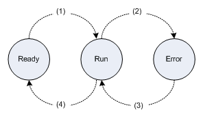
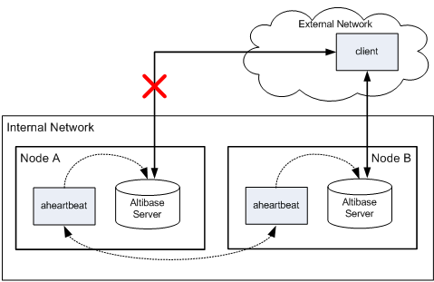

<!-- START doctoc generated TOC please keep comment here to allow auto update -->
<!-- DON'T EDIT THIS SECTION, INSTEAD RE-RUN doctoc TO UPDATE -->


- [Altibase Heartbeat User's Guide](#altibase-heartbeat-users-guide)
  - [Preface](#preface)
    - [About This Manual](#about-this-manual)
  - [1. Introduction to Altibase Heartbeat](#1-introduction-to-altibase-heartbeat)
    - [Overview of Altibase Heartbeat](#overview-of-altibase-heartbeat)
    - [Altibase Heartbeat Procedure](#altibase-heartbeat-procedure)
  - [2. Commands](#2-commands)
    - [aheartbeat](#aheartbeat)
  - [3. Configuring Altibase Heartbeat](#3-configuring-altibase-heartbeat)
    - [Configuration](#configuration)
    - [Configuring an Altibase Heartbeat System : A Practice Example](#configuring-an-altibase-heartbeat-system--a-practice-example)
  - [4. Altibase Heartbeat Process](#4-altibase-heartbeat-process)
    - [aheartbeat Status](#aheartbeat-status)
    - [Determing Failure](#determing-failure)
    - [Role of aheartbeat 0](#role-of-aheartbeat-0)
    - [Failover and Failback](#failover-and-failback)
    - [Logging](#logging)

<!-- END doctoc generated TOC please keep comment here to allow auto update -->

Altibase® Tool & Utilities

Altibase Heartbeat User's Guide
===============================


Altibase Tool & Utilities Altibase HeartBeat User's Guide

Release 7.1

Copyright ⓒ 2001\~2020 Altibase Corp. All Rights Reserved.

This manual contains proprietary information of Altibase Corporation; it is provided under a license agreement containing restrictions on use and disclosure and is also protected by copyright patent and other intellectual property law. Reverse engineering of the software is prohibited. All trademarks, registered or otherwise, are the property of their respective owners.

**Altibase Corp**

10F, Daerung PostTower II, 306, Digital-ro, Guro-gu, Seoul 08378, Korea Telephone: +82-2-2082-1000 Fax: 82-2-2082-1099

Customer Service Portal: http://support.altibase.com/en/

Homepage: [[http://www.altibase.com](http://www.altibase.com/)]


Preface
----

### About This Manual

This guide describes how to use the Altibase Heartbeat utility in a distributed database environment.

#### Audience

This manual has been prepared for the following Altibase users:

-   Database administrators
-   Performance administrators
-   Database users
-   Application developers
-   Technical Supporters

It is recommended for those reading this manual possess the following background knowledge:

-   Basic knowledge in the use of computers, operating systems, and operating system utilities
-   Experience in using relational database and an understanding of database concepts
-   Computer programming experience
-   Experience in database server management, operating system management, or network administration

#### Organization

The manual is organized as follows:

-   Chapter 1: Introduction to Altibase heartbeat  
    This chapter introduces Altibase Heartbeat and describes its basic procedure.

-   Chapter 2: Commands  
    This chapter explains Altibase Heartbeat commands

-   Chapter 3: Configuring Altibase Heartbeat  
    This chapter describes how to configure Altibase Heartbeat, and how to configure a distributed database environment with Altibase Heartbeats.
    
-   Chapter 4: Altibase Heartbeat Process  
    This chapter explains the Altibase Heartbeat process in details. On which criteria Altibase Heartbeat determines failure, and once failure is detected, how Failover is performed are examined.

#### Documentation Convention

This section describes the convention used in this manual. Understanding this convention will make it easier to find information in this manual and in the other manuals in the series. 

This convention described here is as follow: 

- Sample Code Convention

##### Sample Code Conventions

The code examples explain SQL statements, stored procedures, iSQL statements, and other command line syntax.

The following table describes the printing conventions used in the code examples.

| Rules            | Meaning                                                      | Example                                                      |
| ---------------- | ------------------------------------------------------------ | ------------------------------------------------------------ |
| [ ]              | Indicates an optional item                                   | VARCHAR [(*size*)][[FIXED \|] VARIABLE]                      |
| { }              | Indicates a mandatory field for which one or more items must be selected. | { ENABLE \| DISABLE \| COMPILE }                             |
| \|               | A delimiter between optional or mandatory arguments.         | { ENABLE \| DISABLE \| COMPILE } [ ENABLE \| DISABLE \| COMPILE ] |
| . . .            | Indicates that the previous argument is repeated, or that sample code has been omitted. | SQL> SELECT ename FROM employee; ENAME ----------------------- SWNO HJNO HSCHOI . . . 20 rows selected. |
| Other Symbols    | Symbols other than those shown above are part of the actual code.Other Symbols | EXEC :p1 := 1; acc NUMBER(11,2);Symbols other than those shown above are part of the actual code. |
| Italics          | Statement elements in italics indicate variables and special values specified by the user. | SELECT * FROM *table_name*; CONNECT *userID*/*password*;     |
| Lower case words | Indicate program elements set by the user, such as table names, column names, file names, etc. | SELECT ename FROM employee;                                  |
| Upper case words | Keywords and all elements provided by the system appear in upper case. | DESC SYSTEM_.SYS_INDICES_;                                   |

#### Related Documentations

For more detailed information, please refer to the following documents.

-   Getting Started Guide

-   Installation Guide

-   Administrator’s Manual

-   Replication Manual

-   Stored Procedures Manual

-   Error Message Reference

#### Altibase Welcomes Your Comments and Feedbacks

Please let us know what you like or dislike about our manuals. To help us with better future versions of our manuals, please tell us if there is any corrections or classifications that you would find useful.

Include the following information:

- The name and version of the manual that you are using
- Any comments about the manual
- Your name, address, and phone number

If you need immediate assistance regarding any errors, omissions, and other technical issues, please contact Altibase's Support Portal (http://altibase.com/support-center/en/).

Thank you. We always welcome your feedbacks and suggestions.

## 1. Introduction to Altibase Heartbeat

This chapter introduces Altibase Heartbeat and describes its basic procedure.

### Overview of Altibase Heartbeat

The Altibase Heartbeat utility detects node failures in a distributed database environment and enables the DBA to counter failures. aheartbeat[^1]  can be utilized in an environment where Altibase servers are connected through replication. 

[^1]: aheartbeat has detected failure on the other node, this file is executed for remote node Failover. This file can be either an executable binary or script file.


Therefore, Altibase Heardbeat and aheartbeat are used interchageably in this document. 

#### Altibase Heartbeat Components

Altibase Heartbeat mainly consists of the following:

-   aheartbeat process

-   Execution file to perform Failover to the local node

-   Execution file for remote node Failover

##### aheartbeat Process

aheartbeat is a background process and detects two types of failures; it either detects database failure by periodically connecting to the Altibase server on the same node, or detects network failure by periodically connecting to aheartbeats on other nodes.

##### Execution File to Perform Failover to the Local Node

After database server failure on the same node as aheartbeat has been detected, this file is executed to perform Failover to the local node. This file can be either an executable binary or script file.

##### Execution File to Perform Failover to the Local Node

After aheartbeat has detected failure on the other node, this file is executed for remote node Failover. This file can be either an executable binary or script file.

### Altibase Heartbeat Procedure

This section explains the basic Altibase Heartbeat procedure in a distributed database environment. The following figure is a diagram of a simple distributed database environment consisting of multiple Altibase databases with Altibase Heartbeats.


[Figure 1-1] Altibase Heartbeat Procedure

As shown above, aheartbeat detects database failure by monitoring the Altibase server process of the node it resides on(1. check in the figure). It also detects node failure(3. check) or external network failure(2. check) by monitoring aheartbeat processes on other nodes. 

If the Altibase server on Node A fails, let's look at how aheartbeats will run:

1.  Node A’s aheartbeat detects an Altibase server failure.

2.  Node A’s aheartbeat executes the execution file to perform Failover to the local node and terminates itself.
  
3.  By detecting the termination of Node A’s aheartbeat, Node B’s aheartbeat registers an Altibase server failure on Node A and executes the execution file for remote node Failover. 

## 2. Commands

This chapter explains Altibase Heartbeat commands.

### aheartbeat

aheartbeat is used to start up or terminate Altibase Heartbeat, or retrieve information about nodes. 

#### Syntax

```
aheartbeat {-r|-s|-i}
```

#### Options

| Option        | Description                                                  |
| ------------- | ------------------------------------------------------------ |
| \-r or --run  | Starts aheartbeat                                            |
| \-s or --stop | Terminates aheartbeat                                        |
| \-i or --info | Outputs information on all nodes consisting the distributed environment in which aheartbeats are running |

#### Example

Starts Altibase Heartbeat.

```
$ aheartbeat -r
```

Terminates Altibase Heartbeat.

```
$ aheartbeat -s
```

Outputs information on all nodes consisting the distributed environment in which aheartbeats are running,

```
$ aheartbeat -i
#ID     IP                 PORT      STATUS
0      192.168.1.31        55778     RUN
0      172.168.221.32      55778     RUN
1      192.168.2.33        55444     RUN
1      168.768.1.1         55444     READY
2      192.168.2.33        54321     ERROR
2      ::2:1               54321     RUN
```

## 3. Configuring Altibase Heartbeat

This chapter explains how to configure Altibase Heartbeat, and how to configure a distributed database environment with Altibase Heartbeats.

### Configuration

This section explains the necessary configuration for using Altibase Heartbeats in a distributed database environment.

#### Environment Variables

##### Mandatory Environment Variables

The following environment variables must be set to use Altibase Heartbeats:

- ALTI_HBP_HOME  
  Sets the Altibase Heartbeat home directory. And sets the ALTI_HBP_HOME/bin on the environment variables PATH as follows.

```
export PATH=$ALTI_HBP_HOME/bin:$PATH : PATH
```


-   ALTI_HBP_ID  
    Sets an ID to identify the node on which Altibase Heartbeats reside. The value must be an integer between 1 and 99, and each node must have a unique ID. Since the ID 0 indicates that aheartbeat exists in an external network, an internal network node cannot take 0 as its ID. 
    
-   ALTI_HBP_ALTIBASE_PORT_NO  
    Sets Altibase server’s listening port number which the Altibase Heartbeat is to monitor; this is the listening port number of the Altibase server that exists on the same node as the aheartbeat. 
    
-   ALTI_HBP_DETECT_INTERVAL  
    Sets the interval (in seconds) after which the Altibase Heartbeat monitors Altibase server failure. 
    
-   ALTI_HBP_DETECT_HIGHWATER_MARK  
    Sets the number of failed connections to tolerate before determining a failure when the aheartbeat receives no response from the Altibase server it is monitoring or aheartbeats on other nodes. 

##### Optional Environment Variables

If necessary, the following environment variables can be set additionally.

-   ALTI_HBP_ALTIBASE_FAILURE_EVENT  
    The name of an executable script or binary file which the Altibase Heartbeat executes when it detects an Altibase server failure on the same node. On omission, $ALTI_HBP_HOME/bin/altibaseFailureEvent.sh is executed by default.
    
-   ALTI_HBP_REMOTE_NODE_FAILURE_EVENT  
    The name of an executable script or binary file which the Altibase Heartbeat executes when it detects an Altibase server failure on another node. On omission, $ALTI_HBP_HOME/bin/remoteNodeFailureEvent.sh is executed by default. 

#### Setting aheartbeat Nodes

The purpose of the aheartbeat.settings file is to configure a distributed environment which uses Altibase Heartbeats. This file stores information on all nodes consisting the distributed environment, and exists in the $ALTI_HBP_HOME/conf directory. To execute Altibase Heartbeat, it is imperative that this file exists. 

The information stored in the aheartbeat.settings file consists of the ID, IP address and aheartbeat‘s listening port number on each node. This information is necessary for aheartbeats to connect to aheartbeats on other nodes. 

If one server has many IP addresses, you can specify up to four sets of different IP addresses for the same ID. Also, IPs of different versions can be set for the same ID.

\<An example of the aheartbeat.settings file>

```
# ID   IP                  PORT
0      169.215.114.23    55778     # public domain
0      222.112.231.234   55778     # public domain
1      192.168.2.33       55444
1      222.112.181.231   55444     # public domain
2      192.168.2.33       54321
2      ::ffff:c0a8:221   54321     # IPv6
```

In the above example, Node 0 has two IP addresses (169.215.114.23, 222.112.231.234) and aheartbeat’s listening port number is 55778. Node 1 has two IP addresses (192.168.2.33, 222.112.181.231) and aheartbeat’s listening port number is 55444. 

Two IP addresses of different versions are set to the same ID for Node 2 (IPv4: 192.168.2.33, IPv6: ::ffff:c0a8:221) and aheartbeat’s listening port number is 55321. Comments can be left with a #.

##### Note

The settings in the aheartbeat.settings file must be identical for all of the nodes comprising a distributed environment. Otherwise, Altibase Heartbeat can malfunction.

#### Failover Execution File

When aheartbeat fails to connect to an Altibase server on its node or aheartbeats on other nodes (or simply put, detects a failure), it executes the failover execution file. The failover execution file must be in the $ALTI_HBT_HOME/bin directory and the file name can be set with the ALTI_HBP_ALTIBASE_FAILURE_EVENT, ALTI_HBP_REMOTE_NODE_FAILURE_EVENT environment variables described above.

The default script file for failover is as follows.

-   altibaseFailureEvent.sh  
    This script file is executed when Altibase Heartbeat detects an Altibase server failure on the same node. Tasks, such as notifying DBAs of failures or restarting the failed Altibase server, can be included.
    
-   remoteNodeFailureEvent.sh  
    This script file is executed when Altibase Heartbeat detects a failure on another node. Tasks, such as performing Failover to the services of a failed database, can be included.

Database administrators can override failure by modifying the default script file or writing application programs which execute Failover operations.

#### aheartbeat 0

In a system where databases in an internal network provide services to clients in an external network, aheartbeat can exist in the external network to detect network failure from the internal to external network. The ID of a node which has aheartbeat in the external network must be 0. Therefore, aheartbeat in the external network is called aheartbeat 0.

The user can decide whether or not to add aheartbeat 0.

### Configuring an Altibase Heartbeat System : A Practice Example

A practice example is provided in this section to show how to configure a distributed environment with Altibase databases and the Altibase Heartbeat utility.

It is possible to provide enforced and continuous database services by incorporating the Altibase Heartbeat utility in a distributed environment consisted of Altibase databases.

#### Distributed Environment Diagram and Conditions 

Three nodes(A, B, C) exist in the internal network and each node has an Altibase server and aheartbeat.


[Figure 3-1] Distributed Environment Diagram and Conditions

-   Each node’s Altibase database has a client requesting services.

-   aheartbeat 0 runs in a public network with the IP address 169.215.114.23, and the listening port number 44000.
  
-   Each node’s IP address, aheartbeat and Altibase server’s listening port number are as follows.

| Node | IP Address     | Altibase Server Listerning Port Number | aheartbeat Listening Port Number |
| ---- | -------------- | -------------------------------------- | -------------------------------- |
| A    | 192.168.100.30 | 20000                                  | 21000                            |
| B    | 192.168.100.31 | 30000                                  | 31000                            |
| C    | 192.168.100.32 | 40000                                  | 41000                            |

#### Setting Environment Variables 

Under the above conditions, the environment variables for each node can be set as follows.

- aheartbeat 0’s Node (external network):

  ALTI_HBP_HOME=/altibase/hbp_home

  ALTI_HBP_ID=0

  ALTI_HBP_DETECT_INTERVAL=3

  ALTI_HBP_DETECT_HIGHWATER_MARK=10

- Node A:

  ALTI_HBP_HOME=/altibase/hbp_home

  ALTI_HBP_ID=1

  ALTI_HBP_ALTIBASE_PORT_NO=20000

  ALTI_HBP_DETECT_INTERVAL=3

  ALTI_HBP_DETECT_HIGHWATER_MARK=10

- Node B:

  ALTI_HBP_HOME=/altibase/hbp_home

  ALTI_HBP_ID=2

  ALTI_HBP_ALTIBASE_PORT_NO=30000

  ALTI_HBP_DETECT_INTERVAL=3

  ALTI_HBP_DETECT_HIGHWATER_MARK=10

- Node C:

  ALTI_HBP_HOME=/altibase/hbp_home

  ALTI_HBP_ID=3

  ALTI_HBP_ALTIBASE_PORT_NO=40000

  ALTI_HBP_DETECT_INTERVAL=3

  ALTI_HBP_DETECT_HIGHWATER_MARK=10

> Note: the ALTI_HBP_ALTIBASE_PORT_NO environment variable is ignored in the 0 Node.
>

#### aheartbeat.settings

The contents of the $ALTI_HBP_HOME/conf/aheartbeat.settings file are identical over all nodes and are as follows.

\# ID     IP PORT

0      169.215.114.23        44000    #External Network

1      192.168.100.30        21000    #NODE A

2      192.168.100.31        31000    #NODE B

3      192.168.100.32        41000    #NODE C

####  Failover Execution File

Make the necessary changes to the contents of the altibaseFailureEvent.sh and remoteNodeFailureEvent.sh files in the \$ALTI_HBP_HOME/bin directory. You can also write an application program for Failover, put the execution binary into the $ALTI_HBP_HOME/bin directory and then set the environment variables.

#### Starting aheartbeat 

Start Altibase Heartbeat on each node with the following command.

```
$ aheartbeat -r
```

The startup order of the nodes is irrelevant. Once aheartbeats are running, the status of each node can be checked with the following command.

```
$ aheartbeat -i
```

## 4. Altibase Heartbeat Process

This chapter explains the Altibase Heartbeat process in details. On which criteria Altibase Heartbeat determines failure, and once failure is detected, how Failover is performed are examined.

### aheartbeat Status

aheartbeat defines the status of itself and other aheartbeats.

aheartbeat is in one of the following three statuses, depending on its execution state.

-   Ready: aheartbeat is not yet running

-   Run: aheartbeat has been executed and is in the state of running normally.

-   Error: The node is in a state of failure

aHeartbeat also defines aheartbeats on other nodes to be in one of the following three statuses.

-   Ready: aheartbeat has not yet performed an initial handshake with the corresponding node’s aheartbeat. 
-   Run: aheartbeat has successfully performed a handshake with the corresponding node’s aheartbeat and is in the state of being connected normally. 
-   Error: aheartbeat cannot connect to the corresponding node’s aheartbeat whose status was previously detected to be 'Run'.

The following figure shows how status transition occurs and the table lists the situations under which each status transition occurs.



[Figure 4-1] Status Transition

Each status transition occurs in the following table.

| Status Transition | Description                                                  |
| ----------------- | ------------------------------------------------------------ |
| (1)               | After starting up, aheartbeat has successfully performed a handshake |
| (2)               | aheartbeat has terminated due to failure                     |
| (3)               | After failure, aheartbeat has restarted and successfully re-performed a handshake |
| (4)               | aheartbeat has terminated normally                           |

[Table 4-1] Status Transition

### Determing Failure

This section examines the criteria on which Altibase Heartbeat determines failure.

Altibase Heartbeat monitors in the following order and detects failure by connecting to three objects. The table below depicts the node (local or remote) which aheartbeat registers to have failed for each monitoring target object when connection fails.

| Order | Monitoring Target                          | Registered Node Failure |
| ----- | ------------------------------------------ | ----------------------- |
| 1     | aheartbeat 0                               | Local node failure      |
| 2     | Altibase database server on the local node | Local node failure      |
| 3     | aheartbeat on the remote server            | Remote node failure     |

[Table 4-2] Determing Failure

#### Local Node Failure

When aheartbeats of each node detect failure at #1 or #2 in the above table, they register a local node failure.

aheartbeats of each node initially monitor aheartbeat 0 which resides in the external public network; when connection fails, they register a local node failure. In this case, aheartbeat determines that database services cannot be provided due to network failure between the Altibase server and clients.

If connection to aheartbeat 0 is normal or aheartbeat 0 is nonexistent, aheartbeats of each node monitor the Altibase database server on the local node; when connection fails, they register a database failure. In this case, aheartbeat determines that database services cannot be provided due to database failure. 

If aheartbeat acknowledges that a failure has occurred in the above two monitoring targets, it executes the execution file to perform Failover to the local node and terminates itself.

#### Remote Node Failure

If aheartbeats of each node detect failure at #3 in the above table, they register a remote node failure. That is, when connection to another node’s aheartbeat which has been identified to be in the RUN status fails, they determine that the node has failed and execute the execution file for remote node Failover.

> Note: When a local node fails, the aheartbeat of the node shuts itself down, so the aheartbeats of other nodes cannot access the aheartbeats of the node. Therefore, it is determined that a failure has occurred in the Altibase server of the remote node.
> 

### Role of aheartbeat 0

aheartbeat 0’s role and features in a distributed database environment are as follows.

-   aheartbeat 0 does not monitor the Altibase server on its node.

-   aheartbeats on nodes other than aheartbeat 0, can verify disconnection with the external network by connecting to aheartbeat 0. Disconnection with the external network indicates disconnection with the clients.

How failure detection results differ in relation to whether or not aheartbeat 0 exists in a distributed database environment is explained below.

#### When aheartbeat 0 is Nonexistent

Let’s suppose the network has failed in a distributed database environment where aheartbeats reside in the internal network.



[Figure 4-2] Network Failure Between an Internal and External Network

If a network failure occurs between Node A and the external network as shown above, Node A’s aheartbeat is not capable of providing services to the client. However, it overlooks the network failure and continues to run. By doing so, Node B’s aheartbeat also overlooks the failure that has occurred on Node A and does not perform Failover to Node A.

#### When aheartbeat 0 is Existent

Next, let’s suppose the network has failed in a distributed database environment where aheartbeat resides in the external network.


[Figure 4-2] Network Failure Between an Internal and External Network

If a network failure occurs between Node A and the external network as shown above, it is impossible for Node A’s aheartbeat to connect to aheartbeat 0. Therefore, Node A’s aheartbeat registers a local node failure, terminates itself and by doing so, allows other nodes to detect its failure. Since Node B’s aheartbeat can’t connect Node A’s aheartbeat, it executes the remote node failover execution file to perform Failover to Node A. 

As seen in the examples above, since aheartbeat 0 can detect network failure between the internal and external networks, the provision of continuous database services can be enforced by using aheartbeat 0.

### Failover and Failback

#### Failover

When aheartbeat detects a failure, it executes the failover execution file with the following two arguments to enable the DBA to efficiently perform Failover.

| Argument        | Description                                                  |
| --------------- | ------------------------------------------------------------ |
| First Argument  | The number of failed nodes                                   |
| Second Argument | The IDs of the failed nodes. These are differentiated by blaks and are specified in ascending order. |

For example, let’s assume that there is a distributed environment where five nodes with the respective IDs 1, 2, 3, 4, 5, which each have Altibase servers and aheartbeats running, and that the Altibase server has failed on the node with the ID 3. Once aheartbeat on the node ID 3 detects that its Altibase server has failed, it executes the following local node failover script and terminates itself.

```
altibaseFailureEvent.sh 1 3
```

Once aheartbeats of other nodes detect that aheartbeat of the node ID 3 has terminated, they execute the following remote node failover script.

```
remoteNodeFailureEvent.sh 1 3
```

If the Altibase server on the node ID 1 fails while Node ID 3 is down, the failover script is executed with the following arguments.

```
altibaseFailureEvent.sh 2 1 3
remoteNodeFailureEvent.sh 2 1 3
```

This means that two servers have failed and their IDs are 1 and 3.

#### Failback

Failback after a node has recovered from failure must be manually performed by the user.

### Logging

Altibase Heartbeat writes the following information to the log file while it is processing.

-   Information of aheartbeat startup

-   Information of connection failure of the Altibase Server

-   Information of the start of an connection to another node

-   Information of aheartbeat failure situation of Altibase server and other nodes

-   Information of each node's aheartbeat status transition

Log files are fixed to $ALTI_HBP_HOME/log/aheartbeat.log.

The output format of log information is as follows.

```
[YYYY-MM-DD HH:MM:SS T-<threadID>] Log Body
```


