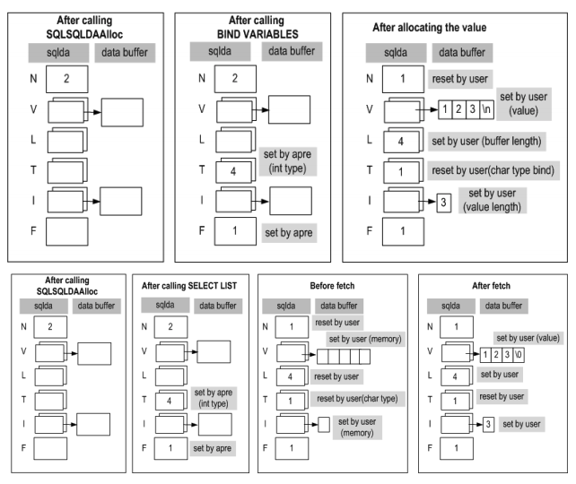

<!-- START doctoc generated TOC please keep comment here to allow auto update -->
<!-- DON'T EDIT THIS SECTION, INSTEAD RE-RUN doctoc TO UPDATE -->


- [Precompiler User’s Manual](#precompiler-users-manual)
  - [8. Using Cursor](#8-using-cursor)
    - [Overview](#overview)
    - [Cursor-Related SQL Statements](#cursor-related-sql-statements)
    - [Reusing a Cursor Name](#reusing-a-cursor-name)
    - [Sample Programs](#sample-programs)
  - [9. Using Arrays in Embedded SQL Statements](#9-using-arrays-in-embedded-sql-statements)
    - [Overview](#overview-1)
    - [Using Host Array Variables in Embedded SQL Statements](#using-host-array-variables-in-embedded-sql-statements)
    - [sqlca.sqlerrd](#sqlcasqlerrd)
    - [Limitations on the Use of Array-Type Host Variables](#limitations-on-the-use-of-array-type-host-variables)
    - [Structures and Arrays](#structures-and-arrays)
    - [Sample Programs](#sample-programs-1)
  - [10. Dynamic SQL Statements](#10-dynamic-sql-statements)
    - [Static versus Dynamic SQL Statements](#static-versus-dynamic-sql-statements)
    - [Using Dynamic SQL Statements](#using-dynamic-sql-statements)
    - [Sample Programs](#sample-programs-2)
  - [11. Using Stored Procedures in C/C++](#11-using-stored-procedures-in-cc)
    - [Using Stored Procedures](#using-stored-procedures)
    - [Using Array-Type Host Variables with the EXECUTE Statement](#using-array-type-host-variables-with-the-execute-statement)
    - [Sample Programs](#sample-programs-3)
  - [12. Applications with Multiple Database Connections](#12-applications-with-multiple-database-connections)
    - [Overview](#overview-2)
    - [SQL Statements for Multi-Connections](#sql-statements-for-multi-connections)
    - [Using Stored Procedures in Multiple-Connection Applications](#using-stored-procedures-in-multiple-connection-applications)
    - [Sample Programs](#sample-programs-4)
  - [13. Multithreaded Applications](#13-multithreaded-applications)
    - [Multithreaded Applications](#multithreaded-applications)
    - [Sample Program](#sample-program)
  - [14. Error Codes and Messages](#14-error-codes-and-messages)
    - [Precompiler Errors](#precompiler-errors)
  - [Appendix A. Using Files and LOBs](#appendix-a-using-files-and-lobs)
    - [Output Host Variables and Files](#output-host-variables-and-files)
    - [Input Host Variables](#input-host-variables)
  - [B. Appendix B. Porting Pro*C Applications to APRE](#b-appendix-b-porting-proc-applications-to-apre)
    - [Datatypes](#datatypes)
    - [Embedded Functions](#embedded-functions)
    - [Managing Database Connections](#managing-database-connections)
    - [Host Variables](#host-variables)
    - [Using Embedded SQL Statements](#using-embedded-sql-statements)
    - [Execution Results and Status Codes](#execution-results-and-status-codes)
    - [Commit Mode](#commit-mode)
    - [Sample Programs](#sample-programs-5)
  - [Appendix C. The Method 4 of Dynamic SQL](#appendix-c-the-method-4-of-dynamic-sql)
    - [SQLDA structure Data type](#sqlda-structure-data-type)
  - [Appendix D. Sample Applications](#appendix-d-sample-applications)
    - [Executing the Sample Applications](#executing-the-sample-applications)
    - [Table Information of the Example Programs](#table-information-of-the-example-programs)
  - [Appendix E. FAQ](#appendix-e-faq)
    - [Precompiler FAQ](#precompiler-faq)

<!-- END doctoc generated TOC please keep comment here to allow auto update -->

Altibase® Application Development

# Precompiler User’s Manual


Altibase Application Development Precompiler User’s Manual

Release 7.1

Copyright ⓒ 2001\~2020 Altibase Corp. All Rights Reserved.

This manual contains proprietary information of Altibase Corporation; it is provided under a license agreement containing restrictions on use and disclosure and is also protected by copyright patent and other intellectual property law. Reverse engineering of the software is prohibited. All trademarks, registered or otherwise, are the property of their respective owners.

**Altibase Corp**

10F, Daerung PostTower II, 306, Digital-ro, Guro-gu, Seoul 08378, Korea Telephone: +82-2-2082-1000 Fax: 82-2-2082-1099

Customer Service Portal: http://support.altibase.com/en/

Homepage: [[http://www.altibase.com](http://www.altibase.com/)]

## 8. Using Cursor

### Overview

When it is expected that a query will return multiple records, a cursor can be declared and used to manipulate the records.

APRE supports the use of various embedded SQL statements for declaring and managing cursors.

Briefly, the Cursor-related SQL statements that are available in APRE are the DECLARE CURSOR statement, the OPEN statement, the FETCH statement, the CLOSE statement, and the CLOSE RELEASE statement, each of which provides a different cursor-related functionality.

#### Order of Execution of Cursor-Related SQL Statements

The order in which SQL statements for managing cursors are executed is as follows:

1. DECLARE CURSOR
2. OPEN
3. FETCH  
   The FETCH statement is repeatedly executed to retrieve all records that satisfy the given conditions until the result of execution is SQL_NO_DATA.
4. CLOSE or CLOSE RELEASE

> #### Notes
>
> If an OPEN, FETCH, CLOSE, or CLOSE RELEASE statement that references a cursor that has not been declared is executed, an error indicating that the cursor does not exist will be raised.
> 
>It is possible to declare more than one cursor with the same name within one application. When doing so, only the most recently declared cursor will be valid. This means that OPEN, FETCH, CLOSE, and CLOSE RELEASE statements will apply to the most recently declared cursor.

### Cursor-Related SQL Statements

Each cursor-related SQL statement is defined and described below in detail.

#### DECLARE CURSOR

This statement is used to declare a cursor.

##### Syntax

```
EXEC SQL DECLARE <cursor name> 
[SENSITIVE | INSENSITIVE] [SCROLL]
CURSOR [WITH HOLD] FOR <cursor specification>;
```

##### Arguments

\<*cursor name*\>:  This is the name of the cursor. It can be a maximum of 50 bytes long. It must start with an alphabetic character (a ~ z, A ~ Z), the underscore character (“_”), or a dollar sign (“$”).

SENSITIVE \| INSENSITIVE: A sensitive cursor reflects data changes in the result set of the cursor. If there is a need to repeatedly retrieve a row set, the latest data of the database is retrieved. An insensitive cursor maintains the data of the time point the cursor was opened in the result set of the cursor.

SCROLL: This argument enables the user to randomly move the cursor in the result set. SCROLL and SENSITIVE must be used together for effectiveness.

WITH HOLD:This argument keeps the cursor open after the transaction is complete. This argument is only valid if the session is in non-autocommit mode.

For more detailed information on cursor types such as SENSITIVE, SCROLL and WITH HOLD, please refer to *CLI User's Manual*.

\<cursor specification\>:  This is a SQL SELECT statement of Altibase. For complete information on authoring SELECT statements, please refer to the *Altibase SQL Reference.*

##### Description

The DECLARE CURSOR statement must be executed before any other cursor-related SQL statements. If another statement that references a cursor that has not been declared is executed, an error indicating that the cursor does not exist will be raised.

When the DECLARE CURSOR statement is executed, all SQL statement preparation tasks, such as syntax checking, semantics checking, optimization, and execution plan creation, are conducted on the server. (This is similar to the functionality of the SQLPrepare ODBC statement.) The SQL statement need only be prepared in advance one time in order to be executed multiple times using OPEN CURSOR (which is like the SQLExecute ODBC statement).

##### Limitations

All of the limitations that apply to the SELECT Altibase SQL statement also apply to the DECLARE CURSOR statement.

##### Example

The following example shows how to declare a cursor for retrieving all of the records in the *departments* table.

\< Sample Program : cursor1.sc \>

```
EXEC SQL DECLARE DEPT_CUR CURSOR FOR 
             SELECT *
             FROM DEPARTMENTS; 
```

#### OPEN

This statement is used to open a cursor.

##### Syntax

```
EXEC SQL OPEN <cursor name>;
```

##### Argument

\<cursor name\>: This is the name of the cursor to open.

##### Description

The OPEN statement executes the SQL statement that was specified using the DECLARE CURSOR statement. 

The SELECT statement that is executed using the OPEN statement was previously prepared for execution on the database server when the DECLARE CURSOR statement was executed. When the OPEN statement is executed, the server searches the corresponding table(s) for records that satisfy the conditions in the WHERE clause.

A cursor in the OPEN state can be opened without the CLOSE execution, which is identical to OPEN after executing CLOSE.

##### Example

The following example shows the statement that is used to open a cursor called DEPT_CUR.

\< Sample Program : cursor1.sc \>

```
EXEC SQL OPEN DEPT_CUR;
```

#### FETCH

This statement is used to read column values from an open cursor and store them in corresponding host variables.

##### Syntax

```
EXEC SQL FETCH [<fetch_orientation>]
<cursor name> INTO <host_var_list>;
```

##### Arguments

\<cursor name\>: This is the name of the cursor.

\<host_var_list\>: This is a list of output host variables and output indicator variables.

###### \<fetch_orientation\>

This argument specifies the position of the cursor within the result set and retrieves its value. The following values are available for specification:

- FIRST: The value of the first row of the result set is retrieved. 
- LAST: The value of the last row of the result set is retrieved. 
- PRIOR: The value of the row prior to the current cursor position is retrieved. 
- NEXT: The value of the row next to the current cursor position is retrieved. 
- CURRENT: The value of the current cursor position is retrieved. 
- RELATIVE n: The value of the nth row from the current cursor position is retrieved. 
- ABSOLUTE n: The value of the nth row of the result set is retrieved.

##### Description

The FETCH statement first instructs the cursor to move to the next record, and then stores that record's column values in corresponding host variables.

##### Result of Execution

The two possible results of execution of a FETCH statement are SQL_SUCCESS and SQL_NO_DATA, each of which is described below.

- SQL_SUCCESS  
  This result indicates that the value retrieved by the FETCH operation was successfully stored in the corresponding host variable, and that there are still data waiting to be returned on the database server.  
  Applications are typically written such that they will continue to fetch additional records when the result of a FETCH operation is SQL_SUCCESS. 
- SQL_NO_DATA  
  This result indicates that nothing was retrieved by the FETCH operation and that no data are stored in the corresponding host variable. The contents of the host variable are therefore meaningless (i.e. a garbage value). This result means one of two things: either that all records that satisfy the given conditions have been returned from the database server, or that there were originally no records that satisfied the given conditions.

##### Example

This example shows the use of the previously declared and opened DEPT_CUR cursor to fetch records. Each of the returned column values is stored in a corresponding element of the s_department structure. The s_dept_ind structure-type indicator variable can be used to check whether any of the returned column values is NULL. The while loop continues to perform the FETCH operation and retrieve records that satisfy the conditions until SQL_NO_DATA is returned. 

\< Sample Program : hostvar.h \>

```
EXEC SQL BEGIN DECLARE SECTION;
typedef struct department
{
    short dno; 
    char  dname[30+1];
    char  dep_location[9+1];
    int   mgr_no;
} department;

typedef struct dept_ind
{
    int dno; 
    int dname;
    int dep_location;
    int mgr_no;
} dept_ind;
EXEC SQL END DECLARE SECTION;
```

\< Sample Program : cursor1.sc \>

```
/* specify path of header file */
EXEC SQL OPTION (INCLUDE=./include);
/* include header file for precompile */
EXEC SQL INCLUDE hostvar.h;

EXEC SQL BEGIN DECLARE SECTION;
/* declare host variables */
department s_department;
/* structure indicator variables */
dept_ind s_dept_ind;
EXEC SQL END DECLARE SECTION;

while(1)
{
EXEC SQL FETCH DEPT_CUR
       INTO :s_department :s_dept_ind;
    if (sqlca.sqlcode == SQL_SUCCESS) 
{
        printf("%d     %s %s          %d\n",
                  s_department.dno, s_department.dname,
                  s_department.dep_location, 
s_department.mgr_no);
    }
    else if (sqlca.sqlcode == SQL_NO_DATA)
    {
        break;
    }
    else 
    {
        printf("Error : [%d] %s\n", SQLCODE, 
sqlca.sqlerrm.sqlerrmc);
        break;
    }
}
```

#### CLOSE

This statement is used to close a cursor.

##### Syntax

```
EXEC SQL CLOSE <cursor name>;
```

##### Argument

\<cursor name\>:  This is the name of the cursor to close.

##### Description

If the CLOSE statement is executed when there are still data left to return on the database server (i.e. when not all of the records have been fetched), then the unfetched results will be discarded. In other words, once the CLOSE statement has been executed, the FETCH statement cannot be executed using that cursor. If it is desired to use the cursor to perform another FETCH operation, it will be necessary to open the cursor before executing the FETCH statement again. 

When the CLOSE statement is executed, the resources allocated to the cursor are not released. Additionally, the results of the SQL statement preparation tasks that were conducted when the DECLARE CURSOR statement was executed are saved. To use this prepared SQL statement after the CLOSE statement has been executed, omit the DECLARE CURSOR statement and execute the OPEN statement using the same cursor name.

##### Example

The following example shows the use of the CLOSE statement to close the DEPT_CUR cursor.

\< Sample Program : cursor1.sc \>

```
EXEC SQL CLOSE DEPT_CUR;
```

#### CLOSE RELEASE

This statement is used to close a cursor and release all of the resources that were allocated to the cursor.

##### Syntax

```
EXEC SQL CLOSE RELEASE <cursor name>;
```

##### Argument

\<cursor name\>: This is the name of the cursor.

##### Description

The CLOSE RELEASE statement releases the resources allocated to the cursor and deletes the results of the SQL statement preparation tasks that were conducted when the DECLARE CURSOR statement was executed. If there are still data left to return on the database server when the CLOSE RELEASE statement is executed, then the unfetched results will be discarded. If it is desired to use the same cursor name after the CLOSE RELEASE statement has been executed, it will be necessary to execute the DECLARE CURSOR statement, followed by the OPEN statement. In other words, once the CLOSE RELEASE statement has been executed, the OPEN statement cannot be executed using that cursor name. 

##### Example

In the following example, the CLOSE RELEASE statement is executed on the EMP_CUR cursor. At this time, the SQL statement preparations that were made when the DECLARE EMP_CUR CURSOR statement was executed will be discarded, and the resources allocated to the EMP_CUR cursor will be released.

\< Sample Program : cursor2.sc \>

```
EXEC SQL CLOSE RELEASE EMP_CUR;
```

### Reusing a Cursor Name

This section explains how to use the same cursor name repeatedly. It sets forth the order in which to perform tasks and highlights some important considerations to keep in mind when reusing a cursor name.

#### Relationships between Cursor-Related Statements

The following describes the order in which cursor-related statements must be executed when reusing a cursor name. In detail, it sets forth the cursor-related statements that can precede each cursor-related statement.

- DECLARE CURSOR  
  When reusing a cursor name, the DECLARE CURSOR statement must be executed after the CLOSE statement or the CLOSE RELEASE statement.
- OPEN  
  When reusing a cursor name, the OPEN statement must be executed after the CLOSE statement. If all records have been fetched, it can also be executed after the FETCH statement.
- FETCH  
  When reusing a cursor name, the FETCH statement must be executed after the OPEN statement. It can also be executed after another FETCH statement if the result of execution of the previous FETCH statement was SQL_SUCCESS.
- CLOSE  
  When reusing a cursor name, the CLOSE statement can be executed after the DECLARE CURSOR statement, the OPEN statement, or the FETCH statement. When it is executed after a FETCH statement, it doesn't matter whether the result of execution of the FETCH statement was SQL_SUCCESS or SQL_NO_DATA.
- CLOSE RELEASE  
  When reusing a cursor name, the CLOSE RELEASE statement can be executed after any other statement. When it is executed after a FETCH statement, it doesn't matter whether the result of execution of the previous FETCH statement was SQL_SUCCESS or SQL_NO_DATA.

#### Cursor-Related SQL Statements and Host Variables

The following describes how cursor-related SQL statements must be used depending on whether the input host variables used to declare the cursor are global or local in scope.

- If the input host variables in the DECLARE CURSOR statement are global in scope, then the OPEN statement can be executed after the CLOSE statement when reusing a cursor name.

- If a host variable used in a DECLARE CURSOR statement is local in scope, that is, if the host variable was declared inside a function, then in order to use the same cursor name, the DECLARE CURSOR statement must be executed after the CLOSE statement. 
  
  The reason for this limitation is that the values of the host variable pointers used in the DECLARE CURSOR statement are stored internally when the DECLARE CURSOR statement is executed, and these stored values are used when the OPEN statement is executed. Therefore, if these host variables are local, then if the function is exited and then called again, the pointer values may be changed, and thus their values may no longer be valid when the OPEN statement is executed. This means that it is necessary to execute the DECLARE CURSOR statement to save the pointer values every time the function is called. Additionally, the local host variables must be declared in the function containing the DECLARE CURSOR and OPEN statements.

#### The CLOSE and CLOSE RELEASE Statements

The difference between the CLOSE and CLOSE RELEASE statements is described below:

- To reuse the name of a cursor that was released using the CLOSE RELEASE statement, it is necessary to execute the DECLARE CURSOR statement again. The reason for this is that when the CLOSE RELEASE statement is executed, all of the information and resources related to the cursor are deleted, so it is necessary to execute the DECLARE CURSOR statement to allocate necessary resources and prepare for the execution of the SQL statement. Therefore, when it is desired to reuse a cursor, in most cases it is more appropriate to execute the CLOSE statement, rather than the CLOSE RELEASE statement.
- After all results have been fetched (i.e. when the result returned by the FETCH statement is SQL_NO_DATA), it is possible to execute either the CLOSE statement or the CLOSE RELEASE statement. When planning to reuse the cursor, the CLOSE statement is more appropriate, whereas the CLOSE RELEASE statement is more appropriate when it is not expected that the cursor will be reused. It is possible to execute the CLOSE RELEASE statement after the CLOSE statement has been executed, but this is somewhat wasteful because the cursor closing operation is performed twice.
- In summary, the CLOSE statement is more appropriate when expecting to reuse the cursor, and the CLOSE RELEASE statement is more appropriate when not expecting to reuse it. In practice,  however, there are few cases in which a cursor is not used more than once, so the CLOSE RELEASE statement is almost never used. Reusing a cursor name by repeatedly executing the CLOSE RELEASE, DECLARE CURSOR and OPEN statements has a negative impact on performance.

### Sample Programs

##### cursor1.sc 

This example can be found at $ALTIBASE_HOME/sample/APRE/cursor1.sc

##### Result of Execution

```
$ is –f schema/schema.sql
$ make cursor1
$ ./cursor1
<CURSOR 1>
------------------------------------------------------
[Declare Cursor]                                                  
------------------------------------------------------
Success declare cursor

------------------------------------------------------
[Open Cursor]                                                     
------------------------------------------------------
Success open cursor

------------------------------------------------------
[Fetch Cursor]                                                    
------------------------------------------------------
DNO      DNAME                          DEP_LOCATION       MGR_NO 
------------------------------------------------------
1001     RESEARCH DEVELOPMENT DEPT 1    New York           16
1002     RESEARCH DEVELOPMENT DEPT 2    Sydney             13
1003     SOLUTION DEVELOPMENT DEPT      Japan              14
2001     QUALITY ASSURANCE DEPT         Seoul              17
3001     CUSTOMER SUPPORT DEPT          London             4
3002     PRESALES DEPT                  Peking             5
4001     MARKETING DEPT                 Seoul              8
4002     BUSINESS DEPT                  LA                 7

------------------------------------------------------
[Close Cursor]                                                    
------------------------------------------------------
Success close cursor
```

##### cursor2.sc 

This example can be found at $ALTIBASE_HOME/sample/APRE/cursor2.sc

##### Result of Execution

```
$ is –f schema/schema.sql
$ make cursor2
$ ./cursor2
<CURSOR 2>
------------------------------------------------------
[Declare Cursor]                                                  
------------------------------------------------------
Success declare cursor

------------------------------------------------------
[Open Cursor]                                                     
------------------------------------------------------
Success open cursor

------------------------------------------------------
[Fetch Cursor]                                                    
------------------------------------------------------
ENO     DNO      SALARY                        
------------------------------------------------------
2         -1     1500000.00
3       1001     2000000.00
4       3001     1800000.00
5       3002     2500000.00
6       1002     1700000.00
7       4002      500000.00
9       4001     1200000.00
10      1003     4000000.00
11      1003     2750000.00
12      4002     1890000.00
13      1002      980000.00
14      1003     2003000.00
15      1003     1000000.00
16      1001     2300000.00
17      2001     1400000.00
18      4001     1900000.00
19      4002     1800000.00

------------------------------------------------------
[Close Release Cursor]                                            
------------------------------------------------------
Success close release cursor
```

## 9. Using Arrays in Embedded SQL Statements

### Overview

This chapter explains how to declare and use array-type host variables in embedded SQL statements.

#### Definition and Declaration

The term “array host variable” refers to a one-dimensional or two-dimensional array of a data type that can be used as a host variable, that is itself declared for use as a host variable.

One- or two-dimensional arrays can be declared for use with character types and the varchar type, whereas only one-dimensional arrays can be declared for use with other data types. One exception is that an array of pointers cannot be declared.

##### Examples

Various examples that illustrate how array host variables are declared are shown below. 

[Example 1] The following example shows how to declare character-type and numeric-type arrays as host variables.

\< Sample Program : arrays1.sc \>

```
EXEC SQL BEGIN DECLARE SECTION;
char    a_gno[3][10+1];
char    a_gname[3][20+1];
char    a_goods_location[3][9+1];
int     a_stock[3];
double  a_price[3];
EXEC SQL END DECLARE SECTION;
```

[Example 2] The following example shows how to declare an array of structures as a host variable. 

< Sample Program: hostvar.h >

```
EXEC SQL BEGIN DECLARE SECTION;
typedef struct goods
{
    char   gno[10+1];
    char   gname[20+1];
    char   goods_location[9+1];
    int    stock;
    double price;
} goods;
EXEC SQL END DECLARE SECTION;
```

< Sample Program: arrays1.sc >

```
EXEC SQL BEGIN DECLARE SECTION;
goods   a_goods[3];
EXEC SQL END DECLARE SECTION;
```

[Example 3] The following example shows how to declare a structure that contains array elements and use it as a host variable. 

< Sample Program: arrays1.sc >

```
EXEC SQL BEGIN DECLARE SECTION;
struct
{
    char    gno[3][10+1];
    char    gname[3][20+1];
    char    goods_location[3][9+1];
    int     stock[3];
    double  price[3];
} a_goods2;
EXEC SQL END DECLARE SECTION;
```

#### Advantages

Using array-type host variables will have a positive impact on system performance.

The following explanations show how the performance benefits can be achieved.

Compare the use of an array-type host variable with the use of a non-array-type host variables in the execution of an INSERT statement. Suppose for example that it is desired to insert 1000 records. If an array-type host variable having 1000 elements is used, it is only necessary to execute an INSERT statement one time to insert all 1000 records. In contrast, when using a non-array-type host variable, it would be necessary to execute an INSERT statement 1000 times in order to insert all 1000 records. This requires 1000 separate communication events with the database server. It is thus evident that the use of an array-type host variable greatly reduces the consumption of network resources compared to when using a non-array-type host variable.

Now compare the use of an array-type host variable with the use of a non-array-type host variable in the execution of a FETCH statement. In order to fetch 1000 records into an array-type host variable having 1000 elements, it will only be necessary to execute the FETCH statement one time, and all 1000 records will be fetched in sequence into the array, starting with the 0th element. When using a non-array-type host variable, it would be necessary to execute the FETCH statement 1000 times in order to fetch all 1000 records; however, this would not entail a separate communication event with the database server every time the FETCH statement was executed. The reason for this is that internally a certain number of records are retrieved from the database in advance and saved, and every time the FETCH statement is executed, one previously saved record is assigned to the host variable. 

This shows that a notable improvement in performance cannot be expected when using array-type host variables to execute a FETCH statement. Only a slight performance improvement, attributable to the decrease in the number of times the FETCH statement is executed, can be expected. 

#### CONNTYPE and Host Array Variables

##### CONNTYPE

The CONNTYPE option is used to determine the method of communication with the database server, and is specified when attempting to establish a connection with the database server. The value of the CONNTYPE option has a strong effect on performance. The magnitude of this effect varies depending on whether array-type host variables are being used.

For information on how to set the CONNTYPE option, please refer to Chapter 6.

##### Supported Connection Types

The supported connection types are TCP, UNIX and IPC.

##### Relationship between CONNTYPE and Host Variable Array Size

Normally, the IPC connection type realizes the best performance, followed in descending order by the UNIX and TCP connection types. However, when using array-type input host variables, this is not necessarily the case. Therefore, when using array-type input host variables, it is suggested that you test each of the connection methods with various array sizes to determine the combination that yields the best performance in your environment.

### Using Host Array Variables in Embedded SQL Statements

Array-type host variables can be used in embedded SQL statements in various ways. 

#### INSERT

The array types that can be used with INSERT statements are as follows:

- Simple arrays 
- Arrays of structures 
- Structures comprising arrays as individual elements thereof

##### Example

The following example shows the use of an array-type host variable as an input host variable in an INSERT statement.

\< Sample Program : arrays1.sc \>

```
EXEC SQL BEGIN DECLARE SECTION;
char    a_gno[3][10+1];
char    a_gname[3][20+1];
char    a_goods_location[3][9+1];
int     a_stock[3];
double  a_price[3];
EXEC SQL END DECLARE SECTION;

strcpy(a_gno[0], "X111100001");
strcpy(a_gno[1], "X111100002");
strcpy(a_gno[2], "X111100003");
strcpy(a_gname[0], "XX-201");
strcpy(a_gname[1], "XX-202");
strcpy(a_gname[2], "XX-203");
strcpy(a_goods_location[0], "AD0010");
strcpy(a_goods_location[1], "AD0011");
strcpy(a_goods_location[2], "AD0012");
a_stock[0] = 1000;
a_stock[1] = 1000;
a_stock[2] = 1000;
a_price[0] = 5500.21;
a_price[1] = 5500.45;
a_price[2] = 5500.99;

EXEC SQL INSERT INTO GOODS 
VALUES (:a_gno, :a_gname, :a_goods_location, 
:a_stock, :a_price);
```

#### UPDATE

The array types that can be used with the UPDATE statement are as follows:

- Simple arrays 
- Structures comprising arrays as individual elements thereof

##### Limitation

If any of the host variables is an array, all host variables must be arrays, and furthermore, the number of elements in each array must be the same. Arrays of structures cannot be used as host variables in the SET or WHERE clause of UPDATE statements. However, it is possible to use an individual element of one structure that is itself one element in an array of structures in the SET or WHERE clause, as shown in the following example:

```
Example) EXEC SQL BEGIN DECLARE SECTION;
struct tag1 { int i1; int i2; int i3; } var1[10];
EXEC SQL END DECLARE SECTION;

EXEC SQL UPDATE T1 
SET I1 = :var1[0].i1, I2 = :var1[0].i2 
WHERE I1 = :var1[0].i3;		(O)
```

##### Example

The following example shows the use of an array-type host variable as an input host variable in an UPDATE statement. 

< Sample Program: arrays1.sc >

```
EXEC SQL BEGIN DECLARE SECTION;
int   a_eno[3];
short a_dno[3]; 
char  a_emp_tel[3][15+1];
EXEC SQL END DECLARE SECTION;

a_eno[0] = 10;
a_eno[1] = 11;
a_eno[2] = 12;
a_dno[0] = 2001;
a_dno[1] = 2001;
a_dno[2] = 2001;
strcpy(a_emp_tel[0], "01454112366");
strcpy(a_emp_tel[1], "0141237768");
strcpy(a_emp_tel[2], "0138974563");
  
EXEC SQL UPDATE EMPLOYEES 
SET DNO = :a_dno,
                 EMP_TEL = :a_emp_tel
            WHERE ENO = :a_eno; 
```

#### DELETE

The array types that can be used with the DELETE statement are as follows:

- Simple arrays
- Structures comprising arrays as individual elements

##### Limitation

As in the UPDATE statement, an array of structures cannot be used. One one array element of a structure array can be specified and used as in the example below.

```
Example) EXEC SQL BEGIN DECLARE SECTION;
struct tag1 { int i1; int i2; int i3; } var1[10];
EXEC SQL END DECLARE SECTION;

EXEC SQL DELETE FROM T1 
WHERE I1 = :var1[0].i1 AND 
I2 = :var1[0].i2 AND
I3 = :var1[0].i3;		(O)
```

##### Example

The following example shows the use of an array-type host variable as an input host variable in a DELETE statement.

< Sample Program: arrays1.sc >

```
EXEC SQL BEGIN DECLARE SECTION;
short a_dno[3]; 
EXEC SQL END DECLARE SECTION;

a_dno[0] = 4001;
a_dno[1] = 4002;
a_dno[2] = 2001;

EXEC SQL DELETE FROM EMPLOYEES
           WHERE DNO = :a_dno;
```

#### SELECT

The array types that can be used with the SELECT statement are as follows. The array types listed below can also be used in FETCH statements, and the same limitations apply.

- Simple arrays 
- Arrays of structures 
- Structures comprising arrays as individual elements

##### Limitation

If any of the host variables in the INTO clause of a SELECT statement is an array, all of the host variables in the INTO clause must be arrays. Array-type input host variables cannot be used in the WHERE clause of SELECT embedded SQL statements.

```
Example) EXEC SQL BEGIN DECLARE SECTION;
int var1;
int var2[10];
int var3[10];
EXEC SQL END DECLARE SECTION;
EXEC SQL SELECT * INTO :var1 
FROM T1 WHERE i1 = :var3;	(X)
또는 
EXEC SQL SELECT * INTO :var2 
FROM T1 WHERE i1 = :var3;	(X)
```

If the number of records that are returned is greater than the size of the array, an error indicating that too many rows were returned will be raised.

##### Example

The following example shows the use of an array-type host variable as an output host variable in a SELECT statement. Note that the input host variable is not an array.

\< Sample Program : arrays2.sc \>

```
EXEC SQL BEGIN DECLARE SECTION;
short s_dno;
short a_dno[5];
char  a_dname[5][30+1];
char  a_dep_location[5][9+1];
EXEC SQL END DECLARE SECTION;

s_dno = 3000;
EXEC SQL SELECT DNO, DNAME, DEP_LOCATION 
INTO :a_dno, :a_dname, :a_dep_location
            FROM DEPARTMENTS 
WHERE DNO > :s_dno;
```

#### FOR Clause

Sometimes, it is desired to process only some of the array elements in an embedded SQL statement that uses an array-type input host variable. For example, when using an array-type input host variable to fetch data and then insert the fetched data back into the database using the same host variable, the number of fetched data items may be smaller than the size of the array. In such cases, the number of elements to be inserted can be set using a FOR clause.

The FOR clause plays the role of determining the number of array elements to process when using an array-type input host variable. FETCH statements can only be made using output host variables.

When using a FOR clause, it takes priority over the size of the array-type host variable in determining the number of array elements that are processed. For example, when the size of a host variable array is 10 and the number of array elements to be processed, as specified by a FOR clause, is 5, only five of the elements in the array-type host variable, namely the 0th to 4th elements, will be processed.

The use of the FOR clause is particularly convenient in situations where the number of array elements to process changes every time the embedded SQL statement is executed. 

FOR clauses can be used with the following kinds of embedded SQL statements:

- INSERT
- UPDATE
- DELETE
- FETCH

##### Syntax

```
EXEC SQL FOR <:host_var | constant> { INSERT … | UPDATE … | DELETE …| FETCH …} 
```

##### Arguments

\<:*host_var*\>: This is used to set the number of array elements to be processed. host_var does not need to be declared in the host variable declaration section. 

\<*constant*\>: This is used to set a fixed number of array elements to be processed. 

> ##### Note:
>
> The value specified in the FOR clause must be at least one.
>

```
Example) EXEC SQL BEGIN DECLARE SECTION;
int cnt;
int var1[10];
int var2[10];
EXEC SQL END DECLARE SECTION;

cnt = 5;		(O)
EXEC SQL FOR :cnt INSERT INTO T1 VALUES (:var1, :var2);  
cnt = 0;		(X)
EXEC SQL FOR :cnt INSERT INTO T1 VALUES (:var1, :var2);
cnt = -1;		(X)
EXEC SQL FOR :cnt INSERT INTO T1 VALUES (:var1, :var2);
```

##### Examples

Examples of the use of FOR clauses in various kinds of SQL statements follow. 

[Example 1] The following example shows the use of a FOR clause in an INSERT statement. The number of array elements to be processed is determined by the host variable cnt in the FOR clause, and thus only the 0th and 1st elements in the a_goods array are inserted into the GOODS table. 

< Sample Program: hostvar.h >

```
EXEC SQL BEGIN DECLARE SECTION;
typedef struct goods
{
    char   gno[10+1];
    char   gname[20+1];
    char   goods_location[9+1];
    int    stock;
    double price;
} goods;
EXEC SQL END DECLARE SECTION;
```

< Sample Program: arrays1.sc >

```
EXEC SQL BEGIN DECLARE SECTION;
goods   a_goods[3];
int cnt;
EXEC SQL END DECLARE SECTION;

cnt = 2;
EXEC SQL FOR :cnt INSERT INTO GOODS VALUES (:a_goods);
```

[Example 2] The following example shows the use of a FOR clause in an UPDATE statement. The number of array elements to be processed is constant (2), and thus only two elements, starting with the 0th element, will be processed. That is, the dno and emp_tel columns in the records in the employees table for which the value in the eno column matches the first two values of a_employee.eno will be respectively updated with the 0th and 1st elements of a_employee.dno and a_employee.emp_tel.

< Sample Program: arrays1.sc >

```
EXEC SQL BEGIN DECLARE SECTION;
struct
{
    int   eno[3];
    short dno[3];
    char  emp_tel[3][15+1];
} a_employee;
EXEC SQL END DECLARE SECTION;

EXEC SQL FOR 2 UPDATE EMPLOYEES 
SET DNO = :a_employee.dno,
                        EMP_TEL = :a_employee.emp_tel,
JOIN_DATE = SYSDATE
WHERE ENO = :a_employee.eno;
```

[Example 3] The following example shows how to use the FOR clause in a DELETE statement. The number of array elements to be processed is specified using the host variable cnt, and only two arrays from the 0th array are processed. That is, only the 0th and 1st records of a_dno are deleted.

\< Sample Program : arrays1.sc \>

```
EXEC SQL BEGIN DECLARE SECTION;
short a_dno[3]; 
int cnt;
EXEC SQL END DECLARE SECTION;

cnt = 2;
EXEC SQL FOR :cnt DELETE FROM EMPLOYEES  WHERE DNO = :a_dno;
```

[Example 4] The following example shows how to use the FOR clause in a FETCH statement. The number of array elements to be processed is specified using the host variable cnt, and two data are obtained from the 0th array.

< Sample Program: cursor2.sc >

```
EXEC SQL BEGIN DECLARE SECTION;
/* declare array output host variables */
int     a_eno[ARRAY_SIZE];
short   a_dno[ARRAY_SIZE];
double  a_salary[ARRAY_SIZE];

/* declare input host variables */
double s_salary;

/* declare indicator variables */
SQLLEN a_eno_ind[ARRAY_SIZE];
SQLLEN a_dno_ind[ARRAY_SIZE];
SQLLEN a_salary_ind[ARRAY_SIZE];

int count;
EXEC SQL END DECLARE SECTION;
 
count = 2;
         /* Using with FOR clause */
         printf("FOR %d FETCH Result\n", count);
         EXEC SQL FOR :count FETCH EMP_CUR
                  INTO :a_eno     :a_eno_ind,
                       :a_dno     :a_dno_ind,

```

#### ATOMIC FOR Clause

When the ATOMIC FOR Clause is used with an array-type input host variable in an embedded SQL statement, multiple iterations of the statement corresponding to each of the array elements are combined and processed all at the same time using so-called “Atomic Array Insert”.

Therefore, when using ATOMIC FOR, if the execution of even one of the iterations fails, then the execution of the entire statement fails. The individual resultant values are never written to disk or shared with other processes. That is, either none of the values are inserted, or all of them are inserted.


[Figure 9-1] Values Resulting from Array Insert and Atomic Array Insert Operations

While “Non-Atomic Array Insert” (i.e. the use of an array input host variable with an INSERT embedded SQL statement) already offers the advantage of reduced communication costs, Atomic Array Insert increases performance even further, because it reduces the number of statements that must be executed. 

The following table compares Array Insert and Atomic Array Insert.

| Assortment                     | Array Insert             | Atomic Array Insert |
| ------------------------------ | ------------------------ | ------------------- |
| Number of Statement Executions | Number of Array Elements | One                 |
| Number of Resultant Values     | Number of Array Elements | One                 |
| Speed                          | Fast                     | Very Fast           |

[Table 9-1] Difference between Array Insert and Atomic Array Insert

##### Syntax

```
EXEC SQL ATOMIC FOR <:host_var | constant> {INSERT … }
```

##### Arguments

\<:*host_var*\>: This is used to set the number of array elements to be processed. This variable doesn't have to be declared in the host variable declaration section.

\<*constant*\>: This is used to set a fixed number of array elements to be processed.

> ##### Notes:
>
> The ATOMIC FOR clause can only be used with INSERT statements. It cannot be used with any other DML statements.
> 
>The ATOMIC FOR clause can be used with INSERT statements in which data are inserted into LOB type columns, but once the LOB data have been transferred, they cannot be rolled back if an error occurs. In such cases it will be necessary for the user to roll back the LOB data directly using a savepoint.
> 
> There are several other considerations to keep in mind when using the ATOMIC FOR clause, which are set forth in the following table:

|                                             | Array Insert                                   | Atomic Array Insert                                     |
| ------------------------------------------- | ---------------------------------------------- | ------------------------------------------------------- |
| Foreign Key                                 | Operates Normally                              | Operates Normally                                       |
| Unique Key                                  | Operates Normally                              | Operates Normally                                       |
| Not NULL                                    | Operates Normally                              | Operates Normally                                       |
| Check Constraint                            | Operates Normally                              | Operates Normally                                       |
| Trigger Each Row                            | Executed N times                               | Executed N times                                        |
| Trigger Each Statement                      | Executed N times                               | Executed once                                           |
| Partitioned Table                           | Operates Normally                              | Operates Normally                                       |
| Sequence                                    | Executed N times                               | Executed N time                                         |
| SYSDATE                                     | Executed N times                               | Executed once                                           |
| LOB Column                                  | Operates Normally                              | Atomicity cannot be guaranteed when an error occurs     |
| Procedure                                   | Operates Normally                              | Operates Normally                                       |
| When a INSERT statement contains a subquery | A new view for the subquery is created N times | The view corresponding to the first execution is reused |

[Table 9-2] Restrictions on Atomic Array Insert

##### Example

```
EXEC SQL ATOMIC FOR 20 INSERT INTO T1 VALUES( :data );
```

#### ONERR Clause

Using this clause with an embedded SQL statement that uses an array-type input host variable enables detection of whether execution corresponding to each of the array elements was successful. This makes it possible to manage the list of elements for which execution failed by defining some management tasks that use DML statements.

##### Syntax

```
EXEC SQL ONERR <:ret_code, :err_code> 
{INSERT | UPDATE | DELETE}
or
EXEC SQL ONERR <:ret_code, :err_code > 
FOR <:cnt | constant> {INSERT | UPDATE | DELETE}
```

##### Arguments

\<:*ret_code*, :*err_code*\>: The result of execution of the SQL statement is saved in the first host variable, ret_code. This variable must be declared as a pointer to an array of short. The error code is saved in the second host variable, err_code. This variable must be declared as a pointer to an array of int.

\<:*cnt*\>: This value is used to specify the number of array elements to be processed. This variable doesn't have to be declared in the host variable declaration section.

\<*constant*\>: This value is used to specify a fixed number of array elements to be processed.

> ##### Restrictions
>
> - The array-type host variables used in the ONERR clause, ret_code and err_code, must not be smaller than any of the arrays used in the SQL statement.
> - When using the ONERR clause together with the FOR clause, the size of the array-type host variable used in the ONERR clause must not be less than cnt, that is, the number of array elements to be processed.
> 

##### Example

```
EXEC SQL ONERR :err_rc , :err_code 
UPDATE T1 SET c2 = c2+1 WHERE c1 = :var1;
EXEC SQL ONERR :err_rc , :err_code FOR :arr_count 
UPDATE T1 SET c2 = c2+1 WHERE c1 = :var1;
```

### sqlca.sqlerrd

When using an array-type host variable in an embedded SQL statement, the value of the sqlca.sqlerrd variable can be checked after execution of the embedded SQL statement. 

This section explains the meaning of the contents that can be stored in the sqlca.sqlerrd variable.

#### sqlca.sqlerrd[2] 

When using non-array type host variables, this value can be checked after executing UPDATE and DELETE statements. 

When using array type host variables, this value can be checked after executing INSERT, UPDATE, DELETE, and SELECT statements. 

When the value stored in the sqlca.sqlcode variable is SQL_SUCCESS, the meaning of the value stored in the sqlca.sqlerrd[2] variable varies depending on the kind of embedded SQL statement that was executed. The following describes the meaning for each kind of embedded SQL statement.

##### INSERT

When not using an array type input host variable, the value of sqlca.sqlerrd[2] will be 1 after successful execution of an INSERT statement. This means simply that one record has been inserted.

For example, if an INSERT statement is executed using a host variable of which the array size is 3, and the insertion operations corresponding to all three array elements are successful, then three records will be inserted, and the value stored in sqlca.sqlerrd[2]will be 3. If the insertion operations corresponding to the first two array elements are successful but the insertion operation corresponding to the third array element fails, then two records will be inserted, and this value will be 2.

However, the value stored in sqlca.sqlerrd[2] is somewhat different when using Atomic Array Insert. If the Atomic Array Insert operation is completely successful, this value will be equal to the number of rows that were inserted, i.e. the number of array elements, but if even one insertion operation fails, this value will be 0.

##### UPDATE/DELETE

After a successful UPDATE or DELETE operation, the number of updated or deleted records will be stored in sqlca.sqlerrd[2]. 

Because there can be more than one record that meets a condition specified using each element of an array-type host variable, this value may be higher than the array size. 

For example, assume that you have performed an UPDATE operation using an array-type host variable having three elements, and that the operation was successful for each of the three array elements. If there were three records that satisfied the condition when using the 0th element, two records that satisfied the condition when using the 1st element, and no records that satisfied the condition when using the 2nd element, a total of five records would be updated, so the value stored in sqlca.sqlerrd[2] would be 5.

##### SELECT/FETCH

If the output host variable is not an array-type host variable, this value will be meaningless, i.e. a garbage value.

If the output host variable is an array-type host variable, the number of records that have been selected (or fetched) at the present moment in time will be stored in sqlca.sqlerrd[2]. Note that this value is not the cumulative number of records fetched using multiple FETCH statements. It is only the number of records that have been fetched by the current statement. Therefore, a value larger than the size of the array will never be observed.

If the number of records that were returned is the same as or smaller than the array size, then the value stored in sqlca.sqlcode will be SQL_SUCCESS, and the number of records that were returned will be stored in sqlca.sqlerrd[2].

If no records were returned, the value stored in sqlca.sqlcode will be SQL_NO_DATA, and zero (0) will be stored in sqlca.sqlerrd[2].

For example, assume that you have performed a SELECT operation using an array-type output host variable having ten (10) elements. If there were five records that met the conditions, those five records would be stored in the output host variable in sequence, starting with the 0th element. At this time, the value of sqlca.sqlcode would be SQL_SUCCESS, and 5 would be stored in sqlca.sqlerrd[2].

#### sqlca.sqlerrd[3] 

After the execution an embedded SQL statement using an array-type input host variable, this variable 배열 stores the number of array elements for which execution was successful, regardless of whether the statement is an INSERT, UPDATE, or DELETE statement. Therefore, a value larger than the size of the array will never be observed. If the value of sqlca.sqlcode is SQL_SUCCESS, the value of the sqlca.sqlerrd[3] variable will be equal to the size of the array.

All of the following conditions must be met in order for this variable to contain a meaningful value:

- This value must be checked only after the execution of an embedded SQL statement using an array-type input host variable. 
- The statement that was just executed before checking this value must be an INSERT, UPDATE, or DELETE SQL statement, or a stored procedure.

When using Atomic Array Insert, if the Atomic Array Insert operation is completely successful, this value will be 1, but if even one insertion operation fails, this value will be 0.

##### Example

For example, if an UPDATE statement is executed using a host variable of which the array size is 3, and the update operations corresponding to the 0th and 1st array elements are successful but no records are updated by the UPDATE operation corresponding to the 2nd array element, then the value returned in sqlca.sqlcode will not be SQL_SUCCESS and the value returned in sqlca.sqlerrd[3] will be 2. If there were three records that satisfied the condition when using the 0th element and two records that satisfied the condition when using the 1st element, a total of five records would be updated, so the value stored in sqlca.sqlerrd[2] would be 5.

> #### Notes
>
> - Unless the value of sqlca.sqlcode is SQL_SUCCESS, the value stored in the sqlca.sqlerrd[2] variable will have no meaning (i.e. will be a garbage value). Therefore, check the value of the sqlca.sqlerrd[2] variable only when the value of sqlca.sqlcode is SQL_SUCCESS.
> - When using an array-type host variable in AUTOCOMMIT mode, a “transaction” is not the totality of operations performed using the entire array. Rather, each of the operations corresponding to a single array element is one transaction. Therefore, the changes effected by each of the successful operations corresponding to individual array elements are permanently stored in the database, even if the operations corresponding to some of the other array elements fail.  
>   For example, if an INSERT statement is executed using a host variable of which the array size is 3, and the insertion operations corresponding to the first two array elements are successful but the insertion operation corresponding to the last array element fails, then two records will be permanently inserted into the table.
> 

### Limitations on the Use of Array-Type Host Variables

There are several factors that limit the use of arrays as host variables. Please keep the following in mind when writing applications

#### In the DECLARE section

- Host variables in pointer arrays cannot be declared or used in embedded SQL statements.

```
Example) EXEC SQL BEGIN DECLARE SECTION;
char *var1[10];	(X)
EXEC SQL END DECLARE SECTION;
```

- Only single-dimensional arrays can be used as host variables. The exception is that two-dimensional arrays are allowed for the char and varchar types.

Example of acceptable usage:

```
EXEC SQL BEGIN DECLARE SECTION;
char var1[10][10];
int var2[10];
EXEC SQL END DECLARE SECTION;
```

Example of unacceptable usage:

```
EXEC SQL BEGIN DECLARE SECTION;
char var3[10][10][10];
int var4[10]10];
EXEC SQL END DECLARE SECTION;
```

#### In SQL Statements

Arrays cannot be used as input host variables in SELECT statements and cursor-related statements.

```
Example) EXEC SQL BEGIN DECLARE SECTION;
int var1[10];
int var2[10];
int var3[10];
EXEC SQL END DECLARE SECTION;

EXEC SQL SELECT I1, I2 INTO :var1, :var2 
FROM T1 WHERE I1 = :var3;	(X)
```

### Structures and Arrays

Both arrays of structures and structures containing arrays as constituent elements thereof can be declared and used as host variables.

#### Arrays of Structure

The following explains how to declare arrays of structures and use them.

##### Advantages

- The use of an array of structures is convenient when using an INSERT statement to insert multiple records into all of the columns in a table. 
- Similarly, it is convenient to use an array of structures when using a SELECT or FETCH statement to retrieve multiple records from all of the columns in a table.

##### Disadvantages

- Because an indicator variable cannot be specified for use with an array of structures, it is impossible to use an array of structures when any of the values to be input, or any of the values to be retrieved using a SELECT or FETCH statement, are NULL.

##### Limitations

- Since two-dimensional arrays are not allowed, when using an array of structures, the components of that structure cannot be arrays.

```
Example) EXEC SQL BEGIN DECLARE SECTION;
struct tag1 { int i1[10]; int i2[10]; } var1[10];		(X)
EXEC SQL END DECLARE SECTION;
```

- When using an array of structures as an output host variable in the INTO clause of a SELECT or FETCH statement, only one output host variable can be used. In other words, the array of structures cannot be used with any other output host variables. Therefore, if the host variable to be used in the INTO clause of a SELECT or FETCH statement is an array of structures, the number of elements in the structure must be the same as the number of columns in the select list.
  
  Similarly, when using an array of structures as an input host variable in the VALUES clause of an INSERT statement, only one input host variable can be used. In other words, the array of structures cannot be used with any other input host variables. Therefore, if the host variable to be used in the VALUES clause of an INSERT statement is an array of structures, the number of elements in the structure must be the same as the number of columns specified in the INSERT statement. 

The foregoing two limitations are due to an internal rule that requires the structure to include all host variables when the host variable is an array of structures.  

```
Examplpe) EXEC SQL BEGIN DECLARE SECTION;
struct tag1 { int i1; int i2; } var1[10];
struct tag1 { int i3; int i4; } var2[10];
int var3;
EXEC SQL END DECLARE SECTION;

EXEC SQL SELECT I1, I2 INTO :var1 
FROM T1 WHERE I1 = :var3;	(O)
EXEC SQL SELECT I1, I2, I3, I4 INTO :var1, :var2 
FROM T1 WHERE I1 = :var3;	(X)
```

An indicator variable cannot be specified for use with a host variable that is an array of structures. Therefore, when an array of structures is used as an output host variable, it must be guaranteed that no NULL values will be returned.

```
Example) EXEC SQL BEGIN DECLARE SECTION;
struct tag1 { int i1; int i2; char i3[10]; } var1[10];
struct tag2 { int i1_ind; int i2_ind; int i3_ind; } var1_ind[10];
EXEC SQL END DECLARE SECTION;
	
EXEC SQL SELECT * INTO :var1 :var1_ind;	(X)
```

##### Examples 

Various examples of the declaration and use of arrays of structures as host variables are shown below. 

[Example 1] The following example shows the use of an array of structures as an input host variable in an INSERT statement.

< Sample Program: hostvar.h >

```
EXEC SQL BEGIN DECLARE SECTION;
typedef struct goods
{
    char   gno[10+1];
    char   gname[20+1];
    char   goods_location[9+1];
    int    stock;
    double price;
} goods;
EXEC SQL END DECLARE SECTION;
```

< Sample Program: arrays1.sc >

```
/* specify path of header file */
EXEC SQL OPTION (INCLUDE=./include);
/* include header file for precompile */
EXEC SQL INCLUDE hostvar.h;

EXEC SQL BEGIN DECLARE SECTION;
goods   a_goods[3];
EXEC SQL END DECLARE SECTION;

strcpy(a_goods[0].gno, "Z111100001");
strcpy(a_goods[1].gno, "Z111100002");
strcpy(a_goods[2].gno, "Z111100003");
strcpy(a_goods[0].gname, "ZZ-201");
strcpy(a_goods[1].gname, "ZZ-202");
strcpy(a_goods[2].gname, "ZZ-203");
strcpy(a_goods[0].goods_location, "AD0020");
strcpy(a_goods[1].goods_location, "AD0021");
strcpy(a_goods[2].goods_location, "AD0022");
a_goods[0].stock = 3000;
a_goods[1].stock = 4000;
a_goods[2].stock = 5000;
a_goods[0].price = 7890.21;
a_goods[1].price = 5670.45;
a_goods[2].price = 500.99;

EXEC SQL INSERT INTO GOODS VALUES (:a_goods);
```

[Example 2] The following example shows the use of an array of structures as an output host variable in a SELECT statement.

< Sample Program: hostvar.h >

```
EXEC SQL BEGIN DECLARE SECTION;
typedef struct department
{
    short dno; 
    char  dname[30+1];
    char  dep_location[9+1];
    int   mgr_no;
} department;
EXEC SQL END DECLARE SECTION;
```

< Sample Program: arrays2.sc >

```
/* specify path of header file */
EXEC SQL OPTION (INCLUDE=./include);
/* include header file for precompile */
EXEC SQL INCLUDE hostvar.h;

EXEC SQL BEGIN DECLARE SECTION;
short s_dno;
department a_department[5];
EXEC SQL END DECLARE SECTION;

s_dno = 2000;
EXEC SQL SELECT * INTO :a_department
           FROM DEPARTMENTS WHERE DNO < :s_dno;
```

#### Structures Containing Arrays

The following explains how to declare and use structures containing arrays as constituent elements.

##### Advantages

- The use of a structure containing arrays is convenient when using an INSERT statement to insert multiple records into all of the columns in a table. 
- Similarly, it is convenient to use a structure containing arrays when using a SELECT or FETCH statement to retrieve multiple records from all of the columns in a table. 
- Because indicator variables can be specified for use with structures containing arrays, it is possible to handle NULL values. 
- Because it is possible to specify the individual elements of structures as host variables, structures containing arrays can be used in UPDATE statements and in the WHERE clauses of SELECT, UPDATE, and DELETE statements. 
- The limitation on the use of arrays of structures as host variables, stating that the array of structures must be the only host variable in the input or output host variable list, does not also apply to the use of structures containing arrays as constituent elements. When a structure containing one or more arrays is used as a host variable, there is no requirement that the structure be the only input or output host variable. That is, structures containing arrays can be freely used together with other host variables in the input host variable list or output host variable list

##### Example

Various examples of the declaration and use of structures containing arrays as host variables are shown below.

[Example 1] The following example shows the use of a structure containing arrays as an input host variable in an UPDATE statement. Because the value SQL_NULL_DATA is set in the elements of the a_emp_tel_ind array, the values in the EMP_TEL column will be overwritten with NULL. 

\< Sample Program : arrays1.sc \>

```
EXEC SQL BEGIN DECLARE SECTION;
struct
{
    int   eno[3];
    short dno[3];
    char  emp_tel[3][15+1];
} a_employee;
int   a_emp_tel_ind[3];
EXEC SQL END DECLARE SECTION;

/* set host variables */
a_employee.eno[0] = 17;
a_employee.eno[1] = 16;
a_employee.eno[2] = 15;
a_employee.dno[0] = 1003;
a_employee.dno[1] = 1003;
a_employee.dno[2] = 1003;

/* set indicator variables */
a_emp_tel_ind[0] = SQL_NULL_DATA;
a_emp_tel_ind[1] = SQL_NULL_DATA;
a_emp_tel_ind[2] = SQL_NULL_DATA;

EXEC SQL UPDATE EMPLOYEES 
SET DNO = :a_employee.dno,
             EMP_TEL = :a_employee.emp_tel :a_emp_tel_ind,
             JOIN_DATE = SYSDATE
        WHERE ENO > :a_employee.eno;
```

[Example 2] The following example shows the use of a structure containing arrays as an output host variable in a SELECT statement. 

< Sample Program: arrays2.sc >

```
EXEC SQL BEGIN DECLARE SECTION;
short s_dno;
struct 
{
    short dno[5];
    char  dname[5][30+1];
    char  dep_location[5][9+1];
    int   mgr_no[5];
} a_department2;
EXEC SQL END DECLARE SECTION;

s_dno = 2000;
EXEC SQL SELECT * INTO :a_department2
FROM DEPARTMENTS WHERE DNO < :s_dno;

```

### Sample Programs

##### arrays1.sc 

This sample can be found at $ALTIBASE_HOME/sample/APRE/arrays1.sc.

##### Result of Execution

```
$ is –f schema/schema.sql
$ make arrays1
$ ./arrays1
<ARRAYS 1>
------------------------------------------------------
[Scalar Array Host Variables With Insert]                         
------------------------------------------------------
3 rows inserted
3 times insert success

------------------------------------------------------
[Structure Array Host Variables With Insert]                      
------------------------------------------------------
3 rows inserted
3 times insert success

------------------------------------------------------
[Arrays In Structure With Insert]                                 
------------------------------------------------------
3 rows inserted
3 times insert success

------------------------------------------------------
[Error Case : Array Host Variables With Insert]                   
------------------------------------------------------
SQLCODE                : -69720
sqlca.sqlerrm.sqlerrmc : [ROW-2] ERR-11058(23000) : The row already exists in a unique index.
[ROW-3] ERR-11058(23000) : The row already exists in a unique index.

1 rows inserted
1 times insert success

------------------------------------------------------
[Scalar Array Host Variables With Update]                         
------------------------------------------------------
3 rows updated
3 times update success

------------------------------------------------------
[Arrays In Structure With Update]                                 
------------------------------------------------------
12 rows updated
3 times update success

------------------------------------------------------
[Scalar Array Host Variables With Delete]                         
------------------------------------------------------
6 rows deleted
3 times delete success

------------------------------------------------------
[For Clause With Insert]                                          
------------------------------------------------------
2 rows inserted
2 times insert success

------------------------------------------------------
[For Clause With Update]                                          
------------------------------------------------------
2 rows updated
2 times update success

------------------------------------------------------
[For Clause With Delete]                                          
------------------------------------------------------
3 rows deleted
2 times delete success
```

##### arrays2.sc 

This sample can be found at $ALTIBASE_HOME/sample/APRE/arrays2.sc.

##### Result of Execution

```
$ is –f schema/schema.sql
$ make arrays2
$ ./arrays2
<ARRAYS 2>
------------------------------------------------------
[Scalar Array Host Variables With Select]                         
------------------------------------------------------
DNO      DNAME                          DEP_LOCATION              
------------------------------------------------------
3001     CUSTOMER SUPPORT DEPT          London   
3002     PRESALES DEPT                  Peking   
4001     MARKETING DEPT                 Seoul    
4002     BUSINESS DEPT                  LA       
4 rows selected

------------------------------------------------------
[Structure Array Host Variables With Select]                      
------------------------------------------------------
DNO      DNAME                          DEP_LOCATION       MGR_NO 
------------------------------------------------------
1001     RESEARCH DEVELOPMENT DEPT 1    New York           16
1002     RESEARCH DEVELOPMENT DEPT 2    Sydney             13
1003     SOLUTION DEVELOPMENT DEPT      Japan              14
3 rows selected

------------------------------------------------------
[Arrays In Structure With Select]                                 
------------------------------------------------------
DNO      DNAME                          DEP_LOCATION       MGR_NO 
------------------------------------------------------
1001     RESEARCH DEVELOPMENT DEPT 1    New York           16
1002     RESEARCH DEVELOPMENT DEPT 2    Sydney             13
1003     SOLUTION DEVELOPMENT DEPT      Japan              14
3 rows selected

------------------------------------------------------
[Error Case : Array Host Variables]                               
------------------------------------------------------
Error : [-594092] Returns too many rows

------------------------------------------------------
[Execute Procedure With Array In-Binding]                         
------------------------------------------------------
Success execute procedure
```

## 10. Dynamic SQL Statements

### Static versus Dynamic SQL Statements

#### Static SQL Statements

##### Concept

Static SQL statements are those that are defined by the programmer in advance, and are unchangeable. 

Static SQL statements are embedded SQL statements that are hard-coded into an application. 

For more information about static SQL statements, please refer to Chapter 6: Embedded SQL Statements and Chapter8: Using Cursors.

##### Disadvantages

* Static SQL statements cannot be used in applications in which the exact form of the SQL statement cannot be determined in advance. 
* The names of tables and columns to be referred to in static SQL statements must be determined by the programmer in advance. In other words, host variables cannot be used in place of table or column names and they cannot be changed. 
* Although the use of input host variables with static SQL statements affords a small amount of flexibility, static SQL statements are fundamentally fixed, and cannot be changed in any major way.

#### Dynamic SQL Statements

##### Concept

The text of dynamic SQL statements is composed in an area of memory (i.e. a character-type variable) set aside for that purpose at run time. Therefore, the SQL statement does not need to be hard-coded in the application source code.

##### Advantages

* The SQL statement to be executed does not need to be predetermined within the program in advance. That is, it becomes possible to use dynamic SQL statements. 
* The tables and columns to be accessed can be determined dynamically at run time.

##### Disadvantage

* Because the SQL statement to be executed, as well as the names of the tables and columns to be accessed, are determined only at run time, dynamic SQL statements may be less effective than static SQL statements from the aspect of performance.

### Using Dynamic SQL Statements

Altibase supports for the use of four dynamic SQL statements. The built-in SQL statements should be used in the order described in each method when implementing application programs with the dynamic SQL statements as demonstrated in the following section. The four methods are explained below: 

#### Method 1

This method consists of only one statement: the EXECUTE IMMEDIATE statement. 

This method is not suggested for use with frequently executed SQL statements, as it is inefficient and compromises performance. 

This method is useful when executing DDL statements for which the entire SQL string is not known until run time. 

This method cannot be used to execute SELECT statements.

##### Syntax

```
EXEC SQL EXECUTE IMMEDIATE <:host_var | string_literal>;
```

##### Arguments

- \<:*host_var*\>: This is a character-type variable that includes all of the SQL statement text.
- <*string_literal*\>: This is the entire SQL statement, hard-coded in the form of a string.

##### Description

When using a host variable, only one host variable can be used. This host variable must include all of the SQL statement text. Furthermore, this SQL statement text must not contain any host variables or the question mark (“?”) parameter marker.

##### Examples

[Example 1] The following example shows the use of Method 1 to execute a dynamic SQL statement using a provided SQL statement string.

< Sample Program: dynamic1.sc >

```
EXEC SQL EXECUTE IMMEDIATE DROP TABLE T1;

EXEC SQL EXECUTE IMMEDIATE CREATE TABLE T1 (I1 INTEGER, I2 INTEGER);
```

[Example 2] The following example shows the use of Method 1 to execute a dynamic SQL statement that is stored in a host variable

< Sample Program: dynamic1.sc >

```
char query[100];
strcpy(query, "drop table t2");
EXEC SQL EXECUTE IMMEDIATE :query;

strcpy(query, "create table t2(i1 integer)");
EXEC SQL EXECUTE IMMEDIATE :query;
```

#### Method 2

Method 2 consists of two steps: the PREPARE statement and the EXECUTE statement. This method is useful in situations where a SQL statement is prepared once and then executed several times.

The SQL statement string to be used in the PREPARE statement can include the question mark (“?”) parameter marker. This parameter marker will be replaced with the value of a host variable in the EXECUTE statement. 

The EXECUTE statement will always use the SQL statement in its most recently prepared form, that is, in the form that was prepared by the most recently executed PREPARE statement. This means that any changes to the contents of the prepared SQL statement or to any bound variables since the most recent execution of the PREPARE statement will be ignored by the EXECUTE statement unless the PREPARE statement is executed again. 

This method is not efficient in situations in which the text of the SQL statement change frequently, because the need to repeatedly execute the PREPARE and EXECUTE statements will have a negative effect on performance. 

This method is useful when executing INSERT, UPDATE, and DELETE statements for which the contents of the SQL statement are determined at run time. 

This method cannot be used to execute SELECT statements.

> \*Note: Although not required with Method 2, the DECLARE STATEMENT can be provided before the PREPARE statement. Doing so will not cause an error.
>

##### PREPARE

##### Syntax

```
EXEC SQL PREPARE <statement_name> FROM 
<:host_var | string_literal>;
```

##### Arguments

- \<*statement_name*\>: This is the identifier of the SQL statement. It must start with an alphabetic character (a ~ z, A ~ Z), the underscore character (“_”), or a dollar sign (“$”), and must not be longer than 50 bytes.
- \<:*host_var*\>: This is a character-type variable that includes all of the SQL statement text.
- \<*string_literal*\>: This is the entire SQL statement, hard-coded in the form of a string.

##### Description

This statement is used to prepare a SQL statement for execution. 

If the same SQL statement identifier is used in multiple PREPARE statements within the same application, then the SQL statement that is executed when the EXECUTE statement is called at run time will be the most recently prepared SQL statement having that identifier. 

The SQL statement cannot be a SELECT statement.

##### Example

In the following example, the text of a SQL statement is determined according to the conditions at run time, and the corresponding SQL statement is then prepared.

\< Sample Program : dynamic2.sc \>

```
char query[100];

EXEC SQL BEGIN DECLARE SECTION;
int  s_eno;
EXEC SQL END DECLARE SECTION;

if (s_eno < 20)
{
    strcpy(query, "delete from employees where eno = ? and e_lastname = ?");
}
else
{
    strcpy(query, "insert into employees(eno, e_lastname) values (?, ?)");
}

EXEC SQL PREPARE S FROM :query;
```

##### EXECUTE

##### Syntax

```
EXEC SQL EXECUTE <statement_name> 
[ USING <host_var_list> ];
```

##### Arguments

* <statement_name\>: This is the identifier of the SQL statement.

- \<*host_var_list*\>: This is a list of input host variables and input indicator variables.

##### Description

This statement can only be executed after a corresponding PREPARE statement. 

If an undefined SQL statement identifier is specified when this statement is executed, an error indicating that the SQL statement does not exist will be raised. 

The identifier that is specified when this statement is executed cannot be the identifier of a SELECT statement. 

The EXECUTE statement is used to execute a previously prepared SQL statement. 

When this statement is executed, each parameter marker (“?”) is replaced with a corresponding value. These values are specified as a list of host variables in the USING clause. The number of host variables in the USING clause must be the same as the number of parameter markers in the SQL statement. Furthermore, the type of each host variable must be compatible with the type of the database column to which it corresponds. 

If the same SQL statement identifier is used in multiple PREPARE statements in the same application, then when the EXECUTE statement is called at run time, the most recently prepared SQL statement having that identifier will be executed.

##### Example

The following example shows the use of the EXECUTE statement.

\< Sample Program : dynamic2.sc \>

```
EXEC SQL BEGIN DECLARE SECTION;
int  s_eno;
char s_ename[20+1];
EXEC SQL END DECLARE SECTION;
s_eno = 10;
strcpy(s_ename, "YHBAE");

EXEC SQL EXECUTE S USING :s_eno, :s_ename;
```

#### Method 3

Method 3 is the only way to use dynamic SQL to execute a SELECT statement, and cannot be used to execute any other kind of statement. 

Method 3 consists of the execution of five statements: the PREPARE statement, the DECLARE CURSOR statement, the OPEN statement, the FETCH statement, and the CLOSE statement. 

It is possible to rearrange the order of the first two statements so that the DECLARE CURSOR statement precedes the PREPARE statement. In this case, it is necessary to additionally provide the DECLARE STATEMENT statement before the DECLARE CURSOR statement.

##### DECLARE STATEMENT

##### Syntax

```
EXEC SQL DECLARE <statement_name> STATEMENT;
```

##### Argument

- \<*statement_name*\>: This is the identifier of the SQL statement. It must start with an alphabetic character (a ~ z, A ~ Z), the underscore character (“_”), or a dollar sign (“$”), and must not be longer than 50 bytes.

##### Description

This statement is used to declare an identifier for a SQL statement to be used in other embedded SQL statements.

This statement is only required if the DECLARE CURSOR statement precedes the PREPARE statement; it is not required if the PREPARE statement precedes the DECLARE CURSOR statement.

##### Example

In the following example, the DECLARE CURSOR statement precedes the PREPARE statement, and thus the DECLARE STATEMENT is required before the DECLARE CURSOR statement.

```
EXEC SQL DECLARE sql_stmt STATEMENT; 
EXEC SQL DECLARE emp_cursor CURSOR FOR sql_stmt; 
EXEC SQL PREPARE sql_stmt FROM :dyn_string;
```

##### PREPARE

##### Syntax

```
EXEC SQL PREPARE <statement_name> FROM 
<:host_var | string_literal>;
```

##### Argument

- \<*statement_name*\>: This is the identifier of the SQL statement. It can be a maximum of 50 characters.
- \<:*host_var*\>: This is a character-type variable that includes all of the SQL statement text.
- \<*string_literal*\>: This is the entire SQL statement, hard-coded in the form of a string.

##### Description

This statement is used to prepare a SQL statement for execution. 

If the same SQL statement identifier is used in multiple PREPARE statements within the same application, then the SQL statement that is used when the DECLARE CURSOR statement is called at run time will be the most recently prepared SQL statement having that identifier.

The SQL statement must be a SELECT statement.

##### Example

In the following example, the text of a SQL statement is determined according to the conditions at run time, and the corresponding SQL statement is then prepared.

\< Sample Program : dynamic3.sc \>

```
EXEC SQL BEGIN DECLARE SECTION;
char query[100];
EXEC SQL END DECLARE SECTION;

int  type;

switch (type)
{
case 1:
    strcpy(query, "select * from departments");
    break;
case 2:
    strcpy(query, "select * from goods");
    break;
case 3:
    strcpy(query, "select * from orders");
    break;
}

EXEC SQL PREPARE S FROM :query;
```

##### DECLARE CURSOR

##### Syntax

```
EXEC SQL DECLARE <cursor_name> CURSOR FOR 
<statement_name>;
```

##### Arguments

\<cursor_name\>: This is the name of the cursor.

\<statement_name\>: This is the identifier of the SQL statement.

##### Description

Declare a cursor with the specified SQL statement identifier.

This statement can be executed after a PREPARE statement, a CLOSE statement, or a CLOSE RELEASE statement. If an undefined SQL statement identifier is specified when the DECLARE CURSOR statement is executed, an error indicating that the SQL statement identifier does not exist will be raised.

The SQL statement identified by the specified SQL statement identifier must be a SELECT statement.

This statement declares a cursor that references the provided SQL statement identifier. 

If the same SQL statement identifier is used in multiple PREPARE statements within the same application, then the cursor that is declared will reference the most recently prepared SQL statement having that identifier at run time.

##### Example

In the following example, the cursor CUR, which references the SQL statement identified by the identifier S, is declared. 

< Sample Program: dynamic3.sc >

```
EXEC SQL DECLARE CUR CURSOR FOR S;
```

##### OPEN

##### Syntax

```
EXEC SQL OPEN <cursor_name> [ USING <host_var_list> ];
```

##### Arguments

* <cursor_name\>: This is the name of the cursor.

- \<*host_var_list*\>:  This is a list of output host variables and output indicator variables.

##### Description

The OPEN statement can be executed after the DECLARE CURSOR statement or the CLOSE statement. If an attempt is made to open a cursor that has not been defined, an error indicating that the cursor does not exist will be raised.

The OPEN statement executes the SQL statement that was declared using the DECLARE CURSOR statement. 

When this statement is executed, each parameter marker (“?”) is replaced with a corresponding value. These values are specified as a list of host variables in the USING clause. The number of host variables in the USING clause must be the same as the number of parameter markers in the SQL statement. Furthermore, the type of each host variable must be compatible with the type of the database column to which it corresponds. 

If the same cursor identifier is used in multiple DECLARE CURSOR statements within the same application, then the most recently declared cursor having that identifier at run time will be used.

##### Limitation

The limitations of the SELECT statement apply.

##### Example

The following example shows how to open a cursor called CUR. 

\< Sample Program : dynamic3.sc \>

```
EXEC SQL OPEN CUR;
```

##### FETCH

##### Syntax

```
EXEC SQL FETCH <cursor_name> INTO <host_var_list>;
```

#####  Arguments

* <cursor_name\>: This is the name of the cursor.

- \<*host_var_list*\>:  This is a list of output host variables and output indicator variables.

##### Description 

The FETCH statement can be executed after the OPEN statement. If an attempt is made to perform a FETCH operation using a cursor that has not been defined, an error indicating that operations are being performed out of sequence will be raised. 

This statement is used to return records that were retrieved when the cursor was opened. The host variables into which the records are returned are specified in the host variable list in the INTO clause. Unless a structure-type output host variable is being used, the number of host variables in the INTO clause must be the same as the number of columns in the SELECT clause. Furthermore, the type of each host variable must be compatible with the type of the database column to which it corresponds. 

If the same cursor identifier is used in multiple DECLARE CURSOR statements within the same application, then the most recently declared cursor having that identifier at run time will be used. 

##### ExampleExample

The following example shows the use of the cursor CUR to fetch results into different output host variables depending on the situation. Because an indicator variable has been defined for each host variable, it is possible to handle NULL values. The use of the while loop ensures that the FETCH operation is repeated until SQL_NO_DATA is returned. 

\< Sample Program : dynamic3.sc \>

```
int  type;

/* declare host variables */
EXEC SQL BEGIN DECLARE SECTION;
/*declare output host variables */
department s_department;
goods      s_goods;
orders     s_orders;		

/*declare indicator variables */
dept_ind  s_dept_ind;
good_ind  s_good_ind;
order_ind s_order_ind;
EXEC SQL END DECLARE SECTION;

while(1)
{
    /* use indicator variables to check null value */
    switch (type)
    {
    case 1:
        EXEC SQL FETCH CUR 
INTO :s_department :s_dept_ind;
        break;
    case 2:
        EXEC SQL FETCH CUR 
INTO :s_goods :s_good_ind;
        break;
    case 3:
        EXEC SQL FETCH CUR 
INTO :s_orders :s_order_ind;
        break;
    }

    if (sqlca.sqlcode == SQL_SUCCESS) 
{
        cnt++;
    }
    else if (sqlca.sqlcode == SQL_NO_DATA)
    {
        printf("%d rows selected\n\n", cnt);
        break;
    }
    else
    {
        printf("Error : [%d] %s\n\n", 
SQLCODE, sqlca.sqlerrm.sqlerrmc);
        break;
    }
}
```

##### CLOSE

##### Syntax

```
EXEC SQL CLOSE <cursor_name>;
```

##### Argument

\<cursor_name\>: This is the name of the cursor to close.

##### Description

The CLOSE statement can be executed after the DECLARE CURSOR statement, the OPEN statement, or the FETCH statement. If an attempt is made to close a cursor that has not been defined, an error indicating that the cursor does not exist will be raised. If the CLOSE statement is executed when there are still data left to return on the database server (i.e. when not all of the records have been fetched), then the unfetched results will be discarded. However, the resources allocated to the cursor are not freed at this time. Therefore, after the CLOSE statement is executed, the OPEN statement can be executed immediately, without first executing the DECLARE CURSOR statement.

##### Example

The following example shows the use of the CLOSE statement:

\< Sample Program : dynamic3.sc \>

```
EXEC SQL CLOSE CUR;
```

##### CLOSE RELEASE

##### Syntax

```
EXEC SQL CLOSE RELEASE <cursor_name>;
```

##### Argument

\<cursor_name\>: This is the name of the cursor.

##### Description

The CLOSE RELEASE statement can be executed after the DECLARE CURSOR statement, the OPEN statement, the FETCH statement, or the CLOSE statement. If an attempt is made to reference a cursor that has not been defined in the CLOSE RELEASE statement, an error indicating that the cursor does not exist will be raised.

If there are still data left to return on the database server when the CLOSE RELEASE statement is executed, then the unfetched results will be discarded. Additionally, all resources allocated to the cursor will be freed. Therefore, after the CLOSE RELEASE statement has been executed, it will be necessary to execute the DECLARE CURSOR and OPEN statements in sequence. In other words, the OPEN statement cannot be executed after the CLOSE RELEASE statement.

If it is desired to reuse a cursor, execute the CLOSE statement; if not, execute the CLOSE RELEASE statement. In practice, it is not common to use a cursor only once, so the CLOSE RELEASE statement is almost never used. Reusing a cursor name by repeatedly executing the CLOSE RELEASE, DECLARE CURSOR and OPEN statements has a negative impact on performance.

If more than one same cursor name is declared, it refers to the most recently declared cursor at runtime.

##### Example

In the following example, the cursor named CUR is closed, and all resources allocated to the cursor are freed.

```
EXEC SQL CLOSE RELEASE CUR;
```

#### Method 4

Method 4 supports the following methods; method 2 is comprised of PREPARE and EXECUTE statements, method 3 is comprised of PREPARE, DECLARE CURSOR, OPEN, TETCH, CLOSE, and they are supported in the method 4 in Altibase. 

The method 2 and method 3 specifies parameter markers which will be used in a SQL string at the compiling phase, whereas the method 4 specifies the parameter markers during program execution.

##### SQLDA Structure

The SQLDA is a structure which stores information of variables that are bound to the parameter marker. Refer to Appretix C: SQLDA Structure for in-depth description of the parameter variables of the structure

```
struct SQLDA
{
int       N;      /* the number of columns executing commands */
char    **V;      /* the data address */
int      *L;      /* the length of each data buffer */
short    *T;      /* each data type */ 
short   **I;      /* an indicator address */
int        F;     /* the number of analyzed columns */
}
```

- SQLSQLDAAlloc(int allocSize)Function: This function allocates the memory by using SQLDA structure. 
  
- SQLSQLDAFree( SQLDA *sqlda )Function: This function releases the SQLDA structure from the memory. 
  
- The following illustrations describe the SQLDA structure using the bind variables function and select list function, respectively. 
  


##### Sequential Operation Process

###### The Operation Process of executing INSERT, UPDATE, DELETE statement

1. CONNECT: Connect to DB. 
2. Initialize SQLDA 
3. PREPARE: Prepare for input of a dynamic query. 
4. BIND VARIABLES: Obtain information of parameter markers with SQL statements. 
5. Store the parameter information and relevant data obtained by the step 4. 
6. EXECUTE: Execute a query.

###### The Operation Sequence of SELECT statement

1. CONNECT: Connect to DB. 
2. Initialize SQLDA 
3. PREPARE: Prepare for input of a dynamic query. 
4. DECLARE CURSOR: Declare a cursor. 
5. BIND VARIABLES: Obtain information of parameter markers with SQL statements. 
6. Store the information of parameter and the relevant data obtained by step 5 to the SQLDA structure. 
7. OPEN CURSOR: Open the cursor. 
8. SELECT LIST: Obtain information of the SQL query column. 
9. Store the FETCH information obtained by 8 to the SQLDA structure. 
10. FETCH: Execute a query by using the cursor. 

###### ARRAY SIZE SET

*Syntax*

```
EXEC SQL FOR <statement_name> <:host_var>;
```

*Arguments*

- \<statement_name\> :  This is an identifier of a SQL statement. It should begin wtih an alphabet letter(a to z or A toZ), an underline("_") or a dollor sign ("$"), and its maximum length should be restricted within 50 bytes.
- \<:host_var\> : This is an array size which will be processed at once.

*Description*

The number of arrays which will be processed is defined, and it is the array size for executing the INSERT, UPDATE, and DELETE statements. 

*Example*

```
#define ARRAY_SIZE 3
/* declare host variables */
EXEC SQL BEGIN DECLARE SECTION; 
int arrSize = ARRAY_SIZE;
EXEC SQL END DECLARE SECTION;
EXEC SQL FOR INSERT_STMT :arrSize;
```

###### BIND VARIABLES

*Syntax*

```
EXEC SQL DESCRIBE BIND VARIABLES FOR <statement_name> INTO <:sqlda_var>;
```

*Arguments*

- <statement_name> : This is an identifier of a SQL statement. It should begin wtih an alphabet letter(a to z or A to Z), an underline("_") or a dollor sign ("$"), and its maximum length should be restricted within 50 bytes.
- \<:sqlda_var \> : This is a name of the SQLDA structure, and the type is identical with <:host_var>.

*Description*

The information of parameter markers in a SQL statement used in the PREPARE statement is retrieved.

*Example*

```
/* bind variables initialization */ 
bindInfo = (SQLDA*) SQLSQLDAAlloc( MAX_COLUMN_SIZE );
bindInfo->N = MAX_COLUMN_SIZE;
EXEC SQL DESCRIBE BIND VARIABLES FOR S INTO :bindInfo;
```

###### CURSOR OPEN

*Syntax*

```
EXEC SQL OPEN <cursor_name> USING DESCRIPTOR <:sqlda_var>;
```

*Argument*

- \<cursor_name\>:This indicates a cursor name.
- \<:sqlda_var \> : It is a variable name of the SQLDA structure, and the type is identical with <:host_var> type. 

*Description*

It opens a cursor. 

*Example*

```
EXEC SQL OPEN CUR USING DESCRIPTOR :bindInfo;
/* check sqlca.sqlcode */
if(sqlca.sqlcode != SQL_SUCCESS)
{
printf("Error : [%d] %s\n\n", SQLCODE, sqlca.sqlerrm.sqlerrmc);
}
```

###### EXECUTE

*Syntax*

```
EXEC SQL EXECUTE <statement_name> USING DESCRIPTOR <:sqlda_var>;
```

*Arguments*

- \<statement_name\> :  This is an identifier of a SQL statement. It should begin wtih an alphabet letter(a to z or A toZ), an underline("_") or a dollor sign ("$"), and its maximum length should be restricted within 50 bytes.
- \<:sqlda_var \> : It is a variable name of the SQLDA structure, and the type is identical with <:host_var> type.

*Description*

The EXECUTE command implements execution of a SQL statement. It can be executed after the PREPARE statement, and when executing without inserting a SQL statement, an error with a message "*The statement does not exist*." would be raised. The value for parameter markers must be specified in :sqlda_var.

*Example*

```
EXEC SQL EXECUTE S USING DESCRIPTOR :bindInfo;
/* check sqlca.sqlcode */
if(sqlca.sqlcode == SQL_SUCCESS)
{
printf("\nEXECUTE SUCCESS\n\n");
}
else
{
printf("Error : [%d] %s\n\n", SQLCODE, sqlca.sqlerrm.sqlerrmc);
}
```

###### FETCH

*Syntax*

```
EXEC SQL FETCH <cursor_name> USING DESCRIPTOR <:sqlda_var>;
```

*Arguments*

- \<cursor_name\>: This indicates a cursor name.
- \<:sqlda_var \> :  It is a variable name of the SQLDA structure, and the type is identical with <:host_var>.

*Description*

The result value is obtained by moving a cursor. The execution can be implemented after opening the cursor, and the variables of :sqlda_var should be also specified. An error stating "Function sequence error" would be incurred when executing FETCH on a cursor which in not open.

*Example*

```
while(1)
{
EXEC SQL FETCH CUR USING DESCRIPTOR :selectInfo;
if( sqlca.sqlcode == SQL_SUCCESS || sqlca.sqlcode == SQL_SUCCESS_WITH_INFO )
{
printf("\n");
for( i=0; i < selectInfo->N ; i++)
{
if( *(SQLLEN*)(selectInfo->I[i]) == -1 )
{
printf("NULL  ");
}
else
{
printf("%s  ", selectInfo->V[i]);
}
}
}
else if( sqlca.sqlcode == SQL_NO_DATA)
{
break;
}
else
{
printf("Error : [%d] %s\n\n", SQLCODE, sqlca.sqlerrm.sqlerrmc);
break;
}
}
```

### Sample Programs

##### dynamic1.sc

This sample program can be found at $ALTIBASE_HOME/sample/APRE/dynamic1.sc

##### Result of Execution

```
$ is -f schema/schema.sql
$ make dynamic1
$ ./dynamic1
<DYNAMIC SQL METHOD 1>
------------------------------------------------------
[Using String Literal]                                            
------------------------------------------------------
Success execution with string literal

------------------------------------------------------
[Using Host Variable]                                             
------------------------------------------------------
Success execution with host variable
```

##### dynamic2.sc

This sample program can be found at $ALTIBASE_HOME/sample/APRE/dynamic2.sc

##### Result of Execution

```
$ is –f schema/schema.sql
$ make dynamic2
$ ./dynamic2
<DYNAMIC SQL METHOD 2>
------------------------------------------------------
[Prepare]                                                         
------------------------------------------------------
Success prepare

------------------------------------------------------
[Execute]                                                         
------------------------------------------------------
Success execute
```

##### dynamic3.sc

This sample program can be found at $ALTIBASE_HOME/sample/APRE/dynamic3.sc

##### Result of Execution

```
$ is –f schema/schema.sql
$ make dynamic3
$ ./dynamic3
<DYNAMIC SQL METHOD 3>
------------------------------------------------------
[Prepare]                                                         
------------------------------------------------------
Success prepare

------------------------------------------------------
[Declare Cursor]                                                  
------------------------------------------------------
Success declare cursor

------------------------------------------------------
[Open Cursor]                                                     
------------------------------------------------------
Success open cursor

------------------------------------------------------
[Fetch Cursor]                                                    
------------------------------------------------------
30 rows selected

------------------------------------------------------
[Close Cursor]                                                    
------------------------------------------------------
Success close cursor
```

##### dynamic4.sc 

This sample program can be found at $ALTIBASE_HOME/sample/APRE/dynamic4.sc

##### Result of Execution

```
$ is –f schema/schema.sql
$ make dynamic4
$ ./dynamic4
<DYNAMIC SQL METHOD 4>
iSQL> insert into DEPARTMENTS values(?,?,?,?)
Enter value for 0 bind variable : 1
Enter value for 1 bind variable : 2
Enter value for 2 bind variable : 3
Enter value for 3 bind variable : 4
EXECUTE SUCCESS

iSQL> select * from DEPARTMENTS
1 2 3 4

iSQL> delete from DEPARTMENTS where DNO=?
Enter value for 0 bind variable : 1
EXECUTE SUCCESS 
iSQL> select * from DEPARTMENTS
iSQL> exit
```

## 11. Using Stored Procedures in C/C++

### Using Stored Procedures

Embedded SQL statements can be used to create and execute stored procedures and stored functions within applications.

#### CREATE

This statement is used to create a stored procedure or stored function.

##### Syntax

###### Stored procedure

```
EXEC SQL CREATE [ OR REPLACE ] PROCEDURE
<procedure_name> ( [ <parameter_declaration_list> ] ) ] 
AS | IS 
[ <declaration_section> ] 
BEGIN <statement> 
[ EXCEPTION <exception_handler> ] 
END 
[ <procedure_name> ] ; 
END-EXEC;
```

###### Stored function

```
EXEC SQL CREATE [ OR REPLACE ] FUNCTION 
<function_name> [ ( [ <parameter_declaration_list> ] ) ]
RETURN <data_type> 
AS | IS 
[ <declaration_section> ] 
BEGIN <statement> 
[ EXCEPTION <exception_handler> ] 
END 
[ <function_name> ] ; 
END-EXEC;
```

##### Arguments

- \<*procedure_name*\>: This is the name of the stored procedure.
- \<*function_name*\>: This is the name of the stored function.
- \<parameter_declaration_list\>: Please refer to the Stored Procedures Manual. 
- \<declaration_section\>: Please refer to the Stored Procedures Manual. 
- \<statement\>: Please refer to the Stored Procedures Manual. 
- \<exception_handler\>: Please refer to the Stored Procedures Manual. 
- \<data_type\>: Please refer to the Stored Procedures Manual. 

##### Examples

Various examples in which stored procedures and stored functions are created are shown below.

[Example 1] The following example illustrates the creation of a stored procedure. 

In this example, the stored procedure ORDER_PROC is created. This procedure searches for one record in which the value in the ONO column is the same as the value of the s_ono parameter of the stored procedure. If no records are found, then a new record having default values is inserted into the ORDERS table. If one record is found, then the values in the PROCESSING column in the record that is found are written to 'P'.

< Sample Program: psm1.sc >

```
EXEC SQL CREATE OR REPLACE PROCEDURE ORDER_PROC
(s_ono in bigint)
        AS
            p_order_date date;
            p_eno        integer;
            p_cno        bigint;
            p_gno        char(10);
            p_qty        integer;
        BEGIN
            SELECT ORDER_DATE, ENO, CNO, GNO, QTY 
            INTO p_order_date, p_eno, p_cno, p_gno, p_qty
            FROM ORDERS 
            WHERE ONO = s_ono;
        EXCEPTION
            WHEN NO_DATA_FOUND THEN
                p_order_date := SYSDATE;
                p_eno        := 13;
                p_cno        := BIGINT'7610011000001';
                p_gno        := 'E111100013';
                p_qty        := 4580;
                INSERT INTO ORDERS 
                        (ONO, ORDER_DATE, ENO, CNO, GNO, QTY) 
                VALUES 
                        (s_ono, p_order_date, p_eno, p_cno, p_gno, p_qty);
            WHEN OTHERS THEN
                UPDATE ORDERS 
                SET PROCESSING = 'P'
                WHERE ONO = s_ono;
        END;
    END-EXEC;
```

[Example 2] The following example illustrates the creation of a stored function.

This stored function inserts a new record into the ORDERS table, and then counts and returns the number of records in the ORDERS table.

< Sample Program: psm2.sc >

```
EXEC SQL CREATE OR REPLACE FUNCTION ORDER_FUNC(
            s_ono in bigint, s_order_date in date, 
            s_eno in integer, s_cno in char(13), 
            s_gno in char(10), s_qty in integer)
        RETURN INTEGER
        AS
            p_cnt integer;
        BEGIN
            INSERT INTO ORDERS 
(ONO, ORDER_DATE, ENO, CNO, GNO, QTY) 
VALUES 
(s_ono, s_order_date, s_eno, s_cno, s_gno, s_qty);
            SELECT COUNT(*) INTO p_cnt FROM ORDERS;
            RETURN p_cnt;
        END;
    END-EXEC;
```

#### ALTER

This statement is used to precompile a stored procedure or stored function.

##### Syntax

###### Stored procedure

```
EXEC SQL ALTER PROCEDURE <procedure_name> COMPILE; 
```

###### Stored functionment

```
EXEC SQL ALTER FUNCTION <function_name> COMPILE; 
```

##### Arguments

\<*procedure_name*\>: This is the name of the stored procedure.

\<*function_name*\>: This is the name of the stored function.

##### Description

This statement is used to recompile a currently invalid stored procedure or stored function to restore it to a valid state.

##### Example

Two examples in which stored procedures and stored functions are recompiled are shown below.

[Example 1] In the following example, the stored procedure ORDER_PROD is recompiled.

```
EXEC SQL ALTER PROCEDURE ORDER_PROC COMPILE;
```

[Example 2] In the following example, the stored function ORDER_FUNC is recompiled.

```
EXEC SQL ALTER FUNCTION ORDER_FUNC COMPILE;
```

#### DROP

This statement is used to delete the stored procedure or stored function.

##### Syntax

###### Stored procedure

```
EXEC SQL DROP PROCEDURE <procedure_name>; 
```

###### Stored procedure

```
EXEC SQL DROP FUNCTION <function_name>; 
```

##### Arguments

\<*procedure_name*\>: This is the name of the stored procedure.

\<*function_name*\>: This is the name of the stored function.

##### Example

Two examples in which stored procedures and stored functions are dropped are shown below.

[Example 1] In the following example, the stored procedure ORDER_PROC is dropped.

\< Sample Program : psm1.sc \>

```
EXEC SQL DROP PROCEDURE ORDER_PROC;
```

[Example 2] In the following example, the stored function ORDER_FUNC is dropped.

\< Sample Program : psm2.sc \>

```
EXEC SQL DROP FUNCTION ORDER_FUNC;
```

#### EXECUTE

This statement is used to execute a stored procedure or stored function.

##### Syntax

###### Stored procedure

```
EXEC SQL EXECUTE BEGIN 
<procedure_name>
[ ( [ <:host_var> [ IN | OUT | IN OUT ] [ , … ] ] ) ];
END;
END-EXEC;
```

###### Stored function

```
EXEC SQL EXECUTE BEGIN 
<:host_var> := <function_name> 
[ ( [ <:host_var> [ IN | OUT | IN OUT ] [ , … ] ] ) ];
END;
END-EXEC;
```

##### Argument

* <*procedure_name*\> : This is the name of the stored procedure.

* <*function_name*\> : This is the name of the stored function

- \<*:host_var*\>: This is used to specify any IN, OUT or IN/OUT parameters (i.e. input or output host variables) that are necessary for the execution of the stored procedure or function, as well as any output host variables for storing the result of the stored function.

Output host variable to store the result of the stored function

##### Examples

Examples of the execution of stored procedures and stored functions are shown below.

[Example 1] In the following example, the stored procedure ORDER_PROC is executed.

\< Sample Program : psm1.sc \>

```
EXEC SQL BEGIN DECLARE SECTION;
long long s_ono;
EXEC SQL END DECLARE SECTION;

s_ono = 111111;

EXEC SQL EXECUTE 
BEGIN
    ORDER_PROC(:s_ono in);
END;
END-EXEC;
```

[Example 2] In the following example, the stored function ORDER_FUNC is executed.

\< Sample Program : psm2.sc \>

```
EXEC SQL BEGIN DECLARE SECTION;
long long s_ono;
char      s_order_date[19+1];
int        s_eno;
char      s_cno[13+1];
char      s_gno[10+1];
int        s_qty;
int        s_cnt;
EXEC SQL END DECLARE SECTION;

s_ono = 200000001;
s_eno = 20;
s_qty = 2300;
strcpy(s_order_date, "19-May-03");
strcpy(s_cno, "7111111431202");
strcpy(s_gno, "C111100001");

EXEC SQL EXECUTE 
BEGIN
    :s_cnt := ORDER_FUNC(:s_ono in, :s_order_date in, 
                             :s_eno in, :s_cno in, :s_gno in, :s_qty in);
END;
END-EXEC;
```

#### ANONYMOUS BLOCK

This is a SQL statement that can be executed immediately without creating a stored procedure.

```
EXEC SQL EXECUTE 
<<LABEL_NAME_OPTION>>
[DECLARE]
[ <declaration_section> ] 
BEGIN 
<statement> 
[ EXCEPTION <exception_handler> ] 
END 
[ <label_name> ] ; 
END-EXEC;
```

##### Example

This is an exmaple of using an anonymous block.

< Sample Program : anon.sc \>

```
/* declare host variables */
EXEC SQL BEGIN DECLARE SECTION;
char usr[64];
char pwd[64];
char conn_opt[1024];

long long s_ono;
EXEC SQL END DECLARE SECTION;

s_ono = 999999;
/* execute anonymous block */
EXEC SQL EXECUTE
    <<LABEL1>>
    DECLARE
        p_order_date date;
        p_eno        integer;
        p_cno        bigint;
        p_gno        char(10);
        p_qty        integer;
    BEGIN
        SELECT ORDER_DATE, ENO, CNO, GNO, QTY
        INTO p_order_date, p_eno, p_cno, p_gno, p_qty
        FROM ORDERS
        WHERE ONO = :s_ono;
    EXCEPTION
        WHEN NO_DATA_FOUND THEN
            p_order_date := SYSDATE;
            p_eno        := 13;
            p_cno        := BIGINT'7610011000001';
            p_gno        := 'E111100013';
            p_qty        := 4580;
            INSERT INTO ORDERS (ONO, ORDER_DATE, ENO, CNO, GNO, QTY)
                   VALUES (:s_ono, p_order_date, p_eno, p_cno, p_gno, p_qty);
        WHEN OTHERS THEN
            UPDATE ORDERS
            SET ORDER_DATE = p_order_date,
                ENO        = p_eno,
                CNO        = p_cno,
                GNO        = p_gno,
                QTY        = p_qty
            WHERE ONO = :s_ono;
    END;
END-EXEC;
```

### Using Array-Type Host Variables with the EXECUTE Statement

Array-type host variables can be used with the EXECUTE statement. When array-type host variables are used with the EXECUTE statement, executing the EXECUTE statement a single time has the same effect as executing the EXECUTE statement a number of time equal to the size of the array, thereby realizing a performance improvement.

#### Array Types

When used with the EXECUTE statement, array-type host variables can only be used as IN parameters.

The following shows the array types that can be used in the EXECUTE statement:

- Simpl arrays
- Structures containing arrays as elements thereof

#### Limitations

The use of array-type host variables with the EXECUTE statement is limited in the following ways. Please keep them in mind when writing applications.

- Array-type host variables cannot be used as OUT or IN/OUT parameters.

```
Example) EXEC SQL BEGIN DECLARE SECTION;
int var1[10];
int var2[10];
int var3[10];
EXEC SQL END DECLARE SECTION;

EXEC SQL EXECUTE BEGIN 
PROC1(:var1 in, :var2 out, :var3 in out);  	(X)
END;
END-EXEC;
```

- The value returned by a stored function cannot be assigned to an array-type host variable.

```
Example) EXEC SQL BEGIN DECLARE SECTION;
int var1[10];
int var2[10];
int var3[10];
EXEC SQL END DECLARE SECTION;

EXEC SQL EXECUTE BEGIN 
:var1 = FUNC1(:var2 in, :var3 in);  	(X)
END;
END-EXEC;
```

- Array-type host variables cannot be used together with non-array type host variables as parameters for stored procedures or functions.

```
Example) EXEC SQL BEGIN DECLARE SECTION;
int var1;
int var2;
int var3[10];
EXEC SQL END DECLARE SECTION;

EXEC SQL EXECUTE BEGIN 
	PROC1(:var1 in, :var2 in, :var3 in);  (X)
END;
END-EXEC;
```

Due to the last two limitations above, array-type host variables cannot be used in stored function execution statements

#### Example

The following example shows the use of array-type host variables as IN parameters in a stored procedure execution statement.

\< Sample Program : arrays2.sc \>

```
EXEC SQL BEGIN DECLARE SECTION;
char a_gno[3][10+1];
char a_gname[3][20+1];
EXEC SQL END DECLARE SECTION;

strcpy(a_gno[0], "G111100001");
strcpy(a_gno[1], "G111100002");
strcpy(a_gno[2], "G111100003");
strcpy(a_gname[0], "AG-100");
strcpy(a_gname[1], "AG-200");
strcpy(a_gname[2], "AG-300");

EXEC SQL EXECUTE
BEGIN
    GOODS_PROC(:a_gno in, :a_gname in);
END;
END-EXEC;
```

### Sample Programs

##### psm1.sc

This sample program can be found at $ALTIBASE_HOME/sample/APRE/psm1.sc

##### Result of Execution

```
$ is –f schema/schema.sql
$ make psm1
$ ./psm1
<SQL/PSM 1>
------------------------------------------------------
[Create Procedure]                                                
------------------------------------------------------
Success create procedure

------------------------------------------------------
[Execute Procedure]                                               
------------------------------------------------------
Success execute procedure

------------------------------------------------------
[Drop Procedure]                                                  
------------------------------------------------------
Success drop procedure
```

##### psm2.sc 

This sample program can be found at $ALTIBASE_HOME/sample/APRE/psm2.sc 

##### Result of Execution

```
$ is –f schema/schema.sql
$ make psm2
$ ./psm2
<SQL/PSM 2>
------------------------------------------------------
[Create Function]                                                 
------------------------------------------------------
Success create function

------------------------------------------------------
[Execute Function]                                                
------------------------------------------------------
31 rows selected

------------------------------------------------------
[Drop Function]                                                   
------------------------------------------------------
Success drop function
```

## 12. Applications with Multiple Database Connections

### Overview

APRE supports the authoring of applications that establish more than one database connection. This chapter describes multiple connections and explains how to establish and maintain them.

#### The Need for Multiple Connections

Here are some of the circumstances in which it might be desirable to implement multiple database connections within a single application:

- When it is necessary to access multiple database servers from the same application 
- When multiple users need to access a database server using the same application 
- In multi-threaded applications. For more information about multi-threaded applications, please refer to Chapter 13: Multithreaded Applications.

#### Connection Name

In an application with multiple database connections, the connections are distinguished from one another using the connection names. The name of each connection must be unique within the application. Only one connection that does not have a connection name can exist within an application. This connection is called the “default connection”.

The name of each connection is set when the connection with a database server is established. To use this connection in subsequently executed embedded SQL statements, the connection name must be specified. If an attempt is made to establish a connection using the name of a connection that has already been established, an error will be raised, indicating that an established connection with that name already exists.

Each connection name must start with an alphabetic character (a ~ z, A ~ Z), the underscore character (“_”), or a dollar sign (“$”), and must not be longer than 50 bytes

##### Syntax

To specify a desired connection when executing an embedded SQL statement, use the AT option, as shown below: 

```
EXEC SQL [ AT <conn_name | :conn_name> ] …
```

##### Arguments

Both hard-coded strings and host variables can be used to specify the connection name. If using a host variable, it does not need to be declared in the host variable declaration section.

- \<*conn_name*\>: This is the name of the connection in the form of a string literal. 
- \<:*conn_name*\>: This is the name of the connection, stored in a host variable.

#### Steps for Authoring a Multiple-Connection Application

The process of authoring an application that uses multiple database connections is not much different from the process of authoring an application that uses only one database connection. The steps to follow when writing an application with multiple database connections are as follows:

1. Establish a connection to the database server. The name of the connection is defined at this time. 
2. Execute embedded SQL statements using the name of the established connection. 
3. Terminate the established connection.

### SQL Statements for Multi-Connections

The method of using embedded SQL statements in applications with multiple database connections is not very different from when using embedded SQL statements in other applications. The basic syntax of each command is the same; all that is additionally required is to specify the name of the connection using the AT clause. The following describes how to use embedded SQL statements in applications with multiple database connections.

#### CONNECT

This statement is used to establish a connection to the database server and define a name for the connection.

##### Syntax

```
EXEC SQL [ AT <conn_name | :conn_name> ] 
CONNECT <:user> IDENTIFIED BY <:passwd> 
[ USING <:conn_opt1> [ , <:conn_opt2> ] ];
```

##### Arguments

- \<*conn_name*\>: This is the name to use for the connection in the form of a string literal.
- \<:*conn_name*\>: cThis is the name to use for the connection, stored in a host variable. 
- \<:*user*\>: This is the name of the user with which to connect to the database server.
- \<:*passwd*\>: This is the password for the user with which the connection to the database server is established.
- \<:*conn_opt1*\> : Please refer to Chapter 6: Embedded SQL Statements.
- \<:*conn_opt2*\> : Please refer to Chapter 6: Embedded SQL Statements.

##### Description

When establishing more than one connection in one application, it is necessary to specify a name for every connection except the default connection. The name of each connection must be unique within the application. After the connection has been established, the name of the connection to use in subsequently executed embedded SQL statements must be specified using the AT clause.

> ##### Notes
>
> - In an application with multiple database connections, only one connection that does not have a name is allowed. If no connection name is specified in subsequently executed embedded SQL statements, they will be processed using this connection (the default connection).
> - If an attempt is made to establish a connection using the name of an established connection, an error will be raised, indicating that an established connection with that name already exists. To establish a new connection using the same name as an existing connection, it is first necessary to execute the FREE or DISCONNECT statement. If the database server is online, execute the DISCONNECT statement, whereas if the database server is offline, execute the FREE statement.
> 

##### Examples

The following two examples illustrate how to specify the name of a connection when establishing a connection.

[Example 1] In the following example, a connection is established with a database server, and the connection is identified using the provided string literal. Thus, “CONN1” is the name of the established connection.

< Sample Program: mc1.sc >

```
EXEC SQL BEGIN DECLARE SECTION;
char usr[10];
char pwd[10];
EXEC SQL END DECLARE SECTION;

/* set username */
strcpy(usr, "SYS");
/* set password */
strcpy(pwd, "MANAGER");

/* connect to altibase server with CONN1 */
EXEC SQL AT CONN1 CONNECT :usr IDENTIFIED BY :pwd;  
```

[Example 2] In this example, a connection is established with a database server, and the connection is identified using the value of the host variable. Thus, “CONN2” is the name of the established connection.

\< Sample Program : mc2.sc \>

```
EXEC SQL BEGIN DECLARE SECTION;
char usr[10];
char pwd[10];
char conn_name2[10];
EXEC SQL END DECLARE SECTION;

/* set username */
strcpy(usr, "ALTITEST");
/* set password */
strcpy(pwd, "ALTITEST");
/* set connname */
strcpy(conn_name2, "CONN2");

/* connect to altibase server with :conn_name2 */
EXEC SQL AT :conn_name2 CONNECT :usr IDENTIFIED BY :pwd;  
```

#### DISCONNECT

This statement is used to terminate the database server connection identified by the specified connection name.

##### Syntax

```
EXEC SQL [ AT <conn_name | :conn_name> ]
DISCONNECT;
```

##### Arguments

- \<*conn_name*\>: This is the name of the connection to terminate in the form of a string literal. 
- \<:*conn_name*\>: This is the name of the connection to terminate, stored in a host variable. 

> ##### Notes
>
> The connection name, if specified, must be the name of a valid connection, that is, a connection that has already been established.
>
> In an application in which multiple database connections have been established, it will be necessary to specify the name of each connection, except for the default connection, when terminating the connection.

##### Examples

The following two examples illustrate how to terminate a connection.

[Example 1] In the following example, a connection with a database server, identified using a string literal, is terminated. The name of the connection to be terminated is “CONN1”.

< Sample Program: mc1.sc >

```
EXEC SQL AT CONN1 DISCONNECT;
```

[Example 2] In the following example, a connection with a database server, identified using a host variable, is terminated. The name of the connection to be terminated is “CONN2”.

< Sample Program: mc2.sc > 

```
EXEC SQL BEGIN DECLARE SECTION;
char conn_name2[10];
EXEC SQL END DECLARE SECTION;

strcpy(conn_name2, "CONN2");
EXEC SQL AT :conn_name2 DISCONNECT;
```

#### Executing Basic SQL Statements

The method of specifying the connection when executing DML statements such as SELECT and UPDATE and DDL statements such as CREATE and DROP is explained in this section.

##### Syntax

```
EXEC SQL [ AT <conn_name | :conn_name> ] 
[ SELECT | UPDATE | INSERT | DELETE | CREATE ] … 
```

##### Arguments

- \<*conn_name*\> : This is the name of the connection in the form of a string literal. 
- \<:*conn_name*\> : This is the name of the connection, stored in a host) variable. 

> ##### Note: 
>
> The connection name, if specified, must be the name of a valid connection, that is, a connection that has already been established.
>

#### Cursor Statements

The method of specifying the connection when executing cursor-related embedded SQL statements is explained in this section.

##### Syntax

```
EXEC SQL [ AT <conn_name | :conn_name> ] 
[ DELCARE | OPEN | FETCH | CLOSE ]  <cursor_name> … 
```

##### Arguments

- \<*conn_name*\>: This is the name of the connection in the form of a string literal. 
- \<:*conn_name*\>:  This is the name of the connection, stored in a host variable. 
- \<cursor_name\>: The cursor name

> ##### Note: 
>
> The connection name, if specified, must be the name of a valid connection, that is, a connection that has already been established.
>

#### Dynamic SQL Statements

The method of specifying the connection when executing dynamic SQL statements is explained in this section.

##### Syntax

###### Method 1

```
EXEC SQL [ AT <conn_name | :conn_name> ] 
EXECUTE IMMEDIATE … 
```

###### Method 2

```
EXEC SQL [ AT <conn_name | :conn_name> ] PREPARE … 
EXEC SQL [ AT <conn_name | :conn_name> ] EXECUTE … 
```

###### Method 3

```
EXEC SQL [ AT <conn_name | :conn_name> ] PREPARE … 
EXEC SQL [ AT <conn_name | :conn_name> ] DECLARE …
EXEC SQL [ AT <conn_name | :conn_name> ] OPEN …
EXEC SQL [ AT <conn_name | :conn_name> ] FETCH …
EXEC SQL [ AT <conn_name | :conn_name> ] CLOSE …
```

##### Arguments

- \<*conn_name*\>: This is the name of the connection in the form of a string literal. 
- \<:*conn_name*\>: This is the name of the connection, stored in a host variable.

> ##### Note: 
>
> The connection name, if specified, must be the name of a valid connection, that is, a connection that has already been established.
>

#### Other SQL statements

The method of specifying the connection when executing other SQL statements, such as those for setting the autocommit mode and committing and rolling back transactions, is explained in this section.

##### Syntax

```
EXEC SQL [ AT <conn_name | :conn_name> ] 
AUTOCOMMIT { ON | OFF };
EXEC SQL [ AT <conn_name | :conn_name> ]  
COMMIT;
EXEC SQL [ AT <conn_name | :conn_name> ]  
SAVEPOINT <savepoint_name>;
EXEC SQL [ AT <conn_name | :conn_name> ] 
ROLLBACK [ TO SAVEPOINT <savepoint_name> ];
EXEC SQL [ AT <conn_name | :conn_name> ] 
FREE;
EXEC SQL [ AT <conn_name | :conn_name> ] 
BATCH;
```

##### Arguments

- \<*conn_name*\> : This is the name of the connection in the form of a string literal.
- \<:*conn_name*\> : This is the name of the connection, stored in a host variable. 
- \<savepoint_name\> : This is the name of a savepoint.

> ##### Note:
>
> The connection name, if specified, must be the name of a valid connection, that is, a connection that has already been established.
>

#### Exceptions

The AT clause is never used with the following embedded SQL statements, even in applications in which multiple database connections have been established:

##### Syntax

```
EXEC SQL INCLUDE …
EXEC SQL OPTION …
EXEX SQL WHENEVER …
```


### Using Stored Procedures in Multiple-Connection Applications

SQL statements for managing stored procedures can also be used in applications with multiple database connections. The syntax for these statements is the same as was described in Chapter 12: Using Stored Procedures in C/C++, with the exception that the AT clause is additionally provided.

#### CREATE

This statement is used to create a stored procedure or stored function in an application with multiple active database connections.

##### Syntax

```
EXEC SQL [ AT <conn_name | :conn_name> ] 
CREATE [ OR REPLACE ] <PROCEDURE | FUNCTION>
…
END 
[ <procedure_name | function_name> ] ; 
END-EXEC;
```

##### Arguments

- \<*conn_name*\> : This is the name of the connection in the form of a string literal. 
- \<:*conn_name*\> : This is the name of the connection, stored in a host variable. 

* \<*procedure_name*\> : This is the name of the stored procedure to create.

* \<*function_name*\> : This is the name of the stored function to create.

> ##### Note:
>
> The connection name, if specified, must be the name of a valid connection, that is, a connection that has already been established.
>

#### ALTER

This statement is used to recompile a stored procedure or stored function in an application with multiple active database connections.

##### Syntax

```
EXEC SQL [ AT <conn_name | :conn_name> ] 
ALTER PROCEDURE 
<procedure_name | function_name> COMPILE; 
```

##### Arguments

- \<*conn_name*\> : This is the name of the connection in the form of a string literal. 
- \<:*conn_name*\> : This is the name of the connection, stored in a host variable. 
- \<*procedure_name*\> : This is the name of the stored procedure to recompile.
- \<*function_name*\> : This is the name of the stored function to recompile.

> ##### Note:
>
> The connection name, if specified, must be the name of a valid connection, that is, a connection that has already been established.
>

#### DROP

This statement is used to drop a stored procedure or stored function in an application with multiple active database connections.

##### Syntax

```
EXEC SQL [ AT <conn_name | :conn_name> ] 
DROP PROCEDURE <procedure_name | function_name>; 
```

##### Arguments

- \<*conn_name*\> : This is the name of the connection in the form of a string literal. 
- \<:*conn_name*\> : This is the name of the connection, stored in a host variable. 
- \<*procedure_name*\> : This is the name of the stored procedure to drop.
- \<*function_name*\> : This is the name of the stored function to drop.

> ##### Note: 
>
> The connection name, if specified, must be the name of a valid connection, that is, a connection that has already been established.
>

#### EXECUTE

This statement is used to execute a stored procedure or stored function in an application with multiple active database connections.

##### Syntax

```
EXEC SQL [ AT <conn_name | :conn_name> ] 
EXECUTE BEGIN 
/* Stored procedure block here */
END;
END-EXEC;
```

##### Arguments

- \<*conn_name*\>: This is the name of the connection in the form of a string literal. 
- \<:*conn_name*\>: This is the name of the connection, stored in a host variable.
- \<*procedure_name*\>: This is the name of the stored procedure to execute.
- \<*function_name*\>: This is the name of the stored function to execute.
- /\* Stored procedure block here \*/: Please refer to the *Stored Procedures Manual*.

> ##### Note: 
>
> The connection name, if specified, must be the name of a valid connection, that is, a connection that has already been established.
>

### Sample Programs

##### mc1.sc 

This sample application can be found at $ALTIBASE_HOME/sample/APRE/mc1.sc.

##### Result of Execution

```
$ is –f schema/schema.sql
$ make mc1
$ ./mc1
<MULTI CONNECTION 1>
-----------------------------------------------------------
[Declare Cursor With CONN1                                       ]
-----------------------------------------------------------
Success declare cursor with CONN1

-----------------------------------------------------------
[Open Cursor With CONN1]
-----------------------------------------------------------
Success open cursor with CONN1

-----------------------------------------------------------
[Fetch Cursor With CONN1 -> Insert With CONN2]                    
-----------------------------------------------------------
30 rows inserted

-----------------------------------------------------------
[Close Cursor With CONN1]                                         
-----------------------------------------------------------
Success close cursor with CONN1
```

##### mc2.sc 

This sample application can be found at $ALTIBASE_HOME/sample/APRE/mc2.sc.

##### Result of Execution

```
$ is –f schema/schema.sql
$ make mc2
$ ./mc2
<MULTI CONNECTION 2>
-----------------------------------------------------------
[Dynamic SQL Method 1 With :conn_name2]                           
-----------------------------------------------------------
Success dynamic sql method 1 with :conn_name2

-----------------------------------------------------------
[Dynamic SQL Method 2 (PREPARE) With :conn_name2]                 
-----------------------------------------------------------
Success dynamic sql method 2 (prepare) with :conn_name2

-----------------------------------------------------------
[Dynamic SQL Method 3 (PREPARE) With :conn_name1]                 
-----------------------------------------------------------
Success dynamic sql method 3 (prepare) with :conn_name1

-----------------------------------------------------------
[Dynamic SQL Method 3 (DECLARE CURSOR) With :conn_name1]          
-----------------------------------------------------------
Success dynamic sql method 3 (declare cursor) with :conn_name1

-----------------------------------------------------------
[Dynamic SQL Method 3 (OPEN CURSOR) With :conn_name1]             
-----------------------------------------------------------
Success dynamic sql method 3 (open cursor) with :conn_name1

-----------------------------------------------------------
[Dynamic SQL Method 3 (FETCH CURSOR) With :conn_name1             
 -> Dynamic SQL Method 2 (EXECUTE-INSERT) With :conn_name2]       
-----------------------------------------------------------
20 rows inserted

-----------------------------------------------------------
[Dynamic SQL Method 3 (CLOSE CURSOR) With :conn_name1]            
-----------------------------------------------------------
Success dynamic sql method 3 (close cursor) with :conn_name1
```

##### mc3.sc 

This sample application can be found at $ALTIBASE_HOME/sample/APRE/mc3.sc 

##### Result of Execution 

```
$ is –f schema/schema.sql
$ make mc3
$ ./mc3
<MULTI CONNECTION 3>
-----------------------------------------------------------
[Autocommit Off With CONN1]                                       
-----------------------------------------------------------
Autocommit mode of CONN1 session modified false

-----------------------------------------------------------
[Autocommit Off With CONN2]                                       
-----------------------------------------------------------
Autocommit mode of CONN2 session modified false

-----------------------------------------------------------
[Create Procedure With CONN1]                                     
-----------------------------------------------------------
Success create procedure

-----------------------------------------------------------
[Create Procedure With CONN2]                                     
-----------------------------------------------------------
Success create procedure

-----------------------------------------------------------
[Execute Procedure With CONN1]                                    
-----------------------------------------------------------
Success execute procedure

-----------------------------------------------------------
[Execute Procedure With CONN2]                                    
-----------------------------------------------------------
Success execute procedure

-----------------------------------------------------------
[Commit With CONN1]                                               
-----------------------------------------------------------
Success commit

-----------------------------------------------------------
[Commit With CONN2]                                               
-----------------------------------------------------------
Success commit

-----------------------------------------------------------
[Drop Procedure With CONN1]                                       
-----------------------------------------------------------
Success drop procedure

----------------------------------------------------------- 
[Drop Procedure With CONN2]                                       
-----------------------------------------------------------
Success drop procedure 
```

## 13. Multithreaded Applications

### Multithreaded Applications

APRE can be used to author multi-threaded applications. This chapter explains how to use embedded SQL statements in multi-threaded programs, and highlights some considerations to keep in mind when doing so.

#### Configuring an Application as a Multithreaded Application

When precompiling a multithreaded application, APRE needs to be informed that the application is a multithreaded application. This can be accomplished in either of the following two ways:

- By setting the -mt option on the command line:

\< Example \>

```
$ apre –mt sample1.sc
```

- Using the OPTION statement in the file to be precompiled:

\< Example \>

```
EXEC SQL OPTION (THREADS = TRUE);
```

#### Description

- Each thread must have its own database connection. In other words, it is impossible for multiple threads to share a single database connection. 
- The name of each connection must be unique within the application. If an attempt is made to establish a connection using the name of an established connection, an error will be raised, indicating that an established connection with that name already exists. 
- Only one connection that does not have a name (i.e. the default connection) is allowed. 
- The name of the connection to use must be specified within each embedded SQL statement. For more information about the use of connection names, please refer to Chapter 12: Applications with Multiple Database Connections.

> \* In previous versions of APRE (i.e. SESC versions 3.5.5 and earlier), it was necessary to use the EXEC SQL THREADS statement in all functions that contained embedded SQL statements and were intended for use in a multithreaded environment. In versions subsequent to version 3.5.5, this is not necessary, but there is no need to remove the EXEC SQL THREADS command from existing programs as its presence does not cause any compatibility problems.

### Sample Program

##### mt1.sc 

This sample can be found at $ALTIBASE_HOME/sample/APRE/mt1.sc 

##### Result of Execution  

```
$ is -f schema/schema.sql
$ make mt1
$ ./mt1
<MULTI THREADS 1>
```

##### mt2.sc 

```
This sample can be found at $ALTIBASE_HOME/sample/APRE/mt2.sc 
```

##### Result of Execution 

```
$ is –f schema/schema.sql
$ make mt2
$ ./mt2
<MULTI THREADS 2>
-----------------------------------------------------------
ORDER_DATE              ENO   GNO                                 
-----------------------------------------------------------
2000/11/29 00:00:00     12    A111100002
2000/11/29 00:00:00     12    E111100001
2000/11/29 00:00:00     19    E111100001
2000/12/10 00:00:00     19    D111100008
2000/12/01 00:00:00     19    D111100004
2000/12/29 00:00:00     12    C111100001
2000/12/29 00:00:00     20    E111100002
2000/12/30 00:00:00     20    D111100002
2000/12/30 00:00:00     19    D111100008
2000/12/30 00:00:00     20    A111100002
2000/12/30 00:00:00     12    D111100002
2000/12/30 00:00:00     20    D111100011
2000/12/30 00:00:00     20    D111100003
2000/12/30 00:00:00     19    D111100010
2000/12/30 00:00:00     20    C111100001
2000/12/30 00:00:00     12    E111100012
2000/12/30 00:00:00     20    C111100001
2000/12/30 00:00:00     12    F111100001 
```

## 14. Error Codes and Messages

### Precompiler Errors

The messages for the errors that can be raised during the precompile operation have the following format:

#### Error Format

```
[ERR-<error code> : <error message>]
File    : <file name>
Line    : <line number>
Offset  : <n-m>
Error_token : <error token>
<error code>: This is the numerical code corresponding to the error that occurred.
<error message>: This is the corresponding error message.
<file name>: This is the name of the file containing the code that caused the error.
<line number>: This is the number of the line in which the error occurred.
<n-m>: This is the start and end character indicating the portion of the line in which the error occurred.
<error statement>: This is the kind of statement that caused the error.
```

##### Example

The following example shows the error that is raised when the EXEC SQL END DECLARE SECTION statement is missing from the source code.

```
[ERR-302L : EXEC SQL END DECLARE SECTION is not exist.]
File  : tmp.sc
Line  : 4
Offset: 1-31
Error_token:EXEC SQL BEGIN DECLARE SECTION;
```

#### Error Code Format

The error code system that occurs during preprocessing is as follows.

ERR-xxxY

xxx: This is the error number. 

Y: This is a single alphabetic character that indicates the error category (see below).

#### Error Numbers

The error numbers fall within certain ranges that indicate the kind of error that occurred. These ranges are as follows:

101 – 199: These are system errors. 

201 – 299: These are errors related to host variables. 

301 – 399: These are cursor-related errors. 

401 – 499: These are general errors. 

701 – 799: These are errors related to the lack of support for some functionality in the current version.

#### Error Categories

These error categories indicate the precompiling task that was underway when the error occurred.

E: This indicates that the error occurred while processing the host variable declaration section. 

L: This indicates that the error occurred while processing an embedded SQL statement. 

M: This indicates that the error occurred while performing macro substitutions. 

H: This indicates that the error occurred when performing a task other than those listed above.

#### Error Codes/Messages List

##### 101H – 199H

| Error Code | Error Message                                                |
| ---------- | ------------------------------------------------------------ |
| 101H       | File '\<file name\>' open error.                             |
| 102H       | FileSize(\<file name\>) is zero.                             |
| 103H       | The include file [\<file name\>] does not exist in the folder. |
| 104H       | File '\<file name\>' delete error.                           |
| 105H       | Memory allocation error.                                     |
| 106H       | Latch initialize error. (\<file name\>:\<line\>)             |
| 107H       | Latch read error. (\<file name\>:\<line\>)                   |
| 108H       | Latch release error. (\<file name\>:\<line\>)                |
| 109H       | Latch write error. (\<file name\>:\<line\>)                  |
| 110H       | Latch destroy error. (\<file name\>:\<line\>)                |
| 111H       | File close error.                                            |
| 112H       | File \<file name\> write error.                              |

##### 201E – 299E

| Error Code | Error Message                                                |
| ---------- | ------------------------------------------------------------ |
| 201E       | C-type Comment is not closed.                                |
| 202E       | The structure name \<name\> is unknown.                      |
| 203E       | The structure name \<name\> is a duplicate.                  |
| 204E       | The symbol name \<name\> cannot be added to the symbol table. |
| 205E       | The symbol name exceeds the maximum length. [\<name\>]       |
| 206E       | Redefinition of '\<name\>'.                                  |
| 207E       | Unknown type '\<name\>'.                                     |
| 208E       | Invalid scope depth [\<depth\>].                             |
| 209E       | Inconsistent brace count.                                    |
| 210E       | Inconsistent parenthesis count error.                        |
| 211E       | The nested structure exceeds the maximum possible depth.     |
| 212E       | VARCHAR declarations are not permitted in \#include files.   |

##### 301L – 399L

| Error Code | Error Message                                                |
| ---------- | ------------------------------------------------------------ |
| 301L       | The C include file can't contain embedded SQL statements.    |
| 302L       | EXEC SQL END DECLARE SECTION does not exist.                 |
| 303L       | EXEC SQL BEGIN DECLARE SECTION does not exist.               |
| 304L       | EXEC SQL END ARGUMENT SECTION does not exist.                |
| 305L       | EXEC SQL BEGIN ARGUMENT SECTION does not exist.              |
| 306L       | Unterminated string error.                                   |
| 307L       | The connection name [\<name\>] is too long. (max length is 50) |
| 308L       | The cursor name [\<name\>] is too long. (max length is 50)   |
| 309L       | Statement name [\<name\>] is too long. (max length is 50)    |
| 310L       | The number of FOR loop iterations must be greater than zero. |
| 311L       | The host variable [\<name\>] is unknown.                     |
| 312L       | The host variable in a FREE LOB statement must be a LOB locator. |
| 313L       | Unterminated embedded SQL statement.                         |
| 314L       | The indicator variable [\<name\>] should be of type SQLLEN or a compatible type. |
| 315L       | Two or more arrays of structures are bound to host variables in the same statement. |

##### 401M – 499M

| Error Code | Error Message                                                |
| ---------- | ------------------------------------------------------------ |
| 401M       | An unknown macro is too long. (\>2k)                         |
| 402M       | Macro \#if statement syntax error                            |
| 403M       | Macro \#elif statement syntax error                          |
| 404M       | Macro \#elif statement sequence error                        |
| 405M       | Macro \#else statement sequence error                        |
| 406M       | Macro \#endif statement sequence error                       |
| 407M       | An empty char constant cannot be used with an \#if macro expression. |
| 408M       | Include files are nested too deeply. (maximum \<0%s\>)       |
| 409M       | No \#endif error.                                            |
| 410M       | A closing parenthesis ‘)’ is missing from the macro parameter list. |
| 411M       | Unknown macro name, or missing parenthesis after macro name. (\<0%s\>) |
| 412M       | Unterminated string error.                                   |

##### 501H – 599H

| Error Code | Error Message                                     |
| ---------- | ------------------------------------------------- |
| 501H       | \<option name\> option is repeated                |
| 502H       | Option string \<option string\> is too long.      |
| 503H       | The -mt and -sea options cannot be used together. |
| 504H       | Input file must be a form of '\*.sc'.             |
| 505H       | Unknown embedded SQL statement type.              |

##### 701L – 799L

| Error Code | Error Message                                      |
| ---------- | -------------------------------------------------- |
| 701L       | No CURSOR SENSITIVITY options are supported yet.   |
| 702L       | No CURSOR INSENSITIVITY options are supported yet. |
| 703L       | No CURSOR ASENSITIVITY options are supported yet.  |
| 704L       | WITH HOLD option is not supported yet.             |
| 705L       | WITH RETURN option is not supported yet.           |
| 706L       | READ ONLY option does is supported yet.            |
| 707L       | ALTER COMPACT option is not supported yet.         |

## Appendix A. Using Files and LOBs

This appendix explains how to use the file system with the BLOB and CLOB data types, so that data in files can be inserted into tables, or so that data from tables can be written to files.

### Output Host Variables and Files

When it is desired to select data from a BLOB or CLOB type column and store the data in a file, the following syntax is used to specify output host variables in the INTO clause of a SELECT statement:

#### Syntax

```
BLOB_FILE <:host_variable> OPTION <:file_type> INDICATOR <:indicator>
CLOB_FILE <:host_variable> OPTION <:file_type> INDICATOR <:indicator>
```

#### Arguments

<:host_varible>: This is a character-type variable containing the name of the file into which to store the data. 

<:file_type>: This is an integer-type variable that is used to specify the mode with which to access the file in order to write data to the file. The following modes are available:

- APRE_FILE_CREATE: In this mode, a new file is created, and the data are written to the new file. If a file having the specified name already exists, an error will be raised. 
- APRE_FILE_OVERWRITE: In this mode, an existing file is opened, and its contents are overwritten, starting from the beginning of the file. If no file having the specified name exists, a new file is created, and the data are written thereto. 
- APRE_FILE_APPEND: In this mode, an existing file is opened for appending, that is, the data are written at the end of the file, after any existing data. If no file having the specified name exists, an error will be raised.

\<:indicator\>: This is an indicator variable that is used to check for NULL returned values or to get the length of the data stored in the file.

#### Example

[Example] The following example shows the use of the CLOB_FILE keyword and a file open mode option. In this example, the T_LOB table is queried, an int type column value is stored in the sI1 output host variable, and a CLOB type column value is stored in a file whose name is specified in the string sI2FName, which is opened in APRE_FILE_CREATE mode.

\< Sample Program : clobSample.sc\>

```
EXEC SQL BEGIN DECLARE SECTION;
int          sI1;
char         sI2FName[33];
unsigned int sI2FOpt;
SQLLEN       sI2Ind;
EXEC SQL END DECLARE SECTION;

strcpy(sI2FName, aOutFileName);
sI2FOpt = APRE_FILE_CREATE;
 
EXEC SQL SELECT * 
INTO :sI1, CLOB_FILE :sI2FName OPTION :sI2FOpt INDICATOR :sI2Ind 
FROM T_LOB;
```

> \* An example of a blob is in \ $ ALTIBASE_HOME / sample / APRE / BLOB / blobSample.sc, and it is similar to CLOB.

### Input Host Variables

When it is desired to use an INSERT statement to insert all of the data from a file into a BLOB or CLOB type column, the following syntax for input host variables can be used.

#### Syntax

```
BLOB_FILE <:host_variable> OPTION <:file_type> INDICATOR <:indicator>
CLOB_FILE <:host_variable> OPTION <:file_type> INDICATOR <:indicator>
```

#### Arguments

<:host_varible> : This is a character-type variable containing the name of the file from which the data are to be read. 

<:file_type> : This is an integer variable to specify the file access mode when reading data from the file. 

Only the following mode is available:

- APRE_FILE_ READ: Open the file for reading. If no file having the specified name exists, an error will be raised.

\<:indicator\> : This is an indicator variable that is used to specify that NULL data are to be input.

#### Example

[Example] The following example shows how to insert a new record into the T_LOB table after reading binary data from a file in APRE_FILE_READ mode.

< Sample Program : blobSample.sc >

```
EXEC SQL BEGIN DECLARE SECTION;
int          sI1;
char         sI2FName[32];
unsigned int sI2FOpt;
SQLLEN       sI2Ind;
EXEC SQL END DECLARE SECTION;

sI1 = 1;
strcpy(sI2FName,aInputFileName);
sI2FOpt = APRE_FILE_READ;

EXEC SQL INSERT INTO T_LOB 
VALUES(:sI1, BLOB_FILE :sI2FName OPTION :sI2FOpt INDICATOR :sI2Ind); 
```

## B. Appendix B. Porting Pro*C Applications to APRE

Refer to this appendix when converting an application that was written using Oracle Pro*C/C++ so that it can be compiled using the Altibase C/C++ Precompiler.

### Datatypes

This section describes the Oracle data types and the corresponding data types of Altibase.

#### Datatype Comparison Table	

| ODBC SQL data type | Oracle      | Altibase    | Remarks                            |
| ------------------ | ----------- | ----------- | ---------------------------------- |
| SQL_CHAR           | CHAR        | CHAR        | 1-32000 length                     |
| SQL_TIMESTAMP      | DATE        | DATE        |                                    |
| SQL_LONGVARCHAR    | LONG        | BLOB        | Up to 2147483647bytes              |
| SQL_INTEGER        | INT         | INTEGER     |                                    |
| SQL_FLOAT          | NUMBER      | NUMBER      |                                    |
| SQL_DECIMAL        | NUMBER(P)   | NUMBER(P)   | 1-38                               |
| SQL_DECIMAL        | NUMBER(P,S) | NUMBER(P,S) | precision : 1-38 scale : -84 – 126 |
| SQL_BINARY         | RAW         | HSS_BYTES   | 1-32000                            |
| SQL_VARCHAR        | VARCHAR     | VARCHAR     | max 32000 bytes                    |
| SQL_VARCHAR        | VARCHAR2    | VARCHAR     | max 32000 bytes                    |

### Embedded Functions

Like Oracle, Altibase provides numeric functions, date functions, string functions, data type conversion functions, and other built-in functions.  This section explains which Altibase functions should be used in place of corresponding Oracle functions

#### Built-in Functions Compared

The name, purpose, and method of use of each built-in function of Altibase is similar to its counterpart in Oracle.

The following built-in functions are supported in Altibase:

- Numeric Functions : ABS, ACOS, ASIN, ATAN, ATAN2, CEIL, COS, COSH, EXP, FLOOR,
  ISNUMERIC, LN, LOG, MOD, POWER, RANDOM, ROUND, SIGN, SIN, SINH, SQRT, TAN,
  TANH, TRUNC, BITTAND, BITOR, BITXOR, BITNOT
- Aggregate Functions: AVG, COUNT, GROUP_CONCAT, LISTAGG, MAX, MIN, PERCENTILE_CONT,
  PERCENTILE_DISC, STATS_ONE_WAY_ANOVA, STDDEV, STDDEV_POP, STDDEV_SAMP, SUM,
  VARIANCE, VAR_POP, VAR_SAMP
- Character Functions: ASCII, CHAR_LENGTH, CHOSUNG, CHR, CONCAT, DIGITS, INITCAP,
  INSTR, INSTRB, POSITION, LOWER, LPAD, LTRIM, NCHR, OCTET_LENGTH, PKCS7PAD16,
  PKCS7UNPAD16, RANDOM_STRING, REGEXP_COUNT, REGEXP_INSTR, REGEXP_SUBSTR,
  REPLACE2, REVERSE_STR, RPAD, RTRIM, SIZEOF, SUBSTR, TRANSLATE, TRIM, UPPER,
  REPLICATE, REVERSE_STR, STUFF, UPPER
- Date/time Functions: ADD_MONTHS, CURRENT_DATE, CURRENT_TIMESTAMP, CONV_TIMEZONE,
  DATEADD, DATEDIFF, DATENAME, DB_TIMEZONE, EXTRACT, LAST_DAY, MONTHS_BETWEEN,
  ROUND, NEXT_DAY, SESSION_TIMEZONE, SYSDATE, SYSTIMESTAMP, TRUNC, UNIX_DATE,
  UNIX_TIMESTAMP
- Data Type Conversion Functions: ASCIISTR, BIN_TO_NUM, CONVERT, DATE_TO_UNIX,
  HEX_ENCODE, HEX_DECODE, HEX_TO_NUM, OCT_TO_NUM, TO_BIN, TO_CHAR, TO_DATE,
  TO_HEX, TO_NCHAR, TO_NUMBER, TO_OCT, TO_RAW, UNISTR, UNIX_TO_DATE
- Encryption Functions: AESDECRYPT, AESENCRYPT, DESENCRYPT, DESDECRYPT,
  TDESDECRYPT/TRIPLE_DESDECRYPT,TDESENCRYPT/TRIPLE_DESENCRYPT
- Window Functions: AVG, COUNT, LISTAGG, MAX, MIN, PERCENTILE_CONT,
  PERCENTILE_DISC, STDDEV, SUM, VARIANCE, GROUP_CONCAT, RANK, DENSE_RANK,
  ROW_NUMBER, LAG, LEAD, FIRST_VALUE, LAST_VALUE, NTH_VALUE
- Miscellaneous Functions: BINARY_LENGTH, CASE2, CASE_WHEN, COALESCE, DECODE, DIGEST, DUMP,
  GREATEST, GROUPING, GROUPING_ID, HOST_NAME, LEAST, LNNVL, NULLIF, NVL, NVL2,
  RAW_SIZEOF, RAW_CONCAT, ROWNUM, NVL, NVL2, SENDMSG, SUBRAW,
  SYS_CONNECT_BY_PATH, USER_ID, USER_NAME, SESSION_ID

For more information, please refer to the *SQL Reference*.

### Managing Database Connections

This chapter describes the differences in the database connection and disconnection methods between Oracle and Altibase.

#### Connecting to a Database 

The command that is used to establish a default connection is the same in Oracle and Altibase. Oracle and Altibase are also similar in that multiple connections can be established if names are assigned to individual connections, and in that connection options can be set using the USING clause.

##### Connect Statement

- Oracle

```
EXEC SQL CONNECT {:user IDENTIFIED BY :oldpswd :usr_psw } 
[[ AT { dbname | :host_variable }] USING :connect_string ];
```

- Altibase

```
 EXEC SQL [AT {conn_name | :conn_name}] 
CONNECT <:user> IDENTIFIED BY <:passwd>
 [USING <:conn_opt>[,<:conn_opt2>]];
```

##### Establishing the Default Connection

- Oracle

```
char *username = "SCOTT";
char *password = "TIGER";
char *connstr = “ORA817”;
EXEC SQL WHENEVER SQLERROR
.
.
.
EXEC SQL CONNECT :username IDENTIFIED BY :password 
USING :connstr;
```

- Altibase

```
strcpy(username, "SYS");
strcpy(password, "MANAGER");
strcpy(connstr,“DSN=192.168.1.2;PORTNO=20310;CONNTYPE=3”);
EXEC SQL CONNECT :username IDENTIFIED BY :password 
USING :connstr;
```

- If the USING clause is not specified, the application will attempt to connect to an Altibase database on the same system

##### Establishing a Named Connection

- Oracle 

```
char *username = "SCOTT";
char *password = "TIGER";
char *connstr = “ORA817”;
EXEC SQL WHENEVER SQLERROR 
.
.
.
EXEC SQL CONNECT :username IDENTIFIED BY :password
AT :db_name USING :connstr;
```

- Altibase

```
strcpy(user2, "ALTIBASE");
strcpy(passwd2, "ALTIBASE");
strcpy(conn_name, "CONN2");
strcpy(connstr,“DSN=192.168.1.12;PORTNO=20310;CONNTYPE=1”);
EXEC SQL AT :conn_name CONNECT :user2 IDENTIFIED BY :passwd2
USING :connstr;
```

#### Disconnecting from a Database

In Oracle, the EXEC SQL ROLLBACK WORK RELEASE statement is used to roll back any pending transactions and disconnect from the database in a single line of code. 

This statement is also supported in Altibase.

##### Disconnect Statement

- Oracle

```
EXEC SQL COMMIT WORK RELEASE;
또는
EXEC SQL ROLLBACK  WORK RELEASE;
```

- Altibase

```
EXEC SQL COMMIT WORK RELEASE;
또는
EXEC SQL ROLLBACK  WORK RELEASE;
```

### Host Variables

This section describes the differences between the host variables used with Oracle Pro*C and those used with the Altibase C/C++ Precompiler. 

#### Host Variable Compatibility

<table>
	<tr>
		<th colspan="2">Oracle</th>
		<th colspan="2">Altibase</th>
		<th rowspan="2">Remarks</th>
	</tr>
	<tr>
		<th>Database Column type</th>
		<th>Host Variable C type</th>
		<th>Database Column type</th>
		<th>Host Variable C type</th>
	</tr>
	<tr>
		<td>CHAR</td>
		<td>char</td>
		<td>CHAR</td>
		<td>char/char[2]</td>
		<td>single character</td>
	</tr>
	<tr>
		<td>VARCHAR2(X)
VARCHAR(X)
</td>
		<td>VARCHAR[X]</td>
		<td>VARCHAR</td>
		<td>VARCHAR</td>
		<td>n-byte variable-length character array</td>
	</tr>
	<tr>
		<td>CHAR[X]</td>
		<td>char[x]</td>
		<td>CHAR[X]</td>
		<td>char[x]</td>
		<td>n-byte character array</td>
	</tr>
	<tr>
		<td>NUMBER</td>
		<td>int</td>
		<td>NUMBER/
INTEGER
</td>
		<td>int/ APRE _INT</td>
		<td>integer</td>
	</tr>
	<tr>
		<td>NUMBER(P,S)</td>
		<td>short
int
long
float
double
</td>
		<td>NUMBER(P,S)</td>
		<td>short
int/APRE_INTEGER
long
float
double
</td>
		<td>small integer
integer
large integer
float-point number
double-precision floating-point number
</td>
	</tr>
	<tr>
		<td>DATE</td>
		<td>char[n]
varchar[n]
</td>
		<td>DATE</td>
		<td>char[n]
varchar[n]
</td>
		<td>n >= 20</td>
	</tr>
</table>

#### Host Variable Declaration Section

The statements used to delimit the host variable declaration section are the same in Altibase and Oracle.

- Oracle

```
EXEC SQL BEGIN DECLARE SECTION;
/* Host variable declaration */
EXEC SQL END DECLARE SECTION;
```

- Altibase

```
EXEC SQL BEGIN DECLARE SECTION;
/* Host variable declaration */
EXEC SQL END DECLARE SECTION;
```

### Using Embedded SQL Statements

This section compares the use of basic SQL statements (SELECT, UPDATE, INSERT, DELETE), cursor control SQL statements and dynamic SQL statements in Oracle Pro*C and the Altibase C/C++ Precompiler

#### Basic DML Statements

Basic DML statements, for example the SELECT, INSERT, UPDATE, and DELETE statements, are executed the same way (i.e. using EXEC SQL) in both Oracle and Altibase.

#### Cursor Control SQL Statements

The fundamental method of declaring cursors is the same in Oracle and Altibase. They only differ in that Oracle supports the declaration of cursor variables in the host variable declaration section, just like host variables, whereas Altibase does not.

##### Cursor Declaration

- Oracle

```
EXEC SQL DECLARE cur_emp CURSOR FOR 
SELECT ename, job, sal 
FROM emp;
```

- Altibase

```
EXEC SQL DECLARE cur_emp CURSOR FOR
SELECT ename, job, sal 
FROM emp;
```

##### Cursor Open and Fetch

The methods used to open cursors and fetch records are the same in Altibase and Oracle. 

However, the error code types and values differ between the two products, which means that error-handling code written inside the FETCH statement will need to be changed. The support for the use of the WHENEVER statement to handle runtime errors (e.g. EXEC SQL WHENEVER NOT FOUND DO BREAK;) is the same in Altibase as it is in Oracle.

- Oracle

```
EXEC SQL OPEN cur_emp;
if(sqlca.sqlcode != SQL_OK ) {
fprintf(stderr, "OPEN CSR ERROR%d\n",sqlca.sqlcode);
   close_db();
   exit(0);
}
for(;;)
{
EXEC SQL FETCH cur_emp 
 INTO :emp_name, :job_title, :salary;    
   switch(sqlca.sqlcode)
   {
        case 0:
                printf("emp_name : %s\n", emp_name);
                continue;
        case 1403:      /* Not Found Data */
                break;
        default :
                fprintf(stderr, "FETCH CSR ERROR %d",sqlca.sqlcode);
                close_db();
                exit(0);
   }
}
```

- Altibase

```
EXEC SQL OPEN cur_emp;
if(sqlca.sqlcode != SQL_SUCCESS ) {
    fprintf(stderr, "OPEN CSR ERROR %d\n",sqlca.sqlcode);
    close_db();
    exit(0);
}
for(;;)
{
    EXEC SQL  FETCH  cur_emp INTO :emp_name, :job_title, :salary;    
    switch(sqlca.sqlcode)
    {
        case SQL_SUCCESS:
                printf("emp_name : %s\n", emp_name);
                continue;
        case SQL_NO_DATA:      /* Not Found Data */
                break;
        default :
                fprintf(stderr, "FETCH CSR ERROR %d",sqlca.sqlcode);
                close_db();
                exit(0);
    }
}
```

##### Closing Cursors

The use of the CLOSE statement to close a cursor is the same in both Oracle Pro*C and APRE.

- Oracle

```
EXEC SQL CLOSE cur_emp;
```

- Altibase

```
EXEC SQL CLOSE cur_emp;
```

#### Dynamic SQL Statements

Altibase supports Oracle Dynamic SQL Methods 1, 2, 3, and 4.

In Oracle, both the syntax “:v[1...n]” and the question mark (“?”) can be used as parameter markers within embedded SQL statements. Altibase only supports the use of the question mark (“?”).

##### Method 1

- Oracle

```
char dynstmt1[80];    
strcpy(dynstmt1, "DROP TABLE EMP" );
EXEC SQL EXECUTE IMMEDIATE :dynstmt1;
```

- Altibase

```
EXEC SQL BEGIN DECLARE SECTION;
char dynstmt1[80];
EXEC SQL END DECLARE SECTION;    
strcpy(dynstmt1, "DROP TABLE EMP" );
EXEC SQL EXECUTE IMMEDIATE :dynstmt1;
```

##### Method 2

- Oralce

```
int emp_number;
char delete_stmt[120];
.
.
.
strcpy(delete_stmt, "DELETE FROM EMP WHERE EMPNO = :v1");
EXEC SQL PREPARE sql_stmt FROM :delete_stmt;
emp_number = 10;
EXEC SQL EXECUTE sql_stmt USING :emp_number;
```

- Altibase

```
EXEC SQL BEGIN DECLARE SECTION;
int emp_number;
char delete_stmt[120];
EXEC SQL END DECLARE SECTION;
.
.
.
strcpy(delete_stmt, "DELETE FROM EMP WHERE EMPNO = ?");

EXEC SQL PREPARE sql_stmt FROM :delete_stmt;
emp_number = 10;

EXEC SQL EXECUTE sql_stmt USING :emp_number;
```

##### Method 3

- Oracle

```
char sql_query[80];
int  deptno = 10;
char ename[10];
strcpy(sql_query,"SELECT ename FROM emp WHERE deptno > :v1");
EXEC SQL PREPARE S FROM : sql_query;
EXEC SQL DECLARE C CURSOR FOR S;
EXEC SQL OPEN C USING :deptno;
for (;;)
{
    EXEC SQL FETCH C INTO :ename;
    .
    .
    .
}
```

- Altibase

```
EXEC SQL BEGIN DECLARE SECTION;
char sql_query[80];
int  deptno = 10;
char ename[10];
EXEC SQL END DECLARE SECTION;
strcpy(sql_query,"SELECT ename FROM emp WHERE deptno > ? ");
EXEC SQL PREPARE S FROM : sql_query;
EXEC SQL DECLARE C CURSOR FOR S;
EXEC SQL OPEN C USING :deptno;
for (;;)
{
    EXEC SQL FETCH C INTO :ename;
    .
    .
    .
}
```

##### Method 4

- Oracle

```
#define MAX_COLUMN_SIZE 30

char name[10];
int number;

short ind_number;

char *sql_stmt = "INSERT INTO emp (empno, ename) VALUES(:e, :n);
SQLDA *binda;
.
.
.
binda = SQLSQLDAAlloc(SQL_SINGLE_RCTX, MAX_COLUMN_SIZE, 10, 10);
binda->N = MAX_COLUMN_SIZE;

EXEC SQL PREPARE stmt FROM :sql_stmt;
EXEC SQL DESCRIBE BIND VARIABLES FOR stmt INTO binda;
binda->N = binda->F;

binda->V[0] = (char*)&number;
binda->L[0] = (long)sizeof(int);
binda->T[0] = 3;
binda->I[0] = &ind_number;

binda->V[1] = (char*) name;
binda->L[1] = (long) 10;
binda->T[1] = 1;
binda->I[1] = (short*)0;
.
.
.
number = 1024;
strcpy(name, "ALLISON");
ind_number = 0;

EXECUTE stmt USING DESCRIPTOR binda;
```

- Altibase

```
#define MAX_COLUMN_SIZE 30

EXEC SQL BEGIN DECLARE SECTION;
char *sql_stmt = "INSERT INTO emp VALUES(?,?)";
SQLDA *binda;
EXEC SQL END DECLARE SECTION;

int number;
char name[10];

short ind_name;

binda = (SQLDA*) SQLSQLDAAlloc( MAX_COLUMN_SIZE );

EXEC SQL PREPARE stmt FROM :sql_stmt;

EXEC SQL DESCRIBE BIND VARIABLES FOR stmt INTO :binda;
binda->N = binda->F;

binda->V[0] = (char*)&number;
binda->L[0] = sizeof(int);
bidna->T[0] = SQLDA_TYPE_SINT;
binda->I[0] = NULL;

binda->V[1] = (char*)name;
binda->L[1] = 10;
binda->T[1] = SQLDA_TYPE_CHAR;
binda->I[1] = (short*)&ind_name;

number = 1024;
strcpy(name, "ALLISON");
ind_name = strlen(name);

EXEC SQL EXECUTE stmt USING DESCRIPTOR :binda;
```

### Execution Results and Status Codes

This section will explain the differences between Oracle and Altibase in the use of the SQLSTATE, SQLCODE and SQLCA variables to handle runtime errors.

#### SQLCA

SQLCA is a structure in which information about the results of execution of embedded SQL statements is saved. In Altibase, the supported elements of the structure are sqlcode, sqlerrm.sqlerrmc, sqlerrm.sqlerrml, sqlerrd[2] and sqlerrd[3]. Other SQLCA elements, such as sqlwarn, are implemented only in the Oracle SQLCA structure, and are not supported for use in Altibase.

##### SQLCA Declaration

- Oracle

```
EXEC SQL INCLUDE SQLCA; 
or
#include <sqlca.h>
```

- Altibase  
  In APRE, this structure is defined by default, and does not have to be explicitly declared.

##### sqlca.sqlcode Status

- Oracle

| Status Code | Description                                   |
| ----------- | --------------------------------------------- |
| 0           | Success                                       |
| \>0         | No rows returned                              |
| \<0         | database, system, network , application error |

- Altibase

| Status Code           | Description      |
| --------------------- | ---------------- |
| SQL_SUCCESS           | Success          |
| SQL_SUCCESS_WITH_INFO |                  |
| SQL_NO_DATA           | No rows returned |
| SQL_ERROR             |                  |
| SQL_INVALID_HANDLE    |                  |

##### sqlca.sqlerrm

sqlerrmc and sqlerrml are implemented identically in Oracle and Altibase.

##### sqlca.sqlerrd[2]

- Oracle

This element indicates the number of records that were affected by an INSERT, UPDATE, DELETE, or SELECT INTO operation. This number is cumulative.

- Altibase

Unlike Oracle, in Altibase the number stored in this element is not cumulative. When an INSERT, UPDATE, or DELETE operation is performed, this element indicates the number of records that were affected. When a SELECT or FETCH statement is executed using an array-type output host variable, this element indicates the number of records that were returned.

#### SQLSTATE

SQLSTATE is used to store a status code, which is used to determine the kind of error or exception that has occurred.

##### Declaration and Use of SQLSTATE

- Oracle  
  In Oracle, SQLSTATE must be declared and the MODE=ANSI precompiler option must be specified when precompiling.

```
char SQLSTATE[6];
```

- Altibase

  Can be used without declaration.

##### SQLSTATE Status Codes

The values of the SQLSTATE status codes and their meanings in Oracle differ from the ODBC standard. Therefore, it will be necessary to appropriately convert SQLSTATE status codes to the ODBC equivalents with reference to Chapter 7: Status Codes and the ODBC code table.

#### SQLCODE

SQLCODE is used to store error codes after the execution of an embedded SQL statement.

##### Declaring and Using SQLCODE

- Oracle  
  In Oracle, SQLCODE must be declared and the MODE=ANSI precompiler option must be specified when precompiling.

```
long SQLCODE;
```

- Altibase  
  Can be used without declaration

##### SQLCODE Status Code Values

- Oracle  
  The SQLCODE status codes are the same as for sqlca.sqlcode.
- Altibase

<table>
	<tr>
		<td>Status Code</td>
		<td>Description</td>
	</tr>		
	<tr>
		<td>0</td>
		<td>Upon successful execution of the embedded SQL statement, that is, when the
value of sqlca.sqlcode is SQL_SUCCESS</td>
	</tr>
	<tr>
		<td>1</td>
		<td>When the embedded SQL statement is executed successfully but a warning is
detected, at which time the value of sqlca.sqlcode is
SQL_SUCCESS_WITH_INFO</td>
	</tr>
	<tr>
		<td>100</td>
		<td>When no records were returned as the result of execution of a SELECT or
FETCH statement, that is, when the value of sqlca.sqlcode is SQL_NO_DATA</td>
	</tr>	
	<tr>
		<td>-1</td>
		<td>When an error occurred during the execution of an embedded SQL statement, but
there is no error code corresponding to the error. At this time, the value of
sqlca.sqlcode is SQL_ERROR.</td>
	</tr>
	<tr>
		<td>-2</td>
		<td>WWhen an attempt was made to execute an embedded SQL statement without first establishing a database connection, that is, when the value of sqlca.sqlcode is
SQL_INVALID_HANDLE</td>
	</tr>
	<tr>
		<td colspan="2">The presence of any value other than the values listed above in SQLCODE is an error message indicating the occurrence of an error in the corresponding SQL statement.</td>
	</tr>
</table>


### Commit Mode

This section explains the differences between Altibase and Oracle related to the commit mode, including the default commit mode, how to change the commit mode, and how to commit transactions.

#### Default Commit Mode

| Oracle              | Altibase        |
| ------------------- | --------------- |
| Non-Autocommit mode | Autocommit mode |

#### Changing the Commit Mode

- Oracle

EXEC SQL ALTER SESSION SET AUTOCOMMIT = TRUE or FALSE

```
EXEC SQL ALTER SESSION SET AUTOCOMMIT = TRUE or FALSE
```

- Altibase

```
EXEC SQL AUTOCOMMIT ON
or
EXEC SQL ALTER SESSION SET AUTOCOMMIT = TRUE or FALSE
```

#### Explicit Commit

- Oracle

```
EXEC SQL COMMIT;
or
EXEC SQL COMMIT WORK;
```

- Altibase

```
EXEC SQL COMMIT;
```

### Sample Programs

The following sample source code contains examples of the points described above.

#### Oracle

```
#include <stdio.h>
#include <stdlib.h>

EXEC SQL include sqlca.h;

EXEC SQL BEGIN DECLARE SECTION;
char    emp_name[21];
char    job_title[21];
int     salary;
int     emp_number;
EXEC SQL END DECLARE SECTION;

char uid[10] = "SCOTT";
char pwd[10] = "TIGER";

int main(void)
{
  int  dynamic_emp_number;
  char dynamic_stmt[120];

  EXEC SQL CONNECT :uid IDENTIFIED BY :pwd;
  if ( sqlca.sqlcode != 0 ) {
       fprintf(stderr, "DataBase Connect Error : [%d]!!!", sqlca.sqlcode);
       exit(-1);
  }

  /* INSERT */
  /* value setting */
  emp_number = 10;
  strcpy(emp_name,  "oracle1");
  strcpy(job_title, "oracle dba1");
  salary    = 10000;

  /* INSERT  DML */
  EXEC SQL INSERT INTO emp (empno, ename, job, sal) 
                  VALUES (:emp_number, :emp_name, :job_title, :salary);
  if ( sqlca.sqlcode != 0 ) {
       fprintf(stderr, "DataBase Connect Error : [%d]!!!", sqlca.sqlcode);
       exit(-1);
  }

  emp_number = 20;
  strcpy(emp_name,  "oracle2");
  strcpy(job_title, "oracle dba2");
  salary    = 10000;

  EXEC SQL INSERT INTO emp (empno, ename, job, sal) 
                  VALUES (:emp_number, :emp_name, :job_title, :salary);

  if ( sqlca.sqlcode != 0 ) {
       fprintf(stderr, "Insert Error : [%d]!!!", sqlca.sqlcode);
       exit(-1);
  }

  /* SELECT DML */
  emp_number = 10;
  EXEC SQL SELECT ename, job, sal INTO :emp_name, :job_title, :salary
           FROM emp
           WHERE empno = :emp_number;
  if ( sqlca.sqlcode != 0 ) {
       fprintf(stderr, "Select Error : [%d]!!!", sqlca.sqlcode);
       exit(-1);
  }
  printf(" SELECT result : ename=[%s], job=[%s], sal=[%d]\n", 
                            emp_name, job_title, salary);

  /* UPDATE DML */
  emp_number = 10;
  salary     = 2000;  
  EXEC SQL UPDATE emp SET sal = :salary WHERE empno = :emp_number;
  if ( sqlca.sqlcode != 0 ) {
       fprintf(stderr, "Update Error : [%d]!!!", sqlca.sqlcode);
       exit(-1);
  }

  /* Cursor  Create */
  EXEC SQL DECLARE cur_emp CURSOR FOR
                   SELECT ename, job, sal FROM   emp;
 
  /* Cursor Open */
  EXEC SQL  OPEN  cur_emp;
  if(sqlca.sqlcode != 0 ) {
  	   fprintf(stderr, "OPEN CSR ERROR %d\n",sqlca.sqlcode);
       exit(-1);
  }

  /* Fetch Cursor */ 
  for(;;)
  {
     EXEC SQL  FETCH  cur_emp INTO :emp_name, :job_title, :salary;
    
     switch(sqlca.sqlcode)
     {
        case 0:
                printf("Fetch Result : emp_name[%s], job[%s], sal=[%d]\n", 
                                        emp_name, job_title, salary );
                continue;
        case 1403:      /* Not Found Data */
                break;
        default :
                fprintf(stderr, "FETCH CSR ERROR %d",sqlca.sqlcode);
                exit(-1);
     }
     break;
   }
    
  /* Cursor Close */
  EXEC SQL CLOSE cur_emp; 

  /* Dynamic SQL */
  strcpy(dynamic_stmt, "DELETE FROM EMP WHERE EMPNO = :v1");
  EXEC SQL PREPARE sql_stmt FROM :dynamic_stmt;
  dynamic_emp_number = 10;
  EXEC SQL EXECUTE sql_stmt USING :dynamic_emp_number;

  /* Disconnect */
  EXEC SQL COMMIT WORK RELEASE;
 
  exit(0);
}
```

#### Altibase

```
#include <stdio.h>
#include <stdlib.h>

EXEC SQL BEGIN DECLARE SECTION;
char    emp_name[21];
char    job_title[21];
int     salary;
int     emp_number;
char    uid[10];
char    pwd[10];
char    dynamic_stmt[120];
int     dynamic_emp_number;
EXEC SQL END DECLARE SECTION;

int main(void)
{
  strcpy(uid, "SYS" );
  strcpy(pwd, "MANAGER");

  EXEC SQL CONNECT :uid IDENTIFIED BY :pwd;
  if ( sqlca.sqlcode != SQL_SUCCESS ) {
       fprintf(stderr, "DataBase Connect Error : [%d]!!!", sqlca.sqlcode);
       exit(-1);
  }

  /* INSERT */
  /* value setting */
  emp_number = 10;
  strcpy(emp_name,  "altibase1");
  strcpy(job_title, "dba1");
  salary    = 10000;
  /* INSERT  DML */
  EXEC SQL INSERT INTO emp (empno, ename, job, sal) 
                  VALUES (:emp_number, :emp_name, :job_title, :salary);
  if ( sqlca.sqlcode != SQL_SUCCESS ) {
       fprintf(stderr, "DataBase Connect Error : [%d]!!!", sqlca.sqlcode);
       exit(-1);
  }

  emp_number = 20;
  strcpy(emp_name,  "altibase2");
  strcpy(job_title, "dba2");
  salary    = 20000;
  EXEC SQL INSERT INTO emp (empno, ename, job, sal) 
                  VALUES (:emp_number, :emp_name, :job_title, :salary);


  /* SELECT DML */
  emp_number = 10;
  EXEC SQL SELECT ename, job, sal INTO :emp_name, :job_title, :salary
           FROM emp
           WHERE empno = :emp_number;
  if ( sqlca.sqlcode != SQL_SUCCESS ) {
       fprintf(stderr, "Select Error : [%d]!!!", sqlca.sqlcode);
       exit(-1);
  }
  printf(" SELECT result : ename=[%s], job=[%s], sal=[%d]\n", 
                            emp_name, job_title, salary);

  /* UPDATE DML */
  emp_number = 10;
  salary     = 2000;  
  EXEC SQL UPDATE emp SET sal = :salary WHERE empno = :emp_number;
  if ( sqlca.sqlcode != SQL_SUCCESS ) {
       fprintf(stderr, "Update Error : [%d]!!!", sqlca.sqlcode);
       exit(-1);
  }

  /* Cursor  Create */
  EXEC SQL DECLARE cur_emp CURSOR FOR
                   SELECT ename, job, sal FROM   emp;
 
  /* Cursor Open */
  EXEC SQL  OPEN  cur_emp;
  if(sqlca.sqlcode != SQL_SUCCESS ) {
  	   fprintf(stderr, "OPEN CSR ERROR %d\n",sqlca.sqlcode);
       exit(-1);
  }

  /* Fetch Cursor */ 
  for(;;)
  {
     EXEC SQL  FETCH  cur_emp INTO :emp_name, :job_title, :salary;
    
     switch(sqlca.sqlcode)
     {
        case SQL_SUCCESS:
                printf("Fetch Result : emp_name[%s], job[%s], sal=[%d]\n", 
                                        emp_name, job_title, salary );
                continue;
        case SQL_NO_DATA:      /* Not Found Data */
                break;
        default :
                fprintf(stderr, "FETCH CSR ERROR %d %s\n",
                            sqlca.sqlcode, sqlca.sqlerrm.sqlerrmc);
                exit(-1);
     }
   	 break;
   }
    
  /* Cursor Close */
  EXEC SQL CLOSE cur_emp;
 

  /* Dynamic SQL */
  strcpy(dynamic_stmt, "DELETE FROM EMP WHERE EMPNO = ?");

  EXEC SQL PREPARE sql_stmt FROM :dynamic_stmt;
  dynamic_emp_number = 10;

  EXEC SQL EXECUTE sql_stmt USING :dynamic_emp_number;

 
  /* Disconnect */
  EXEC SQL DISCONNECT;
 
exit(0);
}
```

## Appendix C. The Method 4 of Dynamic SQL

This appendix should be thoroughly comprehended and referred especially when utilizing the method 4 of dynamic SQL since it can insert a value for parameter marker at a time of executing a program. 

### SQLDA structure Data type

The SQLDA structure is used in the method 4 of dynamic SQL. The following section will be discussing the internal and external data type of variables defining a data type in the SQLDA structure.

#### SQLDA Structure

```
struct SQLDA
{
int N; /* number of columns executing commands */
char **V; /* data address */
int *L; /* the length of each data buffer */
short *T; /* each data type */
short **I; /* the indicator address */
int F; /* number of analyzed columns */
}
```

#### Internal Data Type

| DB DataType | Code | CLI type     |
| ----------- | ---- | ------------ |
| CHAR        | 1    | SQL_CHAR     |
| VARCHAR     | 12   | SQL_VARCHAR  |
| DECIMAL     | 3    | SQL_DECIMAL  |
| NUMERIC     | 2    | SQL_NUMERIC  |
| SMALLINT    | 5    | SQL_SMALLINT |
| INTEGER     | 4    | SQL_INTEGER  |
| BIGINT      | \-5  | SQL_BIGINT   |
| REAL        | 7    | SQL_REAL     |
| FLOAT       | 6    | SQL_FLOAT    |
| DOUBLE      | 8    | SQL_DOUBLE   |

#### External Data Type

| External DataType       | Code | C DataType             |
| ----------------------- | ---- | ---------------------- |
| SQLDA_TYPE_CHAR         | 1    | char, char[]           |
| SQLDA_TYPE_VARCHAR      | 2    | char, char[]           |
| SQLDA_TYPE_SSHORT       | 3    | short                  |
| SQLDA_TYPE_SINT         | 4    | int                    |
| SQLDA_TYPE_SSHORTINT    | 5    | short int              |
| SQLDA_TYPE_SINTSHORT    | 6    | int short              |
| SQLDA_TYPE_SLONGINT     | 7    | long int               |
| SQLDA_TYPE_SLONG        | 8    | long                   |
| SQLDA_TYPE_SLONGLONG    | 9    | long long              |
| SQLDA_TYPE_SLONGLONGINT | 10   | long long int          |
| SQLDA_TYPE_DOUBLE       | 11   | double                 |
| SQLDA_TYPE_FLOAT        | 12   | float                  |
| SQLDA_TYPE_USHORT       | 13   | unsigned short         |
| SQLDA_TYPE_UINT         | 14   | unsigned int           |
| SQLDA_TYPE_USHORTINT    | 15   | unsigned short int     |
| SQLDA_TYPE_UINTSHORT    | 16   | unsigned int short     |
| SQLDA_TYPE_ULONGINT     | 17   | unsigned long int      |
| SQLDA_TYPE_ULONG        | 18   | unsigned long          |
| SQLDA_TYPE_ULONGLONG    | 19   | unsigned long long     |
| SQLDA_TYPE_ULONGLONGINT | 20   | unsigned long long int |
| SQLDA_TYPE_DATE         | 21   | SQL_DATE_STRUCT        |
| SQLDA_TYPE_TIME         | 22   | SQL_TIME_STRUCT        |
| SQLDA_TYPE_TIMESTAMP    | 23   | SQL_TIMESTAMP_STRUCT   |

## Appendix D. Sample Applications

This Appendix gives the location of the sample programs used in the manual.

### Executing the Sample Applications

#### Elements

The $ALTIBASE_HOME/sample/APRE directory includes sample files, header files, schema creation files, and makefiles. 

The list of included files is as follows:

```
argument.sc
arrays1.sc
arrays2.sc
binary.sc
connect1.sc
connect2.sc
cparsefull.sc
cursor1.sc
cursor2.sc
date.sc
declare_stmt.sc
delete.sc
dynamic1.sc
dynamic2.sc
dynamic3.sc
free.sc
indicator.sc
insert.sc
mc1.sc
mc2.sc
mc3.sc
mt1.sc
mt2.sc
pointer.sc
psm1.sc
psm2.sc
runtime_error_check.sc
select.sc
update.sc
varchar.sc
whenever1.sc
whenever2.sc
include/hostvar.h
include/hostvar2.h
schema/schema.sql
Makefile
```

#### Installation

When Altibase is installed, the $ALTIBASE_HOME/sample/APRE directory will be automatically created. For more information about installing Altibase, please refer to the *Altibase Installation Guide*.

#### Execution

The user can use the makefile saved in the $ALTIBASE_HOME/sample/APRE directory to create an executable file. 

The Makefile included in example program is written by gmake rule, so gmake must be installed and then use it. Otherwise, an error will be generated when creating the executable file using the Makefile.

##### Compile

```
make file_name
```

[Example1] This example shows how to compile the delete.sc sample program.

```
$ make delete
apre -t cpp delete.sc
-----------------------------------------------------------------
     Altibase C/C++ Precompiler.
     Release Version 7.1.0.0.0
     Copyright 2000, Altibase Corporation or its subsidiaries.
     All Rights Reserved.
-----------------------------------------------------------------
g++ -D_GNU_SOURCE -W -Wall -pipe -D_POSIX_PTHREAD_SEMANTICS -D_POSIX_THREADS -D_POSIX_THREAD_SAFE_FUNCTIONS -D_REENTRANT -DPDL_HAS_AIO_CALLS -g -DDEBUG -fno-implicit-templates -fno-exceptions -fcheck-new -DPDL_NO_INLINE -DPDL_LACKS_PDL_TOKEN -DPDL_LACKS_PDL_OTHER -c -I/home/trunk/work/altidev4/altibase_home/include -I. -o delete.o delete.cpp

g++ -L. -g -L/home/trunk/work/altidev4/altibase_home/lib -o delete delete.o -lapre -lodbccli -ldl -lpthread -lcrypt -lrt
```

##### Execution

```
./file_name
```

[Example2] This example shows how to execute delete, the executable file created using the delete.sc sample application, and how to check the result.

```
$ ./delete
<DELETE>
-------------------------------------------------------
[Scalar Host Variables]                                           
-------------------------------------------------------
7 rows deleted
```

### Table Information of the Example Programs

Please refer to Appendix A in the *SQL Reference*.

## Appendix E. FAQ

### Precompiler FAQ

#### C/C++ Precopiler Related FAQs

##### Why were incorrect data inserted into my database table?

The application I created using APRE generates data and inserts the data into a database table. However, I have noticed that my application inserts unexpected values. 

##### Answer

One of the things to keep in mind when using APRE to develop an application is whether it is appropriate to declare host variables as local variables or global variables. Please check whether you have declared all of your host variables properly.

#### Compiler Related FAQ

##### An error occurred when attempting to link libraries in HP-UX. Why?

A link error occurred in HP-UX upon library linking. 

I used the following C compiler options

```
$ cc +DA2.0W -I../include -I/user1/altibase/altibase_home/include/ -I/user1/asn1/include -Ae -D_REENTRANT -DOAM -DSRC_LINE -DDEBUG -DDETAIL_DEBUG -g -c dbinit.c
```

I then linked the resultant object files as follows

```
$ cc +DA2.0W -o MKTDBD dbfunc.o main.o util.o dbif.o shm_msg.o file.o dbinit.o dbresult.o -L/user1/altibase/altibase_home/lib -L/user1/main/KTSLEE/lib -lcom -lprice.1.1.0 -lodbccli -lsesc -lxti -lpthread -lrt -ldld
```

##### Answer

From the execution results, it looks like you used a C compiler, rather than a C++ compiler, for the linking operation.

If you use a C++ compiler, the system library is automatically added during the compiling and linking operations. However, when using a C compiler, you have to add the system libraries manually, as shown below.

```
LIBS += -ldl -lstd -lstream -lCsup -lm -lcl -lc
```

Then make the following changes.

```
$ cc +DA2.0W -o MKTDBD dbfunc.o main.o util.o dbif.o shm_msg.o file.o dbinit.o dbresult.o -L/user1/altibase/altibase_home/lib -L/user1/main/KTSLEE/lib -lcom -lprice.1.1.0 -lodbccli -lsesc -lxti -lpthread -lrt -ldld -ldl -lstd -lstream -lCsup -lm -lcl –lc
$ cc +DA2.0W -o MKTDBD dbfunc.o main.o util.o dbif.o shm_msg.o file.o dbinit.o dbresult.o -L/user1/altibase/altibase_home/lib -L/user1/main/KTSLEE/lib -lcom -lprice.1.1.0 -lodbccli -lsesc -lxti -lpthread -lrt -ldld
```

##### If I want to query data in an MMDB on an authentication server from other servers, on which server should I compile the library file?

I understand that in order to query data in an MMDB on an authentication server from other servers, I will need to access the authentication server with an application written using APRE. 

To accomplish this, do I have to put APRE on all of the other servers and independently make a library for the executable files on each server? Or can I just create the library on the authentication server, distribute it to the other servers, and link them to create executable files? 

If I do it the first way, I have to put APRE on every server that accesses the authentication server, which is painful, and will be difficult to manage in the long term. If I do it the second way, that is, if I create a library on the authentication server, distribute it, and compile and link it on the other servers, will I encounter problems if the servers are different hardware and don't run the same OS? 

I would appreciate a suggestion as to how to go about this, and am curious about how your other clients have tackled this problem. 

Please provide a sample makefile that I should use in such a scenario

##### Answer

Unfortunately, when working with heterogeneous operating systems, there is no way to avoid installing the Altibase client module, which is required for compiling and linking, on all of the other servers. In the typical scenario, in which all machines are running the same OS, the program is compiled on a dedicated compiler machine or standard machine, and then only the library for executable files needs to be copied to the other servers. When working with a variety of operating systems, however, the linker must be available on all of the machines (because it refers to the system library for that OS). 

The makefile is in the $ALTIBASE_HOME/sample/APRE directory. Be sure to use the makefile with the libapre.a and libodbccli.a libraries provided by us when linking. Additionally, the altibase_env.mk contains all of the essential information required to compile and link APRE projects.

##### A compile error occurred while I was testing a simple piece of source code. Why?

It seems to me that there is a C++ standard I/O conflict between Altibase and g++.

##### Answer

The following example shows how to use gcc to compile an application:

```
$ apre -t cpp conn.sc
$ g++ -W -Wall -Wpointer-arith -pipe -D_POSIX_PTHREAD_SEMANTICS -D_REENTRANT  -fno-implicit-templates  -fno-exceptions -fcheck-new -I${ALTIBASE_HOME}/include -I. -c -o conn.o conn.cpp
$ g++ -W -Wall -Wpointer-arith -pipe -D_POSIX_PTHREAD_SEMANTICS -D_REENTRANT  -fno-implicit-templates  -fno-exceptions -fcheck-new -I${ALTIBASE_HOME}/include -I. -c -o main.o main.cpp
$ g++ -L. -L${ALTIBASE_HOME}/lib -o conn main.o conn.o -lapre -lodbccli -lstdc++ -lsocket -ldl -lnsl -lgen -lposix4 -lkvm -lkstat -lthread -lpthread
```

##### What is wrong with the makefile shown below?

I created the makefile shown below but can't use it to compile my project.

```
#include $(ALTIBASE_HOME)/install/altibase_env.mk
COMPILE.c = /bin/cc +DA2.0W +DS2.0W  -DPDL_NDEBUG 
CC_OUTPUT_FLAG = -c
LD = /opt/aCC/bin/aCC
LFLAGS = -L.   +DA2.0W +DS2.0W -Wl,+vnocompatwarnings -L$(ALTIBASE_HOME)/lib
GOPT =
INCLUDES = -I$(ALTIBASE_HOME)/include -I.
LIBDIRS = -L$(ALTIBASE_HOME)/lib
LIBS=-lxti -lpthread -lrt –ldld
SRCS=
OBJS=$(SRCS:.cpp=.o)
BINS=altitest
SESC=altitest.c
SOBJS=$(SESS:.cpp=.o)
%.o: %.c
	$(COMPILE.c) $(INCLUDES) $(CC_OUTPUT_FLAG) $@ $<
%.c : %.sc
	APRE $<
all: $(BINS)

altitest: altitest.o altitest.c
	$(LD) $(LFLAGS) $(GOPT) $(INCLUDES) -o $@ altitest.o -lsesc -lodbccli $(LIBS)
clean:
	-rm $(BINS) $(apre) *.o core *.class

```

##### Answer

```
%.c : %.sc
	apre $< 
```

As shown above, change APRE (in upper-case) to apre (in lower-case).

##### Why can't I link my project?

The precompile operation is successful, but the following error occurs during the link operation.

```
$ cc +DA2.0W -o MKTDBD dbfunc.o main.o util.o dbif.o shm_msg.o file.o dbinit.o dbresult.o -L/user1/altibase/altibase_home/lib -L/user1/main/KTSLEE/lib  -lcom -lprice.1.1.4 -lodbccli -lapre -lxti -lpthread -lrt -ldld -ldl -lstd -lstream -
lCsup -lm -lcl -lc 
ld: Unsatisfied symbol "SESStmtCount" in file /user1/altibase/altibase_home/lib/libsesc.a[sesSqlcli.o]
1 errors.
*** Error exit code 1
Stop.
```

I am running HP-UX 11.0 on an HP L class server.

##### Answer

Change the order in which the -lodbccli and -lapre link options are specified.
