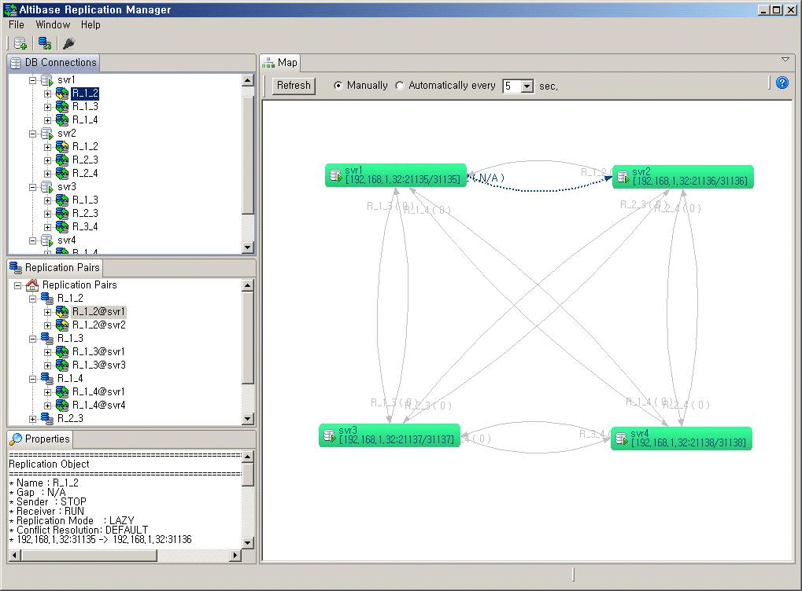
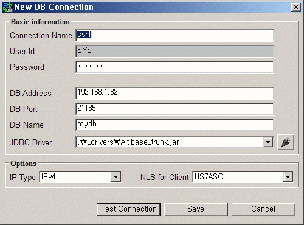
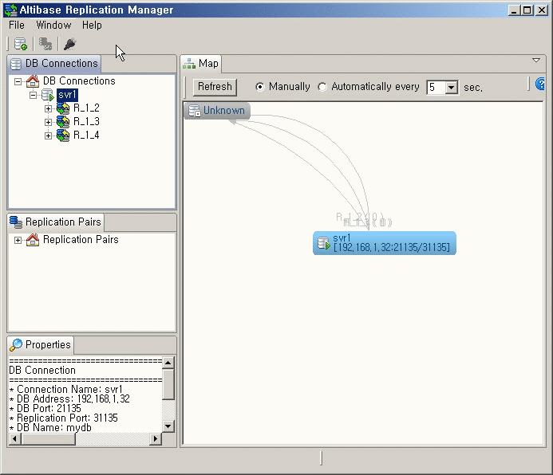

<!-- START doctoc generated TOC please keep comment here to allow auto update -->
<!-- DON'T EDIT THIS SECTION, INSTEAD RE-RUN doctoc TO UPDATE -->

- [Replication Manager User’s Manual](#replication-manager-users-manual)
  - [Preface](#preface)
      - [Audience](#audience)
      - [Organization](#organization)
      - [Related Documents](#related-documents)
      - [Altibase Welcomes Your Comments and Feedbacks](#altibase-welcomes-your-comments-and-feedbacks)
  - [1. Introduction to Replication Manager](#1-introduction-to-replication-manager)
    - [Overview of Replication Manager](#overview-of-replication-manager)
    - [Installing Replication Manager](#installing-replication-manager)
      - [System Requirements](#system-requirements)
      - [Installation Media](#installation-media)
      - [Installing and Uninstalling Replication Manager](#installing-and-uninstalling-replication-manager)
  - [2. Using Replication Manager](#2-using-replication-manager)
    - [Understanding the User Interface](#understanding-the-user-interface)
    - [Getting Started](#getting-started)
      - [Starting and Shutting Down](#starting-and-shutting-down)
      - [Connecting to Altibase](#connecting-to-altibase)
        - [Importing a JDBC Driver File](#importing-a-jdbc-driver-file)
        - [Adding a Database Connection](#adding-a-database-connection)
        - [Connecting to the Database](#connecting-to-the-database)
        - [Working with the Connected Database](#working-with-the-connected-database)
        - [Disconnecting from the Database](#disconnecting-from-the-database)
        - [Editing DB Connection Information](#editing-db-connection-information)
        - [Managing Extra Host IP](#managing-extra-host-ip)
        - [Removing a Database Connection](#removing-a-database-connection)
    - [Detailed Usage: Embedded Help](#detailed-usage-embedded-help)

<!-- END doctoc generated TOC please keep comment here to allow auto update -->

Alitbase® Tools & Utilities

Replication Manager User’s Manual
=================================

Altibase Tools & Utilities Replication Manager User’s Manual

Release 7.1

Copyright ⓒ 2001\~2020 Altibase Corp. All Rights Reserved.

This manual contains proprietary information of Altibase Corporation; it is provided under a license agreement containing restrictions on use and disclosure and is also protected by copyright patent and other intellectual property law. Reverse engineering of the software is prohibited. All trademarks, registered or otherwise, are the property of their respective owners.

**Altibase Corp**

10F, Daerung PostTower II, 306, Digital-ro, Guro-gu, Seoul 08378, Korea Telephone: +82-2-2082-1000 Fax: 82-2-2082-1099

Customer Service Portal: http://support.altibase.com/en/

Homepage: [[http://www.altibase.com](http://www.altibase.com/)]

Preface
----

#### Audience

This manual has been prepared for the following Altibase users:

-   Database administrators
-   Performance administrators
-   Database users
-   Application developers
-   Technical Supporters

It is recommended for those reading this manual possess the following background knowledge:

-   Basic knowledge in the use of computers, operating systems, and operating system utilities
-   Experience in using relational database and an understanding of database concepts
-   Computer programming experience
-   Experience in database server management, operating system management, or network administration

#### Organization

This document is an elementary guide for those unfamiliar with Replication Manager. The manual is organized as follows:

-   Chapter 1: Introduction to Replication Manager  
    This chapter provides an overview of Replication Manager and contains information on the prerequisites for installation. It also explains how to install, remove and update Replication Manager. 
    
-   Chapter 2: Using Replication Manager  
    This chapter provides newcomers with instructions on how to start and stop Replication Manager. It also outlines the steps used to connect to an Altibase database using Replication Manager. It contains information on how to use and manage Replication Manager.

#### Related Documents

For more detailed information, please refer to the following documents.

-   Installation Guide

-   Getting Started Guide

-   Administrator’s Manual

-   Replication Manual

-   Precompiler User’s Manual

-   API User’s Manual

-   Alitbase C Interface Manual

-   iSQL User’s Manual

-   Utilities Manual

-   General Reference

-   Error Message Reference

#### Altibase Welcomes Your Comments and Feedbacks

Please let us know what you like or dislike about our manuals. To help us with better future versions of our manuals, please tell us if there is any corrections or classifications that you would find useful.

Include the following information:

- The name and version of the manual that you are using
- Any comments about the manual
- Your name, address, and phone number

If you need immediate assistance regarding any errors, omissions, and other technical issues, please contact Altibase's Support Portal (http://altibase.com/support-center/en/).

Thank you. We always welcome your feedbacks and suggestions.

## 1. Introduction to Replication Manager

This chapter is intended to help all users who want to install Replication Manager and understand its features. It also provides an overview of Replication Manager. It contains the following sections:

-   Overview of Replication Manager
-   Installing and Updating Replication Manager

### Overview of Replication Manager

Replication Manager is a graphical tool for managing replication on Altibase. Altibase Database Administrators typically need to connect to all instances of Altibase on which replication objects are active. Using a Command Line Interface (CLI) such as iSQL, they need to jump around between console windows to perform replication tasks such as stopping, modifying, and starting target replication objects. This requires them to memorize the status of, and relationships between, replication objects, meaning that the burden of replication management grows exponentially as the number of replication objects increases linearly. Thanks to its Graphical User Interface (GUI), Replication Manager can help DBAs perform these tasks easily while visualizing all of their replication nodes in the same screen.

More detailed information about Replication Manager is provided in the embedded help (the help menu that is integral with Replication Manager). Because Replication Manager is evolving rapidly, this printed manual may not reflect the most recent changes in the software. It is recommended that the user perform online update in order to keep Replication Manager up to date, and that the user use the online help system in order to stay informed of the most recent changes. Information on how to update Replication Manager can be found in Section Online Update.

The major benefits of this tool are:

1.  It allows DBAs to work with multiple versions of Altibase (versions 4.3.9 or above) using the same program. 
2.  It allows DBAs to check the status of replication objects and the relationships between them at a glance. 
3.  It allows DBAs to manage replication objects with the click of a mouse.
4.  It allows DBAs to check the properties of replication objects and related objects. 
5.  It allows DBAs to monitor replication pairs and analyze their status, almost intuitively

### Installing Replication Manager

This chapter describes the essential prerequisites and system requirements for installing Replication Manager. It also explains how to install and uninstall Replication Manager.

-   System Requirements
-   Installation Media
-   Installing and Uninstalling Replication Manager

#### System Requirements

Before the installation, please check the system requirements to install Replication Manager correctly.  The minimum system requirements for Replication Manager are as follows:

1.  Computer Processor: 800MHz Pentium or better

2.  Computer Memory: 512MB or more

3.  Computer Disk: 50MB or more free spaces (in addition to space required for the JRE)

4.  Screen Resolution: 1024 x 768 pixels or higher

Replication Manager is a Java-based graphical client application, which means it relies on the client's hardware, operating system, and Java runtime environment. At this time, Replication Manager is now distributed in Linux-compatible packages.

| Package Name                                        | Operating System | Hardware   | JRE              | Windows System |
| --------------------------------------------------- | ---------------- | ---------- | ---------------- | -------------- |
| ReplicationManager-linux.gtk.x86.zip (JRE included) | Linux            | x86 32-bit | Java 6 or higher | GTK            |

Replication Manager is based on Eclipse RCP 3.6.2 technology (http://www.eclipse.org/). Therefore, this version of Replication Manager will work on any platform on which Eclipse RCP is supported. For additional information, please refer to the supported platform list at http://www.eclipse.org/eclipse/development/readme_eclipse_3.6.2.html. Replication Manager will be packaged for other platforms in the future if demand merits. 

#### Installation Media

Replication Manager can be obtained in the following two ways:

1.  Replication Manager is included in the client package that is provided to customers who purchase Altibase. 
2.  Replication Manager can be downloaded from Altibase’s Customer Support site(http://altibase.com/support-center/en/).

#### Installing and Uninstalling Replication Manager

Installing Replication Manager is very easy. Replication Manager is provided in ZIP file format. To install it, simply unzip the file in the desired directory.

Additionally, it is necessary to import an Altibase JDBC driver that is appropriate for the database to which one is connecting. Please refer to the section Importing a JDBC Driver File in Chapter 2 Using Replication.

Replication Manager is able to work with many different versions of Altibase simultaneously. 

However, it will be necessary to import multiple versions of the Altibase JDBC driver corresponding to the respective versions of Altibase on each of the replication nodes. If, for instance, the user must connect to two different Altibase databases, for example, versions 4.3.9.100 and 5.3.3.33 respectively, then the user is required to import two versions of the JDBC driver files into Replication Manager, and to give them different names, for example, "Altibase_4.3.9.100.jar" and "Altibase_5.3.3.33.jar". Uninstalling Replication Manager is also very easy. Simply delete the directory in which Replication Manager is installed.

## 2. Using Replication Manager

This chapter introduces the Replication Manager user interface, and additionally describes the basic usage of Replication Manager. It is organized as follows:

-   Understanding the User Interface
-   Getting Started
-   Detailed Usage: Embedded Help

### Understanding the User Interface

This chapter introduces the Replication Manager user interface, and additionally describes the basic usage of Replication Manager. It is organized as follows:

1.  DB Connections: This is the entry point for the program and a database-centric view that represents the relationship between databases and replication objects in a tree structure.
  
2.  Replication Pairs: This is a logical view that depicts replication objects in pairs. A group of two replication objects that have the same name and interact with each other is called a "Replication Pair".
  
3.  Map: This area graphically illustrates the physical layout and status of databases, replication objects, and the relationships therebetween.
  
4.  Properties: This area shows the properties for the currently selected object (e.g. DB connection or replication object).

These four panes are intended to give DBAs a variety of ways of visualizing the same databases and replication objects. For example, the "Map" pane provides a convenient way to check the replication gap at a glance, while "Replication Pairs" provides a convenient way of handling replication objects as pairs without having to think about the databases on which   they are working. So, these four panes complement each other. For example, when a replication object is selected in the "DB Connections" pane, the same replication object is also selected in the "Replication Pairs" and "Map" panes. In addition, the properties of the selected replication object will be displayed in the "Properties" pane. In other words, the three editable panes, "DB Connections", "Replication Pairs", and "Map", interact multidirectionally with each other, while the read-only pane, "Properties", receives information from the other three panes.

The "DB Connections" pane offers the following features:

-   It provides a view that can be used to register, unregister, and edit database connections. 
-   It shows meta information about connected databases, replication objects, and replication target tables in a tree structure for ease of navigation. 
-   It provides a convenient way to manage databases and replication objects, including starting, stopping, creating, and dropping replication objects

The "Replication Pairs" pane offers the following features:

-   It provides a convenient way to manage replication pairs without having to think about the underlying databases. 
-   It also provides a way to manage replication objects, including starting and stopping them.

The "Map" pane offers the following features:

-   It delivers the big picture of all registered databases and replication objects in an intuitive manner. 
-   It also provides a way to control databases and replication objects.

### Getting Started

This chapter provides basic instructions on how to start up and shut down Replication Manager. It also covers the steps to be taken to connect Replication Manager to an Altibase database. 

It is organized as follows: 

1. Starting and Shutting Down 
2. Connecting to Altibase

#### Starting and Shutting Down

To start Replication Manager, execute the "Replication Manager" application in Linux in the folder in which the application was installed. 

To shut down Replication Manager, select "File", then "Exit" from the top menu of Replication Manager, or click on the X in the upper-right corner. 

#### Connecting to Altibase 

This section describes, in the form of a tutorial, the basic steps that must be taken in order to connect to an Altibase database. The usual workflow when working with Altibase is as follows:

1.  Import a JDBC driver file to be used when connecting to an Altibase database. 
2.  Add a database connection. 
3.  Connect to the database. 
4.  Conduct replication administration tasks as required. 
5.  Disconnect from the database. 
6.  Edit DB connection information. 
7.  Manage Extra Host IP
8.  Remove the database if it is no longer needed.

Each procedure is conducted as described below.

##### Importing a JDBC Driver File

This section describes the steps involved in importing the appropriate version of the JDBC driver file into Replication Manager. It is assumed that an Altibase database has already been installed on the machine in question. (If an Altibase database has not been installed, it will be necessary to download the appropriate driver from http://atc.altibase.com/.) 

To import the JDBC driver, do the following: 

1. Click on the "JDBC driver manager" icon in the toolbar to open the "JDBC driver manager" dialog box.
  
2. In this dialog box, click on the "+" icon on the right to open the "Import JDBC driver file" dialog box, as shown below.
  

3. Select a JDBC driver file to import and give the file a name to be used in Replication Manager. The source file will be copied into the specified directory and renamed as specified. 
  
4. Close the "JDBC driver manager" dialog box.

Alternatively, users can also import a JDBC driver file when performing the "Adding a Database connection" task. 

##### Adding a Database Connection

1.  Open the "New DB Connection" dialog by clicking on the "New DB Connection" icon in the main toolbar, or by right-clicking on the "DB Connections icon" in the "DB Connections" panel and then left-clicking on the "New DB Connection" item in the context menu that appears.
2.  The "New DB Connection" dialog box shown below will appear. Fill in the input fields as described below.

-   General Information

Connection Name: Any name is acceptable, as long as it is unique in Replication Manager.

Password: The password for the SYS user for the database

DB Address: The IP address of the machine on which the database installed

DB Port: The port number with which to access the database

DB Name:  The name of the database

JDBC driver: To use the appropriate version of the JDBC driver file, select the correct imported JDBC driver in the combo box. If the required JDBC driver file has not been imported yet, please import a new JDBC driver by clicking on the "JDBC driver manager" icon.

-   Options

Options IP Address Type: Please select the appropriate IP address type. (Replication Manager supports both IPv4 and IPv6 addresses.)

NLS for Client: Choose the character set to use when translating data from the DBMS on the client side. (This option is not necessary when connecting to Altibase version 5.3.1 or higher.)

3. Click on the "Connection Test" button to ensure that the connection works as expected. 
4. Finally, click on the "Save" button.

##### Connecting to the Database

Once Altibase has been installed and the first two tasks have been completed, you are ready to connect to a database, as shown below:

To connect to a database, complete the following steps:

1.  Select the newly added database connection. Right-click on the newly added database to display the context menu, and then left-click on "Connect". This may take some time, depending on your environment. 
2.  When you are successfully connected, you will see the replication objects in the target database. 
3.  If the connection fails, a warning dialog appears, displaying some information that will be of help in successfully establishing a connection.

##### Working with the Connected Database

If you have followed the preceding steps successfully, you are ready to manage replication on the connected database.

##### Disconnecting from the Database

After finishing your work, it will be necessary to close the connection with the database. To close a connection with a database, select the target database connection. Open the context menu by right-clicking on the target database, and then choose "Disconnect" from the context menu.

##### Editing DB Connection Information

It will sometimes be necessary to edit database connection information. For example, it may be necessary to change the account that is used to establish the database connection. This is possible only when not connected to the database in question. There are six steps involved in editing database connection information.

1.  Select the database for which it is desired to change connection information. To open the context menu, right-click on the database, and then choose "Edit" from the context menu. 
2.  Make the required changes to the connection information. Click on the "Connection Test" button to ensure that the connection works as expected. 
3.  The dialog box shown below will appear if the connection test is successful. Click on the "OK".
4.  Finally, click on the "Save" button in the Edit dialog box. 

##### Managing Extra Host IP

If Altibase is installed on a device with multiple IP addresses and one of these addresses is used as a Remote Host IP when creating a replicaiton object in another Altibase, the IP is either the DB Address of the registered database connection or the Extra Host IP. It must be one.Otherwise, the relationship between the database and the replication object may not be properly displayed in the Map window.
This menu is available regard of you are connected to the database or not. Select the database you wish to register or delete the Extra Host IP. Right-click on the database to open the context menu and select the "Manage Extra Host IP" item.

##### Removing a Database Connection

When a registered database is no longer in use, you will probably want to remove it from the DB Connections panel. To remove a database, select the target database connection. Open the context menu by right-clicking on the database connection to be removed, and then left-click on "Remove" in the context menu.

### Detailed Usage: Embedded Help

As mentioned in the “Overview of Replication Manager” section, Replication Manager has its own help system called built-in help.

Click "Help" from the Replication Manager parent menu, then "Help Contents" to open the help.