<!-- START doctoc generated TOC please keep comment here to allow auto update -->
<!-- DON'T EDIT THIS SECTION, INSTEAD RE-RUN doctoc TO UPDATE -->

- [4. Data Manipulation Language](#4-data-manipulation-language)
  - [DELETE](#delete)
  - [INSERT](#insert)
  - [LOCK TABLE](#lock-table)
  - [SELECT](#select)
  - [UPDATE](#update)
  - [MOVE](#move)
  - [MERGE](#merge)
  - [ENQUEUE](#enqueue)
  - [DEQUEUE](#dequeue)
- [5. Data Control Language](#5-data-control-language)
  - [ALTER REPLICATION](#alter-replication)
  - [ALTER SESSION](#alter-session)
  - [ALTER SYSTEM](#alter-system)
  - [AUDIT](#audit)
  - [COMMIT](#commit)
  - [DELAUDIT](#delaudit)
  - [NOAUDIT](#noaudit)
  - [SAVEPOINT](#savepoint)
  - [ROLLBACK](#rollback)
  - [SET TRANSACTION](#set-transaction)
- [6. Set Operators](#6-set-operators)
  - [UNION](#union)
  - [UNION ALL](#union-all)
  - [INTERSECT](#intersect)
  - [MINUS](#minus)
  - [Order of Operations](#order-of-operations)

<!-- END doctoc generated TOC please keep comment here to allow auto update -->

## 4. Data Manipulation Language

This chapter explains each of the Data Manipulation Language (DML) statements that are  available in Altibase.

### DELETE 

#### Syntax

**delete ::=**

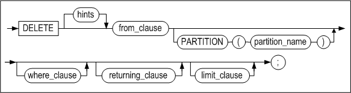

**from_clause ::=**


**where_clause ::=**


<a name="returning_clause"><a/>

**returning_clause ::=**


**limit_clause ::=**


**multiple_delete ::=**


tbl_ref ::=

#### Prerequisites

The SYS user, the owner of the schema containing the table, users having the DELETE ANY TABLE system privilege, and users having the DELETE privilege for the specified table can delete rows from tables using this statement.

If the user wishes to delete a record from a view, the user must have the same privileges on the base tables as above.

#### Description

This statement is used to remove records that meet the specified conditions, if any, from the specified table. It can also be used to delete data from a specified partition. 

The WHERE clause is identical to the WHERE clause of a statement. If it is omitted, all of the data in the table are deleted.

*user_name*

This is used to specify the name of the owner of the table from which to delete records. If omitted, Altibase will assume that the table belongs to the schema of the user connected via the current session.

*tbl_name*

This is used to specify the name of the table containting the records to delete.

*view_name*

This specifies the name of the view from which a record is to be deleted.

*subquery*

This specifies the view from which a record is to be deleted as a subquery.

*returning_clause*

This retrieves records affected by DML statements. 

*expr*

Each expr must be a column name affected by DML statements or a data expression compatible with column types. 

*INTO*

This commands modified record values to be respectively stored as variable_name variables. 

*variable_name*

Each variable_name is either a host variable or a PSM variable in which queried expr values are to be stored. Unless using record type variables, the number of variables must equal the number of expr of the expr list. 

Host variable or PSM variable types must be compatible with relevant expr types. 

> Note: ':' must be prefixed to variable names for iSQL

Limitations of the returning clause:

- For UPDATE, DELETE and INSERT statements, aggregate functions are not allowed in each expr. 
- This clause can only be used for tables. 
- LOB types cannot be queried with this clause. 
- Aliases or subqueries are not allowed in expr. 
- Sequences are not allowed in expr.

> Note: Multiple rows can be simultaneously returned as collection variables using the BULK COLLECT clause within PSM. For further information, refer to the Stored Procedures Manual.

*multiple_delete*

The following example deletes records that meet the join condition from the table specified in tbl_name.

Limitations of the multiple delete clause:

- limit_clause and returning_clause cannot be used.
- dictionary table cannot be used.
- full outer join canno be used.

#### HINTS Options

Please refer to "Hint Syntax" and "Hint List" in the Chapter 2 for more detailed information.

#### Example

##### Deleting Rows

\<Query\>Delete all data from a table

```
DELETE FROM orders;
```

\<Query\> Delete partition P2 from Table T1.

```
DELETE FROM T1 PARTITION (P2);
```

\<Query\> Delete the orders the employee "William" received.

```
DELETE
FROM orders
  WHERE eno = (SELECT eno FROM employees
                WHERE e_firstname = 'William');
```


##### Deleting Rows from Join Views

\<Query\> Create a view joining the two tables, employees and departments, and then delete employees belonging to the department 'BUSINESS DEPT'. Data is deleted from the table employees and this is affirmed by comparing the number of rows of the table employees before and after data is deleted.

```
iSQL> CREATE VIEW simple_emp AS
        SELECT e.eno, e.e_lastname, e.salary, d.dname
          FROM employees e, departments d
          WHERE e.dno = d.dno;
Create success.
iSQL> select * from simple_emp;
ENO         E_LASTNAME            SALARY      DNAME
-----------------------------------------------------------------------------------
3           Kobain                2000        RESEARCH DEVELOPMENT DEPT 1
16          Chen                  2300        RESEARCH DEVELOPMENT DEPT 1
6           Momoi                 1700        RESEARCH DEVELOPMENT DEPT 2
13          Jones                 980         RESEARCH DEVELOPMENT DEPT 2
10          Bae                   4000        SOLUTION DEVELOPMENT DEPT
11          Liu                   2750        SOLUTION DEVELOPMENT DEPT
14          Miura                 2003        SOLUTION DEVELOPMENT DEPT
15          Davenport             1000        SOLUTION DEVELOPMENT DEPT
17          Fubuki                1400        QUALITY ASSURANCE DEPT
4           Foster                1800        CUSTOMERS SUPPORT DEPT
1           Moon                              PRESALES DEPT
5           Ghorbani              2500        PRESALES DEPT
8           Wang                              MARKETING DEPT
9           Diaz                  1200        MARKETING DEPT
18          Huxley                1900        MARKETING DEPT
7           Fleischer             500         BUSINESS DEPT
12          Hammond               1890        BUSINESS DEPT
19          Marquez               1800        BUSINESS DEPT
20          Blake                             BUSINESS DEPT
19 rows selected.

iSQL> select count(*) from employees;
COUNT
-----------------------
20
1 row selected.

iSQL> DELETE FROM simple_emp WHERE dname='BUSINESS DEPT';
4 rows deleted.

iSQL> select count(*) from employees;
COUNT
-----------------------
16
1 row selected.
```


##### Deleting Rows using the RETURNING clause

\<Query\> The following example returns the values of the deleted rows as output bind variables :v1, :v2.

```
iSQL> create table employees ( eno integer, ename varchar(20));
Create success.
 
iSQL> var v1 output integer;
iSQL> var v2 output varchar(30);

iSQL> insert into employees values (1, 'jake');
iSQL> insert into employees values (2, 'nikita');
iSQL> insert into employees values (3, 'dana');

iSQL> prepare delete from employees where eno=2 return eno, ename into :v1, :v2;
1 row deleted.

iSQL> print var
[ HOST VARIABLE ]
-------------------------------------------------------
NAME                 TYPE                 VALUE
-------------------------------------------------------
V1                   INTEGER              2
V2                   VARCHAR(30)          nikita

```


### INSERT 

#### Syntax

**insert ::=**


**single_table_insert ::=**

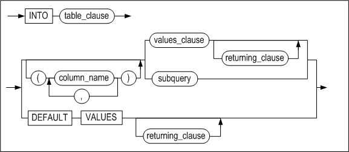

[returning_clause ::=](#returning_clause),
[subquery ::=](#subquery)

**table_clause ::=**

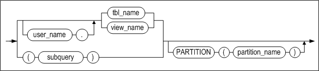

[subquery ::=](#subquery)

**multi_table_insert ::=**


[subquery ::=](#subquery)

**values_clause ::=**

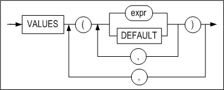

**wait_clause ::=**


#### Prerequisites

The SYS user, the owner of the schema containing the table, users having the INSERT ANY TABLE system privilege, and users having the INSERT privilege for the specified table can insert rows into tables using this statement.

If the user wishes to insert a record into a view, the user must have the same privileges on the base tables as above.

#### Description

The INSERT statement is used to insert a new record into the specified table or partition. If an index has been defined for the table, the index data will also be modified.

*user_name*

This is used to specify the name of the owner of the table into which the record(s) are to be inserted. If omitted, Altibase will assume that the table belongs to the schema of the user connected via the current session.

*tbl_name*

This is used to specify the name of the table into which the record(s) are to be inserted.

*view_name*

This specifies the name of the view into which a record is to be inserted.

*subquery*

This specifies the view into which a record is to be inserted as a subquery.

*NULL*

When the values to be inserted are provided only for some columns, but not for others, NULL is inserted into every column for which an insert value is not provided and which does not have a set DEFAULT value. (The default value for a TIMESTAMP column is the system time at the time that the INSERT operation occurred. Therefore, if no insert value is provided for a TIMESTAMP column, the system time, rather than NULL, is inserted into that column.) 

NULL values can also be inserted by explicitly specifying NULL in the VALUES clause

*multi_table_insert Clause*

This clause is used to insert a row of the result set generated from a subquery into one or more tables. If an expression exists in the SELECT list of the subquery, the expression must be given an alias to enable it to be referenced from the VALUES clause.

*DEFAULT*

If the DEFAULT keyword is specified in the VALUES clause, the previously set default value will be inserted into the corresponding column. To insert the default values for all columns, use the DEFAULT VALUES clause. 

If the DEFAULT keyword is specified for a timestamp column, the system time will be inserted.

*INSERT \~ SELECT*

This type of query is used to insert the results of execution of a SELECT query into a table. The table from which the results were retrieved can be the same table as the table into which the records are to be inserted. The number of columns to be inserted must be the same as the number of columns in the SELECT statement, and corresponding columns must have compatible data types.

*returning_clause*

Please refer to the returning_clause of the DELETE statement.

*wait_clause*

Refer to the FOR UPDATE clause of the SELECT statement for in-depth information on wait_clause.

#### HINTS Options

Please refer to "Hint Syntax" and "Hint List" for more detailed information.

#### Precautions

- When entering data with an INSERT statement, please keep the following points in mind: 
  - The number of columns that are specified must be the same as the number of values to be inserted, and the data types must be compatible. 
  - When a partition is specified, it is impossible to insert values that do not match the partition conditions. 
  - It is permissible to insert NULL values when no default value has been specified for a column, as long as the column does not have the NOT NULL constraint
  - INSERT can fail due to the CHECK constraint.
  
- Direct-Path INSERT has the following limitations:
  - The destination table must be a disk table, and it cannot have any LOB columns or indexes. 
  - The destination table can't be a replication target table. 
  - The destination table can't have any triggers or referential integrity constraints defined for it. 
  - The target table cannot have the CHECK constraint.

#### Examples

##### Inserting Simple Data

\<Query\> Inser customer information named "Louise Leroux".

```
INSERT INTO customers VALUES ( '25', 'Leroux', 'Louise', 'student',
'025282222', 'F', '0101', 150763, '#3 825 - 17th Ave SW Calgary Canada'); 
1 row inserted.
```

\<Query\> Insert only the number, name, and gender of information of the customer "Rosalia Jung".

```
INSERT INTO employees(eno, e_firstname, e_lastname, sex) VALUES(21, 'Rosalia', 'Jung', 'F');
1 row inserted.
```

\<Query\> Inser multiple rows at once.

```
INSERT INTO GOODS VALUES('Y111100001', 'YY-300' , 'AC0001', 1000 , 78000),
('Y111100002', 'YY-310' , 'DD0001', 100 , 98000), ('Y111100003', 'YY-H5000',
'AC0002', 780 , 35800);

3 rows inserted.
```


##### Inserting Complicated Data

\<Query\> Copy the customer number and order date for all delayed orders from the orders table to the delayed_processing table.

```
iSQL> CREATE TABLE delayed_processing(
  cno CHAR(14), order_date DATE);
Create success.
iSQL> INSERT INTO delayed_processing
  SELECT cno, order_date
  FROM orders
  WHERE PROCESSING = 'D';
1 row inserted.
```


##### Inserting Partitioned Data

```
CREATE TABLE T1 ( I1 INTEGER, I2 INTEGER )
PARTITION BY RANGE ( I1 )
( 
	PARTITION P1 VALUES LESS THAN ( 300 ),
	PARTITION P2 VALUES LESS THAN ( 400 ),
	PARTITION P3 VALUES DEFAULT 
) TABLESPACE SYS_TBS_DISK_DATA;

INSERT INTO T1 PARTITION ( P1 ) VALUES ( 123, 456 );
1 row inserted.
```


##### Inserting Data using the Direct-Path INSERT Hint

\<Query\> Copy all data from table T1 to table T2 using the Direct-Path INSERT hint.

```
INSERT /*+ APPEND */ INTO T2 SELECT * FROM T1;
```


##### Multi-table INSERT statement

\<Query\> Multiple rows are inserted into a single table at once

```
CREATE TABLE t (
pid INTEGER,
fname VARCHAR(20),
lname VARCHAR(25));

INSERT INTO t VALUES (1, 'Dan', 'Morgan'), (2, 'Jeremiah', 'Wilton'), (3, 'Helen', 'Lofstrom');
```

\<Query\> The result of a subquery is inserted into multiple tables.

```
CREATE TABLE sal_history (
eno INTEGER,
join_date DATE,
salary NUMBER(10,2));

CREATE TABLE dno_history (
eno INTEGER,
dno SMALLINT,
chg_date DATE);

INSERT ALL
INTO sal_history VALUES(emp_id,join_date,salary)
INTO dno_history VALUES(emp_id,dept_id,sysdate)
SELECT eno EMP_ID, join_date, salary, dno DEPT_ID
FROM employees;
```


##### Inserting Data using the RETURNING Clause

\<Query\>  The following example returns the input row values as output bind variables :v1, :v2. 

```
iSQL> create table employees ( eno integer, ename varchar(20));
Create success.
 
iSQL> var v1 output integer;
iSQL> var v2 output varchar(30);

iSQL> prepare insert into employees values (1, 'jake') return eno, ename into :v1, :v2;
1 row inserted.

iSQL> print var
[ HOST VARIABLE ]
-------------------------------------------------------
NAME                 TYPE                 VALUE
-------------------------------------------------------
V1                   INTEGER              1
V2                   VARCHAR(30)          jake
```


##### Inserting Data into Join Views

\<Query\> Create a view joining the two tables, employees and departments, and insert records.

```
iSQL> CREATE VIEW simple_emp AS
         SELECT eno, e_lastname, e_firstname, emp.dno dno
         FROM employees emp, departments dept
         WHERE emp.dno = dept.dno;
Create success.
iSQL> select * from simple_emp;
ENO         E_LASTNAME            E_FIRSTNAME           DNO
-------------------------------------------------------------------------
3           Kobain                Ken                   1001
16          Chen                  Wei-Wei               1001
.
.
.
20          Blake                 William               4002
19 rows selected.

iSQL> INSERT INTO simple_emp(eno, e_lastname, e_firstname, dno) VALUES(50, 'Kim', 'Yong', 1001);
1 row inserted.
iSQL> select * from simple_emp;
ENO         E_LASTNAME            E_FIRSTNAME           DNO
-------------------------------------------------------------------------
3           Kobain                Ken                   1001
16          Chen                  Wei-Wei               1001
50          Kim                   Yong                  1001
.
.
.
20          Blake                 William               4002
20 rows selected.
```


### LOCK TABLE

#### Syntax

**lock_table ::=**


#### Prerequisites

The SYS user, the owner of the schema containing the table, and users having the LOCK ANY TABLE system privilege can execute this statement.

#### Description

This statement is used to lock a table in a lock_mode. Once a table is locked, the locked table remains until the associated transaction is committed or rolled back.

*user_name*

This is used to specify the name of the owner of the table to be locked. If omitted, Altibase will assume that the table belongs to the schema of the user connected via the current session.

*tbl_name*

This is used to specify the name of the table to lock.

*partition_name*

This is used to specify the name of the partition to be locked.

If the partition name is specified, lock mode is applied to the partition and ROW SHAR or ROW EXCLUSIVE is applied to the table

|      Lock Mode      |   Partition Apply   |  Table Apply  |
| :-----------------: | :-----------------: | :-----------: |
|      ROW SHARE      |      ROW SHARE      |   ROW SHARE   |
|    SHARE UPDATE     |    SHARE UPDATE     |   ROW SHARE   |
|    ROW EXCLUSIVE    |    ROW EXCLUSIVE    | ROW EXCLUSIVE |
| SHARE ROW EXCLUSIVE | SHARE ROW EXCLUSIVE | ROW EXCLUSIVE |
|        SHARE        |        SHARE        |   ROW SHARE   |
|      EXCLUSIVE      |      EXCLUSIVE      | ROW EXCLUSIVE |

*lock_mode*

One of the following lock modes should be specified when executing the lock on a table:

- ROW SHARE  
  In ROW SHARE mode, concurrent access of other transactions on a locked table set by this mode is allowed. However, locking a table with the EXCLUSIVE Mode, which is for the exclusive access of other users, is prohibited.
- SHARE UPDATE  
  This mode is a lock mode with an identical function with that of the ROW SHARE mode.
- ROW EXCLUSIVE  
  The concurrent access of other transactions on a locked table set by this mode is allowed. However, locking a table with the EXCLUSIVE or SHARE mode, which is for the exclusive access of other users, is firmly prohibited. The lock is automatically obtained when updating, insert, or deleting data
- SHARE ROW EXCLUSIVE  
  The SHARE ROW EXCLUSIVE is used to view an entire table while permitting others to view the table. However, locking a table with the SHARE mode for an exclusive access of other users is prohibited.
- SHARE  
  In the SHARE mode, other transactions can view a table locked by this mode, but updating it is prohibited.
- EXCLUSIVE  
  The EXCLUSVE mode allows the current transaction to view or update a table which is locked by this mode, but other transactions cannot be able to view nor update.

*WAIT \| NOWAIT*

This clause is used to specify whether to wait until a lock has been obtained. It can be omitted, in which case the wait to obtain a lock on an individual row will continue for an unlimited time.

- WAIT n  
  This option specifies that a transaction is to wait for n seconds to obtain a lock on the row. If the row cannot be locked during this time, an error will be raised.
- NOWAIT  
  The NOWAIT option specifies that a transaction is not to wait to obtain a lock if it is not immediately possible. In this case, Altibase returns an error indicating that the specified table has already been locked by another user.

*UNTIL NEXT DDL*

The UNTIL NEXT DDL statement enables an auto commit immediately before DDL is executed if the DDL is performed and the session is in the NON-AUTOCOMMIT mode. 

However, if the EXCLUSIVE mode is selected in the lock_mode, the auto commit is not executed before the DDL is performed. This function can be used only once per a transaction.

<table style="width: 634px;">
<tbody>
<tr>
<td style="width: 236px;" rowspan="2">
<p><strong>SQL Statement</strong></p>
</td>
<td style="width: 87px;" rowspan="2">
<p><strong>Mode of Table Lock</strong></p>
</td>
<td style="width: 363px;" colspan="5">
<p><strong>Lock Modes Permitted?</strong></p>
</td>
</tr>
<tr>
<td style="width: 48px; text-align: center;">
<p><strong>IS</strong></p>
</td>
<td style="width: 71px; text-align: center;">
<p><strong>IX</strong></p>
</td>
<td style="width: 76px; text-align: center;">
<p><strong>S</strong></p>
</td>
<td style="width: 77px; text-align: center;">
<p><strong>SIX</strong></p>
</td>
<td style="width: 91px; text-align: center;">
<p><strong>X</strong></p>
</td>
</tr>
<tr>
<td style="width: 236px;">
<p>SELECT &hellip; FROM <em>tbl_name</em> &hellip;</p>
</td>
<td style="width: 87px;">
<p>IS</p>
</td>
<td style="width: 48px;">
<p>Y(IS)</p>
</td>
<td style="width: 71px;">
<p>Y(IX)</p>
</td>
<td style="width: 76px;">
<p>Y(S)</p>
</td>
<td style="width: 77px;">
<p>Y(SIX)</p>
</td>
<td style="width: 91px;">
<p>N(X)</p>
</td>
</tr>
<tr>
<td style="width: 236px;">
<p>INSERT INTO <em>tbl_name</em> &hellip;</p>
</td>
<td style="width: 87px;">
<p>IX</p>
</td>
<td style="width: 48px;">
<p>Y(IX)</p>
</td>
<td style="width: 71px;">
<p>Y(IX)</p>
</td>
<td style="width: 76px;">
<p>N(SIX)</p>
</td>
<td style="width: 77px;">
<p>N(SIX)</p>
</td>
<td style="width: 91px;">
<p>N(X)</p>
</td>
</tr>
<tr>
<td style="width: 236px;">
<p>UPDATE tbl_name &hellip;</p>
</td>
<td style="width: 87px;">
<p>IX</p>
</td>
<td style="width: 48px;">
<p>Y*(IX)</p>
</td>
<td style="width: 71px;">
<p>Y*(IX)</p>
</td>
<td style="width: 76px;">
<p>N(SIX)</p>
</td>
<td style="width: 77px;">
<p>N(SIX)</p>
</td>
<td style="width: 91px;">
<p>N(X)</p>
</td>
</tr>
<tr>
<td style="width: 236px;">
<p>DELETE FROM <em>tbl_name</em> &hellip;</p>
</td>
<td style="width: 87px;">
<p>IX</p>
</td>
<td style="width: 48px;">
<p>Y*(IX)</p>
</td>
<td style="width: 71px;">
<p>Y*(IX)</p>
</td>
<td style="width: 76px;">
<p>N(SIX)</p>
</td>
<td style="width: 77px;">
<p>N(SIX)</p>
</td>
<td style="width: 91px;">
<p>N(X)</p>
</td>
</tr>
<tr>
<td style="width: 236px;">
<p>SELECT &hellip; FROM <em>tbl_name</em> FOR UPDATE &hellip;</p>
</td>
<td style="width: 87px;">
<p>IS</p>
</td>
<td style="width: 48px;">
<p>Y*(IX)</p>
</td>
<td style="width: 71px;">
<p>Y*(IX)</p>
</td>
<td style="width: 76px;">
<p>Y*(S)</p>
</td>
<td style="width: 77px;">
<p>Y*(SIX)</p>
</td>
<td style="width: 91px;">
<p>N(X)</p>
</td>
</tr>
<tr>
<td style="width: 236px;">
<p>LOCK TABLE <em>tbl_name</em> IN ROW SHARE MODE</p>
</td>
<td style="width: 87px;">
<p>IS</p>
</td>
<td style="width: 48px;">
<p>Y(IS)</p>
</td>
<td style="width: 71px;">
<p>Y(IX)</p>
</td>
<td style="width: 76px;">
<p>Y(S)</p>
</td>
<td style="width: 77px;">
<p>Y(SIX)</p>
</td>
<td style="width: 91px;">
<p>N(X)</p>
</td>
</tr>
<tr>
<td style="width: 236px;">
<p>LOCK TABLE <em>tbl_name</em> IN ROW EXCLUSIVE MODE</p>
</td>
<td style="width: 87px;">
<p>IX</p>
</td>
<td style="width: 48px;">
<p>Y(IX)</p>
</td>
<td style="width: 71px;">
<p>Y(IX)</p>
</td>
<td style="width: 76px;">
<p>N(SIX)</p>
</td>
<td style="width: 77px;">
<p>N(SIX)</p>
</td>
<td style="width: 91px;">
<p>N(X)</p>
</td>
</tr>
<tr>
<td style="width: 236px;">
<p>LOCK TABLE <em>tbl_name</em> IN SHARE MODE</p>
</td>
<td style="width: 87px;">
<p>S</p>
</td>
<td style="width: 48px;">
<p>Y(S)</p>
</td>
<td style="width: 71px;">
<p>N(SIX)</p>
</td>
<td style="width: 76px;">
<p>Y(S)</p>
</td>
<td style="width: 77px;">
<p>N(SIX)</p>
</td>
<td style="width: 91px;">
<p>N(X)</p>
</td>
</tr>
<tr>
<td style="width: 236px;">
<p>LOCK TABLE <em>tbl_name</em> IN SHARE ROW EXCLUSIVE MODE</p>
</td>
<td style="width: 87px;">
<p>SIX</p>
</td>
<td style="width: 48px;">
<p>Y(SIX)</p>
</td>
<td style="width: 71px;">
<p>N(SIX)</p>
</td>
<td style="width: 76px;">
<p>N(SIX)</p>
</td>
<td style="width: 77px;">
<p>N(SIX)</p>
</td>
<td style="width: 91px;">
<p>N(X)</p>
</td>
</tr>
<tr>
<td style="width: 236px;">
<p>LOCK TABLE <em>tbl_name</em> IN EXCLUSIVE MODE</p>
</td>
<td style="width: 87px;">
<p>X</p>
</td>
<td style="width: 48px;">
<p>N(X)</p>
</td>
<td style="width: 71px;">
<p>N(X)</p>
</td>
<td style="width: 76px;">
<p>N(X)</p>
</td>
<td style="width: 77px;">
<p>N(X)</p>
</td>
<td style="width: 91px;">
<p>N(X)</p>
</td>
</tr>
<tr>
<td style="width: 686px;" colspan="7">
<p>IS: row share (Intent share lock)</p>
<p>IX: row exclusive (Intent exclusive lock)</p>
<p>S: share</p>
<p>SIX: share row exclusive (Share with Intent exclusive lock)</p>
<p>X: exclusive</p>
<p>* Y: If a row lock conflict is not caused by another transaction, the transaction can acquire a lock. Otherwise, a wait occurs.</p>
<p>&nbsp;</p>
<p><strong>The lock type shown in parentheses is:</strong></p>
<p>1. If the current lock mode switch is allowed by another transaction(Y), the lock type currently held is switched to the type in parentheses.</p>
<p>2. If the current lock mode switch is not allowed by another transaction (N), the lock type can be switched to the type in parentheses only when the transaction taht is currently acquiring the lcok acquires a new lock.</p>
</td>
</tr>
</tbody>
</table>

[Table 4‑1] Summary of Table Locks

#### Examples

The following example shows how Altibase manages data concurrency, integrity, and consistency when using LOCK TABLE and SELECT statements.

| Transaction A                                                | Time Point | Transaction B                                                |
| ------------------------------------------------------------ | ---------- | ------------------------------------------------------------ |
| iSQL\> AUTOCOMMIT OFF; Set autocommit off success.           |            | iSQL\> AUTOCOMMIT OFF; Set autocommit off success.           |
|                                                              | 1          | (request X lock on employees) iSQL\> LOCK TABLE employees IN EXCLUSIVE MODE; Command execute success. (acquire X lock on employees) |
| iSQL\> DROP TABLE employees; [ERR-11170: The transaction has exceeded the lock timeout specified by the user.] | 2          |                                                              |
|                                                              | 3          | iSQL\> UPDATE employees SET salary = 2500000 WHERE eno = 15; 1 row updated. |
| (request S lock on employees) iSQL\> LOCK TABLE employees IN SHARE MODE; (the request conflicts with the X lock already held by transaction B) wait wait wait | 4          |                                                              |
|                                                              | 5          | iSQL\> COMMIT; Commit success. (release X lock on employees) |
| (resume) Lock success. (acquire S lock on employees) iSQL\> SELECT salary FROM employees WHERE eno = 15; SALARY -------------- 2500 1 row selected. (It can be seen that the data have been committed.) | 6          |                                                              |
| iSQL\> ROLLBACK; Rollback success. (release S lock on employees) | 7          |                                                              |
| iSQL\> LOCK TABLE employees IN EXCLUSIVE MODE; Lock success. (acquire X lock on employees) | 8          |                                                              |
|                                                              |            | iSQL\> SELECT SALARY FROM employees WHERE eno = 15; wait wait wait |
| iSQL\> UPDATE employees SET eno = 30 WHERE eno = 15; 1 row updated. | 10         |                                                              |
| iSQL\> COMMIT; Commit success. (release X loc on employees)  | 11         |                                                              |
|                                                              | 12         | (resume) SALARY -------------- 2500 1 row selected.          |

### SELECT 

#### Syntax

**select ::=**


[for_update_clause
::=](#for_update_clause)

**with_clause ::=**


<a name="subquery"><a/>

**subquery ::=**

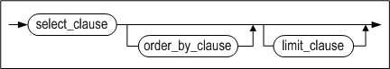

[limit_clause ::=](#limit_clause)

**select_clause ::=**


[hierarchical_query_clause ::=](#hierarchical_query_clause), [group_by_clause
::=](#group_by_clause)

**select_list ::=**


<a name="tbl_reference"><a/>

**tbl_reference ::=**


[joined_table ::=](#joined_table)

<a name="single_table"><a/>

**single_table ::=**


**pivot_clause ::=**


<a name="pivot_for_clause"><a/>

**pivot_for_clause ::=**


**pivot_in_clause ::=**

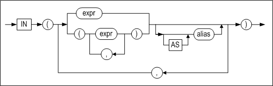

**unpivot_clause ::=**

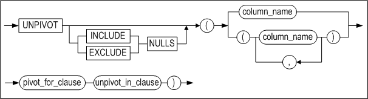

[pivot_for_clause ::=](#pivot_for_clause)

**unpivot_in_clause ::=**

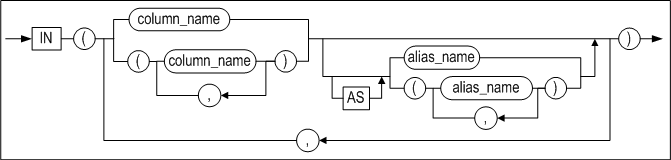

<a name="joined_table"><a/>

**joined_table ::=**


[tbl_reference ::=](#tbl_reference), [single_table ::=](#single_table),

**join_type ::=**


**apply_type ::=**

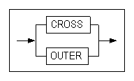

<a name="where_clause"><a/>

**where_clause ::=**


<a name="hierarchical_query_clause"><a/>

**hierarchical_query_clause ::=**


<a name="group_by_clause"><a/>

**group_by_clause ::=**


**rollup_cube_clause ::=**


**grouping_sets_clause ::=**

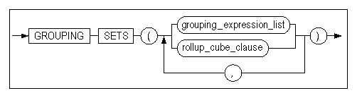

**grouping_expression_list ::=**


**expression_list ::=**


**order_by_clause ::=**


<a name="imit_clause"><a/>

**limit_clause ::=**


<a name="for_update_clause"><a/>

**for_update_clause ::=**


#### Prerequisites

The SYS user, the owner of the schema containing the table, users having the SELECT ANY TABLE system privilege, and users having the SELECT privilege for the specified table can select data tables using this statement.

#### Description

A SELECT statement or subquery is used to retrieve data from one or more tables or views.

*with_clause*

The WITH query_name clause bestows a name to the subquery that follows the AS clause. The name bestowed to the subquery is referenced from various positions within the main query. 

Altibase processes with_clause as an inline view or a temporary table to optimize its performance results. In general, the WITH query_name clause gives a name to the subquery that follows the AS clause. The name given to the subquery is referenced from various positions within the main query. 

However, in a recursive WITH clause (hereinafter, called 'recursive with' or 'a recursive query'), column alias should be specified followed by the query_name and the query using a set operator can be repeatedly executed within a subquery. In the subquery, two queries exist on the basis of a set operator, the former query is the main query(a reference query), and the latter query becomes a recursive query. The recursive query can output the maximum value(default value:1000) specified in the RECURSION_LEVEL_MAXIMUM property. Refer to the Altibase Properties in General Reference manual for in-depth information. 

The user can specify this clause in the main query and most types of subqueries.

- Restrictions:
  - Only one with_clause can be specified for each SQL statement. Query_name is not allowed in the subquery that recursively defines itself. When defining multiple query names within the win_clause, however, a previously defined query name is allowed in the following subquery.
  - The position of a main query and a recursive query should not be modified within the RECURSIVE WITH clause. Moreover, the query_name should be explicitly referenced. However, aggregate functions, DISTINCT keywords, and GROUP BY clause cannot be used in the recursive query.
  - A subquery referencing the query_name cannot be used in the main query in the RECURSIVE WITH clause.
  - A view referencing the query_name or a table located in the right of an outer join cannot be used in a recursive query in the RECURSIVE WITH clause.

*TOP (expr)*

This clause specifies the number of rows to be returned from the query result set. Only integers are valid for expr.

*select_list Clause*

The DISTINCT keyword is used to specify that duplicate records are to be removed from the result set before it is returned.

If a SELECT statement contains a GROUP BY clause, then only constants, aggregate functions, the expressions in the GROUP BY clause, and expressions that are combinations of the foregoing can be specified in the SELECT list.

If the SELECT list is composed of expressions or constants that do not include columns, the FROM clause can be omitted.

SThe specification of only the asterisk symbol(*) in the SELECT list represents every column of every table and view in the FROM clause. What the asterisk symbol represents does not change, even if it is specified with a column or expression.

*FROM Clause*

An alias cannot be used more than once in a FROM clause. When the same table is used more than once in a FROM clause, different aliases must be specified.

A maximum of 32 different tables or views can be cited in a FROM clause.

- *OUTER JOIN*

  This is an extended SQL form of JOIN for processing data that do not satisfy the join condition. Unlike an (INNER) JOIN, which only returns records having corresponding key values from two tables, an OUTER JOIN returns all of the data from one of the two tables. When a record in the returned result set consists of a row from one table that does not have a matching row from the other table, empty columns are filled with NULL values.
  
- *In-line Views*

  A subquery in a FROM clause is called an “inline view”.

- *Lateral View*

  An inline view in a FROM clause cannot reference another object in the FROM clause or a query of a higher level. Yet, if the inline view in the FROM clause is defined as a lateral view, it becomes possible to reference objects outside the inline view.
  
  To define an inline view as a lateral view, the LATERAL or APPLY keyword must be specified in front of the inline view. However, a lateral view can only reference objects that are specified on the left side of the lateral view. Even if an inline view is defined as a lateral view, if the lateral view does not reference an external object, the Altibase server processes the lateral view as a normal inline view.

  The APPLY keyword defines an inline view as a lateral view and also joins the object on the left of the APPLY keyword with the lateral view. Unlike a normal join statement which specifies join conditions after the ON keyword, join statements using the APPLY keyword do not need join conditions.
  
  The following join types can be specified using the APPLY keyword.
  - CROSS APPLY specifies an inner join operation between the left object and the lateral view.
  - OUTER APPLY specifies a left outer join operation between the left object and the lateral view. 
  
  > An error message is returned if a lateral view is used in the following circumstances.
  >
> - If a fixed table is referenced in a lateral view. 
  > - If the PIVOT clause or the UNPIVOT clause is used in a lateral view. 
  > - If an object on the right of a lateral view is referenced within the lateral view. 
  > - If a right outer join or full outer join operation is performed between an object referenced by a lateral view and the lateral view. 
> - If the LATERAL keyword and the APPLY keyword are used together. 
  > - If the APPLY keyword and the ON clause are used together.

- *pivot_clause*

  pivot_clause simultaneously performs a data aggregation operation and rearranges the data in separate rows into columns. This presents the data in a format that is easier to read than when using two columns in a GROUP BY clause.
  
  For convenience, pivot_clause is usually used with inline views to avoid the difficulty of naming certain columns that result from a large number of column outputs or transformation operations. 

  pivot_clause performs the following steps:
  
  1. pivot_clause first performs a grouping operation, just like a GROUP BY clause. The results are grouped according to all of the columns that are not referred to in pivot_clause, and according to the values specified in pivot_in_clause.
2. pivot_clause then arranges the resulting grouping columns and aggregate values in cross-tabular form.
  
- *pivot_for_clause*

  pivot_for_clause displays the name of the corresponding column when the value specified for pivot_in_clause is changed to columnar format. 
  
- *pivot_in_clause*

  pivot_in_clause is used to specify values found in the columns specified in pivot_for_clause. These values will be used as column names in the pivot operation.
  
- *unpivot_clause*

  unpivot_clause returns column data as rows. 

  The INCLUDE|EXCLUDE NULLS option specifies whether or not to allow columns that are created with the UNPIVOT clause to contain NULL values. EXCLUDE NULL returns results with no NULLS; on omission, this is the default value. 
  
  column_name specifies the names of the columns that contain the values that correspond to the column to be generated with the UNPIVOT clause. 

  The number of columns used in pivot_for_clause and pivot_in_clause must be the same as the number of columns used in unpivot_clause. The number of aliases must also be the same.

```
unpivot ( ( column, column ) for ( column, column ) in ( ( column, column ) as (
column, column ) ) );
```

The following statement does not support different numbers of columns.

```
unpivot ( ( column, column ) for column in ( ( column, column ) as column ) );
```


- *Table Function*

  The Table function outputs results by converting into a table format when the associative array type or record type are used in the user defined-function.

WHERE condition clause*

For information about the use of conditions in the WHERE clause, please refer to Chapter 8: SQL Conditions

*Hierarchical Query clause*

A hierarchical query is a query statement that outputs data in a hierarchical manner. If a table contains data with a parent-child relationship, this query statement outputs the parent-child relationship in a hierarchical order. For root rows that satisfy a given search condition, a hierarchical condition is evaluated to retrieve rows among the rows and its child rows.

If hierarchical data is queried using the ORDER BY clause or the GROUP BY clause, caution is required as the hierarchical order specified by the CONNECT BY clause will be overridden. However, the use of the ORDER SIBLINGS BY clause preserves the hierarchy while ordering rows of siblings of the same parent

- *START WITH clause* 

  This clause specifies a condition that identifies the root row of a hierarchical query. All rows that satisfy this condition are used as root rows. On omission, Altibase treats every row of the table as root rows of the hierarchy.
  
  The ROWNUM pseudocolumn cannot be used in this clause. 

- *CONNECT BY clause*

  This clause specifies a condition that identifies the relationship between parent rows and child rows of the hierarchy. 

  The CONNECT BY clause cannot include subqueries and cannot be used with a join. 

  The CONNECT BY clause must precede the ORDER BY, GROUP BY, HAVING clause after the WHERE clause. 
  

The NOCYCLE keyword instructs the database to return all rows preceding the occurrence of a loop from a query, regardless of the existence of a loop in the result set of the hierarchical query. 

  The SYS_CONNECT_BY_PATH function can easily retrieve PATH information up to the current row in a hierarchical query. For further information on this function, refer to “Chapter6: SQL Functions”. 

- *PRIOR Operator*

  The PRIOR operator is used to distinguish previously searched rows from the current row. Use of the PRIOR operator is mandatory in order to refer to the parent row. 
  

The PRIOR operator is only valid in the SELECT list, WHERE clause or CONNECT BY clause of query statements that include the CONNECT BY clause. 

  If set operators (UNION, INTERSECT, etc) are used in the query, the PRIOR operator cannot be included in the ORDER BY clause. 

- *CONNECT_BY_ROOT Operator

  CONNECT_BY_ROOT is a unary operator that is valid only in hierarchical queries. If a column is qualified with this operator, the column value of the root row is returned. 
  

This operator cannot be used in the START WITH condition or the CONNECT BY condition.


- *CONNECT_BY_ISLEAF Pseudocolumn* 

  THE CONNECT_BY_ISLEAF pseudocolumn returns 1 if the current row is a leaf node of a tree defined by the CONNECT BY condition; if not, it returns 0.
  
- *LEVEL Pseudocolumn*

  SELECT statements that contain hierarchical queries can contain the LEVEL pseudocolumn in select_list. The LEVEL pseudocolumn indicates the hierarchical distance between the root record and subordinate records that have parent-child relationships between them. In other words, LEVEL is 1 for a root record, 2 for a child record, 3 for a grandchild record, and so on.
  
  In addition to select_list, the LEVEL pseudocolumn can also be used in the WHERE, ORDER BY, GROUP BY, and HAVING clauses. Additionally, the LEVEL pseudocolumn can be used in select_list even in a query that does not have a CONNECT BY clause, for example:

  ```
  select level from t1;
  ```


- *IGNORE*

  When the hierarchical relationships between records form a loop, Altibase returns an error. (In this context, the term “loop”, in its simplest form, indicates the situation where one row is both the parent and child of another row.) However, if the IGNORE LOOP option is used, the formation of a loop during query execution does not raise an error; instead, the records that form the loop are removed from the query result set

*GROUP BY clause*

The GROUP BY clause is used to group records that have the same value for one or more given expression(s) and return a single row of aggregate information for each group.

The groups that are returned cannot be limited using a WHERE condition. Instead, the HAVING clause is used to restrict the groups of returned rows to those groups for which the specified condition is TRUE. If the HAVING clause is omitted, one record will be returned for every group.

Locate the GROUP BY and HAVING clauses after the WHERE clause and hierarchical_clause. The ORDER BY clause, if present, must appear at the very end of a SQL statement. 

*rollup_cube_clause, grouping_sets_clause*

ROLLUP, CUBE and GROUPING SETS are extensions of the GROUP BY clause and can specify multiple grouping sets. ROLLUP, CUBE or GROUPING SETS generate the same results as combining a multiple number of queries which contain the GROUP BY clause with UNION ALL.

- Restrictions:
  - ROLLUP, CUBE or GROUPING SETS can only be specified once in the GROUP BY clause. 
  - Aggregate functions that take subqueries as arguments are not valid as a SELECT target. 
  - ROLLUP, CUBE or GROUPING SETS cannot be used with window functions. 
  - A maximum number of 15 expressions can be specified in the CUBE clause. 
  - GROUPING SETS and nested aggregate functions cannot be used together.

*ROLLUP*

ROLLUP is used with the GROUP BY clause and returns detailed information on result sets grouped by the GROUP BY clause. 

When ROLLUP is used with the SUM operator, it calculates not only the grand total, but also the subtotals of the grouping columns it specifies. 

ROLLUP executes GROUP BY for (n+1) times, where n is the number of grouping columns. For example, if ROLLUP(a,b,c) is specified in the GROUP BY clause, the following combination of groups is returned:

```
(a,b,c), (a,b), (a), ( )
```


- *Partial ROLLUP*

When ROLLUP is operated only partially on grouping columns of the GROUP BY clause as in the following example, this is called a 'Partial ROLLUP': 

```
GROUP BY a, ROLLUP(b, c), d
```

In this case, the following combination of groups is returned:

```
(a, d, b, c), (a, d, b), (a, d)
```


- *Using Composite Columns*

A list of composite columns can be specified in the ROLLUP clause as below: 

```
GROUP BY ROLLUP((a, b), (c, d))
```

In this case, the following combination of groups is returned:

```
(a, b, c, d), (a, b), ( )
```


*CUBE*

CUBE generates groupings of all possible combinations on specified grouping columns. CUBE creates groupings on 2n combinations, where n is the number of grouping columns. For example, if GROUP BY CUBE(a,b,c) is specified, the following (23=8) combinations are returned:

```
(a,b,c), (a,b), (a,c), (b,c), (a), (b), (c), ( )
```

- *Partial CUBE*

Partial CUBE is similar to Partial ROLLUP; all possible combinations of columns specified for the CUBE operator are combined with the columns outside the CUBE to determine the group to be returned. The syntax for partial CUBE is as below: 

```
GROUP BY a, CUBE(b, c), d
```

In this case, the subtotals for the following combination are returned:

```
(a, d, b, c), (a, d, b), (a, d, c), (a, d)
```

- *Using Composite Columns*

A list of composite columns can be specified in the CUBE clause as below:

```
GROUP BY CUBE((a, b), (c, d))
```

In this case, the following combination of groups is returned:

```
(a, b, c, d), (a, b), (c, d), ( )
```


*GROUPING SETS*

If you only need some of the grouping sets generated by ROLLUP or CUBE, GROUPING SETS allows you to specify only the grouping sets you need.

When used with the SUM operation, it calculates the grand total of each group specified for GROUPING SETS. 

GROUPING SETS executes GROUP BY for n times, where n is the number of grouping columns. For example, if GROUPING SETS(a, b, c) is specified in the GROUP BY clause, the following combination of groups are returned.

```
(a), (b), (c)
```


- *Partial GROUPING SETS*

When GROUPING SETS is operated only partially on grouping columns of the GROUP BY clause as in the following example, this is called a ‘Partial GROUPING SETS’: 

```
GROUP BY a, GROUPING SETS(b, c), d
```

In this case, the following combination of groups is returned:

```
(a, b, d), (a, c, d)
```


- Using Composite Columns

A list of composite columns can be specified in the GROUPING SETS clause as below:

```
GROUP BY GROUPING SETS((a, b), (c, d))
```

When two or more columns exist in inner parentheses in the GROUPING SETS list as above, it is treated as one column. The following combination of groups are returned:

```
(a, b), (c, d)
```


- *Using Empty Groups*

An empty group can be specified with empty parentheses ("()") in the GROUPING SETS clause as below:

```
GROUP BY GROUPING SETS((), a, b, c)
```

An empty group can be used to calculate the grand total without groupings.

*HAVING condition clause*

The HAVING clause can only comprise constants, aggregate functions, the expressions in the GROUP BY clause, and expressions that are combinations of the foregoing. If the HAVING clause is omitted, one record will be returned for every group.

This clause is used to restrict the returned rows to those pertaining to groups for which the specified condition is TRUE.

For more information about the use of conditions in the HAVING clause, please refer to Chapter 8: SQL Conditions.

*UNION (ALL), INTERSECT, MINUS*

The set operators combine the rows returned by two SELECT statements into a single result. The number and data types of the columns returned by each of the queries must be the same, but the column lengths can be different. The names of the columns in the result set will be the names of the expressions in the select_list preceding the set operator.

For more about set operators, please refer to Chapter 5: Set Operators in this manual.

*ORDER BY clause*

The ORDER BY clause is used to set the order in which the records returned by the statement are presented. The result set can be sorted in ascending or descending order. The default order is ascending order. 

Without an ORDER BY clause, there is no guarantee that the resultant records will be returned in a consistent order when the same query is repeatedly executed. 

An ORDER BY clause can be used only once in a SELECT statement. It cannot be used in a subquery. 

If the elements in the ORDER BY are specified as expressions, the records are sorted according to the result of evaluation of the expressions. The expressions are based on columns in select_list, or in tables or views in the FROM clause. If the elements in the ORDER BY clause are specified according to their position in select_list, the search results are sorted according to the returned values. The positions must be indicated using integers. 

When set operators (UNION, INTERSECT, etc.) are used, only the position or the alias of the search target can be used in the ORDER BY clause. 

Multiple expressions can be specified in the ORDER BY clause. The result set is first sorted based on the values for the first expression. Records having the same values for the first expression are then sorted based on their values for the second expression, and so on. If an ascending index exists for the column, the database places NULL values after all others when sorting in ascending order and preceding all others when sorting in descending order. 

If a descending index exists for the column, the database places NULL values preceding all others when sorting in ascending order and after all others when sorting in descending order. If no index exists for the column, the database places NULL values after all others, regardless of the sort order.

If the DISTINCT keyword is used in the SELECT statement, then only expressions that appear in the SELECT list or combinations of those expressions can be used in the ORDER BY clause. 

If a GROUP BY clause is present, then the following expressions can be used in the ORDER BY clause:

- constants
- aggregate functions
- the expressions in the GROUP BY clause
- expressions that are combinations of the foregoing

With the NULLS FIRST or NULLS LAST keyword, the ORDER BY clause can be used to position NULL at the beginning or end of the order

*LIMIT clause*

The LIMIT clause can be used to limit the number of rows returned by a query.

- row_offset: This is used to specify the first record to return. If omitted, the first record in the result set will be returned.
- row_count: This is used to specify the number of records to retrieve.

The LIMIT clause can also be used in subqueries.

*FOR UPDATE clause*

This is used to lock the records in the result set so that other users cannot lock or edit the records until the transaction has been completed.

The WAIT option specifies how long to wait to acquire a table lock. Applicable time units are seconds, milliseconds (msec, 1/1000 second), microsecond (user,1/1000000 seconds), unless otherwise specified, seconds are applied. On the other hand, the NOWAIT option forces the table not to wait if the table to acquire the lock is already locked by another transaction.

The FOR UPDATE clause can only be used with the main query of a SQL statement; it cannot be used with subqueries. Therefore, the following usage is invalid:

```
select eno from employees where (select eno from departments for update);
```

The FOR UPDATE clause cannot be used together with the DISTINCT or GROUP BY clauses, aggregate functions, or set operators (UNION, INTERSECT, etc).

#### Joins

A join is a statement which combines rows from two or more tables, views or materialized views. A join is performed when multiple tables exist in the FROM clause of a query.

A join condition defines the method with which to combine two tables. A join condition can be specified in either the FROM clause or the WHERE clause. A column in the join condition need not exist in the SELECT list. A join condition typically compares two columns from separate tables; Altibase combines rows whose join condition is TRUE from separate tables and returns them.

When joining three or more tables, Altibase joins two tables first and then joins the result with the remaining tables. The query optimizer determines the join order by referencing join conditions, indexes, statistical information and etc.

> Note: LOB columns cannot be used for join conditions.

Altibase supports the following joins:

- Cross Join
- Inner Join
- Outer Join
- Semi Join
- Anti Join

*Cross Join*

A cross join combines two tables without a join condition. Each row of a table is combined with the respective row of another table. This is also known as Cartesian Products. 

The following is an example of a cross join query.

```
SELECT * FROM T1, T2;
```

*Inner Join*

An inner join indicates a general join which combines only the rows matching the join condition from two tables and returns them. 

The following is an example of an inner join query.

```
SELECT * FROM T1, T2 WHERE T1.i1 = T2.i1;
SELECT * FROM T1 INNER JOIN T2 ON T1.i1 = T2.i1;
SELECT * FROM T1, T2, T3 WHERE T1.i1 = T2.i1 AND T2.i1 < T3.i2;
```


*Outer Join*

An outer join distinguishes the rows matching the join condition from two separate tables and returns them. The difference between an inner join and an outer join is that, when only one table has a row matching the join condition and another table does not, an inner join does not return the given row while the outer join returns the value of the table with no rows matching the join condition as NULL.

Outer joins are composed of the following three types: 

- *Left Outer Join*

  When Table A is specified to the left, and Table B is specified to the right of the LEFT OUTER JOIN keyword, all rows matching the join condition from Table A are returned. If Table B has no rows matching the join condition, NULL is returned for the corresponding row in the result set. 

The following is an example of a left outer join query.

```
SELECT * FROM A LEFT OUTER JOIN B ON A.c1 = B.c1;
SELECT * FROM A, B WHERE A.c1 = B.c1(+);
```


- *Right Outer Join*

  When Table A is specified to the left, and Table B is specified to the right of the RIGHT OUTER JOIN keyword, all rows matching the join condition from Table B are returned. If Table A has no rows matching the join condition, NULL is returned for the corresponding row in the result set. 

The following is an example of a right outer join query.

```
SELECT * FROM A RIGHT OUTER JOIN B ON A.c1 = B.c1;
SELECT * FROM A, B WHERE A.c1(+) = B.c1;
```


- *Full Outer Join*

  When Table A is specified to the left, and Table B is specified to the right of the FULL OUTER JOIN keyword, the rows matching the join condition are returned, regardless of whether or not the rows of both tables match the join condition. For tables with no rows matching the join condition, NULL is returned for the corresponding row in the result set. 

The following is an example of a full outer join query

```
SELECT * FROM A FULL OUTER JOIN B ON A.c1 = B.c1;
```


*Semi Join*

A semi join between Table A and Table B returns all rows of Table A existing in Table B. A row is returned only once, regardless of whether or not multiple rows in Table B match the row of Table A. The following is an example of a semi join query.

```
SELECT * FROM T1 WHERE EXISTS ( SELECT i1 FROM T2 WHERE T1.i1 = T2.i1 ); 
SELECT * FROM T1 WHERE i1 IN ( SELECT i1 FROM T2 );
```


*Anti Join*

An anti-join between Table A and Table B returns only the rows of Table A which are nonexistent in Table B.

```
SELECT * FROM T1 WHERE NOT EXISTS ( SELECT i1 FROM T2 WHERE T1.i1 = T2.i1 );
SELECT * FROM T1 WHERE i1 NOT IN ( SELECT i1 FROM T2 );
```

##### Examples

The results of the joins described above are demonstrated with the tables employee and dept.

```
CREATE TABLE employee(name VARCHAR(10), empid INTEGER, deptname VARCHAR(20));
CREATE TABLE dept(deptname VARCHAR(20), manager VARCHAR(10));

INSERT INTO employee VALUES('Harry', 	3415, 	'Finance');
INSERT INTO employee VALUES('Sally', 	2241, 	'Sales');
INSERT INTO employee VALUES('George', 	3401, 	'Finance');
INSERT INTO employee VALUES('Harriet', 	2202, 	'Production');

INSERT INTO dept VALUES('Sales','Bob');
INSERT INTO dept VALUES('Sales','Thomas');
INSERT INTO dept VALUES('Production','Katie');
INSERT INTO dept VALUES('Production','Mark');
```

The following is a corss join query and its results.

```
iSQL> SELECT * FROM employee, dept;
NAME        EMPID       DEPTNAME              DEPTNAME              MANAGER
--------------------------------------------------------------------------------------
Harry       3415        Finance               Sales                 Bob
Harry       3415        Finance               Sales                 Thomas
Harry       3415        Finance               Production            Katie
Harry       3415        Finance               Production            Mark
Sally       2241        Sales                 Sales                 Bob
Sally       2241        Sales                 Sales                 Thomas
Sally       2241        Sales                 Production            Katie
Sally       2241        Sales                 Production            Mark
George      3401        Finance               Sales                 Bob
George      3401        Finance               Sales                 Thomas
George      3401        Finance               Production            Katie
George      3401        Finance               Production            Mark
Harriet     2202        Production            Sales                 Bob
Harriet     2202        Production            Sales                 Thomas
Harriet     2202        Production            Production            Katie
Harriet     2202        Production            Production            Mark
16 rows selected.
```

The following is an inner join query and its results.

```
iSQL> SELECT * FROM employee A, dept B WHERE A.deptname = B.deptname;
NAME        EMPID       DEPTNAME              DEPTNAME              MANAGER
--------------------------------------------------------------------------------------
Sally       2241        Sales                 Sales                 Thomas
Sally       2241        Sales                 Sales                 Bob
Harriet     2202        Production            Production            Mark
Harriet     2202        Production            Production            Katie
4 rows selected.
```

The following is a left outer join query and its results.

```
iSQL> SELECT * FROM employee A LEFT OUTER JOIN dept B ON A.deptname = B.deptname;
NAME        EMPID       DEPTNAME              DEPTNAME              MANAGER
--------------------------------------------------------------------------------------
Harry       3415        Finance
Sally       2241        Sales                 Sales                 Thomas
Sally       2241        Sales                 Sales                 Bob
George      3401        Finance
Harriet     2202        Production            Production            Mark
Harriet     2202        Production            Production            Katie
6 rows selected.
```

The following is a right outer join query and its results.

```
iSQL> SELECT * FROM employee A RIGHT OUTER JOIN dept B ON A.deptname = B.deptname;
NAME        EMPID       DEPTNAME              DEPTNAME              MANAGER
--------------------------------------------------------------------------------------
Sally       2241        Sales                 Sales                 Bob
Sally       2241        Sales                 Sales                 Thomas
Harriet     2202        Production            Production            Katie
Harriet     2202        Production            Production            Mark
4 rows selected.
```

The following is a semi outer join query and its results.

```
iSQL> SELECT * FROM employee A WHERE EXISTS ( SELECT deptname FROM dept B WHERE A.deptname = B.deptname );
NAME        EMPID       DEPTNAME
--------------------------------------------------
Sally       2241        Sales
Harriet     2202        Production
2 rows selected.
```

The following is an anti outer join query and its results.

```
iSQL> SELECT * FROM employee A WHERE NOT EXISTS ( SELECT deptname FROM dept B WHERE A.deptname = B.deptname );
NAME        EMPID       DEPTNAME
--------------------------------------------------
Harry       3415        Finance
George      3401        Finance
2 rows selected.
```


#### HINTS Clause

Please refer to "Hint Syntax" and "Hint List" for more detailed information.

#### Restrictions

Altibase has the following restrictions on SQL query and stored procedure execution:

- A maximum of 65536 internal tuples<sup>[7]can be used to process one query.

  > <sup>[7]</sup> Internal tuples are the units of memory that Altibase assigns internally for query processing.

- A maximum of 32 tables or views can be used in a FROM clause.

- A maximum of 32 tables or views can be used in operations within clauses such as the WHERE, GROUP BY, and ORDER BY clauses.

If the above restrictions are violated, one of the following errors will be returned.

- qpERR_ABORT_QTC_TUPLE_SHORTAGE  
  There are too many DML statements in the stored procedure, or the SQL query is too long.
- qpERR_ABORT_QTC_TOO_MANY_TABLES  
  Too many tables are referenced in a phrase.

#### Examples

##### Simple Query

\<Query\> Retrieve the names, hiring dates, and salaries of all employees.

```
iSQL> SELECT e_firstname, e_lastname, join_date, salary 
 FROM employees;
E_FIRSTNAME           E_LASTNAME            JOIN_DATE    SALARY
-----------------------------------------------------------------------
Chan-seung            Moon
Susan                 Davenport             18-NOV-2009  1500
Ken                   Kobain                11-JAN-2010  2000
.
.
.
20 rows selected.
```

\<Query\>  Retrieve the name, hiring date and salary of the employee with the highest salary.

```
iSQL> SELECT TOP (1) e_firstname, e_lastname, join_date, salary
    2  FROM employees ORDER BY salary;
E_FIRSTNAME           E_LASTNAME            JOIN_DATE    SALARY
--------------------------------------------------------------------------
Gottlieb              Fleischer             24-JAN-2004  500
1 row selected.
```

\<Query\> This is an example of a query in which from the FROM clause is omitted.

```
iSQL> SELECT cos(0), 256;
COS(0)                 256
--------------------------------------
1                      256
1 row selected.
```

\<Query\> Retrieve the current date and every value of every column of the table departments.

```
iSQL> SELECT sysdate, *
 FROM departments;
SYSDATE      DNO         DNAME                           DEP_LOCATION     MGR_NO
--------------------------------------------------------------------------------------------
26-JUN-2013  1001        RESEARCH DEVELOPMENT DEPT 1     New York         16
26-JUN-2013  1002        RESEARCH DEVELOPMENT DEPT 2     Sydney           13
26-JUN-2013  1003        SOLUTION DEVELOPMENT DEPT       Osaka            14
26-JUN-2013  2001        QUALITY ASSURANCE DEPT          Seoul            17
26-JUN-2013  3001        CUSTOMERS SUPPORT DEPT          London           4
26-JUN-2013  3002        PRESALES DEPT                   Peking           5
26-JUN-2013  4001        MARKETING DEPT                  Brasilia         8
26-JUN-2013  4002        BUSINESS DEPT                   Palo Alto        7
8 rows selected.
```


##### Using the WITH Subquery Clause

\<Query\> Create query names dept_costs, avg_cost and use these names in the main query.

```
iSQL> WITH
    2 dept_costs AS (
    3 SELECT DNAME, SUM(salary) dept_total
    4 FROM employees e, departments d
    5          WHERE e.dno = d.dno
    6          GROUP BY DNAME),
    7 avg_cost AS (
    8     SELECT SUM(dept_total)/COUNT(*) avg
    9         FROM dept_costs)
    10 SELECT * FROM dept_costs
    11 WHERE dept_total > (SELECT avg FROM avg_cost)
    12    ORDER BY DNAME;
DEPT_COSTS.DNAME                DEPT_COSTS.DEPT_TOTAL 
---------------------------------------------------------
BUSINESS DEPT                   4190        
RESEARCH DEVELOPMENT DEPT 1     4300        
SOLUTION DEVELOPMENT DEPT       9753        
3 rows selected.
```


##### Searching a Partitioned Table

```
CREATE TABLE T1 (I1 INTEGER)
PARTITION BY RANGE (I1)
( 
PARTITION P1 VALUES LESS THAN (100),
PARTITION P2 VALUES LESS THAN (200),
PARTITION P3 VALUES DEFAULT 
) TABLESPACE SYS_TBS_DISK_DATA;

INSERT INTO T1 VALUES (55);

INSERT INTO T1 VALUES (123);

SELECT * FROM T1 PARTITION (P1);
 I1
----------
 55

SELECT * FROM T1 PARTITION (P2);
 I1
----------
 123

SELECT * FROM T1 PARTITION (P3);
No rows selected.
```


##### Using Search Conditions

\<Query\> Display the name, title, and wage for all employees whose wage is less than $1500 USD per month, sorted by wage in descending order.

```
iSQL> SELECT e_firstname, e_lastname, emp_job, salary 
 FROM employees 
 WHERE salary < 1500 
 ORDER BY 4 DESC;
E_FIRSTNAME           E_LASTNAME            EMP_JOB          SALARY
------------------------------------------------------------------------
Takahiro              Fubuki                PM               1400
Curtis                Diaz                  planner          1200
Jason                 Davenport             webmaster        1000
Mitch                 Jones                 PM               980
Gottlieb              Fleischer             manager          500
5 rows selected.
```


##### Using a Hierarchical Query 

<Query\> The following query uses a CONNECT BY clause to define a hierarchical relationship in which the value of id in the parent record is equal to the value of parent_id in the child record, starting with records for which the value in the id column is 0 as the root of the hierarchy.

```
iSQL> CREATE TABLE hier_order(id INTEGER, parent INTEGER);
Create success.
iSQL> INSERT INTO hier_order VALUES(0, NULL);
1 row inserted.
iSQL> INSERT INTO hier_order VALUES(1, 0);
1 row inserted.
iSQL> INSERT INTO hier_order VALUES(2, 1);
1 row inserted.
iSQL> INSERT INTO hier_order VALUES(3, 1);
1 row inserted.
iSQL> INSERT INTO hier_order VALUES(4, 1);
1 row inserted.
iSQL> INSERT INTO hier_order VALUES(5, 0);
1 row inserted.
iSQL> INSERT INTO hier_order VALUES(6, 0);
1 row inserted.
iSQL> INSERT INTO hier_order VALUES(7, 6);
1 row inserted.
iSQL> INSERT INTO hier_order VALUES(8, 7);
1 row inserted.
iSQL> INSERT INTO hier_order VALUES(9, 7);
1 row inserted.
iSQL> INSERT INTO hier_order VALUES(10, 6);
1 row inserted.
iSQL> SELECT ID, parent, LEVEL
FROM hier_order START WITH id = 0 CONNECT BY PRIOR id = parent ORDER BY level;
ID          PARENT      LEVEL                
------------------------------------------------
0                       1                    
6           0           2                    
5           0           2                    
1           0           2                    
10          6           3                    
4           1           3                    
7           6           3                    
3           1           3                    
2           1           3                    
8           7           4                    
9           7           4                    
11 rows selected.
```


[Figure 4‑1] Hierarchically Structured Data

\<Query\>  The START WITH clause is omitted from the following query, meaning that all rows in the table are used as root rows. This query also returns all records that satisfy the condition (PRIOR id = parent).

```
iSQL> SELECT id, parent, level
FROM hier_order CONNECT BY PRIOR id = parent ORDER BY id;
ID          PARENT      LEVEL                
------------------------------------------------
0                       1                    
1           0           1                    
1           0           2                    
2           1           1                    
2           1           3                    
2           1           2                    
3           1           2                    
3           1           1                    
3           1           3                    
4           1           1                    
4           1           2                    
4           1           3                    
5           0           1                    
5           0           2                    
6           0           2                    
6           0           1                    
7           6           1                    
7           6           2                    
7           6           3                    
8           7           3                    
8           7           1                    
8           7           2                    
8           7           4                    
9           7           2                    
9           7           3                    
9           7           4                    
9           7           1                    
10          6           1                    
10          6           2                    
10          6           3                    
30 rows selected.
```

\<Query\> The following hierarchical query uses the IGNORE LOOP clause to remove records that formed loops during query execution from the result set and return the rest of the result set, rather than returning an error.

```
iSQL> CREATE TABLE triple(
  num INTEGER,
  tri INTEGER,
  PRIMARY KEY(num, tri));
Create success.
iSQL> CREATE OR REPLACE PROCEDURE proc_tri
AS
  v1 INTEGER;
BEGIN
  FOR v1 IN 1 .. 1000 LOOP
    INSERT INTO triple VALUES(v1, v1 * 3);
  END LOOP;
  INSERT INTO triple VALUES(1, 1);
END;
/
Create success.
iSQL> EXEC proc_tri;
Execute success.
iSQL> SELECT num, tri, level
  FROM triple
  WHERE num < 3001
    START WITH num = 1
    CONNECT BY PRIOR tri = num
    IGNORE LOOP;
NUM         TRI         LEVEL                
------------------------------------------------
1           1           1                    
1           3           2                    
3           9           3                    
9           27          4                    
27          81          5                    
81          243         6                    
243         729         7                    
729         2187        8                    
1           3           1                    
3           9           2                    
9           27          3                    
27          81          4                    
81          243         5                    
243         729         6                    
729         2187        7                    
15 rows selected.
```

\<Query\>  Display the root node of each id using the CONNECT_BY_ROOT operator in a hierarchical query. 

```
CREATE TABLE hier_order(id INTEGER, name varchar(10), parent INTEGER);
INSERT INTO hier_order VALUES(0, 'Moon', NULL);
INSERT INTO hier_order VALUES(1, 'Davenport', 0);
INSERT INTO hier_order VALUES(2, 'Kobain', 1);
INSERT INTO hier_order VALUES(3, 'Foster', 1);
INSERT INTO hier_order VALUES(4, 'Ghorbani', 1);
INSERT INTO hier_order VALUES(5, 'Momoi', 0);
INSERT INTO hier_order VALUES(6, 'Fleischer', 0);
INSERT INTO hier_order VALUES(7, 'Wang', 6);
INSERT INTO hier_order VALUES(8, 'Diaz', 7);
INSERT INTO hier_order VALUES(9, 'Liu', 7);
INSERT INTO hier_order VALUES(10, 'Hammond', 6);

iSQL> SELECT id, CONNECT_BY_ROOT id "Root_Id"
   FROM hier_order
   WHERE LEVEL > 1
   START WITH id = 0 
   CONNECT BY PRIOR id = parent 
   ORDER BY id, "Root_Id";
ID          Root_Id
---------------------------
1           0
2           0
3           0
4           0
5           0
6           0
7           0
8           0
9           0
10          0
10 rows selected.
```

\<Query\>  Display whether each row is a leaf node or not using the CONNECT_BY_ISLEAF pseudocolumn in a hierarchical query.

```
iSQL> SELECT id, CONNECT_BY_ISLEAF "IsLeaf",
       LEVEL
  FROM hier_order
  START WITH id = 0 
  CONNECT BY PRIOR id = parent 
  ORDER BY id, "IsLeaf";
ID          IsLeaf               LEVEL
----------------------------------------------------------
0           0                    1
1           0                    2
2           1                    3
3           1                    3
4           1                    3
5           1                    2
6           0                    2
7           0                    3
8           1                    4
9           1                    4
10          1                    3
11 rows selected.
```

\<Query\> Using the ORDER BY SIBLINGS clause, preserve the hierarchy and order by name. 

```
iSQL> SELECT name, id, parent, LEVEL
      FROM hier_order
      START WITH id = 0
      CONNECT BY PRIOR id = parent
      ORDER SIBLINGS BY name;
NAME        ID          PARENT      LEVEL
--------------------------------------------------------------
Moon        0                       1
Davenport   1           0           2
Foster      3           1           3
Ghorbani    4           1           3
Kobain      2           1           3
Fleischer   6           0           2
Hammond     10          6           3
Wang        7           6           3
Diaz        8           7           4
Liu         9           7           4
Momoi       5           0           2
11 rows selected.
```


##### Recursive Query

\<Query\> The hierarchical query for obtaining rows rooted in a row with the ID value 0 is as follows. (circular data).

```
iSQL> INSERT INTO hier_order VALUES(7, 9);
1 row inserted.
iSQL> WITH q1 (q1_i1,q1_i2, lvl) as
    2 (
    3 SELECT id,parent,1 FROM hier_order WHERE id = 0
    4 UNION ALL
    5 SELECT a.id,a.parent,lvl+1 from hier_order a, q1 b where a.parent = b.q1_i1
    6 )
    7 select * from q1 limit 18;
Q1_I1       Q1_I2       LVL         
----------------------------------------
0                       1           
1           0           2           
5           0           2           
6           0           2           
2           1           3           
3           1           3           
4           1           3           
7           6           3           
10          6           3           
8           7           4           
9           7           4           
7           9           5           
8           7           6           
9           7           6           
7           9           7           
8           7           8           
9           7           8           
7           9           9           
18 rows selected.
```


##### Using GROUP BY

\<Query\> Calculate the average salary for each department.

```
iSQL> SELECT dno, AVG(salary) AS avg_sal 
 FROM employees 
 GROUP BY dno;
DNO         AVG_SAL
---------------------------
1001        2150
1002        1340
1003        2438.25
2001        1400
3001        1800
3002        2500
4001        1550
4002        1396.66667
            1500
9 rows selected.
```


- All columns in the SELECT list where the aggregate fucntion is not used must be in the GROUP BY clause.
- If the user wants to give the column a nickname, or if the user wants to use a nickname that is different from the column name, write the nickname to use after the column name, as in AS avg_sal above. The AS keyword can be omitted when creating column aliases.
- If two hypens ("-") are given, all subsequent parts of the line are treated as comments.

\<Query\> Use the GROUP BY clause in multiple columns to output the total amount of salary paid for each postion within each department.

```
iSQL> SELECT dno, emp_job, COUNT(emp_job) num_emp, SUM(salary) sum_sal 
 FROM employees 
 GROUP BY dno, emp_job;
DNO         EMP_JOB          NUM_EMP              SUM_SAL
-------------------------------------------------------------------
3002        CEO              1
            designer         1                    1500
1001        engineer         1                    2000
3001        PL               1                    1800
3002        PL               1                    2500
1002        programmer       1                    1700
4002        manager          1                    500
4001        manager          1
4001        planner          2                    3100
1003        programmer       1                    4000
1003        webmaster        2                    3750
4002        sales rep        3                    3690
1002        PM               1                    980
1003        PM               1                    2003
1001        manager          1                    2300
2001        PM               1                    1400
16 rows selected.
```

\<Query\> Display the average salary for a department whose average salary exceeds $1500 USD.

```
iSQL> SELECT dno, AVG(salary)
  FROM employees
  WHERE AVG(salary) > 1500
  GROUP BY dno;
[ERR-31061 : An aggregate function is not allowed here. 
0003 :   WHERE AVG(SALARY) > 1500000
              ^                    ^
]
```

\<Query\> The error shown above can be corrected by using the HAVING clause. 

```
iSQL> SELECT dno, AVG(salary) 
 FROM employees 
 GROUP BY dno 
 HAVING AVG(salary) > 1500;
DNO         AVG(SALARY)
---------------------------
1001        2150
1003        2438.25
3001        1800
3002        2500
4001        1550
5 rows selected.
```

\<Query\> Display the product number of more than two orders and the total number of items.

```
iSQL> SELECT gno, COUNT(*)
  FROM orders
  GROUP BY gno
  HAVING COUNT(*) > 2;
GNO         COUNT                
------------------------------------
A111100002  3                    
C111100001  4                    
D111100008  3                    
E111100012  3                    
4 rows selected.
```

\<Query\> Display the order numbers of two or more items and their average order quanity in December in order of average order quantity.

```
iSQL> SELECT gno, AVG(qty) month_avg
  FROM orders
  WHERE order_date BETWEEN '01-Dec-2011' AND '31-Dec-2011'
  GROUP BY gno
  HAVING COUNT(*) > 1
  ORDER BY AVG(qty);
GNO         MONTH_AVG   
---------------------------
A111100002  35          
D111100003  300         
D111100004  750         
C111100001  1637.5      
D111100010  1750        
D111100002  1750        
E111100012  4233.33333  
D111100008  5500        
8 rows selected.
```

\<Query\> Use ROLLUP in the GROUP BY clause to subtotal salaries for the following three combination: (dno, sex), (dno), (total).

```
iSQL> select dno, sex, sum(SALARY) from employees group by rollup( dno, sex);
DNO         SEX  SUM(SALARY)
---------------------------------
1001        F  2300
1001        M  2000
1001           4300
1002        M  2680
1002           2680
1003        F  4000
1003        M  5753
1003           9753
2001        M  1400
2001           1400
3001        M  1800
3001           1800
3002        M  2500
3002           2500
4001        M  3100
4001           3100
4002        F  1890
4002        M  2300
4002           4190
            F  1500
               1500
               31223
22 rows selected.
```

\<Query\> Use CUBE in the GROUP BY clause to subtotal salaries for all comination of grouping columns:  (dno, sex), (dno), (sex), (total).

```
iSQL> select dno, sex, sum(SALARY) from employees group by cube( dno, sex);
DNO         SEX  SUM(SALARY)
---------------------------------
               31223
1001        F  2300
1001        M  2000
1001           4300
1002        M  2680
1002           2680
1003        F  4000
1003        M  5753
1003           9753
2001        M  1400
2001           1400
3001        M  1800
3001           1800
3002        M  2500
3002           2500
4001        M  3100
4001           3100
4002        F  1890
4002        M  2300
4002           4190
            F  1500
               1500
            F  9690
            M  21533
24 rows selected.
```

\<Query\> Use the GROUPING SETS in the GROUP BY clause to calculate salary subtotals for the following three groupings: (dno,sex), (dno), ()

```
iSQL> SELECT dno, sex, SUM(salary) 
FROM employees 
GROUP BY GROUPING SETS( (dno, sex), dno, () );
DNO         SEX  SUM(SALARY)
---------------------------------
3002        M  2500
            F  1500
1001        M  2000
3001        M  1800
1002        M  2680
4002        M  2300
4001        M  3100
1003        F  4000
1003        M  5753
4002        F  1890
1001        F  2300
2001        M  1400
3002           2500
               1500
1001           4300
3001           1800
1002           2680
4002           4190
4001           3100
1003           9753
2001           1400
               31223
22 rows selected.
```


##### Using ORDER BY

\<Query\>  Display the names, department numbers, and wages of all employees. Sort them according to department number and then according to wage in descending order.

```
iSQL> SELECT e_firstname, e_lastname, dno, salary 
 FROM employees 
 ORDER BY dno, salary DESC;
E_FIRSTNAME           E_LASTNAME            DNO         SALARY
-------------------------------------------------------------------------
Wei-Wei               Chen                  1001        2300
Ken                   Kobain                1001        2000
Ryu                   Momoi                 1002        1700
Mitch                 Jones                 1002        980
Elizabeth             Bae                   1003        4000
.
.
.
20 rows selected.
```

\<Query\>  Display the names and wages of all employees, sorted first by department number and then by wage in descending order. (Note that it is possible to sort the results on the basis of columns that do not appear in select_list.)

```
iSQL> SELECT e_firstname, e_lastname, salary 
 FROM employees 
 ORDER BY dno, salary DESC;
E_FIRSTNAME           E_LASTNAME            SALARY
------------------------------------------------------------
Wei-Wei               Chen                  2300
Ken                   Kobain                2000
Ryu                   Momoi                 1700
Mitch                 Jones                 980
Elizabeth             Bae                   4000
.
.
.
20 rows selected.
```


##### Using an Operator

\<Query\> Display the name and the total value of all inventory for each inventory item.

```
iSQL> SELECT gname, (stock*price) inventory_value 
 FROM goods;
GNAME      INVENTORY_VALUE 
-------------------------------------
IM-300     78000000 
IM-310     9800000 
NT-H5000   27924000
.
.
.
30 rows selected.
```


##### Using alias_name

\<Query\> Search by specifying an alias (region name) for the department location.

```
iSQL> SELECT dname, 'District Name', dep_location location
 FROM departments;
DNAME                        'District Name'       LOCATION 
------------------------------------------------
Applied Technology Team       District Name        Mapo 
Engine Development Team       District Name        Yeoido 
Marketing Team                District Name        Gangnam 
Planning & Management Team    District Name        Gangnam 
Sales Team                    District Name        Shinchon 
5 rows selected.
```


##### Using LIMIT

\<Query\> Display only five employees from the third record in the table employees.

```
iSQL> SELECT e_firstname first_name, e_lastname last_name 
 FROM employees 
 LIMIT 3, 5;
FIRST_NAME            LAST_NAME
-----------------------------------------------
Ken                   Kobain
Aaron                 Foster
Farhad                Ghorbani
Ryu                   Momoi
Gottlieb              Fleischer
5 rows selected.
```

\<Query\> Display the name and salary of the employee corresponding to the first record in the manager table.

```
iSQL> CREATE TABLE managers(
 mgr_no INTEGER PRIMARY KEY, 
 m_lastname VARCHAR(20), 
 m_firstname VARCHAR(20), 
 address VARCHAR(60));
Create success.
iSQL> INSERT INTO managers VALUES(7, 'Fleischer', 'Gottlieb', '44-25 YouIDo-dong Youngdungpo-gu Seoul Korea');
1 row inserted.
iSQL> INSERT INTO managers VALUES(8, 'Wang', 'Xiong', '3101 N Wabash Ave Brooklyn NY');
1 row inserted.
iSQL> INSERT INTO managers VALUES(12, 'Hammond', 'Sandra', '130 Gongpyeongno Jung-gu Daegu Korea');
1 row inserted.
iSQL> SELECT e_firstname, e_lastname, salary FROM employees WHERE eno = (SELECT mgr_no FROM managers LIMIT 1);
E_FIRSTNAME           E_LASTNAME            SALARY
------------------------------------------------------------
Gottlieb              Fleischer             500
1 row selected.
```


##### Using FOR UPDATE

| Transaction A                                                | Time Point | Transaction B                                                |
| ------------------------------------------------------------ | ---------- | ------------------------------------------------------------ |
| iSQL\> AUTOCOMMIT OFF; Set autocommit off success.           |            | iSQL\> AUTOCOMMIT OFF; Set autocommit off success.           |
| (request X lock on employees) iSQL\> LOCK TABLE employees IN EXCLUSIVE MODE; Lock success. (acquire X lock on employees) iSQL\> SELECT e_lastname FROM employees WHERE eno = 15; E_LASTNAME ------------------------ Davenport 1 row selected. | 1          |                                                              |
|                                                              | 2          | iSQL\> SELECT e_lastname FROM employees WHERE eno = 15 FOR UPDATE; (request conflicts with the X lock already held by transaction A) wait wait wait |
| iSQL\> UPDATE employees SET ENO = 30 WHERE eno = 15; 1 row updated. iSQL\> SELECT e_lastname FROM employees WHERE eno = 30; E_LASTNAME ------------------------ Davenport 1 row selected. | 3          |                                                              |
| iSQL\> COMMIT; Commit success.                               | 4          |                                                              |
|                                                              | 5          | (resume) E_LASTNAME ------------------------ No rows selected. |

##### Using HINTS

- *Table Access Method Hints*

  : full scan, index scan, index ascending order scan, index descending order
  scan, no index scan

  The following query retrieves the employee number, name, and position of all female employees.

```
SELECT eno, e_firstname, e_lastname, emp_job FROM employees WHERE sex = 'F';
```

For example, assume that an index has been defined for the gender column 	of the employees table, which contains many records, and that the value of t	he column can be 'M' or 'F'. If the number of male employees is similar to the number of female employees, querying the entire table using a full scan will be much faster than using an index scan. However, if the number of female employees is substantially lower than the number of male employees, using an index scan will be faster than scanning the entire table. 

In other words, when a column contains only two different values, the optimizer assumes that each value accounts for 50% of the rows in a table, and therefore, when using a cost-based approach to find records that match one of the two values for that column, opts to perform a full table scan rather than an index scan. 

In the following queries, it can be seen that the table is accessed 20 times and 4 times in order to perform a full scan and an index scan, respectively.

```
iSQL> SELECT /*+ FULL SCAN(employees) */ eno, e_firstname, e_lastname, emp_job
 FROM employees 
 WHERE sex = 'F';
ENO E_FIRSTNAME E_LASTNAME EMP_JOB 
------------------------------------------------
.
.
.
------------------------------------------------
PROJECT ( COLUMN_COUNT: 4, TUPLE_SIZE: 65 )
 SCAN ( TABLE: EMPLOYEES, FULL SCAN, ACCESS: 20, SELF_ID: 2 )
------------------------------------------------
```


  \<Query\> Display the employee number, name, and position of all female employees (by performing a full scan).

  ```
  iSQL> CREATE INDEX gender_index ON employees(sex);
  Create success.
  iSQL> SELECT /*+ INDEX(employees, gender_INDEX) use gender_index because there are few female employees */ eno, e_firstname, e_lastname, emp_job
   FROM employees
   WHERE sex = 'F';
  ENO E_FIRSTNAME E_LASTNAME EMP_JOB 
  ------------------------------------------------
  .
  .
  .
  ------------------------------------------------
  PROJECT ( COLUMN_COUNT: 4, TUPLE_SIZE: 65 )
   SCAN ( TABLE: EMPLOYEES, INDEX: GENDER_INDEX, ACCESS: 4, SELF_ID: 2 )
  ------------------------------------------------
  ```

  <Query\> Display the order number, product number, and quantity for all orders placed during the first quarter (by performing an index scan). Assume that the name of the order table for each month is orders_##.

  ```
  create view orders as
  select ono, order_date, eno, cno, gno, qty from orders_01
  union all
  select ono, order_date, eno, cno, gno, qty from orders_02
  union all
  select ono, order_date, eno, cno, gno, qty from orders_03;
  create index order1_gno on orders_01(gno);
  create index order2_gno on orders_02(gno);
  create index order3_gno on orders_03(gno);
  
  iSQL> select /*+ index( orders, 
             orders1_gno, orders2_gno,orders3_gno ) */
             ONO, GNO, QTY
        from orders;
  ONO                  GNO         QTY         
  -------------------------------------------------
  .
  .
  .
  ------------------------------------------------
  PROJECT ( COLUMN_COUNT: 3, TUPLE_SIZE: 24 )
   VIEW ( ORDERS, ACCESS: 14, SELF_ID: 6 )
    PROJECT ( COLUMN_COUNT: 6, TUPLE_SIZE: 48 )
     VIEW ( ACCESS: 14, SELF_ID: 5 )
      BAG-UNION
       PROJECT ( COLUMN_COUNT: 6, TUPLE_SIZE: 48 )
        SCAN ( TABLE: ORDERS_01, INDEX: ORDERS1_GNO, ACCESS: , SELF_ID: 0 )
       PROJECT ( COLUMN_COUNT: 6, TUPLE_SIZE: 48 )
        SCAN ( TABLE: ORDERS_02, INDEX: ORDERS2_GNO, ACCESS: 4, SELF_ID: 1 )
       PROJECT ( COLUMN_COUNT: 6, TUPLE_SIZE: 48 )
        SCAN ( TABLE: ORDERS_03, INDEX: ORDERS3_GNO, ACCESS: 7, SELF_ID: 4 )
  ------------------------------------------------
  
  ```


- *Join Order Hints (ordered, optimized)*

\<Query\> Retrieve the employee number and last name and the customer’s last name for every ordered product. (Use the ORDERED hint to join the employees table with the customers table and then join the result set with the orders table.) 

```
iSQL> SELECT /*+ ORDERED */ DISTINCT o.eno, e.e_lastname, c.c_lastname
FROM employees e, customers c, orders o
WHERE e.eno = o.eno AND o.cno = c.cno;
ENO E_LASTNAME C_LASTNAME 
------------------------------------------------
.
.
.
------------------------------------------------
PROJECT ( COLUMN_COUNT: 3, TUPLE_SIZE: 48 )
 DISTINCT ( ITEM_SIZE: 40, ITEM_COUNT: 21, BUCKET_COUNT: 1024, ACCESS: 21, SELF_ID: 4, REF_ID: 3 )
 JOIN
 JOIN
 SCAN ( TABLE: EMPLOYEES E, FULL SCAN, ACCESS: 20, SELF_ID: 1 )
 SCAN ( TABLE: CUSTOMERS C, FULL SCAN, ACCESS: 400, SELF_ID: 2 )
 SCAN ( TABLE: ORDERS O, FULL SCAN, ACCESS: 12000, SELF_ID: 3 )
------------------------------------------------

```

\<Query\> Retrieve the employee number and last name and the customer’s last name for every ordered product. (Allow the optimizer to set the order in which tables are joined without considering the order in which the tables appear in the FROM clause.)

```
iSQL> SELECT DISTINCT o.eno, e.e_lastname, c.c_lastname
FROM employees e, customers c, orders o 
WHERE e.eno = o.eno AND o.cno = c.cno;
ENO E_LASTNAME C_LASTNAME 
------------------------------------------------
.
.
.
------------------------------------------------
PROJECT ( COLUMN_COUNT: 3, TUPLE_SIZE: 48 )
 DISTINCT ( ITEM_SIZE: 40, ITEM_COUNT: 21, BUCKET_COUNT: 1024, ACCESS: 21, SELF_ID: 4, REF_ID: 1 )
 JOIN
 JOIN
 SCAN ( TABLE: CUSTOMERS C, FULL SCAN, ACCESS: 20, SELF_ID: 2 )
 SCAN ( TABLE: ORDERS O, INDEX: ODR_IDX2, ACCESS: 30, SELF_ID: 3 )
 SCAN ( TABLE: EMPLOYEES E, INDEX: __SYS_IDX_ID_366, ACCESS: 30, SELF_ID: 1 )
------------------------------------------------
```

*Optimizer Mode Hints (rule, cost)*

```
iSQL> SELECT /*+ RULE */ * FROM t1, t2 WHERE t1.i1 = t2.i1;
iSQL> SELECT /*+ COST */ * FROM t1, t2 WHERE t1.i1 = t2.i1;
```

*Normal Form Hints (CNF, DNF)*

```
iSQL> SELECT /*+ CNF */ * FROM t1 WHERE i1 = 1 OR i1 = 2;
iSQL> SELECT /*+ DNF */ * FROM t1 WHERE i1 = 1 OR i1 = 2;
```

*Join Method Hints (nested loop, hash, sort, sort merge)*

```
iSQL> SELECT /*+ USE_NL (t1,t2) */ * FROM t1, t2 WHERE t1.i1 = t2.i1;
iSQL> SELECT /*+ USE_HASH (t1,t2) */ * FROM t1, t2 WHERE t1.i1 = t2.i1;
iSQL> SELECT /*+ USE_SORT (t1,t2) */ * FROM t1, t2 WHERE t1.i1 = t2.i1;
iSQL> SELECT /*+ USE_MERGE (t1,t2) */ * FROM t1, t2 WHERE t1.i1 = t2.i1;
```

*Hash Bucket Size Hints (hash bucket count, group bucket count, set bucket count)*

```
iSQL> SELECT /*+ HASH BUCKET COUNT (20) */ DISTINCT * FROM t1;
iSQL> SELECT * FROM t1 GROUP BY i1, i2;
iSQL> SELECT /*+ GROUP BUCKET COUNT (20) */ * FROM t1 GROUP BY i1, i2;
iSQL> SELECT * FROM t1 INTERSECT SELECT * FROM t2;
iSQL> SELECT /*+ SET BUCKET COUNT (20) */  * FROM t1 INTERSECT SELECT * FROM t2;
```

*Push Predicate Hints*

<Query\> For all orders placed during the first quarter for which the number of items ordered at one time was more than 10000, display the customer name and the product number. (Use the Push Predicate hint to join the customers table with the orders table.)

```
create view orders as
select ono, order_date, eno, cno, gno, qty from orders_01
union all
select ono, order_date, eno, cno, gno, qty from orders_02
union all
select ono, order_date, eno, cno, gno, qty from orders_03;
iSQL> select /*+ PUSH_PRED(orders) */ c_lastname, gno
    2   from customers, orders
    3  where customers.cno = orders.cno
    4    and orders.qty >= 10000;
C_LASTNAME            GNO        
-------------------------------------
.
.
.
------------------------------------------------
PROJECT ( COLUMN_COUNT: 2, TUPLE_SIZE: 34 )
 JOIN
  SCAN ( TABLE: CUSTOMERS, FULL SCAN, ACCESS: 20, SELF_ID: 2 )
  FILTER
   [ FILTER ]
   AND
    OR
     ORDERS.QTY >= 10000
   VIEW ( ORDERS, ACCESS: 1, SELF_ID: 8 )
    PROJECT ( COLUMN_COUNT: 6, TUPLE_SIZE: 48 )
     VIEW ( ACCESS: 1, SELF_ID: 7 )
      BAG-UNION
      PROJECT ( COLUMN_COUNT: 6, TUPLE_SIZE: 48 )
        SCAN ( TABLE: ORDERS_01, INDEX: ODR1_IDX2, ACCESS: 3, SELF_ID: 3 )
         [ VARIABLE KEY ]
         OR
          AND
         [ FILTER ]
         AND
          OR
       PROJECT ( COLUMN_COUNT: 6, TUPLE_SIZE: 48 )
        SCAN ( TABLE: ORDERS_02, INDEX: ODR2_IDX2, ACCESS: 4, SELF_ID: 4 )
         [ VARIABLE KEY ]
         OR
          AND
         [ FILTER ]
         AND
          OR
       PROJECT ( COLUMN_COUNT: 6, TUPLE_SIZE: 48 )
        SCAN ( TABLE: ORDERS_03, INDEX: ODR3_IDX2, ACCESS: 7, SELF_ID: 6 )
         [ VARIABLE KEY ]
         OR
          AND
         [ FILTER ]
         AND
          OR
------------------------------------------------
```


##### Using OUTER JOIN

\<Query\> Retrieve the department numbers and employee names for all departments. (Note that the department number 5001 is output even though there are no employees in that department.)

```
iSQL> INSERT INTO departments VALUES('5001', 'Quality Assurance', 'Jonglo', 22);
1 row inserted.
iSQL> SELECT d.dno, e.e_lastname
FROM departments d LEFT OUTER JOIN employees e ON d.dno = e.dno
ORDER BY d.dno;
DNO E_LASTNAME 
-------------------------------
.
5001
.
```

\<Query\> Retrieve the department numbers and employee names for all departments. (Note that “Davenport” is returned even though she does not belong to any department.)

```
iSQL> SELECT d.dno, e.e_lastname
FROM departments d RIGHT OUTER JOIN employees e ON d.dno = e.dno
ORDER BY d.dno;
DNO E_LASTNAME 
-------------------------------
.
            Davenport
.
```

\<Query\> Retrieve the name and numbers of all departments and the numbers of all products. Where possible, indicate the department at which the products are located.

```
iSQL> INSERT INTO departments VALUES('6002', 'headquarters', 'CE0002', 100);
1 row inserted.
iSQL> SELECT d.dno, d.dname, g.gno
FROM departments d FULL OUTER JOIN goods g
 ON d.dep_location = g.goods_location;
DNO         DNAME                           GNO 
------------------------------------------------------------
.
6002        headquarters                    E111100005
.
```

##### Using In-line Views

\<Query\> Retrieve the name, wage, and department of every employee who earns a higher wage than the average wage in his or her department, along with the average wage in that department.

```
iSQL> SELECT e.e_last name, e.salary, e.dno, v1.salavg
  FROM employees e,
      (SELECT dno, AVG(salary) salavg FROM employees GROUP BY dno) v1
  WHERE e.dno = v1.dno
    AND e.salary > v1.salavg;
ENAME   SALARY   DNO   SALAVG 
------------------------------------------------
.
.
.
```


##### Using Lateral View

\<Query\> Retrieve the department name, salary total, and salary average for each department. 

```
iSQL> SELECT DEPT.dname, LV.*
     FROM departments DEPT, LATERAL ( SELECT sum(salary), avg(salary)
          FROM employees EMP WHERE DEPT.dno = EMP.dno ) LV;
DNAME                           SUM(SALARY) AVG(SALARY)
-----------------------------------------------------------------------
RESEARCH DEVELOPMENT DEPT 1     4300        2150
RESEARCH DEVELOPMENT DEPT 2     2680        1340
SOLUTION DEVELOPMENT DEPT       9753        2438.25
QUALITY ASSURANCE DEPT          1400        1400
CUSTOMERS SUPPORT DEPT          1800        1800
PRESALES DEPT                   2500        2500
MARKETING DEPT                  3100        1550
BUSINESS DEPT                   4190        1396.66666666667
8 rows selected.
```

\<Query\> Retrieve the name and department name of the person with the earliest employee number in each department., If there are no employees in the department, the department name should be displayed.

```
insert into departments values(8000, 'empty dept', 'seoul', 20);

iSQL> SELECT LV.e_firstname, LV.e_lastname, DEPT.dname
    FROM departments DEPT OUTER APPLY ( SELECT TOP 1 e_firstname, e_lastname
        FROM employees EMP WHERE DEPT.dno = EMP.dno ORDER BY eno ) LV;
E_FIRSTNAME           E_LASTNAME            DNAME
--------------------------------------------------------------------------------
Ken                   Kobain                RESEARCH DEVELOPMENT DEPT 1
Ryu                   Momoi                 RESEARCH DEVELOPMENT DEPT 2
Elizabeth             Bae                   SOLUTION DEVELOPMENT DEPT
Takahiro              Fubuki                QUALITY ASSURANCE DEPT
Aaron                 Foster                CUSTOMERS SUPPORT DEPT
Chan-seung            Moon                  PRESALES DEPT
Xiong                 Wang                  MARKETING DEPT
Gottlieb              Fleischer             BUSINESS DEPT
                                            empty dept
9 rows selected.
```


##### Using the PIVOT/UNPIVOT clause

\<Query\> Retrieve the number of men and women who work in each department.

```
iSQL> SELECT * FROM 
 (SELECT d.dname, e.sex 
   FROM departments d, employees e 
   WHERE d.dno = e.dno) 
 PIVOT (COUNT(*) FOR sex in ('M', 'F')) 
 ORDER BY dname;
DNAME                           'M'                  'F'
----------------------------------------------------------------------
BUSINESS DEPT                   3                    1
CUSTOMERS SUPPORT DEPT          1                    0
MARKETING DEPT                  3                    0
PRESALES DEPT                   2                    0
QUALITY ASSURANCE DEPT          1                    0
RESEARCH DEVELOPMENT DEPT 1     1                    1
RESEARCH DEVELOPMENT DEPT 2     2                    0
SOLUTION DEVELOPMENT DEPT       3                    1
8 rows selected.
```

\<Query\> For comparison, note that the same information can be output using only GROUP BY and ORDER BY clauses, but that is it much harder to read: 

```
iSQL> SELECT d.dname, e.sex, count(*) FROM departments d, employees e WHERE d.dno = e.dno GROUP BY d.dname, e.sex ORDER BY d.dname, e.sex DESC;
DNAME                           SEX  COUNT
--------------------------------------------------------------
BUSINESS DEPT                   M  3
BUSINESS DEPT                   F  1
CUSTOMERS SUPPORT DEPT          M  1
MARKETING DEPT                  M  3
PRESALES DEPT                   M  2
QUALITY ASSURANCE DEPT          M  1
RESEARCH DEVELOPMENT DEPT 1     M  1
RESEARCH DEVELOPMENT DEPT 1     F  1
RESEARCH DEVELOPMENT DEPT 2     M  2
SOLUTION DEVELOPMENT DEPT       M  3
SOLUTION DEVELOPMENT DEPT       F  1
11 rows selected.
```

\<Query\> Print the telephone number and gender of each employee. 

```
iSQL> SELECT eno, e_lastname, e_firstname, "info", "item"
        FROM employees
        UNPIVOT ("info" FOR "item" IN (emp_tel as 'telno', 
                                                sex as 'sex'))
       ;
ENO         E_LASTNAME            E_FIRSTNAME           info             item   
------------------------------------------------------------------------
1           Moon                  Chan-seung            01195662365      telno  
1           Moon                  Chan-seung            M                sex    
2           Davenport             Susan                 0113654540       telno  
2           Davenport             Susan                 F                sex    
3           Kobain                Ken                   0162581369       telno  
3           Kobain                Ken                   M                sex    
4           Foster                Aaron                 0182563984       telno  
4           Foster                Aaron                 M                sex    
...
20          Blake                 William               01154112366      telno  
20          Blake                 William               M                sex    
40 rows selected.
```


##### Using Table Function

\<Query\> Create a user-defined function ‘func1’, and search for 10 rows.

```
iSQL> CREATE TYPESET type1
AS
  TYPE rec1 IS RECORD (c1 INTEGER, c2 INTEGER);
  TYPE arr1 IS TABLE OF rec1 INDEX BY INTEGER;
END;
/
Create success.
iSQL> CREATE FUNCTION func1(i1 INTEGER)
RETURN type1.arr1
AS
  v1 type1.arr1;
BEGIN
  for i in 1 .. i1 loop
    v1[i].c1 := i;
    v1[i].c2 := i * i;
  END LOOP;
  RETURN v1;
END;
/
Create success.
iSQL> SELECT * FROM TABLE( func1(10) );
C1          C2          
---------------------------
1           1           
2           4           
3           9           
4           16          
5           25          
6           36          
7           49          
8           64          
9           81          
10          100         
10 rows selected.
```


### UPDATE 

#### Syntax

**update ::=**


[returning_clause ::=](#returning_clause)

**set_clause_list ::=**


**where_clause ::=**


**limit_clause ::=**


#### Prerequisites

The SYS user, the owner of the schema containing the table, users having the UPDATE ANY TABLE system privilege, and users having the UPDATE privilege for the specified table can update values in tables using this statement.

If the user wishes to update a record of a view, the user must have the same privileges on the base tables as above.

#### Description

The UPDATE statement is used to find records that satisfy specific conditions and change the values in specified columns. 

When a partition is specified, the column values are changed for the records that satisfy the conditions and are located in the specified partition.

*user_name*

This is used to specify the name of the owner of the table containing the record(s) to be changed. If omitted, Altibase will assume that the table belongs to the schema of the user connected via the current session.

*tbl_name*

This is used to specify the name of the table containing the record(s) to be changed. 

*view_name*

This is used to specify the name of the view of which a record is to be updated.

*subquery*

This specifies the view of which a record is to be updated as a subquery

*set_clause_list*

This specifies the name and value of the column to be updated. This clause can have subqueries, and the following issues require consideration.

- subquery must return one row for each row updated. 
- The number of columns specified in the SET clause should be identical with that of the search target column. 
- If no result on the subquery is returned, NULL is updated in the column. 
- If DEFAULT is assigned in a column when using a subquery, DAFAULT attribute value is updated in the column.

*Modifying the data in a timestamp column*

When an UPDATE statement is executed on a TIMESTAMP column, the default behavior is to update the column with the system time. Therefore, if no value is specified when a TIMESTAMP column is updated, it will be updated with the system time, rather than NULL.

Another way to update a TIMESTAMP column with the system time is to use the DEFAULT keyword in the UPDATE statement.

*returning_clause*

Please refer to the returning_clause of the DELETE statement.

#### HINTS Options

For detailed information about hint options, please refer to HINTS Options in the DELETE statement.

#### Consideration

- The same column cannot be used more than once in a SET clause.
- When data corresponding to a partition key are changed such that the records containing the data need to be moved from one partition to another, it will be possible to move the data if the table attributes are set such that records can be moved between partitions, that is, if the table was created with the ENABLE ROW MOVEMENT option, or if the ENABLE ROW MOVEMENT command has been executed on the table. However, if the table attributes have not been set appropriately, an error will be raised.
- It is impossible to insert a NULL value or change a value to NULL in a column having the NOT NULL constraint.
- UPDATE can fail due to the CHECK constraint.

#### Examples

##### Updating a Column

\<Query\> Change the wage of any employees whose last name is “Davenport” to 2500.

```
iSQL> UPDATE employees
SET salary = 2500
WHERE e_lastname = 'Davenport';
1 row updated.
```

\<Query\> Increase all employees’ wages by 7%

```
iSQL> UPDATE employees
SET salary = salary * 1.07;
20 rows updated.
```


##### Updating Data using a Subquery in the WHERE Clause

\<Query\>  Subtract 50 from the quantity of all orders taken by any employee whose last name is “Hammond”.

```
iSQL> UPDATE orders
SET qty = qty - 50
WHERE eno IN(
 SELECT eno
 FROM employees
 WHERE e_lastname ='Hammond');
9 rows updated.
```


##### Updating Data in a Partitioned Table

```
iSQL> UPDATE T1 PARTITION(P1) SET I1 = 200;
```


##### Updating Data using a Subquery in the SET Clause

\<Query\> The following example shows the structure of an UPDATE statement containing two nested SELECT subqueries.

```
iSQL> CREATE TABLE bonuses
 (eno INTEGER, bonus NUMBER(10, 2) DEFAULT 100, commission NUMBER(10, 2) DEFAULT 50);
Create success.
iSQL> INSERT INTO bonuses(eno)
 (SELECT e.eno FROM employees e, orders o
 WHERE e.eno = o.eno
 GROUP BY e.eno);
3 rows inserted.
iSQL> SELECT * FROM bonuses;
BONUSES.ENO BONUSES.BONUS BONUSES.COMMISSION 
------------------------------------------------
12          100           50 
19          100           50 
20          100           50 
3 rows selected.
iSQL> UPDATE bonuses
SET eno = eno + 100, (bonus, commission) = 
 (SELECT 1.1 * AVG(bonus), 1.5 * AVG(commission) FROM bonuses)
 WHERE eno IN 
 (SELECT eno
 FROM orders
 WHERE qty >= 10000);
1 row updated.
iSQL> SELECT * FROM bonuses;
BONUSES.ENO BONUSES.BONUS BONUSES.COMMISSION 
------------------------------------------------
12          100           50 
20          100           50 
119         110           75 
3 rows selected.
```

> Note: If a subquery in a WHERE clause does not return any records, no records will be affected, whereas if a subquery in a SET clause does not return any records, the corresponding columns will be updated with NULL values.

```
iSQL> UPDATE orders
SET qty = qty - 50
WHERE eno IN(
 SELECT eno
 FROM employees
 WHERE e_lastname ='Frederick');
No rows updated.
iSQL> UPDATE employees 
SET dno = 
 (SELECT dno 
 FROM departments
 WHERE dep_location = 'Timbuktu');
20 rows updated.
iSQL> SELECT e_lastname, dno
 FROM employees
 WHERE eno = 12;
E_LASTNAME DNO 
-------------------------------
Hammond 
1 row selected.
```

\<Query\> The following example demonstrates a query execution after assigning DEFAULT to a column in SET clause in the UPDATE query statement. 

```
iSQL> CREATE TABLE EMPLOYEES (
ENO  INTEGER PRIMARY KEY,
E_LASTNAME CHAR(20) NOT NULL,
E_FIRSTNAME CHAR(20) NOT NULL,
EMP_JOB VARCHAR(15),
EMP_TEL CHAR(15),
DNO SMALLINT,
SALARY NUMBER(10,2) DEFAULT 0,
SEX CHAR(1),
BIRTH CHAR(6),
JOIN_DATE DATE,
STATUS CHAR(1) DEFAULT 'H' );
Create success.
iSQL> SELECT E_FIRSTNAME, SALARY, EMP_JOB FROM EMPLOYEES WHERE EMP_JOB = 'manager' ;
E_FIRSTNAME          SALARY       EMP_JOB
-------------------------------------------------------
Gottlieb              500         manager
Xiong                              manager
Wei-Wei               2300        manager
3 rows selected.
iSQL> UPDATE EMPLOYEES SET SALARY=DEFAULT WHERE EMP_JOB = 'manager';
3 rows updated.
iSQL> SELECT E_FIRSTNAME, SALARY, EMP_JOB FROM EMPLOYEES WHERE EMP_JOB = 'manager';
E_FIRSTNAME          SALARY       EMP_JOB
-------------------------------------------------------
Gottlieb               0           manager
Xiong                  0           manager
Wei-Wei                0           manager
3 rows selected.
```


##### Updating using the RETURNING Clause

\<Query\>  The following example returns the updated row values as output bind variables :v1, :v2.

```
iSQL> create table employees ( eno integer, ename varchar(20));
Create success.
 
iSQL> var v1 output integer;
iSQL> var v2 output varchar(30);

iSQL> insert into employees values (1, 'jake');
iSQL> insert into employees values (2, 'nikita');
iSQL> insert into employees values (3, 'dana');

iSQL> prepare update employees set ename='rachel' where eno=3 return eno, ename into :v1, :v2;
1 row updated.

iSQL> print var
[ HOST VARIABLE ]
-------------------------------------------------------
NAME                 TYPE                 VALUE
-------------------------------------------------------
V1                   INTEGER              3
V2                   VARCHAR(30)          rachel
```


##### Updating Data of a Join View 

\<Query\> eCreate a view joining the two tables, employees and departments, and update the column salary.

```
iSQL> CREATE VIEW simple_emp AS
        SELECT e.eno, e.e_lastname, e.salary, d.dname
          FROM employees e, departments d
          WHERE e.dno = d.dno;
Create success.
iSQL> select * from simple_emp;
ENO         E_LASTNAME            SALARY      DNAME
-----------------------------------------------------------------------------------
3           Kobain                2000        RESEARCH DEVELOPMENT DEPT 1
16          Chen                  2300        RESEARCH DEVELOPMENT DEPT 1
6           Momoi                 1700        RESEARCH DEVELOPMENT DEPT 2
13          Jones                 980         RESEARCH DEVELOPMENT DEPT 2
10          Bae                   4000        SOLUTION DEVELOPMENT DEPT
11          Liu                   2750        SOLUTION DEVELOPMENT DEPT
14          Miura                 2003        SOLUTION DEVELOPMENT DEPT
15          Davenport             1000        SOLUTION DEVELOPMENT DEPT
17          Fubuki                1400        QUALITY ASSURANCE DEPT
4           Foster                1800        CUSTOMERS SUPPORT DEPT
1           Moon                              PRESALES DEPT
5           Ghorbani              2500        PRESALES DEPT
8           Wang                              MARKETING DEPT
9           Diaz                  1200        MARKETING DEPT
18          Huxley                1900        MARKETING DEPT
7           Fleischer             500         BUSINESS DEPT
12          Hammond               1890        BUSINESS DEPT
19          Marquez               1800        BUSINESS DEPT
20          Blake                             BUSINESS DEPT
19 rows selected.

iSQL> UPDATE simple_emp SET salary=3000 WHERE dname='RESEARCH DEVELOPMENT DEPT 1';
2 rows updated.
```


### MOVE 

#### Syntax

**move ::=**


[where_clause ::=](#where_clause), [limit_clause
::=](#limit_clause)

**column_commalist ::=**


**expression_commalist ::=**

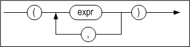

#### Prerequisites

In order to move table records, it is necessary to have both DELETE privileges for the table from which the records are to be moved and INSERT privileges for the table to which the records are to be moved. This is because moving data involves both inserting and deleting data. 

In order to insert records into the table specified in the INTO clause, it is necessary to be the SYS user or the owner of the schema containing the table, to have the INSERT ANY TABLE system privilege, or to have the INSERT privilege for the table.

In order to delete records from the table specified in the FROM clause, it is necessary to be the SYS user or the owner of the schema containing the table, to have the DELETE ANY TABLE system privilege, or to have the DELETE privilege for the table. 

#### Description

The MOVE statement is used to move data that satisfy certain conditions from one table to another. It is also possible to move data to a specified partition.

*hints*

The use of hints is supported with the FROM clause, and is the same as when using hints in a SELECT statement.

*source_tbl_name, target_tbl_name*

These are used to specify the names of the tables from and to which the data will be moved. They must not be views or meta tables.

*column_commalist*

This is a list of actual columns belonging to the target table.

*expression_commalist*

This is a comma-delimited list of expressions. Each expression can be a column belonging to the FROM table, a constant or an expression.

*where_clause*

The structure of the WHERE clause is the same as that in a SELECT statement.

*limit_clause*

The structure of the LIMIT clause is the same as that in a SELECT statement.

#### Considerations

- Data cannot be moved from one table to the same table. 
- When a partition is specified, a value that is inappropriate for the partition cannot be entered. 
- MOVE can fail due to the CHECK constraint.

#### Examples

\<Query\> \>Move all records that satisfy the condition (T2.I2 = 4) from columns I1 and I2 of table T2 into the corresponding columns in table T1 and delete the original records from table T2.

```
iSQL> MOVE INTO T1(I1, I2) FROM T2(I1, I2) WHERE T2.I2 = 4;
```

\<Query\> Insert records comprising columns I1, I2, and I3 from table T2 into table T1 and delete them from table T2. (Table T1 must have columns corresponding to columns I1, I2, and I3 in table T2, and must have the same number of columns, that is, three columns.)

```
iSQL> MOVE INTO T1 FROM T2(I1, I2, I3);
```


### MERGE

#### Syntax

**merge ::=**

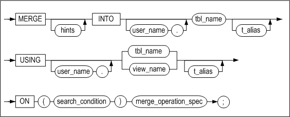

**merge_operation_spec ::=**

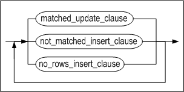

**matched_update_clause ::=**

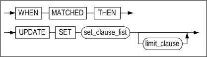

**not_matched_insert_clause::=**


**no_rows_insert_clause ::=**


#### Prerequisites

In order to use the MERGE clause, the user must have the INSERT and UPDATE object privilege on the target table and the SELECT object privilege on the source table. 

#### Description

The MERGE statement selects data from the source table and updates or inserts it into the target table. The table specified in the INTO clause is the target table and the table or view specified in the USING clause is the source table. With the ON clause, a condition to evaluate whether the target table is to be updated or inserted into can be specified. 

One MERGE statement can substitute multiple executions of DML statements such as INSERT, UPDATE, etc.

*hints*

The hint can only be specified after the MERGE keyword. The specified hint applies to INSERT or UPDATE statements.

*INTO clause*

This clause specifies the target table to be updated or inserted. Only tables are valid in the INTO clause; views cannot be included.

*USING clause*

This specifies data and INTO clause table. Table names, SELECT statements, or views can be used.

*ON clause*

INTO clause specifies the condition of the data to change or insert in the table. Depending on the condition of the ON clause, the same record can be changed many times or the same record can be inserted many times.

After the ON clause, three clauses can be used: matched_update_clause, not_matched_insert_clause, and no_rows_insert_clause. Each clause can be specified once and in any order.

*matched_update_clause*

If there is data that satisfies the condition of the ON clause, the UPDATE statement that changes the record is written. The table to be changed is omitted because it is specified in the INTO clause.

- Restriction:
  - A column referenced in the ON condition clause cannot be updated.

*not_matched_insert_clause*

This clause specifies the insertion of columns into the target table when the row satisfying the condition of the ON clause does not exist in the target table. To omit the column list following the INSERT keyword, , the number of columns in the target table must equal the number of values in the VALUES clause.

*no_rows_insert_clause*

This clause specifies the value to be inserted into the column of the target table when the row satisfying the condition of the ON clause does not exist in the source table. To omit the column list following the INSERT keyword, the number of columns in the target table must equal the number of values in the VALUES clause.

#### Examples

\<Query\> This example inserts or changes data in the TEST_MERGE table according to the condition.

The record that satisfies the condition of the ON clause in the TEST_MERGE table is changed to data in the USING clause, and a new record is inserted if it is not satisfied.

As in the condition of the ON clause, if there is a record with the sdame EMPNO column value by comparing the data of the TEST_MERGE table in the INTO clause with the USING clause, the LASTNAME column value of the record in the INTO clause TEST_MERGE table is changed. If there is no record with the same EMPNO column value, insert the data from the USING clause into the TEST_MERGE table as a new record.

```
CREATE TABLE TEST_MERGE (EMPNO INT, LASTNAME CHAR(20));
INSERT INTO TEST_MERGE VALUES(1, 'KIM');
INSERT INTO TEST_MERGE VALUES(2, 'LEE');
INSERT INTO TEST_MERGE VALUES(5, 'PARK');
INSERT INTO TEST_MERGE VALUES(4, 'CHOI');
INSERT INTO TEST_MERGE VALUES(7, 'YUN');

iSQL> SELECT * FROM TEST_MERGE WHERE EMPNO IN (1, 7, 9);
EMPNO       LASTNAME                        
-----------------------------------------------
1           KIM                             
7           YUN                             
2 rows selected.

iSQL> MERGE INTO TEST_MERGE OLD_T
USING
     (
      SELECT 1 EMPNO, 'KANG' LASTNAME FROM DUAL UNION ALL
      SELECT 7 EMPNO, 'SON' LASTNAME FROM DUAL UNION ALL
      SELECT 9 EMPNO, 'CHEON' LASTNAME FROM DUAL
     ) NEW_T
  ON OLD_T.EMPNO = NEW_T.EMPNO
 WHEN MATCHED THEN
      UPDATE SET OLD_T.LASTNAME = NEW_T.LASTNAME
 WHEN NOT MATCHED THEN
      INSERT (OLD_T.EMPNO, OLD_T.LASTNAME) VALUES(NEW_T.EMPNO, NEW_T.LASTNAME);
3 rows merged.
  
iSQL> SELECT * FROM TEST_MERGE WHERE EMPNO IN (1, 7, 9);
EMPNO       LASTNAME                        
-----------------------------------------------
1           KANG                            
7           SON                             
9           CHEON                           
3 rows selected.    
```
The records with EMPNO = 1 and EMPNO = 7 in the TEST_MERGE table have been changed to LASTNAME = 'KANG' and LASTNAME = 'SON' and EMPNO = 9 and LASTNAME = 'CHEON' have been inserted as new records.

\<Query\> The following exampl shows how to change the same record repeatedly due to misuse of the ON clause.
```
DROP TABLE TEST_MERGE;
CREATE TABLE TEST_MERGE (EMPNO INT, LASTNAME CHAR(20));
INSERT INTO TEST_MERGE VALUES(1, 'KIM');
INSERT INTO TEST_MERGE VALUES(2, 'LEE');
INSERT INTO TEST_MERGE VALUES(5, 'PARK');
INSERT INTO TEST_MERGE VALUES(4, 'CHOI');
INSERT INTO TEST_MERGE VALUES(7, 'YUN');

DROP TABLE TEST_MERGE2;
CREATE TABLE TEST_MERGE2 (EMPNO INT, LASTNAME CHAR(20));
INSERT INTO TEST_MERGE2 VALUES(8, 'JANG');
INSERT INTO TEST_MERGE2 VALUES(1, 'KIM');
INSERT INTO TEST_MERGE2 VALUES(7, 'YUN');

iSQL> SELECT * FROM TEST_MERGE;
EMPNO       LASTNAME
-------------------------------------
1           KIM
2           LEE
5           PARK
4           CHOI
7           YUN
5 rows selected.

iSQL> SELECT * FROM TEST_MERGE2;
EMPNO       LASTNAME
-------------------------------------
8           JANG
1           KIM
7           YUN
3 rows selected.

iSQL> MERGE INTO TEST_MERGE OLD_T
USING TEST_MERGE2 NEW_T
  ON OLD_T.EMPNO = NEW_T.EMPNO OR OLD_T.EMPNO = 8
 WHEN MATCHED THEN
      UPDATE SET LASTNAME = 'MATCHED'
 WHEN NOT MATCHED THEN
      INSERT VALUES( EMPNO, 'NOTMATCHED' )
 WHEN NO ROWS THEN
      INSERT VALUES( 10, 'NO ROWS' );
5 rows merged.

iSQL> SELECT * FROM TEST_MERGE;
EMPNO       LASTNAME
-------------------------------------
2           LEE
5           PARK
4           CHOI
1           MATCHED
7           MATCHED
8           MATCHED
6 rows selected.
```
A new record with EMPNO = 8 and LASTNAME = 'NOTMATCHED' was inserted into the TEST_MERGE table because it did not satisfy the condition OLD_T.EMPNO = NEW_T.EMPNO in the ON clause, and then EMPNO = 8 with the condition OLD_T.EMPNO = 8 in the ON clause. The record was changed three times with LASTNAME = 'MATCHED'.

\<Query\> The following example executes the WHEN NO ROWS THEN clause.
```
DROP TABLE TEST_MERGE;
CREATE TABLE TEST_MERGE (EMPNO INT, LASTNAME CHAR(20));
INSERT INTO TEST_MERGE VALUES(1, 'KIM');
INSERT INTO TEST_MERGE VALUES(2, 'LEE');
INSERT INTO TEST_MERGE VALUES(5, 'PARK');
INSERT INTO TEST_MERGE VALUES(4, 'CHOI');
INSERT INTO TEST_MERGE VALUES(7, 'YUN');

DROP TABLE TEST_MERGE2;
CREATE TABLE TEST_MERGE2 (EMPNO INT, LASTNAME CHAR(20));

iSQL> SELECT * FROM TEST_MERGE;
EMPNO       LASTNAME
-------------------------------------
1           KIM
2           LEE
5           PARK
4           CHOI
7           YUN
5 rows selected.

MERGE INTO TEST_MERGE OLD_T
USING TEST_MERGE2 NEW_T
ON NEW_T.EMPNO = OLD_T.EMPNO AND NEW_T.EMPNO = 10
WHEN MATCHED THEN
    UPDATE SET LASTNAME = 'MATCHED'
WHEN NOT MATCHED THEN
    INSERT VALUES( 10, 'NOTMATCHED' )
WHEN NO ROWS THEN
    INSERT VALUES( 10, 'NO ROWS' ) ;
1 row merged.

iSQL> SELECT * FROM TEST_MERGE;
EMPNO       LASTNAME                        
-----------------------------------------------
1           KIM                             
2           LEE                             
5           PARK                            
4           CHOI                            
7           YUN                             
10          NO ROWS                         
6 rows selected
```

### ENQUEUE 

#### Syntax

**enqueue ::=**


**values_clause ::=**


#### Description

This statement is used to insert a message into a queue. The structure of the ENQUEUE statement is similar to that of the INSERT statement. The names of one or more queue columns must be specified after the INTO clause. 

In most cases, a user simply enters a message to store. However, in cases where it is necessary to sort or classify messages, it is possible to additionally specify a user-defined Correlation ID for the message to be entered.

#### Example

\<Query\> \>Enter a message consisting of the text “This is a message” to message queue Q1.

```
ENQUEUE INTO Q1(message) VALUES ('This is a message');
```

\<Query\> Enter a message consisting of the text “This is a message” to message queue Q1 with Correlation ID 237.

```
ENQUEUE INTO Q1(message,corrid) VALUES ('This is a message', 237);
```


### DEQUEUE 

#### Syntax

**dequeue ::=**


**fifo_option ::=**

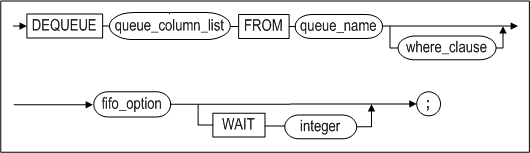

#### Description

The DEQUEUE statement retrieves a message that satisfies the condition in where_clause and then deletes it.

*fifo_option*

If the FIFO option is enabled, or if neither FIFO nor LIFO has been specified, the oldest message that satisfies the condition is retrieved. If the LIFO option is enabled, the newest message is retrieved.

*WAIT integer*

The DEQUEUE statement waits until a message has been added to the queue when there are no messages. The DEQUEUE waits for a period of time specified in the WAIT clause, and the time unit of standby time can be second(sec), millisecond(msec,1/1000 sec),and μsec(μsec,1/1000000 sec). The second is applied unless otherwise specified. If the stand by time is not specified, the DEQUEUE statement will be infinitively awaiting.

#### Considerations

The following should be taken into consideration when using the DEQUEUE statement:

- Only the names of columns in a queue table can be specified in queue_column_list. 
- The DEQUEUE statement has some of the characteristics of the SELECT statement. However, the name of only one queue table can be specified in the FROM clause of a DEQUEUE statement. If more than one queue table is specified, an error will be raised. 
- A subquery cannot be used in the WHERE clause of a DEQUEUE statement.

#### Example

\<Query\> Read all messages having the Correlation ID 237 from message queue Q1.

```
DEQUEUE MESSAGE, CORRID FROM Q1 WHERE CORRID=237;
```


## 5. Data Control Language

This chapter explains each of the Data Control Language (DCL) statements that are available in Altibase.

### ALTER REPLICATION 

#### Syntax

**alter_replication_dcl ::=**


#### Description

CALTER REPLICATION controls the operation of a replication object that has been created with the CREATE REPLICATION statement. For more information about replication, please refer to the *Replication Manual.* 

*STOP*

This stops the replication.

*FLUSH*

This is used to instruct the current session to wait, for the number of seconds specified in wait_time, for the replication Sender thread to send information about changed data, up to the current log (the log at the time the FLUSH statement is executed), to the other server. 

If this is used together with the ALL option, the current session is instructed to wait until the information about changed data in the most recent log, rather than the current log, has been transferred to the other server.

#### Example

- Stop the replication object rep1. 

  \<Query\> Stop the replication.

  ```
  iSQL> ALTER REPLICATION rep1 STOP;
  Alter success.
  ```


### ALTER SESSION 

#### Syntax

**alter_session::=**


[set_transaction_clause::=](#set_transaction)

**alter_session_set_clause::=**


**replication_mode_set_clause::=**

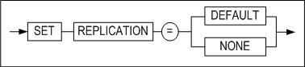

**dblink_session_close_clause::=**


#### Description

This statement is used to change the attributes of the current session.

*alter_session_set_clause*

For more information on property_name and property_value in alter_session_set_clause, please refer to Chapter 2 of the *General Reference*, which explains all Altibase properties.

*replication_mode_set_clause*

This clause is used to set the replication mode for transactions that are executed in the current session. 

If DEFAULT is specified, replication will be performed in the mode that was selected as the default mode when the replication object was created. However, if NONE is specified, none of the DDL, DML, or DCL statements executed in the session will be replicated. 

For more detailed information on the replication mode, please refer to the *Replication Manual.*

*dblink_session \_close_clause*

When a user connects to a server, a session is created in the server. If Database Link is used in that session, a Database Link session, for use in performing Database Link-related tasks, is created in association with the session allocated to the user. When the user's session is subsequently terminated, the Database Link session is also terminated. However, if the user's session is not terminated after the Database Link operations have been performed, the Database Link session will also needlessly remain open.

In such cases, dblink_session_close_clause can be used to explicitly end the Database Link session.

*set_transaction_clause*

The SET TRANSACTION statement is used to set the current transaction as read-only or read/write, or to set its isolation level. For more information on the SET TRANSACTION statement, refer to the description section of the SET TRANSACTION statement.

#### Example

\<Query\> Close the database link session only, keeping the current session alive.

```
iSQL> ALTER SESSION CLOSE DATABASE LINK ALL;
```


### ALTER SYSTEM 

#### Syntax

**alter_system ::=**


**alter_system_set_clause ::=**


#### Description

The ALTER SYSTEM statement is used to change Altibase system properties. Only the SYS user or a user to whom the ALTER SYSTEM privilege has been granted can access the complete functionality of the ALTER SYSTEM statement.

*CHECKPOINT*

This is used to execute checkpointing.

*MEMORY COMPACT*

This is used to perform memory compaction. It is only useful on the IBM AIX platform.

*START/STOP FLUSHER integer*

This is used to start up or shut down the flusher. The flusher identifier of the integer can be viewed by querying the V$FLUSHER performance view.

*ARCHIVE LOG START/STOP*

Executing ALTER SYSTEM ARCHIVE LOG START starts the Archivelog thread, whereas ALTER SYSTEM ARCHIVE LOG STOP stops the thread. This statement can be executed only when the system is running in Archivelog mode. To determine whether the system is running in Archivelog mode, query the V\$LOG or V$ARCHIVE performance view. 

For more detailed information about Archivelog mode, please refer to Chapter 10: Backup and Recovery in the *Administrator's Manual.*

*SWITCH LOGFILE*

This statement forcibly archives log files. Even if the current log file is not full, this command instructs the database to close it and resume logging in the next log file. 

Only the sysdba can execute this statement.

*SET alter_system_set_clause*

This statement is used to change the values of database properties. For more information about these properties, please refer to the *General Reference.*

*FLUSH BUFFER_POOL*

This statement flushes all pages that are in the buffer to disk, thereby emptying the buffer.

Only the sysdba can execute this statement. It should only be executed after careful consideration. Because execution of this statement deletes all of the pages in the buffer, “buffer miss”, that is, failure to find records that are being sought in the buffer, can occur upon subsequent query execution. 

*COMPACT SQL_PLAN_CACHE*

This removes the execution plan which is not being used in the SQL plan cache.

*RESET SQL_PLAN_CACHE*

This removes the execution plan which is not being used in the SQL plan cache and initializes statistical information related to the plan cache.

*START \| STOP \| RELOAD AUDIT*

This statement starts/stops auditing or reapplies auditing conditions.

*RELOAD ACCESS LIST*

The RELOAD ACCESS LIST statement is used to update a list which permits or blocks the access of IP packet. This statement can be executed only in the administrator mode. The access list is comprised with the configured files in the ACCESS_LIST_FILE property. Refer to the ACCESS_LIST property for in-depth information.

#### Examples

\<Query\> Stop flusher 1.

```
iSQL> ALTER SYSTEM STOP FLUSHER 1;
```

\<Query\> Start the Archivelog thread in archive mode.

```
iSQL> ALTER SYSTEM ARCHIVE LOG START;
```


### AUDIT

#### Syntax

**audit ::=**


**audit_operation_clause ::=**


**by_clause ::=**


**audit_object_clause ::=**


**ddl_clause ::=**


#### Prerequisites

Only the SYS user can configure auditing conditions with this statement.

#### Description

Auditing tracks specific statements or all statements being executed on the Altibase server in real time and records their information. Auditing conditions can be configured with this statement.

*audit_operation_clause*

This specifies that auditing is to be performed on the execution of certain SQL statements on the Altibase server. 

The auditing target operation is specified in sql_statement_type of this clause. Using the comma(,), multiple operations can be specified together. The following operations can be specified for auditing:

- SELECT
- INSERT
- UPDATE
- DELETE
- MOVE
- MERGE
- ENQUEUE
- DEQUEUE
- LOCK
- EXEC or EXECUTE
- COMMIT
- ROLLBACK
- SAVEPOINT
- CONNECT
- DISCONNECT
- ALTER SESSION
- ALTER SYSTEM

ALL specifies auditing on all of the statements listed above.

*by_clause*

This specifies that auditing is to be performed on the statements that are executed by a certain user. 

*audit_object_clause*

This specifies that auditing is to be performed on certain operations being executed on certain objects on the Altibase server. 

Using the comma(,), multiple operations can be specified together. The following table shows the types of objects specifiable for auditing target operations and their auditing descriptions.

| Operation    | Object Type | Auditing Description                                         |
| ------------ | ----------- | ------------------------------------------------------------ |
| SELECT       | TABLE       | The SELECT statement being operated on the target table object. |
| INSERT       | TABLE       | The INSERT statement being operated on the target table object. |
| UPDATE       | TABLE       | The UPDATE statement being operated on the target table object. |
| DELETE       | TABLE       | The DELETE statement being operated on the target table object. |
| MOVE         | TABLE       | The MOVE statement being operated on the target table object. |
| MERGE        | TABLE       | The MERGE statement being operated on the target table object. |
| ENQUEUE      | QUEUE       | The ENQUEUE statement being operated on the target queue object. |
| DEQUEUE      | QUEUE       | The DEQUEUE statement being operated on the target queue object. |
| LOCK         | TABLE       | The LOCK statement being operated on the target table object. |
| EXEC/EXECUTE | PROCEDURE   | The statement which is executing the target procedure object. |

ALL specifies auditing of all SQL statements executable on object types; however, only the above statements are valid.

*object_name*

This specifies the name of the object which is to be an auditing target. Object types available for specification are tables, views, queues, sequences, stored procedures and stored functions. 

*ddl_clause*

This specifies auditing the execution of DDL statements on the Altibase server.

*BY ACCESS \| SESSION*

If BY ACCESS is specified, an audit log is written for every statement or operation that meets the condition. For example, if auditing is performed with BY ACCESS specified and the same SQL statement is executed ten times in the same session, then ten audit logs are written. 

If BY SESSION is specified, only one audit log is written when the same SQL statement is executed in the same session. For example, if auditing is performed with BY SESSION specified and the same SQL statement is repeatedly executed in the same session, the audit log is not duplicated. 

When neither is specified, BY SESSION is the default value. 

BY ACCESS|SESSION is not supported if the audit target is CONNECT, DISCONNECT, or DDL.

*WHENEVER [NOT] SUCCESSFUL*

If WHENEVER SUCCESSFUL is specified, only successful SQL statements and operations are audited. 

If WHENEVER NOT SUCCESSFUL is specified, only unsuccessful SQL statements and operations are audited. 

On omission of this clause, Altibase performs auditing, regardless of success or failure. 

If 'BY SESSION WHENEVER SUCCESSFUL' is specified, the same SQL statements executed in a session must all succeed for an audit log of that statement to be written.

If 'BY SESSION WHENEVER NOT SUCCESSFUL' is specified, the same SQL statements executed in a session must fail, at least once, for an audit log of that statement to be written.

#### Precautions

Even if auditing conditions are configured with the AUDIT statement, new conditions are not immediately applied to database auditing. For new auditing conditions to be applied to the running server, auditing must be restarted or RELOAD must be performed for the auditing conditions with the following statements.

```
ALTER SYSTEM STOP AUDIT;
ALTER SYSTEM START AUDIT;
ALTER SYSTEM RELOAD AUDIT;
```

#### Examples

\<Query 1\>  Write logs of all occasions where the execution of INSERT, UPDATE and DELETE statements fail for the table friends of user user1.

```
iSQL> AUDIT insert, update, delete ON user1.friends BY ACCESS WHENEVER NOT
SUCCESSFUL;
```

\<Query 2\> Write audit logs, in the unit of sessions, of all occasions where the execution of DDL statements succeed for the table friends of user user1.

```
iSQL> AUDIT all ON user1.friends BY SESSION WHENEVER SUCCESSFUL;
```

\<Query 3\> Write logs, in the unit of accesses, of all unsuccessful execution of CONNECT, DISCONNECT statements on the Altibase server.

```
iSQL> AUDIT connect, disconnect WHENEVER NOT SUCCESSFUL;
Audit success.
```

\<Query 4\>  Write logs, in the unit of sessions, of all executions of INSERT statements on the Altibase server.

```
iSQL> AUDIT insert;
Audit success.
```

\<Query 5\> Write logs of all executions of DDL statements by user user1.

```
iSQL> AUDIT DDL BY user1;
Audit success.
```


### COMMIT 

#### Syntax

**commit::=**


#### Description

The COMMIT statement explicitly commits the current transaction to the database. This statement is useful when AUTOCOMMIT mode has been set to FALSE.

*WORK*

The WORK keyword ensures compliance with standard SQL.

*FORCE global_tx_id*

In an XA environment, a transaction can be forcefully committed even when it is in an “in-doubt“ state. 

global_tx_id is a character string that consists of the format identifier, the global transaction ID, and the branch qualifier of the global transaction.

#### Restriction

This statement cannot be executed in AUTOCOMMIT mode. 

#### Example

The following statement applies the result of all of the transaction's previously executed commands to the database.

```
iSQL> COMMIT;
Commit success.
```


### DELAUDIT

#### Syntax

**delaudit ::=**


**delaudit_user_clause ::=**


**delaudit_object_clause ::=**

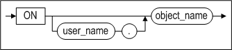

#### Prerequisites

Only the SYS user can delete auditing conditions with this statement.

#### Description

This statement deletes auditing conditions that have been enabled to perform auditing within the Altibase server.

*delaudit_user_clause*

This deletes auditing conditions that have the specified user name among statement auditing and DDL statement auditing conditions that have been enabled with the AUDIT … BY user_name statement.

ALL

This deletes all statement auditing and DDL statement auditing conditions that have been enabled without the BY user_name clause. Object auditing conditions are not deleted.

*delaudit_object_clause*

The deletes auditing conditions that have been enabled for a particular object.

#### Precautions

When the DELAUDIT statement is executed, auditing conditions are deleted from SYS_AUDIT_OPTS_. 

If auditing has already started, this statement cannot be executed. An error occurs if the user attempts to delete auditing conditions while auditing is being performed. You should first terminate auditing with the ALTER SYSTEM STOP AUDIT statement and then delete auditing conditions.

#### Example

\<Query 1\> Delete auditing conditions for the user user1. After deletion, you can see that the auditing conditions have been deleted from SYS_AUDIT_OPTS_.

```
iSQL> DELAUDIT by user1;
Audit success.
iSQL> SELECT * from SYSTEM_.SYS_AUDIT_OPTS_;
No rows selected.
```

\<Query 2\> If auditing has already started and DELAUDIT is executed, an error occurs. After terminating auditing, you can delete auditing conditions.

```
iSQL> alter system start audit;
Alter success.
iSQL> delaudit by user1;
[ERR-313B2 : Audit has already started.]
iSQL> alter system stop audit;
Alter success.
iSQL> delaudit by user1;
Audit success.
```


### NOAUDIT

#### Syntax

**noaudit ::=**


**audit_operation_clause ::=**


**by_clause ::=**


**audit_object_clause ::=**


**ddl_clause ::=**


#### Prerequisites

Only the SYS user can disable auditing conditions with this statement. 

#### Description

The NOAUDIT statement is used to disable auditing conditions that were previously enabled with the AUDIT statement.

*audit_operation_clause*

This clause is used to stop the auditing of certain SQL statements. 

sql_statement_type specifies auditing of the specified operation to be stopped. For further information on auditing operations available for specification, please refer to the description section of the AUDIT statement. 

ALL is used to stop auditing of all statements previously specified with the AUDIT ALL statement.

*audit_object_clause*

This clause is used to disable the auditing condition of a certain object. 

For sql_operation, specify the type of operation for which auditing is to be stopped on the object specified in the ON clause. For further information on SQL operations available for specification, please refer to the Description section of the AUDIT statement. 

ALL is equivalent to specifying all SQL statements executable of an object type.

ddl_clause

This clause specifies auditing of DDL statements to stop.

*WHENEVER [NOT] SUCCESSFUL*

WHENEVER SUCCESSFUL specifies auditing of successful SQL statements and object operations to stop. 

WHENEVER NOT SUCCESSFUL specifies auditing of unsuccessful SQL statements and object operations to stop. 

On omission, auditing of specified statements and object operations are stopped, regardless of its success or failure.

#### Precautions

Even if an auditing condition is disabled with the NOAUDIT statement, this is not immediately applied to database auditing. For the disablement of an auditing condition to be applied to the running server, auditing must be restarted or RELOAD must be performed for the auditing conditions with the following statements.

```
ALTER SYSTEM STOP AUDIT;
ALTER SYSTEM START AUDIT;
ALTER SYSTEM RELOAD AUDIT;
```


#### Examples

\<Query 1\>  Disable auditing of successful SELECT statements on the table friends.

```
iSQL> NOAUDIT select ON friends WHENEVER SUCCESSFUL;
Audit success.
```

\<Query 2\>  Disable auditing of SELECT statements.

```
iSQL> NOAUDIT select;
Audit success.
```

\<Query 3\> Disable auditing of DDL statements.

```
iSQL> NOAUDIT DDL;
Audit success.
```


### SAVEPOINT

#### Syntax

**savepoint::=**


#### Description

This statement is used to create a savepoint, which means to temporarily save the result of transaction processing up to the current point in time. In other words, SAVEPOINT is used to explicitly define a point within a transaction to which the transaction can be rolled back. This statement is useful in non-autocommit mode, that is, when AUTOCOMMIT mode has been set to FALSE.

#### Limitation

Not available in AUTOCOMMIT mode.

#### Examples

```
iSQL> AUTOCOMMIT OFF;
Set autocommit off success.
iSQL> CREATE TABLE savept(num INTEGER);
Create success.
iSQL> INSERT INTO savept VALUES(1);
1 row inserted.
iSQL> SAVEPOINT sp1;
Savepoint success.
iSQL> INSERT INTO savept VALUES(2);
1 row inserted.
iSQL> SELECT * FROM savept;
SAVEPT.NUM 
--------------
1 
2 
2 rows selected.
```

The transaction is rolled back to the time point at which the savepoint sp1 was defined.

```
iSQL> ROLLBACK TO SAVEPOINT sp1;
Rollback success.
iSQL> SELECT * FROM savept;
SAVEPT.NUM 
--------------
1 
1 row selected.
iSQL> COMMIT;
Commit success.
```


### ROLLBACK 

#### Syntax

**rollback ::=**


#### Description

*ROLLBACK (TO SAVEPOINT)*

This statement is used to roll back the current transaction, either partially (to a previously defined savepoint) or completely.

*FORCE global_tx_id*

In an XA environment, this option is used to forcefully roll back a transaction that is in an “in-doubt“ state. 

global_tx_id is a character string that consists of the format identifier, the global transaction ID, and the branch qualifier of the global transaction.

#### Precaution

This statement cannot be used in AUTOCOMMIT mode.

#### Example

```
iSQL> AUTOCOMMIT OFF;
Set autocommit off success.
iSQL> UPDATE employees SET salary = 2300 WHERE eno = 3;
1 row updated.
iSQL> SAVEPOINT emp3_sal;
Savepoint success.
iSQL> DELETE FROM employees WHERE eno = 19;
1 row deleted.
iSQL> SAVEPOINT emp19_ret;
Savepoint success.
iSQL> INSERT INTO employees(eno, e_lastname, e_firstname, salary, sex) VALUES(21, 'Templeton', 'Kimmie', 3000, 'F');
1 row inserted.
iSQL> SAVEPOINT emp21_join;
Savepoint success.
iSQL> UPDATE employees SET salary = 2200 WHERE eno=18;
1 row updated.
iSQL> SELECT eno, e_lastname, e_firstname, salary FROM employees WHERE eno in (3, 18, 19, 21);
ENO         E_LASTNAME            E_FIRSTNAME           SALARY
-------------------------------------------------------------------------
3           Kobain                Ken                   2300
18          Huxley                John                  2200
21          Templeton             Kimmie                3000
3 rows selected.
```

The transaction is rolled back to the time point at which the savepoint emp21_join was defined.

```
iSQL> ROLLBACK TO SAVEPOINT emp21_join;
Rollback success.
iSQL> SELECT eno, e_lastname, e_firstname, salary FROM employees WHERE eno in (3, 18, 19, 21);
ENO         E_LASTNAME            E_FIRSTNAME           SALARY
-------------------------------------------------------------------------
3           Kobain                Ken                   2300
18          Huxley                John                  1900
21          Templeton             Kimmie                3000
3 rows selected.
```

The transaction is rolled back to the time point at which the savepoint emp19_ret was defined.

```
iSQL> ROLLBACK TO SAVEPOINT emp19_ret;
Rollback success.
iSQL> SELECT eno, e_lastname, e_firstname, salary FROM employees WHERE eno in (3, 18, 19, 21);
ENO         E_LASTNAME            E_FIRSTNAME           SALARY
-------------------------------------------------------------------------
3           Kobain                Ken                   2300
18          Huxley                John                  1900
2 rows selected.
```

All of the changes made by the first UPDATE statement, the first DELETE statement and the last DML statement (the second INSERT statement) are committed. All of the other SQL DML statements were rolled back before the COMMIT statement was executed, and are thus lost. Additionally, the emp21_join savepoint is no longer available.

```
iSQL> ROLLBACK TO SAVEPOINT emp21_join;
[ERR-11016 : Savepoint not found]
iSQL> INSERT INTO employees(eno, e_lastname, e_firstname, sex, join_date) VALUES(22, 'Chow', 'May', 'F', TO_DATE('2011-11-19 00:00:00', 'YYYY-MM-DD HH:MI:SS'));
1 row inserted.
iSQL> COMMIT;
Commit success.
iSQL> SELECT eno, e_lastname, e_firstname, salary FROM employees;
ENO         E_LASTNAME            E_FIRSTNAME           SALARY
-------------------------------------------------------------------------
1           Moon                  Chan-seung
2           Davenport             Susan                 1500
4           Foster                Aaron                 1800
5           Ghorbani              Farhad                2500
6           Momoi                 Ryu                   1700
7           Fleischer             Gottlieb              500
8           Wang                  Xiong
9           Diaz                  Curtis                1200
10          Bae                   Elizabeth             4000
11          Liu                   Zhen                  2750
12          Hammond               Sandra                1890
13          Jones                 Mitch                 980
14          Miura                 Yuu                   2003
15          Davenport             Jason                 1000
16          Chen                  Wei-Wei               2300
17          Fubuki                Takahiro              1400
18          Huxley                John                  1900
20          Blake                 William
3           Kobain                Ken                   2300
22          Chow                  May                   0
20 rows selected.
iSQL> COMMIT;
Commit success.
```


### SET TRANSACTION 

#### Syntax

<a name="set_transaction"><a/>

**set_transaction ::=**


#### Description

The SET TRANSACTION statement is used to set the current transaction as read-only or read/write, or to set its isolation level. 

Setting the isolation level to READ COMMITTED or SERIALIZABLE combines a row-level access method with a method of maintaining multiple versions of records, thereby realizing excellent data consistency, concurrency, and performance. 

The changes made using the SET TRANSACTION statement affect only the current transaction, not other users or other transactions. 

The isolation level can be set to any of the three levels described below.

*READ COMMITTED*

This isolation level allows data within a table that have been changed by a committed transaction to be read, while also allowing other transactions to read the previous version of data that will be changed by a transaction that has not been committed. READ COMMITED is the default Altibase transaction isolation level.

*REPEATABLE READ*

Because a read transaction maintains a shared lock on the data it retrieves until the transaction is complete, other transactions are prevented from changing these data. Locking records in this way guarantees that when a value is repeatedly retrieved, it will always be the same as the first time it was read. However, it is possible that other transactions will generate new records that satisfy the search conditions while such a lock is held. These records will be found on subsequent searches by the read transaction holding the lock, even though they were not found on the original search. This phenomenon is known as “Phantom Reads“.

*SERIALIZABLE*

This is the highest isolation level. This isolation level avoids locking all data when some records are retrieved using a SELECT statement with a ranged WHERE clause, but rather locks all data having key values that fall within the range of the data being read. This has the effect of preventing the “phantom reads” phenomenon and guaranteeing transaction isolation.

#### Considerations

This statement cannot be used when the current mode is AUTOCOMMIT mode. 

This statement cannot be used if there are any active transactions.

#### Examples

```
iSQL> AUTOCOMMIT OFF;
Set autocommit off success.

iSQL> SET TRANSACTION ISOLATION LEVEL READ COMMITTED;
Command execute success.

iSQL> SET TRANSACTION ISOLATION LEVEL REPEATABLE READ;
Command execute success.

```


| Transaction A                                                | Time Point | Transaction B                                                |
| ------------------------------------------------------------ | ---------- | ------------------------------------------------------------ |
| iSQL\> AUTOCOMMIT OFF; Set autocommit off success.           |            | iSQL\> AUTOCOMMIT OFF; Set autocommit off success.           |
| iSQL\> SET TRANSACTION READ ONLY; Command execute success.   | 1          |                                                              |
| iSQL\> SELECT e_last name FROM employees WHERE eno = 20; E_LASTNAME ------------------------ Blake 1 row selected. | 2          |                                                              |
|                                                              | 3          | iSQL\> UPDATE employees SET e_lastname = 'Jung' WHERE eno = 20; 1 row updated. |
| iSQL\> SELECT e_lastname FROM employees WHERE eno = 20; E_LASTNAME ------------------------ Blake 1 row selected. | 4          |                                                              |
|                                                              | 5          | iSQL\> commit; Commit success.                               |
| iSQL\> SELECT e_lastname FROM employees WHERE eno = 20; E_LASTNAME ------------------------ Jung 1 row selected. | 6          |                                                              |


## 6. Set Operators 

This chapter explains the set operators that can be used in SQL statements in Altibase.

### UNION

#### Syntax

```
SELECT statement1 UNION SELECT statement2
```

#### Description

This operator is used to output all of the results of two query statements. Note that overlapping results, that is, results common to both queries, as well as duplicate results within each query, will be output only once.

#### Example

\<Query\>  Display the employee number of every employee who was born in 1980 or later and/or took an order for 100 or fewer items. Remove duplicate employee numbers.

```
iSQL> SELECT eno
     FROM employees
     WHERE birth > '800101'
     UNION
     SELECT eno
     FROM orders
     WHERE qty < 100;
ENO
--------------
4
7
8
12
13
15
20
7 rows selected.
```


### UNION ALL

#### Syntax

```
SELECT statement1 UNION ALL SELECT statement2
```

#### Description

This operator is used to output all of the results of two query statements. Note that overlapping results, that is, results common to both queries, are output without removing any duplicates.

#### Example

\<Query\> Display the employee number of all employees born in 1980 or later, as well as the employee number associated with all orders for 100 or fewer items. Do not remove any duplicate employee numbers.

```
iSQL> SELECT eno
     FROM employees
     WHERE birth > '800101'
     UNION ALL
     SELECT eno
     FROM orders
     WHERE qty < 100;
ENO
--------------
4
7
8
12
13
15
12
20
20
9 rows selected.
```


### INTERSECT

#### Syntax

```
SELECT *statement1* **INTERSECT** SELECT *statement2*
```

#### Description

The INTERSECT operator is used to output only records that are common to two queries, that is, records that are retrieved by both queries.

#### Example

\<Query\> Display a list of all items in the goods table that have been ordered at least once.

```
iSQL> SELECT gno FROM goods 
INTERSECT 
SELECT gno FROM orders;
GNO
--------------
.
.
.
```


### MINUS

#### Syntax

```
SELECT statement1 MINUS SELECT statement2
```

#### Description

The MINUS operator is used to output the result of the first search except the second.

#### Example

\<Query\> Display the product number of all products that have never been ordered.

```
iSQL> SELECT gno FROM goods
MINUS
SELECT gno FROM orders;
GNO         
--------------
.
.
.
```


### Order of Operations

The Order of Operations, also known as Operator Precedence, is the order in which the database evaluates the different operators in an expression. When an expression containing multiple operators is evaluated, operators having higher precedence are evaluated before those having lower precedence. Operators having equal precedence are evaluated in the order in which they appear in an expression, i.e. from left to right.

#### Description

The SQL operators are listed in the following table in decreasing order of operator precedence. Parentheses can be used within an expression to override operator precedence.

| Precedence Level | Operator                 |
| ---------------- | ------------------------ |
| 1                | All comparison operators |
| 2                | NOT                      |
| 3                | AND                      |
| 4                | OR                       |

#### Examples

\<Query\>  Display the name, position, and wage of engineers who earn more than 1850 dollars per month, as well as the name, position, and wage of all salespersons, regardless of their salary.

```
iSQL> SELECT e_firstname, e_lastname, emp_job, salary
FROM employees
WHERE emp_job = 'sales rep'
  OR emp_job = 'engineer'
  AND salary >= 1850;
E_FIRSTNAME           E_LASTNAME            EMP_JOB          SALARY
------------------------------------------------------------------------------
Ken                   Kobain                engineer         2000
Sandra                Hammond               sales rep        1890
Alvar                 Marquez               sales rep        1800
William               Blake                 sales rep
4 rows selected.
```

\<Query\>  Display the name, position, and wage of all salespersons who earn more than 1850 dollars per month and all engineers who earn more than 1850 dollars per month.

```
iSQL> SELECT e_firstname, e_lastname, emp_job, salary
FROM employees
WHERE (emp_job = 'sales rep'
  OR emp_job = 'engineer')
  AND salary >= 1850;
E_FIRSTNAME           E_LASTNAME            EMP_JOB          SALARY
------------------------------------------------------------------------------
Ken                   Kobain                engineer         2000
Sandra                Hammond               sales rep        1890
2 rows selected.
```

