- [SQL Reference](#sql-reference)
  - [Preface](#preface)
    - [About This Manual](#about-this-manual)
  - [1. Introduction to Altibase SQL](#1-introduction-to-altibase-sql)
    - [Overview of Altibase SQL](#overview-of-altibase-sql)
    - [Types of SQL Statements](#types-of-sql-statements)
  - [2. Altibase SQL Basics](#2-altibase-sql-basics)
    - [Comments](#comments)
    - [Altibase Objects](#altibase-objects)
    - [HINT](#hint)
    - [Hint List](#hint-list)
  - [3. Data Definition Language](#3-data-definition-language)
    - [ALTER DATABASE](#alter-database)
    - [ALTER DATABASE LINKER](#alter-database-linker)
    - [ALTER INDEX](#alter-index)
    - [ALTER JOB](#alter-job)
    - [ALTER QUEUE](#alter-queue)
    - [ALTER REPLICATION](#alter-replication)
    - [ALTER SEQUENCE](#alter-sequence)
    - [ALTER TABLE](#alter-table)
    - [ALTER TABLESPACE](#alter-tablespace)
    - [ALTER TRIGGER](#alter-trigger)
    - [ALTER USER](#alter-user)
    - [ALTER VIEW](#alter-view)
    - [ALTER MATERIALIZED VIEW](#alter-materialized-view)
    - [COMMENT](#comment)
    - [CONJOIN TABLE](#conjoin-table)
    - [CREATE DATABASE](#create-database)
    - [CREATE DATABASE LINK](#create-database-link)
    - [CREATE DIRECTORY](#create-directory)
    - [CREATE INDEX](#create-index)
    - [CREATE JOB](#create-job)
    - [CREATE QUEUE](#create-queue)
    - [CREATE REPLICATION](#create-replication)
    - [CREATE ROLE](#create-role)
    - [CREATE SEQUENCE](#create-sequence)
    - [CREATE SYNONYM](#create-synonym)
    - [CREATE TABLE](#create-table)
    - [CREATE DISK TABLESPACE](#create-disk-tablespace)
    - [CREATE MEMORY TABLESPACE](#create-memory-tablespace)
    - [CREATE VOLATILE TABLESPACE](#create-volatile-tablespace)
    - [CREATE TEMPORARY TABLESPACE](#create-temporary-tablespace)
    - [CREATE TRIGGER](#create-trigger)
    - [CREATE USER](#create-user)
    - [CREATE VIEW](#create-view)
    - [CREATE MATERIALIZED VIEW](#create-materialized-view)
    - [DISJOIN TABLE](#disjoin-table)
    - [DROP DATABASE](#drop-database)
    - [DROP DATABASE LINK](#drop-database-link)
    - [DROP DIRECTORY](#drop-directory)
    - [DROP INDEX](#drop-index)
    - [DROP JOB](#drop-job)
    - [DROP QUEUE](#drop-queue)
    - [DROP REPLICATION](#drop-replication)
    - [DROP ROLE](#drop-role)
    - [DROP SEQUENCE](#drop-sequence)
    - [DROP SYNONYM](#drop-synonym)
    - [DROP TABLE](#drop-table)
    - [DROP TABLESPACE](#drop-tablespace)
    - [DROP TRIGGER](#drop-trigger)
    - [DROP USER](#drop-user)
    - [DROP VIEW](#drop-view)
    - [DROP MATERIALIZED VIEW](#drop-materialized-view)
    - [FLASHBACK TABLE](#flashback-table)
    - [GRANT](#grant)
    - [PURGE TABLE](#purge-table)
    - [RENAME TABLE](#rename-table)
    - [REVOKE](#revoke)
    - [TRUNCATE TABLE](#truncate-table)
  - [4. Data Manipulation Language](#4-data-manipulation-language)
    - [DELETE](#delete)
    - [INSERT](#insert)
    - [LOCK TABLE](#lock-table)
    - [SELECT](#select)
    - [UPDATE](#update)
    - [MOVE](#move)
    - [MERGE](#merge)
    - [ENQUEUE](#enqueue)
    - [DEQUEUE](#dequeue)
  - [5. Data Control Language](#5-data-control-language)
    - [ALTER REPLICATION](#alter-replication-1)
    - [ALTER SESSION](#alter-session)
    - [ALTER SYSTEM](#alter-system)
    - [AUDIT](#audit)
    - [COMMIT](#commit)
    - [DELAUDIT](#delaudit)
    - [NOAUDIT](#noaudit)
    - [SAVEPOINT](#savepoint)
    - [ROLLBACK](#rollback)
    - [SET TRANSACTION](#set-transaction)
  - [6. Set Operators](#6-set-operators)
    - [UNION](#union)
    - [UNION ALL](#union-all)
    - [INTERSECT](#intersect)
    - [MINUS](#minus)
    - [Order of Operations](#order-of-operations)
  - [7. SQL Functions](#7-sql-functions)
    - [Introduction to SQL Functions](#introduction-to-sql-functions)
    - [Aggregate Functions](#aggregate-functions)
    - [Window (Analytic) Functions](#window-analytic-functions)
    - [Numeric Functions](#numeric-functions)
    - [Character Functions](#character-functions)
    - [Datatime Funcitons](#datatime-funcitons)
    - [Conversion Functions](#conversion-functions)
    - [Encryption Functions](#encryption-functions)
    - [Other Functions](#other-functions)
  - [8. Arithmetic Operators](#8-arithmetic-operators)
    - [Arithmetic Operators](#arithmetic-operators)
    - [Unary Operator](#unary-operator)
    - [Binary Opeartors](#binary-opeartors)
    - [Concatenation Operator](#concatenation-operator)
    - [CAST Operator](#cast-operator)
  - [9. SQL Conditions](#9-sql-conditions)
    - [SQL Conditions Overview](#sql-conditions-overview)
    - [Logical Condition](#logical-condition)
    - [Comparision Conditions](#comparision-conditions)
    - [Other Conditions](#other-conditions)
  - [Appendix A. Regular Expressions](#appendix-a-regular-expressions)
    - [Regular Expression Support](#regular-expression-support)


Altibase® Application Development

# SQL Reference


Altibase Application Development SQL Reference

Release 7.1

Copyright ⓒ 2001\~2021 Altibase Corp. All Rights Reserved.

This manual contains proprietary information of Altibase Corporation; it is provided under a license agreement containing restrictions on use and disclosure and is also protected by copyright patent and other intellectual property law. Reverse engineering of the software is prohibited. All trademarks, registered or otherwise, are the property of their respective owners.

**Altibase Corp**

10F, Daerung PostTower II, 306, Digital-ro, Guro-gu, Seoul 08378, Korea Telephone: +82-2-2082-1000 Fax: 82-2-2082-1099

Customer Service Portal: http://support.altibase.com/en/

Homepage: [[http://www.altibase.com](http://www.altibase.com/)]


## Preface

### About This Manual

This manual explains how to use Structured Query Langauge (SQL) statements with Altibase

#### Audience

This manual has been prepared for the following Altibase users

- Database administrators
- Performance administrators
- Database users
- Application developers
- Technical Supporters

It is recommended for those reading this manual possess the following background knowledge:

- Basic knowledge in the use of computers, operating systems, and operating system utilities
- Experience in using relational database and an understanding of database concepts
- Computer programming experience
- Experience in database server management, operating system management, or network administration

#### Organization

This manual is organized as follows: 

- Chapter 1: Introduction to Altibase SQL  
  This chapter describes an overview of the structure and organization of SQL in Altibase.
- Chapter 2: Altibase SQL Basics  
  This chapter describes the basics for using Altibase's SQL.
- Chapter 3: Data Definition Language   
  This chpater explains each of the Data Definition Language (DDL) statements that are available in Altibase.
- Chapter 4: Data Manipulation Language  
  This chapter explains each of the Data Manipulation Language (DML) statements that are available in Altibase. 
- Chapter 5: Data Control Language  
  This chapter explains each of the Data Control Language (DCL) statements that are available in Altibase. 
- Chapter 6: Set Operators  
  This chapter explains the set operators that can be used in SQL statements in Altibase.
- Chapter 7: SQL Functions   
  This chapter describes the functions that are supported in Altibase.
- Chapter 8: Arithmetic Operators  
  This chapter describes the arithmetic operators that can be used in SQL statements in Altibase.
- Chapter 8: SQL Conditions  
  This chapter describes the conditional operators that can be used in conditional clauses in SQL statements in Altibase.
- Appendix A. Regular Expression  

#### Documentation Conventions

This section describes the conventions used in this manual. Understanding these conventions will make it easier to find information in this manual and other manuals in the series.

These are two sets of conventions:

-   Syntax diagram conventions

-   Sample code conventions

##### Syntax Diagram Conventions

This manual describes command syntax using diagrams composed of the following elements: 

| Elements                        | Meaning                                                      |
| ------------------------------- | ------------------------------------------------------------ |
|  | Indicates the start of a command. If a syntactic element starts with an arrow, it is not a complete command. |
|  | Indicates that the command continues to the next line. If a syntactic element ends with this symbol, it is not a complete command. |
|  | Indicates taht the command continues from the previous line. If a syntactic element starts witht his symbol, it is not a complete command. |
|  | Indicates the end of a statement.                            |
|  | Indicates a manatory element.                                |
|  | Indicates an optional element.                               |
|  | Indicates a mandatory element comprised of options. One, and only one, option must be specified. |
|  | Indicates an optional element comprised of options.          |
|  | Indicates an optional element in which multiple elements may be specified. A comman must precede all but the first element. |

##### Sample Code Conventions

The code examples explain SQL statements, stored procedures, iSQL statements, and other command line syntax.

The following table describes the printing conventions used in the code examples.

| Rules            | Meaning                                                      | Example                                                      |
| ---------------- | ------------------------------------------------------------ | ------------------------------------------------------------ |
| [ ]              | Indicates an optional item                                   | VARCHAR [(*size*)] [[FIXED \|] VARIABLE]                     |
| { }              | Indicates a mandatory field for which one or more items must be selected. | { ENABLE \| DISABLE \| COMPILE }                             |
| \|               | A delimiter between optional or mandatory arguments.         | { ENABLE \| DISABLE \| COMPILE } [ ENABLE \| DISABLE \| COMPILE ] |
| . . .            | Indicates that the previous argument is repeated, or that sample code has been omitted. | SQL\> SELECT ename FROM employee;<br/> ENAME<br/>  -----------------------<br/> SWNO<br/>  HJNO<br/>  HSCHOI<br/>  .<br/> .<br/> .<br/> 20 rows selected. |
| Other Symbols    | Symbols other than those shown above are part of the actual code. | EXEC :p1 := 1; acc NUMBER(11,2)                              |
| Italics          | Statement elements in italics indicate variables and special values specified by the user. | SELECT \* FROM *table_name*; <br/>CONNECT *userID*/*password*; |
| Lower case words | Indicate program elements set by the user, such as table names, column names, file names, etc. | SELECT ename FROM employee;                                  |
| Upper case words | Keywords and all elements provided by the system appear in upper case. | DESC SYSTEM_.SYS_INDICES_;                                   |

#### Related Documents 

For more detailed information, please refer to the following documents.

- Installation Guide
- Administrator’s Manual
- Replication Manual
- Precompiler User’s Manual
- CLI User’s Manual
- Application Program Interface User’s Manual
- iSQL User’s Manual
- Utilities Manual
- Error Message Reference

#### Altibase Welcomes Your Comments and Feedbacks

Please let us know what you like or dislike about our manuals. To help us with better future versions of our manuals, please tell us if there is any corrections or classifications that you would find useful.

Include the following information:

- The name and version of the manual that you are using
- Any comments about the manual
- Your name, address, and phone number

If you need immediate assistance regarding any errors, omissions, and other technical issues, please contact [Altibase's Support Portal](http://support.altibase.com/en/).

Thank you. We always welcome your feedbacks and suggestions.

## 1. Introduction to Altibase SQL

This chapter describes the overview, classification, and structure of SQL for using Altibase.

### Overview of Altibase SQL

Structured Query Language (SQL) is a language for defining data objects and managing, manipulating, and searching data in a database. This section describes the characteristics of Altibase SQL.

#### Altibase SQL Features 

##### Superior Query Performance

Altibase creates an optimized execution plan tree when it is preparing a SQL statement . This is because the system catalog information for most queries does not change between the preparation and execution of the statement. The execution plan tree can greatly improve execution speed when the query is repeatedly executed. This is useful for applications that frequently execute Data Manipulation Language (DML) statements but seldom execute Data Definition Language (DDL) statements.

##### • Support for SQL-92

Altibase SQL fully supports SQL-92. Users familiar with SQL can easily use Altibase.

##### • Powerful Subquery Support

Subqueries are usually used in expressions for SELECT statements, CREATE TABLE ~ AS SELECT statements, and expressions and IN clauses for INSERT~ AS SELECT statements as well. Subqueries that are used like this mainly return multiple records from multiple columns. 

If the subquery result is a single value (a single record from a single column), it can be used as a constant. It is more efficient to use subqueries than multiple SQL statements, as subqueries run faster. Complicated applications should use subqueries.

##### • Support for Various System Functions

Altibase supports a wide variety of system functions, apart from SQL-92.

#### Query Optimizer and Execution Plans

SQL statements need to be written efficiently to enhance query performance. Understanding how Altibase processes SQL statements will help users to write optimized SQL statements.

Altibase processes a SQL statement in the following two steps: 

- Preparation  
  This step analyzes SQL statement syntax, checks its validity, optimizes it, and then creates an execution plan tree. While doing so, Altibase accesses meta tables and reads information about tables and indexes to create an optimized access plan.  
  If the client performs the preparation and execution steps separately (instead of directly executing the SQL statement), the meta information should not have been changed after preparation to use the execution plan tree that was created at preparation. For example, if an index that existed at preparation no longer exists at execution, the optimized execution plan tree becomes invalid and cannot be used.
- Execution  
  This step executes the query statement according to the execution plan that was created at preparation. If the client prepares a SQL statement using host variables and repeatedly executes the statement by changing the host variable values, Altibase prepares the statement only once but sets variable values and executes the statement multiple times. 

### Types of SQL Statements

Altibase supports SQL statements of the following categories:

- Data Definition Language (DDL)
- Data Manipulation Language (DML)
- Data Control Language (DCL)

This chapter briefly introduces each SQL statement.

For more detailed informatuon about their use, please refer to Chapter 3: Data Definition Language (DDL), Chapter 4: Data Manipulation Language (DML), and Chapter 5: Data Control Language (DCL).

#### Data Definition Language (DDL)

DDL statements define and modify database objects. 

| SQL Statement      | Description                                                  |
| :----------------- | ------------------------------------------------------------ |
| ALTER DATABASE     | Changes a database defintion                                 |
| ALTER INDEX        | Changes an index definition                                  |
| ALTER JOB          | Changes a job                                                |
| ALTER REPLICATION  | Changes a replication definition                             |
| ALTER SEQUENCE     | Changes a sequence definition                                |
| ALTER TABLE        | Changes a table definition                                   |
| ALTER TABLESPACE   | Changes a tablespace definition                              |
| ALTER TRIGGER      | Change a trigger definition                                  |
| ALTER USER         | Changes a user password                                      |
| ALTER VIEW         | Recompiles a view                                            |
| CONJOIN TABLE      | Changes non-partitioned table to partition in partitioned table |
| CREATE DATABASE    | Creates a database                                           |
| CREATE DIRECTORY   | Creates a directory object for processing files in stored procedures |
| CREATE INDEX       | Creates an index                                             |
| CREATE JOB         | Create a job                                                 |
| CREATE QUEUE       | Creates a queue                                              |
| CREATE REPLICATION | Creates a replication object                                 |
| CREATE SEQUENCE    | Creates a sequence                                           |
| CREATE SYNONYM     | Creates an alias for an object                               |
| CREATE TABLE       | Creates a table                                              |
| CREATE TABLESPACE  | Creates a tablespace                                         |
| CREATE TRIGGER     | Creates a trigger                                            |
| CREATE USER        | Creates a user                                               |
| CREATE VIEW        | Creates a view                                               |
| DISJOIN TABLE      | Changes partition to non-partitioned tables                  |
| DROP DIRECTORY     | Removes a directory object                                   |
| DROP INDEX         | Removes an index                                             |
| DROP JOB           | Removes a job                                                |
| DROP QUEUE         | Removes a queue                                              |
| DROP REPLICATION   | Removes a replication object                                 |
| DROP SEQUENCE      | Removes a sequence                                           |
| DROP SYNONYM       | Removes a synonym                                            |
| DROP TABLE         | Removes a table                                              |
| DROP TABLESPACE    | Remove a tablespace                                          |
| DROP TRIGGER       | Removes a trigger                                            |
| DROP USER          | Removes a user                                               |
| DROP VIEW          | Removes a view                                               |
| FLASHBACK TABLE    | Recovers a table in the recycle bin                          |
| GRANT              | Grants privileges                                            |
| PURGE TABLE        | Drops a table in the recycle bin                             |
| RENAME             | Changes a table name                                         |
| REVOKE             | REVOKE Revokes privileges                                    |
| TRUNCATE TABLE     | Removes all rows from a table                                |

[Table 1-1 ] List of Data Definition Languages

These DDL statements change meta information. When a DDL statement is executed, existing transactions are terminated and a new transaction executes the statement, which is then terminated after executing the transaction. DDL statements are SQL statements that are executed as a single transaction. This means that even if autocommit is turned off while a DML statement is executed and the statement remains uncommitted, Altibase commits the previously executed DML statement when a DDL statement is executed. DML transactions that were executed before a DDL statement is executed cannot be rolled back after the DDL statement has been executed.

#### Data Manipulation Language (DML) 

DML statements manipulate data. Unlike DDL statements, they are not automatically committed if autocommit is turned off. Therefore, if a transaction executes multiple DML statements and then calls the ROLLBACK function while autocommit is turned off, the transaction is rolled back. 

| SQL Statement | Description                                                  |
| ------------- | ------------------------------------------------------------ |
| DELETE        | Removes data                                                 |
| INSERT        | Inserts data                                                 |
| LOCK TABLE    | Locks a table in a specific mode                             |
| SELECT        | Retrieves data                                               |
| UPDATE        | Changes data                                                 |
| MOVE          | Move data from one table to another                          |
| ENQUEUE       | Inserts a message into a queue                               |
| DEQUEUE       | Retrieves a message from a queue and removes it from the queue |

[Table 1‑2] List of Data Manipulation Languages

#### Data Control Language (DCL)

DCL (Data Control Language) statements are used to control data.

Session control statements and transaction control statements only affect each session, not other sessions. 

##### Replication Object Control Statement

| SQL Statement                  | Descrition                  |
| ------------------------------ | --------------------------- |
| ALTER REPLICATION...STOP/FLUSH | Control replication objects |

[Table 1‑3] List of Replication Object Control Statement

##### Database Link Object Control Statement

| SQL Statement         | Description                           |
| --------------------- | ------------------------------------- |
| ALTER DATABASE LINKER | Starts and terminates a database link |

[Table 1‑4] List of Database Link Object Control Statement

##### System Control Statement

| SQL Statement | Description                |
| ------------- | -------------------------- |
| ALTER SYSTEM  | Changes session properties |

[Table 1‑5] List of System Control Statement

##### Session Control Statement

| SQL Statement | Description                |
| ------------- | -------------------------- |
| ALTER SESSION | Changes session properties |

[Table 1‑6] List of Session Control Statement

##### Transaction Control Statements

| SQL Statement                                                | Description                                                  |
| ------------------------------------------------------------ | ------------------------------------------------------------ |
| COMMIT                                                       | Terminates a transaction normally                            |
| ROLLBACK <br />or <br />ROLLBACK TO SAVEPOINT *savepoint_name* | Rolls back an entire transaction or to the point in time specified as save_name |
| SAVEPOINT *savepoint_name*                                   | Sets a marker in a transaction                               |
| SET TRANSACTION                                              | Starts a read-only/read-write transaction, or changes the ISOLATION LEVEL of a transaction |

[Table 1‑7] List of Transaction Control Statements

##### Audit Control Statements

| SQL Statement | Description                    |
| ------------- | ------------------------------ |
| AUDIT         | Seting the auditing conditions |
| DELAUDIT      | Delete the auditing conditions |
| NOAUDIT       | Stop the auditing conditions   |

[Table 1‑8] List of Audit Control Statements.


## 2. Altibase SQL Basics

This chapter describes the basics for using Altibase's SQL.

### Comments

In Altibase, the following two types of comment delimiters can be used in SQL statements:

- /\*         \*/  
  In the same way as using the same syntax as in C, the start of a comment is indicated with '/*' and the end with '\*/'. This kind of comment can occupy multiple lines. 
- \--  
  Use two hyphen '-' chracters to indicate the start of a single-line comment.

###  Altibase Objects

Altibase provides the following data objects taht are either schema objects or non-schema objects:

- ###### Schema Objects
  - Constraint
  - Index
  - Sequence
  - Synonym
  - Table
  - Stored procedure
  - View
  - Trigger
  - Database link

- ###### Non-Schema Objects
  - User
  - Replication
  - Tablespace
  - Directory

#### Rules for Object Names

##### Object Names

Database objects are named using identifiers that follow these rules:

- The maximum length of an identifier is 40 bytes. 

- Users can choose to enclose an identifier in double quotation marks (“) or not. If users create  40 SQL Reference an object and specify its name in double quotation marks, it must always be referenced that way. 

- A nonquoted identifier is not surrounded by delimiters and is case insensitive. Altibase internally changes names to upper-case letters. Quoted identifiers are case sensitive.

  ```
  employees, EMPLOYEES, “EMPLOYEES”
  ```

- Nonquoted identifiers can contain upper and lowercases letters of the alphabet, numeric character between 0 ~ 9, the underscore character ('_'), the dollar-sign character ("$") and the pound-sign character ('#'). An identifier must start with either a letter or the underscore character('\_'). Nonquoted identified cannot begin with 'V\$', 'X\$, or 'D\$'.
  
  
  
  Quoted identifiers can contain characters, punctuation marks and spaces, but not double quotation marks.

- Altibase reserved words cannot be used as object names (A list of reserved words in Altibase is provided below.).
  
- Objects should not share the same name within the same namespace.

  - The following schema objects share one namespace:  
    Tables, Views, Sequences, Sysnonyms, Stored procedures
  - The following schema objects have their own namespace:  
    Constraints, Indexes, Triggers, Database link objects
  - A table and view in the same schema cannot share the same name because tables and views share the same namespace. However, a table and index can share the same name in the same namespace because tables and indexes exist in different namespaces.  
  - The following non-schema objects also have their own namespace:  
    Users, Replication objects, Tablespaces, Directory objects.

For more detailed information about Altibase objects, please refer to the *Administrator's Manual*.

##### Passwords

Altibase uses passowrd authentication. This means that the user has to enter a password when logging into the database.

The password the user uses to connect to Altibase also has similar constraints as the object name: characters for passwords are A\~Z, a\~z, 0~9, _, and $. In addition, Altibase's reserved words cannot be in passwords. The first character must be a letter or _. The maximum length of the password is 40 bytes.

Altibase automatically converts lowercase passwords to uppercase by default. However, you can create a case sensitive password by setting the value of CASE_SENSITIVE_PASSWORD to 1, and then enclosing the password in quotation marks, when creating a user with the CREATE USER statement. If you omit the quotation marks, the database will convert the string to uppercase, even if the value of CASE_SENSITIVE_PASSWORD is 1.

##### Reserved Words.

The following words are reserved words in Altibase, and cannot be used as database object names or passwords. The (O) indicates that the keyword cannot be used as a database object name but can be used as a column name. You should keep this in mind when creating database objects and writing SQL statements.

<table width="520">
<tbody>
<tr>
<td width="170">
<p>_PROWID</p>
</td>
<td width="189">
<p>FIFO(O)</p>
</td>
<td width="161">
<p>PRIMARY</p>
</td>
</tr>
<tr>
<td width="170">
<p>ACCESS(O)</p>
</td>
<td width="189">
<p>FIXED(O)</p>
</td>
<td width="161">
<p>PRIOR</p>
</td>
</tr>
<tr>
<td width="170">
<p>ADD</p>
</td>
<td width="189">
<p>FLASHBACK(O)</p>
</td>
<td width="161">
<p>PROCEDURE</p>
</td>
</tr>
<tr>
<td width="170">
<p>AFTER(O)</p>
</td>
<td width="189">
<p>FLUSH(O)</p>
</td>
<td width="161">
<p>PURGE</p>
</td>
</tr>
<tr>
<td width="170">
<p>AGER(O)</p>
</td>
<td width="189">
<p>FLUSHER(O)</p>
</td>
<td width="161">
<p>QUEUE</p>
</td>
</tr>
<tr>
<td width="170">
<p>ALL</p>
</td>
<td width="189">
<p>FOLLOWING(O)</p>
</td>
<td width="161">
<p>RAISE</p>
</td>
</tr>
<tr>
<td width="170">
<p>ALTER</p>
</td>
<td width="189">
<p>FOR</p>
</td>
<td width="161">
<p>READ</p>
</td>
</tr>
<tr>
<td width="170">
<p>AND</p>
</td>
<td width="189">
<p>FOREIGN</p>
</td>
<td width="161">
<p>REBUILD</p>
</td>
</tr>
<tr>
<td width="170">
<p>ANY</p>
</td>
<td width="189">
<p>FROM</p>
</td>
<td width="161">
<p>RECOVER</p>
</td>
</tr>
<tr>
<td width="170">
<p>APPLY</p>
</td>
<td width="189">
<p>FULL(O)</p>
</td>
<td width="161">
<p>REMOVE</p>
</td>
</tr>
<tr>
<td width="170">
<p>ARCHIVE(O)</p>
</td>
<td width="189">
<p>FUNCTION(O)</p>
</td>
<td width="161">
<p>RENAME</p>
</td>
</tr>
<tr>
<td width="170">
<p>ARCHIVELOG(O)</p>
</td>
<td width="189">
<p>GOTO(O)</p>
</td>
<td width="161">
<p>REPLACE</p>
</td>
</tr>
<tr>
<td width="170">
<p>AS</p>
</td>
<td width="189">
<p>GRANT</p>
</td>
<td width="161">
<p>RETURN</p>
</td>
</tr>
<tr>
<td width="170">
<p>ASC</p>
</td>
<td width="189">
<p>GROUP</p>
</td>
<td width="161">
<p>RETURNING</p>
</td>
</tr>
<tr>
<td width="170">
<p>AT(O)</p>
</td>
<td width="189">
<p>HAVING</p>
</td>
<td width="161">
<p>REVOKE</p>
</td>
</tr>
<tr>
<td width="170">
<p>AUDIT(O)</p>
</td>
<td width="189">
<p>IF(O)</p>
</td>
<td width="161">
<p>RIGHT</p>
</td>
</tr>
<tr>
<td width="170">
<p>AUTOEXTEND(O)</p>
</td>
<td width="189">
<p>IN</p>
</td>
<td width="161">
<p>ROLLBACK</p>
</td>
</tr>
<tr>
<td width="170">
<p>BACKUP(O)</p>
</td>
<td width="189">
<p>INDEX</p>
</td>
<td width="161">
<p>ROLLUP</p>
</td>
</tr>
<tr>
<td width="170">
<p>BEFORE(O)</p>
</td>
<td width="189">
<p>INITRANS(O)</p>
</td>
<td width="161">
<p>ROW</p>
</td>
</tr>
<tr>
<td width="170">
<p>BEGIN(O)</p>
</td>
<td width="189">
<p>INNER(O)</p>
</td>
<td width="161">
<p>ROWCOUNT</p>
</td>
</tr>
<tr>
<td width="170">
<p>BETWEEN</p>
</td>
<td width="189">
<p>INSERT</p>
</td>
<td width="161">
<p>ROWNUM</p>
</td>
</tr>
<tr>
<td width="170">
<p>BODY(O)</p>
</td>
<td width="189">
<p>INSTEAD</p>
</td>
<td width="161">
<p>ROWTYPE</p>
</td>
</tr>
<tr>
<td width="170">
<p>BULK</p>
</td>
<td width="189">
<p>INTERSECT</p>
</td>
<td width="161">
<p>SAVEPOINT</p>
</td>
</tr>
<tr>
<td width="170">
<p>BY</p>
</td>
<td width="189">
<p>INTO</p>
</td>
<td width="161">
<p>SEGMENT</p>
</td>
</tr>
<tr>
<td width="170">
<p>CASCADE(O)</p>
</td>
<td width="189">
<p>IS</p>
</td>
<td width="161">
<p>SELECT</p>
</td>
</tr>
<tr>
<td width="170">
<p>CASE</p>
</td>
<td width="189">
<p>ISOLATION(O)</p>
</td>
<td width="161">
<p>SEQUENCE</p>
</td>
</tr>
<tr>
<td width="170">
<p>CAST(O)</p>
</td>
<td width="189">
<p>JOIN(O)</p>
</td>
<td width="161">
<p>SESSION</p>
</td>
</tr>
<tr>
<td width="170">
<p>CHECKPOINT(O)</p>
</td>
<td width="189">
<p>KEY(O)</p>
</td>
<td width="161">
<p>SET</p>
</td>
</tr>
<tr>
<td width="170">
<p>CLOSE(O)</p>
</td>
<td width="189">
<p>LANGUAGE(O)</p>
</td>
<td width="161">
<p>SHARD</p>
</td>
</tr>
<tr>
<td width="170">
<p>COALESCE(O)</p>
</td>
<td width="189">
<p>LATERAL</p>
</td>
<td width="161">
<p>SOME</p>
</td>
</tr>
<tr>
<td width="170">
<p>COLUMN</p>
</td>
<td width="189">
<p>LEFT(O)</p>
</td>
<td width="161">
<p>SPLIT</p>
</td>
</tr>
<tr>
<td width="170">
<p>COMMENT(O)</p>
</td>
<td width="189">
<p>LESS(O)</p>
</td>
<td width="161">
<p>SQLCODE</p>
</td>
</tr>
<tr>
<td width="170">
<p>COMMIT(O)</p>
</td>
<td width="189">
<p>LEVEL</p>
</td>
<td width="161">
<p>SQLERRM</p>
</td>
</tr>
<tr>
<td width="170">
<p>COMPILE(O)</p>
</td>
<td width="189">
<p>LIBRARY(O)</p>
</td>
<td width="161">
<p>START</p>
</td>
</tr>
<tr>
<td width="170">
<p>COMPRESS</p>
</td>
<td width="189">
<p>LIFO(O)</p>
</td>
<td width="161">
<p>STEP</p>
</td>
</tr>
<tr>
<td width="170">
<p>COMPRESSED(O)</p>
</td>
<td width="189">
<p>LIKE</p>
</td>
<td width="161">
<p>STORAGE</p>
</td>
</tr>
<tr>
<td width="170">
<p>CONJOIN(O)</p>
</td>
<td width="189">
<p>LIMIT(O)</p>
</td>
<td width="161">
<p>STORE</p>
</td>
</tr>
<tr>
<td width="170">
<p>CONNECT</p>
</td>
<td width="189">
<p>LINK</p>
</td>
<td width="161">
<p>SYNONYM</p>
</td>
</tr>
<tr>
<td width="170">
<p>CONSTANT</p>
</td>
<td width="189">
<p>LINKER</p>
</td>
<td width="161">
<p>TABLE</p>
</td>
</tr>
<tr>
<td width="170">
<p>CONSTRAINTS(O)</p>
</td>
<td width="189">
<p>LOB</p>
</td>
<td width="161">
<p>THAN</p>
</td>
</tr>
<tr>
<td width="170">
<p>CONTINUE(O)</p>
</td>
<td width="189">
<p>LOCAL</p>
</td>
<td width="161">
<p>THEN</p>
</td>
</tr>
<tr>
<td width="170">
<p>CREATE</p>
</td>
<td width="189">
<p>LOCK</p>
</td>
<td width="161">
<p>TO</p>
</td>
</tr>
<tr>
<td width="170">
<p>CROSS</p>
</td>
<td width="189">
<p>LOGANCHOR</p>
</td>
<td width="161">
<p>TOP</p>
</td>
</tr>
<tr>
<td width="170">
<p>CUBE(O)</p>
</td>
<td width="189">
<p>LOGGING</p>
</td>
<td width="161">
<p>TRIGGER</p>
</td>
</tr>
<tr>
<td width="170">
<p>CURSOR(O)</p>
</td>
<td width="189">
<p>LOOP</p>
</td>
<td width="161">
<p>TRUE</p>
</td>
</tr>
<tr>
<td width="170">
<p>CYCLE(O)</p>
</td>
<td width="189">
<p>MAXROWS</p>
</td>
<td width="161">
<p>TRUNCATE</p>
</td>
</tr>
<tr>
<td width="170">
<p>DATABASE(O)</p>
</td>
<td width="189">
<p>MAXTRANS</p>
</td>
<td width="161">
<p>TYPE</p>
</td>
</tr>
<tr>
<td width="170">
<p>DECLARE(O)</p>
</td>
<td width="189">
<p>MERGE</p>
</td>
<td width="161">
<p>TYPESET</p>
</td>
</tr>
<tr>
<td width="170">
<p>DECRYPT(O)</p>
</td>
<td width="189">
<p>MINUS</p>
</td>
<td width="161">
<p>UNION</p>
</td>
</tr>
<tr>
<td width="170">
<p>DEFAULT</p>
</td>
<td width="189">
<p>MODE</p>
</td>
<td width="161">
<p>UNIQUE</p>
</td>
</tr>
<tr>
<td width="170">
<p>DELAUDIT(O)</p>
</td>
<td width="189">
<p>MODIFY</p>
</td>
<td width="161">
<p>UNLOCK</p>
</td>
</tr>
<tr>
<td width="170">
<p>DELETE</p>
</td>
<td width="189">
<p>MOVE</p>
</td>
<td width="161">
<p>UNPIVOT</p>
</td>
</tr>
<tr>
<td width="170">
<p>DEQUEUE(O)</p>
</td>
<td width="189">
<p>MOVEMENT</p>
</td>
<td width="161">
<p>UNTIL</p>
</td>
</tr>
<tr>
<td width="170">
<p>DESC</p>
</td>
<td width="189">
<p>NEW</p>
</td>
<td width="161">
<p>UPDATE</p>
</td>
</tr>
<tr>
<td width="170">
<p>DETERMINISTIC(O)</p>
</td>
<td width="189">
<p>NOAUDIT</p>
</td>
<td width="161">
<p>USING</p>
</td>
</tr>
<tr>
<td width="170">
<p>DIRECTORY(O)</p>
</td>
<td width="189">
<p>NOCOPY</p>
</td>
<td width="161">
<p>VALUES</p>
</td>
</tr>
<tr>
<td width="170">
<p>DISABLE(O)</p>
</td>
<td width="189">
<p>NOCYCLE</p>
</td>
<td width="161">
<p>VARIABLE</p>
</td>
</tr>
<tr>
<td width="170">
<p>DISASTER(O)</p>
</td>
<td width="189">
<p>NOLOGGING</p>
</td>
<td width="161">
<p>VC2COLL</p>
</td>
</tr>
<tr>
<td width="170">
<p>DISCONNECT(O)</p>
</td>
<td width="189">
<p>NOT</p>
</td>
<td width="161">
<p>VIEW</p>
</td>
</tr>
<tr>
<td width="170">
<p>DISJOIN(O)</p>
</td>
<td width="189">
<p>NULL</p>
</td>
<td width="161">
<p>VOLATILE</p>
</td>
</tr>
<tr>
<td width="170">
<p>DISTINCT</p>
</td>
<td width="189">
<p>NULLS</p>
</td>
<td width="161">
<p>WAIT</p>
</td>
</tr>
<tr>
<td width="170">
<p>DROP</p>
</td>
<td width="189">
<p>OF</p>
</td>
<td width="161">
<p>WHEN</p>
</td>
</tr>
<tr>
<td width="170">
<p>EACH(O)</p>
</td>
<td width="189">
<p>OFF</p>
</td>
<td width="161">
<p>WHENEVER</p>
</td>
</tr>
<tr>
<td width="170">
<p>ELSE</p>
</td>
<td width="189">
<p>OFFLINE</p>
</td>
<td width="161">
<p>WHERE</p>
</td>
</tr>
<tr>
<td width="170">
<p>ELSEIF(O)</p>
</td>
<td width="189">
<p>OLD</p>
</td>
<td width="161">
<p>WHILE</p>
</td>
</tr>
<tr>
<td width="170">
<p>ELSIF(O)</p>
</td>
<td width="189">
<p>ON</p>
</td>
<td width="161">
<p>WITH</p>
</td>
</tr>
<tr>
<td width="170">
<p>ENABLE(O)</p>
</td>
<td width="189">
<p>ONLINE</p>
</td>
<td width="161">
<p>WITHIN</p>
</td>
</tr>
<tr>
<td width="170">
<p>END(O)</p>
</td>
<td width="189">
<p>OPEN</p>
</td>
<td width="161">
<p>WORK</p>
</td>
</tr>
<tr>
<td width="170">
<p>ENQUEUE(O)</p>
</td>
<td width="189">
<p>OR</p>
</td>
<td width="161">
<p>WRAPPED</p>
</td>
</tr>
<tr>
<td width="170">
<p>ESCAPE(O)</p>
</td>
<td width="189">
<p>ORDER</p>
</td>
<td width="161">
<p>WRITE</p>
</td>
</tr>
<tr>
<td width="170">
<p>EXCEPTION</p>
</td>
<td width="189">
<p>OTHERS</p>
</td>
<td width="161">&nbsp;</td>
</tr>
<tr>
<td width="170">
<p>EXEC(O)</p>
</td>
<td width="189">
<p>OUT</p>
</td>
<td width="161">&nbsp;</td>
</tr>
<tr>
<td width="170">
<p>EXECUTE(O)</p>
</td>
<td width="189">
<p>OUTER</p>
</td>
<td width="161">&nbsp;</td>
</tr>
<tr>
<td width="170">
<p>EXISTS</p>
</td>
<td width="189">
<p>OVER</p>
</td>
<td width="161">&nbsp;</td>
</tr>
<tr>
<td width="170">
<p>EXIT(O)</p>
</td>
<td width="189">
<p>PACKAGE</p>
</td>
<td width="161">&nbsp;</td>
</tr>
<tr>
<td width="170">
<p>EXTENT(O)</p>
</td>
<td width="189">
<p>PARALLEL</p>
</td>
<td width="161">&nbsp;</td>
</tr>
<tr>
<td width="170">
<p>EXTENTSIZE(O)</p>
</td>
<td width="189">
<p>PARTITION</p>
</td>
<td width="161">&nbsp;</td>
</tr>
<tr>
<td width="170">
<p>FALSE</p>
</td>
<td width="189">
<p>PIVOT</p>
</td>
<td width="161">&nbsp;</td>
</tr>
<tr>
<td width="170">
<p>FETCH(O)</p>
</td>
<td width="189">
<p>PRECEDING</p>
</td>
<td width="161">&nbsp;</td>
</tr>
</tbody>
</table>
[[Table 2-1] List of Reserved Words]()

### HINT

#### Syntax

hints ::=


#### Prerequisites

The hint can be speicifed in the following:

- Simple SELECT, UPDATE, DELETE, and INSERT statements 
- The main query or subquery of a compound statement 
- The initial query of a compound statement (enclosed in a set operator)

#### Description

Users can specify the hint after the SELECT, UPDATE, DELETE, and INSERT keywords.

A plus sign (+) after a comment delimiter (/*) tells Altibase that the comment is a hint. The plus sign must follow immediately after the comment delimiter. 

Users can specify multiple hints in a single comment by separating them with blank spaces. If a hint has a syntax error, Altibase ignores the hint and executes the query. 

For more detailed information about each hint, please refer to the next section. 

For more detailed information about using hints for query tuning, please refer to the *Performance Tuning Guide*. 

#### Examples

##### Direct-Path INSERT Hint

 Insert all data from table T1 to table T2 as a direct-PATH INSERT operation. INSERT /*+ APPEND */ INTO T2 SELECT * FROM T1;

```
INSERT /*+ APPEND */ INTO T2 SELECT * FROM T1;
```


##### Table Access Method Hints (full scan, index scan, index ascending order scan, index descending order scan, no index scan)

The following query selects the employee numbers, names, and occupations of all the female employees.

```
SELECT eno, e_firstname, e_lastname, emp_job FROM employees WHERE sex = 'F';
```

For example, an index would be created on the Gender (SEX) column of the table EMPLOYEES witht he number of employees, and the value of this column would be either 'M' or 'F'.

If there are as many male employees as female employees, a full scan would be faster than an index scan. However, if there are many more male employees than female employees, an index scan would be faster than a full scan. If a column has only two different values, the query optimizer assumes that half of the rows contain each value and uses the cost-based approach to perform a full scan. 

Comparing the number of accesses in the queires below, the number of accesses are 20 and 4, respectively. 

<Query\> Select the employee numbers, names, and jobs of all female employees (use a full scan). 

```
iSQL> SELECT /*+ FULL SCAN(employees) */ eno, e_firstname, e_lastname, emp_job
 FROM employees 
 WHERE sex = 'F';
ENO E_FIRSTNAME E_LASTNAME EMP_JOB 
------------------------------------------------
.
.
.
------------------------------------------------
PROJECT ( COLUMN_COUNT: 4, TUPLE_SIZE: 65, COST: 0.18 )
 SCAN ( TABLE: EMPLOYEES, FULL SCAN, ACCESS: 20, COST: 0.14 )
------------------------------------------------
```

<Query\> Select the employee numbers, names, and jobs of all female employees (use an index scan). 

```
iSQL> CREATE INDEX gender_index ON employees(sex);
Create success.
iSQL> SELECT /*+ INDEX(employees, gender_INDEX) use gender_index because there are few female employees */ eno, e_firstname, e_lastname, emp_job
 FROM employees
 WHERE sex = 'F';
ENO E_FIRSTNAME E_LASTNAME EMP_JOB 
------------------------------------------------
.
.
.
------------------------------------------------
PROJECT ( COLUMN_COUNT: 4, TUPLE_SIZE: 65 )
 SCAN ( TABLE: EMPLOYEES, INDEX: GENDER_INDEX, ACCESS: 4, SELF_ID: 2 )
------------------------------------------------
```

<Query\> Select the order numbers, good numbers, and order quantities for all orders between January and March (use an index scan). The order table for each month is called ORDERS_##.

```
create view orders as
select ono, order_date, eno, cno, gno, qty from orders_01
union all
select ono, order_date, eno, cno, gno, qty from orders_02
union all
select ono, order_date, eno, cno, gno, qty from orders_03;
create index order1_gno on orders_01(gno);
create index order2_gno on orders_02(gno);
create index order3_gno on orders_03(gno);

iSQL> select /*+ index( orders, 
           orders1_gno, orders2_gno,orders3_gno ) */
           ONO, GNO, QTY
      from orders;
ONO                  GNO         QTY         
-------------------------------------------------
.
.
.
------------------------------------------------
PROJECT ( COLUMN_COUNT: 3, TUPLE_SIZE: 24 )
 VIEW ( ORDERS, ACCESS: 14, SELF_ID: 6 )
  PROJECT ( COLUMN_COUNT: 6, TUPLE_SIZE: 48 )
   VIEW ( ACCESS: 14, SELF_ID: 5 )
    BAG-UNION
     PROJECT ( COLUMN_COUNT: 6, TUPLE_SIZE: 48 )
      SCAN ( TABLE: ORDERS_01, INDEX: ORDERS1_GNO, ACCESS: , SELF_ID: 0 )
     PROJECT ( COLUMN_COUNT: 6, TUPLE_SIZE: 48 )
      SCAN ( TABLE: ORDERS_02, INDEX: ORDERS2_GNO, ACCESS: 4, SELF_ID: 1 )
     PROJECT ( COLUMN_COUNT: 6, TUPLE_SIZE: 48 )
      SCAN ( TABLE: ORDERS_03, INDEX: ORDERS3_GNO, ACCESS: 7, SELF_ID: 4 )
------------------------------------------------
```


##### Join Order Hints (ordered, optimized)

\<Query\> Select the employee number, name, and customer name of the employee who is in charge of the order (join the tables EMPLOYEES and CUSTOMERS, and then use the ORDERED hint to join that with the table ORDERS).

```
iSQL> SELECT /*+ ORDERED */ DISTINCT o.eno, e.e_lastname, c.c_lastname
FROM employees e, customers c, orders o
WHERE e.eno = o.eno AND o.cno = c.cno;
ENO E_LASTNAME C_LASTNAME 
------------------------------------------------
.
.
.
------------------------------------------------
PROJECT ( COLUMN_COUNT: 3, TUPLE_SIZE: 48 )
 DISTINCT ( ITEM_SIZE: 40, ITEM_COUNT: 21, BUCKET_COUNT: 1024, ACCESS: 21, SELF_ID: 4, REF_ID: 3 )
 JOIN
 JOIN
 SCAN ( TABLE: EMPLOYEES E, FULL SCAN, ACCESS: 20, SELF_ID: 1 )
 SCAN ( TABLE: CUSTOMERS C, FULL SCAN, ACCESS: 400, SELF_ID: 2 )
 SCAN ( TABLE: ORDERS O, FULL SCAN, ACCESS: 12000, SELF_ID: 3 )
------------------------------------------------
```

<Query\> Select the employee number, name, and customer name of the employee who is in charge of the order (let the optimizer determine the table join order, regardless of the table join order in the FORM clause).

```
iSQL> SELECT DISTINCT o.eno, e.e_lastname, c.c_lastname
FROM employees e, customers c, orders o 
WHERE e.eno = o.eno AND o.cno = c.cno;
ENO E_LASTNAME C_LASTNAME 
------------------------------------------------
.
.
.
------------------------------------------------
PROJECT ( COLUMN_COUNT: 3, TUPLE_SIZE: 48 )
 DISTINCT ( ITEM_SIZE: 40, ITEM_COUNT: 21, BUCKET_COUNT: 1024, ACCESS: 21, SELF_ID: 4, REF_ID: 1 )
 JOIN
 JOIN
 SCAN ( TABLE: CUSTOMERS C, FULL SCAN, ACCESS: 20, SELF_ID: 2 )
 SCAN ( TABLE: ORDERS O, INDEX: ODR_IDX2, ACCESS: 30, SELF_ID: 3 )
 SCAN ( TABLE: EMPLOYEES E, INDEX: __SYS_IDX_ID_366, ACCESS: 30, SELF_ID: 1 )
------------------------------------------------
```


##### Optimizer Mode Hints (rule, cost)

```
iSQL> SELECT /*+ RULE */ * FROM t1, t2 WHERE t1.i1 = t2.i1;
iSQL> SELECT /*+ COST */ * FROM t1, t2 WHERE t1.i1 = t2.i1;
```


##### Normal Form Hints (cnf, dnf)

```
iSQL> SELECT /*+ CNF */ * FROM t1 WHERE i1 = 1 OR i1 = 2;
iSQL> SELECT /*+ DNF */ * FROM t1 WHERE i1 = 1 OR i1 = 2;
```


##### Join Method Hints (nested loop, hash, sort, sort merge)

```
iSQL> SELECT /*+ USE_NL (t1,t2) */ * FROM t1, t2 WHERE t1.i1 = t2.i1;
iSQL> SELECT /*+ USE_HASH (t1,t2) */ * FROM t1, t2 WHERE t1.i1 = t2.i1;
iSQL> SELECT /*+ USE_SORT (t1,t2) */ * FROM t1, t2 WHERE t1.i1 = t2.i1;
iSQL> SELECT /*+ USE_MERGE (t1,t2) */ * FROM t1, t2 WHERE t1.i1 = t2.i1;
```


##### Hash Bucket Size Hints (hash bucket count, group bucket count, set bucket count)

```
iSQL> SELECT /*+ HASH BUCKET COUNT (20) */ DISTINCT * FROM t1;
iSQL> SELECT * FROM t1 GROUP BY i1, i2;
iSQL> SELECT /*+ GROUP BUCKET COUNT (20) */ * FROM t1 GROUP BY i1, i2;
iSQL> SELECT * FROM t1 INTERSECT SELECT * FROM t2;
iSQL> SELECT /*+ SET BUCKET COUNT (20) */  * FROM t1 INTERSECT SELECT * FROM t2;
```


##### Push Predicate Hints

<Query\> Select the customer list and good numbers for orders of more than 10,000 goods between January and March (use the PUSH PREDICATE hint to join the tables CUSTOMERS and ORDERS). 

```
iSQL> create view orders_t as
    2 select ono, order_date, eno, cno, gno, qty from orders orders_01
    3 union all
    4 select ono, order_date, eno, cno, gno, qty from orders orders_02
    5 union all
    6 select ono, order_date, eno, cno, gno, qty from orders orders_03;
Create success.
iSQL> alter session set explain plan = only;
Alter success.
iSQL> alter session set trclog_detail_predicate =1;
Alter success.
iSQL> select /*+ PUSH_PRED(orders_t) */ c_lastname, gno
    2 from customers, orders_t
    3 where customers.cno = orders_t.cno
    4 and orders_t.qty >= 10000;
C_LASTNAME            GNO
-------------------------------------
.
.
.
-----------------------------------------------------------
PROJECT ( COLUMN_COUNT: 2, TUPLE_SIZE: 34, COST: 1.68 )
 JOIN ( METHOD: NL, COST: 1.67 )
  SCAN ( TABLE: SYS.CUSTOMERS, FULL SCAN, ACCESS: ??, COST: 0.23 )
  VIEW ( SYS.ORDERS_T, ACCESS: ??, COST: 0.07 )
   PROJECT ( COLUMN_COUNT: 6, TUPLE_SIZE: 48, COST: 0.04 )
    VIEW ( ACCESS: ??, COST: 0.04 )
     BAG-UNION
      PROJECT ( COLUMN_COUNT: 6, TUPLE_SIZE: 48, COST: 0.01 )
       SCAN ( TABLE: SYS.ORDERS ORDERS_01, INDEX: SYS.ODR_IDX2, RANGE SCAN, ACCESS: ??, COST: 0.01 )
        [ VARIABLE KEY ]
        OR
         AND
          CUSTOMERS.CNO = ORDERS_01.CNO
        [ FILTER ]
        ORDERS_01.QTY >= 10000
      PROJECT ( COLUMN_COUNT: 6, TUPLE_SIZE: 48, COST: 0.01 )
       SCAN ( TABLE: SYS.ORDERS ORDERS_02, INDEX: SYS.ODR_IDX2, RANGE SCAN, ACCESS: ??, COST: 0.01 )
        [ VARIABLE KEY ]
        OR
         AND
          CUSTOMERS.CNO = ORDERS_02.CNO
        [ FILTER ]
        ORDERS_02.QTY >= 10000
      PROJECT ( COLUMN_COUNT: 6, TUPLE_SIZE: 48, COST: 0.01 )
       SCAN ( TABLE: SYS.ORDERS ORDERS_03, INDEX: SYS.ODR_IDX2, RANGE SCAN, ACCESS: ??, COST: 0.01 )
        [ VARIABLE KEY ]
        OR
         AND
          CUSTOMERS.CNO = ORDERS_03.CNO
        [ FILTER ]
        ORDERS_03.QTY >= 10000
-----------------------------------------------------------
```


### Hint List

This section briefly discusses how to use hints and their meanings. For more detailed information about how each hint is processed by the query optimizer, please refer to Chapter 3. Query Optimizer in the *Performance Tuning Guide.* 

| Category                     | Hint                                                         |
| ---------------------------- | ------------------------------------------------------------ |
| Optimizer Approach and Goal  | [COST](#cost) [RULE](#rule) [FIRST_ROWS](#first_rows)        |
| Normalization Form           | [CNF](#cnf) [DNF](#dnf) NO_EXPAND USE_CONCAT                 |
| Access Method                | [FULL SCAN](#full-scan) [INDEX](#index) [INDEX ASC](#index-asc) INDEX_ASC [INDEX DESC](#index-desc) <br />INDEX_DESC [NO INDEX](#no-index) NO_INDEX |
| Parallel Processing          | [PARALLEL](#parallel) NO_PARALLEL                            |
| Join Order                   | LEADING [ORDERED](#ORDERED)                                  |
| Join Method                  | [USE_NL](#use_nl) [USE_FULL_NL](#use_full_nl) [USE_FULL_STORE_NL](#use_full_store_nl) [USE_INDEX_NL](#use_index_nl) <br />[USE_ANTI](#use_anti) [USE_HASH](#use_hash) [USE_ONE_PASS_HASH](#use_one_pass_hash) [USE_TWO_PASS_HASH](#use_two_pass_hash) <br />[USE_INVERSE_HASH](#use_inverse_hash) [USE_SORT](#use_sort) [USE_ONE_PASS_SORT](#use_one_pass_sort) <br />[USE_TWO_PASS_SORT](#use_two_pass_sort) [USE_MERGE](#use_inverse_hash) |
| Join Method                  | [NL_SJ](#nl_sj) [HASH_SJ](#hash_sj) [SORT_SJ](#sort_sj) [MERGE_SJ](#merge_sj) [NL_AJ](#nl_aj) [HASH_AJ](#hash_aj) [SORT_AJ](#sort_aj) [MERGE_AJ](#merge_aj) [INVERSE_JOIN](#inverse_join) [NO_INVERSE_JOIN](#no_inverse_join) NO_USE_HASH NO_USE_MERGE <br />NO_USE_NL NO_USE_SORT |
| Query Conversion             | [NO_MERGE](#no_merge) [NO_TRANSITIVE_PRED](#no_transitive_pred) [NO_UNNEST](#no_unnest) [UNNEST](#unnest) |
| Intermediate Result Table    | [TEMP_TBS_DISK](#temp_tbs_disk) [TEMP_TBS_MEMORY](#temp_tbs_memory) |
| Hash Bucket Size             | [GROUP BUCKET COUNT](#group-bucket-count) [HASH BUCKET COUNT](#hash-bucket-count) [SET BUCKET COUNT](#set-bucket-count) |
| Group Process Method         | [GROUP_HASH](#group_hash) [GROUP_SORT](#group_sort)          |
| Duplicate Elimination Method | [DISTINCT_HASH](#distinct_hash) [DISTINCT_SORT](#datafile_spec) |
| View Optimization Method     | [NO_PUSH_SELECT_VIEW](#no_push_select_view) [PUSH_SELECT_VIEW](#push_select_view) [PUSH_PRED](#push_pred) |
| Simple Query                 | [EXEC_FAST](#exec_fast) [NO_EXEC_FAST](#no_exec_fast)        |
| Simple Filter                | [SERIAL_FILTER](#serial_filter) [NO_SERIAL_FILTER](#no_serial_filter) |
| Others                       | [APPEND](#append) [DELAY](#delay) HIGH_PRECISION [KEEP_PLAN](#keep_plan) [NO DELAY](#no-delay) <br />[NO_PLAN_CACHE](#no_plan_cache) RESULT_CACHE TOP_RESULT_CACHE<br />[PLAN_CACHE_KEEP](#PLAN_CACHE_KEEP) |

#### APPEND

This hint specifies a direct-path INSERT operation and can only be used in INSERT statements. Direct-path INSERT creates a new page and inserts data, instead of searching for free space in pages. The V$DIRECT_PATH_INSERT performnace view displays statistics for direct-Path INSERT operations. 


#### CNF

This hint specifies that predicates in the WHERE clause are to be normalized in the conjunctive normal form. 


#### COST

If this hint is specified, the optimizer creates an execution plan with the lowest cost.


#### DELAY 

These hints activate a function which delays execution of hierarchy, sorting, windowing, grouping, set, and distinction based upon execution plan graphs regardless of properties in queries so that the execution can be carried out in fetch.


#### DISTINCT_HASH

This hint speicifies HASH for DISTINT.


#### DISTINCT_SORT

This hint specifies SORT for DISTINCT.

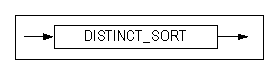

#### DNF

This hint specifies that predicates in the WHERE clause are to be normalized in the disjunctive normal form. 


#### EXEC_FAST 

If this hint is specified when EXECUTOR_FAST_SIMPLE_QUERY property is deactivated, simple statements, such as SELECT, INSERT, UPDATE, or DELETE statement are executed with SIMPLE
QUERY. If SIPLE QUERY is applied, it will be output on the execution plan.


#### FIRST_ROWS

If this hint is specified, the optimizer creates an execution plan that most efficiently returns the first n rows of a table. 


#### FULL SCAN

This hint specifies that the full table scan will be performed for the specified table.


#### GROUP BUCKET COUNT

This hint specifies the number of hash buckets for the GROUP-AGGREGATION and AGGREGATION execution nodes. 


#### GROUP_HASH

This hint specifies HASH for GROUP BY.


#### GROUP_SORT

This hint specifies SORT for GROUP BY.


#### HASH_AJ

If this hint is specified, a nested subquery uses a hash join to perform an anti-join. You need to specify this hint within the subquery. If the subquery cannot be unnested with an anti-join, this hint becomes invalid. 


#### HASH BUCKET COUNT

This hint specifies the number of hash buckets for the HASH and DISTINCT execution nodes. 


#### HASH_SJ

If this hint is specified, a nested subquery uses a hash join to perform a semi-join. You need to specify this hint within the subquery. If the subquery cannot be unnested with a semi-join, this hint becomes invalid.


#### HIGH_PRECISION

This is a hint used for preventing errors in the four fundamental arithmetic operations and mod operation. 

When this hint is used, the float type is used as the data type. When operating with a float type, computational performance may be lower than that of a real or double data type. But, the precision of up to 38 digits and mod oepration is guaranteed. 

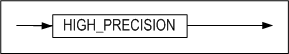

#### INDEX

This hint specifies an index scan. 


#### INDEX ASC

This hint specifies an index scan in ascending order.


#### INDEX_ASC

This hint performs the same action equivalent to the INDEX ASC hint.


#### INDEX DESC

This hint specifies an index scan in descending order. 


#### INDEX_DESC

This hint performs the same action equivalent to the INDEX DESC hint.


#### INVERSE_JOIN

If this hint is specified, a nested subquery uses an inverse join[^1] to perform either an anti-join or a semi-join. You need to specify this hint within the subquery. 

[^1]: 1An inverse join can be either an inverse index nested loop join, an inverse hash join, or an inverse sort join. For more detailed information about inverse joins, please refer to the *Performance Tuning Guide*.

This hint can be used with other hints that force semi-joins or anti-joins. For example, this hint forces an inverse hash join if it is used with the HASH_SJ hint.


#### KEEP_PLAN

If this hint is specified, the optimizer uses an exisiting execution plan (instead of recreating it) whenever the statistics for a table that is referenced by the plan changes. This hint can be used to prepare/execute and direct/execute a query. 

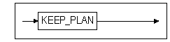

#### LEADING

This hint firstly joins the tables that are used in a hint. If more than one LEADING hint is used, only the first LEADING hint is effective. When used with the ORDERED hint, the ORDERED hint is ignored. If the Lateral View is specified in the table used for hint, it has no effect.


#### MERGE_AJ

If this hint is specified, a nested subquery uses a merge join to perform an anti-join. You need to specify this hint within the subquery. If the subquery cannot be unnested with an anti-join, this hint becomes invalid.


#### MERGE_SJ

If this hint is specified, a nested subquery uses a merge join to perform a semi-join. Users need to specify this hint within the subquery. If the subquery cannot be unnested with a semi-join, this hint becomes invalid. 

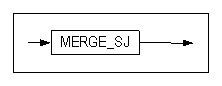

#### NL_AJ

If this hint is specified, a nested subquery uses a nested loop join to perform an anti-join. Users need to specify this hint within the subquery. If the subquery cannot be unnested with an anti-join, this hint becomes invalid. 

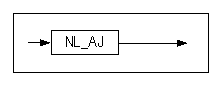

#### NL_SJ

If this hint is specified, a nested subquery uses a nested loop join to perform a semi-join. Users need to specify this hint within the subquery. If the subquery cannot be unnested with a semi-join, this hint becomes invalid. 


#### NO DELAY 

This hint deactivates aforementioned delaying function . Delaying execution of hierarchy, sorting, windowing, grouping, set, and distinction based upon execution plan graphs is not activated


#### NO_EXEC_FAST 

Even though SELECT, INSERT, UPDATE, DELETE statements are simple statements, they are not executed with SIMPLE QUERY if this hint is specified when EXECUTOR_FAST_SIMPLE_QUERY property is deactivated.


#### NO_EXPAND

This hint performs the same action equivalent to the CNF hint.


#### NO INDEX

This hint specifies not to perform an index scan. 


#### NO_INDEX

This hint performs the same action equivalent to the NO INDEX hint.

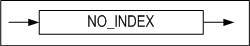

#### NO_INVERSE_JOIN

If this hint is specified, a nested subquery uses a one-pass hash join or a two-pass hash join to perform either an anti-join or a semi-join. Users need to specify this hint within the subquery. 

This hint can be used with other hints that force semi-joins or anti-joins. For example, this hint forces a one-pass hash join or a two-pass hash join if it is used with the HASH_SJ hint.


#### NO_MERGE

This hint instructs not to merge the main query and inline view query into one query.


#### NO_PARALLEL

This hint performs the same action equivalent to the NOPARALLEL hint.


#### NO_PLAN_CACHE

This hint specifies that the plan cache is not to store plans. 

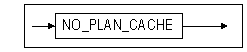

#### NO_PUSH_SELECT_VIEW

This hint specifies that a WHERE predicate outside a view is not to be pushed inside the view.

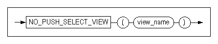

#### NO_SERIAL_FILTER

If a hint is specified while the SERIAL_EXECUTE_MODE property is enabled, it will not operate in Serial Excute Mode.


#### NO_TRANSITIVE_PRED

This hint specifies that predicate transitivity is not to be allowed. For more detailed information about predicate transitivity, please refer to the *Performance Tuning Guide* in Chapter 3: Query Optimizer.


#### NO_UNNEST

This hint specifies not to unnest a subquery. 


#### NO_USE_HASH

This hint selects a join method from among the hints excluding the HASH hint. 


#### NO_USE_MERGE

This hint selects a join method from among the hints excluding the MERGE hint.

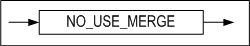

#### NO_USE_NL

This hint selects a join method from among the hints excluding the NL hint.


#### NO_USE_SORT

This hint selects a join method from among the hints excluding the SORT hint.


#### PARALLEL

This hint specifies to execute queries in parallel when scanning partitioned tables. 

- NOPARALLEL: Does not execute in parallel
- PARALLEL integer: Executes as many threads in parallel as specified for integer


#### PLAN_CACHE_KEEP

This is used to instruct the plan to exclude it from the victim selection process and keep it in the plan cache. This hint is applied during the hardprepare process. So when users switch the plan to unkeep, the soft prepare will not go back tothe keep state.


#### ORDERED

This hint specifies to follow the join order in the FROM clause. 


#### PUSH_PRED

This hint specifies that a WHERE predicate outside a view is to be pushed inside the view.


#### PUSH_SELECT_VIEW

This hint specifies that a WHERE predicate outside a view is to be pushed inside the view.


#### RESULT_CACHE

If this hint is specified, the intermediate results of the firstly query can be stored so that the results can be re-usable when the same query is executed. 


#### RULE

If this hint is specified, the optimizer creates a rule-based execution plan.

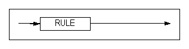

#### SET BUCKET COUNT

It is a hint to specify the number of hash buckets for SET-INTERECT and SET-DIFFERENCE execution nodes.


#### SERIAL_FILTER

If the hint is specifeid while the SERIAL_EXCUTE_MODE property is disabled, it operates in Serial Excute mode.


#### SORT_AJ

If this hint is specified, a nested subquery uses a sort join to perform an anti-join. You need to specify this hint within the subquery. If the subquery cannot be unnested with an anti-join, this hint becomes invalid. 


#### SORT_SJ

If this hint is specified, a nested subquery uses a sort join to perform a semi-join. You need to specify this hint within the subquery. If the subquery cannot be unnested with a semi-join, this hint becomes invalid. 


#### TEMP_TBS_DISK

This hint specifies that all intermediate query results are to be stored on disk temporary space.


#### TEMP_TBS_MEMORY

This hint specifies that all intermediate query results are to be stored in memory temporary space.


#### TOP_RESULT_CACHE

This hints specifies the top result cache that the final results is cached. 


#### UNNEST

This hint specifies that a subquery is to be unnested.


#### USE_ANTI

This hint specifies that a left outer join and an anti outer join are to be performed on the table in the FULL OUTER JOIN query and to concatenate the results. This hint is only available if both of the joined columns have indexes. For more detailed information, please refer to the ANTI-OUTER-JOIN node. 

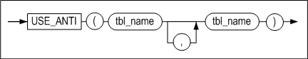

#### USE_CONCAT

This hint performs the same action equivalent to the DNF hint.


#### USE_FULL_NL

This hint specifies that a full nested loop join is to be used. 


#### USE_FULL_STORE_NL

This hint specifies that a full store nested loop join is to be used. 

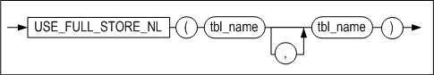

#### USE_HASH

This hint specifies that a hash join is to be used. If there is no join predicate, a nested loop join is used. 


#### USE_INDEX_NL

This hint specifies that an index nested loop join is to be used. 


#### USE_INVERSE_HASH

This hint specifies that an inverse hash join is to be used. 


#### USE_MERGE

This hint specifies that a sort merge join is to be used. If there is no sort predicate, a nested loop join is used. 


#### USE_NL

This hint specifies that a nested loop join is to be used. 


#### USE_ONE_PASS_HASH

This hint specifies that a one-pass hash join is to be used. 


#### USE_ONE_PASS_SORT

This hint specifies that a one-pass sort join is to be used. 

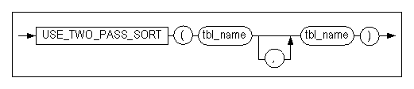

#### USE_SORT

This hint specifies that a sort join is to be used. If there is no sort predicate, a nested loop join is used. 

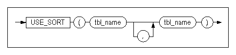

#### USE_TWO_PASS_HASH

This hint specifies that a two-pass hash join is to be used. 


#### USE_TWO_PASS_SORT

This hint specifies that a two-pass sort join is to be used. 


## 3. Data Definition Language

This chapter describes Data Definition Language (DDL), which are SQL statements used to create database objects.

### ALTER DATABASE 

#### Syntax

**alter_database :: =**


**startup_clause ::=**


**rename_datafile_clause ::=**

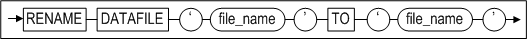

**create_datafile_clause ::=**


**create_checkpoint_image_clause ::=**


**session_clause ::=**


**archivelog_option ::=**


**backup_clause ::=**


**incremental_backup_clause ::=**

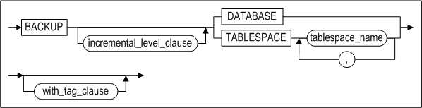

**incremental_level_clause ::=**


**with_tag_clause ::=**

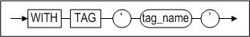

**recover_clause ::=**


**from_tag_clause ::=**


**until_option ::=**


**restore_clause ::=**


**restore_database_clause ::=**


**restore_tablespace_clause ::=**


**change_backup_directory_clause ::=**


**move_backup_clause ::=**


**delete_backup_clause ::=**


**change_tracking_clause ::=**


**snapshot_clause ::=**


#### Prerequisites

The ALTER DATABASE statement can only be executed in a startup phase preceding the SERVICE phase by the SYS user after connecting in SYSDBA mode. The exception is when using the SESSION CLOSE option, in which case it is not necessary to connect in SYSDBA mode in order to execute this statement.

#### Description

The ALTER DATABASE statement modifies, maintains, or restores an existing database.

*database_name*

This element is used to specify the name of the database to be managed.

*startup_clauses*

This element is used to specify the name of the startup phase in which to start up Altibase. 

*CONTROL*

This option is used to start the database in the CONTROL phase. When the database is started in this phase, database media recovery can be performed. Tablespaces can also be discarded in this phase. For more detailed information about the various Altibase startup phases, please refer to the *Administrator’s Manual.* 

To proceed to the phase immediately following the CONTROL phase, the META phase, execute this statement as follows:

```
ALTER DATABASE dababase_name META;
```

*META*

This option is used to start the database in the META phase. While proceeding to this phase from the previous phase, the CONTROL phase, the database meta data are loaded. To proceed to the next phase, execute the following statement:

```
ALTER DATABASE dababase_name SERVICE;
```

*SERVICE*

This option is used to start the database in the SERVICE phase. When the database is started in this phase, all memory and disk tables are loaded, and extended services such as replication and SNMP can be started. If the database can be successfully started in this phase, it means that any required recovery has been performed, and that the system is in a state in which service is being provided normally.

*UPGRADE*

This option is used to start the database in the META UPGRADE phase. When the database is started up to this phase, the meta data are upgraded, meaning that all recovery-related tasks have been completed. 

To proceed to the next phase, execute the following statement:

```
ALTER DATABASE dababase_name SERVICE;
```

RESETLOGS

This task is required to ensure normal startup of the server after incomplete recovery has been performed in the CONTROL phase. Logs that are no longer necessary once incomplete recovery has been performed are deleted while proceeding to this phase. 

To proceed to the next phase, execute the following statement:

```
ALTER DATABASE dababase_name SERVICE;
```

*META RESETUNDO*

In this phase, the SYS_TBS_DISK_UNDO tablespace is initialized, but the size of the tablespace file is not changed. Before executing this statement, check the integrity of the database, ensure that disk garbage collection has been performed, and shut down the database normally

*SHUTDOWN NORMAL*

The server waits until all client connections have been disconnected normally before shutting down normally.

*SHUTDOWN IMMEDIATE*

The server forcibly disconnects all clients and then shuts down normally.

*SHUTDOWN EXIT*

This option is used to kill the Altibase server forcibly. When Altibase is shut down in this way, the contents of the database will likely be invalid, and thus the next time the server is executed, recovery tasks will have to be performed.

*RENAME DATAFILE*

This command is used to change a reference to a data file within Altibase so that it points to a data file that has a different name or is located in a different directory. The data file specified in TO 'datafile_path' must exist. This command can only be executed in the CONTROL phase. datafile_path must be an absolute path. 

For reference, the ALTER TABLESPACE statement is used to move memory tablespace checkpoint image files.

*CREATE DATAFILE*

When a disk data file has been lost, this command is used to create a data file with reference to the log anchor data. After this statement is executed, complete media recovery is performed to restore the data file. 

This statement is available only during the CONTROL phase.

datafile_path, which is where the data file will be created, must be an absolute path. For reference, the ALTER TABLESPACE statement is used to create memory tablespace checkpoint image files.

*CREATE CHECKPOINT IMAGE*

When a memory checkpoint image file has been lost, this command is used to create a checkpoint image file with reference to the log anchor data. After this statement is executed, complete media recovery can be performed in order to restore the memory checkpoint image file.

Because the checkpoint image file is created in the checkpoint path specified for memory tablespaces, it is not necessary to specify the path; only the name of the file to be created need be provided.

This statement is available only during the CONTROL phase.

<Query\> Recreate the lost checkpoint image file MEM-TBS-1.

```
iSQL\> ALTER DATABASE CREATE CHECKPOINT IMAGE 'MEM-TBS-1';
```

*SESSION CLOSE*

This statement is used to forcibly terminate a session.

This statement can specify the session ID and user to terminate a session, and all sessions can be terminated with ALL statement. However, the session accessed by the current user cannot be terminated. If this statement is executed, a transaction of the session is rolled back.

> Note: It is impossible to terminate a session immediately if the session is waiting to obtain a lock.
>

*archivelog_option*

The database can be switched between archivelog mode and noarchivelog mode in the CONTROL phase.

*BACKUP LOGANCHOR*

When the database is operating in archivelog mode, this statement is used to back up log anchor files online without interrupting service.

*BACKUP TABLESPACE*

When the database is operating in archivelog mode, this statement is used to back up the specified tablespace to the backup directory without interrupting service.

*BACKUP DATABASE*

When the database is operating in archivelog mode, this statement is used to back up all memory and disk tablespaces and log anchor files without interrupting service.

*incremental_backup_clause*

This incrementally backs up the whole database or certain tablespaces.

*incremental_level_clause*

This specifies the incremental backup level.

*WITH TAG tag_name*

This specifies a tag name for a backup.

*RECOVER DATABASE*

This is used to perform complete media recovery. The log files in the archive log directory are read for use in recovering the data files that were affected by media errors to the current point in time.

*FROM TAG tag_name*

This specifies a database restoration or recovery from the backup with the tag name tag_name.

*RECOVER DATABASE UNTIL TIME*

This is used to perform incomplete media recovery to a specified point in time. The log files in the archive log directory are read for use in recovering the data files that were affected by media errors to the specified point in time.

*RECOVER DATABASE UNTIL CANCEL*

This is used to perform incomplete media recovery to the most recent point in time at which the logs in archive log files are valid. The log files in the archive log directory are read for use in recovering the data files that were affected by media errors to that point in time.

*restore_database_clause*

This performs a complete media restoration on a database, or an incomplete restoration to a specific point in time or a specific tag name.

*restore_tablespace_clause*

This performs a complete restoration on a tablespace.

*change_backup_directory_clause*

This specifies the location of backup files generated by incremental backups.

*move_backup_clause [WITH CONTENTS]*

This changes the incremental backup directory. If the WITH CONTENTS option is specified, previous backup files are transferred to the new directory. 

*delete_backup_clause*

This deletes incremental backup files which have expired.

change_tracking_clause

This enables or disables page change tracking for incremental backups.

*snapshot_clauses*

This option configures SNAPSHOT SCN on the basis of the time when BEGIN SNAPSHOT is executed, and exports data with iLoader based upon the configured SCN.

#### Examples

<Query\> Start up a database called mydb to provide normal service.

```
iSQL> ALTER DATABASE mydb SERVICE;
```

\<Query\> Switch the database to archievelog mode.

```
iSQL> ALTER DATABASE ARCHIVELOG;
```

\<Query\> Start up the database normally after the incomplete recovery.

```
iSQL> ALTER DATABASE mydb META RESETLOGS;
```

\<Query\> Initialize the SYS_TBS_DISK_UNDO tablespace.

```
iSQL> ALTER DATABASE mydb META RESETUNDO;
```

\<Query\> Back up the SYS_TBS_DISK_DATA tablespace to the /altibase backup directory.

```
iSQL> ALTER DATABASE TABLESPACE SYS_TBS_DISK_DATA TO ‘/altibase_backup/’;
```

\<Query\> Restore the database to Feb. 16, 2009, 12:00 PM from a previous backup.

```
iSQL> ALTER DATABASE RECOVER DATABASE UNTIL TIME ‘2008-02-16:12:00:00’;
```

\<질의\> Restore the database from a previous backup to reflect the entire contents of the log file #20000, which immediately precedes the log file #20001, which was lost.

```
iSQL> ALTER DATABASE RECOVER DATABASE UNTIL CANCEL;
```


### ALTER DATABASE LINKER 

For information on Database Link, please refer to the *Database Link User's Manual.*

### ALTER INDEX

#### Syntax

**alter_index ::=**

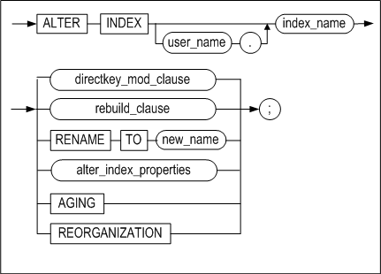


**directkey_mod_clause ::=**


**rebuild_clause ::=**


**index_attribute ::=**


**alter_index_properties::=**


**alter_index_segment_attribute_clause::=**

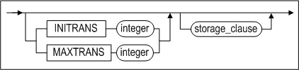

**storage_clause::=**


**allocate_extent_clause::=**


#### Prerequisites

The SYS user, the owner of the schema containing the index, and users having the ALTER ANY INDEX system privilege can execute the ALTER INDEX statement.

#### Description

The ALTER INDEX statement is used to change or rebuild an existing index.

*user_name*

This specifies the name of the owner of the index to be altered.

If omitted, Altibase will assum that the index belongs to the schema of the user connected via the current session.

*index_name*

This specifies the name of the index to be altered.

*directkey_mod_clause*

This specifies whether to use a direct key index or not. For more detailed information about direct key indexes, please refer to [CREATE INDEX](#create-index).

- MAXSIZE integer  
  This sets the maximum size of a direct index.
- OFF  
  This changes a direct key index to a normal index.

*rebuild_clause*

This rebuilds an existing index or one of its partitions.

*index_attribute*

This specifies the tablespace in which the rebuilt index partition will be stored.

*RENAME*

This specifies the name of index to be changed.

*AGING*

This records a transaction commit SCN in an index page and deletes old versions of nodes. This statement is only available for disk-based indexes.

*REORGANIZATION*

The ALTER INDEX clause reorganizes the index space through integration of leaf nodes in memory B-tree index and neighboring nodes. 

The REORGANIZATION clause ensures high efficiency of index space especially when it is used in a case the index range is relatively greater than that of the data, or there is an occurrence of index fragmentation on particular indexes. The memory based B-tree indexes are available for use.

*alter_index_segment_attribute_clause*

- INITRANS Clause  
  This changes the initial number of Touched Transaction Slots (TTS).
- MAXTRANS Clause  
  This changes the maximum number of Touched Transaction Slots (TTS). 

*storage_clause*

Sets parameters for managing extents in segments. 

- INITEXTENTS Clause  
  This ignores the INITEXTENTS parameter in the ALTER INDEX statement.
- NEXTEXTENTS Clause  
  This determines the number of extents that are added to the segment every time the segment is increased in size. 
- MINEXTENTS Clause  
  This Sets the minimum number of extents in a segment.
- MAXEXTENTS Clause  
  This sets the maximum number of extents in a segment.

*allocate_extent_clause*

This explicitly allocates extents to the index segment. Set SIZE to the total size of extents that are to be added to the index segment. If the disk tablespace consists of several data files, extents are distributed equally between them,

#### Examples

##### Changing the Direct Key Index

\<Query\> Rebuild the index partition IDX_P5 in the tablespace TBS1

```
iSQL> ALTER INDEX idx1 DIRECTKEY;
```

\<Query\> Change the direct key index idx1 to a normal index.

```
iSQL> ALTER INDEX idx1 DIRECTKEY OFF;
```

<Query\> Change the index idx3 to a direct key index and set the maximum 

```
iSQL> ALTER INDEX idx3 DIRECTKEY MAXSIZE 10;
```


##### Rebuilding the Index Partition

<Query\> Rebuild the index partition idx_p5 in tablespace tbs1.

```
iSQL> ALTER INDEX IDX1 REBUILD PARTITION idx_p5 TABLESPACE tbs1;
```


##### Changing the Index Name

<Query\> Change the name of emp_idx1 to emp_idx2.

```
iSQL> ALTER INDEX emp_idx1 RENAME TO emp_idx2;
```


##### Allocating Extents to Indexes

\<Query\> Allocate extents totaling 10MB in size to the index LOCAL_IDX, which is located in a disk tablespace.

```
iSQL> ALTER INDEX felt_idx ALLOCATE EXTENT ( SIZE 10M );
```


##### Reorganization Indexes

<Query\> Execute reorganization of index idx1.

```
iSQL> ALTER INDEX idx1 REORGANIZATION;
```


### ALTER JOB 

#### Syntax

**alter_job ::=**


**execute_procedure_statement ::=**

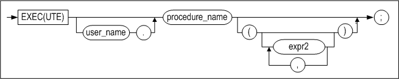

#### Prerequisites

Only the SYS user can change the JOB with this statement. In order to perform the created JOB, it should be activated with ENABLE when creating or after creating the JOB.

#### Description

The definition of the JOB created with the CREATE JOB statement can be changed. The execution statement of the procedure registered for the JOB, the start time and end time of the JOB, the execution interval of the job and etc. can be changed with this statement.

*job_name*

This specifies the name of the JOB to be changed.

*START*

This specifies the time at which the JOB is to start.

*END*

This specifies the time at which the JOB is to end.

*expr1*

This accepts only a DATA type value or a DATE type expression.

*INTERVAL number*

This specifies the interval after which the JOB is to run again, after it has run for the first time. The unit of time is determined by the YEAR, MONTH, DAY, HOUR, MINUTE which is specified after the number.

*expr2*

This specifies the input argument value necessary for the execution of the defined procedure as a constant or an expression.

*ENABLE/DISABLE*

This is used to modify whether to execute each join in the job scheduler.

*COMMENT*

This allows users to modify the job description

#### Examples

\<Query\> Change job1 to the enabled state.

```
iSQL> ALTER JOB job2 SET ENABLE;
Alter success.
```

\<Query\> Change job2 to the disabled state.

```
iSQL> ALTER JOB job2 SET DISABLE;
Alter success.
```

\<Query\> Change the start time of job1 to ‘January 1st, 2013’. 

```
iSQL> ALTER JOB job1 SET START to_date('20130101','YYYYMMDD');
Alter success.
```

\<Query\> Change the procedure to execute in job2 to the proc1 procedure in usr1.

```
iSQL> alter job job2 set exec usr1.proc1;
Alter success.
```

\<Query\>Change the start time of job2 to 'June 3rd, 2013'.

```
iSQL> alter job job2 set start to_date('2013/06/03 10:00:00','YYYY/MM/DD HH24:MI:SS');
Alter success.
```

\<Query\> Change the end time of job2 to 'June 7th, 2013 10:00:00'.

```
iSQL> alter job job2 set end to_date('2013/06/07 10:00:00', 'YYYY/MM/DD HH24:MI:SS');
Alter success.
```

\<질의\> Change the interval after which job2 is to run to 10 minutes.

```
iSQL> alter job job2 set interval 10 minute;
Alter success.
```


### ALTER QUEUE 

#### Syntax

**alter_queue ::=**


#### Description

ALTER QUEUE alters the definition of a queue.

*COMPACT*

This returns empty pages to the tablespace in which the queue is located. No data is actually moved.

*MSGID RESET*

This resets the queue's MSGID

### ALTER REPLICATION 

#### Syntax

**alter_replication ::=**


**replication_item ::=**


**alter_replication_set_clause ::=**


**offline_clause ::=**


#### Prerequisites

Only the SYS user can execute replication-related statements.

#### Description

ALTER REPLICATION controls the operation of a replication object that has been created with the CREATE REPLICATION statement. 

For more information about control statements such as replication termination, please refer to "Data Control Statements" > alter_replication_dcl.

For more information about replication, please refer to the Replication Manual. 

*replication_name*

Thi specifies the name of the replication object.

*SYNC*

Thi sends all data in replication target tables on the local server to the corresponding tables on the remote server and starts replication.

*SYNC ONLY*

This send all data in replication target tables on the local server to the corresponding tables on the remote server. It does not initiate a replication sender thread.

*PARALLEL parallel_factor*

The parallel_factor option does not need to be specified; on omission, the default value is 1. The maximum value of parallel_factor is (the number of CPUs * 2). This value cannot be exceeded, even if a higher maximum value is specified. If 0 (zero) or a negative value is specified, an error is returned.

*TABLE replication_item*

This specifies which of the replication tables or partitions on the local server to synchronize using the SYNC parameter. If this clause is specified, replication starts from the point in time up to which replication was last performed after the specified tables have been synchronized. If the TABLE clause is omitted, replication starts from the current position in the logs after all of the replication tables and partitions have been synchronized.

*START*

Replication starts from the point in time up to which replication was last performed.

*QUICKSTART*

Replication starts from the current point in time.

*START/ QUICKSTART RETRY*

When STARTing or QUICKSTARTing replication using the RETRY option, even if handshaking fails, a sender thread is created on the local server. When handshaking between the local server and the remote server subsequently succeeds, replication starts. 

When this option is used, iSQL will report handshaking success even if the first handshake attempt fails. Therefore, the user has to check the result of this command by viewing trace logs or performance views. 

When starting replication without the RETRY option, if the first handshaking attempt fails, an error is raised and execution stops. Note that the use of the RETRY option is not supported in EAGER mode.

*STOP*

Please refer to the ALTER REPLICATION caluse of the Data Control Statement.

*RESET*

This resets replication information (such as the restart SN). It can only be executed while replication is stopped. It is an alternative to executing the DROP REPLICATION and CREATE REPLICATION commands.

*ADD TABLE*

This is used to add a table to a replication object. A table can be added to a replication object only when replication is stopped.

*TABLE FROM replication_item TO replication_item*

This is used to specify the name of the replication target table or partition, together with the name of the table owner.

DROP TABLE

This is used to remove a table from a replication object. A table can be removed from a replication object only when replication is stopped.

*FLUSH*

Please refer to the ALTER REPLICATION clause of the Data Control Statement.

*SET HOST*

This sets a particular host as the current one. It can be changed while replication is stopped.

*USING conn_type [ib_latency]*

The communication method (TCP or InfiniBand) can be set with the remote server. The ib_latency value can be set only when using InfiniBand. To use InfiniBand, the IB_ENABLE property must have a value of 1.

*alter_replication_set_clause*

This clause allows the user to enable or disable the following options for replication in LAZY mode. 

- RECOVERY: Enables or disables data recovery. 
- GAPLESS: Enables or disables replication gap dissolution. 
- GROUPING: Enables or disables replication transaction grouping. 
- PARALLEL: Enables or disables parallel appliers. Also sets the number of parallel appliers.

*offline_cluase*

This clause allows the user to change the offline option or perform replication with a specified offline path.

#### Considerations

There are several points that users working with replication must keep in mind before using replication. Before executing an ALTER REPLICATION command, please refer to the *Replication Manual.*

#### Example

##### Start execution of the repl1 replication object 

\<Query\> Send the data on the local server data to the remote server, and start replication

```
iSQL> ALTER REPLICATION rep1 SYNC;
Alter success.
```

\<Query\> Start the rep1 replication from the time point at which replication was most recently executed:

```
iSQL> ALTER REPLICATION rep1 START;
Alter success.
```

\<Query\> Start the replication

```
iSQL> ALTER REPLICATION rep1 QUICKSTART;
Alter success.
```


##### Remove the replication target table employees from a replication object named rep1. 

```
iSQL> ALTER REPLICATION rep1 STOP;
Alter success.
iSQL> ALTER REPLICATION rep1 DROP TABLE FROM sys.employees TO sys.employees;
Alter success.
```


##### Add partition p2 of the partitioned table tbl_sales to the replication object of the name rep1.

```
iSQL> ALTER REPLICATION rep1 STOP;
Alter success.
iSQL> ALTER REPLICATION rep1 ADD TABLE
 FROM sys.tbl_sales PARTITION p2 TO sys.tbl_sales PARTITION p2;
Alter success.
```


##### Add the table employees to the replication object rep1. 

```
iSQL> ALTER REPLICATION rep1 STOP;
Alter success.
iSQL> ALTER REPLICATION rep1 ADD TABLE FROM sys.employees TO sys.employees;
Alter success.
```


### ALTER SEQUENCE 

#### Syntax

**alter_sequence ::=**


**sequence_options ::=**


**sync_table_clause ::=**


#### Prerequisites 

Only the SYS user, the owner of the schema to which the sequence belongs, users having the ALTER object privilege on the sequence, and users having the ALTER ANY SEQUENCE system privilege can execute this statement.

#### Description

After a sequence has been created using the CREATE SEQUENCE statement, this statement is used to change the definition of the sequence. For more detailed information, please refer to the description of the CREATE SEQUENCE statement.

*user_name*

This is used to specify the name of the owner of the sequence to be changed. If omitted, Altibase will assume that the sequence belongs to the schema of the user connected via the current session. 

*seq_name*

This is used to specify the name of the sequence to be altered.

*INCREMENT BY*

This is used to specify the interval between sequence numbers.

*MAXVALUE*

This is used to specify the maximum value that the sequence can generate.

*MINVALUE*

This is used to specify the minimum value of the sequence.

*CYCLE*

This is used to allow a sequence to continue to output values after it reaches the limit specified by MAXVALUE or MINVALUE. In the case of an ascending sequence, the minimum value will be output once its maximum value has been reached, whereas the opposite is true for a descending sequence: once it reaches its minimum value, it outputs its maximum value.

*CACHE*

This is used to specify the number of sequence values that are cached in memory so that they can be accessed more quickly. The first time the sequence is referred to, the cache is populated, and whenever values are subsequently requested from the sequence, they are retrieved from the cached values. After the last sequence value in the cache has been used, the next request for a key value from the sequence causes new sequence values to be created and cached in memory. The number of sequence values that are created and cached at this time is set using the CREATE SEQUENCE statement. If this option is omitted, the default value is 20.

*FLUSH CACHE*

This flushes the sequence values cached in memory. If the value of a sequence is requested after flushing the cache using this option, new sequence values are cached in memory.

*ENABLE SYNC TABLE*

This creates a custom table for sequence replication for the purpose of replicating sequence numbers. The custom table for sequence replication is automatically granted the name, "[sequence name]$seq".

*DISABLE SYNC TABLE*

This drops the custom table for sequence replication used for the purpose of replicating a sequence.

#### Restriction

When changing the definition of an existing sequence, the START WITH clause cannot be used, because the sequence has already been created.

 A custom table for sequence replication can be created only if the length of the sequence name is equal to or smaller than 36 bytes. 

For detailed more information about sequences, please refer to the description of the CREATE SEQUENCE statement.

#### Examples

\<\Query\> Change the sequence seq1 so that the minimum value is 0, the maximum value is 100, and increments by 1.

```
iSQL> ALTER SEQUENCE seq1
    INCREMENT BY 1
    MINVALUE 0
    MAXVALUE 100;
Alter success.             
```

\<Query\> Change the minimum and maximum values of sequence seq2 to unlimited.

```
iSQL> ALTER SEQUENCE seq2
    NOMAXVALUE 
    NOMINVALUE;
Alter success.
```

\<Query\> Flush the sequence values cached in the sequence seq1.

```
iSQL> ALTER SEQUENCE seq1 FLUSH CACHE;
Alter success.
```

\<Query\> Create a custom table for sequence replication for the purpose of replicating the sequence seq1.

```
iSQL> ALTER SEQUENCE seq1 ENABLE SYNC TABLE;
```


### ALTER TABLE 

#### Syntax

**alter_table::=**


**log_compression_clause ::=**


**alter_table_properties::=**

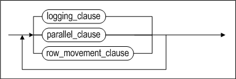

**alter_table_tablespace::=**


**table_move_index_clause::=**


**table_lob_column_clause::=**


**logging_clause::=**


**parallel_clause::=**


**row_movement_clause::=**


**alter_table_segment_properties::=**


**alter_table_segment_attribute_clause::=**


**storage_clause::=**


**alter_table_partitioning::=**


**add_table_partition ::=**


**alter_partition ::=**


**partition_index_clause ::=**


**partition_lob_column_clause ::=**


**coalesce_table_partition ::=**

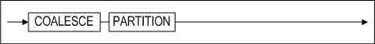

**drop_table_partition ::=**


**merge_table_partition ::=**


**rename_table_partition ::=**


**split_table_partition ::=**


**truncate_table_partition ::=**


**partition_spec ::=**


**table_partition_description ::=**


**index_partition_spec ::=**


**index_partition_description ::=**


**partition_access_mode ::=**


**access_mode_clause ::=**


**column_clauses::=**


**add_column_clauses::=**

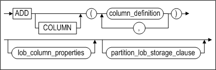

<a name="column_definition"><a/>

**column_definition::=**


**partition_lob_storage_clause ::=**


**alter_column_clause ::=**


**modify_column_clause::=**


**modify_column_spec::=**


**drop_column_clause::=**


**rename_column_clause::=**


**reorganize_column_clause::=**


**constraints_clauses::=**

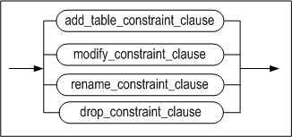

**add_table_constraint_clauses ::=**


**table_constraint_for_alter::=**


**constraint_state::=**


**modify_constraint_clause::=**


**rename_constraint_clauses ::=**


**drop_constraint_clause::=**


**aging_clause::=**


**compact_clause::=**


**allocate_extent_clause::=**


#### Prerequisites 

Only the SYS user, the owner of the schema to which the table belongs, users having the ALTER object privilege for the table, and users having the ALTER ANY TABLE system privilege can alter table definitions.

#### Description

The ALTER TABLE statement is a SQL statement which modifies the definition of a specified table. Execution of this statement alters the meta information of the table. 

The ALTER TABLE statement can modify the attributes of partitioned tables. The clauses related to partitioned tables are the ALTER, ADD, COALESCE, DROP, MERGE, RENAME, SPLIT and TRUNCATE clauses. 

The following table shows whether each statement can be used with range-, list- and hash-partitioned tables.

|          | Range-Partitioned Tables | List-Partitioned Tables | Hash-Partitioned Tables |
| -------- | ------------------------ | ----------------------- | ----------------------- |
| ALTER    | ○                        | ○                       | ○                       |
| ADD      | X                        | X                       | ○                       |
| COALESCE | X                        | X                       | ○                       |
| DROP     | ○                        | ○                       | X                       |
| MERGE    | ○                        | ○                       | X                       |
| RENAME   | ○                        | ○                       | ○                       |
| SLIP     | ○                        | ○                       | X                       |
| TRUNCATE | ○                        | ○                       | ○                       |

[Table 3-1] Operations Supported for Use with Different Partitioning Methods

*user_name*

This is used to specify the name of the owner of the table to be altered. If omitted, Altibase will assume that the table belongs to the schema of the user connected via the current session.

*tbl_name*

This is used to specify the name of the table to alter.

*parallel_clause*

Please refer to the parallel clause description of CREATE TABLE.

*alter_table_segment_attribute_clause*

- PCTFREE Clause  
  This is used to change the percentage of free space that is reserved for future use when updating records that have already been saved in pages. 
  
  An ALTER TABLE statement containing the alter_table_segment_attribute_clause, which is used to change segment attributes, can be executed while Altibase is running. However, the changes will not be immediately applied in all of the pages in the segment; rather, each table page will be changed individually the next time the page is accessed
  
- PCTUSED Clause  
  This is used to change the threshold below which the amount of used space in a page must decrease in order for the page to return to the state in which records can be inserted.
  
- INITRANS Clause  
  This is used to change the initial number of TTS (Touched Transaction Slots). 
  
- MAXTRANS Clause  
  This is used to change the maximum number of TTS (Touched Transaction Slots).

*storage_clause*

This is used to set parameters for managing extents in segments.

- INITEXTENTS Clause  
  The INITEXTENTS parameter in the ALTER TABLE statement is ignored.
- NEXTEXTENTS Clause  
  This determines the number of extents that are added to the segment every time the segment is increased in size
- MINEXTENTS Clause  
  This sets the minimum number of extents in a segment. 
- MAXEXTENTS Clause  
  This sets the maximum number of extents in a segment.

*add_table_partition*

This clause can add a partition into a partitioned table and it can be also used in hash-partitioned tables. The local indexes are automatically created in added partitions as well if the local indexes are already created in the existing partitions. At this point, names are automatically determined by the system, and the indexes are stored into tablespace where the newly added partitions located.

*partition_spec*

This is used to specify the name of the partition and the tablespace in which the partition will be stored. The name of the tablespace can be omitted. If it is omitted, the data pertaining the partition are stored in the tablespace in which the table is located. Furthermore, if an index has been defined for the table, the tablespace in which the index partition is stored can be specified.

*alter_partition*

This clause modifies the tablespace of partitions. It transfers not only the partition records which will be moved, but also transfers the local indexes and LOB columns that are created in the partitions. 

However, the index can be transferred to the tablespace of an equivalent storage medium, and the LOB column can be transferred only to a different tablespace when a partition is moved to the disk tablespace.

*partition_index_clause*

This clause specifies the tablespace in which the local index of partition will be located when modifying the tablespace of partition.

*partition_lob_column_clause*

This clause specifies the tablespace in which LOB column of partition will be located when modifying the tablespace of partition.

*table_partition_description*

This is used to specify the tablespace in which each partition is stored and the attributes of LOB columns, if any. 

If the tablespace clause is omitted, the data are stored in the default tablespace for the table. In the same way, if the tablespace statement for a LOB column is omitted, the LOB column data are stored in the tablespace in which the partition is stored. 

For more detailed information on using tablespaces, please refer to the explanation of table_partition_description in CREATE TABLE.

*index_partition_spec*

When the ALTER TABLE statement is executed with the SPLIT PARTITION, MERGE PARTITION or ADD PARTITION clause, a new partition is created. At this time, this clause can be used to specify the tablespace in which to store the index partition that is created along with the table partition.

*coalesce_table_partition*

This can only be used with hash partitions. It is used to coalesce hash partitions and reorganize the data. When partitions are coalesced, the last partition is chosen, its contents are distributed among the remaining partitions, and it is dropped.

*drop_table_partition*

This is used to remove a partition. The data in the partition are deleted, together with any local indexes. In order to avoid deleting the data, MERGE the partition with another partition before executing DROP on it.

*merge_table_partition*

This is used to merge two partitions into one. Use the INTO clause to specify the name of the new partition. The name can be the same as the name of one of the two partitions being merged, or can be a new name not belonging to any existing table partitions.

When merging range partitions, the partitions are merged into the partition having the higher upper limit. 

When merging list partitions, the partitions are merged into a partition having the union of the key values of the two partitions. 

When a partition is merged with the default partition, the domain of the default partition is increased to encompass the domain of the merged partition, and only the default partition remains. 

If any local indexes have been defined for the table, the local indexes of the merged partitions are deleted. If the table contains a LOB column, its attributes can be specified separately. 

If no tablespace is specified, the new partition is stored in the default tablespace for the table, even if the original partition having the same name as the name of the newly created partition was stored in another tablespace.

*rename_table_partition*

This is used to rename a partition.

*split_table_partition*

This is used to split a partition into two partitions.

The AT clause can only be used with range partitions. It is used to specify a partition key value, on the basis of which a partition is split into two. This value must be larger than the partition key value for the partition immediately preceding it, and smaller than the partition key value for the partition before it was split.

The VALUES clause can only be used with list partitions. It is used to specify a list of values to separate from the list of values for the existing partition. The values specified using the VALUES clause must be present in the list of values for the existing partition; however, not all of the values for the existing partition can be specified in the VALUES list.

The INTO clause is used to specify the names and tablespaces for the two partitions resulting from the SPLIT operation.

If any local indexes have been defined for the table, the local index partition is also split, along with the data partition.

If the table contains a LOB column, the attributes for the LOB column can be set separately.

*truncate_table_partition*

This is used to delete all of the data in a partition.

*partition_access_mode*

This switches the data access mode for the partition to Read-Only, Read/Write or Read/Append mode.

*add_column_clause*

This is used to add a new column to the table.

*partition lob storage_clause*

When a LOB column is added to a partitioned table, this clause is used to set the tablespace in which each of the LOB column partitions is stored. 

*alter_column_clause*

These clauses are used to change the default value for an existing column.

*modify_column_clause*

This is used to change the data type of an existing column. 

SRIC can be used an integer within the 4-byte range. If the SRID value is changed, only the value that matches the value entered in the table is selected.

The following table shows which data types can be changed into which data types.

△ means that the data type change might result in the loss of non-NULL data. To acknowledge the possibility of data loss and proceed with the data type change anyway, use the TOLERATE DATA LOSS option. When changing data into date type data, Altibase does so according to the DEFAULT_DATE_FORMAT property.

- ###### Prerequisites when changing data types

  - Character data type --> Numeric data type  
    Character data should consist only of numbers and decimal points  
    Character data must be within the rage of numeric data types.
  - Character data type --> Character data type  
    The column size must be greater than or equal to the length of the data type before the change
  - Numeric data type --\> Character data type  
    The column size must be greater than or equal to the length of the data type before the change
  - Numeric data type --\> Numeric data type 
    The data must be within the range of the numeric data type users want to change.
  - Character data type --> Data date type  
    The data before the change should stored as a date  
    The data format must match the DEFAULT_DATE_FORMAT property.
  - Date data type --> Character data type 
    When converted to the character type, it is changed to DEFAULT_DATE_FORMAT

| After Modification /  Before Modifaciton | char | var char | nchar | nvarchar | clob | big int | dou ble | float | int eger | num ber | num eric | real | small int | date | blob | byte | nibble | bit  | varbit | geometry |
| ---------------------------------------- | ---- | -------- | ----- | -------- | ---- | ------- | ------- | ----- | -------- | ------- | -------- | ---- | --------- | ---- | ---- | ---- | ------ | ---- | ------ | -------- |
| char                                     | o    | o        | o     | o        |      | △       | △       | △     | △        | △       | △        | △    | △         | △    |      |      |        |      |        |          |
| varchar                                  | o    | o        | o     | o        |      | △       | △       | △     | △        | △       | △        | △    | △         | △    |      |      |        |      |        |          |
| nchar                                    | o    | o        | o     | o        |      | △       | △       | △     | △        | △       | △        | △    | △         | △    |      |      |        |      |        |          |
| nvarchar                                 | o    | o        | o     | o        |      | △       | △       | △     | △        | △       | △        | △    | △         | △    |      |      |        |      |        |          |
| clob                                     |      |          |       |          |      |         |         |       |          |         |          |      |           |      |      |      |        |      |        |          |
| bigint                                   | o    | o        | o     | o        |      | o       | △       | △     | o        | △       | △        | △    | o         |      |      |      |        |      |        |          |
| double                                   | o    | o        | o     | o        |      | △       | o       | △     | △        | △       | △        | △    | △         |      |      |      |        |      |        |          |
| float                                    | o    | o        | o     | o        |      | △       | △       | △     | △        | △       | △        | △    | △         |      |      |      |        |      |        |          |
| integer                                  | o    | o        | o     | o        |      | o       | △       | △     | o        | △       | △        | △    | o         |      |      |      |        |      |        |          |
| number                                   | o    | o        | o     | o        |      | △       | △       | △     | △        | △       | △        | △    | △         |      |      |      |        |      |        |          |
| numeric                                  | o    | o        | o     | o        |      | △       | △       | △     | △        | △       | △        | △    | △         |      |      |      |        |      |        |          |
| real                                     | o    | o        | o     | o        |      | △       | △       | △     | △        | △       | △        | o    | △         |      |      |      |        |      |        |          |
| smallint                                 | o    | o        | o     | o        |      | o       | △       | △     | o        | △       | △        | △    | o         |      |      |      |        |      |        |          |
| date                                     | △    | △        | △     | △        |      |         |         |       |          |         |          |      |           | o    |      |      |        |      |        |          |
| blob                                     |      |          |       |          |      |         |         |       |          |         |          |      |           |      |      |      |        |      |        |          |
| byte                                     |      |          |       |          |      |         |         |       |          |         |          |      |           |      |      | o    |        |      |        |          |
| nibble                                   |      |          |       |          |      |         |         |       |          |         |          |      |           |      |      |      | o      |      |        |          |
| bit                                      |      |          |       |          |      |         |         |       |          |         |          |      |           |      |      |      |        | o    | o      |          |
| varbit                                   |      | o        |       |          |      |         |         |       |          |         |          |      |           |      |      |      |        | o    | o      |          |
| geometry                                 |      |          |       |          |      |         |         |       |          |         |          |      |           |      |      |      |        |      |        | o        |

O: If the data type change condition is satisfied, the data type of the existing column can be changed without specifying the TOLERATE DATA LOSS option  
△: The data type of existing column can be changed only when the data type change condition is satisfied and the TOLERATE DATA LOSS option is specified. 

*drop_column_clause*

This is used to delete one or more columns.

*rename_column_clause*

This is used to rename a column.

*reorganize_column_clause*

This specifies the column which is to reorganize data of the dictionary table in which data of the column is actually stored.

*column_definition*

- DEFAULT  
  When a new column is added, if the DEFAULT option is not specified, the value for each row in the new column will be NULL. However, if the DEFAULT option is specified, when the column is added to a table containing existing rows, it will be populated with the DEFAULT value.
- TIMESTAMP  
  This is used to add a timestamp column.

*column_constraint*

Specifies constraints for the column.

- NULL/NOT NULL  
  This specifies whether NULL values are allowed in the column. If NULL values are to be disallowed for a column, then the column can be added using the ALTER TABLE command only if a default value is also specified. In other words, in order to add a new column to a table, the column must either allow NULL values or have a default value specified.
- CHECK *condition*  
  This specifies an integrity rule that applies to the target column. Only the target column can be referenced within the condition of the column_constraint clause.
- USING INDEX TABLESPACE *tablespace_name*  
  This specifies the tablespace in which to store the index for the constraint.

> Many of the clauses in the ALTER TABLE statement have the same function as those in the CREATE TABLE statement. For more information about those clauses, please also refer to CREATE TABLE.


*constraints_clauses*

This clause is used to add a constraint to a table, delete an existing constraint, or change the name of an existing constraint.

- add_table_constraints_clause  
  This clause is used to add a constraint to a table.
- rename_table_constraints_clause  
  This clause is used to change the name of an existing constraint.
- drop_table_constraints_clause  
  This clause is used to delete an existing constraint. 
  - DROP CONSTRAINT  
    This is used to remove a constraint.
  - DROP PRIMARY KEY  
    This is used to remove the primary key from the table.
  - DROP UNIQUE  
    This is used to drop a UNIQUE constraint from one or more columns.
  - DROP LOCALUNIQUE

*RENAME TO*

This is used to change the name of the table.

*MAXROWS*

This is used to change the maximum number of records that the table can contain, which was set when the table was created. For more information, please refer to CREATE TABLE.

*ENABLE/DISABLE*

This clause is used to activate or deactivate all of the indexes in the table specified using tbl_name. The performance of the server can be improved by minimizing the time taken to build indexes, either when the database is started[^2]or while the database is providing service. 

For example, when using iLoader to load large amounts of data into a database (or relocate them to a new table), if many indexes exist in the table in which the data are to be saved, it will  take a lot of time[^3] to load the data due to the operations that must be performed on the indexes. In such cases, disabling indexes and then enabling them again after inserting a large amount of records can minimize the time required to build indexes, leading to improved performance.

[^2]: To maximize performance when the system is restarted, a command specifying that indexes are built using parallel processing can be used.

[^3]: The time required to build an index for a table that contains a large amount of data is proportional to the number of indexes that have been defined for the table. Although it is not possible to build multiple indexes for the same table simultaneously, the index building time can be minimized by building them one by one using parallel processing. 


*aging_clause*

This is used to physically eliminate previous versions of records that have already been logically deleted from the table. It can be executed by specifying a partition.

*compact_clause*

This is used to retrieve empty pages in which the queue is located. Even if when executing compression, Altibase does not actually transfer the data. This statement is only used and supported in the memory tables and volatile tables

*allocate_extent_clause*

This is used to explicitly allocate extents to table segments. The SIZE attribute determines the total size of extents to be allocated to the table segment. If the size specified here is not an exact multiple of the size of one extent, then the number of extents that are allocated is rounded up. If the disk tablespace consists of several data files, the extents are distributed among them equally.

ACCESS *access_mode_clause*

This switches the data access mode for the table to Read-Only, Read/Write or Read/Append mode.

*alter_table_tablespace*

This clause can modify the tablespace of a table, and transfer indexes and LOB columns created in the existing tables. At this time, depending on whether the table is partitioned, record movement and column attribute changes can be performed implicitly.

- ###### If case of non-partitioned table: 

  - Move records in the table.
  - When changing a tablespace from a disk tablespace to memory or volatile, VARIABLE-enabled columns are chaged to VARIABLE columns. 
  - When changing a table space from disk to disk in a memory or volatile tablespace, all columns are chaged to FIXED
  
- ###### In case of partitioned table: 

  - Only the tablespace of the partitioned table are changed. At this time, the tablespace of the partition is not changed, and the records of the partition are not moved.
  - To change the table space of a partition, see the alter_partition section.


*table_move_index_clause*

The tablespace that can store the relevant table index can be specified when modifying tablespace.

However, it can be transferred into the tablespace identical to the table type (memory, volatile, and disk).

*table_lob_column_clause*

The LOB columns the relevant table can specify the tablespace to store.

However, the tablespace stroing the LOB columns can specify different disk tablespace only in the case of transferring to the partitioned tablespace.

*TOUCH*

This clause intentionally manipulates the optimizer by increasing the SCN(System Commit Number) so that the optimizer can recognize that a table has been modified. Then, the query execution plan including a table is re-created.

#### Precautions

- The definition of a table that has been designated as a replication target table cannot be altered. This means that it is impossible to change the data type of a column in a replication target table because changing the data type would mean altering the table definition.
- If the table has only one partition, COALESCE/DROP TABLE PARTITION cannot be used.

- The DROP PARTITION and MERGE PARTITION clauses cannot be used with hash-partitioned tables. Instead, the COALESCE PARTITION clause should be used. Moreover, the SPLIT PARTITION clause cannot be used with hash-partitioned tables.
  
- For range-partitioned tables, the partitions to merge must be adjacent to each other.

- If the table contains a primary key or unique key, called the referenced key, that is referenced by any foreign key constraints in other tables, the definition of the table cannot be changed.
  
- Columns cannot be added to or removed from a table such that the total number of columns in the table is reduced to 0 (zero) or increased beyond 1024, which is the maximum allowable number of columns in a table. If a table contains one or more columns with the VARIABLE option, the maximum allowable number of columns in the table might be less than 1024, depending on the value specified in IN ROW SIZE clause.
  
- A table can have only one primary key defined for it.

- For a foreign key constraint, the foreign key and the unique or primary key being referred to in another table must have the same number of columns, and respective columns must have the same data type.
  
- The data type of a column that is the basis of a foreign key constraint cannot be changed. This is not permitted, either for foreign keys or for unique or primary keys that are referred to by foreign keys in other tables, because data values might be changed when the data type is changed.
  
- The maximum number of indexes that can be created in one table is 64. The maximum number of primary keys and unique keys combined that can exist in one table is 64.
  
- The record of each partition is not transferred when modifying to the tablespace of partitioned table.
  
- Modifying from memory or volatile tablespace to disk tablespace changes all the LOB columns to be FIXED.

#### Constraints 

- A timestamp constraint cannot be added to or removed from an existing column using the ADD/DROP CONSTRAINT clause.
- When an INSERT or UPDATE statement is executed on a table containing a column with the TIMESTAMP constraint, the system time is inserted into that column by default. Therefore, the DEFAULT value cannot be changed or dropped using the ALTER TABLE SET/DROP DEFAULT statement. For more information, please refer to the description of the CREATE TABLE statement.
- When the SRID of a GEOMETRY column is changed, values that match the values entered in the table can only be selected. For example, if a value with a SRID of 100, 101, or 102 is entered in a table, it cannot be cahnged to any value.

#### Example

##### Adding and Dropping Columns

\<query\>  Add the column shown below to the table book

```
isbn: CHAR(10) PRIMARY KEY
edition: INTEGER DEFAULT 1

iSQL> ALTER TABLE books
    ADD COLUMN (isbn CHAR(10) PRIMARY KEY,
    edition INTEGER DEFAULT 1);
Alter success.
```

Or

```
iSQL> ALTER TABLE books
    ADD COLUMN (isbn CHAR(10) CONSTRAINT const1
PRIMARY KEY, edition INTEGER DEFAULT 1);
Alter success.
```

\<Query\> Drop the isbn column from the table books.

```
iSQL> ALTER TABLE books
    DROP COLUMN isbn;
Alter success.
```

\<Query\> Add a TIMESTAMP colum to the table books

```
iSQL> ALTER TABLE books
ADD COLUMN (due_date TIMESTAMP);
Alter success.
```

\<Query\> Drop the isbn and due_date columns from the table books, due_date.

```
iSQL> ALTER TABLE books
     DROP COLUMN (isbn, due_date);
Alter success.
```


##### Adding and Dropping Constraints for Existing Columns

\<Query\> Add the UNIQUE constraint to the existing bno (book number) column in the table books.

```
iSQL> ALTER TABLE books
    ADD UNIQUE(bno);
Alter success.
```

Or

```
iSQL> ALTER TABLE books
    ADD CONSTRAINT const1 UNIQUE(bno);
Alter success
```

\<Query\> Change the name of the constraint const1 in the table books.

```
iSQL> ALTER TABLE books
    RENAME CONSTRAINT const1 TO const_unique;
Alter success
```

\<Query\> Drop the UNIQUE constraint from the bno column in the table books.

```
iSQL> ALTER TABLE books
    DROP UNIQUE(bno);
Alter success.
```

Or

```
iSQL> ALTER TABLE books
    DROP CONSTRAINT const_unique;
Alter success
```

\<Query\> While adding a column to the table inventory, place the FOREIGN KEY constraint fk_isbn, which refers to the isbn column in the table books, on the new column.

```
isbn: CHAR(10) 
iSQL> ALTER TABLE inventory
    ADD COLUMN(isbn CHAR(10) CONSTRAINT fk_isbn REFERENCES books(isbn));
Alter success.
```

\<Query\> Drop the constraint fk_isbn from the table inventory.

```
iSQL> ALTER TABLE inventory
  DROP CONSTRAINT fk_isbn;
Alter success.
```

\<Query\>  Drop the primary key constraint from the table books.

```
iSQL> ALTER TABLE books
    DROP PRIMARY KEY;
Alter success.
```

\<Query\> Add a primary key constraint to the existing bno (book number) column in the table books, and ensure that the index can be used even if a system or media fault occurs (LOGGING).

```
iSQL> ALTER TABLE books
    ADD PRIMARY KEY (bno) USING INDEX PARALLEL 4;
Alter success.
```

Or

```
iSQL> ALTER TABLE books
    ADD PRIMARY KEY (bno) USING INDEX LOGGING
 PARALLEL 4;
Alter success.
```

\<Query\> Add a primary key constraint to the existing bno (book number) column in the table books. Create an index using the NOLOGGING option. Use the FORCE option so that the index is available even if the server dies.

```
iSQL> ALTER TABLE books
    ADD PRIMARY KEY (bno) USING INDEX NOLOGGING  PARALLEL 4;
Alter success.
```

Or

```
iSQL> ALTER TABLE books
    ADD PRIMARY KEY (bno) USING INDEX NOLOGGING FORCE PARALLEL 4;
Alter success.
```

\<Query\> Add a primary key constraint to the existing bno (book number) column in the table books. Create an index using the NOLOGGING option. Use the NOFORCE option to prevent the index from being written to disk.

```
iSQL> ALTER TABLE books
    ADD PRIMARY KEY (bno) USING INDEX NOLOGGING NOFORCE PARALLEL 4;
Alter success.
```

\<Query\>  Add the CHECK constraint that values for column bno(book number) must be between 1 and 1000000 for the table books.

```
iSQL> ALTER TABLE books ADD CHECK ( bno >= 1 AND bno <= 1000000 );
Alter success.
```


##### Specifying Tablespaces for Individual Index Partitions

\<Query\> Add the i2 column, having the LOCALUNIQUE constraints, to the partitioned table T1.

```
iSQL> ALTER TABLE T1 ADD COLUMN 
(I2 INTEGER LOCALUNIQUE USING INDEX LOCAL
(
  PARTITION P1_LOCALUNIQUE ON P1 TABLESPACE TBS3,
  PARTITION P2_LOCALUNIQUE ON P2 TABLESPACE TBS2,
  PARTITION P3_LOCALUNIQUE ON P3 TABLESPACE TBS1
)
);
```

\<Query\> Add column i7 with the LOCALUNIQUE constraint to the partitioned table t3; however, specify the tablespace where each partition of the partitioned index to be created is to be stored.

```
iSQL> ALTER TABLE t3
ADD COLUMN ( i7 INTEGER LOCALUNIQUE USING INDEX LOCAL
(
  PARTITION p1_localunique ON p1 TABLESPACE PMT_TBS,
  PARTITION p2_localunique ON p2 TABLESPACE PMT_TBS,
  PARTITION p3_localunique ON p3 TABLESPACE PMT_TBS2,
  PARTITION p4_localunique ON p4 TABLESPACE PMT_TBS3,
  PARTITION pd_localunique ON pd TABLESPACE PMT_TBS4
)
);
Alter success.
```


##### Renaming Columns

This is used to change the name of one of the columns in a table. The new column name must not be the same as the name of any of the other columns in the table. When a column is renamed, the new column inherits all of the indexes and constraints that were originally defined for the column.

After renaming a column, any stored procedures that reference the column by its previous name become invalid. In order to be able to use such a stored procedure again, it will be necessary to rewrite the name of the column in the stored procedure.

\<Query\> Change the name of a column in the table departments from dno to dcode.

```
iSQL> ALTER TABLE departments
  RENAME COLUMN dno TO dcode;
Alter success.
```


##### Setting/Dropping Default Values

\<Query\> Set the default value for the gender (SEX column) in the table employees to "M".

```
iSQL> ALTER TABLE employees
  ALTER (sex SET DEFAULT 'M');
Alter success.
```

\<Query\> Change the gender (SEX) column in the table employees so that it has no default value.

```
iSQL> ALTER TABLE employees
  ALTER (sex DROP DEFAULT);
Alter success.
```


##### Change Column Data Type

\<Query\> Set the data type of the isbn column in the books table to CHAR(20) and that of the edition column to BIGINT.

```
iSQL> ALTER TABLE books MODIFY COLUMN (isbn CHAR(20), edition BIGINT);
Alter success.
```

\<Query\> Change the data type of the isbn column in the table books from CHAR(20) to BIGINT and the edition column to FLOAT.

```
iSQL> ALTER TABLE books MODIFY COLUMN (isbn BIGINT TOLERATE DATA LOSS, edition FLOAT TOLERATE DATA LOSS);
Alter success.
```

\<Query\> Change the data type of column i1 in the t1 table from CHAR(20) to DATE type.

```
iSQL> CREATE TABLE t1 (i1 CHAR(20));
insert into t1 values (sysdate);
Create success.

ALTER TABLE t1 MODIFY COLUMN (i1 DATE TOLERATE DATA LOSS);
Alter success.
```

\<Query\> Change the data type of column c4 in table t from CHAR (14) to DATE type.

```
iSQL> ALTER TABLE t ADD COLUMN (c4 CHAR(14));
Alter success.

iSQL> INSERT INTO t(c4) VALUES('20161123112119');
1 row inserted.

iSQL>ALTER SESSION SET DEFAULT_DATE_FORMAT = 'YYYYMMDDHHMISS';
Alter success.

iSQL> ALTER TABLE t MODIFY COLUMN (c4 DATE TOLERATE DATA LOSS);
Alter success.

```


##### Changing Table Names

\<Query\> Change the name of the table from books to ebooks.

```
iSQL> RENAME books TO ebooks;
Rename success.
```

Or

```
iSQL> ALTER TABLE books
RENAME TO ebooks;
Alter success.
```


##### Changing the Maximum Number of Rows for Tables

\<Query\>  Set the maximum number of records for the table departments to 6000000.

```
iSQL> ALTER TABLE departments MAXROWS 6000000;
Alter success.
```


##### Activating and Deactivating Indexes

\<Query\>  Disable all indexes in the table orders.

```
iSQL> ALTER TABLE orders ALL INDEX DISABLE;
Alter success.
```


##### Creating Partitioned Tables

\<Query\>  Create range-, list-, and hash-partitioned tables.

```
CREATE TABLE T1 
( 
	I1 INTEGER, 
	I2 INTEGER 
)    
PARTITION BY RANGE(I1)
( 
	PARTITION P1 VALUES LESS THAN (100),
	PARTITION P2 VALUES LESS THAN (200),
	PARTITION P3 VALUES DEFAULT 
) TABLESPACE SYS_TBS_DISK_DATA;

 CREATE TABLE T2 
( 
	I1 INTEGER, 
	I2 INTEGER 
)
PARTITION BY LIST (I1)
( 
	PARTITION P1 VALUES (1,2,3,4),
	PARTITION P2 VALUES (5,6,7,8),
	PARTITION P3 VALUES DEFAULT 
) TABLESPACE SYS_TBS_DISK_DATA;

 CREATE TABLE T3 
( 
	I1 INTEGER 
)   
PARTITION BY HASH (I1)
( 
	PARTITION P1, 
	PARTITION P2 
) TABLESPACE SYS_TBS_DISK_DATA;

CREATE TABLE T4
(
	I1 INTEGER,
	I2 INTEGER
)
PARTITION BY RANGE(I1)
(
	PARTITION P1 VALUES LESS THAN (100),
	PARTITION P2 VALUES DEFAULT
);

CREATE TABLE T5
(
	I1 INTEGER,
	I2 INTEGER
)
PARTITION BY LIST (I1)
(
	PARTITION P1 VALUES DEFAULT
);

CREATE TABLE T6
(
	I1 INTEGER
)
PARTITION BY HASH (I1)
(
	PARTITION P1
);
```


##### Adding Partitions

\<Query\>  Add a new partition to a hash-partitioned table

```
ALTER TABLE T3 ADD PARTITION P3;
```


##### Coalescing Partitions 

\<Query\>  Coalesce the partitions in the hash-partitioned table T3 so that only two hash partitions remain.

```
ALTER TABLE T3 COALESCE PARTITION;
```


##### Dropping Partitions

\<Query\> Delete partition P2 from table T1

```
ALTER TABLE T1 DROP PARTITION P2;
```


##### Merging Partitions

\<Query\> Merge the remaining partitions P1 and P3 in table T1 to form a new partition named P_1_3.

```
ALTER TABLE T1 MERGE PARTITIONS P1, P3 INTO PARTITION P_1_3;
```


##### Renaming Partitions

\<Query\> Change the name of a partition from P1 to P1_LIST.

```
ALTER TABLE T2 RENAME PARTITION P1 TO P1_LIST;
```


##### Splitting Partitions

\<Query\> Split the default partition P3 in the range-partitioned table T1 on the basis of the value 350. This will create a partition named P_200_350, which holds values from 200 - 350, and change the name of the default partition to P_OVER_350.

```
ALTER TABLE T1 SPLIT PARTITION P3
AT ( 350 ) INTO ( PARTITION P_200_350, PARTITION P_OVER_350 );
```

\<Query\> Use a VALUES clause instead of an AT clause to split a list-partitioned table.

```
ALTER TABLE T2 
SPLIT PARTITION P1_LIST VALUES ( 2, 4 ) 
INTO 
( 
	PARTITION P_2_4 TABLESPACE TBS1, 
	PARTITION P_1_3 TABLESPACE TBS2 
);
```


##### Truncating Partitions

\<Query\> Delete all data in partition P5

```
ALTER TABLE T1 TRUNCATE PARTITION P5;
```


##### Creating Partitioned Table Indexes

```
CREATE INDEX T4_IDX ON T4 ( I1 )
LOCAL
(
	PARTITION T4_P1_IDX ON P1,
	PARTITION T4_P2_IDX ON P2
);

CREATE INDEX T5_IDX ON T5 ( I1 )
LOCAL
(
	PARTITION T5_P1_IDX ON P1
);

CREATE INDEX T6_IDX ON T6 ( I1 )
LOCAL
(
	PARTITION T6_P1_IDX ON P1
);
```


##### Specifying Index Partition Names

\<Query\> When adding a new partition to the has partitioned table, specify the indexes partition name.

```
ALTER TABLE T6 ADD PARTITION P2 INDEX ( T6_IDX PARTITION T6_P2_IDX );
```

\<Query\> Merge the partitions P1 and P2 remaining in table T4 into P1 and specify the index partition name.

```
ALTER TABLE T4 MERGE PARTITIONS P1, P2 INTO PARTITION P1 INDEX ( T4_IDX
PARTITION T4_P1_IDX );


```

\<Query\> In the range partitioned table T4, the primary partition P1 is separated based on 100. Since P1 is in-place detached, an index partition name cannot be specified.

```
ALTER TABLE T4 SPLIT PARTITION P1 AT ( 100 ) INTO
(
  PARTITION P1,
  PARTITION P2 INDEX ( T4_IDX PARTITION T4_P2_IDX )
);
```

\<Query\> In the case of list-partitioned tables, use VALUES instead of AT to separate them. Since P1 is in-place detached, an index partition name cannot be specified. 

```
ALTER TABLE T5 SPLIT PARTITION P1 VALUES ( 2, 4 ) INTO
(
  PARTITION P1,
  PARTITION P2 INDEX ( T5_IDX PARTITION T5_P2_IDX )
);
```


##### Using row_movement_clause

<Query\> Table T1 must be a partitioned table. If it is a non-partitioned table, an error will occur. ALTER TABLE T1 ENABLE ROW MOVEMENT;

```
ALTER TABLE T1 ENABLE ROW MOVEMENT;
```


##### Allocating Extents to Tables

<Query\> Table T1 must be a partitioned table. If it is a non-partitioned table, an error will occur. ALTER TABLE T1 ENABLE ROW MOVEMENT;

```
iSQL> ALTER TABLE LOCAL_TBL ALLOCATE EXTENT ( SIZE 10M );
Alter success.
```


##### Modifying of Tablespace of a Table

<Query\> Create non-partitioned table and change it to a different tablespace of a different storage.

```
iSQL> CREATE MEMORY TABLESPACE mem_tbs_0 SIZE 32M AUTOEXTEND ON;
Create success.
iSQL> CREATE VOLATILE TABLESPACE vol_tbs_0 SIZE 32M AUTOEXTEND ON;
Create success.
iSQL> CREATE TABLE sales_table
 (
 sales_date DATE,
 sales_id NUMBER,
 sales_city VARCHAR(20)
 )
 TABLESPACE SYS_TBS_DISK_DATA UNCOMPRESSED LOGGING;
Create success.
iSQL> -- Disk -> Memory
iSQL> ALTER TABLE sales_table ALTER TABLESPACE SYS_TBS_MEM_DATA;
Alter success.
iSQL> -- Memory -> Memory
iSQL> ALTER TABLE sales_table ALTER TABLESPACE mem_tbs_0;
Alter success.
iSQL> -- Memory -> Volatile
iSQL> ALTER TABLE sales_table ALTER TABLESPACE vol_tbs_0;
Alter success.
iSQL> -- Volatile -> Disk
iSQL> ALTER TABLE sales_table ALTER TABLESPACE SYS_TBS_DISK_DATA;
Alter success.
iSQL> -- Disk -> Volatile
iSQL> ALTER TABLE sales_table ALTER TABLESPACE vol_tbs_0;
Alter success.
iSQL> -- Volatile -> Memory
iSQL> ALTER TABLE sales_table ALTER TABLESPACE mem_tbs_0;
Alter success.
iSQL> -- Memory -> Disk
iSQL> ALTER TABLE sales_table ALTER TABLESPACE SYS_TBS_DISK_DATA;
Alter success.
```

\<Query\> Create a partitioned table and change it to a different tablespace storage. 

```
iSQL> CREATE TABLE part_table
  (
  sales_date DATE,
  sales_id NUMBER,
  sales_city VARCHAR(20)
  )
  PARTITION BY LIST(sales_city)
  (
  PARTITION part_1 VALUES ( 'SEOUL' , 'INCHEON' ),
  PARTITION part_2 VALUES ( 'PUSAN' , 'JUNJU' ),
  PARTITION part_3 VALUES ( 'CHUNGJU' , 'DAEJUN' ),
  PARTITION part_def VALUES DEFAULT
  )
  TABLESPACE SYS_TBS_DISK_DATA UNCOMPRESSED LOGGING; 
Create success.

iSQL> -- Disk -> Memory
iSQL> ALTER TABLE part_table ALTER TABLESPACE SYS_TBS_MEM_DATA;
Alter success.

iSQL> -- Memory -> Memory
iSQL> ALTER TABLE part_table ALTER TABLESPACE mem_tbs_0;
Alter success.

iSQL> -- Memory -> Volatile
iSQL> ALTER TABLE part_table ALTER TABLESPACE vol_tbs_0;
Alter success.

iSQL> -- Volatile -> Disk
iSQL> ALTER TABLE part_table ALTER TABLESPACE SYS_TBS_DISK_DATA;
Alter success.

iSQL> -- Disk -> Volatile
iSQL> ALTER TABLE part_table ALTER TABLESPACE vol_tbs_0;
Alter success.

iSQL> -- Volatile -> Memory
iSQL> ALTER TABLE part_table ALTER TABLESPACE mem_tbs_0;
Alter success.

iSQL> -- Memory -> Disk
iSQL> ALTER TABLE part_table ALTER TABLESPACE SYS_TBS_DISK_DATA;
Alter success.
```


<Query\> Change the partitioned table to another tablespace, and chance the tablespace to store the indexes of the partitioned table.

```
iSQL> CREATE DISK TABLESPACE disk_tbs_0 DATAFILE '/tmp/tbs.user.0';
Create success.
iSQL> CREATE DISK TABLESPACE disk_tbs_1 DATAFILE '/tmp/tbs.user.1';
Create success.
iSQL> CREATE MEMORY TABLESPACE mem_tbs_0 SIZE 32M AUTOEXTEND ON;
Create success.
iSQL> CREATE MEMORY TABLESPACE mem_tbs_1 SIZE 32M AUTOEXTEND ON;
Create success.
iSQL> CREATE VOLATILE TABLESPACE vol_tbs_0 SIZE 32M AUTOEXTEND ON;
Create success.
iSQL> CREATE VOLATILE TABLESPACE vol_tbs_1 SIZE 32M AUTOEXTEND ON;
Create success.
iSQL> CREATE TABLE text_table
     (
     id NUMBER,
     date DATE,
     text VARCHAR(500)
     )
     PARTITION BY RANGE ( id )
     (
     PARTITION part_1 VALUES LESS THAN ( 100 ),
     PARTITION part_2 VALUES LESS THAN ( 200 ),
     PARTITION part_def VALUES DEFAULT
     )
     TABLESPACE disk_tbs_0 UNCOMPRESSED LOGGING;
Create success.

iSQL> CREATE INDEX text_table_idx on text_table ( date ) LOCAL;
Create success.

iSQL> -- Disk -> Memory
iSQL> ALTER TABLE text_table ALTER TABLESPACE mem_tbs_0 INDEX ( text_table_idx TABLESPACE mem_tbs_1 );
Alter success.

iSQL> -- Memory -> Volatile
iSQL> ALTER TABLE text_table ALTER TABLESPACE vol_tbs_0 INDEX ( text_table_idx TABLESPACE vol_tbs_1 );
Alter success.

iSQL> -- Volatile -> Disk
iSQL> ALTER TABLE text_table ALTER TABLESPACE disk_tbs_0 INDEX ( text_table_idx TABLESPACE disk_tbs_1 );
Alter success.

iSQL> -- Disk -> Volatile
iSQL> ALTER TABLE text_table ALTER TABLESPACE vol_tbs_1 INDEX ( text_table_idx TABLESPACE vol_tbs_0 );
Alter success.

iSQL> -- Volatile -> Memory
iSQL> ALTER TABLE text_table ALTER TABLESPACE mem_tbs_1 INDEX ( text_table_idx TABLESPACE mem_tbs_0 );
Alter success.

iSQL> -- Memory -> Disk
iSQL> ALTER TABLE text_table ALTER TABLESPACE disk_tbs_1 INDEX ( text_table_idx TABLESPACE disk_tbs_0 );
Alter success.
```

\<Query\> Change memory partitioned tables to disk tablespaces, and Lob columns to disk tablespaces.

```
iSQL> CREATE TABLE clob_table
     (
     id NUMBER,
     date DATE,
     text CLOB
     )
     PARTITION BY RANGE ( id )
     (
     PARTITION part_1 VALUES LESS THAN ( 100 ),
     PARTITION part_2 VALUES LESS THAN ( 200 ),
     PARTITION part_def VALUES DEFAULT
     )
     TABLESPACE mem_tbs_0 UNCOMPRESSED LOGGING;
Create success.

iSQL> -- Memory -> Disk
iSQL> ALTER TABLE clob_table ALTER TABLESPACE disk_tbs_0 LOB ( text TABLESPACE disk_tbs_1 );
Alter success.
```

\<Query\> Create a partitioned table and move the partition to a tablespace, which is another storage medium.

```
iSQL> CREATE TABLE data_table
     (
     id NUMBER,
     date DATE,
     data VARCHAR(500)
     )
     PARTITION BY RANGE ( id )
     (
     PARTITION part_1 VALUES LESS THAN ( 100 ),
     PARTITION part_2 VALUES LESS THAN ( 200 ),
     PARTITION part_def VALUES DEFAULT
     )
     TABLESPACE disk_tbs_0 UNCOMPRESSED LOGGING;
Create success.

iSQL> -- Disk -> Memory
iSQL> ALTER TABLE data_table ALTER PARTITION part_1 TABLESPACE mem_tbs_0;
Alter success.

iSQL> -- Memory -> Volatile
iSQL> ALTER TABLE data_table ALTER PARTITION part_1 TABLESPACE vol_tbs_0;
Alter success.

iSQL> -- Volatile -> Disk
iSQL> ALTER TABLE data_table ALTER PARTITION part_1 TABLESPACE disk_tbs_0;
Alter success.

iSQL> -- Disk -> Volatile
iSQL> ALTER TABLE data_table ALTER PARTITION part_1 TABLESPACE vol_tbs_1;
Alter success.

iSQL> -- Volatile -> Memory
iSQL> ALTER TABLE data_table ALTER PARTITION part_1 TABLESPACE mem_tbs_1;
Alter success.

iSQL> -- Memory -> Disk
iSQL> ALTER TABLE data_table ALTER PARTITION part_1 TABLESPACE disk_tbs_1;
Alter success.
```

\<Query\> Create a partitioned table and move the partitions to a tablespace on another storage medium, and move the index to another tablespace.

```
iSQL> CREATE TABLE data_table
     (
     id NUMBER,
     date DATE,
     data VARCHAR(500)
     )
     PARTITION BY RANGE ( id )
     (
     PARTITION part_1 VALUES LESS THAN ( 100 ),
     PARTITION part_2 VALUES LESS THAN ( 200 ),
     PARTITION part_def VALUES DEFAULT
     )
     TABLESPACE disk_tbs_0 UNCOMPRESSED LOGGING;
Create success.

iSQL> CREATE INDEX data_table_idx on data_table ( date ) LOCAL;
Create success.

iSQL> -- Disk -> Memory
iSQL> ALTER TABLE data_table ALTER PARTITION part_1 TABLESPACE mem_tbs_0 INDEX ( data_table_idx TABLESPACE mem_tbs_1 );
Alter success.

iSQL> -- Memory -> Volatile
iSQL> ALTER TABLE data_table ALTER PARTITION part_1 TABLESPACE vol_tbs_0 INDEX ( data_table_idx TABLESPACE vol_tbs_1 );
Alter success.

iSQL> -- Volatile -> Disk
iSQL> ALTER TABLE data_table ALTER PARTITION part_1 TABLESPACE disk_tbs_0 INDEX ( data_table_idx TABLESPACE disk_tbs_1 );
Alter success.

iSQL> -- Disk -> Volatile
iSQL> ALTER TABLE data_table ALTER PARTITION part_1 TABLESPACE vol_tbs_1 INDEX ( data_table_idx TABLESPACE vol_tbs_0 );
Alter success.

iSQL> -- Volatile -> Memory
iSQL> ALTER TABLE data_table ALTER PARTITION part_1 TABLESPACE mem_tbs_1 INDEX ( data_table_idx TABLESPACE mem_tbs_0 );
Alter success.

iSQL> -- Memory -> Disk
iSQL> ALTER TABLE data_table ALTER PARTITION part_1 TABLESPACE disk_tbs_1 INDEX ( data_table_idx TABLESPACE disk_tbs_0 );
Alter success.
```

\<Query\> Create a memory partitioned table, and disk memory partition part_1 to the tablespace, and change the Lob column to another disk tablespace disk_tbs_1.

```
iSQL> CREATE TABLE blob_table
     (
     id NUMBER,
     date DATE,
     data blob
     )
     PARTITION BY RANGE ( id )
     (
     PARTITION part_1 VALUES LESS THAN ( 100 ),
     PARTITION part_2 VALUES LESS THAN ( 200 ),
     PARTITION part_def VALUES DEFAULT
     )
     TABLESPACE mem_tbs_0 UNCOMPRESSED LOGGING;
Create success.

iSQL> -- Memory -> Disk
iSQL> ALTER TABLE blob_table ALTER PARTITION part_1 TABLESPACE disk_tbs_0 LOB ( data TABLESPACE disk_tbs_1 );
Alter success.
```


### ALTER TABLESPACE 

#### Syntax

**alter_tablespace ::=**


**datafile_tempfile_clause ::=**


**datafile_spec ::=**


**autoextend_clause ::=**


**maxsize_clause ::=**


**modify_datafile_clause ::=**

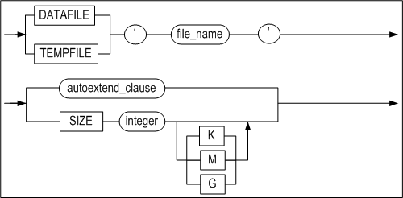

**modify_autoextend_clause ::=**


**modify_checkpoint_path_clause ::=**


**status_clause ::=**


**backup_clause ::=**


#### Prerequisites

The SYS user and users to whom the ALTER TABLESPACE system privilege has been granted can use all of the functionality of the ALTER TABLESPACE statement.

#### Description

The ALTER TABLESPACE statement is used to change the definition of a disk, temporary, memory or volatile tablespace. This statement is also used to change other tablespace attributes, including the data and temporary files associated with the tablespace, the checkpoint paths, settings related to automatic extension, and the status of the tablespace.

*tablespace_name*

This is used to specify the name of the tablespace to change.

*datafile_tempfile_clause*

This is used to add, delete or change a data file or temporary file.

For more detailed information on the datafile_spec, maxsize_clause and autoextend_clause clauses, please refer to the description of the CREATE TABLESPACE statement.

*ADD DATAFILE \| TEMPFILE* 

This is used to add data or temporary files to the corresponding tablespace. 

*RENAME DATAFILE \| TEMPFILE* 

This is used to change the name of the data or temporary files in a tablespace. More than one file can be renamed at one time. A file having the same name as TO file_name must have already been created.

*modify_datafile_clause*

This is used to change the size or the autoextend attribute of a data or temporary file in a disk tablespace.

*modify_autoextend_clause*

This is used to change the autoextension-related attributes for a memory or volatile tablespace, including whether it is automatically extended in size, the unit (increment) by which it is extended, and its maximum size.

*DROP DATAFILE \| TEMPFILE* 

This is used to remove data or temporary files from a tablespace. More than one file can be removed at one time. Because this statement does not actually delete the physical files from the file system, they will need to be deleted (or otherwise managed) manually by the user.

*modify_checkpoint_path_clause*

This is used to add, change or delete a checkpoint image path. Operations related to checkpoint image paths can only be performed during the CONTROL phase

*ADD CHECKPOINT PATH Clause*

This is used to add a new checkpoint path to a memory tablespace. The DBA can move any checkpoint image files from the existing checkpoint paths to the new checkpoint path as desired. Because Altibase looks for checkpoint image files in all checkpoint paths when a memory tablespace is loaded, checkpoint image files can be stored in any of the checkpoint paths for the tablespace

When checkpointing takes place after a new checkpoint path has been added, the new checkpoint image files are distributed evenly among all of the checkpoint paths, including the new checkpoint path.

If the specified checkpoint path does not exist, or if the user who started up the Altibase server does not have write permissions for the checkpoint path, an error will be raised. Therefore, the DBA must manually create the checkpoint path to be added in the file system and add write permissions to the path for the user.

*RENAME CHECKPOINT PATH clause*

This is used to change an existing checkpoint path for a memory tablespace to the path specified in the clause following “TO“. The DBA must manually create or rename the actual checkpoint path in the file system. If the specified checkpoint path does not exist, or if the user who started up the Altibase server does not have suitable permissions for the checkpoint path, an error will be raised.

*DROP CHECKPOINT PATH clause*

This is used to delete an existing checkpoint path from a memory tablespace. It is the DBA's responsibility to physically move the checkpoint image files in the directory corresponding to the deleted checkpoint path to the remaining checkpoint paths in the tablespace. Because Altibase looks for checkpoint image files in all checkpoint paths when a memory tablespace is loaded, checkpoint image files can be stored in any of the valid checkpoint paths for the tablespace.

Deleting the actual checkpoint path on the file system must be done by the DBA.

The physical path corresponding to the dropped checkpoint path must be manually deleted from the file system. A memory tablespace must have at least one checkpoint path. If an attempt is made to delete the only checkpoint path remaining for a memory space, an error will be raised.

*status_clause*

This is used to change the status of a disk or memory tablespace to ONLINE, OFFLINE or DISCARD.

*OFFLINE*

When a disk tablespace is taken offline, the contents of all data pages in the buffer corresponding the tablespace are written to data files, and the pages in the buffer pool are invalidated. 

In the case of a memory tablespace, the contents of the data pages are written to checkpoint image files, and the page memory is released.

All memory that has been allocated to indexes in the tablespace is released, and the indexes for the tables in the tablespace become unavailable. In addition, the tables in the tablespace become unavailable until the tablespace is brought back online

*ONLINE*

When a disk tablespace is brought online, all of its data files become accessible, and the tables in the tablespace become available again.

When a memory tablespace is brought online, memory is assigned to all data pages again, and the contents of checkpoint image files are loaded back into the memory pages.

If a referenced tablespace is OFFLINE, an attempt to bring the tablespace ONLINE will succeed, but it may be impossible to access the tables that are stored in the tablespace. 

A so-called “referenced tablespace“ is, in the case of a disk tablespace, a tablespace containing a table that is associated with indexes, BLOB/CLOB columns, etc. that are stored in one or more other tablespaces, or containing a partitioned table having some of its partitions stored in one or more other tablespaces.

*DISCARD*

This is used during the CONTROL phase to switch the status of a disk or memory tablespace to DISCARD.

The tables, indexes and BLOB/CLOB columns in a discarded tablespace are unusable. Furthermore, discarded tablespaces are ignored when RESTART RECOVERY is executed and when unused data are removed from the database while the database is being started up.

Once a tablespace has been discarded, the only command that can be executed on it is DROP TABLESPACE. It cannot be brought back ONLINE.

*backup clause*

This statement is used to indicate that online backup (“hot backup”), in which the data files for a disk or memory tablespace are copied, is to be performed, or is complete.

*BEGIN BACKUP*

This is used to indicate that online backup is to be performed on all of the data files that constitute a tablespace. During the tablespace backup operation, which takes place between this statement and the END BACKUP statement, transactions are not prevented from accessing the tablespace.

Users must execute BEGIN BACKUP before performing online backup. In addition, it is 
possible to indicate that online backup is to be performed for multiple tablespaces at the same time. However, disk temporary tablespaces cannot be backed up online. 

*END BACKUP*

This is used to indicate that online backup of a disk or memory tablespace is complete. The user must execute the END BACKUP statement immediately after online backup is completed.

#### Consideration

- The ALTER TABLESPACE statement can be used to add data files and change tablespace attributes only when in online mode, and can be used to rename data files only during the CONTROL phase (STARTUP CONTROL).
- status_clause cannot be used with temporary or volatile tablespaces.

#### Examples

<Query\> Add the data file tbs2.user, which is 64 MB in size, to the user_disk_tbs tablespace. When more space is needed, automatically increase the size of the file in 512 kB increments.

```
iSQL> ALTER TABLESPACE user_disk_tbs
    ADD DATAFILE '/tmp/tbs2.user' SIZE 64M 
    AUTOEXTEND ON NEXT 512K; 
Alter success.
```

<Query 2\> To distribute disk I/O when checkpointing, add the '/home/path' checkpoint path to the user_memory_tbs tablespace. Additionally, change the tablespace attributes such that it increases in size in 256 MB increments and cannot grow larger than 1 GB. (Note that although table attributes can be changed during the SERVICE phase, checkpoint paths can be added only during the CONTROL phase.)

```
iSQL(sysdba)>>startup control; 
iSQL(sysdba)>>ALTER TABLESPACE user_memory_tbs ADD CHECKPOINT PATH '/home/path'; 
Alter success.

iSQL> ALTER TABLESPACE user_memory_tbs ALTER AUTOEXTEND ON NEXT 256M  MAXSIZE 1G; 
Alter success.
```

\<Query 3\> Change the attributes of the user_volatile_tbs tablespace such that it increases in size in 256 MB increments and cannot grow larger than 1 GB.

```
iSQL> ALTER TABLESPACE user_volatile_tbs ALTER AUTOEXTEND ON NEXT 256M MAXSIZE
1G;
Alter success.
```


### ALTER TRIGGER 

#### Syntax

**alter_trigger ::=**


#### Prerequisites

Only the SYS user, the owner of the schema containing the trigger, and users having the ALTER ANY TRIGGER system privilege can execute the ALTER TRIGGER statement.

#### Description

This statement is used to enable, disable, or compile a specified database trigger.

*user_name*

This is used to specify the name of the owner of the trigger to be altered. If it is omitted, Altibase will assume that the trigger to be altered belongs to the schema of the user connected via the current session.

*trigger_name*

This is used to specify the name of the trigger to alter.

*ENABLE*

This is used to enable the trigger.

*DISABLE*

This is used to disable the trigger.

*COMPILE*

This is used to explicitly compile the trigger, regardless of whether or not it is valid. Explicit recompiling helps reduce the load on the system incurred by automatically compiling invalid triggers when they need to fire.

#### Example

\<Query\> This is used to disable a trigger so that it does not fire automatically. More examples involving the del_trigger trigger can be found in the explanation of the CREATE TRIGGER statement.

```
iSQL> ALTER TRIGGER del_trigger DISABLE;
Alter success.
```


### ALTER USER 

#### Syntax

**alter_user ::=**

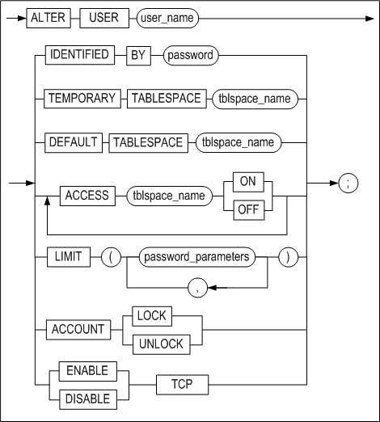

[password_parameters ::=](#password_parameters)


#### Prerequisites

Only the SYS user and users having the ALTER USER system privilege can execute the ALTER USER statement. However, individual users can change their own passwords without this privilege.

#### Description

This statement is used to change a user's password and the tablespaces associated with the user.

*IDENTIFIED clause* 

This is used to specify a new password for the user. The new password is specified after the BY element.

Because the other commands are the same as the corresponding commands executed using the CREATE USER statement, please refer to the description of the CREATE USER statement.

*LIMIT clause*

This modifies password management policies for accounts. This clause can only be executed by the SYS user.
When a password management policy is changed, an existing policy taht is not specified is initialized.

*ACCOUNT LOCK/UNLOCK*

This explicitly locks or unlocks accounts.

*ENABLE/ DISABLE*

The user can restrict TCP connections. Only the SYS user can execute this clause. 

#### Precautions

- When changing the password for the SYS user, who can log on in SYSDBA mode, after the password is changed using the ALTER USER statement, it must be changed one more time by running the altipasswd utility in a console window of the operating system (Unix shell or DOS terminal window). For more information on the altipasswd utility, please refer to the *Utilities Manual.*
- After the password is changed using the ALTER USER statement, it must also be changed in the shell scripts files containing the password such as: server, is, and il to ensure that the script files will run without error.

#### Examples

\<Query\> Change the password of the user Tom to ab1rose.

```
iSQL> ALTER USER tom
    IDENTIFIED BY ab1rose;
Alter success.
```

\<Query\>  Change a user's default tablespace.

```
iSQL> ALTER USER tom
  DEFAULT TABLESPACE uare_data;
Alter success.
```

\<Query\> This statement modifies password management policies for user rose2.

```
iSQL> ALTER USER rose2 LIMIT (FAILED_LOGIN_ATTEMPTS 7, PASSWORD_LOCK_TIME 7);
```

\<Query\> Modify the managing policy of user rose2's password. Do not put a limit on the number of times for logging in, and maintain the account locked for 10 days.

```
iSQL> ALTER USER rose2 LIMIT (FAILED_LOGIN_ATTEMPTS UNLIMITED,
PASSWORD_LOCK_TIME 10);
```

\<Query\> Login fails for user rose2 after locking the account.

```
ALTER USER rose2 ACCOUNT LOCK;
iSQL> CONNECT rose2/rose2;
[ERR-31370 : The account is locked.]
```


### ALTER VIEW

#### Syntax

**alter_view ::=**


#### Prerequisites

Only the SYS user, the owner of the schema containing the view, and users having the ALTER ANY TABLE system privilege can execute the ALTER VIEW statement.

#### Description

This is used to explicitly recompile a view that has become invalid. As an example, when one of the tables on which the view is based has been changed using the ALTER TABLE statement, it will be necessary to explicitly recompile the view in order to use it.

*user_name*

This is used to specify the name of the owner of the view to recompile. If omitted, Altibase will assume that the view belongs to the schema of the user connected via the current session.

*view_name*

This is used to specify the name of the view to recompile. The name of the view must follow the "Rules of Object Name" in Chapter 1. 

When recompiling the view, Altibase reads the view creation statement and compiles the view again, so any errors that arose when the view was originally created will be raised again when the ALTER VIEW statement is executed. If the FORCE option was used when creating the view originally, the view may still be in an invalid state after the ALTER VIEW statement has executed successfully. 

The ALTER VIEW statement cannot be used to change the definition of an existing view. To change a view's definition, use the CREATE VIEW OR REPLACE VIEW statement.

#### Example

\<Query\>  After changing the definition of the table employees, on which the view avg_sal is based, recompile the view. (The definition of avg_sal can be found in the explanation of the CREATE VIEW statement.) 

```
iSQL> ALTER TABLE employees
     ADD COLUMN (email VARCHAR(20));
Alter success.
iSQL> ALTER VIEW avg_sal COMPILE;
Alter success.
iSQL> SELECT * FROM avg_sal;
DNO   EMP_AVG_SAL 
---------------------
..
6 rows selected.
```


### ALTER MATERIALIZED VIEW

#### Syntax

**alter_materialized_view ::=**


#### Prerequisites

Only the following users can alter the properties of the materialized view with this statement.

- The SYS user
- The ownder of the materialized view
- The user with the system privilege of ALTER ANY MATERIALIZED VIEW

#### Description

By using the ALTER MATERIALIZED VIEW statement, the method and time for refreshing for the existing materialized view can be altered. For more detailed information on each keyword, refer to the description on the CREATE MATERIALIZED VIEW statement.

#### Examples

\<Query\> Alter the refresh method of the materialized view.

```
ALTER MATERIALIZED VIEW mv1 REFRESH COMPLETE ON DEMAND;
```


### COMMENT

#### Syntax

**comment_on ::=**


#### Prerequisites

Only the SYS user, the owner of the schema to which the table (or view) belongs, users having the ALTER object privilege for the table (or view), and users having the ALTER ANY TABLE system privilege can use the COMMENT statement to write comments.

#### Description

This statement is used to write or modify comments for a specified table, view or column.

*user_name*

This is the name of the owner of the object on which the COMMENT statement is executed. If it is omitted, Altibase will assume that the object being commented on belongs to the schema of the user connected via the current session.

*table_name, view_name*

This is used to specify the name of the table or view being commented on.

*column_name*

This is used to specify the name of the column being commented on.

*comment*

This is the actual content of the comment. The comment can be up to 4000 bytes long. To delete an existing comment, execute the COMMENT statement with nothing between the single quotation marks (’’).

#### Example

\<Query\>  Add comments to the books table, which is owned by the user library1, and to one of its columns.

```
iSQL> COMMENT ON TABLE library1.books IS 'Table of Book Info';
Comment Created.
iSQL> COMMENT ON COLUMN library1.books.title IS 'Title of Book';
Comment Created.
```

<Query\> Read the table books of the user library 1 and comments for that column. 

```
iSQL> SET VERTICAL ON;
iSQL> SELECT * FROM system_.sys_comments_ WHERE user_name = ‘LIBRARY1’ AND table_name = ‘BOOKS’;
SYS_COMMENTS_.USER_NAME   : LIBRARY1
SYS_COMMENTS_.TABLE_NAME  : BOOKS
SYS_COMMENTS_.COLUMN_NAME : TITLE
SYS_COMMENTS_.COMMENTS    : title of book

SYS_COMMENTS_.USER_NAME   : LIBRARY1
SYS_COMMENTS_.TABLE_NAME  : BOOKS
SYS_COMMENTS_.COLUMN_NAME : 
SYS_COMMENTS_.COMMENTS    : table of book info

2 rows selected.
```

<Query\>  Delete the comments from the books table and the title column in that table.

```
iSQL> COMMENT ON TABLE library1.books IS ’’;
Comment created.
iSQL> COMMENT ON COLUMN library1.books.title IS ’’;
Comment created.
```


### CONJOIN TABLE

#### Syntax

**conjoin_table ::=**


[row_movement_clause ::=](#row_movement_clause),
[tablespace_clause ::=](#tablespace_clause), [physical_attributes_clause
::=](#physical_attributes_clause), [logging_clause ::=](#logging_clause),
[lob_column_properties ::=](#lob_column_properties)

**conjoin_range_clause ::=**


**range_table_to_partition_clause ::=**


**conjoin_list_clause ::=**


**list_table_to_partition_clause ::=**


#### Prerequisites

It is necessary to be satisfied one or more of the following conditions in order to create table: 

- The SYS user	
- The user has the CREATE TABLE or CREATE ANY TABLE system privilege in own schema
- The user has the CREATE ANY TABLE system privilege in another user's schema.

It is necessary to be satisfied one or more of the following conditions in order to drop table:

- The SYS user 
- Table's owner 
- The user has the DROP ANY TABLE system privilege.

#### Description

More than one non-partitioned tables are grouped to create a partitioned and its associated partitions. A new partitioned table is created in the user's default tablespace unless the tablespace option is specified. The data located in existing non-partitioned table is transferred to a partition belonging to a new partitioned table, and the non-partitioned tables are removed. 

*conjoin_range_clause*

This clause enables to create a range partitioned table with multiple non-partitioned tables through the range partitioning. 

*conjoin_list_clause*

This clause enables to create a list partitioned table and multiple partitions are created through list partitioning method. 

*range_table_to_partition*

This clause specifies the name of the nonpartitioned table that is the target of the range partitioned table, the name of the partition to be created, and the range of values for the partitioning key.

*list_table_to_partition*

This clause specifies the name of the nonpartitioned table that is the target of the list partitioned table, the name of the partition to be created, and the set of partitioning key values to be the base. 

#### Precautions

- Do not specify the user name in front of the target table and partitioned table which will be converting. 
- After the CONJOIN, data that does not match the key value of the partition may exist on the partition. 
- A metatable related to a newly created partitioned table is created, and all the metatable in relation to the target table converted into a partitioned table is deleted. 
- PMS, packages, and views that are related to the target table cannot be used. 
- The hash partitioned table is not supported. 
- The schema created in partitioned tables must be identical with that of the target table. The target table must be identical with all the elements, such as the number of columns, name, sequence and data type, and in row and compressed logging option, as well as constraints of CHECK and NOT NULL. 
- There must not be hidden columns, security columns, and compressed columns in the target table. 
- Triggers operating with events must not exist in the target table. 

#### Example

\<Query\> Convert table t1 and t2 into a list partitioned table t3.

```
iSQL> conjoin table t3
partition by list(i1)
(
  table t1 to partition p1 values (1,2,3,4,5),
  table t2 to partition p2 values default
)
tablespace tbs3;
Conjoin success.
```


### CREATE DATABASE

#### Syntax

**create_database ::=**


#### Prerequisites

Because this statement can only be executed during the PROCESS phase, the only user who can execute this SQL statement is the SYS user, and only when running in -sysdba mode.

#### Description

This statement is used to create a database. When a database is created, various system tablespaces, including the dictionary tablespace, the undo tablespace, and temporary tablespaces are created. The names of these system tablespaces are defined by the system. 

Please note that user-defined tablespaces cannot be created during database creation; rather, they are subsequently added by users. 

The database character set and national character set must be specified when the database is created.

*database_name*

This is used to specify the name of the database to be created. The database name specified here must be the same as that specified using the DB_NAME property in the properties file. If they are not the same, an error will be raised.

*INITSIZE clause* 

The initial size of a memory database is specified here, using an expression such as “128M“ (i.e. 128 megabytes) or “4G“ (i.e. 4 gigabytes). If only a number is specified here, the size unit is assumed to be megabytes by default.

The system tablespaces related to a disk database are automatically created when the CREATE DATABASE statement is executed.

The default values for system tablespaces are determined by reading the following properties from the altibase.properties file.

- SYS_DATA_TBS_EXTENT_SIZE, SYS_TEMP_TBS_EXTENT_SIZE, SYS_UNDO_TBS_EXTENT_SIZE
- SYS_DATA_FILE_INIT_SIZE, SYS_TEMP_FILE_INIT_SIZE, SYS_UNDO_FILE_INIT_SIZE
- SYS_DATA_FILE_MAX_SIZE, SYS_TEMP_FILE_MAX_SIZE, SYS_UNDO_FILE_MAX_SIZE
- SYS_DATA_FILE_NEXT_SIZE, SYS_TEMP_FILE_NEXT_SIZE, SYS_UNDO_FILE_NEXT_SIZE

*ARCHIVELOG \| NOARCHIVELOG*

This is used to specify whether the database will initially run in archivelog mode or noarchivelog mode. Archivelog mode is used to prepare for media recovery, whereas noarchivelog mode does not support media recovery.

For more information about Altibase backup and recovery, please refer to the *Administrator's Manual.*

*charset*

This is used to specify the database character set and national character set.

- Available Database Character Sets 
  US7ASCII  
  KO16KSC5601  
  MS949  
  BIG5  
  GB231280  
  MS936  
  UTF8  
  SHIFTJIS  
  MS932  
  EUCJP
- Available National Character Sets  
  UTF8  
  UTF16

#### Example

\<Query\> Create a database named mydb that is initially 10MB in size, and for which the database character set is KSC5601 and the national character set is UTF16.

```
$ isql -s localhost -u sys -p manager -sysdba
..
iSQL> STARTUP PROCESS;
Trying Connect to Altibase.. Connected with Altibase.

TRANSITION TO PHASE: PROCESS
Command execute success.
iSQL> CREATE DATABASE mydb INITSIZE=10M 
NOARCHIVELOG 
CHARACTER SET KSC5601 
NATIONAL CHARACTER SET UTF16;
.
.
Create success.
```


### CREATE DATABASE LINK

For information on Database Link, please refer to the *Database Link User’s Manual.* 

### CREATE DIRECTORY

#### Syntax


#### Prerequisites

Only the SYS user and users having the CREATE ANY DIRECTORY system privilege can execute this statement.

#### Description

The fact that stored procedures are able to manipulate files means that it is possible to use SQL to read from and write to text files in the host's file system. This feature makes it possible to perform a wide variety of tasks, including leaving messages in files about the execution of stored procedures, writing reports and query results in files, and inserting data read from files into database tables.

The CREATE DIRECTORY statement is used to create a database object that corresponds to a directory that contains files that are manipulated by stored procedures in this way.

The owner of a DIRECTORY object created using the CREATE DIRECTORY statement is always the SYS user. The user who actually created the DIRECTORY object is only granted read and write privileges, including the WITH GRANT OPTION, for the object. 

The CREATE DIRECTORY statement records directory data in the SYS_DIRECTORIES_ meta table, but does not actually create the new directory in the file system. Therefore, the user must explicitly create the directory in the actual file system.

*OR REPLACE*

This option allows an existing DIRECTORY object to be replaced when a new DIRECTORY object is created with the same name. Note that the actual directory in the file system is not deleted.

*directory_name*

This is used to specify the name of the database object representing the directory. Refer to   "[Rules for Object Names](#object_name)" for more information on specifying names

*path_name*

This is used to specify the absolute path of the directory in the file system as a character string.

#### Examples

\<Query\> Create a directory object named alti_dir1 in the folder /home/altibase/altibase_home/psm_msg.

```
iSQL> create directory alti_dir1 as '/home/altibase/altibase_home/psm_msg';
Create success.
```

\<Query\>\> Create a directory object named alti_dir1 in the folder /home/altibase/altibase_home/psm_result. If a DIRECTORY object named alti_dir1 already exists in the database, replace it with this new one.

```
iSQL> create or replace directory alti_dir1 as '/home/altibase/altibase_home/psm_result';
Create success.
```


<a name="create_index"><a/>

### CREATE INDEX 

#### Syntax

**create_index ::=**

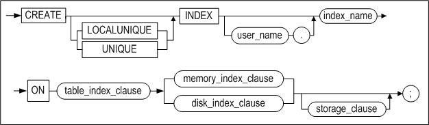

**table_index_clause ::=**

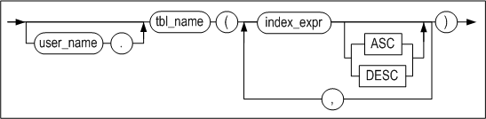

**memory_index_clause ::=**


**disk_index_clause::=**


**domain_index_clause ::=**


**directkey_clause ::=**


**memory_index_attributes ::=**


**storage_clause ::=**


**index_partitioning_clause ::=**


**index_partition_definition ::=**


**disk_index_attributes::=**


**parallel_clause ::=**


**logging_clause ::=**


**physical_attributes_clause ::=**


#### Prerequisites

Only the SYS user, users having the CREATE INDEX system privilege, and users having sufficient privileges to modify index objects in the table to which the index is to be added can execute this statement. 

In order to create function-based indexes, the same privileges as conventional indexes are required. However, if a user-defined function is included in the expression, the function must be marked DETERMINISTIC. The user must also have the EXECUTE object privilege on user-defined functions used in the function-based index owned by another user.

#### Description

This statement is used to create an index on the basis of one or more of the columns or expressions in a table. When a partitioned index (i.e. local index) is created, the LOCALUNIQUE keyword can be optionally specified. If the LOCALUNIQUE option or local keyword is not used, a non-partitioned index is created when creating an index on a disk partitioned table.

A partitioned index is classified as either a prefixed index or a non-prefixed index, depending on the relationship between the partition key and the index columns. If the leftmost index partition key is the same column as the leftmost index column, it is a prefixed index. If they are different columns, it is a non-prefixed index. 

Function-based indexes are based on expressions. Expressions can include built-in SQL functions or user-defined functions.

*user_name*

This is used to specify the name of the owner of the index to create. If omitted, Altibase will create the index in the schema of the user connected via the current session.

*index_name*

This is used to specify the name of the index to create. Refer to "[Rules for Object Names](#object_name)" for more information on specifying names.

*UNIQUE*

This keyword indicates that duplicate values are not allowed.

*LOCALUNIQUE*

This keyword is useful when creating a partitioned index. It indicates that the UNIQUE constraint must be satisfied within each index partition of a partitioned (local) index.

*index_expr*

This specifies the column or expression to be indexed.

Table columns, constants, SQL functions and user-defined functions can be included in expressions. When specifying an expression instead of a column, a function-based index is created. Limitations of function-based indexes:

- Only the columns of the table to be indexed can be included in expressions. Schema and table names cannot be specified in front of column names.
- Constants (character strings or integers) can be included in expressions.
- Aggregate functions like SUM cannot be included in expressions. 
- Cursors and cursor properties(%ISOPEN, SQLCODE, SQLERRM, etc.) cannot be used for stored procedures included in expressions. 
- For global partitioned indexes, expressions cannot be partitioning keys. 
- Regardless of the absence of function arguments, all functions must be specified with parentheses. On omission, database servers perceive them to be column names. 
- DATE constants not fully specified are permitted in expressions. If the year/month is not specified in the DATE type value, the current year/month is assumed as the default value. The time zone value cannot be specified for the DATE type of Altibase. 
- Built-in SQL functions that always return identical values can be included in expressions; for example, the SYSDATE function cannot be included. 
- User-defined functions included in expressions must be marked DETERMINISTIC. 
- Subqueries cannot be included in expressions. 
- Sequences cannot be included in expressions. 
- Pseudo columns of all sorts cannot be included in expressions.
- The PRIOR operator cannot be included in expressions. 
- LOB data cannot be included in expressions. 
- A function-based index can be selected during query optimization only if the QUERY_REWRITE_ENABLE property is set to 1.

*ASC/DESC*

The use of the ASC or DESC keywords respectively specifies that each column of the index is to be sorted in ascending or descending order.

*index_partitioning_clause*

This is used to specify that the index to be created is a partitioned index. If omitted, index partitions will be stored in the table's default tablespace. 

The easiest way to create a partitioned index is simply to specify the LOCAL keyword when creating the index. Alternatively, the attributes of the index partition to be created for each table partition can be specified in greater detail. 

If only the LOCAL keyword is specified, an index partition is created for each table partition, and the names of the partitions are automatically determined by the system. Index partitions are successively named SYS_IDX1, SYS_IDX2, etc. 

The attributes of index partitions can be expressly specified for some or all table partitions. When the attributes of only some index partitions are specified, the attributes of the index partitions for the remaining table partitions are determined automatically as outlined above. 

If no tablespace is specified when creating a partitioned index, the process for determining the tablespace in which each of the index partitions is stored is as shown in the following diagram:


> Note: Even if the tablespace in which each parititon is to be stored is specified, it is ignored, as memory indexes are not stored in tablespaces. 


*BTREE*

This is used to specify that the index is a B+ -tree index, which is useful in situations where ranges are often searched. An index can be either a B+ -tree or an R-tree index. If the INDEXTYPE IS clause is omitted, the index will be a B+ -tree index by default.

*RTREE*

This is used to specify that the index is an R-tree index, which is useful for processing multidimensional data.

*directkey_clause*

Creates direct key indexes. A direct key is a record stored in the index node; a direct key index can reduce index scan cost since it stores the actual record and the record pointer. 

- MAXSIZE integer  
  Sets the maximum size of a direct key; on omission, the default value is 8 bytes. Please refer to the table below for supported data types. 
  
  If a value larger than MAXSIZE is set for a data type that supports partial keys, it is stored as a prefix that corresponds to MAXSIZE and a direct key index is successfully created.
  
  If a value larger than MAXSIZE is set for a data type that does not support partial keys, a direct key index fails to be created. 
  
- Direct Key Index Restrictions
  - If a direct key index is created on composite index, the first column is set as the direct key.
  - A direct key index cannot be created on compressed or encrypted column.
  - A direct key index cannot be created for indexes residing on disk.

The following data types support direct key indexes.

<table>
<tbody>
<tr>
<th>
<p>Category</p>
</th>
<th>
<p>Data Type</p>
</th>
<th>
<p>MAXSIZE</p>
<p>(Supports Full Keys)</p>
</th>
<th>
<p>Support Partial Keys)</p>
</th>
</tr>
<tr>
<td rowspan="5" >
<p>Native Numeric Data Type</p>
</td>
<td>
<p>BINGINT</p>
</td>
<td>
<p>8</p>
</td>
<td>
<p>X</p>
</td>
</tr>
<tr>
<td>
<p>DOUBLE</p>
</td>
<td>
<p>8</p>
</td>
<td>
<p>X</p>
</td>
</tr>
<tr>
<td>
<p>INTEGER</p>
</td>
<td>
<p>4</p>
</td>
<td>
<p>X</p>
</td>
</tr>
<tr>
<td>
<p>REAL</p>
</td>
<td>
<p>4</p>
</td>
<td>
<p>X</p>
</td>
</tr>
<tr>
<td>
<p>SMALLINT</p>
</td>
<td>
<p>2</p>
</td>
<td>
<p>X</p>
</td>
</tr>
<tr>
<td rowspan="3">
<p>Non-Native Numeric Data Type</p>
</td>
<td >
<p>FLOAT</p>
<p>FLOAT(p)</p>
</td>
<td>
<p>23</p>
<p>3 + ( ( p + 2 ) / 2 )</p>
</td>
<td>
<p>X</p>
</td>
</tr>
<tr>
<td >
<p>NUMBER</p>
<p>NUMBER(p, s)</p>
<p>NUMBER(p)</p>
</td>
<td>
<p>23</p>
<p>3 + ( ( p + 2 ) / 2 )</p>
<p>3 + ( ( p + 2 ) / 2 )</p>
</td>
<td>
<p>X</p>
</td>
</tr>
<tr>
<td>
<p>NUMERIC</p>
<p>NUMERIC(p, s)</p>
<p>NUMERIC(p)<br /> &nbsp;(=DECIMAL)</p>
</td>
<td >
<p>23</p>
<p>3 + ( ( p + 2 ) / 2 )</p>
<p>3 + ( ( p + 2 ) / 2 )</p>
</td>
<td>
<p>X</p>
</td>
</tr>
<tr>
<td rowspan="4">
<p>Character Data Type</p>
</td>
<td>
<p>CHAR(M)</p>
</td>
<td>
<p>M + 2</p>
</td>
<td>
<p>O</p>
</td>
</tr>
<tr>
<td>
<p>VARCHAR(M)</p>
</td>
<td>
<p>M + 2</p>
</td>
<td>
<p>O</p>
</td>
</tr>
<tr>
<td>
<p>NCHAR(M)</p>
</td>
<td>
<p>(M * 2) + 2 &lt;UTF16&gt;</p>
<p>(M * 3) + 2 &lt;UTF8</p>
</td>
<td>
<p>O</p>
</td>
</tr>
<tr>
<td>
<p>NVARCHAR(M)</p>
</td>
<td>
<p>(M * 2) + 2 &lt;UTF16&gt;</p>
<p>(M * 3) + 2 &lt;UTF8&gt;</p>
</td>
<td>
<p>O</p>
</td>
</tr>
<tr>
<td>
<p>Date Data Type</p>
</td>
<td>
<p>DATE</p>
</td>
<td>
<p>8</p>
</td>
<td>
<p>X</p>
</td>
</tr>
<tr>
<td rowspan="4">
<p>Binary Data Type</p>
</td>
<td>
<p>BIT(M)</p>
</td>
<td>
<p>(M / 8) + 4</p>
</td>
<td>
<p>X</p>
</td>
</tr>
<tr>
<td>
<p>VARBIT(M)</p>
</td>
<td>
<p>(M / 8) + 4</p>
</td>
<td>
<p>&nbsp;</p>
</td>
</tr>
<tr>
<td>
<p>BYTE(M)</p>
</td>
<td>
<p>M + 2</p>
</td>
<td>
<p>X</p>
</td>
</tr>
<tr>
<td>
<p>NIBBLE(M)</p>
</td>
<td>
<p>(M / 2) + 1</p>
</td>
<td>
<p>&nbsp;</p>
</td>
</tr>
</tbody>
</table>


*physical_attributes_clause*

- INITRANS Clause  
  This is used to set the initial number of TTS (Touched Transaction Slots). The default is 8.
- MAXTRANS Clause  
  This is used to set the maximum number of TTS (Touched Transaction Slots). The default is 30.

*TABLESPACE Clause*

This is used to specify the name of the tablespace in which the index is to be stored. If this clause is omitted, Altibase stores the index in the default tablespace for the owner of the schema to which the index belongs. However, when an index is created for a memory table, even if the tablespace is specified, this clause is ignored because memory indexes are not stored in any tablespace.

*parallel_clause*

This is a hint for setting the number of threads used to create an index, with the aim of realizing a performance improvement. Altibase determines the optimal number of index creation threads in consideration of the user-defined parallel_factor, which is specified using a hint, the size of the tables for which the indexes are being created, and the amount of available memory at the time the index is created. 

The value of parallel_factor can be set within the range from 0 to 512. The default is the number of CPUs in the host on which Altibase is running. Because the number of index creation threads is determined using the above optimized determination method, it is safe to omit parallel_factor. 

If parallel_factor is not set, or is set to 0, the value of the INDEX_BUILD_THREAD_COUNT property in the altibase.properties file, which has the same meaning as parallel_factor, is used instead. If the INDEX_BUILD_THREAD_COUNT property has not been set either, the number of CPUs is used as a hint to set the optimum number of index creation threads.

If parallel_factor is set to a value taht is greater than the number of CPUs, or is set to a value greater than 512, the user-defined value is ignored and the number of CPUs is used as a hint for setting the optimum number of threads.

*logging_clause*

The LOGGING or NOLOGGING clause can be used to enable or disable logging when an index is created for a disk table. Logging is enabled by default, meaning that information about the creation of the index is logged when an index is created. 

The FORCE and NOFORCE options are used to determine whether to forcibly store a disk index to disk immediately after the index is created. 

For more details about logging_clause, please refer to the section pertaining to indexes in the “Objects and Privileges“ chapter of the *Administrator's Manual.*

*storage_clause*

This is used to set parameters for managing extents in segments.

- INITEXTENTS Clause  
  This sets the number of extents that are allocated by default when a segment is created. The default is 1.
- NEXTEXTENTS Clause  
  This sets the number of extents that are added to the segment every time the segment is increased in size. The default is 1.
- MINEXTENTS Clause  
  This sets the minimum number of extents in a segment. The default is 1. 
- MAXEXTENTS Clause  
  This set the maximum number of extents in a segment. If this isn't specified, there is no maximum limit on the number of extents in a segment.

#### Considerations

- In the case of an index for a partitioned table, i.e. a partitioned index, the tablespace in which each local index is stored is defined separately in index_partitioning_clause. disk_index_attributes cannot be used to specify the tablespace for an entire partitioned index. Additionally, a local index can only be a B+ -tree index.
- In the event of a system or media fault, the consistency of an index that was created using the NOLOGGING (FORCE/NOFORCE) option cannot be guaranteed. In this case, the error “The index is inconsistent” will be raised. To fix this error, locate the inconsistent index, drop it, and create it again. The consistency of an index can be checked using the V$DISK_BTREE_HEADER performance view.
  
- An index cannot be created on the basis of a LOB column.


#### Example

\<Query 1\> Create the index emp_idx2 on the column eno in ascending order and on the column dno in descending order.

```
iSQL> CREATE INDEX emp_idx2
    ON employees (eno ASC, dno DESC);
Create success.
```

\<Query 2\>  Create a unique index named emp_idx2 for the dno column in the employees table in descending order. (This is possible when there are no records in the employees table, or when there are only unique values in the column dno.)

```
iSQL> CREATE UNIQUE INDEX emp_idx2
    ON employees (dno DESC);
Create success.
```

\<Query 3\>  Create the B+ -tree index emp_idx3 in ascending order for the eno column in the employees table. Because a primary key already exists for the eno column of the employees table, it must first be deleted before the index emp_idx3 can be created. If it is not deleted first, the following error will be raised:

```
ERR-3104C: Duplicate key columns in an index

iSQL> ALTER TABLE employees
    DROP PRIMARY KEY;
Alter success.
iSQL> CREATE INDEX emp_idx3
    ON employees (eno ASC)
    INDEXTYPE IS BTREE;
Create success.
```

\<Query 4\>  Create the index idx1 in the user_data tablespace on the basis of the i1 column in the table_user table.

```
iSQL> CREATE INDEX idx1
    ON table_user (i1)
    TABLESPACE user_data;
Create success.
```

\<Query 5\>  Create the index idx2 in the user_data tablespace on the basis of the i1 column in the table_user table using the parallel option.

```
iSQL> CREATE INDEX idx1
    ON table_user (i1)
    TABLESPACE user_data PARALLEL 4;
Create success. 
```

\<Query 6\> Create a local index, that is, an index in which the partitions correspond to respective table partitions, based on product_id. Allow the partition names to be determined automatically

```
CREATE INDEX prod_idx ON products(product_id) LOCAL;
```

\<Query 7\> Create a local index, specifying the attributes for each index partition.

```
CREATE INDEX prod_idx ON products(product_id) 
LOCAL
( 
  PARTITION p_idx1 ON p1 TABLESPACE tbs_disk1,
  PARTITION p_idx2 ON p2 TABLESPACE tbs_disk2,
  PARTITION p_idx3 ON p3 TABLESPACE tbs_disk3 
);
```

\<Query 8\>  Create a local index, specifying the attributes for only some of the index partitions. The attributes for the other partitions are determined automatically.

```
CREATE INDEX prod_idx ON products(product_id) 
LOCAL
( 
  PARTITION p_idx1 ON p1 TABLESPACE tbs_disk1,
  PARTITION p_idx3 ON p3 TABLESPACE tbs_disk3 
);
```

\<Query 9\> Create the index idx1 in the table employees based on the employee number column (eno). Enable logging to ensure the availability of the index in the event of a system or media fault. Assume that the table employees is in a disk tablespace.

```
iSQL> CREATE INDEX idx1
    ON employees (eno);
Create success.

Or

iSQL> CREATE INDEX idx1
    ON employees (eno) LOGGING ;
Create success.
```

\<Query 10\>  Create the index idx1 in the table employees with the NOLOGGING option using the employee number column (eno) in ascending order and the department number column (dno) in ascending order. Ensure that the index is available in the event of a system fault after the index is created (FORCE). Assume that the table employees is in a disk tablespace.

```
iSQL> CREATE INDEX idx1
    ON employees (eno ASC, dno ASC)
    NOLOGGING;
Create success.

Or
employee number(eno): ASC
department number(dno): ASC
iSQL> CREATE INDEX idx1
    ON employees (eno ASC, dno ASC)
    NOLOGGING FORCE;
Create success.
```

\<Query 11\> Create the index idx1 in the table employees with the NOLOGGING option using the employee number column (eno) in ascending order and the department number column (dno) in ascending order. Specify that the index is not to be written to disk (NOFORCE). Assume that the table employees is in a disk tablespace.

```
iSQL> CREATE INDEX idx1
    ON employees (eno ASC, dno ASC)
    NOLOGGING NOFORCE;
Create success.
```

\<Query 12\> Create the index LOCAL_IDX in the disk tablespace USERTBS for the table LOCAL_TBL. Allocate one extent to the index when it is created and specify that 2 extents are to be added whenever it is necessary to increase the size of the index segment, and also that there is no upper limit to the total number of extents in the index segment.

```
iSQL> CREATE INDEX LOCAL_IDX ON LOCAL_TBL ( I1 ) 
 TABLESPACE USERTBS
 STORAGE ( INITEXTENTS 1 NEXTEXTENTS 2 MAXEXTENTS UNLIMITED );
Create success.
```

\<Query 13\> Create a function-based index on salary using the salary column of the employees table.

```
iSQL> CREATE INDEX income_idx ON employees (salary*12);
Create success.
```

\<Query 14\> Create the same index as <Query 13> using a user-defined function.

```
CREATE OR REPLACE FUNCTION get_annual_salary
(salary in integer) 
RETURN integer
DETERMINISTIC
AS
BEGIN
    RETURN salary*12;
END;
/

iSQL> CREATE INDEX income_idx ON employees(sys.get_annual_salary(salary));
Create success.
```

\<Query 15\> Create a direct key index on the eno column in the table employees.

```
iSQL> CREATE INDEX direct_idx ON employees ( eno ) DIRECTKEY ;
Create success.
```

\<Query 16\> Create a direct key index that can store 32 byte records on the name column (VARCHAR(100)) in the tab1 table.

```
iSQL> CREATE INDEX idx1 ON tab1 ( name ) DIRECTKEY MAXSIZE 32;
Create success.
```


### CREATE JOB 

#### Syntax

**create_job ::=**


**execute_procedure_statement ::=**


**start_end_clause ::=**


**interval_clause ::=**


#### Prerequisites

Only the SYS user can create a JOB with this statement. In order to perform the created JOB, it should be activated with ENABLE when creating or after creating the JOB.

#### Description

A JOB to be managed by the job scheduler can be created with the CREATE JOB statement. The procedure to be executed, the start time, the end time, the interval after which it is to be executed and etc. can be set for each JOB to be created.

*execute_procedure_statement*

This specifies the execution statement of the procedure to be registered for the JOB. Only one procedure can be registered per JOB and the user name of the procedure can be omitted; on omission, the SYS user is assumed by default. For expr2, the input argument value for the execution of the defined procedure is specified as a constant or an expression.

For more detailed information on procedures, please refer to the *Stored Procedures Manual*.

*start_end_clause*

This sets the start time and the end time at which the JOB starts to run and ends running. Expr1 only accepts a DATE type value or a DATE type expression.

*interval_clause*

This specifies the interval after which the JOB is to run repeatedly after it has run for the first time. The unit of time is determined by the YEAR, MONTH, DAY, HOUR, MINUTE which is specified after the number.

*ENABLE/DISABLE*

This statement is used for a user to set whether or not to execute each job through selecting ENABLE/DIABLE in the job scheduler. The default value is set to DISABLE if omitted.

*COMMENT*

This statement is used for a user to set whether or not to execute each job through selecting ENABLE/DIABLE in the job scheduler. The default value is set to DISABLE if omitted.

#### Precautions

The following are issues which the DBA should keep in mind when using a JOB:

- A stored procedure which takes either an OUT type or an INOUT type argument cannot be registered for a JOB.
- For a JOB to be run by the job scheduler, the value of the JOB_SCHEDULER_ENABLE property must be 1 and the value of the JOB_THREAD_COUNT property must be larger than 0.
- If an error occurs within the procedure being executed by a JOB, logs - such as error messages - are stored to the trace log file (default: $ALTIBASE_HOME/trc/altibase_qp.log) set for the QP_MSGLOG_FILE property.
- If an output function, like SYSTEM_.PRINTLN, is used within a procedure, the output content is written to the trace log file (default: $ALTIBASE_HOME/trc/altibase_qp.log) set for the QP_MSGLOG_FILE property

#### Examples

\<Query\> Create a JOB which executes the procedure proc1 once per month, starting from the current point in time.

```
iSQL> CREATE JOB job1 EXEC proc1 START sysdate INTERVAL 1 MONTH;
Create success.
```

\<Quey\>  Create job2 executing the proc procedure everyday from August 1, 2016 to August 31, 2016, and get the job2 activated (ENABLE).

```
iSQL> CREATE JOB job2 EXEC proc
START to_date('2016/08/01 00:00:00', 'YYYY-MM-DD HH:MI:SS')
END to_date('2016/08/31 00:00:00', 'YYYY-MM-DD HH:MI:SS')
INTERVAL 1 DAY
ENABLE;
Create success.
```


### CREATE QUEUE 

#### Syntax

**create_queue ::=**

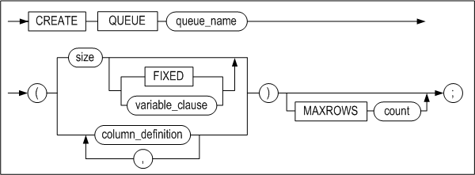

[column_definition ::=](#column_definition)

#### Prerequisites

It is necessary to be satisfied one or more of the following conditions in order to create table:

- The SYS user
- The user has the CREATE TABLE or CREATE ANY TABLE system privilege in own schema.
- The user has the CREATE ANY TABLE system privilege in another user's schema.

#### Description

This syntax either can configure the maximum length of messages that are inserted into a queue or allows the user to directly define a column in order to create a queue. It can also specifies the number of maximum records that can be stored in a queue table.

*queue_name*

This is used to specify the name of the queue. The maximum possible length of the queue name is 28 bytes.

*size*

This is used to set the maximum size (in bytes) of a message to be stored in the queue. This value can be set within the range from 1 to 32,000 bytes.

*FIXED\|variable_clause*

This is used to specify how messages are saved. (For more information, please refer to the *General Reference*).

*column_definition*

This clause specifies the user-defined column. It refers to CREATE TABLE statement's column_definition and does not support column_constraint, crypt_clasue and timestamp.

*MAXROWS count*

This is used to set the maximum number of records that can be stored in a queue table. This value can be set within the range from 1 to 4294967295 (or (2^32) -1). When not specified, it defaults to the maximum value of 4294967295. 

#### Considerations

- When a queue is created, an object having the name queue_name + "_NEXT_MSG_ID" is created in the database. Therefore, if any existing table, view, sequence, synonym or stored procedure has the same name as the queue to be created, or has the name queue_name + "_NEXT_MSG_ID", the CREATE QUEUE statement will return an error. 


#### Examples

\<Query\> \>Create the queue Q1, stipulating that the maximum message length is 40 bytes and that the maximum number of records is 1,000,000.

```
iSQL> CREATE QUEUE Q1(40) MAXROWS 1000000;
Create success.
```

\<Query\> Create 2 columns that can store values for numeric(5,2) type when creating a queue named Q1. 

```
iSQL> CREATE QUEUE Q1(c1 numeric(5,2), c2 numeric(5,2));
Create success.
```

\<Query\>  Create a queue named Q2 defining the user-defined column and delete it after writing messages into the pertinent column.

```
iSQL> CREATE QUEUE Q2(V1 VARCHAR(10), V2 INTEGER, V3 NUMERIC(5,3));
Create success.

iSQL> ENQUEUE INTO Q2(V1, V2, V3) VALUES ('abc', 1, 99.999);
1 row inserted.

iSQL> DEQUEUE V1, V2, V3 FROM Q2;
V1          V2          V3
----------------------------------------
abc         1           99.999
1 row selected.
```


### CREATE REPLICATION 

#### Syntax

**create_replication ::=**


**option_clause ::=**


**replication_item ::=**


#### Prerequisites

Only the SYS user can execute replication-related statements.

#### Description

This statement is used to create a replication object, set the connection between a local server and one or more remote servers, and establish replication therebetween. Replication takes place between tables on a 1:1 basis; that is, a table is matched to only one corresponding table.

In order to resolve conflicts, the AS MASTER or AS SLAVE clause can be specified in the statement. Doing so stipulates that a master-slave scheme is to be used to resolve conflicts. For more detailed information about replication conflict resolution, please refer to Chapter 2 of the *Replication Manual.*

*replication_name*

This is used to specify the name of the replication object. The replication object name must be the same on both the local server and the remote server. Refer to "[Rules for Object Names](#object_name)" for more information on specifying names.

*FOR ANALYSIS \| FOR ANALYSIS PROPAGATION*

This creates the Xlog Sender. For more detailed information about properties, please refer to the *Log Analyzer User's Manual*.

*FOR PROPAGABLE LOGGING*

This is used to write logs received by the propagable receiver from the local server in order to replicate into other server. However, this function cannot be used with the recovery option.

*FOR PROPAGATION*

The propagable logs are transmitted to other target server.

*option_clause*

This is used to optionally specify the RECOVERY, OFFLINE, GROUPING, PARALLEL, and GAPLESS functions for the replication object.  These features are for use in data recovery and when performing offline replication, respectively. For more information, please refer to Chapter 3 of the *Replication Manual.*

*replication_host_ip*

This is used to specify the IP address of the remote server.

*replication_host_port_no*

This is used to specify the port number used by the Receiver thread on the remote server. It is identical to the REPLICATION _PORT_NO property in the altibase.properties file on the remote server.

*USING conn_type [ib_latency]*

The communication method (TCP or InfiniBand) can be set with the remote server. The ib_latency value can be set only when using InfiniBand. To use InfiniBand, the IB_ENABLE property must have a value of 1. 

*user_name*

This is used to specify the name of the owner of the table to be replicated.

*tbl_name*

This is used to specify the name of the table to be replicated.

*partition_name*

This is used to specify the name of the partition to be replicated.

#### Examples

\<Query\> Create replication rep1 according to the following conditions:

- The IP address of the local server is 192.168.1.60. 

- The replication port number on the local server is 25524. 

- The IP address of the remote server is 192.168.1.12. 

- The replication port number on the remote server is 35524. 

  Create the replication object to replicate the employees and departments tables between the servers.

On the local server (IP: 192.168.60) :

```
iSQL> CREATE REPLICATION rep1
    WITH '192.168.1.12',35524
    FROM sys.employees TO sys.employees,
    FROM sys.departments TO sys.departments;
Create success.
```

On the remote server (IP: 192.168.1.12) :

```
iSQL> CREATE REPLICATION rep1
    WITH '192.168.1.60',25524
    FROM sys.employees TO sys.employees,
    FROM sys.departments TO sys.departments;
Create success. 
```

\<Query\> After the remote server received the log in replication Rep 1, create replication Rep2 for the propagable logs and sends them to target server.

```
iSQL> CREATE REPLICATION rep1 
    FOR PROPAGABLE LOGGING WITH '192.168.1.12',35524
    FROM sys.t1 TO sys.t1;
iSQL> SELECT replication_name, role 
    FROM system_.sys_replications_;
REPLICATION_NAME                          ROLE
---------------------------------------------------------
REP1                                      2
1 row selected.

iSQL> CREATE REPLICATION rep2
    FOR PROPAGATION WITH '192.168.1.60',25524 
    FROM sys.t1 TO sys.t1;
Create success.
iSQL> SELECT replication_name, role 
    FROM system_.sys_replications_;
REPLICATION_NAME                          ROLE
---------------------------------------------------------
REP2                                      3
1 row selected.
```


### CREATE ROLE

#### Syntax

**create_role ::=**


#### Prerequisites

Only the SYS user and users with the CREATE ROLE system privilege can create a role.

#### Description

A new role is created with the specified name. 

A set of privileges which can be granted to a user is called a role. 

If a role is created for the first time, it does not have any privilege. Add privileges to a role by using the GRANT statement, then grant the role to a user. 

In order for a user to use a privilege which is granted by a role, the user should re-access to the database. The privilege which can be granted to a role is a system privilege and object privilege. Further information on how to use them is delineated in examples of GRANT and REVOKE statements as well.

*role_name*

This is used to specify the name of the role to be created. This name must be unique within the database.

#### Example

\<Query\> Create a role with the name alti_role.

```
iSQL> CREATE ROLE alti_role;
Create success.
```


### CREATE SEQUENCE 

#### Syntax

**create_sequence ::=**


**sequence_options ::=**


**sync_table_clause ::=**


#### Prerequisites

Only the SYS user and users having the CREATE SEQUENCE system privilege can execute this statement. In addition, it is necessary to be the SYS user or have the CREATE ANY SEQUENCE system privilege in order to create a sequence in another user's schema

#### Description

This statement is used to define a new sequence having the specified name and automatically populate the sequence.

*user_name*

This is used to specify the name of the owner of the sequence to be created. If it is omitted, Altibase will create the sequence in the schema of the user who is connected via the current session.

*seq_name*

This is used to specify the name of the sequence to be created. Refer to "[Rules for Object Names](#object_name)" for more informaiton on specifying names.

*START WITH*

This is the initial value of the sequence. This can be set to any value between MINVALUE and MAXVALUE inclusive. If this value is omitted and the value for INCREMENT BY is more than 0, the default value is the same as the minimum value of the sequence. If this value is omitted and the value for INCREMENT BY is less than 0, the default value is the same as the maximum value of the sequence.

*INCREMENT BY*

This is the value by which the sequence increments. The default value is 1. The absolute of this value must be less than the difference between MAXVALUE and MINVALUE.

*MAXVALUE*

This is the maximum value of the sequence. This can be set to any value between -9223372036854775805 and 9223372036854775806. If the value for INCREMENT BY is more than 0, the default value is 9223372036854775806. If the value for INCREMENT BY is less than 0, the default value is -1.

*MINVALUE*

This is the minimum value of the sequence. This can be set to any value between -9223372036854775806 and 9223372036854775805. If the value for INCREMENT BY is more than 0, the default value is 1. If the value for INCREMENT BY is less than 0, the default value is -9223372036854775806.

*CYCLE*

This clause is used to ensure that the sequence will continue to generate values when it reaches the value specified using MAXVALUE or MINVALUE. The sequence cycles again from the minimum value in the case of an ascending sequence, or from the maximum value in the case of a descending sequence.

*CACHE*

A specified number of sequence values can be created in advance and cached in memory so that they can be accessed more quickly. The cache is populated when a key value is first requested from a new sequence, and is accessed every time another key value is requested from the sequence. After the last sequence value in the cache has been used, the next request for a key value from the sequence causes new sequence values to be created and cached in memory. When a sequence is created, the default CACHE value is 20.

*ENABLE \| DISABLE SYNC TABLE*

This specifies whether or not to create a custom table for sequence replication for the purpose of replicating a sequence. 

- ENABLE: Creates a custom table for sequence replication. The table is automatically granted the name, [sequence name]$seq.
- DISABLE: Does not create a custom table for sequence replication.

If this option is not specified, a custom table for sequence replication is not created by default.

#### Consideration

- Please note that the sequence_name.CURRVAL value of a newly created sequence cannot be accessed. In order to access the sequence_name.CURRVAL value for a newly created sequence, it is first necessary to access the sequence_name.NEXTVAL value.
- A custom table for sequence replication can be created only if the length of the sequence name is equal to or smaller than 36 bytes.


#### Examples

The following SQL statements show how to define new sequences and check sequence values and information.

```
iSQL> CREATE TABLE seqtbl(i1 INTEGER);
Create success.
iSQL> CREATE OR REPLACE PROCEDURE proc1
AS
BEGIN
  FOR i IN 1 .. 10 LOOP
    INSERT INTO seqtbl VALUES(i);
  END LOOP;
END;
/
Create success.
iSQL> EXEC proc1;
Execute success.
```

\<Query\> Use the following statements to check information on sequence objects.

```
iSQL> select * from v$seq;
```

This command displays information about all sequence objects that have been created. Unlike Select * from seq, querying the performance view allows information about other users' sequences to be viewed. For more information on the performance view V$SEQ, please refer to the section of the Data Dictionary that explains performance views in the *General Reference.*

\<Query\> Create a sequence named seq1 that begins at 13, increments by 3, and has a minimum value of 0 and no maximum value.

```
iSQL> CREATE SEQUENCE seq1
  START WITH 13
  INCREMENT BY 3
  MINVALUE 0 NOMAXVALUE;
Create success.

iSQL> INSERT INTO seqtbl VALUES(seq1.NEXTVAL);
1 row inserted.
iSQL> INSERT INTO seqtbl VALUES(seq1.NEXTVAL);
1 row inserted.
iSQL> SELECT * FROM seqtbl;
SEQTBL.I1   
--------------
1           
2           
3           
4           
5           
6           
7           
8           
9           
10          
13          
16          
12 rows selected.
```

\<Query\> Change seq1 so that it increments by 50 and starts over at the minimum value if it reaches the maximum value of 100.

```
iSQL> ALTER SEQUENCE sys.seq1
  INCREMENT BY 50
  MAXVALUE 100
  CYCLE;
Alter success.

iSQL> INSERT INTO sys.seqtbl VALUES(seq1.NEXTVAL);
1 row inserted.
iSQL> INSERT INTO sys.seqtbl VALUES(seq1.NEXTVAL);
1 row inserted.
iSQL> INSERT INTO sys.seqtbl VALUES(seq1.NEXTVAL);
1 row inserted.
iSQL> INSERT INTO sys.seqtbl VALUES(seq1.NEXTVAL);
1 row inserted.
iSQL> SELECT * FROM sys.seqtbl;
SEQTBL.I1   
--------------
1           
2           
3           
4           
5           
6           
7           
8           
9           
10          
13          
16          
66          
0           
50          
100         
16 rows selected.
```

\<Query\> Check the current value of seq1, which will cause a new value to be generated.

```
iSQL> SELECT seq1.CURRVAL FROM dual;
SEQ1.CURRVAL         
-----------------------
100                   
1 row selected.
```

\<Query\> Change the value in column i1 to the next value of the sequence, which is 0.

```
iSQL> UPDATE SEQTBL SET i1 = seq1.NEXTVAL;
16 rows updated.
```

\<Query\> Check the current value of seq1.

```
iSQL> SELECT seq1.CURRVAL FROM dual;
SEQ1.CURRVAL         
-----------------------
0                   
1 row selected.
```

\<Query\> Change seq1 so that the specified number of sequence values (25) are cached for the faster access.

```
iSQL> ALTER SEQUENCE seq1
INCREMENT BY 2
MAXVALUE 200
CACHE 25;
Alter success.

iSQL> CREATE OR REPLACE PROCEDURE proc2
AS
BEGIN
  FOR i IN 1 .. 30 LOOP
    INSERT INTO sqqtbl VALUES(seq1.NEXTVAL);
  END LOOP;
END;
/
Create success.
iSQL> EXEC proc2;
Execute success.
iSQL> SELECT * FROM seqtbl;
SEQTBL.I1   
--------------
0           
50          
100         
0           
50          
100         
0           
50          
100         
0           
50          
100         
0           
50          
100         
0           
2           
4           
6           
8           
10
12
14          
.
.
.         
58          
60          
46 rows selected.
```

<Query\> When connected to a database as the SYS user, output information on all sequences.

```
iSQL> SELECT * FROM SEQ;
USER_NAME 
--------------------------------------------
SEQUENCE_NAME      CURRENT_VALUE      INCREMENT_BY 
------------------------------------------------
MIN_VALUE          MAX_VALUE          CYCLE             CACHE_SIZE 
------------------------------------------------
SYS 
SEQ1               60                 2 
0                  200                YES               25 
1 row selected.
```

<Query\> The following SQL statements show how to define sequences and view sequence values and information using multiple user accounts. 

```
iSQL> CONNECT sys/manager;
Connect success.
iSQL> CREATE USER user1 IDENTIFIED BY user1;
Create success.
iSQL> CREATE USER user2 IDENTIFIED BY user2;
Create success.
iSQL> CONNECT user1/user1;
Connect success.
iSQL> CREATE SEQUENCE seq1 MAXVALUE 100 CYCLE;
Create success.
iSQL> CREATE SEQUENCE seq2;
Create success.
```

\<Query\> Output information on all sequences created by user1.

```
iSQL> SELECT * FROM SEQ;
SEQUENCE_NAME                             CURRENT_VALUE   INCREMENT_BY    
------------------------------------------------
MIN_VALUE              MAX_VALUE              CYCLE           CACHE_SIZE      
------------------------------------------------
SEQ1                                      1               1               
1                      100                    YES             20              
SEQ2                                      1               1               
1                      9223372036854775806    NO              20              
2 rows selected.
iSQL> CONNECT user2/user2;
Connect success.
iSQL> CREATE SEQUENCE seq1 INCREMENT BY -30;
Create success.
iSQL> CREATE SEQUENCE seq2 INCREMENT BY -10 MINVALUE -100;
Create success.
iSQL> CONNECT sys/manager;
Connect success.
iSQL> CREATE SEQUENCE seq2 START WITH 20 INCREMENT BY 30;
Create success.
iSQL> CREATE SEQUENCE seq3 CACHE 40;
Create success.
```

\<Query\> When connected to the database as the SYS user, output information on all sequences.

```
iSQL> SELECT * FROM SEQ;
USER_NAME 
--------------------------------------------
SEQUENCE_NAME      CURRENT_VALUE         INCREMENT_BY 
------------------------------------------------
MIN_VALUE          MAX_VALUE             CYCLE              CACHE_SIZE 
------------------------------------------------
SYS 
SEQ1               60                    2 
0                  200                   YES                25 
SYS 
SEQ2               20                    30 
1                  9223372036854775806   NO                 20 
SYS 
SEQ3               1                     1 
1                  9223372036854775806   NO                 40 
USER1 
SEQ1               1                     1 
1                  100                   YES                20 
USER1 
SEQ2               1                     1 
1                  9223372036854775806   NO                 20 
USER2 
SEQ1               -1                    -30 
-9223372036854775806 -1                  NO                 20 
USER2 
SEQ2               -1                    -10 
-100               -1                    NO                 20 
7 rows selected.
```

\<Query\> Create the sequence seq1 with the cache size 100, which creates a custom table for sequence replication. 

```
CREATE SEQUENCE seq1 CACHE 100 ENABLE SYNC TABLE;
```


### CREATE SYNONYM 

#### Syntax

**create_synonym ::=**

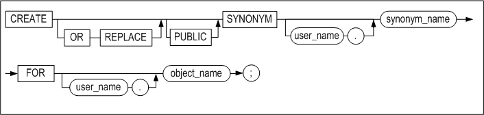

#### Prerequisites

At least one of the following conditions must be met: 

- The SYS user
- Users having the CREATE SYNONYM or CREATE ANY SYNONYM system privilege in order to create a synonym in own's schema can execute this statement. 
- Additionally, it is necessary to be the SYS user or have the CREATE ANY SYNONYM system privilege in order to create a synonym in another user's schema, and it is necessary to be the SYS user or have the CREATE PUBLIC SYNONYM system privilege in order to create a public synonym

#### Description

This statement is a SQL statement that generates synonyms. Synonyms are alternative names for the following objects:

- Table
- View
- Sequence
- Stored procedure and function
- Another synonym

Synonyms can be referred to using the following types of SQL statements:

| DML Statement                                                | DDL statement      |
| ------------------------------------------------------------ | ------------------ |
| SELECT <br />INSERT <br />UPDATE <br />DELETE <br />MOVE <br />LOCK TABLE <br />MERGE <br />ENQUEUE <br />DEQUEUE | GRANT <br />REVOKE |

*OR REPLACE*

This clause specifies the re-creation of a synonym, if it already exists. Using this clause, you can alter the definition of an existing synonym, without deleting it first.

*PUBLIC Synonyms vs. PRIVATE Synonyms*

A PUBLIC synonym is accessible by all users, whereas a PRIVATE synonym can only be accessed by its owner.

To create a public synonym, specify PUBLIC in the statement. If this keyword is not provided, a PRIVATE synonym will be created by default.

*user_name*

If a user name is provided in front of the synonym name, that user will be the owner of the synonym.

When creating a PUBLIC synonym, do not specify the name of the owner. 

When creating a PRIVATE synonym, it is possible to specify the name of the owner. If no user name is provided, the synonym will be created in the schema of the user connected via the current session.

*synonym_name*

If there is a table, view, sequence, stored procedure, stored function or another synonym that has the same name as the synonym to be created, an error will be raised. Because synonyms occupy the same namespace as these object types, the name for the synonym must be unique within the schema in which it is created. Refer to "Rules for Object Names"  for more information onf specifying names.

*FOR clause*

This clause is used to specify the object for which the synonym will serve as an alias.

*user_name*

This is used to specify the owner of the object for which the synonym will function as an alias. If no user name is specified, Altibase will assume that the object belongs to the schema of the user connected via the current session.

*object_name*

This is used to specify the name of the object for which the synonym will serve as an alias.

If this object does not exist in the database, no error will be raised, and the synonym will be created successfully regardless. In other words, the schema object need not currently exist, and it is not necessary to have privileges for the object for which the synonym will function as an alias.

#### Privileges and Synonyms

To execute DML statements on synonyms, it is necessary to have DML execution privileges for the underlying object. 

When DML execution privileges on a synonym are granted or revoked, the privileges are actually granted or revoked on the underlying objects. 

Therefore, when the execution of a DML statement on a synonym results in an error, check the SYS_GRANT_SYSTEM_ or SYS_GRANT_OBJECT_ meta table to determine whether the user has been granted suitable privileges for the underlying object. 

If the user has not been granted suitable privileges, grant the privileges to the user. When granting privileges to the user, they can be granted either by referencing the object itself, or by referencing the synonym. If the user already has appropriate privileges for the underlying object itself, it is necessary only to create the synonym. No additional privileges need to be granted for the synonym. 

Privileges granted for an object by referencing a synonym for the object are not revoked even if the synonym is subsequently dropped. This is because the privileges are actually granted for the object underlying the synonym, not the synonym itself, even though the synonym was referenced when the privileges were granted.

#### Object Name Search Order

In order to determine which objects match the objects referenced in a SQL statement, any tables, views, sequences, stored procedures or stored functions having corresponding names are first searched for. If they don't exist, other synonym objects having the names are searched for. 

PRIVATE synonyms are examined before PUBLIC synonyms.

For example, whether objects having the names referenced in a SQL statement exist in the database would be determined in the order shown below.

- SELECT \* FROM NAME

1. Any tables or views having the name “NAME” are searched for. 
2. If no tables or views having the name “NAME” exist, any PRIVATE synonym objects having the name are searched for in the schema of the user connected via the current session. 
3. If no PRIVATE synonyms having the name exist, any PUBLIC synonym objects are searched for.

- SELECT \* FROM USER.NAME

1. Any tables or views having the name “NAME” are searched for in the “USER” schema. 
2. If no tables or views having the name “NAME” exist, any PRIVATE synonym objects having the name are searched for in the “USER” schema. 
3. If no PRIVATE synonyms having the name exist, no PUBLIC synonym objects are searched for. Instead, an error is returned.

#### Examples

\<Query\> \>Create a synonym called my_dept for the table dept, which is owned by the user altibase, in the current user's schema and execute some DML statements using the synonym.

```
iSQL> CONNECT altibase/altibase;
Connect success.
iSQL> CREATE TABLE dept 
     (
     id integer,
     name char(10), 
     location varchar(40), 
     member integer
     );
Create success.
iSQL> GRANT INSERT ON dept TO mylee;
Grant success.
iSQL> GRANT SELECT ON dept TO mylee;
Grant success.
iSQL> CONNECT mylee/mylee;
Connect success.
iSQL> CREATE SYNONYM mylee.my_dept FOR altibase.dept;
Create success.
iSQL> INSERT INTO my_dept VALUES (1,'rndn1',NULL,4);
1 row inserted.
iSQL> SELECT * FROM my_dept;
MY_DEPT.ID  MY_DEPT.NAME  MY_DEPT.LOCATION 
-------------------------------------------------------
MY_DEPT.MEMBER 
-----------------
1           rndn1 
4           
1 row selected.
```


### CREATE TABLE

#### Syntax

**create_table ::=**


[table_constraint
::=](#table_constraint), [temporary_attributes_clause
::=](#temporary_attributes_clause),
[table_partitioning_clause](#table_partitioning_clause), [access_mode_clause
::=](#access_mode_clause_CREATETALBE), [physical_attributes_clause
::=](#create_table_physical_attributes_clause), [log_compression_clause
::=](#log_compression_clause), [logging_clause ::=](#logging_clause),
[parallel_clause::=](#parallel_clause), [table_compression_clause
::=](#table_compression_clause), [lob_column_properties
::=](#lob_column_properties)

**column_definition ::=**


**encrypt_clause::=**


**variable_clause::=**

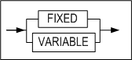

**in_row_clause::=**


**default_clause::=**

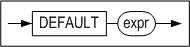

**column_constraint ::=**

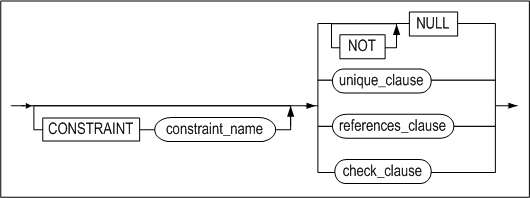

**unique_clause ::=**


**unique_specification ::=**


**sort_order_clause ::=**


**directkey_clause ::=**


**using_index_clause ::=**


**index_attribute_clause ::=**


[memory_index_attributes ::=](#memory_index_attributes), [disk_index_attributes
::=](#disk_index_attributes)

**references_clause::=**


**check_clause ::=**


<a name="table_constraint"><a/>

**table_constraint ::=**


**table_unique_clause ::=**


**referential_constraint ::=**


[references_clause ::=](#references_clause)

<a name="temporary_attributes_clause"><a/>

**temporary_attributes_clause ::=**


<a name="table_partitioning_clause"><a/>

**table_partitioning_clause ::=**


**range_partitioning ::=**

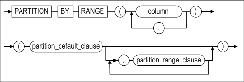

**partition_default_clause ::=**


<a name="table_partition_description"><a/>

**table_partition_description ::=**


[lob_column_properties ::=](#lob_column_properties)*,* [access_mode_clause
::=](#access_mode_clause_CREATETALBE)

**partition_range_clause ::=**


[table_partition_description ::=](#table_partition_description)


**hash_partitioning ::=**

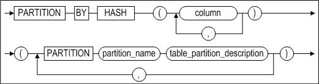

[table_partition_description ::=](#table_partition_description)


**list_partitioning ::=**


[partition_default_clause ::=](#partition_default_clause)

**partition_list_clause ::=**


<a name="row_movement_clause"><a/>

**row_movement_clause ::=**


<a name="access_mode_clause_CREATETALBE)"><a/>

**access_mode_clause ::=**


<a name="tablespace_clause"><a/>

**tablespace_clause ::=**


<a name="physical_attributes_clause"><a/>

<a name="create_table_physical_attributes_clause"><a/>

**physical_attributes_clause ::=**


**storage_clause ::=**


<a name="log_compression_clause"><a/>

**log_compression_clause ::=**


<a name="logging_clause"><a/>

**logging_clause ::=**


<a name="parallel_clause"><a/>

**parallel_clause::=**


<a name="table_compression_clause"><a/>

**table_compression_clause ::=**


<a name="lob_column_properties"><a/>

**lob_column_properties ::=**


**LOB_storage_clause ::=**


**lob_attributes ::=**


#### Prerequisites 

At least one of the following conditions must be met: 

- The SYS user
- Users have the CREATE TABLE or CREATE ANY TABLE system privilege in order to create table in their schema 
- Users have the CREATE ANY TABLE system privilege in order to create table in another user's schema.

#### Description

This command is used to create a new table with the specified name. 

*[GLOBAL] TEMPORARY*

[GLOBAL] TEMPORARY specifies the table as a temporary table. There is no difference whether or not GLOBAL is specified; it can be omitted. Table definitions created in this manner are visible to all sessions; however, temporary table data is private to the session that inserts data into the table. 

When the user first creates a temporary table, only meta data of the table is stored in the data dictionary and space for table data is not allocated; table segment space is allocated when the first DML statement is operated on the table. Temporary table definitions persist in the database as do regular table definitions; however, table segments for temporary tables and all temporary table data are session-specific or transaction-specific. With the ON COMMIT keyword, the user can specify whether table segments and data are session-level or transaction-level. For more detailed information, refer to the temporary_attributes_clause below. 

For session-specific temporary tables, DDL operations(ALTER TABLE, DROP TABLE, CREATE INDEX, etc) are permitted only if a session is not bound to the temporary table. For transaction-specific temporary tables, DDL operations are permitted, regardless of whether or not a transaction is bound to the temporary table. However, Altibase internally commits before operating DDL statements; therefore, table data disappears after DDL statements are operated on temporary tables.

- Restriction on temporary tables:
  - Partitioning is impossible for temporary tables.
  - Foreign keys cannot be specified for temporary tables.
  - Only volatile tablespace can be specified for TABLESPACE of the lob_storage_clause for temporary tables.
  - Temporary tables can only be stored on volatile tablespace.
  - Distributed transactions are not supported for temporary tables.

*user_name*

This is used to set the owner of the table. If it is omitted, Altibase will create the table in the schema of the user connected via the current session.

*tbl_name*

This is used to specify the name of the table to be created. Refer to "[Rules for Object Names](#object_name)" for more information on specifying names.

*column_definition*

- DEFAULT  
  If no DEFAULT clause is specified for a column, the initial value for each row in the column is NULL.
- TIMESTAMP  
  A TIMESTAMP column is handled like other data types in many respects. When the data type of a column is specified as TIMESTAMP in a CREATE TABLE statement, a TIMESTAMP value having a size of 8 bytes is generated internally. However, because the value of a TIMESTAMP column is determined by the system, no DEFAULT value can be expressly specified. Furthermore, only one TIMESTAMP column can be created for one table.

*column_constraint*

This is used to specify the constraint for a column when a new table is created. A constraint name can be expressly specified by the user. The LOCALUNIQUE constraint is intended for use with partitioned tables.

- PRIMARY KEY

  The value(s) on which a primary key is based must be unique in the table. Additionally, none of the columns which a primary key is based can contain NULL values. Only one primary key can be defined in each table. A primary key can be created on the basis of up to 32 columns. 
  
- UNIQUE

  A UNIQUE constraint prohibits multiple rows from having the same value in the same column (or combination of columns). However, NULL values are allowed. 
  

A unique constraint and a primary key constraint cannot both be defined for the same column or combination of columns in one table. Additionally, only one unique constraint can be defined for a column or combination of columns. However, these limitations do not pertain to other columns or combinations of columns within the same table. A unique constraint can be created for a combination of up to 32 columns. 

- LOCALUNIQUE

  This keyword specifies that each local index must satisfy the UNIQUE constraint.

- (NOT) NULL

  This keyword specifies that the corresponding column can(cannot) contain NULL values.

- CHECK

  This clause specifies an integrity rule that applies to the target column. Only the target column can be referenced within the condition of the column_constraint clause. The following limitations concern the conditions of CHECK constraints:
  
  - Subqueries, sequences, all pseudo columns, such as LEVEL, ROWNUM, etc., and non-deterministic SQL functions, such as SYSDATE, USER_ID, etc., cannot be included. 
  - The PRIOR operator cannot be used. 
  - LOB type data cannot be used.
  
- Referential integrity

- TIMESTAMP


*directkey_clause*

Creates a direct key index. For more detailed information about direct key indexes, please refer to CREATE INDEX.

*check_clause*

This clause specifies the condition that the value for each record of the table must satisfy. The results of the condition must be evaluated to either TRUE, FALSE or NULL. 

This clause is valid as the column constraint or the table constraint.

*table_constraint*

This is used to specify the constraint for combination of columns or one column. The following table constraints exist:

- PRIMARY KEY
- UNIQUE
- LOCALUNIQUE
- CHECK
- Referential integrity

*using_index_clause*

This is used to specify the tablespace in which to store an index that is created to support a constraint. 

If any of the PRIMARY KEY, UNIQUE or LOCALUNIQUE constraints are specified, the tablespace in which to store the index of the local index for each index partition can be specified. For more information, please refer to *index_partitioning_clause* in the description of the CREATE INDEX statement

*references_clause*

This clause is used to define a foreign key. The referenced key, that is, the key that resides in another table and is referenced by a foreign key, must either have the UNIQUE constraint applied to it, or be the PRIMARY KEY for the table in which it resides. If the columns of a referenced key are not specified, the primary key for that table is automatically taken as the referenced key

- NO ACTION

  This is the default behavior for checking referential integrity. 
  
  Normally, when an INSERT, UPDATE, or DELETE operation is performed on a so-called “parent table”, that is, a table that contains a referenced key, the operation is performed only after an integrity check is performed on any so-called “child tables”, that is, tables containing foreign keys that reference the referenced key. The NO ACTION option prevents parent rows from being altered if integrity checking fails, and outputs an error instead. 
  

In this example, when an attempt is made to delete a department from the departments table, if the department code is referenced by a record in the employees table, the delete attempt will fail and an error will be raised.

  ```
  CREATE TABLE employees (
ENO INTEGER PRIMARY KEY, 
  DNO INTEGER, 
  NAME CHAR(10), 
  FOREIGN KEY(DNO) REFERENCES 
  departments(DNO) ON DELETE NO ACTION ); 
  ```


- ON DELETE CASCADE

  This option stipulates that if a row in the parent table is deleted, all rows in child tables that have foreign keys that reference this row will also be deleted.
  

For example, if the table employees is created as follows, when a department from the table departments is tried to be deleted, all rows referencing this department number in the table employees are also deleted.

  ```
  CREATE TABLE employees (
ENO INTEGER PRIMARY KEY, 
  DNO INTEGER, 
  NAME CHAR(10), 
  FOREIGN KEY(DNO) REFERENCES 
  departments (DNO) ON DELETE CASCADE ); 
  ```


- ON DELETE SET NULL

  This option specifies for every foreign key column value in the child table referencing a row in the parent table to be set to NULL, if the given row is deleted. 
  
  In order to enforce the referential integrity of this option, the target column must be nullable. 

For example, consider the case where the user creates the table employees that references the table departments and then deletes a certain department from the table departments. All the column values of the table employees referencing the deleted department number will be modified to NULL. 

  ```
CREATE TABLE employees (
  ENO INTEGER PRIMARY KEY, 
  DNO SMALLINT, 
  NAME CHAR(10), 
  CONSTRAINT dno_fk FOREIGN KEY (dno) REFERENCES 
  departments (dno) ON DELETE SET NULL ); 
  ```


*MAXROWS*

This is used to specify the maximum number of records that can be entered into a table. If an attempt is made to insert records such that the total number of records would be more than that specified using MAXROWS, the insert attempt will fail and an error will be returned. The MAXROWS clause cannot be specified with the table_partitioning_clause clause.

*temporary_attributes_clause*

This clause specifies whether the temporary table is transaction-specific or session-specific. The following two options are available:

*ON COMMIT DELETE ROWS*

This creates a transaction-specific temporary table. The transaction that first inserts data into the temporary table is bound to the temporary table. Transaction-level binding is unbound with the execution of the COMMIT or ROLLBACK statement. If the transaction is committed, Altibase truncates the temporary table.

*ON COMMIT PRESERVE ROWS*

This creates a session-specific temporary table. A session is bound to the temporary table when data is first inserted into the temporary table in the session. This binding is unbound when the session is terminated or TRUNCATE is operated on the table in the session. If the user terminates the session, Altibase truncates the session bound temporary table.

*table_partitioning_clause*

This is used to create a partitioned table. A partitioned table can be range-partitioned, hash-partitioned or list-partitioned. row_movement_clause can also be specified when a partitioned table is created.

*range_partitioning*

This specifies that the table will be partitioned based on ranges of partition key values. It is primarily used with the DATE data type. Because the table is partitioned based on user-specified values, there is no guarantee that the data will be uniformly distributed among the partitions. The range of each partition is determined by setting the maximum value of its range. 

Any values exceeding all of the specified ranges, along with any NULL values, will be saved in the default partition. The default partition clause cannot be omitted. A partition key can be defined on the basis of multiple columns.

*table_partition_description*

The tablespace for a partition can be specified. Additionally, if the table contains one or more LOB columns, the attributes for each LOB column can be specified separately. The data access mode for the partition can also be set. 

If the tablespace statement is omitted, the partition will be stored in the default tablespace for the table. 

Additionally, if the tablespace in which to store a LOB column is not specified, the LOB data will be stored in the tablespace for the partition. 

In the following example, the default tablespace for the user is tbs_05.

```
CREATE TABLE print_media_demo
( 
	product_id INTEGER,
	ad_photo BLOB,
	ad_print BLOB,
	ad_composite BLOB
)
PARTITION BY RANGE (product_id)
(
	PARTITION p1 VALUES LESS THAN (3000) TABLESPACE tbs_01 
	LOB (ad_photo) STORE AS (TABLESPACE tbs_02 ),
	PARTITION p2 VALUES DEFAULT 
	LOB (ad_composite) STORE AS (TABLESPACE tbs_03)
) TABLESPACE tbs_04;
```


Partition p1 will be stored in the tbs_01 tablespace because this was expressly specified. However, the ad_photo column for this partition will be stored in the tbs_02 tablespace. Because no tablespace was specified for partition p2, which is the default partition, it will be stored in tablespace tbs_04, where table T1 resides. If no tablespace for the table is specified either, it will be stored in the default tablespace, which is tbs_05. 

This is illustrated in the following diagram:


*partition_range_clause*

This is used to specify the noninclusive upper limit for a range partition. This value must not be set to the same value as that of any other partition.

*hash_partitioning*

This specifies that the table will be partitioned based on hash values corresponding to partition key values. This partitioning scheme is suitable for situations in which the data must be distributed uniformly among the partitions. A partition key can be defined on the basis of multiple columns.

*list_partitioning*

This specifies that the table will be partitioned based on sets of values. The default partition cannot be omitted because any values not specified as belonging to another partition are automatically included in this partition. 

When a new partition is defined, the values specified as belonging to that partition are removed from the default partition. This is because values cannot be specified as belonging to more than one partition. Additionally, the partition key for a list-partitioned table can be defined only on the basis of a single column.

*partition_list_clause*

The list that defines each list partition must comprise at least one value. A value in one list must not be present in any other list.

*row_movement_clause*

When a record in a partitioned table is updated in a way that changes the data in a column on which the partition key is defined such that the record (row) must be moved to another partition, this clause determines whether to move the record automatically or raise an error. If this clause is omitted, the DISABLE ROW MOVEMENT option (i.e. raise an error) is set by default.

*CREATE TABLE … AS SELECT*

When creating a table, to copy column attributes and data from other tables into the new table, use the CREATE TABLE ... AS SELECT statement. The number of columns in the new table cannot be set differently from the number of columns retrieved by the AS SELECT clause. Additionally, the data types of the new columns cannot be expressly set, as they are set the same as the original columns from which the data are retrieved.

If no column names are specified for the new table, the names of the original columns will be used as the column names for the new table. If the name of the search target is in the form of an expression, an alias must be provided. This alias will becomes the name of the column in the new table.

*access_mode_clause*

This sets the data access mode. A mode can be chosen among Read-Only, Read/Write and Read/Append modes and on omission, the Read/Write mode is set by default.

> Note: Even if the data access mode for the table or partition is set to ‘Read-Only’ or ‘Read/Append’, copying data through replication, TRUNCATE statement execution, and LOB column alteration are allowed.

*tablespace_clause*

This clause is used to set the tablespace in which to save the table. 

If this clause is omitted, the table will be saved in the DEFAULT TABLESPACE of the user in whose schema the table is being created. The user's DEFAULT TABLESPACE was specified when the user was created. If no DEFAULT TABLESPACE has been specified for the user, the table will be created in the SYSTEM MEMORY DEFAULT TABLESPACE.

If a UNIQUE or PRIMARY KEY constraint is specified in the CREATE TABLE statement, the index supporting the constraint will be saved in the tablespace in which the table is saved.

*physical_attributes_clause*

This clause is used to specify the PCTFREE, PCTUSED, INITRANS, and MAXTRANS. If this clause is specified for a partitioned table, the PCTFREE and PCTUSED values will apply to all of the partitions in the table.

- PCTFREE Clause  
  This is used to specify the amount of free space that is reserved for use in updating records that have already been saved in a page. Additional records can only be saved into the portion of the page that is not reserved in this way. This value represents the percentage of free space in the page.  
  For example, for a table in which PCTFREE is set to 20, records can only be inserted into 80% of the space in each page, and the remaining 20% of the page is reserved for use in updating existing records. This value is only meaningful for disk-based tables.  
  This option must be set to an integer value ranging from 0 to 99, representing the percentage. If this value is not set, the default PCTFREE value is 10. This option only applies to pages that have been assigned to tables.
- PCTUSED Clause  
  This is the threshold below which the amount of used space in a page must decrease in order for the page to return to the state in which records can be saved in it again. When the amount of free space in a page falls below the percentage specified in PCTFREE, it becomes impossible to save new records in the page. At this time it is permissible only to update and delete existing records. Once subsequent update or delete operations reduce the percentage of used space in the page below the threshold specified by PCTUSED, it becomes possible to save new records in the page again.  
  For example, assuming that PCTUSED has been set to 40, once the percentage of unused space in a page has decreased below the limit specified using PCTFREE (i.e. when the percentage of used space increases beyond 100 - PCTFREE), no more records are saved in that page until the percentage of used space falls to 39%. In other words, new records can be saved in the page only after the percentage of used space falls below 40%. This option only applies to disk-based tables.  
  This option must be set to an integer value ranging from 0 to 99, representing the percentage. If this value is not set, the default PCTUSED value is 40. This option only applies to pages that have been assigned to tables.
- INITRANS Clause  
  This clause is used to set the initial number of TTS (Touched Transaction Slots). The default value is 2.
- MAXTRANS Clause  
  This clause is used to set the maximum number of TTS (Touched Transaction Slots), to which the number of TTS can increase. The default value is 120.

> Note: 
>
> PCTFREE and PCTUSED are used together to optimize performance as follows. In this example, assume that PCTFREE has been set to 20 and PCTUSED to 40. 
> 
>20% of each page that is allocated to a table is reserved for use in updating existing records. New records can only be saved in the page until the remaining 80% of the space in the page has been filled. 
> 
> At this point, no more new records can be saved in the page. The only operations that can be performed are update and delete operations on records that already exist in the page. 20% of the page has been reserved for update operation. If enough records are deleted for the amount of used space in the page to fall below 40%, it becomes possible to save new records in the page again. 
>
> The values of PCTFREE and PCTUSED are used in this way to determine in a cyclical manner how the space in pages is used.

*storage_clause*

This clause is used to set storage parameters for managin extents in segments. 

- INITEXTENTS Clause  
  This is used to set the number of extents that are initially allocated when a segment is created. If this is not specified, one extent is allocated by default.
- NEXTEXTENTS Clause  
  This is used to set the number of extents that are added to a segment every time the segment is increased in size. If this is not specified, the default value is 1.
- MINEXTENTS Clause  
  This is used to set the minimum number of extents in a segment. If this is not specified, the default value is 1.
- MAXEXTENTS Clause  
  This is used to set the maximum number of extents in a segment. If this is not specified, there is no upper limit.

*LOB_storage_clause*

In a disk table, LOB column data can be stored in a tablespace other than that in which the table containing the LOB column is stored. However, in a memory table, LOB column data cannot be stored separately from the rest of the table; that is, they can only be stored in the same tablespace as the table.

*parallel_clause*

This is used to specify the number of threads which execute parallel queries. Omitting this clause is equivalent to specifying NOPARALLEL.

- NOPARALLEL : Does not execute queries in parallel.
- PARALLEL *integer* : Specification of integer indicates the number of threads to execute queries in parallel. A value from 1~65535 is valid for specification. PARALLEL 1 is equivalent to NOPARALLEL

Altibase currently supports only the following types of parallel queries.

- Parallel queries which scan partitioned tables.
- Parallel queries with HASH, SORT, GRAG nodes in their execution plans. For such nodes, however, only one parallel worker thread is created per node. 

*table_compression_clause*

This specifies each of the names of the columns to be compressed with the use of commas. The maximum number of rows that can be inserted to the dictionary table, which is automatically generated for each compressed column, is specified in the MAXROWS clause. On omission, the default value is the same as for normal tables, 2<sup>64</sup>-1.

The execution of table creation and data insertion in one statement by specifying this clause and subquery in the CREATE TABLE statement is not supported. 

The following table shows the data types valid for compression and the minimum size for each type

| Data Type                | Minimum Size |
| ------------------------ | ------------ |
| CHAR, VARCHAR, BYTE      | 6            |
| NCHAR, NVARCHAR (UTF-8)  | 6            |
| NCHAR, NVARCHAR (UTF-16) | 3            |
| NIBBLE                   | 13           |
| BIT, VARBIT              | 25           |
| DATE                     |              |

#### Consideration

What follows are general considerations to keep in mind when creating tables:

- If columns are created larger than their maximum allowable size or smaller than their minimum allowable size, an error occurs. The maximum and minimum sizes vary depending on the data type. 
- The maximum number of columns in one table is 1024. 
- A maximum of one primary key can be defined for a table. 
- For a foreign key constraint, the foreign key and the referenced key must have the same 
  number of columns. For a foreign key constraint, corresponding columns in the foreign key and the referenced key must have the same data types.
- The total number of indexes, primary keys and unique keys cannot exceed 1024.
- When executing a CREATE TABLE ... AS SELECT statement, if the names of the columns to create are specified, the number column names must be the same as the number of columns retrieved using the AS SELECT clause.
- When executing a CREATE TABLE ... AS SELECT statement, when the column name is not specified in the CREATE TABLE statement and the name of the column to be retrieved is provided in the form of an expression, an alias name must be specified for the purpose of determining the name of the column in the new table.
- The MAXROWS clause is not supported for use with partitioned tables. 
- For range- and hash-partitioned tables, up to 32 columns can be specified as partition key columns. (This is the same as the upper limit on the number of index columns when an index is created.) 
- In the event of a system or media fault, the consistency of an index that was created using the NOLOGGING (FORCE/NOFORCE) option cannot be guaranteed. After an index becomes inconsistent, the error message indicating that the index is inconsistent will be raised when the index is accessed. To fix this error, locate the inconsistent index, drop it, and create it again. The consistency of an index can be checked using the V$DISK_BTREE_HEADER performance view. 
- Just as when executing the CREATE INDEX statement, the tablespace in which a local partitioned index is saved cannot be specified. 
- The CHECK constraint cannot be specified for the CREATE TABLE … AS SELECT statement. 
- Columns with the PRIMARY KEY, UNIQUE and TIME STAMP constraints cannot be compressed.

#### Examples

##### Creating Tables

Create the following tables: 

- Table name: employees  
  Columns: employee number, employee first and last name, position, telephone number, department number, salary, gender, birthday, hiring date, and status.
  
```
  iSQL> CREATE TABLE employees(
    eno INTEGER PRIMARY KEY,
    e_lastname CHAR(20) NOT NULL, 
    e_firstname CHAR(20) NOT NULL,
    emp_job VARCHAR(15),
    emp_tel CHAR(15),
    dno SMALLINT,
    salary NUMBER(10,2) DEFAULT 0,
    sex CHAR(1) CHECK(sex IN ('M', 'F')),
    birth CHAR(6),
    join_date DATE,
    status CHAR(1) DEFAULT 'H');
  Create success.
```


- Table name: orders  
  Columns: order number, order date, salesperson, customer number, product number, quantity, estimated delivery date, and status.
  
```
  iSQL> CREATE TABLE orders(
    ono BIGINT,
    order_date DATE,
    eno INTEGER NOT NULL,
    cno BIGINT NOT NULL,
    gno CHAR(10) NOT NULL,
    qty INTEGER DEFAULT 1,
    arrival_date DATE,
    processing CHAR(1) DEFAULT '0', PRIMARY KEY(ono, order_date));
  Create success.
```


- Using CREATE TABLE … AS SELECT   
  Create a new table called dept_1002 and copy the column attributes and data that meet the condition shown from the employees table.
  
```
  iSQL> CREATE TABLE dept_1002
    AS SELECT * FROM employees
    WHERE dno = 1002;
  Create success.
```


- Create a table that has a TIMESTAMP type column.

  ```
  iSQL> CREATE TABLE tbl_timestamp(
  i1 TIMESTAMP CONSTRAINT const2 PRIMARY KEY, 
  i2 INTEGER,
  i3 DATE,
  i4 Byte(8));
  Create success.
  ```

  The attributes of the table tbl_timestamp are as shown below. 

  ```
  [ TABLESPACE : SYS_TBS_MEM_DATA ]
  [ ATTRIBUTE ]                                                         
  ------------------------------------------------------------------------------
  NAME                                     TYPE                        IS NULL 
  ------------------------------------------------------------------------------
  I1                                       TIMESTAMP       FIXED       NOT NULL
  I2                                       INTEGER         FIXED       
  I3                                       DATE            FIXED       
  I4                                       BYTE(8)         FIXED       
  [ INDEX ]                                                       
  ------------------------------------------------------------------------------
  NAME                                     TYPE     IS UNIQUE     COLUMN
  ------------------------------------------------------------------------------
  CONST2                                   BTREE    UNIQUE        I1 ASC
  [ PRIMARY KEY ]                                                 
  ------------------------------------------------------------------------------
  I1
  ```

  The way to distinguish between i4, which explicitly declares the Byte (8) data type, and i1, which is a TIMESTAMP data type column, is to check whether the colum type is TIMESTAMP by querying the SYS_CONSTRAINTS_ and SYS_CONSTRAINT_COLUMNs_ meta tables.
  
  > Note: If the DEFAULT keyword is used for a timestamp column when performing an INSERT or UPDATE operation, the system time at which the operation is performed will be written to the TIMESTAMP column.

  ```
  iSQL> INSERT INTO tbl_timestamp VALUES(DEFAULT, 2, '02-FEB-01', Byte'A1111002');
  1 row inserted.
  iSQL> UPDATE tbl_timestamp SET i1 = DEFAULT, i2 = 102, i3 = '02-FEB-02', i4 = Byte'B1111002' WHERE i2 = 2;
  1 row updated.
  iSQL> SELECT * FROM tbl_timestamp;
  I1                I2          I3           I4
  ------------------------------------------------------------------
  4E3778C900037AE9  102         02-FEB-2002  B111100200000000
  1 row selected.
  ```
  
  Similarly, if the user does not specify a TIMESTAMP value when performing an INSERT or UPDATE operation on a TIMESTAMP column, the system time at which the operation is performed will be used to perform the INSERT or UPDATE operation.
  
```
  iSQL> INSERT INTO tbl_timestamp(i2, i3, i4) VALUES(4, '02-APR-01', Byte'C1111002');
  1 row inserted.
iSQL> UPDATE tbl_timestamp SET i2=104, i3='02-APR-02', i4=BYTE'D1111002' WHERE i2=4;
  1 row updated.
  iSQL> SELECT * FROM tbl_timestamp;
  I1                I2          I3           I4
  ------------------------------------------------------------------
  4E3778C900037AE9  102         02-FEB-2002  B111100200000000
  4E37794900083702  104         02-APR-2002  D111100200000000
  2 rows selected.
```


- Creating and Using Temporary Tables

  \<Query\> After creating a temporary table and inserting data in a session, the data is retrieved in that session and no data is retrieved in the other sessions. 
  
```
  iSQL> create volatile tablespace my_vol_tbs size 12M autoextend on maxsize 1G; 
  Create success. 
  iSQL> create temporary table t1(i1 integer, i2 varchar(10)) on commit delete rows tablespace my_vol_tbs; 
  Create success. 
  iSQL> create temporary table t2(i1 integer, i2 varchar(10)) on commit preserve rows tablespace my_vol_tbs; 
  Create success. 
  iSQL> desc t2; 
  [ TABLESPACE : MY_VOL_TBS ] 
  [ ATTRIBUTE ]                                                         
  ------------------------------------------------------------------------------ 
  NAME                                     TYPE                        IS NULL 
  ------------------------------------------------------------------------------ 
  I1                                       INTEGER         FIXED       
  I2                                       VARCHAR(10)     FIXED       
  T2 has no index 
  T2 has no primary key 
  iSQL> alter table t2 add constraint t2_pk primary key (i1); 
  Alter success. 
  iSQL> insert into t2 values (1, 'abc'); 
  1 row inserted. 
  iSQL> insert into t2 values (2, 'def'); 
  1 row inserted. 
  iSQL> select * from t2; 
  I1          I2          
  --------------------------- 
  1           abc         
  2           def         
  2 rows selected. 
  iSQL> connect sys/manager; 
  Connect success. 
  iSQL> select * from t2; 
  I1          I2          
  --------------------------- 
  No rows selected.
```


- Create a table in the tablespace specified in the query

  \<Query\>  Create table tbl1 in the user uare1's schema. (Assume that no default tablespace was specified when this user was created.)
  
```
  iSQL> CONNECT uare1/rose1;
  Connect success.
  iSQL> CREATE TABLE tbl1(
      i1 INTEGER,
      i2 VARCHAR(3));
  Create success.
```

> Note: The table will be created in the system memory default tablesapce when no default tablespace has been defined for the user. 

  \<Query\> Create the books and inventory tables in the user_data tablespace, which is the default tablespace for the user. 

  books columns: book number, book name, author, edition, publication year, price, and publication code (can contain a maximum of two rows).

inventory columns: subscription number, book number, store code, purchase date, quantity, and a character to indicate whether the item has been paid for.

  ```
iSQL> CREATE TABLE books(
    isbn CHAR(10) CONSTRAINT const1 PRIMARY KEY,
  title VARCHAR(50),
    author VARCHAR(30),
    edition INTEGER DEFAULT 1,
    publishingyear INTEGER,
    price NUMBER(10,2),
  pubcode CHAR(4)) MAXROWS 2
  TABLESPACE user_data;
  Create success.
  
  iSQL> CREATE TABLE inventory(
    subscriptionid CHAR(10) PRIMARY KEY,
    isbn CHAR(10) CONSTRAINT fk_isbn REFERENCES books (isbn),
    storecode CHAR(4),
    purchasedate DATE,
    quantity INTEGER,
  paid CHAR(1))
  TABLESPACE user_data;
  Create success.
  ```

  Or

  ```
iSQL> CREATE TABLE inventory(
    subscriptionid CHAR(10),
  isbn CHAR(10),
    storecode CHAR(4),
    purchasedate DATE,
    quantity INTEGER,
    paid CHAR(1),
    PRIMARY KEY(subscriptionid),
  CONSTRAINT fk_isbn FOREIGN KEY(isbn) REFERENCES books(isbn))
  TABLESPACE user_data;
  Create success.
  ```


- Creating a Table with a Direct Key Index

  \<Query\> Create an id(INTEGER) column in the tab1 table with the UNIQUE constraint and create a direct key index on it.
  
```
  iSQL> CREATE TABLE tab1 (id UNIQUE DIRECTKEY );
  Create success.
```


- Specifying Tablespaces for Index Partitions

  \<Query\> Create the partitioned table T1 having the UNIQUE constraint on column I1.

  ```
  CREATE TABLE T1 
  ( 
    I1 INTEGER UNIQUE USING INDEX LOCAL
    (
      PARTITION P1_UNIQUE ON P1 TABLESPACE TBS3,
      PARTITION P2_UNIQUE ON P2 TABLESPACE TBS2,
      PARTITION P3_UNIQUE ON P3 TABLESPACE TBS1
    )
  )
  PARTITION BY RANGE (I1)
  ( 
    PARTITION P1 VALUES LESS THAN (100),
    PARTITION P2 VALUES LESS THAN (200) TABLESPACE MEM_TBS1,
    PARTITION P3 VALUES DEFAULT TABLESPACE MEM_TBS2 
  ) TABLESPACE SYS_TBS_DISK_DATA;
  ```


- Range Partitioning

  \<Query 1\> Create the table range_sales, partitioning the year 2006 into respective quarters as shown below.
  
```
  CREATE TABLE range_sales
  ( 
    prod_id NUMBER(6),
    cust_id NUMBER,
    time_id DATE
  ) 
  PARTITION BY RANGE (time_id)
  (
    PARTITION Q1_2006 VALUES LESS THAN (TO_DATE('01-APR-2006')),
    PARTITION Q2_2006 VALUES LESS THAN (TO_DATE('01-JUL-2006')),
    PARTITION Q3_2006 VALUES LESS THAN (TO_DATE('01-OCT-2006')),
    PARTITION Q4_2006 VALUES LESS THAN (TO_DATE('01-JAN-2007')),
    PARTITION DEF VALUES DEFAULT 
  ) TABLESPACE SYS_TBS_DISK_DATA;
```


  \<Query 2\> Create a partitioned table, specifying the tablespace for some of the partitions

  ```
  CREATE TABLE T1 
  ( 
    I1 INTEGER, 
    I2 INTEGER 
  )
  PARTITION BY RANGE (I1)
  ( 
    PARTITION P1 VALUES LESS THAN (100),
    PARTITION P2 VALUES LESS THAN (200) TABLESPACE TBS1,
    PARTITION P3 VALUES DEFAULT TABLESPACE TBS2 
  ) TABLESPACE SYS_TBS_DISK_DATA;
  ```


  \<Query 3\> Create a partitioned table in which multiple columns are used as the partition key.

  ```
  CREATE TABLE T1 
  ( 
    I1 DATE, 
    I2 INTEGER 
  )
  PARTITION BY RANGE (I1, I2)
  ( 
    PARTITION P1 VALUES LESS THAN (TO_DATE('01-JUL-2006'), 100),
    PARTITION P2 VALUES LESS THAN (TO_DATE('01-JAN-2007'), 200),
    PARTITION P3 VALUES DEFAULT 
  ) TABLESPACE SYS_TBS_DISK_DATA;
  ```


  \<Query 4\> Create a partitioned table in which the data is moved automatically when required.

  ```
  CREATE TABLE T1 
  ( 
    I1 INTEGER, 
    I2 INTEGER 
  )
  PARTITION BY LIST (I1)
  ( 
    PARTITION P1 VALUES (100, 200),
    PARTITION P2 VALUES (150, 250),
    PARTITION P3 VALUES DEFAULT 
  ) ENABLE ROW MOVEMENT TABLESPACE SYS_TBS_DISK_DATA;
  ```


- List Partitioning

  \<Query\>  Create the table list_customers, which is list-partitioned on the basis of the nls_territory column into the asia partition for the values 'CHINA' and 'THAILAND', the europe partition for the values 'GERMANY', 'ITALY' and 'SWITZERLAND', the west partition for the value 'AMERICA', the east partition for the value 'INDIA', and the default partition for any other values.
  
  ```
  CREATE TABLE list_customers 
  ( 
  	customer_id	NUMBER(6), 
  	cust_first_name	VARCHAR(20), 
  	cust_last_name	VARCHAR(20), 
  	nls_territory	VARCHAR(30), 
  	cust_email	VARCHAR(30)
  )
  PARTITION BY LIST (nls_territory) 
  (
  	PARTITION asia VALUES ('CHINA', 'THAILAND'),
  	PARTITION europe VALUES ('GERMANY', 'ITALY', 'SWITZERLAND'),
  	PARTITION west VALUES ('AMERICA'),
  	PARTITION east VALUES ('INDIA'),
  	PARTITION rest VALUES DEFAULT 
  ) TABLESPACE SYS_TBS_DISK_DATA;
  ```


- Hash Partitioning

  \<Query\> Create a table that is hash-partitioned into 4 partitions based on product_id. CREATE TABLE hash_products.

  ```
  CREATE TABLE hash_products 
  ( 
  	product_id		NUMBER(6), 
  	product_name		VARCHAR(50), 
  	product_description 	VARCHAR(2000) 
  )
  PARTITION BY HASH (product_id)
  ( 
  	PARTITION p1, 
  	PARTITION p2, 
  	PARTITION p3, 
  	PARTITION p4 
  ) TABLESPACE SYS_TBS_DISK_DATA;
  ```

  \<Query\> Create a table in which the LOB data is stored in separate tablespaces; specifically, in which the LOB data in the image1 column is stored in the lob_data1 tablespace and the LOB data in the image2 column is stored in the lob_data2 tablespace. CREATE TABLE lob_products
  
  ```
  CREATE TABLE lob_products 
  (
    product_id integer, 
    image1 BLOB, 
    image2 BLOB
  ) TABLESPACE SYS_TBS_DISK_DATA
  LOB(image1) STORE AS ( TABLESPACE lob_data1 )
  LOB(image2) STORE AS ( TABLESPACE lob_data2 );
  ```


- Creating a Table in which the Extents in the Segment are Managed 

  \<Query\>  Create the table local_tbl in the usertbs disk tablespace. Allocate 10 extents to the table when it is created and specify that 1 extent is to be added whenever the size of the table needs to be increased.
  
```
  iSQL> CREATE TABLE local_tbl (i1 INTEGER, i2 VARCHAR(32) ) 
                      TABLESPACE usertbs
                      STORAGE ( INITEXTENTS 10 NEXTEXTENTS 1 );
  Create success.
```

\<Query\> Create the table local_tbl in the usertbs disk tablespace. Specify that the minimum number of extents in the table is 3, which is the same number that are allocated to the table when it is created, and limit the maximum number of extents to 100.

  ```
  iSQL> CREATE TABLE local_tbl ( i1 INTEGER, i2 VARCHAR(32) ) 
                    TABLESPACE usertbs
                      STORAGE ( INITEXTENTS 3 MINEXTENTS 3 MAXEXTENTS 100 );
  Create success.
  ```

### CREATE DISK TABLESPACE 

#### Syntax

**create_disk_tablespace ::=**


**datafile_spec ::=**


**autoextend_clause ::=**


**maxsize_clause ::=**


#### Prerequisites

Only the SYS user and users having the CREATE TABLESPACE system privilege can create tablespace

#### Description

The CREATE DISK TABLESPACE statement is used to create a disk tablespace, in which database objects can be permanently stored within the database. Tablespaces created using this command can be used to hold tables and indexes.

*DISK*

This keyword is used to specify that the tablespace to be created will be a disk tablespace. A disk tablespace is created even when the CREATE TABLESPACE statement is executed without the DISK keyword.

DATA

This keyword is used to specify that the tablespace to be created will be used to store user data. A data tablespace is created even when the CREATE TABLESPACE statement is executed without the DATA keyword.

*tblspace_name*

This is used to specify the name of the tablespace to be created. Refer to “Rules for Object Names” in Chapter 2 for more information on specifying names.

*datafile_spec*

This is used to specify the attributes of the data file constituting the tablespace.

*EXTENTSIZE Clause*

This is used to specify the size of an extent, which is a collection of pages. This cannot be changed after the tablespace is created. The default unit used to specify the size of an extent is kB (kilobytes, expressed as “K“), but it is also permissible to use MB (megabytes, expressed as “M“) or GB (gigabytes, expressed as “G“). 

If size of the extents in the tablespace is not specified, the extents will be the default size, which is 64 times the size of a single page. When specifying the size of the extents in the tablespace, the extent size must be set to a multiple of the size of a single page. If the extent size is set to a value other than a multiple of the page size, the extent size will be rounded to the closest value internally so that it is a multiple of the page size. 

Additionally, the size of an extent must be at least five times the size of a single page. In other words, because the size of a single page is 8kB, the extent size must be set to at least 40kB.

*SEGMENT MANAGEMENT Clause*

This is used to specify how segments are to be managed in the disk tablespace to be created. This clause is optional. If this option is not specified, segments in the newly created disk space will be managed according to the setting of the DEFAULT_SEGMENT_MANAGEMENT_TYPE property in the altibase.properties file. (The default value for this property is AUTO.)

- MANUAL : This specifies that segments are created on the basis of a so-called “free list“ method of managing available space in the user tablespace.
- AUTO : This specifies that segments are created on the basis of a so-called “bitmap index“ method of managing available space in the user tablespace.

*file_name*

This is used to specify the absolute path and name of the data file to be created.

*SIZE Clause*

This is used to specify the size of the data file. If this clause is omitted, the data file will be the default size, which is 100 megabytes. This default file size can be changed by setting the USER_DATA_FILE_INIT_SIZE property as desired. 

The size is specified by providing an integer followed by one of the following units: kB (kilobytes, expressed as “K”), MB (megabytes, expressed as “M”) or GB (gigabytes, expressed as “G”). If no units are specified, the default unit is kilobytes. 

*REUSE*

This is used to specify whether or not to reuse an existing data file. If a file with the name specified in file_name exists, the REUSE option must be specified. Note however that if an existing file is reused, the original contents of the file will be lost, so care must be taken in order to prevent data loss.   
If the REUSE option is specified but no file with the name specified in file_name exists, this option will be ignored, and a new file will be created.

*autoextend_clause*

This is used to specify whether to automatically increase the size of the data file when it fills up, and the maximum size to which it can increase. If this clause is omitted, AUTOEXTEND is disabled by default.

*ON*

This enables the AUTOEXTEND option for the file.

*OFF*

This disables the AUTOEXTEND option for the file.

*NEXT*

This is used to specify the amount by which the size of the file will increase when it is automatically increased in size. 

If AUTOEXTEND is enabled but this value is not set, the default NEXT value is the value set in the USER_DATA_FILE_NEXT_SIZE property in the altibase.properties file. 

The size can be specified in kB (kilobytes, expressed as “K”), MB (megabytes, expressed as “M”) or GB (gigabytes, expressed as “G”). If no units are specified, the default unit is kilobytes.

*maxsize_clause*

This is used to specify the maximum size to which the data file can increase. If AUTOEXTEND is enabled but this value is not set, the default is the value set using the USER_DATA_FILE_MAX_SIZE property in the altibase.properties file. 

It can be expressed in kB (kilobytes, expressed as “K”), MB (megabytes, expressed as “M”) or GB (gigabytes, expressed as “G”). If no units are specified, the default unit is kilobytes. 

*UNLIMITED*

This is used to indicate that there is no upper limit to the size to which the file can increase. If this option is used, the actual maximum size of the file will be determined by the operating system or by the amount of available space in the file system.

#### Examples

\<Query\> Create the user_data tablespace, comprising three data files. Specify that segments are to be managed using the “free list” method.

```
iSQL> CREATE TABLESPACE user_data
    DATAFILE '/tmp/tbs1.user' SIZE 10M,
    '/tmp/tbs2.user' SIZE 10M,
    '/tmp/tbs3.user' SIZE 10M
    SEGMENT MANAGEMENT MANUAL;
Create success.
```

\<Query\> Create the user_data tablespace, which has an initial size of 10MB, consists of the tbs.user data file (in which the tables and indexes in this tablespace will be stored), and extends automatically.

```
iSQL> CREATE TABLESPACE user_data DATAFILE '/tmp/tbs.user' SIZE 10M AUTOEXTEND
ON;
Create success.
```

\<Query\> Create the user_data tablespace, which can increase in size up to 100MB in 500kB increments.

```
iSQL> CREATE TABLESPACE user_data
    DATAFILE '/tmp/tbs.user' SIZE 500K REUSE
    AUTOEXTEND ON NEXT 500K MAXSIZE 100M;
Create success.
```

\<Query\> Create the user_data tablespace comprising the tbs.user data file, which does not automatically increase in size.

```
iSQL> CREATE TABLESPACE user_data
    DATAFILE '/tmp/tbs.user' AUTOEXTEND OFF;
Create success.
```


### CREATE MEMORY TABLESPACE 

#### Syntax

**create_memory_tablespace ::=**


**initsize_clause ::=**


**autoextend_clause ::=**


**maxsize_clause ::=**


**checkpoint_path_clause ::=**


**splitsize_clause ::=**


#### Prerequisites

Only the SYS user and users having the CREATE TABLESPACE system privilege can create tablespaces.

#### Description

The CREATE MEMORY TABLESPACE statement is used to create a memory data tablespace, in which database objects can be stored within the database. Tablespaces created using this command can be used to hold memory tables.

*MEMORY*

This keyword is used to specify that the tablespace to be created will be a memory tablespace.

*DATA*

This keyword is used to specify that the tablespace to be created will be used to store user data. A data tablespace is created even when the CREATE TABLESPACE statement is executed without the DATA keyword.

*tablespace_name*

This is used to specify the name of the tablespace to create. Refer to “Rules for Object Names” in Chapter 2 for more information on specifying names.

*initsize_clause*

This is used to specify the initial size of the tablespace to create.

*SIZE*

This is used to specify the initial size of the tablespace. The initial size of a memory tablespace must be a multiple of the default allocation size. (i.e. the number of pages specified in the EXPAND_CHUNK_PAGE_COUNT property * the size of one page in memory tablespace (32kB)).

For example, if the EXPAND_CHUNK_PAGE_COUNT property is set to 128, the default allocation size would be 128 * 32 = 4MB. Therefore, the initial size must be set to a multiple of 4MB. 

The size can be specified in kB (kilobytes, expressed as “K”), MB (megabytes, expressed as “M”) or GB (gigabytes, expressed as “G”). If no units are specified, the default unit is kilobytes.

*autoextend_clause*

This is used to specify whether the tablespace automatically increases in size when it fills up, and the maximum size to which it can increase. If this clause is omitted, AUTOEXTEND is disabled by default.

*ON*

This enables the AUTOEXTEND option.

*OFF*

This disables the AUTOEXTEND option. This is the default.

*NEXT*

This is used to specify the increment by which the tablespace increases in size when it is automatically increased in size. 

Note that this size must be a multiple of the default allocation size (the number of pages specified in the EXPAND_CHUNK_PAGE_COUNT property * the size of one page in memory tablespace (32kB)). 

If AUTOEXTEND is enabled but this value is not set, the default is the value set using the EXPAND_CHUNK_PAGE_COUNT property in the altibase.properties file

If AUTOEXTEND is OFF, this value is irrelevant. 

The size can be specified in kB (kilobytes, expressed as “K”), MB (megabytes, expressed as “M”) or GB (gigabytes, expressed as “G”). If no units are specified, the default unit is kilobytes.

*maxsize_clause*

This is used to specify the maximum size to which a tablespace can increase when it automatically increases in size. If AUTOEXTEND is enabled but this value is not set, the default value is UNLIMITED.

If AUTOEXTEND is OFF, this value is meaningless.

The size can be specified in kB (kilobytes, expressed as “K”), MB (megabytes, expressed as “M”) or GB (gigabytes, expressed as “G”). If no units are specified, the default unit is kilobytes.

*UNLIMITED*

This is used to indicate that there is no upper limit to the size to which the tablespace can increase. 

If this option is used, the tablespace will automatically increase in size up to the point at which the total size of all memory tablespaces and all volatile tablespaces in the system reaches the size specified in the MEM_MAX_DB_SIZE property in the altibase.properties file.

*checkpoint_path_clause*

To ensure the durability of the data in memory tablespaces, the data must be saved in files. These memory tablespace data storage files are known as “checkpoint images”. 

The checkpoint_path clause is used to specify the checkpoint path, that is, the path and directory where these image files are stored. 

If no checkpoint path is provided, the path specified in the MEM_DB_DIR property is used as the default path. 

*checkpoint_path*

This is used to specify the location at which a checkpoint image is stored when checkpointing is performed for the memory tablespace. It is permissible to specify more than one path, which is helpful in distributing the disk I/O costs incurred when checkpointing is performed and when the contents of tablespaces are read from disk at startup.

*split_each_clause*

This clause is used to split checkpoint files into smaller files. This is useful when the size of the memory tablespace exceeds the maximum file size supported by the operating system, or in order to distribute I/O costs. The size of the resulting files can be specified by the user. If this size is not specified, the default split size specified in the DEFAULT_MEM_DB_FILE_SIZE property is used. 

The size can be specified in kB (kilobytes, expressed as “K”), MB (megabytes, expressed as “M”) or GB (gigabytes, expressed as “G”). If no units are specified, the default unit is kilobytes. 

#### Examples

\<Query 1\> Create a user-defined memory data tablespace that is initially 512MB in size and does not automatically increase in size. (The checkpoint image is stored in the path specified in the MEM_DB_DIR property. If the checkpoint image file is split into multiple files, the size of those files will be the same as the value set in the DEFAULT_MEM_DB_FILE_SIZE property.)

```
iSQL> CREATE MEMORY DATA TABLESPACE user_data SIZE 512M;
Create success.
```

\<Query 2\>  Create a user-defined memory data tablespace that is initially 512MB in size and increases in size in 128MB increments[<sup>4</sup>]  (The checkpoint image is stored in the path specified in the MEM_DB_DIR property. If the checkpoint image file is split into multiple files, the size of those files will be the same as the value set in the DEFAULT_MEM_DB_FILE_SIZE property.)

> [<sup>4</sup>] If the maximum size of the tablespace is not specified using the MAXSIZE clause, it defaults to UNLIMITED. In this case, the tablespace can increase in size as long as the combined size of all of the memory tablespaces and volatile tablespaces that exist in the system does not exceed the amount of memory specified in the MEM_MAX_DB_SIZE property.

```
iSQL> CREATE MEMORY DATA TABLESPACE user_data 
SIZE 512M 
AUTOEXTEND ON NEXT 128M;
Create success.
```

\<Query 3\> Create a user-defined memory data tablespace that is initially 512MB in size and increases in size in 128MB increments up to a maximum size of 1GB. (The checkpoint image is stored in 3 directories, and the size of each of the checkpoint image files is 256MB).

```
iSQL> CREATE MEMORY DATA TABLESPACE user_data 
SIZE 512M AUTOEXTEND ON NEXT 128M MAXSIZE 1G 
CHECKPOINT PATH ‘/dbs/path1’, ‘/dbs/path2’, ‘/dbs/path3’ 
SPLIT EACH 256M;
Create success.
```


### CREATE VOLATILE TABLESPACE 

#### Syntax 

**create_tablespace ::=**


**initsize_clause ::=**


**autoextend_clause ::=**


**maxsize_clause ::=**


#### Prerequisites

Only the SYS user and users having the CREATE TABLESPACE system privilege can create tablespaces.

#### Description

The CREATE VOLATILE TABLESPACE statement is used to create a volatile tablespace for storing database objects in the database. Tablespaces created using this command are used to hold volatile tables. 

*VOLATILE*

This keyword is used to specify that the tablespace to be created will be a volatile tablespace.

*DATA*

This keyword is used to specify that the tablespace to be created will be used to store user data. A data tablespace is created even when the CREATE TABLESPACE statement is executed without the DATA keyword.

*tablespace_name*

This is used to specify the name of the tablespace to create. Refer to “Rules for Object Names” in Chapter 2 for more information on specifying names.

*initsize_clause*

This is used to specify the initial size of the tablespace to create.

*SIZE*

This is used to specify the initial size of a tablespace. The size can be specified in kB (kilobytes, expressed as “K”), MB (megabytes, expressed as “M”) or GB (gigabytes, expressed as “G”). If no units are specified, the default unit is kilobytes.

For example, if the EXPAND_CHUNK_PAGE_COUNT property is set to 128, the default allocation size would be 128 * 32 = 4MB. Therefore, the initial size must be set to a multiple of 4MB.

This value can be specified in units of Kilobytes (K), Megabytes (M), or Gigabytes (G). If no unit is specified, the default unit is in kilobytes.

*autoextend_clause*

This is used to specify whether the tablespace automatically increases in size when necessary, and the maximum size to which it can increase. If this clause is omitted, AUTOEXTEND is disabled by default.

*ON*

This enables the AUTOEXTEND option.

*OFF*

This disables the AUTOEXTEND option. 

*NEXT*

This is used to specify the increment by which the tablespace increases in size when it is automatically increased in size. 

Note that the initial size of the memory tablespace must be a multiple of this increment. 

If AUTOEXTEND is enabled but this value is not set, the default is the value set using the EXPAND_CHUNK_PAGE_COUNT property in the altibase.properties file. If AUTOEXTEND is OFF, this value is meaningless. 

The size can be specified in kB (kilobytes, expressed as “K”), MB (megabytes, expressed as “M”) or GB (gigabytes, expressed as “G”). If no units are specified, the default unit is kilobytes.

*maxsize_clause*

This is used to specify the maximum size to which a tablespace can increase when it automatically increases in size. 

If AUTOEXTEND is enabled but this value is not set, the default value is UNLIMITED. If AUTOEXTEND is OFF, this value is meaningless. 

The size can be specified in kB (kilobytes, expressed as “K”), MB (megabytes, expressed as “M”) or GB (gigabytes, expressed as “G”). If no units are specified, the default unit is kilobytes.

*UNLIMITED*

This is used to indicate that there is no upper limit to the size to which the tablespace can increase

If this option is used, the tablespace will automatically increase in size up to the point at which the total size of all memory tablespaces and all volatile tablespaces in the system reaches the size specified in the MEM_MAX_DB_SIZE property in the altibase.properties file.

#### Examples

\<Query 1\> Create a user-defined volatile data tablespace that is initially 512MB in size and does not automatically increase in size.

```
iSQL> CREATE VOLATILE DATA TABLESPACE user_data SIZE 512M;
Create success.
```

\<Query 2\>  Create a user-defined volatile data tablespace that is initially 512MB in size and increases in size in 128MB increments.

```
iSQL> CREATE VOLATILE DATA TABLESPACE user_data SIZE 512M AUTOEXTEND ON NEXT
128M;
Create success.
```

### CREATE TEMPORARY TABLESPACE 

#### Syntax

**create_temporary_tablespace ::=**


**datafile_spec ::=**


**autoexetend_clause ::=**


#### Prerequisites

Only the SYS user and users having the CREATE TABLESPACE system privilege can create temporary tablespaces.

#### Description

This command is used to create a temporary tablespace for storing temporary results that are used only for the duration of a session. The temporary tablespace will be created in disk space. Data in temporary tablespaces are stored in data files.

To create a tablespace in which to store database objects permanently, use the CREATE DISK TABLESPACE statement.

*tblspace_name*

This is used to specify the name of the temporary tablespace to be created. Refer to “Rules for Object Names” in Chapter 2 for more information on specifying names.

*TEMPFILE datafile_space*

This clause is used to specify the temporary file(s) constituting the temporary tablespace.

#### Example

\<Query\>  Create the temporary tablespace temp_data, which is 5 MB in size and is constituted by the tbs.temp data file.

```
iSQL> CREATE TEMPORARY TABLESPACE temp_data
  TEMPFILE '/tmp/tbs.temp' SIZE 5M 
  AUTOEXTEND ON; 
Create success.
```


### CREATE TRIGGER

#### Syntax

**create_trigger ::=**


**simple_dml_trigger ::=**


**trigger_event ::=**


**referencing_clause ::=**


**trigger_action::=**


**psm_body::=**


**instead_of_dml_trigger::=**


#### Prerequisites

At least one of the following conditions must be met: 

- The SYS user 
- Users have the CREATE TRIGGER or CREATE ANY TRIGGER system privilege to create a trigger in own's schema 
- Users have the CREATE ANY TRIGGER system privilege to create a trigger in another user's schema

#### Description

This command is used to create a trigger having the specified name.

*OR REPLACE*

This is used to replace a trigger of the same name if a trigger already exists. That is, this changes the definition of an existing trigger instead of removing and recreating an existing trigger.

*user_name*

This is used to specify the name of the owner of the trigger to be created. If this value is omitted, Altibase will assume that the trigger is to be created in the current user's schema.

*trigger_name*

This is used to specify the name of the trigger to be created. Refer to “Rules for Object Names” in Chapter 2for more information on specifying names.

*AFTER*

Choose the AFTER option to fire the trigger after the execution of trigger_event, that is, the event that caused the trigger to fire.

*BEFORE*

Choose the BEFORE option to fire the trigger before the execution of trigger_event, that is, the event that caused the trigger to fire.

*INSTEAD OF*

Choose the INSTEAD OF option to fire the trigger, instead of performing the triggering DML statement. INSTEAD OF triggers can only be created on views. If the view has a LOB column, a trigger can be created with the INSTEAD OF option; however, an error is raised when the triggering DML statement is executed.

*trigger_event*

This is an event that changes the data in a table and causes the trigger to fire. Note that in order to preserve database integrity, DML operations that change the data and are initiated by the replication Receiver thread in a replication target table (i.e. a table that is cited in an active replication object) are not treated as a trigger event (i.e. do not fire the trigger on the table). Multiple trigger events can be applied to one trigger. *trigger_event* can specify the three following DML statements.

- DELETE  
  The DELETE option specifies that the trigger will fire whenever a DELETE statement removes a row or rows from the table
- INSERT  
  The INSERT option specifies that the trigger will fire whenever an INSERT statement inserts data into the table. If the table has a LOB column, a trigger can be created with the ‘BEFORE INSERT … FOR EACH ROW’ statement on the table; however, an error is raised when the triggering DML statement is executed.
- UPDATE  
  The UPDATE option specifies that the trigger will fire whenever an UPDATE statement changes data in the table. The optional OF clause further specifies that the trigger will fire only when an UPDATE statement changes one of the columns specified therein.

*ON table_name*

This is used to specify the table that is referenced when determining whether the trigger will fire. The trigger will fire in response to a change made to the table specified in table_name.

Triggers can only reference regular tables. They cannot be created on the basis of objects such as views, sequences, or stored procedures.

Triggers cannot be created on the basis of tables that are referenced in replications. Likewise, any attempt to create a replication object that references a table that is already referenced by a trigger will fail.

If the user_name is omitted, Altibase will assume that the trigger is to be created for a table in the current user's schema.

*REFERENCING Clause*

One characteristic of triggers is the concept of old and new rows. When the data in the table referenced by a trigger are changed, an individual row that was changed will consequently have both old and new values. The REFERENCING clause makes it possible to refer to either the old value or the new value as desired.

The REFERENCING clause has the following restrictions:

- The REFERENCING clause must be used together with the FOR EACH ROW option.
- The REFERENCING clause must have the following structures so that it can be referred to in the trigger_action clause.
- {OLD|OLD ROW|OLD ROW AS|OLD AS} alias_name  
  This indicates the data contained in a record before it is modified. Old values can be referenced in the WHEN clause or in psm_body in trigger_action. It has NULL value when the trigger event is an INSERT trigger event, because there is no old value.
- {NEW\|NEW ROW\|NEW ROW AS\|NEW AS} alias_name  
  This indicates the data contained in a record after it is modified. Note that when the trigger is a BEFORE trigger, it is possible to change these data in the body of the trigger. It has NULL value when the trigger event is a DELETE trigger event and does not affect it, because there is no new value. 

*trigger_action*

The trigger action clause consists of the following three parts:

- Action granularity: Determines the unit (row or statement) by which the trigger operates
- Action WHEN condition: Optionally specify additional conditions that determine whether or not the trigger should be triggered
- Action body: Determines what the trigger actually does. 

*FOR EACH {ROW\|STATEMENT}*

This is used to specify the unit of operation of the trigger. The changes to the data in the table take place according to this unit. The default is FOR EACH STATEMENT.

- FOR EACH ROW: The operations specified in action body are conducted once for each row that is affected by trigger_event and satisfies the WHEN clause. The FOR EACH ROW clause must be used when either the REFERENCING clause or the WHEN clause is used.
- FOR EACH STATEMENT: The trigger operates only once after or before the execution of the DML statement that triggers the trigger operation.

*WHEN search_condition*

This is used to specify the conditions that are used to determine whether to fire the trigger. The action body of the trigger is executed only if the search_condition in the WHEN clause evaluates to TRUE. If the search_condition in the WHEN clause evaluates to FALSE, the action body of the trigger will not be executed. If no WHEN clause is specified, the action body of the trigger will be executed every time the trigger event occurs.

To use a condition in the WHEN clause, the following constraints must be satisfied:

- The WHEN clause can only be used with the FOR EACH ROW clause. 
- Only the alias_name defined in the REFERENCING clause can be used in the WHEN search_condition. 
- Subqueries cannot be used in the WHEN search_condition. 
- Stored procedures cannot be used in the WHEN search_condition.

*psm_body*

This is the so-called “action body” of the trigger, and is used to specify the actual operations that are to be carried out by the trigger. psm_body can be specified in the same way as a block statement in a stored procedure. 

psm_body must satisfy the following constraints: 

Due to the nature and concept of a trigger, the following SQL statement syntax for the action body cannot be used.

- Transaction-related statements such as COMMIT and ROLLBACK cannot be used. 
- Session-related statements such as CONNECT cannot be used. 
- Schema-related statements such as CREATE TABLE cannot be used. 
- Stored procedures cannot be called.
- Recursive triggers, that is, triggers that perform the operation specified in trigger_event, cannot be created.

*ENABLE \| DISABLE*

The user can select an enable or a disable database trigger when creating a trigger. The default value is set to enable.

- If the status is set to disable, it does not operate when creating a trigger, but the trigger status can be modified by the ALTER TRIGGER statement.

For more detailed information about the use of block statements in stored procedures, please refer to the *Stored Procedures Manual.*

#### Considerations

- Order of Trigger Execution  
  It is possible to create multiple triggers that reference the same table. In such cases, the order in which the triggers fire is not fixed. If it is important to control the order in which the actions of multiple triggers occur, rewrite the triggers as a single trigger.
- Trigger Execution Failure  
  If an error occurs while a trigger is executing, the DML statement that caused the trigger to fire will also fail.
- Execution of DDL on Tables Referenced in Triggers  
  When a table is deleted, all triggers created for that table are also deleted.
  However, when the table referenced in the trigger's action body is changed or deleted.
  In this case, the trigger is not removed. If the action body of the trigger cannot be executed because the reference table is deleted, the DML statement that caused the trigger will fail. If the reference table is changed, the trigger will be internally recompiled when the trigger occurs and will be executed normally.
- Triggers and Replication  
  Changes in table data reflected due to replication do not trigger trigger actions.

#### Examples

\<Query\>  The following example shows how to use a trigger to track the deletion of rows. In this example, the trigger operates on a FOR EACH ROW basis, and references the original values in the ono, cno, qty and arrival_date columns of the orders table when data about completed (processing='D') delivery orders are deleted from the table. The trigger creates a record of the deleted rows by inserting rows into the log_tbl table.

```
iSQL> CREATE TABLE log_tbl(
  ono BIGINT,
  cno BIGINT,
  qty INTEGER,
  arrival_date DATE,
  sysdate DATE);
Create success.

iSQL> CREATE TRIGGER del_trigger
  AFTER DELETE ON orders
  REFERENCING OLD ROW old_row
  FOR EACH ROW
  AS BEGIN
    INSERT INTO log_tbl VALUES(old_row.ono, old_row.cno, old_row.qty, old_row.arrival_date, sysdate);
  END;
/
Create success.

iSQL> DELETE FROM orders WHERE processing = 'D';
2 rows deleted.
iSQL> SELECT * FROM log_tbl;
ONO                  CNO                  QTY         ARRIVAL_DATE
------------------------------------------------------------------------
SYSDATE
---------------
11290011             17                   1000        05-DEC-2011
25-APR-2012
11290100             11                   500         07-DEC-2011
25-APR-2012
2 rows selected.
```

\<Query\> In the following example, when a record is inserted into the SCORES table, a value of 0 is set for the SCORE column if NULL is specified. This is accomplished using a BEFORE INSERT trigger that fires FOR EACH ROW.

```
iSQL> CREATE TABLE scores( id INTEGER, score INTEGER );
Create success.
iSQL> CREATE TRIGGER scores_trigger
BEFORE INSERT ON scores
REFERENCING NEW ROW NEW_ROW
FOR EACH ROW
AS BEGIN
  IF NEW_ROW.SCORE IS NULL THEN
     NEW_ROW.SCORE := 0;
  END IF;
END;
/
Create success.

iSQL> INSERT INTO scores VALUES( 1, 20 );
1 row inserted.
iSQL> INSERT INTO scores VALUES( 5, NULL );
1 row inserted.
iSQL> INSERT INTO scores VALUES( 17, 75 );
1 row inserted.

iSQL> SELECT * FROM SCORES;
ID          SCORE       
---------------------------
1           20          
5           0           
17          75          
3 rows selected.
```

\<Query\> Confirm the operating status by creating a disable trigger, and modifies it to enable to check the status again.

```
iSQL> CREATE TABLE scores( id INTEGER, score INTEGER );
Create success.

iSQL> CREATE TRIGGER scores_trigger
BEFORE INSERT ON scores
REFERENCING NEW ROW NEW_ROW
FOR EACH ROW
DISABLE
AS BEGIN
IF NEW_ROW.SCORE IS NULL THEN
NEW_ROW.SCORE := 0;
END IF;
END;
/
Create success.

iSQL> INSERT INTO scores VALUES( 1, 20 );
1 row inserted.
iSQL> INSERT INTO scores VALUES( 5, NULL );
1 row inserted.
iSQL> INSERT INTO scores VALUES( 17, 75 );
1 row inserted.

iSQL> SELECT * FROM SCORES;
ID SCORE
---------------------------
1 20
5
17 75
3 rows selected.

iSQL> ALTER TRIGGER scores_trigger ENABLE;
Alter success.

iSQL> INSERT INTO scores VALUES( 100, NULL );
1 row inserted.

iSQL> SELECT * FROM SCORES;
ID SCORE
---------------------------
1 20
5
17 75
100 0
4 rows selected.
```

### CREATE USER 

#### Syntax

**create_user ::=**


**<a name="password_parameters"><a/>**

**password_parameters ::=**


#### Prerequisites

Only the SYS user and users to whom the CREATE USER system privilege has been granted can create users.

#### Description

This statement is used to create a database user and specify the user's name, password, and tablespace access privileges.

*user_name*

This is used to specify the name of the user to create. The user name must be unique in the database. Refer to “Rules for Object Names” in Chapter 2 for more information on specifying names.

*IDENTIFIED BY password*

Altibase uses password authentication. The maximum length of a user password can be 16 to 22 bytes, depending on the operating system. An error is raised if you try to create a user with password that exceeds this limit. Altibase automatically converts lowercase passwords to uppercase by default. However, you can create a case sensitive password by setting the value of CASE_SENSITIVE_PASSWORD to 1, and then enclosing the password in quotation marks, when creating a user with the CREATE USER statement

User passwords must comply with Rules for Object Names in Chapter 2.

*TEMPORARY TABLESPACE Clause*

This clause is used to specify the default temporary tablespace for the user, and will be used to store intermediate results when the user performs operations on tables.

If no tablespace is specified, the system temporary tablespace<sup>[5]</sup> will be used as the temporary tablespace for the user.

> <sup>[5]</sup>: The system temporary tablespace is used for the temporary storage of data that are generated while a query is being executed. It is not logged, and thus the data stored therein cannot be recovered in the event of a media error.

A temporary tablespace is normally used to store intermediate results when the user performs operations on disk-based tables.

In the case where all of the tables being accessed by a query are memory tables, all query operations would take place in memory space, and thus no temporary tablespace would be used unless coerced using a query hint.

Only one temporary tablespace can be assigned to a user.

*DEFAULT TABLESPACE Clause*

This is used to specify the default tablespace in which to store user-created objects. If this clause is omitted, the default tablespace for the user is the system memory default tablespace. 

Only one default tablespace can be specified for a user.

*ACCESS Clause*

This is used to specify whether or not the user has access to the specified tablespace. If this clause takes the form ACCESS tablespace_name ON, the user is permitted to access the specified tablespace, whereas if it takes the form ACCESS tablespace_name OFF, the user is not authorized to access the specified tablespace. 

Users are also able to access tablespaces if the ALTER TABLESPACE system privilege has been granted to them.

*ENABLE/ DISABLE*

Specifies whether to enable or disable the user’s TCP connection. Only the SYS user can execute this clause. 

*FAILED_LOGIN_ATTEMPTS*

If the number of times login fails equals the number set for this value, the account is locked and login is impossible until it is unlocked. 

If PASSWORD_LOCK_TIME is set, the account is automatically unlocked after the specified time elapses.

*PASSWORD_LOCK_TIME*

This specifies the date(unit: days) required to elapse for a locked account to become unlocked. For example, if the number 5 is set for this value and an account is locked, the account is unlocked after 5 days and login is possible.

*PASSWORD_LIFE_TIME*

This specifies the period of validity (unit: days) of the account password. PASSWORD_LIFE_TIME is applied in compliance with the last time the password was modified. 

*PASSWORD_GRACE_TIME*

This specifies the grace period (unit: days) during which the password can be modified after the expiry date. After expiration, the password must be modified by logging in the account within the given grace period. After grace period expiration, the password must be modified by logging in as SYS user.

*PASSWORD_REUSE_TIME*

This specifies the period of time (unit: days) needed to elapse for the reuse of identical passwords. Thus, identical passwords can be reused after the period of time specified for this option elapses. 

*PASSWORD_REUSE_MAX*

This specifies the number of times passwords can be altered for the reuse of identical passwords. Thus, identical passwords can be reused after they have been altered for the number of times specified for this option. 

> Note:  If either PASSWORD_REUSE_MAX or PASSWORD_REUSE_TIME is specified exclusively, the password cannot be reused.

*PASSWORD_VERIFY_FUNCTION*

Here the user can register user-defined CALLBACK functions to verify passwords. User-defined CALLBACK functions must return ‘TRUE’. 

CALLBACK functions for verifying passwords must have the following input parameters and return types:

```
CREATE OR REPLACE FUNCTION pwd_verify_function (
  username varchar(20),
  password varchar(20))
  RETURN varchar(100)
AS
result        varchar(100);
...
BEGIN
    ...
    result := 'TRUE';
    RETURN result;
END;
```


#### Restrictions

A single user can use multiple data tablespaces. However, a single user can use only one temporary tablespace.

It is not possible for a user to expressly access the system undo tablespace or create tables, indexes, or other objects therein. Additionally, because there is one, and only one, system undo tablespace in the system, users cannot delete the system undo tablespace or create other system undo tablespaces.

#### Examples

\<Query\> Create a user whose name is uare1 and password is rose1.

```
iSQL> CREATE USER uare1 IDENTIFIED BY rose1;
Create success.
```

\<Query\> Create a user named uare4 with the password rose4. Specify user_data as the default tablespace and temp_data as the temporary tablespace for the user, and grant the user privileges to access the SYS_TBS_MEMORY tablespace.

```
iSQL> CREATE USER uare4
        IDENTIFIED BY rose4
        DEFAULT TABLESPACE user_data
        TEMPORARY TABLESPACE temp_data
        ACCESS SYS_TBS_MEMORY ON;
Create success.
```

\<Query\> Create user rose2; the account is to be locked if login fails 5 times and unlocked after 5 days.

```
iSQL> CREATE USER rose2 IDENTIFIED BY rose2 
  LIMIT (FAILED_LOGIN_ATTEMPTS 5, PASSWORD_LOCK_TIME 5);
```

\<Query\> Create user rose3; the password is to expire after 5 days and a grace period of 5 days is to follow.

```
iSQL> CREATE USER rose3 IDENTIFIED BY rose3
  LIMIT (PASSWORD_LIFE_TIME 5, PASSWORD_GRACE_TIME 5);
```

\<Query\> Create user rose4; the password is to be available for reuse after being altered 3 times, and 10 days have elapsed.

```
iSQL> CREATE USER rose4 IDENTIFIED BY rose4
  LIMIT (PASSWORD_REUSE_MAX 3, PASSWORD_REUSE_TIME 10);
```

### CREATE VIEW

#### Syntax

**create_view ::=**


**query_restriction_clause ::=**


#### Prerequisites

At least one of the following conditions must be met: 

- The SYS user 
- Users have the CREATE VIEW or CREATE ANY VIEW system privilege to create a view in own's schema 
- Users have the CREATE ANY VIEW system privilege to create a view in another user's schema

#### Description

This statement is used to create a view having the specified name. A view is a logical table based on one or more tables or views. A view contains no data itself. The tables upon which a view is based are called base tables.

*OR REPLACE*

Use the OR REPLACE clause to replace a view having the same name if such a view already exists. This clause is used to change the definition of an existing view without having to drop the old view, create the new view, and grant previously granted privileges for the view.

*FORCE*

The FORCE clause is used to specify that the view is to be created even if the objects on which the view is based don't exist, and even if the owner of the schema containing the view does not have sufficient privileges to access the view.

This means that it is possible to use the FORCE option to create views that are semantically erroneous and thus invalid. In such cases, because an error will occur when a SELECT statement is executed on the view, it is advisable to test the view after creating it by executing a SELECT statement on it immediately, or to query the SYS_VIEWS_ meta table to verify that no errors were raised, which can be inferred to mean that the view is error-free.

*NO FORCE*

Use the NO FORCE clause to specify that the view is to be created only if the underlying objects exist and the owner of the schema in which the view is to be created has access privileges for them. This is the default view creation behavior.

*user_name*

This is used to specify the name of the owner of the schema in which the view is to be created. If this value is omitted, Altibase will create the view in the schema of the user who is connected via the current session.

*view_name*

This is used to specify the name of the view to create. Refer to “Rules for Object Names” in Chapter 2 for more information on specifying names.

*alias_name*

If the query on which a view is based contains an expression without an alias, an alias for the expression must be specified. This alias will becomes the name of the corresponding expression in the view. The number of aliases must be same as the number of expressions and columns in the query.

*subquery*

This is used to specify the text of a query that identifies rows and columns in the base table(s) to display in the view

*WITH READ ONLY*

This is used to specify that the view will be a read-only view. If you do not specify this option, the updatable view is created that can be performed INSERT, UPDATE, and DELETE operations on views.

#### Limitations on the Use of Queries in Views 

- The owner of the schema where the view is stored must have the necessary privileges to execute the SELECT statement from the table or view on which the view is based.
- A maximum of 1024 expressions can be specified in the SELECT statement on which a view is based. 
- The CURRVAL and NEXTVAL pseudocolumns cannot be used in the SELECT statement on which a view is based.

#### Examples

##### Creating a view

\<Query\>  In the following example, a view called avg_sal will be created on the basis of the employees table. The purpose of the view is to display the average salary for each department.

```
iSQL> CREATE VIEW avg_sal AS
  SELECT dno, AVG(salary) emp_avg_sal
FROM employees
  GROUP BY dno;
Create success.
iSQL> SELECT * FROM avg_sal;
AVG_SAL.DNO  AVG_SAL.EMP_AVG_SAL 
------------------------------------
A001  2066.66667  
C001  1576.66667  
C002  1660     
D001  2075.75   
F001  1845     
                  
6 rows selected.
```

Since emp_avg_sal is provided as an alias for the expression AVG (salary) within the subquery, the alias for the column of the view does not need to be specified. 

##### Creating a Join View<sup>[6]</sup>

> <sup>[6]</sup>:A join view is a view in which the underlying query contains a join.

\<Query\> The following view shows the names of the employees responsible for the ordered products and the names of the customers who ordered the products.

```
iSQL> CREATE VIEW emp_cus AS 
 SELECT DISTINCT e.e_firstname, e.e_lastname, 
  c.c_firstname, c.c_lastname 
 FROM employees e, customers c, orders o 
 WHERE e.eno = o.eno AND o.cno = c.cno;
Create success.
iSQL> SELECT * FROM emp_cus;
E_FIRSTNAME           E_LASTNAME            C_FIRSTNAME           C_LASTNAME
---------------------------------------------------------------------------------------------
Alvar                 Marquez               Estevan               Sanchez
Sandra                Hammond               Pierre                Martin
.
.
.
William               Blake                 Saeed                 Pahlavi
Sandra                Hammond               Saeed                 Pahlavi
22 rows selected.
```

### CREATE MATERIALIZED VIEW

#### Syntax

**create_materialized_view ::=**


[table_partitioning_clause ::=](#table_partitioning_clause), [tablespace_clause
::=](#tablespace_clause), [logging_clause ::=](#logging_clause),
[lob_column_properties ::=](#lob_column_properties)

**physical_attributes_clause ::=**


[storage_clause ::=](#storage_clause)

**build_clause ::=**


**refresh_clause ::=**

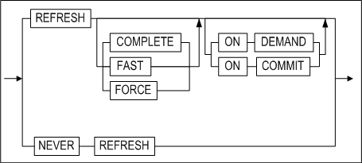

#### Prerequisites

At least one of the following conditions must met: 

- The SYS user
- The CREATE MATERIALIZED VIEW system privilege are required to create a materialized view in the user’s schema. The SELECT object privilege for each base table that the user does not own or the SELECT ANY TABLE system privilege is also required. 
- The CREATE ANY MATERIALIZED VIEW system privilege is required to create a materialized view in another user’s schema. And the SELECT object privilege for each base table that the user does not own or the SELECT ANY TABLE system privilege as well. 
- Once the materialized view is created, an internal view and an internal table for the database are automatically created in the materialized view schema. These additionally created objects are used to maintain the materialized view data. The user requires the privilege to create such objects in order to create a Material View.

#### Description

A new materialized view is created as the specified name. A materialized view is a database object that stores query results. A table, a view or another materialized view can constitute the FROM clause of the query. Such objects are defined as “base tables”.

Like other tables, a materialized view stores the results of query statements in a tablespace and is mostly used for data warehouse purposes. The performance time for query execution can be significantly reduced by creating query statements that are frequently used or include time demanding JOIN or aggregate functions as materialized views. 

Altibase provides only read-only materialized views. 

*user_name*

This specifies the owner name of the materialized view to be created. On omission, Altibase creates a materialized view in the user schema connected to the current session.

*mview_name*

This specifies the name of the materialized view to be created. Refer to “Rules for Object Names” in Chapter 2 for more information on specifying names. Altibase automatically creates a table to maintain the data of the materialized view under the same name as the specified materialized view.

*c_alias*

If the queried target from the base table is an expression, an alias must be specified for that expression. This alias becomes the column name for the materialized view. The number of aliases must equal the total number of queried targets(expressions and columns). 

*table_partitioning_clause*

Please refer to table_partitioning_clause of the CREATE TABLE statement.

*segment_attributes_clause*

Please refer to segment_attributes_clause of the CREATE TABLE statement.

*lob_column_properties*

Please refer to lob_column_properties of the CREATE TABLE statement.

*phsical_attributes_clause*

Please refer to physical_attributes_clause of the CREATE TABLE statement.

*build_clause clause*

This specifies the initial time point at which data of the materialized view is built. On omission, the default value is IMMEDIATE.

- IMMEDIATE: Data is built at the time point that the materialized view is created.
- DEFERRED: Data is built during refresh execution after the materialized view is created.

*refresh_clause Clause*

If the base table of the materialized view is altered, the data of the materialized view must be updated. This clause specifies the method and time that the materialized view is refreshed. On omission, the default values are FORCE and ON DEMAND.

After the REFRESH keyword, one of the following must be specified: COMPLETE, FAST, FORCE REFRESH or ON DEMAND, ON COMMIT

- COMPLETE:  specifies data to be built by executing the sub query defined when the materialized view was created. 
- FAST: currently not supported.
- FORCE: when refresh occurs, if possible, fast refresh is executed; if not, the database is commanded to execute complete refresh. Altibase does not currently support FAST; specifying FORCE is equivalent to COMPLETE.
- ON DEMAND: specifies refresh only on user’s request.
- ON COMMIT: currently not supported.
- NEVER REFRESH: currently not supported.

> Note: The user can manually request materialized view refresh by calling the REFRESH_MATERIALIZED_VIEW stored procedure. For further information on the REFRESH_MATERIALIZED_VIEW stored procedure, refer to the Chpater 10 in the *Stored Procedures Manual.*

*subquery clause*

This specifies the query statement of the materialized view. When the user creates a materialized view, the subquery specified in the clause is executed and its result is stored in the materialized view.

#### Example

\<Query\> Create a materialized view of the name mv1 that takes the employees table as its base table. Since the build clause and refresh clause are not specified, refresh is possible only on the user’s request and complete refresh is executed.

```
CREATE MATERIALIZED VIEW mv1 AS
SELECT * FROM employees;
```


### DISJOIN TABLE

#### Syntax

**disjoin_table ::=**


**partition_to_table_clause ::=**


#### Prerequisites

At lease one of the following conditions must be met in order to create a table: 

-   The SYS user 
-   The user have the CREATE TABLE or CREATE ANY TABLE system privilege in their own schema 
-   The user have the CREATE ANY TABLE system privilege in another user's schema

At least one of the following conditions must be met:

-   The SYS user 
-   The table's owner 
-   The user has the DROP ANY TABLE system privilege.

#### Description

Partitions in a partitioned table are converted into one or more tables. Partitioned tables are dropped and non-partitioned tables are created. The partitions are each converted to the specified table and the data is moved. If a table space option is not specified, a new table will be created in the default table space. 

*partition_to_table*

This clause specifies the name of the table to be used after dismounting all partitions belonging to the partitioned table.

#### Considerations

The following statements should be taken into consideration when using DISJOIN TABLE syntax.

-   Do not specify the owner name in the target table and the partitioned table that are created. 
-   The metatable associated with the newly created non-partitioned table is created, and the metatable associated with the partitioned table is deleted. 
-   PMS, packages, and views that are related to the target table cannot be used. 
-   Hash partitioned tables are not supported. 
-   The target partitioned table have the same condition with partition's attribute, constraints, and schema. 

#### Example

\<Query\> Convert each partition p1, p2, and p3 in table t1 into t2, t3, and t4, respectively.

```
iSQL> disjoin table t1
(
  partition p1 to table t2,
  partition p2 to table t3,
  partition p3 to table t4
);
Disjoin success.
```


### DROP DATABASE 

#### Syntax

**drop_database ::=**


#### Prerequisites

This SQL statement can only be executed by the SYS user in -sysdba administrator mode, and can only be executed during the PROCESS phase.

#### Description

This statement is used to delete a database from the system.

*database_name*

This is used to specify the name of the database to delete. 

When this command is executed, all of the data, log files and log anchor files that were used by the database are also deleted.

#### Example

\<Query\> Delate a database named mydb.

```
iSQL(sysdba)> DROP DATABASE mydb;
Checking Log Anchor files
[Ok] /home /altibase_home/logs/loganchor0 Exist.
[Ok] /home /altibase_home/logs/loganchor1 Exist.
[Ok] /home /altibase_home/logs/loganchor2 Exist.
Removing DB files
Removing Log files
Removing Log Anchor files
Drop success.
```


### DROP DATABASE LINK

For information on Database Link, please refer to the *Database Link User’s Manual*. 

### DROP DIRECTORY 

#### Syntax

**drop_directory ::=**


#### Prerequisites

Only the SYS user and users to whom the DROP ANY DIRECTORY system privilege has been granted can execute this statement.

#### Description

This statement is used to remove a directory. Note that only the reference to the directory in the database is removed; the actual directory is not removed from the file system.

*directory_name*

This is used to specify the name of the directory to drop.

#### Example

\<Query\> Drop the directory named anti_dir1.

```
iSQL> DROP DIRECTORY alti_dir1;
Drop success.
```

### DROP INDEX 

#### Syntax

**drop_index ::=**


#### Prerequisites

Only the SYS user, the owner of the schema containing the index, users having the INDEX object privilegm on table, and users having the DROP ANY INDEX system privilege can execute the DROP INDEX statement.

#### Description

This statement is used to remove an index from the database.

*user_name*

This is used to specify the name of the owner of the index to be dropped. If omitted, Altibase will assume that the index belongs to the schema of the user connected via the current session.

*index_name*

This is used to specify the name of the index to drop.

#### Example

\<Query\> Delete the index emp_idx1.

```
iSQL> DROP INDEX emp_idx1;
Drop success.
```


### DROP JOB 

#### Syntax

**drop_job ::=**


#### Prerequisites

Only the SYS user can use this statement.

#### Description

This drops the JOB from the database.

*job_name*

This specifies the name of the JOB to be dropped.

#### Examples

\<Query\> Drop the JOB job1.

```
iSQL> DROP JOB job1;
Drop success.
```


### DROP QUEUE 

#### Syntax

**drop_queue ::=**


#### Prerequisites

Only the SYS user, the owner of the schema containing the queue, and users having the DROP ANY TABLE system privilege can execute the DROP QUEUE statement.

#### Description

This statement is used to delete the specified queue. The queue table, the index for the queue table and the sequence used to generate MSGID values in the queue table are deleted along with the queue. 

#### Example

\<Query\> Delete the message queue Q1 and its associated objects.

```
iSQL> DROP QUEUE Q1;
```


### DROP REPLICATION 

#### Syntax

**drop_replication ::=**


#### Prerequisites

Only the SYS user can execute replication-related statements.

#### Description

This statement is used to drop a replication.

*replication_name*

This is used to specify the name of the replication to drop.

#### Limitation

A replication that is currently active cannot be dropped. That is, a replication cannot be dropped if the ALTER REPLICATION START command has been executed for the replication; the ALTER REPLICATION STOP command must first be executed, after which it will be possible to drop the replication.

#### Example

\<Query\> Drop the replication rep1.

```
iSQL> DROP REPLICATION rep1;
```


### DROP ROLE

#### Syntax

**drop_role ::=**


#### Prerequisites

Only the SYS user and users with the DROP ANY ROLE system privilege can drop a role.

#### Description

This statement drops the specified role.

*role_name*

This is used to specify the name of the role to be dropped. 

#### Example

\<Query\> Drop the role with the name alti_role. 

```
iSQL> DROP ROLE alti_role;
Drop success.
```


### DROP SEQUENCE 

#### Syntax

**drop_sequence ::=**


#### Prerequisites

Only the SYS user, the owner of the schema containing the sequence, and users with the DROP ANY SEQUENCE system privilege can execute the DROP SEQUENCE statement.

#### Description

This statement is used to remove a sequence from the database. 

*user_name*

This is used to specify the name of the owner of the sequence to be dropped. If omitted, Altibase will assume that the sequence belongs to the schema of the user connected via the current session.

*seq_name*

This is used to specify the name of the sequence to drop.

#### Example

\<Query\> Delete the sequence seq1.

```
iSQL> DROP SEQUENCE seq1;
Drop success.
```


### DROP SYNONYM 

#### Syntax

**drop_synonym ::=**


#### Prerequisites

Only the SYS user, the owner of the schema containing the , and the users with the DROP ANY SYNONYM privilege can execute the DROP SYNONYM statement.

In addition, only the SYS user and users with the DROP PUBLIC SYNONYM system privilege can drop public synonyms

#### Description

This statement is used to remove a synonym from the database. 

*PUBLIC*

To remove a public synonym, use the PUBLIC keyword, If the PUBLIC keyword is not used, a PRIVATE synonym having the specified name will be removed.

When the PUBLIC keyword is used, user_name cannot be specified.

*user_name*

This is used to specify the name of the owner of the synonym to drop. If omitted, Altibase will assume that the synonym belongs to the schema of the user connected via the current session. 

*synonym_name*

This is used to specify the name of the synonym to drop.

#### Examples 

\<Query\> Drop the synonym my_dept.

```
iSQL> DROP SYNONYM my_dept;
Drop success.
```

\<Query\> Drop the PUBLIC synonym dept.

```
iSQL> DROP PUBLIC SYNONYM dept;
Drop success.
```


### DROP TABLE 

#### Syntax

**drop_table ::=**


#### Prerequisites

Only the SYS user, the owner of the schema containing the table, and users withthe DROP ANY TABLE system privilege can execute the DROP TABLE statement.

#### Description

This statement is used to remove a table and all of its data from a database.

Set the value of the RECYCLEBIN_ENABLE property to 1 to move a table to the recycle bin, instead of dropping it directly from the database. Tables of the same name can be dropped multiple times; only as many tables as the recycle bin can contain can be moved to the recycle bin. 

*user_name*

This is used to specify the name of the owner of the table to be dropped. If omitted, Altibase will assume that the table belongs to the schema of the user connected via the current session.

*table_name*

This is used to specify the name of the table to be dropped. 

*{CASCADE \| CASCADE CONSTRAINTS}*

These options are used to delete referential integrity constraints in other tables that reference the primary key or unique keys in the table being dropped. 

#### Example

\<Query\> Drop the table employees.

```
iSQL> DROP TABLE employees;
Drop success.
```


### DROP TABLESPACE

#### Syntax

**drop_tablespace ::=**


#### Prerequisites

Only the SYS user and users with the DROP TABLESPACE system privilege can execute the DROP TABLESPACE statement.

#### Description

This statement is used to remove a tablespace from the database. 

*tblspace_name*

This is used to specify the name of the tablespace to drop.

*INCLUDING CONTENTS*

This is used to specify that all of the contents of the tablespace are to be deleted. If one or more objects exist in the tablespace, this clause must be specified in order to remove the tablespace. If this clause is not specified, Altibase will return an error and the DROP TABLESPACE statement will fail.

*AND DATAFILES*

If the AND DATAFILES clause is additionally specified along with the INCLUDING CONTENTS clause, all of the files related to the tablespace are deleted from the file system. 

When a disk tablespace is dropped, all of the data files in the disk tablespace are deleted from the file system.

When a memory tablespace is dropped, all the checkpoint image files for the memory tablespace are deleted from the file system. However, the checkpoint paths are not deleted. 

The AND DATAFILES clause cannot be used when dropping a volatile tablespace.

*CASCADE CONSTRAINTS*

The CASCADE CONSTRAINTS clause must be specified in order to drop all referential integrity constraints in tables that are stored in tablespaces other than the tablespace being dropped but that refer to primary and unique keys in tables in the tablespace being dropped. If this clause is omitted when such referential integrity constraints exist, an error will be returned and the attempt to drop the tablespace will fail.

#### Limitation

The following tablespaces are system tablespaces, and thus cannot be removed using the DROP TABLESPACE statement:

-   SYS_TBS_MEM_DIC

-   SYS_TBS_MEM_DATA

-   SYS_TBS_DISK_DATA

-   SYS_TBS_DISK_UNDO

-   SYS_TBS_DISK_TEMP

#### Examples

\<Query 1\> Drop the tablespace user_data.

```
iSQL> DROP TABLESPACE user_data;
Drop success.
```

\<Query 2\> Delete the disk tablespace user_data along with all associated objects and data files.

```
iSQL> DROP TABLESPACE user_data INCLUDING CONTENTS AND DATAFILES;
Drop success.
```

\<Query 3\> Delete the memory tablespace user_data along with all associated objects and data files. 

```
iSQL> DROP TABLESPACE user_memory_tbs INCLUDING CONTENTS AND DATAFILES;
Drop success.
```

\<Query 4\> Delete the tablespace user_data along with all objects stored therein and all referential integrity constraints that refer to primary and unique keys in all tables in the tablespace.

```
iSQL> DROP TABLESPACE user_data INCLUDING CONTENTS CASCADE CONSTRAINTS;
Drop success.
```


### DROP TRIGGER

#### Syntax

**drop_trigger ::=**


#### Prerequisites 

Only the SYS user, the owner of the schema containing the trigger, and users with the DROP ANY TRIGGER system privilege can execute the DROP TRIGGER statement.

#### Description

This statement is used to drop the specified trigger from the database.

*user_name*

This is used to specify the name of the owner of the trigger to be dropped. If omitted, Altibase will assume that the trigger belongs to the schema of the user connected via the current session.

*trigger_name*

This is used to specify the name of the trigger to be dropped.

#### Example

\<Query\> Drop the trigger del_trigger from a table.

```
iSQL> DROP TRIGGER del_trigger;
Drop success.
```


### DROP USER 

#### Syntax

**drop_user ::=**


#### Prerequisites

Only the SYS user and users with the DROP USER system privilege can execute the DROP USER statement.

#### Description

This statement is used to drop the specified user from the database.

*user_name*

This is used to specify the name of the user to drop.

*CASCADE*

This is used to specify that not only the database user but also all objects in the user's schema will be dropped. Additionally, any referential integrity constraints that refer to primary and unique keys in tables belonging to the user's schema will also be dropped.

If there is an object in the user schema to be deleted and omit CASCADE, an error will be returend and the DROP USER statement will fail.

#### Examples

\<Query\> Drop the user uare1.

```
iSQL> DROP USER uare1;
Drop success.
```

\<Query\> Drop the user uare4 and all of the user's objects.

```
iSQL> DROP USER uare4 CASCADE;
Drop success.
```


### DROP VIEW

#### Syntax

**drop_view ::=**

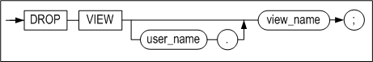

#### Prerequisites

Only the SYS user, the owner of the schema containing the view, and users with the DROP ANY VIEW system privilege can execute the DROP VIEW statement.

#### Description

This statement is used to drop the specified view from the database.

*user_name*

This is used to specify the name of the owner of the view to be dropped. If omitted, Altibase will assume that the view belongs to the schema of the user connected via the current session.

*view_name*

This is used to specify the name of the view to be dropped.

#### Example

\<Query\> Drop the view avg_sal.

```
iSQL> DROP VIEW avg_sal;
Drop success.
```


### DROP MATERIALIZED VIEW

#### Syntax

**drop_mview ::=**


#### Prerequisites

Only the following users can delete the materialized view using this statement:

-   The SYS user

-   The owner of the Materialized view

-   The user with the system privilege of DROP ANY MATERIALIZED VIEW

#### Description

This statement deletes the specified materialized view from the database.

*user_name*

This specifies the owner name of the materialized view to be deleted. On omission, Altibase deletes the materialized view of the current user’s schema.

*mview_name*

This specifies the name of the materialized view to be deleted.

#### Example

\<Query\> Delete the materialized view with the name mv1.

```
DROP MATERIALIZED VIEW mv1;
```


### FLASHBACK TABLE

#### Syntax

**flashback_table::=**


#### Prerequisites

At least one or more of the following conditions must be met: 

-   The SYS user

-   The user with the CREATE TABLE or CREATE ANY TABLE system privilege in own's schema.
  
-   The user with the CREATE ANY TABLE system privilege in another user's schema.

#### Description

FLASHBACK TABLE recovers tables from the recycle bin. If there are several tables with the same name, the first table that was dropped is recovered to the database.

*table_name*

This specifies the name of the table to be recovered from the recycle bin. The table takes the name it had before it was moved, or a new name generated by the system when it was moved to the recycle bin. If there are several tables with the same name, the first table that was moved to the recycle bin is recovered to the database.

*RENAME TO table_name*

The user can specify a new name for the table when it is recovered; if the same name exists in the user's schema, the name can be altered.

### GRANT

#### Syntax

**grant ::=**


**grant_system_privilege ::=**


**grant_object_privilege ::=**


#### Prerequisites 

Only the SYS user and users with the GRANT ANY ROLE system privilege can grant system privileges to a role. In addition, an object privilege can be granted to other users only by the owner of the object or who has been granted object privilege with WITH GRANT OPTION.

#### Description

This statement is used to grant privileges to access the database or specified objects to one or more specified users.

Access privileges are classified as either system privileges or object privileges.

*grant_system_privilege*

System privileges are usually managed by the SYS user. The SYS user can grant limited system privileges to allow users to perform specific database tasks. System privileges can be seen as broad privileges that control objects in any schema.

System privileges are required in order to execute DDL statements and DCL statements.

grant_object_privilege

Once a user has been granted privileges for a particular object, the user can access and/or manipulate the object. Object access privileges are typically managed by the owner of the object. 

If system privileges have not been granted, object access privileges are required in order to execute DML statements.

#### System Privileges

*system_privilege*

This is used to specify the name of the system access privilege that will be granted.

*role*

This is used to specify the name of the role to be granted

-   A role cannot be granted to another role or PUBLIC.

-   A maximum number of 126 roles can be granted per user.

-   A user cannot immediately use a role which has been granted. The privileges of a role are enabled after the user has connected to a database.

*ALL PRIVILEGES*

This is used to grant all system privileges to the specified user or users.

*TO user*

This is used to specify name of the user or users to whom the system privilege(s) will be granted. 

*TO role*

This is used to specify the name of the role to which system privileges are to be granted.

*TO PUBLIC*

This is used to specify that the sytem privilege(s) is/are to be granted to all users.

##### Notes:

-   Just like the SYS user, any user to whom the GRANT ANY PRIVILEGES system is granted can grant all system access privileges to other users.
-   The SYS user has all system access privileges.
-   The presence of the ANY keyword in the name of a system privilege indicates that the privilege pertains to all schema. For example, the SELECT ANY TABLE privilege will allow the user to whom it is granted to run a SELECT statement on any table in the database.
-   The CREATE privilege is granted to allow users to create objects, and includes permission to DROP (i.e. remove) the objects they have created.
-   The CREATE TABLE object privilege allows users to create indexes as well as tables. The authority to create indexes is an object privilege, not a system privilege.
-   When a new user is created, the following privileges are typically granted to the user: CREATE DATABASE LINK, CREATE LIBRARY, CREATE MATERIALIZED_VIEW, CREATE PROCEDURE, CREATE SESSION, CREATE SYNONYM, CREATE TABLE, CREATE TRIGGER, CREATE VIEW.

The following query can be used to display the list of system privileges supported in Altibase:

```
iSQL> SELECT * FROM SYSTEM_.SYS_PRIVILEGES_ where PRIV_TYPE = 2;
```

Altibase supports the following system privileges.

| PrivID | System privilege  | Name                         | Purpose                                                      |
| ------ | ----------------- | ---------------------------- | ------------------------------------------------------------ |
| 1      |                   | ALL                          | Even if this privilege is granted to a user, the user will still not have the ALTER DATABASE, DROP DATABASE, or MANAGE TABLESPACE privileges. |
| 201    | DATABASE          | ALTER SYSTEM                 | For changing Altibase property settings using ALTER SYSTEM statements when Altibase is online |
| 233    |                   | ALTER DATABASE               | Cannot be granted to any users other than the SYS user       |
| 234    |                   | DROP DATABASE                | Cannot be granted to any users other than the SYS user       |
| 202    | INDEX             | CREATE ANY INDEX             | For creating indexes not only in one's own schema but also in other users' schemas |
| 203    |                   | ALTER ANY INDEX              | For altering the definition of any index in the database다.  |
| 204    |                   | DROP ANY INDEX               | For dropping any index from the database                     |
| 205    | PROCEDURE         | CREATE PROCEDURE             | For creating stored procedures and stored functions in one's own schema |
| 206    |                   | CREATE ANY PROCEDURE         | For creating stored procedures and stored functions not only in one's own schema but also in other users' schemas |
| 207    |                   | ALTER ANY PROCEDURE          | For recompiling any stored procedure or function in the database |
| 208    |                   | DROP ANY PROCEDURE           | For dropping any stored procedure or function in the database |
| 209    |                   | EXECUTE ANY PROCEDURE        | For executing any stored procedure or function in the database |
| 210    | SEQUENCE          | CREATE SEQUENCE              | For creating sequences in one's own schema                   |
| 211    |                   | CREATE ANY SEQUENCE          | For creating sequences not only in one's own schema but also in other users' schemas |
| 212    |                   | ALTER ANY SEQUENCE           | For changing the definition of any sequence in the database  |
| 213    |                   | DROP ANY SEQUENCE            | For deleting any sequence in the database                    |
| 214    |                   | SELECT ANY SEQUENCE          | For querying any sequence in the database                    |
| 215    | SESSION           | CREATE SESSION               | For connecting to the database                               |
| 216    |                   | ALTER SESSION                | Granted automatically to every user                          |
| 217    | TABLE             | CREATE TABLE                 | For creating tables in one's own schema                      |
| 218    |                   | CREATE ANY TABLE             | For creating tables not only in one's own schema but also in other users' schemas |
| 219    |                   | ALTER ANY TABLE              | For truncating all records from any table or changing the definition of any table in the database |
| 220    |                   | DELETE ANY TABLE             | For deleting any table from the database                     |
| 221    |                   | DROP ANY TABLE               | For dropping any table in the database                       |
| 222    |                   | INSERT ANY TABLE             | For inserting new records into any table in the database     |
| 223    |                   | LOCK ANY TABLE               | For locking any table in the database                        |
| 224    |                   | SELECT ANY TABLE             | For querying any table in the database                       |
| 225    |                   | UPDATE ANY TABLE             | For changing the data in any table in the database           |
| 226    | USER              | CREATE USER                  | For creating new users                                       |
| 227    |                   | ALTER USER                   | For changing the definition of any user in the database      |
| 228    |                   | DROP USER                    | For dropping users                                           |
| 229    | VIEW              | CREATE VIEW                  | For creating views in one's own schema                       |
| 230    |                   | CREATE ANY VIEW              | For creating views not only in one's own schema but also in other users' schemas |
| 231    |                   | DROP ANY VIEW                | For deleting any view in the database                        |
| 232    | MISCELLANEOUS     | GRANT ANY PRIVILEGES         | For granting any system privilege to other users             |
| 235    | TABLESPACES       | CREATE TABLESPACE            | For creating tablespaces                                     |
| 236    |                   | ALTER TABLESPACE             | For changing the definition of a tablespace                  |
| 237    |                   | DROP TABLESPACE              | For deleting tablespaces                                     |
| 238    |                   | MANAGE TABLESPACE            | Cannot be granted to any users other than the SYS user       |
| 240    |                   | SYSDBA                       | Cannot be granted to any users other than the SYS user       |
| 241    | TRIGGER           | CREATE TRIGGER               | For creating new triggers                                    |
| 242    |                   | CREATE ANY TRIGGER           | 자신의 스키마 뿐 아니라 다른 사용자의 스키마 내에서도 트리거 생성이 가능하다. |
| 243    |                   | ALTER ANY TRIGGER            | 데이터베이스에 존재하는 모든 트리거의 정의를 변경할 수 있다. |
| 244    |                   | DROP ANY TRIGGER             | 데이터베이스에 존재하는 모든 트리거를 제거할 수 있다.        |
| 245    | SYNONYM           | CREATE SYNONYM               | For creating new triggers                                    |
| 246    |                   | CREATE PUBLIC SYNONYM        | For creating a PUBLIC synonym                                |
| 247    |                   | CREATE ANY SYNONYM           | For creating private synonyms not only in one's own schema but also in other users' schemas |
| 248    |                   | DROP ANY SYNONYM             | For dropping any private synonym                             |
| 249    |                   | DROP PUBLIC SYNONYM          | For dropping public synonyms                                 |
| 250    | DIRECTORY         | CREATE ANY DIRECTORY         | A directory object can be created to control a file within the stored procedure. |
| 251    |                   | DROP ANY DIRECTORY           | This privilege can drop a directory object.                  |
| 252    | MATERIALIZED VIEW | CREATE MATERIALIZED VIEW     | This privilege can create a new materialized view in one's own schema |
| 253    |                   | CREATE ANY MATERIALIZED VIEW | This privilege can create a materialized view not only in one's own schema, but also in other user's schemas. |
| 254    |                   | ALTER ANY MATERIALIZED VIEW  | This privilege can be modified any materialized view in the database. |
| 255    |                   | DROP ANY MATERIALIZED VIEW   | Any materialized view in the database can be dropped with this privilege. |
| 256    | LIBRARY           | CREATE LIBRARY               | For creating new library objects in one's own schema         |
| 257    |                   | CREATE ANY LIBRARY           | For creating library objects not only in one's own schema but also in other users' schemas |
| 258    |                   | ALTER ANY LIBRARY            | For recompiling any library object in the database           |
| 259    |                   | DROP ANY LIBRARY             | For dropping any library object in the database              |
| 260    | DATABASE LINK     | CREATE DATABASE LINK         | New database link can be created.                            |
| 261    |                   | CREATE PUBLIC_DATABASE LINK  | Public database link can be created.                         |
| 262    |                   | DROP PUBLIC DATABASE LINK    | Public database link can be dropped.                         |
| 263    | ROLE              | CREATE ROLE                  | For creating a new role                                      |
| 264    |                   | DROP ANY ROLE                | For dropping all roles existing in the database              |
| 265    |                   | GRANT ANY ROLE               | For granting all roles to other users                        |
| 266    | JOB               | CREATE ANY JOB               | This privilege can create a new job not only in one's own schema, but also in other user's schemas. |
| 268    |                   | ALTER ANY JOB                | Any job in the database can be modified with this privilege. |
| 267    |                   | DROP ANY JOB                 | Any JOB in the database can be dropped with this privilege.  |

#### Object Privileges

*object_privilege*

This clause is used when it is desired to grant only particular privileges for the object (the table later in this section shows which privileges are supported for which objects).

*ALL [PRIVILEGES]*

This clause is used to grant all possible privileges for the object.

*ON object*

This is used to specify the object, such as a table, sequence, or stored procedure, for which to grant privileges.

*ON DIRECTORY directory_name*

This clause is used to specify the name of the directory object, which is used in stored procedures to manipulate directories and files in the file system, for which to grant privileges.

*TO user*

This is used to specify the name of the user or users to whom the object privilege(s) will be granted.

*TO PUBLIC*

This is used to specify that the object privilege(s) is/are to be granted to all users.

*TO role*

This is used to specify the name of the role to which object privileges are to be granted.

*WITH GRANT OPTION*

The WITH GRANT OPTION is used to enable the grantee to grant the object privileges to other users. However, this option cannot be used to grant object privileges to a role.

> ##### Summary
>
> -   The term "object owner" refers to the user who created an object.
>   
>-   In order to grant object access privileges, it is necessary to be the SYS user, the owner of the object, or a user to whom the relevant object access privileges have been granted with the WITH GRANT OPTION.
>   
> -   • The owner of an object automatically has all privileges for the object.
>

The following query can be used to display all of the object privileges supported in Altibase.

```
SELECT * FROM SYSTEM_.SYS_PRIVILEGES_ where PRIV_TYPE = 1;
```

Altibase supports the following object privileges:

<a name="grant_tbl2"><a/>

| Priv ID | Object privileges | Table | Sequence | PSM/ External Procedure | View | directory | External Library |
|---------|-------------------|-------|----------|-------------------------|------|-----------|------------------|
| 101     | ALTER             | O     | O        |                         |      |           |                  |
| 102     | DELETE            | O     |          |                         |      |           |                  |
| 103     | EXECUTE           |       |          | O                       |      |           | O                |
| 104     | INDEX             | O     |          |                         |      |           |                  |
| 105     | INSERT            | O     |          |                         |      |           |                  |
| 106     | REFERENCES        | O     |          |                         |      |           |                  |
| 107     | SELECT            | O     | O        |                         | O    |           |                  |
| 108     | UPDATE            | O     |          |                         |      |           |                  |
| 109     | READ              |       |          |                         |      | O         |                  |
| 110     | WRITE             |       |          |                         |      | O         |                  |

All users automatically have SELECT privileges for meta tables.

#### Examples

##### System Privileges

\<Query 1\>  In the following example, the EXECUTE ANY PROCEDURE, SELECT ANY TABLE, ALTER ANY SEQUENCE, INSERT ANY TABLE, and SELECT ANY SEQUENCE system privileges are granted to the user user5.

```
iSQL> CREATE TABLE seqtbl(i1 INTEGER);
Create success.
iSQL> CREATE OR REPLACE PROCEDURE proc1
AS
BEGIN
  FOR i IN 1 .. 10 LOOP
    INSERT INTO seqtbl VALUES(i);
  END LOOP;
END;
/
Create success.

iSQL> CREATE USER uare5 IDENTIFIED BY rose5;
Create success.
iSQL> GRANT EXECUTE ANY PROCEDURE, SELECT ANY TABLE TO uare5;
Grant success.
iSQL> CONNECT uare5/rose5;
Connect success.
iSQL> EXEC sys.proc1;
Execute success.
iSQL> SELECT * FROM sys.seqtbl;
SEQTBL.I1   
--------------
1           
2           
3           
4           
5           
6           
7           
8           
9           
10          
10 rows selected.

iSQL> CONNECT sys/manager;
Connect success.
iSQL> CREATE SEQUENCE seq1
  START WITH 13
  INCREMENT BY 3
  MINVALUE 0 NOMAXVALUE;
Create success.
iSQL> INSERT INTO seqtbl VALUES(seq1.NEXTVAL);
1 row inserted.
iSQL> INSERT INTO seqtbl VALUES(seq1.NEXTVAL);
1 row inserted.
iSQL> SELECT * FROM seqtbl;
SEQTBL.I1   
--------------
1           
2           
3           
4           
5           
6           
7           
8           
9           
10          
13          
16          
12 rows selected.

iSQL> GRANT ALTER ANY SEQUENCE, INSERT ANY TABLE, SELECT ANY SEQUENCE TO uare5;
Grant success.
iSQL> CONNECT uare5/rose5;
Connect success.	
iSQL> ALTER SEQUENCE sys.seq1
  INCREMENT BY 50
  MAXVALUE 100
  CYCLE;
Alter success.

iSQL> INSERT INTO sys.seqtbl VALUES(sys.seq1.NEXTVAL);
1 row inserted.
iSQL> INSERT INTO sys.seqtbl VALUES(sys.seq1.NEXTVAL);
1 row inserted.
iSQL> INSERT INTO sys.seqtbl VALUES(sys.seq1.NEXTVAL);
1 row inserted.
iSQL> INSERT INTO sys.seqtbl VALUES(sys.seq1.NEXTVAL);
1 row inserted.
iSQL> SELECT * FROM sys.seqtbl;
SEQTBL.I1   
--------------
1           
2           
3           
4           
5           
6           
7           
8           
9           
10          
13          
16          
66          
0           
50          
100         
16 rows selected.
```

\<Query 2\>  Create a role with the name alti_role, and then grant system privileges to it, such as CREATE USER, DROP USER, etc.

```
iSQL> create role alti_role;
Create success.
iSQL> grant create user, drop user to alti_role;
Grant success.
iSQL> create user user01 identified by user01;
Create success.
iSQL> grant alti_role to user01;
Grant success.
iSQL> connect user01/user01
Connect success.
iSQL> create user user02 identified by user02;
Create success.
iSQL> drop user user02;
Drop success.
```


##### Object Privileges

\<Query 1\> In the following example, the SELECT and DELETE object privileges on the table employees are granted to the user uare6 with the WITH GRANT OPTION. This user then passes these privileges on to the uare7 and uare8 users.

```
iSQL> CREATE USER uare6 IDENTIFIED BY rose6;
Create success.
iSQL> GRANT CREATE USER TO uare6;
Grant success.
iSQL> @schema.sql
iSQL> GRANT SELECT, DELETE ON employees TO uare6 WITH GRANT OPTION;
Grant success.
iSQL> CONNECT uare6/rose6;
Connect success.
iSQL> CREATE USER uare7 IDENTIFIED BY rose7;
Create success.
iSQL> GRANT SELECT, DELETE ON sys.employees TO uare7;
Grant success.
iSQL> CONNECT uare7/rose7;
Connect success.
iSQL> DELETE FROM SYS.employees WHERE eno = 12;
1 row deleted.
iSQL> SELECT eno, e_lastname FROM sys.employees WHERE eno = 12;
ENO         E_LASTNAME                 
-------------------------------------
No rows selected.
iSQL> CONNECT sys/manager;
Connect success.
iSQL> CREATE USER uare8 IDENTIFIED BY rose8;
Create success.
iSQL> CONNECT uare6/rose6;
Connect success.
iSQL> GRANT SELECT, DELETE ON sys.employees TO uare8;
Grant success.
```

Because the uare6 user was granted object access privileges using the WITH GRANT OPTION, this user can grant these privileges not only to the user uare7, who was created by uare6, but also to the user uare8, who was created by the original grantor (the SYS user).

```
iSQL> CONNECT uare8/rose8;
Connect success.
iSQL> DELETE FROM sys.employees WHERE eno = 13;
1 row deleted.

iSQL> SELECT eno, e_lastname FROM sys.employees WHERE eno = 13;
ENO         E_LASTNAME                 
-------------------------------------
No rows selected.
```

\<Query 2\> The following is an exmple of granting system and object privileges to a user and then revoking each privilege.

1. The SYS user has granted all system privileges to uare9.

   ```
   iSQL> CONNECT sys/manager;
   Connect success.
   iSQL> CREATE TABLE book(
     isbn CHAR(10) PRIMARY KEY,
     title VARCHAR(50),
     author VARCHAR(30),
     edition INTEGER DEFAULT 1,
     publishingyear INTEGER,
     price NUMBER(10,2),
     pubcode CHAR(4));
   Create success.
   iSQL> CREATE TABLE inventory(
     subscriptionid CHAR(10) PRIMARY KEY,
     storecode CHAR(4),
     purchasedate DATE,
     quantity INTEGER,
     paid CHAR(1));
   Create success.
   
   iSQL> CREATE USER uare9 IDENTIFIED BY rose9;
   Create success.
   iSQL> GRANT ALL PRIVILEGES TO uare9;
   Grant success.
   ```


2. The SYS user is granting user uare9 the REFERENCES privilege on the object book as the WITH GRANT OPTION.

  ```
  iSQL> GRANT REFERENCES ON book TO uare9 WITH GRANT OPTION;
  Grant success.
  ```

The user uare9 receives the REFERENCES object privilege for the book object from the SYS user with the WITH GRANT OPTION, and thus uare9 is able to grant another user (uare10) the REFERENCES object privilege for the book object.

3. The user uare9 inputs data into the book table, which is owned by the SYS user.

   ```
   iSQL> CONNECT uare9/rose9;
   Connect success.
   
   iSQL> INSERT INTO sys.book VALUES ('0070521824', 'Software Engineering', 'Roger S. Pressman', 4, 1982, 100000, 'CHAU');
   1 row inserted.
   iSQL> INSERT INTO sys.book VALUES ('0137378424', 'Database Processing', 'David M. Kroenke', 6, 1972, 80000, 'PREN');
   1 row inserted.
   ```


The user uare9 inputs data into the inventory table, which is owned by the SYS user.

   ```
   iSQL> INSERT INTO sys.inventory VALUES('BORD000002', 'BORD', '12-Jun-2003', 6, 'N');
   iSQL> INSERT INTO sys.inventory VALUES('MICR000001', 'MICR', '07-Jun-2003', 7, 'N');
   1 row inserted.
   ```


4. The user uare9 queries the book table, which is owned by the SYS user.

   ```
   iSQL> SELECT * FROM sys.book;
   BOOK.ISBN   BOOK.TITLE                                          
   ------------------------------------------------
   BOOK.AUTHOR                     BOOK.EDITION BOOK.PUBLISHINGYEAR BOOK.PRICE  
   ------------------------------------------------
   BOOK.PUBCODE  
   ----------------
   0070521824  Software Engineering                                
   Roger S. Pressman               4           1982        100000      
   CHAU  
   0137378424  Database Processing                                 
   David M. Kroenke                6           1972        80000       
   PREN  
   2 rows selected.
   ```


The user uare9 queries the inventory table, which is owned by the SYS user.

   ```
   iSQL> SELECT * FROM sys.inventory;
   INVENTORY.SUBSCRIPTIONID  INVENTORY.STORECODE  INVENTORY.PURCHASEDATE 
   ------------------------------------------------
   INVENTORY.QUANTITY INVENTORY.PAID  
   --------------------------------------
   BORD000002  BORD  2003/06/12 00:00:00  
   6           N  
   MICR000001  MICR  2003/06/07 00:00:00  
   7           N  
   2 rows selected.
   
   iSQL> CREATE TABLE book(
     isbn CHAR(10) PRIMARY KEY,
     title VARCHAR(50),
     author VARCHAR(30),
     edition INTEGER DEFAULT 1,
     publishingyear INTEGER,
     price NUMBER(10,2),
     pubcode CHAR(4));
   Create success.
   
   iSQL> CREATE TABLE inventory(
     subscriptionid CHAR(10) PRIMARY KEY,
     isbn CHAR(10) CONSTRAINT fk_isbn REFERENCES book(isbn), 
     storecode CHAR(4),
     purchasedate DATE,
     quantity INTEGER,
     paid CHAR(1));
   Create success.
   ```

5. Because the SYS user granted ALL PRIVILEGES to the user uare9, uare9 can create other users.

  ```
  iSQL> CREATE USER uare10 IDENTIFIED BY rose10;
  Create success.
  ```

6. Because the SYS user granted the REFERENCES privilege to the user uare9 with the WITH GRANT OPTION, uare9 can pass this privilege on to other users.

  ```
  iSQL> GRANT REFERENCES ON sys.book TO uare10;
  Grant success.
  ```


7. Because the SYS user granted the GRANT ANY PRIVILEGES privilege to the user uare9, uare9 can grant system privileges to other users.


  ```
  iSQL> GRANT ALTER ANY TABLE, INSERT ANY TABLE, SELECT ANY TABLE, DELETE ANY
  TABLE TO uare10;
  Grant success.
  ```


8. Because the user uare10 has the ALTER ANY TABLE and REFERENCES privileges, uare10 can create a constraint in a table belonging to another user

  ```
  iSQL> CONNECT uare10/rose10;
  Connect success.
  iSQL> ALTER TABLE sys.inventory
    ADD COLUMN (isbn CHAR(10) CONSTRAINT fk_isbn REFERENCES sys.book(isbn));
  Alter success.
  ```


9. Because the user uare10 has the INSERT ANY TABLE privilege, uare10 can enter data into a table belonging to uare9.

  ```
  iSQL> INSERT INTO uare9.book VALUES('0471316156', 'JAVA and CORBA', 'Robert Orfali', 2, 1998, 50000, 'PREN');
  1 row inserted.
  iSQL> INSERT INTO uare9.inventory VALUES('TOWE000001', '0471316156', 'TOWE', '01-Jun-2003', 5, 'N');
  1 row inserted.
  ```


Because the user uare10 has the INSERT ANY TABLE privilege, uare10 can enter data into a table belonging to the SYS user..

  ```
  iSQL> INSERT INTO sys.book VALUES('053494566X', 'Working Classes', 'Robert Orfali', 1, 1999, 80000, 'WILE');
  1 row inserted.
  iSQL> INSERT INTO sys.inventory VALUES('MICR000005', 'WILE', '28-JUN-1999', 8, 'N', '053494566X');
  1 row inserted.
  ```


10. Because the user uare10 has the SELECT ANY TABLE privilege, uare10 can query a table belonging to uare9.

```
    iSQL> SELECT * FROM uare9.book;
    BOOK.ISBN   BOOK.TITLE                                          
    ------------------------------------------------
    BOOK.AUTHOR                     BOOK.EDITION BOOK.PUBLISHINGYEAR BOOK.PRICE  
    ------------------------------------------------
    BOOK.PUBCODE  
    ----------------
    0471316156  JAVA and CORBA                                      
    Robert Orfali                   2           1998        50000       
    PREN  
    1 row selected.
    iSQL> SELECT * FROM uare9.inventory;
    INVENTORY.SUBSCRIPTIONID  INVENTORY.ISBN  INVENTORY.STORECODE  
    ------------------------------------------------
    INVENTORY.PURCHASEDATE INVENTORY.QUANTITY INVENTORY.PAID  
    ------------------------------------------------
    TOWE000001  0471316156  TOWE  
    2003/06/01 00:00:00  5           N  
    1 row selected.
```

Because the user uare10 has the SELECT ANY TABLE privilege, uare10 can query a table belonging to the SYS user.


    ```
    iSQL> SELECT * FROM sys.book;
    BOOK.ISBN   BOOK.TITLE                                          
    ------------------------------------------------
    BOOK.AUTHOR                     BOOK.EDITION BOOK.PUBLISHINGYEAR BOOK.PRICE  
    ------------------------------------------------
    BOOK.PUBCODE  
    ----------------
    0070521824  Software Engineering                                
    Roger S. Pressman               4           1982        100000      
    CHAU  
    0137378424  Database Processing                                 
    David M. Kroenke                6           1972        80000       
    PREN  
    053494566X  Working Classes                                     
    Robert Orfali                   1           1999        80000       
    WILE  
    3 rows selected.
    iSQL> SELECT * FROM sys.inventory;
    INVENTORY.SUBSCRIPTIONID  INVENTORY.STORECODE  INVENTORY.PURCHASEDATE 
    ------------------------------------------------
    INVENTORY.QUANTITY INVENTORY.PAID  INVENTORY.ISBN  
    ------------------------------------------------
    BORD000002  BORD  2003/06/12 00:00:00  
    6           N              
    MICR000001  MICR  2003/06/07 00:00:00  
    7           N              
    MICR000005  WILE  1999/06/28 00:00:00  
    8           N  053494566X  
    3 rows selected.
    ```


11. Because the user uare10 has the DELETE ANY TABLE privilege, uare10 can delete data from a table belonging to the SYS user.

```
    iSQL> DELETE FROM uare9.inventory WHERE subscriptionid = 'TOWE000001';
    1 row deleted.
    iSQL> SELECT * FROM uare9.inventory;
    INVENTORY.SUBSCRIPTIONID  INVENTORY.ISBN  INVENTORY.STORECODE  
    ------------------------------------------------
    INVENTORY.PURCHASEDATE INVENTORY.QUANTITY INVENTORY.PAID  
    ------------------------------------------------
    No rows selected.
    
    iSQL> DELETE FROM sys.inventory WHERE subscriptionid = 'MICR000005';
    1 row deleted.
    iSQL> SELECT * FROM sys.inventory;
    INVENTORY.SUBSCRIPTIONID  INVENTORY.STORECODE  INVENTORY.PURCHASEDATE 
    ------------------------------------------------
    INVENTORY.QUANTITY INVENTORY.PAID  INVENTORY.ISBN  
    ------------------------------------------------
    BORD000002  BORD  2003/06/12 00:00:00  
    6           N              
    MICR000001  MICR  2003/06/07 00:00:00  
    7           N              
    2 rows selected.
    
```


12. The user uare9 revokes all privileges that uare9 granted to uare10 without executing the REVOKE ALL statement.

```
    iSQL> CONNECT uare9/rose9;
    Connect success.
    iSQL> REVOKE ALTER ANY TABLE, INSERT ANY TABLE, SELECT ANY TABLE, DELETE ANY TABLE FROM uare10;
    Revoke success.
```


13. When uare10's REFERENCES privilege is revoked, referential integrity constraints that refer to primary key or unique keys in the sys.book table, which belongs to uare10's schema, are also dropped.

```
    iSQL> REVOKE REFERENCES ON sys.book FROM uare10 CASCADE CONSTRAINTS;
    Revoke success.
```


14. All of uare9's system privileges are revoked.

    ```
    iSQL> CONNECT sys/manager;
    Connect success.
    iSQL> REVOKE ALL PRIVILEGES FROM uare9;
    Revoke success.
    ```


15. The GRANT ANY PRIVILEGES privilege is revoked from uare9.

    ```
    iSQL> REVOKE GRANT ANY PRIVILEGES FROM uare9;
    Revoke success.
    ```


16. The REFERENCES privilege on the book table is revoked from uare9.

    ```
    iSQL> REVOKE REFERENCES ON book FROM uare9;
    Revoke success.
    
    ```


\<Query 3\> Grant the SELECT, UPDATE, INSER, and DELETE object privileges on the T1 table of user01 to the alti_role. Then, grant the alti_role role to the user user02.

```
iSQL> create role alti_role;
Create success.
iSQL> create user user01 identified by user01;
Create success.
iSQL> create user user02 identified by user02;
Create success.
iSQL> connect user01/user01
Connect success.
iSQL> create table t1 (i1 integer);
Create success.
iSQL> grant select,insert,update,delete on t1 to alti_role;
Grant success.
iSQL> connect sys/manager
Connect success.
iSQL> grant alti_role to user02;
Grant success.
iSQL> connect user02/user02;
Connect success.
iSQL> insert into user01.t1 values (1);
1 row inserted.
iSQL> insert into user01.t1 values (2);
1 row inserted.
iSQL> select * from user01.t1;
T1.I1       
--------------
1           
2           
2 rows selected.
iSQL> update user01.t1 set i1=3 where i1=1;
1 row updated.
iSQL> select * from user01.t1;
T1.I1       
--------------
2           
3           
2 rows selected.
iSQL> delete from user01.t1 where i1=2;
1 row deleted.
iSQL> select * from user01.t1;
T1.I1       
--------------
3           
1 row selected.
```


### PURGE TABLE 

#### Syntax

**purge_table::=**

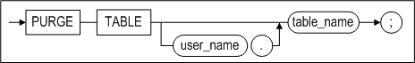

#### Prerequisites

The SYS user, table's owner, and the user with the DROP ANY TABLE system privilege can execute PURGE TABLE.

#### Description

PURGE TABLE drops the specified table from the recycle bin. If there are several tables with the same name, the first table to be dropped is dropped from the database.

*user_name*

This is used to specifie the name of the table owner.

*table_name*

This is used specify the name of the table to be dropped from the recycle bin. The table takes the name it had before it was moved to the recycle bin, or a new name generated by the system when it was moved to the recycle bin.

#### Examples

\<Query\> Purge the table t1 in which DROP was executed from the recyle bin.

```
iSQL> alter session set recyclebin_enable = 1;
Alter success.
iSQL> create table t1 (i1 integer);
Create success.
iSQL> drop table t1;
Drop success.
iSQL> purge table t1;
Purge success.
```


### RENAME TABLE 

#### Syntax

**rename ::=**

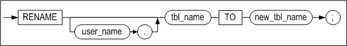

#### Prerequisites

The SYS user, the owner of the schema containing the table, and users having the ALTER ANY TABLE system privilege can execute the RENAME TABLE statement.

#### Description

This statement is used to change the name of the specified table. Only the table name is altered; none of the data stored therein are changed.

*user_name*

This is used to specify the name of the owner of the table to be renamed. If this is omitted, Altibase will assume that the table belongs to the schema of the user connected via the current session.

*old_name*

This is used to specify the current name of the table.

*new_name*

This is used to specify the new name for the table.

#### Consideration

The name of a replication target table cannot be changed.

#### Example

\<Query\> Rename the table employees to emp1

```
iSQL> RENAME employees TO emp1;
Rename success.
```

Or 

```
iSQL> ALTER TABLE employees
  RENAME TO emp1;
Alter success.
```


### REVOKE 

#### Syntax

**revoke ::=**


**revoke_system_privilege ::=**


**revoke_object_privilege ::=**


#### Prerequisites

The SYS user or the user who originally granted the privilege to be revoked can revoke privileges.

#### Description

This statement is used to revokes system privileges, object privileges on particular objects or roles from a specified user. This statement can also revoke system privileges or object privileges from roles. 

This statement can only revoke system privileges, object privileges and roles that were granted with the GRANT command.

##### System Privileges

*role*

This is used to specify the role to be revoked.

*system_privilege*

This is used to specify the system privilege(s) to be revoked. Please refer to the description of the GRANT statement for the complete list of system privileges.

*ALL PRIVILEGES*

This is used to specify that all system privileges that have been granted by the user executing this revoke statement are to be revoked.

System privileges that were granted using the ALL PRIVILEGES clause can be rocked using the ALL PRIVILEGES clause.

*FROM user*

This is used to identify the user from whom the privilege(s) will be revoked.

*FROM role*

This is used to specify the role from which system privileges are to be revoked.

*FROM PUBLIC*

Use the PUBLIC keyword to revoke the privilege(s) from all users.

> Note: System privileges granted using the PUBLIC keyword can be revoked using the PUBLIC keyword.
>

##### Object Privileges

*role*

This is used to specify the role to be revoked.

*object_privilege*

This is used to specify the object privilege that is to be revoked. Please refer to the table in the description of the GRANT statement for more information about object privileges.

*ALL [PRIVILEGES]*

The ALL PRIVILEGES (or merely ALL) clause is used to revoke all object privileges that have been granted to the user by the user executing this revoke statement.

When revoking privileges using the ALL [PRIVILEGES] clause, all object access privileges granted to the user are revoked. This even includes object privileges that were not granted using the ALL [PRIVILEGES] clause. For example, an object privilege granted to a user in this way:

```
GRANT SELECT ON object TO user;
```

can of course be explicitly revoked in this way:

```
REVOKE SELECT ON object FROM user;
```

It can also be revoked together with all other privileges in this way:

```
REVOKE ALL ON object FROM user;
```

*ON object*

This is used to specify the object (table, sequence, stored procedure, etc.) for which the permissions are to be revoked.

*ON DIRECTORY directory_name*

This clause is used to revoke privileges from the specified directory object.

*FROM user*

This is used to identify the user from whom the privilege(s) will be revoked.

*FROM role*

This clause is used to identify the user(s) from whom the privilege(s) will be revoked. 

*FROM PUBLIC*

The PUBLIC keyword is used to revoke the privilege(s) from all users.

*CASCADE CONSTRAINTS*

This clause is relevant only when revoking the REFERENCES privilege or using the ALL [PRIVILEGES] clause. It is used to specify that any related referential integrity constraints are also to be dropped. These were granted either explicitly or implicitly using the ALL [PRIVILEGES] clause.

#### Examples

\<Query 1\> Revoke object privileges. 

```
iSQL> CONNECT uare6/rose6;
Connect success.
iSQL> REVOKE SELECT, DELETE ON sys.employees
  FROM uare7, uare8;
Revoke success.
iSQL> CONNECT uare7/rose7;
Connect success.
iSQL> SELECT eno, e_lastname FROM sys.employees WHERE eno = 15;
[ERR-311B1: The user must have the SELECT_ANY_TABLE privilege(s) to execute this statement.]
```

After the SELECT and DELETE privileges for the employees table have been revoked, an error message is displayed when an attempt is made to execute a SELECT statement on that table.

\<Query 2\> Among the CREATE USER and DROP USER system privileges granted to the role, revoke the CREATE USER privilege.

```
iSQL> create role alti_role;
Create success.
iSQL> grant create user, drop user to alti_role;
Grant success.
iSQL> create user user01 identified by user01;
Create success.
iSQL> grant alti_role to user01;
Grant success.
iSQL> connect user01/user01
Connect success.
iSQL> create user user02 identified by user02;
Create success.
iSQL> drop user user02;
Drop success.
iSQL> connect sys/manager
Connect success.
iSQL> revoke create user from alti_role;
Revoke success.
iSQL> connect user01/user01
Connect success.
iSQL> create user user02 identified by user02;
[ERR-311B1 : The user must have CREATE_USER privilege(s) to execute this statement.]
```

\<Query 3\> Revoke the DELETE object privilege on table t1 of user01 from the alti_role role. 

```
iSQL> create role alti_role;
Create success.
iSQL> create user user01 identified by user01;
Create success.
iSQL> create user user02 identified by user02;
Create success.

iSQL> connect user01/user01 
Connect success. 
iSQL> create table t1 (i1 integer); 
Create success. 
iSQL> grant select,insert,update,delete on t1 to alti_role; 
Grant success. 
 
iSQL> connect sys/manager 
Connect success. 
iSQL> grant alti_role to user02; 
Grant success. 
 
iSQL> connect user02/user02; 
Connect success. 
iSQL> insert into user01.t1 values (1); 
1 row inserted. 
iSQL> insert into user01.t1 values (2); 
1 row inserted. 

iSQL> select * from user01.t1; 
I1           
-------------- 
1            
2            
2 rows selected. 
iSQL> update user01.t1 set i1=3 where i1=1; 
1 row updated. 
iSQL> select * from user01.t1; 
I1           
-------------- 
2            
3            
2 rows selected. 
iSQL> delete from user01.t1 where i1=2; 
1 row deleted. 
iSQL> select * from user01.t1; 
I1           
-------------- 
3           
1 row selected. 
 
iSQL> connect user01/user01 
Connect success. 
iSQL> revoke delete on t1 from alti_role; 
Revoke success. 
 
iSQL> connect user02/user02 
Connect success. 
iSQL> delete from user01.t1 where i1=3; 
[ERR-311B1 : The user must have DELETE_ANY_TABLE privilege(s) to execute this statement.]
```


### TRUNCATE TABLE 

#### Syntax

**truncate ::=**


#### Prerequisites

The SYS user, the owner of the schema containing the table, and users having the ALTER ANY TABLE system privilege can execute the TRUNCATE TABLE statement.

#### Description

The TRUNCATE TABLE statement is used to remove all records from the specified table.

*user_name*

This is used to specify the name of the owner of the table to be truncated. If omitted, Altibase will assume that the table belongs to the schema of the user connected via the current session.

*tbl_name*

This is used to specify the name of the table to be truncated. 

If the name of a queue table is specified in tbl_name, all ENQUEUE messages are also deleted at the same time.

#### TRUNCATE vs. DELETE

When the TRUNCATE statement is executed, all of the pages in the table are returned to the database as free pages. Therefore, these pages are available for use by other tables. In contrast, when the DELETE statement is used to remove all of the rows from a table, any pages that are emptied are not returned to the database, but remain in a state in which they are reserved for future use by the same table, meaning that memory usage is not reduced.

Because the TRUNCATE statement is a DDL statement, it cannot be rolled back once it has executed successfully.

#### Consideration

Once the records have been successfully deleted, they cannot be recovered. However, if an error occurs before the completion of execution of the statement, or in the event of a server error, the statement can be rolled back.

#### Example

\<Query\> Use the TRUNCATE statement to remove all data from the employees table.

```
iSQL> TRUNCATE TABLE employee;
Truncate success.
```


## 4. Data Manipulation Language

This chapter explains each of the Data Manipulation Language (DML) statements that are  available in Altibase.

### DELETE 

#### Syntax

**delete ::=**


**from_clause ::=**


**where_clause ::=**


<a name="returning_clause"><a/>

**returning_clause ::=**

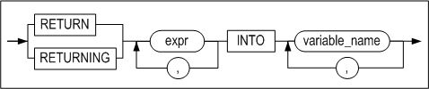

**limit_clause ::=**


**multiple_delete ::=**


tbl_ref ::=

#### Prerequisites

The SYS user, the owner of the schema containing the table, users having the DELETE ANY TABLE system privilege, and users having the DELETE privilege for the specified table can delete rows from tables using this statement.

If the user wishes to delete a record from a view, the user must have the same privileges on the base tables as above.

#### Description

This statement is used to remove records that meet the specified conditions, if any, from the specified table. It can also be used to delete data from a specified partition. 

The WHERE clause is identical to the WHERE clause of a statement. If it is omitted, all of the data in the table are deleted.

*user_name*

This is used to specify the name of the owner of the table from which to delete records. If omitted, Altibase will assume that the table belongs to the schema of the user connected via the current session.

*tbl_name*

This is used to specify the name of the table containting the records to delete.

*view_name*

This specifies the name of the view from which a record is to be deleted.

*subquery*

This specifies the view from which a record is to be deleted as a subquery.

*returning_clause*

This retrieves records affected by DML statements. 

*expr*

Each expr must be a column name affected by DML statements or a data expression compatible with column types. 

*INTO*

This commands modified record values to be respectively stored as variable_name variables. 

*variable_name*

Each variable_name is either a host variable or a PSM variable in which queried expr values are to be stored. Unless using record type variables, the number of variables must equal the number of expr of the expr list. 

Host variable or PSM variable types must be compatible with relevant expr types. 

> Note: ':' must be prefixed to variable names for iSQL.

Limitations of the returning clause:

- For UPDATE, DELETE and INSERT statements, aggregate functions are not allowed in each expr. 
- This clause can only be used for tables. 
- LOB types cannot be queried with this clause. 
- Aliases or subqueries are not allowed in expr. 
- Sequences are not allowed in expr.

> Note: Multiple rows can be simultaneously returned as collection variables using the BULK COLLECT clause within PSM. For further information, refer to the Stored Procedures Manual.

*multiple_delete*

The following example deletes records that meet the join condition from the table specified in tbl_name.

Limitations of the multiple delete clause:

- limit_clause and returning_clause cannot be used.
- dictionary table cannot be used.
- full outer join canno be used.

#### HINTS Options

Please refer to "Hint Syntax" and "Hint List" in the Chapter 2 for more detailed information.

#### Example

##### Deleting Rows

\<Query\>Delete all data from a table

```
DELETE FROM orders;
```

\<Query\> Delete partition P2 from Table T1.

```
DELETE FROM T1 PARTITION (P2);
```

\<Query\> Delete the orders the employee "William" received.

```
DELETE
FROM orders
  WHERE eno = (SELECT eno FROM employees
                WHERE e_firstname = 'William');
```


##### Deleting Rows from Join Views

\<Query\> Create a view joining the two tables, employees and departments, and then delete employees belonging to the department 'BUSINESS DEPT'. Data is deleted from the table employees and this is affirmed by comparing the number of rows of the table employees before and after data is deleted.

```
iSQL> CREATE VIEW simple_emp AS
        SELECT e.eno, e.e_lastname, e.salary, d.dname
          FROM employees e, departments d
          WHERE e.dno = d.dno;
Create success.
iSQL> select * from simple_emp;
ENO         E_LASTNAME            SALARY      DNAME
-----------------------------------------------------------------------------------
3           Kobain                2000        RESEARCH DEVELOPMENT DEPT 1
16          Chen                  2300        RESEARCH DEVELOPMENT DEPT 1
6           Momoi                 1700        RESEARCH DEVELOPMENT DEPT 2
13          Jones                 980         RESEARCH DEVELOPMENT DEPT 2
10          Bae                   4000        SOLUTION DEVELOPMENT DEPT
11          Liu                   2750        SOLUTION DEVELOPMENT DEPT
14          Miura                 2003        SOLUTION DEVELOPMENT DEPT
15          Davenport             1000        SOLUTION DEVELOPMENT DEPT
17          Fubuki                1400        QUALITY ASSURANCE DEPT
4           Foster                1800        CUSTOMERS SUPPORT DEPT
1           Moon                              PRESALES DEPT
5           Ghorbani              2500        PRESALES DEPT
8           Wang                              MARKETING DEPT
9           Diaz                  1200        MARKETING DEPT
18          Huxley                1900        MARKETING DEPT
7           Fleischer             500         BUSINESS DEPT
12          Hammond               1890        BUSINESS DEPT
19          Marquez               1800        BUSINESS DEPT
20          Blake                             BUSINESS DEPT
19 rows selected.

iSQL> select count(*) from employees;
COUNT
-----------------------
20
1 row selected.

iSQL> DELETE FROM simple_emp WHERE dname='BUSINESS DEPT';
4 rows deleted.

iSQL> select count(*) from employees;
COUNT
-----------------------
16
1 row selected.
```


##### Deleting Rows using the RETURNING clause

\<Query\> The following example returns the values of the deleted rows as output bind variables :v1, :v2.

```
iSQL> create table employees ( eno integer, ename varchar(20));
Create success.
 
iSQL> var v1 output integer;
iSQL> var v2 output varchar(30);

iSQL> insert into employees values (1, 'jake');
iSQL> insert into employees values (2, 'nikita');
iSQL> insert into employees values (3, 'dana');

iSQL> prepare delete from employees where eno=2 return eno, ename into :v1, :v2;
1 row deleted.

iSQL> print var
[ HOST VARIABLE ]
-------------------------------------------------------
NAME                 TYPE                 VALUE
-------------------------------------------------------
V1                   INTEGER              2
V2                   VARCHAR(30)          nikita

```


### INSERT 

#### Syntax

**insert ::=**

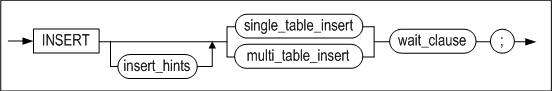


**single_table_insert ::=**


[returning_clause ::=](#returning_clause),
[subquery ::=](#subquery)

**table_clause ::=**


[subquery ::=](#subquery)

**multi_table_insert ::=**


[subquery ::=](#subquery)

**values_clause ::=**


**wait_clause ::=**


#### Prerequisites

The SYS user, the owner of the schema containing the table, users having the INSERT ANY TABLE system privilege, and users having the INSERT privilege for the specified table can insert rows into tables using this statement.

If the user wishes to insert a record into a view, the user must have the same privileges on the base tables as above.

#### Description

The INSERT statement is used to insert a new record into the specified table or partition. If an index has been defined for the table, the index data will also be modified.

*user_name*

This is used to specify the name of the owner of the table into which the record(s) are to be inserted. If omitted, Altibase will assume that the table belongs to the schema of the user connected via the current session.

*tbl_name*

This is used to specify the name of the table into which the record(s) are to be inserted.

*view_name*

This specifies the name of the view into which a record is to be inserted.

*subquery*

This specifies the view into which a record is to be inserted as a subquery.

*NULL*

When the values to be inserted are provided only for some columns, but not for others, NULL is inserted into every column for which an insert value is not provided and which does not have a set DEFAULT value. (The default value for a TIMESTAMP column is the system time at the time that the INSERT operation occurred. Therefore, if no insert value is provided for a TIMESTAMP column, the system time, rather than NULL, is inserted into that column.) 

NULL values can also be inserted by explicitly specifying NULL in the VALUES clause.

*multi_table_insert Clause*

This clause is used to insert a row of the result set generated from a subquery into one or more tables. If an expression exists in the SELECT list of the subquery, the expression must be given an alias to enable it to be referenced from the VALUES clause.

*DEFAULT*

If the DEFAULT keyword is specified in the VALUES clause, the previously set default value will be inserted into the corresponding column. To insert the default values for all columns, use the DEFAULT VALUES clause. 

If the DEFAULT keyword is specified for a timestamp column, the system time will be inserted.

*INSERT \~ SELECT*

This type of query is used to insert the results of execution of a SELECT query into a table. The table from which the results were retrieved can be the same table as the table into which the records are to be inserted. The number of columns to be inserted must be the same as the number of columns in the SELECT statement, and corresponding columns must have compatible data types.

*returning_clause*

Please refer to the returning_clause of the DELETE statement.

*wait_clause*

Refer to the FOR UPDATE clause of the SELECT statement for in-depth information on wait_clause.

#### HINTS Options

Please refer to "Hint Syntax" and "Hint List" for more detailed information.

#### Precautions

- When entering data with an INSERT statement, please keep the following points in mind: 
  - The number of columns that are specified must be the same as the number of values to be inserted, and the data types must be compatible. 
  - When a partition is specified, it is impossible to insert values that do not match the partition conditions. 
  - It is permissible to insert NULL values when no default value has been specified for a column, as long as the column does not have the NOT NULL constraint
  - INSERT can fail due to the CHECK constraint.
  
- Direct-Path INSERT has the following limitations:
  - The destination table must be a disk table, and it cannot have any LOB columns or indexes. 
  - The destination table can't be a replication target table. 
  - The destination table can't have any triggers or referential integrity constraints defined for it. 
  - The target table cannot have the CHECK constraint.

#### Examples

##### Inserting Simple Data

\<Query\> Inser customer information named "Louise Leroux".

```
INSERT INTO customers VALUES ( '25', 'Leroux', 'Louise', 'student',
'025282222', 'F', '0101', 150763, '#3 825 - 17th Ave SW Calgary Canada'); 
1 row inserted.
```

\<Query\> Insert only the number, name, and gender of information of the customer "Rosalia Jung".

```
INSERT INTO employees(eno, e_firstname, e_lastname, sex) VALUES(21, 'Rosalia', 'Jung', 'F');
1 row inserted.
```

\<Query\> Inser multiple rows at once.

```
INSERT INTO GOODS VALUES('Y111100001', 'YY-300' , 'AC0001', 1000 , 78000),
('Y111100002', 'YY-310' , 'DD0001', 100 , 98000), ('Y111100003', 'YY-H5000',
'AC0002', 780 , 35800);

3 rows inserted.
```


##### Inserting Complicated Data

\<Query\> Copy the customer number and order date for all delayed orders from the orders table to the delayed_processing table.

```
iSQL> CREATE TABLE delayed_processing(
  cno CHAR(14), order_date DATE);
Create success.
iSQL> INSERT INTO delayed_processing
  SELECT cno, order_date
  FROM orders
  WHERE PROCESSING = 'D';
1 row inserted.
```


##### Inserting Partitioned Data

```
CREATE TABLE T1 ( I1 INTEGER, I2 INTEGER )
PARTITION BY RANGE ( I1 )
( 
	PARTITION P1 VALUES LESS THAN ( 300 ),
	PARTITION P2 VALUES LESS THAN ( 400 ),
	PARTITION P3 VALUES DEFAULT 
) TABLESPACE SYS_TBS_DISK_DATA;

INSERT INTO T1 PARTITION ( P1 ) VALUES ( 123, 456 );
1 row inserted.
```


##### Inserting Data using the Direct-Path INSERT Hint

\<Query\> Copy all data from table T1 to table T2 using the Direct-Path INSERT hint.

```
INSERT /*+ APPEND */ INTO T2 SELECT * FROM T1;
```


##### Multi-table INSERT statement

\<Query\> Multiple rows are inserted into a single table at once.

```
CREATE TABLE t (
pid INTEGER,
fname VARCHAR(20),
lname VARCHAR(25));

INSERT INTO t VALUES (1, 'Dan', 'Morgan'), (2, 'Jeremiah', 'Wilton'), (3, 'Helen', 'Lofstrom');
```

\<Query\> The result of a subquery is inserted into multiple tables.

```
CREATE TABLE sal_history (
eno INTEGER,
join_date DATE,
salary NUMBER(10,2));

CREATE TABLE dno_history (
eno INTEGER,
dno SMALLINT,
chg_date DATE);

INSERT ALL
INTO sal_history VALUES(emp_id,join_date,salary)
INTO dno_history VALUES(emp_id,dept_id,sysdate)
SELECT eno EMP_ID, join_date, salary, dno DEPT_ID
FROM employees;
```


##### Inserting Data using the RETURNING Clause

\<Query\>  The following example returns the input row values as output bind variables :v1, :v2. 

```
iSQL> create table employees ( eno integer, ename varchar(20));
Create success.
 
iSQL> var v1 output integer;
iSQL> var v2 output varchar(30);

iSQL> prepare insert into employees values (1, 'jake') return eno, ename into :v1, :v2;
1 row inserted.

iSQL> print var
[ HOST VARIABLE ]
-------------------------------------------------------
NAME                 TYPE                 VALUE
-------------------------------------------------------
V1                   INTEGER              1
V2                   VARCHAR(30)          jake
```


##### Inserting Data into Join Views

\<Query\> Create a view joining the two tables, employees and departments, and insert records.

```
iSQL> CREATE VIEW simple_emp AS
         SELECT eno, e_lastname, e_firstname, emp.dno dno
         FROM employees emp, departments dept
         WHERE emp.dno = dept.dno;
Create success.
iSQL> select * from simple_emp;
ENO         E_LASTNAME            E_FIRSTNAME           DNO
-------------------------------------------------------------------------
3           Kobain                Ken                   1001
16          Chen                  Wei-Wei               1001
.
.
.
20          Blake                 William               4002
19 rows selected.

iSQL> INSERT INTO simple_emp(eno, e_lastname, e_firstname, dno) VALUES(50, 'Kim', 'Yong', 1001);
1 row inserted.
iSQL> select * from simple_emp;
ENO         E_LASTNAME            E_FIRSTNAME           DNO
-------------------------------------------------------------------------
3           Kobain                Ken                   1001
16          Chen                  Wei-Wei               1001
50          Kim                   Yong                  1001
.
.
.
20          Blake                 William               4002
20 rows selected.
```


### LOCK TABLE

#### Syntax

**lock_table ::=**


#### Prerequisites

The SYS user, the owner of the schema containing the table, and users having the LOCK ANY TABLE system privilege can execute this statement.

#### Description

This statement is used to lock a table in a lock_mode. Once a table is locked, the locked table remains until the associated transaction is committed or rolled back.

*user_name*

This is used to specify the name of the owner of the table to be locked. If omitted, Altibase will assume that the table belongs to the schema of the user connected via the current session.

*tbl_name*

This is used to specify the name of the table to lock.

*partition_name*

This is used to specify the name of the partition to be locked.

If the partition name is specified, lock mode is applied to the partition and ROW SHAR or ROW EXCLUSIVE is applied to the table

|      Lock Mode      |   Partition Apply   |  Table Apply  |
| :-----------------: | :-----------------: | :-----------: |
|      ROW SHARE      |      ROW SHARE      |   ROW SHARE   |
|    SHARE UPDATE     |    SHARE UPDATE     |   ROW SHARE   |
|    ROW EXCLUSIVE    |    ROW EXCLUSIVE    | ROW EXCLUSIVE |
| SHARE ROW EXCLUSIVE | SHARE ROW EXCLUSIVE | ROW EXCLUSIVE |
|        SHARE        |        SHARE        |   ROW SHARE   |
|      EXCLUSIVE      |      EXCLUSIVE      | ROW EXCLUSIVE |

*lock_mode*

One of the following lock modes should be specified when executing the lock on a table:

- ROW SHARE  
  In ROW SHARE mode, concurrent access of other transactions on a locked table set by this mode is allowed. However, locking a table with the EXCLUSIVE Mode, which is for the exclusive access of other users, is prohibited.
- SHARE UPDATE  
  This mode is a lock mode with an identical function with that of the ROW SHARE mode.
- ROW EXCLUSIVE  
  The concurrent access of other transactions on a locked table set by this mode is allowed. However, locking a table with the EXCLUSIVE or SHARE mode, which is for the exclusive access of other users, is firmly prohibited. The lock is automatically obtained when updating, insert, or deleting data
- SHARE ROW EXCLUSIVE  
  The SHARE ROW EXCLUSIVE is used to view an entire table while permitting others to view the table. However, locking a table with the SHARE mode for an exclusive access of other users is prohibited.
- SHARE  
  In the SHARE mode, other transactions can view a table locked by this mode, but updating it is prohibited.
- EXCLUSIVE  
  The EXCLUSVE mode allows the current transaction to view or update a table which is locked by this mode, but other transactions cannot be able to view nor update.

*WAIT \| NOWAIT*

This clause is used to specify whether to wait until a lock has been obtained. It can be omitted, in which case the wait to obtain a lock on an individual row will continue for an unlimited time.

- WAIT n  
  This option specifies that a transaction is to wait for n seconds to obtain a lock on the row. If the row cannot be locked during this time, an error will be raised.
- NOWAIT  
  The NOWAIT option specifies that a transaction is not to wait to obtain a lock if it is not immediately possible. In this case, Altibase returns an error indicating that the specified table has already been locked by another user.

*UNTIL NEXT DDL*

The UNTIL NEXT DDL statement enables an auto commit immediately before DDL is executed if the DDL is performed and the session is in the NON-AUTOCOMMIT mode. 

However, if the EXCLUSIVE mode is selected in the lock_mode, the auto commit is not executed before the DDL is performed. This function can be used only once per a transaction.

<table style="width: 634px;">
<tbody>
<tr>
<td style="width: 236px;" rowspan="2">
<p><strong>SQL Statement</strong></p>
</td>
<td style="width: 87px;" rowspan="2">
<p><strong>Mode of Table Lock</strong></p>
</td>
<td style="width: 363px;" colspan="5">
<p><strong>Lock Modes Permitted?</strong></p>
</td>
</tr>
<tr>
<td style="width: 48px; text-align: center;">
<p><strong>IS</strong></p>
</td>
<td style="width: 71px; text-align: center;">
<p><strong>IX</strong></p>
</td>
<td style="width: 76px; text-align: center;">
<p><strong>S</strong></p>
</td>
<td style="width: 77px; text-align: center;">
<p><strong>SIX</strong></p>
</td>
<td style="width: 91px; text-align: center;">
<p><strong>X</strong></p>
</td>
</tr>
<tr>
<td style="width: 236px;">
<p>SELECT &hellip; FROM <em>tbl_name</em> &hellip;</p>
</td>
<td style="width: 87px;">
<p>IS</p>
</td>
<td style="width: 48px;">
<p>Y(IS)</p>
</td>
<td style="width: 71px;">
<p>Y(IX)</p>
</td>
<td style="width: 76px;">
<p>Y(S)</p>
</td>
<td style="width: 77px;">
<p>Y(SIX)</p>
</td>
<td style="width: 91px;">
<p>N(X)</p>
</td>
</tr>
<tr>
<td style="width: 236px;">
<p>INSERT INTO <em>tbl_name</em> &hellip;</p>
</td>
<td style="width: 87px;">
<p>IX</p>
</td>
<td style="width: 48px;">
<p>Y(IX)</p>
</td>
<td style="width: 71px;">
<p>Y(IX)</p>
</td>
<td style="width: 76px;">
<p>N(SIX)</p>
</td>
<td style="width: 77px;">
<p>N(SIX)</p>
</td>
<td style="width: 91px;">
<p>N(X)</p>
</td>
</tr>
<tr>
<td style="width: 236px;">
<p>UPDATE tbl_name &hellip;</p>
</td>
<td style="width: 87px;">
<p>IX</p>
</td>
<td style="width: 48px;">
<p>Y*(IX)</p>
</td>
<td style="width: 71px;">
<p>Y*(IX)</p>
</td>
<td style="width: 76px;">
<p>N(SIX)</p>
</td>
<td style="width: 77px;">
<p>N(SIX)</p>
</td>
<td style="width: 91px;">
<p>N(X)</p>
</td>
</tr>
<tr>
<td style="width: 236px;">
<p>DELETE FROM <em>tbl_name</em> &hellip;</p>
</td>
<td style="width: 87px;">
<p>IX</p>
</td>
<td style="width: 48px;">
<p>Y*(IX)</p>
</td>
<td style="width: 71px;">
<p>Y*(IX)</p>
</td>
<td style="width: 76px;">
<p>N(SIX)</p>
</td>
<td style="width: 77px;">
<p>N(SIX)</p>
</td>
<td style="width: 91px;">
<p>N(X)</p>
</td>
</tr>
<tr>
<td style="width: 236px;">
<p>SELECT &hellip; FROM <em>tbl_name</em> FOR UPDATE &hellip;</p>
</td>
<td style="width: 87px;">
<p>IS</p>
</td>
<td style="width: 48px;">
<p>Y*(IX)</p>
</td>
<td style="width: 71px;">
<p>Y*(IX)</p>
</td>
<td style="width: 76px;">
<p>Y*(S)</p>
</td>
<td style="width: 77px;">
<p>Y*(SIX)</p>
</td>
<td style="width: 91px;">
<p>N(X)</p>
</td>
</tr>
<tr>
<td style="width: 236px;">
<p>LOCK TABLE <em>tbl_name</em> IN ROW SHARE MODE</p>
</td>
<td style="width: 87px;">
<p>IS</p>
</td>
<td style="width: 48px;">
<p>Y(IS)</p>
</td>
<td style="width: 71px;">
<p>Y(IX)</p>
</td>
<td style="width: 76px;">
<p>Y(S)</p>
</td>
<td style="width: 77px;">
<p>Y(SIX)</p>
</td>
<td style="width: 91px;">
<p>N(X)</p>
</td>
</tr>
<tr>
<td style="width: 236px;">
<p>LOCK TABLE <em>tbl_name</em> IN ROW EXCLUSIVE MODE</p>
</td>
<td style="width: 87px;">
<p>IX</p>
</td>
<td style="width: 48px;">
<p>Y(IX)</p>
</td>
<td style="width: 71px;">
<p>Y(IX)</p>
</td>
<td style="width: 76px;">
<p>N(SIX)</p>
</td>
<td style="width: 77px;">
<p>N(SIX)</p>
</td>
<td style="width: 91px;">
<p>N(X)</p>
</td>
</tr>
<tr>
<td style="width: 236px;">
<p>LOCK TABLE <em>tbl_name</em> IN SHARE MODE</p>
</td>
<td style="width: 87px;">
<p>S</p>
</td>
<td style="width: 48px;">
<p>Y(S)</p>
</td>
<td style="width: 71px;">
<p>N(SIX)</p>
</td>
<td style="width: 76px;">
<p>Y(S)</p>
</td>
<td style="width: 77px;">
<p>N(SIX)</p>
</td>
<td style="width: 91px;">
<p>N(X)</p>
</td>
</tr>
<tr>
<td style="width: 236px;">
<p>LOCK TABLE <em>tbl_name</em> IN SHARE ROW EXCLUSIVE MODE</p>
</td>
<td style="width: 87px;">
<p>SIX</p>
</td>
<td style="width: 48px;">
<p>Y(SIX)</p>
</td>
<td style="width: 71px;">
<p>N(SIX)</p>
</td>
<td style="width: 76px;">
<p>N(SIX)</p>
</td>
<td style="width: 77px;">
<p>N(SIX)</p>
</td>
<td style="width: 91px;">
<p>N(X)</p>
</td>
</tr>
<tr>
<td style="width: 236px;">
<p>LOCK TABLE <em>tbl_name</em> IN EXCLUSIVE MODE</p>
</td>
<td style="width: 87px;">
<p>X</p>
</td>
<td style="width: 48px;">
<p>N(X)</p>
</td>
<td style="width: 71px;">
<p>N(X)</p>
</td>
<td style="width: 76px;">
<p>N(X)</p>
</td>
<td style="width: 77px;">
<p>N(X)</p>
</td>
<td style="width: 91px;">
<p>N(X)</p>
</td>
</tr>
<tr>
<td style="width: 686px;" colspan="7">
<p>IS: row share (Intent share lock)</p>
<p>IX: row exclusive (Intent exclusive lock)</p>
<p>S: share</p>
<p>SIX: share row exclusive (Share with Intent exclusive lock)</p>
<p>X: exclusive</p>
<p>* Y: If a row lock conflict is not caused by another transaction, the transaction can acquire a lock. Otherwise, a wait occurs.</p>
<p>&nbsp;</p>
<p><strong>The lock type shown in parentheses is:</strong></p>
<p>1. If the current lock mode switch is allowed by another transaction(Y), the lock type currently held is switched to the type in parentheses.</p>
<p>2. If the current lock mode switch is not allowed by another transaction (N), the lock type can be switched to the type in parentheses only when the transaction taht is currently acquiring the lcok acquires a new lock.</p>
</td>
</tr>
</tbody>
</table>

[Table 4‑1] Summary of Table Locks

#### Examples

The following example shows how Altibase manages data concurrency, integrity, and consistency when using LOCK TABLE and SELECT statements.

| Transaction A                                                | Time Point | Transaction B                                                |
| ------------------------------------------------------------ | ---------- | ------------------------------------------------------------ |
| iSQL\> AUTOCOMMIT OFF; Set autocommit off success.           |            | iSQL\> AUTOCOMMIT OFF; Set autocommit off success.           |
|                                                              | 1          | (request X lock on employees) iSQL\> LOCK TABLE employees IN EXCLUSIVE MODE; Command execute success. (acquire X lock on employees) |
| iSQL\> DROP TABLE employees; [ERR-11170: The transaction has exceeded the lock timeout specified by the user.] | 2          |                                                              |
|                                                              | 3          | iSQL\> UPDATE employees SET salary = 2500000 WHERE eno = 15; 1 row updated. |
| (request S lock on employees) iSQL\> LOCK TABLE employees IN SHARE MODE; (the request conflicts with the X lock already held by transaction B) wait wait wait | 4          |                                                              |
|                                                              | 5          | iSQL\> COMMIT; Commit success. (release X lock on employees) |
| (resume) Lock success. (acquire S lock on employees) iSQL\> SELECT salary FROM employees WHERE eno = 15; SALARY -------------- 2500 1 row selected. (It can be seen that the data have been committed.) | 6          |                                                              |
| iSQL\> ROLLBACK; Rollback success. (release S lock on employees) | 7          |                                                              |
| iSQL\> LOCK TABLE employees IN EXCLUSIVE MODE; Lock success. (acquire X lock on employees) | 8          |                                                              |
|                                                              |            | iSQL\> SELECT SALARY FROM employees WHERE eno = 15; wait wait wait |
| iSQL\> UPDATE employees SET eno = 30 WHERE eno = 15; 1 row updated. | 10         |                                                              |
| iSQL\> COMMIT; Commit success. (release X loc on employees)  | 11         |                                                              |
|                                                              | 12         | (resume) SALARY -------------- 2500 1 row selected.          |

### SELECT 

#### Syntax

**select ::=**


[for_update_clause
::=](#for_update_clause)

**with_clause ::=**


<a name="subquery"><a/>

**subquery ::=**


[limit_clause ::=](#limit_clause)

**select_clause ::=**


[hierarchical_query_clause ::=](#hierarchical_query_clause), [group_by_clause
::=](#group_by_clause)

**select_list ::=**


<a name="tbl_reference"><a/>

**tbl_reference ::=**


[joined_table ::=](#joined_table)

<a name="single_table"><a/>

**single_table ::=**


**pivot_clause ::=**


<a name="pivot_for_clause"><a/>

**pivot_for_clause ::=**


**pivot_in_clause ::=**


**unpivot_clause ::=**


[pivot_for_clause ::=](#pivot_for_clause)

**unpivot_in_clause ::=**


<a name="joined_table"><a/>

**joined_table ::=**


[tbl_reference ::=](#tbl_reference), [single_table ::=](#single_table),

**join_type ::=**


**apply_type ::=**


<a name="where_clause"><a/>

**where_clause ::=**


<a name="hierarchical_query_clause"><a/>

**hierarchical_query_clause ::=**


<a name="group_by_clause"><a/>

**group_by_clause ::=**


**rollup_cube_clause ::=**


**grouping_sets_clause ::=**


**grouping_expression_list ::=**


**expression_list ::=**


**order_by_clause ::=**


<a name="imit_clause"><a/>

**limit_clause ::=**


<a name="for_update_clause"><a/>

**for_update_clause ::=**


#### Prerequisites

The SYS user, the owner of the schema containing the table, users having the SELECT ANY TABLE system privilege, and users having the SELECT privilege for the specified table can select data tables using this statement.

#### Description

A SELECT statement or subquery is used to retrieve data from one or more tables or views.

*with_clause*

The WITH query_name clause bestows a name to the subquery that follows the AS clause. The name bestowed to the subquery is referenced from various positions within the main query. 

Altibase processes with_clause as an inline view or a temporary table to optimize its performance results. In general, the WITH query_name clause gives a name to the subquery that follows the AS clause. The name given to the subquery is referenced from various positions within the main query. 

However, in a recursive WITH clause (hereinafter, called 'recursive with' or 'a recursive query'), column alias should be specified followed by the query_name and the query using a set operator can be repeatedly executed within a subquery. In the subquery, two queries exist on the basis of a set operator, the former query is the main query(a reference query), and the latter query becomes a recursive query. The recursive query can output the maximum value(default value:1000) specified in the RECURSION_LEVEL_MAXIMUM property. Refer to the Altibase Properties in General Reference manual for in-depth information. 

The user can specify this clause in the main query and most types of subqueries.

- Restrictions:
  - Only one with_clause can be specified for each SQL statement. Query_name is not allowed in the subquery that recursively defines itself. When defining multiple query names within the win_clause, however, a previously defined query name is allowed in the following subquery.
  - The position of a main query and a recursive query should not be modified within the RECURSIVE WITH clause. Moreover, the query_name should be explicitly referenced. However, aggregate functions, DISTINCT keywords, and GROUP BY clause cannot be used in the recursive query.
  - A subquery referencing the query_name cannot be used in the main query in the RECURSIVE WITH clause.
  - A view referencing the query_name or a table located in the right of an outer join cannot be used in a recursive query in the RECURSIVE WITH clause.

*TOP (expr)*

This clause specifies the number of rows to be returned from the query result set. Only integers are valid for expr.

*select_list Clause*

The DISTINCT keyword is used to specify that duplicate records are to be removed from the result set before it is returned.

If a SELECT statement contains a GROUP BY clause, then only constants, aggregate functions, the expressions in the GROUP BY clause, and expressions that are combinations of the foregoing can be specified in the SELECT list.

If the SELECT list is composed of expressions or constants that do not include columns, the FROM clause can be omitted.

SThe specification of only the asterisk symbol(*) in the SELECT list represents every column of every table and view in the FROM clause. What the asterisk symbol represents does not change, even if it is specified with a column or expression.

*FROM Clause*

An alias cannot be used more than once in a FROM clause. When the same table is used more than once in a FROM clause, different aliases must be specified.

A maximum of 32 different tables or views can be cited in a FROM clause.

- *OUTER JOIN*

  This is an extended SQL form of JOIN for processing data that do not satisfy the join condition. Unlike an (INNER) JOIN, which only returns records having corresponding key values from two tables, an OUTER JOIN returns all of the data from one of the two tables. When a record in the returned result set consists of a row from one table that does not have a matching row from the other table, empty columns are filled with NULL values.
  
- *In-line Views*

  A subquery in a FROM clause is called an “inline view”.

- *Lateral View*

  An inline view in a FROM clause cannot reference another object in the FROM clause or a query of a higher level. Yet, if the inline view in the FROM clause is defined as a lateral view, it becomes possible to reference objects outside the inline view.
  
  To define an inline view as a lateral view, the LATERAL or APPLY keyword must be specified in front of the inline view. However, a lateral view can only reference objects that are specified on the left side of the lateral view. Even if an inline view is defined as a lateral view, if the lateral view does not reference an external object, the Altibase server processes the lateral view as a normal inline view.

  The APPLY keyword defines an inline view as a lateral view and also joins the object on the left of the APPLY keyword with the lateral view. Unlike a normal join statement which specifies join conditions after the ON keyword, join statements using the APPLY keyword do not need join conditions.
  
  The following join types can be specified using the APPLY keyword.
  - CROSS APPLY specifies an inner join operation between the left object and the lateral view.
  - OUTER APPLY specifies a left outer join operation between the left object and the lateral view. 
  
  > An error message is returned if a lateral view is used in the following circumstances.
  >
> - If a fixed table is referenced in a lateral view. 
  > - If the PIVOT clause or the UNPIVOT clause is used in a lateral view. 
  > - If an object on the right of a lateral view is referenced within the lateral view. 
  > - If a right outer join or full outer join operation is performed between an object referenced by a lateral view and the lateral view. 
> - If the LATERAL keyword and the APPLY keyword are used together. 
  > - If the APPLY keyword and the ON clause are used together.

- *pivot_clause*

  pivot_clause simultaneously performs a data aggregation operation and rearranges the data in separate rows into columns. This presents the data in a format that is easier to read than when using two columns in a GROUP BY clause.
  
  For convenience, pivot_clause is usually used with inline views to avoid the difficulty of naming certain columns that result from a large number of column outputs or transformation operations. 

  pivot_clause performs the following steps:
  
  1. pivot_clause first performs a grouping operation, just like a GROUP BY clause. The results are grouped according to all of the columns that are not referred to in pivot_clause, and according to the values specified in pivot_in_clause.
2. pivot_clause then arranges the resulting grouping columns and aggregate values in cross-tabular form.

- *pivot_for_clause*

  pivot_for_clause displays the name of the corresponding column when the value specified for pivot_in_clause is changed to columnar format. 
  
- *pivot_in_clause*

  pivot_in_clause is used to specify values found in the columns specified in pivot_for_clause. These values will be used as column names in the pivot operation.
  
- *unpivot_clause*

  unpivot_clause returns column data as rows. 

  The INCLUDE|EXCLUDE NULLS option specifies whether or not to allow columns that are created with the UNPIVOT clause to contain NULL values. EXCLUDE NULL returns results with no NULLS; on omission, this is the default value. 
  
  column_name specifies the names of the columns that contain the values that correspond to the column to be generated with the UNPIVOT clause. 

  The number of columns used in pivot_for_clause and pivot_in_clause must be the same as the number of columns used in unpivot_clause. The number of aliases must also be the same.

```
unpivot ( ( column, column ) for ( column, column ) in ( ( column, column ) as (
column, column ) ) );
```

The following statement does not support different numbers of columns.

```
unpivot ( ( column, column ) for column in ( ( column, column ) as column ) );
```


- *Table Function*

  The Table function outputs results by converting into a table format when the associative array type or record type are used in the user defined-function.

WHERE condition clause*

For information about the use of conditions in the WHERE clause, please refer to Chapter 8: SQL Conditions

*Hierarchical Query clause*

A hierarchical query is a query statement that outputs data in a hierarchical manner. If a table contains data with a parent-child relationship, this query statement outputs the parent-child relationship in a hierarchical order. For root rows that satisfy a given search condition, a hierarchical condition is evaluated to retrieve rows among the rows and its child rows.

If hierarchical data is queried using the ORDER BY clause or the GROUP BY clause, caution is required as the hierarchical order specified by the CONNECT BY clause will be overridden. However, the use of the ORDER SIBLINGS BY clause preserves the hierarchy while ordering rows of siblings of the same parent

- *START WITH clause* 

  This clause specifies a condition that identifies the root row of a hierarchical query. All rows that satisfy this condition are used as root rows. On omission, Altibase treats every row of the table as root rows of the hierarchy.
  
  The ROWNUM pseudocolumn cannot be used in this clause. 

- *CONNECT BY clause*

  This clause specifies a condition that identifies the relationship between parent rows and child rows of the hierarchy. 

  The CONNECT BY clause cannot include subqueries and cannot be used with a join. 

  The CONNECT BY clause must precede the ORDER BY, GROUP BY, HAVING clause after the WHERE clause. 
  

The NOCYCLE keyword instructs the database to return all rows preceding the occurrence of a loop from a query, regardless of the existence of a loop in the result set of the hierarchical query. 

  The SYS_CONNECT_BY_PATH function can easily retrieve PATH information up to the current row in a hierarchical query. For further information on this function, refer to “Chapter6: SQL Functions”. 

- *PRIOR Operator*

  The PRIOR operator is used to distinguish previously searched rows from the current row. Use of the PRIOR operator is mandatory in order to refer to the parent row. 
  

The PRIOR operator is only valid in the SELECT list, WHERE clause or CONNECT BY clause of query statements that include the CONNECT BY clause. 

  If set operators (UNION, INTERSECT, etc) are used in the query, the PRIOR operator cannot be included in the ORDER BY clause. 

- *CONNECT_BY_ROOT Operator

  CONNECT_BY_ROOT is a unary operator that is valid only in hierarchical queries. If a column is qualified with this operator, the column value of the root row is returned. 
  

This operator cannot be used in the START WITH condition or the CONNECT BY condition.


- *CONNECT_BY_ISLEAF Pseudocolumn* 

  THE CONNECT_BY_ISLEAF pseudocolumn returns 1 if the current row is a leaf node of a tree defined by the CONNECT BY condition; if not, it returns 0.
  
- *LEVEL Pseudocolumn*

  SELECT statements that contain hierarchical queries can contain the LEVEL pseudocolumn in select_list. The LEVEL pseudocolumn indicates the hierarchical distance between the root record and subordinate records that have parent-child relationships between them. In other words, LEVEL is 1 for a root record, 2 for a child record, 3 for a grandchild record, and so on.
  
  In addition to select_list, the LEVEL pseudocolumn can also be used in the WHERE, ORDER BY, GROUP BY, and HAVING clauses. Additionally, the LEVEL pseudocolumn can be used in select_list even in a query that does not have a CONNECT BY clause, for example:

  ```
  select level from t1;
  ```


- *IGNORE*

  When the hierarchical relationships between records form a loop, Altibase returns an error. (In this context, the term “loop”, in its simplest form, indicates the situation where one row is both the parent and child of another row.) However, if the IGNORE LOOP option is used, the formation of a loop during query execution does not raise an error; instead, the records that form the loop are removed from the query result set

*GROUP BY clause*

The GROUP BY clause is used to group records that have the same value for one or more given expression(s) and return a single row of aggregate information for each group.

The groups that are returned cannot be limited using a WHERE condition. Instead, the HAVING clause is used to restrict the groups of returned rows to those groups for which the specified condition is TRUE. If the HAVING clause is omitted, one record will be returned for every group.

Locate the GROUP BY and HAVING clauses after the WHERE clause and hierarchical_clause. The ORDER BY clause, if present, must appear at the very end of a SQL statement. 

*rollup_cube_clause, grouping_sets_clause*

ROLLUP, CUBE and GROUPING SETS are extensions of the GROUP BY clause and can specify multiple grouping sets. ROLLUP, CUBE or GROUPING SETS generate the same results as combining a multiple number of queries which contain the GROUP BY clause with UNION ALL.

- Restrictions:
  - ROLLUP, CUBE or GROUPING SETS can only be specified once in the GROUP BY clause. 
  - Aggregate functions that take subqueries as arguments are not valid as a SELECT target. 
  - ROLLUP, CUBE or GROUPING SETS cannot be used with window functions. 
  - A maximum number of 15 expressions can be specified in the CUBE clause. 
  - GROUPING SETS and nested aggregate functions cannot be used together.

*ROLLUP*

ROLLUP is used with the GROUP BY clause and returns detailed information on result sets grouped by the GROUP BY clause. 

When ROLLUP is used with the SUM operator, it calculates not only the grand total, but also the subtotals of the grouping columns it specifies. 

ROLLUP executes GROUP BY for (n+1) times, where n is the number of grouping columns. For example, if ROLLUP(a,b,c) is specified in the GROUP BY clause, the following combination of groups is returned:

```
(a,b,c), (a,b), (a), ( )
```


- *Partial ROLLUP*

When ROLLUP is operated only partially on grouping columns of the GROUP BY clause as in the following example, this is called a 'Partial ROLLUP': 

```
GROUP BY a, ROLLUP(b, c), d
```

In this case, the following combination of groups is returned:

```
(a, d, b, c), (a, d, b), (a, d)
```


- *Using Composite Columns*

A list of composite columns can be specified in the ROLLUP clause as below: 

```
GROUP BY ROLLUP((a, b), (c, d))
```

In this case, the following combination of groups is returned:

```
(a, b, c, d), (a, b), ( )
```


*CUBE*

CUBE generates groupings of all possible combinations on specified grouping columns. CUBE creates groupings on 2n combinations, where n is the number of grouping columns. For example, if GROUP BY CUBE(a,b,c) is specified, the following (23=8) combinations are returned:

```
(a,b,c), (a,b), (a,c), (b,c), (a), (b), (c), ( )
```

- *Partial CUBE*

Partial CUBE is similar to Partial ROLLUP; all possible combinations of columns specified for the CUBE operator are combined with the columns outside the CUBE to determine the group to be returned. The syntax for partial CUBE is as below: 

```
GROUP BY a, CUBE(b, c), d
```

In this case, the subtotals for the following combination are returned:

```
(a, d, b, c), (a, d, b), (a, d, c), (a, d)
```

- *Using Composite Columns*

A list of composite columns can be specified in the CUBE clause as below:

```
GROUP BY CUBE((a, b), (c, d))
```

In this case, the following combination of groups is returned:

```
(a, b, c, d), (a, b), (c, d), ( )
```


*GROUPING SETS*

If you only need some of the grouping sets generated by ROLLUP or CUBE, GROUPING SETS allows you to specify only the grouping sets you need.

When used with the SUM operation, it calculates the grand total of each group specified for GROUPING SETS. 

GROUPING SETS executes GROUP BY for n times, where n is the number of grouping columns. For example, if GROUPING SETS(a, b, c) is specified in the GROUP BY clause, the following combination of groups are returned.

```
(a), (b), (c)
```


- *Partial GROUPING SETS*

When GROUPING SETS is operated only partially on grouping columns of the GROUP BY clause as in the following example, this is called a ‘Partial GROUPING SETS’: 

```
GROUP BY a, GROUPING SETS(b, c), d
```

In this case, the following combination of groups is returned:

```
(a, b, d), (a, c, d)
```


- Using Composite Columns

A list of composite columns can be specified in the GROUPING SETS clause as below:

```
GROUP BY GROUPING SETS((a, b), (c, d))
```

When two or more columns exist in inner parentheses in the GROUPING SETS list as above, it is treated as one column. The following combination of groups are returned:

```
(a, b), (c, d)
```


- *Using Empty Groups*

An empty group can be specified with empty parentheses ("()") in the GROUPING SETS clause as below:

```
GROUP BY GROUPING SETS((), a, b, c)
```

An empty group can be used to calculate the grand total without groupings.

*HAVING condition clause*

The HAVING clause can only comprise constants, aggregate functions, the expressions in the GROUP BY clause, and expressions that are combinations of the foregoing. If the HAVING clause is omitted, one record will be returned for every group.

This clause is used to restrict the returned rows to those pertaining to groups for which the specified condition is TRUE.

For more information about the use of conditions in the HAVING clause, please refer to Chapter 8: SQL Conditions.

*UNION (ALL), INTERSECT, MINUS*

The set operators combine the rows returned by two SELECT statements into a single result. The number and data types of the columns returned by each of the queries must be the same, but the column lengths can be different. The names of the columns in the result set will be the names of the expressions in the select_list preceding the set operator.

For more about set operators, please refer to Chapter 5: Set Operators in this manual.

*ORDER BY clause*

The ORDER BY clause is used to set the order in which the records returned by the statement are presented. The result set can be sorted in ascending or descending order. The default order is ascending order. 

Without an ORDER BY clause, there is no guarantee that the resultant records will be returned in a consistent order when the same query is repeatedly executed. 

An ORDER BY clause can be used only once in a SELECT statement. It cannot be used in a subquery. 

If the elements in the ORDER BY are specified as expressions, the records are sorted according to the result of evaluation of the expressions. The expressions are based on columns in select_list, or in tables or views in the FROM clause. If the elements in the ORDER BY clause are specified according to their position in select_list, the search results are sorted according to the returned values. The positions must be indicated using integers. 

When set operators (UNION, INTERSECT, etc.) are used, only the position or the alias of the search target can be used in the ORDER BY clause. 

Multiple expressions can be specified in the ORDER BY clause. The result set is first sorted based on the values for the first expression. Records having the same values for the first expression are then sorted based on their values for the second expression, and so on. If an ascending index exists for the column, the database places NULL values after all others when sorting in ascending order and preceding all others when sorting in descending order. 

If a descending index exists for the column, the database places NULL values preceding all others when sorting in ascending order and after all others when sorting in descending order. If no index exists for the column, the database places NULL values after all others, regardless of the sort order.

If the DISTINCT keyword is used in the SELECT statement, then only expressions that appear in the SELECT list or combinations of those expressions can be used in the ORDER BY clause. 

If a GROUP BY clause is present, then the following expressions can be used in the ORDER BY clause:

- constants
- aggregate functions
- the expressions in the GROUP BY clause
- expressions that are combinations of the foregoing

With the NULLS FIRST or NULLS LAST keyword, the ORDER BY clause can be used to position NULL at the beginning or end of the order

*LIMIT clause*

The LIMIT clause can be used to limit the number of rows returned by a query.

- row_offset: This is used to specify the first record to return. If omitted, the first record in the result set will be returned.
- row_count: This is used to specify the number of records to retrieve.

The LIMIT clause can also be used in subqueries.

*FOR UPDATE clause*

This is used to lock the records in the result set so that other users cannot lock or edit the records until the transaction has been completed.

The WAIT option specifies how long to wait to acquire a table lock. Applicable time units are seconds, milliseconds (msec, 1/1000 second), microsecond (user,1/1000000 seconds), unless otherwise specified, seconds are applied. On the other hand, the NOWAIT option forces the table not to wait if the table to acquire the lock is already locked by another transaction.

The FOR UPDATE clause can only be used with the main query of a SQL statement; it cannot be used with subqueries. Therefore, the following usage is invalid:

```
select eno from employees where (select eno from departments for update);
```

The FOR UPDATE clause cannot be used together with the DISTINCT or GROUP BY clauses, aggregate functions, or set operators (UNION, INTERSECT, etc).

#### Joins

A join is a statement which combines rows from two or more tables, views or materialized views. A join is performed when multiple tables exist in the FROM clause of a query.

A join condition defines the method with which to combine two tables. A join condition can be specified in either the FROM clause or the WHERE clause. A column in the join condition need not exist in the SELECT list. A join condition typically compares two columns from separate tables; Altibase combines rows whose join condition is TRUE from separate tables and returns them.

When joining three or more tables, Altibase joins two tables first and then joins the result with the remaining tables. The query optimizer determines the join order by referencing join conditions, indexes, statistical information and etc.

> Note: LOB columns cannot be used for join conditions.

Altibase supports the following joins:

- Cross Join
- Inner Join
- Outer Join
- Semi Join
- Anti Join

*Cross Join*

A cross join combines two tables without a join condition. Each row of a table is combined with the respective row of another table. This is also known as Cartesian Products. 

The following is an example of a cross join query.

```
SELECT * FROM T1, T2;
```

*Inner Join*

An inner join indicates a general join which combines only the rows matching the join condition from two tables and returns them. 

The following is an example of an inner join query.

```
SELECT * FROM T1, T2 WHERE T1.i1 = T2.i1;
SELECT * FROM T1 INNER JOIN T2 ON T1.i1 = T2.i1;
SELECT * FROM T1, T2, T3 WHERE T1.i1 = T2.i1 AND T2.i1 < T3.i2;
```


*Outer Join*

An outer join distinguishes the rows matching the join condition from two separate tables and returns them. The difference between an inner join and an outer join is that, when only one table has a row matching the join condition and another table does not, an inner join does not return the given row while the outer join returns the value of the table with no rows matching the join condition as NULL.

Outer joins are composed of the following three types: 

- *Left Outer Join*

  When Table A is specified to the left, and Table B is specified to the right of the LEFT OUTER JOIN keyword, all rows matching the join condition from Table A are returned. If Table B has no rows matching the join condition, NULL is returned for the corresponding row in the result set. 

The following is an example of a left outer join query.

```
SELECT * FROM A LEFT OUTER JOIN B ON A.c1 = B.c1;
SELECT * FROM A, B WHERE A.c1 = B.c1(+);
```


- *Right Outer Join*

  When Table A is specified to the left, and Table B is specified to the right of the RIGHT OUTER JOIN keyword, all rows matching the join condition from Table B are returned. If Table A has no rows matching the join condition, NULL is returned for the corresponding row in the result set. 

The following is an example of a right outer join query.

```
SELECT * FROM A RIGHT OUTER JOIN B ON A.c1 = B.c1;
SELECT * FROM A, B WHERE A.c1(+) = B.c1;
```


- *Full Outer Join*

  When Table A is specified to the left, and Table B is specified to the right of the FULL OUTER JOIN keyword, the rows matching the join condition are returned, regardless of whether or not the rows of both tables match the join condition. For tables with no rows matching the join condition, NULL is returned for the corresponding row in the result set. 

The following is an example of a full outer join query

```
SELECT * FROM A FULL OUTER JOIN B ON A.c1 = B.c1;
```


*Semi Join*

A semi join between Table A and Table B returns all rows of Table A existing in Table B. A row is returned only once, regardless of whether or not multiple rows in Table B match the row of Table A. The following is an example of a semi join query.

```
SELECT * FROM T1 WHERE EXISTS ( SELECT i1 FROM T2 WHERE T1.i1 = T2.i1 ); 
SELECT * FROM T1 WHERE i1 IN ( SELECT i1 FROM T2 );
```


*Anti Join*

An anti-join between Table A and Table B returns only the rows of Table A which are nonexistent in Table B.

```
SELECT * FROM T1 WHERE NOT EXISTS ( SELECT i1 FROM T2 WHERE T1.i1 = T2.i1 );
SELECT * FROM T1 WHERE i1 NOT IN ( SELECT i1 FROM T2 );
```

##### Examples

The results of the joins described above are demonstrated with the tables employee and dept.

```
CREATE TABLE employee(name VARCHAR(10), empid INTEGER, deptname VARCHAR(20));
CREATE TABLE dept(deptname VARCHAR(20), manager VARCHAR(10));

INSERT INTO employee VALUES('Harry', 	3415, 	'Finance');
INSERT INTO employee VALUES('Sally', 	2241, 	'Sales');
INSERT INTO employee VALUES('George', 	3401, 	'Finance');
INSERT INTO employee VALUES('Harriet', 	2202, 	'Production');

INSERT INTO dept VALUES('Sales','Bob');
INSERT INTO dept VALUES('Sales','Thomas');
INSERT INTO dept VALUES('Production','Katie');
INSERT INTO dept VALUES('Production','Mark');
```

The following is a corss join query and its results.

```
iSQL> SELECT * FROM employee, dept;
NAME        EMPID       DEPTNAME              DEPTNAME              MANAGER
--------------------------------------------------------------------------------------
Harry       3415        Finance               Sales                 Bob
Harry       3415        Finance               Sales                 Thomas
Harry       3415        Finance               Production            Katie
Harry       3415        Finance               Production            Mark
Sally       2241        Sales                 Sales                 Bob
Sally       2241        Sales                 Sales                 Thomas
Sally       2241        Sales                 Production            Katie
Sally       2241        Sales                 Production            Mark
George      3401        Finance               Sales                 Bob
George      3401        Finance               Sales                 Thomas
George      3401        Finance               Production            Katie
George      3401        Finance               Production            Mark
Harriet     2202        Production            Sales                 Bob
Harriet     2202        Production            Sales                 Thomas
Harriet     2202        Production            Production            Katie
Harriet     2202        Production            Production            Mark
16 rows selected.
```

The following is an inner join query and its results.

```
iSQL> SELECT * FROM employee A, dept B WHERE A.deptname = B.deptname;
NAME        EMPID       DEPTNAME              DEPTNAME              MANAGER
--------------------------------------------------------------------------------------
Sally       2241        Sales                 Sales                 Thomas
Sally       2241        Sales                 Sales                 Bob
Harriet     2202        Production            Production            Mark
Harriet     2202        Production            Production            Katie
4 rows selected.
```

The following is a left outer join query and its results.

```
iSQL> SELECT * FROM employee A LEFT OUTER JOIN dept B ON A.deptname = B.deptname;
NAME        EMPID       DEPTNAME              DEPTNAME              MANAGER
--------------------------------------------------------------------------------------
Harry       3415        Finance
Sally       2241        Sales                 Sales                 Thomas
Sally       2241        Sales                 Sales                 Bob
George      3401        Finance
Harriet     2202        Production            Production            Mark
Harriet     2202        Production            Production            Katie
6 rows selected.
```

The following is a right outer join query and its results.

```
iSQL> SELECT * FROM employee A RIGHT OUTER JOIN dept B ON A.deptname = B.deptname;
NAME        EMPID       DEPTNAME              DEPTNAME              MANAGER
--------------------------------------------------------------------------------------
Sally       2241        Sales                 Sales                 Bob
Sally       2241        Sales                 Sales                 Thomas
Harriet     2202        Production            Production            Katie
Harriet     2202        Production            Production            Mark
4 rows selected.
```

The following is a semi outer join query and its results.

```
iSQL> SELECT * FROM employee A WHERE EXISTS ( SELECT deptname FROM dept B WHERE A.deptname = B.deptname );
NAME        EMPID       DEPTNAME
--------------------------------------------------
Sally       2241        Sales
Harriet     2202        Production
2 rows selected.
```

The following is an anti outer join query and its results.

```
iSQL> SELECT * FROM employee A WHERE NOT EXISTS ( SELECT deptname FROM dept B WHERE A.deptname = B.deptname );
NAME        EMPID       DEPTNAME
--------------------------------------------------
Harry       3415        Finance
George      3401        Finance
2 rows selected.
```


#### HINTS Clause

Please refer to "Hint Syntax" and "Hint List" for more detailed information.

#### Restrictions

Altibase has the following restrictions on SQL query and stored procedure execution:

- A maximum of 65536 internal tuples<sup>[7]can be used to process one query.

  > <sup>[7]</sup> Internal tuples are the units of memory that Altibase assigns internally for query processing.

- A maximum of 32 tables or views can be used in a FROM clause.

- A maximum of 32 tables or views can be used in operations within clauses such as the WHERE, GROUP BY, and ORDER BY clauses.

If the above restrictions are violated, one of the following errors will be returned.

- qpERR_ABORT_QTC_TUPLE_SHORTAGE  
  There are too many DML statements in the stored procedure, or the SQL query is too long.
- qpERR_ABORT_QTC_TOO_MANY_TABLES  
  Too many tables are referenced in a phrase.

#### Examples

##### Simple Query

\<Query\> Retrieve the names, hiring dates, and salaries of all employees.

```
iSQL> SELECT e_firstname, e_lastname, join_date, salary 
 FROM employees;
E_FIRSTNAME           E_LASTNAME            JOIN_DATE    SALARY
-----------------------------------------------------------------------
Chan-seung            Moon
Susan                 Davenport             18-NOV-2009  1500
Ken                   Kobain                11-JAN-2010  2000
.
.
.
20 rows selected.
```

\<Query\>  Retrieve the name, hiring date and salary of the employee with the highest salary.

```
iSQL> SELECT TOP (1) e_firstname, e_lastname, join_date, salary
    2  FROM employees ORDER BY salary;
E_FIRSTNAME           E_LASTNAME            JOIN_DATE    SALARY
--------------------------------------------------------------------------
Gottlieb              Fleischer             24-JAN-2004  500
1 row selected.
```

\<Query\> This is an example of a query in which from the FROM clause is omitted.

```
iSQL> SELECT cos(0), 256;
COS(0)                 256
--------------------------------------
1                      256
1 row selected.
```

\<Query\> Retrieve the current date and every value of every column of the table departments.

```
iSQL> SELECT sysdate, *
 FROM departments;
SYSDATE      DNO         DNAME                           DEP_LOCATION     MGR_NO
--------------------------------------------------------------------------------------------
26-JUN-2013  1001        RESEARCH DEVELOPMENT DEPT 1     New York         16
26-JUN-2013  1002        RESEARCH DEVELOPMENT DEPT 2     Sydney           13
26-JUN-2013  1003        SOLUTION DEVELOPMENT DEPT       Osaka            14
26-JUN-2013  2001        QUALITY ASSURANCE DEPT          Seoul            17
26-JUN-2013  3001        CUSTOMERS SUPPORT DEPT          London           4
26-JUN-2013  3002        PRESALES DEPT                   Peking           5
26-JUN-2013  4001        MARKETING DEPT                  Brasilia         8
26-JUN-2013  4002        BUSINESS DEPT                   Palo Alto        7
8 rows selected.
```


##### Using the WITH Subquery Clause

\<Query\> Create query names dept_costs, avg_cost and use these names in the main query.

```
iSQL> WITH
    2 dept_costs AS (
    3 SELECT DNAME, SUM(salary) dept_total
    4 FROM employees e, departments d
    5          WHERE e.dno = d.dno
    6          GROUP BY DNAME),
    7 avg_cost AS (
    8     SELECT SUM(dept_total)/COUNT(*) avg
    9         FROM dept_costs)
    10 SELECT * FROM dept_costs
    11 WHERE dept_total > (SELECT avg FROM avg_cost)
    12    ORDER BY DNAME;
DEPT_COSTS.DNAME                DEPT_COSTS.DEPT_TOTAL 
---------------------------------------------------------
BUSINESS DEPT                   4190        
RESEARCH DEVELOPMENT DEPT 1     4300        
SOLUTION DEVELOPMENT DEPT       9753        
3 rows selected.
```


##### Searching a Partitioned Table

```
CREATE TABLE T1 (I1 INTEGER)
PARTITION BY RANGE (I1)
( 
PARTITION P1 VALUES LESS THAN (100),
PARTITION P2 VALUES LESS THAN (200),
PARTITION P3 VALUES DEFAULT 
) TABLESPACE SYS_TBS_DISK_DATA;

INSERT INTO T1 VALUES (55);

INSERT INTO T1 VALUES (123);

SELECT * FROM T1 PARTITION (P1);
 I1
----------
 55

SELECT * FROM T1 PARTITION (P2);
 I1
----------
 123

SELECT * FROM T1 PARTITION (P3);
No rows selected.
```


##### Using Search Conditions

\<Query\> Display the name, title, and wage for all employees whose wage is less than $1500 USD per month, sorted by wage in descending order.

```
iSQL> SELECT e_firstname, e_lastname, emp_job, salary 
 FROM employees 
 WHERE salary < 1500 
 ORDER BY 4 DESC;
E_FIRSTNAME           E_LASTNAME            EMP_JOB          SALARY
------------------------------------------------------------------------
Takahiro              Fubuki                PM               1400
Curtis                Diaz                  planner          1200
Jason                 Davenport             webmaster        1000
Mitch                 Jones                 PM               980
Gottlieb              Fleischer             manager          500
5 rows selected.
```


##### Using a Hierarchical Query 

<Query\> The following query uses a CONNECT BY clause to define a hierarchical relationship in which the value of id in the parent record is equal to the value of parent_id in the child record, starting with records for which the value in the id column is 0 as the root of the hierarchy.

```
iSQL> CREATE TABLE hier_order(id INTEGER, parent INTEGER);
Create success.
iSQL> INSERT INTO hier_order VALUES(0, NULL);
1 row inserted.
iSQL> INSERT INTO hier_order VALUES(1, 0);
1 row inserted.
iSQL> INSERT INTO hier_order VALUES(2, 1);
1 row inserted.
iSQL> INSERT INTO hier_order VALUES(3, 1);
1 row inserted.
iSQL> INSERT INTO hier_order VALUES(4, 1);
1 row inserted.
iSQL> INSERT INTO hier_order VALUES(5, 0);
1 row inserted.
iSQL> INSERT INTO hier_order VALUES(6, 0);
1 row inserted.
iSQL> INSERT INTO hier_order VALUES(7, 6);
1 row inserted.
iSQL> INSERT INTO hier_order VALUES(8, 7);
1 row inserted.
iSQL> INSERT INTO hier_order VALUES(9, 7);
1 row inserted.
iSQL> INSERT INTO hier_order VALUES(10, 6);
1 row inserted.
iSQL> SELECT ID, parent, LEVEL
FROM hier_order START WITH id = 0 CONNECT BY PRIOR id = parent ORDER BY level;
ID          PARENT      LEVEL                
------------------------------------------------
0                       1                    
6           0           2                    
5           0           2                    
1           0           2                    
10          6           3                    
4           1           3                    
7           6           3                    
3           1           3                    
2           1           3                    
8           7           4                    
9           7           4                    
11 rows selected.
```


[Figure 4‑1] Hierarchically Structured Data

\<Query\>  The START WITH clause is omitted from the following query, meaning that all rows in the table are used as root rows. This query also returns all records that satisfy the condition (PRIOR id = parent).

```
iSQL> SELECT id, parent, level
FROM hier_order CONNECT BY PRIOR id = parent ORDER BY id;
ID          PARENT      LEVEL                
------------------------------------------------
0                       1                    
1           0           1                    
1           0           2                    
2           1           1                    
2           1           3                    
2           1           2                    
3           1           2                    
3           1           1                    
3           1           3                    
4           1           1                    
4           1           2                    
4           1           3                    
5           0           1                    
5           0           2                    
6           0           2                    
6           0           1                    
7           6           1                    
7           6           2                    
7           6           3                    
8           7           3                    
8           7           1                    
8           7           2                    
8           7           4                    
9           7           2                    
9           7           3                    
9           7           4                    
9           7           1                    
10          6           1                    
10          6           2                    
10          6           3                    
30 rows selected.
```

\<Query\> The following hierarchical query uses the IGNORE LOOP clause to remove records that formed loops during query execution from the result set and return the rest of the result set, rather than returning an error.

```
iSQL> CREATE TABLE triple(
  num INTEGER,
  tri INTEGER,
  PRIMARY KEY(num, tri));
Create success.
iSQL> CREATE OR REPLACE PROCEDURE proc_tri
AS
  v1 INTEGER;
BEGIN
  FOR v1 IN 1 .. 1000 LOOP
    INSERT INTO triple VALUES(v1, v1 * 3);
  END LOOP;
  INSERT INTO triple VALUES(1, 1);
END;
/
Create success.
iSQL> EXEC proc_tri;
Execute success.
iSQL> SELECT num, tri, level
  FROM triple
  WHERE num < 3001
    START WITH num = 1
    CONNECT BY PRIOR tri = num
    IGNORE LOOP;
NUM         TRI         LEVEL                
------------------------------------------------
1           1           1                    
1           3           2                    
3           9           3                    
9           27          4                    
27          81          5                    
81          243         6                    
243         729         7                    
729         2187        8                    
1           3           1                    
3           9           2                    
9           27          3                    
27          81          4                    
81          243         5                    
243         729         6                    
729         2187        7                    
15 rows selected.
```

\<Query\>  Display the root node of each id using the CONNECT_BY_ROOT operator in a hierarchical query. 

```
CREATE TABLE hier_order(id INTEGER, name varchar(10), parent INTEGER);
INSERT INTO hier_order VALUES(0, 'Moon', NULL);
INSERT INTO hier_order VALUES(1, 'Davenport', 0);
INSERT INTO hier_order VALUES(2, 'Kobain', 1);
INSERT INTO hier_order VALUES(3, 'Foster', 1);
INSERT INTO hier_order VALUES(4, 'Ghorbani', 1);
INSERT INTO hier_order VALUES(5, 'Momoi', 0);
INSERT INTO hier_order VALUES(6, 'Fleischer', 0);
INSERT INTO hier_order VALUES(7, 'Wang', 6);
INSERT INTO hier_order VALUES(8, 'Diaz', 7);
INSERT INTO hier_order VALUES(9, 'Liu', 7);
INSERT INTO hier_order VALUES(10, 'Hammond', 6);

iSQL> SELECT id, CONNECT_BY_ROOT id "Root_Id"
   FROM hier_order
   WHERE LEVEL > 1
   START WITH id = 0 
   CONNECT BY PRIOR id = parent 
   ORDER BY id, "Root_Id";
ID          Root_Id
---------------------------
1           0
2           0
3           0
4           0
5           0
6           0
7           0
8           0
9           0
10          0
10 rows selected.
```

\<Query\>  Display whether each row is a leaf node or not using the CONNECT_BY_ISLEAF pseudocolumn in a hierarchical query.

```
iSQL> SELECT id, CONNECT_BY_ISLEAF "IsLeaf",
       LEVEL
  FROM hier_order
  START WITH id = 0 
  CONNECT BY PRIOR id = parent 
  ORDER BY id, "IsLeaf";
ID          IsLeaf               LEVEL
----------------------------------------------------------
0           0                    1
1           0                    2
2           1                    3
3           1                    3
4           1                    3
5           1                    2
6           0                    2
7           0                    3
8           1                    4
9           1                    4
10          1                    3
11 rows selected.
```

\<Query\> Using the ORDER BY SIBLINGS clause, preserve the hierarchy and order by name. 

```
iSQL> SELECT name, id, parent, LEVEL
      FROM hier_order
      START WITH id = 0
      CONNECT BY PRIOR id = parent
      ORDER SIBLINGS BY name;
NAME        ID          PARENT      LEVEL
--------------------------------------------------------------
Moon        0                       1
Davenport   1           0           2
Foster      3           1           3
Ghorbani    4           1           3
Kobain      2           1           3
Fleischer   6           0           2
Hammond     10          6           3
Wang        7           6           3
Diaz        8           7           4
Liu         9           7           4
Momoi       5           0           2
11 rows selected.
```


##### Recursive Query

\<Query\> The hierarchical query for obtaining rows rooted in a row with the ID value 0 is as follows. (circular data).

```
iSQL> INSERT INTO hier_order VALUES(7, 9);
1 row inserted.
iSQL> WITH q1 (q1_i1,q1_i2, lvl) as
    2 (
    3 SELECT id,parent,1 FROM hier_order WHERE id = 0
    4 UNION ALL
    5 SELECT a.id,a.parent,lvl+1 from hier_order a, q1 b where a.parent = b.q1_i1
    6 )
    7 select * from q1 limit 18;
Q1_I1       Q1_I2       LVL         
----------------------------------------
0                       1           
1           0           2           
5           0           2           
6           0           2           
2           1           3           
3           1           3           
4           1           3           
7           6           3           
10          6           3           
8           7           4           
9           7           4           
7           9           5           
8           7           6           
9           7           6           
7           9           7           
8           7           8           
9           7           8           
7           9           9           
18 rows selected.
```


##### Using GROUP BY

\<Query\> Calculate the average salary for each department.

```
iSQL> SELECT dno, AVG(salary) AS avg_sal 
 FROM employees 
 GROUP BY dno;
DNO         AVG_SAL
---------------------------
1001        2150
1002        1340
1003        2438.25
2001        1400
3001        1800
3002        2500
4001        1550
4002        1396.66667
            1500
9 rows selected.
```


- All columns in the SELECT list where the aggregate fucntion is not used must be in the GROUP BY clause.
- If the user wants to give the column a nickname, or if the user wants to use a nickname that is different from the column name, write the nickname to use after the column name, as in AS avg_sal above. The AS keyword can be omitted when creating column aliases.
- If two hypens ("-") are given, all subsequent parts of the line are treated as comments.

\<Query\> Use the GROUP BY clause in multiple columns to output the total amount of salary paid for each postion within each department.

```
iSQL> SELECT dno, emp_job, COUNT(emp_job) num_emp, SUM(salary) sum_sal 
 FROM employees 
 GROUP BY dno, emp_job;
DNO         EMP_JOB          NUM_EMP              SUM_SAL
-------------------------------------------------------------------
3002        CEO              1
            designer         1                    1500
1001        engineer         1                    2000
3001        PL               1                    1800
3002        PL               1                    2500
1002        programmer       1                    1700
4002        manager          1                    500
4001        manager          1
4001        planner          2                    3100
1003        programmer       1                    4000
1003        webmaster        2                    3750
4002        sales rep        3                    3690
1002        PM               1                    980
1003        PM               1                    2003
1001        manager          1                    2300
2001        PM               1                    1400
16 rows selected.
```

\<Query\> Display the average salary for a department whose average salary exceeds $1500 USD.

```
iSQL> SELECT dno, AVG(salary)
  FROM employees
  WHERE AVG(salary) > 1500
  GROUP BY dno;
[ERR-31061 : An aggregate function is not allowed here. 
0003 :   WHERE AVG(SALARY) > 1500000
              ^                    ^
]
```

\<Query\> The error shown above can be corrected by using the HAVING clause. 

```
iSQL> SELECT dno, AVG(salary) 
 FROM employees 
 GROUP BY dno 
 HAVING AVG(salary) > 1500;
DNO         AVG(SALARY)
---------------------------
1001        2150
1003        2438.25
3001        1800
3002        2500
4001        1550
5 rows selected.
```

\<Query\> Display the product number of more than two orders and the total number of items.

```
iSQL> SELECT gno, COUNT(*)
  FROM orders
  GROUP BY gno
  HAVING COUNT(*) > 2;
GNO         COUNT                
------------------------------------
A111100002  3                    
C111100001  4                    
D111100008  3                    
E111100012  3                    
4 rows selected.
```

\<Query\> Display the order numbers of two or more items and their average order quanity in December in order of average order quantity.

```
iSQL> SELECT gno, AVG(qty) month_avg
  FROM orders
  WHERE order_date BETWEEN '01-Dec-2011' AND '31-Dec-2011'
  GROUP BY gno
  HAVING COUNT(*) > 1
  ORDER BY AVG(qty);
GNO         MONTH_AVG   
---------------------------
A111100002  35          
D111100003  300         
D111100004  750         
C111100001  1637.5      
D111100010  1750        
D111100002  1750        
E111100012  4233.33333  
D111100008  5500        
8 rows selected.
```

\<Query\> Use ROLLUP in the GROUP BY clause to subtotal salaries for the following three combination: (dno, sex), (dno), (total).

```
iSQL> select dno, sex, sum(SALARY) from employees group by rollup( dno, sex);
DNO         SEX  SUM(SALARY)
---------------------------------
1001        F  2300
1001        M  2000
1001           4300
1002        M  2680
1002           2680
1003        F  4000
1003        M  5753
1003           9753
2001        M  1400
2001           1400
3001        M  1800
3001           1800
3002        M  2500
3002           2500
4001        M  3100
4001           3100
4002        F  1890
4002        M  2300
4002           4190
            F  1500
               1500
               31223
22 rows selected.
```

\<Query\> Use CUBE in the GROUP BY clause to subtotal salaries for all comination of grouping columns:  (dno, sex), (dno), (sex), (total).

```
iSQL> select dno, sex, sum(SALARY) from employees group by cube( dno, sex);
DNO         SEX  SUM(SALARY)
---------------------------------
               31223
1001        F  2300
1001        M  2000
1001           4300
1002        M  2680
1002           2680
1003        F  4000
1003        M  5753
1003           9753
2001        M  1400
2001           1400
3001        M  1800
3001           1800
3002        M  2500
3002           2500
4001        M  3100
4001           3100
4002        F  1890
4002        M  2300
4002           4190
            F  1500
               1500
            F  9690
            M  21533
24 rows selected.
```

\<Query\> Use the GROUPING SETS in the GROUP BY clause to calculate salary subtotals for the following three groupings: (dno,sex), (dno), ()

```
iSQL> SELECT dno, sex, SUM(salary) 
FROM employees 
GROUP BY GROUPING SETS( (dno, sex), dno, () );
DNO         SEX  SUM(SALARY)
---------------------------------
3002        M  2500
            F  1500
1001        M  2000
3001        M  1800
1002        M  2680
4002        M  2300
4001        M  3100
1003        F  4000
1003        M  5753
4002        F  1890
1001        F  2300
2001        M  1400
3002           2500
               1500
1001           4300
3001           1800
1002           2680
4002           4190
4001           3100
1003           9753
2001           1400
               31223
22 rows selected.
```


##### Using ORDER BY

\<Query\>  Display the names, department numbers, and wages of all employees. Sort them according to department number and then according to wage in descending order.

```
iSQL> SELECT e_firstname, e_lastname, dno, salary 
 FROM employees 
 ORDER BY dno, salary DESC;
E_FIRSTNAME           E_LASTNAME            DNO         SALARY
-------------------------------------------------------------------------
Wei-Wei               Chen                  1001        2300
Ken                   Kobain                1001        2000
Ryu                   Momoi                 1002        1700
Mitch                 Jones                 1002        980
Elizabeth             Bae                   1003        4000
.
.
.
20 rows selected.
```

\<Query\>  Display the names and wages of all employees, sorted first by department number and then by wage in descending order. (Note that it is possible to sort the results on the basis of columns that do not appear in select_list.)

```
iSQL> SELECT e_firstname, e_lastname, salary 
 FROM employees 
 ORDER BY dno, salary DESC;
E_FIRSTNAME           E_LASTNAME            SALARY
------------------------------------------------------------
Wei-Wei               Chen                  2300
Ken                   Kobain                2000
Ryu                   Momoi                 1700
Mitch                 Jones                 980
Elizabeth             Bae                   4000
.
.
.
20 rows selected.
```


##### Using an Operator

\<Query\> Display the name and the total value of all inventory for each inventory item.

```
iSQL> SELECT gname, (stock*price) inventory_value 
 FROM goods;
GNAME      INVENTORY_VALUE 
-------------------------------------
IM-300     78000000 
IM-310     9800000 
NT-H5000   27924000
.
.
.
30 rows selected.
```


##### Using alias_name

\<Query\> Search by specifying an alias (region name) for the department location.

```
iSQL> SELECT dname, 'District Name', dep_location location
 FROM departments;
DNAME                        'District Name'       LOCATION 
------------------------------------------------
Applied Technology Team       District Name        Mapo 
Engine Development Team       District Name        Yeoido 
Marketing Team                District Name        Gangnam 
Planning & Management Team    District Name        Gangnam 
Sales Team                    District Name        Shinchon 
5 rows selected.
```


##### Using LIMIT

\<Query\> Display only five employees from the third record in the table employees.

```
iSQL> SELECT e_firstname first_name, e_lastname last_name 
 FROM employees 
 LIMIT 3, 5;
FIRST_NAME            LAST_NAME
-----------------------------------------------
Ken                   Kobain
Aaron                 Foster
Farhad                Ghorbani
Ryu                   Momoi
Gottlieb              Fleischer
5 rows selected.
```

\<Query\> Display the name and salary of the employee corresponding to the first record in the manager table.

```
iSQL> CREATE TABLE managers(
 mgr_no INTEGER PRIMARY KEY, 
 m_lastname VARCHAR(20), 
 m_firstname VARCHAR(20), 
 address VARCHAR(60));
Create success.
iSQL> INSERT INTO managers VALUES(7, 'Fleischer', 'Gottlieb', '44-25 YouIDo-dong Youngdungpo-gu Seoul Korea');
1 row inserted.
iSQL> INSERT INTO managers VALUES(8, 'Wang', 'Xiong', '3101 N Wabash Ave Brooklyn NY');
1 row inserted.
iSQL> INSERT INTO managers VALUES(12, 'Hammond', 'Sandra', '130 Gongpyeongno Jung-gu Daegu Korea');
1 row inserted.
iSQL> SELECT e_firstname, e_lastname, salary FROM employees WHERE eno = (SELECT mgr_no FROM managers LIMIT 1);
E_FIRSTNAME           E_LASTNAME            SALARY
------------------------------------------------------------
Gottlieb              Fleischer             500
1 row selected.
```


##### Using FOR UPDATE

| Transaction A                                                | Time Point | Transaction B                                                |
| ------------------------------------------------------------ | ---------- | ------------------------------------------------------------ |
| iSQL\> AUTOCOMMIT OFF; Set autocommit off success.           |            | iSQL\> AUTOCOMMIT OFF; Set autocommit off success.           |
| (request X lock on employees) iSQL\> LOCK TABLE employees IN EXCLUSIVE MODE; Lock success. (acquire X lock on employees) iSQL\> SELECT e_lastname FROM employees WHERE eno = 15; E_LASTNAME ------------------------ Davenport 1 row selected. | 1          |                                                              |
|                                                              | 2          | iSQL\> SELECT e_lastname FROM employees WHERE eno = 15 FOR UPDATE; (request conflicts with the X lock already held by transaction A) wait wait wait |
| iSQL\> UPDATE employees SET ENO = 30 WHERE eno = 15; 1 row updated. iSQL\> SELECT e_lastname FROM employees WHERE eno = 30; E_LASTNAME ------------------------ Davenport 1 row selected. | 3          |                                                              |
| iSQL\> COMMIT; Commit success.                               | 4          |                                                              |
|                                                              | 5          | (resume) E_LASTNAME ------------------------ No rows selected. |

##### Using HINTS

- *Table Access Method Hints*

  : full scan, index scan, index ascending order scan, index descending order
  scan, no index scan

  The following query retrieves the employee number, name, and position of all female employees.

```
SELECT eno, e_firstname, e_lastname, emp_job FROM employees WHERE sex = 'F';
```

For example, assume that an index has been defined for the gender column 	of the employees table, which contains many records, and that the value of t	he column can be 'M' or 'F'. If the number of male employees is similar to the number of female employees, querying the entire table using a full scan will be much faster than using an index scan. However, if the number of female employees is substantially lower than the number of male employees, using an index scan will be faster than scanning the entire table. 

In other words, when a column contains only two different values, the optimizer assumes that each value accounts for 50% of the rows in a table, and therefore, when using a cost-based approach to find records that match one of the two values for that column, opts to perform a full table scan rather than an index scan. 

In the following queries, it can be seen that the table is accessed 20 times and 4 times in order to perform a full scan and an index scan, respectively.

```
iSQL> SELECT /*+ FULL SCAN(employees) */ eno, e_firstname, e_lastname, emp_job
 FROM employees 
 WHERE sex = 'F';
ENO E_FIRSTNAME E_LASTNAME EMP_JOB 
------------------------------------------------
.
.
.
------------------------------------------------
PROJECT ( COLUMN_COUNT: 4, TUPLE_SIZE: 65 )
 SCAN ( TABLE: EMPLOYEES, FULL SCAN, ACCESS: 20, SELF_ID: 2 )
------------------------------------------------
```


  \<Query\> Display the employee number, name, and position of all female employees (by performing a full scan).

  ```
  iSQL> CREATE INDEX gender_index ON employees(sex);
  Create success.
  iSQL> SELECT /*+ INDEX(employees, gender_INDEX) use gender_index because there are few female employees */ eno, e_firstname, e_lastname, emp_job
   FROM employees
   WHERE sex = 'F';
  ENO E_FIRSTNAME E_LASTNAME EMP_JOB 
  ------------------------------------------------
  .
  .
  .
  ------------------------------------------------
  PROJECT ( COLUMN_COUNT: 4, TUPLE_SIZE: 65 )
   SCAN ( TABLE: EMPLOYEES, INDEX: GENDER_INDEX, ACCESS: 4, SELF_ID: 2 )
  ------------------------------------------------
  ```

  <Query\> Display the order number, product number, and quantity for all orders placed during the first quarter (by performing an index scan). Assume that the name of the order table for each month is orders_##.

  ```
  create view orders as
  select ono, order_date, eno, cno, gno, qty from orders_01
  union all
  select ono, order_date, eno, cno, gno, qty from orders_02
  union all
  select ono, order_date, eno, cno, gno, qty from orders_03;
  create index order1_gno on orders_01(gno);
  create index order2_gno on orders_02(gno);
  create index order3_gno on orders_03(gno);
  
  iSQL> select /*+ index( orders, 
             orders1_gno, orders2_gno,orders3_gno ) */
             ONO, GNO, QTY
        from orders;
  ONO                  GNO         QTY         
  -------------------------------------------------
  .
  .
  .
  ------------------------------------------------
  PROJECT ( COLUMN_COUNT: 3, TUPLE_SIZE: 24 )
   VIEW ( ORDERS, ACCESS: 14, SELF_ID: 6 )
    PROJECT ( COLUMN_COUNT: 6, TUPLE_SIZE: 48 )
     VIEW ( ACCESS: 14, SELF_ID: 5 )
      BAG-UNION
       PROJECT ( COLUMN_COUNT: 6, TUPLE_SIZE: 48 )
        SCAN ( TABLE: ORDERS_01, INDEX: ORDERS1_GNO, ACCESS: , SELF_ID: 0 )
       PROJECT ( COLUMN_COUNT: 6, TUPLE_SIZE: 48 )
        SCAN ( TABLE: ORDERS_02, INDEX: ORDERS2_GNO, ACCESS: 4, SELF_ID: 1 )
       PROJECT ( COLUMN_COUNT: 6, TUPLE_SIZE: 48 )
        SCAN ( TABLE: ORDERS_03, INDEX: ORDERS3_GNO, ACCESS: 7, SELF_ID: 4 )
  ------------------------------------------------
  
  ```


- *Join Order Hints (ordered, optimized)*

\<Query\> Retrieve the employee number and last name and the customer’s last name for every ordered product. (Use the ORDERED hint to join the employees table with the customers table and then join the result set with the orders table.) 

```
iSQL> SELECT /*+ ORDERED */ DISTINCT o.eno, e.e_lastname, c.c_lastname
FROM employees e, customers c, orders o
WHERE e.eno = o.eno AND o.cno = c.cno;
ENO E_LASTNAME C_LASTNAME 
------------------------------------------------
.
.
.
------------------------------------------------
PROJECT ( COLUMN_COUNT: 3, TUPLE_SIZE: 48 )
 DISTINCT ( ITEM_SIZE: 40, ITEM_COUNT: 21, BUCKET_COUNT: 1024, ACCESS: 21, SELF_ID: 4, REF_ID: 3 )
 JOIN
 JOIN
 SCAN ( TABLE: EMPLOYEES E, FULL SCAN, ACCESS: 20, SELF_ID: 1 )
 SCAN ( TABLE: CUSTOMERS C, FULL SCAN, ACCESS: 400, SELF_ID: 2 )
 SCAN ( TABLE: ORDERS O, FULL SCAN, ACCESS: 12000, SELF_ID: 3 )
------------------------------------------------

```

\<Query\> Retrieve the employee number and last name and the customer’s last name for every ordered product. (Allow the optimizer to set the order in which tables are joined without considering the order in which the tables appear in the FROM clause.)

```
iSQL> SELECT DISTINCT o.eno, e.e_lastname, c.c_lastname
FROM employees e, customers c, orders o 
WHERE e.eno = o.eno AND o.cno = c.cno;
ENO E_LASTNAME C_LASTNAME 
------------------------------------------------
.
.
.
------------------------------------------------
PROJECT ( COLUMN_COUNT: 3, TUPLE_SIZE: 48 )
 DISTINCT ( ITEM_SIZE: 40, ITEM_COUNT: 21, BUCKET_COUNT: 1024, ACCESS: 21, SELF_ID: 4, REF_ID: 1 )
 JOIN
 JOIN
 SCAN ( TABLE: CUSTOMERS C, FULL SCAN, ACCESS: 20, SELF_ID: 2 )
 SCAN ( TABLE: ORDERS O, INDEX: ODR_IDX2, ACCESS: 30, SELF_ID: 3 )
 SCAN ( TABLE: EMPLOYEES E, INDEX: __SYS_IDX_ID_366, ACCESS: 30, SELF_ID: 1 )
------------------------------------------------
```

*Optimizer Mode Hints (rule, cost)*

```
iSQL> SELECT /*+ RULE */ * FROM t1, t2 WHERE t1.i1 = t2.i1;
iSQL> SELECT /*+ COST */ * FROM t1, t2 WHERE t1.i1 = t2.i1;
```

*Normal Form Hints (CNF, DNF)*

```
iSQL> SELECT /*+ CNF */ * FROM t1 WHERE i1 = 1 OR i1 = 2;
iSQL> SELECT /*+ DNF */ * FROM t1 WHERE i1 = 1 OR i1 = 2;
```

*Join Method Hints (nested loop, hash, sort, sort merge)*

```
iSQL> SELECT /*+ USE_NL (t1,t2) */ * FROM t1, t2 WHERE t1.i1 = t2.i1;
iSQL> SELECT /*+ USE_HASH (t1,t2) */ * FROM t1, t2 WHERE t1.i1 = t2.i1;
iSQL> SELECT /*+ USE_SORT (t1,t2) */ * FROM t1, t2 WHERE t1.i1 = t2.i1;
iSQL> SELECT /*+ USE_MERGE (t1,t2) */ * FROM t1, t2 WHERE t1.i1 = t2.i1;
```

*Hash Bucket Size Hints (hash bucket count, group bucket count, set bucket count)*

```
iSQL> SELECT /*+ HASH BUCKET COUNT (20) */ DISTINCT * FROM t1;
iSQL> SELECT * FROM t1 GROUP BY i1, i2;
iSQL> SELECT /*+ GROUP BUCKET COUNT (20) */ * FROM t1 GROUP BY i1, i2;
iSQL> SELECT * FROM t1 INTERSECT SELECT * FROM t2;
iSQL> SELECT /*+ SET BUCKET COUNT (20) */  * FROM t1 INTERSECT SELECT * FROM t2;
```

*Push Predicate Hints*

<Query\> For all orders placed during the first quarter for which the number of items ordered at one time was more than 10000, display the customer name and the product number. (Use the Push Predicate hint to join the customers table with the orders table.)

```
create view orders as
select ono, order_date, eno, cno, gno, qty from orders_01
union all
select ono, order_date, eno, cno, gno, qty from orders_02
union all
select ono, order_date, eno, cno, gno, qty from orders_03;
iSQL> select /*+ PUSH_PRED(orders) */ c_lastname, gno
    2   from customers, orders
    3  where customers.cno = orders.cno
    4    and orders.qty >= 10000;
C_LASTNAME            GNO        
-------------------------------------
.
.
.
------------------------------------------------
PROJECT ( COLUMN_COUNT: 2, TUPLE_SIZE: 34 )
 JOIN
  SCAN ( TABLE: CUSTOMERS, FULL SCAN, ACCESS: 20, SELF_ID: 2 )
  FILTER
   [ FILTER ]
   AND
    OR
     ORDERS.QTY >= 10000
   VIEW ( ORDERS, ACCESS: 1, SELF_ID: 8 )
    PROJECT ( COLUMN_COUNT: 6, TUPLE_SIZE: 48 )
     VIEW ( ACCESS: 1, SELF_ID: 7 )
      BAG-UNION
      PROJECT ( COLUMN_COUNT: 6, TUPLE_SIZE: 48 )
        SCAN ( TABLE: ORDERS_01, INDEX: ODR1_IDX2, ACCESS: 3, SELF_ID: 3 )
         [ VARIABLE KEY ]
         OR
          AND
         [ FILTER ]
         AND
          OR
       PROJECT ( COLUMN_COUNT: 6, TUPLE_SIZE: 48 )
        SCAN ( TABLE: ORDERS_02, INDEX: ODR2_IDX2, ACCESS: 4, SELF_ID: 4 )
         [ VARIABLE KEY ]
         OR
          AND
         [ FILTER ]
         AND
          OR
       PROJECT ( COLUMN_COUNT: 6, TUPLE_SIZE: 48 )
        SCAN ( TABLE: ORDERS_03, INDEX: ODR3_IDX2, ACCESS: 7, SELF_ID: 6 )
         [ VARIABLE KEY ]
         OR
          AND
         [ FILTER ]
         AND
          OR
------------------------------------------------
```


##### Using OUTER JOIN

\<Query\> Retrieve the department numbers and employee names for all departments. (Note that the department number 5001 is output even though there are no employees in that department.)

```
iSQL> INSERT INTO departments VALUES('5001', 'Quality Assurance', 'Jonglo', 22);
1 row inserted.
iSQL> SELECT d.dno, e.e_lastname
FROM departments d LEFT OUTER JOIN employees e ON d.dno = e.dno
ORDER BY d.dno;
DNO E_LASTNAME 
-------------------------------
.
5001
.
```

\<Query\> Retrieve the department numbers and employee names for all departments. (Note that “Davenport” is returned even though she does not belong to any department.)

```
iSQL> SELECT d.dno, e.e_lastname
FROM departments d RIGHT OUTER JOIN employees e ON d.dno = e.dno
ORDER BY d.dno;
DNO E_LASTNAME 
-------------------------------
.
            Davenport
.
```

\<Query\> Retrieve the name and numbers of all departments and the numbers of all products. Where possible, indicate the department at which the products are located.

```
iSQL> INSERT INTO departments VALUES('6002', 'headquarters', 'CE0002', 100);
1 row inserted.
iSQL> SELECT d.dno, d.dname, g.gno
FROM departments d FULL OUTER JOIN goods g
 ON d.dep_location = g.goods_location;
DNO         DNAME                           GNO 
------------------------------------------------------------
.
6002        headquarters                    E111100005
.
```

##### Using In-line Views

\<Query\> Retrieve the name, wage, and department of every employee who earns a higher wage than the average wage in his or her department, along with the average wage in that department.

```
iSQL> SELECT e.e_last name, e.salary, e.dno, v1.salavg
  FROM employees e,
      (SELECT dno, AVG(salary) salavg FROM employees GROUP BY dno) v1
  WHERE e.dno = v1.dno
    AND e.salary > v1.salavg;
ENAME   SALARY   DNO   SALAVG 
------------------------------------------------
.
.
.
```


##### Using Lateral View

\<Query\> Retrieve the department name, salary total, and salary average for each department. 

```
iSQL> SELECT DEPT.dname, LV.*
     FROM departments DEPT, LATERAL ( SELECT sum(salary), avg(salary)
          FROM employees EMP WHERE DEPT.dno = EMP.dno ) LV;
DNAME                           SUM(SALARY) AVG(SALARY)
-----------------------------------------------------------------------
RESEARCH DEVELOPMENT DEPT 1     4300        2150
RESEARCH DEVELOPMENT DEPT 2     2680        1340
SOLUTION DEVELOPMENT DEPT       9753        2438.25
QUALITY ASSURANCE DEPT          1400        1400
CUSTOMERS SUPPORT DEPT          1800        1800
PRESALES DEPT                   2500        2500
MARKETING DEPT                  3100        1550
BUSINESS DEPT                   4190        1396.66666666667
8 rows selected.
```

\<Query\> Retrieve the name and department name of the person with the earliest employee number in each department., If there are no employees in the department, the department name should be displayed.

```
insert into departments values(8000, 'empty dept', 'seoul', 20);

iSQL> SELECT LV.e_firstname, LV.e_lastname, DEPT.dname
    FROM departments DEPT OUTER APPLY ( SELECT TOP 1 e_firstname, e_lastname
        FROM employees EMP WHERE DEPT.dno = EMP.dno ORDER BY eno ) LV;
E_FIRSTNAME           E_LASTNAME            DNAME
--------------------------------------------------------------------------------
Ken                   Kobain                RESEARCH DEVELOPMENT DEPT 1
Ryu                   Momoi                 RESEARCH DEVELOPMENT DEPT 2
Elizabeth             Bae                   SOLUTION DEVELOPMENT DEPT
Takahiro              Fubuki                QUALITY ASSURANCE DEPT
Aaron                 Foster                CUSTOMERS SUPPORT DEPT
Chan-seung            Moon                  PRESALES DEPT
Xiong                 Wang                  MARKETING DEPT
Gottlieb              Fleischer             BUSINESS DEPT
                                            empty dept
9 rows selected.
```


##### Using the PIVOT/UNPIVOT clause

\<Query\> Retrieve the number of men and women who work in each department.

```
iSQL> SELECT * FROM 
 (SELECT d.dname, e.sex 
   FROM departments d, employees e 
   WHERE d.dno = e.dno) 
 PIVOT (COUNT(*) FOR sex in ('M', 'F')) 
 ORDER BY dname;
DNAME                           'M'                  'F'
----------------------------------------------------------------------
BUSINESS DEPT                   3                    1
CUSTOMERS SUPPORT DEPT          1                    0
MARKETING DEPT                  3                    0
PRESALES DEPT                   2                    0
QUALITY ASSURANCE DEPT          1                    0
RESEARCH DEVELOPMENT DEPT 1     1                    1
RESEARCH DEVELOPMENT DEPT 2     2                    0
SOLUTION DEVELOPMENT DEPT       3                    1
8 rows selected.
```

\<Query\> For comparison, note that the same information can be output using only GROUP BY and ORDER BY clauses, but that is it much harder to read: 

```
iSQL> SELECT d.dname, e.sex, count(*) FROM departments d, employees e WHERE d.dno = e.dno GROUP BY d.dname, e.sex ORDER BY d.dname, e.sex DESC;
DNAME                           SEX  COUNT
--------------------------------------------------------------
BUSINESS DEPT                   M  3
BUSINESS DEPT                   F  1
CUSTOMERS SUPPORT DEPT          M  1
MARKETING DEPT                  M  3
PRESALES DEPT                   M  2
QUALITY ASSURANCE DEPT          M  1
RESEARCH DEVELOPMENT DEPT 1     M  1
RESEARCH DEVELOPMENT DEPT 1     F  1
RESEARCH DEVELOPMENT DEPT 2     M  2
SOLUTION DEVELOPMENT DEPT       M  3
SOLUTION DEVELOPMENT DEPT       F  1
11 rows selected.
```

\<Query\> Output the telephone number and gender of each employee. 

```
iSQL> SELECT eno, e_lastname, e_firstname, "info", "item"
        FROM employees
        UNPIVOT ("info" FOR "item" IN (emp_tel as 'telno', 
                                                sex as 'sex'))
       ;
ENO         E_LASTNAME            E_FIRSTNAME           info             item   
------------------------------------------------------------------------
1           Moon                  Chan-seung            01195662365      telno  
1           Moon                  Chan-seung            M                sex    
2           Davenport             Susan                 0113654540       telno  
2           Davenport             Susan                 F                sex    
3           Kobain                Ken                   0162581369       telno  
3           Kobain                Ken                   M                sex    
4           Foster                Aaron                 0182563984       telno  
4           Foster                Aaron                 M                sex    
...
20          Blake                 William               01154112366      telno  
20          Blake                 William               M                sex    
40 rows selected.
```


##### Using Table Function

\<Query\> Create a user-defined function ‘func1’, and search for 10 rows.

```
iSQL> CREATE TYPESET type1
AS
  TYPE rec1 IS RECORD (c1 INTEGER, c2 INTEGER);
  TYPE arr1 IS TABLE OF rec1 INDEX BY INTEGER;
END;
/
Create success.
iSQL> CREATE FUNCTION func1(i1 INTEGER)
RETURN type1.arr1
AS
  v1 type1.arr1;
BEGIN
  for i in 1 .. i1 loop
    v1[i].c1 := i;
    v1[i].c2 := i * i;
  END LOOP;
  RETURN v1;
END;
/
Create success.
iSQL> SELECT * FROM TABLE( func1(10) );
C1          C2          
---------------------------
1           1           
2           4           
3           9           
4           16          
5           25          
6           36          
7           49          
8           64          
9           81          
10          100         
10 rows selected.
```


### UPDATE 

#### Syntax

**update ::=**


[returning_clause ::=](#returning_clause)

**set_clause_list ::=**

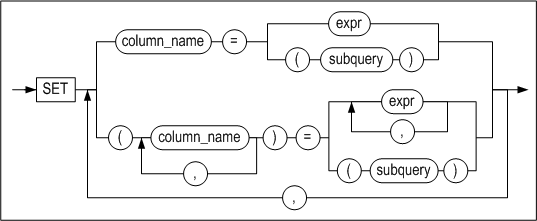


**where_clause ::=**


**limit_clause ::=**


#### Prerequisites

The SYS user, the owner of the schema containing the table, users having the UPDATE ANY TABLE system privilege, and users having the UPDATE privilege for the specified table can update values in tables using this statement.

If the user wishes to update a record of a view, the user must have the same privileges on the base tables as above.

#### Description

The UPDATE statement is used to find records that satisfy specific conditions and change the values in specified columns. 

When a partition is specified, the column values are changed for the records that satisfy the conditions and are located in the specified partition.

*user_name*

This is used to specify the name of the owner of the table containing the record(s) to be changed. If omitted, Altibase will assume that the table belongs to the schema of the user connected via the current session.

*tbl_name*

This is used to specify the name of the table containing the record(s) to be changed. 

*view_name*

This is used to specify the name of the view of which a record is to be updated.

*subquery*

This specifies the view of which a record is to be updated as a subquery

*set_clause_list*

This specifies the name and value of the column to be updated. This clause can have subqueries, and the following issues require consideration.

- subquery must return one row for each row updated. 
- The number of columns specified in the SET clause should be identical with that of the search target column. 
- If no result on the subquery is returned, NULL is updated in the column. 
- If DEFAULT is assigned in a column when using a subquery, DAFAULT attribute value is updated in the column.

*Modifying the data in a timestamp column*

When an UPDATE statement is executed on a TIMESTAMP column, the default behavior is to update the column with the system time. Therefore, if no value is specified when a TIMESTAMP column is updated, it will be updated with the system time, rather than NULL.

Another way to update a TIMESTAMP column with the system time is to use the DEFAULT keyword in the UPDATE statement.

*returning_clause*

Please refer to the returning_clause of the DELETE statement.

#### HINTS Options

For detailed information about hint options, please refer to HINTS Options in the DELETE statement.

#### Consideration

- The same column cannot be used more than once in a SET clause.
- When data corresponding to a partition key are changed such that the records containing the data need to be moved from one partition to another, it will be possible to move the data if the table attributes are set such that records can be moved between partitions, that is, if the table was created with the ENABLE ROW MOVEMENT option, or if the ENABLE ROW MOVEMENT command has been executed on the table. However, if the table attributes have not been set appropriately, an error will be raised.
- It is impossible to insert a NULL value or change a value to NULL in a column having the NOT NULL constraint.
- UPDATE can fail due to the CHECK constraint.

#### Examples

##### Updating a Column

\<Query\> Change the wage of any employees whose last name is “Davenport” to 2500.

```
iSQL> UPDATE employees
SET salary = 2500
WHERE e_lastname = 'Davenport';
1 row updated.
```

\<Query\> Increase all employees’ wages by 7%

```
iSQL> UPDATE employees
SET salary = salary * 1.07;
20 rows updated.
```


##### Updating Data using a Subquery in the WHERE Clause

\<Query\>  Subtract 50 from the quantity of all orders taken by any employee whose last name is “Hammond”.

```
iSQL> UPDATE orders
SET qty = qty - 50
WHERE eno IN(
 SELECT eno
 FROM employees
 WHERE e_lastname ='Hammond');
9 rows updated.
```


##### Updating Data in a Partitioned Table

```
iSQL> UPDATE T1 PARTITION(P1) SET I1 = 200;
```


##### Updating Data using a Subquery in the SET Clause

\<Query\> The following example shows the structure of an UPDATE statement containing two nested SELECT subqueries.

```
iSQL> CREATE TABLE bonuses
 (eno INTEGER, bonus NUMBER(10, 2) DEFAULT 100, commission NUMBER(10, 2) DEFAULT 50);
Create success.
iSQL> INSERT INTO bonuses(eno)
 (SELECT e.eno FROM employees e, orders o
 WHERE e.eno = o.eno
 GROUP BY e.eno);
3 rows inserted.
iSQL> SELECT * FROM bonuses;
BONUSES.ENO BONUSES.BONUS BONUSES.COMMISSION 
------------------------------------------------
12          100           50 
19          100           50 
20          100           50 
3 rows selected.
iSQL> UPDATE bonuses
SET eno = eno + 100, (bonus, commission) = 
 (SELECT 1.1 * AVG(bonus), 1.5 * AVG(commission) FROM bonuses)
 WHERE eno IN 
 (SELECT eno
 FROM orders
 WHERE qty >= 10000);
1 row updated.
iSQL> SELECT * FROM bonuses;
BONUSES.ENO BONUSES.BONUS BONUSES.COMMISSION 
------------------------------------------------
12          100           50 
20          100           50 
119         110           75 
3 rows selected.
```

> Note: If a subquery in a WHERE clause does not return any records, no records will be affected, whereas if a subquery in a SET clause does not return any records, the corresponding columns will be updated with NULL values.

```
iSQL> UPDATE orders
SET qty = qty - 50
WHERE eno IN(
 SELECT eno
 FROM employees
 WHERE e_lastname ='Frederick');
No rows updated.
iSQL> UPDATE employees 
SET dno = 
 (SELECT dno 
 FROM departments
 WHERE dep_location = 'Timbuktu');
20 rows updated.
iSQL> SELECT e_lastname, dno
 FROM employees
 WHERE eno = 12;
E_LASTNAME DNO 
-------------------------------
Hammond 
1 row selected.
```

\<Query\> The following example demonstrates a query execution after assigning DEFAULT to a column in SET clause in the UPDATE query statement. 

```
iSQL> CREATE TABLE EMPLOYEES (
ENO  INTEGER PRIMARY KEY,
E_LASTNAME CHAR(20) NOT NULL,
E_FIRSTNAME CHAR(20) NOT NULL,
EMP_JOB VARCHAR(15),
EMP_TEL CHAR(15),
DNO SMALLINT,
SALARY NUMBER(10,2) DEFAULT 0,
SEX CHAR(1),
BIRTH CHAR(6),
JOIN_DATE DATE,
STATUS CHAR(1) DEFAULT 'H' );
Create success.
iSQL> SELECT E_FIRSTNAME, SALARY, EMP_JOB FROM EMPLOYEES WHERE EMP_JOB = 'manager' ;
E_FIRSTNAME          SALARY       EMP_JOB
-------------------------------------------------------
Gottlieb              500         manager
Xiong                              manager
Wei-Wei               2300        manager
3 rows selected.
iSQL> UPDATE EMPLOYEES SET SALARY=DEFAULT WHERE EMP_JOB = 'manager';
3 rows updated.
iSQL> SELECT E_FIRSTNAME, SALARY, EMP_JOB FROM EMPLOYEES WHERE EMP_JOB = 'manager';
E_FIRSTNAME          SALARY       EMP_JOB
-------------------------------------------------------
Gottlieb               0           manager
Xiong                  0           manager
Wei-Wei                0           manager
3 rows selected.
```


##### Updating using the RETURNING Clause

\<Query\>  The following example returns the updated row values as output bind variables :v1, :v2.

```
iSQL> create table employees ( eno integer, ename varchar(20));
Create success.
 
iSQL> var v1 output integer;
iSQL> var v2 output varchar(30);

iSQL> insert into employees values (1, 'jake');
iSQL> insert into employees values (2, 'nikita');
iSQL> insert into employees values (3, 'dana');

iSQL> prepare update employees set ename='rachel' where eno=3 return eno, ename into :v1, :v2;
1 row updated.

iSQL> print var
[ HOST VARIABLE ]
-------------------------------------------------------
NAME                 TYPE                 VALUE
-------------------------------------------------------
V1                   INTEGER              3
V2                   VARCHAR(30)          rachel
```


##### Updating Data of a Join View 

\<Query\> eCreate a view joining the two tables, employees and departments, and update the column salary.

```
iSQL> CREATE VIEW simple_emp AS
        SELECT e.eno, e.e_lastname, e.salary, d.dname
          FROM employees e, departments d
          WHERE e.dno = d.dno;
Create success.
iSQL> select * from simple_emp;
ENO         E_LASTNAME            SALARY      DNAME
-----------------------------------------------------------------------------------
3           Kobain                2000        RESEARCH DEVELOPMENT DEPT 1
16          Chen                  2300        RESEARCH DEVELOPMENT DEPT 1
6           Momoi                 1700        RESEARCH DEVELOPMENT DEPT 2
13          Jones                 980         RESEARCH DEVELOPMENT DEPT 2
10          Bae                   4000        SOLUTION DEVELOPMENT DEPT
11          Liu                   2750        SOLUTION DEVELOPMENT DEPT
14          Miura                 2003        SOLUTION DEVELOPMENT DEPT
15          Davenport             1000        SOLUTION DEVELOPMENT DEPT
17          Fubuki                1400        QUALITY ASSURANCE DEPT
4           Foster                1800        CUSTOMERS SUPPORT DEPT
1           Moon                              PRESALES DEPT
5           Ghorbani              2500        PRESALES DEPT
8           Wang                              MARKETING DEPT
9           Diaz                  1200        MARKETING DEPT
18          Huxley                1900        MARKETING DEPT
7           Fleischer             500         BUSINESS DEPT
12          Hammond               1890        BUSINESS DEPT
19          Marquez               1800        BUSINESS DEPT
20          Blake                             BUSINESS DEPT
19 rows selected.

iSQL> UPDATE simple_emp SET salary=3000 WHERE dname='RESEARCH DEVELOPMENT DEPT 1';
2 rows updated.
```


### MOVE 

#### Syntax

**move ::=**


[where_clause ::=](#where_clause), [limit_clause
::=](#limit_clause)

**column_commalist ::=**


**expression_commalist ::=**


#### Prerequisites

In order to move table records, it is necessary to have both DELETE privileges for the table from which the records are to be moved and INSERT privileges for the table to which the records are to be moved. This is because moving data involves both inserting and deleting data. 

In order to insert records into the table specified in the INTO clause, it is necessary to be the SYS user or the owner of the schema containing the table, to have the INSERT ANY TABLE system privilege, or to have the INSERT privilege for the table.

In order to delete records from the table specified in the FROM clause, it is necessary to be the SYS user or the owner of the schema containing the table, to have the DELETE ANY TABLE system privilege, or to have the DELETE privilege for the table. 

#### Description

The MOVE statement is used to move data that satisfy certain conditions from one table to another. It is also possible to move data to a specified partition.

*hints*

The use of hints is supported with the FROM clause, and is the same as when using hints in a SELECT statement.

*source_tbl_name, target_tbl_name*

These are used to specify the names of the tables from and to which the data will be moved. They must not be views or meta tables.

*column_commalist*

This is a list of actual columns belonging to the target table.

*expression_commalist*

This is a comma-delimited list of expressions. Each expression can be a column belonging to the FROM table, a constant or an expression.

*where_clause*

The structure of the WHERE clause is the same as that in a SELECT statement.

*limit_clause*

The structure of the LIMIT clause is the same as that in a SELECT statement.

#### Considerations

- Data cannot be moved from one table to the same table. 
- When a partition is specified, a value that is inappropriate for the partition cannot be entered. 
- MOVE can fail due to the CHECK constraint.

#### Examples

\<Query\> \>Move all records that satisfy the condition (T2.I2 = 4) from columns I1 and I2 of table T2 into the corresponding columns in table T1 and delete the original records from table T2.

```
iSQL> MOVE INTO T1(I1, I2) FROM T2(I1, I2) WHERE T2.I2 = 4;
```

\<Query\> Insert records comprising columns I1, I2, and I3 from table T2 into table T1 and delete them from table T2. (Table T1 must have columns corresponding to columns I1, I2, and I3 in table T2, and must have the same number of columns, that is, three columns.)

```
iSQL> MOVE INTO T1 FROM T2(I1, I2, I3);
```


### MERGE

#### Syntax

**merge ::=**


**merge_operation_spec ::=**


**matched_update_clause ::=**


**not_matched_insert_clause::=**


**no_rows_insert_clause ::=**


#### Prerequisites

In order to use the MERGE clause, the user must have the INSERT and UPDATE object privilege on the target table and the SELECT object privilege on the source table. 

#### Description

The MERGE statement selects data from the source table and updates or inserts it into the target table. The table specified in the INTO clause is the target table and the table or view specified in the USING clause is the source table. With the ON clause, a condition to evaluate whether the target table is to be updated or inserted into can be specified. 

One MERGE statement can substitute multiple executions of DML statements such as INSERT, UPDATE, etc.

*hints*

The hint can only be specified after the MERGE keyword. The specified hint applies to INSERT or UPDATE statements.

*INTO clause*

This clause specifies the target table to be updated or inserted. Only tables are valid in the INTO clause; views cannot be included.

*USING clause*

This specifies data and INTO clause table. Table names, SELECT statements, or views can be used.

*ON clause*

INTO clause specifies the condition of the data to change or insert in the table. Depending on the condition of the ON clause, the same record can be changed many times or the same record can be inserted many times.

After the ON clause, three clauses can be used: matched_update_clause, not_matched_insert_clause, and no_rows_insert_clause. Each clause can be specified once and in any order.

*matched_update_clause*

If there is data that satisfies the condition of the ON clause, the UPDATE statement that changes the record is written. The table to be changed is omitted because it is specified in the INTO clause.

- Restriction:
  - A column referenced in the ON condition clause cannot be updated.

*not_matched_insert_clause*

This clause specifies the insertion of columns into the target table when the row satisfying the condition of the ON clause does not exist in the target table. To omit the column list following the INSERT keyword, , the number of columns in the target table must equal the number of values in the VALUES clause.

*no_rows_insert_clause*

This clause specifies the value to be inserted into the column of the target table when the row satisfying the condition of the ON clause does not exist in the source table. To omit the column list following the INSERT keyword, the number of columns in the target table must equal the number of values in the VALUES clause.

#### Examples

\<Query\> This example inserts or changes data in the TEST_MERGE table according to the condition.

The record that satisfies the condition of the ON clause in the TEST_MERGE table is changed to data in the USING clause, and a new record is inserted if it is not satisfied.

As in the condition of the ON clause, if there is a record with the sdame EMPNO column value by comparing the data of the TEST_MERGE table in the INTO clause with the USING clause, the LASTNAME column value of the record in the INTO clause TEST_MERGE table is changed. If there is no record with the same EMPNO column value, insert the data from the USING clause into the TEST_MERGE table as a new record.

```
CREATE TABLE TEST_MERGE (EMPNO INT, LASTNAME CHAR(20));
INSERT INTO TEST_MERGE VALUES(1, 'KIM');
INSERT INTO TEST_MERGE VALUES(2, 'LEE');
INSERT INTO TEST_MERGE VALUES(5, 'PARK');
INSERT INTO TEST_MERGE VALUES(4, 'CHOI');
INSERT INTO TEST_MERGE VALUES(7, 'YUN');

iSQL> SELECT * FROM TEST_MERGE WHERE EMPNO IN (1, 7, 9);
EMPNO       LASTNAME                        
-----------------------------------------------
1           KIM                             
7           YUN                             
2 rows selected.

iSQL> MERGE INTO TEST_MERGE OLD_T
USING
     (
      SELECT 1 EMPNO, 'KANG' LASTNAME FROM DUAL UNION ALL
      SELECT 7 EMPNO, 'SON' LASTNAME FROM DUAL UNION ALL
      SELECT 9 EMPNO, 'CHEON' LASTNAME FROM DUAL
     ) NEW_T
  ON OLD_T.EMPNO = NEW_T.EMPNO
 WHEN MATCHED THEN
      UPDATE SET OLD_T.LASTNAME = NEW_T.LASTNAME
 WHEN NOT MATCHED THEN
      INSERT (OLD_T.EMPNO, OLD_T.LASTNAME) VALUES(NEW_T.EMPNO, NEW_T.LASTNAME);
3 rows merged.
  
iSQL> SELECT * FROM TEST_MERGE WHERE EMPNO IN (1, 7, 9);
EMPNO       LASTNAME                        
-----------------------------------------------
1           KANG                            
7           SON                             
9           CHEON                           
3 rows selected.    
```
The records with EMPNO = 1 and EMPNO = 7 in the TEST_MERGE table have been changed to LASTNAME = 'KANG' and LASTNAME = 'SON' and EMPNO = 9 and LASTNAME = 'CHEON' have been inserted as new records.

\<Query\> The following exampl shows how to change the same record repeatedly due to misuse of the ON clause.
```
DROP TABLE TEST_MERGE;
CREATE TABLE TEST_MERGE (EMPNO INT, LASTNAME CHAR(20));
INSERT INTO TEST_MERGE VALUES(1, 'KIM');
INSERT INTO TEST_MERGE VALUES(2, 'LEE');
INSERT INTO TEST_MERGE VALUES(5, 'PARK');
INSERT INTO TEST_MERGE VALUES(4, 'CHOI');
INSERT INTO TEST_MERGE VALUES(7, 'YUN');

DROP TABLE TEST_MERGE2;
CREATE TABLE TEST_MERGE2 (EMPNO INT, LASTNAME CHAR(20));
INSERT INTO TEST_MERGE2 VALUES(8, 'JANG');
INSERT INTO TEST_MERGE2 VALUES(1, 'KIM');
INSERT INTO TEST_MERGE2 VALUES(7, 'YUN');

iSQL> SELECT * FROM TEST_MERGE;
EMPNO       LASTNAME
-------------------------------------
1           KIM
2           LEE
5           PARK
4           CHOI
7           YUN
5 rows selected.

iSQL> SELECT * FROM TEST_MERGE2;
EMPNO       LASTNAME
-------------------------------------
8           JANG
1           KIM
7           YUN
3 rows selected.

iSQL> MERGE INTO TEST_MERGE OLD_T
USING TEST_MERGE2 NEW_T
  ON OLD_T.EMPNO = NEW_T.EMPNO OR OLD_T.EMPNO = 8
 WHEN MATCHED THEN
      UPDATE SET LASTNAME = 'MATCHED'
 WHEN NOT MATCHED THEN
      INSERT VALUES( EMPNO, 'NOTMATCHED' )
 WHEN NO ROWS THEN
      INSERT VALUES( 10, 'NO ROWS' );
5 rows merged.

iSQL> SELECT * FROM TEST_MERGE;
EMPNO       LASTNAME
-------------------------------------
2           LEE
5           PARK
4           CHOI
1           MATCHED
7           MATCHED
8           MATCHED
6 rows selected.
```
A new record with EMPNO = 8 and LASTNAME = 'NOTMATCHED' was inserted into the TEST_MERGE table because it did not satisfy the condition OLD_T.EMPNO = NEW_T.EMPNO in the ON clause, and then EMPNO = 8 with the condition OLD_T.EMPNO = 8 in the ON clause. The record was changed three times with LASTNAME = 'MATCHED'.

\<Query\> The following example executes the WHEN NO ROWS THEN clause.
```
DROP TABLE TEST_MERGE;
CREATE TABLE TEST_MERGE (EMPNO INT, LASTNAME CHAR(20));
INSERT INTO TEST_MERGE VALUES(1, 'KIM');
INSERT INTO TEST_MERGE VALUES(2, 'LEE');
INSERT INTO TEST_MERGE VALUES(5, 'PARK');
INSERT INTO TEST_MERGE VALUES(4, 'CHOI');
INSERT INTO TEST_MERGE VALUES(7, 'YUN');

DROP TABLE TEST_MERGE2;
CREATE TABLE TEST_MERGE2 (EMPNO INT, LASTNAME CHAR(20));

iSQL> SELECT * FROM TEST_MERGE;
EMPNO       LASTNAME
-------------------------------------
1           KIM
2           LEE
5           PARK
4           CHOI
7           YUN
5 rows selected.

MERGE INTO TEST_MERGE OLD_T
USING TEST_MERGE2 NEW_T
ON NEW_T.EMPNO = OLD_T.EMPNO AND NEW_T.EMPNO = 10
WHEN MATCHED THEN
    UPDATE SET LASTNAME = 'MATCHED'
WHEN NOT MATCHED THEN
    INSERT VALUES( 10, 'NOTMATCHED' )
WHEN NO ROWS THEN
    INSERT VALUES( 10, 'NO ROWS' ) ;
1 row merged.

iSQL> SELECT * FROM TEST_MERGE;
EMPNO       LASTNAME                        
-----------------------------------------------
1           KIM                             
2           LEE                             
5           PARK                            
4           CHOI                            
7           YUN                             
10          NO ROWS                         
6 rows selected
```

### ENQUEUE 

#### Syntax

**enqueue ::=**


**values_clause ::=**


#### Description

This statement is used to insert a message into a queue. The structure of the ENQUEUE statement is similar to that of the INSERT statement. The names of one or more queue columns must be specified after the INTO clause. 

In most cases, a user simply enters a message to store. However, in cases where it is necessary to sort or classify messages, it is possible to additionally specify a user-defined Correlation ID for the message to be entered.

#### Example

\<Query\> \>Enter a message consisting of the text “This is a message” to message queue Q1.

```
ENQUEUE INTO Q1(message) VALUES ('This is a message');
```

\<Query\> Enter a message consisting of the text “This is a message” to message queue Q1 with Correlation ID 237.

```
ENQUEUE INTO Q1(message,corrid) VALUES ('This is a message', 237);
```


### DEQUEUE 

#### Syntax

**dequeue ::=**


**fifo_option ::=**


#### Description

The DEQUEUE statement retrieves a message that satisfies the condition in where_clause and then deletes it.

*fifo_option*

If the FIFO option is enabled, or if neither FIFO nor LIFO has been specified, the oldest message that satisfies the condition is retrieved. If the LIFO option is enabled, the newest message is retrieved.

*WAIT integer*

The DEQUEUE statement waits until a message has been added to the queue when there are no messages. The DEQUEUE waits for a period of time specified in the WAIT clause, and the time unit of standby time can be second(sec), millisecond(msec,1/1000 sec),and μsec(μsec,1/1000000 sec). The second is applied unless otherwise specified. If the stand by time is not specified, the DEQUEUE statement will be infinitively awaiting.

#### Considerations

The following should be taken into consideration when using the DEQUEUE statement:

- Only the names of columns in a queue table can be specified in queue_column_list. 
- The DEQUEUE statement has some of the characteristics of the SELECT statement. However, the name of only one queue table can be specified in the FROM clause of a DEQUEUE statement. If more than one queue table is specified, an error will be raised. 
- A subquery cannot be used in the WHERE clause of a DEQUEUE statement.

#### Example

\<Query\> Read all messages having the Correlation ID 237 from message queue Q1.

```
DEQUEUE MESSAGE, CORRID FROM Q1 WHERE CORRID=237;
```


## 5. Data Control Language

This chapter explains each of the Data Control Language (DCL) statements that are available in Altibase.

### ALTER REPLICATION 

#### Syntax

**alter_replication_dcl ::=**

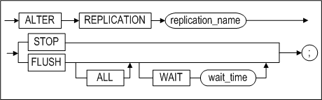

#### Description

CALTER REPLICATION controls the operation of a replication object that has been created with the CREATE REPLICATION statement. For more information about replication, please refer to the *Replication Manual.* 

*STOP*

This stops the replication.

*FLUSH*

This is used to instruct the current session to wait, for the number of seconds specified in wait_time, for the replication Sender thread to send information about changed data, up to the current log (the log at the time the FLUSH statement is executed), to the other server. 

If this is used together with the ALL option, the current session is instructed to wait until the information about changed data in the most recent log, rather than the current log, has been transferred to the other server.

#### Example

- Stop the replication object rep1. 

  \<Query\> Stop the replication.

  ```
  iSQL> ALTER REPLICATION rep1 STOP;
  Alter success.
  ```


### ALTER SESSION 

#### Syntax

**alter_session::=**


[set_transaction_clause::=](#set_transaction)

**alter_session_set_clause::=**


**replication_mode_set_clause::=**


**dblink_session_close_clause::=**


#### Description

This statement is used to change the attributes of the current session.

*alter_session_set_clause*

For more information on property_name and property_value in alter_session_set_clause, please refer to Chapter 2 of the *General Reference*, which explains all Altibase properties.

*replication_mode_set_clause*

This clause is used to set the replication mode for transactions that are executed in the current session. 

If DEFAULT is specified, replication will be performed in the mode that was selected as the default mode when the replication object was created. However, if NONE is specified, none of the DDL, DML, or DCL statements executed in the session will be replicated. 

For more detailed information on the replication mode, please refer to the *Replication Manual.*

*dblink_session \_close_clause*

When a user connects to a server, a session is created in the server. If Database Link is used in that session, a Database Link session, for use in performing Database Link-related tasks, is created in association with the session allocated to the user. When the user's session is subsequently terminated, the Database Link session is also terminated. However, if the user's session is not terminated after the Database Link operations have been performed, the Database Link session will also needlessly remain open.

In such cases, dblink_session_close_clause can be used to explicitly end the Database Link session.

*set_transaction_clause*

The SET TRANSACTION statement is used to set the current transaction as read-only or read/write, or to set its isolation level. For more information on the SET TRANSACTION statement, refer to the description section of the SET TRANSACTION statement.

#### Example

\<Query\> Close the database link session only, keeping the current session alive.

```
iSQL> ALTER SESSION CLOSE DATABASE LINK ALL;
```


### ALTER SYSTEM 

#### Syntax

**alter_system ::=**


**alter_system_set_clause ::=**


#### Description

The ALTER SYSTEM statement is used to change Altibase system properties. Only the SYS user or a user to whom the ALTER SYSTEM privilege has been granted can access the complete functionality of the ALTER SYSTEM statement.

*CHECKPOINT*

This is used to execute checkpointing.

*MEMORY COMPACT*

This is used to perform memory compaction. It is only useful on the IBM AIX platform.

*START/STOP FLUSHER integer*

This is used to start up or shut down the flusher. The flusher identifier of the integer can be viewed by querying the V$FLUSHER performance view.

*ARCHIVE LOG START/STOP*

Executing ALTER SYSTEM ARCHIVE LOG START starts the Archivelog thread, whereas ALTER SYSTEM ARCHIVE LOG STOP stops the thread. This statement can be executed only when the system is running in Archivelog mode. To determine whether the system is running in Archivelog mode, query the V\$LOG or V$ARCHIVE performance view. 

For more detailed information about Archivelog mode, please refer to Chapter 10: Backup and Recovery in the *Administrator's Manual.*

*SWITCH LOGFILE*

This statement forcibly archives log files. Even if the current log file is not full, this command instructs the database to close it and resume logging in the next log file. 

Only the sysdba can execute this statement.

*SET alter_system_set_clause*

This statement is used to change the values of database properties. For more information about these properties, please refer to the *General Reference.*

*FLUSH BUFFER_POOL*

This statement flushes all pages that are in the buffer to disk, thereby emptying the buffer.

Only the sysdba can execute this statement. It should only be executed after careful consideration. Because execution of this statement deletes all of the pages in the buffer, “buffer miss”, that is, failure to find records that are being sought in the buffer, can occur upon subsequent query execution. 

*COMPACT SQL_PLAN_CACHE*

This removes the execution plan which is not being used in the SQL plan cache.

*RESET SQL_PLAN_CACHE*

This removes the execution plan which is not being used in the SQL plan cache and initializes statistical information related to the plan cache.

*START \| STOP \| RELOAD AUDIT*

This statement starts/stops auditing or reapplies auditing conditions.

*RELOAD ACCESS LIST*

The RELOAD ACCESS LIST statement is used to update a list which permits or blocks the access of IP packet. This statement can be executed only in the administrator mode. The access list is comprised with the configured files in the ACCESS_LIST_FILE property. Refer to the ACCESS_LIST property for in-depth information.

#### Examples

\<Query\> Stop flusher 1.

```
iSQL> ALTER SYSTEM STOP FLUSHER 1;
```

\<Query\> Start the Archivelog thread in archive mode.

```
iSQL> ALTER SYSTEM ARCHIVE LOG START;
```


### AUDIT

#### Syntax

**audit ::=**


**audit_operation_clause ::=**


**by_clause ::=**


**audit_object_clause ::=**


**ddl_clause ::=**


#### Prerequisites

Only the SYS user can configure auditing conditions with this statement.

#### Description

Auditing tracks specific statements or all statements being executed on the Altibase server in real time and records their information. Auditing conditions can be configured with this statement.

*audit_operation_clause*

This specifies that auditing is to be performed on the execution of certain SQL statements on the Altibase server. 

The auditing target operation is specified in sql_statement_type of this clause. Using the comma(,), multiple operations can be specified together. The following operations can be specified for auditing:

- SELECT
- INSERT
- UPDATE
- DELETE
- MOVE
- MERGE
- ENQUEUE
- DEQUEUE
- LOCK
- EXEC or EXECUTE
- COMMIT
- ROLLBACK
- SAVEPOINT
- CONNECT
- DISCONNECT
- ALTER SESSION
- ALTER SYSTEM

ALL specifies auditing on all of the statements listed above.

*by_clause*

This specifies that auditing is to be performed on the statements that are executed by a certain user. 

*audit_object_clause*

This specifies that auditing is to be performed on certain operations being executed on certain objects on the Altibase server. 

Using the comma(,), multiple operations can be specified together. The following table shows the types of objects specifiable for auditing target operations and their auditing descriptions.

| Operation    | Object Type | Auditing Description                                         |
| ------------ | ----------- | ------------------------------------------------------------ |
| SELECT       | TABLE       | The SELECT statement being operated on the target table object. |
| INSERT       | TABLE       | The INSERT statement being operated on the target table object. |
| UPDATE       | TABLE       | The UPDATE statement being operated on the target table object. |
| DELETE       | TABLE       | The DELETE statement being operated on the target table object. |
| MOVE         | TABLE       | The MOVE statement being operated on the target table object. |
| MERGE        | TABLE       | The MERGE statement being operated on the target table object. |
| ENQUEUE      | QUEUE       | The ENQUEUE statement being operated on the target queue object. |
| DEQUEUE      | QUEUE       | The DEQUEUE statement being operated on the target queue object. |
| LOCK         | TABLE       | The LOCK statement being operated on the target table object. |
| EXEC/EXECUTE | PROCEDURE   | The statement which is executing the target procedure object. |

ALL specifies auditing of all SQL statements executable on object types; however, only the above statements are valid.

*object_name*

This specifies the name of the object which is to be an auditing target. Object types available for specification are tables, views, queues, sequences, stored procedures and stored functions. 

*ddl_clause*

This specifies auditing the execution of DDL statements on the Altibase server.

*BY ACCESS \| SESSION*

If BY ACCESS is specified, an audit log is written for every statement or operation that meets the condition. For example, if auditing is performed with BY ACCESS specified and the same SQL statement is executed ten times in the same session, then ten audit logs are written. 

If BY SESSION is specified, only one audit log is recorded in 1 prepare - n execute structure to prevent leaving duplicated logs. Also the statistics log of the most recently executed statement will be recorded at the time the statement ends.

When neither is specified, BY SESSION is the default value. 

BY ACCESS|SESSION is not supported if the audit target is CONNECT, DISCONNECT, or DDL.

*WHENEVER [NOT] SUCCESSFUL*

If WHENEVER SUCCESSFUL is specified, only successful SQL statements and operations are audited. 

If WHENEVER NOT SUCCESSFUL is specified, only unsuccessful SQL statements and operations are audited. 

On omission of this clause, Altibase performs auditing, regardless of success or failure. 

If 'BY SESSION WHENEVER SUCCESSFUL' is specified, the same SQL statements executed in a session must all succeed for an audit log of that statement to be written.

If 'BY SESSION WHENEVER NOT SUCCESSFUL' is specified, the same SQL statements executed in a session must fail, at least once, for an audit log of that statement to be written.

#### Precautions

Even if auditing conditions are configured with the AUDIT statement, new conditions are not immediately applied to database auditing. For new auditing conditions to be applied to the running server, auditing must be restarted or RELOAD must be performed for the auditing conditions with the following statements.

```
ALTER SYSTEM STOP AUDIT;
ALTER SYSTEM START AUDIT;
ALTER SYSTEM RELOAD AUDIT;
```

#### Examples

\<Query 1\>  Write logs of all occasions where the execution of INSERT, UPDATE and DELETE statements fail for the table friends of user user1.

```
iSQL> AUDIT insert, update, delete ON user1.friends BY ACCESS WHENEVER NOT
SUCCESSFUL;
```

\<Query 2\> Write audit logs, in the unit of sessions, of all occasions where the execution of DDL statements succeed for the table friends of user user1.

```
iSQL> AUDIT all ON user1.friends BY SESSION WHENEVER SUCCESSFUL;
```

\<Query 3\> Write logs, in the unit of accesses, of all unsuccessful execution of CONNECT, DISCONNECT statements on the Altibase server.

```
iSQL> AUDIT connect, disconnect WHENEVER NOT SUCCESSFUL;
Audit success.
```

\<Query 4\>  Write logs, in the unit of sessions, of all executions of INSERT statements on the Altibase server.

```
iSQL> AUDIT insert;
Audit success.
```

\<Query 5\> Write logs of all executions of DDL statements by user user1.

```
iSQL> AUDIT DDL BY user1;
Audit success.
```


### COMMIT 

#### Syntax

**commit::=**


#### Description

The COMMIT statement explicitly commits the current transaction to the database. This statement is useful when AUTOCOMMIT mode has been set to FALSE.

*WORK*

The WORK keyword ensures compliance with standard SQL.

*FORCE global_tx_id*

In an XA environment, a transaction can be forcefully committed even when it is in an “in-doubt“ state. 

global_tx_id is a character string that consists of the format identifier, the global transaction ID, and the branch qualifier of the global transaction.

#### Restriction

This statement cannot be executed in AUTOCOMMIT mode. 

#### Example

The following statement applies the result of all of the transaction's previously executed commands to the database.

```
iSQL> COMMIT;
Commit success.
```


### DELAUDIT

#### Syntax

**delaudit ::=**


**delaudit_user_clause ::=**


**delaudit_object_clause ::=**


#### Prerequisites

Only the SYS user can delete auditing conditions with this statement.

#### Description

This statement deletes auditing conditions that have been enabled to perform auditing within the Altibase server.

*delaudit_user_clause*

This deletes auditing conditions that have the specified user name among statement auditing and DDL statement auditing conditions that have been enabled with the AUDIT … BY user_name statement.

ALL

This deletes all statement auditing and DDL statement auditing conditions that have been enabled without the BY user_name clause. Object auditing conditions are not deleted.

*delaudit_object_clause*

This deletes auditing conditions that have been enabled for a particular object.

#### Precautions

When the DELAUDIT statement is executed, auditing conditions are deleted from SYS_AUDIT_OPTS_. 

If auditing has already started, this statement cannot be executed. An error occurs if the user attempts to delete auditing conditions while auditing is being performed. You should first terminate auditing with the ALTER SYSTEM STOP AUDIT statement and then delete auditing conditions.

#### Example

\<Query 1\> Delete auditing conditions for the user user1. After deletion, you can see that the auditing conditions have been deleted from SYS_AUDIT_OPTS_.

```
iSQL> DELAUDIT by user1;
Audit success.
iSQL> SELECT * from SYSTEM_.SYS_AUDIT_OPTS_;
No rows selected.
```

\<Query 2\> If auditing has already started and DELAUDIT is executed, an error occurs. After terminating auditing, you can delete auditing conditions.

```
iSQL> alter system start audit;
Alter success.
iSQL> delaudit by user1;
[ERR-313B2 : Audit has already started.]
iSQL> alter system stop audit;
Alter success.
iSQL> delaudit by user1;
Audit success.
```


### NOAUDIT

#### Syntax

**noaudit ::=**


**audit_operation_clause ::=**

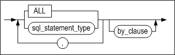

**by_clause ::=**


**audit_object_clause ::=**

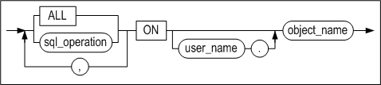

**ddl_clause ::=**


#### Prerequisites

Only the SYS user can disable auditing conditions with this statement. 

#### Description

The NOAUDIT statement is used to disable auditing conditions that were previously enabled with the AUDIT statement.

*audit_operation_clause*

This clause is used to stop the auditing of certain SQL statements. 

sql_statement_type specifies auditing of the specified operation to be stopped. For further information on auditing operations available for specification, please refer to the description section of the AUDIT statement. 

ALL is used to stop auditing of all statements previously specified with the AUDIT ALL statement.

*audit_object_clause*

This clause is used to disable the auditing condition of a certain object. 

For sql_operation, specify the type of operation for which auditing is to be stopped on the object specified in the ON clause. For further information on SQL operations available for specification, please refer to the Description section of the AUDIT statement. 

ALL is equivalent to specifying all SQL statements executable of an object type.

ddl_clause

This clause specifies auditing of DDL statements to stop.

*WHENEVER [NOT] SUCCESSFUL*

WHENEVER SUCCESSFUL specifies auditing of successful SQL statements and object operations to stop. 

WHENEVER NOT SUCCESSFUL specifies auditing of unsuccessful SQL statements and object operations to stop. 

On omission, auditing of specified statements and object operations are stopped, regardless of its success or failure.

#### Precautions

Even if an auditing condition is disabled with the NOAUDIT statement, this is not immediately applied to database auditing. For the disablement of an auditing condition to be applied to the running server, auditing must be restarted or RELOAD must be performed for the auditing conditions with the following statements.

```
ALTER SYSTEM STOP AUDIT;
ALTER SYSTEM START AUDIT;
ALTER SYSTEM RELOAD AUDIT;
```


#### Examples

\<Query 1\>  Disable auditing of successful SELECT statements on the table friends.

```
iSQL> NOAUDIT select ON friends WHENEVER SUCCESSFUL;
Audit success.
```

\<Query 2\>  Disable auditing of SELECT statements.

```
iSQL> NOAUDIT select;
Audit success.
```

\<Query 3\> Disable auditing of DDL statements.

```
iSQL> NOAUDIT DDL;
Audit success.
```


### SAVEPOINT

#### Syntax

**savepoint::=**


#### Description

This statement is used to create a savepoint, which means to temporarily save the result of transaction processing up to the current point in time. In other words, SAVEPOINT is used to explicitly define a point within a transaction to which the transaction can be rolled back. This statement is useful in non-autocommit mode, that is, when AUTOCOMMIT mode has been set to FALSE.

#### Limitation

Not available in AUTOCOMMIT mode.

#### Examples

```
iSQL> AUTOCOMMIT OFF;
Set autocommit off success.
iSQL> CREATE TABLE savept(num INTEGER);
Create success.
iSQL> INSERT INTO savept VALUES(1);
1 row inserted.
iSQL> SAVEPOINT sp1;
Savepoint success.
iSQL> INSERT INTO savept VALUES(2);
1 row inserted.
iSQL> SELECT * FROM savept;
SAVEPT.NUM 
--------------
1 
2 
2 rows selected.
```

The transaction is rolled back to the time point at which the savepoint sp1 was defined.

```
iSQL> ROLLBACK TO SAVEPOINT sp1;
Rollback success.
iSQL> SELECT * FROM savept;
SAVEPT.NUM 
--------------
1 
1 row selected.
iSQL> COMMIT;
Commit success.
```


### ROLLBACK 

#### Syntax

**rollback ::=**


#### Description

*ROLLBACK (TO SAVEPOINT)*

This statement is used to roll back the current transaction, either partially (to a previously defined savepoint) or completely.

*FORCE global_tx_id*

In an XA environment, this option is used to forcefully roll back a transaction that is in an “in-doubt“ state. 

global_tx_id is a character string that consists of the format identifier, the global transaction ID, and the branch qualifier of the global transaction.

#### Precaution

This statement cannot be used in AUTOCOMMIT mode.

#### Example

```
iSQL> AUTOCOMMIT OFF;
Set autocommit off success.
iSQL> UPDATE employees SET salary = 2300 WHERE eno = 3;
1 row updated.
iSQL> SAVEPOINT emp3_sal;
Savepoint success.
iSQL> DELETE FROM employees WHERE eno = 19;
1 row deleted.
iSQL> SAVEPOINT emp19_ret;
Savepoint success.
iSQL> INSERT INTO employees(eno, e_lastname, e_firstname, salary, sex) VALUES(21, 'Templeton', 'Kimmie', 3000, 'F');
1 row inserted.
iSQL> SAVEPOINT emp21_join;
Savepoint success.
iSQL> UPDATE employees SET salary = 2200 WHERE eno=18;
1 row updated.
iSQL> SELECT eno, e_lastname, e_firstname, salary FROM employees WHERE eno in (3, 18, 19, 21);
ENO         E_LASTNAME            E_FIRSTNAME           SALARY
-------------------------------------------------------------------------
3           Kobain                Ken                   2300
18          Huxley                John                  2200
21          Templeton             Kimmie                3000
3 rows selected.
```

The transaction is rolled back to the time point at which the savepoint emp21_join was defined.

```
iSQL> ROLLBACK TO SAVEPOINT emp21_join;
Rollback success.
iSQL> SELECT eno, e_lastname, e_firstname, salary FROM employees WHERE eno in (3, 18, 19, 21);
ENO         E_LASTNAME            E_FIRSTNAME           SALARY
-------------------------------------------------------------------------
3           Kobain                Ken                   2300
18          Huxley                John                  1900
21          Templeton             Kimmie                3000
3 rows selected.
```

The transaction is rolled back to the time point at which the savepoint emp19_ret was defined.

```
iSQL> ROLLBACK TO SAVEPOINT emp19_ret;
Rollback success.
iSQL> SELECT eno, e_lastname, e_firstname, salary FROM employees WHERE eno in (3, 18, 19, 21);
ENO         E_LASTNAME            E_FIRSTNAME           SALARY
-------------------------------------------------------------------------
3           Kobain                Ken                   2300
18          Huxley                John                  1900
2 rows selected.
```

All of the changes made by the first UPDATE statement, the first DELETE statement and the last DML statement (the second INSERT statement) are committed. All of the other SQL DML statements were rolled back before the COMMIT statement was executed, and are thus lost. Additionally, the emp21_join savepoint is no longer available.

```
iSQL> ROLLBACK TO SAVEPOINT emp21_join;
[ERR-11016 : Savepoint not found]
iSQL> INSERT INTO employees(eno, e_lastname, e_firstname, sex, join_date) VALUES(22, 'Chow', 'May', 'F', TO_DATE('2011-11-19 00:00:00', 'YYYY-MM-DD HH:MI:SS'));
1 row inserted.
iSQL> COMMIT;
Commit success.
iSQL> SELECT eno, e_lastname, e_firstname, salary FROM employees;
ENO         E_LASTNAME            E_FIRSTNAME           SALARY
-------------------------------------------------------------------------
1           Moon                  Chan-seung
2           Davenport             Susan                 1500
4           Foster                Aaron                 1800
5           Ghorbani              Farhad                2500
6           Momoi                 Ryu                   1700
7           Fleischer             Gottlieb              500
8           Wang                  Xiong
9           Diaz                  Curtis                1200
10          Bae                   Elizabeth             4000
11          Liu                   Zhen                  2750
12          Hammond               Sandra                1890
13          Jones                 Mitch                 980
14          Miura                 Yuu                   2003
15          Davenport             Jason                 1000
16          Chen                  Wei-Wei               2300
17          Fubuki                Takahiro              1400
18          Huxley                John                  1900
20          Blake                 William
3           Kobain                Ken                   2300
22          Chow                  May                   0
20 rows selected.
iSQL> COMMIT;
Commit success.
```


### SET TRANSACTION 

#### Syntax

<a name="set_transaction"><a/>

**set_transaction ::=**

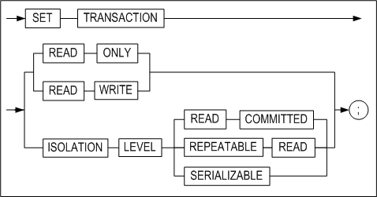

#### Description

The SET TRANSACTION statement is used to set the current transaction as read-only or read/write, or to set its isolation level. 

Setting the isolation level to READ COMMITTED or SERIALIZABLE combines a row-level access method with a method of maintaining multiple versions of records, thereby realizing excellent data consistency, concurrency, and performance. 

The changes made using the SET TRANSACTION statement affect only the current transaction, not other users or other transactions. 

The isolation level can be set to any of the three levels described below.

*READ COMMITTED*

This isolation level allows data within a table that have been changed by a committed transaction to be read, while also allowing other transactions to read the previous version of data that will be changed by a transaction that has not been committed. READ COMMITED is the default Altibase transaction isolation level.

*REPEATABLE READ*

Because a read transaction maintains a shared lock on the data it retrieves until the transaction is complete, other transactions are prevented from changing these data. Locking records in this way guarantees that when a value is repeatedly retrieved, it will always be the same as the first time it was read. However, it is possible that other transactions will generate new records that satisfy the search conditions while such a lock is held. These records will be found on subsequent searches by the read transaction holding the lock, even though they were not found on the original search. This phenomenon is known as “Phantom Reads“.

*SERIALIZABLE*

This is the highest isolation level. This isolation level avoids locking all data when some records are retrieved using a SELECT statement with a ranged WHERE clause, but rather locks all data having key values that fall within the range of the data being read. This has the effect of preventing the “phantom reads” phenomenon and guaranteeing transaction isolation.

#### Considerations

This statement cannot be used when the current mode is AUTOCOMMIT mode. 

This statement cannot be used if there are any active transactions.

#### Examples

```
iSQL> AUTOCOMMIT OFF;
Set autocommit off success.

iSQL> SET TRANSACTION ISOLATION LEVEL READ COMMITTED;
Command execute success.

iSQL> SET TRANSACTION ISOLATION LEVEL REPEATABLE READ;
Command execute success.

```


| Transaction A                                                | Time Point | Transaction B                                                |
| ------------------------------------------------------------ | ---------- | ------------------------------------------------------------ |
| iSQL\> AUTOCOMMIT OFF; Set autocommit off success.           |            | iSQL\> AUTOCOMMIT OFF; Set autocommit off success.           |
| iSQL\> SET TRANSACTION READ ONLY; Command execute success.   | 1          |                                                              |
| iSQL\> SELECT e_last name FROM employees WHERE eno = 20; E_LASTNAME ------------------------ Blake 1 row selected. | 2          |                                                              |
|                                                              | 3          | iSQL\> UPDATE employees SET e_lastname = 'Jung' WHERE eno = 20; 1 row updated. |
| iSQL\> SELECT e_lastname FROM employees WHERE eno = 20; E_LASTNAME ------------------------ Blake 1 row selected. | 4          |                                                              |
|                                                              | 5          | iSQL\> commit; Commit success.                               |
| iSQL\> SELECT e_lastname FROM employees WHERE eno = 20; E_LASTNAME ------------------------ Jung 1 row selected. | 6          |                                                              |


## 6. Set Operators 

This chapter explains the set operators that can be used in SQL statements in Altibase.

### UNION

#### Syntax

```
SELECT statement1 UNION SELECT statement2
```

#### Description

This operator is used to output all of the results of two query statements. Note that overlapping results, that is, results common to both queries, as well as duplicate results within each query, will be output only once.

#### Example

\<Query\>  Display the employee number of every employee who was born in 1980 or later and/or took an order for 100 or fewer items. Remove duplicate employee numbers.

```
iSQL> SELECT eno
     FROM employees
     WHERE birth > '800101'
     UNION
     SELECT eno
     FROM orders
     WHERE qty < 100;
ENO
--------------
4
7
8
12
13
15
20
7 rows selected.
```


### UNION ALL

#### Syntax

```
SELECT statement1 UNION ALL SELECT statement2
```

#### Description

This operator is used to output all of the results of two query statements. Note that overlapping results, that is, results common to both queries, are output without removing any duplicates.

#### Example

\<Query\> Display the employee number of all employees born in 1980 or later, as well as the employee number associated with all orders for 100 or fewer items. Do not remove any duplicate employee numbers.

```
iSQL> SELECT eno
     FROM employees
     WHERE birth > '800101'
     UNION ALL
     SELECT eno
     FROM orders
     WHERE qty < 100;
ENO
--------------
4
7
8
12
13
15
12
20
20
9 rows selected.
```


### INTERSECT

#### Syntax

```
SELECT *statement1* **INTERSECT** SELECT *statement2*
```

#### Description

The INTERSECT operator is used to output only records that are common to two queries, that is, records that are retrieved by both queries.

#### Example

\<Query\> Display a list of all items in the goods table that have been ordered at least once.

```
iSQL> SELECT gno FROM goods 
INTERSECT 
SELECT gno FROM orders;
GNO
--------------
.
.
.
```


### MINUS

#### Syntax

```
SELECT statement1 MINUS SELECT statement2
```

#### Description

The MINUS operator is used to output the result of the first search except the second.

#### Example

\<Query\> Display the product number of all products that have never been ordered.

```
iSQL> SELECT gno FROM goods
MINUS
SELECT gno FROM orders;
GNO         
--------------
.
.
.
```


### Order of Operations

The Order of Operations, also known as Operator Precedence, is the order in which the database evaluates the different operators in an expression. When an expression containing multiple operators is evaluated, operators having higher precedence are evaluated before those having lower precedence. Operators having equal precedence are evaluated in the order in which they appear in an expression, i.e. from left to right.

#### Description

The SQL operators are listed in the following table in decreasing order of operator precedence. Parentheses can be used within an expression to override operator precedence.

| Precedence Level | Operator                 |
| ---------------- | ------------------------ |
| 1                | All comparison operators |
| 2                | NOT                      |
| 3                | AND                      |
| 4                | OR                       |

#### Examples

\<Query\>  Display the name, position, and wage of engineers who earn more than 1850 dollars per month, as well as the name, position, and wage of all salespersons, regardless of their salary.

```
iSQL> SELECT e_firstname, e_lastname, emp_job, salary
FROM employees
WHERE emp_job = 'sales rep'
  OR emp_job = 'engineer'
  AND salary >= 1850;
E_FIRSTNAME           E_LASTNAME            EMP_JOB          SALARY
------------------------------------------------------------------------------
Ken                   Kobain                engineer         2000
Sandra                Hammond               sales rep        1890
Alvar                 Marquez               sales rep        1800
William               Blake                 sales rep
4 rows selected.
```

\<Query\>  Display the name, position, and wage of all salespersons who earn more than 1850 dollars per month and all engineers who earn more than 1850 dollars per month.

```
iSQL> SELECT e_firstname, e_lastname, emp_job, salary
FROM employees
WHERE (emp_job = 'sales rep'
  OR emp_job = 'engineer')
  AND salary >= 1850;
E_FIRSTNAME           E_LASTNAME            EMP_JOB          SALARY
------------------------------------------------------------------------------
Ken                   Kobain                engineer         2000
Sandra                Hammond               sales rep        1890
2 rows selected.
```


## 7. SQL Functions

--------

### Introduction to SQL Functions

SQL functions are built into Altibase, and are available for use in various SQL statements. In addition to the built-in SQL functions, it is also possible for the user to define stored functions. For more detailed information, please refer to the *Stored Procedures Manual.*

 If a SQL function is called and an argument having a data type other than the data type expected by the SQL function is provided, then Altibase attempts to convert the argument to the expected data type before executing the SQL function. If an argument having a NULL value is provided when calling a SQL function, then the SQL function returns NULL. 

This section lists the SQL functions that are supported in Altibase and explains how they are classified.

#### Classifying SQL Functions

SQL functions can be broadly classified into the categories set forth in the following table.

| Category                              | Description and Functions                                    |
| ------------------------------------- | :----------------------------------------------------------- |
| Aggregate functions                   | The aggregate functions return a single value as a result of processing multiple rows. They can be used in select_list, ORDER BY, and HAVING clauses.<br />**The aggregate functions**<br/>AVG, CORR, COUNT, COVAR_POP, COVAR_SAMP, CUME_DIST, FIRST, GROUP_CONCAT, LAST, LISTAGG, MAX, MIN, PERCENTILE_CONT, PERCENTILE_DISC, PERCENT_RANK, RANK, STATS_ONE_WAY_ANOVA, STDDEV, STDDEV_POP, STDDEV_SAMP, SUM, VARIANCE, VAR_POP, VAR_SAMP |
| Window functions (Analytic Functions) | The window functions calculate aggregate values based on groups of rows. The groups of rows that window functions operate on are defined by the PARTITION BY and the ROWS/RANGE subclause nested in the OVER clause. <br />**Aggregate Window Functions**<br/>AVG, CORR, COUNT, COVAR_POP, COVAR_SAMP, LISTAGG, MAX, MIN, PERCENTILE_CONT, PERCENTILE_DISC, RATIO_TO_REPORT, STDDEV, SUM, VARIANCE, GROUP_CONCAT <br />**Ranking Window Functions**<br/>RANK, DENSE_RANK, ROW_NUMBER, LAG, LEAD,NTILE, FIRST, LAST <br /><br />**Row Order-related Window Functions**<br/>FIRST_VALUE, LAST_VALUE, NTH_VALUE |
| Numeric Functions                     | The numeric function performs a task on a input numerical value and return a numeric value. <br />ABS, ACOS, ASIN, ATAN, ATAN2, CEIL, COS, COSH, EXP, FLOOR, ISNUMERIC, LN, LOG, MOD, NUMAND, NUMOR, NUMSHIFT, NUMXOR, POWER, RAND, RANDOM, ROUND, SIGN, SIN, SINH, SQRT, TAN, TANH, TRUNC, BITAND, BITOR, BITXOR, BITNOT |
| Character Functions                   | These functions perform a task on an input string and return either a string or a numeric value. <br />**Functions that Return Strings**<br/>CHR, CHOSUNG, CONCAT, DIGITS, INITCAP, LOWER, LPAD, LTRIM, NCHR, PKCS7PAD16, PKCS7UNPAD16, RANDOM_STRING, REGEXP_COUNT, REGEXP_REPLACE, REPLICATE, REPLACE2, REVERSE_STR, RPAD, RTRIM, STUFF, SUBSTRB(SUBSTRING), TRANSLATE, TRIM, UPPER <br />**Functions that Return Numeric Values**<br/>ASCII, CHAR_LENGTH(CHARACTER_LENGTH,LENGTH), DIGEST,INSTR(POSITION, INSTRB), OCTET_LENGTH(LENGTHB), REGEXP_INSTR, REGEXP_SUBSTR, SIZEOF |
| Date Functions                        | These functions perform a task on an input date/time value and return a character string, a numerical value, or a date/time value. <br />ADD_MONTHS, DATEADD, DATEDIFF, DATENAME, EXTRACT(DATEPART), LAST_DAY, MONTHS_BETWEEN, NEXT_DAY, SESSION_TIMEZONE, SYSDATE, SYSTIMESTAMP, UNIX_DATE, UNIX_TIMESTAMP, CURRENT_DATE, CURRENT_TIMESTAMP, DB_TIMEZONE, CONV_TIMEZONE |
| Conversion Functions                  | These functions convert an input character, numeric or date/time value and return a character, numeric or date/time value. <br />ASCIISTR, BIN_TO_NUM, CONVERT, DATE_TO_UNIX, HEX_ENCODE, HEX_DECODE, HEX_TO_NUM, OCT_TO_NUM, RAW_TO_FLOAT, RAW_TO_INTEGER, RAW_TO_NUMERIC, RAW_TO_VARCHAR, TO_BIN, TO_CHAR(datetime), TO_CHAR(number), TO_DATE, TO_HEX, TO_INTERVAL, TO_NCHAR(character), TO_NCHAR(datetime), TO_NCHAR(number), TO_NUMBER, TO_OCT, TO_RAW, UNISTR, TO_RAW, UNIX_TO_DATE |
| Encryption Functions                  | These functions are used to perform DES encryption and decryption on strings. <br />AESDECRYPT, AESENCRYPT, DESENCRYPT, DESDECRYPT, TDESDECRYPT/TRIPLE_DESDECRYPT, TDESENCRYPT/TRIPLE_DESENCRYPT |
| Other Functions                       | BASE64_DECODE, BASE64_DECODE_STR, BASE64_ENCODE, BASE64_ENCODE_STR, BINARY_LENGTH, CASE2, CASE WHEN, COALESCE, DECODE, DIGEST, DUMP, EMPTY_BLOB, EMPTY_CLOB, GREATEST, GROUPING, GROUPING_ID, HOST_NAME, LEAST, LNNVL, MSG_CREATE_QUEUE, MSG_DROP_QUEUE, MSG_SND_QUEUE, MSG_RCV_QUEUE, NULLIF, NVL, NVL2, QUOTE_PRINTABLE_DECODE, QUOTE_PRINTABLE_ENCODE, RAW_CONCAT, RAW_SIZEOF, ROWNUM, SENDMSG, USER_ID, USER_NAME, SESSION_ID, SUBRAW, SYS_CONNECT_BY_PATH, SYS_GUID_STR, USER_LOCK_REQUEST, USER_LOCK_RELEASE, SYS_CONTEXT 등 |

### Aggregate Functions

Aggregate functions process multiple rows and return a single resultant value. Aggregate functions can be used in the SELECT list and in the ORDER BY and HAVING clauses. 

If a SELECT statement contains a GROUP BY clause, then only constants, aggregate functions, the expressions in the GROUP BY clause, and expressions that are based on the foregoing can be specified in the SELECT list.

#### AVG

##### Syntax

```
AVG ( [ALL | DISTINCT] expression)
```


##### Description

This function calculates the average of the input expressions. NULL values are excluded from the calculation. The function returns a FLOAT type value.

##### Example

\<Query\>  Calculate and display the average price in the goods table.

```
iSQL> SELECT AVG(price) FROM goods;
AVG(PRICE)  
--------------
30406.173   
1 row selected.
```


#### CORR

##### Syntax 

```
CORR (expr1, expr2) OVER {...}
```


##### Description

This function calculates the coefficient of correlation of inserted expr1 and expr2. The result would be greater than or equal to -1 , and smaller than or equal to 1. As the result goes nearer to 0, the coefficient of correlation would be smaller, however, if it gets closer to +1, the coefficient of correlation would be much deeper. The return type is DOUBLE, and variables should be calculated by converting with DOUBLE.

The CORR function can be used as an aggregate functions and an analytic function.

##### Example

\<Query\> Calculate the coefficient of correlation between the employee number and salary.

```
iSQL> SELECT CORR(ENO,SALARY) FROM employees;
CORR(ENO,SALARY)
-------------------------
-0.02180715597157
1 row selected.
```


#### COUNT

##### Syntax

```
COUNT ( [ * | [ALL | DISTINCT] expression ] )
```


##### Description

COUNT returns the number of rows returned by the query. NULL values are not counted.

##### Examples

\<Query\>  Display the number of records in the employees table.

```
iSQL> SELECT COUNT(*) Rec_count FROM employees;
REC_COUNT            
-----------------------
20                   
1 row selected.
```

\<Query\> Display the number of birthday tables in the table employees.

```
iSQL> SELECT COUNT(birth) Rec_count 
    FROM employees;
REC_COUNT            
-----------------------
13                   
1 row selected.
```


#### COVAR_SAMP

##### Syntax 

```
COVAR_SAMP (expr1, expr2) OVER {...}
```


##### Description

Calculate the sample covariance of inserted expr1 and expr2. If an input value rises along with another value, the result would be positive numbers, but if another value falls while the input value rises, the result would be negative numbers. The return type is DOUBLE, and variables should be calculated by converting the variables with DOUBLE.

The COVAR_SAMP function can be used as an aggregate a function and analytic function.

##### Example

\<Query\> Calculate the sample voariance of employees number and salary.

```
iSQL> SELECT COVAR_SAMP(ENO,SALARY) FROM employees;
COVAR_SAMP(ENO,SALARY)
-------------------------
-95.0698529411784
1 row selected.
```


#### COVAR_POP

##### Syntax

```
COVAR_POP (expr1, expr2) OVER {...}
```


##### Description

This function is used to calculate the population covariance of inserted expr1 and expr2. If an input value rises along with another value, the result would be positive numbers, but if another value falls while the input value rises, the result would be negative numbers. The return type is DOUBLE, and variables should be calculated by converting the variables with DOUBLE. 

The COVAR_POP function can be used as an aggregate function and an analytic function.

##### Example

\<Query\> Calculate the population covariance of the employee number and salary

```
iSQL> SELECT COVAR_POP(ENO,SALARY) FROM employees;
COVAR_POP(ENO,SALARY)
-------------------------
-89.4775086505208
1 row selected.
```


#### CUME_DIST

##### Syntax

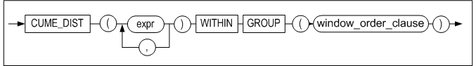

[window_order_clause::=](#window_order_clause)

##### Description

The CUME_DIST function calculates the accumulative distribution of a group of values that are lined up based on a result set (or partitions) in particular. The return value is greater than 0 or less than 1.

> Note: The number of arguments in the CUME_DIST and that of the WITHIN GROUP clause should be corresponding one another, but the argument type is not automatically compatible. Also, the data type of CUME_DIST argument is not restricted; however, using a constant is recommended.

##### Example

\<Query\> Confirm the accumulative distribution of SALARY by using the CUME_DIST function.

```
iSQL> select SALARY from EMPLOYEES ORDER BY 1;
SALARY
--------------
500
980
1000
1200
1400
1500
1700
1800
1800
1890
1900
2000
2003
2300
2500
2750
4000
...
20 rows selected. 

iSQL>  select cume_dist(1500) within group (order by SALARY ) from EMPLOYEES ;
CUME_DIST(1500) within group (order by SAL
---------------------------------------------
0.333333333333333
1 row selected.
```


#### FIRST

##### Syntax


##### Description

This function aggregates only the first part of the data sorted by ORDER BY clause. The functions corresponding to aggregation_function are MIN, MAX, SUM, AVG, COUNT, VARIANCE, and STDDEV.

##### Example

\<Query\>  Find the employee number and salary of the employee who receives the most salary by department from the employee table. 

```
iSQL> SELECT dno, MAX(eno) KEEP(DENSE_RANK FIRST ORDER BY salary desc) as empno, MAX(salary) AS max_sal
        FROM EMPLOYEES
        GROUP BY dno;
DNO          EMPNO          MAX_SAL
-----------------------------------------
1001         16              2300
1002         6               1700
1003         10              4000
2001         17              1400
3001         4               1800
3002         1               2500
4001         8               1900
4002         20              1090
              2               1500
9 row selected.
```


#### GROUP_CONCAT

##### Syntax

```
GROUP_CONCAT (expr1 [, arg1])
```


##### Description

GROUP_CONCAT returns a character string of concatenated, non-NULL, expr1 values for each group. 

arg1: The separator. On omission, the separator is not inserted in the character string.

##### Example

\<Query\>  Return a character string that concatenates the last names of the employees for each department. 

```
iSQL> SELECT dno, CAST(GROUP_CONCAT(e_lastname, '|') AS VARCHAR (100)) AS names FROM employees GROUP BY dno;
DNO
--------------
NAMES
--------------------------------------------------------------------------------------------------------
1001
Kobain              |Chen                
1002
Momoi               |Jones               
1003
Bae                 |Liu                 |Miura               |Davenport           
2001
Fubuki              
3001
Foster              
3002
Moon                |Ghorbani            
4001
Wang                |Diaz                |Huxley              
4002
Fleischer           |Hammond             |Marquez             |Blake               

Davenport           
9 rows selected.
```


#### LAST

##### Syntax

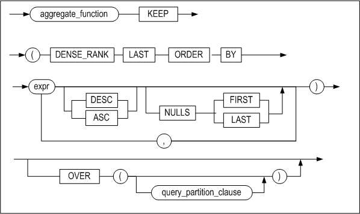

##### Description

This function aggregates only the last part of the data sorted by the ORDER BY clause. The functions corresponding to aggregation_function are MIN, MAX, SUM, AVG, COUNT, VARIANCE, and STDDEV. 

##### Example

\<Query\> Find the employee number and salary of the employee who receives the least amount of salary by department from the employee table.

```
iSQL> SELECT dno, MIN(eno) KEEP(DENSE_RANK LAST ORDER BY salary desc) as empno, MIN(salary) AS min_sal
        FROM EMPLOYEES
        GROUP BY dno;
DNO          EMPNO          MIN_SAL
-----------------------------------------
1001         3               2300
1002         13              1700
1003         15              4000
2001         17              1400
3001         4               1800
3002         5               2500
4001         9               1900
4002         7               1090
              2               1500
9 row selected.
```


#### MAX

##### Syntax

```
MAX ([ALL | DISTINCT] expression)
```


##### Description

MAX returns the greatest value of expr from among the input values. 

##### Example

\<Query\> Display the highest price in the table goods.

```
iSQL> SELECT MAX(price) FROM goods;
MAX(PRICE)  
--------------
100000      
1 row selected.
```


#### MIN

##### Syntax

```
MIN ([ALL | DISTINCT] expression)
```


##### Description

MIN returns the lowest value of expr from among the input values.

##### Example

\<Query\> Display the lowest price in the table goods.

```
iSQL> SELECT MIN(price) FROM goods;
MIN(PRICE)  
--------------
966.99      
1 row selected.
```


#### PERCENT_RANK

##### Syntax


[window_order_clause::=](#window_order_clause)

##### Description

The PERCENT_RANK function determines the percentage rank based upon results sets(or partitions). The range of values returned by this function is 0 to 1.

> Note: The number of arguments in the PERCENT_RANK and WITHIN GROUP should be corresponding, but the argument type is not automatically compatible.

##### Example

\<Query\> Display the percentage rank of employees with department number (DNO) 1003 and salary (SALARY) 1000.

```
iSQL> select  DNO, SALARY from EMPLOYEES ORDER BY 1,2;
DNO         SALARY
---------------------------
1001        2000
1001        2300
1002        980
1002        1700
1003        1000
1003        2003
1003        2750
1003        4000
2001        1400
3001        1800
3002        2500
3002
4001        1200
4001        1900
4001
4002        500
4002        1800
4002        1890
4002
            1500
20 rows selected.
iSQL> select percent_rank(1003,1000) within group (order by DNO, SALARY ) from EMPLOYEES ;
RNK
-------------------------
0.2
1 row selected.
```


#### STATS_ONE_WAY_ANOVA

##### Syntax 


##### Description

STATS_ONE_WAY_ANOVA is a one-way ANOVA function that returns the value for the third argument in the FLOAT data type. 

This function takes three arguments and returns a value in SIG if the third argument is omitted. expr1 groups the data and expr2 contains the values of expr1.

The following table describes the third argument.

<table>
<tbody>
<tr>
<th>
<p>Return Value</p>
</th>
<th>
<p>Description</p>
</th>
</tr>
<tr>
<td>
<p>SIG</p>
</td>
<td>
<p>Significance</p>
</td>
</tr>
<tr>
<td>
<p>F_RATIO</p>
</td>
<td>
<p>(Mean squares within groups / mean squared between groups) </p>
</td>
</tr>
<tr>
<td>
<p>MEAN_SQUARES_WITHIN<br /> (MSW)</p>
</td>
<td>
<p>Mean squares within groups</p>
</td>
</tr>
<tr>
<td>
<p>MEAN_SQUARES_BETWEEN<br /> (MSB)</p>
</td>
<td>
<p>Mean squares between groups </p>
</td>
</tr>
<tr>
<td>
<p>DF_WITHIN(DFW)</p>
</td>
<td>
<p>Degree of freedom within groups/p>
</td>
</tr>
<tr>
<td>
<p>DF_BETWEEN(DFB)</p>
</td>
<td>
<p>Degree of freedom between groups</p>
</td>
</tr>
<tr>
<td>
<p>SUM_SQUARES_WITHIN<br /> (SSW)</p>
</td>
<td>
<p>Sum of squares within groups</p>
</td>
</tr>
<tr>
<td>
<p>SUM_SQUARES_BETWEEN<br /> (SSB)</p>
</td>
<td>
<p>Sum of squares between groups</p>
</td>
</tr>
</tbody>
</table>


##### Example

```
iSQL> select * from t3;
        ID      VALUE
---------- ----------
         1          1
         1          2
         1          3
         2          3
         2          4

iSQL> select stats_one_way_anova(id, value, 'SUM_SQUARES_BETWEEN') SSB, 
            stats_one_way_anova(id, value, 'SUM_SQUARES_WITHIN') SSW,
            stats_one_way_anova(id, value, 'DF_BETWEEN') DFB, 
            stats_one_way_anova(id, value, 'DF_WITHIN') DFW, 
            stats_one_way_anova(id, value, 'MEAN_SQUARES_BETWEEN') MSB, 
            stats_one_way_anova(id, value, 'MEAN_SQUARES_WITHIN') MSW, 
            stats_one_way_anova(id, value, 'F_RATIO') F, 
            stats_one_way_anova(id, value, 'SIG') P_VALUE  from t3;
       SSB        SSW        DFB        DFW        MSB        MSW          F    P_VALUE
---------- ---------- ---------- ---------- ---------- ---------- ---------- ----------
       2.7        2.5          1          3        2.7 .833333333       3.24 .169679927
```


#### STDDEV

##### Syntax

```
STDDEV ([ALL | DISTINCT] expression)
```


##### Description

STDDEV returns the standard deviation of the input expressions.

Because error can accumulate when using system calls to perform repeated operations on real numbers, the return value may have some amount of inherent tolerance (error).

##### Example

\<Query\>  Calculate the standard deviation of the wages in the employees table.

```
iSQL> SELECT STDDEV(salary) standard_deviation 
  FROM employees;
STANDARD_DEVIATION
-------------------------
797.706786762566
1 row selected.
```


#### STDDEV_POP

##### Syntax

```
STDDEV_POP (expression)
```


##### Description

The STDDEV_POP returns the standard deviation of all rows which are not NULL of input expression. 

NULL is returned when the number of row is less than 1 which is not NULL. There might be an error in the return value due to accumulation of repetitive computing error by a system call.

##### Example

\<Query\> Calculate the standard deviation of wages in the employees table.

```
iSQL> SELECT STDDEV_POP(salary) FROM employees;
STDDEV_POP(SALARY)
-------------------------
773.889256492736
1 row selected.
```


#### STDDEV_SAMP

##### Syntax

```
STDDEV_SAMP ([ALL | DISTINCT] expression)
```


##### Description

The STDDEV_SAMP returns the sample standard deviation of all rows which are not NULL of input expression. 

NULL is returned when the number of row, which is not NULL, is less than 2. 

There might be an error in the return value due to the accumulaion of repetitive computing error by a system call.

##### Example

\<Query\>  Calculate the sample standard deviation of wages in the table employees.

```
iSQL> SELECT STDDEV_SAMP(salary) FROM employees;
STDDEV_SAMP(SALARY)
-------------------------
797.706786762566
1 row selected.
```


#### SUM

##### Syntax

```
SUM ([ALL | DISTINCT] expression)
```


##### Description

SUM returns the result of addition of the input expressions.

##### Example

\<Query\>  Calculate the total number of items stored using the table goods.

```
iSQL> SELECT SUM(stock) FROM goods;
SUM(STOCK)           
-----------------------
379420               
1 row selected.
```


#### VARIANCE

##### Syntax

```
VARIANCE ([ALL | DISTINCT] expression)
```


##### Description

VARIANCE returns the variance of the input expressions.

Because error can accumulate when using system calls to perform repeated operations on real numbers, the return value may have some amount of inherent tolerance (error).

##### Example

\<Query\> Calculate the variance of the wages in the table employees.

```
iSQL> SELECT VARIANCE(salary) variance 
  FROM employees;
VARIANCE
-------------------------
636336.117647059
```


#### VAR_POP

##### Syntax

```
VAR_POP (expression)
```


##### Description

The VAR_POP returns population variance of all rows which are not NULL of input expression. 

NULL is returned when the number of row is less than 1. 

There might be an error in the return value due to accumulation of repetitive computing error by a system call.

##### Example

\<Query\> Calculate the population standard deviation of wages in the table employees

```
iSQL> SELECT VAR_POP(salary) FROM employees;
VAR_POP(SALARY)
-------------------------
598904.581314879
1 row selected.
```


#### VAR_SAMP

##### Syntax

```
VAR_SAMP (expression)
```


##### Description

The VAR_SAMP returns the sample variance of all rows which are not NULL of input expression.

NULL is returned when the number of row is less than 2. 

There might be an error in the return value due to accumulation of repetitive computing error by a system call

##### Example

\<Query\> Calculate the sample standard deviation of wages in the table employees.

```
iSQL> SELECT VAR_SAMP(salary) FROM employees;
VAR_SAMP(SALARY)
-------------------------
636336.117647059
row selected.
```


### Window (Analytic) Functions

Commonly known as analytic functions, window functions(ANSI/ISO SQL standard uses the term window functions) calculate aggregate values based on groups of rows. Window functions(or analytic functions) are similar to regular aggregate functions in the sense that they operate on multiple numbers of rows or groups of rows within result sets returned by queries. However, the groups of rows that window functions operate on are defined by the PARTITION BY and the ROWS/RANGE subclause nested in the OVER clause, rather than by the GROUP BY clause. Order within these groups is also decided by the ORDER BY subclause nested in the OVER clause, rather than by the ORDER BY clause of the main query.

In this section, the group divided by the PARTITION BY subclause will be called a “partition”, and the group divided by the ROWS/RANGE subclause will be called a “window”.

Altibase version 6.3.1 onwards supports the following window functions:

-   Aggregate window functions: AVG, COUNT, MAX, MIN, STDDEV, SUM, VARIANCE,
    GROUP_CONCAT, RATIO_TO_REPORT

-   Ranking window functions: RANK, DENSE_RANK, ROW_NUMBER, LAG, LEAD, NTILE

-   Row order-related window functions: FIRST_VALUE, LAST_VALUE, NTH_VALUE

Aggregate window functions execute the calculation of the sum or average of the column values within a partition. Altibase supports the use of all aggregate functions listed in the “Aggregate Function” section as window functions (except CUME_DIST, PERCENT_RANK). Aggregate functions generally return one result row per group; when used as window functions, however, values are returned per row.

Ranking window functions return the order value of each row within a partition. Functions of this type require the ORDER BY subclause nested in the OVER clause. 

Functions associated with row order search for the first or last value within an ordered partition set or the preceding or following value within a particular set. 

Descriptions on other functions other than aggregate functions are provided in the following section.

#### Syntax

**window_function ::=**


**window_specification ::=**

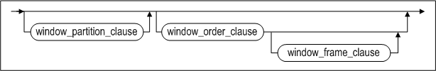

**window_partition_clause ::=**

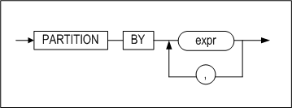

<a name="window_order_clause"><a/>

**window_order_clause ::=**


**window_frame_clause ::=**


#### Description

Analytic functions can only appear in a SELECT list or in an ORDER BY clause. 

The steps taken when processing queries containing analytic functions are as follows:

-   Step 1: The query is processed, with the exception of any window functions and the ORDER BY clause (if present). 
-   Step 2: If any window functions contain the PARTITION BY subclause, the query results of Step 1 are divided into partitions on which the window functions are to be executed. 
-   Step 3: If an ORDER BY expression is present, the results are ordered for each of the partitions. 
-   Step 4: If the ROWS/RANGE clause is present, the window frame is decided. 
-   Step 5: The window functions are executed. 
-   Step 6: If an ORDER BY clause is present, it is processed.

*window_function*

This specifies the name for the function to be used as a window function.

*arg_expr*

This specifies expressions to be used as arguments for the window function.

*IGNORE NULLS*

When this function is used, it will return the values excluding NULL values.

*OVER window_specificatoin*

OVER is a keyword that instructs the query processor that this function will operate on a queried result set. 

Window functions that include this clause can be specified by the SELECT list or the ORDER BY clause. 

For all window functions used in the select list of a query, the OVER clause follows. The OVER clause decides how to divide and order a result set for window function execution. After the OVER keyword, the following three subclauses that specify division and sort policies may follow:

*window_partition_clause*

This clause specifies one or more expressions or columns as the criteria for merging queried result sets into groups (partitions). All window functions support this clause; its use is optional. On omission, window functions process the overall result set as one partition.

If aggregate-related functions use this clause in the absence of the ORDER BY subclause, the DISTINCT keyword can be used as a function argument.

*window_order_clause*

This clause specifies one or more expressions or columns as the criterion for ordering data within a partition. The use of this clause is optional for aggregate functions; for ranking functions, however, its use is mandatory.

For aggregate-related functions, the DISTINCT keyword cannot be used as a function argument with this clause.

With the NULLS FIRST or NULLS LAST keyword, the window_order_clause can be used to position NULL at the beginning or end of the order.

*window_frame_clause*

This clause defines a row-based window (a set of physical or logical rows) on which functions are to be operated; functions apply to all rows within the window. A window traverses queried result sets or partitions from top to bottom.

ROWS specifies a window based on the number of rows and RANGE specifies a window based on row values. Refer to the following examples:

-   RANGE BETWEEN 50 PRECEDING AND 150 FOLLOWING  
    All rows corresponding to (current row value - 50) and (current row value + 150) within the partition are defined as a window.
    
-   ROWS BETWEEN 1 PRECEDING AND 1 FOLLOWING  
    The row preceding the current row and the row following it within the partition are included in the definition of a window
    
-   RANGE UNBOUNDED PRECEDING  
    The current row up to the first row within the partition are defined as a window.

-   ROWS BETWEEN UNBOUNDED PRECEDING AND UNBOUNDED FOLLOWING  
    The first row down to the last row within the partition are defined as a window.

Ranking-related functions cannot use this clause; its use is optional for aggregate-related functions. For row ranking-related functions, its use is optional - however, it would be pointless to execute the function without using this clause.

The ORDER BY subclause is mandatory in order to specify this clause. If this clause is included, the DISTINCT keyword cannot be used as a window function argument. 

If ROWS/RANGE clauses are not specified while using window functions that support ROWS/RANGE clauses, the default value is 'RANGE BETWEEN UNBOUNDED PRECEDING AND CURRENT ROW'. 

Only positive integers are accepted for value; expressions are not accepted. 

If a DATE type expression is used in an ORDER BY subclause of a window function, the following forms can come at value of the RANGE clause:

```
INTERVAL n [YEAR | MONTH | DAY | HOUR | MINUTE | SECOND]
```


#### DENSE_RANK

##### Syntax

```
DENSE_RANK () OVER {...}
```


##### Description

Like the RANK function, this function assigns rankings based on a certain members of a result set or partition. However, DENSE_RANK does not leave a gap in the sequence after the occurrence of duplicate values. The return value type is BIGINT.

#### FIRST_VALUE

##### Syntax

```
FIRST_VALUE (expr) OVER {...}
```


##### Description

This function obtains the value of the first row within a partition or window.

##### Limitations

-   The DISTINCT keyword cannot be used as the function argument. 
-   The OVER clause is mandatory.

#### FIRST_VALUE_IGNORE_NULLS

##### Syntax

```
FIRST_VALUE_IGNORE_NULLS (expr) OVER {...}
```


##### Description

This function obtains the value of the first row excluding NULL values within a partition or window.

##### Limitations

Same as the FIRST_VALUE function.

#### LAG

##### Syntax

```
LAG (expr [, offset [, default_value]]) OVER {...}
```


##### Description

This function obtains the value of the row at the given physical offset preceding the current row within each ordered partition. Only positive integers are accepted for *offset*; on omission, the default value is 1. For rows that exceed the specified *offset* within the partition, default_value is applied. On *default_value* omission, the default value is NULL.

##### Limitation

-   The DISTINCT keyword cannot be used as a function argument. 
-   The ORDER BY subclause must be present within the OVER clause. 
-   Only positive integers are accepted for *offset*

#### LAG_IGNORE_NULLS

##### Syntax

```
LAG_IGNORE_NULLS (expr [, offset [, default_value]]) OVER {...}
```


##### Description

This function obtains the first value (excluding NULL) of the row at the given physical *offset* preceding the current row within each ordered partition. Only positive integers are accepted for offset; on omission, the default value is 1. For rows that exceed the specified offset within the partition, *default_value* is applied. On *default_value* omission, the default value is NULL.

##### Limitation

Same as the LAG function.

#### LAST_VALUE

##### Syntax

```
LAST_VALUE (expr) OVER {...}
```


##### Description

This function obtains the value of the last row within a partition or window.

##### Limitations

-   The DISTINCT keyword cannot be used as a function argument. 
-   The OVER clause is mandatory.

#### LAST_VALUE_IGNORE_NULLS

##### Syntax

```
LAST_VALUE_IGNORE_NULLS (expr) OVER {...}
```


##### Description

This function obtains the value of the last row excluding NULL values within a partition or window.

##### Limitation

Same as the LAST_VALUE function.

#### LEAD

##### Syntax

```
LEAD (expr [, offset [, default_value]]) OVER {...}
```


##### Description

This function obtains the value of the row at the given physical *offset* following the current row within each ordered partition. Only positive integers are accepted for offset ; on omission, the default value is 1. For rows that exceed the specified offset, *default_ value* is applied. On *default_value* omission, the default value is NULL.

##### Limitations

-   The DISTINCT keyword cannot be used as a function argument. 
-   The ORDER BY subclause must be present within the OVER clause. 
-   Only positive integers are accepted for offset.

#### LEAD_IGNORE_NULLS

##### Syntax

```
LEAD_IGNORE_NULLS (expr [, offset [, default_value]]) OVER {...}
```


##### Description

This function obtains the first value (excluding NULL) of the row at the given physical offset following the current row within each ordered partition. Only positive integers are accepted for offset ; on omission, the default value is 1. For rows that exceed the specified *offset*, *default_ value* is applied. On *default_value* omission, the default value is NULL.

##### Limitation

Same as the LEAD function

#### LISTAGG

##### Syntax


##### Description

LISTAGG converts column values that correspond to *exp* as a column, in the order specified for *order_by_clause. arg* separates the returned string; on omission, the string is not separated. 

LISTAGG can be used as aggregate and analytic functions. 

##### Example

\<Query\> The following example uses LISTAGG as an aggregate function. Print name from table emp, grouped by empno, in the order of job. Separate each name with a semicolon(;). 

```
iSQL> select empno, cast(listagg(name,';') within group( order by job) as varchar(100)) "emp_job"
    from emp group by empno;  

EMPNO       
--------------
emp_job                                                                                               
emp_job                                                                                               
--------------------------------------------------------------------------------------------------------
10          
king                                                                                                  
20          
jun;jake                                                                                              
30          
hong;key;ward                                                                                         
40          
kuku;adams;cris;ford                                                                                  
50          
yoon;poo;blake;smith;poul                                                                             
60          
rin;jones;woo;miller;kim;martin                                                                       
6 rows selected.

```

\<Query\> The following example uses LISTAGG as an analytic function. Print name from the table emp, in the order of job. Separate each name with a semicolon(;). 

```
iSQL> select empno, cast(listagg(name,';') within group( order by job) 
    over ( partition by empno ) as varchar(100)) "emp_job"
    from emp; 

EMPNO       
--------------
emp_job                                                                                               
--------------------------------------------------------------------------------------------------------
10          
king                                                                                                  
20          
jun;jake                                                                                              
20          
jun;jake                                                                                              
30          
hong;key;ward                                                                                         
30          
hong;key;ward                                                                                         
30          
hong;key;ward                                                                                         
40          
kuku;adams;cris;ford                                                                                  
40          
kuku;adams;cris;ford                                                                                  
40          
kuku;adams;cris;ford                                                                                  
40          
kuku;adams;cris;ford                                                                                  
50          
yoon;poo;blake;smith;poul                                                                             
50          
yoon;poo;blake;smith;poul                                                                             
50          
yoon;poo;blake;smith;poul                                                                             
50          
yoon;poo;blake;smith;poul                                                                             
50          
yoon;poo;blake;smith;poul                                                                             
60          
rin;jones;woo;miller;kim;martin                                                                       
60          
rin;jones;woo;miller;kim;martin                                                                       
60          
rin;jones;woo;miller;kim;martin                                                                       
60          
rin;jones;woo;miller;kim;martin                                                                       
60          
rin;jones;woo;miller;kim;martin                                                                       
60          
rin;jones;woo;miller;kim;martin                                                                       
21 rows selected.

```


#### NTH_VALUE

##### Syntax

```
NTH_VALUE (expr, offset) OVER {...}
```


##### Description

This function obtains the value of the row at the given physical *offset* within a partition or window.

##### Limitations

-   The DISTINCT keyword cannot be used as a function argument.
-   The OVER clause is mandatory.

#### NTH_VALUE_IGNORE_NULLS

##### Syntax

```
NTH_VALUE_IGNORE_NULLS (expr, offset) OVER {...}
```


##### Description

This function obtains the value of the row at the given physical *offset* excluding NULL values within a partition or window.

##### Limitations

Same as the NTH_VALUE function. 

#### NTILE

##### Syntax


[window_partition_clause::=](#window_partition_clause)

##### Description

The NTILE function determines the group order by equally dividing the number of *expr* inserted based upon particular buckets in an sorted data. The return value is BIGNT.

##### Example

\<Query\> Equally divide the sorted salary into 3 groups and verify the group order.

```
iSQL> select E_FIRSTNAME, SALARY, NTILE(3) OVER(ORDER BY SALARY)  FROM EMPLOYEES;
E_FIRSTNAME           SALARY      NTILE(3)OVER(ORDERBYSALARY)
------------------------------------------------------------------
Gottlieb              500         1
Mitch                 980         1
Jason                 1000        1
Curtis                1200        1
Takahiro              1400        1
Susan                 1500        1
Ryu                   1700        1
Aaron                 1800        2
Alvar                 1800        2
Sandra                1890        2
John                  1900        2
Ken                   2000        2
Yuu                   2003        2
Wei-Wei               2300        2
Farhad                2500        3
Zhen                  2750        3
Elizabeth             4000        3
Chan-seung                        3
Xiong                             3
William                           3
20 rows selected.
```


#### PERCENTILE_CONT

##### Syntax 


##### Description 

PERCENTILE_CONT is an inverse distribution function based on a continuous distribution model, which sorts values and returns a value corresponding to the specified percentile value. This function returns a FLOAT data type and ignores nulls. 

*expr1* is a constant between 0 and 1; *expr1* cannot be a NUMERIC data type. 

PERCENTILE_CONT can be used as aggregate and analytic functions. 

##### Examples

\<Query\> The following example uses PERCENTILE_CONT as an aggregate function. Print the median salary for *empno* from the table *emp*.

```
iSQL> select empno, 
 percentile_cont(0.5) within group (order by sal asc) "median asc cont",
 percentile_cont(0.5) within group (order by sal desc) "median desc cont"
 from emp
 group by empno;
EMPNO median asc cont median desc cont 
--------------------------------------------------------------
10 1000 1000 
20 1225 1225 
30 1300 1300 
40 1850 1850 
50 1600 1600 
60 1375 1375 
6 rows selected.
```

\<Query\> The following example uses PERCENTILE_CONT as an analytic function. 

```
iSQL> select empno, 
 percentile_cont(0.5) within group (order by sal asc) 
 over ( partition by empno ) "median asc cont",
 percentile_cont(0.5) within group (order by sal desc) 
 over ( partition by empno ) "median desc cont"
 from emp;
EMPNO median asc cont median desc cont 
--------------------------------------------------------------
10 1000 1000 
20 1225 1225 
20 1225 1225 
30 1300 1300 
30 1300 1300 
30 1300 1300 
40 1850 1850 
40 1850 1850 
40 1850 1850 
40 1850 1850 
50 1600 1600 
50 1600 1600 
50 1600 1600 
50 1600 1600 
50 1600 1600 
60 1375 1375 
60 1375 1375 
60 1375 1375 
60 1375 1375 
60 1375 1375 
60 1375 1375 
21 rows selected.
```


#### PERCENTILE_DISC

##### Syntax 


##### Description

PERCENTILE_DISC is an inverse distribution function based on a discrete distribution model, which sorts values and returns a value corresponding to the specified percentile value. This function returns a FLOAT data type and ignores nulls. 

*expr1* is a constant between 0 and 1; *expr1* cannot be a NUMERIC data type. 

PERCENTILE_DISC can be used as aggregate and analytic functions. 

##### Examples

\<Query\> The following example uses PERCENTILE_DISC as an aggregate function. Print the median salary for *empno* from the table *emp*. Whereas PERCENTILE_CONT returns the average of two middle values for an even number of groups, PERCENTILE_DISC returns the first of the two middle values.

```
iSQL> select empno, 
 percentile_disc(0.5) within group (order by sal asc) "median asc cont",
 percentile_disc(0.5) within group (order by sal desc) "median desc cont"
 from emp 
 group by empno; 
EMPNO median asc cont median desc cont 
----------------------------------------------------------
10 1000 1000 
20 1200 1250 
30 1300 1300 
40 1500 2200 
50 1600 1600 
60 1250 1500 
6 rows selected.
```

\<Query\> The following example uses PERCENTILE_DISC as an analytic function.

```
iSQL> select empno, 
 percentile_disc(0.5) within group (order by sal asc) 
 over ( partition by empno ) "median asc cont",
 percentile_disc(0.5) within group (order by sal desc) 
 over ( partition by empno ) "median desc cont"
 from emp;
EMPNO median asc cont median desc cont 
----------------------------------------------------------
10 1000 1000 
20 1200 1250 
20 1200 1250 
30 1300 1300 
30 1300 1300 
30 1300 1300 
40 1500 2200 
40 1500 2200 
40 1500 2200 
40 1500 2200 
50 1600 1600 
50 1600 1600 
50 1600 1600 
50 1600 1600 
50 1600 1600 
60 1250 1500 
60 1250 1500 
60 1250 1500 
60 1250 1500 
60 1250 1500 
60 1250 1500 
21 rows selected.
```


#### RANK

##### Syntax


[window_order_clause::=](#window_order_clause)

##### Description

The RANK function calculates and determines the ranking based upon particular members of a result set or partitions. The identical values are equally ranked. To that extent, raking is skipped, then the following rank is determined. The type of return value is BIGINT. Also, the RANK function can be used as an aggregate and analytical functions.

> Note : The number of arguments of RANK and that of the WITHIN GROUP should be identical, and the type of arguments are not compatible each other. Even though there is no restriction on the data type of RANK argument; however, a constant is not suggested for using. 

##### Example

\<Query\> Display the rank of the employees with DNO of 1003 and SALARY of 1001.

```
iSQL> select DNO, SALARY from EMPLOYEES ORDER BY 1,2;
DNO         SALARY
---------------------------
1001        2000
1001        2300
1002        980
1002        1700
1003        1000
1003        2003
1003        2750
1003        4000
2001        1400
3001        1800
3002        2500
3002
4001        1200
4001        1900
4001
4002        500
4002        1800
4002        1890
4002
            1500
20 rows selected.
iSQL> select rank(1003,1001) within group (order by DNO, SALARY ) from EMPLOYEES ;
RNK
-----------------------
6
1 row selected.
```


#### RATIO_TO_REPORT

##### Syntax


[window_partition_clause::=](#window_partition_clause)

##### Description

The RATIO_TO_REPORT function calculates the ratio of expr inserted based upon particular buckets of partitions. If null is inserted, the null is returned, and if the window_partition_clause statement is omitted, the ratio is calculated based on all the returning rows.

##### Example

\<Query\> Confirm the ratio of employee salary in each department.

```
iSQL> select E_FIRSTNAME, DNO, SALARY, RATIO_TO_REPORT(SALARY) OVER (PARTITION BY DNO) AS Result from EMPLOYEES LIMIT 9;
E_FIRSTNAME           DNO         SALARY      RESULT
---------------------------------------------------------------
Ken                   1001        2000        0.465116279
Wei-Wei               1001        2300        0.534883721
Ryu                   1002        1700        0.634328358
Mitch                 1002        980         0.365671642
Elizabeth             1003        4000        0.410130216
Zhen                  1003        2750        0.281964524
Yuu                   1003        2003        0.205372706
Jason                 1003        1000        0.102532554
Takahiro              2001        1400        1
9 rows selected.
```


#### ROW_NUMBER

##### Syntax

```
ROW_NUMBER () OVER {...}
```


##### Description

The ROW_NUMBER function sequentially assigns unique numbers based on the members of a result set or partition. The numbers are assigned starting from 1 in the order determined by the ORDER BY expression. 

If duplicate values exist in the result set, the order in which the row numbers are assigned to the duplicate values cannot be guaranteed. If there is a need to guarantee the order in which the row numbers are assigned, use an ORDER BY clause that references some other column. The return value type is BIGINT.

##### Examples

\<Query\> Rank the employees in each department by salary in decreasing order.

```
iSQL(sysdba)> SELECT e_lastname, dno, salary, RANK() OVER (PARTITION BY dno ORDER BY salary DESC) FROM employees;
E_LASTNAME            DNO         SALARY      RANK
------------------------------------------------------------------------
Chen                  1001        2300        1
Kobain                1001        2000        2
Momoi                 1002        1700        1
.
.
.
Hammond               4002        1890        1
Marquez               4002        1800        2
Fleischer             4002        500         3
Blake                 4002                    4
Davenport                         1500        1
20 rows selected.
```

\<Query\>  This example illustrates the differences in the output of the RANK, DENSE_RANK, and ROW_NUMBER functions. 

```
iSQL(sysdba)> SELECT salary, 
 RANK() OVER (ORDER BY salary DESC), 
 DENSE_RANK() OVER (ORDER BY salary DESC), 
 ROW_NUMBER() OVER (ORDER BY salary DESC) 
 FROM employees;
SALARY      RANK                 DENSE_RANK           ROW_NUMBER
---------------------------------------------------------------------------
4000        1                    1                    1
2750        2                    2                    2
2500        3                    3                    3
2300        4                    4                    4
2003        5                    5                    5
2000        6                    6                    6
1900        7                    7                    7
1890        8                    8                    8
1800        9                    9                    9
1800        9                    9                    10
1700        11                   10                   11
1500        12                   11                   12
1400        13                   12                   13
1200        14                   13                   14
1000        15                   14                   15
980         16                   15                   16
500         17                   16                   17
            18                   17                   18
            18                   17                   19
            18                   17                   20
20 rows selected.
```

\<Query\> Output each employee's salary as a percentage of the maximum salary in the employee's department.

```
iSQL(sysdba)> SELECT e_lastname, dno, salary, 
 ROUND(salary/MAX(salary) OVER (PARTITION BY dno)*100) rel_sal 
 FROM employees;
E_LASTNAME            DNO         SALARY      REL_SAL
---------------------------------------------------------------
Kobain                1001        2000        87
Chen                  1001        2300        100
.
.
.
Diaz                  4001        1200        63
Fleischer             4002        500         26
Marquez               4002        1800        95
Blake                 4002
Hammond               4002        1890        100
Davenport                         1500        100
20 rows selected.
```

\<Query\> The following example obtains the lowest salary, highest salary and 3rd lowest salary by gender using FIRST_VALUE, LAST_VALUE, NTH_VALUE functions.

```
iSQL> select sex, salary, 
       FIRST_VALUE( salary ) OVER ( PARTITION BY sex ORDER BY salary ROWS BETWEEN UNBOUNDED PRECEDING AND UNBOUNDED FOLLOWING ) F_VALUE,
       LAST_VALUE( salary ) OVER ( PARTITION BY sex ORDER BY salary ROWS BETWEEN UNBOUNDED PRECEDING AND UNBOUNDED FOLLOWING ) L_VALUE,
       NTH_VALUE( salary, 3 ) OVER ( PARTITION BY sex ORDER BY salary ROWS BETWEEN UNBOUNDED PRECEDING AND UNBOUNDED FOLLOWING ) N_VALUE
    from employees;
SEX  SALARY      F_VALUE     L_VALUE     N_VALUE     
-----------------------------------------------------------
F  1500        1500        4000        2300        
F  1890        1500        4000        2300        
F  2300        1500        4000        2300        
F  4000        1500        4000        2300        
M  500          500                        1000        
M  980          500                        1000        
M  1000        500                        1000        
M  1200        500                        1000        
M  1400        500                        1000        
M  1700        500                        1000        
M  1800        500                        1000        
M  1800        500                        1000        
M  1900        500                        1000        
M  2000        500                        1000        
M  2003        500                        1000        
M  2500        500                        1000        
M  2750        500                        1000        
M                 500                        1000        
M                 500                        1000        
M                 500                        1000        
20 rows selected.
```

\<Query\> The following example uses LAG, LEAD functions.

```
iSQL(sysdba) > SELECT salary, 
       RANK() OVER (ORDER BY salary DESC), 
       DENSE_RANK() OVER (ORDER BY salary DESC), 
       ROW_NUMBER() OVER (ORDER BY salary DESC), 
       LAG( salary ) OVER (ORDER BY salary DESC) LAG,
       LEAD( salary ) OVER (ORDER BY salary DESC) LEAD
       FROM employees;
SALARY      RANK                 DENSE_RANK           ROW_NUMBER           LAG         LEAD        
----------------------------------------------------------------------------------------------------------
4000        1                    1                    1                                    2750        
2750        2                    2                    2                    4000        2500        
2500        3                    3                    3                    2750        2300        
2300        4                    4                    4                    2500        2003        
2003        5                    5                    5                    2300        2000        
2000        6                    6                    6                    2003        1900        
1900        7                    7                    7                    2000        1890        
1890        8                    8                    8                    1900        1800        
1800        9                    9                    9                    1890        1800        
1800        9                    9                    10                  1800        1700        
1700        11                 10                   11                  1800        1500        
1500        12                 11                   12                  1700        1400        
1400        13                 12                   13                   1500        1200        
1200        14                 13                   14                   1400        1000        
1000        15                 14                   15                   1200        980         
980          16                 15                   16                   1000        500         
500          17                 16                   17                   980                     
                18                 17                   18                   500                     
                18                 17                   19                                           
                18                 17                   20                                           
20 rows selected.
```


### Numeric Functions

Numeric functions accept numeric input values as parameters, perform operations on them, and return numeric values.

#### ABS

##### Syntax

```
ABS (number)
```


##### Description

ABS returns the absolute value of the input number.

##### Examples

\<Query\> Display the absolute values for three numeric values.

```
iSQL> SELECT ABS(-1), ABS(0.0), ABS(1) FROM dual;
ABS(-1)     ABS(0.0)    ABS(1)      
----------------------------------------
1           0           1           
1 row selected.
```

Calculate the difference between the most expensive item and the most inexpensive item in the goods table.

```
iSQL> SELECT ABS(MIN(price) - MAX(price)) absolute_value FROM goods;
ABSOLUTE_VALUE 
-----------------
99033.01    
1 row selected.
```


#### ACOS

##### Syntax

```
ACOS (number)
```


##### Description

ACOS returns the arccosine of the input argument, which must be within the range from -1 to 1 inclusive. If the input value does not fall within this range, 0.000000 is returned. The function returns a DOUBLE type value in radians within the range from 0 to π(pi). 

*1 radian = 180º/pi*

##### Example

\<Query\>

```
iSQL> SELECT ACOS(.3) Arc_Cosine FROM dual;
ARC_COSINE  
--------------
1.2661036727795
1 row selected.
```


#### ASIN

##### Syntax

```
ASIN (number)
```


##### Description

ASIN returns the arcsine of the input argument, which must be within the range from -1 to 1 inclusive. If the input value does not fall within this range, 0.000000 is returned. The function returns a DOUBLE type numeric value in radians within the range from -π/2 to π/2 inclusive.

##### Example

\<Query\>

```
iSQL> SELECT ASIN(.3) Arc_Sine FROM dual;
ARC_SINE    
--------------
0.304692654015398
1 row selected.
```


#### ATAN

##### Syntax

```
ATAN (number)
```


##### Description

ATAN returns the arc tangent of the input argument, which can be any real number. The function returns a DOUBLE type numeric value in radians within the range from -π/2 to π/2 inclusive.

##### Example

\<Query\>

```
iSQL> SELECT ATAN(.3) Arc_Tangent FROM dual;
ARC_TANGENT 
--------------
0.291456794477867
1 row selected.
```


#### ATAN2

##### Example

```
ATAN2 (n, m)
```


##### Description

ATAN2 returns the arc tangent of two input arguments, which can be any real number. The function returns a DOUBLE type numeric value in radians within the range from -π (exclusive) to π (inclusive).

##### Example

\<Query\>

```
iSQL> SELECT ATAN2(.3, .2) Arc_Tangent2 FROM dual;
ARC_TANGENT2 
---------------
0.982793723247329
1 row selected.
```


#### CEIL

##### Syntax

```
CEIL (number)
```


##### Description

CEIL returns the smallest integer that is greater than or equal to n.

##### Example

\<Query\> Return the smallest integer that is greater than or equal to each of the input numbers.

```
iSQL> SELECT CEIL(99.9), CEIL(-99.9) FROM dual;
CEIL(99.9)  CEIL(-99.9) 
---------------------------
100         -99         
1 row selected.
```

\<Query\> Calculate the difference between the most expensive item and the most inexpensive item in the table goods, and return the smallest integer that is greater than or equal to this difference.

```
iSQL> SELECT CEIL(ABS (MIN(price) - MAX(price))) Smallest_int FROM goods;
SMALLEST_INT 
---------------
99034       
1 row selected.
```

#### COS

##### Syntax

**COS** (*number*)

##### Description

COS is a trigonometric function that returns the cosine, expressed in radians, of an input floating-point number, also expressed in radians. The return type is DOUBLE.

##### Example

\<Query\>

```
iSQL> SELECT COS(180 * 3.14159265359/180) Cos_of_180_degrees FROM dual;
COS_OF_180_DEGREES 
---------------------
-1          
1 row selected.
```


#### COSH

##### Syntax

```
COSH (number)
```


##### Description

COSH returns the hyperbolic cosine of the input number. The return type is DOUBLE.

*COSH(n) = ( e n + e -n )/2*

##### Example

\<Query\>

```
iSQL> SELECT COSH(0) FROM dual;
COSH(0)     
--------------
1           
1 row selected.
```


#### EXP

##### Syntax

```
EXP (n)
```


##### Description

EXP returns the mathematical constant e to the power of the input number. (e = 2.71828183…) The return type is DOUBLE.

##### Example

\<Query\>

```
iSQL> SELECT EXP(2.4) FROM dual;
EXP(2.4)    
--------------
11.0231763806416
1 row selected.
```


#### FLOOR

##### Syntax

```
FLOOR (number)
```


##### Description

FLOOR returns the greatest integer that is less than or equal to n. 

##### Examples

\<Query\> Return the greatest integer that is less than or equal to each of the input numbers.

```
iSQL> SELECT FLOOR(99.9), FLOOR(-99.9) FROM dual;
FLOOR(99.9) FLOOR(-99.9) 
----------------------------
99          -100        
1 row selected.
```

\<Query\> Calculate the difference between the most expensive item and the most inexpensive item in the table goods, and return the greatest integer that is less than or equal to this difference.

```
iSQL> SELECT FLOOR(ABS(MIN(price) - MAX(price))) Largest_int FROM goods;
LARGEST_INT 
--------------
99033       
1 row selected.
```


#### ISNUMERIC

##### Syntax

```
ISNUMERIC (expr)
```


##### Description

This function evaluates whether or not the input expression is a valid numeric data type. If it is valid, 1 is returned; if it is invalid, 0 is returned.

##### Example

\<Query\> Evaluate whether or not the input data '1.4' is a valid numeric data type.

```
iSQL> select isnumeric('1.4') from dual;
ISNUMERIC('1.4')
-------------------
1
1 row selected.
```


#### LN

##### Syntax

```
LN (n)
```


##### Description

LN returns the natural logarithm of n, which must be greater than 0.

##### Example

\<Query\>

```
iSQL> SELECT LN(2.4) FROM dual;
LN(2.4)     
--------------
0.8754687373539
1 row selected.
```


#### LOG

##### Syntax

```
LOG (m, n)
```


##### Description

LOG returns the logarithm of n to base m. The base m can be any positive value other than 0 or 1, and n can be any positive value

##### Example

\<Query\>

```
iSQL> SELECT LOG(10, 100) FROM dual;
LOG(10, 100) 
---------------
2           
1 row selected.
```


#### MOD

##### Syntax

```
MOD (m, n)
```


##### Description

MOD returns the remainder of division of m by n. If n is 0, a division by zero error is raised.

##### Examples

\<Query\> Find the remainder of division of 10 by 3.

```
iSQL> SELECT MOD(10, 3) FROM dual;
MOD(10, 3)  
--------------
1           
1 row selected.
```

\<Query\> Add up all salaries, divide the total by the lowest salary, and output the remainder.

```
iSQL> SELECT MOD(SUM(salary), MIN(salary)) Remainder FROM employees;
REMAINDER   
--------------
223000      
1 row selected.
```


#### NUMAND

##### Syntax

```
NUMAND (bigint_a, bigint_b)
```


##### Description

This function returns the result of the bitwise AND operation of bigint_a and bigint_a as the result of BIGINT type.

##### Example

\<Query\>

```
iSQL> SELECT NUMAND( 3, 5 ) FROM DUAL;
NUMAND( 3, 5 )       
-----------------------
1                    
1 row selected.
```


#### NUMOR

##### Syntax

```
NUMOR (bigint_a, bigint_b)
```


##### Description

This function returns the result of bitwise OR operation of bigint_a and bigint_a as the result of BIGINT type.

##### Example

\<Query\>

```
iSQL> SELECT NUMOR( 3, 5 ) FROM DUAL;
NUMOR( 3, 5 )       
-----------------------
7                    
1 row selected.
```


#### NUMSHIFT

##### Syntax

```
NUMSHIFT (bigint, n)
```


##### Description

This function returns the result of shifting bigint rightward n times to the result of BIGINT type.

##### Example

\<Query\>

```
iSQL> SELECT NUMSHIFT( 3, -5 ) FROM DUAL;
NUMSHIFT( 3, -5 )       
-----------------------
96                    
1 row selected.
```


#### NUMXOR

##### Syntax

```
NUMXOR (bigint_a, bigint_b)
```


##### Description

This function returns the result of bitwise XOR operation of bigint_a and bigint_a as the result of BIGINT type.

##### Example

\<Query\>

```
iSQL> SELECT NUMXOR( 3, 5 ) FROM DUAL;
NUMXOR( 3, 5 )       
-----------------------
6                    
1 row selected.
```


#### POWER

##### Syntax

```
POWER (m, n)
```


##### Description

POWER returns m, the base, raised to the power of n, the exponent. The base m and the exponent n can be any real numbers, but if the base is negative, then the exponent must be an integer.

##### Example

\<Query\>

```
iSQL> SELECT POWER(3, 2) FROM dual;
POWER(3, 2) 
--------------
9           
1 row selected.
```


#### RAND

##### Syntax

```
RAND ()
```


##### Description

The RAND function returns a DOUBLE type value by generating arbitrary numbers ranging between less than 1 and greater than 0.

##### Example

\<Query\>

```
iSQL> SELECT RAND() FROM dual;
RAND
-------------------------
0.981041718735602
1 row selected.
```


#### RANDOM

##### Syntax

```
RANDOM (number)
```


##### Description

RANDOM returns a pseudorandom integer value. The range of possible return values is from 0 to the maximum value of the INTEGER type, that is, 2,147,483,647. 

If n is set to a nonzero number, that number will be used as the random seed value, on the basis of which a pseudorandom integer will be returned. If the RANDOM function is repeatedly called with the same nonzero seed value, the same value will be repeatedly returned. Set n to zero to prevent the same value from being repeatedly returned.

##### Examples

\<Query\> Retrieve a random number without specifying a seed value.

```
iSQL> SELECT RANDOM(0) FROM dual;
RANDOM(0)   
--------------
16838       
1 row selected.
```

\<Query\> Retrieve a random number using a seed value.

```
iSQL> SELECT RANDOM(100) FROM dual;
RANDOM(100) 
--------------
12662       
1 row selected.
```


#### ROUND

##### Syntax

```
ROUND ( n1 [ , n2 ] )
```


##### Description

ROUND returns n1 rounded to n2 places to the right of the decimal point. If n2 is omitted, then n1 is rounded to 0 (zero) decimal places. n2 can also be set to a negative number, in which case n1 will be rounded off n2 places to the left of the decimal point.

##### Example

\<Query\> Return the results of the ROUND function on each of the two following expressions: ROUND(123.9994, 3), ROUND(123.9995, 3)

```
iSQL> SELECT ROUND(123.9994, 3), ROUND(123.9995, 3) FROM dual;
ROUND(123.9994, 3) ROUND(123.9995, 3) 
-----------------------------------------
123.999     124         
1 row selected.
```

\<Query\> Round the price of the most inexpensive product up to the nearest integer and output it.

```
iSQL> SELECT ROUND( MIN(price) ) FROM goods;
ROUND( MIN(PRICE) ) 
----------------------
967         
1 row selected.
```


| Example           | Result |
| ----------------- | ------ |
| ROUND(748.58, -1) | 750    |
| ROUND(748.58, -2) | 700    |
| ROUND(748.58, -3) | 1000   |

ROUND always returns a value. If integer is a negative number that is greater than the number of digits to the left of the decimal point, ROUND will return 0.

| Example           | Result |
| ----------------- | ------ |
| ROUND(748.58, -4) | 0      |

#### SIGN

##### Syntax

```
SIGN (number)
```


##### Description

SIGN returns the sign of n, which can be any numeric data type. If n is positive, SIGN returns 1, whereas if n is negative, SIGN returns -1. if n is 0, SIGN returns 0.

##### Examples

\<Query\> Return the results of the SIGN function on each of the following expressions

```
iSQL> SELECT SIGN(15), SIGN(0), SIGN(-15) FROM dual;
SIGN(15)    SIGN(0)     SIGN(-15)   
----------------------------------------
1           0           -1          
1 row selected.
```

\<Query\>  Output 1 if the wage is higher than 1000 dollars, -1 if it is lower than 1000 dollars, and 0 if it is exactly 1000 dollars.

```
iSQL> SELECT e_firstname, e_lastname, SIGN(salary-1000) As Wage_class
        FROM employees;
E_FIRSTNAME           E_LASTNAME            WAGE_CLASS  
------------------------------------------------------------
Chan-seung            Moon                              
Susan                 Davenport             1           
Ken                   Kobain                1           
.
.
.
20 rows selected.
```


#### SIN

##### Syntax

```
SIN (n)
```


##### Description

SIN is a trigonometric function that returns the trigonometric sine of n, expressed in radians. The return type is DOUBLE.

##### Example

\<Query\> Retrieve the sine of a 30-degree angle.

```
iSQL> SELECT SIN (30 * 3.14159265359/180) Sine_of_30_degrees FROM dual;
SINE_OF_30_DEGREES 
---------------------
0.5         
1 row selected.
```


#### SINH

##### Syntax

```
SINH (n)
```


##### Description

SINX returns the hyperbolic sine of n. 

*SINH(n) = ( e<sup> n</sup> - e<sup> -n</sup> )/2*

##### Example

\<Query\> Return the hyperbolic sine of 1:

```
iSQL> SELECT SINH(1) Hyperbolic_sine_of_1 FROM dual;
HYPERBOLIC_SINE_OF_1 
-----------------------
1.175201    
1 row selected.
```


#### SQRT

##### Syntax

```
SQRT (n)
```


##### Description

SQRT returns the square root of n. n must not be a negative value. 

##### Example

\<Query> Return the square root of 10.

```
iSQL> SELECT SQRT(10) FROM dual;
SQRT(10)    
--------------
3.162278    
1 row selected.
```


#### TAN

##### Syntax

```
TAN (n) 
```


##### Description

TAN is a trigonometric function that returns the tangent of n, an angle expressed in radians. The return type is DOUBLE. 

##### Example

\<Query\> Retrieve the tangent of a 135-degree angle.

```
iSQL> SELECT TAN (135 * 3.14159265359/180) Tangent_of_135_degrees FROM dual;
TANGENT_OF_135_DEGREES 
-------------------------
-1          
1 row selected.
```


#### TANH

##### Syntax

```
TANH (n)
```


##### Description

TANH returns the hyperbolic tangent of n.

##### Example

\<Query\> Return the hyperbolic tangent of 0.5.

```
iSQL> SELECT TANH(.5) Hyperbolic_tangent_of_ FROM dual;
HYPERBOLIC_TANGENT_OF_ 
-------------------------
0.462117    
1 row selected.
```


#### TRUNC(number)

##### Syntax

```
TRUNC ( n1 [ , n2 ] )
```


##### Description

TRUNC returns n1 truncated to n2 decimal places. The return type is FLOAT. 

If n2 is omitted, then n1 is truncated to an integer. n2 can be set to a negative number, in which case n1 will be truncated n2 places to the left of the decimal point.

##### Examples

\<Query\> Return the results of the TRUNC function on each of the following expressions.

```
iSQL> SELECT TRUNC(15.79, 1), TRUNC(15.79, -1) FROM dual;
TRUNC(15.79, 1) TRUNC(15.79, -1) 
------------------------------------
15.7        10          
1 row selected.
```

\<Query\>  Retrieve the integer portion of the price of the most inexpensive product.

```
iSQL> SELECT TRUNC(MIN(price)) FROM goods;
TRUNC(MIN(PRICE)) 
--------------------
966         
1 row selected.
```


#### BITAND

##### Syntax

```
BITAND (bit_a, bit_b)
```


##### Description

BITAND returns the result of a bitwise AND operation on bit_a and bit_b. 

##### Example

```
iSQL> SELECT TO_CHAR( BITAND( BIT'01010101', BIT'10101010' ) ) FROM DUAL;
TO_CHAR( BITAND( BIT'01010101', BIT'1010
--------------------------------------------
00000000
1 row selected.
```


#### BITOR

##### Syntax

```
BITOR (bit_a, bit_b)
```


##### Description

BITOR returns the result of a bitwise OR operation on bit_a and bit_b. 

##### Example

```
iSQL> SELECT TO_CHAR( BITOR( BIT'01010101', BIT'10101010' ) ) FROM DUAL;
TO_CHAR( BITOR( BIT'01010101', BIT'10101
--------------------------------------------
11111111
```


#### BITXOR

##### Syntax

```
BITXOR (bit_a, bit_b)
```


##### Description

BITXOR returns the result of a bitwise XOR (exclusive OR) operation on bit_a and bit_b.

##### Example

```
iSQL> SELECT TO_CHAR( BITXOR( BIT'01010101', BIT'10101010' ) ) FROM DUAL;
TO_CHAR( BITXOR( BIT'01010101', BIT'1010
--------------------------------------------
11111111
1 row selected.
```


#### BITNOT

##### Syntax

```
BITNOT (bit_a)
```


##### Description

BITNOT returns the result of a bitwise NOT operation on bit_a.  

##### Example

```
iSQL> SELECT TO_CHAR( BITNOT( BIT'01010101' ) ) FROM DUAL;
TO_CHAR( BITNOT( BIT'01010101' ) )
--------------------------------------
10101010
1 row selected.
```


### Character Functions

Character functions return either character or numeric values. They can be classified into two types depending on which kind of data they return.

- ##### Character functions that return character data 

  CHR, CONCAT, DIGITS, INITCAP, LOWER, LPAD, LTRIM, NCHR, PKCS7PAD16,
  PKCS7UNPAD16,RANDOM_STRING, REPLICATE, REPLACE2, REVERSE_STR, RPAD, RTRIM,
  STUFF, SUBSTRB(SUBSTRING), TRANSLATE, TRIM, UPPER

- ##### Character functions that return numeric data 

  ASCII, INSTR(POSITION), CHAR_LENGTH(CHARACTER_LENGTH, LENGTH), INSTRB,
  OCTET_LENGTH(LENGTHB), SIZEOF

#### ASCII

##### Syntax

```
ASCII (expr)
```


##### Description

ASCII returns the ASCII code value for the first (i.e. leftmost) character in *expr*.

##### Example

\<Query\> Output the ASCII code for the letter 'A'.

```
ISQL> SELECT ASCII('A') FROM DUAL;
ASCII('A')  
--------------
65          
1 ROW SELECTED.
```


#### CHAR_LENGTH, CHARACTER_LENGTH, LENGTH

##### Syntax

```
CHAR_LENGTH (expr)
CHARACTER_LENGTH (expr)
LENGTH (expr)
```

##### Description

 These return the length of the input character string.

##### Example

\<Query\> Output the length of the street addresses in the managers table. Note that the character set is KO16KSC5601.

```
CREATE TABLE managers(
mgr_no INTEGER PRIMARY KEY, 
m_lastname VARCHAR(20),
m_firstname VARCHAR(20),
address VARCHAR(60));
INSERT INTO managers VALUES(1, 'Jones', 'Davey', '3101 N. Wabash Ave. Brooklyn, NY');
INSERT INTO managers VALUES(15, 'Min', 'Sujin', ' 서울 마포구 아현 1');

iSQL> SELECT CHAR_LENGTH(address) FROM managers;
CHAR_LENGTH (ADDRESS)
------------------------
32
11
2 rows selected.
```


#### CHOSUNG

##### Syntax

```
CHOSUNG (expr1)
```


##### Description

This extracts only the first consonant of each character from the input Hangul string and returns it. *expr1* can be a CHAR or VARCHAR type string. If a string in a language other than Korean is used as the input string, the input string is returned as it is.

> Note:
>
> The initial consonant is correctly returned only when using the CHAR, VARCHAR type columns of a database whose character set is KSC5601 as an input string. Note that using NCHAR or NVARCHAR type column that uses unicode as the input string does not correctly return the initials.

##### Example

\<Query\> Extract the constellation from Altibase.

```
iSQL> SELECT CHOSUNG('알티베이스') chosung FROM dual;
CHOSUNG
-----------
ㅇㅌㅂㅇㅅ
1 row selected.
```


#### CHR

##### Syntax

```
CHR (n)
```


##### Description

This function converts an input integer ASCII code value into the corresponding character. Multiple characters can be concatenated using double vertical bars.

##### Example

\<Query\> Output the word “ALTIBASE” using ASCII code values

```
iSQL> SELECT CHR(65) || CHR(76) || CHR(84) || CHR(73) || CHR(66) || CHR(65) || CHR(83) || CHR(69) mmdbms
FROM dual;
MMDBMS                            
------------------------------------
ALTIBASE                          
1 row selected.
```

\<Query\> Use the line feed character, which has an ASCII value of 10, to format SELECT query results to make them suitable for printing.

```
iSQL> SELECT RTRIM(c_firstname) || ' ' || c_lastname || CHR(10) || sex || ' ' || cus_job || CHR(10) || address cus_info
FROM customers
WHERE cno = 10;
CUS_INFO                                                                                                        
------------------------------------------------
Anh Dung Nguyen
M
8A Ton Duc Thang Street District 1 HCMC Vietnam
1 row selected.
```

> Note:
>
> | Control Character | ASCII VALUE |
> | ----------------- | ----------- |
> | Tab               | 9           |
> | New line          | 10          |
> | Carriage Return   | 13          |
>

#### CONCAT

##### Syntax

```
CONCAT (expr1, expr2)
```


##### Description

CONCAT returns *expr1* concatenated with *expr2*. This function is the same as using the double-vertical-bars concatenation operator (“||”).

##### Example

<Query\> Concatenate the results of a SELECT query into a English sentense.

```
iSQL> SELECT CONCAT(CONCAT(CONCAT(CONCAT(CONCAT(RTRIM(e_firstname), ' '),
RTRIM(e_lastname)), ' is a ' ), emp_job ), '.') Job
FROM employees
WHERE eno = 10;
JOB
-------------------------------------------------------------------
Elizabeth Bae is a programmer.
1 row selected.
```


#### DIGITS

##### Syntax

```
DIGITS (n)
```


##### Description

This returns an integer as a character string.

The length of the character string depends on the data type (or size) of n. A string comprising 5 digits is returned for a SMALLINT, 10 digits for an INTEGER, and 19 digits for a BIGINT. If the number of digits in the input value is less than the number of digits that can be stored in the numeric data type, the leading spaces are populated with 0's (zeroes).

##### Example

\<Query\> Output a character string for each of three input numbers having different numeric data types. The length of the string is set differently for each data type.

```
CREATE TABLE T1 (I1 SMALLINT, I2 INTEGER, I3 BIGINT);
NSERT INTO T1 VALUES (357, 12, 5000);

iSQL> SELECT DIGITS(I1), DIGITS(I2), DIGITS(I3) FROM T1;
DIGITS(I1)  DIGITS(I2)  DIGITS(I3)           
------------------------------------------------
00357  0000000012  0000000000000005000  
1 row selected.
```


#### INITCAP

##### Syntax

```
INITCAP (expr)
```


##### Description

INITCAP converts the first character in each word in the input character expression to uppercase and returns the result. Words are delimited by spaces or by characters that are not letters or numbers.

##### Example

\<Query\> Output the character string “the soap” after converting the first letter in each word to uppercase.

```
iSQL> SELECT INITCAP ('the soap') Capital FROM dual;
CAPITAL   
------------
The soap  
1 row selected.
```


#### INSTR, INSTRB, POSITION

##### Syntax

```
INSTR (expr, substring [, start [, occurrence]])
INSTRB (expr, substring [,start [, occurrence]])
POSITION (expr, substring [,start [, occurrence]])
```

##### Description

The INSTR function looks for substring in expr and returns the location of the first character in *substring* if *substring* is found. It returns 0 (zero) if substring is not found. The INSTRB function returns the position of the specified string in bytes rather than in characters. 

*start* specifies the position in *expr* at which the search begins. The default start value is 1, i.e. the first character. If a negative start value is specified, the search begins the specified number of characters from the end of *expr*. If a start value of 0 (zero) is specified, the function simply returns 0 (zero). If the value of *start* is greater than the length of *expr*, an error will occur. 

*occurrence* indicates the instance of *substring* in *expr* for which to return the position. The default value is 1. If occurrence is set to 1, the position of the first instance of *substring* that is found will be returned; if it is set to 2, the position of the second instance of *substring* will be returned; etc. If it is set to 0 (zero) or to a value that is greater than the number of times that *substring* is found in expr, 0 (zero) will be returned. If it is set to a negative value, an error will occur. POSITION has the same function as INSTR. This function is case-sensitive..

##### Examples

\<Query\>  Return the position of the second occurrence of “OR” in the string “CORPORATE FLOOR”, beginning the search at the third character.

```
iSQL> SELECT INSTR ('CORPORATE FLOOR','OR', 3, 2)  Instring FROM dual;
INSTRING    
--------------
14          
1 row selected.
```

\<Query\> Return the position of the second occurrence of “베이” in the string “알티베이스5 데이터베이스“, beginning the search at the third character. (Note that the character set is KO16KSC5601.)

```
iSQL> SELECT INSTR ('알티베이스5 데이터베이스','베이', 3, 2)  Instring FROM dual;
INSTRING    
--------------
11          
1 row selected.
```


#### LOWER

##### Syntax

```
LOWER (expr)
```


##### Description

LOWER returns the input string with all letters converted to lowercase.

##### Example

\<Query\> Convert the input string into lowercase letters and output it.

```
iSQL> SELECT LOWER('ONE PAGE PROPOSAL') Lowercase FROM dual;
LOWERCASE          
---------------------
one page proposal  
1 row selected.
```


#### LPAD

##### Syntax

```
LPAD (expr1, n [,expr2])
```


##### Description

LPAD pads the left of *expr1* with the sequence of characters in *expr2*, repeatedly if necessary, until the resultant string is n characters long. If *expr2* is not specified, then *expr1* is padded with blank spaces. If *expr1* is longer than n, this function simply returns the leftmost n characters of *expr1*.

Note that n is the number of characters, not bytes, and thus the number of bytes in the string may vary depending on the respective characters set that are in use on the server and the client (NLS_USE).

##### Example

\<Query\>  Pad the left of the character string “abc” with “xyz” and return a total of 10 characters.

```
iSQL> SELECT LPAD('abc', 10, 'xyz') Lpad_ex FROM dual;
LPAD_EX     
------------------------------------------------
xyzxyzxabc  
1 row selected.
```


#### LTRIM

##### Syntax

```
LTRIM (expr1 [,expr2])
```


##### Description

LTRIM compares each of the characters in *expr1* with each of the characters in *expr2*, starting from the leftmost character in *expr1*. If any of the characters in *expr2* is the same as the current character in *expr1*, that character is deleted from *expr1*. This process occurs repeatedly until none of the characters in *expr2* match the current character in expr1, at which point the current character in *expr1* (i.e the first character without a match in *expr2*) is output along with all subsequent characters. 

The default value for *expr2* is a single blank. Therefore, if *expr2* is omitted, blank spaces are trimmed from the left of *expr1.*

##### Example

\<Query\>  Trim all occurrences of the letters “a” and “b” from the beginning of the string “abaAabLEFT TRIM” and output the result.

```
iSQL> SELECT LTRIM ('abaAabLEFT TRIM', 'ab') Ltrim_ex FROM dual; 
LTRIM_EX         
-------------------
AabLEFT TRIM     
1 row selected.
```

\<Query\>  Retrieve the month that each employee joined the company by removing the leading day information and the hyphen between the day and month.

```
iSQL> SELECT e_lastname, LTRIM(LTRIM(join_date, '1234567890'), '-') Join_Month 
 FROM employees;
E_LASTNAME            JOIN_MONTH
-----------------------------------------------------------
.
.
.
Ghorbani              DEC-2009
Momoi                 SEP-2010
Fleischer             JAN-2004
Wang                  NOV-2009
.
.
.
20 rows selected.
```


#### NCHR

##### Syntax

```
NCHR (n)
```


##### Description

NCHR returns the character corresponding to the value of n in the national character set. The return value is of type NVARCHAR.

##### Example

<Query\> Output the 187th (U+00BB) character in the national character set.

```
iSQL> SELECT NCHR(187) FROM DUAL;
NC
--
>>
1 row selected.
```


#### OCTET_LENGTH, LENGTHB

##### Syntax

```
OCTET_LENGTH (expr)
```


##### Description

OCTET_LENGTH returns the size, in bytes, of the input character string. 

The number of bytes in the input character string can vary depending on the database character set and the national character set of the database. 

LENGTHB has the same function as OCTET_LENGTH

##### Examples

\<Query\>  Output the length, in bytes, assigned to the character string '우리나라'. (Note that the database character set in this case has been set to K016KSC5601.) 

```
iSQL> SELECT OCTET_LENGTH('우리나라') FROM dual;
OCTET_LENGTH('우리나라') 
---------------------------
8           
1 row selected.
```

\<Query\>  Return the lengths, in bytes, of the addresses in the managers table.

```
iSQL> SELECT OCTET_LENGTH(address) 
FROM managers;
OCTET_LENGTH(ADDRESS) 
------------------------
32          
18          
2 rows selected.
```


#### PKCS7PAD16

##### Syntax

```
PKCS7PAD16 (expr)
```


##### Description

PKCS7PAD16 adjusts the total byte length of expr to a multiple of 16. This function is helpful when using encryption or decryption functions which only accept strings that are a multiple of 8 or 16 in length. 

The padding rule for adjusting the input data length to a multiple of 16 is as follows:

-   For strings whose length is shorter than a multiple of 16 : the end of the string is padded with characters so that the total string length is a multiple of 16. For example, four "0x04" characters are padded to a string which requires four more bytes.
-   For strings whose length is a multiple of 16: the end of the string is padded with the "0x10(16)" character.

##### Example

Please refer to the examples for AESDECRYPT.

#### PKCS7UNPAD16

##### Syntax

```
PKCS7UNPAD16 (expr)
```


##### Description

PKCS7UNPAD16 removes the trailing characters from a byte string whose length was padded to a multiple of 16 with the PKCS7PAD16() function, and returns it as it was. However, if expr does not comply with the padding rule of the PKCS7PAD16 function, an error occurs. 

This function is helpful when using encryption or decryption functions which only accept strings that are a multiple of 8 or 16 in length.

##### Example

Please refer to the examples for AESDECRYPT.

#### RANDOM_STRING

##### Syntax

```
RANDOM_STRING (option, length)
```


##### Description

This function generates a random string in the format specified in option and of as many characters as specified in length. The return type is VARCHAR.

*length* specifies the length of the random string to be created, and can take a value from 0~4000. option can take one of the following parameters:

-   'u', 'U' : generates a random string in upper case alphabetic characters 
-   'l', 'L' : generates a random string in lower case alphabetic characters 
-   'a', 'A' : generates a random string in case-insensitive alphabetic characters
-   'x', 'X' : generates a random string in upper case alphanumeric characters 
-   'p', 'P' : generates a random string in any printable characters

##### Example

\<Query\>

```
iSQL> SELECT RANDOM_STRING( 'U', 10 ) from dual;
RANDOM_STRING( 'U', 10 )
---------------------------
BCJVFUMXPK
1 row selected.

iSQL> SELECT RANDOM_STRING( 'l', 10 ) from dual;
RANDOM_STRING( 'l', 10 )
----------------------------
fgddcmpydo
1 row selected.

iSQL> SELECT RANDOM_STRING( 'p', 10 ) from dual;
RANDOM_STRING( 'p', 10 )
----------------------------
fEn$bLq6jZ
1 row selected.
```


#### REGEXP_COUNT

##### Syntax

```
REGEXP_COUNT (expr, pattern_expr[, start])
```


##### Description

REGEXP_COUNT returns the number of occurrences of *pattern_expr* in the *expr* string, from the *start* position. 

*pattern_expr* is the regular expression patten to be searched for, and can contain up to 1024 bytes. If expr and pattern_expr are of different data types, *pattern_expr* is converted to the datatype of expr. 

*start* is the position at which the search is to begin, and takes the value of a positive integer other than 0. If this value is omitted, the default value is 1, and the search begins at the first character of the input *expr* string. 

*pattern_expr* can be a value that expresses the search patten as a regular expression. For further information on regular expressions, please refer to ”Appendix A. Regular Expressions”.

##### Example

\<Query\> Search the expression 'Guro' from the beginning of the input string, and output the number of times the expression occurs.

```
iSQL> SELECT 
REGEXP_COUNT('Daerungpost-Tower II Guro-3 Dong, Guro-gu Seoul',
'Guro', 1) "REGEXP_COUNT"
FROM DUAL;
REGEXP_COUNT
---------------
2
1 row selected.
```

\<Query\> Search the input string from the beginning for substrings without blank characters, and output the number of times it occurs.

```
iSQL> SELECT
        REGEXP_COUNT('Daerungpost-Tower II Guro-3 Dong, Guro-gu Seoul',
       '[^ ]+', 1) "REGEXP_COUNT"
       FROM DUAL;
REGEXP_COUNT
---------------
6
1 row selected.
```


#### REGEXP_INSTR

##### Syntax

```
REGEXP_INSTR (expr, pattern_expr [, start [, occurrence]])
```


##### Description

REGEXP_INSTR is a function which extends the functionality of the INSTR function. 

REGEXP_INSTR differs from INSTR in that it takes a regular expression pattern (instead of the search string) as the second argument, and that *start* only accepts a positive integer. *pattern_expr* can contain up to 1024 bytes. Other arguments are equivalent for both functions; please refer to the descriptions for the 7.5.7 INSTR, INSTRB, POSITION. 

*pattern_expr* can be a value that expresses the search patten as a regular expression. For further information on regular expressions, please refer to ”Appendix A. Regular Expressions”.

##### Example

\<Query\>  The following example searches the string for occurrences of substrings without blank characters. The beginning position of the fifth occurrence of a substring without a blank character is output.

```
iSQL> SELECT 
REGEXP_INSTR('Daerungpost-Tower II Guro-3 Dong, Guro-gu Seoul',
'[^ ]+', 1, 5) "REGEXP_INSTR"
FROM DUAL;
REGEXP_INSTR
---------------
35
1 row selected.
```


#### REGEXP_REPLACE

##### Syntax

```
REGEXP_REPLACE (expr, pattern_expr [, replace_string [, start [,occurrence]]])
```


##### Description

This finds a string in *expr* that matches *pattern_expr* and replaces or removes it with another character.

For *pattern_expr*, use this function to enter the regular expression pattern (up to 1024 bytes) the user wants to find. If *pattern_expr* is an empty string or NULL , *expr* is returned as is.

Entering *replace_string* returns the result of replacing *replace_string* with the matched string in *expr*. If *replace_string* is omitted or NULL, the string that matches the regular expression pattern in *expr* is returned.

*start* is the starting position of the search, and it enters a nonzero postiive integer. If this value is omitted, the default value is 1, and the search starts from the first character of the *expr* string entered,

*occurrence* allows to set the number of *expr* occurrences of *pattern_expr*. The default value is 0, meaning that all occurrences of *pattern_expr* will be replaced.

*pattern_expr* can be a value that expresses the search pattern as a regular expression. For more information about regular expression, please refer to "Appendix A. Regular Expressions".

##### Example

\<Query\> Replace the second of the strings that match 'Guro' with 'Mapo'.

```
iSQL> SELECT
REGEXP_REPLACE('Daerungpost-Tower II Guro-3 Dong, Guro-gu Seoul',
'Guro', 'Mapo', 1, 2) "REGEXP_REPLACE"
FROM DUAL;
REGEXP_REPLACE 
----------------------------------------------------------------------
Daerungpost-Tower II Guro-3 Dong, Mapo-gu Seoul 
1 row selected. 
```


#### REGEXP_SUBSTR

##### Syntax

```
REGEXP_SUBSTR (expr, pattern_expr [, start [, occurrence]])
```


##### Description

REGEXP_SUBSTR returns the matching string for *pattern_expr* from *expr.* 

*pattern_expr* is the regular expression patten to be searched for, and can contain up to 1024 bytes. 

*start* is the position at which the search is to begin, and takes the value of a positive integer other than 0. If this value is omitted, the default value is 1, and the search begins at the first character of the input *expr* string.

*occurrence* is the nth occurrence of *pattern_expr* in expr that is to be returned. The default value is 1 and this indicates the first occurrence of *pattern_expr*. 

*pattern_expr* can be a value that expresses the search patten as a regular expression. For further information on regular expressions, please refer to ”Appendix A. Regular Expressions”.

##### Example

\<Query\> Search the input string for a substring that matches the second occurrence of 'Guro', and output it.

```
iSQL> SELECT 
REGEXP_SUBSTR('Daerungpost-Tower II Guro-3 Dong, Guro-gu Seoul',
'Guro', 1, 2) "REGEXP_SUBSTR"
FROM DUAL;
REGEXP_SUBSTR
---------------
Guro
1 row selected.
```

\<Query\> Search the input string for a substring with the third occurrence of non-blank characters, and output it.

```
iSQL> SELECT
  REGEXP_SUBSTR('Daerungpost-Tower II Guro-3 Dong, Guro-gu Seoul',
  '[^ ]+', 1, 3) "REGEXP_SUBSTR" FROM DUAL;
REGEXP_SUBSTR
---------------------------------------------------
Guro-3
1 row selected.
```


#### REPLACE2

##### Syntax

```
REPLACE2 (expr1 , expr2, [expr3])
```


##### Description

REPLACE2 replaces every occurrence of *expr2* in *expr1* with *expr3* and returns the result. If *expr3* is omitted or NULL, then all occurrences of *expr2* are removed. If *expr2* is NULL, then expr1 is returned unchanged. 

Unlike the TRANSLATE function, which replaces individual characters, the REPLACE2 function replaces an entire character string with another character string.

##### Example

\<Query\> Query the departments table and replace all instances of the word “team” in the dname column with the word “division”.

```
iSQL> SELECT REPLACE2(dname, 'team', 'division')
FROM departments;
REPLACE2(DNAME, 'team', 'division') 
------------------------------------------------
Engine Development Division
Marketing Division
Planning and Management Division
Sales Division
5 rows selected.
```

\<Query\> In the character string “abcdefghicde”, replace all instances of “cde” with “xx”.

```
iSQL> SELECT REPLACE2('abcdefghicde', 'cde', 'xx') FROM dual;
REPLACE2('abcdefghicde', 'cde', 'xx')  
-----------------------------------------
abxxfghixx                
1 row selected.
```


#### REPLICATE

##### Syntax

```
REPLICATE (expr, n)
```


##### Description

REPLICATE returns a character string in which expr is repeated n times. expr must be a string and n must be a positive number. If 0 (zero) or a negative number is entered, the REPLICATE function will return NULL.

##### Example

\<Query\> Output a string comprising three repetitions of “KSKIM”.

```
iSQL> SELECT REPLICATE ('KSKIM', 3) FROM dual;
REPLICATE ('KSKIM', 3)
-----------------------------------
KSKIMKSKIMKSKIM
1 row selected.
```


#### RPAD

##### Syntax

```
RPAD (expr1, n [,expr2])
```


##### Description

RPAD pads the right end of *expr1* with the sequence of characters in *expr2*, repeatedly if necessary, until the resultant string is n characters long. If *expr2* is not specified, then *expr1* is padded with blank spaces. If *expr1* is longer than n, this function simply returns the leftmost n characters of *expr1*. 

Note that n is the number of characters, not bytes, and thus the number of bytes in the string may vary depending on the respective character sets that are in use on the server and the client (NLS_USE).

##### Example

\<Query\>  In the following example, the right side of the character string “123” is padded with “0” (zeroes) and then type-converted to return a 10-digit number.

```
iSQL> SELECT TO_NUMBER(RPAD('123', 10, '0')) rpad_ex FROM dual;
RPAD_EX     
--------------
1230000000  
1 row selected.
```

#### RTRIM

##### Syntax

```
RTRIM (expr1 [, expr2])
```


##### Description

RTRIM compares each of the characters in *expr1* with each of the characters in *expr2*, starting from the rightmost character in *expr1* and working toward the left. If any of the characters in *expr2* is the same as the current character in expr1, that character is deleted from *expr1*. This process occurs repeatedly until none of the characters in *expr2* match the current character in *expr1*, at which point the current character in *expr1* (i.e the rightmost character without a match in *expr2*) is output along with all preceding characters. 

The default value for *expr2* is a single blank. Therefore, if *expr2* is omitted, blank spaces are trimmed from the right of *expr1*.

##### Example

\<Query\> Remove all lowercase “a” and “b” characters from the end of the character string “RightTrimbaAbab” and output the result.

```
iSQL> SELECT RTRIM ('RIGHTTRIMbaAbab', 'ab') rtrim_ex FROM dual;
RTRIM_EX         
-------------------
RIGHTTRIMbaA     
1 row selected.
```

\<Query\> Retrieve the day and month that each employee joined the company by removing the trailing year information and the hyphen between the month and year.

```
iSQL> SELECT e_lastname, RTRIM(RTRIM(join_date, '1234567890'), '-') Join_Date 
 FROM employees;
E_LASTNAME            JOIN_DATE
---------------------------------------------------------------------------
.
.
.
Ghorbani              20-DEC
Momoi                 09-SEP
Fleischer             24-JAN
Wang                  29-NOV
.
.
.
20 rows selected.
```


#### SIZEOF

##### Syntax

```
SIZEOF (expr)
```


##### Description

SIZEOF returns the size of a character string or the size allocated thereto. The input character string can be CHAR, VARCHAR or any numeric data type. If the input value is of a numeric data type, it is converted to VARCHAR and the size allocated thereto is returned. 

Unlike OCTET_LENGTH, which returns the actual size of the input character string, SIZEOF returns the length of the space allocated to the input character string, or the length of the column, which was specified when the table was created. 

Note therefore that SIZEOF returns 20 for the INTEGER, BIGINT, and SMALLINT data types, 47 for the DECIMAL, FLOAT, NUMBER, and NUMERIC types, and 22 for the DOUBLE and REAL data types.

##### Example

\<Query\> Retrieve the length of the column dummy in the table *dual*.

```
iSQL> SELECT SIZEOF(dummy) FROM dual;
SIZEOF(DUMMY)   
--------------
1           
1 row selected. 
```


#### SUBSTR, SUBSTRB, SUBSTRING

##### Syntax

```
SUBSTR (expr, start [, length])
```


##### Description

SUBSTR returns a portion of *expr* that is *length* characters long, beginning at character *start*. 

If start is positive, which is typical, Altibase counts from the beginning of the input string to find the first character. start can also be set to a negative value, in which case Altibase counts backwards from the end of string to find the first character. If start is set to 0, then it is handled as though it were set to 1. 

If *length* is omitted, then Altibase returns all characters to the end of the string.

The input character string can be CHAR, VARCHAR, or any numeric data type. If the input value is of a numeric data type, it is converted to VARCHAR. The type of the return value is VARCHAR.

Unlike SUBSTR, which determines the position and length in units of the characters of the input character set, SUBSTRB determines the position and length in units of bytes rather than characters. 

SUBSTRING has the same function as SUBSTR.

##### Example

\<Query\> Return a substring of the character string “SALESMAN”, 5 characters long and starting from the first character.

```
iSQL> SELECT SUBSTR('SALESMAN', 1 ,5) Substring FROM dual;
SUBSTRING  
-------------
SALES     
1 row selected.
```

\<Query\>  Return a substring of the input string “ABCDEFG”.

```
iSQL> SELECT SUBSTR('ABCDEFG', -5 ,4) Substring FROM dual;
SUBSTRING  
-------------
CDEF     
1 row selected.
```

\<Query\> Return a character string 2 bytes in length, starting from the 5th byte in the character string “ABCDEFG”

```
iSQL> SELECT SUBSTRB('ABCDEFG', 5, 2) Substring_with_bytes FROM dual;
SUBSTRING_WITH_BYTES  
------------------------
EF       
1 row selected.
```


#### TRANSLATE

##### Syntax

```
TRANSLATE (expr1 , expr2, expr3)
```


##### Description

TRANSLATE checks each character in *expr1* to determine whether it is found in *expr*. If the character is not found in *expr*, it is left as it is. If, however, the character is found in *expr2*, it is left as it is. If, however, the character is found in *expr2*, it is replaced by the character at the corresponding p

It is possible to specify *expr2* so that it has more characters than *expr3*. In this case, some characters at the end of *expr2* will have no corresponding characters in *expr3*. If any of these characters are found in *expr1*, they are simply removed from the character string to be returned. Setting expr3 to an empty string causes this function to remove all characters in *expr2* from *expr1*.

If *expr3* is longer than *expr2*, the remaining characters in *expr3* are ignored. If the same character is specified multiple times in *expr2*, the first match in *expr3* is used.

##### Example

\<Query\> For all items for which the quantity in inventory is more than 50000, replace the letter “M” in the product name with “L”.

```
iSQL> SELECT TRANSLATE(gname, 'M', 'L')
FROM goods
WHERE stock > 50000;
TRANSLATE(GNAME, 'M', 'L')                
--------------------------------------------
TL-U200                                   
L-190G                                    
2 rows selected.
```

\<Query\> Convert all alphabetic characters in a string to lowercase.

```
iSQL> SELECT 
TRANSLATE('0123456789ABCDEFGHIJKLMNOPQRSTUVWXYZ0123456789',        
'ABCDEFGHIJKLMNOPQRSTUVWXYZ',                  
'abcdefghijlkmnopqrstuvwxyz')  
FROM dual;
TRANSLATE('0123456789ABCDEFGHIJKLMNOPQRS 
------------------------------------------------
0123456789abcdefghijlkmnopqrstuvwxyz0123456789 
1 row selected.
```

\<Query\>  Remove all alphabetic characters from a license number and return only the numbers. 

```
iSQL> SELECT TRANSLATE('3PQR334',
'0123456789ABCDEFGHIJKLMNOPQRSTUVWXYZ',
'0123456789') License
FROM dual;
LICENSE         
------------------
3334            
1 row selected.
```


#### TRIM

##### Syntax

```
TRIM (expr1 [, expr2])
```


##### Description

TRIM returns a substring of expr1 that starts with the first character that is not found in expr2 and ends with the last character that is not found in expr2. The portion of expr1 between these two characters is returned without change. 

In other words, TRIM removes all characters found in expr2 from the beginning and end of expr1, and returns the result. 

TRIM is, therefore, functionally the same as executing both LTRIM and RTRIM with the same value of expr2. 

The default value for expr2 is a single space. This means that if expr2 is not specified, all blank spaces are trimmed from both ends of expr1.

##### Example

\<Query\> Remove all instances of lowercase “a” and “b” from both ends of the character string “abbAaBbAbba” and output the result.

```
iSQL> SELECT TRIM ('abbAaBbAbba', 'ab') trim_ex FROM dual;
TRIM_EX      
---------------
AaBbA        
1 row selected.
```


#### UPPER

##### Syntax

```
UPPER (char)
```


##### Description

UPPER returns the input string with all letters converted to uppercase.

##### Example

\<Query\> Convert the input string into uppercase letters and output it.

```
iSQL> SELECT UPPER('Capital') Uppercase FROM dual;
UPPERCASE  
-------------
CAPITAL  
1 row selected.
```


#### REVERSE_STR

##### Syntax

```
REVERSE_STR (expr)
```


##### Description

REVERSE_STR reverses the order of the characters in expr and returns the result. 

##### Examples

\<Query\> Output the string ”KSKIM” in reverse.

```
iSQL> SELECT REVERSE_STR ('KSKIM') FROM dual;
REVERSE_STR ('KSKIM')  
-------------------------
MIKSK  
1 row selected.
```

\<Query\>  Reverse the characters in the string '알티베이스5' and output the result. (Note that the database character set has been set to KO16KSC5601)

```
iSQL> SELECT REVERSE_STR ('알티베이스4') FROM dual;
REVERSE_STR ('알티베이스5')  
-------------------------
5스이베티알
1 row selected.
```


#### STUFF

##### Syntax

```
STUFF (expr1, start, length, expr2)
```


##### Description

STUFF removes a substring, beginning at the position specified by start and having the length specified by length, from expr1, and inserts expr2 in its place. 

If length is specified as 0 (zero), expr2 is simply inserted without first deleting anything from expr1. In this case, expr2 is inserted to the left of the position specified using start. If length is greater than the number of characters to the right of the start position in expr1, all characters in expr1 to the right of start are removed, and expr2 is inserted. 

To simply concatenate expr2 to the end of expr1, set start to (1 + the length of expr1) and length to 0 (zero) or a positive number. 

If the value of either start or length is negative, or if the value of start is greater than (1 + the length of expr1), an error will occur.

##### Example

\<Query\> Use the STUFF function to convert ”KDHONG” to “KILDONG HONG”.

```
iSQL> SELECT STUFF (‘KDHONG’, 2, 1, ‘ILDONG ’) FROM dual;
STUFF (‘KDHONG’, 2, 1, ‘ILDONG ’)
--------------------------------------------------
KILDONG HONG
1 row selected.
```

\<Query\>  Insert *expr2* before *expr1*.

```
iSQL> SELECT STUFF (‘KDHONG’, 1, 0, ‘ILDONG ’) FROM dual;
STUFF (‘KDHONG’, 1, 0, ‘ILDONG ’)
--------------------------------------------------
ILDONG KDHONG
1 row selected.
```

\<Query\> Insert *expr2* after *expr1*.

```
iSQL> SELECT STUFF (‘KDHONG’, 7, 0, ‘ILDONG ’) FROM dual;
STUFF (‘KDHONG’, 7, 0, ‘ILDONG ’)
--------------------------------------------------
KDHONGILDONG 
1 row selected.
```

\<Query\> Set length to 0 to insert *expr2* to the left of the start position without deleting anything.

```
iSQL> SELECT STUFF (‘KDHONG’, 2, 0, ‘ILDONG ’) FROM dual;
STUFF (‘KDHONG’, 2, 0, ‘ILDONG ’)
--------------------------------------------------
KILDONG DHONG
1 row selected.
```

\<Query\> Use the STUFF function to change the contents of the input string when KO16KSC5601 is set as the database character set.

```
iSQL> SELECT STUFF ('Altibase0', 5, 1, 'Database') FROM dual;
STUFF ('Altibase0', 5, 1, 'Database’)
------------------------------------------------
AltibaseDatabase0
1 row selected.
```


### Datatime Funcitons

These functions perform tasks on entered date and time values and return character, numeric or date/time type values. If a value of an input argument is of the character data type, the value must be entered in the format set in the ALTIBASE_DATE_FORMAT environment variable or the DEFAULT_DATE_FORMAT property (the former takes precedence). Additionally, this format is also used to display date/time values that are returned when these functions are executed at the iSQL prompt. 

For more information on the DATE data type and the datetime format model, which is used when returning date type data, please refer to the *General Reference.*

#### ADD_MONTHS

##### Syntax

```
ADD_MONTHS (date, number)
```


##### Description

ADD_MONTHS adds n months to date and returns the result. The n argument can be an integer or any value that can be implicitly converted to an integer.

##### Example

\<Query\> Display the date of joining an employee with the employee number 10 and the date six months after joining.

```
iSQL> SELECT join_date, ADD_MONTHS(join_date, 6) 
 FROM employees 
 WHERE eno = 10;
JOIN_DATE    ADD_MONTHS(JOIN_DATE, 6)
-----------------------------------------
05-JAN-2010  05-JUL-2010
1 row selected.
```

\<Query\> Display the date of joining an employee with employee number 20 and the date six months after joining.

```
iSQL> SELECT join_date, ADD_MONTHS(join_date, 6) 
 FROM employees 
 WHERE eno = 20;
JOIN_DATE    ADD_MONTHS(JOIN_DATE, 6)
-----------------------------------------
28-FEB-2010  31-AUG-2010
1 row selected.
```


#### CONV_TIMEZONE

##### Syntax

```
CONV_TIMEZONE(expr, src_tz, dest_tz)
```


##### Description

CONV_TIMEZONE converts the expr based on the src_tz time zone to the dest_tz time zone. Time zone region names, abbreviations or UTC offset values are valid for src_tz and dest_tz.

##### Example

\<Query\>  Convert the current time based on the UTC offset +00:00 to the KST time zone, then compare it with the output of the SYSDATE function. The outputs will be identical since the time zone of the database server is KST.

```
iSQL> SELECT to_char(conv_timezone(unix_date, '+00:00', 'KST'), 'MM/DD HH:MI') kst_date FROM dual;
KST_DATE
--------------------------------------
06/12 17:27
1 row selected.
iSQL> SELECT to_char(sysdate, 'MM/DD HH:MI') FROM dual;
TO_CHAR(SYSDATE, 'MM/DD HH:MI')
--------------------------------------
06/12 17:27
1 row selected.
```


#### CURRENT_DATE

##### Syntax

```
CURRENT_DATE
```


**Description**

CURRENT_DATE returns the current date and time of the operating system on which Altibase is running based on the time zone of the client session.

##### Example

\<Query\> Output the current date of the system based on the time zone of the client.

```
iSQL> SELECT to_char(current_date,'YYYY MM/DD HH:MI') current_date FROM DUAL;
CURRENT_DATE
-----------------------------------------------------
2013 06/12 15:33
1 row selected.
```


#### CURRENT_TIMESTAMP

##### Syntax

```
CURRENT_TIMESTAMP
```


##### Description

CURRENT_TIMESTAMP returns the current date and time of the operating system on which Altibase is running based on the time zone of the client session. 

This function is an alias of the CURRENT_DATE function.

##### Example

\<Query\> Output the current date of the system based on the time zone of the client.

```
iSQL> SELECT to_char(current_timestamp,'YYYY MM/DD HH:MI') current_timestamp FROM DUAL;
CURRENT_TIMESTAMP
-----------------------------------------------------
2013 06/12 15:34
1 row selected.
```

#### DATEADD

##### Syntax

```
DATEADD (date, number, date_field_name)
```


##### Description

DATEADD increases the element of date that is specified using date_field_name by the amount specified using n. If n is a non-integer, the places after the decimal point are first discarded (i.e. the value is truncated), and then the operation is carried out. 

If the value of date_field_name is 'SECOND', n (that is, the number of seconds) cannot exceed the equivalent of 68 years. If it is 'MICROSECOND', n cannot exceed the equivalent of 30 days. 

The following table shows the date_field_name values that can be used with the DATEADD function, and the result in each case:

| Date Field Name | Description                                       |
| --------------- | ------------------------------------------------- |
| CENTURY         | The year portion of date is increased by n*100.   |
| YEAR            | The year portion of date is increased by n.       |
| QUARTER         | The month portion of date is increased by n*3.    |
| MONTH           | The month portion of date is increased by n.      |
| WEEK            | The day portion of date is increased by n*7       |
| DAY             | The day portion of date is increased by n..       |
| HOUR            | The hour portion of date is increased by n.       |
| MINUTE          | The minute portion of date is increased by n.     |
| SECOND          | The second portion of date is increased by n.     |
| MICROSECOND     | The microsecond portion of date is increased by n |

##### Example

\<Query\> Get the number of employees who were hired less than 40 days ago.

```
iSQL> SELECT COUNT(*) FROM employees
WHERE join_date > DATEADD (SYSDATE, -40, ‘DAY’);
COUNT
----------
5
1 row selected.
```


#### DATEDIFF

##### Syntax

```
DATEDIFF (startdate, enddate, date_field_name)
```


##### Example

DATEDIFF returns the difference between enddate and startdate (i.e. enddate - startdate) in the units specified using date_field_name. If startdate is greater than enddate, a negative number is returned. 

This function first determines the values of enddate and startdate in the units specified using date_field_name, and then returns the difference. This function always returns an integer. Noninteger results are truncated, that is, rounded down. 

The possible values for date_field_name with DATEDIFF, that is, the units in which the resultant value can be returned, are as follows:

-   CENTURY

-   YEAR

-   QUARTER

-   MONTH

-   WEEK

-   DAY

-   HOUR

-   MINUTE

-   SECOND

-   MICROSECOND

The range of values that the DATEDIFF function can return is limited for particular values of date_field_name. If the value of date_field_name is 'SECOND', the difference between enddate and startdate cannot exceed 68 years. If it is 'MICROSECOND', the difference between enddate and startdate cannot exceed 30 days. 

The result returned by this function is in the BIG INTEGER data type.

##### Example

\<Query\> Get the difference between August 31, 2005 and November 30, 2005 in months.

```
iSQL> SELECT DATEDIFF ('31-AUG-2005', '30-NOV-2005', 'MONTH') FROM dual;
DATEDIFF ('31-AUG-2005', '30-NOV-2005',  
-------------------------------------------
3                    
1 row selected.
```


#### DATENAME

##### Syntax

```
DATENAME (date, date_field_name)
```


##### Description

Depending on the input date_field_name value, DATENAME returns the name of the month or weekday for the specified date. 

The following table shows the values of date_field_name that can be used with the DATENAME function:

| Date Field Name     | Description                         |
| ------------------- | ----------------------------------- |
| MONTH, Month, month | The month (unabbreviated)           |
| MON, Mon, mon       | The month (abbreviated)             |
| DAY, Day, day       | The day of the week (unabbreviated) |
| DY, Dy, dy          | The day of the week (abbreviated)   |

The possible return values for each value of date_field_name are as shown below. date_field_name can be entered in uppercase, lowercase, or title case (i.e. first character capitalized). The case of the output will match that of *date_field_name*.

-   MONTH  
    JANUARY, FEBRUARY, MARCH, APRIL, MAY, JUNE, JULY, AUGUST, SEPTEMBER,
    OCTOBER, NOVEMBER, DECEMBER

-   MON  
    JAN, FEB, MAR, APR, MAY, JUN, JUL, AUG, SEP, OCT, NOV, DEC

-   DAY  
    SUNDAY, MONDAY, TUESDAY, WEDNESDAY, THURSDAY, FRIDAY, SATURDAY

-   DY  
    SUN, MON, TUE, WED, THU, FRI, SAT

##### Example

\<Query\> Output the month of Dec. 28, 1980.

```
iSQL> SELECT DATENAME ('28-DEC-1980', 'Month') FROM dual;
DATENAME ('28-DEC-1980', 'Month')  
-------------------------------------
December    
1 row selected.
```


#### DB_TIMEZONE

##### Syntax

```
DB_TIMEZONE()
```


##### Description

DB_TIMEZONE returns the time zone set for the database server. The return value takes the format of time zone region names, abbreviations or UTC offset values.

##### Example

\<Query\> Output the time zone set for the database server.

```
iSQL> SELECT DB_TIMEZONE() FROM DUAL;
DB_TIMEZONE
--------------------------------------------
+09:00
1 row selected.
```


#### EXTRACT, DATEPART

##### Syntax

```
EXTRACT (date, date_field_name)
DATEPART (date, date_field_name)
```

##### Description

These functions, which are identical, return the value corresponding to *date_field_name* for the input *date*.

| Date Field Name | Description                                                  |
| --------------- | ------------------------------------------------------------ |
| CENTURY         | The current century (for example, returns “21” for “2011”, or “20” for “1999”) |
| YEAR            | Year                                                         |
| QUARTER         | Quartar                                                      |
| MONTH           | Month                                                        |
| WEEK            | Returns the week of the year. (The first Saturday of the year and any preceding days are in the first week of the year, meaning that the first “week” might be only one day long.) |
| WEEKOFMONTH     | Returns the week of the month. (The first Saturday of the month and any preceding days are in the first week of the month, meaning that the first “week” might be only one day long.) |
| DAY             | Day                                                          |
| DAYOFYEAR       | Returns the day of the year                                  |
| DAYOFWEEK       | Returns the day of the week. (Sunday = 1)                    |
| HOUR            | Hour                                                         |
| MINUTE          | Minute                                                       |
| SECOND          | Second                                                       |
| MICROSECOND     | Microsecond                                                  |

##### Example

\<Query\> Find the quarter in which employee number 10 was hired.

```
iSQL> SELECT DATEPART (join_date, 'QUARTER')
FROM employees
WHERE eno = 10;
DATEPART (JOIN_DATE, 'QUARTER')
----------------------------------
1
1 row selected.
```


#### MONTHS_BETWEEN 

##### Syntax

```
MONTHS_BETWEEN (date1, date2)
```


##### Description

MONTHS_BETWEEN subtracts date2 from date1 and returns the result in months. If date1 is less than date2, a negative number will be returned. 

If date1 and date2 are the same day of the same month, the same day of different months, or the respective last days of different months, an integer will be returned. 

In these cases, the hour, minute, second and microsecond portions of date1 and date2 are ignored. In other cases, the return value is not an integer, and the fractional part is determined by converting the hour, minute, second and microsecond portions of the input dates to months, on the assumption that there are 31 days in every month. 

The return type is DOUBLE.

##### Example

\<Query\> Get the difference between February 2, 1995 and January 1, 1995 in months.

```
iSQL> SELECT MONTHS_BETWEEN (TO_DATE('02-02-1995','MM-DD-YYYY'), TO_DATE('01-01-1995','MM-DD-YYYY') ) Months FROM DUAL;
MONTHS                 
-------------------------
1.03225806451613      
1 row selected.
```

<a name="round-1"><a/>

#### ROUND 

##### Syntax

```
ROUND (date [, date_field_name])
```


##### Description

ROUND returns a date that has been rounded to the nearest unit specified using date_field_name. The default value of date_field_name is ‘DAY’. 

The following table shows the values of date_field_name that can be used with the ROUND function:

| Date Field Name                                       | Description                                                  |
| ----------------------------------------------------- | ------------------------------------------------------------ |
| CENTURY <br />SCC <br />CC                            | Returns the first day in the nearest century. Dates in the year xx51 and beyond are rounded up to the next century. (Note that a century begins in the year xxx1, e.g. 2001.) |
| YEAR<br />SYYYY <br />YYYY <br />YYY <br />YY <br />Y | Dates from July 1 and onward are rounded up to the next year. |
| QUARTER <br />Q                                       | Returns the first day in the nearest quarter. The 16th day of the second month and subsequent dates are rounded up to the next quarter. |
| MONTH <br />MON <br />MM <br />RM                     | The 16th and subsequent dates are rounded up to the next month. |
| WEEK <br />WW                                         | Returns the nearest Sunday. Thursdays are rounded up; Wednesdays are rounded down. |
| DAY <br />DDD <br />DD <br />J                        | Times after 12:00 PM are rounded to the following day        |
| HOUR <br />HH <br />HH12 <br />HH24                   | Times 30 minutes after the hour are rounded to the next hour. |
| MINUTE <br />MI                                       | Times 30 seconds after the minute are rounded to the next minute. |

##### Example

\<Query\>  Round December 27, 1980 to the nearest new year and output the result.

```
iSQL> SELECT ROUND ( TO_DATE('27-DEC-1980', 'DD-MON-YYYY'), 'YEAR') FROM dual;
ROUND ( TO_DATE('27-DEC-1980', 'DD-MON-Y 
-------------------------------------------
1981/01/01 00:00:00  
1 row selected.
```


#### LAST_DAY

##### Syntax

```
LAST_DAY (date)
```


##### Description

LAST_DAY returns the last day of the month that contains date. The return type is always DATE, regardless of whether the type of date is DATE, CHAR, or VARCHAR.

##### Examples

\<Query\> Display the last day in December 2001. 

```
iSQL> SELECT LAST_DAY(TO_DATE('15-DEC-2001')) FROM dual;
LAST_DAY(TO_DATE('15-DEC-2001')) 
-----------------------------------
2001/12/31 00:00:00  
1 row selected.
```

\<Query\>  Display the last day of the month in which each employee was hired.

```
iSQL> SELECT LAST_DAY(join_date ) FROM employee;
LAST_DAY(JOIN_DATE ) 
-----------------------
                     
1999/11/30 00:00:00  
2000/01/31 00:00:00
.
.
. 
20 rows selected.
```


#### NEXT_DAY

##### Syntax

```
NEXT_DAY (date, weekday)
```


##### Description

The return type is always DATE, regardless of whether the type of date is DATE, CHAR or VARCHAR. NEXT_DAY returns the date of the first weekday, specified using weekday, that is later than date. If the day of the week of date is the same as weekday, the same weekday the following week is returned.

The weekday argument must be one of the days of the week. It is not case-sensitive, and can be either the entire weekday or the first three characters of the weekday. 

##### Example

\<Query\>  For each employee, display the hiring date and the date of the following Sunday.

```
iSQL> SELECT join_date, NEXT_DAY(join_date, 'SUNDAY') First_sunday FROM employees;
JOIN_DATE            FIRST_SUNDAY         
---------------------------------------------
.
.
.
24-JAN-2004  25-JAN-2004
29-NOV-2009  06-DEC-2009
14-JUN-2010  20-JUN-2010
05-JAN-2010  10-JAN-2010
.
.
.
20 rows selected.
```


#### SESSION_TIMEZONE

##### Syntax

```
SESSION_TIMEZONE()
```


##### Description 

This function returns time zone specified in the database session. The return value is the time zone, location name, abbreviation or UTC off set form.

##### Example

\<Query\> Output the time zone specified in the database session.

```
iSQL> SELECT SESSION_TIMEZONE() FROM DUAL;
SESSION_TIMEZONE                               
--------------------------------------------
+09:00                                    
1 row selected.
```


#### SYSDATE

##### Syntax

```
SYSDATE
```


##### Description

SYSDATE returns the current date and time set for the operating system on which Altibase is installed.

##### Example

\<Query\>  Display the system date.

```
iSQL> SELECT SYSDATE System_Date FROM dual;
SYSTEM_DATE          
-----------------------
2005/01/20 09:49:33  
1 row selected.
```


#### SYSTIMESTAMP

##### Syntax

```
SYSTIMESTAMP
```


##### Description

This output the date in the current system. It is an alias of the SYSDATE function. It does not support time zones.

##### Example

\<Query\> Output the system date (i.e. the current date).

```
iSQL> SELECT SYSTIMESTAMP  FROM dual;
SYSTIMESTAMP
-----------------------
2005/01/20 09:49:33  
1 row selected.
```

#### SYSDATETIME

##### Syntax

```
SYSDATETIME
```


##### Description

This prints the current date and time of the system of which Altibase is running. This is an alias of the SYSDATE function and does not support time zones.

##### Example

\<Query\> Display stem date (current date).

```
iSQL> SELECT SYSDATETIME FROM dual;
SYSDATETIME
-----------------------
2005/01/20 09:49:33  
1 row selected.
```


#### TRUNC (date) 

##### Syntax

```
TRUNC (date [, ‘fmt’])
```


##### Description

This is a discard function.

TRUNC returns date truncated to the unit specified using fmt. In other words, it replaces the value of all units below the unit specified using fmt with zeroes (0's). 

If fmt is omitted, then the time portion of the day is removed, that is, date is truncated to the beginning of date.

In addition to the units supported by ROUND, the following units can be used for the TRUNC function. For the unit supported by ROUND, refer to the table provided by [ROUND] (# round-1) function.

-   SECOND

-   MICROSECOND

##### Examples

\<Query\> Round off the time portion of the system time and return the resultant date. 

```
iSQL> SELECT TRUNC(SYSDATE) FROM DUAL;    
<result>
TRUNC(SYSDATE)       
-----------------------
2005/07/19 00:00:00  
1 row selected.
```

\<Query\> Round off the date portion of the input date and return the resultant year. 

```
iSQL> SELECT TRUNC(TO_DATE('2005-JUL-19','YYYY-MON-DD'), 'YEAR') New_Year FROM DUAL;
<결과>
NEW_YEAR             
-----------------------
2005/01/01 00:00:00  
1 row selected.
```


#### UNIX_DATE

##### Syntax

```
UNIX_DATE
```


##### Description

UNIX_DATE outputs the current date and time of the operating system on which Altibase is running based on the time zone of UTC +00:00.

##### Example

\<Query\> Output the current date of the system.

```
iSQL> SELECT to_char(UNIX_DATE,'YYYY MM/DD HH:MI') unix_date FROM DUAL;
UNIX_DATE
-----------------------------------------------------------
2013 06/12 06:32
1 row selected.
```


#### UNIX_TIMESTAMP

##### Syntax

```
UNIX_TIMESTAMP
```


##### Description

UNIX_TIMESTAMP outputs the current date and time of the operating system on which Altibase is running based on the time zone of UTC +00:00. 

This function is an alias of the UNIX_DATE function.

##### Example

\<Query\> Output the current date of the system.

```
iSQL> SELECT to_char(UNIX_TIMESTAMP,'YYYY MM/DD HH:MI') unix_timestamp FROM DUAL;
UNIX_TIMESTAMP
-----------------------------------------------------
2013 06/12 06:33
1 row selected.
```


### Conversion Functions

Conversion functions convert an input value from one data type to another.

#### ASCIISTR

##### Syntax

```
ASCIISTR(expr)
```


##### Description

ASCIISTR converts a string in any character set to an ASCII string and returns it. Non-ASCII characters in expr are expressed as '\xxxx', that is, in UTF-16 code. The return type is VARCHAR.

To convert a string to the national character set, use UNISTR.

##### Example

\<Query\> Convert the input strings to ASCII strings.

```
iSQL> SELECT ASCIISTR('ABÄCDE') FROM DUAL;
ASCIISTR('
----------
AB\00C4CDE
1 row selected.
SQL> select asciistr('abcåñö') from dual;
ASCIISTR('ABCÅÑÖ')
------------------
abc\00E5\00F1\00F6
1 row selected.

```


#### BIN_TO_NUM 

##### Syntax

```
BIN_TO_NUM (expr)
```


##### Description

This function converts expr into a decimal number. expr can be a binary number or a string that consists exclusively of ones (1's) and zeroes (0's) and is a maximum of 32 characters long. The return type is INTEGER.

> Note 
>
> If any arithmetic operations are performed in expr, the numbers are handled as decimal numbers. The resultant decimal number has to comprise only ones and zeroes in order to be implicitly converted to BIN before being converted back to a decimal number.

##### Example

\<Query\> Convert the given binary number to a decimal number.

```
iSQL> SELECT BIN_TO_NUM ('1010') FROM dual;
BIN_TO_NUM ('1010') 
----------------------
10          
1 row selected.
```


#### CONVERT

##### Syntax

```
CONVERT(expr, dest_char_set [, source_char_set] )
```


##### Description

This function converts expr from source_char_set to dest_char_set. Any character sets that are supported by Altibase can be specified in dest_char_set and source_char_set. If expr contains any characters that are not supported by either source_char_set or dest_char_set, question marks (“?”) will be returned. If source_char_set is not specified, the default database character set is taken as source_char_set.

##### Example

\<Query\>  Convert the characters “ABC” from the UTF8 character set to the US7ASCII character set.

```
iSQL> select convert( 'ABC', 'US7ASCII', 'UTF8') from dual;
CONVER
------
ABC
```


#### DATE_TO_UNIX

##### Syntax

```
DATE_TO_UNIX (expr)
```


##### Description

This function converts a DATE type expr to a value in the unit of seconds based on 1970-01-01 00:00:00 (UTC +00:00 time zone) and returns it. expr can take the following range of values.

```
[1970-01-01 00:00:00 - 3999-12-31 23:59:59]
```

If *expr* is smaller than the minimum value of the above range, the minimum value is converted and returned; if *expr* is larger than the maximum value of the above range, the maximum value is converted and returned.

##### Example

```
iSQL> SELECT DATE_TO_UNIX( TO_DATE( '2009-04-07 04:48:30', 'YYYY-MM-DD HH:MI:SS' )) date_to_unix FROM dual;
DATE_TO_UNIX
---------------------------------------------
1239079710
1 row selected.
```


#### HEX_DECODE

##### Syntax

```
HEX_DECODE(expr)
```


##### Description

This function converts and returns a hexadecimal character string into an ASCII character string. The return type is VARCHAR.

##### Example

\<Query\> Convert the input hexadecimal character string into an ASCII character string.

```
iSQL> select hex_decode('414241434445') from dual;
HEX_DECODE('414241434445')
------------------------------
ABACDE
1 row selected.
```


#### HEX_ENCODE

##### Syntax

```
HEX_ENCODE(expr)
```


##### Description

This function converts and returns characters of an ASCII character string into a corresponding hexadecimal character string. The return type is VARCHAR.

##### Example

\<Query\> Convert the input ASCII character string into a hexadecimal character string.

```
iSQL> SELECT HEX_ENCODE('ABACDE') FROM DUAL;
HEX_ENCODE('ABACDE')
------------------------
414241434445
1 row selected.
```


#### HEX_TO_NUM 

##### Syntax

```
HEX_TO_NUM (expr)
```


##### Description

HEX_TO_NUM converts expr into a decimal number. expr must be a string that consists exclusively of the numeric characters from 0 to 9 and the alphabet characters from A to F, and can be a maximum of 8 characters long

The return type is INTEGER.

##### Example

\<Query\> Convert the given hexadecimal number to a decimal number.

```
iSQL> SELECT HEX_TO_NUM ('1A') FROM dual;
HEX_TO_NUM ('1A') 
--------------------
26          
1 row selected.
```


#### OCT_TO_NUM 

##### Syntax

```
OCT_TO_NUM (expr)
```


##### Description

OCT_TO_NUM converts expr into a decimal number. expr can be an octal number or a string that consists exclusively of the numeric characters from 0 to 7 and is a maximum of 11 characters long. 

The return type is INTEGER.

> Note
>
> If any arithmetic operations are performed in expr, the numbers are handled as decimal numbers. The resultant decimal number can comprise only the digits 0 through 7 in order to be implicitly converted to OCT before being converted back to a decimal number.

##### Example

\<Query\>  Convert the given octal number to a decimal number.

```
iSQL> SELECT OCT_TO_NUM ('71') FROM dual;
OCT_TO_NUM ('71') 
--------------------
57          
1 row selected.
```


#### RAW_TO_INTEGER

##### Syntax

```
RAW_TO_INTEGER (expr)
```


##### Description

The RAW_TO_INTEGER function employs the TO_RAW function in order to return the VARBYTE value by re-converting into INTEGER data type again.

##### Example

\<Query\> Retrieve VARBYTE type value '01000000' with the INTEGER data type.

```
iSQL> SELECT RAW_TO_INTEGER(VARBYTE'01000000') FROM DUAL;
RAW_TO_INTEGER(VARBYTE'01000000') 
------------------------------------
1   
1 row selected.
```


#### RAW_TO_NUMERIC, RAW_TO_FLOAT

##### Syntax

```
RAW_TO_NUMERIC (expr)
RAW_TO_FLOAT (expr)
```


##### Description

The RAW_TO_NUMERIC and RAW_TO_FLAOT functions employ the TO_RAW function to return the values, which were converted into the VARBYTE data type, by converting into NUMERIC or FLOAT data type.The return type is VARCHAR.

##### Example

\<Query\> Retrieve the VARBYTE type value '02C101' with the NUMERIC data type.

```
iSQL> SELECT RAW_TO_NUMERIC(VARBYTE'02C101') FROM DUAL;
RAW_TO_NUMERIC(VARBYTE'02C101') 
----------------------------------
1   
1 row selected.
```


#### RAW_TO_VARCHAR

##### Syntax

```
RAW_TO_VARCHAR (n)
```


##### Description

The RAW_TO_VARCHAR is a function converting the value of VARBYTE type into VARCHAR type again. The VARCHAR type value had been already converted into the VARBYTE type by TO_RAW function and it is re-converted into VARCHAR again.

##### Example

\<Query\> Convert VARBYTE format value '050068656C6C6F' created by TO_RAW function into VARCHER data type.

```
iSQL>SELECT RAW_TO_VARCHAR('050068656C6C6F') FROM DUAL;
RAW_TO_VARCHAR('050068656C6C6F')  
------------------------------------
hello
1 row selected.
```


#### TO_BIN

##### Syntax

```
TO_BIN (n)
```


##### Description

TO_BIN converts n into a binary number. n can be a decimal integer or a string consisting of the numeric characters from 0 to 9. 

The range of possible input values is from -2147483647 to 2147483647, that is, from -(231 -1) to (231 -1). When a negative value is entered, all bits are flipped, and 1 is added to the output. 

The output is signed. Because leading zeroes are not output, the sign value does not appear for positive numbers.

##### Example

\<Query\> Convert the given value into a binary number.

```
iSQL> SELECT TO_BIN(1000) FROM dual;
TO_BIN(1000)                      
------------------------------------
1111101000                        
1 row selected.
```


#### TO_CHAR(datetime) 

##### Syntax

```
TO_CHAR (date [, ‘fmt’])
```


##### Description

TO_CHAR(datetime) converts date, which is a date type value, to a VARCHAR type string having the datetime format specified using fmt. If fmt is omitted, the output will be in the format specified using the DEFAULT_DATE_FORMAT property in the altibase.properties file. The default value for the DEFAULT_DATE_FORMAT property is DD-MON-RRRR. For more information about the datetime format, which is used when converting date type data, please refer to the *General Reference.*

##### Example

\<Query\> Retrieve the start date of all employees and output it in the form YYYY-MM-DD HH:MI:SS. 

```
iSQL> SELECT e_firstname, e_lastname, TO_CHAR(join_date, 'YYYY-MM-DD HH:MI:SS') Join_date FROM employees;
E_FIRSTNAME           E_LASTNAME            JOIN_DATE
---------------------------------------------------------------------------
.
.
.
Farhad                Ghorbani              2009-12-20 00:00:00
Ryu                   Momoi                 2010-09-09 00:00:00
Gottlieb              Fleischer             2004-01-24 00:00:00
Xiong                 Wang                  2009-11-29 00:00:00
.
.
.
20 rows selected.
```


#### TO_CHAR (number)

##### Syntax

```
TO_CHAR (n [,’format’])
```


##### Description

TO_CHAR (number) converts input numeric type data to VARCHAR type data and outputs the result. It is possible to specify the format in which the result is output. 

If a string is input, it is implicitly converted to a decimal number so that numeric operations can be performed on it before it is converted back into character type data. 

For more information about the numeric format, please refer to the *General Reference.*

##### Examples

\<Query\> Perform implicit conversion on the character string in order to interpret it as a number, perform the requested calculation, and return the result.

```
iSQL> SELECT TO_CHAR('01110' + 1) FROM dual;
TO_CHAR('01110' + 1)                                
------------------------------------------------
1111                                                
1 row selected.
```

\<Query\>  Output the input numeric data as a string having the specified format.

```
iSQL> SELECT TO_CHAR (123, '99999') FROM dual;
TO_CHAR (123, '99999')  
--------------------------
   123           
1 row selected.

iSQL> SELECT TO_CHAR (123.4567, '999999') FROM dual;
TO_CHAR (123.4567, '999999')  
--------------------------------
    123          
1 row selected.

iSQL> SELECT TO_CHAR (1234.578, '9999.99') FROM dual;
TO_CHAR (1234.578, '9999.99')  
---------------------------------
 1234.58         
1 row selected.

iSQL> SELECT TO_CHAR (1234.578, '999.99999') FROM dual;
TO_CHAR (1234.578, '999.99999')  
-----------------------------------
########## 
1 row selected.
```


#### TO_DATE

##### Syntax

```
TO_DATE (expr [, ‘fmt’ ])
```


##### Description

TO_DATE converts CHAR or VARCHAR type data into a date type value. fmt is used to indicate the date format of *expr*. If *fmt* is omitted, expr must have the form set in the ALTIBASE_DATE_FORMAT environment variable or the DEFAULT_DATE_FORMAT property (the former takes precedence). 

If the year or month of the input date is not specified in *expr*, the current year or month at the time of execution of TO_DATE will be returned as the year or month. For example, if TO_DATE (TO_CHAR (sysdate,'YYYY'),'YYYY') is executed at 17:32:34 on the date 2011/08/24, the result of execution would be '2011/08/01 00:00:00'. 

If the date (i.e. day of the month) is not specified in *expr*, the current month at the time of execution of TO_DATE, together with the initial values for date and time, that is, 00 hours, 00 minutes, and 00 seconds on the first of the month, will be returned.

##### Example

\<Query\> Add a record for a newly hired employee, including the employee number, name, and gender. Set the hiring date to November 19, 2011.

```
iSQL> INSERT INTO employees(eno, e_lastname, e_firstname, sex, join_date) VALUES(22, 'Jones', 'Mary', 'F', TO_DATE('2011-11-19 00:00:00', 'YYYY-MM-DD HH:MI:SS'));
1 row inserted.
```

\<Query\> Execute the TO_DATE function without outputting the month or the date.

```
iSQL> select to_char(to_date(to_char(sysdate, 'YYYY'), 'YYYY'), 'YYYYMMDD HH24:MI:SS') from dual;
TO_CHAR(TO_DATE(TO_CHAR(SYSDATE,'YYYY'),
-------------------------------------------- 
20080501 00:00:00
1 row selected.
(단, SYSDATE = 20080502 13:17:20)
```


#### TO_HEX

##### Syntax

```
TO_HEX (n)
```


##### Description

TO_HEX converts n into a hexadecimal number. n can be a decimal integer or a string consisting of the numeric characters from 0 to 9. 

TO_HEX returns VARCHAR type data

##### Example

\<Query\> Convert the input decimal number into a hexadecimal number.

```
iSQL> SELECT TO_HEX(1000) FROM dual;
TO_HEX(1000)  
----------------
3E8       
1 row selected.
```


#### TO_INTERVAL (NUMTODSINTERVAL)

##### Syntax

```
TO_INTERVAL(n, 'interval_unit')
```


##### Description

TO_INTERVAL(NUMTODSINTERVAL) function converts 'n' into interval_unit, then returns. The n can input numeric type or any type which can be converted into the numeric type, and the value can be input within the range of -9e18 ~ 9e18 in seconds. 

The following chart represents units which can be input into interval_unit, and it does not classify capital and small letter

| INTERVAL     | Description |
| ------------ | ----------- |
| YEAR \| YY   | Year        |
| MONTH \| MM  | Month       |
| DAY \| DD    | Day         |
| HOUR \| HH   | Time        |
| MINUTE \| MI | Minute      |
| SECOND \| SS | Second      |

Operating yearly and monthly unit might cause an error depending on the accumulation of repetitive error by the system call.

##### Example

```
iSQL> select to_interval( 1, 'day') Days from dual;
DAYS 
-----------------------
1 
1 row selected.

iSQL> select sysdate + to_interval( 24 * 60 * 60, 'second') tomorrow from dual;
TOMORROW 
---------------
16-APR-2015 
1 row selected.
 
iSQL> SELECT TO_DATE('2015-02-01', 'YYYY-MM-DD') + TO_INTERVAL( 1, 'month' ) NEXT_MONTH FROM DUAL;
NEXT_MONTH   
---------------
03-MAR-2015
1 row selected.
```


#### TO_NCHAR(character)

##### Syntax

```
TO_NCHAR (expr)
```


##### Description

This function converts character type data from the database character set to the national character set. The return type is NVARCHAR. 

This functions is similar to the CONVERT function.

##### Example

\<Query\> Convert the Korean syllable “안” to the national character set UTF-16 and output information about it. (Note that the code point corresponding to the syllable “안” is U+C548.)

```
iSQL> select dump( to_nchar('안'), 16 ) from dual;
DUMP( TO_NCHAR('안'), 16 )
------------------------------------------------------------------------------
Type=NVARCHAR(UTF16) Length=4: 2,0,c5,48
```


#### TO_NCHAR(datetime)

##### Syntax

```
TO_NCHAR (datetime [,’fmt’])
```


##### Description

TO_NCHAR(datetime) converts date type data from the database character set to the national character set.

##### Example

\<Query\> \>Retrieve the date on which each employee was hired and convert it to the national character set.

```
iSQL> SELECT e_lastname, e_firstname, TO_NCHAR(join_date, 'YYYY-MM-DD HH:MI:SS') Join_date 
 FROM employees;
E_LASTNAME            E_FIRSTNAME           JOIN_DATE
---------------------------------------------------------------------------
.
.
.
Momoi                 Ryu                   2010-09-09 00:00:00
Fleischer             Gottlieb              2004-01-24 00:00:00
Wang                  Xiong                 2009-11-29 00:00:00
Diaz                  Curtis                2010-06-14 00:00:00
.
.
.
20 rows selected.
```


#### TO_NCHAR(number)

##### Syntax

```
TO_NCHAR (n [,’fmt’])
```


##### Description

TO_NCHAR(number) converts numeric type data from the database character set to the national character set.

##### Example

```
iSQL> SELECT TO_NCHAR('01110' + 1) FROM dual;
TO_NCHAR('01110' + 1)
------------------------------------------------
1111
1 row selected.
```


#### TO_NUMBER

##### Syntax

```
TO_NUMBER (char [, number_fmt] )
```


##### Description

TO_NUMBER converts a string into a numeric data type. The user can specify the desired numeric output format. For more information about the numeric output format, please refer to the *General Reference.*

The return type is FLOAT

##### Examples

\<Query\> Convert the string “200.00” to FLOAT and then input the result into the database.

```
iSQL> UPDATE employees
SET salary = salary + TO_NUMBER( '200.00') 
WHERE eno = 10;
1 row updated.
```

\<Query\> Convert the given strings into various numeric output formats.

```
iSQL> SELECT TO_NUMBER ( '0123.4500', '0990.9909' ) FROM dual;
TO_NUMBER ( '0123.4500', '0990.9909' )
-----------------------------------------
123.45
1 row selected.

iSQL> SELECT TO_NUMBER ( '$12,3.45-', '09,$0.00S' ) FROM dual;
TO_NUMBER ( '$12,3.45-', '09,$0.00S' )
-----------------------------------------
-123.45
1 row selected.

iSQL> SELECT TO_NUMBER ( '<$183.5>', '$9,000.0PR' ) FROM dual;
TO_NUMBER ( '<$183.5>', '$9,000.0PR' )
-----------------------------------------
-183.5
1 row selected
```


#### TO_OCT

##### Syntax

```
TO_OCT (n)
```


##### Description

TO_OCT converts n into an octal number. n can be a decimal integer or a string consisting of the numeric characters from 0 to 9. 

TO_OCT returns VARCHAR type data.

##### Example

\<Query\> Convert the given value into an octal number.

```
iSQL> SELECT TO_OCT(1000) FROM dual;
TO_OCT(1000)  
----------------
1750          
1 row selected.
```


#### TO_RAW

##### Syntax

```
TO_RAW (n)
```


##### Description

The TO_RAW function returns all of data type value which is entered in 'n' by converting a format of VARBYTE type.

##### Example

\<Query\>  Print out the input value with VARBYTE type.

```
iSQL> SELECT TO_RAW(1000) FROM DUAL;
TO_RAW(1000)  
----------------
E803  
1 row selected. 
```


#### UNISTR

##### Syntax

```
UNISTR(expr)
```


##### Description

UNISTR converts the input character string to the national character set. 

*expr* can be a Unicode-encoded string. A Unicode-encoded string is entered in UTF16 code units, such as \xxxx. The return type is NVARCHAR. 

This function is the opposite of ASCIISTR.

##### Example

\<Query\> Convert a string containing both ASCII- and Unicode-encoded characters to the national character set.

```
iSQL> SELECT UNISTR('abc\00e5\00f1\00f6') FROM DUAL;
UNISTR
------
abcåñö
1 row selected.
```


#### UNIX_TO_DATE

##### Syntax

```
UNIX_TO_DATE (expr)
```


##### Description

This function converts *expr* to DATE type and returns it. *expr* must take a value that satisfies the following conditions.

-   A value in the unit of seconds based on 1970-01-01 00:00:00 (UTC +00:00 time zone) 
-   Value range: 0 - 64060588799

If *expr* is smaller than the minimum value of the above range, the minimum value is converted and returned; if *expr* is larger than the maximum value of the above range, the maximum value is converted and returned.

##### Example

```
iSQL> SELECT TO_CHAR( UNIX_TO_DATE( 1239079710 ), 'YYYY-MM-DD HH:MI:SS' ) unix_to_date FROM dual;
UNIX_TO_DATE
--------------------------------------------------------------
2009-04-07 04:48:30 
1 row selected.
```


### Encryption Functions

Altibase provides functions for encrypting strings and decrypting encrypted strings. The encryption algorithms that are available in Altibase are Data Encryption Standard (DES) and Advanced Encryption Standard (AES). 

The encryption functions of Altibase perform block encryption in Cipher Block Chaining (CBC) mode. The DES algorithm is used to encrypt blocks in 8 bytes, and the more advanced AES algorithm is used to encrypt blocks in 16 bytes. If a string to encrypt is not a multiple of 8 or 16 bytes in length, it can be padded with characters to fill the required length by using the PKCS7PAD16 function.

The encryption functions using these algorithms are listed below. 

-   AES: AESDECRYPT, AESENCRYPT

-   DES: DESDECRYPT, DESENCRYPT, TDESDECRYPT, TDESENCRYPT

#### AESDECRYPT

##### Syntax

```
AESDECRYPT (VARCHAR  encrypted_string,
            VARCHAR  key_string) 
```


##### Description

*encrypted_string*: This is the string to decrypt. The length of this string must be a multiple of 16. 

*key_string*: This is the string that was used as the encryption key. The minimum length of this string is 16 characters.

> Note:
>
> Outputting an encrypted string to the screen can cause a terminal emulator error

##### Examples

Save an encrypted string to a table and output the decryption.

```
create table t1( encrypted_string varchar(40) );
```

1) Insert an encrypted text to the table.

```
iSQL> INSERT INTO T1 VALUES(AESENCRYPT(PKCS7PAD16('ABC AES TEST'), 'WORRAPS1WORRAPS2'));
1 row inserted.
```


2) Decrypt the encrypted text by using the same key that was used to encrypt it, and output the decryption.

```
iSQL> SELECT PKCS7UNPAD16(AESDECRYPT(encrypted_string, 'WORRAPS1WORRAPS2')) FROM T1;
PKCS7UNPAD16(AESDECRYPT(encrypted_string, 'WORRAPS1WORRA 
-----------------------------------------------------
ABC AES TEST 
1 row selected.
```


#### AESENCRYPT

##### Syntax

```
AESENCRYPT (VARCHAR  expr,
            VARCHAR  key_string)
```


##### Description

*expr*: This is the string to encrypt. The length of this string must be a multiple of 16.

*key_string*:  This is the string that will be used as the encryption key. The minimum length of this string is 16 characters. Depending on the input key_string length, the following portion of the string is used as the encryption key, and the other characters are ignored.

-   16 \<= *key_string length \< 24: 16

-   24 \<= *key_string length \< 32: 24

-   *key_string length \>= 32: 32

##### Example

Please refer to the examples for AESDECRYPT.

#### DESDECRYPT

##### Syntax

```
DESDECRYPT (VARCHAR  encrypted_string,
            VARCHAR  key_string)
```


##### Description

*encrypted_string*: This is the string to encrypt. The length of the string must be a multiple of 8.

*key_string*:  This is the string that will be used as the encryption key. The minimum length of key_string is 8 characters. The 9th and subsequent characters are ignored.

> Note:
>
> Outputting encrypted strings to the screen can cause terminal emulator errors.

##### Example 1

Store, decrypt, and display the encrypted text in a table.

```
create table t1( encrypted_string varchar(40) );
```

1) Insert encrypted text into a table

```
iSQL> insert into t1 values( desencrypt( 'A4 ALTIBASE Corporation.', 'altibase'
) );
1 row inserted.
```

2) If the encrypted text is looked up, it won't be recognized it.

```
iSQL> select * from t1; 
T1.ENCRYPTED_STRING 
-------------------------------------------- 
Z\uf900\u5b87\ub94c]\uffff\uffffu\uffffxE\uffffIXek 
                     \uffff 
1 row selected. 
```

3) Decrypt and display the encrypted text using the same key to encrypt it.

```
iSQL> select desdecrypt(encrypted_string, 'altibase') from t1; 
DESDECRYPT(ENCRYPTED_STRING, 'altibase') 
-------------------------------------------- 
A4 ALTIBASE Corporation. 
1 row selected.
```


##### Example 2

Encrypt and decrypt a string whose length is not a multiple of 8, using the PKCS7PAD16 and PKCS7UNPAD16 functions.

```
create table t1( encrypted_string varchar(40) );
```

1) Use the PKCS7PAD16 function to encrypt a string whose length is not a multiple of 8, and save it. 

```
iSQL> insert into t1 values( DESENCRYPT( PKCS7PAD16( 'Altibase Client Query utility.'), 'altibase' ) ); 
1 row inserted. 
```

2) Use the PKCS7UNPAD1 function to decrypt the string encrypted above.

```
iSQL> select PKCS7PAD16( DESDECRYPT( encrypted_string, 'altibase' ) ) desdecrypt_str from t1; 
DESDECRYPT_STR
---------------------------------------------------- 
Altibase Client Query utility. 
1 row selected. 
```


#### DESENCRYPT

##### Syntax

```
DESENCRYPT (VARCHAR  expr,
            VARCHAR  key_string)
```


##### Description

*expr*: This is the string to encrypt. The length of the string must be a multiple of 8.

*key_string*: This is the string that will be used as the encryption key. The minimum length of key_string is 8 characters. The 9th and subsequent characters are ignored.

##### Example

Please refer to the DESDECRYPT example below. 

#### TDESDECRYPT/TRIPLE_DESDECRYPT

##### Syntax

```
TRIPLE_DESDECRYPT (VARCHAR  input_string,
                   VARCHAR  key_string,
                   [, SMALLINT keying_option
                   [, VARCHAR initial_vector]])
```

##### Description

This function decrypts the input character string encrypted by the previous TDESENCRYPT or TRIPLE_DESENCRYPT operation and returns the decrypted data. 

input_string: This is the character string to be decrypted, and its length must be a multiple of 8 bytes.

*key_string*: This is the character string which was used as the encryption key.

*keying_option*: This specifies the key mode which was used for encryption.

*initial_vector*: This is the initialization vector which was used for encryption

> Note:
>
> If an encrypted character string is printed on the screen, a terminal emulator error can occur.

##### Example

Store the encrypted text in the table and print it in decrypted form. 

```
create table t1( encrypted_string varchar(40) );
```

1) The encrypted text is inserted into the table.

```
iSQL> insert into t1 values( tdesencrypt( 'A4 ALTIBASE Corporation.', 'altibaselocation'));
1 row inserted. 
```

2) When queried, the encrypted text is illegible.

```
iSQL> select * from t1;
ENCRYPTED_STRING
--------------------------------------------
-m
y???????/o??
1 row selected. 
```

3) The encrypted text is printed in decrypted form, using the same key which was used for encryption.

```
iSQL> select tdesdecrypt(encrypted_string, 'altibaselocation') from t1;
TDESDECRYPT(ENCRYPTED_STRING, 'altibaseloc
----------------------------------------------
A4 ALTIBASE Corporation.
1 row selected.
```


#### TDESENCRYPT/TRIPLE_DESENCRYPT

##### Syntax

```
TRIPLE_DESENCRYPT (VARCHAR  input_string,
                   VARCHAR  key_string,
                [, SMALLINT keying_option
                [, VARCHAR initial_vector]]))
```

##### Description

The TDESENCRYPT and TRIPLE_DESENCRYPT functions encrypt the input character string by passing it through the 3DES encryption algorithm and return the encrypted data. Triple-DES encryption(3DES) passes the character string through the DES algorithm three times for encryption.

*input_string*: This is the character string to be encrypted, and its length must be a multiple of 8 bytes.

*key_string*: This is the character string to be used as the encryption key.

*keying_option*: This specifies the key mode to be used for encryption. The key mode value is either 0 or 1; on omission, the default value is 0. 0 indicates two-key mode, and the length of the key_string must be larger than 16 bytes; 1 indicates three-key mode, and the length of the key_string must be larger than 24 bytes. 

*initial_vector*: This is the initialization vector, a random number used during encryption. It is a character string with a length larger than 8 bytes. On omission, the default value is '00000000'.

##### Example

Refer to the TDESDECRYPT example.

### Other Functions

#### BASE64_DECODE

##### Syntax

```
BASE64_DECODE(expr)
```


##### Description

This function decodes an input VARBYTE type string, which has been encoded with a base64 format, to return a raw data of the VARBYTE type.

##### Example

```
iSQL> SELECT BASE64_DECODE(VARBYTE'71673D3D') FROM DUAL;
BASE64_DECODE(VARBYTE'71673D3D')
-----------------------------
AA
1 row selected.
```


#### BASE64_DECODE_STR

##### Syntax

```
BASE64_DECODE_STR(expr)
```


##### Description

BASE64_DECODE_STR reads the base 64-encoded input string and decodes it to its original value in hexadecimal format string. The return type is VARCHAR. 

*expr* must be consisted of following characters: 0-9, a-z, A-Z, +, or /. Its length must be multiples of 4. ‘=’ can be used as a padding character to make the input length multiples of 4.

##### Example

```
iSQL> SELECT BASE64_DECODE_STR('qw==') FROM DUAL;
BASE64_DECODE_STR('qw==')  
-----------------------------
AB      
1 row selected.
```


#### BASE64_ENCODE

##### Syntax

```
BASE64_ENCODE(expr)
```


##### Description

This function encodes the VARBYTE type values to a base64 form in order to return a VARBYTE type string.

##### Example

```
iSQL> SELECT BASE64_ENCODE(VARBYTE'AA') FROM DUAL;
BASE64_ENCODE(VARBYTE'AA')
-----------------------------
71673D3D
1 row selected.
```


#### BASE64_ENCODE_STR

##### Syntax

```
BASE64_ENCODE_STR(expr)
```


##### Description

BASE64_ENCODE_STR reads a hexadecimal string and encodes it to a base 64-encoded string. The return type is VARCHAR. 

*expr* must be consisted of following characters: 0-9, a-z, or A-Z. Its length must be multples of 2.

##### Example

```
iSQL> SELECT BASE64_ENCODE_STR('AB') FROM DUAL;
BASE64_ENCODE_STR('AB')  
---------------------------
qw==  
1 row selected.
```


#### BINARY_LENGTH

##### Syntax

```
BINARY_LENGTH (expr)
```


##### Description

This function returns the length of a value in a BLOB, BYTE or NIBBLE type column.

##### Example

\<Query\> Output the length of three binary data type values.

```
iSQL> CREATE TABLE T1 (I1 BLOB, I2 Byte(10), I3 NIBBLE(10) );
Create success.

iSQL> INSERT INTO T1 VALUES ( BLOB'3FD', Byte'123FD', NIBBLE'90BCD');
1 row inserted.

iSQL> SELECT BINARY_LENGTH (I1), BINARY_LENGTH (I2), BINARY_LENGTH (I3) FROM T1;
BINARY_LENGTH (I1) BINARY_LENGTH (I2) BINARY_LENGTH (I3) 
------------------------------------------------------
2           10          5           
1 row selected.
```


#### CASE2

##### Syntax

```
CASE2 (expr1, ret_expr1,
     [,expr2, ret_expr2,..,]
     [, default])
```

##### Description

CASE2 evaluates *expr1* and returns *return_expr1* if *expr1* evaluates to TRUE. If *expr1* evaluates to FALSE, *expr2* is evaluated, and if *expr2* evaluates to TRUE, *return_expr2* is returned. This process continues until a TRUE expression is found. If none of the expressions evaluate to TRUE, default is returned. If none of the expressions evaluate to TRUE and default is not specified, NULL is returned.

##### Example

\<Query\> Return employees’ salaries. Substitute the word “HIGH” for every employee whose monthly pay is greater than 2000 dollars, the word “LOW” for every employee whose monthly pay is less than 1500, and “NULL” for employees without salary information. Return the actual salary for employees whose monthly pay is between 1500 and 2000 dollars.

```
iSQL> SELECT e_lastname, e_firstname, emp_job, CASE2(salary > 2000, 'HIGH', salary < 1500, 'LOW', salary IS NULL, 'NULL', TO_CHAR(salary)) Salary 
 FROM employees;
E_LASTNAME            E_FIRSTNAME           EMP_JOB          SALARY
---------------------------------------------------------------------------
Moon                  Chan-seung            CEO              NULL
Davenport             Susan                 designer         1500
Kobain                Ken                   engineer         2000
Foster                Aaron                 PL               1800
Ghorbani              Farhad                PL               HIGH
Momoi                 Ryu                   programmer       1700
Fleischer             Gottlieb              manager          LOW
Wang                  Xiong                 manager          NULL
.
.
.
20 rows selected.
```


#### CASE WHEN 

##### Syntax

**case**


**simple_case_expr**


**searched_case_expr**


**else_clause**


##### Description

When CASE WHEN is used with *searched_case_expr*, it is the same as CASE2. That is, it *returns return_expr* for the first condition that evaluates to TRUE. If all of the specified condition evaluate to FALSE, CASE WHEN *returns else_expr* if specified, or NULL otherwise. When using this function in this way, a variety of comparison operators can be used. 

When CASE WHEN is used with *simple_case_expr*, *expr* is compared with each of *comparison_expr* using the equality operator ("=").

##### Example

\<Query\> Output ‘aaaaa’ if the value of the third character in column c1 is a, output ‘bbbbb’ if it is b, output ‘ccccc’ if it is c, and output ‘zzzzz’ otherwise. 

```
create table test (c1 char(10));
insert into test values('abcdefghi');
iSQL> select CASE substring(c1,3,1)
       WHEN 'a' THEN 'aaaaa'
       WHEN 'b' THEN 'bbbbb'    
       WHEN 'c' THEN 'ccccc'    
       END
      from test;

CASE SUBSTRING(C1,3,1)
-------------------------
ccccc
1 row selected.
```


#### COALESCE

##### Syntax

```
COALESCE (expr1, expr2, …, exprn)
```


##### Description

COALESCE returns the first non-NULL expression among the given input expressions. 

If expr1 is not NULL, expr1 is returned; if expr1 is NULL, the first non-NULL expression among the following expressions is returned. If all of the input expressions are NULL, this function returns NULL. 

More than two expressions must be specified for this function.

##### Example

\<Query\> Obtain the first non-NULL expression from the input expressions.

```
iSQL> select coalesce( NULL, 'a') from dual;
COALESCE( NULL, 'a')
------------------------
a
1 row selected.

iSQL> select coalesce( NULL, NULL, NULL) from dual;
COALESCE( NULL, NULL, NULL)
------------------------------

1 row selected.
```


#### DECODE

##### Syntax

```
DECODE (expr, comparison_expr1, ret_expr1,
     [, comparison_expr2, ret_expr2,..,]
     [, default])
```

##### Description

The functionality of DECODE is similar to that of CASE WHEN when used with simple_case_expr. That is, expr is sequentially compared with each of comparison_expr using the equality operator (“=”), and the return_expr corresponding to the first comparison_expr that matches expr is returned. If none of comparison_expr match expr, default is returned. If none of comparison_expr match expr and default is not specified, NULL is returned.

##### Examples

\<Query\>  If i is NULL, 1 or 2, return the string “NULL”, “ONE” or “TWO”, respectively.

```
CREATE TABLE t2(i NUMBER);
INSERT INTO t2 VALUES(NULL);
INSERT INTO t2 VALUES(1);
INSERT INTO t2 VALUES(2);
INSERT INTO t2 VALUES(3);
iSQL> SELECT DECODE(i, NULL, 'NULL', 1, 'ONE', 2, 'TWO') Revised_i FROM t2;
REVISED_I  
-------------
NULL  
ONE   
TWO   
      
4 rows selected.
```

\<Query\>  Display the current wage of all employees. Increase the displayed wage 10% for engineers, 12% for sales representatives, and 20% for managers. Display the actual wage for all other employees.

```
iSQL> SELECT emp_job, salary,
 DECODE(RTRIM(emp_job, ' '),
 'engineer', salary*1.1,
 'sales rep', salary*1.12,
 'manager', salary*1.20,
 salary) Revised_salary
FROM employees;
EMP_JOB      SALARY      REVISED_SALARY 
------------------------------------------------
CEO 
designer     1500        1500 
engineer     2000        2200 
engineer     1800        1980 
engineer     2500        2750 
programmer   1700        1700 
manager      500         600
.
.
.
20 rows selected.
```


#### DIGEST

##### Syntax

```
DIGEST(expr, algorithm_name)
```


##### Description

DIGEST uses a standard cryptographic hash algorithm to return the hash digest of expr as a VARCHAR type string. The algorithms currently supported in Altibase are SHA-1, SHA-256 and SHA-512.

##### Example

\<Query\> Use the SHA-1 algorithm to obtain the digest for the input string.

```
iSQL> SELECT DIGEST('I am a boy.', 'SHA-1') FROM DUAL;
DIGEST('I am a boy. ', 'SHA-1')             
--------------------------------------------
A817613E0B781BBF01816F36A8B0DC7C98B2C0CC
1 row selected.
```

\<Query\>  Use the SHA-256 and SHA-512 algorithms respectively to obtain the digest for the input strings.

```
iSQL> SELECT DIGEST('TEST', 'SHA-256') FROM DUAL;
DIGEST('TEST', 'SHA-256')                                         
--------------------------------------------------------------------
94EE059335E587E501CC4BF90613E0814F00A7B08BC7C648FD865A2AF6A22CC2  
1 row selected.
 
iSQL> SELECT DIGEST('TEST', 'SHA-512') FROM DUAL;
DIGEST('TEST', 'SHA-512')                                                                                                         
------------------------------------------------------------------------------------------------------------------------------------
7BFA95A688924C47C7D22381F20CC926F524BEACB13F84E203D4BD8CB6BA2FCE81C57A5F059BF3D509926487BDE925B3BCEE0635E4F7BAEBA054E5DBA696B2BF  
1 row selected.
```


#### DUMP

##### Syntax

```
DUMP (expr)
```


##### Description

DUMP analyzes expr and outputs information about its type, length, and contents.

**Example**

\<Query\> Display information about the employee number and name of three employees.

```
iSQL> SELECT DUMP(eno) Emp_Number, DUMP(e_lastname) Last_Name, DUMP(e_firstname) First_Name FROM employees LIMIT 3;
EMP_NUMBER
----------------------------------------------------------------------
LAST_NAME
----------------------------------------------------------------------------------------------------------------------------------------------
FIRST_NAME
----------------------------------------------------------------------------------------------------------------------------------------------
Type=INTEGER(ASCII) Length=4: 1,0,0,0
Type=CHAR(ASCII) Length=22: 20,0,77,111,111,110,32,32,32,32,32,32,32,32,32,32,32,32,32,32,32,32
Type=CHAR(ASCII) Length=22: 20,0,67,104,97,110,45,115,101,117,110,103,32,32,32,32,32,32,32,32,32,32
Type=INTEGER(ASCII) Length=4: 2,0,0,0
Type=CHAR(ASCII) Length=22: 20,0,68,97,118,101,110,112,111,114,116,32,32,32,32,32,32,32,32,32,32,32
Type=CHAR(ASCII) Length=22: 20,0,83,117,115,97,110,32,32,32,32,32,32,32,32,32,32,32,32,32,32,32
Type=INTEGER(ASCII) Length=4: 3,0,0,0
Type=CHAR(ASCII) Length=22: 20,0,75,111,98,97,105,110,32,32,32,32,32,32,32,32,32,32,32,32,32,32
Type=CHAR(ASCII) Length=22: 20,0,75,101,110,32,32,32,32,32,32,32,32,32,32,32,32,32,32,32,32,32
3 rows selected.

```


#### EMPTY_BLOB, EMPTY_CLOB

##### Syntax

```
EMPTY_BLOB()
EMPTY_CLOB()
```


##### Description

This function can be used in INSEART and UPDATE, and this function. This indicates the empty state in which LOB column has been initialized, but data is not visible. Therefore, the column using this function has NOT NULL state.

##### Example

```
iSQL> CREATE TABLE test (id number, text clob);
Create success.
iSQL> INSERT INTO test values(1, null);
1 row inserted.
iSQL> INSERT INTO test values (2, 'some data is here');
1 row inserted.
iSQL> INSERT INTO test values (3, empty_clob());
1 row inserted.
iSQL> SELECT * FROM test WHERE text is null;
TEST.ID
--------------
TEST.TEXT
-----------------------------------------------------------------------------------
1
1 row selected.

iSQL> SELECT * FROM test WHERE text is not null;
TEST.ID
--------------
TEST.TEXT
-----------------------------------------------------------------------------------
2
some data is here
3 
2 rows selected.
```


#### GREATEST

##### Syntax

```
GREATEST (expr1 [, expr2, expr3…])
```


##### Description

GREATEST returns the input expression having the greatest value, that is, the one that would be last if the expressions were sorted in alphabetical order. The return type is VARCHAR.

##### Example

\<Query\> Return the expression that would be last if the input expressions were sorted in alphabetical order.

```
iSQL> SELECT GREATEST('HARRY', 'HARRIOT', 'HAROLD') Greatest FROM dual;
GREATEST  
------------
HARRY    
1 row selected.
```


#### GROUPING

##### Syntax

```
GROUPING(expr1)
```


##### Description

If the value of the column taken as an argument for this function, is evaluated to return a row with a NULL value, after being operated on by the ROLLUP, CUBE or GROUPING SETS operator, this function returns a 1; rows for which this function returns a 1 are subtotals. This function returns a 0 for all other rows.

Only expressions contained in the GROUP BY clause can be taken as arguments for this function.

##### Example

Refer to the example of the GROUPING_ID function.

#### HOST_NAME

##### Syntax

```
HOST_NAME ()
```


##### Description

This function returns the name of host which is currently being accessed. The maximum size is 64 and the conversion type is VARCHAR. 

##### Example

```
iSQL> SELECT HOST_NAME() FROM DUAL;
HOST_NAME()
--------------------------------------------------
HDB-NODE1
1 row selected.
```


#### GROUPING_ID

##### Syntax

```
GROUPING_ID (expr1 [, expr2, expr3…])
```


##### Description

This function returns binary numbers corresponding to bit character strings that demonstrate, whether or not the values selected by each expr taken as arguments for this function return NULL, when operated on by the ROLLUP, CUBE or GROUPING SETS in the GROUP BY clause, as decimal number values. 

For each row, the GROUPING_ID function combines the 1's and 0's returned for each expr argument on which the GROUPING function is operated, into a binary number and returns that value as a decimal number. 

Only expressions contained in the GROUP BY clause can be taken as arguments for this function. 

A maximum number of 60 arguments can be taken for this function.

##### Example

\<Query\> Compare the GROUPING and GROUPING_ID values for each of the grouping columns.

```
iSQL> select dno, sex, sum(SALARY), 
grouping(dno) d, grouping(sex) s, grouping_id(dno, sex ) ds
     from employees
     group by cube( dno, sex);
DNO         SEX  SUM(SALARY) D           S           DS
---------------------------------------------------------------------------------
               31223       1           1           3
1001        F  2300        0           0           0
1001        M  2000        0           0           0
1001           4300        0           1           1
1002        M  2680        0           0           0
1002           2680        0           1           1
1003        F  4000        0           0           0
1003        M  5753        0           0           0
1003           9753        0           1           1
2001        M  1400        0           0           0
2001           1400        0           1           1
3001        M  1800        0           0           0
3001           1800        0           1           1
3002        M  2500        0           0           0
3002           2500        0           1           1
4001        M  3100        0           0           0
4001           3100        0           1           1
4002        F  1890        0           0           0
4002        M  2300        0           0           0
4002           4190        0           1           1
            F  1500        0           0           0
               1500        0           1           1
            F  9690        1           0           2
            M  21533       1           0           2
24 rows selected.
```


#### LEAST

##### Syntax

```
LEAST(expr1 [, expr2, expr3…])
```


##### Description

LEAST returns the input expression having the lowest value, that is, the one that would come first if the expressions were sorted in alphabetical order. The return type is VARCHAR.

##### Example

\<Query\>  Return the expression that would be first if the input expressions were sorted in alphabetical order.

```
iSQL> SELECT LEAST('HARRY','HARRIOT','HAROLD') Least FROM dual;
LEAST    
-----------
HAROLD   
1 row selected.
```


#### LNNVL

##### Syntax

```
LNNVL (condition)
```


##### Description

This function returns TRUE if the condition evaluates to FALSE or NULL, and FALSE if the condition evaluates to TRUE.

| Condition Return Value | LNNVL Return Value |
| ---------------------- | ------------------ |
| TRUE                   | FALSE              |
| FALSE                  | TRUE               |
| NULL                   | TRUE               |

##### Example

\<Query\> Output the names and salaries of employees whose salary is lesser than 2000 or salary data does not exist.

```
SELECT e_firstname, e_lastname, salary 
FROM employees 
WHERE LNNVL(salary >= 2000);
```


#### MSG_CREATE_QUEUE

##### Syntax

```
MSG_CREATE_QUEUE (key)
```


##### Description

This function creates a message queue which contains specified key values. If the queue is normally created, 0 is returned. However, if a message queue with the same key value already exists or the system call fails, 1 is returned. The type of return value is INTEGER.

##### Example

\<Query\> Create a message queue containing key value which is 1004. 

```
iSQL> select msg_create_queue(1004) from dual;
MSG_CREATE_QUEUE(1004)
----------------------------- 
0
1 row selected.
```


#### MSG_DROP_QUEUE

##### Syntax

```
MSG_DROP_QUEUE(key)
```


##### Query

This function deletes a message queue with specified key values. If the message queue is normally deleted, 0 is returned, but if there is no message queue or the system call fails, 1 is returned. The type of return value is INTEGER. 

##### Example

\<Query\> Delete a message queue containing key value that is 1004.

```
iSQL> select msg_drop_queue(1004) from dual;
MSG_DROP_QUEUE(1004)
-----------------------------
0
1 row selected.
```


#### MSG_SND_QUEUE

##### Syntax

```
MSG_SND_QUEUE(key,message)
```


##### Description

This function applies to enqueuing messages to a message queue containing specified values. If enqueuing is succeeded, 0 is returned, but 1 is returned when the size of message is larger than the buffer size(8K) or the system call fails. The type of return value is INTEGER.

##### Example

\<Query\>  Enqueue the Altibase message to a message queue containing key value which is 1004.

```
iSQL> select msg_snd_queue(1004, varchar'altibase') from dual;
MSG_DROP_QUEUE(1004)
-----------------------------
0
1 row selected.
```


#### MSG_RCV_QUEUE

##### Syntax

```
MSG_RCV_QUEUE(key)
```


##### Description

This function applies to dequeue a message of a queue containing specified key values. If the message is normally dequeued, the message is returned; however, 1 is returned if there is no message or the system call fails. The type of return value is VARBYTE. 

##### Example

\<Query\>  Dequeue a message of a queue containing key value which is 1004.

```
iSQL> select raw_to_varchar(msg_rcv_queue(1004)) from dual;
RAW_TO_VARCHAR(MSG_RCV_QUEUE(1004))
-----------------------------
altibase
1 row selected.
```


#### NULLIF

##### Syntax

```
NULLIF (expr1, expr2)
```


##### Description

This function returns NULL if the two input expressions, expr1 and expr2, are equal; otherwise, it returns expr1. 

##### Example

\<Query\> Determine whether or not the given two expressions are equal.

```
iSQL> select nullif(10,9) from dual;
NULLIF(10,9)
---------------
10
1 row selected.
iSQL> select nullif(10,10) from dual;
NULLIF(10,10)
----------------

1 row selected.
```


#### NVL

##### Syntax

```
NVL (expr1, expr2)
```


##### Description

NVL replaces a NULL value with a number, date or string in the results of a query. 

The data types that can be used with NVL are DATE, CHAR, and NUMBER. expr2 must be the same data type as expr1.

##### Example

\<Query\> Retrieve the name and the wage of all employees. Display the word 'Unknown' for employees without any wage data.

```
iSQL> SELECT e_firstname, e_lastname, NVL(TO_CHAR(salary), 'Unknown') 
 FROM employees;
E_FIRSTNAME           E_LASTNAME            NVL(TO_CHAR(SALARY), 'Unknown')
----------------------------------------------------------------------------
Chan-seung            Moon                  Unknown
Susan                 Davenport             1500
Ken                   Kobain                2000
.
.
.
20 rows selected.
```


#### NVL2

##### Syntax

```
NVL2 (expr1, expr2, expr3)
```


##### Description

If expr1 is not NULL, NVL2 returns expr2, but if NULL, it returns expr3.

##### Example

\<Query\> Display the name and the wage of all employees. For employees having wage data, display a value equal to 110% of the actual wage. For those without wage data, simply display 'Unknown'.

```
iSQL> SELECT e_firstname, e_lastname, salary, NVL2(TO_CHAR(salary), TO_CHAR(salary * 1.1), 'Unknown') Nvl2_salary 
 FROM employees;
E_FIRSTNAME           E_LASTNAME            SALARY      NVL2_SALARY
--------------------------------------------------------------------------
Chan-seung            Moon                              Unknown
Susan                 Davenport             1500        1650
Ken                   Kobain                2000        2200
Aaron                 Foster                1800        1980
.
.
.
20 rows selected.
```


#### RAW_CONCAT

##### Syntax

```
RAW_CONCAT (expr1, expr2)
```


##### Description

The type which are not NULL. The available input values which can be defined in the VARBYTE range from '00' to 'FF'.

##### Example

\<Query\> Retrieve a character string connecting 'AABB' and 'CCDD' of VARBYTE type.

```
iSQL> SELECT RAW_CONCAT(VARBYTE'AABB', VARBYTE'CCDD') FROM DUAL;
RAW_CONCAT(VARBYTE'AABB',VARBYTE'CCDD')  
-------------------------------------------
AABBCCDD  
1 row selected.

iSQL> SELECT RAW_CONCAT(VARBYTE'AABB', VARBYTE'GGDD') FROM DUAL;
[ERR-21011 : Invalid literal]
```


#### RAW_SIZEOF

##### Syntax

```
RAW_SIZEOF (expr)
```


##### Description

The RAW_SIZEOF function returns the actual size of data which is allocated in the entered expr. All of data type value can be entered, and the value including a header is returned in a BYTE unit. The value is identical with that of the length that the DUMP function prints out.

##### Example

\<Query\> Retrieve allocated dummy size of a dual column in a table. The headers include 2 bytes unlike the SIZEOF function.

```
iSQL> SELECT RAW_SIZEOF(DUMMY) FROM DUAL;
RAW_SIZEOF(DUMMY) 
--------------------
3   
1 row selected.
```


#### ROWNUM

##### Syntax

```
ROWNUM
```


##### Description

ROWNUM returns a pseudo record number (pseudo rownum) as a BIGINT. The range of possible return values is between 1 and the maximum possible value of the BIGINT numeric data type. 

Record numbers are assigned in the order in which records appear in a table or view. However, they can be reordered using an ORDER BY, GROUP BY or HAVING clause.

**Example**

\<Query\> Retrieve the first three employee records, sort them in order of employee name, and output the employee number, name, and phone number.

```
iSQL> SELECT eno, e_lastname, e_firstname, emp_tel FROM employees 
 WHERE ROWNUM < 4 
 ORDER BY e_lastname;
ENO         E_LASTNAME            E_FIRSTNAME           EMP_TEL
---------------------------------------------------------------------------
2           Davenport             Susan                 0113654540
3           Kobain                Ken                   0162581369
1           Moon                  Chan-seung            01195662365
3 rows selected.
```


#### SENDMSG

##### Syntax

```
SENDMSG ( VARCHAR ipaddr,
          INTEGER port,
          VARCHAR msg,
          INTEGER ttl )
```

##### Description

SENDMSG sends a user message to the specified IP address and port as a socket datagram. If a regular IP address is entered, a UDP datagram is sent. If a multicast IP address is entered, a multicast datagram is sent. 

Multicast IP addresses are limited to the range from 225.0.0.0 - 238.0.0.255; that is, reserved multicast groups cannot be used.

The usable port range is from 1025 to 65535. 

msg cannot exceed 2048 bytes. 

*ttl* stands for time-to-live. This argument is useful when sending a message to a multicast IP address. It limits the transfer range during multicast transfer as shown below. The range of possible ttl values is from 0 to 255.

| TTL    | Range                                                        |
| ------ | ------------------------------------------------------------ |
| 0      | Limited to the inside of the host, cannot be output past the network interface |
| 1      | Limited to the same subnet, not forwarded beyond router      |
| \< 32  | Limited to the same site, organization or department         |
| \< 64  | Limited to the same region                                   |
| \< 128 | Limited to the same continent                                |
| \< 255 | Unlimited, worldwide                                         |

The return value is an INTEGER indicating the length of the message that was sent.

##### Example

\<Query\> Send a user message to a regular IP address (in this case, the value of *ttl* is ignored).

```
iSQL> SELECT SENDMSG( '192.168.1.60', 12345, 'THIS IS A MESSAGE', 1 ) FROM T1;
SENDMSG( '192.168.1.60', 12345, 'THIS IS
-------------------------------------------
17
1 row selected.
```

\<Query\> Send a user message to a multicast IP address (in this case, the value of *ttl* is used).

```
iSQL> SELECT SENDMSG( '226.0.0.37', 12345, 'THIS IS A MESSAGE', 0 ) FROM T1;
SENDMSG( '192.168.1.60', 12345, 'THIS IS
-------------------------------------------
17
1 row selected.
```


#### USER_ID

##### Syntax

USER_ID()


##### Description

USER_ID returns the ID of the connected user. The return type is INTEGER.

##### Example

\<Query\> View the information about all tables owned by the current user.

```
SELECT table_name FROM system_.sys_tables_ WHERE user_id = USER_ID();
```


#### USER_LOCK_REQUEST

##### Syntax

```
USER_LOCK_REQUEST(INTEGER id)
```


##### Description

The USER_LOCK_REQUEST is a function allowing a user to request a lock by defining id of applicable parameters. The possible values that can be entered in the parameters range from 0 to 1073741823. The return type is INTEGER, and the return value is as follows. 

-   0: Successful

-   1: Timeout

-   3: Parameter error

-   4: User lock has been successfully requested witht the same ID

##### Example

\<Query\> Request user lock whose ID is 5.

```
iSQL> SELECT USER_LOCK_REQUEST( 5 ) FROM DUAL;
USER_LOCK_REQUEST( 5 )
-------------------------
0
1 row selected. 
```


#### USER_LOCK_RELEASE

##### Syntax

```
USER_LOCK_RELEASE(INTEGER id)
```


##### Description

The USER_LOCK_RELEASE is a function allowing a user to release the lock through specifying an id of the parameter. It cannot be released if the user does not have the user lock pertaining to the session. 

The USER_LOCK_RELEASE is a function allowing a user to release the lock through specifying an id of the parameter. It cannot be released if the user does not have the user lock pertaining to the session. 

-   0: Success

-   3: Parameter error

-   4: Impossible to unlock the user lock which is not retained

##### Example

\<Query\> Release the user lock whose ID is 5.

```
iSQL> SELECT USER_LOCK_RELEASE( 5 ) FROM DUAL;
USER_LOCK_RELEASE( 5 )
-------------------------
0
1 row selected. 
```


#### USER_NAME

##### Syntax

```
USER_NAME()
```


##### Description

USER_NAME returns the name of the connected user. The return type is VARCHAR.

##### Query

\<Query\> View the name of the current user.

```
SELECT user_name(), user_id() FROM dual;
```


#### SESSION_ID

##### Syntax

```
SESSION_ID()
```


##### Description

SESSION_ID returns the identifier of the session with which the current user is connected. The return type is INTEGER.

##### Example

\<Query\> Retrieve the character set in use on the currently connected client. 

```
iSQL> SELECT client_nls FROM v$session WHERE id = SESSION_ID();
CLIENT_NLS
--------------------------------------------
US7ASCII
1 row selected.
```


#### SUBRAW

##### Syntax

```
SUBRAW (expr1, start [, length])
```


##### Description

The SUBRAW function returns the byte rows range from specified values in *start* to the values inserted in *length* of a character string *expr*. 

The *start* indicates a location in which the search begins within *expr*. The default value of start is 1; thus, the default value would be the first character. Even if it is specified as 0, the process is taken as if 1 was specified. If it is negative number, it begins to search from very end of *expr.* 

An error would be incurred when the value of *start* is larger the length of *expr*, and a character string is returned to the end if the value of length is ommitted. 

BYTE or VARBYTE data type can be input, and the type of return value is VARBYTE.

##### Example

\<Query\>  Retrieve 2 bytes from the first of the inserted character string 'AABBCC'.

```
iSQL> SELECT SUBRAW(VARBYTE'AABBCC',1,2) FROM DUAL;
SUBRAW(VARBYTE'AABBCC',1,2)  
-------------------------------
AABB
1 row selected.
```


#### SYS_CONNECT_BY_PATH

##### Syntax

```
SYS_CONNECT_BY_PATH(column, delimiter)
```


##### Description

This function returns the path of a column value from the highest node to the current node. A delimiter can be specified at the function argument delimiter. 

The return type is VARCHAR(32000).

##### Example

\<Query\>  The following example obtains the paths from the root to each id. The CAST operator is used to enhance the readability of the output results.

```
iSQL> SELECT id, 
   CAST(SYS_CONNECT_BY_PATH(id, '/') AS VARCHAR(20)) "Path"
   FROM hier_order
   START WITH id = 0 
   CONNECT BY PRIOR id = parent
   ORDER BY id;
ID          Path
-------------------------------------
0           /0
1           /0/1
2           /0/1/2
3           /0/1/3
4           /0/1/4
5           /0/5
6           /0/6
7           /0/6/7
8           /0/6/7/8
9           /0/6/7/9
10          /0/6/10
11 rows selected.
```


#### SYS_CONTEXT

##### Syntax


##### Description

The SYS_CONTEXT function returns the value of parameters related to the namespace with the environment context of currently accessed session.

##### Parameters

| Parameter       | Result Value                                                 |
| --------------- | ------------------------------------------------------------ |
| CLIENT_INFO     | The user session information is returned up to 128 bytes.    |
| IP_ADDRESS      | The connected IP address                                     |
| ISDBA           | This parameter confirms whether it is DBA privilege or not [TRUE \| FALSE]. |
| LANGUAGE        | The language which is being used in the user session.        |
| NLS_CURRENCY    | The currency of current session.                             |
| NLS_DATE_FORMAT | The date format of current session.                          |
| NLS_TERRITORY   | The territory of current session.                            |
| ACTION          | The status of modules that are specified as DBMS_APPLICATION_INFO package. |
| CURRENT_SCHEMA  | The name of basic schema which is being used in current schema. |
| DB_NAME         | The name specified as DB_NAME.                               |
| HOST            | The host name connected to clients.                          |
| INSTANCE        | ID number of current instance.                               |
| MODULE          | The module name specified by DBMS_APPLICATION_INFO package.  |
| SESSION_USER    | The user name when logging into the database                 |
| SID             | The session ID                                               |

##### Example

```
iSQL> SELECT SYS_CONTEXT('USERENV','SID') FROM DUAL;
SYS_CONTEXT('USERENV','SID')
-------------------------------------------------------
87
```


#### SYS_GUID_STR

##### Syntax	

```
SYS_GUID_STR()
```


##### Description

SYS_GUID_STR generates globally unique identifier made up of 16 bytes, converts it to hexadecimal string of 32 characters, and returns the final result. The return type is VARCHAR type.

##### Example

```
iSQL> SELECT SYS_GUID_STR() FROM DUAL;
SYS_GUID_STR                      
------------------------------------
A8C09B011C02856E092284D95091D27A  
1 row selected.
 
iSQL> SELECT DUMP(SYS_GUID_STR()) FROM DUAL;
 DUMP(SYS_GUID_STR())                                                                                                                                                                        
----------------------------------------------------------------------------------------------------------------------------------------------------------------------------------------------
Type=VARCHAR(KSC5601) Length=34: 32,0,65,56,67,48,57,66,48,49,49,67,48,50,56,53,54,69,48,57,50,50,56,52,68,67,53,48,57,49,68,50,55,65                                                       
1 row selected.
```


#### QUOTE_PRINTABLE_DECODE

##### Syntax

```
QUOTE_PRINTABLE_DECODE(expr)
```


##### Description

This function decodes a VARBYTE type string, which has been encoded with a quoted printable form, in order to return the VARBYTE type raw data. 

##### Example

```
iSQL> SELECT QUOTED_PRINTABLE_DECODE(VARBYTE'3D4142') FROM DUAL;
QUOTED_PRINTABLE_DECODE(VARBYTE'3D4142’)
-----------------------------
AB
1 row selected.
```


#### QUOTE_PRINTABLE_ENCODE

##### Syntax

```
QUOTE_PRINTABLE_ENCODE(expr)
```


##### Description

This function converts a VARBYTE type string into a quoted printable form in order to return the VARBYTE type.

##### Example

```
iSQL> SELECT QUOTED_PRINTABLE_ENCODE(VARBYTE'ABCD') FROM DUAL;
QUOTED_PRINTABLE_ENCODE('ABCD'
-----------------------------
3D41423D4344
1 row selected.
```


#### Nested Functions

##### Description

Single-row functions can be nested several layers deep. Nested functions are evaluated starting with the innermost one and working outwards.

##### Example

\<Query\> Display the date of the first Monday six months after each employee was hired by the company.

```
iSQL> SELECT TO_CHAR(NEXT_DAY(ADD_MONTHS(join_date, 6), 'MONDAY'), 'DD-Mon-YYYY') Monday_six_months 
 FROM employees 
 ORDER BY join_date;
MONDAY_SIX_MONTHS
--------------------------------------
26-Jul-2004
21-May-2007
05-May-2008
24-May-2010
.
.
.
20 rows selected.
```


## 8. Arithmetic Operators

-----------

This chapter describes the arithmetic operators that can be used in SQL statements in Altibase.

### Arithmetic Operators

Arithmetic operators are used to sign, add, subtract, multiply, and divide numeric values. Some of these operators can also be used to perform arithmetic on date values. Arithmetic operations can only be performed on numeric data types or on data types that can be implicitly converted to numeric data types.

#### The Type of Arthmetic Operators

The following is a brief description of the kinds of arithmetic operators that are supported in Altibase

| Operator                       | Description                                                  |
| ------------------------------ | ------------------------------------------------------------ |
| "+" Unary operator             | Explicitly specifies a positive number                       |
| "-" Unary operator             | Reserves the sign of the input number                        |
| Four basic arthmetic operators | Perform respective operations on two input numbers (arguments) to yield a result |
| Concatenation operator         | Joins two character strings                                  |

### Unary Operator

#### Positive Sign

##### Syntax

```
+ number
```


##### Description

This operator is used to xplicitly indicate that n is a positive number.

#### Negative Sign

##### Syntax

```
- number
```


##### Description

This operator is used to change the sign of n.

### Binary Opeartors

#### Addition	

##### Syntax

```
number1 + number2
```


##### Description

This operator adds n1 and n2 and outputs the result.

#### Subtraction

##### Syntax

```
number1 - number2
```


##### Description

This operator subtracts n2 from n1 and outputs the result.

#### Multiplication

##### Syntax

```
number1 x number2
```


##### Description

This operator multiplies n1 by n2 and outputs the result.

#### Division

##### Syntax

```
number1 / number2
```


##### Description

This operator divides n1 by n2 and outputs the result.

#### Performing Arithmetic on DATE Type Values

When a number is added to or subtracted from a DATE type value, it is interpreted in units of days. Therefore, to add or subtract hours, minutes, or seconds from a DATE type value, the number of hours, minutes or seconds to be added or subtracted must be converted to days, as shown below: 

```
date [ + | - ] n
date – date
date [ + | - ] days (plus/minus n day: n)
date [ + | - ] hours (plus/minus n hour: n/24) )
date [ + | - ] minutes (plus/minus n minute: n/(24*60) )
date [ + | - ] seconds (plus/minus n second: n/(24*60*60))
```

> Note:
>
> It is not possible, or meaningful, to perform multiplication or division on DATE type values.

##### Example

\<Query\> Display the name and the number of weeks worked for every employee in the department 4001:

```
iSQL> SELECT e_firstname, e_lastname, (SYSDATE-join_date)/7 Weeks_worked 
 FROM employees 
 WHERE dno = 4001;
E_FIRSTNAME           E_LASTNAME            WEEKS_WORKED
-----------------------------------------------------------------------
Xiong                 Wang                  115.778199044248
Curtis                Diaz                  87.6353419013905
John                  Huxley                224.492484758533
3 rows selected
```

\<Query\> Display the time 10 minutes in the future, that is, 10 minutes from the current time:

```
iSQL> SELECT SYSDATE + (10/(24*60)) '10 MINUTES LATER' FROM dual;
10 MINUTES LATER 
-----------------------
2005/01/20 09:59:34 
1 row selected.
```


### Concatenation Operator

##### Syntax

```
char1 || char2
```


##### Description

The concatenation operator is used to join two strings together.

##### Example

\<Query\> Put the text ' is a ' between the employee name and the position to create a sentence, and display the sentence in a single column.

```
iSQL> SELECT RTRIM(e_firstname) || ' ' || RTRIM(e_lastname) || ' is a ' || emp_job || '.' Job_Description FROM employees;
JOB_DESCRIPTION
-------------------------------------------------------------------
.
.
.
Aaron Foster is a PL.
Farhad Ghorbani is a PL.
Ryu Momoi is a programmer.
Gottlieb Fleischer is a manager.
.
.
.
20 rows selected.
```


### CAST Operator

##### Syntax

```
CAST (expr AS data_type)
```


##### Description

CAST converts expr to a value of the specified data_type. (All data types except BLOB and CLOB are supported.)

##### Example

\<Query\>  Convert a string to a DOUBLE value.

```
iSQL> SELECT CAST(‘3.14159265359’ AS DOUBLE) PI FROM dual;
PI
------------------------- 
3.14159265359
1 row selected.
```


## 9. SQL Conditions

-----------

This chapter describes the conditional operators that can be used in conditional clauses in SQL statements in Altibase.

### SQL Conditions Overview

A SQL condition consists of one or several logical operators and expressions. The return value of a condition is one of the three possible logical outcomes: TRUE, FALSE, or UNKNOWN.

Conditions can be used in any of these clauses of a SELECT statement:

-   WHERE

-   START WITH

-   CONNECT BY

-   HAVING

Additionally, conditions can be used in the WHERE clause of DELETE and UPDATE statements. 

The sections that follow describe the various kinds of conditions in detail.

#### Logical Conditions

The following logical conditions are supported for use with Altibase. Each of them is described briefly below.

| Local operators | Description                                                  |
| --------------- | ------------------------------------------------------------ |
| AND             | Returns TRUE if both of the constituent conditions are TRUE. Returns FALSE if either or both of the constituent conditions are FALSE. |
| NOT             | Returns the opposite of the condition to which it applies. That is, it returns TRUE if the condition is FALSE, and returns FALSE if the condition is TRUE. |
| OR              | Returns TRUE if either or both of the constituent conditions are TRUE. Returns FALSE if both of the constituent conditions are FALSE. |

#### Comparison Conditions

Comparison conditions can be categorized as either simple comparisons or group comparisons. 

Simple comparison conditions are those in which one expression is compared with one expression.

Group comparison conditions are those in which one expression is compared with many expressions, or with multiple rows returned by a subquery.

#### Other Conditions

The other conditions that are supported for use with Altibase are listed and described briefly below.

| Condition Type        | Description                                                  |
| --------------------- | ------------------------------------------------------------ |
| BETWEEN condition     | This is a kind of comparison condition that is used to determine whether a value is within a given range. |
| EXISTS condition      | The EXISTS condition is used to check whether a subquery returns at least one row. |
| IN condition          | The IN condition is used to determine whether a value is the same as one or more in a list of values or results returned by a subquery. A NOT IN condition is used to determine whether a value is unlike all members in a list of values or results returned by a subquery. |
| INLIST condition      | The IN condition is used to determin whether a value is in a given list. |
| IS NULL condition     | The IS NULL condition is used to determine whether a value is a NULL value. |
| LIKE condition        | LIKE is a patter-matching condition that is used to determine whether a string contains a given sequence of characters ("patters"). |
| REGEXP_LIKE condition | REGEXP_LIKE is a regular expression matching condition that is used to determine whether a string contains a given regular expression. |
| UNIQUE condition      | A UNIQUE condition is used to check whether a subquery returns exactly one row. |

### Logical Condition	

#### AND

##### Syntax

```
condition1 AND condition2
```


##### Description 

AND performs a logical AND evaluation on condition1 and condition2 and returns TRUE if both conditions are TRUE. It returns FALSE if either of them is FALSE. AND cannot return TRUE if either condition is UNKNOWN.

This is the AND Truth Table: 

| *Condition1 (Right)<br />\ <br />Condition2(Bottom)* | TRUE    | FALSE | UNKNOWN |
| ---------------------------------------------------- | ------- | ----- | ------- |
| TRUE                                                 | TRUE    | FALSE | UNKNOWN |
| FALSE                                                | FALSE   | FALSE | FALSE   |
| UNKNOWN                                              | UNKNOWN | FALSE | UNKNOWN |

##### Example

\<Query\> Display the names, wages, and hiring dates of all employees who are engineers and earn 2,000 dollars or more.

```
iSQL> SELECT e_firstname, e_lastname, salary, join_date 
 FROM employees 
 WHERE emp_job = 'engineer' 
 AND salary >= 2000;
E_FIRSTNAME           E_LASTNAME            SALARY      JOIN_DATE
--------------------------------------------------------------------------
Ken                   Kobain                2000        11-JAN-2010
1 row selected.
```


#### NOT

##### Syntax

```
NOT condition
```


##### Description

NOT returns the opposite of the input *condition*.

| *Condition* | TRUE  | FALSE | UNKNOWN |
| ----------- | ----- | ----- | ------- |
| NOT Result  | FALSE | TRUE  | UNKNOWN |

##### Example

\<Query\>  Display the names, departments, and birthdays of all employees except those born before 1980.

```
iSQL> SELECT e_lastname, e_firstname, dno, birth 
 FROM employees 
 WHERE NOT birth < BYTE'800101';
E_LASTNAME            E_FIRSTNAME           DNO         BIRTH
---------------------------------------------------------------------
Foster                Aaron                 3001        820730
Fleischer             Gottlieb              4002        840417
Wang                  Xiong                 4001        810726
Hammond               Sandra                4002        810211
Jones                 Mitch                 1002        801102
Davenport             Jason                 1003        901212
6 rows selected.
```


#### OR

##### Syntax

```
condition1 OR condition2
```


##### Description

OR performs a logical OR evaluation on condition1 and condition2 and returns TRUE if either or both conditions are TRUE.

This is the OR Truth Table:

| *Condition1 (Right)<br />\ <br />Condition2(Bottom)* | TRUE | FALSE   | UNKNOWN |
| ---------------------------------------------------- | ---- | ------- | ------- |
| TRUE                                                 | TRUE | TRUE    | TRUE    |
| FALSE                                                | TRUE | FALSE   | UNKNOWN |
| UNKNOWN                                              | TRUE | UNKNOWN | UNKNOWN |

##### Example

\<Query\>  Display the data for all inventory items numbering more than 20000 in stock or having a unit price of 100000 KRW or higher.

```
iSQL\> SELECT \*

FROM goods

WHERE stock \> 20000 OR price \>= 100000;

GOODS.GNO GOODS.GNAME GOODS.GOODS_LOCATION GOODS.STOCK

\------------------------------------------------

GOODS.PRICE

\--------------

C111100001 IT-U950 FA0001 35000

7820.55

D111100008 TM-U200 AC0006 61000

10000

E111100004 M-190G CE0001 88000

5638.76

E111100012 M-U420 CE0003 43200

3566.78

F111100001 AU-100 AC0010 10000

100000

5 rows selected.
```


### Comparision Conditions	

Comparison conditions can be broadly classified into simple comparison conditions and group comparison conditions on the basis of whether a single expression is compared with one expression or with many expressions.

#### Simple Comparison Condition

##### Syntax

**simple_comparison_condition ::=**


##### Description

Simple comparison conditions compare the expressions on the left and right on the basis of the specified operator and return TRUE, FALSE or UNKNOWN. 

Simple comparison conditions can be classified into those that compare the size of the two expressions and those that simply determine whether the two expressions are equivalent. 

When there are two or more expressions on each side of the operator (the lower path in the above diagram), only equality comparisons can be conducted. That is, size comparisons are not possible. 

Additionally, the number of expressions on the left must be the same as the number of expressions on the right. This rule also applies when the expressions take the form of a subquery SELECT list. 

Furthermore, when a subquery is used in a simple comparison, it must return only a single record.

##### Example

\<Query\> Display the name, quantity, unit price, and value of inventory for all products for which the value of inventory is more than 100 million KRW. (The value of inventory is the quantity multiplied by the unit price.)

```
iSQL> SELECT gname, stock, price, stock*price value_of_inv
FROM goods
WHERE stock*price > 100000000;
GNAME      STOCK    PRICE      VALUE_OF_INV 
------------------------------------------------
IT-U950    35000    7820.55    273719250 
TM-T88     10000    72000      720000000 
TM-U950    8000     96200      769600000
.
.
.
11 rows selected.
```


#### Group Comparison Conditions

##### Syntax

**group_comparison_condition ::=**


##### Description

In a group comparison condition, the expression on the left is compared with each of the expressions or subquery results on the right. It is acceptable, and typical, for the subquery to return multiple rows. 

When there are two or more expressions on the left side of the operator, only equality comparisons can be conducted, but size comparisons cannot. Additionally, the expressions on the right must be nested using parentheses to form groups. The number of elements in each group, or alternatively the number of columns returned by a subquery, must be the same as the number of expressions on the left.

-   ANY / SOME  
    The ANY and SOME keywords have the same meaning. Group comparison conditions containing either keyword return TRUE if the comparison of the expression on the left with at least one of the expressions or subquery results on the right returns TRUE.
    
-   ALL  
    Group comparison conditions containing the ALL keyword return TRUE only when the expression on the left is compared with all of the expressions or subquery results on the right and TRUE is returned in every case.

##### Example

\<Query\>  Display information about all orders taken by any employee whose last name starts with “B”.

```
iSQL> SELECT ono, order_date, processing 
 FROM orders 
 WHERE eno = ANY 
(SELECT eno FROM employees WHERE e_lastname LIKE 'B%');
ONO                  ORDER_DATE   PROCESSING
--------------------------------------------------
12300003             29-DEC-2011  P
12300004             30-DEC-2011  P
12300006             30-DEC-2011  P
12300008             30-DEC-2011  P
12300009             30-DEC-2011  P
12300011             30-DEC-2011  P
12300013             30-DEC-2011  P
12310001             31-DEC-2011  O
12310003             31-DEC-2011  O
12310005             31-DEC-2011  O
12310006             31-DEC-2011  O
12310010             31-DEC-2011  O
12 rows selected.
```


### Other Conditions

#### BETWEEN

##### Syntax 

**between_condition ::=**


##### Description

BETWEEN comparisons are used to check whether a value falls within a given range.

*column1* between x1 and x2’ is logically the same as *column1* >= x1 and *column1* <= x2’

##### Example

\<Query\> Display the name, quantity, unit price, and value of inventory for all products for which the value of inventory is between 1 million KRW and 10 million KRW. (The value of inventory is the quantity multiplied by the unit price.)

```
iSQL> SELECT gname, stock, price, stock*price value_of_inv
FROM goods
WHERE stock*price BETWEEN 1000000 AND 10000000;
GNAME      STOCK      PRICE     VALUE_OF_INV 
------------------------------------------------
IM-310     100        98000     9800000 
.
.
.
M-T500     5000       1000.54   5002700 
7 rows selected.
```


#### EXISTS

##### Syntax

**exists_condition ::=**


##### Description

An EXISTS condition is used to check whether a subquery returns any rows. If at least one row is returned, the EXISTS condition returns TRUE.

##### Example

\<Query\>  Output the customer numbers of customers who ordered at least two kinds of products. (The orders table is first queried to find pairs of rows having the same customer number but different product numbers, which indicate customers who ordered more than one kind of product. If such a pair of rows exists, the EXISTS condition returns TRUE, so the customer number is output).

```
iSQL> SELECT DISTINCT cno
FROM orders a
WHERE EXISTS
 (SELECT *
 FROM orders b
 WHERE a.cno = b.cno
 AND NOT(a.gno = b.gno));
CNO 
------------------
19
15
14
11
6
5
3
2
1
9 rows selected.
```

\<Query\> Retrieve the names of any customers who have ordered all available products. The innermost subquery, which is located at the end of the query string, finds the products ordered by each customer in the *orders* table. The next subquery, located in the middle of the query string, searches for products that have not been ordered by that customer. If there are no products that have not been ordered by that customer, the customer's name will be displayed.

```
iSQL> SELECT customers.c_lastname
FROM customers
WHERE NOT EXISTS
 (SELECT *
 FROM goods
 WHERE NOT EXISTS
 (SELECT *
 FROM orders
 WHERE orders.cno = customers.cno
 AND orders.gno = goods.gno));
CNAME 
------------------------
No rows selected.
```


#### IN

##### Syntax

**in_condition ::=**


##### Description

The IN condition is the same as a group comparison using the '=ANY' condition. This kind of condition returns TRUE if the expression on the left matches any of the expressions on the right. 

The NOT IN condition is the same as a group comparison using the '!=ALL' condition. This kind of condition returns TRUE if none of the expressions on the right match the expression on the left.

##### Example

\<Query\> Display the name, position, and telephone number of every employee who is on either the application development team or the marketing team.

```
iSQL> SELECT e_firstname, e_lastname, emp_job, emp_tel 
 FROM employees 
 WHERE dno IN (1003, 4001);
E_FIRSTNAME           E_LASTNAME            EMP_JOB          EMP_TEL
---------------------------------------------------------------------------
Elizabeth             Bae                   programmer       0167452000
.
.
.
7 rows selected.
```

The WHERE clause in the above SQL statement has the same meaning as:

```
WHERE DNO = 1003 or DNO = 4001
```

\<Query\> Retrieve the names of customers who ordered product number C111100001.

```
iSQL> SELECT DISTINCT customers.c_lastname, customers.c_firstname 
 FROM customers 
 WHERE customers.cno 
 IN (SELECT orders.cno FROM orders WHERE orders.gno = 'C111100001');
C_LASTNAME            C_FIRSTNAME
-----------------------------------------------
Martin                Pierre
Fedorov               Fyodor
Dureault              Phil
Sanchez               Estevan
4 rows selected.
```


#### INLIST

##### Syntax

**inlist_condition ::=**


##### Description

The INLIST condition returns TRUE if any of the individual values in *comma_separated_values* match expr.

The NOT INLIST condition returns TRUE if none of the individual values in comma_separated_values match expr. Each value in *comma_separated_values* must be a string containing only ASCII characters. 

The values in *comma_separated_values* are automatically converted to the type of expr in order to perform the comparison.


##### Example

```
iSQL> SELECT dno, e_firstname, e_lastname 
 FROM employees 
 WHERE INLIST (dno, '1003,4001' );
DNO         E_FIRSTNAME           E_LASTNAME
------------------------------------------------------------
1003        Elizabeth             Bae
1003        Zhen                  Liu
1003        Yuu                   Miura
1003        Jason                 Davenport
4001        Xiong                 Wang
4001        Curtis                Diaz
4001        John                  Huxley
7 rows selected.
```


#### IS NULL

##### Syntax

**isnull_condition ::=**


##### Description

The IS NULL condition is used to check whether or not the expression is NULL.

##### Example

\<Query\>  Display the employee number, name, and position of every employee whose birthday has not been input.

```
iSQL> SELECT eno, e_firstname, e_lastname, emp_job 
 FROM employees 
 WHERE salary IS NULL;
ENO         E_FIRSTNAME           E_LASTNAME            EMP_JOB
---------------------------------------------------------------------------
1           Chan-seung            Moon                  CEO
8           Xiong                 Wang                  manager
20          William               Blake                 sales rep
3 rows selected.
```


#### LIKE

##### Syntax

**like_condition ::=**


##### Description

LIKE is a pattern-matching condition that is used to determine whether a string contains a given sequence of characters (“pattern”). The percent (“%”) and underscore (“_”) characters are wildcard characters in LIKE conditions. “%” is used to represent a string, while “_” is used to represent a single character. 

When it is desired to search for the actual characters “%” or “_”, rather than using them as wildcards, use the ESCAPE keyword at the end of the LIKE condition to define an escape character, and then use the escape character in front of “%” or “_” to indicate that it is not to be handled as a wildcard character

The maximum length for a pattern string is 4000 bytes.

##### Examples

\<Query\> Display the employee number, name, department number, and telephone number of every employee whose last name starts with “D”.

```
iSQL> SELECT eno, e_lastname, e_firstname, dno, emp_tel FROM employees WHERE e_lastname LIKE 'D%';
ENO         E_LASTNAME            E_FIRSTNAME           DNO         EMP_TEL
----------------------------------------------------------------------------
2           Davenport             Susan                             0113654540
9           Diaz                  Curtis                4001        0165293668
15          Davenport             Jason                 1003        0119556884
3 rows selected.
```

In the above example, the backslash (“\”) is defined as an escape character using the ESCAPE option. Using this escape character before the underscore character indicates that the underscore character is not to be handled as a wildcard.

\<Query\> Display the first names of all employees who have the letter “h” in their first names.

```
iSQL> SELECT e_firstname 
 FROM employees 
 WHERE e_firstname LIKE '%h%';
E_FIRSTNAME
------------------------
Chan-seung
Farhad
Elizabeth
Zhen
Mitch
Takahiro
John
7 rows selected.
```


#### REGEXP_LIKE

##### Syntax

**regexp_like_condition ::=**


##### Description

REGEXP_LIKE is similar to the LIKE condition. While LIKE performs simple pattern matching, REGEXP_LIKE performs regular expression matching. Altibase supports POSIX Basic Regular Expression (BRE). For more detailed information on regular expressions, please refer to Appendix A. Regular Expressions.

*source_expr* can be a column or character expression that is a search target. *source_expr* generally takes the form of a CHARACTER type column, such as CHAR and VARCHAR CHAR columns. 

*pattern_expr* can be a value which expresses a search pattern as a regular expression. *pattern_expr* generally takes the form of a string, and can contain up to 1024 bytes.

##### Example

\<Query\>  Output the employee number, name, department number and telephone number of employees whose last name starts with “D”.

```
iSQL> SELECT eno, e_lastname, e_firstname, dno, emp_tel FROM employees WHERE REGEXP_LIKE(e_lastname, '^D');
ENO         E_LASTNAME            E_FIRSTNAME           DNO         EMP_TEL
----------------------------------------------------------------------------
2           Davenport             Susan                             0113654540
9           Diaz                  Curtis                4001        0165293668
15          Davenport             Jason                 1003        0119556884
3 rows selected.
```

\<Query\> Output employees whose last name consists of 5 characters.

```
iSQL> SELECT eno, e_lastname, emp_job 
        FROM employees
        WHERE REGEXP_LIKE (trim(e_lastname), '^.{5}$');
ENO         E_LASTNAME            EMP_JOB
-------------------------------------------------------
6           Momoi                 programmer
13          Jones                 PM
14          Miura                 PM
20          Blake                 sales rep
4 rows selected.
```


#### UNIQUE

##### Syntax

**unique_condition ::=**


##### Description

UNIQUE is used to determine whether a subquery returns only a single row.

##### Example

\<Query\> If there is only one CEO, output the following message: “There is only one CEO”.

```
iSQL> SELECT 'There is only one CEO.' message 
 FROM dual 
 WHERE UNIQUE 
  (SELECT * 
  FROM employees 
  WHERE emp_job = 'CEO');
MESSAGE
--------------------------
There is only one CEO.
1 row selected.
```

\<Query\> If there is only one female customer in the customers table, output the following message: 'There is only one female customer.'

```
iSQL> SELECT 'There is only one female customer.' message
FROM dual
WHERE UNIQUE
 (SELECT *
 FROM customers
 WHERE SEX = 'F');
ENAME 
------------------------
No rows selected.
```


Appendix A. Regular Expressions
-----------------

This section explains the regular expressions supported by Altibase.

### Regular Expression Support

Regular expressions are a syntax convention for writing text patterns and consist of one or more character strings and metacharacters. Altibase partly supports POSIX Basic Regular Expression (BRE) and Extended Regular Expression (ERE). Regular expressions supported by Altibase have the following limitations and features.

-   Multibyte characters are unsupported. 
-   Backreferences ( \digit) are unsupported. 
-   Lookaheads ( ?=)and lookbehinds ( ?<=) are unsupported. 
-   Conditional regular expressions (e.g., condition)B|C) are unsupported. 
-   The escape character is supported.

The following table describes character classes.

| Character class | Shorthand | Description                                                  |
| --------------- | --------- | ------------------------------------------------------------ |
| [:alnum:]       |           | Any alphanumeric character                                   |
| [:alpha:]       | \\a       | Any alphabetic character                                     |
| [:blank:]       |           | The space or tab character                                   |
| [:cntrl:]       | \\c       | Any non-printing ASCII control chracter (i.e. 127, 0~31)     |
| [:digit:]       | \\d       | Any numeric digit                                            |
| [:graph:]       |           | Any character equivalent to 'print', other than space        |
| [:lower:]       | \\l       | Any alphabet in lowercase                                    |
| [:print:]       |           | Any printing ASCII character (i.e. 32~126)                   |
| [:punct:]       | \\p       | Any punctuation character among ASCII printing characters (32~126), other than a space, numeric digit and alphabetic character. |
| [:space:]       | \\s       | Any non-printing space character (e.g., a space, carriage return, newline, vertical tab, form feed, etc.) |
| [:upper:]       | \\u       | Any alphabetic character in uppercase                        |
| [:word:]        | \\w       | The alphabetic character, numeric digit and underscore "_"   |
| [:xdigit:]      | \\x       | Any hexadecimal digit, 0-9, a-f, A-F                         |
|                 | \\A       | Any character, other than \a                                 |
|                 | \\W       | Any character, other than \w                                 |
|                 | \\S       | Any character, other than \s                                 |
|                 | \\D       | Any character, other than \d                                 |
|                 | \\X       | Any character, other than \x                                 |
|                 | \\C       | Any character, other than \c                                 |
|                 | \\P       | Any character, other than \p                                 |
|                 | \\b       | The word border                                              |
|                 | \\B       | Any character, other than \b                                 |

The following table describes metacharacters that can be used for regular expressions in Altibase, and their meanings.

<table>
<tbody>
<tr>
<th>
<p>Metacharacter</p>
</th>
<th>
<p>Description</p>
</th>
</tr>
<tr>
<td>
<p>.</p>
</td>
<td>
<p>Matches a single character, other than the newline. The punctuation character(.) of a regular expression enclosed in square brackets matches the literal
dot. For example, a.c matches “abc”, but [a.c] matches only “a”, “.”, or “c”. </p>
</td>
</tr>
<tr>
<td>
<p>[]</p>
</td>
<td>
<p>A character class expression. Matches a single character enclosed in square
brackets. For example, [abc] matches “a”, “b”, or “c”; [a-z] matches any alphabetic character in lowercase, from “a” to “z”. The format can also be
mixed: both [a-cx-z] and [abcx-z] match “a”, “b”, “c”, “x”, “y”, or “z”.
If the right square bracket (]) is the initial character to follow a circumflex (^),
it can be included in the expression enclosed in square brackets: []abc].</p>
<p>] If the circumflex (^) is the initial character enclosed in square brackets ([]), it
matches any character other than those enclosed in the square brackets ([]). For
example, [^abc]d matches “ed”, “fd”, but not “ad”, “bd” and “cd”. [^a-z]
matches any character that does not start with an alphabetic character in lowercase.</p>
</td>
</tr>
<tr>
<td>
<p>^</p>
</td>
<td>
<p>Matches the beginning character of a string.</p>
</td>
</tr>
<tr>
<td>
<p>$</p>
</td>
<td>
<p>Matches the last character of a string or the preceding character of the last
newline of a string.</p>
</td>
</tr>
<tr>
<td>
<p>*</p>
</td>
<td>
<p>Matches the preceding element for 0 or more times. For example, ab*c matches "ac", "abc", "abbbc", etc.; [xyz]* matches "", "x", "y", "z", "zx", "zyx",
"xyzzy", etc.; (ab)* matches "", "ab", "abab", "ababab", etc.</p>
</td>
</tr>
<tr>
<td>
<p>+</p>
</td>
<td>
<p>Matches the preceding character for 1 or more times.</p>
</td>
</tr>
<tr>
<td>
<p>?</p>
</td>
<td>
<p>Matches the preceding character for 0 or 1 time.</p>
</td>
</tr>
<tr>
<td>
<p>{m,n}</p>
</td>
<td>
<p>Matches the preceding element for a minimum of m, and a maximum of n
times. For example a{3,5} matches "aaa", "aaaa", and "aaaaa".</p>
</td>
</tr>
<tr>
<td>
<p>{m}</p>
</td>
<td>
<p>Matches the preceding element for m times.</p>
</td>
</tr>
<tr>
<td>
<p>{m,}</p>
</td>
<td>
<p>Matches the preceding element for m or more times.</p>
</td>
</tr>
<tr>
<td>
<p>|</p>
</td>
<td>
<p>Matches a single expression among multiple expressions.</p>
</td>
</tr>
<tr>
<td>
<p>()</p>
</td>
<td>
<p>Matches a subexpression. Multiple expressions can be grouped as a single
complex regular expression.</p>
</td>
</tr>
</tbody>
</table>
