<!-- START doctoc generated TOC please keep comment here to allow auto update -->
<!-- DON'T EDIT THIS SECTION, INSTEAD RE-RUN doctoc TO UPDATE -->

- [CREATE TABLE](#create-table)
- [CREATE DISK TABLESPACE](#create-disk-tablespace)
- [CREATE MEMORY TABLESPACE](#create-memory-tablespace)
- [CREATE VOLATILE TABLESPACE](#create-volatile-tablespace)
- [CREATE TEMPORARY TABLESPACE](#create-temporary-tablespace)
- [CREATE TRIGGER](#create-trigger)
- [CREATE USER](#create-user)
- [CREATE VIEW](#create-view)
- [CREATE MATERIALIZED VIEW](#create-materialized-view)
- [DISJOIN TABLE](#disjoin-table)
- [DROP DATABASE](#drop-database)
- [DROP DATABASE LINK](#drop-database-link)
- [DROP DIRECTORY](#drop-directory)
- [DROP INDEX](#drop-index)
- [DROP JOB](#drop-job)
- [DROP QUEUE](#drop-queue)
- [DROP REPLICATION](#drop-replication)
- [DROP ROLE](#drop-role)
- [DROP SEQUENCE](#drop-sequence)
- [DROP SYNONYM](#drop-synonym)
- [DROP TABLE](#drop-table)
- [DROP TABLESPACE](#drop-tablespace)
- [DROP TRIGGER](#drop-trigger)
- [DROP USER](#drop-user)
- [DROP VIEW](#drop-view)
- [DROP MATERIALIZED VIEW](#drop-materialized-view)
- [FLASHBACK TABLE](#flashback-table)
- [GRANT](#grant)
- [PURGE TABLE](#purge-table)
- [RENAME TABLE](#rename-table)
- [REVOKE](#revoke)
- [TRUNCATE TABLE](#truncate-table)

<!-- END doctoc generated TOC please keep comment here to allow auto update -->

### CREATE TABLE

#### Syntax

**create_table ::=**


[table_constraint
::=](#table_constraint), [temporary_attributes_clause
::=](#temporary_attributes_clause),
[table_partitioning_clause](#table_partitioning_clause), [access_mode_clause
::=](#access_mode_clause_CREATETALBE), [physical_attributes_clause
::=](#create_table_physical_attributes_clause), [log_compression_clause
::=](#log_compression_clause), [logging_clause ::=](#logging_clause),
[parallel_clause::=](#parallel_clause), [table_compression_clause
::=](#table_compression_clause), [lob_column_properties
::=](#lob_column_properties)

**column_definition ::=**


**encrypt_clause::=**


**variable_clause::=**


**in_row_clause::=**


**default_clause::=**


**column_constraint ::=**


**unique_clause ::=**


**unique_specification ::=**


**sort_order_clause ::=**


**directkey_clause ::=**


**using_index_clause ::=**


**index_attribute_clause ::=**


[memory_index_attributes ::=](#memory_index_attributes), [disk_index_attributes
::=](#disk_index_attributes)

**references_clause::=**


**check_clause ::=**


<a name="table_constraint"><a/>

**table_constraint ::=**

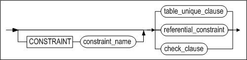

**table_unique_clause ::=**

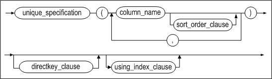

**referential_constraint ::=**


[references_clause ::=](#references_clause)

<a name="temporary_attributes_clause"><a/>

**temporary_attributes_clause ::=**


<a name="table_partitioning_clause"><a/>

**table_partitioning_clause ::=**


**range_partitioning ::=**


**partition_default_clause ::=**


<a name="table_partition_description"><a/>

**table_partition_description ::=**


[lob_column_properties ::=](#lob_column_properties)*,* [access_mode_clause
::=](#access_mode_clause_CREATETALBE)

**partition_range_clause ::=**

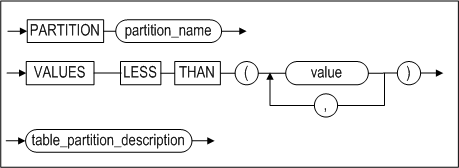

[table_partition_description ::=](#table_partition_description)


**hash_partitioning ::=**


[table_partition_description ::=](#table_partition_description)


**list_partitioning ::=**

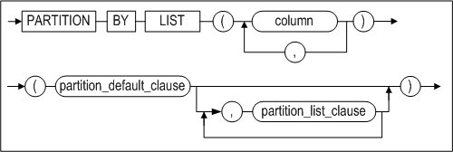

[partition_default_clause ::=](#partition_default_clause)

**partition_list_clause ::=**


<a name="row_movement_clause"><a/>

**row_movement_clause ::=**

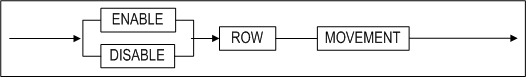


<a name="access_mode_clause_CREATETALBE)"><a/>

**access_mode_clause ::=**


<a name="tablespace_clause"><a/>

**tablespace_clause ::=**

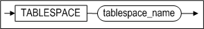

<a name="physical_attributes_clause"><a/>

<a name="create_table_physical_attributes_clause"><a/>

**physical_attributes_clause ::=**


**storage_clause ::=**


<a name="log_compression_clause"><a/>

**log_compression_clause ::=**


<a name="logging_clause"><a/>

**logging_clause ::=**


<a name="parallel_clause"><a/>

**parallel_clause::=**


<a name="table_compression_clause"><a/>

**table_compression_clause ::=**


<a name="lob_column_properties"><a/>

**lob_column_properties ::=**

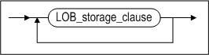

**LOB_storage_clause ::=**


**lob_attributes ::=**


#### Prerequisites

At least one of the following conditions must be met:

- The SYS user 
- Users have the CREATE TABLE or CREATE ANY TABLE system privilege in order to create table in their own schema 
- Users have the CREATE ANY TABLE system privilege in order to create table in another user's schema.

#### Description

This command is used to create a new table with the specified name.

*[GLOBAL] TEMPORARY*

[GLOBAL] TEMPORARY specifies the table as a temporary table. There is no difference whether or not GLOBAL is specified; it can be omitted. Table definitions created in this manner are visible to all sessions; however, temporary table data is private to the session that inserts data into the table.

When the user first creates a temporary table, only meta data of the table is stored in the data dictionary and space for table data is not allocated; table segment space is allocated when the first DML statement is operated on the table. Temporary table definitions persist in the database as do regular table definitions; however, table segments for temporary tables and all temporary table data are session-specific or transaction-specific. With the ON COMMIT keyword, the user can specify whether table segments and data are session-level or transaction-level. For more detailed information, refer to the temporary_attributes_clause below.

For session-specific temporary tables, DDL operations(ALTER TABLE, DROP TABLE, CREATE INDEX, etc) are permitted only if a session is not bound to the temporary table. 

For transaction-specific temporary tables, DDL operations are permitted, regardless of whether or not a transaction is bound to the temporary table. However, Altibase internally commits before operating DDL statements; therefore, table data disappears after DDL statements are operated on temporary tables.

- Restrictions on temporary tables:
  - Partitioning is impossible for temporary tables.  
  - Foreign keys cannot be specified for temporary tables. 
  - Only volatile tablespace can be specified for TABLESPACE of the lob_storage_clause for temporary tables.
  - Temporary tables can only be stored on volatile tablespace.
  - Distributed transactions are not supported for temporary tables.

*user_name*

This is used to set the owner of the table. If it is omitted, Altibase will create the table in the schema of the user connected via the current session.

*tbl_name*

This is used to specify the name of the table to be created. Refer to “Rules for Object Names” for more information on specifying names.

*column_definition*

- DEFAULT  
  If no DEFAULT clause is specified for a column, the initial value for each row in the column is NULL.
- TIMESTAMP  
  A TIMESTAMP column is handled like other data types in many respects. When the data type of a column is specified as TIMESTAMP in a CREATE TABLE statement, a TIMESTAMP value having a size of 8 bytes is generated internally. However, because the value of a TIMESTAMP column is determined by the system, no DEFAULT value can be expressly specified. Furthermore, only one TIMESTAMP column can be created for one table

*column_constraint*

This is used to specify the constraint for a column when a new table is created. A constraint name can be expressly specified by the user. The LOCALUNIQUE constraint is intended for use with partitioned tables.

- PRIMARY KEY

  The value(s) on which a primary key is based must be unique in the table. Additionally, none of the columns which a primary key is based can contain NULL values. Only one primary key can be defined in each table. A primary key can be created on the basis of up to 32 columns. 
  
- UNIQUE

  A UNIQUE constraint prohibits multiple rows from having the same value in the same column (or combination of columns). However, NULL values are allowed. 
  

A unique constraint and a primary key constraint cannot both be defined for the same column or combination of columns in one table. Additionally, only one unique constraint can be defined for a column or combination of columns. However, these limitations do not pertain to other columns or combinations of columns within the same table. A unique constraint can be created for a combination of up to 32 columns. 

- LOCALUNIQUE

  This keyword specifies that each local index must satisfy the UNIQUE constraint.

- (NOT) NULL

  This keyword specifies that the corresponding column can (cannot) contain NULL values.

- CHECK

  This clause specifies an integrity rule that applies to the target column. Only the target column can be referenced within the condition of the column_constraint clause. 

  The following limitations concern the conditions of CHECK constraints:

  - Subqueries, sequences, all pseudo columns, such as LEVEL, ROWNUM, etc., and non-deterministic SQL functions, such as SYSDATE, USER_ID, etc., cannot be included.
  - The PRIOR operator cannot be used.
  - LOB type data cannot be used.
  - Referential integrity
  - TIMESTAMP


*directkey_clause*

Creates a direct key index. For more detailed information about direct key indexes, please refer to CREATE INDEX.

*check_clause*

This clause specifies the condition that the value for each record of the table must satisfy. The results of the condition must be evaluated to either TRUE, FALSE or NULL. 

This clause is valid as the column constraint or the table constraint.

*table_constraint*

This is used to specify the constraint for combination of columns or one column. The following table constraints exist:

- PRIMARY KEY
- UNIQUE
- LOCALUNIQUE
- CHECK
- Referential integrity

*using_index_clause*

This is used to specify the tablespace in which to store an index that is created to support a constraint. 

If any of the PRIMARY KEY, UNIQUE or LOCALUNIQUE constraints are specified, the tablespace in which to store the index of the local index for each index partition can be specified. For more information, please refer to index_partitioning_clause in the description of the CREATE INDEX statement

*references_clause*

This clause is used to define a foreign key. The referenced key, that is, the key that resides in another table and is referenced by a foreign key, must either have the UNIQUE constraint applied to it, or be the PRIMARY KEY for the table in which it resides. If the columns of a referenced key are not specified, the primary key for that table is automatically taken as the referenced key.

- NO ACTION

  This is the default behavior for checking referential integrity. 
  
  Normally, when an INSERT, UPDATE, or DELETE operation is performed on a so-called “parent table”, that is, a table that contains a referenced key, the operation is performed only after an integrity check is performed on any so-called “child tables”, that is, tables containing foreign keys that reference the referenced key. The NO ACTION option prevents parent rows from being altered if integrity checking fails, and outputs an error instead. 
  

In this example, when an attempt is made to delete a department from the departments table, if the department code is referenced by a record in the employees table, the delete attempt will fail and an error will be raised.

  ```
CREATE TABLE employees (
ENO INTEGER PRIMARY KEY, 
  DNO INTEGER, 
  NAME CHAR(10), 
  FOREIGN KEY(DNO) REFERENCES 
  departments(DNO) ON DELETE NO ACTION ); 
  ```

- ON DELETE CASCADE

  This option stipulates that if a row in the parent table is deleted, all rows in child tables that have foreign keys that reference this row will also be deleted.
  

For example, if the table employees is created as follows, when a department from the table departments is tried to be deleted, all rows referencing this department number in the table employees are also deleted.

  ```
  CREATE TABLE employees (
ENO INTEGER PRIMARY KEY, 
  DNO INTEGER, 
  NAME CHAR(10), 
  FOREIGN KEY(DNO) REFERENCES 
  departments (DNO) ON DELETE CASCADE ); 
  ```

- ON DELETE SET NULL

  This option specifies for every foreign key column value in the child table referencing a row in the parent table to be set to NULL, if the given row is deleted.
  
  In order to enforce the referential integrity of this option, the target column must be nullable. 

  For example, consider the case where the user creates the table employees that references the table departments and then deletes a certain department from the table departments. All the column values of the table employees referencing the deleted department number will be modified to NULL.


  ```
CREATE TABLE employees (
ENO INTEGER PRIMARY KEY, 
DNO SMALLINT, 
NAME CHAR(10), 
CONSTRAINT dno_fk FOREIGN KEY (dno) REFERENCES 
departments (dno) ON DELETE SET NULL );
  ```

*MAXROWS*

This is used to specify the maximum number of records that can be entered into a table. If an attempt is made to insert records such that the total number of records would be more than that specified using MAXROWS, the insert attempt will fail and an error will be returned. The MAXROWS clause cannot be specified with the table_partitioning_clause clause.

*temporary_attributes_clause*

This clause specifies whether the temporary table is transaction-specific or session-specific. The following two options are available:

*ON COMMIT DELETE ROWS*

This creates a transaction-specific temporary table. The transaction that first inserts data into the temporary table is bound to the temporary table. Transaction-level binding is unbound with the execution of the COMMIT or ROLLBACK statement. If the transaction is committed, Altibase truncates the temporary table.

*ON COMMIT PRESERVE ROWS*

This creates a session-specific temporary table. A session is bound to the temporary table when data is first inserted into the temporary table in the session. This binding is unbound when the session is terminated or TRUNCATE is operated on the table in the session. If the user terminates the session, Altibase truncates the session bound temporary table.

*table_partitioning_clause*

This is used to create a partitioned table. A partitioned table can be range-partitioned, hash-partitioned or list-partitioned. row_movement_clause can also be specified when a partitioned table is created.

*range_partitioning*

This specifies that the table will be partitioned based on ranges of partition key values. It is primarily used with the DATE data type. Because the table is partitioned based on user-specified values, there is no guarantee that the data will be uniformly distributed among the partitions. The range of each partition is determined by setting the maximum value of its range.

Any values exceeding all of the specified ranges, along with any NULL values, will be saved in the default partition. The default partition clause cannot be omitted. A partition key can be defined on the basis of multiple columns.

*table_partition_description*

The tablespace for a partition can be specified. Additionally, if the table contains one or more LOB columns, the attributes for each LOB column can be specified separately. The data access mode for the partition can also be set.

If the tablespace statement is omitted, the partition will be stored in the default tablespace for the table. 

Additionally, if the tablespace in which to store a LOB column is not specified, the LOB data will be stored in the tablespace for the partition. 

In the following example, the default tablespace for the user is tbs_05.

```
CREATE TABLE print_media_demo
( 
	product_id INTEGER,
	ad_photo BLOB,
	ad_print BLOB,
	ad_composite BLOB
)
PARTITION BY RANGE (product_id)
(
	PARTITION p1 VALUES LESS THAN (3000) TABLESPACE tbs_01 
	LOB (ad_photo) STORE AS (TABLESPACE tbs_02 ),
	PARTITION p2 VALUES DEFAULT 
	LOB (ad_composite) STORE AS (TABLESPACE tbs_03)
) TABLESPACE tbs_04;
```

Partition p1 will be stored in the tbs_01 tablespace because this was expressly specified. However, the ad_photo column for this partition will be stored in the tbs_02 tablespace. Because no tablespace was specified for partition p2, which is the default partition, it will be stored in tablespace tbs_04, where table T1 resides. If no tablespace for the table is specified either, it will be stored in the default tablespace, which is tbs_05. 

This is illustrated in the following diagram:


*partition_range_clause*

This is used to specify the noninclusive upper limit for a range partition. This value must not be set to the same value as that of any other partition.

*hash_partitioning*

This specifies that the table will be partitioned based on hash values corresponding to partition key values. This partitioning scheme is suitable for situations in which the data must be distributed uniformly among the partitions. A partition key can be defined on the basis of multiple columns.

*list_partitioning*

This specifies that the table will be partitioned based on sets of values. The default partition cannot be omitted because any values not specified as belonging to another partition are automatically included in this partition.

When a new partition is defined, the values specified as belonging to that partition are removed from the default partition. This is because values cannot be specified as belonging to more than one partition. Additionally, the partition key for a list-partitioned table can be defined only on the basis of a single column.

*partition_list_clause*

The list that defines each list partition must comprise at least one value. A value in one list must not be present in any other list.

*row_movement_clause*

When a record in a partitioned table is updated in a way that changes the data in a column on which the partition key is defined such that the record (row) must be moved to another partition, this clause determines whether to move the record automatically or raise an error. If this clause is omitted, the DISABLE ROW MOVEMENT option (i.e. raise an error) is set by default.

*CREATE TABLE … AS SELECT*

When creating a table, to copy column attributes and data from other tables into the new table, use the CREATE TABLE ... AS SELECT statement. The number of columns in the new table cannot be set differently from the number of columns retrieved by the AS SELECT clause. Additionally, the data types of the new columns cannot be expressly set, as they are set the same as the original columns from which the data are retrieved.

If no column names are specified for the new table, the names of the original columns will be used as the column names for the new table. If the name of the search target is in the form of an expression, an alias must be provided. This alias will becomes the name of the column in the new table.

*access_mode_clause*

This sets the data access mode. A mode can be chosen among Read-Only, Read/Write and Read/Append modes and on omission, the Read/Write mode is set by default.

> Note: Even if the data access mode for the table or partition is set to ‘Read-Only’ or ‘Read/Append’, copying data through replication, TRUNCATE statement execution, and LOB column alteration are allowed

*tablespace_clause*

This clause is used to set the tablespace in which to save the table.

 If this clause is omitted, the table will be saved in the DEFAULT TABLESPACE of the user in whose schema the table is being created. The user's DEFAULT TABLESPACE was specified when the user was created. If no DEFAULT TABLESPACE has been specified for the user, the table will be created in the SYSTEM MEMORY DEFAULT TABLESPACE.

If a UNIQUE or PRIMARY KEY constraint is specified in the CREATE TABLE statement, the index supporting the constraint will be saved in the tablespace in which the table is saved.

*physical_attributes_clause*

This clause is used to specify the PCTFREE, PCTUSED, INITRANS, and MAXTRANS. If this clause is specified for a partitioned table, the PCTFREE and PCTUSED values will apply to all of the partitions in the table.

- PCTFREE Clause  
  This is used to specify the amount of free space that is reserved for use in updating records that have already been saved in a page. Additional records can only be saved into the portion of the page that is not reserved in this way. This value represents the percentage of free space in the page.  
  For example, for a table in which PCTFREE is set to 20, records can only be inserted into 80% of the space in each page, and the remaining 20% of the page is reserved for use in updating existing records. This value is only meaningful for disk-based tables.  
  This option must be set to an integer value ranging from 0 to 99, representing the percentage. If this value is not set, the default PCTFREE value is 10. This option only applies to pages that have been assigned to tables
- PCTUSED Clause  
  This is the threshold below which the amount of used space in a page must decrease in order for the page to return to the state in which records can be saved in it again. When the amount of free space in a page falls below the percentage specified in PCTFREE, it becomes impossible to save new records in the page. At this time it is permissible only to update and delete existing records. Once subsequent update or delete operations reduce the percentage of used space in the page below the threshold specified by PCTUSED, it becomes possible to save new records in the page again.  
  For example, assuming that PCTUSED has been set to 40, once the percentage of unused space in a page has decreased below the limit specified using PCTFREE (i.e. when the percentage of used space increases beyond 100 - PCTFREE), no more records are saved in that page until the percentage of used space falls to 39%. In other words, new records can be saved in the page only after the percentage of used space falls below 40%. This option only applies to disk-based tables.  
  This option must be set to an integer value ranging from 0 to 99, representing the percentage. If this value is not set, the default PCTUSED value is 40. This option only applies to pages that have been assigned to tables.
- INITRANS Clause  
  This clause is used to set the initial number of TTS (Touched Transaction Slots). The default value is 2.
- MAXTRANS Clause  
  This clause is used to set the maximum number of TTS (Touched Transaction Slots), to which the number of TTS can increase. The default value is 120.

> Note:
>
> PCTFREE and PCTUSED are used together to optimize performance as follows. In this example, assume that PCTFREE has been set to 20 and PCTUSED to 40. 
> 
>20% of each page that is allocated to a table is reserved for use in updating existing records. New records can only be saved in the page until the remaining 80% of the space in the page has been filled. 
> 
> At this point, no more new records can be saved in the page. The only operations that can be performed are update and delete operations on records that already exist in the page. 20% of the page has been reserved for update operation. If enough records are deleted for the amount of used space in the page to fall below 40%, it becomes possible to save new records in the page again. 
>
> The values of PCTFREE and PCTUSED are used in this way to determine in a cyclical manner how the space in pages is used.

*storage_clause*

This clause is used to set storage parameters for managing extents in segments.

- INITEXTENTS Clause  
  This is used to set the number of extents that are initially allocated when a segment is created. If this is not specified, one extent is allocated by default.
- NEXTEXTENTS Clause  
  This is used to set the number of extents that are added to a segment every time the segment is increased in size. If this is not specified, the default value is 1.
- MINEXTENTS Clause  
  This is used to set the minimum number of extents in a segment. If this is not specified, the default value is 1.
- MAXEXTENTS Clause  
  This is used to set the maximum number of extents in a segment. If this is not specified, there is no upper limit.

*LOB_storage_clause*

n a disk table, LOB column data can be stored in a tablespace other than that in which the table containing the LOB column is stored. However, in a memory table, LOB column data cannot be stored separately from the rest of the table; that is, they can only be stored in the same tablespace as the table.

*parallel_clause*

This is used to specify the number of threads which execute parallel queries. Omitting this clause is equivalent to specifying NOPARALLEL.

- NOPARALLEL : Does not execute queries in parallel.
- PARALLEL *integer* : Specification of integer indicates the number of threads to execute queries in parallel. A value from 1~65535 is valid for specification. PARALLEL 1 is equivalent to NOPARALLEL.

Currently, Altibase only support the following parallel queries:

- Parallel queries which scan partitioned tables. 
- Parallel queries with HASH, SORT, GRAG nodes in their execution plans. For such nodes, however, only one parallel worker thread is created per node. 

*table_compression_clause*

This specifies each of the names of the columns to be compressed with the use of commas. The maximum number of rows that can be inserted to the dictionary table, which is automatically generated for each compressed column, is specified in the MAXROWS clause. On omission, the default value is the same as for normal tables, 26<sup>64</sup>-1.

The execution of table creation and data insertion in one statement by specifying this clause and subquery in the CREATE TABLE statement is not supported. 

The following table shows the data types valid for compression and the minimum size for each type.

| Data Type                | Minimum Size |
| ------------------------ | ------------ |
| CHAR, VARCHAR, BYTE      | 6            |
| NCHAR, NVARCHAR (UTF-8)  | 6            |
| NCHAR, NVARCHAR (UTF-16) | 3            |
| NIBBLE                   | 13           |
| BIT, VARBIT              | 25           |
| DATE                     |              |

#### Consideration

Here are some considerations to keep in mind when creating a table:

- If columns are created larger than their maximum allowable size or smaller than their minimum allowable size, an error occurs. The maximum and minimum sizes vary depending on the data type.
- The maximum number of columns in one table is 1024.
- A maximum of one primary key can be defined for a table.
- For a foreign key constraint, the foreign key and the referenced key must have the same number of columns. For a foreign key constraint, corresponding columns in the foreign key and the referenced key must have the same data types.
- The total number of indexes, primary keys and unique keys cannot exceed 1024.
- When executing a CREATE TABLE ... AS SELECT statement, if the names of the columns to create are specified, the number column names must be the same as the number of columns retrieved using the AS SELECT clause.
- When executing a CREATE TABLE ... AS SELECT statement, when the column name is not specified in the CREATE TABLE statement and the name of the column to be retrieved is provided in the form of an expression, an alias name must be specified for the purpose of determining the name of the column in the new table.
- The MAXROWS clause is not supported for use with partitioned tables. 
- For range- and hash-partitioned tables, up to 32 columns can be specified as partition key columns. (This is the same as the upper limit on the number of index columns when an index is created.) 
- In the event of a system or media fault, the consistency of an index that was created using the NOLOGGING (FORCE/NOFORCE) option cannot be guaranteed. After an index becomes inconsistent, the error message indicating that the index is inconsistent will be raised when the index is accessed. To fix this error, locate the inconsistent index, drop it, and create it again. The consistency of an index can be checked using the V$DISK_BTREE_HEADER performance view. 
- Just as when executing the CREATE INDEX statement, the tablespace in which a local partitioned index is saved cannot be specified. 
- The CHECK constraint cannot be specified for the CREATE TABLE … AS SELECT statement. • Columns with the PRIMARY KEY, UNIQUE and TIME STAMP constraints cannot be compressed.

#### Examples

##### Creating Tables

Create the following tables.

- Table name: employees 
  Columns: employee number, employee first and last name, position, telephone number, department number, salary, gender, birthday, hiring date, and status.
```
  iSQL> CREATE TABLE employees(
    eno INTEGER PRIMARY KEY,
    e_lastname CHAR(20) NOT NULL, 
    e_firstname CHAR(20) NOT NULL,
    emp_job VARCHAR(15),
    emp_tel CHAR(15),
    dno SMALLINT,
    salary NUMBER(10,2) DEFAULT 0,
    sex CHAR(1) CHECK(sex IN ('M', 'F')),
    birth CHAR(6),
    join_date DATE,
    status CHAR(1) DEFAULT 'H');
  Create success.
```

- Table name: orders 
  Columns: order number, order date, salesperson, customer number, product number, quantity, estimated delivery date, and status.
```
  iSQL> CREATE TABLE orders(
    ono BIGINT,
    order_date DATE,
    eno INTEGER NOT NULL,
    cno BIGINT NOT NULL,
    gno CHAR(10) NOT NULL,
    qty INTEGER DEFAULT 1,
    arrival_date DATE,
    processing CHAR(1) DEFAULT '0', PRIMARY KEY(ono, order_date));
  Create success.
```

- Using CREATE TABLE ... AS SELECT 
  Create a new table called dept_1002 and copy the column attributes and data that meet the condition shown from the employees table.
```
  iSQL> CREATE TABLE dept_1002
    AS SELECT * FROM employees
    WHERE dno = 1002;
  Create success.
```

- Create a table that has a TIMESTAMP type column.

  ```
  iSQL> CREATE TABLE tbl_timestamp(
  i1 TIMESTAMP CONSTRAINT const2 PRIMARY KEY, 
  i2 INTEGER,
  i3 DATE,
  i4 Byte(8));
  Create success.
  ```
  

 The attributes of the table tbl_timestamp are as shown below. 

```
  [ TABLESPACE : SYS_TBS_MEM_DATA ]
  [ ATTRIBUTE ]                                                         
  ------------------------------------------------------------------------------
  NAME                                     TYPE                        IS NULL 
  ------------------------------------------------------------------------------
  I1                                       TIMESTAMP       FIXED       NOT NULL
  I2                                       INTEGER         FIXED       
  I3                                       DATE            FIXED       
  I4                                       BYTE(8)         FIXED       
  [ INDEX ]                                                       
  ------------------------------------------------------------------------------
  NAME                                     TYPE     IS UNIQUE     COLUMN
  ------------------------------------------------------------------------------
  CONST2                                   BTREE    UNIQUE        I1 ASC
  [ PRIMARY KEY ]                                                 
  ------------------------------------------------------------------------------
  I1
```


The way to distinguish between i4, which explicitly declares the Byte (8) data type, and i1, which is a TIMESTAMP data type column, is to check whether the column type is TIMESTAMP by querying the SYS_CONSTRAINTS_ and SYS_CONSTRAINT_COLUMNS_ meta tables.

  > Note: If the DEFAULT keyword is used for a timestamp column when performing an INSERT or UPDATE operation, the system time at which the operation is performed will be written to the TIMESTAMP column.

```
  iSQL> INSERT INTO tbl_timestamp VALUES(DEFAULT, 2, '02-FEB-01', Byte'A1111002');
  1 row inserted.
iSQL> UPDATE tbl_timestamp SET i1 = DEFAULT, i2 = 102, i3 = '02-FEB-02', i4 = Byte'B1111002' WHERE i2 = 2;
  1 row updated.
  iSQL> SELECT * FROM tbl_timestamp;
  I1                I2          I3           I4
  ------------------------------------------------------------------
  4E3778C900037AE9  102         02-FEB-2002  B111100200000000
  1 row selected.
```

  Similarly, if the user does not specify a TIMESTAMP value when performing an INSERT or UPDATE operation on a TIMESTAMP column, the system time at which the operation is performed will be used to perform the INSERT or UPDATE operation.

```
  iSQL> INSERT INTO tbl_timestamp(i2, i3, i4) VALUES(4, '02-APR-01', Byte'C1111002');
  1 row inserted.
iSQL> UPDATE tbl_timestamp SET i2=104, i3='02-APR-02', i4=BYTE'D1111002' WHERE i2=4;
  1 row updated.
  iSQL> SELECT * FROM tbl_timestamp;
  I1                I2          I3           I4
  ------------------------------------------------------------------
  4E3778C900037AE9  102         02-FEB-2002  B111100200000000
  4E37794900083702  104         02-APR-2002  D111100200000000
  2 rows selected
```

- Using and Specifying Temporary Tables

  \<Query\> After creating a temporary table and inserting data in a session, the data is retrieved in that session and no data is retrieved in the other sessions.
  
```
  iSQL> create volatile tablespace my_vol_tbs size 12M autoextend on maxsize 1G; 
  Create success. 
  iSQL> create temporary table t1(i1 integer, i2 varchar(10)) on commit delete rows tablespace my_vol_tbs; 
  Create success. 
  iSQL> create temporary table t2(i1 integer, i2 varchar(10)) on commit preserve rows tablespace my_vol_tbs; 
  Create success. 
  iSQL> desc t2; 
  [ TABLESPACE : MY_VOL_TBS ] 
  [ ATTRIBUTE ]                                                         
  ------------------------------------------------------------------------------ 
  NAME                                     TYPE                        IS NULL 
  ------------------------------------------------------------------------------ 
  I1                                       INTEGER         FIXED       
  I2                                       VARCHAR(10)     FIXED       
  T2 has no index 
  T2 has no primary key 
  iSQL> alter table t2 add constraint t2_pk primary key (i1); 
  Alter success. 
  iSQL> insert into t2 values (1, 'abc'); 
  1 row inserted. 
  iSQL> insert into t2 values (2, 'def'); 
  1 row inserted. 
  iSQL> select * from t2; 
  I1          I2          
  --------------------------- 
  1           abc         
  2           def         
  2 rows selected. 
  iSQL> connect sys/manager; 
  Connect success. 
  iSQL> select * from t2; 
  I1          I2          
  --------------------------- 
  No rows selected.
```

- Specifying Tablespaces for Index Partitions

  \<Query\>Create table tbl1 in the user uare1's schema. (Assume that no default tablespace was specified when this user was created.)
  
```
  iSQL> CONNECT uare1/rose1;
  Connect success.
  iSQL> CREATE TABLE tbl1(
      i1 INTEGER,
      i2 VARCHAR(3));
  Create success.
```

> Note: The table will be created in the system memory default tablespace when no default tablespace has been defined for the user.

  \<Query\> Create the books and inventory tables in the user_data tablespace, which is the default tablespace for the user.

  books columns: book number, book name, author, edition, publication year, price, and publication code (can contain a maximum of two rows).

inventory Columns: subscription number, book number, store code, purchase date, quantity, and a character to indicate whether the item has been paid for.

  ```
iSQL> CREATE TABLE books(
    isbn CHAR(10) CONSTRAINT const1 PRIMARY KEY,
  title VARCHAR(50),
    author VARCHAR(30),
    edition INTEGER DEFAULT 1,
    publishingyear INTEGER,
    price NUMBER(10,2),
  pubcode CHAR(4)) MAXROWS 2
  TABLESPACE user_data;
  Create success.
  
  iSQL> CREATE TABLE inventory(
    subscriptionid CHAR(10) PRIMARY KEY,
    isbn CHAR(10) CONSTRAINT fk_isbn REFERENCES books (isbn),
    storecode CHAR(4),
    purchasedate DATE,
    quantity INTEGER,
  paid CHAR(1))
  TABLESPACE user_data;
  Create success.
  ```

  Or

  ```
iSQL> CREATE TABLE inventory(
    subscriptionid CHAR(10),
  isbn CHAR(10),
    storecode CHAR(4),
    purchasedate DATE,
    quantity INTEGER,
    paid CHAR(1),
    PRIMARY KEY(subscriptionid),
  CONSTRAINT fk_isbn FOREIGN KEY(isbn) REFERENCES books(isbn))
  TABLESPACE user_data;
  Create success.
  ```

- Creating a Table with a Direct Key Index

  \<Query\> Create an id(INTEGER) column in the tab1 table with the UNIQUE constraint and create a direct key index on it.
  
```
  iSQL> CREATE TABLE tab1 (id UNIQUE DIRECTKEY );
  Create success.
```


- Specifying Tablespaces for Index Partitions

  \<Query\>Create the partitioned table T1 having the UNIQUE constraint on column I1.

  ```
  CREATE TABLE T1 
  ( 
    I1 INTEGER UNIQUE USING INDEX LOCAL
    (
      PARTITION P1_UNIQUE ON P1 TABLESPACE TBS3,
      PARTITION P2_UNIQUE ON P2 TABLESPACE TBS2,
      PARTITION P3_UNIQUE ON P3 TABLESPACE TBS1
    )
  )
  PARTITION BY RANGE (I1)
  ( 
    PARTITION P1 VALUES LESS THAN (100),
    PARTITION P2 VALUES LESS THAN (200) TABLESPACE MEM_TBS1,
    PARTITION P3 VALUES DEFAULT TABLESPACE MEM_TBS2 
  ) TABLESPACE SYS_TBS_DISK_DATA;
  ```


- Range Partitioning

  \<Query 1\>  Create the table range_sales, partitioning the year 2006 into respective quarters as shown below.
  
```
  CREATE TABLE range_sales
  ( 
    prod_id NUMBER(6),
    cust_id NUMBER,
    time_id DATE
  ) 
  PARTITION BY RANGE (time_id)
  (
    PARTITION Q1_2006 VALUES LESS THAN (TO_DATE('01-APR-2006')),
    PARTITION Q2_2006 VALUES LESS THAN (TO_DATE('01-JUL-2006')),
    PARTITION Q3_2006 VALUES LESS THAN (TO_DATE('01-OCT-2006')),
    PARTITION Q4_2006 VALUES LESS THAN (TO_DATE('01-JAN-2007')),
    PARTITION DEF VALUES DEFAULT 
  ) TABLESPACE SYS_TBS_DISK_DATA;
```


  \<Query 2\> Create a partitioned table, specifying the tablespace for some of the partitions.

```
  CREATE TABLE T1 
  ( 
    I1 INTEGER, 
    I2 INTEGER 
  )
  PARTITION BY RANGE (I1)
  ( 
    PARTITION P1 VALUES LESS THAN (100),
    PARTITION P2 VALUES LESS THAN (200) TABLESPACE TBS1,
    PARTITION P3 VALUES DEFAULT TABLESPACE TBS2 
  ) TABLESPACE SYS_TBS_DISK_DATA
```

  \<Query 3\> Create a partitioned table in which multiple columns are used as the partition key.

```
  CREATE TABLE T1 
  ( 
    I1 DATE, 
    I2 INTEGER 
  )
  PARTITION BY RANGE (I1, I2)
  ( 
    PARTITION P1 VALUES LESS THAN (TO_DATE('01-JUL-2006'), 100),
    PARTITION P2 VALUES LESS THAN (TO_DATE('01-JAN-2007'), 200),
    PARTITION P3 VALUES DEFAULT 
  ) TABLESPACE SYS_TBS_DISK_DATA;
```

  \<Query 4\> Create a partitioned table in which the data is moved automatically when required.

```
  CREATE TABLE T1 
  ( 
    I1 INTEGER, 
    I2 INTEGER 
  )
  PARTITION BY LIST (I1)
  ( 
    PARTITION P1 VALUES (100, 200),
    PARTITION P2 VALUES (150, 250),
    PARTITION P3 VALUES DEFAULT 
  ) ENABLE ROW MOVEMENT TABLESPACE SYS_TBS_DISK_DATA;
```

- List Partitioning

  \<Query\> Create the table list_customers, which is list-partitioned on the basis of the nls_territory column into the asia partition for the values 'CHINA' and 'THAILAND', the europe partition for the values 'GERMANY', 'ITALY' and 'SWITZERLAND', the west partition for the value 'AMERICA', the east partition for the value 'INDIA', and the default partition for any other values.
  
  ```
  CREATE TABLE list_customers 
( 
  	customer_id	NUMBER(6), 
  	cust_first_name	VARCHAR(20), 
  	cust_last_name	VARCHAR(20), 
  	nls_territory	VARCHAR(30), 
  	cust_email	VARCHAR(30)
  )
  PARTITION BY LIST (nls_territory) 
  (
  	PARTITION asia VALUES ('CHINA', 'THAILAND'),
  	PARTITION europe VALUES ('GERMANY', 'ITALY', 'SWITZERLAND'),
  	PARTITION west VALUES ('AMERICA'),
  	PARTITION east VALUES ('INDIA'),
  	PARTITION rest VALUES DEFAULT 
  ) TABLESPACE SYS_TBS_DISK_DATA;
  ```

- Hash Partitioning

  \<Query\> Create a table that is hash-partitioned into 4 partitions based on product_id.

  ```
  CREATE TABLE hash_products 
  ( 
  	product_id		NUMBER(6), 
  	product_name		VARCHAR(50), 
  	product_description 	VARCHAR(2000) 
  )
  PARTITION BY HASH (product_id)
  ( 
  	PARTITION p1, 
  	PARTITION p2, 
  	PARTITION p3, 
  	PARTITION p4 
  ) TABLESPACE SYS_TBS_DISK_DATA;
  ```
  

\<Query\> Create a table in which the LOB data is stored in separate tablespaces; specifically, in which the LOB data in the image1 column is stored in the lob_data1 tablespace and the LOB data in the image2 column is stored in the lob_data2 tablespace.

  ```
  CREATE TABLE lob_products 
(
    product_id integer, 
    image1 BLOB, 
    image2 BLOB
  ) TABLESPACE SYS_TBS_DISK_DATA
  LOB(image1) STORE AS ( TABLESPACE lob_data1 )
  LOB(image2) STORE AS ( TABLESPACE lob_data2 );
  ```

- Creating a Table in which the Extents in the Segment are Managed 

  \<Query\> Create the table local_tbl in the usertbs disk tablespace. Allocate 10 extents to the table when it is created and specify that 1 extent is to be added whenever the size of the table needs to be increased.
  
```
  iSQL> CREATE TABLE local_tbl (i1 INTEGER, i2 VARCHAR(32) ) 
                      TABLESPACE usertbs
                      STORAGE ( INITEXTENTS 10 NEXTEXTENTS 1 );
  Create success.
```

\<Query\> Create the table local_tbl in the usertbs disk tablespace. Specify that the minimum number of extents in the table is 3, which is the same number that are allocated to the table when it is created, and limit the maximum number of extents to 100.

  ```
  iSQL> CREATE TABLE local_tbl ( i1 INTEGER, i2 VARCHAR(32) ) 
                    TABLESPACE usertbs
                      STORAGE ( INITEXTENTS 3 MINEXTENTS 3 MAXEXTENTS 100 );
  Create success.
  ```

### CREATE DISK TABLESPACE 

#### Syntax

**create_disk_tablespace ::=**

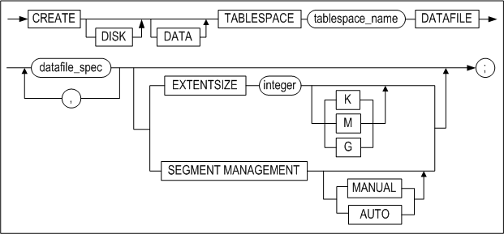

**datafile_spec ::=**


**autoextend_clause ::=**


**maxsize_clause ::=**


#### Prerequisites

Only the SYS user and users having the CREATE TABLESPACE system privilege can create tablespace

#### Description

The CREATE DISK TABLESPACE statement is used to create a disk tablespace, in which database objects can be permanently stored within the database. Tablespaces created using this command can be used to hold tables and indexes.

*DISK*

This keyword is used to specify that the tablespace to be created will be a disk tablespace. A disk tablespace is created even when the CREATE TABLESPACE statement is executed without the DISK keyword.

DATA

This keyword is used to specify that the tablespace to be created will be used to store user data. A data tablespace is created even when the CREATE TABLESPACE statement is executed without the DATA keyword.

*tblspace_name*

This is used to specify the name of the tablespace to be created. Refer to “Rules for Object Names” in Chapter 2 for more information on specifying names.

*datafile_spec*

This is used to specify the attributes of the data file constituting the tablespace.

*EXTENTSIZE Clause*

This is used to specify the size of an extent, which is a collection of pages. This cannot be changed after the tablespace is created. The default unit used to specify the size of an extent is kB (kilobytes, expressed as “K“), but it is also permissible to use MB (megabytes, expressed as “M“) or GB (gigabytes, expressed as “G“). 

If size of the extents in the tablespace is not specified, the extents will be the default size, which is 64 times the size of a single page. When specifying the size of the extents in the tablespace, the extent size must be set to a multiple of the size of a single page. If the extent size is set to a value other than a multiple of the page size, the extent size will be rounded to the closest value internally so that it is a multiple of the page size. 

Additionally, the size of an extent must be at least five times the size of a single page. In other words, because the size of a single page is 8kB, the extent size must be set to at least 40kB.

*SEGMENT MANAGEMENT Clause*

This is used to specify how segments are to be managed in the disk tablespace to be created. This clause is optional. If this option is not specified, segments in the newly created disk space will be managed according to the setting of the DEFAULT_SEGMENT_MANAGEMENT_TYPE property in the altibase.properties file. (The default value for this property is AUTO.)

- MANUAL : This specifies that segments are created on the basis of a so-called “free list“ method of managing available space in the user tablespace.
- AUTO : This specifies that segments are created on the basis of a so-called “bitmap index“ method of managing available space in the user tablespace.

*file_name*

This is used to specify the absolute path and name of the data file to be created.

*SIZE Clause*

This is used to specify the size of the data file. If this clause is omitted, the data file will be the default size, which is 100 megabytes. This default file size can be changed by setting the USER_DATA_FILE_INIT_SIZE property as desired. 

The size is specified by providing an integer followed by one of the following units: kB (kilobytes, expressed as “K”), MB (megabytes, expressed as “M”) or GB (gigabytes, expressed as “G”). If no units are specified, the default unit is kilobytes. 

*REUSE*

This is used to specify whether or not to reuse an existing data file. If a file with the name specified in file_name exists, the REUSE option must be specified. Note however that if an existing file is reused, the original contents of the file will be lost, so care must be taken in order to prevent data loss.   
If the REUSE option is specified but no file with the name specified in file_name exists, this option will be ignored, and a new file will be created.

*autoextend_clause*

This is used to specify whether to automatically increase the size of the data file when it fills up, and the maximum size to which it can increase. If this clause is omitted, AUTOEXTEND is disabled by default.

*ON*

This enables the AUTOEXTEND option for the file.

*OFF*

This disables the AUTOEXTEND option for the file.

*NEXT*

This is used to specify the amount by which the size of the file will increase when it is automatically increased in size. 

If AUTOEXTEND is enabled but this value is not set, the default NEXT value is the value set in the USER_DATA_FILE_NEXT_SIZE property in the altibase.properties file. 

The size can be specified in kB (kilobytes, expressed as “K”), MB (megabytes, expressed as “M”) or GB (gigabytes, expressed as “G”). If no units are specified, the default unit is kilobytes.

*maxsize_clause*

This is used to specify the maximum size to which the data file can increase. If AUTOEXTEND is enabled but this value is not set, the default is the value set using the USER_DATA_FILE_MAX_SIZE property in the altibase.properties file. 

It can be expressed in kB (kilobytes, expressed as “K”), MB (megabytes, expressed as “M”) or GB (gigabytes, expressed as “G”). If no units are specified, the default unit is kilobytes. 

*UNLIMITED*

This is used to indicate that there is no upper limit to the size to which the file can increase. If this option is used, the actual maximum size of the file will be determined by the operating system or by the amount of available space in the file system.

#### Examples

\<Query\> Create the user_data tablespace, comprising three data files. Specify that segments are to be managed using the “free list” method.

```
iSQL> CREATE TABLESPACE user_data
    DATAFILE '/tmp/tbs1.user' SIZE 10M,
    '/tmp/tbs2.user' SIZE 10M,
    '/tmp/tbs3.user' SIZE 10M
    SEGMENT MANAGEMENT MANUAL;
Create success.
```

\<Query\> Create the user_data tablespace, which has an initial size of 10MB, consists of the tbs.user data file (in which the tables and indexes in this tablespace will be stored), and extends automatically.

```
iSQL> CREATE TABLESPACE user_data DATAFILE '/tmp/tbs.user' SIZE 10M AUTOEXTEND
ON;
Create success.
```

\<Query\> Create the user_data tablespace, which can increase in size up to 100MB in 500kB increments.

```
iSQL> CREATE TABLESPACE user_data
    DATAFILE '/tmp/tbs.user' SIZE 500K REUSE
    AUTOEXTEND ON NEXT 500K MAXSIZE 100M;
Create success.
```

\<Query\> Create the user_data tablespace comprising the tbs.user data file, which does not automatically increase in size.

```
iSQL> CREATE TABLESPACE user_data
    DATAFILE '/tmp/tbs.user' AUTOEXTEND OFF;
Create success.
```


### CREATE MEMORY TABLESPACE 

#### Syntax

**create_memory_tablespace ::=**


**initsize_clause ::=**


**autoextend_clause ::=**


**maxsize_clause ::=**


**checkpoint_path_clause ::=**


**splitsize_clause ::=**


#### Prerequisites

Only the SYS user and users having the CREATE TABLESPACE system privilege can create tablespaces.

#### Description

The CREATE MEMORY TABLESPACE statement is used to create a memory data tablespace, in which database objects can be stored within the database. Tablespaces created using this command can be used to hold memory tables.

*MEMORY*

This keyword is used to specify that the tablespace to be created will be a memory tablespace.

*DATA*

This keyword is used to specify that the tablespace to be created will be used to store user data. A data tablespace is created even when the CREATE TABLESPACE statement is executed without the DATA keyword.

*tablespace_name*

This is used to specify the name of the tablespace to create. Refer to “Rules for Object Names” in Chapter 2 for more information on specifying names.

*initsize_clause*

This is used to specify the initial size of the tablespace to create.

*SIZE*

This is used to specify the initial size of the tablespace. The initial size of a memory tablespace must be a multiple of the default allocation size. (i.e. the number of pages specified in the EXPAND_CHUNK_PAGE_COUNT property * the size of one page in memory tablespace (32kB)).

For example, if the EXPAND_CHUNK_PAGE_COUNT property is set to 128, the default allocation size would be 128 * 32 = 4MB. Therefore, the initial size must be set to a multiple of 4MB. 

The size can be specified in kB (kilobytes, expressed as “K”), MB (megabytes, expressed as “M”) or GB (gigabytes, expressed as “G”). If no units are specified, the default unit is kilobytes.

*autoextend_clause*

This is used to specify whether the tablespace automatically increases in size when it fills up, and the maximum size to which it can increase. If this clause is omitted, AUTOEXTEND is disabled by default.

*ON*

This enables the AUTOEXTEND option.

*OFF*

This disables the AUTOEXTEND option. This is the default.

*NEXT*

This is used to specify the increment by which the tablespace increases in size when it is automatically increased in size. 

Note that this size must be a multiple of the default allocation size (the number of pages specified in the EXPAND_CHUNK_PAGE_COUNT property * the size of one page in memory tablespace (32kB)). 

If AUTOEXTEND is enabled but this value is not set, the default is the value set using the EXPAND_CHUNK_PAGE_COUNT property in the altibase.properties file

If AUTOEXTEND is OFF, this value is irrelevant. 

The size can be specified in kB (kilobytes, expressed as “K”), MB (megabytes, expressed as “M”) or GB (gigabytes, expressed as “G”). If no units are specified, the default unit is kilobytes.

*maxsize_clause*

This is used to specify the maximum size to which a tablespace can increase when it automatically increases in size. If AUTOEXTEND is enabled but this value is not set, the default value is UNLIMITED.

If AUTOEXTEND is OFF, this value is meaningless.

The size can be specified in kB (kilobytes, expressed as “K”), MB (megabytes, expressed as “M”) or GB (gigabytes, expressed as “G”). If no units are specified, the default unit is kilobytes.

*UNLIMITED*

This is used to indicate that there is no upper limit to the size to which the tablespace can increase. 

If this option is used, the tablespace will automatically increase in size up to the point at which the total size of all memory tablespaces and all volatile tablespaces in the system reaches the size specified in the MEM_MAX_DB_SIZE property in the altibase.properties file.

*checkpoint_path_clause*

To ensure the durability of the data in memory tablespaces, the data must be saved in files. These memory tablespace data storage files are known as “checkpoint images”. 

The checkpoint_path clause is used to specify the checkpoint path, that is, the path and directory where these image files are stored. 

If no checkpoint path is provided, the path specified in the MEM_DB_DIR property is used as the default path. 

*checkpoint_path*

This is used to specify the location at which a checkpoint image is stored when checkpointing is performed for the memory tablespace. It is permissible to specify more than one path, which is helpful in distributing the disk I/O costs incurred when checkpointing is performed and when the contents of tablespaces are read from disk at startup.

*split_each_clause*

This clause is used to split checkpoint files into smaller files. This is useful when the size of the memory tablespace exceeds the maximum file size supported by the operating system, or in order to distribute I/O costs. The size of the resulting files can be specified by the user. If this size is not specified, the default split size specified in the DEFAULT_MEM_DB_FILE_SIZE property is used. 

The size can be specified in kB (kilobytes, expressed as “K”), MB (megabytes, expressed as “M”) or GB (gigabytes, expressed as “G”). If no units are specified, the default unit is kilobytes. 

#### Examples

\<Query 1\> Create a user-defined memory data tablespace that is initially 512MB in size and does not automatically increase in size. (The checkpoint image is stored in the path specified in the MEM_DB_DIR property. If the checkpoint image file is split into multiple files, the size of those files will be the same as the value set in the DEFAULT_MEM_DB_FILE_SIZE property.)

```
iSQL> CREATE MEMORY DATA TABLESPACE user_data SIZE 512M;
Create success.
```

\<Query 2\>  Create a user-defined memory data tablespace that is initially 512MB in size and increases in size in 128MB increments[<sup>4</sup>]  (The checkpoint image is stored in the path specified in the MEM_DB_DIR property. If the checkpoint image file is split into multiple files, the size of those files will be the same as the value set in the DEFAULT_MEM_DB_FILE_SIZE property.)

> [<sup>4</sup>] If the maximum size of the tablespace is not specified using the MAXSIZE clause, it defaults to UNLIMITED. In this case, the tablespace can increase in size as long as the combined size of all of the memory tablespaces and volatile tablespaces that exist in the system does not exceed the amount of memory specified in the MEM_MAX_DB_SIZE property.

```
iSQL> CREATE MEMORY DATA TABLESPACE user_data 
SIZE 512M 
AUTOEXTEND ON NEXT 128M;
Create success.
```

\<Query 3\> Create a user-defined memory data tablespace that is initially 512MB in size and increases in size in 128MB increments up to a maximum size of 1GB. (The checkpoint image is stored in 3 directories, and the size of each of the checkpoint image files is 256MB).

```
iSQL> CREATE MEMORY DATA TABLESPACE user_data 
SIZE 512M AUTOEXTEND ON NEXT 128M MAXSIZE 1G 
CHECKPOINT PATH ‘/dbs/path1’, ‘/dbs/path2’, ‘/dbs/path3’ 
SPLIT EACH 256M;
Create success.
```


### CREATE VOLATILE TABLESPACE 

#### Syntax 

**create_tablespace ::=**

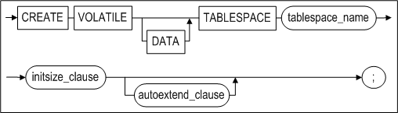

**initsize_clause ::=**


**autoextend_clause ::=**


**maxsize_clause ::=**


#### Prerequisites

Only the SYS user and users having the CREATE TABLESPACE system privilege can create tablespaces.

#### Description

The CREATE VOLATILE TABLESPACE statement is used to create a volatile tablespace for storing database objects in the database. Tablespaces created using this command are used to hold volatile tables. 

*VOLATILE*

This keyword is used to specify that the tablespace to be created will be a volatile tablespace.

*DATA*

This keyword is used to specify that the tablespace to be created will be used to store user data. A data tablespace is created even when the CREATE TABLESPACE statement is executed without the DATA keyword.

*tablespace_name*

This is used to specify the name of the tablespace to create. Refer to “Rules for Object Names” in Chapter 2 for more information on specifying names.

*initsize_clause*

This is used to specify the initial size of the tablespace to create.

*SIZE*

This is used to specify the initial size of a tablespace. The size can be specified in kB (kilobytes, expressed as “K”), MB (megabytes, expressed as “M”) or GB (gigabytes, expressed as “G”). If no units are specified, the default unit is kilobytes.

For example, if the EXPAND_CHUNK_PAGE_COUNT property is set to 128, the default allocation size would be 128 * 32 = 4MB. Therefore, the initial size must be set to a multiple of 4MB.

This value can be specified in units of Kilobytes (K), Megabytes (M), or Gigabytes (G). If no unit is specified, the default unit is in kilobytes.

*autoextend_clause*

This is used to specify whether the tablespace automatically increases in size when necessary, and the maximum size to which it can increase. If this clause is omitted, AUTOEXTEND is disabled by default.

*ON*

This enables the AUTOEXTEND option.

*OFF*

This disables the AUTOEXTEND option. 

*NEXT*

This is used to specify the increment by which the tablespace increases in size when it is automatically increased in size. 

Note that the initial size of the memory tablespace must be a multiple of this increment. 

If AUTOEXTEND is enabled but this value is not set, the default is the value set using the EXPAND_CHUNK_PAGE_COUNT property in the altibase.properties file. If AUTOEXTEND is OFF, this value is meaningless. 

The size can be specified in kB (kilobytes, expressed as “K”), MB (megabytes, expressed as “M”) or GB (gigabytes, expressed as “G”). If no units are specified, the default unit is kilobytes.

*maxsize_clause*

This is used to specify the maximum size to which a tablespace can increase when it automatically increases in size. 

If AUTOEXTEND is enabled but this value is not set, the default value is UNLIMITED. If AUTOEXTEND is OFF, this value is meaningless. 

The size can be specified in kB (kilobytes, expressed as “K”), MB (megabytes, expressed as “M”) or GB (gigabytes, expressed as “G”). If no units are specified, the default unit is kilobytes.

*UNLIMITED*

This is used to indicate that there is no upper limit to the size to which the tablespace can increase

If this option is used, the tablespace will automatically increase in size up to the point at which the total size of all memory tablespaces and all volatile tablespaces in the system reaches the size specified in the MEM_MAX_DB_SIZE property in the altibase.properties file.

#### Examples

\<Query 1\> Create a user-defined volatile data tablespace that is initially 512MB in size and does not automatically increase in size.

```
iSQL> CREATE VOLATILE DATA TABLESPACE user_data SIZE 512M;
Create success.
```

\<Query 2\>  Create a user-defined volatile data tablespace that is initially 512MB in size and increases in size in 128MB increments.

```
iSQL> CREATE VOLATILE DATA TABLESPACE user_data SIZE 512M AUTOEXTEND ON NEXT
128M;
Create success.
```

### CREATE TEMPORARY TABLESPACE 

#### Syntax

**create_temporary_tablespace ::=**


**datafile_spec ::=**


**autoexetend_clause ::=**


#### Prerequisites

Only the SYS user and users having the CREATE TABLESPACE system privilege can create temporary tablespaces.

#### Description

This command is used to create a temporary tablespace for storing temporary results that are used only for the duration of a session. The temporary tablespace will be created in disk space. Data in temporary tablespaces are stored in data files.

To create a tablespace in which to store database objects permanently, use the CREATE DISK TABLESPACE statement.

*tblspace_name*

This is used to specify the name of the temporary tablespace to be created. Refer to “Rules for Object Names” in Chapter 2 for more information on specifying names.

*TEMPFILE datafile_space*

This clause is used to specify the temporary file(s) constituting the temporary tablespace.

#### Example

\<Query\>  Create the temporary tablespace temp_data, which is 5 MB in size and is constituted by the tbs.temp data file.

```
iSQL> CREATE TEMPORARY TABLESPACE temp_data
  TEMPFILE '/tmp/tbs.temp' SIZE 5M 
  AUTOEXTEND ON; 
Create success.
```


### CREATE TRIGGER

#### Syntax

**create_trigger ::=**

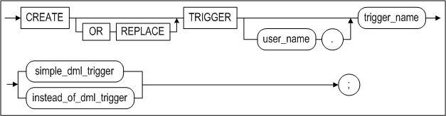

**simple_dml_trigger ::=**

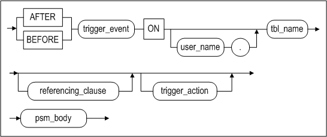

**trigger_event ::=**

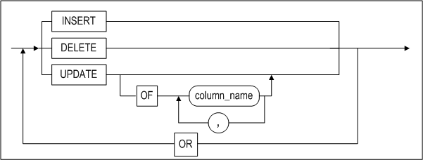

**referencing_clause ::=**


**trigger_action::=**


**psm_body::=**


**instead_of_dml_trigger::=**


#### Prerequisites

At least one of the following conditions must be met: 

- The SYS user 
- Users have the CREATE TRIGGER or CREATE ANY TRIGGER system privilege to create a trigger in own's schema 
- Users have the CREATE ANY TRIGGER system privilege to create a trigger in another user's schema

#### Description

This command is used to create a trigger having the specified name.

*OR REPLACE*

This is used to replace a trigger of the same name if a trigger already exists. That is, this changes the definition of an existing trigger instead of removing and recreating an existing trigger.

*user_name*

This is used to specify the name of the owner of the trigger to be created. If this value is omitted, Altibase will assume that the trigger is to be created in the current user's schema.

*trigger_name*

This is used to specify the name of the trigger to be created. Refer to “Rules for Object Names” in Chapter 2for more information on specifying names.

*AFTER*

Choose the AFTER option to fire the trigger after the execution of trigger_event, that is, the event that caused the trigger to fire.

*BEFORE*

Choose the BEFORE option to fire the trigger before the execution of trigger_event, that is, the event that caused the trigger to fire.

*INSTEAD OF*

Choose the INSTEAD OF option to fire the trigger, instead of performing the triggering DML statement. INSTEAD OF triggers can only be created on views. If the view has a LOB column, a trigger can be created with the INSTEAD OF option; however, an error is raised when the triggering DML statement is executed.

*trigger_event*

This is an event that changes the data in a table and causes the trigger to fire. Note that in order to preserve database integrity, DML operations that change the data and are initiated by the replication Receiver thread in a replication target table (i.e. a table that is cited in an active replication object) are not treated as a trigger event (i.e. do not fire the trigger on the table).

- DELETE  
  The DELETE option specifies that the trigger will fire whenever a DELETE statement removes a row or rows from the table
- INSERT  
  The INSERT option specifies that the trigger will fire whenever an INSERT statement inserts data into the table. If the table has a LOB column, a trigger can be created with the ‘BEFORE INSERT … FOR EACH ROW’ statement on the table; however, an error is raised when the triggering DML statement is executed.
- UPDATE  
  The UPDATE option specifies that the trigger will fire whenever an UPDATE statement changes data in the table. The optional OF clause further specifies that the trigger will fire only when an UPDATE statement changes one of the columns specified therein.

*ON table_name*

This is used to specify the table that is referenced when determining whether the trigger will fire. The trigger will fire in response to a change made to the table specified in table_name.

Triggers can only reference regular tables. They cannot be created on the basis of objects such as views, sequences, or stored procedures.

Triggers cannot be created on the basis of tables that are referenced in replications. Likewise, any attempt to create a replication object that references a table that is already referenced by a trigger will fail.

If the user_name is omitted, Altibase will assume that the trigger is to be created for a table in the current user's schema.

*REFERENCING Clause*

One characteristic of triggers is the concept of old and new rows. When the data in the table referenced by a trigger are changed, an individual row that was changed will consequently have both old and new values. The REFERENCING clause makes it possible to refer to either the old value or the new value as desired.

The REFERENCING clause has the following restrictions:

- The REFERENCING clause must be used together with the FOR EACH ROW option.
- The REFERENCING clause must have the following structures so that it can be referred to in the trigger_action clause.
- {OLD|OLD ROW|OLD ROW AS|OLD AS} alias_name  
  This indicates the data contained in a record before it is modified. Old values can be referenced in the WHEN clause or in psm_body in trigger_action. It is of course impossible to reference an old value when the trigger event is an INSERT trigger event, because there is no old value.
- {NEW\|NEW ROW\|NEW ROW AS\|NEW AS} alias_name  
  This indicates the data contained in a record after it is modified. Note that when the trigger is a BEFORE trigger, it is possible to change these data in the body of the trigger. It is impossible to reference a new value when the trigger event is a DELETE trigger event, because there is no new value. 

*trigger_action*

The trigger action clause consists of the following three parts:

- Action granularity: Determines the unit (row or statement) by which the trigger operates
- Action WHEN condition: Optionally used to set an additional condition to determine whether the trigger will fire.
- Action body: Determines what the trigger actually does. 

*FOR EACH {ROW\|STATEMENT}*

This is used to specify the unit of operation of the trigger. The changes to the data in the table take place according to this unit. The default is FOR EACH STATEMENT.

- FOR EACH ROW: The operations specified in action body are conducted once for each row that is affected by trigger_event and satisfies the WHEN clause. The FOR EACH ROW clause must be used when either the REFERENCING clause or the WHEN clause is used.
- FOR EACH STATEMENT: The trigger will be fired only once, either after or before execution of the DML statement that caused the trigger to fire.

*WHEN search_condition*

This is used to specify the conditions that are used to determine whether to fire the trigger. The action body of the trigger is executed only if the search_condition in the WHEN clause evaluates to TRUE. If the search_condition in the WHEN clause evaluates to FALSE, the action body of the trigger will not be executed. If no WHEN clause is specified, the action body of the trigger will be executed every time the trigger event occurs.

To use a condition in the WHEN clause, the following constraints must be satisfied:

- The WHEN clause can only be used with the FOR EACH ROW clause. 
- Only the alias_name defined in the REFERENCING clause can be used in the WHEN search_condition. 
- Subqueries cannot be used in the WHEN search_condition. 
- Stored procedures cannot be used in the WHEN search_condition.

*psm_body*

This is the so-called “action body” of the trigger, and is used to specify the actual operations that are to be carried out by the trigger. psm_body can be specified in the same way as a block statement in a stored procedure. 

psm_body must satisfy the following constraints: 

Due to the nature and concept of a trigger, the following SQL statement syntax for the action body cannot be used.

- Transaction-related statements such as COMMIT and ROLLBACK cannot be used. 
- Session-related statements such as CONNECT cannot be used. 
- Schema-related statements such as CREATE TABLE cannot be used. 
- Stored procedures cannot be called.
- Recursive triggers, that is, triggers that perform the operation specified in trigger_event, cannot be created.

*ENABLE \| DISABLE*

The user can select an enable or a disable database trigger when creating a trigger. The default value is set to enable.

- If the status is set to disable, it does not operate when creating a trigger, but the trigger status can be modified by the ALTER TRIGGER statement.

For more detailed information about the use of block statements in stored procedures, please refer to the *Stored Procedures Manual.*

#### Considerations

- Order of Trigger Execution  
  It is possible to create multiple triggers that reference the same table. In such cases, the order in which the triggers fire is not fixed. If it is important to control the order in which the actions of multiple triggers occur, rewrite the triggers as a single trigger.
- Trigger Execution Failure  
  If an error occurs while a trigger is executing, the DML statement that caused the trigger to fire will also fail.
- Execution of DDL on Tables Referenced in Triggers  
  When a table that causes triggers to fire is deleted using the DROP TABLE statement, the triggers that fire in response to changes made to the table are also deleted. However, when a table that is referred to by the action body of a trigger is altered or dropped, the trigger is not dropped. In the case where the table is dropped, when it becomes impossible to perform the operations in the action body of such a trigger, any DML statements that cause the trigger to fire will fail. In the case where the table is altered, the trigger will be internally recompiled and executed at the time it is fired.
- Triggers and Replication  
  DML statements that are executed in the course of replication do not cause triggers to fire.

#### Examples

\<Query\>  The following example shows how to use a trigger to track the deletion of rows. In this example, the trigger operates on a FOR EACH ROW basis, and references the original values in the ono, cno, qty and arrival_date columns of the orders table when data about completed (processing='D') delivery orders are deleted from the table. The trigger creates a record of the deleted rows by inserting rows into the log_tbl table.

```
iSQL> CREATE TABLE log_tbl(
  ono BIGINT,
  cno BIGINT,
  qty INTEGER,
  arrival_date DATE,
  sysdate DATE);
Create success.

iSQL> CREATE TRIGGER del_trigger
  AFTER DELETE ON orders
  REFERENCING OLD ROW old_row
  FOR EACH ROW
  AS BEGIN
    INSERT INTO log_tbl VALUES(old_row.ono, old_row.cno, old_row.qty, old_row.arrival_date, sysdate);
  END;
/
Create success.

iSQL> DELETE FROM orders WHERE processing = 'D';
2 rows deleted.
iSQL> SELECT * FROM log_tbl;
ONO                  CNO                  QTY         ARRIVAL_DATE
------------------------------------------------------------------------
SYSDATE
---------------
11290011             17                   1000        05-DEC-2011
25-APR-2012
11290100             11                   500         07-DEC-2011
25-APR-2012
2 rows selected.
```

\<Query\> In the following example, when a record is inserted into the SCORES table, a value of 0 is set for the SCORE column if NULL is specified. This is accomplished using a BEFORE INSERT trigger that fires FOR EACH ROW.

```
iSQL> CREATE TABLE scores( id INTEGER, score INTEGER );
Create success.
iSQL> CREATE TRIGGER scores_trigger
BEFORE INSERT ON scores
REFERENCING NEW ROW NEW_ROW
FOR EACH ROW
AS BEGIN
  IF NEW_ROW.SCORE IS NULL THEN
     NEW_ROW.SCORE := 0;
  END IF;
END;
/
Create success.

iSQL> INSERT INTO scores VALUES( 1, 20 );
1 row inserted.
iSQL> INSERT INTO scores VALUES( 5, NULL );
1 row inserted.
iSQL> INSERT INTO scores VALUES( 17, 75 );
1 row inserted.

iSQL> SELECT * FROM SCORES;
ID          SCORE       
---------------------------
1           20          
5           0           
17          75          
3 rows selected.
```

\<Query\> Confirm the operating status by creating a disable trigger, and modifies it to enable to check the status again.

```
iSQL> CREATE TABLE scores( id INTEGER, score INTEGER );
Create success.

iSQL> CREATE TRIGGER scores_trigger
BEFORE INSERT ON scores
REFERENCING NEW ROW NEW_ROW
FOR EACH ROW
DISABLE
AS BEGIN
IF NEW_ROW.SCORE IS NULL THEN
NEW_ROW.SCORE := 0;
END IF;
END;
/
Create success.

iSQL> INSERT INTO scores VALUES( 1, 20 );
1 row inserted.
iSQL> INSERT INTO scores VALUES( 5, NULL );
1 row inserted.
iSQL> INSERT INTO scores VALUES( 17, 75 );
1 row inserted.

iSQL> SELECT * FROM SCORES;
ID SCORE
---------------------------
1 20
5
17 75
3 rows selected.

iSQL> ALTER TRIGGER scores_trigger ENABLE;
Alter success.

iSQL> INSERT INTO scores VALUES( 100, NULL );
1 row inserted.

iSQL> SELECT * FROM SCORES;
ID SCORE
---------------------------
1 20
5
17 75
100 0
4 rows selected.
```

### CREATE USER 

#### Syntax

**create_user ::=**


**<a name="password_parameters"><a/>**

**password_parameters ::=**

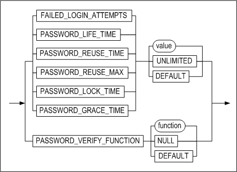

#### Prerequisites

Only the SYS user and users to whom the CREATE USER system privilege has been granted can create users.

#### Description

This statement is used to create a database user and specify the user's name, password, and tablespace access privileges.

*user_name*

This is used to specify the name of the user to create. The user name must be unique in the database. Refer to “Rules for Object Names” in Chapter 2 for more information on specifying names.

*IDENTIFIED BY password*

Altibase uses password authentication. The maximum length of a user password can be 16 to 22 bytes, depending on the operating system. An error is raised if you try to create a user with password that exceeds this limit. Altibase automatically converts lowercase passwords to uppercase by default. However, you can create a case sensitive password by setting the value of CASE_SENSITIVE_PASSWORD to 1, and then enclosing the password in quotation marks, when creating a user with the CREATE USER statement

User passwords must comply with Rules for Object Names in Chapter 2.

*TEMPORARY TABLESPACE Clause*

This clause is used to specify the default temporary tablespace for the user, and will be used to store intermediate results when the user performs operations on tables.

If no tablespace is specified, the system temporary tablespace<sup>[5]</sup> will be used as the temporary tablespace for the user.

> <sup>[5]</sup>: The system temporary tablespace is used for the temporary storage of data that are generated while a query is being executed. It is not logged, and thus the data stored therein cannot be recovered in the event of a media error.

A temporary tablespace is normally used to store intermediate results when the user performs operations on disk-based tables.

In the case where all of the tables being accessed by a query are memory tables, all query operations would take place in memory space, and thus no temporary tablespace would be used unless coerced using a query hint.

Only one temporary tablespace can be assigned to a user.

*DEFAULT TABLESPACE Clause*

This is used to specify the default tablespace in which to store user-created objects. If this clause is omitted, the default tablespace for the user is the system memory default tablespace. 

Only one default tablespace can be specified for a user.

*ACCESS Clause*

This is used to specify whether or not the user has access to the specified tablespace. If this clause takes the form ACCESS tablespace_name ON, the user is permitted to access the specified tablespace, whereas if it takes the form ACCESS tablespace_name OFF, the user is not authorized to access the specified tablespace. 

Users are also able to access tablespaces if the ALTER TABLESPACE system privilege has been granted to them.

*ENABLE/ DISABLE*

Specifies whether to enable or disable the user’s TCP connection. Only the SYS user can execute this clause. 

*FAILED_LOGIN_ATTEMPTS*

If the number of times login fails equals the number set for this value, the account is locked and login is impossible until it is unlocked. 

If PASSWORD_LOCK_TIME is set, the account is automatically unlocked after the specified time elapses

*PASSWORD_LOCK_TIME*

This specifies the date(unit: days) required to elapse for a locked account to become unlocked. For example, if the number 5 is set for this value and an account is locked, the account is unlocked after 5 days and login is possible.

*PASSWORD_LIFE_TIME*

This specifies the period of validity (unit: days) of the account password. PASSWORD_LIFE_TIME is applied in compliance with the last time the password was modified. 

*PASSWORD_GRACE_TIME*

This specifies the grace period (unit: days) during which the password can be modified after the expiry date. After expiration, the password must be modified by logging in the account within the given grace period. After grace period expiration, the password must be modified by logging in as SYS user.

*PASSWORD_REUSE_TIME*

This specifies the period of time (unit: days) needed to elapse for the reuse of identical passwords. Thus, identical passwords can be reused after the period of time specified for this option elapses. 

*PASSWORD_REUSE_MAX*

This specifies the number of times passwords can be altered for the reuse of identical passwords. Thus, identical passwords can be reused after they have been altered for the number of times specified for this option. 

> Note:  If either PASSWORD_REUSE_MAX or PASSWORD_REUSE_TIME is specified exclusively, the password cannot be reused.

*PASSWORD_VERIFY_FUNCTION*

Here the user can register user-defined CALLBACK functions to verify passwords. User-defined CALLBACK functions must return ‘TRUE’. 

CALLBACK functions for verifying passwords must have the following input parameters and return types:

```
CREATE OR REPLACE FUNCTION pwd_verify_function (
  username varchar(20),
  password varchar(20))
  RETURN varchar(100)
AS
result        varchar(100);
...
BEGIN
    ...
    result := 'TRUE';
    RETURN result;
END;
```


#### Restrictions

A single user can use multiple data tablespaces. However, a single user can use only one temporary tablespace.

It is not possible for a user to expressly access the system undo tablespace or create tables, indexes, or other objects therein. Additionally, because there is one, and only one, system undo tablespace in the system, users cannot delete the system undo tablespace or create other system undo tablespaces.

#### Examples

\<Query\> Create a user whose name is uare1 and password is rose1.

```
iSQL> CREATE USER uare1 IDENTIFIED BY rose1;
Create success.
```

\<Query\> Create a user named uare4 with the password rose4. Specify user_data as the default tablespace and temp_data as the temporary tablespace for the user, and grant the user privileges to access the SYS_TBS_MEMORY tablespace.

```
iSQL> CREATE USER uare4
        IDENTIFIED BY rose4
        DEFAULT TABLESPACE user_data
        TEMPORARY TABLESPACE temp_data
        ACCESS SYS_TBS_MEMORY ON;
Create success.
```

\<Query\> Create user rose2; the account is to be locked if login fails 5 times and unlocked after 5 days.

```
iSQL> CREATE USER rose2 IDENTIFIED BY rose2 
  LIMIT (FAILED_LOGIN_ATTEMPTS 5, PASSWORD_LOCK_TIME 5);
```

\<Query\> Create user rose3; the password is to expire after 5 days and a grace period of 5 days is to follow.

```
iSQL> CREATE USER rose3 IDENTIFIED BY rose3
  LIMIT (PASSWORD_LIFE_TIME 5, PASSWORD_GRACE_TIME 5);
```

\<Query\> Create user rose4; the password is to be available for reuse after being altered 3 times, and 10 days have elapsed.

```
iSQL> CREATE USER rose4 IDENTIFIED BY rose4
  LIMIT (PASSWORD_REUSE_MAX 3, PASSWORD_REUSE_TIME 10);
```

### CREATE VIEW

#### Syntax

**create_view ::=**


**query_restriction_clause ::=**


#### Prerequisites

At least one of the following conditions must be met: 

- The SYS user 
- Users have the CREATE VIEW or CREATE ANY VIEW system privilege to create a view in own's schema 
- Users have the CREATE ANY VIEW system privilege to create a view in another user's schema

#### Description

This statement is used to create a view having the specified name. A view is a logical table based on one or more tables or views. A view contains no data itself. The tables upon which a view is based are called base tables.

*OR REPLACE*

Use the OR REPLACE clause to replace a view having the same name if such a view already exists. This clause is used to change the definition of an existing view without having to drop the old view, create the new view, and grant previously granted privileges for the view.

*FORCE*

The FORCE clause is used to specify that the view is to be created even if the objects on which the view is based don't exist, and even if the owner of the schema containing the view does not have sufficient privileges to access the view.

This means that it is possible to use the FORCE option to create views that are semantically erroneous and thus invalid. In such cases, because an error will occur when a SELECT statement is executed on the view, it is advisable to test the view after creating it by executing a SELECT statement on it immediately, or to query the SYS_VIEWS_ meta table to verify that no errors were raised, which can be inferred to mean that the view is error-free.

*NO FORCE*

Use the NO FORCE clause to specify that the view is to be created only if the underlying objects exist and the owner of the schema in which the view is to be created has access privileges for them. This is the default view creation behavior.

*user_name*

This is used to specify the name of the owner of the schema in which the view is to be created. If this value is omitted, Altibase will create the view in the schema of the user who is connected via the current session.

*view_name*

This is used to specify the name of the view to create. Refer to “Rules for Object Names” in Chapter 2 for more information on specifying names.

*alias_name*

If the query on which a view is based contains an expression without an alias, an alias for the expression must be specified. This alias will becomes the name of the corresponding expression in the view. The number of aliases must be same as the number of expressions and columns in the query.

*subquery*

This is used to specify the text of a query that identifies rows and columns in the base table(s) to display in the view

*WITH READ ONLY*

This is used to specify that the view will be a read-only view. If you do not specify this option, the updatable view is created that can be performed INSERT, UPDATE, and DELETE operations on views.

#### Limitations on the Use of Queries in Views 

- The owner of the schema where the view is stored must have the necessary privileges to execute the SELECT statement from the table or view on which the view is based.
- A maximum of 1024 expressions can be specified in the SELECT statement on which a view is based. 
- The CURRVAL and NEXTVAL pseudocolumns cannot be used in the SELECT statement on which a view is based.

#### Examples

##### Creating a view

\<Query\>  In the following example, a view called avg_sal will be created on the basis of the employees table. The purpose of the view is to display the average salary for each department.

```
iSQL> CREATE VIEW avg_sal AS
  SELECT dno, AVG(salary) emp_avg_sal
FROM employees
  GROUP BY dno;
Create success.
iSQL> SELECT * FROM avg_sal;
AVG_SAL.DNO  AVG_SAL.EMP_AVG_SAL 
------------------------------------
A001  2066.66667  
C001  1576.66667  
C002  1660     
D001  2075.75   
F001  1845     
                  
6 rows selected.
```

Since emp_avg_sal is provided as an alias for the expression AVG (salary) within the subquery, the alias for the column of the view does not need to be specified. 

##### Creating a Join View<sup>[6]</sup>

> <sup>[6]</sup>:A join view is a view in which the underlying query contains a join.

\<Query\> The following view shows the names of the employees responsible for the ordered products and the names of the customers who ordered the products.

```
iSQL> CREATE VIEW emp_cus AS 
 SELECT DISTINCT e.e_firstname, e.e_lastname, 
  c.c_firstname, c.c_lastname 
 FROM employees e, customers c, orders o 
 WHERE e.eno = o.eno AND o.cno = c.cno;
Create success.
iSQL> SELECT * FROM emp_cus;
E_FIRSTNAME           E_LASTNAME            C_FIRSTNAME           C_LASTNAME
---------------------------------------------------------------------------------------------
Alvar                 Marquez               Estevan               Sanchez
Sandra                Hammond               Pierre                Martin
.
.
.
William               Blake                 Saeed                 Pahlavi
Sandra                Hammond               Saeed                 Pahlavi
22 rows selected.
```

### CREATE MATERIALIZED VIEW

#### Syntax

**create_materialized_view ::=**

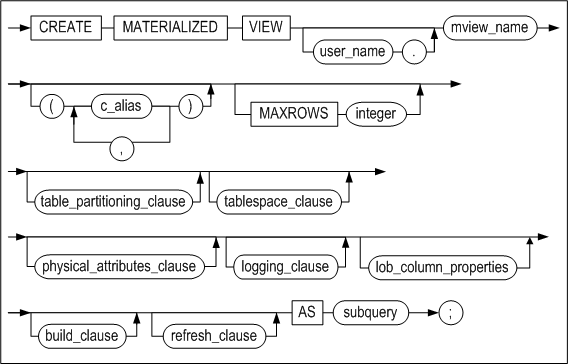

[table_partitioning_clause ::=](#table_partitioning_clause), [tablespace_clause
::=](#tablespace_clause), [logging_clause ::=](#logging_clause),
[lob_column_properties ::=](#lob_column_properties)

**physical_attributes_clause ::=**


[storage_clause ::=](#storage_clause)

**build_clause ::=**


**refresh_clause ::=**


#### Prerequisites

At least one of the following conditions must met: 

- The SYS user
- The CREATE MATERIALIZED VIEW system privilege are required to create a materialized view in the user’s schema. The SELECT object privilege for each base table that the user does not own or the SELECT ANY TABLE system privilege is also required. 
- The CREATE ANY MATERIALIZED VIEW system privilege is required to create a materialized view in another user’s schema. And the SELECT object privilege for each base table that the user does not own or the SELECT ANY TABLE system privilege as well. 
- Once the materialized view is created, an internal view and an internal table for the database are automatically created in the materialized view schema. These additionally created objects are used to maintain the materialized view data. The user requires the privilege to create such objects in order to create a Material View.

#### Description

A new materialized view is created as the specified name. A materialized view is a database object that stores query results. A table, a view or another materialized view can constitute the FROM clause of the query. Such objects are defined as “base tables”.

Like other tables, a materialized view stores the results of query statements in a tablespace and is mostly used for data warehouse purposes. The performance time for query execution can be significantly reduced by creating query statements that are frequently used or include time demanding JOIN or aggregate functions as materialized views. 

Altibase provides only read-only materialized views. 

*user_name*

This specifies the owner name of the materialized view to be created. On omission, Altibase creates a materialized view in the user schema connected to the current session.

*mview_name*

This specifies the name of the materialized view to be created. Refer to “Rules for Object Names” in Chapter 2 for more information on specifying names. Altibase automatically creates a table to maintain the data of the materialized view under the same name as the specified materialized view.

*c_alias*

If the queried target from the base table is an expression, an alias must be specified for that expression. This alias becomes the column name for the materialized view. The number of aliases must equal the total number of queried targets(expressions and columns). 

*table_partitioning_clause*

Please refer to table_partitioning_clause of the CREATE TABLE statement.

*segment_attributes_clause*

Please refer to segment_attributes_clause of the CREATE TABLE statement.

*lob_column_properties*

Please refer to lob_column_properties of the CREATE TABLE statement.

*phsical_attributes_clause*

Please refer to physical_attributes_clause of the CREATE TABLE statement.

*build_clause clause*

This specifies the initial time point at which data of the materialized view is built. On omission, the default value is IMMEDIATE.

- IMMEDIATE: Data is built at the time point that the materialized view is created.
- DEFERRED: Data is built during refresh execution after the materialized view is created.

*refresh_clause Clause*

If the base table of the materialized view is altered, the data of the materialized view must be updated. This clause specifies the method and time that the materialized view is refreshed. On omission, the default values are FORCE and ON DEMAND.

After the REFRESH keyword, one of the following must be specified: COMPLETE, FAST, FORCE REFRESH or ON DEMAND, ON COMMIT

- COMPLETE:  specifies data to be built by executing the sub query defined when the materialized view was created. 
- FAST: currently not supported.
- FORCE: when refresh occurs, if possible, fast refresh is executed; if not, the database is commanded to execute complete refresh. Altibase does not currently support FAST; specifying FORCE is equivalent to COMPLETE.
- ON DEMAND: specifies refresh only on user’s request.
- ON COMMIT: currently not supported.
- NEVER REFRESH: currently not supported.

> Note: The user can manually request materialized view refresh by calling the REFRESH_MATERIALIZED_VIEW stored procedure. For further information on the REFRESH_MATERIALIZED_VIEW stored procedure, refer to the Chpater 10 in the *Stored Procedures Manual.*

*subquery clause*

This specifies the query statement of the materialized view. When the user creates a materialized view, the subquery specified in the clause is executed and its result is stored in the materialized view.

#### Example

\<Query\> Create a materialized view of the name mv1 that takes the employees table as its base table. Since the build clause and refresh clause are not specified, refresh is possible only on the user’s request and complete refresh is executed.

```
CREATE MATERIALIZED VIEW mv1 AS
SELECT * FROM employees;
```


### DISJOIN TABLE

#### Syntax

**disjoin_table ::=**


**partition_to_table_clause ::=**


#### Prerequisites

At lease one of the following conditions must be met in order to create a table: 

-   The SYS user 
-   The user have the CREATE TABLE or CREATE ANY TABLE system privilege in their own schema 
-   The user have the CREATE ANY TABLE system privilege in another user's schema

At least one of the following conditions must be met:

-   The SYS user 
-   The table's owner 
-   The user has the DROP ANY TABLE system privilege.

#### Description

Partitions in a partitioned table are converted into one or more tables. Partitioned tables are dropped and non-partitioned tables are created. The partitions are each converted to the specified table and the data is moved. If a table space option is not specified, a new table will be created in the default table space. 

*partition_to_table*

This clause specifies the name of the table to be used after dismounting all partitions belonging to the partitioned table.

#### Considerations

The following statements should be taken into consideration when using DISJOIN TABLE syntax.

-   Do not specify the owner name in the target table and the partitioned table that are created. 
-   The metatable associated with the newly created non-partitioned table is created, and the metatable associated with the partitioned table is deleted. 
-   PMS, packages, and views that are related to the target table cannot be used. 
-   Hash partitioned tables are not supported. 
-   The target partitioned table have the same condition with partition's attribute, constraints, and schema. 

#### Example

\<Query\> Convert each partition p1, p2, and p3 in table t1 into t2, t3, and t4, respectively.

```
iSQL> disjoin table t1
(
  partition p1 to table t2,
  partition p2 to table t3,
  partition p3 to table t4
);
Disjoin success.
```


### DROP DATABASE 

#### Syntax

**drop_database ::=**


#### Prerequisites

This SQL statement can only be executed by the SYS user in -sysdba administrator mode, and can only be executed during the PROCESS phase.

#### Description

This statement is used to delete a database from the system.

*database_name*

This is used to specify the name of the database to delete. 

When this command is executed, all of the data, log files and log anchor files that were used by the database are also deleted.

#### Example

\<Query\> Delate a database named mydb.

```
iSQL(sysdba)> DROP DATABASE mydb;
Checking Log Anchor files
[Ok] /home /altibase_home/logs/loganchor0 Exist.
[Ok] /home /altibase_home/logs/loganchor1 Exist.
[Ok] /home /altibase_home/logs/loganchor2 Exist.
Removing DB files
Removing Log files
Removing Log Anchor files
Drop success.
```


### DROP DATABASE LINK

For information on Database Link, please refer to the *Database Link User’s Manual*. 

### DROP DIRECTORY 

#### Syntax

**drop_directory ::=**

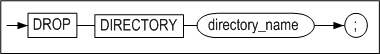

#### Prerequisites

Only the SYS user and users to whom the DROP ANY DIRECTORY system privilege has been granted can execute this statement.

#### Description

This statement is used to remove a directory. Note that only the reference to the directory in the database is removed; the actual directory is not removed from the file system.

*directory_name*

This is used to specify the name of the directory to drop.

#### Example

\<Query\> Drop the directory named anti_dir1.

```
iSQL> DROP DIRECTORY alti_dir1;
Drop success.
```

### DROP INDEX 

#### Syntax

**drop_index ::=**


#### Prerequisites

Only the SYS user, the owner of the schema containing the index, users having the INDEX object privilegm on table, and users having the DROP ANY INDEX system privilege can execute the DROP INDEX statement.

#### Description

This statement is used to remove an index from the database.

*user_name*

This is used to specify the name of the owner of the index to be dropped. If omitted, Altibase will assume that the index belongs to the schema of the user connected via the current session.

*index_name*

This is used to specify the name of the index to drop.

#### Example

\<Query\> Delete the index emp_idx1.

```
iSQL> DROP INDEX emp_idx1;
Drop success.
```


### DROP JOB 

#### Syntax

**drop_job ::=**


#### Prerequisites

Only the SYS user can use this statement.

#### Description

This drops the JOB from the database.

*job_name*

This specifies the name of the JOB to be dropped.

#### Examples

\<Query\> Drop the JOB job1.

```
iSQL> DROP JOB job1;
Drop success.
```


### DROP QUEUE 

#### Syntax

**drop_queue ::=**

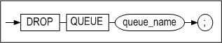

#### Prerequisites

Only the SYS user, the owner of the schema containing the queue, and users having the DROP ANY TABLE system privilege can execute the DROP QUEUE statement.

#### Description

This statement is used to delete the specified queue. The queue table, the index for the queue table and the sequence used to generate MSGID values in the queue table are deleted along with the queue. 

#### Example

\<Query\> Delete the message queue Q1 and its associated objects.

```
iSQL> DROP QUEUE Q1;
```


### DROP REPLICATION 

#### Syntax

**drop_replication ::=**


#### Prerequisites

Only the SYS user can execute replication-related statements.

#### Description

This statement is used to drop a replication.

*replication_name*

This is used to specify the name of the replication to drop.

#### Limitation

A replication that is currently active cannot be dropped. That is, a replication cannot be dropped if the ALTER REPLICATION START command has been executed for the replication; the ALTER REPLICATION STOP command must first be executed, after which it will be possible to drop the replication.

#### Example

\<Query\> Drop the replication rep1.

```
iSQL> DROP REPLICATION rep1;
```


### DROP ROLE

#### Syntax

**drop_role ::=**


#### Prerequisites

Only the SYS user and users with the DROP ANY ROLE system privilege can drop a role.

#### Description

This statement drops the specified role.

*role_name*

This is used to specify the name of the role to be dropped. 

#### Example

\<Query\> Drop the role with the name alti_role. 

```
iSQL> DROP ROLE alti_role;
Drop success.
```


### DROP SEQUENCE 

#### Syntax

**drop_sequence ::=**


#### Prerequisites

Only the SYS user, the owner of the schema containing the sequence, and users with the DROP ANY SEQUENCE system privilege can execute the DROP SEQUENCE statement.

#### Description

This statement is used to remove a sequence from the database. 

*user_name*

This is used to specify the name of the owner of the sequence to be dropped. If omitted, Altibase will assume that the sequence belongs to the schema of the user connected via the current session.

*seq_name*

This is used to specify the name of the sequence to drop.

#### Example

\<Query\> Delete the sequence seq1.

```
iSQL> DROP SEQUENCE seq1;
Drop success.
```


### DROP SYNONYM 

#### Syntax

**drop_synonym ::=**


#### Prerequisites

Only the SYS user, the owner of the schema containing the , and the users with the DROP ANY SYNONYM privilege can execute the DROP SYNONYM statement.

In addition, only the SYS user and users with the DROP PUBLIC SYNONYM system privilege can drop public synonyms

#### Description

This statement is used to remove a synonym from the database. 

*PUBLIC*

To remove a public synonym, use the PUBLIC keyword, If the PUBLIC keyword is not used, a PRIVATE synonym having the specified name will be removed.

When the PUBLIC keyword is used, user_name cannot be specified.

*user_name*

This is used to specify the name of the owner of the synonym to drop. If omitted, Altibase will assume that the synonym belongs to the schema of the user connected via the current session. 

*synonym_name*

This is used to specify the name of the synonym to drop.

#### Examples 

\<Query\> Drop the synonym my_dept.

```
iSQL> DROP SYNONYM my_dept;
Drop success.
```

\<Query\> Drop the PUBLIC synonym dept.

```
iSQL> DROP PUBLIC SYNONYM dept;
Drop success.
```


### DROP TABLE 

#### Syntax

**drop_table ::=**


#### Prerequisites

Only the SYS user, the owner of the schema containing the table, and users withthe DROP ANY TABLE system privilege can execute the DROP TABLE statement.

#### Description

This statement is used to remove a table and all of its data from a database.

Set the value of the RECYCLEBIN_ENABLE property to 1 to move a table to the recycle bin, instead of dropping it directly from the database. Tables of the same name can be dropped multiple times; only as many tables as the recycle bin can contain can be moved to the recycle bin. 

*user_name*

This is used to specify the name of the owner of the table to be dropped. If omitted, Altibase will assume that the table belongs to the schema of the user connected via the current session.

*table_name*

This is used to specify the name of the table to be dropped. 

*{CASCADE \| CASCADE CONSTRAINTS}*

These options are used to delete referential integrity constraints in other tables that reference the primary key or unique keys in the table being dropped. 

#### Example

\<Query\> Drop the table employees.

```
iSQL> DROP TABLE employees;
Drop success.
```


### DROP TABLESPACE

#### Syntax

**drop_tablespace ::=**


#### Prerequisites

Only the SYS user and users with the DROP TABLESPACE system privilege can execute the DROP TABLESPACE statement.

#### Description

This statement is used to remove a tablespace from the database. 

*tblspace_name*

This is used to specify the name of the tablespace to drop.

*INCLUDING CONTENTS*

This is used to specify that all of the contents of the tablespace are to be deleted. If one or more objects exist in the tablespace, this clause must be specified in order to remove the tablespace. If this clause is not specified, Altibase will return an error and the DROP TABLESPACE statement will fail.

*AND DATAFILES*

If the AND DATAFILES clause is additionally specified along with the INCLUDING CONTENTS clause, all of the files related to the tablespace are deleted from the file system. 

When a disk tablespace is dropped, all of the data files in the disk tablespace are deleted from the file system.

When a memory tablespace is dropped, all the checkpoint image files for the memory tablespace are deleted from the file system. However, the checkpoint paths are not deleted. 

The AND DATAFILES clause cannot be used when dropping a volatile tablespace.

*CASCADE CONSTRAINTS*

The CASCADE CONSTRAINTS clause must be specified in order to drop all referential integrity constraints in tables that are stored in tablespaces other than the tablespace being dropped but that refer to primary and unique keys in tables in the tablespace being dropped. If this clause is omitted when such referential integrity constraints exist, an error will be returned and the attempt to drop the tablespace will fail.

#### Limitation

The following tablespaces are system tablespaces, and thus cannot be removed using the DROP TABLESPACE statement:

-   SYS_TBS_MEM_DIC

-   SYS_TBS_MEM_DATA

-   SYS_TBS_DISK_DATA

-   SYS_TBS_DISK_UNDO

-   SYS_TBS_DISK_TEMP

#### Examples

\<Query 1\> Drop the tablespace user_data.

```
iSQL> DROP TABLESPACE user_data;
Drop success.
```

\<Query 2\> Delete the disk tablespace user_data along with all associated objects and data files.

```
iSQL> DROP TABLESPACE user_data INCLUDING CONTENTS AND DATAFILES;
Drop success.
```

\<Query 3\> Delete the memory tablespace user_data along with all associated objects and data files. 

```
iSQL> DROP TABLESPACE user_memory_tbs INCLUDING CONTENTS AND DATAFILES;
Drop success.
```

\<Query 4\> Delete the tablespace user_data along with all objects stored therein and all referential integrity constraints that refer to primary and unique keys in all tables in the tablespace.

```
iSQL> DROP TABLESPACE user_data INCLUDING CONTENTS CASCADE CONSTRAINTS;
Drop success.
```


### DROP TRIGGER

#### Syntax

**drop_trigger ::=**


#### Prerequisites 

Only the SYS user, the owner of the schema containing the trigger, and users with the DROP ANY TRIGGER system privilege can execute the DROP TRIGGER statement.

#### Description

This statement is used to drop the specified trigger from the database.

*user_name*

This is used to specify the name of the owner of the trigger to be dropped. If omitted, Altibase will assume that the trigger belongs to the schema of the user connected via the current session.

*trigger_name*

This is used to specify the name of the trigger to be dropped.

#### Example

\<Query\> Drop the trigger del_trigger from a table.

```
iSQL> DROP TRIGGER del_trigger;
Drop success.
```


### DROP USER 

#### Syntax

**drop_user ::=**

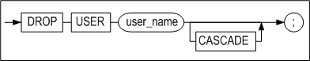

#### Prerequisites

Only the SYS user and users with the DROP USER system privilege can execute the DROP USER statement.

#### Description

This statement is used to drop the specified user from the database.

*user_name*

This is used to specify the name of the user to drop.

*CASCADE*

This is used to specify that not only the database user but also all objects in the user's schema will be dropped. Additionally, any referential integrity constraints that refer to primary and unique keys in tables belonging to the user's schema will also be dropped.

If there is an object in the user schema to be deleted and omit CASCADE, an error will be returend and the DROP USER statement will fail.

#### Examples

\<Query\> Drop the user uare1.

```
iSQL> DROP USER uare1;
Drop success.
```

\<Query\> Drop the user uare4 and all of the user's objects.

```
iSQL> DROP USER uare4 CASCADE;
Drop success.
```


### DROP VIEW

#### Syntax

**drop_view ::=**


#### Prerequisites

Only the SYS user, the owner of the schema containing the view, and users with the DROP ANY VIEW system privilege can execute the DROP VIEW statement.

#### Description

This statement is used to drop the specified view from the database.

*user_name*

This is used to specify the name of the owner of the view to be dropped. If omitted, Altibase will assume that the view belongs to the schema of the user connected via the current session.

*view_name*

This is used to specify the name of the view to be dropped.

#### Example

\<Query\> Drop the view avg_sal.

```
iSQL> DROP VIEW avg_sal;
Drop success.
```


### DROP MATERIALIZED VIEW

#### Syntax

**drop_mview ::=**


#### Prerequisites

Only the following users can delete the materialized view using this statement:

-   The SYS user

-   The owner of the Materialized view

-   The user with the system privilege of DROP ANY MATERIALIZED VIEW

#### Description

This statement deletes the specified materialized view from the database.

*user_name*

This specifies the owner name of the materialized view to be deleted. On omission, Altibase deletes the materialized view of the current user’s schema.

*mview_name*

This specifies the name of the materialized view to be deleted.

#### Example

\<Query\> Delete the materialized view with the name mv1.

```
DROP MATERIALIZED VIEW mv1;
```


### FLASHBACK TABLE

#### Syntax

**flashback_table::=**

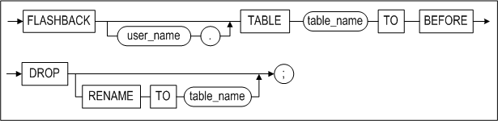

#### Prerequisites

At least one or more of the following conditions must be met: 

-   The SYS user

-   The user with the CREATE TABLE or CREATE ANY TABLE system privilege in own's schema.
  
-   The user with the CREATE ANY TABLE system privilege in another user's schema.

#### Description

FLASHBACK TABLE recovers tables from the recycle bin. If there are several tables with the same name, the first table that was dropped is recovered to the database.

*table_name*

This specifies the name of the table to be recovered from the recycle bin. The table takes the name it had before it was moved, or a new name generated by the system when it was moved to the recycle bin. If there are several tables with the same name, the first table that was moved to the recycle bin is recovered to the database.

*RENAME TO table_name*

The user can specify a new name for the table when it is recovered; if the same name exists in the user's schema, the name can be altered.

### GRANT

#### Syntax

**grant ::=**


**grant_system_privilege ::=**


**grant_object_privilege ::=**

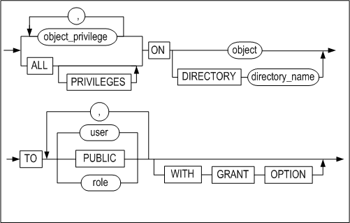

#### Prerequisites 

Only the SYS user and users with the GRANT ANY ROLE system privilege can grant system privileges to a role. In addition, an object privilege can be granted to other users only by the owner of the object or who has been granted object privilege with WITH GRANT OPTION.

#### Description

This statement is used to grant privileges to access the database or specified objects to one or more specified users.

Access privileges are classified as either system privileges or object privileges.

*grant_system_privilege*

System privileges are usually managed by the SYS user. The SYS user can grant limited system privileges to allow users to perform specific database tasks. System privileges can be seen as broad privileges that control objects in any schema.

System privileges are required in order to execute DDL statements and DCL statements.

grant_object_privilege

Once a user has been granted privileges for a particular object, the user can access and/or manipulate the object. Object access privileges are typically managed by the owner of the object. 

If system privileges have not been granted, object access privileges are required in order to execute DML statements.

#### System Privileges

*system_privilege*

This is used to specify the name of the system access privilege that will be granted.

*role*

This is used to specify the name of the role to be granted

-   A role cannot be granted to another role or PUBLIC.

-   A maximum number of 126 roles can be granted per user.

-   A user cannot immediately use a role which has been granted. The privileges of a role are enabled after the user has connected to a database.

*ALL PRIVILEGES*

This is used to grant all system privileges to the specified user or users.

*TO user*

This is used to specify name of the user or users to whom the system privilege(s) will be granted. 

*TO role*

This is used to specify the name of the role to which system privileges are to be granted.

*TO PUBLIC*

This is used to specify that the sytem privilege(s) is/are to be granted to all users.

##### Notes:

-   Just like the SYS user, any user to whom the GRANT ANY PRIVILEGES system is granted can grant all system access privileges to other users.
-   The SYS user has all system access privileges.
-   The presence of the ANY keyword in the name of a system privilege indicates that the privilege pertains to all schema. For example, the SELECT ANY TABLE privilege will allow the user to whom it is granted to run a SELECT statement on any table in the database.
-   The CREATE privilege is granted to allow users to create objects, and includes permission to DROP (i.e. remove) the objects they have created.
-   The CREATE TABLE object privilege allows users to create indexes as well as tables. The authority to create indexes is an object privilege, not a system privilege.
-   When a new user is created, the following privileges are typically granted to the user: CREATE DATABASE LINK, CREATE LIBRARY, CREATE MATERIALIZED_VIEW, CREATE PROCEDURE, CREATE SESSION, CREATE SYNONYM, CREATE TABLE, CREATE TRIGGER, CREATE VIEW.

The following query can be used to display the list of system privileges supported in Altibase:

```
iSQL> SELECT * FROM SYSTEM_.SYS_PRIVILEGES_ where PRIV_TYPE = 2;
```

Altibase supports the following system privileges.

| PrivID | System privilege  | Name                         | Purpose                                                      |
| ------ | ----------------- | ---------------------------- | ------------------------------------------------------------ |
| 1      |                   | ALL                          | Even if this privilege is granted to a user, the user will still not have the ALTER DATABASE, DROP DATABASE, or MANAGE TABLESPACE privileges. |
| 201    | DATABASE          | ALTER SYSTEM                 | For changing Altibase property settings using ALTER SYSTEM statements when Altibase is online |
| 233    |                   | ALTER DATABASE               | Cannot be granted to any users other than the SYS user       |
| 234    |                   | DROP DATABASE                | Cannot be granted to any users other than the SYS user       |
| 202    | INDEX             | CREATE ANY INDEX             | For creating indexes not only in one's own schema but also in other users' schemas |
| 203    |                   | ALTER ANY INDEX              | For altering the definition of any index in the database다.  |
| 204    |                   | DROP ANY INDEX               | For dropping any index from the database                     |
| 205    | PROCEDURE         | CREATE PROCEDURE             | For creating stored procedures and stored functions in one's own schema |
| 206    |                   | CREATE ANY PROCEDURE         | For creating stored procedures and stored functions not only in one's own schema but also in other users' schemas |
| 207    |                   | ALTER ANY PROCEDURE          | For recompiling any stored procedure or function in the database |
| 208    |                   | DROP ANY PROCEDURE           | For dropping any stored procedure or function in the database |
| 209    |                   | EXECUTE ANY PROCEDURE        | For executing any stored procedure or function in the database |
| 210    | SEQUENCE          | CREATE SEQUENCE              | For creating sequences in one's own schema                   |
| 211    |                   | CREATE ANY SEQUENCE          | For creating sequences not only in one's own schema but also in other users' schemas |
| 212    |                   | ALTER ANY SEQUENCE           | For changing the definition of any sequence in the database  |
| 213    |                   | DROP ANY SEQUENCE            | For deleting any sequence in the database                    |
| 214    |                   | SELECT ANY SEQUENCE          | For querying any sequence in the database                    |
| 215    | SESSION           | CREATE SESSION               | For connecting to the database                               |
| 216    |                   | ALTER SESSION                | Granted automatically to every user                          |
| 217    | TABLE             | CREATE TABLE                 | For creating tables in one's own schema                      |
| 218    |                   | CREATE ANY TABLE             | For creating tables not only in one's own schema but also in other users' schemas |
| 219    |                   | ALTER ANY TABLE              | For truncating all records from any table or changing the definition of any table in the database |
| 220    |                   | DELETE ANY TABLE             | For deleting any table from the database                     |
| 221    |                   | DROP ANY TABLE               | For dropping any table in the database                       |
| 222    |                   | INSERT ANY TABLE             | For inserting new records into any table in the database     |
| 223    |                   | LOCK ANY TABLE               | For locking any table in the database                        |
| 224    |                   | SELECT ANY TABLE             | For querying any table in the database                       |
| 225    |                   | UPDATE ANY TABLE             | For changing the data in any table in the database           |
| 226    | USER              | CREATE USER                  | For creating new users                                       |
| 227    |                   | ALTER USER                   | For changing the definition of any user in the database      |
| 228    |                   | DROP USER                    | For dropping users                                           |
| 229    | VIEW              | CREATE VIEW                  | For creating views in one's own schema                       |
| 230    |                   | CREATE ANY VIEW              | For creating views not only in one's own schema but also in other users' schemas |
| 231    |                   | DROP ANY VIEW                | For deleting any view in the database                        |
| 232    | MISCELLANEOUS     | GRANT ANY PRIVILEGES         | For granting any system privilege to other users             |
| 235    | TABLESPACES       | CREATE TABLESPACE            | For creating tablespaces                                     |
| 236    |                   | ALTER TABLESPACE             | For changing the definition of a tablespace                  |
| 237    |                   | DROP TABLESPACE              | For deleting tablespaces                                     |
| 238    |                   | MANAGE TABLESPACE            | Cannot be granted to any users other than the SYS user       |
| 240    |                   | SYSDBA                       | Cannot be granted to any users other than the SYS user       |
| 241    | TRIGGER           | CREATE TRIGGER               | For creating new triggers                                    |
| 242    |                   | CREATE ANY TRIGGER           | 자신의 스키마 뿐 아니라 다른 사용자의 스키마 내에서도 트리거 생성이 가능하다. |
| 243    |                   | ALTER ANY TRIGGER            | 데이터베이스에 존재하는 모든 트리거의 정의를 변경할 수 있다. |
| 244    |                   | DROP ANY TRIGGER             | 데이터베이스에 존재하는 모든 트리거를 제거할 수 있다.        |
| 245    | SYNONYM           | CREATE SYNONYM               | For creating new triggers                                    |
| 246    |                   | CREATE PUBLIC SYNONYM        | For creating a PUBLIC synonym                                |
| 247    |                   | CREATE ANY SYNONYM           | For creating private synonyms not only in one's own schema but also in other users' schemas |
| 248    |                   | DROP ANY SYNONYM             | For dropping any private synonym                             |
| 249    |                   | DROP PUBLIC SYNONYM          | For dropping public synonyms                                 |
| 250    | DIRECTORY         | CREATE ANY DIRECTORY         | A directory object can be created to control a file within the stored procedure. |
| 251    |                   | DROP ANY DIRECTORY           | This privilege can drop a directory object.                  |
| 252    | MATERIALIZED VIEW | CREATE MATERIALIZED VIEW     | This privilege can create a new materialized view in one's own schema |
| 253    |                   | CREATE ANY MATERIALIZED VIEW | This privilege can create a materialized view not only in one's own schema, but also in other user's schemas. |
| 254    |                   | ALTER ANY MATERIALIZED VIEW  | This privilege can be modified any materialized view in the database. |
| 255    |                   | DROP ANY MATERIALIZED VIEW   | Any materialized view in the database can be dropped with this privilege. |
| 256    | LIBRARY           | CREATE LIBRARY               | For creating new library objects in one's own schema         |
| 257    |                   | CREATE ANY LIBRARY           | For creating library objects not only in one's own schema but also in other users' schemas |
| 258    |                   | ALTER ANY LIBRARY            | For recompiling any library object in the database           |
| 259    |                   | DROP ANY LIBRARY             | For dropping any library object in the database              |
| 260    | DATABASE LINK     | CREATE DATABASE LINK         | New database link can be created.                            |
| 261    |                   | CREATE PUBLIC_DATABASE LINK  | Public database link can be created.                         |
| 262    |                   | DROP PUBLIC DATABASE LINK    | Public database link can be dropped.                         |
| 263    | ROLE              | CREATE ROLE                  | For creating a new role                                      |
| 264    |                   | DROP ANY ROLE                | For dropping all roles existing in the database              |
| 265    |                   | GRANT ANY ROLE               | For granting all roles to other users                        |
| 266    | JOB               | CREATE ANY JOB               | This privilege can create a new job not only in one's own schema, but also in other user's schemas. |
| 268    |                   | ALTER ANY JOB                | Any job in the database can be modified with this privilege. |
| 267    |                   | DROP ANY JOB                 | Any JOB in the database can be dropped with this privilege.  |

#### Object Privileges

*object_privilege*

This clause is used when it is desired to grant only particular privileges for the object (the table later in this section shows which privileges are supported for which objects).

*ALL [PRIVILEGES]*

This clause is used to grant all possible privileges for the object.

*ON object*

This is used to specify the object, such as a table, sequence, or stored procedure, for which to grant privileges.

*ON DIRECTORY directory_name*

This clause is used to specify the name of the directory object, which is used in stored procedures to manipulate directories and files in the file system, for which to grant privileges.

*TO user*

This is used to specify the name of the user or users to whom the object privilege(s) will be granted.

*TO PUBLIC*

This is used to specify that the object privilege(s) is/are to be granted to all users.

*TO role*

This is used to specify the name of the role to which object privileges are to be granted.

*WITH GRANT OPTION*

The WITH GRANT OPTION is used to enable the grantee to grant the object privileges to other users. However, this option cannot be used to grant object privileges to a role.

> ##### Summary
>
> -   The term "object owner" refers to the user who created an object.
>   
>-   In order to grant object access privileges, it is necessary to be the SYS user, the owner of the object, or a user to whom the relevant object access privileges have been granted with the WITH GRANT OPTION.
>   
> -   • The owner of an object automatically has all privileges for the object.
>

The following query can be used to display all of the object privileges supported in Altibase.

```
SELECT * FROM SYSTEM_.SYS_PRIVILEGES_ where PRIV_TYPE = 1;
```

Altibase supports the following object privileges:

<a name="grant_tbl2"><a/>

| Priv ID | Object privileges | Table | Sequence | PSM/ External Procedure | View | directory | External Library |
|---------|-------------------|-------|----------|-------------------------|------|-----------|------------------|
| 101     | ALTER             | O     | O        |                         |      |           |                  |
| 102     | DELETE            | O     |          |                         |      |           |                  |
| 103     | EXECUTE           |       |          | O                       |      |           | O                |
| 104     | INDEX             | O     |          |                         |      |           |                  |
| 105     | INSERT            | O     |          |                         |      |           |                  |
| 106     | REFERENCES        | O     |          |                         |      |           |                  |
| 107     | SELECT            | O     | O        |                         | O    |           |                  |
| 108     | UPDATE            | O     |          |                         |      |           |                  |
| 109     | READ              |       |          |                         |      | O         |                  |
| 110     | WRITE             |       |          |                         |      | O         |                  |

All users automatically have SELECT privileges for meta tables.

#### Examples

##### System Privileges

\<Query 1\>  In the following example, the EXECUTE ANY PROCEDURE, SELECT ANY TABLE, ALTER ANY SEQUENCE, INSERT ANY TABLE, and SELECT ANY SEQUENCE system privileges are granted to the user user5.

```
iSQL> CREATE TABLE seqtbl(i1 INTEGER);
Create success.
iSQL> CREATE OR REPLACE PROCEDURE proc1
AS
BEGIN
  FOR i IN 1 .. 10 LOOP
    INSERT INTO seqtbl VALUES(i);
  END LOOP;
END;
/
Create success.

iSQL> CREATE USER uare5 IDENTIFIED BY rose5;
Create success.
iSQL> GRANT EXECUTE ANY PROCEDURE, SELECT ANY TABLE TO uare5;
Grant success.
iSQL> CONNECT uare5/rose5;
Connect success.
iSQL> EXEC sys.proc1;
Execute success.
iSQL> SELECT * FROM sys.seqtbl;
SEQTBL.I1   
--------------
1           
2           
3           
4           
5           
6           
7           
8           
9           
10          
10 rows selected.

iSQL> CONNECT sys/manager;
Connect success.
iSQL> CREATE SEQUENCE seq1
  START WITH 13
  INCREMENT BY 3
  MINVALUE 0 NOMAXVALUE;
Create success.
iSQL> INSERT INTO seqtbl VALUES(seq1.NEXTVAL);
1 row inserted.
iSQL> INSERT INTO seqtbl VALUES(seq1.NEXTVAL);
1 row inserted.
iSQL> SELECT * FROM seqtbl;
SEQTBL.I1   
--------------
1           
2           
3           
4           
5           
6           
7           
8           
9           
10          
13          
16          
12 rows selected.

iSQL> GRANT ALTER ANY SEQUENCE, INSERT ANY TABLE, SELECT ANY SEQUENCE TO uare5;
Grant success.
iSQL> CONNECT uare5/rose5;
Connect success.	
iSQL> ALTER SEQUENCE sys.seq1
  INCREMENT BY 50
  MAXVALUE 100
  CYCLE;
Alter success.

iSQL> INSERT INTO sys.seqtbl VALUES(sys.seq1.NEXTVAL);
1 row inserted.
iSQL> INSERT INTO sys.seqtbl VALUES(sys.seq1.NEXTVAL);
1 row inserted.
iSQL> INSERT INTO sys.seqtbl VALUES(sys.seq1.NEXTVAL);
1 row inserted.
iSQL> INSERT INTO sys.seqtbl VALUES(sys.seq1.NEXTVAL);
1 row inserted.
iSQL> SELECT * FROM sys.seqtbl;
SEQTBL.I1   
--------------
1           
2           
3           
4           
5           
6           
7           
8           
9           
10          
13          
16          
66          
0           
50          
100         
16 rows selected.
```

\<Query 2\>  Create a role with the name alti_role, and then grant system privileges to it, such as CREATE USER, DROP USER, etc.

```
iSQL> create role alti_role;
Create success.
iSQL> grant create user, drop user to alti_role;
Grant success.
iSQL> create user user01 identified by user01;
Create success.
iSQL> grant alti_role to user01;
Grant success.
iSQL> connect user01/user01
Connect success.
iSQL> create user user02 identified by user02;
Create success.
iSQL> drop user user02;
Drop success.
```


##### Object Privileges

\<Query 1\> In the following example, the SELECT and DELETE object privileges on the table employees are granted to the user uare6 with the WITH GRANT OPTION. This user then passes these privileges on to the uare7 and uare8 users.

```
iSQL> CREATE USER uare6 IDENTIFIED BY rose6;
Create success.
iSQL> GRANT CREATE USER TO uare6;
Grant success.
iSQL> @schema.sql
iSQL> GRANT SELECT, DELETE ON employees TO uare6 WITH GRANT OPTION;
Grant success.
iSQL> CONNECT uare6/rose6;
Connect success.
iSQL> CREATE USER uare7 IDENTIFIED BY rose7;
Create success.
iSQL> GRANT SELECT, DELETE ON sys.employees TO uare7;
Grant success.
iSQL> CONNECT uare7/rose7;
Connect success.
iSQL> DELETE FROM SYS.employees WHERE eno = 12;
1 row deleted.
iSQL> SELECT eno, e_lastname FROM sys.employees WHERE eno = 12;
ENO         E_LASTNAME                 
-------------------------------------
No rows selected.
iSQL> CONNECT sys/manager;
Connect success.
iSQL> CREATE USER uare8 IDENTIFIED BY rose8;
Create success.
iSQL> CONNECT uare6/rose6;
Connect success.
iSQL> GRANT SELECT, DELETE ON sys.employees TO uare8;
Grant success.
```

Because the uare6 user was granted object access privileges using the WITH GRANT OPTION, this user can grant these privileges not only to the user uare7, who was created by uare6, but also to the user uare8, who was created by the original grantor (the SYS user).

```
iSQL> CONNECT uare8/rose8;
Connect success.
iSQL> DELETE FROM sys.employees WHERE eno = 13;
1 row deleted.

iSQL> SELECT eno, e_lastname FROM sys.employees WHERE eno = 13;
ENO         E_LASTNAME                 
-------------------------------------
No rows selected.
```

\<Query 2\> The following is an exmple of granting system and object privileges to a user and then revoking each privilege.

1. The SYS user has granted all system privileges to uare9.

   ```
   iSQL> CONNECT sys/manager;
   Connect success.
   iSQL> CREATE TABLE book(
     isbn CHAR(10) PRIMARY KEY,
     title VARCHAR(50),
     author VARCHAR(30),
     edition INTEGER DEFAULT 1,
     publishingyear INTEGER,
     price NUMBER(10,2),
     pubcode CHAR(4));
   Create success.
   iSQL> CREATE TABLE inventory(
     subscriptionid CHAR(10) PRIMARY KEY,
     storecode CHAR(4),
     purchasedate DATE,
     quantity INTEGER,
     paid CHAR(1));
   Create success.
   
   iSQL> CREATE USER uare9 IDENTIFIED BY rose9;
   Create success.
   iSQL> GRANT ALL PRIVILEGES TO uare9;
   Grant success.
   ```


2. The SYS user is granting user uare9 the REFERENCES privilege on the object book as the WITH GRANT OPTION.

  ```
  iSQL> GRANT REFERENCES ON book TO uare9 WITH GRANT OPTION;
  Grant success.
  ```

The user uare9 receives the REFERENCES object privilege for the book object from the SYS user with the WITH GRANT OPTION, and thus uare9 is able to grant another user (uare10) the REFERENCES object privilege for the book object.

3. The user uare9 inputs data into the book table, which is owned by the SYS user.

   ```
   iSQL> CONNECT uare9/rose9;
   Connect success.
   
   iSQL> INSERT INTO sys.book VALUES ('0070521824', 'Software Engineering', 'Roger S. Pressman', 4, 1982, 100000, 'CHAU');
   1 row inserted.
   iSQL> INSERT INTO sys.book VALUES ('0137378424', 'Database Processing', 'David M. Kroenke', 6, 1972, 80000, 'PREN');
   1 row inserted.
   ```


The user uare9 inputs data into the inventory table, which is owned by the SYS user.

   ```
   iSQL> INSERT INTO sys.inventory VALUES('BORD000002', 'BORD', '12-Jun-2003', 6, 'N');
   iSQL> INSERT INTO sys.inventory VALUES('MICR000001', 'MICR', '07-Jun-2003', 7, 'N');
   1 row inserted.
   ```


4. The user uare9 queries the book table, which is owned by the SYS user.

   ```
   iSQL> SELECT * FROM sys.book;
   BOOK.ISBN   BOOK.TITLE                                          
   ------------------------------------------------
   BOOK.AUTHOR                     BOOK.EDITION BOOK.PUBLISHINGYEAR BOOK.PRICE  
   ------------------------------------------------
   BOOK.PUBCODE  
   ----------------
   0070521824  Software Engineering                                
   Roger S. Pressman               4           1982        100000      
   CHAU  
   0137378424  Database Processing                                 
   David M. Kroenke                6           1972        80000       
   PREN  
   2 rows selected.
   ```


The user uare9 queries the inventory table, which is owned by the SYS user.

   ```
   iSQL> SELECT * FROM sys.inventory;
   INVENTORY.SUBSCRIPTIONID  INVENTORY.STORECODE  INVENTORY.PURCHASEDATE 
   ------------------------------------------------
   INVENTORY.QUANTITY INVENTORY.PAID  
   --------------------------------------
   BORD000002  BORD  2003/06/12 00:00:00  
   6           N  
   MICR000001  MICR  2003/06/07 00:00:00  
   7           N  
   2 rows selected.
   
   iSQL> CREATE TABLE book(
     isbn CHAR(10) PRIMARY KEY,
     title VARCHAR(50),
     author VARCHAR(30),
     edition INTEGER DEFAULT 1,
     publishingyear INTEGER,
     price NUMBER(10,2),
     pubcode CHAR(4));
   Create success.
   
   iSQL> CREATE TABLE inventory(
     subscriptionid CHAR(10) PRIMARY KEY,
     isbn CHAR(10) CONSTRAINT fk_isbn REFERENCES book(isbn), 
     storecode CHAR(4),
     purchasedate DATE,
     quantity INTEGER,
     paid CHAR(1));
   Create success.
   ```

5. Because the SYS user granted ALL PRIVILEGES to the user uare9, uare9 can create other users.

  ```
  iSQL> CREATE USER uare10 IDENTIFIED BY rose10;
  Create success.
  ```

6. Because the SYS user granted the REFERENCES privilege to the user uare9 with the WITH GRANT OPTION, uare9 can pass this privilege on to other users.

  ```
  iSQL> GRANT REFERENCES ON sys.book TO uare10;
  Grant success.
  ```


7. Because the SYS user granted the GRANT ANY PRIVILEGES privilege to the user uare9, uare9 can grant system privileges to other users.


  ```
  iSQL> GRANT ALTER ANY TABLE, INSERT ANY TABLE, SELECT ANY TABLE, DELETE ANY
  TABLE TO uare10;
  Grant success.
  ```


8. Because the user uare10 has the ALTER ANY TABLE and REFERENCES privileges, uare10 can create a constraint in a table belonging to another user

  ```
  iSQL> CONNECT uare10/rose10;
  Connect success.
  iSQL> ALTER TABLE sys.inventory
    ADD COLUMN (isbn CHAR(10) CONSTRAINT fk_isbn REFERENCES sys.book(isbn));
  Alter success.
  ```


9. Because the user uare10 has the INSERT ANY TABLE privilege, uare10 can enter data into a table belonging to uare9.

  ```
  iSQL> INSERT INTO uare9.book VALUES('0471316156', 'JAVA and CORBA', 'Robert Orfali', 2, 1998, 50000, 'PREN');
  1 row inserted.
  iSQL> INSERT INTO uare9.inventory VALUES('TOWE000001', '0471316156', 'TOWE', '01-Jun-2003', 5, 'N');
  1 row inserted.
  ```


Because the user uare10 has the INSERT ANY TABLE privilege, uare10 can enter data into a table belonging to the SYS user..

  ```
  iSQL> INSERT INTO sys.book VALUES('053494566X', 'Working Classes', 'Robert Orfali', 1, 1999, 80000, 'WILE');
  1 row inserted.
  iSQL> INSERT INTO sys.inventory VALUES('MICR000005', 'WILE', '28-JUN-1999', 8, 'N', '053494566X');
  1 row inserted.
  ```


10. Because the user uare10 has the SELECT ANY TABLE privilege, uare10 can query a table belonging to uare9.
  
```
    iSQL> SELECT * FROM uare9.book;
    BOOK.ISBN   BOOK.TITLE                                          
    ------------------------------------------------
    BOOK.AUTHOR                     BOOK.EDITION BOOK.PUBLISHINGYEAR BOOK.PRICE  
    ------------------------------------------------
    BOOK.PUBCODE  
    ----------------
    0471316156  JAVA and CORBA                                      
    Robert Orfali                   2           1998        50000       
    PREN  
    1 row selected.
    iSQL> SELECT * FROM uare9.inventory;
    INVENTORY.SUBSCRIPTIONID  INVENTORY.ISBN  INVENTORY.STORECODE  
    ------------------------------------------------
    INVENTORY.PURCHASEDATE INVENTORY.QUANTITY INVENTORY.PAID  
    ------------------------------------------------
    TOWE000001  0471316156  TOWE  
    2003/06/01 00:00:00  5           N  
    1 row selected.
```

Because the user uare10 has the SELECT ANY TABLE privilege, uare10 can query a table belonging to the SYS user.


    ```
    iSQL> SELECT * FROM sys.book;
    BOOK.ISBN   BOOK.TITLE                                          
    ------------------------------------------------
    BOOK.AUTHOR                     BOOK.EDITION BOOK.PUBLISHINGYEAR BOOK.PRICE  
    ------------------------------------------------
    BOOK.PUBCODE  
    ----------------
    0070521824  Software Engineering                                
    Roger S. Pressman               4           1982        100000      
    CHAU  
    0137378424  Database Processing                                 
    David M. Kroenke                6           1972        80000       
    PREN  
    053494566X  Working Classes                                     
    Robert Orfali                   1           1999        80000       
    WILE  
    3 rows selected.
    iSQL> SELECT * FROM sys.inventory;
    INVENTORY.SUBSCRIPTIONID  INVENTORY.STORECODE  INVENTORY.PURCHASEDATE 
    ------------------------------------------------
    INVENTORY.QUANTITY INVENTORY.PAID  INVENTORY.ISBN  
    ------------------------------------------------
    BORD000002  BORD  2003/06/12 00:00:00  
    6           N              
    MICR000001  MICR  2003/06/07 00:00:00  
    7           N              
    MICR000005  WILE  1999/06/28 00:00:00  
    8           N  053494566X  
    3 rows selected.
    ```


11. Because the user uare10 has the DELETE ANY TABLE privilege, uare10 can delete data from a table belonging to the SYS user.
  
```
    iSQL> DELETE FROM uare9.inventory WHERE subscriptionid = 'TOWE000001';
    1 row deleted.
    iSQL> SELECT * FROM uare9.inventory;
    INVENTORY.SUBSCRIPTIONID  INVENTORY.ISBN  INVENTORY.STORECODE  
    ------------------------------------------------
    INVENTORY.PURCHASEDATE INVENTORY.QUANTITY INVENTORY.PAID  
    ------------------------------------------------
    No rows selected.
    
    iSQL> DELETE FROM sys.inventory WHERE subscriptionid = 'MICR000005';
    1 row deleted.
    iSQL> SELECT * FROM sys.inventory;
    INVENTORY.SUBSCRIPTIONID  INVENTORY.STORECODE  INVENTORY.PURCHASEDATE 
    ------------------------------------------------
    INVENTORY.QUANTITY INVENTORY.PAID  INVENTORY.ISBN  
    ------------------------------------------------
    BORD000002  BORD  2003/06/12 00:00:00  
    6           N              
    MICR000001  MICR  2003/06/07 00:00:00  
    7           N              
    2 rows selected.
    
```


12. The user uare9 revokes all privileges that uare9 granted to uare10 without executing the REVOKE ALL statement.
  
```
    iSQL> CONNECT uare9/rose9;
    Connect success.
    iSQL> REVOKE ALTER ANY TABLE, INSERT ANY TABLE, SELECT ANY TABLE, DELETE ANY TABLE FROM uare10;
    Revoke success.
```


13. When uare10's REFERENCES privilege is revoked, referential integrity constraints that refer to primary key or unique keys in the sys.book table, which belongs to uare10's schema, are also dropped.
  
```
    iSQL> REVOKE REFERENCES ON sys.book FROM uare10 CASCADE CONSTRAINTS;
    Revoke success.
```


14. All of uare9's system privileges are revoked.

    ```
    iSQL> CONNECT sys/manager;
    Connect success.
    iSQL> REVOKE ALL PRIVILEGES FROM uare9;
    Revoke success.
    ```


15. The GRANT ANY PRIVILEGES privilege is revoked from uare9.

    ```
    iSQL> REVOKE GRANT ANY PRIVILEGES FROM uare9;
    Revoke success.
    ```


16. The REFERENCES privilege on the book table is revoked from uare9.

    ```
    iSQL> REVOKE REFERENCES ON book FROM uare9;
    Revoke success.
    
    ```


\<Query 3\> Grant the SELECT, UPDATE, INSER, and DELETE object privileges on the T1 table of user01 to the alti_role. Then, grant the alti_role role to the user user02.

```
iSQL> create role alti_role;
Create success.
iSQL> create user user01 identified by user01;
Create success.
iSQL> create user user02 identified by user02;
Create success.
iSQL> connect user01/user01
Connect success.
iSQL> create table t1 (i1 integer);
Create success.
iSQL> grant select,insert,update,delete on t1 to alti_role;
Grant success.
iSQL> connect sys/manager
Connect success.
iSQL> grant alti_role to user02;
Grant success.
iSQL> connect user02/user02;
Connect success.
iSQL> insert into user01.t1 values (1);
1 row inserted.
iSQL> insert into user01.t1 values (2);
1 row inserted.
iSQL> select * from user01.t1;
T1.I1       
--------------
1           
2           
2 rows selected.
iSQL> update user01.t1 set i1=3 where i1=1;
1 row updated.
iSQL> select * from user01.t1;
T1.I1       
--------------
2           
3           
2 rows selected.
iSQL> delete from user01.t1 where i1=2;
1 row deleted.
iSQL> select * from user01.t1;
T1.I1       
--------------
3           
1 row selected.
```


### PURGE TABLE 

#### Syntax

**purge_table::=**


#### Prerequisites

The SYS user, table's owner, and the user with the DROP ANY TABLE system privilege can execute PURGE TABLE.

#### Description

PURGE TABLE drops the specified table from the recycle bin. If there are several tables with the same name, the first table to be dropped is dropped from the database.

*user_name*

This is used to specifie the name of the table owner.

*table_name*

This is used specify the name of the table to be dropped from the recycle bin. The table takes the name it had before it was moved to the recycle bin, or a new name generated by the system when it was moved to the recycle bin.

#### Examples

\<Query\> Purge the table t1 in which DROP was executed from the recyle bin.

```
iSQL> alter session set recyclebin_enable = 1;
Alter success.
iSQL> create table t1 (i1 integer);
Create success.
iSQL> drop table t1;
Drop success.
iSQL> purge table t1;
Purge success.
```


### RENAME TABLE 

#### Syntax

**rename ::=**


#### Prerequisites

The SYS user, the owner of the schema containing the table, and users having the ALTER ANY TABLE system privilege can execute the RENAME TABLE statement.

#### Description

This statement is used to change the name of the specified table. Only the table name is altered; none of the data stored therein are changed.

*user_name*

This is used to specify the name of the owner of the table to be renamed. If this is omitted, Altibase will assume that the table belongs to the schema of the user connected via the current session.

*old_name*

This is used to specify the current name of the table.

*new_name*

This is used to specify the new name for the table.

#### Consideration

The name of a replication target table cannot be changed.

#### Example

\<Query\> Rename the table employees to emp1

```
iSQL> RENAME employees TO emp1;
Rename success.
```

Or 

```
iSQL> ALTER TABLE employees
  RENAME TO emp1;
Alter success.
```


### REVOKE 

#### Syntax

**revoke ::=**


**revoke_system_privilege ::=**

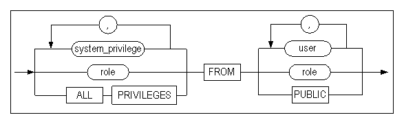

**revoke_object_privilege ::=**

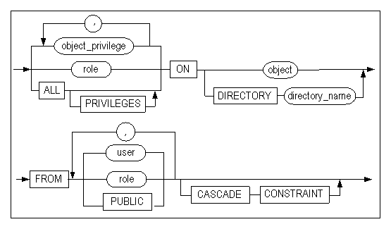

#### Prerequisites

The SYS user or the user who originally granted the privilege to be revoked can revoke privileges.

#### Description

This statement is used to revokes system privileges, object privileges on particular objects or roles from a specified user. This statement can also revoke system privileges or object privileges from roles. 

This statement can only revoke system privileges, object privileges and roles that were granted with the GRANT command.

##### System Privileges

*role*

This is used to specify the role to be revoked.

*system_privilege*

This is used to specify the system privilege(s) to be revoked. Please refer to the description of the GRANT statement for the complete list of system privileges.

*ALL PRIVILEGES*

This is used to specify that all system privileges that have been granted by the user executing this revoke statement are to be revoked.

System privileges that were granted using the ALL PRIVILEGES clause can be rocked using the ALL PRIVILEGES clause.

*FROM user*

This is used to identify the user from whom the privilege(s) will be revoked.

*FROM role*

This is used to specify the role from which system privileges are to be revoked.

*FROM PUBLIC*

Use the PUBLIC keyword to revoke the privilege(s) from all users.

> Note: System privileges granted using the PUBLIC keyword can be revoked using the PUBLIC keyword.
>

##### Object Privileges

*role*

This is used to specify the role to be revoked.

*object_privilege*

This is used to specify the object privilege that is to be revoked. Please refer to the table in the description of the GRANT statement for more information about object privileges.

*ALL [PRIVILEGES]*

The ALL PRIVILEGES (or merely ALL) clause is used to revoke all object privileges that have been granted to the user by the user executing this revoke statement.

When revoking privileges using the ALL [PRIVILEGES] clause, all object access privileges granted to the user are revoked. This even includes object privileges that were not granted using the ALL [PRIVILEGES] clause. For example, an object privilege granted to a user in this way:

```
GRANT SELECT ON object TO user;
```

can of course be explicitly revoked in this way:

```
REVOKE SELECT ON object FROM user;
```

It can also be revoked together with all other privileges in this way:

```
REVOKE ALL ON object FROM user;
```

*ON object*

This is used to specify the object (table, sequence, stored procedure, etc.) for which the permissions are to be revoked.

*ON DIRECTORY directory_name*

This clause is used to revoke privileges from the specified directory object.

*FROM user*

This is used to identify the user from whom the privilege(s) will be revoked.

*FROM role*

This clause is used to identify the user(s) from whom the privilege(s) will be revoked. 

*FROM PUBLIC*

The PUBLIC keyword is used to revoke the privilege(s) from all users.

*CASCADE CONSTRAINTS*

This clause is relevant only when revoking the REFERENCES privilege or using the ALL [PRIVILEGES] clause. It is used to specify that any related referential integrity constraints are also to be dropped. These were granted either explicitly or implicitly using the ALL [PRIVILEGES] clause.

#### Examples

\<Query 1\> Revoke object privileges. 

```
iSQL> CONNECT uare6/rose6;
Connect success.
iSQL> REVOKE SELECT, DELETE ON sys.employees
  FROM uare7, uare8;
Revoke success.
iSQL> CONNECT uare7/rose7;
Connect success.
iSQL> SELECT eno, e_lastname FROM sys.employees WHERE eno = 15;
[ERR-311B1: The user must have the SELECT_ANY_TABLE privilege(s) to execute this statement.]
```

After the SELECT and DELETE privileges for the employees table have been revoked, an error message is displayed when an attempt is made to execute a SELECT statement on that table.

\<Query 2\> Among the CREATE USER and DROP USER system privileges granted to the role, revoke the CREATE USER privilege.

```
iSQL> create role alti_role;
Create success.
iSQL> grant create user, drop user to alti_role;
Grant success.
iSQL> create user user01 identified by user01;
Create success.
iSQL> grant alti_role to user01;
Grant success.
iSQL> connect user01/user01
Connect success.
iSQL> create user user02 identified by user02;
Create success.
iSQL> drop user user02;
Drop success.
iSQL> connect sys/manager
Connect success.
iSQL> revoke create user from alti_role;
Revoke success.
iSQL> connect user01/user01
Connect success.
iSQL> create user user02 identified by user02;
[ERR-311B1 : The user must have CREATE_USER privilege(s) to execute this statement.]
```

\<Query 3\> Revoke the DELETE object privilege on table t1 of user01 from the alti_role role. 

```
iSQL> create role alti_role;
Create success.
iSQL> create user user01 identified by user01;
Create success.
iSQL> create user user02 identified by user02;
Create success.

iSQL> connect user01/user01 
Connect success. 
iSQL> create table t1 (i1 integer); 
Create success. 
iSQL> grant select,insert,update,delete on t1 to alti_role; 
Grant success. 
 
iSQL> connect sys/manager 
Connect success. 
iSQL> grant alti_role to user02; 
Grant success. 
 
iSQL> connect user02/user02; 
Connect success. 
iSQL> insert into user01.t1 values (1); 
1 row inserted. 
iSQL> insert into user01.t1 values (2); 
1 row inserted. 

iSQL> select * from user01.t1; 
I1           
-------------- 
1            
2            
2 rows selected. 
iSQL> update user01.t1 set i1=3 where i1=1; 
1 row updated. 
iSQL> select * from user01.t1; 
I1           
-------------- 
2            
3            
2 rows selected. 
iSQL> delete from user01.t1 where i1=2; 
1 row deleted. 
iSQL> select * from user01.t1; 
I1           
-------------- 
3           
1 row selected. 
 
iSQL> connect user01/user01 
Connect success. 
iSQL> revoke delete on t1 from alti_role; 
Revoke success. 
 
iSQL> connect user02/user02 
Connect success. 
iSQL> delete from user01.t1 where i1=3; 
[ERR-311B1 : The user must have DELETE_ANY_TABLE privilege(s) to execute this statement.]
```


### TRUNCATE TABLE 

#### Syntax

**truncate ::=**

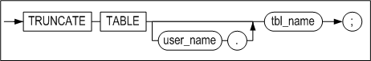

#### Prerequisites

The SYS user, the owner of the schema containing the table, and users having the ALTER ANY TABLE system privilege can execute the TRUNCATE TABLE statement.

#### Description

The TRUNCATE TABLE statement is used to remove all records from the specified table.

*user_name*

This is used to specify the name of the owner of the table to be truncated. If omitted, Altibase will assume that the table belongs to the schema of the user connected via the current session.

*tbl_name*

This is used to specify the name of the table to be truncated. 

If the name of a queue table is specified in tbl_name, all ENQUEUE messages are also deleted at the same time.

#### TRUNCATE vs. DELETE

When the TRUNCATE statement is executed, all of the pages in the table are returned to the database as free pages. Therefore, these pages are available for use by other tables. In contrast, when the DELETE statement is used to remove all of the rows from a table, any pages that are emptied are not returned to the database, but remain in a state in which they are reserved for future use by the same table, meaning that memory usage is not reduced.

Because the TRUNCATE statement is a DDL statement, it cannot be rolled back once it has executed successfully.

#### Consideration

Once the records have been successfully deleted, they cannot be recovered. However, if an error occurs before the completion of execution of the statement, or in the event of a server error, the statement can be rolled back.

#### Example

\<Query\> Use the TRUNCATE statement to remove all data from the employees table.

```
iSQL> TRUNCATE TABLE employee;
Truncate success.
```


