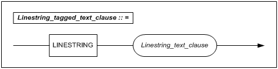
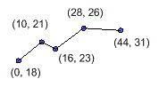
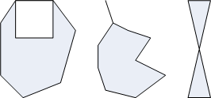
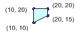
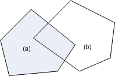

- [Spatial SQL Reference](#spatial-sql-reference)
  - [Preface](#preface)
    - [About This Manual](#about-this-manual)
  - [1. Overview of Spatial Data](#1-overview-of-spatial-data)
    - [The Concept of Spatial Data](#the-concept-of-spatial-data)
    - [The Characteristics of Spatial Data in Altibase](#the-characteristics-of-spatial-data-in-altibase)
    - [Spatial Data Terminology](#spatial-data-terminology)
  - [2. Spatial SQL](#2-spatial-sql)
    - [GEOMETRY Data Type](#geometry-data-type)
    - [The Format of the GEOMETRY Data Type](#the-format-of-the-geometry-data-type)
    - [DDL For Geometry](#ddl-for-geometry)
    - [Spatial Functions in Altibase](#spatial-functions-in-altibase)
    - [Basic Spatial Functions](#basic-spatial-functions)
    - [Spatial Analysis Functions](#spatial-analysis-functions)
    - [Spatial Object Creation Functions](#spatial-object-creation-functions)
    - [Dimensionally Extended Nine Intersection Model(DE－9IM)](#dimensionally-extended-nine-intersection-modelde9im)
    - [Spatial Relational Operators in Altibase SQL](#spatial-relational-operators-in-altibase-sql)
    - [Reserved Words](#reserved-words)
  - [3. Spatial Application Development](#3-spatial-application-development)
    - [Using the Spatial API](#using-the-spatial-api)
    - [Examples of Application Programming](#examples-of-application-programming)
    - [Data Types and Functions for Use with the Spatial API](#data-types-and-functions-for-use-with-the-spatial-api)
    - [Handle & Error Management Functions](#handle--error-management-functions)
    - [Spatial Object Creation Functions](#spatial-object-creation-functions-1)
    - [Spatial Object Querying Functions](#spatial-object-querying-functions)
    - [Endian Functions](#endian-functions)
  - [Appendix A. Limitations on the Use of Spatial Data in Altiabase](#appendix-a-limitations-on-the-use-of-spatial-data-in-altiabase)
    - [Limitations on GEOMETRY Type Columns](#limitations-on-geometry-type-columns)
  - [Appendix B. Spatial Schema](#appendix-b-spatial-schema)
    - [Sample Table Information](#sample-table-information)
    - [Sample Data](#sample-data)
  - [Appendix C. Geometry Reference Tables](#appendix-c-geometry-reference-tables)
    - [Geometry Reference Tables](#geometry-reference-tables)
    - [Related Stored Procedures](#related-stored-procedures)


Altibase® Application Development

# Spatial SQL Reference


Altibase Development Spatial SQL Reference

Release 7.1

Copyright ⓒ 2001\~2021 Altibase Corp. All Rights Reserved.

This manual contains proprietary information of Altibase Corporation; it is provided under a license agreement containing restrictions on use and disclosure and is also protected by copyright patent and other intellectual property law. Reverse engineering of the software is prohibited. All trademarks, registered or otherwise, are the property of their respective owners.

**Altibase Corp**

10F, Daerung PostTower II, 306, Digital-ro, Guro-gu, Seoul 08378, Korea Telephone: +82-2-2082-1000 Fax: 82-2-2082-1099

Customer Service Portal: http://support.altibase.com/en/

Homepage: [[http://www.altibase.com](http://www.altibase.com/)]

## Preface

### About This Manual

This manual describes how to use spatial SQL statements and the spatial API with spatial data.

#### Audience

This manual has been prepared for the following Altibase users:

-   Database administrators
-   Performance administrators
-   Database users
-   Application developers
-   Technical Supporters

It is recommended for those reading this manual possess the following background knowledge:

- Basic knowledge in the use of computers, operating systems, and operating system utilities
- Experience in using relational database and an understanding of database concepts
- Computer programming experience
- Experience in database server management, operating system management, or network administration

#### Organization

This manual is organized as follows: 

-   Chapter 1: Overview of Spatial Data  
    This chapter explains fundamental spatial data concepts, defines some related terminology, and describes the features of spatial data that are particular to Altibase.
    
-   Chapter 2: Spatial SQL  
    This chapter describes the spatial data types, spatial SQL statements, and spatial functions and operators that are supported in Altibase.
    
-   Chapter 3: Spatial Application Development  
    This chapter describes the Spatial API, which can be used by application developers to access spatial data.
    
-   Appendix A. Limitations on the Use of Spatial Data in Altibase  
    This Appendix explains the current limitations on GEOMETRY type columns.
    
-   Appendix B. Spatial Schema  
    This Appendix provides a reference for the table schema and data used in the examples throughout this manual.
    
-   Appendix C. Geometry Reference Tables 
    This Appendix discusses how to install and use the SPATIAL_REF_SYS and GEOMETRY_COLUMNS meta tables.

#### Documentation Conventions

This section describes the conventions used in this manual. Understanding these conventions will make it easier to find information in this manual and in the other manuals in the series. 

There are two sets of conventions:

-   Syntax diagram convetions
-   Sample code conventions

##### Syntax Diagram Conventions

This manual describes command syntax using diagrams composed of the following elements:

| Elements                                                     | Meaning                                                      |
| ------------------------------------------------------------ | ------------------------------------------------------------ |
| [](https://github.com/ALTIBASE/Documents/blob/master/Manuals/Altibase_7.1/eng/media/SQL/image1.gif) | Indicates the start of a command. If a syntactic element starts with an arrow, it is not a complete command. |
| [](https://github.com/ALTIBASE/Documents/blob/master/Manuals/Altibase_7.1/eng/media/SQL/image2.gif) | Indicates that the command continues to the next line. If a syntactic element ends with this symbol, it is not a complete command. |
| [](https://github.com/ALTIBASE/Documents/blob/master/Manuals/Altibase_7.1/eng/media/SQL/image3.gif) | Indicates taht the command continues from the previous line. If a syntactic element starts witht his symbol, it is not a complete command. |
| [](https://github.com/ALTIBASE/Documents/blob/master/Manuals/Altibase_7.1/eng/media/SQL/image4.gif) | Indicates the end of a statement.                            |
| [](https://github.com/ALTIBASE/Documents/blob/master/Manuals/Altibase_7.1/eng/media/SQL/image5.gif) | Indicates a manatory element.                                |
| [](https://github.com/ALTIBASE/Documents/blob/master/Manuals/Altibase_7.1/eng/media/SQL/image6.gif) | Indicates an optional element.                               |
| [](https://github.com/ALTIBASE/Documents/blob/master/Manuals/Altibase_7.1/eng/media/SQL/image7.gif) | Indicates a mandatory element comprised of options. One, and only one, option must be specified. |
| [](https://github.com/ALTIBASE/Documents/blob/master/Manuals/Altibase_7.1/eng/media/SQL/image8.gif) | Indicates an optional element comprised of options.          |
| [](https://github.com/ALTIBASE/Documents/blob/master/Manuals/Altibase_7.1/eng/media/SQL/image9.gif) | Indicates an optional element in which multiple elements may be specified. A comman must precede all but the first element. |

##### Sample Code Conventions

The code examples explain SQL statements, stored procedures, iSQL statements, and other command line syntax.

The following table describes the printing conventions used in the code examples.

| Rules            | Meaning                                                      | Example                                                      |
| ---------------- | ------------------------------------------------------------ | ------------------------------------------------------------ |
| [ ]              | Indicates an optional item                                   | VARCHAR [(*size*)] [[FIXED \|] VARIABLE]                     |
| { }              | Indicates a mandatory field for which one or more items must be selected. | { ENABLE \| DISABLE \| COMPILE }                             |
| \|               | A delimiter between optional or mandatory arguments.         | { ENABLE \| DISABLE \| COMPILE } [ ENABLE \| DISABLE \| COMPILE ] |
| . . .            | Indicates that the previous argument is repeated, or that sample code has been omitted. | SQL\> SELECT ename FROM employee;<br/> ENAME<br/>  -----------------------<br/> SWNO<br/>  HJNO<br/>  HSCHOI<br/>  .<br/> .<br/> .<br/> 20 rows selected. |
| Other Symbols    | Symbols other than those shown above are part of the actual code. | EXEC :p1 := 1; acc NUMBER(11,2)                              |
| Italics          | Statement elements in italics indicate variables and special values specified by the user. | SELECT \* FROM *table_name*; <br/>CONNECT *userID*/*password*; |
| Lower case words | Indicate program elements set by the user, such as table names, column names, file names, etc. | SELECT ename FROM employee;                                  |
| Upper case words | Keywords and all elements provided by the system appear in upper case. | DESC SYSTEM_.SYS_INDICES_;                                   |

##### Sample Code Conventions

The code examples explain SQL statements, stored procedures, iSQL statements, and other command line syntax.

The following table describes the printing conventions used in the code examples.

##### Sample Code Conventions

The code examples explain SQL statements, stored procedures, iSQL statements, and other command line syntax.

The following table describes the printing conventions used in the code examples.

| Rules            | Meaning                                                      | Example                                                      |
| ---------------- | ------------------------------------------------------------ | ------------------------------------------------------------ |
| [ ]              | Indicates an optional item                                   | VARCHAR [(*size*)][[FIXED \|] VARIABLE]                      |
| { }              | Indicates a mandatory field for which one or more items must be selected. | { ENABLE \| DISABLE \| COMPILE }                             |
| \|               | A delimiter between optional or mandatory arguments.         | { ENABLE \| DISABLE \| COMPILE } [ ENABLE \| DISABLE \| COMPILE ] |
| . . .            | Indicates that the previous argument is repeated, or that sample code has been omitted. | SQL> SELECT ename FROM employee; ENAME ----------------------- SWNO HJNO HSCHOI . . . 20 rows selected. |
| Other Symbols    | Symbols other than those shown above are part of the actual code.Other Symbols | EXEC :p1 := 1; acc NUMBER(11,2);Symbols other than those shown above are part of the actual code. |
| Italics          | Statement elements in italics indicate variables and special values specified by the user. | SELECT * FROM *table_name*; CONNECT *userID*/*password*;     |
| Lower case words | Indicate program elements set by the user, such as table names, column names, file names, etc. | SELECT ename FROM employee;                                  |
| Upper case words | Keywords and all elements provided by the system appear in upper case. | DESC SYSTEM_.SYS_INDICES_;                                   |

#### Related Documents

For more detailed information, please refer to the following documents.

-   Installation Guide

-   Getting Started Guide

-   Administrator’s Manual

-   Replication Manual

-   SQL Reference

-   Stored Procedures Manual

-   Precompiler User’s Manual

-   CLI User's Manual

-   Application Program Interface User’s Manual

-   iSQL User’s Manual

-   Error Message Reference

#### Altibase Welcomes Your Comments and Feedbacks

Please let us know what you like or dislike about our manuals. To help us with better future versions of our manuals, please tell us if there is any corrections or classifications that you would find useful.

Include the following information:

- The name and version of the manual that you are using
- Any comments about the manual
- Your name, address, and phone number

If you need immediate assistance regarding any errors, omissions, and other technical issues, please contact [Altibase's Support Portal](http://support.altibase.com/en/).

Thank you. We always welcome your feedbacks and suggestions.


## 1. Overview of Spatial Data

------------------

This chapter explains fundamental spatial data concepts, defines some related terminology, and describes the features of spatial data that are particular to Altibase.

### The Concept of Spatial Data

#### Spatial Data

The term “spatial data” refers to the representation of multidimensional data, such as points, lines and surfaces, as a list of numbers using a particular coordinate system. A typical example of spatial data is electronic map data, which is used to represent the topography of the real world in a coordinate system. 

There are two fundamentally different kinds of spatial data: raster data and vector data. 

In a vector model, points define coordinates, and points and lines define the borders between different aspects of the real world. The location of each of these aspects on a map is specified and maintained using a consistent coordinate system. Points, lines and polygons are used to represent coordinates or geographical features that are irregularly distributed in the real world. Lines are used to represent one-dimensional features such as roads, and polygons are used to represent two-dimensional features such as forests and the like. 

In a raster model, space is uniformly divided into units known as pixels or cells. The location of a geographical aspect or set of coordinates is defined as a matrix of the pixels and cells in which the aspect or set of coordinates exists. The level of detail that it is possible to represent using a raster model depends on the cell size. The area in each cell cannot be divided any further; that is, all of the attributes that apply to the cell apply uniformly to the entire area within the cell. All cells are identical in size. A raster model typically consists of millions of cells. 

The basic units in a vector model are points, lines and polygons. Compared to a raster model, a vector model typically consists of far fewer basic units, and moreover they are not uniform in size. A vector file typically contains thousands of elements, the specific location of each element being defined by one or more consecutive coordinate values. Vector data is easier to manipulate on a computer than raster data because the number of data items is lower, and additionally because the model is easier to adjust for different scales and yields more precise results when the scale is changed. 

The advantages and disadvantages of vector and raster data are shown in the following table:

| Type        | Advantages                                                   | Disadvantages                                                |
| ----------- | ------------------------------------------------------------ | ------------------------------------------------------------ |
| Vector data | • Easier to represent real-world phenomena using data structures • More space-efficient data storage • Easier construction of topological relationships • More precise graphical representation • Enables normalization of locations and attributes | • Complicated data structures • Difficulty overlapping map layers • Different topological form of respective units • Requires expensive equipment • Complicated spatial operations |
| Raster data | • Makes spatial analysis easier • Simple and clear data structure • Consistent topological form of all units • Easy to overlap map layers • Low-cost technology and rapid development • Easier integration with remote sensing data | • Difficulty constructing topological relationships • Creating a projection is time-consuming • Large amounts of graphical data • Large amounts of data loss upon data compression • Quality of output can be low |

Table 1-1 Advantages and Disadvantages of Vector and Raster Data

#### The Characteristics of Spatial Data

Spatial data are generally characterized by an indefinite form and presence in large quantities. 

Spatial data is said to be indefinite because the content and structure of each spatial object are represented in different ways depending on the type of the spatial object. Furthermore, even two objects of the same type can differ in the number of points, sub-objects, etc. they are comprised of, causing them to have different forms and lengths. 

Spatial data is generally voluminous. The size of spatial data can exceed the size of a storage page in a DBMS. For example, it can take megabytes (MB) of storage just to store the data for the coastline of a single nation. 

Because of these characteristics, there are many considerations that do not apply to non-spatial data that must be taken into account to store and manipulate spatial data efficiently. 

#### Spatial Data Models

There are two conventional spatial data models: the field-based model, in which a space is represented using a series of attributes, and the entity-based model, in which a space is represented as an object (or entity) made up of a set of points. In the field-based model, in which each point in space has one or more attributes, spaces are defined in a manner similar to the use of a continuous function in the Cartesian coordinate system.

However, the field-based model does not take the concept of objects, which is important to the entity-based model, into account. The objects that are usually the most important in the entity-based model include points, which indicate the locations of objects; lines, which indicate two connected points; polylines, which indicate a series of connected lines; and polygons. 

The spatial data model that was put forth by the Open Geospatial Consortium (OGC) is a conceptual model. That is, the model was defined in terms of spatial schema, and is an abstract data model rather than one that was intended for use in a particular implementation. This spatial schema forms the basis for the ISO 19107 Spatial Schema standard and is used in many other OGC specifications such as the OpenGIS Simple Features Specification and the GML Implementation Specification. 

Spatial schema consists of the geometry package, which is a geometric object model in which is proposed a quantitative technique for describing the spatial characteristics of features that are abstractions of real world features, and the topology package, which provides a model for describing the relationships between geometric objects. 

Based on the data models in the abstract specification, the OGC proposed more concrete OpenGIS geometry models in specifications intended for use in practical implementation, such as the OpenGIS Simple Features Specification. 

The so-called “Geometry Class” is a root class and an abstract class, and consists of subclasses such as Point, Curve, Surface and GeometryCollection. All geometric objects are defined in relation to the spatial reference system for a defined coordinate space. The actual classes that can be instantiated for use are the Point, LineString, Polygon, GeometryCollection, MultiPoint, MultiLineString and MultiPolygon classes. The rest of the classes are defined as abstract classes.

#### Spatial Database Systems

A spatial database contains both non-spatial data, typically represented using characters and numbers, and spatial data, which are represented as coordinate values for spatial objects. The geographic objects (usually spatial objects) that are managed in a spatial database have both general and geometric attributes, and include topological information, that is, information about the spatial relationships between objects. 

In order to store and manage such spatial data efficiently, a spatial database system must be able to represent and control non-spatial and spatial data at the logical level, and save and manage the data efficiently at the physical level. Therefore, in a spatial database system, it must be possible to represent data logically, and to provide functions for performing spatial operations on spatial data. 

On the physical level, it must be possible to store data efficiently, and to provide spatial indexing so that spatial data can be accessed efficiently. In addition, it must be possible to efficiently store and manage the topological and general attributes of the spatial data that describe spatial objects.

Spatial data modeling is a technique that defines how spatial data is represented, and must support spatial data types such as points, lines and surfaces which can be used to describe real-world features. These spatial data types must be as simple and precise as possible, even when they are used to represent compound spatial objects. Additionally, the use of spatial operators must be supported with all spatial data types. 

Spatial operators are those that are used to perform various kinds of spatial analysis, including the analysis of the topological relationships between spatial objects, so that spatial queries can be processed efficiently. For this reason, spatial database systems must support a variety of useful spatial operators.

#### Spatial

In general, complex and expensive operations on geometric figures are required in order to process spatial queries. Traditionally, point object operations involve sequential scanning and evaluation to determine which points are included in which objects. This incurs high processing costs because of frequent, repeated disk access and the repetitive assessment of geometric conditions. 

Therefore, efficient spatial access methods have been developed in order to reduce the number of objects that actually need to be processed in order to analyze large amounts of stored spatial data. A so-called “spatial access method” is a method in which a spatial index is used to reduce the number of objects that need to be processed when processing a spatial query. This method has a time complexity requirement, whereby it must be possible to conduct a search in sub-linear time, and a spatial complexity requirement, whereby the size of a spatial index must be smaller than the size of the indexed data. It also requires dynamic update, by which an object can be added to or removed from a spatial index without entailing a great reduction in performance. A typical spatial data access method that satisfies these requirements is one that uses an R-Tree. 

The R-Tree, a height-balanced hierarchical multi-dimensional index structure that was originally designed for use with secondary storage, is a generalization of the B-tree for use with multi-dimensional data spaces. Like a B-tree, an R-Tree has a height-balanced tree structure, meaning that references to objects exist only at terminal nodes. The R-tree, which uses an MBR (Minimum Bounding Rectangle) to represent a spatial object, was designed to reduce the number of nodes that must be visited in order to locate a spatial object. In addition, because R-trees support the dynamic creation of tree structures, update and search operations can be performed on one R-tree at the same time, and there is no need to periodically rearrange the tree structure.

#### Spatial Reference Systems

In a spatial reference system, mutual associations are drawn between locations in real-world space and spatial objects that are defined on the basis of coordinates in mathematically expressed vector space. Spatial references can be realized using either spatial coordinates or identifiers. 

A spatial reference system can be used to define a coordinate system for use with spatial data and the range of geographic area to which each data item refers.

#### Coordinate System

A coordinate system is used to specify the relative location of objects in a given area (for example, all or part of the earth's surface). 

A reference system that is used to represent a location on the earth using longitude and latitude values is, together with an ellipsoid that represents the topology of the earth, called a geodetic reference system. In Korea, the Korean Geodetic System, which is based on the Bessel Ellipsoid and on longitude, latitudes and azimuth values determined through astronomical observations, is used. GPS surveying has become more common, the demand for universal location reference systems that can be used around the world has grown, giving rise to international geodetic systems that can be used the same way all over the world. International survey systems can be classified as ITRF (International Terrestrial Reference Frame), WGS (World Geodetic System) and PZ (Parametry Zemli) systems, depending on the reference and ellipsoid on which they are based.

##### Reference Ellipsoids

A reference ellipsoid is a mathematical representation of the earth. It is a model of the earth that is obtained by rotating the earth around the major and minor axes of an earth-shaped ellipsoid. It is used as a reference model on which to base coordinate values. Various ellipsoids are used around the world, depending on the conditions in each country. One universal ellipsoid that is used around the world is WGS84.

##### Geoids

A geoid is a model of the earth's topology that is based on an imagined average sea level if the ocean were somehow able to penetrate the continents, in which all points are perpendicular to the direction of gravity. In other words, a geoid is an ellipsoid that represents the earth and throughout the surface of which the gravitational pull of the earth is the same, and represents a reference surface 0m above sea level which is the average sea level. Although the topology of a geoid is irregular due to differences in the gravitational pull of the earth in different locations, it can be approximated as an ellipsoid having a regular surface.

##### The Datum

A datum, meaning a parameter or a set of parameters that is either used unchanged or as the basis for the calculation of other parameters, is a value (i.e. a point, line, or surface) that is determined based on an observation and used as an arbitrary basis for calibrating other observations. A datum consists of longitudinal, latitudinal and azimuth values, and can also be referred to as a “horizontal datum” or “horizontal geodetic datum”. In addition, a datum defines an origin, scale and direction according to the axes of the terrestrial coordinate system, and can be a geodetic datum, a vertical datum or an engineering datum. When a datum is changed, the coordinates of its spatial data are also changed.

#### Projection

Projection is the process in which three-dimensional information about all or part of the earth is converted to a two-dimensional map by projecting it onto a two-dimensional planar surface, such as a cylinder, a cone, a disk, etc. Everyday paper maps, as well as the numerical maps that are used for 2D GIS, are created using this projection process. Because shape, distance, direction, scale and area are inevitably distorted during the projection process, it is important to choose a projection method such that the distortion of the area to be projected is minimized. 

In Korea, the Transverse Mercator (TM) projection method is used to create topographical maps. In TM projection, a geographic area is projected by bringing it into contact with a cylinder at its center meridian line (e.g. 127 ° East Longitude), which accurately projects the area close to the center meridian line. This projection method is thus frequently used when projecting areas that are extensive in the North-South direction. As one moves further from the center meridian, the distortion of distance, area, scale and direction becomes greater.

### The Characteristics of Spatial Data in Altibase

The method by which spatial data is processed in Altibase has the following characteristics:

-   Since Altibase features high-performance memory database technology and includes a spatial data model, it is superior not only for existing GIS applications, but also for the next-generation high-speed spatial data processing systems that will be required in the ubiquitous data environment. Moreover, because the spatial model is integrated with a conventional SQL-based RDBMS model, existing DBMS development environments and expertise can be utilized, leading to increased productivity.
  
-   In Altibase, spatial data (i.e. information about the location of a particular area) can be stored, managed and analyzed alongside traditional character and numeric data. This allows users to create, analyze and utilize spatial data such as information about the locations of office buildings or the size of flooded areas.
  
-   The capability of Altibase has been expanded through the inclusion of a series of advanced spatial data types for representing geometric objects such as points, lines and polygons, as well as numerous functions and features for working with these data types. Because it is so easy to integrate business data and spatial data, users can readily increase the range of business logic in their database applications.

### Spatial Data Terminology 

-   Closed  
    If the start and end points of a LINESTRING object are the same, the spatial object is said to be “closed”. In order for a spatial object to be considered to be a closed object, all of the elements that the spatial object consists of must be closed. For a more detailed explanation of this concept, please refer to the description of the ISCLOSED function. 
-   Compound Object  
    Compound objects are those spatial objects that are made up of two or more spatial objects. 
-   Dimension  
    A dimension is the minimum number of real numbers needed to represent the location of any point within a figure, object or space. A point has zero (0) dimensions, a straight line has one dimension, a plane has two dimensions, and a body that has volume has 3 dimensions. Note that n-dimensional space is possible, as there is no limit on the number of dimensions. 
-   Element  
    An element is any of the common figures that comprise a spatial object. A single spatial object can be constructed from elements such as points, lines or surfaces. 
-   Empty  
    A spatial object in which no elements exist is said to be “empty”. Unlike NULL, which implies that the contents of an object are unknown, the empty state indicates definitively that the object contains nothing. For a more detailed explanation of this concept, please refer to the description of the ISEMPTY function. 
-   Line  
    A line can be thought of as a trace of the continuous movement of a point. Next to the point, the line is the simplest figure. It has a location and a length, but no width or thickness. Lines can be straight or curved. 
-   Multiple Object  
    Multiple objects are spatial objects that are made up of more than one spatial object having the same form and comprise the MultiPoint, which consists only of points, the MultiLineString, which consists only of LineStrings, and the MultiPolygon, which consists only of Polygons. 
-   Point  
    This is the simplest spatial object. It has a location, but no size. 
-   Scale  
    Scale is the ratio between the distance shown in a map or picture and the actual distance in the real world. A scale value is typically expressed as a ratio, which enables the same units to be used for measurements on the map and in the real world. If, for example, the scale of a map is 1:25,000, one real-world unit of distance on the map represents 25,000 times that much distance in the real world. In other words, 1 cm on the map represents 25,000 cm in the real world. Note that the scale of a map describes horizontal distances only, and is not applicable to measurements of area or height. 
-   Simple  
    If the elements of a spatial object do not have unusual points, such as intersections or points of tangency, the spatial object is considered to be “simple”. For a more detailed explanation of this concept, please refer to the description of the ISSIMPLE function. 
-   Spatial Object  
    A spatial object consists of both spatial data, which are used to represent the real world, and operations, such as procedures, methods and functions, related to this data. 
-   Surface  
    A surface can be thought of as a trace of the continuous movement of a line, or as a planar form that cannot be described using a single point or line. Surfaces are classified as either planes or curved surfaces depending on whether their profile protrudes from a plane (i.e. a flat surface). Generally, the term “surface” is understood to refer to a planar surface, unless otherwise specified.   

## 2. Spatial SQL

-----------

This chapter describes the spatial data types, spatial SQL statements, and spatial functions and operators that are supported in Altibase. 

The implementation of spatial SQL in Altibase conforms with the ISO SQL/MM spatial standards and the Simple Features Specification for SQL proposed by the Open Geospatial Consortium (OGC). 

Because the Simple Features Specification for SQL is an extension of standard SQL, users who are familiar with SQL can continue to use queries in the way to which they are accustomed when dealing with spatial data.

### GEOMETRY Data Type

An understanding of spatial data types is required in order to manipulate spatial data in a database using spatial SQL. In this section, the spatial data types will be described in detail.

The spatial data type that is currently supported for use with SQL is the GEOMETRY type. The GEOMETRY type consists of the following 7 subtypes:

-   POINT

-   LINESTRING

-   POLYGON

-   MULTIPOINT

-   MULTILINESTRING

-   MULTIPOLYGON

-   GEOMETRYCOLLECTION

The following diagram illustrates the relationships between the GEOMETRY data type and the seven subtypes that it consists of.


[Figure 2‑1]  The relationships between the GEOMETRY data type and the seven subtypes

The GEOMETRY data type, as supported in Altibase, uses X and Y coordinates to represent a POINT, which represents a single point in space, and uses two or more POINTS to represent a LINESTRING. Depending on whether or not it is closed (i.e. on whether the two terminal points are the same), a LINESTRING is referred to either as a LINE1, which is unclosed, or as a LINEARRING2, which is closed. The terms LINE and LINEARRING are used to indicate the shape of spatial objects, but do not denote mutually distinct data types. 

A POLYGON consists of one or more LINEARRINGS. A MULTIPOINT consists of one or more POINTS, a MULTILINESTRING consists of one or more LINESTRINGS, and a MULTIPOLYGON consists of one or more POLYGONS. Finally, a GEOMETRYCOLLECTION can comprise any of the foregoing objects. In addition to the seven subtypes described above, Altibase also supports the EMPTY type. The EMPTY type can only be created by performing operations on spatial objects. The EMPTY type is returned by an operator whose return type is GEOMETRY when there is nothing to return as the result of an operation.

#### Classification of Subtypes

The criteria that are used to distinguish the 7 subtypes of the GEOMETRY data type from each other are described in the following [Table 2-1]:

| Subtype Name       | Constituent Elements                                    | Dimensions               | Simple         | Closed | Intererior                          | Boundary                                                     | Exterior |
| ------------------ | ------------------------------------------------------- | ------------------------ | -------------- | ------ | ----------------------------------- | ------------------------------------------------------------ | -------- |
| Point              | One Point                                               | 0                        | O              | X      | Point                               | Ø<sup>1</sup>                                                | Surface  |
| LINESTRING         | Two or more POINTs                                      | 1                        | \*<sup>2</sup> | \*     | Line                                | Ø<sup>1</sup> when closed; both end points when not closed   | Surface  |
| POLYGON            | One or more simple closed LINESTRINGs                   | 2                        | O<sup>3</sup>  | O      | Surface                             | A LINESTRING that includes all internal and external rings   | Surface  |
| MULTIPOINT         | One or more POINTs                                      | 0                        | \*             | X      | Point                               | Ø                                                            | Surface  |
| MULTILINESTRING    | One or more LINESTRINGs                                 | 1                        | \*             | \*     | Line                                | Ø<sup>1</sup> when closed; both end points when not closed   | Surface  |
| MULTIPOLYGON       | One or more POLYGONs                                    | 2                        | O              | O      | Surface                             | A LINESTRING taht includes all internal and external rings in all spatial objects that is consists of | Surface  |
| GEOMETRYCOLLECTION | Two or more non-GEOMETRYCOLLECTION type spatial objects | Maximum of 2 diemensions | \*             | \*     | The interior of all spatial objects | The boundaries of all spatial objects                        | Surface  |

[<sup>1</sup>] This symbol indicates an empty set that contains no results.

[<sup>2</sup>] This symbol means that this subtype may or may not satisfy this condition.

[<sup>3</sup>] A non-simple POLYGON violates the definition of a POLYGON, and thus cannot be inserted.

[Table 2-1] Subtypes of the Geometry Data Type

#### POINT

##### Syntax


​                                                       POINT( x y )

​                                                       x: The x-coordinate

​                                                       y: The y-coordinate

##### Description

A POINT represents the location of a single point in a coordinate system. It is a zero-dimensional simple unclosed spatial object that has a single point as its only element. The interior of the spatial object is the POINT itself. It has no boundary. The exterior is the surrounding surface, not including the POINT itself.

##### Characterstic 

A POINT has x- and y-coordinate values.

##### Example

```
CREATE TABLE building ( id INTEGER, obj GEOMETRY ) ;
INSERT INTO building VALUES (1, GEOMETRY'POINT( 10 10 ) ') ;
INSERT INTO building VALUES (2, GEOMFROMTEXT('POINT(20 20)'));
INSERT INTO building VALUES (3, POINTFROMTEXT('POINT( 100 100 )')) ;
INSERT INTO building VALUES (4, GEOMETRY'POINT EMPTY');
INSERT INTO building VALUES (5, GEOMFROMTEXT('POINT EMPTY'));
INSERT INTO building VALUES (6, POINTFROMTEXT('POINT EMPTY'));
```

#### MULTIPOINT

##### Syntax


​                                                                         MULTIPOINT(x1 y1 [, xn yn ])

​                                                            x<sub>n</sub>: The value of the x-coordinate for the nth point

​                                                            y<sub>n</sub> : The value of the y-coordinate for the nth point

##### Description

A MULTIPOINT is a zero-dimensional unclosed spatial object that has one or more POINTs as its elements. The interior of the spatial object is defined by the points that comprise the MULTIPOINT object. It has no boundary. The exterior is the surrounding surface, not including the POINTs themselves.

##### Characteristics

A MULTIPOINT is considered simple if no two of its points have the same coordinates.

##### Limitation

A MULTIPOINT only has points as its constituent elements. These points are not interconnected or ordered.

##### Example

```
CREATE TABLE building ( id INTEGER, obj GEOMETRY ) ;
INSERT INTO building VALUES (1, GEOMETRY'MULTIPOINT( 10 10, 20 20 )') ;
INSERT INTO building VALUES (2, GEOMFROMTEXT('MULTIPOINT( 10 20, 20 30 ) ')) ;
INSERT INTO building VALUES (3, MPOINTFROMTEXT('MULTIPOINT( 100 100, 150 150 )')) ;
INSERT INTO building VALUES (4, GEOMETRY'MULTIPOINT EMPTY');
INSERT INTO building VALUES (5, GEOMFROMTEXT('MULTIPOINT EMPTY'));
INSERT INTO building VALUES (6, MPOINTFROMTEXT('MULTIPOINT EMPTY'));
```

#### LINESTRING

The following is a text string representation of a linestring object.

##### Syntax




​                                                           LINESTRING( x1 y1 , x2 y2 [, xn yn ])

​                                                            x<sub>n</sub> : The value of the x-coordinate for the nth point

​                                                            y<sub>n</sub> : The value of the y-coordinate for the nth point

##### Description

A LINESTRING is a one-dimensional spatial object that has two or more POINTs as its elements. These POINTs are connected with each other via straight lines. The interior of the spatial object is the actual segment that is the LINESTRING. If the segment is closed, the LINESTRING has no boundary, whereas if the segment is not closed, the LINESTRING has the two terminal POINTs as its boundary. The exterior is the surrounding surface, not including the LINESTRING itself.

##### Characteristics

If a LINESTRING is closed and simple, it is called a LINEARRING. In the following figure, LINESTRING #3 is a LINEARRING because it is a closed and simple LINESTRING, while LINESTRING #4 is not a LINEARRING because even though it is closed, it is not a simple LINESTRING.


[Figure 2-2] Examples of LineString

##### Example

```
CREATE TABLE road ( id INTEGER, obj GEOMETRY ) ;
INSERT INTO road VALUES (1, GEOMETRY'LINESTRING( 0 18, 10 21, 16 23, 28 26, 44 31 )') ;
```



```
INSERT INTO road VALUES (2, GEOMFROMTEXT('LINESTRING( 30 31, 56 34, 70 24 )')) ;
```


```
INSERT INTO road VALUES (3, LINEFROMTEXT('LINESTRING( 70 38, 32 12, 36 36 )')) ;
```


```
INSERT INTO road VALUES (4, GEOMETRY'LINESTRING EMPTY');
INSERT INTO road VALUES (5, GEOMFROMTEXT('LINESTRING EMPTY'));
INSERT INTO road VALUES (6, LINEFROMTEXT('LINESTRING EMPTY'));
```

#### MULTILINESTRING

##### Syntax


​                                           MULTILINESTRING( (x1 y1, x2 y2 [, xn yn ] ) [, (x1 y1, x2 y2 [, xn yn ] ) ] )

​                                            x<sub>n</sub> : The value of the x-coordinate for the nth point

​                                             y<sub>n</sub> : The value of the y-coordinate for the nth point

##### Description

A MULTILINESTRING is a one-dimensional spatial object comprising one or more LINESTRINGS (segments) as its elements. The interior of the spatial object is defined by the segments that comprise the MULTILINESTRING. The boundary of the MULTILINESTRING consists of the two terminal POINTs of any constituent segments that are not closed. If all segments are closed, the MULTILINESTRING has no boundary. The exterior is the surrounding surface, not including the segments.

##### Characteristics

If all of the LINESTRINGs that a MULTILINESTRING consists of are closed, the MULTILINESTRING itself is closed, and has no boundary

In the following figure, the boundaries of the MultiLineStrings are {s1, e2} for (1), {s1, e1} for (2) and φ (i.e. an empty set) for (3).


[Figure 2-3] Examples of MultiLineString

##### Example

```
CREATE TABLE road ( id INTEGER, obj GEOMETRY ) ;
INSERT INTO road VALUES (1, GEOMETRY'MULTILINESTRING(( 10 48, 10 21, 10 0 ), (16 0, 16 23, 16 48) )') ;
```


```
INSERT INTO road VALUES (2, GEOMFROMTEXT('MULTILINESTRING(( 38 48, 44 41, 41 36, 44 31, 52 18 ), ( 60 10, 58 30, 52 36))')) ;
```


```
INSERT INTO road VALUES (3, MLINEFROMTEXT('MULTILINESTRING(( 14 24, 28 28, 34 36 ), ( 56 38, 48 36, 56 16, 68 24 ))')) ;
```


```
INSERT INTO road VALUES (4, GEOMETRY'MULTILINESTRING EMPTY');
INSERT INTO road VALUES (5, GEOMFROMTEXT('MULTILINESTRING EMPTY'));
INSERT INTO road VALUES (6, MLINEFROMTEXT('MULTILINESTRING EMPTY'));
```

#### POLYGON

##### Syntax


​                                                            POLYGON( (x1 y1, x2 y2, x3 y3 [, xn yn ])[, (x1 y1, x2 y2, x3 y3 [, xn yn ] ) ]  )

​                                                       x<sub>n</sub> : The value of the x-coordinate for the nth point

​                                                       y<sub>n</sub> : The value of the y-coordinate for the nth point

##### Description

A POLYGON is a spatial object that represents a surface in a space. It is a two-dimensional spatial object comprising one or more simple closed LINESTRINGs. A POLYGON must also be simple and closed. The interior of the spatial object is the surface defined by the POLYGON. The exterior is the surrounding surface, not including the POLYGON itself. The boundary consists of any exterior rings that comprise the POLYGON. For example, the boundary of a POLYGON that consists of an exterior ring and an interior ring is the LINESTRINGs that respectively define the exterior ring and the interior ring.

##### Characteristics

-   A POLYGON is defined as a surface that has one exterior boundary and 0 (zero) or more interior boundaries. 
-   A POLYGON is a simple closed spatial object. 
-   The boundary of a POLYGON consists of LINEARRINGs that form interior and exterior boundaries.

The following figure shows representative examples of POLYGONs.


[Figure 2-4] Examples of Polygon

##### Requirements for a Polygon

No two closed LINESTRINGs that form the boundary of a POLYGON can intersect or be tangent to each other. They can only meet each other at a single point, and both LINESTRINGs must have POINTs defined where they meet.

```
∀ P ∈ Polygon, ∀ c1, c2 ∈ P.Boundary(), c1 ≠ c2, ∀p, q ∈ Point,
p, q ∈ c1, p ≠ q, [p ∈ c2 ⇒ q ∈ c2]
```

The interior ring must not be connected to the exterior of a Polygon. 

A Polygon cannot have a segment protruding from it, nor can it have within it a point that is not part of a closed LINESTRING.

```
∀ P ∈ Polygon, P = Closure(Interior(P))
```

The entire interior of a POLYGON must form a single interconnected surface. 

The following figure shows objects that do not satisfy the above requirements, and thus cannot be represented as POLYGONS.



[Figure 2-5] Examples of spatial objects that cannot be represented as Polygon.

##### Examples

```
CREATE TABLE lake ( id INTEGER, obj GEOMETRY ) ;
INSERT INTO lake VALUES (1, GEOMETRY'POLYGON(( 14 42, 18 18, 36 12, 58 24, 34 24, 36 44, 24 56, 14 42 ))') ;
```


```
INSERT INTO lake VALUES (2, GEOMFROMTEXT('POLYGON(( 14 42, 18 18, 36 12, 58 24, 34 24, 36 44, 24 56, 14 42 ), ( 20 39, 28 27, 30 35, 28 41, 22 45, 20 39 ))')) ;
```


```
INSERT INTO lake VALUES (3, POLYFROMTEXT('POLYGON(( 8 6, 22 4, 38 14, 34 36, 22 46, 17 44, 22 28, 16 22, 8 28, 2 27, 4 26, 8 6 ))')) ;
```


```
INSERT INTO lake VALUES (4, GEOMETRY'POLYGON EMPTY');
INSERT INTO lake VALUES (5, GEOMFROMTEXT('POLYGON EMPTY'));
INSERT INTO lake VALUES (6, POLYFROMTEXT('POLYGON EMPTY'));
```

#### MULTIPOLYGON

##### Syntax


​                                        MULTIPOLYGON( ( (x1 y1, x2 y2, x3 y3 [, xn yn ]) [, (x1 y1, x2 y2, x3 y3 [, xn
​                                         yn ] ) ] ) [ ( (x1 y1, x2 y2, x3 y3 [, xn yn ]) [, (x1 y1, x2 y2, x3 y3 [, xn yn
​                                         ] ) ] ) ] ) )

##### Description

A MultiPolygon is a collection class that consists of Polygons as its constituent elements. It is a two-dimensional simple unclosed spatial object comprising one or more POLYGONs as its elements. The interior of the spatial object is the surfaces defined by the constituent POLYGONs. The exterior is the surrounding surface, not including the POLYGONs. Its boundary is defined by the LINESTRINGs that define exterior and interior rings of the constituent POLYGONs.

##### Characteristics

-   A MULTIPOLYGON is a simple closed spatial object. 
-   The boundary of a MULTIPOLYGON is a set of LINESTRINGs.

The following figure shows examples of MULTIPOLYGONs. The third MultiPolygon doesn’t comprise an exterior Polygon and an interior Polygon, but two Polygons, one of which is above the other.


[Figure 2-6] Examples of MULTIPOLYGONs

##### Limitation

The intersection of the interiors of two Polygons that comprise a MultiPolygon is an empty set.

```
∀ M ∈ MultiPolygon, ∀ Pi, Pj ∈ M.Geometries(), i≠ j, Interior(Pi) ∩ Interior(Pj) = Ø
```

Two LINESTRINGs that form all or part of the boundary of a MULTIPOLYGON can only meet each other at individual POINTS, and both LINESTRINGs must have POINTs defined where they meet.

```
∀ M ∈ MultiPolygon, ∀ Pi, Pj ∈ M.Geometries(), ∀ ci ∈ Pi.Boundaries(), cj ∈ Pj.Boundaries() ,ci ∩ cj = {p1, ....., pk │ pi ∈ Point, 1 <= i <= k}
```

A MULTIPOLYGON cannot have a segment protruding from it, nor can it have within any of its constituent POLYGONs a point that is not part of a closed LINESTRING.

```
∀ M ∈ MultiPolygon, M = Closure(Interior(M))
```

The following figure shows objects that do not satisfy the above criteria, and thus cannot be represented as MULTIPOLYGONs.


[Figure 2-7] Examples of spatial objects that cannot be represented as MULTIPOLYGONs

##### Examples

```
CREATE TABLE lake ( id INTEGER, obj GEOMETRY ) ;
INSERT INTO lake VALUES (1, GEOMETRY'MULTIPOLYGON(((8 6, 22 4, 38 14, 34 36, 22 46, 17 44, 22 28, 16 22, 8 28, 2 27, 4 26, 8 6 )), (( 4 35, 8 31, 14 41, 14 53, 10 55, 8 45, 4 43, 4 35 )))') ;
```


```
INSERT INTO lake VALUES (2, GEOMFROMTEXT('MULTIPOLYGON((( 8 28, 14 14, 32 18, 36 32, 26 46, 14 42, 8 28 ), ( 18 30, 20 20, 28 26, 22 38, 18 30 )), (( 24 54, 36 38, 44 44, 42 52, 34 56, 24 54 )))')) ;
```


```
INSERT INTO lake VALUES (3, MPOLYFROMTEXT('MULTIPOLYGON((( 8 34, 6 12, 26 6, 34 26, 16 26, 8 34 )), (( 8 35, 22 36, 34 27, 38 36, 24 48, 8 35 )))')) ;
```


```
INSERT INTO lake VALUES (4, GEOMETRY'MULTIPOLYGON EMPTY');
INSERT INTO lake VALUES (5, GEOMFROMTEXT('MULTIPOLYGON EMPTY'));
INSERT INTO lake VALUES (6, MPOLYFROMTEXT('MULTIPOLYGON EMPTY'));
```

#### GEOMETRYCOLLECTION

##### Syntax


​                                         GEOMETRYCOLLECTION( Point \| LineString \| Polygon \| MultiPoint \|
​                                         MultiLineString \| MultiPolygon, [Point \| LineString \| Polygon \| MultiPoint
​                                         | MultiLineString \| MultiPolygon ] )

-   Point: This is a POINT type object 
-   LineString: This is a LINESTRING type object 
-   Polygon: This is a POLYGON type object 
-   MultiPoint: This is a MULTIPOINT type object 
-   MultiLineString: This is a MULTILINESTRING type object 
-   MultiPolygon: This is a MULTIPOLYGON type object

##### Description

A GEOMETRYCOLLECTION is a set of one or more spatial objects. 

A GEOMETRYCOLLECTION is a spatial object that has a maximum of two dimensions and consists of two or more spatial objects as its elements. These elements cannot themselves be other GEOMETRYCOLLECTION type objects, meaning that the GEOMETRYCOLLECTION type cannot be nested. The interior of the spatial object is the collective interiors of all of the constituent spatial objects, and its boundary consists of the boundaries of all the spatial objects it contains. The exterior is the surrounding surface, not including the elements that the GEOMETRYCOLLECTION consists o

##### Limitation

The criteria for a GEOMETRYCOLLECTION object depend on the criteria for each of the spatial objects that comprise the GEOMETRYCOLLECTION.

##### Examples

```
CREATE TABLE test1 ( id INTEGER, obj GEOMETRY ) ;
INSERT INTO test1 VALUES (1, GEOMETRY'GEOMETRYCOLLECTION( POINT( 6 16 ), LINESTRING( 4 26, 16 28, 14 16, 24 12 ))') ;
```


```
INSERT INTO test1 VALUES (2, GEOMFROMTEXT('GEOMETRYCOLLECTION( LINESTRING( 4 26, 16 28, 14 16, 24 12 ), POLYGON(( 2 30, 18 32, 24 16, 36 26, 24 46, 8 44, 2 30 )))')) ;
```


```
INSERT INTO test1 VALUES (3, GEOMCOLLFROMTEXT ('GEOMETRYCOLLECTION (POINT( 6 22 ), LINESTRING( 4 54, 4 38, 8 28, 10 16, 18 8, 28 4 ), POLYGON(( 8 44, 12 32, 16 16, 24 12, 34 16, 32 34, 26 44, 16 54, 8 44 ), ( 16 38, 20 30, 22 20, 28 22, 26 32, 20 42, 16 38 )))')) ;
```


```
INSERT INTO test1 VALUES (4, GEOMETRY'GEOMETRYCOLLECTION EMPTY');
INSERT INTO test1 VALUES (5, GEOMFROMTEXT('GEOMETRYCOLLECTION EMPTY'));
INSERT INTO test1 VALUES (6, GEOMCOLLFROMTEXT('GEOMETRYCOLLECTION EMPTY'));
```

### The Format of the GEOMETRY Data Type

In Altibase, the GEOMETRY data type can be represented using any of the three ways described below:

-   WKT (Well-Known Text): A text format in which a spatial object is represented using letters and numbers. This allows it to be processed directly within SQL applications or other similar applications. The WKT format was designed using simple gramar for easy readability. 
-   WKB (Well-Known Binary): A format in which a spatial object is represented in binary form. It was designed for the purpose of efficiently transferring and performing operations on GEOMETRY type data.
-   EWKT (Extended Well-known Text): A format which SID (Spatial Reference Identifier) representing a spatial object is added to the WKT format.
-   EWKB (Extended Well-Known Binary): A format which SID (Spatial Reference Identifier) information representing a spatial object is added to the WKB format.
-   Internal Binary: A format in which data is stored within Altibase. It was designed for the purpose of efficiently managing and performing spatial operations on spatial data. Data saved in the internal binary format of Altibase can only be manipulated using the C API. The C API will be described in Spatial Application Development.

#### WKT (Well-Known Text) 

WKT (Well-known Text) is a format for representing a spatial object using letters and numbers. When expressing a spatial object in WKT format, the SRID of the object is regarded as 0. WKT is defined using Backus-Naur Form (BNF) notation, as shown below:

```
<Geometry Tagged Text> : =
<Point Tagged Text>
｜ <LineString Tagged Test>
｜ <Polygon Tagged Test>
｜ <MultiPoint Tagged Test>
｜ <MultiLineString Tagged Test>
｜ <MultiPolygon Tagged Test>
｜ <GeometryCollection Tagged Test>
<Point Tagged Test> : = POINT <Point Text>
<LineString Tagged Text> : = LINESTRING <LineString Test>
<Polygon Tagged Text> := POLYGON <Polygon Text>
<Multipoint Tagged Text> : = MULTIPOINT (Multipoint Text>
<MultiLineString Tagged Text> : = MULTILINESTRING (MultiLineString Text>
<MultiPolygon Tagged Text> : = MULTIPOLYGON <MultiPolygon Text>
<GeometryCollection Tagged Test> : = GEOMETRYCOLLECTION <GeometryCollection Text>
<Point Text> : = ( <Point> )
<Point> : = <x> <y>
<x> : = double precision literal
<y> : = double precision literal
<LineString Text> : = ( <Point > {, <Point > }＊)
<Polygon Text> : = ( <LineString Text > {, < LineString Text > }＊)
<MultiPoint Text> : = ( <Point Text > {, <Point Text > }＊)
<MultiLineString Text> : = ( <LineString Test > {, < LineString Text > }＊)
<MultiPolygon Text> : = ( < Polygon Text > {, < Polygon Text > }＊)
<GeometryCollection Text> : = ( <Geometry Tagged Text > {, <Geometry Tagged Text> }＊)
```

| Format             | WKT Expression                                               | Description                                                  |
| ------------------ | ------------------------------------------------------------ | ------------------------------------------------------------ |
| Point              | POINT (10 10)                                                | A Point                                                      |
| LineString         | LINESTRING (10 10, 20 20, 30 40)                             | A LineString having three points                             |
| Polygon            | POLYGON ( (10 10, 10 20, 20 20, 20 15, 10 10) )              | A Polygon consisting of one exterior ring and zero interior rings |
| MultiPoint         | MULTIPOINT (10 10, 20 20)                                    | A MultiPoint comprising two Points                           |
| MultiLineString    | MULTILINESTRING ((10 10, 20 20), (15 15, 30 15))             | A MultiLineString comprising two LineStrings                 |
| MultiPolygon       | \`MULTIPOLYGON (((10 10, 10 20, 20 20, 20 15, 10 10)), ((60 60, 70 70, 80 60, 60 60 ) )) | A MultiPolygon comprising two Polygons                       |
| GeometryCollection | \`GEOMETRYCOLLECTION ( POINT (10 10), POINT (30 30), LINESTRING (15 15, 20 20)) | A collection of spatial objects comprising two points and one LineString |

##### Examples

The examples of spatial data shown in WKT format above are shown graphically below:

- Point

  

- LineString

  

- Polygon

  

- MultiPoint

  

- MultiLineString

  

- MultiPolygon

  

- GeometryCollection

  

#### WKB (Well-Known Binary)

WKB (Well-known Binary) is a format in which a spatial object is represented in binary form. When representing a spatial object in WKB format, the SIRD of the object is regarded as 0.

This is the binary form put forth in the OGC Standards. It is used to ensure data compatibility between heterogeneous spatial DBMSs. 

The WKB format represents a spatial object using UNSIGNED INTEGER and DOUBLE type numerical data. It is encoded using either NDR or XDR, which differ from each other with respect to byte order (Endian). 

The byte order of XDR, which stands for “External Data Representation”, is Big Endian, whereas that of NDR, which stands for “Network Data Representation”, is Little Endian. The UNSIGNED INTEGER data type is a 32-bit data type whose value can be a positive integer in the range from 0 to 4294967295. DOUBLE is a 64-bit double precision data type that follows the IEEE 754 double precision format for representing double precision numbers. 

The WKB representation of spatial objects is shown below. The basic type is the POINT, which is represented using two DOUBLE type numbers. The representations of all other kinds of spatial objects are based on the definition of the POINT, or on the definitions of other spatial objects that are themselves defined based on the definition of the POINT.

```
/ / Basic Type definitions
/ / byte : 1 byte
/ / unit32 : 32 bit unsigned integer (4 bytes)
/ / double : double precision number (8 bytes)
/ / Building Blocks : Point, LinearRing

Point {
double x ;
double y ;
} ;

LinearRing {
unit32 numPoints ;
Point points{numPoints} ;
}

enum wkbGeometryType {
wkbPoint = 1,
wkbLineString = 2,
wkbPolygon = 3,
wkbMultiPoint = 4,
wkbMultiLineString = 5,
wkbMultiPolygon = 6,
wkbGeometryCollection = 7
} ;

enum wkbByteorder {
wkbXDR = 0 ;	/ / Big Endian
wkbNDR = 1 ;	/ / Little Endian
} ;

WKBPoint {
byte byteOrder ;
unit32 wkbType ; 		/ / 1
Point point ;
}
WKBLineString {
byte byteOrder ;
unit32 wkbType ; 		/ / 2
unit32 numPoints ;
Point points{numPoints} ;
}

WKBPolygon {
byte byteOrder ;
unit32 wkbType ; 		/ / 3
unit32 numRings ;
LinearRing rings{numRings} ;
}

WKBMultiPoint {
byte byteOrder ;
unit32 wkbType ; 		/ / 4
unit32 num_wkbPoints ;
WKBPoint WKBpoints{num_wkbPoints} ;
}

WKBMultiLineString {
byte byteOrder ;
unit32 wkbType ; 		/ / 5
unit32 num_wkbLineStrings ;
WKBLineString WKBLineStrings{num_wkbLineStrings} ;
}

WKBMultiPolygon {
byte byteOrder ;
unit32 wkbType ; 		/ / 6
unit32 num_wkbPolygons ;
WKBPolygon wkbPolygons{num_wkbPolygons} ;
}

WKBGeometry {
union {
WKBPoint point ;
WKBLineString linestring ;
WKBPolygon polygon ;
WKBGeometryCollection collection ;
WKBMultiPoint mpoint ;
WKBMultiLineString mlinestring ;
WKBMultiPolygon mpolygon ;
}
} ;

WKBGeometryCollection {
byte byte_order ;
unit32 wkbType ; 		/ / 7
unit32 num_wkbGeometries ;
WKBGeometry wkbGeometries{num_wkbGeometries} ;
} ;
```


[Figure 2‑8] Example of WKB Structure

In this example, the Little Endian (NDR) byte order is used, and a POLYGON with one exterior ring and one interior ring is described. Each of the exterior and interior rings consists of three points.

#### EWKT (Extended Well-Known Text)

EWKT is an additional form of SRID information in WKT format. The notation is the same as the WKT format except for the SRID information in WKT format. The EWKT format is not an OpenGIS standard, and examples of spatial data described using the EWKT format are as follows.

| Format               | WKT REPRESENTATION | SRID                                                                                 | DESCRIPTION                                              |
|--------------------|------------------------------------------------------------------------------------------|-------|--------------------------------------------|
| Point              | SRID=4326;POINT(10 10)                                                                            | 4326 | One point; SRID is 4326                                             |
| LineString         | SRID=100;LINESTRING(10 10, 20 20, 30 40)                                                         | 100 | A linestring with three points; SRID is 100                             |
| Polygon            | SRID=-999;POLYGON( (10 10, 10 20, 20 20, 20 15, 10 10) )                                          | -999 | Poloy with one outer ring and zero inner ring; SRID is -999          |
| MultiPoint         | SRID=0;MULTIPOINT(10 10, 20 20)                                                                | 0 | Multipoint with two points     |

#### EWKB (Extended Well-Known Binary)

EWKB is an addition form of SRID information in WKB format. The notation of SRID information is the same as that of WKB format. 
The EWKB format is not an OpenGIS standard. The EWKB format is written in the same as the WKB format, but there is a difference. After writing the byte order (one byte; one of NDR and XDR) and the GEOMETRY data type (4 bytes; POINT, MULTIPLE, etc.), the 4-byte SRID is displayed. After SRID notation, object information is expressed in binary form as in WKB format.

| FORMAT               | WKT REPRESENTATION | SRID                                                                                 | DESCRIPTION                                              |
|--------------------|------------------------------------------------------------------------------------------|-------|--------------------------------------------|
| Point              | SRID=4326;POINT(10 10)                                                                            | 4326 | One point; SRID is 4326                                             |
| LineString         | SRID=100;LINESTRING(10 10, 20 20, 30 40)                                                         | 100 | A linestring with three points; SRID is 100                             |
| Polygon            | SRID=-999;POLYGON( (10 10, 10 20, 20 20, 20 15, 10 10) )                                          | -999 | Polygon with one outer ring and zero inner ring; SRID is -999          |
| MultiPoint         | SRID=0;MULTIPOINT(10 10, 20 20)                                                                | 0 | Multipoint with two points; SRID is 0     |


### DDL For Geometry

This section will describe with examples the syntax and features of SQL DDL statements used to create database objects. A detailed description will be provided only for aspects directly related to the GEOMETRY data type. For a more detailed description of each SQL statement described below, please refer to the Altibase *SQL Reference.*

#### CREATE TABLE

##### Syntax

```
CREATE TABLE table_name (
    column_name GEOMETRY [(precision)] [(SRID srid)]);
```

##### Description

This is is used to specify the maximum size of the column to be created. The allowable range is from 16 bytes to 100 megabytes. If not specified, the column will default to a size of 32,000 bytes. Any attempt to INSERT a spatial object that occupies more space than the precision specified here will fail. SRID of the column to be created. A 4-byte signed integer can be used. If not specified, the default value is 0.

This specifies the SRID of the column to be created. A 4-byte integer can be used, which will default to 0 if not specified.

For more detailed information about the CREATE TABLE statement, please refer to the *SQL Reference.*

> ##### Limitations
>
> The following limitations apply to the use of the GEOMETRY column:
>
> -   A GEOMETRY column cannot be used as a primary key. 
>-   The UNIQUE constraint cannot be specified for a GEOMETRY column.
> 

##### Examples

Create a table having an id column, whose type is INTEGER, and an obj column, whose type is GEOMETRY.

```
iSQL> CREATE TABLE t1 ( id INTEGER, obj GEOMETRY ) ;
Create success.
```

Create a table having an *id* column, whose type is INTEGER, as well as a GEOMETRY column named *obj* having a maximum size of 128 bytes.

```
iSQL> CREATE TABLE t2 ( id INTEGER, obj GEOMETRY (128) ) ;
Create success.
```

Create a table with a GEOMETRY column obj with an interger column ID and SRID 100.

```
iSQL> CREATE TABLE t3 ( id INTEGER, obj GEOMETRY SRID 100) ;
Create success.
```

#### CREATE INDEX

##### Syntax

```
CREATE INDEX index_name ON table_name ( column_name ) [INDEXTYPE IS RTREE];
```

##### Description

When an index is created on a column using the GEOMETRY data type, there is no need to specify an INDEXTYPE because an R-Tree index is used automatically. If a user attempts to set the INDEXTYPE to BTREE, an error will occur. 

For more detailed information about CREATE INDEX, please refer to the *SQL Reference*.

> ##### Limitations
>
> -   The UNIQUE option cannot be specified for the index. 
>-   The use of a GEOMETRY type column in a so-called “compound index” is not supported. That is, if an index is created on the basis of two or more columns, none of those columns can be a GEOMETRY type column. 
> -   R-Tree indexes can be based on GEOMETRY type columns only
>

##### Examples

Create an R-Tree index *idx_t1* based on the GEOMETRY type column *obj* in table t1

```
iSQL> CREATE INDEX idx_t1 ON t1 ( obj ) ;
Create success.
```

Create an R-Tree index idx_t2 based on the GEOMETRY type column *obj* in table *t2*

```
iSQL> CREATE INDEX idx_t2 ON t2 ( obj ) INDEXTYPE IS RTREE ;
Create success.
```

The following example shows that an attempt to create an R-Tree index on the basis of a non-GEOMETRY type column will fail.

```
iSQL> CREATE INDEX idx_t3 ON t3 ( id ) INDEXTYPE IS RTREE ;
[ERR-31246 : cannot create index on the datatype.]
```

### Spatial Functions in Altibase

This section describes the spatial functions that are supported for use in Altibase.

#### Types of Spatial Functions

The spatial functions that are available in Altibase can be broadly classified as follows based on their characteristics:

-   Basic Functions  
    These functions are used to check the values of attributes, both general attributes and those specific to the GEOMETRY type. 

-   Spatial Analysis Functions  
    These functions are used to perform various analytical tasks on GEOMETRY type data.

    Spatial Object Creationg Functions  
    These functions are used to create spatial objects in WKT, WKB, EWKT, or EWKB format, rather than in the internal storage format of Altibase.
    

### Basic Spatial Functions

#### DIMENSION

##### Syntax

```
DIMENSION( GEOMETRY )
```

##### Description

This function returns the minimum number of dimensions that are needed in order to represent a spatial object. 

This function returns -1 if the spatial object is EMPTY, 0 for POINT and MULTIPOINT type objects, 1 for LINESTRING and MULTILINESTRING type objects, and 2 for POLYGON and MULTIPOLYGON type objects. 

If this function is executed on a GEOMETRYCOLLECTION type object comprising several different types of spatial objects as its constituent elements, it returns the number of dimensions needed to represent the constituent element having the largest number of dimensions.

##### Return Type

```
INTEGER
```

##### Example

```
iSQL> SELECT F1, DIMENSION(F2) FROM TB1;
F1          DIMENSION(F2) 
-----------------------------
100                     
101         0           
102         0           
103         1           
104         1           
105         2           
106         2           
107         2           
108         1           
109         -1          
10 rows selected.
```

#### GEOMETRYTYPE

##### Syntax

```
GEOMETRYTYPE( GEOMETRY )
```

##### Description

This function returns the name of the subtype of a GEOMETRY object. The subtype name is one of the following, returned in string form:

- NULL

- EMPTY<sup>4</sup>

  [<sup>4</sup>] The EMPTY subtype is created only as a result of performing operations on spatial objects, and cannot be explicitly created by the user.

- POINT

- LINESTRING

- POLYGON

- MULTIPOINT

- MULTILINESTRING

- MULTIPOLYGON

- GEOMETRYCOLLECTION

##### Return Type

```
VARCHAR
```

##### Example

```
iSQL> SELECT F1, GEOMETRYTYPE(F2) FROM TB1;
F1          GEOMETRYTYPE(F2)                  
-------------------------------------------------
100                                           
101         POINT                             
102         MULTIPOINT                        
103         LINESTRING                        
104         MULTILINESTRING                   
105         POLYGON                           
106         POLYGON                           
107         MULTIPOLYGON                      
108         GEOMETRYCOLLECTION                
109         EMPTY                             
10 rows selected.
```

#### ENVELOPE

##### Syntax

```
ENVELOPE( GEOMETRY )
```

##### Description

This function returns the Minimum Bounding Rectangle (MBR) for a spatial object in the form of a POLYGON. This POLYGON is defined by the corner points of the bounding rectangle, namely (MINX, MINY), (MAXX, MINY), (MAXX, MAXY), (MINX, MAXY) and (MINX, MINY).

##### Return Type

```
GEOMETRY
```

##### Example

```
iSQL> SELECT F1, ASTEXT(ENVELOPE(F2)) FROM TB1 WHERE GEOMETRYTYPE(F2) = 'POLYGON';
F1          
--------------
ASTEXT(ENVELOPE(F2)) 
---------------------------------------------------------------
105         
POLYGON((0 0, 0 10, 10 10, 10 0, 0 0))
106         
POLYGON((3 5, 3 9, 7 9, 7 5, 3 5))
2 rows selected.
```

#### ASTEXT

##### Syntax

```
ASTEXT( GEOMETRY[,precision] ) 
```

##### Description

This function returns a spatial object in WKT (Well-Known Text) format. 

The precision argument can be used to set the maximum length of the WKT. The default value is 256 bytes. This argument can be set anywhere in the range from 32 to 32,000.

##### Return Type

```
VARCHAR
```

##### Example

```
iSQL> SELECT F1, ASTEXT(F2) FROM TB1;
F1          
--------------
ASTEXT(F2) 
100         
101         
POINT(1 1) 
102         
MULTIPOINT(1 1, 2 2) 
103         
LINESTRING(1 1, 2 2) 
104         
MULTILINESTRING((1 1, 2 2), (3 3, 4 5)) 
105         
POLYGON((0 0, 10 0, 10 10, 0 10, 0 0)) 
106         
POLYGON((3 5, 7 5, 7 9, 3 9, 3 5), (4 6, 4 8, 6 8, 6 6, 4 6))
107         
MULTIPOLYGON(((1 1, 2 1, 2 2, 1 2, 1 1)), ((3 3, 3 5, 5 5, 5 3, 3 3))) 
108         
GEOMETRYCOLLECTION( POINT(1 1) , LINESTRING(2 2, 3 3) ) 
109         
EMPTY 
10 rows selected.
```

#### ASBINARY

##### Syntax

```
ASBINARY( GEOMETRY )
```

##### Description

This function returns a spatial object in WKB (Well-Known Binary) format.

##### Return Type

```
BINARY
```

##### Example<sup>5</sup>

[<sup>5</sup>] Because the ASBINARY function returns a GEOMETRY object in binary form, its content cannot be viewed in a console window. Accordingly, the ASTEXT function has been provided for use in converting a GEOMETRY object to WKT format so that it can be output in a readily understandable form.

```
iSQL> SELECT F1, ASTEXT(GEOMFROMWKB(ASBINARY(F2))) FROM TB1;
F1          
--------------
ASTEXT(GEOMFROMWKB(ASBINARY(F2))) 
100         

101         
POINT(1 1) 
102         
MULTIPOINT(1 1, 2 2) 
103         
LINESTRING(1 1, 2 2) 
104         
MULTILINESTRING((1 1, 2 2), (3 3, 4 5)) 
105         
POLYGON((0 0, 10 0, 10 10, 0 10, 0 0))
106         
POLYGON((3 5, 7 5, 7 9, 3 9, 3 5), (4 6, 4 8, 6 8, 6 6, 4 6))
107         
MULTIPOLYGON(((1 1, 2 1, 2 2, 1 2, 1 1)), ((3 3, 3 5, 5 5, 5 3, 3 3))) 
108         
GEOMETRYCOLLECTION( POINT(1 1) , LINESTRING(2 2, 3 3) ) 
109         

10 rows selected.
```
#### ASEWKT

##### Syntax

```
ASEWKT( GEOMETRY[,precision] ) 
```

##### Description

This function returns the spatial object in the form of EWKT (Extended-Well Known Text).
Precision can be used to control the maximum length of the WKT. The default value is 256 bytes, and can be used up to a minimum of 32 and a maximum is 32000.


##### Return Type

```
VARCHAR
```

##### Example
```
iSQL> SELECT F1, ASEWKT(F2, 40) FROM TB1;
F1          ASEWKT(F2, 40)                            
---------------------------------------------------------
1           SRID=0;POINT(2 2)                         
2           SRID=100;POINT(2 2)                       
3           SRID=101;POINT(2 2)                       
4           SRID=102;POINT(2 2)                       
5           SRID=103;POINT(2 2)                       
5 rows selected.
```

#### ASEWKB

##### Syntax

```
ASEWKB( GEOMETRY ) 
```

##### Description

This function returns the spatial object in the form of EWKB (Extended Well-Known Binary)


##### Return type

```
BINARY
```

##### Example
```
iSQL> SELECT F1, ASEWKT(GEOMFROMEWKB(ASEWKB(F2)), 40) FROM TB1;
F1          ASEWKT(GEOMFROMEWKB(ASEWKB(F2)), 40)      
---------------------------------------------------------
1           SRID=0;POINT(2 2)                         
2           SRID=100;POINT(2 2)                       
3           SRID=101;POINT(2 2)                       
4           SRID=102;POINT(2 2)                       
5           SRID=103;POINT(2 2)                       
5 rows selected.
```


#### ISEMPTY

##### Syntax

```
ISEMPTY( GEOMETRY )
```

##### Description

Returns 1 if a spatial object does not have any coordinates. Otherwise, it returns 0 (zero).

##### Return Type

```
INTEGER
```

##### Example

```
iSQL> SELECT F1, ISEMPTY(F2) FROM TB1;
F1          ISEMPTY(F2) 
---------------------------
100                     
101         0           
102         0           
103         0           
104         0           
105         0           
106         0           
107         0           
108         0           
109         1           
10 rows selected.
```

#### ISSIMPLE

##### Syntax

```
ISSIMPLE( GEOMETRY )
```

##### Description

This function returns 1 if a GEOMETRY object does not have any exceptional points, such as points of intersection or contact. If the GEOMETRY object has any such points, it returns 0 (zero). 

The POINT, POLYGON and MULTIPOLYGON subtypes are always simple. The LINESTRING subtype is simple as long as its constituent segments do not intersect each other. The MULTIPOINT subtype is simple as long as no two of its constituent points have the same coordinates. The MULTILINESTRING type is simple if all of its LINESTRINGs are simple and they intersect only at their boundary points.

##### Return Type

```
INTEGER
```

##### Example

```
iSQL> SELECT F1, ISSIMPLE(F2) FROM TB1;
F1          ISSIMPLE(F2) 
----------------------------
100                     
101         1           
102         1           
103         1           
104         1           
105         1           
106         1           
107         1           
108         1           
109         1           
10 rows selected.
```

#### ISVALID

##### Syntax

```
ISVALID( GEOMETRY )
```

##### Description

This function allows to test whether a GEOMETRY object meets its requirements for validity. 

If a GEOMETRY object meets all of the criteria for validity for that subtype, this function returns 1. If the object in question does not meet all of its criteria for validity, this function returns 0. 

Be careful to avoid inserting invalid GEOMETRY objects into the DBMS, as this will result in errors or unpredictable results.

##### Return Value

```
INTEGER
```

##### Example

```
iSQL> SELECT F1, ISVALID(F2) FROM TB1;
F1          ISVALID(F2) 
-----------------------------
100         1            
101         1          
102         1           
103         1           
104         1           
105         1           
106         1           
107         1           
108         1          
109         1          
10 rows selected.
```

#### ISVALIDHEADER

##### Syntax

```
ISVALIDHEADER( GEOMETRY )
```

##### Description

This function allows to test whether a GEOMETRY object meets its requirements for validity by checking only the header information of the object. 

If a GEOMETRY object meets all of the criteria for validity for that subtype, this function returns 1. If the object in question does not meet all of its criteria for validity, this function returns 0. Be careful to avoid inserting invalid GEOMETRY objects into the DBMS, as this will result in errors or unpredictable results.

##### Return Type

```
INTEGER
```

##### Example

```
iSQL> SELECT F1, ISVALIDHEADER(F2) FROM TB1;
F1          ISVALIDHEADER(F2) 
-----------------------------
100         1            
101         1          
102         1           
103         1           
104         1           
105         1           
106         1           
107         1           
108         1          
109         1          
10 rows selected.
```

#### BOUNDARY

##### Syntax

```
BOUNDARY( GEOMETRY )
```

##### Description

This function returns the boundary of a GEOMETRY object. 

If the argument is a GEOMETRY object whose subtype is POINT, MULTIPOINT, closed LINESTRING, or closed MULTILINESTRING, or if it is an EMPTY object, this function returns EMPTY. If the argument is a POLYGON having one or more interior rings or a MULTIPOLYGON comprising such POLYGONs, this function returns multiple objects.

##### Return Type

```
GEOMETRY
```

##### Example

```
iSQL> SELECT F1, ASTEXT(BOUNDARY(F2)) FROM TB1;
F1          
--------------
ASTEXT(BOUNDARY(F2)) 
---------------------------------------------------------
100         

101         
EMPTY 
102         
EMPTY 
103         
MULTIPOINT(1 1, 2 2) 
104         
MULTIPOINT(1 1, 2 2, 3 3, 4 5)
105         
LINESTRING(0 0, 10 0, 10 10, 0 10, 0 0) 
106         
MULTILINESTRING((3 5, 7 5, 7 9, 3 9, 3 5), (4 6, 4 8, 6 8, 6 6, 4 6)) 
107         
MULTILINESTRING((1 1, 2 1, 2 2, 1 2, 1 1), (3 3, 3 5, 5 5, 5 3, 3 3)) 
108         
EMPTY 
109         
EMPTY 
10 rows selected.
```

#### X (COORDX) 

##### Syntax

```
X( GEOMETRY )
or
COORDX( GEOMETRY )
```

##### Description

This function returns the x coordinate of a GEOMETRY object whose subtype is POINT. 

This function returns an error if the subtype of the GEOMETRY object is not POINT.

##### Return Type

```
DOUBLE
```

##### Example

```
iSQL> SELECT F1, COORDX(F2) FROM TB1 WHERE GEOMETRYTYPE(F2) = 'POINT';
F1          COORDX(F2)             
--------------------------------------
101         1                      
1 row selected.

iSQL> SELECT F1, X(F2) FROM TB1;
F1          X(F2)                  
--------------------------------------
100                                
101         1                      
[ERR-A1019 : Not applicable object type]
2 rows selected.
```

#### Y (COORDY) 

##### Syntax

```
Y( GEOMETRY )
or
COORDY( GEOMETRY )
```

##### Description

This function returns the y coordinate of a GEOMETRY object whose subtype is POINT.

This function returns an error if the subtype of the GEOMETRY object is not POINT.

##### Return Type

```
DOUBLE
```

##### Example

```
iSQL> SELECT F1, COORDY(F2) FROM TB1 WHERE GEOMETRYTYPE(F2) = 'POINT';
F1          COORDY(F2)             
--------------------------------------
101         1                      
1 row selected.

iSQL> SELECT F1, Y(F2) FROM TB1;
F1          Y(F2)                  
--------------------------------------
100                                
101         1                      
[ERR-A1019 : Not applicable object type]
2 rows selected.
```

#### MINX 

##### Syntax

```
MINX( GEOMETRY )
```

##### Description

This function returns the minimum x coordinate value for the minimum bounding rectangle of the GEOMETRY object in question. If the subtype of the GEOMETRY object is POINT, this function simply returns the x coordinate of the POINT.

> Note:
>
> To determine the coordinate values for the minimum bounding rectangle for the results of a query, use the MINX, MINY, MAXX, and MAXY functions together with the MIN and MAX aggregate functions.
>
> ```
> SELECT MIN(MINX(F2)), MIN(MINY(F2)), MAX(MAXX(F2)), MAX(MAXY(F2) FROM TB1;
> ```
>

##### Return Value

```
DOUBLE
```

##### Example

```
iSQL> SELECT F1, MINX(F2) FROM TB1;
F1          MINX(F2) 
-----------------------------
100                     
101         1            
102         1            
103         1            
104         1            
105         0            
106         3            
107         1            
108         1            
109
10 rows selected.
```

#### MINY

##### Syntax

```
MINY( GEOMETRY )
```

##### Description

This function returns the minimum y coordinate value for the minimum bounding rectangle of the GEOMETRY object in question. If the subtype of the GEOMETRY object is POINT, this function simply returns the y coordinate of the POINT.

##### Return Type

```
DOUBLE
```

##### Example

```
iSQL> SELECT F1, MINY(F2) FROM TB1;
F1          MINY(F2) 
-----------------------------
100                     
101         1            
102         1            
103         1            
104         1            
105         0            
106         5            
107         1            
108         1            
109
10 rows selected.
```

#### MAXX

##### Syntax

```
MAXX( GEOMETRY )
```

##### Description

This function returns the maximum x coordinate value for the minimum bounding rectangle of the GEOMETRY object in question. If the subtype of the GEOMETRY object is POINT, this function simply returns the x coordinate of the POINT.

##### Return Type

```
DOUBLE
```

##### Example

```
iSQL> SELECT F1, MAXX(F2) FROM TB1;
F1          MAXX(F2) 
-----------------------------
100 
101         1            
102         2            
103         2            
104         4            
105         10           
106         7            
107         5            
108         3            
109
10 rows selected.
```

#### MAXY

##### Syntax

```
MAXY( GEOMETRY )
```

##### Description

This function returns the maximum y coordinate value for the minimum bounding rectangle of the GEOMETRY object in question. (+If the subtype of the GEOMETRY object is POINT, this function simply returns the y coordinate of the POINT.

##### Return Type

```
DOUBLE
```

##### Example

```
iSQL> SELECT F1, MAXY(F2) FROM TB1;
F1          MAXY(F2) 
-----------------------------
100 
101         1            
102         2            
103         2            
104         5            
105         10           
106         9            
107         5            
108         3            
109
10 rows selected.
```

#### GEOMETRYLENGTH

##### Syntax

```
GEOMETRYLENGTH( GEOMETRY )
```

##### Description

This function returns the length of a LINESTRING or MULTILINESTRING type GEOMETRY object.

If the subtype of the GEOMETRY type is not LINESTRING or MULTILINESTRING, this function returns an error.

##### Return Type

```
DOUBLE
```

##### Example

```
iSQL> SELECT F1, GEOMETRYLENGTH(F2) FROM TB1 WHERE GEOMETRYTYPE(F2) = 'LINESTRING' OR GEOMETRYTYPE(F2) = 'MULTILINESTRING';
SELECT F1, GEOMETRYLENGTH(F2) FROM TB1;F1          GEOMETRYLENGTH(F2)     
--------------------------------------
103         1.4142135623731        
104         3.65028153987288       
2 rows selected.

iSQL> SELECT F1, GEOMETRYLENGTH(F2) FROM TB1;
F1          GEOMETRYLENGTH(F2)     
--------------------------------------
100                                
[ERR-A1019 : Not applicable object type]
1 row selected.
```

#### STARTPOINT

##### Syntax

```
STARTPOINT( GEOMETRY )
```

##### Description

This function returns the start point of a LINESTRING.

If the subtype of the GEOMETRY type argument is not LINESTRING, this function returns an error.

##### Return Type

```
GEOMETRY
```

##### Example

```
iSQL> SELECT F1, ASTEXT(STARTPOINT(F2)) FROM TB1 WHERE GEOMETRYTYPE(F2) = 'LINESTRING';
F1          
--------------
ASTEXT(STARTPOINT(F2)) 
-------------------------------------------------
103         
POINT(1 1) 
1 row selected.

iSQL> SELECT F1, ASTEXT(STARTPOINT(F2)) FROM TB1;
F1          
--------------
ASTEXT(STARTPOINT(F2)) 
----------------------------------------------
100         

[ERR-A1019 : Not applicable object type]
1 row selected.
```

#### ENDPOINT

##### Syntax

```
ENDPOINT( GEOMETRY )
```

##### Description

This function returns the end point of a LINESTRING.

If the subtype of the GEOMETRY type argument is not LINESTRING, this function returns an error.

##### Return Type

```
GEOMETRY
```

##### Example

```
iSQL> SELECT F1, ASTEXT(ENDPOINT(F2)) FROM TB1 WHERE GEOMETRYTYPE(F2) = 'LINESTRING';
F1          
--------------
ASTEXT(ENDPOINT(F2)) 
----------------------------------------------
103         
POINT(2 2) 
SELECT F1, ASTEXT(ENDPOINT(F2)) FROM TB1;
1 row selected.

iSQL> SELECT F1, ASTEXT(ENDPOINT(F2)) FROM TB1;
F1          
--------------
ASTEXT(ENDPOINT(F2)) 
----------------------------------------------
100         

[ERR-A1019 : Not applicable object type]
1 row selected.
```

#### ISCLOSED

##### Syntax

```
ISCLOSED( GEOMETRY )
```

##### Description

This function returns 1 if LINESTRING is closed, that is, if the following expression is true:

```
StartPoint(geometry) = EndPoint(geometry)
```

If the start point and the end point are not the same, that is, if the above expression is false, this function returns 0 (zero). 

If the subtype of the GEOMETRY type argument is not LINESTRING or MULTILINESTRING, this function returns an error.

##### Return Type

```
INTEGER
```

##### Example

```
iSQL> SELECT F1, ISCLOSED(F2) FROM TB1 WHERE GEOMETRYTYPE(F2) = 'LINESTRING' OR GEOMETRYTYPE(F2) = 'MULTILINESTRING';
F1          ISCLOSED(F2) 
----------------------------
103         0           
104         0           
2 rows selected.

iSQL> SELECT F1, ISCLOSED(F2) FROM TB1;
F1          ISCLOSED(F2) 
----------------------------
100                     
[ERR-A1019 : Not applicable object type]
1 row selected.
```

#### ISRING

##### Syntax

```
ISRING( GEOMETRY )
```

##### Description

This function returns 1 if the LINESTRING or MULTILINESTRING type argument is simple and closed. The test of whether a LINESTRING is closed is as follows:

```
StartPoint(geometry) = EndPoint(geometry)
```

If the input LINESTRING or MULTILINESTRING is not simple, not closed, or neither simple nor closed, this function returns 0 (zero). 

If the subtype of the GEOMETRY type argument is not a LINESTRING or a MULTILINESTRING, this function outputs an error.

##### Return Type

```
INTEGER
```

##### Example

```
iSQL> SELECT F1, ISRING(F2) FROM TB1 WHERE GEOMETRYTYPE(F2) = 'LINESTRING' OR GEOMETRYTYPE(F2) = 'MULTILINESTRING';
F1          ISRING(F2)  
---------------------------
103         0           
104         0           
2 rows selected.

iSQL> SELECT F1, ISRING(F2) FROM TB1;
F1          ISRING(F2)  
---------------------------
100                     
[ERR-A1019 : Not applicable object type]
1 row selected.
```

#### ST_ISCOLLECTION

##### Syntax

```
ST_ISCOLLECTION( GEOMETRY )
```

##### Description

This function returns 1 if the spatial object, which is the parameter, is MULTIPOINT, MULTILINESTRING, MULTIPOLYGON or GEOMETRYCOLLECTION. If not, 0 is returned.


##### Return Type

```
INTEGER
```

##### Example

```
iSQL> SELECT ST_ISCOLLECTION(GEOMETRY'POINT(1 1)'); 
ST_ISCOLLECTION(GEOMETRY'POINT(1 1)') 
----------------------------------------
0           
1 row selected.

iSQL> SELECT ST_ISCOLLECTION(GEOMETRY'MULTIPOINT(1 1)');
ST_ISCOLLECTION(GEOMETRY'MULTIPOINT(1 1)') 
---------------------------------------------
1           
1 row selected.

iSQL> SELECT ST_ISCOLLECTION(GEOMETRY'GEOMETRYCOLLECTION(POINT(1 1), LINESTRING(2 2, 3 3))');  
ST_ISCOLLECTION(GEOMETRY'GEOMETRYCOLLECTIO 
---------------------------------------------
1           
1 row selected.
```

#### NUMPOINTS

##### Syntax

```
NUMPOINTS( GEOMETRY )
```

##### Description

This function returns the number of POINTs that comprise a GEOMETRY object.

##### Return Type

```
INTEGER
```

##### Example

```
iSQL> select f1, numPoints(f2) from TB1;
F1          NUMPOINTS(F2) 
-----------------------------
100                    
101         1           
102         2           
103         2           
104         4           
105         5           
106         10          
107         10          
108         3           
[ERR-A1019 : Inapplicable object type]
9 rows selected.
```

#### POINTN

##### Syntax

```
POINTN( GEOMETRY, N )
```

##### Description

This function returns the Nth POINT that consists of the input LINESTRING type GEOMETRY object. 

This function outputs an error if N is 0 (zero) or negative, if N is greater than the number of POINTs in LINESTRING, or if the subtype of the GEOMETRY type argument is not LINESTRING.

##### Return Type

```
GEOMETRY
```

##### Example

```
iSQL> SELECT F1, ASTEXT(POINTN(F2, 2)) FROM TB1 WHERE GEOMETRYTYPE(F2) = 'LINESTRING';
F1          
--------------
ASTEXT(POINTN(F2, 2)) 
---------------------------------------
103         
POINT(2 2) 
1 row selected.

iSQL> SELECT F1, ASTEXT(POINTN(F2, 1)) FROM TB1;
F1          
--------------
ASTEXT(POINTN(F2, 1)) 
---------------------------------------
100         

[ERR-A1019 : Not applicable object type]
1 row selected.
```

#### AREA

##### Syntax

```
AREA( GEOMETRY )
```

##### Description

This function returns the area of an input POLYGON or MULTIPOLYGON type GEOMETRY object. 

If the subtype of the input GEOMETRY type is not POLYGON or MULTIPOLYGON, this function outputs an error.

##### Return Type

```
DOUBLE
```

##### Example

```
iSQL> SELECT F1, AREA(F2) FROM TB1 WHERE GEOMETRYTYPE(F2) = 'POLYGON';
F1          AREA(F2)               
--------------------------------------
105         100                    
106         12                     
2 rows selected.

iSQL> SELECT F1, AREA(F2) FROM TB1;
F1          AREA(F2)               
--------------------------------------
100                                
[ERR-A1019 : Not applicable object type]
1 row selected.
```

#### CENTROID

##### Syntax

```
CENTROID( GEOMETRY )
```

##### Description

This function returns the mathematical center of gravity of an input POLYGON type GEOMETRY object. 

Note that the resultant center of gravity may not actually be located within the surface of the input POLYGON or MULTIPOLYGON. 

If the subtype of the input GEOMETRY type is not POLYGON or MULTIPOLYGON, this function outputs an error.

##### Return Type

```
GEOMETRY
```

##### Example

```
iSQL> SELECT F1, ASTEXT(CENTROID(F2)) FROM TB1 WHERE GEOMETRYTYPE(F2) = 'POLYGON' OR GEOMETRYTYPE(F2) = 'MULTIPOLYGON';
F1          
--------------
ASTEXT(CENTROID(F2)) 
-----------------------------------------
105         
POINT(5 5) 
106         
POINT(5 7) 
107         
POINT(2.75 2.75) 
3 rows selected.

iSQL> SELECT F1, ASTEXT(CENTROID(F2)) FROM TB1;
F1          
--------------
ASTEXT(CENTROID(F2))
-----------------------------------------
100         
 
[ERR-A1019 : Not applicable object type]
1 row selected.
```

#### POINTONSURFACE

##### Syntax

```
POINTONSURFACE( GEOMETRY )
```

##### Description

This function returns a POINT that is guaranteed to be in the interior or on the boundary of an input POLYGON type GEOMETRY object. 

If the subtype of the input GEOMETRY type is not POLYGON or MULTIPOLYGON, this function outputs an error.

##### Return Type

```
GEOMETRY
```

##### Example

```
iSQL> SELECT F1, ASTEXT(POINTONSURFACE(F2)) FROM TB1 WHERE GEOMETRYTYPE(F2) = 'POLYGON' OR GEOMETRYTYPE(F2) = 'MULTIPOLYGON';
F1          
--------------
ASTEXT(POINTONSURFACE(F2)) 
--------------------------------------------------
105         
POINT(5 5) 
106         
POINT(3.5 7) 
107         
POINT(1.5 1.5) 
3 rows selected.

iSQL> SELECT F1, ASTEXT(POINTONSURFACE(F2)) FROM TB1;
F1          
--------------
ASTEXT(POINTONSURFACE(F2))                                                                                                                                                                                                                                        
--------------------------------------------------
100         
                                                                                                                                                                                                                                                                  
[ERR-A1019 : Not applicable object type]
1 row selected.
```

#### EXTERIORRING

##### Syntax

```
EXTERIORRING( GEOMETRY )
```

##### Description

This function returns the exterior ring of an input POLYGON type GEOMETRY object. If the input POLYGON has no interior ring, the return value is the same as the boundary of the POLYGON. 

If the subtype of the input GEOMETRY type is not POLYGON, this function outputs an error.

##### Return Type

```
GEOMETRY
```

##### Example

```
iSQL> SELECT F1, ASTEXT(EXTERIORRING(F2)) FROM TB1 WHERE GEOMETRYTYPE(F2) = 'POLYGON';
F1          
--------------
ASTEXT(EXTERIORRING(F2))                                                                                                                                                                                                                                          
--------------------------------------------
105         
LINESTRING(0 0, 10 0, 10 10, 0 10, 0 0)
106         
LINESTRING(3 5, 7 5, 7 9, 3 9, 3 5)
2 rows selected.

iSQL> SELECT F1, ASTEXT(EXTERIORRING(F2)) FROM TB1;
F1          
--------------
ASTEXT(EXTERIORRING(F2))                                                                                                                                                                                                                                          
--------------------------------------------
100         
                                                                                                                                                                                                                                                                  
[ERR-A1019 : Not applicable object type]
1 row selected.
```

#### NUMINTERIORRING

##### Syntax

```
NUMINTERIORRING( GEOMETRY )
```

##### Description

This function returns the number of interior rings that the input POLYGON type GEOMETRY object consists of. 

This function returns 0 (zero) if the POLYGON has no interior rings. If the subtype of the input GEOMETRY type is not POLYGON, this function outputs an error

##### Return Type

```
INTEGER
```

##### Example

```
iSQL> SELECT F1, NUMINTERIORRING(F2) FROM TB1 WHERE GEOMETRYTYPE(F2) = 'POLYGON';
F1          NUMINTERIORRING(F2) 
-----------------------------------
105         0           
106         1           
2 rows selected.

iSQL> SELECT F1, NUMINTERIORRING(F2) FROM TB1;
F1          NUMINTERIORRING(F2) 
-----------------------------------
100                     
[ERR-A1019 : Not applicable object type]
1 row selected.
```

#### INTERIORRINGN

##### Syntax

```
INTERIORRINGN( GEOMETRY, N )
```

##### Description

This function returns the Nth interior ring of the input POLYGON type GEOMETRY object. 

If N is 0 or negative, or if N is greater than the number of interior rings in the POLYGON, this function returns an error. 

If the subtype of the input GEOMETRY type is not POLYGON, this function outputs an error.

##### Return Type

```
GEOMETRY
```

##### Example

```
iSQL> SELECT F1, ASTEXT(INTERIORRINGN(F2, 1)) FROM TB1 WHERE GEOMETRYTYPE(F2) = 'POLYGON' AND NUMINTERIORRING(F2) > 0;
F1          
--------------
ASTEXT(INTERIORRINGN(F2, 1))                                                                                                                                                                                                                                      
-------------------------------------------------
106         
LINESTRING(4 6, 4 8, 6 8, 6 6, 4 6)
1 row selected.

iSQL> SELECT F1, ASTEXT(INTERIORRINGN(F2, 1)) FROM TB1;
F1          
--------------
ASTEXT(INTERIORRINGN(F2, 1))                                                                                                                                                                                                                                      
-------------------------------------------------
100         
                                                                                                                                                                                                                                                                  
[ERR-A1019 : Not applicable object type]
1 row selected.
```

#### NUMGEOMETRIES

##### Syntax

```
NUMGEOMETRIES( GEOMETRY )
```

##### Description

This function returns the number of GEOMETRY objects in the input GEOMETRYCOLLECTION type GEOMETRY object. 

If the input argument is not a multiple object or a GEOMETRYCOLLECTION type object, this function outputs an error.

##### Return Type

```
INTEGER
```

##### Example

```
iSQL> SELECT F1, NUMGEOMETRIES(F2) FROM TB1 WHERE GEOMETRYTYPE(F2) = 'GEOMETRYCOLLECTION';
F1          NUMGEOMETRIES(F2) 
---------------------------------
108         2           
1 row selected.

iSQL> SELECT F1, NUMGEOMETRIES(F2) FROM TB1;
F1          NUMGEOMETRIES(F2) 
---------------------------------
100                     
[ERR-A1019 : Not applicable object type]
1 row selected.
```

#### GEOMETRYN 

##### Syntax

```
GEOMETRYN( GEOMETRY, N )
```

##### Description

This function returns the Nth GEOMETRY object in the input GEOMETRYCOLLECTION type GEOMETRY object. 

If N is less than 1 or greater than the number of GEOMETRY objects in the input GEOMETRYCOLLECTION, or if the input argument is not a multiple object or a GEOMETRYCOLLECTION type object, this function returns an error.

##### Return Type

```
GEOMETRY
```

##### Example

```
iSQL> SELECT F1, ASTEXT(GEOMETRYN(F2, 1)) FROM TB1 WHERE GEOMETRYTYPE(F2) = 'GEOMETRYCOLLECTION';
F1          
--------------
ASTEXT(GEOMETRYN(F2, 1))                                                                                                                                                                                                                                          
108         
POINT(1 1)                                                                                                                                                                                                                                                        
1 row selected.

iSQL> SELECT F1, ASTEXT(GEOMETRYN(F2, 1)) FROM TB1;
F1          
--------------
ASTEXT(GEOMETRYN(F2, 1))                                                                                                                                                                                                                                          
100         
                                                                                                                                                                                                                                                                  
[ERR-A1019 : Not applicable object type]
1 row selected.
```

### Spatial Analysis Functions

#### DISTANCE

##### Syntax

```
DISTANCE( GEOMETRY1, GEOMETRY2 )
```

##### Description

This function returns the shortest distance between two points in two respective GEOMETRY objects. 

##### Return Type

```
DOUBLE
```

##### Example

```
iSQL> SELECT TB1.F1, TB2.F1, DISTANCE(TB1.F2, TB2.F2) 
FROM TB1, TB2 WHERE TB1.F1 + 100 = TB2.F1;
F1          F1          DISTANCE(TB1.F2, TB2.F2)
-----------------------------------------------------
100         200
101         201         12.7279220613579
102         202         11.3137084989848
103         203         11.3137084989848
104         204         7.81024967590665
105         205         2
106         206         1
107         207         7.07106781186548
108         208         9.89949493661167
109         209         0
10 rows selected.
```

#### BUFFER

##### Syntax

```
BUFFER( GEOMETRY, NUMBER )
```

##### Description

This function returns a GEOMETRY object that contains all the points that are spaced apart from the input GEOMETRY object by a distance smaller than or equal to the value specified in the NUMBER argument. In other words, it returns a buffer around the input GEOMETRY object. 

The subtype of the GEOMETRY input argument cannot be a GEOMETRYCOLLECTION object. Additionally, the distance (indicated by the NUMBER argument) must be greater than 0 (zero).

##### Return Type

```
GEOMETRY
```

##### Example

```
iSQL> SELECT F1, ASTEXT(BUFFER(F2, 10)) FROM TB1 
WHERE GEOMETRYTYPE(TB1.F2) = 'GEOMETRYCOLLECTION';
[ERR-A1019 : Not applicable object type]

iSQL> SELECT F1, ASTEXT(BUFFER(F2, 10)) FROM TB1 
WHERE DIMENSION(F2) = 0;
  F1         ASTEXT(BUFFER(F2, 10))                                                                                                                                                                                                                                    
  -----------------------------------
  101
  POLYGON((11 1, 9.660254 6, 6 9.660254, 1 11, -4 9.660254, 
-7.660254 6, -9 1, -7.660254 -4, -4 -7.660254, 1 -9, 
6 -7.660254,   9.660254 -4, 11 1))                                                                                                         
  102
  POLYGON((2 12, -3 10.66025, -4 9.660254, -6.660254 7, 
-7.660254 6, -9 1, -7.660254 -4, -4 -7.660254, 1 -9, 
6 -7.660254, 9.66  0254 -4, 10.66025 -3, 12 2, 10.66025 7, 
7 10.66025, 2 12))                                                                  
  2 rows selected.
```

#### CONVEXHULL

##### Syntax

```
CONVEXHULL( GEOMETRY )
```

##### Description

This function returns a GEOMETRY object that represents the smallest closed convex polygon that surrounds a GEOMETRY object. 

The subtype of the GEOMETRY input argument cannot be a GEOMETRYCOLLECTION object.

##### Return Type

```
GEOMETRY
```

##### Example

```
iSQL> SELECT F1, ASTEXT(CONVEXHULL(F2)) FROM TB1
      WHERE GEOMETRYTYPE(TB1.F2) = 'GEOMETRYCOLLECTION';
[ERR-A1019 : Not applicable object type]

iSQL> SELECT F1, ASTEXT(CONVEXHULL(F2)) FROM TB1
      WHERE GEOMETRYTYPE(TB1.F2) = 'POLYGON';
F1          
--------------
ASTEXT(CONVEXHULL(F2))
------------------------------------------
105
POLYGON((0 10, 0 0, 10 0, 10 10, 0 10))
106
POLYGON((3 9, 3 5, 7 5, 7 9, 3 9))
2 rows selected.
```

#### INTERSECTION

##### Syntax

```
INTERSECTION( GEOMETRY1, GEOMETRY2 )
```

##### Description

This function returns the intersection(s) of the input GEOMETRY1 and GEOMETRY2 GEOMETRY objects in the form of an output GEOMETRY object. 

Neither of the GEOMETRY input arguments can be a GEOMETRYCOLLECTION object.

##### Return Type

```
GEOMETRY
```

##### Example

```
iSQL> SELECT TB1.F1, TB2.F1,  
        ASTEXT(INTERSECTION(TB1.F2, TB2.F2)) FROM TB1, TB2
        WHERE GEOMETRYTYPE(TB1.F2) != 'GEOMETRYCOLLECTION';
F1          F1          
---------------------------
ASTEXT(INTERSECTION(TB1.F2, TB2.F2))
------------------------------------------------------------------------------
101         200

101         201
EMPTY
101         202
EMPTY
101         203
EMPTY
101         204
EMPTY
101         205
EMPTY
101         206
EMPTY
101         207
EMPTY
[ERR-A1019 : Not applicable object type]
8 rows selected.

iSQL> SELECT TB1.F1, TB2.F1, 
        ASTEXT(INTERSECTION(TB1.F2, TB2.F2))
       FROM TB1, TB2
       WHERE GEOMETRYTYPE(TB1.F2) = 'POLYGON'
          AND GEOMETRYTYPE(TB2.F2) = 'POLYGON';
F1          F1          
---------------------------
ASTEXT(INTERSECTION(TB1.F2, TB2.F2))
---------------------------------------------------------------
105         205
POLYGON((10 10, 2 10, 2 2, 10 2, 10 10))
105         206
POLYGON((9 5, 8 5, 8 3, 9 3, 9 5), (8.8 3.2, 8.2 3.2, 8.2 4.8, 8.8 4.8, 8.8 3.2))
106         205         
POLYGON((7 9, 3 9, 3 5, 7 5, 7 9), (6 6, 4 6, 4 8, 6 8, 6 6))
106         206         
EMPTY
4 rows selected.
```

#### UNION

##### Syntax

```
UNION( GEOMETRY1, GEOMETRY2 )
```

##### Description

This function returns a new GEOMETRY object that represents the union (i.e. the combined total) of two GEOMETRY objects. 

Neither of the GEOMETRY input arguments can be a GEOMETRYCOLLECTION object. Additionally, the two GEOMETRY objects must have the same number of dimensions.

##### Return Type

```
GEOMETRY
```

##### Example

```
iSQL> SELECT ASTEXT(UNION(TB1.F2, TB2.F2)) FROM TB1, TB2
      WHERE DIMENSION(TB1.F2) = 1 AND DIMENSION(TB2.F2) = 2;
[ERR-A1019 : Not applicable object type]

iSQL> SELECT ASTEXT(UNION(TB1.F2, TB2.F2)) FROM TB1, TB2
      WHERE GEOMETRYTYPE(TB1.F2) = 'POLYGON'
        AND GEOMETRYTYPE(TB2.F2) = 'POLYGON';
ASTEXT(UNION(TB1.F2, TB2.F2))
--------------------------------------------------
POLYGON((12 12, 2 12, 2 10, 0 10, 0 0, 10 0, 10 2, 12 2, 12 12))
POLYGON((10 10, 0 10, 0 0, 10 0, 10 10))
POLYGON((12 12, 2 12, 2 2, 12 2, 12 12))
MULTIPOLYGON(((8 3, 9 3, 9 5, 8 5, 8 3), (8.2 3.2, 8.2 4.8, 8.8 4.8, 8.8 3.2, 8.2 3.2)), ((3 5, 7 5, 7 9, 3 9, 3 5), (4 6, 4 8, 6 8, 6 6, 4 6)))
4 rows selected.
```

#### DIFFERENCE

##### Synax

```
DIFFERENCE( GEOMETRY1, GEOMETRY2 )
```

##### Description

This function returns the difference between two GEOMETRY objects. 

The difference between two GEOMETRY objects is the portion of GEOMETRY1 that does not overlap with GEOMETRY2. 

Neither of the GEOMETRY input arguments can be a GEOMETRYCOLLECTION object. Additionally, the two GEOMETRY objects must have the same number of dimensions.

##### Return Type

```
GEOMETRY
```

##### Example

```
iSQL> SELECT ASTEXT(DIFFERENCE(TB1.F2, TB2.F2)) FROM TB1, TB2
      WHERE DIMENSION(TB1.F2) = 1 AND DIMENSION(TB2.F2) = 2;
[ERR-A1019 : Not applicable object type]

iSQL> SELECT ASTEXT(DIFFERENCE(TB1.F2, TB2.F2)) FROM TB1, TB2
      WHERE GEOMETRYTYPE(TB1.F2) = 'POLYGON'
        AND GEOMETRYTYPE(TB2.F2) = 'POLYGON';
ASTEXT(DIFFERENCE(TB1.F2, TB2.F2))
----------------------------------------------------------------
POLYGON((2 10, 0 10, 0 0, 10 0, 10 2, 2 2, 2 10))
MULTIPOLYGON(((8.8 4.8, 8.2 4.8, 8.2 3.2, 8.8 3.2, 8.8 4.8)), ((10 10, 0 10, 0 0, 10 0, 10 10), (9 3, 8 3, 8 5, 9 5, 9 3)))
EMPTY
POLYGON((7 9, 3 9, 3 5, 7 5, 7 9), (6 6, 4 6, 4 8, 6 8, 6 6))
4 rows selected.
```

#### SYMDIFFERENCE

##### Syntax

```
SYMDIFFERENCE( GEOMETRY1, GEOMETRY2 )
```

##### Description

This function returns a GEOMETRY object that represents the two input GEOMETRY objects, excluding the intersection between the two input objects. That is, it returns a GEOMETRY object that represents the part of GEOMETRY1 that is not included in GEOMETRY2, together with the part of GEOMETRY2 that is not included in GEOMETRY1.

Neither of the GEOMETRY input arguments can be a GEOMETRYCOLLECTION object. Additionally, the two GEOMETRY objects must have the same number of dimensions.

##### Return Type

```
GEOMETRY
```

##### Example

```
iSQL> SELECT ASTEXT(SYMDIFFERENCE(TB1.F2, TB2.F2)) 
        FROM TB1, TB2
      WHERE DIMENSION(TB1.F2) = 1 AND DIMENSION(TB2.F2) = 2;
[ERR-A1019 : Not applicable object type]

iSQL> SELECT ASTEXT(SYMDIFFERENCE(TB1.F2, TB2.F2))  
        FROM TB1, TB2
      WHERE GEOMETRYTYPE(TB1.F2) = 'POLYGON'
        AND GEOMETRYTYPE(TB2.F2) = 'POLYGON';
ASTEXT(SYMDIFFERENCE(TB1.F2, TB2.F2))
-----------------------------------------------------------------------
MULTIPOLYGON(((12 12, 2 12, 2 10, 10 10, 10 2, 12 2, 12 12)), ((2 10, 0 10, 0 0, 10 0, 10 2, 2 2, 2 10)))
MULTIPOLYGON(((8.8 4.8, 8.2 4.8, 8.2 3.2, 8.8 3.2, 8.8 4.8)), ((10 10, 0 10, 0 0, 10 0, 10 10), (9 3, 8 3, 8 5, 9 5, 9 3)))
MULTIPOLYGON(((6 8, 4 8, 4 6, 6 6, 6 8)), ((12 12, 2 12, 2 2, 12 2, 12 12), (7 5, 3 5, 3 9, 7 9, 7 5)))
MULTIPOLYGON(((7 9, 3 9, 3 5, 7 5, 7 9), (6 6, 4 6, 4 8, 6 8, 6 6)), ((9 5, 8 5, 8 3, 9 3, 9 5), (8.8 3.2, 8.2 3.2, 8.2 4.8, 8.8 4.8, 8.8 3.2)))
4 rows selected.
```

#### SRID

##### Syntax

```
SRID( GEOMETRY )
```

##### Description

This returns the SRID of the spatial object.


##### Return type

```
INTEGER
```

##### Example

```
iSQL> SELECT F1, SRID(F2) FROM TB1;
F1          SRID(F2)    
---------------------------
1           0           
2           100         
3           101         
4           102         
5           103         
5 rows selected.
```

#### SETSRID

##### Syntax

```
SETSRID( GEOMETRY, INTEGER )
```

##### Description

This changes the SRID of sptial object.


##### Return type

```
GEOMETRY
```

##### Example

```
iSQL> SELECT F1, SRID(F2) FROM TB1;
F1          SRID(F2)    
---------------------------
1           0           
2           100         
3           101         
4           102         
5           103         
5 rows selected.
```


#### Spatial Object Creation Functions

#### GEOMFROMTEXT

##### Syntax

```
GEOMFROMTEXT( WKT)
```

##### Description

This function accepts a description of a spatial object in WKT (Well-known Text)<sup>6</sup> format as input and creates and outputs a GEOMETRY object.

[<sup>6</sup>] For more detailed information about WKT (Well-Known Text), please refer to GEOMETRY expression format.

The input can be any type of spatial object that can be described using WKT. If the syntax of the input WKT is not valid, this function outputs an error.

The SIRD of the created object is 0.

##### Return Value

```
GEOMETRY
```

##### Example

```
iSQL> INSERT INTO TB3 VALUES (101, GEOMFROMTEXT('GEOMETRYCOLLECTION(POINT(10 10), POINT(30 30), LINESTRING(15 15, 20 20))'));
1 row inserted.

iSQL> SELECT ID, ASTEXT(OBJ) FROM TB3;
ID          
--------------
ASTEXT(OBJ)
-------------------------                                                                                                                                                                                                                                                       
101         
GEOMETRYCOLLECTION( POINT(10 10) , POINT(30 30) , LINESTRING(15 15, 20 20) )                                                                                                                                                                                      
1 row selected.

iSQL> INSERT INTO TB3 VALUES (102, GEOMFROMTEXT('POLYGON((10 10, 10 20, 20 20, 20 15, 10))'));
[ERR-A101A : Parsing error of well-known-text]
```

#### POINTFROMTEXT

##### Syntax

```
POINTFROMTEXT( WKT )
```

##### Description

This function accepts a spatial object in WKT (Well-known Text) format as input and creates and outputs a GEOMETRY object whose subtype is POINT. 

If the syntax of the input WKT is not valid, or if the WKT describes a GEOMETRY subtype other than a POINT, this function outputs an error.

This function returns NULL if the value of the WKT argument is NULL.

The SIRD of the created object is 0. 

##### Return Type

```
GEOMETRY
```

##### Example

```
iSQL> INSERT INTO TB3 VALUES (102, POINTFROMTEXT('POINT(10 10)'));
1 row inserted.

iSQL> SELECT ID, ASTEXT(OBJ) FROM TB3 WHERE GEOMETRYTYPE(OBJ) = 'POINT';
ID          
--------------
ASTEXT(OBJ)                                                                                                                                                                                                                                                       
102         
POINT(10 10)                                                                                                                                                                                                                                                      
1 row selected.

iSQL> INSERT INTO TB3 VALUES (103, POINTFROMTEXT('GEOMETRYCOLLECTION( POINT(10 10), POINT(30 30), LINESTRING(15 15, 20 20))'));
[ERR-A1019 : Not applicable object type]
```

#### LINEFROMTEXT 

##### Syntax

```
LINEFROMTEXT( WKT )
```

##### Description

This function accepts a spatial object in WKT (Well-known Text) format as input and creates and outputs a GEOMETRY object whose subtype is LINESTRING. 

If the syntax of the input WKT is not valid, or if the WKT describes a GEOMETRY subtype other than a LINESTRING, this function outputs an error. 

This function returns NULL if the value of the WKT argument is NULL.

The SIRD of the created object is 0. 

##### Return Type

```
GEOMETRY
```

##### Example

```
iSQL> INSERT INTO TB3 VALUES (103, LINEFROMTEXT('LINESTRING(10 10, 20 20, 30 40)'));
1 row inserted.

iSQL> SELECT ID, ASTEXT(OBJ) FROM TB3 WHERE GEOMETRYTYPE(OBJ) = 'LINESTRING';
ID          
--------------
ASTEXT(OBJ)                                                                                                                                                                                                                                                       
103         
LINESTRING(10 10, 20 20, 30 40)                                                                                                                                                                                                                                   
1 row selected.

iSQL> INSERT INTO TB3 VALUES (104, LINEFROMTEXT('MULTIPOLYGON(((10 10, 10 20, 20 20, 20 15, 10 10)), ((60 60, 70 70, 80 60, 60 60)))'));
[ERR-A1019 : Not applicable object type]
```

#### POLYFROMTEXT

##### Syntax

```
POLYFROMTEXT( WKT )
```

##### Description

This function accepts a spatial object in WKT (Well-known Text) format as input and creates and outputs a GEOMETRY object whose subtype is POINT. 

If the syntax of the input WKT is not valid, or if the WKT describes a GEOMETRY subtype other than a POINT, this function outputs an error. 

This function returns NULL if the value of the WKT argument is NULL.

The SRID of a created object is 0.

##### Return Type

```
GEOMETRY
```

##### Example

```
iSQL> INSERT INTO TB3 VALUES (104, POLYFROMTEXT('POLYGON((10 10, 10 20, 20 20, 20 15, 10 10))'));
1 row inserted.

iSQL> SELECT ID, ASTEXT(OBJ) FROM TB3 WHERE GEOMETRYTYPE(OBJ) = 'POLYGON';
ID          
--------------
ASTEXT(OBJ)                                                                                                                                                                                                                                                       
104         
POLYGON((10 10, 10 20, 20 20, 20 15, 10 10))                                                                                                                                                                                                                      
1 row selected.

iSQL> INSERT INTO TB3 VALUES (105, POLYFROMTEXT('MULTILINESTRING((10 10, 20 20), (15 15, 30 15))'));
[ERR-A1019 : Not applicable object type]
```

#### ST_POLYGONFROMTEXT

##### Syntax

```
ST_POLYGONFROMTEXT( TEXT[, srid] )
```

##### Description

This function accepts a spatial object in WKT (Well-known Text) format or EWKT(Extended Well-Known Text) as input and creates a POLYGON object.

This function returns NULL if the value of the WKT or SRID is NULL.

Unlike POLYFROMTEXT, if the WKT or EWKT describes a spatial object that is not a POLYGON object, this function returns NULL.

If the syntax of the input WKT or EWKT is not valid, an error is occurred.

It can specify the SRID of the created object. In case it is not specified, if the input was WKT the SRID of the object will be 0 and if the input was EWKT it will be the same as the SRID of EWKT.

##### Return Type

```
GEOMETRY
```

##### Example

```
iSQL> INSERT INTO TB3 VALUES (121, ST_POLYGONFROMTEXT('POLYGON((10 10, 10 20, 20 20, 20 15, 10 10))'));
1 row inserted.
iSQL> INSERT INTO TB3 VALUES (122, ST_POLYGONFROMTEXT('POLYGON((10 10, 10 20, 20 20, 20 15, 10 10))', 100));
1 row inserted.
iSQL> INSERT INTO TB3 VALUES (123, ST_POLYGONFROMTEXT('MULTILINESTRING((10 10, 20 20), (15 15, 30 15))'));
1 row inserted.
iSQL> INSERT INTO TB3 VALUES (124, ST_POLYGONFROMTEXT('SRID=100;POLYGON((10 10, 10 20, 20 20, 20 15, 10 10))'));
1 row inserted.

iSQL> SELECT ID, ASEWKT(OBJ) FROM TB3;
ID     ASEWKT(OBJ)
-------------------------------------------------------------------------------------------------------------
121     SRID=0;POLYGON((10 10, 10 20, 20 20, 20 15, 10 10))
122     SRID=100;POLYGON((10 10, 10 20, 20 20, 20 15, 10 10))
123
124     SRID=100;POLYGON((10 10, 10 20, 20 20, 20 15, 10 10))
4 rows selected.
```

#### MPOINTFROMTEXT

##### Syntax

```
MPOINTFROMTEXT( WKT )
```

##### Description

This function accepts a spatial object in WKT (Well-known Text) format as input and creates and outputs a GEOMETRY object whose subtype is MULTIPOINT. 

If the syntax of the input WKT is not valid, or if the WKT describes a GEOMETRY subtype other than a MULTIPOINT object, this function outputs an error. 

This function returns NULL if the value of the WKT argument is NULL.

The SRID of a created object is 0.

##### Return Type

```
GEOMETRY
```

##### Example 

```
iSQL> INSERT INTO TB3 VALUES (105, MPOINTFROMTEXT('MULTIPOINT(10 10, 20 20)'));
1 row inserted.

iSQL> SELECT ID, ASTEXT(OBJ) FROM TB3 WHERE GEOMETRYTYPE(OBJ) = 'MULTIPOINT';
ID          
--------------
ASTEXT(OBJ)                                                                                                                                                                                                                                                       
105         
MULTIPOINT(10 10, 20 20)                                                                                                                                                                                                                                          
1 row selected.

iSQL> INSERT INTO TB3 VALUES (106, MPOINTFROMTEXT('LINESTRING(10 10, 20 20, 30 40)'));
[ERR-A1019 : Not applicable object type]
```

#### MLINEFROMTEXT

##### Syntax

```
MLINEFROMTEXT( WKT )
```

##### Description

This function accepts a spatial object in WKT (Well-known Text) format as input and creates and outputs a GEOMETRY object whose subtype is MULTILINESTRING.

 If the syntax of the input WKT is not valid, or if the WKT describes a GEOMETRY subtype other than a MULTILINESTRING object, this function outputs an error.

 This function returns NULL if the value of the WKT argument is NULL.

The SRID of a created object is 0.

##### Return Type

```
GEOMETRY
```

##### Example

```
iSQL> INSERT INTO TB3 VALUES (106, MLINEFROMTEXT('MULTILINESTRING((10 10, 20 20), (15 15, 30 15))'));
1 row inserted.

iSQL> SELECT ID, ASTEXT(OBJ) FROM TB3 WHERE GEOMETRYTYPE(OBJ) = 'MULTILINESTRING';
ID          
--------------
ASTEXT(OBJ)                                                                                                                                                                                                                                                       
106         
MULTILINESTRING((10 10, 20 20), (15 15, 30 15))                                                                                                                                                                                                                   
1 row selected.
iSQL> INSERT INTO TB3 VALUES (107, MLINEFROMTEXT('POINT(10 10)'));
[ERR-A1019 : Not applicable object type]
```

#### MPOLYFROMTEXT

##### Syntax

```
MPOLYFROMTEXT( WKT )
```

##### Description

This function accepts a spatial object in WKT (Well-known Text) format as input and creates and outputs a GEOMETRY object whose subtype is MULTIPOLYGON. 

If the syntax of the input WKT is not valid, or if the WKT describes a GEOMETRY subtype other than a MULTIPOLYGON object, this function outputs an error. 

This function returns NULL if the value of the WKT argument is NULL.

##### Return Type

```
GEOMETRY
```

##### Example

```
iSQL> INSERT INTO TB3 VALUES (107, MPOLYFROMTEXT('MULTIPOLYGON(((10 10, 10 20, 20 20, 20 15, 10 10)), ((60 60, 70 70, 80 60, 60 60)))'));
1 row inserted.

iSQL> SELECT ID, ASTEXT(OBJ) FROM TB3 WHERE GEOMETRYTYPE(OBJ) = 'MULTIPOLYGON';
ID          
--------------
ASTEXT(OBJ)                                                                                                                                                                                                                                                       
107         
MULTIPOLYGON(((10 10, 10 20, 20 20, 20 15, 10 10)), ((60 60, 70 70, 80 60, 60 60)))                                                                                                                                                                               
1 row selected.

iSQL> INSERT INTO TB3 VALUES (108, MPOLYFROMTEXT('MULTIPOINT(10 10, 20 20)'));
[ERR-A1019 : Not applicable object type]
```

#### GEOMCOLLFROMTEXT

##### Syntax

```
GEOMCOLLFROMTEXT( WKT )
```

##### Description

This function accepts a spatial object in WKT (Well-known Text) format as input and creates and outputs a GEOMETRY object whose subtype is GEOMETRYCOLLECTION. 

If the syntax of the input WKT is not valid, or if the WKT describes a GEOMETRY subtype other than a GEOMETRYCOLLECTION, this function outputs an error. 

This function returns NULL if the value of the WKT argument is NULL.

##### Return Type

```
GEOMETRY
```

##### Example

```
iSQL> INSERT INTO TB3 VALUES (108, GEOMCOLLFROMTEXT('GEOMETRYCOLLECTION(POINT(10 10), POINT(30 30), LINESTRING(15 15, 20 20))'));
1 row inserted.

iSQL> SELECT ID, ASTEXT(OBJ) FROM TB3 WHERE GEOMETRYTYPE(OBJ) = 'GEOMETRYCOLLECTION';
ID          
--------------
ASTEXT(OBJ)                                                                                                                                                                                                                                                       
101         
GEOMETRYCOLLECTION( POINT(10 10) , POINT(30 30) , LINESTRING(15 15, 20 20) )                                                                                                                                                                                      
108         
GEOMETRYCOLLECTION( POINT(10 10) , POINT(30 30) , LINESTRING(15 15, 20 20) )                                                                                                                                                                                      
2 rows selected.

iSQL> INSERT INTO TB3 VALUES (109, GEOMCOLLFROMTEXT('POLYGON((10 10, 10 20, 20 20, 20 15, 10 10))'));
[ERR-A1019 : Not applicable object type]
```

#### ST_GEOMETRY

##### Syntax

```
ST_GEOMETRY( WKT )
```

##### Description

This function accepts a spatial object in WKT (Well-known Text) format as input and creates a GEOMETRY object. 

It allows any spatial objects that can be expressed in WKT format.

If the syntax of the input WKT is not valid, or if the WKT describes a GEOMETRY object that is not included in GEOMETRY object collection, this function outputs an error.

This function returns NULL if the value of the WKT argument is NULL. The SRID of the created object is 0.

##### Return Type

```
GEOMETRY
```

##### Example

```
iSQL> INSERT INTO TB3 VALUES (110, ST_GEOMETRY('MULTIPOLYGON(((10 10, 10 20, 20 20, 20 15, 10 10)), ((60 60, 70 70, 80 60, 60 60)))'));
1 row inserted.

iSQL> SELECT ID, ASTEXT(OBJ) FROM TB3 WHERE ID = 110;
ID       ASTEXT(OBJ)
-----------------------------------------------------------------------------------------------
110      MULTIPOLYGON(((10 10, 10 20, 20 20, 20 15, 10 10)), ((60 60, 70 70, 80 60, 60 60)))
1 row selected.
```

#### GEOMFROMWKB

##### Syntax

```
GEOMFROMWKB( WKB )
```

##### Description

This function accepts a spatial object in WKB (Well-Known Binary)<sup>7</sup> format as input and creates and outputs a GEOMETRY object

[<sup>7</sup>] For more detailed information on WKB (Well-Known Binary), please refer to GEOMETRY expression format.

##### Return Type

```
GEOMETRY
```

#### POINTFROMWKB

##### Syntax

```
POINTFROMWKB( WKB )
```

##### Description

This function accepts a spatial object in WKB (Well-Known Binary) format as input and creates and outputs a GEOMETRY object whose subtype is POINT. 

If the input WKB information describes a GEOMETRY subtype other than a POINT, this function returns an error.

##### Return Type

```
GEOMETRY
```

#### LINEFROMWKB

##### Syntax

```
LINEFROMWKB( WKB )
```

##### Description

This function accepts a spatial object in WKB (Well-Known Binary) format as input and creates and outputs a GEOMETRY object whose subtype is LINESTRING. 

If the input WKB information describes a GEOMETRY subtype other than a LINESTRING, this function outputs an error.

##### Return Type

```
GEOMETRY
```

#### ST_LINESTRINGFROMWKB

##### Syntax

```
ST_LINESTRINGFROMWKB( WKB[, SRID] )
```

##### Description

This function accepts a spatial object in WKB(Well-Known Binary) format or EWKB(Extended Well-Known Binary)  format and its SRID as input and creates a LINESTRING object.

This function returns NULL if the value of the WKB or the value of the SRID is NULL.

If the WKB or EWKB describes spatial data type other than LINESTRING, NULL is returned.

If the syntax of the input WKB or EWKB is not valid, it outputs an error.

If the SRID is not specified, the SRID of the created object is the dafault value 0.

##### Return Type

```
GEOMETRY
```

#### POLYFROMWKB

##### Syntax

```
POLYFROMWKB( WKB )
```

##### Description

This function accepts a spatial object in WKB (Well-Known Binary) format as input and creates and outputs a GEOMETRY object whose subtype is POLYGON. 

If the input WKB information describes a GEOMETRY subtype other than a POLYGON, this function outputs an error. 

##### Return Type

```
GEOMETRY
```

#### MPOINTFROMWKB

##### Syntax

```
MPOINTFROMWKB( WKB )
```

##### Description

This function accepts a spatial object in WKB (Well-Known Binary) format as input and creates and outputs a GEOMETRY object whose subtype is MULTIPOINT. 

If the input WKB information describes a GEOMETRY subtype other than a MULTIPOINT object, this function returns an error. 

##### Return Type

```
GEOMETRY
```

#### MLINEFROMWKB

##### Syntax

```
MLINEFROMWKB( WKB )
```

##### Description

This function accepts a spatial object in WKB (Well-Known Binary) format as input and creates and outputs a GEOMETRY object whose subtype is MULTILINESTRING. 

If the input WKB information describes a GEOMETRY subtype other than a MULTILINESTRING object, this function returns an error. 

##### Return Type

```
GEOMETRY
```

#### MPOLYFROMWKB

##### Syntax

```
MPOLYFROMWKB( WKB )
```

##### Description

This function accepts a spatial object in WKB (Well-Known Binary) format as input and creates and outputs a GEOMETRY object whose subtype is MULTIPOLYGON. 

If the input WKB information describes a GEOMETRY subtype other than a MULTIPOLYGON object, this function returns an error. 

##### Return Type

```
GEOMETRY
```

#### GEOMCOLLFROMWKB

##### Syntax

```
GEOMCOLLFROMWKB( WKB )
```

##### Description

This function accepts a spatial object in WKB (Well-Known Binary) format as input and creates and outputs a GEOMETRY object whose subtype is GEOMETRYCOLLECTION. 

If the input WKB information describes a GEOMETRY subtype other than a GEOMETRYCOLLECTION, this function returns an error.

##### Return Type

```
GEOMETRY
```

#### RECTFROMTEXT

##### Syntax

```
RECTFROMTEXT( WKT )
```

##### Description

This function creates polygon object by receiving RECTANGLE spacial object in WKT (Well-Known Text) format. If the input WKB information describes a spatial object other than RECTANGLE or the syntax is incorrect, this function returns an error.

This function returns NULL if the value of the WKT argument is NULL.

RECTANGLE represents RECTANGLE with two points (bottom left and top right), RECTANGLE is sotred as a polygon object. RECTANGLE (x1 y1, x2 y2) is same as POLYGON ((x1 y1, x2 y1, x2 y2, x1 y2, x1 y1)).

##### Return Type

```
GEOMETRY
```

##### Example

```
iSQL> INSERT INTO TB3 VALUES (104, RECTFROMTEXT('RECTANGLE(10 10, 20 20)'));
1 row inserted.
iSQL> SELECT ID, ASTEXT(OBJ) FROM TB3 WHERE GEOMETRYTYPE(OBJ) = 'POLYGON';
ID
--------------
ASTEXT(OBJ)
----------------------------------------------------------------------------
104
POLYGON((10 10, 20 10, 20 20, 10 20, 10 10))
1 row selected.
iSQL> INSERT INTO TB3 VALUES (105, RECTFROMTEXT('MULTILINESTRING((10 10, 20 20), (15 15, 30 15))'));
[ERR-A1019 : Inapplicable object type
0001 : INSERT INTO TB3 VALUES (105, RECTFROMTEXT('MULTILINESTRING((10 10, 20 20), (15 15, 30 15))'))
^  ^
]
```

#### RECTFROMWKB

##### Syntax

```
RECTFROMWKB( WKB )
```

##### Description 

This function creates polygon object by receiving RECTANGLE spacial object in WKT (Well-Known Binary) format. If the input WKB information describes a spatial object other than RECTANGLE or the syntax is incorrect, this function returns an error.

RECTANGLE represents RECTANGLE with two points (bottom left and top right), RECTANGLE is sotred as a polygon object. RECTANGLE (x1 y1, x2 y2) is same as POLYGON ((x1 y1, x2 y1, x2 y2, x1 y2, x1 y1)).

##### Return Type

```
GEOMETRY
```

##### Example

Creates a polygon object in WKB corresponding to RECTANGLE (1 1, 3 3).

```
iSQL> INSERT INTO TB3 VALUES ( 106, RECTFROMWKB(BINARY'0108000000000000000000F03F000000000000F03F00000000000008400000000000000840') );
1 row inserted.
iSQL> SELECT ID, ASTEXT(OBJ) FROM TB3 WHERE GEOMETRYTYPE(OBJ) = 'POLYGON';
ID
--------------
ASTEXT(OBJ)
----------------------------------------------------------------------------
106
POLYGON((1 1, 3 1, 3 3, 1 3, 1 1))
1 row selected.
```

#### ST_MAKEPOINT

##### Syntax

```
ST_MAKEPOINT( x, y )
```

##### Description

This receives the x and y values and returns the spatial object of POINT

##### Return type

```
GEOMETRY
```

##### Example

```
iSQL> SELECT ASTEXT( ST_MAKEPOINT( 1, 1 ) ) FROM DUAL;        
ASTEXT(ST_MAKEPOINT(1,1))                 
--------------------------------------------
POINT(1 1)                                
1 row selected.
```

#### ST_POINT

##### Syntax

```
ST_POINT( x, y )
```

##### Description

This is the same as ST_MAKEPOINT.

##### Return type

```
GEOMETRY
```

##### Example

```
iSQL> SELECT ASTEXT( ST_POINT( 1, 1 ) ) FROM DUAL;        
ASTEXT(ST_POINT(1,1))                 
--------------------------------------------
POINT(1 1)                                
1 row selected.
```

#### GEOMFROMEWKT 

##### Syntax

```
GEOMFROMEWKT( EWKT )
```

##### Description

GEOMETRY object is created by receiving spatial objects in the form of EWKT (Extended Well-Known Text). All spatial objects that can be represented by EWKT are allowed to be input. If the syntax of EWKT is incorrect, an error is displayed.

##### Return type

```
GEOMETRY
```

##### Example
```
iSQL> INSERT INTO TB3 VALUES(101, GEOMFROMEWKT('SRID=101;GEOMETRYCOLLECTION(POINT(10 10), POINT(30 30), LINESTRING(15 15, 20 20))'));
1 row inserted.
iSQL> SELECT ID, ASEWKT(OBJ) FROM TB3;
ID          
--------------
ASEWKT(OBJ)                                                                                                                                                                                                                                                       
--------------------------------------------------------------------------------------------------------------------------------------------------------------------------------------------------------------------------------------------------------------------
101         
SRID=101;GEOMETRYCOLLECTION( POINT(10 10) , POINT(30 30) , LINESTRING(15 15, 20 20) )                                                                                                                                                                             
1 row selected.
 
 
iSQL> INSERT INTO TB3 VALUES(101, GEOMFROMEWKT('POINT(10 10), SRID=4326'));
[ERR-A101A : Error parsing well-known-text 
0001 : INSERT INTO TB3 VALUES(101, GEOMFROMEWKT('POINT(10 10), SRID=102'))
                                  ^                                      ^
]
```

#### GEOMFROMEWKB 

##### Syntax

```
GEOMFROMEWKB( EWKB )
```

##### Description

GEOMETRY object is created by receiving spatial objects in the form of EWKB (Extended Well-Known Binary)


##### Return type

```
GEOMETRY
```

#### ST_MAKELINE

##### Syntax

```
ST_MAKELINE( GEOMETRY1, GEOMETRY2, ... )
```

##### Description

This creates a LineString object by receiving Point, MultiPoint, and LineString objects as arguments.
Multiple parameters can be received and create multiple Geometry objects as a single LineString.

##### Return type

```
GEOMETRY
```

##### Example

```
iSQL> SELECT ASTEXT( ST_MAKELINE( GEOMETRY'POINT(1 1)', GEOMETRY'POINT(2 2)' ) ) AS GEOM FROM DUAL;
GEOM                                                
------------------------------------------------------
LINESTRING(1 1, 2 2)                                
1 row selected.
 
iSQL> SELECT ASTEXT( ST_MAKELINE( GEOMETRY'POINT(1 1)', 
    2                                                          GEOMETRY'LINESTRING(2 2, 3 3)', 
    3                                                          GEOMETRY'MULTIPOINT(4 4, 5 5)' ) ) AS GEOM
    4 FROM DUAL;
GEOM                                                
------------------------------------------------------
LINESTRING(1 1, 2 2, 3 3, 4 4, 5 5)                 
1 row selected.
```

#### ST_MAKEPOLYGON

##### Syntax

```
ST_MAKEPOLYGON( GEOMETRY )
```

##### Description

This function accepts a LineString object as input and creates and outputs a Polygon object. Here, LineString should be in Ring format.

##### Return Type

```
GEOMETRY
```

##### Example

```
iSQL> SELECT ASTEXT( ST_MAKEPOLYGON( GEOMETRY'LINESTRING( 0 0, 1 1, 1 0, 0 0 ) ' ) ) AS GEOM FROM DUAL; 
GEOM                                                                                                                                
------------------------------------------------------
POLYGON((0 0, 1 1, 1 0, 0 0))                                                                                                                   
1 row selected.
```

#### ST_POLYGON

##### Syntax

```
ST_POLYGON( GEOMETRY, SRID )
```

##### Description

This function is similar to ST_MAKEPOLYGON. This function accepts a LINESTRING object and SRID as input and creates a POLYGON object.

##### Return Type

```
GEOMETRY
```

Example

```
iSQL> SELECT ST_ASEWKT( ST_POLYGON( GEOMETRY'LINESTRING( 2 2, 3 2, 3 3, 2 3, 2 2 ) ', 4326 ) ) AS GEOM FROM DUAL;
GEOM                                                                                                                               
-----------------------------------------------------
SRID=4326;POLYGON((2 2, 3 2, 3 3, 2 3, 2 2))                                                                                                           
1 row selected.
```

#### ST_COLLECT

##### Syntax

```
ST_COLLECT( GEOMETRY1, GEOMETRY2 );
```

##### Description

This function accepts Geometry objects as input and creates a GeometryCollection object. If the input type is the same, the result value is MULTIPOINT, MULTILINESTRING or MULTIPOLYGON. If not, the result is GeometryCollection.

##### Return Type

```
GEOMETRY
```

##### Example

```
iSQL> SELECT ASTEXT( ST_COLLECT( GEOMETRY'POINT( 1 1 )', GEOMETRY'POINT( 2 2 )' ) ) AS GEOM FROM DUAL;
GEOM                                       
-----------------------------------------------------------------------------------
MULTIPOINT(1 1, 2 2)                               
1 row selected. 

iSQL> SELECT ASTEXT( ST_COLLECT( GEOMETRY'LINESTRING( 1 1, 2 2 )', GEOMETRY'LINESTRING( 3 3, 4 4 )' ) ) AS GEOM FROM DUAL;
GEOM                                       
------------------------------------------------------------------------------------
MULTILINESTRING((1 1, 2 2), (3 3, 4 4))                     
1 row selected.

iSQL> SELECT ASTEXT( ST_COLLECT( GEOMETRY'POLYGON( ( 0 0, 1 1, 1 0, 0 0 ) )', GEOMETRY'POLYGON( ( 10 10, 2 2, 2 0, 10 10 ) )' ) ) AS GEOM FROM DUAL;
GEOM                                       
------------------------------------------------------------------------------------
MULTIPOLYGON(((0 0, 1 1, 1 0, 0 0)), ((10 10, 2 2, 2 0, 10 10)))         
1 row selected.

iSQL> SELECT ASTEXT( ST_COLLECT( GEOMETRY'POINT( 1 1 )', GEOMETRY'LINESTRING( 1 1, 2 2 )' ) ) AS GEOM FROM DUAL;
GEOM                                       
------------------------------------------------------------------------------------
GEOMETRYCOLLECTION( POINT(1 1) , LINESTRING(1 1, 2 2) )             
1 row selected.
```

#### ST_MAKEENVELOPE

##### Syntax

```
ST_MAKEENVELOPE( X1, Y1, X2, Y2[, SRID=0] )
```

##### Description

This function returns POLYGON( X1 Y1, X2 Y1, X2 Y2, X1 Y2, X1 Y1 ) which is the result of the ENVELOPE function that accepts LINESTRING( X1 Y1, X2 Y2 ) that is constituted of 4 Double type parameters as input. If the SRID was specified in advance, the created object will have the same SRID. If the SRID was not specified, the SRID of the created object will be 0.

##### Return Type

```
GEOMETRY
```

##### Example

```
iSQL> SELECT ASEWKT( ST_MAKEENVELOPE( 10.9351, 49.3866, 11.201, 49.5138 ) ) AS POL FROM DUAL;
POL
------------------------------------------------------------------------------------------------------
SRID=0;POLYGON((10.9351 49.3866, 11.201 49.3866, 11.201 49.5138, 10.9351 49.5138, 10.9351 49.3866))
1 row selected.

iSQL> SELECT ASEWKT( ST_MAKEENVELOPE( 10.9351, 49.3866, 11.201, 49.5138, 104 ) ) AS POL FROM DUAL;
POL
------------------------------------------------------------------------------------------------------
SRID=104;POLYGON((10.9351 49.3866, 11.201 49.3866, 11.201 49.5138, 10.9351 49.5138, 10.9351 49.3866))
1 row selected.
```

#### ST_REVERSE

##### Syntax

```
ST_REVERSE(GEOMETRY)
```

##### Description

This function changes the points of the spatial object in reverse order. If the spatial object is EMPTY it returns NULL. If it is a point, it returns the same spatial object as the input. If it is multiple spatial objects it changes the point of each object in reverse order.

##### Return Type

```
GEOMETRY
```

##### Example

```
iSQL> SELECT ASTEXT( ST_REVERSE(GEOMETRY'LINESTRING( 2 2, 3 2, 3 3, 2 3, 2 4 )') ) AS LS FROM DUAL;
LS
------------------------------------------------------------------------------------
LINESTRING(2 4, 2 3, 3 3, 3 2, 2 2)
1 row selected.
```

#### ST_TRANSFORM

##### Syntax

```
GEOMETRY ST_Transform( GEOMETRY, INTEGER to_srid );
GEOMETRY ST_Transform( GEOMETRY, VARCHAR to_proj4text );
GEOMETRY ST_Transform( GEOMETRY, VARCHAR from_proj4text, VARCHAR to_proj4text );
GEOMETRY ST_Transform( GEOMETRY, VARCHAR from_proj4text, INTEGER to_srid );
```

##### Description

This function creates new GEOMETRY object by converting the input GEOMETRY object to input coordination. Input/output coordination can be SRID format or PROF4TEXT format.

##### Return Type

```
GEOMETRY
```

##### Constraints

- This function can only be used in Linux operating system running on computers from Intel.

- If one of the input elements is NULL, NULL is returned.

- If input GEOMETRY object is EMPTY, EMPTY GEOMETRY object is returned.

- If the input and output SRID is identical, returned GEOMETRY object and input GEOMETRY object will be identical as well.

- If the input was SRID coordinate system, there should be SRID’s Spatial Reference System meta data which can be found in SPATIAL_REF_SYS table.

- PROJ4TEXT is only supported in PROJ library version 4 format.

- If the output coordinate system is PROJ4TEXT, the SRID of the returned GEOMETRY object is 0.

- If the input coordinate system is PROJ4TEXT and the SRID of the GEOMETRY object is 0, the SRID of the returned GEOMETRY object is 0.


##### Example

```
iSQL> SELECT ST_ASEWKT(ST_TRANSFORM(ST_POINTFROMTEXT('POINT(958003.59712966 1948254.75875841)', 5178), 4326 )) AS GEOMETRY;
GEOMETRY                                                                                                                           
-------------------------------------------------------------------------------------------
SRID=4326;POINT(127.0246 37.5326)                                                                                                                 
1 row selected.

iSQL> SELECT ST_ASEWKT(ST_TRANSFORM(ST_POINTFROMTEXT('POINT(958003.59712966 1948254.75875841)', 5178), '+PROJ=LONGLAT +ELLPS=WGS84 +DATUM=WGS84 +NO_DEFS' )) AS GEOMETRY;
GEOMETRY                                                                                                                             
-------------------------------------------------------------------------------------------
SRID=0;POINT(127.0246 37.5326)                                                                                                                  
1 row selected.

iSQL> SELECT ST_ASEWKT(ST_TRANSFORM(ST_POINTFROMTEXT('POINT(958003.59712966 1948254.75875841)'), '+PROJ=TMERC +LAT_0=38 +LON_0=127.5 +K=0.9996 +X_0=1000000 +Y_0=2000000 +ELLPS=BESSEL +UNITS=M +NO_DEFS', '+PROJ=LONGLAT +ELLPS=WGS84 +DATUM=WGS84 +NO_DEFS' )) AS GEOMETRY;
GEOMETRY                                                                                                                             
--------------------------------------------------------------------------------------------
SRID=0;POINT(127.0246 37.5326)                                                                                                                  
1 row selected.

iSQL> SELECT ST_ASEWKT(ST_TRANSFORM(ST_POINTFROMTEXT('POINT(958003.59712966 1948254.75875841)'), '+PROJ=TMERC +LAT_0=38 +LON_0=127.5 +K=0.9996 +X_0=1000000 +Y_0=2000000 +ELLPS=BESSEL +UNITS=M +NO_DEFS', 4326 )) AS GEOMETRY;
GEOMETRY                                                                                                                              
--------------------------------------------------------------------------------------------
SRID=0;POINT(127.0246 37.5326)                                                                                                                  
1 row selected.
```

#### Dimensionally Extended Nine Intersection Model(DE－9IM) 

#### Spatial Relational Operators in the Dimensionally Extended Nine Intersection Model(DE－9IM) 

The “Simple Features for SQL” specification, proposed by the OGC, sets forth the Dimensionally Extended Nine-Intersection Model (DE-9IM). This model is used to test whether a spatial topological relationship exists between two spatial objects.

The DE-9IM describes the following kinds of spatial relationships:

* Equal
* Disjoint
* Intersects
* Touches
* Crosses
* Within
* Contains
* Overlaps

These are described in greater detail later in this section.

The Dimensionally Extended Nine-Intersection Model is used to determine whether a relationship exists between the interior, boundary, or exterior of one spatial object and the interior, boundary, or exterior of another spatial object. Thus, there are nine possible relationships between two spatial objects, and these nine possibilities can be arranged in a 3x3 matrix. 

For a given spatial object a, I(a), B(a) and E(a) respectively represent the interior, boundary and exterior of the spatial object. dim(x) returns the number of dimensions of the relationship between the spatial objects. The return value can be one of -1, 0, 1 or 2. 

If dim(x) returns -1, the two spatial objects do not intersect each other. 

For example, the intersection between the boundaries of two Polygons can consist of Points and LineStrings. In this case, dim(B(a)∩B(b)) returns the greater number of dimensions between Points, which have zero dimensions, and LineStrings, which have one dimension; that is, it returns a value of 1.

The Dimensionally Extended Nine-Intersection Matrix (DE-9IM), which includes all nine possible combinations described above, is shown in the following table.

|          | Interior           | Boundary           | Exterior           |
| -------- | ------------------ | ------------------ | ------------------ |
| Interior | dim( I(a) ∩ I(b) ) | dim( I(a) ∩ B(b) ) | dim( I(a) ∩ E(b) ) |
| Boundary | dim( B(a) ∩ I(b) ) | dim( B(a) ∩ B(b) ) | dim( B(a) ∩ E(b) ) |
| Exterior | dim( E(a) ∩ I(b) ) | dim( E(a) ∩ B(b) ) | dim( E(a) ∩ E(b) ) |

[Table 2‑2] DE－9IM

The result returned by a spatial relational operator can be tested by comparing it with the above pattern matrix, which shows all of the possible values according to the DE-9IM. The pattern matrix contains the allowable values for each intersection. These values are as follows:

T: An intersection must exist

```
dim ∈ (0, 1, 2)
```

F:An intersection must not exist.

```
dim = -1
```

> \* : It does not matter whether an intersection exists.
>

```
dim ∈ (-1, 0, 1, 2)
```

0: An intersection must exist, and it must be 0-dimensional.

```
dim = 0
```

1 An intersection must exist, and it must be 1-dimensional.

```
dim = 1
```

2 An intersection must exist, and it must be 2-dimensional.

```
dim = 2
```

For example, the pattern matrix for the DISJOINT operator, which tests whether two spatial objects have no intersection between them, is as follows:

|              | I(geometry2) | B(geometry2) | E(geometry2) |
|--------------|--------------|--------------|--------------|
| I(geometry1) | F            | F            | \*           |
| B(geometry1) | F            | F            | \*           |
| E(geometry1) | \*           | \*           | \*           |

[Table 2-3] The Pattern Matrix for the DISJOINT Operator

In order for two spatial objects to have the DISJOINT relationship in between, there must be no intersections between the interiors or boundaries of the two objects. The other conditions do not matter, i.e. relationships involving the exterior of either object are not important. The above pattern matrix can be expressed in string form as shown below: FF\**FF\***\**

When expressed in string form in this way, the relationship can be tested using the RELATE operator.

The following figure shows the DE-9IM pattern matrix for two overlapping Polygons (a) and (b).



[Figure 2-9] The DE-9IM pattern matrix for two overlapping Polygons

|      | I(b) | B(b) | E(b) |
|------|------|------|------|
| I(a) | 2    | 1    | 2    |
| B(a) | 1    | 0    | 1    |
| E(a) | 2    | 1    | 2    |

As noted above, the DE-9IM sets forth 8 kinds of spatial relationships that can exist between two spatial objects. These are defined below:

| Operation          | Description                                                  |
| ------------------ | ------------------------------------------------------------ |
| DISJOINT( a, b )   | a ∩ b = Ø                                                    |
| TOUCHES( a, b )    | (I(a) ∩ I(b) = Ø) ∧ (a ∩ b) ≠ Ø                              |
| WITHIN( a, b )     | (a ∩ b = a) ∧ (I(a) ∩ E(b) ≠ Ø)                              |
| CONTAINS( a, b )   | WITHIN( b, a )                                               |
| OVERLAPS( a, b )   | (dim(I(a)) = dim(I(b)) = dim(I(a) ∩ I(b))) ∧ (a ∩ b ≠ a) ∧ (a ∩ b ≠ b) |
| CROSSES( a, b )    | (dim(I(a) ∩ I(b) \< max(dim(I(a)), dim(I(b)))) ∧ (a ∩ b ≠ a) ∧ (a ∩ b ≠ b) |
| INTERSECTS( a, b ) | NOT DISJOINT( a, b )                                         |
| EQUALS( a, b )     | (dim(I(a)) = dim(I(b))) ∧ (dim(B(a)) = dim(B(b))) ∧ (dim(E(a)) = dim(E(b))) |

[Table 2-4] Definition of Spatial Relational Operations

#### Topological Predicates and Corresponding Pattern Matrices

Altibase provides operators for testing for each of the relationships set forth in the DE-9IM. These are described below.

##### DISJOINT

This operator tests whether two spatial objects have no intersection in between. The definition of the operator and the DE-9IM pattern matrix string passed to the RELATE operator are as follows:

```
DISJOINT(a, b) 
⇔ (I(a) ∩ I(b) = Ø) ∧ (I(a) ∩ B(b) = Ø) ∧ (B(a) ∩ I(b) = Ø) ∧ (B(a) ∩ B(b) = Ø) 
⇔ RELATE(a, b, ‘FF＊FF＊＊＊＊’)
```


[Figure 2‑10] Examples of a spatial object for a DISJOINT relationship

##### TOUCHES

This operator tests whether two spatial objects touch each other at one or more points. The definition of the operator and the DE-9IM pattern matrix string passed to the RELATE operator are as follows:

```
TOUCHES(a, b) 
⇔ (I(a) ∩ I(b) = Ø) ∧ (B(a) ∩ I(b) ≠ Ø) ∨ (I(a) ∩ B(b) ≠ Ø) ∨ (B(a) ∩ B(b) ≠ Ø)) 
⇔ RELATE (a, b, ‘FT＊＊＊＊＊＊＊’) ∨ RELATE (a, b, ‘F＊＊T＊＊＊＊＊’) ∨ RELATE (a, b, ‘F＊＊＊T＊＊＊＊’)
```


[Figure 2‑11] Examples of a spatial object for a TOUCHES relationship

##### WITHIN

This operator tests whether the first spatial object completely includes the second spatial object. The definition of the operator and the DE-9IM pattern matrix string passed to the RELATE operator are as follows:

```
WITHIN(a, b) 
⇔ (I(a) ∩ I(b) ≠ Ø) ∧ (I(a) ∩ E(b) =Ø) ∧ (B(a) ∩ E(b) =Ø)) 
⇔ RELATE (a, b, ‘TF＊F＊＊＊＊＊’)
```


[Figure 2‑12] Examples of a spatial object for a TOUCHES relationship

In the above figure, the grey spatial object represents spatial object a and the black spatial object represents spatial object b.

##### CONTAINS

This operator tests whether the second spatial object completely includes the first spatial object. This operator is the reverse of the WITHIN operator. The definition of the operator is as follows:

```
CONTAINS(a, b) ⇔ WITHIN(b, a)
```


[Figure 2‑13] Examples of a spatial object for a CONTAINS relationship

In the above figure, the black spatial object represents spatial object a and the grey spatial object represents spatial object b. In all cases, spatial object a contains spatial object b.

##### OVERLAPS

This operator tests whether two spatial objects having the same number of dimensions include only a part of each other. The OVERLAPS relationship is defined differently depending on the spatial objects in question: Polygon and Polygon, LineString and LineString, Point and Point. The OVERLAPS relationship between LineString and LineString is as follows:

```
OVERLAPS(a, b) 
⇔ (dim(I(a) ∩ I(b) = 1) ∧ (I(a) ∩ E(b)≠ Ø) ∧ (E(a) ∩ I(b) ≠ Ø)) 
⇔ RELATE (a, b, ‘1＊T＊＊＊T＊＊’)
The OVERLAPS relationship between other kinds of spatial objects is defined as follows:
OVERLAPS(a, b) 
⇔ (I(a) ∩ I(b) ≠ Ø) ∧ (I(a) ∩ E(b)≠ Ø) ∧ (E(a) ∩ I(b) =Ø)) 
⇔ RELATE (a, b, ‘T＊T＊＊＊T＊＊’)
```


[Figure 2‑14] Examples of a spatial object for a OVERLAPS relationship

##### CROSSES

This operator tests whether two spatial objects intersect each other. Additionally, it can also be used to test for an intersection between two LineStrings. The CROSSES relationship is defined differently depending on the spatial objects in question: Point and LineString, Point and Polygon, LineString and LineString, LineString and Polygon. 

The CROSSES relationship between LineString and LineString is defined as follows:

```
CROSSES(a, b) 
⇔ (dim(I(a) ∩ I(b)) = 0 
⇔ RELATE (a, b, ‘0＊＊＊＊＊＊＊＊’)
```

The CROSSES relationship between other combinations of object subtypes is defined as follows:

```
CROSSES(a, b) 
⇔ (I(a) ∩ I(b) ≠ Ø) ∧ (I(a) ∩ E(b) ≠ Ø) 
⇔ RELATE (a, b, ‘T＊T＊＊＊＊＊＊’)
```


[Figure 2‑15] Examples of a spatial object for a CROSSES relationship

##### INTERSECTS

The definition of this operator is as follows:

```
INTERSECTS(a, b) ⇔！ DISJOINT(a, b)
```

##### EQUALS

This operator tests whether two spatial objects are topologically identical. The following figure shows examples of the EQUALS relationship between spatial objects:


[Figure 2‑16] Examples of a spatial object for a EQUALS relationship

### Spatial Relational Operators in Altibase SQL

This section describes the spatial relational operators that are available in Altibase.

#### EQUALS

##### Syntax

```
EQUALS( GEOMETRY1, GEOMETRY2 )
```

##### Description

EQUALS returns TRUE if the two GEOMETRY objects are topologically identical, and FALSE if they differ.

##### Return Type

```
BOOLEAN
```

##### Example

```
iSQL> SELECT a.F1, b.F1 FROM TB1 a, TB1 b WHERE EQUALS(a.F2, b.F2);
F1          F1
---------------------------
101         101
102         102
103         103
104         104
105         105
106         106
107         107
108         108
8 rows selected.
```

#### NOTEQUALS

##### Syntax

```
NOTEQUALS( GEOMETRY1, GEOMETRY2 )
```

##### Description

NOTEQUALS is opposite to EQUALS.

##### Return Type

```
BOOLEAN
```

##### Example

```
iSQL> SELECT a.F1, b.F1 FROM TB1 a, TB1 b WHERE NOTEQUALS(a.F2, b.F2) AND GEOMETRYTYPE(a.F2) = 'POLYGON';
F1          F1
---------------------------
105         100
105         101
105         102
105         103
105         104
105         106
105         107
105         108
105         109
106         100
106         101
106         102
106         103
106         104
106         105
106         107
106         108
106         109
18 rows selected.
```

#### DISJOINT

##### Syntax

```
DISJOINT( GEOMETRY1, GEOMETRY2 )
```

##### Description

DISJOINT returns TRUE if there is no intersection between the two GEOMETRY objects, and FALSE otherwise. DISJOINT returns the opposite of the value returned by INTERSECTS.

##### Return Type

```
BOOLEAN
```

##### Example

```
iSQL> SELECT TB1.F1, TB2.F1 FROM TB1, TB2 WHERE DISJOINT(TB1.F2, TB2.F2) AND GEOMETRYTYPE(TB1.F2) = 'POLYGON';
F1          F1          
---------------------------
105         207         
105         208         
105         209         
106         201         
106         202         
106         203         
106         204         
106         206         
106         207         
106         208         
106         209         
11 rows selected.
```

#### INTERSECTS

##### Syntax

```
INTERSECTS( GEOMETRY1, GEOMETRY2 )
```

##### Description

INTERSECTS returns TRUE if the two GEOMETRY objects intersect each other, and FALSE if they do not intersect each other. 

INTERSECTS returns the opposite of the value returned by DISJOINT.

##### Return Type

```
BOOLEAN
```

##### Example

```
iSQL> SELECT TB1.F1, TB2.F1 FROM TB1, TB2 WHERE INTERSECTS(TB1.F2, TB2.F2) ;
F1          F1          
---------------------------
102         205         
103         205         
104         205         
105         201         
105         202         
105         203         
105         204         
105         205         
105         206         
106         205         
107         205         
108         205         
12 rows selected.
```

#### TOUCHES

##### Syntax

```
TOUCHES( GEOMETRY1, GEOMETRY2 )
```

##### Description

TOUCHES returns TRUE when the two GEOMETRY objects contact each other at one or more points, and FALSE otherwise.

##### Return Type

```
BOOLEAN
```

##### Example

```
iSQL> SELECT TB1.F1, TB2.F1 FROM TB1, TB2 WHERE TOUCHES(TB1.F2, TB2.F2);
F1          F1          
---------------------------
102         205         
103         205         
105         201         
105         202         
105         203         
105         204         
108         205         
7 rows selected.
```

#### NOTTOUCHES

##### Syntax

```
NOTTOUCHES( GEOMETRY1, GEOMETRY2 )
```

##### Description

NOTTOUCHES is opposite to TOUCHES.

##### Return Type

```
BOOLEAN
```

##### Example

```
iSQL> SELECT TB1.F1, TB2.F1 FROM TB1, TB2 WHERE NOTTOUCHES(TB1.F2, TB2.F2) AND GEOMETRYTYPE(TB1.F2) = 'POLYGON';
F1          F1
---------------------------
105         200
105         201
105         202
105         203
105         204
105         205
105         206
105         207
105         208
105         209
106         200
106         201
106         202
106         203
106         204
106         205
106         206
106         207
106         208
106         209
20 rows selected.
```

#### CROSSES

##### Syntax

```
CROSSES( GEOMETRY1, GEOMETRY2 )
```

##### Description

CROSSES returns TRUE when two GEOMETRY objects having different numbers of dimensions intersect each other, and FALSE otherwise. 

Additionally, CROSSES is also used to test for an intersection between two LINESTRINGs.

##### Return Type

```
BOOLEAN
```

##### Example

```
iSQL> SELECT a.F1, b.F1 FROM TB1 a, TB1 b WHERE CROSSES(a.F2, b.F2);
F1          F1          
---------------------------
102         108         
1 row selected.
```

#### NOTCROSSES

##### Syntax

```
NOTCROSSES( GEOMETRY1, GEOMETRY2 )
```

##### Description

NOTCROSSES is opposite to CROSSES.

##### Return Type

```
BOOLEAN
```

##### Example

```
iSQL> SELECT a.F1, b.F1 FROM TB1 a, TB1 b WHERE NOTCROSSES(a.F2, b.F2) AND GEOMETRYTYPE(a.F2) = 'POLYGON';
F1          F1
---------------------------
105         100
105         101
105         102
105         103
105         104
105         105
105         106
105         107
105         108
105         109
106         100
106         101
106         102
106         103
106         104
106         105
106         106
106         107
106         108
106         109
20 rows selected.
```

#### WITHIN

##### Syntax

```
WITHIN( GEOMETRY1, GEOMETRY2 )
```

##### Description

WITHIN returns TRUE if the first GEOMETRY object is completely included in the second GEOMETRY object, and FALSE otherwise.

##### Return Type

```
BOOLEAN
```

##### Example

```
iSQL> SELECT TB1.F1, TB2.F1 FROM TB1, TB2 WHERE WITHIN(TB1.F2, TB2.F2);
F1          F1          
---------------------------
106         205         
1 rows selected.
```

#### NOTWITHIN

##### Syntax

```
NOTWITHIN( GEOMETRY1, GEOMETRY2 )
```

##### Description

NOTWITHIN is opposite to WITHIN.

##### Return Type

```
BOOLEAN
```

##### Example

```
iSQL> SELECT TB1.F1, TB2.F1 FROM TB1, TB2 WHERE NOTWITHIN(TB1.F2, TB2.F2) AND GEOMETRYTYPE(TB1.F2) = 'POLYGON';
F1          F1
---------------------------
105         200
105         201
105         202
105         203
105         204
105         205
105         207
105         208
105         209
106         200
106         201
106         202
106         203
106         204
106         205
106         206
106         207
106         208
106         209
19 rows selected.
```

#### CONTAINS

##### Syntax

```
CONTAINS( GEOMETRY1, GEOMETRY2 )
```

##### Description

CONTAINS returns TRUE if the first GEOMETRY object completely includes the second GEOMETRY object, and FALSE otherwise.

##### Return Type

```
BOOLEAN
```

##### Example

```
iSQL> SELECT TB1.F1, TB2.F1 FROM TB1, TB2 WHERE CONTAINS(TB1.F2, TB2.F2);
F1          F1          
---------------------------
105         206         
1 row selected.
```

#### NOTCONTAINS

##### Syntax

```
NOTCONTAINS( GEOMETRY1, GEOMETRY2 )
```

##### Description

NOTCONTAINS is opposite to CONTAINS.

##### Return Type

```
BOOLEAN
```

##### Example

```
iSQL> SELECT a.F1, b.F1 FROM TB1 a, TB1 b WHERE NOTCONTAINS(a.F2, b.F2) AND GEOMETRYTYPE(a.F2) = 'POLYGON';
F1          F1
---------------------------
105         100
105         101
105         102
105         104
105         106
105         107
105         108
105         109
106         100
106         109
10 rows selected.
```

#### OVERLAPS

##### Syntax

```
OVERLAPS( GEOMETRY1, GEOMETRY2 )
```

##### Description

OVERLAPS returns TRUE if two GEOMETRY objects include only part, but not all, of each other, and FALSE otherwise.

##### Return Type

```
BOOLEAN
```

##### Example

```
iSQL> SELECT TB1.F1, TB2.F1 FROM TB1, TB2 WHERE OVERLAPS(TB1.F2, TB2.F2);
F1          F1          
---------------------------
105         205         
107         205 
3 rows selected.
```

#### NOTOVERLAPS

##### Syntax

```
NOTOVERLAPS( GEOMETRY1, GEOMETRY2 )
```

##### Description

NOTOVERLAPS is opposite to OVERLAPS.

##### Return Tyoe

```
BOOLEAN
```

##### Example

```
iSQL> SELECT TB1.F1, TB2.F1 FROM TB1, TB2 WHERE NOTOVERLAPS(TB1.F2, TB2.F2) AND GEOMETRYTYPE(TB1.F2) = 'POLYGON';
F1          F1
---------------------------
105         200
105         201
105         202
105         203
105         204
105         205
105         206
105         207
105         208
105         209
106         200
106         201
106         202
106         203
106         204
106         208
106         209
17 rows selected.
```

#### RELATE

##### Syntax

```
RELATE( GEOMETRY1, GEOMETRY2 , patterns ) 
```

##### Description

RELATE returns TRUE if the relationship between two GEOMETRY objects matches the given pattern matrix string, and FALSE otherwise.

##### Return Type

```
BOOLEAN
```

##### Example

```
iSQL> SELECT TB1.F1, TB2.F1 FROM TB1, TB2 WHERE RELATE(TB1.F2, TB2.F2, 'T**F*****'); 
F1          F1 
--------------------------- 
105         206   
1 rows selected. 

iSQL> SELECT TB1.F1, TB2.F1 FROM TB1, TB2 WHERE RELATE(TB1.F2, TB2.F2, 'T*T***T**'); 
F1          F1           
--------------------------- 
104         205 
105         205 
107         205 
3 rows selected.
```

#### NOTRELATE

##### Syntax

```
NOTRELATE( GEOMETRY1, GEOMETRY2 , patterns ) 
```

##### Description

NOTRELATE is opposite to RELATE.

##### Return Type

```
BOOLEAN
```

##### Example

```
iSQL> SELECT TB1.F1, TB2.F1 FROM TB1, TB2 WHERE NOTRELATE(TB1.F2, TB2.F2, 'T*T***T**')  AND GEOMETRYTYPE(TB1.F2) = 'POLYGON';
F1          F1
---------------------------
105         201
105         202
105         203
105         204
105         205
105         206
105         207
105         208
105         209
106         201
106         209
11 rows selected.
```

#### ISMBRINTERSECTS

##### Syntax

```
ISMBRINTERSECTS( GEOMETRY1, GEOMETRY2 ); 
```

##### Description

ISMBRINTERSECTS returns TRUE if the MBRs (Minimum Bounding Rectangles) of the two GEOMETRY objects intersect each other, and FALSE otherwise.

##### Return Type

```
BOOLEAN
```

##### Example

```
iSQL> SELECT TB1.F1, TB2.F1 FROM TB1, TB2 WHERE ISMBRINTERSECTS(TB1.F2, TB2.F2) ;
F1          F1          
---------------------------
102         205         
103         205         
104         205         
105         201         
105         202         
105         203         
105         204         
105         205         
105         206         
105         207         
105         208         
106         205         
107         205         
108         205         
14 rows selected.
```

#### ISMBRWITHIN

##### Syntax

```
ISMBRWITHIN( GEOMETRY1, GEOMETRY2 ); 
```

##### Description

ISMBRWITHIN returns TRUE if the minimal bounding rectangle of the first GEOMETRY object is completely included within that of the second GEOMETRY object, and FALSE otherwise.

##### Return Type

```
BOOLEAN
```

##### Example

```
iSQL> SELECT TB1.F1, TB2.F1 FROM TB1, TB2 WHERE ISMBRWITHIN(TB1.F2, TB2.F2);
F1          F1          
---------------------------
106         205         
1 rows selected.  
```

#### ISMBRCONTAINS

##### Syntax

```
ISMBRCONTAINS( GEOMETRY1, GEOMETRY2 ); 
```

##### Description

ISMBRCONTAINS returns TRUE if the minimal bounding rectangle of the first GEOMETRY object completely includes that of the second GEOMETRY object, and FALSE otherwise.

##### Return Type

```
BOOLEAN
```

##### Example

```
iSQL> SELECT TB1.F1, TB2.F1 FROM TB1, TB2 WHERE ISMBRCONTAINS(TB1.F2, TB2.F2);
F1          F1          
---------------------------
105         201         
105         206         
2 rows selected.
```

### Reserved Words

The following words have been set aside as reserved words in Spatial SQL, and thus cannot be used as the names of tables, columns, users, or other database objects.

```
AREA	                                         ASBINARY
ASTEXT	                                         BOUNDARY
BUFFER	                                         CENTROID
CONTAINS	                                     CONVEXHULL
COORDX	                                         COORDY
CROSSES	                                         DIFFERENCE
DIMENSION	                                     DISJOINTS
DISTANCE	                                     ENDPOINT
ENVELOPE	                                     EQUALS
EXTERIORRING	                                 GEOMCOLLFROMTEXT
GEOMCOLLFROMWKB	                                 GEOMETRY
GEOMETRYCOLLECTION	                             GEOMETRYLENGTH
GEOMETRYN	                                     GEOMETRYTYPE
GEOMFROMTEXT	                                 GEOMFROMWKB
INTERIORRINGN	                                 INTERSECTION
INTERSECTS	                                     ISCLOSED
ISEMPTY	                                         ISRING
ISSIMPLE	                                     LINEFROMTEXT 
LINEFROMWKB	                                     LINESTRING
MLINEFROMTEXT	                                 MLINEFROMWKB
MPOINTFROMTEXT	                                 MPOINTFROMWKB
MPOLYFROMTEXT	                                 MPOLYFROMWKB
MULTILINESTRING	                                 MULTIPOINT
MULTIPOLYGON	                                 NUMGEOMETRIES
NUMINTERIORRING	                                 NUMPOINTS
OVERLAPS	                                     POINT
POINTFROMTEXT	                                 POINTFROMWKB
POINTN	                                         POINTONSURFACE
POLYFROMTEXT	                                 POLYFROMWKB
POLYGON	                                         RELATE
RECTFROMTEXT	                                 RECTFROMWKB
ST_GEOMETRY	                                     STARTPOINT
SYMDIFFERENCE	                                 TOUCHES
UNION 	                                         WITHIN
X		                                         Y
MINX	                                         MINY
MAXX	                                         MAXY
ISVALID
```


## 3. Spatial Application Development

------------------

This chapter describes the Spatial API, which can be used by an application developer to access spatial data.

### Using the Spatial API

This section describes how to use the Spatial API. For more information on the ODBC CLI, please refer to the *CLI User's Manual*.

#### The Relationship between the Spatial API and the ODBC CLI

The Spatial API is a library that is useful for accessing spatial objects via the ODBC CLI. It is used together with the ODBC CLI to write an ODBC application that uses spatial objects. As shown in the following diagram, the Spatial API is not directly called using the ODBC CLI, nor is it used to access an Altibase server directly. Rather, it is used alongside the ODBC CLI and an Altibase server to create and interpret spatial data.


#### Basic Usage

As shown in the following diagram, a typical ODBC application can be divided into 3 stages. The Spatial API is called between these stages.

-   Initial Configuration

-   Transaction Processing

-   Termination

Certain tasks, such as processing diagnostic messages, are conducted throughout an application, and thus do not fall into only one of the above three stages.


#### Initial Configuration 

In this stage, environment settings are made, and connection handles are allocated and initialized. The handles that must be allocated during the initial configuration include those that are needed to call the Spatial API. The order in which the Spatial API or the ODBC API is initialized is irrelevant.

#### Transcation Processing

in the following diagram. Between ODBC calls, spatial object creation and search functions are called in order to manipulate spatial objects.


#### Termination 

After the handles that were allocated to the application are terminated and allocated memory freed, the application itself is terminated.

### Examples of Application Programming

#### Search for Spatial Object 

The general method of querying spatial objects is shown below. 

The ODBC CLI is used to execute a SELECT statement to search for records. 

The Spatial API is used to interpret the GEOMETRY type columns in the retrieved records.


A sample application in which spatial objects are queried can be found at: 

```
$ALTIBASE_HOME/sample/SPATIAL/selectObject.cpp
```

#### Inserting, Updating, and Deleting Spatial Objects

Generally, spatial objects are inserted, updated and deleted as shown below. 

First, the Spatial API is used to create a spatial object. 

Then, the ODBC CLI is used to execute an INSERT, UPDATE or DELETE statement.


Sample applications in which spatial objects are inserted, updated and deleted can be found at:

-   \$ALTIBASE_HOME/sample/SPATIAL/insertObject.cpp

-   \$ALTIBASE_HOME/sample/SPATIAL/deleteObject.cpp

-   \$ALTIBASE_HOME/sample/SPATIAL/updateObject.cpp

### Data Types and Functions for Use with the Spatial API

#### The Names of Basic Data Types

To ensure compatibility with C data types across platforms, the basic data types that are available in the Spatial API use the names of corresponding ODBC data types, or aliases for those types. The exact data type definitions can be checked by viewing the contents of: $ALTIBASE_HOME/include/acsTypes.h 

The following table provides a brief description of each of the basic data types:

| ODBC Type    | Alias Name | Meaning                                                                               |
|--------------|------------|---------------------------------------------------------------------------------------|
| SQLSCHAR     | SChar      | 8-bit signed char                                                                     |
| SQLCHAR      | UChar      | 8-bit unsigned char                                                                   |
| SQLSMALLINT  | SShort     | 16-bit signed small integer                                                           |
| SQLUSMALLINT | UShort     | 16-bit unsigned small integer                                                         |
| SQLINTEGER   | SInt       | 32-bit signed integer                                                                 |
| SQLUINTEGER  | UInt       | 32 -bit unsigned integer                                                              |
| SQLBIGINT    | SLong      | 64-bit signed big integer                                                             |
| SQLUBIGINT   | ULong      | 64-bit unsigned big integer                                                           |
| SQLREAL      | SFloat     | 32-bit signed float number                                                            |
| SQLDOUBLE    | SDouble    | 64-bit signed double float number                                                     |
| SQLLEN       | vSLong     | 32-bit signed integer on 32-bit platform 64-bit signed integer on 64-bit platform     |
| SQLULEN      | vULong     | 32-bit unsigned integer on 32-bit platform 64-bit unsigned integer on 64-bit platform |

[Table 3‑1] The Names of Basic Data Types

#### The Structure of Spatial Data Types

The names of the spatial object data structures that are stored internally in the Altibase server have the prefix “std” (which stands for “Spatio-Temporal Datatype”). Each data structure is stored, managed and interpreted in the same way on the server as it is in client applications

The definitions of these data structures can be checked by viewing the contents of: $ALTIBASE_HOME/include/stdNativeTypes.i


<table>
 	<tr>
        <th>Object Type</th>
        <th>Member</th>
        <th>Type</th>
        <th>Meaning</th>
    </tr>
    <tr>
    	<td rowspan="6">stdPoint2DType</td>
        <td>mType</td>
        <td>UShort</td>
        <td>= 2001</td>
    </tr>
    <tr>
    	<td>mByteOrder</td>
        <td>SChar</td>
        <td>Byte order</td>
    </tr>
    <tr>
    	<td>mPadding</td>
        <td>SChar</td>
        <td>Padding byte for memory alignment</td>
    </tr>
    <tr>
    	<td>mSize</td>
        <td>UInt</td>
        <td>The size of the object, including the header</td>
    </tr>
    <tr>
    	<td>mMBR</td>
        <td>stdMBR</td>
        <td>Minimum boundary rectangle</td>
    </tr>
    <tr>
    	<td>mPoint</td>
        <td>stdPoint2D</td>
        <td>Point</td>
    </tr>
</table>
[Table 3‑2] The Structure of Spatial Data Types

#### The Name of API Functions

The names of the Spatial API functions have the prefix “ACS”, which signifies “Altibase Call-level Spatial”. 

These functions are classified as follows, and are described in corresponding sections:

-   Handle & Error Management Functions

-   Spatial Object Creation Functions

Refer to \$ALTIBASE_HOME/sample/SPATIAL/insertObject.cpp file.

-   Spatial Object Querying Functions

Refer to \$ALTIBASE_HOME/sample/SPATIAL/selectObject.cpp file.

-   Endian Functions

The interface for each function can also be checked directly by viewing the following file: 

```
$ALTIBASE_HOME/include/ulsAPI.i
```

### Handle & Error Management Functions

#### ACSAllocEnv

This function allocates and initializes a handle, which is required in order to use the Spatial API.

##### Syntax

```
ACSRETURN ACSAllocEnv( ACSHENV * aHandle );
```

##### Argument

| Data Type  | Argument | Input/Output | Description                                 |
| ---------- | -------- | ------------ | ------------------------------------------- |
| ACSHENV \* | aHandle  | Output       | This is a pointer to an environment handle. |

##### Return Value

```
ACS_SUCCESS
ACS_INVALID_HANDLE
```

##### Description

A handle must be allocated in order to use the Spatial API in client applications. One of the functions of this environment handle is to manage information about errors that occur during the use of the Spatial API.

##### Diagnosing Errors

If this function returns ACS_INVALID_HANDLE, either NULL was input for the aHandle function argument, or else there is insufficient memory to allocate the environment handle.

##### Related Function

```
ACSFreeEnv
```

##### Example

```
ACSHENV sAcsEnv;
if ( ACSAllocEnv(&sAcsEnv) != ACS_SUCCESS )
{
    printf("ACSAllocEnv error!!₩n");
    exit(-1);
}
```

#### ACSFreeEnv

This function terminates a Spatial API handle.

##### Syntax

```
ACSRETURN ACSFreeEnv( ACSHENV  aHandle );
```

##### Arguments

| Data Type | Argument | Input/Output | Description                    |
| --------- | -------- | ------------ | ------------------------------ |
| ACSHENV   | aHandle  | Input        | This is an environment handle. |

##### Return Values

```
ACS_SUCCESS
ACS_INVALID_HANDLE
```

##### Description

This function returns the memory that was obtained for an environment handle using ACSAllocEnv().

##### Related Function

```
ACSAllocEnv
```

##### Example

```
ACSHENV sAcsEnv;
…
ACSFreeEnv( sAcsEnv );
```

#### ACSError

This function is used to retrieve error information after a call to a Spatial API function fails.

##### Syntax

```
ACSRETURN ACSError(     ACSHENV       aHandle,
                        SQLUINTEGER   * aErrorCode, 
                        SQLSCHAR      ** aErrorMessage,
                        SQLSMALLINT   * aErrorMessageLength );
```

##### Argument

| Data Type     | Argument            | Input/Output | Description                                                  |
| ------------- | ------------------- | ------------ | ------------------------------------------------------------ |
| ACSHENV       | aHandle             | Input        | This is an environment handle.                               |
| SQLUINTEGER\* | aErrorCode          | Output       | This is a pointer to a buffer in which the error code is returned. |
| SQLSCHAR \*\* | aErrorMessage       | Output       | This is a pointer to a buffer in which the error message is returned. |
| SQLSMALLINT\* | aErrorMessageLength | Output       | This is a pointer to a buffer containing the size of the returned error message, in bytes. |

##### Return Values

```
ACS_SUCCESS
ACS_INVALID_HANDLE
```

##### Description

This function is used to retrieve error information after a call to a Spatial API function fails.

##### Related Function

```
ACSAllocEnv
```

##### Example

```
ACSHENV        sAcsEnv;
SQLUINTEGER   sAcsErrNo;
SQLSCHAR    * sErrMsg;
SQLSMALLINT   sMsgLength;
…
if( ACSCreatePoint2D( sAcsEnv, 
sGeoBuffer, 
sGeoBufferSize, 
& sPoint, 
0, 
& sGeomSize )!= ACS_SUCCESS ) 
{
 if( ACSError( sAcsEnv,  
& sAcsErrNo, 
& sErrMsg, 
& sMsgLength ) == ACS_SUCCESS )
{
        printf( “ERROR(%d) : %s\n”, sErrNo, sErrMsg );
    }
}
```

### Spatial Object Creation Functions

#### ACSCreatePoint2D

This function is used to create a POINT spatial object in 2-dimensional space.

##### Syntax

```
ACSRETURN ACSCreatePoint2D(      ACSHENV          aHandle,
                                 stdGeometryType  * aBuffer,
                                 SQLLEN           aBufferSize,
                                 stdPoint2D       * aPoint,
                                 SQLINTEGER       aSRID,
                                 SQLLEN           * aObjLength );
```

##### Arguments	

| Data Type          | Argument    | Input/Output | Description                                                  |
| ------------------ | ----------- | ------------ | ------------------------------------------------------------ |
| ACSHENV            | aHandle     | Input        | This is an environment handle.                               |
| stdGeometryType \* | aBuffer     | Output       | This is a pointer to a buffer in which to store the data for the Point object to be created. |
| SQLLEN             | aBufferSize | Input        | This is the maximum size of aBuffer, in bytes.               |
| stdPoint2D \*      | aPoint      | Input        | This is a pointer to information about the location of the Point object to be created. |
| SQLINTEGER         | aSRID       | Input        | This is the spatial reference system ID of the input spatial object aPoint (reserved for future use). |
| SQLLEN \*          | aObjLength  | Output       | This is a pointer to a buffer in which the size of the spatial object that was created is returned. |

##### Return Values

```
ACS_SUCCESS
ACS_INVALID_HANDLE
ACS_ERROR
```

##### Description

This function is used to create a POINT spatial object as a GEOMETRY type from location data stored in the stdPoint2D structure. The definition of the stdPoint2D structure can be checked in the $ALTIBASE_HOME/include/stdNativeTypes.i file.

If aBuffer is NULL, only the size of the spatial object that was created is returned in aObjLength.

##### Diagnosing Errors

If this function returns ACS_ERROR, use ACSError() to check the information related to the error.

| ErrorCode       | Description               | Notes                                                        |
| --------------- | ------------------------- | ------------------------------------------------------------ |
| 0x5101C(331804) | NULL Parameter            | This error code indicates a NULL function argument.          |
| 0x511F5(332277) | Insufficient Buffer Space | This error code indicates that the spatial object to be created is larger than the input buffer. |

##### Example

Sample code can be found at: $ALTIBASE_HOME/sample/SPATIAL/insertObject.cpp

#### ACSCreateLineString2D

This function is used to create a LINESTRING spatial object in 2-dimensional space. 

##### Syntax

```
 ACSRETURN ACSCreateLineString2D( ACSHENV            aHandle,
                                  stdGeometryType    * aBuffer,
                                  SQLLEN             aBufferSize,
                                  SQLUINTEGER        aNumPoints,
                                  stdPoint2D         * aPoints,
                                  SQLINTEGER         aSRID,
                                  SQLLEN             * ObjLength);
```

##### Argument

| Data Type          | Argument    | Input/Output | Description                                                  |
| ------------------ | ----------- | ------------ | ------------------------------------------------------------ |
| ACSHENV            | aHandle     | Input        | This is an environment handle.                               |
| stdGeometryType \* | aBuffer     | Output       | This is a pointer to a buffer in which to store the data for the LineString object to be created. |
| SQLLEN             | aBufferSize | Input        | This is the maximum size of aBuffer, in bytes.               |
| SQLUINTEGER        | aNumPoints  | Input        | This is the number of points in the object to be created.    |
| stdPoint2D \*      | aPoints     | Input        | This is an array of Points in which to hold the coordinates of the points of the object to be created. |
| SQLINTEGER         | aSRID       | Input        | This is the spatial reference system ID of the input spatial object aPoints (reserved for future use) |
| SQLLEN \*          | aObjLength  | Output       | This is a pointer to a buffer in which the size of the spatial object that was created is returned. |

##### Return Value

```
ACS_SUCCESS
ACS_INVALID_HANDLE
ACS_ERROR
```

##### Description

This function is used to create a LINESTRING spatial object as a GEOMETRY type from input Points. 

If aBuffer is NULL, only the size of the spatial object to be created will be returned in aObjLength.

##### Diagnosing Errors

If this function returns ACS_ERROR, use ACSError() to check the information related to the error.

| ErrorCode       | Description               | Notes                                                        |
| --------------- | ------------------------- | ------------------------------------------------------------ |
| 0x5101C(331804) | NULL parameter            | This error code indicates a NULL function argument.          |
| 0x511F5(332277) | Insufficient Buffer Space | This error code indicates that the spatial object to be created is larger than the input buffer. |
| 0x511F8(332280) | Invalid Input Value       | This error code indicates that an input value is not valid. The value of aNumPoints must be 2 or greater. |

##### Example

Sample code can be found at: $ALTIBASE_HOME/sample/SPATIAL/insertObject.cpp

#### ACSCreateLinearRing2D

This function is used to create a LINEARRING spatial object in 2-dimensional space. 

##### Syntax

```
 ACSRETURN ACSCreateLinearRing2D(    ACSHENV          aHandle,
                                     stdLinearRing2D  * aBuffer,
                                     SQLLEN           aBufferSize,
                                     SQLUINTEGER      NumPoints,
                                     stdPoint2D       * aPoints,
                                     SQLLEN           * aObjLength);
```

##### Arguments

| Data Type          | Argument    | Input/Out | Description                                                  |
| ------------------ | ----------- | --------- | ------------------------------------------------------------ |
| ACSHENV            | aHandle     | Input     | This is an environment handle.                               |
| stdLinearRing2D \* | aBuffer     | Output    | This is a pointer to a buffer in which to store the data for the LinearRing object to be created. |
| SQLLEN             | aBufferSize | Input     | This is the maximum size of aBuffer, in bytes.               |
| SQLUINTEGER        | aNumPoints  | Input     | This is the number of points in aPoints.                     |
| stdPoint2D \*      | aPoints     | Input     | This is an array of Points in which to hold the coordinates of the points of the object to be created. |
| SQLLEN \*          | aObjLength  | Output    | This is a pointer to a buffer in which the size of the spatial object that was created is returned. |

##### Return Values

```
ACS_SUCCESS
ACS_INVALID_HANDLE
ACS_ERROR
```

##### Description

This function is used to create a LINEARRING spatial object in 2-dimensional space from input Points. The created LINEARRING object has the stdLinearRing2D structure, and is subsequently used to create a Polygon GEOMETRY object. 

If aBuffer is NULL, only the size of the spatial object to be created will be returned in aObjLength.

##### Diagnosing Errors

If this function returns ACS_ERROR, use ACSError() to check the information related to the error.

| ErrorCode       | Description               | Notes                                                        |
| --------------- | ------------------------- | ------------------------------------------------------------ |
| 0x5101C(331804) | NULL Parameter            | This error code indicates a NULL function argument.          |
| 0x511F5(332277) | Insufficient Buffer Space | This error code indicates that the spatial object to be created is larger than the input buffer. |
| 0x511F8(332280) | Invalid Input Value       | This error code indicates that an input value is not valid. The value of aNumPoints must be 2 or greater. |

##### Related Function

```
ACSCreatePolygon2D
```

##### Example

Sample code can be found at: $ALTIBASE_HOME/sample/SPATIAL/insertObject.cpp

#### ACSCreatePolygon2D

This function is used to create a POLYGON spatial object in 2-dimensional space..

##### Syntax

```
ACSRETURN ACSCreatePolygon2D(      ACSHENV           aHandle,
                                   stdGeometryType   * aBuffer,
                                   SQLLEN            aBufferSize,
                                   SQLUINTEGER       aNumRings,
                                   stdLinearRing2D   ** aRings,
                                   SQLINTEGER        aSRID,
                                   SQLLEN            * aObjLength);
```

##### Arguments

| Data Type           | Argument    | Input/Output | Description                                                  |
| ------------------- | ----------- | ------------ | ------------------------------------------------------------ |
| ACSHENV             | aHandle     | Input        | This is an environment handle.                               |
| stdGeometryType\*   | aBuffer     | Output       | This is a pointer to a buffer in which to store the data for the spatial object to be created. |
| SQLLEN              | aBufferSize | Input        | This is the maximum size of aBuffer, in bytes.               |
| SQLUINTEGER         | aNumRings   | Input        | This is the number of rings in aRings.                       |
| stdLinearRing2D\*\* | aRings      | Input        | This is an array of pointers to the Ring type objects that the Polygon will comprise. |
| SQLINTEGER          | aSRID       | Input        | This is the spatial reference system ID of the input spatial object aRings (reserved for future use). |
| SQLLEN \*           | aObjLength  | Output       | This is a pointer to a buffer in which the size of the spatial object that was created is returned. |

##### Return Value

```
ACS_SUCCESS
ACS_INVALID_HANDLE
ACS_ERROR
```

##### Description

This function is used to create a Polygon GEOMETRY object from input LinearRings stored in a stdLinearRing2D structure. The definition of the stdLinearRing2D structure can be checked in the $ALTIBASE_HOME/include/stdNativeTypes.i file. 

If aBuffer is NULL, only the size of the spatial object that was created is returned in aObjLength.

##### Diagnosing Errors

If this function returns ACS_ERROR, use ACSError() to check the information related to the error.

| ErrorCode       | Description               | Notes                                                        |
| --------------- | ------------------------- | ------------------------------------------------------------ |
| 0x5101C(331804) | NULL Parameter            | This error code indicates a NULL function argument.          |
| 0x511F5(332277) | Insufficient Buffer Space | This error code indicates that the spatial object to be created is larger than the input buffer. |
| 0x511F8(332280) | Invalid Input Value       | This error code indicates that an input value is not valid. The value of aNumRings must be 1 or greater. |

##### Related Function

```
ACSCreateLinearRing2D
```

##### Example

Sample code can be found at: $ALTIBASE_HOME/sample/SPATIAL/insertObject.cpp

#### ACSCreateMultiPoint2D

This function is used to create a MULTIPOINT spatial object in 2-dimensional space.

##### Syntax

```
ACSRETURN ACSCreateMultiPoint2D(    ACSHENV          aHandle,
                                    stdGeometryType  * aBuffer,
                                    SQLLEN           aBufferSize,
                                    SQLUINTEGER      aNumPoints,
                                    stdPoint2DType   ** aPoints,
                                    SQLLEN           * aObjLength);
```

##### Arguments

| Data Type           | Argument    | Input/Output | Description                                                  |
| ------------------- | ----------- | ------------ | ------------------------------------------------------------ |
| ACSHENV             | aHandle     | Input        | This is an environment handle.                               |
| stdGeometryType \*  | aBuffer     | Output       | This is a pointer to a buffer in which to store the data for the spatial object to be created. |
| SQLLEN              | aBufferSize | Input        | This is the maximum size of aBuffer, in bytes.               |
| SQLUINTEGER         | aNumPoints  | Input        | This is the number of Point objects in aPoints.              |
| stdPoint2DType \*\* | aPoints     | Input        | This is an array of pointers to the Point objects that the MultiPoint object consists of. |
| SQLLEN \*           | aObjLength  | Output       | This is a pointer to a buffer in which the size of the spatial object that was created is returned. |

##### Return Values

```
ACS_SUCCESS
ACS_INVALID_HANDLE
ACS_ERROR
```

##### Description

This function is used to create a MultiPoint GEOMETRY object from the input Point objects. 

If aBuffer is NULL, only the size of the spatial object that was created is returned in aObjLength.

##### Diagnosing Errors

If this function returns ACS_ERROR, use ACSError() to check the information related to the error.

| ErrorCode       | Description               | Notes                                                        |
| --------------- | ------------------------- | ------------------------------------------------------------ |
| 0x5101C(331804) | NULL Parameter            | This error code indicates a NULL function argument.          |
| 0x511F5(332277) | Insufficient Buffer Space | This error code indicates that the spatial object to be created is larger than the input buffer. |
| 0x511F8(332280) | Invalid Input Value       | This error code indicates that an input value is not valid. The value of aNumPoints must be 1 or greater. |

##### Related Function

```
ACSCreatePoint2D
```

##### Example

Sample code can be found at: $ALTIBASE_HOME/sample/SPATIAL/insertObject.cpp

#### ACSCreateMultiLineString2D

This function is used to create a MULTILINESTRING spatial object in 2-dimensional space.

#####  Syntax

```
ACSRETURN ACSCreateMultiLineString2D(
                         ACSHENV             aHandle,
                         stdGeometryType     * aBuffer,
                         SQLLEN              aBufferSize,
                         SQLUINTEGER         aNumLineStrings,
                         stdLineString2DType ** aLineStrings,
                         SQLLEN              * aObjLength );
```

##### Arguments

| Data Type                | Argument        | Input/Output | Description                                                  |
| ------------------------ | --------------- | ------------ | ------------------------------------------------------------ |
| ACSHENV                  | aHandle         | Input        | This is an environment handle.                               |
| stdGeometryType \*       | aBuffer         | Output       | This is a pointer to a buffer in which to store the data for the spatial object to be created. |
| SQLLEN                   | aBufferSize     | Input        | This is the maximum size of aBuffer, in bytes.               |
| SQLUINTEGER              | aNumLineStrings | Input        | This is the number of LineStrings in aLineStrings.           |
| stdLineString2DType \*\* | aLineStrings    | Input        | This is an array of pointers to the LineString objects that the MultiLineString object consists of. |
| SQLLEN \*                | aObjLength      | Output       | This is a pointer to a buffer in which the size of the spatial object that was created is returned |

##### Return Values

```
ACS_SUCCESS
ACS_INVALID_HANDLE
ACS_ERROR
```

##### Description

This function is used to create a MultiLineString GEOMETRY object from the input LineString objects. 

If aBuffer is NULL, only the size of the spatial object that was created is returned in aObjLength.

##### Diagnosing Errors

If this function returns ACS_ERROR, use ACSError() to check the information related to the error.

| ErrorCode       | Description               | Notes                                                        |
| --------------- | ------------------------- | ------------------------------------------------------------ |
| 0x5101C(331804) | NULL Parameter            | This error code indicates a NULL function argument.          |
| 0x511F5(332277) | Insufficient Buffer Space | This error code indicates that the spatial object to be created is larger than the input buffer |
| 0x511F8(332280) | Invalid Input Value       | This error code indicates that an input value is not valid. The value of aNumLineStrings must be 1 or greater. |

##### Related Function

```
ACSCreateLineString2D
```

##### Example

Sample code can be found at: \$ALTIBASE_HOME/sample/SPATIAL/insertObject.cpp.

#### ACSCreateMultiPolygon2D

Sample code can be found at: $ALTIBASE_HOME/sample/SPATIAL/insertObject.cpp

##### Syntax

```
ACSRETURN ACSCreateMultiPolygon2D( ACSHENV            aHandle,
                                   stdGeometryType    * aBuffer,
                                   SQLLEN             aBufferSize,
                                   SQLUINTEGER        aNumPolygons,
                                   stdPolygon2DType   ** aPolygons,
                                   SQLLEN             * aObjLength );
```

##### Arguments

| Data Type             | Argument     | Input/Output | Description                                                  |
| --------------------- | ------------ | ------------ | ------------------------------------------------------------ |
| ACSHENV               | aHandle      | Input        | This is an environment handle.                               |
| stdGeometryType \*    | aBuffer      | Output       | This is a pointer to a buffer in which to store the data for the spatial object to be created. |
| SQLLEN                | aBufferSize  | Input        | This is the maximum size of aBuffer, in bytes.               |
| SQLUINTEGER           | aNumPolygons | Input        | This is the number of Polygons in aPolygons.                 |
| stdPolygon2DType \*\* | aPolygons    | Input        | This is an array of pointers to the Polygon objects that the MultiPolygon object consists of. |
| SQLLEN \*             | aObjLength   | Output       | This is a pointer to a buffer in which the size of the spatial object that was created is returned. |

##### Return Values

```
ACS_SUCCESS
ACS_INVALID_HANDLE
ACS_ERROR
```

##### Description

This function is used to create a MultiPolygon GEOMETRY object from the input Polygon objects. 

If aBuffer is NULL, only the size of the spatial object that was created is returned in aObjLength.

##### Diagnosing Errors

If this function returns ACS_ERROR, use ACSError() to check the information related to the error.

| ErrorCode       | Description               | Notes                                                        |
| --------------- | ------------------------- | ------------------------------------------------------------ |
| 0x5101C(331804) | NULL Parameter            | This error code indicates a NULL function argument.          |
| 0x511F5(332277) | Insufficient Buffer Space | This error code indicates that the spatial object to be created is larger than the input buffer. |
| 0x511F8(332280) | Invalid Input Value       | This error code indicates that an input value is not valid. The value of aNumPoints must be 1 or greater. |

##### Related Function

```
ACSCreatePolygon2D
```

##### Example

Sample code can be found at: $ALTIBASE_HOME/sample/SPATIAL/insertObject.cpp

#### ACSCreateGeomCollection2D

This function is used to create a GEOMETRYCOLLECTION spatial object in 2-dimensional space.

##### Syntax

```
ACSRETURN ACSCreateGeomCollection2D( ACSHENV              aHandle,
                                     stdGeometryType      * aBuffer,
                                     SQLLEN               aBufferSize,
                                     SQLUINTEGER          aNumGeometries,
                                     stdGeometryType      ** aGeometries,
                                     SQLLEN               * aObjLength);
```

##### Argument

| Data Type            | Argument       | Input/Output | Description                                                  |
| -------------------- | -------------- | ------------ | ------------------------------------------------------------ |
| ACSHENV              | aHandle        | Input        | This is an environment handle                                |
| stdGeometryType \*   | aBuffer        | Output       | This is a pointer to a buffer in which to store the data for the spatial object to be created. |
| SQLLEN               | aBufferSize    | Input        | This is the maximum size of aBuffer, in bytes.               |
| SQLUINTEGER          | aNumGeometries | Input        | This is the number of spatial objects in aGeometries.        |
| stdGeometryType \*\* | aGeometries    | Input        | This is an array of pointers to the spatial objects that the GeometryCollection object consists of. |
| SQLLEN \*            | aObjLength     | Output       | This is a pointer to a buffer in which the size of the spatial object that was created is returned. |

##### Return Values

```
ACS_SUCCESS
ACS_INVALID_HANDLE
ACS_ERROR
```

##### Description

This function is used to create a GEOMETRYCOLLECTION spatial object from the input GEOMETRY objects. 

If aBuffer is NULL, only the size of the spatial object that was created is returned in aObjLength.

##### Diagnosing Errors

If this function returns ACS_ERROR, use ACSError() to check the information related to the error.

| ErrorCode       | Description               | Notes                                                        |
| --------------- | ------------------------- | ------------------------------------------------------------ |
| 0x5101C(331804) | NULL Parameter            | This error code indicates a NULL function argument.          |
| 0x511F5(332277) | Insufficient Buffer Space | This error code indicates that the spatial object to be created is larger than the input buffer. |
| 0x511F8(332280) | Invalid Input Value       | This error code indicates that an input value is not valid. The value of aNumLineStrings must be 1 or greater. |

##### Related Functions

```
ACSCreatePoint2D
ACSCreateLineString2D
ACSCreatePolygon2D
ACSCreateMultiPoint2D
ACSCreateMultiLineString2D
ACSCreateMultiPolygon2D
```

##### Example

Sample code can be found at: $ALTIBASE_HOME/sample/SPATIAL/insertObject.cpp

### Spatial Object Querying Functions

#### ACSGetGeometryType

This function is used to determine the type of a spatial object. 

#####  Syntax

```
ACSRETURN ACSGetGeometryType(   ACSHENV            aHandle,
                                stdGeometryType    * aGeometry,
                                stdGeoTypes        * aGeoType );
```

##### Arguments

| Data Type          | Argument  | Input/Output | Description                                                  |
| ------------------ | --------- | ------------ | ------------------------------------------------------------ |
| ACSHENV            | aHandle   | Input        | This is an environment handle.                               |
| stdGeometryType \* | aGeometry | Input        | This is a pointer to a spatial object.                       |
| stdGeoTypes \*     | aGeoType  | Output       | This is a pointer to a buffer in which the type of the input spatial object is returned. |

##### Return Value

```
ACS_SUCCESS
ACS_INVALID_HANDLE
ACS_ERROR
```

##### Description

This function is used to determine the type of a spatial object. 

The type of a spatial object is one of the following:

```
typedef enum stdGeoTypes
{
    STD_UNKNOWN_TYPE                = 0,
    STD_POINT_2D_TYPE               = 2001,
    STD_LINESTRING_2D_TYPE          = 2003,
    STD_POLYGON_2D_TYPE             = 2005,
    STD_MULTIPOINT_2D_TYPE          = 2011,
    STD_MULTILINESTRING_2D_TYPE     = 2013,
    STD_MULTIPOLYGON_2D_TYPE        = 2015,
    STD_GEOCOLLECTION_2D_TYPE       = 2020,
    STD_NULL_TYPE                   = 9990,  // Null Geometry Object
    STD_EMPTY_TYPE                  = 9991   // Empty Geometry Object
} stdGeoTypes;
```

##### Diagnosing Errors

If this function returns ACS_ERROR, use ACSError() to check the information related to the error.

| ErrorCode       | Description            | Notes                                                        |
| --------------- | ---------------------- | ------------------------------------------------------------ |
| 0x5101C(331804) | NULL Parameter         | This error code indicates a NULL function argument.          |
| 0x511F9(332281) | Invalid Spatial Object | This error code indicates that the input spatial object is not valid. |

##### Example

Sample code can be found at: $ALTIBASE_HOME/sample/SPATIAL/selectObject.cpp

#### ACSGetGeometrySize

This function is used to determine the amount of storage space that a spatial object occupies.

#####  Syntax

```
ACSRETURN ACSGetGeometrySize(   ACSHENV            aHandle,
                                stdGeometryType    * aGeometry,
                                SQLLEN             * aGeomSize );
```

##### Arguments

| Data Type          | Argument  | Input/Out | Description                                                  |
| ------------------ | --------- | --------- | ------------------------------------------------------------ |
| ACSHENV            | aHandle   | Input     | This is an environment handle.                               |
| stdGeometryType \* | aGeometry | Input     | This is a pointer to the spatial object.                     |
| SQLLEN \*          | aGeomSize | Output    | This is a pointer to a buffer in which the amount of storage space occupied by the input spatial object will be returned |

##### Return Values

```
ACS_SUCCESS
ACS_INVALID_HANDLE
ACS_ERROR
```

##### Description

This function is used to determine the amount of storage space that a spatial object occupies.

##### Diagnosing Errors

If this function returns ACS_ERROR, use ACSError() to check the information related to the error.

| ErrorCode       | Description                  | Notes                                                        |
| --------------- | ---------------------------- | ------------------------------------------------------------ |
| 0x5101C(331804) | NULL Parameter               | This error code indicates a NULL function argument.          |
| 0x511F9(332281) | Invalid Spatial Object       | This error code indicates that the input spatial object is not valid. |
| 0x511FB(332283) | Spatial Object Not Supported | This error code indicates that the type of the input spatial object is not supported for use with this function. |

##### Example

```
ACSHENV             sAcsEnv;
stdGeometryType * sSubObj;
SQLLEN              sGeomSize;
…
if( ACSGetGeometryType( sAcsEnv, sSubObj, & sGeomSize ) 
== ACS_SUCCESS )
{
printf( “Geometry Size = %d\n”, sGeomSize );    
}
else
{
    exit(-1);
}
```

#### ACSGetGeometrySizeFromWKB

This function is used to determine the size of a GEOMETRY object. It is used before a spatial object in WKB (Well-Known Binary) format is converted to a GEOMETRY object.

#####  Syntax

```
ACSRETURN ACSGetGeometrySizeFromWKB(
                              ACSHENV             aHandle,
                              SQLCHAR             * aWKB,
                              SQLUINTEGER         aWKBLength,
                              SQLLEN              * aSize );
```

##### Arguments

| Data Type   | Argument   | Input/Out | Description                                                  |
| ----------- | ---------- | --------- | ------------------------------------------------------------ |
| ACSHENV     | aHandle    | Input     | This is an environment handle.                               |
| SQLCHAR \*  | aWKB       | Input     | This is a string for a spatial object in WKB format.         |
| SQLUINTEGER | aWKBLength | Input     | This is the length of aWKB, in bytes.                        |
| SQLLEN \*   | aSize      | Output    | This is a pointer to a buffer in which the size of the GEOMETRY object is returned. |

##### Return Values

```
ACS_SUCCESS
ACS_INVALID_HANDLE
ACS_ERROR
```

##### Description

This function is used to determine the size of a GEOMETRY object. It is used before a spatial object in WKB (Well-Known Binary) format is converted to a GEOMETRY object.

##### Diagnosing Errors

If this function returns ACS_ERROR, use ACSError() to check the information related to the error.

| ErrorCode       | Description | Notes                                                        |
| --------------- | ----------- | ------------------------------------------------------------ |
| 0x511FC(332284) | Invalid WKB | This error message indicates that the format of the specified WKB is not valid. |

##### Example

```
ACSHENV            sAcsEnv;
SQLCHAR          * sWKB;
SQLUINTEGER        sWKBLength;
SQLLEN             sSize;
…
if( ACSGetGeometryType( sAcsEnv, sWKB, sWKBLength, & sSize ) 
    == ACS_SUCCESS )
{
    printf( “Geometry Size = %d\n”, sSize );
}
else
{
    exit(-1);
}
```

#### ACSGetNumGeometries

This function is used to determine the number of child spatial objects in a compound spatial object, such as a MultiPoint, MultiLineString, MultiPolygon or GeometryCollection object. 

##### Syntax

```
ACSRETURN ACSGetNumGeometries( ACSHENV          aHandle,
                              stdGeometryType   * aGeometry,
                              SQLUINTEGER       *aNumGeometries);
```

##### Arguments

| Data Type          | Argument       | Input/Output | Description                                                  |
| ------------------ | -------------- | ------------ | ------------------------------------------------------------ |
| ACSHENV            | aHandle        | Input        | This is an environment handle.                               |
| stdGeometryType \* | aGeometry      | Input        | This is a pointer to a spatial object.                       |
| SQLUINTEGER \*     | aNumGeometries | Output       | This is a pointer to a buffer in which the number of child spatial objects that the input compound spatial object consists of is returned. |

##### Return Values

```
ACS_SUCCESS
ACS_INVALID_HANDLE
ACS_ERROR
```

##### Description

This function is used to determine the number of child spatial objects in a compound spatial object, such as a MultiPoint, MultiLineString, MultiPolygon or GeometryCollection object.

##### Diagnosing Errors

If this function returns ACS_ERROR, use ACSError() to check the information related to the error

| ErrorCode       | Description                  | Notes                                                        |
| --------------- | ---------------------------- | ------------------------------------------------------------ |
| 0x5101C(331804) | NULL parameters              | This error code indicates a NULL function argument.          |
| 0x511F9(332281) | Invalid Spatial Object       | This error code indicates that the input spatial object is not valid |
| 0x511FB(332283) | Spatial Object Not Supported | This error code indicates that the type of the input spatial object is not supported for use with this function |

##### Related Function

```
ACSGetGeometryN
```

##### Example

Sample code can be found at: $ALTIBASE_HOME/sample/SPATIAL/selectObject.cpp

#### ACSGetGeometryN

This function is used to get the Nth child spatial object in a compound spatial object, such as a MultiPoint, MultiLineString, MultiPolygon or GeometryCollection object

##### Syntax

```
ACSRETURN ACSGetGeometryN( ACSHENV           aHandle,
                           stdGeometryType   * aGeometry, 
                           SQLUINTEGER       aNth,
                            stdGeometryType  ** aSubGeometry );
```

##### Arguments

| Data Type            | Argument     | Input/Out | Description                                                  |
| -------------------- | ------------ | --------- | ------------------------------------------------------------ |
| ACSHENV              | aHandle      | Input     | This is an environment handle.                               |
| stdGeometryType \*   | aGeometry    | Input     | This is a pointer to a spatial object whose child object is to be retrieved. |
| SQLUINTEGER          | aNth         | Input     | This indicates which of the compound spatial object's child spatial objects is to be retrieved. The child spatial objects of a compound spatial object are numbered starting at 1. |
| stdGeometryType \*\* | aSubGeometry | Output    | This is a pointer to a pointer to a buffer in which the child spatial object is returned. |

##### Return Values

```
ACS_SUCCESS
ACS_INVALID_HANDLE
ACS_ERROR
```

##### Description

This function is used to get the Nth child spatial object in a compound spatial object, such as a MultiPoint, MultiLineString, MultiPolygon or GeometryCollection object.

##### Diagnosing Errors

If this function returns ACS_ERROR, use ACSError() to check the information related to the error.

| ErrorCode       | Description                  | Notes                                                        |
| --------------- | ---------------------------- | ------------------------------------------------------------ |
| 0x5101C(331804) | NULL Parameter               | This error code indicates a NULL function argument.          |
| 0x511F9(332281) | Invalid Spatial Object       | This error code indicates that the input spatial object is not valid. |
| 0x511F8(332280) | Invalid Input Value          | This error code indicates that an input value is not valid. The value of aNth must satisfy the expression: 1 <= aNth <= (the number of child objects in aGeometry) |
| 0x511FB(332283) | Spatial Object Not Supported | This error code indicates that the type of the input spatial object is not supported for use with this function. |

##### Related Function	

```
ACSGetNumGeometries
```

##### Example

Sample code can be found at: $ALTIBASE_HOME/sample/SPATIAL/selectObject.cpp

#### ACSGetExteriorRing2D

This function is used to return the exterior ring (“ExteriorRing”) of a Polygon object.

##### Syntax

```
ACSRETURN ACSGetExteriorRing2D(
                         ACSHENV            aHandle,
                         stdPolygon2DType   * aPolygon,
                         stdLinearRing2D    ** aLinearRing );
```

##### Arguments

| Data Type            | Argument    | Input/Output | Description                                                  |
| -------------------- | ----------- | ------------ | ------------------------------------------------------------ |
| ACSHENV              | aHandle     | Input        | This is an environment handle.                               |
| stdPolygon2DType \*  | aPolygon    | Input        | This is a pointer to the Polygon object whose ExteriorRing is to be returned. |
| stdLinearRing2D \*\* | aLinearRing | Output       | This is a pointer to a pointer to a buffer in which the returned ExteriorRing is stored. |

##### Return Values

```
ACS_SUCCESS
ACS_INVALID_HANDLE
ACS_ERROR
```

##### Description

This function is used to return the exterior ring of a Polygon object. An ExteriorRing is the outermost LinearRing of a Polygon object. A Polygon object has only one ExteriorRing.

##### Diagnosing Errors

If this function returns ACS_ERROR, use ACSError() to check the information related to the error.

| ErrorCode       | Description                  | Notes                                                        |
| --------------- | ---------------------------- | ------------------------------------------------------------ |
| 0x5101C(331804) | NULL Parameter               | This error code indicates a NULL function argument.          |
| 0x511F9(332281) | Invalid Spatial Object       | This error code indicates that the input spatial object is not valid. |
| 0x511FB(332283) | Spatial Object Not Supported | This error code indicates that the type of the input spatial object is not supported for use with this function. The type of aPolygon must be STD_POLYGON_2D_TYPE. |

##### Related Functions

```
ACSGetNumInteriorRing2D
ACSGetInteriorRingNPolygon2D
ACSGetNumPointsLinearRing2D
ACSGetPointsLinearRing2D
ACSGetPointNLinearRing2D
```

##### Example

Sample code can be found at: $ALTIBASE_HOME/sample/SPATIAL/selectObject.cpp

#### ACSGetNumInteriorRing2D

This function is used to determine the number of interior rings (“InteriorRing”) in a Polygon object.

##### Syntax

```
ACSRETURN ACSGetNumInteriorRing2D( ACSHENV          aHandle,
                                   stdPolygon2DType * aPolygon,
                                   SQLUINTEGER      * aNumInterinor );
```

##### Arguments

| Data Type           | Argument     | Input/Output | Description                                                  |
| ------------------- | ------------ | ------------ | ------------------------------------------------------------ |
| ACSHENV             | aHandle      | Input        | This is an environment handle.                               |
| stdPolygon2DType \* | aPolygon     | Input        | This is a pointer to the Polygon object for which it is desired to know the number of InteriorRings. |
| SQLUINTEGER \*      | aNumInterior | Output       | This is a pointer to a buffer in which the number of InteriorRings is returned. |

##### Return Values

```
ACS_SUCCESS
ACS_INVALID_HANDLE
ACS_ERROR
```

##### Description

This function is used to determine the number of interior rings (“InteriorRing”) in a Polygon object. A Polygon can have 0 or more InteriorRings.

##### Diagonosing Errors

If this function returns ACS_ERROR, use ACSError() to check the information related to the error.

| ErrorCode       | Description                  | Notes                                                        |
| --------------- | ---------------------------- | ------------------------------------------------------------ |
| 0x5101C(331804) | NULL Parameter               | This error code indicates a NULL function argument.          |
| 0x511F9(332281) | Invalid Spatial Object       | This error code indicates that the input spatial object is not valid. |
| 0x511FB(332283) | Spatial Object Not Supported | This error code indicates that the type of the input spatial object is not supported for use with this function. |

##### Related Functions

```
ACSGetExteriorRing2D,
ACSGetInteriorRingNPolygon2D
ACSGetNumPointsLinearRing2D
ACSGetPointsLinearRing2D
ACSGetPointNLinearRing2D
```

##### Example

Sample code can be found at: $ALTIBASE_HOME/sample/SPATIAL/selectObject.cpp

#### ACSGetInteriorRingNPolygon2D

This function is used to return the Nth InteriorRing of a Polygon object.

##### Syntax

```
ACSRETURN ACSGetInteriorRingNPolygon2D(
                         ACSHENV            aHandle,
                         stdPolygon2DType   * aPolygon,
                         SQLUINTEGER        aNth,
                         stdLinearRing2D    ** aLinearRing );
```

##### Arguments

| Data Type            | Argument    | Input/Output | Description                                                  |
| -------------------- | ----------- | ------------ | ------------------------------------------------------------ |
| ACSHENV              | aHandle     | Input        | This is an environment handle.                               |
| stdPolygon2DType \*  | aPolygon    | Input        | This is a pointer to the Polygon object whose Nth InteriorRing is to be returned. |
| SQLUINTEGER          | aNth        | Input        | This indicates which InteriorRing to return.                 |
| stdLinearRing2D \*\* | aLinearRing | Output       | This is a pointer to a pointer to a buffer in which to return the InteriorRing. |

##### Return Values

```
ACS_SUCCESS
ACS_INVALID_HANDLE
ACS_ERROR
```

##### Description

This function is used to return the Nth InteriorRing of a Polygon object. A Polygon can have 0 or more InteriorRings.

##### Diagnosing Errors

If this function returns ACS_ERROR, use ACSError() to check the information related to the error.

| ErrorCode       | Description                  | Notes                                                        |
| --------------- | ---------------------------- | ------------------------------------------------------------ |
| 0x5101C(331804) | NULL Parameter               | This error code indicates a NULL function argument.          |
| 0x511F9(332281) | Invalid Spatial Object       | This error code indicates that the input spatial object is not valid. |
| 0x511F8(332280) | Invalid Input Value          | This error code indicates that an input value is not valid. The value of aNth must satisfy the following expression: 1 <= aNth <= (the number of InteriorRings in aPolygon) |
| 0x511FB(332283) | Spatial Object Not Supported | This error code indicates that the type of the input spatial object is not supported for use with this function. |

##### Related Functions

```
Spatial Object Not
SupportedACSGetExteriorRing2D
ACSGetNumInteriorRing2D
ACSGetNumPointsLinearRing2D
ACSGetPointsLinearRing2D
ACSGetPointNLinearRing2D
```

##### Example

Sample code can be found at: $ALTIBASE_HOME/sample/SPATIAL/selectObject.cpp

#### ACSGetNumPointsLineString2D

This function is used to determine the number of Points that a LineString object consists of.

##### Syntax

```
ACSRETURN ACSGetNumPointsLineString2D(
                          ACSHENV               aHandle,
                          stdLineString2DType   * aLineString,
                          SQLUINTEGER           * aNumPoints );
```

##### Arguments

| Data Type              | Argument   | Input/Output | Description                                                  |
| ---------------------- | ---------- | ------------ | ------------------------------------------------------------ |
| ACSHENV                | aHandle    | Input        | This is a pointer to an environment handle.                  |
| stdLineString2DType \* | aPolygon   | Input        | This is a pointer to the LineString object for which it is desired to know the number of Points. |
| SQLUINTEGER\*          | aNumPoints | Output       | This is a pointer to a buffer in which the number of Points is returned. |

##### Return Values

```
ACS_SUCCESS
ACS_INVALID_HANDLE
ACS_ERROR
```

##### Description

This function is used to determine the number of Points that a LineString object consists of. A LineString must have at least two Points. 

##### Diagnosing Errors

If this function returns ACS_ERROR, use ACSError() to check the information related to the error.

| ErrorCode       | Description                  | Notes                                                        |
| --------------- | ---------------------------- | ------------------------------------------------------------ |
| 0x5101C(331804) | NULL Parameter               | This error code indicates a NULL function argument.          |
| 0x511F9(332281) | Invalid Spatial Object       | This error code indicates that the input spatial object is not valid. |
| 0x511FB(332283) | Spatial Object Not Supported | This error code indicates that the type of the input spatial object is not supported for use with this function. |

##### Related Functions

```
ACSGetPointsLineString2D
ACSGetPointNLineString2D
```

##### Example

Sample code can be found at: $ALTIBASE_HOME/sample/SPATIAL/selectObject.cpp

#### ACSGetPointNLineString2D

This function is used to return the Nth Point in a LineString object. 

##### Syntax

```
ACSRETURN ACSGetPointNLineString2D(
                          ACSHENV               aHandle,
                          stdLineString2DType   * aLineString,
                          SQLUINTEGER           aNth, 
                          stdPoint2D            * aPoint );
```

##### 

| Data Type              | Argument | Input/Output | Description                                                  |
| ---------------------- | -------- | ------------ | ------------------------------------------------------------ |
| ACSHENV                | aHandle  | Input        | This is an environment handle.                               |
| stdLineString2DType \* | aPolygon | Input        | This is a pointer to the LineString object whose Nth Point is to be returned. |
| SQLUINTEGER            | aNth     | Input        | This indicates which Point to return.                        |
| stdPoint2D \*          | aPoint   | Output       | This is a pointer to a buffer in which to return the Point.  |

##### Return Values

```
ACS_SUCCESS
ACS_INVALID_HANDLE
ACS_ERROR
```

##### Description

This function is used to return the Nth Point in a LineString object. 

##### Diagnosing Errors

If this function returns ACS_ERROR, use ACSError() to check the information related to the error.

| ErrorCode       | Description                  | Notes                                                        |
| --------------- | ---------------------------- | ------------------------------------------------------------ |
| 0x5101C(331804) | NULL Parameter               | This error code indicates a NULL function argument.          |
| 0x511F9(332281) | Invalid Spatial Object       | This error code indicates that the input spatial object is not valid. |
| 0x511F8(332280) | Invalid Input Value          | This error code indicates that an input value is not valid. The value of aNth must satisfy the following expression: 1 <= aNth <= (the number of Points in the input LineString) |
| 0x511FB(332283) | Spatial Object Not Supported | This error code indicates that the type of the input spatial object is not supported for use with this function. |

##### Related Functions

```
ACSGetNumPointsLineString2D
ACSGetPointsLineString2D
```

##### Example

Sample code can be found at: $ALTIBASE_HOME/sample/SPATIAL/selectObject.cpp

#### ACSGetPointsLineString2D

This function returns an array of Points that constitute a LineString object. 

##### Syntax

```
ACSRETURN ACSGetPointsLineString2D( ACSHENV               aHandle,
                                    stdLineString2DType   * aLineString,
                                    stdPoint2D            ** aPoints );
```

##### Arguments

| Data Type              | Argument | Input/Output | Description                                                  |
| ---------------------- | -------- | ------------ | ------------------------------------------------------------ |
| ACSHENV                | aHandle  | Input        | This is an environment handle.                               |
| stdLineString2DType \* | aPolygon | Input        | This is a pointer to the LineString object for which the pointer to the array of Points will be returned. |
| stdPoint2D \*\*        | aPoints  | Output       | This is a pointer to a pointer to a buffer in which to return the Points. |

##### Return Values

```
ACS_SUCCESS
ACS_INVALID_HANDLE
ACS_ERROR
```

##### Description

This function returns an array of Points that constitute a LineString object. 

##### Diagnosing

If this function returns ACS_ERROR, use ACSError() to check the information related to the error.	

| ErrorCode       | Description                  | Notes                                                        |
| --------------- | ---------------------------- | ------------------------------------------------------------ |
| 0x5101C(331804) | NULL Parameter               | This error code indicates a NULL function argument.          |
| 0x511F9(332281) | Invalid Spatial Object       | This error code indicates that the input spatial object is not valid. |
| 0x511FB(332283) | Spatial Object Not Supported | This error code indicates that the type of the input spatial object is not supported for use with this function. |

##### Related Functions

```
ACSGetNumPointsLineString2D
ACSGetPointNLineString2D
```

##### Example

Sample code can be found at: $ALTIBASE_HOME/sample/SPATIAL/selectObject.cpp

#### ACSGetNumPointsLinearRing2D

This function is used to determine the number of Points that a LinearRing object consists of.

##### Syntax

```
ACSRETURN ACSGetNumPointsLinearRing2D(
                          ACSHENV               aHandle,
                          stdLinearRing2DType   * aLinearRing,
                          SQLUINTEGER           * aNumPoints );
```

##### Arguments

| Data Type              | Argument   | Input/Output | Description                                                  |
| ---------------------- | ---------- | ------------ | ------------------------------------------------------------ |
| ACSHENV                | aHandle    | Input        | This is an environment handle.                               |
| stdLinearRing2DType \* | aPolygon   | Input        | This is a pointer to the LinearRing object for which it is desired to know the number of Points. |
| SQLUINTEGER\*          | aNumPoints | Output       | This is a pointer to a buffer in which the number of Points is returned. |

##### Return Values

```
ACS_SUCCESS
ACS_INVALID_HANDLE
ACS_ERROR
```

##### Description

This function is used to determine the number of Points that a LinearRing object consists of. A LinearRing must have at least two Points. 

##### Diagnosing Errors

If this function returns ACS_ERROR, use ACSError() to check the information related to the error.

| ErrorCode       | Description                  | Notes                                                        |
| --------------- | ---------------------------- | ------------------------------------------------------------ |
| 0x5101C(331804) | NULL Parameters              | This error code indicates a NULL function argument.          |
| 0x511F9(332281) | Invalid Spatial Object       | This error code indicates that the input spatial object is not valid. |
| 0x511FB(332283) | Spatial Object Not Supported | This error code indicates that the type of the input spatial object is not supported for use with this function. |

##### Related Functions

```
ACSGetPointsLinearRing2D
ACSGetPointNLinearRing2D
```

##### Example

Sample code can be found at: $ALTIBASE_HOME/sample/SPATIAL/selectObject.cpp

#### ACSGetPointNLinearRing2D

This function is used to get the Nth Point of a LinearRing object. 

##### Syntax

```
ACSRETURN ACSGetPointNLinearRing2D( ACSHENV               aHandle,
                                    stdLinearRing2DType   * aLinearRing,
                                    SQLUINTEGER           aNth, 
                                    stdPoint2D            * aPoint );
```

##### Arguments

| Data Type              | Argument | Input/Output | Description                                                  |
| ---------------------- | -------- | ------------ | ------------------------------------------------------------ |
| ACSHENV                | aHandle  | Input        | This is an environment handle.                               |
| stdLinearRing2DType \* | aPolygon | Input        | This is a pointer to the LinearRing object whose Nth Point is to be returned. |
| SQLUINTEGER            | aNth     | Input        | This indicates which Point to return.                        |
| stdPoint2D \*          | aPoint   | Output       | This is a pointer to a buffer in which the Point is returned. |

##### Return Values

```
ACS_SUCCESS
ACS_INVALID_HANDLE
ACS_ERROR
```

##### Description

This function is used to get the Nth Point of a LinearRing object. 

##### Diagnosing Errors

If this function returns ACS_ERROR, use ACSError() to check the information related to the error.

| ErrorCode       | Description                  | Notes                                                        |
| --------------- | ---------------------------- | ------------------------------------------------------------ |
| 0x5101C(331804) | NULL Parameter               | This error code indicates a NULL function argument.          |
| 0x511F9(332281) | Invalid Spatial Object       | This error code indicates that the input spatial object is not valid. |
| 0x511F8(332280) | Invalid Input Value          | This error code indicates that an input value is not valid. The value of aNth must satisfy the expression: 1 <= aNth <= (the number of Points in LinearRing) |
| 0x511FB(332283) | Spatial Object Not Supported | This error code indicates that the type of the input spatial object is not supported for use with this function. |

##### Related Functions

```
ACSGetNumPointsLinearRing2D
ACSGetPointsLinearRing2D
```

##### Example

Sample code can be found at: $ALTIBASE_HOME/sample/SPATIAL/selectObject.cpp

#### ACSGetPointsLinearRing2D

This function returns the array of Points that constitute a LineString object. 

##### Syntax

```
ACSRETURN ACSGetPointsLineString2D( ACSHENV               aHandle,
                                    stdLineString2DType   * aLineString,
                                    stdPoint2D            ** aPoints );
```

##### Arguments

| Data Type              | Argument | Input/Output | Description                                                  |
| ---------------------- | -------- | ------------ | ------------------------------------------------------------ |
| ACSHENV                | aHandle  | Input        | This is an environment handle.                               |
| stdLineString2DType \* | aPolygon | Input        | This is a pointer to the LinearrRing object for which the pointer to the array of Points will be returned. |
| stdPoint2D \*\*        | aPoints  | Output       | This is a pointer to a pointer to a buffer in which to return the Points. |

##### Return Values

```
ACS_SUCCESS
ACS_INVALID_HANDLE
ACS_ERROR
```

##### Description

This function returns the array of Points that constitute a LineString object.

##### Diagnosing Errors

If this function returns ACS_ERROR, use ACSError() to check the information related to the error.

| ErrorCode       | Description                  | Notes                                                        |
| --------------- | ---------------------------- | ------------------------------------------------------------ |
| 0x5101C(331804) | NULL Parameter               | This error code indicates a NULL function argument.          |
| 0x511F9(332281) | Invalid Spatial Object       | This error code indicates that the input spatial object is not valid. |
| 0x511FB(332283) | Spatial Object Not Supported | This error code indicates that the type of the input spatial object is not supported for use with this function. |

##### Related Functions

```
ACSGetNumPointsLineString2D
ACSGetPointNLineString2D
```

##### Example

Sample code can be found at: $ALTIBASE_HOME/sample/SPATIAL/selectObject.cpp

### Endian Functions

#### ACSEndian

This function is used to forcibly convert the Endian of a spatial object.

##### Syntax

```
ACSRETURN ACSEndian(     ACSHENV               aHandle,
                         stdGeomeryType        * aGeometry );
```

##### Arguments

| Data Type          | Argument  | Input/Out    | Description                                                  |
| ------------------ | --------- | ------------ | ------------------------------------------------------------ |
| ACSHENV            | aHandle   | Input        | This is an environment handle.                               |
| stdGeometryType \* | aGeometry | Input/Output | This is a pointer to the spatial object whose Endian is to be converted. |

##### Return Values

```
ACS_SUCCESS
ACS_INVALID_HANDLE
ACS_ERROR
```

##### Description

This function is used to forcibly convert the Endian of a spatial object.

##### Diagnosing Errors

If this function returns ACS_ERROR, use ACSError() to check the information related to the error.

| ErrorCode       | Description       | Notes                                                        |
| --------------- | ----------------- | ------------------------------------------------------------ |
| 0x5101C(331804) | NULL Parameter    | This error code indicates a NULL function argument.          |
| 0x511F9(332281) | Invalid Data Type | This error code indicates that the input spatial object is not valid |

##### Related Function		

```
ACSAdjustBytOrder
```

#### ACSAdjustByteOrder

This function is used to convert the Endian of a spatial object to that of the corresponding platform.

##### Syntax

```
ACSRETURN ACSAdjustByteOrder( ACSHENV              aHandle,
                              stdGeomeryType       * aGeometry );
```

##### Arguments

| Data Type         | Arguments | Input/Output | Description                                                  |
| ----------------- | --------- | ------------ | ------------------------------------------------------------ |
| ACSHENV           | aHandle   | Input        | This is an environment handle.                               |
| stdGeometryType\* | aGeometry | Input/Output | This is a pointer to the spatial object whose Endian is to be converted. |

##### Return Values

```
ACS_SUCCESS
ACS_INVALID_HANDLE
ACS_ERROR
```

##### Description

This function is used to convert the Endian (i.e. byte order) of a spatial object to that of the corresponding platform. If the byte order of a spatial object is different from that of a client host, the byte order of the spatial object is converted so that it is the same as that of the client. If the byte order of the client and the spatial object are the same to begin with, then no conversion is performed.

##### Diagnosing Errors

If this function returns ACS_ERROR, use ACSError() to check the information related to the error.

| ErrorCode       | Description            | Notes                                                        |
| --------------- | ---------------------- | ------------------------------------------------------------ |
| 0x5101C(331804) | NULL Parameter         | This error code indicates a NULL function argument.          |
| 0x511F9(332281) | Invalid Spatial Object | This error code indicates that the input spatial object is not valid. |

##### Related Function

```
ACSEndian
```

#### ACSGetGeometrySRID

The Endian of the spatial object is converted to the same platform.


##### Syntax

```
ACSRENTURN ASCGetGeometrySRID( ACSHENV aHandle,
                               stdGeometryType * aGeometry,
                               SQLINTEGER * aSRID );
```

##### Arguments

| DATA TYPE          | ARGUMENT      | IN/OUTPUT   | DESCRIPTION                    |
|-------------------|-----------|--------|-------------------------|
| ACSHENV           | aHandle   | Input   | Environment handle               |
| stdGeometryType\* | aGeometry | Input | Pointer to spatial object |
| SQLINTEGER \* | aSRID | Output | Pointer to the buffer to receive the SRID of the input spatial object |

##### Result Value

```
ACS_SUCCESS
ACS_ERROR
```

##### Description

This receives the SRID of a spatial object.


##### Diagnosis

If the function returns ACS_ERROR, it can be checked what kind of error is the information obtained from ACSError.

| ErrorCode       | DESCRIPTION             | Additional remark                                |
|-----------------|------------------|-----------------------------------------|
| 0x5101C(331804) | Null parameter       | When the function argument is NULL                  |
| 0x511F9(332281) | Invalid sptial object | The spatial object inserted is an invalid value |

##### Example

```
ACSHENV sAcsEnv;
stdGeometryType * sSubObj;
SQLINTEGER sSRID;
...
if ( ACSGetGeometrySRID( sAcsEnv, sSubObj, &sSRID ) == ACS_SUCCESS )
{
    printf( "SRID=%d\n", sSRID );
}
else
{
    exit(-1);
}
```


## Appendix A. Limitations on the Use of Spatial Data in Altiabase

With the expansion of Altibase into the realm of spatial data, inevitably some of Altibase's extensive functionality lacks support for use with spatial data. The current limitations are explained in detail in this Appendix.

### Limitations on GEOMETRY Type Columns

#### Constraints

In Altibase, the use of various kinds of constraints is supported to ensure the validity of data. 

Currently, the only constraint that can be applied to GEOMETRY type columns is the NOT NULL constraint. None of the other constraints can be used with spatial data.

#### SRID (Spatial Reference Identifier)

SRID (Spatial Reference Identifier) is an identifier specified to identify a spatial object. SRID can be applied to GEOMETRY column, and SRID can be assigned to GEOMETRY object that inserts into table.

The SRID of the GEOMETRY object INSERTing into the table must match or equal zero to the SIRD of the corresponding column. If the SRID of column or object, the default value of 0.

The SRID of a column can be changed by using the ALTER TABLE MODIFY COLUMN statement. In this case, the SRID of all objects inserted into column must match or be 0.

##### Example

```
CREATE TABLE T1 (I1 GEOMETRY);
INSERT INTO T1 VALUES(GEOMETRY'POINT(1 1)');
INSERT INTO T1 VALUES(GEOMETRY'SRID=99;POINT(1 1)');
 
-- FAIL
iSQL> ALTER TABLE T1 MODIFY COLUMN I1 SRID 100;
[ERR-31461 : Invalid SRID datatype.]
 
-- SUCCESS
iSQL> ALTER TABLE T1 MODIFY COLUMN I1 SRID 99;
Alter success.
```

#### Indexes 

The R-Tree index is provided for use in indexing spatial data. The R-Tree index cannot be created with the UNIQUE attribute, and cannot be created on the basis of multiple columns. 

If a NOT NULL constraint does not exist on a column composing an R-Tree index, caution is required as the result can differ depending on whether or not the R-Tree index is used for query execution. The leaf node of an R-Tree index contains neither the NULL nor EMPTY value. Therefore, neither the NULL nor EMPTY value affects queries which use an R-Tree index as below.

```
CREATE TABLE T1 (I1 GEOMETRY) TABLESPACE SYS_TBS_DISK_DATA;
CREATE INDEX T1_I1_IDX ON T1(I1);
INSERT INTO T1 VALUES (NULL);

iSQL>  SELECT /*+ index(t1, T1_I1_IDX) */ count(*) from T1;
COUNT
-----------------------
0
1 row selected.
```

However, if the full scan hint is specified in a query as below, the query result is affected by the NULL or EMPTY value stored in the column of an R-Tree index.

```
iSQL>  SELECT /*+ full scan(T1) */ count(*) from T1;
COUNT
-----------------------
1
1 row selected.
```

#### Triggers

The same limitations that apply to the use of triggers with stored procedures also apply to the use of triggers with spatial data. Additionally, the value of a GEOMETRY type column, including the so-called “before-image” and “after-image” values, cannot be used in a trigger.

#### Stored Procedures

GEOMETRY type data cannot be used as stored procedure parameters or as local variables within stored procedures.

#### Stored Functions

GEOMETRY Type cannot be used for parameter, return type, and local variable. 

## Appendix B. Spatial Schema

This Appendix provides a reference for the table schema and data used in the examples throughout this manual. 

### Sample Table Information

#### Purpose

Information on the sample tables that are used to help explain the syntax and functionality of Altibase Spatial SQL is provided here.

#### Schema

##### Table TB1

Primary Key: F1 

Initial Number of Records: 10

| Column Name | Data Type | Description  |
| ----------- | --------- | ------------ |
| F1          | INTEGER   | Identifier   |
| F2          | GEOMETRY  | Spatial data |

##### TB2 Table

Primary Key: F1 

Initial Number of Records: 10

| Column Name | Data Type | Description  |
| ----------- | --------- | ------------ |
| F1          | INTEGER   | Identifier   |
| F2          | GEOMETRY  | Spatial data |

##### TB3 Table

Pirmary Key: ID

Initial Number of Records: 0

| Column Name | Data Type | Description  |
| ----------- | --------- | ------------ |
| ID          | INTEGER   | Identifier   |
| OBJ         | GEOMETRY  | Spatial data |

### Sample Data

The results of execution of the SQL statements in the examples in this manual are based on the following initial sample data:

##### TB1 Table

```
CREATE TABLE TB1 (F1 INTEGER PRIMARY KEY, F2 GEOMETRY);
CREATE INDEX RT_IDX_TB1 ON TB1(F2) ;

INSERT INTO TB1 VALUES (100, NULL);
INSERT INTO TB1 VALUES (101, GEOMETRY'POINT(1 1)');
INSERT INTO TB1 VALUES (102, GEOMETRY'MULTIPOINT(1 1, 2 2)');
INSERT INTO TB1 VALUES (103, GEOMETRY'LINESTRING(1 1, 2 2)');
INSERT INTO TB1 VALUES (104, GEOMETRY'MULTILINESTRING((1 1, 2 2), (3 3, 4 5))');
INSERT INTO TB1 VALUES (105, GEOMETRY'POLYGON((0 0, 10 0, 10 10, 0 10, 0 0 ))');
INSERT INTO TB1 VALUES (106, GEOMETRY'POLYGON((3 5, 7 5, 7 9, 3 9, 3 5 ), ( 4 6, 4 8 , 6 8, 6 6 , 4 6 ))');
INSERT INTO TB1 VALUES (107, GEOMETRY'MULTIPOLYGON(((1 1, 2 1, 2 2, 1 2, 1 1)), ((3 3, 3 5, 5 5, 5 3, 3 3)))');
INSERT INTO TB1 VALUES (108, GEOMFROMTEXT('GEOMETRYCOLLECTION(POINT(1 1), LINESTRING(2 2, 3 3))'));
INSERT INTO TB1 VALUES (109, BOUNDARY(GEOMETRY'POINT(10 10)'));

iSQL> SELECT F1 FROM TB1 ;
F1          
--------------
100         
101         
102         
103         
104         
105         
106         
107         
108         
109         
10 rows selected.
```

##### TB2 Table

```
CREATE TABLE TB2 (F1 INTEGER PRIMARY KEY, F2 GEOMETRY);
CREATE INDEX RT_IDX_TB2 ON TB2(F2) ;

INSERT INTO TB2 VALUES (200, NULL);
INSERT INTO TB2 VALUES (201, GEOMETRY'POINT(10 10)');
INSERT INTO TB2 VALUES (202, GEOMETRY'MULTIPOINT(10 10, 20 20)');
INSERT INTO TB2 VALUES (203, GEOMETRY'LINESTRING(10 10, 20 20, 30 40)');
INSERT INTO TB2 VALUES (204, GEOMETRY'MULTILINESTRING((10 10, 20 20), (15 15, 30 15))');
INSERT INTO TB2 VALUES (205, GEOMETRY'POLYGON((2 2, 12 2, 12 12, 2 12 ))');
INSERT INTO TB2 VALUES (206, GEOMETRY'POLYGON((8 3, 9 3, 9 5, 8 5, 8 3 ),( 8.2  3.2, 8.2 4.8, 8.8 4.8 , 8.8 3.2 ,8.2 3.2 ))');
INSERT INTO TB2 VALUES (207, GEOMETRY'MULTIPOLYGON(((10 10, 10 20, 20 20, 20 15, 10 10)), ((60 60, 70 70, 80 60, 60 60)))');
INSERT INTO TB2 VALUES (208, GEOMFROMTEXT('GEOMETRYCOLLECTION( POINT(10 10), POINT(30 30), LINESTRING(15 15, 20 20))'));
INSERT INTO TB2 VALUES (209, BOUNDARY(GEOMETRY'POINT(10 10)'));

iSQL> SELECT F1 FROM TB2;
F1          
--------------
200         
201         
202         
203         
204         
205         
206         
207         
208         
209         
10 rows selected.
```

##### TB3 Table

```
CREATE TABLE TB3(ID INTEGER PRIMARY KEY, OBJ GEOMETRY);
CREATE INDEX RT_IDX_TB3 ON TB3(OBJ) ;
```

## Appendix C. Geometry Reference Tables

This Appendix discusses how to install and use the SPATIAL_REF_SYS and GEOMETRY_COLUMNS meta tables, which satisfy the OGC standard, and additionally outlines the limitations related to their use.

### Geometry Reference Tables 

The geometry reference tables are used to manage Spatial Reference IDs (SRIDs) and the Spatial Reference System (SRS).

#### Limitation

- The GEOMETRY_COLUMNS and SYSTEM_.SYS_GEOMETRIES tables are generic meta tables and are used only for reference.

#### GEOMETRY_COLUMNS

The GEOMETRY_COLUMNS meta table is used to define and manage SRIDs (Spatial Reference IDs) for GEOMETRY type columns.

This table is a synonym of the SYSTEM_.SYS_GEOMETRY_COLUMNS\_ meta table.

| Column name     | Type         | Description          |
|-----------------|--------------|----------------------|
| F_TABLE_SCHEMA    | VARCHAR(128) | This is the name of the owner of the table. |
| F_TABLE_NAME      | VARCHAR(128) | This is the name of the table. |
| F_GEOMETRY_COLUMN | VARCHAR(128) | This is the name of the GEOMETRY type column. |
| COORD_DIMENSION | INTERGER     | This is the number of dimensions of the GEOMETRY type object stored in the GEOMETRY type column. |
| SRID            | INTERGER     | This is the Spatial Reference Identifier. |

#### SPATIAL_REF_SYS

The SPATIAL_REF_SYS meta table is used to manage information about Spatial Reference Identifiers (SRIDs) and the corresponding Spatial Reference System (SRS).

This table is a synonym of the SYSTEM\_.USER_SRS meta table.

To read Spatial Reference System meta data into SPATIAL_REF_SYS table, the ADD_SPATIAL_REF_SYS and DELETE_SPATIAL_REF_SYS procedures must be used.

| Column name | Type           | Description                                          |
|-------------|----------------|------------------------------------------------------|
| SRID        | INTEGER        | This is an internally used Spatial Reference Identifier. |
| AUTH_NAME   | VARCHAR(256)    | This is a standard name.                     |
| AUTH_SRID   | INTERGER       | This is a standard Spatial Reference Identifier. |
| SRTEXT      | VARCHAR (2048) | This is a description of the Spatial Reference System in OGC-WKT form. |
| PROJ4TEXT   | VARCHAR (2048) | This is information for use with PROJ4. |

### Related Stored Procedures		

#### ADD_SPATIAL_REF_SYS

##### Syntax

```
SYS_SPATIAL.ADD_SPATIAL_REF_SYS( SRID in integer,
                                 AUTH_NAME in varchar(256),
                                 AUTH_SRID in integer,
                                 SRTEXT in varchar(2048),
                                 PROJ4TEXT in varchar(2048) );
```

##### Description	

This registers Spatial Reference System meta data in the SPATIAL_REF_SYS_BASE table.

##### Parameters

| Name      | I/O | Data Type | Description          |
|---------------|-------------|-------------------|--------|
| SRID      | IN | INTEGER      | This is an ID in the database of the Spatial Reference System. |
| AUTH_NAME  | IN| VARCHAR(256) | This is the name of the standard used in the Spatial Reference System. |
| AUTH_SRID | IN | INTEGER    | This is an ID of the Spatial Reference System as defined by the standard. |
| SRTEXT          | IN     | VARCHAR(2048)  | This is Well-Known Text expression of Spatial Reference System. |
| PROJ4TEXT          | IN    |VARCHAR(2048) | This is information used for PROJ4. |

##### Return Value

Because this is a stored procedure, no result is returned.

##### Exception

No exception


#### DELETE_SPATIAL_REF_SYS

##### Syntax

```
SYS_SPATIAL.DELETE_SPATIAL_REF_SYS( SRID in integer,
                                    AUTH_NAME in varchar(256) );
```

##### Description

This procedure deletes the meta table of the geometry column registered in the GEOMETRY_COLUMNS_BASE table.

##### Parameters

| Name      | I / O | Data Type | Description          |
|---------------|-------------|-------------------|--------|
| SRID      | IN | INTEGER      | This is an ID in the database of the Spatial Reference System. |
| AUTH_NAME  | IN| VARCHAR(256) | This is a name of the standard used in the Spatial Reference System. |

##### Return Type

Because this is a stored procedure, no result is returned.

##### Exceptiong	

No exception
