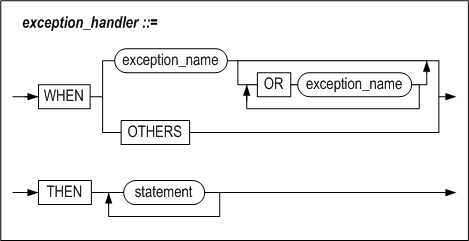
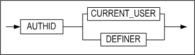
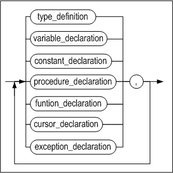
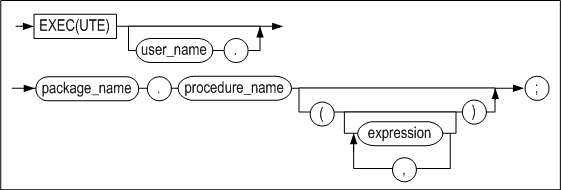

<!-- START doctoc generated TOC please keep comment here to allow auto update -->
<!-- DON'T EDIT THIS SECTION, INSTEAD RE-RUN doctoc TO UPDATE -->


- [Stored Procedures Manual](#stored-procedures-manual)
  - [8. Dynamic SQL](#8-dynamic-sql)
    - [Overview](#overview)
    - [EXECUTE IMMEDIATE](#execute-immediate)
    - [OPEN FOR](#open-for)
  - [9. Exception Handlers](#9-exception-handlers)
    - [Overview](#overview-1)
    - [EXCEPTION](#exception)
    - [RAISE](#raise)
    - [RAISE_APPLICATION_ERROR](#raise_application_error)
    - [User-defined Exceptions](#user-defined-exceptions)
    - [SQLCODE and SQLERRM](#sqlcode-and-sqlerrm)
    - [Exception Handler](#exception-handler)
  - [10. Pragma](#10-pragma)
    - [Overview](#overview-2)
    - [Autonomous Transaction Pragma](#autonomous-transaction-pragma)
    - [Exception Initialization Pragma](#exception-initialization-pragma)
  - [11. Stored Packages](#11-stored-packages)
    - [Overview](#overview-3)
    - [CREATE PACKAGE](#create-package)
    - [CREATE PACKAGE BODY](#create-package-body)
    - [ALTER PACKAGE](#alter-package)
    - [DROP PACKAGE](#drop-package)
    - [EXECUTE](#execute)
  - [12. Altibase Stored Procedures and Built-in Functions](#12-altibase-stored-procedures-and-built-in-functions)
    - [File Control](#file-control)
    - [TCP Access Control](#tcp-access-control)
    - [DBMS Stats](#dbms-stats)
    - [Miscellaneous Functions](#miscellaneous-functions)
  - [13. Altibase System-defined Stored Packages](#13-altibase-system-defined-stored-packages)
    - [System-defined Stored Packages](#system-defined-stored-packages)
    - [DBMS_APPLICATION_INFO](#dbms_application_info)
    - [DBMS_ALERT](#dbms_alert)
    - [DBMS_CONCURRENT_EXEC Package](#dbms_concurrent_exec-package)
    - [DBMS_LOCK](#dbms_lock)
    - [DBMS_METADATA](#dbms_metadata)
    - [DBMS_OUTPUT](#dbms_output)
    - [DBMS_RANDOM](#dbms_random)
    - [DBMS_RECYCLEBIN Package](#dbms_recyclebin-package)
    - [DBMS_SQL](#dbms_sql)
    - [DBMS_STATS](#dbms_stats)
    - [DBMS_UTILITY](#dbms_utility)
    - [STANDARD](#standard)
    - [UTL_COPYSWAP](#utl_copyswap)
    - [UTL_FILE](#utl_file)
    - [UTL_RAW](#utl_raw)
    - [UTL_TCP](#utl_tcp)
  - [Appendix A. Examples](#appendix-a-examples)
    - [Stored Procedure Examples](#stored-procedure-examples)
    - [File Control Example](#file-control-example)

<!-- END doctoc generated TOC please keep comment here to allow auto update -->


Altibase® Application Development

Stored Procedures Manual 
========================


Altibase Application Development Stored Procedures Manual

Release 7.1

Copyright ⓒ 2001\~2020 Altibase Corp. All Rights Reserved.

This manual contains proprietary information of Altibase Corporation; it is provided under a license agreement containing restrictions on use and disclosure and is also protected by copyright patent and other intellectual property law. Reverse engineering of the software is prohibited. All trademarks, registered or otherwise, are the property of their respective owners.

**Altibase Corp**

10F, Daerung PostTower II, 306, Digital-ro, Guro-gu, Seoul 08378, Korea Telephone: +82-2-2082-1000 Fax: 82-2-2082-1099

Customer Service Portal: http://support.altibase.com/en/

Homepage: [[http://www.altibase.com](http://www.altibase.com/)]


## 8. Dynamic SQL

This chapter describes how to use dynamic SQL in stored procedures and functions.

### Overview 

With dynamic SQL, the user can create queries as desired at runtime and then execute them. In static execution, which is the standard way to execute SQL statements in stored procedures, an execution plan for all SQL statements in a stored procedure is created when the stored procedure is executed for the first time. Using dynamic SQL is the only way to execute SQL statements that did not exist when the stored procedure was compiled.

#### Executing Dynamic SQL

The following diagram compares the tasks involved in executing static vs. dynamic SQL statements in stored procedures.


[Figure 8-1] Execution of Static SQL vs. Dynamic SQL

[In Figure 8-1, the stored procedure on the left processes the ‘DELETE FROM T1’ statement statically, whereas the stored procedure on the right uses the EXECUTE IMMEDIATE statement to processes the same DELETE statement dynamically at runtime. 

For the stored procedure on the left side, an execution plan for the DELETE statement is created at the time point that the procedure is executed for the first time, stored in the Plan Cache, queried and executed on repeated invocations. Likewise, an execution plan for the DELETE statement is created at the time point that the procedure is executed for the first time and stored in the Plan Cache for the stored procedure on the right side as well.

#### Features

The advantage of dynamic SQL is that it allows the user to freely change SQL statements as desired during runtime. Furthermore, the user can execute almost any type of SQL statement, as long as it is supported by the DBMS.

Dynamic SQL is useful in the following cases:

-   When the name of the table to be queried can vary during runtime 
-   When it is appropriate to change a query hint depending on the circumstances, or when it is necessary to change a conditional operator for a condition clause 
-   When SQL statements that are used in stored procedures and functions need to be optimized frequently due to the frequent execution of DDL and DML statements 
-   When it is necessary to frequently execute SQL statements for which the execution cost exceeds the optimization cost. When it is desired to create versatile, reusable stored procedures

However, in some situations, using dynamic SQL may realize lower performance than using static SQL. This is attributable to the high cost of creating and deleting statements and binding variables to them. Although the use of dynamic SQL statements permits greater flexibility when designing applications, it may result in reduced performance.

### EXECUTE IMMEDIATE

This statement is used to dynamically execute a DDL, DCL or DML statement, including a SELECT query that returns a single record.

#### Syntax


#### Description

##### dynamic_string 

This is the string containing the query statement to be executed.

##### INTO

The optional INTO clause indicates the variables in which to store the retrieved result set, in the same manner as a SELECT … INTO statement.

##### bulk_collect_clause

BULK COLLECT clause retrieves the execution results of the SELECT statement at once. The array of host variables corresponding to the number of columns in the array of host variable should come immediately after the INTO clause in order to store the records returned by the SELECT statement.

Retrieving the result set of a query as arrays by using the BULK COLLECT clause is much more effective, rather than retrieving the result row by using the LOOP statement at a time.

##### USING

The optional USING clause is used to specify parameters to bind to the SQL statement at runtime. The parameters are bound to the statement at the positions indicated by question marks (“?”) in the order in which they appear. IN, OUT and IN/OUT parameters can all be specified.

#### Example

The following is an example of the use of dynamic SQL to execute a DML statement.

```
CREATE PROCEDURE fire_emp(v_emp_id INTEGER) AS
BEGIN
  EXECUTE IMMEDIATE
  'DELETE FROM employees WHERE eno = ?'
    USING v_emp_id;
END;
/

CREATE PROCEDURE insert_table (
      table_name  VARCHAR(100), 
      dept_no     NUMBER, 
      dept_name   VARCHAR(100), 
      location    VARCHAR(100))
AS
      stmt    VARCHAR2(200);
BEGIN
   stmt := 'INSERT INTO ' || table_name || 
           ' values (?, ?, ?)';
   EXECUTE IMMEDIATE stmt
           USING dept_no, dept_name, location;
END;
/
```

The syntax “EXECUTE IMMEDIATE dynamic_string” is used to execute a query in Direct-Execute mode. The variables that follow USING are binding parameters. In addition to DML statements, DDL and DCL statements can also be executed using EXECUTE IMMEDIATE.

#### Restrictions

The following SQL statements are supported for execution as dynamic SQL in stored procedures:

-   DML  
    SELECT, INSERT, UPDATE, DELETE, MOVE, MERGE, LOCK TABLE, ENQUEUE, DEQUEUE

-   DDL  
    CREATE, ALTER, DROP

-   DCL  
    ALTER SYSTEM, ALTER SESSION, COMMIT, ROLLBACK

The following statements are not supported for use with dynamic SQL:

-   Statements that can only be executed from iSQL

-   SELECT \* FROM tab;

-   DESC table_name

-   SET TIMING

-   SET AUTOCOMMIT

-   CONNECT

-   DISCONNECT

### OPEN FOR 

This statement is used to initialize a cursor variable (REF CURSOR), execute the query, and determine the result set, so that data can be retrieved using the FETCH statement or can be passed to a client using stored procedure parameters. The USING clause is used to bind parameters.

#### Syntax


#### Description

##### cursor_variable_name 

This is used to specify the name of a REF CURSOR-type cursor variable.

##### select_statement

The select_statement is a query statement which will be executed. No other than the SELECT statement can be used, and it cannot be used along with the USING clause.

##### dynamic_string 

dynamic_string is the query to be executed. This can only be a SELECT statement in the form of a string.

##### USING

The optional USING clause is used to specify parameters to bind to the SQL statement at runtime. The parameters are bound to the statement at the positions indicated by question marks (“?”) in the order in which they appear.

#### Example

The following example illustrates how to open a cursor variable within a stored procedure in order to fetch multiple rows resulting from the execution of a dynamic SQL statement.

For information on how to fetch a result set using an open cursor variable in a client program, please refer to the *Precompiler User's Manual*, *ODBC Reference*, and *API User's Manual*. 

```
CREATE OR REPLACE PROCEDURE fetch_employee
AS
  TYPE MY_CUR IS REF CURSOR;
  emp_cv MY_CUR;
  emp_rec employees%ROWTYPE;
  stmt VARCHAR2(200);
  v_job VARCHAR2(10) := 'webmaster';
BEGIN
  stmt := 'SELECT * FROM employees WHERE emp_job = ?';
  OPEN emp_cv FOR stmt USING v_job;
  LOOP
    FETCH emp_cv INTO emp_rec;
    EXIT WHEN emp_cv%NOTFOUND;
    PRINTLN('[Name]: ' || emp_rec.e_firstname || emp_rec.e_lastname || 
            ' [Job Id]: ' || emp_rec.emp_job);
  END LOOP;
  CLOSE emp_cv;
END;
/ 
```


## 9. Exception Handlers

---------

### Overview

Execeptions that occur while a stored procedure is executing can be managed by appropriately declaring exceptions and managing them using exception handlers.

#### Types

Two types of exceptions can occur within stored procedures in Altibase.

-   System-defined Exception

-   User-defined Exception

Execeptions supported by stored procedures include

##### System-Defined Exceptions

System-defined exceptions are already defined within the system, and thus do not need to be declared in the DECLARE section of a stored procedure or block. 

Some of the system-defined exceptions that can occur within stored procedures are as follows:

| Exception Name      | Cause                                                        |
| ------------------- | ------------------------------------------------------------ |
| CURSOR_ALREADY_OPEN | This exception is raised when an attempt is made to open a cursor that is already open without first closing it. In the case of a Cursor FOR LOOP, because the cursor is implicitly opened, this exception will be raised if an attempt is made to explicitly open the cursor using the OPEN statement within the loop. |
| DUP_VAL_ON_INDEX    | This exception is raised when an attempt is made to insert a duplicate value into a column designated as a unique index. |
| INVALID_CURSOR      | This exception is raised when the operation cannot be completed with the cursor in its current state, such as when an attempt is made to use a cursor that is not open to perform a FETCH or CLOSE operation. |
| NO_DATA_FOUND       | This exception is raised when no records are returned by a SELECT statement. |
| TOO_MANY_ROWS       | A SELECT INTO statement can return only one row. This occurs when mroe than one row is returned. |

##### User-defined Exceptions

User-defined exceptions are expressly declared by the user and intentionally raised using the RAISE statement.

An example is shown below: 

```
DECLARE
  comm_missing  EXCEPTION;    -- DECLARE user defined EXCEPTION
BEGIN
  ......
  RAISE comm_missing;   -- raising EXCEPTION
  ......
  EXCEPTION
    WHEN comm_missing THEN ......
```

If a user-defined exception has the same name as a system-defined exception, the user-defined exception will take precedence over the system-defined exception.

#### Declaring an Exception

The names of system-defined exceptions are defined inside the system, so there is no need to explicitly declare them. 

In contrast, user-defined exceptions must be explicitly declared in the DECLARE section of a block or stored procedure.

#### Raising an Exception

There is no need to explicitly raise system-defined exceptions. If a system-defined exception occurs during the execution of a stored procedure, whether an exception handler exists for the system-defined exception is checked. If such an exception handler exists, control is automatically diverted to the exception handler, and the tasks defined therein are undertaken.

In contrast, user-defined exceptions must be explicitly raised in a stored procedure. User-defined exceptions are raised during the execution of a stored procedure using the RAISE statement.

#### The Exception Handler

The tasks to perform in the event of a system-defined or user-defined exception are defined here.

### EXCEPTION 

#### Syntax


#### Description

To define the user-defined exception.

##### exception_name

The scope of an exception is from the BEGIN statement to the END statement of the block in which it is declared. The name of the exception must be unique within the block.

#### Example

```
DECLARE
  error_1   EXCEPTION;
  error_2   EXCEPTION;
  error_3   EXCEPTION;
```


### RAISE 

#### Syntax


#### Description

This statement is used to expressly raise an exception and pass control to the routine defined for the corresponding exception handler.

##### exception_name

The name of the exception to raise is specified here. exception_name must be either the name of an exception declared in the declare section of the block or a system-defined exception. 

If the exception specified here has not been declared, it will be impossible to compile the stored procedure. If the exception has been declared but no corresponding exception handler exists in the exception handler section, execution of the stored procedure will stop and an “unhandled exception” error will be returned. 

User exceptions having the same name can be declared in inner and outer blocks. To avoid ambiguity in such cases, label each block and then reference the appropriate exception by specifying the label before the exception name in the RAISE statement. 

An exception declared for an outer block can be raised within the handler for an exception declared for an inner block. 

An exception name can be omitted only when the RAISE statement is used in the exception handler section, in which case it raises the exception that occurred previously.

#### Example

##### Example 1

In the following example, the VALUE_ERROR exception is handled in the exception handler, and the same exception is raised from the exception handler.

```
CREATE OR REPLACE PROCEDURE PROC1
AS
BEGIN
  RAISE VALUE_ERROR;
  EXCEPTION
    WHEN VALUE_ERROR THEN
      PRINTLN('VALUE ERROR CATCHED. BUT RE-RAISE.');
      RAISE;
END;
/
iSQL> EXEC PROC1;
VALUE ERROR CATCHED. BUT RE-RAISE.        
[ERR-3116F : Value error 
0004 :   RAISE VALUE_ERROR; 
        ^                 ^ 
]
```


##### Example 2

In the following example, the exception raised from PROC1 of Example 1 is handled.

```
CREATE OR REPLACE PROCEDURE PROC2
AS
BEGIN
  PROC1;
  EXCEPTION
    WHEN OTHERS THEN
    PRINTLN('EXCEPTION FROM PROC1 CATCHED.');
    PRINTLN('SQLCODE : '||SQLCODE);
END; 
/
iSQL> EXEC PROC2;
VALUE ERROR CATCHED. BUT RE-RAISE. 
EXCEPTION FROM PROC1 CATCHED. 
SQLCODE : 201071 
Execute success.
```


### RAISE_APPLICATION_ERROR

The use of up to 1001 user-defined error codes, specifically the error codes ranging from 990000 to 991000, is supported.

#### Syntax

```
RAISE_APPLICATION_ERROR (
	errcode INTEGER, 
    errmsg VARCHAR(2047) );
```

#### Parameter

| Name    | In/Output | Data Type | Description                                                  |
| ------- | --------- | --------- | ------------------------------------------------------------ |
| errcode | IN        | INTEGER   | User-defined Error Code (in the range from 990000 to 991000) |
| errmsg  | IN        | VARCHAR   | User-defined Error Message Text                              |

#### Description

This procedure is used to raise an exception having a user-defined error code and message.

#### Example

The following example shows how to raise user-defined errors. Note that in iSQL, error codes are displayed as hexadecimal values.

```
CREATE OR REPLACE PROCEDURE PROC1
AS
BEGIN
    RAISE_APPLICATION_ERROR( 990000,
	 'This is my error msg. ' );
END;
/
iSQL> EXEC PROC1;
[ERR-F1B30 : This is my error msg.
at "SYS.PROC1", line 4]
```


### User-defined Exceptions

There are two kinds of situations in which the user might want to use the RAISE statement to generate an exception:

-   To handle a user-defined exception
-   To handle a system-defined exception

#### User-defined Exception Codes

When handling user-defined exceptions, the error code is always **201232**, which can be verified by checking the value of SQLCODE.

```
CREATE OR REPLACE PROCEDURE PROC1
AS
    E1 EXCEPTION;
BEGIN
    RAISE E1;
EXCEPTION
WHEN E1 THEN
    PRINTLN('SQLCODE: ' || SQLCODE);  -- output error code
    PRINTLN('SQLERRM: ' || SQLERRM);  -- output error message
END;
/

iSQL> EXEC PROC1;
SQLCODE: 201232
SQLERRM: User-Defined Exception.
Execute success.
```

If the exception is not handled as a user-defined exception in the exception handler section, the following error occurs. This message means that there is no user-defined exception handler for the exception.

```
CREATE OR REPLACE PROCEDURE PROC1
AS
    E1 EXCEPTION;
BEGIN
    RAISE E1;
END;
/

iSQL> EXEC PROC1;
[ERR-31157 : Unhandled exception : E1]
```

The following error code is always output (in either decimal or hexadecimal form) for user-defined exceptions:

| Exception Name | Error Code(integer) | Error Code(hexadecimal) | Error Section                          |
| -------------- | ------------------- | ----------------------- | :------------------------------------- |
|                | 201232              | 31210                   | qpERR_ABORT_QSX_USER_DEFINED_EXCEPTION |

#### System-defined Exception Codes

When a system-defined exception occurs, the corresponding system-defined error code is returned, as shown below:

```
CREATE OR REPLACE PROCEDURE PROC1
AS
BEGIN
    RAISE NO_DATA_FOUND;
EXCEPTION
WHEN NO_DATA_FOUND THEN
    PRINTLN('SQLCODE: ' || SQLCODE);  -- output error code
    PRINTLN('SQLERRM: ' || SQLERRM);  -- output error message
END;
/
iSQL> EXEC PROC1;
SQLCODE: 201066
SQLERRM: No data found.
at "SYS.PROC1", line 4
Execute success.
```

For exceptional instances of the system-defined exception, as in the following, the outputs of predefined error codes can be seen even though additional exception is not handled by the exception handler.

```
CREATE OR REPLACE PROCEDURE PROC1
AS
BEGIN
    RAISE NO_DATA_FOUND;
END;
/

iSQL> EXEC PROC1;
[ERR-3116A : No data found.
at "SYS.PROC1", line 4]
```

For convenience, the most commonly used system-defined exception codes are listed in the following table. For information on the cause of each exception, please refer to "System-Defined Exceptions".

| Exception Name        | Error Code (integer) | Error Code (hexadecimal) | Error Section                           |
|-----------------------|----------------------|--------------------------|-----------------------------------------|
| "CURSOR_ALREADY_OPEN" | 201062               | 31166                    | qpERR_ABORT_QSX_CURSOR_ALREADY_OPEN     |
| "DUP_VAL_ON_INDEX"    | 201063               | 31167                    | qpERR_ABORT_QSX_DUP_VAL_ON_INDEX        |
| "INVALID_CURSOR"      | 201064               | 31168                    | qpERR_ABORT_QSX_INVALID_CURSOR          |
| "NO_DATA_FOUND"       | 201066               | 3116A                    | qpERR_ABORT_QSX_NO_DATA_FOUND           |
| "TOO_MANY_ROWS        | 201070               | 3116E                    | qpERR_ABORT_QSX_TOO_MANY_ROWS           |
| "INVALID_PATH"        | 201237               | 31215                    | qpERR_ABORT_QSX_FILE_INVALID_PATH       |
| "INVALID_MODE"        | 201235               | 31213                    | qpERR_ABORT_QSX_INVALID_FILEOPEN_MODE   |
| "INVALID_FILEHANDLE"  | 201238               | 31216                    | qpERR_ABORT_QSX_FILE_INVALID_FILEHANDLE |
| "INVALID_OPERATION"   | 201239               | 31217                    | qpERR_ABORT_QSX_FILE_INVALID_OPERATION  |
| "READ_ERROR"          | 201242               | 3121A                    | qpERR_ABORT_QSX_FILE_READ_ERROR         |
| "WRITE_ERROR"         | 201243               | 3121B                    | qpERR_ABORT_QSX_FILE_WRITE_ERROR        |
| "ACCESS_DENIED"       | 201236               | 31214                    | qpERR_ABORT_QSX_DIRECTORY_ACCESS_DENIED |
| "DELETE_FAILED"       | 201240               | 31218                    | qpERR_ABORT_QSX_FILE_DELETE_FAILED      |
| "RENAME_FAILED"       | 201241               | 31219                    | qpERR_ABORT_QSX_FILE_RENAME_FAILED      |

For the complete list of all error codes, please refer to the *Error Message Reference.*

### SQLCODE and SQLERRM 

SQLCODE and SQLERRM are used in an exception handler to obtain the error code and message for an exception that occurs during the execution of a SQL statement so that the exception can be responded to in a suitable manner.

The contents of SQLCODE and SQLERRM are set in the following cases:

-   When an error occurs during the execution of a stored procedure 
-   When a user-defined exception occurs 
-   When a system-defined exception occurs 
-   When RAISE_APPLICATION_ERROR is used to raise a user-defined error (code and message) 
-   When another exception is raised within an exception handler

In all of the above cases, the current contents of SQLCODE and SQLERRM are replaced with the error code and message corresponding to the newly raised exception.

Additionally, after an exception handler is executed without raising another exception, the contents of SQLCODE and SQLERRM are restored to the state before the exception occurred, in the manner of a LIFO (last in, first out) stack.

Therefore, once the contents of SQLCODE and SQLERRM have been set in response to an exception, they will remain unchanged until control is passed to an outer block of the stored procedure, regardless of whether the exception is handled within the block in which it was raised..

The following is an example:

```
CREATE OR REPLACE PROCEDURE PROC1
AS
BEGIN
  BEGIN
    RAISE NO_DATA_FOUND;
  EXCEPTION
    WHEN OTHERS THEN
      BEGIN
        PRINTLN('1SQLCODE : '||SQLCODE);
        PRINTLN('1SQLERRM : '||SQLERRM);
        RAISE VALUE_ERROR;
      EXCEPTION
        WHEN OTHERS THEN
          PRINTLN('2SQLCODE : '||SQLCODE);
          PRINTLN('2SQLERRM : '||SQLERRM);
      END;
    PRINTLN('3SQLCODE : '||SQLCODE);
    PRINTLN('3SQLERRM : '||SQLERRM);
  END;
  PRINTLN('4SQLCODE : '||SQLCODE);
 PRINTLN('4SQLERRM : '||SQLERRM);
END;
/
```

The output of the above example is as follows:

```
iSQL> EXEC PROC1;
1SQLCODE : 201066
1SQLERRM : No data found.
at "SYS.PROC1", line 5
2SQLCODE : 201071
2SQLERRM : Value error
at "SYS.PROC1", line 11
3SQLCODE : 201066
3SQLERRM : No data found.
at "SYS.PROC1", line 5
4SQLCODE : 0
4SQLERRM : Successfully completed
Execute success.
```

The scope of SQLCODE and SQLERRM in the above example is illustrated in the following figure:


### Exception Handler

#### Syntax



#### Purpose

Exception handlers are used to specify the actions to take in response to exceptions. 

When an exception occurs, Altibase looks for an exception handler to which to pass control. The rules that are followed when looking for an exception handler are as follows:

-   Starting with the current block and progressing successively outwards to blocks that contain the current block, Altibase looks for a handler for the exception. During this process, if an OTHERS exception handler is found in any block, that OTHERS handler will be used to handle the exception.
  
-   If no exception handler is found even in the outermost block, an “Unhandled Exception” error is raised, and execution of the stored procedure or function stops immediately.

SQLCODE and SQLERRM can be used in an exception handler to check which kind of error occurred and return the related error message. In other words, SQLCODE returns the Altibase error number and SQLERRM returns the corresponding error message. 

SQLCODE and SQLERRM cannot be directly used in SQL statements. Instead, assign their values to local variables and use these variables within SQL statements

##### exception name

This is used to specify the name of the system-defined or user-defined exception to handle.

Multiple exceptions to be handled in the same way can be combined using "Or" and processed using the same routine.

##### others

If an exception that is not handled by any other exception handlers is raised, it will ultimately be handled by the OTHERS routine if present.

#### Example

##### Example 1

```
CREATE TABLE t1(i1 INTEGER, i2 INTEGER, i3 INTEGER);

CREATE TABLE t2(i1 INTEGER, i2 INTEGER, i3 INTEGER);
INSERT INTO t1 VALUES(1,1,1);
INSERT INTO t1 VALUES(2,2,2);

CREATE OR REPLACE PROCEDURE proc1
AS
BEGIN
  DECLARE
    CURSOR c1 IS SELECT * FROM t1;
      v1 INTEGER;
      v2 INTEGER;
      v3 INTEGER;
  BEGIN
    -- OPEN c1;

    FETCH c1 INTO v1, v2, v3;
    INSERT INTO t2 VALUES (v1, v2, v3);

    CLOSE c1;

  EXCEPTION
    WHEN INVALID_CURSOR THEN
    INSERT INTO t2 VALUES (-999, -999, -999);

  END;

END;
/

iSQL> EXEC proc1;
Execute success.

iSQL> SELECT * FROM t2;
T2.I1       T2.I2       T2.I3       
----------------------------------------
-999        -999        -999        
1 row selected.
```


##### Example 2

```
CREATE TABLE t1(i1 INTEGER, i2 INTEGER, i3 INTEGER);

CREATE OR REPLACE PROCEDURE proc1(p1 IN INTEGER)
AS
  v1 INTEGER;
  err1 EXCEPTION;
BEGIN
  IF p1 < 0 THEN
    RAISE err1;
  END IF;

  SELECT i1 INTO v1 FROM t1;

EXCEPTION
  WHEN NO_DATA_FOUND OR TOO_MANY_ROWS THEN
    INSERT INTO t1 VALUES(1,1,1);
  WHEN OTHERS THEN
    INSERT INTO t1 VALUES(0,0,0);

END;
/

iSQL> EXEC proc1(1);
Execute success.
iSQL> SELECT * FROM t1;
T1.I1       T1.I2       T1.I3       
----------------------------------------
1           1           1           
1 row selected.
iSQL> EXEC proc1(-8);
Execute success.
iSQL> SELECT * FROM t1;
T1.I1       T1.I2       T1.I3       
----------------------------------------
1           1           1           
0           0           0           
2 rows selected.
```


##### Example 3

```
CREATE TABLE t1(i1 INTEGER NOT NULL);

CREATE OR REPLACE PROCEDURE proc1
AS
  code INTEGER;
  errm VARCHAR(200);
BEGIN
  INSERT INTO t1 VALUES(NULL);
EXCEPTION
WHEN OTHERS THEN

-- 변수 code에 SQLCODE 에러코드 값 대입
 code := SQLCODE;

-- 변수 errm에 SQLERRM 에러 메시지 저장

errm := SUBSTRING(SQLERRM, 1, 200);
  system_.println('SQLCODE : ' || code);
  system_.println('SQLERRM : ' || errm);
END;
/

iSQL> EXEC proc1;
SQLCODE : 200820
SQLERRM : Unable to insert (or update) NULL into NOT NULL column.
at "SYS.PROC1", line 6
Execute success.
```


## 10. Pragma

### Overview

Compile operation can be varied depending on the types of pragma in case of using pragma. The pragma can be used within stored procedures, stored functions, and stored packages.

#### Types of Pragma

The following pragmas can be used in Altibase. Thorough information on each pragma will be delineated in the next section.

-   Autonomous Transaction Pragma(Autonomous_Transaction Pragma)

-   Exception(Exception_Init Pragma)

#### Syntax


### Autonomous Transaction Pragma

#### Syntax


#### Function

Autonomous transaction pragma is used to modify PSM object operation carried out within a transaction. The autonomous transaction pragma is configured when compiling PSM object creation. 

The PSM object specified with the autonomous transaction pragma independently operates, and it does not share transaction sources with the main transaction. In particular, the autonomous transaction pragma is highly efficient for writing a program which is module-centric or contains high reusability.


The location in which the autonomous transaction pragma should be defined is as follows:

-   The top stored procedures 
-   The top stored functions 
-   The top stored package subprograms 
-   psm_body of triggers

The differences between Autonomous and nested transactions is as follows:

|                                                   | Autonomous Transaction                                       | Nested Transaction                                           |
| ------------------------------------------------- | ------------------------------------------------------------ | ------------------------------------------------------------ |
| Exception Handling                                | Transaction unit exception handling- (transaction-level recovery when an error occurs in an autonomous transaction) | Exception handling per statement                             |
| Transaction Dependecy                             | Independent transacaction                                    | Relevant transaction and dependency                          |
| sVisibility                                       | Checking the session status from another session when terminating an autonomous transaction. | Unable to check the session status if commit execution was performed after terminating a nested transaction. |
| Availability whether the source is shared or not. | Source is not shared with other transactions. (lock, savepoint , rollback , commit independently operates) | Source is shared with relevant transactions (lock, savepoint , rollback , commit dependently operates) |

#### Note

Since autonomous transactions do not share lock, source use, commit dependency with the main transaction, even if the main transaction is rolled back, the contents of the autonomous transaction are not rolled back. 

A deadlock might be encountered when accessing an object referenced in the main transaction since the autonomous transaction separately operates from the main transaction.

#### Example

##### Declaring pragma autonomous_transaction in Stored Procedures

```
iSQL> create table t1(c1 integer);
Create success.
iSQL> create or replace procedure proc1 as
pragma autonomous_transaction;
begin
insert into t1 values ( 1 );
commit;
end;
/
Create success.
```


##### Declaring pragma autonomous_transaction in Stored Functions

```
iSQL> create table t1(c1 integer);
Create success.
iSQL> create or replace function sub2 return integer as
pragma autonomous_transaction;
begin
insert into t1 values ( 100 );
commit;
return 100;
end;
/
Create success
```


##### Declaring pragma autonomous_transaction in Package Subprograms

```
iSQL> create table t1(c1 integer);
Create success.
iSQL> create or replace package pkg1 as
procedure sub1;
function sub2 return integer;
end;
/
Create success.
iSQL> create or replace package body pkg1 as
procedure sub1 as
pragma autonomous_transaction;
begin
insert into t1 values ( 1 );
commit;
end;
function sub2 return integer as
pragma autonomous_transaction;
begin
insert into t1 values ( 100 );
commit;
return 100;
end;
end;
/
Create success.
```


##### Declaring pragma autonomous_transaction in Triggers.

```
iSQL>create table t1( c1 integer );
Create success.
iSQL>create table t2( c1 integer );
Create success.
iSQL>insert into t1 values(1);
1 row inserted.
iSQL>create or replace trigger tri1
after insert on t1
for each row
pragma autonomous_transaction;
var1 integer;
var2 integer;
begin
var1 := 1;
select c1 into var2 from t1 where c1 = var1;
insert into t2 values( var2 + var1 );
commit;
end;
/
Create success.
iSQL>insert into t1 values ( 2 );
1 row inserted.
iSQL> select * from t1;
C1
--------------
1
2
2 rows selected.
iSQL> select * from t2;
C1
--------------
2
1 row selected.
```


### Exception Initialization Pragma

#### Syntax


#### Function

Excepton initialization pragma enables the user to initialize exception variables with Altibase error codes. 

The user can use the excepton variables initialized by Altibase error codes in place of other handler in the exception handling. 

The location in which exception initialzation pragram can be defined is as follows:

-   The declarative part of stored procedures 
-   The declarative part of stored functions 
-   The declarative part of stored package 
-   The declarative part of stored package subprograms

##### exception_name

excepton_name is used to specify the exception variable to initialize. The exception variable should be declared within the identitcal block as pragma.

##### error_code

error_code is used to specify Altibae error code when an error occurrs which was not set in exception_name. Refer to the *Error Message Reference* for in-depth infomration on Altibae error code.

#### Example

##### Specific Error Occurrence

Initialize stored procedure error messages occurring with the error number 201070 as "Too many rows".

```
iSQL> create table t1(c1 integer);
Create success.
iSQL> insert into t1 values ( 1 );
1 row inserted.
iSQL> insert into t1 values ( 2 );
1 row inserted.
iSQL> select * from t1;
C1
--------------
1
2
2 rows selected.
iSQL> create or replace procedure proc1 as
v1 integer;
e1 exception;
pragma exception_init(e1, 201070 );
begin
select c1 into v1 from t1;
exception
when e1 then
println(SQLERRM);
println('catch exception');
end;
/
Create success.
iSQL> exec proc1;
Too many rows
at "SYS.PROC1", line 6
catch exception
Execute success.
```


##### The stored procedure modified exception handlers to others in above example.

```
iSQL> create table t1(c1 integer);
Create success.
iSQL> insert into t1 values ( 1 );
1 row inserted.
iSQL> insert into t1 values ( 2 );
1 row inserted.
iSQL> select * from t1;
C1
--------------
1
2
2 rows selected.
iSQL> create or replace procedure proc1 as
    v1 integer;
    e1 exception;
    begin
    select c1 into v1 from t1;
    exception
    when others then
    println(SQLERRM);
    println('catch exception');
    end;
    /
Create success.
iSQL> exec proc1;
Too many rows
at "SYS.PROC1", line 5
catch exception
Execute success.
```


##### In case of occuring a different error other than initialized exception in the exception variable e1:

The initialized exception is "Too many rows", and the error actually occurred was "No data found".

```
iSQL> create or replace procedure proc2 as
v1 integer;
e1 exception;
pragma exception_init(e1, 201070 );
begin
select c1 into v1 from t1 where c1 = 3;
end;
/
Create success.
iSQL> exec proc2;
[ERR-3116A : No data found.
at "SYS.PROC2", line 6]
```


## 11. Stored Packages

This chapter describes how to create and use stored packages.

### Overview

A package is a grouped object of user-defined types, variables, constants, subprograms(procedures or functions), cursors and exceptions used for stored procedures. The package is composed of a package specification and a package body. Every package has a specification which defines user-defined types, or declares variables, constants, subprograms(procedures or functions), cursors, and exceptions. Objects declared in this manner can be referenced from outside the package. Moreover, the subprograms of packages can be utilized with overloading. Hence, the package specification is equivalent to the Application Programming Interface (API).

If cursors or subprograms are declared in the package specification, a package body must be created for the given package. The package body must define queries for cursors and code for subprograms. The package body can also declare and define objects; however, objects declared in this manner cannot be referenced from outside the package. 

The package body can have an initialization part and an exception-handling part. The initialization part runs only once per session, when the package is executed for the first time. The user cannot directly access the package body, and its alteration does not affect the package specification. The package body is the part which is actually processed when a package object is referenced, and the package specification is the part which hides this from the outside. The package is loaded into memory on its first run per session, and is maintained until the given session is terminated.

#### Features

-   Modularity  
    Stored packages enable the user to modularize objects associated with a given operation, such as types, variables, constants, cursors, exceptions and subprograms.
    
-   Easy applicaiton program writing  
    The writing and maintenance of application programs are made easy with modularization.

-   Information security  
    Since the package body is only accessible via the package specification, implementation details can be hidden. Therefore, information can be secured by blocking access to the package body from the outside.
    
-   Performance enhancement  
    Since the package is loaded into the session on its first run, processing speed is fast for repeated calls made in the same session.

#### Structure

A package is composed of a package specification and a package body. Types, variables, constants, cursors, exceptions, subprograms, etc. can be declared in the declaration section of the package specification and package body; objects declared in the package specification can be further defined in the body. 

The initialization part of the package body is an optional feature, and runs only once per session, when the package is executed for the first time. The initialization part is mainly used to set the values of variables declared or referenced inside a package. The package body can also write an exception-handling part.

The figure below is a diagram of the structure of the package specification and package body.


#### Restriction

-   Cursors defined inside a package stay open while subprograms are being executed; cursors are implicitly closed when subprograms have completed execution.


### CREATE PACKAGE 

#### Syntax

##### create_package ::=


##### invoker_rights_clause::=



##### declare_section ::=



##### procedure_declaration ::=


##### function_declaration ::=


#### Purpose

This statement creates a package specification or substitutes a previously existing package specification.

##### invoker_rights_clause

When executing a package, it can be specified whether to execute with the DEFINER or the CURRENT_USER privileges. If this clause is omitted, the package is run with constructor privileges

-   AUTHID CURRENT_USER  
    This executes a package by referencing an object owned by the package user.

-   AUTHID DEFINER  
    This executes with creator privilege by referring to the object of package creator (DEFINER).

##### declare_section

Defines user-defined types or declares variables, constants, subprograms (procedures or functions), cursors and exceptions. For further information on the syntax of type_definition, refer to the "Defining a User-Defined Type" section of Chapter 6, and for further information on the syntax of the declare clause for variables, constants, cursors and exceptions, refer to the "Declaring Local Variables" section of Chapter 3.

#### Example

##### Example 1

This example creates a package specification which contains user-defined types, variables, procedures and functions.

```
CREATE OR REPLACE PACKAGE pkg1 AS
TYPE rec1 IS RECORD(c1 INTEGER, c2 INTEGER);
v1 rec1;
v2 INTEGER;
PROCEDURE proc1;
FUNCTION func1 RETURN INTEGER;
END;
/
```


##### Example 2 (AUTHID CURRENT_USER)

###### **Create object: user1**

```
iSQL> connect user1/user1;
Connect success.
 
iSQL> create table t1( c1 integer );
Create success.
  
iSQL> insert into t1 values ( 1 );
1 row inserted.
  
iSQL> create or replace package pkg1 authid current_user as
     var1 integer;
     procedure sub1;
     end;
     /
Create success.
 
iSQL> create or replace package body pkg1 as
     procedure sub1 as
     begin
     select c1 into var1 from t1;
     println( var1 );
     end;
     end;
     /
Create success.
 
iSQL> select package_name , package_type , authid
      from system_.sys_packages_
      where package_name = 'PKG1';
PACKAGE_NAME     
----------------------------
PACKAGE_TYPE AUTHID      
----------------------------
PKG1                                                                                                                              
6           1          
PKG1                                                                                                                              
7           1          
2 rows selected.
```


###### **Create object : user2**

```
iSQL> connect user2/user2;
Connect success.
 
iSQL> create table t1( c1 integer );
Create success.
 
iSQL> insert into t1 values ( 100 );
1 row inserted.
```


###### Execute package: user1**

```
iSQL> exec pkg1.sub1;
1
Execute success.
```


###### **Execute package: user2**

```
iSQL> exec user1.pkg1.sub1;
100
Execute success.
```


##### Example 3 (AUTHID DEFINER)

###### **create object: user1**

```
iSQL> connect user1/user1;
Connect success.
 
iSQL> create table t1( c1 integer );
Create success.
 
iSQL> insert into t1 values ( 1 );
1 row inserted.
 
 
iSQL> create or replace package pkg1 authid definer as
     var1 integer;
     procedure sub1;
     end;
     /
Create success.
 
iSQL> create or replace package body pkg1 as
    
     procedure sub1 as
     begin
     select c1 into var1 from t1;
     println( var1 );
     end;
    
     end;
     /
Create success.
 
iSQL> select package_name , package_type , authid
    2 from system_.sys_packages_
    3 where package_name = 'PKG1';
PACKAGE_NAME                                                                                                                      
------------------------------------------------------------------------------------------------------------------------------------
PACKAGE_TYPE AUTHID      
----------------------------
PKG1                                                                                                                              
6           0          
PKG1                                                                                                                              
7           0          
2 rows selected.
```


###### **Create object: user2**

```
iSQL> connect user2/user2;
Connect success.
 
iSQL> create table t1( c1 integer );
Create success.
 
iSQL> insert into t1 values ( 100 );
1 row inserted.
```


###### **Execute package: user1**

```
iSQL> exec pkg1.sub1;
1
Execute success.
```


###### **Execute package: user2**

```
iSQL> exec user1.pkg1.sub1;
1
Execute success.
```


### CREATE PACKAGE BODY

#### Syntax

##### create_package_body ::=


##### initialize_section::=


##### declare_section ::=


#### Purpose

This statement creates the package body or substitutes a previously existing package body.

##### declare_section

Defines all cursors and subprograms declared in the package specification. Each subprogram declaration of the package specification must be identical to the corresponding definition of the package body.

Declares an object which can be referenced only within the package; it can also define such an object.

For more detailed information on the syntax of *type_definition*, refer to the "Defining a User-Defined Type" section of Chapter 6, and for further information on the syntax of the declare clause for variables, constants, cursors and exceptions, refer to the "Declaring Local Variables" section of Chapter 3. For further information on the syntax of procedure and function definitions, refer to the "CREATE PROCEDURE" and "CREATE FUNCTION" section of Chapter 2.

##### initialize_section

This writes the package initialization and exception-handling parts of the package. *initialize_section* is executed at the initial invocation of the package during a session; if the package is repeatedly called on the same session, this section is not executed.

#### Example

\<Example 1\>  This example shows an error being raised, due to the package body being created without the package specification.

```
iSQL> select * from system_.sys_packages_ where package_name = 'PKG2';
No rows selected.
 
iSQL> create or replace package body pkg2 as
      v1 integer;
      procedure proc1 as
      begin
      v1 := 1;
      end;
      end;
      /
[ERR-313BE : Package specification not found. ]
```

\<Example 2\> This example successfully creates the package specification and the package body.

```
CREATE OR REPLACE PACKAGE pkg1 AS
TYPE rec1 IS RECORD(c1 INTEGER, c2 INTEGER);
v1 rec1;
v2 INTEGER;
PROCEDURE proc1;
FUNCTION func1 RETURN INTEGER;
END;
/

iSQL> create or replace package body pkg1 as
type rec2 is record(c3 integer, c4 integer);
v3 rec1;
v4 rec2;
v5 integer;
procedure proc1 as
  begin
  v5 := 1;
  v2 := 2;
end;
function func1 return integer as
  begin
  return v2;
end;
end;
/
Create success.
```

\<Example 3\> This example creates the package body with the initialize_section and executes it. This example shows the initialize_section being executed on the initial call only.

```
create or replace package pkg1 as
v1 integer;
procedure proc1;
end;
/
create or replace package body pkg1 as
v2 integer;
procedure proc1 as
v3 integer;
begin
  v3 := v1 + v2;
  println(v3);
  println('statement 1');
end;
begin
  v1 := 100;
  v2 := 31;
  println('statement 2');
end;
/

iSQL> exec pkg1.proc1;
statement 2
131
statement 1
Execute success.
iSQL> exec pkg1.proc1;
131
statement 1
Execute success.
```

\<Example 4\> This is the usage of package overloading with the same name of package subprorams but different data types.

```
iSQL> create or replace package pkg1 as
function func return varchar(10);
function func(p1 in varchar ) return varchar(10);
function func(p1 in number ) return varchar(10);
function func(p1 in date ) return varchar(10);
end;
/
Create success.

iSQL> create or replace package body pkg1 as
function func return varchar(10) is
begin
return 'none';
end;
function func(p1 in varchar ) return varchar(10) is
begin
return 'varchar';
end;
function func(p1 in number ) return varchar(10) is
begin
return 'number';
end;
function func(p1 in date ) return varchar(10) is

begin
return 'date';
end;
end;
/ 
Create success.
```


#### Note

-   The package specification must be created at first in order to create the package body. 
-   Not a single procedure or function specified in the package specification should be omitted at all and it must be included in the package body. 
-   Data types can be matched by using functions, such as CAST and TO_DATE in order to prevent unwanted execution of subprogram with overloading of subprogram package.

### ALTER PACKAGE 

#### Syntax

##### alter_package ::=


#### Purpose

This statement explicitly recompiles the package specification, the package body or the package. When the package is recompiled, variables, cursors, user-defined types and subprograms that compose the package are also recompiled.

#### Examples

```
iSQL> alter package pkg1 compile;
Alter success.
 
iSQL> alter package pkg1 compile specification;
Alter success.
 
iSQL> alter package pkg1 compile body;
Alter success.
 
iSQL> alter package pkg1 compile package;
Alter success.
```


### DROP PACKAGE 

#### Syntax

##### drop_package ::=


#### Purpose

This statement drops the package. This statement can selectively drop only the package body or the whole package.

#### Examples

```
iSQL> drop package body pkg1;
Drop success.

iSQL> drop package pkg1;
Drop success.
```


### EXECUTE

#### Syntax

##### execute_procedure_statement ::=



##### execute_function_statement ::=


#### Purpose

This statement executes procedures or functions inside the package

#### Examples

```
create or replace package pkg1 as
v1 integer;
procedure proc1;
function func1 return integer;
end;
/

create or replace package body pkg1 as
procedure proc1 as
begin
println(v1);
end;

function func1 return integer as
begin
return 1;
end;
end;
/

iSQL> exec pkg1.v1 := pkg1.func1;
Execute success.
 
iSQL> exec pkg1.proc1;
1
Execute success.
```


## 12. Altibase Stored Procedures and Built-in Functions

Altibase provides a variety of built-in stored procedures and functions, including file control functions. This chapter introduces these stored procedures and functions and describes how to use them.

This chapter contains the following topics:

-   File Control

-   TCP Connection Control

-   DBMS Stats

### File Control

The file control functionality of stored procedures enables users to read from and write to text files in the file system. This functionality allows users to perform a wide variety of tasks, including maintaining their own logs, recording the results of tasks, and inserting data read from text files into database tables.

This functionality is described in detail in this section.

#### Managing Directories

In order for stored procedures to be able to create and manage text files, it is first necessary to use DML to create a directory object that corresponds to the actual directory in which the files are to be saved.

##### Creating a Directory Object

The CREATE DIRECTORY statement is used to create a database object corresponding to each directory in which it is desired to store and maintain files. 

When the CREATE DIRECTORY statement is executed, information about the directory is recorded in the SYS_DIRECTORIES_ meta table. However, this statement does not actually create the physical directory in the file system. Therefore, the user must first manually perform the additional tasks of creating the physical directory and granting suitable permissions for the directory. 

In the CREATE DIRECTORY statement, the user must specify the name and the absolute path of the directory to be accessed by the database.

Consider the following example. First, a physical directory named alti_dir1 is created in the /home/altibase/altibase_home/psm_msg directory.

```
$ mkdir /home/altibase/altibase_home/psm_msg/alti_dir1
```

Then, a corresponding directory object is created within the database to make it possible to manipulate the files in the alti_dir1 directory.

```
iSQL> create directory alti_dir1 as '/home/altibase/altibase_home/psm_msg';
Create success.
```

##### Changing a Directory Object

It is possible to use the CREATE OR REPLACE DIRECTORY statement to change the absolute path to which an existing directory object refers:

```
iSQL> create or replace directory alti_dir1 as '/home/altibase/altibase_home/psm_result';
Create success.
```

The effect of the above statement will vary depending on whether the alti_dir1 directory object already exists in the database. If a directory object having that name already exists, the path to which it refers will be changed to the one specified. If the alti_dir1 directory object does not exist in the database, it will be created.

##### Dropping a Directory Object

Directory objects can be removed from the database using the DROP DIRECTORY statement. 

Note that the DROP DIRECTORY statement merely removes the directory object from the database. It does not actually delete the physical directory from the file system. 

Therefore, the user must manually delete unnecessary directories and files from the file system using operating system commands. 

The following example shows the use of the DROP DIRECTORY statement to remove a directory object from the database.

```
iSQL> DROP DIRECTORY alti_dir1;
Drop success.
```


#### File Control

##### FILE_TYPE

To enable stored procedures to control files, Altibase support a data type called “FILE_TYPE”. 

FILE_TYPE contains file identifiers and other information; however, this information is not directly accessible by users. 

Local variables having the FILE_TYPE data type can be used within stored procedures as parameters for file control-related system stored procedures and stored functions.

The following is an example of the declaration of a FILE_TYPE variable: 

```
CREATE OR REPLACE PROCEDURE WRITE_T1
AS
	V1	FILE_TYPE;
	ID 	INTEGER;
	NAME 	VARCHAR(40);
BEGIN
……
END;
/
```


##### System-Provided Stored Procedures and Stored Functions for Handling Files

Altibase provides the following 12 system stored procedures and stored functions for managing files:

| Name       | Description                                                  |
| ---------- | ------------------------------------------------------------ |
| FCLOSE     | Closes an open file                                          |
| FCLOSE_ALL | Closes all files that were opened in the current session     |
| FCOPY      | Copies a file                                                |
| FFLUSH     | Physically writes data to a file                             |
| FOPEN      | Opens a file for reading or writing                          |
| FREMOVE    | Removes a file                                               |
| FRENAME    | Renames a file                                               |
| GET_LINE   | Reads one line from a file                                   |
| IS_OPEN    | Checks whether a file is open                                |
| NEW_LINE   | Outputs an OS-specific carriage return character or sequence |
| PUT        | Writes a string of text to a file                            |
| PUT_LINE   | Writes a line of text, followed by a carriage return character or sequence, to a file (=PUT+NEW_LINE) |

The system stored procedures and functions listed above are automatically created in the system when the CREATE DATABASE statement is executed. Additionally, PUBLIC synonyms are defined for these procedures and functions so that any user can use them to handle files within stored procedures. 

The process of managing files using system procedures and functions is illustrated in the following figure:


##### Limitations

The following may cause errors during the execution of file control-related system stored procedures and stored functions:

###### Directory Name

When using a file control function, the directory parameter must be specified in upper-case letters, and must be the name of a directory object that was created using the CREATE DIRECTORY statement.

For example,

```
CREATE DIRECTORY alti_dir AS ‘…’;
```

After creating a directory object as shown above, use a statement like the following in the stored procedure:

```
file = FOPEN( ‘ALTI_DIR’, ‘a.txt’, ‘r’ );
```

Even if the name of the directory object was specified in lower-case letters, the names of all objects are stored in upper-case letters in the database. Therefore when specifying the name of a directory object as a parameter for a system procedure or function, it is necessary to use upper-case letters.

###### **The length of one line of text**

The maximum length of one line of text within a file cannot exceed 32767 bytes. An error will occur if this maximum length is exceeded.

###### File data types

Users cannot read or arbitrarily change the value of a FILE_TYPE variable. FILE_TYPE variables can be used only as parameters for system stored procedures and stored functions.

###### **File Control-Related System Stored Procedures and Stored Functions**

The system stored procedures and stored functions provided to manage files may generate exceptions other than system exceptions. 

For example, when there is not enough disk space, or when there are not enough file handles, system stored procedures and functions will raise unforeseeable errors such as INVALID_OPERATION. 

If an invalid parameter is passed to a file control-related system stored procedure or stored function, a VALUE_ERROR exception will occur.

#### FCLOSE 

This stored procedure closes and reinitializes a file handle

##### Syntax

```
FCLOSE ( file IN OUT FILE_TYPE );
```


##### Parameters

| Name | Input/Output | Data Type | Description |
| ---- | ------------ | --------- | ----------- |
| file | IN OUT       | FILE_TYPE | File handle |

##### Return Value

Because it is a stored procedure, there is no return value.

##### Exception

This stored procedure never raises an error, even when it is executed on a file handle that is already closed.

##### Example

After executing FOPEN and performing actions on files, FCLOSE is called to close the file handle, as shown below: 

```
CREATE OR REPLACE PROCEDURE PROC1
AS
    V1 FILE_TYPE;
    V2 VARCHAR(1024);
BEGIN
    V1 := FOPEN( 'ALTI_DIR', 'schema.sql', 'r' );
    GET_LINE( V1, V2, 100 );
    PRINTLN(V2);
    FCLOSE(V1);
END;
/
```


#### FCLOSE_ALL 

This stored procedure closes all of the file handles that were opened in the current session. It is commonly used within exception handlers to ensure that files are closed properly even when exceptions are raised within stored procedures.

##### Syntax

```
FCLOSE_ALL;
```


##### Parameter

This is stored procedure have no parameter.

##### Return Value

Because it is a stored procedure, there is no return value.

##### Exception

There is no exception.

##### Example

The following example shows the use of FCLOSE_ALL to close all opened file handles when handling an exception.

```
CREATE OR REPLACE PROCEDURE PROC1
AS
    V1 FILE_TYPE;
    V2 VARCHAR(1024);
BEGIN
    V1 := FOPEN( 'ALTI_DIR', 'schema.sql', 'r' );
    GET_LINE( V1, V2, 100 );
    PRINTLN(V2);
FCLOSE(V1);
EXCEPTION
    WHEN READ_ERROR THEN
         PRINTLN('READ ERROR!!!');
         FCLOSE_ALL;
END;
/
```


#### FCOPY

This stored procedure is used to copy individual lines of text from one file to another. If the destination file does not exist in the specified destination directory, it is created, and the specified contents are copied from the source file to the new file. If the destination file already exists, the contents of the existing file are replaced with the specified contents from the source file.

##### Syntax

```
FCOPY (
location IN VARCHAR(40),
filename IN VARCHAR(256),
dest_dir IN VARCHAR(40),
dest_file IN VARCHAR(256),
start_line IN INTEGER DEFAULT 1,
end_line IN INTEGER DEFAULT NULL);
```


##### Parameters

| Name       | Input/Output | Data Type    | Description                                                  |
| ---------- | ------------ | ------------ | ------------------------------------------------------------ |
| location   | IN           | VARCHAR(40)  | The directory object corresponding to the path in which the source file is located |
| filename   | IN           | VARCHAR(256) | The name of the source file                                  |
| dest_dir   | IN           | VARCHAR(40)  | The directory object corresponding to the path in which the destination file is located |
| dest_file  | IN           | VARCHAR(256) | The name of the destination file                             |
| start_line | IN           | INTEGER      | The first line to copy <br />Default: 1                      |
| end_line   | IN           | INTEGER      | The last line to copy. Copies to the end of the file if set to NULL or not specified. <br />Default: NULL |

##### Return Values

Because it is a stored procedure, there is no return value.

##### Example

FCOPY can raise the following system-defined exceptions.

-   INVALID_PATH

-   ACCESS_DENIED

-   INVALID_OPERATION

-   READ_ERROR

-   WRITE_ERROR

For a detailed explanation of how to handle exceptions, please refer to "Handling File Control-Related Exceptions" in this chapter.

##### Example

In the following example, the entire contents of a.txt are copied to b.txt.

```
iSQL> EXEC FCOPY( 'ALTI_DIR', 'a.txt', 'ALTI_DIR', 'b.txt' );
Execute success.

$ cat a.txt
1-ABCDEFG
2-ABCDEFG
3-ABCDEFG
4-ABCDEFG
5-ABCDEFG
6-ABCDEFG
7-ABCDEFG
8-ABCDEFG
9-ABCDEFG
10-ABCDEFG

$ cat b.txt
1-ABCDEFG
2-ABCDEFG
3-ABCDEFG
4-ABCDEFG
5-ABCDEFG
6-ABCDEFG
7-ABCDEFG
8-ABCDEFG
9-ABCDEFG
10-ABCDEFG
```

In the following example, only the specified lines are copied from a.txt to b.txt.

```
iSQL> EXEC FCOPY( 'ALTI_DIR', 'a.txt', 'ALTI_DIR2', 'b.txt', 4, 9 );
Execute success.

$ cat a.txt
1-ABCDEFG
2-ABCDEFG
3-ABCDEFG
4-ABCDEFG
5-ABCDEFG
6-ABCDEFG
7-ABCDEFG
8-ABCDEFG
9-ABCDEFG
10-ABCDEFG

$ cat b.txt
4-ABCDEFG
5-ABCDEFG
6-ABCDEFG
7-ABCDEFG
8-ABCDEFG
9-ABCDEFG
```


#### FFLUSH 

A stored procedure that physically writes data on the file.

##### Syntax

```
FFLUSH ( file IN FILE_TYPE );
```


##### Parameter	

| Name | Input/Output | Data Type | Description   |
| ---- | ------------ | --------- | ------------- |
| file | IN           | FILE_TYPE | A file handle |

##### Return Value

Because it is a stored procedure, there is no return value.

##### Exceptions

FFLUSH can raise the following system-defined exceptions:

-   INVALID_FILEHANDLE

-   WRITE_ERROR

For a detailed explanation of how to handle exceptions, please refer to "Handling File Control-Related Exceptions" in this chapter.

##### Example

In the following example, all of the data in column I1 of table T1 are written to a file at one time. The last PUT_LINE parameter, *autoflush*, is set to FALSE. This prevents the data from being flushed to the file every time PUT_LINE is called. Instead, the data is flushed at the end using FFLUSH.

```
CREATE OR REPLACE PROCEDURE PROC1
AS
   V1 FILE_TYPE;
   R2 T1%ROWTYPE;
   CURSOR C1 IS SELECT I1 FROM T1;
BEGIN
   V1 := FOPEN( 'ALTI_DIR', 'a.txt', 'w' );
   FOR R2 IN C1 LOOP
       PUT_LINE( V1, R2.I1, FALSE );
   END LOOP;
   FFLUSH(V1);
   FCLOSE(V1);
EXCEPTION
   WHEN INVALID_PATH THEN
       PRINTLN('CANNOT OPEN FILE.');
   WHEN NO_DATA_FOUND THEN
       PRINTLN('NO DATA FOUND.');
       FCLOSE( V1 );
END;
/
```


#### FOPEN 

This stored function opens a file and returns a file handle.

##### Syntax

```
FILE_TYPE variable := 
FOPEN (
         location IN VARCHAR(40),
         filename IN VARCHAR(256),
         open_mode IN VARCHAR(4) );
```


##### Parameters

| Name      | Input/Output | Data Type    | Description                                                  |
| --------- | ------------ | ------------ | ------------------------------------------------------------ |
| location  | IN           | VARCHAR(40)  | The directory object corresponding to the path in which the file is located |
| filename  | IN           | VARCHAR(256) | The name of the file to open                                 |
| open_mode | IN           | VARCHAR(4)   | Can be set to one of the following three options:<br /> r: Read w: Write a: Append <br />* Note: Only one option can be specified for open_mode. That is, combinations of two (or more) options, such as “rw” and “wa”, cannot be used. |

##### Return Value

When this function is executed successfully, it returns a file handler of which the data type is FILE_TYPE (an opened file handle).

##### Exception

FOPEN can raise the following system-defined exceptions.

-   INVALID_PATH

-   ACCESS_DENIED

-   INVALID_OPERATION

-   INVALID_MODE

For a detailed explanation of how to handle exceptions, please refer to "Handling File Control-Related Exceptions" in this chapter.

##### Example

The following example shows that before a file can be read from or written to, it is first necessary to open the file in the appropriate mode using FOPEN: 

```
CREATE OR REPLACE PROCEDURE PROC1
AS
    V1 FILE_TYPE;
    V2 VARCHAR(1024);
BEGIN
    V1 := FOPEN( 'ALTI_DIR', 'schema.sql', 'r' );
    GET_LINE( V1, V2, 100 );
    PRINTLN(V2);
    FCLOSE(V1);
END;
/
```


#### FREMOVE 

This stored procedure deletes the specified file.

##### Syntax

```
FREMOVE (
  location IN VARCHAR(40),
  filename IN VARCHAR(256));
```


##### Parameters

| Name     | Input/Output | Data Type    | Description                                                  |
| -------- | ------------ | ------------ | ------------------------------------------------------------ |
| location | IN           | VARCHAR(40)  | The directory object corresponding to the path in which the file is located. |
| filename | IN           | VARCHAR(256) | The file name                                                |

##### Return Value

As it is a stored procedure, no result value is returned.

##### Exceptions

FREMOVE can raise the following system-defined exceptions.

-   INVALID_PATH

-   ACCESS_DENIED

-   DELETE_FAILED

For a detailed explanation of how to handle exceptions, please refer to "Handling File Control-Related Exceptions" in this chapter.

##### Example

The following example shows how to use FREMOVE to delete files: 

```
--## Current directory information
$ ls
a.sql       a.txt       b.txt       schema.sql

--##  FREMOVE Execution
iSQL> EXEC FREMOVE('ALTI_DIR','b.txt');
Execute success.

--# Directory information after the stored procedure is executed
$ ls
a.sql       a.txt       schema.sql
```


#### FRENAME 

This stored procedure is used to change the name of a file or move the file to a different location. Its functionality is similar to that of the Unix mv command.

##### Syntax

```
FRENAME (
location IN VARCHAR(40),
filename IN VARCHAR(256),
dest_dir IN VARCHAR(40),
dest_file IN VARCHAR(256),
overwrite IN BOOLEAN DEFAULT FALSE );
```


##### Parameters		

| Name      | Input/Output | Date Type    | Description                                                  |
| --------- | ------------ | ------------ | ------------------------------------------------------------ |
| location  | IN           | VARCHAR(40)  | The directory object corresponding to the original location of the file |
| filename  | IN           | VARCHAR(256) | The original name of the file                                |
| dest_dir  | IN           | VARCHAR(40)  | The directory object corresponding to the direcotry to which the file is to be moved. |
| dest_file | IN           | VARCHAR(256) | The new name for the file                                    |
| overwrite | IN           | BOOLEAN      | If a file having the new name or location already exists, indicates whether to overwrite the existing file. <br />TRUE: overwrite the file <br />FALSE: do not overwrite the file. <br />Default: FALSE |

##### Return Value

Because it is a stored procedure, there is no return value.

##### Exceptions

FRENAME can raise the following system-defined exceptions.

-   INVALID_PATH

-   ACCESS_DENIED

-   RENAME_FAILED

For a detailed explanation of how to handle exceptions, please refer to "Handling File Control-Related Exceptions" in this chapter.

##### Example

The following example shows how to change the name of a file from “a.txt” to “result.txt”.

```
--## Current directory information
$ ls
a.sql       a.txt       schema.sql

--## FRENAME execution
iSQL> EXEC FRENAME('ALTI_DIR','a.txt','ALTI_DIR','result.txt',TRUE);
Execute success.

--# Direcotry information after the stored procedure is executed
$ ls
a.sql       result.txt  schema.sql
```


#### GET_LINE 

This stored procedure reads one line from the specified file.

##### Syntax

```
GET_LINE (
   file IN FILE_TYPE,
   buffer OUT VARCHAR(32768),
   len IN INTEGER DEFAULT NULL);
```


##### Parameters

| Name   | Input/Output | Data Type      | Description                                                  |
| ------ | ------------ | -------------- | ------------------------------------------------------------ |
| file   | IN           | FILE_TYPE      | The file handle                                              |
| buffer | OUT          | VARCHAR(32768) | The buffer to store one line read from the file              |
| len    | IN           | INTEGER        | The maximum number of bytes to read from one line of the file. If this value is not specified, a maximum of 1024 bytes will be read from each line. <br />Default: NULL |

##### Return Value

Because it is a stored procedure, there is no return value.

##### Exceptions

GET_LINE can raise the following system-defined exceptions.

-   NO_DATA_FOUND

-   READ_ERROR

-   INVALID_FILEHANDLE

For a detailed explanation of how to handle exceptions, please refer to "Handling File Control-Related Exceptions" in this chapter.

##### Example

In the following example, 100 bytes are read from one line of the file.

```
iSQL> CREATE OR REPLACE PROCEDURE PROC1
    2 AS
    3     V1 FILE_TYPE;
    4     V2 VARCHAR(1024);
    5 BEGIN
    6     V1 := FOPEN( 'ALTI_DIR', 'schema.sql', 'r' );
    7     GET_LINE( V1, V2, 100 );
    8     PRINTLN(V2);
    9     FCLOSE(V1);
    10 END;
    11 /
Create success.
iSQL> EXEC PROC1;
create table t1 (i1 integer, i2 integer, i3 integer);
Execute success.
```


#### IS_OPEN 

This stored function checks whether or not the specified file is open.

##### Syntax

```
BOOLEAN variable :=
IS_OPEN ( file IN FILE_TYPE );
```


##### Parameter

| Name | Input/Output | Data Type | Description     |
| ---- | ------------ | --------- | --------------- |
| file | IN           | FILE_TYPE | The file handle |

##### Return Value

The return type is BOOLEAN. This stored function returns TRUE if the specified file is open and FALSE if the file is not open.

##### Exceptions

If the specified file handle is open, TRUE is returned. In all other circumstances, FALSE is returned. Therefore, this function never returns an error.

##### Example

The following example shows how to check whether a file handle is open.

```
CREATE OR REPLACE PROCEDURE PROC1
AS
    V1 FILE_TYPE;
BEGIN
    IF IS_OPEN(V1) = FALSE THEN
        PRINTLN('V1 IS NOT OPENED.');
    ELSE
        PRINTLN('V1 IS OPENED.');
    END IF;
    V1 := FOPEN( 'ALTI_DIR', 'a.txt', 'w' );
    PRINTLN('FOPEN FUNCTION CALLED.');
    IF IS_OPEN(V1) = FALSE THEN
        PRINTLN('V1 IS NOT OPENED.');
    ELSE
        PRINTLN('V1 IS OPENED.');
    END IF;
    FCLOSE( V1 );
    PRINTLN('FCLOSE FUNCTION CALLED.');
    IF IS_OPEN(V1) = FALSE THEN
        PRINTLN('V1 IS NOT OPENED.');
    ELSE
        PRINTLN('V1 IS OPENED.');
    END IF;
END;
/
```


#### NEW_LINE 

This store procedure writes an OS-specific carriage return character or sequence the specified number of times in the file.

##### Syntax

```
NEW_LINE  (
file IN FILE_TYPE,
lines IN INTEGER DEFAULT 1 );
```


##### Parameters	

| Name  | Input/Output | Data Type | Description                                          |
| ----- | ------------ | --------- | ---------------------------------------------------- |
| file  | IN           | FILE_TYPE | The file handle                                      |
| lines | IN           | INTEGER   | The number of lines to write in the file. Default: 1 |

##### Return Value

Because it is a stored procedure, there is no return value.

##### Exceptions

NEW_LINE can raise the following system-defined exceptions.

-   INVALID_FILEHANDLE

-   WRITE_ERROR

For a detailed explanation of how to handle exceptions, please refer to "Handling File Control-Related Exceptions" in this chapter.

##### Example

The following example shows the use of NEW_LINE to insert blank lines in a file:

```
CREATE OR REPLACE PROCEDURE PROC1
AS
    V1 FILE_TYPE;
BEGIN
    V1 := FOPEN( 'ALTI_DIR', 'a.txt', 'w' );
    PUT_LINE( V1, 'REPORT', TRUE );
    NEW_LINE( V1, 3 );
    PUT_LINE( V1, '------', TRUE );
    FCLOSE( V1 );
END;
/

--##  a.txt file after the above-described stored procedure is executed
$ cat a.txt
REPORT


------
$
```


#### PUT 

This stored procedure is used to write a character string to a file.

##### Syntax

```
PUT (
  file IN FILE_TYPE,
  buffer IN VARCHAR(32768));
```


##### Parameters

| Name   | Input/Output | Data Type      | Description                                                  |
| ------ | ------------ | -------------- | ------------------------------------------------------------ |
| file   | IN           | FILE_TYPE      | The file handler                                             |
| buffer | IN           | VARCHAR(32768) | The buffer in which to store the character string to be written to the file |

##### Return Value

Because it is a stored procedure, there is no return value.

##### Exceptions

PUT can raise the following system-defined exceptions:

-   INVALID_FILEHANDLE

-   WRITE_ERROR

For a detailed explanation of how to handle exceptions, please refer to "Handling File Control-Related Exceptions" in this chapter.

##### Example

The following example shows how to write text to a file: 

```
CREATE OR REPLACE PROCEDURE PROC1
AS
    V1 FILE_TYPE;
BEGIN
    V1 := FOPEN( 'ALTI_DIR', 'a.txt', 'w' );
    PUT( V1, 'REPORT');
    PUT( V1, '-->');
    PUT_LINE( V1, 'SUCCESS', TRUE );
    FCLOSE( V1 );
END;
/
--## a.txt file result after the above-described stored procedure is executed
$ cat a.txt
REPORT-->SUCCESS
$
```


#### PUT_LINE 

This stored procedure writes one line of text, including a carriage return character or sequence, to a file.

##### Syntax

```
PUT_LINE (
file IN FILE_TYPE,
buffer IN VARCHAR(32767),
autoflush IN BOOLEAN DEFAULT FALSE);
```


##### Parameters

| Ma,e      | Input/Out | Data Type      | Description                                                  |
| --------- | --------- | -------------- | ------------------------------------------------------------ |
| file      | IN        | FILE_TYPE      | The file handle                                              |
| Buffer    | IN        | VARCHAR(32767) | The buffer containing the line of text to be written to the file |
| autoflush | IN        | BOOLEAN        | Whether to flush to the file automatically <br />Default: FALSE |

##### Return Value

Because it is a stored procedure, there is no return value.

##### Exceptions

PUT_LINE can raise the following system-defined exceptions.

-   INVALID_FILEHANDLE

-   WRITE_ERROR

For a detailed explanation of how to handle exceptions, please refer to "Handling File Control-Related Exceptions" in this chapter.

##### Example

The following example shows how to write a line of text to a file:

```
CREATE OR REPLACE PROCEDURE PROC1
AS
    V1 FILE_TYPE;
BEGIN
    V1 := FOPEN('ALTI_DIR', 'a.txt', 'w');
    PUT_LINE(V1, '1-ABCDEFG');
    PUT_LINE(V1, '2-ABCDEFG');
    PUT_LINE(V1, '3-ABCDEFG');
    PUT_LINE(V1, '4-ABCDEFG');
    PUT_LINE(V1, '5-ABCDEFG');
    PUT_LINE(V1, '6-ABCDEFG');
    PUT_LINE(V1, '7-ABCDEFG');
    PUT_LINE(V1, '8-ABCDEFG');
    PUT_LINE(V1, '9-ABCDEFG');
    PUT_LINE(V1, '10-ABCDEFG');
    FCLOSE(V1);
END;
/
```

After the above stored procedure is performed, the contents of the file will be as follows:

```
$ cat a.txt
1-ABCDEFG
2-ABCDEFG
3-ABCDEFG
4-ABCDEFG
5-ABCDEFG
6-ABCDEFG
7-ABCDEFG
8-ABCDEFG
9-ABCDEFG
10-ABCDEFG
```


#### Handling File Control-Related Exceptions

The following is an explanation of some considerations to keep in mind when handling file control-related exceptions that may occur during the execution of a stored procedure or function.

The exceptions that may occur during the execution of file control-related stored procedures and functions are set forth in the following table. These exceptions can be handled using user-defined exception handlers, just like other system-defined exceptions.

| Exception Name     | Description                                                  |
| ------------------ | ------------------------------------------------------------ |
| INVALID_PATH       | The specified directory object does not exist (i.e. the specified object is not a directory object created using the CREATE DIRECTORY statement). |
| INVALID_MODE       | The file open mode is not valid. (A value other than “r”, “w”, or “a” was specified for the file open mode.) |
| INVALID_FILEHANDLE | The file handle is invalid. (The specified file could not be opened.) |
| INVALID_OPERATION  | The actual directory or file does not exist in the file system, or else access to the file system was denied. |
| READ_ERROR         | There is no opened file to read from, access to the file has been denied. |
| WRITE_ERROR        | There is no opened file to write to, write access to the file has been denied, or the file was not opened in write mode. |
| ACCESS_DENIED      | The user was denied access to the directory object. Sufficient privileges must be granted to the user using the GRANT statement. |
| DELETE_FAILED      | The file to be deleted does not exist, or access to the file has been denied. |
| RENAME_FAILED      | A file having the specified name already exists and the overwrite option was not specified, or another file system error has occurred. |

#### Examples

##### Example 1

The following procedure takes the directory and file names as input parameters, opens the corresponding file, and reads and echoes the contents of the file. The directory or file name may not be properly specified, or the file might be empty. Therefore, this stored procedure includes respective exception handlers for the INVALID_PATH and NO_DATE_FOUND system-defined exceptions.

```
--# CREATE VERIFY PROCEDURE
CREATE OR REPLACE PROCEDURE PROC2( PATH VARCHAR(40), FILE VARCHAR(40) )
AS
   V1 FILE_TYPE;
   V2 VARCHAR(100);
BEGIN
   V1 := FOPEN( PATH, FILE, 'r' );
   LOOP
       GET_LINE( V1, V2, 100 );
       PRINT( V2 );
   END LOOP;
EXCEPTION
   WHEN INVALID_PATH THEN
       PRINTLN('CANNOT OPEN FILE.');
   WHEN NO_DATA_FOUND THEN
       PRINTLN('NO DATA FOUND.');
       FCLOSE( V1 );
END;
/
```


##### Example 2

The following example shows how to write the contents of the table to a file or read from a file. 

Create a user and assign suitable privileges to the user.

```
CONNECT SYS/MANAGER;
CREATE USER MHJEONG IDENTIFIED BY MHJEONG;
GRANT CREATE ANY DIRECTORY TO MHJEONG;
GRANT DROP ANY DIRECTORY TO MHJEONG;
```

Create and populate a table and create a directory object.

```
CONNECT MHJEONG/MHJEONG;
CREATE TABLE T1( ID INTEGER, NAME VARCHAR(40) );
INSERT INTO T1 VALUES( 1, ‘JAKIM’ );
INSERT INTO T1 VALUES( 2, ‘PEH’ );
INSERT INTO T1 VALUES( 3, ‘KUMDORY’ );
INSERT INTO T1 VALUES( 4, ‘KHSHIM’ );
INSERT INTO T1 VALUES( 5, ‘LEEKMO’ );
INSERT INTO T1 VALUES( 6, ‘MHJEONG’ );
CREATE DIRECTORY MYDIR AS ‘/home1/mhjeong’;
```

Create a procedure that reads all of the records in table T1 and writes the data to t1.txt

```
CREATE OR REPLACE PROCEDURE WRITE_T1
AS
  V1 FILE_TYPE;
  ID INTEGER;
  NAME VARCHAR(40);
BEGIN
  DECLARE
    CURSOR T1_CUR IS
    SELECT * FROM T1;
  BEGIN
    OPEN T1_CUR;
    V1 := FOPEN( ‘MYDIR’, ‘t1.txt’, ‘w’ );
    LOOP
      FETCH T1_CUR INTO ID, NAME;
      EXIT WHEN T1_CUR%NOTFOUND;
      PUT_LINE( V1, ‘ID : ‘||ID||’ NAME : ‘||NAME);
    END LOOP;
    CLOSE T1_CUR;
    FCLOSE(V1);
  END;
END;
/
```

Create a procedure that reads the contents of t1.txt and displays the contents on the screen.

```
CREATE OR REPLACE PROCEDURE READ_T1
AS
  BUFFER VARCHAR(200);
  V1 FILE_TYPE;
BEGIN
  V1 := FOPEN( ‘MYDIR’, ‘t1.txt’, ‘r’ );
  LOOP
    GET_LINE( V1, BUFFER, 200 );
    PRINT( BUFFER );
  END LOOP;
  FCLOSE( V1 );
EXCEPTION
  WHEN NO_DATA_FOUND THEN
    FCLOSE( V1 );
END;
/
```


##### Result

When the stored procedures created above are executed, the following result will be displayed:

```
iSQL> exec write_t1;
EXECUTE success.
iSQL> exec read_t1;
ID : 1 NAME : JAKIM
ID : 2 NAME : PEH
ID : 3 NAME : KUMDORY
ID : 4 NAME : KHSHIM
ID : 5 NAME : LEEKMO
ID : 6 NAME : MHJEONG
EXECUTE success.
```

The following file will be visible in the corresponding directory in the file system.

```
$ cd /home1/mhjeong
$ cat t1.txt
ID : 1 NAME : JAKIM
ID : 2 NAME : PEH
ID : 3 NAME : KUMDORY
ID : 4 NAME : KHSHIM
ID : 5 NAME : LEEKMO
ID : 6 NAME : MHJEONG
```


### TCP Access Control

##### Data Type

The CONNECT_TYPE is a data type which is supported in a stored procedure in order to control TCP access. 

The CONNECT_TYPE internally contains stored TCP socket information, however, users cannot access to the internal data

##### Functions of CONNECT_TYPE

The local variables of CONNECT_TYPE in the stored procedures can be treated as parameters or return values of the following functions.

| Function Name    | Description                                                  |
| ---------------- | ------------------------------------------------------------ |
| CLOSEALL_CONNECT | Closes all the connection handles connected to a session     |
| CLOSE_CONNECT    | Closes a connection handle connected to a session            |
| IS_CONNECTED     | Confirms the connection status of a CONNECT_TYPE connection handle |
| OPEN_CONNECT     | Opens a file with the purpose of reading or writing          |
| WRITE_RAW        | Tranmits RAW(VARBYTE) type materials to a network through a connected connection handle |

#### CLOSEALL_CONNECT

The CLOSEALL_CONNECT is a function closing all the connection handle accessed to a current session.

##### Syntax

```
CONNECT_TYPE variable := 
CLOSEALL_CONNECT(); 
```


##### Return Value

0 is returned when successfully executed.

##### Exception

There is no exception.

##### Example

```
CREATE OR REPLACE PROCEDURE PROC1
AS
    V1 INTEGER;
BEGIN
    V1 := CLOSEALL_CONNECT();
END;
/
```


#### CLOSE_CONNECT

The CLOSE_CONNECT is a function which closes a connection handle accessed to the current session.

##### Syntax

```
CONNECT_TYPE variable := 
CLOSE_CONNECT(
         coon IN CONNECT_TYPE); 
```


##### Parameters

| Name | Input/Output | Data Type    | Descritpion         |
| ---- | ------------ | ------------ | ------------------- |
| coon | IN           | CONNECT_TYPE | A connection handle |

##### Return value

0 is returned when successfully executed.

##### Exception

There is no exception.

##### Example

```
CREATE OR REPLACE PROCEDURE PROC1
AS
    V1 CONNECT_TYPE;
    V2 INTEGER;
BEGIN
    V1 := OPEN_CONNECT('127.0.0.1', 22007, 1000, 3000);
    V2 := WRITE_RAW(V1, TO_RAW('MESSAGE'), RAW_SIZEOF('MESSAGE'));
    V2 := CLOSE_CONNECT(V1);
END;
/
```


#### IS_CONNECTED

The CLOSEALL_CONNECT is a function closing all the connection handle accessed to a current session.

##### Syntax

```
CONNECT_TYPE variable := 
IS_CONNECTED(
         coon IN CONNECT_TYPE); 
```


##### Parameter

| Name | Input/Output | Data Type    | Description         |
| ---- | ------------ | ------------ | ------------------- |
| coon | IN           | CONNECT_TYPE | A connection handle |

##### Return Value

0 is returned when a connection handled is connected; otherwise it returns -1.

##### Example

```
CREATE OR REPLACE PROCEDURE PROC1
    AS
    V1 CONNECT_TYPE;
    V2 INTEGER;
BEGIN
    V1 := OPEN_CONNECT('127.0.0.1', 22007, 1000, 3000);
    V2 := IS_CONNECTED(V1);
    IF V2 = 0 THEN
        PRINTLN('CONNECTD');
        V2 := WRITE_RAW(V1, TO_RAW('MESSAGE'), RAW_SIZEOF('MESSAGE'));
        V2 := CLOSE_CONNECT(V1);
    ELSE
        PRINTLN('NOT CONNECTD');
    END IF;
END;
/
```


#### OPEN_CONNECT

The OPEN_CONNECT is a stored function which creates TCP sockets and accesses to the remote server with an inserted IP and PORT.

##### Syntax

```
CONNECT_TYPE variable := 
OPEN_CONNECT(
         ip IN VARCHAR(64),
         port IN INTEGER,
         connect_timeout IN INTEGER,
         tx_buffersize IN INTEGER); 
```


##### Parameters

| Name            | Input/Output | Data Type   | Description                                                  |
| --------------- | ------------ | ----------- | ------------------------------------------------------------ |
| ip              | IN           | VARCHAR(64) | The IP address of a remote server                            |
| port            | IN           | INTEGER     | Port number of a remote server.                              |
| connect_timeout | IN           | INTEGER     | The time allowing access(microseconds).<br />It waits until it is accessed if 0 or Null is input. |
| tx_buffersize   | IN           | INTEGER     | The size of transmission buffer can be specified. It can be specified from 2048 to 32767 bytes, Null or the value less than 2048 is specified 2048 bytes. |

##### Return Value

A connection handle of which data type is CONNECT_TYPE would be returned when successfully executed.

##### Exceptions

If the connection handle is not normally connected to a network, the CONNECT_TYPE returns NULL values. The connection status can be verified through returned values of the CONNECT_TYPE by using a IS_CONNECTED() function.

##### Example

```
CREATE OR REPLACE PROCEDURE PROC1
AS
    V1 CONNECT_TYPE;
    V2 INTEGER;
BEGIN
    V1 := OPEN_CONNECT('127.0.0.1', 22007, 1000, 3000);
    V2 := WRITE_RAW(V1, TO_RAW('MESSAGE'), RAW_SIZEOF('MESSAGE'));
    V2 := CLOSE_CONNECT(V1);
END;
/
```


#### WRITE_RAW

This is a function that transfers data of type RAW (VARBYTE) to the network through the connected handle.

##### Syntax

```
CONNECT_TYPE variable := 
WRITE_RAW (
         coon IN CONNECT_TYPE,
         data IN VARBYTE,
         length IN INTEGER ); 
```


##### Parameters

| Name   | Input/Output | Data Type    | Description                                  |
| ------ | ------------ | ------------ | -------------------------------------------- |
| coon   | IN           | CONNECT_TYPE | A connection Handle                          |
| data   | IN           | VARBYTE      | The data which will be transmitted           |
| length | IN           | INTEGER      | The length of data which will be transmitted |

##### Return Value

The length of data transmitted to a network would be returned when successfully implemented.

##### Exception

-1 is returned when an error is incurred during the execution. 

If a connection handle is lost, it can be verified through returning result value of -1 by the IS_CONNECTED() function.

##### Example

```
CREATE OR REPLACE PROCEDURE PROC1
AS
    V1 CONNECT_TYPE;
    V2 INTEGER;
BEGIN
    V1 := OPEN_CONNECT('127.0.0.1', 22007, 1000, 3000);
    V2 := WRITE_RAW(V1, TO_RAW('MESSAGE'), RAW_SIZEOF('MESSAGE'));
    V2 := CLOSE_CONNECT(V1);
END;
```


### DBMS Stats

DBMS Stats is a feature which collects, alters (sets) and deletes statistics pertaining to an Altibase database. This feature is provided in the form of multiple system-defined stored procedures.

#### Overview

Statistics pertaining to objects in a database are used for the query optimizer to create an optimized execution plan. These statistics can be constructed and updated, , and statistics can be set or deleted for individual columns, indexes, tables or systems with the DBMS Stats stored procedure.

#### DBMS Stats Procedures

The stored procedures that comprise DBMS Stat are listed in the following table. These procedures can be used to gather statistics and reconstruct execution plans.

| Name                  | Description                                                |
| --------------------- | ---------------------------------------------------------- |
| GATHER_SYSTEM_STATS   | Gathers statistics about the database system               |
| GATHER_DATABASE_STATS | Gathers statistics about all of the tables in the database |
| GATHER_TABLE_STATS    | Gathers statistics about a particular table                |
| GATHER_INDEX_STATS    | Gathers statistics about a particular index                |

The stored procedures which alter statistics pertaining to individual columns, indexes, tables or systems are listed in the following table

| Name             | Description                                                  |
| ---------------- | ------------------------------------------------------------ |
| SET_SYSTEM_STATS | Alters statistics pertaining to the database system          |
| SET_TABLE_STATS  | Alters statistics pertaining to a particular table           |
| SET_INDEX_STATS  | Alters statistics pertaining to a particular index           |
| SET_COLUMN_STATS | Alters statistics pertaining to columns of a particular table |

The following stored procedures retrieve statistics pertaining to individual columns, indexes, tables, or the system. 

| Name             | Description                                                  |
| ---------------- | ------------------------------------------------------------ |
| GET_SYSTEM_STATS | Retrieves statistics pertaining to the database system       |
| GET_TABLE_STATS  | Retrieves statistics pertaining to a particular table        |
| GET_INDEX_STATS  | Retrieves statistics pertaining to a particular index        |
| GET_COLUMN_STATS | Retrieves statistics pertaining to columns of a particular table |

The stored procedures which delete or copy statistics pertaining to individual columns, indexes, tables or the system are listed in the following table. 

| Name                  | Description                                                  |
| --------------------- | ------------------------------------------------------------ |
| COPY_TABLE_STATS      | Copies statistics to the new partition.                      |
| DELETE_SYSTEM_STATS   | Deletes statistics pertaining to the database system         |
| DELETE_DATABASE_STATS | Deletes statistics pertaining to all tables                  |
| DELETE_TABLE_STATS    | Deletes statistics pertaining to a particular table          |
| DELETE_INDEX_STATS    | Deletes statistics pertaining to a particular index          |
| DELETE_COLUMN_STATS   | Deletes statistics pertaining to columns of a particular table |

#### Notes

-   The process of gathering statistics imposes an additional workload on the Altibase server.
-    The statistics that are gathered in this way should be considered approximate. 
-   After statistics are gathered, Altibase reconstructs the execution plans for all queries that reference any of the objects for which the statistical information was gathered. During this process, the performance of the Altibase server can suffer somewhat

#### COPY_TABLE_STATS

The COPY_TABLE_STATS copies the stats information of original partition to a new partition. However, it does not copy when the stats information of orginial partition does not exist.

##### Syntax

```
COPY_TABLE_STATS(
  ownname IN VARCHAR(128),
  tabname IN VARCHAR(128),
  srcpartname IN VARCHAR(128),
  dstpartname IN VARCHAR(128));
```


##### Parameters

| Name          | Input/Output | Data Type    | Description                                                  |
| ------------- | ------------ | ------------ | ------------------------------------------------------------ |
| *ownname*     | IN           | VARCHAR(128) | The owner name of the original and target partition table.   |
| *tabname*     | IN           | VARCHAR(128) | The table name of the original partition and the table name of target partition. |
| *srcpartname* | IN           | VARCHAR(128) | The name of original partition.                              |
| *dstpartname* | IN           | VARCHAR(128) | The name of target parition.                                 |

##### Return Value

Because it is a stored procedure, there is no return value.

##### Example

```
iSQL> EXEC COPY_TABLE_STATS('SYS','T1','P3','P4');
Execute success.
```


#### GATHER_DATABASE_STATS

This procedure gathers statistics about the database system. Only the SYS user can execute this procedure. Only the SYS user can execute this procedure.

##### Syntax

```
GATHER_DATABASE_STATS (
  estimate_percent   FLOAT   DEFAULT 0,
  degree                INTEGER DEFAULT 0,
  gather_system_stats BOOLEAN DEFAULT FALSE,
  no_invalidate       BOOLEAN DEFAULT FALSE);
```


##### Parameters

| Name                  | Input/Output | Data Type | Description                                                  |
| --------------------- | ------------ | --------- | ------------------------------------------------------------ |
| *estimate_percent*    | IN           | FLOAT     | This is the ratio of the amount of data to be sampled (for the purpose of estimating statistics) to the total amount of data available for the target object. <br />It can be set anywhere in the range from 0 (zero) to 1. If estimate_percent is not specified, or if it is set to NULL, this value is automatically determined depending on the size of the object |
| *degree*              | IN           | INTEGER   | This is the number of threads that work in parallel to gather statistics. If degree is not specified, the default value is 0. |
| *gather_system_stats* | IN           | BOOLEAN   | Whether or not to gather statistics pertaining to the database system as well. The default value is FALSE; in this case, the user can use GATHER_SYSTEM_STATS or SET_SYSTEM_STATS. |
| *no_invalidate*       | IN           | BOOLEAN   | This determines whether to reconstruct the execution plans for queries pertaining to the objects for which statistics are gathered. Setting no_invalidate to TRUE disables reconstruction of the execution plans. If set to FALSE, which is the default value, the execution plans are reconstructed. |

##### Return Value

Because it is a stored procedure, there is no return value.

##### Example

```
iSQL> EXEC GATHER_DATABASE_STATS();
SYSTEM_.SYS_TABLES_
SYSTEM_.SYS_COLUMNS_
SYSTEM_.SYS_DATABASE_
SYSTEM_.SYS_USERS_
.
.
.
Execute success. 
```


#### GATHER_INDEX_STATS

This procedure gathers statistics about a specific index.

##### Syntax

```
GATHER_INDEX_STATS (
  ownname             VARCHAR(128),
  idxname             VARCHAR(128),
  estimate_percent    FLOAT   DEFAULT 0,
  degree              INTEGER DEFAULT 0,
  no_invalidate       BOOLEAN DEFAULT FALSE);
```


##### Parameters

| Name               | Input/Output | Data Type    | Description                                                  |
| ------------------ | ------------ | ------------ | ------------------------------------------------------------ |
| *ownname*          | IN           | VARCHAR(128) | The name of the user who owns the index for which statistics are gathered |
| *idxname*          | IN           | VARCHAR(128) | The name of the index for which statistics are gathered      |
| *estimate_percent* | IN           | FLOAT        | This is the ratio of the amount of data to be sampled (for the purpose of estimating statistics) to the total amount of data available for the target object. It can be set anywhere in the range from 0 (zero) to 1. If estimate_percent is not specified, or if it is set to NULL, this value is automatically determined depending on the size of the object. |
| *degree*           | IN           | INTEGER      | This is the number of threads that work in parallel to gather statistics. If degree is not specified, the default value is 0. |
| *no_invalidate*    | IN           | BOOLEAN      | This determines whether to reconstruct the execution plans for queries pertaining to the objects for which statistics are gathered. Setting no_invalidate to TRUE disables reconstruction of the execution plans. If set to FALSE, which is the default value, the execution plans are reconstructed. |

##### Return Value

Because it is a stored procedure, there is no return value.

##### Example

```
iSQL> EXEC GATHER_INDEX_STATS( 'SYS','T1_IDX');
Execute success.
```


#### GATHER_SYSTEM_STATS

This procedure gathers statistics about the database system. Only the SYS user can execute this procedure. Only the SYS user can execute this procedure.

##### Syntax

```
GATHER_SYSTEM_STATS ( );
```


##### Return Value

Because it is a stored procedure, there is no return value.

##### Example

```
iSQL> EXEC GATHER_SYSTEM_STATS();
Execute success.
```


#### GATHER_TABLE_STATS

This procedure gathers statistics about a specific table and the indexes that are defined on the basis of that table.

##### Syntax

```
GATHER_TABLE_STATS (
  ownname              VARCHAR(128),
  tabname              VARCHAR(128),
  partname             VARCHAR(128) DEFAULT NULL,
  estimate_percent     FLOAT   DEFAULT 0,
  degree               INTEGER DEFAULT 0,
  no_invalidate        BOOLEAN DEFAULT FALSE );
```


##### Parameter

| Name               | Input/Output | Data Type    | Description                                                  |
| ------------------ | ------------ | ------------ | ------------------------------------------------------------ |
| *ownname*          | IN           | VARCHAR(128) | The name of the user who owns the table for which statistics are gathered |
| *tabname*          | IN           | VARCHAR(128) | The name of the table for which statistics are gathered      |
| *partname*         | IN           | VARCHAR(128) | The name of a partition. If specified, only statistics pertaining to that partition are gathered. If not specified, it defaults to NULL, and statistics about all of the partitions in the specified table are gathered |
| *estimate_percent* | IN           | FLOAT        | This is the ratio of the amount of data to be sampled (for the purpose of estimating statistics) to the total amount of data available for the target object. It can be set anywhere in the range from 0 (zero) to 1. If estimate_percent is not specified, or if it is set to NULL, this value is automatically determined depending on the size of the object. |
| *degree*           | IN           | INTEGER      | This is the number of threads that work in parallel to gather statistics. If degree is not specified, the default value is 0. |
| *no_invalidate*    | IN           | BOOLEAN      | This determines whether to reconstruct the execution plans for queries pertaining to the objects for which statistics are gathered. Setting no_invalidate to TRUE disables reconstruction of the execution plans. If set to FALSE, which is the default value, the execution plans are reconstructed. |

##### Return Value

Because it is a stored procedure, there is no return value.

##### Example

```
iSQL> EXEC GATHER_TABLE_STATS( 'SYS','T1');
Execute success.
```


#### SET_COLUMN_STATS

This procedure alters statistics pertaining to columns of a table.

##### Syntax

```
SET_COLUMN_STATS (
  ownname          VARCHAR(128),
  tabname          VARCHAR(128),
  colname          VARCHAR(128),
  partname         VARCHAR(128) DEFAULT NULL,
  numdist          BIGINT  DEFAULT NULL, 
  numnull          BIGINT  DEFAULT NULL,
  avgclen          BIGINT  DEFAULT NULL,
  minvalue         VARCHAR(48) DEFAULT NULL,
  maxvalue         VARCHAR(48) DEFAULT NULL,
  no_invalidate    BOOLEAN DEFAULT FALSE );
```


##### Parameters

| Name            | Input/Output | Data Type    | Description                                                  |
| --------------- | ------------ | ------------ | ------------------------------------------------------------ |
| *ownname*       | IN           | VARCHAR(128) | The name of the user who owns the table                      |
| *tabname*       | IN           | VARCHAR(128) | The name of the table for which statistics are to be altered |
| *colname*       | IN           | VARCHAR(128) | The name of the column for which statistics are to be altered |
| *partname*      | IN           | VARCHAR(128) | The name of the partition of the table. On specification, only statistics pertaining to that partition are altered. The default value is NULL and statistics pertaining to all partitions in the table are altered |
| *numdist*       | IN           | BIGINT       | The number of distinct values in the column                  |
| *numnull*       | IN           | BIGINT       | The number of NULLs in the column                            |
| *avgclen*       | IN           | BIGINT       | The average length of the column                             |
| *minvalue*      | IN           | VARCHAR(48)  | The minimum value in the column. The DATE type must use the “YYYY-MM-DD HH:MI:SS” format. |
| *maxvalue*      | IN           | VARCHAR(48)  | The maximum value in the column. The DATE type must use the “YYYY-MM-DD HH:MI:SS” format. |
| *no_invalidate* | IN           | BOOLEAN      | This determines whether to reconstruct all the execution plans for queries pertaining to the tables for which statistics are gathered. The default value is FALSE and reconstructs the execution plans. To not reconstruct, input TRUE. |

##### Return Value

Because it is a stored procedure, no result value is returned.

##### Example

```
iSQL> EXEC SET_COLUMN_STATS('SYS', 'T1', 'I1', NULL, 1000);
Execute success.
```


#### SET_INDEX_STATS

This procedure alters statistics pertaining to an index.

##### Syntax

```
SET_INDEX_STATS (
  ownname           VARCHAR(128),
  index             VARCHAR(128),
  keycnt            BIGINT DEFAULT NULL,
  numpage           BIGINT DEFAULT NULL,
  numdist           BIGINT DEFAULT NULL,
  clusfct           BIGINT DEFAULT NULL,
  idxheight         BIGINT DEFAULT NULL,
  avgslotcnt        BIGINT DEFAULT NULL,
  no_invalidate     BOOLEAN DEFAULT FALSE );
```


##### Parameters

| Name            | Input/Output | Data Type    | Description                                                  |
| --------------- | ------------ | ------------ | ------------------------------------------------------------ |
| *ownname*       | IN           | VARCHAR(128) | The name of the user who owns the index                      |
| *index*         | IN           | VARCHAR(128) | The name of the index for which statistics are to be altered |
| *keycnt*        | IN           | BIGINT       | The number of records in the index                           |
| *numpage*       | IN           | BIGINT       | The number of pages in the index                             |
| *numdist*       | IN           | BIGINT       | The number of distinct keys in the index                     |
| *clusfct*       | IN           | BIGINT       | The degree to which data is sorted in accordance with the index |
| *idxheight*     | IN           | BIGINT       | The height from the root to the leaf node of the index       |
| avgslotcnt      | IN           | BIGINT       | The average number of records in the index leaf nodes        |
| *no_invalidate* | IN           | BOOLEAN      | This determines whether to reconstruct all the execution plans for queries pertaining to the indexes for which statistics are gathered. The default value is FALSE and reconstructs the execution plans. To not reconstruct, input TRUE. |

##### Return Value

Because it is a stored procedure, there is no return value.

##### Example

```
iSQL> EXEC SET_INDEX_STATS('SYS', 'IDX1', 1000);
Execute success.
```


#### SET_SYSTEM_STATS

This procedure alters statistics pertaining to the database system. Only the SYS user can execute this procedure. Only the use SYS can execute this procedure.

##### Syntax

```
SET_SYSTEM_STATS (
  statname            VARCHAR(100),
  statvalue           DOUBLE);
```


##### Parameters

| Name        | Input/Output | Data Type    | Description                                                  |
| ----------- | ------------ | ------------ | ------------------------------------------------------------ |
| *statname*  | IN           | VARCHAR(100) | The name of the database system for which statistics are to be altered. A value among the following must be input<br />SPREAD_TIME: The average amount of time spent on reading one page.<br />MREAD_TIME: The average amount of time spent on reading several pages.<br />MREAD_PAGE_COUNT: The number of pages retrieved at once.<br />HASH_TIME: The average amount of time spent on hashing.<br />COMPARE_TIME : The average amount of time spent on comparing.<br />STORE_TIME : The average amount of time spent on storing memory temporary tables. |
| *statvalue* | IN           | DOUBLE       | The statistical value of the database system                 |

##### Return Value

Because it is a stored procedure, there is no return value.

##### Example

```
iSQL> EXEC SET_SYSTEM_STATS('SREAD_TIME', 100);
Execute success.
```


#### SET_TABLE_STATS

This procedure alters statistics pertaining to a table.

##### Syntax

```
SET_TABLE_STATS (
  ownname         VARCHAR(128),
  tabname         VARCHAR(128),
  partname        VARCHAR(128) DEFAULT NULL,
  numrow          BIGINT  DEFAULT NULL, 
  numblk          BIGINT  DEFAULT NULL,
  avgrlen         BIGINT  DEFAULT NULL,
  onerowreadtime  DOUBLE  DEFAULT NULL,
  no_invalidate   BOOLEAN DEFAULT FALSE );
```


##### Parameters

| Name            | Input/Out | Data Type    | Description                                                  |
| --------------- | --------- | ------------ | ------------------------------------------------------------ |
| *ownname*       | IN        | VARCHAR(128) | The name of the user who owns the table                      |
| *tabname*       | IN        | VARCHAR(128) | The name of the table for which statistics are to be altered |
| *partname*      | IN        | VARCHAR(128) | The name of the partition of the table. On specification, only statistics pertaining to that partition are altered. On omission, the default value is NULL, and statistics pertaining to all partitions in the specified table are altered. |
| *numrow*        | IN        | BIGINT       | The number of records in the table                           |
| *numblk*        | IN        | BIGINT       | The number of pages in the table                             |
| *avgrlen*       | IN        | BIGINT       | The average length of the records in the table               |
| onerowreadtime  | IN        | DOUBLE       | The amount of time spent reading one record in the table     |
| *no_invalidate* | IN        | BOOLEAN      | This determines whether to reconstruct all the execution plans for queries pertaining to the tables for which statistics are gathered. The default value is FALSE and reconstructs the execution plans. To not reconstruct, input TRUE. |

##### Returned Value

Because it is a stored procedure, there is no return value.

##### Example

```
iSQL> EXEC SET_TABLE_STATS('SYS', 'T1', NULL, 1000);
Execute success. 
```


#### GET_COLUMN_STATS

This procedure retrieves statistics pertaining to a table column.

##### Syntax

```
GET_COLUMN_STATS (
  ownname          VARCHAR(128),
  tabname          VARCHAR(128),
  colname          VARCHAR(128),
  partname         VARCHAR(128) DEFAULT NULL,
  numdist          BIGINT, 
  numnull          BIGINT,
  avgrlen          BIGINT,
  minvalue         VARCHAR(48),
  maxvalue         VARCHAR(48) );
```

##### Parameters

| Name       | Input/Output | Data Type    | Description                                                  |
| ---------- | ------------ | ------------ | ------------------------------------------------------------ |
| *ownname*  | IN           | VARCHAR(128) | The name of the user who owns the table                      |
| *tabname*  | IN           | VARCHAR(128) | The name of the table for which statistics are to be retrieved |
| *colname*  | IN           | VARCHAR(128) | The name of the column for which statistics are to be retrieved |
| *partname* | IN           | VARCHAR(128) | The name of the partition of the table. <br />On specification, only statistics pertaining to that partition are retrieved. On omission, the default value is NULL, and statistics pertaining to all partitions in the specified table are retrieved. |
| *numdist*  | OUT          | BIGINT       | The number of unique values in the column. NULL is returned if no statistics have been gathered. |
| *numnull*  | OUT          | BIGINT       | The number of NULL values in the column. NULL is returned if no statistics have been gathered. |
| *avgrlen*  | OUT          | BIGINT       | The average length of the column. NULL is returned if no statistics have been gathered. |
| *minvalue* | OUT          | VARCHAR(48)  | The minimum value of the column. NULL is returned if no statistics have been gathered. |
| *maxvalue* | OUT          | VARCHAR(48)  | The maximum value of the column. NULL is returned if no statistics have been gathered. |

##### Return Value

Because it is a stored procedure, there is no return value.

##### Example

```
iSQL> EXEC GET_COLUMN_STATS('SYS', 'T1', 'I1', NULL, :v1,:v2,:v3,:v4,:v5);
Execute success.
```


#### GET_INDEX_STATS

This procedure retrieves statistics pertaining to an index.

##### Syntax

```
GET_INDEX_STATS (
  ownname          VARCHAR(128),
  index            VARCHAR(128),
  partname         VARCHAR(128) DEFAULT NULL,
  keycnt           BIGINT,
  numpage          BIGINT,
  numdist          BIGINT,
  clstfct          BIGINT,
  idxheight        BIGINT,
  cachedpage       BIGINT,
  avgslotcnt       BIGINT );
```


##### Parameters

| Name         | Input/Output | Data Type    | Description                                                  |
| ------------ | ------------ | ------------ | ------------------------------------------------------------ |
| *ownname*    | IN           | VARCHAR(128) | The name of the user who owns the index                      |
| *index*      | IN           | VARCHAR(128) | The name of the index for which statistics are to be retrieved |
| *partname*   | IN           | VARCHAR(128) | The name of a partition. If specified, only statistics pertaining to that partition are gathered. If not specified, it defaults to NULL. |
| *keycnt*     | OUT          | BIGINT       | The number of records in the index. NULL is returned if no statistics have been gathered. |
| *numpage*    | OUT          | BIGINT       | The number of pages in the index. NULL is returned if no statistics have been gathered. |
| *numdist*    | OUT          | BIGINT       | The number of unique keys in the index. NULL is returned if no statistics have been gathered. |
| *clstfct*    | OUT          | BIGINT       | The degree to which the order of data matches the index. NULL is returned if no statistics have been gathered. |
| *idxheight*  | OUT          | BIGINT       | The depth of the root to leaf node in the index. NULL is returned if no statistics have been gathered. |
| *cachedpage* | OUT          | BIGINT       | The number of pages cached in the database buffer. NULL is returned if no statistics have been gathered. |
| avgslotcnt   | OUT          | BIGINT       | The average length of the records stored in the index leaf node. NULL is returned if no statistics have been gathered. |

##### Return Value

Because it is a stored procedure, there is no return value.

##### Example

```
iSQL> EXEC GET_INDEX_STATS('SYS', 'IDX1' null,:v1,:v2,:v3,:v4,:v5,:v6,:v7);
Execute success.
```


#### GET_SYSTEM_STATS

This procedure retrieves statistics pertaining to the database system.

##### Syntax

```
GET_SYSTEM_STATS (
  statname            VARCHAR(100),
  statvalue           DOUBLE);
```


##### Parameters

| Name        | Input/Output | Data Type    | Description                                                  |
| ----------- | ------------ | ------------ | ------------------------------------------------------------ |
| *statname*  | IN           | VARCHAR(100) | The name of the system for which statistics are to be retrieved. A value for one of the following must be input:<br />SREAD_TIME: The average amount of time taken to read one page<br />MREAD_TIME: The average amount of time taken to read several pages<br />MREAD_PAGE_COUNT: The number of pages read at one time.<br />HASH_TIME : The average amount of time taken hashing<br />COMPARE_TIME : The average amount of time taken comparing<br />STORE_TIME: The average amount of time taken to save memory temporary tables |
| *statvalue* | IN           | DOUBLE       | The statistical value for the system. NULL is returned if no statistics have been gathered. |

##### Return Value

Because it is a stored procedure, there is no return value.

##### Example

```
iSQL> EXEC GET_SYSTEM_STATS('SREAD_TIME', :v1);
Execute success.
```


#### GET_TABLE_STATS

This procedure retrieves statistics pertaining to a table.

##### Syntax

```
GET_TABLE_STATS (
ownname          VARCHAR(128),
tabname          VARCHAR(128),
partname         VARCHAR(128) DEFAULT NULL,
numrow            BIGINT, 
numpage           BIGINT, 
avgrlen           BIGINT,
cashedpage       BIGINT,
onerowreadtime   DOUBLE );
```

##### Parameters

| Name             | Input/Output | Data Type    | Description                                                  |
| ---------------- | ------------ | ------------ | ------------------------------------------------------------ |
| *ownname*        | IN           | VARCHAR(128) | The name of the user who owns the index                      |
| *tabname*        | IN           | VARCHAR(128) | The name of the table for which statistics are to be retrieved |
| *partname*       | IN           | VARCHAR(128) | The name of the partition of the table. On specification, only statistics pertaining to that partition are retrieved. On omission, the default value is NULL, and statistics pertaining to all partitions in the specified table are retrieved. |
| *numrow*         | OUT          | BIGINT       | The number of table records. NULL is returned if no statistics have been gathered. |
| *numpage*        | OUT          | BIGINT       | The number of pages in the table. NULL is returned if no statistics have been gathered. |
| *avgrlen*        | OUT          | BIGINT       | The average length of the table records. NULL is returned if no statistics have been gathered. |
| *cashedpage*     | OUT          | BIGINT       | The number of pages cached in the database buffer. NULL is returned if no statistics have been gathered. |
| *onerowreadtime* | OUT          | DOUBLE       | The average amount of time taken reading table records. NULL is returned if no statistics have been gathered. |

##### Return Value

Because it is a stored procedure, there is no return value.

##### Example

```
iSQL> EXEC GET_TABLE_STATS('SYS', 'T1', NULL, :v1,:v2,:v3,:v4,:v5);
Execute success.
```


#### DELETE_COLUMN_STATS

This procedure deletes statistics pertaining to columns of a table. 

##### Syntax

```
DELETE_COLUMN_STATS (
ownname          VARCHAR(128),
tabname          VARCHAR(128),
colname          VARCHAR(128),
partname         VARCHAR(128) DEFAULT NULL,
cascade_part    BOOLEAN DEFAULT TRUE,
no_invalidate   BOOLEAN DEFAULT FALSE );
```


##### Parameters

| Name            | Input/Output | Data Type    | Description                                                  |
| --------------- | ------------ | ------------ | ------------------------------------------------------------ |
| *ownname*       | IN           | VARCHAR(128) | The name of the user who owns the table                      |
| *tabname*       | IN           | VARCHAR(128) | The name of the table which contains the column for which statistics are to be deleted |
| *colname*       | IN           | VARCHAR(128) | The name of the column for which statistics are to be deleted |
| *partname*      | IN           | VARCHAR(128) | The name of the table partition for which statistics are to be deleted. On specification, statistics pertaining only to the specified column of that specified partition are deleted, regardless of the *cascade_part* value. If the value is NULL, the *cascade_part* value determines which column statistics are to be deleted. |
| *cascade_part*  | IN           | BOOLEAN      | If a partitioned table is specified for *tabname* and *partname* is NULL, this value determines which column statistics are to be deleted. If this value is TRUE, the global column statistics of the partitioned table, as well as the column statistics for all partitions of the table are deleted. If this value is FALSE, only the global column statistics of the partitioned table are deleted. The default value is TRUE. |
| *no_invalidate* | IN           | BOOLEAN      | This specifies whether or not to reconstruct the execution plans for queries pertaining to the tables for which statistics are to be deleted. The default value is FALSE and reconstructs the execution plans. If this value is TRUE, the execution plans are not reconstructed. |

##### Return Value

Because it is a stored procedure, there is no return value.

##### Example

```
iSQL> EXEC DELETE_COLUMN_STATS('SYS', 'T1', 'I1');
Execute success.
```


#### DELETE_DATABASE_STATS

This procedure deletes statistics pertaining to all of the tables that exist in the database.

##### Syntax

```
DELETE_DATABASE_STATS (
no_invalidate       BOOLEAN DEFAULT FALSE);
```


##### Parameters	

| Name            | Input/Output | Data Type | Description                                                  |
| --------------- | ------------ | --------- | ------------------------------------------------------------ |
| *no_invalidate* | IN           | BOOLEAN   | The default value is FALSE and reconstructs the execution plans. To not reconstruct, input TRUE. |

##### Return Value

Because it is a stored procedure, there is no return value.

##### Example

```
iSQL> EXEC DELETE_DATABASE_STATS();
SYSTEM_.SYS_TABLES_
SYSTEM_.SYS_COLUMNS_
SYSTEM_.SYS_DATABASE_
SYSTEM_.SYS_USERS_
.
.
.
Execute success. 
```


#### DELETE_INDEX_STATS

This procedure deletes statistics pertaining to a particular index.

##### Syntax

```
DELETE_INDEX_STATS (
ownname              VARCHAR(128),
idxname              VARCHAR(128),
no_invalidate        BOOLEAN DEFAULT FALSE);
```


##### Parameters	

| Name            | Input/Output | Data Type    | Description                                                  |
| --------------- | ------------ | ------------ | ------------------------------------------------------------ |
| *ownname*       | IN           | VARCHAR(128) | The name of the user who owns the index                      |
| *idxname*       | IN           | VARCHAR(128) | The name of the index for which statistics are to be deleted |
| *no_invalidate* | IN           | BOOLEAN      | This specifies whether or not to reconstruct the execution plans for queries pertaining to the tables for which statistics are to be deleted. <br />The default value is FALSE and reconstructs the execution plans. If this value is TRUE, the execution plans are not reconstructed. |

##### Return Value

Because it is a stored procedure, there is no return value.

##### Example

```
iSQL> EXEC DELETE_INDEX_STATS('SYS','T1_IDX');
Execute success.
```


#### DELETE_SYSTEM_STATS

This procedure deletes statistics pertaining to the database system. Only the SYS user can execute this procedure.

##### Syntax

```
DELETE_SYSTEM_STATS ( );
```


##### Return Value

Because it is a stored procedure, there is no return value.

##### Example

```
iSQL> EXEC DELETE_SYSTEM_STATS();
Execute success.
```


#### DELETE_TABLE_STATS

This procedure deletes statistics pertaining to a particular table, and the columns and indexes defined in the table.

##### Syntax

```
DELETE_TABLE_STATS (
ownname           VARCHAR(128),
tabname           VARCHAR(128),
partname          VARCHAR(128) DEFAULT NULL,
cascade_part      BOOLEAN DEFAULT TRUE,
cascade_column    BOOLEAN DEFAULT TRUE,
cascade_index     BOOLEAN DEFAULT TRUE,
no_invalidate     BOOLEAN DEFAULT FALSE );
```


##### Parameters

| Name             | Input/Output | Data Type    | Description                                                  |
| ---------------- | ------------ | ------------ | ------------------------------------------------------------ |
| *ownname*        | IN           | VARCHAR(128) | The name of the user who owns the index                      |
| *tabname*        | IN           | VARCHAR(128) | The name of the table for which statistics are to be deleted |
| *partname*       | IN           | VARCHAR(128) | The name of the table partition for which statistics are to be deleted. On specification, statistics pertaining only to the specified partition are deleted, regardless of the *cascade_part* value. If the value is NULL, the *cascade_part* value determines which statistics are to be deleted. |
| *cascade_part*   | IN           | BOOLEAN      | If a partitioned table is specified for tabname and partname is NULL, this value determines which statistics are to be deleted. If this value is TRUE, the global table statistics of the partitioned table, as well as the table statistics for all partitions of the table are deleted. If this value is FALSE, only the global table statistics of the partitioned table are deleted. The default value is TRUE. |
| *cascade_column* | IN           | BOOLEAN      | This specifies whether to delete statistics pertaining only to the specified table, or statistics pertaining to all of the columns in the specified table as well. The default value is TRUE and deletes statistics pertaining to all of the columns in the specified table as well as statistics pertaining to the specified table. If this value is FALSE, statistics pertaining to only the specified table are deleted. |
| *cascade_index*  | IN           | BOOLEAN      | This specifies whether to delete statistics pertaining to all of the indexes in the specified table, as well as statistics pertaining to the specified table. The default value is TRUE and deletes statistics pertaining to all of the indexes in the specified table as well as statistics pertaining to the specified table. If this value is FALSE, statistics pertaining to only the specified table are deleted. |
| *no_invalidate*  | IN           | BOOLEAN      | This specifies whether or not to reconstruct the execution plans for queries pertaining to the tables for which statistics are to be deleted. The default value is FALSE and reconstructs the execution plans. If this value is TRUE, the execution plans are not reconstructed. |

##### Return Value

Because it is a stored procedure, there is no return value.

##### Example

```
iSQL> EXEC DELETE_TABLE_STATS( 'SYS','T1');
Execute success.
```


### Miscellaneous Functions

#### REMOVE_XID

This procedure forcibly deletes old XID information which was heuristically rolled back or committed in an XA environment.

##### Syntax

```
REMOVE_XID (xidname     IN VARCHAR(256));
```


##### Parameter

| Name      | Input/Output | Data Type    | Description                       |
| --------- | ------------ | ------------ | --------------------------------- |
| *xidname* | IN           | VARCHAR(256) | The name of the XID to be removed |

##### Return Value

Because it is a stored procedure, there is no return value.

##### Exceptions

REMOVE_XID can raise the following system-defined exceptions.

-   NOT_EXIST_XID

-   InvalidXaState

#### REFRESH_MATERIALIZED_VIEW

This is a stored procedure that reflects the base table data changes to the materialized view. By executing this stored procedure, data of the materialized view is updated accordingly to the base table. 

If the user is not the owner of the materialized view to be refreshed, the following privileges are required to execute this stored procedure:

-   ALTER ANY MATERIALIZED VIEW system privilege
-   SELECT ANY TABLE system privilege or SELECT object privilege of the automatically created view for the materialized view.
-   INSERT ANY TABLE and DELETE ANY TALBE system privileges, or INSERT AND DELETE object privileges of the automatically created view for the materialized view. 

##### Syntax

```
REFRESH_MATERIALIZED_VIEW (
owner_name        IN VARCHAR(128),
mview_name        IN VARCHAR(128));
```

##### Parameters

| Name         | Input/Out | Data Type    | Description                             |
| ------------ | --------- | ------------ | --------------------------------------- |
| *owner_name* | IN        | VARCHAR(128) | The owner name of the materialized view |
| *mview_name* | IN        | VARCHAR(128) | The name of the materialized view       |


##### Return Value

Because it is a stored procedure, there is no return value.

##### Exceptions

-   SELECT, DELETE or INSERT failures due to absence of privilege. 
-   Tablespace space deficiency, excess of maximum rows for the materialized view, etc. 
-   Issues related to the following notes.

##### Notes

Refresh failure can be due to the following reasons:

-   The user has altered the definition of the base table or deleted the table. 
-   The user has altered the definition of the table automatically created for the materialized view using the ALTER TABLE statement. 
-   Occurrence of Lock Timeout. 
-   Violation of table constraints.

#### SET_CLIENT_INFO

The SET_CLIENT_INFO configures a CLIENT_APP_INFO column and CLIENT_INFO column information in V$SESSION.

##### Syntax

```
SET_CLIENT_INFO (client_info IN VARCHAR(128));
```


##### Parameters

| Name           | Input/Output | Data Type    | Description        |
| -------------- | ------------ | ------------ | ------------------ |
| *client_info * | IN           | VARCHAR(128) | Client information |

##### Return Value

Because it is a stored procedure, there is no return value.

##### Exception

This procedure does not ingenerate exceptions.

#### SET_MODULE

The SET_MODULE sets a MODULE column and an ACTION column information in V$SESSION.

##### Syntax

```
SET_MODULE (module IN VARCHAR(128),action IN VARCHAR(128));
```


##### Parameters

| Name     | Input/Output | Data Type    | Description                    |
| -------- | ------------ | ------------ | ------------------------------ |
| *module* | IN           | VARCHAR(128) | Module information             |
| *action* | IN           | VARCHAR(128) | Information of module activity |

##### Return Value

Because it is a stored procedure, there is no return value.

##### Exceptions

There is no exception

#### SLEEP

This procedure makes the session sleep for the number of seconds specified in the *seconds* argument.

##### Syntax

```
SLEEP (seconds IN INTEGER);
```


##### Parameter	

| Name      | Input/Output | Data Type | Description                             |
| --------- | ------------ | --------- | --------------------------------------- |
| *seconds* | IN           | INTEGER   | The amount of time to sleep, in seconds |

##### Return Value

Because it is a stored procedure, there is no return value.

##### Exception

There is no exception.


## 13. Altibase System-defined Stored Packages

--------------------

This chapter discusses system-defined stored packages provided by Altibase. 

### System-defined Stored Packages

The system-defined Stored packages are the fundamental packages provided by Altibase, and they are owned by the SYS user

#### Types of System-difined Stored Packages

Altibase provides the system-defined Stored packages as follows.

| Packages                                             | Description                                                  |
| ---------------------------------------------------- | ------------------------------------------------------------ |
| [DBMS_APPLICATION_INFO](#dbms_application_info)      | Configures the performance view in order to manage information of client application. |
| [DBMS_ALERT](#dbms_alert)                            | Notifies other users of events that occur in the database.   |
| [DBMS_CONCURRENT_EXEC](#dbms_concurrent_exec-패키지) | Allows procedures to be concurrently executed.               |
| [DBMS_LOCK](#dbms_lock)                              | Offers an interface in which the user can request lock or unlock. |
| [DBMS_METADATA](#dbms_metadata)                      | Provides the ability to extract object creation DDL statements or privileged GRANT statements from the database dictionary. |
| [DBMS_OUPUT](#dbms_output)                           | allows the user to print a character string stored in buffer to a client. |
| [DBMS_RANDOM](#dbms_random)                          | Creates arbitrary numbers.                                   |
| [DBMS_RECYCLEBIN](#dbms_recyclebin-패키지)           | Can completely purge the tables which has been dropped and managed in the recycle bin. |
| [DBMS_SQL](#dbms_sql)                                | Provides procedures and functions utilizing dynamic SQL.     |
| [DBMS_STATS](#dbms_stats)                            | Package views and modifies the stats information             |
| [DBMS_UTILITY](#dbms_utility)                        | Provides various utility subprograms.                        |
| [STANDARD](#standard)                                | In addition to the basic data types, it defines the types that can be used without declaration in PSM. |
| [UTL_COPYSWAP](#utl_copyswap)                        | Online DDL is supported by COPY & SWAP method                |
| [UTL_FILE](#standard)                                | Can read and write text files managed by an operating system. |
| [UTL_RAW](#utl_raw)                                  | Can modify or alter RAW(VARBYTE) type data into a different type. |
| [UTL_TCP](#utl_tcp)                                  | Controls TCP access in a stored procedure.                   |

### DBMS_APPLICATION_INFO 

The DBMS_APPLICATION_INFO package tracks and manages the performance of the application by setting or getting values for the V\$SESSION performance view.

The procedures and functions which are comprised of the DBMS_APPLICATION_INFO package are listed in the following table below.

| Procedures/Functions | Description                                              |
| -------------------- | -------------------------------------------------------- |
| READ_CLIENT_INFO     | Imports MODULE and ACTION values specified in V$SESSION. |
| READ_MODULE          | Imports MODULE and ACTION values specified in V$SESSION. |
| SET_ACTION           | Configures values of ACTION in V$SESSION.                |
| SET_CLIENT_INFO      | Configures values of CLIENT_INFO in V$SESSION.           |
| SET_MODULE           | Configures MODULE and ACTION values of V$SESSION.        |

#### READ_CLIENT_INFO

The READ_CLIENT_INFO imports application information of client accessed to the current session.

##### Syntax

```
DBMS_APPLICATION_INFO.READ_CLIENT_INFO(client_info OUT VARCHAR(128));
```


##### Parameter

| Name          | Input/Output | Data Type    | Description                                  |
| ------------- | ------------ | ------------ | -------------------------------------------- |
| *client_info* | OUT          | VARCHAR(128) | Information of configured client applicaiton |

##### Return Value

The number of records processed by executing a cursor are returned. 

##### Exception

There is no exception.

##### Example

Import values of currently executing client information in the current session then print.

```
iSQL> var v1 varchar(128);
iSQL> EXEC DBMS_APPLICATION_INFO.READ_CLIENT_INFO(:v1);
iSQL> EXEC PRINTLN(:v1);
```


#### READ_MODULE

The READ_MODULE imports values of MODULE and ACTION specified in the V$SESSION performance view. 

##### Syntax

```
DBMS_APPLICATION_INFO.READ_MODULE(module_name OUT VARCHAR(128), action_name OUT VARCHAR(128));
```


##### Parameter

| Name          | In/Output | Data Type    | Description                     |
| ------------- | --------- | ------------ | ------------------------------- |
| *module_name* | OUT       | VARCHAR(128) | Specified values in the module. |
| *action_name* | OUT       | VARCHAR(128) | Specified action values.        |

##### Return Value

Because it is a stored procedure, there is no return value.

##### Exception

There is no exception.

##### Example

Import module name and action value of the procedure which is currently being executed then print.

```
iSQL> var v1 varchar(128);
iSQL> var v2 varchar(128)
iSQL> EXEC DBMS_APPLICATION_INFO.READ_MODEUL(:v1, :v2);
iSQL> EXEC PRINTLN(:v1);
iSQL> EXEC PRINTLN(:v2);
```


#### SET_ACTION

The SET_ACTION is a procedure configuring values of the ACTION column in V$SESSION performance view.

##### Syntax

```
DBMS_APPLICATION_INFO.SET_ACTION (action_name VARCHAR(128));
```


##### Parameter

| Nameq         | In/Output | Data Type    | Description                                         |
| ------------- | --------- | ------------ | --------------------------------------------------- |
| *action_name* | IN        | VARCHAR(128) | The values of ACTION column that will be specified. |

##### Return Value

Because it is a stored procedure, there is no return value.

##### Exception

There is no exception.

##### Example

The SET_ACTION sets the status of currently operating procedure to stop.

```
iSQL> EXEC DBMS_APPLICATION_INFO.SET_ACTION( 'stop');
```


#### SET_CLIENT_INFO

The SET_CLIENT_INFO configures the client information which is accessed to V$SESSION performance view. 

##### Syntax

```
DBMS_APPLICATION_INFO.SET_CLIENT_INFO(client_info VARCHAR(128));
```


##### Parameter

| Name          | In/Output | Data Type    | Description                    |
| ------------- | --------- | ------------ | ------------------------------ |
| *client_info* | IN        | VARCHAR(128) | Client application information |

##### Return Value

Because it is a stored procedure, there is no return value.

##### Exception

There is no exception.

##### Example

This sets the client information to test_application. 

```
iSQL> EXEC DBMS_APPLICATION_INFO.SET_CLIENT_INFO('test_application');
```


#### SET_MODULE

The SET_MODULE procedure configures MODULE and values of ACTION column(s) in V$SESSION performance view.

##### Syntax

```
DBMS_APPLICATION_INFO.SET_MODULE(module_name VARCHAR(128), action_name
VARCHAR(128));
```

##### Parameters

| Name          | In/Output | Data Type    | Description                                         |
| ------------- | --------- | ------------ | --------------------------------------------------- |
| *module_name* | IN        | VARCHAR(128) | The module values which will be configured          |
| *action_name* | IN        | VARCHAR(128) | The value of ACTION column which will be configured |

##### Return Value

Because it is a stored procedure, there is no return value.

##### Exception

There is no exception.

##### Example

The SET_MODULE procedure modifies the module name of currently running procedure to altibase_module, and sets the status to be running. 

```
iSQL> EXEC DBMS_APPLICATION_INFO.SET_MODULE('altibase_module', 'running');
```


### DBMS_ALERT

The DBMS_ALERT package informs and provides an alert to other users with the support of an interface form in regards to various database events.

The DBMS_ALERT package consists of the following procedures and functions. 	

| Procedures/Fucntions | Description                             |
| -------------------- | --------------------------------------- |
| REGISTER             | Registers for an alert                  |
| REMOVE_EVENT         | Removes a specific alert                |
| REMOVEALL            | Removes all the alerts                  |
| SET_DEFAULTS         | Configures the standby time of an alert |
| SIGNAL               | Delivers signals to alerts              |
| WAITANY              | Stands by for all the alerts            |
| WAITONE              | Awaits a certain alert                  |

#### REGISTER

알람을 등록한다.

##### Syntax

```
DBMS_ALERT.REGISTER (name);
```

##### Parameter

| Name   | In/Output | Data Type    | Description    |
| ------ | --------- | ------------ | -------------- |
| *name* | IN        | VARCHAR2(30) | The alert name |

##### Return Value

Because it is a stored procedure, there is no return value.

##### Exception	

There is no exception.

##### Example

```
iSQL> EXEC DBMS_ALERT.REGISTER (‘S1’);
```


#### REMOVE_EVENT

This procedure removes a specific alert. The unregistered alert cannot be able to receive signals. 

##### Syntax

```
DBMS_ALERT.REMOVE_EVENT( name );
```


##### Parameter

| Name | In/Output | Data Type    | Description    |
| ---- | --------- | ------------ | -------------- |
| name | IN        | VARCHAR2(30) | The alert name |

##### Return Value

None

##### Exception

There is no exception.

##### Example

```
iSQL> EXEC DBMS_ALERT.REMOVE_EVENT (‘S1’);
```


#### REMOVEALL

This procedure removes all the alerts which have been already registered. The unregistered alerts cannot be able to receive signals.

##### Syntax

```
DBMS_ALERT.REMOVEALL();
```


##### Parameter

None

##### Return Value

Because it is a stored procedure, there is no return value.

##### Exception

There is no exception.

##### Example

```
EXEC DBMS_ALERT.REMOVEALL ();
```


#### SET_DEFAULTS

This procedure sets the standby time for an alert.

##### Syntax

```
DBMS_ALERT.SET_DEFAULTS( poll_interval );
```


##### Parameter

| Name            | In/Output | Data Type | Description                                   |
| --------------- | --------- | --------- | --------------------------------------------- |
| *poll_interval* | IN        | INTEGER   | The standby time for an alert (Unit: seconds) |

##### Return Value

Because it is a stored procedure, there is no return value.

##### Exception

There is no exception.

##### Example

```
EXEC DBMS_ALERT.SET_DEFAULTS (5);
```


#### SIGNAL

This procedure sends a message included signal to an alert, and multiple signals can be sent; however, only the registered alerts can receive the signals.

##### Syntax

```
DBMS_ALERT.SIGNAL( name, message );
```


##### Parameters

| Name      | In/Output | Data Type      | Description   |
| --------- | --------- | -------------- | ------------- |
| *name*    | IN        | VARCHAR2(30)   | An alert name |
| *message* | IN        | VARCHAR2(1800) | Message       |

##### Return Value

None

##### Exception

There is no exception.

##### Example

```
EXEC DBMS_ALERT.SIGNAL (‘S1’, 'MESSAGE 001’);
```


#### WAITANY

This procedure is called to await signals. Only the registered alerts are able to receive the signals, and the procedure is terminated after a certain time(timeout) has passed in a condition of not being received signals.

##### Syntax

```
DBMS_ALERT.WAITANY( name, message, status, timeout );
```


##### Parameters

| Name      | In/Output | Data Type      | Description                                            |
| --------- | --------- | -------------- | ------------------------------------------------------ |
| *name*    | OUT       | VARCHAR2(30)   | An alert name                                          |
| *message* | OUT       | VARCHAR2(1800) | Message                                                |
| *status*  | OUT       | INTEGER        | Status (Success: 0, Fail: 1)                           |
| *timeout* | IN        | INTEGER        | The standby time for an alert(Timeout) (Unit: seconds) |

##### Return Value

Because it is a stored procedure, there is no return value.

##### Exception

There is no exception.

##### Example

```
VAR MESSAGE VARCHAR (1800);
VAR STATUS INTEGER;
EXEC DBMS_ALERT.WAITANY ( :NAME, :MESSAGE, :STATUS, 5 );
```


#### WAITONE

This procedure awaits a certain alert, and only the registered alerts can receive signals. 

##### Syntax

```
DBMS_ALERT.WAITONE( name, message, status, timeout );
```


##### Parameters

| Name      | In/Output | Data Type      | Description                                            |
| --------- | --------- | -------------- | ------------------------------------------------------ |
| *name*    | OUT       | VARCHAR2(30)   | An alert name                                          |
| *message* | OUT       | VARCHAR2(1800) | Message                                                |
| *status*  | OUT       | INTEGER        | Status (Success: 0, Fail: 1)                           |
| *timeout* | IN        | INTEGER        | The standby time for an alert(Timeout) (Unit: seconds) |

##### Return Value

Because it is a stored procedure, there is no return value.

##### Exception

There is no exception.

##### Example

```
VAR NAME VARCHAR (30);
VAR MESSAGE VARCHAR (1800);
VAR STATUS INTEGER;
EXEC :name := 'S1';
EXEC DBMS_ALERT.WAITONE ( :NAME, :MESSAGE, :STATUS, 5 );
```


### DBMS_CONCURRENT_EXEC Package

The DBMS_CONCURRENT_EXEC package allows the concurrent execution of procedures. This is a system-defined package. 

#### DBMS_CONCURRENT_EXEC Procedures and Functions 

The DBMS_CONCURRENT_EXEC package consists of the following procedures and functions. 

| Procedures/Functions | Description                                                  |
| -------------------- | ------------------------------------------------------------ |
| INITIALIZE           | Initializes the DBMS_CONCURRENT_EXEC package and specifies the number of procedures that can be executed concurrently. |
| REQUEST              | Requests the DBMS_CONCURRENT_EXEC package to run a procedure. |
| WAIT_ALL             | Waits for the execution of all procedures, that were requested by the DBMS_CONCURRENT_EXEC package, to finish. |
| WAIT_REQ             | Waits for the procedure corresponding to Request ID to finish. |
| GET_ERROR_COUNT      | Returns the number of errors that occurred on the requested procedure. |
| GET_ERROR            | Fetches the syntax, error code, and error message of the procedure corresponding to Request ID. |
| PRINT_ERROR          | Prints the syntax, error code, and error message of the procedure corresponding to Request ID. |
| GET_LAST_REQ_ID      | Returns the most recently executed Request ID that was successful. |
| GET_REQ_TEXT         | Returns the procedure syntax corresponding to Request ID.    |
| FINALIZE             | Frees the memory that executed the DBMS_CONCURRENT_EXEC package, and initializes the package. |

#### Related Properties

Properties related to the DBMS_CONCURRENT_EXEC package can be set in the altibase.properties file.

-   CONCURRENT_EXEC_DEGREE_MAX

-   CONCURRENT_EXEC_DEGREE_DEFAULT

-   CONCURRENT_EXEC_WAIT_INTERVAL

For more detailed information, please refer to the *General Reference*.

#### Restrictions 

The DBMS_CONCURRENT_EXEC package has the following restrictions. 

-   Only procedures that do not return results can be executed; functions that do not return results cannot be executed. 
-   Procedures with output parameters cannot be executed. 
-   Procedures or functions cannot make recursive calls. If a recursive call is made, the RECURSIVE_CALL_IS_NOT_ALLOWED exception is raised. 
-   Cannot be used in parallel queries. 
-   Executed procedures cannot be printed to the screen with PRINT or PRINTLN. Logs are written in $ALTIBASE_HOME/trc/altibase_qp.log.

#### INITIALIZE 

INITIALIZE initializes the DBMS_CONCURRENT_EXEC package and sets the number of procedures allowed to be executed in parallel. On omission, the value set for the CONCURRENT_EXEC_DEGREE_DEFAULT property is applied. 

The maximum number of procedures allowed to be executed in parallel cannot exceed the value set for the CONCURRENT_EXEC_DEGREE_MAX property. If a number of procedures corresponding to CONCURRENT_EXEC_DEGREE_MAX is being executed in another session, 0 is returned and the function does not execute. 

##### Syntax

```
INTERGER variable := 
  DBMS_CONCURRENT_EXEC.INITIALIZE (in_degree INTEGER DEFAULT NULL );
```

##### Parameter

| Name       | In/Output | Data Type | Description                                         |
| ---------- | --------- | --------- | --------------------------------------------------- |
| *in_dgree* | IN        | INTEGER   | The number of procedures to be executed in parallel |

##### Return Value

If successful, the number of procedures (DEGREE) that were set is returned. If the server failed to allocate resources, 0 is returned. 

##### Exception

The following exception may occur when a procedure executed in the DBMS_CONCURRENT_EXEC package requests INTIALIZE.

```
RECURSIVE_CALL_IS_NOT_ALLOWED
```

##### Example

Initialize the DBMS_CONCURRENT_EXEC package and set the number of procedures to be executed in parallel to 4. 

```
VARIABLE OUT_DEGREE INTEGER;
EXEC :OUT_DEGREE := DBMS_CONCURRENT_EXEC.INITIALIZE(4);
```


#### REQUEST

REQUEST requests the DBMS_CONCURRENT_EXEC package to execute a procedure.

##### Syntax

```
INTERGER variable := 
  DBMS_CONCURRENT_EXEC.REQUEST(text VARCHAR(8192) );
```


##### Parameter

| Name   | In/Output | Data Type     | Description                           |
| ------ | --------- | ------------- | ------------------------------------- |
| *text* | IN        | VARCHAR(8192) | The procedure and procedure arguments |

##### Return Value

If successful, Request ID is returned. Request ID is managed in the DBMS_CONCURRENT_EXEC package.

If unsuccessful, -1 is returned. However, it is still possible to fetch Request ID, and errors can be checked with the GET_ERROR function. 

##### Exception 

The following exception may occur when a procedure executed in the DBMS_CONCURRENT_EXEC package requests this function.

```
RECURSIVE_CALL_IS_NOT_ALLOWED
```


##### Example

Request procedures in the DBMS_CONCURRENT_EXEC package to be executed in parallel. 

```
VARIABLE REQ_ID1 INTEGER;
VARIABLE REQ_ID2 INTEGER;
VARIABLE REQ_ID3 INTEGER;
VARIABLE REQ_ID4 INTEGER;
EXEC :REQ_ID1 := DBMS_CONCURRENT_EXEC.REQUEST('PROC1');
EXEC :REQ_ID2 := DBMS_CONCURRENT_EXEC.REQUEST('PROC2(1, 1, 3)');
EXEC :REQ_ID3 := DBMS_CONCURRENT_EXEC.REQUEST('PROC3(''ABC'', 3, 3)');
EXEC :REQ_ID4 := DBMS_CONCURRENT_EXEC.REQUEST('PROC3(''DEF'', 3, 3)');
```


#### WAIT_ALL

WAIT_ALL waits until the execution of procedures to be executed in parallel are finished.

##### Syntax

```
INTERGER variable := 
  DBMS_CONCURRENT_EXEC.WAIT_ALL(  );
```

##### Return Value

If successful, 1 is returned. If unsuccessful, -1 is returned. 

##### Exception

The following exception can occur when requesting WAIT_ALL from a procedure executed by the DBMS_CONCURRENT_EXEC package.

```
RECURSIVE_CALL_IS_NOT_ALLOWED
```


##### Example

The following is an example of waiting for all the procedures requested by the DBMS_CONCURRENT_EXEC package to complete.

```
VARIABLE RC INTEGER;
VARIABLE REQ_ID1 INTEGER;
VARIABLE REQ_ID2 INTEGER;
VARIABLE REQ_ID3 INTEGER;
VARIABLE REQ_ID4 INTEGER;
EXEC :REQ_ID1 := DBMS_CONCURRENT_EXEC.REQUEST('PROC1');
EXEC :REQ_ID2 := DBMS_CONCURRENT_EXEC.REQUEST('PROC2(1, 1, 3)');
EXEC :REQ_ID3 := DBMS_CONCURRENT_EXEC.REQUEST('PROC3(''ABC'', 3, 3)');
EXEC :REQ_ID4 := DBMS_CONCURRENT_EXEC.REQUEST('PROC3(''DEF'', 3, 3)');
EXEC :RC := DBMS_CONCURRENT_EXEC.WAIT_ALL( );
```


#### WAIT_REQ

This procedure waits until the operation of a specific procedure being processed in parallel to be completed in the DBMS_CONCURRENT_EXEC package. 

##### Syntax

```
INTERGER variable :=  
  DBMS_CONCURRENT_EXEC.WAIT_REQ( req_id INTEGER);
```


##### Parameter

| Name     | In/Output | Data Type | Description                                                  |
| -------- | --------- | --------- | ------------------------------------------------------------ |
| *req_id* | IN        | INTEGER   | The Request ID corresponding to the procedure executed by packages. |

##### Return Value

1 is returned when successfully executed. 

If a request ID does not exist, -1 is returned.

##### Exception

If a procedure executed in the DBMS_CONCURRENT_EXEC package requests this function, the following exception can be occurred.

```
RECURSIVE_CALL_IS_NOT_ALLOWED
```


##### Example

This is an example of waiting until the procedure requested by 'REQ_ID1' to be completed in the DBMS_CONCURRENT_EXEC package.

```
VARIABLE RC INTEGER;
VARIABLE REQ_ID1 INTEGER;
VARIABLE REQ_ID2 INTEGER;
VARIABLE REQ_ID3 INTEGER;
VARIABLE REQ_ID4 INTEGER;
EXEC :REQ_ID1 := DBMS_CONCURRENT_EXEC.REQUEST('PROC1');
EXEC :REQ_ID2 := DBMS_CONCURRENT_EXEC.REQUEST('PROC2(1, 1, 3)');
EXEC :REQ_ID3 := DBMS_CONCURRENT_EXEC.REQUEST('PROC3(''ABC'', 3, 3)');
EXEC :REQ_ID4 := DBMS_CONCURRENT_EXEC.REQUEST('PROC3(''DEF'', 3, 3)');
EXEC :RC := DBMS_CONCURRENT_EXEC.WAIT_REQ(:REQ_ID1);
```


#### GET_ERROR_COUNT

GET_ERROR_COUNT returns the number of errors that occurred during the execution of a requested procedure. To get an accurate count, call WAIT_ALL and then GET_ERROR_COUNT. 

##### Syntax

```
INTERGER variable := 
  DBMS_CONCURRENT_EXEC.GET_ERROR_COUNT( );
```

##### Return Value

If successful, the number of errors is returned. 

0 means that the execution of all requested procedures was successful. 

##### Example

The following exception may occur when a procedure executed in DBMS_CONCURRENT_EXEC package requests this functon.

```
RECURSIVE_CALL_IS_NOT_ALLOWED
```


##### Example

Get the number of errors that occurred during the execution of a procedure. 

```
VARIABLE ERR_COUNT INTEGER;
VARIABLE RC INTEGER;
VARIABLE REQ_ID1 INTEGER;
VARIABLE REQ_ID2 INTEGER;
VARIABLE REQ_ID3 INTEGER;
VARIABLE REQ_ID4 INTEGER;
EXEC :REQ_ID1 := DBMS_CONCURRENT_EXEC.REQUEST('PROC1');
EXEC :REQ_ID2 := DBMS_CONCURRENT_EXEC.REQUEST('PROC2(1, 1, 3)');
EXEC :REQ_ID3 := DBMS_CONCURRENT_EXEC.REQUEST('PROC3(''ABC'', 3, 3)');
EXEC :REQ_ID4 := DBMS_CONCURRENT_EXEC.REQUEST('PROC3(''DEF'', 3, 3)');
EXEC :RC := DBMS_CONCURRENT_EXEC.WAIT_ALL( );
EXEC :ERR_COUNT := DBMS_CONCURRENT_EXEC.GET_ERROR_COUNT( );
```


#### GET_ERROR

GET_ERROR fetches the syntax, error code, and error message of the procedure corresponding to Request ID. To get accurate information, call WAIT_ALL, and then GET_ERROR. 

##### Syntax

```
INTERGER variable := 
  DBMS_CONCURRENT_EXEC.GET_ERROR(
     req_id IN INTEGER,
     text OUT VARCHAR(8192),
     err_code OUT INTEGER,
     err_msg OUT VARCHAR(8192));
```


##### Parameters

| Name       | In/Output | Data Type     | Description                                                  |
| ---------- | --------- | ------------- | ------------------------------------------------------------ |
| *req_id*   | IN        | INTEGER       | The Request ID corresponding to the procedure for which error information is to be fetched |
| *text*     | OUT       | VARCHAR(8192) | The syntax of the procedure                                  |
| *err_code* | OUT       | INTEGER       | The error code                                               |
| *err_msg*  | OUT       | VARCHAR(8192) | The error message                                            |

##### Return Value

If successful, Request ID is returned. 

If neither Request ID exists nor an error occurred, -1 is returned. 

##### Exception

The following exception may occur when a procedure executed in DBMS_CONCURRENT_EXEC package requests this functon.

```
RECURSIVE_CALL_IS_NOT_ALLOWED
```


##### Example

Fetch the error that occurred during the execution of a procedure. 

```
VARIABLE RC INTEGER;
VARIABLE TEXT VARCHAR(8192);
VARIABLE ERR_CODE INTEGER;
VARIABLE ERR_MSG VARCHAR(8192);
VARIABLE REQ_ID INTEGER;
EXEC :REQ_ID := DBMS_CONCURRENT_EXEC.REQUEST('PROC1');
EXEC :RC := DBMS_CONCURRENT_EXEC.WAIT_REQ(:REQ_ID);
EXEC :REQ_ID := DBMS_CONCURRENT_EXEC.GET_ERROR( :REQ_ID, :TEXT, :ERR_CODE, :ERR_MSG);
```


#### PRINT_ERROR

PRINT_ERROR prints the syntax, error code, and error message of the procedure corresponding to Request ID. 

##### Syntax

```
INTERGER variable := 
  DBMS_CONCURRENT_EXEC.PRINT_ERROR(req_id IN INTEGER);
```


##### Parameter

| Name     | In/Out | Data Type | Description                                                 |
| -------- | ------ | --------- | ----------------------------------------------------------- |
| *req_id* | IN     | INTEGER   | The Request ID corresponding to the procedure to be printed |

##### Example

The following exception may occur when a procedure executed in the DBMS_CONCURRENT_EXEC package requests this function.

```
RECURSIVE_CALL_IS_NOT_ALLOWED
```


##### Example

Print an error that occurred during the execution of a procedure. 

```
VARIABLE RC INTEGER;
VARIABLE REQ_ID1 INTEGER;
VARIABLE REQ_ID2 INTEGER;
VARIABLE REQ_ID3 INTEGER;
VARIABLE REQ_ID4 INTEGER;
EXEC :REQ_ID1 := DBMS_CONCURRENT_EXEC.REQUEST('PROC1');
EXEC :REQ_ID2 := DBMS_CONCURRENT_EXEC.REQUEST('PROC2(1, 1, 3)');
EXEC :REQ_ID3 := DBMS_CONCURRENT_EXEC.REQUEST('PROC3(''ABC'', 3, 3)');
EXEC :REQ_ID4 := DBMS_CONCURRENT_EXEC.REQUEST('PROC3(''DEF'', 3, 3)');
EXEC :RC := DBMS_CONCURRENT_EXEC.WAIT_ALL();
EXEC DBMS_CONCURRENT_EXEC.PRINT_ERROR(:REQ_ID1);
EXEC DBMS_CONCURRENT_EXEC.PRINT_ERROR(:REQ_ID2)
EXEC DBMS_CONCURRENT_EXEC.PRINT_ERROR(:REQ_ID3);
EXEC DBMS_CONCURRENT_EXEC.PRINT_ERROR(:REQ_ID4);
```


#### GET_LAST_REQ_ID

GET_LAST_REQ_ID returns the most recently executed Request ID that was successful. 

##### Syntax

```
INTERGER variable := 
  DBMS_CONCURRENT_EXEC.GET_LAST_REQ_ID( );
```

##### Return Value

If successful, the most recently executed Request ID is returned. 

##### Exception

There is no exception.

##### Example

The following is an example of obtaining the ID of the procedure operation last requested through the DBMS_CONCURRENT_EXEC package.

```
VARIABLE LAST_REQ_ID INTEGER;
VARIABLE REQ_ID1 INTEGER;
VARIABLE REQ_ID2 INTEGER;
VARIABLE REQ_ID3 INTEGER;
VARIABLE REQ_ID4 INTEGER;
EXEC :REQ_ID1 := DBMS_CONCURRENT_EXEC.REQUEST('PROC1');
EXEC :REQ_ID2 := DBMS_CONCURRENT_EXEC.REQUEST('PROC2(1, 1, 3)');
EXEC :REQ_ID3 := DBMS_CONCURRENT_EXEC.REQUEST('PROC3(''ABC'', 3, 3)');
EXEC :REQ_ID4 := DBMS_CONCURRENT_EXEC.REQUEST('PROC3(''DEF'', 3, 3)');
EXEC :LAST_REQ_ID := DBMS_CONCURRENT_EXEC.GET_LAST_REQ_ID( );
```


#### GET_REQ_TEXT

GET_REQ_TEXT returns the syntax of the requested procedure. 

##### Syntax

```
VARCHAR(8192) variable := 
  DBMS_CONCURRENT_EXEC.GET_REQ_TEXT(req_id IN INTEGER);
```

##### Parameter

| Name     | In/Out | Data Type | Description                                                  |
| -------- | ------ | --------- | ------------------------------------------------------------ |
| *req_id* | IN     | INTEGER   | The Request ID corresponding to theprocedure for which syntax is to be returned |

##### Return Value

If successful, the syntax of the procedure is returned. 

If the Request ID does not exist, NULL is returned. 

##### Exception

There is no exception.

##### Example

The following is an example of obtaining the procedure operation syntax requested through the DBMS_CONCURRENT_EXEC package.

```
VARIABLE REQ_ID1 INTEGER;
VARIABLE REQ_ID2 INTEGER;
VARIABLE REQ_ID3 INTEGER;
VARIABLE REQ_ID4 INTEGER;
EXEC :REQ_ID1 := DBMS_CONCURRENT_EXEC.REQUEST('PROC1');
EXEC :REQ_ID2 := DBMS_CONCURRENT_EXEC.REQUEST('PROC2(1, 1, 3)');
EXEC :REQ_ID3 := DBMS_CONCURRENT_EXEC.REQUEST('PROC3(''ABC'', 3, 3)');
EXEC :REQ_ID4 := DBMS_CONCURRENT_EXEC.REQUEST('PROC3(''DEF'', 3, 3)');
EXEC PRINTLN(DBMS_CONCURRENT_EXEC.GET_REQ_TEXT(:REQ_ID1));
EXEC PRINTLN(DBMS_CONCURRENT_EXEC.GET_REQ_TEXT(:REQ_ID2));
EXEC PRINTLN(DBMS_CONCURRENT_EXEC.GET_REQ_TEXT(:REQ_ID3));
EXEC PRINTLN(DBMS_CONCURRENT_EXEC.GET_REQ_TEXT(:REQ_ID4));
```


#### FINALIZE

FINALIZE initializes the DBMS_CONCURRENT_EXEC package and frees used resources. 

##### Syntax

```
INTERGER variable := 
  DBMS_CONCURRENT_EXEC.FINALIZE( );
```

##### Return Value

If successful, 1 is returned.

##### Exception

The following exception may occur when a procedure executed in the DBMS_CONCURRENT_EXEC package requests this function.

```
RECURSIVE_CALL_IS_NOT_ALLOWED
```


##### Example

The following is an example of initializing the DBMS_CONCURRENT_EXEC package and returning the used system resources.

```
VARIABLE RC INTEGER;
VARIABLE REQ_ID INTEGER;
EXEC :REQ_ID := DBMS_CONCURRENT_EXEC.REQUEST('PROC1');
EXEC :RC := DBMS_CONCURRENT_EXEC.FINALIZE( );
```


### DBMS_LOCK

The DBMS_LOCK package provides an interface managing lock and unlock which can be requested.

The following table demonstrates the procedures and functions comprised of the DBMS_LOCK package.

| Procedures/Functions | Description                                                  |
| -------------------- | ------------------------------------------------------------ |
| RELEASE              | Unlocks the user.                                            |
| REQUEST              | Requests the user lock.                                      |
| SLEEP                | Makes the session to rest for a certain period of time as it is set. |
| SLEEP2               | Makes the session to rest for a certain period of time as it is set. |

#### Related Properties

DBMS_LOCK properties can be set in altibase.properties.

-   USER_LOCK_POOL_INIT_SIZE

-   USER_LOCK_REQUEST_CHECK_INTERVAL

-   USER_LOCK_REQUEST_LIMIT

-   USER_LOCK_REQUEST_TIMEOUT

For more detailed information, please refer to the *General Reference*.

#### RELEASE

The RELEASE is a function which unlocks the user account. 

##### Syntax

```
INTEGER variable := 
  DBMS_LOCK.RELEASE(id IN INTEGER);
```


##### Parameters

| Name | In/Output | Data Type | Description             |
| ---- | --------- | --------- | ----------------------- |
| *id* | IN        | INTEGER   | Lock ID 0 \~ 1073741823 |

##### Result Values

The result values are as follows.

-   0 : Success

-   3 : Parameter error

-   4: Already own lock specified by id

##### Exception

There is no exception in this function; however, if it fails, other values, rather than 0, are returned.

##### Example

Unlocks ID which is 0.

```
iSQL> var v1 integer;
iSQL> v1 := dbsm_lock.release(0);
```


#### REQUEST

The REQUEST is a function requesting the user lock. 

##### Syntax

```
INTEGER variable := 
  DBMS_LOCK.REQUEST(
    id IN INTEGER, 
    lockmode IN INTEGER DEFAULT x_mode, 
    timeout IN INTEGER DEFAULT MAXWAIT, 
    release_on_commit IN BOOLEAN DEFAULT FALSE); 
```

##### Parameters

| Name                | In/Output | Data Type | Description                                                  |
| ------------------- | --------- | --------- | ------------------------------------------------------------ |
| *id*                | IN        | INTEGER   | Lock ID 0 \~ 1073741823                                      |
| *lockmode*          | IN        | INTEGER   | This is the parameter only for compatibility. x_mode (exclusive lock) is supported. |
| *timeout*           | IN        | INTEGER   | This is the parameter only for compatibility. The default value is MAXWAIT. |
| *release_on_commit* | IN        | INTEGER   | This is a parameter only for compatibility. The default value is FALSE. |

##### Result Values

The result values are as follows.

-   0 : Success

-   1 : Timeout

-   3 : Parameter error

-   4: Already own lock specified by id

##### Exception

There is no exception in this function; however, if it fails, other values, rather than 0, are returned.

##### Example

Requests lock on the ID which is 0.

```
iSQL> var v1 integer;
iSQL> v1 := dbsm_lock.request(0);
```


#### SLEEP

The SLEEP is a procedure putting the procedure into to sleep for a specific time.

##### Syntax

```
DBMS_LOCK.SLEEP(seconds IN INTEGER);
```


##### Parameter

| Name     | In/Output | Data Type | Description                                        |
| -------- | --------- | --------- | -------------------------------------------------- |
| *second* | IN        | INTEGER   | Sleep for a specific seconds. There is no maximum. |

##### Result Value

Because it is a stored procedure, there is no result value.

##### Exception

There is no exception.

#### SLEEP2

The SLEEP is a procedure putting the procedure into to sleep for a specific time.

##### Syntax

```
DBMS_LOCK.SLEEP2(seconds IN INTEGER, microseconds IN INTEGER);
```


##### Parameter

| Name | In/Output | Data Type | Description                      |
|----------|--------|-------------|-------------------------------------|
| *seconds*| IN     | INTEGER     | Sleep for a specific seconds. There is no maximum. |
| *microseconds*| IN | INTEGER | Maximum amount of time, in microseconds, that a session is idle is 999999 |

##### Result Value

Because it is a stored procedure, there is no return value.

##### Exception

There is no exception.

### DBMS_METADATA

The DBMS_METADATA package provides the ability to extract object creation DDL statements or privileged GRANT statements from the database dictionary. The following table shows the procedures and functions that make up the DBMS_METADATA package.

| Procedures/Functions  | Description                                                  |
| --------------------- | ------------------------------------------------------------ |
| GET_DDL               | Returns DDL statement for specified object                   |
| GET_DEPENDENT_DDL     | Returns DDL statement for objects that depend on the specified object |
| GET_GRANTED_DDL       | Returns GRANT statement for privileges granted to specified user |
| SET_TRANSFORM_PARAM   | Whether to include specific items in the returned DDL statement |
| SHOW_TRANSFORM_PARAMS | Outputs the currently set transform parameter value.         |

#### GET_DDL

This returns DDL statement for specified object.

##### Syntax

```
DBMS_METADATA.GET_DDL (
   object_type     IN VARCHAR(20),
   object_name     IN VARCHAR(128),
   schema          IN VARCHAR(128) DEFAULT NULL)
RETURN VARCHAR(65534);
```

##### Parameter

| Name          | In/Output | Data Type    | Description                                                  |
| ------------- | --------- | ------------ | ------------------------------------------------------------ |
| *object_type* | IN        | VARCHAR(20)  | Object type                                                  |
| *object_name* | IN        | VARCHAR(128) | Object name (case sensitive)                                 |
| *schema*      | IN        | VARCHAR(128) | Object owner (case sensitive)<br />If object_type is a schema object, the default value is the currently connected user; if it is a non-schema object, the default value is NULL. |

###### object_type

Schema objects

- CONSTRAINT
- DB_LINK
- FUNCTION
- INDEX
- LIBRARY
- MATERIALIZED_VIEW
- PACKAGE
- PACKAGE_SPEC
- PACKAGE_BODY
- PROCEDURE
- QUEUE
- REF_CONSTRAINT
- SEQUENCE
- SYNONYM
- TABLE
- TRIGGER
- TYPESET
- VIEW

Non-schema objects

- DIRECTORY
- JOB
- REPLICATION
- ROLE
- TABLESPACE: Memory system tablespaces do not return DDL statements, and disk system tablespaces return ALTER statements.
- USER

##### Return Value

DDL Statement

##### Exception

invalid_argval
not_supported_obj_type
schema_not_found
object_not_found
not_supported_ddl

##### Example

The following example shows how to create the DDL statement for all tables owned by the connection user.

```
set vertical on;
SELECT TO_CHAR(dbms_metadata.get_ddl('TABLE', table_name, null)) as ddl
FROM system_.sys_tables_
WHERE table_type = 'T' AND user_id = user_id()
ORDER BY table_name;
```

#### GET_DEPENDENT_DDL

This returns DDL statement for objects that depend on the specified object

##### Syntax

```
DBMS_METADATA.GET_DEPENDENT_DDL (
   object_type          IN VARCHAR(20),
   base_object_name     IN VARCHAR(128),
   base_object_schema   IN VARCHAR(128) DEFAULT NULL)
RETURN VARCHAR(65534);
```

##### Parameters

| Name                 | In/Output | Data Type    | Description                                                  |
| -------------------- | --------- | ------------ | ------------------------------------------------------------ |
| *object_type*        | IN        | VARCHAR(20)  | Object type                                                  |
| *base_object_name*   | IN        | VARCHAR(128) | Base object name (case sensitive)                            |
| *base_object_schema* | IN        | VARCHAR(128) | Base object owner (case sensitive). <br /> Default is the currently connected user. |

###### object_type

- COMMENT
- CONSTRAINT
- INDEX
- OBJECT_GRANT
- REF_CONSTRAINT
- TRIGGER

##### Return Value

DDL statement

##### Exceptions

invalid_argval
not_supported_obj_type
schema_not_found
object_not_found

##### Example

The following example shows how to get all object privileges for the T1 table of the connecting user.

```
set vertical on;
SELECT TO_CHAR(dbms_metadata.get_dependent_ddl('OBJECT_GRANT', 'T1')) as ddl
FROM dual;
```

#### GET_GRANTED_DDL

This returns the DDL statement for creating privileges granted to the specified user.

##### Syntax

```
DBMS_METADATA.GET_GRANTED_DDL (
   object_type          IN VARCHAR(20),
   grantee              IN VARCHAR(128) DEFAULT NULL)
RETURN VARCHAR(65534);
```

##### Parameters

| Name          | In/Output | Data Type    | Description                                                  |
| ------------- | --------- | ------------ | ------------------------------------------------------------ |
| *object_type* | IN        | VARCHAR(20)  | Object type                                                  |
| *grantee*     | IN        | VARCHAR(128) | grantee (case sensitive). <br />Default is the current user. |

###### object_type

- OBJECT_GRANT
- ROLE_GRANT
- SYSTEM_GRANT

##### Return Value

DDL statement

##### Exceptions

invalid_argval
not_supported_obj_type
grantee_not_found
object_not_found

##### Example

This example shows how to get all system privileges granted to user USER1.

```
set vertical on;
SELECT TO_CHAR(dbms_metadata.get_granted_ddl('SYSTEM_GRANT', 'USER1')) as ddl
FROM dual;
```

#### SET_TRANSFORM_PARAM

Option to include specific items in the returned DDL statement. Parameter settings apply only within the same session.

##### Syntax

```
DBMS_METADATA.SET_TRANSFORM_PARAM (
   name          IN VARCHAR(40),
   value         IN CHAR(1));
```

##### Parameter	

| Name    | In/Output | Data Type   | Description    |
| ------- | --------- | ----------- | -------------- |
| *name*  | IN        | VARCHAR(40) | Parameter name |
| *value* | IN        | CHAR(1)     | Value          |

###### Applied Parameters by Object Type

| Object Type                    | Name               | Description                                                  | Default |
| ------------------------------ | ------------------ | ------------------------------------------------------------ | ------- |
| 모든 객체                      | SQLTERMINATOR      | Specifies whether to append an SQL terminator to the DDL statement. <br /> T: appends an SQL terminator <br/> F: does not append an SQL terminator | F       |
| TABLE<br/>INDEX<br/>CONSTRAINT | SEGMENT_ATTRIBUTES | Specifies whether segment attributes (physical attributes, storage clause, tablespace, logging) are included. <br /> T: With <br/> F: Without | T       |
|                                | STORAGE            | storage clause 포함 여부를 지정한다.<br />T: 포함<br/>F: 미포함 | T       |
|                                | TABLESPACE         | Specifies whether the storage clause is included. <br /> T: With <br/> F: Without | T       |
| TABLE                          | CONSTRAINTS        | Specifies whether to include constraint (primary key, unique, check) except foreign key. <br/> T: With <br/> F: Without | T       |
|                                | REF_CONSTRAINTS    | Specifies whether or not to include a foreign key. <br/> T: With <br/> F: Without |         |

##### Return Value

None

##### Exception

invalid_argval

##### Example

This example configures the SQL terminator to be appended to the returned DDL statement.

```
exec dbms_metadata.set_transform_param('SQLTERMINATOR', 'T');
```

#### SHOW_TRANSFORM_PARAMS

This outputs the currently set transform parameter value.

##### Syntax

```
DBMS_METADATA.SHOW_TRANSFORM_PARAMS;
```

##### Return Value

None

##### Exception

There is no exception.

### DBMS_OUTPUT

The DBMS_OUTPUT package provides an interface in which the user can print the stored character strings in the buffer to clients. 

The procedure and functions comprised of the DBMS_OUTPUT package are as shown in the following table.

| Procedures/Functions | Description                                                  |
| -------------------- | ------------------------------------------------------------ |
| NEW_LINE             | Prints a character string stored in the buffer along with new-line characters. |
| PUT                  | Stores a character string in the buffer.                     |
| PUT_LINE             | Prints a character string stored in the buffer.              |

#### NEW_LINE

The NEW-LINE procedure prints new-line characters( \n for Unix).

##### Syntax

```
DBMS_OUTPUT.NEWLINE;
```


##### Parameter

None

##### Return Value

Because it is a stored procedure, there is no return value.

##### Exception

There is no exception.

#### PUT

The PUT is a function storing a characteristic string in the buffer.

##### Syntax

```
DBMS_OUTPUT.PUT(str IN VARCHAR(65534));
```


##### Parameter

| Name  | In/Output | Data Type      | Description                                                  |
| ----- | --------- | -------------- | ------------------------------------------------------------ |
| *str* | IN        | VARCHAR(65534) | The buffer in which the character string to store read from a file |

##### Result Values

Because it is a stored procedure, there is no return value.

##### Exception

There is no exception.

#### PUT_LINE

The PUT_LINE is function which outputs by attaching the new-line characters ( \n for Unix) to the character strings printed in the buffer. 

##### Syntax

```
DBMS_OUTPUT.PUT_LINE(str IN VARCHAR(65533));
```


##### Parameter

| Name  | In/Output | Data Type      | Description                                                  |
| ----- | --------- | -------------- | ------------------------------------------------------------ |
| *str* | IN        | VARCHAR(65534) | The buffer in which the character string to store read from a file. |

##### Return Value

Because it is a stored procedure, there is no return value.

##### Exception

There is no exception.

### DBMS_RANDOM

The DBMS_RANDOM packages enables creating arbitrarily numbers.  

The following table explicates the procedures and functions that are comprised of the DBMS_RANDOM package.

| Procedures/Functions | Description                                                 |
| -------------------- | ----------------------------------------------------------- |
| INITIALIZE           | Executes initialization of the DBMS_RANDOM package.         |
| SEED                 | Sets given values or a character string to seed.            |
| STRING               | The STRING procedure creates arbitrary numbers.             |
| VALUE                | Procedure creates arbitrary values within a specific range. |
| RANDOM               | Generates a random number                                   |

#### INITIALIZE

The INITIALIZE is a procedure which initializes the DBMS_RANDOM package.

##### Syntax

```
DBMS_RANDOM.INITIALIZE(val IN INTEGER);
```


##### Parameter

| Name  | In/Output | Data Type | Description                  |
| ----- | --------- | --------- | ---------------------------- |
| *val* | IN        | INTEGER   | The value specified by seed. |

##### Return Values

Because it is a stored procedure, there is no return value.

##### Exception

There is no exception.

#### SEED

The SEED is a procedure creating values for arbitrary sequence by setting given values or a character string to seed.

##### Syntax

```
DBMS_RANDOM.SEED(seedval IN INTEGER);
DBMS_RANDOM.SEED(seedval IN VARCHAR(2000));
```


##### Parameters

| Name      | In/Output | Data Type                 | Description                                                 |
| --------- | --------- | ------------------------- | ----------------------------------------------------------- |
| *seedval* | IN        | INTEGER or VARCHAR(200 0) | The character string or values that will be specified seed. |

#####  Return Values

Because it is a stored procedure, there is no return value.

##### Exception

There is no exception.

#### STRING

The STRING procedure creates an arbitrary character string.

##### Syntax

```
DBMS_RANDOM.STRING(opt IN CHAR, len IN NUMBER);
```

##### Parameter

| Name  | In/Output | Data Type | Description                                               |
| ----- | --------- | --------- | --------------------------------------------------------- |
| *opt* | IN        | CHAR      | The character string which will be created.               |
| *len* | IN        | NUMBER    | The length of the character string which will be created. |

##### Description

*opt* can specifies one of the following parameters listed as below.

-   'u', 'U': Create arbitrary capital letters of alphabet. 
-   'l', 'L' : Create arbitrary small letters of alphabet. 
-   'a', 'A' :Create alphabet letters regardless of capital or small letters. 
-   'x', 'X' : Create capital letters of alphabet and numbers 
-   'p', 'P' : Create all the character strings that can be printable.

*len(gth)* indicates the length of an arbitrary character string and available input rages from 0 to 4000. 

##### Return Value

Because it is a stored procedure, there is no return value.

##### Exception

There is no exception.

#### VALUE

The VALUE is a procedure which creates arbitrary values within a specified range. If the range is not specified, arbitrary numbers from 0 to 1is returned.

##### Syntax

```
NUMBER variable := DBMS_RANDOM.VALUE(low IN NUMBER, high IN NUMBER);
```


##### Parameters

| Name   | In/Output | Data Type | Description                                                  |
| ------ | --------- | --------- | ------------------------------------------------------------ |
| *low*  | IN        | NUMBER    | The minimum value of the range for creating arbitrary values. |
| *high* | IN        | NUMBER    | The maximum value of the range for creating arbitrary values. |

##### Return Value

Because it is a stored procedure, there is no return value.

##### Exception

There is no exception.

#### RANDOM

This function is a procedure for generating arbitrary integer values.

##### Syntax

DBMS_RANDOM. RANDOM();


##### Parameter

None

##### Return Value

On successful execution, it returns a random integer value.

##### Exception

There is no exception.

##### Example

Output a random number.

```
iSQL> select dbms_random.random() from dual;
```


### DBMS_RECYCLEBIN Package

The DBMS_RECYCLEBIN package allows the user to completely eliminate a table that was dropped and moved to the recycle bin. This feature is provided as a system-defined stored package. 

#### DBMS_RECYCLEBIN Procedures and Functions

The DBMS_RECYCLEBIN package consists of the following procedures and functions.

| Procedures/Functions  | Description                                                  |
| --------------------- | ------------------------------------------------------------ |
| PURGE_USER_RECYCLEBIN | Drops tables in the recycle bin from the system, for each user. |
| PURGE_ALL_RECYCLEBIN  | Drops all tables in the recycle bin.                         |
| PURGE_TABLESPACE      | Drops all tables from the specified tablespace.              |
| PURGE_ORIGINAL_NAME   | Drop all duplicate tables in the recycle bin, by the name they had before they were moved. |

#### Related Properties

DBMS_RECYCLEBIN properties can be set in altibase.properties.

-   RECYCLEBIN_DISK_MAX_SIZE

-   RECYCLEBIN_MEM_MAX_SIZE

-   RECYCLEBIN_ENABLE

For more detailed information, please refer to the *General Reference.*

#### PURGE_USER_RECYCLEBIN 

PURGE_USER_RECYCLEBIN completely eliminates tables in the recycle bin from the database system, for each user

##### Syntax

```
EXEC DBMS_RECYCLEBIN.PURGE_USER_RECYCLEBIN;
```


##### Example

Drop the tables in the recycle bin that were moved to the recycle bin by the user who is currently connected.

```
EXEC DBMS_RECYCLEBIN.PURGE_USER_RECYCLEBIN;
```


#### PURGE_ALL_RECYCLEBIN

PURGE_ALL_RECYCLEBIN drops all tables in the recycle bin from the database system. 

##### Syntax

```
EXEC DBMS_RECYCLEBIN.PURGE_ALL_RECYCLEBIN;
```


##### Example

Drop all tables from the recycle bin.

```
EXEC DBMS_RECYCLEBIN.PURGE_ALL_RECYCLEBIN;
```


#### PURGE_TABLESPACE

PURGE_TABLESPACE drops all specified tables in the recycle bin from the system. 

##### Syntax

```
EXEC DBMS_RECYCLEBIN.PURGE_TABLESPACE(
  tablespace_name IN VARCHAR(64));
```

##### Parameter

| Name              | In/Output | Data Type   | Description         |
| ----------------- | --------- | ----------- | ------------------- |
| *tablespace_name* | IN        | VARCHAR(64) | The tablespace name |

##### Example

Drop the tables that exist in the TBS_DISK_DATA tablespace from the recycle bin.

```
EXEC DBMS_RECYCLEBIN.PURGE_TABLESPACE('TBS_DISK_DATA');
```


#### PURGE_ORIGINAL_NAME

Drops tables from the recycle bin by the names the tables had before they were dropped. Tables with identical names can be dropped several times, and dropped all at once from the recycle bin. 

##### Syntax

```
EXEC DBMS_RECYCLEBIN.PURGE_ORIGINAL_NAME(
  original_table_name IN VARCHAR(128));
```

##### Parameter

| Name                  | In/Output | Data Type    | Description                                  |
| --------------------- | --------- | ------------ | -------------------------------------------- |
| *original_table_name* | IN        | VARCHAR(128) | The name of the table before it was dropped. |

##### Example

Drop all tables that had the name 'TABLE1’ before they were dropped, from the system. 

```
EXEC DBMS_RECYCLEBIN.PURGE_ORIGINAL_NAME('TABLE1');
```


### DBMS_SQL 

The DBMS_SQL provides procedures and functions which utilize dynamic SQL as shown in the table below.

| Procedures/Functions | Description                                                  |
| -------------------- | ------------------------------------------------------------ |
| OPEN_CURSOR          | Opens a cursor. The maximum number of cursors, which can be open, is be specified in the PSM_CURSOR_OPEN_LIMIT property. (Default Value: 32) |
| IS_OPEN              | Checks on the status of cursor to see if it is open or not in order to return the results. |
| PARSE                | Execute parsing SQL statements.                              |
| BIND_VARIABLE        | Binds variables which are included in the SQL statement.     |
| EXECUTE_CURSOR       | Executes the cursor.                                         |
| DEFINE_COLUMN        | Defines the columns which will be fetched in the cursor.     |
| FETCH_ROWS           | Imports a row which is supposed to fetch. It is only used in the SELECT statement. |
| COLUMN_VALUE         | Imports the value of a column which is a variable of the cursor. It is only used in the SELECT statement. |
| CLOSE_CURSOR         | Closes the cursor.                                           |
| LAST_ERROR_POSITION  | Returns the location of the error that occurred when parsing. |

#### Related Properties

DBMS_SQL package related properties can be set in altibase.properties.

-   PSM_CURSOR_OPEN_LIMIT

For more detailed information, please refer to the *General Reference.*

#### BIND_VARIABLE

The BIND_VARIABLE procedure execute binding of variables which are included in the SQL statement. 

##### Syntax

```
DBMS_SQL.BIND_VARIABLE(c, name, value);
```


##### Parameters

| Name  | In/Output | Data Type                                                    | Description                                                  |
| ----- | --------- | ------------------------------------------------------------ | ------------------------------------------------------------ |
| c     | IN        | INTEGER                                                      | The cursor number                                            |
| name  | IN        | VARCHAR2(128)                                                | The variable name starting with a colon (;).                 |
| value | IN        | VARCHAR2(32000), <br />CHAR(32000), <br />INTEGER, <br />BIGINT, <br />SMALLINT, <br />DOUBLE, <br />REAL, <br />NUMERIC(38), <br />DATE | The language option(It is not supported so that it can be neglected regardless of any value). |

##### Return Value

Because it is a stored procedure, there is no return value.

##### Exception

There is no exception. 

##### Example

```
iSQL> create or replace procedure proc1
as
c integer;
b1 integer;
begin
c := dbms_sql.open_cursor;
println( c );
dbms_sql.parse( c, 'insert into t1 values ( :b1 )', dbms_sql.native );
b1 := 999;
dbms_sql.bind_variable( c, ':b1', b1 );
end;
/
Create success.

iSQL> exec proc1;
0
Execute success.
```


#### CLOSE_CURSOR 

The CLOSE_CURSOR procedure closes a cursor. If the cursor cannot be closed, it is closed when the session is terminated.

##### Syntax

```
DBMS_SQL.CLOSE_CURSOR(c);
```


##### Parameter

| Name | In/Output | Data Type | Descritption  |
| ---- | --------- | --------- | ------------- |
| c    | IN        | INTEGER   | Cursor number |

##### Return Value

Because it is a stored procedure, there is no return value.

##### Exception

There is no exception.

##### Example

```
iSQL> create or replace procedure proc1
as
c integer;
b1 integer;
c1 integer;
rc bigint;
begin
c := dbms_sql.open_cursor;
println( c );
dbms_sql.close_cursor( c );
end;
/
Create success.

iSQL> exec proc1;
0
Execute success. 
```


#### COLUMN_VALUE 

The COLUMN_VALUE procedure imports the value of a column which is the binding variables of cursor. 

##### Syntax

```
DBMS_SQL.COLUMN_VALUE(c, position, column_value);
```


##### Parameters

| Name         | In/Output | Data Type                                                    | Descritpion                                                  |
| ------------ | --------- | ------------------------------------------------------------ | ------------------------------------------------------------ |
| c            | IN        | INTEGER                                                      | The cursor number                                            |
| position     | IN        | INTEGER                                                      | The relational position when fetching a column. It starts with 1. |
| column_value | OUT       | VARCHAR2(32000), <br />CHAR(32000), <br />INTEGER, <br />BIGINT, <br />SMALLINT, <br />DOUBLE, <br />REAL, <br />NUMERIC(38), <br />DATE | Store the value of a column                                  |

##### Return Value

Because it is a stored procedure, there is no return value.

##### Exception

There is no exception.

##### Example

```
iSQL> create or replace procedure proc1
as
c integer;
b1 integer;
c1 integer;
rc bigint;
begin
c := dbms_sql.open_cursor;
println( c );
dbms_sql.parse( c, 'select i1 from t1 where i1 = :b1', dbms_sql.native );
b1 := 999;
dbms_sql.bind_variable( c, ':b1', b1 );
rc := dbms_sql.execute_cursor( c );
dbms_sql.define_column( c, 1, c1 );
loop
exit when dbms_sql.fetch_rows( c ) = 0;
dbms_sql.column_value(c, 1, c1);
println( 'fetch -> ' || c1 );
end loop;
end;
/
Create success.

iSQL> exec proc1;
0
fetch -> 999
Execute success.
```


#### DEFINE_COLUMN 

The DEFINE_COLUMN procedure defines the type of column which will be fetched. It is only used in the SELECT statement. 

##### Syntax

```
DBMS_SQL.DEFINE_COLUMN(c, position, column_value);
```


##### Parameters

| Name         | In/Output | Data Type                                                    | Description                                 |
| ------------ | --------- | ------------------------------------------------------------ | ------------------------------------------- |
| c            | IN        | INTEGER                                                      | Cursor number                               |
| position     | IN        | INTEGER                                                      | The location of a column. It starts with 1. |
| column_value | IN        | VARCHAR2(32000), <br />CHAR(32000), <br />INTEGER, <br />BIGINT, <br />SMALLINT, <br />DOUBLE, <br />REAL, <br />NUMERIC(38), <br />DATE | The definition of column type               |

##### Return Value

Because it is a stored procedure, there is no return value.

##### Exception

There is no exception.

##### Example

```
iSQL> create or replace procedure proc1
as
c integer;
b1 integer;
c1 integer;
rc bigint;
begin
c := dbms_sql.open_cursor;
println( c );
dbms_sql.parse( c, 'select i1 from t1 where i1 = :b1', dbms_sql.native );
b1 := 999;
dbms_sql.bind_variable( c, ':b1', b1 );
rc := dbms_sql.execute_cursor( c );
dbms_sql.define_column( c, 1, c1 );
end;
/
Create success.

iSQL> exec proc1;
0
Execute success.
```


#### EXECUTE_CURSOR

The EXECUTE_CURSOR function implements a cursor. 

##### Syntax

```
BIGINT variable:=DBMS_SQL.EXECUTE_CURSOR(c);
```


##### Parameter

| Name | In/Output | Data Type | Description       |
| ---- | --------- | --------- | ----------------- |
| c    | IN        | INTEGER   | The cursor number |

##### Result Value

This function returns the number of records by executing a cursor.

##### Exception

There is no exception.

##### Example

```
iSQL> create or replace procedure proc1
as
c integer;
b1 integer;
rc bigint;
begin
c := dbms_sql.open_cursor;
println( c );
dbms_sql.parse( c, 'insert into t1 values ( :b1 )', dbms_sql.native );
b1 := 999;
dbms_sql.bind_variable( c, ':b1', b1 );
rc := dbms_sql.execute_cursor( c );
println( rc );
end;
/
Create success.

iSQL> exec proc1;
0
1
Execute success.
```


#### FETCH_ROWS

The FETCH_ROWS imports the row which will be fetched in a cursor. It is only used in the SELECT statement. 

##### Syntax

```
INTEGER variable:=DBMS_SQL.FETCH_ROWS(c);
```


##### Parameters

| Name | In/Output | Data Type | Description       |
| ---- | --------- | --------- | ----------------- |
| c    | IN        | INTEGER   | The cursor number |

##### Result Value

0 is returned if there is no row to fetch; otherwise, it returns 1.

##### Exception

There is no exception.

##### Example

```
iSQL> create or replace procedure proc1
as
c integer;
b1 integer;
c1 integer;
rc bigint;
begin
c := dbms_sql.open_cursor;
println( c );
dbms_sql.parse( c, 'select i1 from t1 where i1 = :b1', dbms_sql.native );
b1 := 999;
dbms_sql.bind_variable( c, ':b1', b1 );
rc := dbms_sql.execute_cursor( c );
dbms_sql.define_column( c, 1, c1 );
rc := dbms_sql.fetch_rows( c );
println( rc );
end;
/
Create success.

iSQL> exec proc1;
0
1
Execute success.
```


#### IS_OPEN

The IS_OPEN is a function which returns the result whether the cursor is open or not. 

##### Syntax

```
BOOLEAN variable:=DBMS_SQL.IS_OPEN(c);
```


##### Parameter

| Name | In/Output | Data Type | Description   |
| ---- | --------- | --------- | ------------- |
| c    | IN        | INTEGER   | Cursor number |

##### Result Value

True is returned when the cursor is open, and FALSE is returned when the cursor is not open.

##### Exception

There is no exception.

##### Example

```
iSQL> create or replace procedure proc1
as
c integer;
begin
c := dbms_sql.open_cursor;
println( c );
if dbms_sql.is_open( c ) = TRUE
then
println( 'cursor opened' );
else
println( 'invalid cursor' );
end if;
end;
/
Create success.

iSQL> exec proc1;
0
cursor opened
Execute success.
```


#### LAST_ERROR_POSITION

The LAST_ERROR_POSITION returns the location of error that occurred when parsing

This function should be used immediately after calling the PARSE procedure to get the correct result

##### Syntax

```
DBMS_SQL.LAST_ERROR_POSITION;
```


##### Result Value

Returns the error locaiton.

##### Exception

There is no exception.

##### Example

```
iSQL> create or replace procedure proc1( a varchar(128) )
as
c integer;
begin
c := dbms_sql.open_cursor;
dbms_sql.parse( c, a, dbms_sql.native );
exception
 when others
  then
    println( dbms_sql.last_error_position );
    dbms_sql.close_cursor( c );
end;
/
Create success.
iSQL> exec proc1( 'select empno, ^a from emp' );
14
Execute success.
```


#### OPEN_CURSOR

The OPEN_CURSOR opens the cursor. 

##### Syntax

```
INTEGER variable:=DBMS_SQL.OPEN_CURSOR;
```


##### Result Value

If is successfully executed, the number of cursor is returned. 

##### Exception

There is no exception.

##### Example

```
iSQL> create or replace procedure proc1
as
c integer;
begin
c := dbms_sql.open_cursor;
println( c );
end;
/
Create success.

iSQL> exec proc1;
0
Execute success
```


#### PARSE

The PARSE procedure parses SQL statements. 

##### Syntax

```
DBMS_SQL.PARSE(c, sql, language_flag);
```


##### Parameters

| Name          | In/Output | Data Type       | Description                                                  |
| ------------- | --------- | --------------- | ------------------------------------------------------------ |
| c             | IN        | INTEGER         | The cursor number                                            |
| sql           | IN        | VARCHAR2(32000) | SQL which will be parsed                                     |
| language_flag | IN        | INTEGER         | The language option(it is not supported so that it is neglected regardless of specifying any values). |

##### Result Value

Since it is a stored procedure, there is no result value.

##### Exception

There is no exception.

##### Example

```
iSQL> create or replace procedure proc1
as
c integer;
begin
c := dbms_sql.open_cursor;
println( c );
dbms_sql.parse( c, 'insert into t1 values ( 1 )', dbms_sql.native );
end;
/
Create success.

iSQL> exec proc1;
0
Execute success.
```


### DBMS_STATS

The DBMS_STATS package provides an interface which can view and modifies the stats information. By using stored procedures and functions, the stats information can be established and updated, also it can configure or delete the stats information for each column, index, and table or per each system

The procedures and functions comprised of the DBMS_STATS package are in the following table below. Refer to DBMS Stats of *Stored Procedures Manual* for in-depth information on each procedure and function.

| Procedures/Functions  | Description                                                  |
| --------------------- | ------------------------------------------------------------ |
| COPY_TABLE_STATS      | Copies stats information of a partition to a new partition.  |
| DELETE_COLUMN_STATS   | Deletes stats information in column(s) of specific tables.   |
| DELETE_DATABASE_STATS | Deletes stats information of all tables.                     |
| DELETE_INDEX_STATS    | Used to dlete stats information of specific indexes.         |
| DELETE_TABLE_STATS    | Delete stats information of specific tables.                 |
| DELETE_SYSTEM_STATS   | Deletes stats information of the database system.            |
| GATHER_DATABASE_STATS | Gathers stats information of all tables.                     |
| GATHER_INDEX_STATS    | Gathers stats information of specific indexes.               |
| GATHER_SYSTEM_STATS   | Gathers stats information of database system.                |
| GATHER_TABLE_STATS    | Gathers stats information of specific tables.                |
| GET_COLUMN_STATS      | Views stats information of column(s) in specific tables.     |
| GET_INDEX_STATS       | Views stats information of specific indexes.                 |
| GET_SYSTEM_STATS      | View stats information of database system.                   |
| GET_TABLE_STATS       | Views stats information of specific tables.                  |
| SET_COLUMN_STATS      | Views stats information of column(s) in specific tables.     |
| SET_INDEX_STATS       | Alters stats information of specific indexes.                |
| SET_PRIMARY_KEY_STATS | Alters stats information of PRIMARY KEY INDEX of a specific table. |
| SET_SYSTEM_STATS      | Alters stats infomration of the datebase system.             |
| SET_TABLE_STATS       | Alters stats information of (a) specific tables.             |
| SET_UNIQUE_KEY_STATS  | Alter stats information of UNIQUE KEY INDEX of (a) specific tables. |

#### SET_PRIMARY_KEY_STATS

This procedure alters stats information of PRIMARY KEY INDEX of a specific table.

##### Syntax

```
SET_PRIMARY_KEY_STATS (
  ownname		VARCHAR(128),
  tabname		VARCHAR(128),
  keycount	    BIGINT DEFAULT NULL,
  numpage		BIGINT DEFAULT NULL,
  numdist		BIGINT DEFAULT NULL,
  clusteringfactor BIGINT DEFAULT NULL,
  indexheight	BIGINT DEFAULT NULL,
  avgslotcnt	BIGINT DEFAULT NULL,
  no_invalidate	BOOLEAN DEFAULT FALSE );
```


##### Parameters

| Name             | In/Output | Data Type    | Description                                                  |
| ---------------- | --------- | ------------ | ------------------------------------------------------------ |
| ownname          | IN        | VARCHAR(128) | Name of the index owner                                      |
| tablename        | IN        | VARCHAR(128) | Name of the table for which statistics to be changed         |
| keycount         | IN        | BIGINT       | Number of records in the index                               |
| numpage          | IN        | BIGINT       | Number of pages in the index                                 |
| numdist          | IN        | BIGINT       | Number of unique keys in the index                           |
| clusteringfactor | IN        | BIGINT       | Degree to which the data is aligned with the index           |
| indexheight      | IN        | BIGINT       | Depth from the root of the index to the leaf node            |
| avgslotcnt       | IN        | BIGINT       | Average number of records stored in the index leaf node.     |
| no_invalidate    | IN        | BOOLEAN      | Whether to rebuild execution plans for all queries related to the indexes for which statistics were collected. <br /> The default is FALSE, which rebuilds the execution plan. If do not want to rebuild, enter TRUE. |

##### Return Value

Because it is a stored procedure, there is no return value.

##### Exception

There is no exception.

##### Example

```
iSQL> EXEC DBMS_STATS.SET_PRIMARY_KEY_STATS( 'SYS', 'T1', 1, 2, 3, 4, 5, 6, TRUE );
__SYS_IDX_ID_148 c integer;
Execute success. 
```


#### SET_UNIQUE_KEY_STATS

This procedure alters stats information of UNIQUE KEY INDEX

##### Syntax

```
SET_UNIQUE_KEY_STATS (
  ownname 		VARCHAR(128),
  tabname 		VARCHAR(128),
  colnamelist 	VARCHAR(32000),
  keycount 		BIGINT DEFAULT NULL,
  numpage 		BIGINT DEFAULT NULL,
  numdist 		BIGINT DEFAULT NULL,
  clusteringfactor BIGINT DEFAULT NULL,
  indexheight 	BIGINT DEFAULT NULL,
  avgslotcnt 	BIGINT DEFAULT NULL,
  no_invalidate 	BOOLEAN DEFAULT FALSE );
```


##### Parameters

| Name             | In/Out | Data Type      | Description                                                  |
| ---------------- | ------ | -------------- | ------------------------------------------------------------ |
| ownname          | IN     | VARCHAR(128)   | Name of the index owner                                      |
| tablename        | IN     | VARCHAR(128)   | Name of the table for which statistics to be changed         |
| colnamelist      | IN     | VARCHAR(32000) | List of column names to change statistics for. If DESC is specified in a column when creating a UNIQUE KEY INDEX, it must also be specified in uppercase in the colnamelist. |
| keycount         | IN     | BIGINT         | Number of records in the index                               |
| numpage          | IN     | BIGINT         | Number of pages in the index                                 |
| numdist          | IN     | BIGINT         | Number of unique keys in the index                           |
| clusteringfactor | IN     | BIGINT         | Degree to which the data is aligned with the index           |
| indexheight      | IN     | BIGINT         | Depth from the root of the index to the leaf node            |
| avgslotcnt       | IN     | BIGINT         | Average number of records stored in the index leaf node.     |
| no_invalidate    | IN     | BIGINT         | Whether to rebuild execution plans for all queries related to the indexes for which statistics were collected. <br /> The default is FALSE, which rebuilds the execution plan. If do not want to rebuild, enter TRUE. |

##### Return Value

Because it is a stored procedure, there is no return value.

##### Exception

There is no exception.

##### Example

```
iSQL> EXEC DBMS_STATS.SET_UNIQUE_KEY_STATS( 'SYS', 'T1', 'C1,C2', 1, 2, 3, 4, 5, 6, TRUE );
__SYS_IDX_ID_149
Execute success.
```


### DBMS_UTILITY

The DBMS_UTILITY package provides diverse utility subprograms.

The procedures and functions organizing the DBMS_UTILITY package are provided as shown in the table below.

| Procedures/Functions   | Description                                                  |
| ---------------------- | ------------------------------------------------------------ |
| FORMAT_CALL_STACK      | Calls current stack information.                             |
| FORMAT_ERROR_BACKTRACE | Calls the stack information of an error occurring point.     |
| FORMAT_ERROR_STACK     | Calls information which is identical with the FORMAT_ERROR_BACKTRACE function. |

#### FORMAT_CALL_STACK

The FORMAT_CALL_STACK is a function which display stack information at the call point and bring it to a character string. 

##### Syntax

```
VARCHAR variable := DBMS_UTILITY.FORMAT_CALL_STACK; 
```


##### Result Value

It returns the stack information at the call point.

##### Exception

There is no exception.

##### Example

```
iSQL> create or replace procedure proc1
is
  a integer;
begin
  a := 1;
  println( dbms_utility.format_call_stack );
end;
/
Create success.

iSQL> create or replace procedure proc2 as begin
  proc1;
end;
/
Create success.

iSQL> exec proc2;
object     line       object
handle     number     name
6261376    6          procedure "SYS.PROC1"
6258720    2          procedure "SYS.PROC2"
Execute success.
```


#### FORMAT_ERROR_BACKTRACE 

The FORMAT_ERROR_BACKTRACE is a function which retrieves stack information at the point in which an exception was occurred. If no exception had been incurred, NULL value would be returned.

##### Syntax

```
VARCHAR variable := DBMS_UTILITY.FORMAT_ERROR_BACKTRACE; 
```


##### Result Value

It returns the stack information at the point in which an exception was occurred. If no exception had been incurred, NULL value would be returned.

##### Exception

There is no exception.

##### Example

```
iSQL> create or replace procedure proc1
is
  a integer;
begin
  a := 'aaaaa';
end;
/
Create success.

iSQL> create or replace procedure proc2 as begin
  proc1;
exception
when others then
  println( dbms_utility.format_error_backtrace );
end;
/
Create success.

iSQL> exec proc2;
ERR-21011 : Invalid literal 
at "SYS.PROC1", line 5
at "SYS.PROC2", line 2
Execute success. 
```


### STANDARD

The STANDARD package defines the types that can be used in the PSM without any additional declarations other than the basic data types. The STANDARD package provides the types listed in the table below.

| STANADARD Package Type Name | Type       |
| --------------------------- | ---------- |
| SYS_REFCURSOR               | REF CURSOR |

##### Example

```
iSQL> CREATE OR REPLACE PROCEDURE PROC1 AS
CUR1 SYS_REFCURSOR;
VAR1 INTEGER;
BEGIN
OPEN CUR1 FOR 'SELECT ROWNUM FROM DUAL';
FETCH CUR1 INTO VAR1;
 PRINTLN(VAR1);
CLOSE CUR1;
END;
/
```


### UTL_COPYSWAP

The UTL_COPYSWAP package provides table schema copy, data replication, and table exchange interfaces.

The procedures and functions that make up the UTL_COPYSWAP package are shown in the table below. 

Refer to the the description of CHECK_PRECONDITION for the prerequisites for using UTL_COPYSWAP.

| Procedures/Functions | Description                                                  |
| -------------------- | ------------------------------------------------------------ |
| CHECK_PRECONDITION   | Checks privileges, session properties, system properties, and replication constraints |
| COPY_TABLE_SCHEMA    | Copies the table schema. Afterwards, execute the DDL the user wants on the copied table. |
| REPLICATE_TABLE      | Replicates the data.                                         |
| SWAP_TABLE           | Swaps the table.                                             |
| SWAP_TABLE_PARTITION | Swaps the table partition.                                   |
| FINISH               | Cleans up what was generated by COPY_TABLE_SCHEMA_REPLICATE_TABLE. |

#### CHECK_PRECONDITION

This procedure checks prerequisites such as privileges, session properties, system properties, and replication constraints for using UTL_COPYSWAP.

The prerequisites to be examined are: 

-   Privilege  
    Must be the SYS user.

-   Session Properties  
    The AUTOCOMMIT property must be FALSE.  
    The REPLICATION property must be TRUE.

-   System Properties  
    The REPLICATION_PORT_NO property must not be zero.  
    The REPLICATION_DDL_ENABLE property must be 1.  
    The REPLICATION_ALLOW_DUPLICATE_HOSTS property must be 1.

-   Replication Constraints  
    Compressed columns are not supported.  
    There should be no related Eager Sender/Receiver thread.

##### Syntax

```
UTL_COPYSWAP.CHECK_PRECONDITION(
  source_user_name IN VARCHAR(128), 
  source_table_name IN VARCHAR(128) ); 
```

##### Parameters

| Name                | In/Output | Data Type     | Description                    |
| ------------------- | --------- | ------------- | ------------------------------ |
| *source_user_name*  | IN        | VARCHAR2(128) | Owner name of the source table |
| *source_table_name* | IN        | VARCHAR2(128) | Name of the source table       |

##### Return Value

Because it is a stored procedure, there is no return value.

##### Exception

If a parameter is entered incorrecly, an exception will be occurred.

##### Example

```
iSQL> CREATE TABLE T1 ( I1 INTEGER PRIMARY KEY, V1 VARCHAR(1024) );
Create success.
iSQL> EXEC UTL_COPYSWAP.CHECK_PRECONDITION( 'SYS', 'T1' );
[SESSION PROPERTY] AUTOCOMMIT property value must be FALSE.
[SYSTEM PROPERTY] REPLICATION_PORT_NO property value must be larger than 0.
[SYSTEM PROPERTY] REPLICATION_DDL_ENABLE property value must be 1.
[SYSTEM PROPERTY] REPLICATION_ALLOW_DUPLICATE_HOSTS property value must be 1.
Execute success.
```


#### COPY_TABLE_SCHEMA

The procedure to copy Table Schema. After that, execute the DDL the user want on the copied table. The copy destination is as follows.

-   Table basic infromation

-   Column

-   Index

-   Constraint

-   Trigger

-   Comment

-   Partition

##### Syntax

```
UTL_COPYSWAP.COPY_TABLE_SCHEMA(
  target_user_name IN VARCHAR(128),
  target_table_name IN VARCHAR(128),
  source_user_name IN VARCHAR(128),
  source_table_name IN VARCHAR(128) ); 
```


##### Parameters

| Name                | In/Output | Data Type     | Description                    |
| ------------------- | --------- | ------------- | ------------------------------ |
| *target_user_name*  | IN        | VARCHAR2(128) | Owner name of the target table |
| *target_table_name* | IN        | VARCHAR2(128) | Name of the target table       |
| *source_user_name*  | IN        | VARCHAR2(128) | Owner name of the source table |
| *source_table_name* | IN        | VARCHAR2(128) | Name of the source table       |

##### Return Value

Because it is a stored procedure, there is no return value.

##### Example

If a parameter is entered incorrecly, an exception will be occurred.

##### Example

```
iSQL> CREATE TABLE T1 ( I1 INTEGER PRIMARY KEY, V1 VARCHAR(1024) );
Create success.
iSQL> INSERT INTO T1 VALUES ( 1, 'ABC' );
1 row inserted.
iSQL> ALTER SESSION SET AUTOCOMMIT = FALSE;
Alter success.
iSQL> ALTER SYSTEM SET REPLICATION_DDL_ENABLE = 1;
Alter success.
iSQL> ALTER SYSTEM SET REPLICATION_ALLOW_DUPLICATE_HOSTS = 1;
Alter success.
iSQL> EXEC UTL_COPYSWAP.COPY_TABLE_SCHEMA( 'SYS', 'T1_COPY', 'SYS', 'T1' );
Execute success.
iSQL> SELECT COUNT(*) FROM T1_COPY;
COUNT
-----------------------
0    
1 row selected.
iSQL> ALTER TABLE T1_COPY ALTER TABLESPACE SYS_TBS_DISK_DATA;
Alter success.
```


#### REPLICATE_TABLE

The procedure to replicate data using replication.

##### Syntax

```
UTL_COPYSWAP.REPLICATE_TABLE( 
  replication_name IN VARCHAR(35),
  target_user_name IN VARCHAR(128),
  target_table_name IN VARCHAR(128),
  source_user_name IN VARCHAR(128),
  source_table_name IN VARCHAR(128),
  sync_parallel_factor IN INTEGER DEFAULT 8,
  receiver_applier_count IN INTEGER DEFAULT 8 );
```


##### Parameters

| Name                     | In/Output | Data Type     | Description                                             |
| ------------------------ | --------- | ------------- | ------------------------------------------------------- |
| *replication_name*       | IN        | VARCHAR2(35)  | Name of the replication                                 |
| *target_user_name*       | IN        | VARCHAR2(128) | Owner name of the target table                          |
| *target_table_name*      | IN        | VARCHAR2(128) | Name of the target table                                |
| *source_user_name*       | IN        | VARCHAR2(128) | Owner name of the source table                          |
| *source_table_name*      | IN        | VARCHAR2(128) | Name of the source table                                |
| *sync_parallel_factor*   | IN        | INTEGER       | Parallel factor to apply to initial synchronization     |
| *receiver_applier_count* | IN        | INTEGER       | Parallel factor to apply to incremental synchronization |

##### Return Value

Because it is a stored procedure, there is no return value.

##### Exception

If a parameter is entered incorrecly, an exception will be occurred.

##### Example

```
iSQL> CREATE TABLE T1 ( I1 INTEGER PRIMARY KEY, V1 VARCHAR(1024) );
Create success.
iSQL> INSERT INTO T1 VALUES ( 1, 'ABC' );
1 row inserted.
iSQL> ALTER SESSION SET AUTOCOMMIT = FALSE;
Alter success.
iSQL> ALTER SYSTEM SET REPLICATION_DDL_ENABLE = 1;
Alter success.
iSQL> ALTER SYSTEM SET REPLICATION_ALLOW_DUPLICATE_HOSTS = 1;
Alter success.
iSQL> EXEC UTL_COPYSWAP.COPY_TABLE_SCHEMA( 'SYS', 'T1_COPY', 'SYS', 'T1' );
Execute success.
iSQL> SELECT COUNT(*) FROM T1_COPY;
COUNT
-----------------------
0    
1 row selected.
iSQL> ALTER TABLE T1_COPY ALTER TABLESPACE SYS_TBS_DISK_DATA;
Alter success.
iSQL> EXEC UTL_COPYSWAP.REPLICATE_TABLE( 'REP_LOCAL', 'SYS', 'T1_COPY', 'SYS', 'T1' );
Execute success.
iSQL> SELECT COUNT(*) FROM T1_COPY;
COUNT
-----------------------
1    
1 row selected.
```


#### SWAP_TABLE

This is a procedure to complete synchronization using replication and exchange tables. 

The exchange target is as follows.

-   Table basic information

-   Column

-   Index

-   Constraint

-   Trigger

-   Comment

-   Partition

##### Syntax

```
UTL_COPYSWAP.SWAP_TABLE(  
  replication_name IN VARCHAR(35),  
  target_user_name IN VARCHAR(128),  
  target_table_name IN VARCHAR(128),  
  source_user_name IN VARCHAR(128),  
  source_table_name IN VARCHAR(128),  
  force_to_rename_encrypt_column IN BOOLEAN DEFAULT FALSE,  
  ignore_foreign_key_child IN BOOLEAN DEFAULT FALSE );
```


##### Parameters

| Name                             | In/Output | Data Type     | Description                                                  |
| -------------------------------- | --------- | ------------- | ------------------------------------------------------------ |
| *replication_name*               | IN        | VARCHAR2(35)  | Name of the replicaiton                                      |
| *target_user_name*               | IN        | VARCHAR2(128) | Owner name of the target table                               |
| *target_table_name*              | IN        | VARCHAR2(128) | Name of the target table                                     |
| *source_user_name*               | IN        | VARCHAR2(128) | Owner name of the source table                               |
| *source_table_name*              | IN        | VARCHAR2(128) | Name of the source table                                     |
| *force_to_rename_encrypt_column* | IN        | BOOLEAN       | Set to TRUE if there is an encryption column and the encryption module supports Rename. |
| *ignore_foreign_key_child*       | IN        | BOOLEAN       | Set to TRUE if there is a table referencing the source table. |

##### Result Value

Because it is a stored procedure, there is no result value.

##### Exception

If a parameter is entered incorrecly, an exception will be occurred.

##### Example

```
iSQL> CREATE TABLE T1 ( I1 INTEGER PRIMARY KEY, V1 VARCHAR(1024) );
Create success.
iSQL> INSERT INTO T1 VALUES ( 1, 'ABC' );
1 row inserted.
iSQL> ALTER SESSION SET AUTOCOMMIT = FALSE;
Alter success.
iSQL> ALTER SYSTEM SET REPLICATION_DDL_ENABLE = 1;
Alter success.
iSQL> ALTER SYSTEM SET REPLICATION_ALLOW_DUPLICATE_HOSTS = 1;
Alter success.
iSQL> EXEC UTL_COPYSWAP.COPY_TABLE_SCHEMA( 'SYS', 'T1_COPY', 'SYS', 'T1' );
Execute success.
iSQL> SELECT COUNT(*) FROM T1_COPY;
COUNT
-----------------------
0    
1 row selected.
iSQL> ALTER TABLE T1_COPY ALTER TABLESPACE SYS_TBS_DISK_DATA;
Alter success.
iSQL> EXEC UTL_COPYSWAP.REPLICATE_TABLE( 'REP_LOCAL', 'SYS', 'T1_COPY', 'SYS', 'T1' );
Execute success.
iSQL> SELECT COUNT(*) FROM T1_COPY;
COUNT
-----------------------
1    
1 row selected.
iSQL> INSERT INTO T1 VALUES ( 2, 'XYZ' );
1 row inserted.
iSQL> COMMIT;
Commit success.
iSQL> EXEC UTL_COPYSWAP.SWAP_TABLE( 'REP_LOCAL', 'SYS', 'T1_COPY', 'SYS', 'T1' );
Execute success.
iSQL> SELECT COUNT(*) FROM T1_COPY;
COUNT
-----------------------
2    
1 row selected.
```


#### SWAP_TABLE_PARTITION

The procedure to complete synchronization using replication and exchange table partitions. The exchange target is as follows.

-   Partition

##### Syntax

```
PROCEDURE swap_table_partition(  
  replication_name IN VARCHAR(35),  
  target_user_name IN VARCHAR(128),  
  target_table_name IN VARCHAR(128),  
  source_user_name IN VARCHAR(128),  
  source_table_name IN VARCHAR(128),  
  table_partition_name IN VARCHAR(128) );
```


##### Parameters

| Name                   | In/Output | Data Type     | Description                     |
| ---------------------- | --------- | ------------- | ------------------------------- |
| *replication_name*     | IN        | VARCHAR2(35)  | Name of the replication         |
| *target_user_name*     | IN        | VARCHAR2(128) | Owner name of the target table  |
| *target_table_name*    | IN        | VARCHAR2(128) | Name of the target table        |
| *source_user_name*     | IN        | VARCHAR2(128) | Owner name of the source table  |
| *source_table_name*    | IN        | VARCHAR2(128) | Name of the source table        |
| *table_partition_name* | IN        | VARCHAR2(128) | Table partition to be exchanged |

##### Return Value

Because it is a stored procedure, there is no return value.

##### Exception

If a parameter is entered incorrecly, an exception will be occurred.

##### Example

```
iSQL> create table t1 (i1 int, i2 int)
partition by range (i1)
(
    partition p1 values less than (10),
    partition p2 values less than (20),
    partition p3 values default
)tablespace sys_tbs_disk_data;
Create success.

iSQL> alter table t1 add constraint pk_t1 primary key(i1) using index local
( 
    partition  pk_p1 on p1 tablespace SYS_TBS_DISK_DATA,
    partition  pk_p2 on p2 tablespace SYS_TBS_DISK_DATA,
    partition  pk_p3 on p3 tablespace SYS_TBS_DISK_DATA
);
Alter success.
iSQL> INSERT INTO T1 VALUES ( 15, 15 );
1 row inserted.
iSQL> ALTER SESSION SET AUTOCOMMIT = FALSE;
Alter success.
iSQL> ALTER SYSTEM SET REPLICATION_DDL_ENABLE = 1;
Alter success.
iSQL> ALTER SYSTEM SET REPLICATION_ALLOW_DUPLICATE_HOSTS = 1;
Alter success.
iSQL> EXEC UTL_COPYSWAP.COPY_TABLE_SCHEMA( 'SYS', 'T1_COPY', 'SYS', 'T1' );
Execute success.
iSQL> SELECT COUNT(*) FROM T1_COPY;
COUNT
-----------------------
0    
1 row selected.
iSQL> ALTER TABLE T1_COPY ALTER TABLESPACE SYS_TBS_MEM_DATA;
Alter success.
iSQL> EXEC UTL_COPYSWAP.REPLICATE_TABLE( 'REP_LOCAL', 'SYS', 'T1_COPY', 'SYS', 'T1' );
Execute success.
iSQL> SELECT COUNT(*) FROM T1_COPY;
COUNT
-----------------------
1    
1 row selected.
iSQL> INSERT INTO T1 VALUES ( 16, 16 );
1 row inserted.

iSQL> commit ;
iSQL> EXEC UTL_COPYSWAP.SWAP_TABLE_PARTITION( 'REP_LOCAL', 'SYS', 'T1_COPY', 'SYS', 'T1','P2' );
Execute success.
iSQL> SELECT COUNT(*) FROM T1_COPY;
COUNT
-----------------------
2    
1 row selected.
```


#### FINISH

Cleans up what was generated by COPY_TABLE_SCHEMA_REPLICATE_TABLE.

##### Syntax

```
UTL_COPYSWAP.FINISH(  
  replication_name IN VARCHAR(35),  
  target_user_name IN VARCHAR(128),  
  target_table_name IN VARCHAR(128),  
  print_all_errors IN BOOLEAN DEFAULT FALSE );
```


##### Parameters

| Name                | In/Output | Data Type     | Description                                        |
| ------------------- | --------- | ------------- | -------------------------------------------------- |
| *replication_name*  | IN        | VARCHAR2(35)  | Name of the replication                            |
| *target_user_name*  | IN        | VARCHAR2(128) | Owner name of the target table                     |
| *target_table_name* | IN        | VARCHAR2(128) | Name of the target table                           |
| *print_all_errors*  | IN        | BOOLEAN       | Set to TRUE to display replication-related errors. |

##### Result Value

Because it is a stored procedure, there is no return value.

##### Exception

If a parameter is entered incorrecly, an exception will be occurred.

##### Example

```
iSQL> CREATE TABLE T1 ( I1 INTEGER PRIMARY KEY, V1 VARCHAR(1024) );
Create success.
iSQL> INSERT INTO T1 VALUES ( 1, 'ABC' );
1 row inserted.
iSQL> ALTER SESSION SET AUTOCOMMIT = FALSE;
Alter success.
iSQL> ALTER SYSTEM SET REPLICATION_DDL_ENABLE = 1;
Alter success.
iSQL> ALTER SYSTEM SET REPLICATION_ALLOW_DUPLICATE_HOSTS = 1;
Alter success.
iSQL> EXEC UTL_COPYSWAP.COPY_TABLE_SCHEMA( 'SYS', 'T1_COPY', 'SYS', 'T1' );
Execute success.
iSQL> SELECT COUNT(*) FROM T1_COPY;
COUNT
-----------------------
0    
1 row selected.
iSQL> ALTER TABLE T1_COPY ALTER TABLESPACE SYS_TBS_DISK_DATA;
Alter success.
iSQL> EXEC UTL_COPYSWAP.REPLICATE_TABLE( 'REP_LOCAL', 'SYS', 'T1_COPY', 'SYS', 'T1' );
Execute success.
iSQL> SELECT COUNT(*) FROM T1_COPY;
COUNT
-----------------------
1    
1 row selected.
iSQL> INSERT INTO T1 VALUES ( 2, 'XYZ' );
1 row inserted.
iSQL> COMMIT;
Commit success.
iSQL> EXEC UTL_COPYSWAP.SWAP_TABLE( 'REP_LOCAL', 'SYS', 'T1_COPY', 'SYS', 'T1' );
Execute success.
iSQL> SELECT COUNT(*) FROM T1_COPY;
COUNT
-----------------------
2    
1 row selected.
iSQL> EXEC UTL_COPYSWAP.FINISH( 'REP_LOCAL', 'SYS', 'T1_COPY' );
Execute success.
iSQL> SELECT COUNT(*) FROM T1_COPY;
[ERR-31031 : Table or view was not found :
0001 : SELECT COUNT(*) FROM T1_COPY
^      ^
```


#### Notes

-   To replicate data using the REPLICATE_TABLE procedure, free space is required in the tablespace in proportion to the size of the source table. Log files created by the REPLICATE_TABLE procedure are not removed by Checkpoint until the REPLICATE_TABLE procedure is terminated.
  
-   While using the UTL_COPYSWAP package, replication must be able to resolve the DML that applies to the source table. DML that cannot be analyzed in replication may be lost.  
    - When executing DML on the source table, the REPLICATION session property must be TRUE.  
    - If the source table is replication target table, replication must be stopped at the remote server that corresponds to the source table so that replication does not reflect the data in the source table.
    
-   When dropping a target table using the FINISH procedure, if the RECYCLEBIN_ENABLE property value is 1, then it is moved to the recycle bin.

### UTL_FILE

The UTL_FILE package enables writing and reading by accessing the text tiles which are managed by the operation system.

The procedures and functions which are comprised of the UTL_FILE package are listed in the following table below.

| Procedures/Functions | Description                                                  |
| -------------------- | ------------------------------------------------------------ |
| FCLOSE               | Closes a file                                                |
| FCLOSE_ALL           | Closes all open files in the current session                 |
| FCOPY                | Copies a file                                                |
| FFLUSH               | Physically archives the data into a file                     |
| FOPEN                | Opens a file with the object of writing or reading           |
| FREMOVE              | Deletes a file                                               |
| FRENAME              | Changes a file name                                          |
| GET_LINE             | Searches for a single line in a file                         |
| IS_OPEN              | Checks if the file is opened                                 |
| NEW_LINE             | Prints the new-line characters                               |
| PUT                  | Records a character string into a file                       |
| PUT_LINE             | Records a character string by attaching the new-line characters(= PUT+NEW_LINE) |

Refer to File Control in Altibase Stored Procedures manual for in-depth information on each procedure and function pertaining to the UTL_FILE prcedures and packages.

#### FCLOSE

The FCLOSE is a procedure providing a function of closing and re-initializing the file handle which is open

##### Syntax

```
UTL_FILE.FCLOSE(file IN OUT FILE_TYPE);
```


##### Parameter

| Name   | In/Output | Data Type | Description |
| ------ | --------- | --------- | ----------- |
| *file* | IN OUT    | FILE_TYPE | File handle |

##### Return Value

Because it is a stored procedure, there is no return value.

##### Exception

There is no exception.

#### FCLOSE_ALL

The FCLOSE_ALL is a procedure providing a function of closing all the file handles that are open in the current session.

##### Syntax

```
UTL_FILE.FCLOSE_ALL;
```


##### Parameter

None

##### Return Value

Because it is a stored procedure, there is no return value.

##### Exception

It always succeeds unless an error occurs during the execution.

#### FCOPY

The FCOPY is a procedure providing a function of copying a file by line unit. If the result file does not exist in the related directory, the contents of source file is copied when creating a file. If the result file exits, the contents of source file are overwritten.

##### Syntax

```
UTL_FILE.FCOPY (
  location IN VARCHAR(40),
  filename IN VARCHAR(256),
  dest_dir IN VARCHAR(40),
  dest_file IN VARCHAR(256),
  start_line IN INTEGER DEFAULT 1,
  end_line IN INTEGER DEFAULT NULL);
```


##### Parameters

| Name         | In/Output | Data Type    | Description                                                  |
| ------------ | --------- | ------------ | ------------------------------------------------------------ |
| *location*   | IN        | VARCHAR(40)  | The directory name in which the original file, the target of copy, is located. |
| *filename*   | IN        | VARCHAR(256) | The name of the source file                                  |
| *dest_dir*   | IN        | VARCHAR(40)  | The directory name in which result files are located         |
| *dest_file*  | IN        | VARCHAR(256) | The name of the result file                                  |
| *start_line* | IN        | INTEGER      | The startling line number to copy (Default value: 1)         |
| *end_line*   | IN        | INTEGER      | The last line number to copy. If it is default value, the file is copied to the end of the file. (Default value: NULL) |

##### Return Value

Because it is a stored procedure, there is no return value.

##### Exception

The FCOPY might cause the following system-defined exceptions.

-   INVALID_PATH

-   ACCESS_DENIED

-   INVALID_OPERATION

-   READ_ERROR

-   WRITE_ERROR

#### FFLUSH

The FFLUSH is a procedure which physically archives the data existing in the buffer into a file.

##### Syntax

```
UTL_FILE.FFLUSH(file IN FILE_TYPE);
```


##### Parameter

| Name   | In/Output | Data Type | Description     |
| ------ | --------- | --------- | --------------- |
| *file* | IN        | FILE_TYPE | The file handle |

##### Return Value		

Because it is a stored procedure, there is no return value.

##### Exception

The FFLUSH might cause the following system-defined exceptions.

-   INVALID_FILEHANDLE

-   WRITE_ERROR

#### FOPEN

The FOPEN procedure opens a file to read or write.

##### Syntax

```
UTL_FILE.FOPEN(
  location IN VARCHAR(40), 
  filename IN VARCHAR(256), 
  open_mode IN VARCHAR(4), 
  max_linesize IN INTEGER DEFAULT NULL);
```


##### Parameters

| Name           | In/Output | Data Type    | Description                                                  |
| -------------- | --------- | ------------ | ------------------------------------------------------------ |
| *location*     | IN        | VARCHAR(40)  | The name of a directory object located in a file             |
| *filename*     | IN        | VARCHAR(256) | The file name                                                |
| *open_mode*    | IN        | VARCHAR(4)   | The input available options are as follows. <br />r: Read w: Write a: Subsequent writing <br />* Caution: Such options cannot be combined to use. (e.g., rw, wa) |
| *max_linesize* | IN        | INTEGER      | This is the parameter only for Integer compatibility which can be neglected. |

##### Return Value

The file handle with FILE_TYPE data type are returned if successfully executed.

##### Exception

The FOPEN might cause the following system-defined exceptions.

-   INVALID_PATH

-   ACCESS_DENIED

-   INVALID_OPERATION

-   INVALID_MODE

#### FREMOVE

The FREMOVE is a procedure deleting a file.

##### Syntax

```
UTL_FILE.FREMOVE (
  location IN VARCHAR(40),
  filename IN VARCHAR(256));
```


##### Parameters

| Name       | In/Output | Data Type    | Description                                   |
| ---------- | --------- | ------------ | --------------------------------------------- |
| *location* | IN        | VARCHAR(40)  | The directory name in which a file is located |
| *filename* | IN        | VARCHAR(256) | The file name                                 |

##### Return Value

Because it is a stored procedure, there is no return value.

##### Exception

The FREMOVE might cause the following system-defined exceptions.

-   INVALID_PATH

-   ACCESS_DENIED

-   DELETE_FAILED

#### FRENAME

The FRENAME is a stored procedure which can modifies the file name, or transfer the file to a different location. It is the same with UNIX mv command.

##### Syntax

```
UTL_FILE.FRENAME (
  location IN VARCHAR(40),
  filename IN VARCHAR(256),
  dest_dir IN VARCHAR(40),
  dest_file IN VARCHAR(256),
  overwrite IN BOOLEAN DEFAULT FALSE );
```


##### Parameters

| Name        | In/Out | Data Type    | Description                                                  |
| ----------- | ------ | ------------ | ------------------------------------------------------------ |
| *location*  | IN     | VARCHAR(40)  | The directory in which the source file is situated.          |
| *filename*  | IN     | VARCHAR(256) | The name of source file.                                     |
| *dest_dir*  | IN     | VARCHAR(40)  | The directory in which the result file is situated.          |
| *dest_file* | IN     | VARCHAR(256) | The name of result file.                                     |
| *overwrite* | IN     | BOOLEAN      | Update option when the result file already exists. TRUE: Update as a new file FALSE(Default Value): Not to update. |

##### Return Value

Because it is stored procedure, there is no return value.

##### Exception

The FRENAME might cause the following system-defined exceptions.

-   INVALID_PATH

-   ACCESS_DENIED

-   RENAME_FAILED

#### GET_LINE

The GET_LINE is a stored procedure reading every other line from a file.

##### Syntax

```
UTL_FILE.GET_LINE(
  file IN FILE_TYPE,  
  buffer OUT VARCHAR(32768),  
  len IN INTEGER DEFAULT NULL);
```


##### Parameters

| Name     | In/Output | Data Type      | Description                                                  |
| -------- | --------- | -------------- | ------------------------------------------------------------ |
| *file*   | IN        | FILE_TYPE      | The file handle                                              |
| *buffer* | OUT       | VARCHAR(32768) | The buffer to store the every other line from a file.        |
| *len*    | IN        | INTEGER        | The maximum bytes which can read a line form a file. 1024bytes are read unless otherwise specified. Default Value: NULL |

##### Return Value	

Because it is a stored procedure, there is no return value.

##### Exception

The GET_LINE might cause the following system-defined exceptions.

-   NO_DATA_FOUND

-   READ_ERROR

-   INVALID_FILEHANDLE

#### IS_OPEN

The IS_OPEN function checks on the file whether it is open or not.

##### Syntax

```
UTL_FILE.IS_OPEN(file IN FILE_TYPE);
```


##### Parameter

| Name   | In/Out | Data Type | Description     |
| ------ | ------ | --------- | --------------- |
| *file* | IN     | FILE_TYPE | The file handle |

##### Return Value	

It returns TRUE when it is open, but FALSE is returned when it is closed.

##### Exception

There is no exception.

#### NEW_LINE

The NEW_LINE is a procedure which archives the new-line characters to a file(\n for Unix).

##### Syntax

```
UTL_FILE.NEW_LINE(
  file IN FILE_TYPE,  
  lines IN INTEGER DEFAULT 1);
```


##### Parameters

| Name    | In/Output | Data Type | Description                                    |
| ------- | --------- | --------- | ---------------------------------------------- |
| *file*  | IN        | FILE_TYPE | The file handle                                |
| *lines* | IN        | INTEGER   | The number of line to record. Default Value: 1 |

##### Return Value

Because it is a stored procedure, there is no return value.

##### Exception	

There is no exception

#### PUT

The PUT is a procedure storing a character string which is read from a file in the buffer.

##### Syntax

```
UTL_FILE.PUT(
  file IN FILE_TYPE,
  buffer IN VARCHAR(32768));
```


##### Parameters

| Name     | In/Output | Data Type      | Description                                                |
| -------- | --------- | -------------- | ---------------------------------------------------------- |
| *file*   | IN        | FILE_TYPE      | The file handle                                            |
| *buffer* | IN        | VARCHAR(32768) | The buffer to store a file from the read character strings |

##### Return Value

Because it is a stored procedure, there is no return value.

##### Exceptions

The PUT might cause the following system-defined exceptions.

-   INVALID_FILEHANDLE

-   WRITE_ERROR

#### PUT_LINE

The PUT_LINE is a stored procedure archiving a line including a character string to a file.

##### Syntax

```
UTL_FILE.PUT_LINE(
  file IN FILE_TYPE,
  buffer IN VARCHAR(32768) 
  autoflush IN BOOLEAN DEFAULT FALSE);
```


##### Parameters	

| Name        | In/Output | Data Type      | Description                                                  |
| ----------- | --------- | -------------- | ------------------------------------------------------------ |
| *file*      | IN        | FILE_TYPE      | The file handle                                              |
| *buffer*    | IN        | VARCHAR(32768) | The buffer storing a character string which is read from a file |
| *autoflush* | IN        | BOOLEAN        | Options to empty the buffer. Default Value: FALSE (Not to empty) |

##### Return Value

No return value exists since it is a stored procedure.

##### Exceptions

The PUT_LINE might cause the following system-defined exceptions.

-   INVALID_FILEHANDLE

-   WRITE_ERROR

### UTL_RAW

The UTL_RAW package is a function which can convert or control RAW(VARBYTE) type data into a different data type. 

The procedures and functions which are comprised of the UTL_RAW package are listed in the following table below.

| Procedures/Functions     | Description                                                  |
| ------------------------ | ------------------------------------------------------------ |
| CAST_FROM_BINARY_INTEGER | Converts INTERGER type of data into RAW data type            |
| CAST_FROM_NUMBER         | Converts NUMERIC type of data into RAW data type             |
| CAST_TO_BINARY_INTEGER   | Converts RAW type of data into BINARY_INTEGER data type      |
| CAST_TO_NUMBER           | Converts RAW type of data into NUMERIC data type             |
| CAST_TO_RAW              | Converts VARCHAR type of data into RAW type                  |
| CAST_TO_VARCHAR2         | Converts Raw type of data into VARCHAR data type             |
| CONCAT                   | Connects RAW type of data                                    |
| LENGTH                   | Returns the length of data which has been input              |
| SUBSTR                   | Returns some of character string data which have been input. |

#### CAST_FROM_BINARY_INTEGER

The CAST_FROM_BINARY_INTEGER is a function converting INTEGER data type into RAW data type.

##### Syntax

```
UTL_RAW.CAST_FROM_BINARY_INTEGER(
  n IN INTEGER, 
  endianess IN INTEGER DEFAULT 1);
```


##### Parameters

| Name        | In/Output | Data Type | Description                                                  |
| ----------- | --------- | --------- | ------------------------------------------------------------ |
| *n*         | IN        | INTEGER   | The data which will be converted                             |
| *endianess* | IN        | INTEGER   | This parameter is only for compatibility, and the value of this parameter can be neglected. |

##### Return Value

The entered INTEGER type of data is returned as RAW type. 

##### Exception	

There is no exception.

##### Example

Output 123456, which is INTEGER type by converting into RAW type. 

```
iSQL> select utl_raw.cast_from_binary_integer(123456) from dual;
CAST_FROM_BINARY_INTEGER(123456)  
------------------------------------
40E20100          
1 row selected.
```


#### CAST_FROM_NUMBER

The CAST_FROM_NUMBER is a function which returns NEMERIC type of data by converting into RAW type. 

##### Syntax

```
UTL_RAW.CAST_FROM_NUMBER(n IN NUMBER);
```


##### Parameter

| Name | In/Output | Data Type | Description                                    |
| ---- | --------- | --------- | ---------------------------------------------- |
| *n*  | IN        | NUMBER    | The data which will be converted into RAW type |

##### Return Value

The entered NUMERIC type of data is returned by converting into RAW type

##### Exception

There is no exception.

##### Example

Output NUMBER type data 1.123456789 by converting into RAW type. 

```
iSQL> select utl_raw.cast_from_number(1.123456789) from dual;
CAST_FROM_NUMBER(1.123456789)
------------------------------------------------------------------------------------
07C1010C22384E5A
1 row selected. 
```


#### CAST_TO_BINARY_INTEGER

The CAST_TO_BINARY_INTEGER is a function which returns RAW type of data by converting into INTEGER type.

##### Syntax

```
UTL_RAW.CAST_TO_BINARY_INTEGER(
  r IN RAW(8), 
  endianess IN INTEGER DEFAULT 1);
```


##### Parameters

| Name        | In/Output | Data Type | Description                                                  |
| ----------- | --------- | --------- | ------------------------------------------------------------ |
| *r*         | IN        | RAW(8)    | The data which will be converted as INTEGER type.            |
| *endianess* | IN        | INTEGER   | This parameter is only for compatibility, and the value is neglected. |

##### Return Value

The entered RAW type of data is returned as INTEGER type.

##### Exception

예외를 발생시키지 않는다.

##### Example

Output 40E20100, which is RAW type by converting into INTEGER.

```
iSQL> select utl_raw.cast_to_binary_integer('40E20100') from dual;
CAST_TO_BINARY_INTEGER('40E20100') 
-------------------------------------
123456      
1 row selected.
```


#### CAST_TO_NUMBER

The CAST_TO_NUMBER is a function which returns RAW type of data by converting it into NUMERIC type.

##### Syntax

```
UTL_RAW.CAST_TO_NUMBER(r IN RAW(32767));
```


##### Parameter

| Name | IN/Output | Data Type  | Description                                        |
| ---- | --------- | ---------- | -------------------------------------------------- |
| *r*  | IN        | RAW(32767) | The data which will be converted into NUMERIC type |

##### Return Value

The entered RAW type of data is returned as NUMERIC type.

##### Exception

There is no exception.

##### Example

Output RAW type 07C1010C22384E5A by converting NUMBER. 

```
iSQL> select utl_raw.cast_to_number('07C1010C22384E5A') from dual;
CAST_TO_NUMBER('07C1010C22384E5A') 
-------------------------------------
1.12345679  
1 row selected.
```


#### CAST_TO_RAW

The CAST_TO_RAW is a function returning VARCHAR type of data by converting into RAW(VARBYTE) type. 

##### Syntax

```
UTL_RAW.CAST_TO_RAW(c IN VARCHAR(32767));
```


##### Parameter

| Name | In/Output | Data Type      | Description                                     |
| ---- | --------- | -------------- | ----------------------------------------------- |
| *c*  | IN        | VARCHAR(32767) | The data which will be converted into RAW type. |

##### Return Value

The entered data is returned as RAW type.

##### Exception

There is no exception.

##### Emample

Output 'altibase' with RAW.

```
iSQL> select cast(utl_raw.cast_to_raw('altibase') as raw(10)) from dual;
CAST(UTL_RAW.CAST_TO_RAW('altibase') as RA  
----------------------------------------------
0800616C746962617365  
1 row selected.
```


#### CAST_TO_VARCHAR2

The CAST_TO_VARCHAR2 is a function which returns RAW type of data by converting it into VARCHAR type.

##### Syntax

```
UTL_RAW.CAST_TO_VARCHAR2(c IN RAW(32767));
```


##### Parameter

| Name | In/Out | Data Type  | Description                                        |
| ---- | ------ | ---------- | -------------------------------------------------- |
| *c*  | IN     | RAW(32767) | The data which will be converted into VARCHAR type |

##### Return Value

The entered data is returned by converting it into VARCHAR type.

##### Exception

There is no exception.

##### Example

Output 0800616C746962617365, the RAW type of data, by converting it into VARCHAR type.

```
iSQL> select cast(utl_raw.cast_to_varchar2('0800616C746962617365') as varchar(8)) from dual;
CAST(UTL_RAW.CAST_TO_VARCHAR2('0800616C746  
----------------------------------------------
altibase  
1 row selected.
```


#### CONCAT

The CONCAT is a function returning the RAW(VARBYTE) data which has been input in parameters by concatenating.

##### Syntax

```
UTL_RAW.CONCAT(
  r1 IN RAW(32767) DEFAULT NULL, 
  r2 IN RAW(32767) DEFAULT NULL, 
  r3 IN RAW(32767) DEFAULT NULL, 
  r4 IN RAW(32767) DEFAULT NULL, 
  r5 IN RAW(32767) DEFAULT NULL, 
  r6 IN RAW(32767) DEFAULT NULL, 
  r7 IN RAW(32767) DEFAULT NULL, 
  r8 IN RAW(32767) DEFAULT NULL, 
  r9 IN RAW(32767) DEFAULT NULL, 
  r10 IN RAW(32767) DEFAULT NULL, 
  r11 IN RAW(32767) DEFAULT NULL, 
  r12 IN RAW(32767) DEFAULT NULL);
```


##### Parameter

| Name       | In/Output | Data Type  | Description                                      |
| ---------- | --------- | ---------- | ------------------------------------------------ |
| *r1...r12* | IN        | RAW(32767) | RAW type data The data can input from r1 to r12. |

##### Return Value

The data connected from r1 to r12 is returned.

##### Exception	

There is no exception.

##### Example

Output the RAW type by concatenating AA and BB.

```
iSQL> select cast(utl_raw.concat(raw'aa', raw'bb') as raw(4)) from dual;
CAST(UTL_RAW.CONCAT(RAW'aa', RAW'bb') as R  
----------------------------------------------
AABB      
1 row selected.
```


#### LENGTH

The LENGTH is a function returning the length of input RAW type data.

##### Syntax

```
UTL_RAW.LENGTH(r IN RAW(32767));
```


##### Parameter

| Name | In/Output | Data Type  | Description                                    |
| ---- | --------- | ---------- | ---------------------------------------------- |
| *c*  | IN        | RAW(32767) | The RAW type data which will return the length |

##### Return Value

The length of RAW data, which has been input, is returned.

##### Exception

There is no exception.

##### Example

Output characteristic 'altibase' with the length of RAW data type. 

```
iSQL> select utl_raw.length(utl_raw.cast_to_raw('altibase')) from dual;
LENGTH(UTL_RAW.CAST_TO_RAW('altibase')) 
------------------------------------------
12          
1 row selected. 
```


#### SUBSTR

The SUBSTR is a function which returns some parts of a character string in RAW type data which has been input.

##### Syntax

```
UTL_RAW.SUBSTR(
  r IN RAW(32767), 
  pos IN INTEGER, 
  len IN INTEGER);
```


##### Parameters

| Name  | In/Output | Data Type  | Description                                                  |
| ----- | --------- | ---------- | ------------------------------------------------------------ |
| *r*   | IN        | RAW(32767) | The input data                                               |
| *pos* | IN        | INTEGER    | The position in which begins returning data. If the value is a positive number, it begins from the front of the input data whereas it begins at the end of data if the value is a negative number. |
| *len* | IN        | INTEGER    | The length of the data which will be returned. If omitted, all the character string is returned to the end of data. |

##### Return Value

The specified length from the beginning point of input data of RAW data is returned

##### Exception

There is no exception

##### Example

Return the length which is the second from the first of 0102030405 RAW type data.

```
iSQL> select cast(utl_raw.substr('0102030405',1,2) as raw(2)) from dual;
CAST(UTL_RAW.SUBSTR('0102030405',1,2) as R  
----------------------------------------------
0102  
```


### UTL_TCP

The UTL_TCP package controls TCP access in a stored procedure.

The procedures and functions which are comprised of the UTL_TCP package are listed in the following table below.

| Procedures/Functions  | Description                                                |
| --------------------- | ---------------------------------------------------------- |
| CLOSE_ALL_CONNECTIONS | Procedure closes all the handles connected to the session. |
| CLOSE_CONNECTION      | Closes the access handle which is connected.               |
| IS_CONNECT            | Checks on the connection status of access handle.          |
| OPEN_CONNECTION       | Accesses to remote server by creating a socket.            |
| WRITE_RAW             | Transmits RAW type data to the remote server               |

#### CLOSE_ALL_CONNECTIONS

The CLOSE_ALL_CONNECTIONS is a procedure which closes all the connection handles currently being accessed.

##### Syntax

```
UTL_TCP.CLOSE_ALL_CONNECTIONS;
```


##### Return Value

Because it is a stored procedure, there is no return value.

##### Exception

There is no exception.

##### Example

```
iSQL> CREATE OR REPLACE PROCEDURE PROC1
AS
BEGIN
UTL_TCP.CLOSE_ALL_CONNECTIONS();
END;
/
```


#### CLOSE_CONNECTION

The CLOSE_CONNECTION is a procedure closing the accessed connection handle.

##### Syntax

```
UTL_TCP.CLOSE_CONNECTION(c IN CONNECT_TYPE);
```


##### Parameter

| Name | In/Output | Data Type    | Description       |
| ---- | --------- | ------------ | ----------------- |
| *c*  | IN        | CONNECT_TYPE | Connection handle |

##### Return Value

Because it is a stored procedure, there is no return value.

##### Exception

There is no exception.

##### Example

```
iSQL> CREATE OR REPLACE PROCEDURE PROC1
 AS
 V1 CONNECT_TYPE;
 V2 INTEGER;
 BEGIN
 V1 := UTL_TCP.OPEN_CONNECTION('127.0.0.1', 22007, NULL, NULL, 1024);
 V2 := UTL_TCP.WRITE_RAW(V1, TO_RAW('MESSAGE'), RAW_SIZEOF('MESSAGE'));
 UTL_TCP.CLOSE_CONNECTION(V1);
 END;
 /
```


#### IS_CONNECT

The IS_CONNECT procedure verifies the connection status of connection handle.

##### Syntax

```
UTL_TCP.IS_CONNECT(c IN CONNECT_TYPE);
```


##### Parameter

| Name | In/Output | Data Type    | Description           |
| ---- | --------- | ------------ | --------------------- |
| *c*  | IN        | CONNECT_TYPE | The connection handle |

##### Return Value

1 is returned If it is successfully executed and when it fails, it returns -1.

##### Exception

There is no exception.

##### Example

```
iSQL> CREATE OR REPLACE PROCEDURE PROC1
    AS
    V1 CONNECT_TYPE;
    V2 INTEGER;
    BEGIN
    V1 := UTL_TCP.OPEN_CONNECTION('127.0.0.1', 22007, NULL, NULL, 1000);
    V2 := UTL_TCP.IS_CONNECT(V1);
    IF V2 = 0 THEN
        PRINTLN('CONNECTED');
        V2 := UTL_TCP.WRITE_RAW(V1, TO_RAW('MESSAGE'), RAW_SIZEOF('MESSAGE'));
        UTL_TCP.CLOSE_CONNECTION(V1);
    ELSE
        PRINTLN('NOT CONNECTD');
    END IF;
    END;
    /
```


#### OPEN_CONNECTION

The OPEN_CONNECTION is a procedure which creates a socket in order to access the remote server.1 

##### Syntax

```
UTL_TCP.OPEN_CONNECTION(
  remote_host IN VARCHAR(64), 
  remote_port IN INTEGER, 
  local_host IN VARCHAR(64) DEFAULT NULL, 
  local_port IN INTEGER DEFAULT NULL, 
  in_buffer_size IN INTEGER DEF DEFAULT NULL, 
  out_buffer_size IN INTEGER DEF DEFAULT NULL, 
  charset IN VARCHAR(16) DEFAULT NULL, 
  newline IN VARCHAR(2) DEFAULT CRLF, 
  tx_timeout IN INTEGER DEF DEFAULT NULL, 
  wallet_path IN VARCHAR(256) DEFAULT NULL, 
  wallet_password IN VARCHAR DEFAULT NULL));
```


##### Parameters

| Name              | In/Output | Data Type    | Description                                                  |
| ----------------- | --------- | ------------ | ------------------------------------------------------------ |
| *remote_host*     | IN        | VARCHAR(64)  | The IP address of remote server                              |
| *remote_port*     | IN        | INTEGER      | The port number of remote server                             |
| *local_host*      | IN        | VARCHAR(64)  | This is parameter only for compatibility and it is neglected. |
| *local_port*      | IN        | INTEGER      | This is parameter only for compatibility and it is neglected. |
| *in_buffer_size*  | IN        | INTEGER      | This is parameter only for compatibility and it is neglected. |
| *out_buffer_size* | IN        | INTEGER      | This parameter sets the size of internal transmission buffer. The minimum value is 2048 bytes whereas 32767 is the maximum value. Null is set to be the minimum value. |
| *charset*         | IN        | VARCHAR(16)  | This is parameter only for compatibility and it is neglected. |
| *newline*         | IN        | VARCHAR(2)   | This is parameter only for compatibility and it is neglected. |
| *tx_timeout*      | IN        | INTEGER      | This is parameter only for compatibility and it is neglected. |
| *wallet_path*     | IN        | VARCHAR(256) | This is parameter only for compatibility and it is neglected. |
| *wallet_password* | IN        | VARCHAR      | This is parameter only for compatibility and it is neglected. |

##### Return Value

If it is successfully executed, the CONNECT_TYPE connection handle is returned.

##### Exception

If exception occurs, such as network connection failure, NULL value is returned with CONNECT_TYPE. The connection status of access handle can be confirmed through the UTL_TCP.IS_CONNECT()function.

##### Example

```
iSQL> CREATE OR REPLACE PROCEDURE PROC1
 AS
 V1 CONNECT_TYPE;
 V2 INTEGER;
 BEGIN
 V1 := UTL_TCP.OPEN_CONNECTION('127.0.0.1', 22007, NULL, NULL, 1024);
 V2 := UTL_TCP.WRITE_RAW(V1, TO_RAW('MESSAGE'), RAW_SIZEOF('MESSAGE'));
 UTL_TCP.CLOSE_CONNECTION(V1);
 END;
 /
```


#### WRITE_RAW

The handle accessed to the network transmits the inserted RAW type data to the remote server through the WRITE_RAW function. 

##### Syntax

```
UTL_TCP.WRITE_RAW(
  c IN CONNECT_TYPE, 
  data IN RAW(65534), 
  len IN INTEGER DEFAULT NULL);
```


##### Parameters

| Name   | In/Output | Data Type    | Description                                                  |
| ------ | --------- | ------------ | ------------------------------------------------------------ |
| *c*    | IN        | CONNECT_TYPE | The connection handle                                        |
| *data* | IN        | RAW(65534)   | The transmitting data                                        |
| *len*  | IN        | INTEGER      | This parameter is only for compatibility, and the value of this parameter can be neglected. |

##### Return Value

If successfully executes, the length of data which has been transmitted to the network is returned. If it fails, -1 is returned. 

##### Exception

The status of accessed connection handle can be checked by using the UTL_TCP.IS_CONNECT() function if the connection of the connection handle is lost.

##### Example

```
iSQL> CREATE OR REPLACE PROCEDURE PROC1
    AS
    V1 CONNECT_TYPE;
    V2 INTEGER;
    BEGIN
    V1 := UTL_TCP.OPEN_CONNECTION('127.0.0.1', 22007, NULL, NULL, 1024);
    V2 := UTL_TCP.WRITE_RAW(V1, TO_RAW('MESSAGE'), RAW_SIZEOF('MESSAGE'));
    UTL_TCP.CLOSE_CONNECTION(V1);
    END;
    /
```


## Appendix A. Examples

### Stored Procedure Examples

#### Example 1

Create a stored procedure called *dumpReplScript*, which outputs a script for creating a replication object. 

The tables to be replicated are the *employees* table and the *departments* table, the local server's IP address and port number are 192.168.1.12 and 35524, and the remote server's IP address and port number are 192.168.1.60 and 25524.

On the remote server:

```
iSQL> CREATE REPLICATION rep1 WITH '192.168.1.12',35524 FROM SYS.EMPLOYEES TO SYS.EMPLOYEES, FROM SYS.DEPARTMENTS TO SYS.DEPARTMENTS;
Create success.

iSQL> ALTER REPLICATION rep1 START;
Alter success.
```

On the local server:

```
iSQL> CREATE REPLICATION rep1 WITH '192.168.1.60',25524 FROM SYS.EMPLOYEES TO SYS.EMPLOYEES, FROM SYS.DEPARTMENTS TO SYS.DEPARTMENTS;
Create success.
iSQL> ALTER REPLICATION rep1 START;
Alter success.

iSQL> create or replace procedure dumpReplScript
(p1 varchar(40))
as
cursor c1 is 
select  system_.sys_replications_.replication_name, 
system_.sys_replications_.host_ip,
system_.sys_replications_.port_no,
system_.SYS_REPLICATIONS_.ITEM_COUNT
from system_.sys_replications_ 
where system_.sys_replications_.replication_name = UPPER(P1);
r_name varchar(40);
r_ip varchar(40);
r_port varchar(20);
r_item_cnt integer;
r_local_user_name varchar(40);
r_local_table_name varchar(40);
r_remote_user_name varchar(40);
r_remote_table_name varchar(40);
cursor c2 is
select system_.SYS_REPL_ITEMS_.LOCAL_USER_NAME,	
system_.SYS_REPL_ITEMS_.LOCAL_TABLE_NAME,
system_.SYS_REPL_ITEMS_.REMOTE_USER_NAME,
system_.SYS_REPL_ITEMS_.REMOTE_TABLE_NAME 
from system_.sys_repl_items_ 
where system_.SYS_REPL_ITEMS_.replication_name = r_name;
begin
open c1;
SYSTEM_.PRINTLN('---------------------------------------');
SYSTEM_.PRINTLN('');
loop
fetch C1 into r_name, r_ip, r_port, r_item_cnt;
exit when C1%NOTFOUND;
SYSTEM_.PRINT(' CREATE REPLICATION ');
SYSTEM_.PRINT(r_name);
SYSTEM_.PRINT(' WITH ''');
SYSTEM_.PRINT(r_ip);
SYSTEM_.PRINT(''',');
SYSTEM_.PRINT(r_port);
SYSTEM_.PRINTLN(' ');
open c2;
        for i in 1 .. r_item_cnt loop
fetch c2 into r_local_user_name, 
r_local_table_name, 
r_remote_user_name, 
r_remote_table_name;
SYSTEM_.PRINT(' FROM ');
SYSTEM_.PRINT(r_local_user_name);
SYSTEM_.PRINT('.');
SYSTEM_.PRINT(r_local_table_name);
SYSTEM_.PRINT(' TO ');
SYSTEM_.PRINT(r_remote_user_name);
SYSTEM_.PRINT('.');
SYSTEM_.PRINT(r_remote_table_name);
if i <> r_item_cnt then
SYSTEM_.PRINTLN(',');
else
SYSTEM_.PRINTLN(';');
end if;
        end loop;
close c2;
end loop;
close c1;
SYSTEM_.PRINTLN('');
SYSTEM_.PRINTLN('---------------------------------------');
end;
/
```

The following is output by the *dumpReplScript* stored procedure on the local server.

```
iSQL> exec dumpReplScript('rep1');
----------------------------------------------------------
 CREATE REPLICATION REP1 WITH '192.168.1.60',25524 
 FROM SYS.DEPARTMENTS TO SYS.DEPARTMENTS,
 FROM SYS.EMPLOYEES TO SYS.EMPLOYEES;
----------------------------------------------------------
Execute success.
```


#### Example 2

Create a stored procedure called *showReplications*, which outputs the name and other information about replication objects.

```
create or replace procedure showReplications
as
cursor c1 is select system_.sys_replications_.replication_name, system_.sys_replications_.host_ip, system_.sys_replications_.port_no, decode(system_.sys_replications_.is_started,1,'Running',0,'Not Running')
from system_.sys_replications_;
r_name varchar(40);
r_ip varchar(40);
r_port varchar(20);
r_status varchar(20);
r_local_user_name varchar(40);
r_local_table_name varchar(40);
r_remote_user_name varchar(40);
r_remote_table_name varchar(40);
cursor c2 is select system_.SYS_REPL_ITEMS_.LOCAL_USER_NAME, system_.SYS_REPL_ITEMS_.LOCAL_TABLE_NAME, system_.SYS_REPL_ITEMS_.REMOTE_USER_NAME
system_.SYS_REPL_ITEMS_.REMOTE_TABLE_NAME
from system_.sys_repl_items_ 
where system_.SYS_REPL_ITEMS_.replication_name 
= r_name;
begin
open c1;
SYSTEM_.PRINTLN('-----------------------------------------');
SYSTEM_.PRINTLN('     Replications   Infos');
SYSTEM_.PRINTLN('-----------------------------------------');
SYSTEM_.PRINTLN(' Name          Ip            Port       Status');
SYSTEM_.PRINTLN('-----------------------------------------');
SYSTEM_.PRINTLN('');
loop
fetch C1 into r_name, r_ip, r_port, r_status;
exit when C1%NOTFOUND;
SYSTEM_.PRINT(' ');
SYSTEM_.PRINT(r_name);
SYSTEM_.PRINT('              ');
SYSTEM_.PRINT(r_ip);
SYSTEM_.PRINT('        ');
SYSTEM_.PRINT(r_port);
SYSTEM_.PRINT('      ');
SYSTEM_.PRINTLN(r_status);
SYSTEM_.PRINTLN('+++++++++++++++++++++++++++++++++++++');
SYSTEM_.PRINTLN(' Local Table Name   Remote Table Name');
SYSTEM_.PRINTLN('+++++++++++++++++++++++++++++++++++++');
open c2;
loop
fetch c2 into r_local_user_name, r_local_table_name, r_remote_user_name, r_remote_table_name;
exit when C2%NOTFOUND;
SYSTEM_.PRINT('         ');
SYSTEM_.PRINT(r_local_user_name);
SYSTEM_.PRINT('.');
SYSTEM_.PRINT(r_local_table_name);
SYSTEM_.PRINT('                          ');
SYSTEM_.PRINT(r_remote_user_name);
SYSTEM_.PRINT('.');
SYSTEM_.PRINTLN(r_remote_table_name);
end loop;
close c2;
end loop;
close c1;
SYSTEM_.PRINTLN('');
SYSTEM_.PRINTLN('-----------------------------------------');
end;
/
```

The following is output by the *showReplications* stored procedure.

```
iSQL> exec showReplications;
----------------------------------------------------------
 Replication Info
----------------------------------------------------------
 Name      IP              Port        Status
----------------------------------------------------------
 REP1      192.168.1.60    25524       Running
 ++++++++++++++++++++++++++++++++++++++++++++++++++++
 Local Table Name      Remote Table Name
 ++++++++++++++++++++++++++++++++++++++++++++++++++++
 SYS.DEPARTMENTS        SYS.DEPARTMENTS
 SYS.EMPLOYEES          SYS.EMPLOYEES
----------------------------------------------------------
EXECUTE success.
```


#### Example 3

Create a stored procedure called *showTables*, which outputs the names of all of a given user's tables.

```
create or replace procedure SHOWTABLES(p1 in varchar(40)) 
as
cursor c1 is select SYSTEM_.SYS_TABLES_.TABLE_NAME 
from SYSTEM_.SYS_TABLES_ 
where SYSTEM_.SYS_TABLES_.USER_ID = 
(select SYSTEM_.SYS_USERS_.USER_ID 
from SYSTEM_.SYS_USERS_ 
where SYSTEM_.SYS_USERS_.USER_NAME = 
upper(p1) 
AND system_.SYS_TABLES_.TABLE_TYPE = 'T');
v1 CHAR(40);     
begin
open c1;
SYSTEM_.PRINTLN('-------------------');
SYSTEM_.PRINT(p1);
SYSTEM_.PRINTLN(' Table');
SYSTEM_.PRINTLN('-------------------');
loop
fetch C1 into v1;
exit when C1%NOTFOUND;
SYSTEM_.PRINT(' ');
SYSTEM_.PRINTLN(v1);
end loop;
SYSTEM_.PRINTLN('-------------------');
close c1;
end;
/
```

The following is output by the *showTables* stored procedure.

```
iSQL> exec showTables('SYS');
-------------------
SYS Table
-------------------
 CUSTOMERS                                
 GOODS                                   
 DUMMY                                   
 ORDERS                                  
 EMPLOYEES                                
 DEPARTMENTS                              
-------------------
Execute success.
```


#### Example 4

Create a stored procedure called *showProcBody*, which outputs the contents of a desired stored procedure

```
create or replace procedure showProcBody(p1 in varchar(40)) 
as
cursor c1 is
    select system_.sys_proc_parse_.parse
    from system_.sys_proc_parse_
    where system_.sys_proc_parse_.proc_oid = (
    select SYSTEM_.sys_procedures_.proc_oid
    from system_.sys_procedures_ 
    where SYSTEM_.sys_procedures_.proc_name = upper(p1)) 
order by system_.sys_proc_parse_.seq_no;
v1 varchar(4000);
begin
open c1;
    SYSTEM_.PRINTLN('---------------------------------');
    system_.print(p1);
    SYSTEM_.PRINTLN(' Procedure');
    SYSTEM_.PRINTLN('---------------------------------');
    SYSTEM_.PRINTLN('');
    loop
      fetch C1 into v1;
    exit when C1%NOTFOUND;
    SYSTEM_.PRINTLN(v1);
    end loop;
  close c1;
  SYSTEM_.PRINTLN('');
  SYSTEM_.PRINTLN('---------------------------------');
end;
/
```

The following is the result of querying the SYS_PROC_PARSE_ meta table, which contains the actual text of stored procedure creation statements.

```
select system_.sys_proc_parse_.proc_oid, system_.sys_proc_parse_.parse
from system_.sys_proc_parse_
where system_.sys_proc_parse_.proc_oid = (
select SYSTEM_.sys_procedures_.proc_oid
from system_.sys_procedures_ 
where SYSTEM_.sys_procedures_.proc_name = upper('proc1'));
PROC_OID             
-----------------------
PARSE                                                                                                 
-----------------------------------------------------------
7695216              

create or replace procedure PROC1
(P1 in NUMBER, P2 in VARCHAR(10), P3 in DATE)
as
begin
    if P1 >  
7695216              
 0 then
        insert into T1 values (P1, P2, P3);
    end if;
end                                   
2 rows selected.
```

The following is output by the *showProcBody* stored procedure.

```
iSQL> exec showProcBody('proc1');
---------------------------------
proc1 Procedure
---------------------------------

create or replace procedure PROC1
(P1 in NUMBER, P2 in VARCHAR(10), P3 in DATE)
as
begin
    if P1 >
0 then
        insert into T1 values (P1, P2, P3);
    end if;
end

---------------------------------
Execute success.
```


#### Example 5

Create a stored procedure that uses a cursor variable. When this procedure is executed, a cursor variable is opened and used to read data via ODBC.

```
CREATE OR REPLACE TYPESET MY_TYPE
AS
  TYPE MY_CUR IS REF CURSOR;
END;
/

CREATE OR REPLACE PROCEDURE OPENCURSOR2
( P1 OUT MY_TYPE.MY_CUR, P2 IN INTEGER )
AS
BEGIN
  OPEN P1 FOR 'SELECT C1 FROM T1 WHERE C1 <= ?' USING P2;
END;
/

iSQL> EXEC OPENCURSOR2(4); 
C1
--------------
1
2
3
4
4 rows selected.

/* ODBC program */
    ...
    SQLINTEGER c1;
    SQLINTEGER param1;

    /* allocate Statement handle */
    if (SQL_ERROR == SQLAllocStmt(dbc, &stmt))
    {
        printf("SQLAllocStmt error!!\n");
        return SQL_ERROR;
    }

    sprintf(query,"EXEC OPENCURSOR2(?)");

    if (SQLPrepare(stmt, (SQLCHAR *) query, SQL_NTS)== SQL_ERROR)
    {
       printf("ERROR: prepare stmt\n");
       execute_err(dbc, stmt, query);
       return SQL_ERROR;
    }

    if (SQLBindParameter(stmt, 1, SQL_PARAM_INPUT, SQL_C_SLONG,
                 SQL_INTEGER, 0, 0, &param1, 0, NULL) == SQL_ERROR)
    {
       printf("ERROR: Bind Parameter 1\n");
       execute_err(dbc, stmt, query);
       return SQL_ERROR;
    }

    param1 = 4;
    if (SQLExecute( stmt ) != SQL_SUCCESS)
    {
        execute_err(dbc, stmt, query);
        SQLFreeStmt(stmt, SQL_DROP);
        return SQL_ERROR;
    }

   if (SQL_ERROR == 
SQLBindCol(stmt, 1, SQL_C_SLONG, &c1, 0, NULL))
   {
     printf("ERROR: Bind 1 Column\n");
   }
   
   while ( (rc = SQLFetch(stmt)) != SQL_NO_DATA)
    {
        if ( rc != SQL_SUCCESS )
        {
            execute_err(dbc, stmt, query);
            break;
        }
        printf(" Result Set : [ %d ] \n", c1 );
    }

    SQLFreeStmt(stmt, SQL_DROP);
    
    .... 
   	
$ refcursor
===========================================================
 Result Set : [ 1 ] 
 Result Set : [ 2 ] 
 Result Set : [ 3 ] 
 Result Set : [ 4 ]
```


### File Control Example

#### Example 1

Create a user and grant appropriate privileges to the user.

```
CONNECT SYS/MANAGER;
CREATE USER JEJEONG IDENTIFIED BY JEJEONG;
GRANT CREATE ANY DIRECTORY TO JEJEONG;
GRANT DROP ANY DIRECTORY TO JEJEONG;
```

Create a table and a directory object.

```
CONNECT JEJEONG/JEJEONG;
CREATE TABLE T1( ID INTEGER, NAME VARCHAR(40) );
INSERT INTO T1 VALUES( 1, 'JEJEONG');
INSERT INTO T1 VALUES( 2, 'EJPARK' );
INSERT INTO T1 VALUES( 3, 'WSKIM'  );
INSERT INTO T1 VALUES( 4, 'KKSHIM' );
INSERT INTO T1 VALUES( 5, 'CSKIM'  );
INSERT INTO T1 VALUES( 6, 'KDHONG' );
CREATE DIRECTORY MYDIR AS '/home/JEJEONG';
```

Create a stored procedure that reads all of the records from the table and writes them to the t1.txt file.

```
CREATE OR REPLACE PROCEDURE WRITE_T1
AS
  V1 FILE_TYPE;
  ID INTEGER;
  NAME VARCHAR(40);
BEGIN
  DECLARE
    CURSOR T1_CUR IS
      SELECT * FROM T1;
  BEGIN
    OPEN T1_CUR;
    V1 := FOPEN( 'MYDIR', 't1.txt', 'w' );
    LOOP
      FETCH T1_CUR INTO ID, NAME;
      EXIT WHEN T1_CUR%NOTFOUND;
      PUT_LINE( V1, 'ID : '||ID||' NAME : '||NAME);
    END LOOP;
    CLOSE T1_CUR;
    FCLOSE(V1);
  END;
END;
/
```

Create a stored procedure that reads all of the records from the t1.txt file and outputs them to the screen.

```
CREATE OR REPLACE PROCEDURE READ_T1
AS
  BUFFER VARCHAR(200);
  V1 FILE_TYPE;
BEGIN
  V1 := FOPEN('MYDIR', 't1.txt', 'r' );
  LOOP
    GET_LINE( V1, BUFFER, 200 );
    PRINT( BUFFER );
  END LOOP;
  FCLOSE( V1 );
EXCEPTION
  WHEN NO_DATA_FOUND THEN
    FCLOSE( V1 );
END;
/
```


When the stored procedures created as described above are executed, the output is as follows:

```
iSQL> exec write_t1;
Execute success.
iSQL> exec read_t1;
ID : 1    NAME : JEJEONG
ID : 2    NAME : EJPARK
ID : 3    NAME : WSKIM
ID : 4    NAME : KKSHIM
ID : 5    NAME : CSKIM
ID : 6    NAME : KDHONG
Execute success.
```

The contents of the actual directory in the file system are as shown below:

```
$ cd /home/JEJEONG
$ cat t1.txt
ID : 1    NAME : JEJEONG
ID : 2    NAME : EJPARK
ID : 3    NAME : WSKIM
ID : 4    NAME : KKSHIM
ID : 5    NAME : CSKIM
ID : 6    NAME : KDHONG
```


