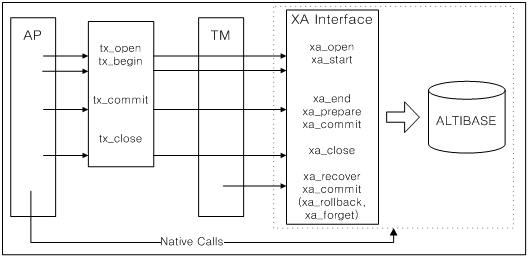
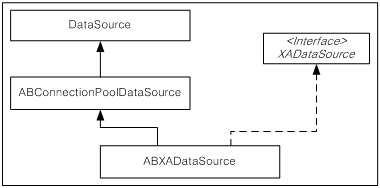
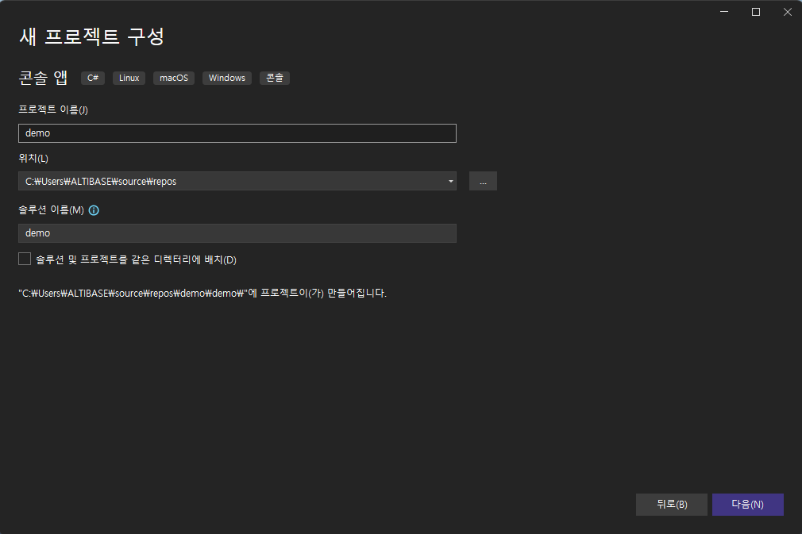

Application Program Interface User’s Manual
================

#### Altibase 7.1

Altibase® Application Development

<br><br><br><br><br><br><!-- PDF 변환을 위한 여백입니다. --> 


<!-- PDF 변환을 위한 여백입니다. --> 

<div align="left">
    
</div>
<br><br><!-- PDF 변환을 위한 여백입니다. --> 


<!-- PDF 변환을 위한 여백입니다. --> 

<pre>
Altibase Application Development Application Program Interface User’s Manual
Release 7.1
Copyright ⓒ 2001~2023 Altibase Corp. All Rights Reserved.<br>
본 문서의 저작권은 ㈜알티베이스에 있습니다. 이 문서에 대하여 당사의 동의없이 무단으로 복제 또는 전용할 수 없습니다.<br>
<b>㈜알티베이스</b>
08378 서울시 구로구 디지털로 306 대륭포스트타워Ⅱ 10층
전화 : 02-2082-1114
팩스 : 02-2082-1099
고객서비스포털 : <a href='http://support.altibase.com'>http://support.altibase.com</a>
홈페이지      : <a href='http://www.altibase.com/'>http://www.altibase.com</a></pre>

<br>

# 목차

- [서문](#%EC%84%9C%EB%AC%B8)
  - [이 매뉴얼에 대하여](#%EC%9D%B4-%EB%A7%A4%EB%89%B4%EC%96%BC%EC%97%90-%EB%8C%80%ED%95%98%EC%97%AC)
- [1.PHP Interface](#1php-interface)
  - [Altibase PHP 모듈 참고 사항](#altibase-php-%EB%AA%A8%EB%93%88-%EC%B0%B8%EA%B3%A0-%EC%82%AC%ED%95%AD)
  - [PHP 연동을 위한 ODBC 매니저 설치](#php-%EC%97%B0%EB%8F%99%EC%9D%84-%EC%9C%84%ED%95%9C-odbc-%EB%A7%A4%EB%8B%88%EC%A0%80-%EC%84%A4%EC%B9%98)
  - [ODBC 연결을 위한 PHP 함수](#odbc-%EC%97%B0%EA%B2%B0%EC%9D%84-%EC%9C%84%ED%95%9C-php-%ED%95%A8%EC%88%98)
- [2.PDO 드라이버](#2pdo-%EB%93%9C%EB%9D%BC%EC%9D%B4%EB%B2%84)
  - [설치 및 설정](#%EC%84%A4%EC%B9%98-%EB%B0%8F-%EC%84%A4%EC%A0%95)
  - [제약 및 주의사항](#%EC%A0%9C%EC%95%BD-%EB%B0%8F-%EC%A3%BC%EC%9D%98%EC%82%AC%ED%95%AD)
  - [사용 방법](#%EC%82%AC%EC%9A%A9-%EB%B0%A9%EB%B2%95)
  - [사용 예제](#%EC%82%AC%EC%9A%A9-%EC%98%88%EC%A0%9C)
- [3.XA Interface](#3xa-interface)
  - [XA 개요](#xa-%EA%B0%9C%EC%9A%94)
  - [XA 인터페이스](#xa-%EC%9D%B8%ED%84%B0%ED%8E%98%EC%9D%B4%EC%8A%A4)
  - [XA 사용](#xa-%EC%82%AC%EC%9A%A9)
  - [XA 사용시 제약사항](#xa-%EC%82%AC%EC%9A%A9%EC%8B%9C-%EC%A0%9C%EC%95%BD%EC%82%AC%ED%95%AD)
  - [JDBC 분산 트랜잭션](#jdbc-%EB%B6%84%EC%82%B0-%ED%8A%B8%EB%9E%9C%EC%9E%AD%EC%85%98)
  - [XA를 사용한 애플리케이션의 문제 해결](#xa%EB%A5%BC-%EC%82%AC%EC%9A%A9%ED%95%9C-%EC%95%A0%ED%94%8C%EB%A6%AC%EC%BC%80%EC%9D%B4%EC%85%98%EC%9D%98-%EB%AC%B8%EC%A0%9C-%ED%95%B4%EA%B2%B0)
- [4.iLoader API](#3iloader-api)
  - [iLoader API 개요](#iloader-api-%EA%B0%9C%EC%9A%94)
  - [iLoader API 사용](#iloader-api-%EC%82%AC%EC%9A%A9)
  - [iLoader API 데이터 구조체](#iloader-api-%EB%8D%B0%EC%9D%B4%ED%83%80-%EA%B5%AC%EC%A1%B0%EC%B2%B4)
  - [iLoader API](#iloader-api)
- [5.CheckServer API](#5checkserver-api)
  - [CheckServer API 개요](#checkserver-api-%EA%B0%9C%EC%9A%94)
  - [CheckServer API 사용](#checkserver-api-%EC%82%AC%EC%9A%A9)
  - [CheckServer API 데이터 구조체](#checkserver-api-%EB%8D%B0%EC%9D%B4%ED%83%80-%EA%B5%AC%EC%A1%B0%EC%B2%B4)
  - [CheckServer API](#checkserver-api)
- [6..NET Data Provider](#6net-data-provider)
  - [Altibase ADO.NET](#altibase-adonet)

<br>

서문
====

## 이 매뉴얼에 대하여

이 매뉴얼은 API 사용법에 대해 설명한다.

### 대상 사용자

이 매뉴얼은 다음과 같은 Altibase 사용자를 대상으로 작성되었다.

-   데이터베이스 관리자

-   성능 관리자

-   데이터베이스 사용자

-   응용 프로그램 개발자

-   기술지원부

다음과 같은 배경 지식을 가지고 이 매뉴얼을 읽는 것이 좋다.

-   컴퓨터, 운영 체제 및 운영 체제 유틸리티 운용에 필요한 기본 지식

-   관계형 데이터베이스 사용 경험 또는 데이터베이스 개념에 대한 이해

-   컴퓨터 프로그래밍 경험

-   데이터베이스 서버 관리, 운영 체제 관리 또는 네트워크 관리 경험

### 소프트웨어 환경

이 매뉴얼은 데이터베이스 서버로 Altibase 버전 7.1을 사용한다는 가정 하에 작성되었다.

### 이 매뉴얼의 구성

이 매뉴얼은 다음과 같이 구성되어 있다.

-   제 1 장 PHP Interface  
    이 장은 PHP에서 ODBC 함수를 이용하여 Altibase와 연동하는 방법을 설명한다.

-   제 2 장 PDO 드라이버  
    이 장은 Altibase PDO 드라이버를 설치하고 이를 사용하여 Altibase와 연동하는 방법을 설명한다.
    
-   제 3 장 XA Interface  
    이 장은 XA 표준을 소개하고, 분산 트랜잭션의 기본 개념과 XA 인터페이스를 설명한다. 그리고 ODBC, Embedded SQL, JDBC 프로그램에서 글로벌 트랜잭션을 사용하여 Altibase에 접근하는 방법에 대해 설명한다.
    
-   제 4 장 iLoader API  
    이 장은 Altibase 서버로부터 데이터를 다운로드 또는 서버로 데이터를 업로드하는 응용프로그램을 작성할 수 있는 인터페이스인 Altibase iLoader API를 소개한다.
    
-   제 5 장 CheckServer API  
    이 장은 Altibase 서버가 비정상 종료했는지를 감시하는 응용프로그램을 작성하기 위해 사용하는 인터페이스인 Altibase CheckServer API를 소개한다.

### 문서화 규칙

이 절에서는 이 매뉴얼에서 사용하는 규칙에 대해 설명한다. 이 규칙을 이해하면 이 매뉴얼과 설명서 세트의 다른 매뉴얼에서 정보를 쉽게 찾을 수 있다.

여기서 설명하는 규칙은 다음과 같다.

-   구문 다이어그램

-   샘플 코드 규칙

#### 구문 다이어그램

이 매뉴얼에서는 다음 구성 요소로 구축된 다이어그램을 사용하여, 명령문의 구문을 설명한다.

| 구성 요소                       | 의미                                                         |
| ------------------------------- | ------------------------------------------------------------ |
|  | 명령문이 시작한다. 완전한 명령문이 아닌 구문 요소는 화살표로 시작한다. |
|  | 명령문이 다음 라인에 계속된다. 완전한 명령문이 아닌 구문 요소는 이 기호로 종료한다. |
|  | 명령문이 이전 라인으로부터 계속된다. 완전한 명령문이 아닌 구문 요소는 이 기호로 시작한다. |
|  | 명령문이 종료한다.                                           |
|  | 필수 항목                                                    |
|  | 선택적 항목                                                  |
|  | 선택사항이 있는 필수 항목. 한 항목만 제공해야 한다.          |
|  | 선택사항이 있는 선택적 항목                                  |
|  | 선택적 항목. 여러 항목이 허용된다. 각 반복 앞부분에 콤마가 와야 한다. |

#### 샘플 코드 규칙

코드 예제는 SQL, Stored Procedure, iSQL 또는 다른 명령 라인 구문들을 예를 들어 설명한다.

아래 테이블은 코드 예제에서 사용된 인쇄 규칙에 대해 설명한다.

| 규칙         | 의미                                                         | 예제                                                         |
| ------------ | ------------------------------------------------------------ | ------------------------------------------------------------ |
| [ ]          | 선택 항목을 표시                                             | VARCHAR [(*size*)] [[FIXED \|] VARIABLE]                     |
| { }          | 필수 항목 표시. 반드시 하나 이상을 선택해야 되는 표시        | { ENABLE \| DISABLE \| COMPILE }                             |
| \|           | 선택 또는 필수 항목 표시의 인자 구분 표시                    | { ENABLE \| DISABLE \| COMPILE } [ ENABLE \| DISABLE \| COMPILE ] |
| . . .        | 그 이전 인자의 반복 표시 예제 코드들의 생략되는 것을 표시    | SQL\> SELECT ename FROM employee; <br />ENAME  SWNO  HJNO  HSCHOI  . . . 20 rows selected. |
| 그 밖에 기호 | 위에서 보여진 기호 이 외에 기호들                            | EXEC :p1 := 1; acc NUMBER(11,2);                             |
| 기울임 꼴    | 구문 요소에서 사용자가 지정해야 하는 변수, 특수한 값을 제공해야만 하는 위치 지정자 | SELECT \* FROM *table_name*; CONNECT *userID*/*password*;    |
| 소문자       | 사용자가 제공하는 프로그램의 요소들, 예를 들어 테이블 이름, 컬럼 이름, 파일 이름 등 | SELECT ename FROM employee;                                  |
| 대문자       | 시스템에서 제공하는 요소들 또는 구문에 나타나는 키워드       | DESC SYSTEM_.SYS_INDICES_;                                   |

### 관련 자료

자세한 정보를 위하여 다음 문서 목록을 참조하기 바란다.

-   Installation Guide

-   Administrator’s Manual

-   Replication Manual

-   CLI User's Manual

-   Precompiler User’s Manual

-   ODBC User's Manual

-   iSQL User’s Manual

-   Utilities Manual

-   Error Message Reference

### Altibase는 여러분의 의견을 환영합니다.

이 매뉴얼에 대한 여러분의 의견을 보내주시기 바랍니다. 사용자의 의견은 다음 버전의 매뉴얼을 작성하는데 많은 도움이 됩니다. 보내실 때에는 아래 내용과 함께 고객서비스포털(*http://support.altibase.com/kr/* )로 보내주시기 바랍니다.

-   사용 중인 매뉴얼의 이름과 버전

-   매뉴얼에 대한 의견

-   사용자의 성함, 주소, 전화번호

이 외에도 Altibase 기술지원 설명서의 오류와 누락된 부분 및 기타 기술적인 문제들에 대해서 이 주소로 보내주시면 정성껏 처리하겠습니다. 또한, 기술적인 부분과 관련하여 즉각적인 도움이 필요한 경우에도 고객서비스포털을 통해 서비스를 요청하시기 바랍니다.

여러분의 의견에 항상 감사드립니다.

<br>

1.PHP Interface
=============

이 장에서는 PHP에서 ODBC 함수를 이용하여 Altibase와 연동하는 방법을 설명한다.


## Altibase PHP 모듈 참고 사항

-   PHP에서 지원하는 데이터 타입은 다음과 같다.  
    resource, int, bool, double, float, string, array, HashTable
-   Altibase 서버의 포트 번호와 Altibase에서 제공한 샘플 프로그램의 db.php에서 포트 번호를 맞춰야 한다.

<br/>

## PHP 연동을 위한 ODBC 매니저 설치

PHP로 Altibase에 연동을 하기 위해서는 먼저 ODBC 매니저를 설치해야 한다. 이 절에서는 유닉스, 또는 리눅스에서 ODBC 매니저를 설치하고 사용환경을 설정하는 방법을 설명한다.

### 유닉스와 리눅스

리눅스 또는 유닉스 환경에서 다음 절차대로 ODBC 매니저를 설치한다.

1.  unixODBC 다운로드한다.  
    unixODBC 홈페이지 (http://www.unixodbc.org )에서 다운로드 할 수 있다.

2. unixODBC 설치한다.  
   다운로드한 unixODBC 소스 파일을 컴파일해야 한다. 컴파일된 라이브러리를 특정 위치에 설치하려면, configure할 때 –prefix 옵션으로 경로를 입력한다.
   
   ```
   ./configure -prefix=설치경로 -enable-gui=no -–enable-drivers=no
   make
   make install
   ```


3. unixODBC 환경을 설정한다.  
   ODBCSYSINI 환경변수의 값을 Altibase 설치 계정의 홈 디렉터리 경로로 설정한다.

   ```
   export ODBCSYSINI=~
   ```


4. unixODBC Driver Manager가 설치된 경로를 다음과 같이 환경변수에 추가한다.
   라이브러리 경로를 설정하는 환경변수는 플랫폼과 운영체제의 bit에 따라서 LD_LIBRARY_PATH, LD_LIBRARY_PATH_64, SHLIB_PATH 중의 하나일 수 있다. 다음은 unixODBC를 /usr/local/odbcDriverManager32 또는 /usr/local/odbcDriverManager64에 설치한 예이다.
   
   ```
   export LD_LIBRARY_PATH= /usr/local/odbcDriverManager32/lib:\$LD_LIBRARY_PATH
   export LD_LIBRARY_PATH_64= /usr/local/odbcDriverManager64/lib:\$LD_LIBRARY_PATH_64
   ```


5. ODBCSYSINI 환경변수의 경로에 다음 2개의 파일을 생성한다.  

   ```
   odbc.ini  
   odbcinst.ini
   ```

6. odbcinst.ini는 실제 내용이 없는 0 byte 파일이다.

7. odbc.ini에는 DSN 이름 및 Altibase ODBC 드라이버 파일의 위치, 서버의 IP 주소, 접속 포트 번호를 아래처럼 설정한다.
   
   ```
   [Altibase]
   Driver = /home/altibase/altibase_home/lib/libaltibase_odbc.so
   Server = 127.0.0.1
   Port = 20300
   ```

<br/>

## ODBC 연결을 위한 PHP 함수

Altibase는 표준 ODBC를 지원함으로써 PHP에서 이 ODBC 함수들을 사용하여 Altibase 서버와 연동할 수 있다.

PHP에서 사용하는 ODBC 함수들에 대한 자세한 설명은 아래의 PHP 공식 매뉴얼 사이트를 참조한다:  http://php.morva.net/manual/kr/index.php

### Sample Test

```
<?
// SYSTEM DSN, USER_ID, USER_PASSWORD
$conn = odbc_connect("Altibase", "SYS", "MANAGER");

if ($conn)
{
    // direct-execution
    echo "now, i create table t1 (id integer, name char(20)<br>";
    odbc_exec($conn, "drop table t1");
    odbc_exec($conn, "create table t1 (id integer, name char(20))");

    // prepare-execution 
    echo "now, i insert into t1 value (100, Lee)<br>";
    $stmt = odbc_prepare ($conn, "insert into t1 values (?, ?)");
    $Insert = array (100, "Lee");
    if (!odbc_execute($stmt, &$Insert))
    {
        echo ("error");
    }

    // single-selection
    $res = odbc_do ($conn, "select id, name, sysdate from T1");
    odbc_fetch_row ($res);
    $ID = odbc_result($res, 1);
    $NAME = odbc_result($res, 2);
    $DATE = odbc_result($res, 3);
    echo ("id = $ID , name = $NAME datetime = $DATE <br>"); 
    odbc_close($conn);
}
?>
```

<br>

# 2.PDO 드라이버

이 장에서는 Altibase PDO 드라이버를 이용하여 Altibase와 연동하는 방법을 설명한다.

Altibase PDO 드라이버(이하 pdo_altibase)는 Altibase 공식 사이트에서 pecl 패키지 형태로 제공한다. pdo_altibase는 Altibase CLI 드라이버를 기반으로 개발되었기 때문에 CLI가 설치되어 있어야 하며, CLI에서 사용하는 환경변수의 영향을 받는다.


## 설치 및 설정

pdo_altibase를 다운로드 후 설치하고 환경을 설정하는 방법을 기술한다.

### 다운로드

pdo_altibase를 사용하기 위해서는 pecl 사용환경을 갖춰야 한다. 아래 url에서 pecl 패키지를 다운로드 한다.

- <http://support.altibase.com/kr/product> 으로 이동
- PDO_ALTIBASE-*.\*.\*.tgz 다운로드
  - PDO_ALTIBASE-1.\*.\*.tgz : PHP 5.3.3, PHP 7.1.20 버전 용
  - PDO_ALTIBASE-2.\*.\*.tgz : PHP 8.1.8 버전 용

### 소프트웨어 요구사항

-   Altibase : Altibase 6.5.1.5.1 이상

-   OS : Linux (상세 버전은 Altibase Release Notes 참고)

-   PHP : PHP 5.3.3, PHP 7.1.20, PHP 8.1.8

### 설치

pecl을 사용하여 pdo_altibase를 설치한다.

```
pecl install PDO_ALTIBASE-1.0.0.tgz
```

### 환경설정

php.ini 등 설정파일에 확장 사용설정을 추가한다.

```
extension=pdo_altibase.so
```

<br/>

## 제약 및 주의사항

### 제약사항

1.  pdo_altibase는 pdo_odbc와 동시에 사용할 수 없다. 두 extension을 모두 사용 설정하면 예기치 않은 에러가 발생할 수 있다.
2.  PDO 매뉴얼에 기술된 항목 중 아래 항목은 지원하지 않는다 :

    - PDO::lastInsertId

    - PDO::getAttribute, PDO::setAttribute
      - PDO::ATTR_CONNECTION_STATUS
      - PDO::ATTR_ORACLE_NULLS
      - PDO::ATTR_PERSISTENT
      - PDO::ATTR_SERVER_INFO
      - PDO::ATTR_STRINGIFY_FETCHES
      - PDO::ATTR_EMULATE_PREPARES
      - PDO::MYSQL_ATTR_USE_BUFFERED_QUERY

    - PDOStatement::getAttribute, PDOStatement::setAttribute
      - PDO::ATTR_CURSOR_NAME

    - PDOStatement::getColumnMeta


3. 기타 제약사항은 “파라미터 바인딩”을 참고한다.

### 주의사항

1.  pdo_altibase의 커밋모드 기본값은 서버의 설정과 무관하며 항상 autocommit이다. 다시 말해, 서버 기본값을 non-autocommit으로 설정하더라도 pdo_altibase의 커밋모드는 기본값인 autocommit이다.
2.  pdo 객체를 닫을 때, commit, rollback을 명시적으로 지정하지 않으면 해당 작업은 rollback된다.
3.  empty string('')을 알티베이스 DB의 숫자형데이터 타입들에 bind시에, native 타입(double, real, bigint, integer, smallint)과 non-native타입(numeric, decimal, number, float) 모두에 대하여 NULL로 입력된다.
4.  쿼리내에 "날짜타입값 - ?" 형태를 포함하고, "?"에 숫자값을 bind하여 사용시에는 "ERR-21038 : Literals in the input do not match the format string." 에러가 발생합니다. 이때, 날짜타입값이라함은 날짜타입컬럼 및 날짜타입반환함수를 포함합니다. 이러한 에러가 발생하는 이유는 pdo_altibase가 숫자값 bind시에 내부적으로 문자열로 처리하는데, Altibase 쿼리처리기가 날짜타입값에 대한 문자열 빼기연산을 하는 경우에 문자열을 날짜타입으로 변환하려고 하기 때문입니다. 이 경우에는 "?"을 "to_number(?)" 등으로 "?"을 문자열이 아닌 다른 의도하는 데이터타입을 갖도록 명시적으로 변경하여 사용하면 됩니다.

<br/>

## 사용 방법

### DSN 구성

pdo_altibase의 DSN 구성은 다음과 같다.

| 속성       | 설명                                                         |
| ---------- | ------------------------------------------------------------ |
| DSN prefix | “altibase”                                                   |
| Server     | 서버의 호스트 이름 또는 ip 주소                              |
| Port       | 서버의 포트 번호                                             |
| NLS_USE    | 캐릭터 셋. <br />US7ASCII가 기본값이며, 환경변수 ALTIBASE_NLS_USE가 설정된 경우에는 지정된 값을 사용한다. |

#### 예제

```
"altibase:Server=127.0.0.1;Port=20333;NLS_USE=US7ASCII"
```

### 연결속성

PDO::getAttribute(), PDO::setAttribute() 함수에서 사용할 수 있는 속성은 다음과 같다. 사용할 수 없는 속성은 “제약 및 주의사항”을 참조한다.

| 속성 ID                       | 설명                                                         |
| ----------------------------- | ------------------------------------------------------------ |
| PDO::ALTIBASE_DATE_FORMAT     | DATE를 표현하는데 사용할 포맷.   사용예제, DATE 포맷 변경 참고. |
| PDO::ALTIBASE_EXPLAIN_PL AN   | 수행 계획을 얻을지 여부와 그 방식.   PDO::ALTIBASE_EXPLAIN_PLAN_OFF : 수행 계획을 얻지 않는다.   <br />PDO::ALTIBASE_EXPLAIN_PLAN_ON : Prepare 및 Execution 후 결정된 수행 계획을 얻는다.   <br />PDO::ALTIBASE_EXPLAIN_PLAN_ONLY :  Prepare 후 Execution 전에 결정된 수행 계획을 얻는다.   <br />자세한 내용은 사용 예제>   수행계획 확인   을 참고하라. |
| PDO::ALTIBASE_DEFER_PROTOCOLS | Prepare,   execute를 반복하여 호출하는 구조로 작성된 프로그램의 성능 향상을 위한 프로토콜 최적화 여부를 설정한다.   <br />이 속성을 사용하기 위해서는, 하나의 커넥션 객체를 여러 쓰레드에서 공유해서 사용하지 않아야 한다.   <br />또한 성능을 위해서는   prepare를 한번만 호출한 후, execute를 반복 호출하는 구조로 프로그램을   작성해야 한다.   <br />0 : 프로토콜   최적화하지 않음 (default)   <br />1 : execute   관련 프로토콜 최적화   <br />2 :   execute, close 관련 프로토콜 최적화  <br /><br /> ex>   $db->setAttribute(PDO::ALTIBASE_DEFER_PROTOCOLS, 1); |

### 파라미터 바인딩

pdo_altibase는 named parameter를 지원하지 않는다.

또한, 4번째인 length 인자는 현재 hint로만 사용하며, 유효한 값으로 처리하지 않는다. 만약 length에 의한 동작이 필요하다면 length 인자 대신 값 자체를 잘라서 사용해야 한다.

#### 바인딩 예제

```
$stmt = $db->prepare("SELECT * FROM t1 WHERE val = ? OR val = ?");
$stmt->bindParam(1, $val1);
$stmt->bindParam(2, $val2);
$stmt->execute();
```


### 컬럼 바인딩

pdo_altibase는 bindColumn()의 type 및 maxlen을 지정해도 동작에 영향을 끼치지 않는다. SQL data type에 따라 바이너리 또는 문자열로 값을 가져오며, 이후 처리는 PDO 동작에 따른다.

### 기타 바인딩 제약사항

BIT, VARBIT, BYTE, VARBYTE, NIBBLE, LOB, GEOMETRY 타입은 제한적으로 지원한다. 단순 INSERT 등 일부 쿼리에 한해서만 제한적으로 사용할 수 있다.

<br/>

## 사용 예제

### 연결 및 쿼리 수행

```
$db = new PDO("altibase:Server=127.0.0.1;Port=20333", "sys", "manager");
foreach ($db->query("SELECT * FROM dual") as $row) {
    print_r($row);
}
```


### DATE 포맷 변경

DATE를 위해 기본으로 어떤 문자열 포맷을 사용할 것인지 설정할 수 있다.

```
$db->setAttribute(PDO::ALTIBASE_DATE_FORMAT, "YYYY-MM-DD");
$attr_dateform = $db->getAttribute(PDO::ALTIBASE_DATE_FORMAT);
echo "attr_dateform = $attr_dateform\n";
$stmt->execute();
echo $stmt->fetchColumn(), "\n";
```


#### 출력 결과

```
attr_dateform = YYYY-MM-DD
2017-04-18
```


### 수행계획 확인

PDO 객체의 setAttribute() 함수를 통해 수행 계획 출력 여부를 설정할 수 있다.

```
$attr_plan = $db->getAttribute(PDO::ALTIBASE_EXPLAIN_PLAN);
echo "attr_plan = $attr_plan\n";
 
$db->setAttribute(PDO::ALTIBASE_EXPLAIN_PLAN, PDO::ALTIBASE_EXPLAIN_PLAN_ONLY);
$attr_plan = $db->getAttribute(PDO::ALTIBASE_EXPLAIN_PLAN);
echo "attr_plan = $attr_plan\n";
$stmt = $db->prepare("SELECT * FROM dual");
$stmt->execute();
print_r($stmt->fetchAll());
echo $stmt->getPlanText();
$stmt = null;
$db->setAttribute(PDO::ALTIBASE_EXPLAIN_PLAN, PDO::ALTIBASE_EXPLAIN_PLAN_ON);
$attr_plan = $db->getAttribute(PDO::ALTIBASE_EXPLAIN_PLAN);
echo "attr_plan = $attr_plan\n";
$stmt = $db->prepare("SELECT * FROM dual");
$stmt->execute();
print_r($stmt->fetchAll());
echo $stmt->getPlanText();
$stmt = null;
```


#### 출력 결과

```
attr_plan = 0
attr_plan = 2
Array
(
    [0] => Array
        (
            [dummy] => X
            [0] => X
        )
)
------------------------------------------------------------
PROJECT ( COLUMN_COUNT: 1, TUPLE_SIZE: 3, COST: 0.01 )
 SCAN ( TABLE: DUAL, FULL SCAN, ACCESS: ??, COST: 0.01 )
------------------------------------------------------------
attr_plan = 1
Array
(
    [0] => Array
        (
            [dummy] => X
            [0] => X
        )
)
------------------------------------------------------------
PROJECT ( COLUMN_COUNT: 1, TUPLE_SIZE: 3, COST: 0.01 )
 SCAN ( TABLE: DUAL, FULL SCAN, ACCESS: 1, COST: 0.01 )
------------------------------------------------------------
```


### 커서 유지

commit, rollback을 수행해도 fetch중인 커서를 유지해준다.

```
// HOLD를 쓰려면 AUTOCOMMIT 속성이 false여야 함
$db->setAttribute(PDO::ATTR_AUTOCOMMIT, false);
 
// prepare 때 HOLD 속성을 줘야 함
$stmt_sel = $db->prepare("SELECT * FROM pdo_hold", array(PDO::ALTIBASE_CURSOR_HOLD => PDO::ALTIBASE_CURSOR_HOLD_ON));
$stmt_del = $db->prepare("DELETE pdo_hold WHERE id = ?");
 
// TODO
 
// AUTOCOMMIT을 바꾸려면 stmt를 모두 정리해야 함
unset($stmt_sel);
unset($stmt_del);
$db->setAttribute(PDO::ATTR_AUTOCOMMIT, true);
```

<br>

3.XA Interface
============

이 장은 XA 표준을 소개하고, 분산 트랜잭션의 기본 개념과 XA 인터페이스를 설명한다.

ODBC, Embedded SQL, JDBC 프로그램에서 글로벌 트랜잭션을 사용하여 Altibase에 접근하는 방법에 대해 설명한다. 또한 XA의 제약사항 및 애플리케이션에서 발생할 수 있는 문제를 다루는 법을 살펴본다.


## XA 개요

XA 구조는 X/Open에서 정한 분산 트랜잭션 (또는 글로벌 트랜잭션) 처리를 위한 표준 모델이다.

분산 트랜잭션이란 2개 또는 그 이상의 네트워크 상에서의 데이터베이스 시스템 간의 트랜잭션으로서 글로벌 트랜잭션 (Global Transaction)이라고도 한다. 데이터베이스 시스템은 트랜잭션의 자원 역할을 하고, 트랜잭션 매니져 (Transaction Manager, TM)는 이러한 자원에 관련된 모든 동작에 대하여 트랜잭션을 생성하고 관리한다. 즉
다수의 데이터베이스 서버들이 제공하는 자원을 분산 애플리케이션이 공유할 수 있도록 해주거나 또는 글로벌 트랜잭션으로 처리할 수 있도록 한다.

XA는 하나 이상의 데이터베이스에서 트랜잭션을 처리하는 애플리케이션에 유용한 구조이다.

### XA 관련 용어

-   Application (AP)  
    애플리케이션은 필요한 트랜잭션과 트랜잭션으로 구성된 작업을 정의한다.
    애플리케이션은 Embedded SQL 또는 ODBC CLI로 작성할 수 있다.

-   글로벌 트랜잭션 (Global Transaction)  
    TM에 의해 관리되는 트랜잭션 전체를 의미하며, 분산 트랜잭션이라고도 한다.

-   휴리스틱 완료 (Heuristic Completion)  
    in-doubt 트랜잭션에서 어떤 원인으로 커밋 등의 다음 명령을 받지 못 해서 RM 스스로 커밋 또는 롤백을 수행한 경우 휴리스틱 커밋 (Heuristic Commit)이나 휴리스틱 롤백 (Heuristic Rollback)이라고 한다. 이러한 상태를 휴리스틱 완료 (Heuristic Completion)가 되었다고 한다. 일반적으로 네트워크 실패 또는 트랜잭션 타임아웃에 의해 발생한다.
    
-   In-doubt 트랜잭션  
    RM 즉 DBMS에 prepare 된 후 커밋 또는 롤백 메시지를 받기 전까지의 트랜잭션 브랜치을 의미한다. 또는 Pending 트랜잭션이라고도 한다.
    
-   리소스 매니저(Resource Manager, RM)  
    리소스 매니저는 XA 트랜잭션에 의해 접근되는 자원을 관리한다. 예를 들어 관계형 데이터베이스, 트랜잭션 큐, 또는 파일 시스템 등이 있을 수 있다.
    
-   트랜잭션 브랜치 (Transaction Branch)  
    이는 하위 트랜잭션으로 글로벌 트랜잭션의 일부이다. 이는 글로벌 트랜잭션에 참여하는 RM들 중 하나에서 실행된다. 하나의 트랜잭션 브랜치는 하나의 XID (XA의 트랜잭션 아이디)와 일대일로 대응한다.
    
-   Transaction Manager (TM)  
    이는 트랜잭션을 정의하는 API를 제공한다. 트랜잭션의 커밋과 롤백을 책임지고, 복구를 수행한다. TM은 모든 RM이 서로 일관성을 가지도록 2단계 커밋 엔진을 가지고 있다.
    
-   Transaction Processing Monitor (TPM)  
    이는 하나 이상의 AP가 하나 이상의 RM으로 요청하는 트랜잭션의 흐름을 조정한다. RM은 이기종이 가능하며 네트워크를 통해서 분산될 수 있다.  
    TPM은 커밋과 롤백 작업을 조정함으로써 분산 트랜잭션을 완료한다. TPM에 속하는 TM부분은 분산된 커밋과 롤백 작업의 타이밍을 결정할 책임이 있다. 즉 TPM은 2단계 커밋을 제어할 책임이 있다.  
    TM은 분산된 커밋과 롤백 작업을 관리하기 때문에, 모든 RM에 대해 알 수 있어야 하며 직접 통신할 수 있어야 한다. 이를 위해 TM은 XA 인터페이스를 사용한다.
    Altibase의 경우, TM 은 Altibase에서 제공하는 XA 라이브러리를 사용할 수 있다.
    
-   TX 인터페이스  
    AP는 TX 인터페이스를 사용하여 TM을 통해서 트랜잭션을 제어한다. AP가 직접 XA 인터페이스를 사용하지는 않는다. AP는 개별 트랜잭션 브랜치의 작업을 알지 못하고, 애플리케이션 쓰레드가 직접 트랜잭션 브랜치 작업에 참여하지도 않는다.
    글로벌 트랜잭션의 브랜치들은 AP를 대신하여 TM에 의해서 관리된다. AP는 다만 TM에게 글로벌 트랜잭션을 커밋 또는 롤백할 것을 요청할 뿐이다.

### XA의 구조

아래 그림에서 보는 것처럼, 하나 이상의 AP (Application Program), TM (Transaction Manager)과 하나 이상의 RM (Resource Manager)이 분산 트랜잭션에 관여한다.

<div align="left">
    
</div>

[그림 3‑1] XA 구조

AP가 TX 인터페이스를 사용하여 TM에게 분산 트랜잭션이 시작됐다고 알리면, TM은 어떤 RM (데이터베이스 시스템)이 분산 트랜잭션의 대상인지 확인한다. TM은 내부적으로 RM에서 수행할 트랜잭션 브랜치를 위한 XID를 생성하여 XA인터페이스를 호출하여 RM에게 XID를 전달한다.

각각의 RM (DB 노드)은 전송된 XID에 대응하는 트랜잭션 브랜치를 처리하기 시작한다. 그리고 TM으로부터 그 트랜잭션의 종료 요청이 올 때까지는 AP로부터 요청된 작업을 그 XID에 해당하는 글로벌 트랜잭션내의 작업으로 인지하고 트랜잭션 브랜치에서 작업을 진행한다.

트랜잭션을 종료하려면, AP는 TX 인터페이스를 사용하여 TM에게 분산 트랜잭션이 종료됐다고 알린다. 그러면 TM은 XA인터페이스를 사용하여 분산 트랜잭션을 진행한 RM에게 커밋 또는 롤백을 명령한다.

### XA와 2단계 커밋

Altibase XA Interface는 2단계 커밋(2-Phase Commit, 2PC)을 따른다. 2PC는 Prepare 단계와 Commit 단계로 구성된다.

1단계인 Prepare에서 TM은 분산 트랜잭션에 참여하는 모든 데이터베이스 노드들 즉 RM에게 커밋의 가능성을 확인한다. RM은 커밋이 가능하다면 Prepare 상태를 TM에게 전달한다. 그러나 가능하지 않다면 RM은 이를 롤백시키기 위한 상태 값을 반환한다.

2단계인 Commit에서 TM은 Prepare의 상태를 전달받을 때까지 대기한다. 그리고 Prepare가 정상적으로 진행되었다면, 모든 RM에게 커밋 명령을 보낸다. 그러나 하나의 RM이라도 Prepare가 되지 않았다면, 롤백 명령을 보낸다.

### xa_switch_t 구조체

XA 인터페이스를 지원하는 모든 RM은 RM에 대한 정보와 각 인터페이스의 entry point를 가지는 xa_switch_t 구조체를 제공한다. Altibase는 altibase_xa_switch라는 이름으로 제공한다.

```
struct xa_switch_t {
    char name[RMNAMESZ];   /* name of resource manager */
    long flags;              /* resource manager specific options */
    long version;               
   
    int (*xa_open_entry)(/*_ char *, int, long _*/); /*xa_open fn pointer*/
    int  (*xa_close_entry)(/*_ char *, int, long _*/); /*xa_close fn pointer*/
    int  (*xa_start_entry)(/*_ XID *, int, long _*/); /*xa_start fn pointer*/
    int  (*xa_end_entry)(/*_ XID *, int, long _*/); /*xa_end fn pointer*/
    int  (*xa_rollback_entry)(/*_ XID *, int, long _*/); /*xa_rollback fn pointer*/
    int  (*xa_prepare_entry)(/*_ XID *, int, long _*/); /*xa_prepare fn pointer*/
    int  (*xa_commit_entry)(/*_ XID *, int, long _*/); /*xa_commit fn pointer*/
    int  (*xa_recover_entry)(/*_ XID *, long, int, long _*/); /*xa_recover fn pointer*/
    int  (*xa_forget_entry)(/*_ XID *, int, long _*/); /*xa_forget fn pointer*/
    int  (*xa_complete_entry)(/*_ int *, int *, int, long _*/); /*xa_complete fn pointer*/
};
```


### XA 라이브러리

Altibase XA인터페이스를 사용하는 애플리케이션을 연결하기 위해서는 별도의 라이브러리가 필요하지 않다. ODBC 프로그램을 위한 odbccli 라이브러리에 포함되어 제공하기 때문에, 사용자가 XA 관련 기능을 사용하기 위해서는 XA를 사용하는 애플리케이션에 libodbccli.a 라이브러리만 링크하면 된다.


## XA 인터페이스

XA 인터페이스는 RM과 TM간의 상호 인터페이스이다. TM은 글로벌 트랜잭션을 수행하기 위해 RM을 제어하는 XA 루틴과 RM이 동적으로 TM에게 요청하는 AX 루틴으로 구성된다.

Note: Altibase는 동적인 등록을 지원하지 않기 때문에, 트랜잭션을 시작하기 전에 TM이 RM으로 xa_start를 호출해야 한다.

### XA 함수

Altibase는 xa_switch_t의 Altibase 구현인 altibase_xa_switch 구조체에 XA 관련 함수들을 제공한다.

| XA 인터페이스 | 설명                                                                                                          |
|---------------|---------------------------------------------------------------------------------------------------------------|
| xa_open       | Resource Manager 에 연결한다.                                                                                 |
| xa_close      | Resource Manager로부터 연결을 해제한다.                                                                       |
| xa_start      | 새로운 트랜잭션 브랜치 또는 기존의 트랜잭션 브랜치를 다시 시작하고, 주어진 트랜잭션 식별자(XID)와 연계시킨다. |
| xa_end        | 트랜잭션 브랜치로부터 분리한다.                                                                               |
| xa_rollback   | 주어진 XID와 연계된 트랜잭션 브랜치를 롤백한다.                                                               |
| xa_prepare    | 트랜잭션 브랜치의 커밋을 준비한다.                                                                            |
| xa_commit     | 트랜잭션 브랜치를 커밋한다.                                                                                   |
| xa_recover    | prepare, 휴리스틱 커밋 또는 휴리스틱 롤백된 트랜잭션의 XID 리스트를 보여준다.                                 |
| xa_forget     | 휴리스틱하게 완료된 트랜잭션 브랜치에 대한 정보를 RM에서 폐기하도록 한다.                                     |

[표 3‑1] XA 인터페이스

#### xa_open

RM에 접속한다.

```
int xa_open(char *xa_info, int rmid, long flags);
```

xa_info는 null-terminated 문자열로, 서버 정보를 포함하며 최대 길이는 256byte이다. SQLDriverConnect의 인자와 동일한 포맷을 가지며, 추가적으로 XA_NAME, XA_LOG_DIR 필드가 존재한다. 다른 필드에 대한 자세한 설명한 *CLI User's Manual* 의 SQLDriverConnect 함수를 참조하기 바란다.

```
NAME=value;NAME=value;NAME=value;…
```

예) DSN=127.0.0.1;UID=SYS;PWD=MANAGER ;XA_NAME=conn1

| XA 파라미터 | 설명                                                                                                                                                                                                                                                     |
|-------------|----------------------------------------------------------------------------------------------------------------------------------------------------------------------------------------------------------------------------------------------------------|
| XA_NAME     | Altibase Embedded SQL 프로그램에서 연결의 식별자로 사용되는 이름이다. Altibase Embedded SQL로 애플리케이션을 작성할 때 이 값을 생략하면, 기본 연결을 사용하게 된다. 만약 XA_NAME 속성에 이름을 명시했다면, SQL문 수행시 AT 절에 이 이름을 사용하면 된다. |
| XA_LOG_DIR  | Altibase XA 라이브러리에서 발생한 에러 정보를 로깅하는 디렉터리를 명시한다. 기본값은 ALTIBASE_HOME 환경변수가 설정되었을 경우 \$ALTIBASE_HOME/trc이고, 그렇지 않다면 현재 디렉터리다.                                                                    |

[표 3‑2] XA 인터페이스에 추가된 필드

rmid는 접속할 서버의 ID를 기록하며, 아무 값이나 쓸 수 있다.

플래그 (flags)는 다음의 값을 사용할 수 있다.

-   TMNOFLAGS

#### xa_close

지정된 RM과 연결을 종료한다.

```
int xa_close(char *xa_info, int rmid, long flags);
```

xa_info는 서버에 대한 정보를 기록하는 문자열로, 최대 길이는 256byte이다.

Note: 연결이 이미 종료된 것에 대해 xa_close가 수행되어도, XA_OK 값이 반환된다.

플래그 (flags)는 다음의 값을 쓸 수 있다.

-   TMNOFLAGS

#### xa_start

트랜잭션 브랜치를 시작한다. xid는 글로벌 트랜잭션에 대한 식별자이다.

```
int xa_start(XID *xid, int rmid, long flags);
```

플래그(flags)는 다음의 값을 쓸 수 있다.

-   TMRESUME  
    이전에 suspend된 트랜잭션 브랜치를 계속한다.

-   TMNOWAIT  
    xa_start가 차단될 경우, 기다리지 않고 XA_RETRY 값을 반환한다.

-   TMASYNC  
    비동기 모드로 트랜잭션 브랜치를 시작한다 (Altibase는 지원하지 않음).

-   TMNOFLAGS  
    다른 플래그를 지정하지 않을 경우 반드시 이 값을 지정해야 한다.

-   TMJOIN  
    존재하는 트랜잭션 브랜치에 연결한다.

#### xa_end

트랜잭션 브랜치를 끝낸다.

```
int xa_end(XID *xid, int rmid, long flags);
```

플래그(flags)는 다음의 값을 쓸 수 있다.

-   TMSUSPEND  
    해당 트랜잭션 브랜치를 suspend 상태로 변경하고 종료한다. 이 트랜잭션 브랜치는 xa_start에 의해서 다시 계속될 수 있다.
    
-   TMSUCCESS  
    성공적으로 종료했다는 것을 나타내는 것으로 TMSUSPEND 또는 TMFAIL과 같이 사용될 수 없다.
    
-   TMFAIL  
    비정상적으로 종료했다는 것을 나타낸다. 이 트랜잭션 브랜치의 상태는 roll-back only로 지정된다. TMSUCCES 또는 TMSUSPEND와 같이 사용될 수 없다.

#### xa_rollback

지정된 트랜잭션 브랜치에 대해서 수행한 연산을 롤백한다.

```
int xa_rollback(XID *xid, int rmid, long flags);
```

플래그(flags)는 다음의 값을 쓸 수 있다.

-   TMASYNC  
    xa_rollback이 비동기 모드로 동작하도록 한다 (Altibase는 지원하지 않음).

-   TMNOFLAGS  
    다른 플래그를 지정하지 않을 경우 반드시 이 값을 지정해야 한다.

#### xa_prepare

2단계 커밋 프로토콜에서 트랜잭션을 커밋하거나 롤백하기 이전에 수행한다.

```
int xa_prepare(XID *xid, int rmid, long flags);
```

플래그(flags)는 다음의 값을 쓸 수 있다.

-   TMASYNC  
    (Altibase는 지원하지 않음)

-   TMNOFLAGS  
    다른 플래그를 지정하지 않을 경우 반드시 이 값을 지정해야 한다.

다음의 값이 리턴될 수 있다.

-   XA_RDONLY  
    트랜잭션이 RM (DBMS)의 어떤 데이터도 변경하지 않았을 경우에 반환된다. RM 에서 수행된 트랜잭션은 커밋이나 롤백이 필요하지 않다.
    
-   XA_OK  
    정상적으로 수행되었을 경우에 이 값을 반환한다.

#### xa_commit

특정 트랜잭션 브랜치를 커밋한다.

```
int xa_commit(XID *xid, int rmid, long flags);
```

플래그(flags)는 다음의 값을 쓸 수 있다.

-   TMONEPHASE  
    one phase commit을 수행할 경우 설정한다.

-   TMNOFLAGS  
    다른 플래그를 지정하지 않을 경우 반드시 이 값을 지정해야 한다.

#### xa_recover

RM에서 prepare 상태로 있는 트랜잭션 브랜치에 해당하는 xid의 목록을 얻는다.

```
int xa_recover(XID *xids, long count, int rmid, long flags);
```

리턴 값은 xids 에 반환되는 xid의 갯수이다.

count 매개변수에는 xids의 사이즈를 지정한다.

플래그(flags)는 다음의 값을 쓸 수 있다.

-   TMSTARTRSCAN  
    자세한 설명은 XA Specification 문서를 참고한다.

-   TMENDRSCAN  
    자세한 설명은 XA Specification 문서를 참고한다.

-   TMNOFLAGS  
    현재 커서 위치에서 시작하여 XID 목록을 반환한다.

#### xa_forget

휴리스틱하게 (heuristically) 완료된 트랜잭션을 Altibase 서버가 관리하지 않도록 한다.

```
int xa_forget(XID * xid, int rmid, long flags);
```

플래그(flags)는 다음의 값을 쓸 수 있다.

-   TMNOFLAGS  
    항상 이 값을 지정한다.

#### xa_complete

비동기 모드의 연산을 수행할 때 해당 연산이 종료될 때까지 대기한다.
Altibase에서는 지원하지 않으며, 항상 오류 메시지를 리턴한다.

<br/>

## XA 사용

이 절에서는 XA 환경에서 ODBC, Embedded SQL, JDBC 등을 사용하기 위한 기본적인 절차를 살펴본다.

### ODBC/XA 수행 순서

1.  xa_open  
    지정한 서버에 접속한다.

2.  SQLAllocHandle  
    ODBC에 연결하기 위해서 connection과 environment 핸들을 생성한다.

3.  SQLSetConnectAttr  
    XA connection을 connection 핸들에 연결한다.

4.  SQLConnect  
    실제 연결은 xa_open으로 연결되었으므로, 이 호출에서 새로운 접속을 수행하지는 않는다. 다만 SQLConnect는 ODBC 에서 connection의 내부 상태값을 변경한다. 이 과정을 생략하면 DML 연산을 수행할 수 없다.
    
5.  xa_start  
    특정 XID에 대응하는 트랜잭션 브랜치를 시작한다.

6.  SQL 구문 실행  
    SQLPrepare, SQLExecute 등의 연산을 수행한다. 만일 여기에서 commit문을 실행한다면 서버는 에러 메시지를 반환한다.
    
7.  xa_end  
    트랜잭션 브랜치를 종료한다.

8.  xa_prepare  
    커밋을 위해 prepare를 수행한다.

9.  xa_commit  
    트랜잭션을 커밋한다.

10. SQLDisconnect  
    ODBC에서 connection의 내부 상태를 연결되지 않은 상태로 변경한다. 그러나 실제 XA에 의해서 생성된 연결은 그대로 유지된다.
    
11. xa_close  
    xa의 연결을 종료한다.

#### SQLSetConnectAttr

ODBC 애플리케이션이 분산 트랜잭션을 사용할 수 있도록, SQLSetConnectAttr을 호출하여 XA connection을 ODBC connection에 연결시킨다.

XA 연결하기 위해서는 SQLSetConnectAttr에 다음과 같은 매개변수를 준다.

```
SQLRETURN SQLSetConnectAttr (SQLHDBC hdbc,  
SQLINTEGER fAttr,  
SQLPOINTER vParam,  
SQLINTEGER sLen);
```


-   fAttr = ALTIBASE_XA_RMID  
    hdbc로 지정한 연결을 XA 연결로써 사용하도록 한다. XA 연결에 대한 자세한 정보는 vParam에 다음의 구조체 포인터를 지정하여 설정한다.
    
-   vParam  
    xa_open으로 연결할 때 사용한 rmid 값을 갖는다. rmid를 지정하지 않고 서버에 XA 연결을 하려면 다음의 매개변수를 사용한다.  
    fAttr = SQL_ATTR_ENLIST_IN_XA  
    지정한 hdbc 연결을 마지막 XA 연결과 맺는다.

### Embedded SQL

#### XA_NAME 설정에 따른 프로그램 작성 방법

XA 프로그램을 작성할 때, 커서는 한 트랜잭션 내에서만 유효하다. 즉 트랜잭션이 시작한 후에 커서를 열어야 하고, 트랜잭션이 커밋 또는 롤백 되기 전에 커서를 닫아야 한다.

###### 기본 연결을 사용한 프로그램 작성 방법

기본 연결을 사용려면 다음과 같이 xa_open의 연결 정보를 가지는 xa_info 인자에 XA_NAME 필드를 지정하지 않은 문자열을 사용해야 한다.

```
DSN=127.0.0.1;UID=SYS;PWD=MANAGER
```

그리고 SQL 구문에서는 다음 예제처럼 AT 절을 사용하지 않아도 된다.

```
EXEC SQL UPDATE emp SET empno = 5;
```


###### 한 개 이상의 연결을 사용하기 위해 XA_NAME을 사용한 프로그램 작성 방법

Embedded SQL 프로그램에서 명시적으로 연결의 이름을 사용하려면, xa_open의 연결 정보를 가지는 xa_info 인자에 XA_NAME=*conn1* 필드가 포함된 문자열을 사용해야 한다.

기본 연결과 한 개 이상의 이름이 명시된 연결이 있는 프로그램을 작성하려면, 다음과 같이 한다.

연결 이름이 conn1, conn2로 존재한다면 TM의 환경 설정에서 open_string은 다음과 같이 XA_NAME을 사용해서 연결 이름을 명시한다.

```
DSN=127.0.0.1;UID=SYS;PWD=MANAGER;XA_NAME=conn1
DSN=127.0.0.1;UID=SYS;PWD=MANAGER;XA_NAME=conn2
DSN=127.0.0.1;UID=SYS;PWD=MANAGER
```

애플리케이션 서버의 서비스 함수 프로그램에서는 아래처럼 AT절을 포함한 Embedded SQL 구문을 작성한다.

```
EXEC SQL AT conn1 UPDATE emp SET empno = 5;
EXEC SQL AT conn2 UPDATE emp SET empno = 5;
EXEC SQL UPDATE emp SET empno = 5;
```


### JDBC/XA 수행 순서

Altibase의 JDBC 드라이버가 정의하는 XA관련 클래스는 다음과 같다.

```
Altibase.jdbc.driver.AltibaseXADataSource
Altibase.jdbc.driver.AltibaseXAResource
Altibase.jdbc.driver.AltibaseXID
```

사용자가 직접 사용하는 클래스는 AltibaseXADataSource이다. 나머지는 JTA 인터페이스 클래스를 구현한 클래스로 사용자가 직접 사용할 필요는 없다.

1. AltibaseXADataSource 객체 생성

   ```
   AltibaseXADataSource xaDataSource = new AltibaseXADataSource();
   xaDataSource.setUrl(args[0]);
   xaDataSource.setUser("SYS");
   xaDataSource.setPassword("MANAGER");
   ```


2. XAConnection 객체 생성  
   XAConnection을 XADataSource 클래스의 getXAConnection 매소드를 호출하여 생성한다.
   
   ```
   XAConnection xaConnection = xaDataSource.getXAConnection(“SYS”, “MANAGER:”);
   ```
   
3. XAResource 객체 생성  
   XAResource를 XAConnection 클래스의 getXAResource 매소드를 호출하여 생성한다.

   ```
   XAResource xaResource = xaConnection.getXaResource();
   ```


4. Connection 객체 생성  
   SQL을 수행할 커넥션을 XAConnection 클래스의 getConnection 매소드를 호출하여 생성한다.
   
   ```
   Connection conn1 = xaConnection.getConnection();
   ```
   
5. XAResource 객체를 이용하여 XA 함수 실행  
   xa_start, xa_end 등의 XA 함수들은 XAResource 클래스의 매소드를 사용하여 실행된다.
   
   ```
   xaResource.start(AltibaseXID, XAResource.TMNOFLAGS);
   ```
   
6. Connection 객체를 이용하여 SQL 구문 수행

   ```
   Statement stmt = conn.createStatement();
   int cnt = stmt.executeUpdate("insert into t1 values (4321)");
   ```


### XA 트랜잭션 제어

Altibase XA 환경에서 트랜잭션을 제어하는 방법에 대해 설명한다.

XA 라이브러리를 사용할 때는 commit이나 rollback구문을 사용하여 트랜잭션을 처리하면 안된다. 대신에 AP는 아래 표의 TX인터페이스를 사용하여 TM이 트랜잭션을 시작하거나 종료하도록 해야 한다.

TM은 일반적으로 XA 인터페이스를 사용해서 트랜잭션을 제어한다.

| TX 인터페이스 | 설명                        |
|---------------|-----------------------------|
| tx_open       | RM에 logon한다.             |
| tx_close      | RM에서 logout한다.          |
| tx_begin      | 새로운 트랜잭션을 시작한다. |
| tx_commit     | 트랜잭션을 커밋한다.        |
| tx_rollback   | 트랜잭션을 롤백한다.        |

[표 3‑3] TX 인터페이스

TX 인터페이스와 XA 인터페이스의 호출 흐름을 살펴보면, 다음 그림과 같다.

<div align="left">
    
</div>
[그림3-2] TX 인터페이스와 XA 인터페이스의 호출 흐름도

TPM 애플리케이션은 애플리케이션 클라이언트가 애플리케이션 서버에서 제공하는 서비스를 요청하는 client/server 구조로 되어 있다. 서비스란 논리적인 일의 단위로써, Altibase를 RM으로 사용하는 경우에는 SQL 구문의 집합으로 구성된다고 볼 수 있다.

#### 예제

다음 예제들은 애플리케이션 서버가 TPM 시스템에 이미 로그온 되었다고 가정한 예제이다.

###### **애플리케이션 서버에서 트랜잭션 시작하기**

애플리케이션 서버에 의해서 트랜잭션이 시작되는 예제이다.

```
Client:
tpm_service(“SERVICE1”);

Server:
SERVICE1()
{
<get service specific data>
tx_begin();
EXEC SQL UPDATE....;
tpm_service(“SERVICE2”);
tx_commit();
<return service status back to the client>
}
```


###### 애플리케이션 클라이언트에서 트랜잭션 시작하기

애플리케이션 클라이언트에 의해서 트랜잭션이 시작되는 예제이다.

```
Client:
tx_begin();
tpm_service(“SERVICE1”);
tmp_service(“SERVICE2”);
tx_commit();

Server:
SERVICE1()
{
<get service specific data>
EXEC SQL UPDATE...;
<return service status back to the client>
}
SERVICE2()
{
<get service specific data>
EXEC SQL UPDATE...;
<return service status back to the client>
}
```


### 기존 애플리케이션을 TPM 애플리케이션으로 변경

기존에 작성되어 있던 애플리케이션 (Precompiler 또는 ODBCCLI)을 Altibase XA 라이브러리를 이용한 TPM (Transaction Performance Monitoring) 애플리케이션으로 변경하기 위해서는 다음의 절차를 따라야 한다.

1.  애플리케이션을 ‘서비스’라는 프레임워크(framework) 구조로 전환한다. 여기서 프레임워크란 애플리케이션 클라이언트가 애플리케이션 서버에게 ‘서비스’를 요청하는 구조를 의미한다. 어떤 TPM은 tx_open, tx_close 함수를 사용할 것을 요구하고, 어떤 TPM은 묵시적으로 logon, logoff 를 하기도 한다.
2.  일반적인 connect 구문을 TPM호환성이 있는 형태로 변경한다. 예를 들어, Embedded SQL프로그램의 경우에는 EXEC SQL CONNECT 구문을 tx_open()으로 변경하고, ODBCCLI에서는 SQLDriverConnect 구문을 tx_open과 SQLConnect로 변경한다. 실제 연결은 tx_open으로 연결되었으나, ODBC 내부에서 XA연결과
    맺어주는 SQLConnect 과정을 생략하면 DML 연산을 수행할 수 없다. 자세한 설명은 ODBC/XA 수행 순서를 참조한다.
    
3.  일반적인 disconnect 구문을 TPM호환성이 있는 형태로 변경한다. Embedded SQL프로그램의 EXEC SQL DISCONNECT 또는 ODBCCLI의 SQLDisconnect 구문을 tx_close()로 변경한다.
4.  Commit, rollback 구문을 TPM호환성이 있는 형태로 변경한다. 예를 들어 EXEC SQL COMMIT/ROLLBACK (Embedded SQL프로그램), SQLEndTran(ODBCCLI) 을 tx_commit/tx_rollback으로 변경하고, tx_begin()을 호출하여 트랜잭션을 시작하도록 한다.
5.  애플리케이션은 트랜잭션을 종료(end)하기 전에 fetch 상태를 리셋해야 한다. 커서를 사용해서 fetch를 했으면 트랜잭션을 종료하기 전에 CLOSE RELEASE를 사용해서 커서를 닫고 자원을 해제해야 한다.

| Altibase 구문             | TPM 함수                 |
|---------------------------|--------------------------|
| CONNECT                   | tx_open                  |
| 암묵적인 트랜잭션 시작    | tx_begin                 |
| SQL                       | SERVICE에서 SQL구문 수행 |
| COMMIT                    | tx_commit                |
| ROLLBACK                  | tx_rollback              |
| DISCONNECT                | tx_close                 |
| SET TRANSACTION READ ONLY | 허용하지 않음            |


## XA 사용시 제약사항

XA를 사용할 때 다음과 같은 몇가지 제약사항이 존재한다.

-   SQL 사용시 제약사항

-   트랜잭션 브랜치 관련 제약사항

-   연계 이주 비지원

-   비동기 호출 비지원

-   동적 등록 비지원

-   서버 종료

### SQL 사용시 제약사항

#### 롤백과 커밋

TM이 글로벌 트랜잭션을 관리하기 때문에 XA 애플리케이션에서는 COMMIT 또는 ROLLBACK 구문 같은 트랜잭션 제어 구문을 사용해서 글로벌 트랜잭션을 제어해서는 안 된다.

글로벌 트랜잭션을 종료하기 위해서는 tx_commit이나 tx_rollback 을 사용해야 한다.
Precompiler 애플리케이션에서 EXEC SQL ROLLBACK이나 EXEC SQL COMMIT 구문을 사용할 수 없다. ODBCCLI 애플리케이션에서도 SQLEndTran을 사용해서 커밋이나 롤백을 수행하면 안된다.

#### DDL 구문

DDL SQL 구문은 Altibase 서버 내부적으로 커밋을 하기 때문에 Altibase XA 애플리케이션에서 사용할 수 없다.

#### AUTOCOMMIT 세션 프로퍼티

글로벌 트랜잭션은 non-autocommit 모드에서 수행되기 때문에, ALTER SESSION SET AUTOCOMMIT = TRUE 구문을 사용하여 AUTOCOMMIT 프로퍼티를 변경할 수 없다.

#### SET TRANSACTION

XA 애플리케이션에서 SET TRANSACTION { READ ONLY \| READ WRITE \| ISOLATION LEVEL ... } 구문을 사용하면 안 된다.

#### EXEC SQL 구문으로 연결 또는 해제

Embedded SQL 프로그램에서 연결 또는 연결 해제를 위해서 EXEC SQL CONNECT, EXEC SQL DISCONNECT 구문을 사용해서는 안 된다.

### 트랜잭션 브랜치 관련 제약사항

하나의 글로벌 트랜잭션에는 다수의 애플리케이션 쓰레드들이 참여하는데, 이들 쓰레드는 서로 *tightly-coupled* 또는 *loosely-coupled* 관계일 수 있다.

Tightly-coupled 관계는 자원을 공유하는 쓰레드의 관계이다. 이들 쓰레드들은 하나의 개체로 처리된다. Tightly-coupled 쓰레드에서 RM은 트랜잭션 브랜치가 자원의 데드락이 발생하지 않도록 해야 한다. 그러나 Loosely-coupled 관계에서는 이런 보장을 하지 않는다. RM에서는 loosely-coupled 관계의 트랜잭션 브랜치를 서로 다른
글로벌 트랜잭션처럼 다룬다.

#### XID 와 쓰레드의 관계

TM이 XID의 branch qualifier를 새로운 값으로 생성하여 RM에 전달한다면, 이 쓰레드는 같은 브랜치 안의 다른 쓰레드들과 loosely-coupled 관계가 된다. RM은 이 쓰레드를 별도의 글로벌 트랜잭션처럼 처리한다. 그리고 만약 TM이 XID의 branch qualifier를 재사용한다면, 이 쓰레드는 해당 브랜치를 공유하는 다른 쓰레드들과 tightly-coupled 한 관계가 된다.

RM은 이러한 tightly-coupled 쓰레드들을 하나의 개체처럼 다뤄야 하고, 이들 tightly-coupled 쓰레드간에 자원 데드락이 발생하지 않도록 보장해야 한다.

### 연계 이주 비지원

Altibase는 연계 이주 (Association Migration, TM이 suspended 브랜치를 다른 브랜치에서 연계하여 다시 시작하는 것)를 지원하지 않는다.

### 비동기 호출 비지원

Altibase는 비동기 XA 호출을 지원하지 않는다.

### 동적인 등록 비지원

Altibase 서버는 동적 등록을 지원하지 않고, 정적 등록만 지원한다. 동적 등록 (Dynamic Registration)이란 RM이 글로벌 트랜잭션을 시작하기 전에 자신이 TM에 등록하는 것을 말한다.

정적 등록에서는 TM이 xa_start를 꼭 호출하여 트랜잭션 시작을 RM에 알려야 한다.

### 서버 종료

Shutdown abort 를 사용한 Altibase 종료 또는 비정상 종료시 prepared 트랜잭션이 존재하였다면, 종료 후 서버 재 구동시 이들 트랜잭션이 recovery 과정을 거치게 되므로 구동 후에 xa_recover를 통해서 이들 트랜잭션을 처리할 수 있다.

Shutdown immediate 또는 shutdown normal로 서버를 종료할 때 prepared 트랜잭션이 존재하면, 정상 종료를 명령했더라도 Altibase는 abort로 종료시킬 때와 같은 방식으로 서버를 종료한다. 따라서 재 구동시 recovery 과정을 거쳐 이들 트랜잭션이 그대로 유지되며 xa_recover를 통해서 이들 트랜잭션을 처리할 수 있다.

그러나 prepared 트랜잭션이 존재하지 않을 경우에는 정상 종료하며, 다음 구동시 recovery 과정을 거치지 않게 된다.

<br/>

## JDBC 분산 트랜잭션

분산 트랜잭션을 구현한 Altibase JDBC는 JDBC 2.0 extension API에서 Connection Pooling 기능과 분산 트랜잭션을 위한 Open XA 표준을 준수한다.

XA 표준에 부합하는 분산 트랜잭션 기능을 구현한 모든 클래스는 Altibase JDBC 드라이버 패키지에 기본으로 포함되어 제공된다.

### JTA(Java Transaction API)와 애플리케이션 서버

분산 트랜잭션에서 애플리케이션이 애플리케이션 서버를 통해서 트랜잭션을 수행하는 과정을 그림과 같이 설명한다.

<div align="left">
    
</div>

[그림 3‑3] 분산 트랜잭션 과정

애플리케이션 서버는 각각의 자원들과 연결될 수 있는 XAConnection을 지원한다.

애플리케이션은 애플리케이션 서버에 접속해서 Connection을 얻어 쿼리를 수행한다. 그리고 애플리케이션 서버는 TM (Transaction Manager)을 통해 트랜잭션을 관리한다. 이 때 TM은 DBMS 벤더에서 제공하는 Resource Adapter를 이용해서 자원에 접근할 수 있다.

Resource 가 DBMS일 경우, Resource Adapter는 JDBC 드라이버 패키지가 될 수 있다.
Resource Adapter는 ResourceFactory, Transactional Resource(XAConnection), Connection, XAResource 등 4가지 종류의 클래스로 구성된다.

ResourceFactory는 XAConnection을 생성하며, JDBC 스펙에서 XADataSource가 여기에 해당한다. 애플리케이션 서버는 XADataSource에서 가져온 XAConnection(DBMS로 연결)을 얻는다. 그리고 XAConnection은 애플리케이션에서 사용할 connection(java.sql.Connection) 인스턴스와 TM에서 사용할 XAResource 인스턴스를 얻어온다.

### XA 컴포넌트 

JDBC 2.0 Optional 패키지의 표준 XA 인터페이스들과 이를 구현한 Altibase 클래스를 설명한다.

#### XADataSource Interface 

javax.sql.XADataSource는 XA Connection의 factory 기능을 갖는 인터페이스이다. 이 인터페이스의 getXAConnection 메서드가 XA Connection 인스턴스를 반환한다.

```
public interface XADataSource
	{
	   XAConnection getXAConnection() throws SQLException;
	   XAConnection getXAConnection(String user, String password)
	      throws SQLException;
	   ...
}
```

Altibase.jdbc.driver.AltibaseXADataSource는 Altibase에서 제공한 JDBC 드라이버에 존재하는 XADataSource 인터페이스를 구현한 클래스이다. 동시에 Altibase.jdbc.driver.AltibaseConnectionPoolDataSource를 상속한 클래스이다. 
AltibaseConnectionPoolDataSource 클래스는 Altibase.jdbc.driver.DataSource를 상속한다.

따라서, AltibaseXADataSource 클래스는 DataSource와 AltibaseConnectionPoolDataSource의 connection properties를 모두 포함한다.

<div align="left">
    
</div>

[그림 3‑4] AltibaseXADataSource 클래스

AltibaseXADataSource 클래스의 getXAConnection 메서드는 XAConnection 타입의 인스턴스를 반환한다. 이 인스턴스는 실제로 ABPooledConnection 클래스의 인스턴스로서 ABPooledConnection 클래스는 XAConnection 인터페이스를 구현하고 있다.

XA data source는 Java Naming Directory와 Interface(JNDI)에 등록 및 사용할 수 있다.

#### XAConnection Interface

XAConnection 인터페이스는 PooledConnection 인터페이스의 하위 인터페이스이다.
getConnection, close, addConnectionEventListener, removeConnectionEventListener
메서드를 포함한다.

```
public interface XAConnection extends PooledConnection
	{
   javax.jta.xa.XAResource getXAResource() throws SQLException;
   …
	}
```

XAConnection의 인스턴스는 데이터베이스와 물리적으로 연결하고 있다. 또한 XAConnection 인스턴스를 통해 분산 트랜잭션을 관리하는데 사용되는 XAResource를 얻을 수 있다.

Altibase JDBC driver에서는 Altibase.jdbc.driver.ABPooledConnection 클래스의 인스턴스가 실질적인 XAConnection 타입의 인스턴스가 된다.

ABPooledConnection 클래스의 getXAResource 메서드는 AltibaseXAResource 인스턴스를 반환하고, getConnection 메서드는 ABConnection 인스턴스를 반환한다.

<div align="left">
   
</div>

[그림 3‑5] ABPooledConnection 클래스

getConnection 메서드를 통해 반환되는 ABConnection 인스턴스는 데이터베이스와의 물리적인 연결에 대한 임시 핸들이고, 이 Connection은 글로벌 트랜잭션에 참여되기까지는 일반적인 Connection처럼 동작한다. 글로벌 트랜잭션에 참여되는 순간에 auto-commit 상태는 false가 되며, 글로벌 트랜잭션이 끝난 후에 auto-commit 상태는 글로벌 트랜잭션이 시작되기 이전 상태로 돌아간다.

XAConnection의 getConnection 메서드가 호출될 때마다 새로운 Connection 인스턴스를 반환하는데, 동일한 XAConnection 인스턴스에 의해 반환되어 이전에 존재하던 Connection 인스턴스는 close 된다. 그럼에도 불구하고, 새로운 Connection이 오픈되기 전에 이전의 Connection은 명시적으로 close하기를 권장한다. XAConnection
인스턴스의 close 메서드가 호출되면 데이터베이스로의 물리적인 연결이 끊어진다.

#### XAResource Interface

TM은 모든 트랜잭션 브랜치들을 조정하기 위해서 AltibaseXAResource 인스턴스를 사용한다.

Altibse.jdbc.driver.AltibaseXAResource 타입의 인스턴스는 javax.transaction.xa.XAResource 인터페이스를 구현하는 클래스의 인스턴스이다.

<div align="left">
    
</div>

[그림 3‑6] AltibaseXAResource 클래스

Altibase JDBC driver 는 ABPooledConnection 클래스의 getXAResource 메서드를 호출할 때마다 AltibaseXAResource 인스턴스를 생성하여 반환하고, Altibase JDBC driver AltibaseXAResource 인스턴스와 connection 인스턴스를 연결시킨다. 트랜잭션 브랜치는 이 connection으로 동작한다.

AltibaseXAResource 클래스는 분산된 트랜잭션의 트랜잭션 브랜치를 조정하기 위해 몇 개의 메서드를 갖고 있다.

TM은 애플리케이션 서버와 같은 중간층의 컴포넌트로부터 AltibaseXAResource 인스턴스를 받으며, 아래의 메서드를 갖고 있다.

```
void start(Xid xid, int flags)
void end(Xid xid, int flags)
int prepare(Xid xid)
void commit(Xid xid, boolean onePhase)
void rollback(Xid xid)
public void forget(Xid xid)
public Xid[] recover(int flag)
```

자세한 내용은 java API Spec.의 javax.transaction.xa.XAResource를 참조하기 바란다.

#### Xid interface

TM은 트랜잭션 ID 인스턴스를 생성하고, 분산 트랜잭션의 브랜치를 관리하는데 이를 사용한다. 각각의 트랜잭션 브랜치는 유일한 트랜잭션 ID를 부여받으며, 다음의 정보를 포함한다.

```
Format identifier

Global transaction identifier

Branch qualifier
```

Altibase는 javax.transaction.xa.Xid 인터페이스를 구현한 클래스가 Altibase.jdbc.driver 패키지에 XID 클래스로 존재한다.

> Note: AltibaseXAResource 호출에는 Altibase.jdbc.driver.AltibaseXID를 반드시 사용할 필요는 없다. 여기에는 javax.transaction.xa.Xid 인터페이스를 구현한 어떤 클래스도 사용될 수 있다.

### 에러 처리

XA 관련 메서드는 에러가 발생할 때, ABXAException을 throw한다. ABXAException 클래스는 javax.transaction.xa.XAException 클래스의 하위 클래스이다.


### 애플리케이션 서버에서 XA설정

#### WebLogic에서 XA 설정

1.  웹로직 콘솔에서 Services -\> JDBC -\> Connection Pools에서 Configure a new JDBC Connection Pool을 선택한 후 JDBC 연결정보를 입력한다.


| 구분             | NON-XA                              | XA                                        |
|------------------|-------------------------------------|-------------------------------------------|
| URL              | jdbc:Altibase://[ip]:[port]/dbname  | jdbc:Altibase://[ip]:[port]/dbname        |
| Driver Classname | Altibase.jdbc.driver.AltibaseDriver | Altibase.jdbc.driver.AltibaseXADataSource |
| Properties       | User=[username]                     | User=[username]                           |

[표 3‑4] NON-XA와 XA의 연결정보 비교

<div align="left">
    
</div>

[그림 3‑7] JDBC 연결정보 입력


2. 생성된 Connection Pool을 이용해서 DataSource를 만든다.  
   Services-\>JDBC-\>Data Sources에서 Configure a new JDBC Data Source를 선택한다.  
   Name과 JNDI Name을 입력하고 “Honor Global Transactions”에 체크한다.  
   다음 페이지에서 PoolName에 앞서 만든 Pool의 이름을 입력한다. (weblogic 8.1)
   ([그림 5-7] 데이터 소스 생성 참조)  

   > Note: weblogic8.1 이전 버전에서는 Services-\>JDBC-\>XA Data Sources에서 새로운 DataSource를 생성한다.

<div align="left">
    
</div>

[그림 3‑8] 데이터 소스 생성

#### Weblogic 애플리케이션 예제 

```
// step 1. JNDI Lookup and get UserTransaction Object
Context ctx = null;
Hashtable env = new Hashtable();

// Parameter for weblogic
env.put(Context.INITIAL_CONTEXT_FACTORY, "weblogic.jndi.WLInitialContextFactory");
env.put(Context.PROVIDER_URL,"t3://localhost:7001");
env.put(Context.SECURITY_PRINCIPAL,"weblogic");
env.put(Context.SECURITY_CREDENTIALS,"weblogic");

ctx = new InitialContext(env);
System.out.println("Context Created :"+ctx);

// step 2. get User Transaction Object
UserTransaction tx = (UserTransaction)ctx.lookup("javax.transaction.UserTransaction");

// step 3 start Transaction
System.out.println("Start Transaction :"+tx);
tx.begin();

try{
// step 4. doing query
// step 4-1. get Datasource
DataSource xads1 = (DataSource)ctx.lookup("altiTXDS");
```


#### JEUS에서 XA 설정

제우스에서 JDBC 데이터 소스를 생성하기 위한 기본 설정을 한다.

1.  JEUS 매니저 리소스-\>JDBC에서 새 JDBC 데이터 소스 생성을 선택한다.

2.  기본 설정 창이 나타나면 다음의 정보를 입력한다.  
    DBMS : Other  
    가능한 데이터 소스들 : Other DataSource  
    Data Source Class Name: Altibase.jdbc.driver.AltibaseXADataSource  
    Data Source Type : XADataSource

3.  Database Name, Port Number, Server Name, User, Password에는 해당하는 값을 입력한다.

<div align="left">
    
</div>

[그림 3‑9] 제우스에서 데이터 소스 설정하기

#### JEUS애플리케이션 예제

```
// step 1. JNDI Lookup and get UserTransaction Object
Context ctx = null;
Hashtable env = new Hashtable();

// Parameter for weblogic
env.put(Context.INITIAL_CONTEXT_FACTORY, "jeus.jndi.JNSContextFactory");
env.put(Context.URL_PKG_PREFIXES, "jeus.jndi.jns.url");    
env.put(Context.PROVIDER_URL, "127.0.0.1");
env.put(Context.SECURITY_PRINCIPAL,"jeus");
env.put(Context.SECURITY_CREDENTIALS,"jeus");

ctx = new InitialContext(env);
System.out.println("Context Created :"+ctx);

// step 2. get User Transaction Object
UserTransaction tx = (UserTransaction)ctx.lookup("java:comp/UserTransaction");

// step 3 start Transaction
System.out.println("Start Transaction :"+tx);
tx.begin();
    
try{
// step 4. doing query
// step 4-1. get Datasource
DataSource xads1 = (DataSource)ctx.lookup("altiTXDS");
```


### 예제

Altibase XA 기능을 사용해서 분산 트랜잭션을 어떻게 구현하는지 예제를 통해 살펴본다.

이 예제는 아래의 순서대로 실행한다.

1.  Start transaction branch \#1.

2.  Start transaction branch \#2.

3.  Execute DML operations on branch \#1.

4.  Execute DML operations on branch \#2.

5.  End transaction branch \#1.

6.  End transaction branch \#2.

7.  Prepare branch \#1.

8.  Prepare branch \#2.

9.  Commit branch \#1.

10. Commit branch \#2.

```
import java.sql.*;
import javax.sql.*;
import Altibase.jdbc.driver.*;
import javax.transaction.xa.*;

class XA4
{
  public static void main (String args [])
       throws SQLException
  {

    try
    {
        String URL1 = "jdbc:Altibase://localhost:25226/mydb";
        // You can put a database name after the @ sign in the connection URL.
        String URL2 = "jdbc:Altibase://localhost:25226/mydb";
        // Create first DataSource and get connection
        Altibase.jdbc.driver.DataSource ads1 = new Altibase.jdbc.driver.DataSource();
        ads1.setUrl(URL1);
        ads1.setUser("SYS");
        ads1.setPassword("MANAGER");
        Connection conna = ads1.getConnection();

        // Create second DataSource and get connection
        Altibase.jdbc.driver.DataSource ads2 = new Altibase.jdbc.driver.DataSource();
        ads2.setUrl(URL2);
        ads2.setUser("SYS");
        ads2.setPassword("MANAGER");
        Connection connb = ads2.getConnection();

        // Prepare a statement to create the table
        Statement stmta = conna.createStatement ();

        // Prepare a statement to create the table
        Statement stmtb = connb.createStatement ();

        try
        {
          // Drop the test table
          stmta.execute ("drop table my_table");
        }
        catch (SQLException e)
        {
          // Ignore an error here
        }

        try
        {
          // Create a test table
          stmta.execute ("create table my_table (col1 int)");
        }
        catch (SQLException e)
        {
          // Ignore an error here too
        }

        try
        {
          // Drop the test table
          stmtb.execute ("drop table my_tab");
        }
        catch (SQLException e)
        {
          // Ignore an error here
        }

        try
        {
          // Create a test table
          stmtb.execute ("create table my_tab (col1 char(30))");
        }
        catch (SQLException e)
        {
          // Ignore an error here too
        }

        // Create XADataSource instances and set properties.
        AltibaseXADataSource axds1 = new AltibaseXADataSource();
        axds1.setUrl("jdbc:Altibase://localhost:25226/mydb");
        axds1.setUser("SYS");
        axds1.setPassword("MANAGER");

        AltibaseXADataSource axds2 = new AltibaseXADataSource();

        axds2.setUrl("jdbc:Altibase://localhost:25226/mydb");
        axds2.setUser("SYS");
        axds2.setPassword("MANAGER");

        // Get XA connections to the underlying data sources
        XAConnection pc1  = axds1.getXAConnection();
        XAConnection pc2  = axds2.getXAConnection();

        // Get the physical connections
        Connection conn1 = pc1.getConnection();
        Connection conn2 = pc2.getConnection();

        // Get the XA resources
        XAResource axar1 = pc1.getXAResource();
        XAResource axar2 = pc2.getXAResource();

        // Create the Xids With the Same Global Ids
        Xid xid1 = createXid(1);
        Xid xid2 = createXid(2);

        // Start the Resources
        axar1.start (xid1, XAResource.TMNOFLAGS);
        axar2.start (xid2, XAResource.TMNOFLAGS);

        // Execute SQL operations with conn1 and conn2
        doSomeWork1 (conn1);
        doSomeWork2 (conn2);

        // END both the branches -- IMPORTANT
        axar1.end(xid1, XAResource.TMSUCCESS);
        axar2.end(xid2, XAResource.TMSUCCESS);

        // Prepare the RMs
        int prp1 =  axar1.prepare (xid1);
        int prp2 =  axar2.prepare (xid2);

        System.out.println("Return value of prepare 1 is " + prp1);
        System.out.println("Return value of prepare 2 is " + prp2);

        boolean do_commit = true;

        if (!((prp1 == XAResource.XA_OK) || (prp1 == XAResource.XA_RDONLY)))
           do_commit = false;

        if (!((prp2 == XAResource.XA_OK) || (prp2 == XAResource.XA_RDONLY)))
           do_commit = false;

        System.out.println("do_commit is " + do_commit);
        System.out.println("Is axar1 same as axar2 ? " + axar1.isSameRM(axar2));

        if (prp1 == XAResource.XA_OK)
          if (do_commit)
             axar1.commit (xid1, false);
          else
             axar1.rollback (xid1);

        if (prp2 == XAResource.XA_OK)
          if (do_commit)
             axar2.commit (xid2, false);
          else
             axar2.rollback (xid2);

         // Close connections
        conn1.close();
        conn1 = null;
        conn2.close();
        conn2 = null;

        pc1.close();
        pc1 = null;
        pc2.close();
        pc2 = null;

        ResultSet rset = stmta.executeQuery ("select col1 from my_table");
        while (rset.next())
          System.out.println("Col1 is " + rset.getInt(1));

        rset.close();
        rset = null;

        rset = stmtb.executeQuery ("select col1 from my_tab");
        while (rset.next())
          System.out.println("Col1 is " + rset.getString(1));

        rset.close();
        rset = null;

        stmta.close();
        stmta = null;
        stmtb.close();
        stmtb = null;

        conna.close();
        conna = null;
        connb.close();
        connb = null;

    } catch (SQLException sqe)
    {
      sqe.printStackTrace();
    } catch (XAException xae)
    {
      System.out.println("XA Error is " + xae.getMessage());
    }
  }

  static Xid createXid(int bids)
    throws XAException
  {
      byte[] gid = new byte[1]; gid[0] = (byte)9;
      byte[] bid = new byte[1]; bid[0] = (byte)bids;
      byte[] gtrid = new byte[4];
      byte[] bqual = new byte[4];

      System.arraycopy(gid,0,gtrid,0,1);
      System.arraycopy(bid,0,bqual,0,1);
      Xid xid = new XID(0x1234,gtrid,bqual);
      return xid;
  }

  private static void doSomeWork1 (Connection conn)
   throws SQLException
  {
      String sql ;
      Statement stmt = conn.createStatement();
      sql = "insert into my_table values(1)";
      stmt.executeUpdate(sql);
      stmt.close();
  }

  private static void doSomeWork2 (Connection conn)
   throws SQLException
  {
      String sql ;
      Statement stmt = conn.createStatement();
      sql = "insert into my_tab values('test')";
      stmt.executeUpdate(sql);
      stmt.close();
  }
}
```

<br/>

## XA를 사용한 애플리케이션의 문제 해결

이 절에서는 문제가 발생할 경우 어떻게 원인을 찾는지를 설명한다.

### XA 추적 정보 확인

Altibase XA 라이브러리는 에러와 추적 정보들을 trace 파일에 기록한다. 해당 파일을 열면, 에러 코드 및 메시지 등의 정보를 확인할 수 있다.

예를 들어 xa_open이 실패할 경우 추적 정보를 보고 open string이 틀렸는지, Altibase 서버를 찾지 못한건지, 또는 로그온을 실패했는지 원인을 알 수 있다.

#### 추적 파일 이름 및 위치

```
altibase_xa_[XA_NAME][YYYYMMDD].log 
```

-   *XA_NAME* : TM 환경 설정시 open string에 XA_NAME=value로 명시한 값이다. 만약 open string 에 XA_NAME=value 을 명시하지 않았다면 NULL 로 치환된다.
-   *YYYYMMDD* : trace 파일에 저장하는 날짜(YYYYMMDD)

ALTIBASE_HOME 환경변수가 설정되어 있을 경우에는 \$ALTIBASE_HOME/trc에 생성되고, 설정되지 않았다면 현재 디렉터리에 생성된다.

#### 예제

```
104744.19381.1:
ulxXaOpen : XAER_RMERR : [ERR-4102E] Invalid password
```

‘104744’는 로깅한 시간(HHMISS)이고, ‘19381’은 Process ID(PID) 이며, ‘1’은 Resource Manager ID 이다.

ulxXaOpen은 모듈 이름, XAER_RMERR은 XA spec.의 에러, [ERR-4102E]는 Altibase 서버로부터 반환된 에러 코드, ‘Invalid password’는 Altibase 서버로부터 반환된 에러 메시지이다.

### In-doubt 트랜잭션 처리

TM은 in-doubt 또는 pending 트랜잭션이 발생할 경우 일반적으로 문제 상황을 인식하고, in-doubt 트랜잭션을 자동으로 복구하는 기능을 제공한다. 그러나 해당 RM은 복구되어 자동으로 커밋 명령을 받을 때 까지 prepare 된 자원에 대해 lock을 걸은 상태로 기다린다.

하지만 다른 트랜잭션이 in-doubt 트랜잭션이 lock을 건 데이터를 요구하거나, 적정 시간 동안 문제가 해결되지 않을 때에는 DBA가 임의로 트랜잭션을 처리할 수 있어야 한다.

Altibase는 in-doubt 트랜잭션을 처리하기 위해 in-doubt 트랜잭션의 상태를 검색할 수 있는 V\$DBA_2PC_PENDING 성능 뷰를 제공한다. 이에 대한 자세한 설명은 *General Reference*를 참조하기 바란다.

DBA는 임의로 트랜잭션을 처리하기 위해 다음과 같이 강제로 커밋 또는 롤백을 할 수 있다.

```
COMMIT FORCE ‘global_tx_id’;
ROLLBACK FORCE 'global_tx_id’;
```


#### 예제

in-doubt 트랜잭션을 확인하여, 임의로 특정 트랜잭션을 커밋한다.

```
iSQL> select * From v$dba_2pc_pending; 
LOCAL_TRAN_ID        GLOBAL_TX_ID                    
------------------------------------------------------
9280                 69.FAEDFAED.00000001        
21315                 69.FAEDFAED.00000002    
2 rows selected. 
iSQL> commit force '69.FAEDFAED.00000002'; 
Commit force success.
```


### 휴리스틱 트랜잭션 확인

휴리스틱(heuristic) 트랜잭션이 발생한 경우 이에 대한 정보를 확인할 수 있다.
휴리스틱 트랜잭션이란 in-doubt 트랜잭션이 어떤 원인으로 커밋 등의 다음 명령을 받지 못한 경우 RM 스스로 커밋 또는 롤백을 수행한 것을 의미한다.

in-doubt 트랜잭션에 대해 Commit force를 수행하면, 이 트랜잭션은 휴리스틱하게 커밋된 상태로 변경된다. 그리고 이 정보는 SYS_XA_HEURISTIC_TRANS\_ 메타 테이블에 입력된다.

만약 이 정보를 삭제하려면, xa_recover 후 xa_forget을 호출한다.

#### 예제

in-doubt 트랜잭션이 DBA에 의해 커밋된 경우, 정보는 변경되고 SYS_XA_HEURISTIC_TRANS\_ 메타 테이블에 저장된다.

```
iSQL> select * From v$dba_2pc_pending; 
V$DBA_2PC_PENDING.LOCAL_TRAN_ID 
V$DBA_2PC_PENDING.GLOBAL_TX_ID         
------------------------------------------ 
100421               
69.FAEDFAED.00000001  
1 row selected. 

iSQL> commit force '69.FAEDFAED.00000001'; 
Commit force success. 

iSQL> select * from system_.sys_xa_heuristic_trans_; 
SYS_XA_HEURISTIC_TRANS_.FORMAT_ID 
SYS_XA_HEURISTIC_TRANS_.GLOBAL_TX_ID      
SYS_XA_HEURISTIC_TRANS_.BRANCH_QUALIFIER   
SYS_XA_HEURISTIC_TRANS_.STATUS 
SYS_XA_HEURISTIC_TRANS_.OCCUR_TIME 
--------------------------------------
69                   
FAEDFAED    
00000001    
1     
2008/08/29 10:09:53  
1 row selected. 
```

<br>

4.iLoader API
===========

## iLoader API 개요

Altibase iLoader API는 Altibase 데이터베이스의 데이터를 다운로드 또는 업드로하는 함수들로 구성되어 있으며, 이를 사용해서 응용프로그램을 개발할 수 있다. 데이터는 테이블 단위로 다운로드하거나 업로드 할 수 있다. iLoader API는 iLoader 유틸리티와 같은 기능을 제공한다. 이 툴에 대한 자세한 설명은 *iLoader User’s Manual* 을
참고한다.

다음의 표에 iLoader API의 함수를 정리하였다.

| 함수 이름                     | 설명                                                         |
| ----------------------------- | ------------------------------------------------------------ |
| altibase_iloader_init         | iLoader 핸들을 할당한다                                      |
| altibase_iloader_final        | 핸들과 관련된 모든 자원과 핸들을 해제한다                    |
| altibase_iloader_options_init | 옵션 구조체를 기본값으로 초기화한다                          |
| altibase_iloader_formout      | 테이블 포맷 파일 (FORM 파일)을 생성한다                      |
| altibase_iloader_dataout      | 데이터베이스의 테이블로부터 데이터를 다운로드해서 파일에 저장한다 |
| altibase_iloader_datain       | 테이블로 데이터를 업로드한다                                 |
| CallbackFunctionName          | 사용자 정의 콜백 함수                                        |

## iLoader API 사용

### 헤더 파일

응용 프로그램에서 포함해야 하는 헤더파일이다.

```
$ALTIBASE_HOME/include/iloaderApi.h
```


### 라이브러리 파일

iLoader API를 사용해서 작성한 응용 프로그램의 빌드시 필요한 라이브러리 파일은 \$ALTIBASE_HOME/lib 디렉터리에 존재한다. iLoader API 응용프로그램은 다음의 라이브러리 파일을 반드시 링크해야 한다.

- UNIX

  ```
  libiloader.a, libodbccli.a
  ```


### 샘플

iLoader API를 사용해서 작성한 샘플 응용 프로그램은 \$ALTIBASE_HOME/sample/ILOADERAPI 디렉터리에서 찾을 수 있다.

<br/>

## iLoader API 데이터 구조체

이 절은 iLoader API로 응용프로그램 작성시 사용해야 할 C 데이터 타입을 설명한다.
이들 데이터 타입은 위의 절에서 언급한 헤더파일에 정의되어 있다.

데이터 타입은 다음과 같다.

-   iLoader 핸들

-   에러 구조체

-   로그 구조체

-   옵션 구조체

-   iLoader API 열거형 (enum)

### iLoader 핸들

iLoader 핸들은 iLoader API 라이브러리 내에 정의된 자료형을 참조한다. 이 자료형은 iLoader API를 사용하는 응용프로그램의 동작과 관련된 정보를 저장하고 있다.

-   ALTIBASE_ILOADER_HANDLE  
    iLoader 핸들. 이는 데이터 다운로드, 업로드 및 FORM 파일 생성시에 주로 사용된다.  
    iLoader 핸들은 altibase_iloader_init() 으로 할당하고, altibase_iloader_final()로 해제할 수 있다.

### 에러 구조체

- ALTIBASE_ILOADER_ERROR  
  이는 iLoader API로 작성된 응용프로그램 실행 중 발생한 오류를 진단할 수 있는 정보를 저장하는 데 사용되는 구조체이다.  이 구조체는 다음과 같이 정의되어 있다.
  
  ```
  typedef struct ALTIBASE_ILOADER_ERROR
  {
      int errorCode;      /* Error Code */
      char *errorState;   /* SQLSTATE Code */
      char *errorMessage; /* Error Message */
  } ALTIBASE_ILOADER_ERROR;
  ```


### 로그 구조체

iLoader API 는 iLoader 의 진행 상태를 로깅하는 데 사용하도록 다음의 두 구조체를 제공한다.

- ALTIBASE_ILOADER_LOG  
  이는 iLoader 작업 수행 중 오류가 발생할 때마다 응용프로그램의 콜백 함수로 전달되는 구조체이다.  
  이는 또한 iLoader 작업의 완료시에도 콜백 함수로 전달된다. 이 시점에는 record, recordData, recordColCount, 및 errorMgr 멤버는 전달되지 않는다.  
  이 구조체의 목적은 iLoader 작업 수행 중 발생한 오류를 보고하고, 어떤 작업의 수행 결과와 관련된 정보를 제공하는 데 있다.  이 구조체는 다음과 같이 정의되어 있다.
  
  ```
  typedef struct ALTIBASE_ILOADER_LOG
  {
      char tableName[50];
      int totalCount;
      int loadCount;
      int errorCount;
      int record;
      char **recordData;
      int recordColCount;
      ALTIBASE_ILOADER_ERROR errorMgr;
  } ALTIBASE_ILOADER_LOG;
  ```
  
  ​                                                                                                                                                                
  
  | 멤버           | 설명                                                         |
  | -------------- | ------------------------------------------------------------ |
  | tableName      | 업로드 또는 다운로드 중인 테이블의 이름                      |
  | totalCount     | 업로드 또는 다운로드를 시도한 행의 총 개수                   |
  | loadCount      | 업로드 또는 다운로드에 성공한 행의 총 개수                   |
  | errorCount     | 오류 발생으로 인해 업로드 또는 다운로드를 하지 못한 행의 총 개수.   오류가 발생했을 때, 이 값은 현재 오류는 포함하지 않는다. 즉, 이 값은 현재 오류 이전에 발생했던 모든 오류의 개수이다. |
  | record         | 오류 발생 시, 이는 업로드 또는 다운로드를 하지 못한 레코드의   위치를 알려준다 |
  | recordData     | 오류 발생 시, 이는 업로드 또는 다운로드를 하지 못한 레코드의   컬럼 데이터를 나타낸다. |
  | recordColCount | 오류 발생 시, 이는 업로드 또는 다운로드를 하지 못한 레코드의   컬럼 개수를 알려준다. |
  | errorMgr       | 오류 발생 시, 이는 오류에 대한 정보를 담고 있는 에러 구조체를   가리킨다. |


- ALTIBASE_ILOADER_STATIC_LOG  
  이 구조체는 iLoader 작업 수행 중 주기적으로 호출되는 응용프로그램의 콜백 함수로 전달된다. 전달하는 주기는 옵션 구조체의 setRowFrequency 옵션으로 설정할 있다.  
  이 구조체는 iLoader 작업에 대한 통계 정보를 전달하는 데 사용된다. 이 통계 정보는 작업 시작 시각, 업로드 또는 다운로드한 행의 총 개수, 업로드 또는 다운로드에 성공한 행의 개수, 오류 발생으로 인해 업로드 또는 다운로드에 실패한 행의 개수이다.  이 구조체는 다음과 같이 정의되어 있다.
  
  ```
  typedef struct ALTIBASE_ILOADER_STATISTIC_LOG
  {
   char tableName[50];
      time_t startTime;
      int totalCount;
      int loadCount;
      int errorCount;
  } ALTIBASE_ILOADER_STATISTIC_LOG;
  ```
  
  | 멤버       | 설명                                                         |
  | ---------- | ------------------------------------------------------------ |
  | tableName  | 업로드 또는 다운로드 중인 테이블의 이름                      |
  | startTime  | 업로드 또는 다운로드 작업을 시작한 시각                      |
  | totalCount | 업로드할 행의 총 개수. 이 멤버는 데이터 다운로드시에는 사용되지   않는다. |
  | loadCount  | 업로드 또는 다운로드에 성공한 행의 총 개수                   |
  | errorCount | 오류 발생으로 인해 업로드 또는 다운로드를 하지 못한 행의 총 개수 |
  
     

### 옵션 구조체

- ALTIBASE_ILOADER_OPTION_V1  
  이 구조체의 대부분의 멤버는 iLoader 유틸리티의 옵션과 대응한다. 대응하는 옵션은 각 멤버에 주석을 달아놓았다. iLoader 옵션에 대한 자세한 설명은 *iLoader User’s Manual*을 참고하기 바란다.  
  iloBool, iloLoadeMode, iloDirectMode 와 ALTIBASE_ILOADER_LOG_TYPE 열거형의 정의는 “iLoader API 열거형”을 참고한다.  이 구조체는 다음과 같이 정의되어 있다.
  
  ```
  typedef struct ALTIBASE_ILOADER_OPTIONS_V1
  {
      int            version;
      char           loginID[128 * 2];        /* -u login_id */
      char           password[128];           /* -p password */
      char           serverName[128];         /* -s server_name */
      int            portNum;                 /* -port port_no */
      char           NLS[128];                /* -nls_use characterset */
      char           DBName[128];
      char           tableOwner[50];
      char           tableName[50];           /* -T table_name */
      char           formFile[1024];          /* -f formatfile */
      char           dataFile[32][1024];      /* -d datafile */
      int            dataFileNum;
      int            firstRow;                /* -F firstrow */
      int            lastRow;                 /* -L lastrow */
      char           fieldTerm[11];           /* -t field_term */
      char           rowTerm[11];             /* -r row_term */
      char           enclosingChar[11];       /* -e enclosing_term */
      iloBool        useLobFile;              /* -lob use_lob_file */
      iloBool        useSeparateFile;         /* -lob use_separate_file */
      char           lobFileSize[11];         /* -lob log_file_size */
      char           lobIndicator[11];        /* -lob lob_indicator*/
      iloBool        replication;             /* -replication true/false */
      iloLoadMode    loadModeType;            /* -mode mode_type */
      char           bad[1024];               /* -bad bad_file */
      char           log[1024];               /* -log log_file */
      int            splitRowCount;           /* -split n */
      int            errorCount;              /* -errors count */
      int            arrayCount;              /* -array array_size */
      int            commitUnit;              /* -commit commit_unit */
      iloBool        atomic;                  /* -atomic */
      iloDirectMode  directLog;               /* -direct log/nolog */
      int            parallelCount;           /* -parallel count */
      int            readSize;                /* -readSize size */
      iloBool        informix;
      iloBool        flock;
      iloBool        mssql;
      iloBool        getTotalRowCount;
      int            setRowFrequency;
  } ALTIBASE_ILOADER_OPTIONS_V1;
  
  ```


| 멤버             | 설명                                                         |
| ---------------- | ------------------------------------------------------------ |
| version          | 이 값은 altibase_iloader_option_init() 함수의 version 인자와 같은 값이어야 한다. |
| tableOwner       | 테이블 소유자의 이름을 지정하는데 사용된다.                  |
| loadModeType     | ILO_APPEND: iLoader의 –mode 옵션에 쓸 수 있는 값 중   APPEND 와 동일하다.   ILO_REPLACE: iLoader의 –mode 옵션에 쓸 수 있는 값 중   REPLACE 와 동일하다.   ILO_TRUNCATE: iLoader의 –mode 옵션에 쓸 수 있는 값 중   TRUNCATE 와 동일하다.   기본값은 ILO_APPEND이다. |
| atomic           | Atomic Array INSERT를 사용할 것인지를 지정하는데   사용된다. ILO_TRUE 또는 ILO_FALSE 중의   하나일 수 있다.   기본값은 ILO_FALSE이다. |
| directLog        | Direct-path INSERT를 사용할 것인지를 지정하는데 사용된다. 이 값이 ILO_DIRECT_NONE이면, Direct-Path INSERT는 사용되지 않는다. 이 값이 ILO_DIRECT_LOG이면, 로깅 모드로 Direct-Path INSERT를 실행한다. 이 값이 ILO_DIRECT_NOLOG이면, 노로깅 모드로 Direct-Path INSERT를 실행한다.   기본값은 ILO_DIRECT_NONE이다. |
| dataFileNum      | 이 구조체의 dataFile 멤버에 몇 개의 데이터파일이 지정되는지   그 개수를 명시하는데 사용된다. |
| getTotalRowCount | 데이터 파일 내의 행의 총 개수를 구해서 데이터 업로드시에   ALTIBASE_ILOADER_STATISTIC_LOG 구조체의 totalCount 멤버에   이 값을 설정할 것인지를 지정한다.   ILO_TRUE 또는   ILO_FALSE 중의 하나일 수 있다.   기본값은 ILO_FALSE이다. |
| setRowFrequency  | 여기에 명시한 개수만큼의 행이 업로드 또는 다운로드 될 때마다 사용자 콜백 함수가 호출된다.   기본값은 0이다. 이   값이 0이면, 콜백 함수는 호출되지 않는다. |


### iLoader API 열거형 (enum)

```
typedef enum
{
    ILO_FALSE = 0,                /* false */
    ILO_TRUE  = 1                 /* true */
} iloBool;
typedef enum
{
    ILO_APPEND,
    ILO_REPLACE,
    ILO_TRUNCATE
} iloLoadMode;
typedef enum
{
    ILO_DIRECT_NONE,
    ILO_DIRECT_LOG,
    ILO_DIRECT_NOLOG
} iloDirectMode;
typedef enum
{
    ILO_LOG,
    ILO_STATISTIC_LOG
} ALTIBASE_ILOADER_LOG_TYPE;
```


<br/>

## iLoader API

이 절은 iLoader API의 각 함수를 자세히 설명한다.

각 함수마다 다음의 항목이 제공된다.

-   함수명

-   구문

-   인자

-   결과값

-   설명

-   진단

-   관련 함수

-   예제

### altibase_iloader_datain

이 함수는 데이터를 데이터베이스 테이블로 업로드하는데 사용된다.

#### 구문

```
int altibase_iloader_datain (
 ALTIBASE_ILOADER_HANDLE * handle,
 int version
 void * options
 ALTIBASE_ILOADER_CALLBACK logCallback,
 ALTIBASE_ILOADER_ERROR * error );
```


#### 인자

| 인자        | 입출력 | 설명                                                         |
| ----------- | ------ | ------------------------------------------------------------ |
| handle      | 입력   | iLoader 핸들을 가리키는 포인터                               |
| version     | 입력   | iLoader API의 버전                                           |
| options     | 입력   | 옵션 구조체를 가리키는 포인터                                |
| logCallback | 입력   | 로그 콜백 함수 이름으로 사용자 정의 함수일 것이다. 이 값은 NULL일 수 있다. |
| error       | 출력   | 오류 진단을 위한 정보를 반환하는 에러 구조체를 가리키는 포인터이다. <br />이 구조체에 대한 자세한 설명은 “에러 구조체”를 참고한다. |

#### 결과값

ALTIBASE_ILO_SUCCESS, ALTIBASE_ILO_ERROR, 또는 ALTIBASE_ILO_WARNING

업로드 작업이 끝까지 성공했지만 하나 이상의 오류가 발생했다면 ALTIBASE_ILO_WARNING이 반환된다.

#### 진단

altibase_iloader_datain()이 ALTIBASE_ILO_ERROR 또는 ALTIBASE_ILO_WARNING을 반환할 때, 에러에 대한 정보는 error 인자에 반환된다.

#### 설명

altibase_iloader_datain() 은 파일의 데이터를 데이터베이스 테이블로 업로드하는 데 사용된다.

version 인자의 값은 ALTIBASE_ILOADER_V1 이어야 한다.

사용자 정의 로그 콜백 함수를 사용하면, logCallback 인자에 그 함수의 이름을 입력한다. 사용자 정의 로그 콜백 함수를 사용하지 않으면, logCallback 인자에 NULL을 지정한다.

#### 관련 함수

altibase_iloader_init

altibase_iloader_options_init

altibase_iloader_formout

altibase_iloader_final

#### 예제

다음의 예제는 데이터 업로드 시에 포맷 파일과 데이터 파일을 어떻게 명시하는지를 보여준다. 직접 iLoader 유틸리티를 사용하는 것과 응용프로그램 내에서 iLoader API를 사용하는 것 모두 아래에 예를 들었다.

-   iLoader 유틸리티를 사용해서 데이터 업로드

```
iloader in -s 127.0.0.1 -u sys -p manager -f t1.fmt -d t1.dat
```


-   응용 프로그램 내에서 iLoader API를 사용해서 데이터 업로드

```
int main()
{
    ALTIBASE_ILOADER_HANDLE      handle = ALTIBASE_ILOADER_NULL_HANDLE;
    ALTIBASE_ILOADER_OPTIONS_V1  opt;
    ALTIBASE_ILOADER_ERROR       err;
    int rc;

    /* Allocate an ILOADER handle */
    rc = altibase_iloader_init(&handle);

    if ( rc != ALTIBASE_ILO_SUCCESS )
    {
        printf("altibase_iloader_init() failed: %d\n", rc);
        return 1;
    }

    /* Initialize an option structure */
    altibase_iloader_options_init(ALTIBASE_ILOADER_V1, &opt);

    strcpy(opt.serverName, "127.0.0.1");
    strcpy(opt.loginID, "sys");
    strcpy(opt.password, "manager");
    strcpy(opt.formFile, "t1.fmt");
    strcpy(opt.dataFile[0], "t1.dat");
    opt.dataFileNum = 1;

    /* Upload data */
    rc = altibase_iloader_datain(&handle, ALTIBASE_ILOADER_V1, &opt, NULL, &err);

    if ( rc == ALTIBASE_ILO_SUCCESS )
    {
        printf("SUCCESS\n");
    }
    else
    {
        printf("ERR-%05X [%s] %s\n",
                err.errorCode,
                err.errorState,
                err.errorMessage);
    }

    if ( handle != ALTIBASE_ILOADER_NULL_HANDLE )
    {
        altibase_iloader_final(&handle);
    }

    return 0;
}
```


### altibase_iloader_dataout

이 함수는 데이터베이스 테이블에서 데이터를 다운로드하여 파일에 그 데이터를 저장하는데 사용된다.

#### 구문

```
int altibase_iloader_dataout (
 ALTIBASE_ILOADER_HANDLE * handle,
 int version
 void * options
 ALTIBASE_ILOADER_CALLBACK logCallback,
 ALTIBASE_ILOADER_ERROR *   error );
```


#### 인자

| 인자        | 입출력 | 설명                                                         |
| ----------- | ------ | ------------------------------------------------------------ |
| handle      | 입력   | iLoader 핸들을 가리키는 포인터                               |
| version     | 입력   | iLoader API의 버전                                           |
| options     | 입력   | 옵션 구조체를 가리키는 포인터                                |
| logCallback | 입력   | 로그 콜백 함수 이름으로 사용자 정의 함수일 것이다. <br />이 값은 NULL일 수 있다. |
| error       | 출력   | 오류 진단을 위한 정보를 반환하는 에러 구조체를 가리키는 포인터이다. <br />이 구조체에 대한 자세한 설명은 “에러 구조체”를 참고한다. |

#### 결과값

ALTIBASE_ILO_SUCCESS 또는 ALTIBASE_ILO_ERROR

#### 진단

altibase_iloader_dataout()이 ALTIBASE_ILO_ERROR 을 반환할 때, 에러에 대한 정보는 error 인자에 반환된다.

#### 설명

altibase_iloader\_ dataout() 은 데이터베이스 테이블에서 데이터를 다운로드하여 파일에 그 데이터를 저장하는데 사용된다.

version 인자의 값은 ALTIBASE_ILOADER_V1 이어야 한다.

사용자 정의 로그 콜백 함수를 사용하면, logCallback 인자에 그 함수의 이름을 입력한다. 사용자 정의 로그 콜백 함수를 사용하지 않으면, logCallback 인자에 NULL을 지정한다.

#### 관련 함수

altibase_iloader_init

altibase_iloader_options_init

altibase_iloader_formout

altibase_iloader_final

#### 예제

다음의 예제는 데이터 다운로드 시에 포맷 파일과 데이터 파일을 어떻게 명시하는지를 보여준다. 직접 iLoader 유틸리티를 사용하는 것과 응용프로그램 내에서 iLoader API를 사용하는 것 모두 아래에 예를 들었다.

-   iLoader 유틸리티를 사용해서 데이터 다운로드

```
iloader out -s 127.0.0.1 -u sys -p manager -f t1.fmt -d t1.dat
```


-   응용 프로그램 내에서 iLoader API를 사용해서 데이터 다운로드

```
int main()
{
    ALTIBASE_ILOADER_HANDLE      handle = ALTIBASE_ILOADER_NULL_HANDLE;
    ALTIBASE_ILOADER_OPTIONS_V1  opt;
    ALTIBASE_ILOADER_ERROR       err;
    int rc;

    /* Allocate an iLoader handle */
    rc = altibase_iloader_init(&handle);

    if ( rc != ALTIBASE_ILO_SUCCESS )
    {
        printf("altibase_iloader_init() failed: %d\n", rc);
        return 1;
    }

    /* Initialize an option structure */
    altibase_iloader_options_init(ALTIBASE_ILOADER_V1, &opt);

    strcpy(opt.serverName, "127.0.0.1");
    strcpy(opt.loginID, "sys");
    strcpy(opt.password, "manager");
    strcpy(opt.formFile, "t1.fmt");
    strcpy(opt.dataFile[0], "t1.dat");
    opt.dataFileNum = 1;

    /* Download data */
    rc = altibase_iloader_dataout(&handle, ALTIBASE_ILOADER_V1, &opt, NULL, &err);

    if ( rc == ALTIBASE_ILO_SUCCESS )
    {
        printf("SUCCESS\n");
    }
    else
    {
        printf("ERR-%05X [%s] %s\n",
                err.errorCode,
                err.errorState,
                err.errorMessage);
    }

    if ( handle != ALTIBASE_ILOADER_NULL_HANDLE )
    {
        altibase_iloader_final(&handle);
    }

    return 0;
}
```


### altibase_iloader_final

이 함수는 핸들과 그 핸들과 관련된 모든 자원을 해제한다.

#### 구문

```
int altibase_iloader_final (ALTIBASE_ILOADER_HANDLE * handle );
```

#### 인자

| 인자   | 입출력 | 설명                                  |
|--------|--------|---------------------------------------|
| handle | 입력   | 해제할 iLoader 핸들을 가리키는 포인터 |

#### 결과값

ALTIBASE_ILO_SUCCESS 또는 ALTIBASE_ILO_ERROR

#### 설명

altibase_iloader_final()은 지정한 iLoader핸들에 연결된 자원을 해제한다. 해제된 핸들은 프로그램 내에서 더 이상 사용할 수 없다.

#### 관련 함수

altibase_iloader_init

#### 예제

altibase_iloader_init 을 참고한다.

### altibase_iloader_formout

이 함수는 테이블의 포맷 파일 (즉, FORM 파일)을 생성하는데 사용된다.

#### 구문

```
int altibase_iloader_formout (
 ALTIBASE_ILOADER_HANDLE * handle,
 int version
 void * options
 ALTIBASE_ILOADER_ERROR * error );
```

#### 인자

| 인자    | 입출력 | 설명                                                         |
| ------- | ------ | ------------------------------------------------------------ |
| handle  | 입력   | iLoader 핸들을 가리키는 포인터                               |
| version | 입력   | iLoader API의 버전                                           |
| options | 입력   | 옵션 구조체를 가리키는 포인터                                |
| error   | 출력   | 오류 진단을 위한 정보를 반환하는 에러 구조체를 가리키는 포인터이다. <br />이 구조체에 대한 자세한 설명은 “에러 구조체”를 참고한다. |

#### 결과값

ALTIBASE_ILO_SUCCESS 또는 ALTIBASE_ILO_ERROR

#### 진단

altibase_iloader_formout()이 ALTIBASE_ILO_ERROR 을 반환할 때, 에러에 대한 정보는 error 인자에 반환된다.

#### 설명

altibase_iloader_formout()은 데이터베이스 테이블의 정의를 담고 있는 포맷 파일 (즉, FORM 파일)을 생성하는데 사용된다.

이 함수는 altibase_iloader_init() 과 altibase_iloader_options_init() 이 호출된 후에 호출해야 한다.

version 인자의 값은 ALTIBASE_ILOADER_V1이어야 한다.

#### 관련 함수

altibase_iloader_init

altibase_iloader_options_init

altibase_iloader_datain

altibase_iloader_dataout

altibase_iloader_final

#### 예제

다음의 예제는 테이블 T1의 포맷 파일을 생성하는 방법을 보여준다. 직접 iLoader 유틸리티를 사용하는 것과 응용프로그램 내에서 iLoader API를 사용하는 것 모두 아래에 예를 들었다.

-   iLoader 유틸리티를 사용해서 포맷 파일 생성

```
iloader formout -s 127.0.0.1 -u sys -p manager -T T1 -f t1.fmt
```


-   응용 프로그램 내에서 iLoader API를 사용해서 포맷 파일 생성

```
int main()
{
    ALTIBASE_ILOADER_HANDLE     handle = ALTIBASE_ILOADER_NULL_HANDLE;
    ALTIBASE_ILOADER_OPTIONS_V1 opt;
    ALTIBASE_ILOADER_ERROR      err;
    int rc;

    /* Allocate an iLoader handle */
    rc = altibase_iloader_init(&handle);

    if ( rc != ALTIBASE_ILO_SUCCESS )
    {
        printf("Failed to altibase_iloader_init() failed: %d\n", rc);
        return 1;
    }

    /* Initialize an option structure */
    altibase_iloader_options_init(ALTIBASE_ILOADER_V1, &opt);

    strcpy(opt.serverName, "127.0.0.1");
    strcpy(opt.loginID, "sys");
    strcpy(opt.password, "manager");
    strcpy(opt.tableName, "t1");
    strcpy(opt.formFile, "t1.fmt");

    /* formout */
    rc = altibase_iloader_formout(&handle, ALTIBASE_ILOADER_V1, &opt, &err);

    if ( rc == ALTIBASE_ILO_SUCCESS )
    {
        printf("SUCCESS\n");
    }
    else
    {
        printf("ERR-%05X [%s] %s\n",
                err.errorCode,
                err.errorState,
                err.errorMessage);
    }

    if ( handle != ALTIBASE_ILOADER_NULL_HANDLE )
    {
        altibase_iloader_final(&handle);
    }

    return 0;
}
```


### altibase_iloader_init

이 함수는 iLoader 핸들을 할당한다.

#### 구문

```
int altibase_iloader_init (ALTIBASE_ILOADER_HANDLE * handle );
```

#### 인자

| 인자   | 입출력 | 설명                                                         |
| ------ | ------ | ------------------------------------------------------------ |
| handle | 출력   | 새로 할당된 데이터 구조체에 대한 핸들이 반환될 버퍼를 가리키는 포인터 |

#### 결과값

ALTIBASE_ILO_SUCCESS 또는 ALTIBASE_ILO_ERROR

#### 설명

altibase_iloader_init()은 테이블 포맷 파일 생성, 데이터 다운로드 또는 데이터 업로드시에 사용되는 핸들을 할당한다.

하나의 핸들은 한 프로세스 내의 여러 쓰레드에서 공유할 수 없다.

#### 관련 함수

altibase_iloader_datain

altibase_iloader_dataout

altibase_iloader_formout

altibase_iloader_final

#### 예제

```
int main()
{
    ALTIBASE_ILOADER_HANDLE handle = ALTIBASE_ILOADER_NULL_HANDLE;
    int rc;

    rc = altibase_iloader_init( &handle );
    if ( rc != ILOADER_SUCCESS )
    {
        printf( “altibase_iloader_init() failed: %d\n”,rc );
    }

    /* ... omit ... */

    if( handle != ALTIBASE_ILOADER_NULL_HANDLE )
    {
        altibase_iloader_final( &handle );
    }

    return 0;
}
```


### altibase_iloader_options_init

이 함수는 옵션 구조체를 기본값으로 초기화한다.

#### 구문

```
int altibase_iloader_options_init (
			int version,
			void * options );
```


#### 인자

| 인자    | 입출력 | 설명                           |
|---------|--------|--------------------------------|
| handle  | 입력   | iLoader 핸들을 가리키는 포인터 |
| options | 입력   | 옵션 구조체를 가리키는 포인터  |

#### 결과값

ALTIBASE_ILO_SUCCESS 또는 ALTIBASE_ILO_ERROR

#### 설명

altibase_iloader_options_init()은 옵션 구조체를 기본값으로 초기화한다. 기본값에 대한 설명은 “옵션 구조체” 또는 *iLoader User’s Manual*을 참고한다.

옵션 구조체는 옵션 구조체의 값을 셋팅하기 전에 이 함수를 사용해서 먼저 초기화되어야 한다.

#### 관련 함수

altibase_iloader_init

#### 예제

altibase_iloader_datain 과 altibase_iloader_dataout 함수의 예제를 참고한다.

### CallbackFunctionName

이 함수는 iLoader API를 사용한 응용프로그램의 실행 중에 발생하는 로그 정보를 사용자가 처리할 수 있게 해주는 사용자 정의 콜백 함수이다.

#### 구문

```
int CallbackFuncationName (
	 	ALTIBASE_ILOADER_LOG_TYPE type,
	 	void * log );
```


#### 인자

| 인자 | 입출력 | 설명                                                         |
| ---- | ------ | ------------------------------------------------------------ |
| type | 입력   | 반환되는 로그 구조체의 타입. 이 값은 ILO_LOG 또는 ILO_STATISTIC_LOG 중 하나이다. |
| log  | 입력   | 로그 구조체를 가리키는 포인터이다. <br />type 값에 따라서, 이 인자는 ALTIBASE_ILOADER_LOG 구조체 또는 ALTIBASE_ILOADER_STATISTIC_LOG 구조체를 가리키는 포인터일 수 있다. <br />type이 ILO_LOG이면 log는 ALTIBASE_ILOADER_LOG 구조체를 가리키는 포인터이고, type이 ILO_STATISTIC_LOG이면 log는 ALTIBASE_ILOADER_STATISTIC_LOG 구조체를 가리키는 포인터이다. <br />이 구조체에 대한 설명은 “로그 구조체”를 참고한다. |

#### 결과값

사용자 정의 콜백 함수가 호출될 때 type 인자에 ILO_STATISTIC_LOG가 넘어오고 그 콜백 함수가 0 이외의 값을 반환하면, 진행중이던 업로드 또는 다운로드 작업은 중단된다.

#### 설명

Altibase iLoader API 는 iLoader API 호출 외에 사용자 지정 코드를 실행할 수 있도록 해 준다. 이 기능은 사용자가 iLoader 로그에 기반하여 응용프로그램의 실행을 제어하는 것을 가능하게 한다. altibase_iloader_datain() 또는
altibase_iloader_dataout()를 호출할 때, 사용자 정의 함수인 콜백 함수를 등록할 수 있다. 콜백 함수가 호출될 때 콜백 함수는 다음의 iLoader 로그 정보를 받게 된다:
작업 시작 시각, 업로드 또는 다운로드를 시도한 행의 총 개수, 업로드 또는 다운로드에 성공한 행의 총 개수 및 오류 발생으로 인해 업로드 또는 다운로드 하지 못한 행의 총 개수.

응용프로그램의 콜백 함수는 다음 시점에 호출된다.

-   업로드 또는 다운로드 작업 중 오류가 발생했을 때:  
    이 시점에 콜백 함수로 전달되는 구조체는 ILO_LOG (ALTIBASE_ILOADER_LOG) 이다.
    ALTIBASE_ILOADER_LOG 구조체는 errorCode 멤버를 가지고 있는 에러 구조체를 포함한다. 이 멤버의 값이 0이 아니면, 에러가 발생했음을 의미한다.
    
-   altibase_iloader_datain() 또는 altibase_iloader_dataout() 호출로 iLoader 작업이 완료되었을 때:  
    이 시점에 콜백 함수로 전달되는 구조체는 ILO_LOG (ALTIBASE_ILOADER_LOG)이다.
    이 로그 구조체의 record 멤버의 값이 0이면, 수행이 완료되었음을 의미한다.
    
-   옵션 구조체의 setRowFrequency에 설정한 행의 수만큼 업로드 또는 다운로드 할 때마다:  
    이 시점에 콜백 함수로 전달되는 구조체는 ILO_STATISTIC_LOG
    (ALTIBASE_ILOADER_STATISTIC_LOG)이다.  
    사용자 정의 콜백 함수가 0 외의 값을 반환하면, 현재 수행 중인 업로드 또는 다운로드 작업이 중단된다. 이 때는 로그 구조체의 loadCount 값이 틀릴 수 있다.  
    비록 사용자 콜백 함수가 setRowFrequency 멤버에 지정된 행의 수 만큼 업로드 또는 다운로드 될 때마다 호출될 것이라고 했지만, 다음의 원인으로 인해 작동이 안 될 수도 있다.  
    - 옵션 구조체의 arrayCount 멤버의 값이 1보다 크게 설정되었을 때, 사용자 콜백 함수는 업로드 작업 수행 중에 호출되지 않을 수 있다.  
    - 옵션 구조체의 parallelCount 멤버의 값이 1보다 크게 설정되었을 때, 사용자 콜백 함수는 여러 쓰레드간의 동기화와 관련된 이유로 인해 호출되지 않을 수 있다.

#### 관련 함수

altibase_iloader_datain

altibase_iloader_dataout

#### 예제

-   사용자 콜백 함수 정의

```
int print_callback ( ALTIBASE_ILOADER_LOG_TYPE type, void *log)
{
    int i;

    ALTIBASE_ILOADER_LOG           *slog;
    ALTIBASE_ILOADER_STATISTIC_LOG *statisticlog;

    if ( type == ILO_LOG )
    {
        slog = (ALTIBASE_ILOADER_LOG *) log;

        if ( slog->record == 0 )
        {
            printf("LOG Total Count : %d\n", slog->totalCount);
            printf("LOG Load Count : %d\n", slog->loadCount);
            printf("LOG Error Count : %d\n", slog->errorCount);
        }
        else
        {
            printf("LOG %d\n", slog->record);
            for (i = 0; i < slog->recordColCount; i++)
            {
                printf("    [%d] : %s\n", i, slog->recordData[i]);
            }
        }

        if ( slog->errorMgr.errorCode != 0 )
        {
            printf("    ERR-%05X [%s] %s\n",
                    slog->errorMgr.errorCode,
                    slog->errorMgr.errorState,
                    slog->errorMgr.errorMessage);
        }
    }
    else if ( type == ILO_STATISTIC_LOG )
    {
        statisticlog = (ALTIBASE_ILOADER_STATISTIC_LOG *) log;

        printf("STATISTIC LOG Start Time  : %s\n", ctime(&statisticlog->startTime));
        printf("STATISTIC LOG Table Name  : %s\n", statisticlog->tableName );
        printf("STATISTIC LOG Total Count : %d\n", statisticlog->totalCount );
        printf("STATISTIC LOG Load Count  : %d\n", statisticlog->loadCount);
        printf("STATISTIC LOG Error Count : %d\n", statisticlog->errorCount);
    }

    return 0;
}
```


-   사용자 콜백 함수 등록

```
/* upload data */
altibase_iloader_datain(&handle,
                        ALTIBASE_ILOADER_V1,
                        &opt,
                        print_callback,
                        &err);

```

<br>

5.CheckServer API
===============


## CheckServer API 개요

Altibase CheckServer API는 Altibase 서버가 비정상 종료했는지를 감시하기 위한 함수들로 구성되어 있으며, 이를 사용해서 응용프로그램을 개발할 수 있다.
CheckServer API는 CheckServer 유틸리티와 같은 기능을 제공한다. 이 툴에 대한 자세한 설명은 *Utilities Manual* 을 참고한다.

다음의 표에 CheckServer API의 함수를 정리하였다.

| 함수 이름                    | 설명                                         |
|------------------------------|----------------------------------------------|
| altibase_check_server_init   | CheckServer 핸들을 할당한다                  |
| altibase_check_server_final  | 핸들과 관련된 모든 자원과 핸들을 해제한다    |
| altibase_check_server        | Altibase 서버가 비정상 종료했는지를 감시한다 |
| altibase_check_server_cancel | CheckServer의 실행을 종료한다                |

### 제약사항

-   CheckServer API 는 멀티 쓰레드 프로그램에서는 사용할 수 없다.

-   CheckServer API 를 사용한 응용프로그램은 로컬 호스트 (즉, 응용프로그램과 같은 장비)에 실행 중인 Altibase 서버를 감시하는 데만 사용할 수 있다.
    
-   CheckServer API 를 사용한 응용프로그램을 2개 이상 동시에 실행하면 오류가 발생한다.

<br/>

## CheckServer API 사용

### 헤더 파일

응용 프로그램에서 포함해야 하는 헤더파일이다.

```
$ALTIBASE_HOME/include/chksvr.h
```


### 라이브러리 파일

CheckServer API를 사용해서 작성한 응용 프로그램의 빌드시 필요한 라이브러리 파일은 \$ALTIBASE_HOME/lib 디렉터리에 존재한다. CheckServer API 응용프로그램은 다음의 라이브러리 파일을 반드시 링크해야 한다.

-   UNIX
    libchksvr.a, libaltiutil.a

### 샘플

CheckServer API를 사용해서 작성한 샘플 응용 프로그램은 \$ALTIBASE_HOME/sample/CHECKSERVER 디렉터리에서 찾을 수 있다.

<br/>

## CheckServer API 데이터 구조체

이 절은 CheckServer API로 응용프로그램 작성시 사용해야 할 C 데이터 타입을 설명한다. 이들 데이터 타입은 위의 절에서 언급한 헤더파일에 정의되어 있다.

### CheckServer 핸들

CheckServer 핸들은 CheckServer API 라이브러리 내에 정의된 자료형을 참조한다. 이 자료형은 CheckServer API를 사용하는 응용프로그램의 동작과 관련된 정보를 저장하고
있다.

-   ALTIBASE_CHECKSERVER_HANDLE  
    CheckServer 핸들. 이는 Altibase 서버를 감시하는 함수 호출시에 주로 사용된다. CheckServer 핸들은 altibase_check_server_init() 으로 할당하고, altibase_check_server_final()로 해제할 수 있다.

<br/>

## CheckServer API

이 절은 CheckServer API의 각 함수를 자세히 설명한다.

각 함수마다 다음의 항목이 제공된다.

-   함수명

-   구문

-   인자

-   결과값

-   설명

-   진단

-   관련 함수

-   예제

### altibase_check_server

이 함수는 Altibase 서버 프로세스가 실행중인지를 확인한다.

#### 구문

```
int altibase_check_server (
ALTIBASE_CHECK_SERVER_HANDLE handle );
```


#### 인자

| 인자   | 입출력 | 설명             |
|--------|--------|------------------|
| handle | 입력   | CheckServer 핸들 |

#### 결과값

ALTIBASE_CS_SERVER_STOPPED, ALTIBASE_CS_ERROR, 또는ALTIBASE_CS_INVALID_HANDLE

Altibase 서버가 비정상 종료하면, 이 함수는 ALTIBASE_CS_SERVER_STOPPED 를 반환한다.

#### 설명

이 함수가 호출되면, \$ALTIBASE_HOME/trc 디렉터리에 checkserver.pid 파일이 생성된다. 이 파일은 다른 응용프로그램에서 이 함수가 호출되거나 CheckServer 유틸리티가 실행되는 것을 방지한다. altibase_check_server_final() 함수를 호출하면 이 파일은 삭제된다.

Altibase 서버가 실행 중일 때 이 함수가 호출되면, 이 함수는 에러가 발생하거나 Altibase 서버가 종료하는 것을 감지하거나 또는 altibase_check_server_cancel() 이 호출될 때까지 응답을 하지 않는다.

#### 관련 함수

altibase_check_server_init

altibase_check_server_final

altibase_check_server_cancel

#### 예제

```
int main()
{
    ALTIBASE_CHECK_SERVER_HANDLE handle = ALTIBASE_CHECK_SERVER_NULL_HANDLE;
    char *homeDir = NULL;
    int rc;

    rc = altibase_check_server_init( &handle, homeDir );

    if ( rc != ALTIBASE_CS_SUCCESS )
    {
        printf( "altibase_check_server_init() failed: %d\n", rc );
    }

    rc = altibase_check_server(handle);

    if ( rc == ALTIBASE_CS_SERVER_STOPED )
    {
        printf( "Server stopped.\n" );
    }
    else
    {
        printf( "An error has occured: %d\n", rc );
    }

    if ( handle != ALTIBASE_CHECK_SERVER_NULL_HANDLE )
    {
        altibase_check_server_final(&handle);
    }

    return 0;
}
```


### altibase_check_server_final

이 함수는 핸들과 관련된 자원과 핸들을 해제한다.

#### 구문

```
int altibase_check_server_final ( 
ALTIBASE_CHECK_SERVER_HANDLE * handle );
```


#### 인자

| 인자   | 입출력 | 설명                                      |
|--------|--------|-------------------------------------------|
| handle | 입력   | 해제할 CheckServer 핸들을 가리키는 포인터 |

#### 결과값

ALTIBASE_CS_SUCCESS, ALTIBASE_CS_ERROR, 또는ALTIBASE_CS_INVALID_HANDLE

#### 설명

check_server_final()은 명시한 핸들과 관련된 모든 자원을 해제한다.

또한 이 함수는 altibase_check_server() 호출 시에 생성된 checkserver.pid 파일을 삭제한다. CheckServer API를 사용한 응용프로그램을 kill 같은 명령어로 종료하면, checkserver.pid 파일은 파일 시스템에 남아 있게 된다. 이 경우 CheckServer 유틸리티를 실행하거나 altibase_check_server()를 호출하는 응용프로그램을 실행하려면 이 파일을 수동으로 삭제해야 한다.

#### 관련 함수

altibase_check_server_init

#### 예제

altibase_check_server의 예제를 참고한다.

### altibase_check_server_init

이 함수는 CheckServer 핸들을 할당한다.

#### 구문

```
int altibase_check_server_init (
ALTIBASE_CHECK_SERVER_HANDLE * handle,
char * home_dir );
```


#### 인자

| 인자     | 입출력 | 설명                                                         |
| -------- | ------ | ------------------------------------------------------------ |
| handle   | 출력   | 새로 할당된 데이터 구조체에 대한 핸들이 반환될 버퍼를 가리키는 포인터 |
| home_dir | 입력   | \$ALTIBASE_HOME 디렉터리를 지정해야 한다                     |

#### 결과값

ALTIBASE_CS_SUCCESS 또는 ALTIBASE_CS_ERROR

#### 설명

이 함수는 CheckServer 동작과 관련된 정보를 저장하기 위한 메모리를 할당하고 이 메모리를 가리키는 포인터를 handle 인자에 반환한다.

CheckServer API를 사용한 응용프로그램 하나는 한 개의 Altibase 서버만 감시할 수 있다. 이 Altibase 서버의 위치는 home_dir 인자에 지정한다. home_dir을 NULL로 명시하면, ALTIBASE_HOME 환경변수 값이 사용된다.

오직 하나의 CheckServer 핸들만 한 응용프로그램 내에서 사용될 수 있다. 또한 CheckServer 핸들은 동시에 여러 쓰레드에서 공유될 수 없다.

#### 관련 함수

altibase_check_server

#### 예제

altibase_check_server의 예제를 참고한다.

### altibase_check_server_cancel

이 함수는 명시한 핸들에 연관된 altibase_check_server() 함수의 수행을 중지한다.

#### 구문

```
int altibase_check_server_cancel (
	ALTIBASE_CHECK_SERVER_HANDLE handle);
```


#### 인자

| 인자   | 입출력 | 설명                    |
|--------|--------|-------------------------|
| handle | 입력   | 중지할 CheckServer 핸들 |

#### 결과값

ALTIBASE_CS_SUCCESS, ALTIBASE_CS_ERROR 또는 ALTIBASE_CS_INVALID_HANDLE

#### 설명

멀티 쓰레드 응용프로그램에서 한 쓰레드에서 altibase_check_server()함수로 실행한 CheckServer 작동을 다른 쓰레드에서 altibase_check_server_cancel()을 호출하여 중지할 수 있다. altibase_check_server_cancel() 호출이 성공하면, altibase_check_server() 는 중지되고 ALTIBASE_CS_ABORTED_BY_USER 값을 반환한다.

altibase_check_server_cancel() 이 호출되고 altibase_check_server () 의 실행이 실제로 종료하기 까지는 다소 시간이 걸릴 수 있다.

altibase_check_server_cancel() 수행 후, altibase_check_server() 가 결과를 반환하기 전에 altibase_check_server_cancel() 을 또 다시 호출하면 altibase_check_server_cancel() 이 올바르게 동작되는 것을 보장하지 않는다.

#### 관련 함수

altibase_check_server

#### 예제

altibase_check_server의 예제를 참고한다.

<br/>

# 6..NET Data Provider

## Altibase ADO.NET

### Altibase ADO.NET 소개

#### 개요

Altibase ADO.NET은 .NET Core 기반의 애플리케이션에서 Altibase 서버에 접근할 수 있게 도와주는 드라이버이다.

Altibase ADO.NET은 마이크로소프트의 ADO.NET API를 Altibase에서 사용할 수 있도록 구현한 것이다. .NET Core 개발자는 ADO.NET을 이용하여 DBMS와 같은 데이터 소스에 접근하여 명령을 수행하고 데이터를 조회하며, 결과를 가공하여 다시 데이터 소스에 반영할 수 있다. 


마이크로소프트의 ADO.NET에 관한 보다 자세한 내용은 마이크로소프트의 [.NET 문서](https://learn.microsoft.com/ko-kr/dotnet/)를 참고한다.

#### 요구사항
- Altibase CLI 라이브러리
  
  Altibase ADO.NET은 CLI 라이브러리로 Altibase 서버에 접속한다. 아래 CLI 라이브러리는 Altibase ADO.NET Nuget 패키지에 포함되어 있다.
  - Linux x86-64  : libdotnet_sl.so
  - Windows x64 : dotnet_sl.dll
- Altibase 7.1.0.8.3 이상
- .NET Core 3.1

#### 지원 OS

Altibase ADO.NET이 지원하는 OS는 .NET Core 3.1의 지원 OS중에서 Altibase 7.1 클라이언트가 지원하는 OS이다.

- [.NET Core 3.1 - Supported OS versions](https://github.com/dotnet/core/blob/main/release-notes/3.1/3.1-supported-os.md#net-core-31---supported-os-versions)
- [Altibase 7.1 클라이언트의 지원 OS](https://github.com/ALTIBASE/Documents/blob/master/Technical%20Documents/kor/Supported%20Platforms.md#altibase-71-server--client)

Altibase ADO.NET Nuget 패키지에 원하는 OS의 CLI 라이브러리가 포함되어 있지 않다면 [Altibase 고객 지원 센터](http://support.altibase.com/kr/)로 문의한다. 


###  Altibase ADO.NET 사용

.NET Core 개발자가  Altibase ADO.NET을 사용하여 개발할 때 알아야 할 사용 방법에 대해 설명한다.

#### Altibase ADO.NET 다운로드

[Nuget 사이트](https://www.nuget.org/packages/Altibase.Data.AltibaseClient)를 통해 Altibase.Data.AltibaseClient.nupkg를 제공한다.


#### .NET Core 응용 프로그램 컴파일

Altibase ADO.NET을 사용한 애플리케이션은 아래 2가지 방법으로 컴파일할 수 있다.


>  **dotnet CLI에서 컴파일하는 방법**

1️⃣ dotnet CLI에서 NuGet 소스를 조회하는 명령을 수행한다.

~~~c
[user@ /] dotnet nuget list source
등록된 소스:
  1.  nuget.org [사용]
      https://api.nuget.org/v3/index.json
~~~

2️⃣ 프로젝트 파일 내 \<PackageReference> 항목에 Altibase ADO.NET Nuget 패키지 종속성을 지정한다.

~~~c#
<Project Sdk="Microsoft.NET.Sdk" DefaultTargets="Build" xmlns="http://schemas.microsoft.com/developer/msbuild/2003">
  <PropertyGroup>
    <OutputType>exe</OutputType>
    <TargetFramework>netcoreapp3.1</TargetFramework>
  </PropertyGroup>
  <ItemGroup>
    /* Altibase ADO.NET Nuget 패키지 종속성을 지정 */
    <PackageReference Include="Altibase.Data.AltibaseClient" />
  </ItemGroup>
  <ItemGroup>
    <Compile Include="demo.cs" />
  </ItemGroup>
</Project>
~~~

3️⃣ 프로젝트를 빌드한다.

~~~
[user@ /] donet build demo.csproj
~~~


>  **IDE 환경에서 컴파일하는 방법**

IDE(Integrated Development Environment) 환경에서 Altibase ADO.NET을 등록하는 방법이다. 아래는 MS Visual Studio에서 수행한 예이다.

1️⃣ 새 프로젝트를 생성한다.

<div align="left">
    
</div>
2️⃣ Nuget 패키지 관리자 창에서 패키지 소스 nuget.org를 선택하고 Altibase.Data.AltibaseClient를 검색하여 설치한다.

<div align="left">
    
</div>

#### Altibase ADO.NET 사용 선언

.NET Core 기반의 애플리케이션에서 Altibase ADO.NET의 클래스들을 사용하려면, 먼저 아래와 같이 선언해야 한다.

~~~c#
using Altibase.Data.AltibaseClient;
~~~


#### 연결 설정

이 절에서는 .NET Core 응용 프로그램에서 Altibase 서버에 접속하는 방법을 설명한다. 

##### 연결 문자열 (Connection String)

Altibase 서버에 접속하기 위한 연결 문자열의 형태는 다음과 같다. 

~~~c#
Server=127.0.0.1;PORT=20300;User=sys;Password=manager;connection_properties=value;...
~~~

##### 연결 속성 정보

위의 기본 연결 속성 외에 연결 문자열에서 사용할 수 있는 연결 속성을 설명한다. 각 연결 속성의 설명은 아래의 형식으로 작성되어 있다.

- 기본값 : 연결 설정을 명시하지 않았을 때 기본적으로 사용되는 값
- 값의 범위 : 설정 가능한 값
- 필수 여부 : 반드시 설정해야 하는지 여부
- 설정 범위 : 
  Altibase 서버에 연결된 이후에 설정한 속성의 영향 범위에 따라 시스템과 세션으로 구분한다.
  - 시스템 : 설정한 속성이 다른 세션에 영향을 준다.
  - 세션 : 설정한 속성은 해당 세션에만 영향을 준다.
  - N/A : 이 속성은 Altibase 서버에 연결하는 과정에서만 영향을 받는다.
- 설명: 연결 속성에 대한 설명

###### application name

- 기본값 : .NET Altibase Data Provider
- 값의 범위 : 임의의 문자열
- 필수 여부 : 선택
- 설정 범위 : 세션
- 설명 : 세션의 애플리케이션 정보를 나타낸다. V$SESSION의 CLIENT_APP_INFO 컬럼에 출력되는 값이다.

###### connection life time

- 기본값 : 0
- 값의 범위 : [0 ~ 2<sup>31</sup>(2147483648)]
- 필수 여부 : 선택
- 설정 범위 : 세션
- 설명 : 
  연결을 사용하지 않을 때 연결 풀에서 제거할 것인지 설정한다. 단위는 초(sec)이다. 
  0은 연결을 제거하지 않고 0이 아니면 설정 값 동안 연결을 사용하지 않으면 연결 풀에서 연결을 제거한다.

###### connection timeout

- 기본값 : 15
- 값의 범위 : [0 ~ 2<sup>31</sup>(2147483648)]
- 필수 여부 : 선택
- 설정 범위 : N/A
- 설명 : 
  Altibase 서버에 대한 연결을 대기하는 시간으로, 단위는 초(sec)이다. 
  0은 연결될 때까지 무한정 기다리고 0이 아닌 값은 설정 값 동안 연결되지 않으면 연결이 실패한다.

###### data source

- 기본값 : 설명 참고
- 값의 범위 : 임의의 문자열
- 필수 여부 : 선택
- 설정 범위 : N/A
- 설명 : 
  데이터 소스의 이름을 나타내며 아래의 조건에 따라 사용되는 값이 달라진다.
  - 연결 속성 server의 값이 존재하면, data source의 값은 무시된다.
  - 연결 속성 server의 값이 없고 data source의 값과 같은 ODBC 데이터 원본이 있으면 ODBC 데이터 원본의 DSN(data source name)이 사용된다.
  - 연결 속성 server의 값이 없고 data souce의 값과 같은 ODBC 데이터 원본이 없으면 서버의 IP 또는 호스트 이름을 사용한다.

###### encoding

- 기본값 : 없음
- 값의 범위 :  [Altibase에서 지원하는 문자 집합](https://github.com/ALTIBASE/Documents/blob/master/Manuals/Altibase_7.1/kor/Getting%20Started%20Guide.md#%EC%A7%80%EC%9B%90%ED%95%98%EB%8A%94-%EC%BA%90%EB%A6%AD%ED%84%B0-%EC%85%8B)
- 필수 여부 : 선택
- 설정 범위 : 세션
- 설명 : 클라이언트의 문자 집합을 설정한다.

###### enlist 

- 기본값 :  true
- 값의 범위 : [true | false]
- 필수 여부 : 선택
- 설정 범위 : 세션
- 설명 : 암시적 트랜잭션 처리 여부를 설정한다. true는 암시적인 방식으로 false는 명시적인 방식으로 트랜잭션에 참여한다.

###### max pool size

- 기본값 : 100
- 값의 범위 : [0 ~ 2<sup>31</sup>(2147483648)]
- 필수 여부 : 선택
- 설정 범위 : N/A
- 설명 : 특정 연결 문자열에 대해 연결 풀에서 허용된 최대 연결 수

###### min pool size 

- 기본값 : 0
- 값의 범위 : [0 ~ 2<sup>31</sup>(2147483648)]
- 필수 여부 : 선택
- 설정 범위 : N/A
- 설명 : 특정 연결 문자열에 대해 연결 풀에서 허용된 최소 연결 수. 연결 풀이 최초 생성될 때 이 설정 값만큼 연결이 생성된다. 

###### nchar literal replace

- 기본값 : false
- 값의 범위 : [true | false]
- 필수 여부 : 선택
- 설정 범위 : 세션
- 설명 : 질의문에서 내셔널 캐릭터셋을 가지는 상수 문자열의 사용 여부를 결정한다. true는 내셔널 캐릭터셋을 가지는 상수 문자열을 사용하고 false는 사용하지 않는다.

###### password

- 기본값 : 없음
- 값의 범위 : 데이터베이스 사용자 비밀번호
- 필수 여부 : 필수
- 설정 범위 : N/A
- 설명 : Altibase 서버에 접속할 데이터베이스 사용자의 비밀번호를 입력한다.

###### persist security info 

- 기본값 :  false
- 값의 범위 : [true | false]
- 필수 여부 : 선택
- 설정 범위 : N/A
- 설명 : 연결 정보에서 문자열을 가져올 때 비밀번호를 포함할지 설정한다. true는 비밀번호를 포함하고 false는 포함하지 않는다.

###### pooling

- 기본값 :  true
- 값의 범위 : [true | false]
- 필수 여부 : 선택
- 설정 범위 : N/A
- 설명 : 연결 풀링을 사용할 것인지 설정한다. true는 연결 풀링을 사용하고 false는 사용하지 않는다.

###### port 

- 기본값 :  20300
- 값의 범위 : [0~65535]
- 필수 여부 : 선택
- 설정 범위 : N/A
- 설명 : Altibase 서버의 서비스 포트 번호를 입력한다.

###### prefer ipv6 

- 기본값 :  false
- 값의 범위 : [true | false]
- 필수 여부 : 선택
- 설정 범위 : N/A
- 설명 : 연결 속성 server에 호스트명을 입력하면, 이 속성 값에 따라 호스트명을 IPv4 주소 또는 IPv6주소로 변환한다. true는 호스트명을 IPv6주소로 변환하고 false는 호스트명을 IPv4주소로 변환하다.

###### server

- 기본값 :  localhost
- 값의 범위 : 임의의 문자열
- 필수 여부 : 선택
- 설정 범위 : N/A
- 설명 : Altibase 서버의 IP 주소 또는 호스트명을 입력한다.

###### transaction timeout

- 기본값 : 서버의 설정값
- 값의 범위 :  [0 ~ 2<sup>31</sup>(2147483648)]
- 필수 여부 : 선택
- 설정 범위 : 세션
- 설명 : 변경 연산(UPDATE, INSERT, DELETE)을 수행하는 트랜잭션의 수행 시간을 제한한다. 단위는 초(sec)이다. 0은 변경 트랜잭션의 수행 시간을 제한하지 않고, 0이 아니면 변경 트랜잭션의 수행 시간이 설정값을 초과하면 세션 연결을 해제하고 트랜잭션을 철회한다.

###### user id 또는 uid

- 기본값 :  
- 값의 범위 : 임의의 문자열
- 필수 여부 : 필수
- 설정 범위 : N/A
- 설명 : Altibase 서버에 접속하려는 데이터베이스 사용자 이름을 입력한다.


#### 연결 풀링

애플리케이션이 데이터베이스 서버에 연결하는 과정은 여러 단계를 거치므로 시간이 많이 걸리며, 같은 과정을 여러 번 진행할 수 있다. ADO.NET에서는 연결하고 닫히는 횟수를 최소화하기 위해 연결 풀링(Connection Pooling)을 제공한다.

연결 풀링은 연결에 필요한 소유권을 유지한다. 이를 위해 풀러는 연결 요청을 받으면 연결 풀에서 사용 가능한 연결이 있는지 확인하고 연결을 할당하거나 새로운 연결을 연결 풀에 생성해서 할당한다. 연결이 닫힐 때에도 연결을 바로 해제하지 않고 연결 풀에 반환한다.

##### 연결 풀 만들기

연결이 처음 열리면 연결 풀과 연결 문자열(Connection String)을 연결하는 일치 알고리즘에 따라 연결 풀이 생성된다. 연결이 열릴 때 연결 문자열이 기존 연결 풀과 정확하게 일치하지 않으면 새로운 연결 풀이 생성된다. 연결 문자열의 연결 속성이나 대소문자 및 공백에 차이가 있어도 다른 풀로 인식한다. 연결 문자열에 연결 속성 min pool size를 0이 아닌 값으로 설정하면 해당 값만큼 연결 풀이 자동으로 생성된다. 이 연결 속성을 설정하지 않았다면 기본값이 0이므로 자동 생성되는 연결은 없다.

##### 연결 할당 및 추가

연결을 요청받으면 연결 문자열과 일치하는 연결 풀을 확인하여 연결을 할당하거나, 일치하는 연결 풀이 없으면 연결 풀을 생성하여 연결한다. 

연결은 연결 속성 max pool size의 값만큼 생성할 수 있으며, 이 값을 초과하면 연결 속성 connection life time 값을 초과하는 연결이 발생할 때까지 대기한다.

예외가 발생한 연결은 자동으로 제거되며, 명시적으로 연결을 닫으면 연결이 제거되는 것이 아니라 연결 풀로 회수된다.

##### 연결 제거

응용 프로그램에서 명시적으로 연결을 닫거나 제거하지 않으면 연결 풀러는 정기적으로 연결 풀을 검사하여 연결을 제거한다. 연결은 연결 속성 connection life time에서 설정한 시간 동안 사용되지 않을 경우 제거되며, min pool size 의 값만큼 최소한의 연결을 남겨두고 회수된다. 그리고 예외가 발생한 연결도 제거된다. 

##### 연결 풀 지우기

AltibaseConnection 클래스에서 풀을 지우는 메서드는 ClearPool과 ClearAllPools이 있다. ClearPool 메서드는 지정된 연결 풀을 지우며, ClearAllPools 메서드는 모든 연결 풀을 지운다.

##### 제약 사항

연결은 Altibase 서버 프로퍼티 [MAX_CLINET](https://github.com/ALTIBASE/Documents/blob/master/Manuals/Altibase_7.1/kor/General%20Reference-1.Data%20Types%20%26%20Altibase%20Properties.md#max_client) 이상 생성할 수 없으므로, 연결 속성 max pool size 및 min pool size 설정 시 MAX_CLIENT를 고려해야 한다.


#### 트랜잭션 처리

Altibase ADO.NET에서 트랜잭션 처리는 AltibaseTransaction 객체를 사용하거나 CommittableTransaction 객체를 쓰는 방법이 있다.

##### AltibaseTransaction 객체

AltibaseTransaction 객체는 아래 예제와 같이 AltibaseConnection.BeginTransaction() 메서드로 트랜잭션 객체를 얻는다.

이 방법은 로컬 트랜잭션으로만 사용할 수 있다.

~~~c#
AltibaseConnection sConn = new AltibaseConnection(sConnStr); sConn.Open();

// 트랜잭션 시작
AltibaseTransaction sTrans = sConn.BeginTransaction();
AltibaseCommand sCmd = sConn.CreateCommand();

// 트랜잭션 작업 ...

// TODO

// 트랜잭션 끝
sTrans.Commit();
~~~

##### CommitableTransaction 객체

CommitableTransaction 객체는 트랜잭션에 암시적 또는 명시적으로 참여할 수 있다. Altibase ADO.NET에서 암시적인 방식으로 트랜잭션에 참여하려면 접속 문자열에 연결 설정 enlist를 설정하지 않거나 `enlist=true`라고 설정한다. 명시적인 참여는 접속 문자열에 `enlist=false`로 설정한다.

##### 분산 트랜잭션

Altibase ADO.NET은 AltibaseConnection.EnlistDistributedTransaction 메서드로 명시적으로 분산 트랜잭션에 참여할 수 있으나 .NET Core 3.1에서 분산 트랜잭션을 지원하지 않으므로 Altibase ADO.NET도 로컬 트랜잭션만 지원한다. 


#### 배열 바인딩

Altibase ADO.NET은 배열 바인딩(Array Binding)을 지원한다. 이는 배열 형태의 데이터에 대하여 파라미터 바인딩이 가능하다는 것을 의미하며 일반적인 바인딩보다 적은 네트워크 비용으로 여러 개의 열을 처리하므로 속도 향상을 기대할 수 있다.

배열 바인딩 순서는 다음과 같다.

1️⃣ 바인드하려는 변수들을 모두 배열로 잡는다. 

배열 크기는 AltibaseCommand 클래스의 ArrayBindCount 값보다 크거나 같아야 한다.

2️⃣ 배열 변수들을 파라미터에 바인드한다. 

바인드하는 컬럼이 CHAR, VARCHAR, BLOB 타입이면, AltibaseParameter 클래스의 ArrayBindSize를 배열 요소 중 가장 큰 것과 같은 크기로 설정해야 한다.

3️⃣ AltibaseCommand 클래스의 ArrayBindCount 값을 설정한다.

예) 한 번에 100개씩 입력하려면 ArrayBindCount = 100; 

4️⃣ 질의문을 실행한다.

##### 주의 사항

배열 바인딩할 때 다음 사항을 주의해야 한다.

- ArrayBindCount의 유효 범위는 1부터 65535까지이다. 배열 크기를 무조건 크게 잡는다고 속도가 빨라지는 것은 아니므로 적당한 크기로 바인딩한다.
- CHAR, VARCHAR, BLOB 타입은 배열 단일 요소의 데이터 크기가 ArrayBindSize를 넘으면 에러가 발생한다.
- NCHAR, NVARCHAR 타입은 ArrayBindSize 값을 byte가 아닌 문자 수로 설정해야 한다.
- BLOB 타입은 응응 프로그램에서 배열 타입으로 Object[]를 쓰고, 배열 원소는 byte[]를 사용한다.
  - 예시 
    ~~~c#
    byte[] var1; 
    byte[] var2; 
    Object[] var = new Object[2] {var1, var2};
    ~~~
- CLOB, BYTE, NIBBLE, BIT, VARBIT, GEOMETRY 타입의 배열 바인딩은 지원하지 않는다.

##### 제약 사항

입력(Input) 파라미터만 배열 바인딩을 지원한다. 출력(Output)이나 입출력 공용 파라미터의 배열 바인딩은 지원하지 않는다.


#### 데이터베이스 스키마 정보 검색

GetSchema() 메서드로 MetadataCollections, DataSourceInformation, DataTypes, Restrictions, ReservedWords와 같은 공통 스키마 외에 Altibase의 메타 테이블을 조회할 수 있다.

| 스키마               | 메타 테이블              | 설명                                                         |
| :------------------- | :----------------------- | :----------------------------------------------------------- |
| Users                | SYS_USERS_               | 데이터베이스 사용자 정보를 저장하는 메타 테이블              |
| Tables               | SYS_TABLES_              | 테이블 정보를 저장하는 메타 테이블                           |
| Views                | SYS_VIEWS_               | 뷰 정보를 저장하는 메타 테이블                               |
| Sequences            | V$SEQ                    | 시퀀스 정보를 저장하는 성능 뷰                               |
| Synonyms             | SYS_SYNONYMS_            | 시노님 정보를 저장하는 메타 테이블                           |
| Indexes              | SYS_INDICES_             | 인덱스 정보를 기록하고 있는 메타 테이블                      |
| Columns              | SYS_COLUMNS_             | 컬럼 정보를 저장하는 메타 테이블                             |
| Constraints          | SYS_CONSTRAINTS_         | 제약 조건 정보를 저장하는 메타 테이블                        |
| Procedures           | SYS_PROCEDURES_          | 저장 프로시저 및 함수 정보를 저장하는 메타 테이블            |
| ProcedurePa rameters | SYS_PROC_PARAS_          | 저장 프로시저 및 함수의 파라미터 정보를 저장하는 메타 테이블 |
| IndexColumns         | SYS_INDEX_COLUMNS_       | 인덱스 컬럼 정보를 저장하는 메타 테이블                      |
| ConstraintColumns    | SYS_CONSTRAINT_ COLUMNS_ | 제약 조건 컬럼 정보를 저장하는 메타 테이블                   |
| Triggers             | SYS_TRIGGERS_            | 트리거 정보를 저장하는 메타 테이블                           |

Altibase에서 지원하는 데이터베이스 스키마와 관련 메타 테이블에 관한 설명은 아래 매뉴얼을 참고한다.

- [Altibase 7.1 Administrator's Manual - 5.데이터베이스-객체-및-권한](https://github.com/ALTIBASE/Documents/blob/master/Manuals/Altibase_7.1/kor/Administrator's%20Manual.md#5%EB%8D%B0%EC%9D%B4%ED%84%B0%EB%B2%A0%EC%9D%B4%EC%8A%A4-%EA%B0%9D%EC%B2%B4-%EB%B0%8F-%EA%B6%8C%ED%95%9C)
- [Altibase 7.1 GeneralReference-2.The Data Dictionary.md](https://github.com/ALTIBASE/Documents/blob/master/Manuals/Altibase_7.1/kor/General%20Reference-2.The%20Data%20Dictionary.md)


### Altibase ADO.NET 인터페이스

Altibase ADO.NET에서 구현한 ADO.NET API 중 대표적인 클래스와 제약 사항 그리고 지원하지 않는 API를 설명한다.

#### 지원 인터페이스

##### 연결 및 질의 실행, 결과 검색

Altibase ADO.NET은 Altibase 서버로의 연결 및 질의을 실행하고 결과를 검색하는 기능을 제공한다. 이 기능들은 아래 4개의 클래스에 기반하고 있다. 각 클래스들의 하위 메서드 기능은 마이크로소프트의 [.NET Core 3.1 API 문서](https://learn.microsoft.com/ko-kr/dotnet/api/?view=netcore-3.1)를 참고한다.

| 클래스              | 설명                                                         |
| :------------------ | :----------------------------------------------------------- |
| AltibaseConnection  | Altibase 서버로 연결을 설정하고 트랜잭션을 시작할 수 있다.   |
| AltibaseCommand     | Altibase 서버에서 질의문을 실행하고 매개변수를 표시할 수 있다. |
| AltibaseDataReader  | Altibase 서버에서 명령을 수행한 결과를 가져와 출력할 수 있다. |
| AltibaseDataAdapter | DataSet에 데이터를 채우고 데이터베이스에 저장된 데이터를 갱신할 수 있다. |

##### 예외 및 트랜잭션 처리

Altibase ADO.NET은 예외 처리 및 저장 프로시저 실행과 트랜잭션 처리 등을 위해 다음 클래스들을 제공한다.

| 클래스              | 설명                                                         |
| :------------------ | :----------------------------------------------------------- |
| AltibaseException   | 데이터베이스 오류나.NET Core에서 받은 클라이언트 오류를 출력할 수 있다. |
| AltibaseParameter   | SQL 명령 및 저장 프로시저에 대한 입력, 출력 파라미터를 정의한다. |
| AltibaseTransaction | 데이터베이스에서 트랜잭션 관련 명령을 수행할 수 있다.        |

##### 기본 구현

다음은 ADO.NET 클래스 중 기본 구현을 그대로 상속받은 API 목록이다. 

| ADO.NET API 클래스 | Altibase ADO.NET 클래스 | 구분   |                               |
| :----------------- | :---------------------- | ------ | ----------------------------- |
| Dbproviderfactory  | AltibaseFactory         | 메서드 | CreateCommandBuilder          |
|                    |                         | 메서드 | CreateConnectionStringBuilder |
| Dbdatareader       | AltibaseDataReader      | 메서드 | GetProviderSpecificFieldType  |
|                    |                         | 메서드 | GetProviderSpecificValue      |
|                    |                         | 메서드 | GetProviderSpecificValues     |
|                    |                         | 속성   | VisibleFieldCount             |
| Dbdataadapter      | AltibaseDataAdapter     | 메서드 | GetBatchedRecordsAffected     |

##### 지원 인터페이스의 제약 사항

- ColumnName 속성은 DataReader, CommandBuilder 등에서 대소문자를 구별한다. 
  
  Altibase는 컬럼 이름을 큰따옴표로 감싸지 않으면 대문자로 변환하므로, 테이블을 생성할 때 컬럼 이름에 큰따옴표를 사용하지 않았으면 대문자를 사용해야 올바른 값을 가져올 수 있다.
  
- AltibaseDataReader.GetValue() 메서드는 숫자 데이터를 System.Decimal 형식으로 변환하다.

  이로 인해, GetValue()로 가져온 데이터가 NUMBER, NUMERIC, FLOAT, DECIMAL 데이터 타입이고 System.Decimal로 표현할 수 있는 범위를 넘어가면 데이터 손실이 발생할 수 있다. 

- Altibase ADO.NET은 다중 질의문의 실행을 지원하지 않는다. 여러 개의 질의문을 한 번에 실행하려면 저장 프로시저를 사용해야 한다.

#### 지원하지 않는 인터페이스

아래 표는 Altibase ADO.NET에서 지원하지 않는 인터페이스 목록이다. 지원하지 않는 인터페이스를 사용하면 NotImplementedException에러가 발생한다.

| ADO.NET API 클래스  | Altibase ADO.NET 클래스      | 구분   | 구성 요소                                                    |                    |
| --------------------- | :--------------------------- | :----- | :----------------------------------------------------------- | :----------------- |
| DbConnection          | AltibaseConnection           | 메서드 | ChangeDatabase                                               |                    |
|                       |                              | 속성   | DataSource                                                   |                    |
|                       |                              | 속성   | ServerVersion                                                |                    |
| DbCommand             | AltibaseCommand              | 메서드 | Cancel                                                       |                    |
|                       |                              | 속성   | CommandTimeout                                               |                    |
|                       |                              | 속성   | CommandType                                                  |                    |
| DbDataReader          | AltibaseDataReader           | 메서드 | GetData                                                      |                    |
|                       |                              | 메서드 | GetDbDataReader                                              |                    |
|                       |                              | 속성   | Depth                                                        | 항상 0을 반환한다. |
|                       |                              | 속성   | HasRows                                                      |                    |
| DbDataAdapter         | AltibaseDataAdapter          | 메서드 | AddToBatch(IDbCommand command)                               |                    |
|                       |                              | 메서드 | CrearBatch                                                   |                    |
|                       |                              | 메서드 | ExecuteBatch                                                 |                    |
|                       |                              | 메서드 | GetBatchedParameter                                          |                    |
|                       |                              | 메서드 | InitializeBatching                                           |                    |
|                       |                              | 메서드 | TerminateBatching                                            |                    |
| DbDataSourceEnumerator                 |  | 클래스 |  |             |
| DbProviderFactory     | AltibaseFactory              | 메서드 | CreateDataSourceEnumerator |                    |
| DbParameter           | AltibaseParameter            | 메서드 | ResetDbType                                                  |                    |
| DbParameterCollection | AltibaseParameterCollection  | 메서드 | AddRange                                                     |                    |

### Altibase ADO.NET 데이터 타입

테이블 컬럼이나 파라미터의 데이터 타입을 선언하기 위해서 AltibaseDbType 클래스가 사용된다. 

아래 표에서 AltibaseDbType 클래스, Altibase 서버의 데이터 타입과 .NET Core 데이터 타입 간의 관계를 확인할 수 있다.

| AltibaseDbType 클래스 | Altibase의 데이터 타입 | .NET Core   |
| :-------------------- | :--------------------- | :---------- |
| BigInt                | BIGINT                 | Int64       |
| BitArray              | BIT                    | BitArray[]  |
| Blob                  | BLOB                   | Byte[]      |
| Binary                | BYTE                   | Byte[]      |
| Char                  | CHAR                   | String      |
| Clob                  | CLOB                   | String      |
| DateTime              | DATE                   | DateTime    |
| Decimal               | DECIMAL                | Decimal     |
| Double                | DOUBLE                 | Double      |
| Float                 | FLOAT                  | Decimal     |
| Geometry              | GEOMETRY               | Byte[]      |
| Integer               | INT                    | Int32       |
| NChar                 | NCHAR                  | String      |
| NibbleArray           | NIBBLE                 | NibbleArray |
| Number                | NUMBER                 | Decimal     |
| Numeric               | NUMERIC                | Decimal     |
| NVarChar              | NVARCHAR               | String      |
| Real                  | REAL                   | Float       |
| SmallInt              | SMALLINT               | Int16       |
| VarBitArray           | VARBIT                 | BitArray[]  |
| VarChar               | VARCHAR                | String      |

질의문에서 내셔널 캐릭터를 포함하는 상수 문자열을 사용하려면, 해당 문자열 바로 앞에 ‘N’을 붙이면 된다.


### Altibase ADO.NET 예제

#### DDL 과 DML 단순 예제

AltibaseConnection 클래스를 사용하여 ALTIBASE HDB 에 접근하여 test_goods 테이블을 생성하고 데이터를 삽입한 후 검색한다.

```c#
using Altibase.Data.AltibaseClient;

class ConnectionTest
{
 static void Main(string[] args)
 {
   string sConnectionString = "Server=127.0.0.1;PORT=20091;User=sys;Password=manager";
   AltibaseConnection conn = new AltibaseConnection(sConnectionString);
   try
   {
     conn.Open(); // This connects to the database
     AltibaseCommand command = new AltibaseCommand("drop table test_goods", conn);
     try
     {
       command.ExecuteNonQuery(); // This executes a query
     }
     catch (Exception ex) {}
	 
     command.CommandText =
           "create table test_goods (
            gno char(10),
            gname char(20),
            location char(9),
            stock integer,
            price numeric(10, 2))";
     command.ExecuteNonQuery(); // This executes a query
	 
     command.CommandText = "insert into test_goods values ('A111100001','IM-300','AC0001',1000,78000)";
     command.ExecuteNonQuery(); //This executes a query
	 
     command.CommandText = "insert into test_goods values ('A111100002','IM-310','DD0001',100,98000)";
     command.ExecuteNonQuery(); //This executes a query
	 
     command.CommandText = "insert into test_goods values ('B111100001','NT-H5000','AC0002',780,35800)";
     command.ExecuteNonQuery(); //This executes a query
	 
     command.CommandText = "select * from test_goods";
     AltibaseDataReader dr = command.ExecuteReader();
	 
     Console.WriteLine(" GNO GNAME LOCATION STOCK PRICE");
     Console.WriteLine("===================================================================================");
     while (dr.Read())
     {
       for (int i = 0; i < dr.FieldCount; i++)
       {
         Console.Write("\t{0}", dr[i]);
       }
       // This outputs the retrieved data
       Console.WriteLine();
     }
   }
   catch (Exception ex)
   {
   Console.WriteLine(ex.ToString());
   }
   conn.Close(); // This closes the connection to the database
 }
} 
```

 실행결과

```c#
GNO        GNAME    LOCATION STOCK PRICE
==================================================
A111100001 IM-300   AC0001   1000  78000
A111100002 IM-310   DD0001   100   98000
B111100001 NT-H5000 AC0002   780   35800
```

#### 벌크 복사 예제

AltibaseBulkCopy 를 이용해서 bulkcopy_source 테이블에서 bulkcopy_destination 테이블로 데이터를 복사한다.

```c#
using System;
using System.Data;
using Altibase.Data.AltibaseClient;

class Program
{
 static void Main(string[] args)
 {
   if (args.Length != 2)
   {
     Console.WriteLine("\t[NOT PASSED]: Invalid argument");
     return;
   }
   string connectionString = GetConnectionString(args);
   using (AltibaseConnection sourceConnection = new AltibaseConnection(connectionString))
   {
     sourceConnection.Open();
     // Perform an initial count on the destination table.
     AltibaseCommand commandRowCount = new AltibaseCommand( "SELECT COUNT(*) FROM BULKCOPY_DESTINATION;",sourceConnection);
     long countStart = System.Convert.ToInt32(commandRowCount.ExecuteScalar());
     Console.WriteLine("Starting row count = {0}", countStart);
     // Get data from the source table as a AltibaseDataReader.
     AltibaseCommand commandSourceData = new AltibaseCommand("SELECT A1, A2, A3, A4 FROM BULKCOPY_SOURCE;",sourceConnection);
     AltibaseDataReader reader = commandSourceData.ExecuteReader();
     // Open the destination connection. In the real world you would
     // not use AltibaseBulkCopy to move data from one table to the other
     // in the same database. This is for demonstration purposes only.
     using (AltibaseConnection destinationConnection =  new AltibaseConnection(connectionString))
     {
       destinationConnection.Open();
       // Set up the bulk copy object.
       // Note that the column positions in the source
       // data reader match the column positions in
       // the destination table so there is no need to
       // map columns.
       using (AltibaseBulkCopy bulkCopy = new AltibaseBulkCopy(destinationConnection))
       {
         bulkCopy.DestinationTableName = "BULKCOPY_DESTINATION";
         try
         {
           // Write from the source to the destination.
           bulkCopy.WriteToServer(reader);
         }
         catch (Exception ex)
         {
           Console.WriteLine(ex.Message);
         }
         finally
         {
           // Close the AltibaseDataReader. The AltibaseBulkCopy
           // object is automatically closed at the end
           // of the using block.
           reader.Close();
         }
       }
       // Perform a final count on the destination
       // table to see how many rows were added.
       long countEnd = System.Convert.ToInt32(commandRowCount.ExecuteScalar());
       Console.WriteLine("Ending row count = {0}", countEnd);
       Console.WriteLine("{0} rows were added.", countEnd - countStart);
     }
   }
 }
 private static string GetConnectionString(string[] args)
 // To avoid storing the sourceConnection string in your code,
 // you can retrieve it from a configuration file.
 {
   return "Server=" + args[0] + ";" + "PORT=" + args[1] + ";" + "User=sys;Password=manager";
 }
}
```

#### 연결 풀링 예제

ADO.NET 에서 연결 풀링를 사용하는 예제는 다음과 같다.

```c#
static void Main(string[] sArgs)
{
 AltibaseConnection cn = new AltibaseConnection();
 AltibaseConnection cn2 = new AltibaseConnection();
 AltibaseCommand cmd = new AltibaseCommand();
 string cnStr = "Server=127.0.0.1;Port=20300;User=user;Password=pwd;Pooling=true;Min Pool Size=0;Max Pool Size=10";
 
 cn.ConnectionString = cnStr;
 cn.Open();
 
 Console.WriteLine("Successfully Connected.");
 
 cmd.Connection = cn;
 cmd.CommandText = "SELECT TO_CHAR(SYSDATE, 'YYYY-MM-DDHH:MI:SS') FROM DUAL";
 
 AltibaseDataReader dr = cmd.ExecuteReader();
 while (dr.Read())
 {
  Console.WriteLine(dr[0].ToString());
 }
 dr.Close();
 cn.Close();
 cn2.ConnectionString = cnStr;
 .NET Data Provider 55
 cn2.Open(); // Pooled Connection
 cn2.Close();
}
```

#### 배열 바인딩 예제

~~~c#
using System;
using System.Data;
using Altibase.Data.AltibaseClient;

class ArrayBind
{
 static void Main()
 {
  AltibaseConnection con = new AltibaseConnection();
  con.ConnectionString = "DSN=127.0.0.1;UID=sys;PWD=manager;NLS_USE=KO16KSC5601";
  con.Open();
  Console.WriteLine("Connected successfully");
  // table: create table t1 (c1 int, c2 varchar(12));
  // 3 records
  const int arrayBindCount = 3;
  int[] c1 = new int[arrayBindCount] { 100, 200, 300};
  String[] c2 = new String[arrayBindCount] { "APPLE", "ORANGE", "GRAPE" };
  AltibaseCommand cmd = new AltibaseCommand();
  cmd.Connection = con;
  
  //=====================================================
  // bind parameters
  //=====================================================
   cmd.CommandText = "insert into t1 values (?, ?)";
   AltibaseParameter prm1 = new AltibaseParameter("c1", DbType.Int32);
   prm1.Direction = ParameterDirection.Input;
   prm1.Value = c1;
   AltibaseParameter prm2 = new AltibaseParameter("c2", DbType.AnsiString);
   prm2.Direction = ParameterDirection.Input;
   prm2.Value = c2;
   prm2.ArrayBindSize = 12; // max element size in bytes
   cmd.Parameters.Add(prm1);
   cmd.Parameters.Add(prm2);
 
  //=====================================================
  // execute INSERT
  //=====================================================
  cmd.ArrayBindCount = arrayBindCount;
  cmd.ExecuteNonQuery();
 
  //=====================================================
  // SELECT
  //=====================================================
  IDataReader sDataReader = null;
  cmd.Parameters.Clear();
  cmd.CommandText = "select * from t1";
  sDataReader = cmd.ExecuteReader();
  while (sDataReader.Read())
  {
   for (int i = 0; i < sDataReader.FieldCount; i++)
   {
   Console.Write("[" + sDataReader.GetValue(i) + "] ");
   }
   Console.WriteLine();
  }
  sDataReader.Close();
  con.Close();
  con.Dispose();
 }
}
~~~

