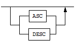

- [Adapter for JDBC User’s Manual](#adapter-for-jdbc-users-manual)
  - [서문](#%EC%84%9C%EB%AC%B8)
    - [이 매뉴얼에 대하여](#%EC%9D%B4-%EB%A7%A4%EB%89%B4%EC%96%BC%EC%97%90-%EB%8C%80%ED%95%98%EC%97%AC)
  - [1.소개](#1%EC%86%8C%EA%B0%9C)
    - [Adapter for JDBC](#adapter-for-jdbc)
  - [2.설치와 설정](#2%EC%84%A4%EC%B9%98%EC%99%80-%EC%84%A4%EC%A0%95)
    - [설치전 작업](#%EC%84%A4%EC%B9%98%EC%A0%84-%EC%9E%91%EC%97%85)
    - [설치](#%EC%84%A4%EC%B9%98)
    - [설치 후 작업](#%EC%84%A4%EC%B9%98-%ED%9B%84-%EC%9E%91%EC%97%85)
    - [설정](#%EC%84%A4%EC%A0%95)
    - [프로퍼티](#%ED%94%84%EB%A1%9C%ED%8D%BC%ED%8B%B0)
  - [3.사용법](#3%EC%82%AC%EC%9A%A9%EB%B2%95)
    - [jdbcAdapter 제약조건](#jdbcadapter-%EC%A0%9C%EC%95%BD%EC%A1%B0%EA%B1%B4)
    - [구동과 종료](#%EA%B5%AC%EB%8F%99%EA%B3%BC-%EC%A2%85%EB%A3%8C)
    - [데이터 타입](#%EB%8D%B0%EC%9D%B4%ED%84%B0-%ED%83%80%EC%9E%85)
    - [Adapter for JDBC 유틸리티](#adapter-for-jdbc-%EC%9C%A0%ED%8B%B8%EB%A6%AC%ED%8B%B0)
    - [커맨드 라인 옵션](#%EC%BB%A4%EB%A7%A8%EB%93%9C-%EB%9D%BC%EC%9D%B8-%EC%98%B5%EC%85%98)
    - [오프라인 옵션(Offline Option)](#%EC%98%A4%ED%94%84%EB%9D%BC%EC%9D%B8-%EC%98%B5%EC%85%98offline-option)
  - [A.부록: FAQ](#a%EB%B6%80%EB%A1%9D-faq)
    - [FAQ](#faq)
  - [B.부록: jdbcAdapter 사용시 DDL 수행 순서](#b%EB%B6%80%EB%A1%9D-jdbcadapter-%EC%82%AC%EC%9A%A9%EC%8B%9C-ddl-%EC%88%98%ED%96%89-%EC%88%9C%EC%84%9C)
    - [jdbcAdapter 사용시 DDL 수행 순서](#jdbcadapter-%EC%82%AC%EC%9A%A9%EC%8B%9C-ddl-%EC%88%98%ED%96%89-%EC%88%9C%EC%84%9C)

Altibase® Tool & Utilities

Adapter for JDBC User’s Manual
==============================


Altibase Tool & Utilities Adapter for JDBC User’s Manual

Release 7.1

Copyright ⓒ 2001\~2018 Altibase Corp. All Rights Reserved.

본 문서의 저작권은 ㈜알티베이스에 있습니다. 이 문서에 대하여 당사의 동의
없이 무단으로 복제 또는 전용할 수 없습니다.

**㈜알티베이스**

08378 서울시 구로구 디지털로 306 대륭포스트타워Ⅱ 10층

전화: 02-2082-1114 팩스: 02-2082-1099

고객서비스포털: <http://support.altibase.com>

homepage: [http://www.altibase.com](http://www.altibase.com/)

서문
----

### 이 매뉴얼에 대하여

이 매뉴얼은 Altibase에서 변경된 데이터를 JDBC를 지원하는 다른 데이터베이스에
복제하는 유틸리티인 Adapter for JDBC에 대해 설명한다.

#### 대상 사용자

이 매뉴얼은 다음과 같은 Altibase 사용자를 대상으로 작성되었다.

-   데이터베이스 관리자

-   응용 프로그램 개발자

-   기술지원부

다음과 같은 배경 지식을 가지고 이 매뉴얼을 읽는 것이 좋다.

-   컴퓨터, 운영 체제 및 운영 체제 유틸리티 운용에 필요한 기본 지식

-   관계형 데이터베이스 사용 경험 또는 데이터베이스 개념에 대한 이해

-   컴퓨터 프로그래밍 경험

-   데이터베이스 서버 관리, 운영 체제 관리 또는 네트워크 관리 경험

#### 소프트웨어 환경

이 매뉴얼은 데이터베이스 서버로 Altibase 6.3.1 또는 그 이상의 버전을 사용한다는
가정 하에 작성되었다.

#### 이 매뉴얼의 구성

이 매뉴얼은 다음과 같이 구성되어 있다.

-   제 1장 소개  
    이 장은 Adapter for JDBC의 개념과 Altibase에서 변경된 데이터가 다른
    데이터베이스에 복제되는 동작 구조를 설명한다.

-   제 2 장 설치와 환경설정  
    이 장에서는 Adapter for JDBC를 설치하고 설정하는 방법을 설명한다.

-   제 3 장 사용법  
    이 장에서는 Adapter for JDBC를 사용하는 방법에 대해 자세히 설명한다.

-   A. 부록 FAQ

-   B. 부록 jdbcAdapter 사용시 DDL 수행 순서

#### 문서화 규칙

이 절에서는 이 매뉴얼에서 사용하는 규칙에 대해 설명한다. 이 규칙을 이해하면 이
매뉴얼과 설명서 세트의 다른 매뉴얼에서 정보를 쉽게 찾을 수 있다.

여기서 설명하는 규칙은 다음과 같다.

-   구문 다이어그램

-   샘플 코드 규칙

##### 구문 다이어그램

이 매뉴얼에서는 다음 구성 요소로 구축된 다이어그램을 사용하여, 명령문의 구문을
설명한다.

| 구성 요소                           | 의미                                                         |
| ----------------------------------- | ------------------------------------------------------------ |
|  | 명령문이 시작한다. 완전한 명령문이 아닌 구문 요소는 화살표로 시작한다. |
|  | 명령문이 다음 라인에 계속된다. 완전한 명령문이 아닌 구문 요소는 이 기호로 종료한다. |
|  | 명령문이 이전 라인으로부터 계속된다. 완전한 명령문이 아닌 구문 요소는 이 기호로 시작한다. |
|  | 명령문이 종료한다.                                           |
|  | 필수 항목                                                    |
|  | 선택적 항목                                                  |
|  | 선택사항이 있는 필수 항목. 한 항목만 제공해야 한다.          |
|  | 선택사항이 있는 선택적 항목                                  |
|  | 선택적 항목. 여러 항목이 허용된다. 각 반복 앞부분에 콤마가 와야 한다. |

##### 샘플 코드 규칙

코드 예제는 SQL, Stored Procedure, iSQL 또는 다른 명령 라인 구문들을 예를 들어
설명한다.

아래 테이블은 코드 예제에서 사용된 인쇄 규칙에 대해 설명한다.

| 규칙         | 의미                                                         | 예제                                                         |
| ------------ | ------------------------------------------------------------ | ------------------------------------------------------------ |
| [ ]          | 선택 항목을 표시                                             | VARCHAR [(*size*)] [[FIXED \|] VARIABLE]                     |
| { }          | 필수 항목 표시. 반드시 하나 이상을 선택해야 되는 표시        | { ENABLE \| DISABLE \| COMPILE }                             |
| \|           | 선택 또는 필수 항목 표시의 인자 구분 표시                    | { ENABLE \| DISABLE \| COMPILE } [ ENABLE \| DISABLE \| COMPILE ] |
| . . .        | 그 이전 인자의 반복 표시 예제 코드들의 생략되는 것을 표시    | SQL\> SELECT ename FROM employee;<br/> ENAME<br/>  -----------------------<br/> SWNO<br/>  HJNO<br/>  HSCHOI<br/>  .<br/> .<br/> .<br/> 20 rows selected. |
| 그 밖에 기호 | 위에서 보여진 기호 이 외에 기호들                            | EXEC :p1 := 1; acc NUMBER(11,2);                             |
| 기울임 꼴    | 구문 요소에서 사용자가 지정해야 하는 변수, 특수한 값을 제공해야만 하는 위치 | SELECT \* FROM *table_name*; <br/>CONNECT *userID*/*password*; |
| 소문자       | 사용자가 제공하는 프로그램의 요소들, 예를 들어 테이블 이름, 칼럼 이름, 파일 이름 등 | SELECT ename FROM employee;                                  |
| 대문자       | 시스템에서 제공하는 요소들 또는 구문에 나타나는 키워드       | DESC SYSTEM_.SYS_INDICES_;                                   |

#### 관련 자료

자세한 정보를 위하여 다음 문서 목록을 참조하기 바란다.

-   Installation Guide

-   Administrator’s Manual

-   Replication Manual

-   Log Analyzer User's Manual

-   iSQL User’s Manual

-   Utilities Manual

-   Error Message Reference

#### Altibase는 여러분의 의견을 환영합니다.

이 매뉴얼에 대한 여러분의 의견을 보내주시기 바랍니다. 사용자의 의견은 다음
버전의 매뉴얼을 작성하는데 많은 도움이 됩니다. 보내실 때에는 아래 내용과 함께
고객서비스포털( http://support.altibase.com/kr/ )로 보내주시기 바랍니다.

-   사용 중인 매뉴얼의 이름과 버전

-   매뉴얼에 대한 의견

-   사용자의 성함, 주소, 전화번호

이 외에도 Altibase 기술지원 설명서의 오류와 누락된 부분 및 기타 기술적인
문제들에 대해서 이 주소로 보내주시면 정성껏 처리하겠습니다. 또한, 기술적인
부분과 관련하여 즉각적인 도움이 필요한 경우에도 고객서비스포털을 통해 서비스를
요청하시기 바랍니다.

여러분의 의견에 항상 감사드립니다.

1.소개
----

이 장은 Adapter for JDBC의 개념과 구조, 그리고 Altibase에서 변경된 데이터가 다른
데이터베이스에 복제되는 동작 구조를 설명한다.

### Adapter for JDBC

Altibase Adapter for JDBC(이하 'jdbcAdapter'라 칭한다)는 Altibase에서 변경된
데이터를 JDBC를 지원하는 다른 데이터베이스에 적용하는 유틸리티이다. 이는
Altibase 에서 제공하는 Altibase Log Analysis API를 이용하여 구현되었다.

#### 구조와 개념

사용자가 Altibase에서 변경된 데이터를 다른 데이터베이스(Other DB)로 복제하기
위해서는 아래 그림에 보이는 것처럼 먼저 Altibase, jdbcAdapter 및 사용하려는
JDBC를 지원하는 타사의 데이터베이스를 설치해야 한다.

jdbcAdapter는 Altibase Log Analysis API (이하 ALA라 칭한다)와 Java data base
connectivity (JDBC)를 사용하여 구현되었다. ALA는 Altibase에서 변경된 데이터를
수신할 때 사용되고, JDBC는 데이터를 보낼 대상이 되는 다른 데이터베이스로
데이터를 전송할 때 사용된다. ALA에 대한 자세한 설명은 *Log Analyzer User’s
Manual*을 참고하기 바란다.

아래 그림은 jdbcAdapter가 어떻게 Altibase에서 다른 데이터베이스로 데이터를
복제하는지를 보여준다.


[그림 1] Adapter for JDBC의 구조

1.  사용자가 데이터를 삽입하거나 수정할 때, Altibase 서버 내의 XLog 송신자는
    XLog와 메타 정보를 생성하여 XLog 콜렉터에게 전송한다. 메타 정보는
    handshaking 시에만 전송한다.

2.  jdbcAdapter 내에 존재하는 XLog 콜렉터는 XLog와 메타 정보를 사용자에게
    제공하기 위해 ALA를 사용한다. ALA 호출에 실패하면, 트레이스 로그가 trc
    디렉터리의 파일에 기록된다.

3.  jdbcAdapter는 획득한 데이터를 다른 데이터베이스에 적용하기 위해 ALA를
    사용하여 데이터를 변환한다.

4.  jdbcAdapter는 변환된 데이터를 JNI를 통해 JDBC를 사용하여 다른 데이터베이스에
    적용한다.

#### 용어

##### XLog

리두 로그를 논리적인 형태로 변환한 로그이다. 변경 DML (INSERT/UPDATE/DELETE)
구문과 관련된 트랜잭션의 이력을 저장한다.

##### XLog 송신자

XLog 송신자는 액티브 리두 로그를 분석하여 XLog 형태로 변환하고 이를 XLog
콜렉터에게 전달한다.

XLog 송신자는 handshaking과 XLog 전송을 주로 담당한다.

##### XLog 콜렉터

XLog 콜렉터는 메타 데이터와 XLog를 XLog 송신자로부터 받는다.

XLog 콜렉터는 메타 데이터, XLog 큐, 트랜잭션 테이블 및 XLog 풀을 가지고 있다.

##### Handshaking

Handshaking은 XLog 송신자가 XLog 콜렉터에게 XLog를 보내기 전에 프로토콜 버전과
메타 데이터를 확인하는 작업이다.

##### Log Analysis API

Altibase가 제공하는 인터페이스로써, jdbcAdapter를 구현할 때 사용된다. 주로
XLog와 XLog를 해석하는데 사용되는 메타 정보를 구하는데 사용된다.

2.설치와 설정
-----------

이 장에서는 Adapter for JDBC를 설치하고 사용환경을 설정하는 방법을 설명한다.

### 설치전 작업

jdbcAdapter를 설치하고 실행하기 위해서는 다음의 시스템 요구사항을 만족해야 한다.
또한 jdbcAdpater가 올바르게 작동하려면 몇가지 시스템 환경 설정도 필요하다.

시스템 요구사항에 대해 보다 자세히 알고 싶으면, Altibase
고객서비스포털( <http://support.altibase.com/kr/> )로 연락 바란다.

#### 운영체제

현재 아래의 운영체제에서 jdbcAdapter를 지원한다.

-   LINUX
-   AIX 
-   HP-UX

#### 데이터베이스 버전

-   Altibase : 버전 6.3.1 이상 버전 지원
-   OTHER DB : JDBC v3.0 이상을 지원 하는 데이터베이스 중 Altibase와 동일한 DML 구문을 사용하는 데이터 베이스
-   OTHER DB로 사용 가능한것이 확인된 데이터 베이스
    -   Altibase
    -   Oracle
    -   MariaDB

#### 데이터베이스 문자집합

데이터를 저장하기 위한 기본 캐릭터셋이다.

#### 국가 문자집합

데이터베이스 문자집합이 지원하지 않는 언어에 해당하는 데이터는 NCHAR 또는
NVARCHAR 타입을 사용해서 저장할 수 있다.

#### JDBC 드라이버 설치

jdbcAdapter를 사용하기 위해 jdbcAdapter가 동작하는 장비에 JDBC 드라이버를
설치한다. 이 때 설치하는 JDBC 드라이버는 복제대상 데이터베이스의 벤더가 제공하는
것이다. 예를 들어 복제대상 데이터베이스가 오라클이라면 오라클 홈페이지에서
Oracle 데이터베이스 서버 버전과 일치하는 버전의 JDBC 드라이버를 다운로드하여
설치한다.

#### JRE 설치

jdbcAdapter는 JRE 7 버전 이상에서 동작하는 응용 프로그램이므로, jdbcAdapter가
운영될 장비에 7 버전 이상의 JRE가 설치되어 있어야 한다.

jdbcAdapter가 접속할 원격 데이터베이스의 JDBC 드라이버가 7 이상 버전의 JRE에서
동작한다면, 해당 JDBC 드라이버와 호환되는 버전의 JRE를 설치해야 한다.

JRE 설치 후에는 JAVA_HOME과 CLASSPATH 등의 환경 변수를 설정해야 한다. 아래는
유닉스 계열 OS에서 JRE 관련 환경 변수를 설정하는 예제이다.

```
$ export JAVA_HOME=JRE가 설치된 경로
$ export CLASSPATH=${JAVA_HOME}/lib:${CLASSPATH}
$ export PATH=${JAVA_HOME}/bin:${PATH}
$ export LD_LIBRARY_PATH=$JAVA_HOME/jre/lib/amd64/server:${ LD_LIBRARY_PATH )
```

### 설치

DISPLAY 환경변수 설정이 올바르게 되어 있다면 jdbcAdapter 인스톨러를 GUI모드로
실행할 수도 있다. 이 매뉴얼은 GUI모드로 수행하는 것을 가정하여 jdbcAdapter
설치에 대해 기술하였다. 또한 디스플레이 설정이 적절히 되어 있지 않거나 GUI를
사용할 수 없을 경우에는, 텍스트 모드로 jdbcAdapter를 설치하는 것도 가능하다.

#### jdbcAdapter 설치

jdbcAdapter는 원본 DB의 Altibase 서버 계정이 아닌 다른 사용자 계정에 설치하는
것을 권장한다.

1.  첫 번째 작업은 jdbcAdapter를 운영할 시스템에 맞는 jdbcAdapter 인스톨러의
    버전을 결정하는 것이다. 아래의 그림은 jdbcAdapter 인스톨러의 명명 규칙을
    보여준다.


2. 인스톨러를 실행하면 다이얼로그 박스가 나타난다. 설치하려는jdbcAdapter의
   버전을 확인한 후, “Forward” 버튼을 누른다.

3. 다음 다이얼로그 박스에서는jdbcAdapter를 설치할 디렉터리를 선택한다. 기본으로
   설치하고 있는 사용자 계정의 홈 디렉터리 내에 jdbcAdapter라는 디렉터리를
   생성하게 된다.

4. jdbcAdapter를 사용하려면 Altibase Log Analyzer (ALA) 프로퍼티 설정을
   다음처럼 해야 한다. 프로퍼티에 대한 자세한 설명은 이 장의 뒷 부분에 있는
   “ALA 프로퍼티”절을 참고한다.

-   ALA_SENDER_IP: Altibase가 설치된 장비의 IP 주소이다. Altibase와
    jdbcAdapter가 같은 장비에서 실행되는 것을 가정하여 기본값은 127.0.0.1이다.

-   ALA_RECEIVER_PORT: jdbcAdapter가 데이터를 수신하기 위해 사용하는포트
    번호이다. 1024에서 65536사이의 값으로 설정해야 한다.

-   ALA_REPLICATION_NAME: Altibase에 존재하는 이중화 객체의 이름이다.

-   ALA_XLOG_POOL_SIZE: XLog 풀의 최대 크기를 설정한다. 기본값은 100,000 XLog
    개수이다.

-   ALA_SOCKET_TYPE: ALA가 사용할 통신 소켓 타입을 설정한다. jdbcAdapter는
    TCP/IP와 UNIX Domain소켓을 지원한다.

-   ALA_LOGGING_ACTIVE: ALA가 트레이스 로그를 남길 것인지 여부를 지정한다. 이
    프로퍼티 값이 1이면 트레이스 로그를 남긴다. 기본값은 1이다.

5. 다음 다이얼로그 박스에서는 Altibase 프로퍼티 설정을 해야 한다. 프로퍼티에
   대한 자세한 설명은 이 장의 뒷 부분에 있는 “제약조건 확인용 프로퍼티”절을
   참고한다.

-   ALTIBASE_USER: Altibase에 접근할 사용자의 이름이다.

-   ALTIBASE_PASSWORD: Altibase에 접근할 사용자 계정의 암호이다.

-   ALTIBASE_IP: Altibase가 설치된 장비의 IP 주소이다. Altibase 와 jdbcAdapter가
    같은 장비에서 작동하는 것을 가정하여, 이 프로퍼티의 기본값은 127.0.0.1이다.

-   ALTIBASE_PORT: Altibase 서버가 대기하고 있는 포트 번호이다. 1024에서
    65536사이의 값으로 설정해야 한다.

6. jdbcAdapter를 사용하려면 Other DB 프로퍼티를 적절히 설정해야 한다.
   프로퍼티에 대한 자세한 설명은 이 장의 뒷 부분에 있는 “외부 데이타베이스의
   프로퍼티”와 “DML 관련 프로퍼티”절을 참고한다.

-   OTHER_DATABASE_USER: 데이터를 전송할 대상이 되는 Other DB에 접근할 사용자의
    이름이다.

-   OTHER_DATABASE_PASSWORD: 데이터를 전송할 대상이 되는 Other DB에 접근할
    사용자의 암호이다.

-   OTHER_DATABASE_SKIP_INSERT: “Yes”를 선택하면, Altibase에서 실행된 INSERT
    구문은 Other DB에 적용되지 않는다.

-   OTHER_DATABASE_SKIP_UPDATE: “Yes”를 선택하면, Altibase에서 실행된 UPDATE
    구문은 Other DB에 적용되지 않는다.

-   OTHER_DATABASE_SKIP_DELETE: “Yes”를 선택하면, Altibase에서 실행된 DELETE
    구문은 Other DB에 적용되지 않는다.

-   OTHER_DATABASE_GROUP_COMMIT: 복수의 트랜잭션을 한 번에 처리하는 기능이다.

-   OTHER_DATABASE_BATCH_DML_MAX_SIZE: "Batch DML"은 여러 개의 DML 구문을 일괄
    처리하는 것을 의미한다. 이 프로퍼티는 최대 몇 개의 DML 구문을 일괄 처리 할것
    인지를 지정한다. Batch DML기능을 사용하지 않으려면, 이 프로퍼티를 1로
    설정한다.

-   OTHER_DATABASE_SET_USER_TO_TABLE : Other DB에 DML을 적용할 때 타겟 테이블의
    사용자를 XLog Sender에서 지정한 사용자로 한다. 기능을 사용하지 않으려면 이
    프로퍼티를 0으로 설정한다.

-   OTHER_DATABASE_JDBC_MAX_HEAP_SIZE : JVM에서 사용하는 Heap의 Max Size를
    설정한다.

-   OTHER_DATABASE_JDBC_DRIVER_PATH : Other DB를 위한 JDBC 드라이버 경로를
    지정한다

-   OTHER_DATABASE_JDBC_DRIVER_CLASS : Other DB JDBC 드라이버 클래스 이름을
    설정한다

-   OTHER_DATABASE_JDBC_CONNECTION_URL : Other DB의 연결 URL을 지정한다

7. jdbcAdapter의 사용과 관련된 모든 프로퍼티의 설정이 끝나면, 설정된 값을
   보여주는 다이얼로그 박스가 나타난다. 모든 프로퍼티가 올바로 설정되었는지
   확인하고 “Forward”를 클릭한다.

8. “Ready to Install” 다이얼로그 박스에서 “Forward”를 누르면, 설치를 시작한다.

9. jdbcAdapter가 설치되는 동안, 다음의 두 환경 변수가 설정된다. 시스템에 새로운
   환경 변수가 적용되게 하려면, 로그아웃 후에 다시 로그인 해야한다.

-   JDBC_ADAPTER_HOME: 이 환경 변수는 설치 과정의 앞 단계에서 지정한 jdbcAdapter
    홈 디렉터리를 값으로 갖게 된다.

-   PATH: 이 환경 변수에는 \$JDBC_ADAPTER_HOME/bin 경로가 추가된다.

10. 성공적으로 설치가 완료된 후에, 완료 다이얼로그 박스가 나타난다.

### 설치 후 작업

#### 환경 변수 설정

jdbcAdapter 설치 후 환경 변수 설정, 라이브러리 경로 추가 및 데이터베이스
문자집합과 국가 문자집합 설정을 해야 한다.

환경 변수 설정에 대한 자세한 설명은 이 장의 뒷 부분에 있는 “설정” 절을 참고한다.

-   JDBC_ADAPTER_HOME  
    이 환경변수는 jdbcAdapter 설치 시에 자동으로 설정된다.

-   ALTIBASE_NLS_USE  
    이 환경변수에는 Altibase에서 사용하는 문자 집합을 지정한다. 문자 집합에 대한
    자세한 설명은 *Getting Started Guide*를 참고한다.

#### 설치 디렉터리 확인

jdbcAdapter 설치가 완료 후 bin, conf, msg 및 trc 디렉터리가 \$JDBC_ADAPTER_HOME
디렉터리 아래에 생성되었는지 확인한다. 각 디렉터리의 구조와 역할은 다음과 같다.

-   bin 디렉터리  
    이 디렉터리에는 jdbcAdapter (Adapter for JDBC)와 oaUtility (Adapter for JDBC
    유틸리티) 실행 파일과 내부적으로 사용되는 파일들이 위치한다.

-   conf 디렉터리  
    이 디렉터리에는 jdbcAdapter 프로퍼티 설정을 저장하는 jdbcAdapter.conf 파일이
    위치한다.

-   msg 디렉터리  
    jdbcAdapter 설치 중 에러가 발생하면, 트레이스 로그에 에러 메시지가
    기록되는데, 이 디렉터리 내의 메시지 파일에 있는 에러 메지지가 사용된다.

-   trc 디렉터리  
    jdbcAdapter는 이 디렉터리의 파일에 트레이스 로그를 기록한다.

### 설정

jdbcAdapter를 사용하려면 다음의 환경 변수를 설정해야 한다.

#### JDBC_ADAPTER_HOME

jdbcAdapter가 설치된 디렉터리를 설정하는 환경변수이다. 이 환경 변수는
jdbcAdapter 설치 중에 자동으로 설정된다.

#### ALTIBASE_NLS_USE

ALA에서 사용하기 위한 Altibase에서 사용하는 문자 집합을 지정한다. 문자 집합에
대한 자세한 내용은 *Getting Started Guide \> 다국어 지원*을 참고한다.

### 프로퍼티

jdbcAdapter 프로퍼티들은 ALTIBASE Log Analyzer와 JDBC가 사용하고, jdbcAdapter의
동작방식을 결정하기 위해서도 사용된다.

프로퍼티 파일은 \$JDBC_ADPATER_HOME/conf 디렉터리에 존재하는
jdbcAdapter.conf이다.

jdbcAdapter에 사용되는 프로퍼티들은 아래처럼 분류된다.

-   ALA 프로퍼티

-   제약조건 확인용 프로퍼티

-   데이터를 보낼 대상이 되는 다른 데이터베이스의 프로퍼티

-   DML 관련 프로퍼티

#### ALA 프로퍼티

jdbcAdapter가 Altibase Log Analyzer (ALA)를 사용하기 위해서는 다음의 프로퍼티를
설정해야 한다. ALA 프로퍼티에 대한 더 자세한 설명은 *Log Analyzer User’s Manual*
을 참고한다.

##### ALA_SENDER_IP

XLog 송신자의 IP 주소를 지정하는 프로퍼티이다. Altibase가 설치된 서버 장비의 IP
주소를 설정하도록 한다.

-   기본 값: 127.0.0.1

##### ALA_RECEIVER_PORT

XLog 콜렉터가 XLog를 수신하기 위해 사용하는 포트 번호를 지정하는 프로퍼티이다.
jdbcAdpater가 대기하고 있는 포트 번호를 지정하도록 한다.

-   범위: 1024 – 65535

##### ALA_SENDER_REPLICATION_PORT 

Altibase 서버에 ALA 이중화 객체가 구동되어 있는 상태에서 Adapter를 구동할 때 ALA
이중화 송신자와 접속되는 방식을 지정한다.

-   기본 값: 0

-   범위: 0 \~ 65535

-   0: ALA 이중화 객체의 송신자가 접속을 시도할때까지 Adapter 가 대기한다.
    (Altibase 서버의 REPLICATION_SENDER_SLEEP_TIMEOUT 속성값에 의존한다).

-   1 이상: 해당 포트번호로 Adapter가 이중화 송신자와 직접 접속을 시도한다

##### ALA_RECEIVE_XLOG_TIMEOUT (단위: 초)

XLog 콜렉터가 XLog를 수신하기 위해 대기하는 시간을 지정하는 프로퍼티이다.

-   기본 값: 300

-   범위: 1 – 4294967295

##### ALA_REPLICATION_NAME

XLog 송신자로 사용되는 이중화 객체의 이름을 지정하는 프로퍼티이다. Altibase 내에
생성된 이중화 객체의 이름과 동일하다.

##### ALA_SOCKET_TYPE

Altibase Log Analyzer가 사용할 소켓의 종류를 지정하는 프로퍼티이다.
jdbcAdapter는 TCP/IP와 UNIX Domain 소켓을 지원한다. 그러다 Unix Domain 소켓을
사용하려면, Altibase와 jdbcAdapter가 같은 장비에 위치해야 한다.

-   TCP: TCP/IP 소켓 사용 (기본값)

-   UNIX: UNIX Domain 소켓 사용

##### ALA_XLOG_POOL_SIZE (단위: 개수)

jdbcAdapter가 할당할 수 있는 XLog의 개수이다.

jdbcAdapter에는 원본DB의 트랜잭션이 커밋되기 전의 레코드 변경 작업 내용이 XLog로
각각 쌓인다. 만약, 원본DB에 발생하는 트랜잭션이 다수의 레코드를 변경시키는
경우에는 jdbcAdapter가 할당할 수 있는 XLog가 부족하여 정상적으로 복제할 수 없다.
따라서, 원본DB의 트랜잭션 유형에 따라서 이 프로퍼티 값을 조정해야 한다.

ALA Sender가 원본DB에서 Sync작업을 수행하는 경우에는
REPLICATION_SYNC_TUPLE_COUNT프로퍼티에 설정한 개수로 커밋이 수행된다. 따라서,
ALA_XLOG_POOL_SIZE 프로퍼티 값이 REPLICATION_SYNC_TUPLE_COUNT 값보다 작다면
할당해야 하는 XLog가 부족하여 sync작업이 진행되지 않으므로 프로퍼티 값을 더 크게
설정해야 된다.

-   기본 값: 100,000

-   범위: 1 – 2147483647

##### ALA_LOGGING_ACTIVE

Altibase Log Analyzer가 트레이스 로그를 출력할 것인지를 지정하는 프로퍼티이다.

-   0: 트레이스 로그를 출력하지 않는다.

-   1: 트레이스 로그를 출력한다 (기본값)

#### 제약조건 확인용 프로퍼티

##### ALTIBASE_USER

Altibase에 접속할 사용자의 이름을 지정하는 프로퍼티이다.

##### ALTIBASE_PASSWORD

Altibase에 접속할 사용자 계정의 암호를 지정하는 프로퍼티이다.

##### ALTIBASE_IP

Altibase가 설치된 서버 장비의 IP 주소를 지정하는 프로퍼티이다.

-   기본 값: 127.0.0.1

##### ALTIBASE_PORT

Altibase가 대기하고 있는 포트 번호를 지정하는 프로퍼티이다.

-   범위: 1024 – 65535

##### ADAPTER_ERROR_RESTART_COUNT (단위: 횟수)

Adapter의 모든 오류에 대한 부가적인 동작을 지정한다.

-   기본 값: 0

-   범위: 0 \~ 65535

-   0: Adapter를 종료하면서 에러메세지를 출력한다

-   1 이상: "Adapter 재시작 및 연동대상 DBMS 접속/레코드 반영" 을 지정된
    횟수만큼 수행한다. 지정된 횟수를 초과하면 Adapter를 종료하면서 에러메세지를
    출력한다.

##### ADAPTER_ERROR_RESTART_INTERVAL (단위: 초)

ADAPTER_ERROR_RESTART_COUNT에 지정한 값 만큼 재시도할 때의 간격을 지정한다.

-   기본 값: 0

-   범위: 0 \~ 65535

-   0: 간격을 두지않고 바로 재시도한다.

#### 외부 데이타베이스의 프로퍼티

jdbcAdapter에서 데이터를 보낼 대상이 되는 Other DB를 사용하기 위해서는 다음의
프로퍼티들을 설정해야 한다.

##### OTHER_DATABASE_USER

데이터를 보낼 대상이 되는 Other DB에 접속할 사용자 계정의 이름을 지정하는
프로퍼티이다.

##### OTHER_DATABASE_PASSWORD

데이터를 보낼 대상이 되는 Other DB에 접속할 사용자 계정의 암호를 지정하는
프로퍼티이다.

##### OTHER_DATABASE_JDBC_MAX_HEAP_SIZE (단위: Mega Bytes)

JVM이 사용하는 Heap의 최대 크기를 설정한다.

-   기본 값: 2048

-   범위: 0 – 10240

-   JVM이 Heap의 최대 크기를 자동으로 설정하게 하려면, 이 프로퍼티를 0으로
    지정한다.

##### OTHER_DATABASE_JDBC_DRIVER_PATH 

Other DB용 JDBC 드라이버 경로를 지정한다.

##### OTHER_DATABASE_JDBC_DRIVER_CLASS 

Other DB 용 JDBC Driver 클래스 이름을 설정한다.

##### OTHER_DATABASE_JDBC_CONNECTION_URL 

Other DB의 연결 URL을 지정한다.

#### DML 관련 프로퍼티

Altibase에서 실행된 DML 구문들을 데이터를 보낼 대상이 되는 Other DB에도 적용할지
여부를 결정하는 프로퍼티들이다.

##### OTHER_DATABASE_GROUP_COMMIT

복수의 트랜잭션을 한 번에 처리할 수 있다. 원본 Altibase 서버에서 커밋을 하여도,
대상 Tagert DB는 일정한 수준의 트랜잭션이 모일 때까지 커밋을 연기한다. 따라서
전체 성능은 향상될 수 있지만 개별 트랜잭션의 응답 시간은 지연될 수 있다.

-   기본 값: 1

-   0: 그룹 커밋을 하지 않는다.

-   1: 그룹 커밋을 한다.

##### OTHER_DATABASE_BATCH_DML_MAX_SIZE (단위: 개수)

“Batch DML”은 같은 종류인 복수의 DML 구문을 일괄 처리하는 것을 의미한다. 이는
네트워크 비용을 줄임으로써 성능 향상을 가져온다.

단, LOB 데이터 타입이 포함된 테이블인 경우 Batch DML이 동작하지 않을 수 있다.

-   기본 값: 10

-   범위: 1 – 32767

-   Batch DML을 끄려면, 이 프로퍼티를 1로 지정한다.

##### OTHER_DATABASE_ERROR_RETRY_COUNT (단위: 횟수)

레코드를 반영할 때 오류가 발생할 경우 재시도 횟수를 의미한다.

단, LOB 데이터를 포함한 XLog는 오류가 발생할 경우 재시도 대상에서 제외된다.
LOB 데이터를 포함한 XLog는 여러 개의 XLog로 구성되어 있기 때문에 에러 발생시
재시도 할 수 없다.

-   기본 값: 0

-   범위: 0 \~ 65535

-   0: 재시도하지 않는다.

##### OTHER_DATABASE_ERROR_RETRY_INTERVAL (단위: 초)

레코드를 반영할 때 오류가 발생할 경우 재시도 간격을 의미한다.

-   기본 값: 0

-   범위: 0 \~ 65535

-   0: 간격을 두지 않고 즉시 재시도한다.

##### OTHER_DATABASE_SKIP_ERROR 

레코드를 반영할 때 오류가 발생하여 OTHER_DATABASE_ERROR_RETRY_COUNT 만큼
OTHER_DATABASE_ERROR_RETRY_TIME 간격으로 재시도하였는데도 실패하면, 해당
레코드의 반영을 포기할 것인지 여부를 지정한다.

단, LOB 관련 XLog 처리 중 오류 발생 시 해당 프로퍼티 값과 상관 없이 레코드 반영을 포기하지 않고 Adapter를 종료한다.

-   기본 값: 1
-   0: Adapter를 종료하면서 에러메시지를 출력한다. (해당 레코드 반영을 포기하지
    않는다.)
    단, dbms_skip_error_include.list에 포함된 에러가 발생한 레코드는 반영을 포기하고
    다음 레코드부터 반영한다. 
-   1: 다음 레코드부터 반영한다. (해당 레코드 반영을 포기한다.)
    단, dbms_skip_error_exclude.list에 포함된 에러가 발생한 레코드는 Adpater를
    종료한다.

dbms_skip_error_include.list와  dbms_skip_error_exclude.list에 포함되는 에러값은
SQLSTATE 표준의 에러값이다.

##### OTHER_DATABASE_SKIP_INSERT

Altibase에서 실행된 INSERT 구문을 데이터를 보낼 대상이 되는 Other DB에도
실행할지 여부를 결정하는 프로퍼티이다. 이 프로퍼티를 1로 지정하면 Altibase에서
실행된 INSERT 구문이 Other DB에는 실행되지 않는다.

-   기본 값: 0

-   0: 구문 실행을 생략하지 않는다. 즉, 정상적으로 구문을 실행한다.

-   1: 구문 실행을 생략한다.

##### OTHER_DATABASE_SKIP_UPDATE

Altibase에서 실행된 UPDATE 구문을 데이터를 보낼 대상이 되는 Other DB에도
실행할지 여부를 결정하는 프로퍼티이다. 이 프로퍼티를 1로 지정하면 Altibase에서
실행된 UPDATE 구문이 Other DB에는 실행되지 않는다.

-   기본 값: 0

-   0: 구문 실행을 생략하지 않는다. 즉, 정상적으로 구문을 실행한다.

-   1: 구문 실행을 생략한다.

##### OTHER_DATABASE_SKIP_DELETE

Altibase에서 실행된 DELETE 구문을 데이터를 보낼 대상이 되는 Other DB에도 실행할
지 여부를 결정하는 프로퍼티이다. 이 프로퍼티를 1로 지정하면 Altibase에서 실행된
DELETE 구문이 Other DB에는 실행되지 않는다.

-   기본 값: 0

-   0: 구문 실행을 생략하지 않는다. 즉, 정상적으로 구문을 실행한다.

-   1: 구문 실행을 생략한다.

##### OTHER_DATABASE_SET_USER_TO_TABLE 

Other DB에 DML 수행시 반영 테이블의 사용자를 XLog Sender에서 지정한 사용자로
설정한다.

-   기본 값: 0

-   0: 사용자 지정을 하지 않는다.

-   1: 사용자 지정을 한다.

#### 프로퍼티 제약조건

프로프티 값을 설정할 때 스페이스 또는 탭을 사용할 수 없다. 또한 특수 문자를
포함한 문자를 함께 사용하기 위해서는 해당 프로퍼티 값을 큰따옴표("")로 처리해야
한다.

3.사용법
------

이 장에서는 jdbcAdapter를 구동하고 종료하는 방법과 사용하는 방법을 자세히
설명한다.

### jdbcAdapter 제약조건 

jdbcAdapter를 사용하기 위해서는 여러가지 제약 조건이 있다. 이 조건을 만족하지
않을 경우 jdbcAdapter를 사용할 수 없다.

#### 선행조건 

-   목표 데이터베이스(Other DB)에 입력/수정/삭제 연산시 충돌(Conflict)이
    발생하면 연산은 취소되고 설정에 따라 에러 로그 파일에 메시지를 남기거나
    무시한다.

-   복제 도중에 발생한 에러에 대하여 부분 철회할 수 있다. 즉 여러 개의 데이터를
    입력 중에 한 개의 중복 데이터가 있으면 중복 데이터만 입력을 취소하고
    나머지는 완료된다.

-   복제 속도는 서비스 속도보다 매우 느릴 수 있다.

#### 데이터 제약조건

-   복제할 테이블에는 반드시 프라이머리 키가 존재해야 한다.

-   복제할 테이블의 프라이머리 키에 대한 수정이 없어야 한다.

-   양쪽 서버의 복제할 테이블은 순서, 프라이머리 키 제약이 동일해야 한다.

#### 연결 제약조건

-   하나의 Altibase 데이터베이스에 가능한 XLog Sender 및 이중화 연결의 최대
    개수는 REPLICATION_MAX_COUNT 프로퍼티에 설정한 값에 의해 결정된다.

#### 허용된 DDL 문

일반적으로 이중화 대상인 테이블은 데이타 정의어(DDL)를 수행할 수 없다. 그러나
다음의 몇 가지 DDL은 xLog Sender와 상관없이 DDL 수행이 가능하다. 그 외 수행할 수
있는 DDL은 Replication Manual의 '이중화 대상 테이블에 DDL 실행'을 참조하기
바란다.

-   ALTER INDEX SET PERSISTENT = ON/OFF

-   ALTER INDEX REBUILD PARTITION

-   GRANT OBJECT

-   REVOKE OBJECT

-   CREATE TRIGGER

-   DROP TRIGGER

#### 복제 대상 테이블에 허용된 DDL 문

일반적으로 복제 대상 테이블에 데이타 정의어(DDL)를 수행하면, jdbcAdapter는 현재
DDL 이전에 발생한 모든 변경 사항을 대상 데이터베이스에 반영한 후 종료된다.
jdbcAdapter가 종료되면, 대상 데이터베이스에 동일한 DDL을 수행하여 테이블
스키마를 동일하게 만든 후 jdbcAdapter를 재시작하여 복제를 다시 할 수 있다.

그 외 수행할 수 있는 DDL은 Replication Manual의 '이중화 대상 테이블에 DDL
실행'을 참조하기 바란다.

#### LOB 데이타 타입 제약 사항

- LOB 데이터 타입은  Adapter for JDBC 버전 7.1.0.6.9 부터 지원 한다. 
- SELECT ... FOR UPDATE를 이용한 LOB 컬럼 갱신은 트랜잭션 단위로 반영 여부를 결정하므로 이전 DML 처리 중 에러가 발생하거나 프로퍼티에 의해 반영되지 않은 경우 이후 LOB 컬럼 갱신은 반영되지 않는다. 따라서, SELECT ... FOR UPDATE를 이용한 LOB 컬럼 갱신은 Commit 후 진행 하는 것이 안전하다.
- LOB 데이터 타입이 포함된 테이블은 아래 3가지 프로퍼티에 대해 제약사항을 가진다.
  자세한 내용은 프로퍼티 항목을 참조하기 바란다.
  - OTHER_DATABASE_ERROR_RETRY_COUNT 
  - OTHER_DATABASE_SKIP_ERROR
  - OTHER_DATABASE_BATCH_DML_MAX_SIZE

### 구동과 종료

이 절에서는 jdbcAdapter를 구동하고 종료하는 방법을 설명한다.

#### 구동

jdbcAdapter를 구동하는 방법을 단계별로 설명한다.

jdbcAdapter를 사용하려면 Altibase와 데이터를 보낼 대상이 되는 Other DB가 먼저
실행중이어야 한다. 또한 Adapter for JDBC 프로퍼티와 환경 변수가
jdbcAdapter실행이 가능한 환경으로 적절히 설정되어 있어야 한다.

jdbcAdapter가 구동된 후에 어떤 환경 변수 또는 프로퍼티가 변경된다면, 이 변경을
적용하기 위해서는 jdbcAdapter를 재구동해야 한다. 환경 변수 설정에 대한 자세한
설명은 2장의 “설치 후 작업”을 참고한다.

1. Altibase의 REPLICATION_PORT_NO<sup>1</sup> 프로퍼티가 실제로 이중화 가능한 포트
   번호로 설정되었는지 확인한다. 이 프로퍼티 설정을 바꿀 필요가 있다면,
   Altibase를 재구동해야 한다.

   [<sup>1</sup>] REPLICATION_PORT_NO는 이중화 연결을 위해서 지역 서버에서 사용하는이중화 포트 번호를 명시한다. 이 프로퍼티에 대한 설명은 Starting Guide를 참고하기 바란다.

2. jdbcAdapter를 시작하기 전에, Altibase Log Analyzer (ALA)가 사용될 수 있도록
   XLog 송신자를 구성해야 한다. XLog 송신자는 Altibase로부터 XLog와 메타 정보를
   송신하는데 사용된다.  
   PROPAGABLE LOGGING을 사용하여 복제한 트랜잭션의 로그를 다른 서버로 전송하기
   위해 FOR ANALYSIS PROPAGATION을 사용해야 한다.  
   다음의 구문은 Altibase 내의 sys 사용자가 소유한 테이블 t1의 데이터를
   알티베이스 DB의 user1 사용자가 소유한 테이블 t2로 복제하기 위한 XLog
   송신자를 생성한다.

```
CREATE REPLICATION ala FOR ANALYSIS WITH '127.0.0.1', 25090
FROM sys.t1 TO user1.t2;
```


3. 이제 jdbcAdapter를 시작한다. jdbcAdapter를 직접 실행할 수도 있고, Adapter
   for JDBC 유틸리티를 사용해서 실행할 수도 있다. Adapter for JDBC 유틸리티를
   사용해서 구동하는 방법은 이 장의 “” 절을 참고한다. LINUX 운영체제에서 아래와
   같이 jdbcAdapter를 시작할 수 있다:

```
$ cd $JDBC_ADAPTER_HOME/bin
$ ./jdbcAdapter
```

4. Altibase Log Analyzer를 위한 XLog 송신자를 시작한다. jdbcAdapter를 구동하기
   전에 XLog 송신자를 시작하려고 하면 실패할 것이다.

```
iSQL> ALTER REPLICATION ala START;
```

#### 종료

jdbcAdapter를 종료하는 과정에는 XLog 송신자를 중지하는 과정이 포함된다.
jdbcAdapter를 Adapter for JDBC 유틸리티를 사용해서 강제로 종료한다면, 성공적으로
종료는 되겠지만 Altibase 의 XLog 송신자는 jdbcAdapter와의 접속을 계속 시도할
것이다.

```
iSQL> ALTER REPLICATION ala STOP;
Alter success.
```

### 데이터 타입

Altibase의 데이터가 OTHER DATABASE에 JDBC를 이용하여 적용될 때, JAVA의
String형으로 변환 하여 적용된다. 단, DATE 타입은 JAVA의 Timestamp형으로 변환
되어 적용 된다.

지원하는 데이터 타입은 FLOAT, NUMERIC, DOUBLE, REAL, BIGINT, INTEGER, SMALLINT,
DATE, CHAR, VARCHAR, NCHAR, NVARCHAR이다.

### Adapter for JDBC 유틸리티

Adapter for JDBC 유틸리티 (oaUtility)는 jdbcAdapter를 데몬으로 실행하고 이의
상태를 체크하는 스크립트이다. 이 스크립트는 GNU sed가 설치된 bash 쉘에서
실행된다.

Other Database에 대한 Constraints는 체크하지 않는다.

Adapter for JDBC 유틸리티가 지원하는 옵션은 다음과 같다.

-   oaUtility start

-   oaUtility stop

-   oaUtility status

-   oaUtility check

#### oaUtility start

##### 구문

```
oaUtility {start}
```

##### 설명

jdbcAdapter를 데몬으로 실행한다.

#### oaUtility stop

##### 구문

```
oaUtility {stop}
```

##### 설명

실행중인 jdbcAdapter프로세스를 강제 종료한다.

#### oaUtility status

##### 구문

```
oaUtility {status}
```

##### 설명

jdbcAdapter가 동작 중인지 확인한다.

#### oaUtility check

##### 구문

```
oaUtility { check [ alive ] }
```

##### 설명

jdbcAdapter가 동작 중인지 계속 확인하다가, oaUtility가 종료되면 (정상 종료 또는
강제 종료 여부에 상관없이) 재시작한다.

alive 옵션을 지정하면 jdbcAdapter가 동작 중인지를 한 번만 확인하고 oaUtility는
종료된다.

### 커맨드 라인 옵션

jdbcAdapter는 아래의 커맨드 라인 옵션을 제공한다.

#### 구문

```
jdbcAdapter [ -v | -version ]
```

#### 설명

이 옵션은 jdbcAdapter가 Altibase의 어떤 버전과 함께 컴파일 되었는지를 알려준다.

#### 예제

```
$./jdbcAdapter -v
Adapter for JDBC version 7.1.0.0.2
...
```

### 오프라인 옵션(Offline Option)

#### 구문

```
CREATE REPLICATION ala_replication_name FOR ANALYSIS OPTIONS META_LOGGING 
                   WITH 'remote_host_ip', remote_host_port_no 
                   FROM user_name.table_name TO user_name.table_name;                   
ALTER REPLICATION ala_replication_name SET OFFLINE ENABLE WITH 'log_dir';
ALTER REPLICATION ala_replication_name SET OFFLINE DISABLE;
ALTER REPLICATION ala_replication_name BUILD OFFLINE META [AT SN(sn)];
ALTER REPLICATION ala_replication_name RESET OFFLINE META;
ALTER REPLICATION ala_replication_name START WITH OFFLINE;
```

#### 설명

jdbcAdapter를 이용하여 Alitbase에서 변경된 데이타를 Other DB에 적용하는 환경에서,
서비스를 제공하는 Altibase 서버에서 장애가 발생하면 Other DB에 적용하지 못한 로그를  전송할 수 없게 된다.
이때 Altibase 서버에 META_LOGGING Option을 수행 중이고, Altibase 서버와 동일한 데이터베이스 구성을 가진
Standby 서버가 있다면 Standby 서버에서 오프라인 옵션으로 장애가 발생한 Alitbase 서버의 로그 파일에 직접 접근하여
미전송 로그를 가져와서 Other DB에 반영할 수 있다.

-   META_LOGGING
    이중화 메타 정보와 SN 정보를 파일로 남겨서 장애 발생시 Standby 서버에서 
    미전송 로그를 읽어 올때 필요한 메타 정보를 구성할 수 있게 한다.
    파일 경로는 로그 파일 경로의 ala_meta_files 폴더 안에 생성 된다.
-   SET OFFLINE ENABLE WITH 'log_dir' 
    오프라인 이중화 옵션을 사용할 수 있도록 설정한다. 이중화가 중지되어 있는 상태에서만
    이 구문을 수행할 수 있다.
    장애가 발생한 Altibase 서버의 로그 파일 경로를 설정하여 Standby 서버가 직접 로그 파일에
    접근하도록 한다.
-   SET OFFLINE DISABLE 
    오프라인 이중화 옵션을 사용하지 못하도록 설정한다. 이중화가 중지되어 있는
    상태에서만 이 구문을 수행할 수 있다.
-   BUILD OFFLINE META
    설정된 로그 파일 경로의 ala_meta_files 폴더에서 메타 파일과 SN 파일을 읽어 
    오프라인 이중화에 필요한 메타 정보를 구성한다.
-   RESET OFFLINE META
    BUILD OFFLINE META로 구성된 메타 정보를 새로 구성하거나 더 이상 필요하지 않을때
    초기화 한다.
-   START WITH OFFLINE 
    설정된 오프라인 경로를 이용하여 이중화를 수행한다. 오프라인 이중화는 일회성
    작업으로써, 미전송된 로그를 모두 반영한 후 바로 종료된다. 
    오프라인 이중화가 종료된 후에는 다시 이중화를 시작할 수 있다.

#### 제약사항

- 이중화 메타정보 파일 읽기, 쓰기 기능은 ALA만 사용 할수 있다.
- Offline jdbcAdapter을 수행할 서버의 ALA 객체 이름은 Active 서버의 ALA 객체 이름과 동일해야 한다. 
- 압축 테이블을 이중화 대상으로 가지는 ALA객체에 대해서는 Offline jdbcAdapter를 지원하지 않는다.
- Offline jdbcAdapter가 디스크 이상으로 Active서버의 로그 파일과 메타 파일 경로에 접근하지 못할 
  경우에는 실패한다.
- Active 서버와 Standby 서버의 로그 파일 크기는 동일해야 한다. 로그 파일 크기는 데이터베이스 생성 시에 
  정해지므로 오프라인 옵션을 사용하기 전에 이를 꼭 확인하여야 한다.
- 로그 파일과 메타 파일을 사용자 임의로 변경(이름 변경, 다른 시스템에 로그 파일을 복제, 삭제)할 경우
  비정상 종료와 같은 문제를 발생시킬 수 있다.
- Standby 서버에 BUILD OFFLINE META 수행 후 재 구동할 경우 로그를 분석하는데 사용할 Remote Meta 정보가 사라지기 때문에 BUILD OFFLINE META를 다시 수행 해야 한다. 
- META_LOGGING Option을 사용할 경우 ALA도 이중화와 동일하게 갭을 Archive 로그로 처리 하지 않는다.
- 두 데이터베이스 서버의 SM버전, OS, OS비트수 (32또는 64) 또는 로그 파일의 크기가 서로 다르면, 
  Offline jdbcAdapter를 시작하거나 오프라인 옵션으로 ALA 객체를 생성할 때 실패한다.

#### 예제

| No                                          | Active Server                                                | Standby Server                                               | Other DB                                               |
| ------------------------------------------- | ------------------------------------------------------------ | ------------------------------------------------------------ | ------------------------------------------------------ |
| 1. 스키마 생성                              | CREATE TABLE T1 (I1 INTEGER PRIMARY KEY, I2 CHAR(20));       | CREATE TABLE T1 (I1 INTEGER PRIMARY KEY, I2 CHAR(20));       | CREATE TABLE T1 (I1 INTEGER PRIMARY KEY, I2 CHAR(20)); |
| 2. 이중화 생성                              | CREATE REPLICATION ALA FOR ANALYSIS OPTIONS META_LOGGING<br/>WITH 'adapter_ip', adapter_port<br/>FROM SYS.T1 to SYS.T1; | CREATE REPLICATION ALA FOR ANALYSIS <br/>WITH 'adapter_ip', adapter_port<br/>FROM SYS.T1 to SYS.T1; |                                                        |
| 3. Active 서버jdbcAdapter 시작              | $oaUtility start                                             |                                                              |                                                        |
| 4. Active 서버 이중화 시작                  | ALTER REPLICATION ALA START;                                 |                                                              |                                                        |
| 5.  Active 서버 장애 발생                   | 장애 발생                                                    |                                                              |                                                        |
| 6. Standby 서버 jdbcAdapter 시작            |                                                              | $oaUtility start                                             |                                                        |
| 7. Standby 서버 이중화에 오프라인 옵션 설정 |                                                              | ALTER REPLICATION ALA <br/>SET OFFLINE ENABLE WITH 'active_home/logs' |                                                        |
| 8. 오프라인 메타 정보 구성                  |                                                              | ALTER REPLICATION ALA BUILD OFFLINE META;                    |                                                        |
| 9. 오프라인 이중화 시작                     |                                                              | ALTER REPLICATION ALA START WITH OFFLINE;                    |                                                        |

#### 이중화 GAP에 DDL이 포함되어 있을 경우 처리 예제

| No                                                  | Active Server                                                | Standby Server                                               | Other DB                                               |
| --------------------------------------------------- | ------------------------------------------------------------ | ------------------------------------------------------------ | ------------------------------------------------------ |
| 1. 스키마 생성                                      | CREATE TABLE T1 (I1 INTEGER PRIMARY KEY, I2 CHAR(20));       | CREATE TABLE T1 (I1 INTEGER PRIMARY KEY, I2 CHAR(20));       | CREATE TABLE T1 (I1 INTEGER PRIMARY KEY, I2 CHAR(20)); |
| 2. 이중화 생성                                      | CREATE REPLICATION ALA FOR ANALYSIS OPTIONS META_LOGGING<br/>WITH 'adapter_ip', adapter_port<br/>FROM SYS.T1 to SYS.T1; | CREATE REPLICATION ALA FOR ANALYSIS <br/>WITH 'adapter_ip', adapter_port<br/>FROM SYS.T1 to SYS.T1; |                                                        |
| 3. Active 서버jdbcAdapter 시작                      | $oaUtility start                                             |                                                              |                                                        |
| 4. Active 서버 이중화 시작                          | ALTER REPLICATION ALA START;                                 |                                                              |                                                        |
| 5. Active 서버 DDL                                  | DDL                                                          |                                                              |                                                        |
| 6.  Active 서버 장애 발생                           | 장애 발생                                                    |                                                              |                                                        |
| 7. Standby 서버 jdbcAdapter 시작                    |                                                              | $oaUtility start                                             |                                                        |
| 8. 이중화에 오프라인 옵션 설정                      |                                                              | ALTER REPLICATION ALA <br/>SET OFFLINE ENABLE WITH 'active_home/logs' |                                                        |
| 9. 오프라인 메타 정보 구성                          |                                                              | ALTER REPLICATION ALA BUILD OFFLINE META;                    |                                                        |
| 10. 오프라인 이중화 시작                            |                                                              | ALTER REPLICATION ALA START WITH OFFLINE;                    |                                                        |
| 11. DDL 로그로 인해 <br />오프라인 이중화 에러 발생 |                                                              | [ERR-611B6 : Offline ALA Sender read DDL log.]               |                                                        |
| 12.Other DB에 DDL                                   |                                                              |                                                              | DDL                                                    |
| 13. Standby 서버 jdbcAdapter 재 시작                |                                                              | $oaUtility start                                             |                                                        |
| 14. 오프라인 이중화 재 시작                         |                                                              | ALTER REPLICATION ALA START WITH OFFLINE;                    |                                                        |


## A.부록: FAQ

### FAQ

#### 환경 변수 혹은 프로퍼티 변경 후에 어떻게 해야 하나요?

jdbcAdapter가 구동된 후에 환경 변수나 프로퍼티를 변경하면, 변경 사항을 적용하기
위해서는 jdbcAdapter를 재시작해야 합니다.

#### 만약에 알티베이스 DB에 데이터가 제대로 반영되지 않으면 어떻게 됩니까?

jdbcAdapter가 알티베이스 DB에 데이터를 쓰는 데 실패하면, 로그 메시지만 남기고
다음 데이터 반영을 계속합니다. 로그 메시지는 \$JDBC_ADAPTER_HOME/trc 디렉터리의
트레이스 로그 파일에 기록됩니다.

## B.부록: jdbcAdapter 사용시 DDL 수행 순서

### jdbcAdapter 사용시 DDL 수행 순서

jdbcAdapter를 사용할 때 이중화를 수행중인 DDL은 아래의 순서대로 수행해야 한다.

| No                                              | Active Server                                                                                   | jdbcAdapter                                                                                | Standby Server                                           |
|-------------------------------------------------|-------------------------------------------------------------------------------------------------|--------------------------------------------------------------------------------------------|----------------------------------------------------------|
| 1.양쪽 서버에 스키마 생성                       | CREATE TABLE T1 ( C1 INTEGER PRIMARY KEY, C2 SMALLINT );                                        |                                                                                            | CREATE TABLE T1 ( C1 INTEGER PRIMARY KEY, C2 SMALLINT ); |
| 2.ANALYSIS로 이중화 생성                        | CREATE REPLICATION ala FOR ANALYSIS WITH 'Standby IP', Standby Port FROM SYS.T1 TO SYS T1;      |                                                                                            |                                                          |
| 3.jdbcAdapter 시작                              |                                                                                                 | \$ oaUtility start                                                                         |                                                          |
| 4.이중화 시작                                   | ALTER REPLICATION ala START;                                                                    |                                                                                            |                                                          |
| 5.이중화 Gap 제거를 위해 Flush 구문 수행        | ALTER REPLICATION ALA FLUSH ALL;                                                                |                                                                                            |                                                          |
| 6.DDL 수행을 위한 이중화 관련 프로퍼티 값 설정  | ALTER SYSTEM SET REPLICATION_DDL_ENABLE = 1; ALTER SYSTEM SET REPLICATION_DDL_ENABLE_LEVEL = 1; |                                                                                            |                                                          |
| 7. Active 서버에 DDL 수행                       |                                                                                                 | Adapter 종료 (DDL 로그 처리로 인하여)                                                      |                                                          |
| 8.jdbcAdapter trc 로그 확인                     | SELECT REP_NAME, STATUS FROM V\$REPSENDER; 조회하여 STATUS 가 2 확인                            | 'Log Record : Meta change xlog was arrived, adapter will be finished' trc 로그 메시지 확인 |                                                          |
| 9.Standby 서버에 DDL 수행                       |                                                                                                 |                                                                                            | DDL                                                      |
| 10.jdbcAdapter 재실행                           |                                                                                                 | \$ oaUtility start                                                                         |                                                          |
| 11.이중화 중지 및 재시작 (생략가능)             | (optional) ALTER REPLICATION ALA STOP; ALTER REPLICATION ALA START;                             |                                                                                            |                                                          |
| 12.데이터 복제 여부 확인                        | DML (Service)                                                                                   |                                                                                            | 데이터 복제 확인                                         |
| 13.DDL 중지를 위한 이중화 관련 프로퍼티 값 설정 | ALTER SYSTEM SET REPLICATION_DDL_ENABLE = 0; ALTER SYSTEM SET REPLICATION_DDL_ENABLE_LEVEL = 0; |                                                                                            |                                                          |

