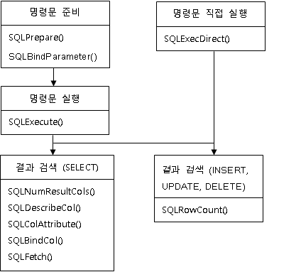
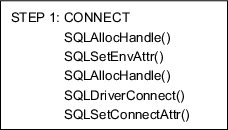
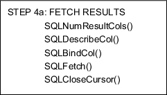
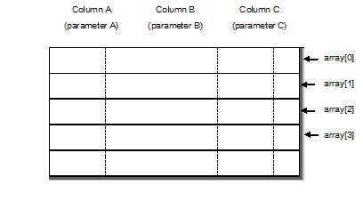

- [CLI User's Manaul](#cli-users-manaul)
  - [서문](#%EC%84%9C%EB%AC%B8)
    - [이 매뉴얼에 대하여](#%EC%9D%B4-%EB%A7%A4%EB%89%B4%EC%96%BC%EC%97%90-%EB%8C%80%ED%95%98%EC%97%AC)
  - [1.Altibase CLI 소개](#1altibase-cli-%EC%86%8C%EA%B0%9C)
    - [개요](#%EA%B0%9C%EC%9A%94)
    - [기본 사용법](#%EA%B8%B0%EB%B3%B8-%EC%82%AC%EC%9A%A9%EB%B2%95)
    - [기본 프로그래밍 순서](#%EA%B8%B0%EB%B3%B8-%ED%94%84%EB%A1%9C%EA%B7%B8%EB%9E%98%EB%B0%8D-%EC%88%9C%EC%84%9C)
    - [Altibase CLI 애플리케이션 빌드](#altibase-cli-%EC%95%A0%ED%94%8C%EB%A6%AC%EC%BC%80%EC%9D%B4%EC%85%98-%EB%B9%8C%EB%93%9C)
  - [2.Altibase CLI 함수](#2altibase-cli-%ED%95%A8%EC%88%98)
    - [Altibase CLI API](#altibase-cli-api)
    - [SQLAllocConnect](#sqlallocconnect)
    - [SQLAllocEnv](#sqlallocenv)
    - [SQLAllocHandle](#sqlallochandle)
    - [SQLAllocStmt](#sqlallocstmt)
    - [SQLBindCol](#sqlbindcol)
    - [SQLBindParameter](#sqlbindparameter)
    - [SQLBulkOperations](#sqlbulkoperations)
    - [SQLCancel](#sqlcancel)
    - [SQLCloseCursor](#sqlclosecursor)
    - [SQLColAttribute](#sqlcolattribute)
    - [SQLColumns](#sqlcolumns)
    - [SQLConnect](#sqlconnect)
    - [SQLDescribeCol](#sqldescribecol)
    - [SQLDescribeParam](#sqldescribeparam)
    - [SQLDisconnect](#sqldisconnect)
    - [SQLDriverConnect](#sqldriverconnect)
    - [SQLEndTran](#sqlendtran)
    - [SQLError](#sqlerror)
    - [SQLExecDirect](#sqlexecdirect)
    - [SQLExecute](#sqlexecute)
    - [SQLFetch](#sqlfetch)
    - [SQLFetchScroll](#sqlfetchscroll)
    - [SQLForeignKeys](#sqlforeignkeys)
    - [SQLFreeConnect](#sqlfreeconnect)
    - [SQLFreeEnv](#sqlfreeenv)
    - [SQLFreeHandle](#sqlfreehandle)
    - [SQLFreeStmt](#sqlfreestmt)
    - [SQLGetConnectAttr](#sqlgetconnectattr)
    - [SQLGetData](#sqlgetdata)
    - [SQLGetDescField](#sqlgetdescfield)
    - [SQLGetDescRec](#sqlgetdescrec)
    - [SQLGetDiagField](#sqlgetdiagfield)
    - [SQLGetDiagRec](#sqlgetdiagrec)
    - [SQLGetEnvAttr](#sqlgetenvattr)
    - [SQLGetFunctions](#sqlgetfunctions)
    - [SQLGetInfo](#sqlgetinfo)
    - [SQLGetPlan](#sqlgetplan)
    - [SQLGetStmtAttr](#sqlgetstmtattr)
    - [SQLGetTypeInfo](#sqlgettypeinfo)
    - [SQLMoreResults](#sqlmoreresults)
    - [SQLNativeSql](#sqlnativesql)
    - [SQLNumParams](#sqlnumparams)
    - [SQLNumResultCols](#sqlnumresultcols)
    - [SQLParamData](#sqlparamdata)
    - [SQLPrepare](#sqlprepare)
    - [SQLPrimaryKeys](#sqlprimarykeys)
    - [SQLProcedureColumns](#sqlprocedurecolumns)
    - [SQLProcedures](#sqlprocedures)
    - [SQLPutData](#sqlputdata)
    - [SQLRowCount](#sqlrowcount)
    - [SQLSetConnectAttr](#sqlsetconnectattr)
    - [SQLSetDescField](#sqlsetdescfield)
    - [SQLSetEnvAttr](#sqlsetenvattr)
    - [SQLSetPos](#sqlsetpos)
    - [SQLSetStmtAttr](#sqlsetstmtattr)
    - [SQLSpecialColumns](#sqlspecialcolumns)
    - [SQLStatistics](#sqlstatistics)
    - [SQLTablePrivileges](#sqltableprivileges)
    - [SQLTables](#sqltables)
    - [SQLTransact](#sqltransact)
  - [3.LOB 인터페이스](#3lob-%EC%9D%B8%ED%84%B0%ED%8E%98%EC%9D%B4%EC%8A%A4)
    - [LOB data types](#lob-data-types)
    - [LOB Function Overview](#lob-function-overview)
    - [SQLBindFileToCol](#sqlbindfiletocol)
    - [SQLindFileToParam](#sqlindfiletoparam)
    - [SQLGetLobLength](#sqlgetloblength)
    - [SQLGetLob](#sqlgetlob)
    - [SQLPutLob](#sqlputlob)
    - [SQLTrimLob](#sqltrimlob)
    - [SQLFreeLob](#sqlfreelob)
  - [4.커서 사용](#4%EC%BB%A4%EC%84%9C-%EC%82%AC%EC%9A%A9)
    - [커서 특성](#%EC%BB%A4%EC%84%9C-%ED%8A%B9%EC%84%B1)
    - [암시적 커서 변환](#%EC%95%94%EC%8B%9C%EC%A0%81-%EC%BB%A4%EC%84%9C-%EB%B3%80%ED%99%98)
    - [행 스크롤 및 Fetch](#%ED%96%89-%EC%8A%A4%ED%81%AC%EB%A1%A4-%EB%B0%8F-fetch)
    - [제약 사항](#%EC%A0%9C%EC%95%BD-%EC%82%AC%ED%95%AD)
  - [A.부록: Sample Code](#a%EB%B6%80%EB%A1%9D-sample-code)
    - [프로그래밍 시 각 단계에서 주의할 점](#%ED%94%84%EB%A1%9C%EA%B7%B8%EB%9E%98%EB%B0%8D-%EC%8B%9C-%EA%B0%81-%EB%8B%A8%EA%B3%84%EC%97%90%EC%84%9C-%EC%A3%BC%EC%9D%98%ED%95%A0-%EC%A0%90)
    - [Altibase CLI 프로그램 기본 예제](#altibase-cli-%ED%94%84%EB%A1%9C%EA%B7%B8%EB%9E%A8-%EA%B8%B0%EB%B3%B8-%EC%98%88%EC%A0%9C)
    - [메타 정보 검색 프로그램 예제](#%EB%A9%94%ED%83%80-%EC%A0%95%EB%B3%B4-%EA%B2%80%EC%83%89-%ED%94%84%EB%A1%9C%EA%B7%B8%EB%9E%A8-%EC%98%88%EC%A0%9C)
    - [프로시저 테스트 프로그램 예제](#%ED%94%84%EB%A1%9C%EC%8B%9C%EC%A0%80-%ED%85%8C%EC%8A%A4%ED%8A%B8-%ED%94%84%EB%A1%9C%EA%B7%B8%EB%9E%A8-%EC%98%88%EC%A0%9C)
  - [B.부록: 데이터형](#b%EB%B6%80%EB%A1%9D-%EB%8D%B0%EC%9D%B4%ED%84%B0%ED%98%95)
    - [SQL 데이터형](#sql-%EB%8D%B0%EC%9D%B4%ED%84%B0%ED%98%95)
    - [C 데이터형](#c-%EB%8D%B0%EC%9D%B4%ED%84%B0%ED%98%95)
    - [SQL 데이터형을 C 데이터형으로 변환하기](#sql-%EB%8D%B0%EC%9D%B4%ED%84%B0%ED%98%95%EC%9D%84-c-%EB%8D%B0%EC%9D%B4%ED%84%B0%ED%98%95%EC%9C%BC%EB%A1%9C-%EB%B3%80%ED%99%98%ED%95%98%EA%B8%B0)
    - [C 데이터형을 SQL 데이터형으로 변환하기](#c-%EB%8D%B0%EC%9D%B4%ED%84%B0%ED%98%95%EC%9D%84-sql-%EB%8D%B0%EC%9D%B4%ED%84%B0%ED%98%95%EC%9C%BC%EB%A1%9C-%EB%B3%80%ED%99%98%ED%95%98%EA%B8%B0)
  - [C.부록: 오류 코드](#c%EB%B6%80%EB%A1%9D-%EC%98%A4%EB%A5%98-%EC%BD%94%EB%93%9C)
    - [SQLSTATE](#sqlstate)
    - [명령문 상태 전이](#%EB%AA%85%EB%A0%B9%EB%AC%B8-%EC%83%81%ED%83%9C-%EC%A0%84%EC%9D%B4)
    - [상태 전이 테이블](#%EC%83%81%ED%83%9C-%EC%A0%84%EC%9D%B4-%ED%85%8C%EC%9D%B4%EB%B8%94)
  - [D.부록: 업그레이드](#d%EB%B6%80%EB%A1%9D-%EC%97%85%EA%B7%B8%EB%A0%88%EC%9D%B4%EB%93%9C)
    - [데이터 타입](#%EB%8D%B0%EC%9D%B4%ED%84%B0-%ED%83%80%EC%9E%85)
    - [기타 변경사항](#%EA%B8%B0%ED%83%80-%EB%B3%80%EA%B2%BD%EC%82%AC%ED%95%AD)


Altibase® Application Development

# CLI User's Manual


Altibase Application Development Altibase CLI User's Manaul

Release 7.1

Copyright ⓒ 2001\~2018 Altibase Corp. All Rights Reserved.

본 문서의 저작권은 ㈜알티베이스에 있습니다. 이 문서에 대하여 당사의 동의
없이 무단으로 복제 또는 전용할 수 없습니다.

**㈜알티베이스**

08378 서울시 구로구 디지털로 306 대륭포스트타워Ⅱ 10층

전화: 02-2082-1114 팩스: 02-2082-1099

고객서비스포털: <http://support.altibase.com>

homepage: [http://www.altibase.com](http://www.altibase.com/)

## 서문

### 이 매뉴얼에 대하여

이 매뉴얼은 Altibase CLI 사용법에 대해 설명한다.

#### 대상 사용자

이 매뉴얼은 다음과 같은 Altibase 사용자를 대상으로 작성되었다.

-   데이터베이스 관리자

-   성능 관리자

-   데이터베이스 사용자

-   응용 프로그램 개발자

-   기술지원부

다음과 같은 배경 지식을 가지고 이 매뉴얼을 읽는 것이 좋다.

-   컴퓨터, 운영 체제 및 운영 체제 유틸리티 운용에 필요한 기본 지식

-   관계형 데이터베이스 사용 경험 또는 데이터베이스 개념에 대한 이해

-   컴퓨터 프로그래밍 경험

-   데이터베이스 서버 관리, 운영 체제 관리 또는 네트워크 관리 경험

#### 소프트웨어 환경

이 매뉴얼은 데이터베이스 서버로 Altibase 버전 7.1을 사용한다는 가정 하에
작성되었다.

#### 이 매뉴얼의 구성

이 매뉴얼은 다음과 같이 구성되어 있다.

-   제 1장 Altibase CLI 소개  
    이 장은 Altibase CLI 의 배경, 사용법, 프로그래밍 순서 등에 대해 간략히
    설명한다.

-   제 2장 Altibase CLI 함수  
    이 장은 Altibase CLI 함수들에 대해 구문, 인자, 결과값, 예제 등으로 나눠서
    자세히 설명한다.

-   제 3장 LOB 인터페이스  
    이 장은 LOB 데이터를 사용하는데 필요한 함수 및 데이터 타입을 설명한다.

-   A. 부록: Sample Code  
    본 매뉴얼에서 전반적으로 사용된 예에 대한 전체 코드 리스트를 나타낸다.

-   B. 부록: 데이터형  
    Altibase의 데이터 타입과 SQL 데이터 타입, C 데이터 타입의 종류와 각 타입간의
    변경 가능 유무에 대해서 설명한다.

-   C. 부록: 오류 코드  
    Altibase CLI 사용 중 발생하는 오류를 SQLSTATE 별로 분류하여 설명한다.

-   D. 부록: 업그레이드  
    Altibase를 업그레이드하면서 이전 버전에서 사용하던 ODBC 응용 프로그램들을
    사용할 수 있도록 추가되었거나 재정의된 데이터 타입과 기타 변경 사항들에 대해
    설명한다.

#### 문서화 규칙

이 절에서는 이 매뉴얼에서 사용하는 규칙에 대해 설명한다. 이 규칙을 이해하면 이
매뉴얼과 설명서 세트의 다른 매뉴얼에서 정보를 쉽게 찾을 수 있다.

여기서 설명하는 규칙은 다음과 같다.

-   구문 다이어그램

-   샘플 코드 규칙

구문 다이어그램

이 매뉴얼에서는 다음 구성 요소로 구축된 다이어그램을 사용하여, 명령문의 구문을
설명한다.

| 구성 요소                   | 의미                                                         |
| --------------------------- | ------------------------------------------------------------ |
|  | 명령문이 시작한다. 완전한 명령문이 아닌 구문 요소는 화살표로 시작한다. |
|  | 명령문이 다음 라인에 계속된다. 완전한 명령문이 아닌 구문 요소는 이 기호로 종료한다. |
|  | 명령문이 이전 라인으로부터 계속된다. 완전한 명령문이 아닌 구문 요소는 이 기호로 시작한다. |
|  | 명령문이 종료한다.                                           |
|  | 필수 항목                                                    |
|  | 선택적 항목                                                  |
|  | 선택사항이 있는 필수 항목. 한 항목만 제공해야 한다.          |
|  | 선택사항이 있는 선택적 항목                                  |
|  | 선택적 항목. 여러 항목이 허용된다. 각 반복 앞부분에 콤마가 와야 한다. |

##### 샘플 코드 규칙

코드 예제는 SQL, Stored Procedure, iSQL 또는 다른 명령 라인 구문들을 예를 들어
설명한다.

아래 테이블은 코드 예제에서 사용된 인쇄 규칙에 대해 설명한다.

| 규칙         | 의미                                                         | 예제                                                         |
| ------------ | ------------------------------------------------------------ | ------------------------------------------------------------ |
| [ ]          | 선택 항목을 표시                                             | VARCHAR [(*size*)][[FIXED \|] VARIABLE]                      |
| { }          | 필수 항목 표시. 반드시 하나 이상을 선택해야 되는 표시        | { ENABLE \| DISABLE \| COMPILE }                             |
| \|           | 선택 또는 필수 항목 표시의 인자 구분 표시                    | { ENABLE \| DISABLE \| COMPILE } [ ENABLE \| DISABLE \| COMPILE ] |
| . . .        | 그 이전 인자의 반복 표시 예제 코드들의 생략되는 것을 표시    | SQL\> SELECT ename FROM employee;<br/> ENAME<br/>  -----------------------<br/> SWNO <br/> HJNO<br/>  HSCHOI <br/> .<br/> .<br/> . <br/>20 rows selected. |
| 그 밖에 기호 | 위에서 보여진 기호 이 외에 기호들                            | EXEC :p1 := 1; acc NUMBER(11,2);                             |
| 기울임 꼴    | 구문 요소에서 사용자가 지정해야 하는 변수, 특수한 값을 제공해야만 하는 위치 | SELECT \* FROM *table_name*;<br/> CONNECT *userID*/*password*; |
| 소문자       | 사용자가 제공하는 프로그램의 요소들, 예를 들어 테이블 이름, 칼럼 이름, 파일 이름 등 | SELECT ename FROM employee;                                  |
| 대문자       | 시스템에서 제공하는 요소들 또는 구문에 나타나는 키워드       | DESC SYSTEM_.SYS_INDICES_;                                   |

#### 관련 자료

자세한 정보를 위하여 다음 문서 목록을 참조하기 바란다.

-   Installation Guide

-   Administrator’s Manual

-   Replication Manual

-   Precompiler User’s Manual

-   ODBC User's Manual

-   Application Program Interface User’s Manual

-   iSQL User’s Manual

-   Utilities Manual

-   Error Message Reference

#### Altibase는 여러분의 의견을 환영합니다.

이 매뉴얼에 대한 여러분의 의견을 보내주시기 바랍니다. 사용자의 의견은 다음
버전의 매뉴얼을 작성하는데 많은 도움이 됩니다. 보내실 때에는 아래 내용과 함께
고객서비스포털( http://support.altibase.com/kr/ )로 보내주시기 바랍니다.

-   사용 중인 매뉴얼의 이름과 버전

-   매뉴얼에 대한 의견

-   사용자의 성함, 주소, 전화번호

이 외에도 Altibase 기술지원 설명서의 오류와 누락된 부분 및 기타 기술적인
문제들에 대해서 이 주소로 보내주시면 정성껏 처리하겠습니다. 또한, 기술적인
부분과 관련하여 즉각적인 도움이 필요한 경우에도 고객서비스포털을 통해 서비스를
요청하시기 바랍니다.

여러분의 의견에 항상 감사드립니다.

1.Altibase CLI 소개
-----------------

이 장은 Altibase CLI의 배경 및 사용법을 소개하고, 프로그래밍 순서 등에 대해
간략히 설명한다.

### 개요

X/Open CLI와 ODBC는 데이터베이스에 접근하기 위한 표준 개방형 응용 프로그램
인터페이스로써, 호출 가능한 SQL 프로그래밍 인터페이스이다. 호출 가능한 SQL
프로그래밍 인터페이스란, CLI 함수를 호출하여 데이터베이스에 액세스하고 SQL문을
실행하는 인터페이스를 의미한다.

#### X/Open CLI와 ODBC

X/Open CLI 또는 SAG CLI라 불리는 호출 가능한 SQL 프로그래밍 인터페이스는 X/Open
사 및 SQL Access Group (SAG)에 의해 만들어졌다.

마이크로소프트가 개발한 윈도우용 ODBC 역시 X/Open CLI 스펙을 기반으로
개발되었다.

#### Altibase CLI란?

Altibase CLI는 Altibase 환경에서 지원되는 호출 가능한 SQL 프로그래밍
인터페이스이다. Altibase CLI 드라이버는 CLI 애플리케이션을 위해 단독으로 사용될
수도 있고, 아래 라이브러리의 하위 라이브러리로 사용될 수도 있다.

-   libalticapi.a: Altibase C API 라이브러리

-   libapre.a: APRE C/C++ 라이브러리

-   libiloader.a: iLoader API 라이브러리

Altibase CLI 드라이버는 Altibase 서버 및 클라이언트 패키지에 라이브러리 형태로
포함되어 있으며, 아래 애플리케이션을 빌드하거나 실행할 때 필요하다.

-   Altibase CLI 애플리케이션

-   Altibase C API 애플리케이션

-   APRE C/C++ 애플리케이션

-   XA 애플리케이션

-   iLoader API 애플리케이션

#### Altibase ODBC 드라이버

ODBC 애플리케이션이 데이터베이스에 접근하기 위해서는 ODBC Driver Manager 같은
ODBC 소프트웨어 외에 접근하려는 데이터베이스에서 제공하는 별도의 모듈이나
드라이버가 필요하다. 이를 위해 Altibase는 ODBC 드라이버를 제공한다. Altibase
ODBC 드라이버에 대한 자세한 내용은 *ODBC User's Manual*을 참조한다.

#### CLI와 ODBC의 차이점

Altibase CLI는 X/Open CLI 표준과 ODBC 스펙을 최대한 준수하여 ODBC 인터페이스와
아주 유사하다. 그러나 런타임시 Altibase CLI 애플리케이션은 ODBC Driver Manager를
통하지 않으므로, ODBC 애플리케이션보다 빠른 응답속도를 보장한다.


[그림 1‑1] CLI 드라이버와 ODBC 드라이버의 데이터베이스 접근 개요

#### 본 문서를 읽기 전에

Altibase CLI는 X/Open CLI 표준뿐만 아니라 ODBC 스펙도 준수한다. 그리고, 위의
[그림 1-1]처럼 Altibase CLI 핵심 모듈이 Altibase ODBC Driver의 하부에서
동작하므로, Altibase CLI 드라이버와 Altibase ODBC 드라이버의 내부 동작은
대부분이 유사하다.

본 문서의 내용은 ODBC 드라이버에도 대부분 적용되고 있으며, Altibase CLI 대신에
ODBC 용어를 사용하거나 함께 언급되었음을 미리 밝혀둔다.

### 기본 사용법 

본 절에서는 Altibase CLI를 이용한 애플리케이션 작성에 필요한 사전 지식을
살펴본다.

Altibase CLI 애플리케이션 프로그램은 아래 [그림 1-1]과 같이 전형적으로 크게 세
단계로 구성된다.

-   초기설정

-   트랜잭션 처리

-   종료

위의 세 가지 외에도 진단 메세지 처리와 같은 작업 등이 있는데, 이러한 작업은
애플리케이션 전반에 걸쳐 발생한다.


[그림 1‑2] Altibase CLI 애플리케이션 단계

#### 초기설정 

초기화는 환경 및 연결 핸들을 할당하고 초기화한다. 각 단계에서 다음 단계로의
전환은 적절한 핸들을 전달함으로써 이전 단계의 실행 결과에 관한 정보를 전달하는
것으로 이루어진다. Altibase CLI에서 제공하는 핸들의 종류는 다음과 같다.

##### 환경 핸들

환경 핸들은 애플리케이션 상태에 대한 전체적인 환경을 참조한다. 환경 핸들은 연결
핸들이 할당되기 전에 할당되어야 하며, 하나의 애플리케이션 내에서 여러 개의 환경
핸들을 할당할 수 있다.

##### 연결 핸들

연결 핸들은 Altibase CLI가 관리하는 연결과 관련된 정보를 참조한다. 이 정보에는
일반적인 상태 정보, 트랜잭션 상태, 진단 정보가 포함된다. 애플리케이션은 각
연결에 대한 연결 핸들을 할당하여 Altibase 서버로의 연결을 시도하게 된다.

##### 명령문 핸들

명령문 핸들은 Altibase CLI가 관리하는 SQL문에 대한 정보를 참조한다. 명령문
핸들은 연결 핸들과 연관이 있다. 명령문을 실행하기 위해 명령문 핸들을 할당한다.
하나의 연결에 최대 1024개의 명령문을 할당할 수 있다.

#### 트랜잭션 처리

[그림 1-2]는 일반적인 함수 호출 순서를 보여준다.



[그림 1‑3] 함수 호출 순서

#### 종료

애플리케이션에서 할당되었던 핸들을 단절하고, 할당되었던 메모리를 반환한 후
애플리케이션을 종료한다.

#### 진단 메세지 처리

진단이란 애플리케이션 내에서 생성된 경고나 오류 상태를 처리하는 것을 말한다.

##### 애플리케이션의 결과 값

| 결과값                | 설명                                            |
|-----------------------|-------------------------------------------------|
| SQL_SUCCESS           | 함수가 성공적으로 완료                          |
| SQL_SUCCESS_WITH_INFO | 경고 및 기타 정보와 함께 실행이 성공적으로 완료 |
| SQL_NO_DATA           | 함수가 성공적이지만 관련 자료가 없다            |
| SQL_ERROR             | 함수가 실패                                     |
| SQL_INVALID_HANDLE    | 입력 핸들이 유효하지않아 함수 실패              |

SQL_SUCCESS, SQL_NO_DATA, SQL_INVALID_HANDLE을 제외하고는 진단 메세지를
생성한다. 진단 메세지를 확인하려면 SQLGetDiagRec() 및 SQLGetDiagField()를
호출하여 확인할 수 있다.

##### 진단 메세지

진단 메세지는 5자(바이트)로 된 영어/숫자의 스트링이다. 여기에서 상위 2자는
클래스, 하위 3자는 하위 클래스를 나타낸다.

Altibase CLI가 제공하는 진단 메세지는 X/Open SQL CAE가 정의하는 표준을 준수한다.

#### SIGPIPE 처리시 주의사항

Altibase 클라이언트 라이브러리는 신호 처리를 하지 않는다.

따라서 외부 원인에 의해 네트워크 접속이 종료된 경우, SIGPIPE 신호를 받아
진행중인 응용 프로그램이 강제로 종료될 수 있다. 이러한 강제 종료를 막기 위해서는
SIGPIPE 신호를 사용자 애플리케이션에서 처리해야 한다. SIGPIPE 신호 처리를
처리하는 함수 내에서 Altibase 클라이언트 라이브러리 함수를 호출하면 프로그램이
멈출 수도 있으므로, 신호 처리 함수 작성에 주의해야 한다. 하지만 신호 처리가 끝난
후에는 Altibase 클라이언트 라이브러리 함수를 호출하는 것이 가능하다.

### 기본 프로그래밍 순서


#### 단계 1

Connect to the Database

어떤 애플리케이션에건 첫 번째 단계는 데이터베이스에 연결하는 것이다. 이 단계에서
필요한 함수는 다음 그림과 같다.



데이터베이스에 연결하는 첫 번째 작업은 SQLAllocHandle()을 이용하여 환경 핸들을
할당하는 것이다.

애플리케이션은 SQLSetEnvAttr()을 호출하여 현재 환경에 대한 환경 속성을 설정한다.

다음으로 애플리케이션은 SQLAllocHandle()로 연결 핸들을 할당하고
SQLDriverConnect()을 호출하여 데이터 소스에 연결한다.

그런 다음 애플리케이션은 SQLSetConnectAttr()을 이용하여 연결 속성값을 설정한다.

#### 단계 2 

Initialize the Application

두 번째 단계는 다음 그림에 설명된 것처럼 애플리케이션을 초기화 하는 것이다.
정확한 작업은 애플리케이션마다 다르다.


애플리케이션은 SQLAllocStmt()로 명령문 핸들을 할당하고, 대부분의
애플리케이션들은 SQLSetStmtAttr()로 커서 종류와 같은 속성을 지정한다.

#### 단계 3 

Build and Execute an SQL Statement

세번째 단계는 다음 그림에 보이는 것처럼 SQL 명령문(statement)을 만들고 실행하는
것이다. 이단계의 처리 형태는 매우 다양하다. 애플리케이션은 사용자가 입력한 SQL
문에 기초하여 SQL 문을 만들거나 실행한다.


SQL 문이 만들어지고 인자들이 바인드되면, 명령문(statement)은 SQLExecDirect로
실행된다. 만약 여러 번 수행되는 구문은 SQLPrepare()로 준비하고, SQLExecute로
반복 실행하는 것이 성능면에서 더 유리하다.

만약 SQL문이 파라미터 마커(?)들을 포함하면, 애플리케이션은 SQLBindParameter()를
호출하여 각 인자들을 애플리케이션 변수에 바인드시킨다. 인자를 바인딩하기 전에
SQLPrepare()를 실행해야 하며, 바인딩 후에 SQLExecute()을 실행할 수 있다.

애플리케이션은 SQL문 실행을 보류하고 카탈로그 정보를 포함한 결과 집합을 리턴하는
함수를 호출할 수도 있다.

애플리케이션의 다음 취할 행동은 SQL문의 실행 형태에 달려있다.

| SQL 문의 종류              | 다음 취할 행동                                                             |
|----------------------------|----------------------------------------------------------------------------|
| SELECT 또는 카탈로그 함수  | 단계 4a: 결과를 가져온다.                                                  |
| UPDATE, DELETE 또는 INSERT | 단계 4b: 행의 개수를 가져온다.                                             |
| 그 밖의 SQL문              | 단계 3: SQL문을 만들고 실행한다. 또는 단계 5: 트랜잭션을 반영(commit)한다. |

#### 단계 4a

Fetch the Results

다음 단계는 다음 그림처럼 결과를 fetch하는 것이다.



만약 단계 3에서 실행된 명령문(statement)이 SELECT문이나 카탈로그 함수라면,
애플리케이션은 먼저 결과 집합의 칼럼 수를 알아보기 위해 SQLNumResultCols()를
호출한다. 애플리케이션은 이미 결과 집합 열의 개수를 알고 있다면 이 단계는
필요없다.

그 다음, 애플리케이션은 SQLDescribeCol()로 각 결과 집합열의 이름, 데이터형,
정밀도 등을 가져온다. 마찬가지로 애플리케이션이 이런 정보들을 미리 알고있다면
이단계도 필요없다. 그 후 애플리케이션은 애플리케이션 변수와 결과 집합의 열을
바인드하는 SQLBindCol()에 이런 정보를 보낸다.

이제 애플리케이션은 SQLFetch()를 호출하여 첫번째 행데이터를 가져오고
SQLBindCol()로 바인드 된 변수에 데이터를 저장한다. 행에 긴 데이터가 있으면
SQLGetData()로 데이터를 가져올 수도 있다. 애플리케이션은 추가적으로 데이터를
가져오기위해 SQLFetch()와 (필요하다면) SQLGetData()의 호출을 계속한다.

위의 과정을 거쳐 모든 data를 fetch 해 온 후에는 다른 명령문(statement)을
SQLPrepare() 와 SQLExecute() 를 이용하여 실행하기 전에 반드시 SQLCloseCursor()를
호출하여 데이터를 fetch 하기 위해 열려 있던 커서를 닫아 주어야 한다.

애플리케이션은 같은 트랜잭션 내의 다른 명령문(statement)을 실행하기 위해 단계
3으로 되돌아가거나 트랜잭션을 반영하거나 롤백하기 위해 단계 5로 넘어간다.

#### 단계 4b 

Fetch the Row Count


만일 단계 3에서 수행된 명령문(statement)이 UPDATE, DELETE, INSERT 였다면,
애플리케이션은 SQLRowCount()로 영향을 받은 행들의 개수를 가져온다.

만약 array bind 등을 이용하여 여러 개의 명령문(statement) 를 실행하였다면 각각의
명령문(statement)의 실행으로 영향을 받은 행들을 SQLMoreResults() 함수와
SQLRowCount() 함수의 조합을 이용하여 가져올 수 있다.

애플리케이션은 같은 트랜잭션내의 다른 명령문(statement)을 실행하기위해 단계
3으로 되돌아가거나 트랜잭션을 반영 또는 롤백하기위해 단계 5로 넘어간다.

#### 단계 5

Commit the Transation


다섯번째 단계는 트랜잭션을 반영하거나 롤백하기 위해 SQLEndTran()을 호출한다.
애플리케이션은 트랜잭션 반영모드가 수동반영(non-auto-commit)으로 설정되어 있을
때만 이 단계를 수행한다. 만일 트랜잭션 반영모드가 자동반영(auto-commit) 이면,
트랜잭션은 명령문(statement)이 실행되었을 때 자동으로 반영된다.

새로운 트랜잭션에서 명령문을 수행하기 위해, 애플리케이션은 단계 3으로 되돌아
간다. 데이터베이스와 단절하기 위해선 단계 6으로 진행한다.

#### 단계 6

Disconnect from the Altibase

마지막 단계는 다음 그림과 같이, 데이터베이스로부터 단절(disconnect)하는 것이다.
먼저, 애플리케이션은 SQLFreeHandle()을 호출하여 핸들을 반환(free)시킨다.


다음 애플리케이션은 SQLDisconnect()를 이용해 데이터베이스로부터 단절하고,
SQLFreeConnect()를 이용해 연결 핸들을 반환시킨다.

마지막으로 애플리케이션은 SQLFreeEnv()을 가지고 환경 핸들을 반환시키고
프로그램을 종료한다.

### Altibase CLI 애플리케이션 빌드

이 절은 Altibase CLI 애플리케이션을 빌드하는 방법을 설명한다.

#### 헤더 파일과 라이브러리

Altibase CLI를 이용하여 애플리케이션을 작성하고 빌드하기 위해서는
\$ALTIBASE_HOME 디렉토리의 서브 디렉토리인 include와 lib에 있는 아래의 헤더
파일과 라이브러리 파일이 필요하다.

```
$ALTIBASE_HOME/include/sqlcli.h
$ALTIBASE_HOME/lib/libodbccli.a
```

#### 컴파일

컴파일시에는 컴파일 명령어에 다음의 옵션을 사용하라.

```
-I$ALTIBASE_HOME/include
```

링크시에는 링크 명령어에 다음의 옵션을 사용하라.

```
-L$ALTIBASE_HOME/lib -lodbccli
```

2.Altibase CLI 함수
-----------------

이 장에서는 Altibase CLI의 각 함수를 알파벳 순으로 설명한다.

각각의 함수에는 다음과 같은 정보가 포함된다.

-   함 수 명 : 사용 목적

-   구 문 : 함수의 'C' 프로토타입

-   인 자 : 각 함수 인자의 자료유형, 입력/출력, 부연 설명

-   결 과 값 : 함수에서 리턴될 수 있는 값

-   설 명 : 함수 사용 방법 및 주의사항

-   진 단 : 함수에서 오류시 나타날 수 있는 진단 메세지

-   관련함수 : 이 함수와 관련된 함수

-   예 제 : 해당 함수가 사용된 소스 코드의 일부

### Altibase CLI API

#### API 분류

Altibase CLI의 API는 애플리케이션 작성에 필요한 환경 정의, 연결 관리, SQL문
처리, 트랜잭션 처리 등에 관련된 기능을 제공하는 함수들로 구성된다. 각 함수들은
제공하는 기능에 따라 다음과 같은 그룹으로 구분할 수 있다.

-   환경/연결 관리

-   SQL 처리

-   속성 처리

-   메타정보 처리

##### 환경/연결 관리

데이터베이스 서버 연결에 필요한 환경 설정과 연결에 관련된 기능 등을 제공하는
API로 구성된다. 또한 모든 작업이 종료된 후 할당된 메모리 등을 해제한다.

##### SQL 처리

SQL 처리를 위한 명령문 할당과 준비, 실행 요청과 결과값 처리 기능 등을 제공하는
API로 구성된다.

##### 속성 처리

SQL 처리를 위한 환경 설정, 연결 설정, 명령문 속성 설정 기능 등을 제공하는 API로
구성된다.

##### 메타정보 처리

테이블 정의, 열 정의 등 메타 정보 검색을 위한 기능 등을 제공하는 API로 구성된다.

#### API 목록

Altibase CLI 함수 목록은 아래의 표와 같다. 각 함수에 대한 보다 자세한 내용은
아래에서 설명한다.

<table>
<tr>
	<td colspan="2">작업</td>
    <td>함수명</td>
    <td>목적</td>
</tr>
<tr>
    <td rowspan="14" colspan="2"> 연결관리<br/>
    <td>SQLAllocConnect</td>
    <td> 자원과 연결 핸들 초기화 및 할당</td>
</tr>
<tr>
    <td>SQLAllocEnv</td>
    <td>환경 핸들 초기화 및 메모리 할당</td>
</tr>
<tr>
    <td>SQLAllocStmt</td>
    <td>명령문 핸들 초기화 및 메모리 할당</td>
</tr>
<tr>
    <td>SQLAllocHandle</td>
    <td>자원, 환경, 명령문 핸들 초기화 및 메모리 할당</td>
</tr>
<tr>
    <td>SQLCloseCursor</td>
    <td>열려진 커서를 닫고 보류중인 결과들을 폐기</td>
</tr>
<tr>
    <td>SQLConnect</td>
    <td>목표 데이터베이스와 연결설정</td>
</tr>
<tr>
    <td>SQLDisconnect</td>
    <td>연결 핸들과 연관된 연결을 종료</td>
</tr>
<tr>
    <td>SQLDriverConnect</td>
    <td>연결 스트링을 이용해 목표데이터베이스와 연결설정</td>
</tr>
<tr>
    <td>SQLEndTran</td>
    <td>현재 트랜잭션을 반영하거나 철회 실행</td>
</tr>
<tr>
    <td>SQLFreeConnect</td>
    <td>연결 핸들을 무효화하고 할당된 메모리 해제</td>
</tr>
<tr>
    <td>SQLFreeEnv</td>
    <td>환경 핸들을 무효화하고 할당된 메모리 해제</td>
</tr>
<tr>
    <td>SQLFreeHandle</td>
    <td>연결, 핸들, 명령문에 할당된 메모리 해제</td>
</tr>
 <tr>
    <td>SQLFreeStmt</td>
    <td>명령문 핸들을 무효화하고 할당된 메모리 해제</td>
</tr>
 <tr>
    <td>SQLTransact</td>
    <td>데이터베이스에 대한 모든 변경을 반영하거나 철회</td>
</tr>
<tr>
    <td rowspan="23">SQL 실행</td>
    <td rowspan="7">요청</td>
    <td>SQLBindParameter</td>
    <td>SQL문장에 매개변수(parameter)를 바인드 </td>
</tr>
<tr>
	<td>SQLExecDirect</td>
	<td>SQL문장을 직접 실행</td>
</tr>
<tr>
    <td>SQLExecute</td>
    <td>준비된 SQL문장을 실행</td>
</tr>
<tr>
    <td>SQLNativeSql</td>
    <td>SQL 구문을 Altibase가 지원하는 문장으로 변환</td>
</tr>
<tr>
    <td>SQLParamData</td>
    <td>SQL 구문을 Altibase가 지원하는 문장으로 변환</td>
</tr>
<tr>
    <td>SQLPrepare</td>
    <td>실행할 SQL문을 준비</td>
</tr>
<tr>
    <td>SQLPutData</td>
    <td>수행중인 명령문에 데이터를 넣을 때 사용</td>
</tr>
<tr>
    <td rowspan="16">검색</td>
    <td>SQLBindCol</td>
    <td>결과 집합의 열을 받아올 버퍼와 데이터형 지정</td>
</tr>
<tr>
    <td>SQLColAttribute</td>
    <td>결과 집합의 열에 대한 속성을 확인</td>
</tr>
<tr>
    <td>SQLDescribeCol</td>
    <td>결과 집합에서 한 개의 행에 대한 정보 확인</td>
</tr>
<tr>
    <td>SQLDescribeParam</td>
    <td>결과 집합에서 매개변수 마커(?)와 연관된 정보 확인</td>
</tr>
<tr>
    <td>SQLError</td>
    <td>가장 최근에 호출된 함수와 연관된 진단 정보 확인</td>
</tr>
<tr>
    <td>SQLFetch</td>
    <td>결과 집합의 바인드된 열에 대한 정보 확인</td>
</tr>
<tr>
    <td>SQLFetchScroll</td>
    <td>결과 집합에서 커서를 원하는 방향으로 진행시키고, 바인드 된 열을 가져옴</td>
</tr>
<tr>
    <td>SQLGetConnectAttr</td>
    <td>특정 연결에 설정된 속성값 검색</td>
</tr>
<tr>
    <td>SQLGetData</td>
    <td>결과 집합의 현재 행에서 단일 열에 대한 자료검색</td>
</tr>
<tr>
    <td>SQLGetInfo</td>
    <td>애플리케이션에 접속한 DBMS 정보를 검색</td>
</tr>
<tr>
    <td>SQLGetStmtAttr</td>
    <td>설정된 명령문 핸들 관련 속성값 검색</td>
</tr>
<tr>
    <td>SQLGetTypeInfo</td>
    <td>데이터베이스에서 지원되는 데이터 타입에 관한 정보 반환</td>
</tr>
<tr>
    <td>SQLNumParams</td>
    <td>SQL 문에서의 매개변수 개수를 반환</td>
</tr>
<tr>
    <td>SQLNumResultCols</td>
    <td>결과 집합의 열의 숫자를 반환</td>
</tr>
<tr>
    <td>SQLRowCount</td>
    <td>테이블에 대해 실행한 SQL문에 의해 나타난 결과 집합의 행의 숫자를 반환</td>
</tr>
<tr>
    <td>SQLMoreResults</td>
    <td>Multiple result가 생성된 execution 일 경우, 다음 result로 관심 result를 변경한다</td>
</tr>
<tr>
    <td rowspan="5" colspan="2">속성처리</td>
    <td>SQLGetEnvAttr</td>
    <td>환경 핸들의 속성 값을 설정</td>
</tr>
<tr>
    <td>SQLGetFunctions</td>
    <td>Altibase CLI 드라이버가 지원하는 함수 목록 설정</td>
</tr>
<tr>
    <td>SQLSetConnectAttr</td>
    <td>연결 속성값을 설정</td>
</tr>
<tr>
    <td>SQLSetEnvAttr</td>
    <td>환경 속성값을 설정</td>
</tr>
<tr>
    <td>SQLSetStmtAttr</td>
    <td>명령문 속성값을 설정</td>
</tr>
<tr>
    <td rowspan="14" colspan="2">메타 정보 처리</td>
    <td>SQLColumns</td>
    <td>특정 테이블의 행에 대한 정보 검색</td>
</tr>
<tr>
    <td>SQLForeignKeys</td>
    <td>특정 테이블의 외래 키에 대한 정보 검색</td>
</tr>
<tr>
    <td>SQLGetDescField</td>
    <td>descriptor의 속성을 한 개 검색</td>
</tr>
<tr>
    <td>SQLGetDescRec</td>
    <td>descriptor의 속성을 여러 개 검색</td>
</tr>
<tr>
    <td>SQLGetDiagField</td>
    <td>함수 사용 후 결과 진단 검색</td>
</tr>
<tr>
    <td>SQLGetDiagRec</td>
    <td>함수 사용 후 결과 진단을 여러 개 검색</td>
</tr>
<tr>
    <td>SQLPrimaryKeys</td>
    <td>특정 테이블의 기본 키에 대한 정보 검색</td>
</tr>
<tr>
    <td>SQLProcedureColumns</td>
    <td>프로시저에 대한 입력/출력 매개변수 정보를 검색</td>
</tr>
<tr>
    <td>SQLProcedures</td>
    <td>프로시저 이름 목록 검색</td>
</tr>
<tr>
    <td>SQLSetDescField</td>
    <td>descriptor의 속성을 한 개 지정</td>
</tr>
<tr>
    <td>SQLSpecialColumns</td>
    <td>특정 열들을 검색</td>
</tr>
<tr>
    <td>SQLStatistics</td>
    <td>테이블에 대한 색인 정보 검색</td>
</tr>
<tr>
    <td>SQLTablePrivileges</td>
    <td>테이블의 목록과 각 테이블과 관련 된 권한들을 검색</td>
</tr>
<tr>
    <td>SQLTables</td>
    <td>테이블 목록 검색</td>
</tr>
</table>

### SQLAllocConnect 

입력 환경 핸들에 의해 식별된 환경 내에서 연관된 자원과 연결 핸들을 할당한다.
연결 핸들과 입력 환경 핸들에 의해 식별된 환경에서 관련 자원을 할당한다.

SQLAllocConnect()는 SQLAllocHandle()로 대체될 수 있다.

#### 구 문

```
SQLRETURN  SQLAllocConnect (
	SQLHENV	    env,
	SQLHDBC *	dbc );
```

#### 인 자

| 자료유형   | 인자 | 사용 | 설명               |
|------------|------|------|--------------------|
| SQLHENV    | env  | 입력 | 환경 핸들          |
| SQLHDBC \* | dbc  | 출력 | 연결 핸들의 포인터 |

#### 결과값

```
SQL_SUCCESS
SQL_INVALID_HANDLE
SQL_ERROR
```

#### 설명

출력 연결 핸들은 일반적인 상태 정보, 트랜잭션 상태, 오류 정보를 포함한 연결과
관련되는 모든 정보를 참조하기 위해 Altibase CLI 드라이버에 의해 사용된다.

연결 핸들을 가리키는 포인터 (*dbc*)가 SQLAllocConnect ()에 의해 할당된 유효한
연결 핸들을 가리키면, 이 호출의 결과에 의해 원래의 값이 바뀐다. 이것은
애플리케이션 프로그래밍 오류로, Altibase CLI 드라이버에 의해 감지되지 않는다.

> \* 이 함수를 호출하기 전에 SQLAllocEnv ()를 호출해야 한다.
>

#### 진 단

| SQLSTATE | 설명                                   | 부연설명                                  |
|----------|----------------------------------------|-------------------------------------------|
| HY000    | 일반 오류                              | 채널 초기화 오류                          |
| HY001    | 메모리 할당 오류                       | 명시된 핸들을 위한 메모리 할당에 실패 함. |
| HY009    | 유효하지 않은 인자 (null pointer) 사용 | dbc가 null pointer 임.                    |

#### 관련함수

```
SQLAllocEnv
SQLConnect
SQLDisconnect
SQLFreeConnect
```

#### 예 제

< $ALTIBASE_HOME/sample/SQLCLI/demo_ex1.cpp 참고 >

```
/* Environment 을 위한 메모리를 할당 */
if (SQLAllocEnv (&env) != SQL_SUCCESS)
{
    printf("SQLAllocEnv error!!\n");
    return SQL_ERROR;
}

/* Connection 을 위한 메모리를 할당  */
if (SQLAllocConnect (env, &dbc) != SQL_SUCCESS)
{
    printf("SQLAllocConnect error!!\n");
    return SQL_ERROR;
}
```

### SQLAllocEnv 

환경 핸들과 관련된 자원들을 할당한다.

SQLAllocEnv ()는 SQLAllocHandle()로 대체될 수 있다.

#### 구 문

```
SQLRETURN  SQLAllocEnv ( 
	SQLHENV *	env );
```

#### 인 자

| 자료유형   | 인자 | 사용 | 설명               |
|------------|------|------|--------------------|
| SQLHENV \* | env  | 출력 | 환경 핸들의 포인터 |

#### 결과값

```
SQL_SUCCESS
SQL_ERROR
```

#### 설 명

한 애플리케이션에서 여러 개의 환경을 사용할 수 있다.

모든 Altibase CLI 자원이 계속 사용 중이려면 SQLAllocEnv ()를 호출한 프로그램이
종료되거나 스택을 벗어나서는 안된다. 그렇지 않으면, 애플리케이션은 명령문 핸들과
할당한 다른 자원들을 잃을 수 있다.

애플리케이션은 SQLAllocConnect () 또는 다른 Altibase CLI 함수를 호출 하기전에 이
함수를 먼저 호출해야 한다. 이 후에 입력값으로 환경 핸들을 필요로하는 모든 함수에
env 값이 전달된다.

#### 관련함수

```
SQLAllocConnect
SQLAllocStmt
SQLFreeEnv
```

#### 예 제

< $ALTIBASE_HOME/sample/SQLCLI/demo_ex1.cpp 참고 >

```
/* Environment 을 위한 메모리를 할당 */
if (SQLAllocEnv (&env) != SQL_SUCCESS)
{
    printf("SQLAllocEnv error!!\n");
    return SQL_ERROR;
}
```

### SQLAllocHandle 

환경, 연결, 그리고 명령문 핸들을 위한 메모리를 할당하고 초기화 한다.

#### 구 문

```
SQLRETURN  SQLAllocHandle (
	SQLSMALLINT	    HandleType,
	SQLHANDLE		InputHandle,
	SQLHANDLE *		OutputHandlePtr );
```

#### 인 자

| 자료유형     | 인자            | 사용 | 설명                                                                                                                                                          |
|--------------|-----------------|------|---------------------------------------------------------------------------------------------------------------------------------------------------------------|
| SQLSMALLINT  | HandleType      | 입력 | 할당 될 핸들 타입으로 다음 세 값 중에 하나이다. SQL_HANDLE_ENV, SQL_HANDLE_DBC, SQL_HANDLE_STMT                                                               |
| SQLHANDLE    | InputHandle     | 입력 | 입력 핸들 HandleType이 SQL_HANDLE_ENV이면 InputHandle은 SQL_NULL_HANDLE이고 SQL_HANDLE_DBC이면 환경 핸들이어야 하고 SQL_HANDLE_STMT이면 연결 핸들이어야 한다. |
| SQLHANDLE \* | OutputHandlePtr | 출력 | 할당 받은 핸들의 포인터                                                                                                                                       |

#### 결과값

```
SQL_SUCCESS
SQL_SUCCESS_WITH_INFO
SQL_INVALID_HANDLE
SQL_ERROR
```

#### 설 명

SQLAllocHandle()은 다음 단락에서 묘사될 환경, 연결, 그리고 명령문 핸들을
할당한다.

이 함수는 SQLAllocEnv (), SQLAllocConnect () 및 SQLAllocStmt() 함수들을
대치한다. 환경 핸들을 요구하기 위하여 애플리케이션은 HandleType이
SQL_HANDLE_ENV이고, InputHandle이 SQL_NULL_HANDLE인 SQLAllocHandle()을 호출한다.
연결 핸들을 요구하기 위하여 애플리케이션은 HandleType이 SQL_HANDLE_DBC인
SQLAllocHandle()을 호출하고, 그때의 InputHandle은 유효한 환경 핸들이어야 한다.
명령문 핸들을 요구하기 위하여 애플리케이션은 HandleType이 SQL_HANDLE_STMT인
SQLAllocHandle()을 호출하고, 그때의 InputHandle은 유효한 연결 핸들이어야 한다.

한 애플리케이션에 의해 한 번에 한 개 이상의 환경, 연결, 그리고 명령문 핸들들이
할당 될 수 있는데, 한 프로세스 내의 다른 쓰레드 상에서 같은 환경, 연결, 또는
명령문 핸들은 동시에 사용할 수 없다.

##### 환경 핸들 할당

환경 핸들은 연결 핸들이 유효하다든지 활성화 돼 있다든지 하는 전역적인 정보를
제공한다.

환경 핸들을 요구하기 위해 애플리케이션은 *Handletype*이 SQL_HANDLE_ENV이고
*InputHandle*이 SQL_NULL_HANDLE인 SQLAllocHandle()을 호출한다. Altibase CLI
드라이버는 환경 정보에 필요한 메모리를 할당하고, \**OutputHandle*에 관련 핸들의
값을 돌려준다. 애플리케이션은 \**OutputHandle* 값을 환경 핸들을 필요로하는 후속
호출들에 전달한다.

##### 연결 핸들 할당

연결 핸들은 연결 핸들상에서 명령문 핸들이 유효한가, 트랜잭션이 현재 열려있는가와
같은 정보를 제공한다.

연결 핸들을 요구하기위해, 애플리케이션은 *HandleType*이 SQL_HANDLE_DBC인
SQLAllocHandle()을 호출한다. *InputHandle* 인자는 SQLAllocHandle()을
호출함으로서 반환된 환경 핸들로 설정된다. Altibase CLI 드라이버는 연결 정보에
필요한 메모리를 할당하고, \**OutputHandle*에 관련 핸들의 값을 돌려준다.
애플리케이션은 \**OutputHandle* 값을 연결 핸들을 필요로하는 후속 호출들에
전달한다.

##### 명령문 핸들 할당

명령문 핸들은 SQL문 처리에 대한 오류 메세지 그리고 상태 정보등과 같은 명령문
정보를 제공한다.

명령문 핸들을 요구하기위해, 애플리케이션은 데이터베이스와 연결하고, SQL 문을
보내기 전에 SQLAllocHandle()을 호출한다. 이러한 호출에서 *HandleType*은
SQL_HANDLE_STMT로 설정돼야만 하고 *InputHandle* 인자는 SQLAllocHandle()을
호출함으로서 반환된 연결 핸들로 설정되야만 한다. Altibase CLI 드라이버는 명령문
정보에 필요한 메모리를 할당하고, 명시된 연결로 명령문 핸들과 연결하고,
\**OutputHandle*에 관련 핸들의 값을 돌려준다. 애플리케이션은 \**OutputHandle*
값을 명령문 핸들을 필요로하는 후속 호출들에 전달한다.

#### 진 단

| SQLSTATE | 설명                                   | 부연설명                                  |
|----------|----------------------------------------|-------------------------------------------|
| HY000    | 일반 오류                              |                                           |
| HY001    | 메모리 할당 오류                       | 명시된 핸들을 위한 메모리 할당에 실패 함. |
| HY009    | 유효하지 않은 인자 (null pointer) 사용 | OutputHandlePtr가 null pointer 임.        |

#### 관련함수

```
SQLExecDirect
SQLExecute
SQLFreeHandle
SQLPrepare
SQLSetConnectAttr
SQLSetEnvAttr
SQLSetStmtAttr
```

#### 예 제

< $ALTIBASE_HOME/sample/SQLCLI/demo_meta1.cpp 참고 >

```
/* Environment 을 위한 메모리를 할당 */
if (SQLAllocHandle(SQL_HANDLE_ENV, SQL_NULL_HENV, &env) != SQL_SUCCESS)
{
    printf("SQLAllocEnv error!!\n");
    return SQL_ERROR;
}
    
/* Connection 을 위한 메모리를 할당  */
if (SQLAllocHandle(SQL_HANDLE_DBC, env, &dbc) != SQL_SUCCESS)
{   
    printf("SQLAllocConnect error!!\n");
    return SQL_ERROR;
}
```

### SQLAllocStmt

명령문을 위한 메모리를 할당하고 초기화한다.

하나의 연결에 1024개의 명령문까지 할당이 가능하다.

SQLAllocStmt()는 SQLAllocHandle()로 대체될 수 있다.

#### 구 문

```
SQLRETURN  SQLAllocStmt (
	SQLHDBC	    dbc,
	SQLHSTMT *	stmt );
```

#### 인 자

| 자료유형    | 인자 | 사용 | 설명                 |
|-------------|------|------|----------------------|
| SQLHDBC     | dbc  | 입력 | 연결 핸들            |
| SQLHSTMT \* | stmt | 출력 | 명령문 핸들의 포인터 |

#### 결과값

```
SQL_SUCCESS
SQL_SUCCESS_WITH_INFO
SQL_INVALID_HANDLE
SQL_ERROR
```

SQL_ERROR가 반환되면 stmt 인수가 SQL_NULL_STMT로 설정된다. 애플리케이션은 stmt
인수를 SQL_NULL_STMT로 설정하여 SQLError()를 호출해야 한다.

#### 설 명

Altibase CLI 드라이버는 각각의 명령문 핸들을 사용하여 모든 설명자, 결과 값, 상태
정보를 처리된 SQL 명령문과 연관시킨다. 각각의 SQL 문에 명령문 핸들이 있어야
하지만 다른 명령문에서 핸들을 다시 사용할 수 있다.

이 함수에 대한 호출시에서는 dbc가 사용 중인 데이터베이스 연결을 참조해야 한다.

명령문 핸들을 가리키는 입력 포인터가 이전의 SQLAllocStmt() 호출에 의해 할당된
유효한 명령문 핸들을 가리키면 원래의 값이 이 호출의 결과에 따라 바뀐다.

이것은 애플리케이션 프로그래밍 오류로 Altibase CLI 드라이버에 의해 감지되지
않는다.

> \* 이 함수를 호출하기 전에 SQLDriverConnect()를 호출해야 한다. 그리고
> SQLPrepare(), SQLExecute(), SQLExecDirect() 또는 명령문 핸들을 입력 인수로 갖는
> 다른 함수 이전에 이 함수를 호출해야 한다.

#### 진 단

| SQLSTATE | 설명                                            | 부연설명                             |
|----------|-------------------------------------------------|--------------------------------------|
| HY000    | 일반 오류                                       | stmt 수 (1024) 초과                  |
| HY001    | 메모리 할당 오류                                | stmt를 위한 메모리 할당에 실패 함.   |
| HY009    | 유효하지 않은 인자 (null pointer) 사용          | stmt가 null pointer 임.              |
| HY010    | 함수 연속 오류 (연결이 되지 않거나 끊어진 상태) | dbc가 연결이 되있지 않거나 끊긴 상태 |

#### 관련함수

```
SQLConnect
SQLFreeStmt
```

#### 예 제

< $ALTIBASE_HOME/sample/SQLCLI/demo_ex1.cpp 참고 >

```
/* Statement을 위한 메모리를 할당 */
if (SQL_ERROR == SQLAllocStmt(dbc, &stmt))
{
    printf("SQLAllocStmt error!!\n");
    return SQL_ERROR;
}
```

### SQLBindCol

모든 데이터 타입에 대해 애플리케이션 변수들을 (application data buffers) 결과
집합의 열들에 바인드한다.

#### 구 문

```
SQLRETURN  SQLBindCol (
	SQLHSTMT	stmt, 
	SQLSMALLINT	col,
	SQLSMALLINT	cType,
	SQLPOINTER	value,
	SQLLEN		max,
	SQLLEN *	valueLength );

```

#### 인 자

| 자료유형    | 인자        | 사용             | 설명                                                                                                                                                                                                                                                                                                                                                                                                            |
|-------------|-------------|------------------|-----------------------------------------------------------------------------------------------------------------------------------------------------------------------------------------------------------------------------------------------------------------------------------------------------------------------------------------------------------------------------------------------------------------|
| SQLHSTMT    | stmt        | 입력             | 명령문 핸들                                                                                                                                                                                                                                                                                                                                                                                                     |
| SQLSMALLINT | col         | 입력             | 바인드할 결과 집합에서의 column의 순서. 1부터 시작                                                                                                                                                                                                                                                                                                                                                              |
| SQLSMALLINT | cType       | 입/출력 (유예중) | \*value 버퍼의 C 데이터 타입 식별자 (부록 참고).                                                                                                                                                                                                                                                                                                                                                                |
| SQLPOINTER  | value       | 출력             | 데이터를 저장할 버퍼의 포인터. SQLFetch()는 이 버퍼에 데이터를 반환한다. value가 null pointer 면 Altibase CLI 드라이버는 결과 집합 column에 대한 data buffer를 언바인드한다. 애플리케이션은 SQL_UNBIND option을 이용해 SQLFreeStmt()를 호출함으로써 모든 column들을 언바인드한다. 그러나 value 인자가 null pointer 일지라도 valueLength 인자가 유효한 값이면 애플리케이션은 여전히 length 버퍼 바운드를 갖는다. |
| SQLLEN      | max         | 입력             | 버퍼의 최대 크기 (byte 단위). \*value에 character data를 반환할 때 \*value 인자는 null-termination character를 위한 공간을 포함해야만 한다. 그렇지 않으면, Altibase CLI 드라이버는 데이터를 자른다. 고정 길이 data (integer 또는 data structure 등)를 반환할 경우는 max를 무시하기 때문에 충분한 버퍼 크기를 할당해야만 한다. 그렇지 않으면 Altibase CLI 드라이버는 버퍼의 끝을 지나 저장한다.                  |
| SQLLEN \*   | valueLength | 입/출력 (유예중) | NULL이거나 버퍼에 저장된 데이터의 길이를 저장할 포인터 SQLFetch()는 이 버퍼에 다음 값들을 반환할 수 있다: 데이터 길이, SQL_NULL_DATA                                                                                                                                                                                                                                                                            |

#### 결과값

```
SQL_SUCCESS
SQL_SUCCESS_WITH_INFO
SQL_INVALID_HANDLE
SQL_ERROR
```

#### 설 명

이 함수에 대해 포인터 value와 valueLength는 유예중인 출력 변수로 (SQLFetch()가
호출될 때까지 이 포인터들이 가리키는 기억장치 위치가 갱신되지 않음), 이
포인터들에 의해 참조된 위치는 SQLFetch()가 호출될 때까지 유효한 상태로 남아
있어야 한다.

SQLBindCol()은 모든 데이터 타입에 대해 애플리케이션 변수들을 (기억장치버퍼) 결과
집합의 열들에 바인드한다. SQLFetch()가 호출되면 데이터가 DBMS에서
애플리케이션으로 전송된다.

애플리케이션은 결과 집합의 각 열에 대해 한 번씩 SQLBindCol()을 호출한다.
SQLFetch()가 호출되면, 각 바인드된 열의 데이터는 value나 valueLength 포인터에
의해서 할당된 위치에 저장된다.

애플리케이션은 SQLDescribeCol()이나 또는 SQLColAttribute()를 호출함으로서 열의
데이터 타입이나 길이 등과 같은 속성들을 질의할 수 있다. 이러한 정보는 정확한
데이터 타입을 명시하거나 데이터를 다른 데이터 타입으로 변환하는데 사용할 수
있다.

열들은 1 부터 시작해서 왼쪽부터 오른쪽으로 연속적인 번호에 의해 식별된다. 결과
집합의 열의 개수는 SQLNumResultCols()나 또는 fieldIdentifier 인자에
SQL_DESC_COUNT를 설정해서 SQLColAttribute()를 호출함으로서 결정될 수 있다.

애플리케이션은 모든 열을 바인드 하지 않을 수도 있고, 어떠한 열과도 바인드 하지
않을 수 있다. 언바인드된 열의 데이터는 (언바인드된 열들만) SQLFetch()가 호출된
후에 SQLGetData()를 사용해서 검색될 수 있다. SQLBindCol()은 SQLGetData() 보다 더
효율적이다.

> \* 이 호출에 의해 지정된 버퍼에 자료를 얻기 위해, SQLFetch() 전에 SQLBindCol()을
> 호출해야 한다.

#### 진 단

| SQLSTATE | 설명                                      | 부연설명                                                |
|----------|-------------------------------------------|---------------------------------------------------------|
| 07009    | 유효하지 않은 결과 집합에서의 column 번호 | col 인수의 값이 결과 집합에서의 최대 column 수를 초과함 |
| HY000    | 일반 오류                                 |                                                         |
| HY001    | 메모리 할당 오류                          | 명시된 핸들에 대한 메모리 할당 실패                     |
| HY003    | Application buffer type이 유효하지 않음   | cType 인자의 값이 유효하지 않음                         |

#### 관련함수

```
SQLDescribeCol	
SQLFetch
SQLFreeStmt
SQLGetData
SQLNumResultCols
```

#### 예 제

< $ALTIBASE_HOME/sample/SQLCLI/demo_ex2.cpp 참고 >

```
sprintf(query,"SELECT * FROM DEMO_EX2 WHERE id=?");
if (SQLPrepare(stmt, (SQLCHAR *)query, SQL_NTS) != SQL_SUCCESS)
{
    execute_err(dbc, stmt, query);
    SQLFreeStmt(stmt, SQL_DROP);
    return SQL_ERROR;
}

if (SQLBindParameter(stmt, 1, SQL_PARAM_INPUT,
                     SQL_C_CHAR, SQL_CHAR,
                     8, 0,
                     id_in, sizeof(id_in), NULL) != SQL_SUCCESS)
{
    execute_err(dbc, stmt, query);
    SQLFreeStmt(stmt, SQL_DROP);
    return SQL_ERROR;
}

/* binds application data buffers to columns in the result set */
if (SQLBindCol(stmt, 1, SQL_C_CHAR,
               id, sizeof(id), NULL) != SQL_SUCCESS)
{
    printf("SQLBindCol error!!!\n");
    execute_err(dbc, stmt, query);
    SQLFreeStmt(stmt, SQL_DROP);
    return SQL_ERROR;
}
if (SQLBindCol(stmt, 2, SQL_C_CHAR,
               name, sizeof(name), NULL) != SQL_SUCCESS)
{
    printf("SQLBindCol error!!!\n");
    execute_err(dbc, stmt, query);
    SQLFreeStmt(stmt, SQL_DROP);
    return SQL_ERROR;
}
if (SQLBindCol(stmt, 3, SQL_C_SLONG,
               &age, 0, NULL) != SQL_SUCCESS)
{
    printf("SQLBindCol error!!!\n");
    execute_err(dbc, stmt, query);
    SQLFreeStmt(stmt, SQL_DROP);
    return SQL_ERROR;
}
if (SQLBindCol(stmt, 4, SQL_C_TYPE_TIMESTAMP,
               &birth, 0, NULL) != SQL_SUCCESS)
{
    printf("SQLBindCol error!!!\n");
    execute_err(dbc, stmt, query);
    SQLFreeStmt(stmt, SQL_DROP);
    return SQL_ERROR;
}
if (SQLBindCol(stmt, 5, SQL_C_SSHORT,
               &sex, 0, NULL) != SQL_SUCCESS)
{
    printf("SQLBindCol error!!!\n");
    execute_err(dbc, stmt, query);
    SQLFreeStmt(stmt, SQL_DROP);
    return SQL_ERROR;
}
if (SQLBindCol(stmt, 6, SQL_C_DOUBLE,
               &etc, 0, &etc_ind) != SQL_SUCCESS)
{
    printf("SQLBindCol error!!!\n");
    execute_err(dbc, stmt, query);
    SQLFreeStmt(stmt, SQL_DROP);
    return SQL_ERROR;
}

/* fetches the next rowset of data from the result set and print to stdout */
printf("id\tName\tAge\tbirth\tsex\tetc\n");
printf("=====================================================================\n");
for ( i=1; i<=3; i++ )
{
    sprintf(id_in, "%d0000000", i);
    if ( SQLExecute(stmt) != SQL_SUCCESS )
    {
        execute_err(dbc, stmt, "SQLExecute : ");
        SQLFreeStmt(stmt, SQL_DROP);
        return SQL_ERROR;
    }

    if ( (rc = SQLFetch(stmt)) != SQL_NO_DATA && (rc == SQL_SUCCESS || rc == SQL_SUCCESS_WITH_INFO))
    {
        printf("%-10s%-20s%-5d%4d/%02d/%02d %02d:%02d:%02d\t%-2d\t",
                id, name, age, birth.year, birth.month, birth.day,
                birth.hour, birth.minute, birth.second, sex);
        if (etc_ind == SQL_NULL_DATA)
        {
            printf("NULL\n");
        }
        else
        {
            printf("%.3f\n", etc);
        }
    }
    else
    {
        execute_err(dbc, stmt, query);
        break;
    }
    rc = SQLCloseCursor(stmt);
    if (rc != SQL_SUCCESS && rc != SQL_SUCCESS_WITH_INFO)
    {
        execute_err(dbc, stmt, "SQLCloseCursor : ");
        SQLFreeStmt(stmt, SQL_DROP);
        return SQL_ERROR;
    }
}

```

### SQLBindParameter

SQL 문의 매개변수 마커를 애플리케이션 변수에 바인드시킨다. SQLExecute()가 호출될
때 자료가 애플리케이션에서 데이터베이스 관리 시스템으로 전송된다.

#### 구 문

```
SQLRETURN  SQLBindParameter ( 		
	SQLHSTMT		stmt,	
	SQLSMALLINT		par,	
	SQLSMALLINT		pType, 		
	SQLSMALLINT		cType, 		
	SQLSMALLINT		sqlType, 		
	SQLULEN 		columnSize, 
	SQLSMALLINT		scale,		
	SQLPOINTER		value,
	SQLLEN  		valueMax,		
	SQLLEN *		valueLength );
```

#### 인 자

| 자료유형    | 인자        | 사용          | 설명                                                                                                                                                                                                                                                                                                                                                                                                                                                                                                                                                                                                                                                                                                                                                                                                                                                                                                                                                                                                                                                                              |
|-------------|-------------|---------------|-----------------------------------------------------------------------------------------------------------------------------------------------------------------------------------------------------------------------------------------------------------------------------------------------------------------------------------------------------------------------------------------------------------------------------------------------------------------------------------------------------------------------------------------------------------------------------------------------------------------------------------------------------------------------------------------------------------------------------------------------------------------------------------------------------------------------------------------------------------------------------------------------------------------------------------------------------------------------------------------------------------------------------------------------------------------------------------|
| SQLHSTMT    | stmt        | 입력          | 명령문 핸들                                                                                                                                                                                                                                                                                                                                                                                                                                                                                                                                                                                                                                                                                                                                                                                                                                                                                                                                                                                                                                                                       |
| SQLSMALLINT | par         | 입력          | 매개변수의 순서, 1부터 시작                                                                                                                                                                                                                                                                                                                                                                                                                                                                                                                                                                                                                                                                                                                                                                                                                                                                                                                                                                                                                                                       |
| SQLSMALLINT | pType       | 입력          | 매개변수 type SQL 문 내의 모든 매개변수들은 입력 변수들이고 (SQL_PARAM_INPUT), 프로시져 호출 시 매개변수들은 입력, 출력, 또는 입/출력 변수들이다. (SQL_PARAM_INPUT, SQL_PARAM_OUTPUT, SQL_PARAM_INPUT_OUTPUT)                                                                                                                                                                                                                                                                                                                                                                                                                                                                                                                                                                                                                                                                                                                                                                                                                                                                     |
| SQLSMALLINT | cType       | 입력          | 매개변수의 C 데이터 타입 SQL_C_CHAR SQL_C_SBIGINT 등 \<부록 참조\>                                                                                                                                                                                                                                                                                                                                                                                                                                                                                                                                                                                                                                                                                                                                                                                                                                                                                                                                                                                                                |
| SQLSMALLINT | sqlType     | 입력          | 매개변수의 SQL 데이터 타입 SQL_CHAR SQL_VARCHAR 등 \<부록 참조\>                                                                                                                                                                                                                                                                                                                                                                                                                                                                                                                                                                                                                                                                                                                                                                                                                                                                                                                                                                                                                  |
| SQLULEN     | columnSize  | 입력          | 해당 매개변수 마커의 정밀도를 나타내는 인자로 SQL 타입에 따라서 다음과 같이 사용된다.<br> \* SQL_CHAR, SQL_VARCHAR: 매개변수 마커가 사용할 수 있는 최대 길이를 나타낸다.<br>(columnSize가 0인 경우 디폴트 columnSize로 해석되며, SQL_CHAR, SQL_VARCHAR인 경우 32,000으로 columnSize가 할당된다.)<br>\* SQL_DECIMAL, SQL_NUMERIC: 매개변수 마커의 십진 유효 숫자 크기를 나타낸다.<br>(columnSize가 0인 경우 디폴트 columnSzie로 해석되며, SQL_DECIMAL, SQL_NUMERIC 두가지 모두 최대 유효숫자 크기인 38로 columnSize가 할당된다.)<br>\* SQL_BINARY, SQL_BYTES, SQL_NIBBLE, SQL_VARBIT: 매개변수 마커가 사용할 수 있는 최대 길이를 나타낸다.<br>(columnSize가 0인 경우 디폴트 columnSize로 해석되며, 각 타입에 따른 디폴트 columnSize는 다음과 같다. SQL_BINARY, SQL_BYTE, SQL_VARBIT 인 경우 32000, SQL_NIBBLE 은 254).<br>\* 그 외의 타입에서는 사용자가 지정한 columnSize 인자가 무시되고, 다음과 같이 고정된 값이 사용된다.<br>SQL_SMALLINT 5 <br>SQL_INTEGER 10 <br>SQL_BIGINT 19 <br>SQL_REAL 7 <br>SQL_FLOAT 38 <br>SQL_DOUBLE 15 <br>SQL_TYPE_DATE 30 <br>SQL_TYPE_TIME 30 <br>SQL_TYPE_TIMESTAMP 30 <br>SQL_INTERVAL 10 <br>SQL_GEOMETRY 3200 |
| SQLSMALLINT | scale       | 입력          | \*value 또는 매개변수 마커에 따른 십진 숫자 SQL 데이터 타입이 SQL_NUMERIC일 경우 소수점 아래의 자리수                                                                                                                                                                                                                                                                                                                                                                                                                                                                                                                                                                                                                                                                                                                                                                                                                                                                                                                                                                             |
| SQLPOINTER  | value       | 입력 (유예중) | SQLExecute() 또는 SQLExecDirect()가 호출되었을 때 매개변수에 대한 실제 데이터의 포인터                                                                                                                                                                                                                                                                                                                                                                                                                                                                                                                                                                                                                                                                                                                                                                                                                                                                                                                                                                                            |
| SQLLEN      | valueMax    | 입/출력       | 문자 또는 이진 C 데이터에 대한 \*value 버퍼의 최대길이                                                                                                                                                                                                                                                                                                                                                                                                                                                                                                                                                                                                                                                                                                                                                                                                                                                                                                                                                                                                                                  |
| SQLLEN \*   | valueLength | 입력 (유예중) | SQLExecute() 또는 SQLExecDirect()가 호출되었을 때 입력/출력된 데이터 길이의 포인터                                                                                                                                                                                                                                                                                                                                                                                                                                                                                                                                                                                                                                                                                                                                                                                                                                                                                                                                                                                                |

#### 결과값

```
SQL_SUCCESS
SQL_SUCCESS_WITH_INFO
SQL_INVALID_HANDLE
SQL_ERROR
```

#### 설명

**Array Binding**

하나의 문장에 매개변수를 배열로 전달하여 네트워크 round-trip 횟수를 줄여서
속도의 향상을 얻을 수 있는 방법이다.

[그림 2-1]은 Array binding을 간략하게 도식화한 것이다. 네트워크 호출 횟수가
줄어들어 짧은 시간에 더 많은 데이터를 전송할 수 있다.


[그림 2‑1] Array Binding 도식화

Array binding에는 아래의 두 종류가 있다.

##### 열 양식 매개변수 바인딩 (Column-wise parameter binding)

열 양식 바인딩을 사용하기 위해 애플리케이션은 함수 SQLSetStmtAttr()의 인자
Attribute에 SQL_ATTR_PARAM_BIND_TYPE을 설정하고 인자 param에
SQL_PARAM_BIND_BY_COLUMN을 설정한다. 바인드될 각 열에 대해 애플리케이션은 다음
단계를 수행한다.

1.  매개변수 버퍼 배열을 할당한다.

2.  지시자 버퍼 배열을 할당한다.

3.  인자들과 함께 SQLBindParameter()를 호출한다.

-   *cType*은 매개변수 버퍼 배열내에 단일 원소의 C 데이터 타입이다.

-   *sqlType*은 매개변수의 SQL 데이터 타입이다.

-   *value*는 매개변수 버퍼 배열의 주소이다.

-   *valueMax*는 매개변수 버퍼 배열내에 단일 원소의 크기이다.

-   *valueLength*는 길이/지시자 배열의 주소이다.

다음 그림은 각 열에 대해 어떻게 열 양식 바인딩이 작동하는가를 보여준다.


[그림 2‑2] 열 양식 바인딩

##### 예제

```
#define DESC_LEN 51
#define ARRAY_SIZE 10

SQLCHAR *      Statement = "INSERT INTO Parts (PartID, Description,  Price) "
                                                "VALUES (?, ?, ?)";
SQLUINTEGER    PartIDArray[ARRAY_SIZE];
SQLCHAR        DescArray[ARRAY_SIZE][DESC_LEN];
SQLREAL        PriceArray[ARRAY_SIZE];
SQLINTEGER     PartIDIndArray[ARRAY_SIZE], DescLenOrIndArray[ARRAY_SIZE],
               PriceIndArray[ARRAY_SIZE];
SQLUSMALLINT   i, ParamStatusArray[ARRAY_SIZE];
SQLUINTEGER ParamsProcessed;

// Set the SQL_ATTR_PARAM_BIND_TYPE statement attribute to use
// column-wise binding.
SQLSetStmtAttr(hstmt, SQL_ATTR_PARAM_BIND_TYPE, SQL_PARAM_BIND_BY_COLUMN, 0);

// Specify the number of elements in each parameter array.
SQLSetStmtAttr(hstmt, SQL_ATTR_PARAMSET_SIZE, ARRAY_SIZE, 0);

// Specify an array in which to return the status of each set of
// parameters.
SQLSetStmtAttr(hstmt, SQL_ATTR_PARAM_STATUS_PTR, ParamStatusArray, 0);

// Specify an SQLUINTEGER value in which to return the number of sets of
// parameters processed.
SQLSetStmtAttr(hstmt, SQL_ATTR_PARAMS_PROCESSED_PTR, &ParamsProcessed, 0);

// Bind the parameters in column-wise fashion.
SQLBindParameter(hstmt, 1, SQL_PARAM_INPUT, SQL_C_ULONG, SQL_INTEGER, 5, 0,
                  PartIDArray, 0, PartIDIndArray);
SQLBindParameter(hstmt, 2, SQL_PARAM_INPUT, SQL_C_CHAR, SQL_CHAR, DESC_LEN - 1, 0,
                  DescArray, DESC_LEN, DescLenOrIndArray);
SQLBindParameter(hstmt, 3, SQL_PARAM_INPUT, SQL_C_FLOAT, SQL_REAL, 7, 0,
                  PriceArray, 0, PriceIndArray);

```

##### 행 양식 매개변수 바인딩 (Row-wise parameter binding)

행 양식 바인딩을 사용할 때, 애플리케이션은 바인드될 각 매개변수에 대해
매개변수와 길이/지시자 버퍼를 포함한 구조(배열)를 정의한다.

행 양식 바인딩을 사용하기 위해 애플리케이션은 다음 단계를 수행한다.

매개변수들(매개변수와 길이/지시자 버퍼를 포함)의 단일 집합을 보유하기위한
구조(배열)를 정의한다.

행 양식 바인딩을 사용하기 위해 애플리케이션은 함수 SQLSetStmtAttr()의 인자
*Attribute*에 SQL_ATTR_PARAM_BIND_TYPE을 설정하고 인자 *param*에 프로그램
변수들을 (매개변수들의 단일 집합) 보유하고 있는 구조(배열)의 크기를 설정하고
배열의 첫 원소에 각 구성요소(member)의 주소를 바인드한다.

다음 인자들과 함께 SQLBindParameter()를 호출한다.

-   *cType*은 매개변수 버퍼 구성요소의 타입이다.

-   *sqlType*은 매개변수의 SQL 데이터 타입이다.

-   *value*는 첫 배열 원소(element)에 매개변수 버퍼 구성요소의 주소이다.

-   *valueMax*는 매개변수 버퍼 구성요소의 크기이다.

-   *valueLength*는 바운드될 길이/지시자 구성요소의 주소이다.

다음 그림은 행 양식 바인딩이 작동하는 방법을 보여준다.



[그림 2‑3] 행 양식 바인딩

##### 예제

```
#define DESC_LEN 51
#define ARRAY_SIZE 10

typedef tagPartStruct {
   SQLREAL       Price;
   SQLUINTEGER   PartID;
   SQLCHAR       Desc[DESC_LEN];
   SQLINTEGER    PriceInd;
   SQLINTEGER    PartIDInd;
   SQLINTEGER    DescLenOrInd;
} PartStruct;

PartStruct PartArray[ARRAY_SIZE];
SQLCHAR *      Statement = "INSERT INTO Parts (PartID, Description,
                Price) "
               "VALUES (?, ?, ?)";
SQLUSMALLINT   i, ParamStatusArray[ARRAY_SIZE];
SQLUINTEGER ParamsProcessed;

// Set the SQL_ATTR_PARAM_BIND_TYPE statement attribute to use
// column-wise binding.
SQLSetStmtAttr(hstmt, SQL_ATTR_PARAM_BIND_TYPE, sizeof(PartStruct), 0);

// Specify the number of elements in each parameter array.
SQLSetStmtAttr(hstmt, SQL_ATTR_PARAMSET_SIZE, ARRAY_SIZE, 0);

// Specify an array in which to return the status of each set of
// parameters.
SQLSetStmtAttr(hstmt, SQL_ATTR_PARAM_STATUS_PTR, ParamStatusArray, 0);

// Specify an SQLUINTEGER value in which to return the number of sets of
// parameters processed.
SQLSetStmtAttr(hstmt, SQL_ATTR_PARAMS_PROCESSED_PTR, &ParamsProcessed, 0);

// Bind the parameters in row-wise fashion.
SQLBindParameter(hstmt, 1, SQL_PARAM_INPUT, SQL_C_ULONG, SQL_INTEGER, 5, 0,
                  &PartArray[0].PartID, 0, &PartArray[0].PartIDInd);
SQLBindParameter(hstmt, 2, SQL_PARAM_INPUT, SQL_C_CHAR, SQL_CHAR, DESC_LEN - 1, 0,
                  PartArray[0].Desc, DESC_LEN, &PartArray[0].DescLenOrInd);
SQLBindParameter(hstmt, 3, SQL_PARAM_INPUT, SQL_C_FLOAT, SQL_REAL, 7, 0,
                  &PartArray[0].Price, 0, &PartArray[0].PriceInd);
```

#### 제약 사항

SQL_BINARY, SQL_BYTES, SQL_NIBBLE, SQL_VARBIT 타입은 buffer size나 column size를
반드시 기술해야 한다.

SQL_CHAR, SQL_VARCHAR 타입의 경우 디폴트 precision은 칼럼이 가질 수 있는 최대
크기이며 SQL_NUMERIC, SQL_NUMBER 타입의 경우에는 precision 값으로 38을 갖는다.

#### 주의 사항

value 인자에 empty string('')에 대한 포인터로 설정하고, cType 인자에 SQL_C_CHAR로 설정한 상태에서, sqlType 인자를 native타입(SQL_DOUBLE, SQL_REAL, SQL_BIGINT, SQL_INTEGER, SQL_SMALLINT)으로 하면 0으로 입력이 되고, non-native타입(SQL_NUMERIC, SQL_DECIMAL, SQL_FLOAT)으로 하면 NULL로 입력된다.

#### 진 단

| SQLSTATE | 설명                                    | 부연설명                                                                                 |
|----------|-----------------------------------------|------------------------------------------------------------------------------------------|
| 07006    | 제한된 데이터 타입 속성 위반            | cType 데이터 타입은 sqlType 데이터 타입으로 변환될 수 없다.                              |
| 07009    | 유효하지 않은 번호                      | 명시된 par의 값이 1 보다 작음                                                            |
| HY000    | 일반 오류                               |                                                                                          |
| HY001    | 메모리 할당 오류                        | 명시된 핸들에 대한 메모리 할당 실패                                                      |
| HY003    | Application buffer type이 유효하지 않음 | cType의 값이 유효한 C 데이터 타입이 아님                                                 |
| HY009    | 유효하지 않은 인자 사용 (null pointer)  | value가 null pointer, valueLength가 null pointer 그리고 pType이 SQL_PARAM_OUTPUT이 아님. |
| HY090    | 유효하지 않은 버퍼 길이                 | valueMax 값이 0 보다 작거나 64K 보다 큼                                                  |
| HY105    | 유효하지 않은 매개변수 타입             | pType이 유효한 값이 아님 (in, out, inout)                                                |

#### 관련함수

```
SQLExecDirect
SQLExecute
SQLFreeStmt
```

#### 예 제

< $ALTIBASE_HOME/sample/SQLCLI/demo_ex2.cpp 참고 >

```
sprintf(query,"INSERT INTO DEMO_EX2 VALUES( ?, ?, ?, ?, ?, ? )");

/* prepares an SQL string for execution */
if (SQLPrepare(stmt, (SQLCHAR *)query, SQL_NTS) != SQL_SUCCESS)
{
    execute_err(dbc, stmt, query);
    SQLFreeStmt(stmt, SQL_DROP);
    return SQL_ERROR;
}

/* binds a buffer to a parameter marker in an SQL statement */
if (SQLBindParameter(stmt,
                     1, /* Parameter number, starting at 1 */
                     SQL_PARAM_INPUT, /* in, out, inout */
                     SQL_C_CHAR, /* C data type of the parameter */
                     SQL_CHAR,   /* SQL data type of the parameter : char(8)*/
                     8,          /* size of the column or expression, precision */
                     0,          /* The decimal digits, scale */
                     id,         /* A pointer to a buffer for the parameter’s data */
                     sizeof(id), /* Length of the ParameterValuePtr buffer in bytes */
                     &id_ind     /* indicator */
                     ) != SQL_SUCCESS)
{
    execute_err(dbc, stmt, query);
    SQLFreeStmt(stmt, SQL_DROP);
    return SQL_ERROR;
}
if (SQLBindParameter(stmt, 2, SQL_PARAM_INPUT,
                     SQL_C_CHAR, SQL_VARCHAR,
                     20,  /* varchar(20) */
                     0,
                     name, sizeof(name), &name_ind) != SQL_SUCCESS)
{
    execute_err(dbc, stmt, query);
    SQLFreeStmt(stmt, SQL_DROP);
    return SQL_ERROR;
}
if (SQLBindParameter(stmt, 3, SQL_PARAM_INPUT,
                     SQL_C_SLONG, SQL_INTEGER,
                     0, 0, &age,
                     0,/* For all fixed size C data type, this argument is ignored */
                     NULL) != SQL_SUCCESS)
{
    execute_err(dbc, stmt, query);
    SQLFreeStmt(stmt, SQL_DROP);
    return SQL_ERROR;
}
if (SQLBindParameter(stmt, 4, SQL_PARAM_INPUT,
                     SQL_C_TYPE_TIMESTAMP, SQL_DATE,
                     0, 0, &birth, 0, NULL) != SQL_SUCCESS)
{
    execute_err(dbc, stmt, query);
    SQLFreeStmt(stmt, SQL_DROP);
    return SQL_ERROR;
}
if (SQLBindParameter(stmt, 5, SQL_PARAM_INPUT,
                     SQL_C_SSHORT, SQL_SMALLINT,
                     0, 0, &sex, 0, NULL) != SQL_SUCCESS)
{
    execute_err(dbc, stmt, query);
    SQLFreeStmt(stmt, SQL_DROP);
    return SQL_ERROR;
}
if (SQLBindParameter(stmt, 6, SQL_PARAM_INPUT,
                     SQL_C_DOUBLE, SQL_NUMERIC,
                     10, 3, &etc, 0, &etc_ind) != SQL_SUCCESS)
{
    execute_err(dbc, stmt, query);
    SQLFreeStmt(stmt, SQL_DROP);
    return SQL_ERROR;
}

/* executes a prepared statement */

sprintf(id, "10000000");
sprintf(name, "name1");
age = 28;
birth.year=1980;birth.month=10;birth.day=10;
birth.hour=8;birth.minute=50;birth.second=10;
birth.fraction=0;
sex = 1;
etc = 10.2;
id_ind = SQL_NTS;        /* id   => null terminated string */
name_ind = 5;            /* name => length=5 */
etc_ind = 0;
if (SQLExecute(stmt) != SQL_SUCCESS)
{
    execute_err(dbc, stmt, query);
    SQLFreeStmt(stmt, SQL_DROP);
    return SQL_ERROR;
}
```

### SQLBulkOperations

대량의 데이터를 삽입하거나, 북마크로 지정한 열을 갱신, 삭제, 또는
페치(fetch)한다.

#### 구 문

```
SQLRETURN  SQLBulkOperations (
	SQLHSTMT 	    stmt,
	SQLUSMALLINT 	operation);
```

#### 인 자

| 자료유형     | 인자      | 사용 | 설명                                                                                                                           |
|--------------|-----------|------|--------------------------------------------------------------------------------------------------------------------------------|
| SQLHSTMT     | stmt      | 입력 | 명령문 핸들                                                                                                                    |
| SQLUSMALLINT | operation | 입력 | 수행할 작업. 다음 중 하나의 작업을 수행할 수 있다: SQL_ADD SQL_UPDATE_BY_BOOKMARK SQL_DELETE_BY_BOOKMARK SQL_FETCH_BY_BOOKMARK |

#### 결과값

```
SQL_SUCCESS
SQL_SUCCESS_WITH_INFO
SQL_NEED_DATA
SQL_STILL_EXECUTING
SQL_INVALID_HANDLE
SQL_ERROR 
```

#### 설 명

이 함수를 사용해서 아래와 같은 작업을 할 수 있다.

| 옵션                   | 동작                      | 필요한 커서 타입                    |
|------------------------|---------------------------|-------------------------------------|
| SQL_ADD                | 새 데이터 삽입            | UPDATABLE                           |
| SQL_UPDATE_BY_BOOKMARK | 북마크로 지정한 열을 갱신 | UPDATABLE, SCROLLABLE, USE_BOOKMARK |
| SQL_DELETE_BY_BOOKMARK | 북마크로 지정한 열을 삭제 | UPDATABLE, SCROLLABLE, USE_BOOKMARK |
| SQL_FETCH_BY_BOOKMARK  | 북마크로 지정한 열을 페치 | UPDATABLE, SCROLLABLE, USE_BOOKMARK |

북마크로 지정한 열에 대해서 UPDATE, DELETE, 또는 FETCH 명령을 수행하려면, 이
함수를 호출하기 전에 먼저 북마크를 지정해야 한다. 또한 커서 타입에 따라서 가능한
수행 옵션이 다르므로, 적절한 커서로 열어야 한다.

SQLBulkOperations이 호출된 후에는 커서 위치가 결정되지 않는다. 그러므로
SQL_FETCH_FIRST, SQL_FETCH_LAST, SQL_FETCH_ABSOLUTE 또는 SQL_FETCH_BOOKMARK
옵션으로 SQLFetchScroll을 호출해서 커서 위치를 설정해야 한다. 그러나
SQL_FETCH_PRIOR, SQL_FETCH_NEXT 또는 SQL_FETCH_RELATIVE 옵션으로는 SQLFetch나
SQLFetchScroll을 호출해도 커서 위치가 결정되지 않는다.

만약 이 함수를 호출하여 수행되는 벌크 작업에서 특정 칼럼을 무시하고 싶다면,
SQLBindCol의 칼럼 length/indicator 인자에 SQL_COLUMN_IGNORE를 입력한다. 단, 이
방법은 SQL_DELETE_BY_BOOKMARK 벌크 작업에는 적용되지 않는다.

이 함수로 벌크 작업을 수행할 때 행은 무시될 수 없다. 따라서 애플리케이션에서
SQLBulkOperations을 호출할 때 SQL_ATTR_ROW_OPERATION_PTR 명령문 속성을 설정할
필요가 없다.

벌크 작업을 수행한 결과는 SQL_ATTR_ROW_STATUS_PTR 명령문 속성으로 설정한 배열에
반환된다. 각 행의 상태는 수행 옵션에 따라 SQL_ROW_ADDED, SQL_ROW_DELETED 또는
SQL_ROW_UPDATED로 표시되며, 만약 에러가 발생했다면 SQL_ROW_ERROR가 반환된다.

SQL_FETCH_BY_BOOKMARK 옵션으로 벌크 작업을 수행했을 때, 드라이버가 HOLE(처음
SELECT시에는 존재했으나, bulk fetch로 가져올 때 없는 행을 HOLE이라고 표현)을
발견하면 행의 상태 값으로 SQL_ROW_DELETED를 반환한다. 또한 SENSITIVE 유형의
커서에 SQL_FETCH_BY_BOOKMARK 옵션으로 이 함수를 수행하면 데이터베이스에서 최신
데이터를 가져오고, SENSITIVE 커서가 아닌 경우에는 캐시에서 기존 데이터를
가져온다.

##### Bulk Insert

SQLBulkOperations을 이용해서 데이터를 삽입하려면, 아래 순서대로 프로그램을
작성하라:

1. 결과 집합을 반환하는 SELECT 쿼리를 실행하라.

2. SQL_ATTR_ROW_ARRAY_SIZE 명령문 속성에 삽입하고자 하는 행의 개수를 설정하라.

3. SQLBindCol을 호출해서 삽입할 데이터를 바인딩하라.

   A.바인딩할 데이터는 SQL_ATTR_ROW_ARRAY_SIZE 값과 같은 크기의 배열이어야
   한다.

   B.SQL_ATTR_ROW_STATUS_PTR 명령문 속성에 설정된 배열의 크기는
   SQL_ATTR_ROW_ARRAY_SIZE 보다 같거나 커야 한다.

4. SQLBulkOperations(stmt, SQL_ADD)를 호출하라.

   A.SQL_ATTR_ROW_STATUS_PTR 명령문 속성에 상태 배열을 설정했다면, 이를 통해
   각 행의 수행 결과(SQL_ROW_ADDED인지 여부)를 확인할 수 있다.

벌크 삽입을 위해 SELECT 쿼리를 수행할 때, 단일 테이블에서 순수 칼럼만 조회하는
단순 쿼리문을 사용할 것을 권장한다. 만약 SELECT 리스트에 한 칼럼이 여러 번
오거나 수식이 포함된 경우에는 벌크 삽입이 올바르게 동작하지 않을 수 있다.

##### 북마크를 이용한 Bulk Update

SQLBulkOperations와 북마크를 이용해서 벌크 업데이트를 수행하려면, 아래 순서대로
프로그램을 작성하라:

1. SQL_ATTR_USE_BOOKMARKS 명령문 속성을 SQL_UB_VARIABLE로 설정하라.

2. 결과 집합을 반환하는 SELECT 쿼리를 실행하라.

3. SQL_ATTR_ROW_ARRAY_SIZE 명령문 속성에 갱신하고자 하는 행의 개수를 설정하라.

4. SQLBindCol을 호출해서 갱신할 데이터를 바인딩하라.

   A.바인딩할 데이터는 SQL_ATTR_ROW_ARRAY_SIZE 값과 같은 크기의 배열이어야
   한다.

   B.갱신할 행의 북마크 값을 넣을 배열을 북마크 칼럼인 0번째 칼럼에
   바인딩하라.

5. 데이터를 설정하라.

   A.갱신할 행들의 북마크를 0번째 칼럼에 바인딩한 배열에 복사하라.

   B.바인딩한 버퍼의 데이터를 갱신할 값으로 변경하라.

6. SQLBulkOperations(stmt, SQL_UPDATE_BY_BOOKMARK)를 호출하라.

   Q.SQL_ATTR_ROW_STATUS_PTR 명령문 속성에 상태 배열을 설정했다면, 이를 통해
   각 행의 수행 결과(SQL_ROW_UPDATED인지 여부)를 확인할 수 있다.

벌크 업데이트를 위해 SELECT 쿼리를 수행할 때, 단일 테이블에서 순수 칼럼만
조회하는 단순 쿼리문을 사용할 것을 권장한다. 만약 SELECT 리스트에 한 칼럼이 여러
번 오거나 수식이 포함된 경우에는 벌크 업데이트가 올바르게 동작하지 않을 수 있다.

0번째 칼럼에 설정하는 북마크 값들이 중복되지 않도록 한다. 중복될 경우 벌크
업데이트가 올바르게 동작하지 않을 수 있다.

##### 북마크를 이용한 Bulk Fetch

SQLBulkOperations와 북마크를 이용해서 벌크 페치(fetch)를 수행하려면, 아래
순서대로 프로그램을 작성하라:

1. SQL_ATTR_USE_BOOKMARKS 명령문 속성을 SQL_UB_VARIABLE로 설정하라.

2. 결과 집합을 반환하는 SELECT 쿼리를 실행하라.

3. SQL_ATTR_ROW_ARRAY_SIZE 명령문 속성에 fetch하고자 하는 행의 개수를 설정하라.

4. SQLBindCol을 이용해 가져올 데이터를 바인딩하라.

   A.바인딩할 데이터는 SQL_ATTR_ROW_ARRAY_SIZE 값과 같은 크기의 배열이어야
   한다.

   B.가져올 행의 북마크를 넣을 배열을 북마크 칼럼인 0번째 칼럼에 바인딩하라.

5. 가져올 행의 북마크를 0번째 칼럼에 바인딩한 배열 버퍼에 복사하라.

6. SQLBulkOperations(stmt, SQL_FETCH_BY_BOOKMARK)를 호출하라.

   A.SQL_ATTR_ROW_STATUS_PTR 명령문 속성에 상태 배열을 설정했다면, 이를 통해
   각 행의 수행 결과(SQL_ROW_SUCCESS 또는 SQL_ROW_DELETED인지)를 확인할 수
   있다.

만약 커서를 SENSITIVE로 열었다면 드라이버가 HOLE(처음 SELECT시에는 존재했으나,
bulk fetch로 가져올 때 없는 행을 hole이라고 표현)을 감지할 수 있다. 상태
배열(SQL_ATTR_ROW_STATUS_PTR 명령문 속성으로 설정한 배열)을 설정한 경우에
드라이버가 HOLE을 발견하면, HOLE인 행에 대응하는 배열 요소에 SQL_ROW_DELETED를
반환한다. 그러나 상태 배열을 설정하지 않은 경우에 드라이버가 HOLE을 발견하면
에러를 반환한다.

##### 북마크를 이용한 Bulk Delete

SQLBulkOperations와 북마크를 이용해서 벌크 삭제를 수행하려면, 아래 순서대로
프로그램을 작성하라:

1. SQL_ATTR_USE_BOOKMARKS 명령문 속성을 SQL_UB_VARIABLE로 설정하라.

2. 결과 집합을 반환하는 SELECT 쿼리를 실행하라.

3. SQL_ATTR_ROW_ARRAY_SIZE 명령문 속성에 페치하고자 하는 행의 개수를 설정하라.

4. SQLBindCol을 호출해서 북마크 칼럼인 0번째 칼럼을 바인딩하라.

5. 삭제할 행의 북마크를 0번째 칼럼에 바인딩한 배열 버퍼에 복사하라.

6. SQLBulkOperations(stmt, SQL_DELETE_BY_BOOKMARK)를 호출하라.

   A.SQL_ATTR_ROW_STATUS_PTR 명령문 속성에 상태 배열을 설정했다면, 이를 통해
   각 행의 수행 결과(SQL_ROW_DELETED 인지 여부)를 확인할 수 있다.

0번째 칼럼에 설정하는 북마크 값들이 중복되지 않도록 한다. 중복될 경우 벌크
삭제가 올바르게 동작하지 않을 수 있다.

#### 진 단

| SQLSTATE | 설명                                           | 부연설명                                                                             |
|----------|------------------------------------------------|--------------------------------------------------------------------------------------|
| HY000    | 일반 오류                                      |                                                                                      |
| HY001    | 메모리 할당 오류                               | Altibase CLI 드라이버가 함수를 실행하고 완료하기 위해 요구된 메모리를 할당할 수 없음 |
| 08S01    | 통신 회선 장애 (데이터 송수신 실패)            | Altibase CLI 드라이버와 DB간에 함수 처리가 완료되기 전에 통신 회선 실패              |
| 08003    |                                                | stmt가 연결되지 않거나 connection이 끊어진 상태                                      |
| HY010    | 함수 연속 오류                                 | 주어진 *stmt*는 이 함수를 수행할 수 없음. 비동기 방식은 미지원.                      |
| HY024    | 유효하지 않은 배열 크기                        |                                                                                      |
| 21S02    | 타입과 칼럼 개수가 칼럼 리스트와 일치하지 않음 |                                                                                      |
| HY111    | 유효하지 않은 북마크 값                        |                                                                                      |
| 02502    | 삭제 또는 갱신 홀 감지                         |                                                                                      |
| 24519    | 홀이 발견되었으나 지시자 변수가 없음           |                                                                                      |
| 07006    | 데이터 타입 속성 위배                          | 사용할 수 없는 데이터 타입 사용                                                      |
| HY003    | 프로그램에서 범위를 벗어난 데이터 타입         |                                                                                      |
| 01S01    | 행에서 오류                                    | *operation*이 SQL_ADD일 때, 작업 수행 중에 한 개 이상의 행에서 오류 발생             |
| 01001    | 커서 작업 충돌                                 |                                                                                      |
| 01S07    | 소숫점 이하 잘림                               |                                                                                      |
| 01004    | 문자열 데이터 잘림                             |                                                                                      |
| 07009    | 유효하지 않은 디스크립터 인덱스                |                                                                                      |
| 22003    | 범위를 벗어난 값                               |                                                                                      |
| 22007    | 올바르지 않은 DATETIME 포맷                    |                                                                                      |
| 22008    | Datetime 항목 오버플로                         |                                                                                      |
| 24000    | 올바르지 않은 커서 상태                        |                                                                                      |
| HY008    | 작업 취소                                      |                                                                                      |

#### 관련함수

```
SQLBindCol
SQLCancel
SQLFetchScroll
SQLGetDescField
SQLGetDescRec
SQLSetDescField
SQLSetDescRec
SQLSetPos
SQLSetStmtAttr
```

### SQLCancel

처리중인 명령문을 취소한다.

#### 구 문

```
SQLRETURN  SQLCancel (
	SQLHSTMT 	stmt);
```

#### 인 자

| 자료유형 | 인자 | 사용 | 설명        |
|----------|------|------|-------------|
| SQLHSTMT | stmt | 입력 | 명령문 핸들 |

#### 결과값

```
SQL_SUCCESS
SQL_SUCCESS_WITH_INFO
SQL_ERROR 
SQL_INVALID_HANDLE
```

#### 설 명

SQLCancel은 아래와 같은 처리중인 명령문을 취소할 수 있다:

-   데이터가 필요한 명령문

-   다른 쓰레드에서 실행중인 명령문(statement)

만약 지정한 명령문 핸들에 해당하는 명령문이 수행 중이 아니거나 이미 수행이
끝났다면, SQLCancel은 무시된다. 또한 취소하려던 명령문이 이미 수행을
완료하였다면, 명령의 결과는 데이터베이스에 반영된다. 이 때 조회 결과 집합이
있다면 결과 집합을 가져올 수 있다.

##### 데이터가 필요한 상태의 명령문 취소하기

SQLExecute, SQLExecDirect, SQLBulkOperations 또는 SQLSetPos를 "실행시 데이터
전송(DATA_AT_EXEC)" 옵션으로 호출하고 모든 데이터를 서버로 보내기 전에
SQLCancel을 호출하여 명령문 수행을 취소할 수 있다. 명령문이 취소된 후에는 이러한
SQLExecute 또는 SQLExecDirect 등의 함수를 다시 호출할 수 있다.

SQLBulkOperations 또는 SQLSetPos을 취소하더라도, 커서 상태나 현재 커서 위치는
바뀌지 않는다.

##### 다른 쓰레드에서 수행중인 함수 취소하기

멀티쓰레드 애플리케이션에서 다른 쓰레드가 수행중인 함수를 취소하고자 할 때
SQLCancel을 사용할 수 있다. 취소하고자 하는 함수에 사용된 것과 동일한 명령문
핸들을 사용해서 다른 쓰레드에서 SQLCancel을 호출하면 된다.

SQLCancel로 취소된 함수는 즉시 SQL_ERROR를 반환하며, 진단을 통해 해당 함수가
명령문 수행을 실패했는지 또는 사용자에 의해 취소되었는지를 확인할 수 있다.

#### 진 단

| SQLSTATE | 설명                                | 부연설명                                                                             |
|----------|-------------------------------------|--------------------------------------------------------------------------------------|
| HY000    | 일반 오류                           |                                                                                      |
| HY001    | 메모리 할당 오류                    | Altibase CLI 드라이버가 함수를 실행하고 완료하기 위해 요구된 메모리를 할당할 수 없음 |
| 08S01    | 통신 회선 장애 (데이터 송수신 실패) | Altibase CLI 드라이버와 DB간에 함수 처리가 완료되기 전에 통신 회선 실패              |
| 08003    |                                     | *stmt*가 연결되지 않거나 connection이 끊어진 상태                                    |
| HY010    | 함수 연속 오류                      | 주어진 *stmt*는 이 함수를 수행할 수 없음. 비동기 방식은 미지원.                      |
| HY008    | 작업 취소                           |                                                                                      |

#### 관련함수

```
SQLBindParameter
SQLBulkOperations
SQLExecDirect
SQLExecute
SQLFreeStmt
SQLGetDiagField
SQLGetDiagRec
SQLParamData
SQLPutData
SQLSetPos
```

### SQLCloseCursor

열려진 커서를 닫고 보류중인 결과들을 폐기한다.

#### 구 문

```
SQLRETURN SQLCloseCursor (
		SQLHSTMT 	stmt);
```

#### 인 자

| 자료유형 | 인자   | 사용 | 설명        |
|----------|--------|------|-------------|
| SQLHSTMT | *stmt* | 입력 | 명령문 핸들 |

#### 결과값

```
SQL_SUCCESS
SQL_SUCCESS_WITH_INFO
SQL_INVALID_HANDLE
SQL_ERROR
```

#### 설 명

열려진 커서를 닫고 보류중인 결과들을 폐기한다.

SQLFreeStmt()에서 SQL_CLOSE 옵션을 사용한 것과 동일하다. 단 SQLCloseCursor()에서
커서가 열려지지 않았을 때 오류 24000을 발생시킨다.

#### 진 단

| SQLSTATE | 설명               | 부연설명                                |
|----------|--------------------|-----------------------------------------|
| HY000    | 일반 오류          |                                         |
| HY001    | 메모리 할당 오류   | 명시된 핸들을 위한 메모리 할당에 실패함 |
| 24000    | 커서 상태가 잘못됨 | 명령문 핸들에 열려진 커서가 없음        |

#### 관련함수

```
SQLFreeHandle
```

### SQLColAttribute

결과 집합의 열에 대한 속성을 가져오며 열의 수를 판별하는데 사용한다.

Unicode SQLColAttributeW() 동작은 SQLColAttribute()와 동일하다.

#### 구 문

```
SQLRETURN  SQLColAttribute (
	SQLHSTMT 		stmt,
	SQLSMALLINT 		columnNumber,
	SQLSMALLINT 		fieldIdentifier,
	SQLCHAR * 		charAttributePtr,
	SQLSMALLINT		bufferLength,
	SQLSMALLINT * 		stringLengthPtr,
	SQLPOINTER*		numericAttributePtr );
```

#### 인 자

| 자료유형       | 인자                | 사용 | 설명                                                                                                                                                                                                                                                                                                                    |
|----------------|---------------------|------|-------------------------------------------------------------------------------------------------------------------------------------------------------------------------------------------------------------------------------------------------------------------------------------------------------------------------|
| SQLHSTMT       | stmt                | 입력 | 명령문 핸들                                                                                                                                                                                                                                                                                                             |
| SQLSMALLINT    | columnNumber        | 입력 | 결과 집합에서의 column의 순서, 1부터 시작                                                                                                                                                                                                                                                                               |
| SQLSMALLINT    | fieldIdentifier     | 입력 | 알고자 하는 정보의 식별자 SQL_DESC_CASE_SENSITIVE, SQL_DESC_CATALOG_NAME, SQL_DESC_COUNT, SQL_DESC_DISPLAY_SIZE, SQL_DESC_LABEL, SQL_DESC_LENGTH, SQL_DESC_NAME, SQL_DESC_NULLABLE, SQL_DESC_PRECISION, SQL_DESC_SCALE, SQL_DESC_SCHEMA_NAME, SQL_DESC_TABLE_NAME, SQL_DESC_TYPE, SQL_DESC_TYPE_NAME, SQL_DESC_UNSIGNED |
| SQLCHAR \*     | charAttributePtr    | 출력 | *columnNumber* 행의 *fieldIdentifier* 필드가 문자열인 경우 반환된 데이터를 저장할 버퍼의 포인터, 필드 값이 정수이면 사용 안함                                                                                                                                                                                           |
| SQLSMALLINT    | bufferLength        | 입력 | \*charAttributePtr의 문자 개수, \*charAttributePtr가 정수이면 무시                                                                                                                                                                                                                                                      |
| SQLSMALLINT \* | stringLengthPtr     | 출력 | \**charAttributePtr*에 반환되는 총 문자열의 바이트 길이(null-termination을 제외)의 포인터                                                                                                                                                                                                                               |
| SQLINTEGER \*  | numericAttributePtr | 출력 | columnNumber 행의 fieldIdentifier 필드 안의 값이 반환될 정수 버퍼의 포인터                                                                                                                                                                                                                                              |

#### 결과값

```
SQL_SUCCESS
SQL_INVALID_HANDLE
SQL_ERROR
```

#### 설 명

SQLDescribeCol()과 같은 특정 인수 집합을 리턴하는 대신, SQLColAttribute()를
사용하여 특정 열에 대해 수신하려는 속성을 지정할 수 있다. 원하는 정보가
스트링이면 *charAttributePtr*에 반환된다. 원하는 정보가 숫자이면
*numericAttributePtr*에 반환된다.

열은 번호 (왼쪽에서 오른쪽으로, 1부터 번호가 매겨짐)에 의해 식별되며 다른
순서로도 설명될 수 있다.

결과 집합의 존재 여부를 판별하기위해 SQLColAttribute()를 호출하기 전에
SQLNumResultCols()를 호출한다.

애플리케이션이 다양한 속성(자료유형과 길이 등)을 모를 경우 SQLBindCol()을
호출하기 전에 이 함수(또는 SQLDescribeCol())를 호출해야 한다.

##### fieldIdentifier 설명자 유형

다음 테이블은 SQLColAttribute()에 의해 반환된 설명자 유형을 나열한 것이다.

| 설명자 (fieldIdentifier)   | 유형       | 설명                                                                                                                                                                                                                                                                                                                                                                                                              |
|----------------------------|------------|-------------------------------------------------------------------------------------------------------------------------------------------------------------------------------------------------------------------------------------------------------------------------------------------------------------------------------------------------------------------------------------------------------------------|
| SQL_DESC_AUTO_UNIQUE_VALUE | SQLINTEGER | 칼럼의 유형이 자동 증가 데이터인지 여부 SQL_TRUE:증가 SQL_FALSE:불가                                                                                                                                                                                                                                                                                                                                              |
| SQL_DESC_BASE_COLUMN_NAME  | SQLCHAR \* | 결과 집합(result set) 칼럼의 기본 칼럼 이름                                                                                                                                                                                                                                                                                                                                                                       |
| SQL_DESC_BASE_TABLE_NAME   | SQLCHAR \* | 칼럼이 있는 기본 테이블의 이름                                                                                                                                                                                                                                                                                                                                                                                    |
| SQL_DESC_CASE_SENSITIVE    | SQLINTEGER | 대소문자 구별 유무                                                                                                                                                                                                                                                                                                                                                                                                |
| SQL_DESC_CATALOG_NAME      | SQLCHAR \* | 칼럼을 포함하는 테이블의 카탈로그                                                                                                                                                                                                                                                                                                                                                                                 |
| SQL_DESC_CONCISE_TYPE      | SQLINTEGER | 간결한 데이터 유형. datetime과 interval 데이터 타입은 간결한 형태를 반환                                                                                                                                                                                                                                                                                                                                          |
| SQL_DESC_COUNT             | SQLINTEGER | 결과 집합의 칼럼 개수를 반환                                                                                                                                                                                                                                                                                                                                                                                      |
| SQL_DESC_DISPLAY_SIZE      | SQLINTEGER | 칼럼의 데이터를 보여주는데 필요한 최대 문자 수                                                                                                                                                                                                                                                                                                                                                                    |
| SQL_DESC_FIXED_PREC_SCALE  | SQLLEN     | 칼럼에 데이터 소스마다 다른 fixed precision과 0이 아닌 scale을 포함하고 있는지 여부 SQL_TRUE:포함 SQL_FALSE불포함                                                                                                                                                                                                                                                                                                 |
| SQL_DESC_LABEL             | SQLCHAR \* | 칼럼의 레이블. 레이블이 없으면 칼럼 이름을 반환하며, 레이블과 칼럼 이름이 모두 없다면 빈 문자열을 반환                                                                                                                                                                                                                                                                                                            |
| SQL_DESC_LENGTH            | SQLINTEGER | 칼럼의 문자열 또는 바이너리 데이터 타입의 최대값 또는 실제 문자열의 길이                                                                                                                                                                                                                                                                                                                                          |
| SQL_DESC_LITERAL_PREFIX    | SQLCHAR \* | 해당 데이터 타입을 리터럴로 사용할 때 인식되는 접두부 문자                                                                                                                                                                                                                                                                                                                                                        |
| SQL_DESC_LITERAL_SUFFIX    | SQLCHAR \* | 해당 데이터 타입을 리터럴로 사용할 때 인식되는 접미부 문자                                                                                                                                                                                                                                                                                                                                                        |
| SQL_DESC_LOCAL_TYPE_NAME   | SQLCHAR \* | 데이터 타입에 대한 로컬화된 (자국어) 이름                                                                                                                                                                                                                                                                                                                                                                         |
| SQL_DESC_NAME              | SQLCHAR \* | 칼럼의 이름                                                                                                                                                                                                                                                                                                                                                                                                       |
| SQL_DESC_NULLABLE          | SQLINTEGER | 칼럼이 NULL을 포함할 수 있는지 여부 SQL_NULLABLE:NULL을 포함할 수 있음 SQL_NO_NULLS:NULL을 포함할 수 없음 SQL_NULLABLE_UNKNOWN: 알 수 없음                                                                                                                                                                                                                                                                        |
| SQL_DESC_OCTET_LENGTH      | SQLLEN     | 문자열 또는 이진 데이터 타입의 길이 (단위: 바이트)                                                                                                                                                                                                                                                                                                                                                                |
| SQL_DESC_PRECISION         | SQLINTEGER | 칼럼의 정밀도 속성                                                                                                                                                                                                                                                                                                                                                                                                |
| SQL_DESC_SCALE             | SQLINTEGER | 칼럼의 소수자리 수 속성                                                                                                                                                                                                                                                                                                                                                                                           |
| SQL_DESC_SCHEMA_NAME       | SQLCHAR \* | 칼럼을 포함하는 테이블의 스키마                                                                                                                                                                                                                                                                                                                                                                                   |
| SQL_DESC_SEARCHABLE        | SQLINTEGER | SQL_PRED_NONE:칼럼을 WHERE절에서 사용할 수 없는 경우 (ODBC 2.x의 SQL_UNSEARCHABLE와 동일) SQL_PRED_CHAR: 칼럼을 WHERE절에서 LIKE 조건만 사용할 수 있는 경우 (ODBC 2.x의 SQL_LIKE_ONLY와 동일) SQL_PRED_BASIC: 칼럼을 WHERE절에서 LIKE 조건을 제외한 모든 비교 연산자와 사용할 수 잇는 경우(ODBC 2.x의 SQL_EXCEPT_LIKE와 동일) SQL_PRED_SEARCHABLE: 칼럼을 WHERE절에서 모든 비교 연산자와 함께 사용할 수 있는 경우 |
| SQL_DESC_TABLE_NAME        | SQLCHAR \* | 테이블 이름                                                                                                                                                                                                                                                                                                                                                                                                       |
| SQL_DESC_TYPE              | SQLINTEGER | SQL 데이터 타입                                                                                                                                                                                                                                                                                                                                                                                                   |
| SQL_DESC_TYPE_NAME         | SQLCHAR \* | 데이터베이스 타입 이름                                                                                                                                                                                                                                                                                                                                                                                            |
| SQL_DESC_UNNAMED           | SQLINTEGER | SQL_NAMED: 칼럼의 이름 또는 칼럼의 별명이 있는 경우 SQL_UNNAMED: 칼럼의 이름 또는 칼럼의 별명이 없는 경우                                                                                                                                                                                                                                                                                                         |
| SQL_DESC_UNSIGNED          | SQLINTEGER | 칼럼이 UNSIGNED인지 여부                                                                                                                                                                                                                                                                                                                                                                                          |
| SQL_DESC_UPDATABLE         | SQLINTEGER | 결과 집합(result set) 칼럼의 데이터가 갱신 가능한지 여부를 반환. SQL_ATTR_READONLY: 읽기 전용 SQL_ATTR_WRITE: 읽기 쓰기 가능 SQL_ATTR_READWRITE_UNKNOWN: 갱신 가능 여부 알 수 없음                                                                                                                                                                                                                                |

#### 진 단

| SQLSTATE | 설명                  | 부연설명                                                  |
|----------|-----------------------|-----------------------------------------------------------|
| 07009    | 유효하지 않은 열 번호 | *columnNumber*가 0 이거나 결과 집합의 column의 수 보다 큼 |
| HY000    | 일반 오류             |                                                           |

#### 관련함수

```
SQLBindCol
SQLDescribeCol	
SQLFetch
```

#### 예 제

< $ALTIBASE_HOME/sample/SQLCLI/demo_meta8.cpp 참고 >

```
sprintf(query,"SELECT * FROM DEMO_META8");
if (SQLExecDirect(stmt, (SQLCHAR *)query, SQL_NTS) != SQL_SUCCESS)
{
    execute_err(dbc, stmt, query);
    SQLFreeStmt(stmt, SQL_DROP);
    return SQL_ERROR;
}

SQLNumResultCols(stmt, &columnCount);

for ( i=0; i<columnCount; i++ )
{
    SQLColAttribute(stmt, i+1,
                    SQL_DESC_NAME,
                    columnName, sizeof(columnName), &columnNameLength,
                    NULL);
    SQLColAttribute(stmt, i+1,
                    SQL_DESC_TYPE,
                    NULL, 0, NULL,
                    &dataType);
    if (dataType == SQL_NUMERIC)
    {
        SQLColAttribute(stmt, i+1,
                        SQL_DESC_PRECISION,
                        NULL, 0, NULL,
                        &precision);
    }
    else
    {
        SQLColAttribute(stmt, i+1,
                        SQL_DESC_LENGTH,
                        NULL, 0, NULL,
                        &columnSize);
    }
    SQLColAttribute(stmt, i+1,
                    SQL_DESC_SCALE,
                    NULL, 0, NULL,
                    &scale);
    SQLColAttribute(stmt, i+1,
                    SQL_DESC_NULLABLE,
                    NULL, 0, NULL,
                    &nullable);
}

```

### SQLColumns

특정 테이블의 열들의 정보들을 결과 집합 형태로 받을 수 있다.

Unicode SQLColumnsW() 동작은 SQLColumns()와 동일하다.

#### 구 문

```
SQLRETURN  SQLColumns (
	SQLHSTMT 		stmt,
	SQLCHAR * 		cName,
	SQLSMALLINT 		cNameLength,
	SQLCHAR * 		sName,
	SQLSMALLINT 		sNameLength,
	SQLCHAR * 		tName,
	SQLSMALLINT 		tNameLength,
	SQLCHAR * 		colName,
	SQLSMALLINT		colNameLength );

```

#### 인 자

| 자료유형    | 인자          | 사용 | 설명                    |
|-------------|---------------|------|-------------------------|
| SQLHSTMT    | stmt          | 입력 | 명령문 핸들             |
| SQLCHAR\*   | cName         | 입력 | 카탈로그 이름           |
| SQLSMALLINT | cNameLength   | 입력 | \**cName*의 문자 개수   |
| SQLCHAR \*  | sName         | 입력 | 검색할 스키마 이름      |
| SQLSMALLINT | sNameLength   | 입력 | \**sName*의 문자 개수   |
| SQLCHAR \*  | tName         | 입력 | 검색할 테이블의 이름    |
| SQLSMALLINT | tNameLength   | 입력 | \**tName*의 문자 개수   |
| SQLCHAR \*  | colName       | 입력 | 검색할 열               |
| SQLSMALLINT | colNameLength | 입력 | \**colName*의 문자 개수 |

#### 결과값

```
SQL_SUCCESS
SQL_SUCCESS_WITH_INFO
SQL_INVALID_HANDLE
SQL_ERROR
```

#### 설 명

이 함수는 전형적으로 데이터베이스 카탈로그에서 테이블 열에 대한 정보를 검색
하기위해 명령문 실행 전에 사용된다. SQLColumns()는 SQLTables()에 의해 반환된
모든 데이터 타입의 데이터를 검색하는데 사용할 수 있다. 대조적으로, 함수
SQLColAttribute()와 SQLDescribeCol()은 결과 집합의 열들을 묘사하고 함수
SQLNumResultCols()는 결과 집합의 열들의 수를 반환한다.

SQLColumns()은 TABLE_CAT, TABLE_SCHEM, TABLE_NAME, 그리고 ORDINAL_POSITION에
의해 순서화된 표준 결과 집합 형태로 결과들을 반환한다.

SQLStatistics()에 의해 반환된 열들 중 몇몇은 SQLColumns()에 의해 반환되지
않는다. 예를 들어, SQLColumns()는 SALARY + BENEFITS 또는 DEPT = 0012 등의
표현식이나 필터에 의해 생성된 인덱스 열들은 반환하지 않는다.

SQLColumns()에 의해 반환 되는 열

다음 테이블은 결과 집합의 열들을 나열한다.

| 열 이름           | 열 번호 | 자료 유형           | 설명                                                                                                                                                                                                                                               |
|-------------------|---------|---------------------|----------------------------------------------------------------------------------------------------------------------------------------------------------------------------------------------------------------------------------------------------|
| TABLE_CAT         | 1       | VARCHAR             | 항상 NULL 반환                                                                                                                                                                                                                                     |
| TABLE_SCHEM       | 2       | VARCHAR             | 스키마 이름; 데이터베이스에 적절하지 않은 경우 NULL                                                                                                                                                                                                |
| TABLE_NAME        | 3       | VARCHAR (NOT NULL)  | 테이블 이름                                                                                                                                                                                                                                        |
| COLUMN_NAME       | 4       | VARCHAR (NOT NULL)  | 열 이름                                                                                                                                                                                                                                            |
| DATA_TYPE         | 5       | SMALLINT (NOT NULL) | SQL 데이터 타입                                                                                                                                                                                                                                    |
| TYPE_NAME         | 6       | VARCHAR (NOT NULL)  | DATA_TYPE에 대응하는 데이터 타입의 이름을 나타내는 문자 스트링                                                                                                                                                                                     |
| COLUMN_SIZE       | 7       | INTEGER             | 문자 데이터 타입의 경우, 칼럼의 최대 문자열 길이가 반환된다. Date 데이터 타입의 경우, 이 칼럼은 날짜 값을 문자열로 변환한 값을 표시하는데 필요한 문자의 개수를 반환한다. 숫자 데이터 타입의 경우, 이 값은 숫자의 자리수이다.                       |
| BUFFER_LENGTH     | 8       | INTEGER             | 자료를 저장하는 최대 바이트                                                                                                                                                                                                                        |
| DECIMAL_DIGITS    | 9       | SMALLINT            | 칼럼의 소수점 이하 자리수(scale). scale이 적용될 수 없는 데이터 타입의 경우, NULL이 반환된다.                                                                                                                                                      |
| NUM_PREC_RADIX    | 10      | SMALLINT            | 숫자형 데이터 타입의 열일 경우 이 값은 10이 반환되며, COLUMN_SIZE와 DECIMAL_DIGITS는 이 열에 허용된 십진 자릿수가 반환된다. 예를 들어 DECIMAL(12,5)인 칼럼의 경우 NUM_PREC_RADIX는 10, COLUMN_SIZE는 12 그리고 DECIMAL_DIGITS는 5가 반환될 것이다. |
| NULLABLE          | 11      | SMALLINT (NOT NULL) | 열이 널 값을 허용하지 않는 경우 SQL_NO_NULLS 허용 할 경우 SQL_NULLABLE                                                                                                                                                                             |
| REMARKS           | 12      | VARCHAR             | 열에 대한 설명 정보                                                                                                                                                                                                                                |
| COLUMN_DEF        | 13      | VARCHAR             | 열의 디폴트 값                                                                                                                                                                                                                                     |
| SQL_DATA_TYPE     | 14      | SMALLINT (NOT NULL) | SQL 데이터 타입                                                                                                                                                                                                                                    |
| SQL_DATETIME_SUB  | 15      | SMALLINT            | Date 데이터 타입을 위한 subtype 코드. 이외의 데이터 타입인 경우 null이 반환                                                                                                                                                                        |
| CHAR_OCTET_LENGTH | 16      | INTEGER             | 문자나 바이너리 데이터 타입 열의 최대 자릿수. 이외의 데이터 타입일 경우 널이 반환                                                                                                                                                                  |
| ORDINAL_POSITION  | 17      | INTEGER (NOT NULL)  | 테이블의 열의 순서 위치. 테이블의 처음 열은 번호가 1이다.                                                                                                                                                                                          |
| IS_NULLABLE       | 18      | VARCHAR             | NO : 열이 널들을 포함하지 않을 때. YES : 열이 널들을 포함할 때                                                                                                                                                                                     |

#### 진 단

| SQLSTATE | 설명                                | 부연설명                                                                           |
|----------|-------------------------------------|------------------------------------------------------------------------------------|
| 08S01    | 통신 회선 장애 (데이터 송수신 실패) | Altibase CLI 드라이버와 데이터베이스 간에 함수 처리가 완료되기 전에 통신 회선 실패 |
| HY000    | 일반 오류                           |                                                                                    |

#### 관련함수

```
SQLBindCol
SQLFetch
SQLStatistics
SQLTables
```

#### 예 제

< $ALTIBASE_HOME/sample/SQLCLI/demo_meta2.cpp 참고 >

```
if (SQLColumns(stmt,NULL, 0,
               (SQLCHAR *)USERNAME, SQL_NTS,
               (SQLCHAR *)"DEMO_META2", SQL_NTS,
               NULL, 0) != SQL_SUCCESS)
{
    execute_err(dbc, stmt, "SQLColumns");
    SQLFreeStmt(stmt, SQL_DROP);
    return SQL_ERROR;
}

SQLBindCol(stmt, 1, SQL_C_CHAR, szCatalog, STR_LEN, &cbCatalog);
SQLBindCol(stmt, 2, SQL_C_CHAR, szSchema, STR_LEN, &cbSchema);
SQLBindCol(stmt, 3, SQL_C_CHAR, szTableName, STR_LEN,&cbTableName);
SQLBindCol(stmt, 4, SQL_C_CHAR, szColumnName, STR_LEN, &cbColumnName);
SQLBindCol(stmt, 5, SQL_C_SSHORT, &DataType, 0, &cbDataType);
SQLBindCol(stmt, 6, SQL_C_CHAR, szTypeName, STR_LEN, &cbTypeName);
SQLBindCol(stmt, 7, SQL_C_SLONG, &ColumnSize, 0, &cbColumnSize);
SQLBindCol(stmt, 8, SQL_C_SLONG, &BufferLength, 0, &cbBufferLength);
SQLBindCol(stmt, 9, SQL_C_SSHORT, &DecimalDigits, 0, &cbDecimalDigits);
SQLBindCol(stmt, 10, SQL_C_SSHORT, &NumPrecRadix, 0, &cbNumPrecRadix);
SQLBindCol(stmt, 11, SQL_C_SSHORT, &Nullable, 0, &cbNullable);
SQLBindCol(stmt, 17, SQL_C_SLONG, &OrdinalPosition, 0, &cbOrdinalPosition);
SQLBindCol(stmt, 18, SQL_C_CHAR, szIsNullable, STR_LEN, &cbIsNullable);


/* fetches the next rowset of data from the result set and print to stdout */
printf("POSITION\tCOL_NAME\tDATA_TYPE\tPRECISION\tSCALE\tIsNullable\n");
printf("=======================================================================================\n");
while ( (rc = SQLFetch(stmt)) != SQL_NO_DATA)
{
    if ( rc == SQL_ERROR )
    {
        execute_err(dbc, stmt, "SQLColumns:SQLFetch");
        break;
    }
    printf("%-10d\t%-20s%-20s%-10d%-10d%s\n", OrdinalPosition,
            szColumnName, szTypeName, ColumnSize,
            DecimalDigits, szIsNullable);
}
```

### SQLConnect

Altibase CLI 드라이버와 데이터베이스와의 연결을 설정한다. 연결 핸들은 상태,
트랜잭션 상태, 그리고 오류 정보를 포함한 데이터베이스 연결에 관한 모든 정보를
참조한다.

Unicode SQLConnectW() 동작은 SQLConnect()와 동일하다.

#### 구 문

```
SQLRETURN  SQLConnect (
	SQLHDBC		    dbc,
	SQLCHAR * 		db,
	SQLSMALLINT		dbLength,
	SQLCHAR * 		usr,
	SQLSMALLINT		usrLength,
	SQLCHAR * 		pwd,
	SQLSMALLINT		pwdLength );

```

#### 인 자

| 자료유형    | 인자      | 사용 | 설명                |
|-------------|-----------|------|---------------------|
| SQLHDBC     | dbc       | 입력 | 연결 핸들           |
| SQLCHAR \*  | db        | 입력 | 호스트 IP           |
| SQLSMALLINT | dbLength  | 입력 | \**db*의 문자 개수  |
| SQLCHAR \*  | usr       | 입력 | 사용자 식별자       |
| SQLSMALLINT | usrLength | 입력 | \**usr*의 문자 개수 |
| SQLCHAR \*  | pwd       | 입력 | 인증 문자열 (암호)  |
| SQLSMALLINT | pwdLength | 입력 | \**pwd*의 문자 개수 |

#### 결과값

```
SQL_SUCCESS
SQL_SUCCESS_WITH_INFO
SQL_INVALID_HANDLE
SQL_ERROR
```

#### 설 명

입력 길이 인수(*dbLength*, *usrLength*, *pwdLength*)는 연관된 자료의 실제 길이로
설정될 수 있다. 여기에는 연관된 자료가 널로 종료된다는 것을 표시하기 위한
SQL_NTS나 널 종료 문자가 포함되지 않는 길이 값을 설정할 수 있다.

> \* 이 함수를 호출하기전에 SQLAllocConnect ()를 호출해야 한다.
>

SQLAllocStmt()를 호출하기 전에 이 함수를 호출해야 한다.

서버 연결시 필요한 정보(인자로 넘기는 IP, 사용자명, 암호를 제외한)는
SQLSetConnectAttr()를 이용해 설정할 수 있다.

분산 트랜잭션 상황에서(SQLSetConnectAttr 참조) dbc를 제외한 매개변수는 널(NULL)
또는 0으로 설정한다.

#### 진 단

| SQLSTATE | 설명                                | 부연설명                                                                             |
|----------|-------------------------------------|--------------------------------------------------------------------------------------|
| 08001    | server에 연결할 수 없음             | Altibase CLI 드라이버가 데이터베이스에 연결을 설정할 수 없음                         |
| 08002    | 연결 이름이 사용 중                 | 해당 dbc는 이미 데이터베이스에 연결 되 있음                                          |
| 08S01    | 통신 회선 장애 (데이터 송수신 실패) | Altibase CLI 드라이버와 데이터베이스 간에 함수 처리가 완료되기 전에 통신 회선 실패   |
| HY000    | 일반 오류                           | Character set가 존재하지 않음                                                        |
| HY001    | 메모리 할당 오류                    | Altibase CLI 드라이버가 함수를 실행하고 완료하기 위해 요구된 메모리를 할당할 수 없음 |

#### 관련함수

```
SQLAllocHandle
SQLDisconnect
SQLDriverConnect
SQLSetConnectAttr
```

### SQLDescribeCol

결과 집합에서 한 열의 이름, 데이터 형, 십진 숫자, nullability를 돌려준다.

Unicode SQLDescribeColW() 동작은 SQLDescribeCol()와 동일하다.

#### 구 문

```
SQLRETURN SQLDescribeCol (
	SQLHSTMT 		stmt,
	SQLSMALLINT 		col,
	SQLCHAR *		name,
	SQLSMALLINT 		nameMax,
	SQLSMALLINT *		nameLength,
	SQLSMALLINT *		type,
	SQLINTEGER * 		precision,
	SQLSMALLINT *		scale,
	SQLSMALLINT *		nullable );
```

#### 인 자

| 자료유형       | 인자       | 사용 | 설명                                                                                                                                    |
|----------------|------------|------|-----------------------------------------------------------------------------------------------------------------------------------------|
| SQLHSTMT       | stmt       | 입력 | 명령문 핸들                                                                                                                             |
| SQLSMALLINT    | col        | 입력 | 1 부터 시작하는 매개변수 마커 순서                                                                                                      |
| SQLCHAR\*      | name       | 출력 | 열 이름의 포인터                                                                                                                        |
| SQLSMALLINT    | nameMax    | 입력 | \*name의 문자 개수                                                                                                                      |
| SQLSMALLINT \* | nameLength | 출력 | \*name에 반환 가능한 총 바이트 수 (null-termination byte 제외)                                                                          |
| SQLSMALLINT \* | type       | 출력 | 열의 SQL 데이터 타입의 포인터                                                                                                           |
| SQLINTEGER \*  | precision  | 출력 | 데이터베이스에 대한 열 크기의 포인터 열 크기가 결정될 수 없다면 Altibase CLI 드라이버는 0을 반환                                        |
| SQLSMALLINT \* | scale      | 출력 | 데이터베이스에 대한 열의 십진 숫자의 개수의 포인터 십진 숫자의 개수가 결정될 수 없거나 적절하지 않으면 Altibase CLI 드라이버는 0을 반환 |
| SQLSMALLINT \* | nullable   | 출력 | 열이 null이 허용 되는지를 보여주는 값의 포인터 SQL_NO_NULLS: 열이 NULL을 허용하지 않음 SQL_NULLABLE: 열은 NULL을 허용                   |

#### 결과값

```
SQL_SUCCESS
SQL_SUCCESS_WITH_INFO
SQL_INVALID_HANDLE
SQL_ERROR
```


#### 설 명

애플리케이션은 전형적으로 SQLPrepare()를 호출 한 후에 그리고 SQLExecute()를 호출
하기 전에 SQLDescribeCol()을 호출한다. 또한 애플리케이션은 SQLExecDirect()를
호출 한 후에 SQLDescribeCol()를 호출할 수 있다.

SQLDescribeCol()은 SELECT 문에 의해 생성된 열의 이름, 타입, 그리고 길이를
검색한다. 만약 열이 표현식이면 \**name*은 표현식이다.

#### 진 단

| SQLSTATE | 설명                                | 부연설명                                                                                                                  |
|----------|-------------------------------------|---------------------------------------------------------------------------------------------------------------------------|
| 01004    | 자료가 잘림                         | 버퍼 \*name이 전체 열 이름을 반환할 만큼 크지 않아서 열 이름이 잘림 잘리지 않은 열 이름의 길이는 \*nameLength로 반환된다. |
| 07009    | 유효하지 않은 설명자 인덱스         | 명시된 col 값이 0임 명시된 col 값이 결과 집합의 열의 개수보다 큼                                                          |
| HY000    | 일반 오류                           |                                                                                                                           |
| HY090    | 유효하지 않은 문자열 또는 버퍼 길이 | 명시된 nameMax 값이 0 보다 작음                                                                                           |

SQLDescribeCol()이 SQLPrepare() 후, SQLExecute() 전에 호출됐을 때 SQLPrepare()나
SQLExecute()에 의해 반환될 수 있는 모든 SQLSTATE를 반환할 수 있다.

#### 관련함수

```
SQLBindCol
SQLColAttribute
SQLFetch
SQLNumResultCols
SQLPrepare
```

#### 예 제

< $ALTIBASE_HOME/sample/SQLCLI/demo_ex1.cpp 참고 >

```
sprintf(query,"SELECT * FROM DEMO_EX1");
if (SQLExecDirect(stmt, (SQLCHAR *)query, SQL_NTS) != SQL_SUCCESS)
{
    execute_err(dbc, stmt, query);
    SQLFreeStmt(stmt, SQL_DROP);
    return SQL_ERROR;
}

SQLNumResultCols(stmt, &columnCount);
for ( i=0; i<columnCount; i++ )
{
    SQLDescribeCol(stmt, i+1,
                   (SQLCHAR *)columnName, sizeof(columnName), &columnNameLength,
                   &dataType, &columnSize, &scale, &nullable);
    printf("columnName = %s, nullable = %d\n", columnName, nullable);
}
```

### SQLDescribeParam

동적 SQL 문의 매개변수 마커(?)와 연관된 칼럼의 SQL 데이터 타입, 크기, 데이터
타입, 해당 매개변수 마커의 표현식, 십진 숫자의 개수, 그리고 nullability를
돌려준다.

#### 구 문

```
SQLRETURN	SQLDescribeParam (
	SQLHSTMT 		stmt,
	SQLSMALLINT 	iparam,
	SQLSMALLINT *	type,
	SQLINTEGER * 	size,
	SQLSMALLINT *	decimaldigit,
	SQLSMALLINT *	nullable );,
```

#### 인 자

| 자료유형       | 인자         | 사용 | 설명                                                                                    |
|----------------|--------------|------|-----------------------------------------------------------------------------------------|
| SQLHSTMT       | stmt         | 입력 | 명령문 핸들                                                                             |
| SQLSMALLINT    | iparam       | 입력 | 1 부터 시작하는 매개변수 마커 순서                                                      |
| SQLSMALLINT \* | type         | 출력 | 매개변수의 SQL 데이터 타입의 포인터                                                     |
| SQLINTEGER \*  | size         | 출력 | 매개변수의 SQL 데이터 타입의 포인터 열의 크기 또는 해당 매개변수 마커의 표현식의 포인터 |
| SQLSMALLINT \* | decimaldigit | 출력 | 열의 십진 숫자의 개수 또는 해당 매개변수의 표현식의 포인터                              |
| SQLSMALLINT \* | nullable     | 출력 | 매개변수가 null이 허용 되는지를 보여주는 값의 포인터                                    |

#### 결과값

```
SQL_SUCCESS
SQL_SUCCESS_WITH_INFO
SQL_INVALID_HANDLE
SQL_ERROR
```

#### 설 명

매개변수 *iparam*은 번호에 의해 식별되며 왼쪽에서 오른쪽으로, 1부터 번호가
매겨지고, 다른 순서로도 설명될 수 있다.

이 함수를 호출하기 전에 SQLPrepare()를 호출해야 한다.

SQLBindParameter()를 호출하기 전에 일반적으로 SQLDescribeParam()을 호출해야
한다.

임의의 매개변수의 *type*, *size*, *decimaldigit*, *nullable*은 다음과 같은 제한
조건이 있다.

-   *type*: SQL_VARCHAR

-   *size*: 4000

-   decimaldigit: 0

-   *nullable*: SQL_NULLABLE_UNKNOWN (Altibase CLI 드라이버는 매개 변수가 NULL
    값을 허용하는지 결정할 수 없다.)

#### 진 단

| SQLSTATE | 설명                  | 부연설명                                        |
|----------|-----------------------|-------------------------------------------------|
| 07009    | 유효하지 않은 열 번호 | *iparam* 값이 전체 인자의 범위를 벗어남         |
| HY010    | 함수호출 순서 오류    | SQLPrepare() / SQLExecDirect() 보다 앞서 호출됨 |

#### 관련함수

```
SQLExecDirect
SQLNumParams
SQLPrepare
```

#### 예 제

< $ALTIBASE_HOME/sample/SQLCLI/demo_info2.cpp 참고 >

```
SQLPrepare(hstmt, Statement, SQL_NTS);

// Check to see if there are any parameters. If so, process them.
SQLNumParams(hstmt, &NumParams);
if (NumParams) {
   // Allocate memory for three arrays. The first holds pointers to buffers in which
   // each parameter value will be stored in character form. The second contains the
   // length of each buffer. The third contains the length/indicator value for each
   // parameter.
   PtrArray = (SQLPOINTER *) malloc(NumParams * sizeof(SQLPOINTER));
   BufferLenArray = (SQLINTEGER *) malloc(NumParams * sizeof(SQLINTEGER));
   LenOrIndArray = (SQLINTEGER *) malloc(NumParams * sizeof(SQLINTEGER));

   for (i = 0; i < NumParams; i++) {
   // Describe the parameter.
   SQLDescribeParam(hstmt, i + 1, &DataType, &ParamSize, &DecimalDigits, &Nullable);

   // Call a helper function to allocate a buffer in which to store the parameter
   // value in character form. The function determines the size of the buffer from
   // the SQL data type and parameter size returned by SQLDescribeParam and returns
   // a pointer to the buffer and the length of the buffer.
   PtrArray[i] = (char*)malloc(ParamSize);
   BufferLenArray[i] = SQL_NTS;


   // Bind the memory to the parameter. Assume that we only have input parameters.
   SQLBindParameter(hstmt, i + 1, SQL_PARAM_INPUT, SQL_C_CHAR, DataType, ParamSize,
         DecimalDigits, PtrArray[i], BufferLenArray[i],
         &LenOrIndArray[i]);

   // Prompt the user for the value of the parameter and store it in the memory
   // allocated earlier. For simplicity, this function does not check the value
   // against the information returned by SQLDescribeParam. Instead, the driver does
   // this when the statement is executed.
   strcpy((char*)PtrArray[i], "AAAAAAA");
   BufferLenArray[i] = 7;
   }
}
```

### SQLDisconnect

특정 연결 핸들과 관련된 연결을 종료한다.

#### 구 문

```
SQLRETURN  SQLDisconnect (
	SQLHDBC 	dbc );
```

#### 인 자

| 자료유형 | 인자 | 사용 | 설명      |
|----------|------|------|-----------|
| SQLHDBC  | dbc  | 입력 | 연결 핸들 |

#### 결과값

```
SQL_SUCCESS
SQL_SUCCESS_WITH_INFO
SQL_INVALID_HANDLE
SQL_ERROR
```

#### 설 명

연결과 연관된 명령문 핸들을 모두 해제하기 전에 애플리케이션이 SQLDisconnect()를
호출하면, 데이터베이스로부터 연결을 단절한다.

SQL_SUCCESS_WITH_INFO가 리턴되면, 이는 데이터베이스 단절이 성공적이지만 추가
오류 또는 특정 구현 프로그램정보가 있음을 의미한다. 예를 들면 다음과 같다.

단절 후에 정리하는 과정에서 문제가 발생하였거나

애플리케이션과는 독립적으로 발생한 이벤트(통신실패 같은)로 인해 현재는 연결되지
않은 경우

성공적인 SQLDisconnect() 호출 후에 또 다른 SQLConnect() 요구를 하기위해
애플리케이션은 *dbc*를 다시 사용할수 있다.

> \* 이 함수를 호출한 후에 다른 데이터베이스에 연결하기 위해 SQLConnect()를
> 호출하거나 SQLDriverConnect()를 호출해야 한다.

#### 진 단

| SQLSTATE | 설명      | 부연설명 |
|----------|-----------|----------|
| HY000    | 일반 오류 |          |

#### 관련함수

```
SQLAllocHandle
SQLConnect
SQLDriverConnect
SQLEndTran
SQLFreeConnect
```

#### 예 제

< $ALTIBASE_HOME/sample/SQLCLI/demo_ex1.cpp 참고 >

```
SQLDisconnect( dbc );
```

### SQLDriverConnect

SQLDriverConnect()는 SQLConnect()를 대체할 수 있다. 이 함수는 SQLConnect()의 세
개의 인자 (DSN, 사용자 ID, 비밀 번호) 보다 더 많은 정보를 요구하는 연결 스트링을
지원한다.

SQLDriverConnect()는 다음과 같은 연결 속성을 제공한다.

호스트 IP 또는 호스트 이름, 하나 이상의 사용자 ID, 하나 이상의 암호, 연결 방법,
포트 번호, NLS_USE, TIMEOUT 설정 등의 연결 스트링을 사용하여 연결을 설정한다.

Unicode SQLDriverConnectW() 동작은 SQLDriverConnect()와 동일하다.

#### 구 문

```
SQLRETURN  SQLDriverConnect (
	SQLHDBC		    dbc,
	SQLPOINTER		windowHandle,
	SQLCHAR *		InConnectionString,
	SQLSMALLINT		length1,
	SQLCHAR * 		OutConnectionString,
	SQLSMALLINT 	bufferLength,
	SQLSMALLINT *	strLength2Ptr,
	SQLSMALLINT 	DriverCompletion );
```

#### 인 자

| 자료유형       | 인자                | 사용 | 설명                                                       |
|----------------|---------------------|------|------------------------------------------------------------|
| SQLHDBC        | dbc                 | 입력 | 연결 핸들                                                  |
| SQLPOINTER     | windowHandle        | 입력 | 사용하지 않음                                              |
| SQLCHAR\*      | InConnectionString  | 입력 | 완전 연결 스트링 부분 연결 스트링 빈 문자열 아래 설명 참조 |
| SQLSMALLINT    | length1             | 입력 | \*InConnectionString의 문자 개수                           |
| SQLCHAR \*     | OutConnectionString | 출력 | 사용하지 않음                                              |
| SQLSMALLINT    | bufferLength        | 입력 | 사용하지 않음                                              |
| SQLSMALLINT \* | strLength2Ptr       | 출력 | 사용하지 않음                                              |
| SQLSMALLINT    | DriverCompletion    | 입력 | 사용하지 않음                                              |

#### 결과값

```
SQL_SUCCESS
SQL_SUCCESS_WITH_INFO
SQL_NO_DATA
SQL_INVALID_HANDLE
SQL_ERROR
```

#### 설 명

이 연결 스트링은 연결을 완료하기 위해 필요한 하나 이상의 값을 전달하기 위해
사용된다. 연결 스트링의 내용과 *DriverCompletion*의 값은 연결 방법을 결정한다.

각 키워드는 다음과 같은 속성을 갖는다.

-   DSN  
    호스트 IP 또는 호스트 이름. IP 주소는 IPv4 주소 또는 IPv6 주소를 사용할 수
    있다. IPv6 주소는 “[“과 “]”로 에워싸여야 한다. 예를 들어, localhost 를
    명시하고자 할 때, 가능한 값은 다음과 같다.  
    localhost (호스트 이름), 127.0.0.1 (IPv4주소), [::1] (IPv6주소)  
    IPv6 주소 표기법에 대한 자세한 내용은 *Administrator’s Manual*을 참고하기
    바란다.
-   UID  
    사용자 ID
-   PWD  
    사용자 ID의 암호
-   CONNTYPE  
    연결 방법 (1 : TCP/IP, 2 : UNIX DOMAIN, 3 : IPC, 6 : SSL, 7 : IPCDA, 8 : IB)
-   PRIVILEGE  
    이 속성을 SYSDBA로 설정하면 sys 계정이 SYSDBA의 권한으로 Altibase 서버에
    접속이 가능하다. 연결방법(TCP/IP, UNIX DOMAIN 또는 IPC)에 상관 없이 SYSDBA
    권한으로 접속이 가능하지만, IPC를 통해 SYSDBA 권한으로 접속한 경우 SHUTDOWN
    NORMAL 및 SHUTDOWN IMMEDIATE를 수행할 수 없다.
-   PORT_NO  
    연결 포트 번호
-   NLS_USE  
    사용언어 지정 (US7ASCII : 영어, KO16KSC5601 : 한국어)
-   NLS_NCHAR_LITERAL_REPLACE  
    SQL 구문을 매번 분석해 NCHAR 문자 존재 검사  
    (0: 분석안함, 1: 분석함. 성능이 저하됨)
-   TIMEOUT  
    서버 연결 시도시 기다리는 시간. 기본값은 3초이다.
-   CONNECTION_TIMEOUT  
    네트워크 불안정 시 select() 또는 poll() 에서 발생할 수 있는 blocking을
    방지하기 위한 속성이다.
-   DATE_FORMAT  
    날짜 형식. 기본 날짜 형식은 YYYY/MM/DD HH:MI:SS이다.
-   IpcFilePath  
    유닉스 환경에서 서버와 클라이언트가 IPC로 접속할 때 ALTIBASE_HOME이 서로
    다른 경우, 유닉스 도메인의 소켓 경로가 일치하지 않아 접속할 수 없다. 이 때
    ALTIBASE_HOME/trc/cm-ipc 파일을 이용하여 유닉스 도메인 통신이 가능하도록
    하면, 공유 메모리의 정보를 가져올 수 있다.
-   APP_INFO  
    접속한 프로그램의 정보를 설정하며, 다음 구문으로 확인할 수 있다.  
    select CLIENT_APP_INFO from v\$session;
-   AUTOCOMMIT  
    AUTOCOMMIT 모드를 지정한다. (ON, OFF)
-   LONGDATACOMPAT  
    BLOB, CLOB을 ODBC로 접속할 때 ODBC 타입으로 인식할 수 있도록 해준다. (YES,
    NO)
-   DEFER_PREPARES  
    SQLPrepare가 호출될 때 서버와의 통신을 보류할지 여부(ON, OFF)를 지정할 수
    있다. 이 속성이 ON이면, SQLPrepare가 호출이 되더라도 SQLExecute 함수가
    호출될 때까지 prepare 요청이 서버로 전송되지 않는다. 그러나 이 속성이
    OFF이면, SQLPrepare가 호출될 때 prepare 요청이 즉시 서버로 전송된다.  
    이 속성을 생략하면 OFF 모드가 기본적으로 동작한다.  
    Deferred prepare 기능은 네트워크 흐름을 최소화하여 애플리케이션의 성능을
    향상시킬 수 있다.

```
InConnectionString :
DSN=192.168.1.11;UID=SYS;PWD=MANAGER;CONNTYPE=1;NLS_USE=KO16KSC5601;PORT_NO=20202;TIMEOUT=5;CONNECTION_TIMEOUT=10;DATE_FORMAT=DD-MON-YYYY;IPCFILEPATH="…/cm-ipc”
```

-   SOCK_RCVBUF_BLOCK_RATIO  
    소켓 수신 버퍼의 크기를 32K 단위로 설정한다. 예를 들어 이 속성값이 2로
    설정되면 소켓 수신 버퍼의 크기는 64K 로 설정된다. 이 속성의 값이 설정되지
    않았을 경우, ALTIBASE_SOCK_RCVBUF_BLOCK_RATIO 환경 변수를 참조하여 값을
    설정한다. 기본값은 0이다.  
    TCP kernel parameter 중 최대 소켓 수신 버퍼 크기가 이 속성값에 의해 설정된
    소켓 수신 버퍼 크기 미만으로 설정되어 있을 경우, 이 속성 은 OS에 따라
    무시되거나 에러를 발생시킬 수 있다 (Linux OS 인 경우, 'net.core.rmem_max'
    TCP kernel parameter에 해당된다).

> #### 주의사항
>
> -   원격에서 sysdba 권한으로 접속할 수 있으나, DBMS를 구동할 수 없다.
> -   프로퍼티 REMOTE_SYSDBA_ENABLE에서 원격 접속을 불허한 상태에서 지역 서버의
>     IP로 접속할 때 원격 접속으로 간주해 허용하지 않을 수 있다. 즉 TCP를 이용해
>     sysdba 권한으로 지역 서버에 접속하여도, 지역 서버를 의미하는
>     루프백(127.0.0.1)으로 지정하지 않으면 원격 접속으로 인식해 연결을 허용하지
>     않는다.
>
> ```
> $ isql -u sys -p manager -s 192.168.3.91 -port 11515 –sysdba ISQL_CONNECTION = TCP, SERVER = 192.168.3.91, PORT_NO = 11515
> [ERR-410C8 : remote access as SYSDBA not allowed]
> ```
>
> - 연결 스트링에 PORT_NO와 NLS_USE 값을 명시하지 않은 경우 프로퍼티 파일에
>   설정된 값과 동일한 값으로 다음 환경변수를 이용하여 반드시 설정해야 한다.
>   그리고, 내셔널 캐릭터 타입의 상수 문자열을 사용하기 위해
>   ALTIBASE_NLS_NCHAR_LITERAL_REPLACE를 1로 설정하는 경우, 추가적으로 파싱이
>   발생한다.  
>
>   ```
>   export ALTIBASE_PORT_NO=20300  
>   export ALTIBASE_NLS_USE=US7ASCII  
>   export ALTIBASE_NLS_NCHAR_LITERAL_REPLACE=0
>   ```
>

#### Deferred prepare 주의사항

Deferred prepare 기능을 활성화(ON) 시키면, 애플리케이션 내에서 SQLPrepare()의
호출은 항상 SQL_SUCCESS가 반환되지만, 실제로 prepare 요청이 서버에서 수행될 때
오류가 반환될 수도 있다.

DEFER_PREPARES 속성을 ON으로 설정했더라도, SQLPrepare 다음에 호출된 함수가
prepare 수행의 결과를 필요로 한다면, Altibase CLI 드라이버는 SQLExecute 함수의
호출까지 기다리지 않고 즉시 prepare 요청을 서버로 전송하여 결과를 받아온다.
prepare 수행의 결과가 반드시 필요한 함수는 다음과 같다: SQLExecute,
SQLColAttribute, SQLDescribeCol, SQLDescribeParam, SQLNumParams,
SQLNumResultCols


#### 진 단

| SQLSTATE | 설명                                | 부연설명                                                                             |
|----------|-------------------------------------|--------------------------------------------------------------------------------------|
| 08001    | server에 연결할 수 없음             | Altibase CLI 드라이버가 DB에 연결을 설정할 수 없음                                   |
| 08002    | 연결 이름이 사용 중                 | 해당 *dbc*는 이미 DB에 연결 되 있음                                                  |
| 08S01    | 통신 회선 장애 (데이터 송수신 실패) | Altibase CLI 드라이버와 DB간에 함수 처리가 완료되기 전에 통신 회선 실패              |
| HY000    | 일반 오류                           | Character set가 존재하지 않음                                                        |
| HY001    | 메모리 할당 오류                    | Altibase CLI 드라이버가 함수를 실행하고 완료하기 위해 요구된 메모리를 할당할 수 없음 |

#### 관련함수

```
SQLAllocHandle
SQLConnect
SQLDisconnect
SQLFreeHandle
SQLSetConnectAttr
```

#### 예 제

< $ALTIBASE_HOME/sample/SQLCLI/demo_ex1.cpp 참고 >

```
sprintf(connStr,
        "DSN=127.0.0.1;UID=%s;PWD=%s;CONNTYPE=%d;NLS_USE=%s", /* ;PORT_NO=20300", */
        USERNAME, PASSWD, 1, NLS);

/* establish connection */
if (SQLDriverConnect( dbc, NULL, (SQLCHAR *)connStr, SQL_NTS,
                      NULL, 0, NULL,
                      SQL_DRIVER_NOPROMPT ) != SQL_SUCCESS)
{
    execute_err(dbc, SQL_NULL_HSTMT, "SQLDriverConnect");
    return SQL_ERROR;
}
```

### SQLEndTran

연결과 관련된 모든 명령문에서 활성 중인 연산에 대해 commit 또는 rollback 연산을
요구할 수 있다. 또한, SQLEndTran()은 commit 또는 rolloback 연산이 환경과 관련된
모든 연결에 대해 수행될 수 있도록 요구할 수 있다.

#### 구 문

```
SQLRETURN  SQLEndTran (
	SQLSMALLINT 	handleType,
	SQLHENV 		handle,	
	SQLSMALLINT 	type );
```


#### 인 자
| 자료유형    | 인자       | 사용 | 설명                                                   |
| ----------- | ---------- | ---- | ------------------------------------------------------ |
| SQLSMALLINT | handleType | 입력 | SQL_HANDLE_ENV, SQL_HANDLE_DBC 중 하나이어야<br/>한다. |
| SQLHENV     | handle     | 입력 | *handleType*에 의해 표시된 type                        |
| SQLSMALLINT | type       | 입력 | 다음 두 값 중 하나 SQL_COMMIT SQL_ROLLBACK             |

#### 결과값

```
SQL_SUCCESS
SQL_SUCCESS_WITH_INFO
SQL_INVALID_HANDLE
SQL_ERROR
```

#### 설 명

만약 *handleType*이 SQL_HANDLE_ENV 이고 *handle*이 유효한 환경 핸들이면 Altibase
CLI 드라이버는 환경과 연관된 각 연결 핸들에 대해 SQLEndTran()을 호출할 것이다.
Altibase CLI API를 호출하기 위한 *handle* 인자는 Altibase CLI의 환경 핸들일
것이다. 이 경우에 Altibase CLI 드라이버는 연결된 상태에서 *type*의 값에 따라
트랜잭션을 commit 하거나 또는 rollback 하기를 시도할 것이다.

만약 *type*이 SQL_COMMIT 이면 SQLEndTran()은 연결과 관련된 세션에 commit 요구를
내린다. 만약 *type*이 SQL_ROLLBACK 이면 SQLEndTran()은 연결과 관련된 세션이
rollback 요구를 내린다.

만약 수동 commit 모드이면 (SQL_ATTR_AUTOCOMMIT 명령문 속성을
SQL_AUTOCOMMIT_OFF로 지정한 SQLSetConnectAttr()을 호출함으로서) 새로운
트랜잭션은 트랜잭션내에 포함될 수 있는 SQL 문이 실행될 때 내부적으로 시작된다.

#### 진 단

| SQLSTATE | 설명      | 부연설명 |
|----------|-----------|----------|
| HY000    | 일반 오류 |          |

#### 관련함수

```
SQLFreeHandle
SQLFreeStmt
```

#### 예 제

< $ALTIBASE_HOME/sample/SQLCLI/demo_tran1.cpp 참고 >

```
SQLEndTran(SQL_HANDLE_DBC, dbc, SQL_COMMIT);
```

### SQLError

오류, 경고, 그리고 상태 정보를 포함한 진단 값들을 반환한다.

Unicode SQLErrorW() 동작은 SQLError()와 동일하다.

#### 구 문

```
SQLRETURN  SQLError (
	SQLHENV 	    env,
	SQLHDBC		    dbc,
	SQLHSTMT 	    stmt,
	SQLCHAR *	    state,
	SQLINTEGER *    err,
	SQLCHAR *		msg,
	SQLSMALLINT 	msgMax,
	SQLSMALLINT * 	msgLength );
```

#### 인 자

| 자료유형       | 인자      | 사용 | 설명                                                                     |
|----------------|-----------|------|--------------------------------------------------------------------------|
| SQLHENV        | env       | 입력 | 환경 핸들                                                                |
| SQLHDBC        | dbc       | 입력 | 연결 핸들                                                                |
| SQLHSTMT       | stmt      | 입력 | 명령문 핸들                                                              |
| SQLCHAR \*     | state     | 출력 | 5 문자 SQLSTATE 코드의 포인터                                            |
| SQLINTEGER \*  | err       | 출력 | Altibase 고유 오류 코드의 포인터                                         |
| SQLCHAR \*     | msg       | 출력 | 진단 메세지 텍스트 문자열의 포인터                                       |
| SQLSMALLINT    | msgMax    | 입력 | \*msg 버퍼의 문자 개수                                                   |
| SQLSMALLINT \* | msgLength | 출력 | \*msg에 반환이 가능한 총 바이트 수 (null-termination 문자 제외)의 포인터 |

#### 결과값

```
SQL_SUCCESS
SQL_SUCCESS_WITH_INFO
SQL_INVALID_HANDLE
SQL_ERROR
```

#### 설 명

SQLSTATE는 X/OPEN SQL CAE와 X/OPEN SQLCLI 스냅샷에 의해 정의된 것과 같다.

다음과 연관된 진단 정보를 얻을 수 있다.

환경과 연관된 진단 정보를 얻으려면 유효한 환경 핸들을 전달하시오. *dbc*와
*stmt*를 각각 SQL_NULL_DBC와 SQL_NULL_STMT로 설정하시오.

연결과 연관된 진단 정보를 얻으려면 유효한 데이터베이스 연결 핸들을 전달하고
*stmt*를 SQL_NULL_STMT로 설정하시오. 인수 e*nv*는 무시된다.

명령문과 연관된 진단 정보를 얻으려면 유효한 명령문 핸들을 전달하시오. *env*와
*dbc* 인수는 무시된다.

한 Altibase CLI 함수에 의해 생성된 진단 정보가 SQLError() 이외의 함수가 같은
핸들로 호출되기 전에 검색되지 않으면, 이전 함수 호출에 대한 정보가 손실된다. 두
번째 Altibase CLI 함수 호출에 대해 생성된 진단 정보가 있는지에 관계 없이
사실이다.

오류 메세지가 잘리지 않게 하려면 버퍼길이를 SQL_MAX_MESSAGE_LENGTH + 1 로
선언한다. 메세지 텍스트는 이보다 길어질 수 없다.

#### 예 제

< $ALTIBASE_HOME/sample/SQLCLI/demo_ex6.cpp 참고 >

```
SQLINTEGER errNo;
SQLSMALLINT msgLength;
SQLCHAR errMsg[MSG_LEN];

if (SQLError ( SQL_NULL_HENV, aCon, aStmt,
                   NULL, &errNo,
                   errMsg, MSG_LEN, &msgLength ) == SQL_SUCCESS)
{
        printf(" Error : # %ld, %s\n", errNo, errMsg);
}
```

### SQLExecDirect

만약 SQL 문에 매개변수가 존재한다면 매개변수 마커들의 현재 값을 사용하여 주어진
SQL 문장을 직접 실행한다. SQL 문은 한 번만 실행될 수 있으며 DB로 보내는 가장
빠른 방법이다.

Unicode SQLExecDirectW() 동작은 SQLExecDirect()와 동일하다.

#### 구 문

```
SQLRETURN  SQLExecDirect (
	SQLHSTMT 	stmt,
	SQLCHAR *	sql,
	SQLINTEGER	sqlLength );
```

#### 인 자

| 자료유형   | 인자      | 사용 | 설명                |
|------------|-----------|------|---------------------|
| SQLHSTMT   | stmt      | 입력 | 명령문 핸들         |
| SQLCHAR \* | sql       | 입력 | 실행 될 SQL 문      |
| SQLINTEGER | sqlLength | 입력 | \**sql*의 문자 개수 |

#### 결과값

```
SQL_SUCCESS
SQL_SUCCESS_WITH_INFO
SQL_NO_DATA
SQL_INVALID_HANDLE
SQL_ERROR
```

#### 설 명

SQL문 스트링에는 매개변수 마커가 포함될 수 있다. 매개변수 마커는 "?" 문자로
표시되며, SQLExecDirect()가 호출될 때 애플리케이션 변수 값이 대체되어야 할
명령문의 위치를 지정한다. SQLBindParameter()는 애플리케이션 변수를 각 매개변수
마커에 바인드(연관)시켜서, 자료가 전송될 때 자료 변환이 수행되어야 하는지를
표시한다. 모든 매개변수는 SQLExecDirect()를 호출하기 전에 바인드되어야 한다.  
SQL 문이 SELECT 문일 때, 서버로부터 받은 결과 집합에서 행을 검색하려면,
SQLExecDirect()가 성공적으로 리턴된 후 SQLBindCol() 에 의해 버퍼를 바인딩한 후,
SQLFetch()를 호출하여서, 바인딩 된 버퍼를 참조하면 된다.

만약 SQLExecDirect()가 DB에 어떠한 행에도 영향을 끼치지 않는 update 문 또는
delete 문을 실행하면 SQLExecDirect()에 대한 호출은 SQL_NO_DATA를 반환한다.
(영향을 끼친 레코드 수를 파악하기 위해 SQLRowCount()를 사용할 수 있다.)

#### 진 단

| SQLSTATE | 설명                                   | 부연설명                                            |
|----------|----------------------------------------|-----------------------------------------------------|
| 08003    |                                        | *stmt*가 연결 되지 않은 상태거나 연결이 끊어진 상태 |
| 08S01    | 통신 장애                              | 데이터 송수신 실패                                  |
| HY000    | 일반 오류                              |                                                     |
| HY001    | 메모리 할당 오류                       | 명시된 핸들에 대한 메모리 할당 실패                 |
| HY009    | 유효하지 않은 인자 (null pointer) 사용 | *\*sql*이 null pointer 임                           |

#### 관련함수

```
SQLBindCol
SQLEndTran
SQLExecute
SQLFetch
SQLGetData
SQLPrepare
SQLStmtAttr
```

#### 예 제

< $ALTIBASE_HOME/sample/SQLCLI/demo_ex1.cpp 참고 >

```
sprintf(query,"SELECT * FROM DEMO_EX1");
if (SQLExecDirect(stmt,query, SQL_NTS) != SQL_SUCCESS)
{
   execute_err(dbc, stmt, query);
        SQLFreeStmt(stmt, SQL_DROP);
        return SQL_ERROR;
}

```

### SQLExecute

매개변수 마커들이 명령문에 존재한다면 매개변수 마커 값들의 현재 값들을 사용하여
준비된 SQL 문장(a prepared statement)을 실행한다.

#### 구 문

```
SQLRETURN  SQLExecute (
	SQLHSTMT	  stmt );
```

#### 인 자

| 자료유형 | 인자 | 사용 | 설명        |
|----------|------|------|-------------|
| SQLHSTMT | stmt | 입력 | 명령문 핸들 |

#### 결과값

```
SQL_SUCCESS
SQL_SUCCESS_WITH_INFO
SQL_NO_DATA
SQL_INVALID_HANDLE
SQL_ERROR
```

#### 설 명

SQL문 스트링에는 매개변수 마커가 포함될 수 있다. 매개변수 마커는 ‘?’ 문자로
표시되며, SQLExecute()가 호출될 때 애플리케이션 변수 값이 대체되어야 할 명령문의
위치를 지정한다. SQLBindParameter()는 애플리케이션 변수에 각 매개변수 마커를
바인드시켜서, 자료가 전송될 때 자료 변환이 수행되어야 하는지를 표시한다. 모든
매개변수는 SQLExecute()를 호출하기 전에 바인드되어야 한다.

일단 애플리케이션이 SQLExecute()호출의 결과를 처리하면, 애플리케이션 변수에서
새로운 값을 사용하여 명령문을 다시 실행할 수 있다.

SQLExecDirect()에 의해 실행된 명령문은 SQLExecute()를 호출하여 다시 실행할 수
없다. SQLPrepare()를 먼저 호출해야 한다.

SQLExecute()는 SQLPrepare()에 의해 준비된 명령문을 실행한다. 애플리케이션은
SQLExecute() 호출에서 나온 결과를 처리하거나 또는 폐기한 후 애플리케이션은
새로운 매개변수와 함께 SQLExecute()를 다시 호출할 수 있다.

만약 SQLExecute()가 DB에 어떠한 행에도 영향을 끼치지 않는 update 문 또는 delete
문을 실행하면 SQLExecute()에 대한 호출은 SQL_NO_DATA를 반환한다. (영향을 끼친
레코드 수를 파악하기 위해 SQLRowCount()를 사용할 수 있다.)

만약 SQL_ATTR_PARAMSET_SIZE 명령문 속성의 값이 1 보다 크고 SQL문이 적어도 한
개의 매개변수 마커를 가지고 있다면, SQLExecute()는 SQLBindParameter()의 호출에서
\**value* 인자가 가리키는 배열들 안에 있는 각 일련의 매개변수 값들에 대해 SQL
문을 한 번 실행한다.

#### 진 단

| SQLSTATE | 설명                                | 부연설명                                                                                                                                                                                                                                                              |
|----------|-------------------------------------|-----------------------------------------------------------------------------------------------------------------------------------------------------------------------------------------------------------------------------------------------------------------------|
| 07006    | 제한된 데이터 타입 속성             | 결과 집합 내의 열의 데이터 값은 SQLBindCol()의 *cType*에서 명시된 데이터 타입으로 변환될 수 없다.                                                                                                                                                                     |
| 08003    |                                     | *stmt*가 연결 되지 않은 상태거나 연결이 끊어진 상태                                                                                                                                                                                                                   |
| 08S01    | 통신 회선 장애 (데이터 송수신 실패) | Altibase CLI 드라이버와 DB간에 함수 처리가 완료되기 전에 통신 회선 실패                                                                                                                                                                                               |
| HY000    | 일반 오류                           |                                                                                                                                                                                                                                                                       |
| HY090    | 유효하지 않은 문자열 또는 버퍼 길이 | SQLBindParameter()와 함께 지정된 매개변수 값이 null pointer 일 때 파라미터 길이는 0도 아니고 SQL_NULL_DATA도 아님 SQLBindParameter()와 함께 지정된 매개변수가 null pointer가 아닐 때, C 데이터 타입이 SQL_C_BINARY 또는 SQL_C_CHAR이고 매개변수 길이 값이 0 보다 작음 |

SQLExecute()는 SQLPrepare()에 의해 반환되는 모든 SQLSTATE를 반환할 수 있다.

#### 관련함수

```
SQLBindCol
SQLEndTran
SQLExecDirect
SQLFetch
SQLFreeStmt
SQLGetData
SQLPrepare
SQLSetStmtAttr
```

#### 예 제

< $ALTIBASE_HOME/sample/SQLCLI/demo_ex2.cpp >

```
SQLBindParameter() 예제 참조
```

### SQLFetch

결과 집합의 다음 행으로 커서를 진행시키고 바인드된 열을 가져온다.  
SQLFetch()를 사용하여 사용자가 SQLBindCol()에 명시된 변수들에 데이터를 직접
받거나 SQLGetData()를 호출하여 페치 후에 열을 개별적으로 수신할 수 있다. 열이
바인드될 때 변환이 지정된 경우 SQLFetch()가 호출될 때 데이터 변환도 발생 한다.

#### 구 문

```
SQLRETURN  SQLFetch (
	SQLHSTMT 	stmt);
```

#### 인 자

| 자료유형 | 인자 | 사용 | 설명        |
|----------|------|------|-------------|
| SQLHSTMT | stmt | 입력 | 명령문 핸들 |

#### 결과값

```
SQL_SUCCESS
SQL_SUCCESS_WITH_INFO
SQL_INVALID_HANDLE
SQL_ERROR 
SQL_NO_DATA
```

#### 설 명

*stmt*에서 가장 최근에 실행된 명령문이 SELECT 문인 경우에만 호출될 수 있다.

SQLBindCol()과 바인드된 애플리케이션 변수 개수는 결과 집합의 열 수를 초과해서는
안된다. 그렇지 않으면 SQLFetch()가 실패한다.

##### 커서의 위치

결과 집합이 생성될 때, 커서는 결과 집합의 시작 전에 위치한다. SQLFetch()는 결과
집합에서 바로 다음 행집합(rowset)을 반환한다. 예를 들어, 결과 집합이 전체
100개의 행들을 가지고 있을 때, 행집합의 크기가 5이면, 최초 SQLFetch()의 결과
행집합은 1 부터 5이다. 또한, 현재 행집합 52행부터 56행에 대한 결과 집합이라면,
그 다음 SQLFetch()에 의해 반환되는 새로운 행집합은 57행부터 61행, 반환 코드는
SQL_SUCCESS, 그리고 인출된 행들의 개수는 5개가 될것이다. 다음 테이블은 행집합을
보여주고 SQLFetch()에서 반환된 코드를 반환한다.

| 현재 행집합 | 반환 코드   | 새로운 행집합                                  | 페치된 행의 수 |
|-------------|-------------|------------------------------------------------|----------------|
| 시작 전     | SQL_SUCCESS | 1 to 5                                         | 5              |
| 1 to 5      | SQL_SUCCESS | 6 to 10                                        | 5              |
| 52 to 56    | SQL_SUCCESS | 57 to 61                                       | 5              |
| 91 to 95    | SQL_SUCCESS | 96 to 100                                      | 5              |
| 93 to 97    | SQL_SUCCESS | 98 to 100. 행 4와 5에는 SQL_ROW_NOROW이 설정됨 | 3              |
| 96 to 100   | SQL_NO_DATA | 없음                                           | 0              |
| 99 to 100   | SQL_NO_DATA | 없음                                           | 0              |
| After end   | SQL_NO_DATA | 없음                                           | 0              |

SQLFetch()는 반환 후에, 현재 행은 행집합의 첫 번째 행이다.

##### 바인드된 열에 데이터 반환

SQLFecth()는 각 행을 반환하면서 각 바인드된 열에 데이터를 위치시킨다.
SQLBindCol()이 호출되었지만 바인드된 열이 없으면, SQLFetch()는 애플리케이션에
자료를 리턴하지는 않지만 커서를 진행시킨다. 이 경우 SQLFetch()가 다음 행으로
커서를 진행시키면 바인드되지 않은 열의 자료가 삭제 된다.

각 바인드된 열에 대해 SQLFetch()는 다음을 한다.

1.  데이터가 NULL이면 길이/지시자 버퍼에 SQL_NULL_DATA를 설정하고 다음
    column으로 진행한다.

2.  SQLBindCol()의 *type* 인자에 명시된 타입의 데이터를 변환한다.

3.  만약 데이터가 가변 길이 데이터 형으로 변환됐다면, SQLFetch()는 데이터 길이가
    (SQL_C_CHAR로 변환 될 경우 null-termination 문자 포함) 데이터 버퍼 길이를
    초과했는지를 검사한다. 만약 문자 데이터의 길이가 데이터 버퍼의 길이를
    초과하면, SQLFetch()는 null-termination 문자 길이를 뺀 데이터 버퍼 길이에
    맞춰 데이터를 자른다. 그렇게해서 null 문자로 데이터를 마무리한다. 만약 이진
    데이터 길이가 데이터 버퍼 길이를 초과하면 SQLFetch()는 데이터 버퍼에 맞춰
    데이터를 자른다. 데이터 버퍼의 길이는 SQLBindCol()에 *length*에 명시된다.

4.  데이터 버퍼에 변환된 데이터를 위치시킨다.

5.  길이/지시자 버퍼에 데이터 길이를 위치시킨다. 만약 지시자 포인터와 길이
    포인터 둘다 같은 버퍼로 설정됐다면 유효한 데이터에 대해서 버퍼에는 길이가
    기록되고 NULL 데이터에 대해서는 SQL_NULL_DATA가 기록된다. 만약 바운드 된
    길이/지시자 버퍼가 없다면 SQLFetch()는 길이를 반환하지 않는다.  
    CLOB 데이터가 한 번에 가져올 수 없을 만큼 긴 경우, 드라이버가 CLOB 데이터의
    바이트 수를 명확히 알 수 없기 때문에, 지시자 버퍼에 SQL_NO_TOTAL이 반환되고
    SQLSTATE 값으로 01004(Data truncated)이 반환되며, SQLFetch()는
    SQL_SUCCESS_WITH_INFO를 반환한다.

바인드된 데이터 버퍼와 길이/지시자 버퍼의 내용들은 만약 SQLFetch()가
SQL_SUCCESS나 또는 SQL_SUCCESS_WITH_INFO를 반환하지 않으면 정의되지 않는다. 즉,
SQLFetch()의 결과가 SQL_ERROR 일 경우 유효하지 않은 값이다.

##### 행 상태 배열 (Row Status Array)

행 상태 배열에는 행집합에서의 각 열의 상태가 반환된다. 이러한 배열의 주소는
SQL_ATTR_ROW_STATUS_PTR 명령문 속성으로서 명시된다. 애플리케이션은 이 배열을
할당하고 배열의 크기는 SQL_ATTR_ROW_ARRAY_SIZE 명령문 속성에 의해 명시된
원소들의 수이다. 배열의 값들은 SQLFetch()에 의해 설정된다. 만약
SQL_ATTR_ROW_STATUS_PTR 명령문 속성의 값이 널 포인터이면, SQLFetch()는 행 상태를
반환하지 않는다.

##### Rows Fetched Buffer

Rows fetched buffer에는 페치된 행들의 수 (행들이 페치되는 동안 발생한 오류
때문에 어떤 데이터도 반환되지 않은 행들까지도 포함) 가 반환된다. 이 버퍼의
주소는 SQL_ATTR_ROWS_FETCHED_PTR 명령문 속성으로서 명시된다. 이 버퍼는
애플리케이션에 의해 할당되고 SQLFetch()에 의해 설정된다. 만일
SQL_ATTR_ROWS_FETCHED_PTR 명령문 속성이 널 포인터이면, SQLFetch()는 페치된
행들의 수를 반환하지 않는다.

만약 SQLFetch()가 SQL_NO_DATA가 반환될 때를 빼고 (이런 경우 row fetched buffer
값은 0으로 설정됨) SQL_SUCCESS나 또는 SQL_SUCCESS_WITH_INFO를 반환하지 않으면
rows fetched buffer의 내용들은 정의되지 않는다.

##### 오류 처리

오류나 경고등의 처리는 행들에게 개별적으로나 또는 모든 함수에 적용할 수 있다.

함수에 대한 오류 또는 경고들

만일 임의의 경고가 모든 함수에 적용된다면 SQLFetch()는 SQL_SUCCESS_WITH_INFO와
적절한 SQLSTATE를 반환한다. 함수에 적용되는 경고 상태 레코드들은 상태 레코드들이
행들에 개별적으로 적용되기 전에 반환된다.

#### 진 단

| SQLSTATE | 설명                                | 부연설명                                                                                          |
|----------|-------------------------------------|---------------------------------------------------------------------------------------------------|
| 01004    | 자료가 잘림                         | 반환될 값의 크기가 주어진 버퍼의 크기보다 큼                                                      |
| 07006    | 제한된 데이터 타입 속성 위반        | 결과 집합 내의 열의 데이터 값은 SQLBindCol()의 *cType*에서 명시된 데이터 타입으로 변환될 수 없다. |
| 08S01    | 통신 회선 장애 (데이터 송수신 실패) | Altibase CLI 드라이버와 DB간에 함수 처리가 완료되기 전에 통신 회선 실패                           |
| HY000    | 일반 오류                           |                                                                                                   |

#### 관련함수

```
SQLBindCol
SQLDescribeCol	
SQLExecDirect
SQLExecute
SQLFreeStmt
SQLGetData
SQLNumResultCols
SQLPrepare
```

#### 예 제

< $ALTIBASE_HOME/sample/SQLCLI/demo_ex2.cpp >

```
SQLBindCol() 예제 참조
```

### SQLFetchScroll

결과 집합에서 커서를 원하는 방향으로 진행시키고 바인드된 열을 가져온다. 결과
집합은 절대위치 또는 상대위치로 변경 가능하다.

#### 구문

```
SQLRETURN SQLFetchScroll(SQLHSTMT    stmt,
                         SQLSMALLINT fOrient,
                         SQLINTEGER  fOffset)
```

#### 인자

| 자료유형    | 인자    | 사용 | 설명                                                                                                                                                                                         |
|-------------|---------|------|----------------------------------------------------------------------------------------------------------------------------------------------------------------------------------------------|
| SQLHSTMT    | stmt    | 입력 | 명령문 핸들                                                                                                                                                                                  |
| SQLSMALLINT | fOrient | 입력 | Type of fetch은 다음과 같다. SQL_FETCH_NEXT SQL_FETCH_PRIOR SQL_FETCH_FIRST SQL_FETCH_LAST SQL_FETCH_ABSOLUTE SQL_FETCH_RELATIVE SQL_FETCH_BOOKMARK 위의 값을 가지고 Scroll 방향을 결정한다. |
| SQLINTEGER  | fOffset | 입력 | Fetch할 행의 개수                                                                                                                                                                            |

#### 결과값

```
SQL_SUCCESS
SQL_SUCCESS_WITH_INFO
SQL_INVALID_HANDLE
SQL_ERROR 
SQL_NO_DATA
```

#### 설명

SQLFetchScroll은 결과 집합으로부터 원하는 Row set을 리턴한다. 이 Row set은
절대위치, 상대적인 위치, 또는 북마크로 주어질 수 있다. 다만
SQL_CURSOR_FORWARD_ONLY일때에는 SQL_FETCH_NEXT만 사용가능하다.

Cursor의 위치는 다음과 같이 지정할 수 있다.

**SQL_FETCH_NEXT**

현재의 Cursor를 기준으로 다음 Row set을 반환한다. 즉 다음의 Cursor위치로
이동한다. 이때는 위치 이동값인 fOffset을 무시한다.

현재의 Cursor를 기준으로 다음 Row set을 반환한다. 즉 다음의 Cursor위치로
이동한다. 이때는 위치 이동값인 fOffset을 무시한다.

**SQL_FETCH_PRIOR**

현재의 Cursor를 기준으로 이전 Rowset을 반환한다. 즉 이전의 Cursor위치로
이동한다. 이때는 위치 이동값인 fOffset을 무시한다.

**SQL_FETCH_RELATIVE**

현재 Rowset의 위치에서 시작하여 상대적으로 fOffset만큼 Cursor를 이동하여
Rowset을 반환한다. fOffset은 이동값이 된다.

**SQL_FETCH_ABSOLUTE**

현재의 위치와 상관없이 특정위치 즉 , fOffset번째의 Rowset을 반환한다.

**SQL_FETCH_FIRST**

첫번째 Rowset을 반환한다.

**SQL_FETCH_LAST**

마지막 rowset을 반환한다.

**SQL_FETCH_BOOKMARK**

SQL_ATTR_FETCH_BOOKMARK_PTR 명령문 속성으로 지정한 북마크에서 fOffset만큼 커서를
이동하여 행집합을 반환한다.

#### 진 단

| SQLSTATE | 설명                                | 부연설명                                                                |
|----------|-------------------------------------|-------------------------------------------------------------------------|
| 01004    | 자료가 잘림                         | 반환될 값의 크기가 주어진 버퍼의 크기보다 큼                            |
| 08S01    | 통신 회선 장애 (데이터 송수신 실패) | Altibase CLI 드라이버와 DB간에 함수 처리가 완료되기 전에 통신 회선 실패 |
| HY000    | 일반 오류                           |                                                                         |

#### 오류처리

오류나 경고등의 처리는 각 행에 대하여 개별적으로나 또는 모든 함수에 적용할 수
있다.

만일 임의의 경고가 모든 함수에 적용된다면 SQLFetchScroll()은
SQL_SUCCESS_WITH_INFO와 적절한 SQLSTATE를 반환한다. 함수에 적용되는 경고 상태
레코드들은 상태 레코드들이 행들에 개별적으로 적용되기 전에 반환된다.

#### 관련함수

```
SQLFetch
```

#### 예제

```
SQLFetchScroll(stmt , SQL_FETCH_RELATIVE, 10);
```

### SQLForeignKeys

SQLForeignkeys()는 다음을 반환할 수 있다.

-   특정 테이블의 외래 키들의 목록 (다른 테이블들의 기본 키를 참조하는 특정
    테이블의 열들)

-   특정 테이블의 기본 키를 참조하는 다른 테이블들의 외래 키들의 목록

Unicode SQLForeignKeysW() 동작은 SQLForeignKeys()와 동일하다.

#### 구 문

```
SQLRETURN  SQLForeignKeys (
	SQLHSTMT		stmt,	
	SQLCHAR *		pkcName,	
	SQLSMALLINT		pkcNaneLength, 		
	SQLCHAR *		pksName, 		
	SQLSMALLINT		pksNameLength, 		
	SQLCHAR *		pktName, 
	SQLSMALLINT		pktNameLength,		
	SQLCHAR *		fkcName,
	SQLINTEGER		fkcNaneLength,		
	SQLCHAR *		fksName,
	SQLSMALLINT		fksNameLength,
	SQLCHAR *		fktName,
	SQLSMALLINT		fktNameLength);
```

#### 인 자

| 자료유형    | 인자          | 사용 | 설명                              |
|-------------|---------------|------|-----------------------------------|
| SQLHSTMT    | stmt          | 입력 | 명령문 핸들                       |
| SQLCHAR\*   | pkcName       | 입력 | 기본 키 테이블 카탈로그 이름      |
| SQLSMALLINT | pkcNameLength | 입력 | \**pkcName*의 문자 개수           |
| SQLCHAR \*  | pksName       | 입력 | 검색할 기본 키 테이블 스키마 이름 |
| SQLSMALLINT | pksNameLength | 입력 | \**pksName*의 문자 개수           |
| SQLCHAR \*  | pktName       | 입력 | 검색할 기본 키 테이블 이름        |
| SQLSMALLINT | pktNameLength | 입력 | \**pktName*의 문자 개수           |
| SQLCHAR \*  | fkcName       | 입력 | 외래 키 테이블 카탈로그 이름      |
| SQLSMALLINT | fkcNameLength | 입력 | \*fkcName의 문자 개수             |
| SQLCHAR \*  | fksName       | 입력 | 검색할 외래 키 테이블 스키마 이름 |
| SQLSMALLINT | fksNameLength | 입력 | \*fksName의 문자 개수             |
| SQLCHAR \*  | fktName       | 입력 | 검색할 외래 키 테이블 이름        |
| SQLSMALLINT | fktNameLength | 입력 | \*fktName의 문자 개수             |

#### 결과값

```
SQL_SUCCESS
SQL_SUCCESS_WITH_INFO
SQL_INVALID_HANDLE
SQL_ERROR
```

#### 설 명

만일 \**pktName*이 테이블 이름을 가지고 있으면, SQLForeignKeys()는 특정 테이블의
기본 키를 가지고 있는 결과 집합과 기본 키를 참조하는 모든 외래 키를 반환한다.
다른 테이블들내에 외래 키들의 목록은 특정 테이블내에 unique constraints를
가리키는 외래 키들을 포함하지 않는다.

만일 \**fktName*이 테이블 이름을 가지고 있으면, SQLForeignKeys()는 다른
테이블들의 기본 키를 가리키는 특정 테이블의 모든 외래 키를 가지고 있는 결과
집합과 외래 키가 참조하는 다른 테이블들의 기본 키를 반환한다. 특정 테이블의 외래
키들의 목록은 다른 테이블들내에 unique constraints를 가리키는 외래 키들을
포함하지 않는다.

만일 \**pktName*과 \**fktName* 둘다 테이블 이름을 가지고 있으면,
SQLForeignKeys는 \**fktName*에 명시된 테이블의 외래 키들을 반환한다. 여기서
\**fktName*은 \**pktName*에 명시된 테이블의 기본 키를 참조한다.

SQLForeignKeys()는 기본 키와 관련 된 외래 키들이 요청되면 FKTABLE_CAT,
FKTABLE_SCHEM, FKTABLE_NAME, 그리고 KEY_SEQ에 의해 순서화된 표준 결과 집합
형태로 결과들을 반환한다. 또한, 외래 키와 관련 된 기본 키들이 요청되면
PKTABLE_CAT, PKTABLE_SCHEM, PKTABLE_NAME, 그리고 KEY_SEQ에 의해 순서화된 표준
결과 집합 형태로 결과들을 반환한다. 다음 [표 2-1]은 결과 집합의 열들을 나열한다.

| 열 이름       | 열 | 자료 유형           | 설명                                                                                      |
|---------------|----|---------------------|-------------------------------------------------------------------------------------------|
| PKTABLE_CAT   | 1  | VARCHAR             | 항상 NULL 반환                                                                            |
| PKTABLE_SCHEM | 2  | VARCHAR             | 기본 키 테이블 스키마 이름; DB에 적절하지 않은 경우 NULL                                  |
| PKTABLE_NAME  | 3  | VARCHAR (NOT NULL)  | 기본 키 테이블 이름                                                                       |
| PKCOLUMN_NAME | 4  | VARCHAR (NOT NULL)  | 기본 키 열 이름. Altibase CLI 드라이버는 이름을 갖지 않은 열에 대해 빈 문자열을 반환한다. |
| FKTABLE_CAT   | 5  | VARCHAR             | 항상 NULL 반환                                                                            |
| FKTABLE_SCHEM | 6  | VARCHAR             | 외래 키 테이블 스키마 이름; DB에 적절하지 않은 경우 NULL                                  |
| FKTABLE_NAME  | 7  | VARCHAR (NOT NULL)  | 외래 키 테이블 이름                                                                       |
| FKCOLUMN_NAME | 8  | VARCHAR (NOT NULL)  | 외래 키 열 이름. Altibase CLI 드라이버는 이름을 갖지 않은 열에 대해 빈 문자열을 반환한다. |
| KEY_SEQ       | 9  | SMALLINT (NOT NULL) | 열 순서 번호 (1 부터 시작)                                                                |
| UPDATE_RULE   | 10 | SMALLINT            | Update 연산 시 외래 키에 SQL_NO_ACTION 적용                                               |
| DELETE_RULE   | 11 | SMALLINT            | Delete 연산 시 외래 키에 SQL_NO_ACTION 적용                                               |
| FK_NAME       | 12 | VARCHAR             | 외래 키 이름. DB에 적절하지 않은 경우 NULL                                                |
| PK_NAME       | 13 | VARCHAR             | 기본 키 이름. DB에 적절하지 않은 경우 NULL                                                |
| DEFERRABILITY | 14 | SMALLINT            | SQL_INITIALLY_IMMEDIATE                                                                   |

[표 2‑1] SQLForeignKeys()에 의해 반환되는 열

#### 진 단

| SQLSTATE | 설명                                   | 부연설명                                                                |
|----------|----------------------------------------|-------------------------------------------------------------------------|
| 08S01    | 통신 회선 장애 (데이터 송수신 실패)    | Altibase CLI 드라이버와 DB간에 함수 처리가 완료되기 전에 통신 회선 실패 |
| HY009    | 유효하지 않은 인자 (null pointer) 사용 | 인자 *pktName*과 *fktName* 둘 다 null 포인터임.                         |
| HY090    | 유효하지 않은 문자열 또는 버퍼 길이    | 이름 길이 인자들 중 하나의 값이 0보다 작거나 SQL_NTS와 같지 않음.       |

#### 관련함수

```
SQLBindCol
SQLFetch
SQLPrimaryKeys
SQLStatistics
```

#### 예 제

< $ALTIBASE_HOME/sample/SQLCLI/demo_meta9.cpp 참고 >

```
if (SQLForeignKeys(stmt,
                       NULL, 0,
                       "SYS", SQL_NTS,
                       "ORDERS", SQL_NTS,
                       NULL, 0,
                       NULL, 0,
                       NULL, 0) != SQL_SUCCESS)
    {
        execute_err(dbc, stmt, "SQLForeignKeys");
        SQLFreeStmt(stmt, SQL_DROP);
        return SQL_ERROR;
    }

    SQLBindCol(stmt, 2, SQL_C_CHAR, szPKSchema, NAME_LEN, &cbPKSchema);
    SQLBindCol(stmt, 3, SQL_C_CHAR, szPKTableName, NAME_LEN,&cbPKTableName);
    SQLBindCol(stmt, 4, SQL_C_CHAR, szPKColumnName, NAME_LEN, &cbPKColumnName);
    SQLBindCol(stmt, 6, SQL_C_CHAR, szFKSchema, NAME_LEN, &cbFKSchema);
    SQLBindCol(stmt, 7, SQL_C_CHAR, szFKTableName, NAME_LEN,&cbFKTableName);
    SQLBindCol(stmt, 8, SQL_C_CHAR, szFKColumnName, NAME_LEN, &cbFKColumnName);
    SQLBindCol(stmt, 9, SQL_C_SSHORT, &KeySeq, 0, &cbKeySeq);
```

### SQLFreeConnect

연결 핸들을 무효화하고 해제한다. 연결 핸들과 연관된 모든 Altibase CLI 자원이
해제된다.

SQLFreeConnect()는 SQLFreeHandle()로 대체될 수 있다.

#### 구 문

```
SQLRETURN  SQLFreeConnect (
	SQLHDBC 	dbc );
```

#### 인 자

| 자료유형 | 인자 | 사용 | 설명               |
|----------|------|------|--------------------|
| SQLHDBC  | dbc  | 입력 | 연결 핸들의 포인터 |

#### 결과값

```
SQL_SUCCESS
SQL_INVALID_HANDLE
SQL_ERROR
```

#### 설 명

연결이 되어 있는 상태에서 이 함수를 호출하면, SQL_ERROR가 반환되고 연결 핸들은
계속 유효하다.

#### 관련함수

```
SQLDisconnect
SQLFreeEnv
```

#### 예 제

< $ALTIBASE_HOME/sample/SQLCLI/demo_ex1.cpp 참고 >

```
if ( conn_flag == 1 )
{   
    SQLDisconnect( dbc );
}
if ( dbc != NULL )
{
    SQLFreeConnect( dbc );
}
if ( env != NULL )
{   
    SQLFreeEnv( env );
}

```

### SQLFreeEnv

환경 핸들을 무효화하고 해제한다. 환경 핸들과 연관된 모든 Altibase CLI 자원이
해제된다.

SQLFreeEnv()는 SQLFreeHandle()로 대체될 수 있다.

#### 구 문

```
SQLRETURN  SQLFreeEnv (
	SQLHENV	env );
```

#### 인 자

| 자료유형 | 인자 | 사용 | 설명      |
|----------|------|------|-----------|
| SQLHENV  | env  | 입력 | 환경 핸들 |

#### 결과값

```
SQL_SUCCESS
SQL_INVALID_HANDLE
SQL_ERROR
```

#### 설 명

유효한 연결 핸들이 아직 있는 상태에서 이 함수를 호출하면, SQL_ERROR가 리턴되고
환경 핸들은 계속 유효하다.

> \* 이 함수를 호출하기전에 SQLFreeConnect()를 호출해야 한다.
>

#### 관련함수

```
SQLFreeConnect
```

#### 예 제

< $ALTIBASE_HOME/sample/SQLCLI/demo_ex1.cpp >

```
SQLFreeConnect() 예제 참조
```

### SQLFreeHandle

특정한 환경, 연결, 그리고 명령문 핸들과 관련된 자원들을 해제한다.

#### 구 문

```
SQLRETURN  SQLFreeHandle (
	SQLSMALLINT	handleType,
	SQLHANDLE 	handle );
```


#### 인 자

| 자료유형    | 인자       | 사용 | 설명                                                         |
| ----------- | ---------- | ---- | ------------------------------------------------------------ |
| SQLSMALLINT | handleType | 입력 | 해제하고자 하는 핸들의 유형 SQL_HANDLE_ENV,SQL_HANDLE_DBC,SQL_HANDLE_STMT 중 하나이다. 만일 *handleType*이 위의 값들 중 하나가 아니면 SQLFreeHandle()은 SQL_INVALID_HANDLE을 반환한다. |
| SQLHANDLE   | handle     | 입력 | 해제될 핸들                                                  |

#### 결과값

```
SQL_SUCCESS
SQL_INVALID_HANDLE
SQL_ERROR
```

SQLFreeHandle()이 SQL_ERROR를 반환한다면, 핸들은 유효하다.

#### 설 명

SQLFreeHandle()은 SQLFreeEnv(), SQLFreeConnect()와 SQLFreeStmt() 함수를 대체할
수 있다.

애플리케이션은 핸들이 해제된 후에 핸들을 사용해서는 안된다.

##### 환경 핸들 해제

handleType이 SQL_HANDLE_ENV인 SQLFreeHandle()을 호출하기 전에, 애플리케이션은 그
환경하에 할당 된 모든 연결에 대해 handleType이 SQL_HANDLE_DBC인
SQLFreeHandle()을 호출해야만 한다. 그렇지 않으면, SQLFreeHandle()의 호출은
SQL_ERROR을 반환하고 그 환경과 임의의 활성화된 연결은 계속 유효한 상태를
유지한다.

##### 연결 핸들 해제

handleType이 SQL_HANDLE_DBC인 SQLFreeHandle()을 호출하기 전에, 만일 이 핸들상에
연결이 있다면 애플리케이션은 그 연결에 대해 SQLDisconnect()를 호출해야만 한다.
그렇지 않으면, SQLFreeHandle()의 호출은 SQL_ERROR를 반환하고 연결은 여전히
유효하다.

##### 명령문 핸들 해제

handleType이 SQL_HANDLE_STMT인 SQLFreeHandle()의 호출은 handleType이
SQL_HANDLE_STMT인 SQLAllocHandle() 함수의 호출로 할당된 모든 자원들을 해제한다.
애플리케이션이 보류중인 결과들을 가지고 있는 명령문을 해제하기위해
SQLFreeHandle()을 호출할 때, 보류중인 결과들은 삭제된다.

#### 진 단

| SQLSTATE | 설명             | 부연설명                                  |
|----------|------------------|-------------------------------------------|
| HY000    | 일반 오류        |                                           |
| HY001    | 메모리 할당 오류 | 명시된 핸들을 위한 메모리 할당에 실패 함. |

#### 관련함수

```
SQLAllocHandle
```

#### 예 제

< $ALTIBASE_HOME/sample/SQLCLI/demo_meta1.cpp 참고 >

```
if ( dbc != NULL ) 
{
    SQLFreeHandle( SQL_HANDLE_DBC, dbc );
}
if ( env != NULL ) 
{
    SQLFreeHandle( SQL_HANDLE_ENV, env );
}
```

### SQLFreeStmt

특정 명령문과 관련된 처리를 멈추고, 보류중인 결과들을 폐기하거나 또는 명령문
핸들과 관련된 모든 자원들을 해제한다.

#### 구 문

```
SQLRETURN  SQLFreeStmt (
	SQLHSTMT	stmt,
	SQLSMALLINT	fOption );
```

#### 인 자

| 자료유형    | 인자    | 사용 | 설명                                                             |
|-------------|---------|------|------------------------------------------------------------------|
| SQLHSTMT    | stmt    | 입력 | 명령문 핸들                                                      |
| SQLSMALLINT | fOption | 입력 | 핸들 해제 방식 SQL_CLOSE, SQL_DROP, SQL_UNBIND, SQL_RESET_PARAMS |

#### 결과값

```
SQL_SUCCESS
SQL_SUCCESS_WITH_INFO
SQL_INVALID_HANDLE
SQL_ERROR
```

#### 설 명

다음 옵션과 함께 SQLFreeStmt()를 호출할 수 있다.

SQL_CLOSE: *stmt*와 관련된 커서를 닫고 모든 보류중인 결과들을 폐기한다.
애플리케이션은 같은 또는 다른 변수들을 사용해 다시 SELECT 문을 수행함으로서
나중에 이 커서를 다시 열 수 있다. 만약 어떠한 커서도 열려 있지 않으면, 이 옵션은
애플리케이션에 대해 아무런 영향을 주지 않는다.

SQL_DROP: 입력 명령문 핸들과 연관된 자원이 해제되고 핸들이 무효화된다. 열린
커서가 있는 경우 닫히고 모든 미결인 결과가 삭제된다.

SQL_UNBIND: 이 명령문 핸들에서 이전의 SQLBindCol() 호출에 의해 바인드된 모든
열이 해제된다.

SQL_RESET_PARAMS: 이 명령문 핸들에서 이전의 SQLBindParameter() 호출에 의해
설정된 모든 매개변수가 해제된다. 애플리케이션 변수 또는 파일 참조와 명령문
핸들의 SQL문 매개변수 마커 사이의 연관이 깨진다.

#### 진 단

| SQLSTATE | 설명      | 부연설명 |
|----------|-----------|----------|
| HY000    | 일반 오류 |          |

#### 관련함수

```
SQLAllocHandle
SQLFreeHandle
```

#### 예 제

< $ALTIBASE_HOME/sample/SQLCLI/demo_ex1.cpp 참고 >

```
SQLFreeStmt(stmt, SQL_DROP);
```

### SQLGetConnectAttr

특정 연결에 대해 설정된 속성값을 가져온다.

Unicode SQLGetConnectAttrW() 동작은 SQLGetConnectAttr()와 동일하다.

#### 구 문

```
SQLRETURN SQLGetConnectAttr (
       SQLHDBC		    dbc,
       SQLINTEGER		Attribute,
       SQLPOINTER		ValuePtr,
       SQLINTEGER		BufferLength,
       SQLINTEGER		*StringLengthPtr );	
```

#### 인 자

| 자료유형   | 인자            | 사용 | 설명                                                                                                                                                                                                                            |
|------------|-----------------|------|---------------------------------------------------------------------------------------------------------------------------------------------------------------------------------------------------------------------------------|
| SQLHDBC    | dbc             | 입력 | 연결 핸들                                                                                                                                                                                                                       |
| SQLINTEGER | Attribute       | 입력 | 검색할 속성                                                                                                                                                                                                                     |
| SQLPOINTER | ValuePtr        | 출력 | 속성에 해당하는 값을 가져올 메모리 포인터                                                                                                                                                                                       |
| SQLINTEGER | BufferLength    | 입력 | \*ValuePtr이 character string 의 포인터이면 string 의 바이트 길이 또는 SQL_NTS \*ValuePtr이 binary buffer 의 포인터이면 바이너리 데이터의 길이 \*ValuePtr이 integer 같은 fixed-length 데이터 타입의 포인터이면 이 값은 무시된다 |
| SQLINTEGER | StringLengthPtr | 출력 | \*ValuePtr에 반환되는 값의 바이트 길이(null-termination character 제외)를 반환                                                                                                                                                  |

#### 결과값

```
SQL_SUCCESS
SQL_SUCCESS_WITH_INFO
SQL_INVALID_HANDLE
SQL_ERROR
```

#### 설 명

*Attribute*가 string을 반환하는 속성인 경우 *ValuePtr*은 string 버퍼를 가리키는
포인터이다. null-termination 문자를 포함해서 반환되는 string의 최대 길이는
*BufferLength* 바이트가 될것이다. 속성에 따라서 애플리케이션은
SQLGetConnectAttr()을 호출하기 전에 연결을 구축할 필요가 없다.

연결 속성

| Attribute                        | 내용                                                                                                                                                                                              |
|----------------------------------|---------------------------------------------------------------------------------------------------------------------------------------------------------------------------------------------------|
| SQL_ATTR_AUTOCOMMIT              | 연결에 대한 반영 작동을 설정하는 32비트 값. SQL_AUTOCOMMIT_ON: 각각의 SQL문은 실행 시 자동으로 반영. SQL_AUTOCOMMIT_OFF: 각 SQL문을 실행 시 자동으로 반영하지 않는다.                             |
| SQL_ATTR_CONNECTION_TIMEOUT      | 네트워크 불안정 시 select() 또는 poll() 에서 발생할 수 있는 blocking을 방지하기 위한 timeout 값 설정                                                                                              |
| SQL_ATTR_PORT                    | Server port 설정 (32-bit Integer)                                                                                                                                                                 |
| SQL_ATTR_TXN_ISOLATION           | *dbc*에 의해 참조되는 현재 연결에 대한 트랜잭션 분리 레벨을 설정하는 32 비트값.                                                                                                                   |
| SQL_ATTR_LOGIN_TIMEOUT           | 애플리케이션에 반환하기 전에 로그인이 되기를 기다리는 시간(초)에 대응하는 SQLINTEGER 값. 기본값은 드라이버에 따라 다르다. *ValuePtr*이 0이면 타임아웃은 disable 하고 연결 시도를 무한히 기다린다. |
| SQL_ATTR_CONNECTION_DEAD         | SQL_CD_TRUE: 연결이 끊긴 상태 SQL_CD_FALSE: 연결된 상태                                                                                                                                           |
| ALTIBASE_SOCK_RCVBUF_BLOCK_RATIO | 소켓 수신 버퍼로 설정된 메모리 크기의 32K 단위 비율                                                                                                                                               |

#### 진 단

| SQLSTATE | 설명                                | 부연설명                                                                |
|----------|-------------------------------------|-------------------------------------------------------------------------|
| 08S01    | 통신 회선 장애 (데이터 송수신 실패) | Altibase CLI 드라이버와 DB간에 함수 처리가 완료되기 전에 통신 회선 실패 |
| HYC00    | 지원하지 않는 속성 사용             | 인자 *Attribute*에 명시된 값이 드라이버가 지원 안 하는 값 임.           |

#### 관련함수

```
SQLSetConnectAttr
```

#### 예 제

< $ALTIBASE_HOME/sample/SQLCLI/demo_dead.cpp 참고 >

```
rc = SQLGetConnectAttr( dbc, SQL_ATTR_CONNECTION_DEAD, &isDead, 0, NULL );
…

if ( rc == SQL_SUCCESS )
    {
        if ( isDead == SQL_CD_TRUE )
        {
            printf("The Connection has been lost.\n");
        }
        else
        {
            printf("The Connection is active.\n");
        } 
    }

```

### SQLGetData

결과 집합에서 단일 열에 대한 데이터를 검색한다.

각 열에 대해 SQLGetData()를 호출한 후에는 다음 행을 검색하기 위해 SQLFetch()가
호출된다.

#### 구 문

```
SQLRETURN  SQLGetData (
	SQLHSTMT 	stmt,
	SQLSMALLINT	col,
	SQLSMALLINT	cType,
	SQLPOINTER	Value,
	SQLLEN		ValueMax,
	SQLLEN * 	pcbValue );
```

#### 인 자

| 자료유형    | 인자     | 사용 | 설명                                                                                                                                                                                                                                                                                                                                                                                                                                                                                                                                                                                                                                                                                       |
|-------------|----------|------|--------------------------------------------------------------------------------------------------------------------------------------------------------------------------------------------------------------------------------------------------------------------------------------------------------------------------------------------------------------------------------------------------------------------------------------------------------------------------------------------------------------------------------------------------------------------------------------------------------------------------------------------------------------------------------------------|
| SQLHSTMT    | stmt     | 입력 | 명령문 핸들                                                                                                                                                                                                                                                                                                                                                                                                                                                                                                                                                                                                                                                                                |
| SQLSMALLINT | col      | 입력 | column의 순서. 1부터 시작                                                                                                                                                                                                                                                                                                                                                                                                                                                                                                                                                                                                                                                                  |
| SQLSMALLINT | cType    | 입력 | \**Value* 버퍼의 C 데이터 타입의 타입 식별자                                                                                                                                                                                                                                                                                                                                                                                                                                                                                                                                                                                                                                               |
| SQLPOINTER  | Value    | 출력 | 데이터를 반환 할 버퍼의 포인터                                                                                                                                                                                                                                                                                                                                                                                                                                                                                                                                                                                                                                                             |
| SQLLEN      | ValueMax | 입력 | \**Value* 버퍼의 길이 (byte 단위) \* *Value*에 character data를 반환할 때 \**Value*는 null-termination character를 위한 공간을 포함해야만 한다. 그렇지 않으면, Altibase CLI 드라이버는 데이터를 자른다. 고정 길이 data (integer 또는 date structure 등)를 반환할 경우는 Altibase CLI 드라이버가 *ValueMax*를 무시하기 때문에 충분한 버퍼 크기를 할당해야만 한다. 그렇지 않으면 Altibase CLI 드라이버는 버퍼의 끝을 지나 저장한다. (잘못된 메모리 연산 발생) SQLGetData()는 *ValueMax*가 0 보다 작을 때 (0인 경우는 아님) SQLSTATE HY090을 (유효하지 않은 문자열 또는 버퍼 길이 길이) 반환한다. *Value*가 null pointer로 설정 되 있다면 *ValueMax*는 Altibase CLI 드라이버에 의해 무시된다. |
| SQLLEN \*   | pcbValue | 출력 | 길이 또는 지시자 변수를 반환할 버퍼의 포인터 이 변수가 null pointer 이면 어떤 길이나 지시자 값도 반환되지 않는다. 이 변수는 페치된 데이터가 NULL일 때 오류(SQL_SUCCESS_WITH_INFO)를 반환한다. SQLGetData()는 길이/지시자 버퍼에 다음 값들을 반환한다: SQL_NULL_DATA                                                                                                                                                                                                                                                                                                                                                                                                                        |

#### 결과값

```
SQL_SUCCESS
SQL_SUCCESS_WITH_INFO
SQL_NO_DATA
SQL_ERROR
SQL_INVALID_HANDLE
```

#### 설 명

SQLGetData()는 명시 된 열의 데이터를 반환한다. SQLGetData()는 SQLFetch()에
의해서 한 개 혹은 그 이상의 행들이 페치 된 후에만 호출 될 수 있다. 비록 몇 개의
제한 대상이 있지만 행의 몇몇 열들은 바인드하고 나머지에 대해서는 SQLGetData()를
호출하는게 가능하다.

##### SQLGetData() 사용

이 함수는 바인드 되지 않은 열들의 (마지막 바인드된 열의 값 보다 1이 더 큰)
데이터만을 반환한다. SQLGetData()의 각 호출에 있어서 col의 값은 이전 호출의
col의 값 보다 크거나 같아야만 한다; 즉, 데이터는 열 번호가 증가하는 순으로
검색되야만 한다.

##### SQLGetData()로 데이터 검색하기

명시된 열에 대한 데이터를 반환하기 위해 SQLGetData()는 다음 일련의 연속된 단계를
수행한다.

1.  만약 그 열에 대한 모든 데이터를 이미 반환했다면 SQL_NO_DATA를 반환한다.

2.  만약 데이터가 NULL이면 \**pcbValue*에 SQL_NULL_DATA를 설정한다. 만약 그 열에
    대한 데이터가 NULL이 아니면, SQLGetData()는 다음 단계로 진행한다.

3.  만약 데이터가 문자형이나 이진형과 같은 가변 길이 데이터 타입으로 변환됐다면,
    SQLGetData()는 데이터 길이가 *ValueMax*를 초과했는가를 검사한다. 만약
    null-termination 문자를 포함해 문자 데이터의 길이가 *ValueMax*를 초과했다면,
    SQLGetData()는 null-termination 문자 길이를 뺀 *ValueMax* 길이에 맞춰
    데이터를 자른다. 그렇게해서 null 문자로 데이터를 마무리한다. 만약 이진
    데이터 길이가 데이터 버퍼 길이를 초과하면 SQLGetData()는 ValueMax에 맞춰
    데이터를 자른다.  
    만약 데이터 버퍼가 작아서 null-termination 문자를 포함할 수 없다면
    SQLGetData()는 SQL_SUCCESS_WITH_INFO를 반환한다.  
    SQLGetData()는 고정 길이 데이터 타입으로 변환된 데이터를 결코 자르지 않는다;
    SQLGetData()는 항상 \**Value*의 길이는 데이터 타입의 크기다라고 가정한다.

4.  변환된 (아마도 잘린) 데이터를 \**Value*에 놓는다.

5.  데이터 길이를 \**pcbValue*에 놓는다. 만약 \**pcbValue*가 null pointer이면,
    SQLGetData()는 길이를 반환하지 않는다.  
    CLOB 데이터가 한 번에 가져올 수 없을 만큼 긴 경우, 드라이버가 CLOB 데이터의
    바이트 수를 명확히 알 수 없기 때문에, \**pcbValue*에 SQL_NO_TOTAL이 반환되고
    SQLSTATE 값으로 01004(Data truncated)이 반환되며, SQLGetData()는
    SQL_SUCCESS_WITH_INFO를 반환한다.  
    길이/지시자 버퍼에 반환되는 값은 SQLGetData()를 매번 호출할 때마다 이전
    호출에서 반환된 바이트 수만큼 감소한다.

6.  만약 데이터가 변환 중에 중대한 손실은 없이 잘리거나 (e.g. 실수 1.234는 정수
    1로 변환될 때 잘린다.) 또는 *ValueMax*가 너무 작다면 (e.g. 문자열 “abcde”가
    4-byte 버퍼에 놓인다.) SQLGetData()는 SQLSTATE 01004 (데이터 잘림)와
    SQL_SUCCESS_WITH_INFO를 반환한다.

만약 SQLGetData()가 SQL_SUCCESS 또는 SQL_SUCCESS_WITH_INFO를 반환하지 않으면
바인드된 데이터 버퍼의 내용들과 길이/지시자 버퍼는 정의 되지 않는다.

#### 진 단

| SQLSTATE | 설명                                | 부연설명                                                                                                                                                                                                     |
|----------|-------------------------------------|--------------------------------------------------------------------------------------------------------------------------------------------------------------------------------------------------------------|
| 01004    | 자료가 잘림                         | 반환 될 값의 크기가 주어진 버퍼의 크기보다 클 경우                                                                                                                                                           |
| 07009    | 유효하지 않은 설명자 인덱스         | *col*에 명시된 값이 0임 *col*에 명시된 값이 결과 집합의 columns의 수 보다 큼 애플리케이션이 이미 현재 행에 대해 SLQGetData()를 호출함; 현재 호출에서 명시된 열의 수가 이전 호출에서 명시된 열의 수 보다 적음 |
| HY000    | 일반 오류                           |                                                                                                                                                                                                              |
| HY010    | 함수 연속 오류                      | 주어진 *stmt*는 이 함수를 수행할 수 없음. 결과 집합을 생성하는 단계를 거친 후에 이 함수 호출 가능                                                                                                            |
| HY090    | 유효하지 않은 문자열 또는 버퍼 길이 | *valueMax*가 0 보다 작음                                                                                                                                                                                     |

#### 관련함수

```
SQLBindCol
SQLExecDirect
SQLExecute
SQLFetch
```

#### 예 제

< $ALTIBASE_HOME/sample/SQLCLI/demo_info1.cpp >

```
SQLGetTypeInfo() 예제 참조
```

### SQLGetDescField

descriptor의 속성을 한 개 가져온다.

Unicode SQLGetDescFieldW() 동작은 SQLGetDescField()와 동일하다.

#### 구 문

```
SQLRETURN SQLGetDescField (
	SQLHDESC    desc,
	SQLSMALLINT recNumber,
	SQLSMALLINT fieldIdentifier,
	SQLPOINTER ValuePtr,
	SQLINTEGER *bufferLength,
	SQLINTEGER *stringLengthPtr);
```

#### 인 자

| 자료유형      | 인자            | 사용 | 설명                      |
|---------------|-----------------|------|---------------------------|
| SQLHDESC      | desc            | 입력 | descriptor 핸들           |
| SQLSMALLINT   | recNumber       | 입력 | 칼럼번호 1부터 시작       |
| SQLSMALLINT   | fieldIdentifier | 입력 | 가져올 칼럼의 속성을 지정 |
| SQLPOINTER    | ValuePtr        | 출력 | 속성을 저장할 버퍼 포인터 |
| SQLINTEGER \* | bufferLength    | 입력 | ValuePtr의 크기           |
| SQLINTEGER \* | stringLengthPtr | 출력 | ValuePtr 에 저장된 크기   |

#### 결과값

```
SQL_SUCCESS
SQL_SUCCESS_WITH_INFO
SQL_NO_DATA
SQL_INVALID_HANDLE
SQL_ERROR
```

#### 설 명

descriptor 핸들을 이용해서 칼럼의 정보들을 한 개 가져올 수 있다.

#### 진 단

| SQLSTATE | 설명                        | 부연설명                                             |
|----------|-----------------------------|------------------------------------------------------|
| HY000    | 일반 오류                   | 명시적인 오류 발생 없음                              |
| HY001    | 메모리 할당 오류            | 명시된 핸들을 위한 메모리 할당에 실패함.             |
| HY010    | 함수 호출 순서 오류         |                                                      |
| 01004    | 자료가 잘림                 | ValuePtr 버퍼의 크기가 반환될 데이타의 크기보다 작음 |
| 07009    | 유효하지 않은 설명자 인덱스 | recNumber의 값이 잘못됨                              |

#### 관련함수

```
SQLGetDescRec
SQLSetDescField
SQLSetDescRec
```

### SQLGetDescRec

descriptor의 속성을 다수 개 가져온다.

Unicode SQLGetDescRecW() 동작은 SQLGetDescRec()와 동일하다.

#### 구 문

```
SQLRETURN SQLGetDescRec (
		SQLHDESC    desc,
		SQLSMALLINT recNumber,
		SQLCHAR     *name,
		SQLSMALLINT bufferLength,
		SQLSMALLINT *stringLength,
		SQLSMALLINT *type,
		SQLSMALLINT *subType,
		SQLLEN      *lengthPtr,
		SQLSMALLINT *precision,
		SQLSMALLINT *scale,
		SQLSMALLINT *nullable);
```

#### 인 자

| 자료유형       | 인자         | 사용 | 설명                             |
|----------------|--------------|------|----------------------------------|
| SQLHDESC       | desc         | 입력 | descriptor 핸들                  |
| SQLSMALLINT    | recNumber    | 입력 | 칼럼번호 1부터 시작              |
| SQLCHAR \*     | name         | 출력 | 칼럼의 이름을 받아올 포인터      |
| SQLSMALLINT    | bufferLength | 입력 | name 버퍼의 크기                 |
| SQLSMALLINT \* | stringLength | 출력 | name 에 저장된 크기              |
| SQLSMALLINT \* | type         | 출력 | 칼럼의 타입을 받아올 포인터      |
| SQLSMALLINT \* | subType      | 출력 | 칼럼의 subtype을 받아올 포인터   |
| SQLLEN \*      | lengthPtr    | 출력 | 칼럼의 길이를 받아올 포인터      |
| SQLSMALLINT \* | precision    | 출력 | 칼럼의 정밀도를 받아올 포인터    |
| SQLSMALLINT \* | scale        | 출력 | 칼럼의 스케일을 받아올 포인터    |
| SQLSMALLINT \* | nullable     | 출력 | 칼럼의 null 여부를 받아올 포인터 |

#### 결과값

```
SQL_SUCCESS
SQL_SUCCESS_WITH_INFO
SQL_NO_DATA
SQL_INVALID_HANDLE
SQL_ERROR
```

#### 설 명

descriptor 핸들을 이용해서 칼럼의 정보들을 여러 개 가져올 수 있다.

#### 진 단

| SQLSTATE | 설명                        | 부연설명                                         |
|----------|-----------------------------|--------------------------------------------------|
| HY000    | 일반 오류                   | 명시적인 오류 발생 없음                          |
| HY001    | 메모리 할당 오류            | 명시된 핸들을 위한 메모리 할당에 실패 함.        |
| HY010    | 함수 호출 순서 오류         |                                                  |
| 01004    | 자료가 잘림                 | name 버퍼의 크기가 반환될 데이타의 크기보다 작음 |
| 07009    | 유효하지 않은 설명자 인덱스 | recNumber의 값이 잘못됨                          |

#### 관련함수

```
SQLBindCol
SQLBindParameter
SQLGetDescFiled
```

### SQLGetDiagField

Altibase CLI 함수 사용 후 결과에 따라 진단할 때 사용한다.

Unicode SQLGetDiagFieldW() 동작은 SQLGetDiagField()와 동일하다.

#### 구문

```
SQLRETURN SQLGetDiagField(SQLSMALLINT  HandleType,
                          SQLHANDLE    Handle,
                          SQLSMALLINT  RecNumber,
                          SQLSMALLINT  DiagIdentifier,
                          SQLPOINTER   DiagInfoPtr,
                          SQLSMALLINT  BufferLength,
                          SQLSMALLINT  *StringLengthPtr)
```

#### 인자

| 자료유형     | 인자            | 사용 | 설명                                                                                                                                                                                                                                   |
|--------------|-----------------|------|----------------------------------------------------------------------------------------------------------------------------------------------------------------------------------------------------------------------------------------|
| SQLSMALLINT  | HandleType      | 입력 | 할당 될 핸들 타입으로 다음 세가지 값 중에서 하나이다. SQL_HANDLE_ENV SQL_HANDLE_DBC SQL_HANDLE_STMT                                                                                                                                    |
| SQLHANDLE    | Handle          | 입력 | 입력 HandleType이 SQL_HANDLE_ENV이면 InputHandle은 SQL_NULL_HANDLE이고 SQL_HANDLE_DBC이면 환경 핸들이어야 하고 SQL_HANDLE_STMT이면 연결 핸들이어야 한다.                                                                               |
| SQLSMALLINT  | DiagIdentifier  | 입력 | 진단 될 종류를 의미한다. 현재 SQL_DIAG_NUMBER만 지원한다.                                                                                                                                                                              |
| SQLPOINTER   | DiagInfoPtr     | 출력 | Diagnostic 정보를 되돌려줄 buffer의 포인터이다.                                                                                                                                                                                        |
| SQLINTEGER   | BufferLength    | 입력 | \*DiagInfoPtr이 character string 의 포인터이면 string의 바이트 길이 또는 SQL_NTS \*DiagInfoPtr이 binary buffer의 포인터이면 바이너리 데이터의 길이 \*DiagInfoPtr이 integer 같은 fixed-length 데이터 타입의 포인터이면 이 값은 무시된다 |
| SQLINTEGER\* | StringLengthPtr | 출력 | \*ValuePtr에 반환되는 값의 바이트 길이(null-termination character 제외)를 반환                                                                                                                                                         |

#### 결과값

각 핸들 타입에 맞는 오류 메세지

#### 설명

이 함수는 실행 후 오류를 포함한 진단을 할 때 사용된다. 다음과 같은 경우에 사용이
된다.

Altibase CLI 함수에서는 SQL_ERROR 또는 SQL_SUCCESS_WITH_INFO를 리턴 받았을 경우
오류와 경고 등의 정보를 수집한다. 이 수집된 정보를 알려고 할 때에 이 함수를
사용한다.

Altibase CLI의 어떤 함수들도 실행 후에 이 함수를 호출하여 진단을 할 수 있다. 이
함수는 최근에 저장된 진단 정보만을 보여준다.

현재는 다음과 같은 핸들 타입에 대해서만 작동한다.

```
SQL_HANDLE_ENV
SQL_HANDLE_DBC
SQL_HANDLE_STMT
```

입력 인자중 입력 HandleType이 SQL_HANDLE_ENV이면 InputHandle은
SQL_NULL_HANDLE이고, SQL_HANDLE_DBC이면 환경 핸들이어야 하고 SQL_HANDLE_STMT이면
연결 핸들이어야 한다. 즉 각 입력 핸들 타입에 맞는 값을 세팅해야 한다.

#### 관련함수

```
SQLError
```

### SQLGetDiagRec

Altibase CLI 함수 사용 후 진단 메시지를 속성을 여러 개 가져올 때 사용한다.

Unicode SQLGetDiagRecW() 동작은 SQLGetDiagRec()와 동일하다.

#### 구 문

```
SQLRETURN SQLGetDiagRec (
		SQLSMALLINT handleType,
		SQLHANDLE   handle,
		SQLSMALLINT recNumber,
		SQLCHAR     *sqlstatus,
		SQLINTEGER  *nativeError,
		SQLCHAR     *messageText,
		SQLSMALLINT bufferLength,
		SQLSMALLINT *stringLength);
```

#### 인 자

| 자료유형      | 인자         | 사용 | 설명                          |
|---------------|--------------|------|-------------------------------|
| SQLSMALLINT   | handleType   | 입력 | 핸들의 종류                   |
| SQLHANDLE     | handle       | 입력 | 핸들                          |
| SQLSMALLINT   | recNumber    | 입력 | 진단 메시지의 번호 1부터 시작 |
| SQLCHAR \*    | sqlstatus    | 출력 | SQLSTATE                      |
| SQLINTEGER \* | nativeError  | 출력 | 고유 오류 번호                |
| SQLCHAR \*    | messageText  | 출력 | 메시지를 받아올 버퍼의 포인터 |
| SQLSMALLINT   | bufferLength | 입력 | 메시지 텍스트의 크기          |
| SQLSMALLINT   | stringLength | 출력 | 메시지 텍스트에 저장된 크기   |

#### 결과값

```
SQL_SUCCESS
SQL_SUCCESS_WITH_INFO
SQL_INVALID_HANDLE
SQL_ERROR
```

#### 설 명

진단 메시지의 속성을 여러 개 가져온다.

#### 관련함수

```
SQLGetDiagField
```

### SQLGetEnvAttr

환경 핸들의 속성 값을 가져온다.

#### 구 문

```
SQLRETURN SQLGetEnvAttr (
		SQLHENV    env,
		SQLINTEGER attribute,
		SQLPOINTER value,
		SQLINTEGER bufferLength,
		SQLINTEGER *stringLength);
```

#### 인 자

| 자료유형      | 인자         | 사용 | 설명                        |
|---------------|--------------|------|-----------------------------|
| SQLHENV       | env          | 입력 | 환경 핸들                   |
| SQLINTEGER    | attribute    | 입력 | 환경 핸들의 속성을 입력     |
| SQLPOINTER    | value        | 출력 | 속성을 저장할 버퍼의 포인터 |
| SQLINTEGER    | bufferLength | 입력 | 속성 값의 크기              |
| SQLINTEGER \* | stringLength | 출력 | 속성 값에 저장된 크기       |

#### 결과값

```
SQL_SUCCESS
SQL_SUCCESS_WITH_INFO
SQL_NO_DATA
SQL_INVALID_HANDLE
SQL_ERROR
```

#### 설 명

환경 핸들의 속성 값을 가져온다.

#### 진 단

| SQLSTATE | 설명                         | 부연설명                                                               |
|----------|------------------------------|------------------------------------------------------------------------|
| HY000    | 일반 오류                    | 명시적인 오류 발생 없음                                                |
| HY001    | 메모리 할당 오류             | 명시된 핸들을 위한 메모리 할당에 실패함                                |
| HY092    | 유효하지 않은 속성 또는 옵션 | 인자 attribute에 명시된 값이 이 드라이버에서 지원하는 유효한 값이 아님 |
| 01004    | 자료가 잘림                  | value 버퍼의 크기가 반환될 데이타의 크기보다 작음                      |
| HYC00    | 지원하지 않는 속성 사용      | 인자 attribute에 명시된 값이 드라이버에서 지원하지 않는 값임           |

#### 관련함수

```
SQLSetEnvAttr
```

### SQLGetFunctions

Altibase CLI 드라이버가 지원하는 함수 목록을 가져온다.

#### 구 문

```
SQLRETURN SQLGetFunctions (
		SQLHDBC      dbc,
		SQLUSMALLINT functionId,
		SQLUSMALLINT *supported);
```

#### 인 자

| 자료유형        | 인자       | 사용 | 설명                                    |
|-----------------|------------|------|-----------------------------------------|
| SQLHDBC         | dbc        | 입력 | 접속 핸들                               |
| SQLUSMALLINT    | functionId | 입력 | 알기 위한 함수의 ID                     |
| SQLUSMALLINT \* | supported  | 출력 | 지원하는 함수 목록을 받은 배열의 포인터 |

#### 결과값

```
SQL_SUCCESS
SQL_SUCCESS_WITH_INFO
SQL_INVALID_HANDLE
SQL_ERROR
```

#### 설 명

Altibase CLI 드라이버가 지원하는 함수 목록을 가져온다. 목록을 한 개씩 가져오거나
SQL_API_ALL_FUNCTIONS, SQL_API_ODBC3_ALL_FUNCTIONS을 이용하여 전체 목록을 가져올
수 있다.

인자 Supported에는 함수의 ID 값에 맞는 위치에 표시한다. 지원을 하면 SQL_TRUE,
지원하지 않으면 SQL_FALSE를 저장한다.

SQL_API_ALL_FUNCTIONS을 사용하면 supported 포인터에 사이즈가 100인 배열의
포인터를 사용해야 하며 함수의 ID 값에 맞는 위치에 표시를 하게된다.

SQL_API_ODBC3_ALL_FUNCTIONS을 사용하면 supported 포인터에 사이즈가
SQL_API_ODBC3_ALL_FUNCTIONS_SIZE인 배열의 포인터를 사용해야 하며
SQL_FUNC_EXISTS를 이용하여 지원하는 함수를 확인할 수 있다.

#### 진 단

| SQLSTATE | 설명                | 부연설명                                |
|----------|---------------------|-----------------------------------------|
| HY000    | 일반 오류           | 명시적인 오류 발생 없음                 |
| HY001    | 메모리 할당 오류    | 명시된 핸들을 위한 메모리 할당에 실패함 |
| HY010    | 함수 호출 순서 오류 |                                         |

#### 관련함수

```
SQLGetInfo
```

### SQLGetInfo

애플리케이션에 접속한 DBMS의 일반적인 정보를 반환한다.

Unicode SQLGetInfoW() 동작은 SQLGetInfo()와 동일하다.

#### 구 문

```
SQLRETURN SQLGetInfo(
	SQLHANDLE    ConnectionHandle,
	SQLUSMALLINT InfoType,
	SQLPOINTER   InfoValuePtr,
	SQLSMALLINT  BufferLength,
	SQLSMALLINT  *StringLengthPtr );
```

#### 인 자

| 자료유형       | 인자             | 사용 | 설명                                                                                                                                                                                                                              |
|----------------|------------------|------|-----------------------------------------------------------------------------------------------------------------------------------------------------------------------------------------------------------------------------------|
| SQLHANDLE      | ConnectionHandle | 입력 | 데이터베이스 연결 핸들                                                                                                                                                                                                            |
| SQLUSMALLINT   | InfoType         | 입력 | 검색하려는 정보의 유형. ODBC 표준에서 제공하는 정보 유형 외에 Altibase 전용인 다음의 값도 사용할 수 있다. ALTIBASE_PROTO_VER: Altibase CLI 드라이버와 접속한 Altibase 간의 통신 프로토콜 버전을 문자열로 반환받기 위한 정보 유형. |
| SQLPOINTER     | InfoValuePtr     | 출력 | 원하는 정보를 돌려줄 버퍼의 포인터 정보 유형에 따라 다음 5가지 중 하나로 반환된다. 16 bit integer value 32 bit integer value 32 bit binary value 32 bit mask Null 종료 문자 스트링                                                |
| SQLSMALLINT    | BufferLength     | 입력 | InfoValuePtr이 가리키는 버퍼의 바이트 크기                                                                                                                                                                                        |
| SQLSMALLINT \* | StringLengthPtr  | 출력 | InfoValuePtr이 가리키는 결과값의 바이트 길이                                                                                                                                                                                      |

#### 결과값

```
SQL_SUCCESS
SQL_SUCCESS_WITH_INFO
SQL_ERROR
SQL_INVALID_HANDLE
```

#### 설 명

SQLGetInfo()는 DBMS의 일반적인 정보를 얻기 위해 사용한다. 이 함수는 InfoType에
따라 각각의 유형별로 관련 정보를 획득할 수 있으며, Altibase는 ODBC 표준을
준수한다.

#### 진 단

| SQLSTATE | 설명                                | 부연설명                                                                |
|----------|-------------------------------------|-------------------------------------------------------------------------|
| 01004    | 데이터 잘림                         | 반환 될 값의 크기가 주어진 버퍼의 크기보다 클 경우                      |
| 08003    | 연결이 끊김                         | Connection이 연결되지 않은 상태                                         |
| 08S01    | 통신 회선 장애 (데이터 송수신 실패) | Altibase CLI 드라이버와 DB간에 함수 처리가 완료되기 전에 통신 회선 실패 |
| HY000    | 일반 오류                           |                                                                         |
| HY090    | 유효하지 않은 인자 사용             | 이름 길이 인자들 중 하나의 값이 0보다 작거나 SQL_NTS와 같지 않음.       |
| HY096    | InfoType의 범위를 벗어남            | InfoType에서 지정한 값이 ODBC에서 제공하는 버전에 유효하지 않음         |

### SQLGetPlan

실행 정보를 가져오는 함수이나, 비표준 함수이다.

#### 구 문

```
SQLRETURN SQLGetPlan (
    SQLHSTMT	stmt,
    SQLCHAR**	aPlan);
```

#### 인 자

| 자료유형    | 인자  | 사용 | 설명                           |
|-------------|-------|------|--------------------------------|
| SQLHSTMT    | stmt  | 입력 | 입력 명령문 핸들               |
| SQLCHAR\*\* | aPlan | 출력 | 출력 실행 정보를 저장할 포인터 |

#### 결과값

```
SQL_SUCCESS
SQL_ERROR
```

#### 설 명

비표준 함수이지만, 실행 계획 정보를 가져올 때 사용한다.

이 때 인자 aPlan으로 받은 정보를 수정해서는 안된다.

#### 관련함수

```
SQLSetConnectAttr
```

#### 예 제

< $ALTIBASE_HOME/sample/SQLCLI/demo_plan.cpp 참고 >

```
if( SQLSetConnectAttr( dbc, ALTIBASE_EXPLAIN_PLAN,
                           (SQLPOINTER) 1, 0) != SQL_SUCCESS)
.
.
.
    if ( SQLGetPlan(stmt, (SQLCHAR**)&plan) != SQL_SUCCESS )
```

### SQLGetStmtAttr

현재 설정되어 있는 명령문 핸들과 관련된 속성 값을 가져온다.

Unicode SQLGetStmtAttrW() 동작은 SQLGetStmtAttr()와 동일하다.

#### 구 문

```
SQLRETURN  SQLGetStmtAttr (
	SQLHSTMT 		stmt,
	SQLINTEGER		Attribute,
	SQLPOINTER		param,
	SQLINTEGER  	StringLength
	SQLINTEGER *	StringLengthPtr );
```

#### 인 자

| 자료유형      | 인자            | 사용 | 설명                                                                                                                                                                                                                                |
|---------------|-----------------|------|-------------------------------------------------------------------------------------------------------------------------------------------------------------------------------------------------------------------------------------|
| SQLHSTMT      | stmt            | 입력 | 명령문 핸들                                                                                                                                                                                                                         |
| SQLINTEGER    | Attribute       | 입력 | 설정할 속성. [SQLSetStmtAttr()](#sqlsetpos) 참조할 것.                                                                                                                                                                              |
| SQLPOINTER    | param           | 출력 | *Attribute*와 연관된 값의 포인터 *Attribute* 값에 따라 *param*은 32 bit 부호 없는 정수 값이거나 null-terminated 문자열의 포인터, 바이너리 버퍼, 또는 ODBC에서 정의된 값 *Attribute*가 ODBC 고유의 값이면 *param*은 부호 표시 정수임 |
| SQLINTEGER    | StringLength    | 입력 | *Attribute*가 ODBC에서 정의된 속성이고 *param*이 문자열 또는 바이너리 버퍼를 가리키면 이 인자는 \**param*의 바이트 길이여야만 한다. *Attribute*가 ODBC에서 정의된 속성이고 *param*이 정수면 이 인자는 무시된다.                     |
| SQLINTEGER \* | StringLengthPtr | 출력 | \**ValuePtr*에 반환되는 값의 바이트 길이(null-termination character 제외)를 반환                                                                                                                                                    |

#### 결과값

```
SQL_SUCCESS
SQL_SUCCESS_WITH_INFO
SQL_ERROR
SQL_INVALID_HANDLE
```

#### 설 명

SQLGetStmtAttr()는 명령문 핸들과 관련된 속성을 반환한다. 명령문 속성이나 자세한
내용은[SQLSetStmtAttr()](#sqlsetpos)를 참조하기 바란다.

#### 진 단

| SQLSTATE | 설명                                | 부연설명                                                                                             |
|----------|-------------------------------------|------------------------------------------------------------------------------------------------------|
| HY090    | 유효하지 않은 문자열 또는 버퍼 길이 | StringLength가 0보다 작다.                                                                           |
| HY092    | 유효하지 않은 속성 또는 옵션        | *Attribute* 인자에 명시된 값이 이 드라이버에서 지원하는 유효한 값이 아니다.                          |
| HYC00    | 구현되지 않은 옵션                  | *Attribute* 인자에 명시된 값이 이 드라이버에서 지원하는 ODBC에서 유효한 값이나 현재 지원되지 않는다. |

#### 관련함수

```
SQLGetConnectAttr
SQLSetConnectAttr
SQLSetStmtAttr
```

### SQLGetTypeInfo

DB에서 지원되는 데이터 타입에 관한 정보를 반환한다. Altibase CLI 드라이버는 SQL
실행 결과에 대한 정보를 반환한다. 데이터 타입은 DDL 문에서 사용된다.

#### 구 문

```
SQLRETURN  SQLGetTypeInfo (
	SQLHSTMT 		stmt,
	SQLSMALLINT		type );
```

#### 인 자

| 자료유형    | 인자 | 사용 | 설명            |
|-------------|------|------|-----------------|
| SQLHSTMT    | stmt | 입력 | 명령문 핸들     |
| SQLSMALLINT | type | 입력 | SQL 데이터 타입 |

#### 결과값

```
SQL_SUCCESS
SQL_SUCCESS_WITH_INFO
SQL_INVALID_HANDLE
SQL_ERROR
```

#### 설 명

SQLGetTypeInfo()는 Altibase에서 제공하는 데이터 타입에 대한 정보를 표준 결과
집합 형태로 반환한다. 현재 결과 집합은 TYPE_NAME에 대한 오름 차순으로 정렬되어서
반환된다.

#### 진 단

| SQLSTATE | 설명                                | 부연설명                                                                             |
|----------|-------------------------------------|--------------------------------------------------------------------------------------|
| 08S01    | 통신 회선 장애 (데이터 송수신 실패) | Altibase CLI 드라이버와 DB간에 함수 처리가 완료되기 전에 통신 회선 실패              |
| HY000    | 일반 오류                           |                                                                                      |
| HY001    | 메모리 할당 오류                    | Altibase CLI 드라이버가 함수를 실행하고 완료하기 위해 요구된 메모리를 할당할 수 없음 |

#### 관련함수

```
SQLBindCol
SQLColAttribute
SQLFetch
```

#### 예 제

< $ALTIBASE_HOME/sample/SQLCLI/demo_info1.cpp 참고 >

```
if (SQLGetTypeInfo(stmt, SQL_ALL_TYPES) != SQL_SUCCESS)
{
    execute_err(dbc, stmt, "SQLGetTypeInfo");
    SQLFreeStmt(stmt, SQL_DROP);
    return SQL_ERROR; 
}

while ( (rc = SQLFetch(stmt)) != SQL_NO_DATA)
{
    if ( rc == SQL_ERROR )
    {
        execute_err(dbc, stmt, "SQLGetTypeInfo:SQLFetch");
        break;
    }
    SQLGetData(stmt, 1, SQL_C_CHAR, szTypeName, STR_LEN, &cbTypeName);
    SQLGetData(stmt, 2, SQL_C_SSHORT, &DataType, 0, &cbDataType);
      SQLGetData(stmt, 3, SQL_C_SLONG, &ColumnSize, 0, &cbColumnSize);
      SQLGetData(stmt, 9, SQL_C_SSHORT, &Searchable, 0, NULL);
      SQLGetData(stmt, 14, SQL_C_SSHORT, &MinScale, 0, &cbMinScale);
      SQLGetData(stmt, 15, SQL_C_SSHORT, &MaxScale, 0, &cbMaxScale);
      SQLGetData(stmt, 16, SQL_C_SSHORT, &SQLDataType, 0, &cbSQLDataType);
      SQLGetData(stmt, 18, SQL_C_SLONG, &NumPrecRadix, 0, &cbNumPrecRadix);

      printf("%-20s%10d%10d%10d\t",
szTypeName, DataType, ColumnSize, SQLDataType);
      if ( Searchable == SQL_PRED_NONE )
      {
          printf("SQL_PRED_NONE\n");
      }
      else if ( Searchable == SQL_PRED_CHAR )
      {
          printf("SQL_PRED_CHAR\n");
      }
      else if ( Searchable == SQL_PRED_BASIC )
      {   
          printf("SQL_PRED_BASIC\n");
      }
      else if ( Searchable == SQL_SEARCHABLE )
      {   
          printf("SQL_SEARCHABLE\n");
      }
}
```

### SQLMoreResults

SQLMoreResults는 결과가 더 남아있는가에 대한 결과를 리턴한다.

#### 구문

```
SQLRETURN SQLMoreResults (
	SQLHSTMT 		stmt);
```

#### 인자

| 자료유형 | 인자 | 사용 | 설명        |
|----------|------|------|-------------|
| SQLHSTMT | stmt | 입력 | 명령문 핸들 |

#### 결과값

```
SQL_SUCCESS
SQL_NO_DATA
```

#### 설명

Statement를 Fetch해서 결과 집합을 가져 올 경우 해당 커서의 위치는 결과 집합의 첫
번째 레코드에 있게 된다. 애플리케이션에 따라서는 그 결과 집합을 사용할 때, 그
결과가 더 남아 있는지에 대한 검사를 하게 된다. 결과 값이 남아 있는 경우에는
SQL_SUCCESS가 반환이 되며, 더 이상 결과가 남아 있지 않은 경우에는 SQL_NO_DATA가
반환된다.

결과 집합을 Fetch하면 Cursor의 위치는 first result set에 오게된다. Application에
따라 그 결과 집합을 쓰고나서 결과가 더 남아 있는지 대한 검사를 하게된다.
결과값이 남아 있다면 SQL_SUCCESS가 리턴되며, 더 이상 결과가 남아 있지 않은 경우
SQL_NO_DATA가 리턴된다.

#### 관련함수

```
SQLFetch
```

### SQLNativeSql

SQL 구문을 Altibase CLI 드라이버가 지원하는 문장으로 변환한다.

Unicode SQLNativeSqlW() 동작은 SQLNativeSql()와 동일하다.

#### 구 문

```
SQLRETURN SQLNativeSql (
		SQLHDBC dbc,
		SQLCHAR *InstatementText,
		SQLINTEGER textLength,
		SQLCHAR *OutStstementText,
		SQLINTEGER bufferLength,
		SQLINTEGER textLength);
```

#### 인 자

| 자료유형   | 인자             | 사용 | 설명                                 |
|------------|------------------|------|--------------------------------------|
| SQLHDBC    | dbc              | 입력 | 접속 핸들                            |
| SQLCHAR \* | InstatementText  | 입력 | 변환하고자 하는 SQL 구문             |
| SQLINTEGER | textLength       | 입력 | InstatementText의 길이               |
| SQLCHAR \* | OutStstementText | 출력 | 변환된 SQL 구문을 받을 버퍼의 포인터 |
| SQLINTEGER | bufferLength     | 입력 | OutStstementText의 크기              |
| SQLINTEGER | textLength       | 출력 | OutStstementText에 저장된 크기       |

#### 결과값

```
SQL_SUCCESS
SQL_SUCCESS_WITH_INFO
SQL_INVALID_HANDLE
SQL_ERROR
```

#### 설 명

SQL 구문을 Altibase CLI 드라이버가 지원하는 문장으로 변환시켜준다.
SQLNativeSql() 실행은 하지 않는다.

ALTIBASE는 다음과 같은 구문들을 지원한다.

-   {d, '1981-09-27'} → TO_DATE('1981-09-27', 'YYYY-MM-DD')

-   {t, '07:23:56'} → TO_DATE('07:23:56', 'HH:MI:SS')

-   {ts, '1981-09-27 07:23:56'} → TO_DATE('1981-09-27 07:23:56', 'YYYY-MM-DD
    HH:MI:SS')

-   {? = call PROC1(a, ?, c)} → EXECUTE ? := PROC1(a, ? ,c)

#### 진 단

| SQLSTATE | 설명             | 부연설명                                                     |
|----------|------------------|--------------------------------------------------------------|
| HY000    | 일반 오류        | 명시적인 오류 발생 없음                                      |
| HY001    | 메모리 할당 오류 | 명시된 핸들을 위한 메모리 할당에 실패                        |
| 01004    | 자료가 잘림      | OutStstementText 버퍼의 크기가 반환될 데이터의 크기보다 작음 |

#### 예 제

```
SQLNativeSql(  dbc, 
               (SQLCHAR*)"INSERT INTO T1 VALUES( {d '1981-09-27'} )",
               SQL_NTS,
               outText,
               100,
               &outTextLen);
outText에 INSERT INTO T1 VALUES( TO_DATE('1981-09-27', 'YYYY-MM-DD'))가 저장된다.
```

### SQLNumParams

SQL 문에서의 매개변수의 개수를 반환한다.

#### 구 문

```
SQLRETURN  SQLNumParams (
	SQLHSTMT 		    stmt,
	SQLSMALLINT * 		parameterCounterPtr );
```

#### 인 자

| 자료유형       | 인자              | 사용 | 설명                     |
|----------------|-------------------|------|--------------------------|
| SQLHSTMT       | stmt              | 입력 | 명령문 핸들              |
| SQLSMALLINT \* | parameterCountPtr | 출력 | 매개변수의 개수의 포인터 |

#### 결과값

```
SQL_SUCCESS
```

#### 설 명

이 함수는 SQLPrepare()가 호출된 후에만 호출할 수 있다.

만약 stmt와 관련된 명령문이 매개변수들을 포함하지 않으면, SQLNumParams()는
\**parameterCountPtr*에 0을 설정한다.

#### 진 단

| SQLSTATE | 설명      | 부연설명 |
|----------|-----------|----------|
| HY000    | 일반 오류 |          |

#### 관련함수

```
SQLBindParameter
SQLDescribeParam	
```

#### 예 제

< $ALTIBASE_HOME/sample/SQLCLI/demo_info2.cpp 참고 >

```
SQLPrepare(hstmt, Statement, SQL_NTS);

// Check to see if there are any parameters. If so, process them.
SQLNumParams(hstmt, &NumParams);
if (NumParams) {
   // Allocate memory for three arrays. The first holds pointers to buffers in which
   // each parameter value will be stored in character form. The second contains the
   // length of each buffer. The third contains the length/indicator value for each
   // parameter.
   PtrArray = (SQLPOINTER *) malloc(NumParams * sizeof(SQLPOINTER));
   BufferLenArray = (SQLINTEGER *) malloc(NumParams * sizeof(SQLINTEGER));
   LenOrIndArray = (SQLINTEGER *) malloc(NumParams * sizeof(SQLINTEGER));

   for (i = 0; i < NumParams; i++) {
   // Describe the parameter.
   SQLDescribeParam(hstmt, i + 1, &DataType, &ParamSize, &DecimalDigits, &Nullable);

   // Call a helper function to allocate a buffer in which to store the parameter
   // value in character form. The function determines the size of the buffer from
   // the SQL data type and parameter size returned by SQLDescribeParam and returns
   // a pointer to the buffer and the length of the buffer.
   PtrArray[i] = (char*)malloc(ParamSize);
   BufferLenArray[i] = SQL_NTS;


   // Bind the memory to the parameter. Assume that we only have input parameters.
   SQLBindParameter(hstmt, i + 1, SQL_PARAM_INPUT, SQL_C_CHAR, DataType, ParamSize,
         DecimalDigits, PtrArray[i], BufferLenArray[i],
         &LenOrIndArray[i]);

   // Prompt the user for the value of the parameter and store it in the memory
   // allocated earlier. For simplicity, this function does not check the value
   // against the information returned by SQLDescribeParam. Instead, the driver does
   // this when the statement is executed.
   strcpy((char*)PtrArray[i], "AAAAAAA");
   BufferLenArray[i] = 7;
   }
}
```

### SQLNumResultCols

결과 집합의 열의 개수를 반환한다.

#### 구 문

```
SQLRETURN  SQLNumResultCols (
	SQLHSTMT 		    stmt,
	SQLSMALLINT * 		col );
```

#### 인 자

| 자료유형       | 인자 | 사용 | 설명                                  |
|----------------|------|------|---------------------------------------|
| SQLHSTMT       | stmt | 입력 | 명령문 핸들                           |
| SQLSMALLINT \* | col  | 출력 | 결과 집합의 열의 개수를 저장할 포인터 |

#### 결과값

```
SQL_SUCCESS
SQL_SUCCESS_WITH_INFO
SQL_INVALID_HANDLE
SQL_ERROR
```

#### 설 명

만약 stmt와 관련된 명령문이 열들을 반환하지 않으면, SQLNumResultCols()는 \*col에
0을 설정한다.이 함수를 호출하기 전에 SQLPrepare() 또는 SQLExecDirect()를
호출해야 한다.

이 함수를 호출한 후에 SQLDescribeCol(), SQLColAttribute(), SQLBindCol() 또는
SQLGetData()를 호출할 수 있다.  
SQLNumResultCols()는 단지 명령문이 준비, 실행 또는 지정된 상태일 때 성공적으로
호출될 수 있다.

#### 진 단

| SQLSTATE | 설명                                | 부연설명                                                                |
|----------|-------------------------------------|-------------------------------------------------------------------------|
| 08S01    | 통신 회선 장애 (데이터 송수신 실패) | Altibase CLI 드라이버와 DB간에 함수 처리가 완료되기 전에 통신 회선 실패 |
| HY000    | 일반 오류                           |                                                                         |

SQLNumResultCols()가 SQLPrepare() 후, 그리고 SQLExecute() 전에 호출될 때 두
함수에 의해서 반환된 어떠한 SQLSTATE도 반환할 수 있다.

#### 관련함수

```
SQLBindCol
SQLColAttribute
SQLDescribeCol	
SQLExecDirect
SQLExecute
SQLFetch
SQLGetData
SQLPrepare
SQLSetStmtAttr
```

#### 예 제

< $ALTIBASE_HOME/sample/SQLCLI/demo_ex1.cpp 참고 >

```
sprintf(query,"SELECT * FROM DEMO_EX1");
if (SQLExecDirect(stmt,query, SQL_NTS) != SQL_SUCCESS)
{
    execute_err(dbc, stmt, query);
    SQLFreeStmt(stmt, SQL_DROP);
    return SQL_ERROR;
}           
SQLNumResultCols(stmt, &columnCount);
```

### SQLParamData

수행중인 명령문에 데이터를 넣을 때 사용한다.

#### 구 문

```
SQLRETURN SQLParamData (
		SQLHSTMT   stmt,
		SQLPOINTER *value);
```

#### 인 자

| 자료유형      | 인자  | 사용 | 설명                                             |
|---------------|-------|------|--------------------------------------------------|
| SQLHSTMT      | stmt  | 입력 | 명령어 핸들                                      |
| SQLPOINTER \* | value | 출력 | SQLBindParameter에서 지정한 주소를 저장할 포인터 |

#### 결과값

```
SQL_SUCCESS
SQL_SUCCESS_WITH_INFO
SQL_NEED_DATA
SQL_NO_DATA
SQL_INVALID_HANDLE
SQL_ERROR
```

#### 설 명

명령문이 수행중에 데이터를 넣을 때 사용한다.

SQLPutData와 함께 사용한다.

#### 진 단

| SQLSTATE | 설명             | 부연설명                              |
|----------|------------------|---------------------------------------|
| HY000    | 일반 오류        | 명시적인 오류 발생 없음               |
| HY001    | 메모리 할당 오류 | 명시된 핸들을 위한 메모리 할당에 실패 |
| HY010    | 함수 연속 오류   |                                       |

#### 관련함수

```
SQLBindParameter
SQLExecDirect
SQLExecute
SQLPutData
```

### SQLPrepare

실행을 위한 SQL 문자열을 준비한다.

Unicode SQLPrepareW() 동작은 SQLPrepare()와 동일하다.

#### 구 문

```
SQLRETURN  SQLPrepare (
	SQLHSTMT 		stmt,
	SQLCHAR *		sql,
	SQLSMALLINT 		sqlLength );
```

#### 인 자

| 자료유형    | 인자      | 사용 | 설명                |
|-------------|-----------|------|---------------------|
| SQLHSTMT    | stmt      | 입력 | 명령문 핸들         |
| SQLCHAR \*  | sql       | 입력 | SQL 텍스트 문자열   |
| SQLSMALLINT | sqlLength | 입력 | \**sql*의 문자 개수 |

#### 결과값

```
SQL_SUCCESS
SQL_SUCCESS_WITH_INFO
SQL_INVALID_HANDLE
SQL_ERROR
```

#### 설 명

애플리케이션은 사전 준비를 위해서 SQL문을 DB로 보내기 위해 SQLPrepare()를
호출한다. 애플리케이션은 SQL문에 하나 이상의 매개변수 마커(?)를 포함할 수 있다.
매개변수 마커를 포함하기 위해, 애플리케이션은 적절한 위치에서 SQL 문자열에
매개변수 마커를 삽입한다.

일단 명령문이 준비되면, 애플리케이션은 나중에 함수를 호출하는데 명령문을
참고하기 위해 명령문 핸들을 사용한다. 명령문 핸들과 관련된 준비된 명령문은
애플리케이션이 SQL_DROP 옵션으로 SQLFreeStmt()를 호출함으로서 명령문을 해제할
때까지 또는 명령문 핸들이 SQLPrepare(), SQLExecDirect(), 또는 카탈로그 함수들
(SQLColumns(), SQLTables(), 등등) 중 하나가 호출로 인해 사용될 때까지
SQLExecute()를 호출함으로서 다시 실행될 수 있다. 일단 애플리케이션이 명령문을
준비하면, 애플리케이션은 결과 집합의 형식에 대한 정보를 요구할 수 있다. 몇 몇
구현에 있어서는 SQLPrepare() 후에 SQLDescribeCol()을 호출하는 것은 SQLExecute()
또는 SQLExecDirect() 후에 호출하는것 만큼 효과적이지 않을 수 있다.

ODBC 데이터 타입은 명령문이 실행(모든 매개변수가 바인드 되지 않았다면) 될 때
검사된다. 최대한의 상호운용을 위해, 애플리케이션은 같은 명령문에서 새로운 SQL
문을 준비하기 전에 이전 SQL 문에 적용된 모든 매개변수들을 언바운드 해야만 한다.
이것은 새로운 정보에 적용되고 있는 이전 매개변수 정보 때문에 발생하는 오류들을
예방한다.

#### 진 단

| SQLSTATE | 설명                                   | 부연설명                                                                             |
|----------|----------------------------------------|--------------------------------------------------------------------------------------|
| 08003    |                                        | *stmt*가 연결 되지 않은 상태거나 연결이 끊어진 상태                                  |
| 08S01    | 통신 회선 장애 (데이터 송수신 실패)    | Altibase CLI 드라이버와 DB간에 함수 처리가 완료되기 전에 통신 회선 실패              |
| HY000    | 일반 오류                              |                                                                                      |
| HY001    | 메모리 할당 오류                       | Altibase CLI 드라이버가 함수를 실행하고 완료하기 위해 요구된 메모리를 할당할 수 없음 |
| HY009    | 유효하지 않은 인자 사용 (null pointer) | *sql*이 null pointer 임                                                              |

#### 관련함수

```
SQLAllocHandle
SQLBindCol
SQLBindParameter
SQLEndTran
SQLExecDirect
SQLExecute
SQLRowCount
```

#### 예 제

< $ALTIBASE_HOME/sample/SQLCLI/demo_ex2.cpp 참고 >

```
sprintf(query,"INSERT INTO DEMO_EX2 VALUES( ?, ?, ?, ?, ?, ? )");

/* Statement를 준비하고 변수를 바인드한다. */
if (SQLPrepare(stmt, query, SQL_NTS) != SQL_SUCCESS)
{
    execute_err(dbc, stmt, query);
    SQLFreeStmt(stmt, SQL_DROP);
    return SQL_ERROR;
}
```

### SQLPrimaryKeys

단일 테이블의 프라이머리 키를 구성하는 열 이름들을 결과 집합 형태로 반환한다. 이
함수는 단일 호출에서 다중 테이블들의 프라이머리 키들을 반환하는 것은 지원하지
않는다.

Unicode SQLPrimarykeysW() 동작은 SQLPrimarykeys()와 동일하다.

#### 구 문

```
SQLRETURN SQLPrimaryKeys (
		SQLHSTMT	stmt,
		SQLCHAR *	cName,
		SQLSMALLINT 	cNameLength,
		SQLCHAR *	sName,
		SQLSMALLINT 	sNameLength,
		SQLCHAR *	tName,
		SQLSMALLINT 	tNameLength );
```

#### 인 자

| 자료유형    | 인자          | 사용 | 설명                                                                              |
|-------------|---------------|------|-----------------------------------------------------------------------------------|
| SQLHSTMT    | *stmt*        | 입력 | 명령문 핸들                                                                       |
| SQLCHAR \*  | *cName*       | 입력 | 카탈로그 이름                                                                     |
| SQLSMALLINT | *cNameLength* | 입력 | \**cName*의 문자 개수                                                             |
| SQLCHAR \*  | *sName*       | 입력 | 스키마 이름                                                                       |
| SQLSMALLINT | *sNameLength* | 입력 | \**sName*의 문자 개수                                                             |
| SQLCHAR \*  | *tName*       | 입력 | 테이블 이름, null pointer일 수 없다. *tName*은 문자열 탐색 유형을 포함할 수 없다. |
| SQLSMALLINT | *tNameLength* | 입력 | \**tName*의 문자 개수                                                             |

#### 결과값

```
SQL_SUCCESS
SQL_SUCCESS_WITH_INFO
SQL_INVALID_HANDLE
SQL_ERROR
```

#### 설 명

SQLPrimaryKeys()는 TABLE_CAT, TABLE_SCHEM, TABLE_NAME, 그리고 KEY_SEQ에 의해
순서화된 표준 결과 집합 형태로 결과들을 반환한다.

탐색 유형은 스키마 규정자 또는 테이블 이름을 지정하기 위해 사용될 수 없다.

많은 경우에 있어서, SQLPrimaryKeys() 호출이 시스템 카탈로그에 대해 복잡하여
비용이 드는 조회에 맵핑되므로 가끔 사용되어야 하며, 호출을 반복하는 대신 저장된
결과를 사용해야 한다.

다음 테이블은 결과 집합의 열들을 나열한 것이다.

| 열번호 | 열 이름     | 자료유형            | 설명                                            |
|--------|-------------|---------------------|-------------------------------------------------|
| 1      | TABLE_CAT   | VARCHAR             | 항상 NULL이 반환                                |
| 2      | TABLE_SCHEM | VARCHAR             | 프라이머리 키 테이블 스키마 이름                |
| 3      | TABLE_NAME  | VARCHAR (NOT NULL)  | 프라이머리 키 테이블 이름                       |
| 4      | COLUMN_NAME | VARCHAR (NOT NULL)  | 1차 프라이머리 키 열 이름                       |
| 5      | KEY_SEQ     | SMALLINT (NOT NULL) | 1부터 시작하는 1차 프라이머리 키의 열 순서 번호 |
| 6      | PK_NAME     | VARCHAR             | 1차 프라이머리 키 이름                          |

[표 2‑2] SQLPrimaryKeys()에 의해 반환되는 열

#### 진 단

| SQLSTATE | 설명                                   | 부연설명                                                                |
|----------|----------------------------------------|-------------------------------------------------------------------------|
| 08S01    | 통신 회선 장애 (데이터 송수신 실패)    | Altibase CLI 드라이버와 DB간에 함수 처리가 완료되기 전에 통신 회선 실패 |
| HY000    | 일반 오류                              |                                                                         |
| HY009    | 유효하지 않은 인자 (null pointer) 사용 | *tName*이 null pointer 임                                               |

#### 관련함수

```
SQLBindCol
SQLFetch
SQLStatistics
```

#### 예 제

< $ALTIBASE_HOME/sample/SQLCLI/demo_meta3.cpp 참고 >

```
if (SQLPrimaryKeys(stmt,
                   NULL, 0,
                   NULL, 0,
                   (char*)"DEMO_META3", SQL_NTS) != SQL_SUCCESS)
{
    execute_err(dbc, stmt, "SQLPrimaryKeys");
    SQLFreeStmt(stmt, SQL_DROP);
    return SQL_ERROR;
}

SQLBindCol(stmt, 1, SQL_C_CHAR, szCatalog, STR_LEN,&cbCatalog);
SQLBindCol(stmt, 2, SQL_C_CHAR, szSchema, STR_LEN, &cbSchema);
SQLBindCol(stmt, 3, SQL_C_CHAR, szTableName, STR_LEN,&cbTableName);
SQLBindCol(stmt, 4, SQL_C_CHAR, szColumnName, STR_LEN, &cbColumnName);
SQLBindCol(stmt, 5, SQL_C_SSHORT, &KeySeq, 0, &cbKeySeq);
SQLBindCol(stmt, 6, SQL_C_CHAR, szPkName, STR_LEN, &cbPkName);
while ( (rc = SQLFetch(stmt)) != SQL_NO_DATA)
{
    if ( rc == SQL_ERROR )
    {
        execute_err(dbc, stmt, "SQLPrimaryKeys:SQLFetch");
        break;
    }
    printf("%-20s%-20s%-3d%-20s\n", szTableName,
                szColumnName, KeySeq, szPkName);
}
```

### SQLProcedureColumns

명시된 프로시저에 대해 결과 집합을 구성하고 있는 열들 뿐만 아니라 입력과 출력
매개변수들의 목록을 결과 집합의 형태로 반환한다.

Unicode SQLProcedureColumnsW() 동작은 SQLProcedureColumns()와 동일하다.

#### 구 문

```
SQLRETURN  SQLProcedureColumns (
	SQLHSTMT		stmt,
	SQLCHAR *		cName,
	SQLSMALLINT 	cNameLength,
	SQLCHAR *		sName,
	SQLSMALLINT 	sNameLength,
	SQLCHAR *		pName,
	SQLSMALLINT 	pNameLength,
	SQLCHAR * 		colName,
	SQLSMALLINT	    colNameLength );
```

#### 인 자

| 자료유형    | 인자          | 사용 | 설명                                                                                |
|-------------|---------------|------|-------------------------------------------------------------------------------------|
| SQLHSTMT    | stmt          | 입력 | 명령문 핸들                                                                         |
| SQLCHAR \*  | cName         | 입력 | 프로시저 카탈로그 이름                                                              |
| SQLSMALLINT | cNameLength   | 입력 | \**cName*의 문자 개수                                                               |
| SQLCHAR \*  | sName         | 입력 | 프로시저 스키마 이름                                                                |
| SQLSMALLINT | sNameLength   | 입력 | \**sName*의 문자 개수                                                               |
| SQLCHAR \*  | pName         | 입력 | 프로시저 이름, null pointer일 수 없다. *pName*은 문자열 탐색 유형을 포함할 수 없다. |
| SQLSMALLINT | pNameLength   | 입력 | \**pName*의 문자 개수                                                               |
| SQLCHAR \*  | colName       | 입력 | 열 이름                                                                             |
| SQLSMALLINT | colNameLength | 입력 | \**colName*의 문자 개수                                                             |

#### 결과값

```
SQL_SUCCESS
SQL_SUCCESS_WITH_INFO
SQL_INVALID_HANDLE
SQL_ERROR
```

#### 설 명

이 함수는 프로시저 매개변수들과 프로시저에 의해 반환된 결과 집합(들)을 구성하는
열들을 검색하기 위하여 명령문 실행 전에 사용된다.

SQLProcedureColumns()은 PROCEDURE_CAT, PROCEDURE_SCHEM, PROCEDURE_NAME, 그리고
COLUMN_TYPE에 의해 순서화된 표준 결과 집합 형태로 결과들을 반환한다.

열 이름들은 각 프로시저에 대해 다음 순서로 반환된다.

-   반환 값의 이름

-   프로시저를 호출하는데 있어서 각 매개변수의 이름들(호출 순서)

-   프로시저에서 반환된 결과 집합의 각 열의 이름들 (열 순서)

SQLProcedureColumns()에 의해 반환되는 열은 [표 2-3]과 같다.

| 이름              | 번호 | 자료 유형           | 설명                                                                                                                                                                                                                                                                                                                                                                                              |
|-------------------|------|---------------------|---------------------------------------------------------------------------------------------------------------------------------------------------------------------------------------------------------------------------------------------------------------------------------------------------------------------------------------------------------------------------------------------------|
| PROCEDURE_CAT     | 1    | VARCHAR             | 항상 NULL 반환                                                                                                                                                                                                                                                                                                                                                                                    |
| PROCEDURE \_SCHEM | 2    | VARCHAR             | 프로시저 스키마 이름; DB에 적절하지 않은 경우 NULL                                                                                                                                                                                                                                                                                                                                                |
| PROCEDURE \_NAME  | 3    | VARCHAR (NOT NULL)  | 프로시저 이름                                                                                                                                                                                                                                                                                                                                                                                     |
| COLUMN_NAME       | 4    | VARCHAR (NOT NULL)  | 프로시저 열 이름. Altibase CLI 드라이버는 이름을 갖지 않은 열에 대해 빈 문자열을 반환한다.                                                                                                                                                                                                                                                                                                        |
| COLUMN_TYPE       | 5    | SMALLINT (NOT NULL) | 매개변수 또는 결과 집합 열로서 프로시저 열을 정의: SQL_PARAM_INPUT: 프로시저 열이 입력 매개변수임 SQL_PARAM_INPUT_OUTPUT: 프로시저 열이 입/출력 매개변수임 SQL_PARAM_OUTPUT: 프로시저 열이 출력 매개변수임                                                                                                                                                                                        |
| DATA_TYPE         | 6    | SMALLINT (NOT NULL) | SQL 데이터 타입                                                                                                                                                                                                                                                                                                                                                                                   |
| TYPE_NAME         | 7    | VARCHAR (NOT NULL)  | DB에 대응하는 데이터 타입의 이름                                                                                                                                                                                                                                                                                                                                                                  |
| COLUMN_SIZE       | 8    | INTEGER             | 열의 크기. 열의 크기가 적합치 않으면 NULL 이 반환됨                                                                                                                                                                                                                                                                                                                                               |
| BUFFER_LENGTH     | 9    | INTEGER             | 자료를 저장하는 최대 바이트                                                                                                                                                                                                                                                                                                                                                                       |
| DECIMAL_DIGITS    | 10   | SMALLINT            | 열의 소수자리 수, 소수자리 수를 적용할 수 없는 데이터 타입은 널이 반환                                                                                                                                                                                                                                                                                                                            |
| NUM_PREC_RADIX    | 11   | SMALLINT            | Numeric 데이터 타입인 경우 10: COLUMN_SIZE와 DECIMAL_DIGITS의 값은 이 열에 허용되는 십진 자릿수가 주어진다. 예를 들어 DECIMAL(12,5) 열은 NUM_PREC_RADIX가 10, COLUMN_SIZE가 12 그리고 DECIMAL_DIGITS의 값 5를 반환할 수 있다.                                                                                                                                                                     |
| NULLABLE          | 12   | SMALLINT (NOT NULL) | 프로시저 열이 널 값을 허용하지 않는 경우 SQL_NO_NULLS 허용 할 경우 SQL_NULLABLE                                                                                                                                                                                                                                                                                                                   |
| REMARKS           | 13   | VARCHAR             | 프로시저 열에 대한 설명 정보                                                                                                                                                                                                                                                                                                                                                                      |
| COLUMN_DEF        | 14   | VARCHAR             | 열의 디폴트 값. 이 열이 작은 따옴표로 묶여 있다면 이 값은 스트링, 널이 디폴트로 지정되어 있으면 이 열은 작은 따옴표로 묶인 단어가 아니라 단어 NULL을 반환, 디폴트 값이 잘림이 없이 나타낼 수 없다면 이 열은 작은 따옴표가 없는 TRUNCATED를 포함, 디폴트 값이 지정 되어있지 않으면 이 열은 NULL COLUMN_DEF 값은 새로운 열 정의를 생성하는데 사용될 수 있다. (TRUNCATED 값을 가지고 있을 때를 제외) |
| SQL_DATA_TYPE     | 15   | SMALLINT (NOT NULL) | SQL 데이터 타입                                                                                                                                                                                                                                                                                                                                                                                   |
| SQL_DATETIME_SUB  | 16   | SMALLINT            | Date 데이터 타입을 위한 subtype 코드. 이외의 데이터 타입인 경우 ∅이 반환                                                                                                                                                                                                                                                                                                                          |
| CHAR_OCTET_LENGTH | 17   | INTEGER             | 문자나 바이너리 데이터 타입 열의 최대 자릿수                                                                                                                                                                                                                                                                                                                                                      |
| ORDINAL_POSITION  | 18   | INTEGER (NOT NULL)  | 프로시저 정의에 있어서 매개변수의 순서 위치 (1부터 증가)                                                                                                                                                                                                                                                                                                                                          |
| IS_NULLABLE       | 19   | VARCHAR             | NO : 열이 널들을 포함하지 않을 때. YES : 열이 널들을 포함할 때                                                                                                                                                                                                                                                                                                                                    |

[표 2‑3] SQLProcedureColumns()에 의해 반환되는 열

#### 진 단

| SQLSTATE | 설명                                   | 부연설명                  |
|----------|----------------------------------------|---------------------------|
| HY000    | 일반 오류                              |                           |
| HY009    | 유효하지 않은 인자 (null pointer) 사용 | *cName*이 null pointer 임 |

#### 관련함수

```
SQLBindCol
SQLFetch
SQLProcedures
```

#### 예 제

< $ALTIBASE_HOME/sample/SQLCLI/demo_meta6.cpp 참고 >

```
if (SQLProcedureColumns(stmt,
                        NULL, 0,
                        NULL, 0,
                        "DEMO_META6_PROC", SQL_NTS,
                        NULL, 0) != SQL_SUCCESS)
{                       
    execute_err(dbc, stmt, "SQLProcedureColumns");
      SQLFreeStmt(stmt, SQL_DROP);
      return SQL_ERROR;
}

SQLBindCol(stmt, 1, SQL_C_CHAR, szCatalog, STR_LEN,&cbCatalog);
  SQLBindCol(stmt, 2, SQL_C_CHAR, szSchema, STR_LEN, &cbSchema);
  SQLBindCol(stmt, 3, SQL_C_CHAR, szProcName, STR_LEN,&cbProcName);
  SQLBindCol(stmt, 4, SQL_C_CHAR, szColumnName, STR_LEN, &cbColumnName);
  SQLBindCol(stmt, 5, SQL_C_SSHORT, &ColumnType, 0, &cbColumnType);
  SQLBindCol(stmt, 7, SQL_C_CHAR, szTypeName, STR_LEN, &cbTypeName);
  SQLBindCol(stmt, 8, SQL_C_SLONG, &ColumnSize, 0, &cbColumnSize);
  SQLBindCol(stmt, 10, SQL_C_SSHORT, &DecimalDigits, 0, &cbDecimalDigits);
  SQLBindCol(stmt, 11, SQL_C_SSHORT, &NumPrecRadix, 0, &cbNumPrecRadix);
  SQLBindCol(stmt, 18, SQL_C_SLONG, &OrdinalPosition, 0, &cbOrdinalPosition);
```

### SQLProcedures

특정 테이터 소스에 저장된 프로시저 이름들의 목록을 반환한다.

Unicode SQLProceduresW()의 동작은 SQLProcedures()와 동일하다.

#### 구 문

```
SQLRETURN  SQLProcedures (
	SQLHSTMT		stmt,
	SQLCHAR *		cName,
	SQLSMALLINT 	cNameLength,
	SQLCHAR *		sName ,
	SQLSMALLINT 	sNameLength,
	SQLCHAR *		pName,
	SQLSMALLINT 	pNameLength );
```

#### 인 자

| 자료유형    | 인자        | 사용 | 설명                                                                                |
|-------------|-------------|------|-------------------------------------------------------------------------------------|
| SQLHSTMT    | stmt        | 입력 | 명령문 핸들                                                                         |
| SQLCHAR \*  | cName       | 입력 | 프로시저 카탈로그 이름                                                              |
| SQLSMALLINT | cNameLength | 입력 | \**cName*의 문자 개수                                                               |
| SQLCHAR \*  | sName       | 입력 | 프로시저 스키마 이름                                                                |
| SQLSMALLINT | sNameLength | 입력 | \**sName*의 문자 개수                                                               |
| SQLCHAR \*  | pName       | 입력 | 프로시저 이름, null pointer일 수 없다. *pName*은 문자열 탐색 유형을 포함할 수 없다. |
| SQLSMALLINT | pNameLength | 입력 | \**pName*의 문자 개수                                                               |

#### 결과값

```
SQL_SUCCESS
SQL_SUCCESS_WITH_INFO
SQL_INVALID_HANDLE
SQL_ERROR
```

#### 설 명

SQLProcedures()는 요구된 범위 내에서 모든 프로시저의 목록을 나열한다. 사용자는
이러한 프로시저들을 실행할 수 있는 사용 권한을 가질 수도 있고 없을 수도 있다.

SQLProcedures()는 PROCEDURE_CAT, PROCEDURE_SCHEM, 그리고 PROCEDURE_NAME에 의해
순서화된 표준 결과 집합 형태로 결과들을 반환한다.

> Note: SQLProcedures()는 모든 프로시저들을 반환하지 않을 수도 있다.
> 애플리케이션은 프로시저가 SQLProcedures()에 의해 반환 여부와 상관없이 유효한
> 프로시저를 사용할 수 있다. SQLProcedures()에 의해 반환되는 열은 [표 2-4]와 같다.

| 열 이름           | 열번호 | 자료 유형          | 설명                                                                                                                                                                                                                     |
|-------------------|--------|--------------------|--------------------------------------------------------------------------------------------------------------------------------------------------------------------------------------------------------------------------|
| PROCEDURE_CAT     | 1      | VARCHAR            | 항상 NULL이 반환                                                                                                                                                                                                         |
| PROCEDURE \_SCHEM | 2      | VARCHAR            | 프로시저 스키마 식별자; DB에 적절하지 않은 경우 NULL                                                                                                                                                                     |
| PROCEDURE \_NAME  | 3      | VARCHAR (NOT NULL) | 프로시저 식별자                                                                                                                                                                                                          |
| NUM_INPUT_PARAMS  | 4      | N/A                | 나중 용도로 예약됨. 애플리케이션은 이 결과 열에 반환된 데이터를 적용하면 않된다.                                                                                                                                         |
| NUM_OUTPUT_PARAMS | 5      | N/A                | 나중 용도로 예약됨. 애플리케이션은 이 결과 열에 반환된 데이터를 적용하면 않된다.                                                                                                                                         |
| NUM_RESULT_SETS   | 6      | N/A                | 나중 용도로 예약됨. 애플리케이션은 이 결과 열에 반환된 데이터를 적용하면 않된다.                                                                                                                                         |
| REMARKS           | 7      | VARCHAR            | 프로시저에 대한 설명 정보                                                                                                                                                                                                |
| PROCEDURE_TYPE    | 8      | SMALLINT           | 프로시저 타입 정의 SQL_PT_UNKNOWN: 프로시저가 임의의 값을 반환했는지를 결정할 수 없다. SQL_PT_PROCEDURE: 반환된 객체가 프로시저; 반환 값을 가지고 있지 않다. SQL_PT_FUNCTION: 반환된 객체가 함수; 반환 값을 가지고 있다. |

[표 2‑4] SQLProcedures()에 의해 반환되는 열

#### 진 단

| SQLSTATE | 설명                                   | 부연설명                                                                |
|----------|----------------------------------------|-------------------------------------------------------------------------|
| 08S01    | 통신 회선 장애 (데이터 송수신 실패)    | Altibase CLI 드라이버와 DB간에 함수 처리가 완료되기 전에 통신 회선 실패 |
| HY000    | 일반 오류                              |                                                                         |
| HY009    | 유효하지 않은 인자 (null pointer) 사용 | *cName*이 null pointer 임. *sNme*, *pName*이 null pointer 임            |

#### 관련함수

```
SQLBindCol
SQLFetch
SQLProcedureColumns
```

#### 예 제

< $ALTIBASE_HOME/sample/SQLCLI/demo_meta5.cpp 참고 >

```
if (SQLProcedures(stmt,
                  NULL, 0,
                  NULL, 0,
                  NULL, 0) != SQL_SUCCESS)
{
    execute_err(dbc, stmt, "SQLProcedures");
    SQLFreeStmt(stmt, SQL_DROP);
    return SQL_ERROR;
}
```

### SQLPutData

수행중인 명령문에 데이타를 넣을 때 사용한다.

#### 구 문

```
SQLRETURN SQLPutData (
		SQLHSTMT 	stmt,
		SQLPOINTER 	data,
		SQLLEN 	    strLength);
```

#### 인 자

| 자료유형   | 인자        | 사용 | 설명                 |
|------------|-------------|------|----------------------|
| SQLHSTMT   | *stmt*      | 입력 | 명령어 핸들          |
| SQLPOINTER | *data*      | 입력 | 데이터 버퍼의 포인터 |
| SQLLEN     | *strLength* | 입력 | 데이터의 크기        |

#### 결과값

```
SQL_SUCCESS
SQL_SUCCESS_WITH_INFO
SQL_INVALID_HANDLE
SQL_ERROR
```

#### 설 명

명령문을 수행중에 데이터를 넣을 때 사용한다. SQLParamData와 같이 사용한다.

#### 진 단

| SQLSTATE | 설명             | 부연설명                              |
|----------|------------------|---------------------------------------|
| HY000    | 일반 오류        | 명시적인 오류 발생 없음               |
| HY001    | 메모리 할당 오류 | 명시된 핸들을 위한 메모리 할당에 실패 |
| HY010    | 함수 연속 오류   |                                       |

#### 관련함수

```
SQLBindParameter
SQLExecDirect
SQLExecute
SQLParamData
```

### SQLRowCount

UPDATE, INSERT 또는 DELETE 문에 의해 영향을 받은 행들의 수를 반환한다.

#### 구 문

```
SQLRETURN  SQLRowCount (
	SQLHSTMT		stmt,
	SQLLEN *		row );
```

#### 인 자

| 자료유형  | 인자 | 사용 | 설명                      |
|-----------|------|------|---------------------------|
| SQLHSTMT  | stmt | 입력 | 명령문 핸들               |
| SQLLEN \* | row  | 출력 | 행의 개수를 저장할 포인터 |

#### 결과값

```
SQL_SUCCESS
SQL_SUCCESS_WITH_INFO
SQL_INVALID_HANDLE
SQL_ERROR
```

#### 설 명

UPDATE, INSERT 또는 DELETE 문에 의해 영향을 받은 행들의 수를 반환한다. 그 외에
MOVE, ENQUEUE, MERGE 처럼 행에 변경시키는 SQL문의 경우에도 영향을 받은 행들의
개수가 \**row*에 반환된다. 만약 영향을 받은 행이 없다면 \**row*에 0이 반환된다.

입력 명령문 핸들로 마지막 실행한 SQL문이 위에 열거한 SQL 문이 아니거나
성공적으로 실행되지 않은 경우 이 함수는 \**row*에 -1이 반환된다.

Cascading delete operation (부모 테이블에 임의의 행이 삭제되면 그것과 관련된
자식 테이블의 모든 행도 삭제됨)과 같은 SQL문에 의해 영향을 받는 임의의 테이블의
행들은 개수에 포함되지 않는다.

이 함수를 호출하기전에 SQLExecute() 또는 SQLExecDirect()를 호출해야만 한다.

#### 진 단

| SQLSTATE | 설명      | 부연설명 |
|----------|-----------|----------|
| HY000    | 일반 오류 |          |

#### 관련함수

```
SQLExecDirect
SQLExecute
```

#### 예 제

< $ALTIBASE_HOME/sample/SQLCLI/demo_exa5.cpp 참고 >

```
if (SQLExecute(stmt) != SQL_SUCCESS)
{
    execute_err(dbc, stmt, query);
    SQLFreeStmt(stmt, SQL_DROP);
    return SQL_ERROR;
}
SQLRowCount(stmt, &row_count);
```

### SQLSetConnectAttr

특정 연결에 대한 연결 속성값을 설정한다.

Unicode SQLSetConnectAttrW() 동작은 SQLSetConnectAttr()와 동일하다.

#### 구 문

```
SQLRETURN  SQLSetConnectAttr (
	SQLHDBC 	dbc,
	SQLINTEGER 	Attribute,
	SQLPOINTER	ValuePtr,
	SQLINTEGER 	StringLength );
```

#### 인 자

| 자료유형   | 인자         | 사용 | 설명                                                                                                                                                                                                                                                                                                          |
|------------|--------------|------|---------------------------------------------------------------------------------------------------------------------------------------------------------------------------------------------------------------------------------------------------------------------------------------------------------------|
| SQLHDBC    | dbc          | 입력 | 연결 핸들                                                                                                                                                                                                                                                                                                     |
| SQLINTEGER | Attribute    | 입력 | 설정할 속성                                                                                                                                                                                                                                                                                                   |
| SQLPOINTER | ValuePtr     | 입력 | 속성에 해당하는 값의 포인터 Attribute 값에 따라, ValuePtr은 32-bit unsigned integer 값이거나, null-terminated character string을 가리키는 포인터. SQL_ATTR_AUTOCOMMIT SQL_ATTR_CONNECTION_TIMEOUT SQL_ATTR_PORT SQL_ATTR_TXN_ISOLATION ALTIBASE_APP_INFO ALTIBASE_DATE_FORMAT ALTIBASE_CONN_ATTR_IPC_FILEPATH |
| SQLINTEGER | StringLength | 입력 | *ValuePtr*이 character string 일 때 *StringLength*는 문자열의 바이트 길이 또는 SQL_NTS. 32-bit Integer 일 때는 무시한다.                                                                                                                                                                                      |

#### 결과값

```
SQL_SUCCESS
SQL_SUCCESS_WITH_INFO
SQL_INVALID_HANDLE
SQL_ERROR
```

#### 설 명

애플리케이션은 연결이 할당되거나 해제되는 어느 시점에서나 SQLSetConnectAttr()을
호출할 수 있다. 애플리케이션에서 성공적으로 설정된 모든 연결과 명령문 속성들은
현재 연결에서 SQLFreeHandle()이 호출될 때까지 보존된다.

| 속성                             | 내용                                                                                                                                                                                                                                                                                                                                                                                               |
|----------------------------------|----------------------------------------------------------------------------------------------------------------------------------------------------------------------------------------------------------------------------------------------------------------------------------------------------------------------------------------------------------------------------------------------------|
| SQL_ATTR_AUTOCOMMIT               | 연결에 대한 반영 작동을 설정하는 32비트 값. SQL_AUTOCOMMIT_ON: 각각의 SQL문은 실행 시 자동으로 반영. SQL_AUTOCOMMIT_OFF: 각 SQL문을 실행 시 자동으로 반영하지 않는다.                                                                                                                                                                                                                              |
| SQL_ATTR_CONNECTION_TIMEOUT       | 네트워크 불안정 시 select() 또는 poll() 에서 발생할 수 있는 blocking을 방지하기 위한 timeout 값 설정                                                                                                                                                                                                                                                                                               |
| SQL_ATTR_PORT                     | Server port 설정 (32-bit Integer)                                                                                                                                                                                                                                                                                                                                                                  |
| SQL_ATTR_TXN_ISOLATION            | *dbc*에 의해 참조되는 현재 연결에 대한 트랜잭션 분리 레벨을 설정하는 32 비트값.                                                                                                                                                                                                                                                                                                                    |
| SQL_ATTR_ENLIST_IN_DTC            | DTC(Distributed Transaction Coordinator)로 초기화된 분산 트랜잭션에 참여시킨다. 분산 트랜잭션을 참여하기 위해 속성 값으로 분산 트랜잭션의 객체(ITransaction \*)를 설정하거나 SQL_DTC_DONE을 설정한다. SQL_DTC_DONE : 값을 설정하면 분산 트랜잭션에 참여 완료 후 로컬 트랜잭션으로 수행된다.                                                                                                        |
| ALTIBASE_APP_INFO                 | Altibase CLI 애플리케이션이 가질수 있는 임의의 식별자를 지정하여, 사용자 임의의 세션에 대한 보다 정확한 정보를 알 수 있다.                                                                                                                                                                                                                                                                         |
| ALTIBASE_DATE_FORMAT              | 날짜 형식 설정. 기본값으로 YYYY/MM/DD HH:MI:SS을 지원한다.                                                                                                                                                                                                                                                                                                                                         |
| ALTIBASE_CONN_ATTR_IPC_FILEPATH   | 유닉스 환경에서 서버와 클라이언트가 IPC로 접속할 때 ALTIBASE_HOME이 서로 다른 경우, 유닉스 도메인의 소켓 경로가 일치하지 않아 접속할 수 없다. 이 때 ALTIBASE_HOME/trc/cm-ipc 파일을 이용하면, 유닉스 도메인 통신이 가능해져 공유 메모리의 정보를 가져올 수 있다.                                                                                                                                   |
| ALTIBASE_SOCK_RCVBUF_BLOCK_RATIO  | 소켓 수신 버퍼의 크기를 32K 단위로 설정한다. 만약 이 속성의 값이 2로 설정되었다면 소켓 수신 버퍼의 크기는 64K가 된다. 기본값은 0이다. TCP kernel parameter 중 최대 소켓 수신 버퍼 크기가 이 속성값에 의해 설정된 소켓 수신 버퍼 크기 미만으로 설정되어 있을 경우, 이 속성 은 OS에 따라 무시되거나 에러를 발생시킬 수 있다. (Linux OS 인 경우, 'net.core.rmem_max' TCP kernel parameter에 해당된다) |
| ALTIBASE_MESSAGE_CALLBACK         | 서버로부터 전달되는 메시지를 수신하기 위해 콜백 함수를 등록한다. 사용자는 수신된 메시지를 콜백 함수로 핸들할 수 있으며, 자세한 사용법은 아래 샘플을 참고한다.<$ALTIBASE_HOME/sample/SQLCLI/demo_message.cpp> |

#### 진 단

| SQLSTATE | 설명                                 | 부연설명                                                                                 |
|----------|--------------------------------------|------------------------------------------------------------------------------------------|
| 08S01    | 통신 회선 장애 (데이터 송수신 실패)  | Altibase CLI 드라이버와 DB간에 함수 처리가 완료되기 전에 통신 회선 실패                  |
| 25000    | 로컬 트랜잭션 수행중이므로 연산 불가 | NON-AUTOCOMMIT 모드에서 SQL_ATTR_ENLIST_IN_DTC 속성으로 분산 트랜잭션에 참여 시도시 실패 |
| HY000    | 일반 오류                            |                                                                                          |

*Attribute*가 명령문 속성일 때, SQLSetConnectAttr()은 SQLSetStmtAttr()에 의해
반환된 어떠한 SQLSTATE도 반환할 수 있다.

#### 관련함수

```
SQLAllocHandle
```

#### 예 제

< $ALTIBASE_HOME/sample/SQLCLI/demo_tran1.cpp 참고 >

```
if (SQLSetConnectAttr(dbc, SQL_ATTR_AUTOCOMMIT,
                    (void*)SQL_AUTOCOMMIT_OFF, 0) != SQL_SUCCESS)
{              
    execute_err(dbc, SQL_NULL_HSTMT, "Autocommit OFF");
    return SQL_ERROR;
}
```

### SQLSetDescField

descriptor의 속성을 한 개 지정한다.

Unicode SQLSetDescFieldW() 동작은 SQLSetDescField()와 동일하다.

#### 구 문

```
SQLRETURN SQLSetDescField (
		SQLHDESC 	desc,
		SQLSMALLINT 	recNumber,
		SQLSMALLINT 	fieldIdentifier,
		SQLPOINTER	value,
		SQLINTEGER 	bufferLength);
```

#### 인 자

| 자료유형    | 인자              | 사용 | 설명                      |
|-------------|-------------------|------|---------------------------|
| SQLHDESC    | *desc*            | 입력 | Descriptor 핸들           |
| SQLSMALLINT | *renNumber*       | 입력 | 칼럼 번호 1부터 시작한다. |
| SQLSMALLINT | *fieldIdentifier* | 입력 | 가져올 칼럼의 속성을 지정 |
| SQLPOINTER  | *value*           | 입력 | 속성을 지정할 버퍼 포인터 |
| SQLINTEGER  | *bufferLength*    | 입력 | value의 크기              |

#### 결과값

```
SQL_SUCCESS
SQL_SUCCESS_WITH_INFO
SQL_INVALID_HANDLE
SQL_ERROR
```

#### 설 명

descriptor의 속성을 한 개 지정한다.

#### 진 단

| SQLSTATE | 설명                        | 부연설명                                 |
|----------|-----------------------------|------------------------------------------|
| HY000    | 일반 오류                   | 명시적인 오류 발생 없음                  |
| HY001    | 메모리 할당 오류            | 명시된 핸들을 위한 메모리 할당에 실패함. |
| HY010    | 함수 호출 순서 오류         |                                          |
| 07009    | 유효하지 않은 설명자 인덱스 | recNumber의 값이 잘못됨                  |

#### 관련함수

```
SQLBindCol
SQLBindParameter
SQLGetDescField
SQLGetDescRec
```

### SQLSetEnvAttr

현재 환경에 대한 환경 속성을 설정한다.

#### 구 문

```
SQLRETURN  SQLSetEnvAttr (
	SQLHENV 	env,
	SQLINTEGER	Attribute,
	SQLPOINTER	Value,
	SQLINTEGER	StringLength );
```

#### 인 자

| 자료유형   | 인자         | 사용 | 설명                                                                                                                                                     |
|------------|--------------|------|----------------------------------------------------------------------------------------------------------------------------------------------------------|
| SQLHENV    | env          | 입력 | 환경 핸들                                                                                                                                                |
| SQLINTEGER | Attribute    | 입력 | 설정 할 환경 속성                                                                                                                                        |
| SQLPOINTER | Value        | 입력 | *Attribute*와 관련된 값의 포인터. *Attribute* 값에 따라, *Value*는 32-bit unsigned integer 값이거나, null-terminated character string을 가리키는 포인터. |
| SQLINTEGER | StringLength | 입력 | 속성 값이 문자일 경우 \**Value*의 길이                                                                                                                   |

#### 결과값

```
SQL_SUCCESS
SQL_SUCCESS_WITH_INFO
SQL_INVALID_HANDLE
SQL_ERROR
```

#### 설 명

애플리케이션은 현재 환경에서 어떠한 연결 핸들도 할당되지 않은 경우에만
SQLSetEnvAttr()을 호출할 수 있다. 애플리케이션에서 성공적으로 설정된 모든 환경
속성들은 현재 환경에서 SQLFreeHandle()이 호출될 때까지 보존된다.

#### 환경 속성

| Attribute             | 내용                                               |
|-----------------------|----------------------------------------------------|
| SQL_ATTR_ODBC_VERSION | (Win32에서만 적용 됨) SQL_OV_ODBC3 or SQL_OV_ODBC2 |

#### 진 단

| SQLSTATE | 설명      | 부연설명 |
|----------|-----------|----------|
| HY000    | 일반 오류 |          |

#### 관련함수

```
SQLAllocHandle
```

### SQLSetPos

행집합 내에서 커서 위치를 지정한다.

#### 구 문

```
SQLRETURN  SQLSetPos (
	SQLHSTMT 	stmt,
	SQLSETPOSIROW 	rowNumber,
	SQLUSMALLINT 	operation,
	SQLUSMALLINT 	lockType);
```

#### 인 자

| 자료유형      | 인자      | 사용 | 설명                                                                                                                    |
|---------------|-----------|------|-------------------------------------------------------------------------------------------------------------------------|
| SQLHSTMT      | stmt      | 입력 | 명령문 핸들                                                                                                             |
| SQLSETPOSIROW | rowNumber | 입력 | 행집합에서 *operation* 인자로 지정한 작업을 수행할 행의 위치. 1부터 시작한다. 0이면 행집합의 모든 행에 작업을 적용한다. |
| SQLUSMALLINT  | operation | 입력 | 수행할 작업. 다음 중 하나가 올 수 있다: SQL_POSITION SQL_REFRESH SQL_UPDATE SQL_DELETE                                  |
| SQLUSMALLINT  | lockType  | 입력 | 잠금 유형. 현재 미지원.                                                                                                 |

#### 결과값

```
SQL_SUCCESS
SQL_SUCCESS_WITH_INFO
SQL_NEED_DATA
SQL_STILL_EXECUTING
SQL_INVALID_HANDLE
SQL_ERROR 
```

#### 설 명

SQLSetPos는 행집합 내에서 커서의 위치를 지정하고, 그 위치의 데이터를 새로
가져오거나 갱신 또는 삭제하도록 해준다. *rowNumber*는 행집합 내에서 작업을
수행할 행의 번호를 지정한다. *rowNumber*가 1이면 행집합에서 첫 번째 행을
가리킨다. *rowNumber*가 0이면 행집합 내의 모든 행에 작업이 적용된다. 하지만
*operation*이 SQL_POSITION일 때, *rowNumber*는 0일 수 없다.

커서 위치는 아래의 작업에 요구된다:

-   SQLGetData 호출 시

-   SQL_DELETE, SQL_REFRESH, 또는 SQL_UPDATE 옵션으로 SQLSetPos 호출 시

SELECT문 실행 후 처음 fetch를 하면 행집합 내에서 커서의 위치는 1이다.

SQLSetPos 함수의 *operation* 인자에는 아래의 옵션이 지원된다:

| 옵션         | 설명                                                                                                                                                                                                                                                                                                                                                                                                                                                 |
|--------------|------------------------------------------------------------------------------------------------------------------------------------------------------------------------------------------------------------------------------------------------------------------------------------------------------------------------------------------------------------------------------------------------------------------------------------------------------|
| SQL_POSITION | 드라이버는 *rowNumber*로 지정한 행에 커서를 둔다.                                                                                                                                                                                                                                                                                                                                                                                                    |
| SQL_REFRESH  | 드라이버는 *rowNumber*로 지정한 행에 커서를 두고, 행집합 버퍼 내의 그 행의 데이터를 새로 가져온다. 만약 *rowNumber*에 0을 지정하면, 행집합 내의 모든 행의 데이터를 새로 가져온다. 만약 드라이버가 HOLE을 감지하면 행 상태 값으로 SQL_ROW_DELETED를 반환한다. 커서가 Sensitive이면 드라이버는 데이터베이스에서 최신 데이터를 가져오고, 아니면 캐시에서 기존 데이터를 가져온다.                                                                        |
| SQL_UPDATE   | 드라이버는 *rowNumber*로 지정한 행에 커서를 두고, 행집합 버퍼 내의 그 행의 데이터로 데이터베이스의 데이터를 갱신한다. 만약 *rowNumber*에 0을 지정하면, 행집합 내의 모든 데이터로 데이터베이스를 갱신한다. SQLBindCol의 length/indicator 인자에 SQL_COLUMN_IGNORE를 지정하면 그 칼럼은 갱신되지 않는다. SQL_ATTR_ROW_OPERATION_PTR 명령문 속성에 의해 설정된 행 작업 배열에 SQL_ROW_IGNORE로 설정한 행이 있다면, 그 행은 무시하고 다음 행을 갱신한다. |
| SQL_DELETE   | 드라이버는 *rowNumber*로 지정한 행에 커서를 두고, 그 행을 삭제한다. 만약 *rowNumber*에 0을 지정하면, 행집합 내의 모든 행을 삭제한다. SQL_ATTR_ROW_OPERATION_PTR 명령문 속성에 의해 설정된 행 작업 배열에 SQL_ROW_IGNORE로 설정한 행이 있다면, 그 행은 무시하고 다음 행을 삭제한다.                                                                                                                                                                   |

##### SQLSetPos 사용하기

애플리케이션에서 SQLSetPos을 호출하려면, 아래의 단계대로 프로그램을 작성하라:

1. SQLBindCol을 호출해서 버퍼 바인딩

2. SQLExecDirect등을 이용해서 SELECT 쿼리문 실행

3. SQL_UPDATE 옵션으로 SQLSetPos를 호출하려면,

   A.한 버퍼의 데이터를 변경하고자 하는 값으로 변경

   B. 칼럼을 무시하려면 length/indicator를 SQL_COLUMN_IGNORE로 지정해서
   SQLBindCol을 재호출

   C. 행을 작업 대상에서 제외하려면, SQL_ATTR_ROW_OPERATION_PTR 명령문
   속성을 설정하고 그 행에 대응하는 배열 요소에 SQL_ROW_IGNORE를 설정

4. SQLSetPos 호출

   A.L_ATTR_ROW_STATUS_PTR 명령문 속성에 상태 배열을 설정했다면, 이 배열의
   값을 통해 각 행의 수행 결과를 확인할 수 있다.

#### 진 단

| SQLSTATE | 설명                                                    | 부연설명                                                                             |
|----------|---------------------------------------------------------|--------------------------------------------------------------------------------------|
| HY000    | 일반 오류                                               |                                                                                      |
| HY001    | 메모리 할당 오류                                        | Altibase CLI 드라이버가 함수를 실행하고 완료하기 위해 요구된 메모리를 할당할 수 없음 |
| 08S01    | 통신 회선 장애 (데이터 송수신 실패)                     | Altibase CLI 드라이버와 DB간에 함수 처리가 완료되기 전에 통신 회선 실패              |
| 08003    |                                                         | stmt가 연결되지 않거나 connection이 끊어진 상태                                      |
| HY010    | 함수 연속 오류                                          | 주어진 *stmt*는 이 함수를 수행할 수 없음. 비동기 방식은 미지원.                      |
| 24519    | 홀이 발견되었으나 지시자 변수가 없음                    |                                                                                      |
| 01S01    | 행에서 오류 발생                                        | *rowNumber*가 0이었고, 작업 수행 중에 한 개 이상의 행에서 오류 발생                  |
| HY107    | 범위를 벗어난 행 값                                     | *rowNumber*에 지정한 값이 행집합 내의 행의 개수보다 크다.                            |
| HY109    | 유효하지 않은 커서 위치                                 |                                                                                      |
| 01001    | 커서 작업 충돌                                          |                                                                                      |
| HY024    | 유효하지 않은 배열 크기                                 |                                                                                      |
| 21S02    | 테이블의 타입과 칼럼 개수가 칼럼 리스트와 일치하지 않음 |                                                                                      |
| HY092    | 유효하지 않은 속성/옵션                                 |                                                                                      |
| 24000    | 올바르지 않은 커서 상태                                 |                                                                                      |

#### 관련함수

```
SQLBindCol
SQLBulkOperations
SQLCancel
SQLFetchScroll
SQLGetDescField
SQLGetDescRec
SQLSetDescField
SQLSetDescRec
SQLSetStmtAttr
```

### SQLSetStmtAttr

명령문 핸들과 관련된 속성을 설정한다.

Unicode SQLSetStmtAttrW() 동작은 SQLSetStmtAttr()와 동일하다.

#### 구 문

```
SQLRETURN  SQLSetStmtAttr (
	SQLHSTMT 	stmt,
	SQLINTEGER	Attribute,
	SQLPOINTER	param,
	SQLINTEGER	StringLength );
```

#### 인 자

| 자료유형   | 인자         | 사용 | 설명                                                                                                                                                                                                                                                                                                                                                                                                                                                                                                                                                                                                                                                                                                                                                                                                                                                                                                                                                                                                                                                                                                          |
|------------|--------------|------|---------------------------------------------------------------------------------------------------------------------------------------------------------------------------------------------------------------------------------------------------------------------------------------------------------------------------------------------------------------------------------------------------------------------------------------------------------------------------------------------------------------------------------------------------------------------------------------------------------------------------------------------------------------------------------------------------------------------------------------------------------------------------------------------------------------------------------------------------------------------------------------------------------------------------------------------------------------------------------------------------------------------------------------------------------------------------------------------------------------|
| SQLHENV    | stmt         | 입력 | 명령문 핸들                                                                                                                                                                                                                                                                                                                                                                                                                                                                                                                                                                                                                                                                                                                                                                                                                                                                                                                                                                                                                                                                                                   |
| SQLINTEGER | Attribute    | 입력 | 설정할 속성, 지원되는 속성값은 SQL_ATTR_CONCURRENCY, SQL_ATTR_CURSOR_SCROLLABLE, SQL_ATTR_CURSOR_SENSITIVITY, SQL_ATTR_CURSOR_TYPE, SQL_ATTR_PARAM_BIND_TYPE, SQL_ATTR_PARAM_STATUS_PTR, SQL_ATTR_PARAMS_PROCESSED_PTR, SQL_ATTR_PARAMS_ROW_COUNTS_PTR, SQL_ATTR_PARAMS_SET_ROW_COUNTS, SQL_ATTR_PARAMSET_SIZE, SQL_ATTR_PREFETCH_ROWS, SQL_ATTR_ROW_ARRAY_SIZE, SQL_ATTR_ROW_BIND_TYPE, SQL_ATTR_ROW_STATUS_PTR, SQL_ATTR_ROWS_FETCHED_PTR, ALTIBASE_STMT_ATTR_ATOMIC_ARRAY SQL_ATTR_FETCH_BOOKMARK_PTR, SQL_ATTR_ROW_OPERATION_PTR, SQL_ATTR_USE_BOOKMARKS, SQL_ATTR_CURSOR_HOLD ALTIBASE_PREFETCH_AUTO_TUNING ALTIBASE_PREPARE_WITH_DESCRIBEPARAM 현재 지원되지 않는 속성값은 SQL_ATTR_APP_PARAM_DESC, SQL_ATTR_APP_ROW_DESC, SQL_ATTR_ASYNC_ENABLE, SQL_ATTR_ENABLE_AUTO_IPD, SQL_ATTR_IMP_PARAM_DESC, SQL_ATTR_IMP_ROW_DESC, SQL_ATTR_KEYSET_SIZE, SQL_ATTR_MAX_LENGTH, SQL_ATTR_METADATA_ID, SQL_ATTR_NOSCAN, SQL_ATTR_PARAM_BIND_OFFSET_PTR, SQL_ATTR_PARAM_OPERATION_PTR, SQL_ATTR_QUERY_TIMEOUT, SQL_ATTR_RETRIEVE_DATA, SQL_ATTR_ROW_BIND_OFFSET_PTR, SQL_ATTR_ROW_NUMBER, SQL_ATTR_SIMULATE_CURSOR |
| SQLPOINTER | param        | 입력 | *Attribute*와 연관된 값의 포인터 *Attribute* 값에 따라 *param*은 32 bit 부호 없는 정수 값이거나 null-terminated 문자열의 포인터, 바이너리 버퍼, 또는 ODBC에서 정의된 값 *Attribute*가 ODBC 고유의 값이면 *param*은 부호 표시 정수임                                                                                                                                                                                                                                                                                                                                                                                                                                                                                                                                                                                                                                                                                                                                                                                                                                                                           |
| SQLINTEGER | StringLength | 입력 | *Attribute*가 ODBC에서 정의된 속성이고 *param*이 문자열 또는 바이너리 버퍼를 가리키면 이 인자는 \**param*의 바이트 길이 여야만 한다. Attribute가 ODBC에서 정의된 속성이고 *param*이 정수면 이 인자는 무시된다.                                                                                                                                                                                                                                                                                                                                                                                                                                                                                                                                                                                                                                                                                                                                                                                                                                                                                                |

#### 결과값

```
SQL_SUCCESS	
SQL_SUCCESS_WITH_INFO
SQL_INVALID_HANDLE	
SQL_ERROR
```

#### 설 명

명령문 속성은 다른 SQLSetStmtAttr() 호출에 의해 옵션이 변경되거나 명령문이
SQLFreeHandle()을 호출하여 *stmt*가 제거될 때까지 *stmt*에 대한 명령문 옵션은
효력이 있다. 핸들 해제 방식 SQL_CLOSE, SQL_UNBIND, 또는 SQL_RESET_PARAMS과 함께
SQLFreeStmt()를 호출하는 것은 명령문 속성을 재설정하지 않는다.

열 양식 바인딩을 사용하기 위해 애플리케이션은 함수 SQLSetStmtAttr()의 인자
Attribute에 SQL_ATTR_PARAM_BIND_TYPE을 설정하고 인자 param에
SQL_PARAM_BIND_BY_COLUMN을 설정한다. 만약 실행 도중 매번 ARRAY_SIZE가
변경된다면, PARAM_SIZE만 변경을 하면 된다.

PARAM_STATUS_PTR은 각 열들이 수행되었는지에 대한 여부를 돌려주기 위한 값으로
SQLSMALLINT의 배열로 지정한다. 성공하면 SQL_SUCCESS, SQL_SUCCESS_WITH_INFO가,
실패하면 SQL_PARAM_ERROR, 수행되지 않은 경우 SQL_PARAM_UNUSED가 반환된다. 매크로
값은 SQL_PARAM_SUCCESS은 0, SQL_PARAM_ERROR는 5, SQL_PARAM_SUCCESS_WITH_INFO는
6, SQL_PARAM_UNUSED는 7이다.

```
SQLSetStmtAttr(stmt, SQL_ATTR_PARAM_BIND_TYPE, SQL_PARAM_BIND_BY_COLUMN);
SQLSetStmtAttr(stmt, SQL_ATTR_PARAMSET_SIZE, ARRAY_SIZE, 0);
SQLSetStmtAttr(stmt, SQL_ATTR_PARAM_STATUS_PTR, ParamStatusArray, 0);
```

PARAMS_PROCESSED_PTR에 처리된 열의 개수를 저장하기 위한 변수의 포인터를
지정한다. SQLINTEGER의 포인터형이다. 그 다음 기존처럼 SQLBindParameter()를
수행하면 된다.

```
SQLSetStmtAttr(stmt, SQL_ATTR_PARAMS_PROCESSED_PTR, &ParamsProcessed, 0);
```

SQLBindParameter()를 수행

행 양식 바인딩을 사용할 때, 열 양식 바인딩과의 차이는 PARAM_BIND_TYPE에
structure의 크기를 지정하는 것이다.

```
SQLSetStmtAttr(stmt, SQL_ATTR_PARAM_BIND_TYPE, sizeof(struct…));
SQLSetStmtAttr(stmt, SQL_ATTR_PARAMSET_SIZE, ARRAY_SIZE, 0);
SQLSetStmtAttr(stmt, SQL_ATTR_PARAM_STATUS_PTR, ParamStatusArray, 0);
SQLSetStmtAttr(stmt, SQL_ATTR_PARAMS_PROCESSED_PTR, &ParamsProcessed, 0);
```

SQLBindParameter()를 수행

**명령문 속성**

| Attribute                           | 내용                                                                                                                                                                                                                                                                                                                                                                                                                                                                                                                                                                                                                                                                                                                                                   |
|-------------------------------------|--------------------------------------------------------------------------------------------------------------------------------------------------------------------------------------------------------------------------------------------------------------------------------------------------------------------------------------------------------------------------------------------------------------------------------------------------------------------------------------------------------------------------------------------------------------------------------------------------------------------------------------------------------------------------------------------------------------------------------------------------------|
| SQL_ATTR_CONCURRENCY                | 커서의 동시성 처리를 명시하는 SQLUINTEGER 값: SQL_CONCUR_READ_ONLY: 커서는 read-only임. update는 허용되지 않음 SQL_CONCUR_ROWVER: 행 버전으로 동시성 제어 SQL_CONCUR_LOCK 및 SQL_CONCUR_VALUES는 미지원.                                                                                                                                                                                                                                                                                                                                                                                                                                                                                                                                               |
| SQL_ATTR_CURSOR_SCROLLABLE          | 이 명령문 핸들에 대해 열린 커서를 스크롤할 수 있는지를 지정하는 32비트 정수 값.                                                                                                                                                                                                                                                                                                                                                                                                                                                                                                                                                                                                                                                                        |
| SQL_ATTR_CURSOR_SENSITIVITY         | 명령문 핸들에 대해 열린 커서가 다른 커서가 변경한 내용을 볼 수 있는지 여부를 지정하는 32비트 정수 값. SQL_INSENSITIVE 또는 SQL_SENSITIVE로 지정 가능. SQL_UNSPECIFIED는 미지원.                                                                                                                                                                                                                                                                                                                                                                                                                                                                                                                                                                        |
| SQL_ATTR_CURSOR_TYPE                | 커서 타입을 명시하는 SQLUINTEGER 값: SQL_CURSOR_FORWARD_ONLY: 커서는 순방향으로만 진행 SQL_CURSOR_STATIC: 결과 집합 내의 데이터는 STATIC 임. SQL_CURSOR_KEYSET_DRIVEN: 커서에 포함되는 행의 멤버와 순서가 고정적이다. Altibase CLI 드라이버는 순수한 키집합 커서를 지원한다. SQL_KEYSET_SIZE 명령문 속성은 무시된다.                                                                                                                                                                                                                                                                                                                                                                                                                                   |
| SQL_ATTR_PARAM_BIND_TYPE            | (array binding 시 필요한 설정값) 이 필드는 열 양식 바인딩으로 검색하기 위해 SQL_PARAM_BIND_BY_COLUMN (기본값)이 설정된다. 행 양식 바인딩으로 검색하기 위해서는 구조의 길이나 동적 매개변수들이 바인드될 버퍼의 길이가 설정된다. 이 길이는 바인드된 매개변수 스페이스를 포함해야 한다.                                                                                                                                                                                                                                                                                                                                                                                                                                                                  |
| SQL_ATTR_PARAM_STATUS_PTR           | (array binding 시 필요한 설정값) 이 필드는 PARAMSET_SIZE가 1 보다 클 때만 요구된다. 상태 값들은 다음 값들을 가질 수 있다: SQL_PARAM_SUCCESS: SQL 문이 성공적으로 수행됨. 매크로 값은 0. SQL_PARAM_SUCCESS_WITH_INFO: SQL 문이 성공적으로 수행됨; 그러나 경고 정보를 진단 데이터 구조에서 볼 수 있다. 매크로 값은 5. SQL_PARAM_ERROR: 매개변수들을 수행하는데 있어서 오류가 있음. 추가적인 오류 정보를 진단 데이터 구조에서 볼 수 있다. 매크로 값은 6. SQL_PARAM_UNUSED: 이 매개변수 집합은 사용되지 않음, 아마도 이전 매개변수 집합이 추가 진행을 중단하는 오류를 야기했기 때문임. 매크로 값은 7.                                                                                                                                                      |
| SQL_ATTR_PARAMS_PROCESSED_PTR       | (array binding 시 필요한 설정값) 오류를 포함한 매개변수 개수를 반환하는 버퍼를 가리킴. null pointer이면 아무 값도 반환되지 않을 것이다. SQLExecDirect() or SQLExecute()의 호출에 대해 SQL_SUCCESS 또는 SQL_SUCCESS_WITH_INFO이 반환되지 않는다면 버퍼의 내용은 정의되지 않는다.                                                                                                                                                                                                                                                                                                                                                                                                                                                                        |
| SQL_ATTR_PARAMS_ROW_COUNTS_PTR      | (array binding 시 필요한 설정값) array binding에 대한 SQLExecute의 결과를 아래의 값으로 반환하는 버퍼를 설정한다. SQL_SUCCESS: 모든 array elements에 대해 SQL 문이 성공적으로 수행된 경우 SQL_ERROR: 하나의 array element 라도 SQL 문 수행이 실패한 경우 SQL_NO_DATA: 하나의 array element 라도 변경(입력, 삭제)된 것이 없는 경우                                                                                                                                                                                                                                                                                                                                                                                                                      |
| SQL_ATTR_PARAMS_SET_ROW_COUNTS      | (array binding 시 필요한 설정값) SQL_ROW_COUNTS_ON: 각 array element에 대해 변경된 레코드의 개수를 반환한다. 즉, 변경된 레코드가 있으면 그 개수가 반환되고, 변경된 레코드가 없으면 0, 오류가 발생하면 SQL_USHRT_MAX(65534)를 반환한다. SQL_ROW_COUNTS_OFF: 속성 SQL_ATTR_PARAM_STATUS_PTR의 기존 동작을 그대로 유지한다.                                                                                                                                                                                                                                                                                                                                                                                                                               |
| SQL_ATTR_PARAMSET_SIZE              | (array binding 시 필요한 설정값) 각 매개변수에 대한 값들의 개수를 명시하는 SQLUINTEGER 값                                                                                                                                                                                                                                                                                                                                                                                                                                                                                                                                                                                                                                                              |
| SQL_ATTR_PREFETCH_ROWS              | 한 번의 Fetch 연산으로 서버에서 한 번에 가져올 행의 개수를 지정한다. 이 속성을 0으로 설정하면, CLI 드라이버는 한 네트워크 패킷에 담을 수 있는 최대 크기만큼 서버로부터 데이터를 가지고 온다. 설정 가능한 값의 범위는 0에서 2147483647이다.                                                                                                                                                                                                                                                                                                                                                                                                                                                                                                             |
| SQL_ATTR_ROW_ARRAY_SIZE             | (SELECT 문에서 array fetch 할 때 필요한 설정값) 각 SQLFetch()을 호출 함으로서 반환되는 행들의 개수를 명시하는 SQLUINTEGER 값                                                                                                                                                                                                                                                                                                                                                                                                                                                                                                                                                                                                                           |
| SQL_ATTR_ROW_BIND_TYPE              | (SELECT 문에서 array fetch 할 때 필요한 설정값) SQLFetch()가 호출될 때 사용될 바인딩 방향을 설정하는 SQLUINTEGER 값. 열 양식 바인딩은 SQL_BIND_BY_COLUMN 값을 설정 함으로서 검색된다. 행 양식 바인딩은 구조의 길이나 결과 열들이 바인드될 버퍼의 길이를 설정 함으로서 검색된다. 길이가 명시된다면, 바인드될 열에 대해 스페이스를 포함해야만 한다.                                                                                                                                                                                                                                                                                                                                                                                                      |
| SQL_ATTR_ROW_STATUS_PTR             | (SELECT 문에서 array fetch 할 때 필요한 설정값)배열의 크기는 행집합의 행의 수만큼 이다.이 속성은 null pointer가 설정될 수 있고, 그런 경우 Altibase CLI 드라이버는 열 상태 값을 반환하지 않는다.                                                                                                                                                                                                                                                                                                                                                                                                                                                                                                                                                        |
| SQL_ATTR_ROWS_FETCHED_PTR           | (SELECT 문에서 array fetch 할 때 필요한 설정값) SQLFetch()를 호출 후에 페치된 행들의 수를 반환하는 버퍼를 가리키는 SQLUINTEGER \* 값                                                                                                                                                                                                                                                                                                                                                                                                                                                                                                                                                                                                                   |
| ALTIBASE_STMT_ATTR_ATOMIC_ARRAY     | Altibase의 전용 속성으로, Atomic Array Insert를 수행한다. 일반적인 Array Insert가 구문들을 각각 처리하는 것과 비교해 Atomic Array Insert는 1개의 구문으로 여러 개의 구문을 처리한다. Attribute에 ALTIBASE_STMT_ATTR_ATOMIC_ARRAY를 설정하고 인자 param에 SQL_TRUE 또는 SQL_FALSE를 설정한다. SQL_TRUE를 설정하면 Atomic Array Insert를 실행한다. 그러나 Atomic Array Insert가 기존의 Array Insert보다 빠른 성능을 발휘하기 위해선 Array Size(SQL_ATTR_PARAMSET_SIZE) 를 지정한다. 또한 다음의 속성들과 함께 사용해 결과값을 저장할 수 있다. SQL_ATTR_PARAM_STATUS_PRT : 1번째 로우 자리에만 실제 결과값이 저장되고 나머지는 모두 성공으로 처리된다. SQL_ATTR_PARAMS_PROCESSED_PTR : 1번째 로우 자리에만 실제 결과값 저장되고 나머지는 정의되지 않는다. |
| SQL_ATTR_FETCH_BOOKMARK_PTR         | 바이너리 북마크 값을 담고 있는 버퍼를 가리키는 포인터. SQL_FETCH_BOOKMARK로 SQLFetchScroll을 호출하면, 드라이버는 이 속성으로 설정한 북마크 값을 사용해서 행을 스크롤한다. 이 속성의 기본값은 null 포인터이다. 이 속성으로 설정한 북마크 값은 SQLBulkOperations가 북마크로 삭제, 갱신, 또는 fetch할 때 사용되지는 않는다. SQLBulkOperations은 행집합 버퍼에 캐시된 북마크를 사용한다.                                                                                                                                                                                                                                                                                                                                                                  |
| SQL_ATTR_ROW_OPERATION_PTR          | SQLSetPos를 이용한 벌크 작업 중에 어떤 행을 작업할 것인지 무시할 것인지를 지정하기 위한 SQLUSMALLINT 값들의 배열을 가리키는 포인터. SQL_ROW_IGNORE: 벌크 작업에서 제외할 행 SQL_ROW_PROCEED: 벌크 작업에 포함할 행 SQLBulkOperations 수행 중에는 이 배열의 값이 적용되지 않는다.                                                                                                                                                                                                                                                                                                                                                                                                                                                                       |
| SQL_ATTR_USE_BOOKMARKS              | 북마크 사용 여부를 설정하는 SQLULEN 값. SQL_UB_OFF: 기본값 SQL_UB_ON 또는 SQL_UB_FIXED: 고정 길이(4bytes) 북마크 사용 SQL_UB_VARIABLE: 가변 길이 북마크 사용                                                                                                                                                                                                                                                                                                                                                                                                                                                                                                                                                                                           |
| SQL_ATTR_CURSOR_HOLD                | 열린 커서에서 트랜잭션 완료 효과를 제어하는 SQLULEN 값. SQL_CURSOR_HOLD_ON: 트랜잭션 커밋 시 커서가 닫히지 않는다. SQL_CURSOR_HOLD_OFF: 트랜잭션 커밋 시 커서가 닫힌다.(기본값)                                                                                                                                                                                                                                                                                                                                                                                                                                                                                                                                                                        |
| ALTIBASE_PREFETCH_ASYNC             | 비동기적으로 prefetch를 수행하여 fetch 성능을 향상시킨다. TCP, SSL 접속에서만 사용할 수 있다. ALTIBASE_PREFETCH_ASYNC_OFF: 동기적으로 prefetch를 수행한다.(기본값) ALTIBASE_PREFETCH_ASYNC_PREFERRED: 비동기적으로 prefetch를 수행한다. 명령문마다 비동기 prefetch 하도록 설정할 수 있지만 접속 당 하나의 명령문만 prefetch가 비동기적으로 수행된다.                                                                                                                                                                                                                                                                                                                                                                                                   |
| ALTIBASE_PREFETCH_AUTO_TUNING       | 비동기적으로 prefetch를 수행할 경우, 네트워크 상태에 따라 auto-tuning 할 것인지 여부를 지정한다. Auto-tuning이란 네트워크 상태에 따라 prefetch row 개수를 자동으로 조절해주는 기능이다. 이 기능은 리눅스에서만 사용할 수 있다. ALTIBASE_PREFETCH_AUTO_TUNING_OFF: auto-tuning 기능을 사용하지 않는다 (리눅스 이외의 OS에서 기본값) ALTIBASE_PREFETCH_AUTO_TUNING_ON: auto-tuning 기능을 사용한다. (리눅스에서 기본값)                                                                                                                                                                                                                                                                                                                                  |
| ALTIBASE_PREPARE_WITH_DESCRIBEPARAM | Prepare시 매개변수(parameter) 정보를 같이 요청해서 네트워크 I/O 비용을 줄이기 위한 속성이다. 매개변수 정보가 필요한 경우 사용하면 성능을 향상시킬 수 있다. ALTIBASE_PREPARE_WITH_DESCRIBEPARAM_OFF: Prepare시 매개변수 정보를 요청하지 않는다.(기본값) ALTIBASE_PREPARE_WITH_DESCRIBEPARAM_ON: Prepare시 매개변수 정보를 같이 요청한다                                                                                                                                                                                                                                                                                                                                                                                                                 |

#### 진 단

| SQLSTATE | 설명                                                   | 부연설명                                                      |
|----------|--------------------------------------------------------|---------------------------------------------------------------|
| HY000    | 일반 오류                                              |                                                               |
| 24000    | 올바르지 않은 커서 상태                                |                                                               |
| HY010    | 함수 순서 오류                                         |                                                               |
| HY011    | 현재는 속성 설정 불가능                                |                                                               |
| HY013    | 메모리 관리 오류                                       |                                                               |
| HYC00    | 지원하지 않는 속성 사용                                | 인자 *Attribute*에 명시된 값이 드라이버가 지원 안 하는 값 임. |
| HY009    | null 포인터의 유효하지 않은 사용                       |                                                               |
| HY017    | 자동으로 할당되는 descriptor 핸들의 유효하지 않은 사용 |                                                               |
| 01S02    | 미지원 옵션 값 사용                                    |                                                               |
| HY024    | 유효하지 않은 속성 값                                  | 명시한 *Attribute*에 대해 유효하지 않은 값이 지정되었음.      |
| HY024    | 유효하지 않은 배열 크기                                |                                                               |

#### 예 제

< $ALTIBASE_HOME/sample/SQLCLI/demo_ex4.cpp 참고 >

```
SQLSetStmtAttr(stmt, SQL_ATTR_PARAM_BIND_TYPE, (void*)sizeof(demo_ex4_data), 0);
SQLSetStmtAttr(stmt, SQL_ATTR_PARAMSET_SIZE, (void*)10, 0);
SQLSetStmtAttr(stmt, SQL_ATTR_PARAMS_PROCESSED_PTR,(void*) &processed_ptr, 0);
SQLSetStmtAttr(stmt, SQL_ATTR_PARAM_STATUS_PTR, (void*)status, 0);
Automic Array Insert를 사용한다.
SQLSetStmtAttr(stmt, SQL_ATTR_PARAMSET_SIZE, (SQLPOINTER) array_size, 0); // Array Size를 지정한다.
SQLSetStmtAttr(stmt, ALTIBASE_STMT_ATTR_ATOMIC_ARRAY, (SQLPOINTER) SQL_TRUE, 0); // Atomic 속성을 지정한다.
아래는 커서 타입을 지정하는 예제 코드이다.
...
SQLAllocStmt(sDbc, &sStmt);
SQLSetStmtAttr(sStmt, SQL_ATTR_CURSOR_TYPE, (SQLPOINTER) SQL_CURSOR_KEYSET_DRIVEN, NULL);
SQLSetStmtAttr(sStmt, SQL_ATTR_ROW_STATUS_PTR, (SQLPOINTER) sRowStatus, NULL);

/* ... */

SQLExecDirect(sStmt, (SQLCHAR *)"SELECT t1.* FROM t1", SQL_NTS);
while (1)
{
	sRC = SQLFetch(sStmt);
	if (! SQL_SUCCEEDED(sRC))
	{
	break;
	}
	if (sRowStatus == SQL_ROW_DELETED)
	{
	/* hole */
	}
	else
	{
	/* todo */
	}
}
...
```

### SQLSpecialColumns

명시된 테이블 내의 열들에 대해 다음 정보를 검색한다.

-   테이블의 행을 유일하게 식별하는 (예: 프라이머리 키) 최적의 열 집합

-   행의 어떤 값이 트랜잭션에 의해 갱신될 때 자동으로 갱신되는 열들

Unicode SQLSpecialColumnsW() 동작은 SQLSpecialColumns()와 동일하다.

#### 구 문

```
SQLRETURN  SQLSpecialColumns (
	SQLHSTMT 		stmt,
	SQLSMALLINT		fColType,
	SQLCHAR *		szTableQual,
	SQLSMALLINT		cbTableQual,
	SQLCHAR *		szTableOwner,
	SQLSMALLINT     cbTableOwner,
	SQLCHAR *		szTableName,
	SQLSMALLINT		cbTableName,
	SQLSMALLINT		fScope,
	SQLSMALLINT 	fNullable );
```

#### 인 자

| 자료유형    | 인자         | 사용 | 설명                                                                                                               |
|-------------|--------------|------|--------------------------------------------------------------------------------------------------------------------|
| SQLHSTMT    | stmt         | 입력 | 명령문 핸들                                                                                                        |
| SQLSMALLINT | fColType     | 입력 | 반환할 열의 타입. SQL_BEST_ROWID: 열(들)의 값들을 검색 함으로서 테이블의 행을 유일하게 식별하는 최적의 열들을 반환 |
| SQLCHAR \*  | szTableQual  | 입력 | 항상 NULL이 반환                                                                                                   |
| SQLSMALLINT | cbTableQual  | 입력 | \*szTableQual의 문자 개수                                                                                          |
| SQLCHAR \*  | szTableOwner | 입력 | 스키마 이름                                                                                                        |
| SQLSMALLINT | cbTableOwner | 입력 | \*szTableOwner의 문자 개수                                                                                         |
| SQLCHAR \*  | szTableName  | 입력 | 테이블 이름, null pointer일 수 없다.                                                                               |
| SQLSMALLINT | cbTableName  | 입력 | \*szTableName의 문자 개수                                                                                          |
| SQLSMALLINT | fScope       | 입력 | 사용 안함                                                                                                          |
| SQLSMALLINT | fNullable    | 입력 | 사용 안함. (프라이머리 키에 해당하는 열을 반환하므로 NULL을 허용하지 않음)                                         |

#### 결과값

```
SQL_SUCCESS
SQL_SUCCESS_WITH_INFO
SQL_INVALID_HANDLE
SQL_ERROR
```

#### 설 명

*fColType*이 SQL_BEST_ROWID 일 때, SQLSpecialColumns()는 테이블의 각 행을
유일하게 식별하는 열(들)을 반환한다. 이러한 열들은 select 목록이나 WHERE 절에서
사용될 수 있다.

테이블의 열들에 대한 다양한 정보를 반환하는데 사용되는 SQLColumns()는 행을
유일하게 식별하는 열들이나 또는 행의 어떤 값이 트랜잭션에 의해 갱신될 때
자동으로 갱신되는 열들을 반드시 반환하지는 않기 때문에 SQLSpecialColumns()는
이러한 열들을 반환하는데 사용한다.

테이블의 각 행을 유일하게 식별하는 열들이 없다면, SQLSpecialColumns()는 행들이
없는 행집합을 반환한다. 명령문상에서 SQLFetch()에 대한 후속 호출은 SQL_NO_DATA를
반환한다.

*fColType*, *fScope*, *fNullable* 인자들이 DB에서 지원되지 않는 특징들을
명시하면 SQLSpecialColumns()는 빈 결과 집합을 반환한다.

| 이름           | 번호 | 자료유형            | 설명                                                                              |
|----------------|------|---------------------|-----------------------------------------------------------------------------------|
| SCOPE          | 1    | SMALLINT            | SQL_SCOPE_SESSION 값이 2로 고정                                                   |
| COLUMN_NAME    | 2    | VARCHAR (NOT NULL)  | 열 이름. Altibase CLI 드라이버는 이름을 갖지 않은 열에 대해 빈 문자열을 반환한다. |
| DATA_TYPE      | 3    | SMALLINT (NOT NULL) | SQL 데이터 타입                                                                   |
| TYPE_NAME      | 4    | VARCHAR (NOT NULL)  | DATA_TYPE에 대응하는 데이터 타입의 이름을 나타내는 문자 스트링                    |
| COLUMN_SIZE    | 5    | INTEGER             | 열의 크기. 열의 크기가 적합치 않으면 NULL 이 반환됨                               |
| BUFFER_LENGTH  | 6    | INTEGER             | 자료를 저장하는 최대 바이트                                                       |
| DECIMAL_DIGITS | 7    | SMALLINT            | 열의 소수자리 수, 소수자리 수를 적용할 수 없는 데이터 타입은 널이 반환            |
| PSEUDO_COLUMN  | 8    | SMALLINT            | 문자나 바이너리 데이터 타입 열의 최대 자릿수. 이외의 데이터 타입일 경우 널이 반환 |

#### 진 단

| SQLSTATE | 설명                                   | 부연설명                                                                |
|----------|----------------------------------------|-------------------------------------------------------------------------|
| 08S01    | 통신 회선 장애                         | Altibase CLI 드라이버와 DB간에 함수 처리가 완료되기 전에 통신 회선 실패 |
| HY009    | 유효하지 않은 인자 사용 (null pointer) | *szTableName*이 null pointer 임                                         |

#### 관련함수

```
SQLBindCol
SQLColumns
SQLFetch
SQLPrimaryKeys
```

#### 예 제

< $ALTIBASE_HOME/sample/SQLCLI/demo_meta7.cpp 참고 >

```
if (SQLSpecialColumns(stmt, 0,
                          NULL, 0,
                          NULL, 0,
                          "DEMO_META7", SQL_NTS,
                          NULL, 0) != SQL_SUCCESS)
{
    execute_err(dbc, stmt, "SQLColumns");
      SQLFreeStmt(stmt, SQL_DROP);
      return SQL_ERROR;
}

  SQLBindCol(stmt, 2, SQL_C_CHAR, szColumnName, STR_LEN, &cbColumnName);
  SQLBindCol(stmt, 3, SQL_C_SSHORT, &DataType, 0, &cbDataType);
  SQLBindCol(stmt, 4, SQL_C_CHAR, szTypeName, STR_LEN, &cbTypeName);
  SQLBindCol(stmt, 5, SQL_C_SLONG, &ColumnSize, 0, &cbColumnSize);
  SQLBindCol(stmt, 6, SQL_C_SLONG, &BufferLength, 0, &cbBufferLength);
  SQLBindCol(stmt, 7, SQL_C_SSHORT, &DecimalDigits, 0, &cbDecimalDigits);
```

### SQLStatistics

단일 테이블에 대한 통계 목록과 그 테이블과 관련된 색인들을 검색한다. Altibase
CLI 드라이버는 정보들을 결과 집합 형태로 반환한다.

Unicode SQLStatisticsW() 동작은 SQLStatistics()와 동일하다.

#### 구 문

```
SQLRETURN  SQLStatistics (
	SQLHSTMT 		stmt,
	SQLCHAR *		cName,
	SQLSMALLINT		cNameLength,
	SQLCHAR *		sName,
	SQLSMALLINT 	sNameLength,
	SQLCHAR *		tName,
	SQLSMALLINT		tNameLength,
	SQLSMALLINT		unique,
	SQLSMALLINT 	reserved );
```

#### 인 자

| 자료유형    | 인자        | 사용 | 설명                                         |
|-------------|-------------|------|----------------------------------------------|
| SQLHSTMT    | stmt        | 입력 | 명령문 핸들                                  |
| SQLCHAR \*  | cName       | 입력 | 카탈로그 이름                                |
| SQLSMALLINT | cNameLength | 입력 | \**cName* 문자 개수                          |
| SQLCHAR \*  | sName       | 입력 | 스키마 이름                                  |
| SQLSMALLINT | sNameLength | 입력 | \**sName*의 문자 개수                        |
| SQLCHAR \*  | tName       | 입력 | 테이블 이름, null pointer일 수 없다.         |
| SQLSMALLINT | tNameLength | 입력 | *\*tName*의 문자 개수                        |
| SQLSMALLINT | unique      | 입력 | index type:SQL_INDEX_UNIQUE or SQL_INDEX_ALL |
| SQLSMALLINT | reserved    | 입력 | 사용 안함                                    |

#### 결과값

```
SQL_SUCCESS
SQL_SUCCESS_WITH_INFO
SQL_INVALID_HANDLE
SQL_ERROR
```

#### 설 명

SQLStatistcs()는 단일 테이블에 대한 정보를 NON_UNIQUE, TYPE, INDEX_QUALIFIER,
INDEX_NAME, 그리고 ORDINAM_POSITION 순서로 결과 집합에 반환한다. 결과 집합은
테이블의 통계 정보와 (CARDINALITY와 PAGES) 각 색인에 대한 정보를 결합시킨다.

| 이름             | 번호 | 자료 유형           | 설명                                                                                                                                                                                                                                                                      |
|------------------|------|---------------------|---------------------------------------------------------------------------------------------------------------------------------------------------------------------------------------------------------------------------------------------------------------------------|
| TABLE_CAT        | 1    | VARCHAR             | 항상 NULL이 반환                                                                                                                                                                                                                                                          |
| TABLE_SCHEM      | 2    | VARCHAR             | TABLE_NAME을 포함하는 스키마 이름                                                                                                                                                                                                                                         |
| TABLE_NAME       | 3    | VARCHAR (NOT NULL)  | 테이블 이름                                                                                                                                                                                                                                                               |
| NON_UNIQUE       | 4    | SMALLINT            | 색인이 중복 값을 금지하는지의 여부 SQL_TRUE: 색인이 중복 값을 허용 SQL_FALSE: 색인이 고유한 값 NULL: *TYPE*이 SQL_TABLE_STAT 일 때 NULL을 반환                                                                                                                            |
| INDEX_QUALIFIER  | 5    | VARCHAR             | 사용 안함 (빈 문자열이 반환 됨)                                                                                                                                                                                                                                           |
| INDEX_NAME       | 6    | VARCHAR             | 색인 이름; *TYPE*이 SQL_TABLE_STAT 이면 NULL 반환                                                                                                                                                                                                                         |
| TYPE             | 7    | SMALLINT (NOT NULL) | 반환된 정보의 type SQL_TABLE_STAT: 테이블에 대한 통계정보를 포함하는지 표시 (CARDINALITY 또는 PAGES 열에) SQL_INDEX_BTREE: B-Tree 인덱스임을 표시 SQL_INDEX_HASHED: 해시된 색인 인지를 표시 SQL_INDEX_OTHER : 색인 유형이 그 밖의 다른 색인 인지를 표시. (T-Tree)         |
| ORDINAL_POSITION | 8    | SMALLINT            | 색인 내의 열의 순서적 위치. (1 부터 시작) *TYPE*이 SQL_TABLE_STAT이면 NULL이 반환.                                                                                                                                                                                        |
| COLUMN_NAME      | 9    | VARCHAR             | 열의 이름. 만약 열이 표현식이면 (e.g. SALARY + BENEFITS) 표현식이 반환; 표현식이 결정되어질 수 없다면 빈 문자열이 반환. *TYPE*이 SQL_TABLE_STAT이면 NULL이 반환                                                                                                           |
| ASC_OR_DESC      | 10   | CHAR(1)             | 열에 대한 정렬 순서. A: 오름차순, D: 내림차순 이 열 정력 순서가 DB에 의해 지원되지 않고 *TYPE*이 SQL_TABLE_STAT이면 NULL 반환                                                                                                                                             |
| CARDINALITY      | 11   | INTEGER             | 테이블이나 색인의 순서; *TYPE*이 SQL_TABLE_STAT이면 행 번호; *TYPE*이 SQL_TABLE_STAT이 아니면 색인의 고유한 값 번호; 값이 DB에서 이용 가능하지 않으면 NULL 반환                                                                                                           |
| PAGES            | 12   | INTEGER             | 색인이나 테이블에 저장하기 위해 사용된 페이지 번호; *TYPE*이 SQL_TABLE_STAT이면 이 열은 테이블을 지정하기 위해 사용된 페이지 수를 포함; *TYPE*이 SQL_TABLE_STAT이 아니면 이 열은 색인을 저장하기 위해 사용된 페이지 수를 포함; 값이 DB에서 이용 가능하지 않으면 NULL 반환 |
| FILTER_CONDITION | 13   | VARCHAR             | 색인이 필터된 색인이면 이 열은 필터 조건이다. 즉, SALARY \> 30000; 필터 조건이 결정 되어질 수 없다면 이 열은 빈 문자열이다. NULL: 색인이 필터된 색인이 아닌 경우, 색인이 필터된 색인인지 또는 *TYPE*이 SQL_TABLE_STAT 인지 결정 되어질 수 없는 경우                       |

[표 2‑5] SQLStatistics()에 의해 반환 되는 열

#### 진 단

| SQLSTATE | 설명                                   | 부연설명                                                                      |
|----------|----------------------------------------|-------------------------------------------------------------------------------|
| 08S01    | 통신 회선 장애 (데이터 송수신 실패)    | Altibase CLI 드라이버와 DB간에 함수 처리가 완료되기 전에 통신 회선 실패       |
| HY000    | 일반 오류                              |                                                                               |
| HY009    | 유효하지 않은 인자 사용 (null pointer) | *tName*이 null pointer 임 *cName*이 null pointer 임 *sName*이 null pointer 임 |

#### 관련함수

```
SQLBindCol
SQLFetch
SQLPrimaryKeys
```

#### 예 제

< $ALTIBASE_HOME/sample/SQLCLI/demo_meta4.cpp 참고 >

```
if (SQLStatistics(stmt,NULL, 0,
                      NULL, 0,
                      "DEMO_META4", SQL_NTS,
                      SQL_INDEX_ALL, 0) != SQL_SUCCESS)
    {
        execute_err(dbc, stmt, "SQLStatistics");
        SQLFreeStmt(stmt, SQL_DROP);
        return SQL_ERROR;
    }

    SQLBindCol(stmt, 2, SQL_C_CHAR, szSchema, STR_LEN, &cbSchema);
    SQLBindCol(stmt, 3, SQL_C_CHAR, szTableName, STR_LEN,&cbTableName);
    SQLBindCol(stmt, 4, SQL_C_SSHORT, &NonUnique, 0, &cbNonUnique);
    SQLBindCol(stmt, 6, SQL_C_CHAR, szIndexName, STR_LEN, &cbIndexName);
    SQLBindCol(stmt, 8, SQL_C_SSHORT, &OrdinalPosition, 0, &cbOrdinalPosition);
    SQLBindCol(stmt, 9, SQL_C_CHAR, szColumnName, STR_LEN, &cbColumnName);
    SQLBindCol(stmt, 10, SQL_C_CHAR, szAscDesc, 2, &cbAscDesc);
```

### SQLTablePrivileges

테이블들의 목록과 각 테이블과 관련된 권한들을 반환한다. Altibase CLI 드라이버는
명시된 명령문 상에 결과 집합으로써 정보를 반환한다.

Unicode SQLTablePrivilegesW() 동작은 SQLTablePrivileges()와 동일하다.

#### 구 문

```
SQLRETURN  SQLTablePrivileges(
	SQLHSTMT		stmt,	
	SQLCHAR *		cName,	
	SQLSMALLINT		cNaneLength, 		
	SQLCHAR *		sName, 		
	SQLSMALLINT		sNameLength, 		
	SQLCHAR *		tName, 
	SQLSMALLINT		tNameLength);
```

#### 인 자

| 자료유형    | 인자        | 사용 | 설명                  |
|-------------|-------------|------|-----------------------|
| SQLHSTMT    | stmt        | 입력 | 명령문 핸들           |
| SQLCHAR\*   | cName       | 입력 | 카탈로그 이름         |
| SQLSMALLINT | cNameLength | 입력 | \*cName의 문자 개수   |
| SQLCHAR \*  | sName       | 입력 | 검색할 스키마 이름    |
| SQLSMALLINT | sNameLength | 입력 | \**sName*의 문자 개수 |
| SQLCHAR \*  | tName       | 입력 | 검색할 테이블 이름    |
| SQLSMALLINT | tNameLength | 입력 | \**tName*의 문자 개수 |

#### 결과값

```
SQL_SUCCESS
SQL_SUCCESS_WITH_INFO
SQL_INVALID_HANDLE
SQL_ERROR
```

#### 설 명

SQLTablePrivileges()는 TABLE_CAT, TABLE_SCHEM, TABLE_NAME, PRIVILEGE, 그리고
GRANTEE에 의해 순서화된 표준 결과 집합 형태로 결과들을 반환한다.

다음 테이블은 결과 집합의 열들을 나열한다.

| 이름         | 번호 | 자료 유형          | 설명                                                                                                                                                                                                                                                                                                                                                                                                                                                                                                                               |
|--------------|------|--------------------|------------------------------------------------------------------------------------------------------------------------------------------------------------------------------------------------------------------------------------------------------------------------------------------------------------------------------------------------------------------------------------------------------------------------------------------------------------------------------------------------------------------------------------|
| TABLE_CAT    | 1    | VARCHAR            | 항상 NULL 반환                                                                                                                                                                                                                                                                                                                                                                                                                                                                                                                     |
| TABLE_SCHEM  | 2    | VARCHAR            | 스키마 이름; DB에 적절하지 않은 경우 NULL                                                                                                                                                                                                                                                                                                                                                                                                                                                                                          |
| TABLE_NAME   | 3    | VARCHAR (NOT NULL) | 테이블 이름                                                                                                                                                                                                                                                                                                                                                                                                                                                                                                                        |
| GRANTOR      | 4    | VARCHAR            | 권한을 부여한 사용자 이름; DB에 적절하지 않은 경우 NULL                                                                                                                                                                                                                                                                                                                                                                                                                                                                            |
| GRANTEE      | 5    | VARCHAR (NOT NULL) | 권한을 부여 받은 사용자 이름                                                                                                                                                                                                                                                                                                                                                                                                                                                                                                       |
| PRIVILEGE    | 6    | VARCHAR (NOT NULL) | 테이블 권한. 다음 권한 중에 하나이다. ALTER: 피 수여자는 테이블의 정의를 변경할 수 있다. DELETE: 피 수여자는 테이블의 행들을 삭제하는 것이 허용된다. INDEX: 피 수여자는 테이블에 대하여 인덱스 연산 (create, alter 등)이 허용된다. INSERT: 피 수여자는 새로운 행들을 테이블에 삽입할 수 있다. REFERENCES: 피 수여자는 제한조건을 가진 테이블의 열을 참조하는 것이 허용된다. SELECT: 피 수여자가 테이블에서 한 개 또는 여러 열들을 검색하는 것이 허용된다. UPDATE: 피 수여자는 테이블에 대하여 하나 이상의 데이터를 수정할 수 있다. |
| IS_GRANTABLE | 7    | VARCHAR            | 피 수여자가 다른 사용자들에게 권한을 부여할 수 있는지를 나타낸다: YES, NO, 또는 DB에 적절치 않거나 알려지지 않은 경우 NULL                                                                                                                                                                                                                                                                                                                                                                                                         |

[표 2‑6] SQLTablePrivileges()에 의해 반환 되는 열

#### 진 단

| SQLSTATE | 설명                                   | 부연설명                                                                |
|----------|----------------------------------------|-------------------------------------------------------------------------|
| 08S01    | 통신 회선 장애 (데이터 송수신 실패)    | Altibase CLI 드라이버와 DB간에 함수 처리가 완료되기 전에 통신 회선 실패 |
| HY009    | 유효하지 않은 인자 (null pointer) 사용 | 인자 *cName*이 null 포인터임.                                           |
| HY090    | 유효하지 않은 문자열 또는 버퍼 길이    | 이름 길이 인자들 중 하나의 값이 0보다 작거나 SQL_NTS와 같지 않음.       |

#### 관련함수

```
SQLBindCol
SQLCancel
SQLColumns
SQLFetch
SQLPrimaryKeys
SQLStatistics
SQLTables
```

#### 예 제

< $ALTIBASE_HOME/sample/SQLCLI/demo_meta10.cpp 참고 >

```
if (SQLTablePrivileges(stmt,
                       NULL, 0,
                       "SYS", SQL_NTS,
                       "DEMO_META10", SQL_NTS) != SQL_SUCCESS)
    {
        execute_err(dbc, stmt, "SQLTablePrivileges");
        SQLFreeStmt(stmt, SQL_DROP);
        return SQL_ERROR;
    }

    SQLBindCol(stmt, 2, SQL_C_CHAR, szSchema, NAME_LEN, &cbSchema);
    SQLBindCol(stmt, 3, SQL_C_CHAR, szTableName, NAME_LEN,&cbTableName);
    SQLBindCol(stmt, 4, SQL_C_CHAR, szGrantor, NAME_LEN, &cbGrantor);
    SQLBindCol(stmt, 5, SQL_C_CHAR, szGrantee, NAME_LEN, &cbGrantee);
    SQLBindCol(stmt, 6, SQL_C_CHAR, szPrivilege, NAME_LEN,&cbPrivilege);
    SQLBindCol(stmt, 7, SQL_C_CHAR, szGrantable, 5, &cbGrantable);
```

### SQLTables

특정 DB에 저장된 테이블, 카탈로그 또는 스키마 이름들, 그리고 테이블 타입의
목록이 결과 집합 형태로 반환된다.

Unicode SQLTablesW() 동작은 SQLTables()와 동일하다.

#### 구 문

```
SQLRETURN  SQLTables (
	SQLHSTMT 		stmt,
	SQLCHAR *		cName,
	SQLSMALLINT 	cNameLength,
	SQLCHAR *		sName,
	SQLSMALLINT 	sNameLength,
	SQLCHAR *		tName,
	SQLSMALLINT 	tNameLength,
	SQLCHAR *		tableType,
	SQLSMALLINT 	tableTypeLength);
```

#### 인 자

| 자료유형    | 인자            | 사용 | 설명                             |
|-------------|-----------------|------|----------------------------------|
| SQLHSTMT    | stmt            | 입력 | 검색된 결과들에 대한 명령문 핸들 |
| SQLCHAR \*  | cName           | 입력 | 카탈로그 이름                    |
| SQLSMALLINT | cNameLength     | 입력 | \**cName*의 문자 개수            |
| SQLCHAR \*  | sName           | 입력 | 스키마 이름                      |
| SQLSMALLINT | sNameLength     | 입력 | \**sName*의 문자 개수            |
| SQLCHAR \*  | tName           | 입력 | 테이블 이름                      |
| SQLSMALLINT | tNameLength     | 입력 | \**tName*의 문자 개수            |
| SQLCHAR \*  | tableType       | 입력 | 대조할 테이블 타입의 목록        |
| SQLSMALLINT | tableTypeLength | 입력 | \*tableType의 문자 개수          |

#### 결과값

```
SQL_SUCCESS
SQL_SUCCESS_WITH_INFO
SQL_INVALID_HANDLE
SQL_ERROR
```

#### 설 명

SQLTables()는 요구된 범위 내에서 모든 테이블 정보를 나열한다. 어떤 사용자는
임의의 테이블에 대해서 SELECT 특권을 가질 수도 있고 아닐 수도 있다.

애플리케이션은 SELECT 특권이 주어지지 않은 사용자가 임의의 테이블을 검색하는
상황을 조정할 수 있어야만 한다.

카탈로그, 스키마, 테이블 타입의 목록을 지원하기 위하여, 다음 특별한 구문들은
SQLTables()의 *cName*, *sName*, *tName*, 그리고 *tableType*을 위해 정의된다:

만약 *sName*이 SQL_ALL_SCHEMAS이고 그리고 *cName*과 *tName*이 빈 문자열이면 결과
집합은 DB에 대해 유효한 스키마 목록들을 포함한다. (모든 열들은 TABLE_SCHEM 열이
NULL 들을 포함하기를 기대한다.)

만약 *tableType*이 SQL_ALL_TABLE_TYPES이고 *cName*, *sName*, 그리고 *tName*이 빈
문자열이면, 결과 집합은 DB에 대해 유효한 테이블 타입 목록들을 포함한다.
(TABLE_TYPE 열을 제외한 모든 열은 NULL들을 포함한다.)

애플리케이션은 *tableType*을 대문자로 항상 명시해야 하며, 다음의 값 중 하나를
지정할 수 있다: SQL_ALL_TABLE_TYPES, "SYSTEM TABLE", "TABLE", "VIEW", "QUEUE",
"SYNONYM", "MATERIALIZED VIEW".

SQLTables()는 TABLE_TYPE, TABLE_CAT, TABLE_SCHEM, 그리고 TABLE_NAME 순서에 의해
결과들을 표준 결과 집합 형태로 반환한다.

다음 테이블은 결과 집합의 열들을 나열한 것이다.

| 열 이름     | 열 번호 | 자료 유형          | 설명                                                                                                                                   |
|-------------|---------|--------------------|----------------------------------------------------------------------------------------------------------------------------------------|
| TABLE_CAT   | 1       | VARCHAR            | 항상 NULL이 반환                                                                                                                       |
| TABLE_SCHEM | 2       | VARCHAR            | TABLE_NAME을 포함하는 스키마 이름; DB에 적합치 않으면 NULL                                                                             |
| TABLE_NAME  | 3       | VARCHAR (NOT NULL) | 테이블 이름                                                                                                                            |
| TABLE_TYPE  | 4       | VARCHAR            | 테이블 타입 이름 아래 타입 중 하나가 반환된다: SQL_ALL_TABLE_TYPES ‘SYSTEM TABLE’ ‘TABLE’ ‘VIEW’ ‘QUEUE’ ‘SYNONYM’ ‘MATERIALIZED VIEW’ |
| REMARKS     | 5       | VARCHAR            | 사용되지 않음                                                                                                                          |

[표 2‑7] SQLTables()에 의해 반환 되는 열

#### 진 단

| SQLSTATE | 설명                                | 부연설명                                                                |
|----------|-------------------------------------|-------------------------------------------------------------------------|
| 08S01    | 통신 회선 장애 (데이터 송수신 실패) | Altibase CLI 드라이버와 DB간에 함수 처리가 완료되기 전에 통신 회선 실패 |
| HY000    | 일반 오류                           |                                                                         |

#### 관련함수

```
SQLBindCol
SQLColumns
SQLFetch
SQLStatistics
```

#### 예 제

< $ALTIBASE_HOME/sample/SQLCLI/demo_meta1.cpp 참고 >

```
if (SQLTables(stmt,
                  NULL, 0,
                  NULL, 0,
                  NULL, 0,
                  NULL, 0) != SQL_SUCCESS)
    {             
        execute_err(dbc, stmt, "SQLTables");
        SQLFreeStmt(stmt, SQL_DROP);
        return SQL_ERROR; 
    }

    if (SQLBindCol(stmt, 2, SQL_C_CHAR,
                   schem, sizeof(schem), &schem_ind) != SQL_SUCCESS)
    {
        execute_err(dbc, stmt, "SQLBindCol");
        SQLFreeStmt(stmt, SQL_DROP);
        return SQL_ERROR;
    }

    if (SQLBindCol(stmt, 3, SQL_C_CHAR,
                   name, sizeof(name), &name_ind) != SQL_SUCCESS)
    {
        execute_err(dbc, stmt, "SQLBindCol");
        SQLFreeStmt(stmt, SQL_DROP);
        return SQL_ERROR;
    }

    if (SQLBindCol(stmt, 4, SQL_C_CHAR,
                   type, sizeof(type), &type_ind) != SQL_SUCCESS)
    {
        execute_err(dbc, stmt, "SQLBindCol");
        SQLFreeStmt(stmt, SQL_DROP);
        return SQL_ERROR;
    }
while ( (rc = SQLFetch(stmt)) != SQL_NO_DATA)
    {
        if ( rc == SQL_ERROR )
        {
            execute_err(dbc, stmt, "SQLFetch");
            break;
        }
        printf("%-40s%-40s%s\n", schem, name, type);
    }

```

### SQLTransact

연결 상태에서 현재 트랜잭션을 정상 종료하거나 철회한다.

연결 시간 이후나 이전 SQLTransact() 호출 이후의 연결에서 수행 된 데이터베이스에
대한 모든 변경을 정상 종료하거나 철회한다.

트랜잭션이 연결 상태에서 사용 중이면 애플리케이션은 데이터베이스를 단절하기 전에
SQLTransact()를 호출해야 한다.

SQLTransact()는 SQLEndTran()으로 대체될 수 있다.

#### 구 문

```
SQLRETURN  SQLTransact (
	SQLHENV 		env,
	SQLHDBC 		dbc,
	SQLSMALLINT 	type );
```

#### 인 자

| 자료유형    | 인자 | 사용 | 설명                                        |
|-------------|------|------|---------------------------------------------|
| SQLHENV     | env  | 입력 | 환경 핸들                                   |
| SQLHDBC     | dbc  | 입력 | 연결 핸들                                   |
| SQLSMALLINT | type | 입력 | 다음 두 값 중 하나 SQL_COMMIT, SQL_ROLLBACK |

#### 결과값

```
SQL_SUCCESS
SQL_INVALID_HANDLE
SQL_ERROR
```

#### 설 명

트랜잭션을 SQL_COMMIT 또는 SQL_ROLLBACK으로 완료하면 다음과 같은 효과가 있다.

SQLTransact()를 호출한 후에도 명령문 핸들이 유효

바인드된 매개변수, 열 바인딩이 트랜잭션보다 오래 살아 있다.

미결 검색인 결과 집합이 삭제된다.

현재 사용 중인 트랜잭션이 없으면 SQLTransact()를 호출하는 것은 데이터베이스
서버에 아무런 영향을 끼치지 않고 SQL_SUCCESS를 반환한다.

연결 손실 때문에 COMMIT 또는 ROLLBACK을 실행하는 동안 SQLTransact()가 실패할 수
있다. 이 경우에는 애플리케이션이 반영 또는 롤백이 처리되었는지 판별할 수
없으므로 데이터베이스 관리자에게 도움을 요청

#### 예 제

< $ALTIBASE_HOME/sample/SQLCLI/demo_tran1.cpp 참고 >

```
SQLTransact(SQL_NULL_HENV, dbc, SQL_COMMIT);
```

3.LOB 인터페이스
--------------

이 장에서는 LOB 데이터를 사용하는데 필요한 함수 및 데이터 타입을 설명한다.

### LOB data types

다음 [표 3-1]은 LOB을 지원하는 SQL 데이터 타입의 식별자들이다.

| SQL 식별자 | 데이터 타입 | 설명                                        |
|------------|-------------|---------------------------------------------|
| SQL_BLOB   | BLOB        | BLOB은 가변 길이를 가지는 이진 데이터 타입. |
| SQL_CLOB   | CLOB        | CLOB은 가변 길이를 가지는 데이터 타입.      |

[표 3‑1] SQL 데이터 타입의 식별자

다음 표는 LOB을 지원하는 C 데이터 타입의 식별자이다. 각 식별자에 해당하는 ODBC의
C 데이터 타입과 이 데이터 타입의 정의를 나열한다.

| C 타입 식별자      | ODBC C 타입 | C 타입 정의      |
|--------------------|-------------|------------------|
| SQL_C_BLOB_LOCATOR | SQLUBIGINT  | unsigned \_int64 |
| SQL_C_CLOB_LOCATOR | SQLUBIGINT  | unsigned \_int64 |

[표 3‑2] LOB 지원 C 데이터 타입의 식별자

64비트 정수형의 이름은 플랫폼에 따라 다르다. 위 표에서 사용한 \_int64는 일부
플랫폼에서 사용되는 64비트 정수형의 이름이다.

CLOB 데이터는 SQL_C_CHAR를, BLOB 데이터는 SQL_C_BINARY를 사용하여 사용자 변수를
바인딩하도록 한다.

LOB Locator를 얻고자 한다면, 해당 LOB 칼럼의 타입에 따라서 SQL_C_CLOB_LOCATOR,
혹은 SQL_C_BLOB_LOCATOR를 적절하게 바인드하면 된다. 여기서 말하는 LOB Locator
즉, LOB 위치 입력기는 운영체제의 파일 포인터처럼 LOB 데이터를 연산할 때 사용되는
핸들이다.

읽기용 LOB 위치 입력기는 SELECT LOB칼럼이름 FROM 테이블 where… 와 select를
수행한 후에 획득된다. 쓰기용 LOB 위치입력기는 SELECT LOB칼럼이름 FROM 테이블
where… FOR UPDATE를 수행한 후에 획득된다.

LOB 위치입력기는 MVCC와 관련하여 특정 시점의 LOB 데이터를 가리키기 때문에
위치입력기를 발생시킨 트랜잭션과 수명주기(life-cycle)를 같이 한다. 따라서 LOB
위치입력기를 이용하여 LOB에 대한 연산을 하기 위해서는 connection을 항상
NON-AUTOCOMMIT 모드로 설정하여 사용해야 한다.

사용자 변수의 LOB 타입으로 지정된 타입, 이를테면 SQL_C_BLOB, SQL_C_CLOB 등은
따로 존재하지 않음에 유의한다.

### LOB Function Overview

LOB 데이터를 다루기 위해서 사용되는 함수들은 아래와 같다.

1.  SQLBindFileToCol() (비표준)  
    Full Retrieve

2.  SQLBindFileToParam() (비표준)  
    Full Insert, Full Update

3.  SQLGetLobLength() (비표준)  
    LOB 데이터의 길이를 구한다.

4.  SQLGetLob() (비표준)  
    Partial Retrieve

5.  SQLPutLob() (비표준)  
    Partial Insert, Partial Update, Partial Delete

6.  SQLFreeLob() (비표준)  
    사용중이던 LOB locator를 해제

7.  SQLGetData(), SQLPutData() (표준)  
    Full Retrieve/Update

8.  여타 ODBC 의 모든 표준 함수들

위 함수들 중 1 \~ 6번은 Altibase가 LOB 을 다루기 위해 제공하는 특수 함수들로써,
ODBC 표준에는 없는 함수들이다.

7, 8 번과 같이 ODBC 스펙에서 정의하는 함수들을 이용해서 데이터베이스의 칼럼
타입이 LOB 인지의 여부에 무관하게 표준 함수만으로도 LOB 데이터에 접근할 수 있다.
단, ODBC 표준 함수만을 사용했을 경우, 부분 갱신(partial update), 부분
검색(partial retrieve) 등의 기능은 사용할 수 없다.

만약 사용자가 ODBC driver manager를 이용해서 프로그래밍을 하고자 할 경우에는,
odbc.ini 파일에 다음과 같은 항목을 추가해야 한다.

```
LongDataCompat = yes또는
LongDataCompat = on
```

위의 항목을 odbc.ini 파일에 추가했을 경우, SQL_BLOB, SQL_CLOB 과 같은 타입은
각각 SQL_LONGVARBINARY, SQL_LONGVARCHAR 와 같은 타입으로 변환되어서 사용자에게
전달된다. 따라서 ODBC driver manager를 사용하더라도 투명하게 LOB 데이터를 다룰
수 있다.

### SQLBindFileToCol

BLOB 또는 CLOB 데이터 타입에 대해 파일 또는 파일들을 결과 집합의 열에
바인드한다.

#### 구 문

```
SQLRETURN SQLBindFileToCol(
    SQLHSTMT      	  stmt,
    SQLSMALLINT  	  col,
    SQLCHAR *    	  fileName,
    SQLLEN *    	  fileNameLength,
    SQLUINTEGER * 	  fileOptions,
    SQLLEN   		  fileNameBufferSize,
    SQLLEN *      	  valueLength);
```

#### 인 자

| 자료유형       | 인자               | 사용          | 설명                                                                                                                                                                                                                                                                                                                                                                                                                                                                                                  |
|----------------|--------------------|---------------|-------------------------------------------------------------------------------------------------------------------------------------------------------------------------------------------------------------------------------------------------------------------------------------------------------------------------------------------------------------------------------------------------------------------------------------------------------------------------------------------------------|
| SQLHSTMT       | stmt               | 입력          | 검색된 결과들에 대한 명령문 핸들                                                                                                                                                                                                                                                                                                                                                                                                                                                                      |
| SQLSMALLINT    | col                | 입력          | 바인드할 결과 집합에서의 칼럼의 순서로 1부터 시작.                                                                                                                                                                                                                                                                                                                                                                                                                                                    |
| SQLCHAR \*     | filename           | 입력 (유예중) | 파일 이름 또는 파일 이름의 배열을 저장할 버퍼를 가리키는 포인터로 NULL일 수 없다. SQLFetch() 시 이 버퍼에 파일 이름이 저장되어 있어야 하며, SQLFetch()는 이 파일 또는 파일들에 데이터를 반환한다. 절대 경로(권장)와 상대 경로 모두 가능하다.                                                                                                                                                                                                                                                          |
| SQLLEN \*      | fileNameLength     | 입력 (유예중) | 파일 이름의 길이 또는 길이의 배열을 저장할 버퍼를 가리키는 포인터. SQLFetch() 시 이 버퍼에 파일 이름의 길이가 저장되어 있어야 한다. 본 인자가 NULL일 경우 파일 이름을 NULL 종결 문자열로 간주한다. 즉, SQL_NTS를 본 인자가 가리키는 메모리에 저장시켜 두고 사용하는 것과 같다. 파일 이름의 최대 길이는 255이다.                                                                                                                                                                                       |
| SQLUINTEGER \* | fileOptions        | 입력 (유예중) | 파일 옵션 또는 옵션의 배열을 저장할 버퍼를 가리키는 포인터. SQLFetch() 시 이 버퍼에 파일 옵션이 저장되어 있어야 한다. 다음의 옵션이 가능하다. SQL_FILE_CREATE는 파일이 없을 경우 생성하고, 파일이 있을 경우 SQL_ERROR를 리턴한다. SQL_FILE_OVERWRITE는 파일이 없을 경우 생성하고, 파일이 있을 경우 파일을 덮어쓴다. SQL_FILE_APPEND는 파일이 없을 경우 생성하고, 파일이 있을 경우 파일 뒤에 덧붙여 쓴다. 위 옵션 중 한 개만 선택 가능하며, 디폴트 옵션은 정의되어있지 않다. 본 인자는 NULL일 수 없다. |
| SQLLEN         | fileNameBufferSize | 입력          | fileName 버퍼의 길이를 설정한다.                                                                                                                                                                                                                                                                                                                                                                                                                                                                      |
| SQLLEN \*      | valueLength        | 출력 (유예중) | 지시자 변수 또는 지시자 변수의 배열을 저장할 버퍼를 가리키는 포인터로 NULL일 수 없다. 파일에 저장된 데이터의 길이를 반환하거나, LOB이 NULL임을 반환하기 위해 사용된다. SQLFetch()는 이 포인터가 가리키는 버퍼에 다음 값을 반환할 수 있다. 1. 데이터 길이, 2. SQL_NULL_DATA.                                                                                                                                                                                                                           |

#### 결과값

```
SQL_SUCCESS
SQL_SUCCESS_WITH_INFO
SQL_INVALID_HANDLE
SQL_ERROR
```

#### 설 명

SQLBindFileToCol()은 결과 집합의 LOB 데이터를 파일로 바인드하며, SQLBindCol()은
애플리케이션 변수(메모리 버퍼)에 바인드한다.

SQLBindFileToCol() 호출 후 SQLFetch()가 호출되면, DBMS의 LOB 데이터가 파일로
저장되며, valueLength 포인터가 가리키는 버퍼에는 파일에 저장된 데이터의 길이
(바이트 단위) 가 저장된다. 만약, LOB이 NULL일 경우 valueLength 포인터가 가리키는
버퍼에는 SQL_NULL_DATA가 저장된다. fileName, fileNameLength, fileOptions 인자의
값은 SQLFetch() 시 참조되며, 인자의 오류 여부도 FETCH시 보고된다.

FETCH 시 한 번에 여러 개의 LOB을 파일로 가져오는 경우, fileName, fileNameLength,
fileOptions, valueLength 인자는 모두 배열이어야 한다.

#### 진 단

| SQLSTATE | 설명                                | 부연설명                                                                |
|----------|-------------------------------------|-------------------------------------------------------------------------|
| 08S01    | 통신 회선 장애 (데이터 송수신 실패) | Altibase CLI 드라이버와 DB간에 함수 처리가 완료되기 전에 통신 회선 실패 |
| HY000    | 일반 오류                           |                                                                         |

#### 관련함수

```
SQLBindCol
SQLBindFileToParam
SQLDescribeCol
SQLFetch
```

#### 예 제

테이블은 다음 DDL에 의해 생성되었다고 가정한다.

```
CREATE TABLE T1 (i1 INTEGER PRIMARY KEY, i2 BLOB);
```

##### 한 개의 LOB을 파일에 쓰기

```
SQLCHAR fileName[16];
SQLLEN fileNameLength = 15;
SQLUINTEGER fileOptions = SQL_FILE_CREATE;
SQLLEN valueLength;
.
strcpy(query, "SELECT i2 FROM T1 WHERE i1=1");
if (SQLPrepare(stmt, query, SQL_NTS) != SQL_SUCCESS)
{
    execute_err(dbc, stmt, “SQLPrepare : ”);
    SQLFreeStmt(stmt, SQL_DROP);
    return SQL_ERROR;
}

/* Select의 결과값을 가져올 파일 지정 */
strcpy(fileName, "Terminator2.avi");
if (SQLBindFileToCol(stmt, 1, fileName, &fileNameLength, &fileOptions, 16, &valueLength) != SQL_SUCCESS)
{
    execute_err(dbc, stmt, “SQLBindFileToCol : “);
    SQLFreeStmt(stmt, SQL_DROP);
    return SQL_ERROR;
}

if (SQLExecute(stmt) != SQL_SUCCESS)
{
    execute_err(dbc, stmt, "SQLExecute : ");
    SQLFreeStmt(stmt, SQL_DROP);
    return SQL_ERROR;
}

if (SQLFetch(stmt) == SQL_SUCCESS)
{
    printf("SQLFetch success!!!\n");
}
else
{
    execute_err(dbc, stmt, “SQLFetch : “);
}
```

##### 세 개의 LOB을 파일에 쓰기

```
SQLCHAR fileName[3][10];
SQLLEN fileNameLength[3];
SQLUINTEGER fileOptions[3];
SQLLEN valueLength[3];
.
.
.
if (SQLSetStmtAttr(stmt, SQL_ATTR_ROW_ARRAY_SIZE, (SQLPOINTER) 3, 0) != SQL_SUCCESS)
{
    execute_err(dbc, stmt, "SQLSetStmtAttr : ");
    SQLFreeStmt(stmt, SQL_DROP);
    return SQL_ERROR;
}

if (SQLSetStmtAttr(stmt, SQL_ATTR_ROW_BIND_TYPE, SQL_BIND_BY_COLUMN, 0) != SQL_SUCCESS)
{
    execute_err(dbc, stmt, "SQLSetStmtAttr : ");
    SQLFreeStmt(stmt, SQL_DROP);
    return SQL_ERROR;
}

strcpy(query, "SELECT i2 FROM T1 WHERE i1 >= 1 AND i1 <= 3");

if (SQLExecDirect(stmt, query, SQL_NTS) != SQL_SUCCESS)
{
    execute_err(dbc, stmt, "SQLExecDirect : ");
    SQLFreeStmt(stmt, SQL_DROP);
    return SQL_ERROR;
}

/* Select의 결과값을 가져올 파일 지정 */
strcpy(fileName[0], "Cube.avi");
strcpy(fileName[1], "Movie.avi");
strcpy(fileName[2], "Term.avi");

for (i = 0; i < 3; i++)
{
    fileNameLength[i] = strlen(fileName[i]);
    fileOptions[i] = SQL_FILE_CREATE;
}

if (SQLBindFileToCol(stmt, 1, (SQLCHAR *) fileName, fileNameLength, fileOptions, 10, valueLength) != SQL_SUCCESS)
{
    execute_err(dbc, stmt, “SQLBindFileToCol : “);
    SQLFreeStmt(stmt, SQL_DROP);
    return SQL_ERROR;
}

if (SQLFetch(stmt) == SQL_SUCCESS)
{
    printf("SQLFetch success!!!\n");
}
else
{
    execute_err(dbc, stmt, “SQLFetch : “);
```

##### n개의 LOB을 파일에 쓰기

```
SQLCHAR fileName[11];
SQLLEN fileNameLength = 10;
SQLUINTEGER fileOptions = SQL_FILE_OVERWRITE;
SQLLEN valueLength;
.
strcpy(query, "SELECT i2 FROM T1");

if (SQLExecDirect(stmt, query, SQL_NTS) != SQL_SUCCESS)
{
    execute_err(dbc, stmt, "SQLExecDirect : ");
    SQLFreeStmt(stmt, SQL_DROP);
    return SQL_ERROR;
}

if (SQLBindFileToCol(stmt, 1, fileName, &fileNameLength, &fileOptions, 11, &valueLength) != SQL_SUCCESS)
{
    execute_err(dbc, stmt, "SQLBindFileToCol : “);
    SQLFreeStmt(stmt, SQL_DROP);
    return SQL_ERROR;
}

for (i = 0; ; i++)
{
    sprintf(fileName, "Term%02d.avi", i + 1);

    rc = SQLFetch(stmt);
    if (rc == SQL_SUCCESS)
    {
        printf("SQLFetch of file[%02] success!!!\n", i + 1);
    }
    else if (rc == SQL_NO_DATA)
    {
        break;
    }
    else
    {
        execute_err(dbc, stmt, "SQLFetch : ");
        break;
    }
}
```

### SQLindFileToParam

SQL 문에서 LOB 데이터 타입을 위해 사용된 매개변수 마커 ‘?’를 파일 또는 파일들에
바인드시킨다. SQLExecute() 또는 SQLExecDirect()가 호출될 때 자료가 파일에서
데이터베이스 관리 시스템으로 전송된다.

#### 구 문

```
SQLRETURN SQLBindFileToParam(
    SQLHSTMT         stmt,
    SQLSMALLINT      par,
    SQLSMALLINT      sqlType,
    SQLCHAR *        fileName,
    SQLLEN *         fileNameLength,
    SQLUINTEGER *    fileOptions,
    SQLLEN           maxFileNameLength,
    SQLLEN *         ind);
```

#### 인 자

| 자료유형       | 인자               | 사용          | 설명                                                                                                                                                                                                                                                                                                                                   |
|----------------|--------------------|---------------|----------------------------------------------------------------------------------------------------------------------------------------------------------------------------------------------------------------------------------------------------------------------------------------------------------------------------------------|
| SQLHSTMT       | stmt               | 입력          | 검색된 결과들에 대한 명령문 핸들                                                                                                                                                                                                                                                                                                       |
| SQLSMALLINT    | Par                | 입력          | 매개변수의 순서. 1부터 시작.                                                                                                                                                                                                                                                                                                           |
| SQLSMALLINT    | sqlType            | 입력          | 매개변수의 SQL 데이터 타입. 다음과 같은 값을 설정할 수 있다. SQL_BLOB SQL_CLOB                                                                                                                                                                                                                                                         |
| SQLCHAR \*     | fileName           | 입력 (유예중) | 파일 이름 또는 파일 이름의 배열을 저장할 버퍼를 가리키는 포인터. SQLExecute() 또는 SQLExecDirect() 시 이 버퍼에 파일 이름이 저장되어 있어햐 한다. 절대 경로(권장)와 상대 경로 모두 가능하다. 본 인자는 NULL일 수 없다.                                                                                                                 |
| SQLLEN \*      | fileNameLength     | 입력 (유예중) | 파일 이름의 길이 또는 길이의 배열을 저장할 버퍼를 가리키는 포인터. SQLExecute() 또는 SQLExecDirect() 시 이 버퍼에 파일 이름의 길이가 저장되어 있어야 한다. 본 인자가 NULL일 경우 파일 이름을 NULL 종결 문자열로 간주한다. 즉, SQL_NTS를 본 인자가 가리키는 메모리에 저장시켜 두고 사용하는 것과 같다. 파일 이름의 최대 길이는 255이다. |
| SQLUINTEGER \* | fileOptions        | 입력 (유예중) | 파일 옵션 또는 옵션의 배열을 저장할 버퍼를 가리키는 포인터로 NULL일 수 없다 SQLExecute() 또는 SQLExecDirect() 시 이 버퍼에 파일 옵션이 저장되어 있어햐 한다. 다음과 같은 옵션이 가능하다: SQL_FILE_READ.                                                                                                                               |
| SQLLEN         | fileNameBufferSize | 입력          | filename의 버퍼 길이를 설정한다.                                                                                                                                                                                                                                                                                                       |
| SQLLEN \*      | Ind                | 입력 (유예중) | 지시자 변수 또는 지시자 변수의 배열을 저장할 버퍼를 가리키는 포인터로 NULL일 수 없다 LOB의 NULL 여부를 지정하기 위해 사용된다. 이 포인터가 가리키는 버퍼에는 다음과 같은 값을 설정할 수 있다. 0, SQL_NULL_DATA.                                                                                                                        |

#### 결과값

```
SQL_SUCCESS
SQL_SUCCESS_WITH_INFO
SQL_INVALID_HANDLE
SQL_ERROR
```

#### 설 명

SQLBindFileToParam()은 LOB 매개변수 마커를 파일에 바인드시킨다. 매개변수 마커를
애플리케이션 변수(메모리 버퍼)에 바인드시키고 싶을 경우, SQLBindParameter()를
사용하면 된다. SQLBindFileToParam(), SQLBindParameter() 중 어느 것이든 가장
최근에 호출한 바인드 함수에 의한 바인딩만 유효하게 된다.

fileName, fileNameLength, fileOptions, ind 인자의 값은 SQLExecute() 또는
SQLExecDirect() 시 참조되므로 SQLExecute() 또는 SQLExecDirect() 호출 전에 값을
설정해주어야 한다. SQLExecute() 또는 SQLExecDirect()가 호출되면, 데이터가
바인드된 파일로부터 읽혀 DBMS로 전송된다.

LOB이 NULL일 경우 ind 포인터가 가리키는 버퍼에 SQL_NULL_DATA를 설정한 후
SQLExecute() 또는 SQLExecDirect()를 호출한다. 만약, LOB이 NULL이 아닐 경우 ind
포인터가 가리키는 버퍼에는 0을 설정해야 한다. ind 인자는 NULL 포인터여서는
안된다.

파일의 배열을 한 매개변수 마커에 바인드하는 경우, fileName, fileNameLength,
fileOptions, ind 인자는 모두 배열이어야 한다.

#### 진 단

| SQLSTATE | 설명                                | 부연설명                                                                |
|----------|-------------------------------------|-------------------------------------------------------------------------|
| 08S01    | 통신 회선 장애 (데이터 송수신 실패) | Altibase CLI 드라이버와 DB간에 함수 처리가 완료되기 전에 통신 회선 실패 |
| HY000    | 일반 오류                           |                                                                         |

#### 관련함수

```
SQLBindCol
SQLBindFileToCol
SQLExecute
SQLExecDirect
SQLDescribeParam
```

#### 예 제

```
테이블은 다음 DDL에 의해 생성되었다고 가정한다.
CREATE TABLE T1 (i1 INTEGER PRIMARY KEY, i2 BLOB);
```

##### 한 개의 LOB을 테이블에 입력

```
SQLCHAR fileName[16];
SQLLEN fileNameLength = 15;
SQLUINTEGER fileOptions = SQL_FILE_READ;
SQLLEN ind = 0;
.
strcpy(query, "INSERT INTO T1 VALUES (1, ?)");

/* Statement를 준비하고 파일을 바인드한다. */
if (SQLPrepare(stmt, query, SQL_NTS) != SQL_SUCCESS)
{
    execute_err(dbc, stmt, “SQLPrepare : ”);
    SQLFreeStmt(stmt, SQL_DROP);
    return SQL_ERROR;
}

strcpy(fileName, "Terminator2.avi");
if (SQLBindFileToParam(stmt, 1, SQL_BLOB, fileName, &fileNameLength, &fileOptions, 16, &ind) != SQL_SUCCESS)
{
    execute_err(dbc, stmt, “SQLBindFileToParam : “);
    SQLFreeStmt(stmt, SQL_DROP);
    return SQL_ERROR;
}

if (SQLExecute(stmt) != SQL_SUCCESS)
{
    execute_err(dbc, stmt, "SQLExecute : ");
    SQLFreeStmt(stmt, SQL_DROP);
    return SQL_ERROR;
}
```

##### 세 개의 LOB을 테이블에 입력

```
SQLINTEGER i1[3];
SQLCHAR fileName[3][10];
SQLLEN fileNameLength[3];
SQLUINTEGER fileOptions[3];
SQLLEN ind[3];
.
if (SQLSetStmtAttr(stmt, SQL_ATTR_PARAMSET_SIZE, (SQLPOINTER) 3, 0) != SQL_SUCCESS)
{
    execute_err(dbc, stmt, "SQLSetStmtAttr : ");
    SQLFreeStmt(stmt, SQL_DROP);
    return SQL_ERROR;
}

if (SQLSetStmtAttr(stmt, SQL_ATTR_PARAM_BIND_TYPE, SQL_PARAM_BIND_BY_COLUMN, 0) != SQL_SUCCESS)
{
    execute_err(dbc, stmt, "SQLSetStmtAttr : ");
    SQLFreeStmt(stmt, SQL_DROP);
    return SQL_ERROR;
}

strcpy(query, "INSERT INTO T1 VALUES (?, ?)");

/* Statement를 준비하고 파일을 바인드한다. */
if (SQLPrepare(stmt, query, SQL_NTS) != SQL_SUCCESS)
{
    execute_err(dbc, stmt, “SQLPrepare : ”);
    SQLFreeStmt(stmt, SQL_DROP);
    return SQL_ERROR;
}

if (SQLBindParameter(stmt, 1, SQL_PARAM_INPUT, SQL_C_INTEGER, SQL_INTEGER, 0, 0, (SQLPOINTER) i1, 0, NULL) != SQL_SUCCESS)
{
    execute_err(dbc, stmt, “SQLBindParameter : “);
    SQLFreeStmt(stmt, SQL_DROP);
    return SQL_ERROR;
}

if (SQLBindFileToParam(stmt, 2, SQL_BLOB, (SQLCHAR *) fileName, fileNameLength, fileOptions, 10, ind) != SQL_SUCCESS)
{
    execute_err(dbc, stmt, “SQLBindFileToParam : “);
    SQLFreeStmt(stmt, SQL_DROP);
    return SQL_ERROR;
}

/* Insert할 데이터를 가져올 파일 지정 */
strcpy(fileName[0], "Cube.avi");
strcpy(fileName[1], "Movie.avi");
strcpy(fileName[2], "Term.avi");

for (i = 0; i < 3; i++)
{
    i1[i] = i + 1;
    fileNameLength[i] = strlen(fileName[i]);
    fileOptions[i] = SQL_FILE_READ;
    ind[i] = 0;
}

if (SQLExecute(stmt) != SQL_SUCCESS)
{
    execute_err(dbc, stmt, "SQLExecute : ");
    SQLFreeStmt(stmt, SQL_DROP);
    return SQL_ERROR;
}
```

##### 테이블의 한 개의 LOB을 업데이트

```
SQLCHAR fileName[16];
SQLLEN fileNameLength = 15;
SQLUINTEGER fileOptions = SQL_FILE_READ;
SQLLEN ind = 0;
.
strcpy(query, "UPDATE T1 SET i2=? WHERE i1=1");

/* Statement를 준비하고 파일을 바인드한다. */
if (SQLPrepare(stmt, query, SQL_NTS) != SQL_SUCCESS)
{
    execute_err(dbc, stmt, “SQLPrepare : ”);
    SQLFreeStmt(stmt, SQL_DROP);
    return SQL_ERROR;
}

strcpy(fileName, "Terminator2_fix.avi");
if (SQLBindFileToParam(stmt, 1, SQL_BLOB, fileName, &fileNameLength, &fileOptions, 16, &ind) != SQL_SUCCESS)
{
    execute_err(dbc, stmt, “SQLBindFileToParam : “);
    SQLFreeStmt(stmt, SQL_DROP);
    return SQL_ERROR;
}

if (SQLExecute(stmt) != SQL_SUCCESS)
{
    execute_err(dbc, stmt, "SQLExecute : ");
    SQLFreeStmt(stmt, SQL_DROP);
    return SQL_ERROR;
}
```

### SQLGetLobLength

현재의 트랜잭션 도중에 얻어진 LOB Locator가 가리키는 LOB 의 길이를 얻어온다.

#### 구 문

```
SQLRETURN SQLGetLobLength(
    SQLHSTMT         stmt,
    SQLUBIGINT       locator,
    SQLSMALLINT      locatorCType,
    SQLUINTEGER *    valueLength);
```

#### 인 자

| 자료유형       | 인자         | 사용 | 설명                                                         |
| -------------- | ------------ | ---- | ------------------------------------------------------------ |
| SQLHSTMT       | stmt         | 입력 | 검색된 결과들에 대한 명령문 핸들                             |
| SQLUBIGINT     | locator      | 입력 | LOB Locator                                                  |
| SQLSMALLINT    | locatorCType | 입력 | LOB Locator 의 C 데이터타입 식별자로 다음의 값을 가질 수 있다. SQL_C_BLOB_LOCATOR SQL_C_CLOB_LOCATOR |
| SQLUINTEGER \* | valueLength  | 출력 | LOB 의 길이를 저장하기 위해 사용한다.<br />포인터가 가리키는 버퍼는 데이터 길이를 반환한다. |

#### 결과값

```
SQL_SUCCESS
SQL_SUCCESS_WITH_INFO
SQL_INVALID_HANDLE
SQL_ERROR
```

#### 설 명

LOB locator가 가리키는 LOB의 길이를 얻기 위해 사용되는 함수이다.

LOB locator는 데이터베이스 내의 LOB을 직접 가리키는(LOB 내에서의 오프셋 아님)
값이다. LOB locator를 얻는 방법은 두 가지가 존재한다 :

SQLBindCol()이나 SQLGetData() 함수를 통해 SELECT SQL 문의 결과 집합의 LOB
열로부터 얻을 수 있다.

이 경우, 사용자가 바인드하는 application buffer type 은 SQL_C_CLOB_LOCATOR,
혹은, SQL_C_BLOB_LOCATOR 여야 한다.

SQLBindParameter() 의 output parameter 를 통해 얻을 수 있다.

이 경우, 사용자가 바인드하는 application buffer type 은 SQL_C_CLOB_LOCATOR,
혹은, SQL_C_BLOB_LOCATOR 여야 한다.

현재의 트랜잭션 도중 얻어진 LOB locator가 아닌 경우 본 함수의 인자로 사용할 수
없다. 트랜잭션이 종료하면 LOB locator가 무효하게 되기 때문이다. 만약 유효하지
않은 LOB locator를 인자로 사용할 경우, 본 함수는 SQL_ERROR 를 리턴하며,
valueLength 인자가 가리키는 버퍼는 변경되지 않는다.

valueLength 인자를 통해 LOB의 길이가 리턴된다.

#### 진 단

| SQLSTATE | 설명                                | 부연설명                                                                |
|----------|-------------------------------------|-------------------------------------------------------------------------|
| 08S01    | 통신 회선 장애 (데이터 송수신 실패) | Altibase CLI 드라이버와 DB간에 함수 처리가 완료되기 전에 통신 회선 실패 |
| HY000    | 일반 오류                           |                                                                         |

#### 관련함수

```
SQLBindCol
SQLBindParameter
SQLFetch
SQLExecute
SQLGetLob
SQLPutLob
```

#### 예 제

테이블은 다음 DDL에 의해 생성되었다고 가정한다.

```
CREATE TABLE T1 (i1 INTEGER PRIMARY KEY, i2 BLOB);
```

##### LOB 데이터를 검색하여 길이 조회

```
SQLINTEGER valueLength;
SQLUBIGINT lobLoc;
.
.
.
strcpy(query, "SELECT i2 FROM T1 WHERE i1=1");
if (SQLExecDirect(stmt, query, SQL_NTS) != SQL_SUCCESS)
{
    execute_err(dbc, stmt, “SQLExecDirect : ”);
    SQLFreeStmt(stmt, SQL_DROP);
    return SQL_ERROR;
}

if (SQLBindCol(stmt, 1, SQL_C_BLOB_LOCATOR, &lobLoc, 0, NULL) != SQL_SUCCESS)
{
    execute_err(dbc, stmt, “SQLBindCol : ”);
    SQLFreeStmt(stmt, SQL_DROP);
    return SQL_ERROR;
}

if (SQLFetch(stmt) != SQL_SUCCESS)
{
    execute_err(dbc, stmt, “SQLFetch : ”);
    SQLFreeStmt(stmt, SQL_DROP);
    return SQL_ERROR;
}

if (SQLGetLobLength(stmt, lobLoc, SQL_C_BLOB_LOCATOR, &valueLength) != SQL_SUCCESS)
{
    execute_err(dbc, stmt, “SQLGetLobLength : ”);
    SQLFreeStmt(stmt, SQL_DROP);
    return SQL_ERROR;
}

printf("SQLGetLobLength success!!!\n");

if (SQLFreeLob(stmt, lobLoc) != SQL_SUCCESS)
{
    execute_err(dbc, stmt, “SQLFreeLob : ”);
    SQLFreeStmt(stmt, SQL_DROP);
    return SQL_ERROR;
}
```

### SQLGetLob

트랜잭션이 진행 중에 얻어진 LOB Locator가 가리키는 LOB에서 데이터의 일부분을
애플리케이션 데이터 버퍼(application data buffer)로 가져온다.

#### 구 문

```
SQLRETURN SQLGetLob(
    SQLHSTMT        stmt,
    SQLSMALLINT     locatorCType,
    SQLUBIGINT      sourceLocator,
    SQLUINTEGER     fromPosition,
    SQLUINTEGER     forLength,
    SQLSMALLINT     targetCType,
    SQLPOINTER      value,
    SQLUINTEGER     bufferSize,
    SQLUINTEGER *   valueLength);
```

#### 인 자

| 자료유형      | 인자          | 사용 | 설명                                                                                                                                                                                                                         |
|---------------|---------------|------|------------------------------------------------------------------------------------------------------------------------------------------------------------------------------------------------------------------------------|
| SQLHSTMT      | stmt          | 입력 | 검색된 결과들에 대한 명령문 핸들                                                                                                                                                                                             |
| SQLSMALLINT   | locatorCType  | 입력 | LOB Locator 의 C 데이터타입 식별자. 다음과 같은 값을 가질 수 있다. SQL_C_BLOB_LOCATOR SQL_C_CLOB_LOCATOR                                                                                                                     |
| SQLUBIGINT    | sourceLocator | 입력 | Source LOB Locator                                                                                                                                                                                                           |
| SQLUINTEGER   | fromPosition  | 입력 | LOB 데이터에서 가져올 데이터의 시작 위치 (바이트 단위). 0부터 시작된다.                                                                                                                                                      |
| SQLUINTEGER   | forLength     | 입력 | LOB에서 가져올 데이터의 길이 (바이트 단위).                                                                                                                                                                                  |
| SQLSMALLINT   | targetCType   | 입력 | Value 버퍼의 C 데이터타입 식별자. 다음과 같은 값을 설정할 수 있다. SQL_C_BINARY SQL_C_CHAR 사용자가 BLOB 데이터를 SQL_C_CHAR 버퍼에 읽어들였을 경우 BINARY CHAR 컨버젼이 일어나며, 그 결과값이 애플리케이션 버퍼에 저장된다. |
| SQLPOINTER    | value         | 출력 | 데이터가 저장될 버퍼의 포인터                                                                                                                                                                                                |
| SQLUINTEGER   | bufferSize    | 입력 | value 버퍼의 크기 (바이트 단위)                                                                                                                                                                                              |
| SQLUINTEGER\* | valueLength   | 출력 | value 버퍼에 저장된 데이터의 길이를 돌려받기 위한 버퍼를 가리키는 포인터. 본 인자는 NULL 일 수 없다.                                                                                                                         |

#### 결과값

```
SQL_SUCCESS
SQL_SUCCESS_WITH_INFO
SQL_INVALID_HANDLE
SQL_ERROR
```

#### 설 명

sourceLocator가 가리키는 LOB 데이터의 일부분을 서버에서 애플리케이션(application
data buffer)으로 가져온다. LOB 데이터를 나누어 가져오기 위해 사용된다. LOB의
전체 길이는 SQLGetLobLength()를 호출하여 얻을 수 있다.

sourceLocator가 현재의 트랜잭션 내에서 열린 LOB locator가 아닌 경우 본 함수의
인자로 사용할 수 없다. 트랜잭션을 종료하면 LOB locator가 무효화되기 때문이다.
소스 LOB locator가 유효하지 않은 경우, SQLGetLob() 함수는 SQL_ERROR 를 리턴하며,
value 및 valueLength 인자가 가리키는 버퍼는 변경되지 않는다.

sourceLocator가 NULL인 LOB을 가리킬 경우, SQLGetLob() 함수는 LOB locator의
길이가 0인 LOB을 가리키고 있는 경우와 동일하게 동작한다.

SQLGetLob() 호출 결과 반환될 데이터의 크기가 bufferSize의 버퍼 크기보다 클 경우,
SQLGetLob() 함수는 SQL_SUCCESS_WITH_INFO (SQLSTATE=01004)를 리턴하며, 버퍼에
반환되는 데이터는 버퍼의 크기에 맞춰 끝부분이 잘린다.

#### 진 단

| SQLSTATE | 설명                                | 부연설명                                                                |
|----------|-------------------------------------|-------------------------------------------------------------------------|
| 08S01    | 통신 회선 장애 (데이터 송수신 실패) | Altibase CLI 드라이버와 DB간에 함수 처리가 완료되기 전에 통신 회선 실패 |
| HY000    | 일반 오류                           |                                                                         |

#### 관련함수

```
SQLGetLobLength
SQLPutLob
```

#### 예 제

테이블은 다음 DDL에 의해 생성되었다고 가정한다.

```
CREATE TABLE T1 (i1 INTEGER PRIMARY KEY, i2 CLOB);
```

##### SQLGetLob() 함수를 이용하여, LOB 데이터를 애플리케이션 버퍼로 가져온다.

```
SQLCHAR buf[1024];
SQLINTEGER valueLength, accumLength, forLength, procLength;
SQLUBIGINT lobLoc;
.
.
strcpy(query, "SELECT i2 FROM T1 WHERE i1=1");
if (SQLExecDirect(stmt, query, SQL_NTS) != SQL_SUCCESS)
{
    execute_err(dbc, stmt, “SQLExecDirect : ”);
    SQLFreeStmt(stmt, SQL_DROP);
    return SQL_ERROR;
}

if (SQLBindCol(stmt, 1, SQL_C_CLOB_LOCATOR, &lobLoc, 0, NULL) != SQL_SUCCESS)
{
    execute_err(dbc, stmt, “SQLBindCol : ”);
    SQLFreeStmt(stmt, SQL_DROP);
    return SQL_ERROR;
}

if (SQLFetch(stmt) != SQL_SUCCESS)
{
    execute_err(dbc, stmt, “SQLFetch : ”);
    SQLFreeStmt(stmt, SQL_DROP);
    return SQL_ERROR;
}

if (SQLGetLobLength(stmt, lobLoc, SQL_C_CLOB_LOCATOR, &valueLength) != SQL_SUCCESS)
{
    execute_err(dbc, stmt, “SQLGetLobLength : ”);
    SQLFreeStmt(stmt, SQL_DROP);
    return SQL_ERROR;
}

for (accumLength = 0; accumLength < valueLength; accumLength += procLength)
{
    if (valueLength - accumLength > 256)
    {
        forLength = 256;
    }
    else
    {
        forLength = valueLength - accumLength;
    }

    if (SQLGetLob(stmt, SQL_C_CLOB_LOCATOR, lobLoc, accumLength, forLength, SQL_C_CHAR, buf, 256, &procLength) != SQL_SUCCESS)
    {
        execute_err(dbc, stmt, “SQLGetLob : ”);
        SQLFreeStmt(stmt, SQL_DROP);
        return SQL_ERROR;
    }

    printf("%s", buf);
}

if (SQLFreeLob(stmt, lobLoc) != SQL_SUCCESS)
{
    execute_err(dbc, stmt, “SQLFreeLob : ”);
    SQLFreeStmt(stmt, SQL_DROP);
    return SQL_ERROR;
}
```

### SQLPutLob

이 함수의 동작들은 모두 내부에서 갱신 작업으로 동작한다. 삽입은 길이가 0인 기존
LOB 데이터를 다른 값으로 갱신하는 동작이다. 갱신은 인자의 값에 따라 기존
데이터의 지정한 위치부터 다른 값으로 덮어쓰거나 기존 데이터 뒤에 덧붙이는 동작을
할 수 있다.

#### 구 문

```
SQLRETURN SQLPutLob(
    SQLHSTMT        stmt,
    SQLSMALLINT     locatorCType,
    SQLUBIGINT      targetLocator,
    SQLUINTEGER     fromPosition,
    SQLUINTEGER     forLength,
    SQLSMALLINT     sourceCType,
    SQLPOINTER      value,
    SQLUINTEGER     valueLength);
```

#### 인 자

| 자료유형    | 인자          | 사용 | 설명                                                                                                           |
|-------------|---------------|------|----------------------------------------------------------------------------------------------------------------|
| SQLHSTMT    | stmt          | 입력 | 검색된 결과들에 대한 명령문 핸들                                                                               |
| SQLSMALLINT | locatorCType  | 입력 | Target LOB Locator의 C 데이터 타입 식별자. SQL_C_BLOB_LOCATOR SQL_C_CLOB_LOCATOR                               |
| SQLUBIGINT  | targetLocator | 입력 | Target LOB Locator                                                                                             |
| SQLUINTEGER | fromPosition  | 입력 | LOB 데이터에서 갱신될 시작 위치(바이트 단위)로 0부터 시작된다.                                                 |
| SQLUINTEGER | forLength     | 입력 | 사용되지 않음                                                                                                  |
| SQLSMALLINT | sourceCType   | 입력 | value 버퍼의 C 데이터 타입 식별자. SQL_C_BINARY (BLOB인 경우), SQL_C_CHAR (CLOB인 경우)                        |
| SQLPOINTER  | value         | 입력 | 입력 데이터를 갖고 있는 버퍼를 가리키는 포인터                                                                 |
| SQLUINTEGER | valueLength   | 입력 | value 버퍼에 입력한 데이터의 길이 (단위: 바이트). 0 이상의 값을 설정해야 하며, SQL_NULL_DATA는 설정할 수 없다. |

#### 결과값

```
SQL_SUCCESS
SQL_SUCCESS_WITH_INFO
SQL_INVALID_HANDLE
SQL_ERROR
```

#### 설 명

이 함수는 애플리케이션 버퍼(application data buffer, value 인자)가 담고 있는
데이터를 타겟 LOB locator(targetLocator 인자)가 가리키는 LOB에 삽입 또는
갱신한다.

이 함수를 실행하면, 서버는 타겟 LOB의 fromPosition 위치부터의 데이터를 value
버퍼의 valueLength 길이만큼의 데이터로 덮어쓴다. valueLength가 (LOBSize –
fromPosition)보다 큰 경우, 데이터베이스에서 타겟 LOB의 길이가 늘어난다.
fromPosition이 타겟 LOB 값의 끝 위치를 가리키면, value 버퍼의 valueLength
길이만큼의 데이터가 기존 값 뒤에 덧붙여진다.

타겟 LOB locator가 현재의 트랜잭션에서 열린 LOB locator가 아닌 경우 본 함수의
인자로 사용할 수 없다. 트랜잭션이 종료하면 LOB locator가 무효하게 되기 때문이다.
타겟 LOB locator가 유효하지 않을 때에는, SQLPutLob() 함수는 SQL_ERROR를
리턴한다.

타겟 LOB locator가 NULL인 LOB을 가리킬 경우, SQLPutLob() 함수는 LOB locator가
길이가 0인 LOB을 가리키고 있는 경우와 동일하게 동작한다.

fromPosition 인자는 호출 시점의 타겟 LOB 길이보다 크면 안 된다. fromPosition
값이 타겟 LOB 길이보다 크면, SQLPutLob() 함수는 SQL_ERROR를 리턴한다.

#### 진 단

| SQLSTATE | 설명                                | 부연설명                                                                |
|----------|-------------------------------------|-------------------------------------------------------------------------|
| 08S01    | 통신 회선 장애 (데이터 송수신 실패) | Altibase CLI 드라이버와 DB간에 함수 처리가 완료되기 전에 통신 회선 실패 |
| HY000    | 일반 오류                           |                                                                         |

#### 관련함수

```
SQLGetLobLength
SQLGetLob
```

#### 예 제

테이블은 다음 DDL에 의해 생성되었다고 가정한다.

```
CREATE TABLE T1 (i1 INTEGER PRIMARY KEY, i2 CLOB);
```

##### CLOB 칼럼 값이 ‘Ver.Beta’인 레코드 삽입 후 ‘Beta’ 부분을 ‘Gamma’로 치환

```
SQLCHAR buf[5];
SQLUBIGINT lobLoc;
.
strcpy(query, "INSERT INTO T1 VALUES (1, 'Ver.Beta')");
if (SQLExecDirect(stmt, query, SQL_NTS) != SQL_SUCCESS)
{
    execute_err(dbc, stmt, “SQLExecDirect : ”);
    SQLFreeStmt(stmt, SQL_DROP);
    return SQL_ERROR;
}

.
strcpy(query, "SELECT i2 FROM T1 WHERE i1=1 FOR UPDATE");
if (SQLExecDirect(stmt, query, SQL_NTS) != SQL_SUCCESS)
{
    execute_err(dbc, stmt, “SQLExecDirect : ”);
    SQLFreeStmt(stmt, SQL_DROP);
    return SQL_ERROR;
}

if (SQLBindCol(stmt, 1, SQL_C_CLOB_LOCATOR, &lobLoc, 0, NULL) != SQL_SUCCESS)
{
    execute_err(dbc, stmt, “SQLBindCol : ”);
    SQLFreeStmt(stmt, SQL_DROP);
    return SQL_ERROR;
}

if (SQLFetch(stmt) != SQL_SUCCESS)
{
    execute_err(dbc, stmt, “SQLFetch : ”);
    SQLFreeStmt(stmt, SQL_DROP);
    return SQL_ERROR;
}

memcpy(buf, "Gamma", 5);
if (SQLPutLob(stmt, SQL_C_CLOB_LOCATOR, lobLoc, 4, 4, SQL_C_CHAR, buf, 5) != SQL_SUCCESS)
{
    execute_err(dbc, stmt, “SQLPutLob : ”);
    SQLFreeStmt(stmt, SQL_DROP);
    return SQL_ERROR;
}

if (SQLFreeLob(stmt, lobLoc) != SQL_SUCCESS)
{
    execute_err(dbc, stmt, “SQLFreeLob : ”);
    SQLFreeStmt(stmt, SQL_DROP);
    return SQL_ERROR;
}
```

##### CLOB 칼럼 값이 ‘Ver.0.9a’인 레코드 한 개 삽입

```
SQLCHAR buf[8];
SQLINTEGER lobInd;
SQLUBIGINT lobLoc;
.
.
.
strcpy(query, "INSERT INTO T1 VALUES (5, ?)");
if (SQLPrepare(stmt, query, SQL_NTS) != SQL_SUCCESS)
{
    execute_err(dbc, stmt, “SQLPrepare : ”);
    SQLFreeStmt(stmt, SQL_DROP);
    return SQL_ERROR;
}

if (SQLBindParameter(stmt, 1, SQL_PARAM_OUTPUT, SQL_C_CLOB_LOCATOR, SQL_CLOB_LOCATOR, 0, 0, &lobLoc, 0, &lobInd) != SQL_SUCCESS)
{
    execute_err(dbc, stmt, “SQLBindParameter : ”);
    SQLFreeStmt(stmt, SQL_DROP);
    return SQL_ERROR;
}

if (SQLExecute(stmt) != SQL_SUCCESS)
{
    execute_err(dbc, stmt, “SQLExecute : ”);
    SQLFreeStmt(stmt, SQL_DROP);
    return SQL_ERROR;
}

memcpy(buf, "Ver.0.9a", 8);
if (SQLPutLob(stmt, SQL_C_CLOB_LOCATOR, lobLoc, 0, 0, SQL_C_CHAR, buf, 7) != SQL_SUCCESS)
{
    execute_err(dbc, stmt, “SQLPutLob : ”);
    SQLFreeStmt(stmt, SQL_DROP);
    return SQL_ERROR;
}

/* ‘Ver.0.9a’에서 ‘0.9’를 ‘1’로 치환 */
memcpy(buf, "1", 1);
if (SQLPutLob(stmt, SQL_C_CLOB_LOCATOR, lobLoc, 4, 3, SQL_C_CHAR, buf, 1) != SQL_SUCCESS)
{
    execute_err(dbc, stmt, “SQLPutLob : ”);
    SQLFreeStmt(stmt, SQL_DROP);
    return SQL_ERROR;
}

if (SQLFreeLob(stmt, lobLoc) != SQL_SUCCESS)
{
    execute_err(dbc, stmt, “SQLFreeLob : ”);
    SQLFreeStmt(stmt, SQL_DROP);
    return SQL_ERROR;
}
```

##### 여러 레코드의 CLOB 칼럼을 일괄적으로 ‘Retail’로 변경

```
SQLCHAR buf[6];
SQLINTEGER lobInd;
SQLUBIGINT lobLoc;
.
.
.
strcpy(query, "UPDATE T1 SET i2=? WHERE i1>=1 AND i1<=100");
if (SQLPrepare(stmt, query, SQL_NTS) != SQL_SUCCESS)
{
    execute_err(dbc, stmt, “SQLPrepare : ”);
    SQLFreeStmt(stmt, SQL_DROP);
    return SQL_ERROR;
}

/* LOB locator 파라미터를 아웃바인드하고 UPDATE 쿼리를 수행하면, 갱신 대상인 LOB 칼럼들이 자동적으로 null로 truncate  */
if (SQLBindParameter(stmt, 1, SQL_PARAM_OUTPUT, SQL_C_CLOB_LOCATOR, SQL_CLOB_LOCATOR, 0, 0, &lobLoc, 0, &lobInd) != SQL_SUCCESS)
{
    execute_err(dbc, stmt, “SQLBindParameter : ”);
    SQLFreeStmt(stmt, SQL_DROP);
    return SQL_ERROR;
}

if (SQLExecute(stmt) != SQL_SUCCESS)
{
    execute_err(dbc, stmt, “SQLExecute : ”);
    SQLFreeStmt(stmt, SQL_DROP);
    return SQL_ERROR;
}

memcpy(buf, “Retail”, 6);
if (SQLPutLob(stmt, SQL_C_CLOB_LOCATOR, lobLoc, 0, 0, SQL_C_CHAR, buf, 6) != SQL_SUCCESS)
{
    execute_err(dbc, stmt, “SQLPutLob : ”);
    SQLFreeStmt(stmt, SQL_DROP);
    return SQL_ERROR;
}

if (SQLFreeLob(stmt, lobLoc) != SQL_SUCCESS)
{
    execute_err(dbc, stmt, “SQLFreeLob : ”);
    SQLFreeStmt(stmt, SQL_DROP);
    return SQL_ERROR;
}
```

### SQLTrimLob

LOB Locator가 가리키는 LOB 값의 지정한 위치 뒤쪽 부분을 삭제한다.

#### 구 문

```
SQLRETURN SQLTrimLob(
    SQLHSTMT         stmt,
    SQLSMALLINT      locatorCType,
    SQLUBIGINT       targetLocator,
    SQLLEN           fromPosition);
```

#### 인 자

| 자료유형    | 인자          | 사용 | 설명                                                                             |
|-------------|---------------|------|----------------------------------------------------------------------------------|
| SQLHSTMT    | stmt          | 입력 | 검색된 결과들에 대한 명령문 핸들                                                 |
| SQLSMALLINT | locatorCType  | 입력 | Target LOB Locator의 C 데이터 타입 식별자. SQL_C_BLOB_LOCATOR SQL_C_CLOB_LOCATOR |
| SQLUBIGINT  | targetLocator | 입력 | Target LOB Locator                                                               |
| SQLLEN      | fromPosition  | 입력 | 삭제할 LOB 데이터의 시작 위치 (단위: 바이트). 0부터 시작된다.                    |

#### 결과값

```
SQL_SUCCESS
SQL_INVALID_HANDLE
SQL_ERROR
```

#### 설 명

이 함수는 타겟 LOB locator가 가리키는 LOB 값에서 지정한 위치 뒤쪽의 데이터를
삭제하며, 삭제 후에는 타겟 LOB의 길이가 줄어든다.

타겟 LOB locator가 현재의 트랜잭션에서 열린 LOB locator가 아닌 경우 본 함수의
인자로 사용할 수 없다. 트랜잭션이 종료하면 LOB locator가 무효가 되기 때문이다.
타겟 LOB locator가 유효하지 않은 경우, SQLTrimLob() 함수는 SQL_ERROR을 리턴한다.

#### 진 단

| SQLSTATE | 설명                                | 부연설명                                                                     |
|----------|-------------------------------------|------------------------------------------------------------------------------|
| 08S01    | 통신 회선 장애 (데이터 송수신 실패) | Altibase CLI 드라이버와 DB 서버간에 함수 처리가 완료되기 전에 통신 회선 실패 |
| HY000    | 일반 오류                           |                                                                              |

#### 관련함수

```
SQLGetLobLength
SQLGetLob
```

#### 예 제

테이블은 다음 DDL에 의해 생성되었다고 가정한다.

```
CREATE TABLE T1 (i1 INTEGER PRIMARY KEY, i2 CLOB);
```

##### CLOB 칼럼 값이 ‘Ver.Beta’인 레코드 삽입 후 ‘Beta’ 부분 삭제

```
SQLCHAR buf[5];
SQLUBIGINT lobLoc;
 
strcpy(query, "INSERT INTO T1 VALUES (1, 'Ver.Beta')");
if (SQLExecDirect(stmt, query, SQL_NTS) != SQL_SUCCESS)
{
     execute_err(dbc, stmt, “SQLExecDirect : ”);
     SQLFreeStmt(stmt, SQL_DROP);
     return SQL_ERROR;
}
 
strcpy(query, "SELECT i2 FROM T1 WHERE i1=1 FOR UPDATE");
if (SQLExecDirect(stmt, query, SQL_NTS) != SQL_SUCCESS)
{
     execute_err(dbc, stmt, “SQLExecDirect : ”);
     SQLFreeStmt(stmt, SQL_DROP);
     return SQL_ERROR;
}
if (SQLBindCol(stmt, 1, SQL_C_CLOB_LOCATOR, &lobLoc, 0, NULL) != SQL_SUCCESS)
{
     execute_err(dbc, stmt, “SQLBindCol : ”);
     SQLFreeStmt(stmt, SQL_DROP);
 
     return SQL_ERROR;
}
if (SQLFetch(stmt) != SQL_SUCCESS)
{
     execute_err(dbc, stmt, “SQLFetch : ”);
     SQLFreeStmt(stmt, SQL_DROP);
     return SQL_ERROR;
}
 
if (SQLTrimLob(stmt, SQL_C_CLOB_LOCATOR, lobLoc, 4) != SQL_SUCCESS)
{
     execute_err(dbc, stmt, “SQLTrimLob : ”);
     SQLFreeStmt(stmt, SQL_DROP);
     return SQL_ERROR;
}
if (SQLFreeLob(stmt, lobLoc) != SQL_SUCCESS)
{
     execute_err(dbc, stmt, “SQLFreeLob : ”);
     SQLFreeStmt(stmt, SQL_DROP);
     return SQL_ERROR;
}
```

### SQLFreeLob

현재의 트랜잭션에서 열린 LOB Locator와 관련된 자원들을 해제한다.

#### 구 문

```
SQLRETURN SQLFreeLob (
    SQLHSTMT        stmt,
    SQLUBIGINT      locator);
```

#### 인 자

| 자료유형   | 인자    | 사용 | 설명                             |
|------------|---------|------|----------------------------------|
| SQLHSTMT   | stmt    | 입력 | 검색된 결과들에 대한 명령문 핸들 |
| SQLUBIGINT | locator | 입력 | LOB Locator                      |

#### 결과값

```
SQL_SUCCESS
SQL_INVALID_HANDLE
SQL_ERROR
```

#### 설 명

LOB locator로 대표되는 LOB에 대한 조작이 종료되었음을 서버에게 알려준다. 이로
인해 서버에서 할당된 LOB locator는 해제되며, 그와 관련된 서버의 자원들도
해제된다.

본 함수는 LOB locator가 가리키는 LOB에 대한 변경 사항을 commit 또는 rollback하지
않는다.

SQLEndTran()으로 트랜잭션을 종료한 경우, LOB locator는 자동으로 해제되므로 본
함수를 호출할 필요가 없다.

#### 진 단

| SQLSTATE | 설명                                | 부연설명                                                                |
|----------|-------------------------------------|-------------------------------------------------------------------------|
| 08S01    | 통신 회선 장애 (데이터 송수신 실패) | Altibase CLI 드라이버와 DB간에 함수 처리가 완료되기 전에 통신 회선 실패 |
| HY000    | 일반 오류                           |                                                                         |

#### 관련함수

```
SQLGetLobLength
SQLGetLob
SQLPutLob
```

#### 예 제

SQLGetLobLength(), SQLGetLob(), SQLPutLob() 의 예제를 참고한다. 

4.커서 사용
---------

이 장은 Altibase CLI 드라이버가 제공하는 커서의 사용법을 설명한다.

### 커서 특성

Altibase CLI 드라이버의 커서는 다음을 지원한다:

-   여러 유형의 커서

-   커서 내에서 스크롤 및 위치 지정

-   여러 가지 동시성 옵션

-   위치 지정 업데이트

커서의 특성은 SQL문을 실행하기 전에 SQLSetStmtAttr로 설정한 명령문 속성에 의해
제어된다. 결과 집합을 처리하는 Altibase CLI API 함수들은 fetch, 스크롤, 및 위치
지정 업데이트 같은 커서의 기능을 지원한다.

#### 커서 특성 설정

애플리케이션에서 SQL문을 실행하기 전에 하나 이상의 커서 속성을 설정하여 커서의
동작을 제어할 수 있다. ODBC 표준에는 커서의 특성을 지정하는 아래의 두 가지
방법이 있다.

-   커서 유형  
    커서 유형은 SQLSetStmtAttr의 SQL_ATTR_CURSOR_TYPE 속성을 사용하여 설정할 수
    있다. Altibase CLI 드라이버는 정방향 전용(forward-only), 정적(static), 및
    키집합(keyset-driven) 커서 유형을 지원한다.

-   커서 동작  
    커서 동작은 SQLSetStmtAttr의 SQL_ATTR_CURSOR_SCROLLABLE,
    SQL_ATTR_CURSOR_SENSITIVITY, 및 SQL_ATTR_CONCURRENCY 속성을 사용하여 설정할
    수 있다.

커서 유형은 ODBC 스타일이며, 커서 동작은 SQL-92/ISO 스타일이다.

#### 커서 유형

Altibase CLI 드라이버는 아래 세 가지 유형의 커서를 지원한다.

-   정방향 전용 커서: 스크롤을 지원하지 않으며, 커서의 처음부터 끝까지
    순차적으로 행을 fetch하는 것만 지원한다.

-   정적 커서: 커서가 열릴 당시의 결과 집합을 표시하며, 읽기 전용이다.

-   키 집합 커서: 행 순서는 커서가 열릴 때 고정된다. 키가 아닌 칼럼의 데이터
    수정 내용은 커서를 통해 볼 수 있다.

#### 커서 동작

SQLSetStmtAttr의 SQL_ATTR_CURSOR_SCROLLABLE, SQL_ATTR_CURSOR_SENSITIVITY, 및
SQL_ATTR_CONCURRENCY 속성을 사용해서 커서의 스크롤 가능 여부, 민감도, 및
동시성을 지정할 수 있다.

-   스크롤 가능 여부  
    SQL_ATTR_CURSOR_SCROLLABLE이 SQL_SCROLLABLE로 설정되면, 커서는 여러 방향으로
    이동 가능하다. SQL_ATTR_CURSOR_SCROLLABLE이 SQL_NONSCROLLABLE로 설정되면,
    커서는 SQL_FETCH_NEXT로만 움직일 수 있다.

-   민감도  
    SQL_ATTR_CURSOR_SENSITIVITY가 SQL_SENSITIVE로 설정되면, 커서는
    데이터베이스의 데이터 수정 내용을 반영한다. 즉, 행 집합을 다시 가져올 필요가
    경우, 데이터베이스에서 최신 데이터를 가져온다. SQL_ATTR_CURSOR_SENSITIVITY가
    SQL_INSENSITIVE로 설정되면, 커서는 데이터 수정 내용을 반영하지 않는다. 즉,
    행 집합을 다시 가져올 필요가 경우, 캐시에서 데이터를 가져온다.

-   동시성  
    커서의 동시성은 SQLSetStmtAttr에 SQL_ATTR_CONCURRENCY 속성을 사용하여
    설정된다. Altibase CLI 드라이버는 아래 두 가지 유형의 커서 동시성을
    지원한다.

    -   SQL_CONCUR_READONLY: 읽기 전용

    -   SQL_CONCUR_ROWVER: 행 버전을 사용하여 동시성 제어

### 암시적 커서 변환

애플리케이션은 커서 유형을 지정하는 대신에 커서 동작 관련 속성들을 일일이 지정할
수도 있다. 그 방법은 명령문 핸들에 대해 커서를 열기 전에
SQL_ATTR_CURSOR_SCROLLABLE, SQL_ATTR_CURSOR_SENSITIVITY, 및 SQL_ATTR_CONCURRENCY
명령문 속성을 설정하는 것이다. 그러면 Altibase CLI 드라이버가 애플리케이션에서
요청한 특성을 가장 효율적으로 제공하는 커서 유형을 선택한다.

애플리케이션이 SQL_ATTR_CURSOR_SCROLLABLE, SQL_ATTR_CURSOR_SENSITIVITY,
SQL_ATTR_CONCURRENCY, 또는 SQL_ATTR_CURSOR_TYPE 명령문 속성 중 어떤 것을 설정할
때마다, 드라이버는 네 가지 속성 값들이 양립하도록 다른 속성 값을 변경한다. 즉,
애플리케이션이 커서 동작 관련 속성을 지정하면, 드라이버는 암시적 선택에 기반하여
커서 유형을 나타내는 속성을 변경할 수 있다. 그리고, 애플리케이션이 커서 유형을
지정하면, 드라이버는 선택된 커서 유형의 특성에 부합하도록 다른 속성들을 변경할
수 있다.

애플리케이션이 커서 유형과 커서 동작 속성을 모두 지정하면 의도하지 않은 특성의
커서를 얻을 수 있으므로 주의가 필요하다.

아래의 표는 커서 유형별 기본 커서 동작을 보여준다.

| 커서 유형                  | 민감도      | 스크롤 가능 여부 | 동시성    |
|----------------------------|-------------|------------------|-----------|
| 정방향 전용 (forward-only) | insensitive | non-scrollable   | read-only |
| 정적 (static)              | insensitive | scrollable       | read-only |
| 키집합 (keyset-driven)     | sensitive   | scrollable       | updatable |
| 동적 (dynamic)             | \-          | \-               | \-        |

Altibase CLI 드라이버는 동적 커서는 지원하지 않는다. 또한, 정방향 전용과 정적
커서의 경우, 위 표의 조합 외에 다른 동작의 조합은 지원하지 않는다. 키 집합
커서의 경우, 위 표의 조합 외에 (SENSITIVE, SCROLLABLE, READ-ONLY) 조합을
지원한다.

커서 변환 규칙은 아래와 같다.

-   사용자가 지정한 커서 속성이 커서 유형과 부합하지 않으면, 드라이버는 커서
    유형을 아래의 순서로 변환한다.

    -   dynamic → keyset-driven → static → foward-only

-   애플리케이션이 커서 유형을 지정하면, 드라이버는 선택된 유형의 특성에 부합할
    때까지 다른 속성들을 아래의 순서로 변환한다.

    -   sensitive → insensitive

    -   scrollable → non-scrollable

    -   updatable → read-only

### 행 스크롤 및 Fetch

스크롤 가능한 커서를 사용하려면 Altibase CLI 애플리케이션에서 다음을 수행해야
한다.

-   SQLSetStmtAttr을 사용하여 커서 속성을 설정한다.

-   SQLExecute 또는 SQLExecDirect를 사용하여 커서를 연다.

-   SQLFetch 또는 SQLFetchScroll을 이용하여 행을 스크롤하고 가져온다.

ODBC 커서는 한 번에 한 행씩만 가져가도록 제한하지는 않는다. SQLFetch 또는
SQLFetchScroll을 호출할 때마다 여러 행을 가져올 수 있다. ODBC 응용 프로그램 같은
클라이언트/서버 구조의 데이터베이스 작업 시에는 한 번에 여러 행을 가져오는 것이
효율적이다. fetch 시 반환되는 행의 수를 행 집합 크기라고 하며 SQLSetStmtAttr의
SQL_ATTR_ROW_ARRAY_SIZE를 사용하여 지정할 수 있다.

행 집합 크기가 1보다 큰 커서를 블록 커서라고 하며, 배열 바인딩을 사용해서 블록
커서에서 데이터를 검색할 수 있다. 이에 대한 자세한 내용은 2장의 SQLFetch 함수를
참고한다.

SQLFetch는 정방향 전용 커서만 사용 가능하며, SQLFetchScroll는 커서를 여러
방향으로 이동할 수 있다.

#### 행 집합에 북마크 설정

북마크는 데이터의 행을 식별하는 데 사용되는 값이다. Altibase CLI
애플리케이션에서는 특정 행에 대해 북마크를 요청하고 이를 저장한 다음 다시 이것을
커서에 전달하여 그 행으로 돌아간다.

SQLFetchScroll을 사용하여 행을 가져올 때, 애플리케이션에서는 시작 행을 선택하기
위한 기준으로 북마크를 사용할 수 있다. 이 북마크는 현재 커서 위치를 사용하지
않기 때문에 절대 주소 형태로 되어 있다. 애플리케이션에서는 SQL_FETCH_BOOKMARK로
SQLFetchScroll을 호출하여 북마크가 표시된 행으로 스크롤할 수 있다. 이 작업은
SQL_ATTR_FETCH_BOOKMARK_PTR 명령문 속성으로 설정한 북마크를 사용한다. 즉,
북마크로 식별된 행부터 행집합을 반환한다. 애플리케이션에서 SQLFetchScroll 호출
시 인자에 오프셋을 지정할 수 있다. 오프셋이 지정되면, 반환되는 행집합의 첫 번째
행은 북마크로 식별된 행에서 오프셋 수만큼 더하여 결정된다. Altibase CLI
드라이버는 정적 및 키집합 커서에 대해서만 북마크를 지원한다. 북마크가 설정되어
있을 때, 동적 커서가 요청되면 키집합 커서가 대신 열린다.

### 제약 사항

Altibase CLI 드라이버의 커서를 사용하려면, 결과 집합을 가져오는 SELECT 문에
아래와 같은 제약 사항이 있다.

-   FROM 절에 한 개의 테이블만 지정할 수 있다.

-   ORDER BY 절에 반드시 칼럼 이름을 명시해야 한다.

커서 지정 업데이트 수행을 하기 위해서는 아래의 제약 사항이 추가된다.

-   FROM 절에 일반 테이블만 지정할 수 있다.

-   SELECT 리스트에 순수 칼럼만 지정할 수 있다. 수식 또는 함수가 포함될 수 없다.
    그리고, NOT NULL 제약조건이 있으면서 DEFAULT값이 없는 칼럼은 SELECT 리스트에
    반드시 포함되어야 한다.

## A.부록: Sample Code

이 부록은 본 매뉴얼에서 전반적으로 사용된 예제에 대하여 전체 코드 리스트를
제공한다.

### 프로그래밍 시 각 단계에서 주의할 점

Altibase CLI 애플리케이션 작성시 주의할 점과 범하기 쉬운 오류에 대해서 설명한다.

#### 파라미터 바인딩

이 절은 SQLBindCol()과 SQLBindParameter() 함수의 마지막 인자인 *valueLength*
(지시자, indicator) 사용 시의 주의 사항에 대해 설명한다.

SQLBindCol() 함수의 *valueLength*는 출력 인자이다. 조회된 데이터가 NULL 이면, 이
인자 변수에 SQL_NULL_DATA 가 반환된다.

SQLBindParameter() 함수의 바인딩 입출력 타입을 SQL_PARAM_INPUT 로 지정하면,
*valueLength*는 입력 인자로 사용된다. 바인딩되는 인자 변수의 데이터 타입이 가변
길이 타입일 경우 실제 바인딩되는 데이터의 길이를 표시하는 데 사용된다.

예를 들어, *valueLength*에 아래의 값을 지정할 수 있다.

-   SQL_NTS: 버퍼가 null ( ‘\\0’ ) 로 끝나는 스트링

-   SQL_NULL_DATA: 널 값을 바인딩

-   SQL_DATA_AT_EXEC 혹은 SQL_LEN_DATA_AT_EXEC() 매크로의 결과값: 사용자가
    SQLPutData(), SQLParamData() 의 조합으로 데이터를 삽입하겠다는 의미로써,
    SQLExecute() 실행시 SQL_NEED_DATA 를 리턴한다.

SQLBindParameter()에서 입출력 타입을 SQL_PARAM_OUTPUT 로 지정할 경우의
*valueLength*는 SELECT 문 실행시 사용되는 SQLBindCol() 함수의 *valueLength*와
동일한 역할을 한다.

#### 트랜잭션 Commit 

autocommit off의 세션에서 commit을 하지 않고 응용프로그램을 종료할 경우 commit
하지 않은 트랜잭션은 모두 Altibase 서버에 의해 롤백(rollback) 된다. 그러나,
SQLDisconnect() 를 호출하고 응용프로그램을 종료할 경우에는 Altibase 서버가
커밋되지 않은 트랜잭션들을 commit 한다.

#### SQL 함수 사용

SQLFreeStmt()에서 두 번째 인자를 SQL_DROP으로 했을 경우에는 핸들의 상태가 핸들을
할당하기 이전의 상태가 된다. 즉, SQLFreeHandle()과 완전히 동일한 동작을
수행한다. 그러나, SQL_CLOSE 인자를 사용하면 SQLCloseCursor()와 완전히 동일한
동작을 수행한다. SQLPrepare()를 수행한 명령문의 경우에는, SQLCloseCursor() 호출
후에 준비(prepare)를 한 상태로 돌아가게 된다.

SQLPrepare()를 사용하여 SELECT 문을 수행할 경우, SQLExecute() -\> SQLFetch() 시
SELECT 문의 수행 결과, 결과 집합의 마지막 레코드까지 페치를 하지 않고, 다른
호스트 변수를 바인딩해서 SQLExecute()를 다시 호출할 경우에 “invalid cursor
state”가 발생한다. 이를 방지하기 위해서는 SQLCloseCursor()를 호출하고 나서
SQLExecute()를 호출하면 된다.

### Altibase CLI 프로그램 기본 예제

```
/***********************************************
**  파일명 = demo_ex1.cpp
***********************************************/
#include <sqlcli.h>
#include <stdio.h>
#include <stdlib.h>


#define SQL_LEN 1000
#define MSG_LEN 1024

SQLHENV  env;  // Environment Handle
SQLHDBC  dbc;  // Connection Handle
int      conn_flag;

SQLRETURN alloc_handle();
SQLRETURN db_connect();
void free_handle();

SQLRETURN execute_select();
void execute_err(SQLHDBC aCon, SQLHSTMT aStmt, char* q);

int main()
{
    SQLRETURN    rc;

    env = SQL_NULL_HENV;
    dbc = SQL_NULL_HDBC;
    conn_flag = 0;

    /* allocate handle */
    rc = alloc_handle();
    if ( rc != SQL_SUCCESS )
    {
        free_handle();
        exit(1);
    }

    /* Connect to Altibase Server */
    rc = db_connect();
    if ( rc != SQL_SUCCESS )
    {
        free_handle();
        exit(1);
    }

    rc = execute_select();
    if ( rc != SQL_SUCCESS )
    {
        free_handle();
        exit(1);
    }

    free_handle();
}


static void print_diagnostic(SQLSMALLINT aHandleType, SQLHANDLE aHandle)
{
    SQLRETURN   rc;
    SQLSMALLINT sRecordNo;
    SQLCHAR     sSQLSTATE[6];
    SQLCHAR     sMessage[2048];
    SQLSMALLINT sMessageLength;
    SQLINTEGER  sNativeError;

    sRecordNo = 1;

    while ((rc = SQLGetDiagRec(aHandleType,
                               aHandle,
                               sRecordNo,
                               sSQLSTATE,
                               &sNativeError,
                               sMessage,
                               sizeof(sMessage),
                               &sMessageLength)) != SQL_NO_DATA)
    {
        printf("Diagnostic Record %d\n", sRecordNo);
        printf("     SQLSTATE     : %s\n", sSQLSTATE);
        printf("     Message text : %s\n", sMessage);
        printf("     Message len  : %d\n", sMessageLength);
        printf("     Native error : 0x%X\n", sNativeError);

        if (rc != SQL_SUCCESS && rc != SQL_SUCCESS_WITH_INFO)
        {
            break;
        }

        sRecordNo++;
    }
}

void execute_err(SQLHDBC aCon, SQLHSTMT aStmt, char* q)
{
    printf("Error : %s\n",q);

    if (aStmt == SQL_NULL_HSTMT)
    {
        if (aCon != SQL_NULL_HDBC)
        {
            print_diagnostic(SQL_HANDLE_DBC, aCon);
        }
    }
    else
    {
        print_diagnostic(SQL_HANDLE_STMT, aStmt);
    }
}

SQLRETURN alloc_handle()
{
    /* allocate Environment handle */
    if (SQLAllocEnv(&env) != SQL_SUCCESS)
    {
        printf("SQLAllocEnv error!!\n");
        return SQL_ERROR;
    }

    /* allocate Connection handle */
    if (SQLAllocConnect(env, &dbc) != SQL_SUCCESS)
    {
        printf("SQLAllocConnect error!!\n");
        return SQL_ERROR;
    }
    return SQL_SUCCESS;
}

void free_handle()
{
    if ( conn_flag == 1 )
    {
        /* close connection */
        SQLDisconnect( dbc );
    }
    /* free connection handle */
    if ( dbc != NULL )
    {
        SQLFreeConnect( dbc );
    }
    if ( env != NULL )
    {
        SQLFreeEnv( env );
    }
}

SQLRETURN db_connect()
{
    char    *USERNAME = "SYS";        // user name
    char    *PASSWD   = "MANAGER";    // user password
    char    *NLS      = "US7ASCII";   // NLS_USE ( KO16KSC5601, US7ASCII )
    char     connStr[1024];

    sprintf(connStr,
            "DSN=127.0.0.1;UID=%s;PWD=%s;CONNTYPE=%d;NLS_USE=%s", /* ;PORT_NO=20300", */
            USERNAME, PASSWD, 1, NLS);

    /* establish connection */
    if (SQLDriverConnect( dbc, NULL, (SQLCHAR *)connStr, SQL_NTS,
                          NULL, 0, NULL,
                          SQL_DRIVER_NOPROMPT ) != SQL_SUCCESS)
    {
        execute_err(dbc, SQL_NULL_HSTMT, "SQLDriverConnect");
        return SQL_ERROR;
    }

    conn_flag = 1;

    return SQL_SUCCESS;
}

SQLRETURN execute_select()
{
    SQLHSTMT     stmt = SQL_NULL_HSTMT;
    SQLRETURN    rc;
    int          i;
    char         query[SQL_LEN];

    SQLSMALLINT  columnCount;
    char         columnName[50];
    SQLSMALLINT  columnNameLength;
    SQLSMALLINT  dataType;
    SQLSMALLINT  scale;
    SQLSMALLINT  nullable;
    SQLULEN      columnSize;

    void       **columnPtr;
    SQLLEN      *columnInd;

    /* allocate Statement handle */
    if (SQL_ERROR == SQLAllocStmt(dbc, &stmt))
    {
        printf("SQLAllocStmt error!!\n");
        return SQL_ERROR;
    }

    sprintf(query,"SELECT * FROM DEMO_EX1");
    if (SQLExecDirect(stmt, (SQLCHAR *)query, SQL_NTS) != SQL_SUCCESS)
    {
        execute_err(dbc, stmt, query);
        SQLFreeStmt(stmt, SQL_DROP);
        return SQL_ERROR;
    }

    SQLNumResultCols(stmt, &columnCount);
    columnPtr = (void**) malloc( sizeof(void*) * columnCount );
    columnInd = (SQLLEN*) malloc( sizeof(SQLLEN) * columnCount );
    if ( columnPtr == NULL )
    {
        return SQL_ERROR;
    }

    for ( i=0; i<columnCount; i++ )
    {
        SQLDescribeCol(stmt, i+1,
                       (SQLCHAR *)columnName, sizeof(columnName), &columnNameLength,
                       &dataType, &columnSize, &scale, &nullable);
        printf("columnName = %s, nullable = %d\n", columnName, nullable);
        switch (dataType)
        {
        case SQL_CHAR:
            printf("%s : CHAR(%d)\n", columnName, columnSize);
            columnPtr[i] = (char*) malloc( columnSize + 1 );
            SQLBindCol(stmt, i+1, SQL_C_CHAR, columnPtr[i], columnSize+1, &columnInd[i]);
            break;
        case SQL_VARCHAR:
            printf("%s : VARCHAR(%d)\n", columnName, columnSize);
            columnPtr[i] = (char*) malloc( columnSize + 1 );
            SQLBindCol(stmt, i+1, SQL_C_CHAR, columnPtr[i], columnSize+1, &columnInd[i]);
            break;
        case SQL_INTEGER:
            printf("%s : INTEGER\n", columnName);
            columnPtr[i] = (int*) malloc( sizeof(int) );
            SQLBindCol(stmt, i+1, SQL_C_SLONG, columnPtr[i], 0, &columnInd[i]);
            break;
        case SQL_SMALLINT:
            printf("%s : SMALLINT\n", columnName);
            columnPtr[i] = (short*) malloc( sizeof(short) );
            SQLBindCol(stmt, i+1, SQL_C_SSHORT, columnPtr[i], 0, &columnInd[i]);
            break;
        case SQL_NUMERIC:
            printf("%s : NUMERIC(%d,%d)\n", columnName, columnSize, scale);
            columnPtr[i] = (double*) malloc( sizeof(double) );
            SQLBindCol(stmt, i+1, SQL_C_DOUBLE, columnPtr[i], 0, &columnInd[i]);
            break;
        case SQL_TYPE_TIMESTAMP:
            printf("%s : DATE\n", columnName);
            columnPtr[i] = (SQL_TIMESTAMP_STRUCT*) malloc( sizeof(SQL_TIMESTAMP_STRUCT) );
            SQLBindCol(stmt, i+1, SQL_C_TYPE_TIMESTAMP, columnPtr[i], 0, &columnInd[i]);
            break;
        }
    }

    /* fetches next rowset of data from the result set and print to stdout */
    printf("==========================================================================\n");
    while ( (rc = SQLFetch(stmt)) != SQL_NO_DATA)
    {
        if ( rc != SQL_SUCCESS )
        {
            execute_err(dbc, stmt, query);
            break;
        }
        for ( i=0; i<columnCount; i++ )
        {
            SQLDescribeCol(stmt, i+1,
                           NULL, 0, NULL,
                           &dataType, NULL, NULL, NULL);
            if ( columnInd[i] == SQL_NULL_DATA )
            {
                printf("NULL\t");
                continue;
            }
            switch (dataType)
            {
            case SQL_CHAR:
            case SQL_VARCHAR:
                printf("%s\t", columnPtr[i]);
                break;
            case SQL_INTEGER:
                printf("%d\t", *(int*)columnPtr[i]);
                break;
            case SQL_SMALLINT:
                printf("%d\t", *(short*)columnPtr[i]);
                break;
            case SQL_NUMERIC:
                printf("%10.3f\t", *(double*)columnPtr[i]);
                break;
            case SQL_TYPE_TIMESTAMP:
                printf("%4d/%02d/%02d %02d:%02d:%02d\t",
                        ((SQL_TIMESTAMP_STRUCT*)columnPtr[i])->year,
                        ((SQL_TIMESTAMP_STRUCT*)columnPtr[i])->month,
                        ((SQL_TIMESTAMP_STRUCT*)columnPtr[i])->day,
                        ((SQL_TIMESTAMP_STRUCT*)columnPtr[i])->hour,
                        ((SQL_TIMESTAMP_STRUCT*)columnPtr[i])->minute,
                        ((SQL_TIMESTAMP_STRUCT*)columnPtr[i])->second);
                break;
            }
        }
        printf("\n");
    }

    SQLFreeStmt(stmt, SQL_DROP);

    for ( i=0; i<columnCount; i++ )
    {
        free( columnPtr[i] );
    }
    free( columnPtr );
    free( columnInd );

    return SQL_SUCCESS;
}
```

### 메타 정보 검색 프로그램 예제

```
/***********************************************
**  파일명 = demo_meta1.cpp
**  메타 정보 검색 프로그램 예제
************************************************/
#include <sqlcli.h>
#include <stdio.h>
#include <stdlib.h>

#define SQL_LEN 1000
#define MSG_LEN 1024

SQLHENV  env;  // Environment Handle
SQLHDBC  dbc;  // Connection Handle
int      conn_flag;

SQLRETURN alloc_handle();
SQLRETURN db_connect();
void free_handle();

SQLRETURN get_tables();
void execute_err(SQLHDBC aCon, SQLHSTMT aStmt, char* q);

int main()
{
    SQLRETURN    rc;

    env = SQL_NULL_HENV;
    dbc = SQL_NULL_HDBC;
    conn_flag = 0;

    /* allocate handle */
    rc = alloc_handle();
    if ( rc != SQL_SUCCESS )
    {
        free_handle();
        exit(1);
    }

    /* Connect to Altibase Server */
    rc = db_connect();
    if ( rc != SQL_SUCCESS )
    {
        free_handle();
        exit(1);
    }

    rc = get_tables();
    if ( rc != SQL_SUCCESS )
    {
        free_handle();
        exit(1);
    }

    free_handle();
}


static void print_diagnostic(SQLSMALLINT aHandleType, SQLHANDLE aHandle)
{
    SQLRETURN   rc;
    SQLSMALLINT sRecordNo;
    SQLCHAR     sSQLSTATE[6];
    SQLCHAR     sMessage[2048];
    SQLSMALLINT sMessageLength;
    SQLINTEGER  sNativeError;

    sRecordNo = 1;

    while ((rc = SQLGetDiagRec(aHandleType,
                               aHandle,
                               sRecordNo,
                               sSQLSTATE,
                               &sNativeError,
                               sMessage,
                               sizeof(sMessage),
                               &sMessageLength)) != SQL_NO_DATA)
    {
        printf("Diagnostic Record %d\n", sRecordNo);
        printf("     SQLSTATE     : %s\n", sSQLSTATE);
        printf("     Message text : %s\n", sMessage);
        printf("     Message len  : %d\n", sMessageLength);
        printf("     Native error : 0x%X\n", sNativeError);

        if (rc != SQL_SUCCESS && rc != SQL_SUCCESS_WITH_INFO)
        {
            break;
        }

        sRecordNo++;
    }
}

void execute_err(SQLHDBC aCon, SQLHSTMT aStmt, char* q)
{
    printf("Error : %s\n",q);

    if (aStmt == SQL_NULL_HSTMT)
    {
        if (aCon != SQL_NULL_HDBC)
        {
            print_diagnostic(SQL_HANDLE_DBC, aCon);
        }
    }
    else
    {
        print_diagnostic(SQL_HANDLE_STMT, aStmt);
    }
}


SQLRETURN alloc_handle()
{
    /* allocate Environment handle */
    if (SQLAllocEnv(&env) != SQL_SUCCESS)
    {
        printf("SQLAllocEnv error!!\n");
        return SQL_ERROR;
    }

    /* allocate Connection handle */
    if (SQLAllocConnect(env, &dbc) != SQL_SUCCESS)
    {
        printf("SQLAllocConnect error!!\n");
        return SQL_ERROR;
    }
    return SQL_SUCCESS;
}

void free_handle()
{
    if ( conn_flag == 1 )
    {
        /* close connection */
        SQLDisconnect( dbc );
    }
    /* free connection handle */
    if ( dbc != NULL )
    {
        SQLFreeConnect( dbc );
    }
    if ( env != NULL )
    {
        SQLFreeEnv( env );
    }
}

SQLRETURN db_connect()
{
    char    *USERNAME = "SYS";        // user name
    char    *PASSWD   = "MANAGER";    // user password
    char    *NLS      = "US7ASCII";   // NLS_USE ( KO16KSC5601, US7ASCII )
    char     connStr[1024];

    sprintf(connStr,
            "DSN=127.0.0.1;UID=%s;PWD=%s;CONNTYPE=%d;NLS_USE=%s", /* ;PORT_NO=20300", */
            USERNAME, PASSWD, 1, NLS);

    /* establish connection */
    if (SQLDriverConnect( dbc, NULL, (SQLCHAR *) connStr, SQL_NTS,
                          NULL, 0, NULL,
                          SQL_DRIVER_NOPROMPT ) != SQL_SUCCESS)
    {
        execute_err(dbc, SQL_NULL_HSTMT, "SQLDriverConnect");
        return SQL_ERROR;
    }

    conn_flag = 1;

    return SQL_SUCCESS;
}

SQLRETURN get_tables()
{
    SQLHSTMT     stmt = SQL_NULL_HSTMT;
    SQLRETURN    rc;

    char         schem[50+1] = {0};
    char         name[50+1] = {0};
    char         type[50+1] = {0};
    SQLLEN       schem_ind;
    SQLLEN       name_ind;
    SQLLEN       type_ind;

    /* allocate Statement handle */
    if (SQL_ERROR == SQLAllocHandle(SQL_HANDLE_STMT, dbc, &stmt))
    {
        printf("SQLAllocHandle error!!\n");
        return SQL_ERROR;
    }

    if (SQLTables(stmt,
                  NULL, 0,
                  NULL, 0,
                  NULL, 0,
                  NULL, 0) != SQL_SUCCESS)
    {
        execute_err(dbc, stmt, "SQLTables");
        SQLFreeStmt(stmt, SQL_DROP);
        return SQL_ERROR;
    }

    if (SQLBindCol(stmt, 2, SQL_C_CHAR,
                   schem, sizeof(schem), &schem_ind) != SQL_SUCCESS)
    {
        execute_err(dbc, stmt, "SQLBindCol");
        SQLFreeStmt(stmt, SQL_DROP);
        return SQL_ERROR;
    }

    if (SQLBindCol(stmt, 3, SQL_C_CHAR,
                   name, sizeof(name), &name_ind) != SQL_SUCCESS)
    {
        execute_err(dbc, stmt, "SQLBindCol");
        SQLFreeStmt(stmt, SQL_DROP);
        return SQL_ERROR;
    }

    if (SQLBindCol(stmt, 4, SQL_C_CHAR,
                   type, sizeof(type), &type_ind) != SQL_SUCCESS)
    {
        execute_err(dbc, stmt, "SQLBindCol");
        SQLFreeStmt(stmt, SQL_DROP);
        return SQL_ERROR;
    }

    /* fetches the next rowset of data from the result set and print to stdout */
    printf("TABLE_SCHEM\t\tTABLE_NAME\t\tTABLE_TYPE\n");
    printf("=============================================================\n");
    while ( (rc = SQLFetch(stmt)) != SQL_NO_DATA)
    {
        if ( rc == SQL_ERROR )
        {
            execute_err(dbc, stmt, "SQLFetch");
            break;
        }
        printf("%-40s%-40s%s\n", schem, name, type);
    }

    SQLFreeHandle(SQL_HANDLE_STMT, stmt);/* == SQLFreeStmt(stmt, SQL_DROP); */

    return SQL_SUCCESS;
}
```

### 프로시저 테스트 프로그램 예제

```
/***********************************************
**  파일명 = proctest.cpp
**  procedure 테스트 프로그램 예제
************************************************/
#include <sqlcli.h>
#include <stdio.h>
#include <stdlib.h>


#define SQL_LEN 1000
#define MSG_LEN 1024

SQLHENV  env;  // Environment Handle
SQLHDBC  dbc;  // Connection Handle
int      conn_flag;

SQLRETURN alloc_handle();
SQLRETURN db_connect();
void free_handle();

SQLRETURN execute_proc();
SQLRETURN execute_select();

void execute_err(SQLHDBC aCon, SQLHSTMT aStmt, char* q);

int main()
{
    SQLRETURN    rc;

    env = SQL_NULL_HENV;
    dbc = SQL_NULL_HDBC;
    conn_flag = 0;

    /* allocate handle */
    rc = alloc_handle();
    if ( rc != SQL_SUCCESS )
    {
        free_handle();
        exit(1);
    }

    /* Connect to Altibase Server */
    rc = db_connect();
    if ( rc != SQL_SUCCESS )
    {
        free_handle();
        exit(1);
    }

    /* select data */
    rc = execute_select();
    if ( rc != SQL_SUCCESS )
    {
        free_handle();
        exit(1);
    }

    /* procedure 실행 */
    rc = execute_proc();
    if ( rc != SQL_SUCCESS )
    {
        free_handle();
        exit(1);
    }

    /* select data */
    rc = execute_select();
    if ( rc != SQL_SUCCESS )
    {
        free_handle();
        exit(1);
    }

    /* disconnect, free handles */
    free_handle();
}

void execute_err(SQLHDBC aCon, SQLHSTMT aStmt, char* q)
{
    SQLINTEGER errNo;
    SQLSMALLINT msgLength;
    SQLCHAR errMsg[MSG_LEN];

    printf("Error : %s\n",q);

    if (SQLError ( SQL_NULL_HENV, aCon, aStmt,
                   NULL, &errNo,
                   errMsg, MSG_LEN, &msgLength ) == SQL_SUCCESS)
    {
        printf(" Error : # %ld, %s\n", errNo, errMsg);
    }
}

SQLRETURN alloc_handle()
{
    /* allocate Environment handle */
    if (SQLAllocEnv(&env) != SQL_SUCCESS)
    {
        printf("SQLAllocEnv error!!\n");
        return SQL_ERROR;
    }

    /* allocate Connection handle */
    if (SQLAllocConnect(env, &dbc) != SQL_SUCCESS)
    {
        printf("SQLAllocConnect error!!\n");
        return SQL_ERROR;
    }
    return SQL_SUCCESS;
}

void free_handle()
{
    if ( conn_flag == 1 )
    {
        /* close connection */
        SQLDisconnect( dbc );
    }
    /* free connection handle */
    if ( dbc != NULL )
    {
        SQLFreeConnect( dbc );
    }
    if ( env != NULL )
    {
        SQLFreeEnv( env );
    }
}

SQLRETURN db_connect()
{
    char    *USERNAME = "SYS";        // user name
    char    *PASSWD   = "MANAGER";    // user password
    char    *NLS      = "US7ASCII";   // NLS_USE ( KO16KSC5601, US7ASCII )
    char     connStr[1024];

    sprintf(connStr,
            "DSN=127.0.0.1;UID=%s;PWD=%s;CONNTYPE=%d;NLS_USE=%s", /* ;PORT_NO=20300", */
            USERNAME, PASSWD, 1, NLS);

    /* establish connection */
    if (SQLDriverConnect( dbc, NULL, (SQLCHAR *) connStr, SQL_NTS,
                          NULL, 0, NULL,
                          SQL_DRIVER_NOPROMPT ) != SQL_SUCCESS)
    {
        execute_err(dbc, SQL_NULL_HSTMT, "SQLDriverConnect");
        return SQL_ERROR;
    }

    conn_flag = 1;

    return SQL_SUCCESS;
}

SQLRETURN execute_select()
{
    SQLHSTMT     stmt = SQL_NULL_HSTMT;
    SQLRETURN    rc;
    char         query[SQL_LEN];

    SQLINTEGER           id;
    char                 name[20+1];
    SQL_TIMESTAMP_STRUCT birth;

    /* allocate Statement handle */
    if (SQL_ERROR == SQLAllocStmt(dbc, &stmt))
    {
        printf("SQLAllocStmt error!!\n");
        return SQL_ERROR;
    }

    sprintf(query,"SELECT * FROM DEMO_EX6");
    if (SQLPrepare(stmt, (SQLCHAR *)query, SQL_NTS) != SQL_SUCCESS)
    {
        execute_err(dbc, stmt, query);
        SQLFreeStmt(stmt, SQL_DROP);
        return SQL_ERROR;
    }

    /* binds application data buffers to columns in the result set */
    if (SQLBindCol(stmt, 1, SQL_C_SLONG,
                   &id, 0, NULL) != SQL_SUCCESS)
    {
        printf("SQLBindCol error!!!\n");
        execute_err(dbc, stmt, query);
        SQLFreeStmt(stmt, SQL_DROP);
        return SQL_ERROR;
    }
    if (SQLBindCol(stmt, 2, SQL_C_CHAR,
                   name, sizeof(name), NULL) != SQL_SUCCESS)
    {
        printf("SQLBindCol error!!!\n");
        execute_err(dbc, stmt, query);
        SQLFreeStmt(stmt, SQL_DROP);
        return SQL_ERROR;
    }
    if (SQLBindCol(stmt, 3, SQL_C_TYPE_TIMESTAMP,
                   &birth, 0, NULL) != SQL_SUCCESS)
    {
        printf("SQLBindCol error!!!\n");
        execute_err(dbc, stmt, query);
        SQLFreeStmt(stmt, SQL_DROP);
        return SQL_ERROR;
    }

    /* fetches the next rowset of data from the result set and print to stdout */
    printf("id\t        Name\tbirth\n");
    printf("=====================================================================\n");
    if ( SQLExecute(stmt) != SQL_SUCCESS )
    {
        execute_err(dbc, stmt, "SQLExecute : ");
        SQLFreeStmt(stmt, SQL_DROP);
        return SQL_ERROR;
    }

    while ( (rc = SQLFetch(stmt)) != SQL_NO_DATA )
    {
        if ( rc != SQL_SUCCESS )
        {
            execute_err(dbc, stmt, query);
            break;
        }
        printf("%d%20s\t%4d/%02d/%02d %02d:%02d:%02d\n",
                id, name, birth.year, birth.month, birth.day,
                birth.hour, birth.minute, birth.second);
    }

    SQLFreeStmt(stmt, SQL_DROP);

    return SQL_SUCCESS;
}

SQLRETURN execute_proc()
{
    SQLHSTMT     stmt = SQL_NULL_HSTMT;
    char         query[SQL_LEN];

    SQLINTEGER           id;
    char                 name[20+1];
    SQL_TIMESTAMP_STRUCT birth;
    SQLINTEGER           ret = 0;

    SQLLEN               name_ind = SQL_NTS;

    /* allocate Statement handle */
    if (SQL_ERROR == SQLAllocStmt(dbc, &stmt))
    {
        printf("SQLAllocStmt error!!\n");
        return SQL_ERROR;
    }

    sprintf(query,"EXEC DEMO_PROC6( ?, ?, ?, ? )");

    /* prepares an SQL string for execution */
    if (SQLPrepare(stmt, (SQLCHAR *) query, SQL_NTS) != SQL_SUCCESS)
    {
        execute_err(dbc, stmt, query);
        SQLFreeStmt(stmt, SQL_DROP);
        return SQL_ERROR;
    }

    if (SQLBindParameter(stmt,
                         1, /* Parameter number, starting at 1 */
                         SQL_PARAM_INPUT, /* in, out, inout */
                         SQL_C_SLONG, /* C data type of the parameter */
                         SQL_INTEGER, /* SQL data type of the parameter : char(8)*/
                         0,          /* size of the column or expression, precision */
                         0,          /* The decimal digits, scale */
                         &id,        /* A pointer to a buffer for the parameter’s data */
                         0,          /* Length of the ParameterValuePtr buffer in bytes */
                         NULL        /* indicator */
                         ) != SQL_SUCCESS)
    {
        execute_err(dbc, stmt, query);
        SQLFreeStmt(stmt, SQL_DROP);
        return SQL_ERROR;
    }
    if (SQLBindParameter(stmt, 2, SQL_PARAM_INPUT,
                         SQL_C_CHAR, SQL_VARCHAR,
                         20,  /* varchar(20) */
                         0,
                         name, sizeof(name), &name_ind) != SQL_SUCCESS)
    {
        execute_err(dbc, stmt, query);
        SQLFreeStmt(stmt, SQL_DROP);
        return SQL_ERROR;
    }
    if (SQLBindParameter(stmt, 3, SQL_PARAM_INPUT,
                         SQL_C_TYPE_TIMESTAMP, SQL_DATE,
                         0, 0, &birth, 0, NULL) != SQL_SUCCESS)
    {
        execute_err(dbc, stmt, query);
        SQLFreeStmt(stmt, SQL_DROP);
        return SQL_ERROR;
    }
    if (SQLBindParameter(stmt, 4, SQL_PARAM_OUTPUT,
                         SQL_C_SLONG, SQL_INTEGER,
                         0, 0, &ret,
                         0,/* For all fixed size C data type, this argument is ignored */
                         NULL) != SQL_SUCCESS)
    {
        execute_err(dbc, stmt, query);
        SQLFreeStmt(stmt, SQL_DROP);
        return SQL_ERROR;
    }

    /* executes a prepared statement */

    id = 5;
    sprintf(name, "name5");
    birth.year=2004;birth.month=5;birth.day=14;
    birth.hour=15;birth.minute=17;birth.second=20;
    birth.fraction=0;
    name_ind = 5;            /* name => length=5 */
    if (SQLExecute(stmt) != SQL_SUCCESS)
    {
        execute_err(dbc, stmt, query);
        SQLFreeStmt(stmt, SQL_DROP);
        return SQL_ERROR;
    }
    else
    {
        printf("\n======= Result of exec procedure ======\n");
        printf("ret => %d\n\n", ret);
    }

    SQLFreeStmt(stmt, SQL_DROP);

    return SQL_SUCCESS;
}
```

## B.부록: 데이터형

이 부록은 Altibase의 데이터 타입과 SQL 데이터 타입, C 데이터 타입의 종류를
설명하고, 각각의 데이터 타입간에 변경이 가능한지 여부를 나타낸다.

### SQL 데이터형

ODBC 드라이버와 Altibase CLI가 Altibase SQL 데이터 타입을 ODBC 스펙에 정의된 SQL
type 식별자들에 어떻해 대응하는가에 대한 정보와 Altibase SQL 데이터 타입을 ODBC
스펙의 SQL type 식별자들에 어떻게 대응하는가에 대한 정보는 SQLGetTypeInfo()를
호출함으로서 반환된다.

ODBC 드라이버와 Altibase CLI가 어떤 데이터 타입을 지원하는가는
SQLGetTypeInfo()를 호출함으로서 알 수 있다.

다음 테이블은 Altibase CLI가 지원하는 SQL 데이터 타입들에 대한 유효한 SQL type
식별자들의 목록이다.

| SQL type 식별자    | ALTIBASE 데이터 타입 | 부연 설명                                                    |
| ------------------ | -------------------- | ------------------------------------------------------------ |
| SQL_CHAR           | CHAR(n)              | 고정된 길이(n)의 데이터 타입                                 |
| SQL_VARCHAR        | VARCHAR(n)           | 가변 길이의 데이터 타입: FIXED로 선언했을 경우는 명시된 크기 만큼 저장소의 크기가 설정, VARIABLE로 선언했을 경우는 명시된 크기 내에서 가변 길이를 가짐 |
| SQL_WCHAR          | NCHAR(n)             | 고정된 길이(n)의 유니코드 문자형 데이터 타입. N은 문자 개수임 |
| SQL_WVARCHAR       | NVARCHAR(n)          | 가변 길이의 유니코드 문자형 데이터 타입: FIXED로 선언했을 경우는 명시된 크기 만큼 저장소의 크기가 설정, VARIABLE로 선언했을 경우는 명시된 크기 내에서 가변 길이를 가짐. N은 문자 개수임 |
| SQL_DECIMAL        | DECIMAL(p, s)        | NUMERIC 데이터 타입과 동일한 데이터 타입                     |
| SQL_NUMERIC        | NUMERIC(p, s)        | Precision과 scale을 가지는 숫자형 데이터 타입으로 precision 만큼의 유효 숫자와 scale 만큼의 소수점이하 정밀도를 가지는 고정 소수점형 (1\<=p\<=38, -84\<=s\<=126) |
| SQL_SMALLINT       | SMALLINT             | 2 bytes 크기의 데이터 타입 (-2^15+1 \~ 2^15-1)               |
| SQL_INTEGER        | INTEGER              | 4 bytes 크기의 데이터 타입 (-2^31+1 \~ 2^31-1)               |
| SQL_BIGINT         | BIGINT               | 8 bytes 크기의 데이터 타입 (-2^63+1 \~2^63-1)                |
| SQL_REAL           | REAL                 | C의 FLOAT과 동일한 데이터 타입                               |
| SQL_FLOAT          | FLOAT(p)             | \-1E+120에서 1E+120까지의 부동 소수점 숫자 데이터 (1\<=p\<=38) |
| SQL_DOUBLE         | DOUBLE               | C의 DOUBLE과 동일한 데이터 타입                              |
| SQL_BLOB           | BLOB                 | 최대 4GB-1Byte 길이를 가지는 가변길이 이진 데이터 타입    |
| SQL_CLOB           | CLOB                 | 최대 4GB-1Byte 길이를 가지는 가변길이 문자 데이터 타입    |
| SQL_TYPE_DATE      | DATE                 | 날짜를 표현하는 데이터 타입                                  |
| SQL_TYPE_TIME      | DATE                 | 날짜를 표현하는 데이터 타입                                  |
| SQL_TYPE_TIMESTAMP | DATE                 | 날짜를 표현하는 데이터 타입                                  |
| SQL_INTERVAL       | \-                   | DATE – DATE의 결과 타입                                      |
| SQL_BYTES          | BYTE(n)              | 명시된 크기(n)만큼 고정된 길이를 가지는 이진 데이터 타입 (1 byte\<=n\<=32000 bytes) |
| SQL_NIBBLE         | NIBBLE(n)            | 명시된 크기(n)만큼 가변 길이를 가지는 이진 데이터 타입 (1 character\<=n\<=254 characters) |
| SQL_GEOMETRY       | GEOMETRY             | 내부적으로 7개의 데이터 타입(Point, LineString, Polygon, GeometryCollection, MultiLineString, MultiPolygon, MultiPoint)의 속성을 함축하고 있으며 이 함축된 속성은 각 타입에 따라 지원되는 함수로서 구분 가능: FIXED로 선언했을 경우는 고정길이의 저장 공간을 사용하고, VARIABLE로 선언했을 경우는 가변 길이의 저장 공간을 사용 |

### C 데이터형

C 데이터 타입들은 애플리케이션에서 데이터를 저장하기 위해 사용되는 C 버퍼의
데이터 타입을 나타낸다.

C 데이터 타입은 *type* 인자와 함께 SQLBindCol()과 SQLGetData()에 그리고 cType과
함께 SQLBindParameter()에 명시된다.

다음 테이블은 C 데이터 타입에 대해 유효한 타입 식별자들의 목록이다. 또한,
테이블은 각 식별자에 해당하는 ODBC 스펙의 C 데이터 타입과 이 데이터 타입의
정의를 나열한다.

| C Type 식별자        | ODBC C typedef       | C type                                                       |
| -------------------- | -------------------- | ------------------------------------------------------------ |
| SQL_C_CHAR           | SQLSCHAR \*          | char \*                                                      |
| SQL_C_WCHAR          | SQLWCHAR \*          | short \*                                                     |
| SQL_C_STINYINT       | SQLSCHAR             | signed char                                                  |
| SQL_C_UTINYINT       | SQLCHAR              | unsigned char                                                |
| SQL_C_SBIGINT        | SQLBIGINT            | \_int64                                                      |
| SQL_C_UBIGINT        | SQLUBIGINT           | unsigned \_int64                                             |
| SQL_C_SSHORT         | SQLSMALLINT          | short int                                                    |
| SQL_C_USHORT         | SQLUSMALLINT         | unsigned short int                                           |
| SQL_C_SLONG          | SQLINTEGER           | int                                                          |
| SQL_C_ULONG          | SQLUINTEGER          | unsigned int                                                 |
| SQL_C_FLOAT          | SQLREAL              | float                                                        |
| SQL_C_DOUBLE         | SQLDOUBLE            | double                                                       |
| SQL_C_BINARY         | SQLCHAR \*           | unsigned char \*                                             |
| C Type 식별자        | ODBC C typedef       | C type                                                       |
| SQL_C_TYPE_DATE      | SQL_DATE_STRUCT      | struct tagDATE_STRUCT { SQLSMALLINT year; SQLSMALLINT month; SQLSMALLINT day; } DATE_STRUCT |
| SQL_C_TYPE_TIME      | SQL_TIME_STRUCT      | struct tagTIME_STRUCT { SQLSMALLINT hour; SQLSMALLINT minute; SQLSMALLINT second; } TIME_STRUCT |
| SQL_C_TYPE_TIMESTAMP | SQL_TIMESTAMP_STRUCT | struct tagTIMESTAMP_STRUCT {SQLSMALLINT year; SQLSMALLINT month; SQLSMALLINT day; SQLSMALLINT hour; SQLSMALLINT minute; SQLSMALLINT second; SQLINTEGER fraction; **}** TIMESTAMP_STRUCT; |
| SQL_C_NIBBLE         | SQL_NIBBLE_STRUCT    | struct tagNIBBLE_STRUCT { SQLCHAR length; SQLCHAR value[1]; } NIBBLE_STRUCT |

### SQL 데이터형을 C 데이터형으로 변환하기


|                      | SQL_C_CHAR | SQL_C_WCHAR | SQL_C_BIT | SQL_C_STINYINT | SQL_C_UTINYINT | SQL_C_SBIGINT | SQL_C_UBIGINT | SQL_C_SSHORT | SQL_C_USHORT | SQL_C_SLONG | SQL_C_ULONG | SQL_C_FLOAT | SQL_C_DOUBLE | SQL_C_BINARY | SQL_C_TYPE_DATE | SQL_C_TYPE_TIME | SQL_C_TYPE_TIMESTAMP | SQL_C_BYTES | SQL_C_NIBBLE |
|----------------------|------------|-------------|-----------|----------------|----------------|---------------|---------------|--------------|--------------|-------------|-------------|-------------|--------------|--------------|-----------------|-----------------|----------------------|-------------|--------------|
| SQL_CHAR             | \#         |             | ○         | ○              | ○              |               |               |              |              |             |             |             |              | ○            |                 |                 |                      |             |              |
| SQL_VARCHAR          | \#         |             | ○         | ○              | ○              |               |               |              |              |             |             |             |              | ○            |                 |                 |                      |             |              |
| SQL_WCHAR            |            | \#          | ○         | ○              | ○              |               |               |              |              |             |             |             |              | ○            |                 |                 |                      |             |              |
| SQL_WVARCHAR         |            | \#          | ○         | ○              | ○              |               |               |              |              |             |             |             |              | ○            |                 |                 |                      |             |              |
| SQL_DECIMAL          | \#         |             | ○         | ○              | ○              | ○             | ○             | ○            | ○            | ○           | ○           | \#          | ○            | ○            |                 |                 |                      |             |              |
| SQL_NUMERIC          | \#         |             | ○         | ○              | ○              | ○             | ○             | ○            | ○            | ○           | ○           | \#          | ○            | ○            |                 |                 |                      |             |              |
| SQL_SMALLINT         | ○          |             | ○         | ○              | ○              | ○             | ○             | \#           | ○            | ○           | ○           | ○           | ○            | ○            |                 |                 |                      |             |              |
| (signed)             |            |             |           |                |                |               |               |              |              |             |             |             |              |              |                 |                 |                      |             |              |
| SQL_INTEGER          | ○          |             | ○         | ○              | ○              | ○             | ○             | ○            | ○            | \#          | ○           | ○           | ○            | ○            |                 |                 |                      |             |              |
| (signed)             |            |             |           |                |                |               |               |              |              |             |             |             |              |              |                 |                 |                      |             |              |
| SQL_BIGINT           | ○          |             | ○         | ○              | ○              | \#            | ○             | ○            | ○            | ○           | ○           | ○           | ○            | ○            |                 |                 |                      |             |              |
| (signed)             |            |             |           |                |                |               |               |              |              |             |             |             |              |              |                 |                 |                      |             |              |
| SQL_REAL             | ○          |             | ○         | ○              | ○              | ○             | ○             | ○            | ○            | ○           | ○           | \#          | ○            | ○            |                 |                 |                      |             |              |
| SQL_FLOAT            | \#         |             | ○         | ○              | ○              | ○             | ○             | ○            | ○            | ○           | ○           | \#          | ○            | ○            |                 |                 |                      |             |              |
| SQL_DOUBLE           | ○          |             | ○         | ○              | ○              | ○             | ○             | ○            | ○            | ○           | ○           | ○           | \#           | ○            |                 |                 |                      |             |              |
| SQL_BINARY           | ○          |             |           |                |                |               |               |              |              |             |             |             |              | \#           |                 |                 |                      |             |              |
| SQL_TYPE_DATE        | ○          |             |           |                |                |               |               |              |              |             |             |             |              | ○            | \#              |                 | ○                    |             |              |
| SQL_TYPE_TIME        | ○          |             |           |                |                |               |               |              |              |             |             |             |              | ○            |                 | \#              | ○                    |             |              |
| SQL_TYPE_TIMESTAMP   | ○          |             |           |                |                |               |               |              |              |             |             |             |              | ○            | ○               | ○               | \#                   |             |              |
| SQL_INTERVAL         | ○          |             |           |                |                |               |               |              |              |             |             | ○           | \#           | ○            |                 |                 |                      |             |              |
| SQL_BYTES            | ○          |             |           |                |                |               |               |              |              |             |             |             |              | ○            |                 |                 |                      | \#          |              |
| SQL_NIBBLE           | ○          |             |           |                |                |               |               |              |              |             |             |             |              | ○            |                 |                 |                      |             | \#           |
| SQL_GEOMETRY         |            |             |           |                |                |               |               |              |              |             |             |             |              | \#           |                 |                 |                      |             |              |

\# : Default conversion

○ : Supported conversion

### C 데이터형을 SQL 데이터형으로 변환하기


|                      | SQL_CHAR | SQL_VARCHAR | SQL_WCHAR | SQL_WVARCHAR | SQL_DECIMAL | SQL_NUMERIC | SQL_SMALLINT(signed) | SQL_INTEGER(signed) | SQL_BIGINT(signed) | SQL_REAL | SQL_FLOAT | SQL_DOUBLE | SQL_BINARY | SQL_DATE | SQL_INTERVAL | SQL_BYTES | SQL_NIBBLE | SQL_GEOMETRY |
|----------------------|----------|-------------|-----------|--------------|-------------|-------------|----------------------|---------------------|--------------------|----------|-----------|------------|------------|----------|--------------|-----------|------------|--------------|
| SQL_C_CHAR           | \#       | \#          |           |              | \#          | \#          | ○                    | ○                   | ○                  | ○        | ○         | ○          | ○          | ○        |              | ○         | ○          |              |
| SQL_C_WCHAR          |          |             | \#        | \#           |             |             |                      |                     |                    |          |           |            |            |          |              |           |            |              |
| SQL_C_BIT            | ○        | ○           | ○         | ○            | ○           | ○           | ○                    | ○                   | ○                  | ○        | ○         | ○          |            |          |              |           |            |              |
| SQL_C_STINYINT       | ○        | ○           | ○         | ○            | ○           | ○           | ○                    | ○                   | ○                  | ○        | ○         | ○          |            |          |              |           |            |              |
| SQL_C_UTINYINT       | ○        | ○           | ○         | ○            | ○           | ○           | ○                    | ○                   | ○                  | ○        | ○         | ○          |            |          |              |           |            |              |
| SQL_C_SBIGINT        | ○        | ○           | ○         | ○            | ○           | ○           | ○                    | ○                   | \#                 | ○        | ○         | ○          |            |          |              |           |            |              |
| SQL_C_UBIGINT        | ○        | ○           | ○         | ○            | ○           | ○           | ○                    | ○                   | ○                  | ○        | ○         | ○          |            |          |              |           |            |              |
| SQL_C_SSHORT         | ○        | ○           | ○         | ○            | ○           | ○           | \#                   | ○                   | ○                  | ○        | ○         | ○          |            |          |              |           |            |              |
| SQL_C_USHORT         | ○        | ○           | ○         | ○            | ○           | ○           | ○                    | ○                   | ○                  | ○        | ○         | ○          |            |          |              |           |            |              |
| SQL_C_SLONG          | ○        | ○           | ○         | ○            | ○           | ○           | ○                    | \#                  | ○                  | ○        | ○         | ○          |            |          |              |           |            |              |
| SQL_C_ULONG          | ○        | ○           | ○         | ○            | ○           | ○           | ○                    | ○                   | ○                  | ○        | ○         | ○          |            |          |              |           |            |              |
| SQL_C_FLOAT          | ○        | ○           | ○         | ○            | ○           | ○           | ○                    | ○                   | ○                  | \#       | ○         | ○          |            |          |              |           |            |              |
| SQL_C_DOUBLE         | ○        | ○           | ○         | ○            | ○           | ○           | ○                    | ○                   | ○                  | ○        | \#        | \#         |            |          |              |           |            |              |
| SQL_C_BINARY         | ○        | ○           | ○         | ○            |             |             |                      |                     |                    |          |           |            | \#         |          |              |           |            | ○            |
| SQL_C_TYPE_DATE      |          |             |           |              |             |             |                      |                     |                    |          |           |            |            |          |              |           |            |              |
| SQL_C_TYPE_TIME      |          |             |           |              |             |             |                      |                     |                    |          |           |            |            | ○        |              |           |            |              |
| SQL_C_TYPE_TIMESTAMP |          |             |           |              |             |             |                      |                     |                    |          |           |            |            | ○        |              |           |            |              |
| SQL_C_BYTES          |          |             |           |              |             |             |                      |                     |                    |          |           |            |            | ○        |              | \#        |            |              |
| SQL_C_NIBBLE         |          |             |           |              |             |             |                      |                     |                    |          |           |            |            |          |              |           | \#         |              |

\# : Default conversion

○ : Supported conversion

## C.부록: 오류 코드

SQLError는 X/Open 및 SQL Access Group SQL CAE 규격(1992)과 ODBC 스펙에서 정의한
대로 SQLSTATE 값을 반환한다. SQLSTATE 값은 다섯 문자를 포함하는 문자열이다. 이
부록에서는 Altibase CLI와 ODBC를 위한 SQLSTATE 값을 설명한다.

### SQLSTATE

다음 테이블은 Altibase CLI 드라이버의 SQLError가 반환할 수 있는 SQLSTATE 값을
표시한다.

| SQLSTATE | Error                                                            | Can be returned from                                                                   |
|----------|------------------------------------------------------------------|----------------------------------------------------------------------------------------|
| 01004    | 자료가 잘림 (반환 될 값의 크기가 주어진 버퍼의 크기보다 클 경우) | SQLDescribeCol SQLFetch SQLGetData                                                     |
| 07006    | 제한된 데이터 타입 속성 위반                                     | SQLBindParameter SQLExecute SQLFetch                                                   |
| 07009    | 유효하지 않은 설명자 인덱스                                      | SQLBindCol SQLBindParameter SQLColAttribute SQLDescribeCol SQLDescribeParam SQLGetData |

> \* SQLSTATE 08001, 08002, 08003, 08S01은 아래 참고
>

| SQLSTATE | Error                                                                                    | Can be returned from                                                                                                                                                                                                                                                                                                                                                                                         |
|----------|------------------------------------------------------------------------------------------|--------------------------------------------------------------------------------------------------------------------------------------------------------------------------------------------------------------------------------------------------------------------------------------------------------------------------------------------------------------------------------------------------------------|
| HY000    | 일반 오류                                                                                | SQLAllocStmt SQLAllocConnect SQLBindCol SQLBindParameter SQLColAttribute SQLColumns SQLConnect SQLDescribeCol SQLDisconnect SQLDriverConnect SQLEndTran SQLExecDirect SQLExecute SQLFetch SQLFreeHandle SQLFreeStmt SQLGetData SQLNumParams SQLNumResultCols SQLPrepare SQLPrimaryKeys SQLProcedureColumns SQLProcedures SQLRowCount SQLSetAttribute SQLSetConnectAttr SQLSetEnvAttr SQLStatistics SQLTables |
| HY001    | 메모리 할당 오류 (ODBC가 함수를 실행하고 완료하기 위해 요구된 메모리를 할당할 수 없음)   | SQLAllocConnect SQLAllocStmt SQLBindCol SQLBindParameter SQLConnect SQLDriverConnect SQLExecDirect SQLGetTypeInfo SQLPrepare                                                                                                                                                                                                                                                                                 |
| HY003    | 애플리케이션 버퍼 타입이 유효하지 않음 (*cType* 인자의 값이 유효한 C 데이터 타입이 아님) | SQLBindCol SQLBindParameter                                                                                                                                                                                                                                                                                                                                                                                  |
| HY009    | 유효하지 않은 인자 사용 (null pointer)                                                   | SQLAllocConnect SQLAllocStmt SQLBindParameter SQLExecDirect SQLForeignKeys SQLPrimaryKeys SQLProcedureColumns SQLProcedures SQLSpecialColumns SQLStatistics SQLTablePrivileges                                                                                                                                                                                                                               |
| HY010    | 함수 연속 오류                                                                           | SQLAllocStmt SQLDescribeParam SQLGetData                                                                                                                                                                                                                                                                                                                                                                     |
| HY090    | 유효하지 않은 문자열 또는 버퍼 길이                                                      | SQLBindParameter SQLDescribeCol SQLExecute SQLForeignKeys SQLGetData SQLGetStmtAttr SQLTablePrivileges                                                                                                                                                                                                                                                                                                       |
| HY092    | 유효하지 않은 속성 또는 옵션                                                             | SQLGetStmtAttr                                                                                                                                                                                                                                                                                                                                                                                               |
| HY105    | 유효하지 않은 매개변수 타입                                                              | SQLBindParameter                                                                                                                                                                                                                                                                                                                                                                                             |
| HYC00    | 지원하지 않는 속성 사용                                                                  | SQLGetConnectAttr SQLGetStmtAttr                                                                                                                                                                                                                                                                                                                                                                             |

#### 데이터베이스 연결 관련 오류

| SQLSTATE | Code    | Error                                                                                     | Can be returned from        |
|----------|---------|-------------------------------------------------------------------------------------------|-----------------------------|
| HY000    | 0x51001 | Character set가 존재하지 않음                                                             | SQLConnect SQLDriverConnect |
|          | 0x5003b | The communication buffer is insufficient. (통신 버퍼의 길이를 초과했음)                   | SQLExecute                  |
| HY001    | 0x5104A | 메모리 할당 오류(드라이버가 함수를 실행하고 완료하기 위해 요구된 메모리를 할당할 수 없음) | SQLConnect SQLDriverConnect |
| 08001    | 0x50032 | 드라이버가 DB에 연결을 설정할 수 없음                                                     | SQLConnect SQLDriverConnect |

#### 네트워크 관련 오류

| SQLSTATE | Code    | Error                                                                   | Can be returned from                                                                                                                                                                                                                                 |
|----------|---------|-------------------------------------------------------------------------|------------------------------------------------------------------------------------------------------------------------------------------------------------------------------------------------------------------------------------------------------|
| 08002    | 0x51035 | 해당 *dbc*는 이미 DB에 연결 되 있음                                     | SQLConnect SQLDriverConnect                                                                                                                                                                                                                          |
| 08003    | 0x51036 | *stmt*가 연결 되지 않은 상태거나 연결이 끊어진 상태                     | SQLExecDirect SQLExecute SQLPrepare                                                                                                                                                                                                                  |
| 08S01    | 0x51043 | 통신 회선 장애 (ODBC와 DB간에 함수 처리가 완료되기 전에 통신 회선 실패) | SQLColumns SQLConnect SQLDriverConnect SQLExecDirect SQLExecute SQLFetch SQLForeignKeys SQLGetConnectAttr SQLPrepare SQLPrimaryKeys SQLProcedureColumns SQLProcedures SQLSetConnectAttr SQLSpecialColumns SQLStatistics SQLTablePrivileges SQLTables |

### 명령문 상태 전이

다음 테이블들은 명령문 상태에서 해당 핸들 타입(environment, connection, 또는
statement)을 사용하고 있는 Altibase CLI 함수들이 호출됐을 때 각 상태들의 전환이
어떻게 되는지를 보여준다.

Altibase CLI 명령문들은 다음과 같은 상태를 갖는다.

| State | Description                                                                 |
|-------|-----------------------------------------------------------------------------|
| S0    | Unallocated statement. (The connection state must be connected connection.) |
| S1    | Allocated statement.                                                        |
| S2    | Prepared statement. (A (possibly empty) result set will be created.)        |
| S6    | Cursor positioned with SQLFetch.                                            |

전환 테이블내에서의 각 entry 값은 다음 중 하나이다.

-   \-- : 함수를 실행한 후 상태의 변환이 없는 경우

-   Sn : 명령문 상태가 특정 상태로 전환된 경우

-   (IH) : Invalid Handle

-   (HY010) : Function sequence error

-   (24000) :

> Note)
>
> -   S : Success. 이 경우 함수는 다음 값들 중 하나를 반환한다:
>     SQL_SUCCESS_WITH_INFO 또는 SQL_SUCCESS.
>
> -   E : Error. 이 경우 함수는 SQL_ERROR를 반환한다:
>
> -   R : Results. 명령문을 수행했을 때 결과 집합이 있슴. (결과 집합은 empty set
>     일 가능성이 있다.)
>
> -   NR : No Results. 명령문을 수행했을 때 결과 집합이 없슴.
>
> -   NF : No Data Found. 함수는 SQL_NO_DATA를 반환한다.
>
> -   RD : Receive Done
>
> -   P : Prepared. The statement was prepared.
>
> -   NP : Not Prepared. The statement was not prepared.
>

예를 들어 다음은 SQLPrepare 함수에 대한 statement state transition table을 보는
방법이다.

<table>
   <tr>
      <th>S0 Unallocated</th>
      <th>S1Allocated</th>
      <th>S2 Prepared</th>
      <th>S6 Infetch</th>
   </tr>
   <tr>
      <td rowspan="2">(IH)</td>
       <td rowspan="2">S => S1</td>
       <td>S => S2 </td>
       <td rowspan="2">(24000)</td>
   </tr>  
   <tr> 
      <td>E => S1</td>
   </tr>
</table>
핸들 타입이 SQL_HANDLE_STMT 이며 명령문 상태가 S0 일 때 SQLPrepare 함수가 불려진
경우, -SQL_INVALID_HANDLE (IH)이 반환된다. 핸들 타입이 SQL_HANDLE_STMT 이고
상태가 S1일 때는 불려진 함수 SQLPrepare가 성공적으로 수행되면 S1 상태를 그대로
유지한다. 핸들 타입이 SQL_HANDLE_STMT 이고 S2인 상태에서 SQLPrepare 함수가
불렸을 때 그 함수가 성공적으로 수행되면 명령문의 상태는 S2로 전환되고 수행에
실패를 했을 경우 명령문의 상태는 S1 상태 그대로 남아있다. 핸들 타입이
SQL_HANDLE_STMT인 S6 상태에서 함수가 불리우면 항상 SQL_ERROR와 SQLSTATE 24000
(Invalid Cursor State)이 반환된다.

**SQLAllocHandle**
<table>
   <tr>
      <th>S0 Unallocated</th>
      <th>S1Allocated</th>
      <th>S2 Prepared</th>
      <th>S6 Infetch</th>
   </tr>
   <tr>
      <td>--</td>
      <td rowspan="2">--</td>
       <td rowspan="2">--</td>  
       <td rowspan="2">--</td>
   </tr>  
   <tr> 
      <td>S1*</td>
   </tr>
</table>


>  \* *HandleType*이 SQL_HANDLE_STMT인 경우
>

**SQLBindCol**

| S0 Unallocated | S1 Allocated | S2 Prepared | S6 Infetch |
|----------------|--------------|-------------|------------|
| (IH)           | \--          | \--         | \--        |

**SQLBindParameter**

| S0 Unallocated | S1 Allocated | S2 Prepared | S6 Infetch |
|----------------|--------------|-------------|------------|
| (IH)           | \--          | \--         | \--        |

**SQLColumns, SQLGetTypeInfo, SQLPrimaryKeys, SQLProcedureColumns,
SQLProcedures, SQLStatistics, SQLTables**

<table>
   <tr>
      <th>S0 Unallocated</th>
      <th>S1Allocated</th>
      <th>S2 Prepared</th>
      <th>S6 Infetch</th>
   </tr>
   <tr>
      <td rowspan="2">(IH)</td>
      <td rowspan="2"> S => S6</td>
       <td >E => S1</td>  
       <td rowspan="2">(24000) </td>
   </tr>  
   <tr> 
      <td>S => S6 </td>
   </tr>
</table>


**SQLConnect**

| S0 Unallocated | S1 Allocated | S2 Prepared | S6 Infetch |
|----------------|--------------|-------------|------------|
| (Error)        | (Error)      | (Error)     | (Error)    |

**SQLDisconnect**

| S0 Unallocated | S1 Allocated | S2 Prepared | S6 Infetch |
|----------------|--------------|-------------|------------|
| \--            | \* =\> S0    | \* =\> S0   | \* =\> S0  |

> \* 함수 SQLDisconnect를 부르면 연결 핸들과 연관된 모든 명령문들을 종료한다.
> 그리고, 이 함수는 연결 상태를 allocated connection 상태로 놓는다; 명령문 상태가
> S0가 되기 전에 연결 상태는 C4 (connected connection)이다.

**SQLDriverConnect**

SQLConnect 참고

**SQLExecDirect**
<table>
   <tr>
      <th>S0 Unallocated</th>
      <th>S1Allocated</th>
      <th>S2 Prepared</th>
      <th>S6 Infetch</th>
   </tr>
   <tr>
      <td rowspan="3">(IH)</td>
      <td> S, NR => --</td>
      <td >S, NR => S1</td>  
      <td rowspan="3">(24000) </td>
   </tr>  
   <tr> 
   	  <td  rowspan="2">S, R => S6 </td>
      <td> S, R => S6  </td>
   </tr>
   <tr> 
      <td> E => S1 </td>
   </tr>
</table>


**SQLExecute**

<table>
   <tr>
      <th>S0 Unallocated</th>
      <th>S1Allocated</th>
      <th>S2 Prepared</th>
      <th>S6 Infetch</th>
   </tr>
   <tr>
      <td rowspan="3">(IH)</td>
      <td rowspan="3"> (HY010) </td>
      <td >S, NR => --</td>  
      <td rowspan="3">(24000) </td>
   </tr>  
   <tr> 
      <td> S, R => S6 </td>
   </tr>
   <tr> 
      <td> E => --  </td>
   </tr>
</table>

**SQLFetch**

<table>
   <tr>
      <th>S0 Unallocated</th>
      <th>S1Allocated</th>
      <th>S2 Prepared</th>
      <th>S6 Infetch</th>
   </tr>
   <tr>
      <td rowspan="2">(IH)</td>
      <td rowspan="2"> (HY010) </td>      
      <td rowspan="2">(HY010) </td>
      <td >S => --</td>  
   </tr>  
   <tr> 
      <td> RD || NF || E =>
(if NP => S1,
if P => S2)
</td>
   </tr>
</table>


**SQLFreeHandle**

| S0 Unallocated | S1 Allocated | S2 Prepared | S6 Infetch |
|----------------|--------------|-------------|------------|
| \--            | (HY010)      | (HY010)     | (HY010)    |
| (IH)           | S0           | S0          | S0         |

(1) 첫 번째 행은 *handleType*이 SQL_HANDLE_ENV 또는 SQL_HANDLE_DBC인 경우

(2) 두 번째 행은 *handleType*이 SQL_HANDLE_STMT인 경우

**SQLFreeStmt**
<table>
   <tr>
      <th>S0 Unallocated</th>
      <th>S1Allocated</th>
      <th>S2 Prepared</th>
      <th>S6 Infetch</th>
   </tr>
   <tr>
      <td rowspan="2">(IH)</td>
      <td rowspan="2"> -- </td>      
      <td rowspan="2">--</td>
      <td >NP = > S1</td>  
   </tr>  
   <tr>
       <td> P => S2</td>
   </tr>
   <tr> 
      <td> (IH)</td>
      <td>S0</td>
      <td>S0</td>
      <td>S0</td>
   </tr>
</table>
(1) 첫 번째 행은  *fOption*이 SQL_CLOSE인 경우

(2) 두 번째 행은 *fOption*이 SQL_DROP인 경우

**SQLGetData**

| S0 Unallocated | S1 Allocated | S2 Prepared | S6 Infetch       |
|----------------|--------------|-------------|------------------|
| (IH)           | (HY010)      | (HY010)     | S \|\| NF =\> -- |


**SQLGetTypeInfo**

SQLColumns 참고

**SQLNumResultCols**

| S0 Unallocated | S1 Allocated | S2 Prepared | S6 Infetch |
|----------------|--------------|-------------|------------|
| (IH)           | (HY010)      | S =\> --    | S =\> --   |

**SQLPrepare**
<table>
   <tr>
      <th>S0 Unallocated</th>
      <th>S1Allocated</th>
      <th>S2 Prepared</th>
      <th>S6 Infetch</th>
   </tr>
   <tr>
      <td rowspan="2">(IH)</td>
      <td rowspan="2">S => -- </td>      
      <td> S => --</td>
      <td rowspan="2">(24000) </td>  
   </tr>  
   <tr>
       <td> E => S1 </td>
   </tr>
</table>

**SQLPrimaryKeys**

SQLColumns 참고

**SQLProcedureColumns**

SQLColumns 참고

**SQLProcedures**

SQLColumns 참고

**SQLSetConnectAttr**

| S0 Unallocated | S1 Allocated | S2 Prepared | S6 Infetch |
|----------------|--------------|-------------|------------|
| \--\*          | \--          | \--         | (24000)    |

> \* 설정한 속성 (*Attribute*)이 연결 속성인 경우. 설정한 속성이 명령문 속성인
> 경우는 SQLSetStmtAttr 참고.

**SQLSetEnvAttr**

| S0 Unallocated | S1 Allocated | S2 Prepared | S6 Infetch |
|----------------|--------------|-------------|------------|
| (Error)        | (Error)      | (Error)     | (Error)    |

**SQLSetStmtAttr**
<table>
   <tr>
      <th>S0 Unallocated</th>
      <th>S1Allocated</th>
      <th>S2 Prepared</th>
      <th>S6 Infetch</th>
   </tr>
   <tr>
      <td rowspan="2">(IH)</td>
      <td rowspan="2">-- </td>      
      <td> (1) => -- </td>
      <td>(1) => --  </td>  
   </tr>  
   <tr>
       <td> (2) => (Error) </td>
       <td>(2) => (24000)  </td>
   </tr>
</table>

(1) *Attribute* 인자가 SQL_ATTR_CONCURRENCY, SQL_ATTR_CURSOR_TYPE,
SQL_ATTR_SIMULATE_CURSOR, SQL_ATTR_USE_BOOKMARKS, SQL_ATTR_CURSOR_SCROLLABLE,
또는 SQL_ATTR_CURSOR_SENSITIVITY이 아닌 경우

(2) *Attribute* 인자가 SQL_ATTR_CONCURRENCY, SQL_ATTR_CURSOR_TYPE,
SQL_ATTR_SIMULATE_CURSOR, SQL_ATTR_USE_BOOKMARKS, SQL_ATTR_CURSOR_SCROLLABLE,
또는 SQL_ATTR_CURSOR_SENSITIVITY인 경우

**SQLStatistics**

SQLColumns 참고

**SQLTables**

SQLColumns 참고

### 상태 전이 테이블

다음은 state transition에 영향을 미치는 주요 함수들을 요약한 것이다.
<table>
  <tr>
    <th></th>
    <th>S0
UNALLOCATED
</th>
    <th>S1
ALLOCATED
</th>
    <th>S2
PREPARED
</th>
    <th>S6
INFETCH
</th>
  </tr>
  <tr>
        <td rowspan="2">Prepare</td>
        <td rowspan="2">(IH)</td>
        <td rowspan="2">S => S1</td>
        <td>S => S2</td>
        <td rowspan="2">(24000)</td>
  </tr>
  <tr>
   		<td>E => S1</td>
   </tr>
   <tr>
        <td rowspan="3">ExecDirect</td>
        <td rowspan="3">(IH)</td>
        <td>S,NR => S1</td>
        <td>S => S2</td>
        <td rowspan="3">(24000)</td>
    </tr>
    <tr>
        <td rowspan="2">S,R => S6</td>
        <td>S,R => S6</td>
    </tr>
    <tr>
    	<td>E => S1</td>
    </tr>
    <tr>
        <td rowspan="3">Execute</td>
        <td rowspan="3">(IH)</td>
        <td rowspan="3">(HY010)</td>
        <td>S,NR => S2</td>
        <td rowspan="3">(24000)</td>
    </tr>
    <tr>
        <td>S,R => S6</td>
    </tr>
    <tr>
    	<td>E => S2</td>
    </tr>
     <tr>
        <td rowspan="2">Fetch</td>
        <td rowspan="2">(IH)</td>
        <td rowspan="2">(HY010)</td>
        <td rowspan="2">(HY010)</td>
        <td>S => S6</td>        
    </tr>
    <tr>
        <td>RD || NF || E =>
(if NP => S1,
if P => S2 )
</td>
    </tr>
    <tr>
        <td rowspan="2">FreeStmt
(CLOSE)
</td>
        <td rowspan="2">(IH)</td>
        <td rowspan="2">S1</td>
        <td rowspan="2">S2</td>
        <td>NP => S1</td>        
    </tr>
    <tr>
        <td>P => S2</td>
    </tr>
    <tr>
    	<td>FreeStmt
(DROP)
</td>
    	<td>(IH)</td>
        <td>S0</td>
        <td>S0</td>
        <td>S0</td>
    </tr>
</table>

Cf )

\- (IH) : Invalid Handle (HY010) : Function Sequence Error

\- (24000) : Invalid Cursor State

\- S : Success E : Error except Network Error

\- R : Results NR : No Results NF : No data Found RD: Receive Done

\- P : Prepared NP : Not Prepared

## D.부록: 업그레이드

이 부록은 Altibase 4를 위한 ODBC 또는 Altibase CLI 응용 프로그램들을 Altibase
5에서도 사용할 수 있도록 필요한 사항들을 정리했다.

Altibase 5로 업그레이드 되면서 지원하는 CLI 인터페이스의 수준이 확장됐다. 특히
X/Open CLI 표준과 ODBC 스펙을 최대한 준수하여 사용자의 응용 프로그램뿐 아니라
범용 애플리케이션과의 호환성을 높였다.

이 부록에서는 Altibase 5로 업그레이드되면서 추가되거나 재정의된 데이터 타입과
기타 변경 사항들을 설명한다.

-   데이터 타입

-   기타 변경사항

### 데이터 타입

이 절에서는 Altibase 5에서 새롭게 추가된 데이터 타입들을 설명한다.

이전 버전보다 표준을 더욱 준수하여 기존의 애플리케이션을 컴파일할 때 발생할 수
있는 문제들을 해결하도록 한다.

#### SQLCHAR, SQLSCHAR

이전의 CLI 애플리케이션들은 SQLCHAR와 char를 혼용해서 사용했다. 그러나 표준
지향의 SQLCHAR는 아래와 같이 새롭게 정의된다.

```
typedef unsigned char SQLCHAR;
typedef signed char SQLSCHAR;
```

따라서 기존 응용 프로그램에서 아래와 같은 구문으로 컴파일할 때 오류가 발생한다.

```
char *query = “....”;
SQLPrepare(stmt, query, SQL_NTS);
```

이런 문제를 해결하기 위해 아래와 같이 타입 캐스팅을 수정하면 된다.

```
char *query = “....”;
SQLPrepare(stmt, (SQLCHAR *)query, SQL_NTS);
```

#### SQL_BIT, SQL_VARBIT

Altibase는 버전 5부터 SQL 92 표준의 BIT 타입뿐 아니라 사용자 편의를 위한 VARBIT
타입을 지원한다. BIT와 VARBIT에 대한 자세한 내용은 *SQL Reference*을 참조하기
바란다.

##### BIT to C type

다음은 BIT 관련 변환 테이블을 나타낸다.
<table>
   <tr>
      <th>C type id</th>
      <th>Test</th>
      <th>*TargetValuePtr</th>
      <th>*StrLen_or_IndPtr</th>
      <th>SQLSTATE</th>
   </tr>
   <tr>
      <td rowspan="2">SQL_C_CHAR</td>
      <td>BufferLength > 1</td>      
      <td>Data (‘0’ 혹은 ‘1’)</td>
      <td>1 </td>  
      <td>n/a</td>
   </tr>  
   <tr>
      <td>BufferLength <= 1</td>      
      <td>Undefined</td>
      <td>Undefined </td>  
      <td>22003</td>
   </tr>  
   <tr>
       <td> SQL_C_STINYINT
SQL_C_UTINYINT
SQL_C_SBIGINT
SQL_C_UBIGINT
SQL_C_SSHORT
SQL_C_USHORT
SQL_C_SLONG
SQL_C_ULONG
SQL_C_FLOAT
SQL_C_DOUBLE
SQL_C_NUMERIC
</td>
       <td>None
(BufferLength 의 값은 이와 같은 고정크기 타입으로의 컨버젼시에는 무시된다)
  </td>
  <td>Data (0 혹은 1)</td>
  <td>C type 의 size</td>
  <td>n/a</td> 
   </tr>
   <tr>
       <td>SQL_C_BIT</td>
       <td>None</td>
       <td>Data (0 혹은 1)</td>
       <td>1</td>
       <td>n/a</td>
   </tr>
    <tr>
       <td>SQL_C_BINARY</td>
       <td>None</td>
       <td>Data 
(포맷은 아래 참조)
</td>
       <td>사용자가 바인드한 메모리에 write 할 데이터의 길이</td>
       <td>n/a</td>
   </tr>
</table>


##### VARBIT to C type

다음은 VARBIT 관련 변환 테이블을 나타낸다.
<table>
   <tr>
      <th>C type id</th>
      <th>Test</th>
      <th>*TargetValuePtr</th>
      <th>*StrLen_or_IndPtr</th>
      <th>SQLSTATE</th>
   </tr>
   <tr>
      <td rowspan="2">SQL_C_CHAR</td>
      <td>BufferLength > 1</td>      
      <td>Data</td>
      <td>varbit 의 precision </td>  
      <td>n/a</td>
   </tr>  
   <tr>
      <td>BufferLength <= 1</td>      
      <td>Undefined</td>
      <td>Undefined </td>  
      <td>22003</td>
   </tr>  
   <tr>
       <td> SQL_C_BIT</td>
       <td>None  </td>
       <td>Data (0 혹은 1)</td>
       <td>1</td>
       <td>n/a</td> 
   </tr>
   <tr>
       <td>SQL_C_BINARY</td>
       <td></td>
       <td>Data 
(포맷은 BIT와 동일)
</td>
       <td>사용자가 바인드한 메모리에 write 할 데이터의 길이</td>
       <td>n/a</td>
   </tr>
</table>

##### C type to BIT/VARBIT

현재 BIT/VARBIT로 변환될 수 있는 타입이 존재하지 않는다.

##### 바이너리 형식
<table>
    <tr>
      <td>0 7</td>      
      <td>8 15</td>
      <td>16 23 </td>  
      <td>24 31</td>
      <td>32 39</td>
      <td>...</td>
      <td>8n 8n+7</td>
   </tr>  
   <tr>
      <td colspan="4">Precision</td>
      <td colspan="3">Data ....</td>      
   </tr>  
</table>

where n= (Precision+7)/8 + 3

Precision : Length of BIT data

Data : BIT Data

##### 데이터 타입 변환 예제

###### BIT/VARBIT SQL_C_BINARY

BIT를 SQL_C_BINARY로 바인드하여 페치할 때에는 서버에서 전달되는 데이터를
사용자에게 그대로 전달해준다. 사용자 버퍼에 저장되는 데이터의 형식은 앞에서
설명한 것과 같다.

다음의 예제처럼 구조체 struct bit_t를 정의해서 사용하면 보다 편리하게 서버에
접근할 수 있다.

```
CREATE TABLE T1(I1 BIT(17), I2 VARBIT(37));
INSERT INTO T1 VALUES(BIT'11111011010011011', 
VARBIT'0010010010101110001010100010010011011');
INSERT INTO T1 VALUES(BIT'110011011',
VARBIT'001110001010100010010011011');

----------------------

void dump(unsigned char *Buffer, SQLINTEGER Length)
{
for (SQLINTEGER i = 0; i < Length; i++) 
{
printf(“%02X “, *(Buffer + i));
}
}

typedef struct bit_t
{
SQLUINTEGER mPrecision;
unsigned char mData[1];
} bit_t;

bit_t *Bit;
bit_t *Varbit;
SQLLEN Length;
SQLRETURN rc;

Bit = (bit_t *)malloc(BUFFER_SIZE);
Varbit = (bit_t *)malloc(BUFFER_SIZE);

SQLBindCol( stmt, 1, 
SQL_C_BINARY, 
(SQLPOINTER)Bit, 
BUFFER_SIZE, 
&LengthBit);

SQLBindCol( stmt, 2, 
SQL_C_BINARY, 
(SQLPOINTER)Varbit, 
BUFFER_SIZE, 
&LengthVarbit);
do
{
memset(Buffer, 0, BUFFER_SIZE);
rc = SQLFetch(stmt);

printf(“-----\n”);

printf(“>> Bit\n”);
printf(“Length : %d\n”, LengthBit);
printf(“Precision : %d\n”, Bit->mPrecision);
dump(Bit->mData, LengthBit – sizeof(SQLUINTEGER));

printf(“>> Varbit\n”);
printf(“Length : %d\n”, LengthVarbit);
printf(“Precision : %d\n”, Varbit->mPrecision);
dump(Varbit->mData, LengthVarbit – sizeof(SQLUINTEGER));
} while (rc != SQL_NO_DATA);
위의 프로그램을 실행시켰을 때 결과는 다음과 같다.
------
>> Bit
Length : 7
Precision : 17
FB 4D 80 (1111 1011 0100 1101 1)
>> Varbit
Length : 9
Precision : 37
24 AE 2A 24 D8 (0010 0100 1010 1110 0010 1010 0010 0100 1101 1)
------
>> Bit
Length : 7
Precision : 17 -> BIT 는 0으로 패딩하므로 17.
CD 80 00 (1100 1101 1000 0000)
>> Varbit
Length : 8
Precision : 27 -> VARBIT 는 패딩하지 않으므로 27.
38 A8 93 60 (0011 1000 1010 1000 1001 0011 011)
```

만약, BUFFER_SIZE가 필요한 메모리 크기보다 작을 경우 SQLFetch()는
SQL_SUCCESS_WITH_INFO를 리턴하고, BUFFER_SIZE 만큼만 바인드 된 메모리에 쓴다.

###### BIT/VARBIT to SQL_C_BIT

ODBC의 SQL_C_BIT는 0 또는 1의 값을 갖는 8비트의 부호 없는 정수이기 때문에 주의가
필요하다. 즉, SQL_C_BIT로 바인드하여 페치할 경우 서버의 테이블에 BIT ‘011001’이
저장되었어도 바인드 된 변수에는 0x64가 아니라 0x01이 들어간다

###### BIT to SQL_C_CHAR

BIT 칼럼을 페치할 때 SQL_C_CHAR 로 바인드했다면, 결과는 ODBC 타입 변환 규칙에
따라 항상 0 또는 1을 갖는다.

```
CREATE TABLE T1 (I1 BIT(12));
INSERT INTO T1 VALUES(BIT’110011000010’);
INSERT INTO T1 VALUES(BIT’010011000010’);

SQLCHAR sData[128];
SQLLEN sLength;

sQuery = (SQLCHAR *)”SELECT I1 FROM T1”;

SQLBindCol(stmt, 1, SQL_C_CHAR, sData, sizeof(sData), sLength);

SQLExecDirect(stmt, sQuery, SQL_NTS);

while (SQLFetch(stmt) != SQL_NO_DATA)
{
printf(“bit value = %s, ”, sData);
printf(“sLength = %d\n”, sLength);
}
위의 프로그램을 실행시키면, 다음과 같이 출력된다.
1, sLength = 1
0, sLength = 1
```

###### VARBIT to SQL_C_CHAR

ODBC 표준에 VARBIT 타입이 없어 변환 툴을 자체적으로 만들었기 때문에, VARBIT
칼럼을 페치할 때에는 해당 칼럼의 데이터가 모두 페치된다.

```
CREATE TABLE T1 (I1 VARBIT(12));
INSERT INTO T1 VALUES(VARBIT’110011000010’);
INSERT INTO T1 VALUES(VARBIT’01011010’);

SQLCHAR sData[128];
SQLLEN sLength;
sQuery = (SQLCHAR *)”SELECT I1 FROM T1”;
SQLBindCol(stmt, 1, SQL_C_CHAR, sData, sizeof(sData), &sLength);
SQLExecDirect(stmt, sQuery, SQL_NTS);
while (SQLFetch(stmt) != SQL_NO_DATA)
{
printf(“bit value = %s, ”, sData);
printf(“sLength = %d\n”, sLength);
}
위의 프로그램을 실행시키면, 다음과 같이 출력된다.
110011000010, sLength = 12
01011010, sLength = 8
```

#### SQL_NIBBLE

Altibase 4에서 지원하던 SQL_C_NIBBLE 타입은 Altibase 5에서 사용하지 않는다.
그러나 SQL_C_BINARY를 이용하여 원하는 데이터를 페치할 수 있다.

##### NIBBLE to C type

SQL_C_CHAR 및 SQL_C_BINARY로의 변환만 가능하다.
<table>
   <tr>
      <th>C type id</th>
      <th>Test</th>
      <th>*TargetValuePtr</th>
      <th>*StrLen_or_IndPtr</th>
      <th>SQLSTATE</th>
   </tr>
   <tr>
      <td rowspan="2">SQL_C_CHAR</td>
      <td>BufferLength > 1</td>      
      <td>Data (‘0’ 또는 ‘1’)</td>
      <td>사용자가 바인드 한 메모리에 write 할 데이터의 길이 (null 종료문자 제외) </td>  
      <td>n/a</td>
   </tr>  
   <tr>
      <td>BufferLength <= 1</td>      
      <td>Undefined</td>
      <td>Undefined </td>  
      <td>22003</td>
   </tr>  
   <tr>
       <td> SQL_C_BINARY</td>
       <td>None  </td>
       <td>Data 
(포맷은 아래 참조)
</td>
       <td>사용자가 바인드 한 메모리에 write 할 데이터의 길이</td>
       <td>n/a</td> 
   </tr>
</table>
방법은 BIT를 BINARY로 페치할 때와 동일하지만, NIBBLE의 BINARY 형식은 BIT와 달리
precision 필드가 1바이트 정수라는 것을 주의해야 한다.

##### 바이너리 형식

<table>
    <tr>
      <td>0 7</td>      
      <td>8 15</td>
      <td>...</td>
      <td>8n 8n+7</td>
   </tr>  
   <tr>
      <td colspan="2">Precision</td>
      <td colspan="2">Data ....</td>      
   </tr>  
</table>
Where n = (Precision+1)/2

Precision : Length of NIBBLE data

Data : Nibble Data

##### 데이터 타입 변환 예제

###### NIBBLE to SQL_C_BINARY

NIBBLE을 SQL_C_BINARY로 바인드하여 페치할 때에는 서버에서 전달되는 데이터를
사용자에게 그대로 전달해준다. 사용자 버퍼에 저장되는 데이터의 형식은 앞에서
설명한 것과 같다.

다음의 예제에서 사용하는 것처럼 nibble_t 구조체를 정의해서 사용하면 보다
편리하게 접근할 수 있다.

```
CREATE TABLE T1(I1 NIBBLE, I2 NIBBLE(10), I3 NIBBLE(21) NOT NULL);
INSERT INTO T1 VALUES(NIBBLE'A', NIBBLE'0123456789', NIBBLE'0123456789ABCDEF00121');
INSERT INTO T1 VALUES(NIBBLE'B', NIBBLE'789', NIBBLE'ABCD1234');

-------------------

void dump(unsigned char *Buffer, int Length)
{
for (int i = 0; i < Length; i++) printf(“%02X “, *(Buffer + i));
}

typedef struct nibble_t
{
unsigned char mPrecision;
unsigned char mData[1];
} nibble_t;

nibble_t *Buffer;
SQLLEN Length;
SQLRETURN rc;

Buffer = (nibble_t *)malloc(BUFFER_SIZE);

SQLBindCol(stmt, 2, SQL_C_BINARY, (SQLPOINTER)Buffer, BUFFER_SIZE, &Length);
do
{
memset(Buffer, 0, BUFFER_SIZE);
rc = SQLFetch(stmt);

printf(“----\n”);
printf(“Length : %d\n”, Length);
printf(“Precision : %d\n”, Buffer->mPrecision);
dump(Buffer->mData, Length – sizeof(SQLUINTEGER));
} while (rc != SQL_NO_DATA);
위의 프로그램을 실행시키면, 다음과 같은 결과가 나온다.
Length : 6
Precision : 10
01 23 45 67 89
----
Length : 3
Precision : 3
78 90
```

###### NIBBLE to SQL_C_CHAR

이 경우 특이사항이 없으므로, 예제와 결과는 생략한다.

#### SQL_BYTE

Altibase 4에 있던 SQL_C_BYTE 대신 SQL_C_BINARY로 바인드하여 동일한 방식으로
동작한다.

##### BYTE to C types

SQL_C_CHAR, SQL_C_BINARY 외의 다른 타입으로의 변환은 불가능하다. 그러나 바이너리
데이터를 SQL_C_CHAR로 변환할 때 원천 데이터의 1 바이트가 ASCII 2 글자로 표현되는
것을 주의해야 한다.
<table>
   <tr>
      <th>C type id</th>
      <th>Test</th>
      <th>*TargetValuePtr</th>
      <th>*StrLen_or_IndPtr</th>
      <th>SQLSTATE</th>
   </tr>
   <tr>
      <td rowspan="2">SQL_C_CHAR</td>
      <td>(Byte length of data) * 2 < BufferLength </td>      
      <td>Data</td>
      <td>Length of data in bytes</td>  
      <td>n/a</td>
   </tr>  
   <tr>
      <td>(Byte length of data) * 2 >= BufferLength</td>      
      <td>Truncated data</td>
      <td>Length of data in bytes </td>  
      <td>01004</td>
   </tr>  
   <tr>
       <td rowspan="2"> SQL_C_BINARY</td>
       <td>Byte length of data <= BufferLength  </td>
       <td>Data </td>
       <td>Length of data in bytes</td>
       <td>n/a</td> 
   </tr>
   <tr>
       <td>Byte length of data > BufferLength</td>
       <td>Truncated data</td>
       <td>Length of data in bytes</td>
       <td>01004</td>
   </tr>
</table>
Altibase CLI는 바이너리 데이터를 SQL_C_CHAR로 변환할 때 각각의 바이트가 항상
16진수의 쌍(pair)으로 변환되고, 널 터미네이트(NULL terminate) 시킨다. 따라서
바인드 한 SQL_C_CHAR 버퍼의 크기가 짝수일 때에는 바인드 한 버퍼의 마지막
바이트에 NULL termination 문자가 찍히는 것이 아니라, 바인드 한 버퍼의 마지막에서
한 바이트 앞의 위치에 NULL termination 문자가 찍힌다.

<table>
   <tr>
      <th>Source binary data
(16진수)
</th>
      <th>Size of bound buffer
(bytes)
</th>
      <th>Contents of the buffer bound as SQL_C_CHAR</th>
      <th>*StrLen_or_IndPtr</th>
      <th>SQLSTATE</th>
   </tr>
   <tr>
      <td rowspan="2">AA BB 11 12</td>
      <td>8 </td>      
      <td>hex : 41 41 42 42 31 31 00 ??<sup>1</sup> 
string : “AABB11”
</td>
      <td>8</td>  
      <td>01004</td>
   </tr>  
     <tr>
      <td>9 </td>      
      <td>hex : 41 41 42 42 31 31 31 32 00
string : “AABB1112”
</td>
      <td>8</td>  
      <td>n/a</td>
   </tr>  
</table>
[<sup>1</sup>] ??로 표기한 부분은 정의하지 않는다.

##### 바이너리 형식

바이트 타입은 NIBBLE이나 BIT처럼 형식이 따로 존재하는 것이 아니라, 이진 데이터의
칼럼이다.

##### 데이터 타입 변환 예제

###### BYTE to SQL_C_CHAR

```
CREATE TABLE T1(I1 BYTE(30));
INSERT INTO T1 VALUES(BYTE’56789ABC’);

-------------------
SQLLEN Length;
SQLRETURN rc;

// 실행 쿼리 : SELECT * FROM T1;

Buffer = (nibble_t *)malloc(BUFFER_SIZE);

SQLBindCol(stmt, 1, SQL_C_CHAR, (SQLPOINTER)Buffer, BUFFER_SIZE, &Length);
do
{
memset(Buffer, 0, BUFFER_SIZE);
rc = SQLFetch(stmt);
printf(“Length : %d\n”, Length);
printf(“Data : %s\n”, Length);
} while (rc != SQL_NO_DATA);
위의 프로그램을 실행시키면, 다음과 같은 결과가 나온다.
실행 결과 1 : BUFFER_SIZE >= 9
Length : 8
Data : 56789ABC

실행 결과 2 : BUFFER_SIZE == 8
Length : 8
Data : 56789A -> 8 바이트 버퍼에 바인딩 했는데 6글자만 나왔음.

실행 결과 3 : BUFFER_SIZE == 7
Length : 8
Data : 56789A -> BUFFER_SIZE == 8 일 때와 결과가 동일함.

실행 결과 4 : BUFFER_SIZE == 6
Length : 8
Data : 5678

실행 결과들 중에서 1번을 제외한 나머지에 대해서는 SQLFetch()가 SQL_SUCCESS_WITH_INFO를 반환한다. 해당 SQLSTATE는 01004이다.
```

###### BYTE to SQL_C_BINARY

바이너리로 바인딩 하는 것은 특이사항이 없다.

#### DATE : SQL_TYPE_TIMESTAMP

Altibase 5에서는 DATE 칼럼에 SQLDescribeCol() 또는SQLColAttribute()를 이용하여
SQL type으로 가져올 경우, SQL_TYPE_TIMESTAMP를 반환한다. SQL_TYPE_TIMESTAMP는
ODBC 표준 타입 중에서 Altibase의 DATE 타입과 유사한 타입으로 년, 월, 일, 시, 분,
초로 구성됐다.

그러나 Altibase 4에서는 DATE 타입이 날짜, 시간 등의 기본요소와 이들을 구분하는
특수문자 등 다량의 데이터로 구성되어 있어, SQLColAttribute() 또는
SQLDescribeCol()을 호출하면 SQL type으로 SQL_DATE가 반환됐다.

따라서 Altibase 5의 Altibase CLI를 사용할 때에는 ODBC 3.0의 타입 상수인
SQL_TYPE_DATE, SQL_TYPE_TIME, SQL_TYPE_TIMESTAMP를 사용하기를 권장한다.

#### LOB

##### 데이터 타입

Altibase 4에서 LOB 타입은 길이가 페이지 크기로 제한되었으나, Altibase 5에서는
최대 4GB-1byte 까지 지원하는 BLOB, CLOB으로 구성된다.

###### Altibase 4 DDL

```
CREATE TABLE T1 (I1 BLOB(3));
```

###### Altibase 5 DDL

```
CREATE TABLE T1 (I1 BLOB); ---> 괄호 안의 precision 이 사라짐.
```

##### LOB 함수 사용

Altibase CLI 애플리케이션에서 LOB을 사용하기 위해 제공되는 전용 함수가 제공된다.
LOB을 위한 특수 함수에 대한 자세한 내용은 3장 LOB 인터페이스를 참조한다.

LOB을 위한 함수 외에도 일반적인 바이너리, 문자형 타입에서 사용할 수 있는 함수도
사용이 가능하다. 이러한 특징 때문에 ODBC 애플리케이션에서 표준 ODBC를 사용하여
LOB 데이터의 저장 및 검색 등이 가능하다.

그러나 부분 수정(partial update), 부분 검색(partial retrieve)과 같은 기능은 ODBC
응용 프로그램에서 사용할 수 없다. 단 CLI 응용 프로그램에서는 SQLGetLob,
SQLPutLob 등의 함수를 이용하여 사용이 가능하다.

```
CREATE TABLE T1 (I1 BLOB, I2 CLOB);  // CONNECTION의 AUTOCOMMIT 모드를 OFF 시킨다.

SQLCHAR sBlobData[128];
SQLCHAR sClobData[128];
SQLLEN sBlobLength;
SQLLEN sClobLength;

SQLCHAR *sQuery = (SQLCHAR *)”INSERT INTO T1 VALUES(?, ?)”;
SQLPrepare(stmt, sQuery, SQL_NTS);

SQLBindParameter(stmt, 1, SQL_C_BINARY, SQL_BLOB,0, 0, sBlobData, sizeof(sBlobData), sBlobLength);
SQLBindParameter(stmt, 2, SQL_C_CHAR, SQL_CLOB,0, 0, sClobData, sizeof(sClobData), &sClobLength);
sBlobLength = create_blob_data(sBlobData);
sprintf((char *)sClobData, “this is clob data”);
sClobLength = SQL_NTS;

SQLExecute(stmt);
```

##### ODBC 응용프로그램에서 LOB 사용하기

ODBC 응용 프로그램에서 LOB 칼럼을 페치(fetch)하거나 LOB 칼럼에 데이터를 저장할
때에는 SQLDescribeCol, SQLColAttribute 또는 SQLDescribeParam 함수를 호출한다.

LOB 칼럼에서 이들 함수를 수행하면 SQL_BLOB, SQL_CLOB의 데이터 타입으로 반환된다.
그러나 ODBC 응용 프로그램은 SQL_BLOB이나 SQL_CLOB과 같은 데이터 타입을 인지할 수
없다.

따라서 ODBC 응용 프로그램이 인식할 수 있는 데이터 타입으로 반환해야 한다. 이러한
문제는 odbc.ini에 LongDataCompat = on 으로 옵션을 주어서 해결할 수 있다. 이
옵션을 실행할 경우 LOB 칼럼에 SQLColAttribute() 등의 함수를 호출하면, SQL_BLOB
대신 SQL_LONGVARBINARY를, SQL_CLOB 대신 SQL_LONGVARCHAR를 해당 칼럼의 타입으로
반환한다.

##### PHP 프로그램에서 LOB 사용 예제

다음은 PHP 응용 프로그램에서 LOB을 사용하는 예제이다.

프로그램을 실행하기 전에 php.ini에서 다음의 두가지 속성을 확인해야 한다.

```
odbc.defaultlrl = 4096 (반드시 1 이상의 값으로 설정한다)
odbc.defaultbinmode = 0 (LOB을 쓰기 위해서 0으로 설정해야 추가메모리를 할당하지 않고 동작한다)
~/.odbc.ini는 아래와 같다.
[Altibase]
Driver = AltibaseODBCDriver
Description = Altibase DSN
ServerType = Altibase
UserName = SYS
Password = MANAGER
Server = 127.0.0.1
Port = 20073
LongDataCompat = on
NLS_USE = US7ASCII
php 프로그램
<?
/*
* =================================================
* 연결 시도
* =================================================
*/

$Connection = @odbc_connect("Altibase", "SYS", "MANAGER");
if (!$Connection)
{
echo "ConnectFail!!!\n";
exit;
}

/*
* =================================================
* 테이블 생성
* =================================================
*/

@odbc_exec($Connection, "DROP TABLE T2 ");
if (!@odbc_exec($Connection, 
"CREATE TABLE T2 (I1 INTEGER, B2 BLOB, C3 CLOB) TABLESPACE SYS_TBS_DATA"))
{
echo "create test table Fail!!!\n";
exit;
}

/*
* =================================================
* LOB 사용을 위한 autocommit off
* =================================================
*/

odbc_autocommit($Connection, FALSE);

/*
* =================================================
* 데이터의 삽입
* =================================================
*/

$query = "INSERT INTO T2 VALUES (?, ?, ?)";
$Result1 = @odbc_prepare($Connection, $query);
if (!$Result1)
{
$msg = odbc_errormsg($Connection);
echo "prepare insert: $msg\n";
exit;
}

for ($i = 0; $i < 10; $i++)
{

/*
* ----------------------
* 파일에서 읽기
* ----------------------
*/

$fileno2 = $i + 1;
$filename2 = "a$fileno2.txt";
print("filename = $filename2\n");
$fp = fopen($filename2, "r");
$blob = fread($fp, 1000000);
fclose($fp);

$fileno3 = 10 - $i;
$filename3 = "a$fileno3.txt";
print("filename = $filename3\n");
$fp = fopen($filename3, "r");
$clob = fread($fp, 1000000);
fclose($fp);

/*
* ----------------------
* INSERT
* ----------------------
*/
	
$Result2 = @odbc_execute($Result1, array($i, $blob, $clob));
	
print("inserting $i ,$filename2 and $filename3 into T2 ......... ");
	
if (!$Result2)
{
print("FAIL\n");
$msg = odbc_errormsg($Connection);
echo "execute insert: $msg \n";
exit;
}

print("OK\n");
}

/*
* =================================================
* COMMIT
* =================================================
*/

odbc_commit($Connection);

/*
* =================================================
* INSERT된 데이터 확인
* =================================================
*/
print "\n\n";
print "==========================================\n";
print "Selecting from table\n";
print "==========================================\n";

$query = "select * from t2";
$Result1 = @odbc_exec($Connection, $query);
if (!$Result1)
{
$msg = odbc_errormsg($Connection);
echo "ERROR select: $msg\n";
exit;
}

$rownumber = 0;
while (odbc_fetch_row($Result1))
{
$data1 = odbc_result($Result1, 1);
$data2 = odbc_result($Result1, 2);
$data3 = odbc_result($Result1, 3);
$len2 = strlen($data2); 
$len3 = strlen($data3); 
	
print "\n==========================================\n";
print "Row $rownumber....\n";
$rownumber++;
print "data1 = ".$data1."\n";
print "-------\n";
print "data2 = \n";
// print $data2; // binary data 이므로 출력 생략
print "\n";
print "dataLen2 = [$len2]\n";
print "-------\n";
print "data3 = \n";
print $data3;
print "\n";
print "dataLen3 = [$len3]\n";
}

odbc_commit($Connection);

@odbc_close($Connection);
?>
```

### 기타 변경사항

이 절에서는 데이터 타입 이외의 변경 사항들에 대해 설명한다.

#### SQLCloseCursor

Altibase 4의 Altibase CLI 라이브러리에는 ODBC state machine이 있지 않기 때문에
아래의 순서로 함수를 호출한다.

```
SQLHSTMT stmt;
SQLAllocHandle(SQL_HANDLE_STMT, dbc, &stmt);
SQLPrepare(stmt, (SQLCHAR *)”SELECT I1 FROM T1”, SQL_NTS);

SQLExecute(stmt);
SQLFetch(stmt);
SQLExecute(stmt);
```

그러나 Altibase 5의 Altibase CLI 드라이버로 위의 코드를 실행하면,
SQLExecute(stmt)에서 Function sequence error가 발생한다.

이러한 오류가 발생하는 이유는 처음 SQLExecute()를 수행한 stmt가 result set을
생성시키는 문장이기 때문이다. 따라서 ODBC cursor가 open 되며, stmt의 상태는 S5로
된다 (MSDN ODBC specification 참조). 그러나 S5 상태에서는 SQLExecute()를 수행할
수 없어 오류가 발생한다.

이 상태에서 다시 SQLExecute()를 수행하려면, 아래와 같이 명시적으로
SQLCloseCursor()를 호출하여 stmt를 S1 이나 S3 상태로 만들어야 한다.

```
SQLExecute(stmt);
SQLFetch(stmt);
SQLCloseCursor(stmt); 

SQLExecute(stmt);
```

#### SQLBindParameter – ColumnSize 인자

Altibase 5에서는 SQLBindParameter의 인자들 중 6 번째
인자인 ColumnSize의 사용이 이전 버전과 달라졌다.

이전 버전에서는 이 인자에 0을 입력해도 문제가 없었다. 그러나 Altibase 5에서는
서버로 전송하는 데이터의 최대 길이를 입력하지 않으면 수행할 때 마다 해당 정보를
확인하므로 성능에 문제가 발생한다.

#### SQLBindParameter – StrLen_or_IndPtr 인자

Altibase 4의 CLI 라이브러리에서는 StrLen_or_IndPtr 인자가 가리키는 데이터가
가변길이일 때에만 참조를 했다.

그러나 Altibase 5에서 SQLPutData()와 SQLParamData() 함수를 구현하게 되면서,
StrLen_or_IndPtr 인자가 가리키는 곳의 메모리에 있는 값은 SQLExecute() 또는
SQLExecDirect()를 수행할 때마다 참조한다.

따라서 SQLBindParameter()의 마지막 인자인 StrLen_or_Ind를 널(NULL) 포인터가 아닌
유효한 포인터 변수로 전달하였다면, 포인터가 가리키는 곳의 메모리가 제대로
초기화되었는지 주의해야 한다.

만약 해당 메모리가 제대로 초기화되지 않고, SQL_DATA_AT_EXEC 상수 (-2) 이거나
SQL_LEN_DATA_AT_EXEC() 매크로의 결과 값인 -100 이하의 값을 가졌을 때, CLI
라이브러리는 사용자가 해당 인자를 SQLPutData()를 이용해서 전달하겠다는 의도로
해석한다. 그리고 SQLExecute() 함수를 호출했을 때 SQL_NEED_DATA를 반환한다.

위와 같이 초기화되지 않은 값 때문에 SQLExecDirect() 등의 함수가 의도하지 않은
값(SQL_NEED_DATA)을 반환한다면, 그 다음 호출하는 함수들에도 영향을 준다. 그리고
다음부터 호출하는 함수에서 모두 Function Sequence Error가 발생하여, SQL_ERROR가
반환되는 것을 주의해야 한다.

#### SQLPutData(), SQLParamData()

Altibase 5의 Altibase CLI는 이전 버전에서 지원하지 않았던 SQLPutData()와
SQLParamData()를 지원한다. 각각의 함수의 자세한 사용법은 MSDN을 참조하기 바란다.

다음 예제는 상기 함수 및 앞서 설명한 StrLen_or_IndPtr 인자를 사용한 예제
프로그램이다.

```
Table Schema : 
CREATE TABLE T2_CHAR (I1 INTEGER, I2 CHAR(50));

void putdata_test(void)
{
SQLRETURN sRetCode;
SQLHANDLE sStmt;

SQLINTEGER i1;
SQLLEN i1ind;

SQLCHAR *i2[10] =
{
(unsigned char *)"0000000000000.",
(unsigned char *)"1111111111111. test has been done.",
(unsigned char *)"2222222222222. Abra ca dabra",
(unsigned char *)"3333333333333. Short accounts make long friends.",
(unsigned char *)"4444444444444. Whar the hell are you doing man!",
(unsigned char *)"5555555555555. Oops! I missed this row. What an idiot!",
(unsigned char *)"6666666666666. SQLPutData test is well under way.",
(unsigned char *)"7777777777777. The length of this line is well over 50 characters.",
(unsigned char *)"8888888888888. Hehehe",
(unsigned char *)"9999999999999. Can you see this?",
};

SQLLEN i2ind;

SQLINTEGER i;

SQLINTEGER sMarker = 0;

i1ind = SQL_DATA_AT_EXEC;
i2ind = SQL_DATA_AT_EXEC;

sRetCode = SQLAllocHandle(SQL_HANDLE_STMT, gHdbc, &sStmt);
check_error(SQL_HANDLE_DBC, gHdbc, "STMT handle allocation", sRetCode);

sRetCode = SQLBindParameter(sStmt, 1, SQL_PARAM_INPUT, 
SQL_C_SLONG, SQL_INTEGER, 
0, 0, (SQLPOINTER *)1, 0, &i1ind);

sRetCode = SQLBindParameter(sStmt, 2, SQL_PARAM_INPUT, 
SQL_C_CHAR, SQL_CHAR, 
60, 0, (SQLPOINTER *)2, 0, &i2ind);

sRetCode = SQLPrepare(sStmt, 
(SQLCHAR *)"insert into t2_char values (?, ?)", SQL_NTS);

for(i = 0; i < 10; i++)
{
i1 = i + 1000;

printf("\n");
printf(">>>>>>>> row %d : inserting %d, \"%s\"\n", i, i1, i2[i]);
sRetCode = SQLExecute(sStmt);

if(sRetCode == SQL_NEED_DATA)
{
sRetCode = SQLParamData(sStmt, (void **)&sMarker);

while(sRetCode == SQL_NEED_DATA)
{
printf("SQLParamData gave : %d\n", sMarker);

if(sMarker == 1)
{
sRetCode = SQLPutData(sStmt, &i1, 0);
}
else if(sMarker == 2)
{
int unitsize = 20;
int size;
int pos;
int len;

len = strlen((char *)(i2[i]));
for(pos = 0; pos < len;)
{
size = len - pos;
if(unitsize < size)
{
size = unitsize;
}
sRetCode = SQLPutData(sStmt, i2[i] + pos, size);

pos += size;
}
}
else
{
printf("bbbbbbbbbbbbbbbbbbbbbbbbbbbbb!!! unknown marker value\n");
exit(1);
}

sRetCode = SQLParamData(sStmt, (void **)&sMarker);
}
}
}

sRetCode = SQLFreeHandle(SQL_HANDLE_STMT, sStmt);
check_error(SQL_HANDLE_DBC, gHdbc, "STMT free", sRetCode);
}
```

#### ALTER SESSION 구문의 사용 제한

Altibase 4에서는 세션 속성(property)인 AUTOCOMMIT MODE, DEFAULT_DATE_FORMAT를
다음과 같이 지정했다.

```
SQLExecDirect(stmt, 
“ALTER SESSION SET AUTOCOMMIT=FALSE”, 
SQL_NTS);

SQLExecDirect(stmt,
“ALTER SESSION SET DEFAULT_DATE_FORMAT='YYYY/MM/DD'",
SQL_NTS); 
```

위의 두 세션 속성은 Altibase CLI의 변환(conversion) 및 트랜잭션 관련 함수들의
동작에 결정적인 영향을 주기 때문에 반드시 Altibase CLI 드라이버가 이에 대한
정보를 가지고 있어야 한다.

그러나 SQLExecDirect() 함수를 이용하여 SQL 구문을 서버에 직접 전송할 경우
Altibase CLI 드라이버가 해당 속성의 변경사항을 알 수 없다. 물론 해당 속성의 값을
알기 위해 Altibase CLI 드라이버가 서버에서 정보를 얻어올 수도 있지만 이는 성능을
저하시킬 수 있다.

이러한 문제 해결을 위해 Altibase 5에서는 SQLSetConnectAttr()으로 해당 속성을
수정하여, 별도의 절차 없이 Altibase CLI 드라이버가 유지하는 속성과 서버에 세팅된
속성이 항상 일치할 수 있도록 했다. Altibase CLI를 이용할 때 Altibase 5에서는
다음과 같이 프로그래밍하라.

```
SQLSetConnectAttr(conn,
SQL_ATTR_AUTOCOMMIT,
(SQLPOINTER)SQL_AUTOCOMMIT_OFF,
0);
SQLSetConnectAttr(conn,
ALTIBASE_DATE_FORMAT,
(SQLPOINTER)"YYYY/MM/DD",
SQL_NTS); 
```

#### SQLRowCount(), SQLMoreResults() functions

Altibase CLI의 결과 값(Result)은 다음 두 가지로 나뉜다.

-   Number of affected rows

-   Result set

Altibase CLI는 Altibase 5에서 다중 결과(multiple results)를 고려하고 있다. 즉,
한 번의 실행으로 복수의 결과들을 얻을 수 있다는 의미이다. 따라서 배열(Array)
바인딩을 사용할 때, SQLRowCount() 함수의 반환 값은 Altibase 4의 값과는 차이가
있다.

-   SQLRowCount() : “current” result 에서 affected row count를 얻는 함수

-   SQLMoreResults() : “next” result 로 이동하는 함수. current result 가 마지막
    result 이면 SQL_NO_DATA를 리턴한다.

##### 예제

```
CREATE TABLE T1 (I1 INTEGER);
INSERT INTO T1 VALUES(1);
INSERT INTO T1 VALUES(2); ........ 1000 번 반복.

SELECT * FROM T1;
T1
----- 
1 
2 
3 
. 
. 
. 
1000 
-----

SQLINTEGER p1[3];
SQLINTEGER p2[3];
SQLLEN rowcount = 0L;
SQLLEN totalRowcount = 0L;

p1[0] = 10; p2[0] = 20;
p1[1] = 100; p2[1] = 200;
p1[2] = 11; p2[2] = 14;

SQLSetStmtAttr(stmt, SQL_ATTR_PARAMSET_SIZE, 3); // <--- array binding

SQLBindParameter(stmt, 1, p1 ..);
SQLBindParameter(stmt, 2, p2 ..);

SQLExecDirect(stmt, 
(SQLCHAR *)"DELETE FROM T1 WHERE I1>? AND I1<?”, 
SQL_NTS);

do {
SQLRowCount(stmt, &rowcount);
printf("%d\n", rowcount);
totalRowcount += rowcount;
rc = SQLMoreResults(stmt);
} while (rc != SQL_NO_DATA);

printf(“totalRowcount = %d\n”, totalRowCount);
실행결과
9   -> DELETE FROM T1 WHERE I1>10 AND I1<20 에 대한 affected row count
199 -> DELETE FROM T1 WHERE I1>100 AND I1<200 에 대한 affected row count
0   -> DELETE FROM T1 WHERE I1>11 AND I1<14 에 대한 affected row count 
(첫번째 execution에서 지워졌으므로 레코드 존재하지 않음)
208 -> affected row count 의 합계.
```

각각의 인자를 받은 구문들의 실행 결과는 각각 생성되어 Altibase CLI 드라이버로
전달된다. 이렇게 여러 개의 결과가 생성될 경우 각각의 결과들은 SQLMoreResults()
함수를 통해 다음 결과로 이동하고, SQLRowCount()로 결과를 가져온다.

Altibase 4에서는 위의 세 개의 결과를 모두 합치면 SQLRowCount()가 208 이라는
결과를 반환한다.

만약 Altibase 5에서 Altibase 4와 동일한 결과를 얻기 위해서는 SQLMoreResults()
함수를 SQL_NO_DATA를 반환할 때까지 반복하고, SQLRowCount()로 가져온 결과를
더해줘야 한다.

#### 크기 제한 없는 Array Execute, Array Fetch

Altibase 5에서는 통신 버퍼 크기 만큼 Array Execute, Array Fetch를 할 수 있는
제약이 사라졌다.

따라서 메모리가 허용하는 만큼 Array binding을 할 수 있게 되었으며,
CM_BUFF_SIZE의 속성도 더 이상 지원하지 않는다.

#### 사라진 속성들

##### 배치 프로세싱 모드

연결 문자열(connection string)의 배치 키워드가 더 이상 지원되지 않는다.

또한 연결 속성인 SQL_ATTR_BATCH도 더 이상 지원되지 않는다.

##### SQL_ATTR_MAX_ROWS

Altibase 4에서는 성능 향상과 관련하여 prefetch 하는 행의 숫자를 지정하는 의미로
사용했다. 그러나 ODBC 문서에 따르면 이 속성은 SELECT 구문의 LIMIT 절과 비슷한
의미를 가진다. 이와 같은 기능은 Altibase CLI에서는 지원하지 않는다.

따라서 위 속성을 SQLSetStmtAttr() 함수로 세팅할 경우, ‘Optional feature not
implemented’ 오류가 발생하므로 주의해야 한다.
