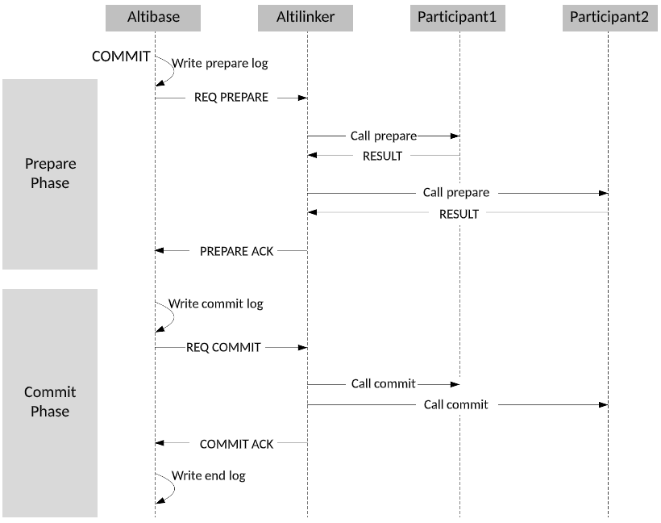
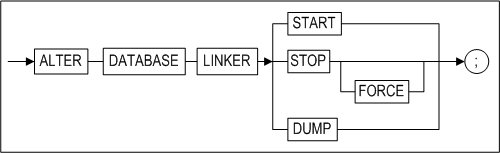

- [Database Link User’s Manual](#database-link-users-manual)
  - [서문](#%EC%84%9C%EB%AC%B8)
    - [이 매뉴얼에 대하여](#%EC%9D%B4-%EB%A7%A4%EB%89%B4%EC%96%BC%EC%97%90-%EB%8C%80%ED%95%98%EC%97%AC)
  - [1.데이터베이스 링크 소개](#1%EB%8D%B0%EC%9D%B4%ED%84%B0%EB%B2%A0%EC%9D%B4%EC%8A%A4-%EB%A7%81%ED%81%AC-%EC%86%8C%EA%B0%9C)
    - [관련 전문 용어](#%EA%B4%80%EB%A0%A8-%EC%A0%84%EB%AC%B8-%EC%9A%A9%EC%96%B4)
    - [데이터베이스 링크 정의](#%EB%8D%B0%EC%9D%B4%ED%84%B0%EB%B2%A0%EC%9D%B4%EC%8A%A4-%EB%A7%81%ED%81%AC-%EC%A0%95%EC%9D%98)
    - [Altibase 데이터베이스 링크 구성 요소](#altibase-%EB%8D%B0%EC%9D%B4%ED%84%B0%EB%B2%A0%EC%9D%B4%EC%8A%A4-%EB%A7%81%ED%81%AC-%EA%B5%AC%EC%84%B1-%EC%9A%94%EC%86%8C)
  - [2.지원되는 객체, SQL문 및 데이터 타입](#2%EC%A7%80%EC%9B%90%EB%90%98%EB%8A%94-%EA%B0%9D%EC%B2%B4-sql%EB%AC%B8-%EB%B0%8F-%EB%8D%B0%EC%9D%B4%ED%84%B0-%ED%83%80%EC%9E%85)
    - [데이터베이스 링크와 SQL문](#%EB%8D%B0%EC%9D%B4%ED%84%B0%EB%B2%A0%EC%9D%B4%EC%8A%A4-%EB%A7%81%ED%81%AC%EC%99%80-sql%EB%AC%B8)
    - [접근 가능한 원격 스키마 객체](#%EC%A0%91%EA%B7%BC-%EA%B0%80%EB%8A%A5%ED%95%9C-%EC%9B%90%EA%B2%A9-%EC%8A%A4%ED%82%A4%EB%A7%88-%EA%B0%9D%EC%B2%B4)
    - [DB Link 지원 데이터 타입](#db-link-%EC%A7%80%EC%9B%90-%EB%8D%B0%EC%9D%B4%ED%84%B0-%ED%83%80%EC%9E%85)
  - [3.데이터베이스 링크 환경 설정](#3%EB%8D%B0%EC%9D%B4%ED%84%B0%EB%B2%A0%EC%9D%B4%EC%8A%A4-%EB%A7%81%ED%81%AC-%ED%99%98%EA%B2%BD-%EC%84%A4%EC%A0%95)
    - [DB Link 동작 방식](#db-link-%EB%8F%99%EC%9E%91-%EB%B0%A9%EC%8B%9D)
    - [환경 설정](#%ED%99%98%EA%B2%BD-%EC%84%A4%EC%A0%95)
  - [4.데이터베이스 링크 사용법](#4%EB%8D%B0%EC%9D%B4%ED%84%B0%EB%B2%A0%EC%9D%B4%EC%8A%A4-%EB%A7%81%ED%81%AC-%EC%82%AC%EC%9A%A9%EB%B2%95)
    - [CREATE DATABASE LINK](#create-database-link)
    - [DROP DATABASE LINK](#drop-database-link)
    - [ALTER DATABASE LINKER](#alter-database-linker)
    - [ALTER SESSION](#alter-session)
    - [SELECT](#select)
    - [REMOTE_EXECUTE_IMMEDIATE](#remote_execute_immediate)
    - [바인딩 지원 REMOTE 함수](#%EB%B0%94%EC%9D%B8%EB%94%A9-%EC%A7%80%EC%9B%90-remote-%ED%95%A8%EC%88%98)
    - [일괄처리(Batch) 지원 REMOTE 함수](#%EC%9D%BC%EA%B4%84%EC%B2%98%EB%A6%ACbatch-%EC%A7%80%EC%9B%90-remote-%ED%95%A8%EC%88%98)
    - [COMMIT FORCE DATABASE LINK](#commit-force-database-link)
    - [ROLLBACK FORCE DATABASE LINK](#rollback-force-database-link)
  - [A.부록: 프로퍼티 및 데이터 딕셔너리](#a%EB%B6%80%EB%A1%9D-%ED%94%84%EB%A1%9C%ED%8D%BC%ED%8B%B0-%EB%B0%8F-%EB%8D%B0%EC%9D%B4%ED%84%B0-%EB%94%95%EC%85%94%EB%84%88%EB%A6%AC)
    - [DB Link 관련 데이터 딕셔너리](#db-link-%EA%B4%80%EB%A0%A8-%EB%8D%B0%EC%9D%B4%ED%84%B0-%EB%94%95%EC%85%94%EB%84%88%EB%A6%AC)
    - [프로퍼티 파일](#%ED%94%84%EB%A1%9C%ED%8D%BC%ED%8B%B0-%ED%8C%8C%EC%9D%BC)
    - [AltiLinker 프로퍼티](#altilinker-%ED%94%84%EB%A1%9C%ED%8D%BC%ED%8B%B0)


Altibase® Application Development

Database Link User’s Manual
===========================


Altibase Application Development Database Link User’s Manual

Release 7.1

Copyright ⓒ 2001\~2018 Altibase Corp. All Rights Reserved.

본 문서의 저작권은 ㈜알티베이스에 있습니다. 이 문서에 대하여 당사의 동의
없이 무단으로 복제 또는 전용할 수 없습니다.

**㈜알티베이스**

08378 서울시 구로구 디지털로 306 대륭포스트타워Ⅱ 10층

전화: 02-2082-1114 팩스: 02-2082-1099

고객서비스포털: <http://support.altibase.com>

homepage: [http://www.altibase.com](http://www.altibase.com/)

서문
----

### 이 매뉴얼에 대하여

이 매뉴얼은 데이터베이스 링크(Database Link)의 개념 및 사용 방법에 대해서
설명한다.

#### 대상 사용자

이 매뉴얼은 다음과 같은 Altibase 사용자를 대상으로 작성되었다.

-   데이터베이스 사용자

-   데이터베이스 관리자

-   응용 프로그램 개발자

-   성능 관리자

-   기술 지원부

이 매뉴얼을 읽고 이해하기 위해 다음과 같은 배경 지식이 도움이 될 것이다.

-   컴퓨터, 운영 체제 및 운영 체제 유틸리티 운용에 필요한 기본 지식

-   관계형 데이터베이스 사용 경험 또는 데이터베이스 개념에 대한 이해

-   컴퓨터 프로그래밍과 관련된 경험 또는 지식

-   데이터베이스 서버 관리, 운영 체제 관리 또는 네트워크 관리 경험

-   분산 환경에서의 데이터의 저장, 관리 및 처리와 관련된 지식

#### 소프트웨어 환경

이 매뉴얼은 데이터베이스 서버로 Altibase 버전 7.1을 사용한다는 가정 하에
작성되었다. 이전 버전의 경우 해당 버전과 일치하는 데이터베이스 링크 매뉴얼을
참고하도록 한다.

#### 이 매뉴얼의 구성

이 매뉴얼은 다음과 같이 구성되어 있다.

-   제 1장 데이터베이스 링크 소개  
    이 장에서는 데이터베이스 링크의 개념과 Altibase의 데이터베이스 링크 구성
    요소를 설명한다.

-   제 2장 지원되는 SQL문, 스키마 객체 및 데이터 타입  
    이 장은 데이터베이스 링크 사용을 위해 Altibase가 제공하는 SQL 구문과
    데이터베이스 링크를 통해서 접근할 수 있는 원격 데이터베이스의 스키마 객체,
    그리고 데이터베이스 링크와 함께 사용 가능한 데이터 타입에 대해 설명한다.

-   제 3장 데이터베이스 링크 환경설정  
    이 장은 Altibase의 데이터베이스 링크를 사용하기 위해 필요한 환경 설정에 대해
    설명한다.

-   제 4장 데이터베이스 링크 사용법  
    이 장에서는 데이터베이스 링크 제어를 위해 제공되는 SQL구문과 REMOTE 함수와
    함께 데이터베이스 링크를 사용하는 방법에 대해 상세히 설명한다.

-   A. 부록: 데이터 딕셔너리 및 프로퍼티  
    이 부록은 데이터베이스 링크와 관련하여 사용되는 각종 프로퍼티 및 데이터
    딕셔너리를 기술한다.

#### 문서화 규칙

이 절에서는 이 매뉴얼에서 사용하는 규칙에 대해 설명한다. 이 규칙을 이해하면 이
매뉴얼과 설명서 세트의 다른 매뉴얼에서 정보를 쉽게 찾을 수 있다. 여기서 설명하는
규칙은 다음과 같다.

-   구문 다이어그램

-   샘플 코드 규칙

##### 구문 다이어그램

이 매뉴얼에서는 다음 구성 요소로 구축된 다이어그램을 사용하여, 명령문의 구문을
설명한다.

| 구성 요소                      | 의미                                                         |
| ------------------------------ | ------------------------------------------------------------ |
|  | 명령문이 시작한다. 완전한 명령문이 아닌 구문 요소는 화살표로 시작한다. |
|  | 명령문이 다음 라인에 계속된다. 완전한 명령문이 아닌 구문 요소는 이 기호로 종료한다. |
|  | 명령문이 이전 라인으로부터 계속된다. 완전한 명령문이 아닌 구문 요소는 이 기호로 시작한다. |
|  | 명령문이 종료한다.                                           |
|  | 필수 항목                                                    |
|  | 선택적 항목                                                  |
|  | 선택사항이 있는 필수 항목. 한 항목만 제공해야 한다.          |
|  | 선택사항이 있는 선택적 항목.                                 |
|  | 선택적 항목. 여러 항목이 허용된다. 각 반복 앞부분에 콤마가 와야 한다. |

##### 샘플 코드 규칙

코드 예제는 SQL, Stored Procedure, iSQL, 또는 다른 명령 라인 구문들을 예를 들어
설명한다.

아래 테이블은 코드 예제에서 사용된 인쇄 규칙에 대해 설명한다.

| 규칙         | 의미                                                         | 예제                                                         |
| ------------ | ------------------------------------------------------------ | ------------------------------------------------------------ |
| [ ]          | 선택 항목을 표시                                             | VARCHAR [(*size*)][[FIXED \|] VARIABLE]                      |
| { }          | 필수 항목 표시. 반드시 하나 이상을 선택해야 되는 표시        | { ENABLE \| DISABLE \| COMPILE }                             |
| \|           | 선택 또는 필수 항목 표시의 인자 구분 표시                    | { ENABLE \| DISABLE \| COMPILE } [ ENABLE \| DISABLE \| COMPILE ] |
| . . .        | 그 이전 인자의 반복 표시 예제 코드들의 생략되는 것을 표시    | SQL\> SELECT ename FROM employee; <br/>ENAME<br/> ------------------------<br/> SWNO<br/> HJNO<br/> HSCHOI<br/> .<br/> .<br/> . <br/>20 rows selected. |
| 그 밖에 기호 | 위에서 보여진 기호 이 외에 기호들                            | EXEC :p1 := 1; acc NUMBER(11,2);                             |
| 기울임 꼴    | 구문 요소에서 사용자가 지정해야 하는 변수, 특수한 값을 제공해야만 하는 위치 | SELECT \* FROM *table_name*;<br/> CONNECT *userID*/*password*; |
| 소문자       | 사용자가 제공하는 프로그램의 요소들, 예를 들어 테이블 이름, 칼럼 이름, 파일 이름 등 | SELECT ename FROM employee;                                  |
| 대문자       | 시스템에서 제공하는 요소들 또는 구문에 나타나는 키워드       | DESC SYSTEM_.SYS_INDICES_;                                   |

#### 관련 자료

자세한 정보를 위하여 다음 문서 목록을 참조하기 바란다.

-   Getting Started Guide

-   Installation Guide

-   Administrator’s Manual

-   Replication Manual

-   General Reference

-   SQL Reference

-   Stored Procedures Manual

-   iSQL User’s Manual

-   Error Message Reference

#### Altibase는 여러분의 의견을 환영합니다.

이 매뉴얼에 대한 여러분의 의견을 보내주시기 바랍니다. 사용자의 의견은 다음
버전의 매뉴얼을 작성하는데 많은 도움이 됩니다. 보내실 때에는 아래 내용과 함께
고객서비스포털( http://support.altibase.com/kr/ )로 보내주시기 바랍니다.

-   사용 중인 매뉴얼의 이름과 버전

-   매뉴얼에 대한 의견

-   사용자의 성함, 주소, 전화번호

이 외에도 Altibase 기술지원 설명서의 오류와 누락된 부분 및 기타 기술적인
문제들에 대해서 위 주소로 보내주시면 정성껏 처리하겠습니다. 또한, 기술적인
부분과 관련하여 즉각적인 도움이 필요한 경우에도 고객서비스포털을 통해 서비스를
요청하시기 바랍니다.

여러분의 의견에 항상 감사드립니다.

1.데이터베이스 링크 소개
----------------------

이 장에서는 데이터베이스 링크의 개념과 Altibase의 데이터베이스 링크 구성 요소를
설명한다.

### 관련 전문 용어

이 절은 Altibase 데이터베이스 링크를 사용하기 위해 알아야 하는 용어를 소개한다.

-   Altibase 분산 데이터베이스 시스템 (Altibase Distributed Database System)  
    Altibase 서버 노드가 최소한 한 개 이상 포함된 두 개 이상의 데이터베이스 서버
    노드들로 구성된 시스템을 말한다.

-   원격 노드 (Remote Node)  
    데이터베이스 링크로 연결된 대상 서버 또는 시스템을 의미한다. Altibase 서버
    혹은 이기종의 데이터베이스 시스템을 원격 노드로 사용할 수 있다. 이 때
    데이터베이스 링크로 연결되는 대상 서버 또는 시스템이 반드시 물리적으로
    떨어져 있는 장비에 존재해야 할 필요는 없다. 즉, 하나의 장비에 로컬 서버와
    대상 데이터베이스 서버가 모두 존재할 경우에도 대상 데이터베이스 서버를 원격
    노드라고 한다.

-   원격 서버 (Remote Server)  
    원격 노드와 원격 서버의 의미를 구분하여 사용한다. 원격 노드는 데이터베이스
    링크로 연결된 대상 데이터베이스 서버만을 의미하는데 반해, 원격 서버는
    데이터베이스 링크 연결과는 상관없이 논리적으로 구분되는 데이터베이스 서버를
    일컫는다.

-   연결 (Link)  
    데이터베이스 링크를 통한 서버간의 연결을 가리킨다.

-   링크 객체 (Link Object)  
    대상 데이터베이스 서버에 연결하기 위해 로컬 데이터베이스에 생성하는
    데이터베이스 링크 객체를 말한다.

-   지역 서버 (Local Server)  
    데이터베이스 링크의 주체가 되는 Altibase 서버로써, 데이터베이스 링크 객체를
    생성하고 사용한다.

-   링커 프로세스 (Linker Process)  
    이기종 DBMS들로 구성된 분산 데이터베이스 시스템을 구축할 경우에 지역 서버와
    원격 서버간의 통신을 담당한다. 이 프로세스는 지역 서버에서 구동되며,
    AltiLinker라고도 표현한다.

-   링커 세션 (Linker Session)  
    Altibase 서버와 AltiLinker 프로세스 간에 생성되는 1:1 세션을 의미한다. 링커
    세션은 링커 제어 세션(Linker Control Session)과 링커 데이터 세션(Linker Data
    Session)으로 구분된다.

-   위치 표시자(@) (Location Descriptor)  
    SQL 구문에 데이터베이스 링크를 표현하기 위해 사용되는 기호이다. 객체명과
    데이터베이스 링크 이름 사이에 '@' 기호로 위치 표시자를 쓸 수 있다.

-   글로벌 트랜잭션 (Global Transaction)  
    지역 서버에서 수행되는 SQL 구문과 원격 노드에서 수행되는 SQL 구문으로
    구성되는 트랜잭션이다.

-   로컬 트랜잭션 (Local Transaction)  
    지역 서버에서 수행되고 완료되는 구문들로 구성된 트랜잭션을 의미한다.

-   원격 트랜잭션 (Remote Transaction)  
    원격 노드에서 데이터베이스 링크로 수행중인 모든 트랜잭션을 의미한다.

-   글로벌 커밋 노드 (Global Commit Node)  
    글로벌 트랜잭션을 commit 또는 rollback하는 노드이다. 주로 사용자가
    데이터베이스 링크를 생성하여 글로벌 트랜잭션을 시작하는 노드이다.

-   REMOTE 함수  
    Altibase 데이터베이스 링크 기능을 수행하는 pass-through 스타일의 저장 함수
    혹은 저장 프로시저를 의미한다.

-   원격 구문 (Remote Statement)  
    데이터베이스 링크를 통해 전달되어 원격 서버에서 수행되는 SQL 구문을
    의미한다.

-   참여자 (Participant)  
    데이터베이스 시스템간 수행되는 글로벌 트랜잭션에서 데이터베이스 시스템을
    의미한다. .

### 데이터베이스 링크 정의

이 절은 데이터베이스 링크의 개념과 처리 방식을 소개하고, Altibase 분산
데이터베이스 시스템에 대하여 기술한다.

#### 데이터베이스 링크의 개념

Altibase의 데이터베이스 링크란 각각 독립적으로 동작하는 둘 이상의 데이터베이스
서버가 네트워크로 연결되어 있으며 주어진 권한 내에서 지역 서버가 원격 서버에
논리적으로 관계가 있는 데이터를 요청하고 결과를 받아오는 기술 요소이다.

독립적으로 동작한다는 것은 각 데이터베이스 시스템이 자신의 데이터 저장 영역을
갖고 있으며, 사용자의 요청을 독립적으로 처리할 수 있음을 의미한다. 네트워크로
연결된다는 것은 논리적으로 구분된 두 시스템 혹은 서버가 서로 접근이 가능하다는
것을 의미한다. 또한 논리적으로 관계가 있다는 것은 개별 노드에 분산된 데이터
사이에 상관 관계가 존재함을 의미한다.

#### 처리 방식

Altibase 데이터베이스 링크의 처리 방식을 개략적으로 설명하면 다음과 같다.

링크 객체를 생성한 서버에 질의를 입력하면, 데이터베이스 링크 프로세스를 거쳐
원격 서버에서 필요한 데이터를 가져온 후, 최종적인 질의 결과를 사용자에게
반환한다. 이 과정에서 최종 사용자는 논리적으로 하나의 서버가 동작하는 것으로
인식하게 된다.

Altibase 데이터베이스 링크는 크게 아래의 네 가지 요소로 구성되며, 아래 그림에서
짙은 색으로 표시되어 있다. DK 모듈과 AltiLinker 프로세스는 다음 절에서 상세히
설명한다.

-   DK 모듈 (DB-Link Module)

-   AltiLinker: 자바로 구현된 링커 프로세스

-   ADLP: Altibase 데이터베이스 링크 프로토콜

-   dblink.conf: 데이터베이스 링크용 프로퍼티 파일


[그림 1‑1] 데이터베이스 링크 처리 방식(Heterogeneous Link)

#### Altibase 분산 데이터베이스 시스템 개념

Altibase 분산 데이터베이스 시스템은 논리적으로 떨어져 있는 두 개 이상의
데이터베이스 서버들로 구성되며, 최소한 하나는 Altibase 서버이어야 한다. 이 때
데이터베이스 링크를 생성하고 사용하는 데이터베이스는 반드시 Altibase이어야 한다.
연결 대상 서버는 Altibase 서버일 수도 있고 타사의 이기종 데이터베이스 시스템일
수도 있다.

로컬 서버의 Altibase가 데이터베이스 링크로 연결하는 원격 서버가 동일한 버전의
Altibase 서버인지 아닌지에 따라 Homogeneous Link 또는 Heterogeneous Link로
구분된다. 각각의 링크는 아래의 메커니즘을 갖는다.

##### Heterogeneous Link

Heterogeneous Link는 Altibase 서버와 이기종 데이터베이스 서버와의 연결을
의미한다. 원격 서버의 데이터베이스가 Altibase이더라도 지역 서버의 Altibase와
버전이 다르면 Heterogeneous Link로 연결된다. 동일한 버전의 Altibase 서버 간에도
Heterogeneous Link가 가능하다.

##### Homogeneous Link

Homogeneous Link는 동일한 버전의 프로토콜을 사용하는 Altibase 서버 간의 연결을
의미한다.

Homogeneous Link는 링크 프로세스(AltiLinker)를 거치지 않고 서버 간에 직접
연결한다. 따라서 Heterogeneous Link에 비해 성능이 좋으며, 특히 원격 노드에
접근이 빈번할수록 성능 격차가 더 커진다.

Altibase 버전 6.5.1 이상은 Homogeneous Link를 지원하지 않는다.

아래 표는 이 문서에서 사용하는 간략한 용어에 대한 정식 명칭과 그 의미를
나타낸다.

| Notation           | Full Name                                | Meaning                                                                                        |
|--------------------|------------------------------------------|------------------------------------------------------------------------------------------------|
| DB-Link            | Altibase Database Link                   | Altibase 데이터베이스 링크                                                                     |
| Heterogeneous-Link | Heterogeneous Database Link              | Altibase 서버와 이기종 데이터베이스 시스템간의 데이터베이스 링크                               |
| Homogeneous-Link   | Homogeneous Database Link                | 동일한 버전의 Altibase 서버간의 데이터베이스 링크                                              |
| Heterogeneous DBMS | Heterogeneous database management system | 이질적인 데이터베이스 관리 시스템으로, 지역 서버의 Altibase와 버전이 다른 Altibase 서버도 포함 |

### Altibase 데이터베이스 링크 구성 요소

이 절은 Altibase DB Link를 구성하는 요소들 중 데이터베이스 링크 모듈과
AltiLinker 프로세스에 대해 상세히 설명한다.

#### 데이터베이스 링크 모듈

데이터베이스 링크 모듈(이하 DK 모듈로 표기)은 Altibase 서버 내에서 데이터베이스
링크를 구현한 모듈이다. 이 모듈은 분산 데이터베이스 시스템 환경에서 원격
서버와의 연결을 위한 세션 관리, 원격 서버와의 연결을 의미하는 데이터베이스 링크
객체들의 관리, 데이터베이스 링크를 거쳐 수행되는 트랜잭션들의 관리, 각종 성능
뷰에 제공할 정보 관리, 원격 질의의 수행 결과로 얻은 레코드 집합 관리 등을
수행한다. 각각에 대해서 아래의 절에 상세히 설명한다.

-   링크 객체 관리

-   링커 세션 관리

-   성능 뷰의 정보 관리

-   글로벌 트랜잭션 관리

-   분산 트랜잭션 복구

-   결과 집합 데이터 관리

##### 링크 객체 관리

Altibase에서 링크 객체는 스키마 객체에 해당된다. 링크 객체의 생성과 삭제는
SQL문을 사용해서 가능하며, 각 SQL문에 대해서는 "4장 데이터베이스 링크
사용법"에서 자세히 설명한다.

Altibase는 링크 객체에 대해 아래의 두 가지 권한을 제공한다.

| 종류                  | 허용된 사용자                          | 설명                                                                                                                  |
|-----------------------|----------------------------------------|-----------------------------------------------------------------------------------------------------------------------|
| PRIVATE Database Link | 링크 객체를 생성한 사용자와 SYS 사용자 | PRIVATE 링크 객체는 SYS 사용자 또는 해당 링크 객체를 생성한 사용자만이 사용하거나 삭제할 수 있다.                     |
| PUBLIC Database Link  | 모든 사용자                            | PUBLIC 링크 객체는 모든 사용자가 사용할 수 있다. 단, 삭제는 SYS 사용자 또는 해당 객체를 생성한 사용자만이 할 수 있다. |

##### 링커 세션 관리

Altibase DK 모듈은 AltiLinker 프로세스에 연결하기 위해 링커 세션을 생성하고,
사용자 세션이 데이터베이스 링크를 참조할 때마다 이 링커 세션의 연결 상태를
감시한다.

아래 그림은 클라이언트가 데이터베이스 링크를 사용하는 SQL구문을 실행할 때, 이를
처리하기 위해 DK 모듈 및 AltiLinker 프로세스에 생성되는 세션들을 나타낸다.


[그림 1‑2] DK 모듈과 AltiLinker 프로세스 내의 링커 세션

##### 성능 뷰의 정보 관리

사용자는 성능 뷰를 조회하여 데이터베이스 링크 관련 정보를 확인할 수 있다.
Altibase가 데이터베이스 링크를 위해 관리하는 성능 뷰의 정보는 아래와 같다.

###### 데이터베이스 링크 객체 정보

데이터베이스에 생성된 데이터베이스 링크 객체에 대한 정보를 의미하며, 이 정보는
V\$DBLINK_DATABASE_LINK_INFO 성능 뷰로 사용자에게 제공된다.

###### 링커 세션 정보

DK 모듈에서 생성된 링커 세션에 관련된 정보를 의미하며, 이 정보는
V\$DBLINK_LINKER_SESSION_INFO 성능 뷰로 사용자에게 제공된다.

링커 세션은 링커 제어 세션과 링커 데이터 세션으로 구분된다. 링커 제어 세션은
AltiLinker 프로세스가 종료되기 전까지 Altibase 서버와 AltiLinker 프로세스 사이에
유일하게 생성되어 존재하고, 링커 데이터 세션은 데이터베이스 링크를 사용하는
사용자 세션 별로 하나씩 생성된다.

-   링커 제어 세션 정보: 링커 제어 세션의 상태 정보를 의미하며, 이 데이터는
    V\$DBLINK_LINKER_CONTROL_SESSION_INFO 성능 뷰로 사용자에게 제공된다. 링커
    제어 세션은 AltiLinker 프로세스의 종료와 상태 정보의 요청 및 설정 변경 등을
    수행한다.

-   링커 데이터 세션 정보: 링커 데이터 세션과 관련된 정보를 의미하며, 이 정보는
    V\$DBLINK_LINKER_DATA_SESSION_INFO 성능 뷰로 사용자에게 제공된다.

###### 트랜잭션 정보

-   글로벌 트랜잭션 정보: 글로벌 트랜잭션에 대한 상태 정보를 의미하며, 이 정보는
    V\$DBLINK_GLOBAL_TRANSACTION_INFO 성능 뷰로 사용자에게 제공된다.

-   원격 트랜잭션 정보: 데이터베이스 링크를 통해 원격 노드에서 수행중인 모든
    원격 트랜잭션에 대한 상태 정보를 의미하며, 이 정보는
    V\$DBLINK_REMOTE_TRANSACTION_INFO 성능 뷰로 사용자에게 제공된다.

-   원격 구문(Remote Statement)) 정보: 데이터베이스 링크를 통해 원격 노드에서
    수행중인 모든 구문(statement)에 대한 정보를 의미하며, 이 데이터는
    V\$DBLINK_REMOTE_STATEMENT_INFO 성능 뷰로 사용자에게 제공된다.

###### AltiLinker 프로세스의 상태 정보

AltiLinker 프로세스의 동적인 상태 정보를 의미하며, 이 정보는
V\$DBLINK_ALTILINKER_STATUS 성능 뷰로 사용자에게 제공된다. 이 정보에는 연결 상태
뿐만 아니라 AltiLinker 프로세스가 현재 사용 중인 JVM 메모리에 관련된 정보도
포함된다.

##### 글로벌 트랜잭션 관리

Altibase 데이베이스 링크에서 트랜잭션의 개념은 글로벌 트랜잭션과 원격
트랜잭션으로 구분된다.

글로벌 트랜잭션이란 지역 서버에 존재하는 데이터베이스 링크를 통해 원격 서버에서
수행되는 원격 트랜잭션을 하나 이상 포함하는 트랜잭션을 의미한다. Altibase
데이터베이스 링크는 글로벌 트랜잭션을 처리하기 위하여 ADLP라는 Altibase
데이터베이스 링크용 프로토콜을 구현하였다.

원격 트랜잭션은 데이터베이스 링크를 통해 원격 서버에서 수행되는 구문들로 구성된
트랜잭션으로 글로벌 트랜잭션을 구성한다.

###### ADLP (Altibase Database Link Protocol)

ADLP는 Altibase 서버와 AltiLinker 프로세스 사이에 데이터 교환 방식과 처리 방식을
정의한 것으로, 다음의 내용을 포함한다.

-   링커 세션 제어

-   원격 트랜잭션 제어

-   원격 구문 수행

-   AltiLinker 프로세스 제어

글로벌 트랜잭션 완료는 글로벌 트랜잭션에 참여하고 있는 모든 서버(로컬 및
원격)에서 트랜잭션을 한꺼번에 완료(커밋 혹은 롤백)해야 한다. 따라서 어느 한
서버에 문제가 발생하면 데이터의 일관성을 유지하지 못할 수 있다. 이러한 문제의
대처 방안으로 Altibase 데이터베이스 링크는 지역 서버와 원격 서버 간의 프로토콜
공유 정도에 따라 세 가지 레벨의 글로벌 트랜잭션 수행 메커니즘을 제공한다.

-   원격 구문 실행 레벨 (Remote Statement Execution Level)  
    원격 구문 실행 레벨은 글로벌 트랜잭션의 전역적인 일관성을 보장하지 않는다.
    단지 데이터베이스 링크를 통해 원격 노드에서 구문을 수행하는 것만을 보장한다.
    즉, 이 레벨에서는 하나의 글로벌 트랜잭션 내에서 로컬 서버에서 수행되는
    구문과 데이터베이스 링크를 통해 원격 서버에서 수행되는 구문은 별개의
    트랜잭션으로 동작한다.  
    DBLINK_GLOBAL_TRANSACTION_LEVEL 프로퍼티를 이 레벨로 설정하면, AltiLinker가
    원격 서버로 연결하는 세션은 기본적으로 autocommit 모드가 ON으로 설정된다.

-   단순 트랜잭션 커밋 레벨 (Simple Transaction Commit Level): Altibase
    데이터베이스 링크 중 Heterogeneous Link는 Altibase와 이기종의 데이터베이스
    시스템 간에 수행되는 글로벌 트랜잭션의 원자성을 보장하기 위하여 단순
    트랜잭션 커밋의 메커니즘을 구현한다. 이 레벨은 2단계 커밋의 동작 방식과
    유사하다. 그러나, 2단계 커밋 프로토콜이 커밋 준비를 위해 서버간에 메시지를
    주고 받는 것과는 달리, 단순 트랜잭션 커밋의 경우에는 서버간에 메시지 교환
    없이 단지 커밋이나 롤백 명령을 원격 노드로 전달할 수 있는지 만을 검사한다.  
    단순 트랜잭션 커밋 레벨이 동작하기 위해서는 원격 노드를 구성하는
    데이터베이스 시스템이 auto-commit 모드를 OFF로 설정할 수 있는 시스템이어야
    한다.  
    DBLINK_GLOBAL_TRANSACTION_LEVEL 프로퍼티를 이 레벨로 설정하면, AltiLinker가
    원격 서버로 연결하는 세션은 기본적으로 autocommit 모드가 OFF로 설정된다.

-   2단계 커밋 레벨 (Two-Phase Commit Level): 알티베이스 서버와 이기종
    데이터베이스 시스템 간의 글로벌 트랜잭션 정합성을 보장하는 2PC 프로토콜을
    제공한다. DBLINK_GLOBAL_TRANSACTION_LEVEL 프로퍼티를 2(Two-Phase Commit
    Level)로 설정한 후에 사용할 수 있다. 아래 그림은 2PC Commit Level의 동작을
    설명한다.



[그림 1‑3] 2단계 커밋 레벨(2-PC Commit Level)

준비 단계(Prepare Phase): 사용자가 커밋을 수행하면 알티베이스는 준비
로그(prepare log)를 기록하고 준비요청 메시지를 AltiLinker에게 보낸다. 메시지를
받은 AltiLinker는 글로벌 트랜잭션에 속한 모든 참여자에게 준비요청 메시지를
보낸다. 그리고 참여자가 준비를 마치면 AltiLinker는 알티베이스에게 준비완료
메시지를 보내고 모든 참여자에게 결과를 받은 알티베이스는 다음 단계를 진행한다.

커밋 단계(Commit Phase): 알티베이스는 커밋로그(commit log)를 기록하고 커밋요청
메시지를 AltiLinker에게 보낸다. AltiLinker는 모든 참여자에 커밋을 수행하며 모든
참여자가 커밋에 성공할 때까지 커밋 메시지를 보낸다. 참여자 전원이 커밋에
성공하면 알티베이스에게 성공 메시지를 보낸다. 알티베이스가 성공 메시지를 받으면
해당 트랜잭션이 종료되었다는 것을 의미하므로 종료 로그(end log)를 남기고 결과를
반영한다. 즉, 종료 로그가 기록된 트랜잭션은 장애 복구를 할 수 없다.

Altibase는 글로벌 트랜잭션 및 원격 트랜잭션에 대한 정보 및 트랜잭션의 처리
상태에 관한 정보를 성능 뷰로 제공한다.

##### 분산 트랜잭션 복구 (Recovery Of Distributed Transaction)

장애 시점은 2PC를 기준으로 하고, 장애 대상은 알티베이스와 참여자(원격
데이터베이스 시스템)로 한다. 알티베이스는 참여자와 메시지를 주고 받을 때
ALTILINKER_RECEIVE_TIMEOUT에 설정한 시간 동안 응답이 없으면 참여자에 장애가
발생했다고 판단한다.

###### 준비 로그의 기록 이전

알티베이스에 장애가 발생한 경우, 분산 트랜잭션의 시작 로그에는 기록이 남지만
준비 로그에는 기록이 남지 않았다면 참여하고 있는 모든 원격 트랜잭션를 철회한다.
그리고 알티베이스에서 수행되고 있는 로컬 트랜잭션도 철회되며 종료 로그를
기록한다.

###### 준비 로그의 기록 이후 - 커밋 로그의 기록 이전

알티베이스에 장애가 발생한 경우, 분산 트랜잭션의 준비 로그는 기록되지만 커밋
로그 및 롤백 로그는 기록되지 않는다. 커밋 로그가 기록되지 않은 상황에는 정합성
보장을 위해 수행하고 있는 모든 원격 트랜잭션을 복구한다. 이 때 참여자에 장애가
발생하면 원격 트랜잭션의 복구를 보장하기 위해 참여자가 롤백 메시지를 받을 때까지
알티베이스는 메시지 송신을 시도하여 복구를 수행하고 종료 로그를 기록한다.
참여자에 장애가 발생한 경우, 알티베이스는 참여자의 트랜잭션이 복구하도록
메시지를 보낸다. AltiLinker에 장애가 발생한 경우, 모든 원격 트랜잭션의 상태를 알
수 없으며 모든 트랜잭션에 대한 커밋 로그가 기록되지 않았으므로 롤백을 수행하고
종료 로그를 기록한다.

###### 커밋 로그의 기록 이후 - 종료 로그의 기록 이전

커밋 단계에서 장애가 발생한 경우에는 분산 트랜잭션에 대한 커밋 및 롤백 로그가
기록되지만 종료 로그는 기록되지 않는다. 알티베이스는 참여자에게 커밋 메시지의
응답을 받지 못한 상태로 참여자의 트랜잭션이 커밋 또는 롤백 되도록 지속적으로
시도하고 완료되면 종료 로그를 기록한다.

##### 결과 집합 데이터 관리

Altibase DK 모듈은 데이터베이스 링크를 통해 로컬 서버와 원격 서버간에 주고 받는
데이터를 처리하는 기능을 제공한다. DK 모듈은 다음과 같은 데이터를 처리한다.

-   제어 데이터 (Control Data): ADLP에 정의되어 있는 각 작업이 요구하는
    데이터로, 내부적으로 생성되어 DK 모듈과 AltiLiker 프로세스간에 주고 받는
    데이터를 의미한다.

-   사용자 데이터 (User Data): 프로퍼티 설정 값, 원격 서버에서 수행할 구문의
    문자열 및 바인딩 변수의 설정 값 등이 해당된다.

-   원격 데이터 (Remote Data): 원격 서버에서 수행된 결과 데이터로, DK 모듈이
    수신하는 데이터를 의미한다.

이러한 데이터에 대한 처리는 크게 Altibase 서버와 AltiLinker 프로세스 사이에
주고받는 모든 데이터의 타입 변환과 원격 서버에서 수행한 쿼리의 결과로 받는 원격
데이터의 버퍼링으로 구분된다.

타입 변환은 ADLP에 정의된 작업 별 데이터 명세에 따라 변환이 수행 되며, 원격
데이터의 경우 원격 서버가 수행한 쿼리의 결과 집합 내의 각 타입을 거기에 대응하는
Altibase 서버 타입으로 변환한다.

원격 데이터의 버퍼링은 DK 모듈 내부적으로 관리하는 고정된 크기의 메모리
버퍼(이후 DK 버퍼로 표현)와 디스크 임시 테이블을 이용한다. 사용자는 데이터베이스
링크를 위해 사용할 DK 버퍼의 크기를 프로퍼티로 조절할 수 있다. 한 번 설정된
버퍼의 크기는 Altibase 운영 중에는 변경할 수 없으므로, 메모리 자원과 성능을
고려하여 서버 시작 전에 결정하도록 한다. DK 버퍼는 한 개 이상의 데이터 버퍼
블록으로 구성되며, 데이터 버퍼 블록의 최소 크기와 개수는 프로퍼티로 조절할 수
있다.

#### AltiLinker 프로세스

AltiLinker는 Altibase 패키지 내에 포함되어 배포되는 자바 응용 프로그램이다.
AltiLinker 프로세스는 Heterogeneous Link용으로 동작하며, 링크 객체가 존재하는
Altibase 서버와 해당 링크 객체에 의해 연결되는 이기종 데이터베이스 시스템 혹은
원격 서버와의 통신을 담당한다.

Altibase 데이터베이스 링크에서 Heterogeneous Link에 대해 제공하는 AltiLinker는
아래와 같은 몇 가지 특징이 있다..

-   데이터베이스 링크로 연결된 이기종 데이터베이스 서버에서 발생한 오류가
    Altibase 서버에 영향을 주지 않는다.

-   AltiLinker는 JDBC 인터페이스로 원격 데이터베이스에 접근하므로 JDBC를
    지원하는 모든 데이터베이스 시스템에 Altibase 데이터베이스 링크로 접근이
    가능하다.

AltiLinker 프로세스를 활성화하려면, 아래의 두 프로퍼티를 설정해야 한다.

| 프로퍼티          | 설정 값           | 프로퍼티 파일       |
|-------------------|-------------------|---------------------|
| DBLINK_ENABLE     | 1 (0이면 disable) | altibase.properties |
| ALTILINKER_ENABLE | 1 (0이면 disable) | dblink.conf         |

AltiLinker 프로세스의 역할을 간략히 정리하면 아래와 같다.

-   JDBC 드라이버를 통해 이기종 데이터베이스 시스템에 연결

-   ADLP 프로토콜을 통해 Altibase 서버에서 요청 받은 작업 수행

-   원격 노드에서 수행한 쿼리의 결과를 Altibase 서버로 전달

> ##### 주의사항
>
> -   AltiLinker 프로세스는 JDBC 인터페이스를 사용하여 원격 서버의 데이터베이스에
>     접근하므로 해당 데이터베이스 벤더가 제공하는 JDBC 드라이버가 반드시
>     필요하다.
>
> -   AltiLinker 프로세스는 지역 서버와 동일한 장비에서만 동작한다.
>

2.지원되는 객체, SQL문 및 데이터 타입
-----------------------------------

이 장은 데이터베이스 링크 사용을 위해 Altibase가 제공하는 SQL 구문과
데이터베이스 링크를 통해서 접근할 수 있는 원격 데이터베이스의 스키마 객체,
그리고 데이터베이스 링크와 함께 사용 가능한 데이터 타입에 대해 설명한다.

### 데이터베이스 링크와 SQL문

이 절은 데이터베이스 링크와 함께 사용할 수 있는 SQL구문에 대해 설명한다.

Altibase 데이터베이스 링크는 원격 스키마 객체 접근을 위해 크게 두 종류의 방식을
제공한다. 하나는 이전까지의 버전처럼 위치 표시자(@)를 사용해서 원격 서버의
테이블이나 뷰에 접근하는 방식이고, 다른 하나는 SQL문 전체를 원격 서버로 직접
전송하는 pass-through 방식(style)이다.

Altibase 데이터베이스 링크는 pass-through 방식을 지원하기 위해 REMOTE_TABLE
키워드와 내장(built-in)된 REMOTE 프로시저와 함수들(이하 REMOTE 함수로 표기)을
제공한다. REMOTE_TABLE 키워드 또는 REMOTE 함수들을 사용하면 SQL문 자체가 원격
서버로 전송되어 원격 서버가 직접 해당 SQL문을 수행한다.

REMOTE 함수들은 SQL문 내의 파라미터 마커에 값을 바인딩할 수 있는 함수와 그렇지
않은 함수로 구분된다.

아래는 SQL 구문 종류 별로 RETMOTE_TABLE 키워드와 REMOTE 함수들의 사용 가능
여부를 표로 나타낸 것이다.

|                                     | REMOTE_TABLE 키워드 | REMOTE_EXECUTE_IMMEDIATE | 바인딩 지원 REMOTE 함수들 |
| ----------------------------------- | ------------------- | ------------------------ | ------------------------- |
| **DDL 문**                          | X                   | O                        | O                         |
| **DCL 문**                          | X                   | O                        | O                         |
| **DML 문 (INSERT, UPDATE, DELETE)** | X                   | O                        | O                         |
| **SELECT 문**                       | O                   | X                        | O                         |

#### REMOTE_TABLE

REMOTE_TABLE은 지역 서버에서 입력되는 SELECT구문의 FROM 절에만 사용할 수 있는
키워드이다. REMOTE_TABLE 키워드 뒤에는 원격 서버에서 수행할 SELECT 구문만 지정할
수 있다. 또한, REMOTE_TABLE 키워드는 파라미터 마커가 포함된 SQL문, 즉 바인딩과
함께 사용할 수 없다.

SQL문에 REMOTE_TABLE 키워드를 사용하는 문법은 "4장 데이터베이스 링크 사용법"에서
기술한다.

#### REMOTE_EXECUTE_IMMEDIATE

REMOTE_EXECUTE_IMMEDIATE 입력한 SQL문을 데이터베이스 링크를 통해 원격 서버에서
수행하는 내장된 저장 프로시저다. 이 프로시저는 SELECT문을 제외한 Altibase
데이터베이스 링크에서 지원하는 모든 DML문, DDL문과 DCL문을 수행할 수 있다. 또한,
이 프로시저로는 파라미터 마커가 포함된 SQL문의 수행, 즉 바인딩의 사용이
불가능하다.

이 프로시저의 문법은 "4장 데이터베이스 링크 사용법"을 참고하기 바란다.

#### 바인딩 지원 REMOTE 함수

데이터베이스 링크를 통해 파라미터 마커가 포함된 SQL문을 실행할 수 있는 REMOTE
함수들에 대해 설명한다.

파라미터 마커가 포함된 SQL문을 실행하고 각 파라미터에 값을 바인딩하기 위해서는
아래의 REMOTE 함수들을 사용하면 된다. 단, 아래의 REMOTE 함수들은 저장 프로시저
내에서만 사용할 수 있고, 호출 순서도 지켜야 한다.

-   REMOTE_ALLOC_STATEMENT

-   REMOTE_BIND_VARIABLE

-   REMOTE_EXECUTE_STATEMENT

-   REMOTE_NEXT_ROW

-   REMOTE_GET_COLUMN_VALUE_type

-   REMOTE_FREE_STATEMENT

아래는 저장 프로시저 내에서 파라미터 마커가 포함된 SELECT 문을 수행하기 위해
REMOTE 함수를 호출하는 순서이다.

1.  REMOTE_ALLOC_STATEMENT

2.  REMOTE_BIND_VARIABLE

3.  REMOTE_EXECUTE_STATEMENT

4.  REMOTE_NEXT_ROW

5.  REMOTE_GET_COLUMN_VALUE_type

6.  REMOTE_FREE_STATEMENT

아래는 저장 프로시저 내에서 SELECT 문 이외의 파라미터 마커가 포함된 DML, DDL
문을 수행하기 위해 REMOTE 함수를 호출하는 순서이다.

1.  REMOTE_ALLOC_STATEMENT

2.  REMOTE_BIND_VARIABLE

3.  REMOTE_EXECUTE_STATEMENT

4.  REMOTE_FREE_STATEMENT

각 REMOTE 함수에 대한 문법과 상세한 설명은 "4장 데이터베이스 링크 사용법"을
참고하기 바란다.

### 접근 가능한 원격 스키마 객체

이 절에서는 데이터베이스 링크로 접근할 수 있는 원격 스키마 객체들을 설명한다.

| 원격 스키마 객체 | 위치 표시자 @로 접근 가능한가? | REMOTE 함수로 접근 가능한가? |
| ---------------- | ------------------------------ | ---------------------------- |
| 테이블           | O                              | O                            |
| 인덱스           | X                              | O                            |
| 뷰               | O                              | O                            |
| 저장 프로시저    | X                              | O                            |
| 시퀀스           | X                              | O                            |
| 큐               | X                              | O                            |
| 트리거           | X                              | O                            |
| 시노님           | X                              | O                            |
| 제약조건         | X                              | O                            |

[표 2‑1] 데이터베이스 링크로 접근가능한 원격 스키마 객체

위의 표에서 보듯이 데이터베이스 링크를 위치 표시자(@)와 함께 사용해서 원격
서버에서 접근할 수 있는 객체는 테이블과 뷰 뿐이다. 그러나, pass-through 방식의
REMOTE 함수를 사용하면 원격 노드의 거의 모든 스키마 객체에 접근이 가능하다.

> 주의: 위치 표시자(@)는 이전 버전과의 호환성을 위해 지원되며, 위치 표시자(@)를
> 사용해서는 이전 버전에서와 마찬가지로 원격 서버에서 SELECT 구문만 수행할 수
> 있다. 또한, 위치 표시자가 포함된 질의는 서버에서 쿼리 최적화가 수행되지 않기
> 때문에, REMOTE 함수를 사용하는 것이 질의 처리 속도가 더 빠르다.

아래의 절에서는 REMOTE 함수를 사용해서 원격 스키마 객체에 접근하는 방법과 SQL문
예제를 보여준다.

#### 테이블

데이터베이스 링크의 핵심 기능은 데이터가 서로 다른 데이터베이스에 분산되어 있는
테이블 간의 상호 운용(Inter-operation)을 제공하는 것이다. Altibase 데이터베이스
링크를 사용해서 원격 테이블에 SELECT, INSERT, UPDATE, DELETE 및 DDL문을 수행할
수 있다.

SELECT 질의의 경우, 아래와 같이 FROM 절에 REMOTE_TABLE 키워드를 사용해서 원격
테이블을 조회할 수 있다.

```
SELECT * FROM REMOTE_TABLE( link1, 'select * from t1' );
```

만약 WHERE 절에서 원격 객체를 참조하려면 아래 예제와 같이 부질의를 사용하면
된다.

```
SELECT * FROM t1 WHERE t1.c1 = ( SELECT * FROM REMOTE_TABLE( link1, 'select c2 from t2' ) );
```

원격 서버에 DML 또는 DDL문을 수행하려면 아래 예제와 같이 REMOTE_EXECUTE_IMMEDIATE 프로시저를 사용하면 된다.

```
REMOTE_EXECUTE_IMMEDIATE( 'link1', 'insert into t1 values(1)' );
REMOTE_EXECUTE_IMMEDIATE( 'link1', 'create table t1(c1 integer primary key, c2 integer)' );
```

파라미터 마커가 포함된 SELECT문의 경우 위의 "바인딩 지원 REMOTE 함수"절에 기술한
순서로 바인딩 지원 REMOTE 함수들을 순서대로 사용하면 되고 DML과 DDL 의 경우도
이와 마찬가지이다.

아래는 파라미터 마커가 포함된 INSERT문을 REMOTE 함수를 사용해서 수행하는 저장
프로시저 예제이다.

```
DECLARE
statement_id
result
row_count
BEGIN
statement_id := REMOTE_ALLOC_STATEMENT( 'link1', 'insert into T1 values(?)' );
result := REMOTE_BIND_VARIABLE( 'link1', statement_id, 1, '20' );
row_count := REMOTE_EXECUTE_STATEMENT( 'link1', statement_id );
result := REMOTE_FREE_STATEMENT( 'link1', statement_id );
RETURN row_count;
END;
```

아래는 위치 표시자 '@'를 사용해서 원격 서버의 테이블을 조회하는 예제이다. 위치
표시자 사용 방식은 기존 버전과의 호환성을 유지하기 위해 지원된다.

```
SELECT * FROM t1@link1;
```

#### 인덱스

Altibase 데이터베이스 링크를 사용해서 원격 서버에 인덱스를 생성할 수 있다.

```
REMOTE_EXECUTE_IMMEDIATE( 'link1', 'create index index1 on t1 (c1 asc, c2 desc)' );
```

#### 뷰

뷰에 대해서도 테이블과 마찬가지로 SELECT, DML, DDL문의 수행을 지원하고 사용법도
테이블과 동일하다.

아래는 REMOTE 함수를 사용해서 원격 서버의 뷰를 조회하는 예제이다.

```
SELECT * FROM REMOTE_TABLE( link1, 'select * from v1' );
```

아래는 REMOTE 함수를 사용해서 원격 서버에 뷰를 생성하는 예제이다.

```
REMOTE_EXECUTE_IMMEDIATE( 'link1', 'create view v1 as select c1, c2, c3 from t1' );
```

아래는 위치 표시자 '@'를 사용해서 원격 서버의 뷰를 조회하는 예제이다.

```
SELECT * FROM v1@link1;
```

#### 저장 프로시저

Altibase 데이터베이스 링크로 원격 서버의 저장 프로시저에 접근할 수 있다. 즉,
지역 서버에서 원격 서버에 저장 프로시저를 생성하고 원격 서버에 존재하는
프로시저를 호출할 수 있다.

지역 서버의 저장 프로시저 내에 REMOTE 함수를 사용할 경우, REMOTE 함수로 접근
가능한 모든 원격 객체를 참조할 수 있다.

아래는 저장 프로시저를 호출하는 SELECT문을 REMOTE_TABLE 키워드를 사용해서 원격
서버에서 수행하는 예제이다.

```
SELECT * FROM REMOTE_TABLE( link1, 'select remote_function1() from dual' );
SELECT * FROM t1 WHERE t1.c1 = ( SELECT * FROM REMOTE_TABLE( link1, 'select remote_function1() from dual' ) );
```

아래는 REMOTE_EXECUTE_IMMEDIATE 프로시저를 사용해서, 원격 서버에 저장 프로시저를
생성하고 생성된 프로시저를 호출하는 예제이다.

```
REMOTE_EXECUTE_IMMEDIATE( 'link1',
'create or replace procedure proc1 as i integer;
begin i := 0;
    while i <> 1000
    loop
        insert into t1 values(i);
        i := i + 1;
    end loop;
end;
/' );
REMOTE_EXECUTE_IMMEDIATE( 'link1', 'execute proc1' );
```

##### 제약사항

지역 서버의 저장 프로시저 내에서 원격 서버의 테이블에 기반한 ROWTYPE 변수 선언과
커서 선언은 할 수 없다.

위치 표시자 '@'를 사용하는 경우 이전 버전과 동일한 제약사항을 가진다. 다시 말해
위치 표시자 '@'를 사용해서 원격 서버에 존재하는 저장 프로시저에 대한 접근은
불가능하나, 지역 서버의 저장 프로시저 내에서 위치 표시자 '@'를 사용해서 원격
서버의 테이블 또는 뷰에 접근하는 것은 가능하다.

#### 시퀀스

Altibase 데이터베이스 링크로 원격 서버의 시퀀스에 접근할 수 있다.

아래는 시퀀스를 참조하는 SELECT문을 REMOTE_TABLE 키워드를 사용해서 원격 서버에
수행하는 예제이다.

```
SELECT * FROM REMOTE_TABLE( link1, 'select seq1.currval, seq1.nextval from dual' );
```

아래는 시퀀스를 참조하는 INSERT문을 REMOTE_EXECUTE_IMMEDIATE 프로시저를 사용해서
원격 서버에 수행하는 예제이다.

```
REMOTE_EXECUTE_IMMEDIATE( 'link1', 'insert into t1 values(seq1.nextval)' );
```

아래는 원격 서버에 시퀀스를 생성하는 예제이다.

```
REMOTE_EXECUTE_IMMEDIATE( 'link1', 'create sequence seq1 start with 1 increment by 1' );
```

#### 큐

Altibase 데이터베이스 링크로 원격 서버의 큐에 접근할 수 있다.

아래는 REMOTE_TABLE 키워드를 사용해서 원격 서버의 큐를 조회하는 예제이다.

```
SELECT * FROM REMOTE_TABLE( link1, 'select message from q1' );
```

아래는 REMOTE_EXECUTE_IMMEDIATE 프로시저를 사용해서 원격 서버의 큐에 메시지를
입력하는 예제이다.

```
REMOTE_EXECUTE_IMMEDIATE( 'link1', 'enqueue into q1(message) values(\'test message\')' );
```

아래는 원격 서버에 큐를 생성하는 예제이다.

```
REMOTE_EXECUTE_IMMEDIATE( 'link1', 'create queue q1(40) maxrows 1000' );
```

#### 트리거

Altibase 데이터베이스 링크로 원격 서버의 트리거에 접근할 수 있다.

아래는 원격 서버에 트리거를 생성하는 예제이다.

```
REMOTE_EXECUTE_IMMEDIATE( 'link1', 
'create trigger trigger1 after delete on orders
referencing old row old_row
for each row as
begin
    insert into log1 values( old_row.c1,
                             old_row.c2,
                             old_row.c3,
                             sysdate );
end;
/' );
```

#### 시노님

Altibase 데이터베이스 링크로 원격 서버의 시노님에 접근할 수 있다.

아래는 REMOTE_TABLE 키워드를 사용해서 원격 서버의 시노님을 조회하는 예제이다.

```
SELECT * FROM REMOTE_TABLE( link1, 'select * from synonym_table' );
SELECT * FROM REMOTE_TABLE( link1, 'select synonym_name from user_synonyms' );
```

아래는 원격 서버의 시노님에 DML 문을 수행하는 예제이다.

```
REMOTE_EXECUTE_IMMEDIATE( 'link1', 'insert into synonym_table values( seq1.nextval )' );
```

#### 제약조건

Altibase 데이터베이스 링크로 원격 서버의 제약조건에 접근할 수 있다.

아래는 원격 서버의 제약조건에 DML 문을 수행하는 예제이다.

```
REMOTE_EXECUTE_IMMEDIATE( 'link1', 'set constraints all differed' );
```

아래는 원격 서버의 테이블에 제약조건을 추가하는 DDL 문을 수행하는 예제이다.

```
REMOTE_EXECUTE_IMMEDIATE( 'link1', 'alter table t1 add constraint const1 unique(c1)' );
```

### DB Link 지원 데이터 타입

Altibase 데이터베이스 링크는 JDBC 인터페이스를 사용하므로, JDBC v3.0에 명세화된
표준 데이터 타입을 지원한다.

아래 그림은 지역 서버인 Altibase와 AltiLinker 사이의 데이터 타입 변환과
AltiLinker와 각 이기종 데이터베이스의 JDBC 드라이버간의 데이터 타입 변환이
어떻게 이루어지는지를 보여준다.


[그림 2‑1] 데이터 타입 변환

아래의 표는 Altibase 데이터 타입들이 어떤 JDBC 데이터 타입 및 표준 SQL 데이터
타입과 매핑되는지를 보여준다.

| JDBC 데이터 타입             | Altibase SQL 데이터 타입 | 표준 SQL 데이터 타입 | DB-Link 지원 여부 | 비고                                                                                                                                                                       |
|------------------------------|--------------------------|----------------------|-------------------|----------------------------------------------------------------------------------------------------------------------------------------------------------------------------|
| java.sql.Types.CHAR          | CHAR                     | CHAR                 | O                 |                                                                                                                                                                            |
| java.sql.Types.VARCHAR       | VARCHAR                  | VARCHAR              | O                 |                                                                                                                                                                            |
| java.sql.Types.LONGVARCHAR   |                          | LONGVARCHAR          | X                 |                                                                                                                                                                            |
| java.sql.Types.NCHAR         | NCHAR                    | NCHAR                | X                 | JDBC v4.0                                                                                                                                                                  |
| java.sql.Types.NVARCHAR      | NVARCHAR                 | NVARCHAR             | X                 | JDBC v4.0                                                                                                                                                                  |
| java.sql.Types.LONGNVARCHAR  |                          | LONGNVARCHAR         | X                 | JDBC v4.0                                                                                                                                                                  |
| java.sql.Types.NUMERIC       | NUMERIC                  | NUMERIC              | O                 |                                                                                                                                                                            |
| java.sql.Types.DECIMAL       | DECIMAL                  | DECIMAL              | O                 |                                                                                                                                                                            |
| java.sql.Types.BIT           | SMALLINT                 | BIT                  | O                 | Altibase의 BIT 타입은 한 비트만 표현 가능한 표준 BIT 타입과 다르므로 SMALLINT 타입으로 맵핑된다.                                                                           |
|                              | BIT (bitset)             |                      | X                 | Altibase의 BIT 타입은 비트 집합을 저장한다.                                                                                                                                |
| java.sql.Types.BOOLEAN       | SMALLINT                 | BOOLEAN              | O                 | Altibase는 BOOLEAN 타입을 제공하지 않으므로, SMALLINT 타입으로 맵핑된다. 원격 서버가 Altibase일 경우 이 타입에는 데이터 INSERT가 불가능하다.                               |
| java.sql.Types.TINYINT       | SMALLINT                 | TINYINT              | O                 | Altibase는 TINYINT 타입을 제공하지 않으므로, SMALLINT 타입으로 맵핑된다.                                                                                                   |
| java.sql.Types.SMALLINT      | SMALLINT                 | SMALLINT             | O                 |                                                                                                                                                                            |
| java.sql.Types.INTEGER       | INTEGER                  | INTEGER              | O                 |                                                                                                                                                                            |
| java.sql.Types.BIGINT        | BIGINT                   | BIGINT               | O                 |                                                                                                                                                                            |
| java.sql.Types.REAL          | REAL                     | REAL                 | O                 |                                                                                                                                                                            |
| java.sql.Types.FLOAT         | FLOAT                    | FLOAT                | O                 |                                                                                                                                                                            |
| java.sql.Types.DOUBLE        | DOUBLE                   | DOUBLE               | O                 |                                                                                                                                                                            |
| java.sql.Types.BINARY        | BINARY                   | BINARY               | X                 | 원격 서버가 Altibase일 경우 이 타입에는 데이터 INSERT가 불가능하다.                                                                                                        |
| java.sql.Types.VARBINARY     |                          | VARBINARY            | X                 |                                                                                                                                                                            |
| java.sql.Types.LONGVARBINARY |                          | LONGVARBINARY        | X                 |                                                                                                                                                                            |
| java.sql.Types.DATE          | DATE                     | DATE                 | O                 | 년도의 값이 0보다 작으면(기원전), Altibase는 0으로 처리한다.                                                                                                               |
| java.sql.Types.TIME          | DATE                     | TIME                 | O                 | Oracle은 TIMESTAMP의 최소 표현 단위가 nano초이나, Altibase는 micro초이므로, nano초가 micro초로 변환된다.                                                                   |
| java.sql.Types.TIMESTAMP     | DATE                     | TIMESTAMP            | O                 | Oracle은 TIMESTAMP의 최소 표현 단위가 nano초이나, Altibase는 micro초이므로, nano초가 micro초로 변환된다.                                                                   |
|                              |                          |                      |                   | 또한, 년도의 값이 0보다 작으면(기원전), Altibase는 0으로 처리한다.                                                                                                         |
| java.sql.Types.CLOB          | CLOB                     | CLOB                 | X                 |                                                                                                                                                                            |
| java.sql.Types.NCLOB         |                          | NCLOB                | X                 | JDBC v4.0                                                                                                                                                                  |
| java.sql.Types.BLOB          | BLOB                     | BLOB                 | X                 |                                                                                                                                                                            |
| java.sql.Types.ARRAY         |                          |                      | X                 |                                                                                                                                                                            |
| java.sql.Types.DISTINCT      |                          |                      | X                 |                                                                                                                                                                            |
| java.sql.Types.STRUCT        |                          |                      | X                 |                                                                                                                                                                            |
| java.sql.Types.REF           |                          |                      | X                 |                                                                                                                                                                            |
| java.sql.Types.DATALINK      |                          |                      | X                 |                                                                                                                                                                            |
| java.sql.Types.JAVA_OBJECT   |                          |                      | X                 |                                                                                                                                                                            |
| java.sql.Types.NUMERIC       | NUMERIC                  | NUMERIC              | O                 |                                                                                                                                                                            |
|                              | NIBBLE                   |                      | X                 |                                                                                                                                                                            |
|                              | VARBIT                   |                      | X                 |                                                                                                                                                                            |
|                              | INTERVAL                 |                      | X                 |                                                                                                                                                                            |

[표 2‑2] 데이터베이스 링크 지원 데이터 타입

3.데이터베이스 링크 환경 설정
---------------------------

이 장은 Altibase 데이터베이스 링크를 사용하기 위해 필요한 환경 설정에 대해
설명한다.

### DB Link 동작 방식

환경 설정에 앞서 데이터베이스 링크가 동작하는 과정을 간략히 살펴보면 다음과
같다.

1.  사용자가 원격 서버에서 수행될 질의를 포함한 SQL문을 지역 서버에 요청한다.

2.  지역 서버의 질의 처리기가 SQL문을 파싱하여 원격 서버로 보낼 질의를 준비한다.

3.  준비된 질의를 AltiLinker로 전송한다.

4.  AltiLinker가 질의를 받아 원격 서버에 질의 수행을 요청한다. 여기에 JDBC
    인터페이스가 사용된다.

5.  원격 서버는 요청 받은 질의를 수행하고 결과를 AltiLinker로 반환한다.

6.  원격 서버로부터 받은 질의 결과를 AltiLinker가 지역 서버로 전송한다. 지역
    서버는 받은 결과 데이터를 용도에 맞게 변환하여 이용한다.

위에서 3번과 6번 단계에서 Altibase 서버와 AltiLinker 간에는 TCP 통신만을
지원하며, 데이터 교환은 ADLP 프로토콜을 따른다. 또한 AltiLinker는 JDBC
인터페이스를 사용하여 원격 서버의 데이터베이스에 접근한다. JDBC 관련 설정은
시스템 환경과 상황에 따라 다를 수 있는데, 이 장에서는 Java SE 1.5 환경을
기준으로 설명한다.

### 환경 설정

이 절은 Altibase 데이터베이스 링크 사용을 위한 JDBC 환경 설정 방법을 아래와 같이
설명한다.

-   JRE 설치

-   JDBC 드라이버 설치

-   AltiLinker 프로퍼티 파일 설정

-   Altibase 프로퍼티 파일 설정

#### JRE 설치

AltiLinker는 JRE 1.5 버전 이상에서 동작하는 자바 응용 프로그램이므로,
AltiLinker가 동작할 장비에 1.5 버전 이상의 JRE가 설치되어 있어야 한다.

AltiLiker가 접속할 원격 데이터베이스의 JDBC 드라이버가 1.5 이상 버전의 JRE에서
동작한다면, 해당 JDBC 드라이버와 호환되는 버전의 JRE를 설치해야 한다.

JRE 설치 후에는 JAVA_HOME과 CLASSPATH 등의 환경 변수를 설정해야 한다. 아래는
유닉스 계열 OS에서 JRE 관련 환경 변수를 설정하는 예제이다.

```
$ export JAVA_HOME=JRE가 설치된 경로
$ export CLASSPATH=${JAVA_HOME}/lib:${CLASSPATH}
$ export PATH=${JAVA_HOME}/bin:${PATH}
```

#### JDBC 드라이버 설치

데이터베이스 링크를 사용하기 위해 AltiLinker가 동작하는 장비에 JDBC 드라이버를
설치한다. 이 때 설치하는 JDBC 드라이버는 데이터베이스 링크로 접속할 원격
데이터베이스에 해당하는 벤더가 제공하는 것이다. 예를 들어 원격 데이터베이스가
오라클이라면 오라클 홈페이지에서 Oracle 데이터베이스 서버에 일치하는 버전의 JDBC
드라이버를 다운로드하여 설치한다. 2PC(Two-Phase Commit)프로토콜을 사용하는
경우에는 XA를 지원하는 ODBC Driver를 사용해야 한다.

#### AltiLinker 프로퍼티 파일 설정

AltiLinker 프로퍼티 파일에는 AltiLinker 동작에 관련된 프로퍼티와 원격 서버에
접속하는데 필요한 프로퍼티가 설정된다.

AltiLinker 프로퍼티 파일은 \$ALTIBASE_HOME/conf 아래에 dblink.conf 파일로
존재한다. 이 파일에는 아래의 프로퍼티 등이 설정된다.

-   ALTILINKER_ENABLE

-   ALTILINKER_PORT_NO

-   TARGETS

AltiLinker 프로세스를 활성화하기 위해서는 ALTILINKER_ENABLE 프로퍼티의 값을 1로
설정해야 한다. ALTILINKER_PORT_NO 프로퍼티에는 AltiLinker의 TCP 대기(listen)
포트 번호를 지정한다.

TARGETS 프로퍼티에는 AltiLinker가 원격 데이터베이스 서버에 접속하는데 필요한
연결 정보가 아래와 같은 하위 프로퍼티로 설정된다.

-   JDBC_DRIVER: JDBC 드라이버 파일의 절대 경로

-   CONNECTION_URL: 접속할 원격 데이터베이스 서버의 연결 URL

-   USER: 원격 데이터베이스 서버에 접속할 사용자 이름

-   PASSWORD: 원격 데이터베이스 서버에 접속할 사용자의 암호

-   XADATASOURCE_CLASS_NAME: XADataSource클래스 이름,
    Altibase.jdbc.driver.AltibaseXADataSource에 위치

-   XADATASOURCE_CLASS_URL_SETTER_NAME: XADataSource의 URL을 설정(Set), setURL로
    설정 가능

위 항목 중 첫 번째와 두 번째 항목은 프로퍼티 파일에 반드시 명시되어야 한다.
나머지 항목은 프로퍼티 파일에 명시하거나 데이터베이스 링크 객체를 생성하는
시점에 입력할 수 있다. 프로퍼티 파일보다 데이터베이스 링크 객체 생성 시점에
명시한 사용자 이름과 암호가 우선적으로 사용된다.

TARGETS 프로퍼티는 아래의 형식으로 설정할 수 있다. 이 프로퍼티에는 복수 개의
원격 서버를 명시할 수 있다.

```
TARGETS = (
  (
     NAME = "alti1"
     JDBC_DRIVER = "/home/user/altibase_home/lib/Altibase.jar"
     CONNECTION_URL = "jdbc:Altibase://127.0.0.1:20300/mydb"
     USER = "sys"
     PASSWORD = "manager"
     XADATASOURCE_CLASS_NAME= "Altibase.jdbc.driver.AltibaseXADataSource"
     XADATASOURCE_URL_SETTER_NAME = "setURL"
  ),
  (
     NAME = ..
     JDBC_DRIVER = ..
     CONNECTION_URL = ..
  )
)
```

대한 자세한 내용은 "A. 부록: 데이터 딕셔너리 및 프로퍼티"를 참고하기 바란다.

#### Altibase 프로퍼티 파일 설정

Altibase 데이터베이스 링크를 사용하기 위해서는 먼저 altibase.properties 파일에서
DBLINK_ENABLE 프로퍼티를 1로 설정해야 한다.

모든 프로퍼티 설정 후 Altibase 서버를 구동시키면, AltiLinker 프로세스가 Altibase
서버 프로세스와 함께 시작된다.

데이터베이스 링크와 관련된 프로퍼티에 대한 자세한 내용은 *General Reference*의
데이터베이스 링크 관련 프로퍼티를 참고한다.

4.데이터베이스 링크 사용법
------------------------

이 장에서는 데이터베이스 링크 제어를 위해 제공되는 SQL구문과 REMOTE 함수와 함께
데이터베이스 링크를 사용하는 방법에 대해 상세히 설명한다.

### CREATE DATABASE LINK

#### 구문

**create_database_link ::=**


#### 전제조건

SYS 사용자 또는 CREATE DATABASE LINK 시스템 권한을 가진 사용자만이 데이터베이스
링크 객체를 생성할 수 있다.

#### 설명

사용자는 CREATE DATABASE LINK 문으로 데이터베이스 링크 객체를 생성할 수 있다.
데이터베이스 링크 객체는 하나의 원격 서버만을 대상으로 한다.

##### PUBLIC\|PRIVATE

생성할 데이터베이스 링크 객체의 PUBLIC\|PRIVATE 속성을 지정한다. PUBLIC으로
지정하면 생성된 데이터베이스 링크 객체를 모든 사용자가 사용할 수 있으며,
PRIVATE로 지정하면 데이터베이스 링크 객체를 생성한 사용자와 SYS 사용자만 사용할
수 있다. 지정하지 않을 경우, PUBLIC으로 생성된다.

##### dblink_name

생성할 데이터베이스 링크 객체의 이름을 명시한다. 데이터베이스 링크의 이름은 *SQL
Reference* 1장의 "객체 이름 규칙"을 따라야 한다.

##### user_id/password

연결하고자 하는 원격 서버의 데이터베이스 사용자 이름과 암호를 지정한다. 여기에
지정된 사용자는 데이터베이스 링크로 접근하는 원격 서버의 대상 객체에 대한 접근
권한을 가지고 있어야 한다. 그렇지 않을 경우, 권한 관련 오류가 발생할 것이다.

사용자 이름과 암호는 기본적으로 대문자로 저장되므로, 대소문자 구분을 하거나 특수
문자를 사용하기 위해서는 쌍따옴표(")로 묶어서 사용한다.

##### target_name

AltiLinker 프로퍼티 파일에 TARGETS 프로퍼티에 명시한 원격 서버들 중 원하는
서버의 이름을 지정한다.

AltiLinker 프로퍼티 파일에 TARGETS 프로퍼티를 설정하는 자세한 방법은 3장의
"AltiLinker 프로퍼티 파일 설정"을 참조한다.

#### 예제

\<질의 1\> AltiLinker 프로퍼티 파일에 ‘Altibase’로 명시된 원격 데이터베이스
서버에 사용자 이름과 암호 applys/applys로 접속하는 데이터베이스 링크를 생성하려
한다. 생성자 자신만이 사용할 수 있는 link1이라는 이름의 데이터베이스 링크 객체를
생성하라.

```
CREATE PRIVATE DATABASE LINK link1 
CONNECT TO applys IDENTIFIED BY applys 
USING Altibase;
```

\<질의 2\> AltiLinker 프로퍼티 파일에 ‘Altibase’로 명시된 원격 데이터베이스
서버에 사용자 이름과 암호 applys/applys로 접속하는 데이터베이스 링크를 생성하려
한다. 시스템의 모든 사용자가 사용할 수 있는 link2라는 이름의 데이터베이스 링크
객체를 생성하라. 단, 사용자 이름과 암호가 소문자이다.

```
CREATE PUBLIC DATABASE LINK link2 
CONNECT TO "applys" IDENTIFIED by "applys" 
USING Altibase;
또는
CREATE DATABASE LINK link2 
CONNECT TO "applys" IDENTIFIED by "applys" 
USING Altibase;
```

### DROP DATABASE LINK

#### 구문

**drop_database_link ::=**


#### 전제조건

SYS 사용자이거나 DROP DATABASE LINK 시스템 권한을 가진 사용자만이 데이터베이스
링크 객체를 제거할 수 있다.

#### 설명

데이터베이스 링크 객체를 삭제한다.

##### dblink_name

제거할 데이터베이스 링크 객체의 이름을 명시한다.

> #### 주의사항
>
> 제거하고자 하는 데이터베이스 링크 객체가 사용 중이라면, 제거할 수 없다. 제거할
> 데이터베이스 링크 객체로 수행중인 질의가 없는 상태에서만 데이터베이스 링크 객체
> 제거가 가능하다. 데이터베이스 링크 객체에 대해 질의 수행 중인 경우에는 오류가
> 발생할 것이다.

#### 예제

\<질의 1\> dblink1이라는 이름의 PRIVATE 데이터베이스 링크 객체를 제거하라.

```
DROP PRIVATE DATABASE LINK dblink1;
```

\<질의 2\> dblink1이라는 이름의 PUBLIC 데이터베이스 링크 객체를 제거하라.

```
DROP PUBLIC DATABASE LINK dblink1;
또는
DROP DATABASE LINK dblink1;
```

### ALTER DATABASE LINKER

#### 구문

**alter_database_linker ::=**



#### 전제조건

SYS 사용자가 sysdba 관리자 모드로 접속해서 이 구문을 수행할 수 있다.

#### 설명

AltiLiker를 구동하거나 종료한다.

##### START

AltiLinker를 시작한다. 단, 실행 중인 AltiLinker 프로세스가 존재하지 않아야 한다.

##### STOP

AltiLinker를 종료한다. 단, AltiLinker 종료가 성공하려면 데이터베이스 링크를
사용하는 트랜잭션이 없어야 한다. 데이터베이스 링크를 사용하는 트랜잭션이
존재하면, 이 구문 실행은 실패한다.

##### STOP FORCE

데이터베이스 링크를 사용하는 트랜잭션이 존재하더라도, AltiLinker 프로세스를
강제로 종료한다.

##### DUMP

AltiLinker 프로세스 실행 중에 이 구문을 수행하면 AltiLinker프로세스 내의
쓰레드들이 현재 수행하고 있는 작업들이 파일로 출력된다. 출력 파일은
\$ALTIBASE_HOME/trc/altibase_lk_dump.log 로 고정되어 있으며, ALTER DATABASE
LINKER DUMP 구문을 수행할 때마다 이 파일을 덮어쓴다.

#### 예제

```
iSQL(sysdba)> ALTER DATABASE LINKER START;
Alter success.
iSQL(sysdba)> ALTER DATABASE LINKER STOP;
Alter success.
iSQL(sysdba)> ALTER SESSION LINKER STOP FORCE;
Alter success.
iSQL(sysdba)> ALTER SESSION LINKER DUMP;
Alter success.
```

### ALTER SESSION

#### 구문

**close_database_link ::=**


#### 전제조건

모든 사용자가 이 구문을 수행할 수 있다.

#### 설명

Altibase 서버에서 AltiLinker로 연결하고 있는 링커 세션을 종료한다.

##### LINK ALL

모든 링커 세션을 종료한다.

##### LINK *dblink_name*

지정한 이름의 데이터베이스 링크 객체에 연결된 링커 세션들만 종료한다.

#### 예제

```
ALTER SESSION CLOSE DATABASE LINK ALL; 
ALTER SESSION CLOSE DATABASE LINK link1;
```

### SELECT

Altibase 데이터베이스 링크를 사용해서 원격 데이터베이스의 객체를
조회(SELECT)하는 방법은 위치 표시자(‘@’)를 사용하거나 pass-through 방식을
사용하는 두 가지가 있다.

Altibase 데이터베이스 링크는 pass-through 스타일의 REMOTE_TABLE 키워드를 사용할
것을 권장하고 있으며, 위치 표시자(‘@’)는 이전 버전과의 호환성을 위해 지원한다.

두 방식 모두 FROM 절에서만 데이터베이스 링크를 사용할 수 있다.

SELECT절에서 사용하는 문자열 표기법에 대한 자세한 설명은 General Reference의
"문자열 표기”를 참조한다.

#### 위치 표시자

위치 표시자 '@'를 사용하는 구문은 이전 버전과의 호환성을 유지하기 위해
지원된다.

위치 표시자를 사용하는 방법은 아래의 예제와 같이 ‘@’ 기호를 사용하여 해당
객체가 원격 서버에 존재하는 객체임을 표시하는 것이다.

```
SELECT * FROM t1@link1;
```

위치 표시자가 포함된 질의는 이전 버전과 마찬가지로 원격 서버에서 테이블의 모든
레코드를 로컬 서버로 가져온다. 따라서, 질의의 성격에 따라 REMOTE_TABLE 키워드를
사용하는 것이 처리 속도를 높일 수 있다.

예를 들어, 아래과 같이 위치 표시자를 사용한 질의는 원격 테이블의 모든 레코드를
로컬 서버로 가져오기 때문에, 네트워크 비용과 로컬 서버의 연산 비용, 그리고
경우에 따라 발생하는 디스크 I/O 비용까지 추가로 수반된다. 그러나, REMOTE_TABLE
키워드를 사용하면, 원격 서버에서 질의를 처리하고 로컬 서버는 결과로 하나의
레코드만 가져오기 때문에, 성능면에서 REMOTE_TABLE 키워드를 사용하는 것이 더
효과적이다.

```
테이블 명: T1
테이블 스키마:
C1 VARCHAR(1024),
C2 VARCHAR(1024),
C3 VARCHAR(1024),
...
C50 INTEGER,
...
C100 VARCHAR(1024),
전체 레코드 수: 1,000,000 (c50 컬럼값이 50 인 레코드는 1건)
```

1.  위치 표시자 사용:

```
SELECT c50, c100 FROM t1@link1 WHERE c50 = 50;
```

2. REMOTE_TABLE 키워드 사용:

```
SELECT * FROM REMOTE_TABLE( link1, 'select c50, c100 from t1 where c50 = 50' );
```

결론적으로, 데이터베이스 링크를 사용하여 동일한 결과를 가져오는 질의의 경우,
위치 표시자보다 REMOTE_TABLE 키워드를 사용할 것을 권장한다.

##### 예제

\<질의 1\> 위치 표시자를 사용해서 link1이 가리키는 원격 서버에 존재하는 t1
테이블 전체를 조회하라.

```
SELECT * FROM t1@link1;
```

\<질의 2\> 위치 표시자를 사용해서 원격 테이블의 a1, a2 칼럼을 조회하라.

```
SELECT a1, a2 FROM ( SELECT * FROM t1@link1 );
```

#### REMOTE_TABLE

pass-through 방식의 REMOTE_TABLE 키워드를 사용해서 원격 서버에서 SELECT 문을
수행할 수 있다.

REMOTE_TABLE 키워드를 사용하여 원격 서버에서 질의를 수행하면, 질의 결과가 메모리
버퍼에 저장된다. 저장된 질의 결과는 질의 처리기에 전달된 후 삭제된다. 만약 JOIN
연산과 같이 삭제된 결과에 반복적으로 접근해야하는 질의가 있다면, 원격 서버에서
질의를 다시 수행해야 한다.

REMOTE_TABLE 키워드를 사용하는 문법은 아래와 같다.

```
REMOTE_TABLE (
    dblink_name     IN VARCHAR,
    statement_text  IN VARCHAR )
```

dblink_name: 데이터베이스 링크 객체의 이름

statement_text: 원격 서버에서 수행할 SELECT 문

##### 예제

\<질의 1\> REMOTE_TABLE 키워드를 사용해서 link1이 가리키는 원격 서버에 존재하는
t1 테이블 전체를 조회하라.

```
SELECT * FROM REMOTE_TABLE( link1, 'select * from t1' );
```

\<질의 2\> REMOTE_TABLE 키워드를 사용해서 원격 테이블의 a1, a2 칼럼을 조회하라.

```
SELECT * FROM REMOTE_TABLE( link1, 'select a1, a2 from t1' );
```

#### REMOTE_TABLE_STORE

Altibase는 REMOTE_TABLE 키워드로 원격에서 질의 수행한 결과를 반복적으로 접근할
필요가 있을 때, 수행 결과를 디스크 임시 테이블에 저장하여 반복적으로 접근할 수
있도록 한다.

#### WHERE 절

데이터베이스 링크를 이용하여 원격 서버에 질의하는 경우에도 지역 서버에서 SELECT
문으로 질의할 때와 같은 방법으로 WHERE 절을 사용할 수 있다.

단, WHERE 절에는 위치 표시자 또는 REMOTE_TABLE 키워드의 사용이 허용되지
않으므로, FROM 절에 별칭(alias)을 명시하여 WHERE 절에서는 이 별칭을 사용하도록
한다.

##### 예제

\<질의 1\> link1이 가리키는 원격 서버의 t1테이블에서 칼럼 a1의 값이 100보다 큰
행을 검색하라.

```
SELECT * FROM REMOTE_TABLE( link1, 'select * from t1 where a1 > 100' );
또는
SELECT * FROM REMOTE_TABLE( link1, 'select * from t1' ) t1_alias
               WHERE t1_alias.a1 > 100;
또는
SELECT * FROM t1@link1 WHERE a1 > 100;
```

\<질의 2\> link1이 가리키는 원격 서버의 emp2 테이블과 지역 서버의 emp1 테이블에
저장된 모든 사원 중, rnd 부서에 근무하는 사원의 이름을 검색하라.

```
SELECT emp_name
FROM ( SELECT emp_no, emp_name FROM emp1
    UNION ALL
    SELECT emp_no, emp_name FROM REMOTE_TABLE( link1, 'select emp_no, emp_name from emp2' ) ) v1,
    dept
WHERE v1.emp_no = dept.emp_no AND dept.dept_name = 'rnd';
또는
SELECT emp_name
FROM ( SELECT emp_no, emp_name FROM emp1
    UNION ALL
    SELECT emp_no, emp_name FROM emp2@link1 ) v1,
    dept
WHERE v1.emp_no = dept.emp_no AND dept.dept_name = 'rnd';
```

#### 그 외의 SELECT 기능

데이터베이스 링크는 SELECT구문에 조인(join), 부질의(subquery), 집합 연산자(set
operators), 집계 함수(aggregation functions)의 사용을 지원한다. 또한 DDL 또는
DML구문 내에 부질의 형태로 SELECT 문이 있는 경우, 이 부질의 구문에도
데이터베이스 링크를 사용할 수 있다.

##### 예제

\<질의 1\> link1이 가리키는 원격 서버의 t1테이블의 a1칼럼에서 중복을 제거한 값을
검색하라.

```
SELECT * FROM REMOTE_TABLE( link1, 'select distinct a1 from t1' );
또는  
SELECT DISTINCT a1 FROM t1@link1;
```

\<질의 2\> link1이 가리키는 원격 서버의 t_member 테이블과 t_dept 테이블을
조인하여 전체 사원의 부서를 알아내고, 부서 ID가 0보다 크거나 같은 값을 갖는
부서들을 부서 ID 별로 묶어 각 부서의 사원 수, 평균 나이를 구하라.

```
SELECT t1.dept_id, COUNT(*), AVG(age)
FROM REMOTE_TABLE( link1, 'select * from t_member' ) t1,
   REMOTE_TABLE( link1, 'select * from t_dept' ) t2,
WHERE t1.dept_id = t2.dept_id
GROUP BY t1.dept_id
HAVING t1.dept_id >= 0;
또는
SELECT t1.dept_id, COUNT(*), AVG(age)
FROM t_member@link1 t1,
   t_dept@link1 t2
WHERE t1.dept_id = t2.dept_id
GROUP BY t1.dept_id
HAVING t1.dept_id >= 0;
```

\<질의 3\> link1이 가리키는 원격 서버의 t_member와 t_dept 테이블을 조인하여 전체
사원을 알아내고, 이 사원들 중 나이가 30세보다 작은 사원 중에서 ID가 큰 순으로 세
명의 사원을 뽑아 이름, 나이, 전체 사원의 나이의 합을 구하라.

```
SELECT t1.name, t1.age
    ( SELECT * FROM REMOTE_TABLE( link1, 'select sum(age) from t_member' ) ) sum
FROM REMOTE_TABLE( link1, 'select dept_id, member_id, dept_name, age from t_member where age < 30' ) t1,
   REMOTE_TABLE( link1, 'select dept_id, dept_name, from t_dept' ) t2
WHERE t1.dept_id = t2.dept_id AND t1.age < 30
ORDER BY t1.member_id DESC LIMIT 3;
또는
SELECT t1.name, t1.age
    ( SELECT SUM(age) FROM t_member@link1 ) sum
FROM t_member@link1 t1,
    ( SELECT dept_name, dept_id FROM t_dept@link1 ) t2
WHERE t1.dept_id = t2.dept_id AND t1.age < 30
ORDER BY t1.member_id DESC LIMIT 3;
```

\<질의 4\> link1이 가리키는 원격 서버의 t2 테이블에서 이름과 나이를 가져와서
지역 서버의 t1테이블에 삽입하라.

```
INSERT INTO t1 SELECT * FROM REMOTE_TABLE( link1, 'select name, age from t2' );
또는
INSERT INTO t1 SELECT name, age FROM t2@link1;
```

### REMOTE_EXECUTE_IMMEDIATE

REMOTE_EXECUTE_IMMEDIATE 프로시저는 입력한 SQL문을 데이터베이스 링크를 통해 원격
서버에서 수행한다. SELECT를 제외한 DML문이나 DDL문, DCL문의 수행이 가능하다. 이
프로시저로는 파라미터 마커가 포함된 SQL문을 수행할 수 없다.

#### 구문

```
REMOTE_EXECUTE_IMMEDIATE (
    dblink_name     IN VARCHAR,
    statement_text  IN VARCHAR );
```

#### 파라미터

| 이름             | 입출력 | 데이터 타입 | 설명                          |
|------------------|--------|-------------|-------------------------------|
| *dblink_name*    | IN     | VARCHAR     | 데이터베이스 링크 객체의 이름 |
| *statement_text* | IN     | VARCHAR     | 원격 서버에서 수행할 SQL 구문 |

#### 반환값

프로시저이므로 반환값이 없다.

#### 예제

\<질의 1\> link1이 가리키는 원격 서버에 테이블 remote_t를 생성하고, 레코드를
삽입한 후 테이블을 제거한다.

```
exec REMOTE_EXECUTE_IMMEDIATE( 'link1', 'create table remote_t( c1 integer )' ); 
exec REMOTE_EXECUTE_IMMEDIATE( 'link1', 'insert into remote_t values (10)' ); 
exec REMOTE_EXECUTE_IMMEDIATE( 'link1', 'insert into remote_t values (20)' ); 
exec REMOTE_EXECUTE_IMMEDIATE( 'link1', 'insert into remote_t values (30)' ); 
exec REMOTE_EXECUTE_IMMEDIATE( 'link1', 'drop table remote_t' );
```

### 바인딩 지원 REMOTE 함수

이 절은 파라미터 바인딩을 지원하는 pass-through 방식의 REMOTE 함수를 기술한다.

#### REMOTE_ALLOC_STATEMENT

원격 서버에서 수행할 SQL문을 준비(prepare)한다. 이 함수는 저장 프로시저 또는
저장 함수 내에서만 사용할 수 있다.

##### 구문

```
BIGINT REMOTE_ALLOC_STATEMENT (
    dblink_name     IN VARCHAR,
    statement_text  IN VARCHAR );
```

##### 파라미터

| 이름             | 입출력 | 데이터 타입 | 설명                          |
|------------------|--------|-------------|-------------------------------|
| *dblink_name*    | IN     | VARCHAR     | 데이터베이스 링크 객체의 이름 |
| *statement_text* | IN     | VARCHAR     | 원격 서버에서 수행할 SQL 구문 |

##### 반환값

함수 수행에 성공하면 statement ID가 반환되고, 그렇지 않으면 음의 정수가
반환된다.

##### 예제

\<질의 1\> link1이 가리키는 원격 서버의 t1 테이블에 c1 칼럼의 값이 20인 레코드의
c2 칼럼 값을 구하는 저장 프로시저를 생성하라. 단, c1 칼럼 값의 조건 검색에
파라미터 바인딩을 사용하라.

```
EXEC REMOTE_EXECUTE_IMMEDIATE('link1', 'CREATE TABLE t1(c1 INTEGER, c2 FLOAT(38))');

EXEC REMOTE_EXECUTE_IMMEDIATE('link1', 'INSERT INTO t1 VALUES(20, 30.001)');

CREATE OR REPLACE PROCEDURE proc1()
AS
    statement_id    BIGINT;
    row_cnt         INTEGER;
    result          INTEGER;
    col_value       FLOAT(38);

BEGIN
    statement_id  := REMOTE_ALLOC_STATEMENT('link1', 'SELECT * FROM t1 where c1 = ?');

    result := REMOTE_BIND_VARIABLE( 'link1', statement_id, 1, '20' );

    IF result >= 0 THEN
        result := REMOTE_EXECUTE_STATEMENT('link1', statement_id );

        LOOP
            result := REMOTE_NEXT_ROW( 'link1', statement_id );
            EXIT WHEN result < 0;

            col_value := REMOTE_GET_COLUMN_VALUE_FLOAT( 'link1', statement_id, 2, 38 );
            SYSTEM_.PRINTLN(col_value);
        END LOOP;

        result := REMOTE_FREE_STATEMENT('link1', statement_id);
        IF result < 0 THEN
            SYSTEM_.PRINTLN('Free failed');
        END IF;
    END IF;
END;
/
```

#### REMOTE_BIND_VARIABLE

SQL 구문의 파라미터 마커에 값을 바인딩한다. 이 함수는 저장 프로시저 또는 저장
함수 내에서만 사용할 수 있다.

##### 구문

```
INTEGER REMOTE_BIND_VARIABLE (
    dblink_name        IN VARCHAR,
    statement_id       IN BIGINT,
    parameter_number   IN VARCHAR,
    value              IN VARCHAR );
```

##### 파라미터

| 이름               | 입출력 | 데이터 타입 | 설명                                                        |
|--------------------|--------|-------------|-------------------------------------------------------------|
| *dblink_name*      | IN     | VARCHAR     | 데이터베이스 링크 객체의 이름                               |
| *statement_id*     | IN     | BIGINT      | Statement ID                                                |
| *parameter_number* | IN     | INTEGER     | SQL 구문에서 값을 바인딩할 파라미터의 번호 순서. 1부터 시작 |
| *value*            | IN     | VARCHAR     | 바인딩할 값                                                 |

##### 반환값

음수가 반환되면 실패를 의미하고, 그렇지 않으면 성공을 의미한다.

##### 예제

REMOTE_ALLOC_STATEMENT의 예제를 참고하라.

#### REMOTE_EXECUTE_STATEMENT

준비된 SQL 구문을 원격 서버에서 수행한다. 이 함수는 저장 프로시저 또는 저장 함수
내에서만 사용할 수 있다.

##### 구문

```
INTEGER REMOTE_EXECUTE_STATEMENT (
    dblink_name        IN VARCHAR,
    statement_id       IN BIGINT );
```

##### 파라미터

| 이름           | 입출력 | 데이터 타입 | 설명                          |
|----------------|--------|-------------|-------------------------------|
| *dblink_name*  | IN     | VARCHAR     | 데이터베이스 링크 객체의 이름 |
| *statement_id* | IN     | BIGINT      | 수행할 Statement ID           |

##### 반환값

음수가 반환되면 실패를 의미한다. 음수가 아닌 값이 반환되면 DML문을 수행한
경우에는 영향을 받은 행의 개수를, DDL문이나 SELECT문의 경우에는 성공을 의미한다.

##### 예제

REMOTE_ALLOC_STATEMENT의 예제를 참고하라.

#### REMOTE_FREE_STATEMENT

수행이 완료된 구문을 해제한다. 이 함수는 저장 프로시저 또는 저장 함수 내에서만
사용할 수 있다.

##### 구문

```
INTEGER REMOTE_FREE_STATEMENT (
    dblink_name        IN VARCHAR,
    statement_id       IN BIGINT );
```

##### 파라미터

| 이름           | 입출력 | 데이터 타입 | 설명                          |
|----------------|--------|-------------|-------------------------------|
| *dblink_name*  | IN     | VARCHAR     | 데이터베이스 링크 객체의 이름 |
| *statement_id* | IN     | BIGINT      | Statement ID                  |

##### 반환값

음수가 반환되면 실패를, 음수가 아닌 값이 반환되면 성공을 의미한다.

##### 예제

REMOTE_ALLOC_STATEMENT의 예제를 참고하라.

#### REMOTE_GET_COLUMN_VALUE_CHAR

REMOTE_NEXT_ROW 함수로 행의 위치를 정한 다음, 행을 구성하는 칼럼들 중 CHAR
타입의 칼럼 값을 얻어 오기 위해 사용된다. 이 함수는 저장 프로시저 또는 저장 함수
내에서만 사용할 수 있다.

##### 구문

```
CHAR(char_size) REMOTE_GET_COLUMN_CHAR (
    dblink_name        IN VARCHAR,
    statement_id       IN BIGINT,
    column_number      IN INTEGER,
    char_size          IN INTEGER );
```

##### 파라미터

| 이름            | 입출력 | 데이터 타입 | 설명                               |
|-----------------|--------|-------------|------------------------------------|
| *dblink_name*   | IN     | VARCHAR     | 데이터베이스 링크 객체의 이름      |
| *statement_id*  | IN     | BIGINT      | 수행할 Statement ID                |
| *column_number* | IN     | INTEGER     | 행 내에서 칼럼의 순서. 1부터 시작. |
| *char_size*     | IN     | INTEGER     | 반환받을 CHAR 타입의 크기          |

##### 반환값

지정한 칼럼의 값이 반환된다.

#### REMOTE_GET_COLUMN_VALUE_VARCHAR

REMOTE_NEXT_ROW 함수로 행의 위치를 정한 다음, 행을 구성하는 칼럼들 중 VARCHAR
타입의 칼럼 값을 얻어 오기 위해 사용된다. 이 함수는 저장 프로시저 또는 저장 함수
내에서만 사용할 수 있다.

##### 구문

```
VARCHAR(char_size) REMOTE_GET_COLUMN_VARCHAR (
    dblink_name       IN VARCHAR,
    statement_id      IN BIGINT,
    column_number     IN INTEGER,
    varchar_size      IN INTEGER );
```

##### 파라미터

| 이름            | 입출력 | 데이터 타입 | 설명                               |
|-----------------|--------|-------------|------------------------------------|
| *dblink_name*   | IN     | VARCHAR     | 데이터베이스 링크 객체의 이름      |
| *statement_id*  | IN     | BIGINT      | 수행할 Statement ID                |
| *column_number* | IN     | INTEGER     | 행 내에서 칼럼의 순서. 1부터 시작. |
| *varchar_size*  | IN     | INTEGER     | 반환받을 VARCHAR 타입의 크기       |

##### 반환값

지정한 칼럼의 값이 반환된다.

#### REMOTE_GET_COLUMN_VALUE_FLOAT

REMOTE_NEXT_ROW 함수로 행의 위치를 정한 다음, 행을 구성하는 칼럼들 중 FLOAT
타입의 칼럼 값을 얻어 오기 위해 사용된다. 이 함수는 저장 프로시저 또는 저장 함수
내에서만 사용할 수 있다.

##### 구문

```
FLOAT(precision) REMOTE_GET_COLUMN_FLOAT (
    dblink_name       IN VARCHAR,
    statement_id      IN BIGINT,
    column_number     IN INTEGER,
    precision         IN INTEGER );
```

##### 파라미터

| 이름            | 입출력 | 데이터 타입 | 설명                               |
|-----------------|--------|-------------|------------------------------------|
| *dblink_name*   | IN     | VARCHAR     | 데이터베이스 링크 객체의 이름      |
| *statement_id*  | IN     | BIGINT      | 수행할 Statement ID                |
| *column_number* | IN     | INTEGER     | 행 내에서 칼럼의 순서. 1부터 시작. |
| *precision*     | IN     | INTEGER     | 반환받을 FLOAT 타입의 precision    |

##### 반환값

지정한 칼럼의 값이 반환된다.

##### 예제

REMOTE_ALLOC_STATEMENT의 예제를 참고하라.

#### REMOTE_GET_COLUMN_VALUE_SMALLINT

REMOTE_NEXT_ROW 함수로 행의 위치를 정한 다음, 행을 구성하는 칼럼들 중 SMALLILNT
타입의 칼럼 값을 얻어 오기 위해 사용된다. 이 함수는 저장 프로시저 또는 저장 함수
내에서만 사용할 수 있다.

##### 구문

```
SMALLINT REMOTE_GET_COLUMN_SMALLINT (
    dblink_name       IN VARCHAR,
    statement_id      IN BIGINT,
    column_number     IN INTEGER );
```

##### 파라미터

| 이름            | 입출력 | 데이터 타입 | 설명                               |
|-----------------|--------|-------------|------------------------------------|
| *dblink_name*   | IN     | VARCHAR     | 데이터베이스 링크 객체의 이름      |
| *statement_id*  | IN     | BIGINT      | 수행할 Statement ID                |
| *column_number* | IN     | INTEGER     | 행 내에서 칼럼의 순서. 1부터 시작. |

##### 반환값

지정한 칼럼의 값이 반환된다.

#### REMOTE_GET_COLUMN_VALUE_INTEGER

REMOTE_NEXT_ROW 함수로 행의 위치를 정한 다음, 행을 구성하는 칼럼들 중 INTEGER
타입의 칼럼 값을 얻어 오기 위해 사용된다. 이 함수는 저장 프로시저 또는 저장 함수
내에서만 사용할 수 있다.

##### 구문

```
INTEGER REMOTE_GET_COLUMN_INTEGER (
    dblink_name       IN VARCHAR,
    statement_id      IN BIGINT,
    column_number     IN INTEGER );
```

##### 파라미터

| 이름            | 입출력 | 데이터 타입 | 설명                               |
|-----------------|--------|-------------|------------------------------------|
| *dblink_name*   | IN     | VARCHAR     | 데이터베이스 링크 객체의 이름      |
| *statement_id*  | IN     | BIGINT      | 수행할 Statement ID                |
| *column_number* | IN     | INTEGER     | 행 내에서 칼럼의 순서. 1부터 시작. |

##### 반환값

지정한 칼럼의 값이 반환된다.

#### REMOTE_GET_COLUMN_VALUE_BIGINT

REMOTE_NEXT_ROW 함수로 행의 위치를 정한 다음, 행을 구성하는 칼럼들 중 BIGINT
타입의 칼럼 값을 얻어 오기 위해 사용된다. 이 함수는 저장 프로시저 또는 저장 함수
내에서만 사용할 수 있다.

##### 구문

```
BIGINT REMOTE_GET_COLUMN_BIGINT (
    dblink_name       IN VARCHAR,
    statement_id      IN BIGINT,
    column_number     IN INTEGER );
```

##### 파라미터

| 이름            | 입출력 | 데이터 타입 | 설명                               |
|-----------------|--------|-------------|------------------------------------|
| *dblink_name*   | IN     | VARCHAR     | 데이터베이스 링크 객체의 이름      |
| *statement_id*  | IN     | BIGINT      | 수행할 Statement ID                |
| *column_number* | IN     | INTEGER     | 행 내에서 칼럼의 순서. 1부터 시작. |

##### 반환값

지정한 칼럼의 값이 반환된다.

#### REMOTE_GET_COLUMN_VALUE_REAL

REMOTE_NEXT_ROW 함수로 행의 위치를 정한 다음, 행을 구성하는 칼럼들 중 REAL
타입의 칼럼 값을 얻어 오기 위해 사용된다. 이 함수는 저장 프로시저 또는 저장 함수
내에서만 사용할 수 있다.

##### 구문

```
REAL REMOTE_GET_COLUMN_REAL (
    dblink_name       IN VARCHAR,
    statement_id      IN BIGINT,
    column_number     IN INTEGER );
```

##### 파라미터

| 이름            | 입출력 | 데이터 타입 | 설명                               |
|-----------------|--------|-------------|------------------------------------|
| *dblink_name*   | IN     | VARCHAR     | 데이터베이스 링크 객체의 이름      |
| *statement_id*  | IN     | BIGINT      | 수행할 Statement ID                |
| *column_number* | IN     | INTEGER     | 행 내에서 칼럼의 순서. 1부터 시작. |

##### 반환값

지정한 칼럼의 값이 반환된다.

#### REMOTE_GET_COLUMN_VALUE_DOUBLE

REMOTE_NEXT_ROW 함수로 행의 위치를 정한 다음, 행을 구성하는 칼럼들 중 DOUBLE
타입의 칼럼 값을 얻어 오기 위해 사용된다. 이 함수는 저장 프로시저 또는 저장 함수
내에서만 사용할 수 있다.

##### 구문

```
DOUBLE REMOTE_GET_COLUMN_DOUBLE (
    dblink_name       IN VARCHAR,
    statement_id      IN BIGINT,
    column_number     IN INTEGER );
```

##### 파라미터

| 이름            | 입출력 | 데이터 타입 | 설명                               |
|-----------------|--------|-------------|------------------------------------|
| *dblink_name*   | IN     | VARCHAR     | 데이터베이스 링크 객체의 이름      |
| *statement_id*  | IN     | BIGINT      | 수행할 Statement ID                |
| *column_number* | IN     | INTEGER     | 행 내에서 칼럼의 순서. 1부터 시작. |

##### 반환값

지정한 칼럼의 값이 반환된다.

#### REMOTE_GET_COLUMN_VALUE_DATE

REMOTE_NEXT_ROW 함수로 행의 위치를 정한 다음, 행을 구성하는 칼럼들 중 DATE
타입의 칼럼 값을 얻어 오기 위해 사용된다. 이 함수는 저장 프로시저 또는 저장 함수
내에서만 사용할 수 있다.

##### 구문

```
DATE REMOTE_GET_COLUMN_DATE (
    dblink_name       IN VARCHAR,
    statement_id      IN BIGINT,
    column_number     IN INTEGER );
```

##### 파라미터

| 이름            | 입출력 | 데이터 타입 | 설명                               |
|-----------------|--------|-------------|------------------------------------|
| *dblink_name*   | IN     | VARCHAR     | 데이터베이스 링크 객체의 이름      |
| *statement_id*  | IN     | BIGINT      | 수행할 Statement ID                |
| *column_number* | IN     | INTEGER     | 행 내에서 칼럼의 순서. 1부터 시작. |

##### 반환값

지정한 칼럼의 값이 반환된다.

#### REMOTE_NEXT_ROW

REMOTE_EXECUTE_STATEMENT 함수로 SELECT 문을 수행한 경우, 결과 집합에서 행의
위치를 다음으로 이동한다. 이 함수는 저장 프로시저 또는 저장 함수 내에서만 사용할
수 있다.

##### 구문

```
INTEGER REMOTE_NEXT_ROW (
    dblink_name        IN VARCHAR,
    statement_id       IN BIGINT );
```

##### 파라미터

| 이름           | 입출력 | 데이터 타입 | 설명                          |
|----------------|--------|-------------|-------------------------------|
| *dblink_name*  | IN     | VARCHAR     | 데이터베이스 링크 객체의 이름 |
| *statement_id* | IN     | BIGINT      | 수행할 Statement ID           |

##### 반환값

음수가 반환되면 실패를 의미하고, 그렇지 않으면 성공을 의미한다.

##### 예제

REMOTE_ALLOC_STATEMENT의 예제를 참고하라.

### 일괄처리(Batch) 지원 REMOTE 함수

이 절은 알티베이스 데이터베이스 링크가 일괄처리(Batch)할 수 있는 Remote함수와
관련 함수를 기술한다. 이 함수는 저장 프로시저 내에서만 사용할 수 있다. 일괄처리
방법으로 원격서버에 쿼리를 수행할 때는 아래와 같은 순서대로 사용할 것을
권장한다.

1.  REMOTE_ALLOC_STATEMENT_BATCH

2.  REMOTE_BIND_VARIABLE_BATCH

3.  REMOTE_ADD_BATCH

4.  REMOTE_EXECUTE_BATCH

5.  REMOTE_GET_RESULT_COUNT_BATCH

6.  REMOTE_GET_RESULT_BATCH

7.  REMOTE_FREE_STATEMENT_BATCH

#### IS_ARRAY_BOUND

배열 타입의 인자가 바인드 되었는지 확인한다.

##### 구문 

```
BOOLEAN variable: = IS_ARRAY_BOUND ();
```

##### 파라미터

없음

##### 반환값

배열 타입의 인자가 바인드 되면 TRUE를 반환하며, 그렇지 않으면 FALSE를 반환한다.

##### 예제

\<질의\> link1이 가리키는 원격 서버의 t1 테이블에 값을 삽입하는 저장 프로시저를
생성하라. 단, 데이터를 삽입 시 파라미터 바인딩을 사용하라.

```
iSQL> CREATE OR REPLACE PROCEDURE PROC1( A1 IN INTEGER, A2 IN INTEGER )
AS
    result INTEGER;
    i      INTEGER;
    count  INTEGER;
    sum    INTEGER := 0;
BEGIN
    PRINTLN('--- 0 ---');
    IF IS_ARRAY_BOUND() = TRUE THEN

    PRINTLN('--- 1 ---');
    /* First bound */
    IF IS_FIRST_ARRAY_BOUND() = TRUE THEN
    pkg1.stmtID := REMOTE_ALLOC_STATEMENT_BATCH( 'link1', 'insert into t1 values(?, ?)');
    PRINTLN('ALLOC BATCH');
    END IF;

    PRINTLN('--- 2 ---');
    /* Main Task */
    /* INSERT INTO T1 VALUES (A1, A2); */

    result := REMOTE_BIND_VARIABLE_BATCH( 'link1', pkg1.stmtID, 1, A1 );
    result := REMOTE_BIND_VARIABLE_BATCH( 'link1', pkg1.stmtID, 2, A2 );
    result := REMOTE_ADD_BATCH( 'link1', pkg1.stmtID );

    /* Last bound */
    IF IS_LAST_ARRAY_BOUND() = TRUE THEN
    result := REMOTE_EXECUTE_BATCH( 'link1', pkg1.stmtID );

    count := REMOTE_GET_RESULT_COUNT_BATCH( 'link1', pkg1.stmtID );
    FOR i IN 1 .. count LOOP
    result := REMOTE_GET_RESULT_BATCH( 'link1', pkg1.stmtID, i );
    sum := sum + result;
    END LOOP;
    PRINTLN('SUM is' || sum);

    result := REMOTE_FREE_STATEMENT_BATCH( 'link1', pkg1.stmtID );
    PRINTLN('FREE BATCH');
    END IF;
    PRINTLN('--- 3 ---');
    ELSE
    PRINTLN('NORMAL?');
    END IF;
END;
/
```

#### IS_FIRST_ARRAY_BOUND

배열 타입의 변수가 처음 바인드 되었는지 확인한다.

##### 구문 

```
BOOLEAN variable: = IS_FIRST_ARRAY_BOUND ();
```

##### 파라미터

없음

##### 반환값

배열 타입의 변수가 바인드 되었고 최초 수행이면 TRUE를 반환하고, 그렇지 않으면
FALSE를 반환한다.

##### 예제

IS_ARRAY_BOUND의 예제를 참고하라.

#### IS_LAST_ARRAY_BOUND

배열 타입의 변수가 마지막으로 바인드 되었는지 확인한다.

##### 구문 

```
BOOLEAN variable: = IS_LAST_ARRAY_BOUND ();
```

##### 파라미터

없음

##### 반환값

배열 타입의 변수가 바인드 되었고 마지막 수행이면 TRUE를 반환하고, 그렇지 않으면
FALSE를 반환한다.

##### 예제

IS_ARRAY_BOUND의 예제를 참고하라.

#### REMOTE_ADD_BATCH

일괄처리 방식으로 수행할 SQL문을 추가한다.

##### 구문 

```
INTEGER REMOTE_ADD_BATCH (
    dblink_name              IN VARCHAR,
    statement_id             IN BIGINT);
```

##### 파라미터

| 이름         | 입출력 | 데이터 타입 | 설명                          |
|--------------|--------|-------------|-------------------------------|
| dblink_name  | IN     | VARCHAR     | 데이터베이스 링크 객체의 이름 |
| statement_id | IN     | BIGINT      | Statement ID                  |

##### 반환값

음수를 반환하면 실패를 의미하고, 그렇지 않으면 성공을 의미한다.

##### 예제

IS_ARRAY_BOUND 의 예제를 참고하라.

#### REMOTE_ALLOC_STATEMENT_BATCH

일괄처리를 위한 함수이며, SQL문을 수행하기 위해 원격구문id(Statement ID)를
가져오는 함수이다.

##### 구문

```
BIGINT REMOTE_ALLOC_STATEMENT_BATCH (
    dblink_name        IN VARCHAR,
    statement_text     IN VARCHAR);
```

##### 파라미터

| 이름           | 입출력 | 데이터 타입 | 설명                          |
|----------------|--------|-------------|-------------------------------|
| dblink_name    | IN     | VARCHAR     | 데이터베이스 링크 객체의 이름 |
| statement_text | IN     | VARCHAR     | 원격 서버에서 수행할 SQL 구문 |

##### 반환값

성공하면 statement ID를 반환하고, 그렇지 않으면 음수를 반환하다.

##### 예제

IS_ARRAY_BOUND 의 예제를 참고하라.

#### REMOTE_BIND_VARIABLE_BATCH

일괄처리를 위한 함수이며, SQL구문의 파라미터 마커에 값을 바인딩한다.

##### 구문

```
INTEGER REMOTE_BIND_VARIABLE_BATCH (
    dblink_name              IN VARCHAR,
    statement_id             IN BIGINT,
    parameter_number         IN VARCHAR,
    value                    IN VARCHAR);
```

##### 파라미터

| 이름             | 입출력 | 데이터 타입 | 설명                                                         |
|------------------|--------|-------------|--------------------------------------------------------------|
| dblink_name      | IN     | VARCHAR     | 데이터베이스 링크 객체의 이름                                |
| statement_id     | IN     | BIGINT      | Statement ID                                                 |
| parameter_number | IN     | VARCHAR     | SQL 구문에서 값을 바인딩 할 파라미터의 번호 순서. 1부터 시작 |
| Value            | IN     | VARCHAR     | 바인딩 할 값                                                 |

##### 반환값

음수를 반환하면 실패를 의미하고, 그렇지 않으면 성공을 의미한다.

##### 예제

IS_ARRAY_BOUND 의 예제를 참고하라.

#### REMOTE_EXECUTE_BATCH

REMOTE_ALLOC_STATEMENT_BATCH 함수로 얻은 원격구문id(Statement ID)를 이 함수의
인자 값으로 사용하여 SQL문을 원격서버에 일괄처리 방식으로 실제 수행한다.

##### 파라미터

```
INTEGER REMOTE_STATEMENT_BATCH (
    dblink_name              IN VARCHAR,
    statement_id             IN BIGINT );
```

##### 파라미터

| 이름         | 입출력 | 데이터 타입 | 설명                          |
|--------------|--------|-------------|-------------------------------|
| dblink_name  | IN     | VARCHAR     | 데이터베이스 링크 객체의 이름 |
| statement_id | IN     | BIGINT      | Statement ID                  |

##### 반환값

음수를 반환하면 실패를 의미하고, 그렇지 않으면 성공을 의미한다.

##### 예제

IS_ARRAY_BOUND 의 예제를 참고하라.

#### REMOTE_FREE_STATEMENT_BATCH

일괄처리 방식으로 수행한 구문을 해제한다.

##### 구문

```
INTEGER REMOTE_FREE_STATEMENT_BATCH (
    dblink_name              IN VARCHAR,
    statement_id             IN BIGINT );
```

##### 파라미터

| 이름         | 입출력 | 데이터 타입 | 설명                          |
|--------------|--------|-------------|-------------------------------|
| dblink_name  | IN     | VARCHAR     | 데이터베이스 링크 객체의 이름 |
| statement_id | IN     | BIGINT      | Statement ID                  |

##### 반환값

음수를 반환하면 실패를 의미하고, 그렇지 않으면 성공을 의미한다.

##### 예제

IS_ARRAY_BOUND 의 예제를 참고하라.

#### REMOTE_GET_RESULT_COUNT_BATCH

REMOTE_EXECUTE_BATCH함수를 수행한 후에 일괄처리로 수행된 SQL구문의 개수를
확인한다.

##### 구문

```
INTEGER REMOTE_GET_RESULT_COUNT_BATCH (
    dblink_name              IN VARCHAR,
    statement_id             IN BIGINT);
```

##### 파라미터

| 이름         | 입출력 | 데이터 타입 | 설명                          |
|--------------|--------|-------------|-------------------------------|
| dblink_name  | IN     | VARCHAR     | 데이터베이스 링크 객체의 이름 |
| statement_id | IN     | BIGINT      | Statement ID                  |

##### 반환값

음수를 반환하면 실패를 의미하고, 그렇지 않으면 성공을 의미한다.

##### 예제

IS_ARRAY_BOUND 의 예제를 참고하라.

#### REMOTE_GET_RESULT_BATCH 

REMOTE_EXECUTE_BATCH 함수를 수행한 후에 일괄처리로 수행된 SQL구문의 갱신 결과를
확인한다

##### 구문

```
INTEGER REMOTE_GET_RESULT_BATCH (
    dblink_name              IN VARCHAR,
    statement_id             IN BIGINT,
    index                    IN INTEGER);
```

##### 파라미터

| 이름         | 입출력 | 데이터 타입 | 설명                                           |
|--------------|--------|-------------|------------------------------------------------|
| dblink_name  | IN     | VARCHAR     | 데이터베이스 링크 객체의 이름                  |
| statement_id | IN     | BIGINT      | Statement ID                                   |
| index        | IN     | INTEGER     | 일괄처리로 수행된 SQL 구문의 순서번호 (인덱스) |

##### 반환값

음수를 반환하면 실패를 의미하고, 그렇지 않으면 입력 파라미터인 인덱스가 가리키는
SQL 구문의 수행결과(row count)를 반환한다.

##### 예제

IS_ARRAY_BOUND의 예제를 참고하라.

### COMMIT FORCE DATABASE LINK

글로벌 트랜잭션에서 네트워크 장애가 발생하면, 원격 서버의 트랜잭션 커밋이 실패할
수 있다. 이 때 COMMIT FORCE DATABASE LINK 구문을 수행하면, 글로벌 트랜잭션을
커밋 실패로 처리하지 않고 커밋 가능한 서버에만 트랜잭션을 강제로 커밋한다.

DBLINK_GLOBAL_TRANSACTION_LEVEL프로퍼티가 2(Two-Phase Commit)로 설정되어 있을 때
이 구문을 수행하면 COMMIT을 수행한 것과 동일하다.

#### 구문

```
COMMIT FORCE DATABASE LINK;
```

#### 예제

```
iSQL> COMMIT FORCE DATABASE LINK;
```

### ROLLBACK FORCE DATABASE LINK

글로벌 트랜잭션에서 네트워크 장애가 발생하면, 원격 서버의 트랜잭션 롤백이 실패할
수 있다. 이 때 ROLLBACK FORCE DATABASE LINK 구문을 사용하면, 글로벌 트랜잭션
자체를 롤백 실패로 처리하는 대신, 롤백이 가능한 서버만이라도 트랜잭션을 강제로
롤백한다.

DBLINK_GLOBAL_TRANSACTION_LEVEL프로퍼티가 2(Two-Phase Commit)로 설정되어 있을 때
이 구문을 수행하면 ROLLBACK을 수행한 것과 동일하다.

#### 구문

```
ROLLBACK FORCE DATABASE LINK;
```

#### 예제

```
iSQL> ROLLBACk FORCE DATABASE LINK;
```

## A.부록: 프로퍼티 및 데이터 딕셔너리

이 부록은 데이터베이스 링크와 관련하여 사용되는 각종 프로퍼티 및 데이터
딕셔너리를 기술한다.

### DB Link 관련 데이터 딕셔너리

데이터베이스 링크의 현재 상태를 보여주는 메타 테이블과 성능 뷰는 다음과 같다.
자세한 설명은 *General Reference*를 참고한다.

#### 메타 테이블

-   SYS_DATABASE_LINKS\_

#### 성능 뷰(Performance View)

-   V\$DBLINK_ALTILINKER_STATUS

-   V\$DBLINK_DATABASE_LINK_INFO

-   V\$DBLINK_GLOBAL_TRANSACTION_INFO

-   V\$DBLINK_LINKER_CONTROL_SESSION_INFO

-   V\$DBLINK_LINKER_DATA_SESSION_INFO

-   V\$DBLINK_LINKER_SESSION_INFO

-   V\$DBLINK_NOTIFIER_TRANSACTION_INFO

-   V\$DBLINK_REMOTE_STATEMENT_INFO

-   V\$DBLINK_REMOTE_TRANSACTION_INFO

### 프로퍼티 파일

Altibase 데이터베이스 링크를 사용하기 위해서는 Altibase 서버의 프로퍼티 파일인
altibase.properties와 AltiLinker의 프로퍼티 파일인 dblink.conf를 사용 목적에
맞게 수정해야 한다.

#### altibase.properties

데이터베이스 링크와 관련된 프로퍼티는 다음과 같으며, 프로퍼티에 대한 자세한
설명은 *General Reference* 를 참고한다.

-   AUTO_REMOTE_EXEC

-   DBLINK_ENABLE

-   DBLINK_GLOBAL_TRANSACTION_LEVEL

-   DBLINK_RECOVERY_MAX_LOGFILE

-   DBLINK_REMOTE_STATEMENT_AUTOCOMMIT

-   DBLINK_REMOTE_TABLE_BUFFER_SIZE

-   DBLINK_DATA_BUFFER_BLOCK_SIZE

-   DBLINK_DATA_BUFFER_BLOCK_COUNT

-   DBLINK_DATA_BUFFER_ALLOC_RATIO

-   DBLINK_ALTILINKER_CONNECT_TIMEOUT

#### dblink.conf

dblink.conf 파일은 AltiLinker를 위한 프로퍼티 파일이다. 이 파일에 설정 가능한
프로퍼티는 아래와 같다.

-   ALTILINKER_ENABLE

-   ALTILINKER_PORT_NO

-   ALTILINKER_RECEIVE_TIMEOUT

-   ALTILINKER_REMOTE_NODE_RECEIVE_TIMEOUT

-   ALTILINKER_QUERY_TIMEOUT

-   ALTILINKER_NON_QUERY_TIMEOUT

-   ALTILINKER_THREAD_COUNT

-   ALTILINKER_THREAD_SLEEP_TIME

-   ALTILINKER_REMOTE_NODE_SESSION_COUNT

-   ALTILINKER_TRACE_LOG_DIR

-   ALTILINKER_TRACE_LOG_FILE_SIZE

-   ALTILINKER_TRACE_LOGGING_LEVEL

-   ALTILINKER_JVM_BIT_DATA_MODEL_VALUE

-   ALTILINKER_JVM_MEMORY_POOL_INIT_SIZE

-   ALTILINKER_JVM_MEMORY_POOL_MAX_SIZE

-   TARGETS/NAME

-   TARGETS/JDBC_DRIVER

-   TARGETS/CONNECTION_URL

-   TARGETS/USER

-   TARGETS/PASSWORD

-   TARGETS/XADATASOURCE_CLASS_NAME

-   TARGETS/XADATASOURCE_URL_SETTER_NAME

다음은 dblink.conf 파일의 예제이다.

```
ALTILINKER_ENABLE = 1
ALTILINKER_PORT_NO = 23238
  
ALTILINKER_RECEIVE_TIMEOUT = 100
ALTILINKER_REMOTE_NODE_RECEIVE_TIMEOUT = 100
  
ALTILINKER_QUERY_TIMEOUT = 10
ALTILINKER_NON_QUERY_TIMEOUT = 20
  
ALTILINKER_THREAD_COUNT = 10
ALTILINKER_THREAD_SLEEP_TIME  = 200
ALTILINKER_REMOTE_NODE_SESSION_COUNT = 100
  
ALTILINKER_TRACE_LOG_DIR = "?/trc"
ALTILINKER_TRACE_LOG_FILE_SIZE = 30
ALTILINKER_TRACE_LOG_FILE_COUNT = 9
ALTILINKER_TRACE_LOGGING_LEVEL =  3
  
ALTILINKER_JVM_MEMORY_POOL_INIT_SIZE = 128
ALTILINKER_JVM_MEMORY_POOL_MAX_SIZE = 512
ALTILINKER_JVM_BIT_DATA_MODEL_VALUE = 1

  
TARGETS = (
(
    NAME = "ora1"
    JDBC_DRIVER = "/home1/applys/work/natc/TC/Server/dk/RemoteServer/JdbcDrivers/ojdbc1
    CONNECTION_URL = "jdbc:oracle:thin:@dbdm.altibase.in:1521:ORCL"
    USER = "new_dblink"
    PASSWORD = "new_dblink"
),
(
    NAME = "alti2"
    JDBC_DRIVER =  "/home/user/altibase_home/lib/Altibase.jar"
    CONNECTION_URL = "jdbc:Altibase://127.0.0.1:20600/mydb" XADATASOURCE_CLASS_NAME= "oracle.jdbc.xa.OracleXADataSource XADATASOURCE_URL_SETTER_NAME = "setURL"
)
)
```

각 프로퍼티에 대한 상세한 설명은 다음 절에서 기술한다.

### AltiLinker 프로퍼티

이 절은 dblink.conf에 설정하는 AltiLinker 프로퍼티에 대해 기술한다.

#### ALTILINKER_ENABLE

##### 기본값

0

##### 값의 범위

[0, 1]

##### 설명

AltiLinker 프로세스의 활성화 여부를 결정한다. 데이터베이스 링크를 사용하고자 할
때는 이 값을 1로 설정한다. 값이 0이면 AltiLinker 프로세스가 시작되지 않는다.

#### ALTILINKER_JVM_BIT_DATA_MODEL_VALUE

##### 기본값

1

##### 값의 범위

[0, 1]

##### 설명

JVM(Java Virtual Machine) 상에서 AltiLinker를 위해 JVM bit를 지정한다.

-   0: 32 bit

-   1: 64 bit

#### ALTILINKER_JVM_MEMORY_POOL_INIT_SIZE (단위: 바이트) 

##### 기본값

128 MBytes

##### 값의 범위

[128MB, 4096MB]

##### 설명

JVM(Java Virtual Machine) 상에서 AltiLinker를 위해 할당하는 메모리 풀의 초기
크기를 지정한다.

#### ALTILINKER_JVM_MEMORY_POOL_MAX_SIZE (단위: 바이트) 

##### 기본값

4096 MBytes

##### 값의 범위

[512MB, 32768MB]

##### 설명

JVM 상에서 AltiLinker를 위해 할당하는 메모리 풀의 최대 크기를 지정한다.

#### ALTILINKER_NON_QUERY_TIMEOUT (단위 : 초)

##### 기본값

60

##### 값의 범위

[0, 2<sup>32</sup>-1]

##### 설명

원격 서버에서 SELECT를 제외한 DML문이나 DDL문 수행에 걸리는 시간이 이 프로퍼티에
설정한 시간(초)를 초과하면 그 구문의 실행은 취소된다.

#### ALTILINKER_PORT_NO 

##### 기본값

0

##### 값의 범위

[1024, 65535]

##### 설명

AltiLinker의 TCP 대기(listen) 포트 번호를 지정한다.

#### ALTILINKER_QUERY_TIMEOUT (단위: 초)

##### 기본값

60

##### 값의 범위

[0, 2<sup>32</sup>-1]

##### 설명

원격 서버에서 질의 수행 소요 시간이 이 프로퍼티에 설정한 시간(초)을 초과하면 그
구문의 실행은 취소된다.

#### ALTILINKER_RECEIVE_TIMEOUT (단위: 초)

##### 기본값

5

##### 값의 범위

[0, 2<sup>32</sup>-1]

##### 설명

Altibase 서버가 AltiLinker에 작업 요청 후 최대 응답 대기 시간을 지정한다.

#### ALTILINKER_REMOTE_NODE_RECEIVE_TIMEOUT(단위: 초)

##### 기본값

30

##### 값의 범위

[0, 2<sup>32</sup>-1]

##### 설명

원격 서버에서 SELECT문과 DML, DDL문 수행 외의 prepare 수행, auto commit mode
설정, DCL문 수행에 대한 최대 대기 시간을 지정한다.

#### ALTILINKER_REMOTE_NODE_SESSION_COUNT 

##### 기본값

64

##### 값의 범위

[1, 128]

##### 설명

AltiLinker 프로세스가 원격 서버에 접속할 때 생성하는 세션의 최대 개수를
지정한다. 링커 데이터 세션의 최대 개수는 이 프로퍼티 값-1(링커 제어 세션의
개수)이다.

#### ALTILINKER_THREAD_COUNT 

##### 기본값

16

##### 값의 범위

[2, 2<sup>31</sup>-1]

##### 설명

AltiLinker에서 원격 서버에 SQL 구문을 수행할 쓰레드의 개수를 지정한다.

#### ALTILINKER_THREAD_SLEEP_TIME (단위: 마이크로초) 

##### 기본값

200

##### 값의 범위

[1, 2<sup>32</sup>-1]

##### 설명

AltiLinker 프로세스 내의 쓰레드가 처리할 작업이 없을 때 대기하는 시간을
지정한다.

#### ALTILINKER_TRACE_LOG_DIR

##### 기본값

$ALTIBASE_HOME/trc

##### 값의 범위

없음

##### 설명

AltiLinker 프로세스가 트레이스 로그를 기록할 로그 파일의 위치를 지정한다.

#### ALTILINKER_TRACE_LOG_FILE_COUNT

##### 기본값

10

##### 값의 범위

[1, 100]

##### 설명

AltiLinker 프로세스가 트레이스 로그를 기록할 로그 파일의 최대 개수를 지정한다.

#### ALTILINKER_TRACE_LOG_FILE_SIZE (단위: 바이트) 

##### 기본값

10 MBytes

##### 값의 범위

[1MB, 2<sup>32</sup>-1]

##### 설명

AltiLinker 프로세스가 트레이스 로그를 기록할 로그 파일의 크기를 지정한다.

#### ALTILINKER_TRACE_LOGGING_LEVEL 

##### 기본값

4

##### 값의 범위

[0, 6]

##### 설명

AltiLinker 프로세스가 트레이스 로그를 기록하는 수준을 지정한다. 아래의 값을
지정할 수 있다.

-   0: 로그를 기록하지 않음

-   1: FATAL

-   2: ERROR

-   3: WARNING

-   4: INFO

-   5: DEBUG

-   6: TRACE

#### TARGETS/CONNECTION_URL

##### 기본값

없음

##### 값의 범위

없음

##### 설명

원격 데이터베이스 서버의 연결 URL을 지정한다.

#### TARGETS/JDBC_DRIVER

##### 기본값

없음

##### 값의 범위

없음

##### 설명

원격 데이터베이스 서버를 위한 JDBC 드라이버 경로를 지정한다.

#### TARGETS/JDBC_DRIVER_CLASS_NAME

##### 기본값

없음

##### 값의 범위

없음

##### 설명

원격 데이터베이스 서버를 위한 JDBC 드라이버의 CLASS NAME을 지정한다. 값이
지정되어 있지 않으면 java.sql.Driver 인터페이스를 구현한 클래스를 로딩한다.

#### TARGETS/NAME

##### 기본값

없음

##### 값의 범위

없음

##### 설명

원격 서버에 부여할 이름을 지정한다.

#### TARGETS/PASSWORD

##### 기본값

없음

##### 값의 범위

없음

##### 설명

원격 데이터베이스 서버에 접속할 사용자의 암호를 지정한다.

#### TARGETS/USER

##### 기본값

없음

##### 값의 범위

없음

##### 설명

원격 데이터베이스 서버에 접속할 사용자 이름을 지정한다.

#### TARGETS/ XADATASOURCE_CLASS_NAME

##### 기본값

없음

##### 값의 범위

없음

##### 설명

XADataSource클래스 이름을 설정한다,

#### TARGETS/XADATASOURCE_URL_SETTER_NAME

##### 기본값

없음

##### 값의 범위

없음

##### 설명

XADataSource의 URL을 설정하는 함수이다.
