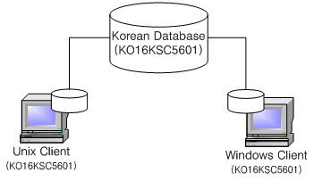

Getting Started Guide
=====================

#### Altibase 7.1

Altibase® Administration

<br><br><br><br><br><br><!-- PDF 변환을 위한 여백입니다. --> 


<!-- PDF 변환을 위한 여백입니다. --> 

<div align="left">
    
</div>
<br><br><!-- PDF 변환을 위한 여백입니다. --> 


<!-- PDF 변환을 위한 여백입니다. --> 

<pre>
Altibase Administration Getting Started Guide
Release 7.1
Copyright ⓒ 2001~2023 Altibase Corp. All Rights Reserved.<br>
본 문서의 저작권은 ㈜알티베이스에 있습니다. 이 문서에 대하여 당사의 동의없이 무단으로 복제 또는 전용할 수 없습니다.<br>
<b>㈜알티베이스</b>
08378 서울시 구로구 디지털로 306 대륭포스트타워Ⅱ 10층
전화 : 02-2082-1114
팩스 : 02-2082-1099
고객서비스포털 : <a href='http://support.altibase.com'>http://support.altibase.com</a>
홈페이지      : <a href='http://www.altibase.com/'>http://www.altibase.com</a></pre>


<br><!-- START doctoc generated TOC please keep comment here to allow auto update -->
<!-- DON'T EDIT THIS SECTION, INSTEAD RE-RUN doctoc TO UPDATE -->

# 목차

- [서문](#서문)
  - [이 매뉴얼에 대하여](#이-매뉴얼에-대하여)
- [1.Altibase 설치](#1.altibase-설치)
  - [설치 과정](#설치-과정)
  - [고려 사항](#고려-사항)
- [2.Altibase 실행과 종료](#2.altibase-실행과-종료)
  - [Altibase의 실행](#altibase의-실행)
  - [Altibase의 종료](#altibase의-종료)
- [3.Altibase로 작업하기](#3.Altibase로-작업하기)
  - [지원되는 SQL문](#지원되는-SQL문)
  - [SQL문 실행 방법](#sql문-실행-방법)
  - [샘플 스키마](#샘플-스키마)
- [4.데이터베이스 객체 및 권한 관리](#4.데이터베이스-객체-및-권한-관리)
  - [데이터베이스 객체 개요](#데이터베이스-객체-개요)
  - [권한 관리 개요](#권한-관리-개요)
- [5.다국어 지원](#5.다국어-지원)
  - [다국어 지원 개요](#다국어-지원-개요)
  - [다국어 지원을 위한 캐릭터셋 분류](#다국어-지원을-위한-캐릭터셋-분류)
  - [유니코드를 이용한 다국어 지원](#유니코드를-이용한-다국어-지원)
  - [다국어 데이터베이스를 위한 환경 설정](#다국어-데이터베이스를-위한-환경-설정)
  - [데이터베이스 캐릭터셋 선택시 고려사항](#데이터베이스-캐릭터셋-선택시-고려사항)
- [6.데이터베이스 이중화](#6.데이터베이스-이중화)
  - [이중화 정의](#이중화-정의)
  - [이중화 방법](#이중화-방법)
  - [이중화 기능의 사용 방법](#%이중화-기능의-사용-방법)
  - [DDL 수행 시 주의사항](#ddl-수행-시-주의사항)
- [7.Fail-Over](#7fail-over)
  - [Fail-Over의 개요](#fail-over의-개요)
  - [Fail Over 사용 방법](#fail-over-사용-방법)
- [8.백업 및 복구](#8백업-및-복구)
  - [백업 정책](#백업-정책)
  - [복구 정책](#복구-정책)
- [9.응용프로그램 작성](#9응용프로그램-작성)
  - [응용 프로그램 작성 방법](#응용-프로그램-작성-방법)
  - [Altibase CLI를 활용한 프로그램](#altibase-cli를-활용한-프로그램)
  - [JDBC를 활용한 프로그램](#jdbc를-활용한-프로그램)
  - [C/C++ Precompiler를 활용한 프로그램](#cc-precompiler를-활용한-프로그램)

<!-- END doctoc generated TOC please keep comment here to allow auto update -->

<br>

서문
====

### 이 매뉴얼에 대하여

이 매뉴얼은 Altibase의 기능, 제품 구성요소, 그리고 사용법에 대해 설명한다.

#### 대상 사용자

이 매뉴얼은 다음과 같은 Altibase 사용자를 대상으로 작성되었다.

-   데이터베이스 관리자

-   성능 관리자

-   데이터베이스 사용자

-   응용 프로그램 개발자

-   기술지원부

다음과 같은 배경 지식을 가지고 이 매뉴얼을 읽는 것이 좋다.

-   컴퓨터, 운영 체제 및 운영 체제 유틸리티 운용에 필요한 기본 지식

-   관계형 데이터베이스 사용 경험 또는 데이터베이스 개념에 대한 이해

-   컴퓨터 프로그래밍 경험

-   데이터베이스 서버 관리, 운영 체제 관리 또는 네트워크 관리 경험

#### 소프트웨어 환경

이 매뉴얼은 데이터베이스 서버로 Altibase 버전 7.1을 사용한다는 가정 하에
작성되었다.

#### 이 매뉴얼의 구성

이 매뉴얼은 다음과 같이 구성되어 있다.

-   제 1장 Altibase 설치

-   제 2장 Altibase 실행과 종료  
    이 장은 Altibase 서버가 데이터베이스 관리자에 의해 실행되는 과정과 종료에 대해 설명한다.
    
-   제 3장 Altibase로 작업하기

-   제 4장 데이터베이스 객체 및 권한 관리  
    이 장은 특정 사용자에 의해 생성된 제약조건, 인덱스, 시퀀스, 이중화, 테이블, 사용자 등 데이터베이스 객체들에 대해 설명한다. 또한, 시스템과 스키마 객체 접근 권한에 대해 설명한다.
    
-   제 5장 다국어 지원  
    Altibase가 지원하는 다국어 지원 구조 및 다국어 지원을 위한 환경 설정과 고려사항 등을 살펴본다.
    
-   제 6장 데이터베이스 이중화  
    이 장은 데이터베이스 이중화 기능의 올바른 운영을 위해 데이터베이스 이중화 방법과 이중화 기능의 사용 방법에 대해 설명한다.
    
-   제 7장 Fail-Over  
    이 장은 Altibase에서 Fail-Over의 개념과 사용 방법에 대해 설명한다.

-   제 8장 백업 및 복구  
    이 장은 Altibase 백업 및 복구에 대한 기본적인 개념을 설명한다.

-   제 9장 응용프로그램 작성  
    이 장은 Altibase CLI, JDBC, ODBC, C/C++ Precompiler를 사용하여 Altibase를 활용하는 응용 프로그램 작성법에 관하여 설명한다.

#### 문서화 규칙

이 절에서는 이 매뉴얼에서 사용하는 규칙에 대해 설명한다. 이 규칙을 이해하면 이 매뉴얼과 설명서 세트의 다른 매뉴얼에서 정보를 쉽게 찾을 수 있다.

여기서 설명하는 규칙은 다음과 같다.

-   구문 다이어그램

-   샘플 코드 규칙

##### 구문 다이어그램

이 매뉴얼에서는 다음 구성 요소로 구축된 다이어그램을 사용하여, 명령문의 구문을 설명한다.

| 구성 요소                                  | 의미                                                         |
| ------------------------------------------ | ------------------------------------------------------------ |
|  | 명령문이 시작한다. 완전한 명령문이 아닌 구문 요소는 화살표로 시작한다. |
|  | 명령문이 다음 라인에 계속된다. 완전한 명령문이 아닌 구문 요소는 이 기호로 종료한다. |
|  | 명령문이 이전 라인으로부터 계속된다. 완전한 명령문이 아닌 구문 요소는 이 기호로 시작한다. |
|  | 명령문이 종료한다.                                           |
|  | 필수 항목                                                    |
|  | 선택적 항목                                                  |
|  | 선택사항이 있는 필수 항목. 한 항목만 제공해야 한다.          |
|  | 선택사항이 있는 선택적 항목                                  |
|  | 선택적 항목. 여러 항목이 허용된다. 각 반복 앞부분에 콤마가 와야 한다. |

##### 샘플 코드 규칙

코드 예제는 SQL, Stored Procedure, iSQL 또는 다른 명령 라인 구문들을 예를 들어 설명한다.

아래 테이블은 코드 예제에서 사용된 인쇄 규칙에 대해 설명한다.

| 규칙         | 의미                                                                                | 예제                                                                                                         |
|--------------|-------------------------------------------------------------------------------------|--------------------------------------------------------------------------------------------------------------|
| [ ]          | 선택 항목을 표시                                                                    | VARCHAR [(*size*)] [[FIXED \|] VARIABLE]                                                                     |
| { }          | 필수 항목 표시. 반드시 하나 이상을 선택해야 되는 표시                               | { ENABLE \| DISABLE \| COMPILE }                                                                             |
| \|           | 선택 또는 필수 항목 표시의 인자 구분 표시                                           | { ENABLE \| DISABLE \| COMPILE } [ ENABLE \| DISABLE \| COMPILE ]                                            |
| . . .        | 그 이전 인자의 반복 표시 예제 코드들의 생략되는 것을 표시                           | SQL\> SELECT ename FROM employee; ENAME  ----------------------- SWNO  HJNO  HSCHOI  . . . 20 rows selected. |
| 그 밖에 기호 | 위에서 보여진 기호 이 외에 기호들                                                   | EXEC :p1 := 1; acc NUMBER(11,2);                                                                             |
| 기울임 꼴    | 구문 요소에서 사용자가 지정해야 하는 변수, 특수한 값을 제공해야만 하는 위치         | SELECT \* FROM *table_name*; CONNECT *userID*/*password*;                                                    |
| 소문자       | 사용자가 제공하는 프로그램의 요소들, 예를 들어 테이블 이름, 칼럼 이름, 파일 이름 등 | SELECT ename FROM employee;                                                                                  |
| 대문자       | 시스템에서 제공하는 요소들 또는 구문에 나타나는 키워드                              | DESC SYSTEM_.SYS_INDICES_;                                                                                   |

#### 관련 자료

자세한 정보를 위하여 다음 문서 목록을 참조한다.

-   Installation Guide

-   Administrator’s Manual

-   Replication Manual

-   Precompiler User’s Manual

-   ODBC User's Manual

-   CLI User's Manual

-   API User’s Manual

-   SQL Reference

-   Utilities Manual

-   General Reference

-   Stored Procedures Manual

-   JDBC User's Manual

-   iSQL User's Manual

#### Altibase는 여러분의 의견을 환영합니다.

이 매뉴얼에 대한 여러분의 의견을 보내주시기 바랍니다. 사용자의 의견은 다음 버전의 매뉴얼을 작성하는데 많은 도움이 됩니다. 보내실 때에는 아래 내용과 함께 고객서비스포털(*http://support.altibase.com/kr/* )로 보내주시기 바랍니다.

-   사용 중인 매뉴얼의 이름과 버전

-   매뉴얼에 대한 의견

-   사용자의 성함, 주소, 전화번호

이 외에도 Altibase 기술지원 설명서의 오류와 누락된 부분 및 기타 기술적인 문제들에 대해서 이 주소로 보내주시면 정성껏 처리하겠습니다. 또한, 기술적인 부분과 관련하여 즉각적인 도움이 필요한 경우에도 고객서비스포털을 통해 서비스를 요청하시기 바랍니다.

여러분의 의견에 항상 감사드립니다.

1.Altibase 설치
=============

이 장은 Altibase 설치 절차를 간략하게 소개한다. Altibase 서버를 완벽하게 설치하는 방법은 *Installation Guide*를 참고하기 바란다.

이 장은 다음 절로 구성되어 있다.

-   설치 과정

-   고려 사항

### 설치 과정

#### 패키지 인스톨러 다운로드

Altibase 고객지원서비스 포털([http://support.altibase.com/](http://support.altibase.com/) )을 방문하여 본인의 운영 체제에 적합한 인스톨러를 다운로드 받는다.

인스톨러 파일에 대한 정보는 *Installation Guide*에서 2장 패키지 인스톨러를 이용한 제품 설치를 참조하기 바란다.

#### 패키지 인스톨러 실행

패키지 인스톨러 실행에 대한 자세한 설명은 *Installation Guide*에서 2장 패키지 인스톨러를 이용한 제품 설치를 참조하기 바란다.

패키지 인스톨러를 실행하면 아래의 작업들이 자동으로 수행된다.

##### ALTIBASE_HOME 디렉터리 생성

이는 실행 파일, 설정 파일, 및 라이브러리 파일들이 설치될 디렉터리이다. 패키지 인스톨러는 사용자에게 이 디렉터리를 임의로 선택하도록 한다.

##### Altibase 프로퍼티 값 설정

패키지 인스톨러는 기본 프로퍼티 설정을 보여주고 원하는 값으로 변경하도록 한다. 설치 완료 후에 사용자가 직접 \$ALTIBASE_HOME/conf/altibase.properties 파일을 수정해서 이들 프로퍼티를 변경할 수도 있다.

##### 데이터베이스 생성을 위한 스크립트 생성

패키지 인스톨러는 이후에 데이터베이스를 생성하는 데 사용할 수 있는 스크립트를 생성할 수 있다. 이 스크립트는 데이터베이스 생성 작업을 아주 간단하게 할 수 있도록 도와준다.

#### 데이터베이스 생성

설치 완료 후, 사용자는 데이터베이스를 생성해야 한다.

패키지 인스톨러를 이용한 설치 단계에서 데이터베이스 생성을 하지 않은 경우, 아래와 같이 데이터베이스를 생성할 수 있다.

- 설치 단계에서 데이터베이스 생성을 위한 프로퍼티를 입력한 경우, \$ALTIBASE_HOME/install/post_install.sh 스크립트를 사용하여 데이터베이스를 생성할 수 있다.
  
  ```
  $ sh post_install.sh dbcreate
  ```


- 설치 단계에서 데이터베이스 생성을 위한 프로퍼티를 입력하지 않은 경우, \$ALTIBASE_HOME/bin/server 스크립트를 사용해서 데이터베이스를 생성할 수 있다.
  
  ```
  $ server create utf8 utf8
  ```


### 고려 사항

#### Altibase 설치시 고려사항

##### 커널 파라미터 설정

설치시에 커널 파라미터를 설정하지 않았다면 아래의 매뉴얼을 참고하여 수동으로 커널 파라미터를 설정한다.

-   *Installation Guide* \>2장 Altibase 제품 설치\> 시스템 파라미터 확인

-   *Installation Guide* \> A. 부록 OS별 커널 파라미터 설정

시스템 커널 파라미터는 root 계정으로 설정할 수 있다.


2.Altibase 실행과 종료
====================

이 장에서는 Altibase 설치 완료 후 데이터베이스 구동 및 종료를 어떻게 하는지에 대해서 설명한다.

### Altibase의 실행

Altibase 서버를 실행하는 방법은 server 스크립트를 사용하거나, 데이터베이스 관리자가 sys 계정을 사용하여 서버에 로그인 시 -sysdba 모드로 서버에 접속한 후 부여된 관리자 권한을 이용하여 실행할 수 있다.

Altibase 서버가 실행되는 과정을 살펴보면, 먼저 프로퍼티를 읽어들이고 시스템 메모리 검사를 거친 후, Altibase 시스템 환경 초기화, 시스템 데이터 초기화, 시그널 핸들링, 데이터베이스 공간의 메모리 초기화, 질의 처리 모듈 초기화, 마지막으로 쓰레드들을 초기화함으로써 Altibase 서버의 구동이 완료된다.

Altibase를 구동하는 명령어는 Altibase를 설치한 계정으로만 수행이 가능하다. 아래에서 iSQL 유틸리티 (Altibase패키지와 함께 배포됨)를 이용해서 데이터베이스를 구동하는 방법을 보여준다. Altibase 구동에 대한 자세한 내용은 *Administrator's Manual*을 참고하기 바란다. 그리고, iSQL 유틸리티에 대한 내용은 *iSQL User's Manual*을 참고하기 바란다.

```
$ isql -u sys -p manager -sysdba
-------------------------------------------------------
Altibase Client Query utility.
     Release Version 7.1.0.1
     Copyright 2000, Altibase Corporation or its subsidiaries.
     All Rights Reserved.
-------------------------------------------------------
ISQL_CONNECTION = UNIX, SERVER = 127.0.0.1, PORT_NO = 20300
iSQL(sysdba)> 
iSQL(sysdba)> startup
Connecting to the DB server.... Connected.
TRANSITION TO PHASE : PROCESS
TRANSITION TO PHASE : CONTROL
TRANSITION TO PHASE : META
  [SM] Recovery Phase - 1 : Preparing Database
                          : Dynamic Memory Version => Parallel Loading
  [SM] Recovery Phase - 2 : Loading Database
  [SM] Recovery Phase - 3 : Skipping Recovery & Starting Threads...
                            Refining Disk Table
  [SM] Refine Memory Table : ..................................................... [SUCCESS]
[SM] Rebuilding Indices [Total Count:100] ............................... [SUCCESS]

TRANSITION TO PHASE : SERVICE
  [CM] Listener started : TCP on port 20300
  [CM] Listener started : UNIX
[RP] Initialization : [PASS]

--- STARTUP Process SUCCESS ---
Command execute success.
```

또는 server 스크립트 명령을 이용하여 서버를 구동할 수 있다. server 스크립트에 대한 자세한 내용은 *Utilities Manual*을 참고하기 바란다.

```
$ server start
-------------------------------------------------------     
Altibase Client Query utility.
     Release Version 7.1.0.1
     Copyright 2000, Altibase Corporation or its subsidiaries.
     All Rights Reserved.
-------------------------------------------------------
ISQL_CONNECTION = UNIX, SERVER = 127.0.0.1, PORT_NO = 20300
[ERR-910FB : Connected to idle instance]
Connecting to the DB server... Connected.
TRANSITION TO PHASE : PROCESS
TRANSITION TO PHASE : CONTROL
TRANSITION TO PHASE : META
  [SM] Recovery Phase - 1 : Preparing Database
                          : Dynamic Memory Version => Parallel Loading
  [SM] Recovery Phase - 2 : Loading Database
  [SM] Recovery Phase - 3 : Skipping Recovery & Starting Threads...
                            Refining Disk Table
  [SM] Refine Memory Table : ....................................................... [SUCCESS]
  [SM] Rebuilding Indices [Total Count:100] .................................. [SUCCESS]

TRANSITION TO PHASE : SERVICE
  [CM] Listener started : TCP on port 20300
  [CM] Listener started : UNIX
  [RP] Initialization : [PASS]

--- STARTUP Process SUCCESS ---
Command execute success.
```


### Altibase의 종료

Altibase 서버의 종료는 server 스크립트 명령을 이용하거나, 데이터베이스 관리자가 sys 사용자로 -sysdba 모드를 통해서 서버에 접속 후 부여된 권한을 이용하여 실행할 수 있다.

서버를 종료시키는 명령인 shutdown은 세 가지 옵션을 갖고 있으며, 각각의 옵션에 따라 서버를 종료하는 방식이 다르다.

Altibase의 shutdown 명령어는 Altibase를 설치한 계정으로만 수행이 가능하다.

#### normal

서버를 정상적으로 종료하는 방식으로, 클라이언트들이 모두 종료될 때까지 서버의 종료 작업을 대기하는 방법이다. 서버가 종료하면서 수행하는 일들은 클라이언트-서버간 통신 세션을 감지하는 쓰레드의 종료, 서비스 쓰레드의 종료, 자료 저장 관리자의 종료, 그리고 Altibase 서버 프로세스가 완전히 종료되기를 대기하는 일들이다. 이렇게 종료했을 때 다음과 같은 메시지가 출력된다.

```
iSQL(sysdba)> shutdown normal;
Ok..Shutdown Proceeding....

TRANSITION TO PHASE : Shutdown Altibase
  [RP] Finalization : PASS
shutdown normal success.
```


#### immediate

서버를 종료할 때, Altibase 서버가 현재 연결된 세션들을 강제로 단절하고, 현재 실행 중인 트랜잭션들을 철회(rollback)한 다음, 서버를 종료하는 방법이다.

```
iSQL(sysdba)> shutdown immediate
Ok..Shutdown Proceeding....

TRANSITION TO PHASE : Shutdown Altibase
  [RP] Finalization : PASS
shutdown immediate success.
```

"server stop" 스크립트 명령을 사용하는 것과 동일하다.

```
$ server stop
-------------------------------------------------------
     Altibase Client Query utility.
     Release Version 7.1.0.1
     Copyright 2000, Altibase Corporation or its subsidiaries.
     All Rights Reserved.
-------------------------------------------------------
ISQL_CONNECTION = UNIX, SERVER = 127.0.0.1, PORT_NO = 20300
Ok..Shutdown Proceeding....

TRANSITION TO PHASE : Shutdown Altibase
  [RP] Finalization : PASS
shutdown immediate success.
```


#### abort

Altibase 서버를 "kill -9" 시스템 명령을 사용하여 강제로 죽이는 방법이다. 이 방법으로 Altibase 서버를 종료하면, 데이터베이스가 완전하지 못하여 다음에 Altibase 서버를 실행할 때 데이터베이스 복구 과정을 거쳐야 한다.

```
iSQL(sysdba)> shutdown abort
```


"server kill" 스크립트 명령을 사용하는 것과 동일하다.

```
$ server kill 
-------------------------------------------------------
     Altibase Client Query utility.
     Release Version 7.1.0.1
     Copyright 2000, Altibase Corporation or its subsidiaries.
     All Rights Reserved.
-------------------------------------------------------
ISQL_CONNECTION = UNIX, SERVER = 127.0.0.1, PORT_NO = 20300
$
```


3.Altibase로 작업하기
===================

이 장은 다음의 절을 포함한다.

-   지원되는 SQL문

-   SQL문 실행 방법

-   샘플 스키마

### 지원되는 SQL문 

앞선 장을 통해서 데이터베이스를 생성했고, 데이터베이스 서버를 구동하고 종료하는 방법을 알아 보았다. 이제 사용자들은 테이블 같은 데이터베이스 객체를 생성하는 DDL 구문으로 시작해서 테이블에 데이터를 생성하는 등의 작업을 하는 DML 구문을 실행해 보기를 원할 것이다. 다양한 종류의 데이터베이스 객체에 대한 설명은 "4장: 데이터베이스 객체 및 권한 관리"를 참고하기 바란다.

Altibase 서버는 ANSI 92 SQL 표준을 완벽하게 지원하고, 몇몇 확장된 기능도 제공한다. Altibase 서버가 지원하는 모든 SQL 구문에 대한 온전한 설명은 *SQL Reference*를 참고하기 바란다.

### SQL문 실행 방법

#### iSQL을 이용한 SQL문 실행

SQL 구문을 실행하는 가장 간단한 방법은 iSQL 유틸리티를 이용하는 것이다. 이는 명령행 인터페이스로 Altibase 패키지에 포함되어 배포된다. iSQL 유틸리티 사용법은 *iSQL User’s Manual*을 참고한다.

#### 사용자 작성 응용프로그램으로 SQL문 실행

SQL문은 사용자가 작성한 클라이언트 응용프로그램으로 실행될 수도 있다. Altibase를 위한 응용프로그램은 "9장: 응용프로그램 작성"을 참고하여 작성할 수 있다.

### 샘플 스키마

Altibase 서버 패키지에는 샘플 스키마를 생성하는 SQL문이 저장되어 있는 스크립트 파일이 포함되어 있다. 이 샘플 스키마에는 데이터베이스 테이블과 다른 객체들이 포함되며, 또한 스크립트 파일에는 샘플 데이터를 생성하는 SQL문도 포함되어 있다. 아래와 같이 \$ALTIBASE_HOME/sample/APRE/schema/schema.sql을 iSQL로 실행하면 샘플 스키마가 생성된다.

```
$ isql -s localhost -u sys -p manager -f 
$ALTIBASE_HOME/sample/APRE/schema/schema.sql
```

제품 매뉴얼내의 많은 예제들이 이 샘플 스키마를 기반으로 작성되었다. 이 예제들을 따라해 보고 싶거나 SQL문 실행을 연습하기 위한 샘플 데이터가 필요하다면, 위의 스크립트를 실행해서 샘플 스키마를 생성하길 권한다.

이 샘플 스키마의 모든 객체와 데이터에 대한 자세한 설명은 *General Reference*를 참고하기 바란다.

4.데이터베이스 객체 및 권한 관리
==============================

이 장에서는 스키마 객체와 비-스키마 객체를 구분하고 각각에 포함되는 데이터베이스 객체에 대해 설명한다.

### 데이터베이스 객체 개요

데이터베이스 객체는 특정 스키마에 속하여 관리되는 스키마 객체와 스키마와 관계없이 데이터베이스 전체에서 관리되는 비-스키마 객체로 구분된다. 이 장에서는 스키마 객체와 비-스키마 객체를 구분하고 각각에 포함되는 데이터베이스 객체에 대해 설명한다.

#### 스키마 객체

스키마란 데이터 또는 객체들의 논리적 집합으로 한 사용자는 하나의 스키마를 소유하고 SQL문에 의해 관리한다. 이러한 스키마에 포함되는 객체를 스키마 객체라고 하며, Altibase는 다음과 같은 스키마 객체를 제공한다.

##### 테이블(Table) 

테이블은 가장 기본적인 데이터 저장 단위로 칼럼들로 구성된 레코드들의 집합이다. Altibase의 테이블은 데이터의 저장 공간에 따라 메모리 테이블과 디스크 테이블로 구별된다. 그리고 시스템이 생성하고 관리하는 시스템 테이블과 일반 사용자가 생성하는 일반 테이블로 구별될 수도 있다.

시스템 테이블은 "데이터 딕셔너리"라고 하며 Altibase에서 제공하는 데이터 딕셔너리의 종류와 정보에 대해서는 *General Reference*의 "데이터 딕셔너리"에서 자세히 설명한다.

이중화 대상 테이블의 경우 테이블 관리가 특별하며 대용량 테이블의 경우에도 주의를 요하는 사항들이 있다.

이에 대한 보다 자세한 내용은 *Administrator's Manual* " 5장 데이터베이스 객체 및 권한"의 "테이블" 절에서 자세히 설명한다.

##### **파티션드 테이블(Partitioned Table)**

테이블의 데이터를 여러 조각(각 조각을 파티션이라고 한다)으로 나누어 서로 다른 테이블스페이스에 저장하는 경우, 이 테이블을 파티션드 테이블(Partitioned Table)이라고 한다. 대용량 테이블의 경우 파티션드 테이블을 활용하면 데이터 관리가 용이할 것이다.

파티션드 테이블에 대한 자세한 내용은 *Administrator's Manual* "7장 파티션드 객체"를 참조한다.

##### **파티션드 인덱스(Partitioned Index)** 

인덱스가 파티션되는 여부에 따라 파티션드 인덱스(partitioned index) 또는 논파티션드 인덱스(non partitioned index)로 분류한다. 논파티션드 인덱스는 파티션으로 분할되지 않은 인덱스를 의미하며, 파티션드 인덱스는 파티션드 테이블과 마찬가지로 파티션 조건에 따라 분리한 인덱스를 의미한다.

파티션드 인덱스에 대한 자세한 내용은 *Administrator's Manual* "7장 파티션드 객체"를 참조한다.

##### 임시 테이블(Temporary Table) 

하나의 세션 또는 트랜잭션이 유지되는 동안에 데이터를 일시적으로 보관하기 위해 임시 테이블을 사용할 수 있다. 임시 테이블을 이용하면 복잡한 질의를 사용할 때 수행 속도를 높일 수 있다.

임시 테이블은 휘발성 테이블스페이스에만 생성할 수 있다.

##### 큐 테이블(Queue Table) 

Altibase는 메시지 큐잉 기능을 이용하여 데이터베이스와 사용자 프로그램간의 비동기 데이터 통신을 지원한다. 이때 사용되는 큐 테이블은 데이터베이스 객체의 하나로써 일반 테이블과 마찬가지로 DDL과 DML로 제어할 수 있다.

큐 테이블의 개념과 기능에 대해서는 *Administrator's Manual* "5장 데이터베이스 객체 및 권한"의 "큐" 절에서 자세히 설명한다.

##### 제약조건(Constraint) 

제약조건이란 테이블의 데이터 삽입 또는 변경 시 데이터의 일관성을 유지할 수 있도록 부과하는 조건이다.

제약조건의 대상에 따라 칼럼 제약조건과 테이블 제약조건으로 구별할 수 있다. Altibase는 아래의 제약조건을 지원한다.

-   NOT NULL / NULL 제약조건

-   CHECK 제약조건

-   유일 키(unique key) 제약조건

-   주 키(primary key) 제약조건

-   외래 키(foreign key) 제약조건

-   TIMESTAMP 제약조건

이에 대한 보다 자세한 내용은 *Administrator's Manual* "5장 데이터베이스 객체 및 권한"의 "제약조건" 절에서 자세히 설명한다.

##### 인덱스(Index) 

인덱스는 테이블의 특정 칼럼들에 대해 색인을 생성하여 그 테이블의 레코드들에 대한 빠른 접근이 가능하도록 한다. 즉, 인덱스를 사용하여 DML문의 처리 성능을 향상시킬 수 있다.

이에 대한 보다 자세한 내용은 *Administrator's Manual* "5장 데이터베이스 객체 및 권한"의 "인덱스" 절에서 자세히 설명한다.

##### 뷰(View) 

뷰는 실제 데이터 자체는 포함하지 않고, 하나 이상의 테이블, materialized view 또는 뷰를 기반으로 한 논리적 테이블 (logical table)이다.

이에 대한 보다 자세한 내용은 *Administrator's Manual* "5장 데이터베이스 객체 및 권한"의 "뷰" 절에서 자세히 설명한다.

##### Materialized View

Materialized view란 쿼리의 결과를 데이터로 저장하고 있는 데이터베이스 객체이다. 하나 이상의 테이블, 뷰, 및 다른 materialized view에 기반하여 데이터를 구성할 수 있다.

이에 대한 보다 자세한 내용은 *Administrator's Manual* "5장 데이터베이스 객체 및 권한"의 "Materialized view" 절에서 자세히 설명한다.

##### 시퀀스(Sequence) 

Altibase는 유일키를 생성하기 위한 키 생성자로 시퀀스를 제공한다.

이에 대한 보다 자세한 내용은 *Administrator's Manual* "5장 데이터베이스 객체 및 권한"의 "시퀀스" 절에서 자세히 설명한다.

##### 시노님(Synonym) 

테이블, 시퀀스, 뷰, 저장 프로시저 및 저장 함수에 대한 별칭(alias)을 부여하여 객체 사용에 대한 투명성을 보장할 수 있는 시노님을 제공한다.

이에 대한 보다 자세한 내용은 *Administrator's Manual* "5장 데이터베이스 객체 및 권한"의 "시노님" 절에서 자세히 설명한다.

##### 저장 프로시저 및 저장 함수(Stored Procedure or Function)

저장 프로시저(Stored Prodedure)란 SQL문들과 흐름 제어문, 할당문, 오류 처리 루틴 등을 이용해 전체 업무 절차를 프로그래밍하여 하나의 모듈로 만든 후 데이터베이스에 영구적으로 저장해 두고, 모듈 이름만을 호출하여 전체 업무 절차를 서버에서 한번에 수행하는 데이터베이스 객체이다. 리턴 값을 가지지 않느냐와 가지느냐에 따라 저장 프로시저와 저장 함수로 구별된다.

이에 대한 보다 자세한 내용은 *Administrator's Manual* "5장 데이터베이스 객체 및 권한"의 "저장 프로시저 및 저장 함수" 절에서 전반적인 관리 개요를 설명한다.

저장 프로시저의 특장점, 자세한 관리 방법 등에 대해서는 *Stored Procedures Manual*에서 자세히 설명한다.

##### 타입 세트(Type Set) 

타입 세트(Type Set)란 저장 프로시저 및 저장 함수에서 사용하는 사용자 정의 타입들을 한 곳에 모아서 관리하도록 해 주는 데이터베이스 객체이다.

이에 대한 보다 자세한 내용은 *Stored Procedures Manual*에서 자세히 설명한다.

##### 데이터베이스 트리거(Database Trigger) 

트리거란 테이블에 데이터가 삽입, 삭제, 또는 갱신될 때 시스템에 의해 작동되어 특정 작업 절차를 자동으로 수행할 수 있도록 하는 저장 프로시저의 한 종류이다. 사용자는 테이블에 대해 제약조건과 트리거를 정의하여 데이터의 일관성을 유지할 수 있다.

이에 대해서는 *Administrator's Manual* "5장 데이터베이스 객체 및 권한"의 "트리거" 절에서 자세히 설명한다.

##### 데이터베이스 링크(Database Link)

데이터베이스 링크는 지역적으로 분리되어 있으나 네트워크로 연결된 데이터베이스 서버들을 연동하여 개별 데이터들을 통합해서 하나의 결과를 생성할 수 있게 한다.

이에 대해서는 *Database Link User's Manual*에 더 자세히 기술되어 있다.

##### 외부 프로시저 및 외부 함수(External Procedure or Function) 

외부 프로시저 또는 외부 함수 객체는 사용자 정의 C/C++ 함수와 일대일로 대응하는 데이터베이스 객체이다. 사용자 정의 함수의 실행은 외부 프로시저 또는 외부 함수 객체를 통해 이루어진다. 리턴 값을 가지는 여부에 따라 외부 프로시저와 외부 함수로 구별된다.

자세한 내용은 *C/C++ External Procedures Manual*을 참고하도록 한다.

##### 라이브러리(Library) 

외부 프로시저와 연결된 사용자 정의 C/C++ 함수를 포함하는 동적 라이브러리 파일을 Altibase 서버가 식별할 수 있도록 해야 한다. 이를 위해 Altibase는 동적 라이브러리 파일에 일대일로 대응하는 라이브러리 객체라는 데이터베이스 객체를 제공한다.

자세한 내용은 *C/C++ External Procedures Manual*을 참고하도록 한다.

#### 비스키마 객체

특정 스키마에 소속되지 않고 전체 데이터베이스 수준에서 관리되는 객체를 비스키마 객체라고 한다. Altibase는 다음과 같은 비스키마 객체를 제공한다.

##### 디렉터리(Directory) 

저장프로시저의 파일 제어 기능은 운영 체제의 텍스트 파일에 대한 읽기 및 쓰기 기능을 제공한다. 이 기능을 이용하여 사용자는 저장프로시저 실행에 대한 별도의 메시지 등을 파일에 남길 수도 있으며, 파일로 결과를 보고하거나 파일로부터 데이터를 읽어와 테이블에 삽입하는 등 다양한 작업을 수행할 수 있다. 디렉터리 객체는 이러한 저장프로시저에서 접근하는 파일들이 저장되어 있는 디렉터리에 대한 정보를 관리하는데 사용된다.

디렉터리 객체에 대한 자세한 기능은 *SQL Reference*를 참고한다.

저장프로시저 내에서의 파일 제어 방법은 *Stored Procedures Manual*을 참고한다.

##### 이중화(Replication)

이중화는 시스템이 자동으로 한 지역서버에서 원격 서버로 데이터를 전송하고 복제하여 다른 서버들간의 테이블 데이터를 동일하게 유지해 줄 수 있도록 하는 객체이다.

이중화에 대한 자세한 기능과 이중화 관리에 대해서는 *Replication Manual*을 참조한다.

##### 테이블스페이스(Tablespace) 

테이블스페이스는 가장 큰 논리적 데이터 저장 단위로 데이터베이스는 여러 개의 테이블스페이스 단위로 나뉘어져 관리된다.

Altibase는 데이터베이스를 생성하면 자동적으로 시스템 테이블스페이스가 생성되며, 사용자가 임의로 사용자 정의 테이블스페이스를 생성하기도 한다.

Altibase는 데이터베이스 객체가 디스크에 상주하는 디스크 테이블스페이스와 메모리에 상주하는 메모리 테이블스페이스, 메모리에 상주하면서 로깅을 하지않는 휘발성 테이블스페이스를 지원한다.

테이블스페이스에 대한 자세한 내용은 *Administrator's Manual* 6장 테이블스페이스를 참조한다.

##### 사용자(User) 

사용자 계정은 Altibase 접속을 위해 필요하며, 스키마의 소유자이기도 하다. 시스템에 의해 생성되어 전체 시스템의 관리자인 시스템 사용자와 일반 사용자로 구분된다. 일반 사용자의 경우 데이터베이스에 접근하여 데이터를 조작하기 위해서는 적절한 권한이 필요하다.

사용자 권한에 대해서는 *Administrator's Manual* "5장 데이터베이스 객체 및 권한"의 "권한" 절에서 자세히 설명한다.

##### 작업(Job) 

작업(Job)은 저장 프로시저에 실행 일정을 더한 것이다. JOB 객체를 생성할 때 실행할 저장 프로시저와 실행 시각, 실행 반복 간격 등의 일정을 설정할 수 있다. 생성된 JOB이 자동으로 돌아가도록 하기 위해서는 JOB_SCHEDULER_ENABLE 프로퍼티를 1로 설정해야 한다. JOB의 생성, 변경 및 삭제와 작업 스케줄러에 대한 관리는 SYS 사용자에 의해서만 가능하다.

이에 대해서는 *Administrator's Manual* "5장 데이터베이스 객체 및 권한"의 "작업(Job)" 절에서 자세히 설명한다.

### 권한 관리 개요

사용자가 데이터베이스 객체 또는 데이터에 접근하기 위해서는 적절한 권한을 필요로 한다. 이 절에서는 사용자와 권한 및 객체와 권한에 대해 이를 관리하는 방법에 대해 설명한다.

#### 종류

Altibase는 시스템 권한, 객체 권한 및 롤(role)을 지원한다.

##### 시스템 권한(System Privilege) 

시스템 권한은 일반적으로 DBA가 관리를 하며, 데이터베이스에 특정한 작업을 수행하거나 모든 스키마에 있는 객체들을 관리할 수 있는 권한이다.

##### 객체 권한(Object Privilege) 

객체 권한은 객체의 소유자가 관리를 하며, 객체에 접근하고 조작할 수 있는 권한이다. Altibase가 지원하는 전체 권한의 목록은 *Administrator's Manual*의 권한 관리를 참조하고, 관련된 자세한 설명은 *SQL Reference*을 참조한다.

##### 롤(Role) 

롤은 권한들의 묶음이다. 여러 개의 권한을 사용자들에게 부여할 때 롤을 사용하는 것이 용이하다. 롤에 대한 자세한 설명과 제약에 대해서는 *SQL Reference*를 참조한다.

#### 권한 부여

데이터베이스 생성 이후 초기 상태에 존재하는 사용자인 SYSTEM_와 SYS 사용자의 경우 DBA로서 모든 권한을 갖고 있으며, 일반 사용자에게 임의의 권한을 부여할 수 있다.

일반 사용자의 경우 CREATE USER문 사용해 사용자가 생성될 때 CREATE SESSION, CREATE TABLE문 데이터베이스에 접근할 수 있는 최소 권한들을 시스템에 의해 자동으로 부여 받는다. 그 외의 권한들은 DBA로부터 명시적으로 권한을 부여 받아야 한다.

권한을 부여하고 관리하는 방법에 대한 자세한 내용은 *Administrator's Manual*의 권한 관리와 *SQL Reference*을 참조한다.

#### 권한 해제

SYSTEM_와 SYS 사용자를 제외한 일반 사용자의 경우 사용자에게 기 부여된 권한은 REVOKE문을 사용해 명시적으로 해제할 수 있다.

CREATE USER문으로 사용자 생성 시 시스템에 의해 자동으로 부여된 권한들도 필요한 경우 해제할 수 있다.

그러나 SYSTEM_와 SYS 사용자의 권한은 해제할 수 없다.


5.다국어 지원
===========

이 장에서는 Altibase가 지원하는 다국어 지원 구조 및 다국어 지원을 위한 환경 설정과 고려사항 등을 살펴본다.

### 다국어 지원 개요

#### 개념

다국어 지원을 한다는 것은 DBMS가 서로 다른 국가의 문자들을 저장하고 처리하는 것을 뜻한다. 즉, 하나의 DBMS로 한국어, 중국어, 일본어 등 서로 다른 문자를 사용하는 클라이언트에 대한 처리를 가능하게 한다.

#### 관련 용어

- 문자 집합(Character-Set)  
  어떤 특정 문자 집합을 숫자 값으로 나타낸 것을 의미한다. 아래 표는 하나의 문자를 UTF-8, UTF-16 BE, UTF-16 LE 캐릭터셋으로 인코딩할 때 각각 처리하는 값을 나타낸 표이다. 이와 같이 동일한 문자더라도 캐릭터셋을 변환하면 다르게 표현된다.
  
  | 문자 | UTF-8 | UTF-16 BE | UTF-16 LE |
  | ---- | ----- | --------- | --------- |
  | A    | 41    | 00 41     | 41 00     |
  | Ő    | C3 B6 | 00 F6     | F6 00     |
  
-   NLS(National Language Support)  
    특정 언어 환경에서 데이터베이스를 사용할 수 있도록 고안된 것이다. NLS를 지정하면 사용자의 애플리케이션에서 지정한 캐릭터셋으로 DBMS의 데이터를 읽거나 쓸 수 있다.

#### 다국어 지원 구조

다국어 지원은 데이터베이스의 캐릭터셋과 클라이언트 캐랙터셋 간의 변환에 의해 이뤄진다.

다국어 지원과 관련한 서버-클라이언트 관계를 다음 4가지로 분류하여 살펴본다.

-   동일한 캐릭터셋을 가진 데이터베이스와 클라이언트

-   상이한 캐릭터셋을 가진 데이터베이스와 클라이언트

-   상이한 캐릭터셋을 가진 데이터베이스와 다수의 클라이언트

-   유니코드 데이터 타입 지원

##### 동일한 캐릭터셋을 가진 데이터베이스와 클라이언트

데이터베이스와 클라이언트 간의 캐릭터셋이 서로 동일한 경우를 나타낸다.



[그림 5‑1] 동일한 캐릭터셋을 가진 데이터베이스와 클라이언트

위의 그림과 같이 데이터베이스도 KSC5601, 클라이언트도 KSC5601인 경우에는 캐릭터셋 간의 변환이 일어나지 않는다.

##### 상이한 캐릭터셋을 가진 데이터베이스와 클라이언트

데이터베이스와 클라이언트 간의 캐릭터셋이 서로 다른 경우에는 캐릭터셋 변환이 일어난다. 따라서 아래 그림과 같이 변환에 대한 손실이 있을 수 있다.


[그림 5‑2] 상이한 캐릭터셋을 가진 데이터베이스와 클라이언트

문자 변환에 따른 손실을 방지하려면 서버의 캐릭터셋은 클라이언트의 캐릭터셋을 포함하는 캐릭터셋이 되는 것이 유리하다.

즉 그림과 같이 문자 변환시 발생할 수 있는 손실을 방지하려면 데이터베이스의 캐릭터셋은 MS949가 되거나 이를 포함하는 UTF8로 설정해야 한다.

##### 상이한 캐릭터셋을 가진 데이터베이스와 다수의 클라이언트

다수의 클라이언트가 서로 다른 캐릭터셋을 가지는 경우 서버는 각각의 클라이언트 캐릭터셋을 모두 포함하는 캐릭터셋으로 지정해야 문자 변환에 따른 손실을 방지할 수 있다.


[그림 5‑3] 상이한 캐릭터셋을 가진 데이터베이스와 다수의 클라이언트

위의 그림은 하나의 데이터베이스와 연결된 각각의 클라이언트가 일본어, 중국어, 한국어 등을 사용하는 시스템 구성을 나타낸 것이다. 하나의 서버와 각각의 언어를 사용하고 있는 다수의 클라이언트 간의 문자 변환에 따른 손실을 막기 위하여 클라이언트들에서 사용되는 언어가 포함되는 캐릭터셋 UTF8을 데이터베이스 캐릭터셋으로 지정한다.

##### 유니코드 데이터 타입 지원

데이터베이스와 클라이언트가 각각 어떤 캐릭터셋으로 설정되었는지 상관없이 유니코드 데이터를 지원하는 NCHAR 또는 NVARCHAR 데이터 타입을 사용하여 다국어를 지원할 수 있다.

### 다국어 지원을 위한 캐릭터셋 분류

#### 데이터베이스 캐릭터셋

데이터베이스에 저장되는 데이터의 캐릭터셋을 의미한다.

SQL 표준이 ASCII 캐릭터셋이므로 이를 포함하는 캐릭터셋은 데이터베이스 캐릭터셋으로 사용 가능하다. 단, UTF16은 ASCII 캐릭터셋을 포함하지 않기 때문에 데이터베이스 캐릭터셋에서 제외된다.

##### 지정 방법

데이터베이스 생성 시, CREATE DATABASE 구문에서 지정할 수 있다.

##### 지원하는 캐릭터 셋

Altibase는 데이터베이스 캐릭터셋으로 다음 8가지 캐릭터셋을 지원한다. 이들 캐릭터셋은 모두 ASCII 캐릭터셋을 포함한다.

-   US7ASCII

-   KO16KSC5601

-   MS949

-   BIG5

-   GB231280

-   MS936 (타 제품의 GBK, ZHS16GBK, CP936 등과 동일한 캐릭터 셋임)

-   UTF8

-   SHIFTJIS

-   MS932 (타 제품의 CP932 동일한 캐릭터 셋임)

-   EUCJP

#### 내셔널 캐릭터셋

NCHAR, NVARCHAR 데이터 타입에서 사용되는 캐릭터셋으로, 유니코드 기반의 문자를 저장할 수 있다.

##### 지정 방법

데이터베이스 생성 시, CREATE DATABASE 구문에서 지정할 수 있다.

##### 지원하는 캐릭터 셋

Altibase는 내셔널 캐릭터셋으로 다음 2가지 캐릭터셋을 지원한다.

-   UTF8

-   UTF16 (Big Endian)

#### 클라이언트 캐릭터셋

데이터를 검색할 때 사용자에게 보여주는 클라이언트의 캐릭터셋이다.

서버로부터 전송된 데이터는 모두 클라이언트에서 지정한 캐릭터셋으로 변환되어 사용자에게 보여준다.

##### 지정 방법

환경변수 ALTIBASE_NLS_USE에서 지정할 수 있다.

##### 지원하는 캐릭터 셋

-   US7ASCII (기본값)

-   KO16KSC5601

-   MS949

-   BIG5

-   GB231280

-   MS936

-   UTF8

-   UTF16 (Big Endian)

-   SHIFTJIS

-   MS932

-   EUCJP

### 유니코드를 이용한 다국어 지원

#### 유니코드 개념

유니코드란 어떤 언어로 된 정보도 단일 캐릭터셋으로 저장할 수 있는 국제적으로 부호화된 캐릭터셋을 말한다. 또한 유니코드는 플랫폼, 프로그램 언어에 관계 없이 모든 문자는 유일한 값을 가진다.

따라서 여러 나라의 언어를 동시에 저장하고자 할 경우에 유용하게 사용할 수 있는 코드이다.

#### 유니코드 인코딩

유니코드 인코딩은 유니코드를 컴퓨터에 저장하기 위하여 바이트에 맵핑하는 방식이다.

Altibase는 코드 체계 또는 문자 집합을 표현하기 위해 UTF-8 또는 UTF-16과 같은 인코딩 방식을 사용한다.

#### 유니코드의 저장

데이터베이스에 유니코드 문자를 저장하는 방법으로 다음 2가지가 있다.

-   데이터베이스를 생성할 때 유니코드 캐릭터셋으로 데이터베이스를 생성하는 방법

-   NCHAR 또는 NVARCHAR 칼럼을 이용하는 방법

데이터베이스 캐릭터셋은 UTF8이고, 내셔널 캐릭터셋은 UTF16인 경우에는, 유니코드 문자를 저장하는 2가지 방법을 같이 사용할 수 있다.

#### 유니코드 데이터베이스

데이터베이스 생성 시, 데이터베이스 캐릭터셋을 UTF8로 설정하여 유니코드를 지원하는 데이터베이스를 생성하면, CHAR, VARCHAR 칼럼에 유니코드 데이터를 저장할 수 있다.

###### **사용할 수 있는 캐릭터 셋**

-   UTF8

###### **유니코드 데이터베이스가 필요한 경우**

-   SQL 문장이나 저장 프로시저에 유니코드 데이터를 포함하고 있는 경우

-   언제 어느 칼럼에 다국어 데이터가 들어올지 모르는 경우

#### 유니코드 데이터 타입

데이터베이스 캐릭터셋을 UTF8이 아닌 다른 캐릭터 셋으로 설정하여 데이터베이스를 생성했을 때에도 유니코드 데이터 타입인 NCHAR 또는 NVARCHAR 데이터 타입에 유니코드 문자를 저장할 수 있다.

###### **사용할 수 있는 캐릭터 셋**

-   UTF8

-   UTF16

###### **유니코드 데이터 타입이 필요한 경우**

-   유니코드 데이터베이스가 아닌데 다국어 데이터를 저장할 칼럼이 필요한 경우

-   대부분 같은 언어의 데이터이지만, 일부 데이터가 다국어로 저장할 칼럼이 있는 경우

### 다국어 데이터베이스를 위한 환경 설정

다국어를 지원하는 데이터베이스 환경을 구축하기 위해 아래와 같은 방법으로 설정해야 한다.

1.  서버를 가장 많이 사용하는 클라이언트의 언어를 고려하여 데이터베이스 생성시 캐릭터셋을 지정한다.
    
2.  클라이언트 캐릭터셋에 맞는 NLS를 지정한다.

3.  기타 환경변수 및 프로퍼티를 지정한다.

#### 환경변수 설정

클라이언트에서 아래의 환경변수를 설정한다.

-   ALTIBASE_NLS_USE

-   ALTIBASE_NLS_NCHAR_LITERAL_REPLACE

##### ALTIBASE_NLS_USE

클라이언트의 캐릭터셋을 아래와 같이 지정할 수 있다. 서버로부터 전송된 데이터는 모두 클라이언트에서 지정한 캐릭터셋으로 변환되어 사용자에게 보여준다.

-   US7ASCII (기본값)

-   KO16KSC5601

-   MS949

-   BIG5

-   GB231280

-   MS936

-   UTF8

-   SHIFTJIS

-   MS932

-   EUCJP

##### ALTIBASE_NLS_NCHAR_LITERAL_REPLACE

이 환경 변수의 값이 1(TRUE)로 설정되어 있을 때, SQL문 내의 "N" 문자가 앞에 붙어있는 NCHAR 리터럴은 클라이언트에서 데이터베이스 캐릭터셋으로 변환되지 않고 서버로 그대로 전송되어 서버에서 내셔널 캐릭터셋으로 변환된다. 이 환경 변수의 기본값은 0(FALSE)이다.

일반적으로 실행된 SQL문은 클라이언트에서 데이터베이스 캐릭터셋으로 변환되어 서버로 전송된다. 이 일반적인 방식으로는 데이터베이스 캐릭터 셋이 US7ASCII인 데이터베이스에 NCHAR 칼럼을 만들어도 해당 칼럼에 US7ASCII 캐릭터셋을 벗어나는 데이터를 넣지 못한다.

예를 들어 클라이언트 캐릭터셋이 KO16KSC5601이고, 데이터베이스 캐릭터셋이 US7ASCII인 경우, INSERT 구문을 실행하면 클라이언트 쪽에서 INSERT 구문 전체를 클라이언트 캐릭터셋 KO16KSC5601에서 데이터베이스 캐릭터셋 US7ASCII으로 변환한다. 이 때 아래의 예문과 같이 '안'이라는 문자는 US7ASCII로 변환될 수가 없기 때문에 US7ASCII 캐릭터 셋의 대체 문자(replacement character)인 '?'로 변환, 서버로 전송되어 테이블에 저장된다.

```
iSQL> create table t1 ( i1 nvarchar(10) );
Create success.

iSQL> insert into t1 values ( '안' );
1 row inserted.

iSQL> select * from t1;
I1
--------------------
?
```

따라서 데이터베이스 캐릭터셋을 벗어나는 캐릭터를 NCHAR 칼럼에 저장할 수 있는 방법이 필요하다. 그 방법 중 하나가 아래와 같이 환경 변수를 설정하고, NCHAR 리터럴을 사용하는 것이다.

```
$  export ALTIBASE_NLS_NCHAR_LITERAL_REPLACE=1
...
iSQL> create table t1 ( i1 nvarchar(10) );
Create success.

iSQL> insert into t1 values ( N'안' );
1 row inserted.

iSQL> select * from t1;
I1
--------------------
안
```

위와 같이 ALTIBASE_NLS_NCHAR_LITERAL_REPLACE 환경 변수를 1(TRUE)로 설정하면, SQL문 내의 "N"문자가 앞에 붙어있는 NCHAR 리터럴은 클라이언트에서 데이터베이스 캐릭터셋으로 변환되지 않는다. 대신에 이 리터럴은 그대로 서버로 전송되어 서버에서 내셔널 캐릭터셋으로 변환된다.

#### 예제

다음은 기본 데이터베이스 캐릭터셋을 KSC5601로 사용하고, 내셔널 캐릭터셋은
UTF16으로 사용하는 환경을 구축하는 과정을 설명한다.

###### **데이터베이스 생성**

```
iSQL(sysdba)> create database mydb initsize=10m noarchivelog character set KSC5601 national character set UTF16; 

DB Info (Page Size     = 32768) 
        (Page Count    = 257) 
        (Total DB Size = 8421376) 
        (DB File Size  = 1073741824) 
	Creating MMDB FILES     [SUCCESS] 
	Creating Catalog Tables [SUCCESS] 
	Creating DRDB FILES     [SUCCESS] 
  [SM] Rebuilding Indices [Total Count:0]  [SUCCESS] 
DB Writing Completed. All Done. 
Create success.
```


###### **클라이언트 환경 설정**

클라이언트에서 KSC5601을 사용하는 경우 다음과 같이 환경변수를 설정한다.

```
% export ALTIBASE_NLS_USE=KSC5601
```

만약 클라이언트에서 ASCII를 사용할 때에는 다음과 같이 환경변수를 설정한다.

```
% export ALTIBASE_NLS_USE=ASCII
```

###### **기타 환경 변수 및 프로퍼티 설정**

사용 환경에 따라 아래의 환경변수 및 프로퍼티를 지정한다.

-   환경변수  
    ALTIBASE_NLS_NCHAR_LITERAL_REPLACE

-   프로퍼티  
    NLS_COMP 또는 NLS_NCHAR_CONV_EXCP

### 데이터베이스 캐릭터셋 선택시 고려사항

데이터베이스 캐릭터셋을 결정할 때 문자 변환시 발생할 수 있는 손실 및 변환 비용, 식별자 등을 고려하여 선택해야 한다.

#### 사용범위

##### 식별자(Identifier)

칼럼 이름, 스키마 객체, 주석 등은 데이터베이스 캐릭터셋으로 데이터베이스에 저장된다. 그러나 그 외의 식별자는 US7ASCII 이외의 캐릭터셋으로 사용할 수 없다.

식별자별로 사용할 수 있는 캐릭터셋을 구분하면 다음과 같다.

| 식별자 이름                           | 사용 가능한 캐릭터셋  |
| ------------------------------------- | --------------------- |
| 칼럼 이름                             | 데이터베이스 캐릭터셋 |
| 스키마 객체                           | 데이터베이스 캐릭터셋 |
| 주석                                  | 데이터베이스 캐릭터셋 |
| 데이터베이스 링크 이름                | 데이터베이스 캐릭터셋 |
| 데이터베이스 이름                     | US7ASCII              |
| 파일 이름 (데이터 파일, 로그 파일 등) | US7ASCII              |
| 디렉토리 이름                         | US7ASCII              |
| 키워드                                | US7ASCII              |
| 테이블스페이스 이름                   | US7ASCII              |

[표 5‑1] 식별자별 사용 가능한 캐릭터셋

##### 저장되는 SQL문

저장 프로시저나 트리거 생성 구문 같은 SQL문은 데이터베이스 캐릭터셋으로 메타 테이블에 저장된다.

#### 제약 사항

##### 이중화

데이터베이스 캐릭터셋이 상이한 데이터베이스와의 이중화는 불가능하다.

#### 문자 변환시 영향

데이터베이스 캐릭터셋이 클라이언트 캐릭터셋과 다르면 변환이 발생한다. 이러한 문자 변환시 데이터 손실이 잠재적으로 일어날 수 있을 뿐 아니라 성능 저하에도 영향을 줄 수 있다.

##### 데이터 손실

표현할 수 있는 범위가 큰 캐릭터셋에서 작은 캐릭터셋으로 변환이 일어날 경우, 데이터 손실이 발생한다.

이처럼 변환 대상인 문자가 변환할 문자가 없을 때 대체 문자(US7ASCII 캐릭터셋의 경우 '?' 문자)로 변환하게 된다.

##### 변환 비용

모든 클라이언트의 캐릭터셋이 동일한 캐릭터셋을 사용하고, 같은 캐릭터셋으로 데이터베이스의 캐릭터셋을 설정하여 데이터베이스를 생성하였다면 문자 변환은 일어나지 않는다.

하지만 클라이언트가 각각 서로 다른 캐릭터셋을 사용하여 데이터베이스 캐릭터셋을 클라이언트들의 수퍼셋으로 캐릭터셋을 지정했다면, 캐릭터셋의 변환이 발생한다.


6.데이터베이스 이중화
===================

이중화는 Active-Standby 또는 Active-Active 관계로 구성된 데이터베이스간에 트랜잭션 로그 기반으로 데이터를 서로 복제하는 기능이다.

Altibase의 이중화 기능을 사용하면 서버의 예기치 않은 종료가 발생했을 때 서비스의 중단 없이 시스템을 운영할 수 있다.

이 장에서는 이중화 기능에 대한 개괄적인 소개와 운영 방법을 소개한다.

### 이중화 정의

Altibase의 이중화 기능은 서비스를 수행하고 있는 서버의 데이터에 대한 최신(up-to-date) 백업 데이터의 유지와, 서버의 예기치 않은 종료가 발생했을 때 즉시 대체 서버에서 동일한 데이터베이스로 서비스를 재개할 수 있는 무정지 운영환경을 제공하는 것을 목적으로 한다.

데이터베이스 이중화 기능의 올바른 운영을 위해 다음과 같은 순으로 설명한다.

-   데이터베이스 이중화 방법

-   이중화 기능의 사용 방법

자세한 내용은 *Replication Manual*을 참조한다.

### 이중화 방법

#### 이중화 기능의 운영 방법

이중화 기능을 사용하기 위해서는 먼저 복제할 테이블을 정의하고, 이중화할 원격 서버와 이중화 이름, 프라이머리 키, 포트 번호 등의 이중화 속성들을 결정한 다음, 지역 서버와 원격 서버에서 이중화 객체를 만든다.

그 다음 원격 서버와 이중화를 시작한다.

양 방향일 경우 원격 서버에서도 이중화를 개시하면 양 방향으로 이중화를 할 수 있다.

### 이중화 기능의 사용 방법

Altibase에서 데이터베이스 이중화를 수행하면, 지역 서버(local server)는 시스템에서 발생하는 데이터베이스 변경 내용을 원격 서버(remote server)로 전송하며, 원격 서버는 전송받은 내용을 자신의 데이터베이스에 반영한다.

지역 서버와 원격 서버는 서비스 쓰레드와 별도로 이중화 관리에 필요한 쓰레드를 구동한다. 지역 서버의 이중화 송신 쓰레드(sender)는 데이터베이스의 변경에 따라 발생하는 내용을 원격 서버로 전송하며, 원격 서버의 이중화 수신 쓰레드(receiver)는 전송받은 변경 내용을 자신의 데이터베이스에 반영한다.

또한 이중화 송,수신 쓰레드 (sender와 receiver)는 대응 서버의 정상 및 비정상 종료를 자동 감지하며 이에 상응하는 작업을 수행한다.

##### 이중화 연결 생성

지역 서버와 원격 서버에 동일하게 이중화 정의를 한다.

```
CREATE [LAZY|EAGER] REPLICATION replication_name 
[AS MASTER|AS SLAVE] 
[OPTIONS options_name [option_name ... ] ] 
WITH { ‘remote_host_ip’, remote_host_ port_no } 
...
FROM user_name.table_name 
TO user_name.table_name
[,FROM user_name.table_name 
TO user_name.table_name]
...;
```


##### 이중화 시작

이중화를 시작한다.

```
ALTER REPLICATION replication_name 
SYNC [PARALLEL parallel_factor] 
[TABLE user_name.table_name, … , user_name.table_name];

ALTER REPLICATION replication_name 
SYNC ONLY [PARALLEL parallel_factor] 
[TABLE user_name.table_name, … , user_name.table_name];

ALTER REPLICATION replication_name START [RETRY];

ALTER REPLICATION replication_name QUICKSTART [RETRY];
```


##### 이중화 종료

이중화를 종료한다.

```
ALTER REPLICATION replication_name STOP;
```


##### 이중화 리셋

이중화 정보를 리셋한다. 이중화가 중지되어 있는 상태에서 이중화 정보를 리셋할 수 있다.

```
ALTER REPLICATION replication_name RESET;
```


##### 이중화 테이블 삭제

이중화 테이블을 삭제한다. 이중화가 중지되어 있는 상태에서 이중화 테이블을 삭제할 수 있다.

```
ALTER REPLICATION replication_name STOP;
ALTER REPLICATION replication_name DROP TABLE 
  FROM user_name.table_name
  TO user_name.table_name;
```


##### 이중화 테이블 추가

이중화할 테이블을 추가한다. 이중화가 중지되어 있는 상태에서 이중화할 테이블을 추가할 수 있다.

```
ALTER REPLICATION replication_name STOP;
ALTER REPLICATION replication_name ADD TABLE 
  FROM user_name.table_name
  TO user_name.table_name;
```


##### 이중화 연결 삭제

이중화 정의를 삭제한다. 이중화가 시작되어 있는 상태에서는 이중화 연결을 삭제하기 전에 이중화를 먼저 종료를 해야 한다.

```
ALTER REPLICATION replication_name STOP;
DROP REPLICATION replication_name;
```


### DDL 수행 시 주의사항

이중화로 운영중인 Altibase 서버에서 REPLICATION_DDL_ENABLE 프로퍼티를 1로 설정하면, 아래의 DDL구문을 실행할 수 있다.

-   ALTER TABLE *table_name* ADD COLUMN;

-   ALTER TABLE *table_name* DROP COLUMN;

-   ALTER TABLE *table_name* ALTER COLUMN *column_name* SET DEFAULT;

-   ALTER TABLE *table_name* ALTER COLUMN *column_name* DROP DEFAULT;

-   ALTER TABLE *table_name* TRUNCATE PARTITION;

-   ALTER TABLE *table_name* ALTER PARTITION;

-   ALTER TABLE *table_name* SPLIT PARTITION *partition_name(condition)* INTO  
    ( PARTITION *partition_name,* PARTITION *partition_name*);

-   ALTER TABLE *table_name* MERGE PARTITIONS *partition_name, partition_name*
    INTO PARTITION *partition_name*;

-   ALTER TABLE *table_name* ALTER TABLESPACE;

-   ALTER TABLE *table_name* ALTER PARTITION;

-   ALTER TABLE *table_name* DROP PARTITION *partiton_name;*

-   TRUNCATE TABLE;

-   CREATE INDEX;

-   DROP INDEX;

이중화에서 허용하는 DDL 목록과 제약사항은 *Replication Manual*을 참조한다.

그러나 이중화에서 허용하지 않는 DDL문은 절차에 따라서 이중화를 중지하거나 삭제한 후 사용하여야 한다. 즉 이중화 객체에 포함된 테이블에 대해서 이중화 운영 중에 허용되지 않는 DDL 문을 수행하기 위해서는, 반드시 두 서버에서 이중화를 중지하고, 해당 테이블을 이중화에서 삭제한 후 각각의 서버에서 DDL문을 수행해야 한다. 그리고 DDL문이 성공적으로 수행되면, 이중화에 해당 테이블을 다시 등록한 후 이중화를 시작한다.


7.Fail-Over
=========

데이터베이스 시스템을 운영 하는 도중, 장애가 발생하였을 때 이를 극복하고 장애에 관계없이 서비스를 계속할 수 있도록, Altibase는 Fail-Over 기능을 제공한다. 이 장은 Altibase에서 지원하는 Fail-Over의 기능과 사용 방법에 대해 설명한다.

### Fail-Over의 개요 

#### 개념

Fail-Over는 DBMS 운영 도중 장애가 발생하였을 때 이를 극복하고 장애가 발생하지 않은 것처럼 서비스를 계속할 수 있도록 하는 것을 의미한다.

발생 가능한 장애로는 DBMS 서버가 탑재된 장비 자체에서 장애가 발생하거나, 장비로 가는 네트워크 경로에서 장애가 발생하거나 DBMS의 소프트웨어 오류로 비정상 종료되어 장애가 발생하는 경우 등이 있다. Fail-Over는 장애의 종류와 관계 없이, 장애 발생시 다른 DBMS 서버로 접속할 수 있게 함으로써 응용 프로그램에서 장애 여부를 인식하지 못한 채 서비스를 계속할 수 있게 한다.

Fail-Over는 장애를 인식하는 시점에 따라 다음 2가지로 분류할 수 있다.

-   CTF (Connection Time Fail-Over)

-   STF (Service Time Fail-Over)

CTF는 DBMS 접속 시점에 장애를 인식하여 장애가 발생한 DBMS대신 다른 가용 노드의 DBMS로 접속을 재시도하는 것을 의미한다.

STF는 DBMS 서비스하는 도중에 장애를 감지하여 다른 가용 노드의 DBMS에 다시 접속하여 세션의 프로퍼티를 복구해 주어, 사용자 응용 프로그램의 업무 로직이 계속 수행될 수 있도록 하는 것을 의미한다. STF는 DB접속에 대해서만 Fail-Over를 수행해 주기 때문에, 실패한 트랜잭션은 사용자에 의해 재처리되어야 한다.

이러한 Fail-Over에서 정확한 작업 결과를 얻기 위해, 장애 DBMS와 가용 DBMS 간의 데이터베이스의 정합성이 보장되어야 한다.

Altibase는 데이터베이스의 정합성을 보장하기 위해 오프라인 이중화(Off-Line replicator) 기능을 이용한 데이터베이스 복제 방법을 제공한다. 오프라인 이중화는 대기 서버(stand-by server)에서 진행 서버(Active server)의 로그를 읽어 데이터베이스를 정합시키는 방법이다.

이중화 방법의 특성상, 데이터베이스의 정합성이 맞지 않는 경우가 발생할 수 있으므로 Fail-Over 콜백(Callback) 함수를 이용하여 정합성을 꼭 확인할 것을 권장한다. Fail-Over 콜백에 대해서는 다음 절에서 자세히 설명한다.

Altibase의 Fail-Over 설정은 응용프로그램에 Fail-Over속성을 등록함으로써 이루어지며, Fail-Over 콜백 함수를 사용하여 Fail-Over를 수행하기 전에 데이터베이스의 정합성을 확인할 수 있다.

응용프로그램에서 Fail-Over와 관련된 작업은 다음 3가지로 요약될 수 있다.

-   Fail-Over 연결 속성 등록

-   Fail-Over 콜백 함수 등록

-   콜백의 결과에 따른 업무 로직 처리

자세한 내용은 *Replication Manual*을 참조한다.

### Fail Over 사용 방법 

#### Fail-Over 연결 속성 등록

Fail-Over 연결 속성을 등록하면, 장애가 발생하였을 때 Altibase가 이를 감지하고 연결 속성에 명시된 대로 Fail-Over 작업을 내부적으로 수행하게 된다.

속성 표시 방법은 다음 2가지가 있다.

-   API 의 연결 함수 호출에서 연결 속성 문자열(Connection String)로 명시

-   연결 설정 파일에 표시  
    altibase_cli.ini 또는 odbc.ini (WinODBC)에 표시

자세한 설정 방법은 *Replication Manual*을 참조한다.

#### Fail-Over 성공 여부 확인

CTF (Connection Time Fail-Over)는 데이터베이스 연결이 되는지에 따라 성공 여부를 바로 알 수 있다. 반면 STF (Service Time Fail-Over)는 예외 상황이나 오류 확인을 통해서 파악할 수 있다.

예를 들어, JDBC를 사용하는 경우 SQLException을 catch하고 SQLException의 getSQLState() 메쏘드가 반환하는 값이 SQLStates.status배열의 SQLStates.ES_08FO01 요소의 값과 같으면 Fail-Over가 성공한 것이다.

CLI와 ODBC 경우는 SQLPrepare, SQLExecute, SQLFetch등에서 SQL_SUCCESS가 아닌 에러가 발생하면, SQLGetDiagRec에 statement 핸들을 넘기고, 이 함수의 5번째 인자에 반환되는 native 에러 코드 값이 ALTIBASE_FAILOVER_SUCCESS인 진단 레코드(diagnostic record)가 있으면 STF (Service Time Fail-Over)가 성공한 것으로 판단할 수 있다.

Embedded SQL의 경우는 EXEC SQL구문 수행 후, sqlca.sqlcode가 SQL_SUCCESS가 아니고 ALTIBASE_FAILOVER_SUCCESS이면 STF (Service Time Fail-Over)이 성공한 것이다.

자세한 설정 방법은 *Replication Manual*을 참조한다.

#### Fail-Over 콜백 함수 작성 방법

Fail-Over 수행시에 데이터베이스의 정합성 확인을 위해 콜백 함수를 작성해야 한다. 응용 프로그램 형태별로 Fail-Over 콜백 작성 방법이 다르지만 기본 구조는 유사하며 다음과 같은 구조를 가진다.

-   Fail-Over 관련 자료구조 정의

-   Fail-Over 관련 이벤트에 따른 Fail-Over Callback 함수 본문 작성

-   fail-Over 성공 여부 확인

자료구조 정의에서는 Fail-Over 이벤트를 정의하거나 정의된 인터페이스(header 파일)을 include한다.

콜백 함수 본문 작성 부분에는 Fail-Over 이벤트 즉 Fail-Over 시작이나 Fail-Over 종료와 같은 이벤트가 발생하였을 때 필요한 작업들, 예를 들어 정합성 확인을 위한 코드를 구현한다.

Fail-Over가 성공적으로 끝나고 콜백 함수까지 성공적으로 실행되면 Fail-Over가 성공한 것으로 판단되며, 이것은 장애로 인해 중단된 서비스를 계속할 수 있다는 것을 의미한다.

응용프로그램 형태에 따른 구체적인 작성 방법은 *Replication Manual*을 참조한다.


8.백업 및 복구
============

시스템 정전 또는 디스크, 데이터 파일 손상, 유실 등과 같은 예기치 않은 상황으로 인해 Altibase에 저장된 데이터가 손실될 수 있다. 이 장은 이를 대비하여 Altibase가 지원하는 백업 및 복구에 대하여 설명한다.

### 백업 정책

Altibase가 지원하는 백업을 분류하면 다음과 같다.

-   논리적 백업  
    유틸리티(Utility) 백업

-   물리적 백업  
    오프라인(Offline) 백업  
    온라인(Online) 백업

논리적 백업은 iLoader등의 유틸리티를 사용해서 데이터베이스 객체의 논리적인 복사본을 생성하여 텍스트 파일로 저장하는 것을 말한다. 된다. 논리적 백업을 사용해서는 오류가 발생한 시점까지 복구할 수 없을 수도 있다.

물리적 백업은 데이터베이스를 구성하는 데이터 파일들과 로그앵커 파일을 별도의 디스크나 테이프로 복사하는 것을 말한다. 물리적 백업은 데이터 파일의 스냅샷(snapshot)을 복사하는 동안의 서비스 중단 여부에 따라 온라인 백업과 오프라인 백업으로 구분된다.

오프라인 백업은 데이터베이스 서버를 정상 종료한 후에 모든 테이블스페이스 파일, 로그앵커 파일과 로그 파일들을 복사하는 것을 말한다.

온라인 백업은 서비스 중단 없이 데이터베이스의 데이터 파일들과 로그앵커 파일 등을 복사하는 것을 말한다. 데이터 파일들의 복사 과정에서 커밋(commit)되지 않은 데이터들이 백업될 수도 있다. 따라서 복구 시에 이들 커밋되지 않은 트랜잭션들을 철회(undo) 하기 위해서는 로그 파일들이 필요하다. 따라서, 아카이브 로그 파일들이 생성되는 아카이브 로그 모드로 운영 될 때만 온라인 백업이 가능하다.

### 복구 정책

Altibase는 다음의 복구 유형을 지원한다.

-   논리적 백업본을 이용한 복구

-   재시작시 자동 복구 (Restart Recovery)

-   매체 복구 (Media Recovery)

논리적 백업본을 이용한 복구는 iLoader 유틸리티를 통하여 백업된 텍스트 파일을 iLoader 유틸리티를 통해 복구하는 방식이다.

재시작시 자동 복구는 Altibase 프로세스가 시스템 crash 또는 소프트웨어 오류로 비정상 종료된 경우, 재시작시 구동 단계에서 자동으로 수행되는 복구이다.

매체 복구는 특정 데이터 파일이 유실되거나 손상된 경우에, 과거에 백업해둔 데이터파일, 로그앵커파일, 아카이브 로그파일을 이용하여 현재 시점의 데이터 파일 또는 과거 특정시점의 데이터 파일로 복구하는 방식이다. 매체 오류 상황과 복구 절차에 따라 완전 복구 (complete recovery)와 불완전 복구(incomplete recovery)를 선택할 수 있다.

백업 및 복구에 대한 자세한 설명은 *Administrator's Manual*의 백업 및 복구를 참고하기 바란다.


9.응용프로그램 작성
=================

이 장에서는 Altibase를 활용하는 응용 프로그램 작성법에 관하여 간략하게 설명하도록 한다.

### 응용 프로그램 작성 방법 

Altibase CLI, JDBC, ODBC, APRE C/C++ Precompiler 등을 사용하여 Altibase 응용 프로그램을 개발하는 것은 범용 데이터베이스 운용 환경에서의 응용 프로그램 작성법과 크게 다르지 않다.

본 장에서는 Altibase 응용 프로그램 작성법에 관하여 간략하게 설명하도록 한다.

응용 프로그램 작성의 자세한 내용은 *CLI User's Manual, ODBC User's Manual*, *Precompiler User’s Manual*, 및 *API User’s Manual* 을 참조한다.

### Altibase CLI를 활용한 프로그램

이 절은 Altibase CLI를 이용하여 클라이언트 응용 프로그램를 작성하는 방법을 설명한다. Altibase CLI는 Altibase를 클라이언트-서버 구조로 운영하는 상황에서 사용할 수 있는 API이다. 자세한 내용은 *CLI User's Manual*을 참조한다.

#### 헤더 파일과 라이브러리

Altibase CLI를 이용하여 프로그램을 작성하기 위해서는 Altibase의 설치 홈 디렉토리의 서브 디렉토리인 include와 lib에 있는 헤더 파일과 라이브러리 파일이 필요하다.

```
$ALTIBASE_HOME/include/sqlcli.h
$ALTIBASE_HOME/lib/libodbccli.a
```


#### Makefile

작성된 Altibase CLI 소스를 컴파일하기 위한 Makefile에는 다음과 같은 내용이 포함되어야 한다.

```
include $(ALTIBASE_HOME)/install/altibase_env.mk
```

이 파일 안에는 컴파일시 필요로 하는 라이브러리 경로와 라이브러리들을 링크시키기 위한 옵션들이 정의되어 있으며 오브젝트 파일을 만드는 규칙을 제공한다. \$ALTIBASE_HOME/sample/SQLCLI 내의 Makefile을 참조한다.

##### **예문**

```
include $(ALTIBASE_HOME)/install/altibase_env.mk

SRCS=
OBJS=$(SRCS:.cpp=.$(OBJEXT))

BINS=demo_ex1

all: $(BINS)

demo_ex1: demo_ex1.$(OBJEXT)
	$(LD) $(LFLAGS) $(LDOUT)demo_ex1$(BINEXT) demo_ex1.$(OBJEXT) $(LIBOPT)odbccli$(LIBAFT) $(LIBS)
```


#### 멀티 쓰레드 프로그램

멀티 쓰레드 프로그램을 작성할 때 다음과 같은 사항을 주의해야 한다.

-   각 쓰레드 별로 환경 핸들, 연결 핸들을 각각 할당해야 한다.

#### 프로그램 작성

Altibase CLI를 이용하여 작성하는 프로그램에서 Altibase 서버에 접속하고 종료하는 방법을 간략하게 설명하도록 한다.

##### **Altibase CLI 프로그램의 예**

```
/* test.cpp */

#include <stdio.h>
#include <string.h>
#include <stdlib.h>
#include <time.h>
#include <sys/time.h>
#include <unistd.h>
#include <sqlcli.h>

void sbigint_bigint(int cnt);  
void slong_integer(int cnt);
void char_char(int cnt);
void char_number(int cnt);
void double_double(int cnt);
void prepare();
void execute();
void usage();
long logMsec(const char *astr);
void conn(char *port, char *conntype);

#define MSG_LEN 1024  

SQLHENV   env;  // Environment를 할당 받을 handle
SQLHDBC   con;  // Connection을 할당 받을 handle
SQLHSTMT  hstmt;  // Statement를 할당 받을 handle
SQLHSTMT  bstmt;  // Statement를 할당 받을 handle
int          errNo;
short        msgLength;
char         errMsg[MSG_LEN];
SQLRETURN rc;

/* Main프로그램 - 인자 개수가 5보다 적을 경우 사용법(usage) 출력 */
int main(int ac, char **av)  
{
    if (ac < 5) 
    {
        usage();
    }

    conn(av[2], av[3]);

    switch(atoi(av[1]))
    {
    case 1:
        logMsec(" BIGINT - START TIME : ");
        sbigint_bigint(atoi(av[4]));
        logMsec(" BIGINT - END TIME : ");
        break;
    case 2:
        logMsec(" INTEGER - START TIME : ");
        slong_integer(atoi(av[4]));
        logMsec(" INTEGER - END TIME : ");
        break;
    case 3:
        logMsec(" CHAR - START TIME : ");
        char_char(atoi(av[4]));
        logMsec(" CHAR - END TIME : ");
        break;
    case 4:
        logMsec(" NUMBER - START TIME : ");
        char_number(atoi(av[4]));
        logMsec(" NUMBER - END TIME : ");
        break;
    case 5:
        logMsec(" DOUBLE - START TIME : ");
        double_double(atoi(av[4]));
        logMsec(" DOUBLE - END TIME : ");
        break;
    }
}

/* 프로그램의 사용법을 출력 */
void usage()
{
    printf("Usage: ./test <program_no> <port_no> <conntype> <cnt>\n");
    printf("\tprogram_no : 1  => \t SBIGINT-BIGINT\n");
    printf("\tprogram_no : 2  => \t SLONG-INTEGER\n");
    printf("\tprogram_no : 3  => \t CHAR-CHAR\n");
    printf("\tprogram_no : 4  => \t CHAR-NUMERIC\n");
    printf("\tprogram_no : 5  => \t DOUBLE-DOUBLE\n");
    exit(1);
}

/* 프로그램 시작시간 및 종료시간 체크 */
long logMsec(const char *astr)
{
    struct timeval  tv;
    struct tm       *ctm;

    gettimeofday(&tv,NULL);
    ctm = localtime(&(tv.tv_sec));

    fprintf(stderr, "%s [%.02d:%.02d:%.02d]\n", astr, ctm->tm_hour, 
ctm->tm_min, ctm->tm_sec);

    return tv.tv_usec;
}

/* Altibase 접속 구문 */
void conn(char *port, char *conntype)
{
    char connStr[200];
    char query[200];

    if (SQL_ERROR == SQLAllocEnv(&env))
    {
        fprintf(stderr, "SQLAllocEnv error!!\n"); 
//Environment를 위한 메모리를 할당.
        return;
    }

    if (SQL_ERROR == SQLAllocConnect(env, &con)) 
// connection을 위한 메모리를 할당
    {
        fprintf(stderr, "SQLAllocConnect error!!\n");
        SQLFreeEnv(env);
        return;
    }

    sprintf((char*)connStr, "DSN=127.0.0.1;PORT_NO=%s;UID=SYS;PWD=MANAGER;CONNTYPE=%s", port, conntype);

/* Connection 생성 */
    if (SQL_ERROR == SQLDriverConnect(con, NULL, (char*)connStr,
SQL_NTS, NULL, 0, NULL, SQL_DRIVER_NOPROMPT))
    {
        if (SQL_SUCCESS == SQLError(env, con, NULL, NULL, &errNo, (char*)errMsg, MSG_LEN, &msgLength)) 
        {
            fprintf(stderr, " rCM_-%d : %s\n", errNo, errMsg);
        }
        SQLFreeConnect(con);  
        SQLFreeEnv(env);
        return;
    }
/* 각 SQL문을 실행 시 자동으로 반영하지 않는다 */
    SQLSetConnectAttr(con, SQL_ATTR_AUTOCOMMIT, 
(void*)SQL_AUTOCOMMIT_OFF, 0);
    if (rc == SQL_ERROR)              
    {                                 
        if (SQL_SUCCESS == SQLError(env, con, NULL, NULL, &errNo, (char*)errMsg, MSG_LEN, &msgLength))
        {
            fprintf(stderr, "[%d : %s]\n", errNo, errMsg);
        }
    }

    hstmt = bstmt = SQL_NULL_HSTMT;  

    SQLAllocStmt(con, &hstmt);
    SQLAllocStmt(con, &bstmt);

/* DDL문을 직접 수행하며 오류발생시 메시지를 지정서식에 따라 파일로 출력 */
    strcpy(query, "drop table t1");   
    rc = SQLExecDirect(hstmt, (char*)query, SQL_NTS);  
    if (rc == SQL_ERROR)
    {
        if (SQL_SUCCESS == SQLError(env, con, hstmt, NULL, &errNo, (char*)errMsg, MSG_LEN, &msgLength))
        {
            fprintf(stderr, "[%d : %s]\n", errNo, errMsg); 
}
    }

/* DDL문을 직접 수행하며 오류발생시 메시지를 지정서식에 따라 파일로 출력 */
    strcpy(query, "create table t1(i1 number(6))");
    rc = SQLExecDirect(hstmt, (char*)query, SQL_NTS);
    if (rc == SQL_ERROR)
    {
        if (SQL_SUCCESS == SQLError(env, con, hstmt, NULL, &errNo, (char*)errMsg, MSG_LEN, &msgLength))
        {
            fprintf(stderr, "[%d : %s]\n", errNo, errMsg); 
}
    }
}

/* 실행할 SQL문을 준비 */
void prepare()   
{
    char query[100];

    strcpy(query, "insert into t1 values(?)");

    rc = SQLPrepare(bstmt, (char*)query, SQL_NTS);
    if (rc == SQL_ERROR)              
    {                                 
        if (SQL_SUCCESS == SQLError(env, con, bstmt, NULL, &errNo, (char*)errMsg, MSG_LEN, &msgLength))
        {
            fprintf(stderr, "[%d : %s]\n", errNo, errMsg);
        }
    }
}

/* 준비된 SQL문장을 실행 */
void execute()  
{
    rc = SQLExecute(bstmt);
    if (rc == SQL_ERROR)              
    {                                 
        if (SQL_SUCCESS == SQLError(env, con, bstmt, NULL, &errNo, (char*)errMsg, MSG_LEN, &msgLength))
        {
            fprintf(stderr, "[%d : %s]\n", errNo, errMsg);
        }
    }
}

void sbigint_bigint(int cnt)
{
    int i;
    long long i1;
    char tmp[100];
    int len = SQL_NTS;

    prepare();

/* SQL문장에 매개변수(parameter)를 연결시킴 */
    SQLBindParameter(bstmt, 1, SQL_PARAM_INPUT, SQL_C_SBIGINT, 
SQL_BIGINT, 0, 0, (void*)&i1, 0, &len);

    for(i=0; i<cnt; i++)
    {
        sprintf(tmp, "%d", i);
        i1 = atol(tmp);
        execute();
    }

/* 트랜잭션을 COMMIT 처리 */
    rc = SQLTransact(NULL, con, SQL_COMMIT); 
}

void slong_integer(int cnt)
{
    int i;
    int i1;
    char tmp[100];
    int len = SQL_NTS;

    prepare();

/* SQL문장에 매개변수(parameter)를 연결시킴 */
    SQLBindParameter(bstmt, 1, SQL_PARAM_INPUT, SQL_C_SLONG, 
SQL_INTEGER, 0, 0, (void*)&i1, 0, &len);

    for(i=0; i<cnt; i++)
    {
        sprintf(tmp, "%d", i);
        i1 = atoi(tmp);
        execute();
    }

/* 트랜잭션을 COMMIT 처리 */
    SQLTransact(NULL, con, SQL_COMMIT);
}

void char_char(int cnt)
{
    int  i;
    char i1[100];
    char tmp[100];
    int len = SQL_NTS;

    prepare();

/* SQL문장에 매개변수(parameter)를 연결시킴 */
    SQLBindParameter(bstmt, 1, SQL_PARAM_INPUT, SQL_C_CHAR, 
SQL_CHAR, sizeof(i1)-1, 0, (void*)i1, sizeof(i1), &len);

    for(i=0; i<cnt; i++)
    {
        sprintf(tmp, "%d", i);
        strcpy(i1, tmp);
        execute();
    }

/* 트랜잭션을 COMMIT 처리 */
    SQLTransact(NULL, con, SQL_COMMIT);
}

void char_number(int cnt)
{
    int  i;
    char i1[100];
    char tmp[100];
    int len = SQL_NTS;

    prepare();

    SQLBindParameter(bstmt, 1, SQL_PARAM_INPUT, SQL_C_CHAR, 
SQL_NUMERIC, sizeof(i1)-1, 0, (void*)i1, sizeof(i1), 
&len);

    for(i=0; i<cnt; i++)
    {
        sprintf(tmp, "%d", i);
        strcpy(i1, tmp);
        execute();
    }

/* 트랜잭션을 COMMIT 처리 */
    SQLTransact(NULL, con, SQL_COMMIT);
}

void double_double(int cnt)
{
    int  i;
    double i1;
    char tmp[100];
    int len = SQL_NTS;

    prepare();

    SQLBindParameter(bstmt, 1, SQL_PARAM_INPUT, SQL_C_DOUBLE, 
SQL_DOUBLE, 0, 0, (void*)&i1, 0, &len);

    for(i=0; i<cnt; i++)
    {
        sprintf(tmp, "%d", i);
        i1 = atof(tmp);
        execute();
    }

/* 트랜잭션을 COMMIT 처리 */
    SQLTransact(NULL, con, SQL_COMMIT);
}
```


##### **실행결과**

```
$ make test
$ ./test 3 20300 1 100

BIGINT - START TIME :  [16:43:48]
BIGINT - END TIME :  [16:43:49]
```


### JDBC를 활용한 프로그램

Altibase의 JDBC 드라이버를 이용하여 클라이언트를 작성하는 방법이다. 자세한 내용은 *JDBC User's Manual*을 참조한다.

#### JDBC 드라이버

Altibase는 기본적으로 \$ALTIBASE_HOME/lib 디렉토리 안에 Altibase.jar 파일을 JDBC 드라이버로 제공한다.

Altibase 서버와 연결을 설정하기 위해, 먼저 드라이버를 로드하고, URL과의 연결을 시도한다. Altibase JDBC 드라이버에서 지원하는 URL 형식은 다음과 같다.

```
jdbc:Altibase://hostname:portnum/databasename
```


1. JDBC 드라이버를 로드할 때에는 프로그램 내에서 다음과 같은 코드로 JDBC 드라이버를 등록하여 사용한다.
   
     ```
     Class.forName(“Altibase.jdbc.driver.AltibaseDriver”)
     ```


2. Altibase의 URL을 제공하고, URL과 연결을 시도하기 위한 일반적인 방법으로 다음과 같다. (데이터베이스에 로그인 하기 위한 id가 "SYS"이고, 패스워드가 "MANAGER"인 경우)
   
     ```
      String url = "jdbc:Altibase://127.0.0.1:20300/mydb";
      Connection con = DriverManager.getConnection(url, “SYS”, “MANAGER”);
     ```


#### CLASSPATH

JDBC 응용 프로그램의 수행을 위해 Altibase.jar파일이 CLASSPATH에 포함되어야 한다.

```
$ export CLASSPATH=$ALTIBASE_HOME/lib/Altibase.jar:$CLASSPATH
```


#### 프로그램 작성

JDBC를 이용하여 작성하는 프로그램에서 Altibase 서버에 접속하고 종료하는 방법은 대략 다음과 같다.

##### **JDBC 프로그램의 예**

```
/* JdbcTest.java */
import java.util.Properties;
import java.sql.*;

class JdbcTest
{
    public static void main(String args[]) {
    
        Properties props = new Properties();
        Connection con = null;
        Statement stmt = null;
        PreparedStatement pstmt = null;
        ResultSet res;
    
        if ( args.length == 0 )
        {
            System.err.println("Usage : java JdbcTest port_no\n");
            System.exit(1);
        }
    
        String port = args[0];
        String url = "jdbc:Altibase://127.0.0.1:" + port + "/mydb";
        String user = "SYS";
        String passwd = "MANAGER";
        String enc = "US7ASCII";
    
        props.put("user", user);
        props.put("password", passwd);
        props.put("encoding", enc);
    
        /* Altibase JDBC 드라이버 등록 */
        try {
            Class.forName("Altibase.jdbc.driver.AltibaseDriver" ); 
        } catch ( Exception e ) {
            System.err.println("Can't register Altibase Driver");
            return;
        }
    
        /* 접속하고 Statment를 할당 */
        try {
            con = DriverManager.getConnection(url,props);
            stmt = con.createStatement();
        } catch ( Exception e ) {
            e.printStackTrace();
        }
    
        /* 쿼리수행 */
        try {
            stmt.execute("DROP TABLE TEST001");
        } catch ( SQLException se ) { }
    
        try {        
            stmt.execute("CREATE TABLE TEST001 ( name varchar(20), age number(3) )");
            pstmt = con.prepareStatement("INSERT INTO TEST001 VALUES(?,?)");
    
            pstmt.setString(1,"김민석");
            pstmt.setInt(2,28);
            pstmt.execute();

            pstmt.setString(1,"홍길동");
            pstmt.setInt(2,25);
            pstmt.execute();

            pstmt.setString(1,"원훈");
            pstmt.setInt(2,34);
            pstmt.execute();
    
            res = stmt.executeQuery("SELECT * FROM TEST001");
    
            /* 결과를 받아 화면에 출력 */
            while(res.next()) {
                System.out.println(" Name : "+res.getString(1)+", Age : "+res.getInt(2));
            }
    
            /* 연결 해제 */
            stmt.close();
            pstmt.close();
            con.close();
        } catch ( Exception e ) {
            e.printStackTrace();
        }
    }
}
```


##### **실행결과**

```
$ javac JdbcTest      
$ java JdbcTest 20300 <- port
Name : 김민석, Age : 28
Name : 홍길동, Age : 25
Name : 원훈, Age : 34
```


### C/C++ Precompiler를 활용한 프로그램

C/C++ Precompiler는 내장 SQL문이 포함된 소스 프로그램을 입력으로 받아, 내장 SQL문들을 실행 시간 라이브러리 호출로 변환하여, 호스트 언어로 컴파일될 수 있는 수정된 소스 프로그램을 생성한다. 자세한 내용은 *Precompiler User's Manual*을 참조한다.

#### 환경 설정

C/C++ Precompiler로 전처리된 결과 파일을 컴파일 및 링크하기 위해서 필요한 환경 설정은 다음과 같다.

##### **헤더파일**

전처리된 소스파일을 컴파일하는데 필요한 헤더파일은 ulpLibInterface.h 이며, \$ALTIBASE_HOME/include 디렉토리에 있다.

전처리된 응용 프로그램을 컴파일하기 위해서 아래의 옵션을 사용하라:

```
-I$ALTIBASE_HOME/include
```


##### **라이브러리**

필요한 라이브*러*리는 libapre.a와 libodbccli.a이며, \$ALTIBASE_HOME/lib 디렉토리에 있다.

전처리된 응용 프로그램을 링크하기 위해서 아래의 옵션을 사용하라:

```
-L$ALTIBASE_HOME/lib -lapre -lodbccli -lpthread
```


#### 전처리 실행

C/C++ Precompiler는 내장 SQL문을 포함하는 C 또는 C++로 작성된 프로그램을 전처리하여 변환된 C 또는 C++ 프로그램을 생성한다. 입력 파일은 .sc 확장자를 가지는 C 또는 C++로 작성된 프로그램이며, 출력 파일은 .c 또는 .cpp를 확장자를 가진다. 출력 파일의 확장자는 사용자가 지정할 수 있으며 기본적으로 .c이다.

##### **실행 옵션**

다음은 apre의 도움말 출력 결과이다. apre에 사용할 수 있는 다양한 전처리 옵션을 보여준다.

```
$ apre -h
===========================================================
APRE (Altibase Precompiler) C/C++ Precompiler HELP Screen
===========================================================
Usage  :  apre [<options>] <filename>

-h               : Display this help information.
-t <c|cpp>       : Specify the file extension for the output file.
                   c   - File extension is '.c' (default)
                   cpp - File extension is '.cpp'
-o <output_path> : Specify the directory path for the output file.
                   (default : current directory)
-mt              : When precompiling a multithreaded application,
                   this option must be specified.
-I<include_path> : Specify the directory paths for files included using APRE C/C++.
                   (default : current directory)
-parse <none|partial|full>
                 : Control which non-SQL code is parsed.
-D<define_name>  : Use to define a preprocessor symbol.
-v               : Output the version of APRE.
-n               : Specify when CHAR variables are not null-padded.
-unsafe_null     : Specify to suppress errors when NULL values are fetched
                   and indicator variables are not used.
-align           : Specify when using alignment in AIX.
-spill <values>  : Specify the register allocation spill area size.
-keyword         : Display all reserved keywords.
-debug <macro|symbol>
                 : Use for debugging.
                   macro   - Display macro table.
                   symbol  - Display symbol table.
-nchar_var <variable_name_list>
                 : Process the specified variables using
                   the Altibase national character set.
-nchar_utf16     : Set client nchar encoding to UTF-16.

===========================================================

```


#### 멀티 쓰레드 프로그램

C/C++ Precompiler는 멀티 쓰레드 프로그램을 지원한다. 멀티 쓰레드 프로그래밍시 내장 SQL문 사용 방법 및 주의 사항에 대해 알아보기로 한다.

-   전처리 시 멀티 쓰레드 프로그램의 판단 근거를 전처리기에게 옵션(-mt)으로 제공하여야 한다.
    
-   각 쓰레드마다 각각의 연결(connection)이 있어야 한다. 즉, 여러 쓰레드가 하나의 연결을 공유할 수 없다.
    
-   연결 이름을 가지지 않는 connection(즉, default connection)은 한 프로그램 내에 하나만 허용된다.
    
-   내장 SQL문에서도 사용할 연결 이름을 명시하여야 한다.

#### 프로그램 작성

##### **Precompiler 응용 프로그램의 예**

```
/******************************************************************
 * SAMPLE : DELETE
 * .CODE   : delete.sc
 *          1. Using scalar host variables
 *          2. Reference  : array host variables - arrays1.sc
 ******************************************************************/


int main()
{
    /* 호스트 변수 선언 */
    EXEC SQL BEGIN DECLARE SECTION;
    char usr[10];
    char pwd[10];
    char conn_opt[1024];

    /* 스칼라형 */
    int      s_eno;
    short    s_dno;
    EXEC SQL END DECLARE SECTION;

    printf("<DELETE>\n");

    /* 이름, 비밀번호, 옵션 설정 */
    strcpy(usr, "SYS");
    strcpy(pwd, "MANAGER");
    strcpy(conn_opt, "DSN=127.0.0.1;CONNTYPE=1;PORT_NO=20300");

    /* Altibase 서버에 접속 */
    EXEC SQL CONNECT :usr IDENTIFIED BY :pwd USING :conn_opt;  
    /* check sqlca.sqlcode */
    if (sqlca.sqlcode != SQL_SUCCESS)
    {
        printf("Error : [%d] %s\n\n", SQLCODE, sqlca.sqlerrm.sqlerrmc);
        exit(1);
    }

    /* 스칼라 호스트 변수 사용 */
    s_eno = 5;
    s_dno = 1000;

    EXEC SQL DELETE FROM EMPLOYEES 
                WHERE ENO > :s_eno 
AND DNO > :s_dno 
AND EMP_JOB LIKE 'P%';

    printf("-----------------------------------------------\n");
    printf("[Scalar Host Variables]                                           \n");
    printf("-----------------------------------------------\n");
   
    /* sqlca.sqlcode 검사 */
    if (sqlca.sqlcode == SQL_SUCCESS)
    {
        /* sqlca.sqlerrd[2] holds the rows-processed(deleted) count */
        printf("%d rows deleted\n\n", sqlca.sqlerrd[2]);
    }
    else 
    {
        printf("Error : [%d] %s\n\n", SQLCODE, sqlca.sqlerrm.sqlerrmc);
    }

    /* 접속 해제 */
    EXEC SQL DISCONNECT;
    /* check sqlca.sqlcode */
    if(sqlca.sqlcode != SQL_SUCCESS)
    {
        printf("Error : [%d] %s\n\n", SQLCODE, sqlca.sqlerrm.sqlerrmc);
    }
}
```


##### 실행결과 

```
$ make delete
$ <DELETE>
----------------------------------------------------
[Scalar Host Variables]                                           
----------------------------------------------------
7 rows deleted
```
