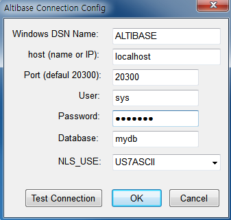

# ODBC User\'s Manual

#### Altibase 7.1

Altibase® Application Development

<br><br><br><br><br><br><!-- PDF 변환을 위한 여백입니다. --> 


<!-- PDF 변환을 위한 여백입니다. --> 

<div align="left">
    
</div>
<br><br><!-- PDF 변환을 위한 여백입니다. --> 


<!-- PDF 변환을 위한 여백입니다. --> 

<pre>
Altibase Application Development ODBC User's Manual
Release 7.1
Copyright ⓒ 2001~2023 Altibase Corp. All Rights Reserved.<br>
본 문서의 저작권은 ㈜알티베이스에 있습니다. 이 문서에 대하여 당사의 동의없이 무단으로 복제 또는 전용할 수 없습니다.<br>
<b>㈜알티베이스</b>
08378 서울시 구로구 디지털로 306 대륭포스트타워Ⅱ 10층
전화 : 02-2082-1114
팩스 : 02-2082-1099
고객서비스포털 : <a href='http://support.altibase.com'>http://support.altibase.com</a>
홈페이지      : <a href='http://www.altibase.com/'>http://www.altibase.com</a></pre>
<br>

# 목차

- [서문](#%EC%84%9C%EB%AC%B8)
  - [이 매뉴얼에 대하여](#%EC%9D%B4-%EB%A7%A4%EB%89%B4%EC%96%BC%EC%97%90-%EB%8C%80%ED%95%98%EC%97%AC)
- [1.개요](#1%EA%B0%9C%EC%9A%94)
  - [소개](#%EC%86%8C%EA%B0%9C)
  - [데이터 타입](#%EB%8D%B0%EC%9D%B4%ED%84%B0-%ED%83%80%EC%9E%85)
  - [ODBC API](#odbc-api)
- [2.설치 및 설정](#2%EC%84%A4%EC%B9%98-%EB%B0%8F-%EC%84%A4%EC%A0%95)
  - [설치](#%EC%84%A4%EC%B9%98)
  - [설정](#%EC%84%A4%EC%A0%95)
- [3.ODBC 프로그래밍](#3odbc-%ED%94%84%EB%A1%9C%EA%B7%B8%EB%9E%98%EB%B0%8D)
  - [연결 문자열 (Connection String)](#%EC%97%B0%EA%B2%B0-%EB%AC%B8%EC%9E%90%EC%97%B4-connection-string)
  - [기본 프로그래밍 예제](#%EA%B8%B0%EB%B3%B8-%ED%94%84%EB%A1%9C%EA%B7%B8%EB%9E%98%EB%B0%8D-%EC%98%88%EC%A0%9C)
  - [LOB 사용 예제](#lob-%EC%82%AC%EC%9A%A9-%EC%98%88%EC%A0%9C)

<br>

# 서문

### 이 매뉴얼에 대하여

이 매뉴얼은 Altibase ODBC API의 사용법에 대해 설명한다.

#### 대상 사용자

이 매뉴얼은 다음과 같은 Altibase 사용자를 대상으로 작성되었다.

-   데이터베이스 관리자

-   성능 관리자

-   데이터베이스 사용자

-   응용 프로그램 개발자

-   기술지원부

다음과 같은 배경 지식을 가지고 이 매뉴얼을 읽는 것이 좋다.

-   컴퓨터, 운영 체제 및 운영 체제 유틸리티 운용에 필요한 기본 지식

-   관계형 데이터베이스 사용 경험 또는 데이터베이스 개념에 대한 이해

-   컴퓨터 프로그래밍 경험

-   데이터베이스 서버 관리, 운영 체제 관리 또는 네트워크 관리 경험

#### 소프트웨어 환경

이 매뉴얼은 데이터베이스 서버로 Altibase 버전 7.1을 사용한다는 가정 하에
작성되었다.

이 매뉴얼의 구성

이 매뉴얼은 다음과 같이 구성되어 있다.

-   제 1장 개요

-   제 2장 설치 및 설정

-   제 3장 ODBC 프로그래밍

-   A. 부록: FAQ

#### 문서 규칙

이 절에서는 이 매뉴얼에서 사용하는 규칙에 대해 설명한다. 이 규칙을
이해하면 이 매뉴얼과 설명서 세트의 다른 매뉴얼에서 정보를 쉽게 찾을 수
있다. 여기서 설명하는 규칙은 다음과 같다.

| 규칙        | 의미                                                         |
| ----------- | ------------------------------------------------------------ |
| 기울임꼴    | 구문요소에서 사용자가 지정해야 하는 변수, 특수한 값을 제공해야만 하는 위치 지정자, 강조 또는  책 제목 |
| 고정폭 글꼴 | 단락 또는 예제 코드 내에 있는 명령어                         |

#### Altibase는 여러분의 의견을 환영합니다.

이 매뉴얼에 대한 여러분의 의견을 보내주시기 바랍니다. 사용자의 의견은
다음 버전의 매뉴얼을 작성하는데 많은 도움이 됩니다. 보내실 때에는 아래
내용과 함께 고객서비스포털( http://support.altibase.com/kr/ )로
보내주시기 바랍니다.

-   사용 중인 매뉴얼의 이름과 버전

-   매뉴얼에 대한 의견

-   사용자의 성함, 주소, 전화번호

이 외에도 Altibase 기술지원 설명서의 오류와 누락된 부분 및 기타 기술적인
문제들에 대해서 이 주소로 보내주시면 정성껏 처리하겠습니다. 또한,
기술적인 부분과 관련하여 즉각적인 도움이 필요한 경우에도
고객서비스포털을 통해 서비스를 요청하시기 바랍니다.

여러분의 의견에 항상 감사드립니다.

1.개요
====

이 장은 Altibase ODBC 드라이버를 소개한다.

### 소개

ODBC(Open Database Connectivity)는 마이크로소프트가 만든, 데이터베이스에
접근하기 위한 표준 규격이다. ODBC API를 사용하여 작성된 ODBC
애플리케이션이 데이터베이스에 접근하기 위해서는 ODBC Driver Manager 같은
ODBC 소프트웨어 외에, 접근하려는 데이터베이스에서 제공하는 별도의
모듈이나 드라이버가 필요하다. 이를 위해 Altibase ODBC 드라이버가
제공된다. Altibase ODBC 드라이버는 ODBC 3.51 스펙을 준수한다.

Altibase ODBC 드라이버는 Altibase CLI 기반으로 작성되었으므로, Altibase
ODBC 드라이버의 내부 동작이나 세부적인 지원 사항은 *Altibase CLI
Manual*을 참조해도 무방하다.

### 데이터 타입

Altibase가 지원하는 SQL 데이터 타입과 ODBC 데이터 타입과의 맵핑 관계는
*Altibase CLI Manual*의 \"B. 부록: 데이터형\"을 참조한다.

### ODBC API

ODBC API에 대한 자세한 내용은 ODBC API Reference
문서( http://msdn.microsoft.com/en-us/library/windows/desktop/ms714562%28v=vs.85%29.aspx )를
참조한다.

#### ODBC Conformance Level

이 절은 현재 Altibase ODBC에서 현재 지원하는 함수들과 앞으로 지원 예정인
함수들, 그리고 지원되지 않는 함수들에 대하여 ODBC 함수의 적합성에
입각하여 설명한다.

ODBC의 적합성 레벨을 매기는 목적은 애플리케이션에게 ODBC 드라이버의 어떤
기능을 사용할 수 있는지에 대한 정보를 제공하기 위해서이다. 현재 ODBC
적합성 레벨은 Core, Level 1, Level 2의 3가지로 분류된다.어떤 함수의
적합성 레벨을 만족시키기 위해서는 드라이버가 그 레벨에 해당하는 모든
요구사항을 충족해야 한다.

아래에 표는 ODBC 3.x 기준의 적합성 레벨이다. 이는 ODBC 2.x의 적합성
레벨과 차이가 있다. ODBC 2.x에서의 적합성 레벨 1은 여기에서 core로 보면
된다.

Altibase ODBC 드라이버는 ODBC 3.51 스펙을 준수한다. 아래 표는 각 ODBC
함수의 레벨과 Altibase ODBC 드라이버의 지원 여부를 나타낸다.

| 함수 이름           | 레벨   | 지원여부 | 지원예정 | 비고                                          |
| ------------------- | ------ | -------- | -------- | --------------------------------------------- |
| SQLAllocHandle      | Core   | O        |          |                                               |
| SQLBindCol          | Core   | O        |          |                                               |
| SQLBindParameter    | Core   | O        |          |                                               |
| SQLBrowseConnect    | Level1 | X        | X        |                                               |
| SQLBulkOperations   | Level1 | O        |          |                                               |
| SQLCancel           | Core   | O        |          |                                               |
| SQLCloseCursor      | Core   | O        |          |                                               |
| SQLColAttribute     | Core   | O        |          |                                               |
| SQLColumnPrivileges | Level2 | X        | X        | 칼럼에 대한 권한은 Altibase에서 지원하지 않음 |
| SQLColumns          | Core   | O        |          |                                               |
| SQLConnect          | Core   | O        |          |                                               |
| SQLCopyDesc         | Core   | X        | O        |                                               |
| SQLDescribeCol      | Core   | O        |          |                                               |
| SQLDescribeParam    | Level2 | O        |          | 완벽하게 지원한다고 볼 수 없음                |
| SQLDisconnect       | Core   | O        |          |                                               |
| SQLDriverConnect    | Core   | O        |          |                                               |
| SQLEndTran          | Core   | O        |          |                                               |
| SQLExecDirect       | Core   | O        |          |                                               |
| SQLExecute          | Core   | O        |          |                                               |
| SQLFetch            | Core   | O        |          |                                               |
| SQLFetchScroll      | Core   | O        |          |                                               |
| SQLForeignKeys      | Level2 | O        |          |                                               |
| SQLFreeHandle       | Core   | O        |          |                                               |
| SQLFreeStmt         | Core   | O        |          |                                               |
| SQLGetConnectAttr   | Core   | O        |          |                                               |
| SQLGetCursorName    | Core   | O        |          |                                               |
| SQLGetData          | Core   | O        |          |                                               |
| SQLGetDescField     | Core   | O        |          | ODBC 3.0                                      |
| SQLGetDescRec       | Core   | O        |          | ODBC 3.0                                      |
| SQLGetDiagField     | Core   | O        |          | ODBC 3.0                                      |
| SQLGetDiagRec       | Core   | O        |          | ODBC 3.0                                      |
| SQLGetEnvAttr       | Core   | O        |          |                                               |
| SQLGetFunctions     | Core   | O        |          |                                               |
| SQLGetInfo          | Core   | O        |          |                                               |
| SQLGetStmtAttr      | Core   | O        |          |                                               |
| SQLGetTypeInfo      | Core   | O        |          |                                               |
| SQLMoreResults      | Level1 | O        |          |                                               |
| SQLNativeSql        | Core   | O        |          |                                               |
| SQLNumParams        | Core   | O        |          |                                               |
| SQLNumResultCols    | Core   | O        |          |                                               |
| SQLParamData        | Core   | O        |          |                                               |
| SQLPrepare          | Core   | O        |          |                                               |
| SQLPrimaryKeys      | Level1 | O        |          |                                               |
| SQLProcedureColumns | Level1 | O        |          |                                               |
| SQLProcedures       | Level1 | O        |          |                                               |
| SQLPutData          | Core   | O        |          |                                               |
| SQLRowCount         | Core   | O        |          |                                               |
| SQLSetConnectAttr   | Core   | O        |          |                                               |
| SQLSetCursorName    | Core   | O        |          |                                               |
| SQLSetDescField     | Core   | O        |          | ODBC 3.0                                      |
| SQLSetDescRec       | Core   | O        |          | ODBC 3.0                                      |
| SQLSetEnvAttr       | Core   | O        |          |                                               |
| SQLSetPos           | Level1 | O        |          |                                               |
| SQLSetStmtAttr      | Core   | O        |          |                                               |
| SQLSpecialColumns   | Core   | O        |          |                                               |
| SQLStatistics       | Core   | O        |          |                                               |
| SQLTablePrivileges  | Level2 | O        |          |                                               |
| SQLTables           | Core   | O        |          |                                               |

2.설치 및 설정
============

이 장은 Altibase ODBC 드라이버를 설치하고 설정하는 방법을 설명한다.

### 설치

본 절에서는 Altibase ODBC 드라이버를 설치하는 방법에 대해서 기술한다.

#### 유닉스 계열

유닉스 계열의 경우 Altibase 서버 또는 클라이언트 패키지를 설치할 때 ODBC
드라이버도 함께 설치된다. Altibase 서버 또는 클라이언트 패키지를
설치하는 방법은 *Installation Guide*를 참조한다.

64비트 패키지를 설치하면 아래와 같은 32비트와 64비트 ODBC 드라이버가
모두 \$ALTIBASE\_HOME/lib에 설치될 것이다.

libaltibase\_odbc-64bit-ul32.so: SQLLEN의 크기가 32비트

libaltibase\_odbc-64bit-ul64.so: SQLLEN의 크기가 64비트

64비트 패키지에 두 개의 드라이버가 포함된 이유는 다음과 같다. 64비트
ODBC Driver Manager들은 SQLLEN 타입의 크기를 64bit로 정의하고 있다.
그러나, 유닉스 계열에서 사용 가능한 ODBC Driver Manager 중의 하나인
unixODBC가 버전과 컴파일 옵션에 따라 SQLLEN의 크기를 32bit 또는 64bit로
정의하기 때문에, 모두를 수용하기 위해 Altibase는 두 개의 드라이버를
제공한다. unixODBC를 사용하는 경우 SQLLEN 크기가 일치하는 드라이버를
선택하여 사용하기 바란다.

32비트 패키지를 설치하면 아래의 파일이 \$ALTIBASE\_HOME/lib에 위치하게
된다.

```
libaltibase_odbc.so
```

HP 운영 체제의 경우 위와 동일한 파일 이름에 확장자만 sl이다.

### 설정

본 절에서는 ODBC 드라이버를 설정하는 방법에 대해서 기술한다.

#### 유닉스 계열

유닉스에서 ODBC 드라이버를 사용하기 위해서는 먼저 ODBC Driver Manager를
설치해야 한다. 유닉스용 ODBC Driver Manager는 unixODBC Driver Manager와
iODBC Driver Manager가 있다. 각 Driver Manager에 대한 자세한 내용은 아래
링크를 참조한다.

-   http://www.unixodbc.org/

-   http://www.iodbc.org/

##### DSN 추가

ODBC 애플리케이션에서 접근하려는 데이터베이스에 대한 DSN을 추가한다.
\[데이터 원본(ODBC)\]의 사용자 DSN 또는 시스템 DSN 탭에서 \"추가\"를
누르면 아래의 대화상자가 나타난다. Altibase용 ODBC 드라이버를 선택하고
\"마침\"을 누른다.


\"Altibase Connection Config\" 창이 나타나면 아래의 속성들을 입력한다.



-   Windows DSN Name: 데이터 원본의 이름을 입력한다.

-   host (name or IP): 접속할 Altibase 서버가 위치하는 장비의 호스트
    이름 또는 IP 주소를 입력한다. 

-   Port (default 20300): Altibase 서버의 listening 포트 번호를
    입력한다. altibase.properties 파일에서 PORT\_NO 값을 확인하거나
    ALTIBASE\_PORT\_NO 환경변수 값을 확인한다.

-   User: 데이터베이스 사용자 이름을 입력한다.

-   Password: 데이터베이스 사용자 비밀번호를 입력한다.

-   Database: 데이터베이스 이름을 입력한다.

-   NLS\_USE: 클라이언트의 캐릭터셋을 입력한다.

\"Test Connection\"을 눌러서 접속이 정상적으로 되는지 확인할 수 있다.
\"OK\"를 누른 후 DSN 탭에서 방금 입력한 이름으로 데이터 원본이 추가된
것을 확인할 수 있다.

3.ODBC 프로그래밍
===============

이 장은 Altibase ODBC 드라이버를 사용해서 ODBC 애플리케이션을 작성하는
방법을 예제와 함께 설명한다.

### 연결 문자열 (Connection String)

Altibase ODBC를 사용하여 ODBC 애플리케이션을 작성할 때 DSN을 사용하는
대신에 연결 문자열을 사용할 수도 있다. 연결 문자열은 아래의 속성으로
구성된다.

| 속성           | 설명                                                         |
| -------------- | ------------------------------------------------------------ |
| DRIVER         | ODBC 드라이버의   이름. ODBC 데이터 원본 관리자 창에서 확인할 수 있다. |
| User           | 데이터베이스 사용자 이름                                     |
| Password       | 데이터베이스 사용자 비밀번호                                 |
| Server         | 접속할 Altibase 서버의 IP 주소                               |
| PORT           | Altibase 서버의 listening 포트 번호                          |
| NLS_USE        | 클라이언트의 캐릭터셋                                        |
| LongDataCompat | ON 또는 OFF   BLOB 같은 대용량   데이터를 사용할 경우 ON으로 설정하길 권장한다. 디폴트는 OFF이다. |

다음은 위의 속성들을 이용해서 구성한 연결 문자열의 예이다.
~~~~~~~~~~~~~~~~~~~~~~~~~~~~~~~~~~~~~~~~~~~~~~~~~~~~~~~~~~~~~~~~~~~~~~~~
"DRIVER=ALTIBASE_HDB_ODBC_64bit;User=SYS;Password=xxx;Server=127.0.0.1;PORT=20300;NLS_USE=US7ASCII;LongDataCompat=OFF"
~~~~~~~~~~~~~~~~~~~~~~~~~~~~~~~~~~~~~~~~~~~~~~~~~~~~~~~~~~~~~~~~~~~~~~~~
### 기본 프로그래밍 예제

ODBC애플리케이션에서 Altibase 서버에 접속하고 종료하는 예제 코드과
애플리케이션 수행결과는 다음과 같다.

##### 예제

```
/* test_odbc.cpp */
#include <windows.h>
#include <sql.h>
#include <sqlext.h>
#include <stdio.h>
#include <stdlib.h>

#define SQL_LEN 1000
#define MSG_LEN 1024

SQLHENV     henv;
SQLHDBC     hdbc;
SQLHSTMT    hstmt;
SQLRETURN   retcode;

void execute_err(SQLHSTMT stat, char* q)
{
    printf("Error : %s\n",q);
    SQLINTEGER errNo;
    SQLSMALLINT msgLength;
    SQLTCHAR errMsg[MSG_LEN];

    if (SQL_SUCCESS == SQLError ( henv, hdbc, stat, NULL, &errNo, errMsg, MSG_LEN, &msgLength ))
    {
    	printf(" Error : # %lld, %s\n", errNo, errMsg);
    }

    SQLFreeStmt(stat, SQL_DROP);
    if (SQL_ERROR == SQLDisconnect(hdbc))
    {
    	printf("disconnect error\n");
    }

    SQLFreeConnect(hdbc);
    SQLFreeEnv(henv);

    exit (1);
}

void main()
{
    char    *DSN, *DBNAME, *USERNAME, *PASSWD, *PORTNO;
    char    query[SQL_LEN], name[21];
    int     age;

    SQLCHAR constr[100];
    SQLINTEGER len;
    DSN = "ALTIBASE"; // Domain Server Name

    /* Environment 을 위한 메모리를 할당 */
    if(SQLAllocEnv(&henv) == SQL_ERROR)
    {
        printf("AllocEnv error!!\n");
		exit(1);
    }
    
    /* Connection 을 위한 메모리를 할당 */
    if(SQLAllocConnect(henv, &hdbc) == SQL_ERROR)
    {
    printf("AllocDbc error!!\n");
    SQLINTEGER errNo;
    SQLSMALLINT msgLength;
    SQLTCHAR errMsg[MSG_LEN];

    if (SQL_SUCCESS == SQLError ( henv, NULL, NULL, NULL, &errNo, 
    errMsg, MSG_LEN, &msgLength ))
    {
    printf(" Error : # %lld, %s\n", errNo, errMsg);
    }
    exit(1);
    }

    /* Connection을 형성 */
    sprintf((char*)constr,
     "DSN=%s", DSN);

    if ( SQLDriverConnect(hdbc, NULL, constr, SQL_NTS, NULL, 0, NULL, 
    SQL_DRIVER_COMPLETE))
    {
        printf("DBNAME = %s\n", DBNAME);
        printf("USERNAME = %s\n", USERNAME);
        printf("Connection error!!\n");
        SQLINTEGER errNo;
        SQLSMALLINT msgLength;
        SQLTCHAR errMsg[MSG_LEN];

        if (SQL_SUCCESS == SQLError ( henv, hdbc, NULL, NULL, &errNo, 
        errMsg, MSG_LEN, &msgLength )) 
        {
            printf(" Error : # %lld, %s\n", errNo, errMsg);
        }

        SQLFreeConnect(hdbc);
        SQLFreeEnv(henv);
        exit(1);
    }
    printf("connected...\n");

    /* statement을 위한 메모리를 할당 */
    if ( SQLAllocStmt(hdbc, &hstmt) == SQL_ERROR )
    {
        printf("AllocStmt error!!\n");
        SQLDisconnect(hdbc);
        SQLFreeConnect(hdbc);
        SQLFreeEnv(henv);
        exit(1);
    }
                
    /* 쿼리수행 */
    sprintf(query,"DROP TABLE TEST001");
    SQLExecDirect(hstmt,(SQLTCHAR*)query, SQL_NTS);

    sprintf(query,"CREATE TABLE TEST001 ( name varchar(20), age number(3) )");
    if (SQL_ERROR == SQLExecDirect(hstmt,(SQLTCHAR*)query, SQL_NTS))
    {
        execute_err(hstmt, query);
    }

    /* statement를 준비하고 변수를 바인드한다. */
    sprintf(query,"INSERT INTO TEST001 VALUES( ?, ? )");
    if (SQL_ERROR == SQLPrepare(hstmt, (SQLTCHAR*)query, SQL_NTS))
    {
        execute_err(hstmt, query);
    }

    if (SQL_ERROR == SQLBindParameter(hstmt, 1, SQL_PARAM_INPUT,
SQL_C_CHAR, SQL_CHAR, 0, 0, name,
19, &len))
    {
        printf("SQLBindParameter error!!! ==> %s \n",query);
        exit(1);
    }

    if (SQL_ERROR == SQLBindParameter(hstmt, 2, SQL_PARAM_INPUT, 
SQL_C_SLONG, SQL_NUMERIC, 0, 0,
&age, 0, &len))
    {
        printf("SQLBindParameter error!!! ==> %s \n",query);
        exit(1);
    }

    /* 준비된 statement를 수행 */
    sprintf(name, "김민석");
    age = 28;
    if (SQL_ERROR == SQLExecute(hstmt))
    {
        execute_err(hstmt, query);
    }

    sprintf(name, "홍길동");
    age = 25;
    if (SQL_ERROR == SQLExecute(hstmt))
    {
        execute_err(hstmt, query);
    }

    sprintf(name, "아무개");
    age = 34;
    if (SQL_ERROR == SQLExecute(hstmt))
    {
        execute_err(hstmt, query);
    }

    sprintf(query,"SELECT * FROM TEST001");
    if (SQL_ERROR == SQLExecDirect(hstmt,(SQLTCHAR*)query, SQL_NTS))
    {
        execute_err(hstmt, query);
    }

    /* Select의 결과값을 변수에 저장 */
    if (SQL_ERROR == SQLBindCol(hstmt, 1, SQL_C_CHAR, name, 21, &len)) 
    {
        printf("SQLBindCol error!!!\n");
        exit(1);
    }

    if (SQL_ERROR == SQLBindCol(hstmt, 2, SQL_C_SLONG,&age, 0, &len)) 
    {
        printf("SQLBindCol error!!!\n");
        exit(1);
    }

    while ( SQLFetch(hstmt) == SQL_SUCCESS) 
	// 결과값이 있는 동안 결과값을 받아 화면에 출력 */
    {
        printf("Name : %5s, Age : %5ld\n",name,age);
    }
    
    /* 모든 handle을 해제하고 접속을 종료 */
    SQLFreeStmt(hstmt, SQL_DROP);
    SQLDisconnect(hdbc);
    SQLFreeConnect(hdbc);
    SQLFreeEnv(henv);
}
```

**실행결과**

Visual C++에서 컴파일 후 생성된 exe 파일을 실행시키면 다음과 같은 결과를
볼 수 있다.


### LOB 사용 예제

이 절은 Altibase ODBC 드라이버를 사용해서 LOB 데이터를 조작하는 방법을
예제를 통해 살펴본다.

Altibase의 LOB Locator 특성상 세션의 자동커밋을 해제한
상태(Non-autocommit)에서 LOB 데이터를 조작해야 한다. 자세한 내용은
*Altibase CLI Manual*에서 3장 LOB 인터페이스를 참조한다.

또한 다음과 같이 연결 문자열에서 LongDataCompat 속성을 ON으로 설정해야
한다.

```
"DSN=ALTIBASE;LongDataCompat=ON"
```

또는

```
"DRIVER=ALTIBASE_HDB_ODBC_64bit;User=SYS;Password=xxx;Server=127.0.0.1;PORT=20300;NLS_USE=US7ASCII;LongDataCompat=ON"
```

아래는 C\#에서 BLOB 데이터를 테이블에 삽입하고 조회하는 예제이다.
~~~~~~~~~~~~~~~~~~~~~~~~~~~~~~~~~~~~~~~~~~~~~~~~~~~~~~~~~~
FileStream fs = new FileStream("c:\\test.dat", FileMode.Open, FileAccess.Read); 
Byte[] blob = new byte[fs.Length]; 
fs.Read(blob, 0, System.Convert.ToInt32(fs.Length)); 
fs.Close(); 

OdbcTransaction tx = cn.BeginTransaction(); 
cmd.Transaction = tx; 

cmd.CommandText = "INSERT INTO T1 (C1, C2) VALUES (?, ?)"; 
cmd.Parameters.Add("C1", OdbcType.Int); 
cmd.Parameters.Add("C2", OdbcType.Binary); 

cmd.Parameters[0].Value = 1; 
cmd.Parameters[1].Value = blob; 

cmd.ExecuteNonQuery(); 
tx.Commit(); 

// BLOB SELECT 
cmd.CommandText = "SELECT binary_length(C2), C2 FROM T1"; 

tx = cn.BeginTransaction(); 
cmd.Transaction = tx; 
OdbcDataReader dr = cmd.ExecuteReader(); 
int len; 

while (dr.Read()) 
{ 
    len = dr.GetInt32(0); 
    Byte[] ff = new Byte[len]; 
    dr.GetBytes(1, 0, ff, 0, len); 

    fs = new FileStream("c:\\test.dat", FileMode.CreateNew, FileAccess.Write); 
    fs.Write(ff, 0, len); 
    fs.Close(); 
}

~~~~~~~~~~~~~~~~~~~~~~~~~~~~~~~~~~~~~~~~~~~~~~~~~~~~~~~~~~

