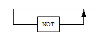
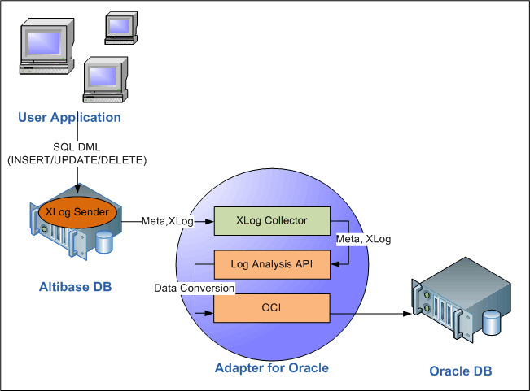
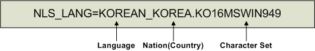

- [Adapter for Oracle User’s Manual](#adapter-for-oracle-users-manual)
  - [서문](#%EC%84%9C%EB%AC%B8)
    - [이 매뉴얼에 대하여](#%EC%9D%B4-%EB%A7%A4%EB%89%B4%EC%96%BC%EC%97%90-%EB%8C%80%ED%95%98%EC%97%AC)
  - [1.소개](#1%EC%86%8C%EA%B0%9C)
    - [Adapter for Oracle](#adapter-for-oracle)
  - [2.설치와 설정](#2%EC%84%A4%EC%B9%98%EC%99%80-%EC%84%A4%EC%A0%95)
    - [설치전 작업](#%EC%84%A4%EC%B9%98%EC%A0%84-%EC%9E%91%EC%97%85)
    - [설치](#%EC%84%A4%EC%B9%98)
    - [설치 후 작업](#%EC%84%A4%EC%B9%98-%ED%9B%84-%EC%9E%91%EC%97%85)
    - [설정](#%EC%84%A4%EC%A0%95)
    - [프로퍼티](#%ED%94%84%EB%A1%9C%ED%8D%BC%ED%8B%B0)
  - [3.사용법](#3%EC%82%AC%EC%9A%A9%EB%B2%95)
    - [oraAdapter 제약조건](#oraadapter-%EC%A0%9C%EC%95%BD%EC%A1%B0%EA%B1%B4)
    - [구동과 종료](#%EA%B5%AC%EB%8F%99%EA%B3%BC-%EC%A2%85%EB%A3%8C)
    - [데이터 타입](#%EB%8D%B0%EC%9D%B4%ED%84%B0-%ED%83%80%EC%9E%85)
    - [Adapter for Oracle 유틸리티](#adapter-for-oracle-%EC%9C%A0%ED%8B%B8%EB%A6%AC%ED%8B%B0)
    - [커맨드 라인 옵션](#%EC%BB%A4%EB%A7%A8%EB%93%9C-%EB%9D%BC%EC%9D%B8-%EC%98%B5%EC%85%98)
  - [A.부록: FAQ](#a%EB%B6%80%EB%A1%9D-faq)
    - [FAQ](#faq)
  - [B.부록: oraAdapter 사용시 DDL 순서](#b%EB%B6%80%EB%A1%9D-oraadapter-%EC%82%AC%EC%9A%A9%EC%8B%9C-ddl-%EC%88%9C%EC%84%9C)
    - [oraAdapter 사용시 DDL 수행 순서](#oraadapter-%EC%82%AC%EC%9A%A9%EC%8B%9C-ddl-%EC%88%98%ED%96%89-%EC%88%9C%EC%84%9C)


Altibase® Tool & Utilities

Adapter for Oracle User’s Manual
================================


Altibase Tool & Utilities Adapter for Oracle User’s Manual

Release 7.1

Copyright ⓒ 2001\~2019 Altibase Corp. All Rights Reserved.

본 문서의 저작권은 ㈜알티베이스에 있습니다. 이 문서에 대하여 당사의 동의
없이 무단으로 복제 또는 전용할 수 없습니다.

**㈜알티베이스**

08378 서울시 구로구 디지털로 306 대륭포스트타워Ⅱ 10층

전화: 02-2082-1114 팩스: 02-2082-1099

고객서비스포털: <http://support.altibase.com>

homepage: [http://www.altibase.com](http://www.altibase.com/)


서문
----

### 이 매뉴얼에 대하여

이 매뉴얼은 Altibase에서 변경된 데이터를 오라클 데이터베이스로 적용하는
유틸리티인 Adapter for Oracle 에 대해 설명한다.

#### 대상 사용자

이 매뉴얼은 다음과 같은 Altibase 사용자를 대상으로 작성되었다.

-   데이터베이스 관리자

-   응용 프로그램 개발자

-   기술지원부

다음과 같은 배경 지식을 가지고 이 매뉴얼을 읽는 것이 좋다.

-   컴퓨터, 운영 체제 및 운영 체제 유틸리티 운용에 필요한 기본 지식

-   관계형 데이터베이스 사용 경험 또는 데이터베이스 개념에 대한 이해

-   컴퓨터 프로그래밍 경험

-   데이터베이스 서버 관리, 운영 체제 관리 또는 네트워크 관리 경험

#### 소프트웨어 환경

이 매뉴얼은 데이터베이스 서버로 Altibase 버전 7.1을 사용한다는 가정 하에
작성되었다.

#### 이 매뉴얼의 구성

이 매뉴얼은 다음과 같이 구성되어 있다.

-   제 1장 소개  
    이 장은 Adapter for Oracle 의 개념과 Altibase에서 변경된 데이터가 오라클
    데이터베이스에 쓰여지는 동작 구조를 설명한다.

-   제 2 장 설치와 환경설정  
    이 장은 Adapter for Oracle을 설치하고 설정하는 방법을 설명한다.

-   제 3 장 사용법  
    이 장은 관리자들이 Adapter for Oracle을 사용하는 방법에 대해 자세히
    설명한다.

-   A. 부록 FAQ

-   B. 부록 oraAdapter 사용시 DDL 순서

#### 문서화 규칙

이 절에서는 이 매뉴얼에서 사용하는 규칙에 대해 설명한다. 이 규칙을 이해하면 이
매뉴얼과 설명서 세트의 다른 매뉴얼에서 정보를 쉽게 찾을 수 있다.

여기서 설명하는 규칙은 다음과 같다.

-   구문 다이어그램

-   샘플 코드 규칙

##### 구문 다이어그램

이 매뉴얼에서는 다음 구성 요소로 구축된 다이어그램을 사용하여, 명령문의 구문을
설명한다.

| 구성 요소                              | 의미                                                         |
| -------------------------------------- | ------------------------------------------------------------ |
|  | 명령문이 시작한다. 완전한 명령문이 아닌 구문 요소는 화살표로 시작한다. |
|  | 명령문이 다음 라인에 계속된다. 완전한 명령문이 아닌 구문 요소는 이 기호로 종료한다. |
|  | 명령문이 이전 라인으로부터 계속된다. 완전한 명령문이 아닌 구문 요소는 이 기호로 시작한다. |
|  | 명령문이 종료한다.                                           |
|  | 필수 항목                                                    |
|  | 선택적 항목                                                  |
|  | 선택사항이 있는 필수 항목. 한 항목만 제공해야 한다.          |
|  | 선택사항이 있는 선택적 항목                                  |
|  | 선택적 항목. 여러 항목이 허용된다. 각 반복 앞부분에 콤마가 와야 한다. |

##### 샘플 코드 규칙

코드 예제는 SQL, Stored Procedure, iSQL 또는 다른 명령 라인 구문들을 예를 들어
설명한다.

아래 테이블은 코드 예제에서 사용된 인쇄 규칙에 대해 설명한다.

| 규칙         | 의미                                                                                | 예제                                                                                                         |
|--------------|-------------------------------------------------------------------------------------|--------------------------------------------------------------------------------------------------------------|
| [ ]          | 선택 항목을 표시                                                                    | VARCHAR [(*size*)] [[FIXED \|] VARIABLE]                                                                     |
| { }          | 필수 항목 표시. 반드시 하나 이상을 선택해야 되는 표시                               | { ENABLE \| DISABLE \| COMPILE }                                                                             |
| \|           | 선택 또는 필수 항목 표시의 인자 구분 표시                                           | { ENABLE \| DISABLE \| COMPILE } [ ENABLE \| DISABLE \| COMPILE ]                                            |
| . . .        | 그 이전 인자의 반복 표시 예제 코드들의 생략되는 것을 표시                           | SQL\> SELECT ename FROM employee; ENAME  ----------------------- SWNO  HJNO  HSCHOI  . . . 20 rows selected. |
| 그 밖에 기호 | 위에서 보여진 기호 이 외에 기호들                                                   | EXEC :p1 := 1; acc NUMBER(11,2);                                                                             |
| 기울임 꼴    | 구문 요소에서 사용자가 지정해야 하는 변수, 특수한 값을 제공해야만 하는 위치         | SELECT \* FROM *table_name*; CONNECT *userID*/*password*;                                                    |
| 소문자       | 사용자가 제공하는 프로그램의 요소들, 예를 들어 테이블 이름, 칼럼 이름, 파일 이름 등 | SELECT ename FROM employee;                                                                                  |
| 대문자       | 시스템에서 제공하는 요소들 또는 구문에 나타나는 키워드                              | DESC SYSTEM_.SYS_INDICES_;                                                                                   |

#### 관련 자료

자세한 정보를 위하여 다음 문서 목록을 참조하기 바란다.

-   Installation Guide

-   Administrator’s Manual

-   Replication Manual

-   Log Analyzer User's Manual

-   iSQL User’s Manual

-   Utilities Manual

-   Error Message Reference

#### Altibase는 여러분의 의견을 환영합니다.

이 매뉴얼에 대한 여러분의 의견을 보내주시기 바랍니다. 사용자의 의견은 다음
버전의 매뉴얼을 작성하는데 많은 도움이 됩니다. 보내실 때에는 아래 내용과 함께
고객서비스포털(*http://support.altibase.com/kr/* )로 보내주시기 바랍니다.

-   사용 중인 매뉴얼의 이름과 버전

-   매뉴얼에 대한 의견

-   사용자의 성함, 주소, 전화번호

이 외에도 Altibase 기술지원 설명서의 오류와 누락된 부분 및 기타 기술적인
문제들에 대해서 이 주소로 보내주시면 정성껏 처리하겠습니다. 또한, 기술적인
부분과 관련하여 즉각적인 도움이 필요한 경우에도 고객서비스포털을 통해 서비스를
요청하시기 바랍니다.

여러분의 의견에 항상 감사드립니다.

1.소개
----

이 장은 Adapter for Oracle 의 개념과 Altibase에서 변경된 데이터가 오라클
데이터베이스에 쓰여지는 동작 구조를 설명한다.

### Adapter for Oracle

Altibase Adapter for Oracle (이하 “oraAdapter”라 칭한다)은 Altibase에서 변경된
데이터를 오라클 DB로 적용시키는 유틸리티이다. 이는 Altibase에서 제공하는
Altibase Log Analysis API로 구현되었다.

#### 구조와 개념

사용자가 Altibase에서 변경된 데이터를 오라클 DB로 복제하기 위해서는 아래 그림에
보이는 것처럼 먼저 Altibase, oraAdapter, 및 오라클을 설치해야 한다.

oraAdapter는 Altibase Log Analysis API (이하 ALA 라 칭한다)와 Oracle Call
Interface (OCI)를 사용해서 구현되었다. ALA는 Altibase에서 변경된 데이터를 받을
때 사용되고, OCI는 오라클 DB로 데이터를 쓸 때 사용된다. ALA에 대한 자세한 설명은
Log Analyzer User’s Manual을 참고하기 바란다.

아래 그림은 oraAdapter가 어떻게 Altibase에서 오라클 DB로 데이터를 복제하는지를
보여준다.



그림 1-1 Adapter for Oracle의 구조

1.  사용자가 데이터를 삽입하거나 수정할 때, Altibase 서버내의 XLog 송신자는
    XLog와 메타 정보를 생성해서 XLog 콜렉터에게 보낸다. 메타 정보는 handshaking
    시에만 전송한다.

2.  oraAdapter 내에 존재하는 XLog 콜렉터는 XLog와 메타 정보를 사용자에게
    제공하기 위해 ALA를 사용한다. ALA 호출에 실패하면, 트레이스 로그가 trc
    디렉터리의 파일에 기록된다.

3.  oraAdapter는 획득한 데이터를 오라클 DB로 적용할 수 있도록 변환하기 위해
    ALA를 사용한다.

4.  oraAdapter는 변환된 데이터를 OCI를 사용하여 오라클 DB로 적용한다.

#### 용어

##### XLog

리두 로그를 논리적인 형태로 변환한 로그이다. 변경 DML (INSERT/UPDATE/DELETE)
구문과 관련된 트랜잭션의 이력을 저장한다.

##### XLog 송신자

XLog 송신자는 액티브 리두 로그를 분석하여 XLog 형태로 변환하고 이를 XLog
콜렉터에게 전달한다.

XLog 송신자는 handshaking과 XLog 전송을 주로 담당한다.

##### XLog 콜렉터

XLog 콜렉터는 메타 데이터와 XLog를 XLog 송신자로부터 받는다.

XLog 콜렉터는 메타 데이터, XLog 큐, 트랜잭션 테이블 및 XLog 풀을 가지고 있다.

##### Handshaking

Handshaking은 XLog 송신자가 XLog 콜렉터에게 XLog를 보내기 전에 프로토콜 버전과
메타 데이터를 확인하는 작업이다.

##### Log Analysis API

Altibase에서 제공하는 인터페이스로써, oraAdapter를 구현할 때 사용된다. 이는 주로
XLog와 XLog를 해석하는데 사용되는 메타 정보를 구하는데 사용된다.

##### OCI

Oracle Call Interface (OCI)는 오라클 데이터베이스에 접근하도록 오라클에서
제공하는 C언어 API이다.

##### XLog 풀

XLog 풀은 XLog 저장을 위해 미리 할당된 메모리 공간이다.

2.설치와 설정
-----------

이 장에서는 Adapter for Oracle을 설치하고 사용환경을 설정하는 방법을 설명한다.

### 설치전 작업

oraAdapter를 설치하고 실행하기 위해서는 다음의 시스템 요구사항을 만족해야 한다.
또한 oraAdpate가 올바르게 작동하려면 몇가지 시스템 환경 설정도 필요하다.

시스템 요구사항에 대해 보다 자세히 알고 싶으면, Altibase 고객서비스포털(<http://support.altibase.com/kr/>)로 연락 바란다.

#### 운영체제

현재 아래의 운영체제에서만 oraAdapter를 지원한다.

-   AIX 5.3

-   AIX 6.1

-   LINUX

#### 데이터베이스 버전

-   Altibase: 버전 5.5.1 또는 그 이상
-   오라클 데이터베이스: 버전 10g 또는 그 이상 (10g OCI와 호환되는 OCI 라이브러리가 필요하다. 
    자세한 내용은 설정의 라이브러리 경로를 참조한다.)

#### 데이터베이스 문자집합

이는 데이터를 저장하기 위한 기본 캐릭터셋이다.

Altibase와 오라클을 같은 데이터베이스 캐릭터셋으로 설정하면 데이터 변환과 관련된
비용을 줄일 수 있으므로, 같은 캐릭터셋으로 설정하기를 권장한다.

#### 국가 문자집합

데이터베이스 문자집합이 지원하지 않는 언어에 해당하는 데이터는 NCHAR 또는
NVARCHAR 타입을 사용해서 저장할 수 있다. 데이터베이스 문자집합과 마찬가지로,
Altibase와 오라클의 내셔널 캐릭터셋을 같은 것으로 설정하면, 데이터 변환 비용을
줄일 수 있으므로, 같은 내셔널 캐릭터셋으로 설정하기를 권장한다.

#### 인터페이스

oraAdapter를 설치하기 전에 Oracle Call Interface (이하 OCI라 칭한다) 가 설치되어
있는지를 확인해야 한다. OCI 설치에 대한 자세한 설명은 관련된 오라클 문서를
참고한다.

### 설치

디스플레이 설정이 적절히 되어 있다면 oraAdapter 인스톨러를 GUI모드로 실행할 수도
있다. 이 매뉴얼은 GUI모드로 수행하는 것을 가정하여 oraAdapter 설치에 대해
기술하였다. 또한 디스플레이 설정이 적절히 되어 있지 않거나 할 수 있는 상황이
아닐 때는, 텍스트 모드로 oraAdapter를 설치하는 것도 가능하다.

#### oraAdapter 설치

1. 첫 번째 작업은 oraAdapter 를 실행할 시스템에 맞는 oraAdapter 인스톨러의
   버전을 결정하는 것이다. 아래의 그림은 oraAdapter 인스톨러의 명명 규칙을
   보여준다.  
   oraAdapter 의 버전은 같이 수행되는 Altibase의 버전과 같아야 한다.

   

2. 인스토러를 실행하면 다이얼로그 박스가 나타난다. 설치하려는 oraAdapter의
   버전이 맞는지 확인한 후, “Next” 버튼을 누른다.

3. 다음 다이얼로그 박스에서는 oraAdapter를 설치할 디렉터리를 선택한다. 기본으로
   설치하고 있는 사용자 계정의 홈 디렉터리 내에 oraAdapter 라는 디렉터리를
   생성하게 된다.

4. oraAdapter를 사용하려면 Altibase Log Analyzer (ALA) 프로퍼티 설정을 다음처럼
   해야 한다.

   ALA_SENDER_IP: Altibase가 설치된 서버의 IP 주소이다. Altibase와 oraAdapter가
   같은 서버 장비에서 작동하는 것을 가정하여, 이의 기본값은 127.0.0.1이다.

   ALA_RECEIVER_PORT: oraAdapter가 대기하고 있는 포트 번호이다. 이는 1024에서
   65536사이의 값으로 설정해야 한다.

   ALA_REPLICATION_NAME: Altibase에 존재하는 이중화 객체의 이름이다.

   ALA_XLOG_POOL_SIZE: XLog 풀의 최대 크기를 설정한다. 기본값은 100,000 XLog
   개수이다.

   ALA_SOCKET_TYPE: ALA가 사용할 통신 소켓 타입을 설정한다. oraAdapter는
   TCP/IP와 UNIX Domain소켓을 지원한다.

   ALA_LOGGING_ACTIVE: ALA가 트레이스 로그를 남길 것인지를 지정한다. 기본값은
   1로 트레이스 로그를 남기게 된다.

5. 다음 다이얼로그 박스에서는 Altibase 프로퍼티 설정을 해야 한다. 프로퍼티에
   대한 자세한 설명은 이 장의 뒷 부분에 있는 “제약조건 확인용 프로퍼티”절을
   참고한다.

   ALTIBASE_USER: Altibase에 접근할 사용자의 이름이다.

   ALTIBASE_PASSWORD: Altibase에 접근할 사용자 계정의 암호이다.

   ALTIBASE_IP: Altibase가 설치된 서버 장비의 IP 주소이다. Altibase와
   oraAdapter가 같은 서버 장비에서 작동하는 것을 가정하여, 이의 기본값은
   127.0.0.1이다.

   ALTIBASE_PORT: Altibase서버가 대기하고 있는 포트 번호이다. 이는 1024에서
   65536사이의 값으로 설정해야 한다.

6.  oraAdapter를 사용하려면 오라클 DB 프로퍼티를 적절히 설정해야 한다.
    프로퍼티에 대한 자세한 설명은 이 장의 뒷 부분에 있는 “OCI 프로퍼티”와 “DML
    관련 프로퍼티”절을 참고한다.

    ORACLE_SERVER_ALIAS: 오라클 DB에 접근하기 위한 앨리어스를 지정한다. 이를
    명시하지 않으면, 기본 호스트로 설정된 오라클 DB로 접근할 것이다.

    ORACLE_USER: 오라클 DB에 접근할 사용자의 이름이다.

    ORACLE_PASSWORD: 오라클 DB에 접근할 사용자의 암호이다.

    ORACLE_SKIP_INSERT: “Yes”를 선택하면, Altibase에서 실행된 INSERT 구문은
    오라클 DB로 적용되지 않는다.

    ORACLE_SKIP_UPDATE: “Yes”를 선택하면, Altibase에서 실행된 UPDATE 구문은
    오라클 DB로 적용되지 않는다.

    ORACLE_SKIP_DELETE: “Yes”를 선택하면, Altibase에서 실행된 DELETE 구문은
    오라클 DB로 적용되지 않는다.

7.  그 다음 두 다이얼로그 박스에서는 추가로 오라클 DB 프로퍼티를 설정해야 한다.
    이 프로퍼티에 대한 자세한 설명은 이 장의 뒷 부분에 있는 “OCI 프로퍼티”절을
    참고한다.

    ORACLE_ASYNCHRONOUS_COMMIT: “Yes”를 선택하면, 오라클 DB에서 비동기 커밋
    (asynchronous commit)이 사용된다.

    ORACLE_GROUP_COMMIT: “Yes”를 선택하면, 오라클 DB에서 그룹 커밋 (group
    commit)이 사용된다.

    ORACLE_ARRAY_DML_MAX_SIZE: “Array DML”은 여러 개여 DML 구문을 그룹화하는
    것을 의미한다. 이 프로퍼티는 최대 몇 개의 DML 구문을 그룹화할 것인지를
    지정한다. Array DML기능을 끄려면, 이 프로퍼티를 1로 설정한다.

    ORACLE_UPDATE_STATEMENT_CACHE_SIZE: 이 프로퍼티는 prepared UPDATE 구문을
    저장하는 캐시의 크기를 지정한다. 이 프로퍼티를 0으로 설정하면, oraAdapter는
    UPDATE 구문을 저장하지 않는다.

8. oraAdapter의 사용과 관련된 모든 프로퍼티의 설정이 끝나면, 설정된 값을
   확인하는 다이얼로그 박스가 나타난다. 프로퍼티가 모두 올바로 설정되었는지
   확인하고 “Next”를 클릭한다.

9. “Ready to Install” 다이얼로그 박스에서 “Next”를 누르면, 설치를 시작한다.

10. oraAdapter가 설치되는 동안, 다음의 두 환경 변수가 설정된다. 시스템에 새로운
    환경 변수가 적용되게 하려면, 로그아웃 후에 다시 로그인할 필요가 있다.

    ORA_ADAPTER_HOME: 이 환경 변수는 설치 과정의 앞 단계에서 지정한 oraAdapter
    홈 디렉터리를 값으로 가지게 된다.

    PATH: 이 환경 변수에는 \$ORA_ADAPTER_HOME/bin 경로가 추가된다.

11. 성공적으로 설치가 완료된 후에, 완료 다이얼로그 박스가 나타난다.

### 설치 후 작업

#### 환경 변수 설정

oraAdapter 설치 후 환경 변수 설정, 라이브러리 경로 추가, 및 데이터베이스
문자집합과 국가 문자집합 설정을 해야 한다.

환경 변수 설정에 대한 자세한 설명은 이 장의 뒷 부분에 있는 “설정” 절을 참고한다.

- ORA_ADAPTER_HOME  
  이 환경변수는 oraAdapter 설치 시에 자동으로 설정된다.

- 라이브러리 경로 추가  
  OCI 라이브러리가 위치하는 경로를 추가한다. AIX 운영체제에서 아래와 같이 OCI
  라이브러리 경로를 추가할 수 있다:

  ```
  $ export LIBPATH=$LIBPATH:$ORACLE_HOME/LIB
  ```

-   NLS_LANG  
    이 환경변수에는 Altibase에서 사용하는 문자 집합을 지정한다.

#### 설치 디렉터리 확인

oraAdapter 설치가 완료 후 bin, conf, msg 및 trc 디렉터리가 \$ORA_ADAPTER_HOME
디렉터리 아래에 생성되었는지 확인한다. 각 디렉터리의 구조와 역할은 다음과 같다.

-   bin 디렉터리  
    이 디렉터리에는 oraAdapter (Adapter for Oracle)와 oaUtility (Adapter for
    Oracle 유틸리티) 실행 파일과 몇몇 내부적으로 사용되는 파일이 존재한다.

-   conf 디렉터리  
    이 디렉터리에는 oraAdapter 프로퍼티 설정을 저장하고 있는oraAdapter.conf
    파일이 존재한다.

-   msg 디렉터리  
    oraAdapter 설치 중 에러가 발생하면, 트레이스 로그에 에러 메시지가
    기록되는데, 이 디렉터리의 메시지 파일에 있는 에러 메지지가 사용된다.

-   trc 디렉터리  
    oraAdapter는 이 디렉터리의 파일에 트레이스 로그를 기록한다.

### 설정

oraAdapter를 사용하려면 다음의 환경 변수를 설정해야 한다.

#### ORA_ADAPTER_HOME

oraAdapter가 설치된 디렉터리를 설정하는 환경변수이다. 이 환경 변수는 oraAdapter
설치 중에 자동으로 설정된다.

#### 라이브러리 경로

oraAdapter는 Altibase에서 변경된 데이터를 오라클 DB에 적용하기 위해 10g OCI와
호환되는 OCI 라이브러리를 사용한다. 따라서 oraAdapter를 실행할 사용자 계정의
환경변수에 OCI 라이브러리가 위치하는 경로를 추가해야 한다.

라이브러리 경로가 추가되어야 하는 환경변수는 일반적으로 LD_LIBRARY_PATH이나
oraAdapter를 실행할 OS에 따라 상이하므로 확인이 필요하다.

예) AIX는 LIBPATH, Solaris는 LD_LIBRARY_PATH이다.

oraAdapter는 Oracle OCI 10g 라이브러리(libclntsh.so.10.1)를 동적 링크하도록
되어있다. 만약 다른 버전의 Oracle OCI 라이브러리를 사용하기 위해서는 해당 버전의
OCI 라이브러리를 libclntsh.so.10.1로 연결해야 한다.

예를 들어 Oracle 11g instant Client를 설치한 경우 다음과 같이
libclntsh.so.11.1을 libclntsh.so.10.1로 연결하면 된다.

```
$ cd $ORACLE_HOME/lib
$ ln -s libclntsh.so.11.1 libclntsh.so.10.1 
```

Oracle 10g OCI와 다른 버전의 OCI의 라이브러리 호환성 여부는 Oracle Call
Interface 매뉴얼을 참조한다.

#### NLS_LANG

NLS_LANG은 OCI에서 사용하는 환경변수로, OCI 로 입력되는 문자열의 캐릭터셋을
지정하는데 사용된다. OCI는 이 환경변수에 설정된 캐릭터셋을 참조하여
Altibase로부터 받은 데이터를 오라클 DB의 캐릭터셋으로 변환하게 된다.
oraAdapter는 Altibase로부터 데이터를 수신하기 때문에, Altibase에 설정된
데이터베이스 문자집합에 대응하는 오라클 데이터베이스 문자 집합으로 이 프로퍼티를
설정해야 한다.

그러므로 Altibase와 오라클 데이터베이스가 서로 다른 문자 집합을 사용할 경우,
OCI에서의 데이터 변환 때문에 성능이 다소 느릴 수 있다.

NLS_LANG 환경 변수의 값은 다음의 형식을 가진다.



다음의 표는 Altibase에서 지원하는 문자 집합과 그에 대응하는 오라클 DB 문자 집합
및 oraAdapter 용 NLS_LANG환경 변수 설정 값을 보여준다.

| Altibase    | NLS_LANG        | 오라클 DB      |
|-------------|-----------------|----------------|
| US7ASCII    | .US7ASCII       | US7ASCII       |
| KO16KSC5601 | .KO16KSC5601    | KO16KSC5601    |
| MS949       | .KO16MSWIN949   | KO16MSWIN949   |
| SHIFT-JIS   | .JA16SJIS       | JA16SJIS       |
| MS932       |                 | JA16SJIS       |
| EUC-JP      | .JA16EUC        | JA16EUC        |
| GB231280    | .ZHS16CGB231280 | ZHS16CGB231280 |
| BIG5        | .ZHT16BIG5      | ZHT16BIG5      |
| MS936       |                 | ZHS16GBK       |
| UTF-8       | .UTF8           | UTF8           |

표 2-1 데이터베이스 문자 집합

| Altibase | NLS_LANG   | 오라클 DB |
|----------|------------|-----------|
| UTF-8    | .UTF8      | UTF8      |
| UTF-16   | .AL16UTF16 | AL16UTF16 |

표 2-2 국가 문자 집합

### 프로퍼티

oraAdapter에 설정되는 프로퍼티들은 Altibase Log Analyzer 와 Oracle Call
Interface가 사용하고, oraAdapter 가 어떻게 동작할 것인지를 결정하는 데도
필요한다.

이 프로퍼티 파일은 \$ORA_ADPATER_HOME/conf 디렉터리에 존재하는 oraAdapter.conf
이다.

oraAdapter에 사용되는 프로퍼티들은 아래처럼 분류된다.

-   ALA 프로퍼티

-   제약조건 확인용 프로퍼티

-   OCI 프로퍼티

-   DML 관련 프로퍼티

#### ALA 프로퍼티

oraAdapter가 Altibase Log Analyzer (ALA)를 사용할 수 있도록 다음의 프로퍼티를
설정해야 한다. ALA 프로퍼티에 대한 더 자세한 설명은 Log Analyzer User’s Manual
을 참고한다.

##### ALA_SENDER_IP

XLog 송신자의 IP 주소를 지정하는 프로퍼티이다. Altibase가 설치된 서버 장비의 IP
주소를 설정하도록 한다.

-   기본 값: 127.0.0.1

##### ALA_SENDER_REPLICATION_PORT

알티베이스의 ALA 이중화 객체가 구동되어 있는 상태에서 oraAdapter가 ALA 이중화
송신자와 접속하는 방식을 지정한다.

-   기본값: 0

-   범위: 0 \~ 65535

-   0: oraAdapter가 ALA 이중화 객체의 송신자가 접속을 시도할 때까지 대기한다

-   0 이외의 값: oraAdapter가 해당 포트번호로 이중화 송신자와 직접 접속을
    시도한다.

##### ALA_RECEIVER_PORT

XLog 콜렉터가 XLog를 수신하기 위해 대기하는 포트 번호를 지정하는 프로퍼티이다.
oraAdpater가 대기하고 있는 포트 번호를 지정하도록 한다.

-   범위: 1024 – 65535

##### ALA_RECEIVE_XLOG_TIMEOUT (단위: 초)

XLog 콜렉터가 XLog를 수신하기 위해 대기하는 시간을 지정하는 프로퍼티이다.

-   기본 값: 300

-   범위: 1 – 4294967295

##### ALA_REPLICATION_NAME

XLog 송신자로 사용되는 이중화 객체의 이름을 지정하는 프로퍼티이다. Altibase내에
생성된 이중화 객체의 이름일 것이다.

##### ALA_SOCKET_TYPE

Altibase Log Analyzer가 사용할 소켓의 종류를 지정하는 프로퍼티이다. oraAdapter는
TCP/IP와 UNIX Domain 소켓을 지원한다. 그러다 Unix Domain 소켓을 사용하려면,
Altibase와 oraAdapter는 같은 서버 장비에 위치해야 한다.

-   TCP: TCP/IP 소켓 사용 (기본값)

-   UNIX: UNIX Domain 소켓 사용

##### ALA_XLOG_POOL_SIZE (단위: 개수)

oraAdapter가 할당할 수 있는 XLog의 개수이다.

oraAdapter에는 원본DB의 트랜잭션이 커밋되기 전의 레코드 변경 작업 내용이 XLog로
각각 쌓인다. 만약, 원본DB에 발생하는 트랜잭션이 다수의 레코드를 변경시키는
경우에는 oraAdapter가 할당할 수 있는 XLog가 부족하여 정상적으로 복제할 수 없다.
따라서, 원본DB의 트랜잭션 유형에 따라서 이 프로퍼티 값을 조정해야 한다.

ALA Sender가 원본DB에서 Sync작업을 수행하는 경우에는
REPLICATION_SYNC_TUPLE_COUNT프로퍼티에 설정한 개수로 커밋이 수행된다. 따라서,
ALA_XLOG_POOL_SIZE 프로퍼티 값이 REPLICATION_SYNC_TUPLE_COUNT 값보다 작다면
할당해야 하는 XLog가 부족하여 sync작업이 진행되지 않으므로 프로퍼티 값을 더 크게
설정해야 된다.

-   기본 값: 100,000

-   범위: 1 – 2147483647

##### ALA_LOGGING_ACTIVE

Altibase Log Analyzer 가 트레이스 로그를 출력할 것인지를 지정하는 프로퍼티이다.

-   0: 트레이스 로그를 출력하지 않는다.

-   1: 트레이스 로그를 출력한다 (기본 값)

#### 제약조건 확인용 프로퍼티

##### ALTIBASE_USER

Altibase에 접속할 사용자의 이름을 지정하는 프로퍼티이다.

##### ALTIBASE_PASSWORD

Altibase에 접속할 사용자 계정의 암호를 지정하는 프로퍼티이다.

##### ALTIBASE_IP

Altibase가 설치된 서버 장비의 IP 주소를 지정하는 프로퍼티이다.

-   기본 값: 127.0.0.1

##### ALTIBASE_PORT

Altibase가 대기하고 있는 포트 번호를 지정하는 프로퍼티이다.

-   범위: 1024 – 65535

#### OCI 프로퍼티

다음의 프로퍼티들은 oraAdapter에서 Oracle Call Interface (OCI)를 사용할 수
있도록 하기 위해서 설정해야 한다.

##### ORACLE_SERVER_ALIAS

오라클 클라이언트가 오라클 서버에 접속하기 위한 정보를 담고 있는 tnsnames.ora
파일에 설정되어 있는 오라클 DB 서버를 위한 앨리어스를 지정하는 프로퍼티이다.

지정하지 않으면, 기본 호스트로 설정되어 있는 오라클 DB에 연결할 것이다.

예를 들어 tnsnames.ora 파일에 아래와 같은 정보가 있다면, ORACLE_SERVER_ALIAS는
orcl10g로 설정하도록 한다.

```
orcl10g =
(DESCRIPTION =
  (ADDRESS = (PROTOCOL = TCP)(HOST = server1.us.oracle.com)(PORT = 1521))
  (CONNECT_DATA =
    (SERVER = DEDICATED)
    (SERVICE_NAME = orcl)
  )
)
```


##### ORACLE_USER

오라클 DB에 접속할 사용자의 이름을 지정하는 프로퍼티이다.

##### ORACLE_PASSWORD

오라클 DB에 접속할 사용자 계정의 암호를 지정하는 프로퍼티이다.

##### ORACLE_ASYNCRONOUS_COMMIT

COMMIT 로그가 디스크에 기록될 때까지 대기할 것인지를 결정하는 프로퍼티이다.

-   기본 값: 1

-   0: 커밋 로그가 디스크에 기록된 후에, 커밋 메시지 (즉, 트랜잭션이
    커밋되었음을 알리는 메시지)가 클라이언트에 반환되는 것을 보장한다.

-   1: 커밋 로그가 디스크에 기록되었는지 여부에 상관없이 클라이언트에 커밋
    메시지를 반환한다. 이를 “비동기 커밋 (asynchronous commit)”이라고 부르는데,
    성능 만족을 위해 지속성 (durability)을 희생하는 방식이다. 그러므로 1로
    설정하면, 오라클 데이터베이스에 장애가 발생한 경우, 오라클 데이터베이스를
    Altibase 데이터베이스와 일치시킬 필요가 있을 수 있다.

##### ORACLE_GROUP_COMMIT

“그룹 커밋 (Group commit)” 은 동시에 실행되는 여러 트랜잭션들의 로그를 버퍼에
모아서 그 양이 충분해 지면, 이 로그들를 한꺼번에 디스크에 쓰는 것을 말한다. 즉,
여러 개의 트랜잭션들의 리두 로그들을 한번의 I/O 작업으로 디스크에 쓴다.

그룹 커밋은 트랜잭션 커밋이 빈번한 환경에서 적합하다. 디스크 I/O 회수를 줄여,
전체적인 성능은 향상되지만, 개별 트랜잭션의 응답 시간은 늘어날 수도 있다. 또한
그룹 내의 한 트랜잭션의 커밋이 실패할 경우, 그 그룹에 속한 모든 트랜잭션들이
실패하게 되는 문제가 있다.

-   기본 값: 1

-   0: 그룹 커밋을 사용하지 않는다.

-   1: 그룹 커밋을 사용한다.

##### ORACLE_ARRAY_DML_MAX_SIZE

“Array DML”은 같은 종류의 여러 개의 DML 구문을 그룹화하는 것을 의미한다. 이는
네트워크 비용을 줄임으로써 성능 향상을 가져온다.

-   기본 값: 10

-   범위: 1 – 32767

이 프로퍼티는 다음의 특성을 가진다.

-   ORACLE_GROUP_COMMIT 프로퍼티를 켜면 성능이 향상된다.

-   현재 이 프로퍼티는 INSERT 와 DELETE 구문에만 영향을 준다.

-   Array DML을 끄려면, 이 프로퍼티를 1로 지정한다.

##### ORACLE_UPDATE_STATEMENT_CACHE_SIZE

구문 저장은 반복해서 사용되는 실행 가능한 구문을 캐쉬에 저장해 둠으로써 성능을
향상시킨다.

-   기본 값: 20

-   범위: 0 – 4294967295

이 프로퍼티는 prepared 된 UPDATE 구문을 저장해 두는 캐쉬의 사이즈를 지정하는데
사용된다.

-   INSERT와 DELETE 구문은 각각 전용 캐쉬를 갖고 있기 때문에, 이 캐쉬에는 UPDATE
    구문만 저장된다.

-   이 프로퍼티를 0으로 명시하면, oraAdapter는 UPDATE 구문을 저장하지 않는다.

#### DML 관련 프로퍼티

Altibase에서 실행된 DML 구문들을 오라클 DB에도 적용할지 여부를 결정하는
프로퍼티들이다.

##### ORACLE_ERROR_RETRY_COUNT (단위: 횟수)

oraAdapter가 오라클 DB에 레코드를 반영하는 동안 오류가 발생했을 때, 재시도하는
횟수를 나타낸다.

-   기본값: 0

-   범위: 0 \~ 65535

-   0: 재시도하지 않는다.

##### ORACLE_ERROR_RETRY_INTERVAL (단위: 초)

ORACLE_ERROR_RETRY_COUNT 프로퍼티에 설정된 횟수만큼 재시도할 때, 재시도 주기를
나타낸다.

-   기본값: 0

-   범위: 0 \~ 65535

-   0: 간격을 두지 않는다.

##### ORACLE_SKIP_ERROR

oraAdapter가 레코드 반영에 오류가 발생한 이후부터 ORACLE_ERROR_RETRY_COUNT 횟수
만큼 ORACLE_ERROR_RETRY_INTERVAL 주기로 레코드 반영을 재시도하였는데도 성공하지
못했을 때, 해당 레코드의 반영 여부를 지정할 수 있다.

-   기본값: 1
-   범위: 0, 1
-   0: oraAdapter를 종료하면서 에러 메세지를 출력한다. (해당 레코드는 포기하지
    않는 것을 의미)
    단, dbms_skip_error_include.list에 포함된 에러가 발생한 레코드는 반영을 포기하고
    다음 레코드부터 반영한다. 
-   1: 오류가 난 이후의 레코드부터 반영을 진행한다.
    단, dbms_skip_error_exclude.list에 포함된 에러가 발생한 레코드는 oraAdapter를
    종료한다.

dbms_skip_error_include.list와 dbms_skip_error_exclude.list에 포함되는 에러값은
OCI Error Message에서 prefix(ORA-)를 제외한 숫자값이다.

##### ORACLE_SKIP_INSERT

Altibase에서 실행된 INSERT 구문을 오라클 DB에도 실행할 지 여부를 결정하는
프로퍼티이다. 이를 1 (“건너뜀”)로 지정하면 INSERT 구문은 건너뛰는데, 오라클
DB에는 실행되지 않음을 의미한다.

-   기본값: 0

-   0: 구문을 건너뛰지 않는다. 즉, 정상적으로 구문을 실행한다.

-   1: 구문을 건너뛴다.

##### ORACLE_SKIP_UPDATE

Altibase에서 실행된 UPDATE 구문을 오라클 DB에도 실행할 지 여부를 결정하는
프로퍼티이다. 이를 1(“건너뜀”)로 지정하면 UPDATE 구문은 건너뛰는데, 오라클
DB에는 실행되지 않음을 의미한다.

-   기본값: 0

-   0: 구문을 건너뛰지 않는다. 즉, 정상적으로 구문을 실행한다.

-   1: 구문을 건너뛴다.

##### ORACLE_SKIP_DELETE

Altibase에서 실행된 DELETE 구문을 오라클 DB에도 실행할 지 여부를 결정하는
프로퍼티이다. 이를 1(“건너뜀”)로 지정하면 DELETE 구문은 건너뛰는데, 오라클
DB에는 실행되지 않음을 의미한다.

-   기본값: 0

-   0: 구문을 건너뛰지 않는다. 즉, 정상적으로 구문을 실행한다.

-   1: 구문을 건너뛴다.

##### ORACLE_SET_USER_TO_TABLE 

오라클 DB에 DML 수행시 반영 테이블의 사용자를 XLog Sender에서 지정한 사용자로
설정한다.

-   기본 값: 1

-   0: 사용자 지정을 하지 않는다.

-   1: 사용자 지정을 한다.

#### 기타 프로퍼티

##### ADAPTER_ERROR_RESTART_COUNT (단위: 횟수)

oraAdapter가 오라클 DB에 레코드를 반영하는 동안 오류가 발생했을 때, oraAdapter를
재시도하는 횟수를 나타낸다.

-   기본값: 0

-   범위: 0 \~ 65535

-   0: oraAdapter를 종료하고, 에러 메세지를 출력한다.

-   1 이상: oraAdapter를 지정된 횟수만큼 수행하였음에도 실패하거나, oraAdapter의
    자체 오류가 1회만 발생하여도, oraAdapter를 종료하고 에러 메세지를 출력한다.

##### ADAPTER_ERROR_RESTART_INTERVAL (단위: 초)

ADAPTER_ERROR_RESTART_COUNT 프로퍼티에 설정한 횟수만큼 재시도할 때, 재시도
주기를 나타낸다.

-   기본값: 0

-   범위: 0 \~ 65535

-   0: oraAdapter의 재시도 간격없이 재시도한다.

#### 프로퍼티 제약조건

프로프티 값을 설정할 때 스페이스 또는 탭을 사용할 수 없다. 또한 특수 문자를
포함한 문자를 함께 사용하기 위해서는 해당 프로퍼티 값을 큰따옴표("")로 처리한다.


3.사용법
------

이 장에서는 oraAdapter를 구동하고 종료하는 방법과 Adapter for Oracle을 사용하는
방법에 대해 자세히 설명한다.

### oraAdapter 제약조건 

oraAdapter를 사용하기 위해서 여러가지 제약 조건이 있다. 이 조건을 만족하지 않을
경우 oraAdapter를 사용할 수 없다.

#### 선행조건 

-   목표 데이터베이스(Oracle)에 입력/수정/삭제 연산시 충돌(Conflict)이 발생하면
    연산은 취소되고 설정에 따라 에러 로그 파일에 메시지를 남기거나 무시한다.

-   복제 도중에 발생한 에러에 대하여 부분 철회할 수 있다. 즉 여러 개의 데이터를
    입력 중에 한 개의 중복 데이터가 있으면 중복 데이터만 취소하고 나머지는
    완료된다.

-   복제 속도는 서비스 속도보다 매우 느릴 수 있다.

#### 데이터 제약조건

-   복제할 테이블에는 반드시 프라이머리 키가 존재해야 한다.

-   복제할 테이블의 프라이머리 키에 대한 수정이 없어야 한다.

-   양쪽 서버의 복제할 테이블은 순서, 프라이머리 키 제약이 동일해야 한다.

#### 연결 제약조건

-   하나의 Altibase 데이터베이스에 가능한 XLog Sender 및 이중화 연결의 최대
    개수는 REPLICATION_MAX_COUNT 프로퍼티에 설정한 값에 의해 결정된다.

#### 허용된 DDL 문

일반적으로 이중화 대상인 테이블은 데이타 정의어(DDL)를 수행할 수 없다. 그러나
다음의 몇 가지 DDL은 xLog Sender와 상관없이 DDL 수행이 가능하다. 그 외 수행할 수
있는 DDL은 Replication Manual의 '이중화 대상 테이블에 DDL 실행'을 참조하기
바란다.

-   ALTER INDEX REBUILD PARTITION

-   GRANT OBJECT

-   REVOKE OBJECT

-   CREATE TRIGGER

-   DROP TRIGGER

#### 복제 대상 테이블에 허용된 DDL 문

일반적으로 복제 대상 테이블에 데이타 정의어(DDL)를 수행하면 oraAdapter는 현재
DDL 이전에 발생한 모든 변경 사항을 대상 데이터베이스에 반영한 후 종료된다.
oraAdapter가 종료되면, 대상 데이터베이스에 동일한 DDL을 수행하여 테이블 스키마를
동일하게 만든 후 oraAdapter를 재시작하여 복제를 다시 할 수 있다.

그 외 수행할 수 있는 DDL은 Replication Manual의 '이중화 대상 테이블에 DDL
실행'을 참조하기 바란다.

### 구동과 종료

이 절은 oraAdapter를 구동하고 종료하는 방법을 설명한다.

#### 구동

oraAdapter를 구동하는 방법을 단계별로 설명한다.

oraAdapter를 사용하려면 Altibase와 오라클 DB가 먼저 실행중이어야 한다. 또한
Adapter for Oracle 프로퍼티와 환경 변수가 oraAdapter실행이 가능한 환경으로
적절히 설정되어 있어야 한다.

oraAdapter가 구동된 후에 어떤 환경 변수 또는 프로퍼티가 변경된다면, 이 변경을
적용하기 위해서는 oraAdapter를 재구동해야 한다. 환경 변수 설정에 대한 자세한
설명은 2장의 “설치 후 작업”을 참고한다.

1. Altibase의 REPLICATION_PORT_NO[^1] 프로퍼티가 실제로 이중화 가능한 포트
   번호로 설정되었는지 확인한다. 이 프로퍼티 설정을 바꿀 필요가 있다면,
   Altibase를 재구동해야 한다.

   [^1]: REPLICATION_PORT_NO:  이중화 연결을 위해서 지역 서버에서 사용하는 이중화 포트 번호를 명시한다. 이 프로퍼티에 대한 설명은 Starting Guide를 참고하기 바란다.   

2. oraAdapter를 시작하기 전에, Altibase Log Analyzer (ALA)가 사용될 수 있도록
   XLog 송신자를 구성해야 한다. XLog 송신자는 Altibase로부터 XLog와 메타 정보를
   송신하는데 사용된다.  
   PROPAGABLE LOGGING을 사용하여 복제한 트랜잭션의 로그를 다른 서버로 전송하기
   위해 FOR ANALYSIS PROPAGATION을 사용해야 한다.  
   다음의 구문은 Altibase내의 sys 사용자가 소유한 테이블 t1의 데이터를 오라클
   DB의 scott 사용자가 소유한 테이블 t2로 복제하기 위한 XLog 송신자를 생성한다.

   ```
   CREATE REPLICATION ala FOR ANALYSIS WITH '127.0.0.1', 25090
                                               FROM sys.t1 TO scott.t2;
   ```

   

3. 이제 oraAdapter를 시작한다. oraAdapter를 직접 실행할 수도 있고, Adapter for
   Oracle 유틸리티를 사용해서 실행할 수도 있다. Adapter for Oracle 유틸리티를
   사용해서 구동하는 방법은 이 장의 “Adapter for Oracle 유틸리티” 절을
   참고한다. LINUX 운영체제에서 아래와 같이 oraAdapter를 시작할 수 있다:

   ```
   $ cd $ORA_ADAPTER_HOME/bin
   $ ./oraAdapter
   ```

4. oraAdapter가 정상적으로 시작하면 oraAdapter.trc 파일에서 시작 시간 및
   메시지를 확인할 수 있다.

   ```
   $ cat $ORA_ADAPTER_HOME/trc/oraAdapter.trc
   [2016-07-26 15:53:12] Altibase Adapter started.
   ```

5. Altibase Log Analyzer를 위한 XLog 송신자를 시작한다. 만약 oraAdapter를
   구동하기 전에 XLog 송신자를 시작하려고 하면 실패할 것이다. XLog 송신자가
   수행되면 oraAdapter와 handshake하여 인증 절차를 확인한다. handshake가
   정상적으로 실행되고 oraAdapter가 복제할 준비가 되면 oraAdapter.trc파일에서
   준비 완료 메시지를 확인할 수 있다.

   ```
   $ cat $ORA_ADAPTER_HOME/trc/oraAdapter.trc
   [2016-07-26 20:52:51] Adapter is ready to process logs.
   iSQL> ALTER REPLICATION ala START;
   ```


#### 종료

oraAdapter를 종료하는 과정에는 XLog 송신자를 중지하는 과정이 포함된다.
oraAdapter를 Adapter for Oracle 유틸리티를 사용해서 강제로 종료한다면,
성공적으로 종료는 되겠지만 Altibase의 XLog 송신자는 oraAdapter와의 접속을 계속
시도할 것이다.

```
iSQL> ALTER REPLICATION ala STOP;
Alter success.
```


### 데이터 타입

Altibase의 데이터가 오라클 DB에 적용될 때, 데이터의 타입은 아래의 표에 보이는
것처럼 변환된다.

| Altibase            | 오라클 DB            | 오라클 DB를 위한 추가 정보      |
| ------------------- | -------------------- | ------------------------------- |
| FLOAT               | NUMBER               |                                 |
| NUMERIC             | NUMBER               |                                 |
| DOUBLE              | NUMBER               | BINARY_DOUBLE이 사용될 수 있다. |
| REAL                | NUMBER               | BINARY_FLOAT이 사용될 수 있다.  |
| BIGINT              | NUMBER               |                                 |
| INTEGER             | NUMBER               |                                 |
| SMALLINT            | NUMBER               |                                 |
| DATE                | DATE                 |                                 |
| CHAR                | CHAR                 |                                 |
| VARCHAR             | VARCHAR2             |                                 |
| NCHAR<br />NVARCHAR | NCHAR<br />NVARCHAR2 |                                 |

표 3-1 데이터 타입 변환

#### 예제

다음 예제는 Altibase의 데이터가 오라클 DB로 적용될 때 어떻게 데이터 타입이
변환되는지를 보여준다. 이때 국가 문자 집합은 UTF-16으로 설정되어 있다고
가정한다.

Altibase의 데이터 타입이 아래처럼 명시되어 있다고 가정하면:

```
CREATE TABLE T1(
    A1 INTEGER PRIMARY KEY,
    A2  CHAR(20),
    A3  VARCHAR(20),
    A4  NCHAR(20),
    A5  NVARCHAR(20)
    );
```

오라클 DB의 데이터 타입은 아래처럼 명시한다.

```
CREATE TABLE T1(
    A1 NUMBER PRIMARY KEY,
    A2 CHAR(20),
    A3 VARCHAR2(20),
    A4 NCHAR(20),
    A5 NVARCHAR2(20)
    );
```


### Adapter for Oracle 유틸리티

Adapter for Oracle 유틸리티(oaUtility)는 oraAdapter를 데몬으로 실행하고 이의
상태를 체크하는 스크립트이다. 이 스크립트는 GNU sed가 설치된 배시 쉘(bash
shell)에서 실행된다.

Adapter for Oracle 유틸리티가 지원하는 옵션은 다음과 같다.

-   oaUtility start

-   oaUtility stop

-   oaUtility status

-   oaUtility check

#### oaUtility 선행 조건

oaUtility를 정상적으로 동작하게 하려면 아래의 사항들을 확인해야 한다.

-   oraAdapter는 배시 쉘(Bash Shell) 기반으로 sed, grep, ps, wc, iSQL(Altibase),
    SQLPlus(Oracle) 명령어들을 사용하여 제어된다. 해당 유틸리티들이 모두
    설치되어 실행할 수 있는 상태에서 oaUtility가 정상 동작한다.

-   oaUtility는 개인의 환경설정에 영향을 받는다. 따라서 환경 변수 또는 개인
    환경(login.sql, glogin.sql)이 설정되었다면, 초기화하거나 경로 변경 등을 하여
    oaUtility가 영향을 받지 않도록 해야 한다.

#### oaUtility start

##### 구문

```
oaUtility {start}
```


##### 설명

oraAdapter를 데몬으로 실행한다.

#### oaUtility stop

##### 구문

```
oaUtility {stop}
```


##### 설명

실행중인 oraAdapter프로세스를 강제로 종료한다.

#### oaUtility status

##### 구문

```
oaUtility {status}
```


##### 설명

oraAdapter가 동작 중인지 확인한다.

#### oaUtility check

##### 구문

```
oaUtility { check [ alive | constraints] }
```


##### 설명

oraAdapter가 동작중인지를 계속 확인하다가, oaUtility가 종료되면 (정상 종료 또는
강제 종료 여부에 상관없이) 재시작한다.

alive 옵션을 지정하면 oraAdapter가 동작중인지를 한 번만 확인하고 oaUtility는
종료된다.

constraints 옵션을 지정하면, Altibase로부터 들어오는 테이블들의 프라이머리 키가
중간에 변경되었는지 여부를 (칼럼 이름에 기반하여) 확인한다.

### 커맨드 라인 옵션

oraAdapter는 아래의 커맨드 라인 옵션을 제공한다.

#### 구문

```
oraAdapter [ -v | -version ]
```


#### 설명

이 옵션은 oraAdapter이 Altibase의 어떤 버전과 함께 컴파일 되었는지를 알려준다.

#### 예제

```
$./oraAdapter -v
Altibase Adapter for Oracle version 5.5.1.1.2
...
```


A.부록: FAQ
---------

### FAQ

#### 환경 변수 혹은 프로퍼티 변경 후에 어떻게 해야 하나요?

oraAdapter가 구동된 후에 환경 변수나 프로퍼티를 변경하면, 변경 사항을 적용하기
위해서는 oraAdapter를 재시작해야 합니다.

#### 만약에 오라클 DB에 데이터가 제대로 반영되지 않으면 어떻게 됩니까?

oraAdapter가 오라클 DB에 데이터를 쓰는 데 실패하면, 로그 메시지만 남기고 다음
데이터 반영을 계속합니다. 로그 메시지는 \$ORA_ADAPTER_HOME/trc 디렉터리의
트레이스 로그 파일에 남습니다.

B.부록: oraAdapter 사용시 DDL 순서
--------------------------------

### oraAdapter 사용시 DDL 수행 순서

oraAdapter를 사용할 때 이중화를 수행중인 DDL은 아래의 순서대로 수행해야 한다.

<table>
<thead>
<tr>
<th>No</th>
<th>Active Server</th>
<th>jdbcAdapter</th>
<th>Standby Server</th>
</tr>
</thead>
<tbody>
<tr>
<td>
<p>1.양쪽 서버에 스키마 생성</p>
</td>
<td>
<p>CREATE TABLE T1 ( C1 INTEGER PRIMARY KEY, C2 SMALLINT );</p>
</td>
<td>
<p>&nbsp;</p>
</td>
<td>
<p>CREATE TABLE T1 ( C1 INTEGER PRIMARY KEY, C2 SMALLINT );</p>
</td>
</tr>
<tr>
<td>
<p>2.ANALYSIS로 이중화 생성</p>
</td>
<td>
<p>CREATE REPLICATION ala FOR ANALYSIS<br /> WITH 'Standby IP', Standby Port<br /> FROM SYS.T1 TO SYS T1;</p>
</td>
<td>
<p>&nbsp;</p>
</td>
<td>
<p>&nbsp;</p>
</td>
</tr>
<tr>
<td>
<p>3.oraAdapter 시작</p>
</td>
<td>
<p>&nbsp;</p>
</td>
<td>
<p>$ oaUtility start</p>
</td>
<td>
<p>&nbsp;</p>
</td>
</tr>
<tr>
<td>
<p>4.이중화 시작</p>
</td>
<td>
<p>ALTER REPLICATION ala START;</p>
</td>
<td>
<p>&nbsp;</p>
</td>
<td>
<p>&nbsp;</p>
</td>
</tr>
<tr>
<td>
<p>5.이중화 Gap 제거를 위해 Flush 구문 수행</p>
</td>
<td>
<p>ALTER REPLICATION ALA FLUSH ALL;</p>
</td>
<td>
<p>&nbsp;</p>
</td>
<td>
<p>&nbsp;</p>
</td>
</tr>
<tr>
<td>
<p>6.DDL 수행을 위한 이중화 관련 프로퍼티 값 설정</p>
</td>
<td>
<p>ALTER SYSTEM SET REPLICATION_DDL_ENABLE = 1;</p>
<p>&nbsp;</p>
<p>ALTER SYSTEM SET REPLICATION_DDL_ENABLE_LEVEL = 1;</p>
</td>
<td>
<p>&nbsp;</p>
</td>
<td>
<p>&nbsp;</p>
</td>
</tr>
<tr>
<td>
<p>7.Active 서버에 DDL 수행&nbsp;&nbsp;&nbsp;&nbsp;&nbsp;&nbsp;&nbsp;&nbsp;&nbsp;</p>
</td>
<td>
<p>&nbsp;</p>
</td>
<td>
<p>Adapter 종료 (DDL 로그 처리로 인하여)</p>
</td>
<td>
<p>&nbsp;</p>
</td>
</tr>
<tr>
<td>
<p>8.oraAdapter trc 로그 확인</p>
</td>
<td>
<p>SELECT REP_NAME, STATUS FROM V$REPSENDER;<br /> 로 조회 하여 STATUS 가 2 확인</p>
</td>
<td>
<p>'Log Record : Meta change xlog was arrived, adapter will be finished'<br /> trc 로그 메시지 확인</p>
</td>
<td>
<p>&nbsp;</p>
</td>
</tr>
<tr>
<td>
<p>9.Standby 서버에 DDL 수행</p>
</td>
<td>
<p>&nbsp;</p>
</td>
<td>
<p>&nbsp;</p>
</td>
<td>
<p>DDL</p>
</td>
</tr>
<tr>
<td>
<p>10.oraAdapter 재실행</p>
</td>
<td>
<p>&nbsp;</p>
</td>
<td>
<p>$ oaUtility start</p>
</td>
<td>
<p>&nbsp;</p>
</td>
</tr>
<tr>
<td>
<p>11.이중화 중지 및 재시작 (생략가능)</p>
</td>
<td>
<p>(optional)</p>
<p>ALTER REPLICATION ALA STOP;</p>
<p>ALTER REPLICATION ALA START;</p>
</td>
<td>
<p>&nbsp;</p>
</td>
<td>
<p>&nbsp;</p>
</td>
</tr>
<tr>
<td>
<p>12.데이터 복제 여부 확인</p>
</td>
<td>
<p>DML ( Service )</p>
</td>
<td>
<p>&nbsp;</p>
</td>
<td>
<p>데이터 복제 확인</p>
</td>
</tr>
<tr>
<td>
<p>13.DDL 중지를 위한 이중화 관련 프로퍼티 값 설정</p>
</td>
<td>
<p>ALTER SYSTEM SET REPLICATION_DDL_ENABLE = 0;</p>
<p>ALTER SYSTEM SET REPLICATION_DDL_ENABLE_LEVEL = 0;</p>
</td>
<td>
<p>&nbsp;</p>
</td>
<td>
<p>&nbsp;</p>
</td>
</tr>
</tbody>
</table>

