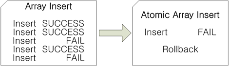

<!-- START doctoc generated TOC please keep comment here to allow auto update -->
<!-- DON'T EDIT THIS SECTION, INSTEAD RE-RUN doctoc TO UPDATE -->


- [Precompiler User’s Manual](#precompiler-users-manual)
  - [8.커서 처리 SQL문](#8%EC%BB%A4%EC%84%9C-%EC%B2%98%EB%A6%AC-sql%EB%AC%B8)
    - [개요](#%EA%B0%9C%EC%9A%94)
    - [커서 관련 내장 SQL문](#%EC%BB%A4%EC%84%9C-%EA%B4%80%EB%A0%A8-%EB%82%B4%EC%9E%A5-sql%EB%AC%B8)
    - [동일한 커서 이름 재사용 방법](#%EB%8F%99%EC%9D%BC%ED%95%9C-%EC%BB%A4%EC%84%9C-%EC%9D%B4%EB%A6%84-%EC%9E%AC%EC%82%AC%EC%9A%A9-%EB%B0%A9%EB%B2%95)
    - [예제 프로그램](#%EC%98%88%EC%A0%9C-%ED%94%84%EB%A1%9C%EA%B7%B8%EB%9E%A8)
  - [9.배열 처리 SQL문](#9%EB%B0%B0%EC%97%B4-%EC%B2%98%EB%A6%AC-sql%EB%AC%B8)
    - [배열 호스트 변수의 개요](#%EB%B0%B0%EC%97%B4-%ED%98%B8%EC%8A%A4%ED%8A%B8-%EB%B3%80%EC%88%98%EC%9D%98-%EA%B0%9C%EC%9A%94)
    - [내장 SQL문에서 배열 호스트 변수 사용](#%EB%82%B4%EC%9E%A5-sql%EB%AC%B8%EC%97%90%EC%84%9C-%EB%B0%B0%EC%97%B4-%ED%98%B8%EC%8A%A4%ED%8A%B8-%EB%B3%80%EC%88%98-%EC%82%AC%EC%9A%A9)
    - [sqlca.sqlerrd](#sqlcasqlerrd)
    - [제한 사항](#%EC%A0%9C%ED%95%9C-%EC%82%AC%ED%95%AD)
    - [구조체와 배열](#%EA%B5%AC%EC%A1%B0%EC%B2%B4%EC%99%80-%EB%B0%B0%EC%97%B4)
    - [예제 프로그램](#%EC%98%88%EC%A0%9C-%ED%94%84%EB%A1%9C%EA%B7%B8%EB%9E%A8-1)
  - [10.동적 SQL문](#10%EB%8F%99%EC%A0%81-sql%EB%AC%B8)
    - [정적 SQL문과 동적 SQL문](#%EC%A0%95%EC%A0%81-sql%EB%AC%B8%EA%B3%BC-%EB%8F%99%EC%A0%81-sql%EB%AC%B8)
    - [동적 SQL문의 종류](#%EB%8F%99%EC%A0%81-sql%EB%AC%B8%EC%9D%98-%EC%A2%85%EB%A5%98)
    - [예제 프로그램](#%EC%98%88%EC%A0%9C-%ED%94%84%EB%A1%9C%EA%B7%B8%EB%9E%A8-2)
  - [11.저장 프로시저 처리 SQL문](#11%EC%A0%80%EC%9E%A5-%ED%94%84%EB%A1%9C%EC%8B%9C%EC%A0%80-%EC%B2%98%EB%A6%AC-sql%EB%AC%B8)
    - [저장 프로시저 처리 SQL문](#%EC%A0%80%EC%9E%A5-%ED%94%84%EB%A1%9C%EC%8B%9C%EC%A0%80-%EC%B2%98%EB%A6%AC-sql%EB%AC%B8)
    - [배열 타입의 호스트 변수 사용](#%EB%B0%B0%EC%97%B4-%ED%83%80%EC%9E%85%EC%9D%98-%ED%98%B8%EC%8A%A4%ED%8A%B8-%EB%B3%80%EC%88%98-%EC%82%AC%EC%9A%A9)
    - [예제 프로그램](#%EC%98%88%EC%A0%9C-%ED%94%84%EB%A1%9C%EA%B7%B8%EB%9E%A8-3)
  - [12.다중 연결 프로그램](#12%EB%8B%A4%EC%A4%91-%EC%97%B0%EA%B2%B0-%ED%94%84%EB%A1%9C%EA%B7%B8%EB%9E%A8)
    - [개요](#%EA%B0%9C%EC%9A%94-1)
    - [다중 연결 프로그램에서 내장 SQL문 사용 방법](#%EB%8B%A4%EC%A4%91-%EC%97%B0%EA%B2%B0-%ED%94%84%EB%A1%9C%EA%B7%B8%EB%9E%A8%EC%97%90%EC%84%9C-%EB%82%B4%EC%9E%A5-sql%EB%AC%B8-%EC%82%AC%EC%9A%A9-%EB%B0%A9%EB%B2%95)
    - [다중 연결 프로그램에서의 저장 프로시저 처리 SQL문](#%EB%8B%A4%EC%A4%91-%EC%97%B0%EA%B2%B0-%ED%94%84%EB%A1%9C%EA%B7%B8%EB%9E%A8%EC%97%90%EC%84%9C%EC%9D%98-%EC%A0%80%EC%9E%A5-%ED%94%84%EB%A1%9C%EC%8B%9C%EC%A0%80-%EC%B2%98%EB%A6%AC-sql%EB%AC%B8)
    - [예제 프로그램](#%EC%98%88%EC%A0%9C-%ED%94%84%EB%A1%9C%EA%B7%B8%EB%9E%A8-4)
  - [13.멀티쓰레드 프로그램](#13%EB%A9%80%ED%8B%B0%EC%93%B0%EB%A0%88%EB%93%9C-%ED%94%84%EB%A1%9C%EA%B7%B8%EB%9E%A8)
    - [멀티쓰레드 프로그램](#%EB%A9%80%ED%8B%B0%EC%93%B0%EB%A0%88%EB%93%9C-%ED%94%84%EB%A1%9C%EA%B7%B8%EB%9E%A8)
    - [예제 프로그램](#%EC%98%88%EC%A0%9C-%ED%94%84%EB%A1%9C%EA%B7%B8%EB%9E%A8-5)
  - [14.전처리 오류 코드/메시지](#14%EC%A0%84%EC%B2%98%EB%A6%AC-%EC%98%A4%EB%A5%98-%EC%BD%94%EB%93%9C%EB%A9%94%EC%8B%9C%EC%A7%80)
    - [전처리 오류](#%EC%A0%84%EC%B2%98%EB%A6%AC-%EC%98%A4%EB%A5%98)
  - [A. 부록: LOB데이터와 파일](#a-%EB%B6%80%EB%A1%9D-lob%EB%8D%B0%EC%9D%B4%ED%84%B0%EC%99%80-%ED%8C%8C%EC%9D%BC)
    - [출력 호스트 변수와 파일](#%EC%B6%9C%EB%A0%A5-%ED%98%B8%EC%8A%A4%ED%8A%B8-%EB%B3%80%EC%88%98%EC%99%80-%ED%8C%8C%EC%9D%BC)
    - [입력 호스트 변수와 파일](#%EC%9E%85%EB%A0%A5-%ED%98%B8%EC%8A%A4%ED%8A%B8-%EB%B3%80%EC%88%98%EC%99%80-%ED%8C%8C%EC%9D%BC)
  - [B. 부록: Proc\*C에서 APRE로 변환](#b-%EB%B6%80%EB%A1%9D-proc%5Cc%EC%97%90%EC%84%9C-apre%EB%A1%9C-%EB%B3%80%ED%99%98)
    - [데이터 타입 비교](#%EB%8D%B0%EC%9D%B4%ED%84%B0-%ED%83%80%EC%9E%85-%EB%B9%84%EA%B5%90)
    - [내장 함수 비교](#%EB%82%B4%EC%9E%A5-%ED%95%A8%EC%88%98-%EB%B9%84%EA%B5%90)
    - [데이터베이스 연결/해제](#%EB%8D%B0%EC%9D%B4%ED%84%B0%EB%B2%A0%EC%9D%B4%EC%8A%A4-%EC%97%B0%EA%B2%B0%ED%95%B4%EC%A0%9C)
    - [호스트 변수](#%ED%98%B8%EC%8A%A4%ED%8A%B8-%EB%B3%80%EC%88%98)
    - [내장 SQL문](#%EB%82%B4%EC%9E%A5-sql%EB%AC%B8)
    - [수행 결과 및 상태 코드](#%EC%88%98%ED%96%89-%EA%B2%B0%EA%B3%BC-%EB%B0%8F-%EC%83%81%ED%83%9C-%EC%BD%94%EB%93%9C)
    - [기타 차이점](#%EA%B8%B0%ED%83%80-%EC%B0%A8%EC%9D%B4%EC%A0%90)
    - [예제 프로그램](#%EC%98%88%EC%A0%9C-%ED%94%84%EB%A1%9C%EA%B7%B8%EB%9E%A8-6)
  - [C. 부록: 동적 SQL의 메소드4 사용](#c-%EB%B6%80%EB%A1%9D-%EB%8F%99%EC%A0%81-sql%EC%9D%98-%EB%A9%94%EC%86%8C%EB%93%9C4-%EC%82%AC%EC%9A%A9)
    - [SQLDA구조체의 데이터 타입](#sqlda%EA%B5%AC%EC%A1%B0%EC%B2%B4%EC%9D%98-%EB%8D%B0%EC%9D%B4%ED%84%B0-%ED%83%80%EC%9E%85)
  - [D. 부록: 샘플 코드](#d-%EB%B6%80%EB%A1%9D-%EC%83%98%ED%94%8C-%EC%BD%94%EB%93%9C)
    - [예제 프로그램 수행](#%EC%98%88%EC%A0%9C-%ED%94%84%EB%A1%9C%EA%B7%B8%EB%9E%A8-%EC%88%98%ED%96%89)
    - [예제 프로그램의 테이블 정보](#%EC%98%88%EC%A0%9C-%ED%94%84%EB%A1%9C%EA%B7%B8%EB%9E%A8%EC%9D%98-%ED%85%8C%EC%9D%B4%EB%B8%94-%EC%A0%95%EB%B3%B4)
  - [E. 부록: FAQ](#e-%EB%B6%80%EB%A1%9D-faq)
    - [Precompiler FAQ](#precompiler-faq)

<!-- END doctoc generated TOC please keep comment here to allow auto update -->

Altibase® Application Development

# Precompiler User’s Manual


Altibase Application Development Precompiler User’s Manual

Release 7.1

Copyright ⓒ 2001\~2018 Altibase Corp. All Rights Reserved.

본 문서의 저작권은 ㈜알티베이스에 있습니다. 이 문서에 대하여 당사의 동의 없이
무단으로 복제 또는 전용할 수 없습니다.

㈜알티베이스

08378 서울시 구로구 디지털로 306 대륭포스트타워Ⅱ 10층

전화: 02-2082-1114 팩스: 02-2082-1099

고객서비스포털: <http://support.altibase.com>

homepage: [http://www.altibase.com](http://www.altibase.com/)

## 8.커서 처리 SQL문

### 개요

질의 결과로 여러 개의 레코드가 반환될 경우 커서를 선언해서 사용할 수 있다.

APRE는 커서를 선언하고 조작하는 다양한 내장 SQL문을 지원한다. 커서 관련 내장
SQL문은 커서 선언문, 커서 OPEN문, 커서 FETCH문, 커서 CLOSE문, 커서 CLOSE
RELEASE문이 있다.

#### 커서 처리 SQL문의 사용 순서

커서 처리 SQL문의 사용순서는 다음과 같다.

1. 커서 선언문
2. 커서 OPEN문
3. 커서 FETCH문  
   조건에 맞는 레코드를 모두 가져오기 위해서는 수행 결과가 SQL_NO_DATA일 때까지
   커서 FETCH문을 반복 수행해야 한다.
4. 커서 CLOSE문 또는 커서 CLOSE RELEASE문

> #### 주의 사항
>
> 선언되지 않은 커서 이름으로 커서 OPEN문, 커서 FETCH문, 커서 CLOSE문, 커서 CLOSE
> RELEASE문을 수행할 경우 “The cursor does not exist.” 오류가 발생한다.
>
> 한 프로그램 내에서 같은 커서 이름을 하나 이상 선언할 수 있다. 이 경우 실행
> 시간에 가장 최근에 선언한 커서만이 유효하다. 즉, OPEN, FETCH, CLOSE, CLOSE
> RELEASE문은 가장 최근에 선언한 커서를 적용한다는 뜻이다.

### 커서 관련 내장 SQL문

여기에서는 각각의 커서 관련 내장 SQL문들에 대해 자세히 알아보기로 하자.

#### DECLARE CURSOR

커서를 선언한다.

##### 구문

```
EXEC SQL DECLARE <cursor name> 
[SENSITIVE | INSENSITIVE] [SCROLL]
CURSOR [WITH HOLD] FOR <cursor specification>;
```

##### 인자

\<*cursor name*\>: 커서 이름. 커서 이름은 알파벳(a\~z, A\~Z), 밑줄("_") 또는
달러 기호("\$")로 시작하여야 하며, 길이는 50 bytes로 제한된다.

SENSITIVE \| INSENSITIVE: sensitive 커서는 데이터 수정을 커서의 결과 집합에
반영한다. 즉, 행 집합을 다시 가져올 필요가 있는 경우, 데이터베이스에서 최신
데이터를 가져온다. insensitive 커서는 커서가 열린 시점의 데이터를 커서의 결과
집합에 유지한다.

SCROLL: 결과 집합에서 커서의 위치를 임의로 이동 가능하다. SCROLL과 SENSITIVE를
함께 사용해야 효과가 있다.

WITH HOLD: 트랜잭션 완료 후에도 커서가 닫히지 않는다. 세션이 non-autocommit
모드일 경우에만 유효하다.

SENSITIVE, SCROLL, 및 WITH HOLD 같은 커서 유형의 상세한 설명은 *CLI User's
Manual*를 참고하기 바란다.

\<cursor specification\>: Altibase SQL의 SELECT문에 해당한다. *SQL Reference*
참조한다.

##### 설명

커서 선언문은 커서 처리 SQL문 중에서 가장 먼저 수행되어야 한다. 선언되지 않은
커서 이름으로 다른 커서 조작문을 수행할 경우 “The cursor does not exist.” 오류가
발생한다.

커서 선언문 실행 시, 서버에서는 지정한 SQL문의 구문 검사(syntax check), 의미
검사(semantic check), 최적화(optimization), 실행 계획(execution plan) 작성 등
SQL문 수행을 위한 준비(prepare)를 한다. 이렇게 미리 SQL문의 수행 준비를 함으로써
한 번만 준비(ODBC의 SQLPrepare에 해당함-DECLARE CURSOR)하여 여러 번 실행(ODBC의
SQLExecute에 해당함-OPEN CURSOR)할 수 있으므로 성능 향상의 효과를 얻을 수 있다.

##### 제한 사항

SELECT문의 제한 사항이 그대로 적용된다.

##### 예제

다음은 DEPARTMENTS 테이블의 모든 레코드를 검색하는 커서를 선언하는 예를
보여준다.

\< 예제 프로그램 : cursor1.sc \>

```
EXEC SQL DECLARE DEPT_CUR CURSOR FOR 
             SELECT *
             FROM DEPARTMENTS; 
```

#### OPEN

커서를 오픈한다.

##### 구문

```
EXEC SQL OPEN <cursor name>;
```

##### 인자

\<cursor name\>: 커서 이름

##### 설명

커서 OPEN문은 커서 선언문의 SQL문을 수행한다.

수행되는 SQL문은 이미 커서 선언문에서 수행 준비가 끝난 SQL문이다. SQL문이 수행될
때 데이터베이스 서버는 테이블에서 조건에 맞는 레코드를 찾는다.

OPEN상태인 커서를 CLOSE수행 없이 OPEN 할 수 있으며, 이는 CLOSE한 후에 OPEN한
것과 같다.

##### 예제

다음은 DEPT_CUR을 OPEN하는 예를 보여준다.

\< 예제 프로그램 : cursor1.sc \>

```
EXEC SQL OPEN DEPT_CUR;
```

#### FETCH

열린 커서로부터 칼럼의 값들을 읽어서 이에 대응되는 호스트 변수에 저장한다.

##### 구문

```
EXEC SQL FETCH [<fetch_orientation>]
<cursor name> INTO <host_var_list>;
```

##### 인자

\<cursor name\>: 커서 이름

\<host_var_list\>: 출력 호스트 변수와 출력 지시자 변수 리스트

###### \<fetch_orientation\>

결과 집합 내에서 커서의 위치를 지정하여 값을 가져온다. 아래의 값이 올 수 있다.

- FIRST: 결과 집합 내에서 첫 번째 행의 값을 가져온다.
- LAST: 결과 집합 내에서 마지막 행의 값을 가져온다.
- PRIOR: 현재 커서의 위치에서 이전 행의 값을 가져온다.
- NEXT: 현재 커서의 위치에서 다음 행의 값을 가져온다.
- CURRENT: 현재 커서 위치의 값을 가져온다.
- RELATIVE n: 현재 커서의 위치에서 n 만큼 다음 행의 값을 가져온다.
- ABSOLUTE n: 결과 집합 내에서 n 번째 행의 값을 가져온다.

##### 설명

커서를 다음 레코드로 이동시킨 후, 칼럼 값들을 대응하는 호스트 변수에 저장한다.

##### 수행 결과

다음은 커서 FETCH문의 수행 결과가 SQL_SUCCESS인 경우와 SQL_NO_DATA인 경우에 대해
설명한다.

- 결과가 SQL_SUCCESS인 경우  
  현재 FETCH 결과가 호스트 변수에 성공적으로 저장되고 데이터베이스 서버에는
  반환할 결과가 남아 있음을 의미한다.  
  일반적으로 응용 프로그램 내에서, 결과가 SQL_SUCCESS인 경우 FETCH를
  계속하도록 프로그램 코드를 작성한다.
- 결과가 SQL_NO_DATA인 경우  
  현재 FETCH 결과가 없으며 호스트 변수에는 아무것도 저장되지 않기 때문에
  호스트 변수값은 무의미(garbage value)하다. 데이터베이스 서버는 조건에 맞는
  레코드를 이미 모두 반환하였거나, 조건에 맞는 레코드가 없음을 의미한다.

##### 예제

다음은 DEPT_CUR를 FETCH하는 예를 보여준다. 반환된 칼럼값들은 각각 s_department의
구성 요소에 저장된다. s_dept_ind 지시자 변수를 이용해 반환된 칼럼값의 NULL
여부를 검사할 수 있다. while loop 안에서 SQL_NO_DATA가 반환될 때까지 FETCH하여
조건에 맞는 모든 레코드를 가져온다.

\< 예제 프로그램 : hostvar.h \>

```
EXEC SQL BEGIN DECLARE SECTION;
typedef struct department
{
    short dno; 
    char  dname[30+1];
    char  dep_location[9+1];
    int   mgr_no;
} department;

typedef struct dept_ind
{
    int dno; 
    int dname;
    int dep_location;
    int mgr_no;
} dept_ind;
EXEC SQL END DECLARE SECTION;
```

\< 예제 프로그램 : cursor1.sc \>

```
/* specify path of header file */
EXEC SQL OPTION (INCLUDE=./include);
/* include header file for precompile */
EXEC SQL INCLUDE hostvar.h;

EXEC SQL BEGIN DECLARE SECTION;
/* declare host variables */
department s_department;
/* structure indicator variables */
dept_ind s_dept_ind;
EXEC SQL END DECLARE SECTION;

while(1)
{
EXEC SQL FETCH DEPT_CUR
       INTO :s_department :s_dept_ind;
    if (sqlca.sqlcode == SQL_SUCCESS) 
{
        printf("%d     %s %s          %d\n",
                  s_department.dno, s_department.dname,
                  s_department.dep_location, 
s_department.mgr_no);
    }
    else if (sqlca.sqlcode == SQL_NO_DATA)
    {
        break;
    }
    else 
    {
        printf("Error : [%d] %s\n", SQLCODE, 
sqlca.sqlerrm.sqlerrmc);
        break;
    }
}
```

#### CLOSE

커서를 닫는다.

##### 구문

```
EXEC SQL CLOSE <cursor name>;
```

##### 인자

\<cursor name\>: 커서 이름

##### 설명

커서 CLOSE문은 데이터베이스 서버에서 반환할 결과가 남아 있다면(FETCH를 끝까지
하지 않은 경우) 그 결과를 삭제한다. 즉, 커서 CLOSE문 수행 후에는, 그 커서로
FETCH문을 바로 수행할 수 없다. 만약 같은 커서 이름을 재사용하고자 한다면 커서를
다시 OPEN 후 FETCH하여야 한다.

커서 CLOSE문 실행 시에 커서에 할당된 자원은 해제되지 않고 커서 선언문에서 수행한
SQL문의 준비 작업 내용도 그대로 저장된다. 따라서 커서 CLOSE문 수행 후 같은 커서
이름을 재사용할 경우 커서 선언문은 생략하고 바로 커서 OPEN문 수행이 가능하다.

##### 예제

다음은 DEPT_CUR를 CLOSE하는 예를 보여준다.

\< 예제 프로그램 : cursor1.sc \>

```
EXEC SQL CLOSE DEPT_CUR;
```

#### CLOSE RELEASE

커서를 닫고 커서에 할당된 자원을 해제한다.

##### 구문

```
EXEC SQL CLOSE RELEASE <cursor name>;
```

##### 인자

\<cursor name\>: 커서 이름

##### 설명

커서 CLOSE RELEASE문은 커서에 할당된 자원을 해제하고 커서 선언문에서 수행한
SQL문을 실행하기 위한 준비 작업 내용도 모두 삭제한다. 만약 커서가 반환할 결과가
남아 있다면 그 결과도 모두 삭제한다. 따라서 커서 CLOSE RELEASE문 수행 후 동일한
커서 이름을 재사용할 경우 커서 선언문, 커서 OPEN문 순서로 수행하여야 한다. 즉,
커서 CLOSE RELEASE문 수행 후 같은 커서 이름으로 커서 OPEN문을 바로 수행할 수
없다.

##### 예제

다음은 EMP_CUR를 CLOSE RELEASE 하는 예를 보여준다. 이 때, EMP_CUR의 선언문에서
수행된 SQL문의 준비 작업 내용이 삭제되고, EMP_CUR에 할당된 모든 자원이 해제된다.

\< 예제 프로그램 : cursor2.sc \>

```
EXEC SQL CLOSE RELEASE EMP_CUR;
```

### 동일한 커서 이름 재사용 방법

여기에서는 동일한 커서 이름을 재사용 하는 경우에 대해서만 언급하기로 한다.
동일한 커서 이름을 반복하여 사용할 경우, 어떤 순서로 사용하여야 하고 주의 사항은
무엇인지에 대해 설명한다.

#### 각 커서 처리 SQL문들의 선후관계

다음은 동일한 커서 이름을 재사용하고자 할 경우 각 커서 조작문은 어떤 다른 커서
조작문 다음에 사용할 수 있는지에 대해 설명한다.

- DECLARE CURSOR  
  커서 선언문은 커서 CLOSE문, 커서 CLOSE RELEASE문 후에 수행 가능하다.
- OPEN  
  커서 OPEN문은 FETCH를 끝까지 한 경우 마지막 레코드 FETCH 후에, 또는 커서
  CLOSE문 후에 수행 가능하다.
- FETCH  
  커서 FETCH문은 커서 OPEN문 후, 또는 FETCH 후 결과가 SQL_SUCCESS인 경우 커서
  FETCH문 후에 수행 가능하다.
- CLOSE  
  커서 CLOSE문은 커서 선언문, 커서 OPEN문, 커서 FETCH문(결과가 SQL_SUCCESS,
  SQL_NO_DATA 모두 가능) 후에 수행 가능하다.
- CLOSE RELEASE  
  커서 CLOSE RELEASE문은 커서 선언문, 커서 OPEN문, 커서 FETCH문(결과가
  SQL_SUCCESS, SQL_NO_DATA 모두 가능), 커서 CLOSE문 후에 수행 가능하다.

#### 커서 처리 SQL문과 호스트 변수와의 관계

다음은 커서 선언문에 사용된 입력 호스트 변수가 전역 변수인지 지역 변수인지에
따라 커서 처리 SQL문을 어떻게 사용하여야 하는지에 대해 설명한다.

- 커서 선언문에 사용된 호스트 변수가 전역 변수라면 동일한 커서 이름 재사용 시
  커서 CLOSE문 후 DECLARE 없이 커서 OPEN문 수행이 가능하다.
- 커서 선언문에 사용된 호스트 변수가 지역 변수라면, 즉 함수내에 커서 선언문이
  있다면, 동일한 커서 이름 재사용 하기 위해서는 먼저 그 커서를 CLOSE한 후 커서
  선언문을 수행해야 한다. 이유는 커서 선언문 수행 시, 커서 선언문에 사용된
  호스트 변수들의 포인터를 내부적으로 저장하고 커서 OPEN문 수행 시 이 저장된
  호스트 변수들의 포인터를 사용하는데, 이 호스트 변수들이 지역 변수라면 함수
  재 호출 시 포인터가 바뀔 수 있고, 커서 OPEN문을 수행할 때 유효하지 않은 값을
  참조하게 된다. 따라서, 함수 재 호출 시에는 매번 커서 선언문을 수행하여
  포인터를 저장하도록 해야 한다.

#### CLOSE와 CLOSE RELEASE

다음은 커서 CLOSE문과 커서 CLOSE RELEASE문의 차이점에 대해서 설명한다.

- 커서 CLOSE RELEASE문 후에 동일한 커서 이름을 재사용하고자 할 경우 반드시
  커서 선언문을 수행하여야 한다. 이유는 커서 CLOSE RELEASE문 수행 시 이 커서에
  대한 정보와 자원을 모두 해제하므로 커서 선언문을 수행하여 이 커서에 필요한
  자원을 할당받고 SQL문 수행을 위한 준비를 하여야 한다. 따라서 일반적으로
  커서를 재사용할 경우 커서 CLOSE RELEASE문을 수행하지 않고 커서 CLOSE문을
  수행한다.
- FETCH를 끝까지 수행한 경우(커서 FETCH문의 결과가 SQL_NO_DATA인 경우) 커서
  CLOSE문 또는 커서 CLOSE RELEASE문 중 선택하여 수행할 수 있다. 이 커서를
  재사용하고자 할 경우 커서 CLOSE문을, 재사용하지 않을 경우 커서 CLOSE
  RELEASE문을 수행하면 된다. 커서 CLOSE문 후 커서 CLOSE RELEASE문 수행이
  가능하지만 커서 닫기 연산을 2번 수행한다는 것은 낭비적이다.
- 정리하자면, 커서를 재사용한다면 CLOSE문을, 재사용하지 않는다면 CLOSE
  RELEASE문을 사용하길 권장한다. 일반적으로 커서를 1회용으로 사용하는
  경우(재사용하지 않는 경우)는 거의 없으므로 커서 CLOSE RELEASE문은 거의
  사용되지 않는다. 만약 계속해서 재사용 될 커서를 CLOSE RELEASE -\> 커서
  선언문 -\> 커서 OPEN문 순으로 수행한다면 성능 저하를 초래하게 된다.

### 예제 프로그램

##### cursor1.sc 

$ALTIBASE_HOME/sample/APRE/curosor1.sc 참고

##### 실행결과

```
$ is –f schema/schema.sql
$ make cursor1
$ ./cursor1
<CURSOR 1>
------------------------------------------------------
[Declare Cursor]                                                  
------------------------------------------------------
Success declare cursor

------------------------------------------------------
[Open Cursor]                                                     
------------------------------------------------------
Success open cursor

------------------------------------------------------
[Fetch Cursor]                                                    
------------------------------------------------------
DNO      DNAME                          DEP_LOCATION       MGR_NO 
------------------------------------------------------
1001     RESEARCH DEVELOPMENT DEPT 1    New York           16
1002     RESEARCH DEVELOPMENT DEPT 2    Sydney             13
1003     SOLUTION DEVELOPMENT DEPT      Japan              14
2001     QUALITY ASSURANCE DEPT         Seoul              17
3001     CUSTOMER SUPPORT DEPT          London             4
3002     PRESALES DEPT                  Peking             5
4001     MARKETING DEPT                 Seoul              8
4002     BUSINESS DEPT                  LA                 7

------------------------------------------------------
[Close Cursor]                                                    
------------------------------------------------------
Success close cursor
```

##### cursor2.sc 

$ALTIBASE_HOME/sample/APRE/curosor2.sc 참고

##### 실행결과

```
$ is –f schema/schema.sql
$ make cursor2
$ ./cursor2
<CURSOR 2>
------------------------------------------------------
[Declare Cursor]                                                  
------------------------------------------------------
Success declare cursor

------------------------------------------------------
[Open Cursor]                                                     
------------------------------------------------------
Success open cursor

------------------------------------------------------
[Fetch Cursor]                                                    
------------------------------------------------------
ENO     DNO      SALARY                        
------------------------------------------------------
2         -1     1500000.00
3       1001     2000000.00
4       3001     1800000.00
5       3002     2500000.00
6       1002     1700000.00
7       4002      500000.00
9       4001     1200000.00
10      1003     4000000.00
11      1003     2750000.00
12      4002     1890000.00
13      1002      980000.00
14      1003     2003000.00
15      1003     1000000.00
16      1001     2300000.00
17      2001     1400000.00
18      4001     1900000.00
19      4002     1800000.00

------------------------------------------------------
[Close Release Cursor]                                            
------------------------------------------------------
Success close release cursor
```

## 9.배열 처리 SQL문

### 배열 호스트 변수의 개요

이 장에서는 배열 타입의 호스트 변수를 선언하고 사용하는 방법에 대해서 알아본다.

#### 정의 및 선언

배열 호스트 변수란 호스트 변수의 데이터 타입으로 사용 가능한 데이터 타입들에
대해 1차원 또는 2차원으로 배열 선언된 호스트 변수를 말한다.

타입과 varchar 타입에 대해 2차원 배열까지 선언이 가능하고 그 외 타입들은 1차원
배열 선언이 가능하다. 예외적으로 pointer 타입은 배열로 선언할 수 없다.

##### 예제

배열 호스트 변수를 선언하는 다양한 예를 보여준다.

[예제 1] 다음은 , 숫자형 타입의 배열 타입을 호스트 변수로 선언하는 예를
보여준다.

\< 예제 프로그램 : arrays1.sc \>

```
EXEC SQL BEGIN DECLARE SECTION;
char    a_gno[3][10+1];
char    a_gname[3][20+1];
char    a_goods_location[3][9+1];
int     a_stock[3];
double  a_price[3];
EXEC SQL END DECLARE SECTION;
```

[예제 2] 다음은 구조체의 배열 타입을 호스트 변수로 선언하는 예를 보여준다.

\< 예제 프로그램 : hostvar.h \>

```
EXEC SQL BEGIN DECLARE SECTION;
typedef struct goods
{
    char   gno[10+1];
    char   gname[20+1];
    char   goods_location[9+1];
    int    stock;
    double price;
} goods;
EXEC SQL END DECLARE SECTION;
```

\< 예제 프로그램 : arrays1.sc \>

```
EXEC SQL BEGIN DECLARE SECTION;
goods   a_goods[3];
EXEC SQL END DECLARE SECTION;
```

[예제 3] 다음은 구성 요소가 배열인 구조체 타입을 호스트 변수로 선언하는 예를
보여준다.

\< 예제 프로그램 : arrays1.sc \>

```
EXEC SQL BEGIN DECLARE SECTION;
struct
{
    char    gno[3][10+1];
    char    gname[3][20+1];
    char    goods_location[3][9+1];
    int     stock[3];
    double  price[3];
} a_goods2;
EXEC SQL END DECLARE SECTION;
```

#### 장점

배열 타입의 호스트 변수를 사용할 경우 성능 향상의 효과가 있다.

다음의 설명을 통해 어떻게 성능 향상의 효과가 있는지 알아보자.

INSERT문에서 배열 타입의 호스트 변수를 사용하는 경우와 배열 타입이 아닌 호스트
변수를 사용하는 경우를 비교해 보자. 배열 크기가 1000이라고 한다면 배열 타입의
호스트 변수를 사용하는 경우 INSERT문 한 번 수행 시 1000건의 레코드가 삽입된다.
배열 타입이 아닌 호스트 변수를 사용하는 경우 1000건의 레코드를 삽입하기 위해서는
INSERT문을 1000번 수행하여야 한다. 이 때 1000번의 데이터베이스 서버와의 통신이
발생한다. 따라서 배열 타입의 호스트 변수를 사용하는 경우, 배열 타입이 아닌
호스트 변수를 사용하는 경우에 비해 통신량이 줄어 성능이 향상된다.

FETCH문에서 배열 타입의 호스트 변수를 사용하는 경우와 배열 타입이 아닌 호스트
변수를 사용하는 경우를 비교해 보자. 배열 크기가 1000이라고 한다면 배열 타입의
호스트 변수를 사용하는 경우 FETCH문 한 번 수행 시 1000건의 레코드가 배열
0번째부터 차례로 저장된다. 배열 타입이 아닌 호스트 변수를 사용하는 경우 1000건의
레코드를 가져오기 위해서는 FETCH문을 1000번 수행하여야 한다. 그러나 이 때
FETCH문을 수행할 때마다 데이터베이스 서버와의 통신이 발생하지는 않는다. 왜냐하면
내부적으로 미리 일정 건수만큼 데이터베이스 서버로부터 가져와서 저장하고 있다가
FETCH문을 수행할 때마다 한 건씩 호스트 변수에 저장해 주기 때문이다. 따라서
FETCH문 수행 시 배열 타입의 호스트 변수를 사용한다고 해서 큰 성능 향상을
기대하기는 어렵다. 다만 FETCH문의 수행 횟수를 줄임으로써 약간의 성능 향상을
기대할 수 있다.

#### CONNTYPE과 배열 호스트 변수

##### CONNTYPE

CONNTYPE은 데이터베이스 서버와의 통신 방법을 결정하는 옵션으로 데이터베이스
서버와 연결할 때 지정할 수 있다. CONNTYPE은 성능에 많은 영향을 미치며, 배열
타입의 호스트 변수 사용시에도 관계가 있다.

CONNTYPE옵션의 설정에 대한 설명은 6장을 참조하기 바란다.

##### CONNTYPE의 종류

지원하는 CONNTYPE은 TCP, UNIX, IPC가 있다.

##### CONNTYPE과 호스트 변수의 배열 크기와의 관계

일반적으로 CONNTYPE의 성능은 IPC, UNIX, TCP 순으로 좋다. 그러나 입력 호스트
변수를 배열 타입으로 사용할 경우에는 그렇지 않을 수 있다. 따라서 입력 호스트
변수를 배열 타입으로 사용할 경우에는 CONNTYPE과 배열 크기를 변경하면서
테스트하여 가장 좋은 성능을 내는 CONNTYPE과 배열 크기를 구해서 사용하면 된다.

### 내장 SQL문에서 배열 호스트 변수 사용

다양한 내장 SQL문 안에서 배열 타입의 호스트 변수를 사용할 수 있다.

#### INSERT문

다음은 INSERT문에서 사용할 수 있는 배열 타입들이다.

- 숫자형, 타입의 배열
- 구조체의 배열
- 구성 요소가 배열인 구조체

##### 예제

다음은 INSERT문에서 배열 호스트 변수를 입력 호스트 변수로 사용하는 예를
보여준다.

\< 예제 프로그램 : arrays1.sc \>

```
EXEC SQL BEGIN DECLARE SECTION;
char    a_gno[3][10+1];
char    a_gname[3][20+1];
char    a_goods_location[3][9+1];
int     a_stock[3];
double  a_price[3];
EXEC SQL END DECLARE SECTION;

strcpy(a_gno[0], "X111100001");
strcpy(a_gno[1], "X111100002");
strcpy(a_gno[2], "X111100003");
strcpy(a_gname[0], "XX-201");
strcpy(a_gname[1], "XX-202");
strcpy(a_gname[2], "XX-203");
strcpy(a_goods_location[0], "AD0010");
strcpy(a_goods_location[1], "AD0011");
strcpy(a_goods_location[2], "AD0012");
a_stock[0] = 1000;
a_stock[1] = 1000;
a_stock[2] = 1000;
a_price[0] = 5500.21;
a_price[1] = 5500.45;
a_price[2] = 5500.99;

EXEC SQL INSERT INTO GOODS 
VALUES (:a_gno, :a_gname, :a_goods_location, 
:a_stock, :a_price);
```

#### UPDATE문

다음은 UPDATE문에서 사용할 수 있는 배열이다.

- 숫자형, 타입의 배열
- 구성 요소가 배열인 구조체

##### 제한 사항

UPDATE 문의 한 호스트 변수가 배열이라면, 모든 호스트 변수가 배열이어야 하고, 각
배열의 크기는 같아야 한다. UPDATE문의 SET 절과 WHERE절의 호스트 변수로 구조체의
배열은 사용할 수 없고, 아래의 예제처럼 구조체 배열 중 한 개의 배열 요소만
지정하여 사용할 수는 있다.

```
예) EXEC SQL BEGIN DECLARE SECTION;
struct tag1 { int i1; int i2; int i3; } var1[10];
EXEC SQL END DECLARE SECTION;

EXEC SQL UPDATE T1 
SET I1 = :var1[0].i1, I2 = :var1[0].i2 
WHERE I1 = :var1[0].i3;		(O)
```

##### 예제

다음은 UPDATE문에서 배열 호스트 변수를 입력 호스트 변수로 사용하는 예를
보여준다.

\< 예제 프로그램 : arrays1.sc \>

```
EXEC SQL BEGIN DECLARE SECTION;
int   a_eno[3];
short a_dno[3]; 
char  a_emp_tel[3][15+1];
EXEC SQL END DECLARE SECTION;

a_eno[0] = 10;
a_eno[1] = 11;
a_eno[2] = 12;
a_dno[0] = 2001;
a_dno[1] = 2001;
a_dno[2] = 2001;
strcpy(a_emp_tel[0], "01454112366");
strcpy(a_emp_tel[1], "0141237768");
strcpy(a_emp_tel[2], "0138974563");
  
EXEC SQL UPDATE EMPLOYEES 
SET DNO = :a_dno,
                 EMP_TEL = :a_emp_tel
            WHERE ENO = :a_eno; 
```

#### DELETE문

다음은 DELETE문에서 사용할 수 있는 배열이다.

- 숫자형, 타입의 배열
- 구성 요소가 배열인 구조체

##### 제한 사항

UPDATE문에서와 마찬가지로 구조체의 배열은 사용할 수 없고 아래의 예제처럼 구조체
배열 중 한 개의 배열 요소만 지정하여 사용할 수는 있다.

```
예) EXEC SQL BEGIN DECLARE SECTION;
struct tag1 { int i1; int i2; int i3; } var1[10];
EXEC SQL END DECLARE SECTION;

EXEC SQL DELETE FROM T1 
WHERE I1 = :var1[0].i1 AND 
I2 = :var1[0].i2 AND
I3 = :var1[0].i3;		(O)
```

##### 예제

다음은 DELETE문에서 배열 호스트 변수를 입력 호스트 변수로 사용하는 예를
보여준다.

\< 예제 프로그램 : arrays1.sc \>

```
EXEC SQL BEGIN DECLARE SECTION;
short a_dno[3]; 
EXEC SQL END DECLARE SECTION;

a_dno[0] = 4001;
a_dno[1] = 4002;
a_dno[2] = 2001;

EXEC SQL DELETE FROM EMPLOYEES
           WHERE DNO = :a_dno;
```

#### SELECT문

다음은 SELECT문에서 사용할 수 있는 배열이다. FETCH문에서도 아래 배열들을 사용할
수 있으며 제한 사항도 동일하게 적용된다.

- 숫자형, 문자형 타입의 배열
- 구조체의 배열
- 구성 요소가 배열인 구조체

##### 제한 사항

INTO절의 한 호스트 변수가 배열이라면, INTO 절의 모든 호스트 변수가 배열이어야
한다. WHERE절의 입력 호스트 변수는 배열일 수 없다.

```
예) EXEC SQL BEGIN DECLARE SECTION;
int var1;
int var2[10];
int var3[10];
EXEC SQL END DECLARE SECTION;
EXEC SQL SELECT * INTO :var1 
FROM T1 WHERE i1 = :var3;	(X)
또는 
EXEC SQL SELECT * INTO :var2 
FROM T1 WHERE i1 = :var3;	(X)
```

반환되는 레코드 개수가 배열 크기보다 많을 경우 “Returns too many rows“ 오류가
발생한다.

##### 예제

다음은 SELECT문에서 배열 호스트 변수를 출력 호스트 변수로 사용하는 예를
보여준다. 이 때 입력 호스트 변수는 배열이 아니다.

\< 예제 프로그램 : arrays2.sc \>

```
EXEC SQL BEGIN DECLARE SECTION;
short s_dno;
short a_dno[5];
char  a_dname[5][30+1];
char  a_dep_location[5][9+1];
EXEC SQL END DECLARE SECTION;

s_dno = 3000;
EXEC SQL SELECT DNO, DNAME, DEP_LOCATION 
INTO :a_dno, :a_dname, :a_dep_location
            FROM DEPARTMENTS 
WHERE DNO > :s_dno;
```

#### FOR절

배열 타입의 입력 호스트 변수를 사용하는 내장 SQL문에서 배열 요소 중 일부만을
처리하고 싶은 경우가 있다. 예를 들어 loop문 안에서 FETCH를 하고 이 FETCH된 것을
다시 INSERT할 때 마지막 FETCH 시 FETCH된 건수가 배열 크기보다 작을 수 있다. 이
때 FOR절을 이용하여 처리 개수를 지정하면 된다.

FOR절은 배열 타입의 입력 호스트 변수 사용 시 처리할 배열 요소의 개수를 지정하는
기능을 한다. FETCH문은 출력 호스트 변수를 사용해야 가능하다.

FOR절을 사용하면, 처리할 배열 요소의 개수는 호스트 변수의 실제 배열 크기에
우선한다. 예를 들어 호스트 변수의 배열 크기는 10이고 FOR절에서 개수를 5로
지정한다면 배열 요소 중 0번째부터 4번째까지 5개만 처리하게 된다.

내장 SQL문 수행 시마다 처리 개수가 변경되는 경우, FOR절을 사용하면 편리하다.

다음은 FOR절을 사용할 수 있는 내장 SQL문이다.

- INSERT문
- UPDATE문
- DELETE문
- FETCH문

##### 구문

```
EXEC SQL FOR <:host_var | constant> { INSERT … | UPDATE … | DELETE …| FETCH …} 
```

##### 인자

\<:*host_var*\>: *host_var*에 저장된 값이 처리 개수가 된다. 이 *host_var*는
호스트 변수 선언부에서 선언하지 않아도 무방하다.

\<*constant*\>: 처리할 배열 요소 개수를 상수로 지정한다.

> ##### 주의 사항
>
> FOR절에서 지정하는 개수는 1 이상이어야 한다.
>

```
예) EXEC SQL BEGIN DECLARE SECTION;
int cnt;
int var1[10];
int var2[10];
EXEC SQL END DECLARE SECTION;

cnt = 5;		(O)
EXEC SQL FOR :cnt INSERT INTO T1 VALUES (:var1, :var2);  
cnt = 0;		(X)
EXEC SQL FOR :cnt INSERT INTO T1 VALUES (:var1, :var2);
cnt = -1;		(X)
EXEC SQL FOR :cnt INSERT INTO T1 VALUES (:var1, :var2);
```

##### 예제

다양한 SQL문에서의 FOR절 사용 예를 보여준다.

[예제 1] 다음은 INSERT문에서 FOR절을 사용하는 예를 보여준다. 처리할 배열 요소
개수는 호스트 변수 cnt를 이용하여 지정하고 a_goods의 0번째, 1번째의 값들만 GOODS
테이블에 삽입한다.

\< 예제 프로그램 : hostvar.h \>

```
EXEC SQL BEGIN DECLARE SECTION;
typedef struct goods
{
    char   gno[10+1];
    char   gname[20+1];
    char   goods_location[9+1];
    int    stock;
    double price;
} goods;
EXEC SQL END DECLARE SECTION;
```

\< 예제 프로그램 : arrays1.sc \>

```
EXEC SQL BEGIN DECLARE SECTION;
goods   a_goods[3];
int cnt;
EXEC SQL END DECLARE SECTION;

cnt = 2;
EXEC SQL FOR :cnt INSERT INTO GOODS VALUES (:a_goods);
```

[예제 2] 다음은 UPDATE문에서 FOR절을 사용하는 예를 보여준다. 처리할 배열 요소
개수는 상수를 이용하여 지정하고 배열 0번째부터 2건만 처리한다. 즉,
a_employee.eno의 0번째, 1번째 값들에 해당하는 레코드의 DNO, EMP_TEL 칼럼값을
각각 a_employee.dno, a_employee.emp_tel의 0번째, 1번째 값으로 변경한다.

\< 예제 프로그램 : arrays1.sc \>

```
EXEC SQL BEGIN DECLARE SECTION;
struct
{
    int   eno[3];
    short dno[3];
    char  emp_tel[3][15+1];
} a_employee;
EXEC SQL END DECLARE SECTION;

EXEC SQL FOR 2 UPDATE EMPLOYEES 
SET DNO = :a_employee.dno,
                        EMP_TEL = :a_employee.emp_tel,
JOIN_DATE = SYSDATE
WHERE ENO = :a_employee.eno;
```

[예제 3] 다음은 DELETE문에서 FOR절을 사용하는 예를 보여준다. 처리할 배열 요소
개수는 호스트 변수 cnt를 이용하여 지정하고 배열 0번째부터 2건만 처리한다. 즉,
a_dno의 0번째, 1번째에 해당하는 레코드만 삭제한다.

\< 예제 프로그램 : arrays1.sc \>

```
EXEC SQL BEGIN DECLARE SECTION;
short a_dno[3]; 
int cnt;
EXEC SQL END DECLARE SECTION;

cnt = 2;
EXEC SQL FOR :cnt DELETE FROM EMPLOYEES  WHERE DNO = :a_dno;
```

[예제 4] 다음은 FETCH문에서 FOR절을 사용하는 예를 보여준다. 처리할 배열 요소
개수는 호스트 변수 cnt를 이용하여 지정하고 배열 0번째부터 2건의 데이터를
가져온다.

\< 예제 프로그램 : cursor2.sc \>

```
EXEC SQL BEGIN DECLARE SECTION;
/* declare array output host variables */
int     a_eno[ARRAY_SIZE];
short   a_dno[ARRAY_SIZE];
double  a_salary[ARRAY_SIZE];

/* declare input host variables */
double s_salary;

/* declare indicator variables */
SQLLEN a_eno_ind[ARRAY_SIZE];
SQLLEN a_dno_ind[ARRAY_SIZE];
SQLLEN a_salary_ind[ARRAY_SIZE];

int count;
EXEC SQL END DECLARE SECTION;
 
count = 2;
         /* Using with FOR clause */
         printf("FOR %d FETCH Result\n", count);
         EXEC SQL FOR :count FETCH EMP_CUR
                  INTO :a_eno     :a_eno_ind,
                       :a_dno     :a_dno_ind,

```

#### ATOMIC FOR절

배열 타입의 입력 호스트 변수를 사용하는 내장 SQL문에서 ATOMIC FOR 절을 사용할
경우 여러 개의 명령문을 묶어 하나의 명령문으로 처리하는 Atomic Array Insert를
수행한다.

따라서 ATOMIC FOR 절을 사용할 때 명령문이 1개라도 실패할 경우 모든 명령문은
실패한다. 결과값 역시 각각의 명령문이 아닌 한 개의 결과값으로 알려준다.



[그림 9‑1] Array Insert와 Atomic Array Insert의 결과값

기존의 Array Insert가 통신 비용을 줄여주는 장점이 있으나, Atomic Array Insert는
추가적으로 명령문 개수를 줄여주기 때문에 매우 빠른 성능을 제공한다.

다음은 Array Insert와 Atomic Array Insert를 비교한 표이다.

| 구분        | Array Insert | Atomic Array Insert |
| ----------- | ------------ | ------------------- |
| 명령문 개수 | Array 개수   | 1개                 |
| 결과 개수   | Array 개수   | 1개                 |
| 통신 속도   | 빠름         | 매우 빠름           |

[표 9‑1] Array Insert와 Atomic Array Insert의 차이

##### 구문

```
EXEC SQL ATOMIC FOR <:host_var | constant> {INSERT … }
```

##### 인자

\<:*host_var*\>: *host_var*에 저장된 값이 처리 개수가 된다. 이 *host_var*는
호스트 변수 선언부에서 선언하지 않아도 무방하다.

\<*constant*\>: 처리할 배열 요소 개수를 상수로 지정한다.

> ##### 주의 사항
>
> ATOMIC FOR 절은 INSERT 문에서만 사용할 수 있으며, 다른 DML구문에서는 사용할 수
> 없다.
>
> LOB 칼럼에 대해 Atomic Array Insert를 수행할 수 있으나, LOB 데이터를 전송할 때
> 오류가 발생하면 롤백이 되지 않는다. 따라서 이 경우 사용자가 직접 세이브포인트를
> 이용하여 롤백을 수행해야 한다.
>
> 이 외에도 ATOMIC FOR 절을 사용할 때의 몇 가지 제약사항을 다음과 같이 표로
> 정리한다.

| 구분                            | Array Insert                             | Atomic Array Insert               |
| ------------------------------- | ---------------------------------------- | --------------------------------- |
| Foreign Key                     | 정상 동작함                              | 정상 동작함                       |
| 유일키 제약                     | 정상 동작함                              | 정상 동작함                       |
| Not null 제약                   | 정상 동작함                              | 정상 동작함                       |
| Check 제약                      | 정상 동작함                              | 정상 동작함                       |
| 트리거 Each Row                 | N번 수행됨                               | N번 수행됨                        |
| 트리거 Each Statement           | N번 수행됨                               | 1번 수행됨                        |
| 파티션 테이블                   | 정상 동작함                              | 정상 동작함                       |
| 시퀀스                          | N번 수행됨                               | N번 수행됨                        |
| SYSDATE                         | N번 수행됨                               | 1번 수행됨                        |
| LOB 칼럼                        | 정상 동작함                              | 오류 발생시 Atomic 속성 보장 못함 |
| 프로시져                        | 정상 동작함                              | 정상 동작함                       |
| INSERT구문에 SubQuery가 있을 때 | Subquery를 위해 새로운 view를 N번 수행함 | 처음 수행된 view를 봄             |

[표 9‑2] Atomic Array Insert의 제약사항

##### 예제

```
EXEC SQL ATOMIC FOR 20 INSERT INTO T1 VALUES( :data );
```

#### ONERR 절

배열 타입의 입력 호스트 변수를 사용하는 내장 SQL문에서 각각의 배열 요소들이
성공했는지 여부를 알 수 있다. 따라서 실패한 배열이 발생할 경우 실패한 리스트만
DML을 사용한 관리가 가능하다.

##### 구문

```
EXEC SQL ONERR <:ret_code, :err_code> 
{INSERT | UPDATE | DELETE}
또는
EXEC SQL ONERR <:ret_code, :err_code > 
FOR <:cnt | constant> {INSERT | UPDATE | DELETE}
```

##### 인자

\<:*ret_code*, :*err_code*\>: 첫번째 호스트 변수에는 SQL 구문의 결과값을
저장하며, 이 변수는 short 타입이어야 한다. 두번째 호스트 변수에는 에러코드를
저장하며, 이 변수는 int 타입이어야 한다.

\<:*cnt*\>: 처리할 배열 요소 개수를 지정하는 호스트 변수이다. 이 변수는 호스트
변수 선언부에서 선언하지 않아도 무방하다.

\<*constant*\>: 처리할 배열 요소 개수를 상수로 지정한다.

> ##### 주의 사항
>
> - ONERR 절에 사용되는 호스트 변수의 배열 크기는 SQL 구문에서 사용되는 배열의
>   크기보다 작으면 안된다.
> - ONERR 절에 사용되는 호스트 변수의 배열 크기가 FOR 절과 함께 사용되는 경우
>   FOR 절의 DML 구문에서 지정한 크기보다 작으면 안된다.
>

##### 예제

```
EXEC SQL ONERR :err_rc , :err_code 
UPDATE T1 SET c2 = c2+1 WHERE c1 = :var1;
EXEC SQL ONERR :err_rc , :err_code FOR :arr_count 
UPDATE T1 SET c2 = c2+1 WHERE c1 = :var1;
```

### sqlca.sqlerrd

내장 SQL문에서 배열 타입의 호스트 변수를 사용한 경우, 내장 SQL문 수행 후
sqlca.sqlerrd 변수를 참조할 수 있다.

이 절에서는 sqlca.sqlerrd 변수에 어떤 수행 결과가 저장되는지에 대해서 설명한다.

#### sqlca.sqlerrd[2] 

호스트 변수가 배열이 아닐 때 UPDATE문, DELETE문을 수행한 후 이 값을 참조할 수
있다.

호스트 변수가 배열일 때 INSERT문, UPDATE문, DELETE문, SELECT문을 수행 후 이 값을
참조할 수 있다.

다음은 각 내장 SQL문 수행 후 sqlca.sqlcode가 SQL_SUCCESS일 경우에
sqlca.sqlerrd[2] 변수값의 의미에 대해 설명한다.

##### INSERT

호스트 변수가 배열이 아니라면 이 값은 1이다. 즉 1건의 레코드가 삽입되었음을
의미한다.

호스트 변수가 배열이라면 수행 성공한 개수가 저장된다. 따라서 이 값은 배열
크기보다 클 수 없다. 예를 들어 배열 크기 3의 호스트 변수를 사용하여 INSERT를
수행하고 3개 모두 성공하였다면 이 값은 3이다. 만약 0번째, 1번째 성공하고 2번째
실패하였다면 이 값은 2가 된다.

그러나 호스트 변수가 배열이라도 Atomic Array Insert를 수행한 경우 모두 성공하면
지정한 배열의 개수만큼 표시되지만, 하나라도 실패한 경우에는 0을 갖게 된다.

##### UPDATE/DELETE

UPDATE 또는 DELETE된 레코드 개수가 저장된다.

호스트 변수 값의 조건에 맞는 레코드는 하나 이상일 수 있으므로 이 값은 배열
크기보다 클 수 있다.

예를 들어 배열 크기 3의 호스트 변수를 사용하여 UPDATE를 수행하고 3개 모두
성공하였다고 가정하자. 이 경우 0번째 조건에 맞는 레코드가 3개, 1번째 조건에 맞는
레코드가 2개, 2번째 조건에 맞는 레코드가 0개였다면 총 5건의 레코드가 UPDATE
되었으므로 이 값은 5가 된다.

##### SELECT/FETCH

출력 호스트 변수가 배열이 아니라면 이 값은 무의미(garbage value)하다.

배열이라면 현재 SELECT(FETCH)된 레코드 개수가 저장된다. 즉, FETCH를 여러 번
수행할 경우 이 값이 계속해서 누적되는 것이 아니라 현재 FETCH된 레코드 개수만
저장된다. 따라서 이 값은 배열 크기보다 클 수 없다.

반환된 레코드 개수가 배열 크기보다 작거나 같다면 수행 결과(sqlca.sqlcode)는
SQL_SUCCESS이고 sqlca.sqlerrd[2]에는 반환된 레코드 개수가 저장된다.

반환된 레코드 개수가 없다면 수행 결과(sqlcal.sqlcode)는 SQL_NO_DATA이고
sqlca.sqlerrd[2]에는 0이 저장된다.

예를 들어 배열 크기 10의 호스트 변수를 출력 호스트 변수로 사용하여 SELECT를
수행하였다고 가정해 보자. 조건에 맞는 레코드가 5건이었다면 배열 0번째부터 차례로
5건의 레코드가 출력 호스트 변수에 저장되고 수행 결과(sqlca.sqlcode)는
SQL_SUCCESS이며 sqlca.sqlerrd[2]에는 5가 저장된다.

#### sqlca.sqlerrd[3] 

이 변수에는 배열 타입의 입력 호스트 변수를 사용한 내장 SQL문을 수행 후 성공한
배열 요소의 개수가 저장된다. 따라서 이 변수 값은 배열 크기보다 클 수 없다. 이
변수를 참조하기 위해서는 다음의 조건을 모두 만족하여야 한다.

- 배열 타입의 입력 호스트 변수를 사용한 내장 SQL문을 수행 후 참조한다.
- INSERT, UPDATE, DELETE 또는 SQL/저장 프로시저문을 수행 후 참조한다.

Atomic Array Insert를 수행한 경우에는 성공시 1, 실패할 경우 0을 갖는다.

##### 예제

배열 크기 3의 호스트 변수를 사용하여 UPDATE를 수행했다고 가정해보자. 이 때, 배열
0번째, 1번째 값을 이용한 UPDATE는 성공하고 배열 2번째 값을 이용한 UPDATE는
실패했다면 sqlca.sqlerrd[3]에는 2가 저장된다. 그리고 0번째 조건에 맞는 레코드가
3개, 1번째 조건에 맞는 레코드가 2개였다면 sqlca.sqlerrd[2]에는 5가 저장된다.

> #### 주의 사항
>
> - sqlca.sqlerrd 변수값은 sqlca.sqlcode가 SQL_SUCCESS가 아니라면 무의미(garbage
>   value)하다. 따라서 sqlca.sqlcode가 SQL_SUCCESS일 경우 sqlca.sqlerrd 변수값을
>   참조하여야 한다.
> - AUTOCOMMIT 모드의 경우 배열 타입의 호스트 변수를 사용할 경우 배열 전체가
>   하나의 트랜잭션이 아니고 배열 요소 각각이 하나의 트랜잭션이다. 따라서 배열
>   요소 중 일부는 성공하고 일부는 실패한다면 성공한 트랜잭션의 변경 사항은
>   데이터베이스 서버에 영구히 저장된다.  
>   예를 들어 배열 크기 3의 호스트 변수를 사용하여 INSERT를 수행하는데 0번째와
>   1번째는 성공하고 2번째 실패하였다면 앞의 2건은 테이블에 삽입된다.
>

### 제한 사항

배열을 호스트 변수로 사용 할 때 몇 가지 제한 사항이 있다. 다음의 제한 사항들을
잘 숙지하여 프로그램 작성 시 유의하여야 한다.

#### 호스트 변수 선언부 안에서

- 포인터 배열의 호스트 변수는 선언할 수 없고, 내장 SQL문에서 사용할 수도 없다.

```
예) EXEC SQL BEGIN DECLARE SECTION;
char *var1[10];	(X)
EXEC SQL END DECLARE SECTION;
```

- 1차원 배열만을 허용한다. 예외적으로, 문자열 표현을 위해 char 타입과 varchar
  타입에 한해 2차원 배열을 허용한다.

바른예)

```
EXEC SQL BEGIN DECLARE SECTION;
char var1[10][10];
int var2[10];
EXEC SQL END DECLARE SECTION;
```

틀린예)

```
EXEC SQL BEGIN DECLARE SECTION;
char var3[10][10][10];
int var4[10]10];
EXEC SQL END DECLARE SECTION;
```

#### 내장 SQL문 안에서

SELECT문, CURSOR문의 입력 호스트 변수는 배열일 수 없다

```
예) EXEC SQL BEGIN DECLARE SECTION;
int var1[10];
int var2[10];
int var3[10];
EXEC SQL END DECLARE SECTION;

EXEC SQL SELECT I1, I2 INTO :var1, :var2 
FROM T1 WHERE I1 = :var3;	(X)
```

### 구조체와 배열

호스트 변수로 구조체의 배열 또는 구성 요소가 배열인 구조체를 선언하여 사용할 수
있다.

#### 구조체의 배열

구조체 배열을 선언하고 사용하는 방법을 설명한다.

##### 장점

- 한 테이블의 전체 칼럼에 여러 개의 레코드를 한꺼번에 삽입하고자 할 경우
  INSERT문의 입력 호스트 변수로 사용하면 편리하다.
- 한 테이블의 전체 칼럼을 한꺼번에 여러 건 가져오고자 할 경우 SELECT문 또는
  FETCH문의 출력 호스트 변수로 사용하면 편리하다.

##### 단점

- 지시자 변수를 지정할 수 없으므로 입력하고자 하는 값이 NULL인 경우 또는
  SELECT 또는 FETCH되는 값이 NULL인 경우 사용할 수 없다.

##### 제한 사항

- 2차원 배열은 허용하지 않으므로, 구조체의 배열을 사용할 때 그 구조체의 구성
  요소는 배열일 수 없다.

```
예) EXEC SQL BEGIN DECLARE SECTION;
struct tag1 { int i1[10]; int i2[10]; } var1[10];		(X)
EXEC SQL END DECLARE SECTION;
```

- SELECT문 또는 FETCH문의 INTO절에 구조체의 배열을 출력 호스트 변수로 사용할
  경우, 출력 호스트 변수는 하나만 사용할 수 있다. 즉 다른 출력 호스트 변수들과
  함께 사용할 수 없다. 따라서 INTO절에 사용할 호스트 변수가 구조체의
  배열이라면 이 구조체의 구성 요소 개수는 SELECT절의 칼럼 개수와 동일해야
  한다.  

  마찬가지로 INSERT문의 VALUES절에 구조체의 배열을 입력 호스트 변수로 사용할
  경우, 입력 호스트 변수는 하나만 사용할 수 있다. 즉 다른 입력 호스트 변수들과
  함께 사용할 수 없다. 따라서 VALUES절에 사용할 호스트 변수가 구조체의
  배열이라면 이 구조체의 구성 요소 개수는 INSERT문의 칼럼 개수와 동일해야
  한다.  

  이것은 호스트 변수가 구조체의 배열일 경우, 사용될 모든 호스트 변수를
  구조체가 포함해야 한다는 내부적인 규칙 때문이다.

  ```
  예) EXEC SQL BEGIN DECLARE SECTION;
  struct tag1 { int i1; int i2; } var1[10];
  struct tag1 { int i3; int i4; } var2[10];
  int var3;
  EXEC SQL END DECLARE SECTION;
  
  EXEC SQL SELECT I1, I2 INTO :var1 
  FROM T1 WHERE I1 = :var3;	(O)
  EXEC SQL SELECT I1, I2, I3, I4 INTO :var1, :var2 
  FROM T1 WHERE I1 = :var3;	(X)
  ```

  호스트 변수가 구조체의 배열일 경우, 지시자 변수를 지정할 수 없다. 따라서
  구조체의 배열을 출력 호스트 변수로 사용할 경우 반환되는 칼럼값이 NULL이
  아님을 보장하여야한다.

  ```
  예) EXEC SQL BEGIN DECLARE SECTION;
  struct tag1 { int i1; int i2; char i3[10]; } var1[10];
  struct tag2 { int i1_ind; int i2_ind; int i3_ind; } var1_ind[10];
  EXEC SQL END DECLARE SECTION;
  	
  EXEC SQL SELECT * INTO :var1 :var1_ind;	(X)
  ```

##### 예제 

구조체의 배열을 호스트 변수로 선언하고 사용하는 다양한 예를 보여준다.

[예제 1] 다음은 구조체 배열을 INSERT문의 입력 호스트 변수로 사용하는 예를
보여준다.

\< 예제 프로그램 : hostvar.h \>

```
EXEC SQL BEGIN DECLARE SECTION;
typedef struct goods
{
    char   gno[10+1];
    char   gname[20+1];
    char   goods_location[9+1];
    int    stock;
    double price;
} goods;
EXEC SQL END DECLARE SECTION;
```

\< 예제 프로그램 : arrays1.sc \>

```
/* specify path of header file */
EXEC SQL OPTION (INCLUDE=./include);
/* include header file for precompile */
EXEC SQL INCLUDE hostvar.h;

EXEC SQL BEGIN DECLARE SECTION;
goods   a_goods[3];
EXEC SQL END DECLARE SECTION;

strcpy(a_goods[0].gno, "Z111100001");
strcpy(a_goods[1].gno, "Z111100002");
strcpy(a_goods[2].gno, "Z111100003");
strcpy(a_goods[0].gname, "ZZ-201");
strcpy(a_goods[1].gname, "ZZ-202");
strcpy(a_goods[2].gname, "ZZ-203");
strcpy(a_goods[0].goods_location, "AD0020");
strcpy(a_goods[1].goods_location, "AD0021");
strcpy(a_goods[2].goods_location, "AD0022");
a_goods[0].stock = 3000;
a_goods[1].stock = 4000;
a_goods[2].stock = 5000;
a_goods[0].price = 7890.21;
a_goods[1].price = 5670.45;
a_goods[2].price = 500.99;

EXEC SQL INSERT INTO GOODS VALUES (:a_goods);
```

[예제 2] 다음은 구조체 배열을 SELECT문의 출력 호스트 변수로 사용하는 예를
보여준다.

\< 예제 프로그램 : hostvar.h \>

```
EXEC SQL BEGIN DECLARE SECTION;
typedef struct department
{
    short dno; 
    char  dname[30+1];
    char  dep_location[9+1];
    int   mgr_no;
} department;
EXEC SQL END DECLARE SECTION;
```

\< 예제 프로그램 : arrays2.sc \>

```
/* specify path of header file */
EXEC SQL OPTION (INCLUDE=./include);
/* include header file for precompile */
EXEC SQL INCLUDE hostvar.h;

EXEC SQL BEGIN DECLARE SECTION;
short s_dno;
department a_department[5];
EXEC SQL END DECLARE SECTION;

s_dno = 2000;
EXEC SQL SELECT * INTO :a_department
           FROM DEPARTMENTS WHERE DNO < :s_dno;
```

#### 구성요소가 배열인 구조체

배열을 구성 요소로 가지는 구조체를 선언하고 사용하는 방법을 설명한다.

##### 장점

- 한 테이블의 전체 칼럼에 여러 개의 레코드를 한꺼번에 삽입하고자 할 경우
  INSERT문의 입력 호스트 변수에 사용하면 편리하다.
- 한 테이블의 전체 칼럼을 한꺼번에 여러 건 가져오고자 할 경우 SELECT문 또는
  FETCH문의 출력 호스트 변수에 사용하면 편리하다.
- 지시자 변수 지정이 가능하여 NULL값 처리가 가능하다.
- 구조체내의 구성 요소만 지정하여 UPDATE문, DELETE문, SELECT문의 WHERE절의
  호스트 변수에 사용할 수 있다.
- 구조체의 배열은 입력 호스트 변수 리스트 또는 출력 호스트 변수 리스트에
  호스트 변수를 하나만 사용할 수 있는 반면, 구성 요소가 배열인 구조체 타입은
  입력 호스트 변수 리스트 또는 출력 호스트 변수 리스트에 다른 호스트 변수와
  함께 사용할 수 있다.

##### 예제

구성 요소가 배열인 구조체를 선언하고 사용하는 다양한 예를 보여준다.

[예제 1] 다음은 구성 요소가 배열인 구조체를 UPDATE문의 입력 호스트 변수로
사용하는 예를 보여준다. a_emp_tel_ind에 SQL_NULL_DATA를 지정함으로써 EMP_TEL
칼럼값을 NULL로 변경한다.

\< 예제 프로그램 : arrays1.sc \>

```
EXEC SQL BEGIN DECLARE SECTION;
struct
{
    int   eno[3];
    short dno[3];
    char  emp_tel[3][15+1];
} a_employee;
int   a_emp_tel_ind[3];
EXEC SQL END DECLARE SECTION;

/* set host variables */
a_employee.eno[0] = 17;
a_employee.eno[1] = 16;
a_employee.eno[2] = 15;
a_employee.dno[0] = 1003;
a_employee.dno[1] = 1003;
a_employee.dno[2] = 1003;

/* set indicator variables */
a_emp_tel_ind[0] = SQL_NULL_DATA;
a_emp_tel_ind[1] = SQL_NULL_DATA;
a_emp_tel_ind[2] = SQL_NULL_DATA;

EXEC SQL UPDATE EMPLOYEES 
SET DNO = :a_employee.dno,
             EMP_TEL = :a_employee.emp_tel :a_emp_tel_ind,
             JOIN_DATE = SYSDATE
        WHERE ENO > :a_employee.eno;
```

[예제 2] 다음은 구성 요소가 배열인 구조체를 SELECT문의 출력 호스트 변수로
사용하는 예를 보여준다.

\< 예제 프로그램 : arrays2.sc \>

```
EXEC SQL BEGIN DECLARE SECTION;
short s_dno;
struct 
{
    short dno[5];
    char  dname[5][30+1];
    char  dep_location[5][9+1];
    int   mgr_no[5];
} a_department2;
EXEC SQL END DECLARE SECTION;

s_dno = 2000;
EXEC SQL SELECT * INTO :a_department2
FROM DEPARTMENTS WHERE DNO < :s_dno;

```

### 예제 프로그램

##### arrays1.sc 

$ALTIBASE_HOME/sample/APRE/arrays1.sc 참고

##### 실행결과

```
$ is –f schema/schema.sql
$ make arrays1
$ ./arrays1
<ARRAYS 1>
------------------------------------------------------
[Scalar Array Host Variables With Insert]                         
------------------------------------------------------
3 rows inserted
3 times insert success

------------------------------------------------------
[Structure Array Host Variables With Insert]                      
------------------------------------------------------
3 rows inserted
3 times insert success

------------------------------------------------------
[Arrays In Structure With Insert]                                 
------------------------------------------------------
3 rows inserted
3 times insert success

------------------------------------------------------
[Error Case : Array Host Variables With Insert]                   
------------------------------------------------------
SQLCODE                : -69720
sqlca.sqlerrm.sqlerrmc : [ROW-2] ERR-11058(23000) : The row already exists in a unique index.
[ROW-3] ERR-11058(23000) : The row already exists in a unique index.

1 rows inserted
1 times insert success

------------------------------------------------------
[Scalar Array Host Variables With Update]                         
------------------------------------------------------
3 rows updated
3 times update success

------------------------------------------------------
[Arrays In Structure With Update]                                 
------------------------------------------------------
12 rows updated
3 times update success

------------------------------------------------------
[Scalar Array Host Variables With Delete]                         
------------------------------------------------------
6 rows deleted
3 times delete success

------------------------------------------------------
[For Clause With Insert]                                          
------------------------------------------------------
2 rows inserted
2 times insert success

------------------------------------------------------
[For Clause With Update]                                          
------------------------------------------------------
2 rows updated
2 times update success

------------------------------------------------------
[For Clause With Delete]                                          
------------------------------------------------------
3 rows deleted
2 times delete success
```

##### arrays2.sc 

$ALTIBASE_HOME/sample/APRE/arrays2.sc 참고

##### 실행결과

```
$ is –f schema/schema.sql
$ make arrays2
$ ./arrays2
<ARRAYS 2>
------------------------------------------------------
[Scalar Array Host Variables With Select]                         
------------------------------------------------------
DNO      DNAME                          DEP_LOCATION              
------------------------------------------------------
3001     CUSTOMER SUPPORT DEPT          London   
3002     PRESALES DEPT                  Peking   
4001     MARKETING DEPT                 Seoul    
4002     BUSINESS DEPT                  LA       
4 rows selected

------------------------------------------------------
[Structure Array Host Variables With Select]                      
------------------------------------------------------
DNO      DNAME                          DEP_LOCATION       MGR_NO 
------------------------------------------------------
1001     RESEARCH DEVELOPMENT DEPT 1    New York           16
1002     RESEARCH DEVELOPMENT DEPT 2    Sydney             13
1003     SOLUTION DEVELOPMENT DEPT      Japan              14
3 rows selected

------------------------------------------------------
[Arrays In Structure With Select]                                 
------------------------------------------------------
DNO      DNAME                          DEP_LOCATION       MGR_NO 
------------------------------------------------------
1001     RESEARCH DEVELOPMENT DEPT 1    New York           16
1002     RESEARCH DEVELOPMENT DEPT 2    Sydney             13
1003     SOLUTION DEVELOPMENT DEPT      Japan              14
3 rows selected

------------------------------------------------------
[Error Case : Array Host Variables]                               
------------------------------------------------------
Error : [-594092] Returns too many rows

------------------------------------------------------
[Execute Procedure With Array In-Binding]                         
------------------------------------------------------
Success execute procedure
```

## 10.동적 SQL문

### 정적 SQL문과 동적 SQL문

#### 정적 SQL문

##### 개념

사용될 SQL문은 프로그래머에 의해 미리 결정되고 고정된다.

결정된 SQL문은 일련의 내장 SQL문처럼 프로그램에 “하드-코드(hard-coded)”된다.

정적 SQL문에 대한 자세한 내용은 6장과 8장을 참조하기 바란다.

##### 단점

사용될 SQL문을 미리 결정할 수 없는 프로그램에서는 사용할 수 없다.

참조되는 테이블과 칼럼들이 프로그래머에 의해 미리 결정되어야 한다. 즉,
테이블명이나 칼럼명의 위치에는 호스트 변수를 사용할 수 없다.

정적 SQL문의 입력 호스트 변수들은 약간의 유연성은 제공하지만 근본적으로 자체
고정적인 본질은 바꾸지 못한다.

#### 동적 SQL문

##### 개념

프로그램의 실행시간(run-time)에 SQL문의 텍스트를 메모리 영역 (즉, 문자 타입
변수)에 구성한다. 따라서 SQL문을 프로그램 소스 코드로 하드-코드 하지 않아도
된다.

##### 장점

사용될 SQL문을 프로그램에서 미리 결정하지 않아도 된다. 즉, 동적인 SQL문의 사용이
가능하다.

참조되는 테이블 및 칼럼을 실행 시간에 동적으로 결정할 수 있다.

##### 단점

사용될 SQL문과 참조되는 테이블 및 칼럼을 실행 시간에 알 수 있으므로,
성능면에서는 정적 SQL문보다 비효율적이다.

### 동적 SQL문의 종류

Altibase는 4가지의 동적 SQL문의 사용을 지원한다. 동적 SQL문을 사용하여 응용
프로그램을 구현할 때, 각 메소드 별로 아래 설명된 순서로 내장 SQL문을 사용하면
된다.

#### 메소드1

이 메소드는 EXECUTE SQL IMMEDIATE 구문 하나로만 구성된다.

자주 사용되는 SQL문에 이 메소드를 사용한다면 성능 저하를 초래하는 등
비효율적이다.

실행 시간에 SQL문(테이블 명, 칼럼 명 등)이 결정되는 DDL문에 효과적이다.

SELECT문 실행에는 사용할 수 없다.

##### 구문

```
EXEC SQL EXECUTE IMMEDIATE <:host_var | string_literal>;
```

##### 인자

- \<:*host_var*\>: SQL문 전체 문자열을 포함하는 변수

\<*string_literal*\>: 고정된 SQL문 전체 문자열

##### 설명

호스트 변수를 사용할 경우 하나의 호스트 변수만 사용해야 한다. 이 호스트 변수는
SQL문 전체 문자열을 포함하는 변수를 말한다. 또한 이 SQL문 전체 스트링은 호스트
변수 또는 호스트 변수로 대체될 파라미터 마커(Parameter Maker)인 물음표(“?”)를
포함할 수 없다.

##### 예제

[예제 1] 다음은 고정된 SQL문 스트링을 이용하는 동적 SQL문 메소드1의 사용 예를
보여준다.

\< 예제 프로그램 : dynamic1.sc \>

```
EXEC SQL EXECUTE IMMEDIATE DROP TABLE T1;

EXEC SQL EXECUTE IMMEDIATE CREATE TABLE T1 (I1 INTEGER, I2 INTEGER);
```

[예제 2] 다음은 호스트 변수를 이용하는 동적 SQL문 메소드1의 사용 예를 보여준다.

\< 예제 프로그램 : dynamic1.sc \>

```
char query[100];
strcpy(query, "drop table t2");
EXEC SQL EXECUTE IMMEDIATE :query;

strcpy(query, "create table t2(i1 integer)");
EXEC SQL EXECUTE IMMEDIATE :query;
```

#### 메소드2

메소드2는 PREPARE문과 EXECUTE문의 2단계로 수행되며, 한 번 prepare된 SQL문을 여러
번 execute하는 경우 유용하다.

PREPARE문에서 사용될 SQL문 문자열은 파라미터 마커(Parameter Maker)인
물음표(“?”)를 포함할 수 있으며, 이 파라미터 마커는 EXECUTE문의 호스트 변수로
치환된다.

EXECUTE문은 항상 가장 최근에 PREPARE된 구문을 수행한다. 즉, PREPARE문과
EXECUTE문 사이에 prepare 된 SQL문이 변경되더라도, 다시 PREPARE문을 수행하기
전까지는, 이전의 PREPARE문에서 사용한 SQL문을 EXECUTE문에서 수행한다.

SQL문을 자주 변경하면서 PREPARE, EXECUTE문을 수행한다면 성능저하를 초래하는 등
비효율적이다.

실행시간에 SQL문이 결정되는 INSERT, UPDATE, DELETE문에 효과적이다.

SELECT문 실행에는 사용할 수 없다.

> \*Note: PREPARE 문 전에 DECLARE STATEMENT문을 수행해도 무방하다.
>

##### PREPARE

##### 구문

```
EXEC SQL PREPARE <statement_name> FROM 
<:host_var | string_literal>;
```

##### 인자

- \<*statement_name*\>: SQL문 식별자. 알파벳(a\~z, A\~Z), 밑줄("_"), 또는 달러
  기호("\$")로 시작하여야 하며, 그 길이는 최대 50 bytes로 제한된다.
- \<:*host_var*\>: SQL문 전체 문자열을 포함하는 문자형 타입의 변수
- \<*string_literal*\>: 고정된 SQL문 전체 문자열

##### 설명

SQL문을 수행하기 위한 준비를 한다.

한 프로그램 내에서 같은 SQL문 식별자를 하나 이상의 PREPARE문에서 사용한 경우,
실행시간에 EXECUTE문이 호출될 때 가장 최근에 실행한 PREPARE문의 SQL문을
수행한다.

SQL문은 SELECT문일 수 없다.

##### 예제

다음은 조건에 따라 실행시간에 SQL문이 결정되고 그 SQL문으로 PREPARE 하는 예를
보여준다.

\< 예제 프로그램 : dynamic2.sc \>

```
char query[100];

EXEC SQL BEGIN DECLARE SECTION;
int  s_eno;
EXEC SQL END DECLARE SECTION;

if (s_eno < 20)
{
    strcpy(query, "delete from employees where eno = ? and e_lastname = ?");
}
else
{
    strcpy(query, "insert into employees(eno, e_lastname) values (?, ?)");
}

EXEC SQL PREPARE S FROM :query;
```

##### EXECUTE

##### 구문

```
EXEC SQL EXECUTE <statement_name> 
[ USING <host_var_list> ];
```

##### 인자

\<statement_name\>: SQL문 식별자

- \<*host_var_list*\>: 입력 호스트 변수와 입력 지시자 변수 리스트

##### 설명

미리 준비된 SQL문을 수행한다.

PREPARE문 후에 수행가능하다. 정의되지 않은 SQL문 식별자로 EXECUTE문을 수행할
경우 “The statement does not exist.” 오류가 발생한다.

지정한 SQL문 식별자의 SQL문은 SELECT문일 수 없다.

EXECUTE문 수행시에 각 파라미터 마커를 통해서 대응하는 변수의 값이 전달된다. 이
값은 USING절에 호스트 변수 리스트를 사용하여 지정할 수 있다. 이 때, USING절의
호스트 변수의 개수는 수행하고자 하는 SQL문의 파라미터 마커의 개수와 같아야 하고,
호스트 변수의 타입은 대응되는 칼럼의 타입과 호환 가능해야 한다.

한 프로그램 내에서 같은 SQL문 식별자를 하나 이상의 PREPARE문에서 사용한 경우,
실행시간에 가장 최근에 수행한 PREPARE문의 SQL문을 수행한다.

##### 예제

다음 예제는 EXECUTE문의 사용 예를 보여준다.

\< 예제 프로그램 : dynamic2.sc \>

```
EXEC SQL BEGIN DECLARE SECTION;
int  s_eno;
char s_ename[20+1];
EXEC SQL END DECLARE SECTION;
s_eno = 10;
strcpy(s_ename, "YHBAE");

EXEC SQL EXECUTE S USING :s_eno, :s_ename;
```

#### 메소드3

메소드3은 PREPARE문과 DECLARE CURSOR문, OPEN문, FETCH문, CLOSE문의 5단계로
구성된다.

이 메소드는 SELECT문을 실행할 수 있는 유일한 동적 SQL실행 방법이다.

PREPARE문보다 DECLARE CURSOR문을 먼저 사용할 때는, DECLARE STATEMENT문을 DELCARE
CURSOR문 이전에 수행해야 한다.

##### DECLARE STATEMENT

##### 구문

```
EXEC SQL DECLARE <statement_name> STATEMENT;
```

##### 인자

- \<*statement_name*\>: SQL문 식별자. 알파벳(a\~z, A\~Z), 밑줄("_"), 또는 달러
  기호("\$")로 시작하여야 하며, 그 길이는 최대 50 bytes로 제한된다.

##### 설명

이 구문은 다른 내장 SQL문에서 사용하는 SQL문 식별자를 선언한다.

이 구문은 DECLARE CURSOR문이 PREPARE문 앞에 수행될 때, DECLARE CURSOR 전에
사용해야 한다. PREPARE문이 DECLARE CURSOR 앞에 위치할 때는 이 구문을 사용하지
않아도 된다.

##### 예제

다음 예제는 DECLARE CURSOR 문이 PREPARE문에 앞서 실행될 때, DELCARE STATEMENT를
사용하는 것을 보여준다.

```
EXEC SQL DECLARE sql_stmt STATEMENT; 
EXEC SQL DECLARE emp_cursor CURSOR FOR sql_stmt; 
EXEC SQL PREPARE sql_stmt FROM :dyn_string;
```

##### PREPARE

##### 구문

```
EXEC SQL PREPARE <statement_name> FROM 
<:host_var | string_literal>;
```

##### 인자

- \<*statement_name*\>: SQL문 식별자. 최대 50자까지 허용
- \<:*host_var*\>: SQL문 전체 문자열을 포함하는 변수
- \<*string_literal*\>: 고정된 SQL문 전체 문자열

##### 설명

SQL문을 수행하기 위한 준비를 한다.

한 프로그램 내에서 같은 SQL문 식별자를 하나 이상의 PREPARE문에서 사용한 경우,
실행시간에 DECLARE문이 호출되면, 가장 최근에 실행한 PREPARE문의 SQL문으로 커서를
선언한다.

SQL문은 SELECT문이어야 한다.

##### 예제

다음은 조건에 따라 실행시간에 SQL문이 결정되고 그 SQL문으로 PREPARE 하는 예를
보여준다.

\< 예제 프로그램 : dynamic3.sc \>

```
EXEC SQL BEGIN DECLARE SECTION;
char query[100];
EXEC SQL END DECLARE SECTION;

int  type;

switch (type)
{
case 1:
    strcpy(query, "select * from departments");
    break;
case 2:
    strcpy(query, "select * from goods");
    break;
case 3:
    strcpy(query, "select * from orders");
    break;
}

EXEC SQL PREPARE S FROM :query;
```

##### DECLARE CURSOR

##### 구문

```
EXEC SQL DECLARE <cursor_name> CURSOR FOR 
<statement_name>;
```

##### 인자

\<cursor_name\>: 커서 이름

\<statement_name\>: SQL문 식별자

##### 설명

지정한 SQL문 식별자로 커서를 선언한다.

PREPARE문, CLOSE문, CLOSE RELEASE문 후에 수행가능하다. 정의되지 않은 SQL문
식별자로 커서 선언문을 수행할 경우 “The statement does not exist” 오류가
발생한다.

지정한 SQL문 식별자의 SQL문은 SELECT문이어야 한다.

한 프로그램 내에서 같은 SQL문 식별자를 하나 이상의 PREPARE문에서 사용한 경우,
실행시간에 가장 최근에 실행한 PREPARE문의 SQL문으로 커서를 선언한다.

##### 예제

다음은 SQL문 식별자 S로 커서 CUR을 선언하는 예를 보여준다.

\< 예제 프로그램 : dynamic3.sc \>

```
EXEC SQL DECLARE CUR CURSOR FOR S;
```

##### OPEN

##### 구문

```
EXEC SQL OPEN <cursor_name> [ USING <host_var_list> ];
```

##### 인자

\<cursor_name\>: 커서 이름

- \<*host_var_list*\>: 입력 호스트 변수, 입력 지시자 변수 리스트

##### 설명

OPEN문에서는 커서 선언문의 SQL문을 수행한다.

커서 OPEN문은 커서 선언문 또는 커서 CLOSE문 후에 수행가능하다. 선언되지 않은
커서를 OPEN할 경우 “The cursor does not exist.” 오류가 발생한다.

OPEN문을 실행할 때, 각 파라미터 마커를 통해서 대응하는 변수의 값을 전달한다. 이
값은 USING절에 호스트 변수 리스트를 사용하여 지정할 수 있다. 이 때, USING절의
호스트 변수의 개수는 수행하고자 하는 SQL문의 파라미터 마커의 개수와 같아야 하고,
호스트 변수의 타입은 대응되는 칼럼의 타입과 호환 가능해야 한다.

같은 커서 이름이 하나 이상 선언된 경우, 실행시간에 가장 최근에 선언된 커서를
참조한다.

##### 제한 사항

SELECT문의 제한 사항이 그대로 적용된다.

##### 예제

다음은 커서 CUR을 OPEN하는 예를 보여준다.

\< 예제 프로그램 : dynamic3.sc \>

```
EXEC SQL OPEN CUR;
```

##### FETCH

##### 구문

```
EXEC SQL FETCH <cursor_name> INTO <host_var_list>;
```

##### 인자

\<cursor_name\>: 커서 이름

- \<*host_var_list*\>: 출력 호스트 변수와 출력 지시자 변수 리스트

##### 설명

커서 FETCH문은 커서 OPEN문 후에 수행가능하다. OPEN하지 않은 커서를 FETCH할 경우
“Function sequence error” 오류가 발생한다.

커서 OPEN 후 그 결과값을 받아오기 위해 사용한다. 결과값을 받아오기 위한 방법은
INTO절에 호스트 변수 리스트를 지정해 주는 것이다. 이 때, INTO절의 호스트 변수의
개수는 SELECT절의 칼럼 개수와 같아야 하고, 각 호스트 변수의 타입은 대응되는
칼럼의 타입과 호환 가능해야 한다.

같은 커서 이름이 하나 이상 선언된 경우, 실행시간에 가장 최근에 선언된 커서를
참조한다.

##### 예제

다음은 조건에 따라 커서 CUR의 출력 호스트 변수를 변경하면서 FETCH하는 예를
보여준다. 각 호스트 변수마다 지시자 변수를 지정함으로써 NULL 체크가 가능하다.
while 루프 안에서 SQL_NO_DATA가 반환될 때까지 FETCH한다.

\< 예제 프로그램 : dynamic3.sc \>

```
int  type;

/* declare host variables */
EXEC SQL BEGIN DECLARE SECTION;
/*declare output host variables */
department s_department;
goods      s_goods;
orders     s_orders;		

/*declare indicator variables */
dept_ind  s_dept_ind;
good_ind  s_good_ind;
order_ind s_order_ind;
EXEC SQL END DECLARE SECTION;

while(1)
{
    /* use indicator variables to check null value */
    switch (type)
    {
    case 1:
        EXEC SQL FETCH CUR 
INTO :s_department :s_dept_ind;
        break;
    case 2:
        EXEC SQL FETCH CUR 
INTO :s_goods :s_good_ind;
        break;
    case 3:
        EXEC SQL FETCH CUR 
INTO :s_orders :s_order_ind;
        break;
    }

    if (sqlca.sqlcode == SQL_SUCCESS) 
{
        cnt++;
    }
    else if (sqlca.sqlcode == SQL_NO_DATA)
    {
        printf("%d rows selected\n\n", cnt);
        break;
    }
    else
    {
        printf("Error : [%d] %s\n\n", 
SQLCODE, sqlca.sqlerrm.sqlerrmc);
        break;
    }
}
```

##### CLOSE

##### 구문

```
EXEC SQL CLOSE <cursor_name>;
```

##### 인자

\<cursor_name\>: 커서 이름

##### 설명

커서 CLOSE문은 커서 선언문, 커서 OPEN문, 커서 FETCH문 후에 수행 가능하다.
선언되지 않은 커서를 CLOSE할 경우 “The cursor does not exist.” 오류가 발생한다.

FETCH를 끝까지 하지 않은 상태에서 커서 CLOSE문 실행시, 서버에 남아 있는 결과들을
삭제한다. 이 때 커서에 할당된 자원은 해제되지 않는다. 따라서 커서 CLOSE문 수행
후 커서 선언문은 생략하고 바로 OPEN문 수행이 가능하다.

같은 커서 이름이 하나 이상 선언된 경우, 실행시간에 가장 최근에 선언된 커서를
참조한다.

##### 예제

다음은 커서 CUR을 CLOSE하는 예를 보여준다.

\< 예제 프로그램 : dynamic3.sc \>

```
EXEC SQL CLOSE CUR;
```

##### CLOSE RELEASE

##### 구문

```
EXEC SQL CLOSE RELEASE <cursor_name>;
```

##### 인자

\<cursor_name\>: 커서 이름

##### 설명

커서 CLOSE RELEASE문은 커서 선언문, 커서 OPEN문, 커서 FETCH문, 커서 CLOSE문 후에
수행 가능하다. 선언되지 않은 커서를 CLOSE RELEASE할 경우 “The cursor does not
exist.” 오류가 발생한다.

FETCH를 끝까지 하지 않은 상태에서 커서 CLOSERELEASE문 실행시, 서버에 남아 있는
결과들을 삭제한다. 또한 커서에 할당된 모든 자원을 해제한다. 따라서 커서 CLOSE
RELEASE문 수행 후에는 커서 선언문, 커서 OPEN문 순서로 수행하여야 한다. 즉, 커서
CLOSE RELEASE문 후에 커서 OPEN문을 수행할 수 없다.

커서를 재사용한다면 CLOSE문을, 재사용하지 않는다면 CLOSE RELEASE문을 사용하기를
추천한다. 일반적으로 커서를 일회용으로 사용하는 경우는 거의 없으므로 커서 CLOSE
RELEASE문은 거의 사용되지 않는다. 만약 계속해서 재사용될 커서를 CLOSE RELEASE,
커서 선언문, 커서 OPEN문 순으로 수행한다면 성능 저하를 초래하게 된다.

같은 커서 이름이 하나 이상 선언된 경우, 실행시간에 가장 최근에 선언된 커서를
참조한다.

##### 예제

다음 예제는 커서 CUR을 CLOSE하고 CUR에 할당된 자원을 해제한다.

```
EXEC SQL CLOSE RELEASE CUR;
```

#### 메소드4

메소드4는 PREPARE문과 EXECUTE문으로 구성하는 메소드2 방식과 PREPARE문, DECLARE
CURSOR문, OPEN문, FETCH문, CLOSE문으로 구성하는 메소드3을 지원한다.

메소드2와 메소드3은 SQL 문자열에 사용될 파라미터 마커를 컴파일 단계에서 지정하는
반면에 메소드4는 프로그램 수행 중에 파라미터 마커를 설정한다.

##### SQLDA 구조체

SQLDA는 파라미터 마커에 바인드되는 변수의 정보를 저장하는 구조체이다. 형태는
아래와 같다. 구조체의 파라미터 변수에 대한 설명은
[부록C](#sqlda구조체의-데이터-타입)를 참조하기 바란다.

```
struct SQLDA
{
int       N;      /* 명령을 실행할 column의 개수 */
char    **V;      /* 데이터의 주소 */
int      *L;      /* 각 데이터 buffer 길이 */
short    *T;      /* 각 데이터 type */ 
short   **I;      /* indicator 주소 */
int        F;     /* 분석된 column 개수 */
}
```

- SQLSQLDAAlloc(int allocSize)함수: SQLDA구조체를 사용하여 메모리를 할당한다.
  사용자는 최대 allocSize값으로 최대 바인드 값을 설정한다.

- SQLSQLDAFree( SQLDA \*sqlda )함수: SQLDA구조체를 메모리에서 해제한다.

- 다음의 그림은 각각 Bind Variables함수와 Select List함수 사용에 대한
  SQLDA구조체의 변화를 설명하고 있다.

  


##### 동작 순서

###### INSERT, UPDATE, DELETE 구문 실행 시 순서

- CONNECT: DB에 접속한다.
- SQLDA 를 초기화한다.
- PREPARE: 동적 쿼리 입력을 위한 준비를 한다.
- BIND VARIABLES: SQL문이 포함하고 있는 파라미터 마커의 정보를 얻는다.
- BIND VARIABLES 을 통해 얻은 파라미터 정보에 해당하는 데이터를 SQLDA에
  저장한다.
- EXECUTE: 쿼리를 수행한다.

###### SELECT 구문 실행 시 순서

- CONNECT: DB에 접속한다.
- SQLDA를 초기화한다.
- PREPARE: 동적 쿼리 입력을 위한 준비를 한다.
- DECLARE CURSOR: 커서를 선언한다.
- BIND VARIABLES: SQL문의 파라미터 마커 정보를 얻는다.
- BIND VARIABLES을 통해 얻은 파라미터 정보에 해당하는 데이터를 SQLDA구조체에
  저장한다.
- OPEN CURSOR: 커서를 연다.
- SELECT LIST: SQL 문의 칼럼 정보를 얻는다.
- SELECT LIST을 통해 얻은 내용에 대한 FETCH정보를 SQLDA구조체에 저장한다.
- FETCH: 커서를 이용하여 쿼리를 수행한다.

###### ARRAY SIZE SET

*구문*

```
EXEC SQL FOR <statement_name> <:host_var>;
```

*인자*

- \<statement_name\> : SQL문 식별자. 알파벳(a\~z, A\~Z), 밑줄("_"), 또는 달러
  기호("\$")로 시작하여야 하며, 그 길이는 최대 50 bytes로 제한된다.
- \<:host_var\> : 한번에 처리 할 배열의 크기

*설명*

한번에 처리할 행의 개수를 지정한다. INSERT문, UPDATE문, DELETE문 실행을 위한
배열 크기이다.

*예제*

```
#define ARRAY_SIZE 3
/* declare host variables */
EXEC SQL BEGIN DECLARE SECTION; 
int arrSize = ARRAY_SIZE;
EXEC SQL END DECLARE SECTION;
EXEC SQL FOR INSERT_STMT :arrSize;
```

###### BIND VARIABLES

*구문*

```
EXEC SQL DESCRIBE BIND VARIABLES FOR <statement_name> INTO <:sqlda_var>;
```

*인자*

- \<statement_name\>: SQL문 식별자. 알파벳(a\~z, A\~Z), 밑줄("_"), 또는 달러
  기호("\$")로 시작하여야 하며, 그 길이는 최대 50 bytes로 제한된다.
- \<:sqlda_var \> : SQLDA구조체 변수의 이름이며 \<:host_var\>와 같은 타입이다.

*설명*

PREPARE문 수행에서 사용된 SQL문의 파라마터 마커 정보를 얻어온다.

*예제*

```
/* bind variables initialization */ 
bindInfo = (SQLDA*) SQLSQLDAAlloc( MAX_COLUMN_SIZE );
bindInfo->N = MAX_COLUMN_SIZE;
EXEC SQL DESCRIBE BIND VARIABLES FOR S INTO :bindInfo;
```

###### CURSOR OPEN

*구문*

```
EXEC SQL OPEN <cursor_name> USING DESCRIPTOR <:sqlda_var>;
```

*인자*

- \<cursor_name\>: 커서 이름
- \<:sqlda_var \> : SQLDA구조체 변수의 이름이며 \<:host_var\>와 같은 타입이다.

*설명*

커서를 연다.

*예제*

```
EXEC SQL OPEN CUR USING DESCRIPTOR :bindInfo;
/* check sqlca.sqlcode */
if(sqlca.sqlcode != SQL_SUCCESS)
{
printf("Error : [%d] %s\n\n", SQLCODE, sqlca.sqlerrm.sqlerrmc);
}
```

###### EXECUTE

*구문*

```
EXEC SQL EXECUTE <statement_name> USING DESCRIPTOR <:sqlda_var>;
```

*인자*

- \<statement_name\>: SQL문 식별자. 알파벳(a\~z, A\~Z), 밑줄("_"), 또는 달러
  기호("\$")로 시작하여야 하며, 그 길이는 최대 50 bytes로 제한된다.
- \<:sqlda_var \> : SQLDA구조체 변수의 이름이며 \<:host_var\>와 같은 타입이다.

*설명*

SQL문을 실행한다. PREPARE문 후에 수행 가능하며, SQL문을 입력하지 않고 수행할
경우에는 "The statement does not exist." 오류가 발생한다. :sqlda_var에는
파라미터 마커에 해당하는 값이 설정되어 있어야 한다.

*예제*

```
EXEC SQL EXECUTE S USING DESCRIPTOR :bindInfo;
/* check sqlca.sqlcode */
if(sqlca.sqlcode == SQL_SUCCESS)
{
printf("\nEXECUTE SUCCESS\n\n");
}
else
{
printf("Error : [%d] %s\n\n", SQLCODE, sqlca.sqlerrm.sqlerrmc);
}
```

###### FETCH

*구문*

```
EXEC SQL FETCH <cursor_name> USING DESCRIPTOR <:sqlda_var>;
```

*인자*

- \<cursor_name\>: 커서 이름
- \<:sqlda_var \> : SQLDA구조체 변수의 이름이며 \<:host_var\>와 같은 타입이다.

*설명*

커서를 이동하여 결과값을 얻어온다. 커서를 열고 난 후에 수행할 수 있으며 결과
값을 저장할: sqlda_var변수를 지정한다. 열지 않은 커서를 FETCH할 경우 "Function
sequence error" 오류가 발생한다.

*예제*

```
while(1)
{
EXEC SQL FETCH CUR USING DESCRIPTOR :selectInfo;
if( sqlca.sqlcode == SQL_SUCCESS || sqlca.sqlcode == SQL_SUCCESS_WITH_INFO )
{
printf("\n");
for( i=0; i < selectInfo->N ; i++)
{
if( *(SQLLEN*)(selectInfo->I[i]) == -1 )
{
printf("NULL  ");
}
else
{
printf("%s  ", selectInfo->V[i]);
}
}
}
else if( sqlca.sqlcode == SQL_NO_DATA)
{
break;
}
else
{
printf("Error : [%d] %s\n\n", SQLCODE, sqlca.sqlerrm.sqlerrmc);
break;
}
}
```

### 예제 프로그램

##### dynamic1.sc

$ALTIBASE_HOME/sample/APRE/dynamic1.sc 참고

##### 실행결과

```
$ is -f schema/schema.sql
$ make dynamic1
$ ./dynamic1
<DYNAMIC SQL METHOD 1>
------------------------------------------------------
[Using String Literal]                                            
------------------------------------------------------
Success execution with string literal

------------------------------------------------------
[Using Host Variable]                                             
------------------------------------------------------
Success execution with host variable
```

##### dynamic2.sc

$ALTIBASE_HOME/sample/APRE/dynamic2.sc 참고

##### 실행결과

```
$ is –f schema/schema.sql
$ make dynamic2
$ ./dynamic2
<DYNAMIC SQL METHOD 2>
------------------------------------------------------
[Prepare]                                                         
------------------------------------------------------
Success prepare

------------------------------------------------------
[Execute]                                                         
------------------------------------------------------
Success execute
```

##### dynamic3.sc

$ALTIBASE_HOME/sample/APRE/dynamic3.sc 참고

##### 실행결과

```
$ is –f schema/schema.sql
$ make dynamic3
$ ./dynamic3
<DYNAMIC SQL METHOD 3>
------------------------------------------------------
[Prepare]                                                         
------------------------------------------------------
Success prepare

------------------------------------------------------
[Declare Cursor]                                                  
------------------------------------------------------
Success declare cursor

------------------------------------------------------
[Open Cursor]                                                     
------------------------------------------------------
Success open cursor

------------------------------------------------------
[Fetch Cursor]                                                    
------------------------------------------------------
30 rows selected

------------------------------------------------------
[Close Cursor]                                                    
------------------------------------------------------
Success close cursor
```

##### dynamic4.sc 

$ALTIBASE_HOME/sample/APRE/dynamic4.sc 참고

##### 실행결과

```
$ is –f schema/schema.sql
$ make dynamic4
$ ./dynamic4
<DYNAMIC SQL METHOD 4>
iSQL> insert into DEPARTMENTS values(?,?,?,?)
Enter value for 0 bind variable : 1
Enter value for 1 bind variable : 2
Enter value for 2 bind variable : 3
Enter value for 3 bind variable : 4
EXECUTE SUCCESS

iSQL> select * from DEPARTMENTS
1 2 3 4

iSQL> delete from DEPARTMENTS where DNO=?
Enter value for 0 bind variable : 1
EXECUTE SUCCESS 
iSQL> select * from DEPARTMENTS
iSQL> exit
```

## 11.저장 프로시저 처리 SQL문

### 저장 프로시저 처리 SQL문

저장 프로시저 또는 저장 함수 관련 내장 SQL문을 저장 프로시저 처리 SQL문이라고
한다.

응용 프로그램 안에서 저장 프로시저 또는 저장 함수를 생성하고 실행할 수 있다.

#### CREATE

저장 프로시저 또는 저장 함수를 생성한다.

##### 구문

###### 저장 프로시저

```
EXEC SQL CREATE [ OR REPLACE ] PROCEDURE
<procedure_name> ( [ <parameter_declaration_list> ] ) ] 
AS | IS 
[ <declaration_section> ] 
BEGIN <statement> 
[ EXCEPTION <exception_handler> ] 
END 
[ <procedure_name> ] ; 
END-EXEC;
```

###### 저장 함수

```
EXEC SQL CREATE [ OR REPLACE ] FUNCTION 
<function_name> [ ( [ <parameter_declaration_list> ] ) ]
RETURN <data_type> 
AS | IS 
[ <declaration_section> ] 
BEGIN <statement> 
[ EXCEPTION <exception_handler> ] 
END 
[ <function_name> ] ; 
END-EXEC;
```

##### 인자

- \<*procedure_name*\>: 저장 프로시저의 이름
- \<*function_name*\>: 저장 함수의 이름
- \<parameter_declaration_list\>: *Stored Procedures Manual* 참조
- \<declaration_section\>: *Stored Procedures Manual* 참조
- \<statement\>: *Stored Procedures Manual* 참조
- \<exception_handler\>: *Stored Procedures Manual* 참조
- \<data_type\>: *Stored Procedures Manual* 참조

##### 예제

아래는 저장 프로시저 또는 저장 함수를 생성하는 예를 보여준다.

[예제 1] 다음은 저장 프로시저를 생성하는 예제이다.

ONO 칼럼 값이 ORDER_PROC의 파라미터인 s_ono와 같은 레코드를 검색하여 0건이면
지정한 변수 값들을 이용하여 ORDERS 테이블에 새로운 레코드를 삽입하고, 1건이
검색되면 검색된 레코드의 PROCESSING칼럼 값을 ‘P’로 변경한다.

\< 예제 프로그램 : psm1.sc \>

```
EXEC SQL CREATE OR REPLACE PROCEDURE ORDER_PROC
(s_ono in bigint)
        AS
            p_order_date date;
            p_eno        integer;
            p_cno        bigint;
            p_gno        char(10);
            p_qty        integer;
        BEGIN
            SELECT ORDER_DATE, ENO, CNO, GNO, QTY 
            INTO p_order_date, p_eno, p_cno, p_gno, p_qty
            FROM ORDERS 
            WHERE ONO = s_ono;
        EXCEPTION
            WHEN NO_DATA_FOUND THEN
                p_order_date := SYSDATE;
                p_eno        := 13;
                p_cno        := BIGINT'7610011000001';
                p_gno        := 'E111100013';
                p_qty        := 4580;
                INSERT INTO ORDERS 
                        (ONO, ORDER_DATE, ENO, CNO, GNO, QTY) 
                VALUES 
                        (s_ono, p_order_date, p_eno, p_cno, p_gno, p_qty);
            WHEN OTHERS THEN
                UPDATE ORDERS 
                SET PROCESSING = 'P'
                WHERE ONO = s_ono;
        END;
    END-EXEC;
```

[예제 2] 다음은 저장 함수를 생성하는 예제이다.

ORDERS 테이블에 새로운 레코드를 삽입하고, ORDERS 테이블의 전체 레코드 건수를
검색하여 그 건수를 결과로 반환한다.

\< 예제 프로그램 : psm2.sc \>

```
EXEC SQL CREATE OR REPLACE FUNCTION ORDER_FUNC(
            s_ono in bigint, s_order_date in date, 
            s_eno in integer, s_cno in char(13), 
            s_gno in char(10), s_qty in integer)
        RETURN INTEGER
        AS
            p_cnt integer;
        BEGIN
            INSERT INTO ORDERS 
(ONO, ORDER_DATE, ENO, CNO, GNO, QTY) 
VALUES 
(s_ono, s_order_date, s_eno, s_cno, s_gno, s_qty);
            SELECT COUNT(*) INTO p_cnt FROM ORDERS;
            RETURN p_cnt;
        END;
    END-EXEC;
```

#### ALTER

저장 프로시저 또는 저장 함수를 재 컴파일 한다.

##### 구문

###### 저장 프로시저

```
EXEC SQL ALTER PROCEDURE <procedure_name> COMPILE; 
```

###### 저장 함수

```
EXEC SQL ALTER FUNCTION <function_name> COMPILE; 
```

##### 인자

\<*procedure_name*\>: 저장 프로시저의 이름

\<*function_name*\>: 저장 함수의 이름

##### 설명

저장 프로시저나 저장 함수를 재컴파일하여 유효한 상태로 만들어준다.

##### 예제

저장 프로시저 또는 저장 함수를 재컴파일 하는 예를 보여준다.

[예제 1] 다음은 ORDER_PROD 저장 프로시저를 재컴파일하는 예를 보여준다

```
EXEC SQL ALTER PROCEDURE ORDER_PROC COMPILE;
```

[예제 2] 다음은 ORDER_FUNC 저장 함수를 재컴파일하는 예를 보여준다.

```
EXEC SQL ALTER FUNCTION ORDER_FUNC COMPILE;
```

#### DROP

저장 프로시저 또는 저장 함수를 삭제한다.

##### 구문

###### 저장 프로시저

```
EXEC SQL DROP PROCEDURE <procedure_name>; 
```

###### 저장 함수

```
EXEC SQL DROP FUNCTION <function_name>; 
```

##### 인자

\<*procedure_name*\>: 저장 프로시저의 이름

\<*function_name*\>: 저장 함수의 이름

##### 예제

저장 프로시저 또는 저장 함수를 삭제하는 예를 보여준다.

[예제 1] 다음은 ORDER_FUNC 저장 함수를 삭제하는 예를 보여준다.

\< 예제 프로그램 : psm1.sc \>

```
EXEC SQL DROP PROCEDURE ORDER_PROC;
```

[예제 2] 다음은 ORDER_FUNC 저장 함수를 삭제하는 예를 보여준다.

\< 예제 프로그램 : psm2.sc \>

```
EXEC SQL DROP FUNCTION ORDER_FUNC;
```

#### EXECUTE

저장 프로시저 또는 저장 함수를 실행한다.

##### 구문

###### 저장 프로시저

```
EXEC SQL EXECUTE BEGIN 
<procedure_name>
[ ( [ <:host_var> [ IN | OUT | IN OUT ] [ , … ] ] ) ];
END;
END-EXEC;
```

###### 저장 함수

```
EXEC SQL EXECUTE BEGIN 
<:host_var> := <function_name> 
[ ( [ <:host_var> [ IN | OUT | IN OUT ] [ , … ] ] ) ];
END;
END-EXEC;
```

##### 인자

\<*procedure_name*\>: 저장 프로시저의 이름

\<*function_name*\>: 저장 함수의 이름

- \<*:host_var*\>: 저장 프로시저 또는 함수 실행 시 필요한 IN, OUT 또는 IN/OUT
  파라미터 (즉, 입력 또는 출력 호스트 변수 사용 가능)

저장 함수의 결과 값을 저장하기 위한 출력 호스트 변수

##### 예제

저장 프로시저 또는 저장 함수를 실행하는 예를 보여준다.

[예제 1] 다음은 저장 프로시저 ORDER_PROC를 실행하는 예를 보여준다.

\< 예제 프로그램 : psm1.sc \>

```
EXEC SQL BEGIN DECLARE SECTION;
long long s_ono;
EXEC SQL END DECLARE SECTION;

s_ono = 111111;

EXEC SQL EXECUTE 
BEGIN
    ORDER_PROC(:s_ono in);
END;
END-EXEC;
```

[예제 2] 다음은 저장 함수 ORDER_FUNC를 실행하는 예를 보여준다.

\< 예제 프로그램 : psm2.sc \>

```
EXEC SQL BEGIN DECLARE SECTION;
long long s_ono;
char      s_order_date[19+1];
int        s_eno;
char      s_cno[13+1];
char      s_gno[10+1];
int        s_qty;
int        s_cnt;
EXEC SQL END DECLARE SECTION;

s_ono = 200000001;
s_eno = 20;
s_qty = 2300;
strcpy(s_order_date, "19-May-03");
strcpy(s_cno, "7111111431202");
strcpy(s_gno, "C111100001");

EXEC SQL EXECUTE 
BEGIN
    :s_cnt := ORDER_FUNC(:s_ono in, :s_order_date in, 
                             :s_eno in, :s_cno in, :s_gno in, :s_qty in);
END;
END-EXEC;
```

#### ANONYMOUS BLOCK

저장 프로시저를 생성하지 않고 바로 실행할 수 있는 SQL문이다.

```
EXEC SQL EXECUTE 
<<LABEL_NAME_OPTION>>
[DECLARE]
[ <declaration_section> ] 
BEGIN 
<statement> 
[ EXCEPTION <exception_handler> ] 
END 
[ <label_name> ] ; 
END-EXEC;
```

##### 예제

anonymous block을 사용하는 예제를 보여준다.

< 예제 프로그램 : anon.sc \>

```
/* declare host variables */
EXEC SQL BEGIN DECLARE SECTION;
char usr[64];
char pwd[64];
char conn_opt[1024];

long long s_ono;
EXEC SQL END DECLARE SECTION;

s_ono = 999999;
/* execute anonymous block */
EXEC SQL EXECUTE
    <<LABEL1>>
    DECLARE
        p_order_date date;
        p_eno        integer;
        p_cno        bigint;
        p_gno        char(10);
        p_qty        integer;
    BEGIN
        SELECT ORDER_DATE, ENO, CNO, GNO, QTY
        INTO p_order_date, p_eno, p_cno, p_gno, p_qty
        FROM ORDERS
        WHERE ONO = :s_ono;
    EXCEPTION
        WHEN NO_DATA_FOUND THEN
            p_order_date := SYSDATE;
            p_eno        := 13;
            p_cno        := BIGINT'7610011000001';
            p_gno        := 'E111100013';
            p_qty        := 4580;
            INSERT INTO ORDERS (ONO, ORDER_DATE, ENO, CNO, GNO, QTY)
                   VALUES (:s_ono, p_order_date, p_eno, p_cno, p_gno, p_qty);
        WHEN OTHERS THEN
            UPDATE ORDERS
            SET ORDER_DATE = p_order_date,
                ENO        = p_eno,
                CNO        = p_cno,
                GNO        = p_gno,
                QTY        = p_qty
            WHERE ONO = :s_ono;
    END;
END-EXEC;
```

### 배열 타입의 호스트 변수 사용

EXECUTE문에서 배열 호스트 변수를 사용할 수 있다. 배열 호스트 변수를 사용함으로써
한 번의 EXECUTE문을 수행할 때 배열 크기만큼 여러 번의 EXECUTE문을 수행하는
효과를 얻고 그로 인해 성능향상을 기대할 수 있다.

#### 배열 타입의 종류

EXECUTE문에서는 IN 파라미터에만 배열 호스트 변수를 사용할 수 있다.

다음은 EXECUTE문에서 사용할 수 있는 배열 타입들이다.

- 숫자형, 문자형 타입의 배열
- 구성 요소가 배열인 구조체

#### 제한 사항

EXECUTE문에서 배열 호스트 변수 사용 시 몇 가지 제한 사항이 있다. 프로그램 작성
시 다음의 제한 사항에 유의하여야 한다.

- OUT 또는 IN/OUT 타입의 파라미터에는 배열 호스트 변수를 사용할 수 없다.

```
예) EXEC SQL BEGIN DECLARE SECTION;
int var1[10];
int var2[10];
int var3[10];
EXEC SQL END DECLARE SECTION;

EXEC SQL EXECUTE BEGIN 
PROC1(:var1 in, :var2 out, :var3 in out);  	(X)
END;
END-EXEC;
```

- 저장 함수의 반환 값을 위한 호스트 변수는 배열일 수 없다.

```
예) EXEC SQL BEGIN DECLARE SECTION;
int var1[10];
int var2[10];
int var3[10];
EXEC SQL END DECLARE SECTION;

EXEC SQL EXECUTE BEGIN 
:var1 = FUNC1(:var2 in, :var3 in);  	(X)
END;
END-EXEC;
```

- 배열 호스트 변수와 배열이 아닌 호스트 변수를 함께 사용할 수 없다.

```
예) EXEC SQL BEGIN DECLARE SECTION;
int var1;
int var2;
int var3[10];
EXEC SQL END DECLARE SECTION;

EXEC SQL EXECUTE BEGIN 
	PROC1(:var1 in, :var2 in, :var3 in);  (X)
END;
END-EXEC;
```

위의 마지막 2가지 제한사항에 의해 저장 함수 실행문에서는 배열 호스트 변수를
사용할 수 없다.

#### 예제

다음은 저장 프로시저 문의 IN 파라미터에 배열 호스트 변수를 사용하는 예를
보여준다.

\< 예제 프로그램 : arrays2.sc \>

```
EXEC SQL BEGIN DECLARE SECTION;
char a_gno[3][10+1];
char a_gname[3][20+1];
EXEC SQL END DECLARE SECTION;

strcpy(a_gno[0], "G111100001");
strcpy(a_gno[1], "G111100002");
strcpy(a_gno[2], "G111100003");
strcpy(a_gname[0], "AG-100");
strcpy(a_gname[1], "AG-200");
strcpy(a_gname[2], "AG-300");

EXEC SQL EXECUTE
BEGIN
    GOODS_PROC(:a_gno in, :a_gname in);
END;
END-EXEC;
```

### 예제 프로그램

##### psm1.sc

$ALTIBASE_HOME/sample/APRE/psm1.sc 참고

##### 실행결과

```
$ is –f schema/schema.sql
$ make psm1
$ ./psm1
<SQL/PSM 1>
------------------------------------------------------
[Create Procedure]                                                
------------------------------------------------------
Success create procedure

------------------------------------------------------
[Execute Procedure]                                               
------------------------------------------------------
Success execute procedure

------------------------------------------------------
[Drop Procedure]                                                  
------------------------------------------------------
Success drop procedure
```

##### psm2.sc 

$ALTIBASE_HOME/sample/APRE/psm2.sc 참고

##### 실행결과

```
$ is –f schema/schema.sql
$ make psm2
$ ./psm2
<SQL/PSM 2>
------------------------------------------------------
[Create Function]                                                 
------------------------------------------------------
Success create function

------------------------------------------------------
[Execute Function]                                                
------------------------------------------------------
31 rows selected

------------------------------------------------------
[Drop Function]                                                   
------------------------------------------------------
Success drop function
```

## 12.다중 연결 프로그램

### 개요

APRE는 내장 SQL문을 이용한 한 프로그램 내에서 하나 이상의 연결을 허용한다.
여기에서는 다중 연결 프로그램이란 무엇이고, 어떤 경우에 다중 연결 프로그램을
사용하는 지에 대해 설명한다.

#### 정의

다중 연결 프로그램이란 한 프로그램 안에서 하나 이상의 연결을 사용하는 프로그램을
말한다.

#### 필요성

다중 연결 프로그램은 어떤 경우에 사용하는지 알아보자.

- 한 프로그램 안에서 하나 이상의 데이터베이스 서버에 접근해야 하는 경우
- 한 프로그램 안에서 여러 사용자로 데이터베이스 서버에 접근해야 하는 경우
- 멀티쓰레드 프로그램인 경우. 멀티쓰레드 프로그램에 대한 자세한 설명은 13장을
  참조하기 바란다.

#### 연결 이름

다중 연결 프로그램에서는 각 connection을 구분하기 위해 연결 이름을 사용한다.
연결 이름은 한 프로그램 내에서 유일해야 한다. 연결 이름을 사용하지 않는
connection은 한 프로그램 내에서 하나만 허용하며 이 connection을 “default
connection”이라 한다.

연결 이름은 데이터베이스 서버와 연결 시 지정하고, 이후 수행하는 내장 SQL문에 이
connection을 사용하기 위해서는 이 연결 이름을 지정하여야 한다. 이미 connection된
연결 이름을 사용하여 다시 connection을 수행한다면 “The connection already
exists.” 오류가 발생한다.

연결 이름(connection name)은 알파벳(a\~z, A\~Z), 밑줄("_"), 또는 달러
기호("\$")로 시작하여야 하며, 그 길이는 50 bytes로 제한된다.

##### 구문

내장 SQL문을 수행할 때 연결 이름을 지정하려면 다음과 같이 AT 절을 사용한다.

```
EXEC SQL [ AT <conn_name | :conn_name> ] …
```

##### 인자

연결 이름으로 스트링과 변수, 모두 사용 가능하며 변수를 사용한 경우 이 변수는
호스트 변수 선언부에서 선언하지 않은 변수도 사용할 수 있다.

- \<*conn_name*\>: 문자열 리터럴 형태의 연결 이름
- \<:*conn_name*\>: conn_name호스트 변수에 저장된 연결 이름

#### 프로그램 작성 순서

다중 연결 프로그램 작성 순서는 앞서 설명한 일반 프로그램과 크게 다르지 않다.
다중 연결 프로그램의 작성 순서는 아래와 같다.

1. 데이터베이스 서버에 연결한다. 이 때 연결 이름을 지정해 준다.
2. connection된 연결 이름을 이용하여 내장 SQL문을 수행한다.
3. 모든 connection된 연결 이름을 이용하여 연결 해제한다.

### 다중 연결 프로그램에서 내장 SQL문 사용 방법

다중 연결 프로그램에서의 내장 SQL문 사용 방법은 일반 내장 SQL문 사용 방법과 크게
다르지 않다. 기본적인 구문은 동일하고 AT절을 사용하여 연결 이름을 지정해주면
된다. 여기에서는 다중 연결 프로그램에서의 내장 SQL문 사용 방법에 대해 설명한다.

#### CONNECT

지정한 연결 이름으로 데이터베이스 서버에 연결한다.

##### 구문

```
EXEC SQL [ AT <conn_name | :conn_name> ] 
CONNECT <:user> IDENTIFIED BY <:passwd> 
[ USING <:conn_opt1> [ , <:conn_opt2> ] ];
```

##### 인자

- \<*conn_name*\>: 문자열 리터럴 형태의 연결 이름
- \<:*conn_name*\>: conn_name호스트 변수에 저장된 연결 이름
- \<:*user*\>: 데이터베이스 서버에 연결할 사용자 이름
- \<:*passwd*\>: 데이터베이스 서버에 연결할 사용자 암호
- \<:*conn_opt1*\> : 6장 참조
- \<:*conn_opt2*\> : 6장 참조

##### 설명

한 프로그램 내에서 하나 이상의 연결을 할 때 반드시 연결 이름을 주어야하며 이
연결 이름은 프로그램 내에서 유일한 이름이어야 한다. 이후 내장 SQL문에서도 AT절을
이용하여 사용할 연결 이름을 명시하여야 한다.

> ##### 주의 사항
>
> - 다중 연결 프로그램에서 연결 이름을 가지지 않는 연결은 하나만 허용하며, 이후
>   AT절을 사용하지 않은 내장 SQL문은 이 연결을 이용하여 처리된다.
> - CONNECT 후 같은 연결 이름으로 다시 CONNECT를 수행한다면 “The connection
>   already exists.” 오류가 발생한다. 따라서 CONNECT 후 같은 연결 이름으로 다시
>   CONNECT를 수행하려면 먼저 FREE 또는 DISCONNECT를 수행하여야 한다. 이 때,
>   데이터베이스 서버가 running 상태라면 DISCONNECT를, running 상태가 아니라면
>   FREE를 수행하여야 한다.
>

##### 예제

연결 이름을 사용하여 데이터베이스 서버에 연결하는 다양한 예를 보여준다.

[예제 1] 다음은 문자열 리터럴을 이용한 연결 이름으로 데이터베이스 서버에
연결하는 예를 보여준다. 여기에서는 “CONN1”이 연결 이름이 된다.

\< 예제 프로그램 : mc1.sc \>

```
EXEC SQL BEGIN DECLARE SECTION;
char usr[10];
char pwd[10];
EXEC SQL END DECLARE SECTION;

/* set username */
strcpy(usr, "SYS");
/* set password */
strcpy(pwd, "MANAGER");

/* connect to altibase server with CONN1 */
EXEC SQL AT CONN1 CONNECT :usr IDENTIFIED BY :pwd;  
```

[예제 2] 다음은 호스트 변수를 이용한 연결 이름으로 데이터베이스 서버에 연결하는
예를 보여준다. 여기에서는 “CONN2”’가 연결 이름이 된다.

\< 예제 프로그램 : mc2.sc \>

```
EXEC SQL BEGIN DECLARE SECTION;
char usr[10];
char pwd[10];
char conn_name2[10];
EXEC SQL END DECLARE SECTION;

/* set username */
strcpy(usr, "ALTITEST");
/* set password */
strcpy(pwd, "ALTITEST");
/* set connname */
strcpy(conn_name2, "CONN2");

/* connect to altibase server with :conn_name2 */
EXEC SQL AT :conn_name2 CONNECT :usr IDENTIFIED BY :pwd;  
```

#### DISCONNECT

지정한 연결 이름으로 데이터베이스 서버와의 연결을 해제한다.

##### 구문

```
EXEC SQL [ AT <conn_name | :conn_name> ]
DISCONNECT;
```

##### 인자

- \<*conn_name*\>: 문자열 리터럴 형태의 연결 이름
- \<:*conn_name*\>: conn_name호스트 변수에 저장된 연결 이름

> ##### 주의 사항
>
> 연결 이름은 유효한 즉, 이미 연결된 이름이어야 한다.
>
> 다중 연결 프로그램에서는 연결된 모든 connection에 대해서 각각 연결 이름을
> 이용하여 연결 해제를 해주어야 한다.

##### 예제

연결 이름을 사용하여 연결 해제를 수행하는 다양한 예를 보여준다.

[예제 1] 다음은 문자열 리터럴을 이용한 연결 이름으로 데이터베이스 서버와의
연결을 해제하는 예를 보여준다. 여기에서는 “CONN1” 연결을 해제한다.

\< 예제 프로그램 : mc1.sc \>

```
EXEC SQL AT CONN1 DISCONNECT;
```

[예제 2] 다음은 호스트 변수를 이용한 연결 이름으로 데이터베이스 서버와의 연결을
해제하는 예를 보여준다. 여기에서는 “CONN2” 연결을 해제한다.

\< 예제 프로그램 : mc2.sc \>

```
EXEC SQL BEGIN DECLARE SECTION;
char conn_name2[10];
EXEC SQL END DECLARE SECTION;

strcpy(conn_name2, "CONN2");
EXEC SQL AT :conn_name2 DISCONNECT;
```

#### 기본 내장 SQL문

SELECT, UPDATE 등의 DML문과 CREATE, DROP 등의 DDL문을 수행할 수 있다.

##### 구문

```
EXEC SQL [ AT <conn_name | :conn_name> ] 
[ SELECT | UPDATE | INSERT | DELETE | CREATE ] … 
```

##### 인자

- \<*conn_name*\>: 문자열 리터럴 형태의 연결 이름
- \<:*conn_name*\>: conn_name호스트 변수에 저장된 연결 이름

> ##### 주의 사항
>
> 연결 이름은 유효한 즉, 이미 연결된 이름이어야 한다.
>

#### 커서 처리 SQL문

커서 관련 내장 SQL문을 수행할 수 있다.

##### 구문

```
EXEC SQL [ AT <conn_name | :conn_name> ] 
[ DELCARE | OPEN | FETCH | CLOSE ]  <cursor_name> … 
```

##### 인자

- \<*conn_name*\>: 문자열 리터럴 형태의 연결 이름
- \<:*conn_name*\>: conn_name호스트 변수에 저장된 연결 이름
- \<cursor_name\>: 커서 이름

> ##### 주의 사항
>
> 연결 이름은 유효한 즉, 이미 연결된 이름이어야 한다.
>

#### 동적SQL문

동적 SQL문을 수행할 수 있다.

##### 구문

###### 메소드 1

```
EXEC SQL [ AT <conn_name | :conn_name> ] 
EXECUTE IMMEDIATE … 
```

###### 메소드 2

```
EXEC SQL [ AT <conn_name | :conn_name> ] PREPARE … 
EXEC SQL [ AT <conn_name | :conn_name> ] EXECUTE … 
```

###### 메소드 3

```
EXEC SQL [ AT <conn_name | :conn_name> ] PREPARE … 
EXEC SQL [ AT <conn_name | :conn_name> ] DECLARE …
EXEC SQL [ AT <conn_name | :conn_name> ] OPEN …
EXEC SQL [ AT <conn_name | :conn_name> ] FETCH …
EXEC SQL [ AT <conn_name | :conn_name> ] CLOSE …
```

##### 인자

- \<*conn_name*\>: 문자열 리터럴 형태의 연결 이름
- \<:*conn_name*\>: conn_name호스트 변수에 저장된 연결 이름

> ##### 주의 사항
>
> 연결 이름은 유효한 즉, 이미 연결된 이름이어야 한다.
>

#### 기타 내장 SQL문

기타 내장 SQL문을 수행할 수 있다.

##### 구문

```
EXEC SQL [ AT <conn_name | :conn_name> ] 
AUTOCOMMIT { ON | OFF };
EXEC SQL [ AT <conn_name | :conn_name> ]  
COMMIT;
EXEC SQL [ AT <conn_name | :conn_name> ]  
SAVEPOINT <savepoint_name>;
EXEC SQL [ AT <conn_name | :conn_name> ] 
ROLLBACK [ TO SAVEPOINT <savepoint_name> ];
EXEC SQL [ AT <conn_name | :conn_name> ] 
FREE;
EXEC SQL [ AT <conn_name | :conn_name> ] 
BATCH;
```

##### 인자

- \<*conn_name*\>: 문자열 리터럴 형태의 연결 이름
- \<:*conn_name*\>: conn_name호스트 변수에 저장된 연결 이름
- \<savepoint_name\>: 저장점 이름

> ##### 주의 사항
>
> 연결 이름은 유효한 즉, 이미 연결된 이름이어야 한다.
>

#### 예외 사항

다중 연결 프로그램에서 예외적으로 AT절을 사용하지 않는 내장 SQL문이 있는데,
다음과 같다.

##### 구문

```
EXEC SQL INCLUDE …
EXEC SQL OPTION …
EXEX SQL WHENEVER …
```

### 다중 연결 프로그램에서의 저장 프로시저 처리 SQL문

다중 연결 프로그램 안에서 저장 프로시저 처리 SQL문을 사용할 수 있다. 이 경우
AT절이 추가된 것 외에는 앞서 12장에서 설명한 구문과 동일하다.

#### CREATE

다중 연결 프로그램 안에서 저장 프로시저 또는 저장 함수를 생성한다.

##### 구문

```
EXEC SQL [ AT <conn_name | :conn_name> ] 
CREATE [ OR REPLACE ] <PROCEDURE | FUNCTION>
…
END 
[ <procedure_name | function_name> ] ; 
END-EXEC;
```

##### 인자

- \<*conn_name*\>: 문자열 리터럴 형태의 연결 이름
- \<:*conn_name*\>: conn_name호스트 변수에 저장된 연결 이름

\<*procedure_name*\>: 저장 프로시저의 이름

\<*function_name*\>: 저장 함수의 이름

> ##### 주의 사항
>
> 연결 이름은 유효한 즉, 이미 연결된 이름이어야 한다.
>

#### ALTER

다중 연결 프로그램 안에서 저장 프로시저 또는 저장 함수를 재컴파일한다.

##### 구문 

```
EXEC SQL [ AT <conn_name | :conn_name> ] 
ALTER PROCEDURE 
<procedure_name | function_name> COMPILE; 
```

##### 인자

- \<*conn_name*\>: 문자열 리터럴 형태의 연결 이름
- \<:*conn_name*\>: conn_name호스트 변수에 저장된 연결 이름
- \<*procedure_name*\>: 저장 프로시저의 이름
- \<*function_name*\>: 저장 함수의 이름

> ##### 주의 사항
>
> 연결 이름은 유효한 즉, 이미 연결된 이름이어야 한다.
>

#### DROP

다중 연결 프로그램 안에서 저장 프로시저 또는 저장 함수를 삭제한다.

##### 구문

```
EXEC SQL [ AT <conn_name | :conn_name> ] 
DROP PROCEDURE <procedure_name | function_name>; 
```

##### 인자

- \<*conn_name*\>: 문자열 리터럴 형태의 연결 이름
- \<:*conn_name*\>: conn_name호스트 변수에 저장된 연결 이름
- \<*procedure_name*\>: 저장 프로시저의 이름
- \<*function_name*\>: 저장 함수의 이름

> ##### 주의 사항
>
> 연결 이름은 유효한 즉, 이미 연결된 이름이어야 한다.
>

#### EXECUTE

다중 연결 프로그램 안에서 저장 프로시저 또는 저장 함수를 실행한다.

##### 구문

```
EXEC SQL [ AT <conn_name | :conn_name> ] 
EXECUTE BEGIN 
/* Stored procedure block here */
END;
END-EXEC;
```

##### 인자

- \<*conn_name*\>: 문자열 리터럴 형태의 연결 이름
- \<:*conn_name*\>: conn_name호스트 변수에 저장된 연결 이름
- \<*procedure_name*\>: 저장 프로시저의 이름
- \<*function_name*\>: 저장 함수의 이름
- /\* Stored procedure block here \*/: *Stored Procedures Manual* 참조

> ##### 주의 사항
>
> 연결 이름은 유효한 것으로, 이미 연결된 이름이어야 한다.
>

### 예제 프로그램

##### mc1.sc 

$ALTIBASE_HOME/sample/APRE/mc1.sc 참고

##### 실행결과 

```
$ is –f schema/schema.sql
$ make mc1
$ ./mc1
<MULTI CONNECTION 1>
-----------------------------------------------------------
[Declare Cursor With CONN1                                       ]
-----------------------------------------------------------
Success declare cursor with CONN1

-----------------------------------------------------------
[Open Cursor With CONN1]
-----------------------------------------------------------
Success open cursor with CONN1

-----------------------------------------------------------
[Fetch Cursor With CONN1 -> Insert With CONN2]                    
-----------------------------------------------------------
30 rows inserted

-----------------------------------------------------------
[Close Cursor With CONN1]                                         
-----------------------------------------------------------
Success close cursor with CONN1
```

##### mc2.sc 

$ALTIBASE_HOME/sample/APRE/mc2.sc 참고

##### 실행결과

```
$ is –f schema/schema.sql
$ make mc2
$ ./mc2
<MULTI CONNECTION 2>
-----------------------------------------------------------
[Dynamic SQL Method 1 With :conn_name2]                           
-----------------------------------------------------------
Success dynamic sql method 1 with :conn_name2

-----------------------------------------------------------
[Dynamic SQL Method 2 (PREPARE) With :conn_name2]                 
-----------------------------------------------------------
Success dynamic sql method 2 (prepare) with :conn_name2

-----------------------------------------------------------
[Dynamic SQL Method 3 (PREPARE) With :conn_name1]                 
-----------------------------------------------------------
Success dynamic sql method 3 (prepare) with :conn_name1

-----------------------------------------------------------
[Dynamic SQL Method 3 (DECLARE CURSOR) With :conn_name1]          
-----------------------------------------------------------
Success dynamic sql method 3 (declare cursor) with :conn_name1

-----------------------------------------------------------
[Dynamic SQL Method 3 (OPEN CURSOR) With :conn_name1]             
-----------------------------------------------------------
Success dynamic sql method 3 (open cursor) with :conn_name1

-----------------------------------------------------------
[Dynamic SQL Method 3 (FETCH CURSOR) With :conn_name1             
 -> Dynamic SQL Method 2 (EXECUTE-INSERT) With :conn_name2]       
-----------------------------------------------------------
20 rows inserted

-----------------------------------------------------------
[Dynamic SQL Method 3 (CLOSE CURSOR) With :conn_name1]            
-----------------------------------------------------------
Success dynamic sql method 3 (close cursor) with :conn_name1
```

##### mc3.sc 

$ALTIBASE_HOME/sample/APRE/mc3.sc 참고

##### 실행결과 

```
$ is –f schema/schema.sql
$ make mc3
$ ./mc3
<MULTI CONNECTION 3>
-----------------------------------------------------------
[Autocommit Off With CONN1]                                       
-----------------------------------------------------------
Autocommit mode of CONN1 session modified false

-----------------------------------------------------------
[Autocommit Off With CONN2]                                       
-----------------------------------------------------------
Autocommit mode of CONN2 session modified false

-----------------------------------------------------------
[Create Procedure With CONN1]                                     
-----------------------------------------------------------
Success create procedure

-----------------------------------------------------------
[Create Procedure With CONN2]                                     
-----------------------------------------------------------
Success create procedure

-----------------------------------------------------------
[Execute Procedure With CONN1]                                    
-----------------------------------------------------------
Success execute procedure

-----------------------------------------------------------
[Execute Procedure With CONN2]                                    
-----------------------------------------------------------
Success execute procedure

-----------------------------------------------------------
[Commit With CONN1]                                               
-----------------------------------------------------------
Success commit

-----------------------------------------------------------
[Commit With CONN2]                                               
-----------------------------------------------------------
Success commit

-----------------------------------------------------------
[Drop Procedure With CONN1]                                       
-----------------------------------------------------------
Success drop procedure

----------------------------------------------------------- 
[Drop Procedure With CONN2]                                       
-----------------------------------------------------------
Success drop procedure 
```

## 13.멀티쓰레드 프로그램

### 멀티쓰레드 프로그램

APRE는 내장 SQL문을 이용한 멀티쓰레드 프로그램을 지원한다. 여기에서는 멀티쓰레드
프로그램 작성시 내장 SQL문 사용방법 및 주의 사항에 대해 알아보기로 한다.

#### 환경설정

전처리 시 멀티쓰레드 프로그램의 판단근거를 전처리기에게 제공하여야 하는데,
다음의 2가지 방법을 이용할 수 있다.

- command line에서 –mt 옵션을 지정하는 방법

\< 예제 \>

```
$ apre –mt sample1.sc
```

- 파일 안에서 OPTION문을 사용하는 방법

\< 예제 \>

```
EXEC SQL OPTION (THREADS = TRUE);
```

#### 설명

- 각 쓰레드마다 각각의 connection이 있어야 한다. 즉, 여러 쓰레드가 하나의
  connection을 공유할 수 없다.
- 연결 이름은 프로그램 내에서 유일해야 한다. 같은 이름으로 CONNECT를
  수행한다면 “The connection already exists.” 오류가 발생한다.
- 연결 이름을 가지지 않는 connection(즉, default connection)은 프로그램 내에
  하나만 허용한다.
- 내장 SQL문에서도 사용할 연결 이름을 명시하여야 한다. 연결 이름을 사용하는
  방법은 12장을 참조하기 바란다.

> \* 참고: APRE 의 이전 버전 (즉, SESC 버전 3.5.5 이전)에는 내장 SQL문을 사용하는
> 모든 함수에서 EXEC SQL THREADS; 문장을 선언하여야 한다. 그러나 이후 버전에서는
> 명시하지 않아도 되며, 기존의 프로그램에 EXEC SQL THREADS 구문을 사용한 것과
> 호환된다.

### 예제 프로그램

##### mt1.sc 

$ALTIBASE_HOME/sample/APRE/mt1.sc 참고

##### 실행결과 

```
$ is -f schema/schema.sql
$ make mt1
$ ./mt1
<MULTI THREADS 1>
```

##### mt2.sc 

```
$ALTIBASE_HOME/sample/APRE/mt2.sc 참고
```

##### 실행결과 

```
$ is –f schema/schema.sql
$ make mt2
$ ./mt2
<MULTI THREADS 2>
-----------------------------------------------------------
ORDER_DATE              ENO   GNO                                 
-----------------------------------------------------------
2000/11/29 00:00:00     12    A111100002
2000/11/29 00:00:00     12    E111100001
2000/11/29 00:00:00     19    E111100001
2000/12/10 00:00:00     19    D111100008
2000/12/01 00:00:00     19    D111100004
2000/12/29 00:00:00     12    C111100001
2000/12/29 00:00:00     20    E111100002
2000/12/30 00:00:00     20    D111100002
2000/12/30 00:00:00     19    D111100008
2000/12/30 00:00:00     20    A111100002
2000/12/30 00:00:00     12    D111100002
2000/12/30 00:00:00     20    D111100011
2000/12/30 00:00:00     20    D111100003
2000/12/30 00:00:00     19    D111100010
2000/12/30 00:00:00     20    C111100001
2000/12/30 00:00:00     12    E111100012
2000/12/30 00:00:00     20    C111100001
2000/12/30 00:00:00     12    F111100001 
```

## 14.전처리 오류 코드/메시지

### 전처리 오류

전처리 과정에서 발생하는 오류 메시지의 형식에 대해서 설명한다.

#### 오류 출력 형식

```
[ERR-<error code> : <error message>]
File    : <file name>
Line    : <line number>
Offset  : <n-m>
Error_token : <error token>
<error code>: 발생한 오류 코드
<error message>: 오류 메시지
<filename>: 오류가 발생한 파일의 이름
<line number>: 오류가 발생한 행 번호
<offset>: 오류가 발생한 열 위치
<error token>: 오류가 발생한 토큰
```

##### 예제

다음 예제는 EXEC SQL END DECLARE SECTION이 없을 경우의 오류 출력을 보여준다.

```
[ERR-302L : EXEC SQL END DECLARE SECTION is not exist.]
File  : tmp.sc
Line  : 4
Offset: 1-31
Error_token:EXEC SQL BEGIN DECLARE SECTION;
```

#### 오류 코드 형식

전처리 과정에서 발생하는 오류 코드체계는 다음과 같다.

ERR-xxxY

xxx: 오류 번호

Y: 오류 분류

#### 오류 번호

오류 종류에 따라 다음과 같은 범위로 오류 번호가 분류된다.

101 – 199 : 시스템 오류

201 – 299 : 호스트 변수 관련 오류

301 – 399 : 커서 관련 오류

401 – 499 : 일반 오류

701 – 799 : 현재 버전에서 지원하지 않는 기능

#### 오류 분류

오류 분류는 오류가 어떤 전처리 과정에서 발생한 것인지를 나타낸다.

E: 호스트 변수 선언부에서 오류가 발생한 경우

L: 내장 SQL문 처리부에서 오류가 발생한 경우

M: 매크로 처리 부분에서 오류가 발생한 경우

H: 위 경우를 제외한 처리부에서 오류가 발생한 경우

#### 오류 코드/메시지

##### 101H – 199H

| 오류 코드 | 에러 메시지                                                  |
| --------- | ------------------------------------------------------------ |
| 101H      | File '\<file name\>' open error.                             |
| 102H      | FileSize(\<file name\>) is zero.                             |
| 103H      | The include file [\<file name\>] does not exist in the folder. |
| 104H      | File '\<file name\>' delete error.                           |
| 105H      | Memory allocation error.                                     |
| 106H      | Latch initialize error. (\<file name\>:\<line\>)             |
| 107H      | Latch read error. (\<file name\>:\<line\>)                   |
| 108H      | Latch release error. (\<file name\>:\<line\>)                |
| 109H      | Latch write error. (\<file name\>:\<line\>)                  |
| 110H      | Latch destroy error. (\<file name\>:\<line\>)                |
| 111H      | File close error.                                            |
| 112H      | File \<file name\> write error.                              |

##### 201E – 299E

| 오류 코드 | 에러 메시지                                                  |
| --------- | ------------------------------------------------------------ |
| 201E      | C-type Comment is not closed.                                |
| 202E      | The structure name \<name\> is unknown.                      |
| 203E      | The structure name \<name\> is a duplicate.                  |
| 204E      | The symbol name \<name\> cannot be added to the symbol table. |
| 205E      | The symbol name exceeds the maximum length. [\<name\>]       |
| 206E      | Redefinition of '\<name\>'.                                  |
| 207E      | Unknown type '\<name\>'.                                     |
| 208E      | Invalid scope depth [\<depth\>].                             |
| 209E      | Inconsistent brace count.                                    |
| 210E      | Inconsistent parenthesis count error.                        |
| 211E      | The nested structure exceeds the maximum possible depth.     |
| 212E      | VARCHAR declarations are not permitted in \#include files.   |

##### 301L – 399L

| 오류 코드 | 에러 메시지                                                  |
| --------- | ------------------------------------------------------------ |
| 301L      | The C include file can't contain embedded SQL statements.    |
| 302L      | EXEC SQL END DECLARE SECTION does not exist.                 |
| 303L      | EXEC SQL BEGIN DECLARE SECTION does not exist.               |
| 304L      | EXEC SQL END ARGUMENT SECTION does not exist.                |
| 305L      | EXEC SQL BEGIN ARGUMENT SECTION does not exist.              |
| 306L      | Unterminated string error.                                   |
| 307L      | The connection name [\<name\>] is too long. (max length is 50) |
| 308L      | The cursor name [\<name\>] is too long. (max length is 50)   |
| 309L      | Statement name [\<name\>] is too long. (max length is 50)    |
| 310L      | The number of FOR loop iterations must be greater than zero. |
| 311L      | The host variable [\<name\>] is unknown.                     |
| 312L      | The host variable in a FREE LOB statement must be a LOB locator. |
| 313L      | Unterminated embedded SQL statement.                         |
| 314L      | The indicator variable [\<name\>] should be of type SQLLEN or a compatible type. |
| 315L      | Two or more arrays of structures are bound to host variables in the same statement. |

##### 401M – 499M

| 오류 코드 | 에러 메시지                                                  |
| --------- | ------------------------------------------------------------ |
| 401M      | An unknown macro is too long. (\>2k)                         |
| 402M      | Macro \#if statement syntax error                            |
| 403M      | Macro \#elif statement syntax error                          |
| 404M      | Macro \#elif statement sequence error                        |
| 405M      | Macro \#else statement sequence error                        |
| 406M      | Macro \#endif statement sequence error                       |
| 407M      | An empty char constant cannot be used with an \#if macro expression. |
| 408M      | Include files are nested too deeply. (maximum \<0%s\>)       |
| 409M      | No \#endif error.                                            |
| 410M      | A closing parenthesis ‘)’ is missing from the macro parameter list. |
| 411M      | Unknown macro name, or missing parenthesis after macro name. (\<0%s\>) |
| 412M      | Unterminated string error.                                   |

##### 501H – 599H

| 오류 코드 | 에러 메시지                                       |
| --------- | ------------------------------------------------- |
| 501H      | \<option name\> option is repeated                |
| 502H      | Option string \<option string\> is too long.      |
| 503H      | The -mt and -sea options cannot be used together. |
| 504H      | Input file must be a form of '\*.sc'.             |
| 505H      | Unknown embedded SQL statement type.              |

##### 701L – 799L

| 오류 코드 | 에러 메시지                                        |
| --------- | -------------------------------------------------- |
| 701L      | No CURSOR SENSITIVITY options are supported yet.   |
| 702L      | No CURSOR INSENSITIVITY options are supported yet. |
| 703L      | No CURSOR ASENSITIVITY options are supported yet.  |
| 704L      | WITH HOLD option is not supported yet.             |
| 705L      | WITH RETURN option is not supported yet.           |
| 706L      | READ ONLY option does is supported yet.            |
| 707L      | ALTER COMPACT option is not supported yet.         |

## A. 부록: LOB데이터와 파일

여기에서는 BLOB, CLOB 타입의 데이터를 입력하거나 출력할 때 파일 시스템을
사용하는 방법에 대해 설명한다. 이 방법으로 파일내의 데이터를 테이블로
입력하거나, 테이블의 LOB데이터를 파일로 출력할 수 있다.

### 출력 호스트 변수와 파일

BLOB 또는 CLOB 타입의 칼럼에서 데이터를 조회하여 파일로 저장하고자 할 때, SELECT
내장 문의 INTO 절에 아래와 같이 출력 호스트 변수를 사용하면 된다.

#### 구문

```
BLOB_FILE <:host_variable> OPTION <:file_type> INDICATOR <:indicator>
CLOB_FILE <:host_variable> OPTION <:file_type> INDICATOR <:indicator>
```

#### 인자

\<:host_variable\>: 데이터를 저장할 파일의 이름을 값으로 가지는 character 타입의
변수

\<:file_type\>: 데이터를 저장할 파일에 대한 접근 모드를 지정하는 integer 타입의
변수. 아래 값들 중 하나를 지정할 수 있다.

- APRE_FILE_CREATE: 파일을 새로 생성하고, 그 파일에 데이터를 저장한다. 이미
  파일이 존재한다면, 에러가 발생한다.
- APRE_FILE_OVERWRITE: 파일이 존재한다면, 그 파일의 데이터를 덮어쓴다. 파일이
  없다면, 파일을 새로 생성하고 데이터를 저장한다.
- APRE_FILE_APPEND: 존재하는 파일의 끝에 데이터를 붙여서 쓴다. 파일이 없다면,
  에러가 발생한다.

\<:indicator\>: 반환된 값의 NULL여부를 검사하는 데 사용하거나, 파일에 저장된
데이터의 길이를 구하는 데 사용하는 지시자 변수.

#### 예제

[예제] 다음은 T_LOB 테이블을 검색하여, INTEGER 타입의 칼럼 값을 sI1 호스트
변수에, CLOB 타입의 칼럼 값을 APRE_FILE_CREATE 모드로 생성한 sI2FName의 파일에
저장하는 예를 보여준다.

\<예제 프로그램 : clobSample.sc\>

```
EXEC SQL BEGIN DECLARE SECTION;
int          sI1;
char         sI2FName[33];
unsigned int sI2FOpt;
SQLLEN       sI2Ind;
EXEC SQL END DECLARE SECTION;

strcpy(sI2FName, aOutFileName);
sI2FOpt = APRE_FILE_CREATE;
 
EXEC SQL SELECT * 
INTO :sI1, CLOB_FILE :sI2FName OPTION :sI2FOpt INDICATOR :sI2Ind 
FROM T_LOB;
```

> \* BLOB과 관련한 예제는 \$ALTIBASE_HOME/sample/APRE/BLOB/blobSample.sc에 있으며,
> CLOB과 사용방법이 유사하다.

### 입력 호스트 변수와 파일

파일의 데이터를 읽어서 BLOB 또는 CLOB 타입의 칼럼에 입력하고자 할 때, INSERT
내장 문에 아래와 같이 입력 호스트 변수를 사용하면 된다.

#### 구문

```
BLOB_FILE <:host_variable> OPTION <:file_type> INDICATOR <:indicator>
CLOB_FILE <:host_variable> OPTION <:file_type> INDICATOR <:indicator>
```

#### 인자

\<:host_variable\>: 데이터를 읽어올 파일의 이름을 값으로 가지는 character 타입의
변수

\<:file_type\>: 데이터를 읽어올 파일에 대한 접근 모드를 지정하는 integer 타입의
변수. 아래 값들 중 하나를 지정할 수 있다.

- APRE_FILE_READ: 데이터를 읽기 위해 파일을 오픈한다. 파일이 없다면, 에러가
  발생한다.

\<:indicator\>: 입력할 값의 NULL여부를 결정하는 데 사용하는 지시자 변수

#### 예제

[예제] 다음은 BLOB 데이터를 APRE_FILE_READ 모드로 파일에서 읽어 T_LOB 테이블에
새로운 레코드를 삽입하는 예를 보여준다.

\<예제 프로그램 : blobSample.sc\>

```
EXEC SQL BEGIN DECLARE SECTION;
int          sI1;
char         sI2FName[32];
unsigned int sI2FOpt;
SQLLEN       sI2Ind;
EXEC SQL END DECLARE SECTION;

sI1 = 1;
strcpy(sI2FName,aInputFileName);
sI2FOpt = APRE_FILE_READ;

EXEC SQL INSERT INTO T_LOB 
VALUES(:sI1, BLOB_FILE :sI2FName OPTION :sI2FOpt INDICATOR :sI2Ind); 
```

## B. 부록: Proc\*C에서 APRE로 변환

이 부록은 오라클의 pro\*C(C++)로 작성된 응용 프로그램을 Altibase C/C++
Precompiler 응용 프로그램으로 전환할 때 참조한다.

### 데이터 타입 비교

오라클에서 사용되는 데이터 타입과 여기에 대응되는 Altibase의 데이터 타입의
종류를 설명한다.

#### 데이터 타입 비교표

| ODBC SQL data type | 오라클      | Altibase    | 비 고                              |
| ------------------ | ----------- | ----------- | ---------------------------------- |
| SQL_CHAR           | CHAR        | CHAR        | 1-32000 length                     |
| SQL_TIMESTAMP      | DATE        | DATE        |                                    |
| SQL_LONGVARCHAR    | LONG        | BLOB        | 2147483647 바이트까지 가능         |
| SQL_INTEGER        | INT         | INTEGER     |                                    |
| SQL_FLOAT          | NUMBER      | NUMBER      |                                    |
| SQL_DECIMAL        | NUMBER(P)   | NUMBER(P)   | 1-38                               |
| SQL_DECIMAL        | NUMBER(P,S) | NUMBER(P,S) | precision : 1-38 scale : -84 – 126 |
| SQL_BINARY         | RAW         | HSS_BYTES   | 1-32000                            |
| SQL_VARCHAR        | VARCHAR     | VARCHAR     | max 32000 bytes                    |
| SQL_VARCHAR        | VARCHAR2    | VARCHAR     | max 32000 bytes                    |

### 내장 함수 비교

오라클과 마찬가지로 Altibase 역시 숫자함수, 날짜함수, 문자열함수, 데이터 타입
변환함수 및 기타 내장함수(Built-in function)를 제공한다. 오라클에 대응하는
Altibase의 데이터 타입 변환 함수와 내장 함수를 설명한다.

#### 내장 함수(Built-in Function) 비교

오라클에서 사용되는 함수의 이름, 용도, 사용법이 유사하다.

Altibase에서 지원하는 함수의 종류는 다음과 같다.

- 숫자 함수: ABS, ACOS, ASIN, ATAN, ATAN2, CEIL, COS, COSH, EXP, FLOOR,
  ISNUMERIC, LN, LOG, MOD, POWER, RANDOM, ROUND, SIGN, SIN, SINH, SQRT, TAN,
  TANH, TRUNC, BITTAND, BITOR, BITXOR, BITNOT
- 그룹 함수: AVG, COUNT, GROUP_CONCAT, LISTAGG, MAX, MIN, PERCENTILE_CONT,
  PERCENTILE_DISC, STATS_ONE_WAY_ANOVA, STDDEV, STDDEV_POP, STDDEV_SAMP, SUM,
  VARIANCE, VAR_POP, VAR_SAMP
- 문자열 함수: ASCII, CHAR_LENGTH, CHOSUNG, CHR, CONCAT, DIGITS, INITCAP,
  INSTR, INSTRB, POSITION, LOWER, LPAD, LTRIM, NCHR, OCTET_LENGTH, PKCS7PAD16,
  PKCS7UNPAD16, RANDOM_STRING, REGEXP_COUNT, REGEXP_INSTR, REGEXP_SUBSTR,
  REPLACE2, REVERSE_STR, RPAD, RTRIM, SIZEOF, SUBSTR, TRANSLATE, TRIM, UPPER,
  REPLICATE, REVERSE_STR, STUFF, UPPER
- 날짜 함수: ADD_MONTHS, CURRENT_DATE, CURRENT_TIMESTAMP, CONV_TIMEZONE,
  DATEADD, DATEDIFF, DATENAME, DB_TIMEZONE, EXTRACT, LAST_DAY, MONTHS_BETWEEN,
  ROUND, NEXT_DAY, SESSION_TIMEZONE, SYSDATE, SYSTIMESTAMP, TRUNC, UNIX_DATE,
  UNIX_TIMESTAMP
- 데이터 타입 변환 함수: ASCIISTR, BIN_TO_NUM, CONVERT, DATE_TO_UNIX,
  HEX_ENCODE, HEX_DECODE, HEX_TO_NUM, OCT_TO_NUM, TO_BIN, TO_CHAR, TO_DATE,
  TO_HEX, TO_NCHAR, TO_NUMBER, TO_OCT, TO_RAW, UNISTR, UNIX_TO_DATE
- 암호화 함수: AESDECRYPT, AESENCRYPT, DESENCRYPT, DESDECRYPT,
  TDESDECRYPT/TRIPLE_DESDECRYPT,TDESENCRYPT/TRIPLE_DESENCRYPT
- 윈도우 함수: AVG, COUNT, LISTAGG, MAX, MIN, PERCENTILE_CONT,
  PERCENTILE_DISC, STDDEV, SUM, VARIANCE, GROUP_CONCAT, RANK, DENSE_RANK,
  ROW_NUMBER, LAG, LEAD, FIRST_VALUE, LAST_VALUE, NTH_VALUE
- 기타 함수: BINARY_LENGTH, CASE2, CASE_WHEN, COALESCE, DECODE, DIGEST, DUMP,
  GREATEST, GROUPING, GROUPING_ID, HOST_NAME, LEAST, LNNVL, NULLIF, NVL, NVL2,
  RAW_SIZEOF, RAW_CONCAT, ROWNUM, NVL, NVL2, SENDMSG, SUBRAW,
  SYS_CONNECT_BY_PATH, USER_ID, USER_NAME, SESSION_ID

함수들에 대한 보다 자세한 설명은 *SQL Reference*을 참조한다.

### 데이터베이스 연결/해제

오라클과 Altibase에 연결하고 해제하는 방법을 비교 설명한다.

#### 데이터베이스 연결 

오라클과 Altibase의 default connection 문법은 동일하며 connection name을
부여하여 multi connection도 가능하다. 오라클과 마찬가지로 USING을 사용하여 연결
옵션을 설정할 수 있다.

##### Connect Statement

- 오라클

```
EXEC SQL CONNECT {:user IDENTIFIED BY :oldpswd :usr_psw } 
[[ AT { dbname | :host_variable }] USING :connect_string ];
```

- Altibase

```
 EXEC SQL [AT {conn_name | :conn_name}] 
CONNECT <:user> IDENTIFIED BY <:passwd>
 [USING <:conn_opt>[,<:conn_opt2>]];
```

##### Default Connection 연결 예제

- 오라클

```
char *username = "SCOTT";
char *password = "TIGER";
char *connstr = “ORA817”;
EXEC SQL WHENEVER SQLERROR
.
.
.
EXEC SQL CONNECT :username IDENTIFIED BY :password 
USING :connstr;
```

- Altibase

```
strcpy(username, "SYS");
strcpy(password, "MANAGER");
strcpy(connstr,“DSN=192.168.1.2;PORTNO=20310;CONNTYPE=3”);
EXEC SQL CONNECT :username IDENTIFIED BY :password 
USING :connstr;
```

- Using 절이 없을 경우 응용프로그램이 수행되는 시스템의 Altibase로 연결하게
  된다.

##### Named Connection 연결 예제

- 오라클

```
char *username = "SCOTT";
char *password = "TIGER";
char *connstr = “ORA817”;
EXEC SQL WHENEVER SQLERROR 
.
.
.
EXEC SQL CONNECT :username IDENTIFIED BY :password
AT :db_name USING :connstr;
```

- Altibase

```
strcpy(user2, "ALTIBASE");
strcpy(passwd2, "ALTIBASE");
strcpy(conn_name, "CONN2");
strcpy(connstr,“DSN=192.168.1.12;PORTNO=20310;CONNTYPE=1”);
EXEC SQL AT :conn_name CONNECT :user2 IDENTIFIED BY :passwd2
USING :connstr;
```

#### 데이터베이스 연결 해제

오라클은 롤백을 실행하면서 연결 해제를 실행하는 하나의 문장(EXEC SQL ROLLBACK
WORK RELEASE )은 지원한다.

Altibase도 이 문장을 지원한다.

##### Disconnect Statement

- 오라클

```
EXEC SQL COMMIT WORK RELEASE;
또는
EXEC SQL ROLLBACK  WORK RELEASE;
```

- Altibase

```
EXEC SQL COMMIT WORK RELEASE;
또는
EXEC SQL ROLLBACK  WORK RELEASE;
```

### 호스트 변수

오라클의 pro\*C와 Altibase의 Precompiler에서 사용되는 호스트 변수(Host
Variables)를 비교하고 차이점을 설명한다.

#### 호스트 변수 타입 비교

<table>
	<tr>
		<th colspan="2">오라클</th>
		<th colspan="2">Altibase</th>
		<th rowspan="2">비  고</th>
	</tr>
	<tr>
		<th>Database Column type</th>
		<th>Host Variable C type</th>
		<th>Database Column type</th>
		<th>Host Variable C type</th>
	</tr>
	<tr>
		<td>CHAR</td>
		<td>char</td>
		<td>CHAR</td>
		<td>char/char[2]</td>
		<td>single character</td>
	</tr>
	<tr>
		<td>VARCHAR2(X)
VARCHAR(X)
</td>
		<td>VARCHAR[X]</td>
		<td>VARCHAR</td>
		<td>VARCHAR</td>
		<td>n-byte variable-length character array</td>
	</tr>
	<tr>
		<td>CHAR[X]</td>
		<td>char[x]</td>
		<td>CHAR[X]</td>
		<td>char[x]</td>
		<td>n-byte character array</td>
	</tr>
	<tr>
		<td>NUMBER</td>
		<td>int</td>
		<td>NUMBER/
INTEGER
</td>
		<td>int/ APRE _INT</td>
		<td>integer</td>
	</tr>
	<tr>
		<td>NUMBER(P,S)</td>
		<td>short
int
long
float
double
</td>
		<td>NUMBER(P,S)</td>
		<td>short
int/APRE_INTEGER
long
float
double
</td>
		<td>small integer
integer
large integer
float-point number
double-precision floating-point number
</td>
	</tr>
	<tr>
		<td>DATE</td>
		<td>char[n]
varchar[n]
</td>
		<td>DATE</td>
		<td>char[n]
varchar[n]
</td>
		<td>n >= 20</td>
	</tr>
</table>
#### 호스트 변수 선언부

선언부의 구문은 오라클과 Altibase가 같은 형식이다.

- 오라클

```
EXEC SQL BEGIN DECLARE SECTION;
/* 호스트 변수 선언 */
EXEC SQL END DECLARE SECTION;
```

- Altibase

```
EXEC SQL BEGIN DECLARE SECTION;
/* 호스트 변수 선언 */
EXEC SQL END DECLARE SECTION;
```

### 내장 SQL문

Altibase Precompiler와 오라클 pro\*C의 기본 SQL(SELECT, UPDATE, INSERT,
DELETE)과 커서 처리 SQL문, 동적 SQL 문을 비교 설명한다.

#### 기본 DML문

Select, Insert, Update, Delete 모두 오라클과 Altibase에서의 사용 방법이
동일하다.

#### 커서 처리 SQL문

기본적인 커서의 선언 방법은 오라클과 Altibase에서 동일하다. 다만, Altibase는
오라클처럼 커서 이름에 호스트 변수를 사용하는 방법을 지원하지 않는다.

##### 커서 선언

- 오라클

```
EXEC SQL DECLARE cur_emp CURSOR FOR 
SELECT ename, job, sal 
FROM emp;
```

- Altibase

```
EXEC SQL DECLARE cur_emp CURSOR FOR
SELECT ename, job, sal 
FROM emp;
```

##### 커서의 Open 과 fetch

커서의 open과 fetch는 오라클과 동일하다. 오라클과 Altibase 간의 에러 코드의
종류와 값이 다르므로 fetch문 안에서의 에러 처리 코드는 변경되어야 한다. 실행
시간 에러 처리를 위한 WHENEVER 문인 EXEC SQL WHENEVER NOT FOUND DO BREAK; 는
오라클과 동일한 사용법으로 지원한다.

- 오라클

```
EXEC SQL OPEN cur_emp;
if(sqlca.sqlcode != SQL_OK ) {
fprintf(stderr, "OPEN CSR ERROR%d\n",sqlca.sqlcode);
   close_db();
   exit(0);
}
for(;;)
{
EXEC SQL FETCH cur_emp 
 INTO :emp_name, :job_title, :salary;    
   switch(sqlca.sqlcode)
   {
        case 0:
                printf("emp_name : %s\n", emp_name);
                continue;
        case 1403:      /* Not Found Data */
                break;
        default :
                fprintf(stderr, "FETCH CSR ERROR %d",sqlca.sqlcode);
                close_db();
                exit(0);
   }
}
```

- Altibase

```
EXEC SQL OPEN cur_emp;
if(sqlca.sqlcode != SQL_SUCCESS ) {
    fprintf(stderr, "OPEN CSR ERROR %d\n",sqlca.sqlcode);
    close_db();
    exit(0);
}
for(;;)
{
    EXEC SQL  FETCH  cur_emp INTO :emp_name, :job_title, :salary;    
    switch(sqlca.sqlcode)
    {
        case SQL_SUCCESS:
                printf("emp_name : %s\n", emp_name);
                continue;
        case SQL_NO_DATA:      /* Not Found Data */
                break;
        default :
                fprintf(stderr, "FETCH CSR ERROR %d",sqlca.sqlcode);
                close_db();
                exit(0);
    }
}
```

##### 커서 Close

커서 close문은 오라클 pro\*C 와 Altibase Precompiler는 동일하다.

- 오라클

```
EXEC SQL CLOSE cur_emp;
```

- Altibase

```
EXEC SQL CLOSE cur_emp;
```

#### amic SQL문

Altibase는 메소드1, 메소드2, 메소드3, 메소드4 형식을 지원한다.

오라클은 파라미터 마커(parameter marker)로서 “:v[1…n]”와 물음표(“?”)를 사용할 수
있다. Altibase는 물음표(“?”)만을 지원한다.

##### 메소드 1 

- 오라클

```
char dynstmt1[80];    
strcpy(dynstmt1, "DROP TABLE EMP" );
EXEC SQL EXECUTE IMMEDIATE :dynstmt1;
```

- Altibase

```
EXEC SQL BEGIN DECLARE SECTION;
char dynstmt1[80];
EXEC SQL END DECLARE SECTION;    
strcpy(dynstmt1, "DROP TABLE EMP" );
EXEC SQL EXECUTE IMMEDIATE :dynstmt1;
```

##### 메소드 2

- 오라클

```
int emp_number;
char delete_stmt[120];
.
.
.
strcpy(delete_stmt, "DELETE FROM EMP WHERE EMPNO = :v1");
EXEC SQL PREPARE sql_stmt FROM :delete_stmt;
emp_number = 10;
EXEC SQL EXECUTE sql_stmt USING :emp_number;
```

- Altibase

```
EXEC SQL BEGIN DECLARE SECTION;
int emp_number;
char delete_stmt[120];
EXEC SQL END DECLARE SECTION;
.
.
.
strcpy(delete_stmt, "DELETE FROM EMP WHERE EMPNO = ?");

EXEC SQL PREPARE sql_stmt FROM :delete_stmt;
emp_number = 10;

EXEC SQL EXECUTE sql_stmt USING :emp_number;
```

##### 메소드 3

- 오라클

```
char sql_query[80];
int  deptno = 10;
char ename[10];
strcpy(sql_query,"SELECT ename FROM emp WHERE deptno > :v1");
EXEC SQL PREPARE S FROM : sql_query;
EXEC SQL DECLARE C CURSOR FOR S;
EXEC SQL OPEN C USING :deptno;
for (;;)
{
    EXEC SQL FETCH C INTO :ename;
    .
    .
    .
}
```

- Altibase

```
EXEC SQL BEGIN DECLARE SECTION;
char sql_query[80];
int  deptno = 10;
char ename[10];
EXEC SQL END DECLARE SECTION;
strcpy(sql_query,"SELECT ename FROM emp WHERE deptno > ? ");
EXEC SQL PREPARE S FROM : sql_query;
EXEC SQL DECLARE C CURSOR FOR S;
EXEC SQL OPEN C USING :deptno;
for (;;)
{
    EXEC SQL FETCH C INTO :ename;
    .
    .
    .
}
```

##### 메소드 4

- 오라클

```
#define MAX_COLUMN_SIZE 30

char name[10];
int number;

short ind_number;

char *sql_stmt = "INSERT INTO emp (empno, ename) VALUES(:e, :n);
SQLDA *binda;
.
.
.
binda = SQLSQLDAAlloc(SQL_SINGLE_RCTX, MAX_COLUMN_SIZE, 10, 10);
binda->N = MAX_COLUMN_SIZE;

EXEC SQL PREPARE stmt FROM :sql_stmt;
EXEC SQL DESCRIBE BIND VARIABLES FOR stmt INTO binda;
binda->N = binda->F;

binda->V[0] = (char*)&number;
binda->L[0] = (long)sizeof(int);
binda->T[0] = 3;
binda->I[0] = &ind_number;

binda->V[1] = (char*) name;
binda->L[1] = (long) 10;
binda->T[1] = 1;
binda->I[1] = (short*)0;
.
.
.
number = 1024;
strcpy(name, "ALLISON");
ind_number = 0;

EXECUTE stmt USING DESCRIPTOR binda;
```

- Altibase

```
#define MAX_COLUMN_SIZE 30

EXEC SQL BEGIN DECLARE SECTION;
char *sql_stmt = "INSERT INTO emp VALUES(?,?)";
SQLDA *binda;
EXEC SQL END DECLARE SECTION;

int number;
char name[10];

short ind_name;

binda = (SQLDA*) SQLSQLDAAlloc( MAX_COLUMN_SIZE );

EXEC SQL PREPARE stmt FROM :sql_stmt;

EXEC SQL DESCRIBE BIND VARIABLES FOR stmt INTO :binda;
binda->N = binda->F;

binda->V[0] = (char*)&number;
binda->L[0] = sizeof(int);
bidna->T[0] = SQLDA_TYPE_SINT;
binda->I[0] = NULL;

binda->V[1] = (char*)name;
binda->L[1] = 10;
binda->T[1] = SQLDA_TYPE_CHAR;
binda->I[1] = (short*)&ind_name;

number = 1024;
strcpy(name, "ALLISON");
ind_name = strlen(name);

EXEC SQL EXECUTE stmt USING DESCRIPTOR :binda;
```

### 수행 결과 및 상태 코드

오라클과 Altibase의 실행 시간 에러 처리를 위한 SQLSTATE, SQLCODE, SQLCA 값의
차이점을 비교한다.

#### SQLCA

내장 SQL문의 수행 결과를 저장하는 구조체이다. Altibase가 지원하는 구성 요소는
sqlcode, sqlerrm.sqlerrmc, sqlerrm.sqlerrml, sqlerrd[2]이며, 오라클의 SQLCA에만
존재하고 Altibase에서 지원하지 않는 sqlwarn 같은 구성 요소는 사용할 수 없다.

##### SQLCA의 선언

- 오라클

```
EXEC SQL INCLUDE SQLCA; 
또는
#include <sqlca.h>
```

- Altibase  
  별도의 선언 없이 사용할 수 있다.

##### sqlca.sqlcode 상태값

- 오라클

| Status Code | Description                                   |
| ----------- | --------------------------------------------- |
| 0           | Success                                       |
| \>0         | No rows returned                              |
| \<0         | database, system, network , application error |

- Altibase

| Status Code           | Description      |
| --------------------- | ---------------- |
| SQL_SUCCESS           | Success          |
| SQL_SUCCESS_WITH_INFO |                  |
| SQL_NO_DATA           | No rows returned |
| SQL_ERROR             |                  |
| SQL_INVALID_HANDLE    |                  |

##### sqlca.sqlerrm

오라클과 Altibase에서 sqlerrmc, sqlerrml은 용도와 사용법이 동일하다.

##### sqlca.sqlerrd[2]

- 오라클

INSERT, UPDATE, DELETE 또는 SELECT 연산에 의해 영향 받은 레코드 개수로 이 값은
누적된다.

- Altibase

INSERT, UPDATE 또는 DELETE 연산에 의해 영향 받은 레코드 개수로 누적되지 않는다.

배열인 출력 호스트 변수를 사용하여 select 문이나 FETCH문 수행 시 반환되는 레코드
개수이다.

#### SQLSTATE

SQLSTATE에는 상태 코드가 저장되며 이 상태 코드를 통해 에러와 예외 상황의 종류를
알 수 있다.

##### SQLSTATE의 선언과 사용

- 오라클  
  SQLSTATE를 아래와 같이 선언하고, 전처리기의 명령행 옵션으로 MODE=ANSI를
  명시해야 한다.

```
char SQLSTATE[6];
```

- Altibase

별도의 선언 없이 사용할 수 있다.

##### SQLSTATE의 상태 코드

오라클과 Altibase의 SQLSTATE 상태 코드는 그 의미와 코드값이 다르므로, 8장의 상태
코드 테이블과 ODBC 코드 테이블을 참조하여 변환해야 한다.

#### SQLCODE

SQLCODE에는 내장 SQL문 수행 후 에러 코드가 저장된다.

##### SQLCODE의 선언과 사용

- 오라클  
  SQLCODE를 아래와 같이 선언하고, 전처리기의 명령행 옵션으로 MODE=ANSI를
  명시해야 한다.

```
long SQLCODE;
```

- Altibase  
  별도의 선언 없이 사용할 수 있다.  
  Altibase에서의 SQLCODE의 자료형은 int 형이다.

##### SQLCODE의 상태코드값

- 오라클  
  sqlca.sqlcode와 동일한 상태 코드 값이 저장된다.
- Altibase

<table>
	<tr>
		<td>상태코드</td>
		<td>설명</td>
	</tr>		
	<tr>
		<td>0</td>
		<td>내장 SQL문을 성공적으로 수행한 경우. 즉, sqlca.sqlcode 값이 SQL_SUCCESS 인 경우</td>
	</tr>
	<tr>
		<td>1</td>
		<td>내장 SQL문을 수행하였으나 예외 상황이 발견된 경우. 즉, sqlca.sqlcode 값이 SQL_SUCCESS_WITH_INFO 인 경우</td>
	</tr>
	<tr>
		<td>100</td>
		<td>SELECT문이나 FETCH문 수행 후 반환되는 레코드가 없는 경우. 즉, sqlca.sqlcode 값이 SQL_NO_DATA인 경우</td>
	</tr>	
	<tr>
		<td>-1</td>
		<td>내장 SQL문 수행 시 에러가 발생하였지만 해당 에러코드가 없는 경우. 이 때의 sqlca.sqlcode 값은 SQL_ERROR 이다.</td>
	</tr>
	<tr>
		<td>-2</td>
		<td>데이터베이스 서버와 연결하지 않고 내장 SQL문을 수행한 경우. 즉, sqlca.sqlcode 값이 SQL_INVALID_HANDLE 인 경우</td>
	</tr>
	<tr>
		<td colspan="2">위의 값 이외의 값이 SQLCODE에 설정되는 경우는 에러 메시지가 있는 경우로서 해당 SQL에서 에러가 발생한 경우이다.</td>
	</tr>
</table>

### 기타 차이점

Altibase와 오라클의 커밋 모드 변경 방법, 기본 커밋 모드, 커밋 방법의 차이점을
설명한다.

#### 기본 커밋 모드

| 오라클              | Altibase        |
| ------------------- | --------------- |
| Non-Autocommit mode | Autocommit mode |

#### 커밋 모드 변경

- 오라클

EXEC SQL ALTER SESSION SET AUTOCOMMIT = TRUE 또는 FALSE

```
EXEC SQL ALTER SESSION SET AUTOCOMMIT = TRUE 또는 FALSE
```

- Altibase

```
EXEC SQL AUTOCOMMIT ON
또는
EXEC SQL ALTER SESSION SET AUTOCOMMIT = TRUE 또는 FALSE
```

#### 명시적 커밋

- 오라클

```
EXEC SQL COMMIT;
또는
EXEC SQL COMMIT WORK;
```

- Altibase

```
EXEC SQL COMMIT;
```

### 예제 프로그램

앞서 기술된 내용이 담긴 예제 프로그램이다.

#### 오라클

```
#include <stdio.h>
#include <stdlib.h>

EXEC SQL include sqlca.h;

EXEC SQL BEGIN DECLARE SECTION;
char    emp_name[21];
char    job_title[21];
int     salary;
int     emp_number;
EXEC SQL END DECLARE SECTION;

char uid[10] = "SCOTT";
char pwd[10] = "TIGER";

int main(void)
{
  int  dynamic_emp_number;
  char dynamic_stmt[120];

  EXEC SQL CONNECT :uid IDENTIFIED BY :pwd;
  if ( sqlca.sqlcode != 0 ) {
       fprintf(stderr, "DataBase Connect Error : [%d]!!!", sqlca.sqlcode);
       exit(-1);
  }

  /* INSERT */
  /* value setting */
  emp_number = 10;
  strcpy(emp_name,  "oracle1");
  strcpy(job_title, "oracle dba1");
  salary    = 10000;

  /* INSERT  DML */
  EXEC SQL INSERT INTO emp (empno, ename, job, sal) 
                  VALUES (:emp_number, :emp_name, :job_title, :salary);
  if ( sqlca.sqlcode != 0 ) {
       fprintf(stderr, "DataBase Connect Error : [%d]!!!", sqlca.sqlcode);
       exit(-1);
  }

  emp_number = 20;
  strcpy(emp_name,  "oracle2");
  strcpy(job_title, "oracle dba2");
  salary    = 10000;

  EXEC SQL INSERT INTO emp (empno, ename, job, sal) 
                  VALUES (:emp_number, :emp_name, :job_title, :salary);

  if ( sqlca.sqlcode != 0 ) {
       fprintf(stderr, "Insert Error : [%d]!!!", sqlca.sqlcode);
       exit(-1);
  }

  /* SELECT DML */
  emp_number = 10;
  EXEC SQL SELECT ename, job, sal INTO :emp_name, :job_title, :salary
           FROM emp
           WHERE empno = :emp_number;
  if ( sqlca.sqlcode != 0 ) {
       fprintf(stderr, "Select Error : [%d]!!!", sqlca.sqlcode);
       exit(-1);
  }
  printf(" SELECT result : ename=[%s], job=[%s], sal=[%d]\n", 
                            emp_name, job_title, salary);

  /* UPDATE DML */
  emp_number = 10;
  salary     = 2000;  
  EXEC SQL UPDATE emp SET sal = :salary WHERE empno = :emp_number;
  if ( sqlca.sqlcode != 0 ) {
       fprintf(stderr, "Update Error : [%d]!!!", sqlca.sqlcode);
       exit(-1);
  }

  /* Cursor  Create */
  EXEC SQL DECLARE cur_emp CURSOR FOR
                   SELECT ename, job, sal FROM   emp;
 
  /* Cursor Open */
  EXEC SQL  OPEN  cur_emp;
  if(sqlca.sqlcode != 0 ) {
  	   fprintf(stderr, "OPEN CSR ERROR %d\n",sqlca.sqlcode);
       exit(-1);
  }

  /* Fetch Cursor */ 
  for(;;)
  {
     EXEC SQL  FETCH  cur_emp INTO :emp_name, :job_title, :salary;
    
     switch(sqlca.sqlcode)
     {
        case 0:
                printf("Fetch Result : emp_name[%s], job[%s], sal=[%d]\n", 
                                        emp_name, job_title, salary );
                continue;
        case 1403:      /* Not Found Data */
                break;
        default :
                fprintf(stderr, "FETCH CSR ERROR %d",sqlca.sqlcode);
                exit(-1);
     }
     break;
   }
    
  /* Cursor Close */
  EXEC SQL CLOSE cur_emp; 

  /* Dynamic SQL */
  strcpy(dynamic_stmt, "DELETE FROM EMP WHERE EMPNO = :v1");
  EXEC SQL PREPARE sql_stmt FROM :dynamic_stmt;
  dynamic_emp_number = 10;
  EXEC SQL EXECUTE sql_stmt USING :dynamic_emp_number;

  /* Disconnect */
  EXEC SQL COMMIT WORK RELEASE;
 
  exit(0);
}
```

#### Altibase

```
#include <stdio.h>
#include <stdlib.h>

EXEC SQL BEGIN DECLARE SECTION;
char    emp_name[21];
char    job_title[21];
int     salary;
int     emp_number;
char    uid[10];
char    pwd[10];
char    dynamic_stmt[120];
int     dynamic_emp_number;
EXEC SQL END DECLARE SECTION;

int main(void)
{
  strcpy(uid, "SYS" );
  strcpy(pwd, "MANAGER");

  EXEC SQL CONNECT :uid IDENTIFIED BY :pwd;
  if ( sqlca.sqlcode != SQL_SUCCESS ) {
       fprintf(stderr, "DataBase Connect Error : [%d]!!!", sqlca.sqlcode);
       exit(-1);
  }

  /* INSERT */
  /* value setting */
  emp_number = 10;
  strcpy(emp_name,  "altibase1");
  strcpy(job_title, "dba1");
  salary    = 10000;
  /* INSERT  DML */
  EXEC SQL INSERT INTO emp (empno, ename, job, sal) 
                  VALUES (:emp_number, :emp_name, :job_title, :salary);
  if ( sqlca.sqlcode != SQL_SUCCESS ) {
       fprintf(stderr, "DataBase Connect Error : [%d]!!!", sqlca.sqlcode);
       exit(-1);
  }

  emp_number = 20;
  strcpy(emp_name,  "altibase2");
  strcpy(job_title, "dba2");
  salary    = 20000;
  EXEC SQL INSERT INTO emp (empno, ename, job, sal) 
                  VALUES (:emp_number, :emp_name, :job_title, :salary);


  /* SELECT DML */
  emp_number = 10;
  EXEC SQL SELECT ename, job, sal INTO :emp_name, :job_title, :salary
           FROM emp
           WHERE empno = :emp_number;
  if ( sqlca.sqlcode != SQL_SUCCESS ) {
       fprintf(stderr, "Select Error : [%d]!!!", sqlca.sqlcode);
       exit(-1);
  }
  printf(" SELECT result : ename=[%s], job=[%s], sal=[%d]\n", 
                            emp_name, job_title, salary);

  /* UPDATE DML */
  emp_number = 10;
  salary     = 2000;  
  EXEC SQL UPDATE emp SET sal = :salary WHERE empno = :emp_number;
  if ( sqlca.sqlcode != SQL_SUCCESS ) {
       fprintf(stderr, "Update Error : [%d]!!!", sqlca.sqlcode);
       exit(-1);
  }

  /* Cursor  Create */
  EXEC SQL DECLARE cur_emp CURSOR FOR
                   SELECT ename, job, sal FROM   emp;
 
  /* Cursor Open */
  EXEC SQL  OPEN  cur_emp;
  if(sqlca.sqlcode != SQL_SUCCESS ) {
  	   fprintf(stderr, "OPEN CSR ERROR %d\n",sqlca.sqlcode);
       exit(-1);
  }

  /* Fetch Cursor */ 
  for(;;)
  {
     EXEC SQL  FETCH  cur_emp INTO :emp_name, :job_title, :salary;
    
     switch(sqlca.sqlcode)
     {
        case SQL_SUCCESS:
                printf("Fetch Result : emp_name[%s], job[%s], sal=[%d]\n", 
                                        emp_name, job_title, salary );
                continue;
        case SQL_NO_DATA:      /* Not Found Data */
                break;
        default :
                fprintf(stderr, "FETCH CSR ERROR %d %s\n",
                            sqlca.sqlcode, sqlca.sqlerrm.sqlerrmc);
                exit(-1);
     }
   	 break;
   }
    
  /* Cursor Close */
  EXEC SQL CLOSE cur_emp;
 

  /* Dynamic SQL */
  strcpy(dynamic_stmt, "DELETE FROM EMP WHERE EMPNO = ?");

  EXEC SQL PREPARE sql_stmt FROM :dynamic_stmt;
  dynamic_emp_number = 10;

  EXEC SQL EXECUTE sql_stmt USING :dynamic_emp_number;

 
  /* Disconnect */
  EXEC SQL DISCONNECT;
 
exit(0);
}
```

## C. 부록: 동적 SQL의 메소드4 사용

이 부록은 사용자가 프로그램 실행 시에 파라미터 마커의 값에 입력할 수 있는 동적
SQL의 메소드4를 사용할 시 참조한다.

### SQLDA구조체의 데이터 타입

SQLDA구조체는 동적SQL의 메소드4에서 사용된다. 이 구조체에서 데이터 타입을
정의하는 변수(short \*T)에 대한 Internal 및 External데이터 타입을 설명한다.

#### SQLDA 구조체

```
struct SQLDA
{
int       N;      /* 명령을 실행할 column의 개수 */
char      **V;      /* 데이터 주소 */
int       *L;      /* 각 데이터 buffer 길이 */
short     *T;      /* 각 데이터 type */ 
short     **I;      /* indicator 주소 */
int       F;     /* 분석된 column 개수 */
}
```

#### Internal 데이터 타입

| DB DataType | Code | CLI type     |
| ----------- | ---- | ------------ |
| CHAR        | 1    | SQL_CHAR     |
| VARCHAR     | 12   | SQL_VARCHAR  |
| DECIMAL     | 3    | SQL_DECIMAL  |
| NUMERIC     | 2    | SQL_NUMERIC  |
| SMALLINT    | 5    | SQL_SMALLINT |
| INTEGER     | 4    | SQL_INTEGER  |
| BIGINT      | \-5  | SQL_BIGINT   |
| REAL        | 7    | SQL_REAL     |
| FLOAT       | 6    | SQL_FLOAT    |
| DOUBLE      | 8    | SQL_DOUBLE   |

#### External 데이터 타입

| External DataType       | Code | C DataType             |
| ----------------------- | ---- | ---------------------- |
| SQLDA_TYPE_CHAR         | 1    | char, char[]           |
| SQLDA_TYPE_VARCHAR      | 2    | char, char[]           |
| SQLDA_TYPE_SSHORT       | 3    | short                  |
| SQLDA_TYPE_SINT         | 4    | int                    |
| SQLDA_TYPE_SSHORTINT    | 5    | short int              |
| SQLDA_TYPE_SINTSHORT    | 6    | int short              |
| SQLDA_TYPE_SLONGINT     | 7    | long int               |
| SQLDA_TYPE_SLONG        | 8    | long                   |
| SQLDA_TYPE_SLONGLONG    | 9    | long long              |
| SQLDA_TYPE_SLONGLONGINT | 10   | long long int          |
| SQLDA_TYPE_DOUBLE       | 11   | double                 |
| SQLDA_TYPE_FLOAT        | 12   | float                  |
| SQLDA_TYPE_USHORT       | 13   | unsigned short         |
| SQLDA_TYPE_UINT         | 14   | unsigned int           |
| SQLDA_TYPE_USHORTINT    | 15   | unsigned short int     |
| SQLDA_TYPE_UINTSHORT    | 16   | unsigned int short     |
| SQLDA_TYPE_ULONGINT     | 17   | unsigned long int      |
| SQLDA_TYPE_ULONG        | 18   | unsigned long          |
| SQLDA_TYPE_ULONGLONG    | 19   | unsigned long long     |
| SQLDA_TYPE_ULONGLONGINT | 20   | unsigned long long int |
| SQLDA_TYPE_DATE         | 21   | SQL_DATE_STRUCT        |
| SQLDA_TYPE_TIME         | 22   | SQL_TIME_STRUCT        |
| SQLDA_TYPE_TIMESTAMP    | 23   | SQL_TIMESTAMP_STRUCT   |

## D. 부록: 샘플 코드

이 부록은 본 매뉴얼에서 전반적으로 사용된 예제프로그램이 어디에 있는지 알려준다.

### 예제 프로그램 수행

#### 구성

\$ALTIBASE_HOME/sample/APRE 디렉토리에 샘플 파일, 헤더파일, 스키마 생성파일,
Makefile을 포함하고 있다.

포함된 파일 목록은 다음과 같다.

```
argument.sc
arrays1.sc
arrays2.sc
binary.sc
connect1.sc
connect2.sc
cparsefull.sc
cursor1.sc
cursor2.sc
date.sc
declare_stmt.sc
delete.sc
dynamic1.sc
dynamic2.sc
dynamic3.sc
free.sc
indicator.sc
insert.sc
mc1.sc
mc2.sc
mc3.sc
mt1.sc
mt2.sc
pointer.sc
psm1.sc
psm2.sc
runtime_error_check.sc
select.sc
update.sc
varchar.sc
whenever1.sc
whenever2.sc
include/hostvar.h
include/hostvar2.h
schema/schema.sql
Makefile
```

#### 설치

Altibase를 설치하면 \$ALTIBASE_HOME/sample/APRE 디렉토리도 함께 자동 설치된다.

Altibase 설치에 대한 자세한 설명은 *Installation Guide* 를 참조하기 바란다.

#### 수행

\$ALTIBASE_HOME/sample/APRE 디렉토리에 포함된 Makefile을 이용하여 실행 파일을
만들 수 있다.

> **주의사항**
>
> 예제 프로그램에 포함된 Makefile은 gmake rule로 작성되었으므로 반드시 gmake를 설치 후 사용해야 한다. 그렇지 않으면 Makefile을 사용하여 실행 파일을 생성시 오류가 발생한다.

##### 컴파일

```
make file_name
```

[예제1] delete.sc 예제 프로그램의 컴파일 하는 예를 보여준다.

```
$ make delete
apre -t cpp delete.sc
-----------------------------------------------------------------
     Altibase C/C++ Precompiler.
     Release Version 7.1.0.0.0
     Copyright 2000, Altibase Corporation or its subsidiaries.
     All Rights Reserved.
-----------------------------------------------------------------
g++ -D_GNU_SOURCE -W -Wall -pipe -D_POSIX_PTHREAD_SEMANTICS -D_POSIX_THREADS -D_POSIX_THREAD_SAFE_FUNCTIONS -D_REENTRANT -DPDL_HAS_AIO_CALLS -g -DDEBUG -fno-implicit-templates -fno-exceptions -fcheck-new -DPDL_NO_INLINE -DPDL_LACKS_PDL_TOKEN -DPDL_LACKS_PDL_OTHER -c -I/home/trunk/work/altidev4/altibase_home/include -I. -o delete.o delete.cpp

g++ -L. -g -L/home/trunk/work/altidev4/altibase_home/lib -o delete delete.o -lapre -lodbccli -ldl -lpthread -lcrypt -lrt
```

##### 실행

```
./file_name
```

[예제2] delete.sc 예제 프로그램의 실행 파일인 delete를 실행하여 결과를 확인하는
예를 보여준다.

```
$ ./delete
<DELETE>
-------------------------------------------------------
[Scalar Host Variables]                                           
-------------------------------------------------------
7 rows deleted
```


### 예제 프로그램의 테이블 정보

*SQL Reference* 의 부록A를 참조하세요.

## E. 부록: FAQ

### Precompiler FAQ

#### C/C++ 전처리기 관련 FAQ

##### 질문: insert 시에 이상한 값이 입력됩니다.

C/C++ 전처리기를 사용하여 만든 애플리케이션에서 데이터 생성 후에 생성된 내용을
테이블에 입력할 때 이상한 값이 인서트 됩니다.

##### 답변

C/C++ 전처리기로 프로그램 시에 주의 사항으로 호스트 변수는 지역 또는 전역 변수로
적절히 사용해야 합니다. 호스트 변수 선언이 제대로 되어 있는지 확인하세요.

#### Compiler 관련 FAQ

##### 질문: HP-UX에서 라이브러리 링크시 에러가 발생했습니다.

HP-UX에서 라이브러리를 링크할 때 에러가 발생했습니다.

사용한 c compiler 옵션은 다음과 같습니다.

```
$ cc +DA2.0W -I../include -I/user1/altibase/altibase_home/include/ -I/user1/asn1/include -Ae -D_REENTRANT -DOAM -DSRC_LINE -DDEBUG -DDETAIL_DEBUG -g -c dbinit.c
```

이후에 만들어진 object 파일들을 다음과 같이 링크했습니다.

```
$ cc +DA2.0W -o MKTDBD dbfunc.o main.o util.o dbif.o shm_msg.o file.o dbinit.o dbresult.o -L/user1/altibase/altibase_home/lib -L/user1/main/KTSLEE/lib -lcom -lprice.1.1.0 -lodbccli -lsesc -lxti -lpthread -lrt -ldld
```

##### 답변

실행결과를 보니 link시 C++ 컴파일러가 아니고 C 컴파일러를 사용한 거 같습니다.

C++컴파일러를 사용하면 시스템 라이브러리가 자동으로 추가되어 컴파일이 되고
링크도 됩니다. 하지만 C컴파일러를 사용하면 링크할 때 아래와 같이 시스템
라이브러리도 추가 하여야 합니다.

```
LIBS += -ldl -lstd -lstream -lCsup -lm -lcl -lc
```

따라서 보내주신 내용 중에서 링크부분이 다음과 같이 바뀌어야 합니다.

```
$ cc +DA2.0W -o MKTDBD dbfunc.o main.o util.o dbif.o shm_msg.o file.o dbinit.o dbresult.o -L/user1/altibase/altibase_home/lib -L/user1/main/KTSLEE/lib -lcom -lprice.1.1.0 -lodbccli -lsesc -lxti -lpthread -lrt -ldld -ldl -lstd -lstream -lCsup -lm -lcl –lc
$ cc +DA2.0W -o MKTDBD dbfunc.o main.o util.o dbif.o shm_msg.o file.o dbinit.o dbresult.o -L/user1/altibase/altibase_home/lib -L/user1/main/KTSLEE/lib -lcom -lprice.1.1.0 -lodbccli -lsesc -lxti -lpthread -lrt -ldld
```

##### 질문: 인증서버에 설치된 MMDB의 데이터를 다른 장비로부터 조회할 때, 실행 모듈은 어느 장비에서 빌드하는 게 좋을까요?

다른 기타 서버가 인증서버의 MMDB의 데이타 쿼리를 하기 위해서 기타 서버에 C/C++
전처리기로 작성된 application으로 인증서버에 access하는 걸로 알고 있는데요...
그럼 기타 다른 서버에 C/C++ 전처리기가 존재해서 각 서버에서 독자적인 실행모듈을
만들어야 하나요? 아니면 라이브러리를 인증서버에서 만들어서.... 각 서버에
배포해서 그걸 link해서 실행파일을 만드는 경우인데요.... 첫 번째 경우는
인증서버에 access하는 각 서버마다 C/C++ 전처리기가 존재해야 되는 문제점이 있지
않나 해서요... 관리적인 측면에서도 불편하구요... 두 번 째 경우에는 라이브러리를
만들어서 배포할 경우, 그 걸 link시켜 각 서버단(장비, OS 틀림)에서 compile을 할
경우 문제가 없는지 가 궁금합니다... 답변 좀 부탁드리구요.. .다른 사이트에서 어떤
방식으로 하는지도 궁금합니다.

makefile예제도 좀 부탁 드리겠습니다.

##### 답변

OS가 틀리면 어쩔 수 없이 Altibase Client module(Compile, Link를 하기 위한
module)이 깔려야 할 것 같습니다. 일반적으로는 OS가 같기 때문에 compiler machine
or 표준 machine에서 compile하여서 다른 server들로 실행 module만 copy하는 것으로
알고 있습니다. OS가 다르면 반드시 그 machine에서 link를 하여야 합니다. (system
library를 참조함).

makefile은 아래와 같은데 link할 때 libapre.a와 libodbccli를 저희가 제공합니다.
그리고 기본적인 사항들은 altibase_env.mk에서 저희가 모두 제공합니다.

##### 질문: 컴파일 오류가 발생했습니다.

간단한 소스를 테스트 하다가 Compile에 문제가 발생되었습니다.

C++ 표준 IO 부분에서 Altibase와 g++ 이 충돌하는 것 같습니다.

##### 답변

gcc로 컴파일 할 때의 예제는 다음과 같습니다.

```
$ apre -t cpp conn.sc
$ g++ -W -Wall -Wpointer-arith -pipe -D_POSIX_PTHREAD_SEMANTICS -D_REENTRANT  -fno-implicit-templates  -fno-exceptions -fcheck-new -I${ALTIBASE_HOME}/include -I. -c -o conn.o conn.cpp
$ g++ -W -Wall -Wpointer-arith -pipe -D_POSIX_PTHREAD_SEMANTICS -D_REENTRANT  -fno-implicit-templates  -fno-exceptions -fcheck-new -I${ALTIBASE_HOME}/include -I. -c -o main.o main.cpp
$ g++ -L. -L${ALTIBASE_HOME}/lib -o conn main.o conn.o -lapre -lodbccli -lstdc++ -lsocket -ldl -lnsl -lgen -lposix4 -lkvm -lkstat -lthread -lpthread
```

##### 질문: 아래 makefile에서 뭐가 잘 못 된 걸까요?

makefile을 다음과 같이 만들었는데 제대로 동작을 안 합니다.

```
#include $(ALTIBASE_HOME)/install/altibase_env.mk
COMPILE.c = /bin/cc +DA2.0W +DS2.0W  -DPDL_NDEBUG 
CC_OUTPUT_FLAG = -c
LD = /opt/aCC/bin/aCC
LFLAGS = -L.   +DA2.0W +DS2.0W -Wl,+vnocompatwarnings -L$(ALTIBASE_HOME)/lib
GOPT =
INCLUDES = -I$(ALTIBASE_HOME)/include -I.
LIBDIRS = -L$(ALTIBASE_HOME)/lib
LIBS=-lxti -lpthread -lrt –ldld
SRCS=
OBJS=$(SRCS:.cpp=.o)
BINS=altitest
SESC=altitest.c
SOBJS=$(SESS:.cpp=.o)
%.o: %.c
	$(COMPILE.c) $(INCLUDES) $(CC_OUTPUT_FLAG) $@ $<
%.c : %.sc
	APRE $<
all: $(BINS)

altitest: altitest.o altitest.c
	$(LD) $(LFLAGS) $(GOPT) $(INCLUDES) -o $@ altitest.o -lsesc -lodbccli $(LIBS)
clean:
	-rm $(BINS) $(apre) *.o core *.class

```

##### 답변

```
%.c : %.sc
	apre $< 
```

위에서 보인 것처럼 대문자 APRE를 apre로 고쳐주세요.

##### 질문: 링크가 안 되요.

precompile은 잘 되는데, object들을 linking하는데 다음과 같은 오류가 납니다.

```
$ cc +DA2.0W -o MKTDBD dbfunc.o main.o util.o dbif.o shm_msg.o file.o dbinit.o dbresult.o -L/user1/altibase/altibase_home/lib -L/user1/main/KTSLEE/lib  -lcom -lprice.1.1.4 -lodbccli -lapre -lxti -lpthread -lrt -ldld -ldl -lstd -lstream -
lCsup -lm -lcl -lc 
ld: Unsatisfied symbol "SESStmtCount" in file /user1/altibase/altibase_home/lib/libsesc.a[sesSqlcli.o]
1 errors.
*** Error exit code 1
Stop.
```

host는 HP L class 이고, HP-UX 11.0 이 올라가 있습니다.

##### 답변

\-lodbccli와 –lapre의 링크 순서를 바꾸시면 됩니다.
