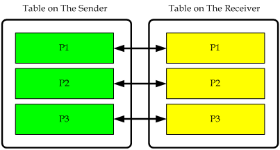
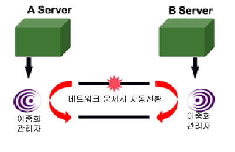
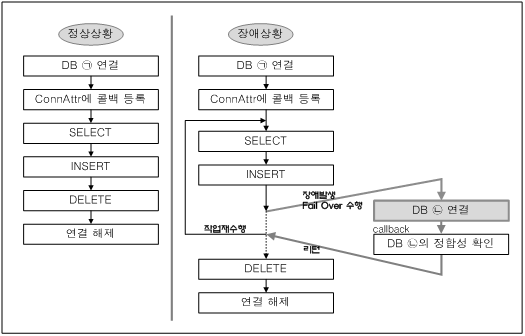

<!-- START doctoc generated TOC please keep comment here to allow auto update -->
<!-- DON'T EDIT THIS SECTION, INSTEAD RE-RUN doctoc TO UPDATE -->


- [Replication Manual](#replication-manual)
  - [서문](#%EC%84%9C%EB%AC%B8)
    - [이 매뉴얼에 대하여](#%EC%9D%B4-%EB%A7%A4%EB%89%B4%EC%96%BC%EC%97%90-%EB%8C%80%ED%95%98%EC%97%AC)
  - [1.이중화 개요](#1%EC%9D%B4%EC%A4%91%ED%99%94-%EA%B0%9C%EC%9A%94)
    - [이중화 소개](#%EC%9D%B4%EC%A4%91%ED%99%94-%EC%86%8C%EA%B0%9C)
  - [2.이중화 관리](#2%EC%9D%B4%EC%A4%91%ED%99%94-%EA%B4%80%EB%A6%AC)
    - [이중화 순서](#%EC%9D%B4%EC%A4%91%ED%99%94-%EC%88%9C%EC%84%9C)
    - [에러 발생과 해결](#%EC%97%90%EB%9F%AC-%EB%B0%9C%EC%83%9D%EA%B3%BC-%ED%95%B4%EA%B2%B0)
    - [충돌 해결](#%EC%B6%A9%EB%8F%8C-%ED%95%B4%EA%B2%B0)
    - [Eager 이중화 장애 복구 (Eager Replication Failback)](#eager-%EC%9D%B4%EC%A4%91%ED%99%94-%EC%9E%A5%EC%95%A0-%EB%B3%B5%EA%B5%AC-eager-replication-failback)
    - [병렬 이중화](#%EB%B3%91%EB%A0%AC-%EC%9D%B4%EC%A4%91%ED%99%94)
    - [이중화 관련 성능 뷰](#%EC%9D%B4%EC%A4%91%ED%99%94-%EA%B4%80%EB%A0%A8-%EC%84%B1%EB%8A%A5-%EB%B7%B0)
  - [3.이중화 사용](#3%EC%9D%B4%EC%A4%91%ED%99%94-%EC%82%AC%EC%9A%A9)
    - [이중화 제약조건](#%EC%9D%B4%EC%A4%91%ED%99%94-%EC%A0%9C%EC%95%BD%EC%A1%B0%EA%B1%B4)
    - [이중화 생성 (CREATE REPLICATION)](#%EC%9D%B4%EC%A4%91%ED%99%94-%EC%83%9D%EC%84%B1-create-replication)
    - [이중화 시작, 종료와 변경 (ALTER REPLICATION)](#%EC%9D%B4%EC%A4%91%ED%99%94-%EC%8B%9C%EC%9E%91-%EC%A2%85%EB%A3%8C%EC%99%80-%EB%B3%80%EA%B2%BD-alter-replication)
    - [이중화 삭제 (DROP REPLICATION)](#%EC%9D%B4%EC%A4%91%ED%99%94-%EC%82%AD%EC%A0%9C-drop-replication)
    - [이중화 대상 테이블에 DDL 실행](#%EC%9D%B4%EC%A4%91%ED%99%94-%EB%8C%80%EC%83%81-%ED%85%8C%EC%9D%B4%EB%B8%94%EC%97%90-ddl-%EC%8B%A4%ED%96%89)
    - [SQL 반영 모드](#sql-%EB%B0%98%EC%98%81-%EB%AA%A8%EB%93%9C)
    - [이중화 부가기능](#%EC%9D%B4%EC%A4%91%ED%99%94-%EB%B6%80%EA%B0%80%EA%B8%B0%EB%8A%A5)
    - [다중 IP 네트워크 환경에서의 이중화](#%EB%8B%A4%EC%A4%91-ip-%EB%84%A4%ED%8A%B8%EC%9B%8C%ED%81%AC-%ED%99%98%EA%B2%BD%EC%97%90%EC%84%9C%EC%9D%98-%EC%9D%B4%EC%A4%91%ED%99%94)
    - [이중화 관련 프로퍼티](#%EC%9D%B4%EC%A4%91%ED%99%94-%EA%B4%80%EB%A0%A8-%ED%94%84%EB%A1%9C%ED%8D%BC%ED%8B%B0)
  - [4.Fail-Over](#4fail-over)
    - [Fail-Over 의 개요](#fail-over-%EC%9D%98-%EA%B0%9C%EC%9A%94)
    - [Fail-Over 사용 방법](#fail-over-%EC%82%AC%EC%9A%A9-%EB%B0%A9%EB%B2%95)
    - [JDBC에서 콜백 작성](#jdbc%EC%97%90%EC%84%9C-%EC%BD%9C%EB%B0%B1-%EC%9E%91%EC%84%B1)
    - [SQLCLI](#sqlcli)
    - [Embedded SQL](#embedded-sql)
    - [PDO에서 콜백 작성](#pdo%EC%97%90%EC%84%9C-%EC%BD%9C%EB%B0%B1-%EC%9E%91%EC%84%B1)
  - [5.시퀀스 이중화](#5%EC%8B%9C%ED%80%80%EC%8A%A4-%EC%9D%B4%EC%A4%91%ED%99%94)
    - [시퀀스 이중화](#%EC%8B%9C%ED%80%80%EC%8A%A4-%EC%9D%B4%EC%A4%91%ED%99%94)
  - [A.부록: FAQ](#a%EB%B6%80%EB%A1%9D-faq)
    - [Replication FAQ](#replication-faq)

<!-- END doctoc generated TOC please keep comment here to allow auto update -->

Altibase® Administration

# Replication Manual


Altibase Administration Replication Manual

Release 7.1

Copyright ⓒ 2001\~2018 Altibase Corp. All Rights Reserved.

본 문서의 저작권은 ㈜알티베이스에 있습니다. 이 문서에 대하여 당사의 동의
없이 무단으로 복제 또는 전용할 수 없습니다.

**㈜알티베이스**

08378 서울시 구로구 디지털로 306 대륭포스트타워Ⅱ 10층

전화: 02-2082-1114 팩스: 02-2082-1099

고객서비스포털: <http://support.altibase.com>

homepage: [http://www.altibase.com](http://www.altibase.com/)

서문
----

### 이 매뉴얼에 대하여

이 매뉴얼은 Altibase 이중화의 개요, 구동, 그리고 사용 방법에 대해 설명한다.

#### 대상 사용자

이 매뉴얼은 다음과 같은 Altibase 사용자를 대상으로 작성되었다.

-   데이터베이스 관리자

-   기술 지원부

다음과 같은 배경 지식을 가지고 이 매뉴얼을 읽는 것이 좋다.

-   컴퓨터, 운영 체제 및 운영 체제 유틸리티 운용에 필요한 기본 지식

-   관계형 데이터베이스 사용 경험 또는 데이터베이스 개념에 대한 이해

-   컴퓨터 프로그래밍 경험

-   데이터베이스 서버 관리, 운영 체제 관리 또는 네트워크 관리 경험

#### 소프트웨어 환경

이 매뉴얼은 데이터베이스 서버로 Altibase 버전 7.1을 사용한다는 가정 하에
작성되었다.

#### 이 매뉴얼의 구성

이 매뉴얼은 다음과 같이 구성되어 있다.

-   제 1장 이중화 개요  
    이 장은 Altibase 이중화 구조에 대한 개요를 제공한다.

-   제 2장 이중화 구동  
    이 장은 Altibase 이중화를 구동시키기 위한 방법에 대해 설명한다.

-   제 3장 이중화 사용 방법  
    이 장은 Altibase 이중화의 사용방법에 대해 설명한다.

-   제 4장 Fail-Over  
    이 장은 Altibase Fail-Over 기능과 그 사용 방법에 대해 설명한다.

-   A. 부록 FAQ  
    이 장은 Altibase 이중화 구동 관련, 프로퍼티 관련 등 사용자들이 자주하는
    질문을 모은 것이다.

#### 문서화 규칙

이 절에서는 이 매뉴얼에서 사용하는 규칙에 대해 설명한다. 이 규칙을 이해하면 이
매뉴얼과 설명서 세트의 다른 매뉴얼에서 정보를 쉽게 찾을 수 있다.

여기서 설명하는 규칙은 다음과 같다.

-   구문 다이어그램

-   샘플 코드 규칙

##### 구문 다이어그램

이 매뉴얼에서는 다음 구성 요소로 구축된 다이어그램을 사용하여, 명령문의 구문을
설명한다.

| 구성 요소                           | 의미                                                         |
| ----------------------------------- | ------------------------------------------------------------ |
|  | 명령문이 시작한다. 완전한 명령문이 아닌 구문 요소는 화살표로 시작한다. |
|  | 명령문이 다음 라인에 계속된다. 완전한 명령문이 아닌 구문 요소는 이 기호로 종료한다. |
|  | 명령문이 이전 라인으로부터 계속된다. 완전한 명령문이 아닌 구문 요소는 이 기호로 시작한다. |
|  | 명령문이 종료한다.                                           |
|  | 필수 항목                                                    |
|  | 선택적 항목                                                  |
|  | 선택사항이 있는 필수 항목. 한 항목만 제공해야 한다.          |
|  | 선택사항이 있는 선택적 항목.                                 |
|  | 선택적 항목. 여러 항목이 허용된다. 각 반복 앞부분에 콤마가 와야 한다. |

##### 샘플 코드 규칙

코드 예제는 SQL, Stored Procedure, iSQL 또는 다른 명령 라인 구문들을 예를 들어
설명한다.

아래 테이블은 코드 예제에서 사용된 인쇄 규칙에 대해 설명한다.

| 규칙         | 의미                                                         | 예제                                                         |
| ------------ | ------------------------------------------------------------ | ------------------------------------------------------------ |
| [ ]          | 선택 항목을 표시                                             | VARCHAR [(*size*)][[FIXED \|] VARIABLE]                      |
| { }          | 필수 항목 표시. 반드시 하나 이상을 선택해야 되는 표시        | { ENABLE \| DISABLE \| COMPILE }                             |
| \|           | 선택 또는 필수 항목 표시의 인자 구분 표시                    | { ENABLE \| DISABLE \| COMPILE } [ ENABLE \| DISABLE \| COMPILE ] |
| . . .        | 그 이전 인자의 반복 표시 예제 코드들의 생략되는 것을 표시    | SQL\> SELECT ename FROM employee; <br/>ENAME<br/> ------------------------<br/> SWNO<br/> HJNO<br/> HSCHOI<br/> .<br/> .<br/> . <br/>20 rows selected. |
| 그 밖에 기호 | 위에서 보여진 기호 이 외에 기호들                            | EXEC :p1 := 1; acc NUMBER(11,2);                             |
| 기울임 꼴    | 구문 요소에서 사용자가 지정해야 하는 변수, 특수한 값을 제공해야만 하는 위치 | SELECT \* FROM *table_name*;<br/> CONNECT *userID*/*password*; |
| 소문자       | 사용자가 제공하는 프로그램의 요소들, 예를 들어 테이블 이름, 칼럼 이름, 파일 이름 등 | SELECT ename FROM employee;                                  |
| 대문자       | 시스템에서 제공하는 요소들 또는 구문에 나타나는 키워드       | DESC SYSTEM_.SYS_INDICES_;                                   |

#### 관련 자료

자세한 정보를 위하여 다음 문서 목록을 참조하기 바란다.

-   Installation Guide

-   Administrator’s Manual

-   Getting Started Guide

-   SQL Reference

-   iSQL User’s Manual

-   Error Message Reference

#### Altibase는 여러분의 의견을 환영합니다.

이 매뉴얼에 대한 여러분의 의견을 보내주시기 바랍니다. 사용자의 의견은 다음
버전의 매뉴얼을 작성하는데 많은 도움이 됩니다. 보내실 때에는 아래 내용과 함께
고객서비스포털( http://support.altibase.com/kr/ )로 보내주시기 바랍니다.

-   사용 중인 매뉴얼의 이름과 버전

-   매뉴얼에 대한 의견

-   사용자의 성함, 주소, 전화번호

이 외에도 Altibase 기술지원 설명서의 오류와 누락된 부분 및 기타 기술적인
문제들에 대해서 이 주소로 보내주시면 정성껏 처리하겠습니다. 또한, 기술적인
부분과 관련하여 즉각적인 도움이 필요한 경우에도 고객서비스포털을 통해 서비스를
요청하시기 바랍니다.

여러분의 의견에 항상 감사드립니다.

1.이중화 개요
-----------

이 장에서는 이중화와 관련한 용어 및 방식 등 이중화에 대한 기초 지식을 알려준다.

### 이중화 소개

데이터베이스 이중화 기능은 서비스를 수행하고 있는 서버의 데이터에 대한 백업
데이터베이스의 최신 데이터 유지와, 서버의 예기치 않은 종료가 발생했을 때 대체
서버를 이용하여 서비스를 재개할 수 있는 무정지 운영 환경을 제공하는 것을
목적으로 한다. 데이터베이스 이중화 기능의 올바른 운영을 위해 다음과 같은 순으로
설명한다.

-   이중화 개념 및 용어
-   Altibase 이중화 방식
-   이중화 대상 선정
-   이중화 모드
-   파티션드 테이블의 이중화
-   이중화와 DDL(Data Definition Language) 복제
-   이중화를 이용한 데이터 복구

#### 이중화 개념

Altibase 이중화 (Replication)는 운영중인 데이터베이스의 로그를 다른
데이터베이스로 전송하여 재실행하는 것을 기본 방식으로 취하고 있다. 즉, 지역
서버(local server)는 데이터베이스의 데이터 변경에 대한 트랜잭션 로그를 원격
서버로 전송하고, 원격 서버(remote server)는 받은 로그를 기반으로 자신의
데이터베이스에 데이터 변경을 재실행함으로써 양쪽 데이터베이스는 같은 데이터를
유지하게 된다.

또한 Altibase는 이중화로 운영중인 데이터를 모니터링하고 관리할 수 있는 altiComp
유틸리티를 제공한다. 자세한 설명은 *Utilities Manual의 altiComp*를 참조한다.

#### 이중화 관련 용어

-   **지역 서버 (Local Server) :**  
    이 매뉴얼에서 "지역 서버"는 항상 지역 노드를 일컫는다. 즉, 그 서버가 Active
    또는 Standby 서버이든, 혹은 이중화 Sender 또는 Receiver 쓰레드 역할을 하든
    상관없이 현재 작업을 수행하고 있는 서버 측을 의미한다.

-   **원격 서버 (Remote Server):**  
    상대편 이중화 노드를 말한다. 즉, 하나의 이중화 쌍에서 지역 서버와 원격
    서버는 1:1 관계를 가진다.

-   **Active 서버 (Active Server):**  
    이중화로 연결되어 있는 데이터베이스 서버들 중 사용자에게 서비스를 제공하는
    쪽, 즉 "주 트랜잭션"에 의해 데이터 변경 작업이 발생하는 노드이다.

-   **Standby 서버 (Standby Server) :**  
    변경 트랜잭션이 발생하지 않는 이중화 노드를 말한다. (SELECT DML 구문을
    사용한 조회는 발생할 수 있다.)

-   **송신자 (Sender):**  
    트랜잭션에 의해 발생한 데이터 변경 정보를 원격 서버로 보내는 쓰레드다. 지역
    서버의 이중화 대상 테이블에 DML 구문을 수행함으로써 생성되는 로그를 XLog
    형태로 변환하여 원격 서버로 보낸다. XLog는 데이터의 변경 정보를 가지고 있다.

-   **수신자 (Receiver):**  
    XLog를 수신하는 쓰레드를 일컫는다. 적용자가 없을 경우 상대편 서버로부터
    데이터 변경 정보를 가지고 있는 XLog를 받아서 자기 노드의 이중화 대상 객체에
    반영하지만, 적용자가 있을 경우 적용자에게 XLog를 전달하여 이중화 대상 객체에
    반영한다.

-   **적용자 (Applier):**  
    수신자가 송신자로부터 수신한 XLog를 스토리지 매니저에 반영하는 쓰레드를
    적용자라고 일컫는다. 병렬 적용자 옵션을 설정하지 않은 경우 적용자는 생성되지
    않으며 수신자가 적용자 역할을 담당한다.  
    그러나 병렬 적용자 옵션을 설정하면, 복수의 트랜잭션들을 여러 적용자가 처리할
    수 있어 이중화 성능을 향상시킬 수 있다.

-   **선행 분석자(Ahead Analyzer):**  
    이중화 트랜잭션 그룹 옵션이 설정된 경우에 이중화 갭이 발생하면, 송신자보다
    로그를 먼저 읽고 분석하여 이중화 트랜잭션 그룹을 만들어주는 쓰레드이다.
    송신자는 이중화 트랜잭션 그룹을 참조하여 수신자에게 보내는 작업량을 줄여주기
    때문에 이중화 갭을 해소하는데 효과적이다.

-   **송신 쓰레드 (Sender Thread):**  
    병렬 이중화가 아닌 경우에는 송신자 (Sender)와 같은 의미를 가진다. 즉, 하나의
    송신 쓰레드와 하나의 수신 쓰레드만을 사용해서 이중화를 수행한다. 병렬
    이중화를 사용하면 송신자는 여러개의 송신 쓰레드로 구성된다.

-   **수신 쓰레드 (Receiver Thread):**  
    병렬 이중화가 아닌 경우에는 수신자와 같은 의미를 가진다. 즉, 하나의 송신
    쓰레드와 하나의 수신 쓰레드만을 사용해서 이중화를 수행한다. 병렬 이중화를
    사용하면 수신자는 여러개의 수신 쓰레드로 구성된다.

-   **XSN:**  
    XLog의 식별 번호를 일컫는다. 리두 로그의 식별 번호인 SN과 혼동하지 말 것.

-   **지역 커밋 XSN (Local Commit XSN):**  
    송신자가 가장 최근에 읽어 온 커밋된 로그 레코드의 식별 번호이다. 이 식별
    번호에 대응하는 트랜잭션이 원격 서버에도 커밋되었음을 보장하지는 않는다. 이
    값은 V\$REPSENDER 성능 뷰의 COMMIT_XSN 컬럼을 조회해서 구할 수 있다.

-   **재시작 SN (Restart Sequence Number):**  
    이중화로 전송이 완료되지 않은 XLog에 해당하는 트랜잭션들의 시작 SN 중 가장
    작은 리두 SN (XSN이 아님)을 일컫는다. 이중화가 재개될 때 XLog 전송을
    재시작하는 위치가 된다.

-   **XLog:**  
    리두 로그를 이중화를 위한 논리적인 형태로 변형시킨 로그이다. 지역 서버의
    이중화 송신 쓰레드가 XLog를 원격 서버의 이중화 수신 쓰레드에게 전송하고,
    수신 쓰레드는 이 XLog를 원격 서버에 반영함으로써 지역 서버와 동일한 데이터를
    가지게 된다.

-   **주 트랜잭션 (Master Transaction):**  
    Active 서버에서 사용자에서 서비스를 제공하는 중에 발생하는 트랜잭션이다. 즉,
    이중화 대상 테이블에 변경 (INSERT, UPDATE, or DELETE) 연산을 실행하는
    트랜잭션이다.

-   **복제 트랜잭션 (Replication Transaction):**  
    "주 트랜잭션"을 다른 쪽 서버에서 복제하는 트랜잭션이다. "복제 트랜잭션"은
    이중화 대상 테이블에 변경 (INSERT, UPDATE, 또는 DELETE) 연산을 재현하는
    트랜잭션으로 수신자가 XLog를 받을 때 발생한다.

-   **변경 연산 (Change Operation):**  
    INSERT, UPDATE 또는 DELETE DML 작업을 일컫는다. 이 용어는 데이터베이스
    변경을 하지 않는 SELECT 연산과 구별하기 위해 필요하다.

-   **이중화 (Replication):**  
    객체를 가리키는 것이 아니고, 복제하는 개념과 행위를 가리킨다.

-   **동기화 (Synchronization):**  
    동기화는 지역 서버의 이중화 대상 테이블 또는 파티션의 모든 데이터를 원격
    서버의 대응하는 테이블 또는 파티션에 입력하는 한 방향 작업이다. 동기화 중
    원격 서버에서 데이터 충돌이 발생하면, 원격 서버 쪽에서 충돌 해결 (conflict
    resolution)을 하게 된다. ALTER REPLICATION 구문을 SYNC 또는 SYNC ONLY 옵션과
    함께 실행할 때 동기화가 수행된다.

-   **이중화 갭 (Replication Gap):**  
    이중화 갭은 개념상으로는 이중화 진행점이 데이터베이스의 현재 진행점과 얼마나
    격차가 벌어졌는지를 나타내는 지표이다. 정량적인 용어로 보면, 이것은 가장
    최근 리두 로그의 식별 번호 (XSN이 아님)와 현재 송신한 XLog에 대응하는 리두
    로그의 식별 번호 사이의 차이이다.

-   **이중화 관리자 (Replication Manager):**  
    이중화 송신자와 수신자를 구동하거나 종료하는 Altibase 모듈이다.

-   **이중화 객체 (Replication Object):**  
    CREATE REPLICATION 구문으로 생성하는 객체로, 보통은 다른 노드에 존재하는
    상대편 서버의 이중화 객체와 쌍을 이룬다.

-   **이중화 쌍 (Replication Pair):**  
    두 개의 다른 노드에 존재하는 서로 대응하는 이중화 객체들의 쌍을 일컫는다.

-   **이중화 대상 컬럼 (Replication Target Column):**  
    지역 서버와 원격 서버상의 서로 대응하는 이중화 대상 테이블의 컬럼으로,
    이것을 명시적으로 지정할 수는 없다. 대신에 이중화 대상 테이블을
    지정함으로써, 이중화 대상 컬럼들이 결정된다.

-   **이중화 대상 테이블 (Replication Target Table):**  
    서로 대응하는 이중화 노드간에 복제되는 테이블로, CREATE REPLICATION 또는
    ALTER REPLICATION 구문을 사용해서 지정된다.

-   **이중화 대상 파티션 (Replication Target Patition):**  
    서로 대응하는 이중화 노드간에 복제되는 테이블 파티션으로, CREATE REPLICATION
    또는 ALTER REPLICATION 구문을 사용해서 지정된다.

-   **EAGER 모드:**  
    두 가지 이중화 모드 중의 하나로, 성능보다 데이터 정합성을 우선시한다. 이
    모드에서는 원격 서버로부터 복제 작업이 정상적으로 반영되고 커밋되었다는
    메시지를 받기 전까지 지역 서버의 트랜잭션이 커밋되지 않는다.

-   **LAZY 모드:**  
    두 가지 이중화 모드 중의 하나로, 데이터 정합성보다 성능을 우선시한다. 이
    모드에서는 원격 서버로부터 커밋 확인 메시지가 오기를 기다리지 않고 지역
    서버의 트랜잭션이 커밋된다.

-   **병렬 이중화 (Parallel Replication):**  
    EAGER 모드에서 이중화 수행시 여러개의 송신 쓰래드와 수신 쓰래드를 사용하는
    것을 일컫는다. "병렬 동기화"와 혼동하지 말 것.

-   **병렬 동기화 (Parallel Synchronization):**  
    동기화 작업 ("ALTER REPLICATION ... SYNC" 또는 "ALTER REPLICATION ... SYNC
    ONLY" 사용)을 수행하는데 여러개의 송신 쓰래드와 수신 쓰래드를 사용하는 것을
    일컫는다. "병렬 이중화"와 혼동하지 말 것.

#### Altibase 이중화 방식

데이터베이스 이중화를 하기 위하여, 지역 서버는 데이터베이스에서 발생하는 데이터
변경 내용을 원격 서버로 전송하고, 원격 서버는 전송받은 내용을 자신의
데이터베이스에 반영하는 방법을 사용한다.

지역 서버와 원격 서버는 데이터베이스 서비스 쓰레드와 별도로 이중화 관리에 필요한
쓰레드를 구동한다. 지역 서버의 이중화 송신 쓰레드는 데이터베이스의 데이터 변경
내역을 원격 서버로 전송하며, 원격 서버의 이중화 수신 쓰레드는 전송받은 변경
내용을 데이터베이스에 반영시킨다.

또한 이중화 송수신 쓰레드는 대응 서버의 정상 및 비정상 종료를 자동 감지하며 이에
상응하는 작업을 수행한다.

그림 [1-1]은 이중화를 구현할 수 있는 다양한 방법을 보여주고 있다.

이 중 Altibase 이중화는 성능과 유연성을 고려하여 "5. (리두) 로그를 직접
실행가능한 논리적 구조로 변환"하는 방법을 사용한다.


[그림 1‑1] 이중화 방식의 기술적 검토

1.  응용 프로그램에서 처리  
    이 경우 성능 저하 및 데이터의 일치성을 보장하기 곤란하다. Altibase는 로그
    기반으로 이중화를 처리하기 때문에, 응용 프로그램에서 명령문 기반으로
    이중화를 처리하는 것은 동일한 질의를 중복 수행 또는 트랜잭션 수행 순서에
    따라 일치성이 보장되기 어렵다.

2.  질의어 전송  
    QP 부하 가중 및 데이터 충돌(Conflict)에 대한 정당성 검사(Validation)의
    어려움

3.  실행 계획 전송  
    전송량 증가로 인한 통신 부하 가중

4.  로그를 질의어로 치환  
    치환 및 질의 처리 비용 증가

5.  로그를 직접 실행가능한 논리적 구조로 치환  
    치환 비용은 요구되나 이중화 성능 향상

6.  로그 전송 및 회복 방법으로 반영  
    속도는 빠르나 ACTIVE-ACTIVE 불가

#### 이중화 서버 선정

Altibase 데이터베이스 이중화를 하기 위해서는 데이터베이스 서버들의 데이터베이스
캐릭터 셋과 내셔널 캐릭터 셋이 서로 동일해야 한다.

데이터베이스 캐릭터 셋은 V\$NLS_PARAMETERS 성능 뷰를 이용하여 확인할 수 있다.

#### 이중화 대상 선정

Altibase는 이중화 대상을 선정하는 기준으로 객체의 ‘이름’을 사용한다.

이중화를 생성할 때에는 이중화 대상이 되는 테이블 이름과 그 소유자 이름을 직접
지정해야 한다. 파티션드 테이블의 특정 파티션만 복제하려면, 파티션 이름과
파티션이 속한 테이블 이름 및 그 소유자 이름을 직접 지정해야 한다. 또한 이중화를
수행시 지역 서버와 원격 서버에서 이름이 같은 컬럼만 복제된다.

이중화 대상 컬럼은 V\$REPRECEIVER_COLUMN 성능 뷰를 통해 확인이 가능하다.

#### 이중화 모드 

Altibase는 이중화를 위해 LAZY와 EAGER 모드를 지원하고 있다.

이중화 모드 별로 성능, 이중화 밀림현상, 데이터 일관성 측면에서 아래 표에서 보는
것처럼 서로 다른 특징을 갖는다.

| 모드  | 성능 | 이중화 밀림 현상 | 데이터 일관성 |
|-------|------|------------------|---------------|
| LAZY  | 높음 | 발생 가능        | 낮음          |
| EAGER | 중간 | 발생 불가능      | 높음          |

##### LAZY 모드

LAZY 모드는 지역 서버에서 이중화 대상 테이블에 대한 DML을 수행하는 주 트랜잭션이
발생하면, 이중화의 송신 쓰레드가 주 트랜잭션이 기록한 로그를 수집하여 XLog로
가공하여 전송한다. 그리고 원격 서버의 수신 쓰레드는 XLog를 수신하여 복제
트랜잭션으로 DB에 반영하는 형태이다.

이처럼 서비스 트랜잭션 (주 트랜잭션)과 복제 트랜잭션이 완전히 별개로 동작하기
때문에 트랜잭션의 영향을 받지 않아 지역 서버의 성능이 우수하다.

그러나 송신 쓰레드가 언제나 주 트랜잭션을 따라가는 입장이기 때문에, 매우
바쁜(busy) 사이트 환경에서는 이중화가 밀리는 현상이 발생할 수 있다.

##### EAGER 모드

EAGER 모드는 지역 서버에서 발생한 주 트랜잭션과 관련된 모든 로그가 원격
서버에서도 정상적으로 반영된 것을 확인한 후에 지역 서버에서 커밋을 수행하고,
동시에 원격 서버에서도 복제 트랜잭션의 커밋을 수행하는 트랜잭션 동기화<sup>1</sup>
방식이다.

[<sup>1</sup>] 트랜잭션 동기화: 지역 서버에서 주 트랜잭션이 성공적으로 수행되었다

하더라도 원격 서버에서 데이터 충돌이 발생하면, 주 트랜잭션을 커밋할 수 없는
상태가 된다. 이 때에는 사용자가 명시적으로 그 트랜잭션을 철회 (롤백)해야, 다음
트랜잭션을 수행할 수 있게 된다. 그렇게 하지 않으면, 다음 트랜잭션을 Commit 할
수가 없기 때문에 변경 작업을 반영할 수 없게 된다. 서버 내부적으로 트랜잭션을
커밋하는 경우 (Autocommit 모드에서 또는 세션 종료시)에, 데이터 충돌에 의해 주
트랜잭션의 커밋이 실패한다면 자동으로 철회 한다. 결과적으로, 데이터 충돌을
발생시킨 주 트랜잭션과 복제트랜잭션은 모두 철회되어, 이중화에 의한 데이터
불일치가 발생하지 않도록 동작한다.

EAGER 모드의 이점은 트랜잭션을 동기화 하기 때문에 트랜잭션을 병렬로 복제할 수
있다는 점이다. 그러므로, EAGER 모드로 이중화를 수행할 때는 다수의 송신 쓰레드가
병렬로 복제를 수행한다. 병렬 쓰레드의 개수는 REPLICATION_EAGER_PARALLEL_FACTOR
프로퍼티로 설정할 수 있다.

트랜잭션 동기화로 인해 성능이 조금 떨어지는 단점이 있으나, 트랜잭션 발생이 매우
빈번한 사이트에서도 LAZY 모드처럼 이중화가 밀리는 현상이 발생하지는 않는다.

Eager 모드로 이중화를 사용하기 전에 'Eager 모드 이중화 제약조건'을 참조하기
바란다.

#### 파티션드 테이블의 이중화 

파티션드 테이블은 아래 그림과 같이 특정 파티션만 지정해서 이중화할 수 있다.



[그림 1‑2] 파티션드 테이블 이중화 구조

#### 이중화와 DDL(Data Definition Language) 복제

 Altibase 이중화는 복제 대상이 되는 테이블의 컬럼 이름을 기준으로 복제를 수행하므로 테이블 스키마가 다른 테이블에 대해서도 복제가 가능하다. 이러한 이유로 테이블이 이중화 대상인 경우에도 스키마를 변경하는 일부 DDL을 수행할 수 있도록 허용한다. 

 DDL을 수행하여 테이블 스키마가 달라진 경우에는 두 노드에 동일한 이름으로 존재하는 컬럼의 데이터만 복제되며, 다른 이름 혹은 한쪽에만 존재하는 컬럼은 복제되지 않는다.

 테이블 스키마가 다른 상태에서 복제가 이뤄지는 경우에는 성능저하가 발생할 수 있으므로 DDL을 수행하여 테이블 스키마가 달라진 경우 양쪽 노드에서 동일한 스키마를 갖도록 동일한 DDL을 수행해 주는 것이 복제 성능에 유리하다.

 이중화에 포함된 테이블에 대한 DDL 작업은 사용자의 선택에 따라 단일 노드에서 수행되거나 복제 될 수 있으며, DDL을 복제하는 경우 이중화 데이터를 모두 동기화 한 후 DDL이 복제된다.

 DDL을 복제하는 경우 이중화 데이터를 동기화 하는 동안에는 Select를 제외한 DML은 수행될 수 없으므로 이중화가 밀려있는 경우 주의해서 사용해야한다.

#### 이중화 부가 기능

Altibase에서 제공하는 이중화 부가 기능은 아래와 같다. 부가 기능을 사용하는 방법
및 제약사항 등의 자세한 설명은 [이중화 부가기능](#sql-반영-모드)에서 설명한다.

-   복구 옵션  
    : 이중화를 진행중에 서버가 비정상 종료되면 서버간 데이터가 불일치하는 것을
    방지하기 위해 이중화를 이용한 데이터 복구 기능

-   오프라인 옵션  
    : Active-Standby 이중화 환경에서 Active 서버에 장애가 발생하면, 오프라인
    옵션을 사용하여 미전송된 로그를 Standby 서버에 반영할 수 있는 기능

-   이중화 갭 해소 옵션  
    : 이중화를 수행할 때 발생하는 이중화 갭을 해소하는 기능

-   병렬 적용자 옵션  
    : 송신자로부터 받은 XLog를 수신자가 병렬로 적용할 수 있는 기능

-   이중화 트랜잭션 그룹 옵션  
    : 이중화 갭이 발생하였을 때 전송해야 할 복수의 트랜잭션들을 하나의
    트랜잭션처럼 그룹화하여 수신 쓰레드에 로그를 전송하는 기능

> #### 주의 사항
>
> 알티베이스에서 이중화할 수 있는 객체는 테이블 또는 파티션이며, 양쪽 서버에서
> 대응하는 이중화 대상 아이템은 서로 종류가 동일해야 한다. 즉 테이블은 테이블로,
> 파티션은 파티션으로 이중화할 수 있지만, 서로 교차되는 이중화는 지원하지 않는다.
>
> 이중화 객체에서 이중화 대상 테이블 또는 파티션을 삭제할 때에는 추가할 때 지정한
> 그대로 명시해야 한다. 예를 들어, 한 파티션드 테이블의 모든 파티션을 이중화
> 대상으로 추가했어도, 파티션드 테이블을 지정해서 이중화 대상에서 제외시키는 것은
> 불가능하고 파티션을 각각 지정해서 제외시킬 수 있다.

2.이중화 관리
-----------

이 장에서는 이중화 구동 순서와 이중화 구동 중 발생 가능한 여러 가지 장애 상황에
대하여 Altibase 이중화 기능이 어떻게 동작하는지에 대해서 설명한다.

### 이중화 순서


[그림 2‑1] 이중화 순서

1.  이중화 할 서버 결정  
    이중화 할 양쪽 서버의 데이터베이스 캐릭터 셋과 내셔널 캐릭터 셋은 서로
    동일해야 한다.

2.  이중화 할 테이블 또는 파티션 결정  
    이중화 할 테이블은 반드시 프라이머리 키가 필요하다.

3.  이중화 생성(CREATE REPLICATION)  
    서버 A와 서버 B 양쪽에 같은 이름으로 이중화 생성을 해야한다.

4.  이중화 동작(ALTER REPLICATION)  
    이중화를 시작(start)하면 지역 서버에 이중화 송신 쓰레드가 생성되고, 원격
    서버의 이중화 관리자와 연결된다. 이 때 원격 서버 이중화 관리자는 이중화 수신
    쓰레드를 생성한다.

5.  이중화 작업 개시

### 에러 발생과 해결

-   지역 또는 원격 서버의 비정상 종료

-   지역 서버와 원격 서버 사이의 통신 단절

-   서비스 라인 단절

#### 지역 서버의 비정상 종료


[그림 2‑2] 지역서버 장애 상황의 이중화

##### 서버 A의 비정상종료

서버 B의 이중화 수신 쓰레드는 종료되며, 이중화 송신 쓰레드는 주기적(60초)으로
서버 A로 접속을 시도한다.

##### 서버 A의 재구동 (이중화 송신 쓰레드는 원격 서버의 수신 쓰레드를 호출)

1.  서버 A의 이중화 송신 쓰레드는 자동으로 시작되어 서버 B로 이중화를 수행한다.

2.  서버 A의 이중화 수신 쓰레드는 서버 B의 이중화 송신 쓰레드로부터 구동되어
    이중화를 수행한다.

3.  서버 B의 이중화 송신 쓰레드는 서버 A의 이중화 수신 쓰레드를 구동시킨다.

4.  서버 B의 이중화 수신 쓰레드는 서버 A의 이중화 송신 쓰레드로부터 시작되어
    이중화를 수행한다.

#### 지역 서버와 원격 서버의 통신 단절



[그림 2‑3] 원격서버와 단절상황의 이중화

##### 지역 서버와 원격 서버의 통신 단절

1.  서버 A와 B의 이중화 수신 쓰레드는 반영되지 않은 각 트랜잭션을 롤백하고
    종료한다.

2.  서버 A와 B의 이중화 송신 쓰레드는 재시작 SN을 기록하고 60초 주기로 상대
    서버로 접속을 시도한다.

##### 링크의 복구

1.  서버 A와 B의 이중화 송신 쓰레드는 상대 이중화 수신 쓰레드를 깨우고 재시작
    SN으로부터 XLog를 전송하여 이중화를 수행한다.

2.  서버 A와 B의 이중화 수신 쓰레드는 상대 이중화 송신 쓰레드의 접속에 의해
    생성되어 이중화를 수행한다.

#### 서비스 라인 단절


[그림 2‑4] 서비스라인 장애 상황의 이중화

##### Primary Line 단절 

1.  백업라인(B.L)을 이용하여 서버 B에서 서비스를 받는다.

##### Primary Line 복원

1.  주라인(P.L)이 복원되면 다시 서버 A로 서비스를 받는다.

2.  주라인이 단절되어있는 동안에도 이중화 작업을 통해 서버 B에서 작업한 내용을
    서버 A에 전송한다.

### 충돌 해결

#### 충돌

“데이터 충돌 (Data Conflict)”은 주 트랜잭션에 의한 변경 내용이 복제 트랜잭션에
의해 재현될 때 프라이머리 키 또는 제약 조건으로 인해 데이터 변경이 불가능한
상황을 일컫는 말이다.

지연 이중화 (Deferred Replication) 방식을 사용할 때, 데이터 충돌을 피하는 가장
좋은 방법은 각 데이터베이스에서 갱신하는 데이터 집합을 서로 다르게 두는 것이다.

아래는 3가지의 데이터 충돌과 각 충돌이 발생하는 이유이다.

##### INSERT 충돌

-   복제 트랜잭션이 프라이머리 키 컬럼에 이미 존재하는 값으로 INSERT를 시도할 때

-   복제 트랜잭션이 INSERT하려고 하는 테이블이 이미 다른 지역 트랜잭션에 의해
    잠금 상태일 때, 복제 트랜잭션은 잠금을 획득하기 위해 기다려야 하는데, lock
    timeout때문에 INSERT 충돌이 발생할 수 있다.

-   복제 트랜잭션이 유일 키 제약 조건을 가지는 컬럼에 이미 존재하는 값으로
    INSERT하려고 할 때

##### UPDATE 충돌

-   존재하지 않는 프라이머리 키 값으로 레코드 변경을 시도할 때

-   복제 트랜잭션이 변경하려 하는 레코드의 데이터가 주 트랜잭션에 의해 변경된
    레코드의 이전 이미지 (Before Image: 변경되기 전의 데이터)와 다를 때

-   변경에 의해 중복된 유일 키 값이 생성될 때

##### DELETE 충돌

-   복제 트랜잭션이 존재하지 않는 프라이머리 키 값을 가지는 레코드를 삭제하려고
    할 때

-   로컬 트랜잭션에 의해 이미 잠금 상태인 레코드를 삭제하려고 할 때, 복제
    트랜잭션은 잠금을 획득하기 위해 기다려야 하는데, lock timeout때문에 INSERT
    충돌이 발생할 수 있다.

일반적으로 2-PC(Phase-Commit)이나 3-PC를 사용하는 분산 DBMS와 달리 상용
DBMS에서의 이중화는 충돌에 대해 정확하게 데이터의 일관성을 보장할 방법이 없다.
분산 DBMS는 데이터 일관성을 보장하나, 2-PC또는 3-PC로 인한 성능 저하가 문제가
되며 시스템이나 네트워크의 장애에 대해서는 별도의 조치가 요구된다.

따라서, 상용 DBMS에서는 데이터의 일관성에 대한 제약을 완화하고 성능을 유지할 수
있는 지연 (Deferred, Asynchronous) 이중화 방식을 주로 사용한다.

#### 충돌 해결

“충돌 해결 (conflict resolution)”은 데이터 충돌을 제거하기 위한 여러 방법을
일컫는다. 지연 이중화 방식에서는 충돌을 막을 완전한 해결책이 존재할 수 없다.
단지 충돌이 발생하면, 충돌이 발생한 데이터에 대해서 서로 일치시키는 것으로
충돌을 해결할 뿐이다.

Altibase는 불가피한 경우에 충돌을 해결하기 위한 방법으로 User-Oriented Scheme,
Master-Slave Scheme과 Timestamp-based Scheme을 사용한다.

Altibase는 충돌 해결 정책에 따라서 아래의 동작을 수행한다.

-   한 쪽 서버의 데이터를 다른 쪽 서버의 데이터에 일치시킨다.

-   문제 추적을 위해 충돌에 대한 정보 기록한다.

단, LOB 컬럼은 충돌 해결 대상에서 제외된다. LOB 컬럼은 이전 이미지를 로깅하지
않으며, 프라이머리 키와 유니크 키를 지정할 수 없어 충돌 감지를 할 수 없기
때문이다.

각각의 충돌 상황에 대한 정책은 아래에서 자세히 제시하고 있다.

CREATE REPLICATION 명령에 대한 상세한 설명은 *이중화 생성 (CREATE
REPLICATION)*절을 참고하기 바란다.

#### User-Oriented Scheme

##### 구문

```
CREATE REPLICATION replication_name
WITH 'remote_host_ip', remote_host_port_no 
FROM user_name.table_name TO user_name.table_name
FROM user_name.table_name TO user_name.table_name,
… 
FROM user_name.table_name TO user_name.table_name;
```

##### 설명

-   INSERT 충돌  
    INSERT 충돌이 발생하면, INSERT는 실패하며 altibase_rp.log에 충돌 오류
    메시지가 출력된다.  
    존재하는 레코드와 동일한 Key를 가진 데이터를 삽입하려는 경우 발생하는 충돌을
    해결하는 정책을 설정하려면, REPLICATION_INSERT_REPLACE 프로퍼티를 사용하라.  
    REPLICATION_INSERT_REPLACE=1: 삭제 후 삽입  
    REPLICATION_INSERT_REPLACE=0: 삭제하지 않거나 삽입하며, 오류 메시지 출력

-   UPDATE 충돌  
    UPDATE 충돌이 발생하면, UPDATE는 실패하며 altibase_rp.log에 충돌 오류
    메시지가 출력된다.  
    충돌 해결을 위해 REPLICATION_UPDATE_REPLACE 프로퍼티를 사용할 수 있다. 이전
    이미지가 다른 데이터를 변경시키거나, 존재하지 않는 프라이머리 키로 변경하려
    할 때 발생한다.  
    예를 들어, 현재 10이라는 데이터가 있는데 복제 트랜잭션은 20에서 30으로
    바꾸라는 갱신이 발생한 경우, 상황에 따라 다음과 같은 정책을 사용할 수 있다.  
    REPLICATION_UPDATE_REPLACE=1 : 갱신함.  
    REPLICATION_UPDATE_REPLACE=0 : 갱신하지 않으며, 충돌 오류 메시지 출력

-   DELETE 충돌  
    DELETE 충돌이 발생하면, DELETE 는 실패하며 altibase_rp.log에 충돌 오류
    메시지가 출력된다.

##### 정리

-   충돌 해결 정책은 상황별로 사용자의 판단에 따라 결정한다.

-   데이터 불일치를 해결하는 솔루션으로 altiComp 유틸리티를 제공한다. 자세한
    내용은 *Utilities Manual의 altiComp*를 참조한다.

#### Master-Slave Scheme

##### 구문

```
CREATE REPLICATION replication_name {as master|as slave}
WITH 'remote_host_ip', remote_host_ port_no
FROM user_name.table_name TO user_name.table_name,
FROM user_name.table_name TO user_name.table_name,
… 
FROM user_name.table_name TO user_name.table_name;
```

##### 설명

- 구문에 AS MASTER 또는 AS SLAVE를 지정함으로써 Master 서버 인지 Slave서버
  인지를 구분한다. 만약 아무것도 지정하지 않으면 REPLICATION_INSERT_REPLACE
  또는 REPLICATION_UPDATE_REPLACE 프로퍼티를 사용하는 방식과 동일하다.

- 해당 서버가 Master인지 Slave인지에 대한 정보는 SYS_REPLICATIONS\_ 메타
  테이블 내의 CONFLICT_RESOLUTION 컬럼에서 확인할 수 있다.

- 0: Master/Slave를 지정하지 않은 경우

- 1: Master로서 동작하는 경우

- 2: Slave로서 동작하는 경우

- 이중화 객체를 생성할 때 양쪽 서버에서 모두 Master 또는 Slave를 지정하지
  않거나 서로 다르게 지정한 경우에만, 이중화 시작시 handshaking<sup>2</sup>에 성공하고
  나머지 경우에는 실패한다. 즉, 한 서버는 Master로 지정하고 다른 한 서버는
  어떠한 지정도 하지 않은 경우 이중화 시작 시 다음과 같은 오류 메시지를 볼 수
  있다.

  [<sup>2</sup>] Handshaking 은 다른 쪽 서버가 살아있는지 또는 이중화를 시작하기 전에 지역 서버와 원격 서버 간의 복제할 객체 (테이블)에 대한 정보가 일치하는지를

  확인하는 과정이다.

```
iSQL> ALTER REPLICATION rep1 START
[ERR-6100D : [Sender] Failed to handshake with the peer server (Master/Slave conflict resolution not allowed [1:0])]
```

##### Master/Slave 이중화 처리 방식

###### Master의 처리 방식

-   INSERT conflict: 반영하지 않는다.

-   UPDATE conflict: 반영하지 않는다.

-   DELETE conflict: 반영하지 않는다.

-   기타 상황: Slave로부터 전송된 XLog를 정상적으로 반영한다.

###### Slave의 처리 방식

-   INSERT conflict: 기존에 존재하는 레코드와 같은 프라이머리 키 값을 가지는
    데이터 입력으로 인해 충돌이 발생한 것이라면, 존재하는 레코드를 삭제하고
    새로운 레코드를 추가한다.  
    다른 이유로 인해 충돌이 발생했다면, INSERT는 실패하고 충돌 오류 메시지가
    altibase_rp.log에 기록된다.

-   UPDATE conflict: 갱신하려고 하는 레코드의 값과 주 트랜잭션이 변경한 레코드의
    이전 이미지가 서로 달라서 충돌이 발생한 것이라면, 충돌을 무시하고 무조건
    반영한다.  
    다른 이유로 인해 충돌이 발생한 것이라면, UPDATE는 실패하고 충돌 오류
    메시지가 altibase_rp.log에 기록된다.

-   DELETE conflict: 존재하지 않는 프라이머리 키 값으로 삭제를 시도해서 충돌이
    발생한 것이라면, DELETE는 실패하고 충돌 오류 메시지는 기록되지 않는다.  
    다른 이유로 인해 충돌이 발생한 것이라면, DELETE는 실패하고 충돌 오류
    메시지가 altibase_rp.log에 기록된다.

-   기타 상황: Master로 부터 전송된 XLog를 정상적으로 반영한다.

##### 예제

지역 서버의 IP 주소와 이중화 포트 번호는 각각 192.168.1.60, 25524이고, 원격
서버의 IP 주소와 이중화 포트 번호는 각각 192.168.1.12, 35524 이라고 하자. 또한
지역 서버와 원격 서버는 master와 slave 관계이며 두 서버간의 employees 테이블과
departments 테이블을 이중화 할 때 필요한 이중화 정의는 다음과 같다.

-   지역 서버의 경우 (IP: 192.168.1.60)

```
iSQL> CREATE REPLICATION rep1 AS MASTER
    WITH '192.168.1.12', 35524
    FROM sys.employees TO sys.employees,
    FROM sys.departments TO sys.departments;
Create success.
```

-   원격 서버의 경우 (IP: 192.168.1.12)

```
iSQL> CREATE REPLICATION rep1 AS SLAVE
    WITH '192.168.1.60', 25524
    FROM sys.employees TO sys.employees,
    FROM sys.departments TO sys.departments;
Create success.
```

해당 서버가 Master인지 Slave인지에 대한 정보는 SYS_REPLICATIONS\_ 메타 테이블
내의 CONFLICT_RESOLUTION 컬럼 값으로 확인할 수 있다. (0: 지정하지 않은 경우, 1:
Master, 2: Slave)

```
iSQL> SELECT replication_name, conflict_resolution FROM system_.sys_replications_;
REPLICATION_NAME    CONFLICT_RESOLUTION
---------------------------------------------------------------------------
REP1                   1
1 row selected.
```

#### Timestamp-based Scheme

##### 구문

```
CREATE REPLICATION replication_name
WITH ‘remote_host_ip’, remote_host_port_no 
FROM user_name.table_name TO user_name.table_name,
FROM user_name.table_name TO user_name.table_name,
… 
FROM user_name.table_name TO user_name.table_name;
```

##### 설명

Active-Active 이중화 환경에서 양 서버의 데이터를 일관되게 유지시키기 위한
방법으로, Timestamp-based Scheme을 제공한다.

Timestamp-based Scheme을 사용하기 위해서는 다음과 같은 제약 조건을 가진다.

-   테이블에 TIMESTAMP 컬럼이 포함되어 있어야 한다.

-   REPLICATION_TIMESTAMP_RESOLUTION 프로퍼티의 값이 1이어야 한다.

Altibase는 테이블 기반 Timestamps-based Scheme을 지원하기 때문에 이중화 대상
테이블에 TIMESTAMP타입의 컬럼이 포함되어 있어도 REPLICATION_TIMESTAMP_RESOLUTION
프로퍼티를 0으로 설정하면 기존의 Conflict Resolution Scheme을 그대로 사용할 수
있다.

예를 들어, 사용자가 두 서버간의 foo 테이블과 bar 테이블을 아래와 같이 이중화
한다고 가정하면, foo 테이블의 경우는 REPLICATION_TIMESTAMP_RESOLUTION 프로퍼티의
값이 1인 경우에 한하여 Timestamps-based Scheme이 사용되고, bar 테이블의 경우는
기존의 Conflict Resolution Scheme이 사용된다.

```
CREATE TABLE foo (a DOUBLE PRIMARY KEY, b TIMESTAMP);
CREATE TABLE bar (a DOUBLE PRIMARY KEY, b CHAR(3));
CREATE REPLICATION rep WITH ’127.0.0.1’, 30300 FROM sys.foo TO sys.foo, FROM sys.bar TO sys.bar;
```

##### Timestamp-based 이중화 처리 방식

Altibase는 삽입(INSERT) 연산과 갱신(UPDATE) 연산에 대해서만 Timestamp-based
Scheme을 지원한다.

###### 삽입

1.  삽입하고자 하는 데이터와 같은 키 값을 갖는 데이터가 이미 존재하면, 삽입할
    데이터의 이후 이미지 (After-Image)의 TIMESTAMP 값과 이미 존재하는 데이터의
    TIMESTAMP 값을 비교한다.

2.  삽입할 데이터의 이후 이미지 (After-Image)의 TIMESTAMP 값이 크거나 같으면
    기존의 데이터를 삭제하고, 이후 이미지의 값을 추가한다.

###### 갱신

1.  주 트랜잭션에 의해 변경된 데이터의 이후 이미지의 TIMESTAMP 값과 갱신 대상
    데이터의 TIMESTAMP 값을 비교한다.

2.  이후 이미지의 TIMESTAMP 값이 크거나 같으면 이후 이미지 값으로 갱신한다.

3.  갱신 수행 시 데이터의 이후 이미지의 TIMESTAMP 값이 그대로 유지된다. 즉,
    시스템 시간 값을 사용하지 않는다.

> ##### 주의 사항
>
> -   테이블에 TIMESTAMP 컬럼 추가시 한 레코드 당 8바이트의 저장 공간이 추가적으로
>     필요하다.
>
> -   이중화 되는 양 서버의 시간이 서로 같지 않는 경우, 데이터 불일치가 발생할 수
>     있다.
>

### Eager 이중화 장애 복구 (Eager Replication Failback)

이 절에서는 Eager 모드의 이중화 환경에서 한 쪽 노드에 장애가 발생하고, 이 후
노드가 복구되면 양 쪽 서버의 데이터가 어떤 과정을 거쳐 동기화 되는지를 살펴본다.

Eager 모드로 이중화 환경을 구성하려면, 양 쪽 서버의 이중화 모두 Eager 모드로
생성하고 시작해야 한다. 그리고, Eager 모드의 이중화 환경에서 발생한 장애를
복구(failback)하려면, 복구 환경에서도 이중화가 Eager 모드로 동작 중이어야 한다.

Eager 모드의 이중화 환경에서의 장애시 데이터 복구는 크게 아래의 두 가지로 나눌
수 있다:

-   증분 동기화 (Incremental Sync)

-   일반 동기화 (Normal Sync)

#### 증분 동기화 (Incremental Sync)

Eager 모드의 이중화 환경에서 한 쪽 서버(서버 A)에 커밋 로그가 기록되고 상대편
서버(서버 B)로 commit 로그를 전송하지 못한 채, 서버 A에 장애(장비 문제, Altibase
서버 장애)가 발생할 수 있다. 이 경우 서버 A는 트랜잭션 commit을 실행한
애플리케이션에 오류를 반환하며, 서버 B는 commit 로그를 받지 못하기 때문에 해당
트랜잭션을 롤백할 것이다. 그리고 애플리케이션은 FailOver하여 서버 B에서 작업을
계속 진행할 것이다. 결국 서버 A와 서버 B에서 동일한 레코드의 데이터가 일치하지
않는 상황이 발생할 수도 있다.

이러한 데이터는 이후의 이중화 서비스에 영향을 미치게 되므로, 양쪽 노드의 불일치
데이터에 대한 장애 복구(failback) 과정이 필요하다. 이것을 증분
동기화(Incremental Sync)라고 하며, 복구 과정은 아래와 같다.

서버 A가 다시 온라인 상태가 되면, 양 쪽 서버의 SYS_REPLICATIONS\_ 메타 테이블의
REMOTE_FAULT_DETECT_TIME 컬럼 값(상대 편 노드의 장애를 감지한 시점)으로
판단하여, 각각 master 또는 slave가 된다. 즉, 더 늦은 시점의 값을 가진 서버가
master가 된다. 이 경우에는 서버 B가 master가 될 것이다. master와 slave가
결정되면, slave(서버 A)의 이중화 송신자는 재시작 SN부터 자신의 트랜잭션 로그를
분석하여 상대편으로 전송하지 않았을 것 같은 (즉, master 와 다를 수 있는)
데이터를 결정하고, master로부터 해당 데이터를 가져와서 동기화를 수행한다.
Master의 이중화 송신자는 slave가 요청한 데이터를 전송해 주는 역할을 한다. 즉, 양
쪽 서버의 이중화 송신자(Sender)가 master와 slave로 동작하게 된다. 따라서, 증분
동기화가 성공적으로 완료되려면, 양 쪽 서버의 이중화 중 하나라도 stop 상태이면 안
된다.

그런 다음, 서버 A의 이중화 송신자는 재시작 SN을 최신으로 갱신한다. 이는 서버 A의
이중화 송신자가 위의 과정에서 이미 동기화된 데이터를 재전송하는 것을 방지하기
위해서이다.

증분 동기화는 REPLICATION_FAILBACK_INCREMENTAL_SYNC 프로퍼티 값을 조정하여
활성화 또는 비활성화 할 수 있으며, 이 프로퍼티는 양 쪽 노드의 서버에 동일한
값으로 설정되어 있어야 한다.

#### 일반 동기화 (Normal Sync)

서버는 증분 동기화를 완료 하거나 건너뛴 후, Eager 모드 이중화가 정상적으로
시작되기 전에, 장애 시간 동안 서버 B에서 서버 A로 전송하지 못했던 트랜잭션
로그에 대한 데이터를 동기화한다. 이러한 동기화를 일반 동기화(Normal Sync)라고
한다. 장애로 인해 전송하지 못했던 로그를 전송할 때에는, 이중화가 Lazy 모드로
전환하여 동작하며, 로그를 모두 전송하여 이중화 갭이 없어지면, 다시 Eager 모드로
전환하여 이중화가 시작된다.

REPLICATION_FAILBACK_INCREMENTAL_SYNC 프로퍼티 값이 1로 설정되어 있는 경우 위의
증분 동기화가 수행된 후에 일반 동기화가 수행될 것이고, 그렇지 않은 경우 증분
동기화 과정은 건너뛰고 바로 일반 동기화가 수행될 것이다.

### 병렬 이중화

병렬 이중화란 이중화 수행 시 여러 개의 송신 쓰레드와 수신 쓰레드를 사용하는 것을
일컫는다.

Altibase는 이중화 모드에 따라서 아래와 같이 병렬 이중화를 지원한다.

-   Lazy 모드: 이중화 부가기능으로 수신 병렬 이중화

-   Eager 모드: 프로퍼티를 조정하여 송신 병렬 이중화

Eager 모드에서 병렬 이중화는 복수의 송신 쓰레드를 관리하기 위해
REPLICATION_EAGER_PARALLEL_FACTOR 프로퍼티를 조정하여 사용할 수 있다. Eager 모드
이중화의 경우, 양 쪽 노드에서 모두 커밋 가능한 상태가 되었을 때 커밋이
수행되므로, 트랜잭션 단위의 병렬 복제가 가능하다. Altibase에서는 여러 개의
이중화 송신 쓰레드를 두어서 각 쓰레드가 하나의 트랜잭션을 처리하도록 하여 병렬
복제를 구현하고 있다. 이러한 병렬 이중화는 기존의 순서화된 동기 복제보다 빠른
성능을 제공한다.

Lazy 모드에서 병렬 이중화하는 방법은 [이중화 부가기능](#sql-반영-모드)에서
설명한다.

> #### 주의사항 
>
> 병렬 이중화를 사용할 경우, 복제되는 과정에서 트랜잭션의 순서가 뒤바뀌어 커밋
> 불가능한 상황이 발생할 수 있다. 그러므로 병렬 이중화를 사용하는 경우, 응용
> 프로그램은 커밋 실패가 반환되는 경우 롤백을 명시적으로 수행하도록 로직이
> 구현되어야 한다.

### 이중화 관련 성능 뷰

이중화 진행 모니터링을 하기 위해 다음의 성능뷰를 사용할 수 있다. 성능 뷰에 대한
자세한 내용은 *General Reference*를 참고한다.

-   V\$REPEXEC

-   V\$REPGAP

-   V\$REPGAP_PARALLEL

-   V\$REPLOGBUFFER

-   V\$REPOFFLINE_STATUS

-   V\$REPRECEIVER

-   V\$REPRECEIVER_COLUMN

-   V\$REPRECEIVER_PARALLEL

-   V\$REPRECEIVER_STATISTICS

-   V\$REPRECEIVER_TRANSTBL

-   V\$REPRECEIVER_TRANSTBL_PARALLEL

-   V\$REPRECOVERY

-   V\$REPSENDER

-   V\$REPSENDER_PARALLEL

-   V\$REPSENDER_STATISTICS

-   V\$REPSENDER_TRANSTBL

-   V\$REPSENDER_TRANSTBL_PARALLEL

-   V\$REPSYNC

3.이중화 사용
-----------

### 이중화 제약조건 

이중화를 만들기 위해서는 여러가지 제약 조건이 있다. 이 조건을 만족하지 않을 경우
이중화를 사용할 수 없다.

#### 선행조건 

-   입력/수정/삭제 연산시 충돌(Conflict)이 발생하면 연산은 취소되고 에러 로그
    파일에 메시지를 남긴다.

-   이중화 작업 도중 발생한 에러에 대해 부분 철회한다. 즉 여러 개의 데이터 입력
    중 한 개의 중복 데이터가 있으면 중복 데이터만 취소하고 나머지는 완료할 수
    있다.

-   복제 속도는 서비스 속도보다 매우 느릴 수 있다.

#### 데이터 제약조건

-   복제할 테이블에는 반드시 프라이머리 키가 존재해야 한다.

-   복제할 테이블의 프라이머리 키에 대한 수정이 없어야 한다.

-   양쪽 서버의 복제할 테이블은 컬럼 타입, NOT NULL, Check 제약조건, 유니크
    인덱스, function-based 인덱스가 동일하지 않고,
    REPLICATION_SQL_APPLY_ENABLE가 1로 설정되어 있으면 SQL 반영 모드로 동작하여
    성능이 저하될 수 있다.

#### 연결 제약조건

-   하나의 Altibase 데이터베이스에 가능한 이중화 연결의 최대 개수는
    REPLICATION_MAX_COUNT 프로퍼티로 결정된다.

-   이중화로 연결할 데이터베이스는 서로 데이터베이스 캐릭터 셋과 내셔널 캐릭터
    셋이 동일하게 설정되어야 한다. 현재 사용중인 캐릭터 셋은 V\$NLS_PARAMETERS의
    NLS_CHARACTERSET과 NLS_NCHAR_CHARACTERSET으로 확인이 가능하다.

#### 이중화 대상 컬럼의 제약조건

-   복제 트랜잭션에서 INSERT할 때, 이중화 대상이 아닌 컬럼에는 널(NULL) 값을
    입력한다.

-   이중화 대상 컬럼과 이중화 대상이 아닌 컬럼의 유니크 인덱스, Function-based
    인덱스를 구성하면 SQL 반영 모드로 동작한다.

#### Eager 모드 이중화 제약조건

Eager 모드를 사용하기 위해 다음의 제약 조건을 따른다.

-   Eager 모드 이중화는 데이터 정합성을 위해 3 노드 이상에서는 권장하지 않는다.

-   원격 서버와 지역 서버 모두 Eager 모드 이중화를 사용하지 않으면, 데이터가
    동기화되지 않는다.

-   Eager 모드 이중화를 사용 중에 네트워크 장애가 발생하면, 서버가 정상적으로
    동작하더라도 데이터의 정합성을 보장받지 못한다. 네트워크 장애가 발생하면
    상대방의 노드 장애로 판단하기 때문에 양쪽 노드에서 각각 데이터를 갱신하기
    때문이다.

-   하나의 테이블은 Eager 모드 이중화에서 하나의 이중화에만 참여할 수 있다.
    하나의 테이블이 두 개 이상의 Eager 이중화에 참여할 경우 장애가 발생하면
    데이터가 불일치할 뿐 아니라 증분 동기화도 실패하기 때문이다.

-   Eager 모드 이중화에 참여하는 서버는 시간을 동기화해야 한다. 만약 두 시스템의
    시간을 다르게 설정한 경우 장애가 발생시 장애를 감지하는 시차 때문에
    비정상적인 동작을 할 수 있다.

-   Eager 모드 이중화에서 커밋된 로그가 디스크에 반영되기 전에 비정상 종료가
    발생하면, 데이터가 유실될 수 있다. 이을 방지하기 위해 복구 옵션을 사용하거나
    커밋 관련 프로퍼티(COMMIT_WRITE_WAIT_MODE,
    REPLICATION_COMMIT_WRITE_WAIT_MODE, REPLICATION_SYNC_LOG)의 값을 조정한다.

-   Eager 모드 이중화에서는 SQL 반영 모드를 사용할 수 없다.

#### 파티션드 테이블 제약조건

파티션드 테이블을 이중화하기 위해 다음의 제약조건을 만족시켜야 한다.

-   원격 서버와 지역 서버의 파티션 방법이 동일해야 한다.

-   범위나 리스트 파티션일 경우 파티션 조건이 동일해야 한다. 일부 파티션만
    이중화하는 경우 그 파티션의 조건만 일치하면 된다. default 파티션의 경우에도
    마찬가지이다.

-   해시 파티션일 경우 파티션의 개수가 동일해야 한다.

#### 이중화를 이용한 데이터 복구의 제약조건

이중화를 이용하여 데이터를 복구하기 위해서는 다음의 제약조건이 따른다.

-   지역 서버와 원격 서버가 모두 비정상 종료하는 경우에는 복구가 불가능하다.

-   충돌(Conflict)이 발생한 데이터는 복구가 불가능하다.

-   하나의 테이블은 두 개 이상의 이중화 객체에서 복구할 수 없다.

-   전송되지 않은 트랜잭션이 손실된 경우 데이터는 복구할 수 없다.

#### 이중화를 이용한 데이터 복구시 주의사항

-   Active-Active환경에서 양쪽 데이터베이스의 갱신하는 Data Set을 완전히 다르게
    하지 않은 경우 (즉, 양쪽 서버에서 같은 레코드를 서로 다른 값으로 갱신하는
    경우), 데이터 불일치가 발생할 수 있다.

-   네트워크에 이상이 발생하거나 사용자가
    REPLICATION_RECOVERY_MAX_TIME프로퍼티에 복구를 명시적으로 포기한 경우에는
    데이터가 복구되지 않을 수 있다.

#### 허용된 DDL 문

일반적으로 이중화 대상인 테이블은 데이타 정의어(DDL)를 수행할 수 없다. 그러나
다음의 몇 가지 DDL은 이중화와 상관없이 DDL 수행이 가능하다.

-   ALTER INDEX REBUILD PARTITION

-   GRANT OBJECT

-   REVOKE OBJECT

-   CREATE TRIGGER

-   DROP TRIGGER

> ##### 주의사항
>
> 이중화 대상 테이블에 허용된 DDL문을 수행하는 경우, 해당 테이블은 잠금(LOCK)
> 상태가 된다. 이 때 송신 쓰레드가 이중화 로그를 전송할 경우, 수신 쓰레드는 잠금
> 상태의 대상 테이블에 로그를 반영할 수 없을 것이다.

### 이중화 생성 (CREATE REPLICATION) 

이중화를 시작하기 전에 이중화에 관련된 정보를 사용해서 이중화 객체를 생성해야
한다.

#### 구문

```
CREATE [LAZY|EAGER] REPLICATION replication_name 
[FOR ANALYSIS | FOR PROPAGABLE LOGGING | FOR PROPAGATION | FOR ANALYSIS PROPAGATION] 
[AS MASTER|AS SLAVE] 
[OPTIONS options_name [option_name ... ] ] 
WITH { ‘remote_host_ip’ | 'remote_host_name', remote_host_ port_no [USING conn_type [ib_latency]]} 
...
FROM user_name.table_name [PARTITION partition_name] TO user_name.table_name [PARTITION partition_name]
[,FROM user_name.table_name [PARTITION partition_name] TO user_name.table_name [PARTITION partition_name]
...;
```

#### 전제 조건

SYS 사용자만이 이중화 객체를 생성할 수 있다.

#### 설명

이중화를 수행하려면, 먼저 서로간에 통신으로 연결된 이중화 객체의 쌍으로 구성된
“이중화 쌍”이 설정되어야 한다.

이중화는 테이블 또는 파티션 단위로 수행된다. 양쪽 서버의 이중화 테이블 또는
파티션은 일대일로 매칭되어야 한다.

이중화 객체를 생성할 때 LAZY 또는 EAGER 모드중 하나를 기본 모드로 선택할 수
있다. 사용자가 세션에 이중화 모드를 지정하지 않은 경우 이중화 기본 모드로 동작할
것이다. 기본 모드를 지정하지 않으면 이중화는 LAZY 모드로 동작할 것이다.

- ***replication_name***  
  생성될 이중화 객체의 이름을 명시한다. 지역 서버와 원격 서버에 동일한 이름을
  설정해야 한다.

- ***FOR ANALYSIS \| FOR ANALYSIS PROPAGATION***  
  XLog Sender를 생성한다. 자세한 설명은 *Log Analyzer User’s Manual*을
  참고한다.

- ***FOR PROPAGABLE LOGGING \| FOR PROPAGATION***  
  이중화 수신자가 전송받은 로그를 복제하기 위해 FOR PROPAGABLE LOGGING을
  사용하여 로그를 기록한 후, 복제된 로그가 다른 원격 서버로 전송하기 위해 FOR
  PROPAGATION을 사용한다. 이 기능을 사용할 때 recovery option과 함께 사용할 수
  없다.

- ***as master 또는 as slave***  
  해당 서버가 Master 인지 Slave 인지를 지정한다. 만약 아무것도 지정하지 않으면
  기존의 REPLICATION_INSERT_REPLACE 또는 REPLICATION_UPDATE_REPLACE 프로퍼티를
  사용하는 방식과 동일하다. Handshaking시 다음의 조합일 경우에만 성공한다: 0과
  0, 1과 2, 또는 2와 1. 다른 조합은 실패할 것이다. (0: 지정하지 않은 경우, 1:
  Master, 2: Slave)

- ***remote_host_ip | remote_host_name***  
  원격 서버의 IP 주소값 이나 호스트 이름

- ***remote_host_port_no***  
  원격 서버 수신 쓰레드의 포트 번호. 즉, 원격 서버의 Altibase 프로퍼티의
  REPLICATION_PORT_NO에 해당하는 값이다.

- ***conn_type***  
  원격 서버와의 통신 방법(TCP/ InfiniBand)이며, 기본값은 TCP이다.

- ***ib_latency***  
  rsocket의 RDMA_LATENCY 옵션값. conn_type이 IB인 경우에만 입력 가능하다.

- ***user_name***  
  이중화할 테이블의 소유자 이름

- ***table_name***  
  이중화할 테이블 이름

- ***partition_name***  
  이중화할 파티션 이름

- ***option_name***  
  이중화 객체에 대한 부가 기능 이름. 지원하는 부가 기능에 대한 자세한 설명은
  [이중화 부가 기능](#sql-반영-모드)에서 설명한다.

#### 에러코드

*Error Message Reference*를 참고한다.

#### 예제

지역 서버의 IP 주소가 192.168.1.60 이고 이중화 포트 번호가 25524, 원격 서버의 IP
주소가 192.168.1.12 이고 이중화 포트 번호가 35524 이라고 하자. 두 서버간의
employees 테이블과 departments 테이블을 이중화 한다고 가정하면, 필요한 이중화
정의는 다음과 같다.

-   지역 서버의 경우 (IP: 192.168.1.60)

```
iSQL> CREATE REPLICATION rep1
    WITH '192.168.1.12', 35524
    FROM sys.employees TO sys.employees,
    FROM sys.departments TO sys.departments;
Create success.
```

-   원격 서버의 경우 (IP: 192.168.1.12)

```
iSQL> CREATE REPLICATION rep1
    WITH '192.168.1.60', 25524
    FROM sys.employees TO sys.employees,
    FROM sys.departments TO sys.departments;
Create success.
```

### 이중화 시작, 종료와 변경 (ALTER REPLICATION) 

#### 구문

```
ALTER REPLICATION replication_name 
SYNC [PARALLEL parallel_factor] 
[TABLE user_name.table_name [PARTITION partition_name], … , user_name.table_name [PARTITION partition_name]];

ALTER REPLICATION replication_name 
SYNC ONLY [PARALLEL parallel_factor] 
[TABLE user_name.table_name [PARTITION partition_name], … , user_name.table_name [PARTITION partition_name]];

ALTER REPLICATION replication_name START [RETRY];

ALTER REPLICATION replication_name QUICKSTART [RETRY];

ALTER REPLICATION replication_name STOP; 

ALTER REPLICATION replication_name RESET;

ALTER REPLICATION replication_name DROP TABLE 
FROM user_name.table_name [PARTITION partition_name] TO user_name.table_name [PARTITION partition_name];

ALTER REPLICATION replication_name ADD TABLE 
FROM user_name.table_name [PARTITION partition_name] TO user_name.table_name [PARTITION partition_name]

ALTER REPLICATION replication_name FLUSH [ALL] [WAIT timeout_sec];
```

#### 전제 조건

SYS 사용자만이 이중화 동작을 변경할 수 있다.

#### 설명

-   SYNC  
    지역 서버에 있는 이중화 대상 테이블의 모든 레코드를 원격 서버로 전송해서
    동기화 한 후에 현재 로그부터 이중화 (복제)를 시작한다. 동기화 후에 이중화가
    시작될 로그를 결정하는 순간에 다른 트랜잭션이 동기화 대상 테이블의 데이터를
    변경하는 것을 막기 위해서, 이중화 송신 쓰레드는 동기화를 시작하기 전에
    일시적으로 동기화 테이블에 대한 공유 잠금(S Lock)을 획득한다. 따라서, 다른
    트랜잭션이 동기화 대상 테이블에 변경을 하고 있을 때 SYNC를 시도하면, 이중화
    송신 쓰레드는 REPLICATION_SYNC_LOCK_TIMEOUT 프로퍼티에 설정된 시간만큼
    대기하다가 변경 트랜잭션이 끝나는 시점에 동기화를 시작할 것이다. 변경
    트랜잭션이 REPLICATION_SYNC_LOCK_TIMEOUT 프로퍼티에 설정된 시간 내에
    완료되지 않으면 SYNC는 실패할 것이다.  
    동기화 과정에서 원격 서버에 지역 서버와 같은 프라이머리 키 값을 가지는
    레코드가 있으면, 설정되어 있는 충돌 해결 정책에 따라서 충돌이 제거된다.

-   TABLE  
    SYNC 대상 테이블을 지정한다.

-   PARTITION  
    SYNC 대상 파티션을 지정한다.

-   PARALLEL  
    *parallel_factor*는 생략 가능하며, 생략할 경우 1이 기본으로 사용된다.
    *parallel_factor*의 최대값은 CPU 개수 \* 2이며, 최대값을 초과해서 설정하면
    역시 시스템의 CPU 개수 \* 2만큼 쓰레드가 생성된다. 0 또는 음수값을 설정한
    경우엔 오류 메세지가 나타난다.

-   SYNC ONLY  
    지역 서버에 있는 이중화 대상 테이블들의 모든 레코드를 원격 서버로 전송해서
    동기화한다. (송신 쓰레드는 동작하지 않는다.) 만약 원격 서버에 지역 서버와
    같은 값을 가지는 레코드가 이미 있으면, 설정되어 있는 충돌 해결 정책에 따라서
    충돌을 제거한다.  
    디스크 테이블에 대한 SYNC 또는 SYNC ONLY처리는 하나의 쓰레드가 담당하기
    때문에, SYNC대상 테이블 중에 디스크 테이블이 있다면 parallel_factor는 디스크
    테이블의 개수 이상으로 지정하는 것이 성능에 많은 이점을 가져올 수 있다.

-   START  
    가장 최근의 이중화 시점부터 이중화를 시작한다.

-   QUICKSTART  
    현재 로그의 위치부터 이중화를 시작한다.

-   START/QUICKSTART RETRY  
    RETRY 옵션으로 이중화를 START하거나 QUICKSTART하면, handshaking에
    실패하더라도 지역 서버의 송신 쓰레드는 생성된다. 이 후에 지역 서버와 원격
    서버간의 handshaking이 성공할 때 이중화가 시작된다.  
    즉, 첫 handshaking에서 실패하더라도 iSQL에서는 성공했다는 메시지를 보여준다.
    그러므로 사용자는 트레이스 로그 또는 V\$REPSENDER 성능 뷰에서 실행 결과를 꼭
    확인해야 한다.  
    RETRY 옵션 없이 이중화를 시작하면, 첫 handshaking에 실패할 경우 에러가
    발생하고 실행은 중지된다.

-   STOP  
    이중화를 중지시킨다. SYNC 작업중에 중지를 하면 이중화할 데이터가 모두 원격
    서버로 전송되었다는 것을 보장할 수 없다. 만약 SYNC 중에 이중화를 중지한 경우
    다시 SYNC 하기 위해서는 원격 서버의 이중화 대상 테이블의 모든 레코드를
    삭제한 후 SYNC를 다시 수행해야 한다.

-   RESET  
    재시작 SN 등의 이중화 정보를 reset한다. 이중화가 중지된 상태에서만 수행할 수
    있으며, 이중화 객체를 삭제한 후 다시 생성하는 것을 대신해서 사용할 수 있다.

-   DROP TABLE  
    특정 테이블 또는 파티션을 이중화 대상에서 제외시킨다. 이 구문은 이중화가
    중지되어 있는 상태에서 실행할 수 있다. 이중화 대상 테이블에는 대부분의 DDL
    문을 수행할 수 없기 때문에, 이 구문으로 이중화 대상에서 제외시킨 후에 그
    테이블이나 파티션에 대해서 DDL문을 수행할 수 있다.

-   ADD TABLE  
    특정 테이블 또는 파티션을 이중화 대상에 추가한다. 이 구문은 이중화가
    중지되어 있는 상태에서 실행할 수 있다.

-   FLUSH  
    Flush를 실행한 세션은 이중화 송신 쓰레드가 현재 로그까지의 변경 내용이
    상대방 서버에 전송 되도록 timeout_sec으로 지정한 시간 (초)만큼 기다린다.
    만약, ALL옵션이 같이 사용되면 Flush를 실행한 세션은 현재 로그가 아닌 가장
    최근 로그까지의 변경 내용이 상대방 서버에 전송 되도록 기다린다.

#### 에러코드

*Error Message Reference* 의 이중화(RP) 관련 에러 메시지를 참고 한다.

#### 예제

이중화 이름을 rep1 이라고 가정하고 이중화 시작은 다음 3가지 중 한가지를 선택할
수 있다.

-   지역 서버의 데이터를 원격 서버로 전송한 후에 이중화를 시작한다.

```
iSQL> ALTER REPLICATION rep1 SYNC;
Alter success. 
```

-   가장 최근에 수행한 rep1의 이중화 시점부터 rep1 이중화를 시작한다.

```
iSQL> ALTER REPLICATION rep1 START;
Alter success.
```

-   현재 시점부터 이중화를 시작한다.

```
iSQL> ALTER REPLICATION rep1 QUICKSTART;
Alter success.
```

양방향 이중화를 시작한 이후 이중화 진행 상태 확인은 다음과 같은 방법으로 할 수
있다.

(지역 서버에서 실행)

```
iSQL> SELECT rep_name, status, net_error_flag, sender_ip, sender_port,
             peer_ip, peer_port 
      FROM V$REPSENDER;
REP_NAME                                  STATUS               
------------------------------------------------------------------
NET_ERROR_FLAG       
-----------------------
SENDER_IP                                                         SENDER_PORT
---------------------------------------------------------------------------
PEER_IP                                                           PEER_PORT   
---------------------------------------------------------------------------
REP1                                      1                    
0                    
192.168.1.33                                                      11477       
192.168.1.34                                                      21300       
1 row selected.
```

(원격 서버에서 실행)

```
iSQL> SELECT rep_name, my_ip, my_port, peer_ip, peer_port 
      FROM V$REPRECEIVER;
REP_NAME                                  
--------------------------------------------
MY_IP                                                             MY_PORT     
---------------------------------------------------------------------------
PEER_IP                                                           PEER_PORT   
---------------------------------------------------------------------------
REP1                                      
192.168.1.33                                                      21300       
192.168.1.34                                                      7988        
1 row selected.
```

-   이중화 이름을 rep1 이라고 가정하고 이중화를 중지한다.

```
iSQL> ALTER REPLICATION rep1 STOP;
Alter success.
```

-   이중화 이름을 rep1 이라고 가정하고 이중화 대상에서 테이블을 제외시킨다.

```
iSQL> ALTER REPLICATION rep1 STOP;
Alter success.
iSQL> ALTER REPLICATION rep1 DROP TABLE FROM sys.employees TO sys.employees;
Alter success.
```

-   이중화 이름을 rep1 이라고 가정하고 이중화 할 테이블을 추가한다.

```
iSQL> ALTER REPLICATION rep1 STOP;
Alter success.
iSQL> ALTER REPLICATION rep1 ADD TABLE FROM sys.employees TO sys.employees;
Alter success.
```

-   TIMER_THREAD_RESOLUTION 프로퍼티의 값이 1000000 마이크로 초로 설정되어 있는
    경우, 이중화 송신자 별로 WAIT_NEW_LOG이벤트에 대한 대기 누적시간(초)을 알고
    싶다면, 다음 쿼리를 실행한다.

```
select rep_name, avg(WAIT_NEW_LOG)/1000000 from x$repsender_statistics where wait_new_log > 0 group by rep_name order by rep_name;
```

-   TIMER_THREAD_RESOLUTION 프로퍼티의 값이 1000000 마이크로 초로 설정되어 있는
    경우, 이중화 수신자 별로 INSERT_ROW이벤트에 대한 대기 누적시간(초)을 알고
    싶다면, 다음 쿼리를 실행한다.

```
select rep_name, avg(INSERT_ROW)/1000000 from x$repreceiver_statistics where recv_xlog > 0 group by rep_name order by rep_name;
```

### 이중화 삭제 (DROP REPLICATION) 

#### 구문

```
DROP REPLICATION replication_name;
```

#### 전제 조건

SYS 사용자만이 이중화 객체를 삭제할 수 있다.

#### 설명

이중화 객체를 제거할 때 사용한다. 그러나 이중화가 개시(ALTER REPLICATION
START)되어 있을 경우에는 사용할 수 없다.

이중화 작업을 제거하기 위해서는 이중화를 중지 (ALTER REPLICATION STOP)한 후에
가능하다.

#### 에러코드

*Error Message Reference*를 참고한다.

#### 예제

-   rep1 이름의 이중화 객체를 삭제하는 방법은 다음과 같다.

```
iSQL> ALTER REPLICATION rep1 STOP;
Alter success.
iSQL> DROP REPLICATION rep1;
Drop success.
```

-   만약 이중화를 종료하지 않고 이중화 객체를 삭제하면 다음과 같은 에러 메시지가
    나타난다.

```
iSQL> DROP REPLICATION rep1;
[ERR-610FE : Replication has already started.]
```

### 이중화 대상 테이블에 DDL 실행

#### 구문

Altibase가 이중화 대상인 테이블에 대하여 지원하는 DDL은 다음과 같다.
REPLICATION_DDL_ENABLE_LEVEL 프로퍼티 값에 따라 지원하는 DDL 문이 다르다.

다음은 REPLICATION_DDL_ENABLE_LEVEL의 값이 0일 때 지원하는 DDL 문이다.

```
ALTER TABLE table_name ADD COLUMN ( column_name DATA_TYPE );

ALTER TABLE table_name DROP COLUMN column_name;

ALTER TABLE table_name ALTER COLUMN column_name SET DEFAULT;

ALTER TABLE table_name ALTER COLUMN column_name DROP DEFAULT;

ALTER TABLE table_name ALTER TABLESPACE;

ALTER TABLE table_name ALTER PARTITION partition_name TABLESPACE;

ALTER TABLE table_name TRUNCATE PARTITION partition_name;

ALTER TABLE table_name REPLACE table_name;

ALTER TABLE table_name REPLACE table_name PARTITION partition_name ;

TRUNCATE TABLE table_name;

CREATE INDEX index_name ON table_name ( column_name );

DROP INDEX index_name;
```

REPLICATION_DDL_ENABLE_LEVEL의 값이 1일 때 지원하는 DDL 문은 아래와 같다.

```
ALTER TABLE table_name ADD COLUMN ( column_name DATA_TYPE NOT NULL );

ALTER TABLE table_name ADD COLUMN ( column_name DATA_TYPE UNIQUE );

ALTER TABLE table_name ADD COLUMN ( column_name DATA_TYPE LOCALUNIQUE );

ALTER TABLE table_name ALTER COLUMN ( column_name NOT NULL );

ALTER TABLE table_name ALTER COLUMN ( column_name NULL );

ALTER TABLE table_name MODIFY COLUMN ( column_name DATA_TYPE );

ALTER TABLE table_name MODIFY COLUMN ( column_name NULL );

ALTER TABLE table_name MODIFY COLUMN ( column_name NOT NULL );

ALTER TABLE table_name SPLIT PARTITION partition_name ( condition ) INTO ( PARTITION partition_name PARTITION partition_name );

ALTER TABLE table_name MERGE PARTITIONS partition_name, partition_name INTO PARTITION partition_name;

ALTER TABLE table_name DROP PARTITION partiton_name; 

ALTER TABLE table_name DROP COLUMN column_name; ( NOT NULL, NULL, Unique, function-base index가 있는 컬럼도 삭제 가능 ) 

ALTER TABLE table_name ADD CONSTRAINT constraint_name UNIQUE ( column_name );

ALTER TABLE table_name ADD CONSTRAINT constraint_name UNIQUE ( column_name ) LOCAL;

ALTER TABLE table_name RENAME CONSTRAINT constraint_name TO constraint_name;

ALTER TABLE table_name DROP CONSTRAINT constraint_name; 
 ( Unique, Local Unique가 있는 것도 삭제 가능 )

CREATE UNIQUE INDEX index_name ON table_name ( column_name );

CREATE INDEX index_name ON table_name ( expression );

DROP INDEX index_name; ( unique, function-base 인덱스가 있는 것도 삭제 가능 )
```

#### 설명

Altibase는 이중화 대상인 테이블에 대하여 DDL 문 실행이 가능하다. 그러나 DDL 문
실행을 하기 위해서는 우선 프로퍼티를 다음과 같이 설정해야 한다.

-   REPLICATION_DDL_ENABLE 프로퍼티를 1로 설정한다.
-   REPLICATION_DDL_ENABLE_LEVEL 프로퍼티를 LEVEL에 맞게 설정한다.
-   ALTER SESSION SET REPLICATION으로 설정할 수 있는 REPLICATION 세션 프로퍼티를
    NONE 이외의 값으로 설정한다.
-   이중화 대상인 테이블에 SPLIT PARTITION과 MERGE PARTITION, DROP PARTITION을 수행하려면, 
    원격 서버에 REPLICATION_META_ITEM_COUNT_DIFF_ENABLE 프로퍼티를 1로 설정한다.   
    대상 테이블을 LOCK TABLE...IN EXCLUSIVE MODE UNTIL NEXT DDL 구문으로 잠금 설정해야 한다. 
    또한 지역 서버와 원격 서버의 파티션에 이중화 격차가 발생할 수 있으므로, 
    데이터가 다른지 여부를 확인하여야 한다.

이중화 대상인 파티션을 SPLIT, MERGE, DROP시 원격 서버에도 동일한 이름으로 파티션을 생성 하거나 
삭제 하여야 하며, 새로 생성된 되거나 삭제된 파티션은 자동으로 이중화 대상인 파티션으로 추가되거나 
제거된다.

#### 제약사항

이중화 복구 옵션이 지정된 테이블에는 DDL 문을 실행할 수 없다. 이 경우에 DDL 문을
실행하고 싶다면, 이중화를 삭제한 후 DDL문을 수행하면 된다. 또한, 이중화가
EAGER모드로 실행중일 때도 DDL문을 실행할 수 없다. 이 경우에는 이중화를 중지하고
DDL문을 수행한 후 이중화를 다시 시작해야 한다.

지원하는 DDL에 따라 제약사항이 다음과 같다.

-   ALTER TABLE table_name ADD COLUMN  
    외래 키를 추가할 수 없다.  
    압축 컬럼을 추가할 수 없다.
-   ALTER TABLE table_name DROP COLUMN  
    프라이머리 키를 삭제할 수 없다.  
    압축 컬럼을 삭제할 수 없다.
-   ALTER TABLE table_name [SPLIT \| MERGE \| DROP] PARTITION...  
    이중화가 구동 중에 수행할 수 없다.  
    해당 테이블을 잠금 설정(LOCK TABLE)한다.  
    이중화 대상 테이블은 지역 서버와 원격 서버간의 이중화 격차를 확인해야 한다.
    이중화 격차를 해소하기 위해 DDL을 수행하기 전에 이중화의 FLUSH ALL 옵션을
    수행한다.  
    MERGE 대상이 되는 파티션은 모두 이중화 객체에 존재해야 한다.  
    DROP PARTITION은 이중화 객체에 2개 이상의 파티션이나 테이블이 있어야 수행할 수 있다.  
    매뉴얼의 처리 순서와 다르게 처리할 경우 데이터 불일치가 발생할 수 있다.
-   TRUNCATE TABLE  
    압축 컬럼을 가지지 않는 테이블에 한해서 지원된다.

#### 예제

이중화 대상 테이블이 t1이라고 가정하고, 이중화 대상 테이블에 대하여 DDL 문
실행을 아래와 같이 사용한다.

-   TRUNCATE TABLE을 실행한다.

```
(SYS User)
iSQL> ALTER SYSTEM SET REPLICATION_DDL_ENABLE = 1;
Alter success.
(Table Owner)
iSQL> ALTER SESSION SET REPLICATION = DEFAULT;
Alter success.
iSQL> TRUNCATE TABLE t1;
Truncate success.
(SYS User)
iSQL> ALTER SYSTEM SET REPLICATION_DDL_ENABLE = 0;
Alter success.
```

- 테이블 T1에 있는 파티션 P2를 파티션 P3, P4로 분리하여 생성한다 (SPLIT TABLE).


```
(Local SYS User)
iSQL> ALTER SYSTEM SET REPLICATION_DDL_ENABLE = 1;
iSQL> ALTER SYSTEM SET REPLICATION_DDL_ENABLE_LEVEL = 1;
(Remote SYS User)
iSQL> ALTER SYSTEM SET REPLICATION_DDL_ENABLE = 1;
iSQL> ALTER SYSTEM SET REPLICATION_DDL_ENABLE_LEVEL = 1;
iSQL> ALTER SYSTEM SET REPLICATION_META_ITEM_COUNT_DIFF_ENABLE= 1;
(Local SYS User)
iSQL> ALTER SESSION SET REPLICATION = DEFAULT;
iSQL> AUTOCOMMIT OFF;
iSQL> LOCK TABLE T1 IN EXCLUSIVE MODE UNTIL NEXT DDL;
iSQL> ALTER REPLICATION REP1 FLUSH ALL;
iSQL> ALTER REPLICATION REP1 STOP;
iSQL> ALTER TABLE T1 SPLIT PARTITION P2 INTO (PARTITION P3, PARTITION P4 );
(Remote SYS User)
iSQL> ALTER SESSION SET REPLICATION = DEFAULT;
iSQL> AUTOCOMMIT OFF;
iSQL> LOCK TABLE T1 IN EXCLUSIVE MODE UNTIL NEXT DDL;
iSQL> ALTER REPLICATION REP1 FLUSH ALL;
iSQL> ALTER TABLE T1 SPLIT PARTITION P2 INTO (PARTITION P3, PARTITION P4 );
(Local SYS User)
iSQL> ALTER REPLICATION REP1 START;
iSQL> ALTER REPLICATION REP1 FLUSH ALL;
(Local SYS User)
iSQL> AUTOCOMMIT ON;
iSQL> ALTER SYSTEM SET REPLICATION_DDL_ENABLE = 0;
iSQL> ALTER SYSTEM SET REPLICATION_DDL_ENABLE_LEVEL = 0;
(Remote SYS User)
iSQL> AUTOCOMMIT ON;
iSQL> ALTER SYSTEM SET REPLICATION_DDL_ENABLE = 0;
iSQL> ALTER SYSTEM SET REPLICATION_DDL_ENABLE_LEVEL = 0;
iSQL> ALTER SYSTEM SET REPLICATION_META_ITEM_COUNT_DIFF_ENABLE= 0;
```

### 이중화 대상 테이블에 DDL 복제 실행

Altibase가 이중화 대상인 테이블에 대하여 지원하는 DDL을 이중화 원격 서버로 복제할 수 있다.

설정된 REPLICATION_DDL_ENABLE_LEVEL 프로퍼티에 따라 지원하는 모든 DDL 구문들이 원격 서버로 복제를 지원하며,  다음은 REPLICATION_DDL_ENABLE_LEVEL의 값에 상관없이 복제를 지원하는 DDL 문이다.

```
ALTER INDEX index_name AGING;
ALTER TABLE table_name COMPACT;
ALTER TABLE table_name ALTER COLUMN ( column_name DROP DEFAULT );
ALTER TABLE table_name RENAME CONSTRAINT contraint_name TO constraint_name;
ALTER TABLE table_name ALTER COLUMN ( column_name SET DEFAULT default_value );  
```

#### 설명

Altibase는 이중화 대상인 테이블에 대하여 DDL 복제가 가능하다. 그러나 DDL 복제를 하기 위해서는 우선 프로퍼티를 다음과 같이 설정해야 한다.
-   REPLICATION_DDL_ENABLE 프로퍼티를 1로 설정한다.
-   DDL 을 수행하는 이중화 지역 서버와 DDL 을 전송받는 이중화 원격 서버의 REPLICATION_DDL_ENABLE_LEVEL 프로퍼티를 값을 동일하게 설정한다.
-   ALTER SESSION SET REPLICATION으로 설정할 수 있는 REPLICATION 세션 프로퍼티를 NONE 이외의 값으로 설정한다.
-   DDL 을 수행하는 이중화 지역 서버 Session 의 REPLICATION_DDL_SYNC 프로퍼티 값을 1로 설정한다.
-   DDL 을 전송받는 이중화 원격 서버 System 의 REPLICATION_DDL_SYNC 프로퍼티 값을 1로 설정한다.
-   삼중화 이상인 구조에서는 DDL을 전송받는 이중화 원격 서버 System 의 REPLICATION_SQL_APPLY_ENABLE 프로퍼티 값을 1로 설정한다.


#### 제약사항

모든 DDL 복제에 대해 제약사항은 다음과 같다.

-   이중화 복구 옵션이 지정된 테이블에는 DDL 복제를 실행할 수 없다. 
-   이중화가 EAGER모드로 실행중일 때도 DDL 복제를 실행할 수 없다. 
-   DDL 복제를 수행하는 테이블(파티션)명과 유저명이 이중화 지역서버, 원격서버 모두 동일해야 한다.
-   DDL 복제를 수행하는 이중화 지역, 원격 서버 모두 이중화가 시작되어 있어야 한다.
-   Propagation 옵션 사용 시 DDL 복제를 허용하지 않는다.
-   Partitioned Table 이중화시 Global Non Partitioned Index 가 있을 경우 DDL 복제를 실행할 수 없다.
-   Patch 버전까지 동일해야 DDL 복제가 가능하다.
-   하나의 이중화로 동시에 두개 이상의 DDL 복제는 할 수 없다.
-   서로 다른 노드에서 하나의 노드로 동일한 테이블에 대해 DDL 복제는 할 수 없다.
-   DDL 복제를 수행하는 이중화에 포함된 테이블에 다른 DDL 복제를 수행할 수 없다.
-   삼중화 이상인 구조에서는 DDL을 전송받는 이중화 원격 서버들간에 갭이 없어야 하며, 
    갭이 있을 경우 데이터 불일치가 발생할 수 있다.

지원하는 DDL에 따라 제약사항이 다음과 같다.

-   ALTER TABLE table_name ADD COLUMN  
    외래 키를 추가할 수 없다.  
    압축 컬럼을 추가할 수 없다.

-   ALTER TABLE table_name DROP COLUMN  
    프라이머리 키를 삭제할 수 없다.  
    압축 컬럼을 삭제할 수 없다.

-   TRUNCATE TABLE  
    압축 컬럼을 가지지 않는 테이블에 한해서 지원된다.

#### 예제

이중화 대상 테이블이 t1이라고 가정하고, 이중화 대상 테이블에 대하여 DDL 복제 실행을 아래와 같이 사용한다.

-   TRUNCATE TABLE을 실행한다.

```
(Local SYS User)
iSQL> ALTER SYSTEM SET REPLICATION_DDL_ENABLE = 1;
Alter success.
iSQL> ALTER SESSION SET REPLICATION_DDL_SYNC = 1;
Alter success.
(Remote SYS User)
iSQL> ALTER SYSTEM SET REPLICATION_DDL_ENABLE = 1;
Alter success.
iSQL> ALTER SYSTEM SET REPLICATION_DDL_SYNC = 1;
Alter success.
(Remote Table Owner)
iSQL> ALTER SESSION SET REPLICATION = DEFAULT;
Alter success.
(Local Table Owner)
iSQL> ALTER SESSION SET REPLICATION = DEFAULT;
Alter success.
iSQL> TRUNCATE TABLE t1;
Truncate success.
(Local SYS User)
iSQL> ALTER SYSTEM SET REPLICATION_DDL_ENABLE = 0;
Alter success.
iSQL> ALTER SESSION SET REPLICATION_DDL_SYNC = 0;
Alter success.
(Remote SYS User)
iSQL> ALTER SYSTEM SET REPLICATION_DDL_ENABLE = 0;
Alter success.
iSQL> ALTER SYSTEM SET REPLICATION_DDL_SYNC = 0;
Alter success.
```

삼중화 대상 테이블이 t1이고 t1에 컬럼이 c1이라고 가정하고, 이중화 대상 테이블에 대하여 DDL 복제 실행을 아래와 같이 사용한다.

-   ALTER TABLE t1 ALTER COLUMN ( c1 NOT NULL ) 을 실행한다.

```
(Local SYS User)
iSQL> ALTER SYSTEM SET REPLICATION_DDL_ENABLE = 1;
iSQL> ALTER SESSION SET REPLICATION_DDL_SYNC = 1;
iSQL> ALTER SYSTEM SET REPLICATION_DDL_ENABLE_LEVEL = 1;
(Remote1 SYS User)
iSQL> ALTER SYSTEM SET REPLICATION_DDL_ENABLE = 1;
iSQL> ALTER SYSTEM SET REPLICATION_DDL_SYNC = 1;
iSQL> ALTER SYSTEM SET REPLICATION_DDL_ENABLE_LEVEL = 1;
iSQL> ALTER SYSTEM SET REPLICATION_SQL_APPLY_ENABLE = 1;
(Remote2 SYS User)
iSQL> ALTER SYSTEM SET REPLICATION_DDL_ENABLE = 1;
iSQL> ALTER SYSTEM SET REPLICATION_DDL_SYNC = 1;
iSQL> ALTER SYSTEM SET REPLICATION_DDL_ENABLE_LEVEL = 1;
iSQL> ALTER SYSTEM SET REPLICATION_SQL_APPLY_ENABLE = 1;
(Remote1 Table Owner)
iSQL> ALTER SESSION SET REPLICATION = DEFAULT;
iSQL> ALTER REPLICATION REP_Remote1_Remote2 FLUSH ALL;
(Remote2 Table Owner)
iSQL> ALTER SESSION SET REPLICATION = DEFAULT;
iSQL> ALTER REPLICATION REP_Remote1_Remote2 FLUSH ALL;
(Local Table Owner)
iSQL> ALTER SESSION SET REPLICATION = DEFAULT;
iSQL> ALTER TABLE t1 ALTER COLUMN ( c1 NOT NULL );
(Remote1 Table Owner)
iSQL> ALTER REPLICATION REP_Remote1_Remote2 FLUSH ALL;
iSQL> SELECT REP_NAME, SQL_APPLY_TABLE_COUNT FROM V$REPRECEIVER;
(Remote2 Table Owner)
iSQL> ALTER REPLICATION REP_Remote1_Remote2 FLUSH ALL;
iSQL> SELECT REP_NAME, SQL_APPLY_TABLE_COUNT FROM V$REPRECEIVER;
(Local SYS User)
iSQL> ALTER SYSTEM SET REPLICATION_DDL_ENABLE = 0;
iSQL> ALTER SESSION SET REPLICATION_DDL_SYNC = 0;
iSQL> ALTER SYSTEM SET REPLICATION_DDL_ENABLE_LEVEL = 0;
(Remote1 SYS User)
iSQL> ALTER SYSTEM SET REPLICATION_DDL_ENABLE = 0;
iSQL> ALTER SYSTEM SET REPLICATION_DDL_SYNC = 0;
iSQL> ALTER SYSTEM SET REPLICATION_DDL_ENABLE_LEVEL = 0;
iSQL> ALTER SYSTEM SET REPLICATION_SQL_APPLY_ENABLE = 0;
(Remote2 SYS User)
iSQL> ALTER SYSTEM SET REPLICATION_DDL_ENABLE = 0;
iSQL> ALTER SYSTEM SET REPLICATION_DDL_SYNC = 0;
iSQL> ALTER SYSTEM SET REPLICATION_DDL_ENABLE_LEVEL = 0;
iSQL> ALTER SYSTEM SET REPLICATION_SQL_APPLY_ENABLE = 0;
```

### SQL 반영 모드

지역(local) 서버와 원격(remote) 서버의 메타 정보가 다를 때 원격 서버에 XLog를
SQL로 변환하여 반영할 수 있다. SQL 모드로 원격 서버에 반영할 때 아래의 조건이면
가능하다.

-   REPLICATION_SQL_APPLY_ENABLE : 1

-   컬럼 정보  
    데이타 타입이 다를 경우  
    size, precision, scale이 다를 경우

-   제약 조건  
    check 제약 조건이 다를 경우  
    not null 제약 조건이 다를 경우

-   인덱스  
    유니크 인덱스나 Function-based 인덱스가 이중화 대상 컬럼과 이중화 대상이
    아닌 컬럼으로 구성되어 있을 경우  
    유니크 인덱스의 구성 정보가 다를 경우  
    Function-based 인덱스의 구성 정보가 다를 경우

#### 제약 사항

-   LAZY 모드에서만 SQL 반영 모드로 동작한다.

-   테이블에 보안 칼럼이 존재하면 SQL 반영 모드로 동작하지 않는다.

> #### 주의 사항
>
> XLog를 SQL로 변환하여 반영하는 것은 복제 속도가 느리므로, 일시적으로만 사용할
> 것을 권고한다.

### 이중화 부가기능

Altibase는 이중화 부가 기능으로 다음의 기능을 제공한다. 이중화 부가 기능을
설정할 때에는 수행중인 이중화를 종료해야 한다.

-   복구 옵션(Recovery Option)

-   [오프라인 옵션](#오프라인-옵션offline-option)(Offline Option)

-   이중화 갭 해소 옵션(Replication Gapless Option)

-   병렬 적용자 옵션(Parallel Applier Option)

-   이중화 트랜잭션 그룹 옵션(Replicated Transaction Grouping Option)

이중화 옵션의 상태는 SYS_REPLICATIONS\_ 메타 테이블의 OPTIONS 컬럼 값을 통해서
확인할 수 있다. 자세한 내용은 *General Reference*를 참고한다.

#### 복구 옵션(Recovery Option)

##### 구문

```
ALTER REPLICATION replication_name SET RECOVERY {ENABLE|DISABLE};
```

##### 설명

이중화를 진행중에 비정상 종료된 서버가 발생할 경우, 사용자는 복구 옵션을
사용하여 정상 운영중인 서버에서 수행된 주 트랜잭션 또는 복제 트랜잭션의 로그를
이용하여 데이터를 복구할 수 있다.

이 기능은 COMMIT_WRITE_WAIT_MODE 또는 REPLICATION_COMMIT_WRITE_WAIT_MODE
프로퍼티에서 트랜잭션의 로그가 디스크에 기록되지 않도록 설정하였을 때 유용한
옵션이다. 예를 들어 시스템이 비정상으로 종료되어 커밋된 트랜잭션이 사라질 수
있는데 이 경우 이중화 복구 옵션을 사용해서 데이터를 일치시킬수 있다.

그러나 이중화가 진행될 때에는 복구 옵션을 변경할 수 없다. 복구 옵션을 사용하지
않는 경우 시스템에서 유지하고 있는 복구 관련 자료는 모두 해제된다.

프로퍼티에 대한 자세한 설명은 *General Reference*를 참조한다.

##### 제약사항

-   오프라인 옵션과 동시에 사용할 수 없다.

##### 예제

이중화 이름을 rep1 이라고 가정하고, 이중화 복구 옵션을 아래와 같이 사용한다.

-   이중화 복구 옵션을 사용한다.

```
iSQL> ALTER REPLICATION rep1 SET RECOVERY ENABLE;
Alter success.
```

-   이중화 복구 옵션을 사용하지 않는다.

```
iSQL> ALTER REPLICATION rep1 SET RECOVERY DISABLE;
Alter success.
```

#### 오프라인 옵션(Offline Option)

##### 구문

```
ALTER REPLICATION replication_name 
SET OFFLINE ENABLE WITH 'log_dir';
ALTER REPLICATION replication_name SET OFFLINE DISABLE;
ALTER REPLICATION replication_name START WITH OFFLINE;
```

##### 설명

Active-Standby 이중화 환경에서, 서비스를 제공하는 Active 서버에서 장애가
발생하면 Standby 서버에 로그를 전송할 수 없게 된다. 이 때 오프라인 옵션을
사용하여 미전송된 로그를 Standby 서버에 반영할 수 있다. Active 서버에 장애가
발생하면 즉, Active 서버가 Standby 서버로 로그를 전송할 수 없는 상황이면,
Standby 서버가 오프라인 옵션으로 Active 서버의 로그 파일에 직접 접근하여 미전송
로그를 가져와서 반영할 수 있다. 단, Active 서버가 Standby 서버 쪽으로 한번이라도
이중화를 수행한 적이 있는 경우에만, Standby 서버에서 오프라인 옵션을 사용할 수
있다.

-   log_dir  
    Active 서버의 로그 경로를 설정하여 Standby 서버가 직접 로그 파일에
    접근하도록 한다.

-   START WITH OFFLINE  
    설정된 오프라인 경로를 이용하여 이중화를 수행한다. 오프라인 이중화는 일회성
    작업으로써, 미전송된 로그를 모두 반영한 후 바로 종료된다. Standby 서버에서
    수행 중이던 이중화(sender 및 receiver)는 이 명령어가 실행되면 자동으로
    종료된다. 오프라인 이중화가 종료된 후에는 다시 이중화를 시작할 수 있다.

-   SET OFFLINE DISABLE  
    오프라인 이중화 옵션을 사용하지 못하도록 설정한다. 이중화가 중지되어 있는
    상태에서만 이 구문을 수행할 수 있다.

아래는 오프라인 옵션의 사용 예시를 도식화한 그림이다.


[그림 3‑1] 오프라인 옵션 사용 예

##### 제약사항

-   LAZY 모드로 이중화를 사용할 때에만 사용할 수 있다.

-   압축 테이블을 이중화 대상으로 가지는 replication 객체에 대해서는 오프라인
    이중화를 지원하지 않는다.

-   복구 옵션과 동시에 사용할 수 없다.

-   오프라인 이중화가 시작하는 시점에 동일한 이중화 이름을 가진 수신
    쓰레드(Receiver)는 종료된 상태여야 한다. 만약 해당 수신 쓰레드가 동작 중일
    경우에는 이중화 오프라인이 이를 종료시킬 것이다.

-   오프라인 이중화가 디스크 이상으로 Active서버의 로그 경로에 접근하지 못할
    경우에는 실패한다.

-   Active 서버와 Standby 서버의 로그 파일 크기는 동일해야 한다. 로그 파일
    크기는 데이터베이스 생성 시에 정해지므로 오프라인 옵션을 사용하기 전에 이를
    꼭 확인하여야 한다.

-   로그 파일을 사용자 임의로 변경(이름 변경, 다른 시스템에 로그 파일을 복제,
    삭제)할 경우 비정상 종료와 같은 문제를 발생시킬 수 있다.

-   Standby 서버를 오프라인 이중화 시작 전에 재구동해서는 안 된다. 왜냐하면
    Standby서버를 재시작하면 수신하지 못한 로그를 분석하는데 사용할 정보가
    사라지기 때문이다.

-   두 데이터베이스 서버의 SM버전, OS, OS비트수 (32또는 64) 또는 로그 파일의
    크기가 서로 다르면, 오프라인으로 이중화를 시작하거나 오프라인 옵션으로
    이중화 객체를 생성할 때 실패한다.

##### 예제

이중화 이름이 rep1이고, Active서버의 로그 경로가
active_server/altibase_home/logs일 때 오프라인 옵션은 아래와 같이 사용된다.

-   이중화 객체 생성시 오프라인 옵션을 설정한다.

```
iSQL>CREATE REPLICATION REP1 OPTIONS OFFLINE 'actiive_server/altibase_home/logs'
WITH '127.0.0.1',20300 FROM SYS.A TO SYS.B;
```

-   오프라인 이중화에서 사용할 로그 경로를 설정한다.

```
iSQL>ALTER REPLICATION REP1 SET OFFLINE ENABLE WITH 'active_server/altibase_home/logs';
```

-   설정된 오프라인 로그 경로를 이용하여 이중화를 수행한다.

```
iSQL>ALTER REPLICATION REP1 START WITH OFFLINE;
```

-   이중화 오프라인 옵션을 사용하지 않도록 설정한다.

```
iSQL>ALTER REPLICATION REP1 SET OFFLINE DISABLE;
```

#### 이중화 갭 해소 옵션(Replicatoin Gapless Option) 

##### 구문

```
CREATE REPLICATION replication_name OPTIONS GAPLESS ...;
ALTER REPLICATION replication_name SET GAPLESS [ENABLE|DISABLE};
```

##### 설명

이중화를 수행할 때 발생하는 이중화 갭을 해소하는 옵션이다. 이중화 갭
해소(GAPLESS) 옵션을 설정하면, 현재 송신자가 프로퍼티
REPLICATION_GAPLESS_ALLOW_TIME에 설정한 시간이 지나도 이중화 갭이 해소가 안될
것으로 예상되면, 트랜잭션 커밋을 지연시켜 이중화 갭이 해소될 수 있는 시간을
확보한다. 이 때 너무 많은 시간을 이중화 갭 해소에 사용할 수 있으므로 프로퍼티
REPLICATION_GAPLESS_MAX_WAIT_TIME을 설정하여 프로퍼티 값 만큼 트랜잭션 커밋을
지연시킨다. 그러나 이 옵션을 사용할 때 이중화 갭 해소를 위한 트랜잭션 지연이
발생하므로 서비스 성능이 저하될 수 있다.

프로퍼티에 대한 자세한 설명은 *General Reference*를 참조한다.

##### 제약사항

-   LAZY 모드로 이중화를 사용할 때에만 사용할 수 있다.

##### 예제 

이중화 이름을 rep1 이라고 가정하고, rep1의 이중화 갭을 해소하기 위해 갭 해소
옵션을 사용한다.

-   이중화 갭 해소를 생성한다.

```
iSQL> CREATE REPLICATION rep1 OPTION GAPLESS;
WITH '192.168.1.12', 35524
FROM sys.employees TO sys.employees,
FROM sys.departments TO sys.departments;;
CREATE success.
```

-   이중화 갭 해소 옵션을 사용한다.

```
iSQL> ALTER REPLICATION rep1 SET GAPLESS ENABLE;
Alter success.
```

#### 병렬 적용자 옵션 (Parallel Applier Option)

##### 구문

```
CREATE REPLICATION replication_name OPTIONS PARALLEL receiver_applier_count [buffer_size]...;
ALTER REPLICATION replication_name SET PARALLEL receiver_applier_count [buffer_size];
```

##### 설명

병렬 적용자(Parallel Applier)는 스토리지 매니저에 반영하는 적용자를 여러 개
생성하여 이중화 성능을 향상시켜주는 옵션이다.

수신자가 송신자로부터 받은 XLog를 병렬로 처리할 수 있도록 적용자에게 트랜잭션
단위로 분배하고, 병렬로 DML 처리를 수행함으로써 이중화 성능이 향상된다.

그러나 병렬로 처리시 데이터의 정합성을 지켜주기 위하여 병렬 적용자들간에
트랜잭션 커밋 동기화 과정이 필요하다. 이런 동기화 과정에서 커밋을 하는 적용자
외에는 대기하므로, 동기화 과정이 적을수록 성능 향상을 기대할 수 있다. 또한
적용자가 병렬 처리할 수 있는 작업은 동시에 수행된 트랜잭션의 DML 이기 때문에
동시에 수행된 트랜잭션이 적용자의 숫자보다 적은 경우에는 오히려 적용자 관리가
불필요하기 때문에 성능 하락의 원인이 된다.

이 옵션은 긴 트랜잭션으로 구성된 이중화에 적합하다. 짧은 트랜잭션들로 구성된
이중화된 트랜잭션이 많은 경우 잦은 커밋 동기화 과정을 거치기 때문에 성능 하락을
가져올 수 있다. 따라서 긴 트랜잭션들로 구성된 이중화된 트랜잭션이 많은 경우 커밋
동기화 과정이 드물기 때문에 성능 향상이 가능하다.

*receiver_applier_count*는 병렬 적용자의 개수를 의미하며, 0\~512까지 입력할 수
있다. 만약 이 값을 0으로 설정하면, 적용 쓰레드가 0개이므로 병렬 적용자 없이 수신
쓰레드만 사용하고 적용자 역할을 대신 수행한다.

수신자와 적용자는 대기하는 큐를 이용하여 XLog를 전달한다. 이 때 수신할 수 있는
최대 XLog의 수는 프로퍼티 REPLICATION_RECEIVER_APPLIER_QUEUE_SIZE 값에 의해
설정된다. 프로퍼티에 대한 자세한 설명은 *General Reference*를 참조한다. 입력하지
않은 경우에는 아래 프로퍼티에 따라 값이 설정된다.

buffer_size는 큐의 초기 크기를 의미하며 0 \~ 1 TB까지 입력할 수 있다. 만약 이
값을 지정하지 않거나 병렬 적용자 큐의 수가 프로퍼티
REPLICATION_RECEIVER_APPLIER_QUEUE_SIZE 값보다 작다면 병렬 적용자 큐의 수는
프로퍼티 REPLICATION_RECEIVER_APPLIER_QUEUE_SIZE에 지정된 값으로 설정된다.

단위(K, M, G)를 입력하지 않았을 경우에는 Megabytes 단위로 인식한다.

##### 예제

```
iSQL> CREATE REPLICATION replication_name OPTIONS PARALLEL receiver_applier_count 100M...;
iSQL> ALTER REPLICATION replication_name SET PARALLEL receiver_applier_count 100;
```

##### 제약사항

-   LAZY 모드로 이중화를 사용할 때에만 사용할 수 있다.

#### 이중화 트랜잭션 그룹 옵션 (Replicated Transaction Grouping Option)

##### 구문

```
CREATE REPLICATION replication_name OPTIONS GROUPING...;
ALTER REPLICATION replication_name SET GROUPING [ENABLE|DISABLE];
```

##### 설명

복수의 트랜잭션들을 하나의 트랜잭션처럼 그룹화하여 수신 쓰레드에 이중화 로그를
전송하여 복제되는 트랜잭션에 수를 줄이는 옵션이다.

이 옵션을 설정하면, 이중화 갭이 발생하였을 때 송신자보다 로그를 먼저 분석하여
이중화 트랜잭션을 그룹화하기 위해 선행 분석(Ahead Analyzer) 쓰레드가 생성된다.
선행 분석 쓰레드는 REPLICATION_GROUPING_AHEAD_READ_NEXT_LOG_FILE 프로퍼티에
설정된 값만큼 송신자가 분석하고 있는 로그 파일 번호보다 큰 번호의 로그 파일을
읽어 분석을 시작한다. 이 때 하나의 이중화 트랜잭션 그룹으로 묶을 수 있는 최대
트랜잭션의 수는 REPLICATION_GROUPING_TRANSACTION_MAX_COUNT 프로퍼티에 의해
결정된다.

이중화 트랜잭션을 그룹화 할 때는 커밋과 롤백으로 나뉘어 그룹화한다. 커밋으로
그룹화 된 이중화 트랜잭션들의 로그들은 송신자에 의해 하나의 트랜잭션으로
변환하여 전송되지만, 롤백으로 그룹화 된 이중화 트랜잭션들의 로그들은 송신자가
전송하지 않는다.

프로퍼티에 대한 자세한 설명은 *General Reference*를 참조한다.

##### 제약사항

-   LAZY 모드로 이중화를 사용할 때에만 사용할 수 있다.

### 다중 IP 네트워크 환경에서의 이중화 

다중 IP 네트워크 환경에서의 이중화가 지원된다. 즉, 물리적인 두 개 이상의
네트워크 라인을 가진 두 호스트간의 이중화를 수행할 수 있다.

#### 구문

```
CREATE REPLICATION replication_name {as master|as slave} 
WITH 'remotehostip' | 'remote_host_name', remoteportno 'remotehostip', remoteportno …
FROM user.localtableA TO user.remotetableA,
FROM user.localtableB TO user.remotetableB, …, 
FROM user.localtableC TO user.remotetableC;

ALTER REPLICATION replication_name
ADD HOST ‘remote_host_ip‘ | 'remote_host_name', remote_port_no [USING conn_type [ib_latency]];

ALTER REPLICATION replication_name
DROP HOST ‘remotehostip‘ | 'remote_host_name', remoteportno;

ALTER REPLICATION replication_name
SET HOST ‘remotehostip‘, remoteportno;
```

#### 설명

시스템의 높은 가용성을 보장하고 신속한 장애 극복을 위하여 이중화 객체를 생성할
때 다수의 물리적인 IP 주소를 부여할 수 있다. 즉, 이중화를 시작하면 송신 쓰레드는
첫 번째 IP 주소를 이용하여 peer에 접속하며 이중화 작업을 수행하는데, 만약 이러한
작업 과정에서 문제가 발생하면, 송신 쓰레드는 해당 연결에 대해 접속을 해제하고
나머지 IP 주소에 연결을 다시 시도하여 통신을 수행한다.

-   CREATE REPLICATION  
    이중화 객체의 이름을 지정하고 WITH 절에는 이중화 상대 서버의 IP주소나
    호스트 명과 상대 서버 이중화 수신자의 서비스 포트를 다중으로 컴마 없이 리스트로 명시한다.
    FROM 절에는 지역 서버의 대상 테이블 소유자와 테이블 명을 TO 절에는 원격
    서버의 대상 테이블 소유자와 테이블 명을 명시하며 콤마 리스트로 여러 개의
    테이블을 지정할 수 있다.

-   ALTER REPLICATION (ADD HOST):  
    호스트를 추가한다. 이중화 중지 후 호스트를 추가 할 수 있다. 이 구문 수행
    후에, 송신 쓰레드는 호스트를 추가 하기 전에 사용하던 IP 주소나 호스트 명에 다시 연결을
    시도한다.

-   *conn_type*  
    원격 서버와의 통신 방법(TCP/ InfiniBand)이며, 기본값은 TCP이다.

-   *ib_latency*  
    rsocket의 RDMA_LATENCY 옵션값. conn_type이 IB인 경우에만 입력 가능하다.

-   ALTER REPLICATION (DROP HOST) :  
    호스트를 제거한다. 이중화 중지 후 호스트를 제거 할 수 있다. 이 구문 수행
    후에, 송신 쓰레드는 맨 처음 IP 주소나 호스트명으로 연결을 시도한다.

-   ALTER REPLICATION (SET HOST) :  
    특정 호스트를 현재 호스트로 지정한다. 이중화 중지 후 호스트를 지정 할 수
    있다. 이 구문 수행 후에, 송신 쓰레드는 현재 지정된 호스트의 IP 주소로 연결을
    시도한다.

#### 예제

다음은 2개의 IP 주소 네트워크 환경인 지역 서버(IP: 192.168.1.51, PORT NO:
30570)와 원격 서버(‘IP: 192.168.1.154, PORT NO: 30570’, ‘IP: 192.168.2.154, PORT
NO: 30570’)간에 employees 테이블과 departments 테이블에 이중화 생성 후 지역
서버와 원격 서버를 Active-Standby 모드로 이중화를 수행하는 예이다.

-   원격 서버 (Standby)에 이중화 생성

```
iSQL> CREATE REPLICATION rep1	
WITH '192.168.1.51', 30570	
FROM sys.employees TO sys.employees,
FROM sys.departments TO sys.departments;
Create success.
```

-   지역 서버 (Active)에 이중화 생성

```
iSQL> CREATE REPLICATION rep1
       WITH '192.168.1.154',30570 '192.168.2.154',30570
FROM sys.employees TO sys.employees,
FROM sys.departments TO sys.departments;
Create success.                               
	
iSQL> SELECT * FROM system_.sys_replications_;                               
```

\<- 메타 테이블을 이용하여 등록된 호스트 개수, 이중화 테이블 개수 등 이중화 관련
정보를 알 수 있다.

```
REPLICATION_NAME        LAST_USED_HOST_NO    HOST_COUNT  
------------------------------------------------------------------------
IS_STARTED  XSN         ITEM_COUNT  CONFLICT_RESOLUTION REPL_MODE   
------------------------------------------------------------------------
ROLE        OPTIONS     INVALID_RECOVERY REMOTE_FAULT_DETECT_TIME
-----------------------------------------------------------------------
REP1                    2                    2           
0           -1          2           0                   0           
0           0           0                        
1 row selected.

iSQL> SELECT * FROM system_.sys_repl_hosts_;
SYS_REPL_HOSTS_.HOST_NO SYS_REPL_HOSTS_.REPLICATION_NAME          
-----------------------------------------------
SYS_REPL_HOSTS_.HOST_IP                   SYS_REPL_HOSTS_.PORT_NO 
-----------------------------------------------
2           REP1                                      
192.168.1.154                             30570       
3           REP1                                      
192.168.2.154                             30570       
2 rows selected.
```

\<- 메타 테이블을 이용하여 원격 서버에 관련된 정보를 알 수 있다.

```
iSQL> ALTER REPLICATION rep1 START;
Alter success.
```

\<- 이중화 시작

```
iSQL> SELECT rep_name, status, net_error_flag, sender_ip, sender_port,
             peer_ip, peer_port
FROM V$REPSENDER;
REP_NAME                                  STATUS               
------------------------------------------------------------------
NET_ERROR_FLAG       
-----------------------
SENDER_IP                                                         SENDER_PORT
------------------------------------------------------------------------PEER_IP                                                           PEER_PORT   
------------------------------------------------------------------------REP1                                      1                    
0                    
192.168.1.51                                                      13718       
192.168.1.154                                                     30570       
1 row selected. 
```

\<- 이중화 시작후에 이중화 상태를 확인할 수 있다. 송신 쓰레드는 첫번째 IP와
PORT를 사용해서 peer에 연결한다.

!!!!!!!!!!!!! 네트워크 연결 단절 !!!!!!!!!!!!!!!

```
iSQL> SELECT rep_name, status, net_error_flag, sender_ip, sender_port,
             peer_ip, peer_port 
FROM V$REPSENDER;
REP_NAME                                  STATUS               
------------------------------------------------------------------
NET_ERROR_FLAG       
-----------------------
SENDER_IP                                                         SENDER_PORT
-----------------------------------------------------------------------
PEER_IP                                                           PEER_PORT   
-----------------------------------------------------------------------
REP1                                      1                    
0                    
192.168.1.51                                                      40009       
192.168.1.154                                                     30570       
1 row selected. 
```

\<- 네트워크 단절 후에 이중화 상태를 확인할 수 있다. 두 번째 IP와 PORT를
사용해서 재연결한 것을 볼 수 있다.

```
iSQL> ALTER REPLICATION rep1 STOP;
Alter success.
```

\<- 이중화 중지

```
iSQL> ALTER REPLICATION rep1 START;
Alter success.
```

\<- 이중화 시작

```
iSQL> SELECT rep_name, status, net_error_flag, sender_ip, sender_port,
             peer_ip, peer_port 
FROM V$REPSENDER;
REP_NAME                                  STATUS               
------------------------------------------------------------------
NET_ERROR_FLAG       
-----------------------
SENDER_IP                                                         SENDER_PORT
-----------------------------------------------------------------------
PEER_IP                                                           PEER_PORT   
-----------------------------------------------------------------------
REP1                                      1                    
0                    
192.168.1.51                                                      64351       
192.168.1.154                                                     30570       
1 row selected.
```

\<- 이중화 중지후에 다시 시작하면, 이중화 중지 전에 연결 되었던 IP와 PORT로 다시
연결하는 것을 볼 수 있다.

```
iSQL> ALTER REPLICATION rep1 ADD HOST '192.168.3.154',30570;
Alter success.
```

\<- 호스트 추가: 이중화 중지 후 수행 할 수 있다.

```
iSQL> ALTER REPLICATION rep1 DROP HOST '192.168.3.154',30570;
Alter success.
```

\<- 호스트 제거: 이중화 중지 후 수행 할 수 있다.

```
iSQL> ALTER REPLICATION rep1 SET HOST '192.168.1.154',30570;
Alter success.
```

\<- 호스트 지정: 이중화 중지 후 수행 할 수 있다.

```
iSQL> ALTER REPLICATION rep1 START;
Alter success.
```

\<- 이중화 시작: 새 호스트를 지정 했기 때문에 현재 지정된 IP와 PORT를 이용하여
접속하며 이중화 작업을 시작한다.

```
iSQL> SELECT rep_name, status, net_error_flag, sender_ip, sender_port, 
             peer_ip, peer_port 
FROM V$REPSENDER;
REP_NAME                                  STATUS               
------------------------------------------------------------------
NET_ERROR_FLAG       
-----------------------
SENDER_IP                                                         SENDER_PORT
-----------------------------------------------------------------------
PEER_IP                                                           PEER_PORT   -----------------------------------------------------------------------
REP1                                      1                    
0                    
192.168.1.51                                                      11477       
192.168.1.154                                                     30570       
1 row selected.
```

\<- 새로 지정한 IP 192.168.1.154 와 PORT 번호 30570을 사용해서 연결한 것을
확인할 수 있다.

### 이중화 관련 프로퍼티

이중화를 사용하기 위해서는 Altibase 프로퍼티 파일을 사용 목적에 맞게 수정해야
한다. 이중화와 관련된 프로터티는 다음과 같다. 각 프로퍼티에 대한 상세한 설명은
*General Reference*를 참조한다.

-   REPLICATION_ACK_XLOG_COUNT
-   REPLICATION_BEFORE_IMAGE_LOG_ENABLE
-   REPLICATION_COMMIT_WRITE_WAIT_MODE
-   REPLICATION_CONNECT_RECEIVE_TIMEOUT
-   REPLICATION_CONNECT_TIMEOUT
-   REPLICATION_DDL_ENABLE
-   REPLICATION_DDL_SYNC
-   REPLICATION_DDL_SYNC_TIMEOUT
-   REPLICATION_EAGER_PARALLEL_FACTOR
-   REPLICATION_EAGER_RECEIVER_MAX_ERROR_COUNT
-   REPLICATION_FAILBACK_INCREMENTAL_SYNC
-   REPLICATION_GAPLESS_ALLOW_TIME
-   REPLICATION_GAPLESS_MAX_WAIT_TIME
-   REPLICATION_GROUPING_TRANSACTION_MAX_COUNT
-   REPLICATION_GROUPING_AHEAD_READ_NEXT_LOG_FILE
-   REPLICATION_HBT_DETECT_HIGHWATER_MARK
-   REPLICATION_HBT_DETECT_TIME
-   REPLICATION_INSERT_REPLACE
-   REPLICATION_KEEP_ALIVE_CNT
-   REPLICATION_LOCK_TIMEOUT
-   REPLICATION_LOG_BUFFER_SIZE
-   REPLICATION_MAX_COUNT
-   REPLICATION_MAX_LISTEN
-   REPLICATION_MAX_LOGFILE
-   REPLICATION_POOL_ELEMENT_COUNT
-   REPLICATION_POOL_ELEMENT_SIZE
-   REPLICATION_PORT_NO
-   REPLICATION_PREFETCH_LOGFILE_COUNT
-   REPLICATION_RECEIVE_TIMEOUT
-   REPLICATION_RECEIVER_APPLIER_ASSIGN_MODE
-   REPLICATION_RECEIVER_APPLIER_QUEUE_SIZE
-   REPLICATION_RECOVERY_MAX_LOGFILE
-   REPLICATION_RECOVERY_MAX_TIME
-   REPLICATION_SENDER_AUTO_START
-   REPLICATION_SENDER_COMPRESS_XLOG
-   REPLICATION_SENDER_SLEEP_TIME
-   REPLICATION_SENDER_SLEEP_TIMEOUT
-   REPLICATION_SENDER_START_AFTER_GIVING_UP
-   REPLICATION_SERVER_FAILBACK_MAX_TIME
-   REPLICATION_SYNC_LOCK_TIMEOUT
-   REPLICATION_SYNC_LOG
-   REPLICATION_SYNC_TUPLE_COUNT
-   REPLICATION_TIMESTAMP_RESOLUTION
-   REPLICATION_TRANSACTION_POOL_SIZE
-   REPLICATION_UPDATE_REPLACE

4.Fail-Over
---------

데이터베이스 시스템을 운영 하는 도중, 장애가 발생하였을 때 이를 극복하고 장애에
관계없이 서비스를 계속할 수 있도록 Fail-Over 기능을 제공한다. 이 장은
Altibase에서 지원하는 Fail-Over의 기능과 사용 방법에 대해 설명한다.

### Fail-Over 의 개요

#### 개념

Fail-Over는 DBMS 운영 도중 장애가 발생하였을 때 이를 극복하고 장애가 발생하지
않은 것처럼 서비스를 계속할 수 있도록 하는 것을 의미한다.

발생 가능한 장애로는 DBMS 서버가 탑재된 장비 자체에서 장애가 발생하거나, 장비로
가는 네트워크 경로에서 장애가 발생하거나 DBMS의 소프트웨어 오류로 비정상
종료되어 장애가 발생하는 경우 등이 있다. Fail-Over는 장애의 종류와 관계 없이,
장애 발생시 다른 DBMS 서버로 접속할 수 있게 함으로써 응용 프로그램에서 장애
여부를 인식하지 못한 채 서비스를 계속할 수 있게 한다.

Fail-Over는 장애를 인식하는 시점에 따라 다음 2가지로 분류할 수 있다.

-   CTF (Connection Time Fail-Over)

-   STF (Service Time Fail-Over)

CTF는 DBMS 접속 시점에 장애를 인식하여 장애가 발생한 DBMS대신 다른 가용 노드의
DBMS로 접속을 재시도하는 것을 의미한다.

STF는 DBMS 서비스하는 도중에 장애를 감지하여 다른 가용 노드의 DBMS에 다시
접속하여 세션의 프로퍼티를 복구해 주어, 사용자 응용 프로그램의 업무 로직이 계속
수행될 수 있도록 하는 것을 의미한다. STF는 DB접속에 대해서만 Fail-Over를 수행해
주기 때문에, 실패한 트랜잭션은 사용자에 의해 재처리되어야 한다.

이러한 Fail-Over에서 정확한 작업 결과를 얻기 위해, 장애 DBMS와 가용 DBMS 간의
데이터베이스의 정합성이 보장되어야 한다.

Altibase는 데이터베이스의 정합성을 보장하기 위해 오프라인 이중화 기능을 이용한
데이터베이스 복제 방법을 제공한다. 오프라인 이중화는 Standby 서버에서 Active
서버의 로그를 읽어 데이터베이스를 정합시키는 방법이다.

이중화 방법의 특성상, 데이터베이스의 정합성이 맞지 않는 경우가 발생할 수
있으므로 Fail-Over 콜백(Callback) 함수를 이용하여 정합성을 꼭 확인하기를
권장한다. Fail-Over 콜백에 대해서는 다음 절에서 자세히 설명한다.

Altibase의Fail-Over설정은 응용프로그램에 Fail-Over속성을 등록함으로써
이루어지며, Fail-Over 콜백 함수를 사용하여 Fail-Over를 수행하기 전에
데이터베이스의 정합성을 확인할 수 있다.

응용프로그램에서 Fail-Over와 관련된 작업은 다음 3가지로 요약할 수 있다.

-   Fail-Over 연결 속성 등록

-   Fail-Over 콜백 함수 등록

-   콜백의 결과에 따른 업무 로직 처리

#### Fail-Over 수행 과정 

Fail-Over 등록 및 처리과정을 그림으로 나타내면 다음과 같다.



[그림 4‑1] Fail-Over 수행 과정

Fail-Over 콜백은 사용자가 등록하여야 하며, 등록하면 Fail-Over(STF) 과정에서
Altibase User Library(예를 들어, JDBC, CLI 라이브러리) 및 응용프로그램과 아래
그림처럼 통신하게 된다.

Fail-Over 콜백을 등록하지 않으면 응용프로그램과 통신 없이 Fail-Over를 수행하고,
진행 상항을 트레이스 로그(Trace log)에 남긴다. Altibase의 데이터베이스 복제
환경에서는 데이터베이스 정합성 확인(Fail-Over Validation)을 할 수 있도록 콜백을
꼭 사용할 것을 권장한다.


사용자가 데이터베이스에 연결(Connection)한 후 Conn Attr에 Fail-Over 콜백을
등록한다.

응용프로그램 로직을 수행한다.  
응용프로그램 수행 도중, DBMS가 탑재된 장비에서 장애가 발생하여 오류(네트워크
관련 오류 포함)를 수신하면, Fail-Over를 위해 Altibase 사용자 라이브러리(Altibase
User Library)를 호출한다.

이 사용자 라이브러리는 등록된 Fail-Over 콜백에게 Fail-Over 시작
이벤트(FO_BEGIN)를 보낸다. Fail-Over 콜백에서는 Fail-Over를 계속 진행할지 여부를
반환(return)한다.

콜백에서 계속 진행(FO_GO)하기로 결정하면 수행하였던 SQL문을 해제(close
statement)하고, 가용 서버을 찾아서 데이터베이스 접속 및 로그인을 한다. 그리고
이전 세션의 속성을 접속된 가용서버에서 복구한다(auto commit 모드, 최적화 모드,
XA 연결 설정, 등).

4번 과정까지 완료하면, Fail-Over가 성공적으로 종료되었다는 이벤트(FO_END)를
Fail-Over 콜백에게 보낸다.

Fail-Over 콜백에서 데이터베이스 정합성 확인을 위한 질의(Fail-Over Validation)를
수행한다. 데이터베이스 이중화 환경에서는 정합성을 꼭 확인해야 한다.

### Fail-Over 사용 방법

#### Fail-Over 연결 속성 등록

Fail-Over 연결 속성을 등록하면, 장애가 발생하였을 때 Altibase가 이를 감지하고
연결 속성에 명시된 대로 Fail-Over 작업을 내부적으로 수행하게 된다.

속성 표시 방법은 다음 2가지가 있다.

-   API 의 연결 함수 호출에서 연결 속성 문자열(Connection String)로 명시

-   연결 설정 파일에 명시  
    altibase_cli.ini에 표시

##### 클라이언트 프로그램 내에서 연결 속성 문자열로 명시

응용 프로그램에서 연결 함수 실행 시에 다음과 같이 연결 문자열을 명시한다.

[JDBC]

```
Jdbc:Altibase://192.168.3.51:20300/mydb?AlternateServers=(192.168.3.54:20300,192.168.3.53:20300) &ConnectionRetryCount=3&ConnectionRetryDelay=3&SessionFailOver=on;
```

[ODBC, Embedded SQL]

```
DSN=192.168.3.51;UID=altibase;PWD=altibase;PORT_NO=20300;AlternateServers=(192.168.3.54:20300,192.168.3.53:20300);ConnectionRetryCount=3;ConnectionRetryDelay=5;SessionFailOver=on;
```

[PDO]

```
Server=192.168.3.51;Port=20300;AlternateServers=(192.168.3.54:20300,192.168.3.53:20300);ConnectionRetryCount=3;ConnectionRetryDelay=5;SessionFailOver=on
```

AlternateServer는 장애 발생시 접속하게 될 가용 서버를 나타내며, (IP
Address1:Port1, IP Address2:Port2,...) 형식으로 기술한다.

ConnectionRetryCount는 가용 서버에 접속 실패 시, 접속 시도 반복 횟수이다. 생략할
수 있으며, 기본값은 1이다.

ConnectionRetryDelay는 가용 서버 접속 실패 시, 다시 접속을 시도하기 전에
대기하는 시간으로 초 단위이다. 생략할 수 있으며, 기본값은 1이다.

SessionFailOver는 STF (Service Time Fail-Over)를 할 것인지 여부를 나타낸다.
생략할 수 있으며, 기본값은 off이다.

##### 설정 파일에 연결 속성 명시

\$ALTIBASE_HOME/conf 또는 \$HOME 또는 해당 응용프로그램이 실행되는 디렉토리의
altibase_cli.ini 파일내의 Data Source부분에 Fail-Over 연결 속성을 기술하고, 연결
함수의 연결 속성 문자열에 DataSource 이름을 명시한다.

```
[MyDataSource1]
Server=192.168.3.51
Port=20300
User=altibase
Password=altibase
DataBase = mydb
AlternateServers=(192.168.3.54:20300,192.168.3.53:20300)
ConnectionRetryCount=3
ConnectionRetryDelay=5
SessionFailOver = off
```

응용 프로그램에서 연결 함수의 연결 속성 문자열에 다음과 같이 표시한다.

-   JDBC  
    Connection URL을 다음과 같이 DataSource이름을 명시한다.

```
Jdbc:Altibase://MyDataSource1//
```

-   ODBC, Embedded SQL  
    DSN 속성에 DataSource 이름을 명시한다. odbc.ini도 altibase_cli.ini와 동일한
    방법으로 설정한다.

```
DSN=MyDataSource1
```

-   PDO  
    DSN 속성에 DataSource 이름을 명시한다.

```
altibase:MyDataSource1
```

#### Fail-Over 성공 여부 확인

CTF (Connection Time Fail-Over)는 데이터베이스 연결이 되는지에 따라 성공 여부를
바로 알 수 있다. 반면 STF (Service Time Fail-Over)는 예외 상황이나 오류 확인을
통해서 파악할 수 있다.

예를 들어, JDBC를 사용하는 경우 SQLException을 catch하고 SQLException의
getSQLState() 메쏘드가 반환하는 값이 SQLStates.status배열의 SQLStates.ES_08FO01
요소의 값과 같으면 Fail-Over가 성공한 것이다.

CLI와 ODBC 경우는 SQLPrepare, SQLExecute, SQLFetch등에서 SQL_SUCCESS가 아닌
에러가 발생하면, SQLGetDiagRec에 statement 핸들을 넘기고, 이 함수의 5번째 인자에
반환되는 native 에러 코드 값이 ALTIBASE_FAILOVER_SUCCESS인 진단
레코드(diagnostic record)가 있으면 STF (Service Time Fail-Over)가 성공한 것으로
판단할 수 있다.

Embedded SQL의 경우는 EXEC SQL구문 수행 후, sqlca.sqlcode가 SQL_SUCCESS가 아니고
ALTIBASE_FAILOVER_SUCCESS이면 STF (Service Time Fail-Over)가 성공한 것이다.

PDO 경우 PDO::ALTIBASE_FAILOVER_SUCCESS이면 STF가 성공한 것으로 판단한다.

구체적인 확인 방법은 응용프로그램 형태별로 다음 절에서 설명한다.

#### Fail-Over 콜백 함수 작성 방법

Fail-Over 수행시에 데이터베이스의 정합성 확인을 위해 콜백 함수를 작성해야 한다.
응용 프로그램 형태별로 Fail-Over 콜백 작성 방법이 다르지만 기본 구조는 유사하며
다음과 같은 구조를 가진다.

-   Fail-Over 관련 자료구조 정의

-   Fail-Over 관련 이벤트에 따른 Fail-Over Callback 함수 본문 작성

-   Fail-Over 성공 여부 확인

자료구조 정의에서는 Fail-Over 이벤트를 정의하거나 정의된 인터페이스(header
파일)을 include한다.

콜백 함수 본문 작성 부분에는 Fail-Over 이벤트 즉 Fail-Over 시작이나 Fail-Over
종료와 같은 이벤트가 발생였을 때 필요한 작업들, 예를 들어 정합성 확인을 위한
코드를 구현한다.

Fail-Over가 성공적으로 끝나고 콜백 함수까지 성공적으로 실행되면 Fail-Over가
성공한 것으로 판단되며, 이것은 장애로 인해 중단된 서비스를 계속할 수 있다는 것을
의미한다.

구체적인 작성 방법은 응용프로그램 형태별로 다음 절에서 설명한다.

### JDBC에서 콜백 작성

#### Fail-Over 관련 콜백 인터페이스

JDBC 를 사용하는 응용프로그램에서 FailOver 콜백 함수를 작성하려면 Altibase JDBC
드라이버에서 제공하는 ABFailOverCallback 인터페이스를 구현하는 클래스를 작성해야
한다. ABFailOverCallback 인터페이스는 아래와 같이 정의되어 있다.

```
public interface ABFailOverCallback
{
	int FO_BEGIN	= 0;
	int FO_END	= 1;
	int FO_ABORT	= 2;
	int FO_GO	= 3;
	int FO_QUIT	= 4;

	int failOverCallback(Connection aConnection,
		   Object aAppContext,
		   int aFailOverEvent);
};
```

값의 의미는 다음과 같다.

-   FO_BEGIN  
    STF (Service Time FailOver)가 시작됨을 FailOver 콜백에게 알려주는
    이벤트이다.

-   FO_END  
    STF가 성공하였음을 FailOver 콜백에게 알려주는 이벤트이다.

-   FO_ABORT  
    STF가 실패하였음을 FailOver 콜백에게 알려주는 이벤트이다.

-   FO_GO  
    사용자가 콜백 함수에서 라이브러리로 STF의 다음 과정을 진행하라는 의미로
    반환하는 값이다.

-   FO_QUIT  
    사용자가 콜백 함수에서 라이브러리로 STF의 다음 과정을 진행하지 말라는 의미로
    반환하는 값이다.

-   aAppContext  
    사용자가 저장하고자 하는 임의의 객체이며, 저장하고자 하는 객체가 없으면
    null로 설정한다.

#### Fail-Over 관련 콜백 작성

ABFailOverCallback 인터페이스를 구현한 MyFailOverCallback 클래스를 작성해야
한다.

이 클래스에서 콜백 인터베이스에 정의된 이벤트 FO_BEGIN, FO_END에 대한 작업을
구현한다. 즉 각각의 Fail-Over이벤트가 발생했을 때, 필요한 작업들을 기술한다.

예를 들어 FO_BEGIN에서는 Fail-Over가 시작되기 전에 필요한 코드들을 기술하며,
FO_END에서는 Fail-Over가 끝난 후 서비스를 재개하기 전에 필요한 코드들을
기술한다. 구체적으로 보면, FO_END에서는 가용 서버 간의 데이터베이스의 정합성을
확인하는 코드들을 기술한다.

```
public class MyFailOverCallback implements ABFailOverCallback
{
    public int failOverCallback(Connection aConnection,
                               Object    aAppContext,
                               int        aFailOverEvent)
    {
        Statement sStmt  = null;
        ResultSet sRes  =  null;

        switch (aFailOverEvent)
        {
            case ABFailOverCallback.FO_BEGIN:
                System.out.println(“FailOver Started .... “);
                break;

            case ABFailOverCallback.FO_END:
                try
                {
                    sStmt = aConnection.createStatement();
                }
                catch( SQLException ex1 )
                {
                    try
                    {
                        sStmt.close();
                    }
                    catch( SQLException ex3 )
                    {
                    }
                    return ABFailOverCallback.FO_QUIT;
                } //catch  SQLException ex1

                try
                {
                    sRes = sStmt.executeQuery("select 1 from dual");
                    while(sRes.next())
                    {
                        if(sRes.getInt(1) == 1 )
                        {
                            break;
                        }
                    }//while;
                }
                catch ( SQLException ex2 )
                {
                    try
                    {
                        sStmt.close();
                    }
                    catch( SQLException ex3 )
                    {
                    }
                    return ABFailOverCallback.FO_QUIT;
                }//catch
                break;
        }//switch
        return ABFailOverCallback.FO_GO;
    }
}
```

그리고 위에서 정의한 MyFailOverCallback 클래스를 이용하여 콜백 객체를 생성한다.

```
MyFailOverCallback sMyFailOverCallback = new MyFailOverCallback();
Properties sProp = new Properties();
String sURL = "jdbc:Altibase://192.168.3.51:20300+"/mydb?AlternateServers=(192.168.3.54:20300,192.168.3.53:20300)&connectionRetryCount=3&
connectionRetryDelay=10&sessionFailOver=on";
```

생성된 콜백 객체를 Connection 객체에 등록한다.

```
((ABConnection)sCon).registerFailOverCallback(sMyFailOverCallback,null);
```

#### Fail-Over 성공 여부 확인

Fail-Over 특히 STF (Service Time Fail-Over)의 성공 여부 확인은 SQLException를
통해서 파악할 수 있다. SQLException을 catch하고 SQLException의 getSQLState()
메쏘드가 반환하는 값이 SQLStates.status배열의 SQLStates.ES_08FO01 요소의 값과
같으면 Fail-Over가 성공한 것이다.

다음은 Fail-Over 성공 여부 확인 예제이다.

```
while(true)
{
    try
    {
        sRes = sStmt.executeQuery(“SELECT C1 FROM T1”);
        while( sRes.next() )
        {
            System.out.println( "VALUE : " + sRes.getString(1)  );
        }//while
        break;
    }
    catch ( SQLException e )
    {
        if(e.getSQLState().equals(SQLStates.status[SQLStates.ES_08FO01])  == true)
        {
            continue;
        }
        System.out.println( "EXCEPTION : " + e.getMessage() );
        break;
    }
}
```

#### WAS에 Fail-Over 연결 속성 전달

URL 부분에 다음과 같이 Fail-Over 속성을 추가한다.

```
"jdbc:Altibase://192.168.3.51:20300+"/mydb?AlternateServers=(128.1.3.53:20300,128.1.3.52:20300)&connectionRetryCount=3&connectionRetryDelay=10&sessionFailOver=on";
```

#### 예제

위에서 정의한 콜백 함수들을 사용하여 다음과 같은 형태로 응용프로그램을 작성한다.
설치된 Altibase 패키지에서
\$ALTIBASE_HOME/sample/JDBC/Fail-Over/FailOverCallbackSample.java를 참고한다.

Fail-Over가 끝난 후, SQLException의 getSQLState() 메쏘드가 반환하는 값이
SQLStates.status배열의 SQLStates.ES_08FO01 요소의 값과 같으면 Fail-Over가 성공한
것이므로 응용프로그램의 작업을 다시 수행하여 서비스를 재개하도록 한다.

```
class   FailOverCallbackSample
{

    public static void main(String args[])  throws Exception
    {
        //---------------------------------------------------
        // Initialization
        //---------------------------------------------------
        // AlternateServers가 가용노드 property이다.
        String sURL = "jdbc:Altibase://127.0.0.1:" +
args[0]+"/mydb?AlternateServers=(128.1.3.53:20300,128.1.3.52:20301)&
ConnectionRetryCount=100&ConnectionRetryDelay=100&SessionFailOver=on";
        
        try
        {
            Class.forName("Altibase.jdbc.driver.AltibaseDriver");
        }
        catch ( Exception e )
        {
            System.err.println("Can't register Altibase Driver\n");
            return;
        }

        //---------------------------------------------------
        // Test Body
        //---------------------------------------------------

        //-----------------------
        // Preparation
        //-----------------------

        Properties sProp = new Properties();
        Connection sCon;
        PreparedStatement  sStmt = null;
        ResultSet sRes = null ;
        sProp.put("user", "SYS");
        sProp.put("password", "MANAGER");
        
        MyFailOverCallback sMyFailOverCallback = new MyFailOverCallback();
        sCon = DriverManager.getConnection(sURL, sProp);

        //FailOverCallback을 등록한다.
        ((ABConnection)sCon).registerFailOverCallback(sMyFailOverCallback, null);

        // Session Fail-Over를 위하여 다음 같은 형식으로 프로그램밍해야 합니다.
        /*
          while (true)
          {
            try
            {
            
            }
            catch(  SQLException e)
            {
                //Fail-Over가 발생.
                if(e.getSQLState().equals(SQLStates.status[SQLStates.ES_08FO01])  == true)
                {
                    continue;
                }
                System.out.println( "EXCEPTION : " + e.getMessage() );
                break;

            }       
             break;
          } // while
        */
        
        while(true)
        {
            try 
            {
                sStmt = sCon.prepareStatement("SELECT C1 FROM T2   ORDER BY C1");
                sRes = sStmt.executeQuery();
                while( sRes.next() )
                {
                    System.out.println( "VALUE : " + sRes.getString(1)  );
                }//while
            }
            
            catch ( SQLException e )
            {
                //FailOver가 발생하였다.
                if(e.getSQLState().equals(SQLStates.status[SQLStates.ES_08FO01])  == true)
                {
                    continue;
                }
                System.out.println( "EXCEPTION : " + e.getMessage() );
                break;
            }
            break;

        }
        sRes.close();
        //---------------------------------------------------
        // Finalize
        //---------------------------------------------------
        
        sStmt.close();
        sCon.close();
    }
}
```

### SQLCLI

sqlcli.h에 선언되어 있는 Fail-Over 관련 상수와 구조체를 살펴보고, Fail-Over 콜백
등록 방법 및 예제를 설명한다.

#### 관련 자료구조

STF (Service Time Fail-Over)에서 사용자 응용프로그램과 CLI 라이브러리의 통신을
위한 FailOver 콜백 함수의 프로토타입은 다음과 같다.

```
typedef  SQLUINTEGER  SQL_API (*SQLFailOverCallbackFunc)
           (SQLHDBC         aDBC,
            void            *aAppContext,
            SQLUINTEGER     aFailOverEvent);
```

aDBC는 응용프로그램에서 SQLAllocHandle으로 생성한 SQLHDBC이다.

aAppConext는 사용자가 저장하고 싶은 임의의 객체이며, FailOver Callback Context
등록 시에 CLI 라이브러리에 전달되는 메모리 주소이다. STF (Service Time
FailOver)에서 Fail-Over 콜백 호출 시 Fail-Over 콜백에게 다시 전달된다.

aFailOverEvent는 다음과 값이 올 수 있으며 의미는 다음과 같다.

-   ALTIBASE_FO_BEGIN: 0  
    STF(Service Time Fail-Over)가 시작되는 것을 Fail-Over 콜백에 알린다.

-   ALTIBASE_FO_END: 1  
    STF(Service Time Fail-Over)가 성공하였음을 Fail-Over 콜백에 알린다.

-   ALTIBASE_FO_ABORT: 2  
    STF가 실패하였음을 Fail-Over 콜백에 알린다.

-   ALTIBASE_FO_GO: 3  
    STF(Service Time Fail-Over)의 다음 과정을 진행하도록 Fail-Over 콜백에서 CLI
    라이브러리에 전달한다.

-   ALTIBASE_FO_QUIT: 4  
    STF(Service Time Fail-Over)의 다음 과정을 진행하지 않도록 Fail-Over 콜백에서
    CLI 라이브러리에 전달한다.

CLI응용프로그램에서 Fail-Over 콜백을 등록할 때 사용하는 자료 구조체
SQLFailOverCallbackContext는 다음과 같다.

```
typedef   struct SQLFailOverCallbackContext
{
    SQLHDBC                    mDBC;
    void                       *mAppContext;
    SQLFailOverCallbackFunc    mFailOverCallbackFunc;
}SQLFailOverCallbackContext;
```

mDBC는 CLI의 경우 NULL로 설정해도 된다.

mAppConext는 사용자가 저장하고 싶은 임의의 객체이며, 저장하고 싶은 객체가 없으면
NULL로 설정한다.

mFailOverCallbackFunc는 사용자가 정의한 FailOver 콜백 함수이다.

#### Fail-Over 등록

Fail-Over등록은 다음과 같이 SQLFailOverCallbackContext를 생성하고, DB Connect
성공 후에 FailOverCallbackContext 내용을 채운다.

다음은 Fail-Over 등록 예제이다.

```
SQLFailOverCallbackContext  sFailOverCallbackContext;
...... 중간 생략
 /* connect to server */
sRetCode = SQLDriverConnect(sDbc, NULL,
SQLCHAR*)”DSN=127.0.0.1;UID=unclee;PWD=unclee;PORT_NO=20300;
AlternateServers=(192.168.3.54:20300,192.168.3.53:20300);ConnectionRetryCount=3;
ConnectionRetryDelay=5;SessionFailOver=on;”),
SQL_NTS, NULL, 0, NULL, SQL_DRIVER_NOPROMPT);

sFailOverCallbackContext.mDBC = NULL;
sFailOverCallbackContext.mAppContext = NULL;
sFailOverCallbackContext.mFailOverCallbackFunc = myFailOverCallback;
sRetCode = SQLSetConnectAttr(sDbc,ALTIBASE_FAILOVER_CALLBACK,
                                 (SQLPOINTER)&sFailOverCallbackContext, 0);
```

myFailOverCallback함수는 다음과 같다.

```
SQLUINTEGER  myFailOverCallback(SQLHDBC aDBC,
void *aAppContext,
SQLUINTEGER aFailOverEvent)
{
    SQLHSTMT 	sStmt = SQL_NULL_HSTMT;
    SQLRETURN   	sRetCode;
    SQLINTEGER    	sVal;
    SQLLEN            	sLen;
    SQLUINTEGER 	sFailOverIntension = ALTIBASE_FO_GO;

    switch(aFailOverEvent)
    {
        case ALTIBASE_FO_BEGIN:                      // Fail-Over시작이다.
            break;
        case ALTIBASE_FO_END:
            sRetCode = SQLAllocStmt( aDBC,&sStmt);
            if(sRetCode != SQ_SUCCESS)
            {
                 printf("FailOver-Callback SQLAllocStmt Error ");
                 return ALTIBASE_FO_QUIT;
            } 
            sRetCode = SQLBindCol(sStmt, 1, SQL_C_SLONG , &sVal,0,&sLen);
            if(sRetCode != SQ_SUCCESS)
            {
                 printf("FailOver-Callback SQLBindCol");
                 return ALTIBASE_FO_QUIT;
             } 
            sRetCode =  SQLExecDirect(sStmt, (SQLCHAR *) "SELECT 1 FROM DUAL", 
                                          SQL_NTS);
            if(sRetCode != SQ_SUCCESS)
            {
                 printf("FailOVer-Callback SQLExecDirect");
                 return ALTIBASE_FO_QUIT;
            }
            while ( (sRetCode  = SQLFetch(sStmt)) != SQL_NO_DATA )
            {
                if(sRetCode != SQL_SUCCESS)
                {
                     printf("FailOver-Callback SQLBindCol");
                     sFailOverIntension =  ALTIBASE_FO_QUIT;
                     break;
                }
                printf("FailOverCallback->Fetch Value = %d \n",sVal );
                fflush(stdout);
            }

            sRetCode = SQLFreeStmt( sStmt, SQL_DROP );
            ATC_TEST(sRetCode,"SQLFreeStmt");
            break;

        default:
            break;
    }//switch 
    return  sFailOverIntension;
 }//myFailOverCallback
```

#### Fail-Over 성공 여부 확인

SQLPrepare, SQLExecute, SQLFetch등에서 SQL_SUCCESS가 아닌 에러가 발생하면,
SQLGetDiagRec에 statement 핸들을 넘기고, 이 함수의 5번째 인자에 반환되는 native
에러 코드 값이 ALTIBASE_FAILOVER_SUCCESS인 진단 레코드가 있으면 STF (Service
Time Fail-Over)가 성공한 것으로 판단할 수 있다.

다음은 STF(Service Time Fail-Over)의 성공 여부를 확인하는 예제 함수이다.

```
UInt isFailOverErrorEvent(SQLHSTMT aStmt)
{
    SQLRETURN 	rc;
    SQLSMALLINT 	sRecordNo;
    SQLCHAR     	sSQLSTATE[6];
    SQLCHAR     	sMessage[2048];
    SQLSMALLINT 	sMessageLength;
    SQLINTEGER  	sNativeError;
    UInt        	sRet = 0;
    sRecordNo = 1;
    while ((rc = SQLGetDiagRec(SQL_HANDLE_STMT,
                                 aStmt,
                                 sRecordNo,
                                 sSQLSTATE,
                                 &sNativeError,
                                 sMessage,
                                 sizeof(sMessage),
                                 &sMessageLength)) != SQL_NO_DATA)
    {
        sRecordNo++;
        if(sNativeError == ALTIBASE_FAILOVER_SUCCESS)
        {
            sRet = 1;
            break;
        }
    }
    return sRet;
}
```

다음은 SQLExecuteDirect호출에서 네트워크 오류가 발생하였을 때, STF(Service Time
FailOver) 성공 여부를 확인하여 재실행하는 예제이다(prepare/execute 방식일 때는
prepare부터 다시 해야 한다).

```
retry:
    sRetCode = SQLExecDirect(sStmt, 
(SQLCHAR *) "SELECT C1 FROM T2 WHERE C2 > ? ORDER BY C1", 
SQL_NTS);
    if(sRetCode != SQL_SUCCESS)
    {
        if(isFailOverErrorEvent(sStmt) == 1)
        {
            goto retry;
        }
        else
        {
            printf(“Error While DirectExeute....”);
            exit(-1).
        }
    }
```

#### 예제

##### 환경설정

예제 실행을 위해, Test1이란 DataSource가 altibase_cli.ini에 다음과 같이 기술되어
있다.

```
[ Test1  ]
Server=192.168.3.53
Port=20300
User=altibase
Password= altibase
DataBase = mydb
AlternateServers=(192.168.3.54:20300,192.168.3.53:20300)
ConnectionRetryCount=3
ConnectionRetryDelay=5
SessionFailOver = on
```

그리고 FailOver 콜백 함수는 앞 예제에 기술한 myFailOverCallback을 사용한다.

STF(Service Time Fail-Over)이 발생하여 성공하면 SQLPrepare부터 다시 수행하여야
한다 (SQLDirectExecute경우는 prepare과정이 필요 없으며 SQLDirectExecute를 다시
수행한다).

Fetch중에 STF가 발생하면 SQLCloseCursor를 수행하고, Prepare부터 다시 수행해야
한다 (SQLDirectExecute경우는 prepare과정이 필요 없으며, SQLDirectExecute를 다시
수행하면 된다).

##### 샘플 코드

자세한 내용은 Altibase 패키지에서
\$ALTIBASE_HOME/sample/SQLCLI/Fail-Over/FailOverCallbackSample.cpp를 참고한다.

```
#define ATC_TEST(rc, msg) if( ((rc)&(~1))!=0) { printf(msg); exit(1); }
//STF(Service Time FailOver) 성공 여부 판단함수.
UInt isFailOverErrorEvent(SQLHDBC aDBC,SQLHSTMT aStmt)
{
    SQLRETURN 	rc;
    SQLSMALLINT	sRecordNo;
    SQLCHAR   	sSQLSTATE[6];
    SQLCHAR   	sMessage[2048];
    SQLSMALLINT	sMessageLength;
    SQLINTEGER	sNativeError;
    UInt      		sRet = 0;
    sRecordNo = 1;

    while ((rc = SQLGetDiagRec(SQL_HANDLE_STMT, aStmt,
                                 sRecordNo, sSQLSTATE,
                                 &sNativeError,  sMessage,
                                 sizeof(sMessage),
                                 &sMessageLength)) != SQL_NO_DATA)
    {
        sRecordNo++;
        if(sNativeError == ALTIBASE_FAILOVER_SUCCESS)
        {
            sRet = 1;
            break;
        }
    }
    return sRet;
}

int main( SInt argc, SChar *argv[])
{
    SChar		sConnStr[BUFF_SIZE] = {0};
    SQLHANDLE   	sEnv  = SQL_NULL_HENV;
    SQLHANDLE   	sDbc  = SQL_NULL_HDBC;
    SQLHSTMT    	sStmt = SQL_NULL_HSTMT;
    SQLINTEGER  	sC2;
    SQLRETURN  	sRetCode;
    SQLINTEGER  	sInd;
    SQLINTEGER  	sValue;
    SQLLEN     	sLen;
    UInt        	sDidCreate = 0;
    SChar       	sBuff[BUFF_SIZE2];
    SChar       	sQuery[BUFF_SIZE];

    SQLFailOverCallbackContext  sFailOverCallbackContext;
    snprintf(sConnStr, sizeof(sConnStr), "DSN=Test1”);
    sprintf(sQuery,"SELECT C1 FROM T2  WHERE C2 > ? ORDER BY C1");
    sRetCode = SQLAllocHandle(SQL_HANDLE_ENV, NULL, &sEnv);
    ATC_TEST(sRetCode,"ENV");
    sRetCode = SQLAllocHandle(SQL_HANDLE_DBC, sEnv, &sDbc);
    ATC_TEST(sRetCode,"DBC");
    /* connect to server */
    sRetCode = SQLDriverConnect(sDbc, NULL, (SQLCHAR *)sConnStr,
                                    SQL_NTS, NULL, 0, NULL,
                                SQL_DRIVER_NOPROMPT);
    ATC_TEST(sRetCode,"SQLDriverConnect");
    sRetCode = SQLAllocStmt( sDbc,&sStmt);
    ATC_TEST(sRetCode,"SQLAllocStmt");
    sRetCode = SQLBindCol(sStmt, 1, SQL_C_CHAR , sBuff,BUFF_SIZE2,&sLen);
    ATC_TEST(sRetCode,"SQLBindCol");
    sRetCode = SQLBindParameter(sStmt, 1, SQL_PARAM_INPUT,
                                    SQL_C_SLONG, SQL_INTEGER,
                                    0, 0, &sC2, 0, NULL);
    ATC_TEST(sRetCode,"SQLBindParameter");
    sFailOverCallbackContext.mDBC = NULL;
    sFailOverCallbackContext.mAppContext = &sFailOverDirection;
    sFailOverCallbackContext.mFailOverCallbackFunc = myFailOverCallback;
    sRetCode = SQLSetConnectAttr(sDbc,ALTIBASE_FAILOVER_CALLBACK,
                                     (SQLPOINTER)&sFailOverCallbackContext,0);
    ATC_TEST(sRetCode,"SQLSetConnectAttr");
  retry:
    sRetCode = SQLPrepare(sStmt, (SQLCHAR *)sQuery, SQL_NTS);
    if(sRetCode != SQL_SUCCESS)
    {
        // STF가 성공하면 다시 prepare부터 다시 한다.
        if(isFailOverErrorEvent(sDbc,sStmt) == 1)
        {
            goto retry;
        }
        else
        {
            ATC_TEST(sRetCode,"SQLPrepare");
        }
    }
    sC2 = 0;
    sRetCode =  SQLExecute(sStmt);
    if(sRetCode != SQL_SUCCESS)
    {
         // STF가 성공하면 다시 prepare부터 다시 한다.
        if(isFailOverErrorEvent(sDbc,sStmt) == 1)
        {
            goto retry;
        }
        else
        {
            ATC_TEST(sRetCode,"SQLExecDirect");
        }
    }

    while ( (sRetCode  = SQLFetch(sStmt)) != SQL_NO_DATA )
    {
        if(sRetCode != SQL_SUCCESS)
        {
            if(isFailOverErrorEvent(sDbc,sStmt) == 1)
            {
                //Fetch중에서 STF가 발생하면 SQLCloseCursor를 반드시 해 주어야 한다. 
                SQLCloseCursor(sStmt);
                goto retry;
            }
            else
            {
                ATC_TEST(sRetCode,"SQLExecDirect");
            }
        }
        printf("Fetch Value = %s \n", sBuff);
        fflush(stdout);
    }
    sRetCode = SQLFreeStmt( sStmt, SQL_DROP );
    ATC_TEST(sRetCode,"SQLFreeStmt");
    sRetCode = SQLDisconnect(sDbc);
    ATC_TEST(sRetCode,"Disconnect()");
    sRetCode = SQLFreeHandle(SQL_HANDLE_DBC, sDbc);
    ATC_TEST(sRetCode,"Free HDBC");
    sRetCode = SQLFreeHandle(SQL_HANDLE_ENV, sEnv);
    ATC_TEST(sRetCode,"Free HENV");
}
```

### Embedded SQL

CLI와 동일한 Fail-Over 자료 구조를 사용하며, ESQLC(Embedded SQL in C)
응용프로그램이 구조적으로 CLI 프로그램과 유사하므로 여기에서는 ESQLC 에만
해당하는 부분을 설명한다.

#### Fail-Over 콜백 함수 등록

Embedded SQL 프로그램에는 CLI의 SQLHDBC를 바로 알 수 없기 때문에, Fail-Over콜백
함수 등록은 다음과 같이 한다.

FailOverCallbackContext를 호스트 변수 선언부에 선언한다.

```
EXEC SQL BEGIN DECLARE SECTION;
SQLFailOverCallbackContext sFailOverCallbackContext;
EXEC SQL END DECLARE SECTION;
```

FailOverCallbackContext를 채운다.

```
sFailOverCallbackContext.mDBC = NULL;
sFailOverCallbackContext.mAppContext = NULL;
sFailOverCallbackContext.mFailOverCallbackFunc = myFailOverCallback;
```

myFailOverCallback은 앞서 CLI Fail-Over예제에 나왔던 함수이며, CLI함수,
Os함수로만 채워야 하며, Embedded SQL 구문을 사용하면 안 된다.

다음 Embedded SQL 구문으로 Fail-Over 콜백 함수를 등록한다.

```
EXEC SQL [AT CONNECTUON-NAME] REGISTER FAIL_OVER_CALLBACK :sFailOverCallbackContext;
```

#### Fail-Over 성공 여부 확인

EXEC SQL구문을 수행 후, sqlca.sqlcode가 SQL_SUCCESS가 아니고 sqlcode가
ALTIBASE_FAILOVER_SUCCESS이면 STF (Service Time Fail-Over)이 성공한 것이다.

다음은 STF(Service Time Fail-Over) 성공 여부 확인 예제이다.

```
re-execute:
    EXEC SQL INSERT INTO T1 VALUES( 1 );
    if (sqlca.sqlcode != SQL_SUCCESS)
    {
        if (sqlca.sqlcode == ALTIBASE_FAILOVER_SUCCESS)
        {
            goto re-execute;
        }//if
        else
        {
            printf("SQLCODE                : %d\n", SQLCODE);
            printf("sqlca.sqlerrm.sqlerrmc : %s\n", sqlca.sqlerrm.sqlerrmc);
            printf("%d rows inserted\n", sqlca.sqlerrd[2]);
             printf("%d times insert success\n\n", sqlca.sqlerrd[3]);
       }//else
    }
```

#### 예제 1

```
main()
{
    EXEC SQL BEGIN DECLARE SECTION;
    SQLFailOverCallbackContext sFailOverCallbackContext;
    char sUser[10];
    char sPwd[10];
    char sConnOpt[1024];
    EXEC SQL END DECLARE SECTION;

    strcpy(sUser, "SYS");
    strcpy(sPwd, "MANAGER");
    sprintf(sConnOpt,”DSN=127.0.0.1;UID=altibase;PWD= altibase;PORT_NO=20300;
          AlternateServers=(192.168.3.54:20300,192.168.3.53:20300);ConnectionRetryCount=3;
          ConnectionRetryDelay=5;SessionFailOver=on;”” );

    EXEC SQL CONNECT :sUser IDENTIFIED BY :sPwd USING : sConnOpt;

    if (sqlca.sqlcode != SQL_SUCCESS)
    {
        printf("SQLCODE                : %d\n", SQLCODE);
        printf("sqlca.sqlerrm.sqlerrmc : %s\n", sqlca.sqlerrm.sqlerrmc);
        return 0;
    }
    else
    {
        printf("CONNECTION SUCCESS\n");
    }

    //FailOverCallbackContext를 채운다.
    sFailOverCallbackContext.mDBC = NULL;
    sFailOverCallbackContext.mAppContext = NULL;
    sFailOverCallbackContext.mFailOverCallbackFunc = myFailOverCallback;
    // FailOverCallbackContext를 등록한다.
    EXEC SQL  REGISTER FAIL_OVER_CALLBACK :sFailOverCallbackContext;

re-execute:
    EXEC SQL INSERT INTO T1 VALUES( 1 );
    if (sqlca.sqlcode != SQL_SUCCESS)
    {
        if (SQLCODE == EMBEDED_ALTIBASE_FAILOVER_SUCCESS)
        {
              goto re-execute;
         }//if
         else
         {
             printf("SQLCODE                : %d\n", SQLCODE);
             printf("sqlca.sqlerrm.sqlerrmc : %s\n", sqlca.sqlerrm.sqlerrmc);
             printf("%d rows inserted\n", sqlca.sqlerrd[2]);
             printf("%d times insert success\n\n", sqlca.sqlerrd[3]);
            return 0;
        }//else
    }
    EXEC  SQL DISCONNECT;
}
```

#### 예제 2

Cursor를 사용하는 경우에 대한 예제이다. Cursor 사용하다가 Fail-Over가 발생하면
EXEC SQL CLOSE RELEASE Cursor 를 수행하고, EXEC SQL DECLARE CURSOR 구문을 재
수행하여 가용 서버에 다시 Prepare를 수행하도록 한다.

```
retry:
   EXEC SQL DECLARE CUR1 CURSOR FOR SELECT C1 FROM T2 ORDER BY C1;
    if (sqlca.sqlcode == SQL_SUCCESS)
   {
         printf("DECLARE CURSOR SUCCESS.!!! \n");
    }
   else
   {
        if( SQLCODE  == EMBEDED_ALTIBASE_FAILOVER_SUCCESS)
        {
             printf("Fail-Over  SUCCESS !!! \n");
             goto retry;
        }
        else
        {
             printf("Error : [%d] %s\n\n", SQLCODE, sqlca.sqlerrm.sqlerrmc);
             return(-1);
        }
    }
    EXEC SQL OPEN CUR1;
    if (sqlca.sqlcode == SQL_SUCCESS)
    {
        printf("DECLARE CURSOR SUCCESS !!!\n");
    }
    else
    {
        if( SQLCODE  == EMBEDED_ALTIBASE_FAILOVER_SUCCESS)
        {
            printf("Fail-Over SUCCESS !!! \n");
            /* cursor OPEN시 Fail-Over가 발생하면 Cursor를 close release까지
               해주어야 합니다. */
            EXEC SQL CLOSE RELEASE CUR1;
            goto retry;
        }
        else
        {
             printf("Error : [%d] %s\n\n", SQLCODE, sqlca.sqlerrm.sqlerrmc);
             return(-1);
        }
    } //else 

    while(1)
    {
         EXEC SQL FETCH CUR1 INTO :sC1;
         if (sqlca.sqlcode == SQL_SUCCESS)
         {
              printf("Fetch Value = %s \n",sC1);
         }
         else if (sqlca.sqlcode == SQL_NO_DATA)
         {
              break;
         }
         else
         {
              if(SQLCODE == EMBEDED_ALTIBASE_FAILOVER_SUCCESS)
              {
                   printf("DECLARE CURSOR SUCCESS !!!");
                   /* fetch 시 Fail-Over가 발생하면 Cursor를 close release까지
                      해주어야 합니다.  */
                   EXEC SQL CLOSE RELEASE CUR1;
                   goto retry;
              }
              else
              {
                   printf("Error : [%d] %s\n\n", SQLCODE, sqlca.sqlerrm.sqlerrmc);
                   return(-1);
              }//else
         }//else
    }//while

    EXEC SQL CLOSE CUR1;
```

### PDO에서 콜백 작성

#### Fail-Over 콜백 등록

PDO를 사용하는 응용프로그램에서 FailOver 콜백을 등록하려면 다음 메소드를
이용한다.

```
...
public bool PDO::setFailoverCallback(string $callback, mixed $app_context)
...
```

-   \$callback  
    콜백으로 등록하는 함수 이름이다.

-   \$app_context  
    콜백으로 받아서 사용할 임의의 변수이다. \$app_context로 전달한 변수는 콜백
    함수에서 \$context 인자로 전달받는다. 이 값은 사용자 콜백을 수행할 때
    참고하기 위한 것이기 때문에 필요없다면 사용하지 않아도 된다.  
    콜백 등록에 성공하면 TRUE, 실패하면 FALSE를 반환한다.

#### Fail-Over 콜백 관련 인터페이스

POD를 사용하는 응용프로그램에서 FailOver 콜백 함수를 아래와 같이 정의한다.

```
function focbfunnc($db, $context, $event)
{
    // ...

    return PDO::ALTIBASE_FO_GO;
}
```

-   \$db  
    FailOver가 발생하는 PDO 객체이다.

-   \$context  
    콜백에서 참고할 임의의 값이며, 콜백을 등록할 때 지정할 수 있다.

-   \$event  
    \$event에 올 수 있는 값은 아래와 같다.

| event                  | 설명     |
|------------------------|----------|
| PDO::ALTIBASE_FO_BEGIN | STF 시작 |
| PDO::ALTIBASE_FO_END   | STF 성공 |
| PDO::ALTIBASE_FO_ABORT | STF 실패 |

-   콜백은 다음 중 하나를 반환해야 한다.

| 반환값                | 설명     |
|-----------------------|----------|
| PDO::ALTIBASE_FO_GO   | STF 진행 |
| PDO::ALTIBASE_FO_QUIT | STF 중단 |

#### Fail-Over 등록

FailOver 콜백은 연결을 성공한 후 지정하며, 예제는 다음과 같다.

```
function focbfunc($db, $context, $event) {
    switch ($event) {
        case PDO::ALTIBASE_FO_BEGIN:
            if ($context == 1) {
                return PDO::ALTIBASE_FO_QUIT;
            }
            // ...
            break;

        case PDO::ALTIBASE_FO_END:
            // ...
            break;

        // ...
    }

    return PDO::ALTIBASE_FO_GO;
}

// ...

$db->setFailoverCallback('focbfunc', $appctx);
```

#### Fail-Over 성공 여부 확인

Failover가 발생한 경우 Driver-specific error code가
PDO::ALTIBASE_FAILOVER_SUCCESS이면 STF에 성공한 것이다.

Failover는 연결까지만 보장하므로, 반드시 STF 성공여부를 확인한 후 수행을
재시도해야 한다.

아래는 STF 성공 여부 확인과 재시도를 하는 예제이다.

```
FailoverRetry:
try {
    $stmt = $db->prepare("SELECT c1 FROM T2 WHERE c2 ? ORDER BY c1");
    $stmt->bindParam(1, $sC2);

    $sC2 = 0;

    $stmt->execute();

    while (($row = $stmt->fetch()) !== FALSE) {
        // ...
    }
}
catch (PDOException $ex) {
    $errInfo = $ex->errorInfo;
    if ($errInfo[1] == PDO::ALTIBASE_FAILOVER_SUCCESS) {
        goto FailoverRetry;
    }
    else {
        // ...
    }
}
```

5.시퀀스 이중화
-------------

Altibase는 기본적으로 테이블 객체만 이중화를 지원한다. 따라서 시퀀스 이중화란
시퀀스 자체의 복제가 아니라 시퀀스 이중화만을 위한 전용 테이블을 생성하여
사용하는 방식이다.

이 장은 Altibase에서 지원하는 시퀀스 이중화를 위한 조건 및 방법을 설명한다.

### 시퀀스 이중화

#### 시퀀스 이중화 개요 

알티베이스의 시퀀스 이중화란 Fail-Over가 발생하는 상황에도 원격 서버와 지역
서버가 동일한 시퀀스를 사용할 수 있는 기능이다. 따라서 애플리케이션에서 동일한
시퀀스 및 동일한 프로그램 소스를 사용할 수 있다.

시퀀스 이중화는 캐시 시작 값을 이중화하여 두 서버에서 시퀀스 값이 중복되지
않도록 해야한다. 캐시 크기의 시퀀스를 메모리에 저장하여 사용하며, 저장된
시퀀스를 전부 사용하면 다시 캐시 크기의 시퀀스를 메모리에 저장한다.

알티베이스 이중화는 테이블만 지원하므로 시퀀스 이중화를 위한 테이블을 내부적으로
생성한다.

#### 사용 조건

아래와 같이 프로퍼티를 설정해야 한다. 이 프로퍼티에 대한 자세한 내용은
Replication Reference와 General Reference을 참조한다.

```
REPLICATION_TIMESTAMP_RESOLUTION=1
```

지역 서버와 원격 서버의 시퀀스 옵션이 동일해야 한다. 시퀀스 옵션에 대한 자세한
내용은 SQL Reference를 참조한다.

```
START WITH
INCREMENT BY
MAXVALUE
MINVALUE
CACHE
FLUSH CACHE
CYCLE
```

#### 구문 

시퀀스 이중화와 관련한 주요 구문은 아래와 같다. 자세한 내용은 SQL Reference와
Replication Reference를 참조한다.

##### 시퀀스 이중화를 위한 시퀀스 생성

시퀀스 생성시 ENABLE SYNC TABLE 옵션을 명시하면 시퀀스 이중화를 위한
*seq_name\$seq*테이블이 생성된다. 캐시 크기는 100이상으로 설정할 것을 권장한다.

```
CREATE SEQUENCE user_name.seq_name START WITH 1 CACHE 100 ENABLE SYNC TABLE;
```

##### 시퀀스 이중화의 생성

시퀀스 이중화용 테이블이 복제되도록 이중화 객체를 생성한다.

```
CREATE REPLICATION repl_name WITH 'remote_host_ip', remote_host_port_no FROM user_name.seq_name$seq TO user_name.seq_name$seq; 
```

##### 시퀀스 이중화의 시작 및 종료

시퀀스 이중화를 시작 또는 종료한다.

```
ALTER REPLICATION repl_name START;
ALTER REPLICATION repl_name STOP;
```

##### 시퀀스 이중화의 설정 해제

이중화 삭제(DROP REPLICATION) 또는 이중화 대상에서 테이블을 제외(ALTER TABLE
*table_name* DROP COLUMN)하는 질의문을 수행한 후에 시퀀스 설정을 해제하는
질의문을 수행하면 *seq_name\$seq* 테이블이 삭제된다.

```
ALTER SEQUENCE user_name.seq_name DISABLE SYNC TABLE; 
```

> #### 주의 사항
>
> -   Active-Standby 환경에서 사용을 권장한다. Active-Active환경에서 사용하면 서버
>     간의 이중화 간격이 발생하여 시퀀스 값이 중복될 수 있다.
> -   시퀀스 캐시의 크기가 클수록 시퀀스 생성 속도가 빨라진다. 캐시 크기는 시퀀스
>     이중화용 테이블이 생성된 후에는 변경할 수 없으므로 미리 변경해야 한다.
>
> ```
> ALTER SEQUENCE username.seq_name CACHE 100;
> ALTER SEQUENCE user1.seq1 ENABLE SYNC TABLE;
> ```
>
> -   테이블이 동반된 시퀀스 이중화를 권장하지 않는다. 테이블의 이중화 작업이
>     지연되어 시퀀스의 이중화 작업이 지연되는 상황에서 Fail-Over가 발생한다면
>     시퀀스 중복 키 에러가 발생할 수 있다.
>
> -   Fail-Over가 발생하면 원격 서버에서 시퀀스를 참조할 때 다음 캐시 시작
>     값부터 시작되므로 키 값 사이에 공백이 발생할 수 있다.
>
> -   이중화 재생성과 시퀀스 재생성 및 변경은 모든 서버에 동일하게 적용해야 한다.
>

#### 예제

이중화 시퀀스 사용 도중에 Fail-Over가 발생하였을 때 이중화 서버의 상태를
확인한다.

| A서버                                                        | B서버                                                        |
| ------------------------------------------------------------ | ------------------------------------------------------------ |
| iSQL\> create sequence seq1 start with 1 increment by 1 cache 1000 enable sync table;<br/> Create success. | iSQL\> create sequence seq1 start with 1 increment by 1 cache 1000 enable sync table;<br/> Create success. |
| iSQL\> create replication rep1 with '192.168.1.2', 20002 from sys.seq1\$seq to sys.seq1\$seq;<br/> Create success. | iSQL\> create replication rep1 with '192.168.1.1', 20001 from sys.seq1\$seq to sys.seq1\$seq;<br/> Create success. |
| iSQL\> alter replication rep1 start;<br/> Alter success.     |                                                              |
| iSQL\> select LAST_SYNC_SEQ from seq1\$seq; LAST_SYNC_SEQ<br/> ----------------------<br/> 1<br/> 1 row selected. | iSQL\> select LAST_SYNC_SEQ from seq1\$seq; LAST_SYNC_SEQ<br/> ----------------------- <br/>1 <br/>1 row selected. |
| iSQL\> select seq1.nextval from dual; SEQ1.NEXTVAL<br/> ---------------------- <br/>1<br/> 1 row selected. |                                                              |
| iSQL\> select LAST_SYNC_SEQ from seq1\$seq; LAST_SYNC_SEQ<br/> ----------------------<br/> 1001<br/> 1 row selected. | iSQL\> select LAST_SYNC_SEQ from seq1\$seq; LAST_SYNC_SEQ<br/> ----------------------<br/> 1001<br/> 1 row selected. |
| iSQL\> select seq1.nextval from dual; SEQ1.NEXTVAL <br/>----------------------<br/> 2 <br/>1 row selected. <br/>iSQL\> select seq1.nextval from dual;<br/> SEQ1.NEXTVAL<br/> ----------------------<br/> 3<br/> 1 row selected. |                                                              |
| Fail-Over 발생                                               |                                                              |
|                                                              | iSQL\> select seq1.nextval from dual; SEQ1.NEXTVAL<br/> ----------------------<br/> 1001<br/> 1 row selected. <br/>iSQL\> select seq1.nextval from dual; SEQ1.NEXTVAL<br/> ---------------------- <br/>1002<br/> 1 row selected. <br/>iSQL\> select seq1.nextval from dual; SEQ1.NEXTVAL<br/> ----------------------<br/> 1003<br/> 1 row selected. |
| iSQL\> select LAST_SYNC_SEQ from seq1\$seq; LAST_SYNC_SEQ<br/> -------------------<br/> 2001<br/> 1 row selected. | iSQL\> select LAST_SYNC_SEQ from seq1\$seq; LAST_SYNC_SEQ <br/>---------------------- <br/>2001<br/> 1 row selected. |

## A.부록: FAQ

### Replication FAQ

##### **질문**

Conflict Resolution 방법을 알려주세요.

##### **답변**

2장의 “충돌 해결”절을 참고하세요.

##### **질문**

네트워크가 다른 두 서버간의 이중화가 가능한가요?

##### **답변**

네. 가능합니다. 하지만 물리적으로 떨어져있기 때문에 네트워크의 bandwidth,
latency에 따라 이중화 성능이 조금 느려질 수도 있습니다.

##### **질문**

이중화가 걸린 테이블에 ADD COLUMN을 실행할 수 있나요?

##### **답변**

네, 이중화 대상인 테이블에 대해서 DDL을 수행할 수 있습니다. 우선 프로퍼티를
다음과 같이 설정해야 합니다. REPLICATION_DDL_ENABLE 프로퍼티를 1로 설정하고,
ALTER SESSION SET REPLICATION 구문을 이용해서 REPLICATION 세션 프로퍼티를 NONE
이외의 값으로 설정해야 합니다.

자세한 내용은 이 매뉴얼의 ‘[이중화 대상 테이블에 DDL
실행](#이중화-대상-테이블에-ddl-실행)’을 참고하기 바랍니다.

##### **질문**

이중화로 연결된 서버 간에 한쪽 서버가 죽었다 살아난 경우, 상대편으로 보내는
리플리케이션 데이터의 처리 상태를 파악하는 방법을 가르쳐 주세요.

##### **답변**

V\$REPGAP 퍼포먼스 뷰의 REP_GAP컬럼 값으로 Replication Gap을 확인하실 수
있습니다. 그외의 다양한 리플리케이션 실행 정보도 퍼포먼스 뷰로 확인하실 수
있습니다.

##### **질문**

이기종 서버 간에 이중화가 가능한가요?

##### **답변**

네, 가능합니다. Altibase 이기종 이중화 기능은 byte ordering과 structure
aligning을 고려하여, sender와 receiver의 엔디안(endian)이나 비트 수가 다른
서버간의 이중화가 가능하도록 하였습니다.

따라서 XLog 송/수신시 sender는 자신이 보내고자 하는 데이터를 송신 버퍼에
추가하고, receiver는 sender가 보낸 순서대로 수신 버퍼에서 데이타를 받아서
처리합니다.

그러나 이기종간의 이중화를 사용할 때, 바이트 오더링(byte ordering)이 다르면 변환
작업을 거치기 때문에 성능이 저하될 수 있습니다.

##### **질문**

이중화 중에 이중화 대상 테이블을 추가하거나 삭제할 수 있나요?

##### **답변**

이중화를 진행중에는 불가능합니다. 따라서 이중화가 중지되어 있는 상태에서 이중화
테이블을 추가 또는 삭제할 수 있습니다.

##### **질문**

메모리 테이블과 디스크 테이블간에 이중화가 가능한가요?

##### **답변**

네, 가능합니다.
