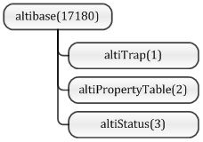

SNMP Agent Guide
================

#### Altibase 7.1

Altibase® Administration

<br><br><br><br><br><br><!-- PDF 변환을 위한 여백입니다. --> 


<!-- PDF 변환을 위한 여백입니다. --> 

<div align="left">
    
</div>
<br><br><!-- PDF 변환을 위한 여백입니다. --> 


<!-- PDF 변환을 위한 여백입니다. --> 

<pre>
Altibase Administration SNMP Agent Guide
Release 7.1
Copyright ⓒ 2001~2023 Altibase Corp. All Rights Reserved.<br>
본 문서의 저작권은 ㈜알티베이스에 있습니다. 이 문서에 대하여 당사의 동의없이 무단으로 복제 또는 전용할 수 없습니다.<br>
<b>㈜알티베이스</b>
08378 서울시 구로구 디지털로 306 대륭포스트타워Ⅱ 10층
전화 : 02-2082-1114
팩스 : 02-2082-1099
고객서비스포털 : <a href='http://support.altibase.com'>http://support.altibase.com</a>
홈페이지      : <a href='http://www.altibase.com/'>http://www.altibase.com</a></pre>
<br>

# 목차

- [서문](#%EC%84%9C%EB%AC%B8)
  - [이 매뉴얼에 대하여](#%EC%9D%B4-%EB%A7%A4%EB%89%B4%EC%96%BC%EC%97%90-%EB%8C%80%ED%95%98%EC%97%AC)
- [1.SNMP 개요](#1snmp-%EA%B0%9C%EC%9A%94)
  - [SNMP란](#snmp%EB%9E%80)
  - [Altibase SNMP 구조](#altibase-snmp-%EA%B5%AC%EC%A1%B0)
- [2.SNMP Agent 설치](#2snmp-agent-%EC%84%A4%EC%B9%98)
  - [SNMP Agent 설치](#snmp-agent-%EC%84%A4%EC%B9%98)
  - [Altibase프로퍼티 설정](#altibase%ED%94%84%EB%A1%9C%ED%8D%BC%ED%8B%B0-%EC%84%A4%EC%A0%95)
  - [패키징한 NET-SNMP로 설치 및 구동](#%ED%8C%A8%ED%82%A4%EC%A7%95%ED%95%9C-net-snmp%EB%A1%9C-%EC%84%A4%EC%B9%98-%EB%B0%8F-%EA%B5%AC%EB%8F%99)
  - [기설치된 NET-SNMP에 설정](#%EA%B8%B0%EC%84%A4%EC%B9%98%EB%90%9C-net-snmp%EC%97%90-%EC%84%A4%EC%A0%95)
- [3.SNMP 사용방법](#3snmp-%EC%82%AC%EC%9A%A9%EB%B0%A9%EB%B2%95)
  - [SNMP 사용 명령어](#snmp-%EC%82%AC%EC%9A%A9-%EB%AA%85%EB%A0%B9%EC%96%B4)
- [4.프로퍼티 확인과 변경](#4%ED%94%84%EB%A1%9C%ED%8D%BC%ED%8B%B0-%ED%99%95%EC%9D%B8%EA%B3%BC-%EB%B3%80%EA%B2%BD)
  - [altiPropertyTable](#altipropertytable)
- [5.Altibase 상태](#5altibase-%EC%83%81%ED%83%9C)
  - [altiStatus](#altistatus)
- [6.트랩(Trap)](#6%ED%8A%B8%EB%9E%A9trap)
  - [altiTrap](#altitrap)
  - [트랩 코드](#%ED%8A%B8%EB%9E%A9-%EC%BD%94%EB%93%9C)
- [A.부록: ALTIBASE-MIB](#a%EB%B6%80%EB%A1%9D-altibase-mib)
  - [ALTIBASE-MIB.txt](#altibase-mibtxt)
- [B.부록: Trouble Shooting](#b%EB%B6%80%EB%A1%9D-trouble-shooting)
  - [FAQ](#faq)

<br>

서문
====

### 이 매뉴얼에 대하여

이 매뉴얼은 SNMP(Simple Network Management Protocol)를 사용하는 방법에 대해
설명한다.

#### 대상 사용자

이 매뉴얼은 다음과 같은 Altibase 사용자를 대상으로 작성되었다.

-   데이터베이스 관리자

-   기술 지원부

다음과 같은 배경 지식을 가지고 이 매뉴얼을 읽는 것이 좋다.

-   컴퓨터, 운영 체제 및 운영 체제 유틸리티 운용에 필요한 기본 지식

-   관계형 데이터베이스 사용 경험 또는 데이터베이스 개념에 대한 이해

-   컴퓨터 프로그래밍 경험

-   데이터베이스 서버 관리, 운영 체제 관리 또는 네트워크 관리 경험

-   분산 환경에서의 데이터의 저장, 관리 및 처리와 관련된 지식

#### 소프트웨어 환경

이 매뉴얼은 데이터베이스 서버로 Altibase 버전 7.1을 사용한다는 가정 하에
작성되었다. 그 이전 버전의 경우 재해 복구 기능을 제공하지 않는다.

#### 이 매뉴얼의 구성

이 매뉴얼은 다음과 같이 구성되어 있다.

-   제 1장 SNMP 개요  
    이 장에서는 Altibase가 제공하는 SNMP의 개요와 ALTIBASE-MIB의 구성을
    소개한다.

-   제 2장 SNMP Agent 설치  
    이 장에서는 SNMP를 사용하기 위해서 SNMP Agent를 설치하는 방법과 Altibase를
    설정하는 방법을 설명한다.

-   제 3장 SNMP 사용방법

-   제 4장 프로퍼티 확인과 변경  
    이 장에서는 altiPropertyTable을 통해서 Altibase의 프로퍼티를 확인하고
    변경하는 방법을 설명한다.

-   제 5장 알티베이스 상태  
    이 장에서는 SNMP를 이용하여 Altibase의 상태를 알아보는 방법을 설명한다.

-   제 6장 트랩  
    이 장에서는 Altibase에 특정한 상황이 발생하였을 때 트랩(Trap)을 이용하여
    관리자에게 전송될 OID를 설명한다.

-   부록 A. ALTIBASE-MIB.txt

-   부록 B. Trouble Shooting

#### 문서화 규칙

이 절에서는 이 매뉴얼에서 사용하는 규칙에 대해 설명한다. 이 규칙을 이해하면 이
매뉴얼과 설명서 세트의 다른 매뉴얼에서 정보를 쉽게 찾을 수 있다.

여기서 설명하는 규칙은 다음과 같다.

-   구문 다이어그램

-   샘플 코드 규칙

##### 구문 다이어그램

이 매뉴얼에서는 다음 구성 요소로 구축된 다이어그램을 사용하여, 명령문의 구문을
설명한다.

| 구성 요소                    | 의미                                                         |
| ---------------------------- | ------------------------------------------------------------ |
|  | 명령문이 시작한다. 완전한 명령문이 아닌 구문 요소는 화살표로 시작한다. |
|  | 명령문이 다음 라인에 계속된다. 완전한 명령문이 아닌 구문 요소는 이 기호로 종료한다. |
|  | 명령문이 이전 라인으로부터 계속된다. 완전한 명령문이 아닌 구문 요소는 이 기호로 시작한다. |
|  | 명령문이 종료한다.                                           |
|  | 필수 항목                                                    |
|  | 선택적 항목                                                  |
|  | 선택사항이 있는 필수 항목. 한 항목만 제공해야 한다.          |
|  | 선택사항이 있는 선택적 항목.                                 |
|  | 선택적 항목. 여러 항목이 허용된다. 각 반복 앞부분에 콤마가 와야 한다. |

##### 샘플 코드 규칙

코드 예제는 SQL, Stored Procedure, iSQL 또는 다른 명령 라인 구문들을 예를 들어
설명한다.

아래 테이블은 코드 예제에서 사용된 인쇄 규칙에 대해 설명한다.

| 규칙         | 의미                                                         | 예제                                                         |
| ------------ | ------------------------------------------------------------ | ------------------------------------------------------------ |
| [ ]          | 선택 항목을 표시                                             | VARCHAR [(*size*)] [[FIXED \|] VARIABLE]                     |
| { }          | 필수 항목 표시. 반드시 하나 이상을 선택해야 되는 표시        | { ENABLE \| DISABLE \| COMPILE }                             |
| \|           | 선택 또는 필수 항목 표시의 인자 구분 표시                    | { ENABLE \| DISABLE \| COMPILE } [ ENABLE \| DISABLE \| COMPILE ] |
| . . .        | 그 이전 인자의 반복 표시 예제 코드들의 생략되는 것을 표시    | SQL\> SELECT ename FROM employee;<br/> ENAME<br/>  ----------------------- <br/>SWNO<br/>  HJNO<br/>  HSCHOI <br/> .<br/> . <br/>. <br/>20 rows selected. |
| 그 밖에 기호 | 위에서 보여진 기호 이 외에 기호들                            | EXEC :p1 := 1; acc NUMBER(11,2);                             |
| 기울임 꼴    | 구문 요소에서 사용자가 지정해야 하는 변수, 특수한 값을 제공해야만 하는 위치 | SELECT \* FROM *table_name*; <br/>CONNECT userID/password;   |
| 소문자       | 사용자가 제공하는 프로그램의 요소들, 예를 들어 테이블 이름, 칼럼 이름, 파일 이름 등 | SELECT ename FROM employee;                                  |
| 대문자       | 시스템에서 제공하는 요소들 또는 구문에 나타나는 키워드       | DESC SYSTEM_.SYS_INDICES_;                                   |

#### 관련 자료

자세한 정보를 위하여 다음 문서 목록을 참조하기 바란다.

-   Installation Guide

-   Administrator’s Manual

-   General Reference

-   Getting Started Guide

-   SSL/TLS User's Guide

-   Error Message Reference

#### 알티베이스는 여러분의 의견을 환영합니다.

이 매뉴얼에 대한 여러분의 의견을 보내주시기 바랍니다. 사용자의 의견은 다음
버전의 매뉴얼을 작성하는데 많은 도움이 됩니다. 보내실 때에는 아래 내용과 함께
고객서비스포털( http://support.altibase.com/kr/ )로 보내주시기 바랍니다.

-   사용 중인 매뉴얼의 이름과 버전

-   매뉴얼에 대한 의견

-   사용자의 성함, 주소, 전화번호

이 외에도 알티베이스 기술지원 설명서의 오류와 누락된 부분 및 기타 기술적인
문제들에 대해서 이 주소로 보내주시면 정성껏 처리하겠습니다. 또한, 기술적인
부분과 관련하여 즉각적인 도움이 필요한 경우에도 고객서비스포털을 통해 서비스를
요청하시기 바랍니다.

여러분의 의견에 항상 감사드립니다.

1.SNMP 개요
=========

이 장에서는 Simple Network Management Protocol(SNMP)의 개요와 ALTIBASE-MIB의
구성에 대해 설명한다.

### SNMP란

#### SNMP 개요

SNMP(Simple Network Management Protocol)는 네트워크 장비의 상태 및 프로세스 상태
등을 관리자에게 전달해 줄 수 있는 프로토콜이다.

SNMP가 사용되기 전에는 ICMP를 이용하여 네트워크에 연결된 각각의 호스트가
작동하고 있는지, 작동한다면 어느정도의 응답시간을 가지고 작동하는지 등의 간단한
정보를 얻었다. ICMP를 이용한 가장 유용한 도구는 아마도 ping 프로그램일 것이다.

그러나 인터넷의 사용이 보편화되고 네트워크에 연결된 호스트의 수가 증가하자
네트워크 구성 역시 복잡해졌다. ICMP만으로는 네트워크 관리를 효율적으로 사용할 수
없게되면서, 몇가지 프로토콜에 대한 연구가 진행되었다. SGMP, HEMS, CMIP/SMIS 등이
제안되게 되었다. 이 중에서 SGMP를 발전시킨 SNMP가 사실상 네트워크 관리를 위한
표준적인 프로토콜로 자리잡게 되었다.

SNMP는 SGMP를 기반으로 HEMS의 MIB를 수용하여 탄생하게 되었다.

#### MIB의 구조 및 OID

SNMP는 MIB를 관리한다. MIB(Management Information Base)는 관리되어야 할 객체의
분류된 정보를 의미한다. 관리되어야 할 객체는 시스템 정보, 네트워크 사용량,
네트워크 인터페이스 정보 등이 있다. SNMP Agent는 트래픽을 모니터링하고 그 통계
정보를 자신의 MIB에 저장한다. MIB에 기술된 변수들은 NMS(Network Management
System) 또는 SNMP 관리자에 의해 수정될 수 있다.

아래는 MIB의 일반적인 구조이다. MIB 객체들은 관리의 편의성을 위해 Tree 구조를
가진다.

데이터를 요청할 때에는 아래와 같이 한다.

```
ISO.org.dod.internet.mgmt.mib-2.system.sysDescr
```

하지만 실제로 데이터를 요청을 할 때는 아래와 같이 숫자로 요청하게 된다.

```
1.3.6.1.2.1.1.1
```

각각의 MIB는 숫자로 나타낼 수 있으며, 이와 같은 숫자를 OID라고 한다.

MIB는 IANA(Internet Assigned Number Authority)라는 단체에서 관리하며 표준으로
사용하고 있다. 표준적인 MIB를 구현하기 위해서는 IANA에서 OID를 부여받아야 한다.
이러한 방식으로 전체 네트워크 상에서 여러 가지 MIB들이 중복되지 않고 사용되게
된다.


[그림 1‑1] MIB의 일반적 구조

#### ALTIBASE-MIB

알티베이스는 IANA에 enterprises(1)<sup>1</sup>에 altibase(17180)라는 OID를 등록하여
사용하고 있다.

[<sup>1</sup>]MIB는 계층적 구조를 가짐으로 필요에 따라서 확장하여 사용할 수 있다. 회사내에서만 사용 

가능하거나 제한된 네트워크 영역의 네트워크 상황을 관제하는 제품을 위한 MIB를 추가하여야 할 경우가 

생길 수 있다. 이런 경우에는 사설로 MIB를 만들어서, private(4)의 enterprises(1)에 정의하여 사용할 수 있다.



[그림 1‑2] ALTIBASE-MIB

ALTIBASE-MIB는 그림과 같이 altiTrap, altiPropertyTable, altiStatus로 분류된다.
각각의 MIB는 아래의 정보를 갖고 있으며, 자세한 설명은 다른 장에서 설명한다.

-   altiTrap MIB : 알티베이스에 특정한 상황이 발생하였을 때 트랩(Trap)에서
    사용되는 OID를 정의한다.

-   altiPropertyTable MIB: 알티베이스의 환경설정을 읽어오거나 변경할 수 있다.

-   altiStatus MIB: 알티베이스의 상태를 파악할 수 있다.

#### SNMP 관련 용어 

SNMP 기능과 관련한 주요 용어를 설명한다.


[그림 1‑3] SNMP 구성도

-   **SNMP**((Simple Network Management Protocol))  
    : 네트워크를 관리하기 위한 프로토콜로써, 관리자에게 네트워크 장비의 상태 및
    프로세스 상태 등을 관리자에게 전달한다.

-   **MIB** (Management Information Base)  
    : SNMP가 네트워크를 감시하고 제어하기 위해 사용되는 객체를 체계적으로 분류한
    것이다. 관리 대상인 객체는 시스템 정보, 네트워크 사용량, 네트워크 인터페이스
    정보 등이 있으며, MIB 객체들은 관리하기 편하도록 Tree구조로 되어있다.

-   **OID**  
    : 데이터를 요청할 때에는 MIB를 숫자로 나타낼 수 있다. OID는 표준적인 MIB를
    구현하기 위해 IANA(Internet Assigned Number Authority) 기구에서 OID 숫자를
    부여받는다.

-   **ALTIBASE-MIB**  
    : 알티베이스는 enterprises(1) 하위에 altibase(17180)라는 OID를 등록하여
    사용하고 있다.

-   **SNMP 에이전트**  
    : SNMP 에이전트는 감시 대상의 객체에 snmpd, snmptrapd를 설치하여 관리 정보를
    수집하고, 관리자에게 전달한다.

-   **snmpd**  
    : SNMP 마스터 에이전트 데몬이다.

-   **snmptrapd**  
    : SNMP 트랩을 위한 데몬이다.

-   **altisnmpd**  
    : Altibase 서버에 설치되는 SNMP 서브 에이전트 데몬이다.

### Altibase SNMP 구조

SNMP가 네트워크에서 어떻게 관리하는지 이해한다.


[그림 1‑4] Altibase-SNMP 구조

위의 그림은 SNMPManager를 이용해 알티베이스 MIB를 가져오는 구조이다. (포트번호는
net-snmp가 기본) Sync 방식이며 SNMPManager에서 UDP 161 포트로 요청을 보내면
snmpd에서 다시 TCP 705 포트로 altisnmpd에 요청을 전달한다. altisnmpd는
최종적으로 UDP 20400 포트로 Altibase에 요청을 전달하고 응답을 받아 snmpd에게
전달하고 최종적으로 snmpmanager에게 전달한다.

아래 그림은 Altibase에서 발생한 Trap이 snmpd에 전달되는 구조를 설명한다. A-sync
방식으로, Altibase에서 UDP 20500 포트로 트랩을 altisnmpd 전달하면, altisnmpd에서
다시 TCP 705 포트로 snmpd에 트랩을 전달한다. snmpd는 최종적으로 UDP 162 포트로
snmptrapd에 트랩을 전달한다.

Altibase와 altisnmpd간에는 알티베이스 자체 프로토콜을 사용했고 altisnmpd와
snmpd간에는 Master Agent/Sub Agent간에 통신을 위한 표준 프로토콜인 AgentX를
사용한다.

snmpd와 snmpmanager, snmptrapd간에는 표준 프로토콜인 SNMP를 사용한다.

2.SNMP Agent 설치
===============

이 장은 SNMP를 사용하기 위해서 SNMP Agent를 설치하는 방법과 Altibase를 설정하는
방법을 설명한다.

### SNMP Agent 설치

이 절에서는 SNMP Agent를 설치하고 Altibase와 연동하기 위한 방법을 설명한다.
알티베이스는 net-snmp를 실행하기 위해 두 가지 방법으로 설정할 수 있다.

-   알티베이스에서 패키징한 NET-SNMP로 설정하기

-   기설치된 환경에서 NET-SNMP에 설정하기

Altibase SNMP Agent는 오픈소스 net-snmp를 준수한다. NET-SNMP 바이너리 및 환경
파일의 설정 방법은 net-snmp 홈페이지( <http://www.net-snmp.org/> )를 참조한다.

#### 패키지 다운로드

Altibase 홈페이지( www.altibase.com )에서 다운로드 받은 Altibase 패키지를
다운로드하여 설치한다.

altibase-snmp-xxx.tar.gz를 압축을 풀면, 아래와 같은 구성을 볼 수 있다.

```
$ gzip -d altibase-snmp-xxx.tar.gz

$ tar xvf altibase-snmp-xxx.tar

...

...

...

== bin

= snmp manger (snmpget, snmpset, snmpwak)

== sbin

= snmpd : snmp Master/Sub agent daemon

= snmptrapd : snmp trap daemon

= altisnmpd : Altibase snmp sub agent daemon

== share/snmp/mibs

= ALTIBASE-MIB.txt : Altibase MIB

== etc/snmp

= snmpd.conf : snmpd 환경파일

= altisnmpd.conf : altisnmpd 환경파일

= altisnmp.env : 환경 변수 설정
```

altisnmpd, altisnmpd.conf, ALTIBASE-MIB.txt 3개의 파일을 제외하고는 모두
net-snmp 오리지널 소스를 컴파일한 바이너리이다.

고객의 장비에 설치된 net-snmp와 연동하는 경우에는 위의 3개 파일만 설정하면 된다.

### Altibase프로퍼티 설정

Altibase에서 SNMP 기능을 사용하기 위해서는 아래의 프로퍼티 파일을 사용 목적에
맞게 수정해야 한다. 알티베이스 프로퍼티 파일은 \$ALTIBASE_HOME/conf에 있다.

SNMP 기능과 관련된 프로퍼티는 다음과 같다. 각 프로퍼티에 대한 상세한 설명은
*General Reference*를 참조한다.

-   SNMP_ENABLE

-   SNMP_PORT_NO

-   SNMP_TRAP_PORT_NO

-   SNMP_RECV_TIMEOUT

-   SNMP_SEND_TIMEOUT

-   SNMP_MSGLOG_FLAG

-   SNMP_ALARM_QUERY_TIMEOUT

-   SNMP_ALARM_FETCH_TIMEOUT

-   SNMP_ALARM_UTRANS_TIMEOUT

-   SNMP_ALARM_SESSION_FAILURE_COUNT

### 패키징한 NET-SNMP로 설치 및 구동

이 절에서는 알티베이스에서 패키징한 NET-SNMP를 설정하고, 실행하기 위한 방법을
설명한다.

> 참고 : 포트 번호는 시스템에 구동중인 snmp와 충돌이 일어나지 않도록 기본포트
> 번호에 1000을 더하도록 설정한다.

#### 환경변수 설정

각 바이너리 실행을 쉽게 하기 위해 source 명령을 이용해 환경변수를 설정한다. 다음
설명부터는 altisnmp.env가 설정된 환경이라고 가정한다.

```
$ source altisnmp.env

ALTISNMP=/home/donlet/work/altibase-snmp-1.0.1.release

ALTISNMPCONF=/home/donlet/work/altibase-snmp-1.0.1.release/etc/snmp

ALTISNMPBIN=/home/donlet/work/altibase-snmp-1.0.1.release/bin

ALTISNMPSBIN=/home/donlet/work/altibase-snmp-1.0.1.release/sbin

SNMP_PERSISTENT_FILE=/home/donlet/work/altibase-snmp-1.0.1.release/var/net-snmp/snmpd.conf

SNMP_PERSISTENT_DIR=/home/donlet/work/altibase-snmp-1.0.1.release/var/net-snmp

MIBDIRS=/home/donlet/work/altibase-snmp-1.0.1.release/share/snmp/mibs

MIBS=ALL
```

#### snmpd 설정 및 실행

snmpd는 SNMP의 마스터 에이전트 데몬이다. 아래에서 snmpd를 실행하기 위한 환경
설정과 실행을 설명한다.

##### 환경파일 설정

SNMP를 사용하기 위하여 포트번호와 snmpd를 설정한다.

snmpd와 snmptrapd는 포트번호 1162번으로 통신하고, snmpd는 master agent로
설정한다.

```
$ cat $ALTISNMPCONF/snmpd.conf

rocommunity public

rwcommunity private

syslocation mysystem

syscontact admin@mail.com

sysservices 0

trap2sink localhost public 1162

master agentx
```

##### 실행

SNMP Agent 실행 옵션은 [-f], [-l], [-s], [-p]이다.

[-f]는 snmpd의 실행을 foreground에서 볼 수 있다. [-l] 옵션은 파일에 로그를,
[-s]는 syslog를 남기고, [-P]는 pid 파일을 생성한다.

우선 foreground로 snmpd가 실행되는지 확인한다.

```
$ $ALTISNMPSBIN/snmpd -f -L -c $ALTISNMPCONF/snmpd.conf -C -x localhost:1705 udp:localhost:1161
Turning on AgentX master support.
NET-SNMP version 5.0.8
```

snmpd와 altibase snmp subagent는 1705 포트로 TCP 통신을 하고, snmpd와 snmp
manager (snmpget, snmpset, snmpwalk 등)는 1161 포트로 UDP 통신을 하는 것을
확인할 수 있다.

위와 같이 실행이 되는 것을 확인하였다면, "Ctrl + C"를 눌러 실행을 종료하고,
background로 snmpd를 실행한다. background로 실행하기 위해 -f 옵션은 제거하였다.

```
$ $ALTISNMPSBIN/snmpd -c $ALTISNMPCONF/snmpd.conf -C -x localhost:1705 -l /tmp/snmpd.log -s -P /tmp/snmpd.pid udp:localhost:1161
```

##### snmpd 종료

SNMP Agent를 종료하기 위해서 kill 명령으로 종료시킬 수 있다.

```
$ kill `cat /tmp/snmpd.pid`
```

#### snmptrapd 실행

snmptrapd는 SNMP 트랩을 위한 데몬이다. 아래에서 snmptrapd를 사용하는 방법을
설명한다.

snmptrapd 실행 옵션은 [-f], [-o], [-s], [-u]이다. [-f]는 snmpd의 실행을
foreground에서 볼 수 있다. [-o] 옵션은 파일에 로그를, [-s]는 syslog를 남기고,
[-u]는 pid 파일을 생성한다.

snmptrapd를 아래와 같이 foreground로 실행하여 확인한다. snmpd.conf에 trap2sink에
포트는 1162로 설정했으므로 udp:localhost:1162로 반드시 옵션을 설정해야 한다.

```
$ $ALTISNMPSBIN/snmptrapd -f -P udp:localhost:1162
2014-10-28 14:46:32 NET-SNMP version 5.0.8 Started.
```

위와 같이 실행이 되는 것을 확인하였다면, "Ctrl + C"를 눌러 실행을 종료하고,
snmptrapd를 실행한다. background로 실행하기 위해 -f 옵션은 제거하였다.

```
$ $ALTISNMPSBIN/snmptrapd -s -o /tmp/snmptrapd.log -u /tmp/snmptrapd.pid udp:localhost:1162
```

snmptrapd를 실행한 상태에서 snmpd를 재시작한다. snmpd가 재시작했다는 트랩이
syslog와 /tmp/snmptrapd.log 파일에 생성된다.

이제 snmpd와 snmptrapd간에 통신이 정상적으로 실행되는 것을 확인할 수 있다.

```
$ cat /tmp/snmptrapd.log 
Starting snmptrapd 5.0.8
2014-10-28 14:57:40 NET-SNMP version 5.0.8 Started.
2014-10-28 14:58:12 localhost [127.0.0.1]:
        SNMPv2-MIB::sysUpTime.0 = Timeticks: (2) 0:00:00.02     SNMPv2-MIB::snmpTrapOID.0 = OID: SNMPv2-MIB::coldStart  SNMPv2-MIB::snmpTrapEnterprise.0 = OID: NET-SNMP-TC::linux
localhost [127.0.0.1]: Trap SNMPv2-MIB::sysUpTime.0 = Timeticks: (2) 0:00:00.02, SNMPv2-MIB::snmpTrapOID.0 = OID: SNMPv2-MIB::coldStart, SNMPv2-MIB::snmpTrapEnterprise.0 = OID: NET-SNMP-TC::linux
2014-10-28 14:58:14 localhost [127.0.0.1]:
        SNMPv2-MIB::sysUpTime.0 = Timeticks: (143) 0:00:01.43   SNMPv2-MIB::snmpTrapOID.0 = OID: NET-SNMP-AGENT-MIB::nsNotifyShutdown
localhost [127.0.0.1]: Trap SNMPv2-MIB::sysUpTime.0 = Timeticks: (143) 0:00:01.43, SNMPv2-MIB::snmpTrapOID.0 = OID: NET-SNMP-AGENT-MIB::nsNotifyShutdown
```

##### snmptrapd 종료

snmptrapd의 실행을 종료하기 위해서 kill 명령으로 종료시킬 수 있다.

```
$ kill `cat /tmp/snmptrapd.pid`
```

#### altisnmpd 실행

altisnmpd는 Altibase 서버에 설치되는 SNMP 서브 에이전트 데몬이다. 아래에서
altisnmpd를 사용하기 위한 환경 설정과 실행 방법을 설명한다.

##### 환경파일 설정

altisnmpd가 Altibase 서버와 통신을 하기 위해 PORT_NO와 SNMP_PORT_NO를 알티베이스
환경 파일에서 설정한 것과 동일하게 설정해야 한다.

또한 altibase_trap 역시 Altibase의 SNMP_TRAP_PORT_NO와 동일하게 설정한다.

```
$ cat $ALTISNMPCONF/altisnmpd.conf
# ALTIBASE PORT_NO SNMP_PORT_NO
altibase 52473 20400
# ALTIBASE_TRAP SNMP_TRAP_PORT_NO
altibase_trap 20500
```

만약 여러 대의 Altibase 서버와 통신하고 싶다면 아래와 같이 환경 파일에서
서버들을 기술한다.

```
altibase 52473 20400
altibase 20300 20800
...
```

##### altisnmpd 실행

altisnmpd 실행 옵션은 [-f], [-l], [-s], [-p]이다. [-f]는 snmpd의 실행을
foreground에서 볼 수 있다. [-l] 옵션은 파일에 로그를, [-s]는 syslog를 남기고,
[-p]는 pid 파일을 생성한다.

altisnmpd가 실행되는 것을 확인하기 위해 우선 foreground로 실행한다.

```
$ $ALTISNMPSBIN/altisnmpd -f -L -c $ALTISNMPCONF/altisnmpd.conf -x localhost:1705
AgentX subagent for Altibase 
                              
NET-SNMP version 5.0.8      
                              
Altibase[0] : 52473     20400
                              
Trap : 20500
```

snmpd와 altisnmpd는 1705 포트로 TCP 통신을 하기 때문에 -x locathost:1705로
설정한 것을 확인하였다. 이제 background로 실행하기 위해 -f 옵션은 제거하였다.

```
$ $ALTISNMPSBIN/altisnmpd -c $ALTISNMPCONF/altisnmpd.conf -l /tmp/altisnmpd.log -s -P /tmp/altisnmpd.pid -x localhost:1705
```

##### altisnmpd 종료

altisnmpd의 실행을 종료하기 위해서 kill 명령으로 종료시킨다.

```
$ kill `cat /tmp/altisnmpd pid`
```

만약 altisnmpd를 실행하거나 종료하면 트랩이 발생되기 때문에 snmptrapd에서 확인할
수 있다.

```
2014-10-28 15:39:57 localhost [127.0.0.1]:
        SNMPv2-MIB::sysUpTime.0 = Timeticks: (1987) 0:00:19.87  SNMPv2-MIB::snmpTrapOID.0 = OID: SNMPv2-SMI::private    ALTIBASE-MIB::altiTrapAddress = STRING: 12944   ALTIBASE-MIB::altiTrapLevel = STRING: 3 ALTIBASE-MIB::altiTra
pCode = STRING: 10000003        ALTIBASE-MIB::altiTrapMessage = STRING: /home/donlet/work/altibase-snmp-1.0.1.release/sbin/altisnmpd is running.        ALTIBASE-MIB::altiTrapMoreInfo = STRING: coldstart
2014-10-28 15:41:29 localhost [127.0.0.1]:
        SNMPv2-MIB::sysUpTime.0 = Timeticks: (11225) 0:01:52.25 SNMPv2-MIB::snmpTrapOID.0 = OID: SNMPv2-SMI::private    ALTIBASE-MIB::altiTrapAddress = STRING: 12961   ALTIBASE-MIB::altiTrapLevel = STRING: 3 ALTIBASE-MIB::altiTra
pCode = STRING: 10000003        ALTIBASE-MIB::altiTrapMessage = STRING: /home/donlet/work/altibase-snmp-1.0.1.release/sbin/altisnmpd is running.        ALTIBASE-MIB::altiTrapMoreInfo = STRING: coldstart
```

#### Altibase 실행

Altibase를 실행하기 위해 기본적으로 아래의 프로퍼티를 클라이언트 환경에 맞춰
설정한다. 프로퍼티에 대한 자세한 설명은 Altibase 프로퍼티 설정을 참조하기
바란다.

-   SNMP_ENABLE

-   SNMP_PORT_NO

-   SNMP_TRAP_PORT_NO

Altibase를 실행하고 아래 명령을 실행하자.

```
$ $ALTISNMPBIN/snmpwalk -v 2c -c private udp:localhost:1161 altibase
ALTIBASE-MIB::altiPropertyIndex.1 = INTEGER: 1
ALTIBASE-MIB::altiPropertyAlarmQueryTimeout.1 = STRING: 1
ALTIBASE-MIB::altiPropertyAlarmUtransTimeout.1 = STRING: 1
ALTIBASE-MIB::altiPropertyAlarmFetchTimeout.1 = STRING: 1
ALTIBASE-MIB::altiPropertyAlarmSessionFailureCount.1 = STRING: 3
ALTIBASE-MIB::altiStatusIndex.1 = INTEGER: 1
ALTIBASE-MIB::altiStatusDBName.1 = STRING: mydb
ALTIBASE-MIB::altiStatusDBVersion.1 = STRING: 7.1.0.0.0
ALTIBASE-MIB::altiStatusRunningTime.1 = STRING: 00:00:02
ALTIBASE-MIB::altiStatusProcessID.1 = STRING: 12973
ALTIBASE-MIB::altiStatusSessionCount.1 = STRING: 0
```

SNMP가 제대로 동작하면, ALTIBASE-MIB 정보가 제대로 나오늘 것을 확인할 수 있다.

### 기설치된 NET-SNMP에 설정 

고객의 장비에 이미 net-snmp가 설치된 경우, net-snmp altisnmpd(altibase snmp
subagent)간에 연동하는 방법을 설명한다.

이 절에서는 고객 서버에 snmpd 패키지가 이미 /usr에 설치되어 있다는 가정하에
설명한다.

-   Altibase 프로퍼티 설정

-   ALTIBASE-MIB.txt 등록

-   altisnmpd 설정

-   altisnmpd.conf

#### Altibase 프로퍼티 설정

Altibase는 아래의 프로퍼티를 고객 환경에 맞춰 설정한다.

-   SNMP_ENABLE

-   SNMP_PORT_NO

-   SNMP_TRAP_PORT_NO

#### ALTIBASE-MIB.txt 등록

ALTIBASE-MIB.txt를 복사하여 SNMP 환경파일인 snmp.conf에 ALTIBASE-MIB를 추가한다.
이 때 snmpd를 재시작할 필요는 없다.

```
sudo cp $ALTISNMP/share/snmp/mibs/ALTIBASE-MIB.txt /usr/share/snmp/mibs
 
# vi /etc/snmp/snmp.conf
mibs +ALTIBASE-MIB
```

#### altisnmpd 설정 및 실행

altisnmpd 설정에 대한 자세한 설명은 앞 절의 "altisnmpd 실행"을 참조하기 바란다.

snmpd가 사용하는 포트를 지정해야 한다. 기본으로 localhost:705로 맞춰졌으며, 아닌
경우 시스템 관리자에게 문의한다.

```
$ $ALTISNMPSBIN/altisnmpd -c $ALTISNMPCONF/altisnmpd.conf -l /tmp/altisnmpd.log -s -P /tmp/altisnmpd.pid -x localhost:705
```

Altibase를 실행후, snmpwalk 명령을 실행한다.

```
$ /usr/bin/snmpwalk -v 2c -c private localhost:161 altibase
ALTIBASE-MIB::altiPropertyIndex.1 = INTEGER: 1                                
ALTIBASE-MIB::altiPropertyAlarmQueryTimeout.1 = STRING: 1                     
ALTIBASE-MIB::altiPropertyAlarmUtransTimeout.1 = STRING: 1                    
ALTIBASE-MIB::altiPropertyAlarmFetchTimeout.1 = STRING: 1                     
ALTIBASE-MIB::altiPropertyAlarmSessionFailureCount.1 = STRING: 3              
ALTIBASE-MIB::altiStatusIndex.1 = INTEGER: 1                                  
ALTIBASE-MIB::altiStatusDBName.1 = STRING: mydb                                
ALTIBASE-MIB::altiStatusDBVersion.1 = STRING: 7.1.0.0.0                       
ALTIBASE-MIB::altiStatusRunningTime.1 = STRING: 00:38:00                      
ALTIBASE-MIB::altiStatusProcessID.1 = STRING: 12973                           
ALTIBASE-MIB::altiStatusSessionCount.1 = STRING: 0
```

snmpwalk 명령을 실행하여, 아래와 같이 나온다면 /etc/snmp/snmpd.conf에 ACL 설정을
확인해야 한다.

```
$ /usr/bin/snmpwalk -v 2c -c private localhost:161 altibase
Timeout: No Response from localhost:161
 
/etc/snmp/snmpd.conf
#  Full access from the local host
#rocommunity public  localhost
#rwcommunity private localhost
```

시스템 관리자는 Full access를 하려면 주석을 해제해야 한다.

3.SNMP 사용방법
=============

### SNMP 사용 명령어

SNMP는 네트워크 정보를 수집할 때 요청에 의해서 얻어지는 정보와 중요한 일이
발생할 때 생기는 정보가 있다.

SNMP는 UDP (User Datagram Protocol)상에서 동작하는 비동기식 요청/응답 메시지
프로토콜로서 다음의 간단한 4가지 연산만 수행한다.

#### SNMP GET

SNMP Agent로부터 특정 OID의 정보를 가져오기 위해서 사용된다. 정보를 얻기 위해
필요한 기본정보는 agent가 설치되어 있는 서버의 주소(또는 이름)와 커뮤니티(권한을
위한)이름 그리고 얻기 원하는 정보의 OID 번호 또는 MIB의 계층이름이다.

#### SNMP WAK

SNMP Agent로부터 특정 OID의 다음 OID를 가져오기 위해서 사용된다. 특정 OID의
하부의 모든 OID를 가져오기 위해서 순차적으로 호출된다.

#### SNMP SET

SNMP Agent에 특정 OID의 값을 설정하기 위해서 사용된다.

#### SNMP TRAP

통보해야 할 어떤 정보가 발생했을 때 비동기적으로 상황을 알리기 위해서 사용된다.
다른 요청들이 동기적 요청이라면 Trap은 비동기적 사건을 알리기 위해서 사용된다.

4.프로퍼티 확인과 변경
====================

이 장은 altiPropertyTable을 통해서 Altibase의 프로퍼티를 확인하고 변경하는
방법을 설명한다.

### altiPropertyTable

altiPropertyTable로 알티베이스의 설정을 확인하거나 변경할 수 있다.


[그림 4‑1] altiPropertyTable MIB

altibase(17180)의 하부에 (2)번 OID를 가지는 altiProperyTable은 6개의 하부 항목을
가지고 있다. 하나의 서버에는 여러 개의 알티베이스가 존재할수 있으며 이를
구분하기 altiPropertyEntry 아래에 5개의 항목들이 묶여 있다.

#### altiPropertyIndex MIB(1)

##### OID

1.3.6.1.4.1.17180.2.1.1

##### 구문

```
DisplayString
```

##### Max-Access

Read-only

##### 설명

Altibase SNMP Sub Agent가 관리하는 알티베이스의 수에 따라 1부터 증가된다.

##### 예제

```
$ snmpget -v 2c -c private localhost altiPropertyIndex.1
ALTIBASE-MIB::altiPropertyIndex.1 = INTEGER: 1
$ snmpwalk -v 2c -c private localhost altiPropertyIndex
ALTIBASE-MIB::altiPropertyIndex.1 = INTEGER: 1
ALTIBASE-MIB::altiPropertyIndex.2 = INTEGER: 1
```

#### altiPropertyAlarmQueryTimeout MIB(2)

##### OID

1.3.6.1.4.1.17180.2.1.2

##### 구문

```
DisplayString
```

##### Max-Access

Read-Write

##### 설명

알티베이스에 연결된 세션에서 Query Timeout이 발생했을 때 트랩을 발생시킬지
여부를 설정하며 0이면 트랩을 발생시키지 않는다.

알티베이스 프로퍼티의 SNMP_ALARM_QUERY_TIMEOUT에 초기값을 설정할 수 있으며
기본값은 1이다.

##### 예제

```
$ snmpwalk -v 2c -c private localhost altiPropertyAlarmQueryTimeout
ALTIBASE-MIB::altiPropertyAlarmQueryTimeout.1 = STRING: 1
ALTIBASE-MIB::altiPropertyAlarmQueryTimeout.1 = STRING: 2
$ snmpset -v 2c -c private localhost altiPropertyAlarmQueryTimeout.1 s 0
ALTIBASE-MIB::altiPropertyAlarmQueryTimeout.1 = STRING: 0
$ snmpget -v 2c -c private localhost altiPropertyAlarmQueryTimeout.1
ALTIBASE-MIB::altiPropertyAlarmQueryTimeout.1 = STRING: 0
```

#### altiPropertyAlarmFetchTimeout MIB(3)

##### OID

1.3.6.1.4.1.17180.2.1.3

##### Syntax

```
DisplayString
```

##### Max-Access

Read-write

##### 설명

알티베이스에 연결된 세션에서 Fetch Timeout이 발생했을 때 트랩을 발생시킬지
여부를 설정하며 0이면 트랩을 발생시키지 않는다.

알티베이스 프로퍼티의 SNMP_ALARM_FETCH_TIMEOUT에 초기값을 설정할 수 있으며
기본값은 1이다.

##### 예제

```
$ snmpwalk -v 2c -c private localhost altiPropertyAlarmFetchTimeout
ALTIBASE-MIB::altiPropertyAlarmFetchTimeout.1 = STRING: 1
ALTIBASE-MIB::altiPropertyAlarmFetchTimeout.1 = STRING: 2
$ snmpset -v 2c -c private localhost altiPropertyAlarmFetchTimeout.1 s 0
ALTIBASE-MIB::altiPropertyAlarmFetchTimeout.1 = STRING: 0
$ snmpget -v 2c -c private localhost altiPropertyAlarmFetchTimeout.1
ALTIBASE-MIB::altiPropertyAlarmFetchTimeout.1 = STRING: 0
```

#### altiPropertyAlarmUtransTimeout MIB(4)

##### OID

1.3.6.1.4.1.17180.2.1.4

##### Syntax

```
DisplayString
```

##### Max-Access

Read-write

##### 설명

알티베이스에 연결된 세션에서 Utrans Timeout이 발생했을 때 트랩을 발생시킬지
여부를 설정하며 0이면 트랩을 발생시키지 않는다.

알티베이스의 프로퍼티 SNMP_ALARM_UTRANS_TIMEOUT에 초기값을 설정할 수 있으며
기본값은 1이다.

##### 예제

```
$ snmpwalk -v 2c -c private localhost altiPropertyAlarmUTransTimeout
ALTIBASE-MIB::altiPropertyAlarmUTransTimeout.1 = STRING: 1
ALTIBASE-MIB::altiPropertyAlarmUTransTimeout.1 = STRING: 2
$ snmpset -v 2c -c private localhost altiPropertyAlarmUTransTimeout.1 s 0
ALTIBASE-MIB::altiPropertyAlarmUTransTimeout.1 = STRING: 0
$ snmpget -v 2c -c private localhost altiPropertyAlarmUTransTimeout.1
ALTIBASE-MIB::altiPropertyAlarmUTransTimeout.1 = STRING: 0
```

#### altiPropertyAlarmSessionFailureCount MIB(5)

##### OID

1.3.6.1.4.1.17180.2.1.5

##### Syntax

```
DisplayString
```

##### Max-Access

Read-write

##### 설명

알티베이스에 연결된 세션에서 연속적으로 몇 회 오류가 발생됐을 때 트랩을
발생시킬지를 설정하며 0이면 트랩을 발생시키지 않는다.

프로퍼티의 SNMP_ALARM_SESSION_FAILURE_COUNT에 초기값을 설정할 수 있으며 기본값은
3이다.

초기값을 지정할 수 있다.

##### 예제

```
$ snmpwalk -v 2c -c private localhost altiPropertyAlarmSessionFailureCount
ALTIBASE-MIB::altiPropertyAlarmSessionFailureCount.1 = STRING: 3
ALTIBASE-MIB::altiPropertyAlarmSessionFailureCount.2 = STRING: 3
$ snmpset -v 2c -c private localhost altiPropertyAlarmSessionFailureCount.1 s 2
ALTIBASE-MIB::altiPropertyAlarmSessionFailureCount.1 = STRING: 2
$ snmpget -v 2c -c private localhost altiPropertyAlarmSessionFailureCount.1
ALTIBASE-MIB::altiPropertyAlarmSessionFailureCount.1 = STRING: 2
```

5.Altibase 상태
=============

이 장은 SNMP를 이용하여 Altibase의 상태를 알아보는 방법을 설명한다.

### altiStatus

altiStatus를 통해서 알티베이스의 상태를 파악할 수 있다.


[그림 5‑1] altiStatus MIB

altiStatus MIB는 altibase(17180)의 하부에 (3)번 OID를 가지는 altiStatus가 있다.
altiStatus는 알티베이스의 간단한 상태들을 가지는 altiStatusTable(1)이 있으며,
이를 구분하기 altiStatusEntry 아래에 6개의 항목들이 묶여 있다.

#### altiStatusIndex MIB(1)

##### OID

1.3.6.1.4.1.17180.3.1.1.1

##### Syntax

```
DisplayString
```

##### Max-Access

Read-only

##### 설명

Altibase SNMP Sub Agent가 관리하는 알티베이스의 수에 따라 1부터 증가된다.

##### 예제

```
$ snmpget -v 2c -c public localhost altiStatusIndex.1
ALTIBASE-MIB::altiStatusIndex.1 = INTEGER: 1
$ snmpwalk -v 2c -c public localhost altiStatusIndex
ALTIBASE-MIB::altiStatusIndex.1 = INTEGER: 1
ALTIBASE-MIB::altiStatusIndex.2 = INTEGER: 2
```

#### altiStatusDBName(2)

##### OID

1.3.6.1.4.1.17180.3.1.1.2

##### Syntax

```
DisplayString
```

##### Max-Access

Read-only

##### 설명

알티베이스의 DB 이름을 알려준다.

##### 예제 

```
$ snmpget -v 2c -c public localhost altiStatusIndex.1
ALTIBASE-MIB::altiStatusDBName.1 = STRING: mydb
$ snmpwalk -v 2c -c public localhost altiStatusIndex
ALTIBASE-MIB::altiStatusDBName.1 = STRING: mydb
ALTIBASE-MIB::altiStatusDBName.2 = STRING: mydb
```

#### altiStatusDBVersion MIB(3)

##### OID

1.3.6.1.4.1.17180.3.1.1.3

##### Syntax

```
DisplayString
```

##### Max-Access

Read-only

##### 설명

알티베이스의 DB 버전을 알려준다.

##### 예제 

```
$ snmpget -v 2c -c public localhost altiStatusDBVersion.1
ALTIBASE-MIB::altiStatusDBVersion.1 = STRING: 6.5.1.0.1
$ snmpwalk -v 2c -c public localhost altiStatusDBVersion
ALTIBASE-MIB::altiStatusDBVersion.1 = STRING: 6.5.1.0.1
ALTIBASE-MIB::altiStatusDBVersion.2 = STRING: 7.1.1.0.0
```

#### altiStatusRunningTime MIB(4)

##### OID

1.3.6.1.4.1.17180.3.1.1.4

##### Syntax

```
DisplayString
```

##### Max-Access

Read-only

##### 설명

알티베이스 프로세스의 실행 시간을 알려준다. 실행 시간은 일수, 시간, 분, 초로
조합되어 있다.

##### 예제 

```
$ snmpwalk -v 2c -c public localhost altiStatusRunningTime.1
ALTIBASE-MIB::altiStatusRunningTime.1 = STRING: 00:00:14
$ snmpwalk -v 2c -c public localhost altiStatusRunningTime
ALTIBASE-MIB::altiStatusRunningTime.1 = STRING: 00:00:21
ALTIBASE-MIB::altiStatusRunningTime.2 = STRING: 1 days, 03:12:56
```

#### altiStatusProcessID MIB(5)

##### OID

1.3.6.1.4.1.17180.3.1.1.5

##### Syntax

```
DisplayString
```

##### Max-Access

Read-only

##### 설명

Altibase의 프로세스 ID를 알려준다.

##### 예제

```
$ snmpget -v 2c -c public localhost altiStatusProcessID.1
ALTIBASE-MIB::altiStatusProcessID.1 = STRING: 23201
$ snmpwalk -v 2c -c public localhost altiStatusProcessID
ALTIBASE-MIB::altiStatusProcessID.1 = STRING: 23201
ALTIBASE-MIB::altiStatusProcessID.2 = STRING: 23343
```

#### altiStatusSessionCount MIB(6)

##### OID

1.3.6.1.4.1.17180.3.1.1.6

##### Syntax

```
DisplayString
```

##### Max-Access

Read-only

##### 설명

Altibase의 세션 수를 알려준다. Altibase에 현재 접속되어 있는 클라이언트의 수와
동일하다.

##### 예문 

```
$ snmpget -v 2c -c public localhost altiStatusSessionCount.1
ALTIBASE-MIB::altiStatusSessionCount.1 = STRING: 10
$ snmpwalk -v 2c -c public localhost altiStatusSessionCount
ALTIBASE-MIB::altiStatusSessionCount.1 = STRING: 10
ALTIBASE-MIB::altiStatusSessionCount.2 = STRING: 7 
```

6.트랩(Trap)
==========

이 장에서는 Altibase에 특정한 상황이 발생하였을 때 트랩(Trap)을 이용하여
관리자에게 전송될 OID를 설명한다.

### altiTrap

altiTrap은 트랩을 이용해 전송될 OID를 기술한 MIB이다.


[그림 6‑1] altiTrap MIB

altiTrap MIB는 altibase(171780)의 하부에 (1)번 OID를 가지는 altiTrap은 트랩을
이용하여 전달될 OID들을 정의하고 있다. Altibase는 트랩의 OID는 Altibase의 Port
번호, 레벨, 트랩 코드, 메시지와 추가적인 정보들이 정의되어 있다.

#### altiNotification MIB(1)

##### OID

1.3.6.1.4.1.17180.1.1

##### Syntax

```
OBJECT { altiTrapAddress, altiTrapLevel, altiTrapCode, altiTrapMessage,
altiTrapMoreInfo }
```

##### 설명

altiNotification은 5개의 MIB를 포함하는 객체(notification)형으로 트랩을 전송하기
위해서 사용한다.

##### 예제

```
# snmptrapd -f -P
2014-10-24 13:30:46 localhost [127.0.0.1]:
SNMPv2-MIB::sysUpTime.0 = Timeticks: (1017350) 2:49:33.50
SNMPv2-MIB::snmpTrapOID.0 = OID: SNMPv2-SMI::private
ALTIBASE-MIB::altiTrapAddress = STRING: 52473
ALTIBASE-MIB::altiTrapLevel = STRING: 3
ALTIBASE-MIB::altiTrapCode = STRING: 10000001
ALTIBASE-MIB::altiTrapMessage = STRING: Altibase is running.
ALTIBASE-MIB::altiTrapMoreInfo = STRING:
```

#### altiTrapAddress MIB(2)

##### OID

1.3.6.1.4.1.17180.1.2

##### Syntax

```
DisplayString
```

##### 설명

altiTrapAddress는 알티베이스의 포트 번호를 나타내며, 트랩이 어떤 Altibase에서
발생하였는지 구별하기 위해서 사용된다.

#### altiTrapLevel(3)

##### OID

1.3.6.1.4.1.17180.1.3

##### Syntax

```
DisplayString
```

##### 설명

altiTrapLevel은 트랩의 중요도를 나타낸다. 레벨이 나타내는 의미는 아래와 같다.

1: 매우 중요하고 위급한 상황

2: 주요한 상황

3: 일상적으로 발생할 수 있는 상황

#### altiTrapCode(4)

##### OID

1.3.6.1.4.1.17180.1.4

##### Syntax

```
DisplayString
```

##### 설명

Altibase에서 발생하는 트랩을 구분하기 위해서 코드를 사용된다. 트랩 코드에 대한
자세한 설명은 [트랩 코드](#트랩-코드)에서 설명한다.

#### altiTrapMessage(5)

##### OID

1.3.6.1.4.1.17180.1.5

##### Syntax

```
DisplayString
```

##### 설명

Altibase에서 발생하는 트랩에 대한 설명이다.

#### altiTrapMoreInfo(6)

##### OID

1.3.6.1.4.1.17180.1.6

##### Syntax

```
DisplayString
```

##### 설명

Altibase에서 발생하는 트랩에 대한 추가적인 설명이다.

### 트랩 코드

Altibase에서 발생할 수 있는 트랩 코드(altiTrapCode)와 트랩 레벨(altiTrapLevel)을
설명한다.

#### Altibase Running Status

##### Code

10000001

##### Level

3

##### 설명

Altibase가 현재 실행중이면 발생하는 코드이다.

##### 예제

```
# snmptrapd -f -P
2014-10-24 13:30:46 localhost [127.0.0.1]:
SNMPv2-MIB::sysUpTime.0 = Timeticks: (1017350) 2:49:33.50
SNMPv2-MIB::snmpTrapOID.0 = OID: SNMPv2-SMI::private
ALTIBASE-MIB::altiTrapAddress = STRING: 52473
ALTIBASE-MIB::altiTrapLevel = STRING: 3
ALTIBASE-MIB::altiTrapCode = STRING: 10000001
ALTIBASE-MIB::altiTrapMessage = STRING: Altibase is running.
ALTIBASE-MIB::altiTrapMoreInfo = STRING:
```

#### Altibase UnRunning Status

##### Code

10000002

##### Level

3

##### 설명

Altibase가 현재 실행중이 아닐 때 발생하는 코드이다.

##### 예제

```
# snmptrapd -f -P

2014-10-24 13:33:38 localhost [127.0.0.1]:
SNMPv2-MIB::sysUpTime.0 = Timeticks: (1034562) 2:52:25.62
SNMPv2-MIB::snmpTrapOID.0 = OID: SNMPv2-SMI::private
ALTIBASE-MIB::altiTrapAddress = STRING: 52473
ALTIBASE-MIB::altiTrapLevel = STRING: 1
ALTIBASE-MIB::altiTrapCode = STRING: 10000002
ALTIBASE-MIB::altiTrapMessage = STRING: Altibase is not running.
ALTIBASE-MIB::altiTrapMoreInfo = STRING:
```

#### Altibase Subagent Running Status

##### Code

10000003

##### Level

3

##### 설명

Altibase의 서브 에이전트(altisnmpd)가 실행중일 때 발생하는 코드이다.

##### 예제

```
# snmptrapd -f -P

2014-10-24 13:40:24 localhost [127.0.0.1]:
SNMPv2-MIB::sysUpTime.0 = Timeticks: (1075187) 2:59:11.87
SNMPv2-MIB::snmpTrapOID.0 = OID: SNMPv2-SMI::private
ALTIBASE-MIB::altiTrapAddress = STRING: 22082
ALTIBASE-MIB::altiTrapLevel = STRING: 3
ALTIBASE-MIB::altiTrapCode = STRING: 10000003
ALTIBASE-MIB::altiTrapMessage = STRING: Altisnmpd is running.
ALTIBASE-MIB::altiTrapMoreInfo = STRING: coldstart
```

#### Altibase Subagent UnRunning Status

##### Code

10000004

##### Level

3

##### 설명

Altibase의 서브 에이전트(altisnmpd)가 실행중아 아닐 때 발생하는 코드이다.

##### 예제

```
# snmptrapd -f -P

2014-10-24 13:40:23 localhost [127.0.0.1]:
SNMPv2-MIB::sysUpTime.0 = Timeticks: (1075030) 2:59:10.30
SNMPv2-MIB::snmpTrapOID.0 = OID: SNMPv2-SMI::private
ALTIBASE-MIB::altiTrapAddress = STRING: 21947
ALTIBASE-MIB::altiTrapLevel = STRING: 1
ALTIBASE-MIB::altiTrapCode = STRING: 10000004
ALTIBASE-MIB::altiTrapMessage = STRING: Altisnmpd is not running.
ALTIBASE-MIB::altiTrapMoreInfo = STRING: nsNotifyShutdown
```

#### Session Query Timeout

##### Code

10000101

##### Level

2

##### 설명

altiPropertyAlarmQueryTimeout이 1이고, Altibase의 세션에서 쿼리 타임아웃이
발생했을 때 발생한다.

##### 예제

```
# snmptrapd -f -P

2014-10-24 14:00:01 localhost [127.0.0.1]:
SNMPv2-MIB::sysUpTime.0 = Timeticks: (1192924) 3:18:49.24
SNMPv2-MIB::snmpTrapOID.0 = OID: SNMPv2-SMI::private
ALTIBASE-MIB::altiTrapAddress = STRING: 52473
ALTIBASE-MIB::altiTrapLevel = STRING: 2
ALTIBASE-MIB::altiTrapCode = STRING: 10000101
ALTIBASE-MIB::altiTrapMessage = STRING: [Notify : Query Timeout] Session Closed by Server : Session ID = 2
ALTIBASE-MIB::altiTrapMoreInfo = STRING: Please check altibase_boot.log
```

#### Session Fetch Timeout

##### Code

10000102

##### Level

2

##### 설명

altiPropertyAlarmFetchTimeout이 1이고, Altibase의 세션에서 Fetch timeout이
발생했을 때 발생한다.

##### 예문

```
# snmptrapd -f -P

2014-10-24 14:00:01 localhost [127.0.0.1]:
SNMPv2-MIB::sysUpTime.0 = Timeticks: (1192924) 3:18:49.24
SNMPv2-MIB::snmpTrapOID.0 = OID: SNMPv2-SMI::private
ALTIBASE-MIB::altiTrapAddress = STRING: 52473
ALTIBASE-MIB::altiTrapLevel = STRING: 2
ALTIBASE-MIB::altiTrapCode = STRING: 10000102
ALTIBASE-MIB::altiTrapMessage = STRING: [Notify : Fetch Timeout] Session Closed by Server : Session ID = 2
ALTIBASE-MIB::altiTrapMoreInfo = STRING: Please check altibase_boot.log
```

#### Session Utrans Timeout

##### Code

10000103

##### Level

2

##### 설명

altiPropertyAlarmUtransTimeout이 1이고, Altibase의 세션에서 Utrans timeout이
발생했을 때 발생한다.

##### 예제

```
# snmptrapd -f -P

2014-10-24 14:12:01 localhost [127.0.0.1]:
SNMPv2-MIB::sysUpTime.0 = Timeticks: (1192924) 3:18:49.24
SNMPv2-MIB::snmpTrapOID.0 = OID: SNMPv2-SMI::private
ALTIBASE-MIB::altiTrapAddress = STRING: 52473
ALTIBASE-MIB::altiTrapLevel = STRING: 2
ALTIBASE-MIB::altiTrapCode = STRING: 10000103
ALTIBASE-MIB::altiTrapMessage = STRING: [Notify : Utrans Timeout] Session Closed by Server : Session ID = 2
ALTIBASE-MIB::altiTrapMoreInfo = STRING: Please check altibase_boot.log
```

#### Too Many Continuous Query Failure

##### Code

10000201

##### Level

2

##### 설명

altiPropertyAlarmSessionFailureCount에 설정한 횟수 이상으로 Query 실행 오류가
연속적으로 발생하면 트랩이 발생한다.

##### 예제

```
# snmptrapd -f -P

2014-10-24 14:12:01 localhost [127.0.0.1]:
SNMPv2-MIB::sysUpTime.0 = Timeticks: (1192924) 3:18:49.24
SNMPv2-MIB::snmpTrapOID.0 = OID: SNMPv2-SMI::private
ALTIBASE-MIB::altiTrapAddress = STRING: 52473
ALTIBASE-MIB::altiTrapLevel = STRING: 2
ALTIBASE-MIB::altiTrapCode = STRING: 10000103
ALTIBASE-MIB::altiTrapMessage = STRING: [Notify : Session Failure]  Session Failed Continuously : Session ID = 2, Count = 3
ALTIBASE-MIB::altiTrapMoreInfo = STRING: Please check altibase_boot.log 
```

# A.부록: ALTIBASE-MIB

이 부록에서는 ALTIBASE-MIB.txt 파일을 첨부한다.

### ALTIBASE-MIB.txt

```
ALTIBASE-MIB DEFINITIONS::= BEGIN
     
IMPORTS
    OBJECT-TYPE, NOTIFICATION-TYPE, MODULE-IDENTITY, enterprises
        FROM SNMPv2-SMI
    DisplayString
        FROM SNMPv2-TC;
     
     
altibase MODULE-IDENTITY
    LAST-UPDATED "201410310000Z"
    ORGANIZATION "ALTIBASE R&D Division"
    CONTACT-INFO "Altibase Corporation
                  10F, DaerungPost Tower2, 182-13 Guro-dong,
                  Guro-gu, Seoul
                  150-790,
                  Korea
                  TEL. +82-2-2082-1000
                  http://support.altibase.com"
    DESCRIPTION  "This MIB module defines Altibase MIB."
    ::= { enterprises 17180 }
     
     
altiTrap OBJECT IDENTIFIER ::= { altibase 1 }
     
altiNotification NOTIFICATION-TYPE
    OBJECTS     { altiTrapAddress, altiTrapLevel, altiTrapCode,                                   
                  altiTrapMessage, altiTrapMoreInfo }                                             
    STATUS      current
    DESCRIPTION "altiNotification"      
    ::= { altiTrap 1 }
     
altiTrapAddress OBJECT-TYPE
    SYNTAX      DisplayString
    MAX-ACCESS  read-only
    STATUS      current
    DESCRIPTION "The Altibase port number in use."
    ::= { altiTrap 2 }
     
altiTrapLevel OBJECT-TYPE
    SYNTAX      DisplayString
    MAX-ACCESS  read-only
    STATUS      current
    DESCRIPTION "Trap Level = 1|2|3"
    ::= { altiTrap 3 }
     
altiTrapCode OBJECT-TYPE
    SYNTAX      DisplayString
    MAX-ACCESS  read-only
    STATUS      current
    DESCRIPTION "Trap Code."
    ::= { altiTrap 4 }
     
altiTrapMessage OBJECT-TYPE
    SYNTAX      DisplayString
    MAX-ACCESS  read-only
    STATUS      current 
    DESCRIPTION "The trap message."
    ::= { altiTrap 5 }
                                                                               
altiTrapMoreInfo OBJECT-TYPE                                                  
    SYNTAX      DisplayString                                                 
    MAX-ACCESS  read-only                                                     
    STATUS      current                                                       
    DESCRIPTION "The reserved field"                                         
    ::= { altiTrap 6 }                                                        
                                                                               
                                                                               
altiPropertyTable OBJECT-TYPE                                                 
    SYNTAX      SEQUENCE OF AltiPropertyEntry                                 
    MAX-ACCESS  not-accessible                                                
    STATUS      current                                                       
    DESCRIPTION "altiPropertyTable"                                          
    ::= { altibase 2 }                                                        
                                                                               
altiPropertyEntry OBJECT-TYPE                                                 
    SYNTAX      AltiPropertyEntry                                             
    MAX-ACCESS  not-accessible                                                
    STATUS      current                                                       
    DESCRIPTION "altiPropertyEntry"                                          
    INDEX       { altiPropertyIndex }                                         
    ::= { altiPropertyTable  1 }                                              
                                                                               
altiPropertyEntry ::= SEQUENCE {                                              
    altiPropertyIndex                    INTEGER,                             
    altiPropertyAlarmQueryTimeout        DisplayString,                       
    altiPropertyAlarmUtransTimeout       DisplayString,                       
    altiPropertyAlarmFetchTimeout        DisplayString,                       
    altiPropertyAlarmSessionFailureCount DisplayString,                       
}                                                                             
                                                                               
altiPropertyIndex OBJECT-TYPE                                                 
    SYNTAX      INTEGER                                                       
    MAX-ACCESS  read-only                                                     
    STATUS      current                                                       
    DESCRIPTION "altiPropertyIndex"                                          
    ::= { altiPropertyEntry 1 }                                               
                                                                               
altiPropertyAlarmQueryTimeout OBJECT-TYPE                                     
    SYNTAX      DisplayString                                                 
    MAX-ACCESS  read-write                                                    
    STATUS      current                                                       
    DESCRIPTION "altiPropertyAlarmQueryTimeout 0|1                           
                 Zero : Do nothing.                                           
                 One  : Send the trap when a query timeout occurs in a session." 
    ::= { altiPropertyEntry 2 }                                               
                                                                               
altiPropertyAlarmUtransTimeout OBJECT-TYPE                                    
    SYNTAX      DisplayString                                                 
    MAX-ACCESS  read-write                                                    
    STATUS      current                                                       
    DESCRIPTION "altiPropertyAlarmUtransTimeout 0|1                          
                 Zero : Do nothing.                                           
                 One  : Send the trap when a utrans timeout occurs in a session."
    ::= { altiPropertyEntry 3 }                                               
                                                                               
altiPropertyAlarmFetchTimeout OBJECT-TYPE                                     
    SYNTAX      DisplayString                                                 
    MAX-ACCESS  read-write                                                                                               
    STATUS      current                                                                                                  
    DESCRIPTION "altiPropertyAlarmFetchTimeout 0|1                                                                      
                 Zero : Do nothing.                                                                                      
                 One  : Send the trap when a fetch timeout occurs in a session. "                                            
    ::= { altiPropertyEntry 4 }                                                                                          
                                                                                                                          
altiPropertyAlarmSessionFailureCount OBJECT-TYPE                                                                         
    SYNTAX      DisplayString                                                                                            
    MAX-ACCESS  read-write                                                                                               
    STATUS      current                                                                                                  
    DESCRIPTION "altiPropertyAlarmessionFailureCount [0..4294967295]                                                     
                 Zero     : Do nothing.                                                                                  
                 Non-zero : Send the trap when query execution continues to fail for as many times as altiPropertyAlarmSessionFailureCount."
    ::= { altiPropertyEntry 5 }                                                                                          
                                                                                                                          
                                                                                                                          
                                                                                                                          
altiStatus OBJECT IDENTIFIER ::= { altibase 3 }                                                                          
                                                                                                                          
altiStatusTable OBJECT-TYPE                                                                                              
    SYNTAX      SEQUENCE OF altiStatusEntry                                                                              
    MAX-ACCESS  not-accessible                                                                                           
    STATUS      current                                                                                                  
    DESCRIPTION "altiStatusTable"                                                                                       
    ::= { altiStatus  1 }                                                                                                
                                                                                                                          
altiStatusEntry OBJECT-TYPE                                                                                              
    SYNTAX      altiStatusEntry                                                                                          
    MAX-ACCESS  not-accessible                                                                                           
    STATUS      current                                                                                                  
    DESCRIPTION "altiStatusEntry"                                                                                       
    INDEX       { altiStatusIndex }                                                                                      
    ::= { altiStatusTable 1 }                                                                                            
                                                                                                                          
altiStatusEntry ::= SEQUENCE {                                                                                           
    altiStatusIndex         INTEGER,                                                                                     
    altiStatusDBName        DisplayString,                                                                               
    altiStatusDBVersion     DisplayString,                                                                               
    altiStatusRunningTime   DisplayString,                                                                               
    altiStatusProcessID     DisplayString,                                                                               
    altiStatusSessionCount  DisplayString                                                                                
}                                                                                                                        
                                                                                                                          
altiStatusIndex OBJECT-TYPE                                                                                              
    SYNTAX      INTEGER                                                                                                  
    MAX-ACCESS  read-only                                                                                                
    STATUS      current                                                                                                  
    DESCRIPTION "altiStatusIndex"                                                                                       
    ::= { altiStatusEntry 1 }                                                                                            
                                                                                                                          
altiStatusDBName OBJECT-TYPE                                                                                             
    SYNTAX      DisplayString                                                                                            
    MAX-ACCESS  read-only                                                                                                
    STATUS      current                                                                                                  
    DESCRIPTION "The Altibase database name."                                                                      
    ::= { altiStatusEntry 2 }                                                                                            
                                                                                                                          
altiStatusDBVersion OBJECT-TYPE                                                                                          
    SYNTAX      DisplayString                               
    MAX-ACCESS  read-only                                   
    STATUS      current                                     
    DESCRIPTION "The Altibase version."                 
    ::= { altiStatusEntry 3 }                               
                                                             
altiStatusRunningTime OBJECT-TYPE                           
    SYNTAX      DisplayString                               
    MAX-ACCESS  read-only                                   
    STATUS      current                                     
    DESCRIPTION "altiStatusRunningTime = [dd days, HH:MM:SS]
                 The Altibase run time."                 
    ::= { altiStatusEntry 4 }                               
                                                             
altiStatusProcessID OBJECT-TYPE                             
    SYNTAX      DisplayString                               
    MAX-ACCESS  read-only                                   
    STATUS      current                                     
    DESCRIPTION "altiStatusProcessID = PID                  
                 Process ID of Altibase."                   
   ::= { altiStatusEntry 5 }                                
                                                             
altiStatusSessionCount OBJECT-TYPE                          
    SYNTAX      DisplayString                               
    MAX-ACCESS  read-only                                   
    STATUS      current                                     
    DESCRIPTION " The number of currently open Altibase sessions."       
   ::= { altiStatusEntry 6 }                                
                                                             
END
```

# B.부록: Trouble Shooting

### FAQ

##### 질문

altisnmpd를 실행했을 때 "Error: Failed to connect to the agentx master agent:
Unknown host (Connection refused)" 에러가 발생합니다.

##### 답변

snmpd 데몬이 실행중인지 확인하기 바랍니다.

만약 snmpd가 실행중이라면 altisnmpd의 -x 옵션으로 IP와 PORT가 맞는지 확인하기
바랍니다.

##### 질문

snmpget, snmpwalk 명령을 실행했을 때 "No Such Object available on this agent at
this OID" 에러가 발생합니다.

##### 답변

altisnmpd와 snmpd가 통신을 제대로 못하고 있을 때 발생할 수 있습니다. altisnmpd가
실행중인지 확인하기 바랍니다.

만약 snmpd를 재시작했다면 altisnmpd도 반드시 재시작해야 합니다

##### 질문

snmpset 명령을 실행했을 때 "Error in packet. Reason: notWritable (that object
does not support modification)..." 에러가 발생합니다.

##### 답변

read-only 객체의 값을 설정한 경우 발생할 수 있습니다. 만약 read-write 객체라면
통신 문제이니 위의 내용을 확인하기 바랍니다.

##### 질문

snmpget, snmpwalk 명령을 실행했을 때 "No Such Instance currently exists at this
OID" 에러가 발생합니다.

##### 답변

OID나 객체 이름이 제대로 지정되었는지 확인합니다. snmpwalk 명령을 사용하여
altibase에서 제공하는 MIB 정보를 확인할 수 있습니다.

```
ex> snmpwalk -v 2c -c private IP:PORT altibase
```

또한 Altibase가 실행중인지 확인하기 바랍니다.

##### 질문

snmpget, snmpwalk 명령을 실행했을 때 "Unknown Object Identifier (Sub-id not
found: (top) -\> xxx)" 에러가 발생합니다.

##### 답변

OID나 Object 이름이 제대로 지정되었는지 확인합니다.

ALTIBASE-MIB.txt 파일이 로딩이 안된 경우, \$MIBDIRS에 ALTIBASE-MIB.txt 파일이
있는지 확인한 후 \$MIBS가 ALL로 설정되었는지 확인하기 바랍니다.

##### 질문

snmpwalk 명령을 실행했을 때 ATIBASE MIB 전체가 출력이 되지 않습니다.

```
ex> snmpwalk -v 2c -c private IP:PORT altibase
ALTIBASE-MIB::altiPropertyIndex.1 = INTEGER: 1
ALTIBASE-MIB::altiStatusIndex.1 = INTEGER: 1  
```

##### 답변

ATIBASE MIB 전체가 출력되지 않을 경우, Altibase가 실행중인지 확인하기 바랍니다.
