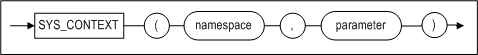
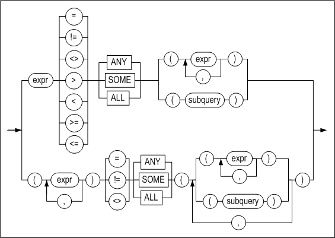

- [SQL Reference](#sql-reference)
  - [7.SQL 함수](#7sql-%ED%95%A8%EC%88%98)
    - [SQL 함수 소개](#sql-%ED%95%A8%EC%88%98-%EC%86%8C%EA%B0%9C)
    - [집계 함수](#%EC%A7%91%EA%B3%84-%ED%95%A8%EC%88%98)
    - [윈도우(분석) 함수](#%EC%9C%88%EB%8F%84%EC%9A%B0%EB%B6%84%EC%84%9D-%ED%95%A8%EC%88%98)
    - [숫자 함수](#%EC%88%AB%EC%9E%90-%ED%95%A8%EC%88%98)
    - [문자 함수](#%EB%AC%B8%EC%9E%90-%ED%95%A8%EC%88%98)
    - [날짜시간 함수](#%EB%82%A0%EC%A7%9C%EC%8B%9C%EA%B0%84-%ED%95%A8%EC%88%98)
    - [변환 함수](#%EB%B3%80%ED%99%98-%ED%95%A8%EC%88%98)
    - [암호화 함수](#%EC%95%94%ED%98%B8%ED%99%94-%ED%95%A8%EC%88%98)
    - [기타 함수](#%EA%B8%B0%ED%83%80-%ED%95%A8%EC%88%98)
  - [8.산술 연산자](#8%EC%82%B0%EC%88%A0-%EC%97%B0%EC%82%B0%EC%9E%90)
    - [산술 연산자](#%EC%82%B0%EC%88%A0-%EC%97%B0%EC%82%B0%EC%9E%90)
    - [단항 연산자](#%EB%8B%A8%ED%95%AD-%EC%97%B0%EC%82%B0%EC%9E%90)
    - [이항 연산자](#%EC%9D%B4%ED%95%AD-%EC%97%B0%EC%82%B0%EC%9E%90)
    - [연결 연산자](#%EC%97%B0%EA%B2%B0-%EC%97%B0%EC%82%B0%EC%9E%90)
    - [CAST 연산자](#cast-%EC%97%B0%EC%82%B0%EC%9E%90)
  - [9.조건 연산자](#9%EC%A1%B0%EA%B1%B4-%EC%97%B0%EC%82%B0%EC%9E%90)
    - [SQL 조건의 개요](#sql-%EC%A1%B0%EA%B1%B4%EC%9D%98-%EA%B0%9C%EC%9A%94)
    - [논리 연산자](#%EB%85%BC%EB%A6%AC-%EC%97%B0%EC%82%B0%EC%9E%90)
    - [비교조건](#%EB%B9%84%EA%B5%90%EC%A1%B0%EA%B1%B4)
    - [그 외의 조건](#%EA%B7%B8-%EC%99%B8%EC%9D%98-%EC%A1%B0%EA%B1%B4)
  - [A.부록: 정규 표현식](#a%EB%B6%80%EB%A1%9D-%EC%A0%95%EA%B7%9C-%ED%91%9C%ED%98%84%EC%8B%9D)
    - [정규 표현식 지원](#%EC%A0%95%EA%B7%9C-%ED%91%9C%ED%98%84%EC%8B%9D-%EC%A7%80%EC%9B%90)


7.SQL 함수
--------

### SQL 함수 소개

Altibase에 내장되어 제공되는 SQL 함수들은 다양한 SQL 구문 내에서 사용할 수 있다.
내장된 SQL 함수 외에 사용자가 저장 함수를 정의하는 것도 가능하다. 이에 대해서는
*Stored Procedures Manual*을 참고하기 바란다.

SQL 함수 호출 시 정의된 데이터 타입이 아닌 다른 데이터 타입의 인자를 입력할
경우, Altibase는 SQL 함수 수행 전 인자에 넘어온 데이터를 SQL함수에 정의된 데이터
타입으로 변환한다. SQL 함수 호출 시 NULL 인자를 넘기면, SQL 함수는 NULL을
반환한다.

이 절은 Altibase가 제공하는 SQL 함수의 목록을 보여주고, 그들이 어떻게
분류되는지를 설명한다.

#### SQL 함수 분류 

SQL 함수는 크게 다음의 표처럼 분류된다.

| 함수 구분                       | 설명                                                         |
| ------------------------------- | :----------------------------------------------------------- |
| 집계 함수 (Aggregate functions) | 질의의 결과를 그룹별로 하나의 결과를 반환하는 함수이다. 이 함수는 select_list, ORDER BY, HAVING 절에 올 수 있다.<br />**집계 함수**<br/>AVG, CORR, COUNT, COVAR_POP, COVAR_SAMP, CUME_DIST, FIRST, GROUP_CONCAT, LAST, LISTAGG, MAX, MIN, PERCENTILE_CONT, PERCENTILE_DISC, PERCENT_RANK, RANK, STATS_ONE_WAY_ANOVA, STDDEV, STDDEV_POP, STDDEV_SAMP, SUM, VARIANCE, VAR_POP, VAR_SAMP |
| 윈도우 함수 (Window functions)  | 그룹을 기반으로 하여 집계 값을 계산한다. 그룹은 OVER 절 아래의 PARTITION BY 및 ROWS/RANGE 하위 절에 의해 정의된다. <br />**집계(Aggregate) 윈도우 함수**<br/>AVG, CORR, COUNT, COVAR_POP, COVAR_SAMP, LISTAGG, MAX, MIN, PERCENTILE_CONT, PERCENTILE_DISC, RATIO_TO_REPORT, STDDEV, SUM, VARIANCE, GROUP_CONCAT <br />**순위(Ranking) 윈도우 함수**<br/>RANK, DENSE_RANK, ROW_NUMBER, LAG, LEAD,NTILE, FIRST, LAST <br /><br />**행 순서 관련 윈도우 함수**<br/>FIRST_VALUE, LAST_VALUE, NTH_VALUE |
| 숫자 함수                       | 숫자 입력 값에 대한 작업을 수행하고 숫자 값을 반환한다. <br />ABS, ACOS, ASIN, ATAN, ATAN2, CEIL, COS, COSH, EXP, FLOOR, ISNUMERIC, LN, LOG, MOD, NUMAND, NUMOR, NUMSHIFT, NUMXOR, POWER, RAND, RANDOM, ROUND, SIGN, SIN, SINH, SQRT, TAN, TANH, TRUNC, BITAND, BITOR, BITXOR, BITNOT |
| 문자 함수                       | 문자열 입력 값에 대한 작업을 수행하고 문자열이나 숫자 값을 반환한다. <br />**문자열 반환 함수**<br/>CHR, CHOSUNG, CONCAT, DIGITS, INITCAP, LOWER, LPAD, LTRIM, NCHR, PKCS7PAD16, PKCS7UNPAD16, RANDOM_STRING, REGEXP_COUNT, REGEXP_REPLACE, REPLICATE, REPLACE2, REVERSE_STR, RPAD, RTRIM, STUFF, SUBSTRB(SUBSTRING), TRANSLATE, TRIM, UPPER <br />**숫자 값 반환 함수**<br/>ASCII, CHAR_LENGTH(CHARACTER_LENGTH,LENGTH), DIGEST,INSTR(POSITION, INSTRB), OCTET_LENGTH(LENGTHB), REGEXP_INSTR, REGEXP_SUBSTR, SIZEOF |
| 날짜 함수                       | 날짜 및 시간 입력 값에 대한 작업을 수행하며 문자열, 숫자 또는 날짜/시간 값을 반환한다. <br />ADD_MONTHS, DATEADD, DATEDIFF, DATENAME, EXTRACT(DATEPART), LAST_DAY, MONTHS_BETWEEN, NEXT_DAY, SESSION_TIMEZONE, SYSDATE, SYSTIMESTAMP, UNIX_DATE, UNIX_TIMESTAMP, CURRENT_DATE, CURRENT_TIMESTAMP, DB_TIMEZONE, CONV_TIMEZONE |
| 변환 함수                       | 입력 값(문자, 숫자 또는 날짜/시간)에 대해 문자, 날짜/시간, 또는 숫자 값으로 변환한다. <br />ASCIISTR, BIN_TO_NUM, CONVERT, DATE_TO_UNIX, HEX_ENCODE, HEX_DECODE, HEX_TO_NUM, OCT_TO_NUM, RAW_TO_FLOAT, RAW_TO_INTEGER, RAW_TO_NUMERIC, RAW_TO_VARCHAR, TO_BIN, TO_CHAR(datetime), TO_CHAR(number), TO_DATE, TO_HEX, TO_INTERVAL, TO_NCHAR(character), TO_NCHAR(datetime), TO_NCHAR(number), TO_NUMBER, TO_OCT, TO_RAW, UNISTR, TO_RAW, UNIX_TO_DATE |
| 암호화 함수                     | 문자열에 대해 암호화와 복호화를 수행한다. <br />AESDECRYPT, AESENCRYPT, DESENCRYPT, DESDECRYPT, TDESDECRYPT/TRIPLE_DESDECRYPT, TDESENCRYPT/TRIPLE_DESENCRYPT |
| 기타 함수                       | BASE64_DECODE, BASE64_DECODE_STR, BASE64_ENCODE, BASE64_ENCODE_STR, BINARY_LENGTH, CASE2, CASE WHEN, COALESCE, DECODE, DIGEST, DUMP, EMPTY_BLOB, EMPTY_CLOB, GREATEST, GROUPING, GROUPING_ID, HOST_NAME, LEAST, LNNVL, MSG_CREATE_QUEUE, MSG_DROP_QUEUE, MSG_SND_QUEUE, MSG_RCV_QUEUE, NULLIF, NVL, NVL2, QUOTE_PRINTABLE_DECODE, QUOTE_PRINTABLE_ENCODE, RAW_CONCAT, RAW_SIZEOF, ROWNUM, SENDMSG, USER_ID, USER_NAME, SESSION_ID, SUBRAW, SYS_CONNECT_BY_PATH, SYS_GUID_STR, USER_LOCK_REQUEST, USER_LOCK_RELEASE, SYS_CONTEXT 등 |

### 집계 함수

여러 행에 대해 처리하여 단일 값을 반환하는 함수이다. 집계 함수는 SELECT 목록이나
ORDER BY 또는 HAVING 절 안에 나타날 수 있다.

SELECT 문에 GROUP BY 절이 포함되었다면 상수, 집계 함수(aggregate functions),
GROUP BY 절에 명시된 표현식과 이들을 조합한 표현식만 SELECT 목록에 올 수 있다.

#### AVG

##### 구문

```
AVG ( [ALL | DISTINCT] expression)
```


##### 설명

입력된 *expression*의 평균값을 구하는 함수이다. NULL은 계산에서 제외된다. 이
함수는 FLOAT 타입의 값을 반환한다.

##### 예제

\<질의\> 상품 테이블에서 평균 가격을 계산하여 출력하라.

```
iSQL> SELECT AVG(price) FROM goods;
AVG(PRICE)  
--------------
30406.173   
1 row selected.
```


#### CORR

##### 구문 

```
CORR (expr1, expr2) OVER {...}
```


##### 설명

입력된 *expr1*와 *expr2*의 상관 계수(coefficient of correlation)를 구한다.
결과는 -1보다 크거나 같거나 1보다 작거나 같다. 0에 가까울수록 상관관계가 약하며
1에 가까울수록 상관 관계가 깊다. 반환 값의 타입은 DOUBLE이며 인자를 DOUBLE로
변환하여 계산한다.

CORR 함수는 집계 함수와 분석 함수로 사용할 수 있다.

##### 예제

\<질의\> 사원번호와 급여의 상관계수를 구한다.

```
iSQL> SELECT CORR(ENO,SALARY) FROM employees;
CORR(ENO,SALARY)
-------------------------
-0.02180715597157
1 row selected.
```


#### COUNT

##### 구문

```
COUNT ( [ * | [ALL | DISTINCT] expression ] )
```


##### 설명

질의에 의해 검색되는 행의 수를 반환하는 함수이다. 칼럼의 값이 널인 행은 계산
되지 않는다.

##### 예제

\<질의\> 사원 테이블의 전체 레코드의 개수를 출력하라.

```
iSQL> SELECT COUNT(*) Rec_count FROM employees;
REC_COUNT            
-----------------------
20                   
1 row selected.
```

\<질의\> 사원 테이블 생일 자료의 개수를 출력하라.

```
iSQL> SELECT COUNT(birth) Rec_count 
    FROM employees;
REC_COUNT            
-----------------------
13                   
1 row selected.
```


#### COVAR_SAMP

##### 구문 

```
COVAR_SAMP (expr1, expr2) OVER {...}
```


##### 설명

입력된 *expr1*와 *expr2*의 표본 공분산(sample covariance)을 구한다. 한 개의 입력
값이 상승할 때 다른 값이 상승한다면 결과는 양수이며, 입력 값이 상승할 때 다른
값이 하락하면 결과는 음수이다. 반환 값의 타입은 DOUBLE이며, 인자를 DOUBLE로
변환하여 계산한다.

COVAR_SAMP 함수는 집계 함수와 분석 함수로 사용할 수 있다.

##### 예제

\<질의\> 사원번호와 급여의 표본 공분산을 구한다.

```
iSQL> SELECT COVAR_SAMP(ENO,SALARY) FROM employees;
COVAR_SAMP(ENO,SALARY)
-------------------------
-95.0698529411784
1 row selected.
```


#### COVAR_POP

##### 구문

```
COVAR_POP (expr1, expr2) OVER {...}
```


##### 설명

입력된 *expr1*와 *expr2*의 모공 분산(population covariance)을 구한다. 한 개의
입력 값이 상승할 때 다른 값도 상승한다면 결과는 양수이며, 입력 값이 상승할 때
다른 값이 하락하면 결과는 음수이다. 반환 값의 타입은 DOUBLE이며, 인자를 DOUBLE로
변환하여 계산한다.

COVAR_POP 함수는 집계 함수와 분석 함수로 사용할 수 있다.

##### 예제

\<질의\> 사원번호와 급여의 모공 분산을 구한다.

```
iSQL> SELECT COVAR_POP(ENO,SALARY) FROM employees;
COVAR_POP(ENO,SALARY)
-------------------------
-89.4775086505208
1 row selected.
```


#### CUME_DIST

##### 구문


[window_order_clause::=](#window_order_clause)

##### 설명

CUME_DIST함수는 결과 집합(또는 파티션)의 특정 멤버를 기준으로 정렬된 그룹의
누적분포도를 계산한다. 반환 값은 0보다 크고 1보다 작거나 같다.

> 주의: CUME_DIST의 인자 개수와 WITHIN GROUP절의 인자 개수는 일치해야 하며,
> 인자의 타입은 자동으로 호환되지 않는다. CUME_DIST인자의 데이터타입은 제한되지
> 않으나 상수사용을 권장한다.

##### 예제

\<질의\> CUME_DIST함수를 사용하여 급여(SALARY)의 누적분포 값을 확인한다.

```
iSQL> select SALARY from EMPLOYEES ORDER BY 1;
SALARY
--------------
500
980
1000
1200
1400
1500
1700
1800
1800
1890
1900
2000
2003
2300
2500
2750
4000
...
20 rows selected. 

iSQL>  select cume_dist(1500) within group (order by SALARY ) from EMPLOYEES ;
CUME_DIST(1500) within group (order by SAL
---------------------------------------------
0.333333333333333
1 row selected.
```


#### FIRST

##### 구문


##### 설명

ORDER BY에 의해 정렬된 데이터에 대해 첫 번째 부분만 aggregation하는 함수이다.
aggregation_function에 사용할 수 있는 함수는 MIN, MAX, SUM, AVG, COUNT,
VARIANCE, STDDEV 7가지이다.

##### 예제

\<질의\> 사원 테이블에서 부서별로 연봉을 가장 많이 받는 사원의 사원번호와 연봉을
구하라.

```
iSQL> SELECT dno, MAX(eno) KEEP(DENSE_RANK FIRST ORDER BY salary desc) as empno, MAX(salary) AS max_sal
        FROM EMPLOYEES
        GROUP BY dno;
DNO          EMPNO          MAX_SAL
-----------------------------------------
1001         16              2300
1002         6               1700
1003         10              4000
2001         17              1400
3001         4               1800
3002         1               2500
4001         8               1900
4002         20              1090
              2               1500
9 row selected.
```


#### GROUP_CONCAT

##### 구문

```
GROUP_CONCAT (expr1 [, arg1])
```


##### 설명

이 함수는 각 그룹에서 NULL이 아닌 *expr1*을 연결한 문자열을 반환한다.

*arg1*: 구분자 문자. 지정하지 않으면 문자열에 구분자가 삽입되지 않는다.

##### 예제

\<질의\> employees 테이블에서 각 부서별로 직원들의 성을 연결한 문자열을
반환하라.

```
iSQL> SELECT dno, CAST(GROUP_CONCAT(e_lastname, '|') AS VARCHAR (100)) AS names FROM employees GROUP BY dno;
DNO
--------------
NAMES
--------------------------------------------------------------------------------------------------------
1001
Kobain              |Chen                
1002
Momoi               |Jones               
1003
Bae                 |Liu                 |Miura               |Davenport           
2001
Fubuki              
3001
Foster              
3002
Moon                |Ghorbani            
4001
Wang                |Diaz                |Huxley              
4002
Fleischer           |Hammond             |Marquez             |Blake               

Davenport           
9 rows selected.
```


#### LAST

##### 구문


##### 설명

ORDER BY에 의해 정렬된 데이터에 대해 마지막 부분만 aggregation하는 함수이다.
aggregation_function에 사용할 수 있는 함수는 MIN, MAX, SUM, AVG, COUNT,
VARIANCE, STDDEV이다.

##### 예제

\<질의\> 사원 테이블에서 부서별로 연봉을 가장 적게 받는 사원의 사원번호와 연봉을
구하라.

```
iSQL> SELECT dno, MIN(eno) KEEP(DENSE_RANK LAST ORDER BY salary desc) as empno, MIN(salary) AS min_sal
        FROM EMPLOYEES
        GROUP BY dno;
DNO          EMPNO          MIN_SAL
-----------------------------------------
1001         3               2300
1002         13              1700
1003         15              4000
2001         17              1400
3001         4               1800
3002         5               2500
4001         9               1900
4002         7               1090
              2               1500
9 row selected.
```


#### MAX

##### 구문

```
MAX ([ALL | DISTINCT] expression)
```


##### 설명

입력된 *expression*중에서 최대값을 구하는 함수이다.

##### 예제

\<질의\> 상품 테이블에서 가장 비싼 가격을 출력하라.

```
iSQL> SELECT MAX(price) FROM goods;
MAX(PRICE)  
--------------
100000      
1 row selected.
```


#### MIN

##### 구문

```
MIN ([ALL | DISTINCT] expression)
```


##### 설명

입력된 *expression*중에서 최소값을 구하는 함수이다.

##### 예제

\<질의\> 상품 테이블의 가장 싼 가격을 출력하라.

```
iSQL> SELECT MIN(price) FROM goods;
MIN(PRICE)  
--------------
966.99      
1 row selected.
```


#### PERCENT_RANK

##### 구문


[window_order_clause::=](#window_order_clause)

##### 설명

PERCENT_RANK 함수는 결과 집합(또는 파티션)의 특정 멤버를 기준으로 백분율순위를
매긴다. 반환 값은 0에서 1까지의 백분율 순위이다.

> 주의: PERCENT_RANK의 인자 개수와 WITHIN GROUP절의 인자 개수는 일치해야 하며,
> 인자의 타입은 자동으로 호환되지 않는다. PERCENT_RANK인자의 데이터타입은 제한되지
> 않으나 상수사용을 권장한다.

##### 예제

\<질의\> 부서번호(DNO)가 1003이고 급여(SALARY)가 1000인 직원의 백분율순위를
출력한다.

```
iSQL> select  DNO, SALARY from EMPLOYEES ORDER BY 1,2;
DNO         SALARY
---------------------------
1001        2000
1001        2300
1002        980
1002        1700
1003        1000
1003        2003
1003        2750
1003        4000
2001        1400
3001        1800
3002        2500
3002
4001        1200
4001        1900
4001
4002        500
4002        1800
4002        1890
4002
            1500
20 rows selected.
iSQL> select percent_rank(1003,1000) within group (order by DNO, SALARY ) from EMPLOYEES ;
RNK
-------------------------
0.2
1 row selected.
```


#### STATS_ONE_WAY_ANOVA

##### 구문 


##### 설명

STATS_ONE_WAY_ANOVA 함수는 일원 분산 분석(One-way ANOVA) 함수로써, 3번째 인자에
대한 값만 float 타입으로 반환한다.

이 함수는 3개의 인자를 가지며, 3번째 인자가 생략되면 SIG로 동작한 값이 반환된다.
expr1은 expr2를 그룹화하는 칼럼이며, expr2는 expr1에 속하는 수치 데이터이다.

3번째 인자에 대한 설명은 아래의 표와 같다.

<table>
<tbody>
<tr>
<th>
<p>반환값</p>
</th>
<th>
<p>설명</p>
</th>
</tr>
<tr>
<td>
<p>SIG</p>
</td>
<td>
<p>Significance</p>
</td>
</tr>
<tr>
<td>
<p>F_RATIO</p>
</td>
<td>
<p>그룹간의 평균 제곱에 대하여 그룹내의 평균 제곱의 비율</p>
</td>
</tr>
<tr>
<td>
<p>MEAN_SQUARES_WITHIN<br /> (MSW)</p>
</td>
<td>
<p>그룹내의 평균 제곱</p>
</td>
</tr>
<tr>
<td>
<p>MEAN_SQUARES_BETWEEN<br /> (MSB)</p>
</td>
<td>
<p>그룹간의 평균 제곱</p>
</td>
</tr>
<tr>
<td>
<p>DF_WITHIN(DFW)</p>
</td>
<td>
<p>그룹 내 자유도</p>
</td>
</tr>
<tr>
<td>
<p>DF_BETWEEN(DFB)</p>
</td>
<td>
<p>그룹간의 자유도</p>
</td>
</tr>
<tr>
<td>
<p>SUM_SQUARES_WITHIN<br /> (SSW)</p>
</td>
<td>
<p>그룹 내 제곱의 합</p>
</td>
</tr>
<tr>
<td>
<p>SUM_SQUARES_BETWEEN<br /> (SSB)</p>
</td>
<td>
<p>그룹 사이의 제곱의 합</p>
</td>
</tr>
</tbody>
</table>

##### 예제

```
iSQL> select * from t3;
        ID      VALUE
---------- ----------
         1          1
         1          2
         1          3
         2          3
         2          4

iSQL> select stats_one_way_anova(id, value, 'SUM_SQUARES_BETWEEN') SSB, 
            stats_one_way_anova(id, value, 'SUM_SQUARES_WITHIN') SSW,
            stats_one_way_anova(id, value, 'DF_BETWEEN') DFB, 
            stats_one_way_anova(id, value, 'DF_WITHIN') DFW, 
            stats_one_way_anova(id, value, 'MEAN_SQUARES_BETWEEN') MSB, 
            stats_one_way_anova(id, value, 'MEAN_SQUARES_WITHIN') MSW, 
            stats_one_way_anova(id, value, 'F_RATIO') F, 
            stats_one_way_anova(id, value, 'SIG') P_VALUE  from t3;
       SSB        SSW        DFB        DFW        MSB        MSW          F    P_VALUE
---------- ---------- ---------- ---------- ---------- ---------- ---------- ----------
       2.7        2.5          1          3        2.7 .833333333       3.24 .169679927
```


#### STDDEV

##### 구문

```
STDDEV ([ALL | DISTINCT] expression)
```


##### 설명

STDDEV는 입력된 *expression* 들의 표준편차를 반환한다.

시스템 호출에 의한 반복적인 실수 연산의 오차 누적에 따라 반환 값의 오차가 발생할
수 있다.

##### 예제

\<질의\> 직원 테이블에서 급여의 표준편차를 구하라.

```
iSQL> SELECT STDDEV(salary) standard_deviation 
  FROM employees;
STANDARD_DEVIATION
-------------------------
797.706786762566
1 row selected.
```


#### STDDEV_POP

##### 구문

```
STDDEV_POP (expression)
```


##### 설명

입력된 *expression* 의 NULL이 아닌 모든 행에 대하여 표준편차를 반환한다.

NULL이 아닌 행의 개수가 1보다 작으면 NULL을 반환한다. 시스템 호출에 의한
반복적인 실수 연산의 오차 누적에 따라 반환 값의 오차가 발생할 수 있다.

##### 예제

\<질의\> 직원 테이블에서 급여의 표준편차를 구하라.

```
iSQL> SELECT STDDEV_POP(salary) FROM employees;
STDDEV_POP(SALARY)
-------------------------
773.889256492736
1 row selected.
```


#### STDDEV_SAMP

##### 구문

```
STDDEV_SAMP ([ALL | DISTINCT] expression)
```


##### 설명

입력된 *expression*의 NULL이 아닌 모든 행에 대하여 표본 표준편차를 반환한다.
NULL이 아닌 행의 개수가 2보다 작으면 NULL을 반환한다.

시스템 호출에 의한 반복적인 실수 연산의 오차 누적에 따라 반환 값의 오차가 발생할
수 있다.

##### 예제

\<질의\> 직원 테이블에서 급여의 표본 표준편차를 구하라.

```
iSQL> SELECT STDDEV_SAMP(salary) FROM employees;
STDDEV_SAMP(SALARY)
-------------------------
797.706786762566
1 row selected.
```


#### SUM

##### 구문

```
SUM ([ALL | DISTINCT] expression)
```


##### 설명

입력된 *expression*의 합을 구하는 함수이다.

##### 예제

\<질의\> 상품 테이블에서 모든 보관 수량의 합을 구하라.

```
iSQL> SELECT SUM(stock) FROM goods;
SUM(STOCK)           
-----------------------
379420               
1 row selected.
```


#### VARIANCE

##### 구문

```
VARIANCE ([ALL | DISTINCT] expression)
```


##### 설명

VARIANCE는 입력된 *expression*들의 변동량을 반환한다.

시스템 호출에 의한 반복적인 실수 연산의 오차 누적에 따라 반환 값의 오차가 발생할
수 있다.

##### 예제

\<질의\> 직원 테이블에서 급여의 변동량을 구하라.

```
iSQL> SELECT VARIANCE(salary) variance 
  FROM employees;
VARIANCE
-------------------------
636336.117647059
```


#### VAR_POP

##### 구문

```
VAR_POP (expression)
```


##### 설명

입력된 *expression*의 NULL이 아닌 모든 행에 대하여 모집단 분산(population
variance)을 반환한다.

NULL이 아닌 행의 개수가 1보다 작으면, NULL을 반환한다.

시스템 호출에 의한 반복적인 실수 연산의 오차 누적에 따라 반환 값의 오차가 발생할
수 있다.

##### 예제

\<질의\> 직원 테이블에서 급여의 모분산을 구하라.

```
iSQL> SELECT VAR_POP(salary) FROM employees;
VAR_POP(SALARY)
-------------------------
598904.581314879
1 row selected.
```


#### VAR_SAMP

##### 구문

```
VAR_SAMP (expression)
```


##### 설명

입력된 *expression*의 NULL이 아닌 모든 행에 대하여 표본 분산값을 반환한다.

NULL이 아닌 행의 개수가 2보다 작으면 NULL을 반환한다.

시스템 호출에 의한 반복적인 실수 연산의 오차 누적에 따라 반환 값의 오차가 발생할
수 있다.

##### 예제

\<질의\> 직원 테이블에서 급여의 표본 분산을 구하라.

```
iSQL> SELECT VAR_SAMP(salary) FROM employees;
VAR_SAMP(SALARY)
-------------------------
636336.117647059
row selected.
```


### 윈도우(분석) 함수

분석 함수(analytic functions)라고 흔히 알려져 있는 윈도우 함수(ANSI/ISO SQL
표준은 window functions이란 용어를 사용함)는 행들의 그룹을 기반으로 하여 집계
값을 계산한다.

윈도우 함수(또는 분석 함수)는 쿼리가 반환하는 결과 집합 내에서 여러 개의 행들,
또는 행들의 그룹에 대해 작업을 한다는 점에서 일반적인 집계 함수와 유사하다.
하지만 윈도우 함수가 작업하는 행들의 그룹은 GROUP BY 절이 아니라 OVER 절 아래의
PARTITION BY 및 ROWS/RANGE 하위 절에 의해 정의된다. 또한 이러한 그룹 내에서의
순서도 주 쿼리의 ORDER BY 절이 아니라 OVER 절 아래의 ORDER BY 하위 절에 의해
결정된다.

이 절에서는 PARTITION BY 하위 절로 나뉘어진 그룹을 “파티션”이라 부르고,
ROWS/RANGE 하위 절로 결정되는 그룹을 “윈도우”라고 부를 것이다.

Altibase는 버전 6.3.1부터 아래의 윈도우 함수를 지원한다.

-   집계(Aggregate) 윈도우 함수: AVG, CORR, COUNT, COVAR_POP, COVAR_SAMP, LISTAGG, MAX, MIN, PERCENTILE_CONT, PERCENTILE_DISC, RATIO_TO_REPORT, STDDEV, SUM, VARIANCE, GROUP_CONCAT
    
-   순위(Ranking) 윈도우 함수: RANK, DENSE_RANK, ROW_NUMBER, LAG, LEAD, NTILE, FIRST, LAST

-   행 순서 관련 윈도우 함수: FIRST_VALUE, LAST_VALUE, NTH_VALUE

집계 윈도우 함수는 한 파티션 내에서 칼럼 값들의 합계 또는 평균을 구하는 계산을
수행한다. Altibase는 "집계 함수" 절에서 기술한 모든 집계 함수를 윈도우 함수로
사용하는 것을 지원한다(CUME_DIST, PERCENT_RANK는 예외). 집계 함수는 일반적으로
그룹 별로 한 개의 결과 행을 반환하지만, 윈도우 함수에서 사용될 때는 결과 값이 행
별로 반환된다.

순위 윈도우 함수는 한 파티션 내에서 각 행의 순위 값을 반환한다. 이 유형의
함수들은 OVER 절 아래의 ORDER BY 하위 절을 필요로 한다.

행 순서 관련 함수는 하나의 정렬된 분할 집합 내에서 첫 번째나 마지막 값, 또는
해당 집합 내에서 이전 또는 다음 값을 검색한다.

집계 함수를 제외한 나머지 함수는 아래의 절에서 함수 별로 설명한다.

#### 구문

**window_function ::=**


**window_specification ::=**


**window_partition_clause ::=**


<a name="window_order_clause"><a/>

**window_order_clause ::=**


**window_frame_clause ::=**


#### 설명

윈도우 함수는 SELECT 목록 또는 ORDER BY 절에만 올 수 있다.

윈도우 함수가 포함된 질의가 처리되는 단계는 다음과 같다.

-   1단계: 윈도우 함수와 ORDER BY 절 (만약 존재하면)을 제외한 질의 처리

-   2단계: 윈도우 함수에 PARTITION BY 하위절이 포함된 경우, 1단계의 질의 결과를
    윈도우 함수가 적용될 파티션으로 분리

-   3단계: ORDER BY 하위절이 있는 경우 파티션 별로 정렬

-   4단계: ROWS/RANGE 절이 있는 경우 윈도우 프레임 결정

-   5단계: 윈도우 함수 계산 수행

-   6단계: ORDER BY 절이 있는 경우 처리

*window_function*

윈도우 함수로 사용할 함수의 이름을 명시한다.

*arg_expr*

윈도우 함수를 위한 인자로 사용될 수식을 명시한다.

*IGNORE NULLS*

*IGNORE NULLS* 구문을 명시하면 널(null)이 아닌 값이 반환된다.

*OVER window_specificatoin*

OVER는 이 함수가 쿼리의 결과 집합에 대해 작업할 것을 질의 처리기에게 알려주는
키워드이다.

이 절을 포함하는 윈도우 함수를 select 리스트 또는 ORDER BY 절에 명시할 수 있다.

쿼리의 select 리스트에 사용된 모든 윈도우 함수 뒤에는 OVER 절이 따라온다. OVER
절은 윈도우 함수를 적용하기 위해 결과 집합을 분할하는 방법과 정렬하는 방법을
결정한다. OVER 키워드 다음에는 분할 및 정렬 정책을 지정하는 아래의 세 하위 절이
따라올 수 있다.

*window_partition_clause*

이 절은 쿼리 결과 집합을 그룹(파티션)으로 묶을 기준이 되는 한 개 이상의 칼럼
또는 표현식을 명시한다. 모든 윈도우 함수가 이 절을 지원하지만, 사용은
선택적이다. 이 절을 생략하면, 윈도우 함수는 전체 결과 집합을 하나의 파티션으로
처리한다.

집계 관련 함수가 ORDER BY 하위 절 없이 이 절을 사용한다면 함수 인자에 DISTINCT
키워드를 사용할 수 있다.

*window_order_clause*

이 절은 파티션 내에서 데이터 정렬 기준이 되는 한 개 이상의 칼럼 또는 표현식을
명시한다. 집계 함수는 이 절을 선택적으로 사용할 수 있지만, 순위 함수의 경우 이
절을 반드시 사용해야 한다.

집계 관련 함수가, 이 절을 사용하면 함수 인자에 DISTINCT 키워드를 사용할 수 없다.

NULLS FIRST 또는 NULLS LAST 키워드를 사용해서 NULL을 정렬 순서에서 맨 처음 또는
맨 마지막에 위치시킬 수 있다.

*window_frame_clause*

이 절은 행을 기준으로 함수의 대상이 되는 윈도우(물리적 또는 논리적인 행의
집합)를 정의하며, 함수는 윈도우 내의 모든 행에 적용된다. 윈도우는 쿼리 결과 집합
또는 파티션을 위에서 아래로 통과해서 움직인다.

ROWS는 행의 수를 기준으로 윈도우를 명시하고, RANGE는 행의 값을 기준으로 윈도우를
명시한다. 아래의 예를 참고하라:

-   RANGE BETWEEN 50 PRECEDING AND 150 FOLLOWING  
    파티션 내에서 (현재 행의 값 – 50)에서 (현재 행의 값 + 150)까지의 값에
    해당하는 모든 행이 윈도우로 정의된다.

-   ROWS BETWEEN 1 PRECEDING AND 1 FOLLOWING  
    현재 행을 기준으로 파티션 내에서 앞, 뒤로 한 행씩 포함한 행이 윈도우로
    정의된다.

-   RANGE UNBOUNDED PRECEDING  
    현재 행을 기준으로 파티션 내의 첫 번째 행까지 윈도우로 정의된다.

-   ROWS BETWEEN UNBOUNDED PRECEDING AND UNBOUNDED FOLLOWING  
    현재 행을 기준으로 파티션 내의 첫 번째 행부터 마지막 행까지 윈도우로
    정의된다.

순위 관련 함수는 이 절을 사용할 수 없지만, 집계 관련 함수는 선택적으로 사용할 수
있다. 행 순서 관련 함수는 이 절을 선택적으로 사용할 수 있지만, 이 절을 사용하지
않는다면 함수 사용의 의미가 없을 것이다.

이 절을 지정하려면 ORDER BY 하위 절이 반드시 있어야 한다. 이 절이 포함된 경우
윈도우 함수 인자에 DISTINCT 키워드를 사용할 수 없다.

또한 ROWS/RANGE 절을 지원하는 윈도우 함수를 사용하면서 ROWS/RANGE 절을 지정하지
않는다면, 기본값은 'RANGE BETWEEN UNBOUNDED PRECEDING AND CURRENT ROW'이다.

*value*에 표현식은 올 수 없고 양의 정수만 올 수 있다.

윈도우 함수의 ORDER BY 하위 절에 DATE 타입의 표현식이 사용된 경우, RANGE 절의
*value* 위치에 아래의 형식을 사용할 수 있다.

```
INTERVAL n [YEAR | MONTH | DAY | HOUR | MINUTE | SECOND]
```


#### DENSE_RANK

##### 구문

```
DENSE_RANK () OVER {...}
```


##### 설명

DENSE_RANK 함수는 RANK함수처럼 결과 집합 또는 파티션의 특정 멤버를 기준으로
순위를 매긴다. 그러나 중복 순위 발생 후에 건너뛰지 않고 다음 순위가 매겨진다.
반환 값의 타입은 BIGINT이다.

#### FIRST_VALUE

##### 구문

```
FIRST_VALUE (expr) OVER {...}
```


##### 설명

파티션 또는 윈도우 내에서 첫 번째 행의 값을 구하는 함수이다.

##### 제약 사항

-   함수 인자에 DISTINCT 키워드를 사용할 수 없다.

-   OVER 절이 반드시 존재해야 한다.

#### FIRST_VALUE_IGNORE_NULLS

##### 구문

```
FIRST_VALUE_IGNORE_NULLS (expr) OVER {...}
```


##### 설명

파티션 또는 윈도우 내에서 널 값을 제외한 첫 번째 행의 값을 구하는 함수이다.

##### 제약 사항

FIRST_VALUE 함수와 동일하다.

#### LAG

##### 구문

```
LAG (expr [, offset [, default_value]]) OVER {...}
```


##### 설명

정렬된 각 파티션 내에서 현재 행을 기준으로 이전의 *offset* 번째 행의 값을 구하는
함수이다. *offset*에는 양의 정수만 올 수 있고, 생략하면 기본값은 1이다. 파티션
내에서 지정한 *offset*을 넘어서는 행에 대해서는 *default_value*가 적용된다.
*default_value*를 생략하면 기본값은 NULL이다.

##### 제약 사항

-   함수 인자에 DISTINCT 키워드를 사용할 수 없다.

-   OVER 절 내에 ORDER BY 하위절이 반드시 존재해야 한다.

-   *offset*에는 양의 정수만 올 수 있다.

#### LAG_IGNORE_NULLS

##### 구문

```
LAG_IGNORE_NULLS (expr [, offset [, default_value]]) OVER {...}
```


##### 설명

정렬된 각 파티션 내에서 현재 행을 기준으로 이전의 *offset* 번째 행부터 NULL이
아닌 첫 번째 값을 구하는 함수이다. *offset*에는 양의 정수만 올 수 있고, 생략하면
기본값은 1이다. 파티션 내에서 지정한 *offset*을 넘어서는 행에 대해서는
*default_value*가 적용된다. *default_value*를 생략하면 기본값은 NULL이다.

##### 제약 사항

LAG 함수와 동일하다.

#### LAST_VALUE

##### 구문

```
LAST_VALUE (expr) OVER {...}
```


##### 설명

파티션 또는 윈도우 내에서 마지막 번째 행의 값을 구하는 함수이다.

##### 제약 사항

-   함수 인자에 DISTINCT 키워드를 사용할 수 없다.

-   OVER 절이 반드시 존재해야 한다.

#### LAST_VALUE_IGNORE_NULLS

##### 구문

```
LAST_VALUE_IGNORE_NULLS (expr) OVER {...}
```


##### 설명

파티션 또는 윈도우 내에서 널 값을 제외한 마지막 번째 행의 값을 구하는 함수이다.

##### 제약 사항

LAST_VALUE 함수와 동일하다.

#### LEAD

##### 구문

```
LEAD (expr [, offset [, default_value]]) OVER {...}
```


##### 설명

정렬된 각 파티션 내에서 현재 행을 기준으로 이후의 *offset* 번째 행의 값을 구하는
함수이다. *offset*에는 양의 정수만 올 수 있고, 생략하면 기본값은 1이다. 파티션
내에서 지정한 *offset*을 넘어서는 행에 대해서는 *default_value*가 적용된다.
*default_value*를 생략하면 기본값은 NULL이다.

##### 제약 사항

-   함수 인자에 DISTINCT 키워드를 사용할 수 없다.

-   OVER 절 내에 ORDER BY 하위절이 반드시 존재해야 한다.

-   *offset*에는 양의 정수 값의 상수만 올 수 있다.

#### LEAD_IGNORE_NULLS

##### 구문

```
LEAD_IGNORE_NULLS (expr [, offset [, default_value]]) OVER {...}
```


##### 설명

정렬된 각 파티션 내에서 현재 행을 기준으로 이후의 *offset* 번째부터 NULL이 아닌
첫 번째 행의 값을 구하는 함수이다. *offset*에는 양의 정수만 올 수 있고, 생략하면
기본값은 1이다. 파티션 내에서 지정한 *offset*을 넘어서는 행에 대해서는
*default_value*가 적용된다. *default_value*를 생략하면 기본값은 NULL이다.

##### 제약 사항

LEAD 함수와 동일하다.

#### LISTAGG

##### 구문 


##### 설명

입력된 *expr*에 해당하는 칼럼 값을 order_by_clause에 지정한 그룹내의 순서대로
하나의 칼럼처럼 값을 반환하는 함수이다. *arg*는 반환 값의 문자열을 구분하는
구분자이며, 지정하지 않으면 문자열에 구분자가 삽입되지 않는다.

LISTAGG 함수는 집계 함수와 분석 함수로 사용할 수 있다.

##### 예제

\<질의\> 다음은 집계 함수에서 LISTAGG를 사용하는 예제이다. emp 테이블에서
empno로 그룹화하여 job의 순서대로 name을 출력할 때, 이름 사이에 ';'을 삽입하여
출력하라.

```
iSQL> select empno, cast(listagg(name,';') within group( order by job) as varchar(100)) "emp_job"
    from emp group by empno;  

EMPNO       
--------------
emp_job                                                                                               
emp_job                                                                                               
--------------------------------------------------------------------------------------------------------
10          
king                                                                                                  
20          
jun;jake                                                                                              
30          
hong;key;ward                                                                                         
40          
kuku;adams;cris;ford                                                                                  
50          
yoon;poo;blake;smith;poul                                                                             
60          
rin;jones;woo;miller;kim;martin                                                                       
6 rows selected.

```

\<질의\> 다음은 분석 함수에서 LISTAGG를 사용하는 예제이다. emp 테이블에서 job의
순서대로 name을 출력할 때, 이름 사이에 ';'을 삽입하여 출력하라.

```
iSQL> select empno, cast(listagg(name,';') within group( order by job) 
    over ( partition by empno ) as varchar(100)) "emp_job"
    from emp; 

EMPNO       
--------------
emp_job                                                                                               
--------------------------------------------------------------------------------------------------------
10          
king                                                                                                  
20          
jun;jake                                                                                              
20          
jun;jake                                                                                              
30          
hong;key;ward                                                                                         
30          
hong;key;ward                                                                                         
30          
hong;key;ward                                                                                         
40          
kuku;adams;cris;ford                                                                                  
40          
kuku;adams;cris;ford                                                                                  
40          
kuku;adams;cris;ford                                                                                  
40          
kuku;adams;cris;ford                                                                                  
50          
yoon;poo;blake;smith;poul                                                                             
50          
yoon;poo;blake;smith;poul                                                                             
50          
yoon;poo;blake;smith;poul                                                                             
50          
yoon;poo;blake;smith;poul                                                                             
50          
yoon;poo;blake;smith;poul                                                                             
60          
rin;jones;woo;miller;kim;martin                                                                       
60          
rin;jones;woo;miller;kim;martin                                                                       
60          
rin;jones;woo;miller;kim;martin                                                                       
60          
rin;jones;woo;miller;kim;martin                                                                       
60          
rin;jones;woo;miller;kim;martin                                                                       
60          
rin;jones;woo;miller;kim;martin                                                                       
21 rows selected.

```


#### NTH_VALUE

##### 구문

```
NTH_VALUE (expr, offset) OVER {...}
```


##### 설명

파티션 또는 윈도우 내에서 *offset* 번째 행의 값을 구하는 함수이다.

##### 제약 사항

-   함수 인자에 DISTINCT 키워드를 사용할 수 없다.

-   OVER 절이 반드시 존재해야 한다.

#### NTH_VALUE_IGNORE_NULLS

##### 구문

```
NTH_VALUE_IGNORE_NULLS (expr, offset) OVER {...}
```


##### 설명

파티션 또는 윈도우 내에서 널 값을 제외한 *offset* 번째 행의 값을 구하는
함수이다.

##### 제약 사항

NTH_VALUE 함수와 동일하다.

#### NTILE

##### 구문


[window_partition_clause::=](#window_partition_clause)

##### 설명

NTILE함수는 정렬된 데이터의 특정 멤버를 기준으로 입력된 *expr*의 숫자만큼
균등하게 배분하여 그룹의 순번을 정한다. 반환 값의 타입은 BIGINT이다.

##### 예제

\<질의\> 정렬된 급여를 기준으로 3개의 그룹으로 균등하게 나누어서 그룹의 순번을
확인한다.

```
iSQL> select E_FIRSTNAME, SALARY, NTILE(3) OVER(ORDER BY SALARY)  FROM EMPLOYEES;
E_FIRSTNAME           SALARY      NTILE(3)OVER(ORDERBYSALARY)
------------------------------------------------------------------
Gottlieb              500         1
Mitch                 980         1
Jason                 1000        1
Curtis                1200        1
Takahiro              1400        1
Susan                 1500        1
Ryu                   1700        1
Aaron                 1800        2
Alvar                 1800        2
Sandra                1890        2
John                  1900        2
Ken                   2000        2
Yuu                   2003        2
Wei-Wei               2300        2
Farhad                2500        3
Zhen                  2750        3
Elizabeth             4000        3
Chan-seung                        3
Xiong                             3
William                           3
20 rows selected.
```


#### PERCENTILE_CONT

##### 구문 


##### 설명 

이 함수는 연속 분포 모델을 가정한 역분포 함수이다. 이 함수는 연속 분포 모델에서
백분율의 값을 가지고 정렬한 후 백분율에 해당하는 값을 반환한다. 이 함수는 FLOAT
타입의 값을 반환하며, NULL 값은 무시된다.

*expr1*에는 0과 1사이의 상수 값을 지정하며, *expr2*는 숫자 타입을 지정할 수
있다.

PERCENTILE_CONT 함수는 집계 함수와 분석 함수로 사용할 수 있다.

##### 예제

\<질의\> 다음은 집계 함수에서 PERCENTILE_CONT를 사용하는 예제이다. emp
테이블에서 empno 내에서 중간 급여를 출력하라.

```
iSQL> select empno, 
 percentile_cont(0.5) within group (order by sal asc) "median asc cont",
 percentile_cont(0.5) within group (order by sal desc) "median desc cont"
 from emp
 group by empno;
EMPNO median asc cont median desc cont 
--------------------------------------------------------------
10 1000 1000 
20 1225 1225 
30 1300 1300 
40 1850 1850 
50 1600 1600 
60 1375 1375 
6 rows selected.
```

\<질의\> 다음은 분석 함수에서 PERCENTILE_CONT를 사용하는 예제이다.

```
iSQL> select empno, 
 percentile_cont(0.5) within group (order by sal asc) 
 over ( partition by empno ) "median asc cont",
 percentile_cont(0.5) within group (order by sal desc) 
 over ( partition by empno ) "median desc cont"
 from emp;
EMPNO median asc cont median desc cont 
--------------------------------------------------------------
10 1000 1000 
20 1225 1225 
20 1225 1225 
30 1300 1300 
30 1300 1300 
30 1300 1300 
40 1850 1850 
40 1850 1850 
40 1850 1850 
40 1850 1850 
50 1600 1600 
50 1600 1600 
50 1600 1600 
50 1600 1600 
50 1600 1600 
60 1375 1375 
60 1375 1375 
60 1375 1375 
60 1375 1375 
60 1375 1375 
60 1375 1375 
21 rows selected.
```


#### PERCENTILE_DISC

##### 구문 


##### 설명

이 함수는 이산 분포 모델을 가정한 역분포 함수이다. 이 함수는 불연속 분포
모델에서 백분율의 값을 가지고 정렬한 후 백분율에 해당하는 값을 반환한다. 이
함수는 FLOAT 타입의 값을 반환하며, NULL 값은 무시된다.

*expr1*에는 0과 1사이의 상수 값을 지정하며, *expr2*는 숫자 타입을 지정할 수
있다.

PERCENTILE_DISC 함수는 집계 함수와 분석 함수로 사용할 수 있다.

##### 예제

\<질의\> 다음은 집계 함수에서 PERCENTILE_DISC를 사용하는 예제이다. emp
테이블에서 empno 내에서 중간 급여를 출력하라. PERCENTILE_CONT가 짝수 개의
그룹내에서 중앙 값의 평균을 구하는 반면, PERCENTILE_DISC는 중앙 값 사이의 첫번
째 값을 출력한다.

```
iSQL> select empno, 
 percentile_disc(0.5) within group (order by sal asc) "median asc cont",
 percentile_disc(0.5) within group (order by sal desc) "median desc cont"
 from emp 
 group by empno; 
EMPNO median asc cont median desc cont 
----------------------------------------------------------
10 1000 1000 
20 1200 1250 
30 1300 1300 
40 1500 2200 
50 1600 1600 
60 1250 1500 
6 rows selected.
```

\<질의\> 다음은 분석 함수에서 PERCENTILE_DISC를 사용하는 예제이다.

```
iSQL> select empno, 
 percentile_disc(0.5) within group (order by sal asc) 
 over ( partition by empno ) "median asc cont",
 percentile_disc(0.5) within group (order by sal desc) 
 over ( partition by empno ) "median desc cont"
 from emp;
EMPNO median asc cont median desc cont 
----------------------------------------------------------
10 1000 1000 
20 1200 1250 
20 1200 1250 
30 1300 1300 
30 1300 1300 
30 1300 1300 
40 1500 2200 
40 1500 2200 
40 1500 2200 
40 1500 2200 
50 1600 1600 
50 1600 1600 
50 1600 1600 
50 1600 1600 
50 1600 1600 
60 1250 1500 
60 1250 1500 
60 1250 1500 
60 1250 1500 
60 1250 1500 
60 1250 1500 
21 rows selected.
```


#### RANK

##### 구문


[window_order_clause::=](#window_order_clause)

##### 설명

RANK 함수는 결과 집합 (또는 파티션)의 특정 멤버를 기준으로 순위를 매긴다. 같은
값에는 동일한 순위가 매겨지고, 그만큼 건너뛰어 다음 순위가 매겨진다. 반환 값의
타입은 BIGINT이다. RANK함수는 집계 함수와 분석 함수로 사용할 수 있다.

> 주의 : RANK의 인자 개수와 WITHIN GROUP 절의 인자 개수는 일치해야 하며, 인자의
> 타입은 자동으로 호환되지 않는다. RANK인자의 데이터 타입은 제한되지 않으나 상수
> 사용을 권장한다.

##### 예제

\<질의\> 부서번호(DNO)가1003이고 급여가(SALARY)가 1001인 직원의 순위를 출력하라.

```
iSQL> select DNO, SALARY from EMPLOYEES ORDER BY 1,2;
DNO         SALARY
---------------------------
1001        2000
1001        2300
1002        980
1002        1700
1003        1000
1003        2003
1003        2750
1003        4000
2001        1400
3001        1800
3002        2500
3002
4001        1200
4001        1900
4001
4002        500
4002        1800
4002        1890
4002
            1500
20 rows selected.
iSQL> select rank(1003,1001) within group (order by DNO, SALARY ) from EMPLOYEES ;
RNK
-----------------------
6
1 row selected.
```


#### RATIO_TO_REPORT

##### 구문


[window_partition_clause::=](#window_partition_clause)

##### 설명

RATIO_TO_REPORT 함수는 파티션의 특정 멤버를 기준으로 입력 표현식이 차지하는
비율을 구한다. 입력 표현 식에 null을 입력하면 null이 반환된다.
window_partition_clause 구문을 생략하면 반환되는 모든 열의 값을 기준으로 비율이
계산된다.

##### 예제

\<질의\> 사원들의 급여가 각각의 부서 내에서 차지하는 비율을 확인한다.

```
iSQL> select E_FIRSTNAME, DNO, SALARY, RATIO_TO_REPORT(SALARY) OVER (PARTITION BY DNO) AS Result from EMPLOYEES LIMIT 9;
E_FIRSTNAME           DNO         SALARY      RESULT
---------------------------------------------------------------
Ken                   1001        2000        0.465116279
Wei-Wei               1001        2300        0.534883721
Ryu                   1002        1700        0.634328358
Mitch                 1002        980         0.365671642
Elizabeth             1003        4000        0.410130216
Zhen                  1003        2750        0.281964524
Yuu                   1003        2003        0.205372706
Jason                 1003        1000        0.102532554
Takahiro              2001        1400        1
9 rows selected.
```


#### ROW_NUMBER

##### 구문

```
ROW_NUMBER () OVER {...}
```


##### 설명

ROW_NUMBER 함수는 결과 집합 또는 파티션의 특정 멤버를 기준으로 연속적인 유일한
수를 부여한다. 1부터 시작하여 ORDER BY 식에 명시된 순서대로 부여된다.

결과 집합에 같은 값이 존재하면, 중복 값에 부여되는 row number 의 순서는 보장되지
않는다. 부여되는 row number의 순서를 보장할 필요가 있다면, 다른 칼럼을 ORDER BY
절에 지정하라. 반환 값의 타입은 BIGINT이다.

##### 예제

\<질의\> 각 부서별로 급여가 낮은 순서대로 출력하라.

```
iSQL(sysdba)> SELECT e_lastname, dno, salary, RANK() OVER (PARTITION BY dno ORDER BY salary DESC) FROM employees;
E_LASTNAME            DNO         SALARY      RANK
------------------------------------------------------------------------
Chen                  1001        2300        1
Kobain                1001        2000        2
Momoi                 1002        1700        1
.
.
.
Hammond               4002        1890        1
Marquez               4002        1800        2
Fleischer             4002        500         3
Blake                 4002                    4
Davenport                         1500        1
20 rows selected.
```

\<질의\> 다음 예제는 RANK, DENSE_RANK, 및 ROW_NUMBER 함수의 결과가 다름을
보여준다.

```
iSQL(sysdba)> SELECT salary, 
 RANK() OVER (ORDER BY salary DESC), 
 DENSE_RANK() OVER (ORDER BY salary DESC), 
 ROW_NUMBER() OVER (ORDER BY salary DESC) 
 FROM employees;
SALARY      RANK                 DENSE_RANK           ROW_NUMBER
---------------------------------------------------------------------------
4000        1                    1                    1
2750        2                    2                    2
2500        3                    3                    3
2300        4                    4                    4
2003        5                    5                    5
2000        6                    6                    6
1900        7                    7                    7
1890        8                    8                    8
1800        9                    9                    9
1800        9                    9                    10
1700        11                   10                   11
1500        12                   11                   12
1400        13                   12                   13
1200        14                   13                   14
1000        15                   14                   15
980         16                   15                   16
500         17                   16                   17
            18                   17                   18
            18                   17                   19
            18                   17                   20
20 rows selected.
```

\<질의\> 부서별 최고 급여에 대한 사원 각자의 급여 비율을 모든 사원에 대하여
구하라.

```
iSQL(sysdba)> SELECT e_lastname, dno, salary, 
 ROUND(salary/MAX(salary) OVER (PARTITION BY dno)*100) rel_sal 
 FROM employees;
E_LASTNAME            DNO         SALARY      REL_SAL
---------------------------------------------------------------
Kobain                1001        2000        87
Chen                  1001        2300        100
.
.
.
Diaz                  4001        1200        63
Fleischer             4002        500         26
Marquez               4002        1800        95
Blake                 4002
Hammond               4002        1890        100
Davenport                         1500        100
20 rows selected.
```

\<질의\> 아래의 예제는 FIRST_VALUE, LAST_VALUE, NTH_VALUE함수를 사용하여 성별로
최저 급여, 최고 급여 및 세 번째로 적은 급여를 구한다.

```
iSQL> select sex, salary, 
       FIRST_VALUE( salary ) OVER ( PARTITION BY sex ORDER BY salary ROWS BETWEEN UNBOUNDED PRECEDING AND UNBOUNDED FOLLOWING ) F_VALUE,
       LAST_VALUE( salary ) OVER ( PARTITION BY sex ORDER BY salary ROWS BETWEEN UNBOUNDED PRECEDING AND UNBOUNDED FOLLOWING ) L_VALUE,
       NTH_VALUE( salary, 3 ) OVER ( PARTITION BY sex ORDER BY salary ROWS BETWEEN UNBOUNDED PRECEDING AND UNBOUNDED FOLLOWING ) N_VALUE
    from employees;
SEX  SALARY      F_VALUE     L_VALUE     N_VALUE     
-----------------------------------------------------------
F  1500        1500        4000        2300        
F  1890        1500        4000        2300        
F  2300        1500        4000        2300        
F  4000        1500        4000        2300        
M  500          500                        1000        
M  980          500                        1000        
M  1000        500                        1000        
M  1200        500                        1000        
M  1400        500                        1000        
M  1700        500                        1000        
M  1800        500                        1000        
M  1800        500                        1000        
M  1900        500                        1000        
M  2000        500                        1000        
M  2003        500                        1000        
M  2500        500                        1000        
M  2750        500                        1000        
M                 500                        1000        
M                 500                        1000        
M                 500                        1000        
20 rows selected.
```

\<질의\> 아래는 LAG, LEAD 함수를 사용한 예제이다.

```
iSQL(sysdba) > SELECT salary, 
       RANK() OVER (ORDER BY salary DESC), 
       DENSE_RANK() OVER (ORDER BY salary DESC), 
       ROW_NUMBER() OVER (ORDER BY salary DESC), 
       LAG( salary ) OVER (ORDER BY salary DESC) LAG,
       LEAD( salary ) OVER (ORDER BY salary DESC) LEAD
       FROM employees;
SALARY      RANK                 DENSE_RANK           ROW_NUMBER           LAG         LEAD        
----------------------------------------------------------------------------------------------------------
4000        1                    1                    1                                    2750        
2750        2                    2                    2                    4000        2500        
2500        3                    3                    3                    2750        2300        
2300        4                    4                    4                    2500        2003        
2003        5                    5                    5                    2300        2000        
2000        6                    6                    6                    2003        1900        
1900        7                    7                    7                    2000        1890        
1890        8                    8                    8                    1900        1800        
1800        9                    9                    9                    1890        1800        
1800        9                    9                    10                  1800        1700        
1700        11                 10                   11                  1800        1500        
1500        12                 11                   12                  1700        1400        
1400        13                 12                   13                   1500        1200        
1200        14                 13                   14                   1400        1000        
1000        15                 14                   15                   1200        980         
980          16                 15                   16                   1000        500         
500          17                 16                   17                   980                     
                18                 17                   18                   500                     
                18                 17                   19                                           
                18                 17                   20                                           
20 rows selected.
```


### 숫자 함수

이 함수는 매개 변수로 숫자 값을 입력 받아 계산 작업을 수행하고 숫자 값을
반환한다.

#### ABS

##### 구문

```
ABS (number)
```


##### 설명

입력된 숫자의 절대값을 반환하는 함수이다.

##### 예제

\<질의\> 세 숫자의 절대 값을 출력하라.

```
iSQL> SELECT ABS(-1), ABS(0.0), ABS(1) FROM dual;
ABS(-1)     ABS(0.0)    ABS(1)      
----------------------------------------
1           0           1           
1 row selected.
```

\<질의\> 상품 테이블에서 가장 비싼 품목의 가격과 가장 싼 품목의 가격 차이를
구하라.

```
iSQL> SELECT ABS(MIN(price) - MAX(price)) absolute_value FROM goods;
ABSOLUTE_VALUE 
-----------------
99033.01    
1 row selected.
```


#### ACOS

##### 구문

```
ACOS (number)
```


##### 설명

아크코사인, 즉 역코사인을 반환하는 함수이다. 아크코사인은 코사인 값이 *number*인
각도이다. *number*는 -1에서 1 까지의 값이어야 한다. 입력 값이 이 범위에 속하지
않으면 0.000000을 반환한다. 이 함수는 0에서 π(pi)사이의 DOUBLE타입 숫자 값을
라디안 단위로 반환한다.

*1 라디안(radian) = 180º/pi*

##### 예제

\<질의\>

```
iSQL> SELECT ACOS(.3) Arc_Cosine FROM dual;
ARC_COSINE  
--------------
1.2661036727795
1 row selected.
```


#### ASIN

##### 구문

```
ASIN (number)
```


##### 설명

아크사인, 즉 역사인을 반환하는 함수이다. 아크사인은 사인 값이 *number*인
각도이다. *number*는 -1에서 1 까지의 값이어야 한다. 입력 값이 이 범위에 속하지
않으면 0.000000을 반환한다. 이 함수는 -π/2에서 π/2사이의 DOUBLE타입 숫자 값을
라디안 단위로 반환한다.

##### 예제

\<질의\>

```
iSQL> SELECT ASIN(.3) Arc_Sine FROM dual;
ARC_SINE    
--------------
0.304692654015398
1 row selected.
```


#### ATAN

##### 구문

```
ATAN (number)
```


##### 설명

아크탄젠트, 즉 역탄젠트를 반환하는 함수이다. 아크탄젠트는 탄젠트 값이 *number*인
각도이다. 이 함수는 -π/2에서 π/2사이의 DOUBLE타입 숫자 값을 라디안 단위로
반환한다.

##### 예제

\<질의\>

```
iSQL> SELECT ATAN(.3) Arc_Tangent FROM dual;
ARC_TANGENT 
--------------
0.291456794477867
1 row selected.
```


#### ATAN2

##### 구문

```
ATAN2 (n, m)
```


##### 설명

이 함수는 실수 타입의 두 입력 인자를 가지며, *n* / *m*의 아크탄젠트 값을
반환한다. 이 함수는 –π(exclusive)에서 π(inclusive)사이의 DOUBLE타입 숫자 값을
라디안 단위로 반환한다.

##### 예제

\<질의\>

```
iSQL> SELECT ATAN2(.3, .2) Arc_Tangent2 FROM dual;
ARC_TANGENT2 
---------------
0.982793723247329
1 row selected.
```


#### CEIL

##### 구문

```
CEIL (number)
```


##### 설명

입력된 값 이상의 가장 작은 정수를 반환하는 함수이다.

##### 예제

\<질의\> 각 입력 값에 대해 입력 값 이상의 가장 작은 정수를 구하라.

```
iSQL> SELECT CEIL(99.9), CEIL(-99.9) FROM dual;
CEIL(99.9)  CEIL(-99.9) 
---------------------------
100         -99         
1 row selected.
```

\<질의\> 상품 테이블에서 가장 비싼 품목의 가격과 가장 싼 품목의 가격 차이를 구해
그 값 이상의 가장 작은 정수를 구하라.

```
iSQL> SELECT CEIL(ABS (MIN(price) - MAX(price))) Smallest_int FROM goods;
SMALLEST_INT 
---------------
99034       
1 row selected.
```

#### COS

##### 구문

**COS** (*number*)

##### 설명

라디안 단위의 부동 소수점 숫자 입력 값의 코사인 값을 라디안 단위로 반환하는
함수이다. 반환 데이터 타입은 DOUBLE이다.

##### 예제

\<질의\>

```
iSQL> SELECT COS(180 * 3.14159265359/180) Cos_of_180_degrees FROM dual;
COS_OF_180_DEGREES 
---------------------
-1          
1 row selected.
```


#### COSH

##### 구문

```
COSH (number)
```


##### 설명

입력 값의 쌍곡선 코사인(hyperbolic 코사인) 값을 반환하는 함수이다. 반환 데이터
타입은 DOUBLE이다.

*COSH(n) = ( e n + e -n )/2*

##### 예제

\<질의\>

```
iSQL> SELECT COSH(0) FROM dual;
COSH(0)     
--------------
1           
1 row selected.
```


#### EXP

##### 구문

```
EXP (n)
```


##### 설명

이 함수는 e의 *n*제곱을 반환한다. (e = 2.71828183…) 반환 데이터 타입은
DOUBLE이다.

##### 예제

\<질의\>

```
iSQL> SELECT EXP(2.4) FROM dual;
EXP(2.4)    
--------------
11.0231763806416
1 row selected.
```


#### FLOOR

##### 구문

```
FLOOR (number)
```


##### 설명

입력된 값 이하의 가장 큰 정수를 반환하는 함수이다.

##### 예제

\<질의\> 각 입력 값에 대해 입력 값 이하의 가장 큰 정수를 구하라.

```
iSQL> SELECT FLOOR(99.9), FLOOR(-99.9) FROM dual;
FLOOR(99.9) FLOOR(-99.9) 
----------------------------
99          -100        
1 row selected.
```

\<질의\> 상품 테이블에서 가장 비싼 품목의 가격과 가장 싼 품목의 가격 차이를 구해
그 값 이하의 가장 큰 정수를 구하라.

```
iSQL> SELECT FLOOR(ABS(MIN(price) - MAX(price))) Largest_int FROM goods;
LARGEST_INT 
--------------
99033       
1 row selected.
```


#### ISNUMERIC

##### 구문

```
ISNUMERIC (expr)
```


##### 설명

입력한 수식이 숫자 데이터 타입으로 유효한지를 판단한다. 입력한 값이 유효하면
1을, 그렇지 않으면 0을 반환한다.

##### 예제

\<질의\> 입력한 데이터 '1.4'가 유효한 숫자형인지 판단하라.

```
iSQL> select isnumeric('1.4') from dual;
ISNUMERIC('1.4')
-------------------
1
1 row selected.
```


#### LN

##### 구문

```
LN (n)
```


##### 설명

LN 함수는 *n*의 자연로그를 반환한다. 입력 값은 0 보다 커야 된다.

##### 예제

\<질의\>

```
iSQL> SELECT LN(2.4) FROM dual;
LN(2.4)     
--------------
0.8754687373539
1 row selected.
```


#### LOG

##### 구문

```
LOG (m, n)
```


##### 설명

LOG 함수는 밑이 *m*인 *n*의 로그를 반환한다. 밑 *m*은 0과 1이 아닌 양수이어야
하고, *n*은 양수이어야 한다.

##### 예제

\<질의\>

```
iSQL> SELECT LOG(10, 100) FROM dual;
LOG(10, 100) 
---------------
2           
1 row selected.
```


#### MOD

##### 구문

```
MOD (m, n)
```


##### 설명

*m*을 *n* 으로 나눈 나머지를 반환하는 함수이다.

##### 예제

\<질의\> 10을 3으로 나눈 나머지를 구하라.

```
iSQL> SELECT MOD(10, 3) FROM dual;
MOD(10, 3)  
--------------
1           
1 row selected.
```

\<질의\> 모든 사람의 급여의 합을 가장 적은 사람의 급여로 나눈 나머지를 구하라.

```
iSQL> SELECT MOD(SUM(salary), MIN(salary)) Remainder FROM employees;
REMAINDER   
--------------
223000      
1 row selected.
```


#### NUMAND

##### 구문

```
NUMAND (bigint_a, bigint_b)
```


##### 설명

BIGINT 타입인 bigint_a와 bigint_a의 비트 AND 연산의 결과를 BIGINT 타입의 결과값으로 반환하는 함수이다.

##### 예제

\<질의\>

```
iSQL> SELECT NUMAND( 3, 5 ) FROM DUAL;
NUMAND( 3, 5 )       
-----------------------
1                    
1 row selected.
```


#### NUMOR

##### 구문

```
NUMOR (bigint_a, bigint_b)
```


##### 설명

BIGINT 타입인 bigint_a와 bigint_a의 비트 OR 연산의 결과를 BIGINT 타입의 결과값으로 반환하는 함수이다.

##### 예제

\<질의\>

```
iSQL> SELECT NUMOR( 3, 5 ) FROM DUAL;
NUMOR( 3, 5 )       
-----------------------
7                    
1 row selected.
```


#### NUMSHIFT

##### 구문

```
NUMSHIFT (bigint, n)
```


##### 설명

BIGINT 타입인 bigint에  비트 n 개 만큼 SHIFT한 결과를 BIGINT 타입의 결과값으로 반환하는 함수이다.

##### 예제

\<질의\>

```
iSQL> SELECT NUMSHIFT( 3, -5 ) FROM DUAL;
NUMSHIFT( 3, -5 )       
-----------------------
96                    
1 row selected.
```


#### NUMXOR

##### 구문

```
NUMXOR (bigint_a, bigint_b)
```


##### 설명

BIGINT 타입인 bigint_a와 bigint_a의 비트 XOR 연산의 결과를 BIGINT 타입의 결과값으로 반환하는 함수이다.

##### 예제

\<질의\>

```
iSQL> SELECT NUMXOR( 3, 5 ) FROM DUAL;
NUMXOR( 3, 5 )       
-----------------------
6                    
1 row selected.
```


#### POWER

##### 구문

```
POWER (m, n)
```


##### 설명

POWER 함수는 *m*의 *n* 제곱을 반환한다. *m*과 *n*은 임의의 숫자일 수 있고, *m*이
음수이면 *n*은 정수이어야 한다.

##### 예제

\<질의\>

```
iSQL> SELECT POWER(3, 2) FROM dual;
POWER(3, 2) 
--------------
9           
1 row selected.
```


#### RAND

##### 구문

```
RAND ()
```


##### 설명

이 함수는 0 이상부터 1 미만 사이의 임의 숫자를 생성하여 double 타입의 값으로
반환한다.

##### 예제

\<질의\>

```
iSQL> SELECT RAND() FROM dual;
RAND
-------------------------
0.981041718735602
1 row selected.
```


#### RANDOM

##### 구문

```
RANDOM (number)
```


##### 설명

이 함수는 의사 랜덤 정수형 값(pseudo random integer value)을 반환한다. 반환 값의
범위는 0 부터 INTEGER 형의 최대값, 즉 2,147,483,647이다.

*number*가 0이 아니면 이 값을 random seed 값으로 사용해서 구한 의사 랜덤 정수를
반환한다. 0이 아닌 같은 seed 값을 사용해서 반복적으로 RANDOM 함수를 호출하면,
같은 값이 반환될 것이다.

##### 예제

\<질의\>

```
iSQL> SELECT RANDOM(0) FROM dual;
RANDOM(0)   
--------------
16838       
1 row selected.
```

\<질의\>

```
iSQL> SELECT RANDOM(100) FROM dual;
RANDOM(100) 
--------------
12662       
1 row selected.
```


#### ROUND

##### 구문

```
ROUND ( n1 [ , n2 ] )
```


##### 설명

반올림 함수이다. *n1*를 소수점 아래 *n2* + 1 번째 자리에서 반올림하여 *n2*번째
자리까지 반환한다. *n2*를 생략하면 소수점 아래 첫번째 자리에서 반올림하여
정수값을 반환한다. *n2*가 음수일 경우 소수점 앞 n2번째 자리에서 반올림한 값을
반환한다.

##### 예제

\<질의\> 다음 ROUND 함수로 표현한 두 개의 식의 결과를 출력하라: ROUND(123.9994,
3), ROUND(123.9995, 3)

```
iSQL> SELECT ROUND(123.9994, 3), ROUND(123.9995, 3) FROM dual;
ROUND(123.9994, 3) ROUND(123.9995, 3) 
-----------------------------------------
123.999     124         
1 row selected.
```

\<질의\> 가장 싼 상품의 값을 정수값으로 반올림해서 출력하라.

```
iSQL> SELECT ROUND( MIN(price) ) FROM goods;
ROUND( MIN(PRICE) ) 
----------------------
967         
1 row selected.
```


| 예제              | 결과 |
|-------------------|------|
| ROUND(748.58, -1) | 750  |
| ROUND(748.58, -2) | 700  |
| ROUND(748.58, -3) | 1000 |

ROUND는 항상 값을 반환한다. *n2*가 음수이고 이 값이 소수점 앞의 자릿수보다 클
경우 이 함수는 0을 반환한다.

| 예제              | 결과 |
|-------------------|------|
| ROUND(748.58, -4) | 0    |

#### SIGN

##### 구문

```
SIGN (number)
```


##### 설명

*number*의 부호를 반환하는 함수이다. 입력 값이 양수이면 1, 입력 값이 음수이면
-1, 입력 값이 0이면 0을 돌려준다.

##### 예제

\<질의\>

```
iSQL> SELECT SIGN(15), SIGN(0), SIGN(-15) FROM dual;
SIGN(15)    SIGN(0)     SIGN(-15)   
----------------------------------------
1           0           -1          
1 row selected.
```

\<질의\> 급여가 1000달러보다 많으면 1, 적으면 –1, 1000달러이면 0을 출력하라.

```
iSQL> SELECT e_firstname, e_lastname, SIGN(salary-1000) As Wage_class
        FROM employees;
E_FIRSTNAME           E_LASTNAME            WAGE_CLASS  
------------------------------------------------------------
Chan-seung            Moon                              
Susan                 Davenport             1           
Ken                   Kobain                1           
.
.
.
20 rows selected.
```


#### SIN

##### 구문

```
SIN (n)
```


##### 설명

입력한 *n* (라디안 단위)의 사인 값을 구하는 삼각 함수이다. 반환 데이터 타입은
DOUBLE이다.

##### 예제

\<질의\>

```
iSQL> SELECT SIN (30 * 3.14159265359/180) Sine_of_30_degrees FROM dual;
SINE_OF_30_DEGREES 
---------------------
0.5         
1 row selected.
```


#### SINH

##### 구문

```
SINH (n)
```


##### 설명

입력한 *n*의 hyperbolic 사인을 반환하는 함수이다.

*SINH(n) = ( e<sup> n</sup> - e<sup> -n</sup> )/2*

##### 예제

\<질의\>

```
iSQL> SELECT SINH(1) Hyperbolic_sine_of_1 FROM dual;
HYPERBOLIC_SINE_OF_1 
-----------------------
1.175201    
1 row selected.
```


#### SQRT

##### 구문

```
SQRT (n)
```


##### 설명

SQRT 함수는 *n*의 제곱근을 반환한다. *n*은 음수가 아니어야 한다.

##### 예제

\<질의\> 10의 제곱근을 구하라.

```
iSQL> SELECT SQRT(10) FROM dual;
SQRT(10)    
--------------
3.162278    
1 row selected.
```


#### TAN

##### 구문

```
TAN (n) 
```


##### 설명

입력한 *n*의 탄젠트를 반환하는 삼각 함수이다. 입력 인수는 라디안 단위이며 반환
값은 DOUBLE 타입이다.

##### 예제

\<질의\> 135도 각도의 탄젠트를 구하라.

```
iSQL> SELECT TAN (135 * 3.14159265359/180) Tangent_of_135_degrees FROM dual;
TANGENT_OF_135_DEGREES 
-------------------------
-1          
1 row selected.
```


#### TANH

##### 구문

```
TANH (n)
```


##### 설명

입력한 *n*의 hyperbolic 탄젠트를 반환하는 함수이다.

##### 예제

\<질의\>

```
iSQL> SELECT TANH(.5) Hyperbolic_tangent_of_ FROM dual;
HYPERBOLIC_TANGENT_OF_ 
-------------------------
0.462117    
1 row selected.
```


#### TRUNC(number)

##### 구문

```
TRUNC ( n1 [ , n2 ] )
```


##### 설명

*n1*을 소수점아래 *n2* 번째 자리에서 버림한여 FLOAT 타입 값을 반환한다.

*n2*이 생략될 경우 0으로 취급하여 소수점 아래 자리를 모두 버린 정수를 반환한다.
*n2*가 음수일 경우 소수점 앞 n2번째 자리를 버린다.

##### 예제

\<질의\> 다음의 각 수식에 대해 TRUNC 함수의 결과를 구하라.

```
iSQL> SELECT TRUNC(15.79, 1), TRUNC(15.79, -1) FROM dual;
TRUNC(15.79, 1) TRUNC(15.79, -1) 
------------------------------------
15.7        10          
1 row selected.
```

\<질의\> 가장 싼 상품의 정수값을 출력하라.

```
iSQL> SELECT TRUNC(MIN(price)) FROM goods;
TRUNC(MIN(PRICE)) 
--------------------
966         
1 row selected.
```


#### BITAND

##### 구문

```
BITAND (bit_a, bit_b)
```


##### 설명

bit_a와 bit_a의 비트에 대한 AND 연산 결과를 반환하는 함수이다.

##### 예제

```
iSQL> SELECT TO_CHAR( BITAND( BIT'01010101', BIT'10101010' ) ) FROM DUAL;
TO_CHAR( BITAND( BIT'01010101', BIT'1010
--------------------------------------------
00000000
1 row selected.
```


#### BITOR

##### 구문

```
BITOR (bit_a, bit_b)
```


##### 설명

bit_a와 bit_b의 비트에 대한 OR 연산 결과를 반환하는 함수이다.

##### 예제

```
iSQL> SELECT TO_CHAR( BITOR( BIT'01010101', BIT'10101010' ) ) FROM DUAL;
TO_CHAR( BITOR( BIT'01010101', BIT'10101
--------------------------------------------
11111111
```


#### BITXOR

##### 구문

```
BITXOR (bit_a, bit_b)
```


##### 설명

bit_a와 bit_b의 비트에 대한 XOR(exlusive OR) 연산 결과를 반환하는 함수이다.

##### 예제

```
iSQL> SELECT TO_CHAR( BITXOR( BIT'01010101', BIT'10101010' ) ) FROM DUAL;
TO_CHAR( BITXOR( BIT'01010101', BIT'1010
--------------------------------------------
11111111
1 row selected.
```


#### BITNOT

##### 구문

```
BITNOT (bit_a)
```


##### 설명

bit_a의 비트에 대한 NOT 연산 결과를 반환하는 함수이다.

##### 예제

```
iSQL> SELECT TO_CHAR( BITNOT( BIT'01010101' ) ) FROM DUAL;
TO_CHAR( BITNOT( BIT'01010101' ) )
--------------------------------------
10101010
1 row selected.
```


### 문자 함수

문자 함수는 문자 또는 문자열을 입력 받아서 문자나 숫자 값을 반환한다. 이들은
반환하는 데이터 타입에 따라서 크게 두 가지 종류로 분류될 수 있다.

- ##### 문자 값을 반환하는 문자 함수

  CHR, CHOSUNG, CONCAT, DIGITS, INITCAP, LOWER, LPAD, LTRIM, NCHR, PKCS7PAD16, PKCS7UNPAD16, RANDOM_STRING, REGEXP_COUNT, REGEXP_REPLACE, REPLICATE, REPLACE2, REVERSE_STR, RPAD, RTRIM, STUFF, SUBSTRB(SUBSTRING), TRANSLATE, TRIM, UPPER 
  
- ##### 숫자 값을 반환하는 문자 함수

  ASCII, CHAR_LENGTH(CHARACTER_LENGTH,LENGTH), DIGEST,INSTR(POSITION, INSTRB), OCTET_LENGTH(LENGTHB), REGEXP_INSTR, REGEXP_SUBSTR, SIZEOF

#### ASCII

##### 구문

```
ASCII (expr)
```


##### 설명

문자 식 *expr*에서 가장 첫 (즉, 왼쪽) 문자의 ASCII 코드 값을 반환한다.

##### 예제

\<질의\> 문자 'A'의 ASCII 코드를 출력하라.

```
ISQL> SELECT ASCII('A') FROM DUAL;
ASCII('A')  
--------------
65          
1 ROW SELECTED.
```


#### CHAR_LENGTH, CHARACTER_LENGTH, LENGTH

##### 구문

```
CHAR_LENGTH (expr)
CHARACTER_LENGTH (expr)
LENGTH (expr)
```

##### 설명

입력 문자열의 길이를 돌려준다.

##### 예제

\<질의\> 관리자 테이블에서 주소의 길이를 출력하라. 단, 데이터베이스 캐릭터 셋이 KO16KSC5601 이다.

```
CREATE TABLE managers(
mgr_no INTEGER PRIMARY KEY, 
m_lastname VARCHAR(20),
m_firstname VARCHAR(20),
address VARCHAR(60));
INSERT INTO managers VALUES(1, 'Jones', 'Davey', '3101 N. Wabash Ave. Brooklyn, NY');
INSERT INTO managers VALUES(15, 'Min', 'Sujin', ' 서울 마포구 아현 1');

iSQL> SELECT CHAR_LENGTH(address) FROM managers;
CHAR_LENGTH (ADDRESS)
------------------------
32
11
2 rows selected.
```


#### CHOSUNG

##### 구문

```
CHOSUNG (expr1)
```


##### 설명

이 함수는 입력한 한글 문자열에서 각 글자의 초성만 추출하여 반환한다. *expr1*에는
CHAR, VARCHAR 타입의 문자열이 올 수 있다. 한글 이외의 언어로 된 문자열을 입력
문자열로 사용하면 입력 문자열이 그대로 반환된다.

> 주의
>
> 문자집합(character set)이 KSC5601인 데이터베이스의 CHAR, VARCHAR 타입
> 칼럼을 입력 문자열로 사용할 때에만 초성이 정확하게 반환된다. 유니코드를 사용하는
> NCHAR, NVARCHAR 타입의 칼럼을 입력 문자열로 사용하면 초성이 정확하게 반환되지
> 않으므로 주의하라.

##### 예제

\<질의\> '알티베이스'에서 초성을 추출하라.

```
iSQL> SELECT CHOSUNG('알티베이스') chosung FROM dual;
CHOSUNG
-----------
ㅇㅌㅂㅇㅅ
1 row selected.
```


#### CHR

##### 구문

```
CHR (n)
```


##### 설명

입력 ASCII 코드값을 해당하는 문자로 변환하는 함수이다.

##### 예제

\<질의\> ‘ALTIBASE’를 ASCII 코드값을 이용해서 출력하기.

```
iSQL> SELECT CHR(65) || CHR(76) || CHR(84) || CHR(73) || CHR(66) || CHR(65) || CHR(83) || CHR(69) mmdbms
FROM dual;
MMDBMS                            
------------------------------------
ALTIBASE                          
1 row selected.
```

\<질의\> SELECT 질의 결과를 적절한 포맷으로 출력하기 위해 ASCII 코드 값 10을
갖는 줄 바꿈 문자를 이용해라.

```
iSQL> SELECT RTRIM(c_firstname) || ' ' || c_lastname || CHR(10) || sex || ' ' || cus_job || CHR(10) || address cus_info
FROM customers
WHERE cno = 10;
CUS_INFO                                                                                                        
------------------------------------------------
Anh Dung Nguyen
M
8A Ton Duc Thang Street District 1 HCMC Vietnam
1 row selected.
```

> 참고
>
> | 제어 문자   | ASCII 코드 값 |
> |-------------|---------------|
> | 탭          | 9             |
> | 줄 바꿈     | 10            |
> | 캐리지 리턴 | 13            |
>

#### CONCAT

##### 구문

```
CONCAT (expr1, expr2)
```


##### 설명

*expr1*과 *expr2*를 연결한 문자열을 반환한다. 이 함수는 연결 연산자 (\|\|)와
동일하다.

##### 예제

```
iSQL> SELECT CONCAT(CONCAT(CONCAT(CONCAT(CONCAT(RTRIM(e_firstname), ' '),
RTRIM(e_lastname)), ' is a ' ), emp_job ), '.') Job
FROM employees
WHERE eno = 10;
JOB
-------------------------------------------------------------------
Elizabeth Bae is a programmer.
1 row selected.
```


#### DIGITS

##### 구문

```
DIGITS (n)
```


##### 설명

입력 정수를 문자열로 반환한다.

*n*의 데이터 형에 따라서 다른 길이의 문자열이 반환된다. SMALLINT 일 경우 5자리,
INTEGER일 경우 10자리, BIGINT일 경우 19 자리의 문자열이 반환된다. 입력 수의 자리
수가 문자열의 자리수보다 작을 경우 앞 부분이 0으로 채워진다.

##### 예제

\<질의\> 다른 숫자 데이터 형의 세 입력 숫자를 문자열로 출력하라.

```
CREATE TABLE T1 (I1 SMALLINT, I2 INTEGER, I3 BIGINT);
NSERT INTO T1 VALUES (357, 12, 5000);

iSQL> SELECT DIGITS(I1), DIGITS(I2), DIGITS(I3) FROM T1;
DIGITS(I1)  DIGITS(I2)  DIGITS(I3)           
------------------------------------------------
00357  0000000012  0000000000000005000  
1 row selected.
```


#### INITCAP

##### 구문

```
INITCAP (expr)
```


##### 설명

이 함수는 입력 문자열의 각 단어의 첫 번째 문자를 대문자로 변환해서 그 결과를
반환한다. 단어는 공백, 또는 문자나 숫자가 아닌 문자로 구분된다.

##### 예제

\<질의\> 'the soap' 문자열의 각 단어의 첫 문자를 대문자로 출력하라.

```
iSQL> SELECT INITCAP ('the soap') Capital FROM dual;
CAPITAL   
------------
The soap  
1 row selected.
```


#### INSTR, INSTRB, POSITION

##### 구문

```
INSTR (expr, substring [, start [, occurrence]])
INSTRB (expr, substring [,start [, occurrence]])
POSITION (expr, substring [,start [, occurrence]])
```

##### 설명

INSTR 함수는 입력 *expr* 문자열에서 *substring*을 찾아서 *substring*의 첫 번째
문자의 위치를 반환한다. *substring*이 없으면 0이 반환된다. INSTRB 함수는 지정한
문자열의 위치를 문자 단위가 아닌 바이트 단위로 반환한다.

*start*는 *expr* 내에서 탐색을 시작하는 위치를 가리킨다. 기본 start 값은 1, 즉
첫 번째 문자이다. 음수이면 *expr* 의 맨 끝에서부터 찾기 시작한다. 0으로 지정하면
0이 반환된다. *Start* 값이 *expr* 의 길이보다 크면 에러가 발생한다.

*occurrence*는 *expr*내에서 몇 번째 나타나는 *substring*의 위치를 반환할 지를
가리킨다. 기본값은 1이다. *occurrence*가 1이면 처음 탐색되는 *substring*의
위치를 반환한다. *occurrence*가 2이면 두 번째로 나타나는 *substring*의 위치를
반환한다. 이 값이 0이거나, *expr*내에서 찾을 수 있는 *substring* 의 개수보다 더
크면 이 함수는 0을 반환한다. 음수로 설정하면 에러가 발생한다.

POSITION 함수는 INSTR과 같은 함수이다.

##### 예제

\<질의\> 문자열 ‘CORPORATE FLOOR’에서 ‘OR’의 위치를, 앞에서 3번째 문자부터
탐색을 시작하여 2번째로 탐색된 문자열의 위치를 출력하라.

```
iSQL> SELECT INSTR ('CORPORATE FLOOR','OR', 3, 2)  Instring FROM dual;
INSTRING    
--------------
14          
1 row selected.
```

\<질의\> 문자열 ‘알티베이스5 데이터베이스’에서 ‘베이’의 위치를 뒤에서 3번째
문자부터 탐색을 시작하여 2번째로 탐색된 문자열의 위치를 출력하라. (단,
데이터베이스 문자 집합이 KO16KSC5601로 설정되어 있다.)

```
iSQL> SELECT INSTR ('알티베이스5 데이터베이스','베이', 3, 2)  Instring FROM dual;
INSTRING    
--------------
11          
1 row selected.
```


#### LOWER

##### 구문

```
LOWER (expr)
```


##### 설명

이 함수는 입력된 문자열의 모든 문자를 소문자로 변환한 문자열을 반환한다.

##### 예제

\<질의\> 입력 문자열을 소문자로 변환하여 출력하라.

```
iSQL> SELECT LOWER('ONE PAGE PROPOSAL') Lowercase FROM dual;
LOWERCASE          
---------------------
one page proposal  
1 row selected.
```


#### LPAD

##### 구문

```
LPAD (expr1, n [,expr2])
```


##### 설명

이 함수는 *expr1*의 왼쪽에 *expr2*를 전체 길이가 *n*이 될 때까지 반복적으로
삽입하여 그 결과를 반환한다. *expr2*를 명시하지 않으면, 공백 문자가 삽입된다.
만약, *expr1*의 길이가 *n* 보다 길면 *expr1*의 왼쪽부터 길이 *n*만큼의 문자열을
반환한다.

단 *n* 은 바이트의 개수가 아니라 문자 개수를 의미하므로 사용하는 언어(설정된
문자 집합)에 따라 문자열의 바이트 크기는 다를 수 있다.

##### 예제

\<질의\> 다음은 “abc”라는 문자열의 왼쪽에 “xyz”라는 문자열을 삽입하여 총 10
글자를 반환하는 예이다.

```
iSQL> SELECT LPAD('abc', 10, 'xyz') Lpad_ex FROM dual;
LPAD_EX     
------------------------------------------------
xyzxyzxabc  
1 row selected.
```


#### LTRIM

##### 구문

```
LTRIM (expr1 [,expr2])
```


##### 설명

*expr1*의 가장 왼쪽 문자부터 시작해서 *expr1*의 각 문자들과 *expr2*의 각
문자들을 비교한다. *expr1*의 현재 문자가 *expr2*에 있는 한 문자와 같으면
*expr1*의 문자를 삭제한다. 이 과정을 *expr1*의 현재 문자와 일치하는 문자가
*expr2*에 없을 때까지 삭제하여 그 결과를 출력한다.

*expr2*의 기본값은 한 개의 공백이다. 그러므로, *expr2*가 생략된 경우 *expr1*의
앞(왼쪽)에 있는 공백이 모두 제거된다.

##### 예제

\<질의\> 문자열 'abaAabLEFT TRIM' 중 가장 왼쪽에 나타나 있는 a와 b를 제외한
문자열을 출력하라.

```
iSQL> SELECT LTRIM ('abaAabLEFT TRIM', 'ab') Ltrim_ex FROM dual; 
LTRIM_EX         
-------------------
AabLEFT TRIM     
1 row selected.
```

\<질의\> 각 사원의 입사일 정보에서 날짜를 제거하여 입사 년월만 출력하라.

```
iSQL> SELECT e_lastname, LTRIM(LTRIM(join_date, '1234567890'), '-') Join_Month 
 FROM employees;
E_LASTNAME            JOIN_MONTH
-----------------------------------------------------------
.
.
.
Ghorbani              DEC-2009
Momoi                 SEP-2010
Fleischer             JAN-2004
Wang                  NOV-2009
.
.
.
20 rows selected.
```


#### NCHR

##### 구문

```
NCHR (n)
```


##### 설명

이 함수는 국가 문자 집합(national character set)에서 *n* 값에 해당하는 문자를
반환한다. 반환 값의 타입은 NVARCHAR이다.

##### 예제

내셔날 캐릭터 셋의 187(U+00BB)을 문자로 나타낸다.

```
iSQL> SELECT NCHR(187) FROM DUAL;
NC
--
>>
1 row selected.
```


#### OCTET_LENGTH, LENGTHB

##### 구문

```
OCTET_LENGTH (expr)
```


##### 설명

이 함수는 입력된 문자열의 길이를 바이트 단위로 돌려준다.

문자열의 바이트 길이는 데이터베이스 캐릭터 셋 또는 내셔날 캐릭터 셋에 따라
다르다.

LENGTHB 는 OCTET_LENGT와 같은 함수이다.

##### 예제

\<질의\> 문자열 '우리나라'의 길이를 바이트 단위로 출력하라. (단, 데이터베이스
캐릭터 셋이 K016KSC5601로 설정되어 있다.)

```
iSQL> SELECT OCTET_LENGTH('우리나라') FROM dual;
OCTET_LENGTH('우리나라') 
---------------------------
8           
1 row selected.
```

\<질의\> 관리자 테이블에서 주소의 길이를 바이트 단위로 출력하라.

```
iSQL> SELECT OCTET_LENGTH(address) 
FROM managers;
OCTET_LENGTH(ADDRESS) 
------------------------
32          
18          
2 rows selected.
```


#### PKCS7PAD16

##### 구문

```
PKCS7PAD16 (expr)
```


##### 설명

이 함수는 *expr*의 전체 바이트 길이를 16의 배수에 맞춰준다. 이 함수는 8 또는
16의 배수 길이의 문자열만 입력할 수 있는 암복호화 함수를 사용할 때 유용하다.

입력된 데이터의 길이를 16의 배수에 맞추기 위한 패딩 규칙은 다음과 같다.

-   문자열의 길이가 16의 배수보다 부족한 경우: 부족한 문자열의 숫자만큼 입력 값
    뒤에 문자가 채워진다. 예를 들어, 4바이트가 부족한 경우 "0x04" 문자 4개가
    패딩된다.

-   문자열의 길이가 16의 배수인 경우: 마지막 문자열 뒤에 "0x10(16)" 문자가
    채워진다.

##### 예제

AESDECRYPT 예제를 참조하라.

#### PKCS7UNPAD16

##### 구문

```
PKCS7UNPAD16 (expr)
```


##### 설명

이 함수는 PKCS7PAD16() 함수를 이용하여 생성된 16의 배수 길이 바이트 문자열을
패딩되기 전의 데이터로 복원한다. 하지만 *expr*이 PKCS7PAD16 함수의 패딩 규칙에
의해 생성된 문자열이 아닌 경우에는 에러가 발생한다.

이 함수는 8 또는 16의 배수 길이의 문자열만 입력할 수 있는 암복호화 함수를 사용할
때 유용하다.

##### 예제

AESDECRYPT 예제를 참조하라.

#### RANDOM_STRING

##### 구문

```
RANDOM_STRING (option, length)
```


##### 설명

*option*에서 명시한 형태로 *length*의 길이만큼 임의의 문자열을 생성한다. 이
함수의 반환형은 VARCHAR이다.

*length*에는 임의로 생성할 문자열의 길이를 명시하며, 0\~4000까지 입력이
가능하다. *option*에는 아래의 파라미터 중 하나를 명시할 수 있다.

-   'u', 'U' : 알파벳 문자 중에서 대문자의 문자열을 임의로 생성

-   'l', 'L' : 알파벳 문자 중에서 소문자의 문자열을 임의로 생성

-   'a', 'A' : 대소문자를 구문하지 않고 알파벳 문자를 임의로 생성

-   'x', 'X' : 대문자와 숫자를 임의로 생성

-   'p', 'P' : 프린트할 수 있는 모든 문자를 임의로 생성

##### 예제

\<질의\>

```
iSQL> SELECT RANDOM_STRING( 'U', 10 ) from dual;
RANDOM_STRING( 'U', 10 )
---------------------------
BCJVFUMXPK
1 row selected.

iSQL> SELECT RANDOM_STRING( 'l', 10 ) from dual;
RANDOM_STRING( 'l', 10 )
----------------------------
fgddcmpydo
1 row selected.

iSQL> SELECT RANDOM_STRING( 'p', 10 ) from dual;
RANDOM_STRING( 'p', 10 )
----------------------------
fEn$bLq6jZ
1 row selected.
```


#### REGEXP_COUNT

##### 구문

```
REGEXP_COUNT (expr, pattern_expr[, start])
```


##### 설명

이 함수는 문자열 *expr*의 *start* 위치부터 *pattern_expr*이 나타나는 횟수를
반환한다.

*pattern_expr* 에는 이 함수를 이용하여 찾으려는 정규 표현식 패턴을 입력하며,
최대 1024 바이트까지 입력할 수 있다. 만약 *expr*과 *pattern_expr*의 데이터
타입이 다른 경우에는 *pattern_expr*의 타입이 *expr*의 타입으로 변환된다.

*start*는 검색을 시작할 위치이며, 0이 아닌 양수를 입력한다. 이 값을 생략할 경우
기본값은 1이며, 입력된 *expr* 문자열의 첫 번째 문자부터 검색을 시작한다.

*pattern_expr*에는 검색 패턴을 정규 표현식으로 표현한 값이 올 수 있다. 정규
표현식에 대한 자세한 설명은 "[A.부록: 정규 표현식](#부록-정규-표현식)"을
참고하라.

##### 예제

\<질의\> 입력한 문자열에서 'Guro'라는 표현이 처음부터 몇 번 나타나는지 출력한다.

```
iSQL> SELECT 
REGEXP_COUNT('Daerungpost-Tower II Guro-3 Dong, Guro-gu Seoul',
'Guro', 1) "REGEXP_COUNT"
FROM DUAL;
REGEXP_COUNT
---------------
2
1 row selected.
```

\<질의\> 입력한 문자열에서 띄어쓰기가 없는 substring이 처음부터 몇 번 나타나는지
출력한다.

```
iSQL> SELECT
        REGEXP_COUNT('Daerungpost-Tower II Guro-3 Dong, Guro-gu Seoul',
       '[^ ]+', 1) "REGEXP_COUNT"
       FROM DUAL;
REGEXP_COUNT
---------------
6
1 row selected.
```


#### REGEXP_INSTR

##### 구문

```
REGEXP_INSTR (expr, pattern_expr [, start [, occurrence]])
```


##### 설명

REGEXP_INSTR는 INSTR 함수의 기능을 확장한 함수이다.

두 번째 인자에 찾으려는 문자열 대신에 정규 표현식 패턴이 오는 것과 *start*에
양수만 올 수 있는 것이 INSTR 함수와 다른 점이다. *pattern_expr*에는 최대
1024바이트까지 입력할 수 있다. 그 외의 인자는 INSTR 함수와 동일하므로 INSTR
함수의 설명을 참조하기 바란다.

*pattern_expr*에는 검색 패턴을 정규 표현식으로 표현한 값이 올 수 있다. 정규
표현식에 대한 자세한 설명은 "[A.부록: 정규 표현식](#부록-정규-표현식)"을
참고하라.

##### 예제

\<질의\> 다음 예제는 문자열에서 공백이 포함되지 않은 substring의 출현을 찾는다.
5번째로 나타나는 공백이 포함되지 않은 substring의 첫 위치를 출력한다.

```
iSQL> SELECT 
REGEXP_INSTR('Daerungpost-Tower II Guro-3 Dong, Guro-gu Seoul',
'[^ ]+', 1, 5) "REGEXP_INSTR"
FROM DUAL;
REGEXP_INSTR
---------------
35
1 row selected.
```


#### REGEXP_REPLACE

##### 구문

```
REGEXP_REPLACE (expr, pattern_expr [, replace_string [, start [,occurrence]]])
```


##### 설명

이 함수는 *expr*에서 *pattern_expr*과 일치하는 문자열을 찾아서 다른 문자로
치환하거나 제거한다.

*pattern_expr*에는 이 함수를 이용하여 찾으려는 정규 표현식 패턴을 입력하며, 최대
1024 바이트까지 입력할 수 있다. 만약 *pattern_expr*이 빈 문자열이거나 NULL이면
expr이 그대로 반환된다.

*replace_string*을 입력하면 *expr*에서 일치하는 문자열을 *replace_string*으로
치환한 결과를 반환한다. *replace_string*이 생략되거나 NULL인 경우 *expr*에서
정규 표현식 패턴과 일치하는 문자열이 제거된 결과가 반환된다.

*start*는 검색을 시작할 위치이며, 0이 아닌 양수를 입력한다. 이 값을 생략하면
기본값은 1이며, 입력된 *expr* 문자열의 첫 번째 문자부터 검색을 시작한다.

*occurrence*는 *expr*의 몇 번째 나타나는 *pattern_expr*을 치환할 것인지를 설정할
수 있다. 기본값은 0이며, 탐색되는 모든 *pattern_expr*을 치환함을 의미한다.

*pattern_expr*에는 검색 패턴을 정규 표현식으로 표현한 값이 올 수 있다. 정규
표현식에 대한 자세한 설명은 "A.부록: 정규 표현식"을 참고한다.

##### 예제

\<질의\> 입력한 문자열에서 'Guro'와 일치하는 문자열 중 2번째를 'Mapo'로
치환하라.

```
iSQL> SELECT
REGEXP_REPLACE('Daerungpost-Tower II Guro-3 Dong, Guro-gu Seoul',
'Guro', 'Mapo', 1, 2) "REGEXP_REPLACE"
FROM DUAL;
REGEXP_REPLACE 
----------------------------------------------------------------------
Daerungpost-Tower II Guro-3 Dong, Mapo-gu Seoul 
1 row selected. 
```


#### REGEXP_SUBSTR

##### 구문

```
REGEXP_SUBSTR (expr, pattern_expr [, start [, occurrence]])
```


##### 설명

REGEXP_SUBSTR 함수는 *expr*에서 *pattern_expr*과 일치하는 문자열을 찾아서
반환한다.

*pattern_expr*에는 이 함수를 이용하여 찾으려는 정규 표현식 패턴을 입력하며, 최대
1024 바이트까지 입력할 수 있다.

*start*는 검색을 시작할 위치이며, 0이 아닌 양수를 입력한다. 이 값을 생략할 경우
기본값은 1이며, 입력된 *expr* 문자열의 첫 번째 문자부터 검색을 시작한다.

*occurrence*는 *expr*에서 몇 번째 나타나는 *pattern_expr*을 반환할 것인지를
가리킨다. 기본값은 1이며, 처음 탐색되는 *pattern_expr*을 의미한다.

*pattern_expr*에는 검색 패턴을 정규 표현식으로 표현한 값이 올 수 있다. 정규
표현식에 대한 자세한 설명은 "[A.부록: 정규 표현식](#부록-정규-표현식)"을
참고하라.

##### 예제

\<질의\> 입력한 문자열에서 'Guro'와 일치하는 문자열이 2번째 나오는 substring을
반환하라.

```
iSQL> SELECT 
REGEXP_SUBSTR('Daerungpost-Tower II Guro-3 Dong, Guro-gu Seoul',
'Guro', 1, 2) "REGEXP_SUBSTR"
FROM DUAL;
REGEXP_SUBSTR
---------------
Guro
1 row selected.
```

\<질의\> 입력한 문자열에서 띄어쓰기가 없는 3번째 문자열을 반환하라.

```
iSQL> SELECT
  REGEXP_SUBSTR('Daerungpost-Tower II Guro-3 Dong, Guro-gu Seoul',
  '[^ ]+', 1, 3) "REGEXP_SUBSTR" FROM DUAL;
REGEXP_SUBSTR
---------------------------------------------------
Guro-3
1 row selected.
```


#### REPLACE2

##### 구문

```
REPLACE2 (expr1 , expr2, [expr3])
```


##### 설명

이 함수는 *expr1*내에서 모든 *expr2*를 *expr3*으로 치환하여 그 결과를 반환한다.
*expr3*이 생략되거나 NULL인 경우 *expr2*은 제거된다. 만약 *expr2*이 NULL이면
*expr1* 이 그대로 반환된다.

TRANSLATE 함수가 각 문자에 대해 하나씩 치환되는 것에 반해 REPLACE2 함수는
문자열을 제거시킬 뿐만 아니라 한 문자열을 다른 문자열로 대치한다.

##### 예제

\<질의\> departments 테이블의 dname칼럼의 값에서 “team”을 “division”으로 모두
치환하라.

```
iSQL> SELECT REPLACE2(dname, 'team', 'division')
FROM departments;
REPLACE2(DNAME, 'team', 'division') 
------------------------------------------------
Engine Development Division
Marketing Division
Planning and Management Division
Sales Division
5 rows selected.
```

\<질의\> 다음 예제는 “abcdefghi” 문자열에서 “cde”를 “xx”로 바꾼다.

```
iSQL> SELECT REPLACE2('abcdefghicde', 'cde', 'xx') FROM dual;
REPLACE2('abcdefghicde', 'cde', 'xx')  
-----------------------------------------
abxxfghixx                
1 row selected.
```


#### REPLICATE

##### 구문

```
REPLICATE (expr, n)
```


##### 설명

이 함수는 *expr* 를 *n*만큼 반복한 문자열을 반환한다. *expr* 는 문자열이고 *n*은
양수이어야 한다. 만약 *n*이 0 또는 음수이면 REPLICATE 함수는 NULL을 반환한다.

##### 예제

\<질의\> 문자열 “KSKIM”을 3회 반복한 문자열을 출력하라.

```
iSQL> SELECT REPLICATE ('KSKIM', 3) FROM dual;
REPLICATE ('KSKIM', 3)
-----------------------------------
KSKIMKSKIMKSKIM
1 row selected.
```


#### RPAD

##### 구문

```
RPAD (expr1, n [,expr2])
```


##### 설명

이 함수는 *expr1*의 오른쪽 끝에 *expr2*를 전체 길이가 *n*이 될 때까지 반복적으로
붙여서 그 결과를 반환한다. *expr2*를 명시하지 않으면, 공백 문자가 붙는다. 만약,
*expr1*의 길이가 *n* 보다 길면 *expr1*의 왼쪽부터 길이 *n*만큼의 문자열을
반환한다.

단 *n* 은 바이트의 개수가 아니라 문자 개수를 의미하므로 사용하는 언어(설정된
문자 집합)에 따라 문자열의 바이트 크기는 다를 수 있다.

##### 예제

\<질의\> 다음은 “123”이라는 문자 식의 오른쪽에 “0” 문자열을 삽입하여 총 10 자리
숫자를 반환하는 예이다.

```
iSQL> SELECT TO_NUMBER(RPAD('123', 10, '0')) rpad_ex FROM dual;
RPAD_EX     
--------------
1230000000  
1 row selected.
```

#### RTRIM

##### 구문

```
RTRIM (expr1 [, expr2])
```


##### 설명

*expr1*의 가장 오른쪽 문자부터 시작해서 *expr1*의 각 문자들과 *expr2*의 각
문자들을 비교한다. *expr1*의 현재 문자가 *expr2*에 있는 한 문자와 같으면
*expr1*의 문자를 삭제한다. 이 과정을 *expr1*의 현재 문자와 일치하는 문자가
*expr2*에 없을 때까지 삭제하여 그 결과를 출력한다.

*expr2*의 기본값은 한 개의 공백이다. 그러므로, *expr2*가 생략된 경우 *expr1*의
뒤(오른쪽)에서부터 공백이 모두 제거된다.

##### 예제

\<질의\> 문자열 “RIGHTTRIMbaAbab” 가장 오른쪽에 나타나는 ‘a’와 ‘b’문자를 제거한
문자열을 출력하라.

```
iSQL> SELECT RTRIM ('RIGHTTRIMbaAbab', 'ab') rtrim_ex FROM dual;
RTRIM_EX         
-------------------
RIGHTTRIMbaA     
1 row selected.
```

\<질의\> 각 사원의 입사일 정보에서 년도를 제거하여 입사 일월만 출력하라.

```
iSQL> SELECT e_lastname, RTRIM(RTRIM(join_date, '1234567890'), '-') Join_Date 
 FROM employees;
E_LASTNAME            JOIN_DATE
---------------------------------------------------------------------------
.
.
.
Ghorbani              20-DEC
Momoi                 09-SEP
Fleischer             24-JAN
Wang                  29-NOV
.
.
.
20 rows selected.
```


#### SIZEOF

##### 구문

```
SIZEOF (expr)
```


##### 설명

이 함수는 문자열의 크기 또는 거기에 할당된 크기를 반환한다. 입력 값은 CHAR,
VARCHAR, 또는 숫자형 데이터 타입일 수 있다. 입력 값이 숫자형 데이터 타입이면,
VARCHAR로 변환하여 거기에 할당된 크기를 되돌려 준다.

OCTET_LENGTH 함수가 입력 문자열의 실제 크기를 반환하는 것에 반해 SIZEOF 함수는
입력 문자열에 할당된 공간의 크기 또는 테이블 생성시 정의된 칼럼의 크기를
반환한다.

Note: SIZEOF 함수는 INTEGER, BIGINT, SMALLINT데이터 타입에 대해서는 20을
반환하며, DECIMAL, FLOAT, NUMBER, NUMERIC 타입에 대해서는 47, 그리고DOUBLE, REAL
타입에 대해서는 22를 반환한다.

##### 예제

\<질의\> 테이블 dual의 칼럼 dummy에 할당된 크기를 출력하라.

```
iSQL> SELECT SIZEOF(dummy) FROM dual;
SIZEOF(DUMMY)   
--------------
1           
1 row selected. 
```


#### SUBSTR, SUBSTRB, SUBSTRING

##### 구문

```
SUBSTR (expr, start [, length])
```


##### 설명

SUBSTR 함수는 *expr*에서 *start*번째 문자부터 *length* 길이만큼의 문자열을
반환한다.

*start*가 양수이면, 이 함수는 입력 문자열의 앞에서 *start*번째 문자부터 시작해서
*length* 길이만큼의 문자열을 반환한다. *start*가 음수이면, 이 함수는 입력
문자열의 끝에서 *start*번째 문자부터 시작해서 *length* 길이만큼의 문자열을
반환한다. *start*가 0이면, 1을 지정한 것처럼 처리된다.

*length* 을 생략하면 문자열의 끝까지 모든 문자가 반환된다.

입력 문자열은 CHAR 또는 VARCHAR 또는 숫자 데이터 타입일 수 있다. 입력 값이 숫자
데이터 타입일 경우, 이는 VARCHAR로 변환된다. 리턴 값의 타입은 VARCHAR이다.

SUBSTR 함수가 위치와 길이를 입력 문자열의 문자 단위로 결정하는데 반해, SUBSTRB
함수는 위치와 길이를 문자가 아닌 바이트 단위로 결정한다.

SUBSTRING은 SUBSTR와 같은 함수이다.

##### 예제

\<질의\> 문자열 “SALESMAN”의 첫번째 문자부터 시작해서 길이 5만큼의 substring을
반환하라.

```
iSQL> SELECT SUBSTR('SALESMAN', 1 ,5) Substring FROM dual;
SUBSTRING  
-------------
SALES     
1 row selected.
```

\<질의\> 입력 문자열 “ABCDEFG”의 substring을 반환하라.

```
iSQL> SELECT SUBSTR('ABCDEFG', -5 ,4) Substring FROM dual;
SUBSTRING  
-------------
CDEF     
1 row selected.
```

\<질의\> 문자열 “ABCDEFG”에서 5번째 바이트 부터 2 바이트 길이 만큼의 문자를
출력하라.

```
iSQL> SELECT SUBSTRB('ABCDEFG', 5, 2) Substring_with_bytes FROM dual;
SUBSTRING_WITH_BYTES  
------------------------
EF       
1 row selected.
```


#### TRANSLATE

##### 구문

```
TRANSLATE (expr1 , expr2, expr3)
```


##### 설명

TRANSLATE는 *expr1*의 각 문자를 체크하여 *expr2* 중에 있는지 확인한다. 만약
*expr2*에서 찾을 수 없으면, *expr1*의 문자는 그대로 남는다. 그러나 만약에
*expr2*에 같은 문자가 있다면, *expr1*의 문자는 *expr3*에서 일치하는 위치의
문자로 교체된다. 이 함수는 이런 방식으로 교체되어 *expr1*이 수정된 결과를
반환한다.

문자열 *expr2*의 문자들 개수가 *expr3*에 있는 문자들 개수보다 많아도 된다. 이
경우, *expr2*의 끝 부분의 문자들은 *expr3*에서 대응하는 문자가 없을 것이다. 만약
이런 문자들이 *expr1*에서 발견된다면, 이 문자는 제거된다. *expr1*에서 *expr2*의
모든 문자를 제거하고자 한다면, *expr3*에 빈 문자열을 입력하라.

*expr3*이 *expr2*보다 길면, expr3의 나머지 문자들은 무시된다. 같은 문자가
*expr2*에 여러 개 있으면, 처음 나타나는 문자가 문자가 사용된다.

##### 예제

\<질의\> 재고량이 50000개가 넘는 상품의 이름에서 “M”을 “L”로 바꾸어라.

```
iSQL> SELECT TRANSLATE(gname, 'M', 'L')
FROM goods
WHERE stock > 50000;
TRANSLATE(GNAME, 'M', 'L')                
--------------------------------------------
TL-U200                                   
L-190G                                    
2 rows selected.
```

\<질의\> 문자열의 대문자는 소문자로 변환하라.

```
iSQL> SELECT 
TRANSLATE('0123456789ABCDEFGHIJKLMNOPQRSTUVWXYZ0123456789',        
'ABCDEFGHIJKLMNOPQRSTUVWXYZ',                  
'abcdefghijlkmnopqrstuvwxyz')  
FROM dual;
TRANSLATE('0123456789ABCDEFGHIJKLMNOPQRS 
------------------------------------------------
0123456789abcdefghijlkmnopqrstuvwxyz0123456789 
1 row selected.
```

\<질의\> 라이센스 번호에서 알파벳 문자는 제거하고 숫자만 남겨서 반환하라.

```
iSQL> SELECT TRANSLATE('3PQR334',
'0123456789ABCDEFGHIJKLMNOPQRSTUVWXYZ',
'0123456789') License
FROM dual;
LICENSE         
------------------
3334            
1 row selected.
```


#### TRIM

##### 구문

```
TRIM (expr1 [, expr2])
```


##### 설명

TRIM은 *expr2*에 존재하지 않는 첫번째 문자로 시작하고 *expr2*에 존재하지 않는
마지막 문자로 끝나는 *expr1*의 substring을 반환한다. 이들 두 문자 사이의 *expr1*
일부분이 변환없이 반환된다.

즉, TRIM은 *expr2*에서 찾을 수 있는 모든 문자를 *expr1*의 처음과 끝에서 제거하여
그 결과를 반환한다.

그러므로, 이 함수는 LTRIM과 RTRIM을 같은 값의 *expr2*를 사용해서 함께 실행한
것과 결과가 같다.

*expr2*의 기본 값은 한 개의 공백 문자이다. 이는 *expr2*가 명시되지 않을 경우,
*expr1*의 양쪽 끝의 모든 공백이 제거됨을 의미한다.

##### 예제

\<질의\> 문자열 “abbAaBbAbba”에서 양쪽 끝에서부터 a와 b를 제거한 문자열을
출력하라.

```
iSQL> SELECT TRIM ('abbAaBbAbba', 'ab') trim_ex FROM dual;
TRIM_EX      
---------------
AaBbA        
1 row selected.
```


#### UPPER

##### 구문

```
UPPER (char)
```


##### 설명

이 함수는 입력 문자열의 모든 문자를 대문자로 바꿔서 반환한다.

##### 예제

\<질의\> 문자열 “Capital”을 대문자로 출력하라.

```
iSQL> SELECT UPPER('Capital') Uppercase FROM dual;
UPPERCASE  
-------------
CAPITAL  
1 row selected.
```


#### REVERSE_STR

##### 구문

```
REVERSE_STR (expr)
```


##### 설명

이 함수는 expr의 문자 순서를 거꾸로 바꾼 결과를 반환한다.

##### 예제

\<질의\> 문자열 “KSKIM”을 거꾸로 출력하라.

```
iSQL> SELECT REVERSE_STR ('KSKIM') FROM dual;
REVERSE_STR ('KSKIM')  
-------------------------
MIKSK  
1 row selected.
```

\<질의\> 문자열 ‘알티베이스5’를 거꾸로 출력하라. (단, 데이터베이스 문자 집합이
KO16KSC5601로 설정되어 있다.)

```
iSQL> SELECT REVERSE_STR ('알티베이스4') FROM dual;
REVERSE_STR ('알티베이스5')  
-------------------------
5스이베티알
1 row selected.
```


#### STUFF

##### 구문

```
STUFF (expr1, start, length, expr2)
```


##### 설명

이 함수는 *start*로 명시한 위치부터 *length* 길이만큼 제거하고 *expr2*를 그
자리에 삽입한 문자열을 반환한다.

*length*에 0이 입력되면, *expr1*에서 아무것도 삭제하지 않고 *expr2*를 삽입한다.
이 경우 *expr2*의 삽입 위치는 *start*가 가리키는 위치의 왼쪽이다. *length*가
*expr1*의 *start* 위치 오른쪽 문자들의 길이보다 크면, *start* 의 오른쪽에 있는
문자열을 모두 지운 후 *expr2*를 삽입한다.

*expr2*를 *expr1*의 맨 뒤에 붙이려면, *start*를 (*expr1*의 길이+1)로 지정하고,
*length* 는 0또는 양수로 지정하라.

*start*또는 *length* 의 값이 음수이거나 *start*가 (*expr1*의 길이+1) 보다 클
경우에는 에러가 발생한다.

##### 예제

\<질의\> STUFF 함수를 이용하여 “KDHONG”을 “KILDONG HONG”으로 변환하라.

```
iSQL> SELECT STUFF (‘KDHONG’, 2, 1, ‘ILDONG ’) FROM dual;
STUFF (‘KDHONG’, 2, 1, ‘ILDONG ’)
--------------------------------------------------
KILDONG HONG
1 row selected.
```

\<질의\> *expr2*을 *expr1* 앞에 삽입하라.

```
iSQL> SELECT STUFF (‘KDHONG’, 1, 0, ‘ILDONG ’) FROM dual;
STUFF (‘KDHONG’, 1, 0, ‘ILDONG ’)
--------------------------------------------------
ILDONG KDHONG
1 row selected.
```

\<질의\> *expr2*을 *expr1* 뒤에 삽입하라.

```
iSQL> SELECT STUFF (‘KDHONG’, 7, 0, ‘ILDONG ’) FROM dual;
STUFF (‘KDHONG’, 7, 0, ‘ILDONG ’)
--------------------------------------------------
KDHONGILDONG 
1 row selected.
```

\<질의\> *start*의 왼쪽에 *expr2*가 삽입되도록 *length*를 0으로 입력하라.

```
iSQL> SELECT STUFF (‘KDHONG’, 2, 0, ‘ILDONG ’) FROM dual;
STUFF (‘KDHONG’, 2, 0, ‘ILDONG ’)
--------------------------------------------------
KILDONG DHONG
1 row selected.
```

\<질의\> 데이터베이스 문자 집합이 KO16KSC5601로 설정된 경우 STUFF 함수를
이용해서 입력 문자열의 내용을 변경하라.

```
iSQL> SELECT STUFF ('알티베이스0', 5, 1, '데이터베이스') FROM dual;
STUFF ('알티베이스0', 5, 1, '데이터베이스’)
------------------------------------------------
알티베이데이터베이스0
1 row selected.
```


### 날짜시간 함수

이들 함수는 날짜 및 시간 입력 값에 대한 작업을 수행하여 문자, 숫자 또는
날짜/시간 타입의 값을 반환한다. 입력 인자의 값이 문자 데이터 타입이면, 그 값은
ALTIBASE_DATE_FORMAT 환경변수 또는 DEFAULT_DATE_FORMAT 프로퍼티 (앞의 것이
우선순위가 높음)에 설정된 형식을 따라야 한다. 또한, 이 형식은 iSQL 에서 이들
함수 수행시 반환되는 날짜/시간 값을 출력하는데 사용된다.

DATE 데이터 타입과 이 타입의 데이터 반환시 사용되는 날짜형 데이터 형식에 대한
자세한 설명은 *General Reference*를 참고하기 바란다.

#### ADD_MONTHS

##### 구문

```
ADD_MONTHS (date, number)
```


##### 설명

이 함수는 *date*에 *number*개월을 더하여 그 결과를 반환한다. 인자 *number*는
정수이거나 정수로 변환이 가능한 값이면 된다. *date*의 날짜가 해당 월의 마지막
날짜인 경우에는 *number* 개월을 더한 달의 마지막 날짜를 반환한다.

##### 예제

\<질의\> 사원번호가 10인 사원의 입사일과 입사 6개월 후의 날짜를 출력하라.

```
iSQL> SELECT join_date, ADD_MONTHS(join_date, 6) 
 FROM employees 
 WHERE eno = 10;
JOIN_DATE    ADD_MONTHS(JOIN_DATE, 6)
-----------------------------------------
05-JAN-2010  05-JUL-2010
1 row selected.
```

\<질의\> 사원번호가 20인 사원의 입사일과 입사 6개월 후의 날짜를 출력하라.

```
iSQL> SELECT join_date, ADD_MONTHS(join_date, 6) 
 FROM employees 
 WHERE eno = 20;
JOIN_DATE    ADD_MONTHS(JOIN_DATE, 6)
-----------------------------------------
28-FEB-2010  31-AUG-2010
1 row selected.
```


#### CONV_TIMEZONE

##### 구문

```
CONV_TIMEZONE(expr, src_tz, dest_tz)
```


##### 설명

이 함수는 *src_tz* 타임 존 기준의 *expr*을 *dest_tz* 타임 존 기준으로 변환한다.
*src_tz*와 *dest_tz*에는 타임 존의 지역 이름이나 약어, 또는 UTC 오프셋 값을
입력할 수 있다.

##### 예제

\<질의\> UTC 오프셋 +00:00 기준의 현재 시각을 KST 타임 존 기준으로 변환하여
출력하고, SYSDATE 함수 출력과 비교한다. 데이터베이스 서버의 타임 존이 KST이므로,
결과가 같을 것이다.

```
iSQL> SELECT to_char(conv_timezone(unix_date, '+00:00', 'KST'), 'MM/DD HH:MI') kst_date FROM dual;
KST_DATE
--------------------------------------
06/12 17:27
1 row selected.
iSQL> SELECT to_char(sysdate, 'MM/DD HH:MI') FROM dual;
TO_CHAR(SYSDATE, 'MM/DD HH:MI')
--------------------------------------
06/12 17:27
1 row selected.
```


#### CURRENT_DATE

##### 구문

```
CURRENT_DATE
```


##### 설명

이 함수는 Altibase가 운영중인 시스템의 현재 날짜와 시간을 클라이언트 세션의 타임
존 기준으로 반환한다.

##### 예제

\<질의\> 시스템의 현재 날짜를 클라이언트 타임 존 기준으로 출력하라.

```
iSQL> SELECT to_char(current_date,'YYYY MM/DD HH:MI') current_date FROM DUAL;
CURRENT_DATE
-----------------------------------------------------
2013 06/12 15:33
1 row selected.
```


#### CURRENT_TIMESTAMP

##### 구문

```
CURRENT_TIMESTAMP
```


##### 설명

이 함수는 Altibase가 운영중인 시스템의 현재 날짜와 시간을 클라이언트 세션의 타임
존 기준으로 반환한다.

이 함수는 CURRENT_DATE 함수의 별칭(alias)이다.

##### 예제

\<질의\> 시스템의 현재 날짜를 클라이언트 타임 존 기준으로 출력하라.

```
iSQL> SELECT to_char(current_timestamp,'YYYY MM/DD HH:MI') current_timestamp FROM DUAL;
CURRENT_TIMESTAMP
-----------------------------------------------------
2013 06/12 15:34
1 row selected.
```

#### DATEADD

##### 구문

```
DATEADD (date, number, date_field_name)
```


##### 설명

이 함수는 *date*의 *date_field_name*부분을 *number* 만큼 증가시켜 그 결과를
반환한다. *number*가 정수가 아닐 경우 소수점 이하 부분은 버린 후에 적용한다.

*date_field_name*이 ‘SECOND’일 경우에는 *number*는 68년 이내의 값이어야 하고,
‘MICROSECOND’일 경우에는 *number*는 30일 이내의 값이어야 한다.

DATEADD 함수에 사용할 수 있는 *date_field_name*은 다음과 같다.

| Date Field Name | 내용                                           |
|-----------------|------------------------------------------------|
| CENTURY         | *date*의 년도에 100\**number* 만큼을 더한다.   |
| YEAR            | *date*의 년도에 *number* 만큼을 더한다.        |
| QUARTER         | *date*의 월에 3\**number* 만큼을 더한다.       |
| MONTH           | *date*의 월에 *number* 만큼을 더한다.          |
| WEEK            | *date*의 일에 7\**number* 만큼을 더한다.       |
| DAY             | *date*의 일에 *number* 만큼을 더한다.          |
| HOUR            | *date*의 시에 *number* 만큼을 더한다.          |
| MINUTE          | *date*의 분에 *number* 만큼을 더한다.          |
| SECOND          | *date*의 초에 *number* 만큼을 더한다.          |
| MICROSECOND     | *date*의 마이크로 초에 *number* 만큼을 더한다. |

##### 예제

\<질의\> 입사한지 40일이 안 된 사원의 수를 구하라.

```
iSQL> SELECT COUNT(*) FROM employees
WHERE join_date > DATEADD (SYSDATE, -40, ‘DAY’);
COUNT
----------
5
1 row selected.
```


#### DATEDIFF

##### 구문

```
DATEDIFF (startdate, enddate, date_field_name)
```


##### 설명

이 함수는 enddate에서 startdate를 뺀 값(즉, enddate-startdate)을
date_field_name에 명시한 단위로 반환한다. enddate보다 startdate의 값이 더 크면
음수가 반환된다.

이 함수는 *enddate*와 *startdate*의 값을 *date_field_name*에 명시한 단위의
값으로 각각 구해서 빼는 것으로, DATEDIFF 함수의 결과값은 항상 정수이다.

DATEDIFF 함수에 사용 가능한 *date_field_name*은 다음과 같다.

-   CENTURY

-   YEAR

-   QUARTER

-   MONTH

-   WEEK

-   DAY

-   HOUR

-   MINUTE

-   SECOND

-   MICROSECOND

DATEDIFF 함수가 반환하는 값의 범위는 *date_field_name*의 값에 따라서 한정되어
있다. *date_field_name*이 ‘MICROSECOND’일 때는 *enddate* 에서 *startdate*을 뺀
값이 30일 이내여야 한다. 그리고 초를 나타내는 ‘SECOND’일 경우에 *enddate* 와
*startdate*의 차는 밀리초로 변환 시 2185574400이며 이는 대략적으로 69년이다. 이 범위를 초과하면 에러가 발생한다.

이 함수의 반환 데이터 타입은 BIGINT이다.

##### 예제

\<질의\> 2005년 8월 31일과 2005년 11월 30일 간의 개월 수의 차를 구하라.

```
iSQL> SELECT DATEDIFF ('31-AUG-2005', '30-NOV-2005', 'MONTH') FROM dual;
DATEDIFF ('31-AUG-2005', '30-NOV-2005',  
-------------------------------------------
3                    
1 row selected.
```


#### DATENAME

##### 구문

```
DATENAME (date, date_field_name)
```


##### 설명

이 함수는 입력 *date_field_name*에 따라서 지정한 *date*의 월 또는 요일의 이름을
반환한다.

다음 표는 DATENAME 함수에 사용 가능한 *date_field_name*을 보여준다.

| Date Field Name     | 설명                    |
|---------------------|-------------------------|
| MONTH, Month, month | 월의 이름 (전체 이름)   |
| MON, Mon, mon       | 월의 이름 (약자)        |
| DAY, Day, day       | 요일의 이름 (전체 이름) |
| DY, Dy, dy          | 요일의 이름 (약자)      |

*date_field_name*별 가능한 출력 결과는 다음과 같다. *date_field_name*은 대문자,
소문자, 또는 첫문자만 대문자로 입력할 수 있고, 이 값에 일치하는 결과가 출력될
것이다.

-   MONTH  
    JANUARY, FEBRUARY, MARCH, APRIL, MAY, JUNE, JULY, AUGUST, SEPTEMBER,
    OCTOBER, NOVEMBER, DECEMBER

-   MON  
    JAN, FEB, MAR, APR, MAY, JUN, JUL, AUG, SEP, OCT, NOV, DEC

-   DAY  
    SUNDAY, MONDAY, TUESDAY, WEDNESDAY, THURSDAY, FRIDAY, SATURDAY

-   DY  
    SUN, MON, TUE, WED, THU, FRI, SAT

##### 예제

\<질의\> 1980년 12월 28일의 월의 이름을 구하라.

```
iSQL> SELECT DATENAME ('28-DEC-1980', 'Month') FROM dual;
DATENAME ('28-DEC-1980', 'Month')  
-------------------------------------
December    
1 row selected.
```


#### DB_TIMEZONE

##### 구문

```
DB_TIMEZONE()
```


##### 설명

이 함수는 데이터베이스 서버에 설정된 타임 존을 반환한다. 반환 값은 타임 존의
지역 이름이나 약어, 또는 UTC 오프셋 형태이다.

##### 예제

\<질의\> 데이터베이스 서버에 설정되어 있는 타임 존을 출력하라.

```
iSQL> SELECT DB_TIMEZONE() FROM DUAL;
DB_TIMEZONE
--------------------------------------------
+09:00
1 row selected.
```


#### EXTRACT, DATEPART

##### 구문

```
EXTRACT (date, date_field_name)
DATEPART (date, date_field_name)
```

##### 설명

이들 함수는 동일하며, 입력 *date*에서 *date_field_name* 에 해당하는 값만
반환한다.

| Date Field Name | 내용                                                                                              |
|-----------------|---------------------------------------------------------------------------------------------------|
| CENTURY         | 세기 (예를 들어, 2011의 경우 21을 1999의 경우는 20을 반환)                                        |
| YEAR            | 년                                                                                                |
| QUARTER         | 분기                                                                                              |
| MONTH           | 월                                                                                                |
| WEEK            | 일년 중 몇 번째 주인지 반환함. (그 해의 첫 번째 토요일과 그 앞의 날은 그 해의 첫 번째 주가 된다.) |
| WEEKOFMONTH     | 그 달의 몇 번째 주인지 반환함. (그 달의 첫 번째 토요일과 그 앞의 날은 그 달의 첫 번째 주가 된다.) |
| DAY             | 일                                                                                                |
| DAYOFYEAR       | 일년 중 몇 번째 날인지 반환함.                                                                    |
| DAYOFWEEK       | 주의 몇 번째 날인지 반환함. (일요일 = 1)                                                          |
| HOUR            | 시                                                                                                |
| MINUTE          | 분                                                                                                |
| SECOND          | 초                                                                                                |
| MICROSECOND     | 마이크로 초                                                                                       |

##### 예제

\<질의\> 사원번호가 10인 사원이 입사한 분기를 구하라.

```
iSQL> SELECT DATEPART (join_date, 'QUARTER')
FROM employees
WHERE eno = 10;
DATEPART (JOIN_DATE, 'QUARTER')
----------------------------------
1
1 row selected.
```


#### MONTHS_BETWEEN 

##### 구문

```
MONTHS_BETWEEN (date1, date2)
```


##### 설명

이 함수는 *date1*에서 *date2*를 뺀 값을 개월 수로 반환한다. *date1*이
*date2*보다 작다면 음수가 반환될 것이다.

*date1*과 *date2*가 같은 달의 같은 날이거나, 다른 달의 같은 날 또는 서로 다른
달의 마지막 날이라면 정수가 반환될 것이다. 이 경우에는 *date1*과 *date2*의 시간,
분, 초, 마이크로 초 부분은 무시된다.

다른 경우에는, 반환되는 값은 정수가 아닌 값이며, 이는 한 달을 31일로 간주하여
입력 날짜의 시간, 분, 초, 마이크로 초 부분을 변환해서 소수 부분이 계산된 것이다.

반환형은 DOUBLE이다.

##### 예제

\<질의\> 1995년 2월 2일에서 1995년 1월 1일을 뺀 값을 개월 수로 구하라.

```
iSQL> SELECT MONTHS_BETWEEN (TO_DATE('02-02-1995','MM-DD-YYYY'), TO_DATE('01-01-1995','MM-DD-YYYY') ) Months FROM DUAL;
MONTHS                 
-------------------------
1.03225806451613      
1 row selected.
```

<a name="round-1"><a/>

#### ROUND 

##### 구문

```
ROUND (date [, date_field_name])
```


##### 설명

이 함수는 지정한 *date_field_name*의 단위에 맞춰서 *date*를 반올림한 날짜를
반환한다. *date_field_name*의 기본값은 ‘DAY’이다.

다음 표는 ROUND함수에 사용 가능한 *date_field_name*을 보여준다.

| Date Field Name                                       | 설명                                                         |
| ----------------------------------------------------- | ------------------------------------------------------------ |
| CENTURY <br />SCC <br />CC                            | 반올림한 세기의 첫번째 날을 반환함. xx51년 이상은 다음 세기로 올림. (단, 세기는 xxx1년부터 시작함) |
| YEAR<br />SYYYY <br />YYYY <br />YYY <br />YY <br />Y | 7월 1일부터 다음 해로 올림.                                  |
| QUARTER <br />Q                                       | 반올림한 분기의 첫번째 날을 반환함. 분기의 두 번째 달의 16일부터 다음 분기로 올림. |
| MONTH <br />MON <br />MM <br />RM                     | 16일부터 다음 달로 올림.                                     |
| WEEK <br />WW                                         | 목요일부터 다음 주 일요일로 올림.                            |
| DAY <br />DDD <br />DD <br />J                        | PM 12:00부터 다음 일로 올림.                                 |
| HOUR <br />HH <br />HH12 <br />HH24                   | 30분부터 다음 시로 올림.                                     |
| MINUTE <br />MI                                       | 30초부터 다음 분으로 올림.                                   |

##### 예제

\<질의\> 1980년 12월 27일을 YEAR로 반올림하여 출력하라.

```
iSQL> SELECT ROUND ( TO_DATE('27-DEC-1980', 'DD-MON-YYYY'), 'YEAR') FROM dual;
ROUND ( TO_DATE('27-DEC-1980', 'DD-MON-Y 
-------------------------------------------
1981/01/01 00:00:00  
1 row selected.
```


#### LAST_DAY

##### 구문

```
LAST_DAY (date)
```


##### 설명

이 함수는 *date*을 포함하는 달의 마지막 일을 반환한다. 반환 타입은 항상
DATE이다.

##### 예제

\<질의\> 12월의 마지막 일을 출력하라.

```
iSQL> SELECT LAST_DAY(TO_DATE('15-DEC-2001')) FROM dual;
LAST_DAY(TO_DATE('15-DEC-2001')) 
-----------------------------------
2001/12/31 00:00:00  
1 row selected.
```

\<질의\> 사원들이 입사한 달의 마지막 일을 출력하라.

```
iSQL> SELECT LAST_DAY(join_date ) FROM employee;
LAST_DAY(JOIN_DATE ) 
-----------------------
                     
1999/11/30 00:00:00  
2000/01/31 00:00:00
.
.
. 
20 rows selected.
```


#### NEXT_DAY

##### 구문

```
NEXT_DAY (date, weekday)
```


##### 설명

이 함수는 입력된 날짜(*date*) 이후에 첫번째로 오는 *weekday* 로 명시한 요일의
날짜를 반환한다. *date*의 요일이 *weekday*와 같다면, 다음 주 같은 요일의 날짜가
반환된다.

*weekday*인자는 요일 중 하나이어야 한다. 대소문자는 구별하지 않고 요일의 전체
이름 또는 약어로 지정 가능하다.

##### 예제

\<질의\> 각 사원들의 입사일과 입사일 후 첫번째 일요일을 출력하라.

```
iSQL> SELECT join_date, NEXT_DAY(join_date, 'SUNDAY') First_sunday FROM employees;
JOIN_DATE            FIRST_SUNDAY         
---------------------------------------------
.
.
.
24-JAN-2004  25-JAN-2004
29-NOV-2009  06-DEC-2009
14-JUN-2010  20-JUN-2010
05-JAN-2010  10-JAN-2010
.
.
.
20 rows selected.
```


#### SESSION_TIMEZONE

##### 구문

```
SESSION_TIMEZONE()
```


##### 설명

이 함수는 데이터베이스 세션에 설정된 타임 존을 반환한다. 반환 값은 타임 존의
지역 이름, 약어, 또는 UTC 오프셋 형태이다.

##### 예제

\<질의\> 데이터베이스 세션에 설정되어 있는 타임 존을 출력하라.

```
iSQL> SELECT SESSION_TIMEZONE() FROM DUAL;
SESSION_TIMEZONE                               
--------------------------------------------
+09:00                                    
1 row selected.
```


#### SYSDATE

##### 구문

```
SYSDATE
```


##### 설명

이 함수는 Altibase가 운영중인 시스템의 현재 날짜와 시간을 출력한다.

##### 예제

\<질의\> 시스템 날짜(현재 날짜)를 출력하라.

```
iSQL> SELECT SYSDATE System_Date FROM dual;
SYSTEM_DATE          
-----------------------
2005/01/20 09:49:33  
1 row selected.
```


#### SYSTIMESTAMP

##### 구문

```
SYSTIMESTAMP
```


##### 설명

이 함수는 Altibase가 운영중인 시스템의 현재 날짜와 시간을 출력한다. 이 함수는
SYSDATE 함수의 alias이며 시간대(time zone)은 지원하지 않는다.

##### 예제

\<질의\> 시스템 날짜(현재 날짜)를 출력하라.

```
iSQL> SELECT SYSTIMESTAMP  FROM dual;
SYSTIMESTAMP
-----------------------
2005/01/20 09:49:33  
1 row selected.
```

#### SYSDATETIME

##### 구문

```
SYSDATETIME
```


##### 설명

이 함수는 Altibase가 운영중인 시스템의 현재 날짜와 시간을 출력한다. 이 함수는
SYSDATE 함수의 alias이며 시간대(time zone)은 지원하지 않는다.

##### 예제

\<질의\> 시스템 날짜(현재 날짜)를 출력하라.

```
iSQL> SELECT SYSDATETIME FROM dual;
SYSDATETIME
-----------------------
2005/01/20 09:49:33  
1 row selected.
```


#### TRUNC (date) 

##### 구문

```
TRUNC (date [, ‘fmt’])
```


##### 설명

버림 함수이다.

이 함수는 *fmt*에 명시된 단위까지만 반환한다. 즉, *fmt*로 명시된 단위보다 낮은
단위에 해당하는 모든 부분은0으로 교체된다.

*fmt*를 생략하면 시간 단위 이하 부분은 제거되고 날짜까지만 반환된다.

TRUNC 함수에 사용할 수 있는 단위는 ROUND에서 지원하는 단위 외에 아래의 단위도
지원한다. ROUND에서 지원하는 단위는 [ROUND](#round-1) 함수에서 제공하는 표를
참조한다.

-   SECOND

-   MICROSECOND

##### 예제

\<질의\> 다음 예는 시스템 시간의 시간을 버림한 결과를 돌려준다.

```
iSQL> SELECT TRUNC(SYSDATE) FROM DUAL;    
<결과>
TRUNC(SYSDATE)       
-----------------------
2005/07/19 00:00:00  
1 row selected.
```

\<질의\> 다음 예는 날짜를 버림한 결과를 돌려준다.

```
iSQL> SELECT TRUNC(TO_DATE('2005-JUL-19','YYYY-MON-DD'), 'YEAR') New_Year FROM DUAL;
<결과>
NEW_YEAR             
-----------------------
2005/01/01 00:00:00  
1 row selected.
```


#### UNIX_DATE

##### 구문

```
UNIX_DATE
```


##### 설명

이 함수는 Altibase가 운영중인 시스템의 현재 날짜와 시간을 UTC +00:00 타임 존
기준으로 출력한다.

##### 예제

\<질의\> 시스템의 현재 날짜를 출력하라.

```
iSQL> SELECT to_char(UNIX_DATE,'YYYY MM/DD HH:MI') unix_date FROM DUAL;
UNIX_DATE
-----------------------------------------------------------
2013 06/12 06:32
1 row selected.
```


#### UNIX_TIMESTAMP

##### 구문

```
UNIX_TIMESTAMP
```


##### 설명

이 함수는 Altibase가 운영중인 시스템의 현재 날짜와 시간을 UTC +00:00 타임 존
기준으로 출력한다.

이 함수는 UNIX_DATE 함수의 별칭(alias)이다.

##### 예제

\<질의\> 시스템의 현재 날짜를 출력하라.

```
iSQL> SELECT to_char(UNIX_TIMESTAMP,'YYYY MM/DD HH:MI') unix_timestamp FROM DUAL;
UNIX_TIMESTAMP
-----------------------------------------------------
2013 06/12 06:33
1 row selected.
```


### 변환 함수

변환 함수는 어떤 데이터 타입의 입력 값을 다른 데이터 타입으로 변환한다.

#### ASCIISTR

##### 구문

```
ASCIISTR(expr)
```


##### 설명

이 함수는 임의의 캐릭터 셋을 갖는 문자열을 ASCII 문자열로 변환해서 반환한다.
ASCII가 아닌 문자가 *expr*에 올 경우, \\xxxx와 같이 UTF-16 코드로 표현된다. 반환
타입은 VARCHAR이다.

문자열을 국가 문자 집합(national character set)으로 변환하려면, UNISTR 함수를
사용하라.

##### 예제

\<질의\> 입력 문자열을 ASCII 문자열로 변환하라.

```
iSQL> SELECT ASCIISTR('ABÄCDE') FROM DUAL;
ASCIISTR('
----------
AB\00C4CDE
1 row selected.
SQL> select asciistr('abcåñö') from dual;
ASCIISTR('ABCÅÑÖ')
------------------
abc\00E5\00F1\00F6
1 row selected.

```


#### BIN_TO_NUM 

##### 구문

```
BIN_TO_NUM (expr)
```


##### 설명

이 함수는 expr을 10진수로 변환한다. *expr*은 이진수 또는 1과 0으로만 이루어진
최대 길이 32의 문자열이어야 한다. 반환형은 INTEGER이다.

> Note 
>
> *expr*에 산술 연산이 있다면, 숫자들은 10진수로 다뤄진다. 그러나 서버
> 내부에서는 그 산술 연산의 결과로 생기는 수를 10진수가 아닌 2진수로 받아들이기
> 때문에 결과 숫자는 0과 1로만 이루어져야 한다.

##### 예제

\<질의\> 주어진 2진수를 10진수로 변환하라.

```
iSQL> SELECT BIN_TO_NUM ('1010') FROM dual;
BIN_TO_NUM ('1010') 
----------------------
10          
1 row selected.
```


#### CONVERT

##### 구문

```
CONVERT(expr, dest_char_set [, source_char_set] )
```


##### 설명

이 함수는 *expr*을 *source_char_set*에서 *dest_char_set*으로 변환한다*.
dest_char_set*과 *source_char_set*에는 Altibase가 지원하는 캐릭터 셋이 입력될 수
있다. *expr*에 *source_char_set* 에 해당하지 않는 문자가 포함된 경우,
물음표(“?”)가 반환될 것이다. *source_char_set*을 생략할 경우 현재 데이터베이스에
설정된 데이터베이스 캐릭터 셋이 *source_char_set*이 된다.

##### 예제

\<질의\> “ABC”라는 글자를 UTF8에서 US7ASCII캐릭터셋으로 변환한다.

```
iSQL> select convert( 'ABC', 'US7ASCII', 'UTF8') from dual;
CONVER
------
ABC
```


#### DATE_TO_UNIX

##### 구문

```
DATE_TO_UNIX (expr)
```


##### 설명

이 함수는 DATE 타입의 *expr*을 1970-01-01 00:00:00 (UTC +00:00 타임 존) 기준의
초 단위 값으로 변환하여 반환하다. *expr*에 입력 가능한 값의 범위는 아래와 같다.

```
[1970-01-01 00:00:00 - 3999-12-31 23:59:59]
```

*expr*이 위 범위의 최소값보다 작으면 최소값을 변환한 결과를, 최대값보다 크면
최대값을 변환한 결과를 반환한다.

##### 예제

```
iSQL> SELECT DATE_TO_UNIX( TO_DATE( '2009-04-07 04:48:30', 'YYYY-MM-DD HH:MI:SS' )) date_to_unix FROM dual;
DATE_TO_UNIX
---------------------------------------------
1239079710
1 row selected.
```


#### HEX_DECODE

##### 구문

```
HEX_DECODE(expr)
```


##### 설명

이 함수는 16진수 문자열을 ASCII 문자열로 변환해서 반환한다. 반환 타입은
VARCHAR이다.

##### 예제

\<질의\> 입력한 16진수 문자열을 ASCII 문자열로 변환하라.

```
iSQL> select hex_decode('414241434445') from dual;
HEX_DECODE('414241434445')
------------------------------
ABACDE
1 row selected.
```


#### HEX_ENCODE

##### 구문

```
HEX_ENCODE(expr)
```


##### 설명

이 함수는 ASCII 문자열을 각 문자에 대응하는 16진수 문자열로 변환해서 반환한다.
반환 타입은 VARCHAR이다.

##### 예제

\<질의\> 입력한 ASCII 문자열을 16진수 문자열로 변환하라.

```
iSQL> SELECT HEX_ENCODE('ABACDE') FROM DUAL;
HEX_ENCODE('ABACDE')
------------------------
414241434445
1 row selected.
```


#### HEX_TO_NUM 

##### 구문

```
HEX_TO_NUM (expr)
```


##### 설명

이 함수는 *expr*을 10진수로 변환한다. *expr*은 0에서 9까지의 숫자와 A에서
F까지의 알파벳으로 이루어진 최대 길이 8인 문자열이어야 한다.

반환형은 INTEGER이다.

##### 예제

\<질의\> 주어진 16진수를 10진수로 변환하라.

```
iSQL> SELECT HEX_TO_NUM ('1A') FROM dual;
HEX_TO_NUM ('1A') 
--------------------
26          
1 row selected.
```


#### OCT_TO_NUM 

##### 구문

```
OCT_TO_NUM (expr)
```


##### 설명

이 함수는 *expr*을 8진수로 변환한다. *expr*은 0에서 7까지의 숫자로 이루어진 최대
길이 11인 문자열이어야 한다.

반환형은 INTEGER이다.

> Note
>
> *expr*에 산술 연산이 있다면, 숫자들은 10진수로 다뤄진다. 그러나 서버
> 내부에서는 그 산술 연산의 결과로 생기는 수를 10진수가 아닌 8진수로 받아들이기
> 때문에 결과 숫자는 0에서 7까지의 숫자로만 이루어져야 한다.

##### 예제

\<질의\> 주어진 8진수를 10진수로 변환하라.

```
iSQL> SELECT OCT_TO_NUM ('71') FROM dual;
OCT_TO_NUM ('71') 
--------------------
57          
1 row selected.
```


#### RAW_TO_INTEGER

##### 구문

```
RAW_TO_INTEGER (expr)
```


##### 설명

이 함수는 TO_RAW 함수를 이용하여 VARBYTE로 변환된 값을 다시 INTEGER 데이터
타입으로 반환한다.

##### 예제

\<질의\> VARBYTE 타입으로 변환된 '01000000' 값을 INTEGER 데이터 타입으로
출력하라.

```
iSQL> SELECT RAW_TO_INTEGER(VARBYTE'01000000') FROM DUAL;
RAW_TO_INTEGER(VARBYTE'01000000') 
------------------------------------
1   
1 row selected.
```


#### RAW_TO_NUMERIC, RAW_TO_FLOAT

##### 구문

```
RAW_TO_NUMERIC (expr)
RAW_TO_FLOAT (expr)
```


##### 설명

이 함수는 TO_RAW 함수를 이용하여 VARBYTE 데이터 타입으로 변환된 값을 NUMERIC
또는 FLOAT 데이터 타입으로 변환하여 반환한다.

##### 예제

\<질의\> VARBYTE 타입으로 변환된 '02C101' 값을 NUMERIC 데이터 타입으로 출력하라.

```
iSQL> SELECT RAW_TO_NUMERIC(VARBYTE'02C101') FROM DUAL;
RAW_TO_NUMERIC(VARBYTE'02C101') 
----------------------------------
1   
1 row selected.
```


#### RAW_TO_VARCHAR

##### 구문

```
RAW_TO_VARCHAR (n)
```


##### 설명

이 함수는 실제 VARCHAR 형의 데이터를 TO_RAW 함수를 이용하여 변환된 VARBYTE 형의
값을 다시 VARCHAR 형으로 변환하는 함수이다.

##### 예제

\<질의\> TO_RAW 함수로 생성된 VARBYTE 형의 값 '050068656C6C6F' 값을 VARCHAR
데이터로 변환하라.

```
iSQL>SELECT RAW_TO_VARCHAR('050068656C6C6F') FROM DUAL;
RAW_TO_VARCHAR('050068656C6C6F')  
------------------------------------
hello
1 row selected.
```


#### TO_BIN

##### 구문

```
TO_BIN (n)
```


##### 설명

이 함수는 *n*을 이진수로 변환한다. *n*은 10진수 또는 0에서 9까지의 숫자로
이루어진 문자열이어야 한다.

가능한 입력 값의 범위는 -2147483647에서 2147483647, 즉 –(231-1) 에서
(231-1)이다. 음수가 입력되면, 그 음수의 절대값을 이진후로 변환하여 모든 비트를
반대로 바꾸고 1을 더한 값이 반환된다.

반환 값은 부호가 있다. 앞 부분의 0은 출력되지 않기 때문에, 양수의 경우 부호 값은
보이지 않는다.

반환형은 VARCHAR이다.

##### 예제

\<질의\> 주어진 값을 이진수로 변환하라.

```
iSQL> SELECT TO_BIN(1000) FROM dual;
TO_BIN(1000)                      
------------------------------------
1111101000                        
1 row selected.
```


#### TO_CHAR(날짜형) 

##### 구문

```
TO_CHAR (date [, ‘fmt’])
```


##### 설명

이 함수는 날짜형의 *date*를 *fmt*에 명시된 날짜시간 포맷의 VARCHAR 타입 문자열로
변환하여 반환한다. *fmt*가 생략되었을 경우 altibase.properties에 있는
DEFAULT_DATE_FORMAT 프로퍼티에 지정된 형식으로 반환될 것이다.
DEFAULT_DATE_FORMAT 프로퍼티의 기본값은 DD-MON-RRRR 이다. 날짜형 데이터의 변환에
이용되는 날짜 데이터 형식에 대한 상세한 설명은 *General Reference*를 참고하기
바란다.

##### 예제

\<질의\> 모든 사원의 입사일을 YYYY-MM-DD HH:MI:SS 형식으로 출력하라.

```
iSQL> SELECT e_firstname, e_lastname, TO_CHAR(join_date, 'YYYY-MM-DD HH:MI:SS') Join_date FROM employees;
E_FIRSTNAME           E_LASTNAME            JOIN_DATE
---------------------------------------------------------------------------
.
.
.
Farhad                Ghorbani              2009-12-20 00:00:00
Ryu                   Momoi                 2010-09-09 00:00:00
Gottlieb              Fleischer             2004-01-24 00:00:00
Xiong                 Wang                  2009-11-29 00:00:00
.
.
.
20 rows selected.
```


#### TO_CHAR (number)

##### 구문

```
TO_CHAR (n [,’format’])
```


##### 설명

이 함수는 입력된 숫자형 값을 VARCHAR 타입으로 변환하여 반환한다. 반환되는 결과의
형식을 지정하는 것이 가능하다.

문자열이 입력되면, 이는 내부적으로 10진수로 받아들여지며 산술식이 포함된 경우
문자형 데이터로 변환되기 전에 산술 연산이 수행될 수도 있다.

*format*에 가능한 형식은 *General Reference* 1장의 "숫자형 데이터 형식" 절을
참고하라.

##### 예제

\<질의\> 다음 SQL문은 문자열과 숫자를 함축적 변환을 사용하여 숫자로 해석한 후
TO_CHAR 함수를 이용하여 문자형으로 변환하여 출력한다.

```
iSQL> SELECT TO_CHAR('01110' + 1) FROM dual;
TO_CHAR('01110' + 1)                                
------------------------------------------------
1111                                                
1 row selected.
```

\<질의\> 다음은 숫자를 다양한 형식의 문자열로 출력하는 예를 보여준다.

```
iSQL> SELECT TO_CHAR (123, '99999') FROM dual;
TO_CHAR (123, '99999')  
--------------------------
   123           
1 row selected.

iSQL> SELECT TO_CHAR (123.4567, '999999') FROM dual;
TO_CHAR (123.4567, '999999')  
--------------------------------
    123          
1 row selected.

iSQL> SELECT TO_CHAR (1234.578, '9999.99') FROM dual;
TO_CHAR (1234.578, '9999.99')  
---------------------------------
 1234.58         
1 row selected.

iSQL> SELECT TO_CHAR (1234.578, '999.99999') FROM dual;
TO_CHAR (1234.578, '999.99999')  
-----------------------------------
########## 
1 row selected.
```


#### TO_DATE

##### 구문

```
TO_DATE (expr [, ‘fmt’ ])
```


##### 설명

TO_DATE는 CHAR, VARCHAR 타입 데이터를 DATE 타입으로 변환한다. *fmt*는 *expr*의
날짜 형식을 지정한다. *fmt*가 생략되었을 경우 *expr*은 ALTIBASE_DATE_FORMAT환경
변수 또는 DEFAULT_DATE_FORMAT 프로퍼티에 설정된 형식을 따라야 한다.

만약 입력 날짜에 년 또는 월을 명시하지 않은 경우 TO_DATE 함수가 실행된 시점의 년
또는 월의 값이 반환될 것이다. 예를 들어,
TO_DATE(TO_CHAR(sysdate,'YYYY'),'YYYY')를 실행한 시각이 2005/08/24 17:32:34일
경우, 실행 결과는 ‘2005/08/01 00:00:00’이 될 것이다. 입력 날짜에 월을 명시하지
않았으므로 실행 시의 월인 8월과, 일, 시, 분, 초는 초기값인 1일 00시 00분 00초가
결과값이 된다.

##### 예제

\<질의\> 2001년 11월 19일에 입사한 사원의 번호, 이름, 성별과 입사일을 입력하라.

```
iSQL> INSERT INTO employees(eno, e_lastname, e_firstname, sex, join_date) VALUES(22, 'Jones', 'Mary', 'F', TO_DATE('2011-11-19 00:00:00', 'YYYY-MM-DD HH:MI:SS'));
1 row inserted.
```

\<질의\> 입력 날짜에 월과 일을 명시하지 않은 경우 TO_DATE 결과

```
iSQL> select to_char(to_date(to_char(sysdate, 'YYYY'), 'YYYY'), 'YYYYMMDD HH24:MI:SS') from dual;
TO_CHAR(TO_DATE(TO_CHAR(SYSDATE,'YYYY'),
-------------------------------------------- 
20080501 00:00:00
1 row selected.
(단, SYSDATE = 20080502 13:17:20)
```


#### TO_HEX

##### 구문

```
TO_HEX (n)
```


##### 설명

이 함수는 *n*을 16진수로 변환한다. *n*은 10진수 또는 0에서 9까지의 숫자로
이루어진 문자열이어야 한다.

반환형은 VARCHAR이다.

##### 예제

\<질의\> 주어진 값을 16진수로 변환하라.

```
iSQL> SELECT TO_HEX(1000) FROM dual;
TO_HEX(1000)  
----------------
3E8       
1 row selected.
```


#### TO_INTERVAL (NUMTODSINTERVAL)

##### 구문

```
TO_INTERVAL(n, 'interval_unit')
```


##### 설명

TO_INTERVAL(NUMTODSINTERVAL) 함수는 n을 interval_unit 단위로 변환해서 반환한다.
n은 숫자 타입이나 숫자 타입으로 변환할 수 있는 값을 입력할 수 있으며, SECOND
단위 기준으로 -9e18 \~ 9e18의 범위 내에서 입력할 수 있다.

아래의 표는 interval_unit에 입력할 수 있는 단위를 나타내며, 대소문자를 구별하지
않는다.

| INTERVAL     | 설명 |
|--------------|------|
| YEAR \| YY   | 년   |
| MONTH \| MM  | 월   |
| DAY \| DD    | 일   |
| HOUR \| HH   | 시간 |
| MINUTE \| MI | 분   |
| SECOND \| SS | 초   |

년, 월 단위의 연산은 시스템 호출에 의한 반복적인 오차 누적에 따라 반환 값의
오차가 발생할 수 있다.

##### 예제

```
iSQL> select to_interval( 1, 'day') Days from dual;
DAYS 
-----------------------
1 
1 row selected.

iSQL> select sysdate + to_interval( 24 * 60 * 60, 'second') tomorrow from dual;
TOMORROW 
---------------
16-APR-2015 
1 row selected.
 
iSQL> SELECT TO_DATE('2015-02-01', 'YYYY-MM-DD') + TO_INTERVAL( 1, 'month' ) NEXT_MONTH FROM DUAL;
NEXT_MONTH   
---------------
03-MAR-2015
1 row selected.
```


#### TO_NCHAR(character)

##### 구문

```
TO_NCHAR (expr)
```


##### 설명

이 함수는 문자형 데이터를 데이터베이스 캐릭터셋에서 내셔널 캐릭터셋으로
변환한다. 반환형은 NVARCHAR이다.

이 함수는 CONVERT 함수와 동일하다.

##### 예제

\<질의\> 문자 ‘안’을 내셔널 캐릭터셋 UTF-16으로 변환하여 그 정보(dump)를
출력하라. (단, ‘안’의 code point는 U+C548이다.)

```
iSQL> select dump( to_nchar('안'), 16 ) from dual;
DUMP( TO_NCHAR('안'), 16 )
------------------------------------------------------------------------------
Type=NVARCHAR(UTF16) Length=4: 2,0,c5,48
```


#### TO_NCHAR(datetime)

##### 구문

```
TO_NCHAR (datetime [,’fmt’])
```


##### 설명

이 함수는 날짜형 데이터를 데이터베이스 캐릭터셋에서 내셔널 캐릭터셋으로
변환한다. 반환형은 NVARCHAR이다.

##### 예제

\<질의\> 각 사원의 입사일을 내셔널 캐릭터셋으로 변환해서 출력하라.

```
iSQL> SELECT e_lastname, e_firstname, TO_NCHAR(join_date, 'YYYY-MM-DD HH:MI:SS') Join_date 
 FROM employees;
E_LASTNAME            E_FIRSTNAME           JOIN_DATE
---------------------------------------------------------------------------
.
.
.
Momoi                 Ryu                   2010-09-09 00:00:00
Fleischer             Gottlieb              2004-01-24 00:00:00
Wang                  Xiong                 2009-11-29 00:00:00
Diaz                  Curtis                2010-06-14 00:00:00
.
.
.
20 rows selected.
```


#### TO_NCHAR(number)

##### 구문

```
TO_NCHAR (n [,’fmt’])
```


##### 설명

이 함수는 숫자형 데이터를 데이터베이스 캐릭터셋에서 내셔널 캐릭터셋으로
변환한다. 반환형은 NVARCHAR이다.

##### 예제

```
iSQL> SELECT TO_NCHAR('01110' + 1) FROM dual;
TO_NCHAR('01110' + 1)
------------------------------------------------
1111
1 row selected.
```


#### TO_NUMBER

##### 구문

```
TO_NUMBER (char [, number_fmt] )
```


##### 설명

TO_NUMBER 함수는 문자열 *char*를 숫자 데이터 타입으로 변환한다. 사용자는 원하는
숫자 출력 형식을 지정할 수 있다. 숫자 출력 형식에 대한 자세한 설명은 *General
Reference*를 참고하기 바란다.

반환형은 FLOAT이다.

##### 예제

\<질의\> 문자열 200.00을 FLOAT로 변환하여 그 값을 이용해서 갱신하라.

```
iSQL> UPDATE employees
SET salary = salary + TO_NUMBER( '200.00') 
WHERE eno = 10;
1 row updated.
```

\<질의\> 문자열을 다양한 숫자 출력 형식으로 변환하라.

```
iSQL> SELECT TO_NUMBER ( '0123.4500', '0990.9909' ) FROM dual;
TO_NUMBER ( '0123.4500', '0990.9909' )
-----------------------------------------
123.45
1 row selected.

iSQL> SELECT TO_NUMBER ( '$12,3.45-', '09,$0.00S' ) FROM dual;
TO_NUMBER ( '$12,3.45-', '09,$0.00S' )
-----------------------------------------
-123.45
1 row selected.

iSQL> SELECT TO_NUMBER ( '<$183.5>', '$9,000.0PR' ) FROM dual;
TO_NUMBER ( '<$183.5>', '$9,000.0PR' )
-----------------------------------------
-183.5
1 row selected
```


#### TO_OCT

##### 구문

```
TO_OCT (n)
```


##### 설명

이 함수는 주어진 *n*을 8진수로 변환한다. *n*은 10진수 또는 0에서 9까지의 수로
이루어진 문자열이어야 한다.

반환형은 VARCHAR이다.

##### 예제

\<질의\> 주어진 값을 8진수로 변환하라.

```
iSQL> SELECT TO_OCT(1000) FROM dual;
TO_OCT(1000)  
----------------
1750          
1 row selected.
```


#### TO_RAW

##### 구문

```
TO_RAW (n)
```


##### 설명

이 함수는 n에 입력한 모든 데이터 타입의 값을 VARBYTE 타입의 형태로 변환하여
반환한다.

##### 예제

\<질의\> 입력한 값을 VARBYTE 타입으로 출력하라.

```
iSQL> SELECT TO_RAW(1000) FROM DUAL;
TO_RAW(1000)  
----------------
E803  
1 row selected. 
```


#### UNISTR

##### 구문

```
UNISTR(expr)
```


##### 설명

이 함수는 입력 문자열을 내셔널 캐릭터셋으로 변환한다.

*expr*은 유니코드로 인코딩된 값일 수 있다. 유니코드로 인코딩된 값은 \\xxxx와
같은 UTF16 코드 유닛으로 입력된다. 반환 타입은 NVARCHAR이다.

ASCIISTR 함수와는 반대되는 기능을 하는 함수이다.

##### 예제

\<질의\> ASCII 문자와 유니코드로 인코딩된 문자가 같이 들어있는 문자열을 내셔널
캐릭터셋으로 변환하라.

```
iSQL> SELECT UNISTR('abc\00e5\00f1\00f6') FROM DUAL;
UNISTR
------
abcåñö
1 row selected.
```


#### UNIX_TO_DATE

##### 구문

```
UNIX_TO_DATE (expr)
```


##### 설명

이 함수는 expr을 DATE 타입으로 변환하여 반환하다. expr은 아래와 같은 값이어야
한다.

-   1970-01-01 00:00:00 (UTC +00:00 타임 존) 기준의 초 단위 값

-   값의 범위: 0 - 64060588799

*expr*이 위 범위의 최소값보다 작으면 최소값을 변환한 결과를, 최대값보다 크면
최대값을 변환한 결과를 반환한다.

##### 예제

```
iSQL> SELECT TO_CHAR( UNIX_TO_DATE( 1239079710 ), 'YYYY-MM-DD HH:MI:SS' ) unix_to_date FROM dual;
UNIX_TO_DATE
--------------------------------------------------------------
2009-04-07 04:48:30 
1 row selected.
```


### 암호화 함수

알티베이스는 문자열을 암호화하고 암호화된 문자열을 복호화하는 함수를 제공한다.
알티베이스에 사용된 암복호화 알고리즘은 DES(Data Encryption Standard)와
AES(Advanced Encryption Standard)이다.

알티베이스의 암호화 함수는 CBC(Cipher Block Chaining) 모드를 사용한 블록
암호화를 수행한다. 8바이트 블록 암호화를 위해서 DES 알고리즘을 사용하고 있으며,
16바이트 블록 암호화를 위해서는 이보다 향상된 AES 알고리즘을 사용한다. 만약
암호화하려는 문자열의 길이가 8바이트 또는 16바이트의 배수가 아닌 경우 PKCS7PAD16
함수를 사용하여 부족한 길이만큼 문자를 채울 수 있다.

각 알고리즘을 사용하는 암호화 함수는 아래와 같다.

-   AES: AESDECRYPT, AESENCRYPT

-   DES: DESDECRYPT, DESENCRYPT, TDESDECRYPT, TDESENCRYPT

#### AESDECRYPT

##### 구문

```
AESDECRYPT (VARCHAR  encrypted_string,
            VARCHAR  key_string) 
```


##### 설명

*encrypted_string*: 복호화할 문자열이다. 이 문자열의 길이는 16의 배수이어야
한다.

*key_string*: 암호화 키로 사용되었던 문자열이다.

> 주의
>
> : 암호화된 문자열을 화면에 출력하면 터미널 에뮬레이터 오류가 발생할 수
> 있다.

##### 예제

암호화한 텍스트를 테이블에 저장 및 복호화하여 출력하라.

```
create table t1( encrypted_string varchar(40) );
```

1) 암호화한 텍스트를 테이블에 삽입하기

```
iSQL> INSERT INTO T1 VALUES(AESENCRYPT(PKCS7PAD16('ABC AES TEST'), 'WORRAPS1WORRAPS2'));
1 row inserted.
```


2) 암호화할 때 사용한 것과 동일한 키를 이용하여 암호화된 텍스트를 복호화해서
출력하라.

```
iSQL> SELECT PKCS7UNPAD16(AESDECRYPT(encrypted_string, 'WORRAPS1WORRAPS2')) FROM T1;
PKCS7UNPAD16(AESDECRYPT(encrypted_string, 'WORRAPS1WORRA 
-----------------------------------------------------
ABC AES TEST 
1 row selected.
```


#### AESENCRYPT

##### 구문

```
AESENCRYPT (VARCHAR  expr,
            VARCHAR  key_string)
```


##### 설명

*expr*: 암호화할 문자열이다. 이 문자열의 길이는 16의 배수이어야 한다.

*key_string*: 암호화 키로 사용할 문자열이다. 이 문자열의 최소 길이는 16이다.
입력된 *key_string*의 길이에 따라 아래의 길이만큼의 문자열만 암호화 키로
사용되고 나머지 문자들은 무시된다.

-   16 \<= *key_string*의 길이 \< 24: 16

-   24 \<= *key_string*의 길이 \< 32: 24

-   *key_string*의 길이 \>= 32: 32

##### 예제

AESDECRYPT 예제를 참조하라.

#### DESDECRYPT

##### 구문

```
DESDECRYPT (VARCHAR  encrypted_string,
            VARCHAR  key_string)
```


##### 설명

*encrypted_string*: 복호화할 문자열이다. 이 문자열의 길이는 8의 배수이어야 한다.

*key_string*: 암호화 키로 사용되었던 문자열이다. 이 문자열의 최소 길이는 8이다.
9번째와 이후의 문자는 무시된다.

> 주의
>
> : 암호화된 문자열을 화면에 출력하면 터미널 에뮬레이터 오류가 발생할 수
> 있다.

##### 예제1

암호화한 텍스트를 테이블에 저장 및 복호화하여 출력하라.

```
create table t1( encrypted_string varchar(40) );
```

1) 암호화한 텍스트를 테이블에 삽입하기

```
iSQL> insert into t1 values( desencrypt( 'A4 ALTIBASE Corporation.', 'altibase'
) );
1 row inserted.
```

2) 암호화된 텍스트를 조회하면 알아볼 수 없을 것이다.

```
iSQL> select * from t1; 
T1.ENCRYPTED_STRING 
-------------------------------------------- 
Z\uf900\u5b87\ub94c]\uffff\uffffu\uffffxE\uffffIXek 
                     \uffff 
1 row selected. 
```

3) 암호화 할 때 사용한 것과 동일한 키를 이용하여 암호화된 텍스트를 복호화해서
출력하라.

```
iSQL> select desdecrypt(encrypted_string, 'altibase') from t1; 
DESDECRYPT(ENCRYPTED_STRING, 'altibase') 
-------------------------------------------- 
A4 ALTIBASE Corporation. 
1 row selected.
```


##### 예제2

PKCS7PAD16와 PKCS7UNPAD16 함수를 사용해서 길이가 8의 배수가 아닌 문자열을
암복호화하라.

```
create table t1( encrypted_string varchar(40) );
```

1) PKCS7PAD16 함수를 사용해서 길이가 8의 배수가 아닌 문자열을 암호화하여
저장하라.

```
iSQL> insert into t1 values( DESENCRYPT( PKCS7PAD16( 'Altibase Client Query utility.'), 'altibase' ) ); 
1 row inserted. 
```

2) PKCS7UNPAD16 함수를 사용해서 1번에서 암호화한 텍스트를 복호화하라.

```
iSQL> select PKCS7PAD16( DESDECRYPT( encrypted_string, 'altibase' ) ) desdecrypt_str from t1; 
DESDECRYPT_STR
---------------------------------------------------- 
Altibase Client Query utility. 
1 row selected. 
```


#### DESENCRYPT

##### 구문

```
DESENCRYPT (VARCHAR  expr,
            VARCHAR  key_string)
```


##### 설명

*expr*: 암호화할 문자열이다. 이 문자열의 길이는 8의 배수이어야 한다.

*key_string*: 암호화 키로 사용할 문자열이다. 이 문자열의 최소 길이는 8이다.
9번째와 이후의 문자는 무시된다.

##### 예제

DESDECRYPT 예제를 참조한다.

#### TDESDECRYPT/TRIPLE_DESDECRYPT

##### 구문

```
TRIPLE_DESDECRYPT (VARCHAR  input_string,
                   VARCHAR  key_string,
                   [, SMALLINT keying_option
                   [, VARCHAR initial_vector]])
```

##### 설명

이전에 TDESENCRYPT 또는 TRIPLE_DESENCRYPT 함수를 사용해서 암호화된 문자열을
입력받아 복호화한 후 그 문자열을 반환하는 함수이다.

*input_string*: 복호화할 문자열이다. 이 문자열의 길이는 8바이트의 배수이어야
한다.

*key_string*: 암호화 키로 사용되었던 문자열이다.

*keying_option*: 암호화할 때 사용했던 키 모드를 지정한다.

*initial_vector*: 암호화할 때 사용했던 초기화 벡터이다.

> 주의
>
> : 암호화된 문자열을 화면에 출력하면 터미널 에뮬레이터 오류가 발생할 수
> 있다.

##### 예제

암호화한 텍스트를 테이블에 저장 및 복호화하여 출력하라.

```
create table t1( encrypted_string varchar(40) );
```

1) 암호화한 텍스트를 테이블에 삽입하기

```
iSQL> insert into t1 values( tdesencrypt( 'A4 ALTIBASE Corporation.', 'altibaselocation'));
1 row inserted. 
```

2) 암호화된 텍스트를 조회하면 알아볼 수 없을 것이다.

```
iSQL> select * from t1;
ENCRYPTED_STRING
--------------------------------------------
-m
y???????/o??
1 row selected. 
```

3) 암호화 할 때 사용한 것과 동일한 키를 이용하여 암호화된 텍스트를 복호화해서
출력하라.

```
iSQL> select tdesdecrypt(encrypted_string, 'altibaselocation') from t1;
TDESDECRYPT(ENCRYPTED_STRING, 'altibaseloc
----------------------------------------------
A4 ALTIBASE Corporation.
1 row selected.
```


#### TDESENCRYPT/TRIPLE_DESENCRYPT

##### 구문

```
TRIPLE_DESENCRYPT (VARCHAR  input_string,
                   VARCHAR  key_string,
                [, SMALLINT keying_option
                [, VARCHAR initial_vector]]))
```

##### 설명

TDESENCRYPT와 TRIPLE_DESENCRYPT 함수는 입력 문자열을 3DES로 암호화하여, 암호화된
문자열을 반환하는 함수이다. Triple-DES encryption(3DES)는 문자열을 DES
알고리즘에 3번 통과시켜 암호화하는 것을 말한다.

*input_string*: 암호화할 문자열이다. 이 문자열의 길이는 8바이트의 배수이어야
한다.

*key_string*: 암호화 키로 사용할 문자열이다.

*keying_option*: 키 모드를 지정한다. 키 모드는 0 또는 1이고, 지정하지 않으면,
기본값은 0이다. 0이면 2개의 키 모드(two-key mode)이고, 이 때 *key_string*의
길이는 16바이트 이상이어야 한다. 1이면 3개의 키 모드(three-key mode)이고,
*key_string*의 길이는 24바이트 이상이어야 한다.

*initial_vector*: 초기화 벡터로 암호화 과정에서 사용되는 난수이다. 8바이트 이상
길이의 문자열이다. 지정하지 않으면, 기본값은 '00000000'이다.

##### 예제

TDESDECRYPT 예제를 참조하라.

### 기타 함수

#### BASE64_DECODE

##### 구문

```
BASE64_DECODE(expr)
```


##### 설명

이 함수는 base64형태로 인코딩된 VARBYTE타입의 입력 문자열을 디코딩하여
VARBYTE타입의 원 데이터를 반환한다.

##### 예제

```
iSQL> SELECT BASE64_DECODE(VARBYTE'71673D3D') FROM DUAL;
BASE64_DECODE(VARBYTE'71673D3D')
-----------------------------
AA
1 row selected.
```


#### BASE64_DECODE_STR

##### 구문

```
BASE64_DECODE_STR(expr)
```


##### 설명

이 함수는 base64로 인코딩된 입력 문자열을 디코딩한 원 데이터를 16진수 문자열로
반환한다. 입력 문자열은 0-9, a-z, A-Z, +, / 문자로 구성되어야 하며, 길이는 4의
배수이어야 한다. 입력 데이터 끝에 입력 문자열의 길이를 4의 배수로 만들기 위한
패딩용으로 '=' 문자가 허용된다. 반환 타입은 VARCHAR이다.

##### 예제

```
iSQL> SELECT BASE64_DECODE_STR('qw==') FROM DUAL;
BASE64_DECODE_STR('qw==')  
-----------------------------
AB      
1 row selected.
```


#### BASE64_ENCODE

##### 구문

```
BASE64_ENCODE(expr)
```


##### 설명

이 함수는 VARBYTE타입의 값을 base64형태로 인코딩하여 VARBYTE타입의 문자열을
반환한다.

##### 예제

```
iSQL> SELECT BASE64_ENCODE(VARBYTE'AA') FROM DUAL;
BASE64_ENCODE(VARBYTE'AA')
-----------------------------
71673D3D
1 row selected.
```


#### BASE64_ENCODE_STR

##### 구문

```
BASE64_ENCODE_STR(expr)
```


##### 설명

이 함수는 16진수 입력 문자열을 base64로 인코딩한 결과를 VARCHAR 타입의 문자열로
반환한다. 입력 문자열은 0-9, a-z, A-Z 문자로 구성되어야 하며, 길이는 2의
배수이어야 한다.

##### 예제

```
iSQL> SELECT BASE64_ENCODE_STR('AB') FROM DUAL;
BASE64_ENCODE_STR('AB')  
---------------------------
qw==  
1 row selected.
```


#### BINARY_LENGTH

##### 구문

```
BINARY_LENGTH (expr)
```


##### 설명

이 함수는 BLOB, BYTE, NIBBLE과 같은 이진 데이터 형의 데이터 길이를 반환한다.

##### 예제

\<질의\> 세 가지 이진 데이터 형 값의 길이를 출력하라.

```
iSQL> CREATE TABLE T1 (I1 BLOB, I2 Byte(10), I3 NIBBLE(10) );
Create success.

iSQL> INSERT INTO T1 VALUES ( BLOB'3FD', Byte'123FD', NIBBLE'90BCD');
1 row inserted.

iSQL> SELECT BINARY_LENGTH (I1), BINARY_LENGTH (I2), BINARY_LENGTH (I3) FROM T1;
BINARY_LENGTH (I1) BINARY_LENGTH (I2) BINARY_LENGTH (I3) 
------------------------------------------------------
2           10          5           
1 row selected.
```


#### CASE2

##### 구문

```
CASE2 (expr1, ret_expr1,
     [,expr2, ret_expr2,..,]
     [, default])
```

##### 설명

이 함수는 *expr1*이 참이면 *ret_expr1* 을 반환한다. 만약 *expr1*이 거짓이면
*expr2*를 계산해서 참이면 *ret_expr2*를 반환한다. 참인 수식이 나올 때까지 이
과정을 계속한다. 참인 수식이 나오지 않으면, *default* 가 반환된다. 참인 수식이
없고 *default*도 지정되어 있지 않으면 NULL이 반환된다.

##### 예제

\<질의\> 직원들의 급여를 출력하라. 월급여가 2000 보다 크면 ‘HIGH’를, 1500 보다
작으면 ‘LOW’을 출력하고, 급여 정보가 없으면 NULL을 출력하라.

```
iSQL> SELECT e_lastname, e_firstname, emp_job, CASE2(salary > 2000, 'HIGH', salary < 1500, 'LOW', salary IS NULL, 'NULL', TO_CHAR(salary)) Salary 
 FROM employees;
E_LASTNAME            E_FIRSTNAME           EMP_JOB          SALARY
---------------------------------------------------------------------------
Moon                  Chan-seung            CEO              NULL
Davenport             Susan                 designer         1500
Kobain                Ken                   engineer         2000
Foster                Aaron                 PL               1800
Ghorbani              Farhad                PL               HIGH
Momoi                 Ryu                   programmer       1700
Fleischer             Gottlieb              manager          LOW
Wang                  Xiong                 manager          NULL
.
.
.
20 rows selected.
```


#### CASE WHEN 

##### 구문

**case**


**simple_case_expr**


**searched_case_expr**


**else_clause**


##### 설명

CASE WHEN에 *searched_case_expr*이 사용되면, 이는 CASE2 함수와 동일하다. 즉, 첫
번째 *condition*이 참이면 첫번째 *return_expr*을 반환한다. 명시된 *condition*
모두 거짓이면, *else_clause*가 있을 경우 *else_expr*이 반환되고 그렇지 않을 경우
NULL이 반환된다. 이런 방식으로 이 함수를 사용하면 여러 종류의 비교 연산자가
사용될 수 있다.

CASE WHEN에 *simple_case_expr* 이 사용되면, *expr*은 동등 연산자(=)를 사용해서
각 *comparison_expr*과 비교될 것이다.

##### 예제

\<질의\> c1 컬럼의 세 번째 문자가 a이면 ‘aaaaa’를, b이면 ‘bbbbb’를, c이면
‘ccccc’를 출력하라.

```
create table test (c1 char(10));
insert into test values('abcdefghi');
iSQL> select CASE substring(c1,3,1)
       WHEN 'a' THEN 'aaaaa'
       WHEN 'b' THEN 'bbbbb'    
       WHEN 'c' THEN 'ccccc'    
       END
      from test;

CASE SUBSTRING(C1,3,1)
-------------------------
ccccc
1 row selected.
```


#### COALESCE

##### 구문

```
COALESCE (expr1, expr2, …, exprn)
```


##### 설명

입력된 수식들 중에서 NULL이 아닌 첫 번째 수식을 반환하는 함수이다.

*expr1*이 NULL이 아니면 *expr1* 수식을 반환하고, NULL이면 다음 수식들 중에서
NULL 이 아닌 첫 번째 수식을 반환한다. 만약 입력한 모든 수식이 NULL이면, 이
함수는 NULL을 반환한다.

COALESCE 함수는 두 개 이상의 수식을 명시해야 한다.

##### 예제

\<질의\> 입력된 수식들 중 NULL이 아닌 첫 번째 수식을 구하라.

```
iSQL> select coalesce( NULL, 'a') from dual;
COALESCE( NULL, 'a')
------------------------
a
1 row selected.

iSQL> select coalesce( NULL, NULL, NULL) from dual;
COALESCE( NULL, NULL, NULL)
------------------------------

1 row selected.
```


#### DECODE

##### 구문

```
DECODE (expr, comparison_expr1, ret_expr1,
     [, comparison_expr2, ret_expr2,..,]
     [, default])
```

##### 설명

DECODE 함수는 *simple_case_expr*이 사용된 CASE WHEN 과 동일하다. 즉, *expr*이
각각의 *comparison_expr*과 동등 연산자(=)를 사용해서 순차적으로 비교된 후,
처음으로 그 결과가 참이 되는 *comparison_expr*에 해당하는 *ret_expr*이 반환된다.
어떤 *comparison_expr*과의 비교도 참이 아니면, *default*가 반환된다. 참이 되는
*comparison_expr*이 없고, *default*도 명시되지 않았으면, NULL이 반환된다.

##### 예제

\<질의\> i가 NULL 이면 ‘NULL’, 1 이면 ‘ONE’, 2 이면 ‘TWO’를 반환하라.

```
CREATE TABLE t2(i NUMBER);
INSERT INTO t2 VALUES(NULL);
INSERT INTO t2 VALUES(1);
INSERT INTO t2 VALUES(2);
INSERT INTO t2 VALUES(3);
iSQL> SELECT DECODE(i, NULL, 'NULL', 1, 'ONE', 2, 'TWO') Revised_i FROM t2;
REVISED_I  
-------------
NULL  
ONE   
TWO   
      
4 rows selected.
```

\<질의\> 모든 사원의 현재 급여를 출력하라. emp_job이 ‘engineer’이면 급여를 10%
인상, ‘sales rep’이면 12% 인상, ‘manager’이면 20% 인상하며, 그 외의 사원은 실제
급여를 출력하라.

```
iSQL> SELECT emp_job, salary,
 DECODE(RTRIM(emp_job, ' '),
 'engineer', salary*1.1,
 'sales rep', salary*1.12,
 'manager', salary*1.20,
 salary) Revised_salary
FROM employees;
EMP_JOB      SALARY      REVISED_SALARY 
------------------------------------------------
CEO 
designer     1500        1500 
engineer     2000        2200 
engineer     1800        1980 
engineer     2500        2750 
programmer   1700        1700 
manager      500         600
.
.
.
20 rows selected.
```


#### DIGEST

##### 구문

```
DIGEST(expr, algorithm_name)
```


##### 설명

이 함수는 표준 암호화 해쉬 알고리즘을 사용해서 *expr*의 해쉬 다이제스트를
VARCHAR타입으로 반환한다. 현재 Altibase에서 지원하는 알고리즘은 SHA-1, SHA-256
및 SHA-512이다.

##### 예제

\<질의\> 입력 문자열에 대한 다이제스트를 SHA-1 알고리즘을 사용해서 구하라.

```
iSQL> SELECT DIGEST('I am a boy.', 'SHA-1') FROM DUAL;
DIGEST('I am a boy. ', 'SHA-1')             
--------------------------------------------
A817613E0B781BBF01816F36A8B0DC7C98B2C0CC
1 row selected.
```

\<질의\> 입력 문자열에 대한 다이제스트를 SHA-256과 SHA-512 알고리즘을 사용해서
각각 구하라.

```
iSQL> SELECT DIGEST('TEST', 'SHA-256') FROM DUAL;
DIGEST('TEST', 'SHA-256')                                         
--------------------------------------------------------------------
94EE059335E587E501CC4BF90613E0814F00A7B08BC7C648FD865A2AF6A22CC2  
1 row selected.
 
iSQL> SELECT DIGEST('TEST', 'SHA-512') FROM DUAL;
DIGEST('TEST', 'SHA-512')                                                                                                         
------------------------------------------------------------------------------------------------------------------------------------
7BFA95A688924C47C7D22381F20CC926F524BEACB13F84E203D4BD8CB6BA2FCE81C57A5F059BF3D509926487BDE925B3BCEE0635E4F7BAEBA054E5DBA696B2BF  
1 row selected.
```


#### DUMP

##### 구문

```
DUMP (expr)
```


##### 설명

이 함수는 입력된 자료를 분석하여 ‘자료형, 길이, 내용’의 형식으로 반환한다.

예제

\<질의\> 사원의 번호와 이름에 입력된 자료형에 관한 정보를 3개만 출력하라.

```
iSQL> SELECT DUMP(eno) Emp_Number, DUMP(e_lastname) Last_Name, DUMP(e_firstname) First_Name FROM employees LIMIT 3;
EMP_NUMBER
----------------------------------------------------------------------
LAST_NAME
----------------------------------------------------------------------------------------------------------------------------------------------
FIRST_NAME
----------------------------------------------------------------------------------------------------------------------------------------------
Type=INTEGER(ASCII) Length=4: 1,0,0,0
Type=CHAR(ASCII) Length=22: 20,0,77,111,111,110,32,32,32,32,32,32,32,32,32,32,32,32,32,32,32,32
Type=CHAR(ASCII) Length=22: 20,0,67,104,97,110,45,115,101,117,110,103,32,32,32,32,32,32,32,32,32,32
Type=INTEGER(ASCII) Length=4: 2,0,0,0
Type=CHAR(ASCII) Length=22: 20,0,68,97,118,101,110,112,111,114,116,32,32,32,32,32,32,32,32,32,32,32
Type=CHAR(ASCII) Length=22: 20,0,83,117,115,97,110,32,32,32,32,32,32,32,32,32,32,32,32,32,32,32
Type=INTEGER(ASCII) Length=4: 3,0,0,0
Type=CHAR(ASCII) Length=22: 20,0,75,111,98,97,105,110,32,32,32,32,32,32,32,32,32,32,32,32,32,32
Type=CHAR(ASCII) Length=22: 20,0,75,101,110,32,32,32,32,32,32,32,32,32,32,32,32,32,32,32,32,32
3 rows selected.

```


#### EMPTY_BLOB, EMPTY_CLOB

##### 구문

```
EMPTY_BLOB()
EMPTY_CLOB()
```


##### 설명

이 함수들은 INSERT와 UPDATE에서 사용할 수 있는 함수로써, LOB 칼럼이
초기화되었지만 데이터는 보이지 않는 empty 상태를 의미한다. 따라서 이 함수를
사용한 칼럼은 NOT NULL 상태를 나타낸다.

##### 예제

```
iSQL> CREATE TABLE test (id number, text clob);
Create success.
iSQL> INSERT INTO test values(1, null);
1 row inserted.
iSQL> INSERT INTO test values (2, 'some data is here');
1 row inserted.
iSQL> INSERT INTO test values (3, empty_clob());
1 row inserted.
iSQL> SELECT * FROM test WHERE text is null;
TEST.ID
--------------
TEST.TEXT
-----------------------------------------------------------------------------------
1
1 row selected.

iSQL> SELECT * FROM test WHERE text is not null;
TEST.ID
--------------
TEST.TEXT
-----------------------------------------------------------------------------------
2
some data is here
3 
2 rows selected.
```


#### GREATEST

##### 구문

```
GREATEST (expr1 [, expr2, expr3…])
```


##### 설명

이 함수는 입력 표현식들 중에서 가장 큰 값, 즉 알파벳 순으로 정렬했을 때 가장
마지막에 오는 값을 반환한다. 반환형은 VARCHAR 이다.

##### 예제

\<질의\> 입력 식들을 알파벳 순으로 정렬했을 때 가장 마지막에 오는 수식을
반환하라.

```
iSQL> SELECT GREATEST('HARRY', 'HARRIOT', 'HAROLD') Greatest FROM dual;
GREATEST  
------------
HARRY    
1 row selected.
```


#### GROUPING

##### 구문

```

```


##### 설명

이 함수의 인자로 지정한 칼럼의 값이 ROLLUP, CUBE, 또는 GROUPING SETS 연산에 의해
NULL로 반환되는 행의 경우, 이 함수는 1을 반환한다. 즉, 이 함수가 반환하는 값이
1이면, 그 행이 소계를 반환하는 행임을 나타낸다. 그렇지 않은 행일 경우 0이
반환된다.

GROUP BY 절에 속하는 수식만 이 함수의 인자가 될 수 있다.

##### 예제

GROUPING_ID 함수의 예제를 참고하라.

#### HOST_NAME

##### 구문

```
HOST_NAME ()
```


##### 설명

이 함수는 현재 접속한 호스트의 이름을 반환한다. 최대 길이는 64이며, 반환 타입은
VARCHAR이다.

##### 예제

```
iSQL> SELECT HOST_NAME() FROM DUAL;
HOST_NAME()
--------------------------------------------------
HDB-NODE1
1 row selected.
```


#### GROUPING_ID

##### 구문

```
GROUPING_ID (expr1 [, expr2, expr3…])
```


##### 설명

이 함수는 인자로 명시한 각 *expr*을 조회(SELECT)한 값이 GROUP BY 아래의 ROLLUP,
CUBE 또는 GROUPING SETS절에 의해 NULL이 되었는지 여부를 나타내는 비트 문자열에
대응하는 이진수를 10진수 값으로 반환한다. 즉, 각 행에 대해, GROUPING_ID는 인자의
각 *expr*에 대해 GROUPING 함수를 사용했을 때 반환될 1과 0의 조합으로 2진수를
만들어 그 값을 10진수로 반환한다.

GROUP BY 절에 속하는 수식만 이 함수의 인자가 될 수 있다.

이 함수의 최대 인자수는 60개이다.

##### 예제

\<질의\> 그룹화 칼럼 각각의 GROUPING 값과 GROUPING_ID 값을 비교한다.

```
iSQL> select dno, sex, sum(SALARY), 
grouping(dno) d, grouping(sex) s, grouping_id(dno, sex ) ds
     from employees
     group by cube( dno, sex);
DNO         SEX  SUM(SALARY) D           S           DS
---------------------------------------------------------------------------------
               31223       1           1           3
1001        F  2300        0           0           0
1001        M  2000        0           0           0
1001           4300        0           1           1
1002        M  2680        0           0           0
1002           2680        0           1           1
1003        F  4000        0           0           0
1003        M  5753        0           0           0
1003           9753        0           1           1
2001        M  1400        0           0           0
2001           1400        0           1           1
3001        M  1800        0           0           0
3001           1800        0           1           1
3002        M  2500        0           0           0
3002           2500        0           1           1
4001        M  3100        0           0           0
4001           3100        0           1           1
4002        F  1890        0           0           0
4002        M  2300        0           0           0
4002           4190        0           1           1
            F  1500        0           0           0
               1500        0           1           1
            F  9690        1           0           2
            M  21533       1           0           2
24 rows selected.
```


#### LEAST

##### 구문

```
LEAST(expr1 [, expr2, expr3…])
```


##### 설명

이 함수는 입력 표현식들 중에서 가장 작은 값, 즉 알파벳 순으로 정렬했을 때 가장
처음에 오는 값을 반환한다. 반환형은 VARCHAR 이다.

##### 예제

\<질의\> 입력 식들을 알파벳 순으로 정렬했을 때 가장 처음에 오는 수식을 반환하라.

```
iSQL> SELECT LEAST('HARRY','HARRIOT','HAROLD') Least FROM dual;
LEAST    
-----------
HAROLD   
1 row selected.
```


#### LNNVL

##### 구문

```
LNNVL (condition)
```


##### 설명

이 함수는 아래 표와 같이 조건의 결과가 FALSE 또는 NULL인 경우 TRUE를 반환하고,
TRUE인 경우 FALSE를 반환한다.

| 조건의 결과 | LNNVL의 결과 |
|-------------|--------------|
| TRUE        | FALSE        |
| FALSE       | TRUE         |
| NULL        | TRUE         |

##### 예제

\<질의\> 급여 데이터가 존재하지 않거나 급여가 2000 미만인 사원들의 이름과 급여를
출력하라.

```
SELECT e_firstname, e_lastname, salary 
FROM employees 
WHERE LNNVL(salary >= 2000);
```


#### MSG_CREATE_QUEUE

##### 구문

```
MSG_CREATE_QUEUE (key)
```


##### 설명

이 함수는 명시한 key값을 가진 메시지 큐를 생성한다. 메시지 큐가 정상적으로
생성되면 0을 반환하며, 같은 key값을 가진 메시지 큐가 이미 있거나 시스템 콜이
실패하면 1을 반환한다. 반환 값의 타입은 INTEGER이다.

##### 예제

\<질의\> key 값이 1004인 메시지 큐를 생성한다.

```
iSQL> select msg_create_queue(1004) from dual;
MSG_CREATE_QUEUE(1004)
----------------------------- 
0
1 row selected.
```


#### MSG_DROP_QUEUE

##### 구문

```
MSG_DROP_QUEUE(key)
```


##### 설명

이 함수는 명시한 key값을 가진 메시지 큐를 삭제한다. 메시지 큐가 정상적으로
삭제되면 0을 반환하고, 메시지 큐가 없거나 시스템 콜이 패하면 1을 반환한다. 반환
값의 타입은 INTEGER이다.

##### 예제

\<질의\> key 값이 1004인 메시지 큐를 삭제한다.

```
iSQL> select msg_drop_queue(1004) from dual;
MSG_DROP_QUEUE(1004)
-----------------------------
0
1 row selected.
```


#### MSG_SND_QUEUE

##### 구문

```
MSG_SND_QUEUE(key,message)
```


##### 설명

이 함수는 명시한 key값을 가진 메시지 큐에 메시지를 전송(Enqueue)한다. 메시지
전송이 성공하면 0을 반환하며, 메시지 크기가 메시지 버퍼(8K)보다 크거나 시스템
콜이 실패하면 1을 반환한다. 반환 값의 타입은 INTEGER이다.

##### 예제

\<질의\> key값이 1004인 메시지 큐에 altibase메시지를 전송한다.

```
iSQL> select msg_snd_queue(1004, varchar'altibase') from dual;
MSG_DROP_QUEUE(1004)
-----------------------------
0
1 row selected.
```


#### MSG_RCV_QUEUE

##### 구문

```
MSG_RCV_QUEUE(key)
```


##### 설명

이 함수는 명시한 key값을 가진 메시지 큐의 메시지를 수신(Dequeue)한다. 메시지가
정상적으로 수신되면 메시지를 반환하며, 메시지가 없거나 시스템 콜이 실패하면 1을
반환한다. 반환 값의 타입은 VARBYTE이다.

##### 예제

\<질의\> key가 1004인 메시지 큐의 메시지를 수신한다.

```
iSQL> select raw_to_varchar(msg_rcv_queue(1004)) from dual;
RAW_TO_VARCHAR(MSG_RCV_QUEUE(1004))
-----------------------------
altibase
1 row selected.
```


#### NULLIF

##### 구문

```
NULLIF (expr1, expr2)
```


##### 설명

입력한 *expr1*과 *expr2*이 동일하면 NULL을 반환하고, 그렇지 않으면 *expr1*을
반환한다.

##### 예제

\<질의\> 입력한 두 개의 수식이 동일한지 판단하라.

```
iSQL> select nullif(10,9) from dual;
NULLIF(10,9)
---------------
10
1 row selected.
iSQL> select nullif(10,10) from dual;
NULLIF(10,10)
----------------

1 row selected.
```


#### NVL

##### 구문

```
NVL (expr1, expr2)
```


##### 설명

이 함수는 *expr1*이 NULL이면 *expr2*를, NULL이 아니면 *expr1*을 그대로 반환한다.

*expr1*의 데이터 타입은 DATE, CHAR 및 NUMBER일 수 있다. *expr2*와 *expr1*의
데이터 타입이 일치해야 한다.

##### 예제

\<질의\> 모든 사원의 이름과 급여를 출력한다. 급여 데이터가 없는 사원에 대해서는
'Unknown'을 출력하라.

```
iSQL> SELECT e_firstname, e_lastname, NVL(TO_CHAR(salary), 'Unknown') 
 FROM employees;
E_FIRSTNAME           E_LASTNAME            NVL(TO_CHAR(SALARY), 'Unknown')
----------------------------------------------------------------------------
Chan-seung            Moon                  Unknown
Susan                 Davenport             1500
Ken                   Kobain                2000
.
.
.
20 rows selected.
```


#### NVL2

##### 구문

```
NVL2 (expr1, expr2, expr3)
```


##### 설명

*expr1*이 NULL이 아니면 NVL2는 *expr2*를 반환하고, NULL이면 *expr3*를 반환한다.

##### 예제

\<질의\> 사원의 이름과 급여를 출력하되, 급여 데이터가 있을 경우는 10% 인상된
급여를, 없을 경우는 'Unknown'을 출력하라.

```
iSQL> SELECT e_firstname, e_lastname, salary, NVL2(TO_CHAR(salary), TO_CHAR(salary * 1.1), 'Unknown') Nvl2_salary 
 FROM employees;
E_FIRSTNAME           E_LASTNAME            SALARY      NVL2_SALARY
--------------------------------------------------------------------------
Chan-seung            Moon                              Unknown
Susan                 Davenport             1500        1650
Ken                   Kobain                2000        2200
Aaron                 Foster                1800        1980
.
.
.
20 rows selected.
```


#### RAW_CONCAT

##### 구문

```
RAW_CONCAT (expr1, expr2)
```


##### 설명

이 함수는 NULL이 아닌 입력된 복수의 VARBYTE 데이터 타입의 값을 연결하여
반환한다. VARBYTE에 정의할 수 있는 입력 값은 '00'부터 'FF'까지 입력이 가능하다.

##### 예제

\<질의\> VARBYTE 타입의 'AABB'와 'CCDD'를 연결한 문자열을 출력하라.

```
iSQL> SELECT RAW_CONCAT(VARBYTE'AABB', VARBYTE'CCDD') FROM DUAL;
RAW_CONCAT(VARBYTE'AABB',VARBYTE'CCDD')  
-------------------------------------------
AABBCCDD  
1 row selected.

iSQL> SELECT RAW_CONCAT(VARBYTE'AABB', VARBYTE'GGDD') FROM DUAL;
[ERR-21011 : Invalid literal]
```


#### RAW_SIZEOF

##### 구문

```
RAW_SIZEOF (expr)
```


##### 설명

이 함수는 입력된 *expr* 에 할당된 데이터 공간의 실제 크기를 반환한다. 모든
데이터 타입의 값을 입력할 수 있으며, 출력 시에는 헤더가 포함된 값을 BYTE 단위로
반환된다. 이 값은 DUMP 함수가 출력하는 길이(length)의 값과 동일하다.

##### 예제

\<질의\> 테이블 dual의 칼럼 dummy에 할당된 크기를 출력하라. SIZEOF 함수와 달리
헤더의 2바이트를 포함한다.

```
iSQL> SELECT RAW_SIZEOF(DUMMY) FROM DUAL;
RAW_SIZEOF(DUMMY) 
--------------------
3   
1 row selected.
```


#### ROWNUM

##### 구문

```
ROWNUM
```


##### 설명

ROWNUM은 의사 레코드 번호(pseudo rownum)를 BIGINT타입으로 반환한다. 반환 범위는
1부터 BIGINT형의 최대값이다.

레코드 번호는 테이블이나 뷰에 나타나는 레코드 순서에 따라 부여된다. 그러나,
ORDER BY, GROUP BY, HAVING 절이 사용되면 순서가 바뀔 수 있다.

##### 예제

\<질의\> 사원 이름순으로 검색하여 앞에서 3명까지만 사원의 사번, 이름, 전화번호,
상태를 출력하라.

```
iSQL> SELECT eno, e_lastname, e_firstname, emp_tel FROM employees 
 WHERE ROWNUM < 4 
 ORDER BY e_lastname;
ENO         E_LASTNAME            E_FIRSTNAME           EMP_TEL
---------------------------------------------------------------------------
2           Davenport             Susan                 0113654540
3           Kobain                Ken                   0162581369
1           Moon                  Chan-seung            01195662365
3 rows selected.
```


#### SENDMSG

##### 구문

```
SENDMSG ( VARCHAR ipaddr,
          INTEGER port,
          VARCHAR msg,
          INTEGER ttl )
```

##### 설명

SENDMSG는 사용자 메시지를 지정된 IP 주소와 포트 번호에 Socket datagram으로
전송한다. 일반 IP 주소를 입력하면 UDP datagram을 전송하며, Multicast IP 주소를
입력하면 Multicast datagram을 전송한다.

Multicast IP 주소는 예약된 Multicast group을 제외한 225.0.0.0\~238.0.0.255로
제한된다.

사용가능한 포트 번호는 1025에서 65535까지이다.

*msg*는 최대 2048바이트를 넘을 수 없다.

*ttl*은 TimeToLive의 준말로, 이 인자는 Multicast IP 주소로 메시지 전송시
유용하다. 이는 아래와 같이 멀티캐스트 전송시 전송 범위를 제한한다. 가능한 *ttl*
값의 범위는 0에서 255 까지이다.

| TTL    | 범위                                                                |
|--------|---------------------------------------------------------------------|
| 0      | 호스트 내부로 제한되어, 네트워크 인터페이스를 지나서 출력되지 않음. |
| 1      | 동일 서브넷으로 제한되어, 라우터를 넘어서 포워딩하지 않음.          |
| \< 32  | 동일 사이트(SITE)로 제한, 조직이나 부서로 제한됨.                   |
| \< 64  | 동일 지역(Region)으로 제한.                                         |
| \< 128 | 동일 대륙으로 제한.                                                 |
| \< 255 | 무제한, 전세계.                                                     |

반환값은 전송된 메시지의 길이를 나타내는 INTEGER형이다.

##### 예제

\<질의\> 일반 IP 주소로 사용자 메시지를 전송하라 (이 경우, *ttl* 값은 무시된다).

```
iSQL> SELECT SENDMSG( '192.168.1.60', 12345, 'THIS IS A MESSAGE', 1 ) FROM T1;
SENDMSG( '192.168.1.60', 12345, 'THIS IS
-------------------------------------------
17
1 row selected.
```

\<질의\> Multicast IP 주소로 사용자 메시지를 전송하라 (이 경우, *ttl* 값이
적용된다).

```
iSQL> SELECT SENDMSG( '226.0.0.37', 12345, 'THIS IS A MESSAGE', 0 ) FROM T1;
SENDMSG( '192.168.1.60', 12345, 'THIS IS
-------------------------------------------
17
1 row selected.
```


#### USER_ID

##### 구문

USER_ID()


##### 설명

이 함수는 현재 접속한 사용자의 ID를 반환한다. 반환 타입은 INTEGER이다.

##### 예제

\<질의\> 현재 접속한 사용자의 모든 테이블 정보를 조회하라.

```
SELECT table_name FROM system_.sys_tables_ WHERE user_id = USER_ID();
```


#### USER_LOCK_REQUEST

##### 구문

```
USER_LOCK_REQUEST(INTEGER id)
```


##### 설명

사용자가 파라미터에 해당 id를 명시하여 잠금(lock)을 요청하는 함수이다. id
파라미터에 입력 가능한 값은 0\~1073741823이며, 반환 값은 아래와 같다. 반환
타입은 INTEGER이다.

-   0: 성공

-   1: 타임아웃

-   3: 파라미터 에러

-   4: 동일 ID로 사용자 잠금 요청이 성공한 상태

##### 예제

\<질의\> ID가 5인 사용자 잠금을 요청한다.

```
iSQL> SELECT USER_LOCK_REQUEST( 5 ) FROM DUAL;
USER_LOCK_REQUEST( 5 )
-------------------------
0
1 row selected. 
```


#### USER_LOCK_RELEASE

##### 구문

```
USER_LOCK_RELEASE(INTEGER id)
```


##### 설명

사용자가 파라미터에 해당 id를 명시하여 잠금(lock)을 해제하는 함수이다. 세션에
해당하는 사용자 잠금을 갖고 있지 않은 경우, 해제할 수 없다.

id 파라미터에 입력 가능한 값은 0\~1073741823이며, 반환 값은 아래와 같다. 반환
타입은 INTEGER이다.

-   0: 성공

-   3: 파라미터 에러

-   4: 보유하지 않은 사용자 잠금 해제 불가

##### 예제

\<질의\> ID가 5인 사용자 잠금을 해제한다.

```
iSQL> SELECT USER_LOCK_RELEASE( 5 ) FROM DUAL;
USER_LOCK_RELEASE( 5 )
-------------------------
0
1 row selected. 
```


#### USER_NAME

##### 구문

```
USER_NAME()
```


##### 설명

이 함수는 현재 접속한 사용자의 이름을 반환한다. 반환 타입은 VARCHAR이다.

##### 예제

\<질의\> 현재 접속한 사용자의 이름을 조회하라.

```
SELECT user_name(), user_id() FROM dual;
```


#### SESSION_ID

##### 구문

```
SESSION_ID()
```


##### 설명

이 함수는 현재 접속한 사용자의 세션 식별자를 반환한다. 반환 타입은 INTEGER이다.

##### 예제

\<질의\> 현재 접속한 사용자가 사용중인 캐릭터셋을 조회하라.

```
iSQL> SELECT client_nls FROM v$session WHERE id = SESSION_ID();
CLIENT_NLS
--------------------------------------------
US7ASCII
1 row selected.
```


#### SUBRAW

##### 구문

```
SUBRAW (expr1, start [, length])
```


##### 설명

SUBRAW 함수는 입력한 *expr* 문자열에서 start번째의 byte부터 length 길이만큼의
byte열을 반환한다.

*start*는 *expr* 내에서 탐색을 시작하는 위치를 가리킨다. 기본 start 값은 1, 즉
첫 번째 문자이다. 0으로 지정하면 1을 지정한 것처럼 처리된다. 음수이면 *expr* 의
맨 끝에서부터 찾기 시작한다.

*start* 값이 *expr* 의 길이보다 크면 에러가 발생하며, length 값을 생략하면
문자열이 끝까지 반환된다.

BYTE 또는 VARBYTE 데이터 타입으로 입력할 수 있으며, 반환 값의 타입은
VARBYTE이다.

##### 예제

\<질의\> 입력한 문자열 'AABBCC'의 첫 번째부터 2 byte 만큼의 문자열을 출력한다.

```
iSQL> SELECT SUBRAW(VARBYTE'AABBCC',1,2) FROM DUAL;
SUBRAW(VARBYTE'AABBCC',1,2)  
-------------------------------
AABB
1 row selected.
```


#### SYS_CONNECT_BY_PATH

##### 구문

```
SYS_CONNECT_BY_PATH(column, delimiter)
```


##### 설명

최상위 노드에서 현재 노드까지의 칼럼 값 경로를 구하는 함수이다. 함수 인자
*delimiter*에 구분자를 지정할 수 있다.

반환 타입은 VARCHAR(32000)이다.

##### 예제

\<질의\> 아래는 루트로부터 각 id에 이르는 경로를 구하는 예제이다. 출력 결과의
가독성을 높이기 위해 CAST 연산자를 사용하였다.

```
iSQL> SELECT id, 
   CAST(SYS_CONNECT_BY_PATH(id, '/') AS VARCHAR(20)) "Path"
   FROM hier_order
   START WITH id = 0 
   CONNECT BY PRIOR id = parent
   ORDER BY id;
ID          Path
-------------------------------------
0           /0
1           /0/1
2           /0/1/2
3           /0/1/3
4           /0/1/4
5           /0/5
6           /0/6
7           /0/6/7
8           /0/6/7/8
9           /0/6/7/9
10          /0/6/10
11 rows selected.
```


#### SYS_CONTEXT

##### 구문



##### 설명

이 함수는 현재 세션에 접속한 환경 정보(context)를 namespace로 하여 관련된
파라미터의 결과값을 반환한다

##### 파라미터

| 파라미터        | 결과값                                            |
|-----------------|---------------------------------------------------|
| CLIENT_INFO     | 사용자 세션 정보를 128바이트까지 반환             |
| IP_ADDRESS      | 연결된 IP 주소                                    |
| ISDBA           | DBA 권한의 사용자인지 여부 [TRUE \| FALSE]        |
| LANGUAGE        | 사용자 세션에서 사용중인 언어                     |
| NLS_CURRENCY    | 현재 세션의 화폐                                  |
| NLS_DATE_FORMAT | 현재 세션의 날짜 형식                             |
| NLS_TERRITORY   | 현재 세션의 지역                                  |
| ACTION          | DBMS_APPLICATION_INFO 패키지로 설정된 모듈의 상태 |
| CURRENT_SCHEMA  | 현재 스키마에서 사용중인 기본 스키마의 이름       |
| DB_NAME         | DB_NAME으로 지정한 이름                           |
| HOST            | 클라이언트에 연결된 호스트 이름                   |
| INSTANCE        | 현재 인스턴스의 ID 숫자                           |
| MODULE          | DBMS_APPLICATION_INFO 패키지로 설정한 모듈 이름   |
| SESSION_USER    | 로그온 할 때 데이터베이스 사용자의 이름           |
| SID             | 세션 ID                                           |

##### 예제

```
iSQL> SELECT SYS_CONTEXT('USERENV','SID') FROM DUAL;
SYS_CONTEXT('USERENV','SID')
-------------------------------------------------------
87
```


#### SYS_GUID_STR

##### 구문

```
SYS_GUID_STR()
```


##### 설명

이 함수는 16바이트로 구성된 전역적으로 고유한 식별자를 생성하여 길이가 32인
16진수 문자열로 반환한다. 반환 타입은 VARCHAR이다.

##### 예제

```
iSQL> SELECT SYS_GUID_STR() FROM DUAL;
SYS_GUID_STR                      
------------------------------------
A8C09B011C02856E092284D95091D27A  
1 row selected.
 
iSQL> SELECT DUMP(SYS_GUID_STR()) FROM DUAL;
 DUMP(SYS_GUID_STR())                                                                                                                                                                        
----------------------------------------------------------------------------------------------------------------------------------------------------------------------------------------------
Type=VARCHAR(KSC5601) Length=34: 32,0,65,56,67,48,57,66,48,49,49,67,48,50,56,53,54,69,48,57,50,50,56,52,68,67,53,48,57,49,68,50,55,65                                                       
1 row selected.
```


#### QUOTE_PRINTABLE_DECODE

##### 구문

```
QUOTE_PRINTABLE_DECODE(expr)
```


##### 설명

이 함수는 Quoted printable형태로 변환된 VARBYTE타입의 문자열을 디코딩하여
VARBYTE타입의 데이터로 반환한다.

##### 예제

```
iSQL> SELECT QUOTED_PRINTABLE_DECODE(VARBYTE'3D4142') FROM DUAL;
QUOTED_PRINTABLE_DECODE(VARBYTE'3D4142’)
-----------------------------
AB
1 row selected.
```


#### QUOTE_PRINTABLE_ENCODE

##### 구문

```
QUOTE_PRINTABLE_ENCODE(expr)
```


##### 설명

이 함수는 VARBYTE타입의 문자열을 Quoted printable형태로 변환하여 VARBYTE
타입으로 반환한다.

##### 예제

```
iSQL> SELECT QUOTED_PRINTABLE_ENCODE(VARBYTE'ABCD') FROM DUAL;
QUOTED_PRINTABLE_ENCODE('ABCD'
-----------------------------
3D41423D4344
1 row selected.
```


#### 중첩 함수

##### 설명

단일 행 함수는 여러 번 중첩될 수 있다. 중첩 함수는 가장 안쪽부터 시작해서
바깥쪽으로 계산 된다.

##### 예제

\<질의\> 각 사원이 입사한 날로부터 여섯 달이 경과한 뒤 첫 번째 월요일의 날짜를
입사일 순으로 출력하라.

```
iSQL> SELECT TO_CHAR(NEXT_DAY(ADD_MONTHS(join_date, 6), 'MONDAY'), 'DD-Mon-YYYY') Monday_six_months 
 FROM employees 
 ORDER BY join_date;
MONDAY_SIX_MONTHS
--------------------------------------
26-Jul-2004
21-May-2007
05-May-2008
24-May-2010
.
.
.
20 rows selected.
```


8.산술 연산자
-----------

이 장에서는 SQL문에 사용되는 산술연산자들에 대해서 자세히 설명한다.

### 산술 연산자

산술 연산자는 숫자 값에 대해 부호를 붙이거나, 더하기, 빼기, 곱하기, 및 나누기를
하는데 사용되는 연산자이다. 이런 연자자들 중 일부는 날짜 데이터에 대한 계산을
수행하는데 사용될수도 있다. 산술 연산자는 숫자 데이터 타입 또는 내부적으로
숫자형으로 변환이 가능한 데이터 타입에 대해서 수행될 수 있다.

#### 산술 연산자의 종류

다음은 Altibase에서 지원하는 산술 연산자의 종류와 이에 대한 간단한 설명이다.

| 산술 연산자       | 설명                        |
|-------------------|-----------------------------|
| 단항 연산자(+)    | 명시적으로 양수를 나타낸다  |
| 단항 연산자(-)    | 입력 수의 부호를 반전시킨다 |
| 이항 연산자(사칙) | 두 입력 수에 대해 계산한다  |
| 연결 연산자       | 두 문자열을 합친다          |

### 단항 연산자 

#### 양수 부호

##### 구문

```
+ number
```


##### 설명

이 연산자는 입력된 *number*를 명시적으로 양수로 표시한다.

#### 음수 부호

##### 구문

```
- number
```


##### 설명

이 연산자는 입력한 *number*의 부호를 반전시킨다.

### 이항 연산자

#### 더하기

##### 구문

```
number1 + number2
```


##### 설명

이 연산자는 *number1* 와 *number2* 를 더한 결과를 돌려준다.

#### 빼기

##### 구문

```
number1 - number2
```


##### 설명

이 연산자는 *number1*에서 *number2*를 뺀 결과를 돌려준다.

#### 곱하기

##### 구문

```
number1 x number2
```


##### 설명

이 연산자는 *number1*과 *number1*를 곱한 결과를 돌려준다.

#### 나누기

##### 구문

```
number1 / number2
```


##### 설명

이 연산자는 *number1*를 *number2*로 나눈 결과를 돌려준다.

#### 날짜 타입의 데이터에 산술 연산 수행

##### 구문

DATE 타입의 값에 수를 더하거나 뺄 때, 그 수는 일 단위로 해석된다. 그러므로, DATE
타입 값에 시, 분, 또는 초를 더하거나 빼려면 더하거나 빼고자 하는 시, 분, 초의
숫자를 아래와 같이 일로 변환해서 입력해야 한다.

```
date [ + | - ] n
date – date
date [ + | - ] days (더하기/빼기 n일: n)
date [ + | - ] hours (더하기/빼기 n시간: n/24) )
date [ + | - ] minutes (더하기/빼기 n분: n/(24*60) )
date [ + | - ] seconds (더하기/빼기 n초: n/(24*60*60))
```

> 주의
>
> :DATE 타입 값에 대한 곱하기 또는 나누기 연산은 불가능하다.

##### 예제

\<질의\> 부서 4001에 속한 모든 사원의 이름 및 근무한 주 수를 출력하라.

```
iSQL> SELECT e_firstname, e_lastname, (SYSDATE-join_date)/7 Weeks_worked 
 FROM employees 
 WHERE dno = 4001;
E_FIRSTNAME           E_LASTNAME            WEEKS_WORKED
-----------------------------------------------------------------------
Xiong                 Wang                  115.778199044248
Curtis                Diaz                  87.6353419013905
John                  Huxley                224.492484758533
3 rows selected
```

\<질의\> 현재 시간에서 10분 후의 시간을 출력하라.

```
iSQL> SELECT SYSDATE + (10/(24*60)) '10 MINUTES LATER' FROM dual;
10 MINUTES LATER 
-----------------------
2005/01/20 09:59:34 
1 row selected.
```


### 연결 연산자

##### 구문

```
char1 || char2
```


##### 설명

이 연산자는 두개의 문자열 *char1*과 *char2*를 합친다.

##### 예제

\<질의\> 사원 이름과 직책사이에 ‘ is a ’를 삽입하여 하나의 칼럼으로 출력하라.

```
iSQL> SELECT RTRIM(e_firstname) || ' ' || RTRIM(e_lastname) || ' is a ' || emp_job || '.' Job_Description FROM employees;
JOB_DESCRIPTION
-------------------------------------------------------------------
.
.
.
Aaron Foster is a PL.
Farhad Ghorbani is a PL.
Ryu Momoi is a programmer.
Gottlieb Fleischer is a manager.
.
.
.
20 rows selected.
```


### CAST 연산자

##### 구문

```
CAST (expr AS data_type)
```


##### 설명

이 연산자는 *expr*을 명시적으로 주어진 *data_type*의 값으로 변환한다. (BLOB과
CLOB 타입을 제외한 모든 타입이 지원된다.)

##### 예제

\<질의\> 문자열을 DOUBLE타입의 값으로 변환하라.

```
iSQL> SELECT CAST(‘3.14159265359’ AS DOUBLE) PI FROM dual;
PI
------------------------- 
3.14159265359
1 row selected.
```


9.조건 연산자
-----------

이장에서는 SQL문에 사용되는 조건 연산자들에 대해서 자세히 설명한다.

### SQL 조건의 개요

SQL 조건은 한 개 이상의 논리 연산자와 수식으로 구성된다. 조건의 반환 값은 TRUE,
FALSE, 또는 UNKOWN 셋 중의 하나이다.

조건은 SELECT 구문의 다음 절에 사용될 수 있다:

-   WHERE

-   START WITH

-   CONNECT BY

-   HAVING

또한, 조건은 DELETE 또는 UPDATE 구문의 WHERE 절에도 사용될 수 있다.

이 절은 다양한 종류의 조건에 대해서 상세히 설명한다.

#### 논리 조건

다음의 논리 조건들이 Altibase에서 지원된다. 다음 표는 각각에 대한 간략한 설명을
보여준다.

| 논리 연산자  | 설명                                                         |
| ------------ | ------------------------------------------------------------ |
| 논리곱 (AND) | 입력 조건들의 논리곱 결과를 돌려준다. 두 조건이 모두 TRUE이면 TRUE를 반환한다. <br />둘 중 하나라도 FALSE이면 FALSE를 반환한다. |
| 부정 (NOT)   | 입력된 값의 반대 결과를 돌려준다.                            |
| 논리합 (OR)  | 입력 조건들의 논리합 결과를 돌려준다. 두 조건이 모두 FALSE이면 FALSE를 반환한다. <br />둘 중 하나라도 TRUE이면 TRUE를 반환한다. |

#### 비교 조건

비교 조건은 단순 비교와 그룹 비교로 분류될 수 있다.

단순 비교 조건은 한 수식이 한 수식과 비교되는 것이다.

그룹 비교 조건은 한 수식이 여러 수식들과 비교되거나 부질의에 의해 반환되는
다수의 행과 비교되는 것이다.

#### 그 외의 조건

Altibase에서 지원되는 다른 조건들이 다음 표에 간략히 설명되어 있다.

| 조건 타입        | 설명                                                         |
| ---------------- | ------------------------------------------------------------ |
| BETWEEN 조건     | BETWEEN 조건은 비교 조건의 일종으로 어떤 값이 일정 범위 내에 속하는지 검사한다. |
| EXISTS 조건      | EXISTS 조건은 부질의가 적어도 하나 이상의 행을 반환하는지 검사한다. |
| IN 조건          | IN 조건은 어떤 값이 리스트 또는 부질의가 반환한 결과 중의 하나 이상의 값과 같은지 검사한다. <br />NOT IN 조건은 어떤 값이 리스트 또는 부질의가 반환한 결과 중의 모든 값과 같지 않은지를 검사한다. |
| INLIST 조건      | INLIST 조건은 어떤 값이 주어진 목록 안에 있는지 검사한다.    |
| IS NULL 조건     | IS NULL 조건은 어떤 값이 널인지 검사한다.                    |
| LIKE 조건        | LIKE 조건은 패턴 일치 검사 조건으로 문자열이 주어진 패턴을 포함하는지 검사한다. |
| REGEXP_LIKE 조건 | REGEXP_LIKE 조건은 문자열이 주어진 정규 표현식을 포함하는지 검사한다. |
| UNIQUE 조건      | UNIQUE 조건은 부질의가 오직 하나의 행을 반환하는지 검사한다. |

### 논리 연산자

#### AND

##### 구문

```
condition1 AND condition2
```


##### 설명

AND는 *condition1*과 *condition2*를 논리곱 연산한 결과를 돌려준다.

논리곱 연산의 결과는 다음과 같다.

| *Condition1 (우)<br />\ <br />Condition2(하)* | TRUE    | FALSE | UNKNOWN |
| --------------------------------------------- | ------- | ----- | ------- |
| TRUE                                          | TRUE    | FALSE | UNKNOWN |
| FALSE                                         | FALSE   | FALSE | FALSE   |
| UNKNOWN                                       | UNKNOWN | FALSE | UNKNOWN |

##### 예제

\<질의\> 엔지니어이면서 급여가 2000 이상인 직원의 이름, 급여, 입사일을 출력하라.

```
iSQL> SELECT e_firstname, e_lastname, salary, join_date 
 FROM employees 
 WHERE emp_job = 'engineer' 
 AND salary >= 2000;
E_FIRSTNAME           E_LASTNAME            SALARY      JOIN_DATE
--------------------------------------------------------------------------
Ken                   Kobain                2000        11-JAN-2010
1 row selected.
```


#### NOT

##### 구문

```
NOT condition
```


##### 설명

NOT은 입력 *condition*의 반대 결과를 돌려준다.

| *Condition*  | TRUE  | FALSE | UNKNOWN |
|--------------|-------|-------|---------|
| NOT 결과     | FALSE | TRUE  | UNKNOWN |

##### 예제

\<질의\> 1980년 이전에 태어난 사원을 제외한 사원들의 이름, 부서, 생일을
출력하라.

```
iSQL> SELECT e_lastname, e_firstname, dno, birth 
 FROM employees 
 WHERE NOT birth < BYTE'800101';
E_LASTNAME            E_FIRSTNAME           DNO         BIRTH
---------------------------------------------------------------------
Foster                Aaron                 3001        820730
Fleischer             Gottlieb              4002        840417
Wang                  Xiong                 4001        810726
Hammond               Sandra                4002        810211
Jones                 Mitch                 1002        801102
Davenport             Jason                 1003        901212
6 rows selected.
```


#### OR

##### 구문

```
condition1 OR condition2
```


##### 설명

OR은 *condition1*과 *condition2*를 논리합 연산한 결과를 돌려준다.

논리합 연산의 결과는 다음과 같다.

| *Condition1 (우)<br />\ <br />Condition2(하)* | TRUE | FALSE   | UNKNOWN |
| --------------------------------------------- | ---- | ------- | ------- |
| TRUE                                          | TRUE | TRUE    | TRUE    |
| FALSE                                         | TRUE | FALSE   | UNKNOWN |
| UNKNOWN                                       | TRUE | UNKNOWN | UNKNOWN |

##### 예제

\<질의\> 재고 수량이 20000 이상이거나 단가가 100000원 이상인 상품의 데이터를
출력하라.

```
iSQ> SELECT *
       FROM GOODS
      WHERE STOCK > 20000 OR PRICE >= 100000;
GNO         GNAME                 GOODS_LOCATION  STOCK       PRICE       
--------------------------------------------------------------------------------
C111100001  IT-U950               FA0001     35000       7820.55     
D111100008  TM-U200               AC0006     61000       10000       
E111100004  M-190G                CE0001     88000       5638.76     
E111100012  M-U420                CE0003     43200       3566.78     
F111100001  AU-100                AC0010     10000       100000      
5 rows selected.
```


### 비교조건

비교조건은 한 수식이 한개 또는 여러 개의 수식과 비교되는지에 따라서 크게 단순
비교조건과 그룹 비교조건으로 분류될 수 있다.

#### 단순 비교 조건

##### 구문

**simple_comparison_condition ::=**


##### 설명

단순 비교 조건은 명시된 연산자를 기준으로 양쪽의 수식을 비교하여 TRUE, FALSE
또는 UNKNOWN을 반환한다.

단순 비교 조건은 두 식의 크기를 비교하는 것과 두 식이 동일한지를 판단하는 것으로
분류될 수 있다.

두 개 이상의 수식이 연산자의 양쪽에 존재할 때 (위의 다이어그램에서 아래쪽에
해당), 오직 동등 비교만 수행될 수 있다. 즉, 크기 비교는 불가능하다.

또한, 연산자 왼쪽의 수식 개수는 오른쪽 수식의 개수와 동일해야 한다. 이 규칙은
수식이 부질의(subquery) 형태로 올 경우 SELECT 목록의 개수에도 적용된다.

게다가, 부질의가 단순 비교에 사용될 때 이는 오직 한 레코드만 반환해야 한다.

##### 예제

\<질의\> 재고금액이 1억원 이상인 상품의 품명, 보관수량, 원가, 재고금액을
출력하라. (재고금액은 보관수량 \* 원가이다.)

```
iSQL> SELECT gname, stock, price, stock*price value_of_inv
FROM goods
WHERE stock*price > 100000000;
GNAME      STOCK    PRICE      VALUE_OF_INV 
------------------------------------------------
IT-U950    35000    7820.55    273719250 
TM-T88     10000    72000      720000000 
TM-U950    8000     96200      769600000
.
.
.
11 rows selected.
```


#### 그룹 비교 조건

##### 구문

**group_comparison_condition ::=**



##### 설명

그룹 비교 조건에서는 왼쪽의 수식이 오른쪽의 각 수식 또는 부질의 결과와 비교된다.
다수의 행을 반환하는 부질의도 허용된다.

연산자 왼쪽에 두 개 이상의 수식이 올 경우, 오직 동등 비교만 수행될 수 있고, 크기
비교는 불가능하다. 또한, 오른쪽 수식에는 그룹으로 묶기 위해서 괄호를 사용해야
한다. 각 그룹내의 요소들의 개수 또는 부질의에 의해 반환되는 칼럼의 개수는 왼쪽
수식의 개수와 동일해야 한다.

-   ANY / SOME  
    ANY와 SOME 키워드는 같은 의미를 가지고 있다. 이 키워드를 포함하는 그룹 비교
    조건은 왼쪽 수식과 오른쪽 수식들 또는 부질의 결과 중 적어도 하나의 수식과
    비교한 결과가 TRUE이면, TRUE를 반환한다.

-   ALL  
    ALL 키워드를 포함하는 그룹 비교 조건은 왼쪽의 수식과 오른쪽의 수식들 또는
    부질의 결과 모두를 비교해서 모든 경우에 대해서 TRUE일때, TRUE를 반환한다.

##### 예제

\<질의\> 성이 “B”로 시작되는 사원이 받은 모든 주문에 대한 정보를 출력하라.

```
iSQL> SELECT ono, order_date, processing 
 FROM orders 
 WHERE eno = ANY 
(SELECT eno FROM employees WHERE e_lastname LIKE 'B%');
ONO                  ORDER_DATE   PROCESSING
--------------------------------------------------
12300003             29-DEC-2011  P
12300004             30-DEC-2011  P
12300006             30-DEC-2011  P
12300008             30-DEC-2011  P
12300009             30-DEC-2011  P
12300011             30-DEC-2011  P
12300013             30-DEC-2011  P
12310001             31-DEC-2011  O
12310003             31-DEC-2011  O
12310005             31-DEC-2011  O
12310006             31-DEC-2011  O
12310010             31-DEC-2011  O
12 rows selected.
```


### 그 외의 조건

#### BETWEEN

##### 구문 

**between_condition ::=**


##### 설명

BEETWEEN 비교는 어떤 값이 주어진 범위에 속하는지를 체크하기 위해 사용된다.

‘column1 between x1 and x2’는 ‘column1 \>= x1 and column1 \<= x2’와 논리적으로
동일하다.

##### 예제

\<질의\> 재고금액이 100만원 이상 1000만원 이하인 상품의 품명, 보관수량, 원가,
재고금액을 출력하라. (재고금액은 보관수량 \* 원가이다.)

```
iSQL> SELECT gname, stock, price, stock*price value_of_inv
FROM goods
WHERE stock*price BETWEEN 1000000 AND 10000000;
GNAME      STOCK      PRICE     VALUE_OF_INV 
------------------------------------------------
IM-310     100        98000     9800000 
.
.
.
M-T500     5000       1000.54   5002700 
7 rows selected.
```


#### EXISTS

##### 구문

**exists_condition ::=**


##### 설명

EXIST는 부질의의 결과가 적어도 하나 이상 존재하는지 검사한다. 적어도 하나의 행이
존재하면 EXIST는 TRUE를 반환한다.

##### 예제

\<질의\> 적어도 두 종류 이상의 상품을 주문한 고객의 고객번호를 출력하라. (먼저
부질의에서는 주문 테이블에서 같은 고객번호이지만 다른 상품을 주문한 행의 쌍을
모두 찾는다. 즉, 한 고객이 한 개 이상의 다른 상품을 주문한 것을 의미한다. 만약,
그러한 행의 쌍이 존재하면, EXISTS는 TRUE를 반환하고, 그 고객번호는 출력된다.)

```
iSQL> SELECT DISTINCT cno
FROM orders a
WHERE EXISTS
 (SELECT *
 FROM orders b
 WHERE a.cno = b.cno
 AND NOT(a.gno = b.gno));
CNO 
------------------
19
15
14
11
6
5
3
2
1
9 rows selected.
```

\<질의\> 모든 상품을 주문한 고객의 이름을 출력하라. 맨 아래쪽에 위치하는 가장
안쪽 질의는 주문 테이블에서 고객이 주문한 상품들을 찾는다. 가운데 질의는 그
고객에 의해 주문되지 않은 상품을 찾는다. 만약, 그 고객에 의해 주문되지 않은
상품이 없으면 그 고객의 이름이 출력될 것이다.)

```
iSQL> SELECT customers.c_lastname
FROM customers
WHERE NOT EXISTS
 (SELECT *
 FROM goods
 WHERE NOT EXISTS
 (SELECT *
 FROM orders
 WHERE orders.cno = customers.cno
 AND orders.gno = goods.gno));
CNAME 
------------------------
No rows selected.
```


#### IN

##### 구문

**in_condition ::=**


##### 설명

IN 조건은 ‘= ANY’ 조건을 사용한 그룹 비교와 동일하다. 이런 종류의 조건은 왼쪽의
수식이 오른쪽 수식들 중 어느 하나와 일치하면 TRUE를 반환한다.

NOT IN 조건은 ‘!= ALL’ 조건을 사용한 그룹 비교와 동일하다. 이런 종류의 조건은
오른쪽 수식들 중 어느 하나도 왼쪽 수식과 일치하지 않을 때 TRUE를 반환한다.

##### 예제

\<질의\> 응용프로그램 개발 팀 또는 마케팅 팀에서 일하고 있는 사원의 이름, 업무,
전화번호, 입사일을 출력하라.

```
iSQL> SELECT e_firstname, e_lastname, emp_job, emp_tel 
 FROM employees 
 WHERE dno IN (1003, 4001);
E_FIRSTNAME           E_LASTNAME            EMP_JOB          EMP_TEL
---------------------------------------------------------------------------
Elizabeth             Bae                   programmer       0167452000
.
.
.
7 rows selected.
```

위 SQL문의 WHERE 절은 다음과 같은 의미를 지닌다:

```
WHERE DNO = 1003 or DNO = 4001
```

\<질의\> 상품 C111100001을 주문한 고객의 이름을 출력하라.

```
iSQL> SELECT DISTINCT customers.c_lastname, customers.c_firstname 
 FROM customers 
 WHERE customers.cno 
 IN (SELECT orders.cno FROM orders WHERE orders.gno = 'C111100001');
C_LASTNAME            C_FIRSTNAME
-----------------------------------------------
Martin                Pierre
Fedorov               Fyodor
Dureault              Phil
Sanchez               Estevan
4 rows selected.
```


#### INLIST

##### 구문

**inlist_condition ::=**


##### 설명

INLIST는 *comma_separated_values*내 각각의 값들 중 어느 하나가 *expr*과 일치하면
TRUE를 반환한다.

NOT INLIST는 *comma_separated_values*내 각각의 값들 중 어느 것도 *expr*과
일치하지 않으면 TRUE를 반환한다.

*comma_separated_values*내의 각 값은 ASCII 문자로만 이루어진 문자열이어야 한다.

##### 예제

```
iSQL> SELECT dno, e_firstname, e_lastname 
 FROM employees 
 WHERE INLIST (dno, '1003,4001' );
DNO         E_FIRSTNAME           E_LASTNAME
------------------------------------------------------------
1003        Elizabeth             Bae
1003        Zhen                  Liu
1003        Yuu                   Miura
1003        Jason                 Davenport
4001        Xiong                 Wang
4001        Curtis                Diaz
4001        John                  Huxley
7 rows selected.
```


#### IS NULL

##### 구문

**isnull_condition ::=**


##### 설명

IS NULL 조건은 표현식(expression)이 널(NULL) 인지 아닌지 검사하기 위해 사용된다.

##### 예제

\<질의\> 생일이 입력 되지 않은 직원의 사원번호, 이름, 업무를 출력하라.

```
iSQL> SELECT eno, e_firstname, e_lastname, emp_job 
 FROM employees 
 WHERE salary IS NULL;
ENO         E_FIRSTNAME           E_LASTNAME            EMP_JOB
---------------------------------------------------------------------------
1           Chan-seung            Moon                  CEO
8           Xiong                 Wang                  manager
20          William               Blake                 sales rep
3 rows selected.
```


#### LIKE

##### 구문

**like_condition ::=**


##### 설명

LIKE는 패턴 일치 검사 조건으로써, 어떤 문자열이 주어진 패턴(문자열)을
포함하는지를 검사한다. LIKE 조건은 퍼센트(“%”)와 밑줄(“_”) 문자를 와일드카드
문자로 사용한다. “%”는 문자열을 나타내고, “_”는 한 문자를 나타낸다.

그러나 “%” 또는 “_”를 와일드카드 문자가 아닌 실제 문자 “%” 또는 “_”로 사용하려는
경우에는 이스케이프(ESCAPE) 문자를 사용하면 된다. ESCAPE 키워드 다음에
이스케이프 문자로 사용할 문자를 명시하고, 패턴 문자열에서 “%” 또는 “_” 앞에 이
이스케이프 문자를 기술하면, “%” 또는 “_”가 와일드카드 문자로 인식되지 않는다.

패턴 문자열의 길이는 최대 4000 바이트로 제한된다.

##### 예제

\<질의\> 성이 “D”로 시작되는 직원들의 사원번호, 이름, 부서번호, 전화번호
출력하라.

```
iSQL> SELECT eno, e_lastname, e_firstname, dno, emp_tel FROM employees WHERE e_lastname LIKE 'D%';
ENO         E_LASTNAME            E_FIRSTNAME           DNO         EMP_TEL
----------------------------------------------------------------------------
2           Davenport             Susan                             0113654540
9           Diaz                  Curtis                4001        0165293668
15          Davenport             Jason                 1003        0119556884
3 rows selected.
```

\<질의\> 부서 이름에 밑줄(_)이 포함된 모든 부서에 대한 정보를 출력하라.

```
iSQL> INSERT INTO departments VALUES(5002, 'USA_HQ', 'Palo Alto', 100);
1 row inserted.
iSQL> SELECT * FROM departments
WHERE dname LIKE '%\_%' ESCAPE '\';
DNO         DNAME                           DEP_LOCATION  MGR_NO
---------------------------------------------------------------------------
5002        USA_HQ                          Palo Alto     100
1 row selected.

```

위 예제에서 백슬래시 (“\\”)가 escape 문자로 정의되었다. 이 escape 문자가
밑줄(“_”) 앞에 있으므로 밑줄이 와일드카드로 다뤄지지 않는다.

\<질의\> 이름에 “h”가 들어간 모든 사원의 이름을 출력하라.

```
iSQL> SELECT e_firstname 
 FROM employees 
 WHERE e_firstname LIKE '%h%';
E_FIRSTNAME
------------------------
Chan-seung
Farhad
Elizabeth
Zhen
Mitch
Takahiro
John
7 rows selected.
```


#### REGEXP_LIKE

##### 구문

**regexp_like_condition ::=**


##### 설명

REGEXP_LIKE는 LIKE 검사 조건과 유사하다. LIKE가 단순한 패턴 일치 검사라면,
REGEXP_LIKE는 정규 표현식 일치 검사를 수행한다. Altibase는 POSIX Basic Regular
Expression (BRE)을 지원한다. 정규 표현식에 대한 자세한 설명은 "[A.부록: 정규
표현식](#부록-정규-표현식)"을 참고하라.

*source_expr*에는 검색 대상이 되는 칼럼이나 문자 표현식이 올 수 있으며,
일반적으로 CHAR, VARCHAR 같은 문자 타입의 칼럼이 온다.

*pattern_expr*에는 검색 패턴을 정규 표현식으로 표현한 값이 올 수 있으며,
일반적으로 문자열이 온다. *pattern_expr*에는 최대 1024바이트까지 입력할 수 있다.

##### 예제

\<질의\> 이름의 성이 "D"로 시작되는 직원들의 사원번호, 이름, 부서번호, 전화번호
출력하라.

```
iSQL> SELECT eno, e_lastname, e_firstname, dno, emp_tel FROM employees WHERE REGEXP_LIKE(e_lastname, '^D');
ENO         E_LASTNAME            E_FIRSTNAME           DNO         EMP_TEL
----------------------------------------------------------------------------
2           Davenport             Susan                             0113654540
9           Diaz                  Curtis                4001        0165293668
15          Davenport             Jason                 1003        0119556884
3 rows selected.
```

\<질의\> 이름의 성이 다섯 개의 문자로 이루어진 직원을 출력하라.

```
iSQL> SELECT eno, e_lastname, emp_job 
        FROM employees
        WHERE REGEXP_LIKE (trim(e_lastname), '^.{5}$');
ENO         E_LASTNAME            EMP_JOB
-------------------------------------------------------
6           Momoi                 programmer
13          Jones                 PM
14          Miura                 PM
20          Blake                 sales rep
4 rows selected.
```


#### UNIQUE

##### 구문

**unique_condition ::=**


##### 설명

UNIQUE는 부질의가 오직 하나의 레코드만 반환하는지 검사한다.

##### 예제

\<질의\> CEO가 오직 한명이면, 다음의 메시지를 출력하라: “There is only one CEO.”

```
iSQL> SELECT 'There is only one CEO.' message 
 FROM dual 
 WHERE UNIQUE 
  (SELECT * 
  FROM employees 
  WHERE emp_job = 'CEO');
MESSAGE
--------------------------
There is only one CEO.
1 row selected.
```

\<질의\> 고객 테이블에 여성이 한명만 있을 경우 다음의 메시지를 출력하라: 'There
is only one female customer.'

```
iSQL> SELECT 'There is only one female customer.' message
FROM dual
WHERE UNIQUE
 (SELECT *
 FROM customers
 WHERE SEX = 'F');
ENAME 
------------------------
No rows selected.
```

<a name="부록-정규-표현식"><a/>

A.부록: 정규 표현식
-----------------

여기에서는 Altibase가 지원하는 정규 표현식에 대해서 설명한다.

### 정규 표현식 지원

정규 표현식(regular expression)이란 텍스트 패턴을 기술하기 위한 표기법으로, 하나
이상의 문자열과 메타문자(metacharacter)로 구성된다. Altibase는 POSIX Basic
Regular Expression (BRE)과 Extended Regular Expression(ERE)의 일부를 지원한다.
Altibase가 지원하는 정규 표현식은 아래와 같은 제약 사항과 특징이 있다.

-   멀티바이트 문자를 지원하지 않는다.

-   역참조(backreference, \\digit)를 지원하지 않는다.

-   전방 탐색(lookahead, ?=)과 후방 탐색(lookbehind, ?\<=)을 지원하지 않는다.

-   (?(condition)B\|C)와 같은 조건부 정규 표현식(conditional regular
    expression)을 지원하지 않는다.

-   이스케이프(Escape) 문자를 지원한다.

아래는 문자 클래스를 정리한 표이다.

| 문자 클래스 | 축약형 | 설명                                                                                         |
|-------------|--------|----------------------------------------------------------------------------------------------|
| [:alnum:]   |        | 알파벳과 숫자                                                                                |
| [:alpha:]   | \\a    | 알파벳 문자                                                                                  |
| [:blank:]   |        | 스페이스나 탭                                                                                |
| [:cntrl:]   | \\c    | ASCII 127번 문자와 31번 이하의 문자                                                          |
| [:digit:]   | \\d    | 숫자                                                                                         |
| [:graph:]   |        | 스페이스를 제외하고 'print' 항목과 같음.                                                     |
| [:lower:]   | \\l    | 알파벳 소문자                                                                                |
| [:print:]   |        | 아스키코드에서 32에서 126 까지의 출력 가능한 문자                                            |
| [:punct:]   | \\p    | 출력 가능한 ASCII 문자들(32에서 126) 중에서 스페이스, 숫자, 알파벳 문자를 제외한 구두점 기호 |
| [:space:]   | \\s    | 출력되지 않는 공백 문자(space, carriage return, newline, vertical tab, form feed) 등         |
| [:upper:]   | \\u    | 알파벳 대문자                                                                                |
| [:word:]    | \\w    | 알파벳, 숫자, \_                                                                             |
| [:xdigit:]  | \\x    | 16진수 숫자, 0-9, a-f, A-F                                                                   |
|             | \\A    | \\a를 제외한 모든 문자                                                                       |
|             | \\W    | \\w를 제외한 모든 문자                                                                       |
|             | \\S    | \\s를 제외한 모든 문자                                                                       |
|             | \\D    | \\d를 제외한 모든 문자                                                                       |
|             | \\X    | \\x를 제외한 모든 문자                                                                       |
|             | \\C    | \\c를 제외한 모든 문자                                                                       |
|             | \\P    | \\p를 제외한 모든 문자                                                                       |
|             | \\b    | 낱말 경계                                                                                    |
|             | \\B    | \\b를 제외한 모든 문자                                                                       |

아래는 Altibase에서 정규 표현식에 사용할 수 있는 특수 문자들과 그 의미를 정리한
표이다.

<table>
<tbody>
<tr>
<th>
<p>메타문자</p>
</th>
<th>
<p>설명</p>
</th>
</tr>
<tr>
<td>
<p>.</p>
</td>
<td>
<p>Newline를 제외한 문자 하나와 매칭된다. 각괄호 표현식 내에서 점(.) 문자는 리터럴 점(.)과 매칭된다. 예를 들어, a.c는 "abc" 등과 매치하지만, [a.c]는 오직 "a", ".", 또는 "c"와 매칭된다.</p>
</td>
</tr>
<tr>
<td>
<p>[]</p>
</td>
<td>
<p>문자 클래스 표현식. 각괄호 내의 한 문자와 매치. 예를 들어, [abc]는 "a", "b", 또는 "c"와 매칭된다. [a-z]는 "a"에서 "z"까지의 소문자와 매칭된다. 이러한 형태는 혼합될 수 있다: [abcx-z]는 "a", "b", "c", "x", "y", 또는 "z"와 매치하며, [a-cx-z]도 마찬가지이다.</p>
<p>] 문자가 (^ 뒤의) 첫 문자일 경우 각괄호 표현식에 포함될 수 있다: []abc].</p>
<p>^ 문자가 [] 내의 첫 번째 위치에 올 경우 []내의 문자를 제외한 나머지를 의미한다. 예를 들면, [^abc]d는 ad, bd, cd를 제외한 ed, fd 등과 매칭된다. [^a-z]는 알파벳 소문자로 시작하지 않는 모든 문자를 의미한다.</p>
</td>
</tr>
<tr>
<td>
<p>^</p>
</td>
<td>
<p>문자열의 시작 위치를 의미한다.</p>
</td>
</tr>
<tr>
<td>
<p>$</p>
</td>
<td>
<p>문자열의 마지막 위치 또는 문자열의 마지막 newline 바로 전 위치를 의미한다.</p>
</td>
</tr>
<tr>
<td>
<p>*</p>
</td>
<td>
<p>앞에 있는 요소와 0 회 또는 그 이상 횟수로 매칭된다. 예를 들어, ab*c는 "ac", "abc", "abbbc", 등과 매칭된다. [xyz]*는 "", "x", "y", "z", "zx", "zyx", "xyzzy", 등과 일치한다. (ab)*는 "", "ab", "abab", "ababab" 등과 매칭된다.</p>
</td>
</tr>
<tr>
<td>
<p>+</p>
</td>
<td>
<p>앞선 문자와 1회 이상 횟수로 매칭된다.</p>
</td>
</tr>
<tr>
<td>
<p>?</p>
</td>
<td>
<p>앞선 문자와 0 회 또는 1회 매칭된다.</p>
</td>
</tr>
<tr>
<td>
<p>{m,n}</p>
</td>
<td>
<p>앞선 요소와 최소 m회, 최대 n회 매칭된다. 예를 들어, a{3,5}는 "aaa", "aaaa", 및 "aaaaa"와 매칭된다.</p>
</td>
</tr>
<tr>
<td>
<p>{m}</p>
</td>
<td>
<p>앞선 요소와 m회 매칭된다.</p>
</td>
</tr>
<tr>
<td>
<p>{m,}</p>
</td>
<td>
<p>앞선 요소와 m회 이상 매칭된다.</p>
</td>
</tr>
<tr>
<td>
<p>|</p>
</td>
<td>
<p>여러 식 중에 하나를 선택한다.</p>
</td>
</tr>
<tr>
<td>
<p>()</p>
</td>
<td>
<p>하위 표현식. 여러 식을 하나로 묶어서 복잡한 정규식을 표현할 수 있다.</p>
</td>
</tr>
</tbody>
</table>
