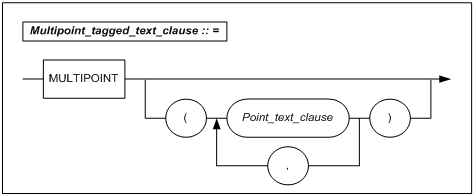
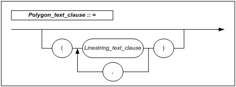
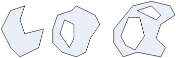
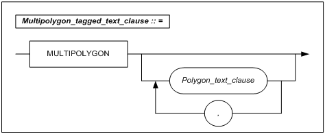
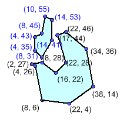
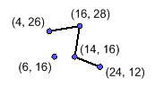
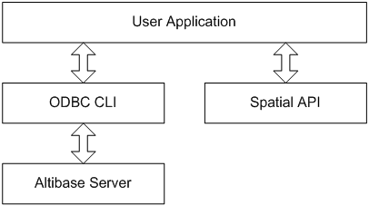
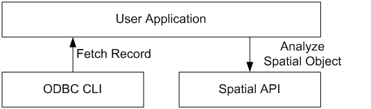

<!-- START doctoc generated TOC please keep comment here to allow auto update -->
<!-- DON'T EDIT THIS SECTION, INSTEAD RE-RUN doctoc TO UPDATE -->


- [Spatial SQL Reference](#spatial-sql-reference)
    - [서문](#%EC%84%9C%EB%AC%B8)
    - [이 매뉴얼에 대하여](#%EC%9D%B4-%EB%A7%A4%EB%89%B4%EC%96%BC%EC%97%90-%EB%8C%80%ED%95%98%EC%97%AC)
  - [1.공간 데이터의 개요](#1%EA%B3%B5%EA%B0%84-%EB%8D%B0%EC%9D%B4%ED%84%B0%EC%9D%98-%EA%B0%9C%EC%9A%94)
    - [Spatial의 개념](#spatial%EC%9D%98-%EA%B0%9C%EB%85%90)
    - [공간 데이터의 특징](#%EA%B3%B5%EA%B0%84-%EB%8D%B0%EC%9D%B4%ED%84%B0%EC%9D%98-%ED%8A%B9%EC%A7%95)
    - [공간 데이터 활용 용어](#%EA%B3%B5%EA%B0%84-%EB%8D%B0%EC%9D%B4%ED%84%B0-%ED%99%9C%EC%9A%A9-%EC%9A%A9%EC%96%B4)
  - [2.공간 질의어](#2%EA%B3%B5%EA%B0%84-%EC%A7%88%EC%9D%98%EC%96%B4)
    - [GEOMETRY 데이터 타입](#geometry-%EB%8D%B0%EC%9D%B4%ED%84%B0-%ED%83%80%EC%9E%85)
    - [GEOMETRY 표현 형식](#geometry-%ED%91%9C%ED%98%84-%ED%98%95%EC%8B%9D)
    - [데이터 정의어](#%EB%8D%B0%EC%9D%B4%ED%84%B0-%EC%A0%95%EC%9D%98%EC%96%B4)
    - [공간 함수](#%EA%B3%B5%EA%B0%84-%ED%95%A8%EC%88%98)
    - [기본 함수](#%EA%B8%B0%EB%B3%B8-%ED%95%A8%EC%88%98)
    - [공간 분석 함수](#%EA%B3%B5%EA%B0%84-%EB%B6%84%EC%84%9D-%ED%95%A8%EC%88%98)
    - [공간 객체 생성 함수](#%EA%B3%B5%EA%B0%84-%EA%B0%9D%EC%B2%B4-%EC%83%9D%EC%84%B1-%ED%95%A8%EC%88%98)
    - [Dimensionally Extended Nine Intersection Model(DE－9IM)](#dimensionally-extended-nine-intersection-modelde9im)
    - [Altibase 공간 관계 연산자](#altibase-%EA%B3%B5%EA%B0%84-%EA%B4%80%EA%B3%84-%EC%97%B0%EC%82%B0%EC%9E%90)
  - [3.응용 프로그램 개발](#3%EC%9D%91%EC%9A%A9-%ED%94%84%EB%A1%9C%EA%B7%B8%EB%9E%A8-%EA%B0%9C%EB%B0%9C)
    - [API 사용 방법](#api-%EC%82%AC%EC%9A%A9-%EB%B0%A9%EB%B2%95)
    - [응용 프로그램 작성 예](#%EC%9D%91%EC%9A%A9-%ED%94%84%EB%A1%9C%EA%B7%B8%EB%9E%A8-%EC%9E%91%EC%84%B1-%EC%98%88)
    - [Spatial API용 데이터 타입과 함수](#spatial-api%EC%9A%A9-%EB%8D%B0%EC%9D%B4%ED%84%B0-%ED%83%80%EC%9E%85%EA%B3%BC-%ED%95%A8%EC%88%98)
    - [핸들 및 에러 관리 함수](#%ED%95%B8%EB%93%A4-%EB%B0%8F-%EC%97%90%EB%9F%AC-%EA%B4%80%EB%A6%AC-%ED%95%A8%EC%88%98)
    - [객체 생성 함수](#%EA%B0%9D%EC%B2%B4-%EC%83%9D%EC%84%B1-%ED%95%A8%EC%88%98)
    - [객체 검색 함수](#%EA%B0%9D%EC%B2%B4-%EA%B2%80%EC%83%89-%ED%95%A8%EC%88%98)
    - [Endian 함수](#endian-%ED%95%A8%EC%88%98)
  - [4. 데이터 마이그레이션](#4-%EB%8D%B0%EC%9D%B4%ED%84%B0-%EB%A7%88%EC%9D%B4%EA%B7%B8%EB%A0%88%EC%9D%B4%EC%85%98)
    - [Altibase 공간 데이터 마이그레이션](#altibase-%EA%B3%B5%EA%B0%84-%EB%8D%B0%EC%9D%B4%ED%84%B0-%EB%A7%88%EC%9D%B4%EA%B7%B8%EB%A0%88%EC%9D%B4%EC%85%98)
    - [이기종 데이터베이스 공간 데이터 마이그레이션](#%EC%9D%B4%EA%B8%B0%EC%A2%85-%EB%8D%B0%EC%9D%B4%ED%84%B0%EB%B2%A0%EC%9D%B4%EC%8A%A4-%EA%B3%B5%EA%B0%84-%EB%8D%B0%EC%9D%B4%ED%84%B0-%EB%A7%88%EC%9D%B4%EA%B7%B8%EB%A0%88%EC%9D%B4%EC%85%98)
  - [A.부록: Spatial 칼럼의 제약사항](#a%EB%B6%80%EB%A1%9D-spatial-%EC%B9%BC%EB%9F%BC%EC%9D%98-%EC%A0%9C%EC%95%BD%EC%82%AC%ED%95%AD)
    - [GEOMETRY 칼럼에 대한 제약 사항](#geometry-%EC%B9%BC%EB%9F%BC%EC%97%90-%EB%8C%80%ED%95%9C-%EC%A0%9C%EC%95%BD-%EC%82%AC%ED%95%AD)
  - [B.부록: 스키마](#b%EB%B6%80%EB%A1%9D-%EC%8A%A4%ED%82%A4%EB%A7%88)
    - [예제 테이블 정보](#%EC%98%88%EC%A0%9C-%ED%85%8C%EC%9D%B4%EB%B8%94-%EC%A0%95%EB%B3%B4)
    - [샘플 데이터](#%EC%83%98%ED%94%8C-%EB%8D%B0%EC%9D%B4%ED%84%B0)
  - [C.부록: Geometry 참조 테이블](#c%EB%B6%80%EB%A1%9D-geometry-%EC%B0%B8%EC%A1%B0-%ED%85%8C%EC%9D%B4%EB%B8%94)
    - [Geometry 참조 테이블](#geometry-%EC%B0%B8%EC%A1%B0-%ED%85%8C%EC%9D%B4%EB%B8%94)
    - [관련 저장 프로시저](#%EA%B4%80%EB%A0%A8-%EC%A0%80%EC%9E%A5-%ED%94%84%EB%A1%9C%EC%8B%9C%EC%A0%80)

<!-- END doctoc generated TOC please keep comment here to allow auto update -->

Altibase® Application Development

# Spatial SQL Reference


Altibase Development Spatial SQL Reference

Release 7.1

Copyright ⓒ 2001\~2018 Altibase Corp. All Rights Reserved.

본 문서의 저작권은 ㈜알티베이스에 있습니다. 이 문서에 대하여 당사의 동의
없이 무단으로 복제 또는 전용할 수 없습니다.

**㈜알티베이스**

08378 서울시 구로구 디지털로 306 대륭포스트타워Ⅱ 10층

전화: 02-2082-1114 팩스: 02-2082-1099

고객서비스포털: <http://support.altibase.com>

homepage: [http://www.altibase.com](http://www.altibase.com/)

### 서문

### 이 매뉴얼에 대하여

이 매뉴얼은 Altibase의 기능, 제품 구성요소, 그리고 사용법에 대해 설명한다.

#### 대상 사용자

이 매뉴얼은 다음과 같은 Altibase 사용자를 대상으로 작성되었다.

-   데이터베이스 관리자

-   성능 관리자

-   데이터베이스 사용자

-   응용 프로그램 개발자

-   기술 지원부

다음과 같은 배경 지식을 가지고 이 매뉴얼을 읽는 것이 좋다.

-   컴퓨터, 운영 체제 및 운영 체제 유틸리티 운용에 필요한 기본 지식

-   관계형 데이터베이스 사용 경험 또는 데이터베이스 개념에 대한 이해

-   컴퓨터 프로그래밍 경험

-   데이터베이스 서버 관리, 운영 체제 관리 또는 네트워크 관리 경험

#### 소프트웨어 환경

이 매뉴얼은 데이터베이스 서버로 Altibase 버전 7.1을 사용한다는 가정 하에
작성되었다.

#### 이 매뉴얼의 구성

이 매뉴얼은 다음과 같이 구성되어 있다.

-   제 1장 공간 데이터의 개요  
    이 장에서는 Altibase에서 제공하는 공간 데이터 처리에 대한 기본적인 개념을
    설명하고, Altibase의 특징 및 용어를 설명한다.

-   제 2장 공간 질의어  
    이 장에서는 Altibase에서 지원하는 공간 데이터에 대한 데이터 타입, 공간
    질의어 및 공간 함수 등에 대하여 설명한다.

-   제 3장 응용 프로그램 개발  
    이 장에서는 응용 프로그램 개발자가 공간 데이터에 접근하는 것을 지원하기 위한
    API들을 설명한다.

- 제 4장 데이터 마이그레이션

  이 장에서는 Altibase 제품간 또는 이기종 데이터베이스 제품과 공간 데이터 마이그레이션 방법을

  설명한다.

-   A. 부록: Spatial 칼럼의 제약사항  
    이 부록은 Altibase에 공간 (Spatial) 기능을 확장함에 따라 기존 기능 중
    GEOEMTRY 칼럼에 지원이 제한되는 부분을 기술한다.

-   B. 부록: 스키마  
    이 부록은 본 매뉴얼에서 전반적으로 사용된 예제에서 사용된 테이블의 스키마 및
    기본 데이터에 대한 참조 정보이다.

-   C. 부록: Geometry 참조 테이블  
    이 부록은 OLE_DB에서 사용되는 메타 테이블인 SPATIAL_REF_SYS,
    GEOMETRY_COLUMNS에 대한 설치법과 사용법, 그리고 관련된 제약 사항에 대해
    설명한다.

#### 문서화 규칙

이 절에서는 이 매뉴얼에서 사용하는 규칙에 대해 설명한다. 이 규칙을 이해하면 이
매뉴얼과 설명서 세트의 다른 매뉴얼에서 정보를 쉽게 찾을 수 있다.

여기서 설명하는 규칙은 다음과 같다.

-   구문 다이어그램

-   샘플 코드 규칙

##### 구문 다이어그램

이 매뉴얼에서는 다음 구성 요소로 구축된 다이어그램을 사용하여, 명령문의 구문을
설명한다.

| 구성 요소                          | 의미                                                         |
| ---------------------------------- | ------------------------------------------------------------ |
|  | 명령문이 시작한다. 완전한 명령문이 아닌 구문 요소는 화살표로 시작한다. |
|  | 명령문이 다음 라인에 계속된다. 완전한 명령문이 아닌 구문 요소는 이 기호로 종료한다. |
|  | 명령문이 이전 라인으로부터 계속된다. 완전한 명령문이 아닌 구문 요소는 이 기호로 시작한다. |
|  | 명령문이 종료한다.                                           |
|  | 필수 항목                                                    |
|  | 선택적 항목                                                  |
|  | 선택사항이 있는 필수 항목. 한 항목만 제공해야 한다.          |
|  | 선택사항이 있는 선택적 항목.                                 |
|  | 선택적 항목. 여러 항목이 허용된다. 각 반복 앞부분에 콤마가 와야 한다. |

##### 샘플 코드 규칙

코드 예제는 SQL, Stored Procedure, iSQL, 또는 다른 명령 라인 구문들을 예를 들어
설명한다.

아래 테이블은 코드 예제에서 사용된 인쇄 규칙에 대해 설명한다.

| 규칙         | 의미                                                         | 예제                                                         |
| ------------ | ------------------------------------------------------------ | ------------------------------------------------------------ |
| [ ]          | 선택 항목을 표시                                             | VARCHAR [(*size*)][[FIXED \|] VARIABLE]                      |
| { }          | 필수 항목 표시. 반드시 하나 이상을 선택해야 되는 표시        | { ENABLE \| DISABLE \| COMPILE }                             |
| \|           | 선택 또는 필수 항목 표시의 인자 구분 표시                    | { ENABLE \| DISABLE \| COMPILE } [ ENABLE \| DISABLE \| COMPILE ] |
| . . .        | 그 이전 인자의 반복 표시 예제 코드들의 생략되는 것을 표시    | SQL\> SELECT ename FROM employee; <br/>ENAME<br/> ------------------------<br/> SWNO<br/> HJNO<br/> HSCHOI<br/> .<br/> .<br/> . <br/>20 rows selected. |
| 그 밖에 기호 | 위에서 보여진 기호 이 외에 기호들                            | EXEC :p1 := 1; acc NUMBER(11,2);                             |
| 기울임 꼴    | 구문 요소에서 사용자가 지정해야 하는 변수, 특수한 값을 제공해야만 하는 위치 | SELECT \* FROM *table_name*;<br/> CONNECT *userID*/*password*; |
| 소문자       | 사용자가 제공하는 프로그램의 요소들, 예를 들어 테이블 이름, 칼럼 이름, 파일 이름 등 | SELECT ename FROM employee;                                  |
| 대문자       | 시스템에서 제공하는 요소들 또는 구문에 나타나는 키워드       | DESC SYSTEM_.SYS_INDICES_;                                   |

#### 관련 자료

자세한 정보를 위하여 다음 문서 목록을 참조하기 바란다.

-   Installation Guide

-   Getting Started Guide

-   Administrator’s Manual

-   Replication Manual

-   SQL Reference

-   Stored Procedures Manual

-   Precompiler User’s Manual

-   CLI User's Manual

-   Application Program Interface User’s Manual

-   iSQL User’s Manual

-   Error Message Reference

#### Altibase는 여러분의 의견을 환영합니다.

이 매뉴얼에 대한 여러분의 의견을 보내주시기 바랍니다. 사용자의 의견은 다음
버전의 매뉴얼을 작성하는데 많은 도움이 됩니다. 보내실 때에는 아래 내용과 함께
고객서비스포털( http://support.altibase.com/kr/ )로 보내주시기 바랍니다.

-   사용 중인 매뉴얼의 이름과 버전

-   매뉴얼에 대한 의견

-   사용자의 성함, 주소, 전화번호

이 외에도 Altibase 기술지원 설명서의 오류와 누락된 부분 및 기타 기술적인
문제들에 대해서 이 주소로 보내주시면 정성껏 처리하겠습니다. 또한, 기술적인
부분과 관련하여 즉각적인 도움이 필요한 경우에도 고객서비스포털을 통해 서비스를
요청하시기 바랍니다.

여러분의 의견에 항상 감사드립니다.

1.공간 데이터의 개요
------------------

본 장에서는 Altibase에서 제공하는 공간 데이터에 대한 기본적인 개념과 특징 및
용어, 그리고 공간 데이터를 처리하는 방법에 대해서 설명한다.

### Spatial의 개념

#### 공간 데이터

공간 데이터는 점, 선, 면 등의 다차원 데이터들이 특정 좌표 시스템에 의해 숫자의
나열로 표현된 것을 의미한다. 예를 들어 실세계의 모양을 좌표계로 표시한 전자
지도의 데이터 등을 공간 데이터라고 할 수 있을 것이다. 이러한 공간 데이터를
표현하는 자료 구조로서 기본적으로 래스터 자료구조와 벡터 자료구조가 있다.

벡터 모델에서 현실 세계의 사상 또는 좌표는 이들의 경계를 정의하는 점, 선으로
구성되며, 각 사상의 위치는 지도에서 좌표 체계에 의해 정의되며 지도 내에서 각
위치는 동일한 좌표체계를 유지한다. 점, 선, 다각형은 실세계에서 불규칙하게
분포하는 지리상이나 좌표를 표현하기 위해 사용된다. 선은 도로를, 다각형은 숲 등을
나타내는데 사용된다.

래스터 모델에서 공간은 픽셀(pixel) 또는 셀(cell)로 균등하게 분할되어 처리된다.
지리 사상이나 좌표의 위치는 그 사상이나 좌표가 존재하는 픽셀, 셀의 행렬로
정의되며, 셀 사이즈에 따라 해상도가 달라진다. 셀 안에 있는 지역은 하위 지역으로
분할되지 않으며, 셀 속성은 셀안의 모든 위치에 적용된다. 모든 셀의 크기는 같다.
일반적으로 래스터 모델은 수 백만개의 셀로 분할된다.

벡터 모델에서의 단위는 점, 선, 다각형이며, 래스터 모델에 비해 단위의 숫자가 작고
크기도 다양하다. 벡터 화일에서 요소의 수는 수 천 개 정도로 벡터에서의 위치는
연속되는 좌표의 값에 의해 정의된다. 벡터 데이터는 더 적은 수의 데이터를 가지며
다른 축적으로의 조정이 좀 더 유연하므로, 래스트 데이터에 비해 컴퓨터에서
다루기가 쉽다. 그리고, 그 결과도 더 정확하다.

[표 1-1]은 벡터와 래스터 자료구조의 장점과 단점을 분류한 것이다.

| 구분   | 장점                                                                                                                         | 단점                                                                                                                  |
|--------|------------------------------------------------------------------------------------------------------------------------------|-----------------------------------------------------------------------------------------------------------------------|
| 벡터   | 실세계 데이터 표현이 용이 데이터 저장시 효율적 압축 가능 위상 관계 구축 용이 정확한 그래픽의 표현 위치와 속성의 일반화 가능  | 자료 구조 복잡 지도 중첩 어려움 단위별로 위상 형태 다름 고가의 장비 필요 공간 연산이 복잡                             |
| 래스터 | 공간 분석 용이 자료구조 단순명료 단위별로 위상형태 동일 지도 중첩 용이 저가의 기술과 빠른 발달 속도 원격탐사자료와 연결 용이 | 위상 관계 구축이 어려움 투영반환에 많은 시간 소모 그래픽 자료의 양이 방대 자료 압축시 정보 손실 큼 출력의 질이 떨어짐 |

[표 1‑1] 벡터와 래스터 자료구조의 장단점

#### 공간 데이터의 특징

공간 데이터는 일반적으로 비정형성과 대용량성의 두 가지 특징을 갖는다.

비정형성이라는 것은 각 공간 객체의 내용 및 구조가 객체 타입에 따라 다르게
표현되며, 같은 타입 간에도 점의 개수 및 서브 객체의 개수 등에 의해 다른 형태와
길이를 갖는다는 것이다.

대용량성은 일부 공간 데이터의 경우 DBMS 데이터 저장 공간의 한 페이지를 넘는
크기를 가질 수 있다는 것이다. 예를 들면 국가의 해안선 경계를 표현한 데이터를
저장할 경우 수 MB도 나올 수 있다.

공간 DBMS는 이러한 특징을 갖는 공간 데이터를 효율적으로 저장 및 연산하기 위해서
기존의 비공간 데이터가 고려하지 않은 여러 가지 면을 추가적으로 고려하여
구현되어야 한다.

#### 공간 데이터 모델

전통적인 공간 데이터 모델은 공간을 연속적인 속성값으로 표현하는 필드
기반(Field-based) 모델과 점의 집합인 객체(혹은 개체)로서 표현하는 개체
기반(Entity-based) 모델이 있다. 공간에 있는 각각의 점이 하나 또는 그 이상의
속성값을 갖고 있는 필드 기반 모델에서는 x, y에서의 연속적인 함수처럼 정의된다.

그러나 필드 기반 모델에서는 개체 기반 모델에서의 객체 개념이 고려되지 않는다.
개체 기반 모델에서 일반적으로 고려되는 주요 객체에는 위치를 나타내는 점, 두 점을
연결한 선(Line), 연결된 선의 조합(Polyline), 다각형을 나타내는 폴리곤(Polygon)
등이 있다.

OGC(Open Geospatial Consortium)에서 제시하는 공간 데이터의 모델은 개념적인
모델이다. 즉 특정 구현에 대한 모델이 아닌 추상적 정보 모델인 공간 스키마(Spatial
Schema)로 정의된다. 이러한 OGC의 공간 스키마는 ISO 19107 공간 스키마를 기반으로
하고 있으며, “OpenGIS Simple Features Specification”, “GML 구현 명세” 등과 같은
많은 다른 OGC 명세들에서 사용되고 있다. 공간 스키마는 실세계 현상을 추상화한
피처(Feature)에 대한 공간적 특성의 정량적 기술을 위하여 기하학적 객체에 대한
모델을 제시하는 Geometry 패키지와 기하학적 객체들의 관계에 대한 모델을 제시하는
Topology 패키지로 구성된다.

이러한 추상 명세의 데이터 모델을 기반으로 OGC는 OpenGIS Simple Features
Specificification 등의 구현 명세에서 좀더 구체적인 OpenGIS Geometry 모델을
제시하고 있다.

Geometry는 루트 클래스로서 추상 클래스이고, Point, Curve, Surface,
GeometryCollection 서브 클래스를 갖는다. 모든 기하학적 객체들은 정의된 좌표
공간에 대한 공간 참조 시스템(spatial reference system)에 대하여 연관되고, 실제
인스턴스화되어 사용될 수 있는 클래스로는 Point, LineString, Polygon,
GeometryCollection, MultiPoint, MultiLineString, MultiPolygon이 있고, 나머지는
추상 클래스로 정의된다.

#### 공간 데이터베이스 시스템

공간 데이터베이스는 문자나 숫자 등으로 표현되는 비공간 데이터와 공간 객체의
좌표값 등으로 표현되는 공간 데이터의 집합이다. 공간 데이터베이스에서 주로 다루는
지리(geographic) 객체(일반적으로 공간 객체)는 객체의 일반적 속성, 객체의
기하학적(geometric) 속성, 객체간 공간적 관계에 대한 위상(topology)을 포함한다.

이러한 공간 데이터베이스를 효율적으로 저장·관리하는 소프트웨어인 공간
데이터베이스는 비공간 데이터와 공간 데이터를 논리적 레벨에서 표현하고 조작할 수
있어야 하고, 이러한 데이터를 물리적 레벨에서 효율적으로 저장·처리할 수 있어야
한다. 따라서, 공간 데이터베이스에서는 공간데이터의 논리적 데이터 표현이
가능하고, 공간 데이터에 대한 공간 연산을 수행하기 위한 함수들이 제공되어야 하며,
공간 데이터를 물리적 레벨에서 효율적으로 저장하고 공간 인덱싱을 통해 효율적으로
접근할 수 있어야 한다. 또한, 공간 객체의 공간 데이터와 함께 연관된 위상 데이터와
일반 속성 데이터를 효율적으로 저장하고 관리할 수 있어야 한다.

공간 데이터 모델링은 공간 데이터에 대한 표현을 정의하는 기술인데, 공간 데이터는
점(point), 선(line), 면(surface) 등과 같이 현실 세계에서 익숙하게 접하게 되는
공간 데이터 타입들을 지원해야 한다. 이러한 공간 데이터 타입은 복잡한 공간 객체를
표현하는 경우에도 가능한 단순하며 정확해야 하며, 또한 모든 공간 데이터 타입에
대해 공간 연산자를 적용할 수 있어야 한다.

공간 연산자는 공간 질의(spatial query)를 효율적으로 처리하기 위하여 공간
객체간의 위상적 관계를 포함한 다양한 공간적 분석을 위한 연산자인데, 공간
데이터베이스는 유용하게 사용할 수 있는 다양한 공간 연산자들을 지원해야 한다.

#### 공간 인덱스

공간 질의의 처리는 일반적으로 복잡하고 비용이 많이 드는 기하학적 도형 연산
작업을 요구한다. 전통적으로 점 객체 연산 작업은 각각의 객체들이 어떤 점을
포함하는지를 순차적으로 스캐닝하고 검사함으로써 많은 횟수의 디스크 접근과
기하학적 도형에 대한 조건들을 반복적으로 평가해야 하는 비싼 처리 비용을
요구한다.

따라서 저장된 많은 양의 공간 데이터들에 대하여 실제 처리해야 할 객체의 집합을
줄이는 효율적인 공간 접근 방법(spatial access method)들이 개발되었다. 공간 접근
방법이란 공간 인덱스를 사용하여 공간 질의에 대해 처리될 객체의 수를 줄이고자
하는 방법을 말하며, 부분 선형(sublinear) 시간내에 검색을 지원해야 하는 시간
복잡도에 대한 요구사항과 공간 인덱스의 크기가 인덱스된 데이터의 크기에 비하여
작아야하는 공간 복잡도의 요구사항을 갖는다. 또한 큰 성능 손실없이 객체가 공간
인덱스에 추가되거나 제거될 수 있어야 하는 동적 갱신의 요구사항도 갖는다. 이러한
요구사항을 만족시키기 위한 공간 접근 방법에는 대표적으로 R-Tree를 사용하는 접근
방법이 있다.

R-Tree는 보조기억장치를 위해 설계된 계층적, height-balanced 다차원(multi
dimensional) 인덱스 구조로서, 다차원 데이터 공간을 위하여 B-tree를 일반화한
것이다. 즉, R-Tree는 B-tree와 마찬가지로 트리 구조가 높이 균형적이며 객체에 대한
참조는 단말 노드에만 존재한다. 공간 객체를 표현하는데 MBR을 사용하는 R-tree는
공간 객체를 찾기 위하여 적은 수의 노드만 방문하도록 설계되었다. 또한,
R-tree에서는 트리 구조의 동적 생성이 지원되기 때문에, 한 R-tree에 대해서 갱신과
조회 수행을 동시에 할 수 있고 주기적으로 트리 구조를 재정렬할 필요가 없다.

#### 공간 참조 시스템(Spatial Reference System) 

실세계 공간에서의 위치를 수학적으로 표현되는 벡터 공간에서의 좌표에 의한 공간
객체에 연관시키거나, 반대로 좌표 값과 공간 객체를 실세계의 위치에 연관시키는
기능을 말한다. 공간 참조를 실현하는 방법에는 공간 좌표에 의한 방법과
구별자(identifier)에 의한 방법이 있다.

공간 참조 시스템을 이용하여 공간 데이터가 이용하는 좌표 시스템과 데이터별로
참조하는 지리적 영역의 범위를 정의할 수 있다.

#### 좌표 시스템

좌표 시스템은 제공된 영역(예를 들어 지구 표면의 한 영역 또는 지구 표면
전체)에서의 사물의 상대 위치를 정의하는 것입니다.

지구상에서의 위치를 경도와 위도로써 나타내기 위한 기준 체계 및 지구의 형상을
나타내는 타원체를 총칭하여 측지 기준계라고 한다. 우리나라는 천문관측에 의해
결정된 경도/위도값 및 원방위각을 기준으로 하고 Bessel 타원체를 적용한
한국측지계를 사용하고 있다. 한편, GPS를 사용한 측량이 보편화되면서 전세계에서
공통으로 사용할 수 있는 위치기준체계의 필요성이 증대되었고, 이처럼 세계에서
공통으로 이용할 수 있는 측지 기준계를 세계 측지계라고 한다. 세계측지계에는
기준과 적용타원체의 구분에 따라 ITRF계, WGS계, PZ계 등이 있다.

##### 지구 타원체(Ellipsoid)

지구를 표현하는 수학적 방법으로서 타원체의 장축 또는 단축을 중심축으로 하여
회전시켜 얻어낸 지구 모형이다. 이는 좌표를 표현하는데 있어 기준 모델로 사용된다.
각국에서는 사용하는 타원체는 그 나라의 실정에 따라 다양하며, 현재 범세계적으로
통용하여 사용하고 있는 타원체는 WGS84이다.

##### 지오이드(Geoid)

대양에서는 평균해수면과 일치하고, 대륙에서는 가상 해수면에 의해 연장되어 형성된
지구형상 모델로, 모든 지점은 중력방향에 수직이다. 즉 지구 타원체에서 지구중력이
동일한 면을 지오이드라 하는데 이는 해발고도가 0m인 기준면, 즉 평균해수면을
나타낸다. 형상은 불규칙하지만 편평한 타원체로 근사화 할 수 있다.

##### 데이텀

별도의 매개변수 계산을 위해 기준으로 하거나 기초로서 사용되는 매개변수 또는
매개변수의 집합으로, 관측의 기준이 되는 값(점, 선, 표면), 즉 관측을 보정하는데
사용되는 임의의 기준이다. 데이텀은 위도, 경도, 방위각으로 구성되며, 수평 데이텀
또는 수평 측지 데이텀이라고도 한다. 또한 데이텀은 지구에 관계한 좌표계 축의
원점위치, 축척 및 방향을 정의하며, 데이텀은 측지데이텀(geodetic datum),
표고데이텀(vertical datum) 및 시공데이텀(engineering datum)의 형태로 되어 있다.
데이텀을 변경하면 공간 데이터의 좌표가 변경된다.

#### 투영(Projection) 

3차원의 지구 전체 또는 일부를 2차원의 평면(원통, 원추, 원반 등)에 비추어 2차원의
지도로 변환하는 과정을 투영이라고 한다. 우리가 일반적으로 사용하는 종이지도나 2D
GIS의 수치지도는 이러한 투영을 과정을 거친 뒤 만들어진 것이다. 투영의 과정에서는
모양, 거리, 방향, 축척 및 면적의 왜곡이 발생하기 마련이므로 원하는 대상지역의
왜곡이 최소가 되도록 하는 투영법을 선택하여야 한다. 우리나라 지형도의 경우는
TM(Transverse Mercator) 투영법을 사용하고 있다. TM 투영은 중앙 자오선(예: 동경
127도선)에 원통을 접하도록한 뒤 투영하는 방식으로 중앙 자오선에 위치한 지역은
정확하게 투영되므로 남북 방향이 긴 지역에서 많이 사용한다. 중앙 자오선으로부터
멀어질수록 거리, 면적, 축척, 방향 등의 왜곡이 커진다.

### 공간 데이터의 특징 

Altibase에서 제공하는 공간 데이터에 대한 처리는 다음과 같은 특징이 있다.

-   Altibase는 고성능을 제공하는 메모리 데이터베이스 기술과 공간 데이터 모델을
    DBMS 내부에 지원하는 특징을 기반으로 하기 때문에 기존 GIS 분야 이외에
    유비쿼터스 환경에서 요구되는 고속의 Spatial 자료 처리 응용 시스템 지원에
    가장 적합한 공간 DBMS 이다. 또한 Spatial 모델을 RDBMS의 SQL 모델에 접합시켜
    기존의 DBMS 개발환경과 경험을 그대로 재 사용할 수 있으므로 생산성 향상을
    기대할 수 있다.

-   Altibase는 문자 및 숫자를 사용하는 전통적인 데이터와 함께 공간 데이터(특정
    장소의 위치에 대한 정보)를 저장, 관리 및 분석할 수 있다. 이러한 기능으로
    사무실 건물의 위치나 홍수 지역의 크기와 같은 특정 장소에 대한 공간 정보를
    생성, 분석 및 활용할 수 있다.

-   점, 선 및 다각형과 같은 기하학적 도형을 표시하는 일련의 고급 공간 데이터
    유형 그리고 이와 같은 새로운 데이터 유형과 상호 운용되는 수많은 기능 및
    특징을 통해 Altibase의 기능을 확장한다. 이에 따라 사용자는 비즈니스 데이터와
    공간 정보를 결합하여 데이터베이스에 또 다른 지능적 요소를 추가할 수 있다.

### 공간 데이터 활용 용어 

-   Closed (클로즈드)  
    라인스트링의 시작점과 끝점이 같은 경우 공간 객체를 ‘클로즈드한다’라고
    표현한다. 공간 객체를 구성하는 모든 요소가 클로즈드해야만 공간 객체가
    ‘클로즈드한다’고 표현할 수 있다. 클로즈드에 대한 설명은 ISCLOSED 함수를
    참조한다.

-   Compound Object (복합 객체)  
    두 개 이상의 공간 객체로 이루어진 공간 객체.

-   Dimension (차원)  
    도형, 물체, 공간 내에 있는 어떤 점의 위치를 나타내기 위해 필요한 실수의 최소
    개수를 의미한다. 점은 0차원, 직선은 1차원, 평면은 2차원 그리고 입체는
    3차원을 갖는다. 그러나, n차원이나 무한 차원의 공간도 생각할 수 있다.

-   Element (요소)  
    공간 객체를 구성하는 대표적인 도형을 나타내며, 하나의 공간 객체는 점, 선
    또는 면 등의 요소로 구성 될 수 있다.

-   Empty (엠프티)  
    요소가 존재하지 않는 공간 객체를 ‘엠프티하다’고 표현한다. ‘모른다’의 의미를
    갖는 ‘NULL’ 객체와는 다르게 엠프티는 명확히 ‘존재하지 않는다’의 의미를
    갖는다. 엠프티에 대한 설명은 ISEMPTY 함수를 참조한다.

-   Line (선)  
    한 점이 연속적으로 움직여 이루어진 자취. 점 다음으로 단순한 도형의 구성
    요소로서, 길이와 위치는 있으나 넓이와 두께는 없다. 직선과 곡선이 있다.

-   Multiple Object (다중 객체)  
    동일한 형태를 가진 두 개 이상의 공간 객체로 이루어진 공간 객체로 점들로만
    이루어진 멀티포인트, 라인스트링으로만 이루어진 멀티라인스트링, 그리고
    폴리곤으로 이루어진 멀티폴리곤 등이 있다.

-   Point (점)  
    모든 도형을 표현하는 가장 단순한 공간 객체로서 위치만 있고 크기는 없다.

-   Scale(축척 )  
    축척이란 지도나 사진상에서의 길이와 지상에서의 실제길이 비를 말한다. 축척의
    값은 비율로 나타내며, 이는 지도상에서나 지상에서나 같은 단위를 사용하여
    측정되었음을 나타낸다. 예를 들어, 축척이 1:25,000이라고 할 때 이 축척은
    지도상의 단위길이가 지상에서는 그 값의 25,000배에 해당하는 것을 의미한다.
    지도상의 1cm는 지상에서 25000cm라는 것이다. 여기에서 주의해야 할 것은 축척은
    수평방향의 길이에 대해 표시하는 것이며 면적이나 높이에 대한 축적은 아니라는
    것이다.

-   Simple (심플)  
    공간 객체를 구성하는 요소가 교차점이나 접촉점 등과 같은 예외적인 점들을 갖지
    않으면 공간 객체가 ‘심플하다’고 표현한다. 심플에 대한 설명은 ISSIMPLE 함수를
    참조한다.

-   Spatial Object (공간 객체)  
    실세계를 표현하는 공간 데이터와 그 데이터에 관련되는 동작(절차, 방법, 기능
    등)을 모두 포함하는 것을 의미한다.

-   Surface (면)  
    하나의 선이 연속적으로 움직여 이루어진 자취. 점이나 선으로 간주되지 않는
    평면의 형태를 표현하며, 면 바깥모양을 기준으로 평면과 곡면으로 구분된다.
    일반적으로 면이라 함은 특별히 지칭하지 않는 한 평면을 말한다.

2.공간 질의어
-----------

본 장에서는 Altibase에서 지원하는 공간 데이터에 대한 데이터 타입, 공간 질의어,
공간 함수 및 연산자 등에 대하여 설명한다.

Altibase에서 제공하는 Spatial SQL은 ISO SQL/MM 공간 표준 규격과 GIS
국제표준단체인 Open Geospatial Consortium(OGC)의 “Simple Features Specification
for SQL” 규격을 준수한다.

‘Simple Features Specification for SQL”은 표준 SQL을 확장하였기 때문에 사용자는
기존의 SQL 사용 방식과 유사하게 공간 질의어를 사용할 수 있다.

### GEOMETRY 데이터 타입 

Spatial SQL을 사용하여 데이터베이스에 공간 데이터를 조작하기 위해서는 공간
데이터 타입에 대한 이해가 필요하다. 이 절에서는 공간 데이터 타입에 대하여
설명한다.

공간 데이터 타입을 SQL 형식으로 정의할 때 현재 지원되는 타입은 GEOMETRY 이다.
GEOMETRY 타입은 내부적으로 다음과 같은 7가지 서브 타입을 갖는다.

-   POINT

-   LINESTRING

-   POLYGON

-   MULTIPOINT

-   MULTILINESTRING

-   MULTIPOLYGON

-   GEOMETRYCOLLECTION

다음 그림은 GEOMETRY 데이터 타입과 GEOMETRY 데이터 타입을 구성하는 7가지 서브
타입들간의 관계를 표현한 것이다.


[그림 2‑1] GEOMETRY 데이터 타입 관계

아래는 7가지 서브 타입에 대한 설명이다.

-   POINT: 공간상의 한 점을 X, Y 좌표 값을 이용하여 표현

-   LINESTRING: 2개 이상의 POINT로 구성  
    LINESTRING 은 닫힘 여부(끝 두 점이 같은 점인지 여부)에 따라서 닫히지 않은
    LINE과 닫혀진 LINEARRING으로 나뉜다. LINE과 LINEARRING은 공간 객체의 형태를
    표현하는 용어로서 별도의 타입을 의미하지는 않는다.

-   POLYGON: 1개 이상의 LINEARRING으로 구성

-   MULTIPOINT: 1개 이상의 POINT로 구성되는 MULTIPOINT

-   MULTILINESTRING: 1개 이상의 LINESTRING으로 구성

-   MULTIPOLYGON: 1개 이상의 POLYGON으로 구성

-   GEOMETRYCOLLECTION: 앞서 설명한 공간 객체들의 조합

위에서 기술한 7가지 서브 타입 외에 내부적으로 EMPTY 타입을 추가적으로 지원한다.
EMPTY 타입은 공간 객체들간의 연산에 의해서만 생성되는 타입이다. 연산의 결과로
GEOMETRY 타입을 반환하는 연산자의 경우 결과가 없을 때 EMPTY 타입의 공간 객체를
반환한다.

#### 서브 타입의 분류 기준

다음 [표 2-1]은 GEOMETRY 데이터 타입의 7가지 서브 타입을 구분하는 분류 기준에
대하여 설명한다.

| 서브 타입      | 구성 요소                                        | 차원       | 심플?          | 클로즈드? | 내부                  | 경계                                                     | 외부 |
| -------------- | ------------------------------------------------ | ---------- | -------------- | --------- | --------------------- | -------------------------------------------------------- | ---- |
| 포인트         | 1개의 점                                         | 0          | O              | X         | 점                    | Ø<sup>1</sup>                                            | 면   |
| 라인스트링     | 2개 이상의 점                                    | 1          | \*<sup>2</sup> | \*        | 선분                  | 클로즈드인 경우엔 Ø, 아닌 경우엔 양 끝점                 | 면   |
| 폴리곤         | 1개 이상의 심플하며 클로즈드한 LineString        | 2          | O<sup>3</sup>  | O         | 면                    | 내부 링과 외부 링을 구성하는 LineString                  | 면   |
| 멀티포인트     | 1개 이상의 점                                    | 0          | \*             | X         | 점                    | Ø                                                        | 면   |
| 멀티라인스트링 | 1개 이상의 LineString                            | 1          | \*             | \*        | 선분                  | 클로즈드한 경우엔 Ø, 아닌 경우엔 양 끝점                 | 면   |
| 멀티폴리곤     | 1개 이상의 Polygon                               | 2          | O              | O         | 면                    | 모든 공간 객체의 내부 링과 외부 링을 구성하는 LineString | 면   |
| 공간객체콜렉션 | GeometryCollection을 제외한 2개 이상의 공간 객체 | 최대 2차원 | \*             | \*        | 모든 공간 객체의 내부 | 모든 공간 객체의 경계                                    | 면   |

[<sup>1</sup>] 결과의 값이 없는 공집합을 가리키는 기호이다.

[<sup>2</sup>] 이 기호는 결과가 조건을 만족할 수도 그렇지 않을 수도 있다는 것을 의미한다.

[<sup>3</sup>] 심플하지 않은 Polygon의 경우 타입의 정의에 위배되어 삽입될 수 없다.

[표 2‑1] Geometry 데이터 타입의 서브 타입

#### POINT

##### 구문


​                                                       POINT( x y )

​                                                       x : x 좌표 값

​                                                       y : y 좌표 값

##### 설명

좌표 공간에서 한 점의 위치를 표현한다. 포인트는 1개의 점을 요소로 갖는 0차원의
공간 객체로서 심플 (Simple) 하며 클로즈드 (Closed)하지 않다. 공간 객체의 내부는
점 자신이며, 경계 (Boundary)는 없고 외부는 점을 제외한 면이다.

##### 특징

한 점은 x－좌표값과 y－좌표값을 가진다.

##### 예제

```
CREATE TABLE building ( id INTEGER, obj GEOMETRY ) ;
INSERT INTO building VALUES (1, GEOMETRY'POINT( 10 10 ) ') ;
INSERT INTO building VALUES (2, GEOMFROMTEXT('POINT(20 20)'));
INSERT INTO building VALUES (3, POINTFROMTEXT('POINT( 100 100 )')) ;
INSERT INTO building VALUES (4, GEOMETRY'POINT EMPTY');
INSERT INTO building VALUES (5, GEOMFROMTEXT('POINT EMPTY'));
INSERT INTO building VALUES (6, POINTFROMTEXT('POINT EMPTY'));
```

#### MULTIPOINT

##### 구문



​                                                                         MULTIPOINT(x1 y1 [, xn yn ])

​                                                                          x<sub>n</sub> : x 좌표의 n번 째 값

​                                                                          y<sub>n</sub> : y 좌표의 n번 째 값

##### 설명

1개 이상의 점을 요소로 갖는 0차원의 공간 객체로서 클로즈드하지 않다. 공간 객체의
내부는 멀티포인트를 구성하는 점이며, 경계는 없고 외부는 점을 제외한 면이다.

##### 특징

멀티포인트의 두 점이 동일한 좌표 값을 갖지 않으면 심플하다고 한다.

##### 제약 조건

멀티포인트의 요소는 점으로 제한되며, 이 점들은 연결되거나 순서를 갖지 않는다.

##### 예제

```
CREATE TABLE building ( id INTEGER, obj GEOMETRY ) ;
INSERT INTO building VALUES (1, GEOMETRY'MULTIPOINT( 10 10, 20 20 )') ;
INSERT INTO building VALUES (2, GEOMFROMTEXT('MULTIPOINT( 10 20, 20 30 ) ')) ;
INSERT INTO building VALUES (3, MPOINTFROMTEXT('MULTIPOINT( 100 100, 150 150 )')) ;
INSERT INTO building VALUES (4, GEOMETRY'MULTIPOINT EMPTY');
INSERT INTO building VALUES (5, GEOMFROMTEXT('MULTIPOINT EMPTY'));
INSERT INTO building VALUES (6, MPOINTFROMTEXT('MULTIPOINT EMPTY'));
```

#### LINESTRING

다음은 라인스트링 객체를 텍스트 형식으로 표현한 것이다.

##### 구문


​                                                           LINESTRING( x1 y1 , x2 y2 [, xn yn ])

​                                                            x<sub>n</sub> : x 좌표의 n번 째 값

​                                                            y<sub>n</sub> : y 좌표의 n번 째 값

##### 설명

라인스트링은 2개 이상의 점을 요소로 가지며 서로 직선으로 연결된 1차원의 공간
객체이다. 공간 객체의 내부는 라인스트링 자신인 선분이며, 외부는 선분을 제외한
면이다. 경계는 선분이 클로즈드한 경우에는 없고, 그렇지 않다면 양 끝점이다.

##### 특징

클로즈드하고 심플한 라인스트링을 선형링 (LinearRing)이라 한다.

다음 [그림 2-2]에서 라인스트링(3)은 클로즈드하고 심플한 선형링이며,
라인스트링(4)은 클로즈드하지만 심플하지 않은 라인스트링으로 선형링이 아니다.


[그림 2‑2] 라인스트링의 예

##### 예제

```
CREATE TABLE road ( id INTEGER, obj GEOMETRY ) ;
INSERT INTO road VALUES (1, GEOMETRY'LINESTRING( 0 18, 10 21, 16 23, 28 26, 44 31 )') ;
```


```
INSERT INTO road VALUES (2, GEOMFROMTEXT('LINESTRING( 30 31, 56 34, 70 24 )')) ;
```


```
INSERT INTO road VALUES (3, LINEFROMTEXT('LINESTRING( 70 38, 32 12, 36 36 )')) ;
```


```
INSERT INTO road VALUES (4, GEOMETRY'LINESTRING EMPTY');
INSERT INTO road VALUES (5, GEOMFROMTEXT('LINESTRING EMPTY'));
INSERT INTO road VALUES (6, LINEFROMTEXT('LINESTRING EMPTY'));
```

#### MULTILINESTRING

##### 구문


​                                           MULTILINESTRING( (x1 y1, x2 y2 [, xn yn ] ) [, (x1 y1, x2 y2 [, xn yn ] ) ] )

​                                            x<sub>n</sub> : x 좌표의 n번 째 값

​                                             y<sub>n</sub> : y 좌표의 n번 째 값

##### 설명

멀티라인스트링은 1개 이상의 라인스트링을 요소로 갖는 1차원의 공간 객체이다. 공간
객체의 내부는 멀티라인스트링을 구성하는 선분이며, 외부는 라인스트링을 제외한
면이다. 경계는 라인스트링이 클로즈드한 경우에는 없고, 그렇지 않다면 양 끝점이다.

##### 특징

멀티라인스트링의 모든 요소가 클로즈드하면, 그 멀티라인스트링도 클로즈드하며,
이것의 경계는 없다. (그림 2-3의 (3))

다음 [그림2-3]에서 멀티라인스트링에 대한 경계는 (1)은 {s1, e2}, (2)는 {s1, e1},
(3)은 ϕ이다.


[그림 2‑3] 멀티라인스트링의 예

##### 예제

```
CREATE TABLE road ( id INTEGER, obj GEOMETRY ) ;
INSERT INTO road VALUES (1, GEOMETRY'MULTILINESTRING(( 10 48, 10 21, 10 0 ), (16 0, 16 23, 16 48) )') ;
```


```
INSERT INTO road VALUES (2, GEOMFROMTEXT('MULTILINESTRING(( 38 48, 44 41, 41 36, 44 31, 52 18 ), ( 60 10, 58 30, 52 36))')) ;
```


```
INSERT INTO road VALUES (3, MLINEFROMTEXT('MULTILINESTRING(( 14 24, 28 28, 34 36 ), ( 56 38, 48 36, 56 16, 68 24 ))')) ;
```


```
INSERT INTO road VALUES (4, GEOMETRY'MULTILINESTRING EMPTY');
INSERT INTO road VALUES (5, GEOMFROMTEXT('MULTILINESTRING EMPTY'));
INSERT INTO road VALUES (6, MLINEFROMTEXT('MULTILINESTRING EMPTY'));
```

#### POLYGON

다음은 POLYGON 객체를 텍스트 형식으로 표현한 것이다.

##### 구문




​                                                            POLYGON( (x1 y1, x2 y2, x3 y3 [, xn yn ])[, (x1 y1, x2 y2, x3 y3 [, xn yn ] ) ]  )

​                                                            x<sub>n</sub> : x 좌표의 n번 째 값

​                                                             y<sub>n</sub> : y 좌표의 n번 째 값

##### 설명

공간상의 면을 표현하는 공간 객체이다. 폴리곤은 1개 이상의 심플하며 클로즈드한
라인스트링을 요소로 갖는 2차원의 공간 객체로서 반드시 심플하고 클로즈드하여야
한다. 공간 객체의 내부는 폴리곤이 이루는 면이며, 외부는 폴리곤의 내부를 제외한
면이다. 경계는 폴리곤을 구성하는 라인스트링이다. 예를 들어, 외부링과 내부링으로
구성된 폴리곤의 경우, 경계는 각 라인스트링이다.

##### 특징

-   폴리곤은 1개의 외부 경계와 0 또는 그 이상의 내부 경계로 정의되는 표면이다.

-   폴리곤은 클로즈드하고 심플한 공간 객체다.

-   폴리곤의 경계는 내부와 외부 경계에 해당하는 선형링 (LinearRing)이다.

다음 [그림 2-4]는 적합한 폴리곤의 예이다.



[그림 2‑4] 폴리곤의 예

##### 제약조건

폴리곤의 경계를 이루는 두 링(라인스트링)은 교차할 수 없으며, 폴리곤의 경계인
링은 접선(tangent)으로 만날 수도 없다. 오직 두 링을 구성하는 한 점에서만 만날 수
있다.

```
∀ P ∈ Polygon, ∀ c1, c2 ∈ P.Boundary(), c1 ≠ c2, ∀p, q ∈ Point,
p, q ∈ c1, p ≠ q, [p ∈ c2 ⇒ q ∈ c2]
```

폴리곤의 내부링과 폴리곤의 외부는 연결되어서는 안된다.

폴리곤은 튀어나온 선분을 요소로 가지지 못하며, 점은 따로 떨어져서 존재할 수
없다.

```
∀ P ∈ Polygon, P = Closure(Interior(P))
```

폴리곤의 내부는 서로 연결되어 있는 하나의 면(Surface)이어야 한다.

다음 [그림 2-5]는 위의 제약조건을 만족하지 못하여 폴리곤으로 표현될 수 없는
객체를 보여준다.


[그림 2‑5] 폴리곤으로 표현될 수 없는 공간 객체의 예

##### 예제

```
CREATE TABLE lake ( id INTEGER, obj GEOMETRY ) ;
INSERT INTO lake VALUES (1, GEOMETRY'POLYGON(( 14 42, 18 18, 36 12, 58 24, 34 24, 36 44, 24 56, 14 42 ))') ;
```


```
INSERT INTO lake VALUES (2, GEOMFROMTEXT('POLYGON(( 14 42, 18 18, 36 12, 58 24, 34 24, 36 44, 24 56, 14 42 ), ( 20 39, 28 27, 30 35, 28 41, 22 45, 20 39 ))')) ;
```


```
INSERT INTO lake VALUES (3, POLYFROMTEXT('POLYGON(( 8 6, 22 4, 38 14, 34 36, 22 46, 17 44, 22 28, 16 22, 8 28, 2 27, 4 26, 8 6 ))')) ;
```


```
INSERT INTO lake VALUES (4, GEOMETRY'POLYGON EMPTY');
INSERT INTO lake VALUES (5, GEOMFROMTEXT('POLYGON EMPTY'));
INSERT INTO lake VALUES (6, POLYFROMTEXT('POLYGON EMPTY'));
```

#### MULTIPOLYGON

##### 구문



​                                        MULTIPOLYGON( ( (x1 y1, x2 y2, x3 y3 [, xn yn ]) [, (x1 y1, x2 y2, x3 y3 [, xn
​                                         yn ] ) ] ) [ ( (x1 y1, x2 y2, x3 y3 [, xn yn ]) [, (x1 y1, x2 y2, x3 y3 [, xn yn
​                                         ] ) ] ) ] ) )

##### 설명

멀티폴리곤은 폴리곤들을 요소로 가지는 다중 객체이다. 멀티폴리곤은 1개 이상의
폴리곤을 요소로 갖는 2차원의 공간 객체로서 심플하고 클로즈드하다. 공간 객체의
내부는 멀티폴리곤이 이루는 면이며, 외부는 폴리곤을 제외한 면이다. 그리고 경계는
멀티폴리곤을 구성하는 각 라인스트링이다. 예를 들어, 외부링과 내부링을 구성된
멀티폴리곤의 경우, 각 라인스트링이 경계이다.

##### 특징

-   멀티폴리곤은 클로즈드하고 심플한 공간 객체이다.

-   멀티폴리곤의 경계는 라인스트링의 집합이다.

다음 [그림 2-6]은 멀티폴리곤에 대한 예를 보여준다. 세 번째 멀티폴리곤은 외부
폴리곤과 내부 폴리곤으로 구성된 것이 아니라, 하나가 다른 하나의 위쪽에 있는 두
개의 폴리곤으로 구성되어 있다.


[그림 2‑6] 멀티폴리곤의 예

##### 제약 조건

멀티폴리곤을 구성하는 2개 폴리곤의 내부의 교집합은 공집합이다.

```
∀ M ∈ MultiPolygon, ∀ Pi, Pj ∈ M.Geometries(), i≠ j, Interior(Pi) ∩ Interior(Pj) = Ø
```

멀티폴리곤의 경계인 2개의 링은 점으로만 접촉할 수 있고, 접촉한 점은 각 폴리곤의
구성하는 점이어야 한다.

```
∀ M ∈ MultiPolygon, ∀ Pi, Pj ∈ M.Geometries(), ∀ ci ∈ Pi.Boundaries(), cj ∈ Pj.Boundaries() ,ci ∩ cj = {p1, ....., pk │ pi ∈ Point, 1 <= i <= k}
```

멀티폴리곤은 튀어나온 선분은 요소로 가지지 못하며, 점은 따로 떨어져서 존재할 수
없다.

```
∀ M ∈ MultiPolygon, M = Closure(Interior(M))
```

다음 [그림 2-7]은 위의 제약조건을 만족하지 못하여 멀티폴리곤으로 표현될 수 없는
예를 보여준다.


[그림 2‑7] 멀티폴리곤으로 표현될 수 없는 공간 객체의 예

##### 예제

```
CREATE TABLE lake ( id INTEGER, obj GEOMETRY ) ;
INSERT INTO lake VALUES (1, GEOMETRY'MULTIPOLYGON(((8 6, 22 4, 38 14, 34 36, 22 46, 17 44, 22 28, 16 22, 8 28, 2 27, 4 26, 8 6 )), (( 4 35, 8 31, 14 41, 14 53, 10 55, 8 45, 4 43, 4 35 )))') ;
```



```
INSERT INTO lake VALUES (2, GEOMFROMTEXT('MULTIPOLYGON((( 8 28, 14 14, 32 18, 36 32, 26 46, 14 42, 8 28 ), ( 18 30, 20 20, 28 26, 22 38, 18 30 )), (( 24 54, 36 38, 44 44, 42 52, 34 56, 24 54 )))')) ;
```


```
INSERT INTO lake VALUES (3, MPOLYFROMTEXT('MULTIPOLYGON((( 8 34, 6 12, 26 6, 34 26, 16 26, 8 34 )), (( 8 35, 22 36, 34 27, 38 36, 24 48, 8 35 )))')) ;
```


```
INSERT INTO lake VALUES (4, GEOMETRY'MULTIPOLYGON EMPTY');
INSERT INTO lake VALUES (5, GEOMFROMTEXT('MULTIPOLYGON EMPTY'));
INSERT INTO lake VALUES (6, MPOLYFROMTEXT('MULTIPOLYGON EMPTY'));
```

#### GEOMETRYCOLLECTION

##### 구문


​                                         GEOMETRYCOLLECTION( Point \| LineString \| Polygon \| MultiPoint \|
​                                         MultiLineString \| MultiPolygon, [Point \| LineString \| Polygon \| MultiPoint
​                                         | MultiLineString \| MultiPolygon ] )

-   Point : Point type 객체

-   LineString : LineString type 객체

-   Polygon : Polygon type 객체

-   MultiPoint : MultiPoint type 객체

-   MultiLineString : MultiLineString type 객체

-   MultiPolygon : MultiPolygon type 객체

##### 설명

공간객체콜렉션은 하나 또는 그 이상의 공간 객체의 집합으로 이루어진 공간
객체이다. 공간 객체 콜렉션은 공간객체콜렉션을 제외한 2개 이상의 공간 객체를
요소로 갖는 최대 2차원의 공간 객체이며, 공간 객체의 내부는 구성하는 모든
공간객체의 내부이며, 경계는 구성하는 모든 공간객체의 경계이며, 외부는 공간
객체를 제외한 면이다.

##### 제약 조건

공간객체콜렉션을 구성하는 각 공간 객체의 제약조건을 따른다.

##### 예제

```
CREATE TABLE test1 ( id INTEGER, obj GEOMETRY ) ;
INSERT INTO test1 VALUES (1, GEOMETRY'GEOMETRYCOLLECTION( POINT( 6 16 ), LINESTRING( 4 26, 16 28, 14 16, 24 12 ))') ;
```



```
INSERT INTO test1 VALUES (2, GEOMFROMTEXT('GEOMETRYCOLLECTION( LINESTRING( 4 26, 16 28, 14 16, 24 12 ), POLYGON(( 2 30, 18 32, 24 16, 36 26, 24 46, 8 44, 2 30 )))')) ;
```


```
INSERT INTO test1 VALUES (3, GEOMCOLLFROMTEXT ('GEOMETRYCOLLECTION (POINT( 6 22 ), LINESTRING( 4 54, 4 38, 8 28, 10 16, 18 8, 28 4 ), POLYGON(( 8 44, 12 32, 16 16, 24 12, 34 16, 32 34, 26 44, 16 54, 8 44 ), ( 16 38, 20 30, 22 20, 28 22, 26 32, 20 42, 16 38 )))')) ;
```


```
INSERT INTO test1 VALUES (4, GEOMETRY'GEOMETRYCOLLECTION EMPTY');
INSERT INTO test1 VALUES (5, GEOMFROMTEXT('GEOMETRYCOLLECTION EMPTY'));
INSERT INTO test1 VALUES (6, GEOMCOLLFROMTEXT('GEOMETRYCOLLECTION EMPTY'));
```

### GEOMETRY 표현 형식

GEOMETRY 데이터 타입을 표현하기 위하여 Altibase는 5가지 방법을 제공한다.

-   WKT(Well-Known Text) 형식: 공간 객체를 문자와 숫자로 표현하여 SQL등에서 직접
    사용될 수 있는 텍스트 형식이다. 문법이 간결하고 읽기 쉽도록 디자인 되어
    있다.

-   WKB(Well-Known Binary) 형식: 공간 객체를 이진형태로 표현한 것으로 GEOMETRY
    데이터 전송 및 연산에 효율적으로 디자인되어 있다.
   
-   EWKT(Extended Well-Known Text) 형식: WKT 형식에 공간 객체를 표현하는 SRID(Spatial Reference Identifier) 정보가 추가된 것이다.

-   EWKB(Extended Well-Known Binary) 형식: WKB 형식에 공간 객체를 표현하는 SRID(Spatial Reference Identifier) 정보가 추가된 것이다.

-   내부 이진 형식: Altibase 내부에 저장되는 이진 형태로서 내부관리 및 공간
    연산에 효율적으로 디자인되어 있으며, C-API를 이용하여 조작할 수 있다. 제
    3장에서 C-API에 대하여 설명한다.

#### WKT (Well-Known Text) 

WKT(Well-known Text)는 공간 객체를 문자와 숫자로 표현하기 위한 형식이다.  WKT 형식으로 공간 객체를 표현하는 경우, 객체의 SRID는 0으로 간주된다. WKT는
다음과 같은 BNF(Backus Naur Form) 형태로 정의된다.

```
<Geometry Tagged Text> : =
<Point Tagged Text>
｜ <LineString Tagged Test>
｜ <Polygon Tagged Test>
｜ <MultiPoint Tagged Test>
｜ <MultiLineString Tagged Test>
｜ <MultiPolygon Tagged Test>
｜ <GeometryCollection Tagged Test>
<Point Tagged Test> : = POINT <Point Text>
<LineString Tagged Text> : = LINESTRING <LineString Test>
<Polygon Tagged Text> := POLYGON <Polygon Text>
<Multipoint Tagged Text> : = MULTIPOINT (Multipoint Text>
<MultiLineString Tagged Text> : = MULTILINESTRING (MultiLineString Text>
<MultiPolygon Tagged Text> : = MULTIPOLYGON <MultiPolygon Text>
<GeometryCollection Tagged Test> : = GEOMETRYCOLLECTION <GeometryCollection Text>
<Point Text> : = ( <Point> )
<Point> : = <x> <y>
<x> : = double precision literal
<y> : = double precision literal
<LineString Text> : = ( <Point > {, <Point > }＊)
<Polygon Text> : = ( <LineString Text > {, < LineString Text > }＊)
<MultiPoint Text> : = ( <Point Text > {, <Point Text > }＊)
<MultiLineString Text> : = ( <LineString Test > {, < LineString Text > }＊)
<MultiPolygon Text> : = ( < Polygon Text > {, < Polygon Text > }＊)
<GeometryCollection Text> : = ( <Geometry Tagged Text > {, <Geometry Tagged Text> }＊)
```

| 형식               | WKT 표현                                                                                 | 설명                                              |
|--------------------|------------------------------------------------------------------------------------------|---------------------------------------------------|
| Point              | POINT (10 10)                                                                            | 한 점                                             |
| LineString         | LINESTRING (10 10, 20 20, 30 40)                                                         | 3점을 갖는 라인스트링                             |
| Polygon            | POLYGON ( (10 10, 10 20, 20 20, 20 15, 10 10) )                                          | 1개의 외부링과 0개의 내부링으로 된 폴리곤         |
| MultiPoint         | MULTIPOINT (10 10, 20 20)                                                                | 2점을 갖는 멀티포인트                             |
| MultiLineString    | MULTILINESTRING ((10 10, 20 20), (15 15, 30 15))                                         | 2개의 라인스트링을 갖는 멀티라인스트링            |
| MultiPolygon       | \`MULTIPOLYGON (((10 10, 10 20, 20 20, 20 15, 10 10)), ((60 60, 70 70, 80 60, 60 60 ) )) | 2개의 폴리곤을 갖는 멀티폴리곤                    |
| GeometryCollection | \`GEOMETRYCOLLECTION ( POINT (10 10), POINT (30 30), LINESTRING (15 15, 20 20))          | 2점과 하나의 라인스트링으로 구성된 공간 객체 모음 |

##### 예제

다음은 예제는 WKT 표현 형식의 공간 데이터를 좌표 평면에 표현한 것이다.

- Point

  

- LineString

  

- Polygon

  

- MultiPoint

  

- MultiLineString

  

- MultiPolygon

  

- GeometryCollection

  

#### WKB (Well-Known Binary)

WKB(Well-Known Binary)는 공간 객체를 이진 형태로 표현하기 위한 형식이다. WKB 형식으로 공간 객체를 표현하는 경우, 객체의 SRID는 0으로 간주된다.

OGC 표준에서 권고하는 이진 형태이며, 서로 다른 공간 DBMS간의 데이터 호환을
위하여 사용한다.

공간 객체의 WKB 형식은 unsigned int와 double타입 데이터로 구성되는 숫자들로 공간
객체를 표현하고, 바이트 순서(Endian)는 이진법 표준들(NDR, XDR) 중 하나를 따른다.

XDR (External Data Representation)은 Big Endian이고 NDR (Network Data
Representation)은 Little Endian이다. Unsigned Integer는 32비트 데이터 타입으로
범위[0, 4294967295] 안에서 양의 정수로 사용한다. Double은 64비트 double
precision 데이터 타입으로 IEEE 754 double precision 포맷을 사용하여, double
precision 숫자로 표현한다.

공간 객체에 대한 WKB 표현은 아래에 서술되어 있다. 기본 타입은 점(Point)으로 두
개의 double형 숫자로 표현된다. 다른 공간 객체들에 대한 표현은 점(Point) 또는
점(Point)을 사용하여 정의된 다른 공간 객체의 표현들을 사용하여 구성한다.

```
/ / Basic Type definitions
/ / byte : 1 byte
/ / unit32 : 32 bit unsigned integer (4 bytes)
/ / double : double precision number (8 bytes)
/ / Building Blocks : Point, LinearRing

Point {
double x ;
double y ;
} ;

LinearRing {
unit32 numPoints ;
Point points{numPoints} ;
}

enum wkbGeometryType {
wkbPoint = 1,
wkbLineString = 2,
wkbPolygon = 3,
wkbMultiPoint = 4,
wkbMultiLineString = 5,
wkbMultiPolygon = 6,
wkbGeometryCollection = 7
} ;

enum wkbByteorder {
wkbXDR = 0 ;	/ / Big Endian
wkbNDR = 1 ;	/ / Little Endian
} ;

WKBPoint {
byte byteOrder ;
unit32 wkbType ; 		/ / 1
Point point ;
}
WKBLineString {
byte byteOrder ;
unit32 wkbType ; 		/ / 2
unit32 numPoints ;
Point points{numPoints} ;
}

WKBPolygon {
byte byteOrder ;
unit32 wkbType ; 		/ / 3
unit32 numRings ;
LinearRing rings{numRings} ;
}

WKBMultiPoint {
byte byteOrder ;
unit32 wkbType ; 		/ / 4
unit32 num_wkbPoints ;
WKBPoint WKBpoints{num_wkbPoints} ;
}

WKBMultiLineString {
byte byteOrder ;
unit32 wkbType ; 		/ / 5
unit32 num_wkbLineStrings ;
WKBLineString WKBLineStrings{num_wkbLineStrings} ;
}

WKBMultiPolygon {
byte byteOrder ;
unit32 wkbType ; 		/ / 6
unit32 num_wkbPolygons ;
WKBPolygon wkbPolygons{num_wkbPolygons} ;
}

WKBGeometry {
union {
WKBPoint point ;
WKBLineString linestring ;
WKBPolygon polygon ;
WKBGeometryCollection collection ;
WKBMultiPoint mpoint ;
WKBMultiLineString mlinestring ;
WKBMultiPolygon mpolygon ;
}
} ;

WKBGeometryCollection {
byte byte_order ;
unit32 wkbType ; 		/ / 7
unit32 num_wkbGeometries ;
WKBGeometry wkbGeometries{num_wkbGeometries} ;
} ;
```


[그림 2‑8] WKB 구조 예

위의 예제에서 바이트 순서로 Little Endian(NDR)을 사용하며, 1개의 외부 링과 1개의
내부 링을 가진 폴리곤을 표현한다. 외부링과 내부링은 각각 3개의 포인트로
구성된다.


#### EWKT (Extended Well-Known Text)

EWKT는 WKT 형식에 추가적으로 SRID 정보를 표기한 것이다. SRID 정보의 표기를 제외하면 표기법은 WKT 형식과 동일하다. EWKT 형식은 OpenGIS 표준안이 아니며, EWKT 형식을 사용해 기술한 공간 데이터의 예시는 다음과 같다.

| 형식               | WKT 표현 | SRID                                                                                 | 설명                                              |
|--------------------|------------------------------------------------------------------------------------------|-------|--------------------------------------------|
| Point              | SRID=4326;POINT(10 10)                                                                            | 4326 | 한 점; SRID는 4326                                             |
| LineString         | SRID=100;LINESTRING(10 10, 20 20, 30 40)                                                         | 100 | 3점을 갖는 라인스트링; SRID는 100                             |
| Polygon            | SRID=-999;POLYGON( (10 10, 10 20, 20 20, 20 15, 10 10) )                                          | -999 | 1개의 외부링과 0개의 내부링으로 된 폴리곤; SRID는 -999          |
| MultiPoint         | SRID=0;MULTIPOINT(10 10, 20 20)                                                                | 0 | 2점을 갖는 멀티포인트; SRID는 0     |

#### EWKB (Extended Well-Known Binary)

EWKB는 WKB 형식에 추가적으로 SRID 정보를 표기한 것이다. SRID 정보의 표기를 제외하면 표기법은 WKB 형식과 동일하다. 
EWKB 형식은 OpenGIS 표준안이 아니다. EWKB 형식의 표기방법은 WKB 형식과 거의 같으나, 바이트 순서(1바이트; NDR, XDR 중 하나)와 GEOMETRY 데이터 타입(4바이트; POINT, MULTIPOINT 등)을 표기한 이후 4바이트 크기의 SRID를 표기한다는 점에 차이가 있다. SRID 표기 이후에는 WKB 형식과 마찬가지로 객체 정보를 이진 형태로 표기한다.

| 형식               | WKT 표현 | SRID                                                                                 | 설명                                              |
|--------------------|------------------------------------------------------------------------------------------|-------|--------------------------------------------|
| Point              | SRID=4326;POINT(10 10)                                                                            | 4326 | 한 점; SRID는 4326                                             |
| LineString         | SRID=100;LINESTRING(10 10, 20 20, 30 40)                                                         | 100 | 3점을 갖는 라인스트링; SRID는 100                             |
| Polygon            | SRID=-999;POLYGON( (10 10, 10 20, 20 20, 20 15, 10 10) )                                          | -999 | 1개의 외부링과 0개의 내부링으로 된 폴리곤; SRID는 -999          |
| MultiPoint         | SRID=0;MULTIPOINT(10 10, 20 20)                                                                | 0 | 2점을 갖는 멀티포인트; SRID는 0     |


### 데이터 정의어

이 절에서는 데이터베이스 오브젝트를 생성하기 위해서 사용하는 SQL DDL 문장의
문법과 특징을 사용 예제를 들어서 설명하고 있다. 본 절에서 설명하는 내용은
GEOMETRY 데이터 타입에 관련된 부분만을 설명한다. 보다 자세한 문법 및 특징은 *SQL
Reference* 을 참조한다.

#### 테이블 생성

##### 구문

```
CREATE TABLE table_name (
    column_name GEOMETRY [(precision)] [(SRID srid)]);
```

##### 설명

*precision* 생성될 칼럼의 최대 크기(Bytes 단위)를 명시한다. 최소 16Bytes, 최대
100MBytes까지 지정할 수 있으며, 명시하지 않을 경우 기본값으로 32,000 Bytes을
갖는다. 저장 공간이 precision보다 큰 공간객체 데이터는 삽입할 수 없다.

srid 생성될 칼럼의 SRID를 명시한다. 4바이트의 signed integer를 사용할 수 있으며, 지정하지 않으면 기본값 0이 된다.

CREATE TABLE 구문에 대한 자세한 설명은 *SQL Reference* 을 참조하기 바란다.

> ##### 주의 사항
>
> GEOMETRY Column은 다음의 제약 사항을 갖는다.
>
> -   PRIMARY KEY로 사용할 수 없다
>
> -   UNIQUE constraint를 지정할 수 없다.
>

##### 예제

칼럼 id와 GEOMETRY 칼럼 obj를 갖는 테이블을 생성한다.

```
iSQL> CREATE TABLE t1 ( id INTEGER, obj GEOMETRY ) ;
Create success.
```

칼럼 id와 최대 128 Bytes의 크기를 갖는 GEOMETRY 칼럼 obj를 갖는 테이블을
생성한다.

```
iSQL> CREATE TABLE t2 ( id INTEGER, obj GEOMETRY (128) ) ;
Create success.
```

정수형 칼럼 id와 SRID 100을 갖는 GEOMETRY 칼럼 obj를 갖는 테이블을 생성한다.

```
iSQL> CREATE TABLE t3 ( id INTEGER, obj GEOMETRY SRID 100) ;
Create success.
```

#### 인덱스 생성

##### 구문

```
CREATE INDEX index_name ON table_name ( column_name ) [INDEXTYPE IS RTREE];
```

##### 설명

칼럼의 타입이 GEOMETRY일 경우에는 INDEXTYPE을 명시하지 않아도 RTREE가 생성 된다.
BTREE를 명시하면, 에러가 발생한다.

CREATE INDEX 구문에 대한 자세한 설명은 *SQL Reference* 을 참조하기 바란다.

> ##### 주의 사항
>
> -   GEOMETRY Column을 인덱스 키로 지정할 경우 다음의 제약 사항을 갖는다.
>
> -   UNIQUE Option은 사용할 수 없다.
>
> -   GEOMETRY 칼럼을 포함한 복합키의 생성은 지원하지 않는다.
>
> -   RTREE 인덱스는 GEOMETRY 칼럼에만 생성된다.
>

##### 예제

t1 테이블에서 GEOMETRY 칼럼 obj에 대한 RTREE 인덱스 idx_t1를 생성한다.

```
iSQL> CREATE INDEX idx_t1 ON t1 ( obj ) ;
Create success.
```

t2 테이블에서 GEOMETRY 칼럼 obj에 대한 RTREE 인덱스 idx_t2를 생성한다.

```
iSQL> CREATE INDEX idx_t2 ON t2 ( obj ) INDEXTYPE IS RTREE ;
Create success.
```

t3 테이블에서 GEOMETRY 타입이 아닌 칼럼 id에 대한 RTREE 인덱스 idx_t3를
생성한다.

```
iSQL> CREATE INDEX idx_t3 ON t3 ( id ) INDEXTYPE IS RTREE ;
[ERR-31246 : cannot create index on the datatype.]
```

### 공간 함수

본 절에서는 Altibase에서 제공하는 공간 함수에 대하여 설명한다.

#### 공간 함수의 구성

Altibase에서 제공하는 공간 함수는 각 함수의 특징에 따라 다음과 같이 분류한다.

-   기본 함수  
    GEOMETRY의 특성과 기본 속성 등을 알아보기 위한 함수

-   공간 분석 함수  
    GEOMETRY 타입의 데이터를 이용한 각종 분석 작업을 수행하기 위한 함수

-   공간 객체 생성 함수  
    Altibase 내부 저장 형식이 아닌 WKT, WKB, EWKT, EWKB 형식을 이용하여 공간 객체를
    생성하는 함수

### 기본 함수

#### DIMENSION

##### 구문

```
DIMENSION( GEOMETRY )
```

##### 설명

어떤 공간 객체를 표현하기 위하여 필요한 최소 차원을 반환한다.

공간 객체가 EMPTY인 경우에는 -1을, 포인트 및 멀티포인트의 경우에는 0을 반환하며,
라인스트링 및 멀티라인스트링의 경우에는 1을, 폴리곤 및 멀티폴리곤인 경우에는 2를
반환한다.

여러 개의 서로 다른 타입의 공간객체를 요소로 갖는 공간객체콜렉션의 경우에는 각
요소들의 차원 중 가장 큰 차원 수를 반환한다.

##### 반환 타입

```
INTEGER
```

##### 예제

```
iSQL> SELECT F1, DIMENSION(F2) FROM TB1;
F1          DIMENSION(F2) 
-----------------------------
100                     
101         0           
102         0           
103         1           
104         1           
105         2           
106         2           
107         2           
108         1           
109         -1          
10 rows selected.
```

#### GEOMETRYTYPE

##### 구문

```
GEOMETRYTYPE( GEOMETRY )
```

##### 설명

GEOMETRY 객체의 서브 타입 이름을 반환한다.

서브 타입 이름은 문자열 형식으로 다음과 같다.

- NULL

- EMPTY<sup>4</sup>

  [<sup>4</sup>] 연산의 결과로서만 만들어질 수 있는 타입으로 사용자에 의해서는 만들어질 수 없다.

- POINT

- LINESTRING

- POLYGON

- MULTIPOINT

- MULTILINESTRING

- MULTIPOLYGON

- GEOMETRYCOLLECTION

##### 반환 타입

```
VARCHAR
```

##### 예제

```
iSQL> SELECT F1, GEOMETRYTYPE(F2) FROM TB1;
F1          GEOMETRYTYPE(F2)                  
-------------------------------------------------
100                                           
101         POINT                             
102         MULTIPOINT                        
103         LINESTRING                        
104         MULTILINESTRING                   
105         POLYGON                           
106         POLYGON                           
107         MULTIPOLYGON                      
108         GEOMETRYCOLLECTION                
109         EMPTY                             
10 rows selected.
```

#### ENVELOPE

##### 구문

```
ENVELOPE( GEOMETRY )
```

##### 설명

공간 객체에 대한 최소 경계 사각형(Minimum Boundary Rectangle: MBR)을 폴리곤
형태로 반환한다. 폴리곤은 경계 박스 (MINX, MINY), (MAXX, MINY), (MAXX, MAXY),
(MINX, MAXY), (MINX, MINY)의 모서리 점에 의해 정의된다.

##### 반환 타입

```
GEOMETRY
```

##### 예제

```
iSQL> SELECT F1, ASTEXT(ENVELOPE(F2)) FROM TB1 WHERE GEOMETRYTYPE(F2) = 'POLYGON';
F1          
--------------
ASTEXT(ENVELOPE(F2)) 
---------------------------------------------------------------
105         
POLYGON((0 0, 0 10, 10 10, 10 0, 0 0))
106         
POLYGON((3 5, 3 9, 7 9, 7 5, 3 5))
2 rows selected.
```

#### ASTEXT

##### 구문

```
ASTEXT( GEOMETRY[,precision] ) 
```

##### 설명

공간 객체를 WKT(Well-Known Text) 표현 형태로 반환한다.

Precision을 이용하여 WKT의 최대길이를 제어할 수 있다. 기본값은 256 bytes이며,
최소 32, 최대 32000까지 사용할 수 있다.

##### 반환 타입

```
VARCHAR
```

##### 예제

```
iSQL> SELECT F1, ASTEXT(F2) FROM TB1;
F1          
--------------
ASTEXT(F2) 
100         
101         
POINT(1 1) 
102         
MULTIPOINT(1 1, 2 2) 
103         
LINESTRING(1 1, 2 2) 
104         
MULTILINESTRING((1 1, 2 2), (3 3, 4 5)) 
105         
POLYGON((0 0, 10 0, 10 10, 0 10, 0 0)) 
106         
POLYGON((3 5, 7 5, 7 9, 3 9, 3 5), (4 6, 4 8, 6 8, 6 6, 4 6))
107         
MULTIPOLYGON(((1 1, 2 1, 2 2, 1 2, 1 1)), ((3 3, 3 5, 5 5, 5 3, 3 3))) 
108         
GEOMETRYCOLLECTION( POINT(1 1) , LINESTRING(2 2, 3 3) ) 
109         
EMPTY 
10 rows selected.
```

#### ASBINARY

##### 구문

```
ASBINARY( GEOMETRY )
```

##### 설명

공간 객체를 WKB(Well-Known Binary) 표현 형태로 반환한다.

##### 반환 타입

```
BINARY
```

##### 예제<sup>5</sup>

[<sup>5</sup>] ASBINARY함수는 GEOMETRY를 binary 형식으로 반환하는 함수이므로 콘솔에서는 그 내용을 확인할 수 없어 WKT로 변환하는 ASTEXT함수를 이용하여 결과를 출력하였다.

```
iSQL> SELECT F1, ASTEXT(GEOMFROMWKB(ASBINARY(F2))) FROM TB1;
F1          
--------------
ASTEXT(GEOMFROMWKB(ASBINARY(F2))) 
100         

101         
POINT(1 1) 
102         
MULTIPOINT(1 1, 2 2) 
103         
LINESTRING(1 1, 2 2) 
104         
MULTILINESTRING((1 1, 2 2), (3 3, 4 5)) 
105         
POLYGON((0 0, 10 0, 10 10, 0 10, 0 0))
106         
POLYGON((3 5, 7 5, 7 9, 3 9, 3 5), (4 6, 4 8, 6 8, 6 6, 4 6))
107         
MULTIPOLYGON(((1 1, 2 1, 2 2, 1 2, 1 1)), ((3 3, 3 5, 5 5, 5 3, 3 3))) 
108         
GEOMETRYCOLLECTION( POINT(1 1) , LINESTRING(2 2, 3 3) ) 
109         

10 rows selected.
```

#### ASEWKT

##### 구문

```
ASEWKT( GEOMETRY[,precision] ) 
```

##### 설명

공간 객체를 EWKT(Extended Well-Known Text) 표현 형태로 반환한다.
Precision을 이용하여 WKT의 최대 길이를 제어할 수 있다. 기본값은 256 bytes이며, 최소 32, 최대 32000까지 사용할 수 있다.

##### 반환 타입

```
VARCHAR
```

##### 예제
```
iSQL> SELECT F1, ASEWKT(F2, 40) FROM TB1;
F1          ASEWKT(F2, 40)                            
---------------------------------------------------------
1           SRID=0;POINT(2 2)                         
2           SRID=100;POINT(2 2)                       
3           SRID=101;POINT(2 2)                       
4           SRID=102;POINT(2 2)                       
5           SRID=103;POINT(2 2)                       
5 rows selected.
```

#### ASEWKB

##### 구문

```
ASEWKB( GEOMETRY ) 
```

##### 설명

공간 객체를 EWKB(Extended Well-Known Binary) 표현 형태로 반환한다.

##### 반환 타입

```
BINARY
```

##### 예제
```
iSQL> SELECT F1, ASEWKT(GEOMFROMEWKB(ASEWKB(F2)), 40) FROM TB1;
F1          ASEWKT(GEOMFROMEWKB(ASEWKB(F2)), 40)      
---------------------------------------------------------
1           SRID=0;POINT(2 2)                         
2           SRID=100;POINT(2 2)                       
3           SRID=101;POINT(2 2)                       
4           SRID=102;POINT(2 2)                       
5           SRID=103;POINT(2 2)                       
5 rows selected.
```

#### ISEMPTY

##### 구문

```
ISEMPTY( GEOMETRY )
```

##### 설명

공간 객체가 좌표값을 갖지 않는 경우 1을 반환한다. 그렇지 않으면 0을 반환한다.

##### 반환 타입

```
INTEGER
```

##### 예제

```
iSQL> SELECT F1, ISEMPTY(F2) FROM TB1;
F1          ISEMPTY(F2) 
---------------------------
100                     
101         0           
102         0           
103         0           
104         0           
105         0           
106         0           
107         0           
108         0           
109         1           
10 rows selected.
```

#### ISSIMPLE

##### 구문

```
ISSIMPLE( GEOMETRY )
```

##### 설명

공간 객체가 교차점이나 접촉점과 같은 예외적인 점들을 갖지 않을 경우 1을
반환한다. 그렇지 않으면 0을 반환한다.

포인트, 폴리곤 및 멀티폴리곤은 항상 심플하다. 라인스트링은 선분이 서로 교차하지
않는 경우 심플하다. 멀티포인트는 구성 요소인 두 포인트가 동일한 좌표 값을 갖지
않는 경우 심플하다. 구성 요소인 모든 라인스트링이 심플하고 멀티라인스트링의
경계에 있는 점에서만 교차가 발생하는 멀티라인스트링은 심플하다.

##### 반환 타입

```
INTEGER
```

##### 예제

```
iSQL> SELECT F1, ISSIMPLE(F2) FROM TB1;
F1          ISSIMPLE(F2) 
----------------------------
100                     
101         1           
102         1           
103         1           
104         1           
105         1           
106         1           
107         1           
108         1           
109         1           
10 rows selected.
```

#### ISVALID

##### 구문

```
ISVALID( GEOMETRY )
```

##### 설명

어떤 GEOMETRY 객체가 유효한지 여부를 검사하는 함수이다.

공간 객체가 공간객체의 제약조건을 만족하면 1, 아니면 0이 반환된다.

유효하지 않은 객체를 DBMS에 삽입하는 것은 에러가 발생할 수도, 원하지 않는 결과를
가져올 수도 있으니 주의한다.

##### 반환 타입

```
INTEGER
```

##### 예제

```
iSQL> SELECT F1, ISVALID(F2) FROM TB1;
F1          ISVALID(F2) 
-----------------------------
100         1            
101         1          
102         1           
103         1           
104         1           
105         1           
106         1           
107         1           
108         1          
109         1          
10 rows selected.
```

#### ISVALIDHEADER

##### 구문

```
ISVALIDHEADER( GEOMETRY )
```

##### 설명

어떤 GEOMETRY 객체의 헤더 정보만 검사하여 객체가 유효한지 판단하는 함수이다.

공간 객체가 공간객체의 제약조건을 만족하면 1, 아니면 0이 반환된다.

유효하지 않은 객체를 DBMS에 삽입하는 것은 에러가 발생할 수도, 원하지 않는 결과를
가져올 수도 있으니 주의한다.

##### 반환 타입

```
INTEGER
```

##### 예제

```
iSQL> SELECT F1, ISVALIDHEADER(F2) FROM TB1;
F1          ISVALIDHEADER(F2) 
-----------------------------
100         1            
101         1          
102         1           
103         1           
104         1           
105         1           
106         1           
107         1           
108         1          
109         1          
10 rows selected.
```

#### BOUNDARY

##### 구문

```
BOUNDARY( GEOMETRY )
```

##### 설명

공간 객체의 경계를 반환한다.

포인트, 멀티포인트, 클로즈드한 라인스트링 또는 클로즈드한 멀티라인스트링이거나
EMPTY 객체인 경우에는 EMPTY를 반환한다. 하나 이상의 내부링을 가지고 있는
폴리곤이거나 멀티폴리곤의 경우에는 다중 객체를 반환한다.

##### 반환 타입

```
GEOMETRY
```

##### 예제

```
iSQL> SELECT F1, ASTEXT(BOUNDARY(F2)) FROM TB1;
F1          
--------------
ASTEXT(BOUNDARY(F2)) 
---------------------------------------------------------
100         

101         
EMPTY 
102         
EMPTY 
103         
MULTIPOINT(1 1, 2 2) 
104         
MULTIPOINT(1 1, 2 2, 3 3, 4 5)
105         
LINESTRING(0 0, 10 0, 10 10, 0 10, 0 0) 
106         
MULTILINESTRING((3 5, 7 5, 7 9, 3 9, 3 5), (4 6, 4 8, 6 8, 6 6, 4 6)) 
107         
MULTILINESTRING((1 1, 2 1, 2 2, 1 2, 1 1), (3 3, 3 5, 5 5, 5 3, 3 3)) 
108         
EMPTY 
109         
EMPTY 
10 rows selected.
```

#### X (COORDX) 

##### 구문

```
X( GEOMETRY )
or
COORDX( GEOMETRY )
```

##### 설명

GEOMETRY object의 subtype이 포인트일 경우 x좌표 값을 반환한다.

GEOMETRY가 포인트가 아닐 경우에는 에러를 출력한다.

##### 반환 타입

```
DOUBLE
```

##### 예제

```
iSQL> SELECT F1, COORDX(F2) FROM TB1 WHERE GEOMETRYTYPE(F2) = 'POINT';
F1          COORDX(F2)             
--------------------------------------
101         1                      
1 row selected.

iSQL> SELECT F1, X(F2) FROM TB1;
F1          X(F2)                  
--------------------------------------
100                                
101         1                      
[ERR-A1019 : Not applicable object type]
2 rows selected.
```

#### Y (COORDY) 

##### 구문

```
Y( GEOMETRY )
or
COORDY( GEOMETRY )
```

##### 설명

GEOMETRY object의 subtype이 포인트일 경우 y좌표 값을 반환한다.

GEOMETRY가 포인트가 아닐 경우에는 에러를 출력한다.

##### 반환 타입

```
DOUBLE
```

##### 예제

```
iSQL> SELECT F1, COORDY(F2) FROM TB1 WHERE GEOMETRYTYPE(F2) = 'POINT';
F1          COORDY(F2)             
--------------------------------------
101         1                      
1 row selected.

iSQL> SELECT F1, Y(F2) FROM TB1;
F1          Y(F2)                  
--------------------------------------
100                                
101         1                      
[ERR-A1019 : Not applicable object type]
2 rows selected.
```

#### MINX 

##### 구문

```
MINX( GEOMETRY )
```

##### 설명

최소경계다각형의 최소 X 좌표값을 반환한다. GEOMETRY객체가 포인트(POINT) 타입인
경우, 그 포인트의 X 좌표값을 반환한다.

> 참고) MINX, MINY, MAXX, MAXY 함수와 MIN, MAX 함수를 이용하여 질의 결과값의
> 최소경계다각형의 좌표값을 얻을 수 있다.
>
> ```
> SELECT MIN(MINX(F2)), MIN(MINY(F2)), MAX(MAXX(F2)), MAX(MAXY(F2) FROM TB1;
> ```
>

##### 반환 타입

```
DOUBLE
```

##### 예제

```
iSQL> SELECT F1, MINX(F2) FROM TB1;
F1          MINX(F2) 
-----------------------------
100                     
101         1            
102         1            
103         1            
104         1            
105         0            
106         3            
107         1            
108         1            
109
10 rows selected.
```

#### MINY

##### 구문

```
MINY( GEOMETRY )
```

##### 설명

최소경계다각형의 최소 Y좌표값을 반환한다. GEOMETRY 객체가 포인트(POINT) 타입인
경우, 그 포인트의 Y좌표값을 반환한다.

##### 반환 타입

```
DOUBLE
```

##### 예제

```
iSQL> SELECT F1, MINY(F2) FROM TB1;
F1          MINY(F2) 
-----------------------------
100                     
101         1            
102         1            
103         1            
104         1            
105         0            
106         5            
107         1            
108         1            
109
10 rows selected.
```

#### MAXX

##### 구문

```
MAXX( GEOMETRY )
```

##### 설명

최소경계다각형의 최대 X좌표값을 반환한다. GEOMETRY 객체가 포인트(POINT) 타입인
경우, 그 포인트의 X좌표값을 반환한다.

##### 반환 타입

```
DOUBLE
```

##### 예제

```
iSQL> SELECT F1, MAXX(F2) FROM TB1;
F1          MAXX(F2) 
-----------------------------
100 
101         1            
102         2            
103         2            
104         4            
105         10           
106         7            
107         5            
108         3            
109
10 rows selected.
```

#### MAXY

##### 구문

```
MAXY( GEOMETRY )
```

##### 설명

최소경계다각형의 최대 Y좌표값을 반환한다. GEOMETRY 객체가 포인트(POINT) 타입인
경우, 그 포인트의 Y좌표값을 반환한다.

##### 반환 타입

```
DOUBLE
```

##### 예제

```
iSQL> SELECT F1, MAXY(F2) FROM TB1;
F1          MAXY(F2) 
-----------------------------
100 
101         1            
102         2            
103         2            
104         5            
105         10           
106         9            
107         5            
108         3            
109
10 rows selected.
```

#### GEOMETRYLENGTH

##### 구문

```
GEOMETRYLENGTH( GEOMETRY )
```

##### 설명

라인스트링 또는 멀티라인스트링의 길이를 반환한다.

GEOMETRY가 라인스트링이나 멀티라인스트링이 아닐 경우에는 에러를 출력한다.

##### 반환 타입

```
DOUBLE
```

##### 예제

```
iSQL> SELECT F1, GEOMETRYLENGTH(F2) FROM TB1 WHERE GEOMETRYTYPE(F2) = 'LINESTRING' OR GEOMETRYTYPE(F2) = 'MULTILINESTRING';
SELECT F1, GEOMETRYLENGTH(F2) FROM TB1;F1          GEOMETRYLENGTH(F2)     
--------------------------------------
103         1.4142135623731        
104         3.65028153987288       
2 rows selected.

iSQL> SELECT F1, GEOMETRYLENGTH(F2) FROM TB1;
F1          GEOMETRYLENGTH(F2)     
--------------------------------------
100                                
[ERR-A1019 : Not applicable object type]
1 row selected.
```

#### STARTPOINT

##### 구문

```
STARTPOINT( GEOMETRY )
```

##### 설명

라인스트링의 시작점을 반환한다.

GEOMETRY가 라인스트링이 아닐 경우에는 에러를 출력한다.

##### 반환 타입

```
GEOMETRY
```

##### 예제

```
iSQL> SELECT F1, ASTEXT(STARTPOINT(F2)) FROM TB1 WHERE GEOMETRYTYPE(F2) = 'LINESTRING';
F1          
--------------
ASTEXT(STARTPOINT(F2)) 
-------------------------------------------------
103         
POINT(1 1) 
1 row selected.

iSQL> SELECT F1, ASTEXT(STARTPOINT(F2)) FROM TB1;
F1          
--------------
ASTEXT(STARTPOINT(F2)) 
----------------------------------------------
100         

[ERR-A1019 : Not applicable object type]
1 row selected.
```

#### ENDPOINT

##### 구문

```
ENDPOINT( GEOMETRY )
```

##### 설명

라인스트링의 끝점을 반환한다.

GEOMETRY가 라인스트링이 아닐 경우에는 에러를 출력한다.

##### 반환 타입

```
GEOMETRY
```

##### 예제

```
iSQL> SELECT F1, ASTEXT(ENDPOINT(F2)) FROM TB1 WHERE GEOMETRYTYPE(F2) = 'LINESTRING';
F1          
--------------
ASTEXT(ENDPOINT(F2)) 
----------------------------------------------
103         
POINT(2 2) 
SELECT F1, ASTEXT(ENDPOINT(F2)) FROM TB1;
1 row selected.

iSQL> SELECT F1, ASTEXT(ENDPOINT(F2)) FROM TB1;
F1          
--------------
ASTEXT(ENDPOINT(F2)) 
----------------------------------------------
100         

[ERR-A1019 : Not applicable object type]
1 row selected.
```

#### ISCLOSED

##### 구문

```
ISCLOSED( GEOMETRY )
```

##### 설명

라인스트링이 클로즈드한 경우, 즉 아래의 식을 만족하면 1을 반환한다.

```
StartPoint(geometry) = EndPoint(geometry)
```

그렇지 않으면 0을 반환한다.

GEOMETRY가 라인스트링이나 멀티라인스트링이 아닐 경우에는 에러를 출력한다.

##### 반환 타입

```
INTEGER
```

##### 예제

```
iSQL> SELECT F1, ISCLOSED(F2) FROM TB1 WHERE GEOMETRYTYPE(F2) = 'LINESTRING' OR GEOMETRYTYPE(F2) = 'MULTILINESTRING';
F1          ISCLOSED(F2) 
----------------------------
103         0           
104         0           
2 rows selected.

iSQL> SELECT F1, ISCLOSED(F2) FROM TB1;
F1          ISCLOSED(F2) 
----------------------------
100                     
[ERR-A1019 : Not applicable object type]
1 row selected.
```

#### ISRING

##### 구문

```
ISRING( GEOMETRY )
```

##### 설명

인자인 라인스트링이나 멀티라인스트링이 클로즈드하며 심플한 경우 1을 반환한다.
라인스트링이 클로즈드한지 테스트하는 식은 아래와 같다.

```
StartPoint(geometry) = EndPoint(geometry)
```

그렇지 않으면 0을 반환한다.

GEOMETRY가 라인스트링이나 멀티라인스트링이 아닐 경우에는 에러를 출력한다.

##### 반환 타입

```
INTEGER
```

##### 예제

```
iSQL> SELECT F1, ISRING(F2) FROM TB1 WHERE GEOMETRYTYPE(F2) = 'LINESTRING' OR GEOMETRYTYPE(F2) = 'MULTILINESTRING';
F1          ISRING(F2)  
---------------------------
103         0           
104         0           
2 rows selected.

iSQL> SELECT F1, ISRING(F2) FROM TB1;
F1          ISRING(F2)  
---------------------------
100                     
[ERR-A1019 : Not applicable object type]
1 row selected.
```

#### ST_ISCOLLECTION

##### 구문

```
ST_ISCOLLECTION( GEOMETRY )
```

##### 설명

인자로 받은 공간 객체가 Multi\*이거나 GeometryCollection이면 1을 반환하고, 
그렇지 않으면 0을 반환한다. 


##### 반환 타입

```
INTEGER
```

##### 예제

```
iSQL> SELECT ST_ISCOLLECTION(GEOMETRY'POINT(1 1)'); 
ST_ISCOLLECTION(GEOMETRY'POINT(1 1)') 
----------------------------------------
0           
1 row selected.

iSQL> SELECT ST_ISCOLLECTION(GEOMETRY'MULTIPOINT(1 1)');
ST_ISCOLLECTION(GEOMETRY'MULTIPOINT(1 1)') 
---------------------------------------------
1           
1 row selected.

iSQL> SELECT ST_ISCOLLECTION(GEOMETRY'GEOMETRYCOLLECTION(POINT(1 1), LINESTRING(2 2, 3 3))');  
ST_ISCOLLECTION(GEOMETRY'GEOMETRYCOLLECTIO 
---------------------------------------------
1           
1 row selected.
```

#### NUMPOINTS

##### 구문

```
NUMPOINTS( GEOMETRY )
```

##### 설명

공간 객체를 구성하는 점의 수를 반환한다.

##### 반환 타입

```
INTEGER
```

##### 예제

```
iSQL> select f1, numPoints(f2) from TB1;
F1          NUMPOINTS(F2) 
-----------------------------
100                    
101         1           
102         2           
103         2           
104         4           
105         5           
106         10          
107         10          
108         3           
[ERR-A1019 : Inapplicable object type]
9 rows selected.
```

#### POINTN

##### 구문

```
POINTN( GEOMETRY, N )
```

##### 설명

라인스트링을 구성하는 N 번째 점을 반환한다.

*N*이 1보다 작거나 라인스트링의 점의 수보다 클 경우에는 에러를 출력한다.
GEOMETRY가 라인스트링이 아닐 경우에는 에러를 출력한다.

##### 반환 타입

```
GEOMETRY
```

##### 예제

```
iSQL> SELECT F1, ASTEXT(POINTN(F2, 2)) FROM TB1 WHERE GEOMETRYTYPE(F2) = 'LINESTRING';
F1          
--------------
ASTEXT(POINTN(F2, 2)) 
---------------------------------------
103         
POINT(2 2) 
1 row selected.

iSQL> SELECT F1, ASTEXT(POINTN(F2, 1)) FROM TB1;
F1          
--------------
ASTEXT(POINTN(F2, 1)) 
---------------------------------------
100         

[ERR-A1019 : Not applicable object type]
1 row selected.
```

#### AREA

##### 구문

```
AREA( GEOMETRY )
```

##### 설명

표면의 면적을 반환한다.

GEOMETRY가 폴리곤이나 멀티폴리곤이 아닐 경우에는 에러를 출력한다.

##### 반환 타입

```
DOUBLE
```

##### 예제

```
iSQL> SELECT F1, AREA(F2) FROM TB1 WHERE GEOMETRYTYPE(F2) = 'POLYGON';
F1          AREA(F2)               
--------------------------------------
105         100                    
106         12                     
2 rows selected.

iSQL> SELECT F1, AREA(F2) FROM TB1;
F1          AREA(F2)               
--------------------------------------
100                                
[ERR-A1019 : Not applicable object type]
1 row selected.
```

#### CENTROID

##### 구문

```
CENTROID( GEOMETRY )
```

##### 설명

폴리곤에 대한 수학적 무게 중심점을 반환한다.

결과가 입력된 폴리곤이나 멀티폴리곤의 표면상에 없을 수도 있다.

GEOMETRY가 폴리곤이나 멀티폴리곤이 아닐 경우에는 에러를 출력한다.

##### 반환 타입

```
GEOMETRY
```

##### 예제

```
iSQL> SELECT F1, ASTEXT(CENTROID(F2)) FROM TB1 WHERE GEOMETRYTYPE(F2) = 'POLYGON' OR GEOMETRYTYPE(F2) = 'MULTIPOLYGON';
F1          
--------------
ASTEXT(CENTROID(F2)) 
-----------------------------------------
105         
POINT(5 5) 
106         
POINT(5 7) 
107         
POINT(2.75 2.75) 
3 rows selected.

iSQL> SELECT F1, ASTEXT(CENTROID(F2)) FROM TB1;
F1          
--------------
ASTEXT(CENTROID(F2))
-----------------------------------------
100         
 
[ERR-A1019 : Not applicable object type]
1 row selected.
```

#### POINTONSURFACE

##### 구문

```
POINTONSURFACE( GEOMETRY )
```

##### 설명

폴리곤 내부 또는 경계(boundary) 위에 있다고 보증되는 한 점을 반환한다.

GEOMETRY가 폴리곤이나 멀티폴리곤이 아닐 경우에는 에러를 출력한다.

##### 반환 타입

```
GEOMETRY
```

##### 예제

```
iSQL> SELECT F1, ASTEXT(POINTONSURFACE(F2)) FROM TB1 WHERE GEOMETRYTYPE(F2) = 'POLYGON' OR GEOMETRYTYPE(F2) = 'MULTIPOLYGON';
F1          
--------------
ASTEXT(POINTONSURFACE(F2)) 
--------------------------------------------------
105         
POINT(5 5) 
106         
POINT(3.5 7) 
107         
POINT(1.5 1.5) 
3 rows selected.

iSQL> SELECT F1, ASTEXT(POINTONSURFACE(F2)) FROM TB1;
F1          
--------------
ASTEXT(POINTONSURFACE(F2))                                                                                                                                                                                                                                        
--------------------------------------------------
100         
                                                                                                                                                                                                                                                                  
[ERR-A1019 : Not applicable object type]
1 row selected.
```

#### EXTERIORRING

##### 구문

```
EXTERIORRING( GEOMETRY )
```

##### 설명

폴리곤의 외부링을 반환한다. 폴리곤에 내부링이 없을 경우 반환된 값은 폴리곤의
경계(Boundary)와 동일하다.

GEOMETRY가 폴리곤이 아닐 경우에는 에러를 출력한다.

##### 반환 타입

```
GEOMETRY
```

##### 예제

```
iSQL> SELECT F1, ASTEXT(EXTERIORRING(F2)) FROM TB1 WHERE GEOMETRYTYPE(F2) = 'POLYGON';
F1          
--------------
ASTEXT(EXTERIORRING(F2))                                                                                                                                                                                                                                          
--------------------------------------------
105         
LINESTRING(0 0, 10 0, 10 10, 0 10, 0 0)
106         
LINESTRING(3 5, 7 5, 7 9, 3 9, 3 5)
2 rows selected.

iSQL> SELECT F1, ASTEXT(EXTERIORRING(F2)) FROM TB1;
F1          
--------------
ASTEXT(EXTERIORRING(F2))                                                                                                                                                                                                                                          
--------------------------------------------
100         
                                                                                                                                                                                                                                                                  
[ERR-A1019 : Not applicable object type]
1 row selected.
```

#### NUMINTERIORRING

##### 구문

```
NUMINTERIORRING( GEOMETRY )
```

##### 설명

폴리곤을 구성하는 내부 링의 개수를 반환한다. 폴리곤에 내부링이 없을 경우 0을
반환한다.

GEOMETRY가 폴리곤이 아닐 경우에는 에러를 출력한다.

##### 반환 타입

```
INTEGER
```

##### 예제

```
iSQL> SELECT F1, NUMINTERIORRING(F2) FROM TB1 WHERE GEOMETRYTYPE(F2) = 'POLYGON';
F1          NUMINTERIORRING(F2) 
-----------------------------------
105         0           
106         1           
2 rows selected.

iSQL> SELECT F1, NUMINTERIORRING(F2) FROM TB1;
F1          NUMINTERIORRING(F2) 
-----------------------------------
100                     
[ERR-A1019 : Not applicable object type]
1 row selected.
```

#### INTERIORRINGN

##### 구문

```
INTERIORRINGN( GEOMETRY, N )
```

##### 설명

폴리곤의 N번째 내부 링을 반환한다.

*N*이 1보다 작거나 내부링의 갯수보다 클 경우에는 에러를 출력한다.

GEOMETRY가 폴리곤이 아닐 경우에는 에러를 출력한다.

##### 반환 타입

```
GEOMETRY
```

##### 예제

```
iSQL> SELECT F1, ASTEXT(INTERIORRINGN(F2, 1)) FROM TB1 WHERE GEOMETRYTYPE(F2) = 'POLYGON' AND NUMINTERIORRING(F2) > 0;
F1          
--------------
ASTEXT(INTERIORRINGN(F2, 1))                                                                                                                                                                                                                                      
-------------------------------------------------
106         
LINESTRING(4 6, 4 8, 6 8, 6 6, 4 6)
1 row selected.

iSQL> SELECT F1, ASTEXT(INTERIORRINGN(F2, 1)) FROM TB1;
F1          
--------------
ASTEXT(INTERIORRINGN(F2, 1))                                                                                                                                                                                                                                      
-------------------------------------------------
100         
                                                                                                                                                                                                                                                                  
[ERR-A1019 : Not applicable object type]
1 row selected.
```

#### NUMGEOMETRIES

##### 구문

```
NUMGEOMETRIES( GEOMETRY )
```

##### 설명

공간객체콜렉션에서 공간(GEOMETRY) 객체의 개수를 반환한다.

GEOMETRY가 다중객체나 공간객체콜렉션이 아닐 경우에는 에러를 출력한다.

##### 반환 타입

```
INTEGER
```

##### 예제

```
iSQL> SELECT F1, NUMGEOMETRIES(F2) FROM TB1 WHERE GEOMETRYTYPE(F2) = 'GEOMETRYCOLLECTION';
F1          NUMGEOMETRIES(F2) 
---------------------------------
108         2           
1 row selected.

iSQL> SELECT F1, NUMGEOMETRIES(F2) FROM TB1;
F1          NUMGEOMETRIES(F2) 
---------------------------------
100                     
[ERR-A1019 : Not applicable object type]
1 row selected.
```

#### GEOMETRYN 

##### 구문

```
GEOMETRYN( GEOMETRY, N )
```

##### 설명

공간객체콜렉션에서 N번째의 공간 객체를 반환한다.

*N*이 1보다 작거나 공간 객체의 갯수보다 클 경우에는 에러를 출력한다. GEOMETRY가
다중객체나 공간객체콜렉션이 아닐 경우에는 에러를 출력한다.

##### 반환 타입

```
GEOMETRY
```

##### 예제

```
iSQL> SELECT F1, ASTEXT(GEOMETRYN(F2, 1)) FROM TB1 WHERE GEOMETRYTYPE(F2) = 'GEOMETRYCOLLECTION';
F1          
--------------
ASTEXT(GEOMETRYN(F2, 1))                                                                                                                                                                                                                                          
108         
POINT(1 1)                                                                                                                                                                                                                                                        
1 row selected.

iSQL> SELECT F1, ASTEXT(GEOMETRYN(F2, 1)) FROM TB1;
F1          
--------------
ASTEXT(GEOMETRYN(F2, 1))                                                                                                                                                                                                                                          
100         
                                                                                                                                                                                                                                                                  
[ERR-A1019 : Not applicable object type]
1 row selected.
```

### 공간 분석 함수

#### DISTANCE

##### 구문

```
DISTANCE( GEOMETRY1, GEOMETRY2 )
```

##### 설명

두 공간 객체상에 존재하는 두 점 사이의 최단 거리를 반환한다.

##### 반환 타입

```
DOUBLE
```

##### 예제

```
iSQL> SELECT TB1.F1, TB2.F1, DISTANCE(TB1.F2, TB2.F2) 
FROM TB1, TB2 WHERE TB1.F1 + 100 = TB2.F1;
F1          F1          DISTANCE(TB1.F2, TB2.F2)
-----------------------------------------------------
100         200
101         201         12.7279220613579
102         202         11.3137084989848
103         203         11.3137084989848
104         204         7.81024967590665
105         205         2
106         206         1
107         207         7.07106781186548
108         208         9.89949493661167
109         209         0
10 rows selected.
```

#### BUFFER

##### 구문

```
BUFFER( GEOMETRY, NUMBER )
```

##### 설명

입력한 공간 객체로부터의 거리(*NUMBER* 인자)가 같거나 작은 모든 점들을 포함하는
공간 객체를 반환한다.

GEOMETRY 입력인자로 GEOMETRYCOLLECTION 객체를 사용할 수 없으며, 거리값(*NUMBER*
인자)은 0보다 커야 한다.

##### 반환 타입

```
GEOMETRY
```

##### 예제

```
iSQL> SELECT F1, ASTEXT(BUFFER(F2, 10)) FROM TB1 
WHERE GEOMETRYTYPE(TB1.F2) = 'GEOMETRYCOLLECTION';
[ERR-A1019 : Not applicable object type]

iSQL> SELECT F1, ASTEXT(BUFFER(F2, 10)) FROM TB1 
WHERE DIMENSION(F2) = 0;
  F1         ASTEXT(BUFFER(F2, 10))                                                                                                                                                                                                                                    
  -----------------------------------
  101
  POLYGON((11 1, 9.660254 6, 6 9.660254, 1 11, -4 9.660254, 
-7.660254 6, -9 1, -7.660254 -4, -4 -7.660254, 1 -9, 
6 -7.660254,   9.660254 -4, 11 1))                                                                                                         
  102
  POLYGON((2 12, -3 10.66025, -4 9.660254, -6.660254 7, 
-7.660254 6, -9 1, -7.660254 -4, -4 -7.660254, 1 -9, 
6 -7.660254, 9.66  0254 -4, 10.66025 -3, 12 2, 10.66025 7, 
7 10.66025, 2 12))                                                                  
  2 rows selected.
```

#### CONVEXHULL

##### 구문

```
CONVEXHULL( GEOMETRY )
```

##### 설명

공간 객체의 볼록 폐곡선(Convexhull)을 표현하는 공간 객체를 반환한다.

입력 GEOMETRY는 GEOMETRYCOLLECTION 객체를 사용할 수 없다.

##### 반환 타입

```
GEOMETRY
```

##### 예제

```
iSQL> SELECT F1, ASTEXT(CONVEXHULL(F2)) FROM TB1
      WHERE GEOMETRYTYPE(TB1.F2) = 'GEOMETRYCOLLECTION';
[ERR-A1019 : Not applicable object type]

iSQL> SELECT F1, ASTEXT(CONVEXHULL(F2)) FROM TB1
      WHERE GEOMETRYTYPE(TB1.F2) = 'POLYGON';
F1          
--------------
ASTEXT(CONVEXHULL(F2))
------------------------------------------
105
POLYGON((0 10, 0 0, 10 0, 10 10, 0 10))
106
POLYGON((3 9, 3 5, 7 5, 7 9, 3 9))
2 rows selected.
```

#### INTERSECTION

##### 구문

```
INTERSECTION( GEOMETRY1, GEOMETRY2 )
```

##### 설명

GEOMETRY1과 GEOMETRY2의 교집합에 해당하는 공간객체를 반환한다.

GEOMETRY1과 GEOMETRY2는 GEOMETRYCOLLECTION 객체를 사용할 수 없다.

##### 반환 타입

```
GEOMETRY
```

##### 예제

```
iSQL> SELECT TB1.F1, TB2.F1,  
        ASTEXT(INTERSECTION(TB1.F2, TB2.F2)) FROM TB1, TB2
        WHERE GEOMETRYTYPE(TB1.F2) != 'GEOMETRYCOLLECTION';
F1          F1          
---------------------------
ASTEXT(INTERSECTION(TB1.F2, TB2.F2))
------------------------------------------------------------------------------
101         200

101         201
EMPTY
101         202
EMPTY
101         203
EMPTY
101         204
EMPTY
101         205
EMPTY
101         206
EMPTY
101         207
EMPTY
[ERR-A1019 : Not applicable object type]
8 rows selected.

iSQL> SELECT TB1.F1, TB2.F1, 
        ASTEXT(INTERSECTION(TB1.F2, TB2.F2))
       FROM TB1, TB2
       WHERE GEOMETRYTYPE(TB1.F2) = 'POLYGON'
          AND GEOMETRYTYPE(TB2.F2) = 'POLYGON';
F1          F1          
---------------------------
ASTEXT(INTERSECTION(TB1.F2, TB2.F2))
---------------------------------------------------------------
105         205
POLYGON((10 10, 2 10, 2 2, 10 2, 10 10))
105         206
POLYGON((9 5, 8 5, 8 3, 9 3, 9 5), (8.8 3.2, 8.2 3.2, 8.2 4.8, 8.8 4.8, 8.8 3.2))
106         205         
POLYGON((7 9, 3 9, 3 5, 7 5, 7 9), (6 6, 4 6, 4 8, 6 8, 6 6))
106         206         
EMPTY
4 rows selected.
```

#### UNION

##### 구문

```
UNION( GEOMETRY1, GEOMETRY2 )
```

##### 설명

두 공간 객체의 합집합에 해당하는 공간 객체를 반환한다. GEOMETRY1과 GEOMETRY2는
GEOMETRYCOLLECTION을 사용할 수 없으며, 두 공간 객체는 같은 차원을 가져야 한다.

##### 반환 타입

```
GEOMETRY
```

##### 예제

```
iSQL> SELECT ASTEXT(UNION(TB1.F2, TB2.F2)) FROM TB1, TB2
      WHERE DIMENSION(TB1.F2) = 1 AND DIMENSION(TB2.F2) = 2;
[ERR-A1019 : Not applicable object type]

iSQL> SELECT ASTEXT(UNION(TB1.F2, TB2.F2)) FROM TB1, TB2
      WHERE GEOMETRYTYPE(TB1.F2) = 'POLYGON'
        AND GEOMETRYTYPE(TB2.F2) = 'POLYGON';
ASTEXT(UNION(TB1.F2, TB2.F2))
--------------------------------------------------
POLYGON((12 12, 2 12, 2 10, 0 10, 0 0, 10 0, 10 2, 12 2, 12 12))
POLYGON((10 10, 0 10, 0 0, 10 0, 10 10))
POLYGON((12 12, 2 12, 2 2, 12 2, 12 12))
MULTIPOLYGON(((8 3, 9 3, 9 5, 8 5, 8 3), (8.2 3.2, 8.2 4.8, 8.8 4.8, 8.8 3.2, 8.2 3.2)), ((3 5, 7 5, 7 9, 3 9, 3 5), (4 6, 4 8, 6 8, 6 6, 4 6)))
4 rows selected.
```

#### DIFFERENCE

##### 구문

```
DIFFERENCE( GEOMETRY1, GEOMETRY2 )
```

##### 설명

두 공간 객체의 차집합에 해당하는 공간객체를 반환한다.

두 공간 객체의 차집합은 GEOMETR2에 포함되지 않는 GEOMETRY1의 일부분을 의미한다.

GEOMETRY1과 GEOMETRY2는 GEOMETRYCOLLECTION을 사용할 수 없으며, 두 공간 객체는
같은 차원을 가져야 한다.

##### 반환 타입

```
GEOMETRY
```

##### 예제

```
iSQL> SELECT ASTEXT(DIFFERENCE(TB1.F2, TB2.F2)) FROM TB1, TB2
      WHERE DIMENSION(TB1.F2) = 1 AND DIMENSION(TB2.F2) = 2;
[ERR-A1019 : Not applicable object type]

iSQL> SELECT ASTEXT(DIFFERENCE(TB1.F2, TB2.F2)) FROM TB1, TB2
      WHERE GEOMETRYTYPE(TB1.F2) = 'POLYGON'
        AND GEOMETRYTYPE(TB2.F2) = 'POLYGON';
ASTEXT(DIFFERENCE(TB1.F2, TB2.F2))
----------------------------------------------------------------
POLYGON((2 10, 0 10, 0 0, 10 0, 10 2, 2 2, 2 10))
MULTIPOLYGON(((8.8 4.8, 8.2 4.8, 8.2 3.2, 8.8 3.2, 8.8 4.8)), ((10 10, 0 10, 0 0, 10 0, 10 10), (9 3, 8 3, 8 5, 9 5, 9 3)))
EMPTY
POLYGON((7 9, 3 9, 3 5, 7 5, 7 9), (6 6, 4 6, 4 8, 6 8, 6 6))
4 rows selected.
```

#### SYMDIFFERENCE

##### 구문

```
SYMDIFFERENCE( GEOMETRY1, GEOMETRY2 )
```

##### 설명

두 공간 객체의 교집합을 제외한 공간 객체를 반환한다. GEOMETRY2에 포함되지 않는
GEOMETRY1의 부분과 GEOMETRY1에 포함되지 않는 GEOMETRY2의 부분을 반환한다.

GEOMETRY1과 GEOMETRY2는 GEOMETRYCOLLECTION을 사용할 수 없으며, 두 공간 객체는
같은 DIMENSION을 가져야 한다.

##### 반환 타입

```
GEOMETRY
```

##### 예제

```
iSQL> SELECT ASTEXT(SYMDIFFERENCE(TB1.F2, TB2.F2)) 
        FROM TB1, TB2
      WHERE DIMENSION(TB1.F2) = 1 AND DIMENSION(TB2.F2) = 2;
[ERR-A1019 : Not applicable object type]

iSQL> SELECT ASTEXT(SYMDIFFERENCE(TB1.F2, TB2.F2))  
        FROM TB1, TB2
      WHERE GEOMETRYTYPE(TB1.F2) = 'POLYGON'
        AND GEOMETRYTYPE(TB2.F2) = 'POLYGON';
ASTEXT(SYMDIFFERENCE(TB1.F2, TB2.F2))
-----------------------------------------------------------------------
MULTIPOLYGON(((12 12, 2 12, 2 10, 10 10, 10 2, 12 2, 12 12)), ((2 10, 0 10, 0 0, 10 0, 10 2, 2 2, 2 10)))
MULTIPOLYGON(((8.8 4.8, 8.2 4.8, 8.2 3.2, 8.8 3.2, 8.8 4.8)), ((10 10, 0 10, 0 0, 10 0, 10 10), (9 3, 8 3, 8 5, 9 5, 9 3)))
MULTIPOLYGON(((6 8, 4 8, 4 6, 6 6, 6 8)), ((12 12, 2 12, 2 2, 12 2, 12 12), (7 5, 3 5, 3 9, 7 9, 7 5)))
MULTIPOLYGON(((7 9, 3 9, 3 5, 7 5, 7 9), (6 6, 4 6, 4 8, 6 8, 6 6)), ((9 5, 8 5, 8 3, 9 3, 9 5), (8.8 3.2, 8.2 3.2, 8.2 4.8, 8.8 4.8, 8.8 3.2)))
4 rows selected.
```

#### SRID

##### 구문

```
SRID( GEOMETRY )
```

##### 설명

공간 객체의 SRID를 반환한다.

##### 반환 타입

```
INTEGER
```

##### 예제

```
iSQL> SELECT F1, SRID(F2) FROM TB1;
F1          SRID(F2)    
---------------------------
1           0           
2           100         
3           101         
4           102         
5           103         
5 rows selected.
```

#### SETSRID

##### 구문

```
SETSRID( GEOMETRY, INTEGER )
```

##### 설명

공간 객체의 SRID를 변경한다.

##### 반환 타입

```
GEOMETRY
```

##### 예제

```
iSQL> SELECT F1, SRID(F2) FROM TB1;
F1          SRID(F2)    
---------------------------
1           0           
2           100         
3           101         
4           102         
5           103         
5 rows selected.
```

### 공간 객체 생성 함수

#### GEOMFROMTEXT

##### 구문

```
GEOMFROMTEXT( WKT[, srid] )
```

##### 설명

*WKT*<sup>6</sup> (Well-Known Text) 형태로 공간 객체를 입력 받아 GEOMETRY 객체를 생성한다.

[<sup>6</sup>] WKT (Well-Known Text)에 대한 자세한 문법은 GEOMETRY 표현 형식을 참조한다.

WKT로 표현 가능한 공간 객체는 모두 입력이 허용된다.

WKT의 문법이 잘못되었을 경우 에러를 출력한다.

생성된 객체의 SRID를 명시할 수 있으며, 명시하지 않은 경우 객체의 SRID는  0 이다.

##### 반환 타입

```
GEOMETRY
```

##### 예제

```
iSQL> INSERT INTO TB3 VALUES (101, GEOMFROMTEXT('GEOMETRYCOLLECTION(POINT(10 10), POINT(30 30), LINESTRING(15 15, 20 20))'));
1 row inserted.

iSQL> SELECT ID, ASTEXT(OBJ) FROM TB3;
ID          
--------------
ASTEXT(OBJ)
-------------------------                                                                                                                                                                                                                                                       
101         
GEOMETRYCOLLECTION( POINT(10 10) , POINT(30 30) , LINESTRING(15 15, 20 20) )                                                                                                                                                                                      
1 row selected.

iSQL> INSERT INTO TB3 VALUES (102, GEOMFROMTEXT('POLYGON((10 10, 10 20, 20 20, 20 15, 10))'));
[ERR-A101A : Parsing error of well-known-text]


iSQL> SELECT ASEWKT(GEOMFROMTEXT('POINT(1 1)', 100)) AS OBJ FROM DUAL;
OBJ
-------------------------------------
SRID=100;POINT(1 1)
1 row selected.
```

#### POINTFROMTEXT

##### 구문

```
POINTFROMTEXT( WKT[, srid] )
```

##### 설명

WKT(Well-Known Text) 형태로 공간 객체를 입력 받아 포인트 객체를 생성한다.
포인트가 아닌 공간 객체를 표현한 WKT이거나 문법이 잘못된 경우 에러를 출력한다.

WKT의 값이 NULL인 경우에는 NULL을 반환한다.

생성된 객체의 SRID를 명시할 수 있으며, 명시하지 않은 경우 객체의 SRID는  0 이다.

##### 반환 타입

```
GEOMETRY
```

##### 예제

```
iSQL> INSERT INTO TB3 VALUES (102, POINTFROMTEXT('POINT(10 10)'));
1 row inserted.

iSQL> SELECT ID, ASTEXT(OBJ) FROM TB3 WHERE GEOMETRYTYPE(OBJ) = 'POINT';
ID          
--------------
ASTEXT(OBJ)                                                                                                                                                                                                                                                       
102         
POINT(10 10)                                                                                                                                                                                                                                                      
1 row selected.

iSQL> INSERT INTO TB3 VALUES (103, POINTFROMTEXT('GEOMETRYCOLLECTION( POINT(10 10), POINT(30 30), LINESTRING(15 15, 20 20))'));
[ERR-A1019 : Not applicable object type]

iSQL> SELECT ASEWKT(POINTFROMTEXT('POINT(1 1)', 100)) AS OBJ FROM DUAL;
OBJ
-------------------------------------
SRID=100;POINT(1 1)
1 row selected.
```

#### LINEFROMTEXT 

##### 구문

```
LINEFROMTEXT( WKT[, srid] )
```

##### 설명

WKT(Well-Known Text) 형태로 공간 객체를 입력받아 라인스트링 객체를 생성한다.

라인스트링이 아닌 공간 객체를 표현한 WKT이거나 문법이 잘못된 경우 에러를
출력한다.

WKT의 값이 NULL인 경우에는 NULL을 반환한다.

생성된 객체의 SRID를 명시할 수 있으며, 명시하지 않은 경우 객체의 SRID는 0 이다.

##### 반환 타입

```
GEOMETRY
```

##### 예제

```
iSQL> INSERT INTO TB3 VALUES (103, LINEFROMTEXT('LINESTRING(10 10, 20 20, 30 40)'));
1 row inserted.

iSQL> SELECT ID, ASTEXT(OBJ) FROM TB3 WHERE GEOMETRYTYPE(OBJ) = 'LINESTRING';
ID          
--------------
ASTEXT(OBJ)                                                                                                                                                                                                                                                       
103         
LINESTRING(10 10, 20 20, 30 40)                                                                                                                                                                                                                                   
1 row selected.

iSQL> INSERT INTO TB3 VALUES (104, LINEFROMTEXT('MULTIPOLYGON(((10 10, 10 20, 20 20, 20 15, 10 10)), ((60 60, 70 70, 80 60, 60 60)))'));
[ERR-A1019 : Not applicable object type]

iSQL> SELECT ASEWKT(LINEFROMTEXT('LINESTRING(10 10, 20 20, 30 40)', 100) ) FROM DUAL;
OBJ
-------------------------------------
SRID=100;LINESTRING(10 10, 20 20, 30 40)
1 row selected.
```

#### POLYFROMTEXT

##### 구문

```
POLYFROMTEXT( WKT[, srid] )
```

##### 설명

WKT(Well-Known Text) 형태로 공간 객체와 SRID를 입력 받아 폴리곤 객체를 생성한다.

폴리곤이 아닌 공간 객체를 표현한 WKT이거나 문법이 잘못된 경우 에러를 출력한다.

WKT의 값이 NULL이거나 SRID의 값이 NULL인 경우에는 NULL을 반환한다.

생성된 객체의 SRID를 명시할 수 있으며, 명시하지 않은 경우 객체의 SRID는 0 이다.

##### 반환 타입

```
GEOMETRY
```

##### 예제

```
iSQL> INSERT INTO TB3 VALUES (104, POLYFROMTEXT('POLYGON((10 10, 10 20, 20 20, 20 15, 10 10))'));
1 row inserted.

iSQL> SELECT ID, ASTEXT(OBJ) FROM TB3 WHERE GEOMETRYTYPE(OBJ) = 'POLYGON';
ID          
--------------
ASTEXT(OBJ)                                                                                                                                                                                                                                                       
104         
POLYGON((10 10, 10 20, 20 20, 20 15, 10 10))                                                                                                                                                                                                                      
1 row selected.

iSQL> INSERT INTO TB3 VALUES (105, POLYFROMTEXT('MULTILINESTRING((10 10, 20 20), (15 15, 30 15))'));
[ERR-A1019 : Not applicable object type]

iSQL> INSERT INTO TB3 VALUES (120, POLYFROMTEXT('POLYGON((10 10, 10 20, 20 20, 20 15, 10 10))', 100));
1 row inserted.

iSQL> SELECT ID, ASEWKT(OBJ) FROM TB3;
ID          ASEWKT(OBJ)
---------------------------------------------------------------------------------------------------------------------
104         SRID=0;POLYGON((10 10, 10 20, 20 20, 20 15, 10 10))
120         SRID=100;POLYGON((10 10, 10 20, 20 20, 20 15, 10 10))
2 rows selected.

iSQL> SELECT ASEWKT(POLYFROMTEXT('POLYGON((10 10, 10 20, 20 20, 20 15, 10 10))', 100)) AS OBJ FROM DUAL;
OBJ
-------------------------------------
SRID=100;POLYGON((10 10, 10 20, 20 20, 20 15, 10 10))
1 row selected.
```

#### ST_POLYGONFROMTEXT

##### 구문

```
ST_POLYGONFROMTEXT( TEXT[, srid] )
```

##### 설명

WKT(Well-Known Text) 형태 또는 EWKT(Extended Well-Known Text) 형태의 공간 객체와 SRID를 입력 받아 폴리곤 객체를 생성한다.

WKT의 값이 NULL이거나 SRID의 값이 NULL인 경우에는 NULL을 반환한다.

POLYFROMTEXT와 달리 폴리곤이 아닌 공간 객체를 표현한 WKT또는 EWKT인 경우에는 NULL을 반환한다.

WKT 형태 또는 EWKT 형태가 문법이 잘못된 경우 에러를 출력한다.

생성된 객체의 SRID를 명시할 수 있다. 
명시하지 않은 경우 WKT 형태인 경우 객체의 SRID는 0, EWKT 형태인 경우 EWKT의 SRID로 생성한다.

##### 반환 타입

```
GEOMETRY
```

##### 예제

```
iSQL> INSERT INTO TB3 VALUES (121, ST_POLYGONFROMTEXT('POLYGON((10 10, 10 20, 20 20, 20 15, 10 10))'));
1 row inserted.
iSQL> INSERT INTO TB3 VALUES (122, ST_POLYGONFROMTEXT('POLYGON((10 10, 10 20, 20 20, 20 15, 10 10))', 100));
1 row inserted.
iSQL> INSERT INTO TB3 VALUES (123, ST_POLYGONFROMTEXT('MULTILINESTRING((10 10, 20 20), (15 15, 30 15))'));
1 row inserted.
iSQL> INSERT INTO TB3 VALUES (124, ST_POLYGONFROMTEXT('SRID=100;POLYGON((10 10, 10 20, 20 20, 20 15, 10 10))'));
1 row inserted.

iSQL> SELECT ID, ASEWKT(OBJ) FROM TB3;
ID          ASEWKT(OBJ)
---------------------------------------------------------------------------------------------------------------------
121         SRID=0;POLYGON((10 10, 10 20, 20 20, 20 15, 10 10))
122         SRID=100;POLYGON((10 10, 10 20, 20 20, 20 15, 10 10))
123
124         SRID=100;POLYGON((10 10, 10 20, 20 20, 20 15, 10 10))
4 rows selected.
```

#### MPOINTFROMTEXT

##### 구문

```
MPOINTFROMTEXT( WKT[, srid] )
```

##### 설명

WKT(Well-Known Text) 형태로 공간 객체를 입력 받아 멀티포인트 객체를 생성한다.

멀티포인트가 아닌 공간 객체를 표현한 WKT이거나 문법이 잘못된 경우 에러를
출력한다.

WKT의 값이 NULL인 경우에는 NULL을 반환한다.

생성된 객체의 SRID를 명시할 수 있으며, 명시하지 않은 경우 객체의 SRID는 0 이다.

##### 반환 타입

```
GEOMETRY
```

##### 예제

```
iSQL> INSERT INTO TB3 VALUES (105, MPOINTFROMTEXT('MULTIPOINT(10 10, 20 20)'));
1 row inserted.

iSQL> SELECT ID, ASTEXT(OBJ) FROM TB3 WHERE GEOMETRYTYPE(OBJ) = 'MULTIPOINT';
ID          
--------------
ASTEXT(OBJ)                                                                                                                                                                                                                                                       
105         
MULTIPOINT(10 10, 20 20)                                                                                                                                                                                                                                          
1 row selected.

iSQL> INSERT INTO TB3 VALUES (106, MPOINTFROMTEXT('LINESTRING(10 10, 20 20, 30 40)'));
[ERR-A1019 : Not applicable object type]

iSQL> SELECT ASEWKT( MPOINTFROMTEXT('MULTIPOINT(10 10, 20 20)', 100) ) AS OBJ FROM DUAL;
OBJ
-------------------------------------
SRID=100;MULTIPOINT(10 10, 20 20)
1 row selected.
```

#### MLINEFROMTEXT

##### 구문

```
MLINEFROMTEXT( WKT[, srid] )
```

##### 설명

WKT(Well-Known Text) 형태로 공간 객체를 입력받아 멀티라인스트링 객체를 생성한다.

멀티라인스트링이 아닌 공간 객체를 표현한 WKT이거나 문법이 잘못된 경우 에러를
출력한다.

WKT의 값이 NULL인 경우에는 NULL을 반환한다.

생성된 객체의 SRID를 명시할 수 있으며, 명시하지 않은 경우 객체의 SRID는 0 이다.

##### 반환 타입

```
GEOMETRY
```

##### 예제

```
iSQL> INSERT INTO TB3 VALUES (106, MLINEFROMTEXT('MULTILINESTRING((10 10, 20 20), (15 15, 30 15))'));
1 row inserted.

iSQL> SELECT ID, ASTEXT(OBJ) FROM TB3 WHERE GEOMETRYTYPE(OBJ) = 'MULTILINESTRING';
ID          
--------------
ASTEXT(OBJ)                                                                                                                                                                                                                                                       
106         
MULTILINESTRING((10 10, 20 20), (15 15, 30 15))                                                                                                                                                                                                                   
1 row selected.
iSQL> INSERT INTO TB3 VALUES (107, MLINEFROMTEXT('POINT(10 10)'));
[ERR-A1019 : Not applicable object type]

iSQL> SELECT ASEWKT(MLINEFROMTEXT('MULTILINESTRING((10 10, 20 20), (15 15, 30 15))', 100))AS OBJ FROM DUAL;
OBJ
-------------------------------------
SRID=100;MULTILINESTRING((10 10, 20 20), (15 15, 30 15))
1 row selected.
```

#### MPOLYFROMTEXT

##### 구문

```
MPOLYFROMTEXT( WKT[, srid] )
```

##### 설명

WKT(Well-Known Text) 형태로 공간 객체를 입력 받아 멀티폴리곤 객체를 생성한다.

멀티폴리곤이 아닌 공간 객체를 표현한 WKT이거나 문법이 잘못된 경우 에러를
출력한다.

WKT의 값이 NULL인 경우에는 NULL을 반환한다.

생성된 객체의 SRID를 명시할 수 있으며, 명시하지 않은 경우 객체의 SRID는 0 이다.

##### 반환 타입

```
GEOMETRY
```

##### 예제

```
iSQL> INSERT INTO TB3 VALUES (107, MPOLYFROMTEXT('MULTIPOLYGON(((10 10, 10 20, 20 20, 20 15, 10 10)), ((60 60, 70 70, 80 60, 60 60)))'));
1 row inserted.

iSQL> SELECT ID, ASTEXT(OBJ) FROM TB3 WHERE GEOMETRYTYPE(OBJ) = 'MULTIPOLYGON';
ID          
--------------
ASTEXT(OBJ)                                                                                                                                                                                                                                                       
107         
MULTIPOLYGON(((10 10, 10 20, 20 20, 20 15, 10 10)), ((60 60, 70 70, 80 60, 60 60)))                                                                                                                                                                               
1 row selected.

iSQL> INSERT INTO TB3 VALUES (108, MPOLYFROMTEXT('MULTIPOINT(10 10, 20 20)'));
[ERR-A1019 : Not applicable object type]

iSQL> SELECT ASEWKT(MPOLYFROMTEXT('MULTIPOLYGON(((10 10, 10 20, 20 20, 20 15, 10 10)), ((60 60, 70 70, 80 60, 60 60)))',100)) AS OBJ FROM DUAL;
OBJ
-------------------------------------
SRID=100;MULTIPOLYGON(((10 10, 10 20, 20 20, 20 15, 10 10)), ((60 60, 70 70, 80 60, 60 60)))
1 row selected.
```

#### GEOMCOLLFROMTEXT

##### 구문

```
GEOMCOLLFROMTEXT( WKT[, srid] )
```

##### 설명

WKT(Well-Known Text) 형태로 공간 객체를 입력 받아 공간 객체 콜렉션 객체를
생성한다.

공간 객체 콜렉션이 아닌 공간 객체를 표현한 WKT이거나 문법이 잘못된 경우 에러를
출력한다.

WKT의 값이 NULL인 경우에는 NULL을 반환한다.

생성된 객체의 SRID를 명시할 수 있으며, 명시하지 않은 경우 객체의 SRID는 0 이다.

##### 반환 타입

```
GEOMETRY
```

##### 예제

```
iSQL> INSERT INTO TB3 VALUES (108, GEOMCOLLFROMTEXT('GEOMETRYCOLLECTION(POINT(10 10), POINT(30 30), LINESTRING(15 15, 20 20))'));
1 row inserted.

iSQL> SELECT ID, ASTEXT(OBJ) FROM TB3 WHERE GEOMETRYTYPE(OBJ) = 'GEOMETRYCOLLECTION';
ID          
--------------
ASTEXT(OBJ)                                                                                                                                                                                                                                                       
101         
GEOMETRYCOLLECTION( POINT(10 10) , POINT(30 30) , LINESTRING(15 15, 20 20) )                                                                                                                                                                                      
108         
GEOMETRYCOLLECTION( POINT(10 10) , POINT(30 30) , LINESTRING(15 15, 20 20) )                                                                                                                                                                                      
2 rows selected.

iSQL> INSERT INTO TB3 VALUES (109, GEOMCOLLFROMTEXT('POLYGON((10 10, 10 20, 20 20, 20 15, 10 10))'));
[ERR-A1019 : Not applicable object type]

iSQL> SELECT ASEWKT(GEOMCOLLFROMTEXT('GEOMETRYCOLLECTION(POINT(10 10), POINT(30 30), LINESTRING(15 15, 20 20))',100)) AS OBJ FROM DUAL;
OBJ
---------------------------------------------
SRID=100;GEOMETRYCOLLECTION( POINT(10 10) , POINT(30 30) , LINESTRING(15 15, 20 20) )
1 row selected.
```

#### GEOMFROMWKB

##### 구문

```
GEOMFROMWKB( WKB )
```

##### 설명

*WKB*<sup>7</sup> (Well-Known Binary) 형태로 공간 객체를 입력 받아 GEOMETRY 객체를 생성한다.

[<sup>7</sup>] WKB (Well-Known Binary)에 대한 자세한 문법은 GEOMETRY 표현 형식을 참조한다.

##### 반환 타입

```
GEOMETRY
```

#### POINTFROMWKB

##### 구문

```
POINTFROMWKB( WKB )
```

##### 설명

WKB(Well-Known Binary) 형태로 공간 객체를 입력받아 포인트 객체를 생성한다.

포인트가 아닌 공간 객체를 표현한 WKB이거나 문법이 잘못된 경우 에러를 출력한다.

##### 반환 타입

```
GEOMETRY
```

#### LINEFROMWKB

##### 구문

```
LINEFROMWKB( WKB )
```

##### 설명

WKB(Well-Known Binary) 형태로 공간 객체를 입력 받아 라인스트링 객체를 생성한다.

라인스트링이 아닌 공간 객체를 표현한 WKB이거나 문법이 잘못된 경우 에러를
출력한다.

##### 반환 타입

```
GEOMETRY
```

#### ST_LINESTRINGFROMWKB

##### 구문

```
ST_LINESTRINGFROMWKB( WKB[, SRID] )
```

##### 설명

WKB(Well-Known Binary) 형태 또는 EWKT(Extended Well-Known Text) 형태의 공간 객체와 SRID를 입력 받아 폴리곤 객체를 생성한다.

WKB의 값이 NULL이거나 SRID의 값이 NULL인 경우에는 NULL을 반환한다.

LINEFROMWKB와 달리 라인스트링이 아닌 공간 객체를 표현한 WKT또는 EWKT인 경우에는 NULL을 반환한다.

WKT 형태 또는 EWKT 형태가 문법이 잘못된 경우 에러를 출력한다.

SRID를 입력하지 않으면 생성된 객체의 SRID는 0이다.

##### 반환 타입

```
GEOMETRY
```

#### POLYFROMWKB

##### 구문

```
POLYFROMWKB( WKB )
```

##### 설명

WKB(Well-Known Binary) 형태로 공간 객체를 입력 받아 폴리곤 객체를 생성한다.

폴리곤이 아닌 공간 객체를 표현한 WKB이거나 문법이 잘못된 경우 에러를 출력한다.

##### 반환 타입

```
GEOMETRY
```

#### MPOINTFROMWKB

##### 구문

```
MPOINTFROMWKB( WKB )
```

##### 설명

WKB(Well-Known Binary) 형태로 공간 객체를 입력 받아 멀티포인트 객체를 생성한다.

멀티포인트가 아닌 공간 객체를 표현한 WKB이거나 문법이 잘못된 경우 에러를
출력한다.

##### 반환 타입

```
GEOMETRY
```

#### MLINEFROMWKB

##### 구문

```
MLINEFROMWKB( WKB )
```

##### 설명

WKB(Well-Known Binary) 형태로 공간 객체를 입력 받아 멀티라인스트링 객체를
생성한다.

멀티라인스트링이 아닌 공간 객체를 표현한 WKB이거나 문법이 잘못된 경우 에러를
출력한다.

##### 반환 타입

```
GEOMETRY
```

#### MPOLYFROMWKB

##### 구문

```
MPOLYFROMWKB( WKB )
```

##### 설명

WKB(Well-Known Binary) 형태로 공간 객체를 입력 받아 멀티폴리곤 객체를 생성한다.

멀티폴리곤이 아닌 공간 객체를 표현한 WKB이거나 문법이 잘못된 경우 에러를
출력한다.

##### 반환 타입

```
GEOMETRY
```

#### GEOMCOLLFROMWKB

##### 구문

```
GEOMCOLLFROMWKB( WKB )
```

##### 설명

WKB(Well-Known Binary) 형태로 공간 객체를 입력 받아 공간객체콜렉션 객체를
생성한다.

공간객체콜렉션이 아닌 공간 객체를 표현한 WKB이거나 문법이 잘못된 경우 에러를
출력한다.

##### 반환 타입

```
GEOMETRY
```

#### RECTFROMTEXT

##### 구문

```
RECTFROMTEXT( WKT )
```

##### 설명

WKT(Well-Known Text) 형태로 RECTANGLE 공간 객체를 입력 받아 폴리곤 객체를
생성한다. RECTANGLE이 아닌 공간 객체를 표현한 WKT이거나 문법이 잘못된 경우
에러를 출력한다.

WKT의 값이 NULL인 경우에는 NULL을 반환한다.

RECTANGLE은 두 점(좌하단, 우상단)으로 직사각형을 표현한다. RECTANGLE은 폴리곤
객체로 저장된다. RECTANGLE(x1 y1, x2 y2)은 POLYGON((x1 y1, x2 y1, x2 y2, x1 y2,
x1 y1))과 동일하다.

##### 반환 타입

```
GEOMETRY
```

##### 예제

```
iSQL> INSERT INTO TB3 VALUES (104, RECTFROMTEXT('RECTANGLE(10 10, 20 20)'));
1 row inserted.
iSQL> SELECT ID, ASTEXT(OBJ) FROM TB3 WHERE GEOMETRYTYPE(OBJ) = 'POLYGON';
ID
--------------
ASTEXT(OBJ)
----------------------------------------------------------------------------
104
POLYGON((10 10, 20 10, 20 20, 10 20, 10 10))
1 row selected.
iSQL> INSERT INTO TB3 VALUES (105, RECTFROMTEXT('MULTILINESTRING((10 10, 20 20), (15 15, 30 15))'));
[ERR-A1019 : Inapplicable object type
0001 : INSERT INTO TB3 VALUES (105, RECTFROMTEXT('MULTILINESTRING((10 10, 20 20), (15 15, 30 15))'))
^  ^
]
```

#### RECTFROMWKB

##### 구문

```
RECTFROMWKB( WKB )
```

##### 설명

WKB(Well-Known Binary) 형태로 RECTANGLE 공간 객체를 입력 받아 폴리곤 객체를
생성한다. RECTANGLE이 아닌 공간 객체를 표현한 WKB이거나 문법이 잘못된 경우
에러를 출력한다.

RECTANGLE은 두 점(좌하단, 우상단)으로 직사각형을 표현한다. RECTANGLE은 폴리곤
객체로 저장된다. RECTANGLE(x1 y1, x2 y2)은 POLYGON((x1 y1, x2 y1, x2 y2, x1 y2,
x1 y1))과 동일하다.

##### 반환 타입

```
GEOMETRY
```

##### 예제

RECTANGLE(1 1, 3 3)에 해당하는 WKB로 폴리곤 객체를 생성한다.

```
iSQL> INSERT INTO TB3 VALUES ( 106, RECTFROMWKB(BINARY'0108000000000000000000F03F000000000000F03F00000000000008400000000000000840') );
1 row inserted.
iSQL> SELECT ID, ASTEXT(OBJ) FROM TB3 WHERE GEOMETRYTYPE(OBJ) = 'POLYGON';
ID
--------------
ASTEXT(OBJ)
----------------------------------------------------------------------------
106
POLYGON((1 1, 3 1, 3 3, 1 3, 1 1))
1 row selected.
```

#### GEOMFROMEWKT 

##### 구문

```
GEOMFROMEWKT( EWKT )
```

##### 설명

EWKT(Extended Well-Known Text) 형태로 공간 객체를 입력 받아 GEOMETRY 객체를 생성한다.
EWKT로 표현 가능한 공간 객체는 모두 입력이 허용된다.
EWKT의 문법이 잘못된 경우 에러를 출력한다.

##### 반환 타입

```
GEOMETRY
```

##### 예제

```
iSQL> INSERT INTO TB3 VALUES(101, GEOMFROMEWKT('SRID=101;GEOMETRYCOLLECTION(POINT(10 10), POINT(30 30), LINESTRING(15 15, 20 20))'));
1 row inserted.
iSQL> SELECT ID, ASEWKT(OBJ) FROM TB3;
ID          
--------------
ASEWKT(OBJ)                                                                                                                                                                                                                                                       
--------------------------------------------------------------------------------------------------------------------------------------------------------------------------------------------------------------------------------------------------------------------
101         
SRID=101;GEOMETRYCOLLECTION( POINT(10 10) , POINT(30 30) , LINESTRING(15 15, 20 20) )                                                                                                                                                                             
1 row selected.
 
 
iSQL> INSERT INTO TB3 VALUES(101, GEOMFROMEWKT('POINT(10 10), SRID=4326'));
[ERR-A101A : Error parsing well-known-text 
0001 : INSERT INTO TB3 VALUES(101, GEOMFROMEWKT('POINT(10 10), SRID=102'))
                                  ^                                      ^
]
```

#### GEOMFROMEWKB 

##### 구문

```
GEOMFROMEWKB( EWKB )
```

##### 설명

EWKB(Extended Well-Known Binary) 형태로 공간 객체를 입력 받아 GEOMETRY 객체를 생성한다.

##### 반환 타입

```
GEOMETRY
```

#### ST_MAKEPOINT

##### 구문

```
ST_MAKEPOINT( x, y )
```

##### 설명

x, y 값을 입력 받아 POINT 공간 객체를 반환한다.

##### 예제

```
iSQL> SELECT ASTEXT( ST_MAKEPOINT( 1, 1 ) ) FROM DUAL;        
ASTEXT(ST_MAKEPOINT(1,1))                 
--------------------------------------------
POINT(1 1)                                
1 row selected.

```

#### ST_POINT

##### 구문

```
ST_POINT( x, y )
```

##### 설명

ST_MAKEPOINT와 동일하다.

##### 반환 타입

```
GEOMETRY
```

##### 예제

```
iSQL> SELECT ASTEXT( ST_POINT( 1, 1 ) ) FROM DUAL;        
ASTEXT(ST_POINT(1,1))                 
--------------------------------------------
POINT(1 1)                                
1 row selected.

```

#### ST_MAKELINE

##### 구문

```
ST_MAKELINE( GEOMETRY1, GEOMETRY2 )
```

##### 설명

Point, MultiPoint, LineString 객체를 입력 받아 LineString 객체를 생성한다. 

##### 반환 타입

```
GEOMETRY
```

##### 예제

```
iSQL> SELECT ASTEXT( ST_MAKELINE( GEOMETRY'POINT(1 1)', GEOMETRY'POINT(2 2)' ) ) AS GEOM FROM DUAL;
GEOM                                                
------------------------------------------------------
LINESTRING(1 1, 2 2)                                
1 row selected.
 
iSQL> SELECT ASTEXT( ST_MAKELINE( GEOMETRY'LINESTRING(1 1, 2 2)', 
    2 GEOMETRY'LINESTRING(3 3, 4 4)' ) ) AS GEOM
    3 FROM DUAL;
GEOM                                                                                                                                                                                                                                                              
------------------------------------------------------
LINESTRING(1 1, 2 2, 3 3, 4 4)                                                                                                                                                                                                                                    
1 row selected.
```

#### ST_MAKEPOLYGON

##### 구문

```
ST_MAKEPOLYGON( GEOMETRY )
```

##### 설명

LineString 객체를 입력 받아 Polygon 객체를 생성한다. 이 때 LineString은 반드시 Ring 형태여야 한다. 

##### 반환 타입

```
GEOMETRY
```

##### 예제

```
iSQL> SELECT ASTEXT( ST_MAKEPOLYGON( GEOMETRY'LINESTRING( 0 0, 1 1, 1 0, 0 0 ) ' ) ) AS GEOM FROM DUAL; 
GEOM                                                                                                                                                                                                                                                              
------------------------------------------------------
POLYGON((0 0, 1 1, 1 0, 0 0))                                                                                                                                                                                                                                     
1 row selected.
```

#### ST_POLYGON

##### 구문

```
ST_POLYGON( GEOMETRY, SRID )
```

##### 설명

ST_MAKEPOLYGON과 유사하다. LineString과 SRID를 입력 받아 SRID를 갖는 Polygon 객체를 생성한다.  

##### 반환 타입

```
GEOMETRY
```

##### 예제

```
iSQL> SELECT ST_ASEWKT( ST_POLYGON( GEOMETRY'LINESTRING( 2 2, 3 2, 3 3, 2 3, 2 2 ) ', 4326 ) ) AS GEOM FROM DUAL;
GEOM                                                                                                                                                                                                                                                              
------------------------------------------------------
SRID=4326;POLYGON((2 2, 3 2, 3 3, 2 3, 2 2))                                                                                                                                                                                                                      
1 row selected.
```

#### ST_COLLECT

##### 구문

```
ST_COLLECT( GEOMETRY1, GEOMETRY2 );
```

##### 설명

Geometry 객체들을 입력 받아 GeometryCollection 객체를 생성한다. 이 때 input type이 동일하면 결과값은 Multi\*가 되고, 동일하지 않으면 GeometryCollection이 된다.

##### 반환 타입

```
GEOMETRY
```

##### 예제

```
iSQL> SELECT ASTEXT( ST_COLLECT( GEOMETRY'POINT( 1 1 )', GEOMETRY'POINT( 2 2 )' ) ) AS GEOM FROM DUAL;
GEOM                                                                              
------------------------------------------------------------------------------------
MULTIPOINT(1 1, 2 2)                                                              
1 row selected.
 
iSQL> SELECT ASTEXT( ST_COLLECT( GEOMETRY'LINESTRING( 1 1, 2 2 )', GEOMETRY'LINESTRING( 3 3, 4 4 )' ) ) AS GEOM FROM DUAL;
GEOM                                                                              
------------------------------------------------------------------------------------
MULTILINESTRING((1 1, 2 2), (3 3, 4 4))                                           
1 row selected.
 
iSQL> SELECT ASTEXT( ST_COLLECT( GEOMETRY'POLYGON( ( 0 0, 1 1, 1 0, 0 0 ) )', GEOMETRY'POLYGON( ( 10 10, 2 2, 2 0, 10 10 ) )' ) ) AS GEOM FROM DUAL;
GEOM                                                                              
------------------------------------------------------------------------------------
MULTIPOLYGON(((0 0, 1 1, 1 0, 0 0)), ((10 10, 2 2, 2 0, 10 10)))                  
1 row selected.
 
iSQL> SELECT ASTEXT( ST_COLLECT( GEOMETRY'POINT( 1 1 )', GEOMETRY'LINESTRING( 1 1, 2 2 )' ) ) AS GEOM FROM DUAL;
GEOM                                                                              
------------------------------------------------------------------------------------
GEOMETRYCOLLECTION( POINT(1 1) , LINESTRING(1 1, 2 2) )                           
1 row selected.
```

#### ST_MAKEENVELOPE

##### 구문

```
ST_MAKEENVELOPE( X1, Y1, X2, Y2[, SRID=0] )
```

##### 설명

입력한 Double 형 변수 4개에 해당하는 LINESTRING( X1 Y1, X2 Y2 )를 ENVELOPE 수행한 결과인 POLYGON( X1 Y1, X2 Y1, X2 Y2, X1 Y2, X1 Y1 )로 반환한다.
SRID를 입력한 경우 생성된 공간 객체의 SRID로 설정된다. 만약 SRID를 입력하지 않은 경우 생성된 공간객체의 SRID는 0이다.

##### 반환 타입

```
GEOMETRY
```

##### 예제

```
iSQL> SELECT ASEWKT( ST_MAKEENVELOPE( 10.9351, 49.3866, 11.201, 49.5138 ) ) AS POL FROM DUAL;
POL
----------------------------------------------------------------------------------------------------------------------------
SRID=0;POLYGON((10.9351 49.3866, 11.201 49.3866, 11.201 49.5138, 10.9351 49.5138, 10.9351 49.3866))
1 row selected.

iSQL> SELECT ASEWKT( ST_MAKEENVELOPE( 10.9351, 49.3866, 11.201, 49.5138, 104 ) ) AS POL FROM DUAL;
POL
----------------------------------------------------------------------------------------------------------------------------
SRID=104;POLYGON((10.9351 49.3866, 11.201 49.3866, 11.201 49.5138, 10.9351 49.5138, 10.9351 49.3866))
1 row selected.
```

#### ST_TRANSFORM

##### 구문

```
GEOMETRY ST_Transform( GEOMETRY, INTEGER to_srid );
GEOMETRY ST_Transform( GEOMETRY, VARCHAR to_proj4text );
GEOMETRY ST_Transform( GEOMETRY, VARCHAR from_proj4text, VARCHAR to_proj4text );
GEOMETRY ST_Transform( GEOMETRY, VARCHAR from_proj4text, INTEGER to_srid );
```

##### 설명

GEOMETRY 객체가 입력된 좌표계로 변환되어 새롭게 생성된다.
입출력 좌표계는 SRID 또는 PROJ4TEXT 문자열로 입력될 수 있다.

##### 반환 타입

```
GEOMETRY
```

##### 제약 조건

이 함수는 Intel 환경의 Linux 운영체제에서만 사용할 수 있다.

입력된 인자가 하나라도 NULL인 경우, NULL을 반환한다.

입력된 GEOMETRY 객체가 EMPTY인 경우, EMPTY GEOMETRY 객체를 반환한다.

입출력 SRID가 동일한 경우, 반환된 GEOMETRY 객체는 입력된 GEOMETRY 객체와 동일하다.

입출력 좌표계로 SRID가 입력된 경우, SPATIAL_REF_SYS 테이블에 해당하는 SRID의 Spatial Reference System 메타 데이터가 존재해야 한다.

PROJ4TEXT 문법은 PROJ 라이브러리 버전 4 형식만 지원한다.

출력 좌표계가 PROJ4TEXT인 경우, 반환된 GEOMETRY 객체의 SRID는 0으로 설정된다.

입력 좌표계가  PROJ4TEXT이며 입력된 GEOMETRY 객체의 SRID가 0인 경우, 반환된 GEOMETRY 객체의 SRID는 0으로 설정된다.

##### 예제

```
iSQL> select st_asewkt(st_transform(st_pointfromtext('POINT(958003.59712966 1948254.75875841)', 5178), 4326 )) as geometry;
GEOMETRY                                                                                                                                                                                                                                                          
--------------------------------------------------------------------------------------------------------------------------------------------------------------------------------------------------------------------------------------------------------------------
SRID=4326;POINT(127.0246 37.5326)                                                                                                                                                                                                                                 
1 row selected.
iSQL> select st_asewkt(st_transform(st_pointfromtext('POINT(958003.59712966 1948254.75875841)', 5178), '+proj=longlat +ellps=WGS84 +datum=WGS84 +no_defs' )) as geometry;
GEOMETRY                                                                                                                                                                                                                                                          
--------------------------------------------------------------------------------------------------------------------------------------------------------------------------------------------------------------------------------------------------------------------
SRID=0;POINT(127.0246 37.5326)                                                                                                                                                                                                                                    
1 row selected.
iSQL> select st_asewkt(st_transform(st_pointfromtext('POINT(958003.59712966 1948254.75875841)'), '+proj=tmerc +lat_0=38 +lon_0=127.5 +k=0.9996 +x_0=1000000 +y_0=2000000 +ellps=bessel +units=m +no_defs', '+proj=longlat +ellps=WGS84 +datum=WGS84 +no_defs' )) as geometry;
GEOMETRY                                                                                                                                                                                                                                                          
--------------------------------------------------------------------------------------------------------------------------------------------------------------------------------------------------------------------------------------------------------------------
SRID=0;POINT(127.0246 37.5326)                                                                                                                                                                                                                                    
1 row selected.
iSQL> select st_asewkt(st_transform(st_pointfromtext('POINT(958003.59712966 1948254.75875841)'), '+proj=tmerc +lat_0=38 +lon_0=127.5 +k=0.9996 +x_0=1000000 +y_0=2000000 +ellps=bessel +units=m +no_defs', 4326 )) as geometry;
GEOMETRY                                                                                                                                                                                                                                                          
--------------------------------------------------------------------------------------------------------------------------------------------------------------------------------------------------------------------------------------------------------------------
SRID=0;POINT(127.0246 37.5326)                                                                                                                                                                                                                                    
1 row selected.
```

### Dimensionally Extended Nine Intersection Model(DE－9IM) 


본 절에서는 Altibase에서 제공하는 공간 관계 연산자에 대하여 설명한다.

#### 공간 관계 연산과 Dimensionally Extended Nine Intersection Model(DE－9IM) 

DE-9IM은 두 개의 공간 객체간의 공간 관계를 정의하는 수학적인 접근 방식으로 OGC
“Simple Features” specification에 의해 명세화 되었다. 이 모델은 두 공간 객체
간의 내부, 경계, 외부 간의 교차(intersection)를 수행하여 두 공간 객체 간의
관계를 분류한다.

DE-9IM에 의해 기술된 공간 관계에는 “Equals”, “Disjoint”, “Intersects”,
“Touches”, “Crosses”, “Within”, “Contains”, “Overlaps”이 있다.

각각에 대해서는 다음 절에서 상세히 설명한다.

이 모델은 두 공간 객체간의 교차의 결과로 나올 수 있는 객체들의 차원을 고려하여,
두 공간 객체 사이의 공간 관계를 그의 내부, 경계, 외부의 교차 쌍으로 나타낸다.
즉, 두 공간 객체 a, b의 공간 관계는 3 X 3의 행렬로 결과를 나타낸다.

주어진 공간 객체가 a일 때, I(a), B(a), E(a)는 각각 내부, 경계, 외부를 나타낸다.
dim(x)는 두 공간 객체 사이의 관계의 차원이다. 반환 되는 값은 -1, 0, 1 또는 2중의
하나일 것이다. dim(x)가 -1값을 갖는 경우는 두 공간 객체가 서로 교차하지 않을
때이다.

예를 들어 두 폴리곤의 경계의 교차는 포인트와 라인스트링으로 구성될 수 있다. 이
때 dim(B(a)∩B(b))은 포인트(차원 0)와 라인스트링(차원 1)의 차원 중에서 큰 값인
1을 반환한다.

다음 [표 2-2]는 차원적으로 확장된 9개의 교차 (DE－9IM) 행렬을 보여준다.

|      | 내부               | 경계               | 외부               |
|------|--------------------|--------------------|--------------------|
| 내부 | dim( I(a) ∩ I(b) ) | dim( I(a) ∩ B(b) ) | dim( I(a) ∩ E(b) ) |
| 경계 | dim( B(a) ∩ I(b) ) | dim( B(a) ∩ B(b) ) | dim( B(a) ∩ E(b) ) |
| 외부 | dim( E(a) ∩ I(b) ) | dim( E(a) ∩ B(b) ) | dim( E(a) ∩ E(b) ) |

[표 2‑2] DE－9IM

공간 관계 연산자에서 반환된 결과는 DE-9IM에 의해 허용된 값을 나타내는 패턴
행렬과 비교하여 테스트할 수 있다.

패턴 행렬에는 각각의 교차에 대해 허용하는 값이 들어 있으며, 그 값은 다음 중
하나일 거이다.

T 교차가 존재하여야 한다.

```
dim ∈ (0, 1, 2)
```

F 교차가 존재하지 않아야 한다.

```
dim = -1
```

> \* 교차의 존재 유무는 중요하지 않다.
>

```
dim ∈ (-1, 0, 1, 2)
```

0 교차가 존재하여야 하며, 차원은 0이어야 한다.

```
dim = 0
```

1 교차가 존재하여야 하며, 차원은 1이어야 한다.

```
dim = 1
```

2 교차가 존재하여야 하며, 차원은 2이어야 한다.

```
dim = 2
```

예를 들어 두 개의 공간 객체가 서로 교차하지 않는다는 것을 테스트하는 DISJOINT
연산자에 대응하는 패턴 행렬은 다음과 같다.

|              | I(geometry2) | B(geometry2) | E(geometry2) |
|--------------|--------------|--------------|--------------|
| I(geometry1) | F            | F            | \*           |
| B(geometry1) | F            | F            | \*           |
| E(geometry1) | \*           | \*           | \*           |

[표 2‑3] DISJOINT 연산자를 위한 패턴 행렬

두 공간 객체가 DISJOINT관계이려면, 두 공간 객체의 내부와 경계가 서로 교차하지
않아야 하며, 다른 조건은 상관 없다. 이를 패턴 행렬의 문자열로 나타내면
“FF\*FF\*\*\*\*”로 표현할 수 있으며, RELATE 연산자를 이용하여 테스트할 수 있다.

다음 [그림 2-9]과 표는 두 개의 중첩된 폴리곤 (a)와 (b)에 대한 DE－9IM 패턴
행렬의 예를 보여주고 있다.


[그림 2‑9] 중첩된 두 개의 폴리곤

|      | I(b) | B(b) | E(b) |
|------|------|------|------|
| I(a) | 2    | 1    | 2    |
| B(a) | 1    | 0    | 1    |
| E(a) | 2    | 1    | 2    |

DE-9IM에 의해 정의된 공간 객체간의 관계는 8가지가 존재하며, 이들의 정의는
다음[표 2-4]와 같다.

| 연산               | 정의                                                                        |
|--------------------|-----------------------------------------------------------------------------|
| DISJOINT( a, b )   | a ∩ b = Ø                                                                   |
| TOUCHES( a, b )    | (I(a) ∩ I(b) = Ø) ∧ (a ∩ b) ≠ Ø                                             |
| WITHIN( a, b )     | (a ∩ b = a) ∧ (I(a) ∩ E(b) ≠ Ø)                                             |
| CONTAINS( a, b )   | WITHIN( b, a )                                                              |
| OVERLAPS( a, b )   | (dim(I(a)) = dim(I(b)) = dim(I(a) ∩ I(b))) ∧ (a ∩ b ≠ a) ∧ (a ∩ b ≠ b)      |
| CROSSES( a, b )    | (dim(I(a) ∩ I(b) \< max(dim(I(a)), dim(I(b)))) ∧ (a ∩ b ≠ a) ∧ (a ∩ b ≠ b)  |
| INTERSECTS( a, b ) | NOT DISJOINT( a, b )                                                        |
| EQUALS( a, b )     | (dim(I(a)) = dim(I(b))) ∧ (dim(B(a)) = dim(B(b))) ∧ (dim(E(a)) = dim(E(b))) |

[표 2‑4] 공간 관계 연산의 정의

#### 공간 관계 연산과 대응하는 패턴 행렬

Altibase는 DE-9IM에 정의된 공간 관계를 테스트할 수 있는 연산자들을 제공한다.

##### DISJOINT

두 공간 객체가 서로 교차하지 않는지를 테스트하는 연산자이다. 연산자의 정의 및
RELATE 연산시 사용할 수 있는 DE－9IM 패턴 행렬 문자열은 다음과 같다.

```
DISJOINT(a, b) 
⇔ (I(a) ∩ I(b) = Ø) ∧ (I(a) ∩ B(b) = Ø) ∧ (B(a) ∩ I(b) = Ø) ∧ (B(a) ∩ B(b) = Ø) 
⇔ RELATE(a, b, ‘FF＊FF＊＊＊＊’)
```


[그림 2‑10] DISJOINT 관계에 대한 공간 객체의 예

##### TOUCHES

두 공간 객체가 한 점 이상에서 서로 접촉하는지를 테스트하는 연산자이다. 연산자의
정의 및 RELATE 연산시 사용할 수 있는 DE－9IM 패턴 행렬 문자열은 다음과 같다.

```
TOUCHES(a, b) 
⇔ (I(a) ∩ I(b) = Ø) ∧ (B(a) ∩ I(b) ≠ Ø) ∨ (I(a) ∩ B(b) ≠ Ø) ∨ (B(a) ∩ B(b) ≠ Ø)) 
⇔ RELATE (a, b, ‘FT＊＊＊＊＊＊＊’) ∨ RELATE (a, b, ‘F＊＊T＊＊＊＊＊’) ∨ RELATE (a, b, ‘F＊＊＊T＊＊＊＊’)
```


[그림 2‑11] TOUCHES 관계에 대한 공간 객체의 예

##### WITHIN

첫 번째 공간객체가 완전히 두 번째 공간 객체에 포함되는지를 테스트하는
연산자이다. 연산자의 정의 및 RELATE 연산시 사용할 수 있는 DE－9IM 패턴 행렬
문자열은 다음과 같다.

```
WITHIN(a, b) 
⇔ (I(a) ∩ I(b) ≠ Ø) ∧ (I(a) ∩ E(b) =Ø) ∧ (B(a) ∩ E(b) =Ø)) 
⇔ RELATE (a, b, ‘TF＊F＊＊＊＊＊’)
```


[그림 2‑12] WITHIN 관계에 대한 공간 객체의 예

회색 공간 객체는 공간 객체 a를 나타내고, 검은색 공간 객체는 공간 객체 b를
나타낸다.

##### CONTAINS

두번째 공간 객체가 첫번째 공간 객체에 완전히 포함되는지를 테스트하는 연산자이다.
연산자의 정의는 다음과 같다. 이 연산자는 WITHIN연산자의 반대이다.

```
CONTAINS(a, b) ⇔ WITHIN(b, a)
```


[그림 2‑13] CONTAINS 관계에 대한 공간 객체의 예

검은색 공간 객체는 공간 객체 a를 나타내고, 회색 공간 객체는 공간 객체 b를
나타낸다. 모든 경우 공간 객체 a는 공간 객체 b를 포함한다.

##### OVERLAPS

같은 차원을 가지는 두 공간객체가 서로간에 일부를 포함하면서 그 외의 일부는
포함되지 않는지를 테스트하는 연산자이다. OVERLAPS의 관계는 폴리곤과 폴리곤,
라인스트링과 라인스트링, 포인트와 포인트의 상황에 따라 구분하여 정의한다.

먼저, 라인스트링과 라인스트링의 경우는 다음과 같다.

```
OVERLAPS(a, b) 
⇔ (dim(I(a) ∩ I(b) = 1) ∧ (I(a) ∩ E(b)≠ Ø) ∧ (E(a) ∩ I(b) ≠ Ø)) 
⇔ RELATE (a, b, ‘1＊T＊＊＊T＊＊’)
그 외의 경우에는 다음과 같이 정의한다.
OVERLAPS(a, b) 
⇔ (I(a) ∩ I(b) ≠ Ø) ∧ (I(a) ∩ E(b)≠ Ø) ∧ (E(a) ∩ I(b) =Ø)) 
⇔ RELATE (a, b, ‘T＊T＊＊＊T＊＊’)
```


[그림 2‑14] OVERLAPS 관계에 대한 공간 객체의 예

##### CROSSES

두 공간 객체들이 교차하는지를 테스트하는 연산자이다. 특별히 라인스트링 간의
교차도 테스트할 수 있다. CROSSES의 관계는 포인트와 라인스트링, 포인트와 폴리곤,
라인스트링과 라인스트링, 라인스트링과 폴리곤의 상황에 따라 구분하여 정의한다.

먼저, 라인스트링과 라인스트링의 경우는 다음과 같다.

```
CROSSES(a, b) 
⇔ (dim(I(a) ∩ I(b)) = 0 
⇔ RELATE (a, b, ‘0＊＊＊＊＊＊＊＊’)
```

그 외의 경우는 다음과 같이 정의한다.

```
CROSSES(a, b) 
⇔ (I(a) ∩ I(b) ≠ Ø) ∧ (I(a) ∩ E(b) ≠ Ø) 
⇔ RELATE (a, b, ‘T＊T＊＊＊＊＊＊’)
```


[그림 2‑15] CROSSES 관계에 대한 공간 객체의 예

##### INTERSECTS

연산자의 정의는 다음과 같다.

```
INTERSECTS(a, b) ⇔！ DISJOINT(a, b)
```

##### EQUALS

두 공간 객체가 위상적으로 동일한지를 테스트하는 연산자이다.


[그림 2‑16] EQUALS 관계에 대한 공간 객체의 예

### Altibase 공간 관계 연산자

본 절에서는 Altibase에서 제공하는 공간 관계 연산자에 대하여 설명한다.

#### EQUALS

##### 구문

```
EQUALS( GEOMETRY1, GEOMETRY2 )
```

##### 설명

두 개의 공간 객체가 위상적으로 서로 같은 경우 TRUE를 반환하며, 그렇지 않으면
FALSE를 반환한다.

##### 반환 타입

```
BOOLEAN
```

##### 예제

```
iSQL> SELECT a.F1, b.F1 FROM TB1 a, TB1 b WHERE EQUALS(a.F2, b.F2);
F1          F1
---------------------------
101         101
102         102
103         103
104         104
105         105
106         106
107         107
108         108
8 rows selected.
```

#### DISJOINT

##### 구문

```
DISJOINT( GEOMETRY1, GEOMETRY2 )
```

##### 설명

두 공간 객체의 교차가 없을 경우 TRUE를 반환하며, 그렇지 않은 경우 FALSE을
반환한다. 이 연산자는 INTERSECTS가 반환하는 값과 정반대의 값을 반환한다.

##### 반환 타입

```
BOOLEAN
```

##### 예제

```
iSQL> SELECT TB1.F1, TB2.F1 FROM TB1, TB2 WHERE DISJOINT(TB1.F2, TB2.F2) AND GEOMETRYTYPE(TB1.F2) = 'POLYGON';
F1          F1          
---------------------------
105         207         
105         208         
105         209         
106         201         
106         202         
106         203         
106         204         
106         206         
106         207         
106         208         
106         209         
11 rows selected.
```

#### INTERSECTS

##### 구문

```
INTERSECTS( GEOMETRY1, GEOMETRY2 )
```

##### 설명

두 개의 공간 객체가 서로 교차를 하면 TRUE를 반환하며, 그렇지 않으면 FALSE를
반환한다.

이 연산자는 DISJOINT가 반환하는 값과 정반대의 값을 반환한다.

##### 반환 타입

```
BOOLEAN
```

##### 예제

```
iSQL> SELECT TB1.F1, TB2.F1 FROM TB1, TB2 WHERE INTERSECTS(TB1.F2, TB2.F2) ;
F1          F1          
---------------------------
102         205         
103         205         
104         205         
105         201         
105         202         
105         203         
105         204         
105         205         
105         206         
106         205         
107         205         
108         205         
12 rows selected.
```

#### TOUCHES

##### 구문

```
TOUCHES( GEOMETRY1, GEOMETRY2 )
```

##### 설명

두 공간 객체가 한 점 이상에서 서로 접촉하면 TRUE를 반환하며, 그렇지 않으면
FALSE를 반환한다.

##### 반환 타입

```
BOOLEAN
```

##### 예제

```
iSQL> SELECT TB1.F1, TB2.F1 FROM TB1, TB2 WHERE TOUCHES(TB1.F2, TB2.F2);
F1          F1          
---------------------------
102         205         
103         205         
105         201         
105         202         
105         203         
105         204         
108         205         
7 rows selected.
```

#### CROSSES

##### 구문

```
CROSSES( GEOMETRY1, GEOMETRY2 )
```

##### 설명

서로 다른 차원을 갖는 두 공간 객체들이 교차하면 TRUE를 반환하고, 그렇지 않으면
FALSE를 반환한다.

특별히 라인스트링 간의 교차도 테스트할 수 있다.

##### 반환 타입

```
BOOLEAN
```

##### 예제

```
iSQL> SELECT a.F1, b.F1 FROM TB1 a, TB1 b WHERE CROSSES(a.F2, b.F2);
F1          F1          
---------------------------
102         108         
1 row selected.
```

#### WITHIN

##### 구문

```
WITHIN( GEOMETRY1, GEOMETRY2 )
```

##### 설명

첫 번째 공간 객체가 두 번째 공간 객체에 완전히 포함되면 TRUE를 반환하고, 그렇지
않으면 FALSE를 반환한다.

##### 반환 타입

```
BOOLEAN
```

##### 예제

```
iSQL> SELECT TB1.F1, TB2.F1 FROM TB1, TB2 WHERE WITHIN(TB1.F2, TB2.F2);
F1          F1          
---------------------------
106         205         
1 rows selected.
```

#### CONTAINS

##### 구문

```
CONTAINS( GEOMETRY1, GEOMETRY2 )
```

##### 설명

첫 번째 공간 객체가 두 번째 공간 객체를 완전히 포함하면 TRUE를 반환하고, 그렇지
않으면 FALSE를 반환한다.

##### 반환 타입

```
BOOLEAN
```

##### 예제

```
iSQL> SELECT TB1.F1, TB2.F1 FROM TB1, TB2 WHERE CONTAINS(TB1.F2, TB2.F2);
F1          F1          
---------------------------
105         206         
1 row selected.
```

#### OVERLAPS

##### 구문

```
OVERLAPS( GEOMETRY1, GEOMETRY2 )
```

##### 설명

두 공간객체가 같은 차원을 가지면서 서로 간에 일부를 포함하고 그 외의 일부는
포함되지 않는지를 테스트하는 연산자이다. 조건을 만족하면 TRUE를 반환하고, 그렇지
않으면 FALSE를 반환한다.

##### 반환 타입

```
BOOLEAN
```

##### 예제

```
iSQL> SELECT TB1.F1, TB2.F1 FROM TB1, TB2 WHERE OVERLAPS(TB1.F2, TB2.F2);
F1          F1          
---------------------------
105         205         
107         205 
3 rows selected.
```

#### RELATE

##### 구문

```
RELATE( GEOMETRY1, GEOMETRY2 , patterns ) 
```

##### 설명

두 공간 객체가 주어진 패턴 행렬 문자열의 조건을 만족하면 TRUE를 반환하고, 그렇지
않으면 FALSE를 반환한다.

##### 반환 타입

```
BOOLEAN
```

##### 예제

```
iSQL> SELECT TB1.F1, TB2.F1 FROM TB1, TB2 WHERE RELATE(TB1.F2, TB2.F2, 'T**F*****'); 
F1          F1 
--------------------------- 
105         206   
1 rows selected. 

iSQL> SELECT TB1.F1, TB2.F1 FROM TB1, TB2 WHERE RELATE(TB1.F2, TB2.F2, 'T*T***T**'); 
F1          F1           
--------------------------- 
104         205 
105         205 
107         205 
3 rows selected.
```

#### ISMBRINTERSECTS

##### 구문

```
ISMBRINTERSECTS( GEOMETRY1, GEOMETRY2 ); 
```

##### 설명

두 개의 공간 객체의 최소 경계 사각형(Minimum Boundary Rectangle: MBR)이 서로
교차를 하면 TRUE를 반환하며, 그렇지 않으면 FALSE를 반환한다.

##### 반환 타입

```
BOOLEAN
```

##### 예제

```
iSQL> SELECT TB1.F1, TB2.F1 FROM TB1, TB2 WHERE ISMBRINTERSECTS(TB1.F2, TB2.F2) ;
F1          F1          
---------------------------
102         205         
103         205         
104         205         
105         201         
105         202         
105         203         
105         204         
105         205         
105         206         
105         207         
105         208         
106         205         
107         205         
108         205         
14 rows selected.
```

#### ISMBRWITHIN

##### 구문

```
ISMBRWITHIN( GEOMETRY1, GEOMETRY2 ); 
```

##### 설명

첫 번째 공간 객체의 최소 경계 사각형(Minimum Boundary Rectangle: MBR)이 두 번째
공간 객체에 완전히 포함되면 TRUE를 반환하고, 그렇지 않으면 FALSE를 반환한다.

##### 반환 타입

```
BOOLEAN
```

##### 예제

```
iSQL> SELECT TB1.F1, TB2.F1 FROM TB1, TB2 WHERE ISMBRWITHIN(TB1.F2, TB2.F2);
F1          F1          
---------------------------
106         205         
1 rows selected.  
```

#### ISMBRCONTAINS

##### 구문

```
ISMBRCONTAINS( GEOMETRY1, GEOMETRY2 ); 
```

##### 설명

첫 번째 공간 객체의 최소 경계 사각형(Minimum Boundary Rectangle: MBR)이 두 번째
공간 객체를 완전히 포함하면 TRUE를 반환하고, 그렇지 않으면 FALSE를 반환한다.

##### 반환 타입

```
BOOLEAN
```

##### 예제

```
iSQL> SELECT TB1.F1, TB2.F1 FROM TB1, TB2 WHERE ISMBRCONTAINS(TB1.F2, TB2.F2);
F1          F1          
---------------------------
105         201         
105         206         
2 rows selected.
```


3.응용 프로그램 개발
------------------

본 장에서는 응용 프로그램 개발자가 공간 데이터에 접근하기 위해 사용하는 API 들에
대해 설명한다.

### API 사용 방법

Spatial API의 사용방법에 대해 기술한다. ODBC CLI (Altibase CLI) 에 대한 내용은
*CLI User's Manual*을 참조한다.

#### Spatial API 와 ODBC CLI 관계

Spatial API는 ODBC CLI에서 공간객체를 사용할 때 이를 도와주는 유용한
라이브러리이다. 공간객체를 이용하는 ODBC 애플리케이션을 작성할 때 함께 사용한다.

아래 그림과 같이 Spatial API는 Altibase 서버 및 ODBC CLI 와 어떠한 호출 관계도
존재하지 않으며, 공간 데이터를 생성하고 해석하기 위하여 사용한다.



#### 기본 사용법

ODBC CLI 애플리케이션 프로그램은 아래 그림과 같이 전형적으로 크게 3단계로
구성되면 그 단계의 중간에 Spatial API가 같이 호출되게 된다.

-   초기설정

-   트랜잭션 처리

-   종료

위의 세가지 외에도 진단 메세지 처리와 같은 작업이 있는데 이러한 작업은
애플리케이션 전반에 걸쳐 발생한다.


#### 초기설정 

초기화는 환경 및 연결핸들을 할당하고 초기화한다. 초기화 단계에서 Spatial API를
사용하기 위한 핸들을 할당해야 하며 ODBC CLI API 초기화 순서와는 관계없다.

#### Transcation 처리

다음은 일반적인 ODBC CLI를 이용한 SQL 처리 절차이다. 이 ODBC CLI호출의 중간에
공간 생성 함수나 공간 검색함수들을 호출하여 처리한다.


#### 종료 

애플리케이션에서 할당되었던 핸들을 단절하고 할당되었던 메모리를 회수한 후
애플리케이션을 종료한다.

### 응용 프로그램 작성 예

#### 공간 객체의 검색 

공간 객체를 검색하기 위한 기본 사용법은 다음과 같다.

ODBC CLI를 이용하여 SELECT 구문을 수행하고 레코드를 검색한다.

Spatial API를 통해 조회한 레코드에서 GEOMETRY 타입 컬럼의 데이터를 해석한다.



공간 객체 검색을 위한 샘플 응용 프로그램은 아래 위치에 있다.

```
$ALTIBASE_HOME/sample/SPATIAL/selectObject.cpp
```

#### 공간 객체의 삽입, 삭제, 갱신

공간 객체를 삽입, 삭제, 갱신하기 위한 기본 사용법은 다음과 같다.

먼저, Spatial API를 통해 공간 객체를 생성한다.

그리고, ODBC CLI를 이용하여 INSERT, UPDATE, DELETE 구문을 수행한다.


공간 객체 삽입, 삭제, 갱신을 위한 샘플 응용 프로그램은 아래 위치에 있다.

-   \$ALTIBASE_HOME/sample/SPATIAL/insertObject.cpp

-   \$ALTIBASE_HOME/sample/SPATIAL/deleteObject.cpp

-   \$ALTIBASE_HOME/sample/SPATIAL/updateObject.cpp

### Spatial API용 데이터 타입과 함수

#### API 기본 데이터 타입

Spatial API를 이용한 응용 프로그램 작성시, 플랫폼 간의 C 타입 호환성을 보장하기
위하여 ODBC의 데이터 타입 또는 타입의 별명을 사용하길 권장한다.

각 데이터 타입의 정확한 정의는 \$ALTIBASE_HOME/include/acsTypes.h에서 확인할 수
있다.

| ODBC Type    | Alias Name | Meaning                                                                               |
|--------------|------------|---------------------------------------------------------------------------------------|
| SQLSCHAR     | SChar      | 8-bit signed char                                                                     |
| SQLCHAR      | UChar      | 8-bit unsigned char                                                                   |
| SQLSMALLINT  | SShort     | 16-bit signed small integer                                                           |
| SQLUSMALLINT | UShort     | 16-bit unsigned small integer                                                         |
| SQLINTEGER   | SInt       | 32-bit signed integer                                                                 |
| SQLUINTEGER  | UInt       | 32 -bit unsigned integer                                                              |
| SQLBIGINT    | SLong      | 64-bit signed big integer                                                             |
| SQLUBIGINT   | ULong      | 64-bit unsigned big integer                                                           |
| SQLREAL      | SFloat     | 32-bit signed float number                                                            |
| SQLDOUBLE    | SDouble    | 64-bit signed double float number                                                     |
| SQLLEN       | vSLong     | 32-bit signed integer on 32-bit platform 64-bit signed integer on 64-bit platform     |
| SQLULEN      | vULong     | 32-bit unsigned integer on 32-bit platform 64-bit unsigned integer on 64-bit platform |

[표 3‑1] Spatial API 기본 데이터 타입

#### 공간 데이터 타입의 자료구조

Altibase 서버 내부에서 저장하는 공간 객체의 자료 구조의 이름은 접두어(prefix)로
std(Spatio-Temporal Datatype)를 가지며, 각 자료 구조는 서버와 클라이언트가
동일한 형태로 저장, 관리, 해석한다.

각 구조체의 정의는 \$ALTIBASE_HOME/include/ stdNativeTypes.i에서 확인할 수 있다.


<table>
 	<tr>
        <th>Object Type</th>
        <th>Member</th>
        <th>Type</th>
        <th>Meaning</th>
    </tr>
    <tr>
    	<td rowspan="6">stdPoint2DType</td>
        <td>mType</td>
        <td>UShort</td>
        <td>= 2001</td>
    </tr>
    <tr>
    	<td>mByteOrder</td>
        <td>SChar</td>
        <td>Byte order</td>
    </tr>
    <tr>
    	<td>mPadding</td>
        <td>SChar</td>
        <td>Padding byte for memory alignment</td>
    </tr>
    <tr>
    	<td>mSize</td>
        <td>UInt</td>
        <td>The size of the object, including the header</td>
    </tr>
    <tr>
    	<td>mMBR</td>
        <td>stdMBR</td>
        <td>Minimum boundary rectangle</td>
    </tr>
    <tr>
    	<td>mPoint</td>
        <td>stdPoint2D</td>
        <td>Point</td>
    </tr>
</table>

[표 3‑2] 2차원 점 객체의 자료구조

#### API 함수 이름

Spatial API에서 제공하는 함수의 이름은 접두어로 ACS를 가지며 Altibase Call-level
Spatial을 의미한다.

각각의 함수는 다음 절부터 다음과 같이 분류하여 설명한다.

-   핸들 및 에러 관리 함수

-   객체 생성 함수

\$ALTIBASE_HOME/sample/SPATIAL/insertObject.cpp파일을 참고하기 바란다.

-   객체 검색 함수

\$ALTIBASE_HOME/sample/SPATIAL/selectObject.cpp파일을 참고하기 바란다.

-   Endian 함수

각 함수에 대한 정확한 인터페이스는 다음 파일을 참조한다.

```
$ALTIBASE_HOME/include/ulsAPI.i
```

### 핸들 및 에러 관리 함수

#### ACSAllocEnv

Spatial API 사용을 위한 핸들을 할당하고 초기화한다.

##### 구문

```
ACSRETURN ACSAllocEnv( ACSHENV * aHandle );
```

##### 인자

| 자료유형   | 인자    | 사용 | 설명             |
|------------|---------|------|------------------|
| ACSHENV \* | aHandle | 출력 | 환경 핸들 포인터 |

##### 결과값

```
ACS_SUCCESS
ACS_INVALID_HANDLE
```

##### 설명

응용 프로그램 작성시 Spatial API를 사용하기 위해서는 먼저 핸들을 할당받아야
한다. 이 환경 핸들은 Spatial API 사용시에 발생하는 에러정보등을 관리한다.

##### 진단

ACS_INVALID_HANDLE이 나오는 경우는 함수인자인 aHandle 값을 NULL을 주었거나
할당할 메모리가 부족할 때 발생한다.

##### 관련함수

```
ACSFreeEnv
```

##### 예제

```
ACSHENV sAcsEnv;
if ( ACSAllocEnv(&sAcsEnv) != ACS_SUCCESS )
{
    printf("ACSAllocEnv error!!₩n");
    exit(-1);
}
```

#### ACSFreeEnv

Spatial API 사용을 위해 할당된 핸들을 제거한다.

##### 구문

```
ACSRETURN ACSFreeEnv( ACSHENV  aHandle );
```

##### 인자

| 자료유형 | 인자    | 사용 | 설명      |
|----------|---------|------|-----------|
| ACSHENV  | aHandle | 입력 | 환경 핸들 |

##### 결과값

```
ACS_SUCCESS
ACS_INVALID_HANDLE
```

##### 설명

ACSAllocEnv에서 얻은 환경 핸들을 위해 할당된 메모리를 반환한다.

##### 관련함수

```
ACSAllocEnv
```

##### 예제

```
ACSHENV sAcsEnv;
…
ACSFreeEnv( sAcsEnv );
```

#### ACSError

Spatial API 함수 호출이 실패했을 때 관련 에러정보를 가져온다.

##### 구문

```
ACSRETURN ACSError(     ACSHENV       aHandle,
                        SQLUINTEGER   * aErrorCode, 
                        SQLSCHAR      ** aErrorMessage,
                        SQLSMALLINT   * aErrorMessageLength );
```

##### 인자

| 자료유형      | 인자                | 사용 | 설명                                                        |
|---------------|---------------------|------|-------------------------------------------------------------|
| ACSHENV       | aHandle             | 입력 | 환경 핸들                                                   |
| SQLUINTEGER\* | aErrorCode          | 출력 | 에러코드를 값을 리턴할 버퍼를 가리키는 포인터               |
| SQLSCHAR \*\* | aErrorMessage       | 출력 | 에러메시지를 리턴할 버퍼를 가리키는 포인터                  |
| SQLSMALLINT\* | aErrorMessageLength | 출력 | 반환 받은 에러메시지의 크기를 리턴할 버퍼를 가리키는 포인터 |

##### 결과값

```
ACS_SUCCESS
ACS_INVALID_HANDLE
```

##### 설명

특정 환경 핸들에 대해 가장 최근에 호출한 Spatial API 함수와 연관된 에러정보를
가져온다.

##### 관련함수

```
ACSAllocEnv
```

##### 예제

```
ACSHENV        sAcsEnv;
SQLUINTEGER   sAcsErrNo;
SQLSCHAR    * sErrMsg;
SQLSMALLINT   sMsgLength;
…
if( ACSCreatePoint2D( sAcsEnv, 
sGeoBuffer, 
sGeoBufferSize, 
& sPoint, 
0, 
& sGeomSize )!= ACS_SUCCESS ) 
{
 if( ACSError( sAcsEnv,  
& sAcsErrNo, 
& sErrMsg, 
& sMsgLength ) == ACS_SUCCESS )
{
        printf( “ERROR(%d) : %s\n”, sErrNo, sErrMsg );
    }
}
```

### 객체 생성 함수

#### ACSCreatePoint2D

2차원 공간상의 Point 공간 객체를 생성한다.

##### 구문

```
ACSRETURN ACSCreatePoint2D(      ACSHENV          aHandle,
                                 stdGeometryType  * aBuffer,
                                 SQLLEN           aBufferSize,
                                 stdPoint2D       * aPoint,
                                 SQLINTEGER       aSRID,
                                 SQLLEN           * aObjLength );
```

##### 인자

| 자료유형           | 인자        | 사용 | 설명                                                                      |
|--------------------|-------------|------|---------------------------------------------------------------------------|
| ACSHENV            | aHandle     | 입력 | 환경 핸들                                                                 |
| stdGeometryType \* | aBuffer     | 출력 | 생성될 Point객체 데이터가 담길 버퍼를 가리키는 포인터                     |
| SQLLEN             | aBufferSize | 입력 | aBuffer의 최대 크기                                                       |
| stdPoint2D \*      | aPoint      | 입력 | 생성될 Point객체의 좌표값을 갖고 있는 stdPoint2D 구조체를 가리키는 포인터 |
| SQLINTEGER         | aSRID       | 입력 | 입력 공간객체의 공간참조시스템 ID (현재 사용하지 않음)                    |
| SQLLEN \*          | aObjLength  | 출력 | 생성된 공간객체의 크기를 리턴할 버퍼를 가리키는 포인터                    |

##### 결과값

```
ACS_SUCCESS
ACS_INVALID_HANDLE
ACS_ERROR
```

##### 설명

stdPoint2D 구조체에 저장된 위치 데이터를 입력 받아서 GEOMETRY타입의 데이터로
Point 공간 객체를 생성한다. stdPoint2D 구조체의 정의는
\$ALTIBASE_HOME/include/stdNativeTypes.i에서 확인할 수 있다.

aBuffer가 NULL일 경우는 생성될 공간객체의 크기만 aObjLength에 반환한다.

##### 진단

함수가 ACS_ERROR를 리턴한 경우 ACSError에서 얻은 정보로 어떤 에러인지 확인할 수
있다.

| ErrorCode       | 설명         | 부연설명                                                  |
|-----------------|--------------|-----------------------------------------------------------|
| 0x5101C(331804) | 널파라미터   | 함수인자가 NULL일 경우                                    |
| 0x511F5(332277) | 버퍼공간부족 | 생성될 공간객체의 크기가 입력받은 버퍼의 크기보다 큰 경우 |

##### 예제

\$ALTIBASE_HOME/sample/SPATIAL/insertObject.cpp파일을 참고하기 바란다.

#### ACSCreateLineString2D

2차원 공간상에 LineString 객체를 생성한다.

##### 구문

```
 ACSRETURN ACSCreateLineString2D( ACSHENV            aHandle,
                                  stdGeometryType    * aBuffer,
                                  SQLLEN             aBufferSize,
                                  SQLUINTEGER        aNumPoints,
                                  stdPoint2D         * aPoints,
                                  SQLINTEGER         aSRID,
                                  SQLLEN             * ObjLength);
```

##### 인자

| 자료유형           | 인자        | 사용 | 설명                                                                          |
|--------------------|-------------|------|-------------------------------------------------------------------------------|
| ACSHENV            | aHandle     | 입력 | 환경 핸들                                                                     |
| stdGeometryType \* | aBuffer     | 출력 | 생성될 LineString객체 데이터가 담길 버퍼를 가리키는 포인터                    |
| SQLLEN             | aBufferSize | 입력 | aBuffer의 최대 크기                                                           |
| SQLUINTEGER        | aNumPoints  | 입력 | 생성될 객체의 point 개수                                                      |
| stdPoint2D \*      | aPoints     | 입력 | 생성될 LineString을 구성하는 점들의 좌표를 갖고 있는 stdPoint2D 구조체의 배열 |
| SQLINTEGER         | aSRID       | 입력 | 입력된 공간 객체의 공간참조시스템 ID (현재 사용하지 않음)                     |
| SQLLEN \*          | aObjLength  | 출력 | 생성된 공간객체의 크기를 리턴할 버퍼를 가리키는 포인터                        |

##### 결과값

```
ACS_SUCCESS
ACS_INVALID_HANDLE
ACS_ERROR
```

##### 설명

stdPoint2D 구조체의 배열로 저장된 LineString 데이터를 입력 받아서 GEOMETRY타입의
데이터로 LineString 객체를 생성한다,

aBuffer가 NULL일 경우는 생성될 공간객체의 크기만 aObjLength에 반환한다.

##### 진단

함수가 ACS_ERROR를 리턴한 경우 ACSError에서 얻은 정보로 어떤 에러인지 확인할 수
있다.

| ErrorCode       | 설명          | 부연설명                                                       |
|-----------------|---------------|----------------------------------------------------------------|
| 0x5101C(331804) | 널파라미터    | 함수인자가 NULL일 경우                                         |
| 0x511F5(332277) | 버퍼공간부족  | 생성될 공간객체의 크기가 입력받은 버퍼의 크기보다 클 경우      |
| 0x511F8(332280) | 입력범위 오류 | 입력된 값의 범위가 잘못된 경우. aNumPoints는 2이상 이어야한다, |

##### 예제

\$ALTIBASE_HOME/sample/SPATIAL/insertObject.cpp파일을 참고하기 바란다.

#### ACSCreateLinearRing2D

2차원 공간상에 LinearRing 객체를 생성한다.

##### 구문

```
 ACSRETURN ACSCreateLinearRing2D(    ACSHENV          aHandle,
                                     stdLinearRing2D  * aBuffer,
                                     SQLLEN           aBufferSize,
                                     SQLUINTEGER      NumPoints,
                                     stdPoint2D       * aPoints,
                                     SQLLEN           * aObjLength);
```

##### 인자

| 자료유형           | 인자        | 사용 | 설명                                                                          |
|--------------------|-------------|------|-------------------------------------------------------------------------------|
| ACSHENV            | aHandle     | 입력 | 환경 핸들                                                                     |
| stdLinearRing2D \* | aBuffer     | 출력 | 생성될 LinearRing객체 정보가 담길 버퍼를 가리키는 포인터                      |
| SQLLEN             | aBufferSize | 입력 | aBuffer의 최대 크기                                                           |
| SQLUINTEGER        | aNumPoints  | 입력 | aPoints에 저장된 점의 개수                                                    |
| stdPoint2D \*      | aPoints     | 입력 | 생성될 LinearRing을 구성하는 점들의 좌표를 갖고 있는 stdPoint2D 구조체의 배열 |
| SQLLEN \*          | aObjLength  | 출력 | 생성된 공간객체의 크기를 리턴할 버퍼를 가리키는 포인터                        |

##### 결과값

```
ACS_SUCCESS
ACS_INVALID_HANDLE
ACS_ERROR
```

##### 설명

LinearRing 을 구성하는 점들의 좌표를 입력 받아서 stdLinearRing2D 구조체 타입의
LinearRing을 생성한다. 이 함수로 생성한 LinearRing은 이후 GEOMETRY타입의
Polygon객체를 생성할 때 사용한다.

aBuffer가 NULL일 경우는 생성될 공간객체의 크기만 aObjLength에 반환한다.

##### 진단

함수가 ACS_ERROR를 리턴한 경우 ACSError에서 얻은 정보로 어떤 에러인지 확인할 수
있다.

| ErrorCode       | 설명          | 부연설명                                                       |
|-----------------|---------------|----------------------------------------------------------------|
| 0x5101C(331804) | 널파라미터    | 함수인자가 NULL일 경우                                         |
| 0x511F5(332277) | 버퍼공간부족  | 생성될 공간객체의 크기가 입력받은 버퍼의 크기보다 클 경우      |
| 0x511F8(332280) | 입력범위 오류 | 입력된 값의 범위가 잘못된 경우. aNumPoints는 2이상 이어야한다, |

##### 관련함수

```
ACSCreatePolygon2D
```

##### 예제

\$ALTIBASE_HOME/sample/SPATIAL/insertObject.cpp파일을 참고하기 바란다.

#### ACSCreatePolygon2D

2차원 공간상에 Polyon 객체를 생성한다.

##### 구문

```
ACSRETURN ACSCreatePolygon2D(      ACSHENV           aHandle,
                                   stdGeometryType   * aBuffer,
                                   SQLLEN            aBufferSize,
                                   SQLUINTEGER       aNumRings,
                                   stdLinearRing2D   ** aRings,
                                   SQLINTEGER        aSRID,
                                   SQLLEN            * aObjLength);
```

##### 인자

| 자료유형            | 인자        | 사용 | 설명                                                    |
|---------------------|-------------|------|---------------------------------------------------------|
| ACSHENV             | aHandle     | 입력 | 환경 핸들                                               |
| stdGeometryType\*   | aBuffer     | 출력 | 생성될 공간객체가 들어가는 버퍼를 가리키는 포인터       |
| SQLLEN              | aBufferSize | 입력 | aBuffer변수의 최대 크기                                 |
| SQLUINTEGER         | aNumRings   | 입력 | aRings에 저장된 Ring의 개수                             |
| stdLinearRing2D\*\* | aRings      | 입력 | 폴리곤을 구성하는 Ring들을 가리키는 포인터들의 배열     |
| SQLINTEGER          | aSRID       | 입력 | 입력 공간 객체의 공간참조시스템 ID (현재 사용하지 않음) |
| SQLLEN \*           | aObjLength  | 출력 | 생성된 공간객체의 크기를 리턴할 버퍼를 가리키는 포인터  |

##### 결과값

```
ACS_SUCCESS
ACS_INVALID_HANDLE
ACS_ERROR
```

##### 설명

stdLinearRing2D 구조체의 배열로 저장된 데이터를 입력 받아서 GEOMETRY타입의
Polyon 객체를 생성한다.

aBuffer가 NULL이라면 aObjLength에 크기만 넘겨준다,

##### 진단

함수가 ACS_ERROR를 리턴한 경우 ACSError에서 얻은 정보로 어떤 에러인지 확인할 수
있다.

| ErrorCode       | 설명          | 부연설명                                                             |
|-----------------|---------------|----------------------------------------------------------------------|
| 0x5101C(331804) | 널파라미터    | 함수인자가 NULL일 경우                                               |
| 0x511F5(332277) | 버퍼공간부족  | 생성될 공간객체의 크기가 입력받은 버퍼의 크기보다 클 경우            |
| 0x511F8(332280) | 입력범위 오류 | 입력된 값의 범위가 잘못된 경우. aNumRings는 1보다 크거나 같아야한다. |

##### 관련함수

```
ACSCreateLinearRing2D
```

##### 예제

\$ALTIBASE_HOME/sample/SPATIAL/insertObject.cpp파일을 참고하기 바란다.

#### ACSCreateMultiPoint2D

2차원 공간상에 MultiPoint 객체를 생성한다.

##### 구문

```
ACSRETURN ACSCreateMultiPoint2D(    ACSHENV          aHandle,
                                    stdGeometryType  * aBuffer,
                                    SQLLEN           aBufferSize,
                                    SQLUINTEGER      aNumPoints,
                                    stdPoint2DType   ** aPoints,
                                    SQLLEN           * aObjLength);
```

##### 인자

| 자료유형            | 인자        | 사용 | 설명                                                               |
|---------------------|-------------|------|--------------------------------------------------------------------|
| ACSHENV             | aHandle     | 입력 | 환경 핸들                                                          |
| stdGeometryType \*  | aBuffer     | 출력 | 생성될 공간객체가 들어가는 버퍼를 가리키는 포인터                  |
| SQLLEN              | aBufferSize | 입력 | aBuffer변수의 최대 크기                                            |
| SQLUINTEGER         | aNumPoints  | 입력 | aPoints 에 저장된 Point 객체들의 갯수                              |
| stdPoint2DType \*\* | aPoints     | 입력 | MultiPoint 객체를 구성하는 Point 객체들을 가리키는 포인터들의 배열 |
| SQLLEN \*           | aObjLength  | 출력 | 생성된 공간객체의 크기를 리턴할 버퍼를 가리키는 포인터             |

##### 결과값

```
ACS_SUCCESS
ACS_INVALID_HANDLE
ACS_ERROR
```

##### 설명

Point객체의 배열로 저장된 데이터를 입력 받아서 GEOMETRY타입의 MultiPoint 객체를
생성한다.

aBuffer가 NULL이라면 aObjLength에 생성된 객체의 크기만 넘겨준다,

##### 진단

함수가 ACS_ERROR를 리턴한 경우 ACSError에서 얻은 정보로 어떤 에러인지 확인할 수
있다.

| ErrorCode       | 설명          | 부연설명                                                              |
|-----------------|---------------|-----------------------------------------------------------------------|
| 0x5101C(331804) | 널파라미터    | 함수인자가 NULL일 경우                                                |
| 0x511F5(332277) | 버퍼공간부족  | 생성될 공간객체의 크기가 입력받은 버퍼의 크기보다 작을 경우           |
| 0x511F8(332280) | 입력범위 오류 | 입력된 값의 범위가 잘못된 경우. aNumPoints는 1보다 크거나 같아야한다. |

##### 관련함수

```
ACSCreatePoint2D
```

##### 예 제

\$ALTIBASE_HOME/sample/SPATIAL/insertObject.cpp파일을 참고하기 바란다.

#### ACSCreateMultiLineString2D

2차원 공간상에 MultiLineString 객체를 생성한다.

#####  구 문

```
ACSRETURN ACSCreateMultiLineString2D(
                         ACSHENV             aHandle,
                         stdGeometryType     * aBuffer,
                         SQLLEN              aBufferSize,
                         SQLUINTEGER         aNumLineStrings,
                         stdLineString2DType ** aLineStrings,
                         SQLLEN              * aObjLength );
```

##### 인 자

| 자료유형                 | 인자            | 사용 | 설명                                                                         |
|--------------------------|-----------------|------|------------------------------------------------------------------------------|
| ACSHENV                  | aHandle         | 입력 | 환경 핸들                                                                    |
| stdGeometryType \*       | aBuffer         | 출력 | 생성될 공간객체가 들어가는 버퍼를 가리키는 포인터                            |
| SQLLEN                   | aBufferSize     | 입력 | aBuffer변수의 최대 크기                                                      |
| SQLUINTEGER              | aNumLineStrings | 입력 | aLineStrings 에 저장된 LineString객체들의 개수                               |
| stdLineString2DType \*\* | aLineStrings    | 입력 | MultiLineString 객체를 구성하는 LineString 객체들을 가리키는 포인터들의 배열 |
| SQLLEN \*                | aObjLength      | 출력 | 생성된 공간객체의 크기를 리턴할 버퍼를 가리키는 포인터                       |

##### 결과값

```
ACS_SUCCESS
ACS_INVALID_HANDLE
ACS_ERROR
```

##### 설명

LineString 객체의 배열로 저장된 데이터를 입력 받아서 GEOMETRY타입의
MultiLineString 객체를 생성한다.

aBuffer가 NULL이라면 aObjLength에 생성된 객체의 크기만 넘겨준다,

##### 진단

함수가 ACS_ERROR를 리턴한 경우 ACSError에서 얻은 정보로 어떤 에러인지 확인할 수
있다.

| ErrorCode       | 설명          | 부연설명                                                                   |
|-----------------|---------------|----------------------------------------------------------------------------|
| 0x5101C(331804) | 널파라미터    | 함수인자가 NULL일 경우                                                     |
| 0x511F5(332277) | 버퍼공간부족  | 생성될 공간객체의 크기가 입력받은 버퍼의 크기보다 클 경우                  |
| 0x511F8(332280) | 입력범위 오류 | 입력된 값의 범위가 잘못된 경우. aNumLineStrings는 1보다 크거나 같아야한다. |

##### 관련함수

```
ACSCreateLineString2D
```

##### 예제

\$ALTIBASE_HOME/sample/SPATIAL/insertObject.cpp파일을 참고하기 바란다.

#### ACSCreateMultiPolygon2D

2차원 공간상에 MultiPolygon 객체를 생성한다.

##### 구문

```
ACSRETURN ACSCreateMultiPolygon2D( ACSHENV            aHandle,
                                   stdGeometryType    * aBuffer,
                                   SQLLEN             aBufferSize,
                                   SQLUINTEGER        aNumPolygons,
                                   stdPolygon2DType   ** aPolygons,
                                   SQLLEN             * aObjLength );
```

##### 인자

| 자료유형              | 인자         | 사용 | 설명                                                                    |
|-----------------------|--------------|------|-------------------------------------------------------------------------|
| ACSHENV               | aHandle      | 입력 | 환경 핸들                                                               |
| stdGeometryType \*    | aBuffer      | 출력 | 생성될 공간객체가 들어가는 버퍼를 가리키는 포인터                       |
| SQLLEN                | aBufferSize  | 입력 | aBuffer변수의 최대 크기                                                 |
| SQLUINTEGER           | aNumPolygons | 입력 | aPolygons 에 저장된 Polygon객체들의 개수                                |
| stdPolygon2DType \*\* | aPolygons    | 입력 | Multi Polygon 객체를 구성하는 Polygon 객체들을 가리키는 포인터들의 배열 |
| SQLLEN \*             | aObjLength   | 출력 | 생성된 공간객체의 크기를 리턴할 버퍼를 가리키는 포인터                  |

##### 결과값

```
ACS_SUCCESS
ACS_INVALID_HANDLE
ACS_ERROR
```

##### 설명

Polygon 객체의 배열로 저장된 데이터를 입력 받아서 GEOMETRY타입의 MultiPolygon
객체를 생성한다.

aBuffer가 NULL이라면 aObjLength에 생성된 객체의 크기만 넘겨준다,

##### 진단

함수가 ACS_ERROR를 리턴한 경우 ACSError에서 얻은 정보로 어떤 에러인지 확인할 수
있다.

| ErrorCode       | 설명          | 부연설명                                                                   |
|-----------------|---------------|----------------------------------------------------------------------------|
| 0x5101C(331804) | 널파라미터    | 함수인자가 NULL일 경우                                                     |
| 0x511F5(332277) | 버퍼공간부족  | 생성될 공간객체의 크기가 입력받은 버퍼의 크기보다 클 경우                  |
| 0x511F8(332280) | 입력범위 오류 | 입력된 값의 범위가 잘못된 경우. aNumLineStrings는 1보다 크거나 같아야한다. |

##### 관련함수

```
ACSCreatePolygon2D
```

##### 예 제

\$ALTIBASE_HOME/sample/SPATIAL/insertObject.cpp파일을 참고하기 바란다.

#### ACSCreateGeomCollection2D

2차원 공간상에 Geometry Collection 객체를 생성한다.

##### 구문

```
ACSRETURN ACSCreateGeomCollection2D( ACSHENV              aHandle,
                                     stdGeometryType      * aBuffer,
                                     SQLLEN               aBufferSize,
                                     SQLUINTEGER          aNumGeometries,
                                     stdGeometryType      ** aGeometries,
                                     SQLLEN               * aObjLength);
```

##### 인자

| 자료유형             | 인자           | 사용 | 설명                                                                           |
|----------------------|----------------|------|--------------------------------------------------------------------------------|
| ACSHENV              | aHandle        | 입력 | 환경 핸들                                                                      |
| stdGeometryType \*   | aBuffer        | 출력 | 생성될 공간객체가 들어가는 버퍼를 가리키는 포인터                              |
| SQLLEN               | aBufferSize    | 입력 | aBuffer변수의 최대 크기                                                        |
| SQLUINTEGER          | aNumGeometries | 입력 | aGeometries에 저장된 Geometry 객체들의 개수                                    |
| stdGeometryType \*\* | aGeometries    | 입력 | Geometry Collection 객체를 구성하는 Geometry 객체들을 가리키는 포인터들의 배열 |
| SQLLEN \*            | aObjLength     | 출력 | 생성된 공간객체의 크기를 리턴할 버퍼를 가리키는 포인터                         |

##### 결과값

```
ACS_SUCCESS
ACS_INVALID_HANDLE
ACS_ERROR
```

##### 설명

GEOMETRY객체의 배열로 저장된 데이터를 입력 받아서 Geometry Collection 타입의
객체를 생성한다.

aBuffer가 NULL이라면 aObjLength에 생성된 객체의 크기만 넘겨준다,

##### 진단

함수가 ACS_ERROR를 리턴한 경우 ACSError에서 얻은 정보로 어떤 에러인지 확인할 수
있다.

| ErrorCode       | 설명          | 부연설명                                                                   |
|-----------------|---------------|----------------------------------------------------------------------------|
| 0x5101C(331804) | 널파라미터    | 함수인자가 NULL일 경우                                                     |
| 0x511F5(332277) | 버퍼공간부족  | 생성될 공간객체의 크기가 입력받은 버퍼의 크기보다 클 경우                  |
| 0x511F8(332280) | 입력범위 오류 | 입력된 값의 범위가 잘못된 경우. aNumLineStrings는 1보다 크거나 같아야한다. |

##### 관련함수

```
ACSCreatePoint2D
ACSCreateLineString2D
ACSCreatePolygon2D
ACSCreateMultiPoint2D
ACSCreateMultiLineString2D
ACSCreateMultiPolygon2D
```

##### 예제

\$ALTIBASE_HOME/sample/SPATIAL/insertObject.cpp파일을 참고하기 바란다.

### 객체 검색 함수

#### ACSGetGeometryType

공간 객체의 타입을 얻어온다.

#####  구 문

```
ACSRETURN ACSGetGeometryType(   ACSHENV            aHandle,
                                stdGeometryType    * aGeometry,
                                stdGeoTypes        * aGeoType );
```

##### 인 자

| 자료유형           | 인자      | 사용 | 설명                                                   |
|--------------------|-----------|------|--------------------------------------------------------|
| ACSHENV            | aHandle   | 입력 | 환경 핸들                                              |
| stdGeometryType \* | aGeometry | 입력 | 공간객체를 가리키는 포인터                             |
| stdGeoTypes \*     | aGeoType  | 출력 | 입력된 공간객체의 타입을 받아올 버퍼를 가리키는 포인터 |

##### 결과값

```
ACS_SUCCESS
ACS_INVALID_HANDLE
ACS_ERROR
```

##### 설명

공간객체의 타입을 얻어온다.

공간객체의 타입은 다음 중 하나이다.

```
typedef enum stdGeoTypes
{
    STD_UNKNOWN_TYPE                = 0,
    STD_POINT_2D_TYPE               = 2001,
    STD_LINESTRING_2D_TYPE          = 2003,
    STD_POLYGON_2D_TYPE             = 2005,
    STD_MULTIPOINT_2D_TYPE          = 2011,
    STD_MULTILINESTRING_2D_TYPE     = 2013,
    STD_MULTIPOLYGON_2D_TYPE        = 2015,
    STD_GEOCOLLECTION_2D_TYPE       = 2020,
    STD_NULL_TYPE                   = 9990,  // Null Geometry Object
    STD_EMPTY_TYPE                  = 9991   // Empty Geometry Object
} stdGeoTypes;
```

##### 진단

함수가 ACS_ERROR를 리턴한 경우 ACSError에서 얻은 정보로 어떤 에러인지 확인할 수
있다.

| ErrorCode       | 설명            | 부연설명                                |
|-----------------|-----------------|-----------------------------------------|
| 0x5101C(331804) | 널파라미터      | 함수인자가 NULL일 경우                  |
| 0x511F9(332281) | 잘못된 공간객체 | 입력된 공간객체가 유효하지 않은 값이다. |

##### 예 제

\$ALTIBASE_HOME/sample/SPATIAL/selectObject.cpp파일을 참고하기 바란다.

#### ACSGetGeometrySize

공간객체가 차지하는 공간의 크기를 얻어온다.

#####  구 문

```
ACSRETURN ACSGetGeometrySize(   ACSHENV            aHandle,
                                stdGeometryType    * aGeometry,
                                SQLLEN             * aGeomSize );
```

##### 인 자

| 자료유형           | 인자      | 사용 | 설명                                                                   |
|--------------------|-----------|------|------------------------------------------------------------------------|
| ACSHENV            | aHandle   | 입력 | 환경 핸들                                                              |
| stdGeometryType \* | aGeometry | 입력 | 공간객체를 가리키는 포인터                                             |
| SQLLEN \*          | aGeomSize | 출력 | 입력된 공간객체가 차지하는 공간의 크기를 받아올 버퍼를 가리키는 포인터 |

##### 결과값

```
ACS_SUCCESS
ACS_INVALID_HANDLE
ACS_ERROR
```

##### 설명

공간객체가 차지하는 공간의 크기를 얻어온다.

##### 진단

함수가 ACS_ERROR를 리턴한 경우 ACSError에서 얻은 정보로 어떤 에러인지 확인할 수
있다.

| ErrorCode       | 설명                   | 부연설명                                              |
|-----------------|------------------------|-------------------------------------------------------|
| 0x5101C(331804) | 널파라미터             | 함수인자가 NULL일 경우                                |
| 0x511F9(332281) | 잘못된 공간객체        | 입력된 공간객체가 유효하지 않은 값이다                |
| 0x511FB(332283) | 지원하지 않는 공간객체 | 입력된 공간객체의 타입은 이 함수에서 지원하지 않는다. |

##### 예제

```
ACSHENV             sAcsEnv;
stdGeometryType * sSubObj;
SQLLEN              sGeomSize;
…
if( ACSGetGeometryType( sAcsEnv, sSubObj, & sGeomSize ) 
== ACS_SUCCESS )
{
printf( “Geometry Size = %d\n”, sGeomSize );    
}
else
{
    exit(-1);
}
```

#### ACSGetGeometrySizeFromWKB

공간객체가 차지할 공간의 크기를 얻어온다. 이 함수는 WKB 형식으로 표현된 공간
객체를 GEOMETRY객체 타입으로 변환하기 전에 사용한다.

#####  구 문

```
ACSRETURN ACSGetGeometrySizeFromWKB(
                              ACSHENV             aHandle,
                              SQLCHAR             * aWKB,
                              SQLUINTEGER         aWKBLength,
                              SQLLEN              * aSize );
```

##### 인 자

| 자료유형    | 인자       | 사용 | 설명                                                                    |
|-------------|------------|------|-------------------------------------------------------------------------|
| ACSHENV     | aHandle    | 입력 | 환경 핸들                                                               |
| SQLCHAR \*  | aWKB       | 입력 | WKB 형식의 공간객체 스트링                                              |
| SQLUINTEGER | aWKBLength | 입력 | aWKB의 bytes길이                                                        |
| SQLLEN \*   | aSize      | 출력 | GEOMETRY 객체가 차지하게 될 공간의 크기를 받아올 버퍼를 가리키는 포인터 |

##### 결과값

```
ACS_SUCCESS
ACS_INVALID_HANDLE
ACS_ERROR
```

##### 설명

공간객체가 차지할 공간의 크기를 얻어온다. 이 함수는 WKB 형식으로 표현된 공간
객체를 GEOMETRY객체 타입으로 변환하기 전에 사용한다.

##### 진단

함수가 ACS_ERROR를 리턴한 경우 ACSError에서 얻은 정보로 어떤 에러인지 확인할 수
있다.

| ErrorCode       | 설명       | 부연설명                                  |
|-----------------|------------|-------------------------------------------|
| 0x511FC(332284) | 잘못된 WKB | 입력된 WKB형식의 공간객체가 유효하지 않다 |

##### 예제

```
ACSHENV            sAcsEnv;
SQLCHAR          * sWKB;
SQLUINTEGER        sWKBLength;
SQLLEN             sSize;
…
if( ACSGetGeometryType( sAcsEnv, sWKB, sWKBLength, & sSize ) 
    == ACS_SUCCESS )
{
    printf( “Geometry Size = %d\n”, sSize );
}
else
{
    exit(-1);
}
```

#### ACSGetNumGeometries

다수의 공간객체로 구성되는 MultiPoint, MultiLineString, MutiPolygon,
GeometryCollection과 같은 공간객체에서 자식 요소(공간객체)의 개수를 얻어온다.

##### 구문

```
ACSRETURN ACSGetNumGeometries( ACSHENV          aHandle,
                              stdGeometryType   * aGeometry,
                              SQLUINTEGER       *aNumGeometries);
```

##### 인자

| 자료유형           | 인자           | 사용 | 설명                                                                             |
|--------------------|----------------|------|----------------------------------------------------------------------------------|
| ACSHENV            | aHandle        | 입력 | 환경 핸들                                                                        |
| stdGeometryType \* | aGeometry      | 입력 | 공간객체를 가리키는 포인터                                                       |
| SQLUINTEGER \*     | aNumGeometries | 출력 | 입력된 Collection객체를 구성하고 공간객체의 개수를 받아올 버퍼를 가리키는 포인터 |

##### 결과값

```
ACS_SUCCESS
ACS_INVALID_HANDLE
ACS_ERROR
```

##### 설명

다수의 공간객체로 구성되는 MultiPoint, MultiLineString, MutiPolygon,
GeometryCollection과 같은 공간객체에서 자식 요소(공간객체)의 갯수를 얻어온다.

##### 진단

함수가 ACS_ERROR를 리턴한 경우 ACSError에서 얻은 정보로 어떤 에러인지 확인할 수
있다.

| ErrorCode       | 설명                   | 부연설명                                              |
|-----------------|------------------------|-------------------------------------------------------|
| 0x5101C(331804) | 널파라미터             | 함수인자가 NULL일 경우                                |
| 0x511F9(332281) | 잘못된 공간객체        | 입력된 공간객체가 유효하지 않은 값이다                |
| 0x511FB(332283) | 지원하지 않는 공간객체 | 입력된 공간객체의 타입은 이 함수에서 지원하지 않는다. |

##### 관련함수

```
ACSGetGeometryN
```

##### 예 제

\$ALTIBASE_HOME/sample/SPATIAL/selectObject.cpp파일을 참고하기 바란다.

#### ACSGetGeometryN

다수의 공간객체로 구성되는 MultiPoint, MultiLineString, MutiPolygon,
GeometryCollection과 같은 공간객체에서 N번째 자식 요소(공간객체)를 얻어온다.

##### 구문

```
ACSRETURN ACSGetGeometryN( ACSHENV           aHandle,
                           stdGeometryType   * aGeometry, 
                           SQLUINTEGER       aNth,
                            stdGeometryType  ** aSubGeometry );
```

##### 인자

| 자료유형             | 인자         | 사용 | 설명                                                                  |
|----------------------|--------------|------|-----------------------------------------------------------------------|
| ACSHENV              | aHandle      | 입력 | 환경 핸들                                                             |
| stdGeometryType \*   | aGeometry    | 입력 | 공간객체를 가리키는 포인터                                            |
| SQLUINTEGER          | aNth         | 입력 | 얻고자 하는 하위 공간객체의 순번. 1부터 시작한다.                     |
| stdGeometryType \*\* | aSubGeometry | 출력 | 자식 요소(공간객체)를 받아올 버퍼를 가리키는 포인터를 가리키는 포인터 |

##### 결과값

```
ACS_SUCCESS
ACS_INVALID_HANDLE
ACS_ERROR
```

##### 설명

다수의 공간객체로 구성되는 MultiPoint, MultiLineString, MutiPolygon,
GeometryCollection과 같은 공간객체에서 N번째 자식 요소(공간객체)를 얻어온다.

##### 진단

함수가 ACS_ERROR를 리턴한 경우 ACSError에서 얻은 정보로 어떤 에러인지 확인할 수
있다.

| ErrorCode       | 설명                   | 부연설명                                                                                                     |
|-----------------|------------------------|--------------------------------------------------------------------------------------------------------------|
| 0x5101C(331804) | 널파라미터             | 함수인자가 NULL일 경우                                                                                       |
| 0x511F9(332281) | 잘못된 공간객체        | 입력된 공간객체가 유효하지 않은 값이다.                                                                      |
| 0x511F8(332280) | 입력범위 오류          | 입력된 값이 유효하지 않다. aNth는 1이상이고 aGeometry를 구성하는 자식 요소(공간객체)의 개수 이하이어야 한다. |
| 0x511FB(332283) | 지원하지 않는 공간객체 | 입력된 공간객체의 타입은 이 함수에서 지원하지 않는다.                                                        |

##### 관련함수

```
ACSGetNumGeometries
```

##### 예 제

\$ALTIBASE_HOME/sample/SPATIAL/selectObject.cpp파일을 참고하기 바란다.

#### ACSGetExteriorRing2D

Polygon 객체내의 외부링(Exterior Ring)을 반환한다.

##### 구문

```
ACSRETURN ACSGetExteriorRing2D(
                         ACSHENV            aHandle,
                         stdPolygon2DType   * aPolygon,
                         stdLinearRing2D    ** aLinearRing );
```

##### 인 자

| 자료유형             | 인자        | 사용 | 설명                                                                    |
|----------------------|-------------|------|-------------------------------------------------------------------------|
| ACSHENV              | aHandle     | 입력 | 환경 핸들                                                               |
| stdPolygon2DType \*  | aPolygon    | 입력 | 대상이 되는 폴리곤객체를 가리키는 포인터                                |
| stdLinearRing2D \*\* | aLinearRing | 출력 | 반환되는 ExteriorRing을 저장할 버퍼를 가리키는 포인터를 가리키는 포인터 |

##### 결과값

```
ACS_SUCCESS
ACS_INVALID_HANDLE
ACS_ERROR
```

##### 설명

Polygon객체내의 외부링(Exterior Ring)을 반환한다. 외부링은 Polygon객체의
최외곽의 LinearRing이고 Polygon객체는 단 한개의 외부링을 갖는다.

##### 진단

함수가 ACS_ERROR를 리턴한 경우 ACSError에서 얻은 정보로 어떤 에러인지 확인할 수
있다.

| ErrorCode       | 설명                   | 부연설명                                                                                                       |
|-----------------|------------------------|----------------------------------------------------------------------------------------------------------------|
| 0x5101C(331804) | 널파라미터             | 함수 인자가 NULL일 경우                                                                                        |
| 0x511F9(332281) | 잘못된 공간객체        | 입력된 공간객체가 유효하지 않은 값이다.                                                                        |
| 0x511FB(332283) | 지원하지 않는 공간객체 | 입력된 공간 객체의 타입은 이 함수에서 지원하지 않는다. aPolygon의 타입은 무조건 STD_POLYGON_2D_TYPE이여야한다. |

##### 관련함수

```
ACSGetNumInteriorRing2D
ACSGetInteriorRingNPolygon2D
ACSGetNumPointsLinearRing2D
ACSGetPointsLinearRing2D
ACSGetPointNLinearRing2D
```

##### 예제

\$ALTIBASE_HOME/sample/SPATIAL/selectObject.cpp파일을 참고하기 바란다.

#### ACSGetNumInteriorRing2D

Polygon객체내의 내부링(InteriorRing)의 갯수를 구한다..

##### 구문

```
ACSRETURN ACSGetNumInteriorRing2D( ACSHENV          aHandle,
                                   stdPolygon2DType * aPolygon,
                                   SQLUINTEGER      * aNumInterinor );
```

##### 인자

| 자료유형            | 인자         | 사용 | 설명                                                |
|---------------------|--------------|------|-----------------------------------------------------|
| ACSHENV             | aHandle      | 입력 | 환경 핸들                                           |
| stdPolygon2DType \* | aPolygon     | 입력 | 대상이 되는 폴리곤객체를 가리키는 포인터            |
| SQLUINTEGER \*      | aNumInterior | 출력 | InteriorRing의 개수를 받아올 버퍼를 가리키는 포인터 |

##### 결과값

```
ACS_SUCCESS
ACS_INVALID_HANDLE
ACS_ERROR
```

##### 설명

Polygon객체내의 내부링(InteriorRing)의 갯수를 구한다. Polygon은 0개 이상의
내부링을 가진다.

##### 진단

함수가 ACS_ERROR를 리턴한 경우 ACSError에서 얻은 정보로 어떤 에러인지 확인할 수
있다.

| ErrorCode       | 설명                   | 부연설명                                             |
|-----------------|------------------------|------------------------------------------------------|
| 0x5101C(331804) | 널파라미터             | 함수인자가 NULL일 경우                               |
| 0x511F9(332281) | 잘못된 공간객체        | 입력된 공간객체가 유효하지 않은 값이다.              |
| 0x511FB(332283) | 지원하지 않는 공간객체 | 입력된공간객체의 타입은 이 함수에서 지원하지 않는다. |

##### 관련함수

```
ACSGetExteriorRing2D,
ACSGetInteriorRingNPolygon2D
ACSGetNumPointsLinearRing2D
ACSGetPointsLinearRing2D
ACSGetPointNLinearRing2D
```

##### 예제

\$ALTIBASE_HOME/sample/SPATIAL/selectObject.cpp파일을 참고하기 바란다.

#### ACSGetInteriorRingNPolygon2D

Polygon객체내의 N번째 내부링(InteriorRing)을 구한다.

##### 구문

```
ACSRETURN ACSGetInteriorRingNPolygon2D(
                         ACSHENV            aHandle,
                         stdPolygon2DType   * aPolygon,
                         SQLUINTEGER        aNth,
                         stdLinearRing2D    ** aLinearRing );
```

##### 인자

| 자료유형             | 인자        | 사용 | 설명                                                              |
|----------------------|-------------|------|-------------------------------------------------------------------|
| ACSHENV              | aHandle     | 입력 | 환경 핸들                                                         |
| stdPolygon2DType \*  | aPolygon    | 입력 | 대상이 되는 폴리곤객체를 가리키는 포인터                          |
| SQLUINTEGER          | aNth        | 입력 | 얻을 내부링의 순번                                                |
| stdLinearRing2D \*\* | aLinearRing | 출력 | 반환되는 내부링을 받아올 버퍼를 가리키는 포인터를 가리키는 포인터 |

##### 결과값

```
ACS_SUCCESS
ACS_INVALID_HANDLE
ACS_ERROR
```

##### 설명

Polygon객체내의 N번째 내부링(InteriorRing)을 구한다. Polygon은 0개 이상의
내부링을 가질 수 있다.

##### 진단

함수가 ACS_ERROR를 리턴한 경우 ACSError에서 얻은 정보로 어떤 에러인지 확인할 수
있다.

| ErrorCode       | 설명                   | 부연설명                                                                                        |
|-----------------|------------------------|-------------------------------------------------------------------------------------------------|
| 0x5101C(331804) | 널파라미터             | 함수인자가 NULL일 경우                                                                          |
| 0x511F9(332281) | 잘못된 공간객체        | 입력된 공간객체가 유효하지 않은 값이다.                                                         |
| 0x511F8(332280) | 입력범위 오류          | 입력된 값이 유효하지 않다. aNth는 1이상이고, aPolygon을 구성하는 내부링의 개수 이하이어야 한다. |
| 0x511FB(332283) | 지원하지 않는 공간객체 | 입력된 공간 객체의 타입이 이 함수에서 지원하지 않는다.                                          |

##### 관련함수

```
ACSGetExteriorRing2D
ACSGetNumInteriorRing2D
ACSGetNumPointsLinearRing2D
ACSGetPointsLinearRing2D
ACSGetPointNLinearRing2D
```

##### 예제

\$ALTIBASE_HOME/sample/SPATIAL/selectObject.cpp파일을 참고하기 바란다.

#### ACSGetNumPointsLineString2D

LineString객체를 구성하는 Point의 개수를 구한다.

##### 구문

```
ACSRETURN ACSGetNumPointsLineString2D(
                          ACSHENV               aHandle,
                          stdLineString2DType   * aLineString,
                          SQLUINTEGER           * aNumPoints );
```

##### 인자

| 자료유형               | 인자       | 사용 | 설명                                         |
|------------------------|------------|------|----------------------------------------------|
| ACSHENV                | aHandle    | 입력 | 환경 핸들의 포인터                           |
| stdLineString2DType \* | aPolygon   | 입력 | 대상이 되는 LineString객체 포인터            |
| SQLUINTEGER\*          | aNumPoints | 출력 | Point의 개수를 받아올 버퍼를 가리키는 포인터 |

##### 결과값

```
ACS_SUCCESS
ACS_INVALID_HANDLE
ACS_ERROR
```

##### 설명

LineString객체를 구성하는 Point의 개수를 구한다. LineString을 구성하는 Point는
최소 2개이상이다.

##### 진단

함수가 ACS_ERROR를 리턴한 경우 ACSError에서 얻은 정보로 어떤 에러인지 확인할 수
있다.

| ErrorCode       | 설명                   | 부연설명                                              |
|-----------------|------------------------|-------------------------------------------------------|
| 0x5101C(331804) | 널파라미터             | 함수인자가 NULL일 경우                                |
| 0x511F9(332281) | 잘못된 공간객체        | 입력된 공간객체가 유효하지 않은 값이다.               |
| 0x511FB(332283) | 지원하지 않는 공간객체 | 입력된 공간객체의 타입이 이 함수에서 지원하지 않는다. |

##### 관련함수

```
ACSGetPointsLineString2D
ACSGetPointNLineString2D
```

##### 예제

\$ALTIBASE_HOME/sample/SPATIAL/selectObject.cpp파일을 참고하기 바란다.

#### ACSGetPointNLineString2D

LineString객체를 구성하는 Point중 N번째 것을 얻어온다.

##### 구문

```
ACSRETURN ACSGetPointNLineString2D(
                          ACSHENV               aHandle,
                          stdLineString2DType   * aLineString,
                          SQLUINTEGER           aNth, 
                          stdPoint2D            * aPoint );
```

##### 인자

| 자료유형               | 인자     | 사용 | 설명                                           |
|------------------------|----------|------|------------------------------------------------|
| ACSHENV                | aHandle  | 입력 | 환경 핸들                                      |
| stdLineString2DType \* | aPolygon | 입력 | 대상이 되는 LineString객체 포인터              |
| SQLUINTEGER            | aNth     | 입력 | 얻을 Point의 순번                              |
| stdPoint2D \*          | aPoint   | 출력 | 반환되는 Point를 받아올 버퍼를 가리키는 포인터 |

##### 결과값

```
ACS_SUCCESS
ACS_INVALID_HANDLE
ACS_ERROR
```

##### 설명

LineString객체를 구성하는 Point 중 N번째 것을 얻어 온다.

##### 진단

함수가 ACS_ERROR를 리턴한 경우 ACSError에서 얻은 정보로 어떤 에러인지 확인할 수
있다.

| ErrorCode       | 설명                   | 부연설명                                                                                          |
|-----------------|------------------------|---------------------------------------------------------------------------------------------------|
| 0x5101C(331804) | 널파라미터             | 함수인자가 NULL일 경우                                                                            |
| 0x511F9(332281) | 잘못된 공간객체        | 입력된 공간객체가 유효하지 않은 값이다.                                                           |
| 0x511F8(332280) | 입력범위 오류          | 입력된 값이 잘못되었다. aNth는 1 이상이고 LineString객체를 구성하는 Point의 개수 이하이어야 한다. |
| 0x511FB(332283) | 지원하지 않는 공간객체 | 입력된 공간객체의 타입이 이 함수에서 지원하지 않는다.                                             |

##### 관련함수

```
ACSGetNumPointsLineString2D
ACSGetPointsLineString2D
```

##### 예제

\$ALTIBASE_HOME/sample/SPATIAL/selectObject.cpp파일을 참고하기 바란다.

#### ACSGetPointsLineString2D

LineString객체를 구성하는 Points배열을 얻어온다.

##### 구문

```
ACSRETURN ACSGetPointsLineString2D( ACSHENV               aHandle,
                                    stdLineString2DType   * aLineString,
                                    stdPoint2D            ** aPoints );
```

##### 인자

| 자료유형               | 인자     | 사용 | 설명                                                           |
|------------------------|----------|------|----------------------------------------------------------------|
| ACSHENV                | aHandle  | 입력 | 환경 핸들                                                      |
| stdLineString2DType \* | aPolygon | 입력 | 대상이 되는 LineString객체 포인터                              |
| stdPoint2D \*\*        | aPoints  | 출력 | 얻어 올 Points를 담을 버퍼를 가리키는 포인터를 가리키는 포인터 |

##### 결과값

```
ACS_SUCCESS
ACS_INVALID_HANDLE
ACS_ERROR
```

##### 설명

LineString객체를 구성하는 Points 배열을 얻어온다.

##### 진단

함수가 ACS_ERROR를 리턴한 경우 ACSError에서 얻은 정보로 어떤 에러인지 확인할 수
있다.

| ErrorCode       | 설명                    | 부연설명                                               |
|-----------------|-------------------------|--------------------------------------------------------|
| 0x5101C(331804) | 널파라미터              | 함수인자가 NULL일 경우                                 |
| 0x511F9(332281) | 잘못된 공간객체         | 입력된 공간객체가 유효하지 않은 값이다.                |
| 0x511FB(332283) | 지원하지 않는 공간 객체 | 입력된 공간 객체의 타입을 이 함수에서 지원하지 않는다. |

##### 관련함수

```
ACSGetNumPointsLineString2D
ACSGetPointNLineString2D
```

##### 예제

\$ALTIBASE_HOME/sample/SPATIAL/selectObject.cpp파일을 참고하기 바란다.

#### ACSGetNumPointsLinearRing2D

LinearRing객체를 구성하는 Point의 개수를 구한다.

##### 구문

```
ACSRETURN ACSGetNumPointsLinearRing2D(
                          ACSHENV               aHandle,
                          stdLinearRing2DType   * aLinearRing,
                          SQLUINTEGER           * aNumPoints );
```

##### 인자

| 자료유형               | 인자       | 사용 | 설명                                       |
|------------------------|------------|------|--------------------------------------------|
| ACSHENV                | aHandle    | 입력 | 환경 핸들                                  |
| stdLinearRing2DType \* | aPolygon   | 입력 | 대상이 되는 LinearRing객체 포인터          |
| SQLUINTEGER\*          | aNumPoints | 출력 | Point의 개수를 받는 버퍼를 가리키는 포인터 |

##### 결과값

```
ACS_SUCCESS
ACS_INVALID_HANDLE
ACS_ERROR
```

##### 설명

LinearRing객체를 구성하는 Point의 개수를 구한다. LinearRing을 구성하는 Point는
최소 2개 이상이다.

##### 진단

함수가 ACS_ERROR를 리턴한 경우 ACSError에서 얻은 정보로 어떤 에러인지 확인할 수
있다.

| ErrorCode       | 설명                   | 부연설명                                               |
|-----------------|------------------------|--------------------------------------------------------|
| 0x5101C(331804) | 널파라미터             | 함수인자가 NULL일 경우                                 |
| 0x511F9(332281) | 잘못된 공간객체        | 입력된 공간객체가 유효하지 않은 값이다.                |
| 0x511FB(332283) | 지원하지 않는 공간객체 | 입력된 공간 객체의 타입이 이 함수에서 지원하지 않는다. |

##### 관련함수

```
ACSGetPointsLinearRing2D
ACSGetPointNLinearRing2D
```

##### 예제

\$ALTIBASE_HOME/sample/SPATIAL/selectObject.cpp파일을 참고하기 바란다.

#### ACSGetPointNLinearRing2D

LinearRing객체를 구성하는 Point중 N번째 것을 얻어온다.

##### 구문

```
ACSRETURN ACSGetPointNLinearRing2D( ACSHENV               aHandle,
                                    stdLinearRing2DType   * aLinearRing,
                                    SQLUINTEGER           aNth, 
                                    stdPoint2D            * aPoint );
```

##### 인자

| 자료유형               | 인자     | 사용 | 설명                                        |
|------------------------|----------|------|---------------------------------------------|
| ACSHENV                | aHandle  | 입력 | 환경 핸들                                   |
| stdLinearRing2DType \* | aPolygon | 입력 | 대상이 되는 LinearRing객체 포인터           |
| SQLUINTEGER            | aNth     | 입력 | 얻을 Point의 순번                           |
| stdPoint2D \*          | aPoint   | 출력 | 얻어 올 Point를 담을 버퍼를 가리키는 포인터 |

##### 결과값

```
ACS_SUCCESS
ACS_INVALID_HANDLE
ACS_ERROR
```

##### 설명

LinearRing객체를 구성하는 Point중 N번째 것을 얻어온다.

##### 진단

함수가 ACS_ERROR를 리턴한 경우 ACSError에서 얻은 정보로 어떤 에러인지 확인할 수
있다.

| ErrorCode       | 설명                    | 부연설명                                                                                          |
|-----------------|-------------------------|---------------------------------------------------------------------------------------------------|
| 0x5101C(331804) | 널파라미터              | 함수인자가 NULL일 경우                                                                            |
| 0x511F9(332281) | 잘못된 공간객체         | 입력된 공간객체가 유효하지 않은 값이다.                                                           |
| 0x511F8(332280) | 입력범위 오류           | 입력된 값이 잘못되었다. aNth는 1이상이고 LinearRing 객체를 구성하는 Point의 개수 이하이어야 한다. |
| 0x511FB(332283) | 지원하지 않는 공간 객체 | 입력된 공간 객체의 타입이 이 함수에서 지원하지 않는다.                                            |

##### 관련함수

```
ACSGetNumPointsLinearRing2D
ACSGetPointsLinearRing2D
```

##### 예제

\$ALTIBASE_HOME/sample/SPATIAL/selectObject.cpp파일을 참고하기 바란다.

#### ACSGetPointsLinearRing2D

LineString객체를 구성하는 Points배열을 얻어온다.

##### 구문

```
ACSRETURN ACSGetPointsLineString2D( ACSHENV               aHandle,
                                    stdLineString2DType   * aLineString,
                                    stdPoint2D            ** aPoints );
```

##### 인자

| 자료유형               | 인자     | 사용 | 설명                                                           |
|------------------------|----------|------|----------------------------------------------------------------|
| ACSHENV                | aHandle  | 입력 | 환경 핸들                                                      |
| stdLineString2DType \* | aPolygon | 입력 | 대상이 되는 LineString객체 포인터                              |
| stdPoint2D \*\*        | aPoints  | 출력 | 얻어 올 Points를 담을 버퍼를 가리키는 포인터를 가리키는 포인터 |

##### 결과값

```
ACS_SUCCESS
ACS_INVALID_HANDLE
ACS_ERROR
```

##### 설명

LineString객체를 구성하는 Points배열을 얻어온다.

##### 진단

함수가 ACS_ERROR를 리턴한 경우 ACSError에서 얻은 정보로 어떤 에러인지 확인할 수
있다.

| ErrorCode       | 설명                    | 부연설명                                               |
|-----------------|-------------------------|--------------------------------------------------------|
| 0x5101C(331804) | 널파라미터              | 함수인자가 NULL일 경우                                 |
| 0x511F9(332281) | 잘못된 공간 객체        | 입력된 공간객체가 유효하지 않은 값이다.                |
| 0x511FB(332283) | 지원하지 않는 공간 객체 | 입력된 공간 객체의 타입이 이 함수에서 지원하지 않는다. |

##### 관련함수

```
ACSGetNumPointsLineString2D
ACSGetPointNLineString2D
```

##### 예제

\$ALTIBASE_HOME/sample/SPATIAL/selectObject.cpp파일을 참고하기 바란다.

### Endian 함수

#### ACSEndian

공간 객체의 Endian을 강제로 변환한다.

##### 구문

```
ACSRETURN ACSEndian(     ACSHENV               aHandle,
                         stdGeomeryType        * aGeometry );
```

##### 인자

| 자료유형           | 인자      | 사용   | 설명                    |
|--------------------|-----------|--------|-------------------------|
| ACSHENV            | aHandle   | 입력   | 환경 핸들               |
| stdGeometryType \* | aGeometry | 입출력 | 대상이 되는 객체 포인터 |

##### 결과값

```
ACS_SUCCESS
ACS_INVALID_HANDLE
ACS_ERROR
```

##### 설명

공간 객체의 Endian을 강제로 변환한다.

##### 진단

함수가 ACS_ERROR를 리턴한 경우 ACSError에서 얻은 정보로 어떤 에러인지 확인할 수
있다.

| ErrorCode       | 설명               | 부연설명                                |
|-----------------|--------------------|-----------------------------------------|
| 0x5101C(331804) | 널파라미터         | 함수인자가 NULL일 경우                  |
| 0x511F9(332281) | 잘못된 데이터 타입 | 입력된 공간객체가 유효하지 않은 값이다. |

##### 관련함수

```
ACSAdjustBytOrder
```

#### ACSAdjustByteOrder

공간 객체의 Endian을 해당 플랫폼과 동일하게 변환시킨다..

##### 구문

```
ACSRETURN ACSAdjustByteOrder( ACSHENV              aHandle,
                              stdGeomeryType       * aGeometry );
```

##### 인자

| 자료유형          | 인자      | 사용   | 설명                    |
|-------------------|-----------|--------|-------------------------|
| ACSHENV           | aHandle   | 입력   | 환경 핸들               |
| stdGeometryType\* | aGeometry | 입출력 | 대상이 되는 객체 포인터 |

##### 결과값

```
ACS_SUCCESS
ACS_INVALID_HANDLE
ACS_ERROR
```

##### 설명

공간 객체의 Endian(즉 byte order)을 해당 플랫폼에 맞게 변환시킨다. 클라이언트
호스트의 ByteOrder와 공간객체의 ByteOrder가 다르면, 공간 객체의 ByteOrder를
클라이언트에 맞도록 변환시키고, 동일하면 변환 작업작업을 수행하지 않는다.

##### 진단

함수가 ACS_ERROR를 리턴한 경우 ACSError에서 얻은 정보로 어떤 에러인지 확인할 수
있다.

| ErrorCode       | 설명             | 부연설명                                |
|-----------------|------------------|-----------------------------------------|
| 0x5101C(331804) | 널파라미터       | 함수인자가 NULL일 경우                  |
| 0x511F9(332281) | 잘못된 공간 객체 | 입력된 공간객체가 유효하지 않은 값이다. |

##### 관련함수

```
ACSEndian
```

#### ACSGetGeometrySRID

공간 객체의 Endian을 해당 플랫폼과 동일하게 변환시킨다..

##### 구문

```
ACSRENTURN ASCGetGeometrySRID( ACSHENV aHandle,
                               stdGeometryType * aGeometry,
                               SQLINTEGER * aSRID );
```

##### 인자

| 자료유형          | 인자      | 사용   | 설명                    |
|-------------------|-----------|--------|-------------------------|
| ACSHENV           | aHandle   | 입력   | 환경 핸들               |
| stdGeometryType\* | aGeometry | 입력 | 공간객체를 가리키는 포인터 |
| SQLINTEGER \* | aSRID | 출력 | 입력된 공간객체의 SRID를 받아올 버퍼를 가리키는 포인터|

##### 결과값

```
ACS_SUCCESS
ACS_ERROR
```

##### 설명

공간 객체의 SRID를 가져온다.

##### 진단

함수가 ACS_ERROR를 리턴한 경우 ACSError에서 얻은 정보로 어떤 에러인지 확인할 수
있다.

| ErrorCode       | 설명             | 부연설명                                |
|-----------------|------------------|-----------------------------------------|
| 0x5101C(331804) | 널파라미터       | 함수인자가 NULL일 경우                  |
| 0x511F9(332281) | 잘못된 공간 객체 | 입력된 공간객체가 유효하지 않은 값이다. |

##### 예제

```
ACSHENV sAcsEnv;
stdGeometryType * sSubObj;
SQLINTEGER sSRID;
...
if ( ACSGetGeometrySRID( sAcsEnv, sSubObj, &sSRID ) == ACS_SUCCESS )
{
    printf( "SRID=%d\n", sSRID );
}
else
{
    exit(-1);
}

```

## 4. 공간 데이터 마이그레이션

본 장에서는 Altibase 또는 타 벤더  데이터베이스 제품과 공간 데이터 마이그레이션 하는 방법을 설명한다.

### Altibase 제품간 공간 데이터 마이그레이션

Altibase 제품간 공간 데이터 마이그레이션을 위해 iLoader와 aexport를 사용가능하다. 데이터 이관을 위한 iLoader와 마이그레이션을 위한 aexport는 공간 데이터를 지원하기에 다른 데이터 타입과 동일한 방식으로 마이그레이션이 가능하다.  

한가지 주의할 점은 Altibase가 공간 데이터를 저장하는 포맷이다. SYSTEM\_.SYS\_DATABASE\_ 테이블 기준 메타 버젼 8.8.1 미만 버젼은 WKB 포맷을, 8.8.1이상 버젼은 EWKB 포맷을 지원한다. 마이그레이션 수행 시 추출되는 공간 데이터의 포맷은 공간 데이터가 저장된 Altibase가 지원하는 포맷에 따른다. 따라서, 8.8.1 미만 버젼은 WKB 포맷 공간 데이터 파일이 생성되고, 8.8.1이상 버젼은 EWKB 포맷 데이터 파일을 생성한다.

WKB 포맷의 공간 데이터는 EWKB 지원 Altibase가 읽고 자동으로 변환한다. 반면, EWKB 포맷 공간 데이터는 WKB 지원 Altibase가 인식하지 못한다. 따라서, EWKB 포맷 데이터를  WKB 지원 Altibase로 데이터 이관 할때 원본 데이터를 WKB 포맷으로 추출하는 옵션을 사용해야 한다. 마이그레이션 작업할 때는 aexport의 aexport.properties 파일에 'ILOADER_GEOM = WKB' 옵션을, 하나의 테이블만 작업할 때는 iLoader에서 '-geom WKB' 옵션을 사용한다. 상세 내용은 iLoader와 aexport 매뉴얼을 참조한다.

앞서 설명한 것과 별도로 altiShapeLoader를 이용하여 shapefile 포맷으로 공간 데이터를 import/export 하는 방법도 제공한다. 

### 이기종 데이터베이스과 공간 데이터 마이그레이션

데이터베이스 제품마다 공간 데이터를 표현하거나 저장하는 방법이 대부분 다르다. 서로 다른 형식의 공간 데이터를 교환하기 위해, 대부분의 데이터베이스 벤더들은 사실상 산업 표준인 shapefile 포맷으로 공간 데이터를  import/export 하는 유틸리티를 제공한다.

Altibase는 altiShapeLoader라는 shapefile 유틸리티를 제공한다. 이를 이용하여 타 DBMS에서 만들어진 shapefile을 Altibase로 import하거나 Altibase의 공간 데이터를 shapefile로 export 할 수 있다. 상세 사용법은 altiShapeLoader 매뉴얼을 참조한다.

Migration Center는 공간 데이터 타입을 지원하지 않는다. 마이그레이션 수행시 공간 데이터 테이블은 제외하고 마이그레이션이 수행된다.

## A.부록: Spatial 칼럼의 제약사항

이 부록은 Altibase에 Spatial 기능을 확장함에 따라 기존의 DBMS 기능 중 GEOEMTRY
칼럼에 대한 지원이 제한되는 부분을 기술한다.

### GEOMETRY 칼럼에 대한 제약 사항

#### 제약 조건 

Altibase에서 제공하는 제약 조건 중 GEOMETRY 칼럼에 적용할 수 있는 제약 조건은 SRID를 제외하면, “NOT NULL” 제약 조건이 유일하다.

그 외 다른 제약 조건은 공간 데이터 타입에는 적용할 수 없다.

#### SRID (공간 참조 식별자)

SRID(Spatial Reference Identifier)는 공간 객체를 구분하기 위해 지정하는 식별자이다. SRID는 GEOMETRY 칼럼에 적용할 수 있으며, 테이블에 INSERT하는 GEOMETRY 객체에 SRID를 지정할 수도 있다.
테이블에 INSERT하는 GEOMETRY 객체의 SRID는 대응되는 칼럼의 SRID와 일치하거나 0이어야만 한다. 칼럼이나 객체의 SRID를 지정하지 않는 경우 기본값으로 0이 된다.
ALTER TABLE MODIFY COLUMN 구문을 사용해 칼럼의 SRID를 변경할 수 있다. 이 때 해당 칼럼에 INSERT된 모든 객체의 SRID는 변경하려는 SRID와 일치하거나 0이어야 한다.

##### 예제

```
CREATE TABLE T1 (I1 GEOMETRY);
INSERT INTO T1 VALUES(GEOMETRY'POINT(1 1)');
INSERT INTO T1 VALUES(GEOMETRY'SRID=99;POINT(1 1)');
 
-- FAIL
iSQL> ALTER TABLE T1 MODIFY COLUMN I1 SRID 100;
[ERR-31461 : Invalid SRID datatype.]
 
-- SUCCESS
iSQL> ALTER TABLE T1 MODIFY COLUMN I1 SRID 99;
Alter success.
```

#### 인덱스 

공간 데이터 타입에 대한 인덱스는 “R-Tree” 인덱스를 지원한다. R-Tree 인덱스는
unique속성으로 생성할 수 없고, 복합 컬럼들로 생성할 수도 없다.

다른 인덱스와 동일하게 SET PERSISTENT 옵션으로 생성할 수 있다.

또한 R-Tree 인덱스를 구성하는 칼럼에 NOT NULL 제약조건이 없다면, R-Tree 인덱스가
쿼리 수행에 사용되는지 여부에 따라 결과가 달라질 수 있으므로 주의가 필요하다.
R-Tree 인덱스는 리프 노드에 NULL 또는 EMPTY 값이 들어가지 않는다. 따라서 아래와
같이 R-Tree 인덱스를 사용하는 쿼리에는 NULL이나 EMPTY 값이 영향을 미치지 않는다.

```
CREATE TABLE T1 (I1 GEOMETRY) TABLESPACE SYS_TBS_DISK_DATA;
CREATE INDEX T1_I1_IDX ON T1(I1);
INSERT INTO T1 VALUES (NULL);

iSQL>  SELECT /*+ index(t1, T1_I1_IDX) */ count(*) from T1;
COUNT
-----------------------
0
1 row selected.
```

하지만 아래와 같이 쿼리에 full scan 힌트를 명시하면, R-Tree 인덱스를 구성하는
칼럼에 저장된 NULL이나 EMPTY 값이 쿼리 결과에 영향을 미치게 된다.

```
iSQL>  SELECT /*+ full scan(T1) */ count(*) from T1;
COUNT
-----------------------
1
1 row selected.
```

#### 트리거

Stored Procedure와 동일한 제약 조건을 갖고, 트리거 생성 구문에서 before Value와
after Value로 GEOMETRY 칼럼을 사용할 수 없다.

#### 저장 프로시저

Parameter, Local Variable에 GEOMETRY Type을 사용할 수 없다.

#### 저장 함수

Parameter, Return type, Local Variable에는 GEOMETRY Type을 사용할 수 없다.

## B.부록: 스키마

이 부록은 본 매뉴얼에서 사용된 예제의 전반적인 테이블 스키마 및 기본 데이터에
대한 참조 정보를 나타낸다.

### 예제 테이블 정보

#### 목적

Altibase Spatial SQL 문법과 기능 설명을 위해서 사용한 예제 테이블에 대한 정보를
제공한다.

#### 스키마

##### TB1 테이블

기본 키: F1

초기 레코드 개수: 10개

| 칼럼명 | 데이터 타입 | 설명        |
|--------|-------------|-------------|
| F1     | INTEGER     | 식별자      |
| F2     | GEOMETRY    | 공간 데이터 |

##### TB2 테이블

기본 키: F1

초기 레코드 개수: 10개

| 칼럼명 | 데이터 타입 | 설명        |
|--------|-------------|-------------|
| F1     | INTEGER     | 식별자      |
| F2     | GEOMETRY    | 공간 데이터 |

##### TB3 테이블

기본 키: ID

초기 레코드 개수: 0개

| 칼럼명 | 데이터 타입 | 설명        |
|--------|-------------|-------------|
| ID     | INTEGER     | 식별자      |
| OBJ    | GEOMETRY    | 공간 데이터 |

### 샘플 데이터

본 매뉴얼에 작성된 예제 SQL의 결과는 아래의 초기 샘플 데이터를 기준으로 도출된
것이다.

##### TB1 테이블

```
CREATE TABLE TB1 (F1 INTEGER PRIMARY KEY, F2 GEOMETRY);
CREATE INDEX RT_IDX_TB1 ON TB1(F2) ;

INSERT INTO TB1 VALUES (100, NULL);
INSERT INTO TB1 VALUES (101, GEOMETRY'POINT(1 1)');
INSERT INTO TB1 VALUES (102, GEOMETRY'MULTIPOINT(1 1, 2 2)');
INSERT INTO TB1 VALUES (103, GEOMETRY'LINESTRING(1 1, 2 2)');
INSERT INTO TB1 VALUES (104, GEOMETRY'MULTILINESTRING((1 1, 2 2), (3 3, 4 5))');
INSERT INTO TB1 VALUES (105, GEOMETRY'POLYGON((0 0, 10 0, 10 10, 0 10, 0 0 ))');
INSERT INTO TB1 VALUES (106, GEOMETRY'POLYGON((3 5, 7 5, 7 9, 3 9, 3 5 ), ( 4 6, 4 8 , 6 8, 6 6 , 4 6 ))');
INSERT INTO TB1 VALUES (107, GEOMETRY'MULTIPOLYGON(((1 1, 2 1, 2 2, 1 2, 1 1)), ((3 3, 3 5, 5 5, 5 3, 3 3)))');
INSERT INTO TB1 VALUES (108, GEOMFROMTEXT('GEOMETRYCOLLECTION(POINT(1 1), LINESTRING(2 2, 3 3))'));
INSERT INTO TB1 VALUES (109, BOUNDARY(GEOMETRY'POINT(10 10)'));

iSQL> SELECT F1 FROM TB1 ;
F1          
--------------
100         
101         
102         
103         
104         
105         
106         
107         
108         
109         
10 rows selected.
```

##### TB2 테이블

```
CREATE TABLE TB2 (F1 INTEGER PRIMARY KEY, F2 GEOMETRY);
CREATE INDEX RT_IDX_TB2 ON TB2(F2) ;

INSERT INTO TB2 VALUES (200, NULL);
INSERT INTO TB2 VALUES (201, GEOMETRY'POINT(10 10)');
INSERT INTO TB2 VALUES (202, GEOMETRY'MULTIPOINT(10 10, 20 20)');
INSERT INTO TB2 VALUES (203, GEOMETRY'LINESTRING(10 10, 20 20, 30 40)');
INSERT INTO TB2 VALUES (204, GEOMETRY'MULTILINESTRING((10 10, 20 20), (15 15, 30 15))');
INSERT INTO TB2 VALUES (205, GEOMETRY'POLYGON((2 2, 12 2, 12 12, 2 12 ))');
INSERT INTO TB2 VALUES (206, GEOMETRY'POLYGON((8 3, 9 3, 9 5, 8 5, 8 3 ),( 8.2  3.2, 8.2 4.8, 8.8 4.8 , 8.8 3.2 ,8.2 3.2 ))');
INSERT INTO TB2 VALUES (207, GEOMETRY'MULTIPOLYGON(((10 10, 10 20, 20 20, 20 15, 10 10)), ((60 60, 70 70, 80 60, 60 60)))');
INSERT INTO TB2 VALUES (208, GEOMFROMTEXT('GEOMETRYCOLLECTION( POINT(10 10), POINT(30 30), LINESTRING(15 15, 20 20))'));
INSERT INTO TB2 VALUES (209, BOUNDARY(GEOMETRY'POINT(10 10)'));

iSQL> SELECT F1 FROM TB2;
F1          
--------------
200         
201         
202         
203         
204         
205         
206         
207         
208         
209         
10 rows selected.
```

##### TB3 테이블

```
CREATE TABLE TB3(ID INTEGER PRIMARY KEY, OBJ GEOMETRY);
CREATE INDEX RT_IDX_TB3 ON TB3(OBJ) ;
```

## C.부록: Geometry 참조 테이블

이 부록은 OGC 표준을 만족하는 메타 테이블 SPATIAL_REF_SYS, GEOMETRY_COLUMNS의 사용법, 관련된 제약 사항에 대해 설명한다.

### Geometry 참조 테이블 

Geometry 참조 테이블은 공간 참조 식별자(SRID, Spatial Reference ID)와, 공간 참조
시스템(SRS, Spatial Reference System)에 대한 정보를 참조하기 위해 사용한다.

#### 제약 사항

- GEOMETRY_COLUMNS, SYSTEM_.SYS_GEOMETRIES_ 테이블은 일반 메타 테이블로 단지 참조용으로만 사용된다.

#### GEOMETRY_COLUMNS

GEOMETRY 칼럼에 공간 참조 식별자(SRID, Spatial Reference ID)를 지정, 관리하기
위해 사용한다.

이 테이블은 SYSTEM_.SYS_GEOMETRY_COLUMNS_ 메타 테이블의 synonym이다.

| Column name     | Type         | Description          |
|-----------------|--------------|----------------------|
| F_TABLE_SCHEMA    | VARCHAR(128) | 테이블 소유자 이름   |
| F_TABLE_NAME      | VARCHAR(128) | 테이블 이름          |
| F_GEOMETRY_COLUMN | VARCHAR(128) | COLUMN의 이름        |
| COORD_DIMENSION | INTERGER     | GEOMETRY 객체의 차원 |
| SRID            | INTERGER     | 데이터베이스 내에서의 공간 참조 식별자 |

#### SPATIAL_REF_SYS

공간 참조 식별자(SRID, Spatial Reference IDentifier)와 이에 대응하는 공간 참조 시스템(SRS, Spatial Reference System)에 관한 정보를 관리하기 위해 사용한다.

이 테이블은 SYSTEM_.USER_SRS 메타 테이블의 synonym이다.

SPATIAL_REF_SYS 테이블에 Spatial Reference System 메타 데이터를 등독하기 위해서는 ADD_SPATIAL_REF_SYS, DELETE_SPATIAL_REF_SYS 프로시저를 사용해야한다.

| Column name | Type           | Description                                          |
|-------------|----------------|------------------------------------------------------|
| SRID        | INTEGER        | 데이터베이스 내에서의 공간 참조 식별자 |
| AUTH_NAME   | VARCHAR(256)    | 표준 이름                                            |
| AUTH_SRID   | INTERGER       | 표준 식별자                                          |
| SRTEXT      | VARCHAR (2048) | OGC-WKT형태로 표현 되는 공간 참조 시스템에 대한 설명 |
| PROJ4TEXT   | VARCHAR (2048) | PROJ4에서 사용되는 정보                              |

### 관련 저장 프로시저 

#### ADD_SPATIAL_REF_SYS

##### 구문

```
SYS_SPATIAL.ADD_SPATIAL_REF_SYS( SRID in integer,
                                 AUTH_NAME in varchar(256),
                                 AUTH_SRID in integer,
                                 SRTEXT in varchar(2048),
                                 PROJ4TEXT in varchar(2048) );
```

##### 설명

SPATIAL_REF_SYS_ 테이블에 Spatial Reference System 메타데이터를 등록하는 프로시저이다.

SRID와 AUTH_SRID는 동일한 값을 사용하는 것을 권장한다.

##### 파라미터

| 이름          | 입출력     | 데이터 타입  | 설명                    |
|---------------|-------------|-------------------|--------|
| SRID      | IN | INTEGER      | Spatial Reference System의 데이터베이스 내에서의 ID |
| AUTH_NAME  | IN| VARCHAR(256) | Spatial Reference System에서 사용된 표준의 이름 |
| AUTH_SRID | IN | INTEGER    | 표준에 의해 정의된 Spatial Reference System의 ID |
| SRTEXT          | IN     | VARCHAR(2048)  | Spatial Reference System의 Well-Known Text 표현 |
| PROJ4TEXT          | IN    |VARCHAR(2048) | PROJ4에서 사용되는 정보 |

##### 결과값

저장 프로시저이므로 결과값을 반환하지 않는다.

##### 예외

예외를 발생시키지 않는다.


#### DELETE_SPATIAL_REF_SYS

##### 구문

```
SYS_SPATIAL.DELETE_SPATIAL_REF_SYS( SRID in integer,
                                    AUTH_NAME in varchar(256) );
```

##### 설명

GEOMETRY_COLUMNS_BASE 테이블에 등록한 Geometry Column의 메타데이터를 삭제하는 프로시저이다.

##### 파라미터

| 이름          | 입출력     | 데이터 타입  | 설명                    |
|---------------|-------------|-------------------|--------|
| SRID      | IN | INTEGER      | Spatial Reference System의 데이터베이스 내에서의 ID |
| AUTH_NAME  | IN| VARCHAR(256) | Spatial Reference System에서 사용된 표준의 이름 |

##### 결과값

저장 프로시저이므로 결과값을 반환하지 않는다.

##### 예외

예외를 발생시키지 않는다.
