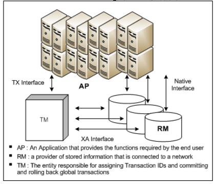
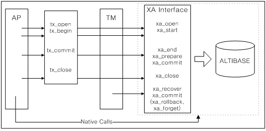
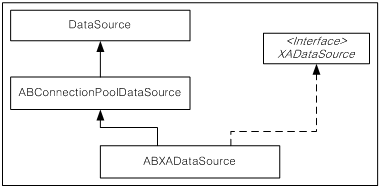

<!-- START doctoc generated TOC please keep comment here to allow auto update -->
<!-- DON'T EDIT THIS SECTION, INSTEAD RE-RUN doctoc TO UPDATE -->

- [Application Program Interface User’s Manual](#application-program-interface-users-manual)
  - [Preface](#preface)
    - [About This Manual](#about-this-manual)
  - [1.PHP Interface](#1php-interface)
    - [About the PHP Module of Altibase](#about-the-php-module-of-altibase)
    - [Installing the ODBC Manager for Integration with PHP](#installing-the-odbc-manager-for-integration-with-php)
    - [PHP Functions for ODBC Connectivity](#php-functions-for-odbc-connectivity)
  - [2.PDO Driver](#2pdo-driver)
    - [Installation and Setup](#installation-and-setup)
    - [Restrictions and Cautions](#restrictions-and-cautions)
    - [How to Use](#how-to-use)
    - [Examples](#examples)
  - [3. XA Interface](#3-xa-interface)
    - [XA Interface Overview](#xa-interface-overview)
    - [The XA Interface](#the-xa-interface)
    - [Using XA](#using-xa)
    - [Limitations when using XA](#limitations-when-using-xa)
    - [JDBC Distributed Transactions](#jdbc-distributed-transactions)
    - [How to Solve Application Problems Using XA](#how-to-solve-application-problems-using-xa)
  - [4. iLoader API](#4-iloader-api)
    - [iLoader API 개요](#iloader-api-%EA%B0%9C%EC%9A%94)
    - [Using the iLoader API](#using-the-iloader-api)
    - [iLoader API Data Structures](#iloader-api-data-structures)
    - [iLoader API](#iloader-api)
  - [5. CheckServer API](#5-checkserver-api)
    - [Overview of the CheckServer API](#overview-of-the-checkserver-api)
    - [Using the CheckServer API](#using-the-checkserver-api)
    - [CheckServer API Data Structure](#checkserver-api-data-structure)
    - [CheckServer API](#checkserver-api)

<!-- END doctoc generated TOC please keep comment here to allow auto update -->

- 

Altibase® Application Development

Application Program Interface User’s Manual
===========================================


Altibase Application Development Application Program Interface User’s Manual

Release 7.2

Copyright ⓒ 2001\~2021 Altibase Corp. All Rights Reserved.

This manual contains proprietary information of Altibase Corporation; it is provided under a license agreement containing restrictions on use and disclosure and is also protected by copyright patent and other intellectual property law. Reverse engineering of the software is prohibited. All trademarks, registered or otherwise, are the property of their respective owners.

**Altibase Corp**

10F, Daerung PostTower II, 306, Digital-ro, Guro-gu, Seoul 08378, Korea Telephone: +82-2-2082-1000 Fax: 82-2-2082-1099

Customer Service Portal: http://support.altibase.com/en/

Homepage: [[http://www.altibase.com](http://www.altibase.com/)]


Preface
----

### About This Manual

This manual describes how to use the Altibase API.

#### Audience

This manual has been prepared for the following users of Altibase:

-   Database administrators
-   Performance administrators
-   Database users
-   Application developers
-   Technical Supporters

It is recommended for those reading this manual possess the following background knowledge:

-   Basic knowledge in the use of computers, operating systems, and operating system utilities
-   Experience in using relational database and an understanding of database concepts
-   Computer programming experience
-   Experience in database server management, operating system management, or network administration

#### Organization

This manual is organized as follows:

-   Chapter 1: PHP Interface  
    This chapter explains how to integrate PHP pages with Altibase using ODBC functionality of PHP.

-   Chapter 2: PDO Driver  
    This chapter explains how to use the Altibase PDO driver to interact with Altibase. The Altibase PDO driver (pdo_altibase) is available as a pecl package from the official Altibase site.
    
-   Chapter 3: XA Interface  
    This chapter introduces the data structures and functions that are needed to use the XA functions supported by Altibase and provides basic procedures for using ODBC, APRE and JDBC in an XA environment.
    
-   Chapter 4: iLoader API  
    This chapter introduces the Altibase iLoader API, which is an application programming interface that lets you create applications that use function calls to download data from, or upload data to, an Altibase database server.
    
-   Chapter 5: CheckServer API  
    This chapter introduces the Altibase CheckServer API, which is an application programming interface for creating applications that use function calls to monitor whether the Altibase server has terminated abnormally.

#### Documentation Conventions

This section describes the conventions used in this manual. Understanding these conventions will make it easier to find information in this manual and in the other manuals in the series. 

There are two sets of conventions:

-   Syntax diagram convetions
-   Sample code conventions

##### Syntax Diagram Conventions

This manual describes command syntax using diagrams composed of the following elements:

| Elements                                                     | Meaning                                                      |
| ------------------------------------------------------------ | ------------------------------------------------------------ |
| [](https://github.com/ALTIBASE/Documents/blob/master/Manuals/Altibase_7.1/eng/media/SQL/image1.gif) | Indicates the start of a command. If a syntactic element starts with an arrow, it is not a complete command. |
| [](https://github.com/ALTIBASE/Documents/blob/master/Manuals/Altibase_7.1/eng/media/SQL/image2.gif) | Indicates that the command continues to the next line. If a syntactic element ends with this symbol, it is not a complete command. |
| [](https://github.com/ALTIBASE/Documents/blob/master/Manuals/Altibase_7.1/eng/media/SQL/image3.gif) | Indicates taht the command continues from the previous line. If a syntactic element starts witht his symbol, it is not a complete command. |
| [](https://github.com/ALTIBASE/Documents/blob/master/Manuals/Altibase_7.1/eng/media/SQL/image4.gif) | Indicates the end of a statement.                            |
| [](https://github.com/ALTIBASE/Documents/blob/master/Manuals/Altibase_7.1/eng/media/SQL/image5.gif) | Indicates a manatory element.                                |
| [](https://github.com/ALTIBASE/Documents/blob/master/Manuals/Altibase_7.1/eng/media/SQL/image6.gif) | Indicates an optional element.                               |
| [](https://github.com/ALTIBASE/Documents/blob/master/Manuals/Altibase_7.1/eng/media/SQL/image7.gif) | Indicates a mandatory element comprised of options. One, and only one, option must be specified. |
| [](https://github.com/ALTIBASE/Documents/blob/master/Manuals/Altibase_7.1/eng/media/SQL/image8.gif) | Indicates an optional element comprised of options.          |
| [](https://github.com/ALTIBASE/Documents/blob/master/Manuals/Altibase_7.1/eng/media/SQL/image9.gif) | Indicates an optional element in which multiple elements may be specified. A comman must precede all but the first element. |

##### Sample Code Conventions

The code examples explain SQL statements, stored procedures, iSQL statements, and other command line syntax.

The following table describes the printing conventions used in the code examples.

| Rules            | Meaning                                                      | Example                                                      |
| ---------------- | ------------------------------------------------------------ | ------------------------------------------------------------ |
| [ ]              | Indicates an optional item                                   | VARCHAR [(*size*)][[FIXED \|] VARIABLE]                      |
| { }              | Indicates a mandatory field for which one or more items must be selected. | { ENABLE \| DISABLE \| COMPILE }                             |
| \|               | A delimiter between optional or mandatory arguments.         | { ENABLE \| DISABLE \| COMPILE } [ ENABLE \| DISABLE \| COMPILE ] |
| . . .            | Indicates that the previous argument is repeated, or that sample code has been omitted. | SQL> SELECT ename FROM employee; ENAME ----------------------- SWNO HJNO HSCHOI . . . 20 rows selected. |
| Other Symbols    | Symbols other than those shown above are part of the actual code.Other Symbols | EXEC :p1 := 1; acc NUMBER(11,2);Symbols other than those shown above are part of the actual code. |
| Italics          | Statement elements in italics indicate variables and special values specified by the user. | SELECT * FROM *table_name*; CONNECT *userID*/*password*;     |
| Lower case words | Indicate program elements set by the user, such as table names, column names, file names, etc. | SELECT ename FROM employee;                                  |
| Upper case words | Keywords and all elements provided by the system appear in upper case. | DESC SYSTEM_.SYS_INDICES_;                                   |

#### Related Documentations

For more detailed information, please refer to the following documents.

-   Installation Guide

-   Administrator’s Manual

-   Replication Manual

-   CLI User's Manual

-   Precompiler User’s Manual

-   ODBC User's Manual

-   iSQL User’s Manual

-   Utilities Manual

-   Error Message Reference

#### Altibase Welcomes Your Comments and Feedbacks

Please let us know what you like or dislike about our manuals. To help us with better future versions of our manuals, please tell us if there is any corrections or classifications that you would find useful.

Include the following information:

- The name and version of the manual that you are using
- Any comments about the manual
- Your name, address, and phone number

If you need immediate assistance regarding any errors, omissions, and other technical issues, please contact Altibase's Support Portal (http://altibase.com/support-center/en/).

Thank you. We always welcome your feedbacks and suggestions.


1.PHP Interface
-------------

This chapter explains how to integrate PHP pages with Altibase using PHP's ODBC functionality.


### About the PHP Module of Altibase

-   The following data types are supported for use with Altibase and PHP:  
    resource, int, bool, double, float, string, array, HashTable
-   The port number in db.php, the sample program, must be changed so that it matches the port number that is actually being used on the Altibase server.


### Installing the ODBC Manager for Integration with PHP

In order to integrate Altibase with the PHP interface, the ODBC Manager must be installed. This section describes how to install the ODBC Manager in Unix, or Linux environments.

#### The ODBC Manager in Unix and Linux

In a Unix or Linux environment, complete the following steps to install the ODBC Manager:

1.  Download unixODBC.  
    It can be downloaded from the unixODBC website (http://www.unixodbc.org).

2. Install unixODBC.  
   After downloading the unixODBC source files, it is necessary to compile unixODBC. Move the source files to the desired location and run the following commands from a command prompt:
   
```
   ./configure -prefix=설치경로 -enable-gui=no -–enable-drivers=no
   make
   make install
```


3. Configure the unixODBC environment.  

A. Set the value of the ODBCSYSINI environment variable to the home directory path of the Altibase installation account.

```
export ODBCSYSINI=~
```

4. Add an environment variable indicating the path where the unixODBC Driver Manager is installed, as shown below. Depending on the platform and whether the OS is a 32-bit or 64-bit OS, the library path will be one of LD_LIBRARY_PATH, LD_LIBRARY_PATH_64 or SHLIB_PATH.  

In the following example, unixODBC is installed at /usr/local/odbcDriverManager32 or /usr/local/odbcDriverManager64.

```
export LD_LIBRARY_PATH= /usr/local/odbcDriverManager32/lib:\$LD_LIBRARY_PATH
export LD_LIBRARY_PATH_64= /usr/local/odbcDriverManager64/lib:\$LD_LIBRARY_PATH_64
```

5. Create the following two files in the $ODBCSYSINI path: 

```
odbc.ini  
odbcinst.ini
```


6. odbcinst.ini must be an empty file having a size of 0 bytes. 

7. In odbc.ini, specify the DSN name, the path and directory where the ODBC driver of Altibase is installed, and the server address and port number.

```
   [Altibase]
   Driver = /home/altibase/altibase_home/lib/libaltibase_odbc.so
   Server = 127.0.0.1
   Port = 20300
```


### PHP Functions for ODBC Connectivity

Altibase supports all standard ODBC functions, and thus all ODBC functions that are typically used in PHP pages can be used with Altibase without any special considerations. 

For a detailed explanation of the ODBC functions that can be used with PHP, please refer to the official PHP online documentation, which can be found at: http://php.morva.net/manual/en/index.php

#### Sample Test

```
<?
// SYSTEM DSN, USER_ID, USER_PASSWORD
$conn = odbc_connect("Altibase", "SYS", "MANAGER");

if ($conn)
{
    // direct-execution
    echo "now, i create table t1 (id integer, name char(20)<br>";
    odbc_exec($conn, "drop table t1");
    odbc_exec($conn, "create table t1 (id integer, name char(20))");

    // prepare-execution 
    echo "now, i insert into t1 value (100, Lee)<br>";
    $stmt = odbc_prepare ($conn, "insert into t1 values (?, ?)");
    $Insert = array (100, "Lee");
    if (!odbc_execute($stmt, &$Insert))
    {
        echo ("error");
    }

    // single-selection
    $res = odbc_do ($conn, "select id, name, sysdate from T1");
    odbc_fetch_row ($res);
    $ID = odbc_result($res, 1);
    $NAME = odbc_result($res, 2);
    $DATE = odbc_result($res, 3);
    echo ("id = $ID , name = $NAME datetime = $DATE <br>"); 
    odbc_close($conn);
}
?>
```


2.PDO Driver
------------

This chapter describes how to use the Altibase PDO driver to interact with Altibase.

The Altibase PDO driver (pdo_altibase) is available as a pecl package from the official Altibase site. The pdo_altibase was developed using the Altibase CLI driver, so the CLI must be installed to use pdo_altibase. It is also affected by the environment variables used by the CLI.


### Installation and Setup

Here we describes how to download and install pdo_altibase and set environment.

#### Download

To use pdo_altibase, you have to use pecl environment. Download the pecl package from the url below.

1.  Go to <http://support.altibase.com/en/product> 

2.  Download PDO_ALTIBASE-1.*.*.tgz

```
Software requirements
```

-   Altibase : Altibase 6.5.1.5.1 or later

-   OS : Linux (Refer the Altibase Release Notes for a detailed version.)

-   PHP : PHP 5.3.3, PHP 7.1.20

#### Installation

Install pdo_altibase using pecl.

```
pecl install PDO_ALTIBASE-1.0.0.tgz
```

#### Environment Setup

Add extension usage settings to the configuration file such as php.ini.

```
extension=pdo_altibase.so
```


### Restrictions and Cautions

#### Restrictions

1.  pdo_altibase can not be used with pdo_odbc at the same time. Enabling both extensions can cause unexpected errors.
2.  The following items in the PDO manual are not supported:

- PDO::lastInsertId
- PDO::getAttribute, PDO::setAttribute
  - PDO::ATTR_CONNECTION_STATUS
  - PDO::ATTR_ORACLE_NULLS
  - PDO::ATTR_PERSISTENT
  - PDO::ATTR_SERVER_INFO
  - PDO::ATTR_STRINGIFY_FETCHES
  - PDO::ATTR_EMULATE_PREPARES
  - PDO::MYSQL_ATTR_USE_BUFFERED_QUERY
- PDOStatement::getAttribute, PDOStatement::setAttribute
  - PDO::ATTR_CURSOR_NAME
- PDOStatement::getColumnMeta

3. For other restrictions, refer to parameter bindings, column bindings, and other binding constraints..

#### Cautions

1.  The default commit mode for pdo_altibase is independent of the server's configuration and is always autocommit. In other words, even if the default server is set to non-autocommit, the commit mode is autocommit by default.
2.  When closing a pdo object, the task is rolled back unless commit or rollback is specified explicitly.
3.  When binding an empty string ('') to numeric data types in Altibase DB, for both native types (double, real, bigint, integer, smallint) and non-native types (numeric, decimal, number, float) are entered as NULL
4.  "Date type value-?" In the query "ERR-21038: Literals in the input do not match the format string." An error occurs. In this case, the date type value includes a date type column and a date type return function.This error occurs because pdo_altibase internally treats strings as numeric values when the Altibase query processor attempts to convert strings to date types when string subtraction is performed on date type values. In this case, replace "?" With "to_number (?)" and etc can be changed explicitly to have a data type other than string.


### How to Use

#### DSN Configuration

The DSN configuration of pdo_altibase is as follows.

| Attribute  | Description                                                  |
| ---------- | ------------------------------------------------------------ |
| DSN prefix | “altibase”                                                   |
| Server     | Host name or IP address                                      |
| Port       | Server port number                                           |
| NLS_USE    | Character set. <br />US7ASCII is the default and the specified value is used when the environment variable ALTIBASE_NLS_USE is set. |

##### Example

```
"altibase:Server=127.0.0.1;Port=20333;NLS_USE=US7ASCII"
```

#### Connection Attributes

The following properties are available for PDO :: getAttribute () and PDO :: setAttribute (). See "Restrictions and Cautions" for attributes that are not available.

| Property ID                   | Description                                                  |
| ----------------------------- | ------------------------------------------------------------ |
| PDO::ALTIBASE_DATE_FORMAT     | The format to use for representing DATE. Refer to “Changing the DATE Format”. |
| PDO::ALTIBASE_EXPLAIN_PLAN    | Whether or not to get a plan of action.<br/>PDO :: ALTIBASE_EXPLAIN_PLAN_OFF: Do not get a plan of action.  <br />PDO :: ALTIBASE_EXPLAIN_PLAN_ON: Obtain the determined performance plan after Prepare and Execution.<br />PDO :: ALTIBASE_EXPLAIN_PLAN_ONLY: After Prepare Obtain the execution plan determined before Execution. <br />For more information, see Using Samples> Checking Action Plans. |
| PDO::ALTIBASE_DEFER_PROTOCOLS | Prepare and execute the call repeatedly to set the protocol optimization to improve the performance of the program written.   <br />To use this attribute, one connection object should not be shared by multiple threads.  <br />Also, for performance, you need to write a program with a structure that calls prepare once and then calls execute repeatedly.  <br />0 : Do not optimize the protocol (default)   <br />1 : execute related protocol optimization  <br />2 :   execute, close Related protocol optimization  <br /><br /> ex>   $db->setAttribute(PDO::ALTIBASE_DEFER_PROTOCOLS, 1); |

#### Parameter Binding

pdo_altibase does not support named parameters.

The fourth argument, length, is used only for the current hint and is not treated as a valid value. If length is required, it should be truncated instead of the length argument.

##### Binding Example

```
$stmt = $db->prepare("SELECT * FROM t1 WHERE val = ? OR val = ?");
$stmt->bindParam(1, $val1);
$stmt->bindParam(2, $val2);
$stmt->execute();
```


#### Column Binding

pdo_altibase does not affect the behavior if you specify type and maxlen of bindColumn (). 

Depending on the SQL data type, the value is taken as a binary or string, and the processing follows the PDO operation.

#### Other Binding Constraints

BIT, VARBIT, BYTE, VARBYTE, NIBBLE, LOB, and GEOMETRY types are limited. It is limited to a few queries such as simple INSERT.


### Examples

#### Connection Setup and Query Execution

```
$db = new PDO("altibase:Server=127.0.0.1;Port=20333", "sys", "manager");
foreach ($db->query("SELECT * FROM dual") as $row) {
    print_r($row);
}
```


#### DATE Format Setup 

The user can set which string format to use as the default for DATE.

```
$db->setAttribute(PDO::ALTIBASE_DATE_FORMAT, "YYYY-MM-DD");
$attr_dateform = $db->getAttribute(PDO::ALTIBASE_DATE_FORMAT);
echo "attr_dateform = $attr_dateform\n";
$stmt->execute();
echo $stmt->fetchColumn(), "\n";
```


##### Output Result

```
attr_dateform = YYYY-MM-DD
2017-04-18
```


#### Execution Plan Check

The PDO object's setAttribute () function can be used to set whether or not to execute the plan.

```
$attr_plan = $db->getAttribute(PDO::ALTIBASE_EXPLAIN_PLAN);
echo "attr_plan = $attr_plan\n";
 
$db->setAttribute(PDO::ALTIBASE_EXPLAIN_PLAN, PDO::ALTIBASE_EXPLAIN_PLAN_ONLY);
$attr_plan = $db->getAttribute(PDO::ALTIBASE_EXPLAIN_PLAN);
echo "attr_plan = $attr_plan\n";
$stmt = $db->prepare("SELECT * FROM dual");
$stmt->execute();
print_r($stmt->fetchAll());
echo $stmt->getPlanText();
$stmt = null;
$db->setAttribute(PDO::ALTIBASE_EXPLAIN_PLAN, PDO::ALTIBASE_EXPLAIN_PLAN_ON);
$attr_plan = $db->getAttribute(PDO::ALTIBASE_EXPLAIN_PLAN);
echo "attr_plan = $attr_plan\n";
$stmt = $db->prepare("SELECT * FROM dual");
$stmt->execute();
print_r($stmt->fetchAll());
echo $stmt->getPlanText();
$stmt = null;
```


##### Output Result

```
attr_plan = 0
attr_plan = 2
Array
(
    [0] => Array
        (
            [dummy] => X
            [0] => X
        )
)
------------------------------------------------------------
PROJECT ( COLUMN_COUNT: 1, TUPLE_SIZE: 3, COST: 0.01 )
 SCAN ( TABLE: DUAL, FULL SCAN, ACCESS: ??, COST: 0.01 )
------------------------------------------------------------
attr_plan = 1
Array
(
    [0] => Array
        (
            [dummy] => X
            [0] => X
        )
)
------------------------------------------------------------
PROJECT ( COLUMN_COUNT: 1, TUPLE_SIZE: 3, COST: 0.01 )
 SCAN ( TABLE: DUAL, FULL SCAN, ACCESS: 1, COST: 0.01 )
------------------------------------------------------------
```


#### Cursor Holding

Executiong Commit and Rollback command will still maintain the cursor being fetched.

```
// AUTOCOMMIT attribute must be false to use HOLD
$db->setAttribute(PDO::ATTR_AUTOCOMMIT, false);
 
// HOLD attribute should be given when preparing
$stmt_sel = $db->prepare("SELECT * FROM pdo_hold", array(PDO::ALTIBASE_CURSOR_HOLD => PDO::ALTIBASE_CURSOR_HOLD_ON));
$stmt_del = $db->prepare("DELETE pdo_hold WHERE id = ?");
 
// TODO
 
// To replace AUTOCOMMIT you need to clean up all stmt
unset($stmt_sel);
unset($stmt_del);
$db->setAttribute(PDO::ATTR_AUTOCOMMIT, true);
```


## 3. XA Interface

This chapter explains the general concept of distributed transactions, introduces the XA standard, and describes the XA interface.

 It explains how to use a global transaction manager to access Altibase via ODBC, JDBC and APRE, and specifies the support for the XA within Altibase. It also describes the limitations of the XA distributed transaction processing model and how to deal with problems that can arise in applications.


### XA Interface Overview

XA is a standard interface that is used for processing distributed transactions (also known as “global transactions”). It was proposed by The Open Group (formerly X/Open).

A distributed transaction (also known as a “global transaction”) is a transaction that spans two or more nodes connected via a network. The database systems provide the resources for the transaction, while a TM (Transaction Manager) creates and manages the global transaction, which oversees all operations performed on these resources. The XA standard thus enables distributed applications to share resources provided by multiple database servers, and makes global transactions possible.

XA is a useful construct for applications that process transactions in one or more databases.

#### XA Related Glossary

-   Application (AP)  
    An application defines the necessary transactions and the operations that constitute a transaction. An application can be written using, for example, the precompiler or the ODBC CLI.
    
-   Global Transaction  
    This refers to multiple transactions that are managed as a single transaction by a TM. It is essentially a distributed transaction.

-   Heuristic Completion  
    In some situations, when an RM does not receive an expected command pertaining to an in-doubt transaction, such as a COMMIT command or the like, the RM proceeds to commit or roll back the transaction of its own accord. Completion of transactions in this way is referred to as “Heuristic Commit” or “Heuristic Rollback”, or collectively as “Heuristic Completion”. Typical causes are network failure and transaction timeouts.
    
-   In-doubt Transaction  
    An “in-doubt transaction” is a transaction branch that has been prepared on a RM (i.e. DBMS) and for which a commit or rollback message has not yet been received. It is also known as a “pending transaction”.
    
-   Resource Manager (RM)  
    A Resource Manager (RM) controls a resource that is accessed by a XA transaction. It must be possible to restore the resource to its original state in the event of a failure. A RM can be, for example, a relational database, a transactional queue, or a file system.
    
-   Transaction Branch  
    A transaction branch is essentially a sub-transaction that is part of the global transaction. It is executed on one of the Resource Managers (see above) participating in the global transaction. There is a one-to-one relationship between a transaction branch and a so-called “XID” (i.e. a Transaction ID in XA parlance).
    
-   Transaction Manager (TM)  
    A transaction manager provides an API that defines a transaction. It is responsible for committing and rolling back transactions and performing recovery. The TM has a two-phase commit engine to ensure that all of the RMs are consistent with each other.
    
-   Transaction Processing Monitor (TPM)  
    A Transaction Processing Monitor (TPM) coordinates the flow of transaction requests from one or more APs (see above) for resources managed by one or more RMs (see above). The RMs can be heterogeneous, and can be distributed across a network.  
    The TPM completes distributed transactions by coordinating commit and rollback operations. The TM portion of the TPM is responsible for determining the timing of distributed commit and rollback operations, that is, the TPM is responsible for controlling two-phase commit.  
    Because the TM manages distributed commit and rollback operations, it must be aware of, and able to communicate directly with, all RMs. The TM uses the XA interface for this. In the case of Altibase, the TM uses XA library functions of Altibase to control transaction processing by Altibase.
    
-   TX Interface  
    An AP (see above) controls a transaction through the TM using the TX interface. An AP does not use the XA interface directly. APs are not aware of the operations of individual transaction branches, and application threads do not participate directly in transaction branch tasks. The branches of a global transaction are managed on behalf of APs by the TM. APs merely request the TM to commit or roll back entire global transactions.

#### XA Structure

As shown in the following diagram, the entities involved in a distributed transaction include one or more APs (Applications), the TM (Transaction Manager), and one or more RMs (Resource Managers).



[Figure 4-1] XA Structure

If an AP announces the start of a distributed transaction to the TM using TX interface, the TM determines which RMs (databases) are involved in the distributed transaction. The TM internally generates XIDs to identify the transaction branches that are to be executed in respective RMs, and then calls XA interface with the XIDs to the RMs. 

The RMs (i.e. database nodes) then start to process the transaction branches corresponding to the respective XIDs. 

To terminate the transaction, the AP calls the TM via the TX interface. The TM then uses the XA interface to instruct the RMs on which the branches of the distributed transaction are running to either commit or roll back their respective transaction branches.

#### XA and 2PC (Two-Phase Commit)

The XA Interface of Altibase supports 2PC (Two-Phase Commit) transaction processing. Two-phase commit consists of separate prepare and commit steps.

In the prepare step, which is the first step of 2PC, the TM queries all database nodes (RMs) participating in a distributed transaction to determine whether it is possible to commit the transaction. If an individual RM is able to commit the transaction branch that has been assigned to it, it sends a message to the TM indicating that it is in a “prepare” state. If, however, an RM is not able to commit its transaction branch, it sends a corresponding message to the TM so that the transaction can be rolled back. 

In the commit step, which is the second step of 2PC, the TM waits until it has received “prepare” acknowledgements from all RMs. If it receives such acknowledgements from all RMs, it sends an instruction to all RMs to commit the transaction. However, if there is even one RM that has not sent a “prepare” acknowledgement, the TM sends an instruction to all RMs to roll back the transaction.

####  xa_switch_t Structure

Every RM has a switch that contains various information about the RM, including its entry points. This information is used by the TM. The structure of an RM's switch is known as xa_switch_t. 

In Altibase, the name of the xa_switch_t is altibase_xa_switch. Its structure is as follows:

```
struct xa_switch_t {
    char name[RMNAMESZ];   /* name of resource manager */
    long flags;              /* resource manager specific options */
    long version;               
   
    int (*xa_open_entry)(/*_ char *, int, long _*/); /*xa_open fn pointer*/
    int  (*xa_close_entry)(/*_ char *, int, long _*/); /*xa_close fn pointer*/
    int  (*xa_start_entry)(/*_ XID *, int, long _*/); /*xa_start fn pointer*/
    int  (*xa_end_entry)(/*_ XID *, int, long _*/); /*xa_end fn pointer*/
    int  (*xa_rollback_entry)(/*_ XID *, int, long _*/); /*xa_rollback fn pointer*/
    int  (*xa_prepare_entry)(/*_ XID *, int, long _*/); /*xa_prepare fn pointer*/
    int  (*xa_commit_entry)(/*_ XID *, int, long _*/); /*xa_commit fn pointer*/
    int  (*xa_recover_entry)(/*_ XID *, long, int, long _*/); /*xa_recover fn pointer*/
    int  (*xa_forget_entry)(/*_ XID *, int, long _*/); /*xa_forget fn pointer*/
    int  (*xa_complete_entry)(/*_ int *, int *, int, long _*/); /*xa_complete fn pointer*/
};
```


#### The XA Library

No additional library is required in order for applications to connect to Altibase using the Altibase XA. The required functionality is included in the odbccli library. All that is needed in order to use the XA-related functionality with Altibase is to link the XA-dependent applications with the libodbccli.a library file.


### The XA Interface

The XA Interface is the two-way interface that sits between the TM and the RMs. This interface consists of xa_ routines, which the TM uses to control RMs so that it can execute global transactions, and ax_ routines, which allow the RMs to make requests to the TM.

Note: Because Altibase does not support dynamic registration, each RM (Altibase database) must be called with xa_start before the start of a transaction.

#### XA Functions

In Altibase, the XA-related functions are provided in altibase_xa_switch, which is Altibase's implementation of xa_switch_t

| XA Interface | Description                                                  |
| ------------ | ------------------------------------------------------------ |
| xa_open      | This is used to connect to an RM.                            |
| xa_close     | This is used to close a connection with an RM.               |
| xa_start     | This is used to start a new transaction branch or restart an existing one, and to link the branch to a given XID. |
| xa_end       | This is used to end an association with a transaction branch. |
| xa_rollback  | This is used to roll back a transaction branch corresponding to a given XID. |
| xa_prepare   | This is used to prepare a transaction branch to be committed. |
| xa_commit    | This is used to commit a transaction branch.                 |
| xa_recover   | This is used to show a list of XIDs corresponding to transactions that have been prepared, heuristically committed, or heuristically rolled back. |
| xa_forget    | This is used to instruct an RM to discard information about a heuristically completed transaction branch. |

[Table 4‑1] XA Interface

##### xa_open

This is used to connect to an RM. 

```
int xa_open(char *xa_info, int rmid, long flags);
```

xa_info is a null-terminated character string that contains information about the server. Its maximum length is 256 bytes. It has the same format as the parameters to the SQLDriverConnect function, and has the additional parameters XA_NAME and XA_LOG_DIR. For detailed information about the other parameters, please refer to the description of the SQLDriverConnect function in the *CLI User's Manual*.


```
NAME=value;NAME=value;NAME=value;…
```

Ex) DSN=127.0.0.1;UID=SYS;PWD=MANAGER ;XA_NAME=conn1

| XA Parameter | Description                                                  |
| ------------ | ------------------------------------------------------------ |
| XA_NAME      | Name used as the identifier for a connection in Altibase Embedded SQL programs. If you omit this value when writing the application with Altibase Embedded SQL, the default connection is used. If a name is specified in the XA_NAME attribute, this name can be used in the AT clause when executing the SQL statement. |
| XA_LOG_DIR   | This is used to specify the directory in which information about Altibase XA library errors is logged. If the \$ALTIBASE_HOME environment variable has been set, then the default value of XA_LOG_DIR is ​\$ALTIBASE_HOME/trc. If $ALTIBASE_HOME has not been set, the default is the current directory. |

[Table 4-2] Additional XA Interface Parameters

rmid is used to specify an identifier for the server to be accessed. This can be set to any arbitrary value. 

If flags is not set to any other value, it must be set to the following value:

-   TMNOFLAGS

##### xa_close

This terminate the connection with the specified RM.

```
int xa_close(char *xa_info, int rmid, long flags);
```

xa_info is a null-terminated character string that contains information about the server. Its maximum length is 256 bytes.

Note: XA_OK is returned even if xa_close is executed on a connection that is already closed. flags has no specific purpose in this function, and must be set to the following value: 

-   TMNOFLAGS

##### xa_start

This is used to start the execution of a transaction branch. XID is the identifier of a global transaction. 

```
int xa_start(XID *xid, int rmid, long flags);
```

flags can be set to one or more of the following values.

-   TMRESUME  
    This is used to resume execution of a previously suspended transaction branch. 

-   TMNOWAIT  
    If the execution of xa_start is blocked, this specifies that XA_RETRY is to be returned without waiting.

-   TMASYNC  
    This specifies that the transaction branch is to be executed in asynchronous mode (not supported in Altibase).

-   TMNOFLAGS  
    If flags is not set to any other value, it must be set to this value.

-   TMJOIN  
    This specifies that the transaction branch is to be connected to an existing transaction branch.

##### xa_end

This is used to terminate the execution of a transaction branch. 

```
int xa_end(XID *xid, int rmid, long flags);
```

flags can be set to one or more of the following values:

-   TMSUSPEND  
    This specifies that execution of the transaction branch is to be merely suspended, rather than permanently terminated. Execution of this transaction branch can be resumed later using xa_start with the TMRESUME flag.
    
-   TMSUCCESS  
    This is used to specify successful termination of a transaction branch. It can't be used together with TMSUSPEND or TMFAIL.
    
-   TMFAIL  
    This is used to specify abnormal termination of a transaction branch. The status of the transaction branch becomes “rollback only”. It can't be used together with TMSUSPEND or TMSUCCESS.

##### xa_rollback

This is used to roll back the operations performed by the transaction branch. 

```
int xa_rollback(XID *xid, int rmid, long flags);
```

flags can be set to one of the following values:

-   TMASYNC  
    This specifies that the transaction branch is to be rolled back in asynchronous mode (not supported in Altibase).

-   TMNOFLAGS  
    If flags is not set to TMASYNC, it must be set to this value.

##### xa_prepare

When using the two-phase commit protocol, this is executed before committing or rolling back a transaction

```
int xa_prepare(XID *xid, int rmid, long flags);
```

flags can be set to one of the following values:

-   TMASYNC  
    (not supported in Altibase)

-   TMNOFLAGS  
    If flags is not set to TMASYNC, it must be set to this value.

xa_prepare can return the following values:

-   XA_RDONLY  
    This is returned when the transaction doesn't change any of the data on the RM (i.e. DBMS). The transaction does not need to be committed or rolled back
    
-   XA_OK  
    This is returned when the prepare task is performed normally

##### xa_commit

This is used to commit a particular transaction branch. 

```
int xa_commit(XID *xid, int rmid, long flags);
```

flags can be set to either of the following values:

-   TMONEPHASE  
    This is set to specify one-phase commit.

-   TMNOFLAGS  
    If flags is not set to any other value, it must be set to this value.

##### xa_recover

This obtains a list of the XIDs corresponding to branch transactions that are in a prepared state on an Altibase server. 

```
int xa_recover(XID *xids, long count, int rmid, long flags);
```

The return value indicates the number of XIDs that were recovered. The count parameter is used to set the maximum number of XIDs that fit into the xids array. 

flags can be set to one or more of the following values:

-   TMSTARTRSCAN  
    For more information, please refer to the XA Specification documentation.

-   TMENDRSCAN  
    For more information, please refer to the XA Specification documentation.

-   TMNOFLAGS  
    XIDs are returned starting at the current cursor position.

##### xa_forget

This instructs the Altibase server (i.e. the RM) to stop managing a heuristically completed transaction branch. 

```
int xa_forget(XID * xid, int rmid, long flags);
```

flags can be set to the following value:

-   TMNOFLAGS  
    Always set to specify this value.

##### xa_complete

When operating in asynchronous mode, this is used to determine whether to keep waiting for an operation to terminate. This is not supported in Altibase, and thus an error will always be returned.


### Using XA

This section describes the basic procedures for using ODBC, APRE and JDBC in an XA environment.

#### ODBC/XA execution order

1.  xa_open  
    Connect to the specified server.
2.  SQLAllocHandle  
    Create a connection and environment handle to connect to ODBC.
3.  SQLSetConnectAttr  
    Connect the XA connection to the connection handle.
4.  SQLConnect  
    Since the actual connection was made with xa_open, this call does not make a new connection. However, SQLConnect changes the internal state of the connection in ODBC. If this step is omitted, DML operations cannot be performed.
5.  xa_start  
    Start a transaction branch that corresponds to a specific XID.
6.  executing SQL statements  
    Performs operations such as SQLPrepare and SQLExecute. If  the commit statement is executed here, the server returns an error message.
7.  xa_end  
    Terminate the transaction branch.
8.  xa_prepare  
    Prepare to commit.
9.  xa_commit  
    Commit the transaction.
10.  SQLDisconnect  
      In ODBC, change the internal state of the connection to unconnected. However, the connection created by the actual XA is retained.
11.  xa_close  
    Terminate xa connection.

##### SQLSetConnectAttr

Calling SQLSetConnectAttr enables an XA connection to use an ODBC connection, so that an application can access a distributed transaction via ODBC. 

The following parameters are provided to enable an XA connection to be configured using SQLSetConnectAttr:

```
SQLRETURN SQLSetConnectAttr (SQLHDBC hdbc,  
SQLINTEGER fAttr,  
SQLPOINTER vParam,  
SQLINTEGER sLen);
```


-   fAttr = ALTIBASE_XA_RMID  
    Setting the fAttr parameter to ALTIBASE_XA_RMID enables the connection specified using the hdbc parameter to use a specified XA connection. Detailed information about the XA connection is set by specifying a pointer for the vParam parameter, which is described below.
    
-   vParam  
    This must be set to the rmid value that was specified when a connection was established.  
    fAttr = SQL_ATTR_ENLIST_IN_XA  
    Make the specified hdbc connection the last XA connection.

#### Embedded SQL

##### How to Author an Application depending on the Setting of XA_NAME in xa_open

In XA applications, a cursor is valid only for a single transaction. This means that a cursor must be opened after the start of execution of a transaction, and must be closed before the transaction is completed (i.e. committed or rolled back).

###### How to Author an Application when Using the Default Connection

If it is desired to use the default connection, the XA_NAME keyword must not be present in xa_info, which is the character string parameter of xa_open that contains the connection information. An example of xa_info without XA_NAME is shown below:

```
DSN=127.0.0.1;UID=SYS;PWD=MANAGER
```

It is therefore not possible to use the AT clause when executing SQL queries. The following query is acceptable because it does not contain an AT clause:

```
EXEC SQL UPDATE emp SET empno = 5;
```


###### How to Author an Application when Using XA_NAME to Specify One or More Connections

If it is desired to specify a connection when using APRE to author an application, the XA_NAME keyword and a corresponding value must be present in the xa_info connection character string parameter of xa_open. 

It is possible to write an application that uses a default connection and one or more additional connections specified using XA_NAME. This is accomplished as shown below.

If, for example, the names of the connections specified using XA_NAME are conn1 and conn2, the value of open_string in the TM (Transaction Manager) environment settings would be as follows:

```
DSN=127.0.0.1;UID=SYS;PWD=MANAGER;XA_NAME=conn1
DSN=127.0.0.1;UID=SYS;PWD=MANAGER;XA_NAME=conn2
DSN=127.0.0.1;UID=SYS;PWD=MANAGER
```

This permits the application to execute SQL statements that contain the AT clause, thereby accessing multiple servers, as shown below: 

```
EXEC SQL AT conn1 UPDATE emp SET empno = 5;
EXEC SQL AT conn2 UPDATE emp SET empno = 5;
EXEC SQL UPDATE emp SET empno = 5;
```


#### Executing JDBC/XA

The XA classes that are defined by the jdbc driver of Altibase are as shown below:

```
Altibase.jdbc.driver.AltibaseXADataSource
Altibase.jdbc.driver.AltibaseXAResource
Altibase.jdbc.driver.AltibaseXID
```

The AltibaseXADataSource class is the only one that the user accesses directly. The user does not need to directly access the other classes, as they are implemented in the JTA interface class.

1. . Create an AltibaseXADataSource Object

   ```
   AltibaseXADataSource xaDataSource = new AltibaseXADataSource();
   xaDataSource.setUrl(args[0]);
   xaDataSource.setUser("SYS");
   xaDataSource.setPassword("MANAGER");
   ```


2. Create an XAConnection Object  
   Create an XAConnection object by calling the getXAConnection method in the XADataSource class.
   
```
   XAConnection xaConnection = xaDataSource.getXAConnection(“SYS”, “MANAGER:”);
```

3. Create an XAResource Object  
   Create an XAResource object by calling the getXAResource method in the XAConnection class.

   ```
   XAResource xaResource = xaConnection.getXaResource();
   ```


4. Create a Connection Object  
   Create a connection object to use for executing SQL statements by calling the getConnection method in the XAConnection class.
   
```
   Connection conn1 = xaConnection.getConnection();
```

5. Use the XAResource Object to Execute XA Functions  
   XA functions such as xa_start and xa_end can be executed using the methods in the XAResource class.
   
```
   xaResource.start(AltibaseXID, XAResource.TMNOFLAGS);
```

6. Execute SQL Statements using the Connection Object

   ```
   Statement stmt = conn.createStatement();
   int cnt = stmt.executeUpdate("insert into t1 values (4321)");
   ```


#### XA Transaction Control

This section describes how to control transactions in an Altibase XA environment. 

When using the XA library, the SQL COMMIT and ROLLBACK statements are not used to commit and roll back transactions. Instead, the users must use the TX interface that is provided by the TM in application programs, as shown below.

The TM typically controls a transaction using the XA interface.

| TX Interface | Description                                 |
| ------------ | ------------------------------------------- |
| tx_open      | This logs on to an RM.                      |
| tx_close     | This logs off from an RM.                   |
| tx_begin     | This starts execution of a new transaction. |
| tx_commit    | This commits a transaction.                 |
| tx_rollback  | This rolls back a transaction.              |

[Table 4-3] The TX Interface

The process of calling the TX and XA interfaces is as shown in the following diagram:



[Figure 4-2] The Process of Calling TX and XA Interfaces

A TPM (Transaction Processing Monitor) application has a client/server structure in which a client requests a service provided by an application server. Service is divided into logical work units. When Altibase is used as the RM, a logical work unit typically consists of a set of SQL statements. 

##### Example

In the following example, it is assumed that the application server has already logged on to the TPM system.

###### Starting a Transaction on an Application Server

The following example shows the start of a transaction on an application server.

```
Client:
tpm_service(“SERVICE1”);

Server:
SERVICE1()
{
<get service specific data>
tx_begin();
EXEC SQL UPDATE....;
tpm_service(“SERVICE2”);
tx_commit();
<return service status back to the client>
}
```


###### Starting a Transaction on a Client

The following example shows the start of a transaction on a client.

```
Client:
tx_begin();
tpm_service(“SERVICE1”);
tmp_service(“SERVICE2”);
tx_commit();

Server:
SERVICE1()
{
<get service specific data>
EXEC SQL UPDATE...;
<return service status back to the client>
}
SERVICE2()
{
<get service specific data>
EXEC SQL UPDATE...;
<return service status back to the client>
}
```


#### Changing an Existing Application into a TPM Application

To change an existing application (Precompiler or ODBCCLI application) into a TPM (Transaction Processing Monitor) application that uses the XA library of Altibase, follow the procedure outlined below:

1.  Convert the application into one that incorporates a “service” framework. Here, the term “framework” means one in which a client requests a service from an application server. In some TPMs, the tx_open and tx_close functions must be explicitly called, while in other TPMs, the logging on and off takes place implicitly.
2.  General connection statements must be changed into a TPM-compatible form. For example, when working with APRE, replace the EXEC SQL CONNECT statement with a call to tx_open, and when working with ODBCCLI, replace the SQLDriverConnect statement with calls to both tx_open and SQLConnect. The ODBCCLI SQLDriverConnect statement must be replaced by both tx_open and SQLConnect. Although the actual connection is achieved using tx_open, the SQLConnect task is necessary in order for it to be possible to make a connection internally within ODBC. For more detailed information, please refer to Executing ODBC/XA, which outlines the required tasks in sequence.
  
3.  Disconnection statements must also be changed into a TPM-compatible form. Replace the EXEC SQL DISCONNECT statement (when working with APRE) or the SQLDisconnect statement (when working with ODBCCLI) with a call to tx_close ().
4.  Commit and rollback statements must also be changed into a TPM-compatible form. When working with APRE, replace the EXEC SQL COMMIT statement with a call to tx_commit and the EXEC SQL ROLLBACK statement with a call to tx_rollback. When working with ODBCCLI, replace the SQLEndTran statement with a call to either tx_commit or tx_rollback, as appropriate. Use tx_begin to initiate the execution of a transaction.
5.  Before terminating a transaction, the application must exit the state in which it is ready to fetch records. That is, after fetching data using a cursor and before ending the transaction, the CLOSE RELEASE statement must be used to close the cursor and free all associated resources.

| Altibase Statement                   | TPM Functions                            |
| ------------------------------------ | ---------------------------------------- |
| CONNECT                              | tx_open                                  |
| Implicit commencement of transaciton | tx_begin                                 |
| SQL                                  | Service that executes the SQL statements |
| COMMIT                               | tx_commit                                |
| ROLLBACK                             | tx_rollback                              |
| DISCONNECT                           | tx_close                                 |
| SET TRANSACTION READ ONLY            | Not allowed                              |


### Limitations when using XA

The use of XA is limited in the following ways: 

-   Limitations when using XA

-   Limitations related to Transaction Branches

-   No Support for Association Migration

-   No Support for Asynchronous Calls

-   No Support for Dynamic Registration

-   Server shutdown

#### Limitations on Use of SQL

##### Rollback and Commit

Because global transactions are managed by the TM, the Altibase transaction control statements COMMIT and ROLLBACK must not be used within an XA application to control global transactions.

Instead, tx_commit and tx_rollback must be used to complete global transactions. This means that the EXEC SQL ROLLBACK and EXEC SQL COMMIT statements can't be used within applications authored using APRE. Similarly, SQLEndTran can't be used within an ODBCCLI application to commit or roll back a transaction.

##### DDL Statements

Because DDL SQL statements are implicitly committed, they can't be used within XA applications of Altibase.

##### AUTOCOMMIT Session Property

Because global transactions execute in non-autocommit mode, the AUTOCOMMIT property can't be changed using the ALTER SESSION SET AUTOCOMMIT = TRUE statement.

##### SET TRANSACTION

The Altibase SET TRANSACTION { READ ONLY | READ WRITE | ISOLATION LEVEL ... } data control statement can't be used within an XA application of Altibase.

##### Connection or Disconnection with EXEC SQL Statements

The EXEC SQL CONNECT and EXEC SQL DISCONNECT statements can't be used to establish or terminate connections in applications authored using APRE. 

#### Limitations related to Transaction Branches

Multiple application threads participate in the execution of a single global transaction. These threads have either *tightly-coupled* or *loosely-coupled* relationship between them.

Threads that have a tightly-coupled relationship share a common resource. In addition, an RM handles a pair of coupled threads as a single entity. The RM must ensure that tightly-coupled threads do not reach a resource deadlock in a transaction branch. However, there is no need to provide this guarantee for loosely-coupled threads. The RM handles loosely-coupled transaction branches as though they were different global transactions.

##### Relationship between XID and Thread 

If the TM assigns a new XID (branch qualifier) to a thread, this thread has a loosely-coupled relationship with the other threads in the same branch. The RM handles this thread as though it were a separate global transaction.

In contrast, if the TM joins a branch with an XID, that is, assigns an existing XID (branch qualifier) to a thread, the thread has a tightly-coupled relationship with the other threads sharing this branch. The RM regards tightly-coupled threads as one object, and must guarantee that a resource deadlock does not occur between tightly-coupled threads.

#### No Support for Association Migration

Association migration (in which the TM associates a suspended branch with another branch and resumes its execution) is not supported in Altibase.

#### No Support for Asynchronous Calls

Asynchronous XA calls are not supported in XA applications of Altibase.

#### No Support for Dynamic Registration

The Altibase server does not support dynamic registration. Only static registration is supported. In so-called “dynamic registration”, an RM registers a global transaction with the TM before it starts executing a transaction branch.

In static registration, it is necessary to use xa_start to tell an RM that a transaction has commenced.

#### Server Shutdown

Suppose that the server terminates abnormally or that the shutdown abort command is executed on the server, and that there are one or more transactions that are in a prepared state at that time. When the server is subsequently restarted, recovery tasks will be performed, after which it will be possible to execute these transactions using the xa_recover statement. 

If the server is shut down normally using the shutdown immediate or shutdown normal command while there are one or more transactions in a prepared state, Altibase aborts these transactions in order to shut down. Recovery tasks are then performed when the server is subsequently restarted, and these prepared transactions are restored to their previous state. 

In contrast, if there are no prepared transactions when the server is shut down normally, recovery tasks will not be performed when the server is restarted.


### JDBC Distributed Transactions

Altibase JDBC can be used to implement distributed transactions, as it complies with the OpenXA standards related to connection pooling and distributed transaction processing, as set forth in the JDBC 2.0 extension API. 

The jdbc driver package of Altibase includes classes for realizing all of the distributed transaction processing functionality in accordance with the XA standard.

#### JTA (Java Transaction API) and Application Server 

The method by which an application processes a distributed transaction through an application server is shown in the following figure: 


[Figure 4-3] Distributed Transaction Processing

The application server supports the use of XAConnections that make it possible to connect to respective resources. 

An application connects to an application server, establishes a connection, and executes queries. The application server manages the transaction using the TM (Transaction Manager). The TM accesses required resources using a Resource Adapter provided by the DBMS vendor. 

When the resource to which a connection is to be established using the Resource Adapter is a DBMS, the JDBC driver package can be used as the Resource Adapter. A Resource Adapter has 4 classes, namely the ResourceFactory, Transactional Resource (XAConnection), Connection, and XAResource classes. 

The ResourceFactory class is used to create an XAConnection object. In the case of JDBC, the factory that is used to create XAConnection objects is XADataSource. The application server obtains an XAConnection object (for connecting to a DBMS) from the XADataSource factory. The application server then obtains an instance of a connection object (java.sql.Connection), to be used by the application, and an instance of a XAResource object, to be used by the TM, from the XAConnection object.

#### XA Components

In this section, the standard XA interfaces provided in the JDBC 2.0 Optional Package are explained, along with the Altibase classes in which they are implemented.

##### XADataSource Interface 

The javax.sql.XADataSource interface is a factory for creating XAConnection objects. This interface's getXAConnection method returns an XAConnection object.

```
public interface XADataSource
	{
	   XAConnection getXAConnection() throws SQLException;
	   XAConnection getXAConnection(String user, String password)
	      throws SQLException;
	   ...
}
```

Altibase.jdbc.driver.AltibaseXADataSource is the class in which the XADataSource interface is implemented, and is included in the JDBC driver provided by Altibase. It is derived from the Altibase.jdbc.driver.AltibaseConnectionPoolDataSource class. The AltibaseConnectionPoolDataSource class is in turn derived from the Altibase.jdbc.driver.DataSource class.

Therefore, the AltibaseXADataSource class includes all the connection properties that the DataSource and AltibaseConnectionPoolDataSource classes have.



[Figure 4-4] AltibaseXADataSource Class

The getXAConnection method of the AltibaseXADataSource class returns an instance of the XAConnection type. Because this is actually an instance of the ABPooledConnection class, the ABPooledConnection class is the implementation of the XAConnection interface. 

An XA data source can be registered in the Java Naming and Directory Interface (JNDI) and used.

##### XAConnection Interface

The XAConnection interface is a child interface of the PooledConnection interface. It includes the getConnection, close, addConnectionEventListener and removeConnectionEventListener methods.

```
public interface XAConnection extends PooledConnection
	{
   javax.jta.xa.XAResource getXAResource() throws SQLException;
   …
	}
```

An XAConnection instance establishes a physical connection to a database. It is used to manage a distributed transaction, and to obtain an XAResource object that plays a role in managing the distributed transaction.

Altibase.jdbc.driver.ABPooledConnection class is the actual instance of the XAConnection type. 

The getXAResource method of the ABPooledConnection class returns an instance of the AltibaseXAResource object. The getConnection method returns an instance of the ABConnection object.


[Figure 4-5] ABPooledConnection Class

The ABConnection instance returned by the getConnection method acts as a temporary handle for the physical database connection. It acts like a normal connection until the transaction branch starts participating in the global transaction. At the moment that the transaction branch participates in the global transaction, AUTOCOMMIT becomes false. After the global transaction terminates, AUTOCOMMIT is restored to its original state, that is, its state prior to the start of the global transaction. 

Each time an XAConnection instance's getConnection method is called, it returns a new instance of a Connection object. At this time, if any previous connection instance that was created by the same XAConnection instance still exists, it is closed. It is nevertheless advisable to explicitly close a previous Connection instance before opening a new one. Calling the close method of an XAConnection instance closes the physical connection to the database.

##### XAResource Interface

The TM uses instances of the AltibaseXAResource object to coordinate all of the transaction branches. An instance of the Altibse.jdbc.driver.AltibaseXAResource type is an instance of the class in which the javax.transaction.xa.XAResource interface is implemented.


[Figure 4-6] AltibaseXAResource Class

Whenever the getXAResource method of the ABPooledConnection class is called, the JDBC driver of Altibase creates and returns an instance of the AltibaseXAResource class, and associates the AltibaseXAResource instance with a Connection instance. This is the Connection object that is used by the transaction branch. 

The AltibaseXAResource class has several methods for controlling a transaction branch of a distributed transaction. 

A TM receives an instance of the AltibaseXAResource class from a middle-tier component such as an application server. The AltibaseXAResource class exposes the following methods:

```
void start(Xid xid, int flags)
void end(Xid xid, int flags)
int prepare(Xid xid)
void commit(Xid xid, boolean onePhase)
void rollback(Xid xid)
public void forget(Xid xid)
public Xid[] recover(int flag)
```

For more detailed information, please refer to the description of the javax.transaction.xa.XAResource class in the Java API Specifications.

##### Xid interface

The TM creates instances of the Xid interface and uses them to coordinate the branches of a distributed transaction. Each transaction branch is assigned a unique transaction ID, which includes the following information:

```
Format identifier

Global transaction identifier

Branch qualifier
```

In Altibase, the javax.transaction.xa.Xid interface is implemented as the XID class in the Altibase.jdbc.driver package.

> Note: Altibase.jdbc.driver.AltibaseXID does not need to be used to make AltibaseXAResource calls. Any class in which the javax.transaction.xa.Xid interface is implemented can be used for this.

#### Error Handling

When errors occur, XA-related methods throw the ABXAException class. The ABXAException class is a subclass of the javax.transaction.xa.XAException class.


#### Making XA Settings in Application Servers

##### Making XA Settings in WebLogic

1.  In the WebLogic console, expand Services -> JDBC -> Connection Pools -> Configure a new JDBC Connection Pool, and then enter the required JDBC connection information. 


|                  | NON-XA                              | XA                                        |
| ---------------- | ----------------------------------- | ----------------------------------------- |
| URL              | jdbc:Altibase://[ip]:[port]/dbname  | jdbc:Altibase://[ip]:[port]/dbname        |
| Driver Classname | Altibase.jdbc.driver.AltibaseDriver | Altibase.jdbc.driver.AltibaseXADataSource |
| Properties       | User=[username]                     | User=[username]                           |

[Table 4-4] Connection Information for Non-XA and XA Environments


[Figure 4-7] Entering JDBC Connection Information


2. Create a DataSource using the newly created Connection Pool. Expand Services->JDBC->Data Sources and choose Configure a new JDBC Data Source. Enter the Name and JNDI Name and check “Honor Global Transactions”. For “Pool Name”, enter the name of the pool created in the first step in the window shown in [Figure 6-7].
  
   > Note: In versions of WebLogic prior to version 8.1, a new DataSource is created by expanding Services->JDBC->XA Data Sources.


[Figure 4-8] Creating a Data Source

#####  Weblogic Application Example

```
// step 1. JNDI Lookup and get UserTransaction Object
Context ctx = null;
Hashtable env = new Hashtable();

// Parameter for weblogic
env.put(Context.INITIAL_CONTEXT_FACTORY, "weblogic.jndi.WLInitialContextFactory");
env.put(Context.PROVIDER_URL,"t3://localhost:7001");
env.put(Context.SECURITY_PRINCIPAL,"weblogic");
env.put(Context.SECURITY_CREDENTIALS,"weblogic");

ctx = new InitialContext(env);
System.out.println("Context Created :"+ctx);

// step 2. get User Transaction Object
UserTransaction tx = (UserTransaction)ctx.lookup("javax.transaction.UserTransaction");

// step 3 start Transaction
System.out.println("Start Transaction :"+tx);
tx.begin();

try{
// step 4. doing query
// step 4-1. get Datasource
DataSource xads1 = (DataSource)ctx.lookup("altiTXDS");
```


##### Making XA Settings in JEUS

Here is how to make the basic settings to create a JDBC data source in JEUS.

1.  Under “JEUS Manager Resource(s)”, choose “JDBC” and then select “Create New JDBC Data Source”.

2.  Enter the following information in the basic setup window that appears.  
    DBMS : Other  
    Other DataSource:  
    Data Source Class Name: Altibase.jdbc.driver.AltibaseXADataSource  
    Data Source Type : XADataSource

3.  Enter appropriate values for Database Name, Port Number, Server Name, User and Password


[Figure 4-9] Setting a Data Source in JEUS

##### JEUS Application Example

```
// step 1. JNDI Lookup and get UserTransaction Object
Context ctx = null;
Hashtable env = new Hashtable();

// Parameter for weblogic
env.put(Context.INITIAL_CONTEXT_FACTORY, "jeus.jndi.JNSContextFactory");
env.put(Context.URL_PKG_PREFIXES, "jeus.jndi.jns.url");    
env.put(Context.PROVIDER_URL, "127.0.0.1");
env.put(Context.SECURITY_PRINCIPAL,"jeus");
env.put(Context.SECURITY_CREDENTIALS,"jeus");

ctx = new InitialContext(env);
System.out.println("Context Created :"+ctx);

// step 2. get User Transaction Object
UserTransaction tx = (UserTransaction)ctx.lookup("java:comp/UserTransaction");

// step 3 start Transaction
System.out.println("Start Transaction :"+tx);
tx.begin();
    
try{
// step 4. doing query
// step 4-1. get Datasource
DataSource xads1 = (DataSource)ctx.lookup("altiTXDS");
```


#### Example

The following example illustrates how to implement distributed transactions using Altibase XA. 

In this example, the operations are executed in the following order:

1.  Start transaction branch \#1.

2.  Start transaction branch \#2.

3.  Execute DML operations on branch \#1.

4.  Execute DML operations on branch \#2.

5.  End transaction branch \#1.

6.  End transaction branch \#2.

7.  Prepare branch \#1.

8.  Prepare branch \#2.

9.  Commit branch \#1.

10. Commit branch \#2.

```
import java.sql.*;
import javax.sql.*;
import Altibase.jdbc.driver.*;
import javax.transaction.xa.*;

class XA4
{
  public static void main (String args [])
       throws SQLException
  {

    try
    {
        String URL1 = "jdbc:Altibase://localhost:25226/mydb";
        // You can put a database name after the @ sign in the connection URL.
        String URL2 = "jdbc:Altibase://localhost:25226/mydb";
        // Create first DataSource and get connection
        Altibase.jdbc.driver.DataSource ads1 = new Altibase.jdbc.driver.DataSource();
        ads1.setUrl(URL1);
        ads1.setUser("SYS");
        ads1.setPassword("MANAGER");
        Connection conna = ads1.getConnection();

        // Create second DataSource and get connection
        Altibase.jdbc.driver.DataSource ads2 = new Altibase.jdbc.driver.DataSource();
        ads2.setUrl(URL2);
        ads2.setUser("SYS");
        ads2.setPassword("MANAGER");
        Connection connb = ads2.getConnection();

        // Prepare a statement to create the table
        Statement stmta = conna.createStatement ();

        // Prepare a statement to create the table
        Statement stmtb = connb.createStatement ();

        try
        {
          // Drop the test table
          stmta.execute ("drop table my_table");
        }
        catch (SQLException e)
        {
          // Ignore an error here
        }

        try
        {
          // Create a test table
          stmta.execute ("create table my_table (col1 int)");
        }
        catch (SQLException e)
        {
          // Ignore an error here too
        }

        try
        {
          // Drop the test table
          stmtb.execute ("drop table my_tab");
        }
        catch (SQLException e)
        {
          // Ignore an error here
        }

        try
        {
          // Create a test table
          stmtb.execute ("create table my_tab (col1 char(30))");
        }
        catch (SQLException e)
        {
          // Ignore an error here too
        }

        // Create XADataSource instances and set properties.
        AltibaseXADataSource axds1 = new AltibaseXADataSource();
        axds1.setUrl("jdbc:Altibase://localhost:25226/mydb");
        axds1.setUser("SYS");
        axds1.setPassword("MANAGER");

        AltibaseXADataSource axds2 = new AltibaseXADataSource();

        axds2.setUrl("jdbc:Altibase://localhost:25226/mydb");
        axds2.setUser("SYS");
        axds2.setPassword("MANAGER");

        // Get XA connections to the underlying data sources
        XAConnection pc1  = axds1.getXAConnection();
        XAConnection pc2  = axds2.getXAConnection();

        // Get the physical connections
        Connection conn1 = pc1.getConnection();
        Connection conn2 = pc2.getConnection();

        // Get the XA resources
        XAResource axar1 = pc1.getXAResource();
        XAResource axar2 = pc2.getXAResource();

        // Create the Xids With the Same Global Ids
        Xid xid1 = createXid(1);
        Xid xid2 = createXid(2);

        // Start the Resources
        axar1.start (xid1, XAResource.TMNOFLAGS);
        axar2.start (xid2, XAResource.TMNOFLAGS);

        // Execute SQL operations with conn1 and conn2
        doSomeWork1 (conn1);
        doSomeWork2 (conn2);

        // END both the branches -- IMPORTANT
        axar1.end(xid1, XAResource.TMSUCCESS);
        axar2.end(xid2, XAResource.TMSUCCESS);

        // Prepare the RMs
        int prp1 =  axar1.prepare (xid1);
        int prp2 =  axar2.prepare (xid2);

        System.out.println("Return value of prepare 1 is " + prp1);
        System.out.println("Return value of prepare 2 is " + prp2);

        boolean do_commit = true;

        if (!((prp1 == XAResource.XA_OK) || (prp1 == XAResource.XA_RDONLY)))
           do_commit = false;

        if (!((prp2 == XAResource.XA_OK) || (prp2 == XAResource.XA_RDONLY)))
           do_commit = false;

        System.out.println("do_commit is " + do_commit);
        System.out.println("Is axar1 same as axar2 ? " + axar1.isSameRM(axar2));

        if (prp1 == XAResource.XA_OK)
          if (do_commit)
             axar1.commit (xid1, false);
          else
             axar1.rollback (xid1);

        if (prp2 == XAResource.XA_OK)
          if (do_commit)
             axar2.commit (xid2, false);
          else
             axar2.rollback (xid2);

         // Close connections
        conn1.close();
        conn1 = null;
        conn2.close();
        conn2 = null;

        pc1.close();
        pc1 = null;
        pc2.close();
        pc2 = null;

        ResultSet rset = stmta.executeQuery ("select col1 from my_table");
        while (rset.next())
          System.out.println("Col1 is " + rset.getInt(1));

        rset.close();
        rset = null;

        rset = stmtb.executeQuery ("select col1 from my_tab");
        while (rset.next())
          System.out.println("Col1 is " + rset.getString(1));

        rset.close();
        rset = null;

        stmta.close();
        stmta = null;
        stmtb.close();
        stmtb = null;

        conna.close();
        conna = null;
        connb.close();
        connb = null;

    } catch (SQLException sqe)
    {
      sqe.printStackTrace();
    } catch (XAException xae)
    {
      System.out.println("XA Error is " + xae.getMessage());
    }
  }

  static Xid createXid(int bids)
    throws XAException
  {
      byte[] gid = new byte[1]; gid[0] = (byte)9;
      byte[] bid = new byte[1]; bid[0] = (byte)bids;
      byte[] gtrid = new byte[4];
      byte[] bqual = new byte[4];

      System.arraycopy(gid,0,gtrid,0,1);
      System.arraycopy(bid,0,bqual,0,1);
      Xid xid = new XID(0x1234,gtrid,bqual);
      return xid;
  }

  private static void doSomeWork1 (Connection conn)
   throws SQLException
  {
      String sql ;
      Statement stmt = conn.createStatement();
      sql = "insert into my_table values(1)";
      stmt.executeUpdate(sql);
      stmt.close();
  }

  private static void doSomeWork2 (Connection conn)
   throws SQLException
  {
      String sql ;
      Statement stmt = conn.createStatement();
      sql = "insert into my_tab values('test')";
      stmt.executeUpdate(sql);
      stmt.close();
  }
}
```


### How to Solve Application Problems Using XA

This section explains how to determine the cause of any XA-related errors that may arise.

#### Checking XA Tracking Information

The XA library of Altibase records information that is useful for tracing errors in a trace file. If you open this file, you can check information such as error codes and messages.

For example, if xa_open fails, you can use the trace information to find out whether the open string is wrong, whether the Altibase server was not found, or whether the logon failed.

##### XA Trace File Name and Location

```
altibase_xa\<XA_NAME\>\<date\>.log 
```

-   XA_NAME : This is the connection name specified in the xa_info character string field XA_NAME=value. If XA_NAME is not specified in the xa_info character string, it will be NULL
-   date : This is the date specified in the trace file (YYYYMMDD).

If the $ALTIBASE_HOME environment variable has been set, this trace file will be created in $ALTIBASE_HOME/trc. If the $ALTIBASE_HOME environment variable has not been set, the trace file will be created in the current directory.

##### Example

```
104744.19381.1:
ulxXaOpen : XAER_RMERR : [ERR-4102E] Invalid password
```

"104744" is the time the log was recorded (HHMISS), "19381" is the Process ID (PID), and "1" is the Resource Manager ID.

ulxXaOpen is the module name, XAER_RMERR is the XA error code, [ERR-4102E] is the error code returned by the Altibase server, and "invalid password" is the error message returned by the Altibase server.

#### Processing In-doubt Transaction

The TM is responsible for providing functionality for detecting problems that give rise to in-doubt and pending transactions and automatically completing in-doubt transactions. The RM in which the in-doubt or pending transaction is taking place maintains a lock on all resources associated with the prepared transaction until the transaction has been completed and it receives an instruction to commit the transaction.

However, if another transaction requires the data locked by an in-doubt transaction, or if a transaction remains in an in-doubt or pending status for an excessive amount of time, it will be necessary for the DBA to manually handle the transaction. 

Altibase provides the V$DBA_2PC_PENDING performance view, which displays information about the state of in-doubt transactions so that they can be dealt with. For more information about this and other performance views, please refer to the *Altibase General Reference.* 

To manually process such transactions, the DBA can forcefully commit or rollback transaction as shown below:

```
COMMIT FORCE ‘global_tx_id’;
ROLLBACK FORCE 'global_tx_id’;
```


##### Example

This example shows how to check the state of in-doubt transactions and manually commit a transaction as desired. 

```
iSQL> select * From v$dba_2pc_pending; 
LOCAL_TRAN_ID        GLOBAL_TX_ID                    
------------------------------------------------------
9280                 69.FAEDFAED.00000001        
21315                 69.FAEDFAED.00000002    
2 rows selected. 
iSQL> commit force '69.FAEDFAED.00000002'; 
Commit force success.
```


#### Checking Heuristically Completed Transactions

It is possible to check information about heuristically completed transactions. A so-called "heuristically completed transaction" is a transaction that is either committed or rolled back at the discretion of the RM after the RM fails to receive a transaction completion instruction (such as commit or rollback) from the TM for whatever reason. 

If an in-doubt transaction is forcibly committed or rolled back, it is said to be a heuristically committed or heuristically rolled back transaction. Information about this transaction will be visible in the SYS_XA_HEURISTIC_TRANS_ meta table. 

To delete this information, call xa_forget after the execution of xa_recover, or execute remove_xid().

##### Example

After the DBA commits an in-doubt transaction, information about the transaction is visible in the SYS_XA_HEURISTIC_TRANS_ meta table.

```
iSQL> select * From v$dba_2pc_pending; 
V$DBA_2PC_PENDING.LOCAL_TRAN_ID 
V$DBA_2PC_PENDING.GLOBAL_TX_ID         
------------------------------------------ 
100421               
69.FAEDFAED.00000001  
1 row selected. 

iSQL> commit force '69.FAEDFAED.00000001'; 
Commit force success. 

iSQL> select * from system_.sys_xa_heuristic_trans_; 
SYS_XA_HEURISTIC_TRANS_.FORMAT_ID 
SYS_XA_HEURISTIC_TRANS_.GLOBAL_TX_ID      
SYS_XA_HEURISTIC_TRANS_.BRANCH_QUALIFIER   
SYS_XA_HEURISTIC_TRANS_.STATUS 
SYS_XA_HEURISTIC_TRANS_.OCCUR_TIME 
--------------------------------------
69                   
FAEDFAED    
00000001    
1     
2008/08/29 10:09:53  
1 row selected. 
```


## 4. iLoader API

-----------

### iLoader API Overview

The Altibase iLoader API is an application programming interface that lets you create applications that use function calls to download data from, or upload data to, an Altibase database server. Data are downloaded or uploaded in units of tables. The iLoader API provides the same functionality as the iLoader utility. For more information about the iLoader utility, please refer to the *Altibase iLoader User’s Manual*.

The following table summarizes the functions available in the iLoader API.

| Function Name                 | Description                                                  |
| ----------------------------- | ------------------------------------------------------------ |
| altibase_iloader_init         | Allocates an iLoader handle                                  |
| altibase_iloader_final        | Frees a handle and all associated resources                  |
| altibase_iloader_options_init | Initializes the option structure to its default values       |
| altibase_iloader_formout      | Creates a table format file (FORM file)                      |
| altibase_iloader_dataout      | Downloads data from a table in a database and writes the data to a file |
| altibase_iloader_datain       | Uploads data into a table in a database                      |
| CallbackFunctionName          | A user-defined callback function                             |


### Using the iLoader API

#### Header Files

The header file that should be included in the application.

```
$ALTIBASE_HOME/include/iloaderApi.h
```


#### Libraries

The iLoader API library files that are required in order to develop an application that uses the iLoader API reside in the $ALTIBASE_HOME/lib directory. The iLoader API applications must always link with the following libraries:

- UNIX

  ```
  libiloader.a, libodbccli.a
  ```


#### Samples

Sample iLoader API applications can be found in the $ALTIBASE_HOME/sample/ILOADERAPI directory.


### iLoader API Data Structures

This section describes the C types that are provided for use in applications written using the iLoader API.

These types are:

-   iLoader Handle
-   Error Structure
-   Log Structure
-   Option Structure
-   iLoader API Enumerator (enum)

####  iLoader Handle

The iLoader handle is an opaque data structure that is defined by the iLoader API library. It is used to store information pertaining to the behavior of applications that use the iLoader API.

-   ALTIBASE_ILOADER_HANDLE  
    This is an iLoader handle. The iLoader handle is primarily used when downloading data, uploading data and creating FORM files.  
    The iLoader handle is allocated with altibase_iloader_init() and freed with altibase_iloader_final().

#### Error Structure

- ALTIBASE_ILOADER_ERROR  
  This structure is used to store information for diagnosing errors that occur during the execution of an application that was written using the iLoader API. This structure is defined as follows:
  
```
  typedef struct ALTIBASE_ILOADER_ERROR
  {
      int errorCode;      /* Error Code */
      char *errorState;   /* SQLSTATE Code */
      char *errorMessage; /* Error Message */
  } ALTIBASE_ILOADER_ERROR;
```


#### Log Structure

The iLoader API provides the following two structures for use in logging the progress of an iLoader task:

- ALTIBASE_ILOADER_LOG  
  This structure is passed to an application's callback function every time an error occurs during the execution of an iLoader task.  
  It is also passed to a callback function upon completion of an iLoader task. At this time, the record, recordData, recordColCount, and errorMgr members are not passed. The purpose of this structure is to report errors that occur during the execution of an iLoader task, and to provide information about the results of execution of a task. This structure is defined as follows:
  
  ```
  typedef struct ALTIBASE_ILOADER_LOG
  {
    char tableName[50];
      int totalCount;
      int loadCount;
      int errorCount;
      int record;
      char **recordData;
      int recordColCount;
      ALTIBASE_ILOADER_ERROR errorMgr;
  } ALTIBASE_ILOADER_LOG;
  ```
  
  ​                                                                                                                                                                
  
  | Member         | Description                                                  |
  | -------------- | ------------------------------------------------------------ |
  | tableName      | This is the name of the table being uploaded or downloaded.  |
  | totalCount     | This is the total number of rows for which an upload or download attempt has been made. |
  | loadCount      | This is the total number of rows that have been successfully uploaded or downloaded. |
  | errorCount     | This is the number of rows that could not be uploaded or downloaded due to the occurrence of an error. Note that when an error occurs, this count does not include the current error. That is, it is a count of all errors preceding the current error. |
  | record         | When an error occurs, this indicates the position of the record that could not be uploaded or downloaded. |
  | recordData     | When an error occurs, this is the data stored in the record that could not be uploaded or downloaded. |
  | recordColCount | When an error occurs, this is the number of columns in the record that could not be uploaded or downloaded. |
  | errorMgr       | When an error occurs, this is an error structure that contains information about the error. |


- ALTIBASE_ILOADER_STATIC_LOG  
  This structure is periodically passed to an application's callback function during the execution of an iLoader task. The frequency with which it is passed is determined by the setRowFrequency option in the Option Structure.  
  This structure is used to pass statistics about the execution of an iLoader task. These statistics are: the time at which the task started, the total number of rows to be uploaded or downloaded, the number of rows that have been successfully uploaded or downloaded, and the number of rows that could not be uploaded or downloaded due to the occurrence of an error.

This structure is defined as follows:

```
typedef struct ALTIBASE_ILOADER_STATISTIC_LOG
{
 char tableName[50];
    time_t startTime;
    int totalCount;
    int loadCount;
    int errorCount;
} ALTIBASE_ILOADER_STATISTIC_LOG;
```

| Member     | Description                                                  |
| ---------- | ------------------------------------------------------------ |
| tableName  | The name of the table being uploaded or downloaded.          |
| startTime  | This is the time at which the upload or download task started. |
| totalCount | This is the total number of rows to be uploaded. This member is not used when downloading data. |
| loadCount  | This is the total number of rows that have been successfully uploaded or downloaded. |
| errorCount | This is the number of rows that could not be uploaded or downloaded due to the occurrence of an error. |

   

#### Option Structure

- ALTIBASE_ILOADER_OPTION_V1  
  Most of the members of the ALTIBASE_ILOADER_OPTION_V1 structure correspond to iLoader options. The corresponding option is noted in the comment following each member. For detailed information on the iLoader options, please refer to the Altibase *iLoader User’s Manual*.  
  The definitions of the iloBool, iloLoadMode, iloDirectMode and ALTIBASE_ILOADER_LOG_TYPE enumerators can be found iLoader API Enumerators. 

This structure is defined as follows:

```
typedef struct ALTIBASE_ILOADER_OPTIONS_V1
{
    int            version;
    char           loginID[128 * 2];        /* -u login_id */
    char           password[128];           /* -p password */
    char           serverName[128];         /* -s server_name */
    int            portNum;                 /* -port port_no */
    char           NLS[128];                /* -nls_use characterset */
    char           DBName[128];
    char           tableOwner[50];
    char           tableName[50];           /* -T table_name */
    char           formFile[1024];          /* -f formatfile */
    char           dataFile[32][1024];      /* -d datafile */
    int            dataFileNum;
    int            firstRow;                /* -F firstrow */
    int            lastRow;                 /* -L lastrow */
    char           fieldTerm[11];           /* -t field_term */
    char           rowTerm[11];             /* -r row_term */
    char           enclosingChar[11];       /* -e enclosing_term */
    iloBool        useLobFile;              /* -lob use_lob_file */
    iloBool        useSeparateFile;         /* -lob use_separate_file */
    char           lobFileSize[11];         /* -lob log_file_size */
    char           lobIndicator[11];        /* -lob lob_indicator*/
    iloBool        replication;             /* -replication true/false */
    iloLoadMode    loadModeType;            /* -mode mode_type */
    char           bad[1024];               /* -bad bad_file */
    char           log[1024];               /* -log log_file */
    int            splitRowCount;           /* -split n */
    int            errorCount;              /* -errors count */
    int            arrayCount;              /* -array array_size */
    int            commitUnit;              /* -commit commit_unit */
    iloBool        atomic;                  /* -atomic */
    iloDirectMode  directLog;               /* -direct log/nolog */
    int            parallelCount;           /* -parallel count */
    int            readSize;                /* -readSize size */
    iloBool        informix;
    iloBool        flock;
    iloBool        mssql;
    iloBool        getTotalRowCount;
    int            setRowFrequency;
} ALTIBASE_ILOADER_OPTIONS_V1;

```


| Member           | Description                                                  |
| ---------------- | ------------------------------------------------------------ |
| version          | This must be set to the same value as the version argument that is passed by altibase_iloader_options_init(). |
| tableOwner       | This is used to specify the name of the table owner.         |
| loadModeType     | ILO_APPEND: This is the same as APPEND, one of the possible values for the iLoader -mode option.<br/> ILO_REPLACE: This is the same as REPLACE, one of the possible values for the iLoader -mode option. <br/>ILO_TRUNCATE: This is the same as TRUNCATE, one of the possible values for the iLoader -mode option. <br/>The default value is ILO_APPEND. |
| atomic           | This is used to specify whether to use Atomic Array INSERT. It can be either ILO_TRUE or ILO_FALSE. <br/>The default value is ILO_FALSE. |
| directLog        | This is used to specify whether to use direct-path INSERT. If it is set to ILO_DIRECT_NONE, Direct-Path INSERT is not used. If it is set to ILO_DIRECT_LOG, Direct-Path INSERT is executed in logging mode. If it is set to ILO_DIRECT_NOLOG, Direct-Path INSERT is executed in nologging mode. The default value is ILO_DIRECT_NONE. |
| dataFileNum      | This is used to specify the number of datafiles for the dataFile member in this structure. |
| getTotalRowCount | This specifies whether to get the total number of rows in the datafiles and set the totalCount member in the ALTIBASE_ILOADER_STATISTIC_LOG structure to this number when uploading data. <br/>It can be either ILO_TRUE or ILO_FALSE. <br/>The default value is ILO_FALSE. |
| setRowFrequency  | The user callback function is called every time the number of rows specified here is uploaded or downloaded. <br/>The default value is 0. If this value is set to 0, the callback function is never called. |


#### iLoader API Enumerators (enum)

```
typedef enum
{
    ILO_FALSE = 0,                /* false */
    ILO_TRUE  = 1                 /* true */
} iloBool;
typedef enum
{
    ILO_APPEND,
    ILO_REPLACE,
    ILO_TRUNCATE
} iloLoadMode;
typedef enum
{
    ILO_DIRECT_NONE,
    ILO_DIRECT_LOG,
    ILO_DIRECT_NOLOG
} iloDirectMode;
typedef enum
{
    ILO_LOG,
    ILO_STATISTIC_LOG
} ALTIBASE_ILOADER_LOG_TYPE;
```


### iLoader API

This section describes each of the functions in the iLoader API. 

The following information is provided for each function.

-   The name and purpose of the function 
-   The function syntax A list of arguments for the function 
-   The function’s return values 
-   Diagnostics for the function 
-   Notes related to use of the function 
-   A list of related functions 
-   An example of use of the function in code

#### altibase_iloader_datain

This function is used to upload data into a database table.

##### Syntax

```
int altibase_iloader_datain (
 ALTIBASE_ILOADER_HANDLE * handle,
 int version
 void * options
 ALTIBASE_ILOADER_CALLBACK logCallback,
 ALTIBASE_ILOADER_ERROR * error );
```


##### Arguments

| Argument    | In/Output | Description                                                  |
| ----------- | --------- | ------------------------------------------------------------ |
| handle      | Input     | This is the pointer to the iLoader handle.                   |
| version     | Input     | This is the version of the iLoader API.                      |
| options     | Input     | This is the pointer to the option structure.                 |
| logCallback | Input     | This is the name of a log callback function. It may be a user-defined function. It can be NULL. |
| error       | Output    | This is the pointer to the error structure in which to return information for diagnosing errors. <br />For more information about the error structure, please refer to iLoader API Data Structures. |

##### Return Values

ALTIBASE_ILO_SUCCESS, ALTIBASE_ILO_ERROR, or ALTIBASE_ILO_WARNING

If the overall upload operation succeeded but one or more errors occurred, ALTIBASE_ILO_WARNING is returned.

##### Diagnosis 

When altibase_iloader_datain()returns either ALTIBASE_ILO_ERROR or ALTIBASE_ILO_WARNING, the associated error information is returned in error.

##### Description

altibase_iloader_datain() is used to upload data from a file into a database table.

The value of the version argument must be ALTIBASE_ILOADER_V1.

If a user-defined log callback function is being used, specify the name of the function in logCallback. Set logCallback to NULL when not using a user-defined log callback function.

##### Related Functions

altibase_iloader_init

altibase_iloader_options_init

altibase_iloader_formout

altibase_iloader_final

##### Example

The following example shows how to specify a format file and a data file when uploading data, both when using the iLoader utility directly and when calling the iLoader API from within an application.

-   Uploading Data using the iLoader Utility

```
iloader in -s 127.0.0.1 -u sys -p manager -f t1.fmt -d t1.dat
```


-   Uploading Data Using an Application that Calls the iLoader API

```
int main()
{
    ALTIBASE_ILOADER_HANDLE      handle = ALTIBASE_ILOADER_NULL_HANDLE;
    ALTIBASE_ILOADER_OPTIONS_V1  opt;
    ALTIBASE_ILOADER_ERROR       err;
    int rc;

    /* Allocate an ILOADER handle */
    rc = altibase_iloader_init(&handle);

    if ( rc != ALTIBASE_ILO_SUCCESS )
    {
        printf("altibase_iloader_init() failed: %d\n", rc);
        return 1;
    }

    /* Initialize an option structure */
    altibase_iloader_options_init(ALTIBASE_ILOADER_V1, &opt);

    strcpy(opt.serverName, "127.0.0.1");
    strcpy(opt.loginID, "sys");
    strcpy(opt.password, "manager");
    strcpy(opt.formFile, "t1.fmt");
    strcpy(opt.dataFile[0], "t1.dat");
    opt.dataFileNum = 1;

    /* Upload data */
    rc = altibase_iloader_datain(&handle, ALTIBASE_ILOADER_V1, &opt, NULL, &err);

    if ( rc == ALTIBASE_ILO_SUCCESS )
    {
        printf("SUCCESS\n");
    }
    else
    {
        printf("ERR-%05X [%s] %s\n",
                err.errorCode,
                err.errorState,
                err.errorMessage);
    }

    if ( handle != ALTIBASE_ILOADER_NULL_HANDLE )
    {
        altibase_iloader_final(&handle);
    }

    return 0;
}
```


#### altibase_iloader_dataout

This function is used to download data from a database table and write the data to a file.

##### Syntax

```
int altibase_iloader_dataout (
 ALTIBASE_ILOADER_HANDLE * handle,
 int version
 void * options
 ALTIBASE_ILOADER_CALLBACK logCallback,
 ALTIBASE_ILOADER_ERROR *   error );
```


##### Arguments

| Argument    | In/Output | Description                                                  |
| ----------- | --------- | ------------------------------------------------------------ |
| handle      | Input     | This is the pointer to the iLoader handle.                   |
| version     | Input     | This is the version of the iLoader API.                      |
| options     | Input     | This is the pointer to the option structure                  |
| logCallback | Input     | This is the name of a log callback function. It may be a user-defined function. |
| error       | Output    | This is the pointer to the diagnostic error structure in which to return information for diagnosing errors. <br />For more information about this structure, please refer to iLoader API Data Structures. |

##### Result Values

ALTIBASE_ILO_SUCCESS or ALTIBASE_ILO_ERROR

##### Diagnosis 

When altibase_iloader_dataout()returns ALTIBASE_ILO_ERROR, the associated error information is returned in *error.*

##### Description

altibase_iloader_dataout() is used to download data from a database table and write the data to a file. 

The value of the version argument must be ALTIBASE_ILOADER_V1.

If a user-defined log callback function is being used, specify the name of the function in logCallback. Set logCallback to NULL when not using a user-defined log callback function.

##### Related Functions

altibase_iloader_init

altibase_iloader_options_init

altibase_iloader_formout

altibase_iloader_final

##### Example

The following example shows how to specify a format file and a data file when downloading data, both when using the iLoader utility directly and when calling the iLoader API from within an application.

-   Downloading Data Using the iLoader Utility

```
iloader out -s 127.0.0.1 -u sys -p manager -f t1.fmt -d t1.dat
```


-   Downloading Data Using an Application that Calls the iLoader API

```
int main()
{
    ALTIBASE_ILOADER_HANDLE      handle = ALTIBASE_ILOADER_NULL_HANDLE;
    ALTIBASE_ILOADER_OPTIONS_V1  opt;
    ALTIBASE_ILOADER_ERROR       err;
    int rc;

    /* Allocate an iLoader handle */
    rc = altibase_iloader_init(&handle);

    if ( rc != ALTIBASE_ILO_SUCCESS )
    {
        printf("altibase_iloader_init() failed: %d\n", rc);
        return 1;
    }

    /* Initialize an option structure */
    altibase_iloader_options_init(ALTIBASE_ILOADER_V1, &opt);

    strcpy(opt.serverName, "127.0.0.1");
    strcpy(opt.loginID, "sys");
    strcpy(opt.password, "manager");
    strcpy(opt.formFile, "t1.fmt");
    strcpy(opt.dataFile[0], "t1.dat");
    opt.dataFileNum = 1;

    /* Download data */
    rc = altibase_iloader_dataout(&handle, ALTIBASE_ILOADER_V1, &opt, NULL, &err);

    if ( rc == ALTIBASE_ILO_SUCCESS )
    {
        printf("SUCCESS\n");
    }
    else
    {
        printf("ERR-%05X [%s] %s\n",
                err.errorCode,
                err.errorState,
                err.errorMessage);
    }

    if ( handle != ALTIBASE_ILOADER_NULL_HANDLE )
    {
        altibase_iloader_final(&handle);
    }

    return 0;
}
```


#### altibase_iloader_final

This function is used to free a handle and all associated resources.

##### Syntax

```
int altibase_iloader_final (ALTIBASE_ILOADER_HANDLE * handle );
```


##### Syntax

| Argument | In/Output | Description                                            |
| -------- | --------- | ------------------------------------------------------ |
| handle   | Input     | This is the pointer to the iLoader handle to be freed. |

##### Return Values

ALTIBASE_ILO_SUCCESS or ALTIBASE_ILO_ERROR

##### Description	

altibase_iloader_final() frees the resources associated with the specified iLoader handle. After a handle has been freed, it cannot be used by the application.

##### Related Function

altibase_iloader_init

##### Example

Please refer to altibase_iloader_init.

#### altibase_iloader_formout

This function is used to create a table format file (i.e. FORM file).

##### Syntax

```
int altibase_iloader_formout (
 ALTIBASE_ILOADER_HANDLE * handle,
 int version
 void * options
 ALTIBASE_ILOADER_ERROR * error );
```


##### Arguments	

| Argument | In/Output | Description                                                  |
| -------- | --------- | ------------------------------------------------------------ |
| handle   | Input     | This is the pointer to the iLoader handle.                   |
| version  | Input     | This is the version of the iLoader API.                      |
| options  | Input     | This is the pointer to the option structure.                 |
| error    | Output    | This is the pointer to the error structure in which to return information for diagnosing errors. <br />For more information about this structure, please refer to iLoader API Data Structures. |

##### Return Values

ALTIBASE_ILO_SUCCESS or ALTIBASE_ILO_ERROR

##### Diagnosis

When altibase_iloader_formout()returns ALTIBASE_ILO_ERROR, the associated error information is returned in error.

##### Description

altibase_iloader_formout() is used to create a format file (FORM file) that describes a database table. 

This function can be called only after altibase_iloader_init() and altibase_iloader_options_init() have been called. 

The value of the version argument must be ALTIBASE_ILOADER_V1.

##### Related Functions

altibase_iloader_init

altibase_iloader_options_init

altibase_iloader_datain

altibase_iloader_dataout

altibase_iloader_final

##### Example

The following example shows how to create a format file that describes table T1, both when using the iLoader utility directly and when calling the iLoader API from within an application.

-   Creating a format file using the iLoader Utility

```
iloader formout -s 127.0.0.1 -u sys -p manager -T T1 -f t1.fmt
```


-   Creating a format file using an application that calls the iLoader API.

```
int main()
{
    ALTIBASE_ILOADER_HANDLE     handle = ALTIBASE_ILOADER_NULL_HANDLE;
    ALTIBASE_ILOADER_OPTIONS_V1 opt;
    ALTIBASE_ILOADER_ERROR      err;
    int rc;

    /* Allocate an iLoader handle */
    rc = altibase_iloader_init(&handle);

    if ( rc != ALTIBASE_ILO_SUCCESS )
    {
        printf("Failed to altibase_iloader_init() failed: %d\n", rc);
        return 1;
    }

    /* Initialize an option structure */
    altibase_iloader_options_init(ALTIBASE_ILOADER_V1, &opt);

    strcpy(opt.serverName, "127.0.0.1");
    strcpy(opt.loginID, "sys");
    strcpy(opt.password, "manager");
    strcpy(opt.tableName, "t1");
    strcpy(opt.formFile, "t1.fmt");

    /* formout */
    rc = altibase_iloader_formout(&handle, ALTIBASE_ILOADER_V1, &opt, &err);

    if ( rc == ALTIBASE_ILO_SUCCESS )
    {
        printf("SUCCESS\n");
    }
    else
    {
        printf("ERR-%05X [%s] %s\n",
                err.errorCode,
                err.errorState,
                err.errorMessage);
    }

    if ( handle != ALTIBASE_ILOADER_NULL_HANDLE )
    {
        altibase_iloader_final(&handle);
    }

    return 0;
}
```


#### altibase_iloader_init

This function allocates an iLoader handle.

##### Syntax

```
int altibase_iloader_init (ALTIBASE_ILOADER_HANDLE * handle );
```


##### Argument

| Argument | In/Output | Description                                                  |
| -------- | --------- | ------------------------------------------------------------ |
| handle   | Output    | This is a pointer to a buffer in which the handle to the newly allocated data structure is returned. |

##### Return Values

ALTIBASE_ILO_SUCCESS or ALTIBASE_ILO_ERROR

##### Description

altibase_iloader_init() allocates a handle that is used when creating a table format file, downloading data, or uploading data. 

One handle cannot be shared by multiple threads, even if the threads are part of the same process.

##### Related Functions

altibase_iloader_datain

altibase_iloader_dataout

altibase_iloader_formout

altibase_iloader_final

##### Example

```
int main()
{
    ALTIBASE_ILOADER_HANDLE handle = ALTIBASE_ILOADER_NULL_HANDLE;
    int rc;

    rc = altibase_iloader_init( &handle );
    if ( rc != ILOADER_SUCCESS )
    {
        printf( “altibase_iloader_init() failed: %d\n”,rc );
    }

    /* ... omit ... */

    if( handle != ALTIBASE_ILOADER_NULL_HANDLE )
    {
        altibase_iloader_final( &handle );
    }

    return 0;
}
```


#### altibase_iloader_options_init

This function initializes an option structure to the default values.

##### Syntax

```
int altibase_iloader_options_init (
			int version,
			void * options );
```


##### Arguments

| Argument | In/Output | Description                                  |
| -------- | --------- | -------------------------------------------- |
| handle   | Input     | This is the version of the iLoader API.      |
| options  | Input     | This is the pointer to the option structure. |

##### Return Values

ALTIBASE_ILO_SUCCESS or ALTIBASE_ILO_ERROR

##### Description

altibase_iloader_options_init() initializes an option structure to the default values. For detailed information about the default values, please refer to iLoader API Data Structures and to the *Altibase iLoader User’s Manual.* 

The option structure must be initialized using this function before setting the option structure.

##### Related Function

altibase_iloader_init

##### Example

Please refer to the examples for the altibase_iloader_datain and altibase_iloader_dataout function.

#### CallbackFunctionName

This function is a user-defined callback function for handling the log information that is generated during the execution of an applicaiton that uses the iLoader API.

##### Syntax

```
int CallbackFuncationName (
	 	ALTIBASE_ILOADER_LOG_TYPE type,
	 	void * log );
```


##### Arguments

| Argument | In/Output | Description                                                  |
| -------- | --------- | ------------------------------------------------------------ |
| type     | Input     | This is the type of the log structure to return. It may be either ILO_LOG or ILO_STATISTIC_LOG. |
| log      | Input     | This is the pointer to the log structure.<br/> Depending on the value of type, this argument will point to an ALTIBASE_ILOADER_LOG structure or to an ALTIBASE_ILOADER_STATISTIC_LOG structure. <br />If type is ILO_LOG, log is a pointer to an ALTIBASE_ILOADER_LOG structure, whereas if type is ILO_STATISTIC_LOG, log is a pointer to an ALTIBASE_ILOADER_STATISTIC_LOG structure. <br />For more information about the structures, please refer to Log Structure. |

##### Return Values

If ILO_STATISTIC_LOG is specified for type when a user-defined callback function is called, and the user-defined callback function returns anything other than 0 (zero), execution of the current upload or download task will stop.

##### Description

The Altibase iLoader API has the capability to execute user-specific code in addition to iLoader API calls. This functionality allows users to control execution of their applications based on the contents of iLoader logs. When altibase_iloader_datain() or altibase_iloader_dataout() is called, a callback function, which may be a user-defined function, can be registered. When the callback function is called, it receives the following iLoader log information: the time at which the task started, the total number of rows to be uploaded or downloaded, the number of rows that have been successfully uploaded or downloaded, and the number of rows that could not be uploaded or downloaded due to the occurrence of an error.

The application's callback function will be called at the following times:

-   When an error occurs during the course of an upload or download operation.  
    At this time, the structure that is passed to the callback function is ILO_LOG  (ALTIBASE_ILOADER_LOG). The ALTIBASE_ILOADER_LOG structure contains an Error Structure, which contains an errorCode member. If the value of that member is not 0, this means that an error has occurred.
    
-   After an iLoader task has completely executed following a call to altibase_iloader_datain() or altibase_iloader_dataout():  
     At this time, the structure that is passed to the callback function is ILO_LOG (ALTIBASE_ILOADER_LOG). If the value of the record member of the log structure is 0, this means that execution has completed.
    
-   Every time the number of rows specified in setRowFrequency, a member of the Option Structure, is uploaded or downloaded:  
    At this time, the structure that is passed to the callback function is ILO_STATISTIC_LOG (ALTIBASE_ILOADER_STATISTIC_LOG). If a user-defined callback function returns anything other than 0 (zero), execution of the current upload or download task will stop. Note that at that point, the value of loadCount may be incorrect. Note that although the user callback function is supposed to be called whenever the number of rows specified in the setRowFrequency member is uploaded or downloaded, this behavior may not be exhibited in the following cases:
    - When the value of the arrayCount member of the option structure is greater than 1, a user callback function cannot be called during the execution of an upload task.
    - When the value of the parallelCount member of the option structure is greater than 1, a user callback function may not be called for reasons related to synchronization between multiple threads.

##### Related Functions

altibase_iloader_datain

altibase_iloader_dataout

##### Example

-   Defining user callback

```
int print_callback ( ALTIBASE_ILOADER_LOG_TYPE type, void *log)
{
    int i;

    ALTIBASE_ILOADER_LOG           *slog;
    ALTIBASE_ILOADER_STATISTIC_LOG *statisticlog;

    if ( type == ILO_LOG )
    {
        slog = (ALTIBASE_ILOADER_LOG *) log;

        if ( slog->record == 0 )
        {
            printf("LOG Total Count : %d\n", slog->totalCount);
            printf("LOG Load Count : %d\n", slog->loadCount);
            printf("LOG Error Count : %d\n", slog->errorCount);
        }
        else
        {
            printf("LOG %d\n", slog->record);
            for (i = 0; i < slog->recordColCount; i++)
            {
                printf("    [%d] : %s\n", i, slog->recordData[i]);
            }
        }

        if ( slog->errorMgr.errorCode != 0 )
        {
            printf("    ERR-%05X [%s] %s\n",
                    slog->errorMgr.errorCode,
                    slog->errorMgr.errorState,
                    slog->errorMgr.errorMessage);
        }
    }
    else if ( type == ILO_STATISTIC_LOG )
    {
        statisticlog = (ALTIBASE_ILOADER_STATISTIC_LOG *) log;

        printf("STATISTIC LOG Start Time  : %s\n", ctime(&statisticlog->startTime));
        printf("STATISTIC LOG Table Name  : %s\n", statisticlog->tableName );
        printf("STATISTIC LOG Total Count : %d\n", statisticlog->totalCount );
        printf("STATISTIC LOG Load Count  : %d\n", statisticlog->loadCount);
        printf("STATISTIC LOG Error Count : %d\n", statisticlog->errorCount);
    }

    return 0;
}
```


-   Registering user callback.

```
/* upload data */
altibase_iloader_datain(&handle,
                        ALTIBASE_ILOADER_V1,
                        &opt,
                        print_callback,
                        &err);

```


## 5. CheckServer API

### Overview of the CheckServer API

The CheckServer API of Altibase is an application programming interface for creating applications that use function calls to monitor whether the Altibase server has terminated abnormally. The CheckServer API provides the same functionality as the CheckServer utility. For more information about the CheckServer utility, please refer to the *Utilities Manual.*

The following table summarizes the CheckServer API functions.

| Function Name                | Description                                                  |
| ---------------------------- | ------------------------------------------------------------ |
| altibase_check_server_init   | This function allocates a CheckServer handle                 |
| altibase_check_server_final  | This function frees a handle and all associated resources    |
| altibase_check_server        | This function monitors whether an Altibase server has terminated abnormally. |
| altibase_check_server_cancel | This function is used to terminate the execution of CheckServer |

####  Restrictions

-   The CheckServer API does not support multi-threaded programs. 
-   An application that uses the CheckServer API can only be used to monitor an Altibase database server on the local host, i.e. on the same machine as the application. 
-   Running two or more applications that use the CheckServer API at the same time will cause application errors.


### Using the CheckServer API

#### Head File

This is a header file that should be included in the application.

```
$ALTIBASE_HOME/include/chksvr.h
```


#### The CheckServer Libraries

The library files that are required in order for applications to use the CheckServer API reside in the $ALTIBASE_HOME/lib directory. Ensure that applications are always linked with the following libraries:

-   UNIX
    libchksvr.a, libaltiutil.a

#### Samples

Sample applications that use the CheckServer API can be found in the $ALTIBASE_HOME/sample/CHECKSERVER directory.


### CheckServer API Data Structure

This section describes the C type that is made available to applications that use the CheckServer API.

#### The CheckServer Handle

The CheckServer handle is an opaque data structure that is defined in the CheckServer API library. It is used to store information pertaining to the behavior of applications that use the CheckServer API.

-   ALTIBASE_CHECKSERVER_HANDLE  
    This is the CheckServer handle. The CheckServer handle is primarily used when monitoring an Altibase server. The CheckServer handle is allocated with altibase_check_server_init() and freed with altibase_check_server_final().


### CheckServer API

This section describes each of the functions in the CheckServer API.

The following information is provided for each function.

-    The name and purpose of the function 
-   The function syntax 
-   A list of arguments for the function 
-   The function’s return values 
-   Diagnostics for the function 
-   Notes related to use of the function 
-   A list of related functions 
-   An example of use of the function in code

#### altibase_check_server

This function checks whether the Altibase process is running.

##### Syntax

```
int altibase_check_server (
ALTIBASE_CHECK_SERVER_HANDLE handle );
```


##### Argument	

| Argument | In/Output | Description            |
| -------- | --------- | ---------------------- |
| handle   | Input     | The CheckServer handle |

##### Return Values

ALTIBASE_CS_SERVER_STOPPED, ALTIBASE_CS_ERROR, or ALTIBASE_CS_INVALID_HANDLE

If the Altibase server terminates abnormally, this function returns ALTIBASE_CS_SERVER_STOPPED

##### Description

When CheckServer is started or this function is called, a file named checkserver.pid is created in the $ALTIBASE_HOME/trc directory. The presence of the checkserver.pid file prevents another instance of the CheckServer API application from being started while the current instance is running. Calling altibase_check_server_final() removes this file.

If this function is called while the Altibase server is running, the application that called this function will be nonresponsive until an error occurs, until it is detected that the Altibase server is shutting down, or until altibase_check_server_cancel() is called.

##### Related Function

altibase_check_server_init

altibase_check_server_final

altibase_check_server_cancel

##### Example

```
int main()
{
    ALTIBASE_CHECK_SERVER_HANDLE handle = ALTIBASE_CHECK_SERVER_NULL_HANDLE;
    char *homeDir = NULL;
    int rc;

    rc = altibase_check_server_init( &handle, homeDir );

    if ( rc != ALTIBASE_CS_SUCCESS )
    {
        printf( "altibase_check_server_init() failed: %d\n", rc );
    }

    rc = altibase_check_server(handle);

    if ( rc == ALTIBASE_CS_SERVER_STOPED )
    {
        printf( "Server stopped.\n" );
    }
    else
    {
        printf( "An error has occured: %d\n", rc );
    }

    if ( handle != ALTIBASE_CHECK_SERVER_NULL_HANDLE )
    {
        altibase_check_server_final(&handle);
    }

    return 0;
}
```


#### altibase_check_server_final

This function frees a handle and all associated resources.

##### Syntax

```
int altibase_check_server_final (
ALTIBASE_CHECK_SERVER_HANDLE * handle );
```


##### Argument

| Argument | In/Output | Description                                                |
| -------- | --------- | ---------------------------------------------------------- |
| handle   | Input     | This is the pointer to the CheckServer handle to be freed. |

##### ReturnValues

ALTIBASE_CS_SUCCESS, ALTIBASE_CS_ERROR, or ALTIBASE_CS_INVALID_HANDLE

##### Description

altibase_check_server_final() frees all resources associated with the specified CheckServer handle.

In addition, this function removes the checkserver.pid file, which was created when altibase_check_server() was called. If the application using the CheckServer API is terminated abnormally using a command such as kill, the checkserver.pid file may be left in the file system. In this case, it will be necessary to manually delete the file before it will be possible to run the CheckServer utility or for the application that uses the CheckServer API to call altibase_check_server().

##### Related Function

altibase_check_server_init

##### Example

Refer to altibase_check_server.

#### altibase_check_server_init

This function allocates a CheckServer handle.

##### Syntax

```
int altibase_check_server_init (
ALTIBASE_CHECK_SERVER_HANDLE * handle,
char * home_dir );
```


##### Arguments

| Argument | In/Output | Description                                                  |
| -------- | --------- | ------------------------------------------------------------ |
| handle   | Output    | This is a pointer to a buffer in which the handle to the newly allocated data structure is returned. |
| home_dir | Input     | This must be set to the $ALTIBASE_HOME directory.            |

##### Return Values

ALTIBASE_CS_SUCCESS or ALTIBASE_CS_ERROR

##### Description 

This function allocates memory for information related to CheckServer, and passes a pointer to this memory back in *handle. 

Only one Altibase server can be monitored by one application that uses the CheckServer API. The location of this server is specified using the home_dir argument. If home_dir is set to NULL, the value of the ALTIBASE_HOME environment variable is used. 

Only one CheckServer handle can be used within one application. Additionally, a CheckServer handle cannot be shared by more than one thread at the same time. 

##### Related Function

altibase_check_server

##### Example

Refer to altibase_check_server.

#### altibase_check_server_cancel

This function cancels the processing of the altibase_check_server()function associated with the specified handle.

##### Syntax

```
int altibase_check_server_cancel (
	ALTIBASE_CHECK_SERVER_HANDLE handle);
```


##### Argument	

| Argument | In/Output | Description                                    |
| -------- | --------- | ---------------------------------------------- |
| handle   | Input     | This is the CheckServer handle to be canceled. |

##### Result Value

ALTIBASE_CS_SUCCESS, ALTIBASE_CS_ERROR 또는 ALTIBASE_CS_INVALID_HANDLE

##### Description

In a multithreaded application, one thread can call altibase_check_server_cancel() to cancel the altibase_check_server() function that is running on another thread. If the call to altibase_check_server_cancel() is successful, altibase_check_server() is stopped, and the value ALTIBASE_CS_ABORTED_BY_USER is returned.

It might take some time from the time that altibase_check_server_cancel() is called until the execution of altibase_check_server() is terminated. 

Once altibase_check_server_cancel() has been called, if it is called again before altibase_check_server() returns a result, there is no guarantee that either call to altibase_check_server_cancel() will execute correctly.

##### Related Function

altibase_check_server

##### Example

Refer to altibase_check_server.
