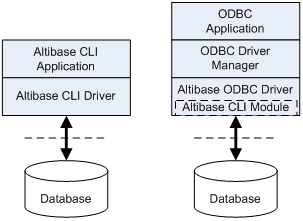
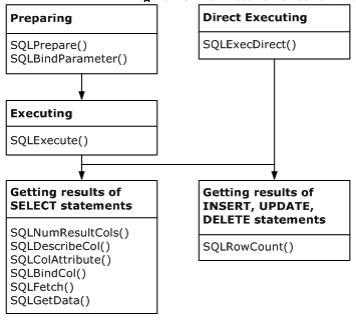
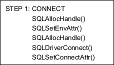
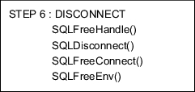

<!-- START doctoc generated TOC please keep comment here to allow auto update -->
<!-- DON'T EDIT THIS SECTION, INSTEAD RE-RUN doctoc TO UPDATE -->


- [CLI User's Manaul](#cli-users-manaul)
  - [Preface](#preface)
    - [About This Manual](#about-this-manual)
  - [1. Altibase CLI Introduction](#1-altibase-cli-introduction)
    - [Overview](#overview)
    - [Basic Usages](#basic-usages)
    - [Basic Programming Steps](#basic-programming-steps)
    - [Building an Altibase CLI Application](#building-an-altibase-cli-application)
  - [2. Altibase CLI Functions](#2-altibase-cli-functions)
    - [Altibase CLI API](#altibase-cli-api)
    - [SQLAllocConnect](#sqlallocconnect)
    - [SQLAllocEnv](#sqlallocenv)
    - [SQLAllocHandle](#sqlallochandle)
    - [SQLAllocStmt](#sqlallocstmt)
    - [SQLBindCol](#sqlbindcol)
    - [SQLBindParameter](#sqlbindparameter)
    - [SQLBulkOperations](#sqlbulkoperations)
    - [SQLCancel](#sqlcancel)
    - [SQLCloseCursor](#sqlclosecursor)
    - [SQLColAttribute](#sqlcolattribute)
    - [SQLColumns](#sqlcolumns)
    - [SQLConnect](#sqlconnect)
    - [SQLDescribeCol](#sqldescribecol)
    - [SQLDescribeParam](#sqldescribeparam)
    - [SQLDisconnect](#sqldisconnect)
    - [SQLDriverConnect](#sqldriverconnect)
    - [SQLEndTran](#sqlendtran)
    - [SQLError](#sqlerror)
    - [SQLExecDirect](#sqlexecdirect)
    - [SQLExecute](#sqlexecute)
    - [SQLFetch](#sqlfetch)
    - [SQLFetchScroll](#sqlfetchscroll)
    - [SQLForeignKeys](#sqlforeignkeys)
    - [SQLFreeConnect](#sqlfreeconnect)
    - [SQLFreeEnv](#sqlfreeenv)
    - [SQLFreeHandle](#sqlfreehandle)
    - [SQLFreeStmt](#sqlfreestmt)
    - [SQLGetConnectAttr](#sqlgetconnectattr)
    - [SQLGetData](#sqlgetdata)
    - [SQLGetDescField](#sqlgetdescfield)
    - [SQLGetDescRec](#sqlgetdescrec)
    - [SQLGetDiagField](#sqlgetdiagfield)
    - [SQLGetDiagRec](#sqlgetdiagrec)
    - [SQLGetEnvAttr](#sqlgetenvattr)
    - [SQLGetFunctions](#sqlgetfunctions)

<!-- END doctoc generated TOC please keep comment here to allow auto update -->

Altibase® Application Development

# CLI User's Manaul


Altibase Application Development Altibase CLI User's Manaul

Release 7.2

Copyright ⓒ 2001\~2021 Altibase Corp. All Rights Reserved.

This manual contains proprietary information of Altibase Corporation; it is provided under a license agreement containing restrictions on use and disclosure and is also protected by copyright patent and other intellectual property law. Reverse engineering of the software is prohibited. All trademarks, registered or otherwise, are the property of their respective owners.

**Altibase Corp**

10F, Daerung PostTower II, 306, Digital-ro, Guro-gu, Seoul 08378, Korea Telephone: +82-2-2082-1000 Fax: 82-2-2082-1099

Customer Service Portal: http://support.altibase.com/en/

Homepage: [[http://www.altibase.com](http://www.altibase.com/)]

## Preface

### About This Manual

This manual describes how to use Altibase CLI.

#### Audience

This manual has been prepared for the following Altibase users:

-   Database administrators
-   Performance administrators
-   Database users
-   Application developers
-   Technical Supporters

It is recommended for those reading this manual possess the following background knowledge:

-   Basic knowledge in the use of computers, operating systems, and operating system utilities
-   Experience in using relational database and an understanding of database concepts
-   Computer programming experience
-   Experience in database server management, operating system management, or network administration

#### Organization

This manual is organized as follows: 

-   Chapter 1: Altibase CLI Introduction  
    This chapter briefly introduces the background of Altibase CLI, how to use it, its programming steps, and more.
    
-   Chapter 2: Altibase CLI Functions  
    This chapter provides the syntax, arguments, return value and an example for each Altibase CLI function.
    
-   Chapter 3: LOB Interface  
    This chapter describes the functions and data types necessary for using LOB data.

-   Appendix A. Sample Codes  
    This appendix shows all the sample codes used in this document.

-   Appendix B. Data Type  
    This appendix explains the Altibase SQL data types, C data types, and the conversionpossibilities between the data types.
    
-   Appendix C. Error Codes  
    This appendix categorizes the errors which occur while using Altibase CLI to their SQLSTATE, and explains them.

-   Appendix D. Upgrade  
    This appendix describes the data types which were added or redefined and other changes that were made to enable the use of ODBC applications that were used in the previous version, prior to the upgrade.

#### Documentation Conventions

This section describes the conventions used in this manual. Understanding these conventions will make it easier to find information in this manual and in the other manuals in the series. 

There are two sets of conventions:

-   Syntax diagram convetions
-   Sample code conventions

##### Syntax Diagram Conventions

This manual describes command syntax using diagrams composed of the following elements:

| Elements                                                     | Meaning                                                      |
| ------------------------------------------------------------ | ------------------------------------------------------------ |
| [](https://github.com/ALTIBASE/Documents/blob/master/Manuals/Altibase_7.1/eng/media/SQL/image1.gif) | Indicates the start of a command. If a syntactic element starts with an arrow, it is not a complete command. |
| [](https://github.com/ALTIBASE/Documents/blob/master/Manuals/Altibase_7.1/eng/media/SQL/image2.gif) | Indicates that the command continues to the next line. If a syntactic element ends with this symbol, it is not a complete command. |
| [](https://github.com/ALTIBASE/Documents/blob/master/Manuals/Altibase_7.1/eng/media/SQL/image3.gif) | Indicates taht the command continues from the previous line. If a syntactic element starts witht his symbol, it is not a complete command. |
| [](https://github.com/ALTIBASE/Documents/blob/master/Manuals/Altibase_7.1/eng/media/SQL/image4.gif) | Indicates the end of a statement.                            |
| [](https://github.com/ALTIBASE/Documents/blob/master/Manuals/Altibase_7.1/eng/media/SQL/image5.gif) | Indicates a manatory element.                                |
| [](https://github.com/ALTIBASE/Documents/blob/master/Manuals/Altibase_7.1/eng/media/SQL/image6.gif) | Indicates an optional element.                               |
| [](https://github.com/ALTIBASE/Documents/blob/master/Manuals/Altibase_7.1/eng/media/SQL/image7.gif) | Indicates a mandatory element comprised of options. One, and only one, option must be specified. |
| [](https://github.com/ALTIBASE/Documents/blob/master/Manuals/Altibase_7.1/eng/media/SQL/image8.gif) | Indicates an optional element comprised of options.          |
| [](https://github.com/ALTIBASE/Documents/blob/master/Manuals/Altibase_7.1/eng/media/SQL/image9.gif) | Indicates an optional element in which multiple elements may be specified. A comman must precede all but the first element. |

##### Sample Code Conventions

The code examples explain SQL statements, stored procedures, iSQL statements, and other command line syntax.

The following table describes the printing conventions used in the code examples.

| Rules            | Meaning                                                      | Example                                                      |
| ---------------- | ------------------------------------------------------------ | ------------------------------------------------------------ |
| [ ]              | Indicates an optional item                                   | VARCHAR [(*size*)][[FIXED \|] VARIABLE]                      |
| { }              | Indicates a mandatory field for which one or more items must be selected. | { ENABLE \| DISABLE \| COMPILE }                             |
| \|               | A delimiter between optional or mandatory arguments.         | { ENABLE \| DISABLE \| COMPILE } [ ENABLE \| DISABLE \| COMPILE ] |
| . . .            | Indicates that the previous argument is repeated, or that sample code has been omitted. | SQL> SELECT ename FROM employee; ENAME ----------------------- SWNO HJNO HSCHOI . . . 20 rows selected. |
| Other Symbols    | Symbols other than those shown above are part of the actual code.Other Symbols | EXEC :p1 := 1; acc NUMBER(11,2);Symbols other than those shown above are part of the actual code. |
| Italics          | Statement elements in italics indicate variables and special values specified by the user. | SELECT * FROM *table_name*; CONNECT *userID*/*password*;     |
| Lower case words | Indicate program elements set by the user, such as table names, column names, file names, etc. | SELECT ename FROM employee;                                  |
| Upper case words | Keywords and all elements provided by the system appear in upper case. | DESC SYSTEM_.SYS_INDICES_;                                   |

#### Related Documentations

For more detailed information, please refer to the following documents.

-   Installation Guide

-   Administrator’s Manual

-   Replication Manual

-   Precompiler User’s Manual

-   ODBC User's Manual

-   Application Program Interface User’s Manual

-   iSQL User’s Manual

-   Utilities Manual

-   Error Message Reference

#### Altibase Welcomes Your Comments and Feedbacks

Please let us know what you like or dislike about our manuals. To help us with better future versions of our manuals, please tell us if there is any corrections or classifications that you would find useful.

Include the following information:

- The name and version of the manual that you are using
- Any comments about the manual
- Your name, address, and phone number

If you need immediate assistance regarding any errors, omissions, and other technical issues, please contact Altibase's Support Portal (http://altibase.com/support-center/en/).

Thank you. We always welcome your feedbacks and suggestions.

## 1. Altibase CLI Introduction

This chapter briefly introduces the background of Altibase CLI, how to use it, its programming steps, and more.

### Overview

X/Open CLI and ODBC are standard open application program interfaces to access the database, and are callable SQL programming interfaces. A callable programming SQL interface is an interface which accesses the database and executes a SQL statement by calling a CLI function.

#### X/Open CLI and ODBC

The standard callable SQL interface (called X/Open CLI or SAG CLI) was created by X/Open and SQL Access Group (SAG).

Microsoft’s ODBC for Windows was also built upon the X/Open CLI specification. 

#### What is Altibase CLI?

Altibase CLI is a callable SQL programming interface supported for Altibase. The Altibase CLI driver can be used singularly for the CLI application, or as the sub-library of the following libraries. 

-   libalticapi.a: Altibase C API library 
-   libapre.a: APRE C/C++ library 
-   libiloader.a: iLoader API library

The Altibase CLI driver is included in the Altibase server and client packages as a library, and is required to build or run the following applications. 

-   Altibase CLI applications 
-   Altibase C API applications 
-   APRE C/C++ applications 
-   XA applications 
-   iLoader API applications

#### Altibase ODBC Driver

For an ODBC application to access a database, a separate module or driver provided by the database to be accessed is required, apart from the ODBC software (e.g., ODBC Driver Manager). Altibase provides the ODBC driver for this purpose. For further information on the Altibase ODBC driver, please refer to the *Altibase ODBC User’s Manual.*

#### Differences Between CLI and ODBC

Altibase CLI conforms to X/Open CLI standards and ODBC specifications to maximum levels, and is very similar to an ODBC interface. However, since the Altibase CLI application does not run through the ODBC Driver Manager at runtime, Altibase CLI guarantees faster response time than an ODBC application.



[Figure 1-1] The CLI Driver and the ODBC Driver Accessing the Database

#### Before Reading This Manual

Altibase CLI conforms not only to X/Open CLI standards, but also to ODBC specifications. Also, since the Altibase CLI core module runs in the lower part of the Altibase ODBC Driver as shown in the figure above, most of the internal operations of the Altibase CLI driver and Altibase ODBC driver are similar. 

The contents of this manual mostly apply also to the ODBC driver, and terminologies related to both ODBC and Altibase CLI are used.

### Basic Usages

This section explores the prior knowledge necessary for writing applications using Altibase CLI. 

As shown in [Figure 1-1] below, Altibase CLI applications are typically composed of the following three steps:

-   Initialization of Handles 
-   Processing of Transactions 
-   Release of Handles

Operations other than the above, such as processing diagnostic messages, occur throughout the whole application. 


[Figure 1-2] Altibase CLI Application Steps

#### Initialization of Handles

This step allocates and initializes the environment and connection handles. Transition from one step to the next step is made by passing the appropriate handles to send information about the execution results of the previous step. Handle types provided by Altibase CLI are as follows:

##### Environment Handles

The environment handle references the overall environment of an application’s state. An environment handle must be allocated prior to allocating a connection handle, and multiple environment handles can be allocated in a single application. 

##### Connection Handles

The connection handle references information related to the connections managed by Altibase CLI. This information includes the general status, transaction status, and diagnostic information. An application allocates a connection handle for each connection to attempt connection to the Altibase server. 

##### Statement Handles

The statement handle references information of the SQL statements managed by Altibase CLI, and is associated with the connection handle. A statement handle is allocated to execute a statement. A maximum number of 1,024 statements can be allocated to a single connection. 

#### Processing of Transactions

Below figure shows the execution order of a function call.



[Figure 1-3] The Execution Order of a Function Call

#### Release of Handles

This step releases the allocated handles, recovers the allocated memory, and then terminates the application.

#### Processing Diagnostic Messages

A diagnosis is an operation which handles warnings or error states that are generated in an application.

##### Application Return Values

| Return Values         | Description                                                  |
| --------------------- | ------------------------------------------------------------ |
| SQL_SUCCESS           | The function completed successfully                          |
| SQL_SUCCESS_WITH_INFO | The function executed successfully with a warning and other information |
| SQL_NO_DATA           | The function executed successfully, but no related data is available. |
| SQL_ERROR             | The function failed                                          |
| SQL_INVALID_HANDLE    | The function failed due to an invalid input handle.          |

Diagnostic messages are generated for all, but SQL_SUCCESS, SQL_NO_DATA_FOUND, and SQL_INVALID_HANDLE. To check the diagnostic message, you can call SQLGetDiagRec() and SQLGetDiagField().

##### Diagnostic Messages

A diagnostic message is a five-byte alphanumeric string. The first two characters depict the class, and the last three characters depict the sub class. 

The diagnostic messages provided by Altibase CLI conform with X/Open SQL CAE specifications.

#### Restrictions

The Altibase client library does not handle signals.

Therefore, if the network is disconnected due to an external issue, a running application can be forcefully terminated by receiving the SIGPIPE signal. To prevent the application from forcefully terminating, the SIGPIPE signal must be handled within the user application. Since the application can hang if you call an Altibase client library function within a SIGPIPE signal handler function, caution is required when writing signal handler functions. Nevertheless, it is possible to call an Altibase client library function after signal handling is complete.

### Basic Programming Steps


#### Step 1: Connect to the Database

For any application, the first step is to connect to the database. The following functions are necessary for this step:



The first operation required to connect to the database, is to allocate an environment handle using SQLAllocHandle(). 

An application sets the environment attributes of the current environment by calling SQLSetEnvAttr(). 

Next, the application allocates a connection handle using SQLAllocHandle(), and calls SQLDriverConnect() to connect to the data source. 

After that, the application sets the connection attributes using SQLSetConnectAttr().

#### Step 2: Initialize the Application

The second step is to initialize the application as shown in the following figure. The exact operation is dependent on the application.


An application allocates a statement handle using SQLAllocStmt(), and most applications specify statement attributes (such as the cursor type) using SQLSetStmtAttr().

#### Step 3: Build and Execute a SQL Statement

The third step is to build and execute a SQL statement as shown below. This step can be processed in many different ways. An application creates or executes a SQL statement, based on the SQL statement input by the user.


When a SQL statement is created and the variables are bound, the statement is executed with SQLExecDirect. For statements that are executed multiple times, it is more efficient performance wise to prepare the statement with SQLPrepare() and repeatedly execute it with SQLExecute().

If a SQL statement includes parameter markers(‘?’), an application calls SQLBindParameter() and binds each argument to an application variable. SQLPrepare() must be executed before binding the arguments, SQLExecute() can be executed after they have been bound.

An application can delay the execution of a SQL statement and call a function that returns a result set which includes information from the system catalogs instead. 

The next step for the application to take depends on how the SQL statement is executed. 

| SQL Statement Types        | Aniticipated Actions                                         |
| -------------------------- | ------------------------------------------------------------ |
| SELECT or Catalog Funciton | Step 4a: Fetches the results.                                |
| UPDATE, DELETE, or INSERT  | Step 4b: Fetches the number of affected rows.                |
| Other SQL Statements       | Step 3: Builds and excutes a SQL statement. Or Step 5: Commits the transaction |

#### Step 4a: Fetch the Results

This step fetches the results as shown in the above figure.


If the statement executed in Step 3 is a SELECT statement or catalog function, an application calls SQLNumResultCols() to figure out the number of columns in the result set. This step is unnecessary if the application already knows the number of columns in the result set.

Next, the application fetches the name of each column in the result set, the data type, precision and etc. using SQLDescribeCol(). Likewise, this step is unnecessary if the application already knows this information. Afterwards, the application sends this information to SQLBindCol(), which binds application variables to columns in the result set.

Now the application calls SQLFetch() to fetch the first row of data and stores the data to the bound variable using SQLBindCol(). If there is long data in the row, data can be retrieved using SQLGetData(). To fetch additional data, the application continues to call SQLFetch() and when necessary, SQLGetData().

Once all of the data has been fetched in the above procedure, the application must close the open cursor using SQLCloseCursor(), before executing another statement using SQLPrepare() and SQLExecute(), to fetch data. 

The application returns to Step 3 to execute another statement in the same transaction, or goes to Step 5 to commit or roll back the transaction. 

#### Step 4b: Fetch the Row Count 


If the statement executed in Step 3 is either an UPDATE, INSERT, or DELETE statement, an application fetches the number of affected rows using SQLRowCount(). 

If multiple statements have been executed using array bind or etc., the rows that were affected by the execution of each statement can be fetched using the SQLMoreResults() and SQLRowCount() functions. 

The application returns to Step 3 to execute another statement in the same transaction, or goes to Step 5 to commit or roll back the transaction. 

#### Step 5: Commit/Rollback the Transaction


This step calls SQLEndTran() to commit or roll back the transaction. An application performs this step only when the transaction commit mode is set to non-auto-commit mode. If the transaction commit mode is auto-commit, the transaction automatically is commited when a statement is executed. 

To execute a statement in a new transaction, the application must return to Step 3; To disconnect from the database, the application goes to Step 6.

####  Step 6: Disconnect from the Altibase

The final step is to disconnect from the database, as shown in the following figure. First, the application calls SQLFreeHandle () to free the handle.



The final step is to disconnect from the database. First, an application calls SQLFreeHandle() and frees handles. 

Next, the application disconnects from the database using SQLDisconnect(), and frees the connection handle using SQLFreeConnect().

Lastly, the application frees the environment handle using SQLFreeEnv() and terminates the program.

### Building an Altibase CLI Application

This section describes how to build an Altibase CLI application.

#### Header File and Library

To write and build an application using Altibase CLI, the following header and library files in the include and lib subdirectories of the $ALTIBASE_HOME directory are required.

```
$ALTIBASE_HOME/include/sqlcli.h
$ALTIBASE_HOME/lib/libodbccli.a
```

#### Compiling

When compiling, use the following option in the compile command.

```
-I$ALTIBASE_HOME/include
```

When linking, use the following option in the link command.

```
-L$ALTIBASE_HOME/lib -lodbccli
```

## 2. Altibase CLI Functions

This chapter describes the specifications of Altibase CLI functions.

For each Altibase CLI functions, the following information are described.

-   Name of the function and purpose of use
-   Function prototype for C/C++ Users 
-   Arguments list of the function 
-   Return Values 
-   Usages of function and notes 
-   Diagnosis message that can be displayed when an error occurrs in function 
-   Related Function list 
-   Example source codes

### Altibase CLI API

#### API Categorization

The API of the Altibase CLI consists of functions that define environment for running applications, managing connections, and processing SQL statements and transactions. Depending on the features of each function, these are grouped by followings:

-   Managing Environments and Connections 
-   SQL Processing 
-   Setting and Retrieving Driver Attributes 
-   Meta data processing

##### Managing Environments and Connections

The APIs that allocate resources necessary for the connection to the database server and provide connection-related features. Releases the memory space after disconnected from datasources.

##### SQL Processing

The APIs that allocate resources and prepare commands for the processing, executing and retreiving results of SQL statements.

##### Setting and Retrieving Driver Attributes

The APIs that set the environment for the processing of the SQL, connection status, and statement attributes.

##### Metadata Processing

The APIs that provide features to define tables and columns and to retrieve database metadata.

#### API List

Altibase CLI functions are listed in the following table. For further information on each function, please refer to Chapter 2: Altibase CLI Functions.

<table>
<tr>
	<td colspan="2">Task</td>
    <td>Function Name</td>
    <td>Purpose</td>
</tr>
<tr>
    <td rowspan="14" colspan="2"> Managing
environments and
connections<br/>
    <td>SQLAllocConnect</td>
    <td> Obtains an environment, connection, statement,
or descriptor handle</td>
</tr>
<tr>
    <td>SQLAllocEnv</td>
    <td> Allocates an environment, connection, statement,
or descriptor handle</td>
</tr>
<tr>
    <td>SQLAllocStmt</td>
    <td>Obtains statement handles and Allocates
memory</td>
</tr>
<tr>
    <td>SQLAllocHandle</td>
    <td>Initializes of resources, environments, and
statement handles and allocates memory</td>
</tr>
<tr>
    <td>SQLCloseCursor</td>
    <td>This closes cursor and discards pending results</td>
</tr>
<tr>
    <td>SQLConnect</td>
    <td>Connects to a target database</td>
</tr>
<tr>
    <td>SQLDisconnect</td>
    <td>Closes the connection. Releases an environment,
connection, statement, or descriptor handle</td>
</tr>
<tr>
    <td>SQLDriverConnect</td>
    <td>Connects to a specific driver by connection string
or requests that the Driver Manager and driver
display connection dialog boxes for the user</td>
</tr>
<tr>
    <td>SQLEndTran</td>
    <td>Commits or rolls back a transaction</td>
</tr>
<tr>
    <td>SQLFreeConnect</td>
    <td>Closes the connection handle, and releases the
memory</td>
</tr>
<tr>
    <td>SQLFreeEnv</td>
    <td>Closes the environment handle, and releases the
memory</td>
</tr>
<tr>
    <td>SQLFreeHandle</td>
    <td>Releases the memory allocated to the connection,
the handle, and the command</td>
</tr>
 <tr>
    <td>SQLFreeStmt</td>
    <td>Closes the statement handle, and releases the
allocated memory</td>
</tr>
 <tr>
    <td>SQLTransact</td>
    <td>Commits or releases all changes related to the
database</td>
</tr>
<tr>
    <td rowspan="23">SQL Processing</td>
    <td rowspan="7">Requesting</td>
    <td>SQLBindParameter</td>
    <td>Binds the parameter to a SQL statement </td>
</tr>
<tr>
	<td>SQLExecDirect</td>
	<td>Directly executes a SQL statement</td>
</tr>
<tr>
    <td>SQLExecute</td>
    <td>Executes a prepared SQL statement</td>
</tr>
<tr>
    <td>SQLNativeSql</td>
    <td>Efficiently tests the syntax of SQL
statements and converts it to that Altibase
supports</td>
</tr>
<tr>
    <td>SQLParamData</td>
    <td> Supplies data at statement execution
time.</td>
</tr>
<tr>
    <td>SQLPrepare</td>
    <td>Prepares a SQL statement for later execution</td>
</tr>
<tr>
    <td>SQLPutData</td>
    <td>This is used to supply data at statement execution
time</td>
</tr>
<tr>
    <td rowspan="16">Retrieving</td>
    <td>SQLBindCol</td>
    <td>Defines the buffer and the data type to receive the
columns of the result set</td>
</tr>
<tr>
    <td>SQLColAttribute</td>
    <td>Defines the attributes about the columns of the
result set</td>
</tr>
<tr>
    <td>SQLDescribeCol</td>
    <td>Checks the metadata about one column in the
result set</td>
</tr>
<tr>
    <td>SQLDescribeParam</td>
    <td>Checks information related to the parameter
marker (?) in the result set</td>
</tr>
<tr>
    <td>SQLError</td>
    <td>Checks diagnosis messages related to the recently
called Altibase CLI function</td>
</tr>
<tr>
    <td>SQLFetch</td>
    <td>Returns multiple result rows</td>
</tr>
<tr>
    <td>SQLFetchScroll</td>
    <td>The result set the cursor to the desired direction
of progress, and get a column to bind</td>
</tr>
<tr>
    <td>SQLGetConnectAttr</td>
    <td>Returns the properties setting of connection</td>
</tr>
<tr>
    <td>SQLGetData</td>
    <td>Returns the data of a specified column in the
result set</td>
</tr>
<tr>
    <td>SQLGetInfo</td>
    <td>Retrieve DBMS information connected to the application</td>
</tr>
<tr>
    <td>SQLGetStmtAttr</td>
    <td>Returns the attributes related to the current
statement handle</td>
</tr>
<tr>
    <td>SQLGetTypeInfo</td>
    <td>Returns the information about the data type
supported by the database</td>
</tr>
<tr>
    <td>SQLNumParams</td>
    <td>SReturns the number of parameters in a SQL
statement</td>
</tr>
<tr>
    <td>SQLNumResultCols</td>
    <td>Returns the number of columns in the result set</td>
</tr>
<tr>
    <td>SQLRowCount</td>
    <td>Returns the number of rows affected by an insert,
update, or delete request</td>
</tr>
<tr>
    <td>SQLMoreResults</td>
    <td>If multiple results are generated execution, it changes the result of interest to the next result.</td>
</tr>
<tr>
    <td rowspan="5" colspan="2">Setting and
retrieving driver
attributes</td>
    <td>SQLGetEnvAttr</td>
    <td>Returns the current setting of an environment
attribute</td>
</tr>
<tr>
    <td>SQLGetFunctions</td>
    <td>Returns information about whether a driver
supports a specific Altibase CLI function.</td>
</tr>
<tr>
    <td>SQLSetConnectAttr</td>
    <td>Sets the connection attributes</td>
</tr>
<tr>
    <td>SQLSetEnvAttr</td>
    <td>Sets the environment attributes</td>
</tr>
<tr>
    <td>SQLSetStmtAttr</td>
    <td>Sets the statement attributes</td>
</tr>
<tr>
    <td rowspan="14" colspan="2">Metadata
Processing (catalog
functions)</td>
    <td>SQLColumns</td>
    <td>Returns the list of column names in specified
tables</td>
</tr>
<tr>
    <td>SQLForeignKeys</td>
    <td>Returns a list of column names that make up
foreign keys, if they exist for a specified table</td>
</tr>
<tr>
    <td>SQLGetDescField</td>
    <td> Returns a single field of a descriptor record</td>
</tr>
<tr>
    <td>SQLGetDescRec</td>
    <td>Returns values of multiple fields of a
descriptor record</td>
</tr>
<tr>
    <td>SQLGetDiagField</td>
    <td>Diagnoses the result after the function is used</td>
</tr>
<tr>
    <td>SQLGetDiagRec</td>
    <td>Returns several commonly used fields of a
diagnostic record after using the function</td>
</tr>
<tr>
    <td>SQLPrimaryKeys</td>
    <td>Returns the list of column names that make up
the primary key for a table</td>
</tr>
<tr>
    <td>SQLProcedureColumns</td>
    <td>Returns the list of input and output parameters, as
well as the columns that make up the result set
for the specified procedures</td>
</tr>
<tr>
    <td>SQLProcedures</td>
    <td>Returns the list of procedure names stored in a
specific database</td>
</tr>
<tr>
    <td>SQLSetDescField</td>
    <td>Sets the descriptor field</td>
</tr>
<tr>
    <td>SQLSpecialColumns</td>
    <td>
Searches for specific columns</td>
</tr>
<tr>
    <td>SQLStatistics</td>
    <td>Returns statistics about a single table and
the list of indexes associated with the table</td>
</tr>
<tr>
    <td>SQLTablePrivileges</td>
    <td>Returns a list of tables and the privileges
associated with each table</td>
</tr>
<tr>
    <td>SQLTables</td>
    <td>Returns the list of table names stored in a
specific database</td>
</tr>
</table>


### SQLAllocConnect 

SQLAllocConnect allocates an environment, connection, statement, or descriptor handle. This function allocates the related resources in the environment identified by the connection handles and the input environment handles.

SQLAllocConnect () can be replaced by SQLAllocHandle ().

#### Syntax

```
SQLRETURN  SQLAllocConnect (
	SQLHENV	    env,
	SQLHDBC *	dbc );
```

#### Arguments

| Data Type  | Argument | In/Output | Description               |
| ---------- | -------- | --------- | ------------------------- |
| SQLHENV    | env      | Input     | Environment Handle        |
| SQLHDBC \* | dbc      | Output    | Connection Handle Pointer |

#### Return Values

```
SQL_SUCCESS
SQL_INVALID_HANDLE
SQL_ERROR
```

#### Description

The Altibase CLI Driver uses the output connection handle to refer to all information related to the connection such as connection status, transaction status, and error information. 

If the pointer (dbc) indicating the connection handle refers to the valid connection handle allocated by SQLAllocConnect (), the calling result will change the original value. If it is application programming error, it is not detected by Altibase CLI Driver.

> \* SQLAllocEnv () must be called before calling this function.
>

#### Diagnosis

| SQLSTATE | Description                            | Comments                                              |
| -------- | -------------------------------------- | ----------------------------------------------------- |
| HY000    | General error                          | Channel initialization error                          |
| HY001    | Memory allocation error                | Failed to allocate the memory for the explicit handle |
| HY009    | Invalid Arguments used (null pointer). | dbc is a NULL pointer.                                |

#### Related Functions

```
SQLAllocEnv
SQLConnect
SQLDisconnect
SQLFreeConnect
```

#### Example

< Refer to: /sample/SQLCLI/demo_ex1.cpp >

```
/* Memory allocation for the environment */
if (SQLAllocEnv (&env) != SQL_SUCCESS)
{
    printf("SQLAllocEnv error!!\n");
    return SQL_ERROR;
}

/* Memory allocation for the connection  */
if (SQLAllocConnect (env, &dbc) != SQL_SUCCESS)
{
    printf("SQLAllocConnect error!!\n");
    return SQL_ERROR;
}
```

### SQLAllocEnv 

SQLAllocEnv allocates the resources related to the environment handles.

SQLAllocEnv () can be replaced by SQLAllocHandle ().

#### Syntax

```
SQLRETURN  SQLAllocEnv ( 
	SQLHENV *	env );
```

#### Argument

| Data Type  | Argument | In/Output | Description                |
| ---------- | -------- | --------- | -------------------------- |
| SQLHENV \* | env      | Output    | Environment handle pointer |

#### Return Values

```
SQL_SUCCESS
SQL_ERROR
```

#### Description

One application can use various environment variables.

To use resources of the Altibase CLI, the program that called SQLAllocEnv () must not terminate or get out of the stack. Otherwise, an application may lose the statement handles and other allocated resources.

Before calling SQLAllocConnect () or other Altibase CLI functions, an application must call this function. Then, the env value will be sent to all functions that require the environment handles as input values.

#### Related Functions

```
SQLAllocConnect
SQLAllocStmt
SQLFreeEnv
```

#### Example

< Refer to: $ALTIBASE_HOME/sample/SQLCLI/demo_ex1.cpp >

```
/* Memory allocation for the environment */
if (SQLAllocEnv (&env) != SQL_SUCCESS)
{
    printf("SQLAllocEnv error!!\n");
    return SQL_ERROR;
}
```

### SQLAllocHandle 

SQLAllocHandle allocates and initializes the memory for the environment, connection, and statement handles.

#### Syntax

```
SQLRETURN  SQLAllocHandle (
	SQLSMALLINT	    HandleType,
	SQLHANDLE		InputHandle,
	SQLHANDLE *		OutputHandlePtr );
```

#### Arguments

| Data Type    | Argument        | In/Output | Description                                                  |
| ------------ | --------------- | --------- | ------------------------------------------------------------ |
| SQLSMALLINT  | HandleType      | Input     | One of the following handle type is allocated: SQL_HANDLE_ENV, SQL_HANDLE_DBC, SQL_HANDLE_STMT |
| SQLHANDLE    | InputHandle     | Input     | If the input HandleType is SQL_HANDLE_ENV, InputHandle will be SQL_Null_Handle. Or if the input HandleTyp is SQL_HANDLE_DBC, it will be the environment handle. In case of SQL_HANDLE_STMT, it will be the connection handle. |
| SQLHANDLE \* | OutputHandlePtr | Output    | The pointer of the allocated handle                          |

#### Return Values

```
SQL_SUCCESS
SQL_SUCCESS_WITH_INFO
SQL_INVALID_HANDLE
SQL_ERROR
```

#### Description

SQLAllocHandle () allocates the environment, connection and statement handles to be described in the next paragraph. 

This function will replace SQLAllocEnv (), SQLAllocConnect () and SQLAllocStmt () functions. To request the environment handle, an application calls SQLAllocHandle () of which HandleTyp is SQL_HANDLE_ENV and input handle is SQL_Null_Handle. To request the connection handle, an application must call SQLAllocHandle () of which HandleTyp is SQL_HANDLE_DBC and the input handle must be a valid environment handle. To request the statement handle, an application must call SQLAllocHandle () of which HandleTyp is SQL_HANDLE_STMT and the input handle must be a valid connection handle. 

One application can allocate multiple environment, connection, and statement handles at one time. However, several environment, connection or statement handle cannot be used at the same time on another thread of one process.

##### Allocation of the Environment Handles

The environment handle provides global information about the validity or activation of the connection handle

To request an environment handle, an application must call SQLAllocHandle () of which HandleTyp is SQL_HANDLE_ENV and input handle is SQL_Null_Handle. The Altibase CLI driver allocates the memory needed for environment information and returns the handle related to the \**OutputHandle*. An application sends the *OutputHandle value to the subsequent callings that require the environment handles.

##### Allocation of the Connection Handles

The connection handle provides information about the validity of the statement handle or activation of the transaction.

To request the connection handle, an application calls SQLAllocHandle () of which *HandleType* is SQL_HANDLE_DBC. *InputHandle* argument calls SQLAllocHandle () and is set as the returned environment handle. The Altibase CLI driver allocates the memory necessary for the connection and returns the handle values related to the \**OutputHandle*. An application sends the **OutputHandle* to the subsequent callings that require the connection handle.

##### Allocation of the Statement handles

The statement handle provides command information such as error messages about processing a SQL statement and status state. 

To request the statement handle, an application connects to the database and calls SQLAllocHandle () before sending a SQL statement. For this calling, the *HandleType* must be set as SQL_HANDLE_STM and the I argument must be set as a connection handle to be returned by calling SQLAllocHandle (). The Altibase CLI driver allocates the memory necessary for the command, connects the statement handle, and returns the handle related to **OutputHandle*. An application sends \**OutputHandle* value to the subsequent callings that require the statement handle.

#### Diagnosis

| SQLSTATE | Description                           | Comments                                              |
| -------- | ------------------------------------- | ----------------------------------------------------- |
| HY000    | General error                         |                                                       |
| HY001    | Memory allocation error               | Failed to allocate the memory for the explicit handle |
| HY009    | Invalid argumnets used (null pointer) | OutputHandlePtr is a NULL pointer                     |

#### Related Functions

```
SQLExecDirect
SQLExecute
SQLFreeHandle
SQLPrepare
SQLSetConnectAttr
SQLSetEnvAttr
SQLSetStmtAttr
```

#### Example

< Refer to: $ALTIBASE_HOME/sample/SQLCLI/demo_meta1.cpp >

```
/* Memory allocation for the environment */
if (SQLAllocHandle(SQL_HANDLE_ENV, SQL_NULL_HENV, &env) != SQL_SUCCESS)
{
    printf("SQLAllocEnv error!!\n");
    return SQL_ERROR;
}
    
/* Memory allocation for the connection  */
if (SQLAllocHandle(SQL_HANDLE_DBC, env, &dbc) != SQL_SUCCESS)
{   
    printf("SQLAllocConnect error!!\n");
    return SQL_ERROR;
}
```

### SQLAllocStmt

SQLAllocStmt allocates and initializes the memory for the SQL statements. Up to 1024 statements are allocated to one connection. 

SQLAllocStmt () can be replaced by SQLAllocHandle ().

#### Syntax

```
SQLRETURN  SQLAllocStmt (
	SQLHDBC	    dbc,
	SQLHSTMT *	stmt );
```

#### Arguments

| Data Type   | Arguments | In/Output | Description                 |
| ----------- | --------- | --------- | --------------------------- |
| SQLHDBC     | dbc       | Input     | Connection Handle           |
| SQLHSTMT \* | stmt      | Output    | Pointer of statement handle |

#### Arguments

```
SQL_SUCCESS
SQL_SUCCESS_WITH_INFO
SQL_INVALID_HANDLE
SQL_ERROR
```

In case SQL_ERROR is returned, stmt arguments will be set as SQL_NULL_STMT. An application must set stmt arguments as SQL_NULL_STMT and calls SQLERROR ().

#### Description

The Altibase CLI driver relates the descriptors, results and status data with the processed SQL statements by using each statement handle. Each SQL statement must have a statement handle, but other commands can use the handles again.

When this function is called, the database connection used by the databasec must be referred to.

If the input pointer indicates the valid statement handle allocated by the previous calling of SQLAllocStmt (), the original value will be changed according to the result of this calling. As an application programming error, it is not detected by Altibase CLI driver.

> \* Call SQLAllocEnv() before calling this function. This function must be called before other functions that have SQLPrepare (), SQLExecute (), SQLExecDirect () or statement handle as an input Arguments.

#### Diagnosis

| SQLSTATE | Description                                                  | Comments                                    |
| -------- | ------------------------------------------------------------ | ------------------------------------------- |
| HY000    | General Error                                                | The number of stmt (1024) exceeds           |
| HY001    | Memory allocation error                                      | Failed to allocate the memory for the stmt. |
| HY009    | Invalid Arguments used (null pointer)                        | stmt is a NULL pointer.                     |
| HY010    | Continuous function error (not connected or disconnected status) | dbc is not connected or disconnected        |

#### Related Functions

```
SQLConnect
SQLFreeStmt
```

#### Example

< Refer to: $ALTIBASE_HOME/sample/SQLCLI/demo_ex1.cpp >

```
/* Memory allocation for a statement */
if (SQL_ERROR == SQLAllocStmt(dbc, &stmt))
{
    printf("SQLAllocStmt error!!\n");
    return SQL_ERROR;
}
```

### SQLBindCol

SQLBindCol binds an application variables to the columns of the result sets for all data types.

#### Syntax

```
SQLRETURN  SQLBindCol (
	SQLHSTMT	stmt, 
	SQLSMALLINT	col,
	SQLSMALLINT	cType,
	SQLPOINTER	value,
	SQLLEN		max,
	SQLLEN *	valueLength );

```

#### Arguments

| Data Type   | Argument    | In/Out                   | Description                                                  |
| ----------- | ----------- | ------------------------ | ------------------------------------------------------------ |
| SQLHSTMT    | stmt        | Input                    | Statement handle                                             |
| SQLSMALLINT | col         | Input                    | Column position in the result set to bind. Starts with 1.    |
| SQLSMALLINT | cType       | Input/Output( Suspended) | C data type identifier of the *Value buffer. About the data types, see the appendix of this document. |
| SQLPOINTER  | value       | Output                   | Pointer of the buffer to store the data. SQLFetch () returns the data to this buffer.If the value is a NULL pointer, the Altibase CLI driver will unbind the data buffer for the result set columns. An application unbinds all columns by calling SQLFreeStmt () using SQL_UNBind option. However, if the ValueLength argument is valid even though the value argument is a NULL pointer, an application still have buffer for binding. of the length. |
| SQLLEN      | max         | Input                    | Maximum size of the buffer (in bytes). When returning the character data to the *Value, the *Value argument must include space for the NULL-terminatior. Otherwise, the Altibase CLI driver cuts out the data. In case a fixed length data (integer, date structure, etc) are returned, the Altibase CLI driver will ignore max. Therefore, a sufficient buffer size must be allocated. Otherwise, the Altibase CLI driver passes through the end of the buffer and saves the garbage data. |
| SQLLEN \*   | valueLength | Input/Output( Suspended) | Is a pointer for the data length or NULL. SQLFetch () function be able to return the |

#### Return Values

```
SQL_SUCCESS
SQL_SUCCESS_WITH_INFO
SQL_INVALID_HANDLE
SQL_ERROR
```

#### Description

The pointer value and ValueLength are suspended output variables for this function. Thememory address indicated by this pointer will not be updated until SQLFetch () is called. The position referred to by this pointer must be valid till SQLFetch () is called.

SQLBindCol () binds application variables to the columns of the result set for all data types. When SQLFetch () is called, the data will be sent from the databaseMS to an application.

An application calls SQLBindCol () once for each column. When SQLFetch () is called, the data of each bound column is stored in the address allocated by the value or the ValueLength pointer.

An application can inquire the attributes such as the data type or length of the column by calling SQLDescribeCol () or SQLColAttribute (). This information can be used to indicate the proper data type or to convert the data into another data type.

The columns are identified in a series of numbers from the left to the right. The number of columns in the result set can be decided by setting SQL_DESC_Count in SQLNumResultCols () or fieldIdentifier argument and by calling SQLColAttribute ().

An application may not bind any column. The data in unbound column can be searched by SQLGetData () after SQLFetch () is called. In usuall case SQLBindCol () is more efficient than SQLGetData ().

> \* To get the data from the buffer identified by this function, SQLBindCol () must be called before SQLFetch ().

#### Diagnosis

| SQLSTATE | Description                             | Comments                                                     |
| -------- | --------------------------------------- | ------------------------------------------------------------ |
| 07009    | Invalid column number                   | col Arguments exceeds the maximum number of columns in the result set |
| HY000    | General error                           |                                                              |
| HY001    | Memory allocation error                 | Failed to allocate the memory for the explicit handle        |
| HY003    | An application buffer type is not valid | cType argument is not valid                                  |

#### Related Functions

```
SQLDescribeCol	
SQLFetch
SQLFreeStmt
SQLGetData
SQLNumResultCols
```

#### Example

< Refer to: $ALTIBASE_HOME/sample/SQLCLI/demo_ex2.cpp >

```
sprintf(query,"SELECT * FROM DEMO_EX2 WHERE id=?");
if (SQLPrepare(stmt, (SQLCHAR *)query, SQL_NTS) != SQL_SUCCESS)
{
    execute_err(dbc, stmt, query);
    SQLFreeStmt(stmt, SQL_DROP);
    return SQL_ERROR;
}

if (SQLBindParameter(stmt, 1, SQL_PARAM_INPUT,
                     SQL_C_CHAR, SQL_CHAR,
                     8, 0,
                     id_in, sizeof(id_in), NULL) != SQL_SUCCESS)
{
    execute_err(dbc, stmt, query);
    SQLFreeStmt(stmt, SQL_DROP);
    return SQL_ERROR;
}

/* binds application data buffers to columns in the result set */
if (SQLBindCol(stmt, 1, SQL_C_CHAR,
               id, sizeof(id), NULL) != SQL_SUCCESS)
{
    printf("SQLBindCol error!!!\n");
    execute_err(dbc, stmt, query);
    SQLFreeStmt(stmt, SQL_DROP);
    return SQL_ERROR;
}
if (SQLBindCol(stmt, 2, SQL_C_CHAR,
               name, sizeof(name), NULL) != SQL_SUCCESS)
{
    printf("SQLBindCol error!!!\n");
    execute_err(dbc, stmt, query);
    SQLFreeStmt(stmt, SQL_DROP);
    return SQL_ERROR;
}
if (SQLBindCol(stmt, 3, SQL_C_SLONG,
               &age, 0, NULL) != SQL_SUCCESS)
{
    printf("SQLBindCol error!!!\n");
    execute_err(dbc, stmt, query);
    SQLFreeStmt(stmt, SQL_DROP);
    return SQL_ERROR;
}
if (SQLBindCol(stmt, 4, SQL_C_TYPE_TIMESTAMP,
               &birth, 0, NULL) != SQL_SUCCESS)
{
    printf("SQLBindCol error!!!\n");
    execute_err(dbc, stmt, query);
    SQLFreeStmt(stmt, SQL_DROP);
    return SQL_ERROR;
}
if (SQLBindCol(stmt, 5, SQL_C_SSHORT,
               &sex, 0, NULL) != SQL_SUCCESS)
{
    printf("SQLBindCol error!!!\n");
    execute_err(dbc, stmt, query);
    SQLFreeStmt(stmt, SQL_DROP);
    return SQL_ERROR;
}
if (SQLBindCol(stmt, 6, SQL_C_DOUBLE,
               &etc, 0, &etc_ind) != SQL_SUCCESS)
{
    printf("SQLBindCol error!!!\n");
    execute_err(dbc, stmt, query);
    SQLFreeStmt(stmt, SQL_DROP);
    return SQL_ERROR;
}

/* fetches the next rowset of data from the result set and print to stdout */
printf("id\tName\tAge\tbirth\tsex\tetc\n");
printf("=====================================================================\n");
for ( i=1; i<=3; i++ )
{
    sprintf(id_in, "%d0000000", i);
    if ( SQLExecute(stmt) != SQL_SUCCESS )
    {
        execute_err(dbc, stmt, "SQLExecute : ");
        SQLFreeStmt(stmt, SQL_DROP);
        return SQL_ERROR;
    }

    if ( (rc = SQLFetch(stmt)) != SQL_NO_DATA && (rc == SQL_SUCCESS || rc == SQL_SUCCESS_WITH_INFO))
    {
        printf("%-10s%-20s%-5d%4d/%02d/%02d %02d:%02d:%02d\t%-2d\t",
                id, name, age, birth.year, birth.month, birth.day,
                birth.hour, birth.minute, birth.second, sex);
        if (etc_ind == SQL_NULL_DATA)
        {
            printf("NULL\n");
        }
        else
        {
            printf("%.3f\n", etc);
        }
    }
    else
    {
        execute_err(dbc, stmt, query);
        break;
    }
    rc = SQLCloseCursor(stmt);
    if (rc != SQL_SUCCESS && rc != SQL_SUCCESS_WITH_INFO)
    {
        execute_err(dbc, stmt, "SQLCloseCursor : ");
        SQLFreeStmt(stmt, SQL_DROP);
        return SQL_ERROR;
    }
}

```

### SQLBindParameter

SQLBindParameter binds the parameter marker of a SQL statement with an application variables. The data is transmitted from an application to the database when SQLExecute () is called.

#### Syntax

```
SQLRETURN  SQLBindParameter ( 		
	SQLHSTMT		stmt,	
	SQLSMALLINT		par,	
	SQLSMALLINT		pType, 		
	SQLSMALLINT		cType, 		
	SQLSMALLINT		sqlType, 		
	SQLULEN 		columnSize, 
	SQLSMALLINT		scale,		
	SQLPOINTER		value,
	SQLLEN  		valueMax,		
	SQLLEN *		valueLength );
```

#### Arguments

| Data Type   | Argument    | In/Output         | Description                                                  |
| ----------- | ----------- | ----------------- | ------------------------------------------------------------ |
| SQLHSTMT    | stmt        | Input             | Statement handle                                             |
| SQLSMALLINT | par         | Input             | Parameter order. Starting with 1.                            |
| SQLSMALLINT | pType       | Input             | Parameter type. All parameters in a SQL statement must be input variables (SQL_PARAM_INPUT). When executing a stored procedure, arguments can be are input, output, or input/output type variables. (SQL_PARAM_INPUT, SQL_PARAM_OUTPUT, SQL_PARAM_INPUT_OUTPUT) |
| SQLSMALLINT | cType       | Input             | C data type of the parameter (SQL_C_CHAR, SQL_C_SBIGINT, etc) See: Appendix of this document |
| SQLSMALLINT | sqlType     | Input             | SQL data type of the parameter (SQL_CHAR, SQL_VARCHAR, etc) See: Appendix of this document |
| SQLULEN     | columnSize  | Input             | An argument that indicates the precision of a parameter marker. Based on SQL type, it can be used as follows:<br> \* SQL_CHAR, SQL_VARCHAR: Indicates the max allowed length of a parameter marker.<br>(If columnSize is 0, the default columnSize is used. For SQL_CHAR and SQL_VARCHAR, their columnSize is 32,000.)<br>\* SQL_DECIMAL, SQL_NUMERIC: Indicates the decimal significant digits of a parameter marker.<br>(If columnSize is 0, the default columnSize is used. For both SQL_DECIMAL and SQL_NUMERIC, the columnSize is 38, which is the max number of decimal significant digits.)<br>\* SQL_BINARY, SQL_BYTES, SQL_NIBBLE, SQL_VARBIT: Indicates the max allowed length of a parameter marker<br>.(If columnSize is 0, the default columnSize is used. The columnSize for each type is as follows: For SQL_BINARY, SQL_BYTE and SQL_VARBIT, their columnSize is 32000. For SQL_NIBBLE, its columnSize is 254.)<br>\* For other types, the user-defined columnSize argument is ignored and the following fixed value is used.<br>SQL_SMALLINT 5 <br>SQL_INTEGER 10 <br>SQL_BIGINT 19 <br>SQL_REAL 7 <br>SQL_FLOAT 38 <br>SQL_DOUBLE 15 <br>SQL_TYPE_DATE 30 <br>SQL_TYPE_TIME 30 <br>SQL_TYPE_TIMESTAMP 30 <br>SQL_INTERVAL 10 <br>SQL_GEOMETRY 3200 |
| SQLSMALLINT | scale       | Input             | Decimal number according to \*Value or parameter marker If the SQL data type is SQL_NUMERIC, the number of digits after the decimal point |
| SQLPOINTER  | value       | Input (Suspended) | The pointer of the actual data about the parameter when SQLExecute () or SQLExecDirect () is called. |
| SQLLEN      | valueMax    | Input/Out         | Maximum length of the *Value buffer for the character or binary C data |
| SQLLEN \*   | valueLength | Input (Suspended) | Pointer of the input/output data length when SQLExecute () or SQLExecDirect () is called |

#### Return Values

```
SQL_SUCCESS
SQL_SUCCESS_WITH_INFO
SQL_INVALID_HANDLE
SQL_ERROR
```

#### Description

**Binding Arrays**

The array binding method reduces the network round-trip count and improves the speed by sending the parameter using array types. 

The following figure briefly shows how works array binding. Larger amount of data can be sent in a shorter time due to reduced network paging count.


[Figure 2‑1] Array Binding

There are two array binding types:

##### Column-wise Parameter Binding

When using column-wise binding, an application binds one or two, or in some cases three, arrays to each column for which data is to be returned. To use a column-wise binding, do the following:

Set SQL_ATTR_PARAM_BIND_TYPE in Arguments Attribute of an application function SQLSetStmtAttr().

Set SQL_PARAM_BIND_BY_COLUMN in param. 

1.  Allocate the parameter buffer array. 
2.  Allocate the indicator buffer array. 
3.  Call SQLBindParameter () with arguments.

-   cType is C data type of the single element in the parameter buffer array. 
-   sqlType is the SQL data type of the parameter. 
-   Value is the address of the parameter buffer array. 
-   valueMax is the size of the single element in the parameter buffer array. 
-   valueLength is the address of the length/indicator array.

The following figure shows how the column-wise binding operates for each column.


[Figure 2‑2] Column-wise Binding

##### Example

```
#define DESC_LEN 51
#define ARRAY_SIZE 10

SQLCHAR *      Statement = "INSERT INTO Parts (PartID, Description,  Price) "
                                                "VALUES (?, ?, ?)";
SQLUINTEGER    PartIDArray[ARRAY_SIZE];
SQLCHAR        DescArray[ARRAY_SIZE][DESC_LEN];
SQLREAL        PriceArray[ARRAY_SIZE];
SQLINTEGER     PartIDIndArray[ARRAY_SIZE], DescLenOrIndArray[ARRAY_SIZE],
               PriceIndArray[ARRAY_SIZE];
SQLUSMALLINT   i, ParamStatusArray[ARRAY_SIZE];
SQLUINTEGER ParamsProcessed;

// Set the SQL_ATTR_PARAM_BIND_TYPE statement attribute to use
// column-wise binding.
SQLSetStmtAttr(hstmt, SQL_ATTR_PARAM_BIND_TYPE, SQL_PARAM_BIND_BY_COLUMN, 0);

// Specify the number of elements in each parameter array.
SQLSetStmtAttr(hstmt, SQL_ATTR_PARAMSET_SIZE, ARRAY_SIZE, 0);

// Specify an array in which to return the status of each set of
// parameters.
SQLSetStmtAttr(hstmt, SQL_ATTR_PARAM_STATUS_PTR, ParamStatusArray, 0);

// Specify an SQLUINTEGER value in which to return the number of sets of
// parameters processed.
SQLSetStmtAttr(hstmt, SQL_ATTR_PARAMS_PROCESSED_PTR, &ParamsProcessed, 0);

// Bind the parameters in column-wise fashion.
SQLBindParameter(hstmt, 1, SQL_PARAM_INPUT, SQL_C_ULONG, SQL_INTEGER, 5, 0,
                  PartIDArray, 0, PartIDIndArray);
SQLBindParameter(hstmt, 2, SQL_PARAM_INPUT, SQL_C_CHAR, SQL_CHAR, DESC_LEN - 1, 0,
                  DescArray, DESC_LEN, DescLenOrIndArray);
SQLBindParameter(hstmt, 3, SQL_PARAM_INPUT, SQL_C_FLOAT, SQL_REAL, 7, 0,
                  PriceArray, 0, PriceIndArray);

```

##### Row-wise Parameter Binding

When using row style bindings, the application defines a structure (array) that contains a parameter and a length / indicator buffer for each parameter to be bound.

An application performs the next procedures to use the row-wise binding.

Define the array to include the single set of the parameters (including parameters and the length/indicator buffers).

Set SQL_ATTR_PARAM_BIND_TYPE in argument attributes of function SQLSetStmtAttr (), and set the size of the array including program variables in the argument parameter, and binds the address of each element to the first element of the array.

Call SQLBindParameter () with following arguments.

-   cType is the component type of the parameter buffer. 
-   sqlType is the SQL data type of the parameter. 
-   Value is the address of the parameter buffer component in the first array element. 
-   valueMax is the size of the parameter buffer component. 
-   valueLength is the address of the length/indicator to be bound

The following figure shows how row-wise binding operates.


[Figure 2‑3] Row-wise Binding

##### Example

```
#define DESC_LEN 51
#define ARRAY_SIZE 10

typedef tagPartStruct {
   SQLREAL       Price;
   SQLUINTEGER   PartID;
   SQLCHAR       Desc[DESC_LEN];
   SQLINTEGER    PriceInd;
   SQLINTEGER    PartIDInd;
   SQLINTEGER    DescLenOrInd;
} PartStruct;

PartStruct PartArray[ARRAY_SIZE];
SQLCHAR *      Statement = "INSERT INTO Parts (PartID, Description,
                Price) "
               "VALUES (?, ?, ?)";
SQLUSMALLINT   i, ParamStatusArray[ARRAY_SIZE];
SQLUINTEGER ParamsProcessed;

// Set the SQL_ATTR_PARAM_BIND_TYPE statement attribute to use
// column-wise binding.
SQLSetStmtAttr(hstmt, SQL_ATTR_PARAM_BIND_TYPE, sizeof(PartStruct), 0);

// Specify the number of elements in each parameter array.
SQLSetStmtAttr(hstmt, SQL_ATTR_PARAMSET_SIZE, ARRAY_SIZE, 0);

// Specify an array in which to return the status of each set of
// parameters.
SQLSetStmtAttr(hstmt, SQL_ATTR_PARAM_STATUS_PTR, ParamStatusArray, 0);

// Specify an SQLUINTEGER value in which to return the number of sets of
// parameters processed.
SQLSetStmtAttr(hstmt, SQL_ATTR_PARAMS_PROCESSED_PTR, &ParamsProcessed, 0);

// Bind the parameters in row-wise fashion.
SQLBindParameter(hstmt, 1, SQL_PARAM_INPUT, SQL_C_ULONG, SQL_INTEGER, 5, 0,
                  &PartArray[0].PartID, 0, &PartArray[0].PartIDInd);
SQLBindParameter(hstmt, 2, SQL_PARAM_INPUT, SQL_C_CHAR, SQL_CHAR, DESC_LEN - 1, 0,
                  PartArray[0].Desc, DESC_LEN, &PartArray[0].DescLenOrInd);
SQLBindParameter(hstmt, 3, SQL_PARAM_INPUT, SQL_C_FLOAT, SQL_REAL, 7, 0,
                  &PartArray[0].Price, 0, &PartArray[0].PriceInd);
```

#### Constraints

For SQL_BINARY, SQL_BYTES, SQL_NIBBLE and SQL_VARBIT types, the buffer size and column size must be specified. 

For SQL_CHAR and SQL_VARCHAR types, the default precision is the max size that a column can have. For SQL_NUMERIC and SQL_NUMBER types, the precision is 38.

#### Note:

If the value argument is set to a pointer to an empty string ('') and the cType argument is set to SQL_C_CHAR, the sqlType argument is set to 0 if the native type (SQL_DOUBLE, SQL_REAL, SQL_BIGINT, SQL_INTEGER, SQL_SMALLINT) is set. If it is set as non-native type (SQL_NUMERIC, SQL_DECIMAL, SQL_FLOAT), NULL is entered.

#### Diagnosis

| SQLSTATE | Description                                   | Comments                                                     |
| -------- | --------------------------------------------- | ------------------------------------------------------------ |
| 07006    | Violation of the limited data type attributes | A cType data type cannot be converted into a sqlType data type |
| 07009    | Invalid numberInvalid number                  | Indicated par value is smaller than 1                        |
| HY000    | General error                                 |                                                              |
| HY001    | Memory allocation error                       | Failed to allocate the memory for the explicit handle        |
| HY003    | An application buffer type is not valid       | A cType value is invalided C data type.                      |
| HY009    | Invalid pointer used(null pointer)            | valueLength is a NULL pointer and pType is not SQL_PARAM_OUTPUT. |
| HY090    | Invalid buffer length                         | valueMax value is smaller than 0 or higher than 64K          |
| HY105    | Invalid parameter type                        | pType is invalided value (in, out, inout)                    |

#### Related Functions

```
SQLExecDirect
SQLExecute
SQLFreeStmt
```

#### Example

< Refer to: $ALTIBASE_HOME/sample/SQLCLI/demo_ex2.cpp >

```
sprintf(query,"INSERT INTO DEMO_EX2 VALUES( ?, ?, ?, ?, ?, ? )");

/* prepares an SQL string for execution */
if (SQLPrepare(stmt, (SQLCHAR *)query, SQL_NTS) != SQL_SUCCESS)
{
    execute_err(dbc, stmt, query);
    SQLFreeStmt(stmt, SQL_DROP);
    return SQL_ERROR;
}

/* binds a buffer to a parameter marker in an SQL statement */
if (SQLBindParameter(stmt,
                     1, /* Parameter number, starting at 1 */
                     SQL_PARAM_INPUT, /* in, out, inout */
                     SQL_C_CHAR, /* C data type of the parameter */
                     SQL_CHAR,   /* SQL data type of the parameter : char(8)*/
                     8,          /* size of the column or expression, precision */
                     0,          /* The decimal digits, scale */
                     id,         /* A pointer to a buffer for the parameter’s data */
                     sizeof(id), /* Length of the ParameterValuePtr buffer in bytes */
                     &id_ind     /* indicator */
                     ) != SQL_SUCCESS)
{
    execute_err(dbc, stmt, query);
    SQLFreeStmt(stmt, SQL_DROP);
    return SQL_ERROR;
}
if (SQLBindParameter(stmt, 2, SQL_PARAM_INPUT,
                     SQL_C_CHAR, SQL_VARCHAR,
                     20,  /* varchar(20) */
                     0,
                     name, sizeof(name), &name_ind) != SQL_SUCCESS)
{
    execute_err(dbc, stmt, query);
    SQLFreeStmt(stmt, SQL_DROP);
    return SQL_ERROR;
}
if (SQLBindParameter(stmt, 3, SQL_PARAM_INPUT,
                     SQL_C_SLONG, SQL_INTEGER,
                     0, 0, &age,
                     0,/* For all fixed size C data type, this argument is ignored */
                     NULL) != SQL_SUCCESS)
{
    execute_err(dbc, stmt, query);
    SQLFreeStmt(stmt, SQL_DROP);
    return SQL_ERROR;
}
if (SQLBindParameter(stmt, 4, SQL_PARAM_INPUT,
                     SQL_C_TYPE_TIMESTAMP, SQL_DATE,
                     0, 0, &birth, 0, NULL) != SQL_SUCCESS)
{
    execute_err(dbc, stmt, query);
    SQLFreeStmt(stmt, SQL_DROP);
    return SQL_ERROR;
}
if (SQLBindParameter(stmt, 5, SQL_PARAM_INPUT,
                     SQL_C_SSHORT, SQL_SMALLINT,
                     0, 0, &sex, 0, NULL) != SQL_SUCCESS)
{
    execute_err(dbc, stmt, query);
    SQLFreeStmt(stmt, SQL_DROP);
    return SQL_ERROR;
}
if (SQLBindParameter(stmt, 6, SQL_PARAM_INPUT,
                     SQL_C_DOUBLE, SQL_NUMERIC,
                     10, 3, &etc, 0, &etc_ind) != SQL_SUCCESS)
{
    execute_err(dbc, stmt, query);
    SQLFreeStmt(stmt, SQL_DROP);
    return SQL_ERROR;
}

/* executes a prepared statement */

sprintf(id, "10000000");
sprintf(name, "name1");
age = 28;
birth.year=1980;birth.month=10;birth.day=10;
birth.hour=8;birth.minute=50;birth.second=10;
birth.fraction=0;
sex = 1;
etc = 10.2;
id_ind = SQL_NTS;        /* id   => null terminated string */
name_ind = 5;            /* name => length=5 */
etc_ind = 0;
if (SQLExecute(stmt) != SQL_SUCCESS)
{
    execute_err(dbc, stmt, query);
    SQLFreeStmt(stmt, SQL_DROP);
    return SQL_ERROR;
}
```

### SQLBulkOperations

This function performs bulk insertions or updates, deletes, and fetches bookmarked rows.

#### Syntax

```
SQLRETURN  SQLBulkOperations (
	SQLHSTMT 	    stmt,
	SQLUSMALLINT 	operation);
```

#### Argument

| Data Type    | Argument  | In/Output | Description                                                  |
| ------------ | --------- | --------- | ------------------------------------------------------------ |
| SQLHSTMT     | stmt      | Input     | Statement handle                                             |
| SQLUSMALLINT | operation | Input     | Operation to be performed. One of the following operations can be performed: SQL_ADD SQL_UPDATE_BY_BOOKMARK SQL_DELETE_BY_BOOKMARK SQL_FETCH_BY_BOOKMARK |

#### Return Values

```
SQL_SUCCESS
SQL_SUCCESS_WITH_INFO
SQL_NEED_DATA
SQL_STILL_EXECUTING
SQL_INVALID_HANDLE
SQL_ERROR 
```

#### Description

The following operations can be performed using this function.

| Option                 | Operation              | Cursor Type                         |
| ---------------------- | ---------------------- | ----------------------------------- |
| SQL_ADD                | Inserts new data       | UPDATABLE                           |
| SQL_UPDATE_BY_BOOKMARK | Updates bookmarked row | UPDATABLE, SCROLLABLE, USE_BOOKMARK |
| SQL_DELETE_BY_BOOKMARK | Deletes bookmarted row | UPDATABLE, SCROLLABLE, USE_BOOKMARK |
| SQL_FETCH_BY_BOOKMARK  | Fetches bookmarked row | UPDATABLE, SCROLLABLE, USE_BOOKMARK |

In order to execute UPDATE, DELETE or FETCH commands on bookmarked rows, bookmarks must first be specified before calling this function. Also, since operational options differ according to cursor types, the appropriate cursor must be opened. 

After calling SQLBulkOperations, the cursor position is left undefined. Therefore, the cursor position must be set by calling SQLFetchScroll with the SQL_FETCH_FIRST, SQL_FETCH_LAST, SQL_FETCH_ABSOLUTE or SQL_FETCH_BOOKMARK option. However, calling SQLFetch or SQLFetchScroll with the SQL_FETCH_PRIOR, SQL_FETCH_NEXT or SQL_FETCH_RELATIVE option does not define the cursor position. 

If the user wishes to ignore a certain column in the bulk operation performed by this function, the column length/indicator argument of SQLBindCol should be set to SQL_COLUMN_IGNORE; however, this method does not apply to SQL_DELETE_BY_BOOKMARK bulk operations. 

Rows cannot be ignored when performing bulk operations with this function. Therefore, there is no need to set the SQL_ATTR_ROW_OPERATION_PTR statement attribute when an application calls SQLBulkOperations. 

The result of the bulk operation is returned to the array specified for the SQL_ATTR_ROW_STATUS_PTR statement attribute. The state of each row is displayed as SQL_ROW_ADDED, SQL_ROW_DELETED or SQL_ROW_UPDATED, according to its operational option; if an error occurs, SQL_ROW_ERROR is returned.

When performing bulk operations with the SQL_FETCH_BY_BOOKMARK option, if the driver detects a HOLE (a HOLE is a row which exists in an initial SELECT operation, but is not retrieved in a bulk fetch operation), the row status value is returned as SQL_ROW_DELETED. If this function is executed with the SQL_FETCH_BY_BOOKMARK option for SENSITIVE type cursors, the latest data from the database is retrieved; for non-SENSITIVE type cursors, existing data from the cache is retrieved.

##### Bulk Insert

To insert data with SQLBulkOperations, write the program in the following order:

1. Execute a SELECT query which returns a result set.

2. Set the SQL_ATTR_ROW_ARRAY_SIZE statement attribute to the number of rows to be inserted.

3. Call SQLBindCol to bind the data to be inserted.

   A. The data to be bound must be an array of the same size as the SQL_ATTR_ROW_ARRAY_SIZE value.
   

   B. The size of the array specified for the SQL_ATTR_ROW_STATUS_PTR statement attribute must be equal to, or larger than SQL_ATTR_ROW_ARRY_SIZE

4. Call SQLBulkOperations(stmt, SQL_ADD).

   A. If the SQL_ATTR_ROW_STATUS_PTR statement attribute is set to a status array, the operational result of each row (whether or not it is SQL_ROW_ADDED) can be checked. 

When executing a SELECT query to perform bulk insertions, the user is recommended to use only a simple query statement which searches for pure columns on a single table. If a column is contained multiple times or an expression is included in the SELECT list, bulk insertion can fail. 

##### Using Bookmarks to Bulk Update

When performing bulk updates with SQLBulkOperations and bookmarks, write the program in the following order: 

1. Set the SQL_ATTR_USE_BOOKMARKS statement attribute to SQL_UB_VARIABLE.

2. . Execute a SELECT query which returns a result set.

3. Set the SQL_ATTR_ROW_ARRAY_SIZE statement attribute to the number of rows to be updated.

4. Call SQLBindCol to bind the data to be updated.

   A. The data to be bound must be an array of the same size as the SQL_ATTR_ROW_ARRAY_SIZE value.
   

   B. The array which is to store the bookmark value of the row to be updated is bound to the 0th column (the bookmark column).

5. Set data.

   A. Copies the bookmark of the rows to be updated into the array bound to the 0th column.

   B. Converts data of the bound buffer to values to be updated.

6. Call SQLBulkOperations(stmt, SQL_UPDATE_BY_BOOKMARK).

   A. If the SQL_ATTR_ROW_STATUS_PTR statement attribute is set to a status array, the operational result of each row (whether or not it is SQL_ROW_UPDATED) can be checked.

If the SQL_ATTR_ROW_STATUS_PTR statement attribute is set to a status array, the operational result of each row (whether or not it is SQL_ROW_UPDATED) can be checked.

The bookmark values specified for the 0th column must not be duplicated; on duplication, bulk update can fail.

##### Using Bookmarks to Bulk Fetch

When performing bulk fetches with SQLBulkOperations and bookmarks, write the program in the following order:

1. Set the SQL_ATTR_USE_BOOKMARKS statement attribute to SQL_UB_VARIABLE.

2. Execute a SELECT query which returns a result set.

3.  Set the SQL_ATTR_ROW_ARRAY_SIZE statement attribute to the number of rows to be fetched.

4. Call SQLBindCol to bind the data to be fetched.

   A. The data to be bound must be an array of the same size as the SQL_ATTR_ROW_ARRAY_SIZE value.
   

   B. The array which is to store the bookmark value of the row to be fetched is bound to the 0th column (the bookmark column).

5. Copy the bookmark of the row to be fetched into the array buffer bound to the 0th column.

6. Call SQLBulkOperations(stmt, SQL_FETCH_BY_BOOKMARK).

   A. If the SQL_ATTR_ROW_STATUS_PTR statement attribute is set to a status array, the operational result of each row (whether it is SQL_ROW_SUCCESS or SQL_ROW_DELETED) can be checked.

If a SENSITIVE cursor was opened, the driver is capable of detecting a HOLE (a HOLE is a row which exists in an initial SELECT operation, but is not retrieved in a bulk fetch operation). If an application has set a status array (an array specified for the SQL_ATTR_ROW_STATUS_PTR statement attribute) and the driver detects a HOLE, SQL_ROW_DELETED is returned for the array element corresponding to the row that is a HOLE; if a status array has not been set, however, and the driver detects a HOLE, an error is returned. 

##### Using Bookmarks to Bulk Delete

When performing bulk deletion with SQLBulkOperations and bookmarks, write the program in the following order:

1. Set the SQL_ATTR_USE_BOOKMARKS statement attribute to SQL_UB_VARIABLE. 

2. Execute a SELECT query which returns a result set. 

3. Set the SQL_ATTR_ROW_ARRAY_SIZE statement attribute to the number of rows to be fetched. 

4. Call SQLBindCol to bind the 0th column (the bookmark column). 

5. Copies the bookmark of the row to be deleted into the array buffer bound to the 0th column. 

6. Call SQLBulkOperations(stmt, SQL_DELETE_BY_BOOKMARK).

   A. If the SQL_ATTR_ROW_STATUS_PTR statement attribute is set to a status array, the operational result of each row (whether or not it is SQL_ROW_ADDED) can be checked. 

The bookmark values specified for the 0th column must not be duplicated; on duplication, bulk deletion can fail.

#### Diagnosis

| SQLSTATE | Description                                                  | Comments                                                     |
| -------- | ------------------------------------------------------------ | ------------------------------------------------------------ |
| HY000    | General error                                                |                                                              |
| HY001    | Memory allocation error                                      | Memory required for Altibase CLI driver to process and complete the function cannot be allocated |
| 08S01    | Communication channel error(data transmission failure)       | Communication channel error occurred before function process between Altibase CLI driver and DB completed |
| 08003    |                                                              | Stmt was released or connection was not in a connected state |
| HY010    | Function sequence error                                      | Given *stmt* cannot process the function. Asynchronous operations are unsupported |
| HY024    | Invalid array size                                           |                                                              |
| 21S02    | Type and number of columns in derived table does not match column list |                                                              |
| HY111    | Invalid bookmark value                                       |                                                              |
| 02502    | Delete or update hole detected                               |                                                              |
| 24519    | Hole detected but no indicator variable provided             |                                                              |
| 07006    | Restricted data type attribute violation                     | Invalid data type used                                       |
| HY003    | Data type in program is out of range                         |                                                              |
| 01S01    | Error(s) in row(s)                                           | When operation is SQL_ADD, an error occurred in one or more rows during operations are unsupported. |
| 01001    | 01001 Cursor operation conflict                              |                                                              |
| 01S07    | Fractional truncation                                        |                                                              |
| 01004    | String data truncated                                        |                                                              |
| 07009    | Invalid descriptor index                                     |                                                              |
| 22003    | Value out of range                                           |                                                              |
| 22007    | Invalid DATETIME format                                      |                                                              |
| 22008    | Datetime field overflow                                      |                                                              |
| 24000    | Invalid cursor state                                         |                                                              |
| HY008    | Operation canceled                                           |                                                              |

#### Related Functions

```
SQLBindCol
SQLCancel
SQLFetchScroll
SQLGetDescField
SQLGetDescRec
SQLSetDescField
SQLSetDescRec
SQLSetPos
SQLSetStmtAttr
```

### SQLCancel

This function cancels the statement under proc

#### Syntax

```
SQLRETURN  SQLCancel (
	SQLHSTMT 	stmt);
```

#### Arguments

| Data Type | Argument | In/Output | Description      |
| --------- | -------- | --------- | ---------------- |
| SQLHSTMT  | stmt     | Input     | Statement handle |

#### Return Values	

```
SQL_SUCCESS
SQL_SUCCESS_WITH_INFO
SQL_ERROR 
SQL_INVALID_HANDLE
```

#### Description	

SQLCancel can cancel the following statements under process:

-   Statements that need data 
-   Statements under process on another thread

If the statement associated with the specified statement handle is not under process or has already completed processing, SQLCancel is ignored. If the statement which was to be canceled has already completed processing, the result of the statement is reflected in the database. If a query returns a result set, this result set can be retrieved.

##### Canceling Statements that Need Data

The process of a statement can be canceled by calling SQLExecute, SQLExecDirect, SQLBulkOperations or SQLSetPos with the DATA_AT_EXEC option and then calling SQLCancel before all of the data has been sent to the server. After a statement has been canceled, functions such as SQLExecute or SQLExecDirect can be called again.

The cursor state or the current cursor position is not affected by canceling SQLBulkOperations or SQLSetPos.

##### Canceling Functions Under Process on Another Thread

SQLCancel can be called to cancel a function under process on another thread in a multithread application. Using the same statement handle as the one used in the function to be canceled, the user should make a call to SQLCancel on another thread.

SA function which is canceled with SQLCancel immediately returns SQL_ERROR. Whether the given function failed to process the statement or was canceled by the user can be checked by referring to the diagnosis. 

#### Diagnosis

| SQLSTATE | Description                                             | Comments                                                     |
| -------- | ------------------------------------------------------- | ------------------------------------------------------------ |
| HY000    | General Error                                           |                                                              |
| HY001    | Memory allocation error                                 | Memory required for Altibase CLI driver to process and complete the function cannot be allocated. |
| 08S01    | Communication channel error (data transmission failure) | Communication channel error occurred before function process between Altibase CLI driver and DB completed. |
| 08003    |                                                         | stmt was released or connection was not in a connected state. |
| HY010    | Function sequence error                                 | Given Stmt cannot process the function. Asynchronous operations are unsupported |
| HY008    | Operation Cancel                                        |                                                              |

#### Related Functions

```
SQLBindParameter
SQLBulkOperations
SQLExecDirect
SQLExecute
SQLFreeStmt
SQLGetDiagField
SQLGetDiagRec
SQLParamData
SQLPutData
SQLSetPos
```

### SQLCloseCursor

This closes cursor and discards the suspended results. 

#### Syntax

```
SQLRETURN SQLCloseCursor (
		SQLHSTMT 	stmt);
```

#### Argument

| Data Type | Argument | In/Output | Description    |
| --------- | -------- | --------- | -------------- |
| SQLHSTMT  | *stmt*   | Input     | Command handle |

#### Return Values

```
SQL_SUCCESS
SQL_SUCCESS_WITH_INFO
SQL_INVALID_HANDLE
SQL_ERROR
```

#### Description

This closes cursor and discars the suspended results. 

This option has same functionality as using SQL_CLOSE option in SQLFreeStmt(). However, 240000 errors occur if cursor is not open in SQLCloseCorsor().

#### Diagnosis

| SQLSTATE | Description                      | Comment                                             |
| -------- | -------------------------------- | --------------------------------------------------- |
| HY000    | General Error                    |                                                     |
| HY001    | Memory Allocation Error          | This denotes to fail to allocate memory for handle. |
| 24000    | The state of cursor is incorrect | No cursor is opened in command handle.              |

#### Related Function

```
SQLFreeHandle
```

### SQLColAttribute

SQLColAttribute brings the attributes for the column of the result set, and judges the count of columns. 

SQLColAttributeW() as a Unicode string supports same execution as SQLColAttribute().

#### Syntax

```
SQLRETURN  SQLColAttribute (
	SQLHSTMT 		stmt,
	SQLSMALLINT 		columnNumber,
	SQLSMALLINT 		fieldIdentifier,
	SQLCHAR * 		charAttributePtr,
	SQLSMALLINT		bufferLength,
	SQLSMALLINT * 		stringLengthPtr,
	SQLPOINTER*		numericAttributePtr );
```

#### Arguments

| Data Type      | Argument            | In/Output | Description                                                  |
| -------------- | ------------------- | --------- | ------------------------------------------------------------ |
| SQLHSTMT       | stmt                | Input     | Statement handle                                             |
| SQLSMALLINT    | columnNumber        | Input     | The column position in the result set. Starts with 1.        |
| SQLSMALLINT    | fieldIdentifier     | Input     | Information identifier to know: SQL_DESC_CASE_SENSITIVE, SQL_DESC_CATALOG_NAME, SQL_DESC_COUNT, SQL_DESC_DISPLAY_SIZE, SQL_DESC_LABEL, SQL_DESC_LENGTH, SQL_DESC_NAME, SQL_DESC_NULLABLE, SQL_DESC_PRECISION, SQL_DESC_SCALE, SQL_DESC_SCHEMA_NAME, SQL_DESC_TABLE_NAME, SQL_DESC_TYPE, SQL_DESC_TYPE_NAME, SQL_DESC_UNSIGNED |
| SQLCHAR \*     | charAttributePtr    | Output    | Buffer pointer to store data to be returned when *fieldIdentifier* in *columnNumber* is the character string. If field value is an integer, it is not used. |
| SQLSMALLINT    | bufferLength        | Input     | The character number of *charAttributePtrIf *charAttributePtr is an integer, this field is ignored. |
| SQLSMALLINT \* | stringLengthPtr     | Output    | Pointer to a buffer in whih to return the total number of bytes (excluding the null-termination byte) available to return in *charAttributePtr*. |
| SQLINTEGER \*  | numericAttributePtr | Output    | Pointer of the integer buffer to which the value of *fieldIdentifier* field in *columnNumber* row is returned. |

#### Return Values

```
SQL_SUCCESS
SQL_INVALID_HANDLE
SQL_ERROR
```

#### Description

Instead of returning a specified arguments set such as SQLDescribeCol (),using SQLColAttribute () the attributes for a specified column can be defined. In case the required information is a string type, it will be returned to charAttributePtr. In case the required information is numeric type, it will be returned to numericAttributePtr.

The column is identified by its position (from left to the right, starting with 1). 

Call SQLNumResultCols () before calling SQLColAttribute () to check whether the result set exists. 

SQLDescribeCol () must be called before SQLBindCol () in case an application does not know about column attributes such as data types, length, etc.

##### fieldIdentifier Descriptor Types

The following table shows the descriptor types returned by SQLColAttribute ().

| Descriptor (fieldIdentifier) | Data Type  | Description                                                  |
| ---------------------------- | ---------- | ------------------------------------------------------------ |
| SQL_DESC_AUTO_UNIQUE_VALUE   | SQLINTEGER | Whether the type of the column is auto increment data SQL_TRUE: Increase SQL_FALSE: Not available |
| SQL_DESC_BASE_COLUMN_NAME    | SQLCHAR \* | The default column name of the result set column             |
| SQL_DESC_BASE_TABLE_NAME     | SQLCHAR \* | The name of the base table that contains the column          |
| SQL_DESC_CASE_SENSITIVE      | SQLINTEGER | The discrimination of upper and lower characters             |
| SQL_DESC_CATALOG_NAME        | SQLCHAR \* | The catalog of the table including columns                   |
| SQL_DESC_CONCISE_TYPE        | SQLINTEGER | Concise data type. datetime and interval data types return a concise form |
| SQL_DESC_COUNT               | SQLINTEGER | The column number of the result set is returned.             |
| SQL_DESC_DISPLAY_SIZE        | SQLINTEGER | The maximum number of characters to display the column data  |
| SQL_DESC_FIXED_PREC_SCALE    | SQLLEN     | Whether the column contains a different fixed precision and nonzero scale for each data source SQL_TRUE: include  SQL_FALSE: not included |
| SQL_DESC_LABEL               | SQLCHAR \* | The label of the column. If there is no label, the column name is returned. If there is no label and the column name is returned, an empty string is returned. |
| SQL_DESC_LENGTH              | SQLINTEGER | The maximum value of column string or binary data type or length of actual string |
| SQL_DESC_LITERAL_PREFIX      | SQLCHAR \* | Prefix characters recognized when using this data type as a literal |
| SQL_DESC_LITERAL_SUFFIX      | SQLCHAR \* | Suffix characters recognized when using the data type as a literal |
| SQL_DESC_LOCAL_TYPE_NAME     | SQLCHAR \* | Localized (national) names for data types                    |
| SQL_DESC_NAME                | SQLCHAR \* | The name of the column                                       |
| SQL_DESC_NULLABLE            | SQLINTEGER | Whether the column can contain NULL <br/>SQL_NULLABLE: can contain NULL <br/>SQL_NO_NULLS: cannot contain NULL <br/> SQL_NULLABLE_UNKNOWN: Unknown |
| SQL_DESC_OCTET_LENGTH        | SQLLEN     | The length of the string or binary data type in bytes        |
| SQL_DESC_PRECISION           | SQLINTEGER | Precision attribute of the column                            |
| SQL_DESC_SCALE               | SQLINTEGER | Decimal point attributes of the column                       |
| SQL_DESC_SCHEMA_NAME         | SQLCHAR \* | Schema of the table including the columns                    |
| SQL_DESC_SEARCHABLE          | SQLINTEGER | SQL_PRED_NONE: The column is not available in the WHERE clause (equivalent to SQL_UNSEARCHABLE in ODBC 2.x)<br/>SQL_PRED_CHAR: If the column can only use the LIKE condition in the WHERE clause (equivalent to SQL_LIKE_ONLY in ODBC 2.x)  <br/>SQL_PRED_BASIC: The column can be used with any comparison operator except the LIKE condition in the WHERE clause (equivalent to SQL_EXCEPT_LIKE in ODBC 2.x)  <br/>SQL_PRED_SEARCHABLE: the column can be used with all comparison operators in the WHERE clause |
| SQL_DESC_TABLE_NAME          | SQLCHAR \* | Table Name                                                   |
| SQL_DESC_TYPE                | SQLINTEGER | SQL data type                                                |
| SQL_DESC_TYPE_NAME           | SQLCHAR \* | Database type name                                           |
| SQL_DESC_UNNAMED             | SQLINTEGER | SQL_NAMED: if the column name or column alias exists  SQL_UNNAMED: if the column name or column alias does not exist |
| SQL_DESC_UNSIGNED            | SQLINTEGER | Inspection of column items                                   |
| SQL_DESC_UPDATABLE           | SQLINTEGER | Returns whether the data in the result set column is updatable. <br/>SQL_ATTR_READONLY: read only  SQL_ATTR_WRITE: Read-Write  SQL_ATTR_READWRITE_UNKNOWN: Unknown if updateable |

#### Diagnosis	

| SQLSTATE | Description           | Comments                                                     |
| -------- | --------------------- | ------------------------------------------------------------ |
| 07009    | Invalid column number | columnNumber is 0 or higher than the number of columns in the result set |
| HY000    | General error         |                                                              |

#### Related Functions	

```
SQLBindCol
SQLDescribeCol	
SQLFetch
```

#### Example

< Refer to: $ALTIBASE_HOME/sample/SQLCLI/demo_meta8.cpp >

```
sprintf(query,"SELECT * FROM DEMO_META8");
if (SQLExecDirect(stmt, (SQLCHAR *)query, SQL_NTS) != SQL_SUCCESS)
{
    execute_err(dbc, stmt, query);
    SQLFreeStmt(stmt, SQL_DROP);
    return SQL_ERROR;
}

SQLNumResultCols(stmt, &columnCount);

for ( i=0; i<columnCount; i++ )
{
    SQLColAttribute(stmt, i+1,
                    SQL_DESC_NAME,
                    columnName, sizeof(columnName), &columnNameLength,
                    NULL);
    SQLColAttribute(stmt, i+1,
                    SQL_DESC_TYPE,
                    NULL, 0, NULL,
                    &dataType);
    if (dataType == SQL_NUMERIC)
    {
        SQLColAttribute(stmt, i+1,
                        SQL_DESC_PRECISION,
                        NULL, 0, NULL,
                        &precision);
    }
    else
    {
        SQLColAttribute(stmt, i+1,
                        SQL_DESC_LENGTH,
                        NULL, 0, NULL,
                        &columnSize);
    }
    SQLColAttribute(stmt, i+1,
                    SQL_DESC_SCALE,
                    NULL, 0, NULL,
                    &scale);
    SQLColAttribute(stmt, i+1,
                    SQL_DESC_NULLABLE,
                    NULL, 0, NULL,
                    &nullable);
}

```

### SQLColumns

SQLColumns retrieves column information of a specified table as an result set format. 

SQLColumnsW() as a Unicode string supports same execution as SQLColumns().

#### Syntax

```
SQLRETURN  SQLColumns (
	SQLHSTMT 		stmt,
	SQLCHAR * 		cName,
	SQLSMALLINT 		cNameLength,
	SQLCHAR * 		sName,
	SQLSMALLINT 		sNameLength,
	SQLCHAR * 		tName,
	SQLSMALLINT 		tNameLength,
	SQLCHAR * 		colName,
	SQLSMALLINT		colNameLength );

```

#### Arguments

| Data Type   | Argument      | In/Output | Description                       |
| ----------- | ------------- | --------- | --------------------------------- |
| SQLHSTMT    | stmt          | Input     | Statement handle                  |
| SQLCHAR\*   | cName         | Input     | Catalog name                      |
| SQLSMALLINT | cNameLength   | Input     | The character number of *cName    |
| SQLCHAR \*  | sName         | Input     | Name of the schema to retrieve    |
| SQLSMALLINT | sNameLength   | Input     | The lenth, in bytes, of *sName    |
| SQLCHAR \*  | tName         | Input     | Table Name to retrieve            |
| SQLSMALLINT | tNameLength   | Input     | The length, in bytes, of *tName   |
| SQLCHAR \*  | colName       | Input     | Column to retrieve                |
| SQLSMALLINT | colNameLength | Input     | The length, in bytes, of *colName |

#### Return Values

```
SQL_SUCCESS
SQL_SUCCESS_WITH_INFO
SQL_INVALID_HANDLE
SQL_ERROR
```

#### Description

This function is usually used before execution of the command to get column information in the database catalog. SQLColumns () can be used to retrieve all data types returned by SQLTables (). On the contrary, SQLColAttribute () and SQLDescribeCol () functions describe columns of the result set and SQLNumResultCols() returns the number of columns in the result set.

SQLColumns () returns the results in the standard result set format sorted by TABLE_CAT, TABLE_SCHEM, TABLE_NAME, and ORDINAL_POSITION. 

Some of columns returned by SQLStatistics () are not returned by SQLColumns (). For example, SQLColumns () does not return index columns created by expressions such as “Salary + Benefits” or “DEPT = 0012” and the filter.

##### Columns Returned by SQLColumns ()

The following table lists the columns of the result sets. 

| Name              | No.  | Data Type           | Description                                                  |
| ----------------- | ---- | ------------------- | ------------------------------------------------------------ |
| TABLE_CAT         | 1    | VARCHAR             | Always return NULL                                           |
| TABLE_SCHEM       | 2    | VARCHAR             | Schema name; NULL in case not suitable for the database      |
| TABLE_NAME        | 3    | VARCHAR (NOT NULL)  | Table Name                                                   |
| COLUMN_NAME       | 4    | VARCHAR (NOT NULL)  | Column Name                                                  |
| DATA_TYPE         | 5    | SMALLINT (NOT NULL) | SQL data type                                                |
| TYPE_NAME         | 6    | VARCHAR (NOT NULL)  | Character string representing the name of the data type corresponding to DATA_TYPE. |
| COLUMN_SIZE       | 7    | INTEGER             | or character data types, the maximum string length of the column is returned. For the Date data type, this column returns the number of characters needed to represent the date converted to a string. For numeric data types, this value is the number of digits in the number. |
| BUFFER_LENGTH     | 8    | INTEGER             | The maximum buffer length to store the data                  |
| DECIMAL_DIGITS    | 9    | SMALLINT            | NULL will be returned when the data type cannot apply the decimal points of the string and the decimal points. |
| NUM_PREC_RADIX    | 10   | SMALLINT            | In case of the numeric data type, it is 10: For COLUMN_SIZE and DECIMAL_DIGIT, decimal digits allowable in this string is given. For example, DECIMAL(12,5) string can return NUM_PREC_RADIX 10, COLUMN_SIZE 12, and DECIMAL_DIGITS 5. |
| NULLABLE          | 11   | SMALLINT (NOT NULL) | SQL_NO_NULLS when the column is not allowed NULL or SQL_NULLABLE when NULL is allowed. |
| REMARKS           | 12   | VARCHAR             | Description of the column                                    |
| COLUMN_DEF        | 13   | VARCHAR             | Default value of the column                                  |
| SQL_DATA_TYPE     | 14   | SMALLINT (NOT NULL) | SQL data type                                                |
| SQL_DATETIME_SUB  | 15   | SMALLINT            | Subtype code for the data type. NULL is returned for other data types. |
| CHAR_OCTET_LENGTH | 16   | INTEGER             | Maximum digits of the character of binary datatype string. For other data types, NULL will be returned. |
| ORDINAL_POSITION  | 17   | INTEGER (NOT NULL)  | Column order of the table. The first column number is 1 in the table. |
| IS_NULLABLE       | 18   | VARCHAR             | NO : When the column does not include NULL:YES : When the column includes NULL: |

#### Diagnosis		

| SQLSTATE | Description                 | Comments                                                     |
| -------- | --------------------------- | ------------------------------------------------------------ |
| 08S01    | Communication channel error | Communication channel error before the function processing is completed between the Altibase CLI driver and the database. |
| HY000    | General error               |                                                              |

#### Related Functions 

```
SQLBindCol
SQLFetch
SQLStatistics
SQLTables
```

#### Example

< Refer to: $ALTIBASE_HOME/sample/SQLCLI/demo_meta2.cpp >

```
if (SQLColumns(stmt,NULL, 0,
               (SQLCHAR *)USERNAME, SQL_NTS,
               (SQLCHAR *)"DEMO_META2", SQL_NTS,
               NULL, 0) != SQL_SUCCESS)
{
    execute_err(dbc, stmt, "SQLColumns");
    SQLFreeStmt(stmt, SQL_DROP);
    return SQL_ERROR;
}

SQLBindCol(stmt, 1, SQL_C_CHAR, szCatalog, STR_LEN, &cbCatalog);
SQLBindCol(stmt, 2, SQL_C_CHAR, szSchema, STR_LEN, &cbSchema);
SQLBindCol(stmt, 3, SQL_C_CHAR, szTableName, STR_LEN,&cbTableName);
SQLBindCol(stmt, 4, SQL_C_CHAR, szColumnName, STR_LEN, &cbColumnName);
SQLBindCol(stmt, 5, SQL_C_SSHORT, &DataType, 0, &cbDataType);
SQLBindCol(stmt, 6, SQL_C_CHAR, szTypeName, STR_LEN, &cbTypeName);
SQLBindCol(stmt, 7, SQL_C_SLONG, &ColumnSize, 0, &cbColumnSize);
SQLBindCol(stmt, 8, SQL_C_SLONG, &BufferLength, 0, &cbBufferLength);
SQLBindCol(stmt, 9, SQL_C_SSHORT, &DecimalDigits, 0, &cbDecimalDigits);
SQLBindCol(stmt, 10, SQL_C_SSHORT, &NumPrecRadix, 0, &cbNumPrecRadix);
SQLBindCol(stmt, 11, SQL_C_SSHORT, &Nullable, 0, &cbNullable);
SQLBindCol(stmt, 17, SQL_C_SLONG, &OrdinalPosition, 0, &cbOrdinalPosition);
SQLBindCol(stmt, 18, SQL_C_CHAR, szIsNullable, STR_LEN, &cbIsNullable);


/* fetches the next rowset of data from the result set and print to stdout */
printf("POSITION\tCOL_NAME\tDATA_TYPE\tPRECISION\tSCALE\tIsNullable\n");
printf("=======================================================================================\n");
while ( (rc = SQLFetch(stmt)) != SQL_NO_DATA)
{
    if ( rc == SQL_ERROR )
    {
        execute_err(dbc, stmt, "SQLColumns:SQLFetch");
        break;
    }
    printf("%-10d\t%-20s%-20s%-10d%-10d%s\n", OrdinalPosition,
            szColumnName, szTypeName, ColumnSize,
            DecimalDigits, szIsNullable);
}
```

### SQLConnect

SQLConnect connects the Altibase CLI driver with the database. The connection handle refers to all data related to the database connection including connection status, transaction status, and error data. 

SQLConnectW() as a Unicode string supports same execution as SQLConnect().

#### Syntax

```
SQLRETURN  SQLConnect (
	SQLHDBC		    dbc,
	SQLCHAR * 		db,
	SQLSMALLINT		dbLength,
	SQLCHAR * 		usr,
	SQLSMALLINT		usrLength,
	SQLCHAR * 		pwd,
	SQLSMALLINT		pwdLength );

```

#### Arguments

| Data Type   | Argument  | In/Output | Description                                |
| ----------- | --------- | --------- | ------------------------------------------ |
| SQLHDBC     | dbc       | Input     | Connection handle                          |
| SQLCHAR \*  | db        | Input     | Host IP                                    |
| SQLSMALLINT | dbLength  | Input     | The character of number of *db             |
| SQLCHAR \*  | usr       | Input     | User identifier                            |
| SQLSMALLINT | usrLength | Input     | The character number of *usr               |
| SQLCHAR \*  | pwd       | Input     | Authentication character string (password) |
| SQLSMALLINT | pwdLength | Input     | The character number of *pwd               |

#### Return Values

```
SQL_SUCCESS
SQL_SUCCESS_WITH_INFO
SQL_INVALID_HANDLE
SQL_ERROR
```

#### Description

The input length Arguments (*dbLength, usrLength, pwdLength*) can be set to actual length of the related data. SQL_NTS to indicate that the related data terminated with NULL, or a length value that does not include a NULL termination character can be set.

> \* SQLAllocConnect () must be called before this function.
>

This function must be called before SQLAllocStmt (). 

Informations such as IP address, user name, and password can be set by SQLSetConnectAttr () as an argument string. 

Set the parameters excepting dbc on null or zero in the distributed transaction(Reference the SQLSetConnectAttr).

#### Diagnosis

| SQLSTATE | Description                           | Comments                                                     |
| -------- | ------------------------------------- | ------------------------------------------------------------ |
| 08001    | Cannot be connected to the server.    | Altibase CLI driver cannot establish connection with the database. |
| 08002    | The connection name is already in use | The corresponding dbc is already connected to the database.  |
| 08S01    | Communication channel error           | Communication channel error before the function processing is completed between the Altibase CLI driver and the database. |
| HY000    | General error                         | The character set does not exist.                            |
| HY001    | Memory allocation error               | Cannot allocate the requested memory for the Altibase CLI driver to execute the function and complete execution. |

#### Related Functions

```
SQLAllocHandle
SQLDisconnect
SQLDriverConnect
SQLSetConnectAttr
```

### SQLDescribeCol

SQLDescribeCol returns the name of the column, data type, decimal value, and NULLability of columns from the result set. 

SQLDescribeColW() as a Unicode string supports same execution as SQLDescribeCol().

#### Syntax

```
SQLRETURN SQLDescribeCol (
	SQLHSTMT 		stmt,
	SQLSMALLINT 		col,
	SQLCHAR *		name,
	SQLSMALLINT 		nameMax,
	SQLSMALLINT *		nameLength,
	SQLSMALLINT *		type,
	SQLINTEGER * 		precision,
	SQLSMALLINT *		scale,
	SQLSMALLINT *		nullable );
```

#### Arguments

| Data Type      | Argument   | In/Output | Description                                                  |
| -------------- | ---------- | --------- | ------------------------------------------------------------ |
| SQLHSTMT       | stmt       | Input     | Statement handle                                             |
| SQLSMALLINT    | col        | Input     | Order of the parameter marker. Starts with 1                 |
| SQLCHAR\*      | name       | Output    | Pointer of the column name                                   |
| SQLSMALLINT    | nameMax    | Input     | The character number of the *Name                            |
| SQLSMALLINT \* | nameLength | Output    | The length of the *name (excluding NULL-termination byte)    |
| SQLSMALLINT \* | type       | Output    | Pointer of the SQL data type in the column                   |
| SQLINTEGER \*  | precision  | Output    | Pointer of column size in databaseThe Altibase CLI driver returns 0 ,when pointer column size cannot be decided |
| SQLSMALLINT \* | scale      | Output    | Pointer of the number of decimal values in databaseIf the number of decimal values in the database cannot be decided or is not proper, the Altibase CLI driver will return 0. |
| SQLSMALLINT \* | nullable   | Output    | The pointer of the value that indicates whether the column allows NULL. <br/>SQL_NO_NULLS: The column does not allow NULL data. <br/>SQL_NULLABLE: The column allows NULL data |

#### Return Values

```
SQL_SUCCESS
SQL_SUCCESS_WITH_INFO
SQL_INVALID_HANDLE
SQL_ERROR
```


#### Description

An application usually calls SQLPrepare (), and calls SQLDescribeCol () before SQLExecute (). An application can call also SQLDescribeCol () after calling SQLExecDirect (). 

SQLDescribeCol () searches names, types, and lengths of the columns created by SELECT statements. If the column is an expression, *name will be also an expression.

#### Diagnosis	

| SQLSTATE | Description                     | Comments                                                     |
| -------- | ------------------------------- | ------------------------------------------------------------ |
| 01004    | String data, right-truncated    | If the buffer *name is not long enough to return the entire column name, the length of the full column name will be returned as *nameLength. |
| 07009    | Invalid descriptor index        | The col value is 0. The identified col value is higher than the number of columns in the result set. |
| HY000    | General error                   |                                                              |
| HY090    | Invalid string or buffer length | The identified nameMax is smaller than 0.                    |

If SQLDescribeCol () is called after SQLPrepare () and before SQLExecute (), all SQLSTATE that can be returned by SQLPrepare () or SQLExecute () can be returned.

#### Related Functions

```
SQLBindCol
SQLColAttribute
SQLFetch
SQLNumResultCols
SQLPrepare
```

#### Example

< Refer to: $ALTIBASE_HOME/sample/SQLCLI/demo_ex1.cpp >

```
sprintf(query,"SELECT * FROM DEMO_EX1");
if (SQLExecDirect(stmt, (SQLCHAR *)query, SQL_NTS) != SQL_SUCCESS)
{
    execute_err(dbc, stmt, query);
    SQLFreeStmt(stmt, SQL_DROP);
    return SQL_ERROR;
}

SQLNumResultCols(stmt, &columnCount);
for ( i=0; i<columnCount; i++ )
{
    SQLDescribeCol(stmt, i+1,
                   (SQLCHAR *)columnName, sizeof(columnName), &columnNameLength,
                   &dataType, &columnSize, &scale, &nullable);
    printf("columnName = %s, nullable = %d\n", columnName, nullable);
}
```

### SQLDescribeParam

SQLDescibe returns the SQL data types of the columns related to the parameter marker (?) of the dynamic SQL statements, size, data types, expressions of the corresponding parameter markers, number of decimal values, and the NULLability

#### Syntax

```
SQLRETURN	SQLDescribeParam (
	SQLHSTMT 		stmt,
	SQLSMALLINT 	iparam,
	SQLSMALLINT *	type,
	SQLINTEGER * 	size,
	SQLSMALLINT *	decimaldigit,
	SQLSMALLINT *	nullable );,
```

#### Arguments

| Data Type      | Argument     | In/Output | Description                                                  |
| -------------- | ------------ | --------- | ------------------------------------------------------------ |
| SQLHSTMT       | stmt         | Input     | Statement handle                                             |
| SQLSMALLINT    | iparam       | Input     | Order of the parameter marker, starting with 1               |
| SQLSMALLINT \* | type         | Output    | SQL data type pointer of the parameter                       |
| SQLINTEGER \*  | size         | Output    | SQL data type pointer of the parameter. Column size or expression pointer of the corresponding parameter |
| SQLSMALLINT \* | decimaldigit | Output    | Number of decimal values of the column, expression pointer of the corresponding parameter |
| SQLSMALLINT \* | nullable     | Output    | Pointer of the value that shows whether NULL is allowed for the parameter or not |

#### Return Values

```
SQL_SUCCESS
SQL_SUCCESS_WITH_INFO
SQL_INVALID_HANDLE
SQL_ERROR
```

#### Description

Parameter iparam is identified by the number. It is numbered from the left to the right starting with 1. 

SQLPrepare () must be called before this function. 

Before SQLBindParameter (), SQLDescribeParam () must be called. 

*types, sizes, decimal digits*, and *NULLable* of the parameter have the following limitations:

-   *type*: SQL_VARCHAR

-   *size*: 4000

-   decimaldigit: 0

-   *nullable*:  SQL_NULLABLE_UNKNOWN - The Altibase CLI driver cannot decide whether the parameter allows NULL data.

#### Diagnosis

| SQLSTATE | Description                     | Comments                                       |
| -------- | ------------------------------- | ---------------------------------------------- |
| 07009    | Invalid column number           | *iparam* is out of the entire argument range   |
| HY010    | Error in function-calling order | Called before SQLPrepare () / SQLExecDirect () |

#### Related Functions

```
SQLExecDirect
SQLNumParams
SQLPrepare
```

#### Example

< Refer to: $ALTIBASE_HOME/sample/SQLCLI/demo_info2.cpp >

```
SQLPrepare(hstmt, Statement, SQL_NTS);

// Check to see if there are any parameters. If so, process them.
SQLNumParams(hstmt, &NumParams);
if (NumParams) {
   // Allocate memory for three arrays. The first holds pointers to buffers in which
   // each parameter value will be stored in character form. The second contains the
   // length of each buffer. The third contains the length/indicator value for each
   // parameter.
   PtrArray = (SQLPOINTER *) malloc(NumParams * sizeof(SQLPOINTER));
   BufferLenArray = (SQLINTEGER *) malloc(NumParams * sizeof(SQLINTEGER));
   LenOrIndArray = (SQLINTEGER *) malloc(NumParams * sizeof(SQLINTEGER));

   for (i = 0; i < NumParams; i++) {
   // Describe the parameter.
   SQLDescribeParam(hstmt, i + 1, &DataType, &ParamSize, &DecimalDigits, &Nullable);

   // Call a helper function to allocate a buffer in which to store the parameter
   // value in character form. The function determines the size of the buffer from
   // the SQL data type and parameter size returned by SQLDescribeParam and returns
   // a pointer to the buffer and the length of the buffer.
   PtrArray[i] = (char*)malloc(ParamSize);
   BufferLenArray[i] = SQL_NTS;


   // Bind the memory to the parameter. Assume that we only have input parameters.
   SQLBindParameter(hstmt, i + 1, SQL_PARAM_INPUT, SQL_C_CHAR, DataType, ParamSize,
         DecimalDigits, PtrArray[i], BufferLenArray[i],
         &LenOrIndArray[i]);

   // Prompt the user for the value of the parameter and store it in the memory
   // allocated earlier. For simplicity, this function does not check the value
   // against the information returned by SQLDescribeParam. Instead, the driver does
   // this when the statement is executed.
   strcpy((char*)PtrArray[i], "AAAAAAA");
   BufferLenArray[i] = 7;
   }
}
```

### SQLDisconnect

SQLDisconnect colses a connection and releases the handles for the connection.

#### Syntax

```
SQLRETURN  SQLDisconnect (
	SQLHDBC 	dbc );
```

#### Argument

| Data Type | Argument | In/Ouput | Description        |
| --------- | -------- | -------- | ------------------ |
| SQLHDBC   | dbc      | Input    | Connection handler |

#### Return Values

```
SQL_SUCCESS
SQL_SUCCESS_WITH_INFO
SQL_INVALID_HANDLE
SQL_ERROR
```

#### Description

If an application calls SQLDisconnect () before releasing the statement handles related to the connection, the connection with the database will be closed. 

When SQL_SUCCESS_WITH_INFO is returned, it means that database is successfully disconnected but additional errors or specified implementation program data exist. The cases are as follows: 

An error occurred after disconnection. When connection is not established due to other problems such as communication failure.

An application can use the databasec to request another SQLConnect () after successfully calling SQLDisconnect (). 

> \* To connect another database after calling this function, call SQLConnect () or SQLDriverConnect ().

#### Diagnosis

| SQLSTATE | Description   | Comments |
| -------- | ------------- | -------- |
| HY000    | General error |          |

#### Related Functions

```
SQLAllocHandle
SQLConnect
SQLDriverConnect
SQLEndTran
SQLFreeConnect
```

#### Example

< Refer to: $ALTIBASE_HOME/sample/SQLCLI/demo_ex1.cpp >

```
SQLDisconnect( dbc );
```

### SQLDriverConnect

SQLDriverConnect () is alternative to SQLConnect (). This function supports the connection string that requires more information than three arguments (DSN, user ID, and password) of SQLConnect (). 

SQLDriverConnect () provides connection attributes as follows:

host IP or host name

One or more user IDs

One or more passwords

port number

NLS_USE

LOGIN_TIMEOUT(TIMEOUT) setting

SQLDriverConnectW() as a Unicode string supports same execution as SQLDriverConnect().

#### Syntax

```
SQLRETURN  SQLDriverConnect (
	SQLHDBC		    dbc,
	SQLPOINTER		windowHandle,
	SQLCHAR *		InConnectionString,
	SQLSMALLINT		length1,
	SQLCHAR * 		OutConnectionString,
	SQLSMALLINT 	bufferLength,
	SQLSMALLINT *	strLength2Ptr,
	SQLSMALLINT 	DriverCompletion );
```

#### Arguments

| Data Type      | Argument            | In/Ouput | Description                                                  |
| -------------- | ------------------- | -------- | ------------------------------------------------------------ |
| SQLHDBC        | dbc                 | Input    | Connection handler                                           |
| SQLPOINTER     | windowHandle        | Input    | Not used.                                                    |
| SQLCHAR\*      | InConnectionString  | Input    | A complete connection string, a partial connection string, or an empty character string. For more information see the following description section |
| SQLSMALLINT    | length1             | Input    | The length, in bytes, of the contents of the *InConnectionString* argument |
| SQLCHAR \*     | OutConnectionString | Output   | Not used                                                     |
| SQLSMALLINT    | bufferLength        | Input    | Not used                                                     |
| SQLSMALLINT \* | strLength2Ptr       | Output   | Not used                                                     |
| SQLSMALLINT    | DriverCompletion    | Input    | Not used                                                     |

#### Return Values

```
SQL_SUCCESS
SQL_SUCCESS_WITH_INFO
SQL_NO_DATA
SQL_INVALID_HANDLE
SQL_ERROR
```

#### Description

This connection string is used to transmit one or more values needed for completion of the connection. The contents of the connection string and *DriverCompletion* determine the connection method.

Each keyword has following attributes:

-   DSN  
    It can be a host name, an IPv4 address, or an IPv6 address. An IPv6 address must be enclosed by a left square bracket([) and a right square bracket(]). For example, in the case of localhost (meaning this computer), localhost can be specified as the host name, 127.0.0.1 as the IPv4 address, or [::1] as the IPv6 address. For more information about the IPv6 address notation, please refer to the *Altibase Administrator’s Manual.*
-   UID  
    User Id
-   PWD  
    Password
-   CONNTYPE  
    Connection methods (1 : TCP/IP, 2 : UNIX DOMAIN, 3 : IPC)
-   PRIVILEGE  
    If this property is set to SYSDBA, the SYS account can connect to the Altibase server with the SYSDBA privilege. With the SYSDBA privilege, the user can connect to the server via any connection method(TCP/IP, UNIX DOMAIN, or IPC); when connected via IPC with the SYSDBA privilege, however, SHUTDOWN NORMAL and SHUTDOWN IMMEDIATE cannot be executed.
-   PORT_NO  
    Connection port number
-   NLS_USE  
    NLS language. such as US7ASCII for English, KO16KSC5601 for Korean
-   NLS_NCHAR_LITERAL_REPLACE  
    This checks to use NCHAR with analyzing SQL statements. (0: doesn't analyze SQL statments, 1: analyzes SQL statements. This causes worse performance.)
-   TIMEOUT  
    Time waiting for server connection attemption. The default value is 60 seconds. The default value is 0 second (infinite waiting).
-   CONNECTION_TIMEOUT  
    Set timeout value to prevent blocking that may occur in select() or poll() in an unstable network. The default value is 0 second (infinite waiting).
-   DATE_FORMAT  
    Date Format. The default date format is YYYY/MM/DD HH:MI:SS. 
-   IpcFilePath  
    Client can't connect to server through IPC in Unix because they have different socket paths if having different ALTIBASE_HOMEs each other. You can communicate with Unix domain by using ALTIBASE_HOME/trc/cm-ipc, and then you can get information of shared memory. 
-   APP_INFO  
    This sets information of program you connect to, and you can check this with the following statement.select CLIENT_APP_INFO from v$session;
-   AUTOCOMMIT  
    This denotes to set AUTOCOMMIT mode (ON or OFF).
-   LONGDATACOMPAT  
    This enables BLOB and CLOB to be types for ODBC when you connect to ODBC with data whose type is BLOB or CLOB (YES or No). 
-   DEFER_PREPARES  
    This property specifies whether or not communication to the server is to be deferred(ON, OFF) when SQLPrepare is called. If this property is set to ON, prepare requests are not sent to the server until the SQLExecute function is called, even if SQLPrepare is called. If this property is set to OFF, however, prepare requests are immediately sent to the server when SQLPrepare is called.   
    On omission, the default value for this property is OFF.   
    The deferred prepare feature enhances application performance by minimizing network flow.

```
InConnectionString :
DSN=192.168.1.11;UID=SYS;PWD=MANAGER;CONNTYPE=1;NLS_USE=KO16KSC5601;PORT_NO=20202;TIMEOUT=5;CONNECTION_TIMEOUT=10;DATE_FORMAT=DD-MON-YYYY;IPCFILEPATH="…/cm-ipc”
```

-   SOCK_RCVBUF_BLOCK_RATIO  
    Set the size of the socket receive buffer in 32K increments. For example, if this property value is set to 2, the socket receive buffer size is set to 64K. If the value of this attribute is not set, refer to the ALTIBASE_SOCK_RCVBUF_BLOCK_RATIO environment variable for the value. Set it. The default value is 0.  
    If the maximum socket receive buffer size among the TCP kernel parameters is set to less than the socket receive buffer size set by this property value, this property may be ignored or an error may be generated depending on the OS. ('Linux.core.rmem_max' TCP kernel parameter).

> #### Restrictions
>
> -   The user can access to database remotely with sysdba privilege, but can't start up database.
> -   When the user tries to contact local server with sysdba privilege through TCP/IP in the state of no remote access specified in REMOTE_SYSDBA_ENABLE and no loop back (127.0.0.1), local server can regard this trial as remote access and then can't allow it.
> 
> ```
> $ isql -u sys -p manager -s 192.168.3.91 -port 11515 –sysdba ISQL_CONNECTION = TCP, SERVER = 192.168.3.91, PORT_NO = 11515
> [ERR-410C8 : remote access as SYSDBA not allowed]
>```
> 
> - If the values of PORT_NO and NLS_USE aren't specified in connection string, you should set same value of environment variable below as the value specified in property file. 
>   However, if you want to set national-character figurative constant instead of environment variable, you should specify ALTIBASE_NLS_NCHAR_LITERAL_REPLACE as 1. This causes parsing additionally
>   
>  ```
>   export ALTIBASE_PORT_NO=20300  
> export ALTIBASE_NLS_USE=US7ASCII  
>   export ALTIBASE_NLS_NCHAR_LITERAL_REPLACE=0
>  ```
> 

#### Restriction for Deferred prepare

When the deferred prepare feature is activated(ON), calls to SQLPrepare() within an application always return SQL_SUCCESS; if prepare requests are running on the server, however, errors can be returned. 

If SQLPrepare is called, and thereafter, a function which requires the result of the prepared execution is called, the Altibase CLI driver immediately sends a prepare request to the server and retrieves the result, instead of waiting for the SQLExecute function to be called - even if the DEFER_PREPARES property is set to ON. The following functions require the result of a prepared execution prior to its execution: SQLExecute, SQLColAttribute, SQLDescribeCol, SQLDescribeParam, SQLNumParams, SQLNumResultCols


#### Diagnosis

| SQLSTATE | Description                    | Comments                                                     |
| -------- | ------------------------------ | ------------------------------------------------------------ |
| 08001    | Unable to establish connection | The client is unable to connect to a server.                 |
| 08002    | The connection name is in use  | The connection handle dbc is already connected to the database and still open. |
| 08S01    | Communication channel error    | Communication line fails before function processing completes between Altibase CLI driver and DB |
| HY000    | General error                  | Character set does not exist                                 |
| HY001    | Memory allocation error        | Cannot allocate the requested memory for the Altibase CLI driver to execute the function and complete execution. |

#### Related Functions

```
SQLAllocHandle
SQLConnect
SQLDisconnect
SQLFreeHandle
SQLSetConnectAttr
```

#### Example

< Refer to: $ALTIBASE_HOME/sample/SQLCLI/demo_ex1.cpp >

```
sprintf(connStr,
        "DSN=127.0.0.1;UID=%s;PWD=%s;CONNTYPE=%d;NLS_USE=%s", /* ;PORT_NO=20300", */
        USERNAME, PASSWD, 1, NLS);

/* establish connection */
if (SQLDriverConnect( dbc, NULL, (SQLCHAR *)connStr, SQL_NTS,
                      NULL, 0, NULL,
                      SQL_DRIVER_NOPROMPT ) != SQL_SUCCESS)
{
    execute_err(dbc, SQL_NULL_HSTMT, "SQLDriverConnect");
    return SQL_ERROR;
}
```

### SQLEndTran

SQLEndTran requests a commit or rollback operation for all active operations on all statements associated with a connection. SQLEndTran can also request that a commit or rollback operation be performed for all connections associated with an environment.

#### Syntax

```
SQLRETURN  SQLEndTran (
	SQLSMALLINT 	handleType,
	SQLHENV 		handle,	
	SQLSMALLINT 	type );
```


#### Arguments
| Data Type   | Argument   | In/Output | Description                                                  |
| ----------- | ---------- | --------- | ------------------------------------------------------------ |
| SQLSMALLINT | handleType | Input     | Handle type identifier. it should be eitherSQL_HANDLE_ENV or SQL_HANDLE_DBC.<br/> |
| SQLHENV     | handle     | Input     | Type indicated by * handleType *                             |
| SQLSMALLINT | type       | Input     | One of the following two values: SQL_COMMIT or SQL_ROLLBACK  |

#### Return Values

```
SQL_SUCCESS
SQL_SUCCESS_WITH_INFO
SQL_INVALID_HANDLE
SQL_ERROR
```

#### Description

If the handleType is SQL_HANDLE_ENV and the handle is effective environment handle, the Altibase CLI driver will call SQLEndTran () for each connection handle related to the environment. The handle argument to call the Altibase CLI API must be the environment handle of the Altibase CLI. In this case, the Altibase CLI driver may commit the transaction or attempt to rollback depending on the type in the connected status.

If the type is SQL_COMMIT, SQLEndTran () will send commit command to the session related to the connection. If the type is SQL_ROLLBACK, SQLEndTran () will give rollback request to the connection-related session. 

In case of the manual commit mode, by calling SQLSetConnectAttr () that can set SQL_ATTR_AutoCommit statement attribute as SQL_AutoCommit_OFF, the new transaction will internally start when a SQL statement to be included in the transaction is executed.

#### Diagnosis

| SQLSTATE | Description   | Comments |
| -------- | ------------- | -------- |
| HY000    | General error |          |

#### Related Funciton

```
SQLFreeHandle
SQLFreeStmt
```

#### Example

< Refer to: $ALTIBASE_HOME/sample/SQLCLI/demo_tran1.cpp >

```
SQLEndTran(SQL_HANDLE_DBC, dbc, SQL_COMMIT);
```

### SQLError

SQLError returns error or status information. 

SQLErrorW() as a Unicode string supports same execution as SQLError().

#### Syntax

```
SQLRETURN  SQLError (
	SQLHENV 	    env,
	SQLHDBC		    dbc,
	SQLHSTMT 	    stmt,
	SQLCHAR *	    state,
	SQLINTEGER *    err,
	SQLCHAR *		msg,
	SQLSMALLINT 	msgMax,
	SQLSMALLINT * 	msgLength );
```

#### Arguments

| Data Type      | Argument  | In/Output | Description                                                  |
| -------------- | --------- | --------- | ------------------------------------------------------------ |
| SQLHENV        | env       | Input     | Environment handle                                           |
| SQLHDBC        | dbc       | Input     | Connection handle                                            |
| SQLHSTMT       | stmt      | Input     | Statement handle                                             |
| SQLCHAR \*     | state     | Output    | Pointer of SQLSTATE                                          |
| SQLINTEGER \*  | err       | Output    | Pointer of unique Altibase error code                        |
| SQLCHAR \*     | msg       | Output    | Pointer of the diagnosis message                             |
| SQLSMALLINT    | msgMax    | Input     | The character number of the *msg buffer                      |
| SQLSMALLINT \* | msgLength | Output    | Pointer of the total length of return buffer. Excludes NULL termination character. |

#### Return Values

```
SQL_SUCCESS
SQL_SUCCESS_WITH_INFO
SQL_INVALID_HANDLE
SQL_ERROR
```

#### Description

SQLSTATE is the same as defined by X/OPEN SQL CAE and X/OPEN SQLCLI snapshot. 

SQLERROR() gets diagnosis information as followings: 

To gain environment-related diagnosis information, send a valid environment handle. Set dbc and stmt as SQL_NULL_DBC and SQL_NULL_STMT. 

To acquire connection-related diagnosis information, send the valid database connection handle and set stmt as SQL_NULL_STMT. Arguments env will be ignored. 

To acquire diagnosis information related to a command, send the valid statement handle. env and dbc Arguments will be ignored. 

If diagnosis information created by one Altibase CLI function is not catched before functions other than SQLERROR () are called by the same handle, information related to calling of the previous functions will be lost. Always true regardless whether there is diagnosis information created by the second calling of the Altibase CLI function. 

To prevent the error message from being cut, the buffer length will be declared as SQL_MAX_MESSAGE_LENGTH + 1. The message text cannot be longer than this.

#### Example

< Refer to: $ALTIBASE_HOME/sample/SQLCLI/demo_ex6.cpp >

```
SQLINTEGER errNo;
SQLSMALLINT msgLength;
SQLCHAR errMsg[MSG_LEN];

if (SQLError ( SQL_NULL_HENV, aCon, aStmt,
                   NULL, &errNo,
                   errMsg, MSG_LEN, &msgLength ) == SQL_SUCCESS)
{
        printf(" Error : # %ld, %s\n", errNo, errMsg);
}
```

### SQLExecDirect

If a SQL statement includes parameters, the given SQL statement will be directly executed using the current value of the parameter marker. When Using SQLExecDirect(), the SQL statement can be executed only once and is the fastest method to submit for an one-time execution.

SQLExecDirectW() as a Unicode string supports same execution as SQLExecDirect().

#### Syntax

```
SQLRETURN  SQLExecDirect (
	SQLHSTMT 	stmt,
	SQLCHAR *	sql,
	SQLINTEGER	sqlLength );
```

#### Arguments

| Data Type  | Argument  | In/Output | Description                                                 |
| ---------- | --------- | --------- | ----------------------------------------------------------- |
| SQLHSTMT   | stmt      | Input     | Statement handle                                            |
| SQLCHAR \* | sql       | Input     | SQL statement to be executed                                |
| SQLINTEGER | sqlLength | Input     | The length, in bytes, of the contents of the *sql* argument |

#### Return Values

```
SQL_SUCCESS
SQL_SUCCESS_WITH_INFO
SQL_NO_DATA
SQL_INVALID_HANDLE
SQL_ERROR
```

#### Description

The parameter marker can be included in a SQL statement string. Tthe parameter marker specified by "?" and designates the place of the parameters to be replaced as an application variable when SQLExecDirect() is called. SQLBindParameter () binds an application variable with the parameter marker, and displays whether data must be converted during data transmission. All parameters must be bound before SQLExecDirect () is called.  
To select the row in the result set received from the server when a SQL statement is SELECT, the buffer must be bound by SQLBindCol () after SQLExecDirect () is successfully returned and SQLFetch () must be called to refer to the bound buffer.

If SQLExecDirect () executes an UPDATE or DELETE statement that does not affect any row, calling SQLExecDirect () will return SQL_NO_DATA. Use SQLRowCount() to check the number of affecting records

#### Diagnosis	

| SQLSTATE | Description                           | Comments                                              |
| -------- | ------------------------------------- | ----------------------------------------------------- |
| 08003    |                                       | *stmt* is not connected or disconnected               |
| 08S01    | Communication failure                 | Communication channel error                           |
| HY000    | General error                         |                                                       |
| HY001    | Memory allocation error               | Failed to allocate the memory for the explicit handle |
| HY009    | Invalid Arguments used (null pointer) | **sql* is a NULL pointer                              |

#### Related Functions

```
SQLBindCol
SQLEndTran
SQLExecute
SQLFetch
SQLGetData
SQLPrepare
SQLStmtAttr
```

#### Example

< Refer to: $ALTIBASE_HOME/sample/SQLCLI/demo_ex1.cpp >

```
sprintf(query,"SELECT * FROM DEMO_EX1");
if (SQLExecDirect(stmt,query, SQL_NTS) != SQL_SUCCESS)
{
   execute_err(dbc, stmt, query);
        SQLFreeStmt(stmt, SQL_DROP);
        return SQL_ERROR;
}

```

### SQLExecute

SQLExecute submits a prepared statement, using the current values of the parameter marker variables if any parameter markers exist in the statement.

#### Syntax

```
SQLRETURN  SQLExecute (
	SQLHSTMT	  stmt );
```

#### Arguments

| Data Type | Argument | In/Output | Description      |
| --------- | -------- | --------- | ---------------- |
| SQLHSTMT  | stmt     | Input     | Statement handle |

#### Return Values

```
SQL_SUCCESS
SQL_SUCCESS_WITH_INFO
SQL_NO_DATA
SQL_INVALID_HANDLE
SQL_ERROR
```

#### Description

The parameter marker can be included in a SQL statement string. The parameter marker specified by ‘?’ and designates the place of the parameters to be replaced as an application variable when SQLExecute () is called. SQLBindParameter () must bind each parameter marker with a corresponding application variable, and displays whether the data must be converted for transmission. All parameters must be bound before SQLExecute () is called. 

SQLExecute() executes a statement prepared by SQLPrepare(). After the application processes or discards the results from a call to SQLExecute, the application can call SQLExecute() again with new parameter values.

The command executed by SQLExecDirect () cannot be execute again by SQLExecute (). SQLPrepare () must be called first. 

In case SQLExecute () executes an UPDATE and DELETE statement that does not affect any row in the database, calling SQLExecute () will return SQL_NO_DATA. Use SQLRowCount() to check the number of record.

If SQL_ATTR_PARAMSET_SIZE statement attribute is higher than 1 and the SQL statement has at least one parameter marker, SQLExecute () will execute a SQL statement once for a series of the parameters in the array indicated by the *Value argument upon calling of SQLBindParameter ().

#### Diagnosis

| SQLSTATE | Description                              | Comments                                                     |
| -------- | ---------------------------------------- | ------------------------------------------------------------ |
| 07006    | Restricted data type attribute violation | The column data within the result set must not be converted to the data type expressed in cType of SQLBindCol(). |
| 08003    |                                          | When *stmt* is not connected or the connection is released   |
| 08S01    | Communication channel error              | The communication link between the driver and the database to which the driver was connected failed before the function completed processing. |
| HY000    | General error                            |                                                              |
| HY090    | Invalid string or buffer length          | If SQLBindParameter () and the related parameters are NULL pointers, the parameter length is not 0 or SQL_NULL_DATA. If the parameter designated with SQLBindParameter () is not the NULL pointer, C data type will be SQL_C_BINARY or SQL_C_CHAR and the parameter length will be smaller than 0. |

SQLExecute () can return all SQLSTATE data that are returned by SQLPrepare ().

#### Related Functions

```
SQLBindCol
SQLEndTran
SQLExecDirect
SQLFetch
SQLFreeStmt
SQLGetData
SQLPrepare
SQLSetStmtAttr
```

#### Example

< Refer to: $ALTIBASE_HOME/sample/SQLCLI/demo_ex2.cpp >

```
See the examples of SQLBindParameter ().
```

### SQLFetch

SQLFetch() fetches the next rowset of data from the result set and returns data for all bound columns. 

The user can separately get columns by directly receiving the data for the variables specified in SQLBindCol () using or by calling SQLGetData () to fetch. In case SQLFetch () is called while conversion is set upon binding of the column, the data will be converted.

#### Syntax

```
SQLRETURN  SQLFetch (
	SQLHSTMT 	stmt);
```

#### Argument

| Data Type | Argument | In/Output | Description      |
| --------- | -------- | --------- | ---------------- |
| SQLHSTMT  | stmt     | Input     | Statement handle |

#### Return Values

```
SQL_SUCCESS
SQL_SUCCESS_WITH_INFO
SQL_INVALID_HANDLE
SQL_ERROR 
SQL_NO_DATA
```

#### Description

SQLFetch() can be called only when the recently executed command in *stmt* is a SELECT statement. 

SQLBindCol () and the number of binding variables of the application must not exceed the number of columns in the result set. Otherwise, SQLFetch () will fail.

##### Positioning the Cursor

When the result set is created, the cursor is positioned before the start of the result set. SQLFetch () returns the next row set in the result set. The SQL_ATTR_ROW_ARRAY_SIZE statement attribute specifies the number of rows in the rowset. For example, if the number of rows is 5 when the result set has total 100 rows, the result row set of initial SQLFetch () is from 1 to 5. Also, if the result set is from the 52nd row to 56th row of the current row set, 57th rows to 61st rows will be returned by SQLFetch (). SQL_SUCCESS will be returned, and the number of released rows will be 5. The following table shows the row set and returns the code that was returned by SQLFetch ().

| Current row set | Returned code | New row set                                     | Number of the fetched rows |
| --------------- | ------------- | ----------------------------------------------- | -------------------------- |
| Before start    | SQL_SUCCESS   | 1 to 5                                          | 5                          |
| 1 to 5          | SQL_SUCCESS   | 6 to 10                                         | 5                          |
| 52 to 56        | SQL_SUCCESS   | 57 to 61                                        | 5                          |
| 91 to 95        | SQL_SUCCESS   | 96 to 100                                       | 5                          |
| 93 to 97        | SQL_SUCCESS   | 98 to 100. SQL_ROW_NOROW is set on rows 4 and 5 | 3                          |
| 96 to 100       | SQL_NO_DATA   | None                                            | 0                          |
| 99 to 100       | SQL_NO_DATA   | None                                            | 0                          |
| After end       | SQL_NO_DATA   | None                                            | 0                          |

After SQLFetch () is returned, the current row will become the first row of the row set.

##### Returning the Data in Bound Columns

As SQLFetch() returns each row, it places the data for each bound column in the buffer bound to that column. If no columns are bound, SQLFetch does not return any data but does move the block cursor forward. 

For each bound column, SQLFetch () does the following:

1.  . When the data is NULL, set SQL_NULL_DATA in the length/indicator buffer and go to the next column. If the data for the column is not NULL, SQLFetch proceeds to step 2.
2.  Converts the data of the type specified in the type argument of SQLBindCol ().
3.  If the data is converted into the flexible length data type, SQLFetch () will inspect whether the data length (including NULL-terminatior when converted into SQL_C_CHAR) exceeds the data buffer length. If the character data length exceeds the data buffer length, SQLFetch () will cut the NULL-terminatior according to the data buffer length. In this way, finish the data composed of NULL characters. If the binary data length exceeds the data buffer length, SQLFetch () will cut the data according to the data buffer. The length of the data buffer is specified in SQLBindCol () length. 
4.  Positions the converted data in the data buffer. 
5.  Positions the data length in the length/indicator buffer. If the indicator pointer and the length pointer are set as the same buffer, the length will be recorded for the valid data and SQL_NULL_DATA will be recorded for the NULL data. If there is no bound length/indicator buffer, SQLFetch () will not return the length.

The contents of the bound data buffer and the length/indicator buffer are not defined unless SQLFetch () returns SQL_SUCCESS or SQL_SUCCESS_WITH_INFO. When the result of SQLFetch () is SQL_ERROR, it is invalid value.

##### Row Status Array

The row status array is used to return the status of each row in the rowset. The address of this array is specified with the SQL_ATTR_ROW_STATUS_PTR statement attribute. The array is allocated by the application and must have as many elements as are specified by the SQL_ATTR_ROW_ARRAY_SIZE statement attribute. If the value of SQL_ATTR_ROW_STATUS_PTR is a NULL pointer, SQLFetch () will not return the row status.

##### Rows Fetched Buffer

The rows fetched buffer is used to return the number of rows fetched, including those rows for which no data was returned because an error occurred while they were being fetched. In other words, it is the number of rows for which the value in the row status array is not SQL_ROW_NOROW. The address of this buffer is specified with the SQL_ATTR_ROWS_FETCHED_PTR statement attribute. The buffer is allocated by the application. This buffer is allocated by an application and set by SQLFetch (). If SQL_ATTR_ROWS_FETCHED_PTR statement attribute is a NULL pointer, SQLFetch () will not return the number of the fetched rows.

If SQLFetch () does not return SQL_SUCCESS or SQL_SUCCESS_WITH_INFO except SQL_NO_DATA, the contents of the row fetched buffer will not be determined. In this case, the row fetched buffer will be set to 0.

##### Error Handling

Errors and warnings can apply to individual rows or to the entire function. 

Errors and warnings for the entire function. 

If a random warning is applied to the entire function, SQLFetch () will return SQL_SUCCESS_WITH_INFO and proper SQLSTATE. The warning status records applied to the function must be returned before the status records are applied to each row.

#### Diagnosis	

| SQLSTATE | Description                              | Comments                                                     |
| -------- | ---------------------------------------- | ------------------------------------------------------------ |
| 01004    | String data, right truncated             | String or binary data returned for a column resulted in the truncation of nonblank character or non-NULL binary data. If it was a string value, it was right-truncated. |
| 07006    | Restricted data type attribute violation | The column data within the result set must not be converted to the data type expressed in cType of SQLBindCol(). |
| 08S01    | Communication channel error              | Communication channel failure before the function processing is completed between the Altibase CLI driver and the database |
| HY000    | General error                            |                                                              |

#### Related Functions

```
SQLBindCol
SQLDescribeCol	
SQLExecDirect
SQLExecute
SQLFreeStmt
SQLGetData
SQLNumResultCols
SQLPrepare
```

#### Example

< Refer to: $ALTIBASE_HOME/sample/SQLCLI/demo_ex2.cpp >

```
See example of SQLBindCol() 
```

### SQLFetchScroll

SQLFetchScroll() fetches the specified rowset of data from the result set and returns data for all bound columns. Rowsets can be specified at an absolute or relative position.

#### Syntax

```
SQLRETURN SQLFetchScroll(SQLHSTMT    stmt,
                         SQLSMALLINT fOrient,
                         SQLINTEGER  fOffset)
```

#### Arguments

| Data Type   | Argument | In/Output | Description                                                  |
| ----------- | -------- | --------- | ------------------------------------------------------------ |
| SQLHSTMT    | stmt     | Input     | Statement handle                                             |
| SQLSMALLINT | fOrient  | Input     | Type of fetch, This argument determines scroll direction. SQL_FETCH_NEXT SQL_FETCH_PRIOR SQL_FETCH_FIRST SQL_FETCH_LAST SQL_FETCH_ABSOLUTE SQL_FETCH_RELATIVE SQL_FETCH_BOOKMARK The above values determine the scroll direction. |
| SQLINTEGER  | fOffset  | Input     | Number rows to fetch                                         |

#### Return Values

```
SQL_SUCCESS
SQL_SUCCESS_WITH_INFO
SQL_INVALID_HANDLE
SQL_ERROR 
SQL_NO_DATA
```

#### Description

This function returns the desired rowset from the result set. This rowset can be specified by the absolute or relative position, or by bookmark, however, SQL_FETCH_NEXT is only valid if the cursor attribute is SQL_CURSOR_FORWARD_ONLY.

The location of the cursor can be specified as follows:

**SQL_FETCH_NEXT**

Return the next rowset. This is equivalent to calling SQLFetch(). SQLFetchScroll() ignores the value of FetchOffset. 

**SQL_FETCH_PRIOR**

Return the prior rowset. SQLFetchScroll() ignores the value of FetchOffset. 

**SQL_FETCH_RELATIVE**

Return the rowset FetchOffset from the start of the current rowset. 

**SQL_FETCH_ABSOLUTE**

Return the rowset starting at row FetchOffset. 

**SQL_FETCH_FIRST**

Return the first rowset in the result set. SQLFetchScroll() ignores the value of FetchOffset.

**SQL_FETCH_LAST**

Return the last complete rowset in the result set. SQLFetchScroll() ignores the value of FetchOffset.

**SQL_FETCH_BOOKMARK**

Returns the rowset by scrolling the cursor as far as from the bookmark, specified for the SQL_ATTR_FETCH_BOOKMARK_PTR statement attribute, to fOffset.

#### Diagnosis	

| SQLSTATE | Description                  | Comments                                                     |
| -------- | ---------------------------- | ------------------------------------------------------------ |
| 01004    | String data, right truncated | The size of the value to be returned is greater than the size of the given buffer |
| 08S01    | Communication                | Communication channel failure before the function processing is completed between the Altibase CLI driver and the database |
| HY000    | General error                |                                                              |

#### Error Handling

The handling of errors and warnings can be applied to each row individually or to all functions.

If any warning applies to all functions, SQLFetchScroll () returns SQL_SUCCESS_WITH_INFO and the appropriate SQLSTATE. Warning status records that apply to the function are returned before the status records are individually applied to the rows.

#### Related Function

```
SQLFetch
```

#### Example

```
SQLFetchScroll(stmt , SQL_FETCH_RELATIVE, 10);
```

### SQLForeignKeys

SQLForeignkeys

-   A list of foreign keys of a specified table (columns of a specified table referring to the primary keys of other tables) 
-   A list of foreign keys of other tables referring to the primary keys of a specified table

SQLForeignKeysW() as a Unicode string supports same execution as SQLForeignKeys().

#### Syntax

```
SQLRETURN  SQLForeignKeys (
	SQLHSTMT		stmt,	
	SQLCHAR *		pkcName,	
	SQLSMALLINT		pkcNaneLength, 		
	SQLCHAR *		pksName, 		
	SQLSMALLINT		pksNameLength, 		
	SQLCHAR *		pktName, 
	SQLSMALLINT		pktNameLength,		
	SQLCHAR *		fkcName,
	SQLINTEGER		fkcNaneLength,		
	SQLCHAR *		fksName,
	SQLSMALLINT		fksNameLength,
	SQLCHAR *		fktName,
	SQLSMALLINT		fktNameLength);
```

#### Arguments

| Data Type   | Argument      | In/Output | Description                         |
| ----------- | ------------- | --------- | ----------------------------------- |
| SQLHSTMT    | stmt          | Input     | Statement handle                    |
| SQLCHAR\*   | pkcName       | Input     | Primary key table catalog name      |
| SQLSMALLINT | pksNameLength | Input     | The length, in bytes, of **pksName* |
| SQLCHAR \*  | pktName       | Input     | Primary key table                   |
| SQLSMALLINT | pktNameLength | Input     | The length, in bytes, of **pktName* |
| SQLCHAR \*  | fkcName       | Input     | Foreign key table catalog name      |
| SQLSMALLINT | fkcNameLength | Input     | The length, in bytes, of **ksName*  |

#### Return Values

```
SQL_SUCCESS
SQL_SUCCESS_WITH_INFO
SQL_INVALID_HANDLE
SQL_ERROR
```

#### Description

If **pktName* contains a table name, SQLForeignKeys ()returns a result set containing the primary key of the specified table and all of the foreign keys that refer to it. The list of foreign keys in other tables does not include foreign keys that point to unique constraints in the specified table.

If **fktName* has a table name, SQLForeignKeys () will returns a result set containing all of the foreign keys in the specified table that point to primary keys in others tables, and the primary keys in the other tables to which they refer. The list of foreign keys in the specified table does not contain foreign keys that refer to unique constraints in other tables. 

If both **pktName* and **fktName* have table names, SQLForeignKeys will return the foreign keys of the table specified by \**fktName*. For *\*fktName*, refer to the primary keys of the table specified in **pktName*.

SQLForeignKeys () returns the result in the standard result set form sorted by FKTABLE_CAT, FKTABLE_SCHEM, FKTABLE_Name, and KEY_SEQ in case the foreign keys related to the primary keys are requested. If the primary keys related to the foreign keys are requested, the result in the standard result set sorted by PKTABLE_CAT, PKTABLE_SCHEM, PKTABLE_Name, and KEY_SEQ will be returned. The following table lists the strings of the result sets.

| String Name   | String No. | Data Type           | Description                                                  |
| ------------- | ---------- | ------------------- | ------------------------------------------------------------ |
| PKTABLE_CAT   | 1          | VARCHAR             | Always NULL return                                           |
| PKTABLE_SCHEM | 2          | VARCHAR             | Foreign key table schema name; NULL if not applicable to the database. |
| PKTABLE_NAME  | 3          | VARCHAR (NOT NULL)  | Primary key table name                                       |
| PKCOLUMN_NAME | 4          | VARCHAR (NOT NULL)  | Primary key column name. As for the unnamed column, Altibase CLI driver makes the empty character string return. |
| FKTABLE_CAT   | 5          | VARCHAR             | Always NULL Return                                           |
| FKTABLE_SCHEM | 6          | VARCHAR             | Primary key table schema name; NULL if not applicable to the database |
| FKTABLE_NAME  | 7          | VARCHAR (NOT NULL)  | Foreign key table name                                       |
| FKCOLUMN_NAME | 8          | VARCHAR (NOT NULL)  | Foreign key column name. As for the unnamed column, Altibase CLI driver makes the empty character string return. |
| KEY_SEQ       | 9          | SMALLINT (NOT NULL) | Column number sequence (starting with 1)                     |
| UPDATE_RULE   | 10         | SMALLINT            | Application of SQL_NO_ACTION to the foreign key upon UPDATE operation |
| DELETE_RULE   | 11         | SMALLINT            | Application of SQL_NO_ACTION to the foreign key upon DELETE operation |
| FK_NAME       | 12         | VARCHAR             | Foreign key name. NULL not proper for the database           |
| PK_NAME       | 13         | VARCHAR             | Primary key name. NULL not proper for the database           |
| DEFERRABILITY | 14         | SMALLINT            | SQL_INITIALLY_IMMEDIATE                                      |

[Table 2‑1] Columns Returned by SQLForeignKeys ()

#### Diagnosis

| SQLSTATE | Description                                 | Comments                                                     |
| -------- | ------------------------------------------- | ------------------------------------------------------------ |
| 08S01    | Communication channel error                 | Communication channel failure before the function processing between the Altibase CLI driver and the database is completed |
| HY009    | HY009 Invalid Arguments used (null pointer) | Argument *pktName* and *fktName* are NULL pointer.           |
| HY090    | Invalid string or buffer length             | The value of one of the name length arguments was less than 0 but not equal to SQL_NTS. |

#### Related Functions

```
SQLBindCol
SQLFetch
SQLPrimaryKeys
SQLStatistics
```

#### Example

< Refer to: $ALTIBASE_HOME/sample/SQLCLI/demo_meta9.cpp >

```
if (SQLForeignKeys(stmt,
                       NULL, 0,
                       "SYS", SQL_NTS,
                       "ORDERS", SQL_NTS,
                       NULL, 0,
                       NULL, 0,
                       NULL, 0) != SQL_SUCCESS)
    {
        execute_err(dbc, stmt, "SQLForeignKeys");
        SQLFreeStmt(stmt, SQL_DROP);
        return SQL_ERROR;
    }

    SQLBindCol(stmt, 2, SQL_C_CHAR, szPKSchema, NAME_LEN, &cbPKSchema);
    SQLBindCol(stmt, 3, SQL_C_CHAR, szPKTableName, NAME_LEN,&cbPKTableName);
    SQLBindCol(stmt, 4, SQL_C_CHAR, szPKColumnName, NAME_LEN, &cbPKColumnName);
    SQLBindCol(stmt, 6, SQL_C_CHAR, szFKSchema, NAME_LEN, &cbFKSchema);
    SQLBindCol(stmt, 7, SQL_C_CHAR, szFKTableName, NAME_LEN,&cbFKTableName);
    SQLBindCol(stmt, 8, SQL_C_CHAR, szFKColumnName, NAME_LEN, &cbFKColumnName);
    SQLBindCol(stmt, 9, SQL_C_SSHORT, &KeySeq, 0, &cbKeySeq);
```

### SQLFreeConnect

SQLFreeConnect() frees resources associated with a specific connection. 

SQLFreeConnect () has been replaced by SQLFreeHandle ().

#### Syntax

```
SQLRETURN  SQLFreeConnect (
	SQLHDBC 	dbc );
```

#### Argument

| Data Type | Argument | In/Output | Description               |
| --------- | -------- | --------- | ------------------------- |
| SQLHDBC   | dbc      | Input     | Connection handle pointer |

#### Return Values

```
SQL_SUCCESS
SQL_INVALID_HANDLE
SQL_ERROR
```

#### Description

When this function is called in the connected status, SQL_ERROR will be returned but the connection handle is still valid.

#### Related Functions

```
SQLDisconnect
SQLFreeEnv
```

#### Example

< Refer to: $ALTIBASE_HOME/sample/SQLCLI/demo_ex1.cpp >

```
if ( conn_flag == 1 )
{   
    SQLDisconnect( dbc );
}
if ( dbc != NULL )
{
    SQLFreeConnect( dbc );
}
if ( env != NULL )
{   
    SQLFreeEnv( env );
}

```

### SQLFreeEnv

SQLFreeEnv frees resources associated with a specific environment. 

SQLFreeEnv () has been replaced by SQLFreeHandle ().

#### Syntax

```
SQLRETURN  SQLFreeEnv (
	SQLHENV	env );
```

#### Argument

| Data Type | Argument | In/Output | Description        |
| --------- | -------- | --------- | ------------------ |
| SQLHENV   | env      | Input     | Environment handle |

#### Return Values

```
SQL_SUCCESS
SQL_INVALID_HANDLE
SQL_ERROR
```

#### Description

In case this function is called in a valid connection handle, SQL_ERROR will be returned but the environment handle is still valid.

> \* SQLFreeConnect () must be called before this function.
>

#### Related Function

```
SQLFreeConnect
```

#### Example

< Refer to:$ALTIBASE_HOME/sample/SQLCLI/demo_ex1.cpp >

```
SQLFreeConnect() See example of SQLFreeConnect() 
```

### SQLFreeHandle

SQLFreeHandle frees resources associated with a specific environment, connection, statement, or descriptor handle.

#### Syntax

```
SQLRETURN  SQLFreeHandle (
	SQLSMALLINT	handleType,
	SQLHANDLE 	handle );
```


#### Arguments

| Data Type   | Argument   | In/Output | Description                                                  |
| ----------- | ---------- | --------- | ------------------------------------------------------------ |
| SQLSMALLINT | handleType | Input     | Handle type to be freed: SQL_HANDLE_ENV SQL_HANDLE_DBC SQL_HANDLE_STMT - If the *handleType* is not the one of these values, SQLFreeHandle() free SQL_INVALID_HANDLE. |
| SQLHANDLE   | handle     | Input     | Handle to be freed                                           |

#### Return Values

```
SQL_SUCCESS
SQL_INVALID_HANDLE
SQL_ERROR
```

If SQLFreeHandle () returns SQL_ERROR, the handle is valid.

#### Description

SQLFreeHandle () can replace with SQLFreeEnv (), SQLFreeConnect (), and SQLFreeStmt () function.

Once the handle is released, an application cannot use the released handle.

##### Freeing an Environment Handle

Before handleType calls SQLFreeHandle (), SQL_HANDLE_ENV, an application must call SQLFreeHandle () of which handleType is SQL_HANDLE_DBC for all connections allocated in the corresponding environment. Otherwise, calling SQLFreeHandle () will return SQL_ERROR and the corresponding environment and the random activated connection remains still vaild.

##### Freeing a Connection Handle

If an error is detected on this handle before handleType calls SQLFreeHandle (), SQL_HANDLE_DBC, an application must call SQLDisconnect () for the connection. Otherwise, calling of SQLFreeHandle () will return SQL_ERROR and connection will be still vaild.

##### Freeing a Statement Hanle

Calling SQLFreeHandle () of which handleType is SQL_HANDLE_STMT will release all resources allocated by calling SQLAllocHandle of which handleType is SQL_HANDLE_STMT. Calling SQLFreeHandle () to release the command with the result suspended by an application will delete the suspended results.

#### Diagnosis

| SQLSTATE | Description             | Comments                                               |
| -------- | ----------------------- | ------------------------------------------------------ |
| HY000    | General error           |                                                        |
| HY001    | Memory allocation error | Failed to allocate the memory for the explicit handle. |

#### Related Function

```
SQLAllocHandle
```

#### Example

< Refer to: $ALTIBASE_HOME/sample/SQLCLI/demo_meta1.cpp >

```
if ( dbc != NULL ) 
{
    SQLFreeHandle( SQL_HANDLE_DBC, dbc );
}
if ( env != NULL ) 
{
    SQLFreeHandle( SQL_HANDLE_ENV, env );
}
```

### SQLFreeStmt

SQLFreeStmt stops processing associated with a specific statement, closes any open cursors associated with the statement, discards pending results, or, optionally, frees all resources associated with the statement handle.

#### Syntax

```
SQLRETURN  SQLFreeStmt (
	SQLHSTMT	stmt,
	SQLSMALLINT	fOption );
```

#### Arguments

| Data Type   | Argument | In/Output | Description                                                  |
| ----------- | -------- | --------- | ------------------------------------------------------------ |
| SQLHSTMT    | stmt     | Input     | Statement handle                                             |
| SQLSMALLINT | fOption  | Input     | Handle Control Method <br/>SQL_CLOSE, SQL_DROP, SQL_UNBIND, SQL_RESET_PARAMS |

#### Return Values

```
SQL_SUCCESS
SQL_SUCCESS_WITH_INFO
SQL_INVALID_HANDLE
SQL_ERROR
```

#### Description

Calls SQLFreeStmt () with the one of following options:

SQL_CLOSE: Closes the cursor related to *stmt*, and discards all pending results. An application can open this cursor again by executing SELECT statement again using the same or different variables. However, if no cursor is open, this option will not effect for the application.

SQL_DROP: The resources related to the input statement handle will be released, and the handle will be freed. In case there is an open cursor, the cursor will be closed and all pending results will be deleted.

SQL_UNBIND: Releases all column buffers bound by SQLBindCol for the given StatementHandle

SQL_RESET_PARAMS: Releases all parameter buffers set by SQLBindParameter (). The relation between an application variable or file reference and a SQL statement parameter marker of the statement handle will be released.

#### Diagnosis		

| SQLSTATE | Description   | Comments |
| -------- | ------------- | -------- |
| HY000    | General error |          |

#### Related Functions 

```
SQLAllocHandle
SQLFreeHandle
```

#### Example

< Refer to: $ALTIBASE_HOME/sample/SQLCLI/demo_ex1.cpp >

```
SQLFreeStmt(stmt, SQL_DROP);
```

### SQLGetConnectAttr

SQLGetConnectAttr gets the current setting of connection.

SQLGetConnectAttrW() as a Unicode string supports same execution as SQLGetConnectAttr().

#### Syntax

```
SQLRETURN SQLGetConnectAttr (
       SQLHDBC		    dbc,
       SQLINTEGER		Attribute,
       SQLPOINTER		ValuePtr,
       SQLINTEGER		BufferLength,
       SQLINTEGER		*StringLengthPtr );	
```

#### Arguments

| Data Type  | Argument        | In/Output | Description                                                  |
| ---------- | --------------- | --------- | ------------------------------------------------------------ |
| SQLHDBC    | dbc             | Input     | Connection handle                                            |
| SQLINTEGER | Attribute       | Input     | Attribute to retrieve                                        |
| SQLPOINTER | ValuePtr        | Output    | Memory pointer to bring the value corresponding to the attribute |
| SQLINTEGER | BufferLength    | Input     | If *ValuePtr is the pointer of character string, this has the byte length of string or the value of SQL_NTS. If *ValuePtr is the pointer of binary buffer, its value is the binary length of data. If *ValuePtr is the pointer with fixedlength data type like integer, its value is ignored. |
| SQLINTEGER | StringLengthPtr | Output    | This returns bytes (excluding the nulltermination characater) available to return in *ValuePtr. |

#### Return Values

```
SQL_SUCCESS
SQL_SUCCESS_WITH_INFO
SQL_INVALID_HANDLE
SQL_ERROR
```

#### Description

In case the attribute returns the string, ValuePtr will be a pointer indicating the string buffer. 

The maximum length of the returned string including the NULL-terminatior will be the BufferLength bytes. 

Depending on the attribute, an application must establish connections before calling SQLGetConnectAttr ().

##### List of Connection Attributes

| Attribute                        | Contents                                                     |
| -------------------------------- | ------------------------------------------------------------ |
| SQL_ATTR_AUTOCOMMIT              | 32-bit value to set reflection for the connection. SQL_AUTOCOMMIT_ON: Each SQL statement is automatically committed. SQL_AUTOCOMMIT_OFF: Not automatically committed. |
| SQL_ATTR_CONNECTION_TIMEOUT      | Set timeout value to prevent blocking that may occur in select() or poll() in an unstable network |
| SQL_ATTR_PORT                    | Server port number (32-bit Integer)                          |
| SQL_ATTR_TXN_ISOLATION           | 32-bit value that sets the transaction isolation level for the current connection referred to by *dbc*. |
| SQL_ATTR_LOGIN_TIMEOUT           | SQLINTEGER value corresponding to the waiting time (in seconds) for logging in before the data is returned to an application. The default depends on the driver. If *ValuePtr* is 0, timeout will be disabled and connection attempt will be permanently awaited. |
| SQL_ATTR_CONNECTION_DEAD         | SQL_CD_TRUE Disconnected status<br/>SQL_CD_FALSE: Connected status |
| ALTIBASE_SOCK_RCVBUF_BLOCK_RATIO | 32K unit rate of memory size set by socket receive buffer    |

#### Diagnosis

| SQLSTATE | Description                       | Comments                                                     |
| -------- | --------------------------------- | ------------------------------------------------------------ |
| 08S01    | Communication channel error       | Communication channel failure before the function processing is completed between the Altibase CLI driver and the database |
| HYC00    | Optional feature not implemented. | Not supported by the driver specified in the argument Attribute. |

#### Related Funciton

```
SQLSetConnectAttr
```

#### Example

< Refer to: $ALTIBASE_HOME/sample/SQLCLI/demo_dead.cpp >

```
rc = SQLGetConnectAttr( dbc, SQL_ATTR_CONNECTION_DEAD, &isDead, 0, NULL );
…

if ( rc == SQL_SUCCESS )
    {
        if ( isDead == SQL_CD_TRUE )
        {
            printf("The Connection has been lost.\n");
        }
        else
        {
            printf("The Connection is active.\n");
        } 
    }

```

### SQLGetData

SQLGetData retrieves data for a specified column in the result set. It can be called multiple times to retrieve variable-length data in parts. 

SQLGetData () will be called for each column, and SQLFetch () will be called to retrieve one or more rows:

#### Syntax

```
SQLRETURN  SQLGetData (
	SQLHSTMT 	stmt,
	SQLSMALLINT	col,
	SQLSMALLINT	cType,
	SQLPOINTER	Value,
	SQLLEN		ValueMax,
	SQLLEN * 	pcbValue );
```

#### Arguments

| Data Type   | Argument | In/Output | Description                                                  |
| ----------- | -------- | --------- | ------------------------------------------------------------ |
| SQLHSTMT    | stmt     | Input     | Statement handle                                             |
| SQLSMALLINT | col      | Input     | Column sequence. Starting with 1                             |
| SQLSMALLINT | cType    | Input     | The type identifier of C data type in the * Value buffer     |
| SQLPOINTER  | Value    | Output    | Pointer of the buffer to return the data                     |
| SQLLEN      | ValueMax | Input     | Length of *Value buffer, in bytesWhen returning the character data to the *Value, the *Value argument must include a NULL-terminatior. Otherwise, the Altibase CLI driver cuts out the data. In case of a fixed length data such as integer, date structure, etc, are returned, the Altibase CLI driver will ignore ValueMax. Therefore, a sufficient buffer size must be allocated. Otherwise, the Altibase CLI driver passes through the end of the buffer and saves the data. If ValueMaxis smaller than 0, SQLGetData () will return SQLSTATE HY090. If the Value is not set as a NULL pointer, ValueMax will be ignored by the Altibase CLI driver. |
| SQLLEN \*   | pcbValue | Output    | Pointer of buffer that will return the length or indicator variable. If this variable is a NULL pointer, no length or indicator will be returned. When the fetched data is NULL, this variable will return the error (SQL_SUCCESS_WITH_INFO). SQLGetData () will return the following to the length/indicator buffer: The length of the data available to return SQL_NO_TOTAL SQL_NULL_DATA |

#### Return Values

```
SQL_SUCCESS
SQL_SUCCESS_WITH_INFO
SQL_NO_DATA
SQL_ERROR
SQL_INVALID_HANDLE
```

#### Description

SQLGetData () returns the data of a specified column. SQLGetData () can be called only after one or more rows are fetched by SQLFetch (). Although there are some exceptions, the user can bind a several columns in the row and call SQLGetData () for the other columns.

##### Using SQLGetData ()

This function returns only the data of unbound columnsWhen SQLGetData () is called, the col value must be higher than or the equal to previously called column. In other words, the data must be searched in ascending order.

##### Retrieving Data with SQLGetData ()

To return the data to a specified column, SQLGetData () must execute the following series of procedures

1.  Returns SQL_NO_DATA if it has already returned all of the data for the column. 
2.  If the data is NULL, SQL_NULL_DATA will be set in *pcbValue. If the data for the corresponding column is not NULL, SQLGetData () will proceed to the next phase. 
3.  If the data is converted into flexible data types such as character type or binary type, SQLGetData () will check whether the data length exceeds ValueMax. If the length of the data including NULL-terminatior exceeds ValueMax, SQLGetData () will cut the data to ValueMax length with the NULL-terminatior length deducted. In this way, finish the data composed of NULL characters. If the binary data length exceeds the data buffer length, SQLGetData () will cut the data according to the ValueMax. If the data buffer is small and does not include the NULL-terminatior, SQLGetData () will return SQL_SUCCESS_WITH_INFO. SQLGetData () does not cut the data converted into the fixed-length data type. SQLGetData () always assumes that the *Value length is the size of the data type. 
4.  Places the converted (or cut) data in *Value. 
5.  Places the data length in *pcbValue. If *pcbValue is a NULL pointer, SQLGetData () will not return the length. For CLOB data, if the driver cannot determine the number of available bytes, as is sometimes the case with long data, it sets the length to SQL_NO_TOTAL and returns SQLSTATE 01004(Data truncated) and SQL_SUCCESS_WITH_INFO. The last call to SQLGetData() returns the length of the data available(including the null-termination character) at the current call; that is , the length decreases with each subsequent call.
6.  . If the data is cut during conversion although there is no loss of significant information (for example, 1.234 is converted into 1) or if valueMax is too small (for example, character string "abcde" i placed in the 4-byte buffer), SQLGetData () will return SQLSTATE 01004 (Data truncated) and SQL_SUCCESS_WITH_INFO.

If SQLGetData () does not return SQL_SUCCESS or SQL_SUCCESS_WITH_INFO, contents of the bound data buffer and the length/indicator buffer will not be defined.

#### Diagnosis

| SQLSTATE | Description                     | Comments                                                     |
| -------- | ------------------------------- | ------------------------------------------------------------ |
| 01004    | String data, right truncated    | If the size of the value to be returned is greater than the size of the given buffer. |
| 07009    | Invalid descriptor index        | The col value is 0. The col value is higher than the column value in the result set. An application has already called SLQGetData () for the current row. The number of columns in the current calling is smaller than the number of columns in the previous calling. |
| HY000    | General error                   |                                                              |
| HY010    | Continuous function error       | The given *stmt* cannot execute this function. This function can be called after the result set creation phase |
| HY090    | Invalid string or buffer length | *valueMax* is smaller than 0.                                |

#### Related Function

```
SQLBindCol
SQLExecDirect
SQLExecute
SQLFetch
```

#### Example

< Refer to: $ALTIBASE_HOME/sample/SQLCLI/demo_info1.cpp >

```
See example of SQLGetTypeInfo()
```

### SQLGetDescField

This retrieves an attribute of descriptor. Unicode SQLGetDescFieldW() supports same execution as SQLGetDescField().

#### Syntax

```
SQLRETURN SQLGetDescField (
	SQLHDESC    desc,
	SQLSMALLINT recNumber,
	SQLSMALLINT fieldIdentifier,
	SQLPOINTER ValuePtr,
	SQLINTEGER *bufferLength,
	SQLINTEGER *stringLengthPtr);
```

#### Arguments	

| Data Type     | Argument        | In/Out | Description                                         |
| ------------- | --------------- | ------ | --------------------------------------------------- |
| SQLHDESC      | desc            | Input  | Descriptor Handle                                   |
| SQLSMALLINT   | recNumber       | Input  | This starts from 1 of column number.                |
| SQLSMALLINT   | fieldIdentifier | Input  | This specifies the attribute of column to retrieve. |
| SQLPOINTER    | ValuePtr        | Output | BUffer pointer where attributes are saved           |
| SQLINTEGER \* | bufferLength    | Input  | ValuePtr size                                       |
| SQLINTEGER \* | stringLengthPtr | Output | Size specified in ValuePtr                          |

#### Return Value

```
SQL_SUCCESS
SQL_SUCCESS_WITH_INFO
SQL_NO_DATA
SQL_INVALID_HANDLE
SQL_ERROR
```

#### Description

This retrieves one column information with descriptor handle. 

#### Diagnostics

| SQLSTATE | Description              | Comments                                                     |
| -------- | ------------------------ | ------------------------------------------------------------ |
| HY000    | General Error            | No error occurs explicitly.                                  |
| HY001    | Memory Allocation Error  | This denotes to fail to allocate memory for handle.          |
| HY010    | Function Sequence Error  |                                                              |
| 01004    | Data is cut off          | The size of ValuePtr buffer is lesser than the size of returned data |
| 07009    | Invalid Descriptor Index | The value of recNumber is incorrect.                         |

#### Related Function

```
SQLGetDescRec
SQLSetDescField
SQLSetDescRec
```

### SQLGetDescRec

This retrieves multiple number of descriptor attributes. Unicode SQLGetDescRecW() supports same execution as SQLGetDescRec().

#### Syntax

```
SQLRETURN SQLGetDescRec (
		SQLHDESC    desc,
		SQLSMALLINT recNumber,
		SQLCHAR     *name,
		SQLSMALLINT bufferLength,
		SQLSMALLINT *stringLength,
		SQLSMALLINT *type,
		SQLSMALLINT *subType,
		SQLLEN      *lengthPtr,
		SQLSMALLINT *precision,
		SQLSMALLINT *scale,
		SQLSMALLINT *nullable);
```

#### Arguments

| Data Type      | Argument     | In/Output | Description                                         |
| -------------- | ------------ | --------- | --------------------------------------------------- |
| SQLHDESC       | desc         | Input     | Descriptor handle                                   |
| SQLSMALLINT    | recNumber    | Input     | This starts from 1 of column number.                |
| SQLCHAR \*     | name         | Output    | Pointer receiving column name                       |
| SQLSMALLINT    | bufferLength | Input     | Size of name buffer                                 |
| SQLSMALLINT \* | stringLength | Output    | Size specified in name                              |
| SQLSMALLINT \* | type         | Output    | Pointer receiving column type                       |
| SQLSMALLINT \* | subType      | Output    | Pointer receiving subtype of column                 |
| SQLLEN \*      | lengthPtr    | Output    | Pointer receiving column length                     |
| SQLSMALLINT \* | precision    | Ouput     | Pointer receiving column precision                  |
| SQLSMALLINT \* | scale        | Output    | Pointer receiving column scale                      |
| SQLSMALLINT \* | nullable     | Output    | Pointer receiving whether to specify null in column |

#### Return Values

```
SQL_SUCCESS
SQL_SUCCESS_WITH_INFO
SQL_NO_DATA
SQL_INVALID_HANDLE
SQL_ERROR
```

#### Description

The user can retrieve several information of column with descriptor handle. 

#### Diagnosis

| SQLSTATE | Description              | Comments                                                     |
| -------- | ------------------------ | ------------------------------------------------------------ |
| HY000    | General error            | No error occurs explicitly.                                  |
| HY001    | Memory allocation error  | This denotes to fail to allocate memory for handle           |
| HY010    | Function sequence error  |                                                              |
| 01004    | Data is cut off          | The size of name buffer is lesser than that of returned data. |
| 07009    | Invalid descriptor index | the value of recNumber is incorrect.                         |

#### Related Functions

```
SQLBindCol
SQLBindParameter
SQLGetDescFiled
```

### SQLGetDiagField

SQLGetDiagField is Used to diagnose the result after an Altibase CLI function is used. 

SQLGetDiagFieldW() as a Unicode string supports same execution as SQLGetDiagField().

#### Syntax

```
SQLRETURN SQLGetDiagField(SQLSMALLINT  HandleType,
                          SQLHANDLE    Handle,
                          SQLSMALLINT  RecNumber,
                          SQLSMALLINT  DiagIdentifier,
                          SQLPOINTER   DiagInfoPtr,
                          SQLSMALLINT  BufferLength,
                          SQLSMALLINT  *StringLengthPtr)
```

#### Arugments

| Data Type    | Argument        | In/Output | Description                                                  |
| ------------ | --------------- | --------- | ------------------------------------------------------------ |
| SQLSMALLINT  | HandleType      | Input     | A handle type to be assigned. It can be any of the followings: SQL_HANDLE_ENV SQL_HANDLE_DBC SQL_HANDLE_STMT |
| SQLHANDLE    | Handle          | Input     | If input HandleType is SQL_HANDLE_ENV, InputHandle should be SQL_NULL_HANDLE. If SQL_HANDLE_DBC, it should be an environment handle. If SQL_HANDLE_STMT, it should be a connection handle. |
| SQLSMALLINT  | DiagIdentifier  | Input     | A type to be diagnosed. For now, SQL_DIAG_NUMBER is only supported. |
| SQLPOINTER   | DiagInfoPtr     | Output    | A pointer to the buffer to which diagnostic information is returned. |
| SQLINTEGER   | BufferLength    | Input     | If *DiagInfoPtr is the pointer of character string, this has the byte length of string or the value of SQL_NTS.<br/> If *DiagInfoPtr is the pointer of binary buffer, this has the binary length of data. <br/>If *DiagInfoPtr is the pointer with fixed-length data type, its value is ignored. |
| SQLINTEGER\* | StringLengthPtr | Output    | This returns bytes (excluding the null-termination character) available to return in *ValuePtr. |

#### Result Value

An error message for each handle type.

#### Description

This function is used to diagnose the execution result for an error. It is used in the following case: 

In Altibase CLI functions, when SQL_ERROR or SQL_SUCCESS_WITH_INFO is returned, error and warning information is gathered. This function is used to determine the gathered information. 

Any Altibase CLI function can call this function for diagnosis after its execution. This function shows the most recently stored diagnosis information. 

Currently, it works for the following handle types:

```
SQL_HANDLE_ENV
SQL_HANDLE_DBC
SQL_HANDLE_STMT
```

For an input Argument, if HandleType is SQL_HANDLE_ENV, InputHandle should be SQL_NULL_HANDLE, or if SQL_HANDLE_DBC, it should be an environment handle, or if SQL_HANDLE_STMT, it should be a connection handle. That is, a value should be set properly for each input handle.

#### Related Function

```
SQLError
```

### SQLGetDiagRec

The user can use this when retrieving serveral attributes of diagnostic message after using Altibase CLI function. 

Unicode SQLGetDiagRecW() supports same execution as SQLGetDiagRec().

#### Syntax

```
SQLRETURN SQLGetDiagRec (
		SQLSMALLINT handleType,
		SQLHANDLE   handle,
		SQLSMALLINT recNumber,
		SQLCHAR     *sqlstatus,
		SQLINTEGER  *nativeError,
		SQLCHAR     *messageText,
		SQLSMALLINT bufferLength,
		SQLSMALLINT *stringLength);
```

#### Argument

| Data Type     | Argument     | In/Output | Description                               |
| ------------- | ------------ | --------- | ----------------------------------------- |
| SQLSMALLINT   | handleType   | Input     | Handle type                               |
| SQLHANDLE     | handle       | Input     | Handle                                    |
| SQLSMALLINT   | recNumber    | Input     | This starts from 1 of diagnostic message. |
| SQLCHAR \*    | sqlstatus    | Output    | SQLSTATE                                  |
| SQLINTEGER \* | nativeError  | Output    | Unique error number                       |
| SQLCHAR \*    | messageText  | Output    | Buffer pointer receiving message          |
| SQLSMALLINT   | bufferLength | Input     | Size of message text                      |
| SQLSMALLINT   | stringLength | Output    | Size specified in message text            |

#### Return Values

```
SQL_SUCCESS
SQL_SUCCESS_WITH_INFO
SQL_INVALID_HANDLE
SQL_ERROR
```

#### Description

This retrieves several attributes of diagnostic message. 

#### Related Function

```
SQLGetDiagField
```

### SQLGetEnvAttr

This retrieves attribute value of environment handle.This retrieves attribute value of environment handle.

#### Syntax

```
SQLRETURN SQLGetEnvAttr (
		SQLHENV    env,
		SQLINTEGER attribute,
		SQLPOINTER value,
		SQLINTEGER bufferLength,
		SQLINTEGER *stringLength);
```

#### Arguments

| Data Type     | Argument     | In/Output | Description                                  |
| ------------- | ------------ | --------- | -------------------------------------------- |
| SQLHENV       | env          | Input     | Environment handle                           |
| SQLINTEGER    | attribute    | Input     | This inserts attribute of environment handle |
| SQLPOINTER    | value        | Output    | Buffer pointer where attributes are saved    |
| SQLINTEGER    | bufferLength | Input     | Size of attributes value                     |
| SQLINTEGER \* | stringLength | Ouput     | Size specified in the value of attribute     |

#### Return Values

```
SQL_SUCCESS
SQL_SUCCESS_WITH_INFO
SQL_NO_DATA
SQL_INVALID_HANDLE
SQL_ERROR
```

#### Description

This retrieves attribute value of environment handle.

#### Diagnosis

| SQLSTATE | Description                 | Comments                                                     |
| -------- | --------------------------- | ------------------------------------------------------------ |
| HY000    | General error               | No error occurs explicitly                                   |
| HY001    | Memory allocation error     | This denotes to fial to allocate memory for handle.          |
| HY092    | Invalid attribute or option | The value specified in attribute is not valid one supported by this driver. |
| 01004    | Data is cut off             | The size of value buffer is lesser than the size of returned data. |
| HYC00    | Unsupported Attribute Use   | The value specified in attribute is unsupported in driver.   |

#### Related Function

```
SQLSetEnvAttr
```

### SQLGetFunctions

This retrieves function list supported by Altibase CLI driver.

#### Syntax

```
SQLRETURN SQLGetFunctions (
		SQLHDBC      dbc,
		SQLUSMALLINT functionId,
		SQLUSMALLINT *supported);
```

#### Arguments

| Data Type       | Argument   | In/Output | Description                                         |
| --------------- | ---------- | --------- | --------------------------------------------------- |
| SQLHDBC         | dbc        | Input     | Connection handle                                   |
| SQLUSMALLINT    | functionId | Input     | Function ID                                         |
| SQLUSMALLINT \* | supported  | Output    | Array pointer receiving the supported function list |

#### Return Values

```
SQL_SUCCESS
SQL_SUCCESS_WITH_INFO
SQL_INVALID_HANDLE
SQL_ERROR
```

#### Description

This retrieves function list supported by Altibase CLI driver. One list can be retrieved at a time or all lists can be retrieved with SQL_API_ALL_FUNCTIONS and SQL_API_ODBC3_ALL_FUNCTIONS.

Users should pinpoint the location suited for ID value of function in argumnet Supported. If this function is supported, SQL_TRUE is returned. Otherwise, SQL_FALSE is returned.

If using SQL_API_ALL_FUNCTIONS, users should apply pointer of array whose size is 100 to Supported pointer and pinpoint the location suited for  the value of function ID. 

If using SQL_API_ODBC3_ALL_FUNCTIONS, users should apply pointer of array whose size is the value of SQL_API_ODBC3_ALL_FUNCTIONS_SIZE to Supported pointer and you can check supported functions by using SQL_FUNC_EXISTS.

#### Diagnosis

| SQLSTATE | Description             | Comments                                           |
| -------- | ----------------------- | -------------------------------------------------- |
| HY000    | General error           | No error occurs explicitly                         |
| HY001    | Memory allocation error | This denotes to fail to allocate memory for handle |
| HY010    | Function sequence error |                                                    |

#### Related Function

```
SQLGetInfo
```

