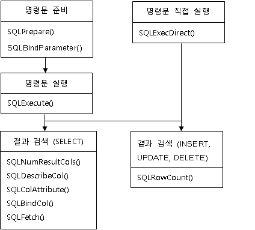
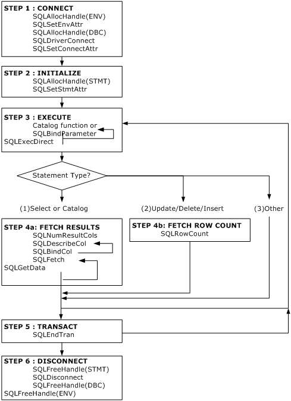
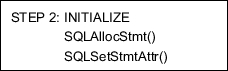
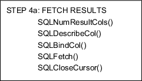
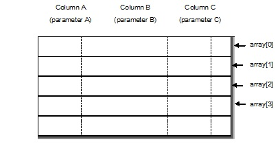

<!-- START doctoc generated TOC please keep comment here to allow auto update -->
<!-- DON'T EDIT THIS SECTION, INSTEAD RE-RUN doctoc TO UPDATE -->


- [CLI User's Manaul](#cli-users-manaul)
  - [서문](#%EC%84%9C%EB%AC%B8)
    - [이 매뉴얼에 대하여](#%EC%9D%B4-%EB%A7%A4%EB%89%B4%EC%96%BC%EC%97%90-%EB%8C%80%ED%95%98%EC%97%AC)
  - [1.Altibase CLI 소개](#1altibase-cli-%EC%86%8C%EA%B0%9C)
    - [개요](#%EA%B0%9C%EC%9A%94)
    - [기본 사용법](#%EA%B8%B0%EB%B3%B8-%EC%82%AC%EC%9A%A9%EB%B2%95)
    - [기본 프로그래밍 순서](#%EA%B8%B0%EB%B3%B8-%ED%94%84%EB%A1%9C%EA%B7%B8%EB%9E%98%EB%B0%8D-%EC%88%9C%EC%84%9C)
    - [Altibase CLI 애플리케이션 빌드](#altibase-cli-%EC%95%A0%ED%94%8C%EB%A6%AC%EC%BC%80%EC%9D%B4%EC%85%98-%EB%B9%8C%EB%93%9C)
  - [2.Altibase CLI 함수](#2altibase-cli-%ED%95%A8%EC%88%98)
    - [Altibase CLI API](#altibase-cli-api)
    - [SQLAllocConnect](#sqlallocconnect)
    - [SQLAllocEnv](#sqlallocenv)
    - [SQLAllocHandle](#sqlallochandle)
    - [SQLAllocStmt](#sqlallocstmt)
    - [SQLBindCol](#sqlbindcol)
    - [SQLBindParameter](#sqlbindparameter)
    - [SQLBulkOperations](#sqlbulkoperations)
    - [SQLCancel](#sqlcancel)
    - [SQLCloseCursor](#sqlclosecursor)
    - [SQLColAttribute](#sqlcolattribute)
    - [SQLColumns](#sqlcolumns)
    - [SQLConnect](#sqlconnect)
    - [SQLDescribeCol](#sqldescribecol)
    - [SQLDescribeParam](#sqldescribeparam)
    - [SQLDisconnect](#sqldisconnect)
    - [SQLDriverConnect](#sqldriverconnect)
    - [SQLEndTran](#sqlendtran)
    - [SQLError](#sqlerror)
    - [SQLExecDirect](#sqlexecdirect)
    - [SQLExecute](#sqlexecute)
    - [SQLFetch](#sqlfetch)
    - [SQLFetchScroll](#sqlfetchscroll)
    - [SQLForeignKeys](#sqlforeignkeys)
    - [SQLFreeConnect](#sqlfreeconnect)
    - [SQLFreeEnv](#sqlfreeenv)
    - [SQLFreeHandle](#sqlfreehandle)
    - [SQLFreeStmt](#sqlfreestmt)
    - [SQLGetConnectAttr](#sqlgetconnectattr)
    - [SQLGetData](#sqlgetdata)
    - [SQLGetDescField](#sqlgetdescfield)
    - [SQLGetDescRec](#sqlgetdescrec)
    - [SQLGetDiagField](#sqlgetdiagfield)
    - [SQLGetDiagRec](#sqlgetdiagrec)
    - [SQLGetEnvAttr](#sqlgetenvattr)
    - [SQLGetFunctions](#sqlgetfunctions)

<!-- END doctoc generated TOC please keep comment here to allow auto update -->

Altibase® Application Development

# CLI User's Manaul


Altibase Application Development Altibase CLI User's Manaul

Release 7.2

Copyright ⓒ 2001\~2021 Altibase Corp. All Rights Reserved.

본 문서의 저작권은 ㈜알티베이스에 있습니다. 이 문서에 대하여 당사의 동의
없이 무단으로 복제 또는 전용할 수 없습니다.

**㈜알티베이스**

08378 서울시 구로구 디지털로 306 대륭포스트타워Ⅱ 10층

전화: 02-2082-1114 팩스: 02-2082-1099

고객서비스포털: <http://support.altibase.com>

homepage: [http://www.altibase.com](http://www.altibase.com/)

## 서문

### 이 매뉴얼에 대하여

이 매뉴얼은 Altibase CLI 사용법에 대해 설명한다.

#### 대상 사용자

이 매뉴얼은 다음과 같은 Altibase 사용자를 대상으로 작성되었다.

-   데이터베이스 관리자

-   성능 관리자

-   데이터베이스 사용자

-   응용 프로그램 개발자

-   기술지원부

다음과 같은 배경 지식을 가지고 이 매뉴얼을 읽는 것이 좋다.

-   컴퓨터, 운영 체제 및 운영 체제 유틸리티 운용에 필요한 기본 지식

-   관계형 데이터베이스 사용 경험 또는 데이터베이스 개념에 대한 이해

-   컴퓨터 프로그래밍 경험

-   데이터베이스 서버 관리, 운영 체제 관리 또는 네트워크 관리 경험

#### 소프트웨어 환경

이 매뉴얼은 데이터베이스 서버로 Altibase 버전 7.2을 사용한다는 가정 하에
작성되었다.

#### 이 매뉴얼의 구성

이 매뉴얼은 다음과 같이 구성되어 있다.

-   제 1장 Altibase CLI 소개  
    이 장은 Altibase CLI 의 배경, 사용법, 프로그래밍 순서 등에 대해 간략히
    설명한다.

-   제 2장 Altibase CLI 함수  
    이 장은 Altibase CLI 함수들에 대해 구문, 인자, 결과값, 예제 등으로 나눠서
    자세히 설명한다.

-   제 3장 LOB 인터페이스  
    이 장은 LOB 데이터를 사용하는데 필요한 함수 및 데이터 타입을 설명한다.

-   A. 부록: Sample Code  
    본 매뉴얼에서 전반적으로 사용된 예에 대한 전체 코드 리스트를 나타낸다.

-   B. 부록: 데이터형  
    Altibase의 데이터 타입과 SQL 데이터 타입, C 데이터 타입의 종류와 각 타입간의
    변경 가능 유무에 대해서 설명한다.

-   C. 부록: 오류 코드  
    Altibase CLI 사용 중 발생하는 오류를 SQLSTATE 별로 분류하여 설명한다.

-   D. 부록: 업그레이드  
    Altibase를 업그레이드하면서 이전 버전에서 사용하던 ODBC 응용 프로그램들을
    사용할 수 있도록 추가되었거나 재정의된 데이터 타입과 기타 변경 사항들에 대해
    설명한다.

#### 문서화 규칙

이 절에서는 이 매뉴얼에서 사용하는 규칙에 대해 설명한다. 이 규칙을 이해하면 이
매뉴얼과 설명서 세트의 다른 매뉴얼에서 정보를 쉽게 찾을 수 있다.

여기서 설명하는 규칙은 다음과 같다.

-   구문 다이어그램

-   샘플 코드 규칙

구문 다이어그램

이 매뉴얼에서는 다음 구성 요소로 구축된 다이어그램을 사용하여, 명령문의 구문을
설명한다.

| 구성 요소                   | 의미                                                         |
| --------------------------- | ------------------------------------------------------------ |
|  | 명령문이 시작한다. 완전한 명령문이 아닌 구문 요소는 화살표로 시작한다. |
|  | 명령문이 다음 라인에 계속된다. 완전한 명령문이 아닌 구문 요소는 이 기호로 종료한다. |
|  | 명령문이 이전 라인으로부터 계속된다. 완전한 명령문이 아닌 구문 요소는 이 기호로 시작한다. |
|  | 명령문이 종료한다.                                           |
|  | 필수 항목                                                    |
|  | 선택적 항목                                                  |
|  | 선택사항이 있는 필수 항목. 한 항목만 제공해야 한다.          |
|  | 선택사항이 있는 선택적 항목                                  |
|  | 선택적 항목. 여러 항목이 허용된다. 각 반복 앞부분에 콤마가 와야 한다. |

##### 샘플 코드 규칙

코드 예제는 SQL, Stored Procedure, iSQL 또는 다른 명령 라인 구문들을 예를 들어
설명한다.

아래 테이블은 코드 예제에서 사용된 인쇄 규칙에 대해 설명한다.

| 규칙         | 의미                                                         | 예제                                                         |
| ------------ | ------------------------------------------------------------ | ------------------------------------------------------------ |
| [ ]          | 선택 항목을 표시                                             | VARCHAR [(*size*)][[FIXED \|] VARIABLE]                      |
| { }          | 필수 항목 표시. 반드시 하나 이상을 선택해야 되는 표시        | { ENABLE \| DISABLE \| COMPILE }                             |
| \|           | 선택 또는 필수 항목 표시의 인자 구분 표시                    | { ENABLE \| DISABLE \| COMPILE } [ ENABLE \| DISABLE \| COMPILE ] |
| . . .        | 그 이전 인자의 반복 표시 예제 코드들의 생략되는 것을 표시    | SQL\> SELECT ename FROM employee;<br/> ENAME<br/>  -----------------------<br/> SWNO <br/> HJNO<br/>  HSCHOI <br/> .<br/> .<br/> . <br/>20 rows selected. |
| 그 밖에 기호 | 위에서 보여진 기호 이 외에 기호들                            | EXEC :p1 := 1; acc NUMBER(11,2);                             |
| 기울임 꼴    | 구문 요소에서 사용자가 지정해야 하는 변수, 특수한 값을 제공해야만 하는 위치 | SELECT \* FROM *table_name*;<br/> CONNECT *userID*/*password*; |
| 소문자       | 사용자가 제공하는 프로그램의 요소들, 예를 들어 테이블 이름, 칼럼 이름, 파일 이름 등 | SELECT ename FROM employee;                                  |
| 대문자       | 시스템에서 제공하는 요소들 또는 구문에 나타나는 키워드       | DESC SYSTEM_.SYS_INDICES_;                                   |

#### 관련 자료

자세한 정보를 위하여 다음 문서 목록을 참조하기 바란다.

-   Installation Guide

-   Administrator’s Manual

-   Replication Manual

-   Precompiler User’s Manual

-   ODBC User's Manual

-   Application Program Interface User’s Manual

-   iSQL User’s Manual

-   Utilities Manual

-   Error Message Reference

#### Altibase는 여러분의 의견을 환영합니다.

이 매뉴얼에 대한 여러분의 의견을 보내주시기 바랍니다. 사용자의 의견은 다음
버전의 매뉴얼을 작성하는데 많은 도움이 됩니다. 보내실 때에는 아래 내용과 함께
고객서비스포털( http://support.altibase.com/kr/ )로 보내주시기 바랍니다.

-   사용 중인 매뉴얼의 이름과 버전

-   매뉴얼에 대한 의견

-   사용자의 성함, 주소, 전화번호

이 외에도 Altibase 기술지원 설명서의 오류와 누락된 부분 및 기타 기술적인
문제들에 대해서 이 주소로 보내주시면 정성껏 처리하겠습니다. 또한, 기술적인
부분과 관련하여 즉각적인 도움이 필요한 경우에도 고객서비스포털을 통해 서비스를
요청하시기 바랍니다.

여러분의 의견에 항상 감사드립니다.

1.Altibase CLI 소개
-----------------

이 장은 Altibase CLI의 배경 및 사용법을 소개하고, 프로그래밍 순서 등에 대해
간략히 설명한다.

### 개요

X/Open CLI와 ODBC는 데이터베이스에 접근하기 위한 표준 개방형 응용 프로그램
인터페이스로써, 호출 가능한 SQL 프로그래밍 인터페이스이다. 호출 가능한 SQL
프로그래밍 인터페이스란, CLI 함수를 호출하여 데이터베이스에 액세스하고 SQL문을
실행하는 인터페이스를 의미한다.

#### X/Open CLI와 ODBC

X/Open CLI 또는 SAG CLI라 불리는 호출 가능한 SQL 프로그래밍 인터페이스는 X/Open
사 및 SQL Access Group (SAG)에 의해 만들어졌다.

마이크로소프트가 개발한 윈도우용 ODBC 역시 X/Open CLI 스펙을 기반으로
개발되었다.

#### Altibase CLI란?

Altibase CLI는 Altibase 환경에서 지원되는 호출 가능한 SQL 프로그래밍
인터페이스이다. Altibase CLI 드라이버는 CLI 애플리케이션을 위해 단독으로 사용될
수도 있고, 아래 라이브러리의 하위 라이브러리로 사용될 수도 있다.

-   libalticapi.a: Altibase C API 라이브러리

-   libapre.a: APRE C/C++ 라이브러리

-   libiloader.a: iLoader API 라이브러리

Altibase CLI 드라이버는 Altibase 서버 및 클라이언트 패키지에 라이브러리 형태로
포함되어 있으며, 아래 애플리케이션을 빌드하거나 실행할 때 필요하다.

-   Altibase CLI 애플리케이션

-   Altibase C API 애플리케이션

-   APRE C/C++ 애플리케이션

-   XA 애플리케이션

-   iLoader API 애플리케이션

#### Altibase ODBC 드라이버

ODBC 애플리케이션이 데이터베이스에 접근하기 위해서는 ODBC Driver Manager 같은
ODBC 소프트웨어 외에 접근하려는 데이터베이스에서 제공하는 별도의 모듈이나
드라이버가 필요하다. 이를 위해 Altibase는 ODBC 드라이버를 제공한다. Altibase
ODBC 드라이버에 대한 자세한 내용은 *ODBC User's Manual*을 참조한다.

#### CLI와 ODBC의 차이점

Altibase CLI는 X/Open CLI 표준과 ODBC 스펙을 최대한 준수하여 ODBC 인터페이스와
아주 유사하다. 그러나 런타임시 Altibase CLI 애플리케이션은 ODBC Driver Manager를
통하지 않으므로, ODBC 애플리케이션보다 빠른 응답속도를 보장한다.


[그림 1‑1] CLI 드라이버와 ODBC 드라이버의 데이터베이스 접근 개요

#### 본 문서를 읽기 전에

Altibase CLI는 X/Open CLI 표준뿐만 아니라 ODBC 스펙도 준수한다. 그리고, 위의
[그림 1-1]처럼 Altibase CLI 핵심 모듈이 Altibase ODBC Driver의 하부에서
동작하므로, Altibase CLI 드라이버와 Altibase ODBC 드라이버의 내부 동작은
대부분이 유사하다.

본 문서의 내용은 ODBC 드라이버에도 대부분 적용되고 있으며, Altibase CLI 대신에
ODBC 용어를 사용하거나 함께 언급되었음을 미리 밝혀둔다.

### 기본 사용법 

본 절에서는 Altibase CLI를 이용한 애플리케이션 작성에 필요한 사전 지식을
살펴본다.

Altibase CLI 애플리케이션 프로그램은 아래 [그림 1-1]과 같이 전형적으로 크게 세
단계로 구성된다.

-   초기설정

-   트랜잭션 처리

-   종료

위의 세 가지 외에도 진단 메세지 처리와 같은 작업 등이 있는데, 이러한 작업은
애플리케이션 전반에 걸쳐 발생한다.


[그림 1‑2] Altibase CLI 애플리케이션 단계

#### 초기설정 

초기화는 환경 및 연결 핸들을 할당하고 초기화한다. 각 단계에서 다음 단계로의
전환은 적절한 핸들을 전달함으로써 이전 단계의 실행 결과에 관한 정보를 전달하는
것으로 이루어진다. Altibase CLI에서 제공하는 핸들의 종류는 다음과 같다.

##### 환경 핸들

환경 핸들은 애플리케이션 상태에 대한 전체적인 환경을 참조한다. 환경 핸들은 연결
핸들이 할당되기 전에 할당되어야 하며, 하나의 애플리케이션 내에서 여러 개의 환경
핸들을 할당할 수 있다.

##### 연결 핸들

연결 핸들은 Altibase CLI가 관리하는 연결과 관련된 정보를 참조한다. 이 정보에는
일반적인 상태 정보, 트랜잭션 상태, 진단 정보가 포함된다. 애플리케이션은 각
연결에 대한 연결 핸들을 할당하여 Altibase 서버로의 연결을 시도하게 된다.

##### 명령문 핸들

명령문 핸들은 Altibase CLI가 관리하는 SQL문에 대한 정보를 참조한다. 명령문
핸들은 연결 핸들과 연관이 있다. 명령문을 실행하기 위해 명령문 핸들을 할당한다.
하나의 연결에 최대 1024개의 명령문을 할당할 수 있다.

#### 트랜잭션 처리

[그림 1-2]는 일반적인 함수 호출 순서를 보여준다.



[그림 1‑3] 함수 호출 순서

#### 종료

애플리케이션에서 할당되었던 핸들을 단절하고, 할당되었던 메모리를 반환한 후
애플리케이션을 종료한다.

#### 진단 메세지 처리

진단이란 애플리케이션 내에서 생성된 경고나 오류 상태를 처리하는 것을 말한다.

##### 애플리케이션의 결과 값

| 결과값                | 설명                                            |
|-----------------------|-------------------------------------------------|
| SQL_SUCCESS           | 함수가 성공적으로 완료                          |
| SQL_SUCCESS_WITH_INFO | 경고 및 기타 정보와 함께 실행이 성공적으로 완료 |
| SQL_NO_DATA           | 함수가 성공적이지만 관련 자료가 없다            |
| SQL_ERROR             | 함수가 실패                                     |
| SQL_INVALID_HANDLE    | 입력 핸들이 유효하지않아 함수 실패              |

SQL_SUCCESS, SQL_NO_DATA, SQL_INVALID_HANDLE을 제외하고는 진단 메세지를
생성한다. 진단 메세지를 확인하려면 SQLGetDiagRec() 및 SQLGetDiagField()를
호출하여 확인할 수 있다.

##### 진단 메세지

진단 메세지는 5자(바이트)로 된 영어/숫자의 스트링이다. 여기에서 상위 2자는
클래스, 하위 3자는 하위 클래스를 나타낸다.

Altibase CLI가 제공하는 진단 메세지는 X/Open SQL CAE가 정의하는 표준을 준수한다.

#### SIGPIPE 처리시 주의사항

Altibase 클라이언트 라이브러리는 신호 처리를 하지 않는다.

따라서 외부 원인에 의해 네트워크 접속이 종료된 경우, SIGPIPE 신호를 받아
진행중인 응용 프로그램이 강제로 종료될 수 있다. 이러한 강제 종료를 막기 위해서는
SIGPIPE 신호를 사용자 애플리케이션에서 처리해야 한다. SIGPIPE 신호 처리를
처리하는 함수 내에서 Altibase 클라이언트 라이브러리 함수를 호출하면 프로그램이
멈출 수도 있으므로, 신호 처리 함수 작성에 주의해야 한다. 하지만 신호 처리가 끝난
후에는 Altibase 클라이언트 라이브러리 함수를 호출하는 것이 가능하다.

### 기본 프로그래밍 순서



#### 단계 1

Connect to the Database

어떤 애플리케이션에건 첫 번째 단계는 데이터베이스에 연결하는 것이다. 이 단계에서
필요한 함수는 다음 그림과 같다.


데이터베이스에 연결하는 첫 번째 작업은 SQLAllocHandle()을 이용하여 환경 핸들을
할당하는 것이다.

애플리케이션은 SQLSetEnvAttr()을 호출하여 현재 환경에 대한 환경 속성을 설정한다.

다음으로 애플리케이션은 SQLAllocHandle()로 연결 핸들을 할당하고
SQLDriverConnect()을 호출하여 데이터 소스에 연결한다.

그런 다음 애플리케이션은 SQLSetConnectAttr()을 이용하여 연결 속성값을 설정한다.

#### 단계 2 

Initialize the Application

두 번째 단계는 다음 그림에 설명된 것처럼 애플리케이션을 초기화 하는 것이다.
정확한 작업은 애플리케이션마다 다르다.



애플리케이션은 SQLAllocStmt()로 명령문 핸들을 할당하고, 대부분의
애플리케이션들은 SQLSetStmtAttr()로 커서 종류와 같은 속성을 지정한다.

#### 단계 3 

Build and Execute an SQL Statement

세번째 단계는 다음 그림에 보이는 것처럼 SQL 명령문(statement)을 만들고 실행하는
것이다. 이단계의 처리 형태는 매우 다양하다. 애플리케이션은 사용자가 입력한 SQL
문에 기초하여 SQL 문을 만들거나 실행한다.


SQL 문이 만들어지고 인자들이 바인드되면, 명령문(statement)은 SQLExecDirect로
실행된다. 만약 여러 번 수행되는 구문은 SQLPrepare()로 준비하고, SQLExecute로
반복 실행하는 것이 성능면에서 더 유리하다.

만약 SQL문이 파라미터 마커(?)들을 포함하면, 애플리케이션은 SQLBindParameter()를
호출하여 각 인자들을 애플리케이션 변수에 바인드시킨다. 인자를 바인딩하기 전에
SQLPrepare()를 실행해야 하며, 바인딩 후에 SQLExecute()을 실행할 수 있다.

애플리케이션은 SQL문 실행을 보류하고 카탈로그 정보를 포함한 결과 집합을 리턴하는
함수를 호출할 수도 있다.

애플리케이션의 다음 취할 행동은 SQL문의 실행 형태에 달려있다.

| SQL 문의 종류              | 다음 취할 행동                                                             |
|----------------------------|----------------------------------------------------------------------------|
| SELECT 또는 카탈로그 함수  | 단계 4a: 결과를 가져온다.                                                  |
| UPDATE, DELETE 또는 INSERT | 단계 4b: 행의 개수를 가져온다.                                             |
| 그 밖의 SQL문              | 단계 3: SQL문을 만들고 실행한다. 또는 단계 5: 트랜잭션을 반영(commit)한다. |

#### 단계 4a

Fetch the Results

다음 단계는 다음 그림처럼 결과를 fetch하는 것이다.



만약 단계 3에서 실행된 명령문(statement)이 SELECT문이나 카탈로그 함수라면,
애플리케이션은 먼저 결과 집합의 칼럼 수를 알아보기 위해 SQLNumResultCols()를
호출한다. 애플리케이션은 이미 결과 집합 열의 개수를 알고 있다면 이 단계는
필요없다.

그 다음, 애플리케이션은 SQLDescribeCol()로 각 결과 집합열의 이름, 데이터형,
정밀도 등을 가져온다. 마찬가지로 애플리케이션이 이런 정보들을 미리 알고있다면
이단계도 필요없다. 그 후 애플리케이션은 애플리케이션 변수와 결과 집합의 열을
바인드하는 SQLBindCol()에 이런 정보를 보낸다.

이제 애플리케이션은 SQLFetch()를 호출하여 첫번째 행데이터를 가져오고
SQLBindCol()로 바인드 된 변수에 데이터를 저장한다. 행에 긴 데이터가 있으면
SQLGetData()로 데이터를 가져올 수도 있다. 애플리케이션은 추가적으로 데이터를
가져오기위해 SQLFetch()와 (필요하다면) SQLGetData()의 호출을 계속한다.

위의 과정을 거쳐 모든 data를 fetch 해 온 후에는 다른 명령문(statement)을
SQLPrepare() 와 SQLExecute() 를 이용하여 실행하기 전에 반드시 SQLCloseCursor()를
호출하여 데이터를 fetch 하기 위해 열려 있던 커서를 닫아 주어야 한다.

애플리케이션은 같은 트랜잭션 내의 다른 명령문(statement)을 실행하기 위해 단계
3으로 되돌아가거나 트랜잭션을 반영하거나 롤백하기 위해 단계 5로 넘어간다.

#### 단계 4b 

Fetch the Row Count


만일 단계 3에서 수행된 명령문(statement)이 UPDATE, DELETE, INSERT 였다면,
애플리케이션은 SQLRowCount()로 영향을 받은 행들의 개수를 가져온다.

만약 array bind 등을 이용하여 여러 개의 명령문(statement) 를 실행하였다면 각각의
명령문(statement)의 실행으로 영향을 받은 행들을 SQLMoreResults() 함수와
SQLRowCount() 함수의 조합을 이용하여 가져올 수 있다.

애플리케이션은 같은 트랜잭션내의 다른 명령문(statement)을 실행하기위해 단계
3으로 되돌아가거나 트랜잭션을 반영 또는 롤백하기위해 단계 5로 넘어간다.

#### 단계 5

Commit the Transation


다섯번째 단계는 트랜잭션을 반영하거나 롤백하기 위해 SQLEndTran()을 호출한다.
애플리케이션은 트랜잭션 반영모드가 수동반영(non-auto-commit)으로 설정되어 있을
때만 이 단계를 수행한다. 만일 트랜잭션 반영모드가 자동반영(auto-commit) 이면,
트랜잭션은 명령문(statement)이 실행되었을 때 자동으로 반영된다.

새로운 트랜잭션에서 명령문을 수행하기 위해, 애플리케이션은 단계 3으로 되돌아
간다. 데이터베이스와 단절하기 위해선 단계 6으로 진행한다.

#### 단계 6

Disconnect from the Altibase

마지막 단계는 다음 그림과 같이, 데이터베이스로부터 단절(disconnect)하는 것이다.
먼저, 애플리케이션은 SQLFreeHandle()을 호출하여 핸들을 반환(free)시킨다.


다음 애플리케이션은 SQLDisconnect()를 이용해 데이터베이스로부터 단절하고,
SQLFreeConnect()를 이용해 연결 핸들을 반환시킨다.

마지막으로 애플리케이션은 SQLFreeEnv()을 가지고 환경 핸들을 반환시키고
프로그램을 종료한다.

### Altibase CLI 애플리케이션 빌드

이 절은 Altibase CLI 애플리케이션을 빌드하는 방법을 설명한다.

#### 헤더 파일과 라이브러리

Altibase CLI를 이용하여 애플리케이션을 작성하고 빌드하기 위해서는
\$ALTIBASE_HOME 디렉토리의 서브 디렉토리인 include와 lib에 있는 아래의 헤더
파일과 라이브러리 파일이 필요하다.

```
$ALTIBASE_HOME/include/sqlcli.h
$ALTIBASE_HOME/lib/libodbccli.a
```

#### 컴파일

컴파일시에는 컴파일 명령어에 다음의 옵션을 사용하라.

```
-I$ALTIBASE_HOME/include
```

링크시에는 링크 명령어에 다음의 옵션을 사용하라.

```
-L$ALTIBASE_HOME/lib -lodbccli
```

2.Altibase CLI 함수
-----------------

이 장에서는 Altibase CLI의 각 함수를 알파벳 순으로 설명한다.

각각의 함수에는 다음과 같은 정보가 포함된다.

-   함 수 명 : 사용 목적

-   구 문 : 함수의 'C' 프로토타입

-   인 자 : 각 함수 인자의 자료유형, 입력/출력, 부연 설명

-   결 과 값 : 함수에서 리턴될 수 있는 값

-   설 명 : 함수 사용 방법 및 주의사항

-   진 단 : 함수에서 오류시 나타날 수 있는 진단 메세지

-   관련함수 : 이 함수와 관련된 함수

-   예 제 : 해당 함수가 사용된 소스 코드의 일부

### Altibase CLI API

#### API 분류

Altibase CLI의 API는 애플리케이션 작성에 필요한 환경 정의, 연결 관리, SQL문
처리, 트랜잭션 처리 등에 관련된 기능을 제공하는 함수들로 구성된다. 각 함수들은
제공하는 기능에 따라 다음과 같은 그룹으로 구분할 수 있다.

-   환경/연결 관리

-   SQL 처리

-   속성 처리

-   메타정보 처리

##### 환경/연결 관리

데이터베이스 서버 연결에 필요한 환경 설정과 연결에 관련된 기능 등을 제공하는
API로 구성된다. 또한 모든 작업이 종료된 후 할당된 메모리 등을 해제한다.

##### SQL 처리

SQL 처리를 위한 명령문 할당과 준비, 실행 요청과 결과값 처리 기능 등을 제공하는
API로 구성된다.

##### 속성 처리

SQL 처리를 위한 환경 설정, 연결 설정, 명령문 속성 설정 기능 등을 제공하는 API로
구성된다.

##### 메타정보 처리

테이블 정의, 열 정의 등 메타 정보 검색을 위한 기능 등을 제공하는 API로 구성된다.

#### API 목록

Altibase CLI 함수 목록은 아래의 표와 같다. 각 함수에 대한 보다 자세한 내용은
아래에서 설명한다.

<table>
<tr>
	<td colspan="2">작업</td>
    <td>함수명</td>
    <td>목적</td>
</tr>
<tr>
    <td rowspan="14" colspan="2"> 연결관리<br/>
    <td>SQLAllocConnect</td>
    <td> 자원과 연결 핸들 초기화 및 할당</td>
</tr>
<tr>
    <td>SQLAllocEnv</td>
    <td>환경 핸들 초기화 및 메모리 할당</td>
</tr>
<tr>
    <td>SQLAllocStmt</td>
    <td>명령문 핸들 초기화 및 메모리 할당</td>
</tr>
<tr>
    <td>SQLAllocHandle</td>
    <td>자원, 환경, 명령문 핸들 초기화 및 메모리 할당</td>
</tr>
<tr>
    <td>SQLCloseCursor</td>
    <td>열려진 커서를 닫고 보류중인 결과들을 폐기</td>
</tr>
<tr>
    <td>SQLConnect</td>
    <td>목표 데이터베이스와 연결설정</td>
</tr>
<tr>
    <td>SQLDisconnect</td>
    <td>연결 핸들과 연관된 연결을 종료</td>
</tr>
<tr>
    <td>SQLDriverConnect</td>
    <td>연결 스트링을 이용해 목표데이터베이스와 연결설정</td>
</tr>
<tr>
    <td>SQLEndTran</td>
    <td>현재 트랜잭션을 반영하거나 철회 실행</td>
</tr>
<tr>
    <td>SQLFreeConnect</td>
    <td>연결 핸들을 무효화하고 할당된 메모리 해제</td>
</tr>
<tr>
    <td>SQLFreeEnv</td>
    <td>환경 핸들을 무효화하고 할당된 메모리 해제</td>
</tr>
<tr>
    <td>SQLFreeHandle</td>
    <td>연결, 핸들, 명령문에 할당된 메모리 해제</td>
</tr>
 <tr>
    <td>SQLFreeStmt</td>
    <td>명령문 핸들을 무효화하고 할당된 메모리 해제</td>
</tr>
 <tr>
    <td>SQLTransact</td>
    <td>데이터베이스에 대한 모든 변경을 반영하거나 철회</td>
</tr>
<tr>
    <td rowspan="23">SQL 실행</td>
    <td rowspan="7">요청</td>
    <td>SQLBindParameter</td>
    <td>SQL문장에 매개변수(parameter)를 바인드 </td>
</tr>
<tr>
	<td>SQLExecDirect</td>
	<td>SQL문장을 직접 실행</td>
</tr>
<tr>
    <td>SQLExecute</td>
    <td>준비된 SQL문장을 실행</td>
</tr>
<tr>
    <td>SQLNativeSql</td>
    <td>SQL 구문을 Altibase가 지원하는 문장으로 변환</td>
</tr>
<tr>
    <td>SQLParamData</td>
    <td>SQL 구문을 Altibase가 지원하는 문장으로 변환</td>
</tr>
<tr>
    <td>SQLPrepare</td>
    <td>실행할 SQL문을 준비</td>
</tr>
<tr>
    <td>SQLPutData</td>
    <td>수행중인 명령문에 데이터를 넣을 때 사용</td>
</tr>
<tr>
    <td rowspan="16">검색</td>
    <td>SQLBindCol</td>
    <td>결과 집합의 열을 받아올 버퍼와 데이터형 지정</td>
</tr>
<tr>
    <td>SQLColAttribute</td>
    <td>결과 집합의 열에 대한 속성을 확인</td>
</tr>
<tr>
    <td>SQLDescribeCol</td>
    <td>결과 집합에서 한 개의 행에 대한 정보 확인</td>
</tr>
<tr>
    <td>SQLDescribeParam</td>
    <td>결과 집합에서 매개변수 마커(?)와 연관된 정보 확인</td>
</tr>
<tr>
    <td>SQLError</td>
    <td>가장 최근에 호출된 함수와 연관된 진단 정보 확인</td>
</tr>
<tr>
    <td>SQLFetch</td>
    <td>결과 집합의 바인드된 열에 대한 정보 확인</td>
</tr>
<tr>
    <td>SQLFetchScroll</td>
    <td>결과 집합에서 커서를 원하는 방향으로 진행시키고, 바인드 된 열을 가져옴</td>
</tr>
<tr>
    <td>SQLGetConnectAttr</td>
    <td>특정 연결에 설정된 속성값 검색</td>
</tr>
<tr>
    <td>SQLGetData</td>
    <td>결과 집합의 현재 행에서 단일 열에 대한 자료검색</td>
</tr>
<tr>
    <td>SQLGetInfo</td>
    <td>애플리케이션에 접속한 DBMS 정보를 검색</td>
</tr>
<tr>
    <td>SQLGetStmtAttr</td>
    <td>설정된 명령문 핸들 관련 속성값 검색</td>
</tr>
<tr>
    <td>SQLGetTypeInfo</td>
    <td>데이터베이스에서 지원되는 데이터 타입에 관한 정보 반환</td>
</tr>
<tr>
    <td>SQLNumParams</td>
    <td>SQL 문에서의 매개변수 개수를 반환</td>
</tr>
<tr>
    <td>SQLNumResultCols</td>
    <td>결과 집합의 열의 숫자를 반환</td>
</tr>
<tr>
    <td>SQLRowCount</td>
    <td>테이블에 대해 실행한 SQL문에 의해 나타난 결과 집합의 행의 숫자를 반환</td>
</tr>
<tr>
    <td>SQLMoreResults</td>
    <td>Multiple result가 생성된 execution 일 경우, 다음 result로 관심 result를 변경한다</td>
</tr>
<tr>
    <td rowspan="5" colspan="2">속성처리</td>
    <td>SQLGetEnvAttr</td>
    <td>환경 핸들의 속성 값을 설정</td>
</tr>
<tr>
    <td>SQLGetFunctions</td>
    <td>Altibase CLI 드라이버가 지원하는 함수 목록 설정</td>
</tr>
<tr>
    <td>SQLSetConnectAttr</td>
    <td>연결 속성값을 설정</td>
</tr>
<tr>
    <td>SQLSetEnvAttr</td>
    <td>환경 속성값을 설정</td>
</tr>
<tr>
    <td>SQLSetStmtAttr</td>
    <td>명령문 속성값을 설정</td>
</tr>
<tr>
    <td rowspan="14" colspan="2">메타 정보 처리</td>
    <td>SQLColumns</td>
    <td>특정 테이블의 행에 대한 정보 검색</td>
</tr>
<tr>
    <td>SQLForeignKeys</td>
    <td>특정 테이블의 외래 키에 대한 정보 검색</td>
</tr>
<tr>
    <td>SQLGetDescField</td>
    <td>descriptor의 속성을 한 개 검색</td>
</tr>
<tr>
    <td>SQLGetDescRec</td>
    <td>descriptor의 속성을 여러 개 검색</td>
</tr>
<tr>
    <td>SQLGetDiagField</td>
    <td>함수 사용 후 결과 진단 검색</td>
</tr>
<tr>
    <td>SQLGetDiagRec</td>
    <td>함수 사용 후 결과 진단을 여러 개 검색</td>
</tr>
<tr>
    <td>SQLPrimaryKeys</td>
    <td>특정 테이블의 기본 키에 대한 정보 검색</td>
</tr>
<tr>
    <td>SQLProcedureColumns</td>
    <td>프로시저에 대한 입력/출력 매개변수 정보를 검색</td>
</tr>
<tr>
    <td>SQLProcedures</td>
    <td>프로시저 이름 목록 검색</td>
</tr>
<tr>
    <td>SQLSetDescField</td>
    <td>descriptor의 속성을 한 개 지정</td>
</tr>
<tr>
    <td>SQLSpecialColumns</td>
    <td>특정 열들을 검색</td>
</tr>
<tr>
    <td>SQLStatistics</td>
    <td>테이블에 대한 색인 정보 검색</td>
</tr>
<tr>
    <td>SQLTablePrivileges</td>
    <td>테이블의 목록과 각 테이블과 관련 된 권한들을 검색</td>
</tr>
<tr>
    <td>SQLTables</td>
    <td>테이블 목록 검색</td>
</tr>
</table>

### SQLAllocConnect 

입력 환경 핸들에 의해 식별된 환경 내에서 연관된 자원과 연결 핸들을 할당한다.
연결 핸들과 입력 환경 핸들에 의해 식별된 환경에서 관련 자원을 할당한다.

SQLAllocConnect()는 SQLAllocHandle()로 대체될 수 있다.

#### 구 문

```
SQLRETURN  SQLAllocConnect (
	SQLHENV	    env,
	SQLHDBC *	dbc );
```

#### 인 자

| 자료유형   | 인자 | 사용 | 설명               |
|------------|------|------|--------------------|
| SQLHENV    | env  | 입력 | 환경 핸들          |
| SQLHDBC \* | dbc  | 출력 | 연결 핸들의 포인터 |

#### 결과값

```
SQL_SUCCESS
SQL_INVALID_HANDLE
SQL_ERROR
```

#### 설명

출력 연결 핸들은 일반적인 상태 정보, 트랜잭션 상태, 오류 정보를 포함한 연결과
관련되는 모든 정보를 참조하기 위해 Altibase CLI 드라이버에 의해 사용된다.

연결 핸들을 가리키는 포인터 (*dbc*)가 SQLAllocConnect ()에 의해 할당된 유효한
연결 핸들을 가리키면, 이 호출의 결과에 의해 원래의 값이 바뀐다. 이것은
애플리케이션 프로그래밍 오류로, Altibase CLI 드라이버에 의해 감지되지 않는다.

> \* 이 함수를 호출하기 전에 SQLAllocEnv ()를 호출해야 한다.
>

#### 진 단

| SQLSTATE | 설명                                   | 부연설명                                  |
|----------|----------------------------------------|-------------------------------------------|
| HY000    | 일반 오류                              | 채널 초기화 오류                          |
| HY001    | 메모리 할당 오류                       | 명시된 핸들을 위한 메모리 할당에 실패 함. |
| HY009    | 유효하지 않은 인자 (null pointer) 사용 | dbc가 null pointer 임.                    |

#### 관련함수

```
SQLAllocEnv
SQLConnect
SQLDisconnect
SQLFreeConnect
```

#### 예 제

< $ALTIBASE_HOME/sample/SQLCLI/demo_ex1.cpp 참고 >

```
/* Environment 을 위한 메모리를 할당 */
if (SQLAllocEnv (&env) != SQL_SUCCESS)
{
    printf("SQLAllocEnv error!!\n");
    return SQL_ERROR;
}

/* Connection 을 위한 메모리를 할당  */
if (SQLAllocConnect (env, &dbc) != SQL_SUCCESS)
{
    printf("SQLAllocConnect error!!\n");
    return SQL_ERROR;
}
```

### SQLAllocEnv 

환경 핸들과 관련된 자원들을 할당한다.

SQLAllocEnv ()는 SQLAllocHandle()로 대체될 수 있다.

#### 구 문

```
SQLRETURN  SQLAllocEnv ( 
	SQLHENV *	env );
```

#### 인 자

| 자료유형   | 인자 | 사용 | 설명               |
|------------|------|------|--------------------|
| SQLHENV \* | env  | 출력 | 환경 핸들의 포인터 |

#### 결과값

```
SQL_SUCCESS
SQL_ERROR
```

#### 설 명

한 애플리케이션에서 여러 개의 환경을 사용할 수 있다.

모든 Altibase CLI 자원이 계속 사용 중이려면 SQLAllocEnv ()를 호출한 프로그램이
종료되거나 스택을 벗어나서는 안된다. 그렇지 않으면, 애플리케이션은 명령문 핸들과
할당한 다른 자원들을 잃을 수 있다.

애플리케이션은 SQLAllocConnect () 또는 다른 Altibase CLI 함수를 호출 하기전에 이
함수를 먼저 호출해야 한다. 이 후에 입력값으로 환경 핸들을 필요로하는 모든 함수에
env 값이 전달된다.

#### 관련함수

```
SQLAllocConnect
SQLAllocStmt
SQLFreeEnv
```

#### 예 제

< $ALTIBASE_HOME/sample/SQLCLI/demo_ex1.cpp 참고 >

```
/* Environment 을 위한 메모리를 할당 */
if (SQLAllocEnv (&env) != SQL_SUCCESS)
{
    printf("SQLAllocEnv error!!\n");
    return SQL_ERROR;
}
```

### SQLAllocHandle 

환경, 연결, 그리고 명령문 핸들을 위한 메모리를 할당하고 초기화 한다.

#### 구 문

```
SQLRETURN  SQLAllocHandle (
	SQLSMALLINT	    HandleType,
	SQLHANDLE		InputHandle,
	SQLHANDLE *		OutputHandlePtr );
```

#### 인 자

| 자료유형     | 인자            | 사용 | 설명                                                                                                                                                          |
|--------------|-----------------|------|---------------------------------------------------------------------------------------------------------------------------------------------------------------|
| SQLSMALLINT  | HandleType      | 입력 | 할당 될 핸들 타입으로 다음 세 값 중에 하나이다. SQL_HANDLE_ENV, SQL_HANDLE_DBC, SQL_HANDLE_STMT                                                               |
| SQLHANDLE    | InputHandle     | 입력 | 입력 핸들 HandleType이 SQL_HANDLE_ENV이면 InputHandle은 SQL_NULL_HANDLE이고 SQL_HANDLE_DBC이면 환경 핸들이어야 하고 SQL_HANDLE_STMT이면 연결 핸들이어야 한다. |
| SQLHANDLE \* | OutputHandlePtr | 출력 | 할당 받은 핸들의 포인터                                                                                                                                       |

#### 결과값

```
SQL_SUCCESS
SQL_SUCCESS_WITH_INFO
SQL_INVALID_HANDLE
SQL_ERROR
```

#### 설 명

SQLAllocHandle()은 다음 단락에서 묘사될 환경, 연결, 그리고 명령문 핸들을
할당한다.

이 함수는 SQLAllocEnv (), SQLAllocConnect () 및 SQLAllocStmt() 함수들을
대치한다. 환경 핸들을 요구하기 위하여 애플리케이션은 HandleType이
SQL_HANDLE_ENV이고, InputHandle이 SQL_NULL_HANDLE인 SQLAllocHandle()을 호출한다.
연결 핸들을 요구하기 위하여 애플리케이션은 HandleType이 SQL_HANDLE_DBC인
SQLAllocHandle()을 호출하고, 그때의 InputHandle은 유효한 환경 핸들이어야 한다.
명령문 핸들을 요구하기 위하여 애플리케이션은 HandleType이 SQL_HANDLE_STMT인
SQLAllocHandle()을 호출하고, 그때의 InputHandle은 유효한 연결 핸들이어야 한다.

한 애플리케이션에 의해 한 번에 한 개 이상의 환경, 연결, 그리고 명령문 핸들들이
할당 될 수 있는데, 한 프로세스 내의 다른 쓰레드 상에서 같은 환경, 연결, 또는
명령문 핸들은 동시에 사용할 수 없다.

##### 환경 핸들 할당

환경 핸들은 연결 핸들이 유효하다든지 활성화 돼 있다든지 하는 전역적인 정보를
제공한다.

환경 핸들을 요구하기 위해 애플리케이션은 *Handletype*이 SQL_HANDLE_ENV이고
*InputHandle*이 SQL_NULL_HANDLE인 SQLAllocHandle()을 호출한다. Altibase CLI
드라이버는 환경 정보에 필요한 메모리를 할당하고, \**OutputHandle*에 관련 핸들의
값을 돌려준다. 애플리케이션은 \**OutputHandle* 값을 환경 핸들을 필요로하는 후속
호출들에 전달한다.

##### 연결 핸들 할당

연결 핸들은 연결 핸들상에서 명령문 핸들이 유효한가, 트랜잭션이 현재 열려있는가와
같은 정보를 제공한다.

연결 핸들을 요구하기위해, 애플리케이션은 *HandleType*이 SQL_HANDLE_DBC인
SQLAllocHandle()을 호출한다. *InputHandle* 인자는 SQLAllocHandle()을
호출함으로서 반환된 환경 핸들로 설정된다. Altibase CLI 드라이버는 연결 정보에
필요한 메모리를 할당하고, \**OutputHandle*에 관련 핸들의 값을 돌려준다.
애플리케이션은 \**OutputHandle* 값을 연결 핸들을 필요로하는 후속 호출들에
전달한다.

##### 명령문 핸들 할당

명령문 핸들은 SQL문 처리에 대한 오류 메세지 그리고 상태 정보등과 같은 명령문
정보를 제공한다.

명령문 핸들을 요구하기위해, 애플리케이션은 데이터베이스와 연결하고, SQL 문을
보내기 전에 SQLAllocHandle()을 호출한다. 이러한 호출에서 *HandleType*은
SQL_HANDLE_STMT로 설정돼야만 하고 *InputHandle* 인자는 SQLAllocHandle()을
호출함으로서 반환된 연결 핸들로 설정되야만 한다. Altibase CLI 드라이버는 명령문
정보에 필요한 메모리를 할당하고, 명시된 연결로 명령문 핸들과 연결하고,
\**OutputHandle*에 관련 핸들의 값을 돌려준다. 애플리케이션은 \**OutputHandle*
값을 명령문 핸들을 필요로하는 후속 호출들에 전달한다.

#### 진 단

| SQLSTATE | 설명                                   | 부연설명                                  |
|----------|----------------------------------------|-------------------------------------------|
| HY000    | 일반 오류                              |                                           |
| HY001    | 메모리 할당 오류                       | 명시된 핸들을 위한 메모리 할당에 실패 함. |
| HY009    | 유효하지 않은 인자 (null pointer) 사용 | OutputHandlePtr가 null pointer 임.        |

#### 관련함수

```
SQLExecDirect
SQLExecute
SQLFreeHandle
SQLPrepare
SQLSetConnectAttr
SQLSetEnvAttr
SQLSetStmtAttr
```

#### 예 제

< $ALTIBASE_HOME/sample/SQLCLI/demo_meta1.cpp 참고 >

```
/* Environment 을 위한 메모리를 할당 */
if (SQLAllocHandle(SQL_HANDLE_ENV, SQL_NULL_HENV, &env) != SQL_SUCCESS)
{
    printf("SQLAllocEnv error!!\n");
    return SQL_ERROR;
}
    
/* Connection 을 위한 메모리를 할당  */
if (SQLAllocHandle(SQL_HANDLE_DBC, env, &dbc) != SQL_SUCCESS)
{   
    printf("SQLAllocConnect error!!\n");
    return SQL_ERROR;
}
```

### SQLAllocStmt

명령문을 위한 메모리를 할당하고 초기화한다.

하나의 연결에 1024개의 명령문까지 할당이 가능하다.

SQLAllocStmt()는 SQLAllocHandle()로 대체될 수 있다.

#### 구 문

```
SQLRETURN  SQLAllocStmt (
	SQLHDBC	    dbc,
	SQLHSTMT *	stmt );
```

#### 인 자

| 자료유형    | 인자 | 사용 | 설명                 |
|-------------|------|------|----------------------|
| SQLHDBC     | dbc  | 입력 | 연결 핸들            |
| SQLHSTMT \* | stmt | 출력 | 명령문 핸들의 포인터 |

#### 결과값

```
SQL_SUCCESS
SQL_SUCCESS_WITH_INFO
SQL_INVALID_HANDLE
SQL_ERROR
```

SQL_ERROR가 반환되면 stmt 인수가 SQL_NULL_STMT로 설정된다. 애플리케이션은 stmt
인수를 SQL_NULL_STMT로 설정하여 SQLError()를 호출해야 한다.

#### 설 명

Altibase CLI 드라이버는 각각의 명령문 핸들을 사용하여 모든 설명자, 결과 값, 상태
정보를 처리된 SQL 명령문과 연관시킨다. 각각의 SQL 문에 명령문 핸들이 있어야
하지만 다른 명령문에서 핸들을 다시 사용할 수 있다.

이 함수에 대한 호출시에서는 dbc가 사용 중인 데이터베이스 연결을 참조해야 한다.

명령문 핸들을 가리키는 입력 포인터가 이전의 SQLAllocStmt() 호출에 의해 할당된
유효한 명령문 핸들을 가리키면 원래의 값이 이 호출의 결과에 따라 바뀐다.

이것은 애플리케이션 프로그래밍 오류로 Altibase CLI 드라이버에 의해 감지되지
않는다.

> \* 이 함수를 호출하기 전에 SQLDriverConnect()를 호출해야 한다. 그리고
> SQLPrepare(), SQLExecute(), SQLExecDirect() 또는 명령문 핸들을 입력 인수로 갖는
> 다른 함수 이전에 이 함수를 호출해야 한다.

#### 진 단

| SQLSTATE | 설명                                            | 부연설명                             |
|----------|-------------------------------------------------|--------------------------------------|
| HY000    | 일반 오류                                       | stmt 수 (1024) 초과                  |
| HY001    | 메모리 할당 오류                                | stmt를 위한 메모리 할당에 실패 함.   |
| HY009    | 유효하지 않은 인자 (null pointer) 사용          | stmt가 null pointer 임.              |
| HY010    | 함수 연속 오류 (연결이 되지 않거나 끊어진 상태) | dbc가 연결이 되있지 않거나 끊긴 상태 |

#### 관련함수

```
SQLConnect
SQLFreeStmt
```

#### 예 제

< $ALTIBASE_HOME/sample/SQLCLI/demo_ex1.cpp 참고 >

```
/* Statement을 위한 메모리를 할당 */
if (SQL_ERROR == SQLAllocStmt(dbc, &stmt))
{
    printf("SQLAllocStmt error!!\n");
    return SQL_ERROR;
}
```

### SQLBindCol

모든 데이터 타입에 대해 애플리케이션 변수들을 (application data buffers) 결과
집합의 열들에 바인드한다.

#### 구 문

```
SQLRETURN  SQLBindCol (
	SQLHSTMT	stmt, 
	SQLSMALLINT	col,
	SQLSMALLINT	cType,
	SQLPOINTER	value,
	SQLLEN		max,
	SQLLEN *	valueLength );

```

#### 인 자

| 자료유형    | 인자        | 사용             | 설명                                                                                                                                                                                                                                                                                                                                                                                                            |
|-------------|-------------|------------------|-----------------------------------------------------------------------------------------------------------------------------------------------------------------------------------------------------------------------------------------------------------------------------------------------------------------------------------------------------------------------------------------------------------------|
| SQLHSTMT    | stmt        | 입력             | 명령문 핸들                                                                                                                                                                                                                                                                                                                                                                                                     |
| SQLSMALLINT | col         | 입력             | 바인드할 결과 집합에서의 column의 순서. 1부터 시작                                                                                                                                                                                                                                                                                                                                                              |
| SQLSMALLINT | cType       | 입/출력 (유예중) | \*value 버퍼의 C 데이터 타입 식별자 (부록 참고).                                                                                                                                                                                                                                                                                                                                                                |
| SQLPOINTER  | value       | 출력             | 데이터를 저장할 버퍼의 포인터. SQLFetch()는 이 버퍼에 데이터를 반환한다. value가 null pointer 면 Altibase CLI 드라이버는 결과 집합 column에 대한 data buffer를 언바인드한다. 애플리케이션은 SQL_UNBIND option을 이용해 SQLFreeStmt()를 호출함으로써 모든 column들을 언바인드한다. 그러나 value 인자가 null pointer 일지라도 valueLength 인자가 유효한 값이면 애플리케이션은 여전히 length 버퍼 바운드를 갖는다. |
| SQLLEN      | max         | 입력             | 버퍼의 최대 크기 (byte 단위). \*value에 character data를 반환할 때 \*value 인자는 null-termination character를 위한 공간을 포함해야만 한다. 그렇지 않으면, Altibase CLI 드라이버는 데이터를 자른다. 고정 길이 data (integer 또는 data structure 등)를 반환할 경우는 max를 무시하기 때문에 충분한 버퍼 크기를 할당해야만 한다. 그렇지 않으면 Altibase CLI 드라이버는 버퍼의 끝을 지나 저장한다.                  |
| SQLLEN \*   | valueLength | 입/출력 (유예중) | NULL이거나 버퍼에 저장된 데이터의 길이를 저장할 포인터 SQLFetch()는 이 버퍼에 다음 값들을 반환할 수 있다: 데이터 길이, SQL_NULL_DATA                                                                                                                                                                                                                                                                            |

#### 결과값

```
SQL_SUCCESS
SQL_SUCCESS_WITH_INFO
SQL_INVALID_HANDLE
SQL_ERROR
```

#### 설 명

이 함수에 대해 포인터 value와 valueLength는 유예중인 출력 변수로 (SQLFetch()가
호출될 때까지 이 포인터들이 가리키는 기억장치 위치가 갱신되지 않음), 이
포인터들에 의해 참조된 위치는 SQLFetch()가 호출될 때까지 유효한 상태로 남아
있어야 한다.

SQLBindCol()은 모든 데이터 타입에 대해 애플리케이션 변수들을 (기억장치버퍼) 결과
집합의 열들에 바인드한다. SQLFetch()가 호출되면 데이터가 DBMS에서
애플리케이션으로 전송된다.

애플리케이션은 결과 집합의 각 열에 대해 한 번씩 SQLBindCol()을 호출한다.
SQLFetch()가 호출되면, 각 바인드된 열의 데이터는 value나 valueLength 포인터에
의해서 할당된 위치에 저장된다.

애플리케이션은 SQLDescribeCol()이나 또는 SQLColAttribute()를 호출함으로서 열의
데이터 타입이나 길이 등과 같은 속성들을 질의할 수 있다. 이러한 정보는 정확한
데이터 타입을 명시하거나 데이터를 다른 데이터 타입으로 변환하는데 사용할 수
있다.

열들은 1 부터 시작해서 왼쪽부터 오른쪽으로 연속적인 번호에 의해 식별된다. 결과
집합의 열의 개수는 SQLNumResultCols()나 또는 fieldIdentifier 인자에
SQL_DESC_COUNT를 설정해서 SQLColAttribute()를 호출함으로서 결정될 수 있다.

애플리케이션은 모든 열을 바인드 하지 않을 수도 있고, 어떠한 열과도 바인드 하지
않을 수 있다. 언바인드된 열의 데이터는 (언바인드된 열들만) SQLFetch()가 호출된
후에 SQLGetData()를 사용해서 검색될 수 있다. SQLBindCol()은 SQLGetData() 보다 더
효율적이다.

> \* 이 호출에 의해 지정된 버퍼에 자료를 얻기 위해, SQLFetch() 전에 SQLBindCol()을
> 호출해야 한다.

#### 진 단

| SQLSTATE | 설명                                      | 부연설명                                                |
|----------|-------------------------------------------|---------------------------------------------------------|
| 07009    | 유효하지 않은 결과 집합에서의 column 번호 | col 인수의 값이 결과 집합에서의 최대 column 수를 초과함 |
| HY000    | 일반 오류                                 |                                                         |
| HY001    | 메모리 할당 오류                          | 명시된 핸들에 대한 메모리 할당 실패                     |
| HY003    | Application buffer type이 유효하지 않음   | cType 인자의 값이 유효하지 않음                         |

#### 관련함수

```
SQLDescribeCol	
SQLFetch
SQLFreeStmt
SQLGetData
SQLNumResultCols
```

#### 예 제

< $ALTIBASE_HOME/sample/SQLCLI/demo_ex2.cpp 참고 >

```
sprintf(query,"SELECT * FROM DEMO_EX2 WHERE id=?");
if (SQLPrepare(stmt, (SQLCHAR *)query, SQL_NTS) != SQL_SUCCESS)
{
    execute_err(dbc, stmt, query);
    SQLFreeStmt(stmt, SQL_DROP);
    return SQL_ERROR;
}

if (SQLBindParameter(stmt, 1, SQL_PARAM_INPUT,
                     SQL_C_CHAR, SQL_CHAR,
                     8, 0,
                     id_in, sizeof(id_in), NULL) != SQL_SUCCESS)
{
    execute_err(dbc, stmt, query);
    SQLFreeStmt(stmt, SQL_DROP);
    return SQL_ERROR;
}

/* binds application data buffers to columns in the result set */
if (SQLBindCol(stmt, 1, SQL_C_CHAR,
               id, sizeof(id), NULL) != SQL_SUCCESS)
{
    printf("SQLBindCol error!!!\n");
    execute_err(dbc, stmt, query);
    SQLFreeStmt(stmt, SQL_DROP);
    return SQL_ERROR;
}
if (SQLBindCol(stmt, 2, SQL_C_CHAR,
               name, sizeof(name), NULL) != SQL_SUCCESS)
{
    printf("SQLBindCol error!!!\n");
    execute_err(dbc, stmt, query);
    SQLFreeStmt(stmt, SQL_DROP);
    return SQL_ERROR;
}
if (SQLBindCol(stmt, 3, SQL_C_SLONG,
               &age, 0, NULL) != SQL_SUCCESS)
{
    printf("SQLBindCol error!!!\n");
    execute_err(dbc, stmt, query);
    SQLFreeStmt(stmt, SQL_DROP);
    return SQL_ERROR;
}
if (SQLBindCol(stmt, 4, SQL_C_TYPE_TIMESTAMP,
               &birth, 0, NULL) != SQL_SUCCESS)
{
    printf("SQLBindCol error!!!\n");
    execute_err(dbc, stmt, query);
    SQLFreeStmt(stmt, SQL_DROP);
    return SQL_ERROR;
}
if (SQLBindCol(stmt, 5, SQL_C_SSHORT,
               &sex, 0, NULL) != SQL_SUCCESS)
{
    printf("SQLBindCol error!!!\n");
    execute_err(dbc, stmt, query);
    SQLFreeStmt(stmt, SQL_DROP);
    return SQL_ERROR;
}
if (SQLBindCol(stmt, 6, SQL_C_DOUBLE,
               &etc, 0, &etc_ind) != SQL_SUCCESS)
{
    printf("SQLBindCol error!!!\n");
    execute_err(dbc, stmt, query);
    SQLFreeStmt(stmt, SQL_DROP);
    return SQL_ERROR;
}

/* fetches the next rowset of data from the result set and print to stdout */
printf("id\tName\tAge\tbirth\tsex\tetc\n");
printf("=====================================================================\n");
for ( i=1; i<=3; i++ )
{
    sprintf(id_in, "%d0000000", i);
    if ( SQLExecute(stmt) != SQL_SUCCESS )
    {
        execute_err(dbc, stmt, "SQLExecute : ");
        SQLFreeStmt(stmt, SQL_DROP);
        return SQL_ERROR;
    }

    if ( (rc = SQLFetch(stmt)) != SQL_NO_DATA && (rc == SQL_SUCCESS || rc == SQL_SUCCESS_WITH_INFO))
    {
        printf("%-10s%-20s%-5d%4d/%02d/%02d %02d:%02d:%02d\t%-2d\t",
                id, name, age, birth.year, birth.month, birth.day,
                birth.hour, birth.minute, birth.second, sex);
        if (etc_ind == SQL_NULL_DATA)
        {
            printf("NULL\n");
        }
        else
        {
            printf("%.3f\n", etc);
        }
    }
    else
    {
        execute_err(dbc, stmt, query);
        break;
    }
    rc = SQLCloseCursor(stmt);
    if (rc != SQL_SUCCESS && rc != SQL_SUCCESS_WITH_INFO)
    {
        execute_err(dbc, stmt, "SQLCloseCursor : ");
        SQLFreeStmt(stmt, SQL_DROP);
        return SQL_ERROR;
    }
}

```

### SQLBindParameter

SQL 문의 매개변수 마커를 애플리케이션 변수에 바인드시킨다. SQLExecute()가 호출될
때 자료가 애플리케이션에서 데이터베이스 관리 시스템으로 전송된다.

#### 구 문

```
SQLRETURN  SQLBindParameter ( 		
	SQLHSTMT		stmt,	
	SQLSMALLINT		par,	
	SQLSMALLINT		pType, 		
	SQLSMALLINT		cType, 		
	SQLSMALLINT		sqlType, 		
	SQLULEN 		columnSize, 
	SQLSMALLINT		scale,		
	SQLPOINTER		value,
	SQLLEN  		valueMax,		
	SQLLEN *		valueLength );
```

#### 인 자

| 자료유형    | 인자        | 사용          | 설명                                                                                                                                                                                                                                                                                                                                                                                                                                                                                                                                                                                                                                                                                                                                                                                                                                                                                                                                                                                                                                                                              |
|-------------|-------------|---------------|-----------------------------------------------------------------------------------------------------------------------------------------------------------------------------------------------------------------------------------------------------------------------------------------------------------------------------------------------------------------------------------------------------------------------------------------------------------------------------------------------------------------------------------------------------------------------------------------------------------------------------------------------------------------------------------------------------------------------------------------------------------------------------------------------------------------------------------------------------------------------------------------------------------------------------------------------------------------------------------------------------------------------------------------------------------------------------------|
| SQLHSTMT    | stmt        | 입력          | 명령문 핸들                                                                                                                                                                                                                                                                                                                                                                                                                                                                                                                                                                                                                                                                                                                                                                                                                                                                                                                                                                                                                                                                       |
| SQLSMALLINT | par         | 입력          | 매개변수의 순서, 1부터 시작                                                                                                                                                                                                                                                                                                                                                                                                                                                                                                                                                                                                                                                                                                                                                                                                                                                                                                                                                                                                                                                       |
| SQLSMALLINT | pType       | 입력          | 매개변수 type SQL 문 내의 모든 매개변수들은 입력 변수들이고 (SQL_PARAM_INPUT), 프로시져 호출 시 매개변수들은 입력, 출력, 또는 입/출력 변수들이다. (SQL_PARAM_INPUT, SQL_PARAM_OUTPUT, SQL_PARAM_INPUT_OUTPUT)                                                                                                                                                                                                                                                                                                                                                                                                                                                                                                                                                                                                                                                                                                                                                                                                                                                                     |
| SQLSMALLINT | cType       | 입력          | 매개변수의 C 데이터 타입 SQL_C_CHAR SQL_C_SBIGINT 등 \<부록 참조\>                                                                                                                                                                                                                                                                                                                                                                                                                                                                                                                                                                                                                                                                                                                                                                                                                                                                                                                                                                                                                |
| SQLSMALLINT | sqlType     | 입력          | 매개변수의 SQL 데이터 타입 SQL_CHAR SQL_VARCHAR 등 \<부록 참조\>                                                                                                                                                                                                                                                                                                                                                                                                                                                                                                                                                                                                                                                                                                                                                                                                                                                                                                                                                                                                                  |
| SQLULEN     | columnSize  | 입력          | 해당 매개변수 마커의 정밀도를 나타내는 인자로 SQL 타입에 따라서 다음과 같이 사용된다.<br> \* SQL_CHAR, SQL_VARCHAR: 매개변수 마커가 사용할 수 있는 최대 길이를 나타낸다.<br>(columnSize가 0인 경우 디폴트 columnSize로 해석되며, SQL_CHAR, SQL_VARCHAR인 경우 32,000으로 columnSize가 할당된다.)<br>\* SQL_DECIMAL, SQL_NUMERIC: 매개변수 마커의 십진 유효 숫자 크기를 나타낸다.<br>(columnSize가 0인 경우 디폴트 columnSzie로 해석되며, SQL_DECIMAL, SQL_NUMERIC 두가지 모두 최대 유효숫자 크기인 38로 columnSize가 할당된다.)<br>\* SQL_BINARY, SQL_BYTES, SQL_NIBBLE, SQL_VARBIT: 매개변수 마커가 사용할 수 있는 최대 길이를 나타낸다.<br>(columnSize가 0인 경우 디폴트 columnSize로 해석되며, 각 타입에 따른 디폴트 columnSize는 다음과 같다. SQL_BINARY, SQL_BYTE, SQL_VARBIT 인 경우 32000, SQL_NIBBLE 은 254).<br>\* 그 외의 타입에서는 사용자가 지정한 columnSize 인자가 무시되고, 다음과 같이 고정된 값이 사용된다.<br>SQL_SMALLINT 5 <br>SQL_INTEGER 10 <br>SQL_BIGINT 19 <br>SQL_REAL 7 <br>SQL_FLOAT 38 <br>SQL_DOUBLE 15 <br>SQL_TYPE_DATE 30 <br>SQL_TYPE_TIME 30 <br>SQL_TYPE_TIMESTAMP 30 <br>SQL_INTERVAL 10 <br>SQL_GEOMETRY 3200 |
| SQLSMALLINT | scale       | 입력          | \*value 또는 매개변수 마커에 따른 십진 숫자 SQL 데이터 타입이 SQL_NUMERIC일 경우 소수점 아래의 자리수                                                                                                                                                                                                                                                                                                                                                                                                                                                                                                                                                                                                                                                                                                                                                                                                                                                                                                                                                                             |
| SQLPOINTER  | value       | 입력 (유예중) | SQLExecute() 또는 SQLExecDirect()가 호출되었을 때 매개변수에 대한 실제 데이터의 포인터                                                                                                                                                                                                                                                                                                                                                                                                                                                                                                                                                                                                                                                                                                                                                                                                                                                                                                                                                                                            |
| SQLLEN      | valueMax    | 입/출력       | 문자 또는 이진 C 데이터에 대한 \*value 버퍼의 최대길이                                                                                                                                                                                                                                                                                                                                                                                                                                                                                                                                                                                                                                                                                                                                                                                                                                                                                                                                                                                                                                  |
| SQLLEN \*   | valueLength | 입력 (유예중) | SQLExecute() 또는 SQLExecDirect()가 호출되었을 때 입력/출력된 데이터 길이의 포인터                                                                                                                                                                                                                                                                                                                                                                                                                                                                                                                                                                                                                                                                                                                                                                                                                                                                                                                                                                                                |

#### 결과값

```
SQL_SUCCESS
SQL_SUCCESS_WITH_INFO
SQL_INVALID_HANDLE
SQL_ERROR
```

#### 설명

**Array Binding**

하나의 문장에 매개변수를 배열로 전달하여 네트워크 round-trip 횟수를 줄여서
속도의 향상을 얻을 수 있는 방법이다.

[그림 2-1]은 Array binding을 간략하게 도식화한 것이다. 네트워크 호출 횟수가
줄어들어 짧은 시간에 더 많은 데이터를 전송할 수 있다.


[그림 2‑1] Array Binding 도식화

Array binding에는 아래의 두 종류가 있다.

##### 열 양식 매개변수 바인딩 (Column-wise parameter binding)

열 양식 바인딩을 사용하기 위해 애플리케이션은 함수 SQLSetStmtAttr()의 인자
Attribute에 SQL_ATTR_PARAM_BIND_TYPE을 설정하고 인자 param에
SQL_PARAM_BIND_BY_COLUMN을 설정한다. 바인드될 각 열에 대해 애플리케이션은 다음
단계를 수행한다.

1.  매개변수 버퍼 배열을 할당한다.

2.  지시자 버퍼 배열을 할당한다.

3.  인자들과 함께 SQLBindParameter()를 호출한다.

-   *cType*은 매개변수 버퍼 배열내에 단일 원소의 C 데이터 타입이다.

-   *sqlType*은 매개변수의 SQL 데이터 타입이다.

-   *value*는 매개변수 버퍼 배열의 주소이다.

-   *valueMax*는 매개변수 버퍼 배열내에 단일 원소의 크기이다.

-   *valueLength*는 길이/지시자 배열의 주소이다.

다음 그림은 각 열에 대해 어떻게 열 양식 바인딩이 작동하는가를 보여준다.


[그림 2‑2] 열 양식 바인딩

##### 예제

```
#define DESC_LEN 51
#define ARRAY_SIZE 10

SQLCHAR *      Statement = "INSERT INTO Parts (PartID, Description,  Price) "
                                                "VALUES (?, ?, ?)";
SQLUINTEGER    PartIDArray[ARRAY_SIZE];
SQLCHAR        DescArray[ARRAY_SIZE][DESC_LEN];
SQLREAL        PriceArray[ARRAY_SIZE];
SQLINTEGER     PartIDIndArray[ARRAY_SIZE], DescLenOrIndArray[ARRAY_SIZE],
               PriceIndArray[ARRAY_SIZE];
SQLUSMALLINT   i, ParamStatusArray[ARRAY_SIZE];
SQLUINTEGER ParamsProcessed;

// Set the SQL_ATTR_PARAM_BIND_TYPE statement attribute to use
// column-wise binding.
SQLSetStmtAttr(hstmt, SQL_ATTR_PARAM_BIND_TYPE, SQL_PARAM_BIND_BY_COLUMN, 0);

// Specify the number of elements in each parameter array.
SQLSetStmtAttr(hstmt, SQL_ATTR_PARAMSET_SIZE, ARRAY_SIZE, 0);

// Specify an array in which to return the status of each set of
// parameters.
SQLSetStmtAttr(hstmt, SQL_ATTR_PARAM_STATUS_PTR, ParamStatusArray, 0);

// Specify an SQLUINTEGER value in which to return the number of sets of
// parameters processed.
SQLSetStmtAttr(hstmt, SQL_ATTR_PARAMS_PROCESSED_PTR, &ParamsProcessed, 0);

// Bind the parameters in column-wise fashion.
SQLBindParameter(hstmt, 1, SQL_PARAM_INPUT, SQL_C_ULONG, SQL_INTEGER, 5, 0,
                  PartIDArray, 0, PartIDIndArray);
SQLBindParameter(hstmt, 2, SQL_PARAM_INPUT, SQL_C_CHAR, SQL_CHAR, DESC_LEN - 1, 0,
                  DescArray, DESC_LEN, DescLenOrIndArray);
SQLBindParameter(hstmt, 3, SQL_PARAM_INPUT, SQL_C_FLOAT, SQL_REAL, 7, 0,
                  PriceArray, 0, PriceIndArray);

```

##### 행 양식 매개변수 바인딩 (Row-wise parameter binding)

행 양식 바인딩을 사용할 때, 애플리케이션은 바인드될 각 매개변수에 대해
매개변수와 길이/지시자 버퍼를 포함한 구조(배열)를 정의한다.

행 양식 바인딩을 사용하기 위해 애플리케이션은 다음 단계를 수행한다.

매개변수들(매개변수와 길이/지시자 버퍼를 포함)의 단일 집합을 보유하기위한
구조(배열)를 정의한다.

행 양식 바인딩을 사용하기 위해 애플리케이션은 함수 SQLSetStmtAttr()의 인자
*Attribute*에 SQL_ATTR_PARAM_BIND_TYPE을 설정하고 인자 *param*에 프로그램
변수들을 (매개변수들의 단일 집합) 보유하고 있는 구조(배열)의 크기를 설정하고
배열의 첫 원소에 각 구성요소(member)의 주소를 바인드한다.

다음 인자들과 함께 SQLBindParameter()를 호출한다.

-   *cType*은 매개변수 버퍼 구성요소의 타입이다.

-   *sqlType*은 매개변수의 SQL 데이터 타입이다.

-   *value*는 첫 배열 원소(element)에 매개변수 버퍼 구성요소의 주소이다.

-   *valueMax*는 매개변수 버퍼 구성요소의 크기이다.

-   *valueLength*는 바운드될 길이/지시자 구성요소의 주소이다.

다음 그림은 행 양식 바인딩이 작동하는 방법을 보여준다.



[그림 2‑3] 행 양식 바인딩

##### 예제

```
#define DESC_LEN 51
#define ARRAY_SIZE 10

typedef tagPartStruct {
   SQLREAL       Price;
   SQLUINTEGER   PartID;
   SQLCHAR       Desc[DESC_LEN];
   SQLINTEGER    PriceInd;
   SQLINTEGER    PartIDInd;
   SQLINTEGER    DescLenOrInd;
} PartStruct;

PartStruct PartArray[ARRAY_SIZE];
SQLCHAR *      Statement = "INSERT INTO Parts (PartID, Description,
                Price) "
               "VALUES (?, ?, ?)";
SQLUSMALLINT   i, ParamStatusArray[ARRAY_SIZE];
SQLUINTEGER ParamsProcessed;

// Set the SQL_ATTR_PARAM_BIND_TYPE statement attribute to use
// column-wise binding.
SQLSetStmtAttr(hstmt, SQL_ATTR_PARAM_BIND_TYPE, sizeof(PartStruct), 0);

// Specify the number of elements in each parameter array.
SQLSetStmtAttr(hstmt, SQL_ATTR_PARAMSET_SIZE, ARRAY_SIZE, 0);

// Specify an array in which to return the status of each set of
// parameters.
SQLSetStmtAttr(hstmt, SQL_ATTR_PARAM_STATUS_PTR, ParamStatusArray, 0);

// Specify an SQLUINTEGER value in which to return the number of sets of
// parameters processed.
SQLSetStmtAttr(hstmt, SQL_ATTR_PARAMS_PROCESSED_PTR, &ParamsProcessed, 0);

// Bind the parameters in row-wise fashion.
SQLBindParameter(hstmt, 1, SQL_PARAM_INPUT, SQL_C_ULONG, SQL_INTEGER, 5, 0,
                  &PartArray[0].PartID, 0, &PartArray[0].PartIDInd);
SQLBindParameter(hstmt, 2, SQL_PARAM_INPUT, SQL_C_CHAR, SQL_CHAR, DESC_LEN - 1, 0,
                  PartArray[0].Desc, DESC_LEN, &PartArray[0].DescLenOrInd);
SQLBindParameter(hstmt, 3, SQL_PARAM_INPUT, SQL_C_FLOAT, SQL_REAL, 7, 0,
                  &PartArray[0].Price, 0, &PartArray[0].PriceInd);
```

#### 제약 사항

SQL_BINARY, SQL_BYTES, SQL_NIBBLE, SQL_VARBIT 타입은 buffer size나 column size를
반드시 기술해야 한다.

SQL_CHAR, SQL_VARCHAR 타입의 경우 디폴트 precision은 칼럼이 가질 수 있는 최대
크기이며 SQL_NUMERIC, SQL_NUMBER 타입의 경우에는 precision 값으로 38을 갖는다.

#### 주의 사항

value 인자에 empty string('')에 대한 포인터로 설정하고, cType 인자에 SQL_C_CHAR로 설정한 상태에서, sqlType 인자를 native타입(SQL_DOUBLE, SQL_REAL, SQL_BIGINT, SQL_INTEGER, SQL_SMALLINT)으로 하면 0으로 입력이 되고, non-native타입(SQL_NUMERIC, SQL_DECIMAL, SQL_FLOAT)으로 하면 NULL로 입력된다.

#### 진 단

| SQLSTATE | 설명                                    | 부연설명                                                                                 |
|----------|-----------------------------------------|------------------------------------------------------------------------------------------|
| 07006    | 제한된 데이터 타입 속성 위반            | cType 데이터 타입은 sqlType 데이터 타입으로 변환될 수 없다.                              |
| 07009    | 유효하지 않은 번호                      | 명시된 par의 값이 1 보다 작음                                                            |
| HY000    | 일반 오류                               |                                                                                          |
| HY001    | 메모리 할당 오류                        | 명시된 핸들에 대한 메모리 할당 실패                                                      |
| HY003    | Application buffer type이 유효하지 않음 | cType의 값이 유효한 C 데이터 타입이 아님                                                 |
| HY009    | 유효하지 않은 인자 사용 (null pointer)  | value가 null pointer, valueLength가 null pointer 그리고 pType이 SQL_PARAM_OUTPUT이 아님. |
| HY090    | 유효하지 않은 버퍼 길이                 | valueMax 값이 0 보다 작거나 64K 보다 큼                                                  |
| HY105    | 유효하지 않은 매개변수 타입             | pType이 유효한 값이 아님 (in, out, inout)                                                |

#### 관련함수

```
SQLExecDirect
SQLExecute
SQLFreeStmt
```

#### 예 제

< $ALTIBASE_HOME/sample/SQLCLI/demo_ex2.cpp 참고 >

```
sprintf(query,"INSERT INTO DEMO_EX2 VALUES( ?, ?, ?, ?, ?, ? )");

/* prepares an SQL string for execution */
if (SQLPrepare(stmt, (SQLCHAR *)query, SQL_NTS) != SQL_SUCCESS)
{
    execute_err(dbc, stmt, query);
    SQLFreeStmt(stmt, SQL_DROP);
    return SQL_ERROR;
}

/* binds a buffer to a parameter marker in an SQL statement */
if (SQLBindParameter(stmt,
                     1, /* Parameter number, starting at 1 */
                     SQL_PARAM_INPUT, /* in, out, inout */
                     SQL_C_CHAR, /* C data type of the parameter */
                     SQL_CHAR,   /* SQL data type of the parameter : char(8)*/
                     8,          /* size of the column or expression, precision */
                     0,          /* The decimal digits, scale */
                     id,         /* A pointer to a buffer for the parameter’s data */
                     sizeof(id), /* Length of the ParameterValuePtr buffer in bytes */
                     &id_ind     /* indicator */
                     ) != SQL_SUCCESS)
{
    execute_err(dbc, stmt, query);
    SQLFreeStmt(stmt, SQL_DROP);
    return SQL_ERROR;
}
if (SQLBindParameter(stmt, 2, SQL_PARAM_INPUT,
                     SQL_C_CHAR, SQL_VARCHAR,
                     20,  /* varchar(20) */
                     0,
                     name, sizeof(name), &name_ind) != SQL_SUCCESS)
{
    execute_err(dbc, stmt, query);
    SQLFreeStmt(stmt, SQL_DROP);
    return SQL_ERROR;
}
if (SQLBindParameter(stmt, 3, SQL_PARAM_INPUT,
                     SQL_C_SLONG, SQL_INTEGER,
                     0, 0, &age,
                     0,/* For all fixed size C data type, this argument is ignored */
                     NULL) != SQL_SUCCESS)
{
    execute_err(dbc, stmt, query);
    SQLFreeStmt(stmt, SQL_DROP);
    return SQL_ERROR;
}
if (SQLBindParameter(stmt, 4, SQL_PARAM_INPUT,
                     SQL_C_TYPE_TIMESTAMP, SQL_DATE,
                     0, 0, &birth, 0, NULL) != SQL_SUCCESS)
{
    execute_err(dbc, stmt, query);
    SQLFreeStmt(stmt, SQL_DROP);
    return SQL_ERROR;
}
if (SQLBindParameter(stmt, 5, SQL_PARAM_INPUT,
                     SQL_C_SSHORT, SQL_SMALLINT,
                     0, 0, &sex, 0, NULL) != SQL_SUCCESS)
{
    execute_err(dbc, stmt, query);
    SQLFreeStmt(stmt, SQL_DROP);
    return SQL_ERROR;
}
if (SQLBindParameter(stmt, 6, SQL_PARAM_INPUT,
                     SQL_C_DOUBLE, SQL_NUMERIC,
                     10, 3, &etc, 0, &etc_ind) != SQL_SUCCESS)
{
    execute_err(dbc, stmt, query);
    SQLFreeStmt(stmt, SQL_DROP);
    return SQL_ERROR;
}

/* executes a prepared statement */

sprintf(id, "10000000");
sprintf(name, "name1");
age = 28;
birth.year=1980;birth.month=10;birth.day=10;
birth.hour=8;birth.minute=50;birth.second=10;
birth.fraction=0;
sex = 1;
etc = 10.2;
id_ind = SQL_NTS;        /* id   => null terminated string */
name_ind = 5;            /* name => length=5 */
etc_ind = 0;
if (SQLExecute(stmt) != SQL_SUCCESS)
{
    execute_err(dbc, stmt, query);
    SQLFreeStmt(stmt, SQL_DROP);
    return SQL_ERROR;
}
```

### SQLBulkOperations

대량의 데이터를 삽입하거나, 북마크로 지정한 열을 갱신, 삭제, 또는
페치(fetch)한다.

#### 구 문

```
SQLRETURN  SQLBulkOperations (
	SQLHSTMT 	    stmt,
	SQLUSMALLINT 	operation);
```

#### 인 자

| 자료유형     | 인자      | 사용 | 설명                                                                                                                           |
|--------------|-----------|------|--------------------------------------------------------------------------------------------------------------------------------|
| SQLHSTMT     | stmt      | 입력 | 명령문 핸들                                                                                                                    |
| SQLUSMALLINT | operation | 입력 | 수행할 작업. 다음 중 하나의 작업을 수행할 수 있다: SQL_ADD SQL_UPDATE_BY_BOOKMARK SQL_DELETE_BY_BOOKMARK SQL_FETCH_BY_BOOKMARK |

#### 결과값

```
SQL_SUCCESS
SQL_SUCCESS_WITH_INFO
SQL_NEED_DATA
SQL_STILL_EXECUTING
SQL_INVALID_HANDLE
SQL_ERROR 
```

#### 설 명

이 함수를 사용해서 아래와 같은 작업을 할 수 있다.

| 옵션                   | 동작                      | 필요한 커서 타입                    |
|------------------------|---------------------------|-------------------------------------|
| SQL_ADD                | 새 데이터 삽입            | UPDATABLE                           |
| SQL_UPDATE_BY_BOOKMARK | 북마크로 지정한 열을 갱신 | UPDATABLE, SCROLLABLE, USE_BOOKMARK |
| SQL_DELETE_BY_BOOKMARK | 북마크로 지정한 열을 삭제 | UPDATABLE, SCROLLABLE, USE_BOOKMARK |
| SQL_FETCH_BY_BOOKMARK  | 북마크로 지정한 열을 페치 | UPDATABLE, SCROLLABLE, USE_BOOKMARK |

북마크로 지정한 열에 대해서 UPDATE, DELETE, 또는 FETCH 명령을 수행하려면, 이
함수를 호출하기 전에 먼저 북마크를 지정해야 한다. 또한 커서 타입에 따라서 가능한
수행 옵션이 다르므로, 적절한 커서로 열어야 한다.

SQLBulkOperations이 호출된 후에는 커서 위치가 결정되지 않는다. 그러므로
SQL_FETCH_FIRST, SQL_FETCH_LAST, SQL_FETCH_ABSOLUTE 또는 SQL_FETCH_BOOKMARK
옵션으로 SQLFetchScroll을 호출해서 커서 위치를 설정해야 한다. 그러나
SQL_FETCH_PRIOR, SQL_FETCH_NEXT 또는 SQL_FETCH_RELATIVE 옵션으로는 SQLFetch나
SQLFetchScroll을 호출해도 커서 위치가 결정되지 않는다.

만약 이 함수를 호출하여 수행되는 벌크 작업에서 특정 칼럼을 무시하고 싶다면,
SQLBindCol의 칼럼 length/indicator 인자에 SQL_COLUMN_IGNORE를 입력한다. 단, 이
방법은 SQL_DELETE_BY_BOOKMARK 벌크 작업에는 적용되지 않는다.

이 함수로 벌크 작업을 수행할 때 행은 무시될 수 없다. 따라서 애플리케이션에서
SQLBulkOperations을 호출할 때 SQL_ATTR_ROW_OPERATION_PTR 명령문 속성을 설정할
필요가 없다.

벌크 작업을 수행한 결과는 SQL_ATTR_ROW_STATUS_PTR 명령문 속성으로 설정한 배열에
반환된다. 각 행의 상태는 수행 옵션에 따라 SQL_ROW_ADDED, SQL_ROW_DELETED 또는
SQL_ROW_UPDATED로 표시되며, 만약 에러가 발생했다면 SQL_ROW_ERROR가 반환된다.

SQL_FETCH_BY_BOOKMARK 옵션으로 벌크 작업을 수행했을 때, 드라이버가 HOLE(처음
SELECT시에는 존재했으나, bulk fetch로 가져올 때 없는 행을 HOLE이라고 표현)을
발견하면 행의 상태 값으로 SQL_ROW_DELETED를 반환한다. 또한 SENSITIVE 유형의
커서에 SQL_FETCH_BY_BOOKMARK 옵션으로 이 함수를 수행하면 데이터베이스에서 최신
데이터를 가져오고, SENSITIVE 커서가 아닌 경우에는 캐시에서 기존 데이터를
가져온다.

##### Bulk Insert

SQLBulkOperations을 이용해서 데이터를 삽입하려면, 아래 순서대로 프로그램을
작성하라:

1. 결과 집합을 반환하는 SELECT 쿼리를 실행하라.

2. SQL_ATTR_ROW_ARRAY_SIZE 명령문 속성에 삽입하고자 하는 행의 개수를 설정하라.

3. SQLBindCol을 호출해서 삽입할 데이터를 바인딩하라.

   A.바인딩할 데이터는 SQL_ATTR_ROW_ARRAY_SIZE 값과 같은 크기의 배열이어야
   한다.

   B.SQL_ATTR_ROW_STATUS_PTR 명령문 속성에 설정된 배열의 크기는
   SQL_ATTR_ROW_ARRAY_SIZE 보다 같거나 커야 한다.

4. SQLBulkOperations(stmt, SQL_ADD)를 호출하라.

   A.SQL_ATTR_ROW_STATUS_PTR 명령문 속성에 상태 배열을 설정했다면, 이를 통해
   각 행의 수행 결과(SQL_ROW_ADDED인지 여부)를 확인할 수 있다.

벌크 삽입을 위해 SELECT 쿼리를 수행할 때, 단일 테이블에서 순수 칼럼만 조회하는
단순 쿼리문을 사용할 것을 권장한다. 만약 SELECT 리스트에 한 칼럼이 여러 번
오거나 수식이 포함된 경우에는 벌크 삽입이 올바르게 동작하지 않을 수 있다.

##### 북마크를 이용한 Bulk Update

SQLBulkOperations와 북마크를 이용해서 벌크 업데이트를 수행하려면, 아래 순서대로
프로그램을 작성하라:

1. SQL_ATTR_USE_BOOKMARKS 명령문 속성을 SQL_UB_VARIABLE로 설정하라.

2. 결과 집합을 반환하는 SELECT 쿼리를 실행하라.

3. SQL_ATTR_ROW_ARRAY_SIZE 명령문 속성에 갱신하고자 하는 행의 개수를 설정하라.

4. SQLBindCol을 호출해서 갱신할 데이터를 바인딩하라.

   A.바인딩할 데이터는 SQL_ATTR_ROW_ARRAY_SIZE 값과 같은 크기의 배열이어야
   한다.

   B.갱신할 행의 북마크 값을 넣을 배열을 북마크 칼럼인 0번째 칼럼에
   바인딩하라.

5. 데이터를 설정하라.

   A.갱신할 행들의 북마크를 0번째 칼럼에 바인딩한 배열에 복사하라.

   B.바인딩한 버퍼의 데이터를 갱신할 값으로 변경하라.

6. SQLBulkOperations(stmt, SQL_UPDATE_BY_BOOKMARK)를 호출하라.

   Q.SQL_ATTR_ROW_STATUS_PTR 명령문 속성에 상태 배열을 설정했다면, 이를 통해
   각 행의 수행 결과(SQL_ROW_UPDATED인지 여부)를 확인할 수 있다.

벌크 업데이트를 위해 SELECT 쿼리를 수행할 때, 단일 테이블에서 순수 칼럼만
조회하는 단순 쿼리문을 사용할 것을 권장한다. 만약 SELECT 리스트에 한 칼럼이 여러
번 오거나 수식이 포함된 경우에는 벌크 업데이트가 올바르게 동작하지 않을 수 있다.

0번째 칼럼에 설정하는 북마크 값들이 중복되지 않도록 한다. 중복될 경우 벌크
업데이트가 올바르게 동작하지 않을 수 있다.

##### 북마크를 이용한 Bulk Fetch

SQLBulkOperations와 북마크를 이용해서 벌크 페치(fetch)를 수행하려면, 아래
순서대로 프로그램을 작성하라:

1. SQL_ATTR_USE_BOOKMARKS 명령문 속성을 SQL_UB_VARIABLE로 설정하라.

2. 결과 집합을 반환하는 SELECT 쿼리를 실행하라.

3. SQL_ATTR_ROW_ARRAY_SIZE 명령문 속성에 fetch하고자 하는 행의 개수를 설정하라.

4. SQLBindCol을 이용해 가져올 데이터를 바인딩하라.

   A.바인딩할 데이터는 SQL_ATTR_ROW_ARRAY_SIZE 값과 같은 크기의 배열이어야
   한다.

   B.가져올 행의 북마크를 넣을 배열을 북마크 칼럼인 0번째 칼럼에 바인딩하라.

5. 가져올 행의 북마크를 0번째 칼럼에 바인딩한 배열 버퍼에 복사하라.

6. SQLBulkOperations(stmt, SQL_FETCH_BY_BOOKMARK)를 호출하라.

   A.SQL_ATTR_ROW_STATUS_PTR 명령문 속성에 상태 배열을 설정했다면, 이를 통해
   각 행의 수행 결과(SQL_ROW_SUCCESS 또는 SQL_ROW_DELETED인지)를 확인할 수
   있다.

만약 커서를 SENSITIVE로 열었다면 드라이버가 HOLE(처음 SELECT시에는 존재했으나,
bulk fetch로 가져올 때 없는 행을 hole이라고 표현)을 감지할 수 있다. 상태
배열(SQL_ATTR_ROW_STATUS_PTR 명령문 속성으로 설정한 배열)을 설정한 경우에
드라이버가 HOLE을 발견하면, HOLE인 행에 대응하는 배열 요소에 SQL_ROW_DELETED를
반환한다. 그러나 상태 배열을 설정하지 않은 경우에 드라이버가 HOLE을 발견하면
에러를 반환한다.

##### 북마크를 이용한 Bulk Delete

SQLBulkOperations와 북마크를 이용해서 벌크 삭제를 수행하려면, 아래 순서대로
프로그램을 작성하라:

1. SQL_ATTR_USE_BOOKMARKS 명령문 속성을 SQL_UB_VARIABLE로 설정하라.

2. 결과 집합을 반환하는 SELECT 쿼리를 실행하라.

3. SQL_ATTR_ROW_ARRAY_SIZE 명령문 속성에 페치하고자 하는 행의 개수를 설정하라.

4. SQLBindCol을 호출해서 북마크 칼럼인 0번째 칼럼을 바인딩하라.

5. 삭제할 행의 북마크를 0번째 칼럼에 바인딩한 배열 버퍼에 복사하라.

6. SQLBulkOperations(stmt, SQL_DELETE_BY_BOOKMARK)를 호출하라.

   A.SQL_ATTR_ROW_STATUS_PTR 명령문 속성에 상태 배열을 설정했다면, 이를 통해
   각 행의 수행 결과(SQL_ROW_DELETED 인지 여부)를 확인할 수 있다.

0번째 칼럼에 설정하는 북마크 값들이 중복되지 않도록 한다. 중복될 경우 벌크
삭제가 올바르게 동작하지 않을 수 있다.

#### 진 단

| SQLSTATE | 설명                                           | 부연설명                                                                             |
|----------|------------------------------------------------|--------------------------------------------------------------------------------------|
| HY000    | 일반 오류                                      |                                                                                      |
| HY001    | 메모리 할당 오류                               | Altibase CLI 드라이버가 함수를 실행하고 완료하기 위해 요구된 메모리를 할당할 수 없음 |
| 08S01    | 통신 회선 장애 (데이터 송수신 실패)            | Altibase CLI 드라이버와 DB간에 함수 처리가 완료되기 전에 통신 회선 실패              |
| 08003    |                                                | stmt가 연결되지 않거나 connection이 끊어진 상태                                      |
| HY010    | 함수 연속 오류                                 | 주어진 *stmt*는 이 함수를 수행할 수 없음. 비동기 방식은 미지원.                      |
| HY024    | 유효하지 않은 배열 크기                        |                                                                                      |
| 21S02    | 타입과 칼럼 개수가 칼럼 리스트와 일치하지 않음 |                                                                                      |
| HY111    | 유효하지 않은 북마크 값                        |                                                                                      |
| 02502    | 삭제 또는 갱신 홀 감지                         |                                                                                      |
| 24519    | 홀이 발견되었으나 지시자 변수가 없음           |                                                                                      |
| 07006    | 데이터 타입 속성 위배                          | 사용할 수 없는 데이터 타입 사용                                                      |
| HY003    | 프로그램에서 범위를 벗어난 데이터 타입         |                                                                                      |
| 01S01    | 행에서 오류                                    | *operation*이 SQL_ADD일 때, 작업 수행 중에 한 개 이상의 행에서 오류 발생             |
| 01001    | 커서 작업 충돌                                 |                                                                                      |
| 01S07    | 소숫점 이하 잘림                               |                                                                                      |
| 01004    | 문자열 데이터 잘림                             |                                                                                      |
| 07009    | 유효하지 않은 디스크립터 인덱스                |                                                                                      |
| 22003    | 범위를 벗어난 값                               |                                                                                      |
| 22007    | 올바르지 않은 DATETIME 포맷                    |                                                                                      |
| 22008    | Datetime 항목 오버플로                         |                                                                                      |
| 24000    | 올바르지 않은 커서 상태                        |                                                                                      |
| HY008    | 작업 취소                                      |                                                                                      |

#### 관련함수

```
SQLBindCol
SQLCancel
SQLFetchScroll
SQLGetDescField
SQLGetDescRec
SQLSetDescField
SQLSetDescRec
SQLSetPos
SQLSetStmtAttr
```

### SQLCancel

처리중인 명령문을 취소한다.

#### 구 문

```
SQLRETURN  SQLCancel (
	SQLHSTMT 	stmt);
```

#### 인 자

| 자료유형 | 인자 | 사용 | 설명        |
|----------|------|------|-------------|
| SQLHSTMT | stmt | 입력 | 명령문 핸들 |

#### 결과값

```
SQL_SUCCESS
SQL_SUCCESS_WITH_INFO
SQL_ERROR 
SQL_INVALID_HANDLE
```

#### 설 명

SQLCancel은 아래와 같은 처리중인 명령문을 취소할 수 있다:

-   데이터가 필요한 명령문

-   다른 쓰레드에서 실행중인 명령문(statement)

만약 지정한 명령문 핸들에 해당하는 명령문이 수행 중이 아니거나 이미 수행이
끝났다면, SQLCancel은 무시된다. 또한 취소하려던 명령문이 이미 수행을
완료하였다면, 명령의 결과는 데이터베이스에 반영된다. 이 때 조회 결과 집합이
있다면 결과 집합을 가져올 수 있다.

##### 데이터가 필요한 상태의 명령문 취소하기

SQLExecute, SQLExecDirect, SQLBulkOperations 또는 SQLSetPos를 "실행시 데이터
전송(DATA_AT_EXEC)" 옵션으로 호출하고 모든 데이터를 서버로 보내기 전에
SQLCancel을 호출하여 명령문 수행을 취소할 수 있다. 명령문이 취소된 후에는 이러한
SQLExecute 또는 SQLExecDirect 등의 함수를 다시 호출할 수 있다.

SQLBulkOperations 또는 SQLSetPos을 취소하더라도, 커서 상태나 현재 커서 위치는
바뀌지 않는다.

##### 다른 쓰레드에서 수행중인 함수 취소하기

멀티쓰레드 애플리케이션에서 다른 쓰레드가 수행중인 함수를 취소하고자 할 때
SQLCancel을 사용할 수 있다. 취소하고자 하는 함수에 사용된 것과 동일한 명령문
핸들을 사용해서 다른 쓰레드에서 SQLCancel을 호출하면 된다.

SQLCancel로 취소된 함수는 즉시 SQL_ERROR를 반환하며, 진단을 통해 해당 함수가
명령문 수행을 실패했는지 또는 사용자에 의해 취소되었는지를 확인할 수 있다.

#### 진 단

| SQLSTATE | 설명                                | 부연설명                                                                             |
|----------|-------------------------------------|--------------------------------------------------------------------------------------|
| HY000    | 일반 오류                           |                                                                                      |
| HY001    | 메모리 할당 오류                    | Altibase CLI 드라이버가 함수를 실행하고 완료하기 위해 요구된 메모리를 할당할 수 없음 |
| 08S01    | 통신 회선 장애 (데이터 송수신 실패) | Altibase CLI 드라이버와 DB간에 함수 처리가 완료되기 전에 통신 회선 실패              |
| 08003    |                                     | *stmt*가 연결되지 않거나 connection이 끊어진 상태                                    |
| HY010    | 함수 연속 오류                      | 주어진 *stmt*는 이 함수를 수행할 수 없음. 비동기 방식은 미지원.                      |
| HY008    | 작업 취소                           |                                                                                      |

#### 관련함수

```
SQLBindParameter
SQLBulkOperations
SQLExecDirect
SQLExecute
SQLFreeStmt
SQLGetDiagField
SQLGetDiagRec
SQLParamData
SQLPutData
SQLSetPos
```

### SQLCloseCursor

열려진 커서를 닫고 보류중인 결과들을 폐기한다.

#### 구 문

```
SQLRETURN SQLCloseCursor (
		SQLHSTMT 	stmt);
```

#### 인 자

| 자료유형 | 인자   | 사용 | 설명        |
|----------|--------|------|-------------|
| SQLHSTMT | *stmt* | 입력 | 명령문 핸들 |

#### 결과값

```
SQL_SUCCESS
SQL_SUCCESS_WITH_INFO
SQL_INVALID_HANDLE
SQL_ERROR
```

#### 설 명

열려진 커서를 닫고 보류중인 결과들을 폐기한다.

SQLFreeStmt()에서 SQL_CLOSE 옵션을 사용한 것과 동일하다. 단 SQLCloseCursor()에서
커서가 열려지지 않았을 때 오류 24000을 발생시킨다.

#### 진 단

| SQLSTATE | 설명               | 부연설명                                |
|----------|--------------------|-----------------------------------------|
| HY000    | 일반 오류          |                                         |
| HY001    | 메모리 할당 오류   | 명시된 핸들을 위한 메모리 할당에 실패함 |
| 24000    | 커서 상태가 잘못됨 | 명령문 핸들에 열려진 커서가 없음        |

#### 관련함수

```
SQLFreeHandle
```

### SQLColAttribute

결과 집합의 열에 대한 속성을 가져오며 열의 수를 판별하는데 사용한다.

Unicode SQLColAttributeW() 동작은 SQLColAttribute()와 동일하다.

#### 구 문

```
SQLRETURN  SQLColAttribute (
	SQLHSTMT 		stmt,
	SQLSMALLINT 		columnNumber,
	SQLSMALLINT 		fieldIdentifier,
	SQLCHAR * 		charAttributePtr,
	SQLSMALLINT		bufferLength,
	SQLSMALLINT * 		stringLengthPtr,
	SQLPOINTER*		numericAttributePtr );
```

#### 인 자

| 자료유형       | 인자                | 사용 | 설명                                                                                                                                                                                                                                                                                                                    |
|----------------|---------------------|------|-------------------------------------------------------------------------------------------------------------------------------------------------------------------------------------------------------------------------------------------------------------------------------------------------------------------------|
| SQLHSTMT       | stmt                | 입력 | 명령문 핸들                                                                                                                                                                                                                                                                                                             |
| SQLSMALLINT    | columnNumber        | 입력 | 결과 집합에서의 column의 순서, 1부터 시작                                                                                                                                                                                                                                                                               |
| SQLSMALLINT    | fieldIdentifier     | 입력 | 알고자 하는 정보의 식별자 SQL_DESC_CASE_SENSITIVE, SQL_DESC_CATALOG_NAME, SQL_DESC_COUNT, SQL_DESC_DISPLAY_SIZE, SQL_DESC_LABEL, SQL_DESC_LENGTH, SQL_DESC_NAME, SQL_DESC_NULLABLE, SQL_DESC_PRECISION, SQL_DESC_SCALE, SQL_DESC_SCHEMA_NAME, SQL_DESC_TABLE_NAME, SQL_DESC_TYPE, SQL_DESC_TYPE_NAME, SQL_DESC_UNSIGNED |
| SQLCHAR \*     | charAttributePtr    | 출력 | *columnNumber* 행의 *fieldIdentifier* 필드가 문자열인 경우 반환된 데이터를 저장할 버퍼의 포인터, 필드 값이 정수이면 사용 안함                                                                                                                                                                                           |
| SQLSMALLINT    | bufferLength        | 입력 | \*charAttributePtr의 문자 개수, \*charAttributePtr가 정수이면 무시                                                                                                                                                                                                                                                      |
| SQLSMALLINT \* | stringLengthPtr     | 출력 | \**charAttributePtr*에 반환되는 총 문자열의 바이트 길이(null-termination을 제외)의 포인터                                                                                                                                                                                                                               |
| SQLINTEGER \*  | numericAttributePtr | 출력 | columnNumber 행의 fieldIdentifier 필드 안의 값이 반환될 정수 버퍼의 포인터                                                                                                                                                                                                                                              |

#### 결과값

```
SQL_SUCCESS
SQL_INVALID_HANDLE
SQL_ERROR
```

#### 설 명

SQLDescribeCol()과 같은 특정 인수 집합을 리턴하는 대신, SQLColAttribute()를
사용하여 특정 열에 대해 수신하려는 속성을 지정할 수 있다. 원하는 정보가
스트링이면 *charAttributePtr*에 반환된다. 원하는 정보가 숫자이면
*numericAttributePtr*에 반환된다.

열은 번호 (왼쪽에서 오른쪽으로, 1부터 번호가 매겨짐)에 의해 식별되며 다른
순서로도 설명될 수 있다.

결과 집합의 존재 여부를 판별하기위해 SQLColAttribute()를 호출하기 전에
SQLNumResultCols()를 호출한다.

애플리케이션이 다양한 속성(자료유형과 길이 등)을 모를 경우 SQLBindCol()을
호출하기 전에 이 함수(또는 SQLDescribeCol())를 호출해야 한다.

##### fieldIdentifier 설명자 유형

다음 테이블은 SQLColAttribute()에 의해 반환된 설명자 유형을 나열한 것이다.

| 설명자 (fieldIdentifier)   | 유형       | 설명                                                                                                                                                                                                                                                                                                                                                                                                              |
|----------------------------|------------|-------------------------------------------------------------------------------------------------------------------------------------------------------------------------------------------------------------------------------------------------------------------------------------------------------------------------------------------------------------------------------------------------------------------|
| SQL_DESC_AUTO_UNIQUE_VALUE | SQLINTEGER | 칼럼의 유형이 자동 증가 데이터인지 여부 SQL_TRUE:증가 SQL_FALSE:불가                                                                                                                                                                                                                                                                                                                                              |
| SQL_DESC_BASE_COLUMN_NAME  | SQLCHAR \* | 결과 집합(result set) 칼럼의 기본 칼럼 이름                                                                                                                                                                                                                                                                                                                                                                       |
| SQL_DESC_BASE_TABLE_NAME   | SQLCHAR \* | 칼럼이 있는 기본 테이블의 이름                                                                                                                                                                                                                                                                                                                                                                                    |
| SQL_DESC_CASE_SENSITIVE    | SQLINTEGER | 대소문자 구별 유무                                                                                                                                                                                                                                                                                                                                                                                                |
| SQL_DESC_CATALOG_NAME      | SQLCHAR \* | 칼럼을 포함하는 테이블의 카탈로그                                                                                                                                                                                                                                                                                                                                                                                 |
| SQL_DESC_CONCISE_TYPE      | SQLINTEGER | 간결한 데이터 유형. datetime과 interval 데이터 타입은 간결한 형태를 반환                                                                                                                                                                                                                                                                                                                                          |
| SQL_DESC_COUNT             | SQLINTEGER | 결과 집합의 칼럼 개수를 반환                                                                                                                                                                                                                                                                                                                                                                                      |
| SQL_DESC_DISPLAY_SIZE      | SQLINTEGER | 칼럼의 데이터를 보여주는데 필요한 최대 문자 수                                                                                                                                                                                                                                                                                                                                                                    |
| SQL_DESC_FIXED_PREC_SCALE  | SQLLEN     | 칼럼에 데이터 소스마다 다른 fixed precision과 0이 아닌 scale을 포함하고 있는지 여부 SQL_TRUE:포함 SQL_FALSE불포함                                                                                                                                                                                                                                                                                                 |
| SQL_DESC_LABEL             | SQLCHAR \* | 칼럼의 레이블. 레이블이 없으면 칼럼 이름을 반환하며, 레이블과 칼럼 이름이 모두 없다면 빈 문자열을 반환                                                                                                                                                                                                                                                                                                            |
| SQL_DESC_LENGTH            | SQLINTEGER | 칼럼의 문자열 또는 바이너리 데이터 타입의 최대값 또는 실제 문자열의 길이                                                                                                                                                                                                                                                                                                                                          |
| SQL_DESC_LITERAL_PREFIX    | SQLCHAR \* | 해당 데이터 타입을 리터럴로 사용할 때 인식되는 접두부 문자                                                                                                                                                                                                                                                                                                                                                        |
| SQL_DESC_LITERAL_SUFFIX    | SQLCHAR \* | 해당 데이터 타입을 리터럴로 사용할 때 인식되는 접미부 문자                                                                                                                                                                                                                                                                                                                                                        |
| SQL_DESC_LOCAL_TYPE_NAME   | SQLCHAR \* | 데이터 타입에 대한 로컬화된 (자국어) 이름                                                                                                                                                                                                                                                                                                                                                                         |
| SQL_DESC_NAME              | SQLCHAR \* | 칼럼의 이름                                                                                                                                                                                                                                                                                                                                                                                                       |
| SQL_DESC_NULLABLE          | SQLINTEGER | 칼럼이 NULL을 포함할 수 있는지 여부 SQL_NULLABLE:NULL을 포함할 수 있음 SQL_NO_NULLS:NULL을 포함할 수 없음 SQL_NULLABLE_UNKNOWN: 알 수 없음                                                                                                                                                                                                                                                                        |
| SQL_DESC_OCTET_LENGTH      | SQLLEN     | 문자열 또는 이진 데이터 타입의 길이 (단위: 바이트)                                                                                                                                                                                                                                                                                                                                                                |
| SQL_DESC_PRECISION         | SQLINTEGER | 칼럼의 정밀도 속성                                                                                                                                                                                                                                                                                                                                                                                                |
| SQL_DESC_SCALE             | SQLINTEGER | 칼럼의 소수자리 수 속성                                                                                                                                                                                                                                                                                                                                                                                           |
| SQL_DESC_SCHEMA_NAME       | SQLCHAR \* | 칼럼을 포함하는 테이블의 스키마                                                                                                                                                                                                                                                                                                                                                                                   |
| SQL_DESC_SEARCHABLE        | SQLINTEGER | SQL_PRED_NONE:칼럼을 WHERE절에서 사용할 수 없는 경우 (ODBC 2.x의 SQL_UNSEARCHABLE와 동일) SQL_PRED_CHAR: 칼럼을 WHERE절에서 LIKE 조건만 사용할 수 있는 경우 (ODBC 2.x의 SQL_LIKE_ONLY와 동일) SQL_PRED_BASIC: 칼럼을 WHERE절에서 LIKE 조건을 제외한 모든 비교 연산자와 사용할 수 잇는 경우(ODBC 2.x의 SQL_EXCEPT_LIKE와 동일) SQL_PRED_SEARCHABLE: 칼럼을 WHERE절에서 모든 비교 연산자와 함께 사용할 수 있는 경우 |
| SQL_DESC_TABLE_NAME        | SQLCHAR \* | 테이블 이름                                                                                                                                                                                                                                                                                                                                                                                                       |
| SQL_DESC_TYPE              | SQLINTEGER | SQL 데이터 타입                                                                                                                                                                                                                                                                                                                                                                                                   |
| SQL_DESC_TYPE_NAME         | SQLCHAR \* | 데이터베이스 타입 이름                                                                                                                                                                                                                                                                                                                                                                                            |
| SQL_DESC_UNNAMED           | SQLINTEGER | SQL_NAMED: 칼럼의 이름 또는 칼럼의 별명이 있는 경우 SQL_UNNAMED: 칼럼의 이름 또는 칼럼의 별명이 없는 경우                                                                                                                                                                                                                                                                                                         |
| SQL_DESC_UNSIGNED          | SQLINTEGER | 칼럼이 UNSIGNED인지 여부                                                                                                                                                                                                                                                                                                                                                                                          |
| SQL_DESC_UPDATABLE         | SQLINTEGER | 결과 집합(result set) 칼럼의 데이터가 갱신 가능한지 여부를 반환. SQL_ATTR_READONLY: 읽기 전용 SQL_ATTR_WRITE: 읽기 쓰기 가능 SQL_ATTR_READWRITE_UNKNOWN: 갱신 가능 여부 알 수 없음                                                                                                                                                                                                                                |

#### 진 단

| SQLSTATE | 설명                  | 부연설명                                                  |
|----------|-----------------------|-----------------------------------------------------------|
| 07009    | 유효하지 않은 열 번호 | *columnNumber*가 0 이거나 결과 집합의 column의 수 보다 큼 |
| HY000    | 일반 오류             |                                                           |

#### 관련함수

```
SQLBindCol
SQLDescribeCol	
SQLFetch
```

#### 예 제

< $ALTIBASE_HOME/sample/SQLCLI/demo_meta8.cpp 참고 >

```
sprintf(query,"SELECT * FROM DEMO_META8");
if (SQLExecDirect(stmt, (SQLCHAR *)query, SQL_NTS) != SQL_SUCCESS)
{
    execute_err(dbc, stmt, query);
    SQLFreeStmt(stmt, SQL_DROP);
    return SQL_ERROR;
}

SQLNumResultCols(stmt, &columnCount);

for ( i=0; i<columnCount; i++ )
{
    SQLColAttribute(stmt, i+1,
                    SQL_DESC_NAME,
                    columnName, sizeof(columnName), &columnNameLength,
                    NULL);
    SQLColAttribute(stmt, i+1,
                    SQL_DESC_TYPE,
                    NULL, 0, NULL,
                    &dataType);
    if (dataType == SQL_NUMERIC)
    {
        SQLColAttribute(stmt, i+1,
                        SQL_DESC_PRECISION,
                        NULL, 0, NULL,
                        &precision);
    }
    else
    {
        SQLColAttribute(stmt, i+1,
                        SQL_DESC_LENGTH,
                        NULL, 0, NULL,
                        &columnSize);
    }
    SQLColAttribute(stmt, i+1,
                    SQL_DESC_SCALE,
                    NULL, 0, NULL,
                    &scale);
    SQLColAttribute(stmt, i+1,
                    SQL_DESC_NULLABLE,
                    NULL, 0, NULL,
                    &nullable);
}

```

### SQLColumns

특정 테이블의 열들의 정보들을 결과 집합 형태로 받을 수 있다.

Unicode SQLColumnsW() 동작은 SQLColumns()와 동일하다.

#### 구 문

```
SQLRETURN  SQLColumns (
	SQLHSTMT 		stmt,
	SQLCHAR * 		cName,
	SQLSMALLINT 		cNameLength,
	SQLCHAR * 		sName,
	SQLSMALLINT 		sNameLength,
	SQLCHAR * 		tName,
	SQLSMALLINT 		tNameLength,
	SQLCHAR * 		colName,
	SQLSMALLINT		colNameLength );

```

#### 인 자

| 자료유형    | 인자          | 사용 | 설명                    |
|-------------|---------------|------|-------------------------|
| SQLHSTMT    | stmt          | 입력 | 명령문 핸들             |
| SQLCHAR\*   | cName         | 입력 | 카탈로그 이름           |
| SQLSMALLINT | cNameLength   | 입력 | \**cName*의 문자 개수   |
| SQLCHAR \*  | sName         | 입력 | 검색할 스키마 이름      |
| SQLSMALLINT | sNameLength   | 입력 | \**sName*의 문자 개수   |
| SQLCHAR \*  | tName         | 입력 | 검색할 테이블의 이름    |
| SQLSMALLINT | tNameLength   | 입력 | \**tName*의 문자 개수   |
| SQLCHAR \*  | colName       | 입력 | 검색할 열               |
| SQLSMALLINT | colNameLength | 입력 | \**colName*의 문자 개수 |

#### 결과값

```
SQL_SUCCESS
SQL_SUCCESS_WITH_INFO
SQL_INVALID_HANDLE
SQL_ERROR
```

#### 설 명

이 함수는 전형적으로 데이터베이스 카탈로그에서 테이블 열에 대한 정보를 검색
하기위해 명령문 실행 전에 사용된다. SQLColumns()는 SQLTables()에 의해 반환된
모든 데이터 타입의 데이터를 검색하는데 사용할 수 있다. 대조적으로, 함수
SQLColAttribute()와 SQLDescribeCol()은 결과 집합의 열들을 묘사하고 함수
SQLNumResultCols()는 결과 집합의 열들의 수를 반환한다.

SQLColumns()은 TABLE_CAT, TABLE_SCHEM, TABLE_NAME, 그리고 ORDINAL_POSITION에
의해 순서화된 표준 결과 집합 형태로 결과들을 반환한다.

SQLStatistics()에 의해 반환된 열들 중 몇몇은 SQLColumns()에 의해 반환되지
않는다. 예를 들어, SQLColumns()는 SALARY + BENEFITS 또는 DEPT = 0012 등의
표현식이나 필터에 의해 생성된 인덱스 열들은 반환하지 않는다.

SQLColumns()에 의해 반환 되는 열

다음 테이블은 결과 집합의 열들을 나열한다.

| 열 이름           | 열 번호 | 자료 유형           | 설명                                                                                                                                                                                                                                               |
|-------------------|---------|---------------------|----------------------------------------------------------------------------------------------------------------------------------------------------------------------------------------------------------------------------------------------------|
| TABLE_CAT         | 1       | VARCHAR             | 항상 NULL 반환                                                                                                                                                                                                                                     |
| TABLE_SCHEM       | 2       | VARCHAR             | 스키마 이름; 데이터베이스에 적절하지 않은 경우 NULL                                                                                                                                                                                                |
| TABLE_NAME        | 3       | VARCHAR (NOT NULL)  | 테이블 이름                                                                                                                                                                                                                                        |
| COLUMN_NAME       | 4       | VARCHAR (NOT NULL)  | 열 이름                                                                                                                                                                                                                                            |
| DATA_TYPE         | 5       | SMALLINT (NOT NULL) | SQL 데이터 타입                                                                                                                                                                                                                                    |
| TYPE_NAME         | 6       | VARCHAR (NOT NULL)  | DATA_TYPE에 대응하는 데이터 타입의 이름을 나타내는 문자 스트링                                                                                                                                                                                     |
| COLUMN_SIZE       | 7       | INTEGER             | 문자 데이터 타입의 경우, 칼럼의 최대 문자열 길이가 반환된다. Date 데이터 타입의 경우, 이 칼럼은 날짜 값을 문자열로 변환한 값을 표시하는데 필요한 문자의 개수를 반환한다. 숫자 데이터 타입의 경우, 이 값은 숫자의 자리수이다.                       |
| BUFFER_LENGTH     | 8       | INTEGER             | 자료를 저장하는 최대 바이트                                                                                                                                                                                                                        |
| DECIMAL_DIGITS    | 9       | SMALLINT            | 칼럼의 소수점 이하 자리수(scale). scale이 적용될 수 없는 데이터 타입의 경우, NULL이 반환된다.                                                                                                                                                      |
| NUM_PREC_RADIX    | 10      | SMALLINT            | 숫자형 데이터 타입의 열일 경우 이 값은 10이 반환되며, COLUMN_SIZE와 DECIMAL_DIGITS는 이 열에 허용된 십진 자릿수가 반환된다. 예를 들어 DECIMAL(12,5)인 칼럼의 경우 NUM_PREC_RADIX는 10, COLUMN_SIZE는 12 그리고 DECIMAL_DIGITS는 5가 반환될 것이다. |
| NULLABLE          | 11      | SMALLINT (NOT NULL) | 열이 널 값을 허용하지 않는 경우 SQL_NO_NULLS 허용 할 경우 SQL_NULLABLE                                                                                                                                                                             |
| REMARKS           | 12      | VARCHAR             | 열에 대한 설명 정보                                                                                                                                                                                                                                |
| COLUMN_DEF        | 13      | VARCHAR             | 열의 디폴트 값                                                                                                                                                                                                                                     |
| SQL_DATA_TYPE     | 14      | SMALLINT (NOT NULL) | SQL 데이터 타입                                                                                                                                                                                                                                    |
| SQL_DATETIME_SUB  | 15      | SMALLINT            | Date 데이터 타입을 위한 subtype 코드. 이외의 데이터 타입인 경우 null이 반환                                                                                                                                                                        |
| CHAR_OCTET_LENGTH | 16      | INTEGER             | 문자나 바이너리 데이터 타입 열의 최대 자릿수. 이외의 데이터 타입일 경우 널이 반환                                                                                                                                                                  |
| ORDINAL_POSITION  | 17      | INTEGER (NOT NULL)  | 테이블의 열의 순서 위치. 테이블의 처음 열은 번호가 1이다.                                                                                                                                                                                          |
| IS_NULLABLE       | 18      | VARCHAR             | NO : 열이 널들을 포함하지 않을 때. YES : 열이 널들을 포함할 때                                                                                                                                                                                     |

#### 진 단

| SQLSTATE | 설명                                | 부연설명                                                                           |
|----------|-------------------------------------|------------------------------------------------------------------------------------|
| 08S01    | 통신 회선 장애 (데이터 송수신 실패) | Altibase CLI 드라이버와 데이터베이스 간에 함수 처리가 완료되기 전에 통신 회선 실패 |
| HY000    | 일반 오류                           |                                                                                    |

#### 관련함수

```
SQLBindCol
SQLFetch
SQLStatistics
SQLTables
```

#### 예 제

< $ALTIBASE_HOME/sample/SQLCLI/demo_meta2.cpp 참고 >

```
if (SQLColumns(stmt,NULL, 0,
               (SQLCHAR *)USERNAME, SQL_NTS,
               (SQLCHAR *)"DEMO_META2", SQL_NTS,
               NULL, 0) != SQL_SUCCESS)
{
    execute_err(dbc, stmt, "SQLColumns");
    SQLFreeStmt(stmt, SQL_DROP);
    return SQL_ERROR;
}

SQLBindCol(stmt, 1, SQL_C_CHAR, szCatalog, STR_LEN, &cbCatalog);
SQLBindCol(stmt, 2, SQL_C_CHAR, szSchema, STR_LEN, &cbSchema);
SQLBindCol(stmt, 3, SQL_C_CHAR, szTableName, STR_LEN,&cbTableName);
SQLBindCol(stmt, 4, SQL_C_CHAR, szColumnName, STR_LEN, &cbColumnName);
SQLBindCol(stmt, 5, SQL_C_SSHORT, &DataType, 0, &cbDataType);
SQLBindCol(stmt, 6, SQL_C_CHAR, szTypeName, STR_LEN, &cbTypeName);
SQLBindCol(stmt, 7, SQL_C_SLONG, &ColumnSize, 0, &cbColumnSize);
SQLBindCol(stmt, 8, SQL_C_SLONG, &BufferLength, 0, &cbBufferLength);
SQLBindCol(stmt, 9, SQL_C_SSHORT, &DecimalDigits, 0, &cbDecimalDigits);
SQLBindCol(stmt, 10, SQL_C_SSHORT, &NumPrecRadix, 0, &cbNumPrecRadix);
SQLBindCol(stmt, 11, SQL_C_SSHORT, &Nullable, 0, &cbNullable);
SQLBindCol(stmt, 17, SQL_C_SLONG, &OrdinalPosition, 0, &cbOrdinalPosition);
SQLBindCol(stmt, 18, SQL_C_CHAR, szIsNullable, STR_LEN, &cbIsNullable);


/* fetches the next rowset of data from the result set and print to stdout */
printf("POSITION\tCOL_NAME\tDATA_TYPE\tPRECISION\tSCALE\tIsNullable\n");
printf("=======================================================================================\n");
while ( (rc = SQLFetch(stmt)) != SQL_NO_DATA)
{
    if ( rc == SQL_ERROR )
    {
        execute_err(dbc, stmt, "SQLColumns:SQLFetch");
        break;
    }
    printf("%-10d\t%-20s%-20s%-10d%-10d%s\n", OrdinalPosition,
            szColumnName, szTypeName, ColumnSize,
            DecimalDigits, szIsNullable);
}
```

### SQLConnect

Altibase CLI 드라이버와 데이터베이스와의 연결을 설정한다. 연결 핸들은 상태,
트랜잭션 상태, 그리고 오류 정보를 포함한 데이터베이스 연결에 관한 모든 정보를
참조한다.

Unicode SQLConnectW() 동작은 SQLConnect()와 동일하다.

#### 구 문

```
SQLRETURN  SQLConnect (
	SQLHDBC		    dbc,
	SQLCHAR * 		db,
	SQLSMALLINT		dbLength,
	SQLCHAR * 		usr,
	SQLSMALLINT		usrLength,
	SQLCHAR * 		pwd,
	SQLSMALLINT		pwdLength );

```

#### 인 자

| 자료유형    | 인자      | 사용 | 설명                |
|-------------|-----------|------|---------------------|
| SQLHDBC     | dbc       | 입력 | 연결 핸들           |
| SQLCHAR \*  | db        | 입력 | 호스트 IP           |
| SQLSMALLINT | dbLength  | 입력 | \**db*의 문자 개수  |
| SQLCHAR \*  | usr       | 입력 | 사용자 식별자       |
| SQLSMALLINT | usrLength | 입력 | \**usr*의 문자 개수 |
| SQLCHAR \*  | pwd       | 입력 | 인증 문자열 (암호)  |
| SQLSMALLINT | pwdLength | 입력 | \**pwd*의 문자 개수 |

#### 결과값

```
SQL_SUCCESS
SQL_SUCCESS_WITH_INFO
SQL_INVALID_HANDLE
SQL_ERROR
```

#### 설 명

입력 길이 인수(*dbLength*, *usrLength*, *pwdLength*)는 연관된 자료의 실제 길이로
설정될 수 있다. 여기에는 연관된 자료가 널로 종료된다는 것을 표시하기 위한
SQL_NTS나 널 종료 문자가 포함되지 않는 길이 값을 설정할 수 있다.

> \* 이 함수를 호출하기전에 SQLAllocConnect ()를 호출해야 한다.
>

SQLAllocStmt()를 호출하기 전에 이 함수를 호출해야 한다.

서버 연결시 필요한 정보(인자로 넘기는 IP, 사용자명, 암호를 제외한)는
SQLSetConnectAttr()를 이용해 설정할 수 있다.

분산 트랜잭션 상황에서(SQLSetConnectAttr 참조) dbc를 제외한 매개변수는 널(NULL)
또는 0으로 설정한다.

#### 진 단

| SQLSTATE | 설명                                | 부연설명                                                                             |
|----------|-------------------------------------|--------------------------------------------------------------------------------------|
| 08001    | server에 연결할 수 없음             | Altibase CLI 드라이버가 데이터베이스에 연결을 설정할 수 없음                         |
| 08002    | 연결 이름이 사용 중                 | 해당 dbc는 이미 데이터베이스에 연결 되 있음                                          |
| 08S01    | 통신 회선 장애 (데이터 송수신 실패) | Altibase CLI 드라이버와 데이터베이스 간에 함수 처리가 완료되기 전에 통신 회선 실패   |
| HY000    | 일반 오류                           | Character set가 존재하지 않음                                                        |
| HY001    | 메모리 할당 오류                    | Altibase CLI 드라이버가 함수를 실행하고 완료하기 위해 요구된 메모리를 할당할 수 없음 |

#### 관련함수

```
SQLAllocHandle
SQLDisconnect
SQLDriverConnect
SQLSetConnectAttr
```

### SQLDescribeCol

결과 집합에서 한 열의 이름, 데이터 형, 십진 숫자, nullability를 돌려준다.

Unicode SQLDescribeColW() 동작은 SQLDescribeCol()와 동일하다.

#### 구 문

```
SQLRETURN SQLDescribeCol (
	SQLHSTMT 		stmt,
	SQLSMALLINT 		col,
	SQLCHAR *		name,
	SQLSMALLINT 		nameMax,
	SQLSMALLINT *		nameLength,
	SQLSMALLINT *		type,
	SQLINTEGER * 		precision,
	SQLSMALLINT *		scale,
	SQLSMALLINT *		nullable );
```

#### 인 자

| 자료유형       | 인자       | 사용 | 설명                                                                                                                                    |
|----------------|------------|------|-----------------------------------------------------------------------------------------------------------------------------------------|
| SQLHSTMT       | stmt       | 입력 | 명령문 핸들                                                                                                                             |
| SQLSMALLINT    | col        | 입력 | 1 부터 시작하는 매개변수 마커 순서                                                                                                      |
| SQLCHAR\*      | name       | 출력 | 열 이름의 포인터                                                                                                                        |
| SQLSMALLINT    | nameMax    | 입력 | \*name의 문자 개수                                                                                                                      |
| SQLSMALLINT \* | nameLength | 출력 | \*name에 반환 가능한 총 바이트 수 (null-termination byte 제외)                                                                          |
| SQLSMALLINT \* | type       | 출력 | 열의 SQL 데이터 타입의 포인터                                                                                                           |
| SQLINTEGER \*  | precision  | 출력 | 데이터베이스에 대한 열 크기의 포인터 열 크기가 결정될 수 없다면 Altibase CLI 드라이버는 0을 반환                                        |
| SQLSMALLINT \* | scale      | 출력 | 데이터베이스에 대한 열의 십진 숫자의 개수의 포인터 십진 숫자의 개수가 결정될 수 없거나 적절하지 않으면 Altibase CLI 드라이버는 0을 반환 |
| SQLSMALLINT \* | nullable   | 출력 | 열이 null이 허용 되는지를 보여주는 값의 포인터 SQL_NO_NULLS: 열이 NULL을 허용하지 않음 SQL_NULLABLE: 열은 NULL을 허용                   |

#### 결과값

```
SQL_SUCCESS
SQL_SUCCESS_WITH_INFO
SQL_INVALID_HANDLE
SQL_ERROR
```


#### 설 명

애플리케이션은 전형적으로 SQLPrepare()를 호출 한 후에 그리고 SQLExecute()를 호출
하기 전에 SQLDescribeCol()을 호출한다. 또한 애플리케이션은 SQLExecDirect()를
호출 한 후에 SQLDescribeCol()를 호출할 수 있다.

SQLDescribeCol()은 SELECT 문에 의해 생성된 열의 이름, 타입, 그리고 길이를
검색한다. 만약 열이 표현식이면 \**name*은 표현식이다.

#### 진 단

| SQLSTATE | 설명                                | 부연설명                                                                                                                  |
|----------|-------------------------------------|---------------------------------------------------------------------------------------------------------------------------|
| 01004    | 자료가 잘림                         | 버퍼 \*name이 전체 열 이름을 반환할 만큼 크지 않아서 열 이름이 잘림 잘리지 않은 열 이름의 길이는 \*nameLength로 반환된다. |
| 07009    | 유효하지 않은 설명자 인덱스         | 명시된 col 값이 0임 명시된 col 값이 결과 집합의 열의 개수보다 큼                                                          |
| HY000    | 일반 오류                           |                                                                                                                           |
| HY090    | 유효하지 않은 문자열 또는 버퍼 길이 | 명시된 nameMax 값이 0 보다 작음                                                                                           |

SQLDescribeCol()이 SQLPrepare() 후, SQLExecute() 전에 호출됐을 때 SQLPrepare()나
SQLExecute()에 의해 반환될 수 있는 모든 SQLSTATE를 반환할 수 있다.

#### 관련함수

```
SQLBindCol
SQLColAttribute
SQLFetch
SQLNumResultCols
SQLPrepare
```

#### 예 제

< $ALTIBASE_HOME/sample/SQLCLI/demo_ex1.cpp 참고 >

```
sprintf(query,"SELECT * FROM DEMO_EX1");
if (SQLExecDirect(stmt, (SQLCHAR *)query, SQL_NTS) != SQL_SUCCESS)
{
    execute_err(dbc, stmt, query);
    SQLFreeStmt(stmt, SQL_DROP);
    return SQL_ERROR;
}

SQLNumResultCols(stmt, &columnCount);
for ( i=0; i<columnCount; i++ )
{
    SQLDescribeCol(stmt, i+1,
                   (SQLCHAR *)columnName, sizeof(columnName), &columnNameLength,
                   &dataType, &columnSize, &scale, &nullable);
    printf("columnName = %s, nullable = %d\n", columnName, nullable);
}
```

### SQLDescribeParam

동적 SQL 문의 매개변수 마커(?)와 연관된 칼럼의 SQL 데이터 타입, 크기, 데이터
타입, 해당 매개변수 마커의 표현식, 십진 숫자의 개수, 그리고 nullability를
돌려준다.

#### 구 문

```
SQLRETURN	SQLDescribeParam (
	SQLHSTMT 		stmt,
	SQLSMALLINT 	iparam,
	SQLSMALLINT *	type,
	SQLINTEGER * 	size,
	SQLSMALLINT *	decimaldigit,
	SQLSMALLINT *	nullable );,
```

#### 인 자

| 자료유형       | 인자         | 사용 | 설명                                                                                    |
|----------------|--------------|------|-----------------------------------------------------------------------------------------|
| SQLHSTMT       | stmt         | 입력 | 명령문 핸들                                                                             |
| SQLSMALLINT    | iparam       | 입력 | 1 부터 시작하는 매개변수 마커 순서                                                      |
| SQLSMALLINT \* | type         | 출력 | 매개변수의 SQL 데이터 타입의 포인터                                                     |
| SQLINTEGER \*  | size         | 출력 | 매개변수의 SQL 데이터 타입의 포인터 열의 크기 또는 해당 매개변수 마커의 표현식의 포인터 |
| SQLSMALLINT \* | decimaldigit | 출력 | 열의 십진 숫자의 개수 또는 해당 매개변수의 표현식의 포인터                              |
| SQLSMALLINT \* | nullable     | 출력 | 매개변수가 null이 허용 되는지를 보여주는 값의 포인터                                    |

#### 결과값

```
SQL_SUCCESS
SQL_SUCCESS_WITH_INFO
SQL_INVALID_HANDLE
SQL_ERROR
```

#### 설 명

매개변수 *iparam*은 번호에 의해 식별되며 왼쪽에서 오른쪽으로, 1부터 번호가
매겨지고, 다른 순서로도 설명될 수 있다.

이 함수를 호출하기 전에 SQLPrepare()를 호출해야 한다.

SQLBindParameter()를 호출하기 전에 일반적으로 SQLDescribeParam()을 호출해야
한다.

임의의 매개변수의 *type*, *size*, *decimaldigit*, *nullable*은 다음과 같은 제한
조건이 있다.

-   *type*: SQL_VARCHAR

-   *size*: 4000

-   decimaldigit: 0

-   *nullable*: SQL_NULLABLE_UNKNOWN (Altibase CLI 드라이버는 매개 변수가 NULL
    값을 허용하는지 결정할 수 없다.)

#### 진 단

| SQLSTATE | 설명                  | 부연설명                                        |
|----------|-----------------------|-------------------------------------------------|
| 07009    | 유효하지 않은 열 번호 | *iparam* 값이 전체 인자의 범위를 벗어남         |
| HY010    | 함수호출 순서 오류    | SQLPrepare() / SQLExecDirect() 보다 앞서 호출됨 |

#### 관련함수

```
SQLExecDirect
SQLNumParams
SQLPrepare
```

#### 예 제

< $ALTIBASE_HOME/sample/SQLCLI/demo_info2.cpp 참고 >

```
SQLPrepare(hstmt, Statement, SQL_NTS);

// Check to see if there are any parameters. If so, process them.
SQLNumParams(hstmt, &NumParams);
if (NumParams) {
   // Allocate memory for three arrays. The first holds pointers to buffers in which
   // each parameter value will be stored in character form. The second contains the
   // length of each buffer. The third contains the length/indicator value for each
   // parameter.
   PtrArray = (SQLPOINTER *) malloc(NumParams * sizeof(SQLPOINTER));
   BufferLenArray = (SQLINTEGER *) malloc(NumParams * sizeof(SQLINTEGER));
   LenOrIndArray = (SQLINTEGER *) malloc(NumParams * sizeof(SQLINTEGER));

   for (i = 0; i < NumParams; i++) {
   // Describe the parameter.
   SQLDescribeParam(hstmt, i + 1, &DataType, &ParamSize, &DecimalDigits, &Nullable);

   // Call a helper function to allocate a buffer in which to store the parameter
   // value in character form. The function determines the size of the buffer from
   // the SQL data type and parameter size returned by SQLDescribeParam and returns
   // a pointer to the buffer and the length of the buffer.
   PtrArray[i] = (char*)malloc(ParamSize);
   BufferLenArray[i] = SQL_NTS;


   // Bind the memory to the parameter. Assume that we only have input parameters.
   SQLBindParameter(hstmt, i + 1, SQL_PARAM_INPUT, SQL_C_CHAR, DataType, ParamSize,
         DecimalDigits, PtrArray[i], BufferLenArray[i],
         &LenOrIndArray[i]);

   // Prompt the user for the value of the parameter and store it in the memory
   // allocated earlier. For simplicity, this function does not check the value
   // against the information returned by SQLDescribeParam. Instead, the driver does
   // this when the statement is executed.
   strcpy((char*)PtrArray[i], "AAAAAAA");
   BufferLenArray[i] = 7;
   }
}
```

### SQLDisconnect

특정 연결 핸들과 관련된 연결을 종료한다.

#### 구 문

```
SQLRETURN  SQLDisconnect (
	SQLHDBC 	dbc );
```

#### 인 자

| 자료유형 | 인자 | 사용 | 설명      |
|----------|------|------|-----------|
| SQLHDBC  | dbc  | 입력 | 연결 핸들 |

#### 결과값

```
SQL_SUCCESS
SQL_SUCCESS_WITH_INFO
SQL_INVALID_HANDLE
SQL_ERROR
```

#### 설 명

연결과 연관된 명령문 핸들을 모두 해제하기 전에 애플리케이션이 SQLDisconnect()를
호출하면, 데이터베이스로부터 연결을 단절한다.

SQL_SUCCESS_WITH_INFO가 리턴되면, 이는 데이터베이스 단절이 성공적이지만 추가
오류 또는 특정 구현 프로그램정보가 있음을 의미한다. 예를 들면 다음과 같다.

단절 후에 정리하는 과정에서 문제가 발생하였거나

애플리케이션과는 독립적으로 발생한 이벤트(통신실패 같은)로 인해 현재는 연결되지
않은 경우

성공적인 SQLDisconnect() 호출 후에 또 다른 SQLConnect() 요구를 하기위해
애플리케이션은 *dbc*를 다시 사용할수 있다.

> \* 이 함수를 호출한 후에 다른 데이터베이스에 연결하기 위해 SQLConnect()를
> 호출하거나 SQLDriverConnect()를 호출해야 한다.

#### 진 단

| SQLSTATE | 설명      | 부연설명 |
|----------|-----------|----------|
| HY000    | 일반 오류 |          |

#### 관련함수

```
SQLAllocHandle
SQLConnect
SQLDriverConnect
SQLEndTran
SQLFreeConnect
```

#### 예 제

< $ALTIBASE_HOME/sample/SQLCLI/demo_ex1.cpp 참고 >

```
SQLDisconnect( dbc );
```

### SQLDriverConnect

SQLDriverConnect()는 SQLConnect()를 대체할 수 있다. 이 함수는 SQLConnect()의 세
개의 인자 (DSN, 사용자 ID, 비밀 번호) 보다 더 많은 정보를 요구하는 연결 스트링을
지원한다.

SQLDriverConnect()는 다음과 같은 연결 속성을 제공한다.

호스트 IP 또는 호스트 이름, 하나 이상의 사용자 ID, 하나 이상의 암호, 연결 방법,
포트 번호, NLS_USE, TIMEOUT 설정 등의 연결 스트링을 사용하여 연결을 설정한다.

Unicode SQLDriverConnectW() 동작은 SQLDriverConnect()와 동일하다.

#### 구 문

```
SQLRETURN  SQLDriverConnect (
	SQLHDBC		    dbc,
	SQLPOINTER		windowHandle,
	SQLCHAR *		InConnectionString,
	SQLSMALLINT		length1,
	SQLCHAR * 		OutConnectionString,
	SQLSMALLINT 	bufferLength,
	SQLSMALLINT *	strLength2Ptr,
	SQLSMALLINT 	DriverCompletion );
```

#### 인 자

| 자료유형       | 인자                | 사용 | 설명                                                       |
|----------------|---------------------|------|------------------------------------------------------------|
| SQLHDBC        | dbc                 | 입력 | 연결 핸들                                                  |
| SQLPOINTER     | windowHandle        | 입력 | 사용하지 않음                                              |
| SQLCHAR\*      | InConnectionString  | 입력 | 완전 연결 스트링 부분 연결 스트링 빈 문자열 아래 설명 참조 |
| SQLSMALLINT    | length1             | 입력 | \*InConnectionString의 문자 개수                           |
| SQLCHAR \*     | OutConnectionString | 출력 | 사용하지 않음                                              |
| SQLSMALLINT    | bufferLength        | 입력 | 사용하지 않음                                              |
| SQLSMALLINT \* | strLength2Ptr       | 출력 | 사용하지 않음                                              |
| SQLSMALLINT    | DriverCompletion    | 입력 | 사용하지 않음                                              |

#### 결과값

```
SQL_SUCCESS
SQL_SUCCESS_WITH_INFO
SQL_NO_DATA
SQL_INVALID_HANDLE
SQL_ERROR
```

#### 설 명

이 연결 스트링은 연결을 완료하기 위해 필요한 하나 이상의 값을 전달하기 위해
사용된다. 연결 스트링의 내용과 *DriverCompletion*의 값은 연결 방법을 결정한다.

각 키워드는 다음과 같은 속성을 갖는다.

-   DSN  
    호스트 IP 또는 호스트 이름. IP 주소는 IPv4 주소 또는 IPv6 주소를 사용할 수
    있다. IPv6 주소는 “[“과 “]”로 에워싸여야 한다. 예를 들어, localhost 를
    명시하고자 할 때, 가능한 값은 다음과 같다.  
    localhost (호스트 이름), 127.0.0.1 (IPv4주소), [::1] (IPv6주소)  
    IPv6 주소 표기법에 대한 자세한 내용은 *Administrator’s Manual*을 참고하기
    바란다.
-   UID  
    사용자 ID
-   PWD  
    사용자 ID의 암호
-   CONNTYPE  
    연결 방법 (1 : TCP/IP, 2 : UNIX DOMAIN, 3 : IPC, 6 : SSL, 7 : IPCDA, 8 : IB)
-   PRIVILEGE  
    이 속성을 SYSDBA로 설정하면 sys 계정이 SYSDBA의 권한으로 Altibase 서버에
    접속이 가능하다. 연결방법(TCP/IP, UNIX DOMAIN 또는 IPC)에 상관 없이 SYSDBA
    권한으로 접속이 가능하지만, IPC를 통해 SYSDBA 권한으로 접속한 경우 SHUTDOWN
    NORMAL 및 SHUTDOWN IMMEDIATE를 수행할 수 없다.
-   PORT_NO  
    연결 포트 번호
-   NLS_USE  
    사용언어 지정 (US7ASCII : 영어, KO16KSC5601 : 한국어)
-   NLS_NCHAR_LITERAL_REPLACE  
    SQL 구문을 매번 분석해 NCHAR 문자 존재 검사  
    (0: 분석안함, 1: 분석함. 성능이 저하됨)
-   TIMEOUT  
    서버 연결 시도시 기다리는 시간. 기본값은 3초이다.
-   CONNECTION_TIMEOUT  
    네트워크 불안정 시 select() 또는 poll() 에서 발생할 수 있는 blocking을
    방지하기 위한 속성이다.
-   DATE_FORMAT  
    날짜 형식. 기본 날짜 형식은 YYYY/MM/DD HH:MI:SS이다.
-   IpcFilePath  
    유닉스 환경에서 서버와 클라이언트가 IPC로 접속할 때 ALTIBASE_HOME이 서로
    다른 경우, 유닉스 도메인의 소켓 경로가 일치하지 않아 접속할 수 없다. 이 때
    ALTIBASE_HOME/trc/cm-ipc 파일을 이용하여 유닉스 도메인 통신이 가능하도록
    하면, 공유 메모리의 정보를 가져올 수 있다.
-   APP_INFO  
    접속한 프로그램의 정보를 설정하며, 다음 구문으로 확인할 수 있다.  
    select CLIENT_APP_INFO from v\$session;
-   AUTOCOMMIT  
    AUTOCOMMIT 모드를 지정한다. (ON, OFF)
-   LONGDATACOMPAT  
    BLOB, CLOB을 ODBC로 접속할 때 ODBC 타입으로 인식할 수 있도록 해준다. (YES,
    NO)
-   DEFER_PREPARES  
    SQLPrepare가 호출될 때 서버와의 통신을 보류할지 여부(ON, OFF)를 지정할 수
    있다. 이 속성이 ON이면, SQLPrepare가 호출이 되더라도 SQLExecute 함수가
    호출될 때까지 prepare 요청이 서버로 전송되지 않는다. 그러나 이 속성이
    OFF이면, SQLPrepare가 호출될 때 prepare 요청이 즉시 서버로 전송된다.  
    이 속성을 생략하면 OFF 모드가 기본적으로 동작한다.  
    Deferred prepare 기능은 네트워크 흐름을 최소화하여 애플리케이션의 성능을
    향상시킬 수 있다.

```
InConnectionString :
DSN=192.168.1.11;UID=SYS;PWD=MANAGER;CONNTYPE=1;NLS_USE=KO16KSC5601;PORT_NO=20202;TIMEOUT=5;CONNECTION_TIMEOUT=10;DATE_FORMAT=DD-MON-YYYY;IPCFILEPATH="…/cm-ipc”
```

-   SOCK_RCVBUF_BLOCK_RATIO  
    소켓 수신 버퍼의 크기를 32K 단위로 설정한다. 예를 들어 이 속성값이 2로
    설정되면 소켓 수신 버퍼의 크기는 64K 로 설정된다. 이 속성의 값이 설정되지
    않았을 경우, ALTIBASE_SOCK_RCVBUF_BLOCK_RATIO 환경 변수를 참조하여 값을
    설정한다. 기본값은 0이다.  
    TCP kernel parameter 중 최대 소켓 수신 버퍼 크기가 이 속성값에 의해 설정된
    소켓 수신 버퍼 크기 미만으로 설정되어 있을 경우, 이 속성 은 OS에 따라
    무시되거나 에러를 발생시킬 수 있다 (Linux OS 인 경우, 'net.core.rmem_max'
    TCP kernel parameter에 해당된다).

> #### 주의사항
>
> -   원격에서 sysdba 권한으로 접속할 수 있으나, DBMS를 구동할 수 없다.
> -   프로퍼티 REMOTE_SYSDBA_ENABLE에서 원격 접속을 불허한 상태에서 지역 서버의
>     IP로 접속할 때 원격 접속으로 간주해 허용하지 않을 수 있다. 즉 TCP를 이용해
>     sysdba 권한으로 지역 서버에 접속하여도, 지역 서버를 의미하는
>     루프백(127.0.0.1)으로 지정하지 않으면 원격 접속으로 인식해 연결을 허용하지
>     않는다.
>
> ```
> $ isql -u sys -p manager -s 192.168.3.91 -port 11515 –sysdba ISQL_CONNECTION = TCP, SERVER = 192.168.3.91, PORT_NO = 11515
> [ERR-410C8 : remote access as SYSDBA not allowed]
> ```
>
> - 연결 스트링에 PORT_NO와 NLS_USE 값을 명시하지 않은 경우 프로퍼티 파일에
>   설정된 값과 동일한 값으로 다음 환경변수를 이용하여 반드시 설정해야 한다.
>   그리고, 내셔널 캐릭터 타입의 상수 문자열을 사용하기 위해
>   ALTIBASE_NLS_NCHAR_LITERAL_REPLACE를 1로 설정하는 경우, 추가적으로 파싱이
>   발생한다.  
>
>   ```
>   export ALTIBASE_PORT_NO=20300  
>   export ALTIBASE_NLS_USE=US7ASCII  
>   export ALTIBASE_NLS_NCHAR_LITERAL_REPLACE=0
>   ```
>

#### Deferred prepare 주의사항

Deferred prepare 기능을 활성화(ON) 시키면, 애플리케이션 내에서 SQLPrepare()의
호출은 항상 SQL_SUCCESS가 반환되지만, 실제로 prepare 요청이 서버에서 수행될 때
오류가 반환될 수도 있다.

DEFER_PREPARES 속성을 ON으로 설정했더라도, SQLPrepare 다음에 호출된 함수가
prepare 수행의 결과를 필요로 한다면, Altibase CLI 드라이버는 SQLExecute 함수의
호출까지 기다리지 않고 즉시 prepare 요청을 서버로 전송하여 결과를 받아온다.
prepare 수행의 결과가 반드시 필요한 함수는 다음과 같다: SQLExecute,
SQLColAttribute, SQLDescribeCol, SQLDescribeParam, SQLNumParams,
SQLNumResultCols


#### 진 단

| SQLSTATE | 설명                                | 부연설명                                                                             |
|----------|-------------------------------------|--------------------------------------------------------------------------------------|
| 08001    | server에 연결할 수 없음             | Altibase CLI 드라이버가 DB에 연결을 설정할 수 없음                                   |
| 08002    | 연결 이름이 사용 중                 | 해당 *dbc*는 이미 DB에 연결 되 있음                                                  |
| 08S01    | 통신 회선 장애 (데이터 송수신 실패) | Altibase CLI 드라이버와 DB간에 함수 처리가 완료되기 전에 통신 회선 실패              |
| HY000    | 일반 오류                           | Character set가 존재하지 않음                                                        |
| HY001    | 메모리 할당 오류                    | Altibase CLI 드라이버가 함수를 실행하고 완료하기 위해 요구된 메모리를 할당할 수 없음 |

#### 관련함수

```
SQLAllocHandle
SQLConnect
SQLDisconnect
SQLFreeHandle
SQLSetConnectAttr
```

#### 예 제

< $ALTIBASE_HOME/sample/SQLCLI/demo_ex1.cpp 참고 >

```
sprintf(connStr,
        "DSN=127.0.0.1;UID=%s;PWD=%s;CONNTYPE=%d;NLS_USE=%s", /* ;PORT_NO=20300", */
        USERNAME, PASSWD, 1, NLS);

/* establish connection */
if (SQLDriverConnect( dbc, NULL, (SQLCHAR *)connStr, SQL_NTS,
                      NULL, 0, NULL,
                      SQL_DRIVER_NOPROMPT ) != SQL_SUCCESS)
{
    execute_err(dbc, SQL_NULL_HSTMT, "SQLDriverConnect");
    return SQL_ERROR;
}
```

### SQLEndTran

연결과 관련된 모든 명령문에서 활성 중인 연산에 대해 commit 또는 rollback 연산을
요구할 수 있다. 또한, SQLEndTran()은 commit 또는 rolloback 연산이 환경과 관련된
모든 연결에 대해 수행될 수 있도록 요구할 수 있다.

#### 구 문

```
SQLRETURN  SQLEndTran (
	SQLSMALLINT 	handleType,
	SQLHENV 		handle,	
	SQLSMALLINT 	type );
```


#### 인 자
| 자료유형    | 인자       | 사용 | 설명                                                   |
| ----------- | ---------- | ---- | ------------------------------------------------------ |
| SQLSMALLINT | handleType | 입력 | SQL_HANDLE_ENV, SQL_HANDLE_DBC 중 하나이어야<br/>한다. |
| SQLHENV     | handle     | 입력 | *handleType*에 의해 표시된 type                        |
| SQLSMALLINT | type       | 입력 | 다음 두 값 중 하나 SQL_COMMIT SQL_ROLLBACK             |

#### 결과값

```
SQL_SUCCESS
SQL_SUCCESS_WITH_INFO
SQL_INVALID_HANDLE
SQL_ERROR
```

#### 설 명

만약 *handleType*이 SQL_HANDLE_ENV 이고 *handle*이 유효한 환경 핸들이면 Altibase
CLI 드라이버는 환경과 연관된 각 연결 핸들에 대해 SQLEndTran()을 호출할 것이다.
Altibase CLI API를 호출하기 위한 *handle* 인자는 Altibase CLI의 환경 핸들일
것이다. 이 경우에 Altibase CLI 드라이버는 연결된 상태에서 *type*의 값에 따라
트랜잭션을 commit 하거나 또는 rollback 하기를 시도할 것이다.

만약 *type*이 SQL_COMMIT 이면 SQLEndTran()은 연결과 관련된 세션에 commit 요구를
내린다. 만약 *type*이 SQL_ROLLBACK 이면 SQLEndTran()은 연결과 관련된 세션이
rollback 요구를 내린다.

만약 수동 commit 모드이면 (SQL_ATTR_AUTOCOMMIT 명령문 속성을
SQL_AUTOCOMMIT_OFF로 지정한 SQLSetConnectAttr()을 호출함으로서) 새로운
트랜잭션은 트랜잭션내에 포함될 수 있는 SQL 문이 실행될 때 내부적으로 시작된다.

#### 진 단

| SQLSTATE | 설명      | 부연설명 |
|----------|-----------|----------|
| HY000    | 일반 오류 |          |

#### 관련함수

```
SQLFreeHandle
SQLFreeStmt
```

#### 예 제

< $ALTIBASE_HOME/sample/SQLCLI/demo_tran1.cpp 참고 >

```
SQLEndTran(SQL_HANDLE_DBC, dbc, SQL_COMMIT);
```

### SQLError

오류, 경고, 그리고 상태 정보를 포함한 진단 값들을 반환한다.

Unicode SQLErrorW() 동작은 SQLError()와 동일하다.

#### 구 문

```
SQLRETURN  SQLError (
	SQLHENV 	    env,
	SQLHDBC		    dbc,
	SQLHSTMT 	    stmt,
	SQLCHAR *	    state,
	SQLINTEGER *    err,
	SQLCHAR *		msg,
	SQLSMALLINT 	msgMax,
	SQLSMALLINT * 	msgLength );
```

#### 인 자

| 자료유형       | 인자      | 사용 | 설명                                                                     |
|----------------|-----------|------|--------------------------------------------------------------------------|
| SQLHENV        | env       | 입력 | 환경 핸들                                                                |
| SQLHDBC        | dbc       | 입력 | 연결 핸들                                                                |
| SQLHSTMT       | stmt      | 입력 | 명령문 핸들                                                              |
| SQLCHAR \*     | state     | 출력 | 5 문자 SQLSTATE 코드의 포인터                                            |
| SQLINTEGER \*  | err       | 출력 | Altibase 고유 오류 코드의 포인터                                         |
| SQLCHAR \*     | msg       | 출력 | 진단 메세지 텍스트 문자열의 포인터                                       |
| SQLSMALLINT    | msgMax    | 입력 | \*msg 버퍼의 문자 개수                                                   |
| SQLSMALLINT \* | msgLength | 출력 | \*msg에 반환이 가능한 총 바이트 수 (null-termination 문자 제외)의 포인터 |

#### 결과값

```
SQL_SUCCESS
SQL_SUCCESS_WITH_INFO
SQL_INVALID_HANDLE
SQL_ERROR
```

#### 설 명

SQLSTATE는 X/OPEN SQL CAE와 X/OPEN SQLCLI 스냅샷에 의해 정의된 것과 같다.

다음과 연관된 진단 정보를 얻을 수 있다.

환경과 연관된 진단 정보를 얻으려면 유효한 환경 핸들을 전달하시오. *dbc*와
*stmt*를 각각 SQL_NULL_DBC와 SQL_NULL_STMT로 설정하시오.

연결과 연관된 진단 정보를 얻으려면 유효한 데이터베이스 연결 핸들을 전달하고
*stmt*를 SQL_NULL_STMT로 설정하시오. 인수 e*nv*는 무시된다.

명령문과 연관된 진단 정보를 얻으려면 유효한 명령문 핸들을 전달하시오. *env*와
*dbc* 인수는 무시된다.

한 Altibase CLI 함수에 의해 생성된 진단 정보가 SQLError() 이외의 함수가 같은
핸들로 호출되기 전에 검색되지 않으면, 이전 함수 호출에 대한 정보가 손실된다. 두
번째 Altibase CLI 함수 호출에 대해 생성된 진단 정보가 있는지에 관계 없이
사실이다.

오류 메세지가 잘리지 않게 하려면 버퍼길이를 SQL_MAX_MESSAGE_LENGTH + 1 로
선언한다. 메세지 텍스트는 이보다 길어질 수 없다.

#### 예 제

< $ALTIBASE_HOME/sample/SQLCLI/demo_ex6.cpp 참고 >

```
SQLINTEGER errNo;
SQLSMALLINT msgLength;
SQLCHAR errMsg[MSG_LEN];

if (SQLError ( SQL_NULL_HENV, aCon, aStmt,
                   NULL, &errNo,
                   errMsg, MSG_LEN, &msgLength ) == SQL_SUCCESS)
{
        printf(" Error : # %ld, %s\n", errNo, errMsg);
}
```

### SQLExecDirect

만약 SQL 문에 매개변수가 존재한다면 매개변수 마커들의 현재 값을 사용하여 주어진
SQL 문장을 직접 실행한다. SQL 문은 한 번만 실행될 수 있으며 DB로 보내는 가장
빠른 방법이다.

Unicode SQLExecDirectW() 동작은 SQLExecDirect()와 동일하다.

#### 구 문

```
SQLRETURN  SQLExecDirect (
	SQLHSTMT 	stmt,
	SQLCHAR *	sql,
	SQLINTEGER	sqlLength );
```

#### 인 자

| 자료유형   | 인자      | 사용 | 설명                |
|------------|-----------|------|---------------------|
| SQLHSTMT   | stmt      | 입력 | 명령문 핸들         |
| SQLCHAR \* | sql       | 입력 | 실행 될 SQL 문      |
| SQLINTEGER | sqlLength | 입력 | \**sql*의 문자 개수 |

#### 결과값

```
SQL_SUCCESS
SQL_SUCCESS_WITH_INFO
SQL_NO_DATA
SQL_INVALID_HANDLE
SQL_ERROR
```

#### 설 명

SQL문 스트링에는 매개변수 마커가 포함될 수 있다. 매개변수 마커는 "?" 문자로
표시되며, SQLExecDirect()가 호출될 때 애플리케이션 변수 값이 대체되어야 할
명령문의 위치를 지정한다. SQLBindParameter()는 애플리케이션 변수를 각 매개변수
마커에 바인드(연관)시켜서, 자료가 전송될 때 자료 변환이 수행되어야 하는지를
표시한다. 모든 매개변수는 SQLExecDirect()를 호출하기 전에 바인드되어야 한다.  
SQL 문이 SELECT 문일 때, 서버로부터 받은 결과 집합에서 행을 검색하려면,
SQLExecDirect()가 성공적으로 리턴된 후 SQLBindCol() 에 의해 버퍼를 바인딩한 후,
SQLFetch()를 호출하여서, 바인딩 된 버퍼를 참조하면 된다.

만약 SQLExecDirect()가 DB에 어떠한 행에도 영향을 끼치지 않는 update 문 또는
delete 문을 실행하면 SQLExecDirect()에 대한 호출은 SQL_NO_DATA를 반환한다.
(영향을 끼친 레코드 수를 파악하기 위해 SQLRowCount()를 사용할 수 있다.)

#### 진 단

| SQLSTATE | 설명                                   | 부연설명                                            |
|----------|----------------------------------------|-----------------------------------------------------|
| 08003    |                                        | *stmt*가 연결 되지 않은 상태거나 연결이 끊어진 상태 |
| 08S01    | 통신 장애                              | 데이터 송수신 실패                                  |
| HY000    | 일반 오류                              |                                                     |
| HY001    | 메모리 할당 오류                       | 명시된 핸들에 대한 메모리 할당 실패                 |
| HY009    | 유효하지 않은 인자 (null pointer) 사용 | *\*sql*이 null pointer 임                           |

#### 관련함수

```
SQLBindCol
SQLEndTran
SQLExecute
SQLFetch
SQLGetData
SQLPrepare
SQLStmtAttr
```

#### 예 제

< $ALTIBASE_HOME/sample/SQLCLI/demo_ex1.cpp 참고 >

```
sprintf(query,"SELECT * FROM DEMO_EX1");
if (SQLExecDirect(stmt,query, SQL_NTS) != SQL_SUCCESS)
{
   execute_err(dbc, stmt, query);
        SQLFreeStmt(stmt, SQL_DROP);
        return SQL_ERROR;
}

```

### SQLExecute

매개변수 마커들이 명령문에 존재한다면 매개변수 마커 값들의 현재 값들을 사용하여
준비된 SQL 문장(a prepared statement)을 실행한다.

#### 구 문

```
SQLRETURN  SQLExecute (
	SQLHSTMT	  stmt );
```

#### 인 자

| 자료유형 | 인자 | 사용 | 설명        |
|----------|------|------|-------------|
| SQLHSTMT | stmt | 입력 | 명령문 핸들 |

#### 결과값

```
SQL_SUCCESS
SQL_SUCCESS_WITH_INFO
SQL_NO_DATA
SQL_INVALID_HANDLE
SQL_ERROR
```

#### 설 명

SQL문 스트링에는 매개변수 마커가 포함될 수 있다. 매개변수 마커는 ‘?’ 문자로
표시되며, SQLExecute()가 호출될 때 애플리케이션 변수 값이 대체되어야 할 명령문의
위치를 지정한다. SQLBindParameter()는 애플리케이션 변수에 각 매개변수 마커를
바인드시켜서, 자료가 전송될 때 자료 변환이 수행되어야 하는지를 표시한다. 모든
매개변수는 SQLExecute()를 호출하기 전에 바인드되어야 한다.

일단 애플리케이션이 SQLExecute()호출의 결과를 처리하면, 애플리케이션 변수에서
새로운 값을 사용하여 명령문을 다시 실행할 수 있다.

SQLExecDirect()에 의해 실행된 명령문은 SQLExecute()를 호출하여 다시 실행할 수
없다. SQLPrepare()를 먼저 호출해야 한다.

SQLExecute()는 SQLPrepare()에 의해 준비된 명령문을 실행한다. 애플리케이션은
SQLExecute() 호출에서 나온 결과를 처리하거나 또는 폐기한 후 애플리케이션은
새로운 매개변수와 함께 SQLExecute()를 다시 호출할 수 있다.

만약 SQLExecute()가 DB에 어떠한 행에도 영향을 끼치지 않는 update 문 또는 delete
문을 실행하면 SQLExecute()에 대한 호출은 SQL_NO_DATA를 반환한다. (영향을 끼친
레코드 수를 파악하기 위해 SQLRowCount()를 사용할 수 있다.)

만약 SQL_ATTR_PARAMSET_SIZE 명령문 속성의 값이 1 보다 크고 SQL문이 적어도 한
개의 매개변수 마커를 가지고 있다면, SQLExecute()는 SQLBindParameter()의 호출에서
\**value* 인자가 가리키는 배열들 안에 있는 각 일련의 매개변수 값들에 대해 SQL
문을 한 번 실행한다.

#### 진 단

| SQLSTATE | 설명                                | 부연설명                                                                                                                                                                                                                                                              |
|----------|-------------------------------------|-----------------------------------------------------------------------------------------------------------------------------------------------------------------------------------------------------------------------------------------------------------------------|
| 07006    | 제한된 데이터 타입 속성             | 결과 집합 내의 열의 데이터 값은 SQLBindCol()의 *cType*에서 명시된 데이터 타입으로 변환될 수 없다.                                                                                                                                                                     |
| 08003    |                                     | *stmt*가 연결 되지 않은 상태거나 연결이 끊어진 상태                                                                                                                                                                                                                   |
| 08S01    | 통신 회선 장애 (데이터 송수신 실패) | Altibase CLI 드라이버와 DB간에 함수 처리가 완료되기 전에 통신 회선 실패                                                                                                                                                                                               |
| HY000    | 일반 오류                           |                                                                                                                                                                                                                                                                       |
| HY090    | 유효하지 않은 문자열 또는 버퍼 길이 | SQLBindParameter()와 함께 지정된 매개변수 값이 null pointer 일 때 파라미터 길이는 0도 아니고 SQL_NULL_DATA도 아님 SQLBindParameter()와 함께 지정된 매개변수가 null pointer가 아닐 때, C 데이터 타입이 SQL_C_BINARY 또는 SQL_C_CHAR이고 매개변수 길이 값이 0 보다 작음 |

SQLExecute()는 SQLPrepare()에 의해 반환되는 모든 SQLSTATE를 반환할 수 있다.

#### 관련함수

```
SQLBindCol
SQLEndTran
SQLExecDirect
SQLFetch
SQLFreeStmt
SQLGetData
SQLPrepare
SQLSetStmtAttr
```

#### 예 제

< $ALTIBASE_HOME/sample/SQLCLI/demo_ex2.cpp >

```
SQLBindParameter() 예제 참조
```

### SQLFetch

결과 집합의 다음 행으로 커서를 진행시키고 바인드된 열을 가져온다.  
SQLFetch()를 사용하여 사용자가 SQLBindCol()에 명시된 변수들에 데이터를 직접
받거나 SQLGetData()를 호출하여 페치 후에 열을 개별적으로 수신할 수 있다. 열이
바인드될 때 변환이 지정된 경우 SQLFetch()가 호출될 때 데이터 변환도 발생 한다.

#### 구 문

```
SQLRETURN  SQLFetch (
	SQLHSTMT 	stmt);
```

#### 인 자

| 자료유형 | 인자 | 사용 | 설명        |
|----------|------|------|-------------|
| SQLHSTMT | stmt | 입력 | 명령문 핸들 |

#### 결과값

```
SQL_SUCCESS
SQL_SUCCESS_WITH_INFO
SQL_INVALID_HANDLE
SQL_ERROR 
SQL_NO_DATA
```

#### 설 명

*stmt*에서 가장 최근에 실행된 명령문이 SELECT 문인 경우에만 호출될 수 있다.

SQLBindCol()과 바인드된 애플리케이션 변수 개수는 결과 집합의 열 수를 초과해서는
안된다. 그렇지 않으면 SQLFetch()가 실패한다.

##### 커서의 위치

결과 집합이 생성될 때, 커서는 결과 집합의 시작 전에 위치한다. SQLFetch()는 결과
집합에서 바로 다음 행집합(rowset)을 반환한다. 예를 들어, 결과 집합이 전체
100개의 행들을 가지고 있을 때, 행집합의 크기가 5이면, 최초 SQLFetch()의 결과
행집합은 1 부터 5이다. 또한, 현재 행집합 52행부터 56행에 대한 결과 집합이라면,
그 다음 SQLFetch()에 의해 반환되는 새로운 행집합은 57행부터 61행, 반환 코드는
SQL_SUCCESS, 그리고 인출된 행들의 개수는 5개가 될것이다. 다음 테이블은 행집합을
보여주고 SQLFetch()에서 반환된 코드를 반환한다.

| 현재 행집합 | 반환 코드   | 새로운 행집합                                  | 페치된 행의 수 |
|-------------|-------------|------------------------------------------------|----------------|
| 시작 전     | SQL_SUCCESS | 1 to 5                                         | 5              |
| 1 to 5      | SQL_SUCCESS | 6 to 10                                        | 5              |
| 52 to 56    | SQL_SUCCESS | 57 to 61                                       | 5              |
| 91 to 95    | SQL_SUCCESS | 96 to 100                                      | 5              |
| 93 to 97    | SQL_SUCCESS | 98 to 100. 행 4와 5에는 SQL_ROW_NOROW이 설정됨 | 3              |
| 96 to 100   | SQL_NO_DATA | 없음                                           | 0              |
| 99 to 100   | SQL_NO_DATA | 없음                                           | 0              |
| After end   | SQL_NO_DATA | 없음                                           | 0              |

SQLFetch()는 반환 후에, 현재 행은 행집합의 첫 번째 행이다.

##### 바인드된 열에 데이터 반환

SQLFecth()는 각 행을 반환하면서 각 바인드된 열에 데이터를 위치시킨다.
SQLBindCol()이 호출되었지만 바인드된 열이 없으면, SQLFetch()는 애플리케이션에
자료를 리턴하지는 않지만 커서를 진행시킨다. 이 경우 SQLFetch()가 다음 행으로
커서를 진행시키면 바인드되지 않은 열의 자료가 삭제 된다.

각 바인드된 열에 대해 SQLFetch()는 다음을 한다.

1.  데이터가 NULL이면 길이/지시자 버퍼에 SQL_NULL_DATA를 설정하고 다음
    column으로 진행한다.

2.  SQLBindCol()의 *type* 인자에 명시된 타입의 데이터를 변환한다.

3.  만약 데이터가 가변 길이 데이터 형으로 변환됐다면, SQLFetch()는 데이터 길이가
    (SQL_C_CHAR로 변환 될 경우 null-termination 문자 포함) 데이터 버퍼 길이를
    초과했는지를 검사한다. 만약 문자 데이터의 길이가 데이터 버퍼의 길이를
    초과하면, SQLFetch()는 null-termination 문자 길이를 뺀 데이터 버퍼 길이에
    맞춰 데이터를 자른다. 그렇게해서 null 문자로 데이터를 마무리한다. 만약 이진
    데이터 길이가 데이터 버퍼 길이를 초과하면 SQLFetch()는 데이터 버퍼에 맞춰
    데이터를 자른다. 데이터 버퍼의 길이는 SQLBindCol()에 *length*에 명시된다.

4.  데이터 버퍼에 변환된 데이터를 위치시킨다.

5.  길이/지시자 버퍼에 데이터 길이를 위치시킨다. 만약 지시자 포인터와 길이
    포인터 둘다 같은 버퍼로 설정됐다면 유효한 데이터에 대해서 버퍼에는 길이가
    기록되고 NULL 데이터에 대해서는 SQL_NULL_DATA가 기록된다. 만약 바운드 된
    길이/지시자 버퍼가 없다면 SQLFetch()는 길이를 반환하지 않는다.  
    CLOB 데이터가 한 번에 가져올 수 없을 만큼 긴 경우, 드라이버가 CLOB 데이터의
    바이트 수를 명확히 알 수 없기 때문에, 지시자 버퍼에 SQL_NO_TOTAL이 반환되고
    SQLSTATE 값으로 01004(Data truncated)이 반환되며, SQLFetch()는
    SQL_SUCCESS_WITH_INFO를 반환한다.

바인드된 데이터 버퍼와 길이/지시자 버퍼의 내용들은 만약 SQLFetch()가
SQL_SUCCESS나 또는 SQL_SUCCESS_WITH_INFO를 반환하지 않으면 정의되지 않는다. 즉,
SQLFetch()의 결과가 SQL_ERROR 일 경우 유효하지 않은 값이다.

##### 행 상태 배열 (Row Status Array)

행 상태 배열에는 행집합에서의 각 열의 상태가 반환된다. 이러한 배열의 주소는
SQL_ATTR_ROW_STATUS_PTR 명령문 속성으로서 명시된다. 애플리케이션은 이 배열을
할당하고 배열의 크기는 SQL_ATTR_ROW_ARRAY_SIZE 명령문 속성에 의해 명시된
원소들의 수이다. 배열의 값들은 SQLFetch()에 의해 설정된다. 만약
SQL_ATTR_ROW_STATUS_PTR 명령문 속성의 값이 널 포인터이면, SQLFetch()는 행 상태를
반환하지 않는다.

##### Rows Fetched Buffer

Rows fetched buffer에는 페치된 행들의 수 (행들이 페치되는 동안 발생한 오류
때문에 어떤 데이터도 반환되지 않은 행들까지도 포함) 가 반환된다. 이 버퍼의
주소는 SQL_ATTR_ROWS_FETCHED_PTR 명령문 속성으로서 명시된다. 이 버퍼는
애플리케이션에 의해 할당되고 SQLFetch()에 의해 설정된다. 만일
SQL_ATTR_ROWS_FETCHED_PTR 명령문 속성이 널 포인터이면, SQLFetch()는 페치된
행들의 수를 반환하지 않는다.

만약 SQLFetch()가 SQL_NO_DATA가 반환될 때를 빼고 (이런 경우 row fetched buffer
값은 0으로 설정됨) SQL_SUCCESS나 또는 SQL_SUCCESS_WITH_INFO를 반환하지 않으면
rows fetched buffer의 내용들은 정의되지 않는다.

##### 오류 처리

오류나 경고등의 처리는 행들에게 개별적으로나 또는 모든 함수에 적용할 수 있다.

함수에 대한 오류 또는 경고들

만일 임의의 경고가 모든 함수에 적용된다면 SQLFetch()는 SQL_SUCCESS_WITH_INFO와
적절한 SQLSTATE를 반환한다. 함수에 적용되는 경고 상태 레코드들은 상태 레코드들이
행들에 개별적으로 적용되기 전에 반환된다.

#### 진 단

| SQLSTATE | 설명                                | 부연설명                                                                                          |
|----------|-------------------------------------|---------------------------------------------------------------------------------------------------|
| 01004    | 자료가 잘림                         | 반환될 값의 크기가 주어진 버퍼의 크기보다 큼                                                      |
| 07006    | 제한된 데이터 타입 속성 위반        | 결과 집합 내의 열의 데이터 값은 SQLBindCol()의 *cType*에서 명시된 데이터 타입으로 변환될 수 없다. |
| 08S01    | 통신 회선 장애 (데이터 송수신 실패) | Altibase CLI 드라이버와 DB간에 함수 처리가 완료되기 전에 통신 회선 실패                           |
| HY000    | 일반 오류                           |                                                                                                   |

#### 관련함수

```
SQLBindCol
SQLDescribeCol	
SQLExecDirect
SQLExecute
SQLFreeStmt
SQLGetData
SQLNumResultCols
SQLPrepare
```

#### 예 제

< $ALTIBASE_HOME/sample/SQLCLI/demo_ex2.cpp >

```
SQLBindCol() 예제 참조
```

### SQLFetchScroll

결과 집합에서 커서를 원하는 방향으로 진행시키고 바인드된 열을 가져온다. 결과
집합은 절대위치 또는 상대위치로 변경 가능하다.

#### 구문

```
SQLRETURN SQLFetchScroll(SQLHSTMT    stmt,
                         SQLSMALLINT fOrient,
                         SQLINTEGER  fOffset)
```

#### 인자

| 자료유형    | 인자    | 사용 | 설명                                                                                                                                                                                         |
|-------------|---------|------|----------------------------------------------------------------------------------------------------------------------------------------------------------------------------------------------|
| SQLHSTMT    | stmt    | 입력 | 명령문 핸들                                                                                                                                                                                  |
| SQLSMALLINT | fOrient | 입력 | Type of fetch은 다음과 같다. SQL_FETCH_NEXT SQL_FETCH_PRIOR SQL_FETCH_FIRST SQL_FETCH_LAST SQL_FETCH_ABSOLUTE SQL_FETCH_RELATIVE SQL_FETCH_BOOKMARK 위의 값을 가지고 Scroll 방향을 결정한다. |
| SQLINTEGER  | fOffset | 입력 | Fetch할 행의 개수                                                                                                                                                                            |

#### 결과값

```
SQL_SUCCESS
SQL_SUCCESS_WITH_INFO
SQL_INVALID_HANDLE
SQL_ERROR 
SQL_NO_DATA
```

#### 설명

SQLFetchScroll은 결과 집합으로부터 원하는 Row set을 리턴한다. 이 Row set은
절대위치, 상대적인 위치, 또는 북마크로 주어질 수 있다. 다만
SQL_CURSOR_FORWARD_ONLY일때에는 SQL_FETCH_NEXT만 사용가능하다.

Cursor의 위치는 다음과 같이 지정할 수 있다.

**SQL_FETCH_NEXT**

현재의 Cursor를 기준으로 다음 Row set을 반환한다. 즉 다음의 Cursor위치로
이동한다. 이때는 위치 이동값인 fOffset을 무시한다.

현재의 Cursor를 기준으로 다음 Row set을 반환한다. 즉 다음의 Cursor위치로
이동한다. 이때는 위치 이동값인 fOffset을 무시한다.

**SQL_FETCH_PRIOR**

현재의 Cursor를 기준으로 이전 Rowset을 반환한다. 즉 이전의 Cursor위치로
이동한다. 이때는 위치 이동값인 fOffset을 무시한다.

**SQL_FETCH_RELATIVE**

현재 Rowset의 위치에서 시작하여 상대적으로 fOffset만큼 Cursor를 이동하여
Rowset을 반환한다. fOffset은 이동값이 된다.

**SQL_FETCH_ABSOLUTE**

현재의 위치와 상관없이 특정위치 즉 , fOffset번째의 Rowset을 반환한다.

**SQL_FETCH_FIRST**

첫번째 Rowset을 반환한다.

**SQL_FETCH_LAST**

마지막 rowset을 반환한다.

**SQL_FETCH_BOOKMARK**

SQL_ATTR_FETCH_BOOKMARK_PTR 명령문 속성으로 지정한 북마크에서 fOffset만큼 커서를
이동하여 행집합을 반환한다.

#### 진 단

| SQLSTATE | 설명                                | 부연설명                                                                |
|----------|-------------------------------------|-------------------------------------------------------------------------|
| 01004    | 자료가 잘림                         | 반환될 값의 크기가 주어진 버퍼의 크기보다 큼                            |
| 08S01    | 통신 회선 장애 (데이터 송수신 실패) | Altibase CLI 드라이버와 DB간에 함수 처리가 완료되기 전에 통신 회선 실패 |
| HY000    | 일반 오류                           |                                                                         |

#### 오류처리

오류나 경고등의 처리는 각 행에 대하여 개별적으로나 또는 모든 함수에 적용할 수
있다.

만일 임의의 경고가 모든 함수에 적용된다면 SQLFetchScroll()은
SQL_SUCCESS_WITH_INFO와 적절한 SQLSTATE를 반환한다. 함수에 적용되는 경고 상태
레코드들은 상태 레코드들이 행들에 개별적으로 적용되기 전에 반환된다.

#### 관련함수

```
SQLFetch
```

#### 예제

```
SQLFetchScroll(stmt , SQL_FETCH_RELATIVE, 10);
```

### SQLForeignKeys

SQLForeignkeys()는 다음을 반환할 수 있다.

-   특정 테이블의 외래 키들의 목록 (다른 테이블들의 기본 키를 참조하는 특정
    테이블의 열들)

-   특정 테이블의 기본 키를 참조하는 다른 테이블들의 외래 키들의 목록

Unicode SQLForeignKeysW() 동작은 SQLForeignKeys()와 동일하다.

#### 구 문

```
SQLRETURN  SQLForeignKeys (
	SQLHSTMT		stmt,	
	SQLCHAR *		pkcName,	
	SQLSMALLINT		pkcNaneLength, 		
	SQLCHAR *		pksName, 		
	SQLSMALLINT		pksNameLength, 		
	SQLCHAR *		pktName, 
	SQLSMALLINT		pktNameLength,		
	SQLCHAR *		fkcName,
	SQLINTEGER		fkcNaneLength,		
	SQLCHAR *		fksName,
	SQLSMALLINT		fksNameLength,
	SQLCHAR *		fktName,
	SQLSMALLINT		fktNameLength);
```

#### 인 자

| 자료유형    | 인자          | 사용 | 설명                              |
|-------------|---------------|------|-----------------------------------|
| SQLHSTMT    | stmt          | 입력 | 명령문 핸들                       |
| SQLCHAR\*   | pkcName       | 입력 | 기본 키 테이블 카탈로그 이름      |
| SQLSMALLINT | pkcNameLength | 입력 | \**pkcName*의 문자 개수           |
| SQLCHAR \*  | pksName       | 입력 | 검색할 기본 키 테이블 스키마 이름 |
| SQLSMALLINT | pksNameLength | 입력 | \**pksName*의 문자 개수           |
| SQLCHAR \*  | pktName       | 입력 | 검색할 기본 키 테이블 이름        |
| SQLSMALLINT | pktNameLength | 입력 | \**pktName*의 문자 개수           |
| SQLCHAR \*  | fkcName       | 입력 | 외래 키 테이블 카탈로그 이름      |
| SQLSMALLINT | fkcNameLength | 입력 | \*fkcName의 문자 개수             |
| SQLCHAR \*  | fksName       | 입력 | 검색할 외래 키 테이블 스키마 이름 |
| SQLSMALLINT | fksNameLength | 입력 | \*fksName의 문자 개수             |
| SQLCHAR \*  | fktName       | 입력 | 검색할 외래 키 테이블 이름        |
| SQLSMALLINT | fktNameLength | 입력 | \*fktName의 문자 개수             |

#### 결과값

```
SQL_SUCCESS
SQL_SUCCESS_WITH_INFO
SQL_INVALID_HANDLE
SQL_ERROR
```

#### 설 명

만일 \**pktName*이 테이블 이름을 가지고 있으면, SQLForeignKeys()는 특정 테이블의
기본 키를 가지고 있는 결과 집합과 기본 키를 참조하는 모든 외래 키를 반환한다.
다른 테이블들내에 외래 키들의 목록은 특정 테이블내에 unique constraints를
가리키는 외래 키들을 포함하지 않는다.

만일 \**fktName*이 테이블 이름을 가지고 있으면, SQLForeignKeys()는 다른
테이블들의 기본 키를 가리키는 특정 테이블의 모든 외래 키를 가지고 있는 결과
집합과 외래 키가 참조하는 다른 테이블들의 기본 키를 반환한다. 특정 테이블의 외래
키들의 목록은 다른 테이블들내에 unique constraints를 가리키는 외래 키들을
포함하지 않는다.

만일 \**pktName*과 \**fktName* 둘다 테이블 이름을 가지고 있으면,
SQLForeignKeys는 \**fktName*에 명시된 테이블의 외래 키들을 반환한다. 여기서
\**fktName*은 \**pktName*에 명시된 테이블의 기본 키를 참조한다.

SQLForeignKeys()는 기본 키와 관련 된 외래 키들이 요청되면 FKTABLE_CAT,
FKTABLE_SCHEM, FKTABLE_NAME, 그리고 KEY_SEQ에 의해 순서화된 표준 결과 집합
형태로 결과들을 반환한다. 또한, 외래 키와 관련 된 기본 키들이 요청되면
PKTABLE_CAT, PKTABLE_SCHEM, PKTABLE_NAME, 그리고 KEY_SEQ에 의해 순서화된 표준
결과 집합 형태로 결과들을 반환한다. 다음 [표 2-1]은 결과 집합의 열들을 나열한다.

| 열 이름       | 열 | 자료 유형           | 설명                                                                                      |
|---------------|----|---------------------|-------------------------------------------------------------------------------------------|
| PKTABLE_CAT   | 1  | VARCHAR             | 항상 NULL 반환                                                                            |
| PKTABLE_SCHEM | 2  | VARCHAR             | 기본 키 테이블 스키마 이름; DB에 적절하지 않은 경우 NULL                                  |
| PKTABLE_NAME  | 3  | VARCHAR (NOT NULL)  | 기본 키 테이블 이름                                                                       |
| PKCOLUMN_NAME | 4  | VARCHAR (NOT NULL)  | 기본 키 열 이름. Altibase CLI 드라이버는 이름을 갖지 않은 열에 대해 빈 문자열을 반환한다. |
| FKTABLE_CAT   | 5  | VARCHAR             | 항상 NULL 반환                                                                            |
| FKTABLE_SCHEM | 6  | VARCHAR             | 외래 키 테이블 스키마 이름; DB에 적절하지 않은 경우 NULL                                  |
| FKTABLE_NAME  | 7  | VARCHAR (NOT NULL)  | 외래 키 테이블 이름                                                                       |
| FKCOLUMN_NAME | 8  | VARCHAR (NOT NULL)  | 외래 키 열 이름. Altibase CLI 드라이버는 이름을 갖지 않은 열에 대해 빈 문자열을 반환한다. |
| KEY_SEQ       | 9  | SMALLINT (NOT NULL) | 열 순서 번호 (1 부터 시작)                                                                |
| UPDATE_RULE   | 10 | SMALLINT            | Update 연산 시 외래 키에 SQL_NO_ACTION 적용                                               |
| DELETE_RULE   | 11 | SMALLINT            | Delete 연산 시 외래 키에 SQL_NO_ACTION 적용                                               |
| FK_NAME       | 12 | VARCHAR             | 외래 키 이름. DB에 적절하지 않은 경우 NULL                                                |
| PK_NAME       | 13 | VARCHAR             | 기본 키 이름. DB에 적절하지 않은 경우 NULL                                                |
| DEFERRABILITY | 14 | SMALLINT            | SQL_INITIALLY_IMMEDIATE                                                                   |

[표 2‑1] SQLForeignKeys()에 의해 반환되는 열

#### 진 단

| SQLSTATE | 설명                                   | 부연설명                                                                |
|----------|----------------------------------------|-------------------------------------------------------------------------|
| 08S01    | 통신 회선 장애 (데이터 송수신 실패)    | Altibase CLI 드라이버와 DB간에 함수 처리가 완료되기 전에 통신 회선 실패 |
| HY009    | 유효하지 않은 인자 (null pointer) 사용 | 인자 *pktName*과 *fktName* 둘 다 null 포인터임.                         |
| HY090    | 유효하지 않은 문자열 또는 버퍼 길이    | 이름 길이 인자들 중 하나의 값이 0보다 작거나 SQL_NTS와 같지 않음.       |

#### 관련함수

```
SQLBindCol
SQLFetch
SQLPrimaryKeys
SQLStatistics
```

#### 예 제

< $ALTIBASE_HOME/sample/SQLCLI/demo_meta9.cpp 참고 >

```
if (SQLForeignKeys(stmt,
                       NULL, 0,
                       "SYS", SQL_NTS,
                       "ORDERS", SQL_NTS,
                       NULL, 0,
                       NULL, 0,
                       NULL, 0) != SQL_SUCCESS)
    {
        execute_err(dbc, stmt, "SQLForeignKeys");
        SQLFreeStmt(stmt, SQL_DROP);
        return SQL_ERROR;
    }

    SQLBindCol(stmt, 2, SQL_C_CHAR, szPKSchema, NAME_LEN, &cbPKSchema);
    SQLBindCol(stmt, 3, SQL_C_CHAR, szPKTableName, NAME_LEN,&cbPKTableName);
    SQLBindCol(stmt, 4, SQL_C_CHAR, szPKColumnName, NAME_LEN, &cbPKColumnName);
    SQLBindCol(stmt, 6, SQL_C_CHAR, szFKSchema, NAME_LEN, &cbFKSchema);
    SQLBindCol(stmt, 7, SQL_C_CHAR, szFKTableName, NAME_LEN,&cbFKTableName);
    SQLBindCol(stmt, 8, SQL_C_CHAR, szFKColumnName, NAME_LEN, &cbFKColumnName);
    SQLBindCol(stmt, 9, SQL_C_SSHORT, &KeySeq, 0, &cbKeySeq);
```

### SQLFreeConnect

연결 핸들을 무효화하고 해제한다. 연결 핸들과 연관된 모든 Altibase CLI 자원이
해제된다.

SQLFreeConnect()는 SQLFreeHandle()로 대체될 수 있다.

#### 구 문

```
SQLRETURN  SQLFreeConnect (
	SQLHDBC 	dbc );
```

#### 인 자

| 자료유형 | 인자 | 사용 | 설명               |
|----------|------|------|--------------------|
| SQLHDBC  | dbc  | 입력 | 연결 핸들의 포인터 |

#### 결과값

```
SQL_SUCCESS
SQL_INVALID_HANDLE
SQL_ERROR
```

#### 설 명

연결이 되어 있는 상태에서 이 함수를 호출하면, SQL_ERROR가 반환되고 연결 핸들은
계속 유효하다.

#### 관련함수

```
SQLDisconnect
SQLFreeEnv
```

#### 예 제

< $ALTIBASE_HOME/sample/SQLCLI/demo_ex1.cpp 참고 >

```
if ( conn_flag == 1 )
{   
    SQLDisconnect( dbc );
}
if ( dbc != NULL )
{
    SQLFreeConnect( dbc );
}
if ( env != NULL )
{   
    SQLFreeEnv( env );
}

```

### SQLFreeEnv

환경 핸들을 무효화하고 해제한다. 환경 핸들과 연관된 모든 Altibase CLI 자원이
해제된다.

SQLFreeEnv()는 SQLFreeHandle()로 대체될 수 있다.

#### 구 문

```
SQLRETURN  SQLFreeEnv (
	SQLHENV	env );
```

#### 인 자

| 자료유형 | 인자 | 사용 | 설명      |
|----------|------|------|-----------|
| SQLHENV  | env  | 입력 | 환경 핸들 |

#### 결과값

```
SQL_SUCCESS
SQL_INVALID_HANDLE
SQL_ERROR
```

#### 설 명

유효한 연결 핸들이 아직 있는 상태에서 이 함수를 호출하면, SQL_ERROR가 리턴되고
환경 핸들은 계속 유효하다.

> \* 이 함수를 호출하기전에 SQLFreeConnect()를 호출해야 한다.
>

#### 관련함수

```
SQLFreeConnect
```

#### 예 제

< $ALTIBASE_HOME/sample/SQLCLI/demo_ex1.cpp >

```
SQLFreeConnect() 예제 참조
```

### SQLFreeHandle

특정한 환경, 연결, 그리고 명령문 핸들과 관련된 자원들을 해제한다.

#### 구 문

```
SQLRETURN  SQLFreeHandle (
	SQLSMALLINT	handleType,
	SQLHANDLE 	handle );
```


#### 인 자

| 자료유형    | 인자       | 사용 | 설명                                                         |
| ----------- | ---------- | ---- | ------------------------------------------------------------ |
| SQLSMALLINT | handleType | 입력 | 해제하고자 하는 핸들의 유형 SQL_HANDLE_ENV,SQL_HANDLE_DBC,SQL_HANDLE_STMT 중 하나이다. 만일 *handleType*이 위의 값들 중 하나가 아니면 SQLFreeHandle()은 SQL_INVALID_HANDLE을 반환한다. |
| SQLHANDLE   | handle     | 입력 | 해제될 핸들                                                  |

#### 결과값

```
SQL_SUCCESS
SQL_INVALID_HANDLE
SQL_ERROR
```

SQLFreeHandle()이 SQL_ERROR를 반환한다면, 핸들은 유효하다.

#### 설 명

SQLFreeHandle()은 SQLFreeEnv(), SQLFreeConnect()와 SQLFreeStmt() 함수를 대체할
수 있다.

애플리케이션은 핸들이 해제된 후에 핸들을 사용해서는 안된다.

##### 환경 핸들 해제

handleType이 SQL_HANDLE_ENV인 SQLFreeHandle()을 호출하기 전에, 애플리케이션은 그
환경하에 할당 된 모든 연결에 대해 handleType이 SQL_HANDLE_DBC인
SQLFreeHandle()을 호출해야만 한다. 그렇지 않으면, SQLFreeHandle()의 호출은
SQL_ERROR을 반환하고 그 환경과 임의의 활성화된 연결은 계속 유효한 상태를
유지한다.

##### 연결 핸들 해제

handleType이 SQL_HANDLE_DBC인 SQLFreeHandle()을 호출하기 전에, 만일 이 핸들상에
연결이 있다면 애플리케이션은 그 연결에 대해 SQLDisconnect()를 호출해야만 한다.
그렇지 않으면, SQLFreeHandle()의 호출은 SQL_ERROR를 반환하고 연결은 여전히
유효하다.

##### 명령문 핸들 해제

handleType이 SQL_HANDLE_STMT인 SQLFreeHandle()의 호출은 handleType이
SQL_HANDLE_STMT인 SQLAllocHandle() 함수의 호출로 할당된 모든 자원들을 해제한다.
애플리케이션이 보류중인 결과들을 가지고 있는 명령문을 해제하기위해
SQLFreeHandle()을 호출할 때, 보류중인 결과들은 삭제된다.

#### 진 단

| SQLSTATE | 설명             | 부연설명                                  |
|----------|------------------|-------------------------------------------|
| HY000    | 일반 오류        |                                           |
| HY001    | 메모리 할당 오류 | 명시된 핸들을 위한 메모리 할당에 실패 함. |

#### 관련함수

```
SQLAllocHandle
```

#### 예 제

< $ALTIBASE_HOME/sample/SQLCLI/demo_meta1.cpp 참고 >

```
if ( dbc != NULL ) 
{
    SQLFreeHandle( SQL_HANDLE_DBC, dbc );
}
if ( env != NULL ) 
{
    SQLFreeHandle( SQL_HANDLE_ENV, env );
}
```

### SQLFreeStmt

특정 명령문과 관련된 처리를 멈추고, 보류중인 결과들을 폐기하거나 또는 명령문
핸들과 관련된 모든 자원들을 해제한다.

#### 구 문

```
SQLRETURN  SQLFreeStmt (
	SQLHSTMT	stmt,
	SQLSMALLINT	fOption );
```

#### 인 자

| 자료유형    | 인자    | 사용 | 설명                                                             |
|-------------|---------|------|------------------------------------------------------------------|
| SQLHSTMT    | stmt    | 입력 | 명령문 핸들                                                      |
| SQLSMALLINT | fOption | 입력 | 핸들 해제 방식 SQL_CLOSE, SQL_DROP, SQL_UNBIND, SQL_RESET_PARAMS |

#### 결과값

```
SQL_SUCCESS
SQL_SUCCESS_WITH_INFO
SQL_INVALID_HANDLE
SQL_ERROR
```

#### 설 명

다음 옵션과 함께 SQLFreeStmt()를 호출할 수 있다.

SQL_CLOSE: *stmt*와 관련된 커서를 닫고 모든 보류중인 결과들을 폐기한다.
애플리케이션은 같은 또는 다른 변수들을 사용해 다시 SELECT 문을 수행함으로서
나중에 이 커서를 다시 열 수 있다. 만약 어떠한 커서도 열려 있지 않으면, 이 옵션은
애플리케이션에 대해 아무런 영향을 주지 않는다.

SQL_DROP: 입력 명령문 핸들과 연관된 자원이 해제되고 핸들이 무효화된다. 열린
커서가 있는 경우 닫히고 모든 미결인 결과가 삭제된다.

SQL_UNBIND: 이 명령문 핸들에서 이전의 SQLBindCol() 호출에 의해 바인드된 모든
열이 해제된다.

SQL_RESET_PARAMS: 이 명령문 핸들에서 이전의 SQLBindParameter() 호출에 의해
설정된 모든 매개변수가 해제된다. 애플리케이션 변수 또는 파일 참조와 명령문
핸들의 SQL문 매개변수 마커 사이의 연관이 깨진다.

#### 진 단

| SQLSTATE | 설명      | 부연설명 |
|----------|-----------|----------|
| HY000    | 일반 오류 |          |

#### 관련함수

```
SQLAllocHandle
SQLFreeHandle
```

#### 예 제

< $ALTIBASE_HOME/sample/SQLCLI/demo_ex1.cpp 참고 >

```
SQLFreeStmt(stmt, SQL_DROP);
```

### SQLGetConnectAttr

특정 연결에 대해 설정된 속성값을 가져온다.

Unicode SQLGetConnectAttrW() 동작은 SQLGetConnectAttr()와 동일하다.

#### 구 문

```
SQLRETURN SQLGetConnectAttr (
       SQLHDBC		    dbc,
       SQLINTEGER		Attribute,
       SQLPOINTER		ValuePtr,
       SQLINTEGER		BufferLength,
       SQLINTEGER		*StringLengthPtr );	
```

#### 인 자

| 자료유형   | 인자            | 사용 | 설명                                                                                                                                                                                                                            |
|------------|-----------------|------|---------------------------------------------------------------------------------------------------------------------------------------------------------------------------------------------------------------------------------|
| SQLHDBC    | dbc             | 입력 | 연결 핸들                                                                                                                                                                                                                       |
| SQLINTEGER | Attribute       | 입력 | 검색할 속성                                                                                                                                                                                                                     |
| SQLPOINTER | ValuePtr        | 출력 | 속성에 해당하는 값을 가져올 메모리 포인터                                                                                                                                                                                       |
| SQLINTEGER | BufferLength    | 입력 | \*ValuePtr이 character string 의 포인터이면 string 의 바이트 길이 또는 SQL_NTS \*ValuePtr이 binary buffer 의 포인터이면 바이너리 데이터의 길이 \*ValuePtr이 integer 같은 fixed-length 데이터 타입의 포인터이면 이 값은 무시된다 |
| SQLINTEGER | StringLengthPtr | 출력 | \*ValuePtr에 반환되는 값의 바이트 길이(null-termination character 제외)를 반환                                                                                                                                                  |

#### 결과값

```
SQL_SUCCESS
SQL_SUCCESS_WITH_INFO
SQL_INVALID_HANDLE
SQL_ERROR
```

#### 설 명

*Attribute*가 string을 반환하는 속성인 경우 *ValuePtr*은 string 버퍼를 가리키는
포인터이다. null-termination 문자를 포함해서 반환되는 string의 최대 길이는
*BufferLength* 바이트가 될것이다. 속성에 따라서 애플리케이션은
SQLGetConnectAttr()을 호출하기 전에 연결을 구축할 필요가 없다.

연결 속성

| Attribute                        | 내용                                                                                                                                                                                              |
|----------------------------------|---------------------------------------------------------------------------------------------------------------------------------------------------------------------------------------------------|
| SQL_ATTR_AUTOCOMMIT              | 연결에 대한 반영 작동을 설정하는 32비트 값. SQL_AUTOCOMMIT_ON: 각각의 SQL문은 실행 시 자동으로 반영. SQL_AUTOCOMMIT_OFF: 각 SQL문을 실행 시 자동으로 반영하지 않는다.                             |
| SQL_ATTR_CONNECTION_TIMEOUT      | 네트워크 불안정 시 select() 또는 poll() 에서 발생할 수 있는 blocking을 방지하기 위한 timeout 값 설정                                                                                              |
| SQL_ATTR_PORT                    | Server port 설정 (32-bit Integer)                                                                                                                                                                 |
| SQL_ATTR_TXN_ISOLATION           | *dbc*에 의해 참조되는 현재 연결에 대한 트랜잭션 분리 레벨을 설정하는 32 비트값.                                                                                                                   |
| SQL_ATTR_LOGIN_TIMEOUT           | 애플리케이션에 반환하기 전에 로그인이 되기를 기다리는 시간(초)에 대응하는 SQLINTEGER 값. 기본값은 드라이버에 따라 다르다. *ValuePtr*이 0이면 타임아웃은 disable 하고 연결 시도를 무한히 기다린다. |
| SQL_ATTR_CONNECTION_DEAD         | SQL_CD_TRUE: 연결이 끊긴 상태 SQL_CD_FALSE: 연결된 상태                                                                                                                                           |
| ALTIBASE_SOCK_RCVBUF_BLOCK_RATIO | 소켓 수신 버퍼로 설정된 메모리 크기의 32K 단위 비율                                                                                                                                               |

#### 진 단

| SQLSTATE | 설명                                | 부연설명                                                                |
|----------|-------------------------------------|-------------------------------------------------------------------------|
| 08S01    | 통신 회선 장애 (데이터 송수신 실패) | Altibase CLI 드라이버와 DB간에 함수 처리가 완료되기 전에 통신 회선 실패 |
| HYC00    | 지원하지 않는 속성 사용             | 인자 *Attribute*에 명시된 값이 드라이버가 지원 안 하는 값 임.           |

#### 관련함수

```
SQLSetConnectAttr
```

#### 예 제

< $ALTIBASE_HOME/sample/SQLCLI/demo_dead.cpp 참고 >

```
rc = SQLGetConnectAttr( dbc, SQL_ATTR_CONNECTION_DEAD, &isDead, 0, NULL );
…

if ( rc == SQL_SUCCESS )
    {
        if ( isDead == SQL_CD_TRUE )
        {
            printf("The Connection has been lost.\n");
        }
        else
        {
            printf("The Connection is active.\n");
        } 
    }

```

### SQLGetData

결과 집합에서 단일 열에 대한 데이터를 검색한다.

각 열에 대해 SQLGetData()를 호출한 후에는 다음 행을 검색하기 위해 SQLFetch()가
호출된다.

#### 구 문

```
SQLRETURN  SQLGetData (
	SQLHSTMT 	stmt,
	SQLSMALLINT	col,
	SQLSMALLINT	cType,
	SQLPOINTER	Value,
	SQLLEN		ValueMax,
	SQLLEN * 	pcbValue );
```

#### 인 자

| 자료유형    | 인자     | 사용 | 설명                                                                                                                                                                                                                                                                                                                                                                                                                                                                                                                                                                                                                                                                                       |
|-------------|----------|------|--------------------------------------------------------------------------------------------------------------------------------------------------------------------------------------------------------------------------------------------------------------------------------------------------------------------------------------------------------------------------------------------------------------------------------------------------------------------------------------------------------------------------------------------------------------------------------------------------------------------------------------------------------------------------------------------|
| SQLHSTMT    | stmt     | 입력 | 명령문 핸들                                                                                                                                                                                                                                                                                                                                                                                                                                                                                                                                                                                                                                                                                |
| SQLSMALLINT | col      | 입력 | column의 순서. 1부터 시작                                                                                                                                                                                                                                                                                                                                                                                                                                                                                                                                                                                                                                                                  |
| SQLSMALLINT | cType    | 입력 | \**Value* 버퍼의 C 데이터 타입의 타입 식별자                                                                                                                                                                                                                                                                                                                                                                                                                                                                                                                                                                                                                                               |
| SQLPOINTER  | Value    | 출력 | 데이터를 반환 할 버퍼의 포인터                                                                                                                                                                                                                                                                                                                                                                                                                                                                                                                                                                                                                                                             |
| SQLLEN      | ValueMax | 입력 | \**Value* 버퍼의 길이 (byte 단위) \* *Value*에 character data를 반환할 때 \**Value*는 null-termination character를 위한 공간을 포함해야만 한다. 그렇지 않으면, Altibase CLI 드라이버는 데이터를 자른다. 고정 길이 data (integer 또는 date structure 등)를 반환할 경우는 Altibase CLI 드라이버가 *ValueMax*를 무시하기 때문에 충분한 버퍼 크기를 할당해야만 한다. 그렇지 않으면 Altibase CLI 드라이버는 버퍼의 끝을 지나 저장한다. (잘못된 메모리 연산 발생) SQLGetData()는 *ValueMax*가 0 보다 작을 때 (0인 경우는 아님) SQLSTATE HY090을 (유효하지 않은 문자열 또는 버퍼 길이 길이) 반환한다. *Value*가 null pointer로 설정 되 있다면 *ValueMax*는 Altibase CLI 드라이버에 의해 무시된다. |
| SQLLEN \*   | pcbValue | 출력 | 길이 또는 지시자 변수를 반환할 버퍼의 포인터 이 변수가 null pointer 이면 어떤 길이나 지시자 값도 반환되지 않는다. 이 변수는 페치된 데이터가 NULL일 때 오류(SQL_SUCCESS_WITH_INFO)를 반환한다. SQLGetData()는 길이/지시자 버퍼에 다음 값들을 반환한다: SQL_NULL_DATA                                                                                                                                                                                                                                                                                                                                                                                                                        |

#### 결과값

```
SQL_SUCCESS
SQL_SUCCESS_WITH_INFO
SQL_NO_DATA
SQL_ERROR
SQL_INVALID_HANDLE
```

#### 설 명

SQLGetData()는 명시 된 열의 데이터를 반환한다. SQLGetData()는 SQLFetch()에
의해서 한 개 혹은 그 이상의 행들이 페치 된 후에만 호출 될 수 있다. 비록 몇 개의
제한 대상이 있지만 행의 몇몇 열들은 바인드하고 나머지에 대해서는 SQLGetData()를
호출하는게 가능하다.

##### SQLGetData() 사용

이 함수는 바인드 되지 않은 열들의 (마지막 바인드된 열의 값 보다 1이 더 큰)
데이터만을 반환한다. SQLGetData()의 각 호출에 있어서 col의 값은 이전 호출의
col의 값 보다 크거나 같아야만 한다; 즉, 데이터는 열 번호가 증가하는 순으로
검색되야만 한다.

##### SQLGetData()로 데이터 검색하기

명시된 열에 대한 데이터를 반환하기 위해 SQLGetData()는 다음 일련의 연속된 단계를
수행한다.

1.  만약 그 열에 대한 모든 데이터를 이미 반환했다면 SQL_NO_DATA를 반환한다.

2.  만약 데이터가 NULL이면 \**pcbValue*에 SQL_NULL_DATA를 설정한다. 만약 그 열에
    대한 데이터가 NULL이 아니면, SQLGetData()는 다음 단계로 진행한다.

3.  만약 데이터가 문자형이나 이진형과 같은 가변 길이 데이터 타입으로 변환됐다면,
    SQLGetData()는 데이터 길이가 *ValueMax*를 초과했는가를 검사한다. 만약
    null-termination 문자를 포함해 문자 데이터의 길이가 *ValueMax*를 초과했다면,
    SQLGetData()는 null-termination 문자 길이를 뺀 *ValueMax* 길이에 맞춰
    데이터를 자른다. 그렇게해서 null 문자로 데이터를 마무리한다. 만약 이진
    데이터 길이가 데이터 버퍼 길이를 초과하면 SQLGetData()는 ValueMax에 맞춰
    데이터를 자른다.  
    만약 데이터 버퍼가 작아서 null-termination 문자를 포함할 수 없다면
    SQLGetData()는 SQL_SUCCESS_WITH_INFO를 반환한다.  
    SQLGetData()는 고정 길이 데이터 타입으로 변환된 데이터를 결코 자르지 않는다;
    SQLGetData()는 항상 \**Value*의 길이는 데이터 타입의 크기다라고 가정한다.

4.  변환된 (아마도 잘린) 데이터를 \**Value*에 놓는다.

5.  데이터 길이를 \**pcbValue*에 놓는다. 만약 \**pcbValue*가 null pointer이면,
    SQLGetData()는 길이를 반환하지 않는다.  
    CLOB 데이터가 한 번에 가져올 수 없을 만큼 긴 경우, 드라이버가 CLOB 데이터의
    바이트 수를 명확히 알 수 없기 때문에, \**pcbValue*에 SQL_NO_TOTAL이 반환되고
    SQLSTATE 값으로 01004(Data truncated)이 반환되며, SQLGetData()는
    SQL_SUCCESS_WITH_INFO를 반환한다.  
    길이/지시자 버퍼에 반환되는 값은 SQLGetData()를 매번 호출할 때마다 이전
    호출에서 반환된 바이트 수만큼 감소한다.

6.  만약 데이터가 변환 중에 중대한 손실은 없이 잘리거나 (e.g. 실수 1.234는 정수
    1로 변환될 때 잘린다.) 또는 *ValueMax*가 너무 작다면 (e.g. 문자열 “abcde”가
    4-byte 버퍼에 놓인다.) SQLGetData()는 SQLSTATE 01004 (데이터 잘림)와
    SQL_SUCCESS_WITH_INFO를 반환한다.

만약 SQLGetData()가 SQL_SUCCESS 또는 SQL_SUCCESS_WITH_INFO를 반환하지 않으면
바인드된 데이터 버퍼의 내용들과 길이/지시자 버퍼는 정의 되지 않는다.

#### 진 단

| SQLSTATE | 설명                                | 부연설명                                                                                                                                                                                                     |
|----------|-------------------------------------|--------------------------------------------------------------------------------------------------------------------------------------------------------------------------------------------------------------|
| 01004    | 자료가 잘림                         | 반환 될 값의 크기가 주어진 버퍼의 크기보다 클 경우                                                                                                                                                           |
| 07009    | 유효하지 않은 설명자 인덱스         | *col*에 명시된 값이 0임 *col*에 명시된 값이 결과 집합의 columns의 수 보다 큼 애플리케이션이 이미 현재 행에 대해 SLQGetData()를 호출함; 현재 호출에서 명시된 열의 수가 이전 호출에서 명시된 열의 수 보다 적음 |
| HY000    | 일반 오류                           |                                                                                                                                                                                                              |
| HY010    | 함수 연속 오류                      | 주어진 *stmt*는 이 함수를 수행할 수 없음. 결과 집합을 생성하는 단계를 거친 후에 이 함수 호출 가능                                                                                                            |
| HY090    | 유효하지 않은 문자열 또는 버퍼 길이 | *valueMax*가 0 보다 작음                                                                                                                                                                                     |

#### 관련함수

```
SQLBindCol
SQLExecDirect
SQLExecute
SQLFetch
```

#### 예 제

< $ALTIBASE_HOME/sample/SQLCLI/demo_info1.cpp >

```
SQLGetTypeInfo() 예제 참조
```

### SQLGetDescField

descriptor의 속성을 한 개 가져온다.

Unicode SQLGetDescFieldW() 동작은 SQLGetDescField()와 동일하다.

#### 구 문

```
SQLRETURN SQLGetDescField (
	SQLHDESC    desc,
	SQLSMALLINT recNumber,
	SQLSMALLINT fieldIdentifier,
	SQLPOINTER ValuePtr,
	SQLINTEGER *bufferLength,
	SQLINTEGER *stringLengthPtr);
```

#### 인 자

| 자료유형      | 인자            | 사용 | 설명                      |
|---------------|-----------------|------|---------------------------|
| SQLHDESC      | desc            | 입력 | descriptor 핸들           |
| SQLSMALLINT   | recNumber       | 입력 | 칼럼번호 1부터 시작       |
| SQLSMALLINT   | fieldIdentifier | 입력 | 가져올 칼럼의 속성을 지정 |
| SQLPOINTER    | ValuePtr        | 출력 | 속성을 저장할 버퍼 포인터 |
| SQLINTEGER \* | bufferLength    | 입력 | ValuePtr의 크기           |
| SQLINTEGER \* | stringLengthPtr | 출력 | ValuePtr 에 저장된 크기   |

#### 결과값

```
SQL_SUCCESS
SQL_SUCCESS_WITH_INFO
SQL_NO_DATA
SQL_INVALID_HANDLE
SQL_ERROR
```

#### 설 명

descriptor 핸들을 이용해서 칼럼의 정보들을 한 개 가져올 수 있다.

#### 진 단

| SQLSTATE | 설명                        | 부연설명                                             |
|----------|-----------------------------|------------------------------------------------------|
| HY000    | 일반 오류                   | 명시적인 오류 발생 없음                              |
| HY001    | 메모리 할당 오류            | 명시된 핸들을 위한 메모리 할당에 실패함.             |
| HY010    | 함수 호출 순서 오류         |                                                      |
| 01004    | 자료가 잘림                 | ValuePtr 버퍼의 크기가 반환될 데이타의 크기보다 작음 |
| 07009    | 유효하지 않은 설명자 인덱스 | recNumber의 값이 잘못됨                              |

#### 관련함수

```
SQLGetDescRec
SQLSetDescField
SQLSetDescRec
```

### SQLGetDescRec

descriptor의 속성을 다수 개 가져온다.

Unicode SQLGetDescRecW() 동작은 SQLGetDescRec()와 동일하다.

#### 구 문

```
SQLRETURN SQLGetDescRec (
		SQLHDESC    desc,
		SQLSMALLINT recNumber,
		SQLCHAR     *name,
		SQLSMALLINT bufferLength,
		SQLSMALLINT *stringLength,
		SQLSMALLINT *type,
		SQLSMALLINT *subType,
		SQLLEN      *lengthPtr,
		SQLSMALLINT *precision,
		SQLSMALLINT *scale,
		SQLSMALLINT *nullable);
```

#### 인 자

| 자료유형       | 인자         | 사용 | 설명                             |
|----------------|--------------|------|----------------------------------|
| SQLHDESC       | desc         | 입력 | descriptor 핸들                  |
| SQLSMALLINT    | recNumber    | 입력 | 칼럼번호 1부터 시작              |
| SQLCHAR \*     | name         | 출력 | 칼럼의 이름을 받아올 포인터      |
| SQLSMALLINT    | bufferLength | 입력 | name 버퍼의 크기                 |
| SQLSMALLINT \* | stringLength | 출력 | name 에 저장된 크기              |
| SQLSMALLINT \* | type         | 출력 | 칼럼의 타입을 받아올 포인터      |
| SQLSMALLINT \* | subType      | 출력 | 칼럼의 subtype을 받아올 포인터   |
| SQLLEN \*      | lengthPtr    | 출력 | 칼럼의 길이를 받아올 포인터      |
| SQLSMALLINT \* | precision    | 출력 | 칼럼의 정밀도를 받아올 포인터    |
| SQLSMALLINT \* | scale        | 출력 | 칼럼의 스케일을 받아올 포인터    |
| SQLSMALLINT \* | nullable     | 출력 | 칼럼의 null 여부를 받아올 포인터 |

#### 결과값

```
SQL_SUCCESS
SQL_SUCCESS_WITH_INFO
SQL_NO_DATA
SQL_INVALID_HANDLE
SQL_ERROR
```

#### 설 명

descriptor 핸들을 이용해서 칼럼의 정보들을 여러 개 가져올 수 있다.

#### 진 단

| SQLSTATE | 설명                        | 부연설명                                         |
|----------|-----------------------------|--------------------------------------------------|
| HY000    | 일반 오류                   | 명시적인 오류 발생 없음                          |
| HY001    | 메모리 할당 오류            | 명시된 핸들을 위한 메모리 할당에 실패 함.        |
| HY010    | 함수 호출 순서 오류         |                                                  |
| 01004    | 자료가 잘림                 | name 버퍼의 크기가 반환될 데이타의 크기보다 작음 |
| 07009    | 유효하지 않은 설명자 인덱스 | recNumber의 값이 잘못됨                          |

#### 관련함수

```
SQLBindCol
SQLBindParameter
SQLGetDescFiled
```

### SQLGetDiagField

Altibase CLI 함수 사용 후 결과에 따라 진단할 때 사용한다.

Unicode SQLGetDiagFieldW() 동작은 SQLGetDiagField()와 동일하다.

#### 구문

```
SQLRETURN SQLGetDiagField(SQLSMALLINT  HandleType,
                          SQLHANDLE    Handle,
                          SQLSMALLINT  RecNumber,
                          SQLSMALLINT  DiagIdentifier,
                          SQLPOINTER   DiagInfoPtr,
                          SQLSMALLINT  BufferLength,
                          SQLSMALLINT  *StringLengthPtr)
```

#### 인자

| 자료유형     | 인자            | 사용 | 설명                                                                                                                                                                                                                                   |
|--------------|-----------------|------|----------------------------------------------------------------------------------------------------------------------------------------------------------------------------------------------------------------------------------------|
| SQLSMALLINT  | HandleType      | 입력 | 할당 될 핸들 타입으로 다음 세가지 값 중에서 하나이다. SQL_HANDLE_ENV SQL_HANDLE_DBC SQL_HANDLE_STMT                                                                                                                                    |
| SQLHANDLE    | Handle          | 입력 | 입력 HandleType이 SQL_HANDLE_ENV이면 InputHandle은 SQL_NULL_HANDLE이고 SQL_HANDLE_DBC이면 환경 핸들이어야 하고 SQL_HANDLE_STMT이면 연결 핸들이어야 한다.                                                                               |
| SQLSMALLINT  | DiagIdentifier  | 입력 | 진단 될 종류를 의미한다. 현재 SQL_DIAG_NUMBER만 지원한다.                                                                                                                                                                              |
| SQLPOINTER   | DiagInfoPtr     | 출력 | Diagnostic 정보를 되돌려줄 buffer의 포인터이다.                                                                                                                                                                                        |
| SQLINTEGER   | BufferLength    | 입력 | \*DiagInfoPtr이 character string 의 포인터이면 string의 바이트 길이 또는 SQL_NTS \*DiagInfoPtr이 binary buffer의 포인터이면 바이너리 데이터의 길이 \*DiagInfoPtr이 integer 같은 fixed-length 데이터 타입의 포인터이면 이 값은 무시된다 |
| SQLINTEGER\* | StringLengthPtr | 출력 | \*ValuePtr에 반환되는 값의 바이트 길이(null-termination character 제외)를 반환                                                                                                                                                         |

#### 결과값

각 핸들 타입에 맞는 오류 메세지

#### 설명

이 함수는 실행 후 오류를 포함한 진단을 할 때 사용된다. 다음과 같은 경우에 사용이
된다.

Altibase CLI 함수에서는 SQL_ERROR 또는 SQL_SUCCESS_WITH_INFO를 리턴 받았을 경우
오류와 경고 등의 정보를 수집한다. 이 수집된 정보를 알려고 할 때에 이 함수를
사용한다.

Altibase CLI의 어떤 함수들도 실행 후에 이 함수를 호출하여 진단을 할 수 있다. 이
함수는 최근에 저장된 진단 정보만을 보여준다.

현재는 다음과 같은 핸들 타입에 대해서만 작동한다.

```
SQL_HANDLE_ENV
SQL_HANDLE_DBC
SQL_HANDLE_STMT
```

입력 인자중 입력 HandleType이 SQL_HANDLE_ENV이면 InputHandle은
SQL_NULL_HANDLE이고, SQL_HANDLE_DBC이면 환경 핸들이어야 하고 SQL_HANDLE_STMT이면
연결 핸들이어야 한다. 즉 각 입력 핸들 타입에 맞는 값을 세팅해야 한다.

#### 관련함수

```
SQLError
```

### SQLGetDiagRec

Altibase CLI 함수 사용 후 진단 메시지를 속성을 여러 개 가져올 때 사용한다.

Unicode SQLGetDiagRecW() 동작은 SQLGetDiagRec()와 동일하다.

#### 구 문

```
SQLRETURN SQLGetDiagRec (
		SQLSMALLINT handleType,
		SQLHANDLE   handle,
		SQLSMALLINT recNumber,
		SQLCHAR     *sqlstatus,
		SQLINTEGER  *nativeError,
		SQLCHAR     *messageText,
		SQLSMALLINT bufferLength,
		SQLSMALLINT *stringLength);
```

#### 인 자

| 자료유형      | 인자         | 사용 | 설명                          |
|---------------|--------------|------|-------------------------------|
| SQLSMALLINT   | handleType   | 입력 | 핸들의 종류                   |
| SQLHANDLE     | handle       | 입력 | 핸들                          |
| SQLSMALLINT   | recNumber    | 입력 | 진단 메시지의 번호 1부터 시작 |
| SQLCHAR \*    | sqlstatus    | 출력 | SQLSTATE                      |
| SQLINTEGER \* | nativeError  | 출력 | 고유 오류 번호                |
| SQLCHAR \*    | messageText  | 출력 | 메시지를 받아올 버퍼의 포인터 |
| SQLSMALLINT   | bufferLength | 입력 | 메시지 텍스트의 크기          |
| SQLSMALLINT   | stringLength | 출력 | 메시지 텍스트에 저장된 크기   |

#### 결과값

```
SQL_SUCCESS
SQL_SUCCESS_WITH_INFO
SQL_INVALID_HANDLE
SQL_ERROR
```

#### 설 명

진단 메시지의 속성을 여러 개 가져온다.

#### 관련함수

```
SQLGetDiagField
```

### SQLGetEnvAttr

환경 핸들의 속성 값을 가져온다.

#### 구 문

```
SQLRETURN SQLGetEnvAttr (
		SQLHENV    env,
		SQLINTEGER attribute,
		SQLPOINTER value,
		SQLINTEGER bufferLength,
		SQLINTEGER *stringLength);
```

#### 인 자

| 자료유형      | 인자         | 사용 | 설명                        |
|---------------|--------------|------|-----------------------------|
| SQLHENV       | env          | 입력 | 환경 핸들                   |
| SQLINTEGER    | attribute    | 입력 | 환경 핸들의 속성을 입력     |
| SQLPOINTER    | value        | 출력 | 속성을 저장할 버퍼의 포인터 |
| SQLINTEGER    | bufferLength | 입력 | 속성 값의 크기              |
| SQLINTEGER \* | stringLength | 출력 | 속성 값에 저장된 크기       |

#### 결과값

```
SQL_SUCCESS
SQL_SUCCESS_WITH_INFO
SQL_NO_DATA
SQL_INVALID_HANDLE
SQL_ERROR
```

#### 설 명

환경 핸들의 속성 값을 가져온다.

#### 진 단

| SQLSTATE | 설명                         | 부연설명                                                               |
|----------|------------------------------|------------------------------------------------------------------------|
| HY000    | 일반 오류                    | 명시적인 오류 발생 없음                                                |
| HY001    | 메모리 할당 오류             | 명시된 핸들을 위한 메모리 할당에 실패함                                |
| HY092    | 유효하지 않은 속성 또는 옵션 | 인자 attribute에 명시된 값이 이 드라이버에서 지원하는 유효한 값이 아님 |
| 01004    | 자료가 잘림                  | value 버퍼의 크기가 반환될 데이타의 크기보다 작음                      |
| HYC00    | 지원하지 않는 속성 사용      | 인자 attribute에 명시된 값이 드라이버에서 지원하지 않는 값임           |

#### 관련함수

```
SQLSetEnvAttr
```

### SQLGetFunctions

Altibase CLI 드라이버가 지원하는 함수 목록을 가져온다.

#### 구 문

```
SQLRETURN SQLGetFunctions (
		SQLHDBC      dbc,
		SQLUSMALLINT functionId,
		SQLUSMALLINT *supported);
```

#### 인 자

| 자료유형        | 인자       | 사용 | 설명                                    |
|-----------------|------------|------|-----------------------------------------|
| SQLHDBC         | dbc        | 입력 | 접속 핸들                               |
| SQLUSMALLINT    | functionId | 입력 | 알기 위한 함수의 ID                     |
| SQLUSMALLINT \* | supported  | 출력 | 지원하는 함수 목록을 받은 배열의 포인터 |

#### 결과값

```
SQL_SUCCESS
SQL_SUCCESS_WITH_INFO
SQL_INVALID_HANDLE
SQL_ERROR
```

#### 설 명

Altibase CLI 드라이버가 지원하는 함수 목록을 가져온다. 목록을 한 개씩 가져오거나
SQL_API_ALL_FUNCTIONS, SQL_API_ODBC3_ALL_FUNCTIONS을 이용하여 전체 목록을 가져올
수 있다.

인자 Supported에는 함수의 ID 값에 맞는 위치에 표시한다. 지원을 하면 SQL_TRUE,
지원하지 않으면 SQL_FALSE를 저장한다.

SQL_API_ALL_FUNCTIONS을 사용하면 supported 포인터에 사이즈가 100인 배열의
포인터를 사용해야 하며 함수의 ID 값에 맞는 위치에 표시를 하게된다.

SQL_API_ODBC3_ALL_FUNCTIONS을 사용하면 supported 포인터에 사이즈가
SQL_API_ODBC3_ALL_FUNCTIONS_SIZE인 배열의 포인터를 사용해야 하며
SQL_FUNC_EXISTS를 이용하여 지원하는 함수를 확인할 수 있다.

#### 진 단

| SQLSTATE | 설명                | 부연설명                                |
|----------|---------------------|-----------------------------------------|
| HY000    | 일반 오류           | 명시적인 오류 발생 없음                 |
| HY001    | 메모리 할당 오류    | 명시된 핸들을 위한 메모리 할당에 실패함 |
| HY010    | 함수 호출 순서 오류 |                                         |

#### 관련함수

```
SQLGetInfo
```

