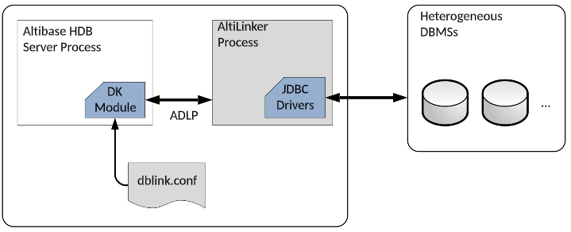
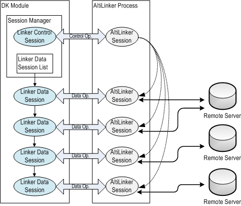
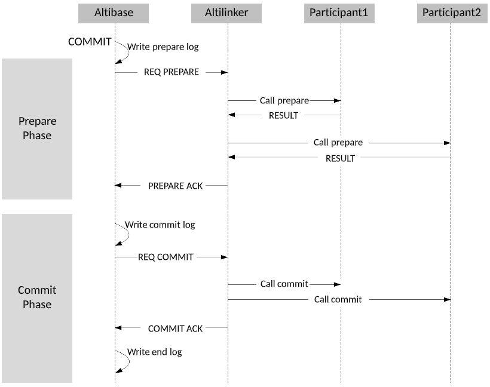
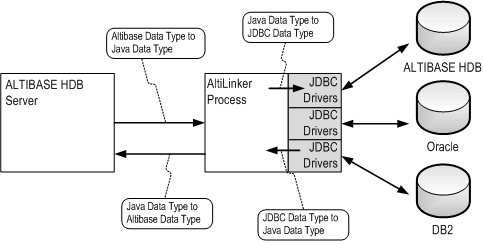

Database Link User’s Manual
===========================

#### Altibase 7.3

Altibase® Application Development

<br><br><br><br><br><br>
<!-- PDF 변환을 위한 여백입니다. --> 


<!-- PDF 변환을 위한 여백입니다. --> 

<div align="left">
    
</div>

<br><br><!-- PDF 변환을 위한 여백입니다. --> 


<!-- PDF 변환을 위한 여백입니다. --> 

<pre>
Altibase Application Development Database Link User’s Manual
Release 7.3
Copyright ⓒ 2001~2023 Altibase Corp. All Rights Reserved.<br>
This manual contains proprietary information of Altibase® Corporation; it is provided under a license agreement containing restrictions on use and disclosure and is also protected by copyright patent and other intellectual property law. Reverse engineering of the
software is prohibited.<br>
All trademarks, registered or otherwise, are the property of their respective owners.<br>
<b>Altibase Corp</b>
10F, Daerung PostTower II,
306, Digital-ro, Guro-gu, Seoul 08378, Korea
Telephone : +82-2-2082-1000 
Fax       : +82-2-2082-1099
Customer Service Portal : <a href='http://support.altibase.com/en/'>http://support.altibase.com/en/</a>
Homepage                : <a href='http://www.altibase.com'>http://www.altibase.com</a></pre>


<br>

# Table Of Contents

- [Preface](#preface)
  - [About This Manual](#about-this-manual)
- [1. Introduction to Database Link](#1-introduction-to-database-link)
  - [Related Terms](#related-terms)
  - [Definition of Database Links](#definition-of-database-links)
  - [Components of Altibase Database Link](#components-of-altibase-database-link)
- [2. Supported Objects, SQL Statements, and Data Types](#2-supported-objects-sql-statements-and-data-types)
  - [Database Link and SQL Statements](#database-link-and-sql-statements)
  - [Accessible Remote Schema Objects](#accessible-remote-schema-objects)
  - [Data Types Supported by Database Link](#data-types-supported-by-database-link)
- [3. Configuration of Database Link](#3-configuration-of-database-link)
  - [How DB Link Works](#how-db-link-works)
  - [Configuration](#configuration)
- [4. Database Link-Related SQL Statements](#4-database-link-related-sql-statements)
  - [CREATE DATABASE LINK](#create-database-link)
  - [DROP DATABASE LINK](#drop-database-link)
  - [ALTER DATABASE LINKER](#alter-database-linker)
  - [ALTER SESSION](#alter-session)
  - [SELECT](#select)
  - [REMOTE_EXECUTE_IMMEDIATE](#remote_execute_immediate)
  - [REMOTE Functions Supportive of Binding](#remote-functions-supportive-of-binding)
  - [REMOTE functions Supportive of Batch](#remote-functions-supportive-of-batch)
  - [COMMIT FORCE DATABASE LINK](#commit-force-database-link)
  - [ROLLBACK FORCE DATABASE LINK](#rollback-force-database-link)
- [Appendix A. Properties and Data Dictionary](#appendix-a-properties-and-data-dictionary)
  - [Data Dictionary related to Database Link](#data-dictionary-related-to-database-link)
  - [Property Files](#property-files)
  - [AltiLinker Properties](#altilinker-properties)


Preface
====

### About This Manual

This manual describes the concept of Database Link and how to use.

#### Audience

This manual has been prepared for the following users of Altibase:

-   Database administrators
-   Performance administrators
-   Database users
-   Application developers
-   Technical Supporters

It is recommended for those reading this manual possess the following background knowledge:

-   Basic knowledge in the use of computers, operating systems, and operating system utilities
-   Experience in using relational database and an understanding of database concepts
-   Computer programming experience
-   Experience in database server management, operating system management, or network administration
-   Knowledge related to the storage, management and processing of data in distributed environments

#### Organization

This manual is organized as follows:

-   Chapter 1: Introduction to Database Link  
    This chapter explains the concept of database links and the database link components of Altibase.
    
-   Chapter 2: Supported Objects, SQL Statements and Data Types  
    This chapter describes the SQL statements provided by Altibase for using database links, the schema objects of remote databases accessible via database links, and the data types available with database links.
    
-   Chapter 3: Configuration of Database Link  
    This chapter describes the configuration required to use Altibase's database links.
    
-   Chapter 4: Database Link-Related SQL Statements  
    This chapter describes how to use database link with the SQL syntax and REMOTE function provided for database link control.
    
-   Appendix A. Properties and Data Dictionary  
    This appendix describes the various properties and data dictionaries used in connection with database links.

#### Documentation Conventions

This section describes the conventions used in this manual. Understanding these conventions will make it easier to find information in this manual and in the other manuals in the series. 

There are two sets of conventions:

-   Syntax diagram convetions
-   Sample code conventions

##### Syntax Diagram Conventions

This manual describes command syntax using diagrams composed of the following elements:

| Elements                                                     | Meaning                                                      |
| ------------------------------------------------------------ | ------------------------------------------------------------ |
| [](https://github.com/ALTIBASE/Documents/blob/master/Manuals/Altibase_7.3/eng/media/SQL/image1.gif) | Indicates the start of a command. If a syntactic element starts with an arrow, it is not a complete command. |
| [](https://github.com/ALTIBASE/Documents/blob/master/Manuals/Altibase_7.3/eng/media/SQL/image2.gif) | Indicates that the command continues to the next line. If a syntactic element ends with this symbol, it is not a complete command. |
| [](https://github.com/ALTIBASE/Documents/blob/master/Manuals/Altibase_7.3/eng/media/SQL/image3.gif) | Indicates taht the command continues from the previous line. If a syntactic element starts witht his symbol, it is not a complete command. |
| [](https://github.com/ALTIBASE/Documents/blob/master/Manuals/Altibase_7.3/eng/media/SQL/image4.gif) | Indicates the end of a statement.                            |
| [](https://github.com/ALTIBASE/Documents/blob/master/Manuals/Altibase_7.3/eng/media/SQL/image5.gif) | Indicates a manatory element.                                |
| [](https://github.com/ALTIBASE/Documents/blob/master/Manuals/Altibase_7.3/eng/media/SQL/image6.gif) | Indicates an optional element.                               |
| [](https://github.com/ALTIBASE/Documents/blob/master/Manuals/Altibase_7.3/eng/media/SQL/image7.gif) | Indicates a mandatory element comprised of options. One, and only one, option must be specified. |
| [](https://github.com/ALTIBASE/Documents/blob/master/Manuals/Altibase_7.3/eng/media/SQL/image8.gif) | Indicates an optional element comprised of options.          |
| [](https://github.com/ALTIBASE/Documents/blob/master/Manuals/Altibase_7.3/eng/media/SQL/image9.gif) | Indicates an optional element in which multiple elements may be specified. A comman must precede all but the first element. |

##### Sample Code Conventions

The code examples explain SQL statements, stored procedures, iSQL statements, and other command line syntax.

The following table describes the printing conventions used in the code examples.

| Rules            | Meaning                                                      | Example                                                      |
| ---------------- | ------------------------------------------------------------ | ------------------------------------------------------------ |
| [ ]              | Indicates an optional item                                   | VARCHAR [(*size*)] [[FIXED \|] VARIABLE]                     |
| { }              | Indicates a mandatory field for which one or more items must be selected. | { ENABLE \| DISABLE \| COMPILE }                             |
| \|               | A delimiter between optional or mandatory arguments.         | { ENABLE \| DISABLE \| COMPILE } [ ENABLE \| DISABLE \| COMPILE ] |
| . . .            | Indicates that the previous argument is repeated, or that sample code has been omitted. | SQL\> SELECT ename FROM employee;<br/> ENAME<br/>  -----------------------<br/> SWNO<br/>  HJNO<br/>  HSCHOI<br/>  .<br/> .<br/> .<br/> 20 rows selected. |
| Other Symbols    | Symbols other than those shown above are part of the actual code. | EXEC :p1 := 1; acc NUMBER(11,2)                              |
| Italics          | Statement elements in italics indicate variables and special values specified by the user. | SELECT \* FROM *table_name*; <br/>CONNECT *userID*/*password*; |
| Lower case words | Indicate program elements set by the user, such as table names, column names, file names, etc. | SELECT ename FROM employee;                                  |
| Upper case words | Keywords and all elements provided by the system appear in upper case. | DESC SYSTEM_.SYS_INDICES_;                                   |

#### Related Documentations 

For more detailed information, please refer to the following documents.

-   Getting Started Guide

-   Installation Guide

-   Administrator’s Manual

-   Replication Manual

-   General Reference

-   SQL Reference

-   Stored Procedures Manual

-   iSQL User’s Manual

-   Error Message Reference

#### Altibase Welcomes Your Comments and Feedbacks

Please let us know what you like or dislike about our manuals. To help us with better future versions of our manuals, please tell us if there is any corrections or classifications that you would find useful.

Include the following information:

- The name and version of the manual that you are using
- Any comments about the manual
- Your name, address, and phone number

If you need immediate assistance regarding any errors, omissions, and other technical issues, please contact [Altibase's Support Portal](http://support.altibase.com/en/).

Thank you. We always welcome your feedbacks and suggestions.

# 1. Introduction to Database Link

This chapter explains the concept of database links and the database link components of Altibase.

### Related Terms

This section introduces the terms you need to know to use Altibase database links.

-   Altibase Distributed Database System  
    This is a system composed of two or more database server nodes, including at least one or more Altibase server nodes.
    
-   Remote Node  
    This is the target server or system connected through the database link. An Altibase server or a heterogeneous database system can be used as the remote node. In this case, it is not necessary for the target server or system connected through the database link to exist in a physically separate machine. The target database server can be referred to as the remote node even when both the local server and the target database server exist in one machine.
    
-   Remote Server  
    Altibase Database link distinguishes between the meaning of remote node and a remote server.  A remote node refers only to a target database server connected by a database link, whereas a remote server refers to a database server that is logically divided regardless of the database link connection.
    
-   Link  
    This is the connection between servers through the database link.

-   Link Object  
    This is the database link object created on the local database, to connect to the target database server
    
-   Local Server  
    This is the database server that creates and uses the database link object. Only Altibase server can be the local server. 
    
-   Linker Process  
    This takes charge of the communication between the local server and the remote server, when a database system composed of heterogeneous DBMSs is built. This process runs on the local server and is also referred to as AltiLinker.
    
-   Linker Session  
    This is the 1:1 session created between the Altibase server and the AltiLinker process. The Linker Session is classified as either a Linker Control Session or a Linker Data Session.
    
-   Location Descriptor (@)  
    This is a character used to express the database link in a SQL statement. The location descriptor can be used by placing an ‘@’ between the object name and the database link name. 
    
-   Global Transaction  
    This transaction is composed of a SQL statement which is executed on the local server and a SQL statement which is executed at the remote node.
    
-   Local Transaction  
    This is a transaction which is composed of statements executed and completed on the local server.

-   Remote Transaction  
    This transaction is composed of a SQL statement which is executed on the local server and a SQL statement which is executed at the remote node.

-   Global Commit Node  
    This node commits or rolls back global transactions. This is the node on which the user usually creates the database link and starts a global transaction.
    
-   REMOTE Statement  
    This is the SQL statement which is passed through the database link and executed on the remote server.
    
-   Remote Statement  
    This is the SQL statement which is passed through the database link and executed on the remote server.
    
-   Participant  
    The participant indicates a remote database system of a global transaction performed among database systems.

### Definition of Database Links

This section introduces the concept of database links, how it processes and describes the Altibase distributed database system.

#### Concept of Database Links

Altibase Database Link is a technical element of two or more independently running database servers connected through the network, wherein the local server requests for logically relevant data to and receives results from the remote server.

To run independently means that each database system has its own data storage area and is capable of processing the user’s request independently. To be connected through the network means that two logically separate systems or servers are capable of accessing each other. To be logically related means that a correlation exists among the distributed data in the individual node.

#### How Database Links Process

The following is an overview of how the Altibase database link is processed:

When a query is entered into the server that created the link object, the required data is retrieved from the remote server through the database link process, and the final query result is returned to the user. In the process, the end user logically perceives that one server is running.

The Altibase database link is primarily composed of the following four elements, shown in the dark in the figure below. The DK module and the AltiLinker process are described in detail in the following sections.

-   DB-Link Module

-   AltiLinker: a linker process implemented in Java

-   ADLP: Altibase Database Link Protocol

-   dblink.conf: the properties file for database links



[Figure 1-1] The database link process (Heterogeneous Link)

#### Concept of the Altibase Distributed Database System

The Altibase distributed database system is composed of two or more logically separate database servers, with at least one server being an Altibase server. It is mandatory for the database creating and using the database link to be Altibase. The connection target server can be either the Altibase server or a heterogeneous database system of another company.

Depending on whether or not the remote server, which is connected through the database link by Altibase in a local server, is an Altibase server of the same version, the database link is classified as either a Homogeneous Link or a Heterogeneous Link. Each link contains the following mechanisms.

##### Heterogeneous Link

A Heterogeneous Link refers to the connection between the Altibase server and a heterogeneous database server. If the version of the remote server database and the local serverAltibase is different, regardless of the remote server database being Altibase, a heterogeneous link is established. A Heterogeneous Link is possible between Altibase servers of the same version. 

##### Homogeneous Link

A Homogeneous Link refers to the connection between Altibase servers using protocol of the same version.

A Homogeneous Link directly connects to servers without passing through AltiLinker. Thus, its performance is better than the Heterogeneous Link, and the performance gap gets bigger as the remote node is accessed more frequently.

Altibase 6.5.1 does not support Homogeneous Links.

The following table displays the full names and meanings of the notations used in this document.

| Notation           | Full Name                                | Meaning                                                      |
| ------------------ | ---------------------------------------- | ------------------------------------------------------------ |
| DB-Link            | Altibase Database Link                   | Altibase Database Link                                       |
| Heterogeneous-Link | Heterogeneous Database Link              | Database link between an Altibase server and a heterogeneous database system |
| Homogeneous-Link   | Homogeneous Database Link                | Database link between Altibase servers of the same version |
| Heterogeneous DBMS | Heterogeneous database management system | Heterogeneous database management system, which includes Altibase servers of versions that differ from the local server |

### Components of Altibase Database Link

Among the components of the Altibase DB Link, this section describes the Database Link Module and the AltiLinker process.

#### Database Link Modul

The Database Link Module(DK Module) is a module which implements the database link within the Altibase server. This module manages sessions for connection to the remote server in a distributed database system environment, database link objects which represent connection to the remote server, transactions processed through the database link, information to be provided to various performance views, record sets retrieved as the result of a remote query execution and so on. Further information for each of the following is provided in the next section.

-   Link Object Management
-   Linker Session Management
-   Information Management of Performance Views
-   Global Transaction Management
-   Recovery of Distributed Transaction
-   Data Management of Result Sets

##### Link Object Management

In Altibase, link objects are schema objects. The creation and deletion of link objects are possible with SQL statements; further information on each SQL statement is provided in Chapter 4. How to Use Database Links.

Altibase provides the following two privileges on link objects.	

| Type                  | Granted Users                                         | Description                                                  |
| --------------------- | ----------------------------------------------------- | ------------------------------------------------------------ |
| PRIVATE Database Link | The user who created the link object and the SYS user | Only the user who created the given link object or the SYS user can use or delete PRIVATE link object |
| PUBLIC Database Link  | All user                                              | All users can use the PUBLIC link object. However, only the user who created the given link object or the SYS user can delete it. |

##### Linker Session Management

The Altibase DK Module creates a linker session to connect to the AltiLinker process, and monitors the connection status of the linker session whenever a user session refers to the database link.

The following figure shows the sessions that are created in the DK Module and the AltiLinker process for the purpose of handling a SQL statement using the database link that is executed by the client.



[Figure 1-2] Sessions within the DK module and the AltiLinker process

##### Information Management of Performance Views

The user can check database-related information by referring to the performance views. Information of the performance views managed for database links by Altibase is listed below.

###### Database Link Object Information

This is information on the database link object created in the database and is provided to the user through the V$DBLINK_DATABASE_LINK_INFO performance view.

###### Linker Session Information

This is information on the linker session created in the DK module and is provided to the user through the V$DBLINK_LINKER_SESSION_INFO performance view. 

The linker session can be classified as either a Linker Control Session or a Linker Data Session. The Linker Control Session is a singular creation and exists between the Altibase server and the AltiLinker process, until the AltiLinker process is terminated. On the other hand, one Linker Data Session is created for each user session that uses the database link.

-   Linker Control Session Information: This is information on the status of the Linker Control Session and is provided to the user through the V$DBLINK_LINKER_CONTROL_SESSION_INFO performance view. The Linker Control Session terminates the AltiLinker process, requests status information of the AltiLinker, changes settings of the AltiLinker, and etc.
  
-   Linker Data Session Information: This is information related to the Linker Data Session and is provided to the user through the V$DBLINK_LINKER_DATA_SESSION_INFO performance view.

###### Transaction Information

-   Global Transaction Information:This is information on the status of global transactions and is provided to the user through the V$DBLINK_GLOBAL_TRANSACTION_INFO performance view.
  
-   Remote Transaction Information: This is information on the status of all remote transactions being executed on the remote node through the database link and is provided to the user through the V$DBLINK_REMOTE_TRANSACTION_INFO performance view.
  
-   Remote Statement Information: This is information on all statements being executed on the remote node through the database link and is provided to the user through the V$DBLINK_REMOTE_STATEMENT_INFO performance view.

###### AltiLinker Process Information

This is information on the dynamic status of the AltiLinker process, and is provided to the user through the V$DBLINK_ALTILINKER_STATUS performance view. Apart from information related to the connection status, information related to the JVM memory currently being used by the AltiLinker process is also included.

##### Global Transaction Management

The concept of transactions in Altibase Database Link can be classified as either global transactions or remote transactions.

A global transaction is a transaction which contains one or more remote transactions being  executed on the remote server through the database link that exists in a local server. Altibase Database Link implements ADLP, a protocol for Altibase Database Link, to process global transactions.

A remote transaction is a transaction composed of statements executed on the remote server through the database link, and make up the global transaction. 

###### ADLP (Altibase Database Link Protocol)

ADLP defines the methods for data exchange and process between the Altibase server and the AltiLinker process. The following tasks are included: 

-   Linker Session Control 
-   Remote Transaction Control 
-   Remote Statement Execution 
-   AltiLinker Process Control

To complete a global transaction, transactions on every server(local and remote) participating in the global transaction must be completed(committed or rolled back) at once. This can lead to data integrity being at risk if an error occurs on any one of the servers. Altibase Database Link provides the following three levels of execution mechanisms for global transactions, depending on how much of the protocol is shared between the local server and the remote server. 

-   Remote Statement Execution Level: The Remote Statement Execution Level guarantees, not the global consistency of global transactions, but the execution of statements on a remote node through the database link. At this level, a statement being executed on the local server and a statement being executed on a remote server through the database link within one global transaction are processed as separate transactions.  
    When the DBLINK_GLOBAL_TRANSACTION_LEVEL property is set to this level, autocommit mode is set to ON by default for the session which AltiLinker connects to the remote server.
    
-   Simple Transaction Commit Level: Of Altibase Database Link, the Heterogeneous Link implements the simple transaction commit mechanism to enforce the principle of atomicity of the transaction between the Altibase and the heterogeneous database system. This level is similar to the Two-Phase Commit Level. Whereas the Two-Phase Commit Protocol exchanges messages between servers to prepare for the COMMIT command, the Simple Transaction Commit only checks whether or not the COMMIT or rollback command can be sent to the remote node.  
    For the Simple Transaction Commit Level to operate, the database system making up the remote node must support setting the auto-commit mode to OFF.  
    When the DBLINK_GLOBAL_TRANSACTION_LEVEL property is set to this level, autocommit mode is set to OFF by default for the session which AltiLinker connects to the remote server.
    
-   Two-Phase Commit Level: This feature provides the Two-Phase Commit protocol which ensures interoperable compatibility of the global transaction between Altibase server and other database system. This feature is available after setting the DBLINK_GLOBAL_TRANSACTION_LEVEL property to 2(Two-Phase Commit). The Two-Phase Commit process is demonstrated in the figure below.

[Figure 1‑3] Two-Phase Commit Level

Prepare Phase: Altibase writes prepare log after the user has executed a commit, and sends a requesting message to AltiLinker for preparation. Then, the AltiLinker receives the message, and sends a preparation message to all the participants related to the global transactions. After the participants have been prepared, AltiLinker delivers a ready message for system to Altibase, which has received results from all the participants, in order to perform the next phase.

Commit Phase: Altibase writes a commit log and sends commit requesting message to AltiLinker. Then, AltiLinker enables all the participants to execute, and sends the commit message until the participants will have executed. When the participants successfully commit, a success message will be sent to Altibase, and this means the transaction has been completed; thus, the end log is recorded applying the results. That is to say, the transaction recorded with end log cannot be able to conduct fault restoration. 

Altibase provides information on global transactions, remote transactions and the transaction process status through performance views.

##### Recovery Of Distributed Transaction

A point of failure is based upon the 2PC, and the failure target should be both Altibase and participant, the remote database system. It is considered that a failure occurred to a participant when there is no response during a certain period of time specified by ALTILINKER_RECEIVE_TIMEOUT during the exchanging messages of Altibase and the participant.

###### Before writing the preparation logs

When failure occurs in Altibase, a distributed transaction is written in the log, but all the remote transactions participating with no trace in the log are called off. Besides, the local transactions being executed are also called off writing the end log.

###### After writing the preparation logs - Before writing the commit log

In the case of failure in Altibase, a distributed transactions is recorded in the log; however, the commit log and roll back log are not recorded. All the remote transactions are recovered in order to ensure the interoperable compatibility in a situation in which the commit logs are not written. If there is failure occurred to a participant, Altibase attempts to conduct recovery of the remote transaction by transmitting messages until the participant receives a rollback message. Then, Altibase writes the end log in order to ensure the recovery. In the case of failure occurred to a participant, Altibase sends a message for the participant's transaction to recover. Moreover, when an error raised on AltiLinker, the status of all remote transactions cannot be figured out, and roll back is executed. Then, the end log is written since the commit logs of all the transactions had not been recorded.

###### After writing the commit log - Before writing the end log

Commit and roll back logs of the distributed transactions are written, but the end log is not written in the case of the failure in the commit phase. Altibase consistently attempts to commit or roll back not receiving a response of the commit message. Afterwards, Altibase writes the end log when the commit or rollback is completed.

##### Data Management of Result Sets

The Altibase DK Module provides the functionality of processing data exchanged between the local server and the remote server through the database link. The DK Module processes the following data:

-   Control Data: The data required for each operation defined in the ADLP which is internally created and exchanged between the DK module and the AltiLinker process.
  
-   User Data: Property values, strings of statements to be executed on the remote server, bind variable values, and etc. 
  
-   Remote Data: The result data executed on the remote server which the DK Module receives.

The process of such data is largely classified into the buffering of remote data received as the result of a query executed on the remote server, and the conversion of all data types exchanged between the Altibase server and the AltiLinker process.

The conversion of types is executed according to the data specification of each operation defined in the ADLP. In the case of remote data, each type within the result set of the query executed by the remote server is converted to the mapping Altibase server type.

The buffering of remote data uses a memory buffer (DK buffer) of a fixed size which is internally managed by the DK Module and the disk temporary table. The user can adjust the size of the DK buffer to be used for the database link with properties. Once the buffer size is set, it cannot be changed while Altibase is running; therefore, it should be decided before starting the server, giving due consideration to memory resources and performance. The DK buffer is composed of more than one data buffer block, and the minimum size and number of data buffer blocks can be specified with properties.

#### The AltiLinker Process

AltiLinker is a java application program, included and distributed with the Altibase package. The AltiLinker process operates for the Heterogeneous Link, and is responsible for the communication between the heterogeneous database system or the remote server connected through the link object and the Altibase server in which the link object exists.

AltiLinker is a feature provided by Altibase Database Link for the Heterogeneous Link and has the following characteristics:

-   Errors raised on a heterogeneous database server connected through the database link do not affect the Altibase server. 
-   AltiLinker accesses remote databases via the JDBC interface; thus, all database systems supportive of JDBC are accessible through Altibase Database Link.

To activate the AltiLinker process, the following two properties must be set.

| Property          | Value           | Properties File     |
| ----------------- | --------------- | ------------------- |
| DBLINK_ENABLE     | 1 (0 : disable) | altibase.properties |
| ALTILINKER_ENABLE | 1 (0 : disable) | dblink.conf         |

The following is a brief summary of the role of the AltiLinker process.

-   Connects to the heterogeneous database system through the JDBC driver. 
-   Executes operations requested from the Altibase server through the ADLP protocol. 
-   Delivers the results of queries executed on the remote node to the Altibase server

> ##### Notes*
>
> -   Since the AltiLinker process accesses the database of the remote server with the JDBC interface, the JDBC driver provided by the given database vendor is a prerequisite.
>   
> -   The AltiLinker process only runs on the same server as the local server.
>

# 2. Supported Objects, SQL Statements, and Data Types

This chapter gives a description of schema objects in remote databases that are accessible through SQL statements and database links provided by Altibase, and of data types that are available for use with database links.

### Database Link and SQL Statements

This section describes the SQL statements that are available to use with Database Link.

Altibase Database Link provides two ways to access remote schema objects. One way is to access a table or view of a remote server with the location description(@), as in the older versions, and another way is to directly send an entire SQL statement to a remote server, as in the pass-through style.

To support the pass-through style, Altibase Database Link provides the REMOTE_TABLE keyword and built-in REMOTE procedures and functions. The REMOTE_TABLE keyword or REMOTE function sends the entire SQL statement to the remote server, which directly processes the SQL statement.

REMOTE functions are divided into functions that can bind values to parameter markers in SQL statements and those that do not.

The following table shows the availability of the RETMOTE_TABLE keyword and the REMOTE functions for each SQL statement type.

|                                             | REMOTE_TABLE Keyword | REMOTE_EXECUTE_IMMEDIATE | REMOTE Functions that support binding |
| ------------------------------------------- | -------------------- | ------------------------ | ------------------------------------- |
| **DDL Statements**                          | X                    | O                        | O                                     |
| **DCL Statements**                          | X                    | O                        | O                                     |
| **DML Statements (INSERT, UPDATE, DELETE)** | X                    | O                        | O                                     |
| **SELECT Statements**                       | O                    | X                        | O                                     |

#### REMOTE_TABLE

The REMOTE_TABLE keyword can only be used in the FROM clause of the SELECT statement input to a local server. Following the REMOTE_TABLE keyword, only the SELECT statement to be executed on the remote server can be specified. The REMOTE_TABLE keyword cannot be used with SQL statements including parameter markers; it cannot be bound.

The syntax on how to use the REMOTE_TABLE keyword in SQL statements is explained in Chapter 4: Database Link-Related SQL Statements.

#### REMOTE_EXECUTE_IMMEDIATE

This is a built-in stored procedure which executes input SQL statements on the remote server through the Database Link. This procedure can execute all DML, DDL and DCL statements supported by Altibase Database Link, excluding the SELECT statement. SQL statements including parameter markers cannot be executed with this procedure; it cannot be bound.

For the syntax of this procedure, please refer to Chapter 4: Database Link-Related SQL Statements.

#### REMOTE Functions Supporting Bindin

This section describes the REMOTE functions that can execute an SQL statement that includes a parameter marker through a database link.

In order to execute SQL statements including parameter markers and bind values to each parameter, the following REMOTE functions can be used. These functions can only be used in stored procedures, however, and must be called in the following order:

-   REMOTE_ALLOC_STATEMENT

-   REMOTE_BIND_VARIABLE

-   REMOTE_EXECUTE_STATEMENT

-   REMOTE_NEXT_ROW

-   REMOTE_GET_COLUMN_VALUE_type

-   REMOTE_FREE_STATEMENT

Below is the order in which REMOTE functions must be called to execute SELECT statements including parameter markers in stored procedures.

1.  REMOTE_ALLOC_STATEMENT

2.  REMOTE_BIND_VARIABLE

3.  REMOTE_EXECUTE_STATEMENT

4.  REMOTE_NEXT_ROW

5.  REMOTE_GET_COLUMN_VALUE_type

6.  REMOTE_FREE_STATEMENT

Below is the order in which REMOTE functions must be called to execute DML and DDL statements(excluding SELECT statements) including parameter markers in stored procedures.

1.  REMOTE_ALLOC_STATEMENT

2.  REMOTE_BIND_VARIABLE

3.  REMOTE_EXECUTE_STATEMENT

4.  REMOTE_FREE_STATEMENT

For the syntax and further information on each REMOTE function, please refer to Chapter 4: Database Link-Related SQL Statements

### Accessible Remote Schema Objects

This section describes remote schema objects that are accessible through Database Link.

| Remote Schema Object | Is it accessible with the location descriptor @? | Is it accessible with REMOTE functions |
| -------------------- | ------------------------------------------------ | -------------------------------------- |
| Table                | O                                                | O                                      |
| Index                | X                                                | O                                      |
| View                 | O                                                | O                                      |
| Stored Procedure     | X                                                | O                                      |
| Sequence             | X                                                | O                                      |
| Queue                | X                                                | O                                      |
| Trigger              | X                                                | O                                      |
| Synonym              | X                                                | O                                      |
| Constraint           | X                                                | O                                      |

[Table 2-1] Remote schema objects accessible through Database Link

As the above table shows, the only objects accessible from the remote server using the location descriptor(@) with Database Link are tables and views. With REMOTE functions of pass-through style, however, almost all schema objects of the remote node can be accessed.

> Note: The location description(@) is supported for compatibility with the previous version. When using the location descriptor(@), only the SELECT statement is executable on the remote server, as in the previous version.

The following section shows how to access a remote schema object using the REMOTE function and examples of SQL statements.

#### Tables

The core function of database links is to provide interoperability between tables with data distributed in separate databases. With Altibase Database Link, SELECT, INSERT, UPDATE, DELETE and DDL statements can be executed on remote tables.

For a SELECT query, a remote table can be queried using the REMOTE_TABLE keyword in the FROM clause, as shown below:

```
SELECT * FROM REMOTE_TABLE( link1, 'select * from t1' );
```

To reference a remote object in the WHERE clause, a subquery should be used, as shown below:

```
SELECT * FROM t1 WHERE t1.c1 = ( SELECT * FROM REMOTE_TABLE( link1, 'select c2 from t2' ) );
```

To execute a DML or DDL statement on a remote server, the REMOTE_EXECUTE_IMMEDIATE procedure should be used, as shown below:

```
REMOTE_EXECUTE_IMMEDIATE( 'link1', 'insert into t1 values(1)' );
REMOTE_EXECUTE_IMMEDIATE( 'link1', 'create table t1(c1 integer primary key, c2 integer)' );
```

For SELECT, DML and DDL statements including parameter markers, REMOTE functions should be used in the order described in the “REMOTE functions supporting binding” section. 

Below is an example of a stored procedure which executes an INSERT statement including a parameter marker with a REMOTE function:

```
DECLARE
statement_id
result
row_count
BEGIN
statement_id := REMOTE_ALLOC_STATEMENT( 'link1', 'insert into T1 values(?)' );
result := REMOTE_BIND_VARIABLE( 'link1', statement_id, 1, '20' );
row_count := REMOTE_EXECUTE_STATEMENT( 'link1', statement_id );
result := REMOTE_FREE_STATEMENT( 'link1', statement_id );
RETURN row_count;
END;
```

The following example retrieves a table on a remote server using the location descriptor(@). Use of the location descriptor is supported to maintain compatibility with older versions:

```
SELECT * FROM t1@link1;
```

#### Index

Indexes can be created on the remote server using Altibase Database Link: 

```
REMOTE_EXECUTE_IMMEDIATE( 'link1', 'create index index1 on t1 (c1 asc, c2 desc)' );
```

#### Views

Like tables, the execution of SELECT, DML and DDL statements is also supported on views, and can be used in the same manner.

The following example retrieves a view of a remote server using a REMOTE function:

```
SELECT * FROM REMOTE_TABLE( link1, 'select * from v1' );
```

The following example creates a view on a remote server using a REMOTE function:

```
REMOTE_EXECUTE_IMMEDIATE( 'link1', 'create view v1 as select c1, c2, c3 from t1' );
```

The following example retrieves a view on a remote server using the location descriptor(@):

```
SELECT * FROM v1@link1;
```

#### Stored Procedures

Stored procedures on remote servers are accessible through Altibase Database Link. In other words, a stored procedure can be created on a remote server and a procedure existing on a remote server can be called from a local server. 

If a REMOTE function is used in a stored procedure on a local server, all remote objects accessible by the REMOTE function can be referenced. 

The following example executes a SELECT statement which invokes a stored procedure on a remote server, using the REMOTE_TABLE keyword:

```
SELECT * FROM REMOTE_TABLE( link1, 'select remote_function1() from dual' );
SELECT * FROM t1 WHERE t1.c1 = ( SELECT * FROM REMOTE_TABLE( link1, 'select remote_function1() from dual' ) );
```

The following example creates a stored procedure on a remote server and calls it, using the REMOTE_EXECUTE_IMMEDIATE procedure:

```
REMOTE_EXECUTE_IMMEDIATE( 'link1',
'create or replace procedure proc1 as i integer;
begin i := 0;
    while i <> 1000
    loop
        insert into t1 values(i);
        i := i + 1;
    end loop;
end;
/' );
REMOTE_EXECUTE_IMMEDIATE( 'link1', 'execute proc1' );
```

##### Restrictions

ROWTYPE variables and cursors dependent on a table in a remote server cannot be declared in a stored procedure in a local server.

When using the location descriptor(@), the same restrictions apply as to older versions. Stored procedures existing in remote servers are inaccessible with the use of the location descriptor(@), however, tables or views in remote servers are accessible with the use of the location descriptor(@) inside stored procedures in local servers.

#### Sequences

Sequences in remote servers are accessible with Altibase Database Link.

The following example executes a SELECT statement which references a sequence on a remote server, using the REMOTE_TABLE keyword:

```
SELECT * FROM REMOTE_TABLE( link1, 'select seq1.currval, seq1.nextval from dual' );
```

The following example executes an INSERT statement which references a sequence on a remote server, using the REMOTE_EXECUTE_IMMEDIATE procedure:

```
REMOTE_EXECUTE_IMMEDIATE( 'link1', 'insert into t1 values(seq1.nextval)' );
```

The following example creates a sequence in a remote server:

```
REMOTE_EXECUTE_IMMEDIATE( 'link1', 'create sequence seq1 start with 1 increment by 1' );
```

#### Queues

Queues in remote servers are accessible with Altibase Database Link. 

The following example retrieves a queue in a remote server, using the REMOTE_TABLE keyword:

```
SELECT * FROM REMOTE_TABLE( link1, 'select message from q1' );
```

The following example inputs a message to a queue in a remote server, using the REMOTE_EXECUTE_IMMEDIATE procedure:

```
REMOTE_EXECUTE_IMMEDIATE( 'link1', 'enqueue into q1(message) values(\'test message\')' );
```

The following example creates a queue in a remote server:

```
REMOTE_EXECUTE_IMMEDIATE( 'link1', 'create queue q1(40) maxrows 1000' );
```

#### Triggers

Triggers in remote servers are accessible with Altibase Database Link. 

The following example creates a trigger in a remote server:

```
REMOTE_EXECUTE_IMMEDIATE( 'link1', 
'create trigger trigger1 after delete on orders
referencing old row old_row
for each row as
begin
    insert into log1 values( old_row.c1,
                             old_row.c2,
                             old_row.c3,
                             sysdate );
end;
/' );
```

#### Synonyms

Synonyms in remote servers are accessible with Altibase Database Link. 

The following example retrieves a synonym in a remote server, using the REMOTE_TABLE keyword:

```
SELECT * FROM REMOTE_TABLE( link1, 'select * from synonym_table' );
SELECT * FROM REMOTE_TABLE( link1, 'select synonym_name from user_synonyms' );
```

The following example executes a DML statement on a synonym in a remote server:

```
REMOTE_EXECUTE_IMMEDIATE( 'link1', 'insert into synonym_table values( seq1.nextval )' );
```

#### Constraints

Constraints in remote servers are accessible with ATLIBASE Database Link. 

The following example executes a DML statement on a constraint of a remote server:

```
REMOTE_EXECUTE_IMMEDIATE( 'link1', 'set constraints all differed' );
```

The following example executes a DDL statement which adds a constraint on a table in a remote server:

```
REMOTE_EXECUTE_IMMEDIATE( 'link1', 'alter table t1 add constraint const1 unique(c1)' );
```

### Data Types Supported by Database Link

Since Altibase Database Link uses the JDBC interface, standard data types of the JDBC v3.0 Specification are supported. 

The following figure depicts how data type is converted between Altibase(a local server) and AltiLinker, and between AltiLinker and JDBC drivers for each heterogeneous database.



[Figure 2-1] Conversion of data types

The following table shows to which JDBC and standard SQL data types Altibase data types are mapped.

| JDBC Data Type               | Altibase SQL Data Type | Standard SQL Data Type | Supported | Comments                                                     |
| ---------------------------- | ---------------------- | ---------------------- | --------- | ------------------------------------------------------------ |
| java.sql.Types.CHAR          | CHAR                   | CHAR                   | O         |                                                              |
| java.sql.Types.VARCHAR       | VARCHAR                | VARCHAR                | O         |                                                              |
| java.sql.Types.LONGVARCHAR   |                        | LONGVARCHAR            | X         |                                                              |
| java.sql.Types.NCHAR         | NCHAR                  | NCHAR                  | X         | JDBC v4.0                                                    |
| java.sql.Types.NVARCHAR      | NVARCHAR               | NVARCHAR               | X         | JDBC v4.0                                                    |
| java.sql.Types.LONGNVARCHAR  |                        | LONGNVARCHAR           | X         | JDBC v4.0                                                    |
| java.sql.Types.NUMERIC       | NUMERIC                | NUMERIC                | O         |                                                              |
| java.sql.Types.DECIMAL       | DECIMAL                | DECIMAL                | O         |                                                              |
| java.sql.Types.BIT           | SMALLINT               | BIT                    | O         | Altibase’s BIT type differs from the standard which can write only one BIT; It is mapped to a SMALLINT type. |
|                              | BIT (bitset)           |                        | X         | Altibase’s BIT type saves a BIT set.                         |
| java.sql.Types.BOOLEAN       | SMALLINT               | BOOLEAN                | O         | Since Altibase does not provide BOOLEAN type, it is mapped to a SMALLINT type. If the remote server is Altibase, INSERT of data is impossible for this type. |
| java.sql.Types.TINYINT       | SMALLINT               | TINYINT                | O         | Altibase does not provide TINYINT type; it is mapped to SMALLINT type. |
| java.sql.Types.SMALLINT      | SMALLINT               | SMALLINT               | O         |                                                              |
| java.sql.Types.INTEGER       | INTEGER                | INTEGER                | O         |                                                              |
| java.sql.Types.BIGINT        | BIGINT                 | BIGINT                 | O         |                                                              |
| java.sql.Types.REAL          | REAL                   | REAL                   | O         |                                                              |
| java.sql.Types.FLOAT         | FLOAT                  | FLOAT                  | O         |                                                              |
| java.sql.Types.DOUBLE        | DOUBLE                 | DOUBLE                 | O         |                                                              |
| java.sql.Types.BINARY        | BINARY                 | BINARY                 | X         | If the remote server is Altibase, INSERT of data is impossible for this type. |
| java.sql.Types.VARBINARY     |                        | VARBINARY              | X         |                                                              |
| java.sql.Types.LONGVARBINARY |                        | LONGVARBINARY          | X         |                                                              |
| java.sql.Types.DATE          | DATE                   | DATE                   | O         | If the year value is smaller than 0(B.C.), Altibase processes it as 0. |
| java.sql.Types.TIME          | DATE                   | TIME                   | O         | The minimum unit of Oracle’s TIMESTAMP is nanoseconds but Altibase is microseconds; nanoseconds are converted to microseconds. |
| java.sql.Types.TIMESTAMP     | DATE                   | TIMESTAMP              | O         | The minimum unit of Oracle’s TIMESTAMP is nanoseconds but Altibase is microseconds; nanoseconds are converted to microseconds. If the year value is smaller than 0(B.C.), Altibase processes it as 0. |
| java.sql.Types.CLOB          | CLOB                   | CLOB                   | X         |                                                              |
| java.sql.Types.NCLOB         |                        | NCLOB                  | X         | JDBC v4.0                                                    |
| java.sql.Types.BLOB          | BLOB                   | BLOB                   | X         |                                                              |
| java.sql.Types.ARRAY         |                        |                        | X         |                                                              |
| java.sql.Types.DISTINCT      |                        |                        | X         |                                                              |
| java.sql.Types.STRUCT        |                        |                        | X         |                                                              |
| java.sql.Types.REF           |                        |                        | X         |                                                              |
| java.sql.Types.DATALINK      |                        |                        | X         |                                                              |
| java.sql.Types.JAVA_OBJECT   |                        |                        | X         |                                                              |
| java.sql.Types.NUMERIC       | NUMERIC                | NUMERIC                | O         |                                                              |
|                              | NIBBLE                 |                        | X         |                                                              |
|                              | VARBIT                 |                        | X         |                                                              |
|                              | INTERVAL               |                        | X         |                                                              |

[Table 2-2] Data Types for Database Link

# 3. Configuration of Database Link

This chapter describes the configuration prerequisite to the use of Altibase Database Link. 

### How DB Link Works

DB Link processes in the following steps:

1.  The user requests SQL statements, including queries to be executed on the remote server, to the local server. 
2.  The local query processer parses the SQL statements and prepares the queries that are to be sent to the remote server. 
3.  The prepared queries are sent to AltiLinker. 
4.  AltiLinker receives the queries and requests the execution of queries to the remote server. The JDBC interface is used for this step. 
5.  The remote server executes the requested queries and returns the results to AltiLinker. 
6.  Altilinker sends the queried results received from the remote server to the local server. The local server converts the received data according to its purpose and uses it. 

For the above third and sixth steps, only TCP connection is supported between the Altibase server and AltiLinker, and data exchange conforms to the ADLP protocol. Also, AltiLinker accesses the remote database server by using the JDBC interface. Configuration of the JDBC can differ by environment and circumstance; this chapter provides an explanation based on the Java SE 1.5 environment.

### Configuration

This section describes the JDBC settings necessary to use Altibase Database Link in the following steps:

-   Installing JRE
-   Installing the JDBC Driver
-   Configuring the AltiLinker Properties File
-   Configuring the Altibase property file

#### Installing JRE

Since AltiLinker is a java application program which runs on JRE 1.5 or higher, JRE 1.5 or higher must be installed on the server on which AltiLinker is to run. 

If the JDBC driver of the remote database to which AltiLinker is to connect runs on a higher version of JRE 1.5, a JRE version that is compatible with the given JDBC driver must be installed. 

After installing JRE, environment variables such as JAVA_HOME and CLASSPATH must be configured. The example below configures environment variables related to JRE on UNIX-like operating systems. 

```
$ export JAVA_HOME=<the path in which JRE in installed>
$ export CLASSPATH=${JAVA_HOME}/lib:${CLASSPATH}
$ export PATH=${JAVA_HOME}/bin:${PATH}
```

#### Installing the JDBC Driver

To use database links, the JDBC driver must be installed on the server on which AltiLinker runs. The JDBC driver to be installed must be one provided by the remote database to be connected through a database link. For example, if the remote database is Oracle, a version of the JDBC driver which complies with the Oracle database server should be checked on the Oracle homepage, downloaded and installed. Moreover, ODBC Driver which supports XA should be installed when using 2PC(Two-Phase Commit) protocol.

#### Configuring the AltiLinker Properties File

Properties necessary for connecting to the remote server, and properties related to the AltiLinker process are configured in the AltiLinker properties file.

The AltiLinker properties file exists as the dblink.conf file beneath $ALTIBASE_HOME/conf. The following properties can be specified in this file.

-   ALTILINKER_ENABLE

-   ALTILINKER_PORT_NO

-   TARGETS

To activate the AltiLinker process, the value of the ALTILINKER_ENABLE property must be set to 1. The TCP listening port number can be specified in the ALTILINKER_PORT_NO property. 

The connection information necessary for AltiLinker to connect to the remote database server is specified as the following properties in the TARGETS property.

-   JDBC_DRIVER: The absolute path of the JDBC driver file. 
-   CONNECTION_URL: The connection URL of the remote database server to be connected. 
-   USER: The user name to connect to the remote database server. 
-   PASSWORD: The user password to connect to the remote database server. 
-   XADATASOURCE_CLASS_NAME:The XADataSource class name. Altibase is located in Altibase.jdbc.driver.AltibaseXADataSource. 
-   XADATASOURCE_CLASS_URL_SETTER_NAME:It can be set as URL of XADataSource or setURL.

Of the above properties, the first and second properties must be specified in the properties file. The remainders can be specified in the properties file or be input when the database link object is created. The user name and user password specified on creation of the database link object has priority over the properties file.

The TARGETS property can be specified in the following manner. This property can specify a multiple number of remote servers.

```
TARGETS = (
  (
     NAME = "alti1"
     JDBC_DRIVER = "/home/user/altibase_home/lib/Altibase.jar"
     CONNECTION_URL = "jdbc:Altibase://127.0.0.1:20300/mydb"
     USER = "sys"
     PASSWORD = "manager"
     XADATASOURCE_CLASS_NAME= "Altibase.jdbc.driver.AltibaseXADataSource"
     XADATASOURCE_URL_SETTER_NAME = "setURL"
  ),
  (
     NAME = ..
     JDBC_DRIVER = ..
     CONNECTION_URL = ..
  )
)
```

For more detailed information on the AltiLinker property, please refer to “Properties and Data Dictionary”.

#### Configuring the Altibase property file

In order to use Altibase Database Link, the value of the DBLINK_ENABLE property in the altibase.properties file must be set to 1. 

If the Altibase server is started up after setting all properties, the AltiLinker process starts with the Altibase server process.

For more detailed information on properties related to database links, please refer to the database link-related properties of *General Reference.*

# 4. Database Link-Related SQL Statements

This chapter discusses in detail the SQL statements and REMOTE functions provided for controlling database links, and how to use database links.

### CREATE DATABASE LINK

#### Syntax

**create_database_link ::=**


#### Prerequisites

Only the SYS user or the user granted the CREATE DATABASE LINK system privilege can create a database link object.

#### Description

The user can create a database link object with the CREATE DATABASE LINK statement. A database link object can have only one remote server as its target.

##### PUBLIC\|PRIVATE

Specifies the PUBLIC|PRIVATE attribute of the database link object to be created. If set to PUBLIC, all users have access to the created database link object; If set to PRIVATE, only the user who created the database link object and the SYS user have access to it. On omission, the database object link is created as PUBLIC.

##### dblink_name

Specifies the name of the database link object to be created. Refer to Chapter 1: “Rules for Object Name” in *SQL Reference* for more information on specifying names.

##### user_id/password

Specifies the user name and user password of the database of the remote server to be connected. The user specified for this clause must be granted access privileges on the target object of the remote server accessed through the database link. If not, a privilege-related error will be raised.

Since the user name and password are saved in upper case by default, it is necessary to encase case-sensitive letters and special characters in quotation marks(").

##### target_name

Specifies the name of a server among the remote servers defined in the TARGETS property in the AltiLinker properties file. 

For more detailed information on how to specify the TARGETS property in the AltiLinker properties file, please refer to “Configuration of the AltiLinker Properties File” of Chapter 3.

#### Example

\<Create 1\> Create a database link which connects to the remote database server specified ‘AltibaseHDB’ in the AltiLinker properties file, with the user name and user password: applys/applys. Create the database link object, ‘link1’, which only the creator can access.

```
CREATE PRIVATE DATABASE LINK link1 
CONNECT TO applys IDENTIFIED BY applys 
USING Altibase;
```

\<Query 2\> Create a database link which connects to the remote database server specified ‘AltibaseHDB’ in the AltiLinker properties file, with the user name and user password: applys/applys. Create the database link object, ‘link2’, which all users of the system can access. However, the user name and password are in lower case.

```
CREATE PUBLIC DATABASE LINK link2 
CONNECT TO "applys" IDENTIFIED by "applys" 
USING Altibase;
or
CREATE DATABASE LINK link2 
CONNECT TO "applys" IDENTIFIED by "applys" 
USING Altibase;
```

### DROP DATABASE LINK

#### Syntax

**drop_database_link ::=**


#### Prerequisites 

Only the SYS user or the user granted the DROP DATABASE LINk system privilege can remove a database link object.

#### Description

Drops a database link object.

##### dblink_name

Specifies the name of the database link object to be removed.

> #### Notes
>
> If the database link object to be dropped is currently in use, it cannot be dropped. It can only be removed when no queries are being executed through the given database link object. An error will be raised if the database object link is being queried.

#### Examples

\<Query 1\> Drop the PRIVATE database link object, 'dblink'. 

```
DROP PRIVATE DATABASE LINK dblink1;
```

\<Query 2\>  Drop the PUBLIC database link object, ‘dblink1’. 

```
DROP PUBLIC DATABASE LINK dblink1;
or
DROP DATABASE LINK dblink1;
```

### ALTER DATABASE LINKER

#### Syntax

**alter_database_linker ::=**


#### Prerequisites

This statement can be executed by the SYS user connected in sysdba administrator mode.

#### Description

Starts or terminates the AltiLinker.

##### START

Starts the AltiLinker, provided that no running AltiLinker process exists.

##### STOP

Stops the AltiLinker. However, for AltiLinker shutdown to succeed, there should be no transactions using the database link. If there is a transaction using the database link, this statement will fail.

##### STOP FORCE

Forcefully stops the AltiLinker process, regardless of there being a transaction using the database link. 

##### DUMP

If this statement is executed while the AltiLinker process is running, operations which are currently being executed by the threads within the AltiLinker process are output to a file. The output file is fixed as $ALTIBASE_HOME/trc/altibase_lk_dump.log and is overwritten every time the ALTER DATABASE LINKER DUMP statement is executed.

#### Examples

```
iSQL(sysdba)> ALTER DATABASE LINKER START;
Alter success.
iSQL(sysdba)> ALTER DATABASE LINKER STOP;
Alter success.
iSQL(sysdba)> ALTER SESSION LINKER STOP FORCE;
Alter success.
iSQL(sysdba)> ALTER SESSION LINKER DUMP;
Alter success.
```

### ALTER SESSION

#### Syntax

**close_database_link ::=**


#### Prerequisites

All users can execute this statement.

#### Description

Terminates the linker session on the Altibase server, which is connected to AltiLinker.

##### LINK ALL

Terminates all linker sessions.

##### LINK *dblink_name*

Terminates only the linker sessions that are associated with the database link object of a specified name.

#### Examples

```
ALTER SESSION CLOSE DATABASE LINK ALL; 
ALTER SESSION CLOSE DATABASE LINK link1;
```

### SELECT

The user can either use the location descriptor(‘@’) or the pass-through style to SELECT a remote database object with Altibase Database Link. 

We recommend to use the REMOTE_TABLE keyword of the pass-through method with Altibase Database Link. The location descriptor(‘@’) is supported for compatibility with older versions. 

Both methods can only use database links in the FROM clause. 

Refer to the General Reference Chapter 1. Display of Character strings for further information on display usage of character strings used in the SELECT clause.

#### Location Descriptor

Statements that use the location descriptor ‘@’ are supported to maintain compatibility with older versions. 

The location descriptor ‘@’ can be used as shown below, to indicate that the given object exists in the remote server:

```
SELECT * FROM t1@link1;
```

Queries that include location descriptors retrieve all records in the table of the remote server to the local server, as for the previous version. Therefore, the use of the REMOTE_TABLE keyword can enhance the processing speed, according to the characteristics in a query. 

Since queries using location descriptors, as the one below, retrieve all records of the remote table to the local server, they are accompanied with the additional burden of network costs, local server operational costs and, when necessary, disk I/O costs. However, the use of the REMOTE_TABLE keyword delivers better performance; with the REMOTE_TABLE keyword, the query is processed on the remote server and the local server retrieves only one record as the result.

```
Table name: T1
Table schema:
C1 VARCHAR(1024),
C2 VARCHAR(1024),
C3 VARCHAR(1024),
...
C50 INTEGER,
...
C100 VARCHAR(1024),
Total number of records: 1,000,000 (1 record has the c50 column value of 50)
```

1.  Using the location descriptor:

```
SELECT c50, c100 FROM t1@link1 WHERE c50 = 50;
```

2. Using the REMOTE_TABLE keyword:

```
SELECT * FROM REMOTE_TABLE( link1, 'select c50, c100 from t1 where c50 = 50' );
```

In conclusion, the use of the REMOTE_TABLE keyword, rather than the location descriptor, is recommended for queries retrieving the same results using database links.

##### Examples

\<Query 1\> SELECT all of table t1 which exists in the remote server, pointed to by link1, using the location descriptor.

```
SELECT * FROM t1@link1;
```

\<Query 2\> Using the location descriptor, SELECT columns a1, a2 in the remote table.

```
SELECT a1, a2 FROM ( SELECT * FROM t1@link1 );
```

#### REMOTE_TABLE

With the REMOTE_TABLE keyword of the pass-through style, the SELECT statement can be executed on the remote server. 

When a query that contains the REMOTE_TABLE keyword is executed on the remote server, the query result is written to a memory buffer, which is passed to the query processor, and then dropped. A query that needs to repeatedly access dropped results (e.g., join operations) must be re-executed on the remote server

The syntax for the REMOTE_TABLE keyword is as follows:

```
REMOTE_TABLE (
    dblink_name     IN VARCHAR,
    statement_text  IN VARCHAR )
```

dblink_name: the name of the database link object. 

statement_text: the SELECT statement to be executed on the remote server.

##### Example

\<Query 1\> Using the REMOTE_TABLE keyword, SELECT all the rows from table t1 which exists in the remote server.

```
SELECT * FROM REMOTE_TABLE( link1, 'select * from t1' );
```

\<Query 2\> Using the REMOTE_TABLE keyword, SELECT columns a1, a2 from the remote table.

```
SELECT * FROM REMOTE_TABLE( link1, 'select a1, a2 from t1' );
```

#### REMOTE_TABLE_STORE

Altibase stores the results of queries that contain the REMOTE_TABLE keyword and have been executed on the remote server into disk temporary tables to allow repeated access.

#### WHERE Clause

When querying the remote server using database links, the WHERE clause can be used in the same manner as when querying with the SELECT statement on a local server. 

Since the use of the location descriptor or the REMOTE_TABLE keyword is invalid in the WHERE clause, an alias which is specified in the FROM clause should be used in the WHERE clause.

##### Examples

\<Query 1\> SELECT a row with a value larger than 100, from column a1 in table t1 of the remote server pointed to by link1.

```
SELECT * FROM REMOTE_TABLE( link1, 'select * from t1 where a1 > 100' );
or
SELECT * FROM REMOTE_TABLE( link1, 'select * from t1' ) t1_alias
               WHERE t1_alias.a1 > 100;
or
SELECT * FROM t1@link1 WHERE a1 > 100;
```

\<Query 2\>  SELECT the name of the employee working for the department ‘rnd', from all employees stored in the table emp2 of the remote server and the table emp1 of the local server pointed to by link1. 

```
SELECT emp_name
FROM ( SELECT emp_no, emp_name FROM emp1
    UNION ALL
    SELECT emp_no, emp_name FROM REMOTE_TABLE( link1, 'select emp_no, emp_name from emp2' ) ) v1,
    dept
WHERE v1.emp_no = dept.emp_no AND dept.dept_name = 'rnd';
or
SELECT emp_name
FROM ( SELECT emp_no, emp_name FROM emp1
    UNION ALL
    SELECT emp_no, emp_name FROM emp2@link1 ) v1,
    dept
WHERE v1.emp_no = dept.emp_no AND dept.dept_name = 'rnd';
```

#### Other SELECT Statement Features

Database links support the use of joins, subqueries, set operators and aggregation functions in SELECT statements. Also, when a SELECT statement exists in a DDL or DML statement in the form of a subquery, database links can also be used in the subquery statement.

##### Examples

\<Query 1\> SELECT the unduplicated values in column a1 in table t1 of the remote server pointed to by link1.

```
SELECT * FROM REMOTE_TABLE( link1, 'select distinct a1 from t1' );
or
SELECT DISTINCT a1 FROM t1@link1;
```

\<Query 2\> Find the departments of all employees by joining tables t_member and t_dept of the remote server pointed to by link1, and group the departments with an ID value of 0 or larger by department ID, and return the number of employees and their average age for each department.

```
SELECT t1.dept_id, COUNT(*), AVG(age)
FROM REMOTE_TABLE( link1, 'select * from t_member' ) t1,
   REMOTE_TABLE( link1, 'select * from t_dept' ) t2,
WHERE t1.dept_id = t2.dept_id
GROUP BY t1.dept_id
HAVING t1.dept_id >= 0;
or
SELECT t1.dept_id, COUNT(*), AVG(age)
FROM t_member@link1 t1,
   t_dept@link1 t2
WHERE t1.dept_id = t2.dept_id
GROUP BY t1.dept_id
HAVING t1.dept_id >= 0;
```

\<Query 3\> Find all employees by joining tables t_member and t_dept of the remote server pointed to by link1, and select three employees under the age of 30, in descending order of ID, and return their names, ages, and the sum of their ages.

```
SELECT t1.name, t1.age
    ( SELECT * FROM REMOTE_TABLE( link1, 'select sum(age) from t_member' ) ) sum
FROM REMOTE_TABLE( link1, 'select dept_id, member_id, dept_name, age from t_member where age < 30' ) t1,
   REMOTE_TABLE( link1, 'select dept_id, dept_name, from t_dept' ) t2
WHERE t1.dept_id = t2.dept_id AND t1.age < 30
ORDER BY t1.member_id DESC LIMIT 3;
or
SELECT t1.name, t1.age
    ( SELECT SUM(age) FROM t_member@link1 ) sum
FROM t_member@link1 t1,
    ( SELECT dept_name, dept_id FROM t_dept@link1 ) t2
WHERE t1.dept_id = t2.dept_id AND t1.age < 30
ORDER BY t1.member_id DESC LIMIT 3;
```

\<Query 4\> Retrieve the name and age in table t2 of the remote server, pointed to by link1, and insert the values into table t1 of the local server.

```
INSERT INTO t1 SELECT * FROM REMOTE_TABLE( link1, 'select name, age from t2' );
or
INSERT INTO t1 SELECT name, age FROM t2@link1;
```

### REMOTE_EXECUTE_IMMEDIATE

The REMOTE_EXECUTE_IMMEDIATE procedure executes the input SQL statement on the remote server through the database link. Excluding the SELECT statement, DML, DDL and DCL statements are executable. SQL statements including parameter markers cannot be executed with this procedure.

#### Syntax

```
REMOTE_EXECUTE_IMMEDIATE (
    dblink_name     IN VARCHAR,
    statement_text  IN VARCHAR );
```

#### Parameters

| Name             | In/Output | Data Type | Description                                           |
| ---------------- | --------- | --------- | ----------------------------------------------------- |
| *dblink_name*    | Input     | VARCHAR   | The name of the database link object                  |
| *statement_text* | Input     | VARCHAR   | The SQL statement to be executed on the remote server |

#### Return Value

Because it is a procedure, there is no return value.

#### Example

\<Query 1\> Create table remote_t in the remote server, pointed to by link1, and after inserting a record, delete the table.

```
exec REMOTE_EXECUTE_IMMEDIATE( 'link1', 'create table remote_t( c1 integer )' ); 
exec REMOTE_EXECUTE_IMMEDIATE( 'link1', 'insert into remote_t values (10)' ); 
exec REMOTE_EXECUTE_IMMEDIATE( 'link1', 'insert into remote_t values (20)' ); 
exec REMOTE_EXECUTE_IMMEDIATE( 'link1', 'insert into remote_t values (30)' ); 
exec REMOTE_EXECUTE_IMMEDIATE( 'link1', 'drop table remote_t' );
```

### REMOTE Functions Supportive of Binding

This section explains pass-through REMOTE functions that support the binding of parameters.

#### REMOTE_ALLOC_STATEMENT

This function prepares a SQL statement to be executed on the remote server. This function can only be used within stored procedures and stored functions.

##### Syntax

```
BIGINT REMOTE_ALLOC_STATEMENT (
    dblink_name     IN VARCHAR,
    statement_text  IN VARCHAR );
```

##### Parameters

| Name             | In/Output | Data Type | Description                                            |
| ---------------- | --------- | --------- | ------------------------------------------------------ |
| *dblink_name*    | Input     | VARCHAR   | The name of the database link object                   |
| *statement_text* | Input     | VARCHAR   | The SQL statement to be executed on the remote server. |

##### Return Value

If the function executes successfully, the statement ID is returned; if not, a negative integer is returned.

##### Example

\<Query 1\> Create a stored procedure which returns the value of column c2 of the record where the value of column c1 is 20 from table t1 of the remote server, pointed to by link1. Use parameter binding for the search condition of the value of the column c1.

```
EXEC REMOTE_EXECUTE_IMMEDIATE('link1', 'CREATE TABLE t1(c1 INTEGER, c2 FLOAT(38))');

EXEC REMOTE_EXECUTE_IMMEDIATE('link1', 'INSERT INTO t1 VALUES(20, 30.001)');

CREATE OR REPLACE PROCEDURE proc1()
AS
    statement_id    BIGINT;
    row_cnt         INTEGER;
    result          INTEGER;
    col_value       FLOAT(38);

BEGIN
    statement_id  := REMOTE_ALLOC_STATEMENT('link1', 'SELECT * FROM t1 where c1 = ?');

    result := REMOTE_BIND_VARIABLE( 'link1', statement_id, 1, '20' );

    IF result >= 0 THEN
        result := REMOTE_EXECUTE_STATEMENT('link1', statement_id );

        LOOP
            result := REMOTE_NEXT_ROW( 'link1', statement_id );
            EXIT WHEN result < 0;

            col_value := REMOTE_GET_COLUMN_VALUE_FLOAT( 'link1', statement_id, 2, 38 );
            SYSTEM_.PRINTLN(col_value);
        END LOOP;

        result := REMOTE_FREE_STATEMENT('link1', statement_id);
        IF result < 0 THEN
            SYSTEM_.PRINTLN('Free failed');
        END IF;
    END IF;
END;
/
```

#### REMOTE_BIND_VARIABLE

This function binds values to parameter markers in SQL statements. This function can only be used within stored procedures and stored functions.

##### Syntax

```
INTEGER REMOTE_BIND_VARIABLE (
    dblink_name        IN VARCHAR,
    statement_id       IN BIGINT,
    parameter_number   IN VARCHAR,
    value              IN VARCHAR );
```

##### Parameters

| Name               | In/Output | Data Type | Description                                                  |
| ------------------ | --------- | --------- | ------------------------------------------------------------ |
| *dblink_name*      | Input     | VARCHAR   | The name of the database link object                         |
| *statement_id*     | Input     | BIGINT    | The statement ID                                                 |
| *parameter_number* | Input     | INTEGER   | The numerical order of the parameters in SQL statements to which values are bound. Starts from 1. |
| *value*            | Input     | VARCHAR   | The value to be bound                                        |

##### Return Value

The returner of a negative number indicates failure; otherwise, success.

##### Example

Please refer to the examples of REMOTE_ALLOC_STATEMENT.

#### REMOTE_EXECUTE_STATEMENT

This function executes the prepared SQL statement on the remote server. This function can only be used within stored procedures and stored functions

##### Syntax

```
INTEGER REMOTE_EXECUTE_STATEMENT (
    dblink_name        IN VARCHAR,
    statement_id       IN BIGINT );
```

##### Parameters

| Name           | In/Output | Data Type | Description                          |
| -------------- | --------- | --------- | ------------------------------------ |
| *dblink_name*  | Input     | VARCHAR   | The name of the database link object |
| *statement_id* | Input     | BIGINT    | Statement ID                         |

##### Return Value

The returner of a negative number indicates failure. If the returner is a non-negative number on the execution of a DML statement, the non-negative number indicates the number of affected rows; on the execution of a DDL or SELECT statement, this indicates success.

##### Example

Please refer to the examples of REMOTE_ALLOC_STATEMENT.

#### REMOTE_FREE_STATEMENT

This function releases the statements that have completed execution. This function can only be used within stored procedures and stored functions

##### Syntax

```
INTEGER REMOTE_FREE_STATEMENT (
    dblink_name        IN VARCHAR,
    statement_id       IN BIGINT );
```

##### Parameters

| Name           | In/Output | Data Type | Description                          |
| -------------- | --------- | --------- | ------------------------------------ |
| *dblink_name*  | Input     | VARCHAR   | The name of the database link object |
| *statement_id* | Input     | BIGINT    | Statement ID                         |

##### Return Value

The returner of a negative number indicates failure; otherwise, success.

##### Example

Please refer to the examples of REMOTE_ALLOC_STATEMENT.

#### REMOTE_GET_COLUMN_VALUE_CHAR

This function returns the CHAR type column value among the columns that compose the row, after the row position has been fixed with the REMOTE_NEXT_ROW function. This function can only be used within stored procedures and stored functions.

##### Syntax

```
CHAR(char_size) REMOTE_GET_COLUMN_CHAR (
    dblink_name        IN VARCHAR,
    statement_id       IN BIGINT,
    column_number      IN INTEGER,
    char_size          IN INTEGER );
```

##### Parameters

| Name            | In/Output | Data Type | Description                                         |
| --------------- | --------- | --------- | --------------------------------------------------- |
| *dblink_name*   | Input     | VARCHAR   | The name of the database link object                |
| *statement_id*  | Input     | BIGINT    | The statement ID to be executed                         |
| *column_number* | Input     | INTEGER   | The order of columns within the row. Starts from 1. |
| *char_size*     | Input     | INTEGER   | The size of the CHAR type to be returned            |

##### Return Value

The value of the specified column is returned.

#### REMOTE_GET_COLUMN_VALUE_VARCHAR

This function returns the VARCHAR type column value among the columns that compose the row, after the row position has been fixed with the REMOTE_NEXT_ROW function. This function can only be used within stored procedures and stored functions.

##### Syntax

```
VARCHAR(char_size) REMOTE_GET_COLUMN_VARCHAR (
    dblink_name       IN VARCHAR,
    statement_id      IN BIGINT,
    column_number     IN INTEGER,
    varchar_size      IN INTEGER );
```

##### Parameters

| Name            | In/Output | Data Type | Description                                       |
| --------------- | --------- | --------- | ------------------------------------------------- |
| *dblink_name*   | Input     | VARCHAR   | The name of the database link object              |
| *statement_id*  | Input     | BIGINT    | The statement ID to be executed                       |
| *column_number* | Input     | INTEGER   | The order of columns with the row. Starts from 1. |
| *varchar_size*  | Input     | INTEGER   | The size of the VARCHAR type to be returned       |

##### Return Value

The value of the specified column is returned.

#### REMOTE_GET_COLUMN_VALUE_FLOAT

This function returns the FLOAT type column value among the columns that compose the row, after the row position has been fixed with the REMOTE_NEXT_ROW function. This function can only be used within stored procedures and stored functions.

##### Syntax

```
FLOAT(precision) REMOTE_GET_COLUMN_FLOAT (
    dblink_name       IN VARCHAR,
    statement_id      IN BIGINT,
    column_number     IN INTEGER,
    precision         IN INTEGER );
```

##### Parameters

| Name            | In/Output | Data Type | Description                                         |
| --------------- | --------- | --------- | --------------------------------------------------- |
| *dblink_name*   | Input     | VARCHAR   | The name of the database link object                |
| *statement_id*  | Input     | BIGINT    | The statement ID to be executed                         |
| *column_number* | Input     | INTEGER   | The order of columns within the row. Starts from 1. |
| *precision*     | Input     | INTEGER   | The precision of the FLOAT type to be returned      |

##### Return Value

The value of the specified column is returned.

##### Example

Please refer to the examples of REMOTE_ALLOC_STATEMENT.

#### REMOTE_GET_COLUMN_VALUE_SMALLINT

This function returns the FLOAT type column value among the columns that compose the row, after the row position has been fixed with the REMOTE_NEXT_ROW function. This function can only be used within stored procedures and stored functions.

##### Syntax

```
SMALLINT REMOTE_GET_COLUMN_SMALLINT (
    dblink_name       IN VARCHAR,
    statement_id      IN BIGINT,
    column_number     IN INTEGER );
```

##### Parameters	

| Name            | In/Output | Data Type | Description                                         |
| --------------- | --------- | --------- | --------------------------------------------------- |
| *dblink_name*   | Input     | VARCHAR   | The name of the database link object                |
| *statement_id*  | Input     | BIGINT    | The statement ID to be executed                         |
| *column_number* | Input     | INTEGER   | The order of columns within the row. Starts from 1. |

##### Return Value

The value of the specified column is returned.

#### REMOTE_GET_COLUMN_VALUE_INTEGER

This function returns the INTEGER type column value among the columns that compose the row, after the row position has been fixed with the REMOTE_NEXT_ROW function. This function can only be used within stored procedures and stored functions.

##### Syntax

```
INTEGER REMOTE_GET_COLUMN_INTEGER (
    dblink_name       IN VARCHAR,
    statement_id      IN BIGINT,
    column_number     IN INTEGER );
```

##### Parameters

| Name            | In/Output | Data Type | Description                                         |
| --------------- | --------- | --------- | --------------------------------------------------- |
| *dblink_name*   | Input     | VARCHAR   | The name of the database link object                |
| *statement_id*  | Input     | BIGINT    | The statement ID to be executed                         |
| *column_number* | Input     | INTEGER   | The order of columns within the row. Starts from 1. |

##### Return Value

The value of the specified column is returned.

#### REMOTE_GET_COLUMN_VALUE_BIGINT

This function returns the BIGINT type column value among the columns that compose the row, after the row position has been fixed with the REMOTE_NEXT_ROW function. This function can only be used within stored procedures and stored functions.

##### Syntax

```
BIGINT REMOTE_GET_COLUMN_BIGINT (
    dblink_name       IN VARCHAR,
    statement_id      IN BIGINT,
    column_number     IN INTEGER );
```

##### Parameters

| Name            | In/Output | Data Type | Description                                         |
| --------------- | --------- | --------- | --------------------------------------------------- |
| *dblink_name*   | Input     | VARCHAR   | The name of the database link object                |
| *statement_id*  | Input     | BIGINT    | The statement ID to be executed                         |
| *column_number* | Input     | INTEGER   | The order of columns within the row. Starts from 1. |

##### Return Value

The value of the specified column is returned.

#### REMOTE_GET_COLUMN_VALUE_REAL

This function returns the REAL type column value among the columns that compose the row, after the row position has been fixed with the REMOTE_NEXT_ROW function. This function can only be used within stored procedures and stored functions.

##### Syntax

```
REAL REMOTE_GET_COLUMN_REAL (
    dblink_name       IN VARCHAR,
    statement_id      IN BIGINT,
    column_number     IN INTEGER );
```

##### Parameters

| Name            | In/Output | Data Type | Description                                         |
| --------------- | --------- | --------- | --------------------------------------------------- |
| *dblink_name*   | Input     | VARCHAR   | The name of the database link object                |
| *statement_id*  | Input     | BIGINT    | The statement ID to be executed                         |
| *column_number* | Input     | INTEGER   | The order of columns within the row. Starts from 1. |

##### Return Value

The value of the specified column is returned.

#### REMOTE_GET_COLUMN_VALUE_DOUBLE

This function returns the DOUBLE type column value among the columns that compose the row, after the row position has been fixed with the REMOTE_NEXT_ROW function. This function can only be used within stored procedures and stored functions.

##### Syntax

```
DOUBLE REMOTE_GET_COLUMN_DOUBLE (
    dblink_name       IN VARCHAR,
    statement_id      IN BIGINT,
    column_number     IN INTEGER );
```

##### Parameters

| Name            | In/Output | Data Type | Description                                         |
| --------------- | --------- | --------- | --------------------------------------------------- |
| *dblink_name*   | Input     | VARCHAR   | The name of the database link object                |
| *statement_id*  | Input     | BIGINT    | The statement ID to be executed                         |
| *column_number* | Input     | INTEGER   | The order of columns within the row. Starts from 1. |

##### Return Value

The value of the specified column is returned.

#### REMOTE_GET_COLUMN_VALUE_DATE

This function returns the DATE type column value among the columns that compose the row, after the row position has been fixed with the REMOTE_NEXT_ROW function. This function can only be used within stored procedures and stored functions.

##### Syntax

```
DATE REMOTE_GET_COLUMN_DATE (
    dblink_name       IN VARCHAR,
    statement_id      IN BIGINT,
    column_number     IN INTEGER );
```

##### Parameters

| Name            | In/Output | Data Type | Description                                         |
| --------------- | --------- | --------- | --------------------------------------------------- |
| *dblink_name*   | Input     | VARCHAR   | The name of the database link object                |
| *statement_id*  | Input     | BIGINT    | The statement ID to be executed                         |
| *column_number* | Input     | INTEGER   | The order of columns within the row. Starts from 1. |

##### Return Value

The value of the specified column is returned.

#### REMOTE_NEXT_ROW

This function moves the row position to the next position in the result set when the SELECT statement has been executed with the REMOTE_EXECUTE_STATEMENT function. This function can only be used within stored procedures and stored functions.

##### Syntax

```
INTEGER REMOTE_NEXT_ROW (
    dblink_name        IN VARCHAR,
    statement_id       IN BIGINT );
```

##### Parameters

| Name           | In/Output | Data Type | Description                          |
| -------------- | --------- | --------- | ------------------------------------ |
| *dblink_name*  | Input     | VARCHAR   | The name of the database link object |
| *statement_id* | Input     | BIGINT    | The statement ID to be executed          |

##### Return Value

The returner of a negative number indicates failure; otherwise, success.

##### Example

Please refer to the examples of REMOTE_ALLOC_STATEMENT.

### REMOTE functions Supportive of Batch

This section will elucidate REMOTE functions and other related functions in order to facilitate Altibase database link to execute batch process . The remote functions supportive of batch can be used within stored procedures, and the following sequence is recommended when executing a query in the remote server with batch processing.

1.  REMOTE_ALLOC_STATEMENT_BATCH

2.  REMOTE_BIND_VARIABLE_BATCH

3.  REMOTE_ADD_BATCH

4.  REMOTE_EXECUTE_BATCH

5.  REMOTE_GET_RESULT_COUNT_BATCH

6.  REMOTE_GET_RESULT_BATCH

7.  REMOTE_FREE_STATEMENT_BATCH

#### IS_ARRAY_BOUND

This function confirms if array variables are bound or not.

##### Syntax 

```
BOOLEAN variable: = IS_ARRAY_BOUND ();
```

##### Parameters

None

##### Return Value

TRUE is returned if array variables are bound, but otherwise it FALSE is returned.

##### Example

\<Query\> Create a stored procedure inserting values to table t1 that the remote server link1 indicates. Use the parameter binding when inserting.

```
iSQL> CREATE OR REPLACE PROCEDURE PROC1( A1 IN INTEGER, A2 IN INTEGER )
AS
    result INTEGER;
    i      INTEGER;
    count  INTEGER;
    sum    INTEGER := 0;
BEGIN
    PRINTLN('--- 0 ---');
    IF IS_ARRAY_BOUND() = TRUE THEN

    PRINTLN('--- 1 ---');
    /* First bound */
    IF IS_FIRST_ARRAY_BOUND() = TRUE THEN
    pkg1.stmtID := REMOTE_ALLOC_STATEMENT_BATCH( 'link1', 'insert into t1 values(?, ?)');
    PRINTLN('ALLOC BATCH');
    END IF;

    PRINTLN('--- 2 ---');
    /* Main Task */
    /* INSERT INTO T1 VALUES (A1, A2); */

    result := REMOTE_BIND_VARIABLE_BATCH( 'link1', pkg1.stmtID, 1, A1 );
    result := REMOTE_BIND_VARIABLE_BATCH( 'link1', pkg1.stmtID, 2, A2 );
    result := REMOTE_ADD_BATCH( 'link1', pkg1.stmtID );

    /* Last bound */
    IF IS_LAST_ARRAY_BOUND() = TRUE THEN
    result := REMOTE_EXECUTE_BATCH( 'link1', pkg1.stmtID );

    count := REMOTE_GET_RESULT_COUNT_BATCH( 'link1', pkg1.stmtID );
    FOR i IN 1 .. count LOOP
    result := REMOTE_GET_RESULT_BATCH( 'link1', pkg1.stmtID, i );
    sum := sum + result;
    END LOOP;
    PRINTLN('SUM is' || sum);

    result := REMOTE_FREE_STATEMENT_BATCH( 'link1', pkg1.stmtID );
    PRINTLN('FREE BATCH');
    END IF;
    PRINTLN('--- 3 ---');
    ELSE
    PRINTLN('NORMAL?');
    END IF;
END;
/
```

#### IS_FIRST_ARRAY_BOUND

This function verifies whether array variables have been firstly bound or not.

##### Syntax

```
BOOLEAN variable: = IS_FIRST_ARRAY_BOUND ();
```

##### Parameters

None

##### Return Values

If array variables were bound and firstly executed, TRUE is returned, but otherwise FALSE is return

##### Example

Please refer to IS_ARRAY_BOUND function.

#### IS_LAST_ARRAY_BOUND

This function verifies whether array variables have been lastly bound or not.

##### Syntax

```
BOOLEAN variable: = IS_LAST_ARRAY_BOUND ();
```

##### Parameters

None

##### Return Values

The function returns TRUE if array variables have been lastly bound, but otherwise it returns FALSE.

##### Example

Please refer to IS_ARRAY_BOUND function.

#### REMOTE_ADD_BATCH

This function is used to add a SQL statement which will be executed with batch processing.

##### Syntax

```
INTEGER REMOTE_ADD_BATCH (
    dblink_name              IN VARCHAR,
    statement_id             IN BIGINT);
```

##### Parameters

| Name         | In/Output | Data Type | Description                          |
| ------------ | --------- | --------- | ------------------------------------ |
| dblink_name  | Input     | VARCHAR   | The name of the database link object |
| statement_id | Input     | BIGINT    | The statement ID                         |

##### Return Value

Returning negative numbers indicates failure, otherwise it indicates success of the execution.

##### Example

Please refer to IS_ARRAY_BOUND function.

#### REMOTE_ALLOC_STATEMENT_BATCH

This function is used for batch processing as well as retrieving an ID of the remote statement (Statement ID) in order to execute the database SQL statement.

##### Syntax

```
BIGINT REMOTE_ALLOC_STATEMENT_BATCH (
    dblink_name        IN VARCHAR,
    statement_text     IN VARCHAR);
```

##### Parameters

| Name           | In/Output | Data Type | Description                                 |
| -------------- | --------- | --------- | ------------------------------------------- |
| dblink_name    | Input     | VARCHAR   | The name of the database link object        |
| statement_text | Input     | VARCHAR   | The sQL statement to execute on a remote server |

##### Return Value

If succeeded, the statement ID is returned, but if it fails, negative numbers are returned.

##### Example

Please refer to IS_ARRAY_BOUND function.

#### REMOTE_BIND_VARIABLE_BATCH

This function associates with batch processing, and it binds values to the parameter marker in the SQL statement.

##### Syntax

```
INTEGER REMOTE_BIND_VARIABLE_BATCH (
    dblink_name              IN VARCHAR,
    statement_id             IN BIGINT,
    parameter_number         IN VARCHAR,
    value                    IN VARCHAR);
```

##### Parameters

| Name             | In/Output | Data Type | Description                                                  |
| ---------------- | --------- | --------- | ------------------------------------------------------------ |
| dblink_name      | Input     | VARCHAR   | The name of database link object                             |
| statement_id     | Input     | BIGINT    | The statement ID                                                 |
| parameter_number | Input     | VARCHAR   | The parameter number which will be bound in the SQL statement. It begins with 1. |
| Value            | Input     | VARCHAR   | The binding value                                            |

##### Return Value

If negative numbers are returned, it indicates the execution has failed, but otherwise it indicates success of the execution.

##### Example

Please refer to IS_ARRAY_BOUND function.

#### REMOTE_EXECUTE_BATCH

This function is used to actually execute the SQL statement with batch processing in the remote server by using variables of the remote statement ID obtained by the REMOTE_ALLOC_STATEMENT_BATCH function.

##### Syntax

```
INTEGER REMOTE_STATEMENT_BATCH (
    dblink_name              IN VARCHAR,
    statement_id             IN BIGINT );
```

##### Parameters

| Name         | In/Output | Data Type | Description                          |
| ------------ | --------- | --------- | ------------------------------------ |
| dblink_name  | Input     | VARCHAR   | The name of the database link object |
| statement_id | Input     | BIGINT    | The statement ID                         |

##### Return Value

Returning negative numbers indicates failure; otherwise, it indicates success.

##### Example

Please refer to IS_ARRAY_BOUND function.

#### REMOTE_FREE_STATEMENT_BATCH

This function frees up the executed statement through the batch processing.

##### Syntax

```
INTEGER REMOTE_FREE_STATEMENT_BATCH (
    dblink_name              IN VARCHAR,
    statement_id             IN BIGINT );
```

##### Parameters

| Name         | In/Output | Data Type | Description                          |
| ------------ | --------- | --------- | ------------------------------------ |
| dblink_name  | Input     | VARCHAR   | The name of the database link object |
| statement_id | Input     | BIGINT    | The statement ID                         |

##### Return Value

Returning negative numbers indicates failure, but otherwise it indicates success.

##### Example

Please refer to IS_ARRAY_BOUND function.

#### REMOTE_GET_RESULT_COUNT_BATCH

This function verifies the number of SQL statements executed by the batch process after implementing the REMOTE_EXECUTE_BATCH function.

##### Syntax

```
INTEGER REMOTE_GET_RESULT_COUNT_BATCH (
    dblink_name              IN VARCHAR,
    statement_id             IN BIGINT);
```

##### Parameters

| Name         | In/Output | Data Type | Description                          |
| ------------ | --------- | --------- | ------------------------------------ |
| dblink_name  | Input     | VARCHAR   | The name of the database link object |
| statement_id | Input     | BIGINT    | The statement ID                         |

##### Return Value

Returning negative numbers indicates failure; otherwise, it indicates success.

##### Example

Please refer to IS_ARRAY_BOUND function.

#### REMOTE_GET_RESULT_BATCH 

This function confirms the result of SQL statement update executed by batch processing after executing the REMOTE_EXECUTE_BATCH.

##### Syntax

```
INTEGER REMOTE_GET_RESULT_BATCH (
    dblink_name              IN VARCHAR,
    statement_id             IN BIGINT,
    index                    IN INTEGER);
```

##### Parameters

| Name         | In/Output | Data Type | Description                                                  |
| ------------ | --------- | --------- | ------------------------------------------------------------ |
| dblink_name  | Input     | VARCHAR   | The name of the database link object                         |
| statement_id | Input     | BIGINT    | The statement ID                                                 |
| index        | Input     | INTEGER   | The sequence number (index) of SQL statements which are batch processed. |

##### Return Value

If a negative number is returned, it indicates failure; otherwise, execution result (row count) of a SQL statement indicated by the input parameter index is returned.

##### Example

Please refer to IS_ARRAY_BOUND function.

### COMMIT FORCE DATABASE LINK

The occurrence of a network failure on a global transaction can result in a COMMIT failure of a transaction on a remote server. In such occasions, the COMMIT FORCE DATABASE LINK statement forces the available server to COMMIT the transaction, instead of processing the global transaction as a COMMIT failure. 

When the DBLINK_GLOBAL_TRANSACTION_LEVEL property is set to '2' (two-phase commit), executing this statement is same as executing COMMIT. 

#### Syntax

```
COMMIT FORCE DATABASE LINK;
```

#### Example

```
iSQL> COMMIT FORCE DATABASE LINK;
```

### ROLLBACK FORCE DATABASE LINK

The occurrence of a network failure on a global transaction can result in ROLLBACK failure of a transaction on a remote server. In such occasions, the ROLLBACK FORCE DATABASE LINK statement forces the available server to ROLLBACK the transaction, instead of processing the global transaction as a ROLLBACK failure. 

When the DBLINK_GLOBAL_TRANSACTION_LEVEL property is set to '2' (two-phase commit), executing this statement is same as executing ROLLBACK.

#### Syntax

```
ROLLBACK FORCE DATABASE LINK;
```

#### Example

```
iSQL> ROLLBACk FORCE DATABASE LINK;
```

# Appendix A. Properties and Data Dictionary

This appendix describes the various properties and data dictionaries used in connection with the database link.

### Data Dictionary related to Database Link

The following meta tables and performance views show the current status of database links. For more detailed information, please refer to *General Reference.*

#### Meta Table

-   SYS_DATABASE_LINKS\_

#### Performance Views

-   V\$DBLINK_ALTILINKER_STATUS

-   V\$DBLINK_DATABASE_LINK_INFO

-   V\$DBLINK_GLOBAL_TRANSACTION_INFO

-   V\$DBLINK_LINKER_CONTROL_SESSION_INFO

-   V\$DBLINK_LINKER_DATA_SESSION_INFO

-   V\$DBLINK_LINKER_SESSION_INFO

-   V\$DBLINK_NOTIFIER_TRANSACTION_INFO

-   V\$DBLINK_REMOTE_STATEMENT_INFO

-   V\$DBLINK_REMOTE_TRANSACTION_INFO

### Property Files

In order to use Altibase Database Link, altibase.properties, the properties file of the Altibase server, and dblink.conf, the properties file of AltiLinker, must be changed to its purpose.

#### altibase.properties

The following properties are related to database links. For further information on properties, please refer to *General Reference.* 

-   AUTO_REMOTE_EXEC

-   DBLINK_ENABLE

-   DBLINK_GLOBAL_TRANSACTION_LEVEL

-   DBLINK_RECOVERY_MAX_LOGFILE

-   DBLINK_REMOTE_STATEMENT_AUTOCOMMIT

-   DBLINK_REMOTE_TABLE_BUFFER_SIZE

-   DBLINK_DATA_BUFFER_BLOCK_SIZE

-   DBLINK_DATA_BUFFER_BLOCK_COUNT

-   DBLINK_DATA_BUFFER_ALLOC_RATIO

-   DBLINK_ALTILINKER_CONNECT_TIMEOUT

#### dblink.conf

The dblink.conf file is the properties file for AltiLinker. The following properties can be specified.

-   ALTILINKER_ENABLE

-   ALTILINKER_PORT_NO

-   ALTILINKER_RECEIVE_TIMEOUT

-   ALTILINKER_REMOTE_NODE_RECEIVE_TIMEOUT

-   ALTILINKER_QUERY_TIMEOUT

-   ALTILINKER_NON_QUERY_TIMEOUT

-   ALTILINKER_THREAD_COUNT

-   ALTILINKER_THREAD_SLEEP_TIME

-   ALTILINKER_REMOTE_NODE_SESSION_COUNT

-   ALTILINKER_TRACE_LOG_DIR

-   ALTILINKER_TRACE_LOG_FILE_SIZE

-   ALTILINKER_TRACE_LOGGING_LEVEL

-   ALTILINKER_JVM_BIT_DATA_MODEL_VALUE

-   ALTILINKER_JVM_MEMORY_POOL_INIT_SIZE

-   ALTILINKER_JVM_MEMORY_POOL_MAX_SIZE

-   TARGETS/NAME

-   TARGETS/JDBC_DRIVER

-   TARGETS/CONNECTION_URL

-   TARGETS/USER

-   TARGETS/PASSWORD

-   TARGETS/XADATASOURCE_CLASS_NAME

-   TARGETS/XADATASOURCE_URL_SETTER_NAME

The following is an example of the dblink.conf file.

```
ALTILINKER_ENABLE = 1
ALTILINKER_PORT_NO = 23238
  
ALTILINKER_RECEIVE_TIMEOUT = 100
ALTILINKER_REMOTE_NODE_RECEIVE_TIMEOUT = 100
  
ALTILINKER_QUERY_TIMEOUT = 10
ALTILINKER_NON_QUERY_TIMEOUT = 20
  
ALTILINKER_THREAD_COUNT = 10
ALTILINKER_THREAD_SLEEP_TIME  = 200
ALTILINKER_REMOTE_NODE_SESSION_COUNT = 100
  
ALTILINKER_TRACE_LOG_DIR = "?/trc"
ALTILINKER_TRACE_LOG_FILE_SIZE = 30
ALTILINKER_TRACE_LOG_FILE_COUNT = 9
ALTILINKER_TRACE_LOGGING_LEVEL =  3
  
ALTILINKER_JVM_MEMORY_POOL_INIT_SIZE = 128
ALTILINKER_JVM_MEMORY_POOL_MAX_SIZE = 512
ALTILINKER_JVM_BIT_DATA_MODEL_VALUE = 1

  
TARGETS = (
(
    NAME = "ora1"
    JDBC_DRIVER = "/home1/applys/work/natc/TC/Server/dk/RemoteServer/JdbcDrivers/ojdbc1
    CONNECTION_URL = "jdbc:oracle:thin:@dbdm.altibase.in:1521:ORCL"
    USER = "new_dblink"
    PASSWORD = "new_dblink"
),
(
    NAME = "alti2"
    JDBC_DRIVER =  "/home/user/altibase_home/lib/Altibase.jar"
    CONNECTION_URL = "jdbc:Altibase://127.0.0.1:20600/mydb" XADATASOURCE_CLASS_NAME= "oracle.jdbc.xa.OracleXADataSource XADATASOURCE_URL_SETTER_NAME = "setURL"
)
)
```

More explanations for each property are provided in the next section. 

### AltiLinker Properties

This section describes the AltiLinker properties set in the dblink.conf file.

#### ALTILINKER_ENABLE

##### Default Value

0

##### Range

[0, 1]

##### Description

This property decides whether or not to activate the AltiLinker process. This value must be set to 1 for the use of database links. When the value is 0, the AltiLinker process does not start.

#### ALTILINKER_JVM_BIT_DATA_MODEL_VALUE

##### Default Value

1

##### Range

[0, 1]

##### Description

This is used to specify JVM bit for AltiLinker on JVM (Java Virtual Machine).

-   0: 32 bit

-   1: 64 bit

#### ALTILINKER_JVM_MEMORY_POOL_INIT_SIZE (Unit: bytes) 

##### Default Value

128 MBytes

##### Range

[128MB, 4096MB]

##### Description

This property specifies the initial size, in bytes, of the memory pool allocated for the AltiLinker on the JVM (Java Virtual Machine).

#### ALTILINKER_JVM_MEMORY_POOL_MAX_SIZE (Unit: bytes) 

##### Default Value

4096 MBytes

##### Range

[512MB, 32768MB]

##### Description

This property specifies the maximum size, in bytes, of the memory pool allocated for the AltiLinker on the JVM.

#### ALTILINKER_NON_QUERY_TIMEOUT (Unit: seconds)

##### Default Value

60

##### Range

[0, 2<sup>32</sup>-1]

##### Description

If the execution time of DML statements (excluding the SELECT statement) or DDL statements exceeds the number of seconds specified here, execution of the statements are canceled.

#### ALTILINKER_PORT_NO 

##### Default Value

0

##### Range

[1024, 65535]

##### Description

This property specifies the TCP port number at which AltiLinker listens.

#### ALTILINKER_QUERY_TIMEOUT (Unit: seconds)

##### Default Value

60

##### Range

[0, 2<sup>32</sup>-1]

##### Description

If the query execution time on the remote server exceeds the number of seconds specified here, execution of the query is canceled.

#### ALTILINKER_RECEIVE_TIMEOUT (Unit: seconds)

##### Default Value

5

##### Range

[0, 2<sup>32</sup>-1]

##### Description

This property specifies the maximum wait time, in seconds, when an Altibase server is exchanging data with AltiLinker.

#### ALTILINKER_REMOTE_NODE_RECEIVE_TIMEOUT (Unit: seconds)

##### Default Value

30

##### Range

[0, 2<sup>32</sup>-1]

##### Description

This property specifies the maximum wait time, in seconds, of executing PREPARE, DCL statements and setting auto-commit mode, other than executing SELECT, DML and DDL statements. 

#### ALTILINKER_REMOTE_NODE_SESSION_COUNT 

##### Default Value

64

##### Range

[1, 128]

##### Description

This property specifies the maximum number of sessions created when the AltiLinker process connects to the remote server. The maximum number of Linker Data Sessions is the value of this property -1(the number of Linker Control Sessions).

#### ALTILINKER_THREAD_COUNT 

##### Default Value

16

##### Range

[2, 2<sup>31</sup>-1]

##### Description

This property specifies the number of threads to execute the SQL statements on the remote server by AltiLinker.

#### ALTILINKER_THREAD_SLEEP_TIME (Unit: microseconds) 

##### Default Value

200

##### Range

[1, 2<sup>32</sup>-1]

##### Description

This property specifies the waiting time, in microseconds, for threads within the AltiLinker process, when the threads are free of operations.

#### ALTILINKER_TRACE_LOG_DIR

##### Default Value

$ALTIBASE_HOME/trc

##### Range

None

##### Description

This property specifies the location of the log file for the AltiLinker process to write trace logs.

#### ALTILINKER_TRACE_LOG_FILE_COUNT

##### Default Value

10

##### Range

[1, 100]

##### Description

This property specifies the maximum number of log files for the AltiLinker process to write trace logs.

#### ALTILINKER_TRACE_LOG_FILE_SIZE (Unit: bytes) 

##### Default Value

10 MBytes

##### Range

[1MB, 2<sup>32</sup>-1]

##### Description

This property specifies the size, in bytes, of the log file for the AltiLinker process to write trace logs.

#### ALTILINKER_TRACE_LOGGING_LEVEL 

##### Default Value

4

##### Range

[0, 6]

##### Description

This property specifies the level for the AltiLinker process to write trace logs. The following values can be specified. 

-   0: does not write logs

-   1: FATAL

-   2: ERROR

-   3: WARNING

-   4: INFO

-   5: DEBUG

-   6: TRACE

#### TARGETS/CONNECTION_URL

##### Default Value

None

##### Range

None

##### Description

This property specifies the connection URL for the remote database server.

#### TARGETS/JDBC_DRIVER

##### Default Value

None

##### Range

None

##### Description

This property specifies the JDBC Driver path for the remote database server. 

#### TARGETS/JDBC_DRIVER_CLASS_NAME

##### Default Value

None

##### Range

None

##### Description

CLASS NAME of the JDBC driver for the remote database server. If no value is specified, the class that implements the java.sql.Driver interface is loaded.

#### TARGETS/NAME

##### Default Value

None

##### Range

None

##### Description

This property specifies the name to be granted to the remote server.

#### TARGETS/PASSWORD

##### Default Value

None

##### Range

None

##### Description

This property specifies the user password to connect to the remote database server.

#### TARGETS/USER

##### Default Value

None

##### Range

None

##### Description

This property specifies the user name to connect to the remote database server.

#### TARGETS/ XADATASOURCE_CLASS_NAME

##### Default Value

None

##### Range

None

##### Description

This property specifies the XADataSource class name.

#### TARGETS/XADATASOURCE_URL_SETTER_NAME

##### Default Value

None

##### Range

None

##### Description

This function specifies the URL of XADataSource.

