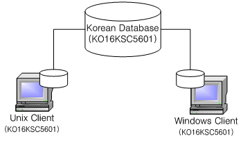
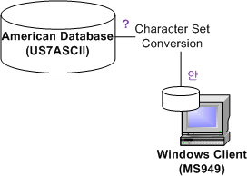
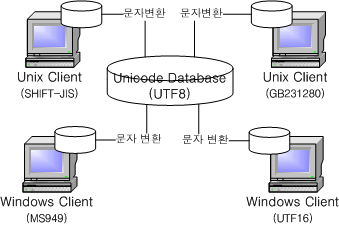

Getting Started Guide
=====================

#### Altibase 7.3

Altibase® Administration

<br><br><br><br><br><br>
<!-- PDF 변환을 위한 여백입니다. --> 


<!-- PDF 변환을 위한 여백입니다. --> 

<div align="left">
    
</div>

<br><br><!-- PDF 변환을 위한 여백입니다. --> 


<!-- PDF 변환을 위한 여백입니다. --> 

<pre>
Altibase Administration Getting Started Guide
Release 7.3
Copyright ⓒ 2001~2023 Altibase Corp. All Rights Reserved.<br>
This manual contains proprietary information of Altibase® Corporation; it is provided under a license agreement containing restrictions on use and disclosure and is also protected by copyright patent and other intellectual property law. Reverse engineering of the
software is prohibited.<br>
All trademarks, registered or otherwise, are the property of their respective owners.<br>
<b>Altibase Corp</b>
10F, Daerung PostTower II,
306, Digital-ro, Guro-gu, Seoul 08378, Korea
Telephone : +82-2-2082-1000 
Fax       : +82-2-2082-1099
Customer Service Portal : <a href='http://support.altibase.com/en/'>http://support.altibase.com/en/</a>
Homepage                : <a href='http://www.altibase.com'>http://www.altibase.com</a></pre>


<br>

# Table Of Contents

- [Preface](#%EC%84%9C%EB%AC%B8)
  - [About This Manual](#%EC%9D%B4-%EB%A7%A4%EB%89%B4%EC%96%BC%EC%97%90-%EB%8C%80%ED%95%98%EC%97%AC)
- [1. Installing Altibase](#1altibase-%EC%84%A4%EC%B9%98)
  - [The Installation Process](#%EC%84%A4%EC%B9%98-%EA%B3%BC%EC%A0%95)
  - [Special Consideration](#%EA%B3%A0%EB%A0%A4-%EC%82%AC%ED%95%AD)
- [2. Startup and Shutdown Altibase](#2altibase-%EC%8B%A4%ED%96%89%EA%B3%BC-%EC%A2%85%EB%A3%8C)
  - [Starting Up Altibase](#altibase%EC%9D%98-%EC%8B%A4%ED%96%89)
  - [Shutting Down Altibase](#altibase%EC%9D%98-%EC%A2%85%EB%A3%8C)
- [3. Working with Altibase](#3altibase%EB%A1%9C-%EC%9E%91%EC%97%85%ED%95%98%EA%B8%B0)
  - [Supported SQL Statement](#%EC%A7%80%EC%9B%90%EB%90%98%EB%8A%94-sql%EB%AC%B8)
  - [How to Execute SQL Statements](#sql%EB%AC%B8-%EC%8B%A4%ED%96%89-%EB%B0%A9%EB%B2%95)
  - [Sample Schema](#%EC%83%98%ED%94%8C-%EC%8A%A4%ED%82%A4%EB%A7%88)
- [4. DB Objects and Privileges](#4%EB%8D%B0%EC%9D%B4%ED%84%B0%EB%B2%A0%EC%9D%B4%EC%8A%A4-%EA%B0%9D%EC%B2%B4-%EB%B0%8F-%EA%B6%8C%ED%95%9C-%EA%B4%80%EB%A6%AC)
  - [Database Objects: An Overview](#%EB%8D%B0%EC%9D%B4%ED%84%B0%EB%B2%A0%EC%9D%B4%EC%8A%A4-%EA%B0%9D%EC%B2%B4-%EA%B0%9C%EC%9A%94)
  - [Privileges: An Overview](#%EA%B6%8C%ED%95%9C-%EA%B4%80%EB%A6%AC-%EA%B0%9C%EC%9A%94)
- [5. Multilingual Features](#5%EB%8B%A4%EA%B5%AD%EC%96%B4-%EC%A7%80%EC%9B%90)
  - [Multilingual Support Overview](#%EB%8B%A4%EA%B5%AD%EC%96%B4-%EC%A7%80%EC%9B%90-%EA%B0%9C%EC%9A%94)
  - [Character Set Classification for Multilingual Support](#%EB%8B%A4%EA%B5%AD%EC%96%B4-%EC%A7%80%EC%9B%90%EC%9D%84-%EC%9C%84%ED%95%9C-%EC%BA%90%EB%A6%AD%ED%84%B0%EC%85%8B-%EB%B6%84%EB%A5%98)
  - [Using Unicode in a Multilingual Database](#%EC%9C%A0%EB%8B%88%EC%BD%94%EB%93%9C%EB%A5%BC-%EC%9D%B4%EC%9A%A9%ED%95%9C-%EB%8B%A4%EA%B5%AD%EC%96%B4-%EC%A7%80%EC%9B%90)
  - [Environment Settings for a Multilingual Database](#%EB%8B%A4%EA%B5%AD%EC%96%B4-%EB%8D%B0%EC%9D%B4%ED%84%B0%EB%B2%A0%EC%9D%B4%EC%8A%A4%EB%A5%BC-%EC%9C%84%ED%95%9C-%ED%99%98%EA%B2%BD-%EC%84%A4%EC%A0%95)
  - [Considerations when Choosing a Database Character set](#%EB%8D%B0%EC%9D%B4%ED%84%B0%EB%B2%A0%EC%9D%B4%EC%8A%A4-%EC%BA%90%EB%A6%AD%ED%84%B0%EC%85%8B-%EC%84%A0%ED%83%9D%EC%8B%9C-%EA%B3%A0%EB%A0%A4%EC%82%AC%ED%95%AD)
- [6. Database Replication](#6%EB%8D%B0%EC%9D%B4%ED%84%B0%EB%B2%A0%EC%9D%B4%EC%8A%A4-%EC%9D%B4%EC%A4%91%ED%99%94)
  - [Introduction to Replication](#%EC%9D%B4%EC%A4%91%ED%99%94-%EC%A0%95%EC%9D%98)
  - [How Databases are Replicated In Altibase](#%EC%9D%B4%EC%A4%91%ED%99%94-%EB%B0%A9%EB%B2%95)
  - [How to Replicate a Database](#%EC%9D%B4%EC%A4%91%ED%99%94-%EA%B8%B0%EB%8A%A5%EC%9D%98-%EC%82%AC%EC%9A%A9-%EB%B0%A9%EB%B2%95)
  - [Executing DLL Statements in a Replication Environment](#ddl-%EC%88%98%ED%96%89-%EC%8B%9C-%EC%A3%BC%EC%9D%98%EC%82%AC%ED%95%AD)
- [7. Fail-Over](#7fail-over)
  - [About Fail-Over](#fail-over%EC%9D%98-%EA%B0%9C%EC%9A%94)
  - [How to Use Fail-Over](#fail-over-%EC%82%AC%EC%9A%A9-%EB%B0%A9%EB%B2%95)
- [8. Backup and Recovery](#8%EB%B0%B1%EC%97%85-%EB%B0%8F-%EB%B3%B5%EA%B5%AC)
  - [Backup Policy](#%EB%B0%B1%EC%97%85-%EC%A0%95%EC%B1%85)
  - [Recovery Policy](#%EB%B3%B5%EA%B5%AC-%EC%A0%95%EC%B1%85)
- [9. Developing Altibase Application](#9%EC%9D%91%EC%9A%A9%ED%94%84%EB%A1%9C%EA%B7%B8%EB%9E%A8-%EC%9E%91%EC%84%B1)
  - [Writing Client Application Programs](#%EC%9D%91%EC%9A%A9-%ED%94%84%EB%A1%9C%EA%B7%B8%EB%9E%A8-%EC%9E%91%EC%84%B1-%EB%B0%A9%EB%B2%95)
  - [Applications Using Altibase CLI](#altibase-cli%EB%A5%BC-%ED%99%9C%EC%9A%A9%ED%95%9C-%ED%94%84%EB%A1%9C%EA%B7%B8%EB%9E%A8)
  - [Applications Using JDBC](#jdbc%EB%A5%BC-%ED%99%9C%EC%9A%A9%ED%95%9C-%ED%94%84%EB%A1%9C%EA%B7%B8%EB%9E%A8)
  - [Applications Written Using the C/C++ Precompiler](#cc-precompiler%EB%A5%BC-%ED%99%9C%EC%9A%A9%ED%95%9C-%ED%94%84%EB%A1%9C%EA%B7%B8%EB%9E%A8)


Preface
====

### About This Manual

This manual explains the concepts, components, and basic use of Altibase

#### Audience

This manual has been prepared for the following Altibase users:

-   Database managers

-   Performance managers

-   Database users

-   Application developers

-   Technical support engineers

It is recommended for those reading this manual possess the following background knowledge: 

-   Basic knowledge in the use of computers, operating systems, and operating system utilities

-   Experience in using relational databases and understanding of database concepts

-   Computer programming experience

-   Experience in database server management, operating system management, or network administration

#### Organization

This manual is organized as follows:

-   Chapter 1: Installing Altibase

-   Chapter 2: Startup and Shutdown Altibase 
    This chapter describes the process of execution and the termination of Altibase server by the database administrator.
    
-   Chapter 3: Working with Altibase

-   Chapter 4: DB Objects and Privileges
    This chapter describes Altibase database objects such as constraints, indexes, sequences, replications, tables, and users created by a particular user. In addition, it describes privileges to access system and schema object. 
    
-   Chapter 5: Multilingual Features  
    This chapter describes the multilingual features and related environment settings and notes some relevant considerations.
    
-   Chapter 6: Database Replication
    This chapter describes how to replicate database and to use the database replication function. 
    
-   Chapter 7: Fail-Over  
    This chapter describes the concept and use of Fail-Over in Altibase

-   Chapter 8: Backup and Recovery  
    This chapter describes the concepts of Altibase backup and recovery.

-   Chapter 9: Developing Altibase Applications. 
  
    This chapter introduces the various APIs (Application Programming Interfaces): Altibase CLI, JDBC, C/C++ Precompiler.

#### Documentation Conventions

This section describes the conventions used in this manual. Understanding these conventions will make it easier to find information in this manual and other manuals in the series.

There are two sets of conventions:

-   Syntax diagrams

-   Sample code conventions

##### Syntax diagrams

This manual describes command syntax using diagrams composed of the following elements:

| Elements                                                     | Meaning                                                      |
| ------------------------------------------------------------ | ------------------------------------------------------------ |
|                    | Indicates the start of a command. If a syntactic element starts with an arrow, it is not a complete command. |
|                    | Indicates that the command continues to the next line. if a syntactic element ends with this symbol, it is not a complete command. |
|                    | Indicates that the command continues from the previous line. If a syntactic element starts with this symbol, it is not a complete command. |
|                    | Indicates the end of a statement.                            |
|   | Indicates a mandatory element.                               |
|                    | Indicates an optional element.                               |
|                    | Indicates a mandatory element comprised of options. One, and only one, option must be specified. |
|                    | Indicates an optional element comprised of options           |
|                    | Indicates an optional element in which multiple elements may be specified. A comma must precede all but the first element. |

##### Sample Code Conventions

The code examples explain SQL, stored procedures, iSQL, and other command line syntax.

The following describes the conventions used in the cod examples:

| Rules            | Meaning                                                      | Example                                                      |
| ---------------- | ------------------------------------------------------------ | ------------------------------------------------------------ |
| [ ]              | Indicates an optional item                                   | VARCHAR [(*size*)] [[FIXED \|] VARIABLE]                     |
| { }              | Indicates a mandatory field for which one or more items must be selected. | { ENABLE \| DISABLE \| COMPILE }                             |
| \|               | A delimiter between optional or mandatory arguments.         | { ENABLE \| DISABLE \| COMPILE } [ ENABLE \| DISABLE \| COMPILE ] |
| . . .            | Indicates that the previous argument is repeated, or that sample code has been omitted. | SQL\> SELECT ename FROM employee;<br/> ENAME<br/>  -----------------------<br/> SWNO<br/>  HJNO<br/>  HSCHOI<br/>  .<br/> .<br/> .<br/> 20 rows selected. |
| Other Symbols    | Symbols other than those shown above are part of the actual code. | EXEC :p1 := 1; acc NUMBER(11,2)                              |
| Italics          | Statement elements in italics indicate variables and special values specified by the user. | SELECT \* FROM *table_name*; <br/>CONNECT *userID*/*password*; |
| Lower case words | Indicate program elements set by the user, such as table names, column names, file names, etc. | SELECT ename FROM employee;                                  |
| Upper case words | Keywords and all elements provided by the system appear in upper case. | DESC SYSTEM_.SYS_INDICES_;                                   |

#### Related Documents

Please refer to the following documents for more detailed information:

-   Installation Guide

-   Administrator’s Manual

-   Replication Manual

-   Precompiler User’s Manual

-   Altibase ODBC User's Manual

-   Altibase CLI User's Manual

-   Application Program Interface User’s Manual

-   SQL Reference

-   Utilities Manual

-   General Reference

-   Stored Procedures Manual

-   JDBC User's Manual

-   iSQL User's Manual

#### Altibase Welcomes Your Comments and Feedback

Please let us know what you like or dislike about our manuals. To help us with better future versions of our manuals, please tell us if there are any corrections or classifications that you would find useful.

Include the following information:

- The name and version of the manual that you are using
- Any comments about the manual
- Your name, address, and phone number

If you need immediate assistance regarding any errors, omissions, and other technical issues, please contact [Altibase's Support Portal](http://support.altibase.com/en/).

Thank you. We always welcome your feedback and suggestions.

# 1. Altibase Installation

-------------

This chapter provides only an overview of the Altibase installation procedure. For the complete instruction on how to install Altibase server, it is strongly recommended to refer to the "Altibase Installation Guide".

This chapter contains the following sections:

-   Installation Process

-   Special Considerations

### Installation Process

#### Download the Package Installer.

Visit Altibase Customer Service Portal (http://support.altibase.com/en/) and download the installer that is suitable for your operation system.

For more detailed information on the package installer files, please refer to Chapter 2 "Installing Products with the Altibase Package Installer" in the Installation Guide.

#### Run the Package Installer

For more detailed information on how to execute the package installer, please refer to Chapter 2 "Installation Products with the Altibase Package Installer" in the *Installation Guide*.

When the package installer is executed, the following tasks are performed automatically:

##### Create the ALTIBASE_HOME Directory

This is the directory that contains the executable files, configuration files, and library files. The package installer gives you the opportunity to select the directory to install ALTIBASE_HOME/conf/altibase properties files.

##### Set the Altibase Property Values

The package installer shows the default property settings and lets you change them to the desired values. After the installation is complete, these properties can be changed by modifying the $ALTIBASE_HOME/conf/altibase.properties. 

##### Create a Database Creation Script

The package installer can create a script that you can later execute to create a database automatically, which greatly simplifies the database creation disk.

#### Create a Database

After the installation is complete, it is necessary to create a database.

If a database was not created during the installation, you must create the database as follows:

- If you have set the properties for creating the database during the installation, you can
  create the database by executing $ALTIBASE_HOME/install/post_install.sh script:
  
- ```
  $ sh post_install.sh dbcreate
  ```


- If you have not set the properties during the installation, you can create the database by
  executing $ALTIBASE_HOME/bin/server script with arguments as follows:
  
- ```
  $ server create utf8 utf8
  ```


### Considerations When Installing Altibase

##### Configuring Kernel Parameters

If the system kernel parameters were not set during installation, please set the kernel parameters manually by referring to the following manuals:

-   Installation Guide: Chapter 2 > Installing Products with the Altibase Package Installer >
Check System Parameters
-   Installation Guide: Appendix A > Setting Kernel Parameters for Different Operating
    Systems

To set system kernel parameters, log in as the root user.


# 2. Startup and Shutdown Altibase

--------------------

This chapter explains how to start up and shut down Altibase after it has been properly installed. 

### Startup Altibase

The Altibase server can be started up in one of two ways: either using iSQL command 'startup' after accessing the sysdba administrator mode or using a shell script named "server start".

To explain the Altibase server startup process, first, the properties are read and system memory is checked, and then it initializes the Altibase system environment, system data, signal handling, the memory used for database space, the query processor, and the threads. This completes the Altibase server startup.

The command to startup Altibase can only be executed with the account that installed Altibase. The following shows how to run the database using iSQL utility (which is provided with the Altibase package). For more detailed information about starting Altibase, please refer to the *Administrator's Manual.* For more detailed information about the iSQL utility, please refer to the *iSQL User's Manual*. 

```
$ isql -u sys -p manager -sysdba
-------------------------------------------------------
Altibase Client Query utility.
     Release Version 7.1.0.1
     Copyright 2000, Altibase Corporation or its subsidiaries.
     All Rights Reserved.
-------------------------------------------------------
ISQL_CONNECTION = UNIX, SERVER = 127.0.0.1, PORT_NO = 20300
iSQL(sysdba)> 
iSQL(sysdba)> startup
Connecting to the DB server.... Connected.
TRANSITION TO PHASE : PROCESS
TRANSITION TO PHASE : CONTROL
TRANSITION TO PHASE : META
  [SM] Recovery Phase - 1 : Preparing Database
                          : Dynamic Memory Version => Parallel Loading
  [SM] Recovery Phase - 2 : Loading Database
  [SM] Recovery Phase - 3 : Skipping Recovery & Starting Threads...
                            Refining Disk Table
  [SM] Refine Memory Table : ..................................................... [SUCCESS]
[SM] Rebuilding Indices [Total Count:100] ............................... [SUCCESS]

TRANSITION TO PHASE : SERVICE
  [CM] Listener started : TCP on port 20300
  [CM] Listener started : UNIX
[RP] Initialization : [PASS]

--- STARTUP Process SUCCESS ---
Command execute success.
```

Alternatively, the user can run the server using the server scrip command. For more detailed information on the server script, please refer to the *Utilities Manual.*

```
$ server start
-------------------------------------------------------     
Altibase Client Query utility.
     Release Version 7.1.0.1
     Copyright 2000, Altibase Corporation or its subsidiaries.
     All Rights Reserved.
-------------------------------------------------------
ISQL_CONNECTION = UNIX, SERVER = 127.0.0.1, PORT_NO = 20300
[ERR-910FB : Connected to idle instance]
Connecting to the DB server... Connected.
TRANSITION TO PHASE : PROCESS
TRANSITION TO PHASE : CONTROL
TRANSITION TO PHASE : META
  [SM] Recovery Phase - 1 : Preparing Database
                          : Dynamic Memory Version => Parallel Loading
  [SM] Recovery Phase - 2 : Loading Database
  [SM] Recovery Phase - 3 : Skipping Recovery & Starting Threads...
                            Refining Disk Table
  [SM] Refine Memory Table : ....................................................... [SUCCESS]
  [SM] Rebuilding Indices [Total Count:100] .................................. [SUCCESS]

TRANSITION TO PHASE : SERVICE
  [CM] Listener started : TCP on port 20300
  [CM] Listener started : UNIX
  [RP] Initialization : [PASS]

--- STARTUP Process SUCCESS ---
Command execute success.
```


### Shutdown Altibase

The Altibase server can be shutdown using the server script command, or by using iSQL commend 'shutdown' after accessing the sysdba administrator mode or using a shell script named "server stop".

Shutdown, a command to shut down a server has three options with each's own way of shutting down the server.

Altibase's shutdown command can be executed only with the account that installed Altibase.

#### Normal

In order for the server to shutdown normally, the server must first wait until all clients have disconnected. What server does when it exits is to terminate the thread that detects the client-server communication session, terminates the service thread, terminates the data storage manager, and waits for the Altibase server process to terminate completely. 

When the server is shut down in this way, the following message is output: 

```
iSQL(sysdba)> shutdown normal;
Ok..Shutdown Proceeding....

TRANSITION TO PHASE : Shutdown Altibase
  [RP] Finalization : PASS
shutdown normal success.
```


#### immediate

When the immediate shutdown option is used, before the server is shutdown, connected sessions are forcibly disconnected, then current transactions are forcibly rolled back.

The output for an immediate shutdown is as follow:

```
iSQL(sysdba)> shutdown immediate
Ok..Shutdown Proceeding....

TRANSITION TO PHASE : Shutdown Altibase
  [RP] Finalization : PASS
shutdown immediate success.
```

The server can also be forcibly shutdown using a server script command.

```
$ server stop
-------------------------------------------------------
     Altibase Client Query utility.
     Release Version 7.1.0.1
     Copyright 2000, Altibase Corporation or its subsidiaries.
     All Rights Reserved.
-------------------------------------------------------
ISQL_CONNECTION = UNIX, SERVER = 127.0.0.1, PORT_NO = 20300
Ok..Shutdown Proceeding....

TRANSITION TO PHASE : Shutdown Altibase
  [RP] Finalization : PASS
shutdown immediate success.
```


#### abort

This option terminates the Altibase server with the system command 'kill -9'. When Altibase is shutdown in this way, the database may not be closed properly, and thus have to go through  the database recovery process the next time you run the Altibase server.

```
iSQL(sysdba)> shutdown abort
```


The server can also be forcibly shutdown using the server script command 'server kill'.

```
$ server kill 
-------------------------------------------------------
     Altibase Client Query utility.
     Release Version 7.1.0.1
     Copyright 2000, Altibase Corporation or its subsidiaries.
     All Rights Reserved.
-------------------------------------------------------
ISQL_CONNECTION = UNIX, SERVER = 127.0.0.1, PORT_NO = 20300
$
```


# 3. Working with Altibase

-------------------

This chapter cotains the following sections:

-   Supported SQL Statements

-   How to Execute SQL Statements

-   Sample Schema

### Supported SQL Statements

Now that you have created a database and know how to start it up and shut it down, you will of course want to execute some SQL statements, starting with DDL statements for creating database objects such as tables and then DML statements to populate the tables with data and perform similar actions. For a description of the various kind of available database objects, please refer to "Chapter 4: Objects and Privileges".

Altibase Server fully supports the ANSI 92 SQL standard, and additionally provides some extended function. For more detailed description of all SQL statements that are supported by Altibase Server, please refer to the *"SQL Reference"*.

### How to Execute SQL Statements.

#### Statements using the iSQL Utility

The most straightforward way to execute SQL statements is to use the iSQL utility, which is a command-line interface that ships with Altibase. For more detailed information on how to use the iSQL utility, please refer to the *iSQL User's Manual*.

#### Executing SQL Statements using Client Applications Developed by the User

In addition, SQL statements can also be executed using client applications developed by the user. Please refer to the "Chapter: 9 Developing Altibase Application" for more detailed information. 

### Sample Schema

The Altibase server package contains a script file that has the SQL statements that generate the sample schema. This sample schema includes database tables and other objects. In addition, there are other SQL statements that generate data. Executing ALTIBASE_HOME/sample/APRE/schema/schema.sql with iSQL as shown below creates the same schemas. 

```
$ isql -s localhost -u sys -p manager -f 
$ALTIBASE_HOME/sample/APRE/schema/schema.sql
```

Many of the examples in this manual are based on those sample schemas. If you wish to follow along with the examples, or simply need some sample data on which to execute SQL statements for practice, it is recommended that you execute the above script to create the sample schema.

For more detailed description of all of the objects and data in the sample schema, please refer to the *General Reference*.

# 4. DB Objects and Privileges

------------------------------

In this chapter, schema objects and non-schema objects will be classified, and the database objects in each category will be explained.

### Database Objects: Overview

Database objects can be classified into schema objects that belong to a speicifc schema and non-schema objects that are not associated with any specific schema. This chapter distinguishes and describes schema objects and non-schema objects. 

#### Schema Objects

A schema is a logical collection of dar or objects. A user owns a schema and manages it using the SQL statement. The objects included in schemas are called schema objects. Altibase supports the following schema objects: 

##### Tables

A table is the most basic data storage unit and is a collection of records consisting of columns. Altibase tables are divided into memory tables and disk tables depending on where the data are stored, and Altibase tables are also divided into system tables created and managed by system and user tables by users. 

System tables are also called the "data dictionary". For more detailed information about the data dictionary provided with Altibase, as well as data dictionary management issues, please refer to the Data Dictionary in the "*General Reference*".

In the cases of replication target tables and large volume tables have special issues related to their management. 

For more detailed information, refer to the "Table" section of "Database Objects and Privileges" in the *Administrator's Manual.*

##### **Partitioned Table**

A partitioned table is called when data of the table are divided based on the partitioning conditions (range, list, and hash) and stored each in a different tablespace. In the case of large tables, it is easy to manage data by using partitioned tables. 

For more detailed information, please refer to Chapter 7: Partitioned Objects in the *Administrator's Manual*.

##### **Partitioned Index** 

Indexes are categorized as partitioned indexes or non-partitioned indexes based on where or not they are partitioned. Non-partitioned indexes are indexes that have not been partitioned, while partitioned indexes (same as partitioned tables) are indexes that have been divided into several indexes based on some partitioning conditions.

For more detailed information, please refer to Chapter 7: Partitioned Objects in the *Administrator's Manual*.

##### Temporary Table

A temporary table can be used to temporarily store data while a session or transaction is being held. Temporary tables can speed up the use of complex queries.

Temporary tables can only be created in volatile tablespaces.

##### Queue Table 

Altibase supports asynchronous data communication between database and user program using message queuing. Queue tables are manipulated using DMLS and DDL statements like database tables. 

For more detailed information on the concepts and functionality of queue tables, please refer to Chapter 5: Database Objects and Privileges in the *Administrator's Manual*.

##### Constraint

A constraint is a condition that is imposed to maintain data consistency when inserting or changing data in a table.

You can distinguish between column constraints and table constraints depending on the constraints. Altibase supports the following constraints:

-   NOT NULL / NULL Constraints

-   CHECK Constraints

-   Unique key Constraints

-   Primary key Constraints

-   Foreign key Constraints

-   TIMESTAMP Constraints

For more detailed information, please refer to the "Constraint" section of Chapter 5: Database Objects and Privileges in the *Administrator's Manual.*

##### Index 

Indexes are elements that are created in tables and allow records within tables to be accessed much quickly when DML statements are processed.

For more detailed information, please refer to the "Indexes" section of Chapter 5: Database Objects and Privileges in the *Administrator's Manual*.

##### Views

A view does not contain actual data, but a logical table created one or more tables, material views, or other views. 

For more detailed information, please refer to the "Views" section of Chapter 5: Database Objects and Privileges in the *Administrator's Manual.*

##### Materialized Views

A materialized view is a database object that stores query results as data. Data can be stored based on one or more tables, views, or other materialized views.

For more detailed information, please refer to the "Materialized View" section of Chapter 5: Database Objects and Privileges in the *Administrator's Manual*.

##### Sequences

Altibase provides sequences for generating unique keys.

For more detailed information, please refer to the "Sequences" section of Chapter 5: Database Objects and Privileges in the *Administrator's Manual.*

##### Synonyms

Synonyms are provided as aliases for tables, sequences, views, stored procedures and stored functions so that they can be used without being accessed directly by the object name.

For more detailed information, refer to the "Synonyms" section of Chapter 5: Database Objects and Privileges in the *Administrator's Manual*.

##### Stored Procedures and Functions

A stored procedure and function are kinds of database object in which all kinds of operations, such as SQL statements, flow control statements, assignment statements, and error handling routines, are programmatically combined into a single module that is permanently stored in the database, after which all of the operations stored therein can be executed merely by calling its name.

For more detailed information, refer to the "Stored Procedures and Functions" section of Chapter 5 "Database Objects and Privileges" in the Administrator's Manual.

In addition, for more detailed information about the special features of stored procedures as provided with Altibase, as well as how to manage them, please refer to the *Stored Procedures Manual.*

##### Type Sets 

A type set is a database object that allows users to collect and manage user-defined types used in stored procedures and stored functions.

More detailed information on this can be found in the *Stored Procedures Manual*.

##### Database Triggers 

A trigger is a kind of stored procedure that is called automatically by the system when data in a table are inserted, deleted, or updated, thus allowing a specific set of tasks to be automatically performed. By defining constraints and triggers for tables, the user can maintain data consistency.

For more detailed information, please refer to the "Triggers" section of Chapter 5: Database Objects and Privileges in the *Administrator's Manual*.

##### Database Link

Database Link allows database servers that are geographically distributed but connected via a network to be linked together to combine the data thereon and output a single result.

More detailed information on this can be found in the *Database Link User's Manual*.

##### External Procedures or Functions 

External procedures or external function objects are database objects that correspond to user-defined C/C++ functions on a one-to-one basis. User-defined functions are executed through external procedure objects or external function objects. Depending on whether or not they return values differentiates external procedures from external functions.

More detailed information on this can be found in the *C/C++ External Procedures Manual*.

##### Library

The dynamic library file containing user-fined containing user-defined C/C++ functions to be used with external procedures must be identifiable by the Altibase server. For this purpose, Altibase provides the library object which is a database object that corresponds to the dynamic library file on a one-to-one basis.

More detailed information on this can be found in the *C/C++ External Procedures Manual*.

#### Non-schema Objects

Objects that do not belong to any particular schema, and are thus managed at the level of the entire database, are called non-schema objects. Altibase provides the following non-schema objects:

##### Directories 

Stored procedures are able to control files, which allows them to read from and write to text files in the file system managed by the operating system. Thanks to this functionality, the user can perform various kinds of tasks using stored procedures such as leaving messages in files, reporting the results into files or reading data from files for insertion into tables. The directory object is used to manage information about the directories accessed by stored procedures.

For more detailed information on the directory object, please refer to the *SQL Reference*.

For more detailed information on how to handle files using stored procedures, please refer to the Stored *Procedures Manual*.

##### Replication

Replication is an object that allows the system to automatically transfer data from one local server to a remote server, and replicate them to maintain the same table data among the other servers.

For more detailed information on replication, please refer to the *Replication Manual*.

##### Tablespaces

Tablespaces are the largest logical data storage unit, and the database is managed by dividing into several tablespace units.

Altibase creates a system tablespace automatically when a database is created, and the user can arbitrarily create a user-defined tablespace.

Altibase supports disk tablespaces where database objects reside on disk, memory tablespaces resident in memory, and volatile tablespaces, which also resides in memory but differs from memory tablespace in that logging is not performed.

For more detailed information on tablespace management, refer to Chapter 6: Managing Tablespaces in the *Administrator's Manual*.

##### Users 

The user account is required for Altibase access and is also the owner of the schema. There are two users: system user and general user. System users are created by the system and are administrators of the entire system. General users require proper authorization to access and manage the database.

For more detailed information, please refer to Chapter 5: Objects and Privileges in the *Administrator's Manual*.

##### Jobs 

A JOB is an object of an execution schedule to a stored procedure. The stored procedure to be executed, the point in time of execution, the interval after which it is to be executed and etc. can be set when creating the JOB object. For the created JOB to automatically run, the value of the JOB_SCHEDULER_ENABLE property must be set to 1. Job creation, alteration and deletion and management of the JOB scheduler are possible only by the SYS user.

For more detailed information, please refer to Chapter 5: Objects and Privileges In the *Administrator's Manual.*

### Privileges

Users must have appropriate privileges in order to access database objects and data. This section describes the privileges pertaining to users and objects and how to manage them.

Altibase supports system privileges, object privileges and roles.

##### System Privilege 

System access privileges are typically granted by a DBA, performing certain tasks on the database, or managing objects in all schemas.

##### Object Privileges 

The object owner manages object privileges, which are the right to access and manipulate objects.

For a complete list of the privileges supported in Altibase, please refer to the portion of the
Altibase Administrator’s Manual dealing with privilege management, and for more detailed
information about statements for granting and revoking privileges, please refer to the
*Altibase SQL Reference*.

##### Roles

A role is a bundle of privileges. It is easy to use roles when granting multiple privileges to users. 

For more detailed information and restrictions on roles, refer to the *SQL Reference.*

#### Granting Privileges

For the SYSTEM_ and SYS users who are in the initial state since the database is created, they have full authority as DBA and can grant authority to general users.

When creating general users by CREATE USER statement, the system automatically grants the users the minimum privileges to access the database, such as the authority to execute CREATE SESSION and CREATE TABLE statement. 

Other privileges must be explicitly granted by the DBA.

For more detailed information on authorizing and managing privileges, please refer to the *SQL Reference* and the *Administrator's Manual*.

#### Revoking Privileges

Privileges granted to users other than the SYSTEM_ and SYS users can be explicitly revoked
using the REVOKE statement.

With the CREATE USER statement, privileges automatically granted by the system when creating a user can also be freed if necessary.

However, the privileges of the SYSTEM_ and SYS users cannot be revoked.


# 5. Multilingual Features

-----------

This chapters describe the multilingual structure of Altibase, as well as environment settings and other points to consider when using Altibase in a multilingual environment.

### Multilingual Support Overview

#### Concept

Multilingual support means that the DBMS is capable of storing and processing character sets used in different countries. In other words, the DBMS enables processing for clients using different languages and characters such as Korea, Chinese, Japanese, and others. 

#### Related Terminology

- Character-Set  
  A character set is a particular group of characters that are associated with respective numeric values. The following table shows how an individual character is associated with a different numeric value depending on whether it is encoded using the UTF-8, UTF-16 BE or UTF-16 LE character set.
  
  | Character | UTF-8 | UTF-16 BE | UTF-16 LE |
  | ---- | ----- | --------- | --------- |
  | A    | 41    | 00 41     | 41 00     |
  | Ő    | C3 B6 | 00 F6     | F6 00     |
  
-   NLS(National Language Support)  
    This allows the database to be used in a particular language environment. If NLS is appropriately set, the user can read and write data to and from the database using the character set specified by the user's application.

#### Multilingual Support Structure

Multi-language support consists of performing conversions between the character sets used by the database and the client application, respectively

The server-client relationship for multi-language support is divided into the following four categories:

-   The database and the client use the same character set.

-   The database and the client use different character sets.

-   The database and multiple clients use different character sets.

-   Unicode data type support

##### The database and the client use the same character set.

This indicates that the character set between the database and the client is the same.



[Figure 5‑1] A Database and a Client with the same Character Set

As shown in Figure 5-1, if both the database and the client use KSC5601, character set does not occur.

##### The database and the client use different character sets.

If the character set used by the database is different from the character set used by the client, the character set conversation occurs. This can sometimes lead to data loss, as shown in Figure 5-2.



[Figure 5-2] A Database and A Client with Different Character Sets

To prevent data loss caused by character set conversion, it is recommended that the character set used on the database be a superset of the character set used by the client.

Thus, to prevent data loss when character conversion is performed as seen in the figure above, the character set used by the database should be MS949 or UTF8, which is a superset of MS949.

##### The database and multiple clients use different character sets.

If multiple clients have different character sets, the server must specify a character set that includes all of the clients character sets to avoid loss of character conversions.



[Figure 5‑3] A Database and Multiple Clients with Different Character Sets

The above figure shows a system configuration in which each client connected to one database uses Japanese, Chinese, and Korean, etc. To prevent the loss of character conversion between a server and multiple clients using each language, the database character set should be set to UTF8, which supports the languages used by all of these clients. 

##### Unicode Data Type Support

Regardless of which character set the database and client are set to, it is possible to support multiple languages using NCHAR or NVARCHAR data types that support Unicode data. 

### Character Set Classification for Multilingual Support.

#### Database Character Set.

The "database character set" is the character set with which data are saved in the database.

Because the SQL standard is an ASCII character set, the character set that encompasses (completely includes) the ASCII character set can be used as a database character set. However, UTF16 is excluded from the database character set because it does not encompass an ASCII character. 

##### How to Specify the Database Character Set

When a database is created, the database character set can be specified using the CREATE DATABASE statement. 

##### Supported Database Character Sets

Altibase supports the use of the following database character sets, all of which support ASCII: 

-   US7ASCII

-   KO16KSC5601

-   MS949

-   BIG5

-   GB231280

-   MS936 (Identical to the GBK, ZHS16GBK, CP936 character sets of other vendors)

-   UTF8

-   SHIFTJIS

-   MS932 (Identical to the CP932 character sets of other vendors)

-   EUCJP

#### National Character Set

The national character set is used to store NCHAR and NVARCHAR data types, and can be used to store text in Unicode.

##### How to Specify the National Character Set

When a database is created, the national character set of the database is specified using the CREATE DATABASE statement. 

##### Supported National Character Set

Altibase supports the following two national character sets:

-   UTF8

-   UTF16 (Big Endian)

#### Client Character Set

The client character set is the character set used to display data to the client.

Data sent from the server are converted to, and displayed in, the character set specified by respective clients.

##### How to Specify the Client Character Set.

The client character set can be specified using ALTIBASE_NLS_USE on the client.

##### Supported Client Character Sets

-   US7ASCII (Default)

-   KO16KSC5601

-   MS949

-   BIG5

-   GB231280

-   MS936

-   UTF8

-   UTF16 (Big Endian)

-   SHIFTJIS

-   MS932

-   EUCJP

### Using Unicode in a Multilingual Database

#### Unicode Concept

Unicode is an internationally encoded character set that can store information in any language in a single character set. Unicode also has a unique value for all characters, regardless of platform or programming language.

Therefore, Unicode is a code that can be useful when it is desired to store languages of various countries at the same time.

#### Unicode Encoding

Unicode encoding is a method of mapping Unicode to bytes for storage on a computer.

Altibase usees an encoding scheme such as UTF-8 or UTF-16 to represent a code scheme or character set.

#### Storing Unicode Characters

Unicode characters can be stored in a database in two ways: 

-   When the database is created, it can be designated as one in which character data are stored as Unicode data.
-   NCHAR or NVARCHAR columns can be used to store Unicode characters.

Please note that, if the database character set is UTF8 and the national character set is UTF16, there are two different ways to store Unicode characters in the same database.

#### Unicode Database

When creating a database, the Unicode data can be stored in CHAR and VARCHAR columns by creating a database that supports Unicode by setting the database character set to UTF8. 

###### **Supported Character Set**

-   UTF8

###### **When is a Unicode database neeeded?**

-   When SQL statements or sotred procedures include Unicode data.

-   When it is  unsure whether multilingual data will be inserted into the database, or what column they will be inserted into.

#### Unicode Datatypes

Even if a character set other than UTF8 was specified at the time a database was created, it is still possible to store Unicode characters using the NCHAR or NVARCHAR data type.

###### **Supported Character Sets**

-   UTF8

-   UTF16

###### **When are Unicode Datatypes Needed?**

-   When columns for storing multilingual data are needed in a non-Unicode database.

-   When most of the data is in the same language, but there are columns where some of the data to be saved in some other languages(s).

### Setting Environment for a Multilingual Database

In order to establish a database that supports multi-languages, settings must be made as follow: 

1.  When creating a database, consider which character set is the most widely used by clients, and specify that character set for the server.
  
2.  Set NLS appropriately for the client character set.

3.  Set other environment variables and properties

#### Setting Environment Variables

Set the following environment variables on the clients:

-   ALTIBASE_NLS_USE

-   ALTIBASE_NLS_NCHAR_LITERAL_REPLACE

##### ALTIBASE_NLS_USE

Any of the following character sets may be used on the clients. Data sent from the server are converted to, and displayed in, the character set specified by each of the clients.

-   US7ASCII (Default)

-   KO16KSC5601

-   MS949

-   BIG5

-   GB231280

-   MS936

-   UTF8

-   SHIFTJIS

-   MS932

-   EUCJP

##### ALTIBASE_NLS_NCHAR_LITERAL_REPLACE

If this is set to 1(TRUE), the client does not convert strings that are preceded by the "N" character to the database character set. Rather, it sends them to the server without change, and the server converts them to the national character set. The default is 0 (FALSE).

Queries used by client applications is generally converted to the database character set and then sent to the server. Under this scheme, for a database that uses the US7ASCII character set, data that fall out of the range of the US7ASCII character set cannot be inserted into that database, even if an NCHAR column is created for that purpose.

For example, if the client character set is KO16KSC5601 and the database character set is
US7ASCII, data are converted from the client character set to the database character set when
an INSERT statement is executed. In this case, as can be seen in the following example,
because it can't be converted to US7ASCII, the replacement character '?' is stored in the table.

```
iSQL> create table t1 ( i1 nvarchar(10) );
Create success.

iSQL> insert into t1 values ( '안' );
1 row inserted.

iSQL> select * from t1;
I1
--------------------
?
```

Therefore, a method of saving data that does not fall within the range of the database
character set in an NCHAR column is needed. In one such method, seen below, an
environment variable setting is made and data are inserted using the NCHAR literal:

```
$  export ALTIBASE_NLS_NCHAR_LITERAL_REPLACE=1
...
iSQL> create table t1 ( i1 nvarchar(10) );
Create success.

iSQL> insert into t1 values ( N'안' );
1 row inserted.

iSQL> select * from t1;
I1
--------------------
안
```

As seen above, If ALTIBASE_NLS_NCHAR_LITERAL_REPLACE is set to 1(TRUE) and data are inserted, the client does not convert strings that are preceded by the "N" character to the database character set. Instead, these strings are sent to the server without change, where they are converted to the national character set.

#### Example.

The following describes the process of setting an environment that uses the default character set as KSC5601 and the national character set as UTF16. 

###### **Database Creation**

```
iSQL(sysdba)> create database mydb initsize=10m noarchivelog character set KSC5601 national character set UTF16; 

DB Info (Page Size     = 32768) 
        (Page Count    = 257) 
        (Total DB Size = 8421376) 
        (DB File Size  = 1073741824) 
	Creating MMDB FILES     [SUCCESS] 
	Creating Catalog Tables [SUCCESS] 
	Creating DRDB FILES     [SUCCESS] 
  [SM] Rebuilding Indices [Total Count:0]  [SUCCESS] 
DB Writing Completed. All Done. 
Create success.
```


###### **Making Environment Settings on the Client**

To use KSC5601 on the client, set the environment varaible as follows:

```
% export ALTIBASE_NLS_USE=KSC5601
```

To use ASCII on the client, set the environment variable as follows:

```
% export ALTIBASE_NLS_USE=ASCII
```

###### **Setting Other Environment Variables and Properties**

Set the following environment variable and property appropriately for the usage environment:

-   Environment Variable  
    ALTIBASE_NLS_NCHAR_LITERAL_REPLACE

-   Property  
    NLS_COMP or NLS_NCHAR_CONV_EXCP

### Consideration When Choosing a Database Character Set

When choosing a database character set, it should be selected in consideration of loss, conversion cost, and an identifier that may occur in character conversion.

#### Scope of Usage

##### Identifiers

Column names, schema objects and comments are saved in the database using the database character set, however, other identifiers can only be stored using the US7ASCII character set.

The following tables show which character sets can be used for each kind of identifier.

| Identifier Name                        | Available Character Set |
| -------------------------------------- | ----------------------- |
| Column Name                            | Database Character Set  |
| Schema Object                          | Database Character Set  |
| Annotation                             | Database Character Set  |
| Database Link Name                     | Database Character Set  |
| Database Name                          | US7ASCII                |
| File Name (Such as Data and Log Files) | US7ASCII                |
| Directory Name                         | US7ASCII                |
| Keyword                                | US7ASCII                |
| Tablespace Name                        | US7ASCII                |

[Table 5‑1] Character Sets that Can Be Used for Each Identifier

##### Stored SQL Statement

SQL statements such as stored procedures and trigger statements are stored in a meta table as database character sets.

#### Constraint

##### Replication

Replication cannot be performed between two databases that use different character sets.

#### Effects of Character Set Conversion.

If the database character set is different from the client character set, a conversion occurs. Such character conversion can potentially cause data loss as well as affect performance degradation.

##### Data Loss

If the conversion from a character set that has a large range to a small character set occurs, data loss can occur.

Any characters that cannot be represented using the destination character set will be
converted to a replacement character. In US7ASCII, the replacement character is the question
mark (‘?’).

##### Conversion Overhead

If all clients use the same character set, and the same character set is specified when a
database is created, no character conversion will occur.

However, if different character sets are in use on each client, and the database character set
is a superset of the character sets used by the clients, character conversion will occur.


# 6. Database Replication

-------------------

Replication is the copying feature and transaction-log-based data in each other database setting an Active-Standby or Active-Active relationship between databases.

During operating the Altibase Replication function, a user can operate a system without shutting down the service when unexpected system interruption occurred.

This chapter introduces an overview of the replication features and how they operate. 

### Introduction to Replication

The Altibase database replication function maintains an up-to-date backup of the database on an active server, and in the event that the server is unexpected terminated, immediately resumes service again from an identical database on an alternative server, so as to realize an operating environment in which uninterruptible service is provided.

For the appropriate operation of the database replication, We will explain the following order:

-   How Databases Are Replicated In Altibase

-   How To Use the Replication Function

For more detailed information of Replication, please refer to the *Replication Manual*.

### How Databases Are Replicated In Altibase

#### How to Operate the Replication Function

To use the replication function, a table must be defined first in order to be replicated. After determining replication properties such as a replication name, a primary and a port number, create a replication object between a local server and a remote server. 

It then the replication with the remote server.

In both directions, replication can be done in both directions when the replication is started in the remote server.

### How to Replicate a Database

After performing the Altibase replication function, a local server transfers changed data logs in the system to a remote server, and a remote server commits corresponding logs in its own database.

The local server and the remote server run a thread of the managed Replication configuration without using the server thread.

These threads are distinct from the data service threads. 

The replication Sender thread on the local server transmits the log of a changed database to the remote server. In addition, the Replication Receiver thread on the remote server receives the log of changed database and implements them in its database.

The replication Sender and Receiver threads automatically detect whether the corresponding servers were shut down normally or abnormally and take appropriate action. 

##### Creating Replication Objects

Replication to synchronize a local server with a remote server is defined as follows:

```
CREATE [LAZY|EAGER] REPLICATION replication_name 
[AS MASTER|AS SLAVE] 
[OPTIONS options_name [option_name ... ] ] 
WITH { ‘remote_host_ip’, remote_host_ port_no } 
...
FROM user_name.table_name 
TO user_name.table_name
[,FROM user_name.table_name 
TO user_name.table_name]
...;
```


##### Starting Replication

Replication is started in this way:

```
ALTER REPLICATION replication_name 
SYNC [PARALLEL parallel_factor] 
[TABLE user_name.table_name, … , user_name.table_name];

ALTER REPLICATION replication_name 
SYNC ONLY [PARALLEL parallel_factor] 
[TABLE user_name.table_name, … , user_name.table_name];

ALTER REPLICATION replication_name START [RETRY];

ALTER REPLICATION replication_name QUICKSTART [RETRY];
```


##### Stopping Replicaiton

Replication is stopped in this way:

```
ALTER REPLICATION replication_name STOP;
```


##### Resetting Replication

This is how replication information is reset. Replication must be stopepd before this is done: 

```
ALTER REPLICATION replication_name RESET;
```


##### Dropping Replication Tables

This is how tables are dropped (deregistered) from a replication object. Replication must be stopped beofre this is done:

```
ALTER REPLICATION replication_name STOP;
ALTER REPLICATION replication_name DROP TABLE 
  FROM user_name.table_name
  TO user_name.table_name;
```


##### Adding Replication Tables

This is how tables are added to (registered with) a replication object. Replication must be stopped before this is done:

```
ALTER REPLICATION replication_name STOP;
ALTER REPLICATION replication_name ADD TABLE 
  FROM user_name.table_name
  TO user_name.table_name;
```


##### Dropping a Replication Object

This is how a replication object is dropped. If replication has been started, it must first be stopped before the replicaiton object can be dropped:

```
ALTER REPLICATION replication_name STOP;
DROP REPLICATION replication_name;
```


### Executing DDL Statements in a Replicaiton Environment

If the REPLICATION_DDL_ENABLE property is set to 1 on a replicaiton server, the following DDL  statements can be executed: 

-   ALTER TABLE *table_name* ADD COLUMN;

-   ALTER TABLE *table_name* DROP COLUMN;

-   ALTER TABLE *table_name* ALTER COLUMN *column_name* SET DEFAULT;

-   ALTER TABLE *table_name* ALTER COLUMN *column_name* DROP DEFAULT;

-   ALTER TABLE *table_name* TRUNCATE PARTITION;

-   ALTER TABLE *table_name* ALTER PARTITION;

-   ALTER TABLE *table_name* SPLIT PARTITION *partition_name(condition)* INTO  
    ( PARTITION *partition_name,* PARTITION *partition_name*);

-   ALTER TABLE *table_name* MERGE PARTITIONS *partition_name, partition_name*
    INTO PARTITION *partition_name*;

-   ALTER TABLE *table_name* ALTER TABLESPACE;

-   ALTER TABLE *table_name* ALTER PARTITION;

-   ALTER TABLE *table_name* DROP PARTITION *partiton_name;*

-   TRUNCATE TABLE;

-   CREATE INDEX;

-   DROP INDEX;

Please refer to the *Replication Manual* for a complete list of the DDL statements that may be
executed, as well as more information about restrictions pertaining to replication. 

However, DDL statements that are not allowed in replication should be used after suspending or deleting replication according to the procedure. That is, in order to execute DDL statements that are not allowed during the replication operation for the tables included in the replication object, it is necessary to stop replication in two servers, delete the corresponding tables from replication, and execute DDL statements on the respective server. Then if the DDL statement is executed successfully, the table re-register in the replication and the replication is resumed. 


# 7. Fail-Over
---------

Altibase provides a Fail-Over function to overcome failures and provide service regardless of failures while operating the database system. This chapter describes the functions and usage of Fail-Over supported by Altibase.

### About Fail-Over

#### Concept

Fail-Over means overcoming a failure during DBMS operation and allowing the service to continue as if no failure occurred.

Possible faults include the failure of the DBMS server itself, the failure of the network path to the equipment, or the failure of the DBMS due to a software error. Fail-Over allows users to connect to another DBMS server in the event of a failure, regardless of the type of failure, thereby allowing the application to continue the service without being aware of the failure.

One of the following two kids of Fail-Over is performed, depending on the time point at which the fault is discovered:

-   CTF (Connection Time Fail-Over)

-   STF (Service Time Fail-Over)

With CTF, it recognizes the fault at the connection time of the DBMS and retries connection to the DBMS of the other available node instead of the failed DBMS.

With STF, it detects the fault during DBMS service and restores the properties of the session by reconnection to the DBMS of another available node, so that the business logic of the user application can be continuously executed.

Because STF only performs the Fail-Over for DB connection, the failed transaction must be reprocessed by the user. 

In order to obtain correct operation results in such Fail-Over, database consistency between the fault DBMS and the available DBMS should be ensured. Altibase provides a database replication method using Off-line replicators to ensure database consistency. Offline replication is a method of matching the database by reading the log of the active server from the stand-by server. 

Due to the characteristic of the replication method, database consistency may be inconsistent, so it is recommended to check the consistency using the Fail-Over callback function. Fail-Over callbacks are described in detail in the next section.

Altibase's Fail-Over setting is done by registering the Fail-Over attribute in the application program. The integrity of the database can be checked before executing Fail-Over using the Fail-Over callback function. 

The three kinds of Fail-Over-related tasks that must be executed by the client application are summarized as follows:

-   Fail-Over connection property registration

-   Fail-Over callback function registration

-   Process business logic based on callback results.

For more detailed information, please refer to the *Replication Manual*.

### How to Use Fail-Over

#### Setting the Fail-Over Connection Property

If the Fail-Over connection property has been set, Altibase will detect it when a failure occurs and perform Fail-Over tasks as specified by the connection property.

These are two ways to show property values: 

-   By viewing the connection property string used by the API's "Connect" function

-   By viewing the Altibase properties files:  
    altibase_cli.ini file or odbc.ini file (WinODBC)

For more details about how to set this property, please refer to the *Replication Manual*.

#### Checking Whethere Fail-Over has Succeeded.

In the case of CTF (Connection Time Fail-Over), attempting to connect to the database makes it immediately obvious whether Fail-Over was successful. In contrast, in the case of STF (Service Time Fail-Over), whether Fail-Over was successful is determined by checking for exceptions and errors.

For example, in the case of JDBC, when a SQLExeception is caught, the value of SQLStates.status is checked using the SQLException's getSQLState() method, and if this value is found to be ES_08FO01, then it is known that Fail-Over succeeded. 

In the case of CLI and ODBC, if the result of a SQLPrepare, SQLExecute, or SQLFetch
statement or the like is an error rather than SQL_SUCCESS, a statement handle is returned in
response to SQLGetDiagRec, and if the result of the call to SQLGetDiagRec is
ALTIBASE_FAILOVER_SUCCESS, then it is confirmed that STF (Service Time Fail-Over)
succeeded.

When using embedded SQL, after executing an EXEC SQL statement, the value of the return
code “sqlca.sqlcode” is checked, and if it is ALTIBASE_FAILOVER_SUCCESS (rather than
SQL_SUCCESS), then it is confirmed that STF (Service Time Fail-Over) succeeded.

For more detailed information on these settings, please refer to the *Replication Manual*.

#### How to Write a Fail-Over Callback Function

The way to write a Fail-Over function differs depending on the form of the client application, but the basic structure is usually the same and consists of the following: 

-   Defining Fail-Over related data structures
-   Writing the body of Fail-Over Callback function that will be called when Fail-Over related events occur.
-   Checking whether Fail-Over has succeeded.

At the step of defining Fail-Over-related data structures, the Fail-Over-related data structure
is defined or the interface (header file) for it is included. 

At the step of writing the body of Fail-Over Callback functions, necessary codes such as
checking consistency are implemented. The codes will be executed in case the Fail-Over start
event or finish event occurs.

At the step of checking whether Fail-Over has succeeded, it checks if Fail-Over is successfully
completed and Fail-Over callback functions finish without any errors. If it is true, the
application service can resume.

For more detailed information on how to write such functions in various client application
environments, please refer to the *Replication Manual*.


# 8. Backup and Recovery

------------

Altibase data can be lost due to unforeseen incidents such as system failure, a disk fault, a data file loss, etc. This chapter describes the backup and recovery features of Altibase for use in preparing for such incidents.

### Altibase Backup Policy

Logical backup procedures are as follows:

-   Logical backup procedure
    Utility Backup

-   Physical backup procedure  
    Offline backup  
    Online backup 

Logical backup refers to the use of a utility such as iLoader to create a logical copy of a database object and save it as a text file. Logical backups may not be able to recover to the point of failure.

Physical backup refers to copying the data files and log anchor files that make up the database to a separate disk or tape. Physical backups are divided into online backups and offline backups depending on whether the service is interrupted while copying a snapshot of the data file.

An offline backup is a copy of all tablespace files, log anchor files and log files after normal shutdown of the database server.

Online backup refers to copying data files and log anchor files in the database without service interruption. Uncommitted data may be backed up during the copying of data files. Therefore, log files are needed to undo these uncommitted transactions during recovery. Therefore, online backup is possible only when operated in the archive log mode in which the archive log files are generated.

### Altibase Recovery policy

Altibase supports the following recovery types:

-   Logical backup recovery

-   Restart Recovery

-   Media Recovery

Logical backup recovery is the recovery from backup text files using the iLoader utility. Restart recovery is a simple recovery method that is automatically initiated when an Altibase server is restarted. Restart recovery is conducted after a database server has been abnormally terminated.

Media recovery uses database files, log anchor files, and archive log files that were created
based on the backup policy to recover database files either to the most recent backup or to a specific moment in time (”point-in-time recovery”). Depending on the kind of media error
and the recovery procedure, the database may be recovered using either complete recovery
or incomplete recovery, as appropriate. 

For more detailed information about backup and recovery, please refer to the portion of the *Altibase Administrator’s Manual* pertaining to backup and recovery.


# 9. Developing Altibase Applications

-----------------

This chapter will provide an overview of the process of authoring client applications that access Altibase.

### Writing Client Application Programs

Developing Altibase applications using the Altibase application program interface (API) for
Altibase CLI, JDBC, ODBC, the C/C++ precompiler.

This chapter will briefly introduce the process of authoring client applications for use with Altibase.

For more detailed information about writing client applications, please refer to the *Altibase CLI User’ Manual*, the *ODBC User’ Manual*, the *Precompiler User’s Manual*, and the *API User’s Manual*.

### Applications Using Altibase CLI

This section explains how to write client applications using Altibase CLI. Altibase CLI is an API
that can be used in an environment where Altibase is operated in the client-server structure.
For more detailed information, please refer to the *Altibase CLI User’s Manual*.

#### Header Files and Libraries

To develop a program using the Altibase CLI, you need the header files and library files in the "include" and "lib" subdirectories of the Altibase installation home directory, are needed:

```
$ALTIBASE_HOME/include/sqlcli.h
$ALTIBASE_HOME/lib/libodbccli.a
```


#### Makefile

In order to compile the Altibase CLI source code in your program, the following must be included in the Makefile:

```
include $(ALTIBASE_HOME)/install/altibase_env.mk
```

This file includes links to library paths and libraries that are needed at compile time, as well as instructions for making object files. Please refer to the sample Makefile in $ALTIBASE_HOME/sample/SQLCLI

##### **Example**

```
include $(ALTIBASE_HOME)/install/altibase_env.mk

SRCS=
OBJS=$(SRCS:.cpp=.$(OBJEXT))

BINS=demo_ex1

all: $(BINS)

demo_ex1: demo_ex1.$(OBJEXT)
	$(LD) $(LFLAGS) $(LDOUT)demo_ex1$(BINEXT) demo_ex1.$(OBJEXT) $(LIBOPT)odbccli$(LIBAFT) $(LIBS)
```


#### Multi-threaded Programming

When developing a multi-threaded program, you should be aware of the following: 

-   Must allocate environment handles and connection handles for each thread. 

#### Writing Application

The following code shows how to connect to and disconnect from an Altibase server in a program that uses Altibase CLI:

##### **Altibase CLI Code Sample**

```
/* test.cpp */

#include <stdio.h>
#include <string.h>
#include <stdlib.h>
#include <time.h>
#include <sys/time.h>
#include <unistd.h>
#include <sqlcli.h>

void sbigint_bigint(int cnt);  
void slong_integer(int cnt);
void char_char(int cnt);
void char_number(int cnt);
void double_double(int cnt);
void prepare();
void execute();
void usage();
long logMsec(const char *astr);
void conn(char *port, char *conntype);

#define MSG_LEN 1024  

SQLHENV   env;  // Handle for the environment.
SQLHDBC   con;  // Handle for the connection.
SQLHSTMT  hstmt;  // Handle for a statement.
SQLHSTMT  bstmt;  // Handle for a statement.
int          errNo;
short        msgLength;
char         errMsg[MSG_LEN];
SQLRETURN rc;

/* Main Program - Usage output when the number of arguments is less than 5 */
int main(int ac, char **av)  
{
    if (ac < 5) 
    {
        usage();
    }

    conn(av[2], av[3]);

    switch(atoi(av[1]))
    {
    case 1:
        logMsec(" BIGINT - START TIME : ");
        sbigint_bigint(atoi(av[4]));
        logMsec(" BIGINT - END TIME : ");
        break;
    case 2:
        logMsec(" INTEGER - START TIME : ");
        slong_integer(atoi(av[4]));
        logMsec(" INTEGER - END TIME : ");
        break;
    case 3:
        logMsec(" CHAR - START TIME : ");
        char_char(atoi(av[4]));
        logMsec(" CHAR - END TIME : ");
        break;
    case 4:
        logMsec(" NUMBER - START TIME : ");
        char_number(atoi(av[4]));
        logMsec(" NUMBER - END TIME : ");
        break;
    case 5:
        logMsec(" DOUBLE - START TIME : ");
        double_double(atoi(av[4]));
        logMsec(" DOUBLE - END TIME : ");
        break;
    }
}

/* print the usage of the program */
void usage()
{
    printf("Usage: ./test <program_no> <port_no> <conntype> <cnt>\n");
    printf("\tprogram_no : 1  => \t SBIGINT-BIGINT\n");
    printf("\tprogram_no : 2  => \t SLONG-INTEGER\n");
    printf("\tprogram_no : 3  => \t CHAR-CHAR\n");
    printf("\tprogram_no : 4  => \t CHAR-NUMERIC\n");
    printf("\tprogram_no : 5  => \t DOUBLE-DOUBLE\n");
    exit(1);
}

/* Check the starting time and the ending time of the program */
long logMsec(const char *astr)
{
    struct timeval  tv;
    struct tm       *ctm;

    gettimeofday(&tv,NULL);
    ctm = localtime(&(tv.tv_sec));

    fprintf(stderr, "%s [%.02d:%.02d:%.02d]\n", astr, ctm->tm_hour, 
ctm->tm_min, ctm->tm_sec);

    return tv.tv_usec;
}

/* Altibase connection statement */
void conn(char *port, char *conntype)
{
    char connStr[200];
    char query[200];

    if (SQL_ERROR == SQLAllocEnv(&env))
    {
        fprintf(stderr, "SQLAllocEnv error!!\n"); 
//Memory allocation for the environment.
        return;
    }

    if (SQL_ERROR == SQLAllocConnect(env, &con)) 
// Memory allocation for a connection
    {
        fprintf(stderr, "SQLAllocConnect error!!\n");
        SQLFreeEnv(env);
        return;
    }

    sprintf((char*)connStr, "DSN=127.0.0.1;PORT_NO=%s;UID=SYS;PWD=MANAGER;CONNTYPE=%s", port, conntype);

/* Connection creation */
    if (SQL_ERROR == SQLDriverConnect(con, NULL, (char*)connStr,
SQL_NTS, NULL, 0, NULL, SQL_DRIVER_NOPROMPT))
    {
        if (SQL_SUCCESS == SQLError(env, con, NULL, NULL, &errNo, (char*)errMsg, MSG_LEN, &msgLength)) 
        {
            fprintf(stderr, " rCM_-%d : %s\n", errNo, errMsg);
        }
        SQLFreeConnect(con);  
        SQLFreeEnv(env);
        return;
    }
/* Not automatically reflected upon execution of each SQL statement */
    SQLSetConnectAttr(con, SQL_ATTR_AUTOCOMMIT, 
(void*)SQL_AUTOCOMMIT_OFF, 0);
    if (rc == SQL_ERROR)              
    {                                 
        if (SQL_SUCCESS == SQLError(env, con, NULL, NULL, &errNo, (char*)errMsg, MSG_LEN, &msgLength))
        {
            fprintf(stderr, "[%d : %s]\n", errNo, errMsg);
        }
    }

    hstmt = bstmt = SQL_NULL_HSTMT;  

    SQLAllocStmt(con, &hstmt);
    SQLAllocStmt(con, &bstmt);

/* Executing the DDL statement directly and output the message in the defined format into a file. */
    strcpy(query, "drop table t1");   
    rc = SQLExecDirect(hstmt, (char*)query, SQL_NTS);  
    if (rc == SQL_ERROR)
    {
        if (SQL_SUCCESS == SQLError(env, con, hstmt, NULL, &errNo, (char*)errMsg, MSG_LEN, &msgLength))
        {
            fprintf(stderr, "[%d : %s]\n", errNo, errMsg); 
}
    }

/* Directly executes DDL statements and when an error occurs, outputs the message to a file according to the specified format */
    strcpy(query, "create table t1(i1 number(6))");
    rc = SQLExecDirect(hstmt, (char*)query, SQL_NTS);
    if (rc == SQL_ERROR)
    {
        if (SQL_SUCCESS == SQLError(env, con, hstmt, NULL, &errNo, (char*)errMsg, MSG_LEN, &msgLength))
        {
            fprintf(stderr, "[%d : %s]\n", errNo, errMsg); 
}
    }
}

/* Preparing a SQL statement */
void prepare()   
{
    char query[100];

    strcpy(query, "insert into t1 values(?)");

    rc = SQLPrepare(bstmt, (char*)query, SQL_NTS);
    if (rc == SQL_ERROR)              
    {                                 
        if (SQL_SUCCESS == SQLError(env, con, bstmt, NULL, &errNo, (char*)errMsg, MSG_LEN, &msgLength))
        {
            fprintf(stderr, "[%d : %s]\n", errNo, errMsg);
        }
    }
}

/* Executing a prepared SQL statement */
void execute()  
{
    rc = SQLExecute(bstmt);
    if (rc == SQL_ERROR)              
    {                                 
        if (SQL_SUCCESS == SQLError(env, con, bstmt, NULL, &errNo, (char*)errMsg, MSG_LEN, &msgLength))
        {
            fprintf(stderr, "[%d : %s]\n", errNo, errMsg);
        }
    }
}

void sbigint_bigint(int cnt)
{
    int i;
    long long i1;
    char tmp[100];
    int len = SQL_NTS;

    prepare();

/* Binding parameters */
    SQLBindParameter(bstmt, 1, SQL_PARAM_INPUT, SQL_C_SBIGINT, 
SQL_BIGINT, 0, 0, (void*)&i1, 0, &len);

    for(i=0; i<cnt; i++)
    {
        sprintf(tmp, "%d", i);
        i1 = atol(tmp);
        execute();
    }

/* Process COMMIT transaction. */
    rc = SQLTransact(NULL, con, SQL_COMMIT); 
}

void slong_integer(int cnt)
{
    int i;
    int i1;
    char tmp[100];
    int len = SQL_NTS;

    prepare();

/* Connect parameter to SQL statement */
    SQLBindParameter(bstmt, 1, SQL_PARAM_INPUT, SQL_C_SLONG, 
SQL_INTEGER, 0, 0, (void*)&i1, 0, &len);

    for(i=0; i<cnt; i++)
    {
        sprintf(tmp, "%d", i);
        i1 = atoi(tmp);
        execute();
    }

/* COMMIT a transaction. */
    SQLTransact(NULL, con, SQL_COMMIT);
}

void char_char(int cnt)
{
    int  i;
    char i1[100];
    char tmp[100];
    int len = SQL_NTS;

    prepare();

/* Connect parameter to SQL statement */
    SQLBindParameter(bstmt, 1, SQL_PARAM_INPUT, SQL_C_CHAR, 
SQL_CHAR, sizeof(i1)-1, 0, (void*)i1, sizeof(i1), &len);

    for(i=0; i<cnt; i++)
    {
        sprintf(tmp, "%d", i);
        strcpy(i1, tmp);
        execute();
    }

/* COMMIT a transaction */
    SQLTransact(NULL, con, SQL_COMMIT);
}

void char_number(int cnt)
{
    int  i;
    char i1[100];
    char tmp[100];
    int len = SQL_NTS;

    prepare();

    SQLBindParameter(bstmt, 1, SQL_PARAM_INPUT, SQL_C_CHAR, 
SQL_NUMERIC, sizeof(i1)-1, 0, (void*)i1, sizeof(i1), 
&len);

    for(i=0; i<cnt; i++)
    {
        sprintf(tmp, "%d", i);
        strcpy(i1, tmp);
        execute();
    }

/* COMMIT a transaction. */
    SQLTransact(NULL, con, SQL_COMMIT);
}

void double_double(int cnt)
{
    int  i;
    double i1;
    char tmp[100];
    int len = SQL_NTS;

    prepare();

    SQLBindParameter(bstmt, 1, SQL_PARAM_INPUT, SQL_C_DOUBLE, 
SQL_DOUBLE, 0, 0, (void*)&i1, 0, &len);

    for(i=0; i<cnt; i++)
    {
        sprintf(tmp, "%d", i);
        i1 = atof(tmp);
        execute();
    }

/* COMMIT a transaction. */
    SQLTransact(NULL, con, SQL_COMMIT);
}
```


##### **Execution Results**

```
$ make test
$ ./test 3 20300 1 100

BIGINT - START TIME :  [16:43:48]
BIGINT - END TIME :  [16:43:49]
```


### Applications Using JDBC

The following describes how to create a client application that uses the JDBC driver of Altibase. For more information about the JDBC driver of Altibase, please refer to the Altibase JDBC User's Manual.

#### JDBC Driver

By default, Altibase provides the JDBC driver file, altibase.jar in the $ALTIBASE_HOME/lib directory.

To establish a connection with the Altibase server, first, load the driver and try to connect to the URL. The URL format supported by Altibase JDBC driver is as follows:

```
jdbc:Altibase://hostname:portnum/databasename
```


1. When loading the JDBC driver, register the JDBC driver with the following code in the program and use it:

```
     Class.forName(“Altibase.jdbc.driver.AltibaseDriver”)
```


2. Usually, the URL is provided and an attempt to connect to the URL is made as follows: (if the id for logging into the databas is "SYS" and the password is "MANAGER")
  
     ```
      String url = "jdbc:Altibase://127.0.0.1:20300/mydb";
      Connection con = DriverManager.getConnection(url, “SYS”, “MANAGER”);
     ```


#### CLASSPATH

The Altibase.jar file must be included in the CLASSPATH for JDBC application execution:

```
$ export CLASSPATH=$ALTIBASE_HOME/lib/Altibase.jar:$CLASSPATH
```


#### Writing Applications

This sample program code shows how to connect to and disconnect from a database using JDBC APIs of Altibase.

##### **JDBC Code Sample**

```
/* JdbcTest.java */
import java.util.Properties;
import java.sql.*;

class JdbcTest
{
    public static void main(String args[]) {
    
        Properties props = new Properties();
        Connection con = null;
        Statement stmt = null;
        PreparedStatement pstmt = null;
        ResultSet res;
    
        if ( args.length == 0 )
        {
            System.err.println("Usage : java JdbcTest port_no\n");
            System.exit(1);
        }
    
        String port = args[0];
        String url = "jdbc:Altibase://127.0.0.1:" + port + "/mydb";
        String user = "SYS";
        String passwd = "MANAGER";
        String enc = "US7ASCII";
    
        props.put("user", user);
        props.put("password", passwd);
        props.put("encoding", enc);
    
        /* Register Altibase JDBC driver */
        try {
            Class.forName("Altibase.jdbc.driver.AltibaseDriver" ); 
        } catch ( Exception e ) {
            System.err.println("Can't register Altibase Driver");
            return;
        }
    
        /* Allocate statement after connection */
        try {
            con = DriverManager.getConnection(url,props);
            stmt = con.createStatement();
        } catch ( Exception e ) {
            e.printStackTrace();
        }
    
        /* Query */
        try {
            stmt.execute("DROP TABLE TEST001");
        } catch ( SQLException se ) { }
    
        try {        
            stmt.execute("CREATE TABLE TEST001 ( name varchar(20), age number(3) )");
            pstmt = con.prepareStatement("INSERT INTO TEST001 VALUES(?,?)");
    
            pstmt.setString(1,"Hong Gil-Dong");
            pstmt.setInt(2,28);
            pstmt.execute();

            pstmt.setString(1,"Kim Min Suk");
            pstmt.setInt(2,25);
            pstmt.execute();

            pstmt.setString(1,"Won Hoon");
            pstmt.setInt(2,34);
            pstmt.execute();
    
            res = stmt.executeQuery("SELECT * FROM TEST001");
    
            /* Output the received results on screen */
            while(res.next()) {
                System.out.println(" Name : "+res.getString(1)+", Age : "+res.getInt(2));
            }
    
            /* Disconnected */
            stmt.close();
            pstmt.close();
            con.close();
        } catch ( Exception e ) {
            e.printStackTrace();
        }
    }
}
```


##### **Execution Results**

```
$ javac JdbcTest      
$ java JdbcTest 20300 <- port
Name : Hong Gil-Dong, Age : 28
Name : Kim Min-Suk, Age : 25
Name : Won Hoon, Age : 34
```


### Applications Written Using the C/C++ Precompiler

Altibase C/C++ precompiler converts source code that contains embedded SQL statements to
run-time library calls, and creates a new source program that can be compiled in the host
language. For more detailed information, please refer to the *Precompiler User's Manual*.

#### Environment Settings

The following environment settings must be made in order to compile and link files
precompiled using the C/C++ precompiler.

##### **Head File**

The necessary header file is ulpLibInterface.h, and is located in $ALTIBASE_HOME/include/.

To compile a precompiled programs, the following compiler option must be used:

```
-I$ALTIBASE_HOME/include
```


##### **Library**

The necessary library files are libapre.a and libodbccli.a, which are located in the
$ALTIBASE_HOME/lib directory.

To link the precompiled application program, the following options must be used:

```
-L$ALTIBASE_HOME/lib -lapre -lodbccli -lpthread
```


#### Precompiling

The C/C++ precompiler converts code that was written in C or C++ and contained embedded
SQL statements to a C or C++ application. 

The input file, which contains the code written in C or C++, has the .sc filename extension, and the output file has the .c or .cpp filename extension. While the default filename extension of the output file is .c, the user can set this freely as desired.

##### **Precompiling embedded C/C++ programs**

The following example shows the use of various options when precompiling:

```
$ apre -h
===========================================================
APRE (Altibase Precompiler) C/C++ Precompiler HELP Screen
===========================================================
Usage  :  apre [<options>] <filename>

-h               : Display this help information.
-t <c|cpp>       : Specify the file extension for the output file.
                   c   - File extension is '.c' (default)
                   cpp - File extension is '.cpp'
-o <output_path> : Specify the directory path for the output file.
                   (default : current directory)
-mt              : When precompiling a multithreaded application,
                   this option must be specified.
-I<include_path> : Specify the directory paths for files included using APRE C/C++.
                   (default : current directory)
-parse <none|partial|full>
                 : Control which non-SQL code is parsed.
-D<define_name>  : Use to define a preprocessor symbol.
-v               : Output the version of APRE.
-n               : Specify when CHAR variables are not null-padded.
-unsafe_null     : Specify to suppress errors when NULL values are fetched
                   and indicator variables are not used.
-align           : Specify when using alignment in AIX.
-spill <values>  : Specify the register allocation spill area size.
-keyword         : Display all reserved keywords.
-debug <macro|symbol>
                 : Use for debugging.
                   macro   - Display macro table.
                   symbol  - Display symbol table.
-nchar_var <variable_name_list>
                 : Process the specified variables using
                   the Altibase national character set.
-nchar_utf16     : Set client nchar encoding to UTF-16.

===========================================================

```


#### Multi-threaded Programming

The C/C++ Precompiler supports multi-threaded programs. Learn how to use the built-in SQL statements in multi-threaded programming:

-   In precompiling, the judgment of the multi-thread program should be provided to the precompiler as an option (-mt).
  
-   Each thread must have its own connection. In other words, multiple threads cannot share a single connection.
  
-   Only one connection with a connection name (i.e. default connection) is allowed in a program.
  
-   Must specify the connection name to be used in the embedded SQL statement.

#### Writing Applications

##### **Apre C/C++ Code Sample**

```
/******************************************************************
 * SAMPLE : DELETE
 * .CODE   : delete.sc
 *          1. Using scalar host variables
 *          2. Reference  : array host variables - arrays1.sc
 ******************************************************************/


int main()
{
    /* declare host variables */
    EXEC SQL BEGIN DECLARE SECTION;
    char usr[10];
    char pwd[10];
    char conn_opt[1024];

    /* scalar type */
    int      s_eno;
    short    s_dno;
    EXEC SQL END DECLARE SECTION;

    printf("<DELETE>\n");

    /* name, password, options */
    strcpy(usr, "SYS");
    strcpy(pwd, "MANAGER");
    strcpy(conn_opt, "DSN=127.0.0.1;CONNTYPE=1;PORT_NO=20300");

    /* Altibase server connection */
    EXEC SQL CONNECT :usr IDENTIFIED BY :pwd USING :conn_opt;  
    /* check sqlca.sqlcode */
    if (sqlca.sqlcode != SQL_SUCCESS)
    {
        printf("Error : [%d] %s\n\n", SQLCODE, sqlca.sqlerrm.sqlerrmc);
        exit(1);
    }

    /* use scalar host variables */
    s_eno = 5;
    s_dno = 1000;

    EXEC SQL DELETE FROM EMPLOYEES 
                WHERE ENO > :s_eno 
AND DNO > :s_dno 
AND EMP_JOB LIKE 'P%';

    printf("-----------------------------------------------\n");
    printf("[Scalar Host Variables]                                           \n");
    printf("-----------------------------------------------\n");
   
    /* Check sqlca.sqlcode */
    if (sqlca.sqlcode == SQL_SUCCESS)
    {
        /* sqlca.sqlerrd[2] holds the rows-processed(deleted) count */
        printf("%d rows deleted\n\n", sqlca.sqlerrd[2]);
    }
    else 
    {
        printf("Error : [%d] %s\n\n", SQLCODE, sqlca.sqlerrm.sqlerrmc);
    }

    /* disconnect */
    EXEC SQL DISCONNECT;
    /* check sqlca.sqlcode */
    if(sqlca.sqlcode != SQL_SUCCESS)
    {
        printf("Error : [%d] %s\n\n", SQLCODE, sqlca.sqlerrm.sqlerrmc);
    }
}
```


##### Execution Result

```
$ make delete
$ <DELETE>
----------------------------------------------------
[Scalar Host Variables]                                           
----------------------------------------------------
7 rows deleted
```

