Installation Guide
==================

#### Altibase 7.3

Altibase® Administration

<br><br><br><br><br><br>
<!-- PDF 변환을 위한 여백입니다. --> 


<!-- PDF 변환을 위한 여백입니다. --> 

<div align="left">
    
</div>

<br><br><!-- PDF 변환을 위한 여백입니다. --> 


<!-- PDF 변환을 위한 여백입니다. --> 

<pre>
Altibase Administration Installation Guide
Release 7.3
Copyright ⓒ 2001~2023 Altibase Corp. All Rights Reserved.<br>
This manual contains proprietary information of Altibase® Corporation; it is provided under a license agreement containing restrictions on use and disclosure and is also protected by copyright patent and other intellectual property law. Reverse engineering of the
software is prohibited.<br>
All trademarks, registered or otherwise, are the property of their respective owners.<br>
<b>Altibase Corp</b>
10F, Daerung PostTower II,
306, Digital-ro, Guro-gu, Seoul 08378, Korea
Telephone : +82-2-2082-1000 
Fax       : +82-2-2082-1099
Customer Service Portal : <a href='http://support.altibase.com/en/'>http://support.altibase.com/en/</a>
Homepage                : <a href='http://www.altibase.com'>http://www.altibase.com</a></pre>


<br>

# Table Of Contents

- [Preface](#preface)
  - [About This Manual](#about-this-manual)
- [1. About the Altibase Package Installer](#1-about-the-altibase-package-installer)
  - [Altibase Home](#altibase-home)
  - [APatch Directory](#apatch-directory)
- [2. Installing Products with the Altibase Package Installer](#2-installing-products-with-the-altibase-package-installer)
  - [System Requirements](#system-requirements)
  - [Supported Platforms](#supported-platforms)
  - [Altibase Package Installer](#altibase-package-installer)
  - [Installing Altibase Products](#installing-altibase-products)
  - [Installing Altibase Client Products](#installing-altibase-client-products)
- [3. Altibase Uninstallation and Meta Downgrade](#3-uninstalling-altibase-and-meta-downgrade)
  - [Uninstalling Altibase Products](#uninstalling-altibase-products)
  - [Meta Downgrade](#meta-downgrade)
- [4. Patching Products With the Altibase Package Installer](#4-patching-products-with-the-altibase-package-installer)
  - [About Patches](#about-patches)
  - [Patching Altibase Server Products](#patching-altibase-server-products)
  - [Patching Altibase Client Products](#patching-altibase-client-products)
- [Appendix A. Installation Prerequisites](#Appendix-A-Installation-Prerequisites)
  - [Setting User Resource Limit Values](#Setting-User-Resource-Limit-Values)
  - [Setting Kernel Parameters for Different Operating Systems (OS)](#Setting-Kernel-Parameters-for-Different-Operating-Systems-OS)
  - [Configuration of THP (Transparent Huge Pages)](#Configuration-of-THP-Transparent-Huge-Pages)
  - [Red Hat Enterprise Linux 8](#red-hat-enterprise-linux-8)
  - [Checking DISK Configuration](#Checking-DISK-Configuration)
  - [OS Patch](#os-patch)


# Preface

### About This Manual

This manual describes how to install and configure Altibase.

#### Audience

This manual has been prepared for the following Altibase users:

-   Database managers

-   Performance managers

-   Database users

-   Application developers

-   Technical support engineers

It is recommended for those reading this manual possess the following background knowledge:

-   Basic knowledge in the use of computers, operating systems, and operating system utilities 

-   Experience in using relational databases and an understanding of database concepts

-   Computer programming experience

-   Experience in database server management, operating system management or network administration

#### Organization

This manual is organized as follows:

-   Chapter 1: About the Altibase Package Installer

-   Chapter 2: Installing Products with the Altibase Package Installer

-   Chapter 3: Uninstalling Altibase and Meta Downgrade

-   Chapter 4: Patching Products with the Altibase Package Installer

-   Appendix A. Installation prerequisites

#### Documentation Conventions 

This section describes the conventions used in this manual. Understanding these conventions will make it easier to find information in this manual and other manuals in the series:

| Rules     | Meaning                                                      |
| --------- | ------------------------------------------------------------ |
| *Italic*  | Indicates book titles, emphasis, or placeholder variables for which particular values are supplied by the user. |
| Monospace | Indicates commands within a paragraph, code in examples, etc. |

#### Altibase Welcomes Your Comments.

Please let us know what you like or dislike about our manuals. To help us with future versions of our manuals, please tell us about any corrections or classifications that you would find useful. Please send it to our customer service portal (http://support.altibase.com/en/) with the following comments or feedback.

Include the following information:

- The name and version of the manual that you are using
- Any comments that you have about the manual
- Your name, address, and phone number

When you need immediate assistance regarding technical issues, please contact Altibase's Customer Support site (http://support.altibase.com/en/).

Thank you. We appreciate your feedback and suggestions.

# 1. About the Altibase Package Installer
------------------------

This Altibase Package Installer is a Java-based installer that lets users easily install Altibase products such as the database server, client components, tools, and so forth.

### Altibase Home

When installing Altibase with the Altibase Package Installer, a home directory and APatch directory are generated.

The Altibase home directory is the default directory wherein Altibase software is installed.

#### Altibase Home Directory

When you install Altibase with the Altibase Package Installer, a home directory (wherein Altibase products are installed) is generated. The Altibase home directory takes the following values by default

-   When installing Altibase Server Products:

```
$HOME/altibase-server-<version>
```

-   When installing Altibase Client Products:

```
$HOME/altibase-client-<version>
```

### APatch Directory

Information about Altibase products that were installed with the Altibase Package Installer is stored in the APatch directory, under the Altibase home directory.

#### Structure and Contents of the APatch Directory

APatch is the name of the Altibase Package Installer directory and is located in the Altibase home directory

This directory contains files that store information about an installed product or a patch version:

-   patchinfo file

-   pkg_patch_\<version\>.txt file

-   altibase_base_install.log file

-   Backup directory

#### patchinfo File

This file contains:

- Information about the base release [<sup>1</sup>] version and the patch of the currently installed Altibase product.
  
- Information about the environment (such as the OS, OS patch, C/C++ compiler, and Java compiler are built)

Example)

```
PRODUCT_SIGNATURE=server-7.3.0.0.1-64-release
PATCH_VERSION=0_0_0_0

=======  OS INFO  =======
Linux rhel6-x64 2.6.32-71.el6.x86_64 #1 SMP Wed Sep 1 01:33:01 EDT 2010 x86_64 x86_64 x86_64 GNU/Linux
=======  PATCH INFO  =======
2.6.32-71.el6.x86_64
=======  COMPILER INFO  =======
gcc version 4.6.3 (GCC)
glibc 2.12
=======  JAVA INFO  =======
java version "1.5.0_22"
Java(TM) 2 Runtime Environment, Standard Edition (build 1.5.0_22-b03)
Java HotSpot(TM) 64-Bit Server VM (build 1.5.0_22-b03, mixed mode)
```

#### pkg_patch_x_x_x_x.txt File

This file is automatically generated as pkg_patch_<patch_version>.txt whenever a product is patched. This file contains the revision number of the source code modified to create the patch.

The following example shows the contents of the Patch directory after installing the base release 7.3.0.0.0:

```
$ ls
pkg_patch_0_0_0_0.txt
```

The following example shows the contents of the APatch directory after installing the patch 7.3.0.0.10:

```
$ls
pkg_patch_0_0_0_0.txt  pkg_patch_0_0_0_10.txt

$cat pkg_patch_0_0_0_10.txt
Repository: /altidev4/tags/altibase_7_3_0_0_10_tag/
Revision: xxxxx
Last Changed Rev: xxxxx
```

#### altibase_base_install.log file

All operations during the most recent installation are written to this file.

#### Backup Directory

When installing a new patch, the Altibase Package Installer creates backups of the patched files to which the patch is applied and stored it in the $ALTIBASE_HOME/APatch directory. Within this directory, these are separated backup directories generated for each patch. These backup files are used to roll back the patch in the future.

In addition, executable files that are used to uninstall or rollback patches are installed in the $ALTIBASE_HOME/APatch directory when a product is installed or patched.

> \* Caution1: HP platforms do not support automatic backups or rollbacks if the Package Installer is patched. Data and log files must be manually backup. 

> \* Caution2: Only files that are installed with the Package Installer are backedup to this backup directory; files that are generated after the product has been installed (such as data files and log files) are not backed up.

The following example shows the contents of the APatch directory, after installing the base release 7.3.0.0.0:

```
altibase_base_install.log  patchinfo
pkg_patch_0_0_0_0.txt	      uninstall-base
```

The following example shows the contents of the APatch directory, after installing the patch 7.3.0.0.10:

```
altibase_base_install.log   pkg_patch_0_0_0_10.txt
uninstall-p0_0_0_10           patchinfo
rollback-p0_0_0_10/           pkg_patch_0_0_0_0.txt
uninstall-base
```

-   uninstall-base: the executable file needed to uninstall the base release 7.3.0.0.0.
-   rollback-p0_0_0_10: the directory that contains backups of the files patched with 7.1.0.0.10.
-   uninstall-p0_0_0_10: the executable file needed to delete the patch 7.1.0.0.10 and rollback to the previous version. These files are stored in the rollback-p0_0_0_10 directory.

# 2. Installing Products with the Altibase Package Installer
----------------------------------

This chapter consists of the following sections:

-   [System Requirements](#system-requirements)

-   [Altibase Package Installer](#altibase-package-installer-1)

-   [Installing Altibase Products](#installing-altibase-products)

-   [Installing Altibase Client Products](#installing-altibase-client-products)

### System Requirements

The following system requirements must be met to install and operate ALtibase.

The requirements and recommendations listed in this chapter assume that your database will be used for general purposes. If you plan to use your database for a special purpose, contact Altibase's Customer Support site (support.altibase.com/en/) for more detailed information about system requirements.

#### Memory

64-bit OS: Minimum 1GB (2GB recommended, unlimited)

#### CPU

1 CPU or more (2 or more CPUs are recommended)

#### Hard Disk

Altibase requires a disk with sufficient storage space to hold tablespaces (to store data), transaction logs, and Altibase software. Altibase software and transaction logs require at least 1GB of space, respectively.

You should have at least 12GB of free disk space to smoothly run the database.

#### Network

It is recommended to use a dedicated line when using the replication feature.

### Supported Platforms

>  *Altibase server/client only support 64-bit.*
>
>  *Microsoft Windows only supports Altibase client.*
>
>  All versions of Altibase 7.3 support it unless the patch version is specified. 


|                                                              | Altibase server | Altibase client | Software requirements                        |
| ------------------------------------------------------------ | :-------------: | :-------------: | :------------------------------------------- |
| **AIX on IBM Power Systems**                                 |                 |                 |                                              |
| AIX 6.1 TL9                                                  |        ●        |        ●        |                                              |
| **HP-UX Itanium (IA-64)**                                    |                 |                 |                                              |
| HP-UX 11.31                                                  |        ●        |        ●        |                                              |
| **Linux x86-64**<sup>[Distribution Version](#footnote-linuxversion)</sup> |                 |                 |                                              |
| Red Hat Enterprise Linux 6<br/>Red Hat Enterprise Linux 7    |        ●        |        ●        | *- GNU glibc 2.12 ~ 2.33*                    |
| **Linux on Power**                                           |                 |                 |                                              |
| POWER7 Red Hat Enterprise Linux 6                            |        ●        |        ●        | *- GNU glibc 2.12 ~ 2.33*                    |
| **Linux on Power** **(Little Endian)**                       |                 |                 |                                              |
| POWER8(LE) Red Hat Enterprise Linux 7                        |        ●        |        ●        | *- GNU glibc 2.17 ~ 2.33*                    |
| **Microsoft Windows (x64)**                                  |                 |                 |                                              |
| Microsoft Windows 2008<br>Microsoft Windows 10               |      **X**      |        ●        | [Limitations](#footnote-winclnt-limitations) |

> **<a name="footnote-linuxversion">Linux Distribution Version</a>**
>
> Please refer to  [Supported Platforms](https://github.com/ALTIBASE/Documents/blob/master/Technical%20Documents/kor/Supported%20Platforms.md#altibase-73) to check the Red Hat Enterprise Linux minor versions tested for compatibility and other compatible Linux Distributions.

> **<a name="footnote-winclnt-limitations">Altibase 7.3 Windows Client Restrictions</a>**
>
> The following features are not supported by Altibase 7.3 Windows Client.
>
> - .NET Data Provider
> - Altibase C Interface
>

### Altibase Package Installer

#### Basic Steps for Installing Altibase

To install Altibase products, follow the steps below. More detailed description of each process is provided in detail in the product installation according to the operation system.

1.  Check the Environment Before Installation

2.  Download the Altibase Package Installer

3.  Start the Altibase Package Installer

4.  Enter the Installation Directory and Select the Installation Type

5.  Set Altibase Properties

6.  Confirm Altibase Properties

7.  Install the Altibase Product

8.  Register the Altibase License Key

9.  Preview the Altibase Quick Setting Guide

10. Finish Installation

11. Post-installation Tasks

#### Download the Altibase Package Installer

You can download the appropriate Package Installer for your operating system from Altibase's Customer Support site (support.altibase.com/en/)

Altibase Package Installer names follow the rule below:

```
Ex) Altibase Server Package Installer
altibase-server-7.3.0.0.0-LINUX-X86-64bit-release.run
Ex) Altibase Client Package Installer
altibase-client-7.3.0.0.0-LINUX-X86-64bit-release.run
```

The Altibase Server Package and Client Package are distributed in separate packages. However, the Altibase Server Package includes the Client Package.

The Altibase Package Installer is provided for the following operating systems. Before installing, check the OS related information with the following command and select the appropriate package installer.

```
$ uname -a
Linux rhel6-x64 2.6.32-71.el6.x86_64 #1 SMP Wed Sep 1 01:33:01 EDT 2010 x86_64 x86_64 x86_64 GNU/Linux
```

| OS    | CPU                           | Version         | Bit (Server) | Bit (Client) |
| ----- | ----------------------------- | --------------- | ------------ | ------------ |
| AIX   | PowerPC                       | 6.1 tl03 이상   | 64-bit       | 64-bit,      |
| HP-UX | IA64                          | 11.31 이상      | 64-bit       | 64-bit,      |
| LINUX | x86-64 (GNU glibc 2.12 ~2.33) | redhat 6.0 이상 | 64-bit       | 64-bit,      |

Altibase 7.1 is compatible with JDK 1.5 or higher.

#### Installation Mode

The Altibase Package Installer runs in one of the following modes:

-   Interactive Command-line Mode: If the DISPLAY environment variable has not been set.
    
-   GUI (Graphical User Interface): If the DISPLAY environment variable has been set.

### Installing Altibase Products

This section explains how to install an Altibase Product.

-   [Check the Environment Before Installation](#check-the-environment-before-installation)

-   [Download the Package Installer](#download-the-package-installer1)

-   [Set the Installation Mode](#set-the-installation-mode)

-   [Start the Altibase Package Installer](#start-the-altibase-package-installer)

-   [Enter the Installation Directory and Select the Installation Type](#enter-the-installation-directory-and-select-the-installation-type)
    
-   [Check System Parameters](#check-system-parameters)

-   [Set Altibase Properties](#set-altibase-properties)

-   [Confirm Altibase Properties](#confirm-altibase-properties)

-   [Install the Altibase Product](#install-the-altibase-product)

-   [Register or Update the Altibase License Key](#register-or-update-the-altibase-license-key)

-   [Preview the Altibase Quick Settings Guide](#preview-the-altibase-quick-settings-guide)

-   [Finish Installation](#finish-installation)

-   [Post-Installation Tasks](#post-installation-tasks)

#### Check the Environment Before Installation

The Altibase Package Installer checks the environment before installing the product to see if the environment of the installed equipment meets the requirements for a successful installation. This process is performed without a graphical user interface (GUI).

During this operation, the Altibase Package Installer checks the following information about the server: 

-   The operating system name and version

-   The operating system mode (64-bit)

If you have downloaded an Altibase Package Installer that does not match your operating system, an error message is returned and the installation will be aborted. Finding problems with the system configuration in the previous step reduces the likelihood of encountering problems during installation.

#### Download the Package Installer

You can download the appropriate Package Installer for your operating system from Altibase's Customer Support site (support.altibase.com/en/).

For more detailed information about supported operating system, please refer to  "[Download the Altibase Package Installer](#download-the-altibase-package-installer).

#### Set the Installation Mode

The Altibase Package Installer runs in one of the following modes:

-   Interactive Command-line Mode: if the DISPLAY environment variable has not been set.
-   Graphic User Interface (GUI) <pde: If the DISPLAY environment variable has been set.

This manual assumes that the Altbiase Package Installer's installation mode is set to GUI.

##### Set GUI Mode

Users can run the Altibase Package Installer in GUI mode by setting the DISPLAY environment variable on the host computer as follows: 

```
$ setenv DISPLAY <machine name>:0.0
```

\<machine_name\> is the IP address or host name of the computer that is to display the Altibase Package Installer process. Use the serene command for Shell or set export DISPLAY=\<machine name\>:0.0 for Korn Shell.

In order to allow the Altibase Package Installer to run in GUI mode at a remote location other than the host computer, run the following command on the remote computer: 

```
$ xhost +
```

#### Start the Altibase Package Installer

To run the Altibase Package Installer, a user needs to download the Package Installer and then change file permissions, using chmod.

```
$ chmod +x altibase-server-7.3.0.0.0-LINUX-X86-64bit-release.run
```

Run the Altibase Package Installer.

```
$./altibase-server-7.3.0.0.0-LINUX-X86-64bit-release.run
```

If the Package Installer is set to GUI mode, the following Setup wizard appears:


#### Enter the Installation Directory and Select the Installation Type

In the following installlation directory panel below, select the Altibase hom directory, the directory where Altibase will be installed, and the package installation type: 

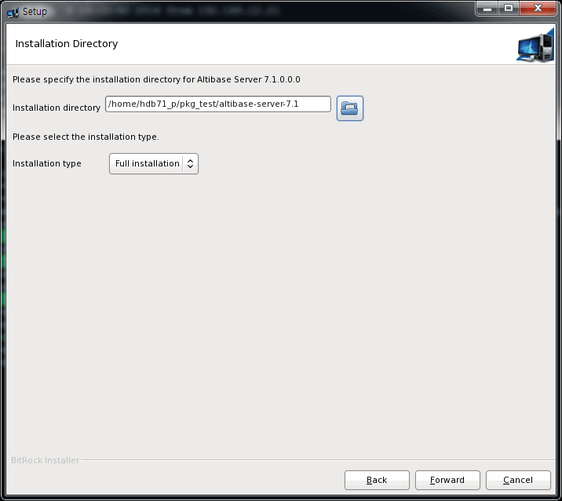

To install an Altibase product, click "Full Installation" in the Installation Type list: to install a patch for a previously installed version, click "Patch Installtion" in the Installation Type list.

If Altibase product has already been installed to the specified directory, a warning message appears. In this case, enter another directory or uninstall the product installed in the specified directory first.


#### Check System Parameters

The following dialog box displays the necessary system kernel parameters and how to set them. System kernel parameters must be set using the root account. Some systems need to be rebooted after kernel parameters have been set.

Kernel parameters should be manually set before proceeding to the next step. To set them after installation is complete, please refer to the \$ALTIBASE_HOME/install/pre_install.sh file.


To ensure that Altibase runs properly, you should configure your system environment first. To do so, you must modify kernel parameter values using root privileges before installing Altibase. Kernel parameter values may be modified after installation; however, they must be set before running Altibase. The following is an example of showing the recommended values of system kernel parameters for each OS. For more detailed information on OS-specific kernel parameters, please refer to [*Installation Prerequisites*](#appendix-a-installation-prerequisites).

Ex) HPUX

```
[ Recommended Kernel Parameter Values ]

shmmax = 2147483648
shmmni = 500 
shmseg = 200 
semmap = 1001
semmni = 1000
semmns = 4096
semmnu = 1000
semume = 1000
max_thread_proc = 600
maxusers = 64
dbc_min_pct = 5
dbc_max_pct = 5
maxdsiz = 1073741824
maxdsiz_64bit = 4294967296 

# maxdsiz_64bit
The Altibase server needs sufficient memory space to function properly.
Please set the value to 70% of system memory or greater.

# dbc_min_pct and dbc_max_pct 
dbc_min_pct and dbc_max_pct were renamed filecache_min and filecache_max, respectively, in HP version 11.31 and subsequent releases.

[ How to modify kernel parameter values ] 

/usr/sbin/kmtune -s shmmax=2147483648
/usr/sbin/kmtune -s shmmni=500 
/usr/sbin/kmtune -s shmseg=200
/usr/sbin/kmtune -s semmap=1001 
/usr/sbin/kmtune -s semmni=1000
/usr/sbin/kmtune -s semmns=4096 
/usr/sbin/kmtune -s semmnu=1000
/usr/sbin/kmtune -s semume=1000
/usr/sbin/kmtune -s max_thread_proc=600
/usr/sbin/kmtune -s maxusers=64
/usr/sbin/kmtune -s dbc_min_pct=5
/usr/sbin/kmtune -s dbc_max_pct=5
/usr/sbin/kmtune -s maxdsiz=1073741824 
/usr/sbin/kmtune -s maxdsiz_64bit=4294967296

# maxdsiz_64bit
The Altibase server needs sufficient memory space in order to function properly.
Please set the value to 70% of system memory or greater.

# dbc_min_pct and dbc_max_pct 
dbc_min_pct and dbc_max_pct were renamed filecache_min and filecache_max, respectively, in HP version 11.31 and subsequent releases.

```

Ex) LINUX

```
[ How to modify kernel parameter values ]

echo 512 32000 512 512 > /proc/sys/kernel/sem
```

Ex) AIX

```
[ Recommended Kernel Parameter Values ]

fsize = -1
data = -1
rss = -1

Maximum number of PROCESSES allowed per user
   = greater than the value set using the Altibase property MAX_CLIENT

Size of the File System BufferCache
   = less than 20% of total memory.

AIO = Available

AMO = AIX version 5.2 ML04 and above
              lru_file_repage=0
              strict_maxclient%=0
           = Versions prior to AIX version 5.2 ML04
               lru_file_repage=0

[ How to modify kernel parameter values ]

Edit /etc/security/limits file
Set fsize, data and rss variables.

Run 'smit'
  1) System Environments
      System Environments -> Change / Show Characteristics Of Operating System
      Change : 
          Maximum number of PROCESSES allowed per user
             = bigger than the value set using the Altibase property MAX_CLIENT
          Size of the File System BufferCache
             = less than 20% of total memory.
  2) AIO 
      Device -> Asynchronous I/O -> Posix Asynchronous I/O 
      -> Configure Defined Asynchronous I/O
      Change : posix_aio0=Available

  3) AMO 
      Performance & Resource Scheduling -> Tuning Kernel & Network Parameters 
      -> Tuning Virtual Memory Manager, File System and Logical Volume 
      Manager Params ->
         + List All Characteristics of Current Parameters --- Check
         + Change / Show Current Parameters --- Current Change
         + Change / Show Parameters for Next Boot --- Change upon Reboot

      The case of AIX version 5.2 ML04 and above :
             Change : lru_file_repage=0
             strict_maxclient%=0
      The case of Versions prior to AIX version 5.2 ML04 :
             Change : lru_file_repage=0
```

#### Set Altibase Properties

Altibase properties can be set by following three steps.

Step 1: Basic Database Operation Properties

Step 2: Database Creation Properties

Step 3: Set Database Directories

##### Step 1: Basic Database Operation Properties

-   Database name
-   Connection Port Number
-   Maximum size of Memory Database
-   Buffer Area Size
-   Choose whether or not to create a SQL script to create a new database (whether or not to perform step 2). If you click YES, step 2 is performed; otherwise, step 2 is skipped. Regardless of whether or not a SQL script is created in this step, a new database can be created with the following command : server create [DB Character-set] [National Character-set]

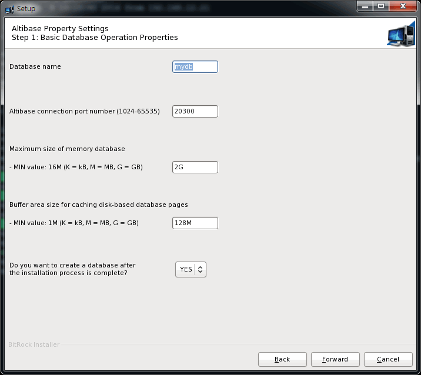

##### Step 2: Database Creation Properties

The SQL script created in step 2 is stored in the $ALTIBASE_HOME/install/post_install.sh file.

-   Initial Database Size

-   Database Archive Logging Mode

-   Noarchivelog

-   Archivelog

-   Database Character Set

-   MS949

-   US7ASCII

-   KO16KSC5601

-   BIG5

-   GB231280

-   MS936

-   UTF-8

-   SHIFT-JIS

-   MS932

-   EUC-JP

-   National Character Set

-   UTF-16

-   UTF-8

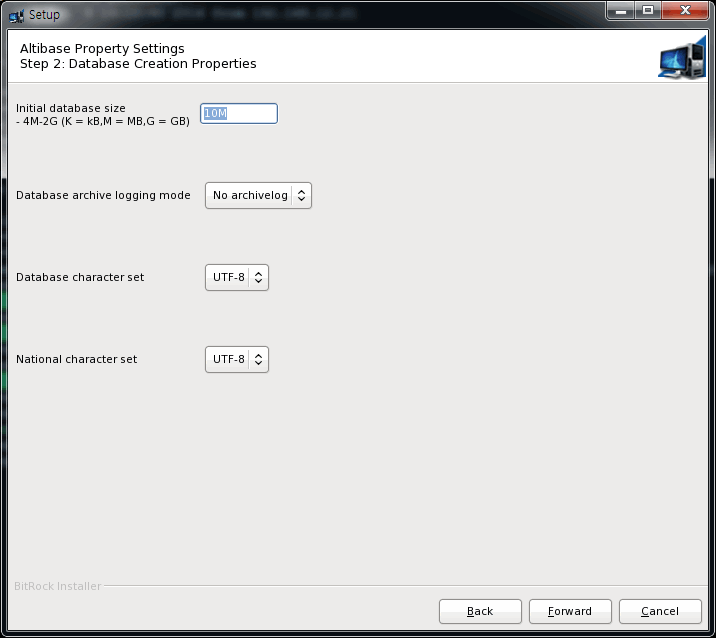

##### Step 3: Set Database Directories

-   Default Disk Database Directory

-   Memory Database Directory

-   Archive Log Directory

-   Transaction Log Directory

-   Log Anchor Files Directory


To set the values of properties excluded in this step, or to later change the value of properties that have been set in step 1 or are to be set in step 3, edit the\$ALTIBASE_HOME/conf/altibase.propertites file manually.

#### Confirm Altibase Properties

The following panel dox displays property values taht have been set in the previous step.


Ex)

```
To change these properties after installation is complete, 
please modify the following file:
  /home/hdb71_p/pkg_test/altibase-server-7.1/conf/altibase.properties.

1. Altibase Property Settings:
    Step 1: Basic Database Operation Properties

    1) Database name: 
         [mydb]

    2) Altibase connection port number (1024-65535): 
         [20300]

    3) Maximum size of memory database:
         [2G]

    4) Buffer area size for caching disk-based database pages:
         [128M]

2. Altibase Property Settings:
    Step 2: Database Creation Properties

    1) Initial database size
         [10M]

    2) Database archive logging mode
         [noarchivelog]

    3) Database character set
         [UTF8]

    4) National character set
         [UTF8]

3. Altibase Property Settings:
    Step 3: Set Database Directories

    The database will not operate properly if any of these directories are removed.

    1) Disk database directory: 
         [/home/hdb71_p/pkg_test/altibase-server-7.1/dbs] 

    2) Memory database directory:
         [/home/hdb71_p/pkg_test/altibase-server-7.1/dbs] 

    3) Archive log directory: 
         [/home/hdb71_p/pkg_test/altibase-server-7.1/arch_logs] 

    4) Transaction log directory: 
         [/home/hdb71_p/pkg_test/altibase-server-7.1/logs] 

    5) Log Anchor file directories:
         Directory 1: 
         [/home/hdb71_p/pkg_test/altibase-server-7.1/logs] 

         Directory 2: 
         [/home/hdb71_p/pkg_test/altibase-server-7.1/logs] 

         Directory 3: 
         [/home/hdb71_p/pkg_test/altibase-server-7.1/logs] 
```

After confirming these values, click "Forward". Then, "Read to Install" panel will be shown as below: 


Click "Forward" continue with the Installation

#### Install the Altibase Product

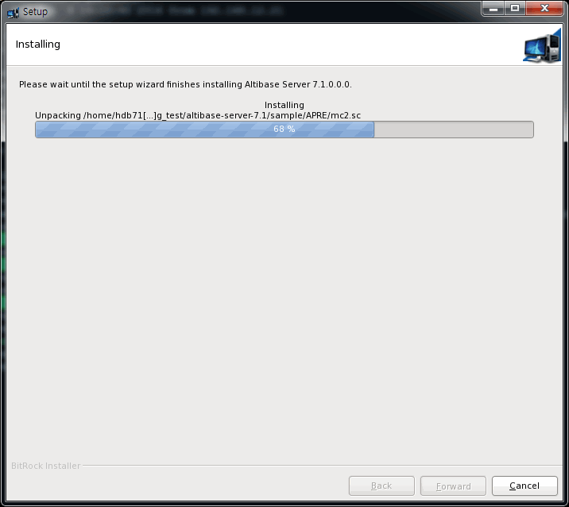

When the installation is completed, the Package Installer performs the following operations without GUI:

-   The properties set are updated in the altibase.properties files.

-   The altibase_user.env.file containing the basic environment for running the Altibase server is created in the $ALTIBASE_HOME/conf directory. The command to run this file is then added to the user account's configuration file (such as .bashrc or .bash_profile or .profile).

The following are examples of the altibase_user.env file and the .bash_profile file. 

```
### altibase_user.env
ALTIBASE_HOME=/home/hdb71_p/pkg_test/altibase-server-7.1;export ALTIBASE_HOME 
PATH=${ALTIBASE_HOME}/bin:${PATH};export PATH 
LD_LIBRARY_PATH=${ALTIBASE_HOME}/lib:${LD_LIBRARY_PATH};ex port LD_LIBRARY_PATH 
CLASSPATH=${ALTIBASE_HOME}/lib/Altibase.jar:${CLASSPATH};e xport CLASSPATH 

### .bash_profile 
# ALTIBASE_ENV 
. /home/hdb71_p/pkg_test/altibase-server-7.1/conf/altibase_user.env
```

#### Register or Update the Altibase License Key

The following dialog box is where you register your Altibase license key. You can register the license key with the Altibase Package Installer by either: 

-   Entering the license key directly

-   Selecting a file containing license key information

-   Postponing license registration: If you have no obtained the license key yet, then you can copy a new license file to the $ALTIBASE_HOME/conf directory after you have obtained one. However, if you do not enter the license key at this step, the Package Installer does not ask whether or not to create a database at the next step.

```
$ cp license $ALTIBASE_HOME/conf/
```

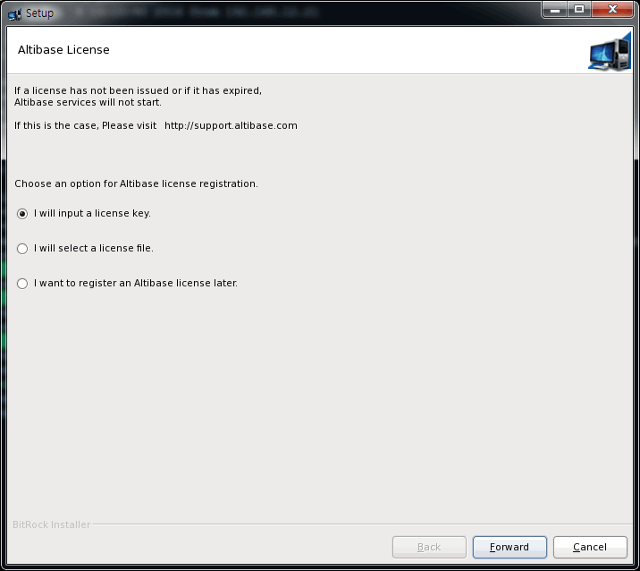

#### Preview the Altibase Quick Settings Guide

The "Altibase Quick Setting Guide" dialog box shows you how to start Altibase after it has been installed successfully. 

The Altibase Package Installer provides the following two shell scripts to help users configure system kernel parameters and environment variables easier.

-   \$ALTIBASE_HOME/install/pre_install.sh  
    This script contains the minimum set of essential system kernel parameters, their recommended values, and explain how to set them
    
-   \$ALTIBASE_HOME/install/post_install.sh  
    This script contains a SQL script for creating a new database (if step 2 was performed for Set Altibase Properties).
    
-   \$ALTIBASE_HOME/packages/catproc.sql  
    This script contains a SQL script for using PSM.

If you select the checkbox in the next panel, the Altibase Package Installer will create a new database and run a script to use PSM, which will take a bit longer to install. If you do not select the checkbox, you must manually create the new database and run the PSM script after installation.

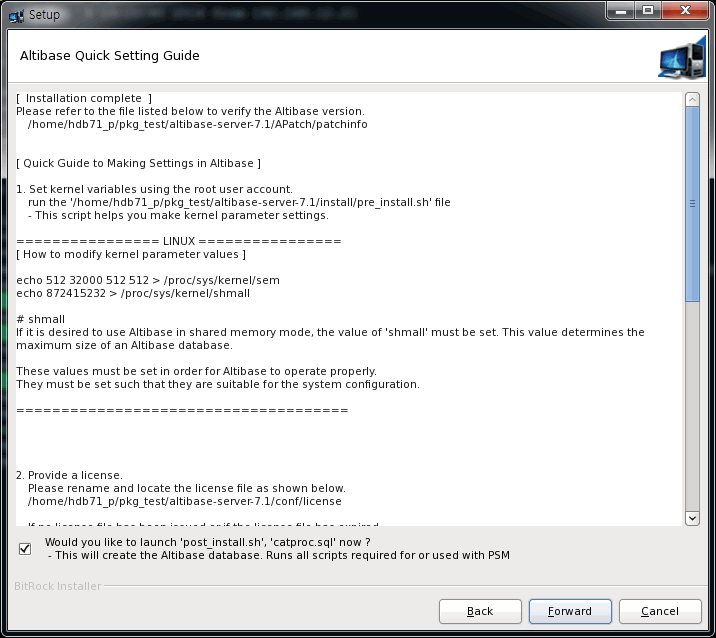

```
[  Installation complete  ]
Please refer to the file listed below to verify the Altibase version.
 /home/hdb71_p/pkg_test/altibase-server-7.1/APatch/patchinfo 

[ Quick Guide to Making Settings in Altibase ] 

1. Set kernel variables using the root user account.
    run the '/home/hdb71_p/pkg_test/altibase-server-7.1/install/pre_install.sh' file 
    - This script helps you make kernel parameter settings.

================ LINUX ================
[ How to modify kernel parameter values ]

echo 512 32000 512 512 > /proc/sys/kernel/sem

These values must be set in order for Altibase to operate properly.
They must be set such that they are suitable for the system configuration.

=====================================


2. Provide a license.
    Please rename and locate the license file as shown below.
    /home/hdb71_p/pkg_test/altibase-server-7.1/conf/license 

    If no license file has been issued, or if the license file has expired,
    Altibase services will not start.
    In this case, please visit http://support.altibase.com.
    

3. Configure user environment variables (using the user account with 
which Altibase was installed).
    Run the '/home/hdb71_p/pkg_test/altibase-server-7.1/install/post_install.sh' file 
    under the account with which Altibase was installed.

    This script performs necessary post-installation configuration. 

    1) Create the Altibase user environment file and apply it to the user profile.
         (/home/hdb71_p/pkg_test/altibase-server-7.1/conf/altibase_user.env)
    2) Create a database.

         If you selected 'YES' in response to the question about whether to create 
         a database after installation, at "Altibase Property setting step 1", 
         a database will be automatically created.

         If you selected 'NO' in response to this question,
         you need to create a database manually.

         shell> server create [DB Character Set] [National Character Set]

4. Start up and shut down the server
    shell> server start
    shell> server stop

5. Runs all scripts required for or used with PSM
Run the '/home/hdb71_p/pkg_test/altibase-server-7.1/packages/catproc.sql' file.

6. Connect to the database using iSQL
    shell> isql -s 127.0.0.1 -u SYS -p MANAGER
```


The following message appears while a database is being created.

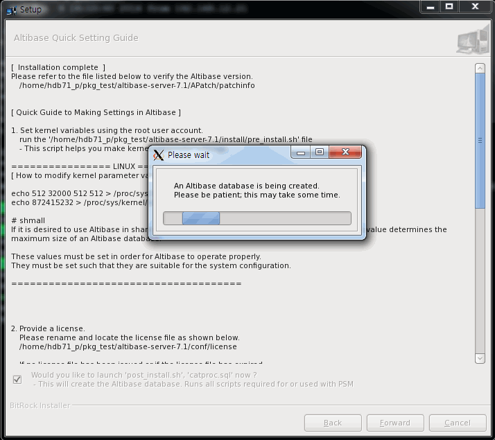

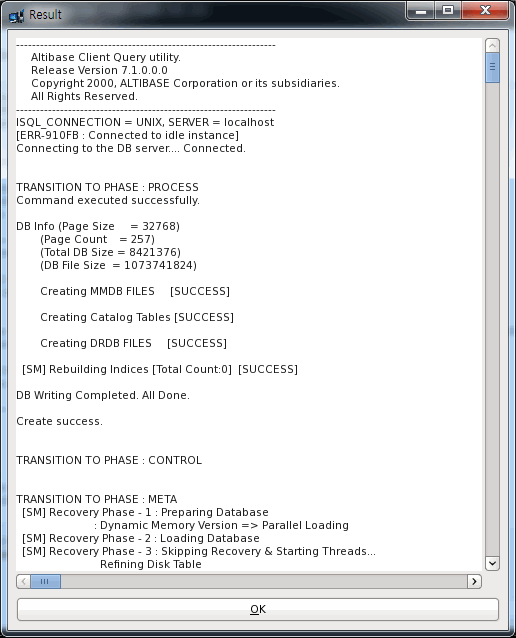

#### Finish Installation

After successful installation, the following panel box appears: 

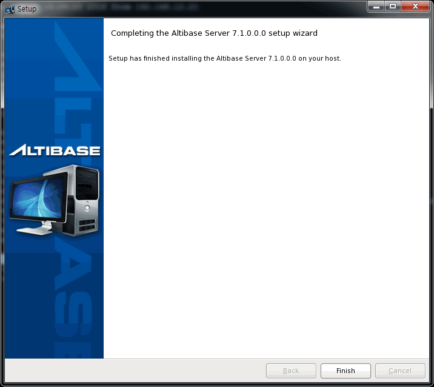

Click "Finish", and the following "Environment Setting Guide" message box appears:


#### Post-Installation Tasks

After successful installation, a user needs to:

1.  Set the parameters manually if system kernel parameters have not been set during installation. Please refer to the $ALTIBASE_HOME/install/pre_install.sh file. 
    
2.  Perform either of the following to invoke a login shell: 

-   Log out and then login again

-   Execute . \~/.bash_profile

-   Execute source \~/.bash_profile

3. Create a database as below, if a database was not created during the installation:

- If properties for database creation were set during the installation, execute the
  \$ALTIBASE_HOME/install/post_install.sh script.  

  ```
  $ sh post_install.sh dbcreate
  ```

- If properties for database creation were not set during the installation, execute the server script.
  
```
  $ server create utf8 utf8
```

- If properties for using PSM were not set during the installation, execute the catproc.sql script.
  
```
  $ isql -s 127.0.0.1 -u sys -p manager -silent -f
  ${ALTIBASE_HOME}/packages/catproc.sql
```

### Installing Altibase Client Products

The following sections describe how to install an Altibase Client Product: 

-   [Checking the Environment Before Installation](#checking-the-environment-before-installation-1)

-   [Downloading the Package Installer](#downloading-the-package-installer)

-   [Setting the Installation Mode](#setting-the-installation-mode-1)

-   [Starting the Altibase Package Installer](#starting-the-altibase-package-installer-1)

-   [Entering the Installation Directory and Selecting the Installation Type](#entering-the-installation-directory-and-selecting-the-installation-type1)
    
-   [Setting Altibase Client Properties](#setting-altibase-client-properties)

-   [Installing the Altibase Client Product](#installing-the-altibase-client-product-1)

-   [Finishing Installation](#finish-installation-1)

-   [Post-Intallation Tasks](#post-installation-tasks-1)

#### Checking the Environment Before Installation

Please refer to [Check the Environment Before Installation](#check-the-environment-before-installation) in the "Installation Altibase Product" section

#### Downloading the Package Installer

You can download the appropriate Package Installer for your operating system from Altibase's Customer Support site (http://support.altibase.com/en/).

Please refer to [Download the Altibase Package Installer](#downloading-the-altibase-package-installer) for more detailed information on the supported operating system.

#### Setting the Installation Mode

To start the Altibase Package Installer in GUI mode, please refer to [Set the Installation Mode](#set-the-installation-mode).

#### Starting the Altibase Package Installation

To run the ALtibase Package Installer, the user must download the Package Installer and then change the permissions of the file by using chmod. 

```
$ chmod +x altibase-client-7.3.0.0.0-LINUX-X86-64bit-release.run
```

Run the Altibase Package Installer

```
$./altibase-client-7.3.0.0.0-LINUX-X86-64bit-release.run
```

If the installation mode is set to GUI mode, the following start panel appears:


#### Entering the Installation Directory and Selecting the Installation Type

In the following Installation Directory panel, enter the Altibase home directory (the directory to which an Altibase Client Package is to be installed) and select the Client Package installation type.

To install an Altibase Client product, select "Full Installation"; to install a patch for a previously installed version, select "Patch Installation".


#### Setting Altibase Client Properties

In the Altibase Client Properties panel, enter the communication port number to be used by clients when connecting to the server via TCP/IP. This port number is saved in an environment setting file (e.g., .profile, .bash_profile, etc.) in the user's account. 


#### Installationg the Altibase Client Product

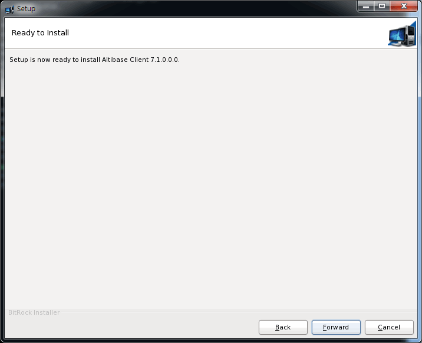


During this procedure, the environment variables related to Altibase Client Products (which are shown in the above dialog box) are added to the environment file for your login shell (e.g., default environment file for the standard Bourne shell (sh) is .profile). The altibase_user.env file, which is generated when an Altibase Server Product is installed, is not generated. To apply new environment variables to your shell, perform one of the following actions:

-   Log out and then login again

-   Execute . \~/.profile

-   Execute source \~/.profile 

The following is an example of .profile.

```
# ALTIBASE_ENV
export ALTIBASE_HOME=/home/hdb71_p/altibase-client-7.1.0
export ALTIBASE_PORT_NO=20300
export PATH=$ALTIBASE_HOME/bin:$PATH
export LD_LIBRARY_PATH=${ALTIBASE_HOME}/lib:${LD_LIBRARY_PATH}
export CLASSPATH=${ALTIBASE_HOME}/lib/Altibase.jar:${CLASSPATH}
```

#### Finishing Installation


#### Post-Installation Tasks

If you have not applied new environment variables to your shell during the above procedure, do it now. For more detailed information, please refer to [*Installing the Altibase Client Product*](#installing-the-altibase-client-product).

# 3. Uninstalling Altibase and Meta Downgrade
----------------------------------

This chapter explains how to uninstall an installed or meta downgrade the installed product.

-   Altibase Product Uninstallation

-   Meta Downgrade

### Uninstalling Altibase Products

Altibase products can be uninstalled or rolled back using the Uninstaller which is installed with the product. Target files for rollback are only for files that have been patched by the installer, and data files and log files are not included. The Uninstaller associated with a base release (a full package used for initial installation) uninstalls the entire product; the Uninstaller which is installed when a patch is applied can be used either to uninstall the entire product or to roll back the corresponding patch.

> \* Note: On the HP-UX platform, the Uninstaller provided with the Altibase Package Installer can only uninstall the entire product; it cannot rollback patches. Therefore, it is recommended to manually back up the previously installed product before applying a patch.

#### Full Uninstallation

Altibase Products or patches which are installed by the Altibase Package Installer can be uninstalled with the Uninstaller that is provided with the product to be removed.

However, the Uninstaller cannot delete the environment variable. Therefore, the user must manually delete Altibase-related environment variables from the account's environment variable file. To remove Altibase products, perform the following steps:

1.  Select the Uninstaller (e.g., uninstall-base) associated with the product to be removed from the $ALTIBASE_HOME/APatch directory.
    
2.  Run the Uninstaller.

#### Patch Uninstallation

Patches installed using the Altibase Package Installer can be rolled back by running the Uninstaller named according to the convention "uninstall-p<patch_version>". However, only the most recently installed patch can be rolled back. During uninstallation, a patch is removed and the previous version is restored from the backup.

To roll back a patch, perform the following steps:

1.  Select the Uninstaller (e.g., uninstall-p0_0_0_1) associated with the patch to be removed from the $ALTIBASE_HOME/APatch directory
    
2.  Run the Uninstaller.

### Meta Downgrade

This section describes the meta downgrade to roll back other Altibase patches that are meta version.

Altibase requires that the current meta version and meta version of the package user wants to down patch have to match in order to roll back the patch. If the meta version is different when deleting or rolling back the patch, the user must first reconfigure the current version of meta to the old version of the meta. This process is called meta downgrade.

#### How to Use Meta Downgrade

##### Version Check

The current and previous meta version can be checked in SYSTEM_.SYM_DATABASE .

The current meta version can be checked by the META_VER, META_MINOR_VER, and META_PATCH_VER columns.

The previous meta version can be checked by PREV_META_MAJOR_VER, PREV_META_MINOR_VER, and PREV_META_PATCH_VER columns.

In order to meta downgrade, the version has to be checked and verified that the version of META_MINOR_VER and PREV_META_MINOR_VER are different as shown below:

```
iSQL> SELECT META_MAJOR_VER, META_MINOR_VER, META_PATCH_VER,
 PREV_META_MAJOR_VER, PREV_META_MINOR_VER, PREV_META_PATCH_VER
 FROM SYSTEM_.SYS_DATABASE_;
META_MAJOR_VER META_MINOR_VER META_PATCH_VER 
-------------------------------------------------
PREV_META_MAJOR_VER PREV_META_MINOR_VER PREV_META_PATCH_VER 
----------------------------------------------------------------
8           5           1          
8           4           1          
1 row selected.
```

##### Meta Downgrade

For meta downgrade-able version, perform the meta downgrade with the following syntax: 

```
$ server downgrade
```

> \* Note: The user must shut down the server (server stop) before performing the meta downgrade. If the user does perform this without shutting down the server, then the following error with occur: 

```
$ server downgrade
 server is running !!!!
 you must shutdown first before server downgrade
$ server downgrade
...
...
...ISQL_CONNECTION = UNIX, SERVER = localhost
[ERR-910FB : Connected to idle instance]
Connecting to the DB server... Connected.
 
TRANSITION TO PHASE : PROCESS
 
TRANSITION TO PHASE : CONTROL
 
TRANSITION TO PHASE : META
  [SM] Recovery Phase - 1 : Preparing Database
                          : Dynamic Memory Version => Parallel Loading
  [SM] Recovery Phase - 2 : Loading Database 
  [SM] Recovery Phase - 3 : Skipping Recovery & Starting Threads...
                            Refining Disk Table 
  [SM] Refine Memory Table : ....................................................................................................................................... [SUCCESS]
  [SM] Rebuilding Indices [Total Count:138] .......................................................................................................................................... [SUCCESS]
 
TRANSITION TO PHASE : DOWNGRADE
Command executed successfully.
```

If the meta downgrade fails, it ends as follows: 

```
$ server downgrade
...
...
...
TRANSITION TO PHASE : DOWNGRADE
[FAILURE] Unable to initialize the meta database
Startup Failed....
[ERR-91015 : Communication failure.]
```

> ###### Note
>
> If the meta downgrade fails, the user can check the cause of the failure in the altibase.boot.log and altibase.qp.log in $ALTIBASE_HOME/trc directory.

##### Uninstalling Patch

Run the Patch Uninstaller to remove the patch

> ###### Note
>
> After performing a server downgrade, the user must delete the patch. If the server is run without deleting the patch, the meta upgrade will occur because the meta version has been modified to the previous version. 

# 4. Patching Products With the Altibase Package Installer
----------------------------------

This chapter consists of the following sections:

-   About Patches

-   Patching Altibase Server Products

-   Patching Altibase Client Products

### About Patches

A patch is a small collection of files that is used to overwrite an existing installation. Patches are associated with particular versions of Altibase Products. Patches are bug fixes that are made available to users in response to specific bugs. They require a particular base release or patch set to be installed before being applied.

#### Installation Types for Altibase Products

Table 4-1 Full Package vs. Patch Package

| Installation Steps                           | Full Package | Patch Package |
| -------------------------------------------- | ------------ | ------------- |
| Checking the Environment Before Installation | O            | O             |
| Starting the Altibase Package Installer      | O            | O             |
| Checking System Parameters                   | O            |               |
| Entering the Installation Directory          | O            | O             |
| Checking the Patch Version                   |              | O             |
| Setting Altibase Properties                  | O            |               |
| Confirming the Altibase Properties           | O            |               |
| Installing the Altibase Product              | O            | O             |
| Registering the Altibase License Key         | O            |               |
| Previewing the Altibase Quick Settings Guide | O            |               |
| Finishing Installation                       | O            | O             |

#### Installation Types for Altibase Client Product

Table 4-2 Full Package vs. Patch Package

| Installation Steps                           | Full Package | Patch Package |
| -------------------------------------------- | ------------ | ------------- |
| Checking the Environment Before Installation | O            | O             |
| Starting the Altibase Package Installer      | O            | O             |
| Entering the Installation Directory          | O            | O             |
| Checking the Patch Version                   |              | O             |
| Setting Altibase Properties                  | O            |               |
| Installing the Altibase Client Product       | O            | O             |
| Finishing Installation                       | O            | O             |

### Patching Altibase Server Products

The following sections describe how to apply patches for Altibase Server Products.

#### Checking the Environment Before Installation

Please refer to [Check the Environment Before Installation](#check-the-environment-before-installation).

#### Downloading the Altibase Package Installer

Altibase does not offer a separate installation file for patches. When users start the Package Installer, users can select the installation type - either the "Full Installation" or "Patch". 

Download the appropriate installer for your operating system from Altibase's Customer Support site (http://support.altibase.com/en/).

#### Setting the Installation Mode

To install the Package Installer in GUI mode, please refer to [Set the Installation Mode](#set-the-installation-mode).

#### Starting the Altibase Package Installer

To run the Altibase Package Installer, users must download the Package Installer and then change the permissions of the file, using chmod.

```
$ chmod +x altibase-server-7.1.0.0.1-LINUX-X86-64bit-release.run
```

Run the Altibase Package Installer.

```
$./altibase-server-7.1.0.0.1-LINUX-X86-64bit-release.run
```

If the installation mode is set to GUI mode, the following Start panel is displayed.


#### Entering the Installation Directory and Selecting the Installation Type

In the Installation Directory panel, enter the Altibase home directory containing the product to be patched and select "Patch Installation" for the installation type.

Patches require the base release to be installed before being applied. If an Altibase product has not been installed to the directory specified by the user, a warning message is displayed in a dialog box.

However, if users select "Full Installation" for the Installation Type, the installation steps are identical to those for Altibase Server Products. Please refer to [Installing Altibase Product](#installing-altibase-product).

Ex) Selecting "Full Installation"


Ex) Selecting "Patch"


#### Checking the Patch Version

This panel shows the patch version applied to the Altibase product that is currently installed in the selected directory and the patch version to be applied.


#### Installing the Altibase Product


#### Finishing Installation 


### Patching Altibase Client Products

This section describes how to apply Altibase client patches

#### Checking the Environment Before Installation

Please refer to [Checking the Environment Before Installation](#checking-the-environment-before-installation).

#### Downloading the Altibase Package Installer

Altibase does not offer a separate installation file for patches. When users start the Package Installer, users can select the installation type - either the "Full Installation" or "Patch". Download the appropriate installer for your operating system from Altibase's Customer Support site (http://support.altibase.com/en/)

#### Setting the Installation Mode

To install the Package Installer in GUI mode, please refer to [Set the Installation Mode](#set-the-installation-mode).

#### Starting the Altibase Package Installer

To run the Altibase Package Installer, Unix users must download the Package Installer, and then change the permissions of the file, using chmod.

```
$ chmod +x altibase-client-7.1.0.0.1-LINUX-X86-64bit-release.run
```

Run the Altibase Package Installer

```
$./altibase-client-7.1.0.0.1-LINUX-X86-64bit-release.run
```

If the installation mode is set to GUI mode, the following Start panel is displayed.


#### Entering the Installation Directory and Selecting the Installation Type

In the Installation Directory panel, enter the Altibase home directory where the patch version will be applied, and select the installation type as "Patch".

The base release must be installed before applying the patch. If the Altibase product is not installed in the directory users specified, a dialog box appears with a warning message. However, if users select "Full Installation" for the installation type, the installation steps are identical to those for Altibase Client Products. Please refer to [Installing Altibase Client Products](#installing-altibase-client-products).

Ex) Selecting “Full Installation"


Ex) Selecting “Patch” 

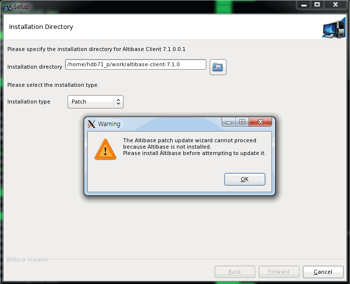

#### Checking the Patch Version

This panel shows the patch version applied to the Altibase product that is currently installed in the selected directory and the patch version to be applied. 


#### Installing the Altibase Product


#### Finishing Installation


# Appendix A. Installation Prerequisites

### Setting User Resource Limit Values

User resource limit values can be confirmed or changed with the OS command, "ulimit".

-   File Size  
    The maximum file size treatable by the process

-   Data Segment Size  
    The maximum size of logical memory the process can use (vsz field).

-   Max Memory Size  
    The maximum size of physical memory the process can use (RSS field)

-   Open Files (descriptor)  
    The Maximum number of files and sockets simultaneously accessible by the process.

-   Stack size
    The maximum size of the stack

-   Virtual memory  
    The maximum size of virtual memory usable by the process. 

Unix users are recommended to set the resource limit values of a user's account to "unlimited" (caution is required that the core file size is not set to "unlimited"). If the Altibase server crashes and dumps the core, it will store every memory database as a core file, so setting it to unlimited may cause disk shortage. Altibase client products must have a stack size of at least 70KB.

### Setting Kernel Parameters for Different Operating Systems (OS)

System Kernel parameter values can be confirmed or changed with a utility provided for each operating system. 

System kernel parameters can be classified into the following: 

-   Semaphore  
    Semaphore setting for IPC connection

-   File-cache  
    Settings for the prevention of memory insufficiency due to the operating system's file cache.

-   Other Settings

#### HP-UX

##### Setting Kernel Parameters on HP-UX

-   HP 11.31 or above: Kernel parameters can be set with the /usr/sbin/kcture utility.

##### Recommended Values

<table>
	<tr>
		<td>Classification</td>
		<td>Parameter Nam</td>
		<td>Recommended Value(bytes)</td>
	</tr>
	<tr>
		<td rowspan="3">Shared Memory</td>
		<td>shmmax</td>
		<td>2G+1</td>
	</tr>
	<tr>
		<td>shmmin</td>
		<td>500</td>
	</tr>
	<tr>
		<td>shmseg</td>
		<td>200</td>
	</tr>
	<tr>
		<td rowspan="9">Semaphore</td>
		<td>semmns</td>
		<td>8192</td>
	</tr>
	<tr>
		<td>semmns</td>
		<td>8192</td>
	</tr>
	<tr>
		<td>semmni</td>
		<td>5029</td>
	</tr>
	<tr>
		<td>semmsl</td>
		<td>2000</td>
	</tr>
	<tr>
		<td>semmap</td>
		<td>5024</td>
	</tr>
	<tr>
		<td>semmnu</td>
		<td>1024</td>
	</tr>
	<tr>
		<td>semopm</td>
		<td>512</td>
	</tr>
	<tr>
		<td>semume</td>
		<td>512</td>
	</tr>
	<tr>
		<td>semvmx</td>
		<td>32767</td>
	</tr>
	<tr>
		<td rowspan="2">File-Cache(HP recommends 20% for 8G or less, 10% for 8G or more)</td>
		<td>dbc_min_pct</td>
		<td>5%</td>
	</tr>
	<tr>
		<td>dbc_max_pct</td>
		<td>5~20%</td>
	</tr>
	<tr>
		<td rowspan="6">Others</td>
		<td>maxdsiz</td>
		<td>2GB</td>
	</tr>
	<tr>
		<td>maxdsiz_64bit</td>
		<td>The amount of memory which is predicted that Altibase will used</td>
	</tr>
	<tr>
		<td>max_thread_proc</td>
		<td>600 or more</td>
	</tr>
	<tr>
		<td>maxfiles</td>
		<td>2048 or more</td>
	</tr>
	<tr>
		<td>nproc</td>
		<td>6142</td>
	</tr>
	<tr>
		<td>maxusers</td>
		<td>124</td>
	</tr>
</table>

#### AIX

##### Setting Kernel Parameters on AIX

Kernel parameters can be set with the /usr/bin/smit utility

##### Recommended Values

The same values for shared memory and semaphore on HP-UX are also recommended for AIX.

###### Setting File-Cache

Depending on the file caching policy for AIX, the file system can swap-out memory from the application program heap, although the system has free memory, and use it as file-cache (this is called stealing).

For AIX 5.2 or higher, kernel parameters can be set as below to prevent the system from stealing: 

```
minperm =  5%
lru_file_repage = 0 (AIX 5.2 ML4 or higher)
strict_maxclient = 0
```

###### Configuration of Posix AIO

AIX provides the Posix A/O interfaces for improved disk I/O improvement which must be manually activated. However, from AIX 6.1 and higher, the interfaces are activated by default.

Posix AIO can be activated as below:

-   Change "Configure Defined Asynchronous I/O" to Available through smit. 

-   Change "STATE to be configured at system restarted" to Available through smit. 

This Installation and startup of Altibase are impossible on AIX if the system is not set as above. 

#### LINUX

##### Setting Kernel Parameters on Linux

Kernel parameters can be set in the sem,shmmax, shmmni, swapiness files at the /proc/sys/kernel path. In Redhat 7.2 and later versions check the value of RemoveIPC in /etc/system/login.conf . 

##### Recommended Values

The same values for shared memory and semaphore on HP-UX are also recommended for Linux

However, sessions using the IPC connection can be abruptly cut off, if the Linux kernel version is lower than 2.5. 

To set kernel parameters automatically when the server boots, add the following to the /etc/rc.d/rc/local file. 

```
/etc/rc.d/rc.local Add the following entry in the file.
echo 2147483648 > /proc/sys/kernel/shmmax
echo 4096 > /proc/sys/kernel/shmmni
echo 200 32000 512 5029 > /proc/sys/kernel/sem
echo 5 > /proc/sys/vm/swappiness
```

###### Setting in RemoveIPC

In RedHat 7.2 and later versions, it is recommended to set the RemoveIPC setting to 'no' (default is 'yes'). If RemoveIPC is set to 'yes', there is a shortage of semaphores and an abnormal termination may occur.

To change the setting, you need to set the RemoveIPC = no in etc/system/logind.conf and restart the OS. 

### Configuration of THP (Transparent Huge Pages)

THP is amemory management system provided by a Linux and its main purpose is to reduce the expenses for viewing TBL (Translation Lookaside Buffer) by increasing the size of memory pages.

However, unlike the original intention, THP causes memory allocation delay and fragmentation which eventually deteriorates the performance in most cases. Thus, THP option should be deactivated in order to use Altibase with its optimized performance. 

It is advised to set the THP option to 'never' in order to run the Altibase operation.

#### Verification method for THP configuration

The available options of THP are always, madvise, and never. Besides, the option inside the square brackets [] is the option currently applied.

-   madvise: This is an option in which THP is activated on a process explicitly requested through the madvise()function.
    
-   always: THP is always applied into all process

-   never: means deactivating THP on all process regardless of requesting  the madvise()function

How to verify for THP Configuration are follows: 

1. Execute the following command indicated below: 

   ```
   $ cat /sys/kernel/mm/transparent_hugepage/enabled
   ```

2. Execute the following command in RedHat Linux:

   ```
   $ cat /sys/kernel/mm/redhat_transparent_hugepage/enabled
   ```

3. Then, the following output is displayed: 

   ```
   $ [always] madvise never
   ```

#### Deactivation method for THP

It is advised to set the HTP option to never in order to run the Altibase operation.

1. Add transparent_hugepage=never to the end of the line kernel boot of /etc/grub.conf with the root account.
   
```
   .....
   kernel /vmlinuz-2.6.32-220.el6.x86_64 ro root=UUID=067b9803-90ca-4875-a018-ff043adde1ed rd_NO_LUKS LANG=ko_KR.UTF-8 rd_NO_MD quiet rhgb crashkernel=128M  KEYBOARDTYPE=pc KEYTABLE=us rd_NO_LVM rd_NO_DM transparent_hugepage=never
   ......
```

2. Reboot the system.

3. Confirm whether the THP option is never or not. 

### Red Hat Enterprise Linux 8

For RHEL 8, libncurses.so.5 and libtinfo.so.5 must be created in order to execute iSQL and iLoader. In order to do this, the user needs root privileges.

1. Check the ncurses and tinfo library files.

   ```bash
   % ls -l /usr/lib64/| grep -e libncurses.so -e libtinfo.so
   -rw-r--r--   1 root root       31 Jan 16  2019 libncurses.so
   lrwxrwxrwx.  1 root root       17 Jan 16  2019 libncurses.so.6 -> libncurses.so.6.1*
   -rwxr-xr-x.  1 root root   216912 Jan 16  2019 libncurses.so.6.1*                 # ncurses library file
   lrwxrwxrwx   1 root root       13 Jan 16  2019 libtinfo.so -> libtinfo.so.6*
   lrwxrwxrwx.  1 root root       15 Jan 16  2019 libtinfo.so.6 -> libtinfo.so.6.1*
   -rwxr-xr-x.  1 root root   208616 Jan 16  2019 libtinfo.so.6.1*                   # tinfo library file
   ```

2. If libncurses.so.5 and libtinfo.so.5 files do not exist, create symbolic links.

   ```bash
   % ln -s /usr/lib64/libncurses.so.6.1 /usr/lib64/libncurses.so.5
   % ln -s /usr/lib64/libtinfo.so.6.1 /usr/lib64/libtinfo.so.5
   ```

3. Check the created symbolic links.

   ```bash
   % ls -l /usr/lib64/ | grep -e libncurses.so.5 -e libtinfo.so.5
   lrwxrwxrwx   1 root root       17 May  7 16:44 libncurses.so.5 -> libncurses.so.6.1*
   lrwxrwxrwx   1 root root       15 May  7 16:51 libtinfo.so.5 -> libtinfo.so.6.1*
   ```


- If libncurses.so.5 file does not exist, the following error occurs when iSQL is executed.

  ```bash
  % isql
  isql: error while loading shared libraries: libtinfo.so.5: cannot open shared object file: No such file or directory
  ```

  ```bash
  % server create utf8 utf8
  /home/dev02/altibase_home/bin/isql: error while loading shared libraries: libncurses.so.5: cannot open shared object file: No such file or directory
  ```

- In RHEL 8, the ncurses (including tinfo) library version has been changed to 6.1. Altibase requires ncurses 5 version files. 
  The ncurses library guarantees both source-level compatibility (API) and binary compatibility (ABI) from ncurses 5 to ncurses 6.2. 

  Reference : [Announcing ncurses 6.2 (invisible-island.net)](https://invisible-island.net/ncurses/announce.html#h2-release-notes)

### Checking Disk Configuration

Redo log files and data files generally experience disk I/O in Altibase. To minimize performance loss due to disk I/O, we recommend that you segregate redo log files and data files onto a separate physical disk.

### OS Patch

#### Linux
There is a bug in glibc that could cause deadlock due to race conditions such as malloc/free, and it must be patched beyond the patch taht reflects the bug. In this case, it is recommended to be glib patched with glibc-2.12-1.166.el6_7.1 and/or higher version. (Reference: https://bugzilla.redhat.com/show_bug.cgi?id=1244002)

#### AIX

When using Altibase on AIX, memory usage increases (hearpmin library bug). In this case, C/C++ compilers of the appropriate version must be patched from the IBM Support Portal (http://www-01.ibm.com/support/docview.wss?uid=swg21110831 ).

