Performance Tuning Guide
========================

#### Altibase 7.3

Altibase® Administration

<br><br><br><br><br><br>
<!-- PDF 변환을 위한 여백입니다. --> 


<!-- PDF 변환을 위한 여백입니다. --> 

<div align="left">
    
</div>

<br><br><!-- PDF 변환을 위한 여백입니다. --> 


<!-- PDF 변환을 위한 여백입니다. --> 

<pre>
Altibase Administration Performance Tunning Guide
Release 7.3
Copyright ⓒ 2001~2023 Altibase Corp. All Rights Reserved.<br>
This manual contains proprietary information of Altibase® Corporation; it is provided under a license agreement containing restrictions on use and disclosure and is also protected by copyright patent and other intellectual property law. Reverse engineering of the
software is prohibited.<br>
All trademarks, registered or otherwise, are the property of their respective owners.<br>
<b>Altibase Corp</b>
10F, Daerung PostTower II,
306, Digital-ro, Guro-gu, Seoul 08378, Korea
Telephone : +82-2-2082-1000 
Fax       : +82-2-2082-1099
Customer Service Portal : <a href='http://support.altibase.com/en/'>http://support.altibase.com/en/</a>
Homepage                : <a href='http://www.altibase.com'>http://www.altibase.com</a></pre>

<br>

# Table Of Contents

- [Preface](#preface)
  - [About This Manual](#about-this-manual)
- [1. Introduction to Performance Tuning](#1-introduction-to-performance-tuning)
  - [Introduction to SQL Tuning](#introduction-to-sql-tuning)
  - [Database Server Tuning](#database-server-tuning)
  - [SQL Tuning](#sql-tuning)
- [2. Altibase Server Tuning](#2-altibase-server-tuning)
  - [Log Files](#log-files)
  - [Checkpointing](#checkpointing)
  - [Buffers](#buffers)
  - [Service Threads](#service-threads)
  - [Garbage Collector](#garbage-collector)
  - [SQL Plan Cache](#sql-plan-cache)
  - [CPU Usage](#cpu-usage)
- [3. The Query Optimizer](#3-the-query-optimizer)
  - [Query Optimizer Overview](#query-optimizer-overview)
  - [Query Conversion](#query-conversion)
  - [Creating Logical Execution Plans](#creating-logical-execution-plans)
  - [Creating Physical Execution Plans](#creating-physical-execution-plans)
  - [Optimizer-related Properties](#optimizer-related-properties)
- [4. The Explain Plan](#4-the-explain-plan)
  - [EXPLAIN PLAN Overview](#explain-plan-overview)
  - [Displaying the Plan Tree](#displaying-the-plan-tree)
  - [Reading Plan Trees](#reading-plan-trees)
  - [Using Plan Trees](#using-plan-trees)
  - [Plan Nodes](#plan-nodes)
- [5. The Optimizer and Statistics](#5-the-optimizer-and-statistics)
  - [Overview of Statistics](#overview-of-statistics)
  - [Managing Statistics](#managing-statistics)
  - [Auto Stats](#auto-stats)
- [6. SQL Hints](#6-sql-hints)
  - [Overview of Hints](#overview-of-hints)
  - [Types of Hints](#types-of-hints)
- [7. SQL Plan Cache](#7-sql-plan-cache)
  - [Overview of the SQL Plan Cache](#overview-of-the-sql-plan-cache)
  - [Managing the SQL Plan Cache](#managing-the-sql-plan-cache)
  - [Overview of the Result Cache](#overview-of-the-result-cache)


Preface
====

### About This Manual

This manual describes how to tune Altibase for optimized performance.

#### Audience

This manual has been prepared for the following Altibase users:

-   Database managers
-   Performing managers
-   Database users
-   Application developers
-   Technical support engineers

It is recommended for those reading this manual possess the following background knowledge:

-   Basic knowledge in the use of computers, operating systems, and operating system utilities
-   Experience in using relational databases and an understanding of database concepts
-   Computer programming experience
-   Experience in database server management, operating system management, or network administration


#### Organization

This manual has been organized as follows: 

-   Chapter 1: Introduction to Performance Tuning  
    This chapter provides an overview of Altibase performance tuning.

-   Chapter 2: Altibase Server Tuning  
    This chapter describes the factors to consider when operating Altibase server.

-   Chapter 3: The Query Optimizer  
    This chapter examines the structure of the optimizer and explains what steps it takes to optimize queries
    
-   Chapter 4: The Explain Plan  
    This chapter describes the EXPLAIN PLAN, which represents the access path that the Altibase server takes to execute optimized queries
    
-   Chapter 5: The Optimizer and Statistics  
    This chapter describes why statistics are important in optimizing queries, and explains how users can collect and configure statistics.
    
-   Chapter 6: SQL Hints  
    This chapter describes SQL hints that let users to change the execution plan of an SQL statement.
    
-   Chapter 7: SQL Plan Cache  
    This chapter describes the concepts and features of Altibase's SQL Plan Cache functionality.

#### Documentation Conventions

This section describes the conventions used in this manual. Understanding these conventions will make it easier to find information in this manual and other manuals in the series.

There are two sets of conventions:

-   syntax diagram conventions 
-   sample code conventions

##### Syntax diagrams

This manual describes command syntax using diagrams composed of the following elements:

| Elements                                   | Meaning                                                      |
| ------------------------------------------ | ------------------------------------------------------------ |
|  | Indicates the start of a command. If a syntactic element starts with an arrow, it is not a complete command. |
|               | Indicates that the command continues to the next line. If a syntactic element ends with this symbol, it is not a complete command. |
|               | Indicates taht the command continues from the previous line. If a syntactic element starts witht his symbol, it is not a complete command. |
|               | Indicates the end of a statement.                            |
|               | Indicates a manatory element.                                |
|               | Indicates an optional element.                               |
|               | Indicates a mandatory element comprised of options. One, and only one, option must be specified. |
|               | Indicates an optional element comprised of options.          |
|               | Indicates an optional element in which multiple elements may be specified. A comman must precede all but the first element. |

##### Sample Code Conventions

The code examples explain SQL statements, stored procedures, iSQL statements, and other command line syntax.
The following table describes the printing conventions used in the code examples.

| Rules            | Meaning                                                      | Example                                                      |
| ---------------- | ------------------------------------------------------------ | ------------------------------------------------------------ |
| [ ]              | Indicates an optional item                                   | VARCHAR [(*size*)] [[FIXED \|] VARIABLE]                     |
| { }              | Indicates a mandatory field for which one or more items must be selected. | { ENABLE \| DISABLE \| COMPILE }                             |
| \|               | A delimiter between optional or mandatory arguments.         | { ENABLE \| DISABLE \| COMPILE } [ ENABLE \| DISABLE \| COMPILE ] |
| . . .            | Indicates that the previous argument is repeated, or that sample code has been omitted. | SQL\> SELECT ename FROM employee;<br/> ENAME<br/>  -----------------------<br/> SWNO<br/>  HJNO<br/>  HSCHOI<br/>  .<br/> .<br/> .<br/> 20 rows selected. |
| Other Symbols    | Symbols other than those shown above are part of the actual code. | EXEC :p1 := 1; acc NUMBER(11,2)                              |
| Italics          | Statement elements in italics indicate variables and special values specified by the user. | SELECT \* FROM *table_name*; <br/>CONNECT *userID*/*password*; |
| Lower case words | Indicate program elements set by the user, such as table names, column names, file names, etc. | SELECT ename FROM employee;                                  |
| Upper case words | Keywords and all elements provided by the system appear in upper case. | DESC SYSTEM_.SYS_INDICES_;                                   |

#### Related Documents

For more detailed information, please refer to the following documents: 

-   Installation Guide

-   Getting Started Guide

-   SQL Reference

-   Stored Procedures Manual

-   iSQL User’s Manual

-   Utilities Manual

-   Error Message Reference

#### Altibase Welcomes Your Comments and Feedbacks

Please let us know what you like or dislike about our manuals. To help us with better future versions of our manuals, please tell us if there is any corrections or classifications that you would find useful.

Include the following information:

- The name and version of the manual that you are using
- Any comments about the manual
- Your name, address, and phone number

If you need immediate assistance regarding any errors, omissions, and other technical issues, please contact [Altibase's Support Portal](http://support.altibase.com/en/).

Thank you. We always welcome your feedbacks and suggestions.

# 1. Introduction to Performance Tuning

--------------

This chapter provides an introduction to Altibase performance tuning.

-   Introduction to SQL Tuning

-   Database Server Tuning

-   SQL Tuning

### Introduction to SQL Tuning

Database system tuning indicates a series of operations that aim to enhance performance. More specifically, performance enhancement is as follows: 

-   Database server throughput maximization 
-   Query response time minimization 
-   Resource usage minimization

This guide provides tuning information for Altibase in the following categories:

-   Database Server Tuning
-   SQL Tuning

### Database Server Tuning

Altibase server tuning consists of:

-   Performance-related Properties
-   Performance-related Statistics
-   Operating System Resource Management
-   Memory configuration and usage
-   I/O Configuration and design

It is important to have a proper initial database design to avoid bottlenecks that can lead to performance issues. The following server operation issues are also consequential:

-   Checkpoint I/O
-   Logfile writing
-   Service thread bottlenecks
-   Memory ager
-   Buffer
-   SQL Plan Cache

The next chapter explains the tuning components related to server operation.

#### Performance-related Properties

The altibase.properties files must be modified accordingly for optimal performance. The following is a list of properties related to performance. For a detailed description of each property, please refer to the "Performance Related Properties" section in the chapter 2 of the *General Reference*.

-   AGER_WAIT_MAXIMUM
-   AGER_WAIT_MINIMUM
-   BUFFER_VICTIM_SEARCH_INTERVAL
-   BUFFER_VICTIM_SEARCH_PCT
-   BULKIO_PAGE_COUNT_FOR_DIRECT_PATH_INSERT
-   CHECKPOINT_BULK_SYNC_PAGE_COUNT
-   CHECKPOINT_BULK_WRITE_PAGE_COUNT
-   CHECKPOINT_BULK_WRITE_SLEEP_SEC
-   CHECKPOINT_BULK_WRITE_SLEEP_USEC
-   CHECKPOINT_FLUSH_COUNT
-   CHECKPOINT_FLUSH_MAX_GAP
-   CHECKPOINT_FLUSH_MAX_WAIT_SEC
-   CM_BUFFER_MAX_PENDING_LIST
-   CM_DISPATCHER_SOCK_POLL_TYPE
-   DATABASE_IO_TYPE
-   DATAFILE_WRITE_UNIT_SIZE
-   DB_FILE_MULTIPAGE_READ_COUNT
-   DEDICATED_THREAD_CHECK_INTERVAL
-   DEDICATED_THREAD_INIT_COUNT
-   DEDICATED_THREAD_MAX_COUNT
-   DEDICATED_THREAD_MODE
-   DEFAULT_FLUSHER_WAIT_SEC
-   DIRECT_IO_ENABLED
-   DISK_INDEX_BUILD_MERGE_PAGE_COUNT
-   EXECUTE_STMT_MEMORY_MAXIMUM
-   EXECUTOR_FAST_SIMPLE_QUERY
-   FAST_START_IO_TARGET
-   FAST_START_LOGFILE_TARGET
-   HASH_AREA_SIZE
-   HASH_JOIN_MEM_TEMP_PARTITIONING_DISABLE
-   HASH_JOIN_MEM_TEMP_AUTO_BUCKET_COUNT_DISABLE
-   HIGH_FLUSH_PCT
-   HOT_LIST_PCT
-   HOT_TOUCH_CNT
-   INDEX_BUILD_THREAD_COUNT
-   INDEX_INITRANS
-   INDEX_MAXTRANS
-   INSPECTION_LARGE_HEAP_THRESHOLD
-   LFG_GROUP_COMMIT_INTERVAL_USEC
-   LFG_GROUP_COMMIT_RETRY_USEC
-   LFG_GROUP_COMMIT_UPDATE_TX_COUNT
-   LOB_CACHE_THRESHOLD
-   LOCK_ESCALATION_MEMORY_SIZE
-   LOG_IO_TYPE
-   LOW_FLUSH_PCT
-   LOW_PREPARE_PCT
-   MAX_FLUSHER_WAIT_SEC
-   MAX_THREAD_COUNT
-   MEM_INDEX_KEY_REDISTRIBUTION
-   MEM_INDEX_KEY_REDISTRIBUTION_STANDARD_RATE
-   MULTIPLEXING_CHECK_INTERVAL
-   MULTIPLEXING_MAX_THREAD_COUNT
-   MULTIPLEXING_THREAD_COUNT
-   NORMALFORM_MAXIMUM
-   OPTIMIZER_FEATURE_ENABLE
-   OPTIMIZER_MODE
-   OPTIMIZER_UNNEST_AGGREGATION_SUBQUERY
-   OPTIMIZER_UNNEST_COMPLEX_SUBQUERY
-   OPTIMIZER_UNNEST_SUBQUERY
-   OUTER_JOIN_OPERATOR_TRANSFORM_ENABLE
-   PARALLEL_LOAD_FACTOR
-   PARALLEL_QUERY_THREAD_MAX
-   PARALLEL_QUERY_QUEUE_SIZE
-   PREPARE_STMT_MEMORY_MAXIMUM
-   QUERY_REWRITE_ENABLE
-   REFINE_PAGE_COUNT
-   SHM_PAGE_COUNT_PER_KEY
-   SECONDARY_BUFFER_ENABLE
-   SECONDARY_BUFFER_FILE_DIRECTORY
-   SECONDARY_BUFFER_FLUSHER_CNT
-   SECONDARY_BUFFER_SIZE
-   SECONDARY_BUFFER_TYPE
-   SORT_AREA_SIZE
-   SQL_PLAN_CACHE_BUCKET_CNT
-   SQL_PLAN_CACHE_HOT_REGION_LRU_RATIO
-   SQL_PLAN_CACHE_PREPARED_EXECUTION_CONTEXT_CNT
-   SQL_PLAN_CACHE_SIZE
-   STATEMENT_LIST_PARTIAL_SCAN_COUNT
-   TABLE_INITRANS
-   TABLE_LOCK_ENABLE
-   TABLE_MAXTRANS
-   TABLESPACE_LOCK_ENABLE
-   TEMP_STATS_WATCH_TIME
-   THREAD_CPU_AFFINITY
-   TIMED_STATISTICS
-   TIMER_RUNNING_LEVEL
-   TIMER_THREAD_RESOLUTION
-   TOTAL_WA_SIZE
-   INIT_TOTAL_WA_SIZE
-   TOUCH_TIME_INTERVAL
-   TRANSACTION_SEGMENT_COUNT
-   TRX_UPDATE_MAX_LOGSIZE

#### Performance-related Statistics

When a server thread waits for an event in order to continue a task, wait event statistics increase. If the statistical values of a certain wait event are high, it could mean that the wait event is adversely affecting performance.

A list of performance views related to wait events is provided below. For more detailed information about each performance view, please refer to Chapter 3 in the *General Reference*.

-   V\$SESSION_EVENT

-   V\$SESSION_WAIT

-   V\$SESSION_WAIT_CLASS

-   V\$SYSTEM_EVENT

-   V\$SYSTEM_WAIT_CLASS

The following performance views store various statistics on Altibase (e.g., memory usage, process status, session, or buffer pool statistics). For more detailed information about each performance view, please refer to Chapter 3 in the *General Reference*.

-   V\$BUFFPAGEINFO

-   V\$BUFFPOOL_STAT

-   V\$DBMS_STATS

-   V\$FLUSHER

-   V\$FLUSHINFO

-   V\$LATCH

-   V\$LOCK_WAIT

-   V\$MEMSTAT

-   V\$SERVICE_THREAD

-   V\$SESSTAT

-   V\$SYSSTAT

-   V\$UNDO_BUFF_STAT

#### Operating System Resource Management

Resource usage in Altibase can be checked with the following commands and monitoring tools provided by operating systems.

|                           | AIX            | HPUX       | LINUX  |
|---------------------------|----------------|------------|--------|
| Performance Monitor       | top topas nmon | top glance | top    |
| System Activity Reporter  | sar            | sar        | sar    |
| Virtual Memory Statistics | vmstat         | vmstat     | vmstat |
| I/O Statistics            | iostat         | iostat     | iostat |
| Error Log                 | errpt          | dmesg      | dmesg  |

### SQL Tuning

An unoptimized query can degrade overall performance by increasing access to unnecessary data or resource usage. SQL tuning indicates a series of operations that optimize queries by eliminating these factors and includes:

-   Rewriting SQL statements 
-   Redesigning database schemas 
-   Adjusting Altibase properties 
-   Adjusting operating system kernel parameters

Altibase’s query processing methods and limitations affect query performance. Therefore, the user must understand how Altibase processes queries to rewrite SQL statements and redesign database schemas. The user must also understand how storage media characteristics affect query processing as both memory and disk tables are available for use.

This section briefly describes performance-related issues and explains the basic concepts of SQL tuning.

#### Performance-related Issues

##### The Execution Plan Tree

When a client requests the execution of a SQL statement, the query processor checks the syntax and validity of the statement, optimizes it and creates an execution plan (i.e. a definition of the execution steps). Since the execution plan is built in a tree structure, this manual uses the terms “execution plan tree” and “plan tree” interchangeably. The execution plan determined to be most efficient by the query optimizer has a significant impact on the execution time of a SQL statement.

##### SQL Plan Cache

In Altibase, the execution plans of SQL statements can be shared between sessions. This reduces the cost of creating an execution plan every time a SQL statement is executed. The SQL_PLAN_CACHE_SIZE property should to be set appropriately to use this functionality. 

For more detailed information, please refer to SQL Plan Cache.

##### Database Schema and Data Volume

Whether to deploy memory tables or disk tables depends on client application characteristics and resource efficiency. It is generally recommended to store frequently used data in memory tables and infrequently used data in disk tables. 

When creating table schemas and indexes, due consideration should be given to SQL statement types used in applications so that the number of times a table is accessed and the number of records/disk pages that are accessed for each SQL statement are of minimum cost. 

Moreover, the cost of comparing column values within predicates adversely affects performance for simple SQL statements or tables containing large numbers of records. It is important to select appropriate data types to minimize data conversion and comparison costs. 

Therefore, SQL statements should be written so that they access the minimum number of records to reduce the number of comparison operations. The appropriate data types for columns and to-be-compared values should also be selected to avoid data conversion for comparison operations. 

##### Application Logic (Table Access Order)

If several clients have established sessions with the Altibase database, the table access order of each client may affect system performance. If a single transaction uses several DML statements to access multiple tables but the application logic was poorly defined (i.e. inappropriate table access order), application performance can suffer due to the time spent waiting to acquire locks. Therefore, the user should exercise caution when defining application logic.

##### System Resources

When a SQL statement is executed, system resources such as the amount of available memory, memory buffer size, disk performance and CPU performance affect performance. 

The query performance of memory tables is unaffected by disk performance, whereas query performance of disk tables is affected by both disk performance and the amount of available space in the memory buffer. Consequently, the user can expect consistent query response time for memory tables but not disk tables. This is because performance depends on the environment at the point in time at which the statement was executed for disk tables. 

The query processor uses the sorting or hashing method to process queries that contain the ORDER BY or GROUP BY clause (or the like) and either memory temporary tables or disk temporary tables are used to store intermediate results.

When intermediate results are stored in memory temporary tables, they are stored in a memory area unavailable to the memory database. The user must be careful that memory swapping does not occur when executing queries (as large memory tables can require additional space) to avoid performance degradation. 

When intermediate results are stored in disk temporary tables, disk space occupied by the disk temporary tablespace and memory buffer space are consumed. The amount of used memory buffer space has a big impact on performance. 

In addition, query processing entails multiple operations for processing operators and this uses a lot of CPU. CPU usage and CPU performance also greatly affect query performance.

#### SQL Tuning Methodology

To minimize query response time, the user can take the following basic tuning steps with iSQL.

1.  Find a query statement with a slow response time with the profiling feature.
2.  Set the explain plan to be visible in iSQL.
3.  Enable 'Set Timing On' in iSQL so it displays the query execution time.
4.  Execute the query and check the execution plan.
5.  Shorten query response time by changing the SQL statement, setting an index, using hints, etc.

This section briefly describes the tools available for SQL tuning and how to use them.

##### Profiling

The profiling functionality collects the following information about the SQL statement requested by the user:

-   The client that requested the query 
-   The point in time at which the query was executed 
-   The query statement 
-   The length of time spent on execution 
-   The index which was used 
-   The cost of accessing the buffer/disk  The execution plan

The profiling functionality can be used by setting the QUERY_PROF_FLAG property with the 'ALTER SYSTEM SET ..' statement. Different information is collected, depending on the value set for this property. 

For more detailed information, please refer to Chapter 2. Altibase Properties in the *General Reference*.

##### How to Measure SQL Performance

When developing an application using APRE, ODBC, or JDBC, the actual query execution time can be measured with a time measurement function within the application. The query execution time can also be measured with the following iSQL command.

SET TIMING ON;

For memory tables, the repeated execution of queries in iSQL offers almost consistent performance. However, performance improves with repeated executions for disk tables because fewer buffer replacements occur as queries are repeated. This means that if multiple queries are concurrently executed on disk tables, buffer replacements make it impossible to guarantee consistent performance.

Nevertheless, a SQL statement that has been tuned for better performance in iSQL generally leads to as much improvement in the actual application as well.

##### Analyzing Execution Plan Trees

The execution plan trees for DML statements (SELECT, INSERT, UPDATE or DELETE) can only be checked in iSQL. Since the DELETE, UPDATE, and MOVE statements are optimized in the same way as SELECT statements, the same execution plan trees are internally created.

For INSERT statements, only the execution plan tree for the SELECT portion of an INSERT INTO SELECT statement can be checked.

The user should check the following in an execution plan tree. Further information is provided in the next section

-   Is the access method efficient?
-   Are the joining method and order appropriate?
-   Are the data types and operations suitable?
-   Is any unnecessary hashing or sorting performed?

The user can solve performance degradation by analyzing the execution plan, finding its cause and taking appropriate action.

##### SQL Tuning Methodology

A basic SQL tuning methodology is provided below. For more detailed information about each method, please refer to The Query Optimizer and SQL Hints.

-   Check whether an efficient index exists. If necessary, add an index. 
-   Optimize the join order and method. 
-   Minimize sorting and hashing operations. 
-   Use hints.

#### Query Processing Overview

When tuning the SQL statements, it is not always easy to suggest a definite rule that applies to all applications for optimal performance. There are many methods to tune SQL, depending on the design of the database or the business logic of the application.
Due to the structure of the database or business logic of applications, the methods of SQL tuning are varied. To write optimal SQL statements, an understanding of “Altibase Query Processing” is essential.

In this section, it is explained how one of SQL statement processes through specific steps and what factors could influence the performance.

##### Steps in Query Processing

The query processor is the DBMS module that is responsible for processing SQL statements. The query processor checks the validity of the user-requested SQL statement, decides the optimum order and method to access the database, searches records that satisfy the conditions, performs the necessary operations and returns the processed values to the client.

The following figure displays the basic steps in query processing.

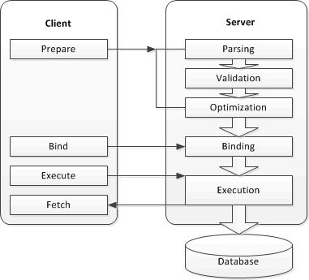

[Figure 1-1] The Basic Steps in Query Processing

Each step performs the following task:

1.  Parsing: The SQL statement is checked for correct syntax and a parse tree containing analytic information about the statement is created. 
2.  Validation: The SQL statement is checked for semantic validation and the parse tree  is expanded using data retrieved from meta tables. 
3.  Optimization: An optimal execution plan based on various statistics and access costs derived from the parse tree is created. 
4.  Binding: Host variables are bound to the execution plan. 
5.  Execution: The SQL statement is executed according to the execution plan tree.

The user must have a good knowledge of Altibase’s query optimization and query execution process to tune queries. This document explores query tuning methods based on the above.

##### Memory Tables and Disk Tables

Altibase (Hybrid Database) is a database management system which supports both memory and disk tables. The user must understand the differences between query processing methods for memory and disk tables to tune queries.

The fundamental differences between the query processor for memory and disk tables are as follows.

<table style="height: 470px; width: 630px;">
<tbody>
<tr>
<th>
<p>Query Processor</p>
</th>
<th style="width: 146px;">
<p>Item</p>
</th>
<th style="width: 170px;">
<p>Memory Table</p>
</th>
<th style="width: 180px;">
<p>Disk Table</p>
</th>
</tr>
<tr>
<td style="width: 122px;" rowspan="3">
<p>Executor</p>
</td>
<td style="width: 146px;">
<p>Object identifier</p>
</td>
<td style="width: 170px;">
<p>Pointer</p>
</td>
<td style="width: 180px;">
<p>OID(RID)</p>
</td>
</tr>
<tr>
<td style="width: 146px;">
<p>Buffer management</p>
</td>
<td style="width: 170px;">
<p>N/A</p>
</td>
<td style="width: 180px;">
<p>Limited buffer</p>
</td>
</tr>
<tr>
<td style="width: 146px;">
<p>Join methods</p>
</td>
<td style="width: 170px;">
<p>One-pass algorithms</p>
</td>
<td style="width: 180px;">
<p>Multi-pass algorithms</p>
</td>
</tr>
<tr>
<td style="width: 122px;" rowspan="3">
<p>Optimizer</p>
</td>
<td style="width: 146px;">
<p>Main cost</p>
</td>
<td style="width: 170px;">
<p>CPU</p>
</td>
<td style="width: 180px;">
<p>Disk</p>
</td>
</tr>
<tr>
<td style="width: 146px;">
<p>Index selection</p>
</td>
<td style="width: 170px;">
<p>Minimize record access</p>
</td>
<td style="width: 180px;">
<p>Minimize disk I/O</p>
</td>
</tr>
<tr>
<td style="width: 146px;">
<p>Cost factor</p>
</td>
<td style="width: 170px;">
<p>T(R), V(R.a), etc</p>
</td>
<td style="width: 180px;">
<p>+ B(R), M</p>
</td>
</tr>
<tr>
<td style="width: 122px;">
<p>Reference</p>
</td>
<td style="width: 496px;" colspan="3">
<p>T(R): Number of records in Table R</p>
<p>V(R.a): Cardinality of values in column R.a</p>
<p>B(R): Number of disk pages for Table R</p>
<p>M: Number of available memory buffers</p>
</td>
</tr>
</tbody>
</table>

The query processor consists of the optimizer and the executor. The optimizer creates an execution plan tree by calculating the statement execution cost, whereas the executor actually executes the statement according to each node of the execution plan tree.

The Altibase executor and optimizer are designed to fully reflect differences in both storage media types while reproducing the storage media characteristics when creating execution plans and processing queries.

##### The Executor 

As seen above, the basic concept and operation of the executor differ, depending on which storage medium the table is saved on. 

The “object identifier” (which identifies records) is a pointer for memory tables, but is an identifier that can be converted to a particular disk address (e.g., a resource identifier (RID)) for disk tables. This indicates that a memory table record can be directly accessed, whereas a disk table access requires address conversion. 

The server does not use buffers when processing queries on memory tables. In contrast, queries on disk tables are processed within a limited memory buffer size. If a desired record cannot be found (buffer miss), buffer replacement occurs and this causes disk I/O. 

For join operations, intermediate results are stored when necessary. These results are processed using either a one-pass or multi-pass algorithm, depending on whether or not all the results can be loaded into a limited amount of memory in a single operation. A one-pass algorithm is used when all intermediate results can be loaded into the available memory, whereas a multi-pass algorithm is used when all intermediate results cannot be loaded into available memory (to minimize buffer replacement). For instance, a one-pass algorithm can be used for memory tables (because there is no buffer limit). However, disk tables may use either a one-pass or multi-pass algorithm (depending on the buffer limit). 

As outlined above, the executor’s query processing method differs according to the storage media type and also shows a drastic difference in performance.

##### The Optimizer 

Like the executor, the basic concept and operation of the query optimizer differ, depending on which storage medium the table is saved on. 

The optimizer creates an execution plan that minimizes CPU usage when querying memory tables. In contrast, the optimizer creates an execution plan that minimizes disk I/O when querying disk tables. That is, the optimizer creates an execution plan that minimizes the resource usage that has the biggest influence on query performance. 

When selecting the access method for memory tables, the optimizer selects the index to minimize the number of records to be read. For disk tables, however, the optimizer selects the access method that minimizes disk I/O. This is because an index scan generally guarantees better performance than a full table scan for memory tables. This is not necessarily so for disk tables. Depending on the data distribution, a full table scan can result in lesser disk I/O than an index scan. 

The optimizer uses various statistical data to calculate costs. For example, the number of records in a table [T(R)], the number of different values in a column [V(R.a)], and the maximum and minimum values in a column are used to calculate the cost of a memory table query. The optimizer requires additional statistical data to calcuate the cost of a disk table query (i.e. the number of disk pages being used by a table [B(R)] and the number of available memory buffer pages [M]). 

# 2. Altibase Server Tuning

------------------

This chapter discusses the elements that need to be considered when running Altibase.

-   Log Files
-   Checkpointing
-   Buffers
-   Service Threads
-   Garbage Collector
-   SQL Plan Cache
-   CPU Usage

### Log Files

When a new log file is generated, an Altibase server generates extra log files in advance in order to prevent delayed transaction response time. If there is a lack of extra log files, transactions have to wait and this degrades database performance on the overall. 

The following query checks the number of times a transaction has waited due to a lack of extra log files.

```
SELECT lf_prepare_wait_count FROM v$lfg;
```

If this value is large, the user should set a larger value for the PREPARE_LOG_FILE_COUNT property so that the log file manager creates a sufficient number of log files in advance. Since the amount of memory used by the server increases as this value increases, the user is not advised to simply set a large number for this value. For more detailed information about the PREPARE_LOG_FILE_COUNT property, please refer to the *General Reference*.

### Checkpointing

The performance of Altibase can drop due to disk I/O overloads while checkpointing. 

Disk I/O should be monitored if steps 3 and 4 take a long time to output the following messages (from the checkpoint trace messages written to $ALTIBASE_HOME/trc/altibase_sm.log). 

```
[CHECKPOINT-step3] Flush Dirty Page(s)
[CHECKPOINT-step4] sync Database File
```

Disk I/O bottlenecks can be checked with the sar, iostat and other commands.

```
$ sar 1 3
02:32:26 PM CPU %user %nice %system %iowait %idle
02:32:30 PM all 0.25 0.00 2.87 1.87 95.01
02:32:31 PM all 0.12 0.00 6.24 6.99 86.64
02:32:32 PM all 0.25 0.00 8.61 3.75 87.39

$ iostat 1
avg-cpu: %user %nice %sys %iowait %idle
0.13 0.00 8.76 3.88 87.23
Device: tps Blk_read/s Blk_wrtn/s Blk_read Blk_wrtn
sdb1 2821.78 63.37 608388.12 64 614472
```

If a disk I/O bottleneck is causing performance degradation, the user can fix this by saving log files and data files on different disks. 

Alternatively, Disk I/O can be dispersed by adjusting the values of the following checkpointing properties; however, this method can also increase the number of log files.

-   CHECKPOINT_BULK_WRITE_PAGE_COUNT  
    When checkpointing, a given number of dirty pages can be saved on disk multiple times. This property specifies the number of dirty pages to be saved on disk at one time.
    
-   CHECKPOINT_BULK_WRITE_SLEEP_SEC  / CHECKPOINT_BULK_WRITE_SLEEP_USEC  
    This property specifies the amount of time to wait (in seconds or microseconds) after saving dirty pages on disk if CHECKPOINT_BULK_WRITE_PAGE_COUNT is not 0. 
    
-   CHECKPOINT_BULK_SYNC_PAGE_COUNT  
    When checkpointing, this property specifies the number of data pages in memory and disk tables to be synchronized. 

For more detailed information on checkpointing, please refer to the *Administrator's Manual*.

### Buffers

For disk tables, the Altibase server loads data into a limited memory buffer and then accesses it. Consequently, unoptimized queries can cause frequent disk I/O and this can result in performance degradation. 

Information about buffers can be checked by querying the V$BUFFPOOL_STAT performance view

```
SELECT hit_ratio 'HIT_RATIO(%)', victim_search_warp 
FROM v$buffpool_stat;
```

If the value of the HIT_RATIO column in the V\$BUFFPOOL_STAT performance view is small, more pages are being read from disk than the memory buffer. In other words, the Altibase server is inefficiently handling queries. 

If the value of the VICTIM_SEARCH_WARP column in the V$BUFFPOOL_STAT performance view keeps increasing, the page flushing operation of the flusher is being deprioritized. This problem can be solved by tuning queries that access a large number of pages in disk tables, or by increasing the value of the BUFFER_AREA_SIZE property. 

Statistics are the accumulation of values after the server has started. To obtain the statistics of a certain period, all column values should be calculated as: (the present value – the value at the time measurement started).

### Service Threads

A service thread is a thread on the server which receives requests and executes requests from clients. The Altibase server creates and runs service threads in the following two modes.

-   Dedicated Thread Mode:  
    When a multiple number of clients connect to the server and execute queries, the server creates one service thread for each client session to execute the queries.
    
-   Multiplexing Thread Mode:  
    The Altibase server creates only the number of service threads optimized for the server, and client sessions share these.

Altibase is designed to always maintain the optimal number of service threads by dynamically adding or deleting them. Nevertheless, the minimum number of service threads specified in the DEDICATED_THREAD_INIT_COUNT or MULTIPLEXING_THREAD_COUNT property is always maintained.

If a very large number of clients are concurrently connected to the server, performance loss can ensue due to the creation of new service threads. Service thread overload can be checked by querying the V$SERVICE_THREAD performance view.

```
iSQL> SELECT rpad(type, 30), count(*) 
    FROM V$SERVICE_THREAD GROUP BY type
    UNION ALL
    SELECT rpad(name, 30), value1 FROM V$PROPERTY
    WHERE name LIKE 'MULTIPLEXING%_THREAD_COUNT';
RPAD(TYPE, 30)                  COUNT
-----------------------------------------------
SOCKET                          44
IPC                             10
MULTIPLEXING_THREAD_COUNT       8
MULTIPLEXING_MAX_THREAD_COUNT   1024
```

If SOCKETS is larger than MULTIPLEXING_THREAD_COUNT, the following actions can be taken:

-   Set a larger value for the MULTIPLEXING_THREAD_COUNT property

-   Tune long running query statements

### Garbage Collector

Multi-Version Concurrency Control(MVCC) can create and retain old versions of data. The garbage collector (or ager) increases memory efficiency by recovering memory space that was occupied by obsolete versions of data for reuse.

However, the user should remember that MVCC can cause the following issues:

-   **Database size increase due to long running transactions **  
    If a particular transaction takes a long time to execute and is not committed, the previous images of other transactions can be read. As a consequence, the garbage collector becomes unable to delete the previous images of other transactions (previous record versions of memory tables and undo log records of disk tables), and the index keys for these records. This increases the memory table size and the amount of space used in disk undo tablespace. Also, since log files cannot be deleted in case the transaction needs to be rolled back, the file system containing log files may become full.
    
-   **Database size increase due to excessive concurrent transactions**  
    Altibase assigns the garbage collector to clean up previous images created by MVCC. If the number of concurrent transactions is much larger than the number of CPUs, the database size may continue to increase because the garbage collector does not have enough time to delete previous images.
    
-   **Database size increase due to bulk UPDATE operations**  
    If bulk updates (which generate large amounts of previous versions of data) are performed frequently, memory table and undo tablespace (used with disk tables) sizes increase. Excessive previous images decrease performance. 
    
-   **Performance degradation due to an excessive number of previous images**  
    If an excessive number of previous images remain in the database for the above reasons, the cost of searching for a specific record can increase and degrade overall performance.

The garbage collector’s memory recoverability can be checked by querying the V$MEMGC performance view as follows. The GCGAP column value indicates the amount of obsolete versions of data that the garbage collector needs to delete. 

```
iSQL> SELECT gc_name, add_oid_cnt, gc_oid_cnt , add_oid_cnt - gc_oid_cnt gcgap FROM v$memgc;
ADD_OID_CNT      GC_OID_CNT      GCGAP 
---------------------------------------------- 
113              113             0
```

The following query returns the uncommitted transactions that the garbage collector is waiting for to recover memory. The query statements executed by these transactions must be tuned.

```
SELECT session_id, total_time, execute_time, tx_id, query
FROM v$statement
WHERE tx_id IN (SELECT id FROM v$transaction
    WHERE memory_view_scn = (SELECT minmemscnintxs FROM v$memgc LIMIT 1))
AND execute_flag = 1
ORDER BY 2 DESC;
```

Excessive memory usage due to MVCC can also be prevented by adjusting the values for the AGER_WAIT_MINIMUM and AGER_WAIT_MAXIMUM properties so that memory recovery is frequently performed by the garbage collector.

### SQL Plan Cache

Please refer to Chapter 7 in SQL Plan Cache.

### CPU Usage

The user can check the CPU usage of each thread on the Altibase server and the task being executed by the thread with the highest CPU usage.

The commands for checking thread CPU usage on each operating systems are as follows:

| OS    | Command                       |
|-------|-------------------------------|
| AIX   | ps -mo THREAD -p altibase_pid |
| HPUX  | glance +s +G                  |
| LINUX | ps -Lfm -p altibase_pid       |

Example

```
$ ps -mo THREAD -p 1003630
USER PID PPID TID ST CP PRI SC WCHAN F TT BND COMMAND
snkim 1003630 1 - A 92 60 25 * 40001 - - /home2..
- - - 1405123 S 0 60 1 - 410400 - - -
- - - 1687749 S 0 60 1 f100070f10019c40 8410400 - -
- - - 3907689 S 92 106 1 f10001004af1b2c0 400000 - -
…
```

The user can check the thread with the highest CPU usage with the following commands.

-   HP-UX, Linux
    pstack altibase_pid

-   AIX
    procstack altibase_pid

# 3. The Query Optimizer

---------------

This chapter describes the structure of the optimizer and explains the query optimization process.

### Query Optimizer Overview

The query optimizer analyzes a SQL statement, creates execution plans, and selects the most efficient execution plan by evaluating their costs. This process determines most of query performance. The more complicated a query is, the more its performance depends on the precision of this process.

#### The Optimizer Procedure

Prior to optimization, a SQL statement is first parsed and validated, and a parsing tree is created thereof. The optimizer creates an efficient plan tree by evaluating various costs from this tree. 

An optimizer that executes this process has the following structure.

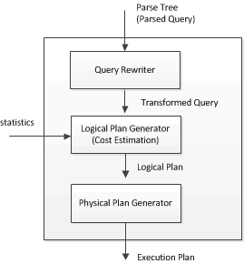

[Figure 3-1] The Structure of the Optimizer

The optimizer consists of the query rewriter, logical plan generator, and the physical plan generator. Each element performs the following.

-   Query Rewriter:  Using the parse tree, rewrites the query so that it can be easily optimized while having the same results. For further information about the Altibase query conversion algorithm, please refer to Query Conversion.
  
-   Logical Plan Generator: Using the rewritten query and statistics, calculates the execution cost and generates an optimal logical query plan.
  
-   Physical Plan Generator: Using the optimized query plan, generates a physical plan tree. 

The optimization process executed by each element of the query optimizer can be categorized as below.

-   Query conversion
-   Logical execution plan generation
-   Physical execution plan generation

#### Elements Which Influence the Optimizer

The following elements affect the Altibase query optimizer process and as a result, the explain plans become different. 

-   Format of SQL statements and predicates 
-   Index and constraints 
-   Statistics 
-   SQL hints 
-   Optimizer-related properties

For more detailed information about statistics and SQL hints, please refer to The Explain Plan.

### Query Conversion

While processing a query, the optimizer rewrites a complete parse tree into a SQL statement that has the same meaning and is easy to optimize. This is called query conversion. 

The query optimizer uses the following query conversion methods. Some are used when the query rewriter rewrites queries. Others are used when the logical plan generator optimizes query plans.

-   Common Subexpression Elimination
-   Constant Filter Precedence
-   View Merging
-   Subquery Unnesting
-   Predicate Pushdowns
-   Transitive Predicate Generation

#### Common Subexpression Elimination

If there are two or more identical conditional expressions in a WHERE statement, the optimizer merges the duplicate expressions into one. 

In the following example, the optimizer eliminates the duplicate condition (department_id=60).

```
SELECT department_id, salary
FROM   employee
WHERE  ( department_id = 60 AND salary = 4200 )
   OR  ( department_id = 60 );
```

In the following example, the optimizer eliminates the condition (salary = 4200) because it is meaningless.

```
SELECT department_id, salary
FROM   employee
WHERE  ( department_id = 60 OR salary = 4200 )
  AND  ( department_id = 60 );
```


#### Constant Filter Precedence

A constant filter is a condition that consistently evaluates to either TRUE or FALSE, regardless of the table value (e.g., 1 = 1 or 1 <> 1).

Since a constant filter always has the same logical value, it is evaluated only once and no additional comparison operation costs are incurred. If the logical value of a constant filter resolves to FALSE, additional checks and table access become unnecessary. Seemingly meaningless constant filters have a wide variety of uses.

For example, a constant filter can be used when a schema has been created but data hasn’t yet been loaded into it. The following is an example of such a query:

```
CREATE TABLE T3 AS SELECT * FROM T1, T2 WHERE 1 <> 1;
```

As seen above, a constant filter can be used to create table T3 which contains all of the columns in tables T1 and T2, but not any of the data. 

Constant filters can also be used to limit search privileges as shown below.

```
SELECT * FROM T1, T2 WHERE T1.i1 = T2.a1 AND ? > 20;
```

As shown above, the user can specify a host variable that corresponds to age to prevent users who do not meet the condition from executing queries or avoid overload from the execution of queries without result sets.

In addition, the optimizer can use a constant filter on a predicate with a subquery to execute it only once and prevent repeated execution of the subquery.

```
SELECT * FROM T1 WHERE EXISTS ( SELECT * FROM T2 WHERE T2.date = SYSDATE );
```

In the above example, the EXISTS condition is a constant filter irrelevant to the data stored in table T1.

#### View Merging

This method merges a view in the main query with the main query.

For simple views which include only joins between conditional clauses, the optimizer performs view merging unless the user uses the NO_MERGE hint

The following is an example of a query statement which joins the emp_engineer view and departments table, being converted by view merging.

```
CREATE OR REPLACE VIEW emp_engineer
AS
SELECT eno, e_lastname, emp_job, salary, dno
FROM employees
WHERE emp_job='engineer';

SELECT e.eno, e.e_lastname, e.salary, d.dname, d.mgr_no
FROM emp_engineer e, departments d
WHERE d.dno=e.dno AND e.salary>=1500;
=>
SELECT e.eno, e.e_lastname, e.salary, d.dname, d.mgr_no
FROM employees e, departments d
WHERE d.dno=e.dno 
AND e.emp_job='engineer'
AND e.salary>=1500;
```

\* Related Hint: NO_MERGE

#### Subquery Unnesting

A nested subquery is a subquery in the WHERE clause. A subquery usually references columns in the main query to limit result sets. “Subquery Unnesting” converts a query with a nested subquery into an unnested join statement.

The following is an example of a query with a nested subquery being converted by subquery unnesting.

```
SELECT * FROM employees
WHERE dno IN (SELECT dno FROM departments)
=>
SELECT *
FROM (SELECT dno FROM departments) d, employees e
WHERE d.dno=e.dno;
```

\* Related hints: UNNEST, NO_UNNEST

#### Predicate Pushdown

The optimizer utilizes various types of predicate pushdowns to reduce execution costs and retain mathematical consistency. The following are the main predicate pushdowns used by the optimizer.

-   Predicate Pushdowns on Views
-   Predicate Pushdowns on Outer Joins
-   Predicate Pushdowns on Join Conditions

##### Predicate Pushdowns on Views

A predicate pushdown on views pushes down a predicate expressed in the WHERE clause of the main query when a query is being executed on a user-defined view. 

For example, consider the following view and query.

```
CREATE VIEW V1(a1, a2) AS SELECT i1, i2 FROM T1 WHERE i2 > 20;
SELECT * FROM V1 WHERE a1 = 1;
```

If the optimizer concludes that a prediate pushdown will deliver the most efficient execution plan while optimizing the above query, it determines that the predicate in the WHERE clause is to be processed internally within the view as shown below. The following query expresses this concept.

```
SELECT * FROM ( SELECT i1, i2 FROM T1  WHERE i2 > 20 AND i1 =1 ) V1;
```

The query is changed so that it can use the index for the T1.i1 column. However, the optimizer does not always decide to use this kind of predicate pushdown. 

With a proper understanding of the internal structure of views, the user can make the optimizer choose a predicate pushdown on views by using the appropriate predicate. Or the user can use hints to explicitly instruct the optimizer to do so. However, predicate pushdowns on views do not necessarily guarantee performance equal to or better than that of the original query

\* Related hints: NO_PUSH_SELECT_VIEW, PUSH_SELECT_VIEW

##### Predicate Pushdowns on Outer Joins

Various predicate pushdown methods are available if an outer join is used in a FROM clause. What these methods have in common is that the predicate described in the WHERE clause is evaluated before the outer join is processed.

Consider the following query for example.

```
SELECT * FROM T1 LEFT OUTER JOIN T2 ON T1.i1 = T2.a1 WHERE T1.i1 = 1;
```

If the above query undergoes a predicate pushdown, it is processed as the following query:

```
SELECT * FROM (SELECT * FROM T1 WHERE T1.i1 = 1) T1 LEFT OUTER JOIN T2 ON T1.i1 = T2.a1;
```

The predicate T1.i1 = 1 is processed before the join condition of the left outer join is processed to reduce the size of the T1 result set. 

This method is chosen after confirming the mathematical consistency and evaluating the cost. For example, the following three queries are different queries that can yield different results.

```
SELECT * FROM T1 LEFT OUTER JOIN T2 ON T1.i1 = T2.a1 WHERE T2.a1 = 1;
SELECT * FROM T1 LEFT OUTER JOIN (SELECT * FROM T2 WHERE T2.a1 = 1) T2 ON T1.i1 = T2.a1;
SELECT * FROM T1 LEFT OUTER JOIN T2 ON T1.i1 = T2.a1 AND T2.a1 = 1;
```

To ensure mathematical consistency and obtain the same results, the optimizer uses predicate pushdowns to evaluate the above queries, as shown below:

```
SELECT *  FROM T1 LEFT OUTER JOIN 
(SELECT * FROM T2 WHERE T2.a1 = 1) T2 
ON T1.i1 = T2.a1
WHERE T2.a1 = 1;
```

If a user wishes to move the WHERE condition to the ON clause for a left outer join, the WHERE clause must be left as below to get the same results.

```
SELECT *  FROM T1 LEFT OUTER JOIN T2 
ON T1.i1 = T2.a1 AND T2.a1 = 1
WHERE T2.a1 = 1;
```

As shown above, the user can expect similar results by arbitrarily adding a query predicate. However, it is important to discern whether adding a predicate still delivers the same results and improves performance.

##### Predicate Pushdowns on Views with Set Operators

Predicate pushdowns are particularly effective in processing views created through set operations. For example, consider the following view and query: 

```
CREATE VIEW V1(a1, a2) AS ( SELECT m1, m2 FROM T2 UNION ALL SELECT x1, y1 FROM T3 );
SELECT * FROM T1, V1 WHERE T1.i1 = V1.a1 AND T1.i1 = 1;
```

Even if the columns T2.m1 and T3.x1 have indexes in the above view definition, neither is used to execute the query. In this case, transitive predicate generation (which is described in the next section) internally creates the V1.a1=1 predicate.

```
SELECT * FROM T1, V1 WHERE T1.i1 = V1.a1 AND T1.i1 = 1 AND V1.a1 = 1;
```

A predicate pushdown transforms the query as follows, so that the T2.m1 and T3.x1 column indexes are available for use.

```
SELECT * FROM T1, ( SELECT m1, m2 FROM T2 WHERE T2.m1 = 1 
  UNION ALL
  SELECT x1, y1 FROM T3 WHERE T3.x1 = 1 ) V1
  WHERE T1.i1 = V1.a1 AND T1.i1 = 1;
```

The proper description of a predicate (as above) helps the optimizer create a more efficient execution plan. Also, the user can improve performance by explicitly modifying predicates. However, adding a predicate does not necessarily guarantee better performance and the user should remember that the cost of comparison operations can increase.

##### Predicate Pushdowns on Join Conditions

This method pushes a join condition related to a view in the predicate of a main query inside the view

\* Related hint: PUSH_PRED

#### Transitive Predicate Generation

Transitive predicate generation improves performance by adding a similar single table predicate when a join condition and a single table predicate exist. 

Consider the following query for example.

```
SELECT * FROM T1, T2 WHERE T1.i1 = T2.a1 AND T1.i1 = 1;
```

If an index is unavailable, performance can be improved by adding a similar single table predicate as below.

```
SELECT * FROM T1, T2 WHERE T1.i1 = T2.a1 AND T1.i1 = 1 AND T2.a1 = 1;
```

Performance can be enhanced by decreasing the result set size of T2. 

#### View Materialization

An optimization method that is the opposite of a predicate pushdown on views is view materialization. This method temporarily stores the dataof a view that is repeatedly used by a query, while the query is being processed.

For example, consider the following view and query. 

```
CREATE VIEW V1(a1, a2) AS SELECT i1, SUM(i2) FROM T1 GROUP BY i1;
SELECT * FROM V1 WHERE V1.a2 > (SELECT AVG(a2) FROM V1 WHERE a1 > 10 );
```

If the above query undergoes view materialization, the view’s (V1) results are temporarily stored and used by the top-level query and subquery. That is, the query defined for the view does not need to be executed repeatedly in order to obtain V1’s data. 

User discretion is advised, as using a hint to instruct the optimizer to use a predicate pushdown on views on this kind of query can actually worsen performance.

### Creating Logical Execution Plans

The optimizer creates a logical execution plan using statistics and a transformed query. The optimizer uses statistics to calculate the costs (i.e., the storage characteristics) of tables, indexes and partitions that the SQL statement accesses. The optimizer expresses cost as the estimated time necessary to execute a query with a particular plan. The optimizer selects the access method and joining method with the lowest cost to create a logical execution plan.

#### Normalization

##### The Concept of Normalization

User-defined WHERE predicates can be written in multiple ways. The optimizer transforms user-defined WHERE clauses into a standardized form to effectively and consistently process a wide variety of conditions. This is called normalization. 

Normalization is the process of extending and transforming predicates using logical expressions such as AND, OR, and NOT. “Conjunctive Normal Form (CNF)” handles AND operators as the highest-level expression, whereas “Disjunctive Normal Form(DNF)” handles OR operators as the highest-level expression. 

CNF normalization rearranges the structure of a predicate so that AND operators are taken as the highest-level operators and OR operators are taken as lower level operators. The following example shows the structure of a predicate transformed by CNF normalization:

```
WHERE (i1 = 1 AND i2 = 1) OR i3 = 1  
CNF: (i1 = 1 OR i3 = 1) AND (i2 = 1 OR i3 = 1)
```

DNF normalization rearranges the structure of a predicate so that OR operators are taken as higher-level operators and AND operators are taken as lower level operators. The following example shows the structure of a predicate transformed by DNF normalization:

```
WHERE (i1 = 1 OR i2 = 1) AND i3 = 1  
DNF: (i1 = 1 AND i3 = 1) OR (i2 = 1 AND i3 = 1)
```

The optimizer compares the execution costs of a CNF normalized query and a DNF normalized query and selects the normalization type with lower cost. 

The optimizer generally chooses CNF-based execution plans over DNF-based execution plans. For example, consider the following query.

```
SELECT * FROM T1 WHERE i1 = 1 OR i2 = 1;
CNF normalization: AND (i1 = 1 OR i2 = 1)
DNF normalization: (i1 = 1 AND ) OR (i2 = 1 AND )
```

The above will undergo CNF normalization if table T1 does not have an index or only one column has an index. This is because it is most efficient to process the query with a full table scan. 

However, if both i1 and i2 columns have indexes, it is more efficient to DNF-normalize the predicate and separately obtain the results of (i1 = 1) and (i2 = 1), and then add them. 

Depending on whether or not an index exists, the optimizer can choose a different normalization type for the same predicate. This is because the optimizer determines the normalization type by comparing execution costs. 

If the WHERE clause has neither logical operator nor OR operator, the optimizer uses only CNF normalization. However, if the WHERE clause has one or more OR operators, the optimizer uses both CNF and DNF normalizations to compare their costs and create an execution plan.

###### User Tuning

The normalization process inevitably results in the extension of predicates. Therefore, writing a predicate in a normalized form prevents predicate extension and eliminates unnecessary comparison operations. 

For example, the below predicate can undergo either CNF or DNF normalization, but the user can modify it so that it can only undergo CNF normalization.

```
WHERE i1 = 1 OR i1 = 2 OR i1 = 3  
CNF normalization: i1 IN (1, 2, 3)
```

Similarly, the following query can undergo CNF or DNF normalization to eliminate unnecessary normalization and comparison, to improve performance.

```
WHERE (i1 = 1 AND i2 = 1) OR (i1 = 2 AND i2 = 2)  
CNF normalization: (i1, i2) IN ( (1,1), (2,2) )
```

```
WHERE (i1 = 1 AND i2 = 1) OR ( i3 = 1 AND i4 = 1)  
DNF normalization: (i1, i2) = (1, 1) OR (i3, i4) = (1, 1)
```

When writing a predicate in normalized form, certain information about the table (including indexes) must be considered. Furthermore, even if the user writes a predicate in normalized form, the optimizer may select an undesirable normalization type. This can be controlled by using hints, which is explained in detail in Using Hints.

#### Cost Estimation

The optimizer creates the most efficient execution plan by considering the following three estimates based on statistics:

-   Selectivity  
    This is the ratio of the number of rows that are anticipated to be selected by a certain predicate to the total number of target rows. The optimizer uses selectivity to calculate cardinality and costs, and decides the join order, the joining method and whether or not to use indexes. Selectivity is a fundamental element for creating an optimized execution plan.
    
-   Cardinality  
    This is the number of rows that are anticipated to be chosen from the target rows. It is calculated as (the total number of rows * selectivity). 
    
-   Cost  
    This is the sum of the access cost and the disk I/O cost. The access cost is determined by the access method (e.g., index scan, full scan). For further information about access methods, please refer to Access Method.

#### Access Methods

An access method is how data is fetched from the database. It is generally more efficient to use an index when fetching a small amount of records from a table and to perform a full table scan when accessing a large number of records. Altibase uses the following access methods:

-   Full Table Scans

-   Index Scans

##### Full Table Scans

Reads all rows in the table and filters those that do not meet the selection criteria. Full table scans are used under the following circumstances:

-   When there is no index

-   When accessing a large amount of data in a table.

\* Related hint: FULL SCAN (table)

The following example shows a query and execution plan that use a full table scan.

```
iSQL> SELECT /*+ FULL SCAN(employees) */ eno, e_firstname, e_lastname, emp_job
 FROM employees 
 WHERE sex = 'F';
.
.
.
------------------------------------------------
PROJECT ( COLUMN_COUNT: 4, TUPLE_SIZE: 65 , COST: 0.18 )
 SCAN ( TABLE: EMPLOYEES, FULL SCAN, ACCESS: 20, COST: 0.14 )
------------------------------------------------
```


##### Index Scans

There are two types of index scans:

-   Index Range Scans

-   Index Full Scans

\* Related hints: INDEX, INDEX ASC, INDEX DESC, NO INDEX

###### **Index Range Scans**

An index range scan vertically explores the index tree from root to leaf and then scans only the necessary range for the leaves.

Altibase denotes this as the “key range processing method” as well. An index range scan uses an index and finds the range of data that meets a condition. In other words, an index range scan determines only the locations of the minimum and maximum values that meet the condition and scans all data within the range. This method guarantees improved performance because it eliminates additional comparison operations.

An index range scan is used when the leading columns of an index are used for the following predicates:

-   c1 = value

-   c1 \< value

-   c1 \> value

The data is sorted and returned in index column order. If the columns comprising the index are specified in the ORDER BY/GROUP BY clauses, the optimizer will avoid unnecessary sorting. 

The following example shows a query using an index range scan and its execution plan.

```
iSQL> SELECT /*+ INDEX(employees, EMP_IDX1) */ eno, e_firstname, e_lastname, emp_job
 FROM employees 
 WHERE dno = 1003;
.
.
.
----------------------------------------------------------
PROJECT ( COLUMN_COUNT: 4, TUPLE_SIZE: 65, COST: 0.03 )
 SCAN ( TABLE: EMPLOYEES, INDEX: EMP_IDX1, RANGE SCAN, ACCESS: 4, COST: 0.00 )
----------------------------------------------------------
```


###### **Index Full Scans**

Unlike an index range scan which scans only a particular range, an index full scan scans the leaf node from top to bottom. An index full scan is usually selected as an alternative when an optimum index for a data query does not exist. Because the data is sorted by the index key, it is unnecessary for the optimizer to perform additional sort operations.

Altibase denotes this as the “key filter processing method” as well. This method does not perform a range scan with an index, but scans each index leaf node in order and compares it against a stored key value. This method only accesses the pages which store indexes and compares them. Therefore, the number of times data pages are accessed is reduced and this can lead to improved performance.

However, performance improvement is limited to disk tables as memory table indexes do not store key values. 

The filter processing method is used for predicates on which indexes cannot be used. It directly reads data and compares it. If multiple filters must be used to process a WHERE clause predicate, the optimizer compares the estimated cost for each filter and processes filters by lowest price, so that filters are processed with the minimum cost. 

The following example shows a query using an index full scan and its execution plan.

```
CREATE TABLE t1(c1 INT, c2 CHAR(10)) 
  TABLESPACE sys_tbs_disk_data;
CREATE INDEX t1_idx ON t1(c1);
INSERT INTO t1 VALUES(1,'a');
INSERT INTO t1 VALUES(2,'b');
INSERT INTO t1 VALUES(3,'c');

iSQL> SELECT * FROM t1 ORDER BY c1;
.
.
.
----------------------------------------------------------
PROJECT ( COLUMN_COUNT: 2, TUPLE_SIZE: 16, COST: 14.02 )
 SCAN ( TABLE: T1, INDEX: T1_IDX, FULL SCAN, ACCESS: 3, DISK_PAGE_COUNT: 64, COST: 14.00 )
----------------------------------------------------------
```


##### Considerations when Creating Indexes

An index must find the key range that most efficiently processes a predicate. However, the following must be considered to create an index.

-   An index can improve search performance, but index management requires storage space (additional resource consumption). Moreover, too many indexes can degrade performance by incurring index maintenance costs for data insert, delete and update.
  
-   For memory tables, a query using an index (index scan) almost always yields better performance than a query scanning an entire table (full table scan).
  
-   For disk tables, index scans are not necessarily more effective than full table scans. While a full table accesses pages in a consistent pattern, an index scan accesses pages irregularly and may incur excessive disk I/O in some cases. Thus, it is recommended to create indexes for disk tables only if a search using an index scan returns a very small number of, or less than 10% of the total records in a table.

Therefore, the user should consider how frequently queries are executed, how much performance will improve due to indexes, the total system resources and how much performance will degrade due to UPDATE queries (INSERT, DELETE, and UPDATE) before deciding whether or not to create an index.

##### Index Selection by the Optimizer

The optimizer determines the most efficient access method based on the conditions and table indexes

The optimizer uses various statistics to evaluate the cost of using each index and selects the most efficient access method. Once the access method has been determined, the optimizer decides the process method (e.g. the key range method, the filter method, etc.) for each predicate

The optimizer uses the following formulas to calculate the cost of each access method: 

**Access cost + Disk I/O cost**

| Access Cost Formula                                          |
| ------------------------------------------------------------ |
| Full scan    : T(R)                                          |
| Index Scan : log(T(R)) + T(R) * MAX(1/V(Index), selectivity) |

| Disk I/O Cost Formula                                        |
| ------------------------------------------------------------ |
| Full scan    : B(R)                                          |
| Index Scan : <br/>Buffer Miss      : [T(R) / V(R.a)] * ( 1- M/B(R) )<br />No Buffer Miss : B(R) * ( 1 - (log V(R.a)/logT(R)) ) |

The optimizer adds the access cost and disk I/O cost to calculate the cost of each method. Since memory tables do not have disk pages, disk I/O cost is automatically omitted for memory tables

When the optimizer calculates the cost for each index, it selects the condition that can be processed with the index and bases its calculations on it. The factor that most strongly affects this cost is the efficiency or “selectivity” of each of these conditions.

Condition selectivity is the ratio of the number of records selected by the condition to the total amount of records. A low condition selectivity means a small number of resultant records, which can lead to better performance.

For example, consider the following condition:

```
WHERE i1 = 1 AND i2 = 1
```

If an index has been defined for each of the i1 and i2 columns, the most important factor to consider when deciding which index to use is condition selectivity. For instance, if there are 100 [V(i1) = 100] different values in column i1 and 1000 [V(i2) = 1000] in column i2, the selectivity for each column is calculated as follows:

```
(i1 = 1)의 selectivity = 1/V(i1) = 1/100
(i2 = 1)의 selectivity = 1/V(i2) = 1/1000
```

For this query, the more efficient access method would be to use the index defined for column i2. 

Selecting the access method as above generally creates the most suitable execution plan. However, because this method is based on cost calculation, an unsuitable access method can be chosen under certain circumstances.

For example, consider the following query:.

```
SELECT * FROM soldier WHERE gender = 'female' AND rank = 'lieutenant';
```

If both the gender and rank columns have indexes, the optimizer will calculate the costs and choose to use the index for evaluating the condition of the column rank. However, if the user knows beforehand that the number of result sets that satisfy the condition (gender ='female') is very small, it would be appropriate to use a hint or the like to instruct the optimizer to use another index.

##### Using Composite Indexes

When a composite index is used, the optimizer checks the predicates and chooses one that allows key range processing to be performed on the maximum number of predicates. The more conditions processed using key range scanning, better performance can be expected.

Performance can vary greatly on how predicates that reference user-defined indexes are written. Therefore, understanding composite indexes is very helpful for SQL tuning. 

The following example shows how various predicates are processed:

```
Composite index on T1(i1, i2, i3, i4)
WHERE i1 = 1 AND i2 = 1 AND i3 = 1 AND i4 = 1
```

All of the predicates in the above WHERE clause can be processed using the composite index and key range processing.

```
WHERE i1 = 1 AND i2 > 0 AND i3 = 1 AND i4 = 1
Key Range              : i1 = 1, i2 > 0
Filter(or Key filter)  : i3 = 1, i4 = 1
```

In the above example, it is determined that key range processing can be performed on two of the conditions and a filter will be used for the rest. This is because key range processing can only be performed within a range for which maximum and minimum values can be set, and cannot be performed on the predicates following the inequality operation.

```
WHERE i1 = 1 AND i3 = 1 AND i4 = 1
Key Range      : i1 = 1
Filter         : i3 = 1, i4 = 1
```

In the above example, key range processing can only be performed on the first predicate although all operations are equality operations. This is because key range processing can only be performed when the predicates match the order of the columns on which the composite index is defined and no columns are missing. That is, key range processing cannot be used to evaluate the predicates that reference the i3 and i4 columns, because no predicate corresponding to the i2 column precedes them. 

As described above, for composite indexes, only the predicates that appear in the same order as the order of the key columns (without any missing columns) can be evaluated using key range processing, and only if those predicates use equality operations. 

If the following type of query is frequently executed, and in order to add an index, the user should add an index that can be used to its maximum.

```
WHERE i1 > 0 AND i2 = 1
```


-   Proper index: Index on T1(i2, i1)  
    Key range processing can be used to evaluate the predicates that reference the i2 and i1 columns without a filter.
    
-   Improper index: Index on T1(i1, i2)  
    Key range processing can be used to evaluate the predicate that references the i1 column, but filter processing is used to evaluate the predicate that references the i2 column. Therefore, this index is inefficient.

##### Indexes and Comparison Operators

Just because an index exists, and a predicate references the column does not necessarily mean that the index can be used.

That is, it is necessary to pay attention to whether the index can be used depending on the expression type of the condition clause and the type of the comparison operator.

The comparison operator type and index availability are shown below:

<table style="width: 626px;">
<tbody>
<tr>
<td style="width: 113px;">
<p><strong>Type</strong></p>
</td>
<td style="width: 127px;">
<p><strong>Comparison Operator</strong></p>
</td>
<td style="width: 148px;">
<p><strong>Index&nbsp;availability</strong></p>
</td>
<td style="width: 228px;">
<p><strong>Remarks</strong></p>
</td>
</tr>
<tr>
<td style="width: 113px;" rowspan="6">
<p>Simple Comparison</p>
</td>
<td style="width: 127px;">
<p>=</p>
</td>
<td style="width: 148px;">
<p>O</p>
</td>
<td style="width: 228px;">
<p>&nbsp;</p>
</td>
</tr>
<tr>
<td style="width: 127px;">
<p>!=</p>
</td>
<td style="width: 148px;">
<p>O</p>
</td>
<td style="width: 228px;">
<p>&nbsp;</p>
</td>
</tr>
<tr>
<td style="width: 127px;">
<p>&lt;&nbsp;</p>
</td>
<td style="width: 148px;">
<p>O</p>
</td>
<td style="width: 228px;">
<p>&nbsp;</p>
</td>
</tr>
<tr>
<td style="width: 127px;">
<p>&lt;=</p>
</td>
<td style="width: 148px;">
<p>O</p>
</td>
<td style="width: 228px;">
<p>&nbsp;</p>
</td>
</tr>
<tr>
<td style="width: 127px;">
<p>&gt;&nbsp;</p>
</td>
<td style="width: 148px;">
<p>O</p>
</td>
<td style="width: 228px;">
<p>&nbsp;</p>
</td>
</tr>
<tr>
<td style="width: 127px;">
<p>&gt;=</p>
</td>
<td style="width: 148px;">
<p>O</p>
</td>
<td style="width: 228px;">
<p>&nbsp;</p>
</td>
</tr>
<tr>
<td style="width: 113px;" rowspan="2">
<p>Area Comparison</p>
</td>
<td style="width: 127px;">
<p>BETWEEN</p>
</td>
<td style="width: 148px;">
<p>O</p>
</td>
<td style="width: 228px;">
<p>&nbsp;</p>
</td>
</tr>
<tr>
<td style="width: 127px;">
<p>NOT BETWEEN</p>
</td>
<td style="width: 148px;">
<p>O</p>
</td>
<td style="width: 228px;">
<p>&nbsp;</p>
</td>
</tr>
<tr>
<td style="width: 113px;" rowspan="2">
<p>Member Comparison</p>
</td>
<td style="width: 127px;">
<p>IN</p>
</td>
<td style="width: 148px;">
<p>O</p>
</td>
<td style="width: 228px;">
<p>&nbsp;</p>
</td>
</tr>
<tr>
<td style="width: 127px;">
<p>NOT IN</p>
</td>
<td style="width: 148px;">
<p>O</p>
</td>
<td style="width: 228px;">
<p>&nbsp;</p>
</td>
</tr>
<tr>
<td style="width: 113px;" rowspan="2">
<p>Pattern Comparison</p>
</td>
<td style="width: 127px;">
<p>LIKE</p>
</td>
<td style="width: 148px;">
<p>O</p>
</td>
<td style="width: 228px;">
<p>Yes: T1.i1 LIKE abc%</p>
<p>No: T1.i1 LIKE %abc</p>
</td>
</tr>
<tr>
<td style="width: 127px;">
<p>NOT LIKE</p>
</td>
<td style="width: 148px;">
<p>X</p>
</td>
<td style="width: 228px;">
<p>&nbsp;</p>
</td>
</tr>
<tr>
<td style="width: 113px;" rowspan="2">
<p>NULL Comparison</p>
</td>
<td style="width: 127px;">
<p>IS NULL</p>
</td>
<td style="width: 148px;">
<p>O</p>
</td>
<td style="width: 228px;">
<p>&nbsp;</p>
</td>
</tr>
<tr>
<td style="width: 127px;">
<p>IS NOT NUL</p>
</td>
<td style="width: 148px;">
<p>O</p>
</td>
<td style="width: 228px;">
<p>&nbsp;</p>
</td>
</tr>
<tr>
<td style="width: 113px;" rowspan="4">
<p>Exists Comparison</p>
</td>
<td style="width: 127px;">
<p>EXISTS</p>
</td>
<td style="width: 148px;">
<p>X</p>
</td>
<td style="width: 228px;">
<p>&nbsp;</p>
</td>
</tr>
<tr>
<td style="width: 127px;">
<p>NOT EXISTS</p>
</td>
<td style="width: 148px;">
<p>X</p>
</td>
<td style="width: 228px;">
<p>&nbsp;</p>
</td>
</tr>
<tr>
<td style="width: 127px;">
<p>UNIQUE</p>
</td>
<td style="width: 148px;">
<p>X</p>
</td>
<td style="width: 228px;">
<p>&nbsp;</p>
</td>
</tr>
<tr>
<td style="width: 127px;">
<p>NOT UNIQUE</p>
</td>
<td style="width: 148px;">
<p>X</p>
</td>
<td style="width: 228px;">
<p>&nbsp;</p>
</td>
</tr>
<tr>
<td style="width: 113px;" rowspan="6">
<p>Quantify ANY</p>
</td>
<td style="width: 127px;">
<p>=ANY</p>
</td>
<td style="width: 148px;">
<p>O</p>
</td>
<td style="width: 228px;">
<p>&nbsp;</p>
</td>
</tr>
<tr>
<td style="width: 127px;">
<p>!=ANY</p>
</td>
<td style="width: 148px;">
<p>O</p>
</td>
<td style="width: 228px;">
<p>&nbsp;</p>
</td>
</tr>
<tr>
<td style="width: 127px;">
<p>&lt;ANY</p>
</td>
<td style="width: 148px;">
<p>O</p>
</td>
<td style="width: 228px;">
<p>&nbsp;</p>
</td>
</tr>
<tr>
<td style="width: 127px;">
<p>&lt;=ANY</p>
</td>
<td style="width: 148px;">
<p>O</p>
</td>
<td style="width: 228px;">
<p>&nbsp;</p>
</td>
</tr>
<tr>
<td style="width: 127px;">
<p>&gt;ANY</p>
</td>
<td style="width: 148px;">
<p>O</p>
</td>
<td style="width: 228px;">
<p>&nbsp;</p>
</td>
</tr>
<tr>
<td style="width: 127px;">
<p>&gt;=ANY</p>
</td>
<td style="width: 148px;">
<p>O</p>
</td>
<td style="width: 228px;">
<p>&nbsp;</p>
</td>
</tr>
<tr>
<td style="width: 113px;" rowspan="6">
<p>Quantify ALL</p>
</td>
<td style="width: 127px;">
<p>=ALL</p>
</td>
<td style="width: 148px;">
<p>O</p>
</td>
<td style="width: 228px;">
<p>&nbsp;</p>
</td>
</tr>
<tr>
<td style="width: 127px;">
<p>!= ALL</p>
</td>
<td style="width: 148px;">
<p>O</p>
</td>
<td style="width: 228px;">
<p>&nbsp;</p>
</td>
</tr>
<tr>
<td style="width: 127px;">
<p>&lt; ALL</p>
</td>
<td style="width: 148px;">
<p>O</p>
</td>
<td style="width: 228px;">
<p>&nbsp;</p>
</td>
</tr>
<tr>
<td style="width: 127px;">
<p>&lt;= ALL</p>
</td>
<td style="width: 148px;">
<p>O</p>
</td>
<td style="width: 228px;">
<p>&nbsp;</p>
</td>
</tr>
<tr>
<td style="width: 127px;">
<p>&gt; ALL</p>
</td>
<td style="width: 148px;">
<p>O</p>
</td>
<td style="width: 228px;">
<p>&nbsp;</p>
</td>
</tr>
<tr>
<td style="width: 127px;">
<p>&gt;= ALL</p>
</td>
<td style="width: 148px;">
<p>O</p>
</td>
<td style="width: 228px;">
<p>&nbsp;</p>
</td>
</tr>
</tbody>
</table>
<p>&nbsp;</p>
[Table 3-1] Use of Comparison Operators with Indexes

Comparison operator types for the GEOMETRY data type are listed below. An index defined on a GEOMETRY column can only be used if an R-Tree index exists. 

<table style="width: 596px;">
<tbody>
<tr>
<td style="width: 115px;">
<p><strong>Type</strong></p>
</td>
<td style="width: 141px;">
<p><strong>Comparison Operator</strong></p>
</td>
<td style="width: 166px;">
<p><strong>Status</strong></p>
</td>
<td style="width: 158px;">
<p><strong>Remarks</strong></p>
</td>
</tr>
<tr>
<td style="width: 115px;" rowspan="19">
<p>Geometry Comparison</p>
</td>
<td style="width: 141px;">
<p>CONTAINS</p>
</td>
<td style="width: 166px;">
<p>O</p>
</td>
<td style="width: 158px;" rowspan="19">
<p>R-Tree index only</p>
</td>
</tr>
<tr>
<td style="width: 141px;">
<p>CROSSES</p>
</td>
<td style="width: 166px;">
<p>O</p>
</td>
</tr>
<tr>
<td style="width: 141px;">
<p>DISJOINT</p>
</td>
<td style="width: 166px;">
<p>O</p>
</td>
</tr>
<tr>
<td style="width: 141px;">
<p>DISTANCE</p>
</td>
<td style="width: 166px;">
<p>O</p>
</td>
</tr>
<tr>
<td style="width: 141px;">
<p>EQUALS</p>
</td>
<td style="width: 166px;">
<p>O</p>
</td>
</tr>
<tr>
<td style="width: 141px;">
<p>INTERSECTS</p>
</td>
<td style="width: 166px;">
<p>O</p>
</td>
</tr>
<tr>
<td style="width: 141px;">
<p>ISEMPTY</p>
</td>
<td style="width: 166px;">
<p>X</p>
</td>
</tr>
<tr>
<td style="width: 141px;">
<p>ISSIMPLE</p>
</td>
<td style="width: 166px;">
<p>X</p>
</td>
</tr>
<tr>
<td style="width: 141px;">
<p>NOT CONTAINS</p>
</td>
<td style="width: 166px;">
<p>X</p>
</td>
</tr>
<tr>
<td style="width: 141px;">
<p>NOT CROSSES</p>
</td>
<td style="width: 166px;">
<p>X</p>
</td>
</tr>
<tr>
<td style="width: 141px;">
<p>NOT EQUALS</p>
</td>
<td style="width: 166px;">
<p>X</p>
</td>
</tr>
<tr>
<td style="width: 141px;">
<p>NOT OVERLAPS</p>
</td>
<td style="width: 166px;">
<p>X</p>
</td>
</tr>
<tr>
<td style="width: 141px;">
<p>NOT RELATE</p>
</td>
<td style="width: 166px;">
<p>X</p>
</td>
</tr>
<tr>
<td style="width: 141px;">
<p>NOT TOUCHES</p>
</td>
<td style="width: 166px;">
<p>X</p>
</td>
</tr>
<tr>
<td style="width: 141px;">
<p>NOT WITHIN</p>
</td>
<td style="width: 166px;">
<p>X</p>
</td>
</tr>
<tr>
<td style="width: 141px;">
<p>OVERLAPS</p>
</td>
<td style="width: 166px;">
<p>O</p>
</td>
</tr>
<tr>
<td style="width: 141px;">
<p>RELATE</p>
</td>
<td style="width: 166px;">
<p>X</p>
</td>
</tr>
<tr>
<td style="width: 141px;">
<p>TOUCHES</p>
</td>
<td style="width: 166px;">
<p>O</p>
</td>
</tr>
<tr>
<td style="width: 141px;">
<p>WITHIN</p>
</td>
<td style="width: 166px;">
<p>O</p>
</td>
</tr>
</tbody>
</table>

[Table 3-2] Comparison Operators for GEOMETRY

As above, just because an index has been defined for a column and the index can be used with a comparison operator does not necessarily mean that the index can always be used. 

Whether the index can be used is determined by the predicate format. An index can use the following predicate formats (The examples in the table assume that the column is an INTEGER).

| Predicate Format                                             | Example of Valid Use                  | Example of Invalid Use                |
| ------------------------------------------------------------ | ------------------------------------- | ------------------------------------- |
| The comparison operator must be capable of using an index    | T1.i1 = 1                             | T1.i1 NOT LIKE a                      |
| The comparison must reference a column                       | T1.i1 = 1                             | 1 = 3                                 |
| No operations should be performed on the column              | T1.i1 = 1 + 1                         | T1.i1 + 1 = 3                         |
| Columns can be referenced only on one side of the operator   | (T1.i1, T1.i2) = (1, 1) T1.i1 = T2.i1 | (T1.i1, 1) = (1, T1.i2) T1.i1 = T1.i2 |
| No conversion operation should be performed on a column value | T1.i1 = SMALLINT'1'                   | T1.i1 = 1.0                           |

[Table 3-3] Predicate Formats and Index Availability

As described above, you can only use indexes by writing the proper predicates. The user should be especially careful that the column value is neither converted nor altered. 

For more detailed information about data types and data conversions for indexes, please refer to Indexes and Data Types.

##### Indexes and Data Types

Just because a column referenced in a WHERE clause has an index does not necessarily mean that an index scan is always available. Index scanning may or may not be possible, depending on the data type and data conversion. 

```
SELECT * FROM T1 WHERE T1.i1 = ?
```

For example, assuming that the i1 column is a VARCHAR type column and is also the PRIMARY KEY column for the table T1, checking the execution plan of the above query on iSQL will indicate that index scanning is possible. However, if the column is bound to a numeric data type, (e.g., INTEGER type) the values in the column must be implicitly converted to the numeric type to perform the comparison. 

This renders index scanning impossible. Therefore, whether the query is processed using an index scan should be checked in iSQL. Also the value that is actually bound in the application and the data type of the column must be checked, even if an index scan is available in the execution plan. If these are not checked, the application may perform a full scan which will result in a performance gap with that measured within the iSQL utility.

The data types and their index availability are described below. The darkened cells indicate that the values in key columns will be type-converted when they are compared.

| VALUE <br />\ <br />KEY | CHAR | VARCHAR | SMALLINT | INTEGER | BIGINT | NUMERIC | FLOAT | REAL | DOUBLE | DATE | BLOB | NIBBLE | BYTE | GEOMETRY |
| ----------------------- | ---- | ------- | -------- | ------- | ------ | ------- | ----- | ---- | ------ | ---- | ---- | ------ | ---- | -------- |
| CHAR                    | O    | `O`     | X        | X       | X      | X       | X     | X    | X      | X    | \-   | \-     | \-   | \-       |
| VARCHAR                 | O    | O       | X        | X       | X      | X       | X     | X    | X      | X    | \-   | \-     | \-   | \-       |
| SMALLINT                | X    | X       | O        | `O`     | `O`    | `O`     | `O`   | `O`  | `O`    | \-   | \-   | \-     | \-   | \-       |
| INTEGER                 | X    | X       | O        | O       | `O`    | `O`     | `O`   | `O`  | `O`    | \-   | \-   | \-     | \-   | \-       |
| BIGINT                  | X    | X       | O        | O       | O      | `O`     | `O`   | `O`  | `O`    | \-   | \-   | \-     | \-   | \-       |
| NUMERIC                 | O    | O       | O        | O       | O      | O       | O     | `O`  | `O`    | \-   | \-   | \-     | \-   | \-       |
| FLOAT                   | O    | O       | O        | O       | O      | `O`     | O     | `O`  | `O`    | \-   | \-   | \-     | \-   | \-       |
| REAL                    | X    | X       | `O`      | `O`     | `O`    | `O`     | `O`   | O    | `O`    | \-   | \-   | \-     | \-   | \-       |
| DOUBLE                  | O    | O       | O        | O       | O      | O       | O     | O    | O      | \-   | \-   | \-     | \-   | \-       |
| DATE                    | O    | O       | \-       | \-      | \-     | \-      | \-    | \-   | \-     | O    | \-   | \-     | \-   | \-       |
| BLOB                    | \-   | \-      | \-       | \-      | \-     | \-      | \-    | \-   | \-     | \-   | O    | \-     | \-   | \-       |
| NIBBLE                  | \-   | \-      | \-       | \-      | \-     | \-      | \-    | \-   | \-     | \-   | \-   | O      | \-   | \-       |
| BYTE                    | \-   | \-      | \-       | \-      | \-     | \-      | \-    | \-   | \-     | \-   | \-   | \-     | O    | \-       |
| GEOMETRY                | \-   | \-      | \-       | \-      | \-     | \-      | \-    | \-   | \-     | \-   | \-   | \-     | \-   | O        |

[Table 3-4] Data Types and Index Availability 

Data types can be broadly categorized into CHARACTER and NUMERIC. Indexes can be used to compare data types within the same categories.

<table style="width: 634px;">
<tbody>
<tr>
<td style="width: 293px;" colspan="3">
<p style="text-align: center;"><strong>Character Types</strong></p>
</td>
<td style="width: 327px;">
<p>CHAR, VARCHAR</p>
</td>
</tr>
<tr>
<td style="width: 89px;" rowspan="4">
<p><strong>Numeric Types</strong></p>
</td>
<td style="width: 95px;" rowspan="2">
<p>Native</p>
</td>
<td style="width: 109px;">
<p>Integer Type</p>
</td>
<td style="width: 327px;">
<p>BIGINT, INTEGER, SMALLINT</p>
</td>
</tr>
<tr>
<td style="width: 109px;">
<p>Real Number Type</p>
</td>
<td style="width: 327px;">
<p>DOUBLE, REAL</p>
</td>
</tr>
<tr>
<td style="width: 95px;" rowspan="2">
<p>Non-Native</p>
<p>(Exponent)</p>
</td>
<td style="width: 109px;">
<p>Fixed Decimal Data</p>
</td>
<td style="width: 327px;">
<p>NUMERIC, DECIMAL, NUMBER(p), NUMBER(p,s)</p>
</td>
</tr>
<tr>
<td style="width: 109px;">
<p>Fixed Decimal Datatype</p>
</td>
<td style="width: 327px;">
<p>FLOAT, NUMBER</p>
</td>
</tr>
</tbody>
</table>

Indexes are available for comparisons between the CHAR and VARCHAR types in the character type group, or comparisons between the data types in the integer type group, the real number type group, or the non-native type group.

-   Character Types  
    char_column = VARCHAR’abc’  
    varchar_column = CHAR’abc’

-   Numeric Types  
    integer_column = DOUBLE’1’  
    number_column = DOUBLE’1’  
    integer_column = NUMBER’1’

Different numerical data types are converted and compared according to the criteria shown in the following conversion matrix:

|                  | Integer Type     | Real Number Type | Exponent Type    |
| ---------------- | ---------------- | ---------------- | ---------------- |
| Integer Type     | Integer Type     | Real Number Type | Exponent Type    |
| Real Number Type | Real Number Type | Real Number Type | Real Number Type |
| Exponent Type    | Exponent Type    | Real Number Type | Exponent Type    |

Such conversion can also be performed on the values in index columns, in which case the comparison operation is performed on the value resulting from value conversion in the index column. Therefore, execution is slower for an index scan for which conversion is necesssary (e.g., the comparison bigint_col = NUMERIC'1') than for an index scan for which conversion is unnecessary (e.g., the comparison bigint_col = BIGINT'1'). 

Apart from index scans, the performance of comparison operations that compare two values is strongly dependent on the data types of the values being compared. When values having the same data type are compared, no data conversion cost is incurred, and performance is optimal. However, when values having different data types are compared, measures must be taken to minimize data conversion. 

For example, the shortest conversion path will be between the FLOAT and VARCHAR types when comparing a numeric type with a character type. However, when choosing data types it is necessary to consider factors other than data conversion costs (e.g., differences in the data storage space requirements and formats of different data types). 

The following figure shows data type conversion paths.

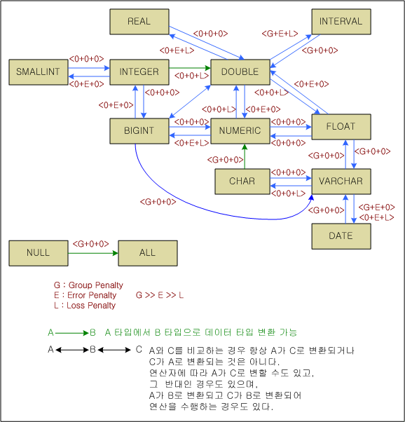

[Figure 3-2] Data Type Conversion Paths

To use index columns in search operations, it is very important that conditional clauses are written as above. Since the conditional clause type can affect performance, caution must be exercised when writing WHERE clauses and client applications. 

After choosing the access method for each table, the optimizer processes joins. The decision on the access method for each table is not final, and may be revised while processing joins. 

#### Determining the Join Order 

The join order and process method exert the greatest influence on the performance of complicated queries. Thus, determining whether the join order and join processing method are suitable and subsequently revising themgreatly helps to improve query performance. 

The optimizer takes the following steps to process joins:

1.  Groups joins according to join condition
2.  Determines the join relationship for each join
3.  Decides on the join order for each group
4.  Decides on the joining method for each group
5.  Decides on the order and method for joining groups to each other

The join order can be specified by using the following hints.

-   ORDERED Hint
-   As a parameter to access method-related hints
-   As a parameter to joining method-related hints

This section describes how the optimizer determines the join order. The join order is determined by a greedy algorithm that is based on join selectivity.

##### Classifying Join Groups

If all tables are taken into consideration when determining a join order (including those without joins ), it would only increase the workload and be of little help in making the decision. It is more efficient to group the tables that are joined together and then determine the join order within each group.

Consider the following query for example:

```
SELECT * FROM T1, T2, T3, T4, T5
WHERE T1.i1 = T2.a1 AND T2.a2 = T3.m1
AND T4.x1 = T5.z1;
```

Join Group Classification: (T1, T2, T3), (T4, T5)

After classifying the join groups so that there are no join relationships between them, the join order within each group is determined as follows.

##### Configuring Join Relationships

Join relationships within each join group are configured to determine a more efficient join order by minimizing the comparison cost between tables without direct relationships. 

Consider the following query for example.

```
SELECT * FROM T1, T2, T3, T4
WHERE T1.i1 = T2.a1 AND T2.a2 = T3.m2
AND T3.m3 = T4.x3;
```

The join relationships in the above query can be expressed as follows:


By evaluating only the cost of join relationships when determining the join order, the optimizer prevents tables without direct join relationships, (e.g., tables T1 and T4) from being chosen to be joined first. 

Considering join relationships usually helps the optimizer to determine an efficient join order, but it does not always warrant the most efficient join order. The user can use hints to control the join order when necessary. 

##### Deciding the Order of Join Relationships

The optimizer uses the join relationships generated above to determine the order of join relationships by efficiency. 

The way that the join order is determined is to choose the joins with the highest selectivity to be processed first. Then, these joins are again sorted by efficiency. However, this join relationship order is not the actual join order. The actual join order is finally set when the joining method is determined. 


[Figure 3-3] Join Ordering

As shown in the figure above, the join order that is set at this stage only represents the depth of the join relationships. The most important factor in determining the join order is join selectivity, which means the ratio of the size of the result set created by combining two tables to the size of the original tables. In other words, when determining the join order, it is not the actual result set size that is important but how much of the result set size is reduced.

The optimizer calculates join selectivity as below. A detailed description of this formula is beyond the scope of this document.

| Conceptual Join Selectivity Calculation           |
| ------------------------------------------------- |
| [T(R) * T(S) / MAX[V(R.a), V(S.a)]/ [T(R) + T(S)] |

The join order is determined by join selectivity so that the result set is reduced in size by higher ratios, which means that an appropriate join order is likely to be determined later when the joining method is determined. 

For example, assume that the number of records in the tables R, S, T, and U referred to in a query and the number of results in the result sets created by joining the tables are respectively as follows: 

```
T(R) = 10, T(S) = 10, T(R JOIN S) = 10
T(T) = 1000, T(U) = 1000, T(T JOIN U) = 100
```

In the above example, although the number of records in the result set obtained by joining tables R and S is smaller than the result set obtained by joining tables T and U, the latter join relationship is more important because it reduces the number of results in the result set by a greater proportion. 

The join order determined by the optimizer using the join relationships cannot be guaranteed to be the optimal join order in all cases. Thus, the join order can be controlled using join order hints. 

After the join order has been determined, the joining method for each pair of tables is determined and then the join order is finalized.

#### Determining the Joining Method

Once the join order has been determined, the optimizer determines the joining method for each join relationship of both tables. The join order, join direction, and joining method are determined by comparing the costs of different joining methods. 

The joining methods supported by Altibase are broadly classified into the following four categories: 

-   Nested Loop Joins
-   Sort-based Joins
-   Hash-based Joins
-   Merge Joins

The joining methods and available join types for each join category are shown below/

<table style="width: 619px;">
<tbody>
<tr>
<td style="width: 117px; text-align: center;" rowspan="2">
<p><strong>Join Category</strong></p>
</td>
<td style="width: 213px; text-align: center;" rowspan="2">
<p><strong>Join Method</strong></p>
</td>
<td style="width: 279px; text-align: center;" colspan="2">
<p><strong>Join Direction</strong></p>
</td>
</tr>
<tr>
<td style="width: 137px; text-align: center;">
<p><strong>Left=&gt;Right</strong></p>
</td>
<td style="width: 142px; text-align: center;">
<p><strong>Right=&gt;Left</strong></p>
</td>
</tr>
<tr>
<td style="width: 117px;" rowspan="5">
<p>Nested Loop</p>
</td>
<td style="width: 213px;">
<p>Full nested loop</p>
</td>
<td style="width: 137px;">
<p>C, I, S, A, L</p>
</td>
<td style="width: 142px;">
<p>C, I, R</p>
</td>
</tr>
<tr>
<td style="width: 213px;">
<p>Full store nested loop</p>
</td>
<td style="width: 137px;">
<p>C, I, S, A, L, F</p>
</td>
<td style="width: 142px;">
<p>C, I, R, F</p>
</td>
</tr>
<tr>
<td style="width: 213px;">
<p>Index nested loop</p>
</td>
<td style="width: 137px;">
<p>I, S, A, L</p>
</td>
<td style="width: 142px;">
<p>I, R</p>
</td>
</tr>
<tr>
<td style="width: 213px;">
<p>Anti outer nested loop</p>
</td>
<td style="width: 137px;">
<p>F</p>
</td>
<td style="width: 142px;">
<p>F</p>
</td>
</tr>
<tr>
<td style="width: 213px;">
<p>Inverse index nested loop</p>
</td>
<td style="width: 137px;">
<p>&nbsp;</p>
</td>
<td style="width: 142px;">
<p>S</p>
</td>
</tr>
<tr>
<td style="width: 117px;" rowspan="3">
<p>Sort-based</p>
</td>
<td style="width: 213px;">
<p>One pass sort join</p>
</td>
<td style="width: 137px;">
<p>I, S, A, L, F</p>
</td>
<td style="width: 142px;">
<p>I, R, F</p>
</td>
</tr>
<tr>
<td style="width: 213px;">
<p>Two pass sort join</p>
</td>
<td style="width: 137px;">
<p>I, S, A, L, F</p>
</td>
<td style="width: 142px;">
<p>I, R, F</p>
</td>
</tr>
<tr>
<td style="width: 213px;">
<p>Inverse sort join</p>
</td>
<td style="width: 137px;">
<p>&nbsp;</p>
</td>
<td style="width: 142px;">
<p>S, A</p>
</td>
</tr>
<tr>
<td style="width: 117px;" rowspan="3">
<p>Hash-based</p>
</td>
<td style="width: 213px;">
<p>One pass hash join</p>
</td>
<td style="width: 137px;">
<p>I, S, A, L, F</p>
</td>
<td style="width: 142px;">
<p>I, R, F</p>
</td>
</tr>
<tr>
<td style="width: 213px;">
<p>Two pass hash join</p>
</td>
<td style="width: 137px;">
<p>I, S, A, L, F</p>
</td>
<td style="width: 142px;">
<p>I, R, F</p>
</td>
</tr>
<tr>
<td style="width: 213px;">
<p>Inverse hash join</p>
</td>
<td style="width: 137px;">
<p>R</p>
</td>
<td style="width: 142px;">
<p>S, A, L</p>
</td>
</tr>
<tr>
<td style="width: 117px;" rowspan="2">
<p>Merge-based</p>
</td>
<td style="width: 213px;">
<p>Index merge join</p>
</td>
<td style="width: 137px;">
<p>I, S, A</p>
</td>
<td style="width: 142px;">
<p>I</p>
</td>
</tr>
<tr>
<td style="width: 213px;">
<p>Sort merge join</p>
</td>
<td style="width: 137px;">
<p>I, S, A</p>
</td>
<td style="width: 142px;">
<p>I</p>
</td>
</tr>
<tr>
<td style="width: 609px;" colspan="4">
<p>Possible Join Types</p>
<ul>
<li>&nbsp;C (Cartesian Product): The combination of two tables that are not joined</li>
<li>&nbsp;I (Inner Join): A typical join between two joined tables</li>
<li>&nbsp;S (Semi Join): A join between two tables that have a semi-join relationship between them</li>
<li>&nbsp;A (Anti Join): A join between two tables that have an anti-join relationship between them</li>
<li>&nbsp;L (Left outer join): A join between two tables that have a left outer join relationship between them</li>
<li>&nbsp;R (Right outer join): A join between two tables taht have a left outer join relationship between them</li>
<li>&nbsp;F (Full outer join): A join between two tables that have a full outer join relationship between them</li>
</ul>
<p>For more detailed information on each join, please refer to the description of the SELECT statement in the <em>SQL Reference</em>.</p>
</td>
</tr>
</tbody>
</table>

[Table 3-5] Possible Joins Available for Joining Methods

The optimizer chooses the most efficient joining method from the possible joining methods through cost evaluation and determines the join direction. Once the joining method has been determined, the outer table (driving table) is displayed on the left and the inner table (driven table) is displayed on the right. 

With the execution plan, the user can check which joining method has been selected and control the joining method using hints. 

This section describes the joining methods for each join category. 

##### Nested Loop Joins

The nested loop join category has the following joining methods:

-   Full nested loop join

-   Full store nested loop join

-   Index nested loop join

-   Anti outer nested loop join

-   Inverse index nested loop join

The full nested loop join joins every row of a table to every row of another table. This method is mainly used for joining two tables that have no relationship established between them, like the query below.

```
SELECT * FROM T1, T2;
```

The full store nested loop join stores the results of the inner table and then performs a full nested loop join. This method is likely to be used when the result set size can be greatly reduced by processing conditions other than join conditions and is generally used by the Cartesian product among join groups.

```
SELECT * FROM T1, T2 WHERE T1.i1 = 1 AND T2.i1 = 1;
```

When the index nested loop joining method is used, one or more indexes are used to process join conditions. This method is likely to be used if the number of records in the outer table is small and if an index has been defined for the inner table.

```
Index on T2(i1)

SELECT * FROM T1, T2 WHERE T1.i1 = T2.i1 AND T1.i1 = 1;
```

The anti outer nested loop join is only used to process full outer joins. This method can be used only if indexes have been defined for the columns corresponding to the join condition in both the outer table and the inner table. In such cases, this method is likely to be selected over other methods.

```
Index on T1(i1), Index on T2(i1)

SELELCT * FROM T1 FULL OUTER JOIN T2 ON T1.i1 = T2.i1;
```

The inverse index nested loop join is only used to process semi-joins and is likely to be used in cases where the outer table has an index and the inner table does not. Its use is more advantageous when the outer table has a relatively larger number of records than the inner table. If the inner table has an index, however, the index nested loop join is likely to be selected over other methods.

```
Index on T1(i1)

SELECT * FROM T1 WHERE T1.i1 IN ( SELECT i1 FROM T2 );
```

The execution cost of each join can be calculated thus: (access cost + disk I/O cost).

\* Related hint: USE_NL

##### Sort-based Joins

The sort-based join stores the inner table in a sorted order and performs a range scan using the join conditions. This method is likely to be used when an index does not exist and join conditions using inequality operators are contained in the query.

```
SELECT * FROM T1, T2 WHERE T1.i1 > T2.i1;
```

The following are sort-based joins:

-   One-pass sort-based join

-   Two-pass sort-based join

-   Inverse sort-based join

The one-pass sort-based joining method can be used when the amount of data in the inner table is small enough to be managed within the temporary table. This method can always be used when a memory table is used as the inner table. 

The two-pass sort-based joining method is used when the amount of data in the inner table is too large to be managed within the temporary table. This method is used to reduce the amount of disk I/O. 

With this method, both the outer table and the inner table are sorted and then saved in the temporary table. Because the records are evaluated against the join conditions in the order in which the data of the outer table is sorted, this method increases the likelihood that the same disk page will be accessed to retrieve the corresponding record for the inner table, thereby reducing disk I/O cost.

The inverse sort-based join is only used with semi-joins or anti-joins. The use of the inverse sort-based joining method can be advantageous when the outer table is relatively larger than the inner table. 

However, the Altibase optimizer usually selects the inverse hash-based join since it has the merit of eliminating the need for further sorting as it returns join results in a sorted order. A hint must be used as shown below to forcibly use the inverse sort-based join.

```
SELECT * FROM T1 WHERE T1.i1 IN ( SELECT /*+ SORT_SJ */ i1 FROM T2 );
```

The execution cost of each join can be calculated as: (access cost + disk I/O cost).

\* Related hints: USE_SORT, USE_ONE_PASS_SORT, USE_TWO_PASS_SORT

##### Hash-based Joins

The hash-based join stores the inner table in a hash structure and performs a range scan using the join condition. This method can only be used with join conditions that use equality operators, and is likely to be chosen in cases where there are no indexes.

```
SELECT * FROM T1, T2 WHERE T1.i1 = T2.i1;
```

The following are hash-based joining methods:

-   One-pass hash-based join

-   Two-pass hash-based join

-   Inverse hash-based join

The one-pass hash-based joining method can be used when the amount of data in the inner table is small enough to be managed within the temporary table. This method is used to reduce the amount of disk I/O. 

Two-pass hash-based join method is used when the amount of data in the inner table is large and cannot be managed within the range of temporary space. Both the outer table and the repeating table are partitioned using the same hash function and stored in multiple tables in temporary space. Then, each temporary table is checked for join conditions to increase the probability of accessing the same disk page of the inner table.

The inverse hash-based join is only used with semi-joins, anti-joins or left outer joins and is likely to be used if the inner table is relatively larger than the outer table.

The execution cost of each join can be calculated as: (access cost + disk I/O cost).

\* Related hints: USE_HASH, USE_ONE_PASS_HASH, USE_TWO_PASS_HASH

##### Merge Joins

The merge joining method can be very efficient when the data in both tables are sorted in order. With this method, there is no concept of an inner or outer table; both tables are read in a sequential order and records that satisfy the join condition are searched for. Both of the tables must be sorted in order by the join key and is likely to be used if each table is ordered by the column.

```
Index on T1(i1), Index on T2(a1)

SELECT * FROM T1, T2 WHERE T1.i1 = T2.a1;
```

The execution cost of merge joins can be calculated as: (access cost + disk I/O cost).

\* Related hint: USE_MERGE

### Creating Physical Execution Plans

Lastly, the optimizer creates a physical execution plan tree. A physical execution plan tree is composed of execution nodes which is the unit with which the executor executes queries. The executor processes the query by following the execution nodes of the execution plan tree. 

Execution nodes are classified as below according to their number of child nodes and whether or not they store intermediate results: 

-   Unary Non-materialization Node:  
    Has one or zero child nodes, does not store intermediate results and manages only one record.
    
-   Unary Materialization Node:  
    Has one or zero child noes, and stores intermediate results
    
-   Binary Non-materialization Node:  
    Has two child nodes and does not store intermediate results.
    
-   Binary Materialization Node:  
    Has two child nodes and stores intermediate results.
    
-   Multiple Non-materialization Node:  
    Has two or more child nodes and does not store intermediate results.

According to this classification, the following types of physical operators exist in Altibase. For further information about each execution node, please refer to The Explain Plan. 

<table style="width: 672px;">
<tbody>
<tr>
<td style="width: 70px; text-align: center;">
<p><strong>Classification</strong></p>
</td>
<td style="width: 192px; text-align: center;">
<p><strong>Node Name</strong></p>
</td>
<td style="width: 398px; text-align: center;">
<p><strong>Function</strong></p>
</td>
</tr>
<tr>
<td style="width: 70px;" rowspan="9">
<p>Unary<br />Non-Materialization<br /> Node</p>
</td>
<td style="width: 192px;">
<p>SCAN</p>
</td>
<td style="width: 398px;">
<p>Retrieving data from tables using various access path
methods</p>
</td>
</tr>
<tr>
<td style="width: 192px;">
<p>FILTER</p>
</td>
<td style="width: 398px;">
<p>Filtering out data that can’t be filtered out by the access path
method</p>
</td>
</tr>
<tr>
<td style="width: 192px;">
<p>PROJECT</p>
</td>
<td style="width: 398px;">
<p>Processing projection</p>
</td>
</tr>
<tr>
<td style="width: 192px;">
<p>GROUPING</p>
</td>
<td style="width: 398px;">
<p>Processing grouping</p>
</td>
</tr>
<tr>
<td style="width: 192px;">
<p>AGGREGATION</p>
</td>
<td style="width: 398px;">
<p>Performing aggregate operations</p>
</td>
</tr>
<tr>
<td style="width: 192px;">
<p>VIEW</p>
</td>
<td style="width: 398px;">
<p>Organizing records into views</p>
</td>
</tr>
<tr>
<td style="width: 192px;">
<p>VIEW-SCAN</p>
</td>
<td style="width: 398px;">
<p>Retrieving data from view</p>
</td>
</tr>
<tr>
<td style="width: 192px;">
<p>COUNT</p>
</td>
<td style="width: 398px;">
<p>Processing specifically for COUNT(*)</p>
</td>
</tr>
<tr>
<td style="width: 192px;">
<p>PARALLEL-QUEUE</p>
</td>
<td style="width: 398px;">
<p>Processing parallel queries</p>
</td>
</tr>
<tr>
<td style="width: 70px;" rowspan="8">
<p>Unary<br /> Materialization<br /> Node</p>
</td>
<td style="width: 192px;">
<p>SORT</p>
</td>
<td style="width: 398px;">
<p>Sorting records</p>
</td>
</tr>
<tr>
<td style="width: 192px;">
<p>HASH</p>
</td>
<td style="width: 398px;">
<p>Hashing records</p>
</td>
</tr>
<tr>
<td style="width: 192px;">
<p>GROUP-AGGREGATION</p>
</td>
<td style="width: 398px;">
<p>Grouping using hashing and performing aggregate functions</p>
</td>
</tr>
<tr>
<td style="width: 192px;">
<p>DISTINCT</p>
</td>
<td style="width: 398px;">
<p>Discarding redundant records using hashing</p>
</td>
</tr>
<tr>
<td style="width: 192px;">
<p>MATERIALIZATION</p>
</td>
<td style="width: 398px;">
<p>Managing views that are stored in temporary tables</p>
</td>
</tr>
<tr>
<td style="width: 192px;">
<p>STORE</p>
</td>
<td style="width: 398px;">
<p>Storing records</p>
</td>
</tr>
<tr>
<td style="width: 192px;">
<p>LIMIT-SORT</p>
</td>
<td style="width: 398px;">
<p>Sorting for limit clauses</p>
</td>
</tr>
<tr>
<td style="width: 192px;">
<p>CONNECT BY</p>
</td>
<td style="width: 398px;">
<p>Processing hierarchical queries</p>
</td>
</tr>
<tr>
<td style="width: 70px;" rowspan="7">
<p>Binary<br /> Non-Materialization<br /> Node</p>
</td>
<td style="width: 192px;">
<p>JOIN</p>
</td>
<td style="width: 398px;">
<p>Processing joins</p>
</td>
</tr>
<tr>
<td style="width: 192px;">
<p>MERGE-JOIN</p>
</td>
<td style="width: 398px;">
<p>Processing merge joins</p>
</td>
</tr>
<tr>
<td style="width: 192px;">
<p>LEFT-OUTER-JOIN</p>
</td>
<td style="width: 398px;">
<p>Processing LEFT OUTER joins</p>
</td>
</tr>
<tr>
<td style="width: 192px;">
<p>FULL-OUTER-JOIN</p>
</td>
<td style="width: 398px;">
<p>Processing FULL OUTER joins</p>
</td>
</tr>
<tr>
<td style="width: 192px;">
<p>ANTI-OUTER-JOIN</p>
</td>
<td style="width: 398px;">
<p>Processing ANTI OUTER joins</p>
</td>
</tr>
<tr>
<td style="width: 192px;">
<p>CONCATENATION</p>
</td>
<td style="width: 398px;">
<p>Combining results returned by child nodes</p>
</td>
</tr>
<tr>
<td style="width: 192px;">
<p>BAG-UNION</p>
</td>
<td style="width: 398px;">
<p>Processing BAG UNIONs</p>
</td>
</tr>
<tr>
<td style="width: 70px;" rowspan="2">
<p>Binary<br /> Materialization<br />Node</p>
</td>
<td style="width: 192px;">
<p>SET-INTERSECT</p>
</td>
<td style="width: 398px;">
<p>Performing SET INTERSECT operations</p>
</td>
</tr>
<tr>
<td style="width: 192px;">
<p>SET-DIFFERENCE</p>
</td>
<td style="width: 398px;">
<p>Performing SET DIFFERENCE operations</p>
</td>
</tr>
<tr>
<td style="width: 70px;" rowspan="2">
<p>Multiple<br /> Non-Materialization<br /> Node</p>
</td>
<td style="width: 192px;">
<p>PARTITION-COORDINATIOR</p>
</td>
<td style="width: 398px;">
<p>Managing scans of partitions of partitioned tables</p>
</td>
</tr>
<tr>
<td style="width: 192px;">
<p>PARALLEL-SCAN-COORDINATOR</p>
</td>
<td style="width: 398px;">
<p>Executing the child PARALLEL-QUEUE nodes in parallel
and combining the results</p>
</td>
</tr>
</tbody>
</table>

[Table 3-6] Types of Execution Nodes

#### Features of Materialization Nodes

A materialization node is a node that stores intermediate results in order to perform its operations. Intermediate results are stored in temporary tables and these can be classified as either memory temporary tables or disk temporary tables, depending on the storage medium type. 

Memory temporary tables are stored in memory space directly allocated from the system kernel and are released immediately after the query has finished executing. Disk temporary tables are stored in user-defined temporary tablespaces and the data therein is managed with a memory buffer. This memory buffer is also released after the query has finished executing. 

Whether to use a memory temporary table or a disk temporary table is determined as follows: a memory temporary table is used if all of the nodes below a materialization node use only memory tables. If one or more disk tables are used, a disk temporary table is used. This decision can be overruled by using a hint

Temporary storage spaces are classified as shown in the table[^1] below, according to creation nodes and storage spaces.

[^1]: Disk hash, disk storage, and memory sorted storage tables are not supported.
<table style="width: 602px;">
<tbody>
<tr>
<td style="width: 124px;">
<p>&nbsp;&nbsp;&nbsp;&nbsp;&nbsp;&nbsp;&nbsp;&nbsp; Node(Right)<br /> \
<br />Storage Medium(Bottom)</p>
</td>
<td style="width: 189px;">
<p>HASH</p>
</td>
<td style="width: 271px;">
<p>SORT</p>
</td>
</tr>
<tr>
<td style="width: 124px;">
<p>Disk</p>
</td>
<td style="width: 189px;">
<p>Disk hash table</p>
</td>
<td style="width: 271px;">
<p>Disk sorted table</p>
</td>
</tr>
<tr>
<td style="width: 124px;">
<p>Memory</p>
</td>
<td style="width: 189px;">
<p>Memory hash table</p>
</td>
<td style="width: 271px;">
<p>Memory sorted table</p>
</td>
</tr>
</tbody>
</table>

Memory hash tables1 can store and scan records in the bucket or partitioning method; the bucket method stores records into buckets in list format and scans records by buckets, whereas the partitioning method stores records as a list and scans records by partitions. For more detailed information, please refer to the performance-related properties in the *General Reference.* 

In the following examples, it can be seen in the execution plans that sorting is handled differently depending on whether a memory or disk temporary table is used in the query

The execution plan for the query below contains two nodes that store intermediate results to eliminate duplicates and sort records in order. If memory temporary tables are used, information about disk pages is not provided. 


Two materialization nodes that store intermediate results in disk tables to eliminate duplicates and sort records are shown in the following example. If a temporary disk table is used, information about disk pages is provided. That is, whether the temporary tables are stored in memory or on disk can be checked by observing whether DISK_PAGE_COUNT is provided in information of the execution node.


### Optimizer-related Properties

The following are Altibase properties that affect the optimizer’s actions. For more detailed information about each property, please refer to Performance-related properties in Chapter 2 of the *General Reference.*

-   OPTIMIZER_FEATURE_ENABLE

-   OPTIMIZER_MODE

-   OPTIMIZER_UNNEST_AGGREGATE_SUBQUERY

-   OPTIMIZER_UNNEST_COMPLEX_SUBQUERY

-   OPTIMIZER_UNNEST_SUBQUERY

# 4. The Explain Plan

---------------------

This chapter describes the explain plan which displays the access path taken by the Altibase server to execute an optimized query.

### EXPLAIN PLAN Overview

The ALTER SESSION SET EXPLAIN PLAN statement makes it possible to examine the access path taken by the Altibase server to process an optimized query. If EXPLAIN PLAN is set to ON or ONLY and a SQL statement is executed, the execution plan (plan tree) determined by the optimizer for the execution of the statement is returned. The user can use this data to enhance query performance by tuning the query for the optimizer to select a more effective execution plan.

#### Understanding the Plan Tree

Various optimization methods (table joining methods, join orders, access paths, etc.) can be used to obtain the same result set when executing a SQL statement that retrieves data from multiple tables. Altibase determines the appropriate method on the basis of the following factors.

-   The indexes available for use

-   The order of tables and rows within the SQL statement

-   The optimization method

It is possible to view the plan tree for a SQL statement by setting the EXPLAIN PLAN property appropriately. Users can check the plan tree to clearly understand how Altibase is executing a SQL statement.

### Displaying the Plan Tree

A plan tree can only be viewed in an iSQL session, and only provides information for SELECT statements. To view a plan tree, the following command must be executed in iSQL, before the SELECT statement is executed.

```
ALTER SESSION SET EXPLAIN PLAN = option;
```

The option can be set to ON, OFF or ONLY; the default setting is OFF.

-   ON  
    Plan tree information along with result record after executing SELECT statement is displayed. The plan tree displays the number of record accesses, the amount of memory occupied by the tuple, and the cost.
    
-   ONLY  
    After preparing the SELECT statement, information of the explain plan for the SQL statement is displayed without actually executing the statement. This option is used when the user wants to check only the plan tree for a SELECT statement to which one or more host variables are bound or a query that takes a long time to execute. Since EXPLAIN PLAN = ONLY generates a plan tree without executing the query, items whose values are determined after the actual execution of the statement (e.g., ACCESS) are displayed as question marks(“??”). 
    
-   OFF  
    After the SELECT statement is executed, the resultant records are displayed, but no information on the plan tree is provided.

Use the following command to obtain further information (e.g., how the conditions in a WHERE clause written by a user are processed and etc.).

```
ALTER SYSTEM SET TRCLOG_DETAIL_PREDICATE = 1;
```

The above command sets the TRCLOG_DETAIL_PREDICATE property to 1 and displays detailed information of how the conditions in the WHERE clause are processed (whether fixed key range processing, variable key range processing, filter processing, etc. is used.). This allows the user to check which predicates are executed using an index scan for queries that have complicated WHERE clauses. Note, however, that this information might not be output if the query has been changed for optimization.

Consider for example the output of the query statement shown below.

```
iSQL> alter system set trclog_detail_predicate = 1;
Alter success.
iSQL> alter session set explain plan = on;
Alter success.
iSQL> select * from t1 where i1 = 1;
T1.I1       
--------------
1           
1 row selected.
```

[If TRCLOG_DETAIL_PREDICATE = 1 and EXPLAIN PLAN = ON]

```
PROJECT ( COLUMN_COUNT: 1, TUPLE_SIZE: 4, COST: 0.00 )
 SCAN ( TABLE: T1, INDEX: IDX1, RANGE SCAN, ACCESS: 1, COST: 0.00 )
  [ FIXED KEY ]
  AND
   OR
    I1 = 1
```

[If TRCLOG_DETAIL_PREDICATE = 0 and EXPLAIN PLAN = ON]

```
 PROJECT ( COLUMN_COUNT: 1, TUPLE_SIZE: 4, COST: 0.00 )
 SCAN ( TABLE: T1, INDEX: IDX1, RANGE SCAN, ACCESS: 1, COST: 0.00 )
```

[If TRCLOG_DETAIL_PREDICATE = 0 and EXPLAIN PLAN = ONLY]

```
 PROJECT ( COLUMN_COUNT: 1, TUPLE_SIZE: 4, COST: 0.00 )
 SCAN ( TABLE: T1, INDEX: IDX1, RANGE SCAN, ACCESS: ??, COST: 0.00 )
```


##### Example

 <Example 1> Set the plan tree to be output.

```
iSQL> ALTER SESSION SET EXPLAIN PLAN = ON;
iSQL> SELECT e_firstname, e_lastname 
 FROM employees 
 WHERE emp_job = 'programmer';
E_FIRSTNAME           E_LASTNAME
-----------------------------------------------
Ryu                   Momoi
Elizabeth             Bae
2 rows selected.
------------------------------------------------------------
PROJECT ( COLUMN_COUNT: 2, TUPLE_SIZE: 44, COST: 0.15 )
 SCAN ( TABLE: EMPLOYEES, FULL SCAN, ACCESS: 20, COST: 0.14 )
------------------------------------------------------------
```

<Example 2>  Set the plan tree not to be output.

```
iSQL> ALTER SESSION SET EXPLAIN PLAN = OFF;
Alter success.
iSQL> SELECT e_firstname, e_lastname 
 FROM employees 
 WHERE emp_job = 'programmer';
E_FIRSTNAME           E_LASTNAME
-----------------------------------------------
Ryu                   Momoi
Elizabeth             Bae
2 rows selected.
```

<Example 3> Set the plan tree to be output without executing the query statement.

```
iSQL> ALTER SESSION SET EXPLAIN PLAN = ONLY;
Alter success.
iSQL> SELECT e_firstname, e_lastname 
 FROM employees 
 WHERE emp_job = 'programmer';
E_FIRSTNAME           E_LASTNAME
-----------------------------------------------
No rows selected.
------------------------------------------------------------
PROJECT ( COLUMN_COUNT: 2, TUPLE_SIZE: 44, COST: 0.15 )
 SCAN ( TABLE: EMPLOYEES, FULL SCAN, ACCESS: ??, COST: 0.14 )
------------------------------------------------------------
```


### Reading Plan Trees

A plan tree is made up of multiple plan nodes with relationships defined therebetween. To depict this relationship, a child node is indented one space further than a parent node in the EXPLAIN PLAN result. In addition, the subquery is output between ::SUB-QUERY BEGIN and ::SUB-QUERY END. 

```
iSQL> SELECT c.c_lastname
    FROM customers c
    WHERE c.cno IN
      (SELECT /*+ no_unnest */ o.cno
      FROM orders o
      WHERE o.ono = 12310001);
C_LASTNAME
------------------------
Fedorov 
1 row selected.

    -----------------------------------------------
4   PROJECT ( COLUMN_COUNT: 1, TUPLE_SIZE: 22, COST: 0.20 )
3    SCAN ( TABLE: CUSTOMERS C, FULL SCAN, ACCESS: 20,
              COST: 0.19 )
      ::SUB-QUERY BEGIN
2     PROJECT ( COLUMN_COUNT: 1, TUPLE_SIZE: 3, COST: 0.04 )
1       SCAN ( TABLE: ORDERS O, INDEX: ODR_IDX2, 
                 RANGE SCAN, ACCESS: 29, COST: 0.04 )
      ::SUB-QUERY END
    -----------------------------------------------
```


1.  The order number (ono) in the orders table is scanned using an index. The number of times that records in the orders table were accessed by an index is 20. To scan the orders table on the basis of a column for which an index was not defined, the entire orders table (“full scan”) would need to be scanned in order to find records matching the condition. That is, the user can choose whether to perform a full scan or an index scan by comparing cost information of the plan nodes.
  
2.  The cno column is selected from the orders table to create a new relation1, which has one column.
  
3.  The entire customer table is scanned to retrieve rows that satisfy the c.cno=o.cno condition. The access count is equal to the number of records (20) in the customer table.
  
4.  The cname column is selected from the customers table to create a new relation2.

5.  relation2 is output.

#### Interpreting Plan Trees

This section provides an example and briefly explains how to interpret a plan tree. The explain plan is determined by following the entire plan tree wherein plan nodes are connected in tree form.


Each individual node in the execution plan tree is displayed as one row. The further the node is indented from the left (the further it is located towards the right), the lower the node is and it is executed faster than other nodes.

In the above example, the PROJECT node is the root node and the SCANS of tables T1 and T2 are the lowest nodes. For nodes that are indented as much (e.g., the T1 and T2 scan nodes), the node that appears first is handled as the left node of the higher node.

The request to fetch records is handled in a top-down manner and records are returned in a bottom-up manner. 

In the above example, the node that accesses the database first is the SCAN node of the T1 table, followed by the T2 SCAN and T3 SCAN. The numbers next to each node indicate the node execution order.

The following figure shows the execution plan described above in tree diagram form.


[Figure 4-1] Sequence in which Records are Requested and Fetched

### Using Plan Trees

If the EXPLAIN PLAN property is appropriately set, the plan tree can be viewed without directly executing the SQL statement. Thus, the performance of a SQL statement can be enhanced by viewing the plan tree and comparing it with other plan trees.

The following information can be obtained from plan trees.

-   The execution plan created by the optimizer
-   Object properties (e.g. tables and indexes)
-   Any indexes that are used
-   The joining methods that are used
-   The optimized join order

The performance of an optimized SQL statement can be verified as below.

-   Execute a new SQL statement and compare the results with the execution results of the prevoius SQL statement. 
-   Create a new plan tree and compare it with the previous plan tree. 
-   Double-check the accuracy of object properties (e.g. tables and indexes). 

### Plan Nodes

This section explores the functionality of the plan nodes comprising the plan tree, their output format by EXPLAIN PLAN, and query examples.

#### AGGREGATION

##### Format

```
AGGREGATION ( ITEM_SIZE: item_size, GROUP_COUNT: group_count, COST: cost )
```


| Item        | Description                                   |
| ----------- | --------------------------------------------- |
| ITEM_SIZE   | The record size for one group                 |
| GROUP_COUNT | The number of groups created by the plan node |
| COST        | The estimated cost                            |

[Table 4-1] Information of the AGGREGATION Node

##### Description

The AGGREGATION node is a physical entity that performs aggregate operations according to the relational model. This node has one child node and does not use additional space to store intermediate results. This node performs aggregate operations on records in the same group.

This node is used to execute the following queries.

-   Aggregate operations using the sort order

-   Aggregate operations on clauses that contain the DISTINCT keyword

###### Aggregate Operations Using the Sort Order

When the AGGREGATION node is used to perform an aggregate operation with the sort order, execution plan information as shown below is output. It can be seen that the AGGREGATION node uses data classified by the GROUPING node to perform the SUM(i2) operation. These records are grouped using the SUM(i2) and GROUP BY i3 expressions. There are five groups containing one or more 16-byte records.


###### Aggregate Operations on Clauses Containing the DISTINCT Keyword

The AGGREGATION node requires additional space to remove duplicates if a DISTINCT clause is contained in an aggregate function. The example below shows the use of an AGGREGATION node to process the SUM(DISTINCT i2) clause.


##### Example

Output the total number of departments and the average salary of all employees.

```
iSQL> SELECT COUNT(DISTINCT dno), AVG(salary) FROM employees;
COUNT(DISTINCT DNO)  AVG(SALARY) 
------------------------------------
8                    1836.64706  
1 row selected.
-----------------------------------------------
PROJECT ( COLUMN_COUNT: 2, TUPLE_SIZE: 31, COST: 0.03 )
 AGGREGATION ( ITEM_SIZE: 72, GROUP_COUNT: 1, COST: 0.02 )
  SCAN ( TABLE: EMPLOYEES, FULL SCAN, ACCESS: 20, COST: 0.01 )
-----------------------------------------------
```


#### ANTI-OUTER-JOIN

##### Format

```
ANTI-OUTER-JOIN ( METHOD: method, COST: cost )
```


| Item   | Description        |
| ------ | ------------------ |
| METHOD | The joining method |
| COST   | The estimated cost |

[Table 4-2] Information of the ANTI-OUTER-JOIN Node

##### Description

The ANTI-OUTER-JOIN node is the physical entity that performs ANTI OUTER JOIN operations according to the relational model. This node has two child nodes, does not generate intermediate results, and controls the execution flow of child nodes.

The ANTI-OUTER-JOIN node is used to process only FULL OUTER JOINs. As shown below, this node is used when indexes have been defined for all of the columns referenced in an ON join condition.


As shown above, when processing a FULL OUTER JOIN, an ANTI-OUTER-JOIN node and a LOJN execution node always have the CONC execution node as their parent node. The join condition in the ON clause is processed by both the LEFT-OUTER-JOIN and ANTI-OUTERJOIN nodes.

##### Example

Output the department number, department name, goods number of the department and goods that are in the same location.

```
iSQL> CREATE INDEX dep_idx2 ON departments(dep_location);
Create success.
iSQL> CREATE INDEX gds_idx1 ON goods(goods_location);
Create success.
iSQL> SELECT d.dno, d.dname, g.gno
 FROM departments d FULL OUTER JOIN goods g
 ON d.dep_location = g.goods_location;
DNO         DNAME                           GNO
-----------------------------------------------------------
.
.
.
38 rows selected.
-----------------------------------------------------------
PROJECT ( COLUMN_COUNT: 3, TUPLE_SIZE: 46, COST: 0.29 )
 CONCATENATION
  LEFT-OUTER-JOIN ( METHOD: INDEX_NL, COST: 0.01 )
   SCAN ( TABLE: DEPARTMENTS D, FULL SCAN, ACCESS: 38, COST: 0.00 )
   SCAN ( TABLE: GOODS G, INDEX: GDS_IDX1, RANGE SCAN, ACCESS: 38, COST: 0.02 )
  ANTI-OUTER-JOIN( METHOD: ANTI, COST: 0.01 )
   SCAN ( TABLE: GOODS G, FULL SCAN, ACCESS: 38, COST: 0.02 )
   SCAN ( TABLE: DEPARTMENTS D, INDEX: DEP_IDX2, RANGE SCAN, ACCESS: 38, COST: 0.00 )
-----------------------------------------------------------
iSQL> DROP INDEX dep_idx2;
Drop success.
iSQL> DROP INDEX gds_idx1;
Drop success.
```


#### BAG-UNION

##### Format

```
BAG-UNION
```


##### Description

The BAG-UNION node is the physical entity that performs UNION ALL operations according to the relational model. This node has two or more child nodes, does not generate intermediate results, and controls the execution flow of child nodes.

This node is executed as shown in the following example.


In the above example, the BAG-UNION node processes the UNION ALL clause by combining the results of both queries.

##### Example

Output the employee name and salary of all employees whose job is a salesperson and whose salary is higher than 2000000.

```
iSQL> SELECT e_firstname, e_lastname, emp_job, salary 
 FROM employees 
 WHERE emp_job = 'SALES REP' 
 UNION ALL 
 SELECT e_firstname, e_lastname, emp_job, salary 
 FROM employees 
 WHERE salary > 2000;
E_FIRSTNAME           E_LASTNAME            EMP_JOB          SALARY
------------------------------------------------------------------------------
Farhad                Ghorbani              PL               2500
Elizabeth             Bae                   programmer       4000
Zhen                  Liu                   webmaster        2750
Yuu                   Miura                 PM               2003
Wei-Wei               Chen                  manager          2300
5 rows selected.
------------------------------------------------------------
PROJECT ( COLUMN_COUNT: 4, TUPLE_SIZE: 70, COST: 0.58 )
 VIEW ( ACCESS: 5, COST: 0.43 )
  BAG-UNION
   PROJECT ( COLUMN_COUNT: 4, TUPLE_SIZE: 70, COST: 0.18 )
    SCAN ( TABLE: EMPLOYEES, FULL SCAN, ACCESS: 20, COST: 0.14 )
   PROJECT ( COLUMN_COUNT: 4, TUPLE_SIZE: 70, COST: 0.26 )
    SCAN ( TABLE: EMPLOYEES, FULL SCAN, ACCESS: 20, COST: 0.14 )
------------------------------------------------------------
```


#### CONCATENATION

##### Format

```
CONCATENATION
```


##### Description

The CONCATENATION plan node performs concatenation operations according to the relational model. This has two child nodes, does not generate intermediate results and controls the execution flow of child nodes. 

This node is used to process FULL OUTER JOINs and DNFs. A description of how it is used with FULL OUTER JOINs is provided in the example for the ANTI-OUTER-JOIN node. The following example describes how the CONCATENATION node is used to execute by DNF.


In the above example, the (i1 = 1000) condition is executed by the left SCAN plan node and the (i2 = 100) condition is executed by the right SCAN plan node. By doing so, both the IDX1 and IDX2 indexes can be used and the CONCATENATION plan node is used to concatenate the above results. The FILTER node is used to remove values that overlap with the right SCAN.

##### Example

Please refer to the example for the ANTI-OUTER-JOIN node.

#### CONNECT BY

##### Format

```
CONNECT BY ( ACCESS: acc_num, COST: cost )
```

| Item   | Description                                   |
| ------ | --------------------------------------------- |
| ACCESS | The number of times the records were accessed |
| COST   | The estimated cost                            |

[Table 4-3] Information of the CONNECT BY Node


```
CONNECT BY (INDEX: index_name, ACCESS: acc_num, COST: cost )
```

| Item   | Description                                   |
| ------ | --------------------------------------------- |
| INDEX  | The name of the index being used              |
| ACCESS | The number of times the records were accessed |
| COST   | The estimated cost                            |

[Table 4-4] Information of the CONNECT BY Node

##### Description

The CONNECT BY node performs a unique operation that does not exist in the relational model; it executes hierarchical queries. This node has one child node and the child node is always a materialization node. 

In the following example, the CONNECT BY node is used to execute a hierarchical query.


##### Example

The following hierarchical query specifies rows with the ID column value 0 as root rows for the hierarchy and retrieves hierarchical data.

```
CREATE TABLE hier_order(id INTEGER, parent INTEGER);
INSERT INTO hier_order VALUES(0, NULL);
INSERT INTO hier_order VALUES(1, 0);
INSERT INTO hier_order VALUES(2, 1);
INSERT INTO hier_order VALUES(3, 1);
INSERT INTO hier_order VALUES(4, 1);
INSERT INTO hier_order VALUES(5, 0);
INSERT INTO hier_order VALUES(6, 0);
INSERT INTO hier_order VALUES(7, 6);
INSERT INTO hier_order VALUES(8, 7);
INSERT INTO hier_order VALUES(9, 7);
INSERT INTO hier_order VALUES(10, 6);

iSQL> SELECT id, parent, level FROM hier_order START WITH id = 0 CONNECT BY PRIOR id = parent ORDER BY level;
ID          PARENT      LEVEL
-------------------------------------------------
0                       1
1           0           2
5           0           2
6           0           2
2           1           3
3           1           3
4           1           3
7           6           3
10          6           3
8           7           4
9           7           4
11 rows selected.
------------------------------------------------------------
PROJECT ( COLUMN_COUNT: 3, TUPLE_SIZE: 16, COST: BLOCKED )
SORT ( ITEM_SIZE: BLOCKED, ITEM_COUNT: 11, ACCESS: 11, COST: BLOCKED )
CONNECT BY ( ACCESS: 23, COST: BLOCKED )
SCAN ( TABLE: SYS.HIER_ORDER, FULL SCAN, ACCESS: 22, COST: BLOCKED )
------------------------------------------------------------

```


#### COUNT

##### Format

1) When an index is used:

```
COUNT (TABLE: tbl_name, INDEX: index_name, ACCESS: acc_num, DISK_PAGE_COUNT: num, COST: cost )
```

2) When an index is not used:

```
COUNT (TABLE: tbl_name, FULL SCAN, ACCESS: acc_num, DISK_PAGE_COUNT: num, COST: cost )
```

| Item            | Description                                                  |
| --------------- | ------------------------------------------------------------ |
| TABLE           | The name of the table that was accessed                      |
| INDEX           | The name of the index being used                             |
| ACCESS          | The number of times the records were accessed                |
| DISK_PAGE_COUNT | The number of disk pages in the table. This information is unavailable for memory tables. |
| COST            | The estimated cost                                           |

[Table 4-5] Information of the COUNT Node

##### Description

The COUNT node executes COUNT(*) operations that do not have a GROUP BY clause in the relational model.

The following is an example of the COUNT node. It shows that the index is used to obtain the COUNT(*) value without the actual data being accessed.


##### Example

Output the total number of employees.

```
iSQL> SELECT COUNT(*) rec_count FROM employees;
REC_COUNT            
-----------------------
20                   
1 row selected.
-----------------------------------------------
PROJECT ( COLUMN_COUNT: 1, TUPLE_SIZE: 8, COST: 0.02 )
 COUNT ( TABLE: EMPLOYEES, FULL SCAN, ACCESS: 1, COST: 0.02 )
-----------------------------------------------
```


#### DISTINCT

##### Format

1) When intermediate results are cached in memory

```
DISTINCT ( ITEM_SIZE: item_size, ITEM_COUNT: item_count, BUCKET_COUNT: bucket_count, ACCESS: acc_num, COST: cost )
```

2) When intermediate results are stored on disk

```
DISTINCT ( ITEM_SIZE: item_size, ITEM_COUNT: item_count, DISK_PAGE_COUNT: page_count, ACCESS: acc_num, COST: cost )
```


| Item            | Description                                          |
| --------------- | ---------------------------------------------------- |
| ITEM_SIZE       | The size of duplicate records that were removed      |
| ITEM_COUNT      | The number of duplicate records that were removed    |
| BUCKET_COUNT    | The number of hash buckets                           |
| DISK_PAGE_COUNT | The number of disk pages in a temporary stored table |
| ACCESS          | The number of times the stored records were accessed |
| COST            | The estimated cost                                   |

[Table 4-6] Information of the DISTINCT Node

##### Description

The DISTINCT node removes duplicates in the hashing method in the relational model. It has one child node and uses a temporary table to store intermediate results. 

The DISTINCT plan node is used for many different purposes. The plan trees of this node being used for various purposes are shown below.

###### Used for DISTINCT

The DISTINCT node can be used to perform DISTINCT operations.

The following example shows the DISTINCT node used to perform a DISTINCT operation.


###### Used for UNION

The DISTINCT node can be used to perform UNION operations. 

In the following example, the DISTINCT node is used to remove duplicates to perform a UNION operation.


###### Used for Subquery Key Range

The DISTINCT node can be used to perform subquery key range operations. This node is used to remove duplicates to prevent an overlapping value being searched for with an index. 

The following example shows the DISTINCT plan node used to remove duplicates to perform a subquery key range operation. The DISTINCT plan node is used to remove the duplicate values of T2.i4.

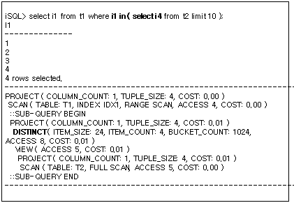

##### Example

Output the name of the customer who ordered C111100001. 

```
iSQL> SELECT DISTINCT customers.c_firstname||customers.c_lastname  cname
  FROM customers
  WHERE customers.cno IN
    (SELECT orders.cno
     FROM orders
     WHERE orders.gno = 'C111100001 ');
CNAME
--------------------------------------------
Estevan             Sanchez
Pierre              Martin
Phil                Dureault
Fyodor              Fedorov
4 rows selected.
------------------------------------------------------------
PROJECT ( COLUMN_COUNT: 1, TUPLE_SIZE: 42, COST: 0.10 )
 DISTINCT ( ITEM_SIZE: 64, ITEM_COUNT: 4, BUCKET_COUNT: 1024, ACCESS: 4, COST: 0.07 )
  SEMI-MERGE-JOIN ( METHOD: MERGE, COST: 0.03 )
   SCAN ( TABLE: CUSTOMERS, INDEX: __SYS_IDX_ID_153, RANGE SCAN, ACCESS: 17, COST: 0.01 )
   SORT ( ITEM_SIZE: 16, ITEM_COUNT: 4, ACCESS: 4, COST: 0.03 )
    SCAN ( TABLE: ORDERS $$1_$VIEW1_$ORDERS, INDEX: ODR_IDX3, RANGE SCAN, ACCESS: 4, COST: 0.00 )
------------------------------------------------------------
```


#### FILTER

##### Format

```
FILTER
```


##### Description

The FILTER node is a physical object that performs a SELECT operation in the relational model. It has one child node and searches for a given condition without directly accessing the table. 

The FILTER node only provides the node name. Set the TRCLOG_DETAIL_PREDICATE property to 1 to output information of the conditions processed by the filter.

###### Outputting Information of the FILTER Node

In the following example, the FILTER node outputs only the node name. The FILTER node is used to process the (having i2 < 2) condition in the example below. 


The user can view this information by setting the TRCLOG_DETAIL_PREDICATE property to 1. The FILTER node has been used to process the (i2 < 2) condition as shown below.

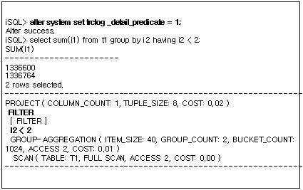

##### Example

Output the goods number and order quantity for the goods that received two or more orders.

```
iSQL> SELECT gno, COUNT(*)
  FROM orders
  GROUP BY gno
  HAVING COUNT(*) > 2;
GNO         COUNT                
------------------------------------
A111100002  3                    
C111100001  4                    
D111100008  3                    
E111100012  3                    
4 rows selected.
-----------------------------------------------
PROJECT ( COLUMN_COUNT: 2, TUPLE_SIZE: 24, COST: 0.08 )
 FILTER
  AGGREGATION ( ITEM_SIZE: 16, GROUP_COUNT: 16, COST: 0.02 )
   GROUPING
    SCAN ( TABLE: ORDERS, INDEX: ODR_IDX3, FULL SCAN, ACCESS: 30, COST: 0.02 )
-----------------------------------------------
```


#### FULL-OUTER-JOIN

##### Format

```
FULL-OUTER-JOIN ( METHOD: method, COST: cost )
```


| Item   | Description        |
| ------ | ------------------ |
| METHOD | The joining method |
| COST   | The estimated cost |

[Table 4-7] Information of the FULL-OUTER-JOIN node

##### Description

The FULL-OUTER-JOIN node performs a FULL OUTER JOIN operation in the relational model. It has two child nodes, does not generate intermediate results and controls the execution flow of child nodes. 

Like normal joins, the FULL-OUTER-JOIN execution node is used for most joining methods (please refer to the example for the JOIN node). The following example shows a simple explain plan tree using the FULL-OUTER-JOIN execution node.


The FULL-OUTER-JOIN node generates a node on the right for storage, and the ON condition in the above example is executed by the SORT node.

##### Example

Output the department number, department name and goods number of the departments and goods with the same location.

```
iSQL> INSERT INTO departments VALUES(6002, 'headquarters', 'CE0002', 100);
1 row inserted.
iSQL> SELECT d.dno, d.dname, g.gno
FROM departments d FULL OUTER JOIN goods g
 ON d.dep_location = g.goods_LOCATION;
DNO         DNAME                           GNO
------------------------------------------------------------
                                            A111100001
                                            A111100002
                                            B111100001
                                            C111100001
                                            C111100002
                                            D111100001
                                            D111100002
                                            D111100003
                                            D111100004
                                            D111100005
                                            D111100006
                                            D111100007
                                            D111100008
                                            D111100009
                                            D111100010
                                            D111100011
                                            E111100001
                                            E111100002
                                            E111100003
                                            E111100004
6002        headquarters                    E111100005
                                            E111100006
                                            E111100007
                                            E111100008
                                            E111100009
                                            E111100010
                                            E111100011
                                            E111100012
                                            E111100013
                                            F111100001
1001        RESEARCH DEVELOPMENT DEPT 1
1002        RESEARCH DEVELOPMENT DEPT 2
1003        SOLUTION DEVELOPMENT DEPT
2001        QUALITY ASSURANCE DEPT
3001        CUSTOMERS SUPPORT DEPT
3002        PRESALES DEPT
4001        MARKETING DEPT
4002        BUSINESS DEPT
38 rows selected.
------------------------------------------------------------
PROJECT ( COLUMN_COUNT: 3, TUPLE_SIZE: 46, COST: 0.60 )
 FULL-OUTER-JOIN ( METHOD: HASH, COST: 0.29 )
  SCAN ( TABLE: GOODS G, FULL SCAN, ACCESS: 38, COST: 0.02 )
  HASH ( ITEM_SIZE: 24, ITEM_COUNT: 9, BUCKET_COUNT: 1024, ACCESS: 38, COST: 0.29 )
   SCAN ( TABLE: DEPARTMENTS D, FULL SCAN, ACCESS: 38, COST: 0.01 )
------------------------------------------------------------
```


#### GROUP-AGGREGATION

##### Format

1) When intermediate results are cached in memory

```
GROUP-AGGREGATION ( ITEM_SIZE: item_size, GROUP_COUNT: group_count, BUCKET_COUNT: bucket_count, ACCESS: acc_num, COST: cost )
```

2) When intermediate results are stored on disk

```
GROUP-AGGREGATION ( ITEM_SIZE: item_size, GROUP_COUNT: group_count, DISK_PAGE_COUNT: page_count, ACCESS: acc_num, COST: cost )
```


| Item            | Description                                          |
| --------------- | ---------------------------------------------------- |
| ITEM_SIZE       | The size of each record hashed for a group operation |
| GROUP_COUNT     | The number of groups                                 |
| BUCKET_COUNT    | The number of hash buckets                           |
| DISK_PAGE_COUNT | The number of disk pages in a temporary table        |
| ACCESS          | The number of times the stored records were accessed |
| COST            | The estimated cost                                   |

[Table 4-8] Information of the GROUP-AGGREGATION Node

##### Description

The GROUP-AGGREGATION node performs group and aggregate operations in the hashing method in the relational model. It has one child node and uses temporary tables to store intermediate results.

In the following example, the GROUP-AGGREGATION node is used to perform group and aggregate operations in the hashing method. The GROUP-AGGREGATION node is used to execute GROUP BY i4, AVG(i1) and SUM(i2). 


##### Example

Output the total amount of wages for each position in every department (use the GROUP BY clause for multiple columns).

```
iSQL> SELECT dno, emp_job, COUNT(emp_job) num_emp, SUM(salary) sum_sal FROM employees GROUP BY dno, emp_job;
DNO  EMP_JOB    NUM_EMP SUM_SAL 
-----------------------------------------------
.
.
.
16 rows selected.
------------------------------------------------------------
PROJECT ( COLUMN_COUNT: 4, TUPLE_SIZE: 55, COST: 0.80 )
 GROUP-AGGREGATION ( ITEM_SIZE: 56, GROUP_COUNT: 16, BUCKET_COUNT: 1024, ACCESS: 16, COST: 0.13 )
  SCAN ( TABLE: EMPLOYEES, FULL SCAN, ACCESS: 20, COST: 0.01 )
------------------------------------------------------------
```


#### GROUPING

##### Format

```
GROUPING
```

##### Description

The GROUPING node is the physical entity that checks for duplicates by sort order in the relational model. This node has one child node and alternately checks the record returned from the child node against the previously returned record. 

This node is used to execute the following queries.

-   Determining whether or not the group is the same using sort order.
-   Removing duplicates using sort order.
-   Executing a DISTINCT aggregation using sort order.

###### Grouping Using Sort Order

When the GROUPING node is used to determine whether or not the group is the same by sort order, the explain plan is output as shown in the following example. As shown below, the GROUPING node has been used to process the (GROUP BY I3) clause without using any additional storage space. An explanation thereof is provided in the description of processing GROUP BY by sort order.


###### Removing duplicates using sort order

When the GROUPING node is used to eliminate duplicates by sort order, the explain plan is output as shown below. In the following execution plan, the GROUPING node is used to execute the (DISTINCT i3) and a storage space has not been used for DISTINCT. For further information, please refer to DISTINCT optimization by sort order.


###### Executing a DISTINCT Aggregation by Sort Order

When the GROUPING node is used to execute a DISTINCT aggregation by sort order, the execution plan is output as shown below. In the following example, the GROUPING node is used to remove duplicates in the (DISTINCT i2) clause while executing (COUNT(DISTINCT i2)). For further information, please refer to DISTINCT aggregation optimization by sorting the order.

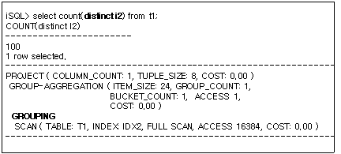

##### Example

Output the number of customers each employee is responsible for and the number of goods sold to each customer.

```
iSQL> SELECT eno, COUNT(DISTINCT cno), SUM(qty) FROM orders GROUP BY eno;
ENO         COUNT(DISTINCT CNO)  SUM(QTY)
----------------------------------------------------------
12          8                    17870
19          6                    25350
20          8                    13210
3 rows selected.
-----------------------------------------------
PROJECT ( COLUMN_COUNT: 3, TUPLE_SIZE: 24, COST: 0.77 )
 AGGREGATION ( ITEM_SIZE: 32, GROUP_COUNT: 3, COST: 0.02 )
  GROUPING
   SCAN ( TABLE: ORDERS, INDEX: ODR_IDX1, FULL SCAN, ACCESS: 30, COST: 0.02 )
-----------------------------------------------
```


#### HASH

##### Format

1) When intermediate results are cached in memory

```
HASH ( ITEM_SIZE: item_size, ITEM_COUNT: item_count, BUCKET_COUNT: bucket_count, ACCESS: acc_num, COST: cost )
```

2) When intermediate results are stored on disk

```
HASH ( ITEM_SIZE: item_size, ITEM_COUNT: item_count, DISK_PAGE_COUNT: page_count, ACCESS: acc_num, COST: cost ) 
```


| Item            | Description                                          |
| --------------- | ---------------------------------------------------- |
| ITEM_SIZE       | The record size for hashing                          |
| ITEM_COUNT      | The number of records included in hashing            |
| BUCKET_COUNT    | The number of hash buckets                           |
| DISK_PAGE_COUNT | The number of disk pages in the temporary table      |
| ACCESS          | The number of times the stored records were accessed |
| COST            | The estimated cost                                   |

[Table 4-9] Information of the HASH Node

##### Description

The HASH node performs hashing operations in the relational model. It has one child node and uses temporary tables to store intermediate results. 

The HASH node is used for various purposes. The execution plan tree for each use is described below.

###### Using with Joins

The HASH node can be used to perform a join operation.

In the following example, a HASH node has been created to perform a join operation. A HASH node is created and a hash-based join is performed to check the T1.i1 = T2.i1 join condition.


###### Used for Subquery Search

The HASH node can be used to perform a comparison operation with a subquery. 

In the following example, the HASH execution node is used to process i4 in (select i4 from t2). The HASH node hashes the t2.i4 value and checks whether a value corresponding to each t2.i4 exists in the HASH.

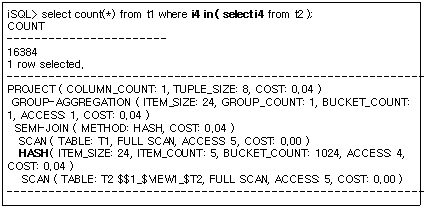

##### Example

Output the names and department names of all department managers.

```
iSQL> ALTER SESSION SET EXPLAIN PLAN = OFF;
Alter success.
iSQL> CREATE TABLE dept2 TABLESPACE sys_tbs_disk_data 
AS SELECT * FROM department;
Create success.
iSQL> CREATE TABLE manager(
 eno INTEGER PRIMARY KEY,
 mgr_no INTEGER,
 mname VARCHAR(20),
 address VARCHAR(60))
 TABLESPACE sys_tbs_disk_data;
Create success.
iSQL> INSERT INTO manager VALUES(2, 1, 'HJNO', '11 Inyoung Bldg. Nonhyun-dong Kangnam-guSeoul, Korea');
1 row inserted.
iSQL> INSERT INTO manager VALUES(7, 2, 'HJMIN', '44-25 Youido-dong Youngdungpo-gu Seoul, Korea');
1 row inserted.
iSQL> INSERT INTO manager VALUES(8, 7, 'JDLEE', '3101 N. Wabash Ave. Brooklyn, NY');
1 row inserted.
iSQL> INSERT INTO manager VALUES(12, 7, 'MYLEE', '130 Gongpyeongno Jung-gu Daegu, Korea');
1 row inserted.
iSQL> ALTER SESSION SET EXPLAIN PLAN = ON;
Alter success.
iSQL> SELECT m.mname, d.dname
 FROM dept2 d, manager m
 WHERE d.mgr_no = m.mgr_no;
MNAME                 DNAME
---------------------------------------------------------
JDLEE                 BUSINESS DEPT
MYLEE                 BUSINESS DEPT
2 rows selected.
------------------------------------------------------------
PROJECT ( COLUMN_COUNT: 2, TUPLE_SIZE: 54, COST: 28.11 )
 JOIN ( METHOD: HASH, COST: 28.09 )
  SCAN ( TABLE: DEPT2 D, FULL SCAN, ACCESS: 9, DISK_PAGE_COUNT: 64, COST: 14.01 )
  HASH ( ITEM_SIZE: 32, ITEM_COUNT: 4, DISK_PAGE_COUNT: 64, ACCESS: 2, COST: 28.09 )
   SCAN ( TABLE: MANAGER M, FULL SCAN, ACCESS: 4, DISK_PAGE_COUNT: 64, COST: 14.00 )
------------------------------------------------------------
```


#### JOIN

##### Format

```
JOIN ( METHOD: method, COST: cost )
```


| Item   | Description        |
| ------ | ------------------ |
| METHOD | The joining method |
| COST   | The estimated cost |

[Table 4-10] Information of the JOIN Node

##### Description

The JOIN node performs join operations in the relational model. This node has two child nodes, does not create intermediate results and controls the execution flow of the child nodes.

The JOIN node is used for almost all normal join operations.

In which form the plan tree is output for the following various joining methods is described below.

-   Full nested loop join

-   Full store nested loop join

-   Index nested loop join

-   Inverse index nested loop join

-   One-pass sort join

-   Two-pass sort join

-   Inverse sort join

-   One-pass hash join

-   Two-pass hash join

-   Inverse hash join

The following example processes the same query in different joining methods and shows the execution plan tree for each method.

Part of the plan tree of the joining method is featured as a figure on the left, and the actual execution plan is shown on the right.

###### The Execution Plan Tree for a Full Nested Loop Join


In the above execution plan, the join condition is processed by the SCAN node on the right with a repetitive full search on the T2 table. 

###### The Execution Plan Tree for a Full Store Nested Loop Join


In the above execution plan, the join condition is processed by the FILTER node above JOIN. The T2 table is searched once and after storing the results, a repetitive full search is performed.

###### The Execution Plan of an Index Nested Loop Join


In the above execution plan, the join condition is processed by the SCAN node on the right using the index.

###### The Execution Plan of an Inverse Index Nested Loop Join


###### The execution Plan of a One-pass Sort Join


In the above execution plan, the join condition is processed using data sorted in order by the SORT node on the right.

###### The Execution Plan of a Two-pass Sort Join


In the above execution plan, the join condition is processed using data sorted in order by the SORT node on the right; a SORT node is generated on the left also.

###### The Execution Plan of an Inverse Sort Join


###### SCAN The Execution Plan of a One-pass Hash Join


In the above execution plan, the join condition is processed using the data hashed by the HASH node on the right.

###### The Execution Plan of a Two-pass Hash Join


In the above execution plan, the join condition is processed using the data sorted in order by the HASH node on the right; nevertheless a HASH node is generated on the left as well.

###### The Execution Plan of an Inverse Hash Join


##### Example

Output the employee number, order number, goods number, order quantity of the employee whose last name is ‘Marquez’.

```
iSQL> SELECT e.eno, ono, cno, gno, qty 
 FROM employees e, orders o 
 WHERE e.eno = o.eno 
 AND e.e_lastname = 'Marquez';
ENO         ONO                  CNO                  GNO         QTY
---------------------------------------------------------------------------
19          11290100             11                   E11110000   1500
19          12100277             5                    D111100008  2500
19          12300001             1                    D111100004  1000
19          12300005             4                    D111100008  4000
19          12300010             16                   D111100010  2000
19          12310004             5                    E111100010  5000
19          12310008             1                    D111100003  100
19          12310011             15                   E111100012  10000
19          12310012             1                    C111100001  250
9 rows selected.
------------------------------------------------------------
PROJECT ( COLUMN_COUNT: 5, TUPLE_SIZE: 40, COST: 0.30 )
 JOIN ( METHOD: INDEX_NL, COST: 0.15 )
  SCAN ( TABLE: EMPLOYEES E, FULL SCAN, ACCESS: 20, COST: 0.14 )
  SCAN ( TABLE: ORDERS O, INDEX: ODR_IDX1, RANGE SCAN, ACCESS: 9, COST: 0.02 )
------------------------------------------------------------
```


#### LEFT-OUTER-JOIN

##### Format

```
LEFT-OUTER-JOIN ( METHOD: method, SKIP RIGHT COUNT: count, COST: cost )
```

| Item             | Description                                                  |
| ---------------- | ------------------------------------------------------------ |
| METHOD           | The joining method                                           |
| SKIP RIGHT COUNT | The number of skip right count <br>\- Shown when TRCLOG_DETAIL_INFORMATION = 1<br>\- Not shown when skip count is 0 |
| COST             | The estimated cost                                           |

[Table 4-11] Information of the LEFT-OUTER-JOIN Node

##### Description

The LEFT-OUTER-JOIN node performs a LEFT OUTER JOIN operation in the relational model. It has two child nodes, does not generate intermediate results and controls the execution flow of child nodes. 

Like normal joins, the LEFT-OUTER-JOIN node is used for most joining methods (please refer to the example for the JOIN node). A simple execution plan tree in which the LEFT-OUTERJOIN node is used is provided below.


##### Example

Output the department numbers of all departments and the employee names of all employees (output also the department number 5001 which has no employees).

```
iSQL> INSERT INTO departments VALUES(5001, 'Quality Assurance', 'Mokpo', 22);
1 row inserted.
iSQL> SELECT d.dno, e.e_firstname, e.e_lastname FROM departments d LEFT OUTER JOIN employees e ON d.dno = e.dno ORDER BY d.dno;
DNO         E_FIRSTNAME           E_LASTNAME
------------------------------------------------------------
1001        Ken                   Kobain
1001        Wei-Wei               Chen
1002        Ryu                   Momoi
1002        Mitch                 Jones
1003        Elizabeth             Bae
1003        Zhen                  Liu
1003        Yuu                   Miura
1003        Jason                 Davenport
2001        Takahiro              Fubuki
3001        Aaron                 Foster
3002        Chan-seung            Moon
3002        Farhad                Ghorbani
4001        Xiong                 Wang
4001        Curtis                Diaz
4001        John                  Huxley
4002        Gottlieb              Fleischer
4002        Sandra                Hammond
4002        Alvar                 Marquez
4002        William               Blake
5001
20 rows selected.
------------------------------------------------------------
PROJECT ( COLUMN_COUNT: 3, TUPLE_SIZE: 46, COST: 0.20 )
 LEFT-OUTER-JOIN ( METHOD: INDEX_NL, COST: 0.01 )
  SCAN ( TABLE: DEPARTMENTS D, INDEX: __SYS_IDX_ID_170, FULL SCAN, ACCESS: 9, COST: 0.01 )
  SCAN ( TABLE: EMPLOYEES E, INDEX: EMP_IDX1, RANGE SCAN, ACCESS: 20, COST: 0.01 )
------------------------------------------------------------
```


#### LIMIT-SORT

##### Format

```
LIMIT-SORT ( ITEM_SIZE: item_size, ITEM_COUNT: item_count, STORE_COUNT: store_count, ACCESS: acc_num, COST: cost )
```

| Item        | Description                                          |
| ----------- | ---------------------------------------------------- |
| ITEM_SIZE   | The size of the stored record to be sorted           |
| ITEM_COUNT  | The number of used records                           |
| STORE_COUNT | The number of stored records                         |
| ACCESS      | The number of times the stored records were accessed |
| COST        | The estimated cost                                   |

[Table 4-12] Information of the LIMIT-SORT Node

##### Description

The LIMIT-SORT node performs limited sort operations in the relational model. It has one child node, and uses temporary tables to store intermediate results.

The LIMIT-SORT node is used for various purposes. The execution plan tree for each purpose is described below.

###### Used for ORDER BY

The LIMIT-SORT node can be used in an ORDER BY clause that includes a LIMIT.

In the following example, the LIMIT-SORT node is used for ORDER BY. Information of the plan tree shows that only 3 storage spaces have been used to sort 16384 records.

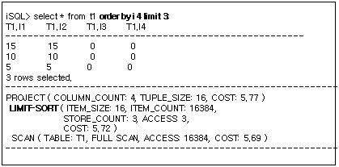

###### Used for Subquery Search

The LIMIT-SORT node can be used for subquery search.

In the following example, the LIMIT-SORT node performs a subquery search by sorting in order some of the records and storing them. The LIMIT-SORT node stores the values necessary to execute the query from t2.i4 and consequently minimizes the cost of a comparison operation. 


##### Example

Mark the names, department numbers and salaries of all employees, sort them by department number and salary (in ascending order by department number and in descending order by salary) and output the top 10 (the sort order is defined by the ORDER BY list).

```
iSQL> SELECT e_firstname, e_lastname, dno, salary 
 FROM employees 
 ORDER BY dno, salary DESC 
 LIMIT 10;
E_FIRSTNAME           E_LASTNAME            DNO         SALARY
-------------------------------------------------------------------------
Wei-Wei               Chen                  1001        2300
Ken                   Kobain                1001        2000
Ryu                   Momoi                 1002        1700
Mitch                 Jones                 1002        980
Elizabeth             Bae                   1003        4000
Zhen                  Liu                   1003        2750
Yuu                   Miura                 1003        2003
Jason                 Davenport             1003        1000
Takahiro              Fubuki                2001        1400
Aaron                 Foster                3001        1800
10 rows selected.
------------------------------------------------------------
PROJECT ( COLUMN_COUNT: 4, TUPLE_SIZE: 55, COST: 0.31 )
 LIMIT-SORT ( ITEM_SIZE: 16, ITEM_COUNT: 20, STORE_COUNT: 10, ACCESS: 10, COST: 0.14 )
  SCAN ( TABLE: EMPLOYEES, FULL SCAN, ACCESS: 20, COST: 0.01 )
------------------------------------------------------------
```


#### MATERIALIZATION

##### Format

```
MATERIALIZATION ( ACCESS: acc_num, COST: cost )
```

| Item   | Description                                       |
| ------ | ------------------------------------------------- |
| ACCESS | The number of times the stored record is accessed |
| COST   | The estimated cost                                |

[Table 4-13] Information of the MATERIALIZATION Node

##### Description

The MATERIALIZATION node generates a temporary table on a view. It has one child node and uses temporary tables to store intermediate results.

##### Example

Output the name, department number, salary of the employee whose salary is higher than the average of his or her department but lower than the average of the department with the highest average salary.

```
iSQL> CREATE VIEW v1 AS 
 (SELECT dno, AVG(salary) avg_sal 
 FROM employees GROUP BY dno);
Create success.

iSQL> SELECT e_firstname, e_lastname, e.dno, e.salary 
 FROM employees e, v1 
 WHERE e.dno = v1.dno 
  AND e.salary > v1.avg_sal 
  AND e.salary < (SELECT MAX(avg_sal) 
  FROM v1);
E_FIRSTNAME           E_LASTNAME            DNO         SALARY
-------------------------------------------------------------------------
Wei-Wei               Chen                  1001        2300
Ryu                   Momoi                 1002        1700
John                  Huxley                4001        1900
Sandra                Hammond               4002        1890
Alvar                 Marquez               4002        1800
5 rows selected.
------------------------------------------------------------
PROJECT ( COLUMN_COUNT: 4, TUPLE_SIZE: 55, COST: 0.32 )
 JOIN ( METHOD: INDEX_NL, COST: 0.28 )
  VIEW-SCAN ( VIEW: V1, ACCESS: 9, COST: 0.01 )
   MATERIALIZATION ( ITEM_SIZE: 40, ITEM_COUNT: 9, COST: 0.00 )
    VIEW ( ACCESS: 9, COST: 0.00 )
     PROJECT ( COLUMN_COUNT: 2, TUPLE_SIZE: 25, COST: 0.21 )
      AGGREGATION ( ITEM_SIZE: 72, GROUP_COUNT: 9, COST: 0.01 )
       GROUPING
        SCAN ( TABLE: EMPLOYEES, INDEX: EMP_IDX1, FULL SCAN, ACCESS: 20, COST: 0.01 )
  SCAN ( TABLE: EMPLOYEES E, INDEX: EMP_IDX1, RANGE SCAN, ACCESS: 19, COST: 0.27 )
   ::SUB-QUERY BEGIN
   PROJECT ( COLUMN_COUNT: 1, TUPLE_SIZE: 23, COST: 0.03 )
    STORE ( ITEM_SIZE: 32, ITEM_COUNT: 1, ACCESS: 7, COST: 0.03 )
     VIEW ( ACCESS: 1, COST: 0.00 )
      PROJECT ( COLUMN_COUNT: 1, TUPLE_SIZE: 23, COST: 0.03 )
       GROUP-AGGREGATION ( ITEM_SIZE: 40, GROUP_COUNT: 1, BUCKET_COUNT: 1, ACCESS: 1, COST: 0.02 )
        VIEW-SCAN ( VIEW: V1, ACCESS: 9, COST: 0.01 )
   ::SUB-QUERY END
------------------------------------------------------------
```


#### MERGE-JOIN

##### Format

```
MERGE-JOIN ( METHOD: method, COST: cost )
```

| Item   | Description        |
| ------ | ------------------ |
| METHOD | The joining method |
| COST   | The estimated cost |

[Table 4-14] Information of the MERGE-JOIN Node

##### Description

The MERGE-JOIN node performs a merge join operation in the relational model. It has two child nodes, does not generate intermediate results and controls the execution flow of child nodes. The MERGE-JOIN node takes one of the following as its child node: SCAN, SORT, MERGE-JOIN. 

The MERGE-JOIN node is used to perform a normal join operation and sorts both left and right child nodes or processes a join using sort order. 

Depending on the child node type, nine different merge-joins are possible; the plan trees of two of them are described below. 

###### MERGE-JOIN Using an Index

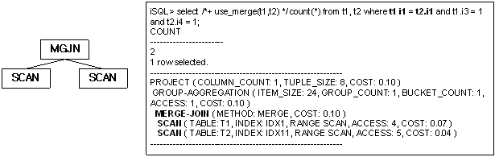

The join condition in the above explain plan is processed by the MERGE-JOIN node and uses column indexes included in the join condition (regardless of whether it is an inner or outer table). 

###### MERGE-JOIN Using SORT


The join condition in the above explain plan is processed by the MERGE-JOIN node, is sorted by the column included in the join condition and then used.

##### Example

Output the employee number, name, department number and department name of all employees who joined the company before January 1st, 2010 (Both tables must have an index on the column related to the join predicate. Because an index scan is performed, records are returned sorted by the dno value from the left and right SCAN nodes of this node. When record values start to differ, the user should move the cursor of the two tables until records with identical values appear, instead of searching the records.).

```
iSQL> SELECT /*+ use_merge(employees,departments) */e.eno, e_lastname, d.dno, dname 
 FROM employees e, departments d 
 WHERE e.dno = d.dno 
  AND TO_CHAR(join_date, 'YYYY-MM-DD HH:MI:SS') < '2010-01-01 00:00:00';
ENO         E_LASTNAME            DNO         DNAME
---------------------------------------------------------------------------
5           Ghorbani              3002        PRESALES DEPT
8           Wang                  4001        MARKETING DEPT
18          Huxley                4001        MARKETING DEPT
7           Fleischer             4002        BUSINESS DEPT
12          Hammond               4002        BUSINESS DEPT
20          Blake                 4002        BUSINESS DEPT
6 rows selected.
------------------------------------------------------------
PROJECT ( COLUMN_COUNT: 4, TUPLE_SIZE: 60, COST: 0.34 )
 MERGE-JOIN ( METHOD: MERGE, COST: 0.24 )
  SCAN ( TABLE: EMPLOYEES E, INDEX: EMP_IDX1, RANGE SCAN, ACCESS: 19, COST: 0.21 )
  SCAN ( TABLE: DEPARTMENTS D, INDEX: __SYS_IDX_ID_153, RANGE SCAN, ACCESS: 15, COST: 0.01 )
------------------------------------------------------------
```


#### PARALLEL-QUEUE

##### Format

```
PARALLEL-QUEUE ( TID: tid )
```


| Item | Description                                             |
| ---- | ------------------------------------------------------- |
| TID  | Identification number of the thread running on the node |

[Table 4-13] Information on PARALLEL_QUEUE Node

##### Description

The PARALLEL-QUEUE executes parallel queries. This node creates new threads to execute the subnodes, and passes the results to a higher node. 

The following example illustrates the use of the PARALLEL_QUEUE node: In the example below, two PARALLEL-QUEUE nodes are running four SCAN nodes. The identification number (TID) assigned to each PARALLEL-QUEUE node confirms that the first PARALLEL-QUEUE node scanned partitions P1, P3, and P4, and the second PARALLEL-QUEUE node scanned partition P2.


##### Example1

```
iSQL> SELECT /*+ PARALLEL(t1 2) */ COUNT(i1) FROM t1;
COUNT(I1)            
-----------------------
500                 
1 row selected.
------------------------------------------------------------
PROJECT ( COLUMN_COUNT: 1, TUPLE_SIZE: 8, COST: 0.56 )
 GROUP-AGGREGATION ( ITEM_SIZE: 24, GROUP_COUNT: 1, BUCKET_COUNT: 1, ACCESS: 1, COST: 0.56 )
  PARTITION-COORDINATOR ( TABLE: T1, PARALLEL, PARTITION: 4/4, ACCESS: 500, COST: 0.28 )
   PARALLEL-QUEUE ( TID: 1 )
   PARALLEL-QUEUE ( TID: 2 )
   SCAN ( PARTITION: P4, FULL SCAN, ACCESS: 201, TID: 1, COST: 0.11 )
   SCAN ( PARTITION: P3, FULL SCAN, ACCESS: 100, TID: 1, COST: 0.06 )
   SCAN ( PARTITION: P2, FULL SCAN, ACCESS: 100, TID: 2, COST: 0.06 )
   SCAN ( PARTITION: P1, FULL SCAN, ACCESS: 99, TID: 1, COST: 0.06 )
------------------------------------------------------------
```


##### Example2

```
iSQL> SELECT
         L_RETURNFLAG,
         L_LINESTATUS,
         SUM(L_QUANTITY) AS SUM_QTY,
         SUM(L_EXTENDEDPRICE) AS SUM_BASE_PRICE,
         SUM(L_EXTENDEDPRICE * (1 - L_DISCOUNT)) AS SUM_DISC_PRICE,
         SUM(L_EXTENDEDPRICE * (1 - L_DISCOUNT) * (1 + L_TAX)) AS SUM_CHARGE,
         AVG(L_QUANTITY) AS AVG_QTY,
         AVG(L_EXTENDEDPRICE) AS AVG_PRICE,
         AVG(L_DISCOUNT) AS AVG_DISC,
         COUNT(*) AS COUNT_ORDER
 FROM
         LINEITEM
 WHERE
         L_SHIPDATE <= DATE'01-DEC-1998' - INTERVAL'90'
 GROUP BY
         L_RETURNFLAG,
         L_LINESTATUS
 ORDER BY
         L_RETURNFLAG,
         L_LINESTATUS;
L_RETURNFLAG  L_LINESTATUS  SUM_QTY     SUM_BASE_PRICE SUM_DISC_PRICE         SUM_CHARGE             AVG_QTY                AVG_PRICE              AVG_DISC    COUNT_ORDER          
-----------------------------------------------------------------------------------------------------------------------------------------------------------------------------------------------
A  F  37474       56250004.9  53399385.5912999       55528109.501472        25.3545331529093       38058.1900405954       0.050866035 1478                
N  F  1041        1614635.42  1549641.9636           1608284.73514          27.3947368421053       42490.4057894737       0.042894737 38                  
N  O  75067       112774708   107204872.3929         111467221.663635       25.5590738849166       38397.9257643854       0.049673136 2937                
R  F  36470       54082045.8  51384368.3297          53497960.192278        25.0480769230769       37144.2622115385       0.050006868 1456                
4 rows selected.
------------------------------------------------------------
PROJECT ( COLUMN_COUNT: 10, TUPLE_SIZE: 120, COST: 97.21 )
 SORT ( ITEM_SIZE: 24, ITEM_COUNT: 4, ACCESS: 4, COST: 95.85 )
  GROUP-AGGREGATION ( ITEM_SIZE: 192, GROUP_COUNT: 4, BUCKET_COUNT: 1024, ACCESS: 4, COST: 95.83 )
   PARALLEL-QUEUE ( TID: 1 )
    SCAN ( TABLE: LINEITEM, FULL SCAN, ACCESS: 6000, TID: 1, COST: 60.33 )
------------------------------------------------------------
```


#### PARALLEL-SCAN-COORDINATOR

##### Format

```
PARALLE-SCAN-COORDINATOR( TABLE: table_name, ACCESS: acc_num )
```

| Item   | Description                               |
| ------ | ----------------------------------------- |
| TABLE  | The name of the table being accessed      |
| ACCESS | The number of times a record was accessed |

[Table 4-14] Information on PARALLEL-SCAN-COORDINATIOR Nodes

##### Description

PARALLEL-SCAN-COORDINATOR node is used to execute parallel query. After executing several SCAN nodes in parallel, the result is collected and transferred to the upper node.

The following example illustrates the use of the PARALLEL-SCAN-COORDINATOR node: Run the child nodes in parallel, collect the results, and pass them on to the parent node.

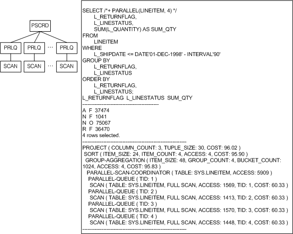

##### Example

```
SELECT /*+ PARALLEL(LINEITEM, 4) */
        L_RETURNFLAG,
        L_LINESTATUS,
        SUM(L_QUANTITY) AS SUM_QTY
FROM
        LINEITEM
WHERE
        L_SHIPDATE <= DATE'01-DEC-1998' - INTERVAL'90'
GROUP BY
        L_RETURNFLAG,
        L_LINESTATUS
ORDER BY
        L_RETURNFLAG,
        L_LINESTATUS;
L_RETURNFLAG  L_LINESTATUS  SUM_QTY     
--------------------------------------------
A  F  37474      
N  F  1041       
N  O  75067      
R  F  36470      
4 rows selected.
------------------------------------------------------------
PROJECT ( COLUMN_COUNT: 3, TUPLE_SIZE: 30, COST: 96.02 )
 SORT ( ITEM_SIZE: 24, ITEM_COUNT: 4, ACCESS: 4, COST: 95.90 )
  GROUP-AGGREGATION ( ITEM_SIZE: 48, GROUP_COUNT: 4, BUCKET_COUNT: 1024, ACCESS: 4, COST: 95.83 )
   PARALLEL-SCAN-COORDINATOR ( TABLE: SYS.LINEITEM, ACCESS: 5909 )
    PARALLEL-QUEUE ( TID: 1 )
     SCAN ( TABLE: SYS.LINEITEM, FULL SCAN, ACCESS: 1569, TID: 1, COST: 60.33 )
    PARALLEL-QUEUE ( TID: 2 )
     SCAN ( TABLE: SYS.LINEITEM, FULL SCAN, ACCESS: 1413, TID: 2, COST: 60.33 )
    PARALLEL-QUEUE ( TID: 3 )
     SCAN ( TABLE: SYS.LINEITEM, FULL SCAN, ACCESS: 1570, TID: 3, COST: 60.33 )
    PARALLEL-QUEUE ( TID: 4 )
     SCAN ( TABLE: SYS.LINEITEM, FULL SCAN, ACCESS: 1448, TID: 4, COST: 60.33 )
------------------------------------------------------------
```


#### PARTITION-COORDINATOR

##### Format

```
PARTITION-COORDINATOR( TABLE: table_name, PARALLEL, PARTITION: partition_acc_cnt, ACCESS: acc_num, COST: cost )
```

| Item      | Description                                                  |
| --------- | ------------------------------------------------------------ |
| TABLE     | The name of the table to be accessed                         |
| PARALLEL  | Whether or not to execute parallel queries. Only output in parallel query |
| PARTITION | The number of partiions to be accessed                       |
| ACCESS    | The number of times that records were accessed               |
| COST      | The estimated cost                                           |

[Table 4-15] Information of the PARTITION-COORDINATIOR Node

##### Description

The PARTITION-COORDINATOR node manages the scanning of each partition in a partitioned table. It has many child nodes and performs partition filtering.

The following example shows how this node is executed. The scan results of a partition (its child node) is passed to the higher node.


The following example shows the execution of a PCRD node through a parallel query. The PARALLEL item can be seen on the PCRD node. The PRLQ node passes the execution results of the child node scanning the partition to a higher (parent) node. 


##### Example 1

```
iSQL> CREATE TABLE t1 ( i1 INTEGER )
PARTITION BY RANGE ( i1 )
(
    PARTITION p1 VALUES LESS THAN ( 100 ),
    PARTITION p2 VALUES LESS THAN ( 200 ),
    PARTITION p3 VALUES DEFAULT
) TABLESPACE SYS_TBS_DISK_DATA;
Create success.

iSQL> INSERT INTO t1 VALUES ( 50 );
1 row inserted.
iSQL> INSERT INTO t1 VALUES ( 60 );
1 row inserted.
iSQL> INSERT INTO t1 VALUES ( 150 );
1 row inserted.
iSQL> INSERT INTO t1 VALUES ( 160 );
1 row inserted.
iSQL> alter session set explain plan = on;
Alter success.

iSQL> SELECT COUNT(*) FROM t1 WHERE i1 < 100;
COUNT
-----------------------
2
1 row selected.
--------------------------------------------------------
PROJECT ( COLUMN_COUNT: 1, TUPLE_SIZE: 8, COST: 14.02 )
 GROUP-AGGREGATION ( ITEM_SIZE: 24, GROUP_COUNT: 1, BUCKET_COUNT: 1, ACCESS: 1, COST: 14.02 )
  PARTITION-COORDINATOR ( TABLE: T1, PARTITION: 1/3, ACCESS: 2, COST: 14.01 )
   SCAN ( PARTITION: P1, FULL SCAN, ACCESS: 2, DISK_PAGE_COUNT: 64, COST: 14.01 )
--------------------------------------------------------
```


##### Example 2

```
iSQL> SELECT /*+ PARALLEL(t1 3) */ COUNT(*) FROM t1 WHERE i1 < 160; 
COUNT
-----------------------
3
1 row selected. 
-------------------------------------------------------- 
PROJECT ( COLUMN_COUNT: 1, TUPLE_SIZE: 8, COST: 14.02 )
 GROUP-AGGREGATION ( ITEM_SIZE: 24, GROUP_COUNT: 1, BUCKET_COUNT: 1, ACCESS: 1, COST: 14.02 )
  PARTITION-COORDINATOR ( TABLE: T1, PARALLEL, PARTITION: 2/3, ACCESS: 2, COST: 14.01 )
   PARALLEL-QUEUE ( TID: 1 )
   PARALLEL-QUEUE ( TID: 2 )
   SCAN ( PARTITION: P1, FULL SCAN, ACCESS: 2, TID: 1, DISK_PAGE_COUNT: 64, COST: 14.01 )
   SCAN ( PARTITION: P2, FULL SCAN, ACCESS: 2, TID: 2, DISK_PAGE_COUNT: 64, COST: 14.01 )
-------------------------------------------------------- 
```


#### PROJECT

##### Format

```
PROJECT ( COLUMN_COUNT: col_count, TUPLE_SIZE: tuple_size, COST: cost )
```

| Item         | Description                                      |
| ------------ | ------------------------------------------------ |
| COLUMN_COUNT | The number of projection columns                 |
| TUPLE_SIZE   | The size of the record extracted in a projection |
| COST         | The estimated cost                               |

[Table 4-16] Information of the SCAN Node

##### Description

The PROJECT node is the physical entity that performs project operations in the relational model. It has one child node and extracts only the necessary columns from the result set returned by the child node

###### Outputting the PROJECT Node

The PROJECT node comprises the final result of a query. Information of the PROJECT node can be viewed within the plan tree as shown below. The query result is composed of two columns and the size of each returned record is 8 bytes.


##### Example

Output the name and salary of all employees when a 10% raise is given to all employees.

```
iSQL> SELECT e_firstname, e_lastname, salary * 1.1 FROM employees;
E_FIRSTNAME           E_LASTNAME            SALARY * 1.1
-------------------------------------------------------------
.
.
.
20 rows selected.
------------------------------------------------------------
PROJECT ( COLUMN_COUNT: 3, TUPLE_SIZE: 67, COST: 0.41 )
 SCAN ( TABLE: EMPLOYEES, FULL SCAN, ACCESS: 20, COST: 0.01 )
------------------------------------------------------------
```


#### SCAN

##### Format

1) When intermediate results are cached in memory

```
SCAN ( TABLE: table_name, FULL SCAN, ACCESS: acc_num, TID: tid, COST: cost )

SCAN ( TABLE: table_name, INDEX: index_name, ACCESS: acc_num, TID: tid, COST: cost )
```

2) When intermediate results are stored on disk

```
SCAN ( TABLE: table_name, FULL SCAN, ACCESS: acc_num, DISK_PAGE_COUNT: page_count, TID: tid, COST: cost )

SCAN ( TABLE: table_name, INDEX: index_name, ACCESS: acc_num, DISK_PAGE_COUNT: page_count, TID: tid, COST: cost )
```


| Item            | Description                                                  |
| --------------- | ------------------------------------------------------------ |
| TABLE           | The name of the table being accessed                         |
| INDEX           | The name of the index being used                             |
| SCAN Method     | FULL SCAN, RANGE SCAN [DESC] or RID SCAN                     |
| ACCESS          | The number of times the records were accessed                |
| DISK_PAGE_COUNT | The number of disk pages in a table                          |
| TID             | Thread identification number. Is only output for parallel queries. |
| COST            | The estimated cost                                           |

[Table 4-17] Information of the SCAN Node

##### Description

The SCAN node is the physical entity that performs SELECT operations in the relational model. It does not have a child node and fetches records by directly accessing the table. 

Results fetched from the SCAN node are processed in the following five methods.

-   Fixed key range

-   Variable key range

-   Constant filter

-   Filter

-   Subquery filter

###### Memory Tables and Disk Tables

Memory tables and disk tables output slightly different information. Only disk tables output the number of disk pages it has. 

The output information of the SCAN node of memory and disk tables are compared below. 

In the following example, the user default tablespace is stored as SYS_TBS_MEMORY and information of the SCAN node in the memory table is displayed.


In the following example, information of the SCAN node in the table created in the SYS_TBS_DATA disk tablespace is output. As shown below, disk tables display the number of disk pages a table possesses.

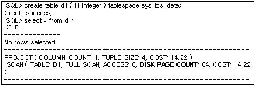

###### Table Name

As shown in the following example, the name of the table being accessed by the SCAN node and the alias also (if the alias is specified in the query) is output


###### The Access Method and Number of Times the Records were Accessed

The most important information in query tuning is whether a full scan is performed or an index is used, along with the estimate of how many records will be accessed. The greater the number of records that are accessed, the lower the performance, so the estimate of the number of records that will be accessed is critical. 

The example below shows the case where a query is processed using a full scan. The example shows the number of records accessed in order to perform the comparison in the WHERE clause.


The next example shows the execution plan information that is displayed when an index is used to access the same table. The example shows that when IDX1 is used, only one record is accessed in order to evaluate the condition in the WHERE clause.


It can be seen that the same execution plan is created to evaluate this condition even when a condition pertaining to another column is added.

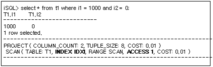

If an index is added to the T1.i2 column and a query is then executed using that index, the execution plan shown below will result. It can be seen that using the index for the T1.i2 column degrades efficiency, even though the query is the same.


When no hints are given, as in the example shown below, the optimizer chooses the best index to use on the basis of a cost estimation


As illustrated above, it is necessary for the user to view the SCAN node information to check whether a suitable access method was chosen, and, if necessary, to create an index that is appropriate for the query when no such index exists.

###### **TRCLOG_DETAIL_PREDICATE**

If the TRCLOG_DETAIL_PREDICATE property is set to 1, information about how the conditions are processed by the SCAN node is output. This property is useful when checking whether a condition is using an index.

In the following example, the method that is used to process each condition is shown. The (i1 = 1000) condition is processed as a fixed key range that uses an index, and the (i2 = 0) condition is processed as a filter.


In the following example, a different index is used to process the same query. It can be seen that when the IDX2 condition is used, the condition that is processed using the index and the condition that is processed without using an index are switched.


As seen above, determining whether a condition in a WHERE clause is processed using an index is of great help when tuning queries. However, this information might not be output if the query is changed by the optimizer during the course of optimization.

##### Example

Example1) Output the name, department number, birthday of all employees born before January 1st, 1980.

```
iSQL> SELECT e_firstname, e_lastname, dno, birth 
 FROM employees 
 WHERE birth > '800101';
E_FIRSTNAME           E_LASTNAME            DNO         BIRTH
---------------------------------------------------------------------
Aaron                 Foster                3001        820730
Gottlieb              Fleischer             4002        840417
Xiong                 Wang                  4001        810726
Sandra                Hammond               4002        810211
Mitch                 Jones                 1002        801102
Jason                 Davenport             1003        901212
6 rows selected.
------------------------------------------------------------
PROJECT ( COLUMN_COUNT: 4, TUPLE_SIZE: 54, COST: 0.26 )
 SCAN ( TABLE: EMPLOYEES, FULL SCAN, ACCESS: 20, COST: 0.14 )
------------------------------------------------------------
```

Example2) Output the name, department number, birthday of all employees born before January 1st, 1980 (Use the index).

```
iSQL> CREATE INDEX emp_idx2 ON employees(birth);
Create success.
iSQL> SELECT e_firstname, e_lastname, dno, birth 
 FROM employees 
 WHERE birth > '800101';
E_FIRSTNAME           E_LASTNAME            DNO         BIRTH
---------------------------------------------------------------------
Mitch                 Jones                 1002        801102
Sandra                Hammond               4002        810211
Xiong                 Wang                  4001        810726
Aaron                 Foster                3001        820730
Gottlieb              Fleischer             4002        840417
Jason                 Davenport             1003        901212
6 rows selected.
------------------------------------------------------------
PROJECT ( COLUMN_COUNT: 4, TUPLE_SIZE: 54, COST: 0.11 )
 SCAN ( TABLE: EMPLOYEES, INDEX: EMP_IDX2, RANGE SCAN, ACCESS: 6, COST: 0.00 )
------------------------------------------------------------
```


#### VIEW

##### Format

```
VIEW ( view_name, ACCESS: acc_num, COST: cost )
```


| Item      | Description                                        |
| --------- | -------------------------------------------------- |
| View Name | The view name. This is output when it has a name.  |
| ACCESS    | The number of times the view records were accessed |
| COST      | The estimated cost                                 |

[Table 4-18] Information of the VIEW Node

##### Description

VIEW nodes are used to display virtual tables according to the relational model. This node is used to display a user-defined view or make a result set created by a set operation appear as a single table.

When a user-defined view is queried, the output for the VIEW node appears as shown below. The subnodes of the VIEW node illustrate the execution plan for the SELECT statement that forms the basis of the user-defined view.

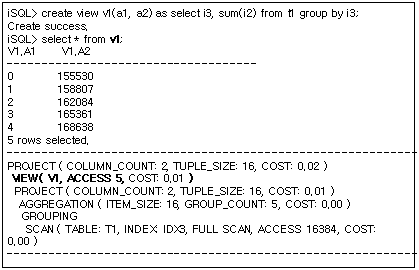

VIEW nodes are also used for queries that use set operations and an example is provided below. A VIEW node is created in order to manage the results of an INTERSECT operation as a single table. In this case, the view does not have its own name.


##### Example

Output the name, salary, department number and the average salary of that department for all employees who receive a higher salary than the average salary of their department.

```
iSQL> SELECT e.e_firstname, e.e_lastname, e.salary, e.dno, v1.salavg 
 FROM employees e, 
 (SELECT dno, AVG(salary) salavg 
  FROM employees 
  GROUP BY dno) v1 
 WHERE e.dno = v1.dno 
 AND e.salary > v1.salavg;
E_FIRSTNAME           E_LASTNAME            SALARY      DNO     SALAVG
---------------------------------------------------------------------------
Wei-Wei               Chen                  2300        1001    2150
Ryu                   Momoi                 1700        1002    1340
Elizabeth             Bae                   4000        1003    2438.25
Zhen                  Liu                   2750        1003    2438.25
John                  Huxley                1900        4001    1550
Sandra                Hammond               1890        4002    1396.66667
Alvar                 Marquez               1800        4002    1396.66667
7 rows selected.
------------------------------------------------------------
PROJECT ( COLUMN_COUNT: 5, TUPLE_SIZE: 79, COST: 0.40 )
 JOIN ( METHOD: INDEX_NL, COST: 0.23 )
  VIEW ( ACCESS: 9, COST: 0.22 )
   PROJECT ( COLUMN_COUNT: 2, TUPLE_SIZE: 25, COST: 0.21 )
    AGGREGATION ( ITEM_SIZE: 72, GROUP_COUNT: 9, COST: 0.01 )
     GROUPING
      SCAN ( TABLE: EMPLOYEES, INDEX: EMP_IDX1, FULL SCAN, ACCESS: 20, COST: 0.01 )
  SCAN ( TABLE: EMPLOYEES E, INDEX: EMP_IDX1, RANGE SCAN, ACCESS: 19, COST: 0.01 )
------------------------------------------------------------
```


#### VIEW-SCAN

##### Format

```
VIEW-SCAN ( VIEW: view_name, ACCESS: acc_num, COST: cost )
```


| Item   | Description                                        |
| ------ | -------------------------------------------------- |
| VIEW   | The view name                                      |
| ACCESS | The number of times the view records were accessed |
| COST   | The estimated cost                                 |

[Table 4-19] Information of the VIEW-SCAN Node

##### Description

The VIEW-SCAN node is the physical entity that performs SELECT operations on temporarily stored views according to the relational model. If it has a child node, it is always a materialization node.

This node is created during query optimization when it has been determined that it would be more efficient to store the contents of a view for processing.

The following is an example of a VIEW-SCAN node. In the example below, the same view is accessed by both the main query and the subquery. The optimizer concluded that it would be more efficient to temporarily store the contents of the view, and thus they were stored using the materialization node. The execution plan shows that the VIEW-SCAN node accesses the contents of the view.


In the above execution plan, the VIEW-SCAN node for the (V1 X) view does not seem to have any child nodes. However, this VIEW-SCAN node has a materialized node (displayed as “MATERIALIZATION”) as its child node. Part of the above execution plan is shown diagrammatically below (VSCN: VIEW-SCAN node, VMTR: MATERIALIZATION node).

As shown in the above figure, the VSCN (V1 X) and VSCN (V1 Y) execution nodes have the same child nodes.


##### Example

Please refer to the example for the MATERIALIZATION node.

#### SET-DIFFERENCE

##### Format

1) When intermediate results are cached in memory

```
SET-DIFFERENCE ( ITEM_SIZE: item_size, ITEM_COUNT: item_count, BUCKET_COUNT: bucket_count, ACCESS: acc_num, COST: cost )
```

2) When intermediate results are stored on disk

```
SET-DIFFERENCE ( ITEM_SIZE: item_size, ITEM_COUNT: item_count, DISK_PAGE_COUNT: page_count, ACCESS: acc_num, COST: cost )
```


| Item            | Description                                                |
| --------------- | ---------------------------------------------------------- |
| ITEM_SIZE       | The size of the stored record for the difference set       |
| ITEM_COUNT      | The number of stored records                               |
| BUCKET_COUNT    | The number of hash buckets                                 |
| DISK_PAGE_COUNT | The number of disk pages that the temporary table contains |
| ACCESS          | The number of times the stored records were accessed       |
| COST            | The estimated cost                                         |

[Table 4-20] Information of the SET-DIFFERENCE Node

##### Description

The SET-DIFFERENCE node performs MINUS operations according to the relational model. This node has two child nodes, and stores, and processes intermediate results in order to obtain a difference set.

The example below shows the use of an SDIF node to process a MINUS clause. After eliminating duplicate records from the results returned by the query on the left, the node searches for records that do not intersect with the data returned by the query on the right.


##### Example

Output the goods numbers of the goods that have no orders.

```
iSQL> SELECT gno FROM goods
MINUS
SELECT gno FROM orders;
GNO
--------------
A111100001
B111100001
C111100002
E111100011
D111100001
D111100005
D111100006
D111100007
D111100009
E111100003
E111100004
E111100005
E111100006
E111100008
14 rows selected.
------------------------------------------------------------
PROJECT ( COLUMN_COUNT: 1, TUPLE_SIZE: 12, COST: 0.16 )
 VIEW ( ACCESS: 14, COST: 0.13 )
  SET-DIFFERENCE ( ITEM_SIZE: 32, ITEM_COUNT: 30, BUCKET_COUNT: 1024, ACCESS: 14, COST: 0.13 )
   PROJECT ( COLUMN_COUNT: 1, TUPLE_SIZE: 12, COST: 0.07 )
    SCAN ( TABLE: GOODS, FULL SCAN, ACCESS: 30, COST: 0.02 )
   PROJECT ( COLUMN_COUNT: 1, TUPLE_SIZE: 12, COST: 0.07 )
    SCAN ( TABLE: ORDERS, FULL SCAN, ACCESS: 30, COST: 0.02 )
------------------------------------------------------------
```


#### SET-INTERSECT

##### Format

1) When intermediate results are cached in memory

```
SET-INTERSECT ( ITEM_SIZE: item_size, ITEM_COUNT: item_count, BUCKET_COUNT: bucket_count, ACCESS: acc_num, COST: cost )
```

2) When intermediate results are stored on disk

```
SET-INTERSECT ( ITEM_SIZE: item_size, ITEM_COUNT: item_count, DISK_PAGE_COUNT: page_count, ACCESS: acc_num, COST: cost )
```


| Item            | Description                                             |
| --------------- | ------------------------------------------------------- |
| ITEM_SIZE       | The size of the stored records for the intersection set |
| ITEM_COUNT      | The number of stored records                            |
| BUCKET_COUNT    | The number of hash buckets                              |
| DISK_PAGE_COUNT | The number of disk pages the temporary table contains   |
| ACCESS          | The number of times the stored records were accessed    |
| COST            | The estimated cost                                      |

[Table 4-21] Information of the SET-INTERSECT Node

##### Description

The SET-INTERSECT node performs intersect operations according to the relational model. This is a binary node and stores and processes intermediate results in order to obtain an intersection set.

In the following example, the SET-INTERSECT node is used to execute an INTERSECT operation. The data returned from the query on the left is eliminated of duplicate values and stored; using the data returned from the query on the right, data for the intersection set is searched for.


##### Example

Output the list of items that have been ordered at least once from the goods table.

```
iSQL> SELECT gno FROM goods INTERSECT SELECT gno FROM orders;
GNO
--------------
A111100002
E111100001
D111100008
D111100004
C111100001
E111100002
D111100002
D111100011
D111100003
D111100010
E111100012
F111100001
E111100009
E111100010
E111100007
E111100013
16 rows selected.
------------------------------------------------------------
PROJECT ( COLUMN_COUNT: 1, TUPLE_SIZE: 12, COST: 0.16 )
 VIEW ( ACCESS: 16, COST: 0.13 )
  SET-INTERSECT ( ITEM_SIZE: 32, ITEM_COUNT: 30, BUCKET_COUNT: 1024, ACCESS: 16, COST: 0.13 )
   PROJECT ( COLUMN_COUNT: 1, TUPLE_SIZE: 12, COST: 0.07 )
    SCAN ( TABLE: GOODS, FULL SCAN, ACCESS: 30, COST: 0.02 )
   PROJECT ( COLUMN_COUNT: 1, TUPLE_SIZE: 12, COST: 0.07 )
    SCAN ( TABLE: ORDERS, FULL SCAN, ACCESS: 30, COST: 0.02 )
------------------------------------------------------------
```


#### SORT

##### Format

1) When intermediate results are cached in memory

```
SORT ( ITEM_SIZE: item_size, ITEM_COUNT: item_count, ACCESS: acc_num, COST: cost )
```

2) When intermediate results are stored on disk

```
SORT ( ITEM_SIZE: item_size, ITEM_COUNT: item_count, DISK_PAGE_COUNT: page_count, ACCESS: acc_num, COST: cost )
```


| Item            | Description                                                |
| --------------- | ---------------------------------------------------------- |
| ITEM_SIZE       | The size of the records for sorting                        |
| ITEM_COUNT      | The number of records to be sorted                         |
| DISK_PAGE_COUNT | The number of disk pages that the temporary table contains |
| ACCESS          | The number of times the stored records were accessed       |
| COST            | The estimated cost                                         |

[Table 4-23] Information of the SORT Node

##### Description

The SORT node is a physical entity that performs SORT operations according to the relational model. This is a unary node and uses temporary space to store intermediate results. 

The SORT node is used for various purposes. A description of its plan trees for different purposes is given below.

###### Used for the ORDER BY Clause

The SORT node is used when an ORDER BY clause exists and sorting is necessary. In the following example, the SORT node is used to process the ORDER BY clause.


###### Used for GROUP BY

The SORT node can be created to sort the same groups of the GROUP BY clause. In the following example, the SORT node is created to process GROUP BY i4


###### Used for the DISTINCT Clause

The SORT node can be used to eliminate duplicate values by performing a SORT operation to execute DISTINCT. In the following example, the SORT node has been created to process DISTINCT i4.


###### Used for Joins

The SORT node can be used to perform the join operations.

In the following example, the SORT node has been created to perform a join operation. The SORT node is created to perform a sort-based join to check the T1.i1 = T2.i1 join condition.

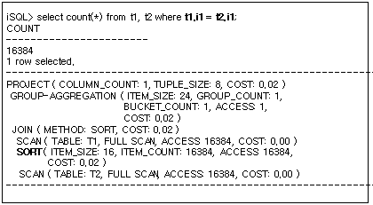

##### Example

Order by salary the name, job, entry date and salary of employees whose salary is $1500 USD or less.

```
iSQL> SELECT e_firstname, e_lastname, emp_job, salary 
 FROM employees 
 WHERE salary < 1500 
 ORDER BY 4 DESC;
E_FIRSTNAME           E_LASTNAME            EMP_JOB          SALARY
----------------------------------------------------------------------------
Takahiro              Fubuki                PM               1400
Curtis                Diaz                  planner          1200
Jason                 Davenport             webmaster        1000
Mitch                 Jones                 PM               980
Gottlieb              Fleischer             manager          500
5 rows selected.
------------------------------------------------------------
PROJECT ( COLUMN_COUNT: 4, TUPLE_SIZE: 70, COST: 0.33 )
 SORT ( ITEM_SIZE: 16, ITEM_COUNT: 5, ACCESS: 5, COST: 0.22 )
  SCAN ( TABLE: EMPLOYEES, FULL SCAN, ACCESS: 20, COST: 0.14 )
------------------------------------------------------------

```


#### STORE

##### Format

```
STORE ( ITEM_SIZE: item_size, ITEM_COUNT: item_count, DISK_PAGE_COUNT: page_count, ACCESS: acc_num, COST: cost )
```


| Item            | Description                                                  |
| --------------- | ------------------------------------------------------------ |
| ITEM_SIZE       | The size of the stored records                               |
| ITEM_COUNT      | The number of stored records                                 |
| DISK_PAGE_COUNT | The number of disk pages that the temporary table contains. No information is provided for memory tables. |
| ACCESS          | The number of times the stored records were accessed         |
| COST            | The estimated cost                                           |

[Table 4-23] Information of the STORE Node

##### Description

The STORE node temporarily stores some of the query results. This is a unary node and uses a temporary table to save intermediate results. 

STORE nodes are used for various purposes. The following is a description of the execution plan tree for each purpose.

###### Used for Joins

STORE nodes can be used to process joins.

A STORE node is usually used in cases involving Cartesian products in which there are no join conditions. If this node is used to process joins, it does not itself process the join conditions.

The example below shows the use of a STORE node for a Cartesian product. The node stores the returned results in the t1 table to prevent the redundant use of the index.


# 5. The Optimizer and Statistics

---------------------

This chapter explores why statistics are important for query optimization and explains how the user can collect and set statistics.

### Overview of Statistics

Well-built statistics play an important role when the optimizer determines the most efficient execution plan. The Altibase server provides the following statistics for the query optimizer to determine the most efficient execution plan. 

-   Table Statistics

    -   The number of records
    -   The number of pages
    -   The average length of records
    
-   Column Statistics

    -   The number of distinct values in columns 
    -   The number of NULLs in columns 
    -   The average length of columns
    
-   Index Statistics

    -    The average number of slots per leaf nodes 
    -    The depth from the index root to the leaf nodes 
    -    Clustering factor: The level to which data is sorted according to the index. 
    -    The maximum value of the index 
    -    The index minimum value
    
-   Database system statistics

    -   The average time spent reading a single page 
    -   The average time spent reading multiple pages 
    -   The average time spent hashing 
    -   The average time spent comparing

### Managing Statistics

Altibase can gather statistics both manually andor automatically.

#### Stats Collection

If the latest statistics of an object are needed, the user should collect statistics or directly update them through the DBMS Stats stored procedure, /and the collected statistics would be efficiently utilized for the optimizer to establish an execution plan. 

Altibase server gathers the statistics based upon sampling data if the following stored procedures are called. The statistics would be more accurate when the ratio of the sampling data is higher.

-   GATHER_SYSTEM_STATS

-   GATHER_DATABASE_STATS

-   GATHER_TABLE_STATS

-   GATHER_INDEX_STATS

The user can manually set statistics for objects or the system using the following system stored procedures.

-   SET_SYSTEM_STATS

-   SET_TABLE_STATS

-   SET_INDEX_STATS

-   SET_COLUMN_STATS


For more detailed information about each stored procedure, please refer to DBMS Stats in the Stored Procedures Manual.

### Auto Stats

#### Inquirying Statistical Information

The collected statistics are stored in the V$DMBS_STATS performance view. For more information on \V$DBMS_STATS performance view, refer to the *General Reference*.

#### Restrictions

For the system statistics, it is recommended to collect only once after starting the Altibase server with a certain amout of load (repeating FULL SCAN and INDEX SCAN). Otherwise, some statistical values may not be measured correctly.

Because objects and data in the database are constantly changing, users need to update statistics periodically to optimize queries. It is recommended to collect the table statistics monthly if when there are many data changes.

# 6. SQL Hints
--------

This chapter describes SQL hints taht let the user to change the execution plan of an SQL statement. 

### Overview of Hints

Hints are used when the user wants to explicitly change the execution plan for a SQL statement. 

There is no end to the variety of SQL statements that can be written by users. Furthermore, different execution plans might be created to process the same query depending on how the data is organized. The optimizer creates an efficient execution plan in most cases, but cannot come up with the optimum plan in every case. 

To overcome this weakness, users can use hints to explicitly alter execution plans and improve performance. However, it is not appropriate to use hints to alter the execution plans for all queries, because hints need to be rewritten every time an index is created or the data is reorganized, which is burdensome. Therefore, hints should be used only for those queries that critically affect system performance.

#### Hint Processing Policy

User-defined hints are processed in accordance with the following policy. 

If the syntax of a user-defined hint is error-free and it is possible to obey the hint, the hint will automatically be obeyed. Conversely, hints containing syntax errors or those that cannot be executed will be disregarded.

#### Using Hints

Hints can be specified in the following statements

-   Simple SELECT, UPDATE, DELETE, INSERT statements 
-   The main query or subquery in compound statements 
-   The first query in compound statements (combined with set operators)

A hint can be specified after the SELECT, UPDATE, DELETE, INSERT keywords as below.

**/\*+ hint \*/**

The plus sign (+) notifies the Altibase server that the footnote is a hint. The plus sign must immediately follow the footnote delimiter without an intervening space.

### Types of Hints

#### Optimization Strategy

These hints are used to tell the optimizer whether to perform rule-based optimization or cost-based optimization.

-   RULE: Create an execution plan without considering the cost of execution

-   COST: Take the cost of execution into consideration when creating an execution plan

-   FIRST_ROWS(*n*): Create an execution plan that most efficiently returns the first number of n rows.

Use the RULE hint to dictate that the same execution plan is always to be used for a given query. However, use the COST hint if variation in the amount of data greatly influences the estimated cost. If the client wishes to retrieve only the number of n rows in the shortest response time possible, use the FIRST_ROWS hint; the FIRST_ROWS(n) hint operates on a cost basis and affects the joining method. If neither hint is specified, cost-based optimization is performed by default.

#### Normalization Type

This hint allows the normalization method to be set for individual SQL statements: 

-   CNF: Normalization using conjunctive normal form   
    In conjunctive normal form, the AND operator is the highest-level logical operator and the OR operator is a lower-level operator. When the CNF hint is used, Altibase converts the SELECT statement into conjunctive normal form while creating the execution plan. However, sometimes the use of CNF results in the creation of very complicated conditional clauses, resulting in excessive consumption of system resources. In such cases, Altibase does not use CNF even if this hint is specified. 
    
-   DNF: Normalization using disjunctive normal form  
    In disjunctive normal form, the OR operator is the highest-level logical operator, while the AND operator is a lower-level operator. The use of the DNF hint creates an execution plan that converts the SELECT statement into disjunctive normal form, so that each conditional clause is processed separately using a respective index.   
    Note that if the SQL statement does not contain any OR clauses, this hint will be ignored. Additionally, depending on the properties of the conditional clauses, conversion into DNF can result in the creation of a large number of conditional clauses, entailing excessive exhaustion of system resources. In such cases, Altibase do not use DNF even if this hint is specified. 
    
-   NO_EXPAND: It is identical with CNF.

-   USE_CONCAT: It is identical with DNF.

If the hint is not used, a normalization method is selected by comparing the cost of the two normalizations.

#### Join Order

This hint is used to set the join order.

-   LEADING: This hint joins the tables used in a hint before anything else.

-   ORDERED: This join order is determined according to the order that joins appear in the FROM clause of the SQL statement.

If this hint is not used, the join order is determined on the basis of cost estimation.

#### Joining Method

This hint is used to set the joining method. For more detailed information about each joining method, please refer to The Query Optimizer; for more detailed information about how to use hints (syntax), please refer to the SQL Reference.

-   USE_NL

-   USE_FULL_NL

-   USE_FULL_STORE_NL

-   USE_INDEX_NL

-   USE_SORT

-   USE_ONE_PASS_SORT

-   USE_TWO_PASS_SORT

-   USE_HASH

-   USE_ONE_PASS_HASH

-   USE_TWO_PASS_HASH

-   USE_MERGE

-   USE_ANTI

-   NO_USE_HASH

-   NO_USE_MERGE

-   NO_USE_NL

-   NO_USE_SORT

The hints pertaining to joining methods are processed as described below in order to determine the joining method.

- The optimizer checks whether it is possible to create a join using each of the specified tables as the inner table in the order in which they are specified. For example, USE_NL(T1, T2) directs the optimizer to check whether it is possible to create the join using table T1 as the outer table and table T2 as the inner table(T1 => T2).
  
- The optimizer then checks whether it is possible to create a join using table T! as the inner table. 
  
  That is, if the join cannot be created in the specified order, the optimizer then checks whether the join can be created in the opposite order. In the above example, it checks whether the join can be created using table T2 as the outer table and table T1 as the inner table(T2 => T1)..

- If a join cannot be created in either case, another joining method is chosen on the basis of cost estimation.
  
- Conflict with ORDERED hint. If the table order specified in an ORDERED hint and that specified in an USE_NL hint contradict each other, the ORDERED hint takes priority.
  

Given the following query: 

  ```
  SELECT /*+ ORDERED USE_NL(T2, T1) */
    FROM T1, T2 WHERE T1.i1 = T2.i1;
  ```

- If more than one joining method hint is specified for the same table, one of those hints is chosen on the basis of cost estimation.
  
```
  USE_NL(T1, T2) USE_HASH(T2, T1)
```


-   In case of starting with the NO_USE hints, 
    
    a join method is selected out from the rest of the hints except those which have not been used.

#### Intermediate Result Storage Medium

These hints are used to specify the storage medium in which to store temporary tables taht contain intermediate results.

-   TEMP_TBS_MEMORY: Specifies that memory temporary tables are used to store all intermediate results generated while processing the query.
    
-   TEMP_TBS_DISK: Specifies that disk temporary tables are used to store all intermediate resutls generated while processing the query.

TEMP_TBS_MEMORY is used to maximize performance in the case where the intermediate result set is small, whereas TEMP_TBS_DISK is used when the intermediate result set is large to save resources, despite the decrease in performance.

#### Hash Bucket Count

These hints are used to set the number of buckets for execution nodes that use the hashing method.

The optimizer uses hashing to process statements such as GROUP BY, UNION, INTERSECT, MINUS, DISTINCT, HASH JOIN and aggregate functions. If the number of hash buckets that are allocated is suitable for the number of records to be processed, the query processing speed will be improved. In cost-based optimization, a suitable number of hash buckets is determined internally based on the number of records, however, the following hints can be used to set the number of hash buckets as desired.

-   HASH BUCKET COUNT(*n*): Changes the number of hash buckets for HASH and HSDS nodes.

-   GROUP BUCKET COUNT(*n*): Changes the number of hash buckets for GRAG and AGGR nodes.

-   SET BUCKET COUNT(*n*): Changes the number of hash bucket for SITS and SDIF ndoes.

#### Group Processing Method

These hints are used to specify the method with which GROUP BY clauses are processed:

-   GROUP_HASH: Use hash processing

-   GROUP_SORT: Use the sort order for processing

#### Duplicate Removal Method

These hints are used to specify the method with which DISTINCT clauses are processed:

-   DISTINCT_HASH: Use hash processing

-   DISTINCT_SORT: Use the sort order for processing

#### View Optimization Method

For a WHERE clause located outside a view, these hints determine whether to process the conditions of the WHERE clause inside the view.

-   NO_PUSH_SELECT_VIEW(*table*): Specifies that the WHERE clause’s conditions are not to be moved inside the view for processing.
    
-   PUSH_SELECT_VIEW(*table*):  Specifies that those conditions of a WHERE clause that can be moved inside the view are to be moved into the view for processing.

#### Access Method

These hints are used to control how tables are accessed.

-   FULL SCAN (table): Specifies that a full table scan is to be performed without using an index, even if an index is available. 
-   INDEX (table, index1, index2, ...): Specifies that an index scan is to be performed using one of the listed indexes. 
-   INDEX ASC (table, index1, index2, ...): Specifies that an ascending index scan is to be performed using one of the listed indexes. 
-   INDEX_ASC(table, index1, index2, ...): It is the same with the INDEX ASC. 
-   INDEX DESC (table, index1, index2, ...): Specifies that a descending index scan is to be performed using one of the listed indexes. However, when index created with DESC is used with this hint, it is forward scanned and the result is sorted in descending order.
-   INDEX_DESC(table, index1, index2, ...): It is the same with the INDEX DESC. 
-   NO INDEX (table, index1, index2, ...): Specifies that none of the listed indexes are to be used in the optimization process. 
-   NO_INDEX (table, index1, index2, ...): It is the same with the NO INDEX. 

If this hint is not used, the method is determined on the basis of lowest cost. As for normal tables, index hints can be specified to views using indexes on the base table. 

Many hints can be used to control the access method. These hints are processed according to the following policy:

-   If any hints contradict each other, the hint that appears first will be applied, and subsequent hints will be disregarded. 
    Example: INDEX(T1, IDX1) NO INDEX(T1, IDX1)
-   If the hints do not contradict each other, the most efficient of the specified access methods will be chosen on the basis of cost estimation.
    Example: FULL SCAN(T1), INDEX(T1, IDX1)
-   When an access method hint is used together with a joining method hint, the hints are processed separately.
    Example: USE_HASH(T1, T2), INDEX(T2, IDX2)
-   The table is accessed using an index and is processed in the hash-based joining method.

#### Converting Queries

##### Push Predicate Method

For a WHERE clause located outside a view, these hints determine whether to process the join conditions of the WHERE clause inside the view.

-   PUSH_PRED: Specifies that the join conditions of a WHERE clause that pertain to the view are to be moved into the view for processing

##### Whether or not to Unnest Nested Subqueries

If a nested subquery is included in the SELECT statement, this hint specifies whether or not the query optimizer is to unnest the subquery.

A nested subquery is a subquery contained in the WHERE clause which mainly references columns from a main query in order to limit the result set. Converting a query that contains a nested subquery into an unnested join statement is called “Subquery Unnesting”.

-   UNNEST: Instructs the performance of subquery unnesting.

-   NO_UNNEST: Instructs the nonperformance of subquery unnesting.

##### Joining Method for Unnesting Nested Subqueries

This hint determines the joining method of unnesting nested subqueries.

The following hints are valid for use when unnesting subqueries are using semi-join statements:

-   NL_SJ: Subquery is unnested using a nested loop join.

-   HASH_SJ: Subquery is unnested using a hash join.

-   SORT_SJ: Subquery is unnested using a sort join.

-   MERGE_SJ: Subquery is unnested using a merge join.

The following hints are valid for use when unnesting subqueries are using anti-join statements:

-   NL_AJ: Subquery is unnested using a nested loop join.

-   HASH_AJ: Subquery is unnested using a hash join.

-   SORT_AJ: Subquery is unnested using a sort join

-   MERGE_AJ: Subquery is unnested using a merge join

You must specify a hint when unnesting a nested subquery using a semi-join or an anti-join. You must also differentiate between semi-joins and anti-joins because a hint becomes invalid if a semi-join is used instead of an anti-join or vice versa.

Correct usage example:

```
SELECT * FROM T1 WHERE EXISTS ( SELECT /*+NO_UNNEST*/ * FROM T2  WHERE T2.a1 = T1.i1 );
SELECT * FROM T1 WHERE EXISTS ( SELECT /*+HASH_SJ*/ * FROM T2  WHERE T2.a1 = T1.i1 );
```

Incorrect usage example:

- The hint is used in the main query instead of the subquery.

  ```
  SELECT /*+NO_UNNEST*/ * FROM T1 WHERE EXISTS ( SELECT * FROM T2  WHERE T2.a1 = T1.i1 );
  ```


- EXISTS must be unnested using a inner/semi-join; however, an anti-join hint is used.
  
  ```
  SELECT * FROM T1 WHERE EXISTS ( SELECT /*+HASH_AJ*/ * FROM T2  WHERE T2.a1 = T1.i1 );
  ```


#### Plan Cache-related Hints

The following are plan cache-related hints:

-   NO_PLAN_CACHE: Specifies that newly created plans are not to be stored in the plan cache. 
-   KEEP_PLAN: Specifies that newly created plans are not to be recreated but used as they are, even if the statistics of a table that is referenced by the plan are modified. This hint is available for use for performing direct/execute and prepare/execute. 
-   PLAN_CACHE_KEEP: This is a hint to instruct the plan to exclude it from the victim selection process and keep it in the plan cache. This hint is applied during the hardprepare process. So when the user switches the plan to upkeep, the softprepare will not go back to the keep state.
-   RESULT_CACHE: Use to cache the intermediate result. 
-   TOP_RESULT_CACHE: Use to cache the final result.

#### Direct-Path INSERT-related Hints

The following Direct-Path INSERT-related hint can only be specified in INSERT statements.

-   APPEND: Specifies that a Direct-Path INSERT operation is to be performed. A direct-Path INSERT operation creates new pages and inputs data, instead of looking for free spaces in existing pages.

#### Simple Query Execution

These hints are used to specify whether the simple query of SELECT, INSERT, UPDATE, and DELETE should be executed with SIMPLE QUERY.

-   EXEC_FAST: Operating with SIMPLE QUERY

-   NO_EXEC_FAST: Non-Operating with SIMPLE QUERY

#### Parallel Query Execution

This hint sets whether or not to execute parallel queries when scanning partitioned tables.

-   NOPARALLEL: Does not execute in parallel. 
-   PARALLEL integer: The number of threads, as specified in the integer, executes in parallel. 
-   NO_PARALLEL: It is the same with the NOPARALLEL.

Thread management costs can increase for the right table of a nested loop join when using a parallel query hint; thus, a parallel query hint cannot be used in this case. A parallel query hint can neither be used within a subquery in a WHERE clause or a SELECT target clause.

#### Arithmetic Operation-related Hints

This is a hint used for preventing errors occurring in the four fundamental arithmetic operations and mod operation.

-   HIGH_PRECISION: The degree of precision is guaranteed for the arithmetic or mod operation up to 38 digits with the float data type.

#### Execution Plan Delay Hints

A function of delaying execution is provided. The execution of hierarchy, sorting, windowing, grouping, set, and distinction based upon the execution plan graphs is available regardless of a property of queries. Such a function can be applied only to the top query set.

-   NO DELAY: Deactivation in delaying execution of the the execution plans.

-   DELAY: Activation in delaying execution of the execution plan.

# 7. SQL Plan Cache
--------------

This chapter describes the concepts and features of Altibase's SQL Plan Cache and Result Cache features.

### Overview of the SQL Plan Cache

Altibase uses the SQL plan cache to share SQL execution plans necessary for executing SQL statements among sessions. Whenever a shared SQL plan is executed, the execution context can be reused and performance enhancement can be anticipated. 

#### Structure of the SQL Plan Cache 


[Figure 7-1] Structure of the SQL Plan Cache

Altibase has cache areas that are shared by all sessions. These cache areas comprise the SQL plan cache, the stored procedure cache and the meta cache. The information stored and shared in each cache is as follows:

-   Shared SQL Plan Cache  
    Whenever new SQL execution plans are created, they are stored in the SQL plan cache so that they can be shared by all sessions.
    
-   Stored Procedure Cache  
    Whenever new stored procedure execution plans are created, they are stored in the stored procedure cache so that they can be shared.
    
-   Meta Cache  
    Meta data (information about database obiects) is stored in the meta cache so that it can be accessed quickly.

#### Advantages of the SQL Plan Cache

The use of the Altibase SQL Plan Cache confers the following advantages:

-   Cost reduction in preparing and improved performance in direct execution environments Direct execution is the most basic way to execute a statement. In environments where queries are directly executed because plans that have already been prepared can be shared and reused, the cost of preparing execution plans can be reduced.
    
-   Drastic reduction of prepare memory in prepared execution environments Prepared execution is a way to reduce the parsing and compiling overhead associated with repeatedly executing a SQL statement. Moreover, in environments that use prepared execution only, the SQL plan cache confers not only the benefit of reducing the cost of preparing, but also the benefit of reducing the total amount of prepare memory that is required.
    
-   Check-in method.

-   Replacement policy which considers the number of times and the frequency with which plans are referred to.

### Managing the SQL Plan Cache

Altibase uses a plan-sharing-oriented check-in method. The SQL plan cache has a replacement policywhich considers not only which plans were most recently referred to, but also the frequency with which plans are referred to. Thus, it is necessary to modify the property according to its purpose of use..

#### SQL Plan Cache Policies 

-   Execution plans within the size specified for SQL_PLAN_CACHE_SIZE are registered.   
    Altibase registers new shared execution plans (within the total size specified for the SQL_PLAN_CACHE_SIZE property) to the SQL plan cache. If a new plan is registered and the limit is exceeded, obsolete plans are searched for and deleted to make space for the new plan. The default value for the SQL_PLAN_CACHE_SIZE property is 64MB and it is modifiable.
    
-   Referenced execution plans cannot be deleted.  
    SQL plan cache’s replacement policy takes into account the most recently and frequently referenced execution plans. Additionally, when the cache becomes sparse, the most frequently referenced plan cache objects are protected. If a new plan is registered and the limit specified for the SQL_PLAN_CACHE_SIZE property is not only exceeded but the plans within the SQL plan cache are being referenced by other statements, no execution plan within the cache can be deleted. In this case, a new plan fails to be registered to the SQL plan cache and the CACHE_IN_FAIL_COUNT value in the V$SQL_PLAN_CACHE performance view increases.

#### Controlling the SQL Plan Cache

By default, the Altibase server adheres to a replacement policy and automatically manages execution plans. However, the DBA can manually manage execution plans when necessary.

The following statement is a control statement which uses the ALTER SYSTEM statement to initialize the SQL Plan Cache.

-   ALTER SYSTEM COMPACT SQL_PLAN_CACHE;  
    Deletes unused execution plans from the SQL Plan Cache.

-   ALTER SYSTEM RESET SQL_PLAN_CACHE;  
    Deletes unused execution plans from the SQL Plan Cache and initializes statistics.

For more detailed infromation about each SQL statement, please refer to the *SQL Reference.*

#### Statements that Use the SQL Plan Cache

Not all statements have their execution plans stored in the SQL plan cache. Altibase stores new execution plans of the following statements in the SQL plan cache and all sessions share them. For further information about each statement, please refer to the *SQL Reference.*

-   SELECT (SELECT FOR UPDATE)

-   INSERT (INSERT SELECT)

-   UPDATE

-   DELETE

-   MOVE

-   ENQUEUE

-   DEQUEUE

#### SQL Plan Cache-related Properties

To use the SQL plan cache, it is necessary to modify the values of some of the properties in the altibase.properties file accordingly. The properties that are related to the SQL plan cache are as follows. For more detailed information about each property, please refer to the *General Reference*.

-   SQL_PLAN_CACHE_BUCKET_CNT  
    The number of buckets in the hash table.

-   SQL_PLAN_CACHE_HOT_REGION_LRU_RATIO  
    The percentage of a hot area in an LRU list in an SQL plan cache to which frequently referenced execution plans are saved.
    
-   SQL_PLAN_CACHE_PREPARED_EXECUTION_CONTEXT_CNT  
    The number of execution contexts initially created when execution plans are generated.

-   SQL_PLAN_CACHE_SIZE  
    The maximum size of the SQL Plan Cache.

#### SQL Plan Cache-related Performance Views

SQL plan cache-related performance views provide information on the SQL plan cache. For more detailed information about the columns in the performance views, please refer to the General Reference. 

-   V\$SQL_PLAN_CACHE_PCO  
    Displays information of plan cache objects.

-   V\$SQL_PLAN_CACHE_SQLTEXT  
    Displays information of the SQL statements registered in the plan cache. The user can join this performance view tih V$SQL_PLAN_CACHE_PCO to see how much a SQL statement is being used.

#### Restrictions

To reuse an execution plan registered in the SQL Plan Cache, the statement and parameter values of the SQL statement must be identical. Since the SQL Plan Cache was implemented to eliminate parsing costs, the Altibase server assumes SQL statements with non-identical parameter values as different statements.

For example, the SQL Plan Cache assumes tthat the following two statements are different.

```
INSERT INTO T1 VALUES(1,2);
INSERT INTO T1 VALUES(2,3);
```

To reuse execution plans registered in the SQL Plan Cache and enhance performance, a SQL statement must be written as below.

```
INSERT INTO T1 VALUES(? , ?)
```


#### Example

\<Query 1\> Output how many times execution plans in the SQL Plan Cache have been reused.

```
iSQL> SELECT max_cache_size, cache_hit_count, cache_miss_count 
        FROM V$SQL_PLAN_CACHE;
MAX_CACHE_SIZE CACHE_HIT_COUNT CACHE_MISS_COUNT
-------------------------------------------------------------
67108864          67288             769437
```

If the percentage for CACHE_MISS_COUNT is higher than CACHE_HIT_COUNT, the user is recommended to increase SQL_PLAN_CACHE_SIZE or change to a prepare-execute environment.

<Query 2> Output the reason why execution plans in the SQL Plan Cache are not reused and newly generated.

```
iSQL> SELECT create_reason, count(*) FROM v$sql_plan_cache_pco
        GROUP BY create_reason;
CREATE_REASON                 COUNT
------------------------------------------------------
CREATED_BY_CACHE_MISS         1241
CREATED_BY_PLAN_TOO_OLD       32
CREATED_BY_PLAN_INVALIDATION  16
```

If the value for CREATE_BY_CACHE_MISS is high, it is possible that the size for SQL Plan Cache is small or literal SQL has been highly used.

If the value for CREATE_BY_PLAN_INVALIDATION is high, it is possible that object definitions (tables, indexes) have been changed frequently.

\<Query 3> Output how many times execution plans in the SQL plan cache have been used.

```
iSQL> SELECT sql_text, child_pco_count, hit_count, rebuild_count
        FROM v$sql_plan_cache_sqltext a , v$sql_plan_cache_pco b 
        WHERE a.sql_text_id = b.sql_text_id 
        ORDER BY 2 DESC;
 SQL_TEXT            CHILD_PCO_COUNT     HIT_COUNT     REBUILD_COUNT 
-------------------------------------------------------------------- 
select * from t1   8                        0               7  
```

If the Value for CHILD_PCO_COUNT is high, the user should check whether the SQL is the same but the object owners are different, or whether the referenced object is frequently changed.

### Overview of the Result Cache

The Result Cache is a function retrieving intermediate or final results of the initially executed query that are stored in the server when a query identical to the initial query is executed.

Altibase supports the Result Cache in which the intermediate result can be reused, and the Top Result Cache, which can also reuse the final results.

#### Result Cache Concept

The execution plan(execution plan, plan tree) of intermediate result should be stored in the server in order to omit the subordinate execution plan of the identical query, which might be executed once more for the next time. But the related tables must stay the same with the stored execution plan. Rerun the query, and discard the stored values in the server if the Execution plan possible to use Result Cache are as follows.

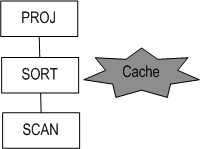

###### **Excution Plan with Result Cache enabled**

| Execution Plan    | Contents                 |
| ----------------- | ------------------------ |
| SORT              | Order by, Join, Group by |
| DISTINCT          | Distinct                 |
| MATERIALIZATION   | View, Connect by         |
| GROUP-AGGREGATION | Group Aggregation        |
| GROUP-CUBE        | Group by cube            |
| GROUP-ROLLUP      | Group by rollup          |
| HASH              | Join                     |
| SET-DIFFERENCE    | Minus                    |
| SET-INTERSECT     | Intersect                |
| WINDOW-SORT       | Over clause              |
| LIMIT-SORT        | Limit                    |

#### Top Result Cache Concept

If you add an execution plan with stored final result of query to existing execution plan and store it to the server; then, the subordinate execution plan can be omitted. 

The tables related to the stored execution plan must remain the same in order to use Result Cache. Rerun the query, and discard the values stored in the server If the related tables are modified.


#### Comparison of Result Cache and Top Result Cache

<table style="width: 718px;">
<tbody>
<tr>
<td style="width: 167px;">
<p> </p>
</td>
<th> Result Cache </th>
<th>Top Result Cache</th>
</tr>
<tr>
<th style="width: 167px;">
<p>Execution Plan</p>
</th>
<td style="width: 248px;">
<p>An execution plan is not modified.</p>
</td>
<td style="width: 293px;">
<p>An execution plan is modified.</p>
</td>
</tr>
<tr>
<td style="width: 167px;">
<p>Execution Speed</p>
</td>
<td style="width: 248px;">
<p>The initial performance speed stays the same as previous speed of not using cache.</p>
</td>
<td style="width: 293px;">
<p>The initial performance speed might be slowed due to the addition of final results added in the execution plan; however, it can be faster than the result cache in the second time.</p>
</td>
</tr>
<tr>
<td style="width: 167px;">
<p>Cache Range</p>
</td>
<td style="width: 248px;">
<p>Some parts of a query can execute the cache.</p>
</td>
<td style="width: 293px;">
<p>Only the final result can get the cache executed.</p>
</td>
</tr>
<tr>
<td style="width: 167px;">
<p>Effect on Table modification</p>
</td>
<td style="width: 541px;" colspan="2">
<p>The function of cache is not necessary when the tables used in a query are modified.</p>
</td>
</tr>
</tbody>
</table>

#### Result Cache-related Hints

- RESULT_CACHE  
  Cache intermediate results by aligning T1 table with i1.  

  ```
  SELECT /*+ RESULT_CACHE */ * FROM T1 ORDER BY i1;
  ```

- TOP_RESULT_CACHE  
   Cache the final results by aligning T1 table with i1

  ```
  SELECT /*+ TOP_RESULT_CACHE */ * FROM T1 ORDER BY i1;
  ```


#### Result Cache-related Hints

Some of the properties in the altibase.properties file should be appropriately modified to serve the purpose. Refer to the *General Reference* for detailed information on each property

-   RESULT_CACHE_ENABLE  
    This property sets the Result_Cache function available for use.

-   RESULT_CACHE_MEMORY_MAXIMUM  
    This property sets the maximum of storage memory when using the Result Cache and Top Result Cache.

-   TOP_RESULT_CACHE_MODE  
    This property sets the caches which the final result of a query is available for use.

#### Restrictions

The restrictions in which you cannot use the Result Cache are in the followings.

-   The Result Cache cannot be used in the functions specified below.  
    Non-deterministic Function, RANDOM, RANDOM_STRING, SYS_GUID, SYS_GUID_STR, SYSDATE, SYSTIMESTAMP, UNIX_DATE, UNIX_TIMESTAMP
-   The Result Cache cannot be used in the tables and performance views stipulated below.   
    Temporary Table, Fixed Table, Disk Temp Table, Dump Table, The remote table used in DB link
-   The Result Cache in a _PROWID column cannot be used.
-   The Result Cache cannot be used in the disk tables in which NO_PUSH_PROJECTION hint is used.
-   The Result Cache cannot be used after activating use REDUCE_TEMP_MEMORY property.
-   The Result Cache cannot be used for encrypted columns.
-   The Result Cache cannot be used when it is used in Prior a column or a LOB column.
-   The Result Cache cannot be used when the column value of disk partitioned table is used in the temporary table.

#### Notes

The usable range of Result Cache varies depending on the Commit mode.

| 2nd Session (Right) <br /> \ <br />1st Session (Bottom) | AUTO COMMIT ON                                     | AUTO COMMIT OFF                                              |
| ------------------------------------------------------- | -------------------------------------------------- | ------------------------------------------------------------ |
| AUTO COMMIT ON                                          | Possible to use.                                   | Impossible to use.<br />Re-execute after free up cache in the memory. |
| AUTO COMMIT OFF                                         | Impossible to use.<br />Reuse after clearing cache | Possible to use within identical transactions.               |

#### Example

\<Query 1\>  Check to see if the execution plan has been changed by using the Result Cache.

```
iSQL> alter session set explain plan = on;
Alter success.
iSQL> alter system set trclog_detail_mtrnode = 1;
Alter success.
iSQL> SELECT /*+ RESULT_CACHE */ E.E_LASTNAME, E.ENO FROM EMPLOYEES E ORDER
    2 BY E.DNO, E.E_FIRSTNAME LIMIT 3;
E_LASTNAME            ENO
-------------------------------------
Kobain                3
Chen                  16
Jones                 13
3 rows selected.
-----------------------------------------------------------
PROJECT ( COLUMN_COUNT: 2, TUPLE_SIZE: 28, COST: 0.03 )
[ TARGET INFO ]
sTargetColumn[0] : [0, 1],sTargetColumn->arg[X, X]
sTargetColumn[1] : [0, 0],sTargetColumn->arg[X, X]
 LIMIT-SORT ( ITEM_SIZE: 16, ITEM_COUNT: 20, STORE_COUNT: 3, ACCESS: 3, COST: 0.02 )
 [ RESULT CACHE HIT: 0, MISS: 0, SIZE: 65536, STATUS: INIT ]
 [ myNode NODE INFO, SELF: 1, REF1: 0, REF2: -1 ]
 sMtrNode[0] : src[0, ROWPTR],dst[1, 0]
 sMtrNode[1] : src[0, *5],dst[1, 1]
 sMtrNode[2] : src[0, *2],dst[1, 2]
  SCAN ( TABLE: SYS.EMPLOYEES E, FULL SCAN, ACCESS: 20, COST: 0.02 )
  [ SELF NODE INFO, SELF: 0 ]
-----------------------------------------------------------
* AUTO STATISTICS USED: 2

iSQL> SELECT /*+ RESULT_CACHE */ E.E_LASTNAME, E.ENO FROM EMPLOYEES E ORDER BY E.DNO, E.E_FIRSTNAME LIMIT 3;
E_LASTNAME            ENO
-------------------------------------
Kobain                3
Chen                  16
Jones                 13
3 rows selected.
-----------------------------------------------------------
PROJECT ( COLUMN_COUNT: 2, TUPLE_SIZE: 28, COST: 0.03 )
[ TARGET INFO ]
sTargetColumn[0] : [0, 1],sTargetColumn->arg[X, X]
sTargetColumn[1] : [0, 0],sTargetColumn->arg[X, X]
 LIMIT-SORT ( ITEM_SIZE: 16, ITEM_COUNT: 20, STORE_COUNT: 3, ACCESS: 3, COST: 0.02 )
 [ RESULT CACHE HIT: 1, MISS: 0, SIZE: 65536, STATUS: HIT ]
 [ myNode NODE INFO, SELF: 1, REF1: 0, REF2: -1 ]
 sMtrNode[0] : src[0, ROWPTR],dst[1, 0]
 sMtrNode[1] : src[0, *5],dst[1, 1]
 sMtrNode[2] : src[0, *2],dst[1, 2]
  SCAN ( TABLE: SYS.EMPLOYEES E, FULL SCAN, ACCESS: 0, COST: 0.02 )
  [ SELF NODE INFO, SELF: 0 ]
-----------------------------------------------------------
* AUTO STATISTICS USED: 2
```

\<Query 2\> Check to see if the execution plan has been changed by using the Top Result Cache.

```
iSQL> alter session set explain plan = on;
Alter success.
iSQL> alter system set trclog_detail_mtrnode = 1;
Alter success.
iSQL> SELECT /*+ TOP_RESULT_CACHE */ E.E_LASTNAME, E.ENO FROM EMPLOYEES E ORDER BY E.DNO, E.E_FIRSTNAME LIMIT 3;
E_LASTNAME            ENO
-------------------------------------
Kobain                3
Chen                  16
Jones                 13
3 rows selected.
-----------------------------------------------------------
PROJECT ( COLUMN_COUNT: 2, TUPLE_SIZE: 28, COST: 0.03 )
[ TARGET INFO ]
sTargetColumn[0] : [3, 0],sTargetColumn->arg[X, X]
sTargetColumn[1] : [3, 1],sTargetColumn->arg[X, X]
 MATERIALIZATION ( ITEM_SIZE: 40, ITEM_COUNT: 3, COST: 0.00 )
 [ RESULT CACHE HIT: 0, MISS: 0, SIZE: 65536, STATUS: INIT ]
 [ myNode NODE INFO, SELF: 3, REF1: 0, REF2: -1 ]
 sMtrNode[0] : src[2, 0],dst[3, 0]
 sMtrNode[1] : src[2, 1],dst[3, 1]
  VIEW ( ACCESS: 3, COST: 0.00 )
  [ MTRNODE INFO ]
  sNode[0] : [2, 0]
  sNode[1] : [2, 1]
   PROJECT ( COLUMN_COUNT: 2, TUPLE_SIZE: 28, COST: 0.03 )
   [ TARGET INFO ]
   sTargetColumn[0] : [0, 1],sTargetColumn->arg[X, X]
   sTargetColumn[1] : [0, 0],sTargetColumn->arg[X, X]
    LIMIT-SORT ( ITEM_SIZE: 16, ITEM_COUNT: 20, STORE_COUNT: 3, ACCESS: 3, COST: 0.02 )
    [ myNode NODE INFO, SELF: 1, REF1: 0, REF2: -1 ]
    sMtrNode[0] : src[0, ROWPTR],dst[1, 0]
    sMtrNode[1] : src[0, *5],dst[1, 1]
    sMtrNode[2] : src[0, *2],dst[1, 2]
     SCAN ( TABLE: SYS.EMPLOYEES E, FULL SCAN, ACCESS: 20, COST: 0.02 )
     [ SELF NODE INFO, SELF: 0 ]
-----------------------------------------------------------
* AUTO STATISTICS USED: 2
iSQL> SELECT /*+ TOP_RESULT_CACHE */ E.E_LASTNAME, E.ENO FROM EMPLOYEES E ORDER BY E.DNO, E.E_FIRSTNAME LIMIT 3;
E_LASTNAME            ENO
-------------------------------------
Kobain                3
Chen                  16
Jones                 13
3 rows selected.
-----------------------------------------------------------
PROJECT ( COLUMN_COUNT: 2, TUPLE_SIZE: 28, COST: 0.03 )
[ TARGET INFO ]
sTargetColumn[0] : [3, 0],sTargetColumn->arg[X, X]
sTargetColumn[1] : [3, 1],sTargetColumn->arg[X, X]
 MATERIALIZATION ( ITEM_SIZE: 40, ITEM_COUNT: 3, COST: 0.00 )
 [ RESULT CACHE HIT: 1, MISS: 0, SIZE: 65536, STATUS: HIT ]
 [ myNode NODE INFO, SELF: 3, REF1: 0, REF2: -1 ]
 sMtrNode[0] : src[2, 0],dst[3, 0]
 sMtrNode[1] : src[2, 1],dst[3, 1]
  VIEW ( ACCESS: 0, COST: 0.00 )
  [ MTRNODE INFO ]
  sNode[0] : [2, 0]
  sNode[1] : [2, 1]
   PROJECT ( COLUMN_COUNT: 2, TUPLE_SIZE: 28, COST: 0.03 )
   [ TARGET INFO ]
   sTargetColumn[0] : [0, 1],sTargetColumn->arg[X, X]
   sTargetColumn[1] : [0, 0],sTargetColumn->arg[X, X]
    LIMIT-SORT ( ITEM_SIZE: 0, ITEM_COUNT: 0, STORE_COUNT: 0, ACCESS: 0, COST: 0.02 )
    [ myNode NODE INFO, SELF: 1, REF1: 0, REF2: -1 ]
    sMtrNode[0] : src[0, ROWPTR],dst[1, 0]
    sMtrNode[1] : src[0, *5],dst[1, 1]
    sMtrNode[2] : src[0, *2],dst[1, 2]
     SCAN ( TABLE: SYS.EMPLOYEES E, FULL SCAN, ACCESS: 0, COST: 0.02 )
     [ SELF NODE INFO, SELF: 0 ]
-----------------------------------------------------------
* AUTO STATISTICS USED: 2
```

