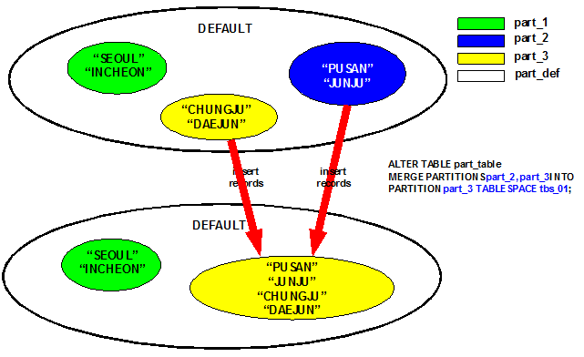
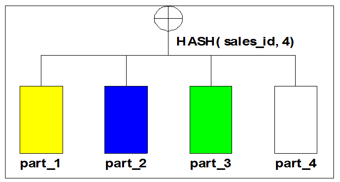
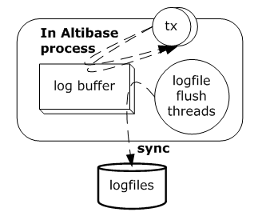
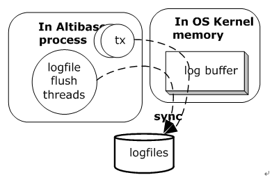
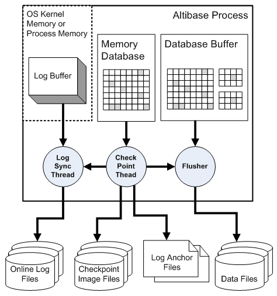
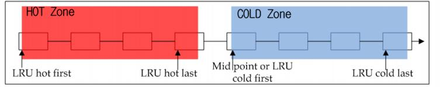
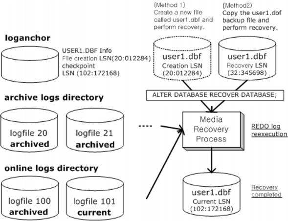

<!-- START doctoc generated TOC please keep comment here to allow auto update -->
<!-- DON'T EDIT THIS SECTION, INSTEAD RE-RUN doctoc TO UPDATE -->


- [Administrator’s Manual](#administrators-manual)
  - [7. Partitioned Objects](#7%ED%8C%8C%ED%8B%B0%EC%85%98%EB%93%9C-%EA%B0%9D%EC%B2%B4)
    - [What is Partitioning?](#%ED%8C%8C%ED%8B%B0%EC%85%94%EB%8B%9D-%EC%A0%95%EC%9D%98)
    - [Partitioned Objects](#%ED%8C%8C%ED%8B%B0%EC%85%98%EB%93%9C-%EA%B0%9D%EC%B2%B4)
    - [Partition Conditions](#%ED%8C%8C%ED%8B%B0%EC%85%98-%EC%A1%B0%EA%B1%B4)
    - [Partitioning Methods](#%ED%8C%8C%ED%8B%B0%EC%85%94%EB%8B%9D-%EB%B0%A9%EB%B2%95)
  - [8. Managing Transaction](#8%ED%8A%B8%EB%9E%9C%EC%9E%AD%EC%85%98-%EA%B4%80%EB%A6%AC)
    - [Transactions](#%ED%8A%B8%EB%9E%9C%EC%9E%AD%EC%85%98)
    - [Locking](#%EC%9E%A0%EA%B8%88lock)
    - [Multi-Version Concurrency Control (MVCC)](#%EB%8B%A4%EC%A4%91-%EB%B2%84%EC%A0%84-%EB%8F%99%EC%8B%9C%EC%84%B1-%EC%A0%9C%EC%96%B4-%EA%B8%B0%EB%B2%95)
    - [Transaction Durability](#%ED%8A%B8%EB%9E%9C%EC%9E%AD%EC%85%98%EC%9D%98-%EC%98%81%EC%86%8D%EC%84%B1)
    - [Checkpointing](#%EC%B2%B4%ED%81%AC%ED%8F%AC%EC%9D%B8%ED%8A%B8)
  - [9. Database Buffer Manager](#9%EB%B2%84%ED%8D%BC-%EA%B4%80%EB%A6%AC%EC%9E%90)
    - [Structure of the Buffer Manager](#%EB%B2%84%ED%8D%BC-%EA%B4%80%EB%A6%AC%EC%9E%90%EC%9D%98-%EA%B5%AC%EC%A1%B0)
    - [Managing Database Buffers](#%EB%B2%84%ED%8D%BC-%EA%B4%80%EB%A6%AC)
    - [Related Database Properties](#%EB%B2%84%ED%8D%BC-%EA%B4%80%EB%A0%A8-%ED%94%84%EB%A1%9C%ED%8D%BC%ED%8B%B0)
    - [Statistics for Buffer Management](#%EB%B2%84%ED%8D%BC-%EA%B4%80%EB%A6%AC%EC%9E%90-%ED%86%B5%EA%B3%84-%EC%A0%95%EB%B3%B4)
  - [10. Backup and Recovery](#10%EB%B0%B1%EC%97%85-%EB%B0%8F-%EB%B3%B5%EA%B5%AC)
    - [Database Backup](#%EB%8D%B0%EC%9D%B4%ED%84%B0%EB%B2%A0%EC%9D%B4%EC%8A%A4-%EB%B0%B1%EC%97%85)
    - [Database Recovery](#%EB%8D%B0%EC%9D%B4%ED%84%B0%EB%B2%A0%EC%9D%B4%EC%8A%A4-%EB%B3%B5%EA%B5%AC)
    - [Backup and Recovery Examples](#%EB%B0%B1%EC%97%85-%EB%B0%8F-%EB%B3%B5%EA%B5%AC-%EC%82%AC%EB%A1%80%EB%93%A4)
  - [11. Incremental Backup and Recovery](#11%EC%A6%9D%EB%B6%84-%EB%B0%B1%EC%97%85%EA%B3%BC-%EB%B3%B5%EA%B5%AC)
    - [Incremental Backup](#%EC%A6%9D%EB%B6%84-%EB%B0%B1%EC%97%85-incremental-backup)
    - [Types of Incremental Backups](#%EC%A6%9D%EB%B6%84-%EB%B0%B1%EC%97%85%EC%9D%98-%EC%A2%85%EB%A5%98)
    - [Media Restoration with Incremental Backups](#%EC%A6%9D%EB%B6%84-%EB%B0%B1%EC%97%85%EC%97%90-%EB%8C%80%ED%95%9C-%EB%A7%A4%EC%B2%B4-%EB%B3%B5%EA%B5%AC)
    - [Managing Backup Files](#%EB%B0%B1%EC%97%85-%ED%8C%8C%EC%9D%BC-%EA%B4%80%EB%A6%AC)
  - [12. Communication Layer](#12%EC%84%9C%EB%B2%84%ED%81%B4%EB%9D%BC%EC%9D%B4%EC%96%B8%ED%8A%B8-%ED%86%B5%EC%8B%A0)
    - [Communication Protocols](#%ED%86%B5%EC%8B%A0-%EB%B0%A9%EB%B2%95)
  - [13. Securing Data](#13altibase%EC%9D%98-%EB%B3%B4%EC%95%88)
    - [Overview](#%EB%B3%B4%EC%95%88%EC%9D%98-%EA%B0%9C%EC%9A%94)
    - [How Security is Organized in Altibase](#%EB%B3%B4%EC%95%88-%EA%B8%B0%EB%8A%A5%EC%9D%98-%EA%B5%AC%EC%84%B1)
    - [Intergrating a Security Module](#%EB%B3%B4%EC%95%88-%EB%AA%A8%EB%93%88-%EC%97%B0%EB%8F%99-%EB%B0%A9%EB%B2%95)
    - [Starting Security Modules and Encrypting Data](#%EB%B3%B4%EC%95%88-%EB%AA%A8%EB%93%88-%EA%B5%AC%EB%8F%99%EA%B3%BC-%EB%8D%B0%EC%9D%B4%ED%84%B0-%EC%95%94%ED%98%B8%ED%99%94)
  - [14. Database Auditing](#14%EB%8D%B0%EC%9D%B4%ED%84%B0%EB%B2%A0%EC%9D%B4%EC%8A%A4-%EA%B0%90%EC%82%AC-database-auditing)
    - [Introduction](#%EC%86%8C%EA%B0%9C)
    - [Related Meta Tables and Properties](#%EA%B4%80%EB%A0%A8-%EB%A9%94%ED%83%80-%ED%85%8C%EC%9D%B4%EB%B8%94%EA%B3%BC-%ED%94%84%EB%A1%9C%ED%8D%BC%ED%8B%B0)
    - [Audit Control Statements](#%EA%B0%90%EC%82%AC-%EC%A0%9C%EC%96%B4-%EA%B5%AC%EB%AC%B8)
    - [Audit Condition Statements](#%EA%B0%90%EC%82%AC-%EC%A1%B0%EA%B1%B4-%EA%B5%AC%EB%AC%B8)
    - [Viewing Auditing Results](#%EA%B0%90%EC%82%AC-%EA%B2%B0%EA%B3%BC-%ED%99%95%EC%9D%B8%ED%95%98%EA%B8%B0)
  - [15. Tuning Altibase](#15altibase-%ED%8A%9C%EB%8B%9D)
    - [Log File Groups](#%EB%A1%9C%EA%B7%B8-%ED%8C%8C%EC%9D%BC-%EA%B7%B8%EB%A3%B9)
    - [Group Commit](#%EA%B7%B8%EB%A3%B9-%EC%BB%A4%EB%B0%8B)
  - [DB Diagnostic Monitoring](#altibase-%EC%A7%84%EB%8B%A8-%EB%AA%A8%EB%8B%88%ED%84%B0%EB%A7%81)
    - [Monitoring Database Servers](#altibase-%EB%AA%A8%EB%8B%88%ED%84%B0%EB%A7%81)
    - [Troubleshooting Procedures](#altibase-%EB%AC%B8%EC%A0%9C%EC%83%81%ED%99%A9-%EB%B6%84%EC%84%9D)
  - [Appendix A. Trace Log](#a%EB%B6%80%EB%A1%9D-trace-log)
    - [Trace Log](#trace-log)
  - [Appendix B. Altibase Limitations](#b%EB%B6%80%EB%A1%9D-altibase-%EC%B5%9C%EB%8C%80%EC%B9%98)
    - [Maximum Altibase Value](#altibase-%EA%B0%9D%EC%B2%B4%EB%93%A4%EC%9D%98-%EC%B5%9C%EB%8C%80%EA%B0%92)

<!-- END doctoc generated TOC please keep comment here to allow auto update -->

Altibase® Administration

# Administrator’s Manual


Altibase Administration Administrator’s Manual

Release 7.1

Copyright ⓒ 2001\~2019 Altibase Corp. All Rights Reserved.

This manual contains proprietary information of Altibase Corporation; it is provided under a license agreement containing restrictions on use and disclosure and is also protected by copyright patent and other intellectual property law. Reverse engineering of the software is prohibited. All trademarks, registered or otherwise, are the property of their respective owners.


**Altibase Corp**

10F, Daerung PostTower II,
306, Digital-ro, Guro-gu, Seoul 08378, Korea
Telephone: +82-2-2082-1000 Fax: 82-2-2082-1099

Customer Service Portal: <http://support.altibase.com/en/>

Homepage: [http://www.altibase.com]

## 7. Paritioned Objects

### What is Partitioning?

Partitioning is the division of a large database object into several small pieces for easier management. 

A large database object that has been partitioned is called a “partitioned object”, and each piece of a partitioned object is called a “partition”.

#### Partitioned Objects and Non-Partitioned Objects

When an end-user accesses a partitioned object, the user cannot perceive any difference from a non-partitioned object. That is, from the user's perspective, both partitioned and non-partitioned objects are recognized as database objects, and it is not apparent whether a particular object has been partitioned. This allows the user to execute queries or DML statements (i.e. insert, delete and update records) in the same way regardless of the partition of the object.

The differences between partitioned objects and non-partitioned objects in terms of database structure are as follows.

##### Internal Structure 

A non-partitioned object is an object that depends on one table space. A nonpartitioned object is stored in only one tablespace.

A partitioned object can be stored across multiple tablespaces. This is illustrated in [Figure 7-1].


[Figure 7-1] The Relationships between Tablespaces, Partitioned Objects, and Non-Partitioned Objects

A partitioned object internally consists of multiple partitions. Each partition has the same constraints as nonpartitioned objects, and one partition only depends on a single tablespace.

A partitioned object causes partitions distributed across multiple tablespaces to appear as a single object. [Figure 7-2] shows the internal structure of a partitioned object.


[Figure 7-2] The Internal Structure of a Partitioned Object

##### Advantages of Partitioned Objects

Due to this structure characteristics, a partitioned object has the following advantages: 

- Faster data loading and index rebuilding 
- Faster partial deletes 
- Faster table and index scans 
- More flexible response to disk failures

#### Partition Key

A partition key is a basis on which tables are partitioned. A partition key consists of one or more of the columns of the table to be partitioned. These columns are called partition key columns.

A partition key column must have a data type that supports size comparisons (i.e. <, >, =). Only such columns can be used as partition key columns.

For example, when a record is inserting a record, it must be clear on which partition will hold the inserted record. In order to satisfy this requirement, it must be possible to compare partition key columns according to the relevant conditions unambiguously. Therefore, non-comparable types such as BINARY, GEOMETRY, BLOB, and CLOB cannot be partitioning key columns.

### Partitioned Objects

Tables and indexes are the database objects that can be partitioned. 

When a table is partitioned, the table is called a “partitioned table”, and when an index is partitioned, it is called a “partitioned index”. These partitioned tables and partitioned indexes are collectively known as “partitioned objects”. 

A partitioned object must satisfy the following rule:

```
non-partitioned_object ≡ ∑partition ………………… rule1
```

The above rule means that a non-partitioned object must be equal to the sum of its partitions if it were partitioned. In other words, it is not possible to partition only part of a non-partitioned object.

#### Partitioned Tables

The term “partitioned table” refers to a large table that has been partitioned into multiple partitions based on partitioning conditions (range, list, or hash). This is illustrated in [Figure 7-3]. 

In [Figure 7-3], a non-partitioned table is partitioned based on color, resulting in a partitioned table with three partitions. 

From a structural point of view, the database object that conceptually bears the closest resemblance to a partitioned table is a union view. A union view allows multiple tables to be treated as a single object, but does not itself take up any physical space. Likewise, the partitions in a partitioned table occupy physical space, but the partitioned table itself does not. 

However, there are some characteristics of partitioned tables that make them different from union views.

- Updatability  
  Partitioned tables can be updated. In contrast, a union for union views, records can be updated by accessing individual tables, but not by accessing the union view.
- Index Range 
  Indexes can be built for partitioned tables. In contrast, indexes can be built for the individual tables that make up union views, but not for the union views themselves.


[Figure 7-3] Partitioned Tables and Non-partitioned Tables

A partitioned table can thus be thought of as a union view that can be accessed to update records, and for which an index can be built.

Partitioned tables can be classified as follows based on the type of storage medium on which the partitions are saved. 

- Partitioned Memory Table: A partitioned table for which all partitions are stored in a memory tablespace.
- Partitioned Disk Table: A partitioned table for which all partitions are stored in a disk tablespace.

#### Partitioned Indexes

Indexes for partitioned tables can be classified according to the following:

- Whether they are partitioned:

  Partitioned indexes vs. Non-partitioned indexes

- The relationship between table and index:
  
  Global indexes vs. Local indexes

##### Partitioned Indexes vs. Non-Partitioned Indexes

An index is classified either as a partitioned index or as a non-partitioned index, depending on whether it is partitioned.

The term “non-partitioned index” refers to an index that is not partitioned, whereas the term “partitioned index” refers to a large index that, just like a partitioned table, is divided into multiple partitions according to some partitioning criteria. This is illustrated in [Figure 7-4]. 


[Figure 7-4] Partitioned Indexes vs. Non-Partitioned Indexes

[Figure 7-4] shows a non-partitioned index that has been partitioned based on color, resulting in a partitioned index that consists of three partitions.

Partitioned indexes, which are partitioned according to some partition conditions, are classified as either prefixed indexes or non-prefixed indexes based on the relationship between an index partition key and an index key.

- Prefixed Index
  In a prefixed index, the first column of an index key and the first column of an index partition key are the same column.
- Non-prefixed Index
  In a non-prefixed index, the first column of an index key and the first column of an index partition key are not the same column. 

[Figure 7-5] shows the difference between a prefixed index and a non-prefixed index, using a table that consists of the “sales_id” and “sales_date” columns as an example.


[Figure 7-5] Examples of Prefixed and Non-prefixed Indexes

In the figure above, the indexes are partitioned on the basis of the “sales_date” column. Each index is classified as either a prefixed index or a non-prefixed index based on the key on which it was built. 

In the figure, the prefixed index has the key “sales_date”. In other words, the index partition key and the index key are based on the same column. This type of index is called a “prefixed index”. In contrast, the non-prefixed index in the figure is sorted by “sales_id”. Because this type of index is sorted according to a key other than the index partition key, it is called a “non-prefixed index”

The reason for distinguishing between prefixed and non-prefixed indexes is related to the UNIQUE attribute. Because the index key of a prefixed index is the same as its index partition key, the Altibase server can perform unique checks without searching all partitions in the partitioned index. However, in the case of non-prefixed indexes, the Altibase server must search all partitions included in the partitioned index. [Figure 7-6] displays an example of this: 


[Figure 7-6] Example of Unique Check with Non-Prefixed Index (Impossible)

In the example shown in [Figure 7-6], suppose that the index partition key of the table is the sales_date column, and that duplicate values are not allowed for the sales_id column. If a non-prefixed index (“IDX_NON_PREFIX”) is built using the sales_id column as the index key, consider whether a unique check can be performed using IDX_NON_PREFIX when records are inserted using the following SQL statement: 

```
INSERT INTO TBL_SALES VALUES(9, January);
```

Because the value in the sales_date column of the record to be inserted is “January”, a key will be inserted into IDX_PART_1. Even though a key value of 9 is present in the sales_id column in the IDX_PART_2 partition, the same value will be inserted without error into the IDX_PART_1 partition. Therefore, it is necessary to check all of the indexes when performing a unique check using a non-prefixed index.

##### Global Index and Local Index

An index is classified as either a global index or a local index based on the relationship between a table partition key and an index partition key. The term “global index” refers to an index in which the index partition key and the table partition key are different (index_partition_key != table_partition_key), whereas the term “local index” refers to an index in which the index partition key and the table partition key are the same (index_partition_key == table_partition_key).


[Figure 7-7] Examples of Local and Global Indexes

[Figure 7-7] shows the difference between a global index and a local index with reference by way of example to a table that consists of the sales_id and sales_date columns. In the figure, the indexes are sorted by sales_date, and each index is categorized as either a local or global index based on which index partition key is used to partition it. 

In the figure, a local index is partitioned into three partitions on the basis of the sales_date column. A partitioned index in which the index partition key (sales_date) and the table partition key (sales_date) are the same is called a local index.

In contrast, at the bottom of the figure, a global index is partitioned on the basis of the sales_id column. That is, the index partition key (sales_id) and the table partition key (sales_date) are not the same. This type of partitioned index is called a global index

The reason that indexes are classified as global or local indexes is that they have different characteristics based on whether or not the table partition key and the index partition key are the same. 

Building a partitioned index on the basis of a column other than the table partition key means that the keys in an index partition of a global index will point to several different table partitions. The result of this is that the use of a table modification statement (e.g. ALTER TABLE ....MERGE ...) on a partitioned table can cause the global index to be rebuilt. 

In contrast, for a local index, because a partitioned table modification statement only changes the local index of the partitions, overall consistency does not suffer.

##### Global Non-partitioned Index

Global non-partitioned indexes work similarly to non-partitioned indexes. These indexes are created globally without an index partition key on a partitioned table.

The following figure shows the creation of a global non-partitioned index without specifying an index partition key on the table tbl_sales, which is divided into three partitions.


Figure 7-8 Example of a global non-partitioned index

##### Types of Indexes

[Figure 7-9] shows the types of indexes that have been examined so far:


[Figure 7-9] Types of Indexes

Altibase currently supports only local and global non-partitioned indexes. Global partitioned indexes are not supported. Please refer to the following table and figure: 

|                                         | Non-partitioned Table | Partitioned Table |
| --------------------------------------- | --------------------- | ----------------- |
| (Partitioned) Local Prefixed Index      | X                     | O                 |
| (Partitioned)Local Non-prefixed Index   | X                     | O                 |
| (Partitioned) Global Prefixed Index     | X                     | X                 |
| (Partitioned) Global Non-prefixed Index | X                     | X                 |
| Global Non-partitioned Index            | O                     | O                 |

[Table 7-1] Index Types Supported in Disk Tables

Only global non-partitioned indexes can be built for non-partitioned tables and partitioned tables; local prefixed indexes and local non-prefixed indexes can be built for partitioned tables.

However, global non-partitioned indexes cannot be built for partitioned memory tables. The supported index types for memory tables are listed in the following table. 

|                                         | Non-partitioned Table | Partitioned Table |
| --------------------------------------- | --------------------- | ----------------- |
| (Partitioned) Local Prefixed Index      | X                     | O                 |
| (Partitioned) Local Non-prefixed Index  | X                     | O                 |
| (Partitioned) Global Prefixed Index     | X                     | X                 |
| (Partitioned) Global Non-prefixed Index | X                     | X                 |
| Global Non-partitioned Index            | O                     | X                 |

[Table 7-2] Index Types Supported in Memory Tables

#### Hybrid Partitioned Table

The partitioned table can be converted into another tablespace regardless of the storage space (e.g., disk/memory).

When converting from a disk partitioned table to memory/volatile partitioned table, even if the column is fixed or variable. It is treated as fixed.

However, the type of memory partitioned table stays the same even though it is converted into a disk partitioned table. Furthermore, the LOB column always becomes variable, but the data is stored as fixed or variable in accordance with the specified values in the IN ROW clause.

##### Restrictions

- The global index does not support hybrid partitioned tables. 
- The hybrid partitioned table cannot use Direct key Index, JOIN, and DISJOIN. 
- ALTER TABLE MODIFY COLUMN cannot be used

### Partitioned Conditions

This section describes partition conditions and default partitions

#### Partition Pre-Conditions

A partition condition refers to the criteria for partitioning. These criteria must comply with the following condition: 

```
partition_conditioni ∩ partition_conditioni+1 = ∮…………rule2
```

The above rule means that there must not be any intersection between partition conditions for a partitioned table. If partition conditions intersect, it may not be clear in which partition a record is to be inserted. Therefore, if this rule is not satisfied when a partitioned object is created, the attempt to create the partitioned object will fail. 

Additionally, partition conditions must always output the same value regardless of the circumstances. Assuming that a record is inserted into partition A at time t, the same record should be inserted into partition A, even if it is inserted at time t + 1. To satisfy this condition, the partition condition value described in the partition condition must always be a constant or deterministic built-in function. A determinable built-in function is a non-user-defined function provided by the system that returns the same value regardless of time.

#### The Default Partition 

In Altibase, partition conditions must always satisfy the following rule: 

```
column_domain ≡ ∪partition_condition ……………… rule3
```

The above rule states that the entire domain of the partition key columns must equal the union of domains that satisfy each partition condition. This means that all partition conditions must be specified when a partitioned table is created.

In reality, however, Altibase provides the concept of a default partition because it is impossible for a user to specify all partition conditions. 

[Figure 7-10] illustrates the concept of a default partition with reference by way of example to a partitioned object having three partitions. In the following statement, the user specifies partition conditions (partition_condition1 and partition_condition2) for partitions P1 and P2, and declares P3 as a default partition. Therefore, if a record to be inserted into this object satisfies neither partition_condition1 nor partition_condition2, it will be inserted into partition P3. In other words, the default partition is equivalent to the portion of the domain of a partition key column that remains after the domains satisfying the user-specified partition conditions have been subtracted from the entire domain.


[Figure 7-10] Default Partition Example

The default partition must be specified when a partitioned object is created. If no default partition is specified, the attempt to create the partitioned object will fail.

### Partitioning Methods

Objects can be partitioned in three ways: range partitioning, list partitioning, and hash partitioning

Range partitioning is a method of partitioning an object based on a range of partition key values. Range partitioning is suitable for data that are distributed across a linear range. In list partitioning, an object is partitioned based on sets of partition key values. List partitioning is useful with data that fall into discrete categories. In hash partitioning, an object is partitioned based on hash values that correspond to partition key values

The following operations are supported on partitions created by each partitioning method:

| Operation | Partitions created by Range Partitioning | Partitions created by List Partitioning | Partitions created by Hash Partitioning |
| --------- | ---------------------------------------- | --------------------------------------- | --------------------------------------- |
| Alter     | ○                                        | ○                                       | ○                                       |
| Add       | X                                        | X                                       | ○                                       |
| Coalesce  | X                                        | X                                       | ○                                       |
| Drop      | ○                                        | ○                                       | X                                       |
| Merge     | ○                                        | ○                                       | X                                       |
| Rename    | ○                                        | ○                                       | ○                                       |
| Split     | ○                                        | ○                                       | X                                       |
| Truncate  | ○                                        | ○                                       | ○                                       |

[Table 7-3] Operations Supported for Partitionss

#### Range Partitioning

Range partitioning is commonly used with date data types in situations where it is necessary to manipulate historical data.

The only partition condition that is supported when defining a partition is 'LESS THAN'. Default partitions are supported via the 'DEFAULT' clause.

The following is an example of range partitioning:

```
CREATE TABLE part_table
(
    sales_date        DATE,
    sales_id            NUMBER,
    sales_city         VARCHAR(20),
    ....
) 
PARTITION BY RANGE(sales_date)
(
    PARTITION part_1 VALUES LESS THAN ( TO_DATE(‘01-FEB-2006’) ),
    PARTITION part_2 VALUES LESS THAN ( TO_DATE(‘01-MAR-2006’) ),
    PARTITION part_3 VALUES LESS THAN ( TO_DATE(‘01-APR-2006’) ),
    PARTITION part_def VALUES DEFAULT
) TABLESPACE SYS_TBS_DISK_DATA;
```

In the example above, the part_table table is created and range-partitioned into 4 partitions. The first three partitions handle data values prior to the beginning of February, March, and April, respectively. The default partition part_def handles data that do not satisfy any of the conditions for the other partitions.

[Figure 7-11] shows the above example in graphical form:


[Figure 7-11] Partition Areas of a Range-Partitioned Table

##### Multi-Column Partitioning

Multi-column partitioning is a method of partitioning an object using a partition key composed of multiple columns. Multi-column partitioning has the same concept as an index with multiple keys.

The following figure depicts a partition key constructed on the basis of two columns (i1, i2) in one dimension. 


[Figure 7-12] Partition Areas in Multi-Column Partitioning

The following describes multi-column partitioning with reference to a SQL statement as an example:

```
CREATE TABLE part_table
(
    sales_date        DATE,
    sales_id            NUMBER,
    sales_city         VARCHAR(20),
    ....
) 
PARTITION BY RANGE(sales_date, sales_id)
(
    PARTITION part_1 VALUES LESS THAN ( TO_DATE(‘01-FEB-2006’), 200),
    PARTITION part_2 VALUES LESS THAN ( TO_DATE(‘01-MAR-2006’), 100),
    PARTITION part_3 VALUES LESS THAN ( TO_DATE(‘02-MAR-2006’)),
    PARTITION part_4 VALUES LESS THAN ( TO_DATE(‘01-APR-2006’) ),
    PARTITION part_def VALUES DEFAULT
) TABLESPACE SYS_TBS_DISK_DATA;
```

The above CREATE TABLE statement is illustrated below:


[Figure 7-13] Partition Areas in Example SQL Statement

The following table shows the partition into which records will be inserted and the insertion conditions depending on the values of the records to be inserted.

| Value of the Record to be Inserted (sales_date, sales_id) | Partition into which Record Will be Inserted |
| --------------------------------------------------------- | -------------------------------------------- |
| TO_DATE(‘15-JAN-2006’), 100                               | part_1                                       |
| TO_DATE(‘01-FEB-2006’), 100                               | part_1                                       |
| TO_DATE(‘01-FEB-2006’), 200                               | part_2                                       |
| TO_DATE(‘15-FEB-2006’), NULL                              | part_2                                       |
| TO_DATE(‘01-MAR-2006’), 50                                | part_2                                       |
| TO_DATE(‘01-MAR-2006’), NULL                              | part_3                                       |
| TO_DATE(‘15-MAR-2006’), 200                               | part_4                                       |
| NULL, 100                                                 | part_def                                     |
| NULL, NULL                                                | part_def                                     |

##### Operations on Range-Partitioned Objects

There are 5 operations that can be performed on range-partitioned objects. These are: SPLIT PARTITION, DROP PARTITION, MERGE PARTITION, RENAME PARTITION and TRUNCATE PARTITION. Changing partition condition is currently not supported.

The process of adding a partition to a range-partitioned object is the same as the process of splitting partition conditions. Therefore, to add a partition, use ‘Split Partition’. 

Similarly, deleting a partition is the same as deleting partition conditions. Therefore, to delete a partition, use DROP PARTITION. When a partition is deleted, the deleted partition conditions become included in the partition conditions of a neighboring partition. Additionally, DROP PARTITION is distinguished from MERGE PARTITION based on whether or not records are deleted. 

A partition can be renamed using RENAME PARTITION. To delete records from a partition, use TRUNCATE PARTITION; this deleteㄴ all records stored in the partition. 

###### SPLIT PARTITION

Split Partition is an operation in which a partition of a partitioned object is divided into two partitions. SPLIT PARTITION can be performed in one of two ways:

- In-place Split
  With In-Place Split, some of the records are deleted from an existing partition and moved to a new partition; that is, the contents of the existing partition are changed. 
  
  In-Place Split is used when the name of one of the new partitions is the same as the name of the existing partition and the tablespace in which the new partitions are to be created is not specified. (Please refer to [Figure 7-14])
  
- Out-Place Split 
  
  With Out-Place Split, the contents of the existing partition are not changed. Instead, two new partitions are created, and then the records in the existing partition are divided and copied into them.
  
  This method is used when the names of both of the new partitions are set differently from the name of the existing partition. Even if the name of one of the new partitions is the same as the name of the existing partition, this method is used when the tablespace in which the new partition having the same name of the existing partition is to be created is specified. (Refer to [Figure 7-15].)
  
  The Out-Place and In-Place partition splitting methods described above differ from each other in various aspects related to performance and efficiency. When using In-Place Split, because the existing partition is the same as one of the new partitions, only one new partition is created. Therefore, In-Place Split is advantageous from the aspect of efficiency of the use of space.
  
  Meanwhile, Out-Place Split consists of a process of creating two new partitions and inserting records into each of them. With In-Place Split, the operation that is performed on a record is a move operation, which consists of both an INSERT operation and a DELETE operation. In an MVCC environment, a DELETE operation has a more negative impact on system performance than an INSERT operation. Therefore, In-Place Split is more efficient when there is not enough storage space, whereas Out-Place Split realizes better performance in an MVCC environment when there is no shortage of storage space. 


[Figure 7-14] In-place Split of a Range-Partitioned Object

In the example shown in the above figure, part_2, which belongs to a partitioned object that originally consists of 4 partitions, is divided into part_2 and part_4.

① The new partition, part_4, is created, after which ② records are moved from part_2 to part_4 (move: INSERT & DELETE). Finally, ③ the conditions for part_2 are narrowed to the specified conditions.


[Figure 7-15] Out-place Split of a Range-Partitioned Object

In the example shown in the above figure, part_2, which belongs to a partitioned object that originally consists of 4 partitions, is divided into part_2 and part_4. ① The new partitions part_2 and part_4 are created, and ② records are inserted from the old part_2 into the new part_2 and part_4. Finally, ③ the old part_2 is physically deleted.

When the default partition is divided, the second partition in the INTO clause is automatically set as the default partition. This is because no command for specifying the default partition in the INTO subclause is supported.

###### DROP PARTITION

Drop Partition is an operation in which a specific partition in a partitioned object is deleted. When a partition is deleted, all records and meta data in that partition are physically deleted. Furthermore, the conditions for that partition are incorporated in a neighboring partition.


Figure 7-16 DROPping a Partition from a Range-Partitioned Object

The figure above illustrates an example in which a partition called part_2 is dropped from a partitioned object that consists of 4 partitions.

① The physical space (records and meta data) of part_2 is deleted, and ② its partition conditions are incorporated in the neighboring partition part_3, whose conditions are expanded to include the conditions of part_2

###### MERGE PARTITION

MERGE PARTITION is an operation of merging two specified partitions among a partitioned object into one partition. The partitions to be merged must be neighboring partitions. The MERGE PARTITION operation can be conducted in one of two ways: In-Place Merge and Out-Place Merge. 

- In-place Merge  
  As two existing partitions are merged into one of the partitions, the records from the other partition are inserted into it. This method is used when the names of the new partition and one of the existing partitions are the same and the tablespace in which the new partition is to be created is not specified. Please refer to [Figure 7-17].
- Out-place Merge  
  A new partition is created and the records in the existing partitions are copied into the new partition. This method is used when the name of the new partition is different from the names of the existing partitions. Additionally, even if the name of the new partition is the same as that of one of the existing partitions, this method is used if the tablespace in which the new partition is to be created is specified. Please refer to [Figure 7-18].

In-Place Merge and Out-Place Merge may differ from each other with respect to performance and efficiency. Because In-Place Merge does not create a new partition, but merely conducts an operation of INSERTing records, it is preferable to Out-place Merge from the aspect of performance.


[Figure 7-17] In-Place Merge of a Range-Partitioned Object

In the example shown in the above figure, in a partitioned object comprising 4 partitions, the part_2 partition and the part_3 partition are merged into the original part_3 partition. ① The conditions for the existing part_3 are extended, and ② records from part_2 are inserted into part_3. Finally, ③ part_2 is physically deleted.


[Figure 7-18] Out-Place Merge of a Range-Partitioned Object

In [Figure 7-18], in a partitioned object comprising 4 partitions, the part_2 partition and the part_3 partition are merged into a newly created part_3 partition.

① The new part_3 partition is created, and ② records from part_2 and the old part_3 are inserted into the new part_3. Finally, ③ part_2 and the old part_3 are physically deleted.

###### RENAME PARTITION

RENAME PARTITION changes the name of a partition without changing the partition conditions.

###### TRUNCATE PARTITION

TRUNCATE PARTITION does not change the partition conditions but deletes all of the records stored in a partition.

#### List Partitioning

List partitioning is a method of partitioning an object based on a set of partition key column values. List partitioning is commonly used when the range of partition key column values is not broad (e.g. January – December). List partitioning does not support multiple keys for partition key columns. 

As with range partitioning, the DEFAULT clause is supported for creating basic partitions.

The following is an example of list partitioning:

```
CREATE TABLE part_table
(
    sales_date DATE,
    sales_id NUMBER,
    sales_city VARCHAR(20),
    ....
) 
PARTITION BY LIST(sales_city)
(
    PARTITION part_1 VALUES ( ‘SEOUL’ , ‘INCHEON’ ),
    PARTITION part_2 VALUES ( ‘PUSAN’ , ‘JUNJU’ ),
    PARTITION part_3 VALUES ( ‘CHUNGJU’ , ‘DAEJUN’ ),
    PARTITION part_def VALUES DEFAULT
) TABLESPACE SYS_TBS_DISK_DATA;
```

In the example above, the part_table table is created and list-partitioned so that it has 4 partitions. The first three partitions manage data by specific cities, while the default partition, part_def, handles data that do not meet any of the conditions specified for the other partitions. The example is illustrated below:


[Figure 7-19] Partition Area of List-Partitioned Table

##### Operations on List-Partitioned Objects

There are five types of operations that can be performed on list-partitioned objects. These are: SPLIT PARTITION, DROP PARTITION, MERGE PARTITION, RENAME PARTITION and TRUNCATE PARTITION. The SQL statements that are used are the same as for range-partitioned objects. Changing partition conditions are currently not supported.

###### SPLIT PARTITION

As in range partitioning, in list partitioning, the SPLIT PARTITION operation can be conducted as either In-Place Split or Out-Place Split. When splitting a partition, if the name of one of the new partitions is the same as the name of the old partition, whether In-Place Split or Out-Place Split is used depends on whether a tablespace is specified.


[Figure 7-20] In-Place Split of a List-Partitioned Object

In the example shown in the above figure, in a partitioned object with 4 partitions, the part_2 partition is divided into the part_2 partition and the part_4 partition. ① A new partition, part_4, is created, and ② records are moved from part_2 to part_4 (move: INSERT & DELETE). Finally, ③ the conditions for the part_2 partition are narrowed to the newly specified conditions ({‘PUSAN’, ‘JUNJU’} -> {‘JUNJU’}). 


[Figure 7-21] Out-Place Split of a List-Partitioned Object

The sample shown in the figure above illustrates partitioning part_2 into part_2 and part_4 in a partitioned object with four partitions ① The new part_2 and part_4 partitions are created, and ② records from the old part_2 partition are inserted into the new part_2 partition and the part_4 partition. Finally, ③ the old part_2 partition is physically deleted.

###### DROP PARTITION

Dropping a partition from a list-partitioned object is similar to dropping one from a range-partitioned object, except that the partition conditions of the partition to be dropped are incorporated as the conditions of the default partition rather than neighboring partition. 


[Figure 7-22] DROPping a Partition from a List-Partitioned Object

The example shown in the figure above illustrates dropping part_2 partition from a partitioned object with four partitions. ① The physical space (records and meta data) of the part_2 partition is dropped, and ② the conditions for part_2 are incorporated into those for the default partition part_def.

###### MERGE PARTITION

As with range-partitioned objects, there are two ways to merge the partitions of a list-partitioned object: In-Place Merge and Out-Place Merge. If the name of the new partition is the same as that of one of the partitions being merged, whether In-Place Merge or Out-Place Merge is used depends on whether a tablespace is specified.


[Figure 7-23] In-Place Merge in a List-Partitioned Object

The example shown in the figure above illustrates the merging of part_2 and part_3 into part_3 (old) in a partitioned object with four partitions. ① The conditions for the existing part_3 are extended, and ② records from the part_2 partition are inserted into the part_3 partition. Finally, ③ the part_2 partition is physically deleted.



[Figure 7-24] Out-Place Merge in a List-Partitioned Object

The example shown in the figure above illustrates the merging of part_2 and part_3 into part_3 (new) in a partitioned object with four partitions. ① The new partition part_3 is created, and ② records from the part_2 partition and the original part_3 partition are inserted into the new part_3 partition. Finally, ③ the part_2 partition and the original part_3 partition are physically deleted

###### RENAME PARTITION

RENAME PARTITION changes the name of a partition without changing the partition conditions.

###### TRUNCATE PARTITION

This deletes all of the records from a partition without changing the partition conditions.

#### Hash Partitioning

Hash partitioning is a method of partitioning an object based on a hash value of a partition key. The partition key can consist of multiple columns. Hash partitioning is typically used for uniform load distribution rather than for manageability

Due to the characteristics of hash functions, hash partitioning is limited to general partition operations. Unlike range partitions and list partitions, SPLIT PARTITION, DROP PARTITION, and MERGE PARTITION cannot be performed on hash partitions; however, operations such as ADD PARTITION and COALESCE PARTITION are supported

Unlike range partitioning and list partitioning,  there is no default partition in hash partitioning. This is because the hash function can accept any value of the partition key. The location where records having NULL partition key values are inserted depends on the hash value for the NULL data. Although the hash value corresponding to NULL data is constant, different values can be output depending on the data type. The location in which records having NULL partition key values are stored can be different depending on the column type. 

The following is an example of hash partitioning:

```
CREATE TABLE part_table
(
    sales_date        DATE,
    sales_id            NUMBER,
    sales_city         VARCHAR(20),
    ....
) 
PARTITION BY HASH(sales_id)
(
    PARTITION part_1,
    PARTITION part_2,
    PARTITION part_3,
    PARTITION part_4
) TABLESPACE SYS_TBS_DISK_DATA;
```

The example above shows that the table_part_table with four partitions is created using hash partitioning. Each partition manages data divided according to the hash function HASH(sales_id, 4). The above example is shown in [Figure 7-25].



[Figure 7-25] Partition Areas of a Hash-Partitioned Table

##### Operations on Hash-Partitioned Objects

There are four types of operations that can be performed on hash-partitioned objects. These are ADD PARTITION, COALESCE PARTITION, RENAME PARTITION, and TRUNCATE PARTITION. 

* To add a partition to a hash-partitioned object, use ADD PARTITION. 

* To get rid of a partition but keep its data, use COALESCE PARTITION. This operation deletes the last partition and reorganizes the entire partitioned object, combining the records from the deleted partition with the existing records in all other partitions. 

* To rename a partition, use RENAME PARTITION. 

* To truncate a partition, that is, delete all of the records in the partition, use TRUNCATE PARTITION.

###### ADD PARTITION

Adding a partition to a hash-partitioned object means increasing the number of hash keys. Adding a partition affects all existing partitions. If a hash key is changed, the entire records of the table are reorganized into the new partitions. The following figure illustrates the process of adding a partition. 


[Figure 7-26] Adding a Partition to a Hash-Partitioned Object

In the example shown in the above figure, the part_5 partition is added to a partitioned object that originally consists of 4 partitions. The new part_5 partition is created, and ② the records in the four existing partitions are redistributed among the four existing partitions and the newly created partition.

###### COALESCE PARTITION

'Coalescing' the partitions of a hash-partitioned object means decreasing the number of hash keys. Coalescing a partition affects all existing partitions. To coalesce the partitions of a hash-partitioned object, use COALESCE PARTITION. The last partition is deleted, and the records from the deleted partition are redistributed throughout the partitioned object together with the existing records. When coalescing partitions, the name of the partition to delete cannot be specified. The partitions are deleted one by one, starting with the last one and ending with the first one.

For example, if a hash-partitioned object comprising 4 partitions (part_1, part_2, part_3 and part_4) is coalesced, it is reduced to a partitioned object comprising 3 partitions (part_1, part_2 and part_3). The following figure illustrates this process of coalescing partitions. 


[Figure 7-27] Coalescing the Partitions of a Hash-Partitioned Object

In the example shown in the above figure, the partitions of a hash-partitioned object consisting of 4 partitions are coalesced. ① The records in the four existing partitions are redistributed among the part_1, part_2 and part_3 partitions, and ② the last partition, part_4, is deleted

###### RENAME PARTITION

RENAME PARTITION changes the name of a partition without changing the partition conditions.

###### TRUNCATE PARTITION

TRUNCATE PARTITION deletes all of the records from a partition without changing the partition conditions. 

## 8. Managing Transactions

Concurrency control and data consistency are two of the most fundamental concepts in database management. This chapter describes how to manage transactions in an Altibase database.

### Transactions

A transaction is a logical unit of work that is comprised of one or more SQL statements. A transaction begins with the first execution of a SQL statement by a user, and ends when it is committed or rolled back, either explicitly with a COMMIT or ROLLBACK statement or implicitly when a DDL statement is issued.

#### Definition of Transaction

A transaction ensures the consistency of data changes to a user as long as the SQL statements within a transaction are logically grouped. A transaction should consist of all of the necessary parts for one logical unit of work—no more and no less. Data in all referenced tables that are in a consistent state before the transaction begins should also be in a consistent state after it ends. Transactions should consist of only the SQL statements that make one consistent change to the data.

Transferring deposit at the bank is a representative example of a transaction. In order to transfer $100 from account A to account B, the following tasks must be completed:

1. Decrease the balance of account A by $100.
2. Increase the balance of account B by $100.
3. Make a record of the fact that money was transferred from account A to account B

When a transaction is normally executed on a database that was in a consistent state before the transaction, the database will still be consistent after the transaction. If even one of the three tasks constituting the above transaction is not performed correctly, the integrity of the database will be compromised, and either the holder of account A, the holder of account B or the bank will suffer damages.

To maintain database integrity, a properly executed transaction must exhibit the four ACID properties: Atomicity, Consistency, Isolation, and Durability.

- Atomicity - Either all of the statements that constitute a transaction are completely executed, or none of them are. That is, the transaction cannot be partially successful.
- Consistency - The execution of a transaction must not break the integrity of the database.
- Isolation: when multiple transaction are executed at the same time,  no transaction should be afffected by the results of other transactions.
- Durability: Once a transaction has been committed, the resultant changes are not lost under any circumstances, such as system failure. 

#### Autonomous_Transaction

If Autonomous_Transaction Pragma statement is used, PSM object is able to operate from the main transaction independently. Since the autonomous transaction does not share sources, lock, commit, or recovery operations are performed independently. 

For more detailed information, please refer to the Pragma in *Stored Procedure Manual*.

#### Transaction Termination

A transaction will be terminated if any of the following occurs.

- The transaction is terminated when the user executes the ROLLBACK statement without a SAVEPOINT clause, or executes the COMMIT statement.
- When the user executes a DDL statement, the transaction is committed.
- When the user disconnects from Altibase, the transaction is committed.
- If the user session terminates abnormally, the current transaction is rolled back.

#### Statements

The term “statement” refers to a SQL statement within a transaction. SQL statements fall into the three following categories:

- DCL (Data Control Language): This type of statement is used to change the status of the database, its properties, or its physical configuration.
- DDL (Data Definition Language): This type of statement is used to create, change, or delete database logical structural elements, such as tables, sequences, indexes, and the like. Examples are the CREATE TABLE, CREATE INDEX, ALTER, and DROP statements.
- DML (Data Manipulation Language): Data Manipulation Language commands are used to insert, delete, modify, or view the actual data saved in a database. Example DML statements are the UPDATE, INSERT, and DELETE statements

A statement is usually just a single SQL statement, but one or more underlying statements are executed when a stored procedure or function is executed.

If an error occurs while a statement is being executed, all of the data affected by the statement are restored to their original state. To make this possible, a so-called “Implicit Save Point” is set before each statement is executed, and the database is restored to this point if an error occurs.

#### Commit

Committing a transaction means permanently saving the results of all SQL statements executed within the transaction up to that point in time and ending the transaction. When a transaction is committed, the database is moved from a previous state, in which it had integrity, to a new state that also has integrity.

When a transaction is committed in Altibase, the following tasks are performed:

- A transaction commit log is written to a log file. 
- Resources that are no longer needed by the transaction and thus can be released are handed over to the Garbage Collector. 
- The status of the transaction is changed to “committed”. 
- Resources allocated during execution of the transaction, such as locks and temporary memory, are released.

#### Rollback

If there is a fatal error in themiddle of a transaction and cannot proceed any further, all SQL statements executed by the transaction must be undone, and the database must be returned to the state that existed before execution of the transaction. This is referred to as “rolling back” a transaction.

Rollback of a transaction is implemented by performing a compensation operation on each log recorded during the transaction.

When a transaction is rolled back in Altibase, the following tasks are performed: 

- The log records are read in the opposite order in which they were written, and compensatory operations are executed. 
- A transaction rollback log is recorded. 
- Resources that were allocated for insert operations, etc. are returned to the garbage collector. 
- The status of the transaction is changed to “rolled back.”
- Resources allocated during execution of the transaction, such as locks and temporary memory, are released.

#### Explicit Savepoint

To manage a long transaction by dividing it into several portions, explicit save points can be declared at the start point of each portion

Because each explicit save point can have a name, multiple save points can be declared within a single transaction. If an error occurs after an explicit save point is declared, the transaction can be rolled back to the save point to restore the database.

When a transaction is rolled back to an explicit save point, all of the resources such as table and row locks acquired since that savepoint are released, and all savepoints declared since that point are canceled.

### Locking

The purpose of a “lock” is to set access rights to a particular object in the database. 

Altibase uses locks to control concurrent access to data. When data are updated, those data are locked until the update is committed. Until that happens, no one else can access the locked data. This helps ensure the integrity of the data in the system.

#### Locking Modes

Locks are acquired at row level or table level depending on their purpose. Common uses for locks include the following: 

* to ensure that only one user can modify a record at a time 
* to ensure that a table cannot be dropped if it is being queried 
* to ensure that one user cannot delete a record while another is updating it

##### Table Level Lock Modes

| **Lock Mode** | **Description**                   | Property                                                     |
| ------------- | --------------------------------- | ------------------------------------------------------------ |
| S             | Shared Lock                       | The holder of the lock can read all of the records in a table, and does not lock individual records. Other transactions that only read the table can be executed at the same time. |
| X             | Exclusive Lock                    | The holder of the lock can read and modify all of the records in a table, and does not lock individual records. No other transactions can read or modify the table. Used with most DDL statements. |
| IS            | Intent Shared Lock                | This mode is the same as S mode except that the lock holder locks individual records before reading them. Used with SELECT statements. |
| IX            | Intent Exclusive Lock             | The lock holder can read and modify records after obtaining a lock on the records. Multiple transactions that write to different records in the same table can exist at the same time. Used with change DML (INSERT, UPDATE, DELETE) statements or SELECT FOR UPDATE. |
| SIX           | Shared with Intent Exclusive Lock | The lock holder can read and modify records after obtaining a lock on the records. Only one transaction can update records in the table. Used with Direct-Path INSERT. |

[Table 8-1] Lock Modes

##### Intention Mode Lock - IS, IX, SIX

There are many types of objects that can be locked. These objects can have various sizes within the database. Examples of objects that can be locked include the entire database, schemas, tables, records and columns. Arranged in descending order of size, these are: 

database > schema > table > record > column

Lock granularity refers to the size of the object to be locked. If locking was supported only for large objects, concurrency control would suffer. Suppose that multiple transactions attempt to perform operations on individual records in a table. If locking was supported only for objects larger than records, (e.g. for the entire table,) when a transaction is executed, even if it performed an operation on only a single record, all other transactions wishing to perform operations on other records in the table would have to wait until the operation that started first was successfully completed.

Therefore, it is most efficient to make the record the smallest lockable unit. To acquire a lock on the smallest unit, the lock on larger objects must also be acquired. This is referred to as the “lock granularity protocol”.

When acquiring a lock on larger objects, it is recommended to choose a suitable lock mode from among the various lock modes that are provided, so that multiple transactions can perform operations on the same table as long as they are not accessing the same records. So-called “intention mode locking” is used for this purpose.

##### Lock Compatibility

The term “lock compatibility” refers to compatibility between lock modes, that is, to whether a request to place a particular kind of lock on an object will be accepted when the object in question has already been locked by another transaction.

The compatibility between the various lock modes is set forth in the following table:

<table>
    <tr>
    	<th></th>
        <th colspan="6">Granted Mode</th>
    </tr>
    <tr>
    	<td>Requested Mode</td>
        <td>NONE</td>
        <td>IS</td>
        <td>IX</td>
        <td>SIX</td>
        <td>S</td>
        <td>X</td>
    </tr>
    <tr>
    	<td>IS</td>
        <td>O</td>
        <td>O</td>
        <td>O</td>
        <td>O</td>
        <td>O</td>
        <td>-</td>
    </tr>
     <tr>
    	<td>IX</td>
        <td>O</td>
        <td>O</td>
        <td>O</td>
        <td>-</td>
        <td>-</td>
         <td>-</td>
    </tr>
     <tr>
    	<td>SIX</td>
        <td>O</td>
        <td>O</td>
        <td>-</td>
        <td>-</td>
        <td>-</td>
        <td>-</td>
    </tr>
     <tr>
    	<td>S</td>
        <td>O</td>
        <td>O</td>
        <td>-</td>
        <td>-</td>
        <td>O</td>
        <td>-</td>
    </tr>
    <tr>
    	<td>X</td>
        <td>-</td>
        <td>-</td>
        <td>-</td>
        <td>-</td>
        <td>-</td>
        <td>-</td>
    </tr>
</table>

[Table 8-2] Lock Mode Compatibility

##### Record Level Lock Modes

The INSERT, UPDATE, and DELETE DML statements obtain X locks on individual records, whereas read operations obtain S locks on individual records.

| Lock Mode | Description    | Property                  |
| --------- | -------------- | ------------------------- |
| S         | Shred Lock     | Records can only be read. |
| X         | Exclusive Lock | Records can be modified.  |

[Table 8-3] Record-Level Lock Modes

Normally, S locks conflict with X locks, and the two types of locks are not considered inter-compatible. However, thanks to the Altibase MVCC (Multi-Version Concurrency Control) implementation, these kinds of locks do not conflict with each other. Thus, read operations can be performed on records that are being updated, and update operations can be performed on records that are being read.

### Multi-Version Concurrency Control (MVCC)

In Altibase, MVCC (Multi-Version Concurrency Control) is used to ensure the consistency of records. MVCC is a concurrency control method in which, when a DML statement is executed on a record, the record is maintained in its original state and the DML statement is executed on a copy of the record to create a new version of the record. In this way, any transaction that is performing an operation on a record will not affect other transactions that read the same record.

The MVCC concurrency control method cannot be implemented in the same way for memory tablespaces and disk tablespaces due to the differences in their characteristics. Altibase uses the so-called “Out-Place MVCC” for memory tablespaces and “In-Place MVCC” for disk tablespaces. Because these two techniques superficially appear to work in the same manner, there is no need for users to distinguish between the two.

This section briefly describes the internal processes that are conducted to support MVCC when each kind of DML statement is executed. First, the cases in which MVCC is not used are described first. Out-place MVCC for memory tablespaces is then described, followed by in-place MVCC for disk tablespaces. Finally, some cautionary notes to keep in mind when using MVCC are described.

#### Updating without Using MVCC

For the sake of comparison with MVCC, this section describes how an update statement is internally handled in a non-MVCC environment. 

The following figure shows how the records in a table are changed in response to an update operation when MVCC is not being used.


[Figure 8-1] Non-MVCC Transaction

In the above [Figure 8-1], (a) illustrates the state in which record A has been initially inserted into table T1. If col1 of record A is updated to the value of 2, as shown in (b) above, record A is modified in its original location without changing the amount of space allocated to T1. Similarly, DELETE operations are also performed in the original location of the record.

When MVCC is not being used, an UPDATE or DELETE operation does not change the amount of space allocated to a table. The space allocated to a table can be increased only by the execution of an INSERT statement.

####  Out-Place MVCC and Memory Tablespaces

In out-place MVCC, which is used with memory tablespaces in Altibase, a new version of a record is created and associated with previous versions of the record every time an UPDATE operation occurs.

##### UPDATE Operation

The following [Figure 8-2] shows the effect of executing an UPDATE statement when using out-place MVCC


[Figure 8-2] Transaction using Out-Place MVCC

In the initial state, in which record A has been inserted into table T1, as shown at (a), if the value in col1 of record A in table T1 is updated to 2, an identical record is created and the value in this record is changed to 2, as shown at (b). Therefore, table T1 occupies one more slot than it did before the transaction took place

When the new version of record A is created, a pointer in the header of the original version of record A is used to indicate the newly added record. In this way, different versions of the same record can, therefore, be managed simultaneously

If another UPDATE operation is performed on record A, which is still in the state indicated by (b) in the above figure, yet another record will be created, and the UPDATE operation will be executed on the new record. Ultimately, the number of versions of the same record will equal the number of UPDATE operations performed on the record.

So, does the tablespace increase in size without limit as more UPDATE operations are performed?

When each transaction that performs an UPDATE operation on a particular record is committed, only the most recent of the multiple versions of the record are valid, and the previous versions do not need to be saved in the database. Unnecessary versions are deleted by the garbage collector, and the emptied spaces previously occupied by these versions are reused by subsequent INSERT/UPDATE statements. Therefore, even though a new version of a record is created every time an UPDATE operation occurs, the database does not occupy infinitely increasing amounts of space

##### DELETE Operation

Just like an UPDATE operation, whenever a DELETE operation is executed on a record, a new version of the record is created. Unlike an UPDATE operation, however, the new version of the record to be deleted does not actually contain any data. Therefore, it is not necessary to create a new version of every record when a DELETE operation is performed. It is sufficient to create a single version representing all deleted records.

The following figure shows how much space is used depending on whether or not new versions of each record are created when a DELETE operation is performed:


[Figure 8-3] DELETE Transaction using MVCC

The case indicated by (a) in the above figure represents the case in which a new version is created for every record that is deleted. If a transaction deletes records A and B using a single DELETE statement, new versions will be created for each record, and thus table T1 will have two additional records.

In the case indicated by (b), only one additional record is created, even though the DELETE statement deletes multiple records. As shown in the above figure, the case indicated by (b) generates fewer unnecessary versions of records, thereby increasing the efficiency of space utilization. Altibase uses the case indicated by (b) when DELETE statements are executed on tables in memory tablespace.

#### In-Place MVCC and Disk Tablespaces

According to in-place MVCC, which Altibase uses for disk tablespaces, when an UPDATE operation occurs, the contents of columns that belong to the original records and are being changed are written as so-called “undo log records” to an undo page, which exists in undo tablespace, and the new data are written to the location of the original record.

##### Insert Operation

When a record is first inserted, the system allocates space for the record in a data tablespace and creates the record. The system also allocates an area for an undo log record in an undo tablespace and creates the undo log record. Finally, the system links the location of the undo log record with the rollback RID of the actual record in the data tablespace.

##### Update Operation

Assuming that version 1 is the record that was originally inserted, the following figure shows how version 1 is updated to version 2 and then to version 3.


[Figure 8-4] Using MVCC with Disk Tablespaces

As shown in the above figure, the most recent image of a record always exists in the data tablespace. If the execution of some statement starts before version 3 is committed, it executes on the basis of the previous version, which is version 2, because it cannot read version 3. In such cases, the statement copies the image of version 3 to a buffer that it manages privately. It then reads the previous version 2 from the location indicated by the rollback RID of the record and stores this in its private buffer, where it copied version 3. If the statement cannot read version 2 either, it repeats the process and creates its own copy of version 1.

If the statement cannot read version 1, this means that the execution of the statement started before the record was initially inserted, so the statement will ignore the record.

###### Clearing the Undo Log Record Area

In the case of disk tablespace, the size of the data tablespace does not increase much if a great number of update operations occur in a short period of time. However, because the effect of in-place MVCC is to increase the number of undo log records, the amount of space being used in the undo tablespace would increase in this situation. Because the size of the undo tablespace is set when the CREATE DATABASE statement is executed, and cannot be changed, it is necessary to reuse undo log records. Undo log records are registered in the undo tablespace header when transactions are committed, and are managed in a linked list. When it is no longer necessary to refer to undo log records pertaining to particular transactions, the records are cleared from the system. In contrast, when a transaction is rolled back, the undo log records are cleared immediately instead of being registered in the undo tablespace. 

The undo log records that are created by insert operations are managed separately from those created by the update and delete operations. This is so that the undo log records created by insert operations can be cleared immediately when transactions are committed.

##### Delete Operation

Delete operations are executed in the same way as update operations. Because the information that is altered by a delete operation is a delete flag that is set in the header of the record, only information about the record header is recorded in undo log record images. 

The space occupied by a deleted record is not reused immediately. First, all index keys pertaining to the record are deleted, then the actual record is deleted, and then the garbage collector removes the delete undo log record pertaining to the deleted record. Then, the space occupied by the record can be reused.

#### In-place MVCC vs. Out-place MVCC

The in-place method, which is used with disk tablespaces, checks record versions differently than the out-place method, which is used with memory tablespaces. In the out-place method, a Commit SCN is saved for every transaction that creates a new version of a record, and this Commit SCN is used to check record versions. That is, a read transaction reads versions that have a Commit SCN lower than the SCN of the read transaction. The commit SCN of a transaction is set when the transaction is committed, and is written to all versions of records created by that transaction.

In contrast, setting the Commit SCN for a transaction in a disk tablespace requires all record versions created by the transaction to be accessed, which is unfeasible in practice. This is because transaction performance is greatly reduced, attributable to disk I/O expense.

A TSS (Transaction Status Slot) is a type of record that indicates the current state of a transaction. Each TSS has a commit SCN written in it. TSSs are permanently written in undo tablespace, and when they are no longer needed, they are deleted by the Ager. Deleted TSSs can be reused for other transactions.

A transaction that is being committed does not set a Commit SCN in all of the record versions that it has created; instead, it sets the Commit SCN in the TSS with which it is associated. Additionally, when a record is updated, a TSS identifier is written in the record, and the written TSS identifier is used by the transaction for checking record versions. That is, the transaction compares its SCN with the Commit SCN of the TSS of each record, and only reads records having Commit SCNs lower than its SCN.

#### Considerations when Using MVCC

Altibase uses MVCC for concurrency control with both memory and disk tablespaces. Because MVCC is different than Single Version Concurrency Control (SVCC), its precursor, there are a few things to keep in mind when using MVCC.

- **Transactions that take a long time increase the size of the database.**
  
  If a particular transaction takes a long period of time to execute and is not committed, because there is the chance that the transaction may need to read images of previous versions of data, the garbage collector will not be able to delete previous images created by other transactions (previous record versions in the case of memory tables, and undo log records in the case of disk tables) and the index keys for these records. This increases the size of memory tables and the amount of space used in disk undo tablespace. In addition, in order to roll back the transaction later, log files cannot be deleted, which can consume all of the space on the file system containing the log files.
  
- **A large number of simultaneous transactions increases the size of the database.**  
  Previous images created by MVCC are cleared by the garbage collector. If the number of simultaneous transactions is much greater than the number of CPUs, the garbage collector may not have enough time to delete previous images, and the size of the database will continue to increase.
  
- **Large amounts of UPDATE operations increase the size of the database**  
  If operations that generate large amounts of previous versions of data are executed frequently, memory tables increase in size, and the undo tablespace, which is used with disk tables, increases in size as well.
  
- **Large numbers of previous images decrease performance.**  
  If excessive numbers of previous images remain in the database for the reasons mentioned above, the cost of searching for a specific record might increase, which can degrade overall performance.
  
- **Repeatable Read Vs. Consistent Read**  
  In typical DBMSs in which SVCC is implemented, when records are read, an S lock is set, which conflicts with X locks, with the result that records that are being read cannot be altered. Accordingly, the isolation level of the database is set to Repeatable Read. In contrast, in Altibase, a record can be updated while it is being read, and thus Consistent Read is the default isolation level. As a result, a transaction that repeatedly reads a table without being committed might obtain different results every time. To avoid this, set the isolation level to Repeatable Read or use the SELECT FOR UPDATE command.

### Transaction Durability 

Generally, the term “transaction” refers to an independent unit that serially reads and updates a stored object (a page or record; implemented differently depending on the DBMS).

To improve performance, DBMSs interleave multiple transactions so that they can be executed simultaneously. Concurrency control ensures that transactions are performed concurrently without violating data integrity, and guarantees that the result of multiple transactions executed simultaneously is the same as if the transactions were executed sequentially without overlapping in time.

Therefore, DBMSs are designed to guarantee that transactions in order to record all data even under all unexpected system failures accurately: 

- Atomicity
- Consistency
- Isolation
- Durability

#### Concept

Of the four properties of a transaction, durability means that after a transaction has been committed, the committed transaction must be guaranteed, even if a database failure occurs before the changed data are physically written to disk.

To ensure the durability of transactions, DBMSs manage transaction logs, that is, a redo log record, in which contains changes to the data page. If a system failure occurs before the data changed by a committed transaction are written to disk, the DBMS reads the logs when the system is restarted, and the data are restored according to the contents of the logs.

Transaction durability is an important factor in determining transaction processing performance. In memory-based DBMSs (which exhibit performance tens of times better than disk-based DBMSs), guaranteeing transaction durability has a much bigger impact on performance than in disk-based DBMS.

For example, logs for all database updates must be written to a log file on disk in order for a DBMS to provide complete transaction durability. Disk I/O occurs when all of the logs in the memory log buffer are written to log files, and this disk I/O acts as a bottleneck in processing transactions, which degrades processing performance. That is to say, there is a tradeoff between complete transaction durability and transaction processing performance.

Altibase guarantees complete transaction durability and provides a transaction durability management method that allows the balance between transaction processing performance and transaction durability to be controlled in order to realize high transaction-processing performance in multiple-system implementations.

#### How to Manage Durability

In Altibase, durability is managed using the COMMIT_WRITE_WAIT_MODE and LOG_BUFFER_TYPE properties in the altibase.properties file. COMMIT_WRITE_WAIT_MODE specifies whether a transaction waits until an update log has been written to a log file on disk. This property can be specified for the entire system or for individual sessions. 

LOG_BUFFER_TYPE specifies the type of log buffer that is used when update logs are written to a log file. This property can't be changed while the system is running. 

For more detailed information on these properties, please refer to the *General Reference*.

**The case where a transaction does not wait until logs have been written to disk and a kernel log buffer is used: (Durability Level 3)**


[Figure 8-5] Durability in The Case where a Transaction Does Not Wait until Logs Have Been Written to Disk and a Kernel Log Buffer Is Used:

Set both COMMIT_WRITE_WAIT_MODE and LOG_BUFFER_TYPE to 0 and 0. With the default Altibase durability property settings, update logs are stored in the log buffer of the OS kernel area, and transactions do not wait until their update logs have been written to the log file. 

**The case where a transaction does not wait until logs have been written to disk and a memory log buffer is used: (Durability Level 2)**



[Figure 8-6] Durability in The Case where a Transaction Does Not Wait until Logs Have Been Written to Disk and a Memory Log Buffer Is Used:

Set COMMIT_WRITE_WAIT_MODE and LOG_BUFFER_TYPE to 0 and 1, respectively. With this method, transactions store their update logs in a memory log buffer, and the log flush thread itself flushes the logs in the log buffer to the log file. 

**The case where a transaction waits until logs have been written to disk and a kernel log buffer is used: (Durability Level 4)**



[Figure 8-7] Durability in The Case where a Transaction Waits until Logs Have Been Written to Disk and a Kernel Log Buffer Is Used:

Set COMMIT_WRITE_WAIT_MODE and LOG_BUFFER_TYPE to 1 and 0, respectively. With this method, transaction update logs are stored in the log buffer of the OS kernel area, and logs for committed transactions are written directly to a log file.

**The case where a transaction waits until logs have been written to disk and a memory log buffer is used: (Durability Level 5)**


[Figure 8-8] Durability in The Case where a Transaction Waits until Logs Have Been Written to Disk and a Memory Log Buffer Is Used

Set COMMIT_WRITE_WAIT_MODE and LOG_BUFFER_TYPE to 1 and 1, respectively. With this method, transactions store their update logs in a memory log buffer, and logs for committed transactions are written directly to a log file, as mentioned above.

### Checkpointing

Checkpointing stores content of the main memory database to backup data files on a regular basis. The purpose of checkpointing is to minimize the time taken to recover a database from a system failure.

Altibase uses fuzzy and ping-pong checkpointing methods to securely back up and manage databases.

#### Checkpointing Memory Databases

Altibase prioritizes transaction performance and database stability by implementing fuzzy checkpointing and ping-pong checkpointing together for checkpointing memory databases. 

General databases implement the WAL(Write Ahead Logging) protocol which writes log records to disk before applying the modified data page to disk, in order to ensure database consistency. The database server controls concurrency with logs by acquiring the latch in the checkpoint target page to implement the WAL protocol. Degradation of other transactions can occur throughout this process.

Altibase performs checkpoint operations without acquiring a latch in the checkpoint target page to resolve the degradation of transactions. Altibase also maintains two checkpoint image files to address inconsistency in checkpoint image files which can occur for not conforming to the WAL protocol while checkpointing. For example, if the Altibase server fails in a state due to the inconsistency of the last checkpoint image file, the previous one of two checkpoint image files can be recovered. 

Ping-pong checkpointing maintains two checkpoint image files as described above and uses a different image file in turn for each checkpoint. Fuzzy checkpointing allows the execution of other transactions while checkpointing, thus, data of committed or uncommitted transactions can be mixed in the checkpoint image files for fuzzy checkpoint operations; “fuzzy checkpoint” derives from this state. 

#### Checkpointing Disk Databases

Altibase implements fuzzy checkpointing, which has the following characteristics, for checkpointing disk databases.

- Other transactions are not prevented from starting while checkpointing.
- Not all dirty pages are applied to the disk while checkpointing. Dirty pages are applied to the disk, according to the buffer replacement policy.

Most disk DBMSs implement fuzzy checkpointing since it can be performed without stopping the DBMS. 

However, the log file with the minimum(oldest) LSN among the Begin LSNs of active transactions and the LSNs of dirty pages, and the log files following it, are necessary for recovery from failure. Database recovery time and log files to be kept by the server increase for every dirty page not applied to disk. 

#### Checkpointing Process

The following table describes the steps in which checkpointing is started and completed for checkpointing operations. 

When the message [CHECKPOINT BEGIN] appears, prior to recording the Checkpoint Begin Log([CHECKPOINT-step2]), Altibase computes and determines the LSN of the Redo log for Restart Recovery. At this point, dirty pages in the disk DB are flushed and the determined Recovery LSN is recorded to the log anchor. 

The checkpoint message for each step is written to $ALTIBASE_HOME/trc/altibase_sm.log. The following table summarizes checkpoint messages

| Checkpoint Message                                    | Description                                                  |
| ----------------------------------------------------- | ------------------------------------------------------------ |
| [CHECKPOINT-BEGIN]                                    | Checkpointing starts                                         |
|                                                       | Flushes dirty pages in database buffer Tablespace log anchor synchronization |
| [CHECKPOINT-step2] Write BeginChkpt Log [0,1036171]   | Writes Checkpoint Begin Log                                  |
| [CHECKPOINT-step3] Flush Dirty Page(s)                | Flushes dirty pages in memory DB                             |
| [CHECKPOINT-step4] sync Database File                 | Memory database synchronization                              |
|                                                       | Writes Redo LSN to the header files of data files in all tablespaces |
| [CHECKPOINT-step5] Write End_Chkpt Log [0,1037350]    | Writes Checkpoint End Log                                    |
| [CHECKPOINT-step6] Sync Log File                      | Log file synchronization                                     |
| [CHECKPOINT-step7] Check LogFiles that are not Needed | Confirms unnecessary log files                               |
| [CHECKPOINT-step8] Update and Flush Log Anchor        | Updates and flushes log anchor                               |
| [CHECKPOINT-step9] Remove Online Log File             | Deletes online log files                                     |
| [CHECKPOINT-END]                                      | Checkpointing completes                                      |

The following figure shows the process of threads checkpointing in the Altibase Process when checkpointing occurs.



[Figure 8-9] The Checkpointing Process

#### Controlling Checkpointing

Checkpointing can be triggered by time conditions, log conditions or the user

##### Periodic Checkpointing

Checkpointing occurs at regular intervals during operations. This interval is determined by CHECKPOINT_INTERVAL_IN_SEC, an Altibase property. Formore detailed information on this property, please refer to *General Reference*.

##### Log Checkpointing

Checkpointing occurs as many times as log files are generated in the database. The number of times is specified by the CHECKPOINT_INTERVAL_IN_LOG property. For detailed information on this property, please refer to *General Reference.*

##### Manual Checkpointing

Checkpointing occurs when the user manually issues the "ALTER SYSTEM CHECKPOINT" statement.

#### Checkpointing Related Properties

The following are properties related to checkpointing. For more detailed information on each property, please refer to *General Reference*.

- CHECKPOINT_BULK_WRITE_PAGE_COUNT
- CHECKPOINT_BULK_WRITE_SLEEP_SEC
- CHECKPOINT_BULK_WRITE_SLEEP_USEC
- CHECKPOINT_BULK_SYNC_PAGE_COUNT
- CHECKPOINT_ENABLED
- CHECKPOINT_INTERVAL_IN_LOG
- CHECKPOINT_INTERVAL_IN_SEC
- DIRECT_IO_ENABLED
- DATABASE_IO_TYPE

## 9. Database Buffer Manager

In Altibase, data objects in the disk tablespace must be loaded from disk into memory in order for them to be accessed or updated. Memory that is used temporarily in this way is referred to as a ”buffer”, and in Altibase this memory is collectively called the ”buffer pool”.

If all of the data on disk were loaded into the buffer pool, it would be possible to access any data quickly without incurring any disk I/O expense. However, because the amount of memory is limited, it is only possible to load some of the data that exist on disk into the buffer pool. When data that have been loaded into the buffer pool are removed to make way for other data, this is called data replacement. Because this has such a strong impact on system performance, an efficient algorithm must be used to determine which data are to be saved in the buffer pool and how long to save the data in the buffer pool. 

In Altibase, the entity that manages the buffer pool is known as the buffer manager. The main role of the buffer manager is to save more frequently accessed data in the buffer longer, and to manage the buffer efficiently.

This chapter describes the structure and function of the buffer manager, how to manage the buffer pool, related properties, and so on. 

### Structure of the Buffer Manager

#### Components

The components of the buffer manager include the buffer area, the buffer pool, buffer frames, and Buffer Control Blocks (BCBs). The buffers in the buffer pool are organized as follows: an LRU list, a prepare list, a flush list, a checkpoint list and a hash table. This section describes the components of the buffer manager. 

##### Buffer Area

The buffer area is the reserved memory space which is assigned to the buffer pool. The size of the buffer managed by the buffer manager depends on the size of the buffer area.

##### Buffer Pool

The buffer pool is the key element of the buffer manager, and is the implementation of the buffer replacement policy. It loads the requested data pages into the buffer and returns the memory address of the area into which the pages were loaded. Internally, the buffer pool manages BCBs using the hash table, LRU list, prepare list, and flush lists.

##### Buffer Frame

A buffer frame is a space allocated for loading one page in memory. One buffer fram is the same size as one page. A set of buffer frames are assembled to form a buffer fool. A buffer pool is configured a gathering of buffer frames.

##### BCB (Buffer Control Block) 

Buffer Control Blocks (BCBs) contain information about buffer frames. One BCB corresponds to a single buffer frame. The buffer manager uses BCBs to manage information about all of the pages loaded into buffers, whereas buffer frames are merely space into which pages can be loaded. Each BCB maintains an address for the corresponding buffer frame.

The following figure and table describe the structure and information of buffer control blocks.


[Figure 9-1] BCB Structure

| Property             | Description                                                  |
| -------------------- | ------------------------------------------------------------ |
| BCB Status           | This is the current status of the buffer frame. Possible values: FREE/CLEAN/DIRTY FREE: no page is loaded in the buffer frame CLEAN: page is loaded in buffer frame but not updated DIRTY: page is loaded in buffer frame and updated but not written to disk |
| Buffer Frame Address | Buffer Frame Address The address of the buffer frame corresponding to the BCB |
| Space ID             | The identifier of the tablespace containing the page         |
| Page ID              | The unique identifier of the page in the tablespace          |
| Page Owner Lock      | In order to access a page, it is first necessary to acquire a lock. Read, Write, and Fix mode locks can be acquired. A page in the buffer can be accessed after a lock on a BCB corresponding to the page is acquired in a particular mode. |
| Modified LSN         | The next time the contents of the disk buffer are flushed to disk, the portion of the disk buffer that will be flushed to disk is the portion corresponding to all changes up to and including the change corresponding to this LSN. |
| Fix Count            | This is the number of transactions that are simultaneously accessing a page. If this value is 1 or higher, the page can't be replaced, whereas if it is 0, the page can be replaced. |
| Touch Count          | This is the number of transactions that have accessed a page since it was loaded into a buffer. This value is used to determine whether the page is hot or cold. |

[Table 9-1] BCB Information

##### Hash Table

When the Altibase server receives a request for a page, it searches for the BCB of the page in the hash table in order to check whether the page has already been loaded into the buffer. The BCBs of all pages that are loaded into the buffer are registered in the hash table.

##### LRU (Least Recently Used) List

This is used to determine which buffers have not been accessed for a long time so that they can be replaced first. 

In Altibase, the LRU list is separated into hot and cold zones, and can thus be called a “hot-cold LRU list”. Buffers that are accessed frequently are placed in the hot zone, whereas those that are not accessed frequently are placed in the cold zone. When a buffer needs to be replaced, only the cold zone is searched, meaning that hot buffers are not considered as replacement candidates. 

When a page is first loaded into a buffer, it is inserted at the mid-point (LRU cold first) of the LRU list. When allocating a buffer to the new data page, if there are no free buffers in the prepare list, the end (LRU cold last) of this list is searched first, and a cold buffer is then replaced. The buffer that is replaced is called a “victim”.



[Figure 9-2] hot-cold LRU list

Buffers that are read frequently are moved to the ”LRU hot first” position in the hot zone. Meanwhile, dirty buffers (buffers containing pages that have been updated but haven't been flushed to disk) are moved to the flush list. Additionally, clean buffers (buffers containing pages that haven't been updated) are designated as replacement buffers as long as they are not in the hot zone.

The relative size of the hot zone can be set using the HOT_LIST_PCT property. The default is 50, which means that half of the LRU list is used as the hot zone.

##### Flush List

If dirty buffers are found while an LRU list is searched for buffers to replace, they are moved to the flush list. The flush list is a collection of buffers containing pages that have been updated but that hasn't been written to disk yet. However, not all dirty buffers are on the flush list. This is because they are moved to the flush list, not at the time point at which they are updated, but when the LRU list is searched for buffers to replace.

When a replacement flush occurs, the updated pages on this list are written to disk, and clean buffers are thus obtained.

##### Prepare List

All buffers on the flush list that have been written to disk are moved to the prepare list. That is to say, the prepare list consists of clean buffers that have been flushed

When the buffer manager searches for buffers to replace, it first searches the prepare list. If it can't find suitable buffers in the prepare list, it then searches the LRU list. However, even if a buffer is on the prepare list, it isn't necessarily clean. This is because the contents of the buffer can be updated.

##### Checkpoint List

Since the LRU list, flush list, and prepare list are mutually exclusive, so a buffer can't exist on two or more lists. However, because the checkpoint list is managed independently of the other lists, buffers on any of the other 3 lists may also be found on the checkpoint list. 

Dirty buffers, that is, updated buffers, are present on the checkpoint list, and all buffers on the checkpoint list are dirty. The buffers on this list are assigned LSNs corresponding to the time points of the first update, and are sorted and managed based on this. When the checkpoint list is flushed, the buffers on the checkpoint list having the lowest LSNs are flushed first.

[Figure 9-3 Buffer Pool] shows that all of the buffers on the LRU list, flush list, and prepare list can be accessed using a hash table.


[Figure 9-3] Buffer Pool 

##### List Multiplexing

The LRU list, flush list, prepare list, and checkpoint list can each be multiplexed. List multiplexing prevents multiple databases clients from simultaneously causing list lock contention when requesting services.

The number of each kind of list can be specified using the BUFFER_LRU_LIST_CNT, BUFFER_PREPARE_LIST_CNT, BUFFER_FLUSH_LIST_CNT, and BUFFER_CHECKPOINT_LIST_CNT properties, and can be checked by querying the LRU_LIST_COUNT, PREPARE_LIST_COUNT, FLUSH_LIST_COUNT, and CHECKPOINT_LIST_ COUNT columns of the V$BUFFPOOL_STAT performance view. However, these values cannot be changed while the server is running.

#### BCB State Transition

Each BCB always has one of three states: FREE, CLEAN, or DIRTY.

##### FREE

This status indicates that no pages are loaded in the buffer. When the system first starts up, most of its buffers will be free. In addition, when a tablespace is dropped or taken offline, all buffers corresponding to pages belonging to the tablespace are freed.

##### CLEAN

This status indicates that pages are loaded into the buffer but haven't been updated. In this status, the contents of buffer pages is the same as the contents of pages on disk. The buffer can be accessed using a hash table. The buffer can be found on one of the LRU list, flush list, and prepare list, but cannot be present on the checkpoint list.

##### DIRTY

This status indicates that the pages in the buffer have been updated, but have not yet been written to disk. Dirty buffers are present on the checkpoint list, and also on one of the LRU lists, flush list and prepare list. The dirty buffer is changed to CLEAN state after being flushed.

The flusher performs flushing, which means writing to disk the contents of all buffers that are to be replaced. In Altibase, there are two types of flushes: replacement flush and checkpoint flush.

- Replacement Flushing  
  In replacement flushing, updated buffers that have not been accessed for a long time are flushed so that they can be replaced.
- Checkpoint Flushing  
  In checkpoint flushing, buffers that were first updated a long time previously are flushed to decrease the amount of time taken to perform checkpointing.

The replacement flush is forcibly executed either periodically or when no replacement buffer is found. Checkpoint flushing can also occur periodically, but can be executed by the user with the ALTER SYSTEM CHECKPOINT command.

The flusher performs periodic checkpoint flushing only in the case where it was first performed replacement flushing and then has no pending tasks. That is, if the flusher finds buffers to be replaced after waiting for some specified time, it writes them to disk. The flusher waits for an amount of time that is greater than that specified using DEFAULT_FLUSHER_WAIT_SEC and less than that specified using MAX_FLUSHER_WAIT_SEC. After performing replacement flushing, the flusher again waits for the specified amount of time, and if there are no buffers to be replaced at that time, it decides whether or not to perform checkpoint flushing or to continue waiting. 

The conditions for checkpoint flushing are as follows: 

- The amount of time specified in CHECKPOINT_FLUSH_MAX_WAIT_SEC has passed since the flusher most recently performed flushing. 
- The number of logs pertaining to pages that must be recovered exceeds some specified number when the system is restarted. That is, the lowest LSN of the LSNs of pages that have been updated and haven't been flushed to disk equals the value of CHECKPOINT_FLUSH_MAX_GAP.

However, even if the flusher is instructed to wait for a long time, if the number of buffers to be replaced becomes high as the result of frequent transactions, forced flushing may occur. 

The number of buffer frames that can be flushed in one flusher cycle can be specified for checkpoint flushing using the CHECKPOINT_FLUSH_COUNT property.

Additionally, multiple flushers can be specified using the BUFFER_FLUSHER_CNT property. However, this property cannot be changed while the server is running. Each flusher can be started or paused using the ALTER SYSTEM START/STOP FLUSHER statement.

Please refer to the *SQL Reference* for more detailed information about SQL.

### Managing Database Buffers

#### Access Modes

A lock must be acquired in order to access a page. Access modes are categorized, according to the kind of authority that is granted, into read, write and fix modes, which are outlined below:

| Access mode | Description                                                  |
| ----------- | ------------------------------------------------------------ |
| Read        | This access mode is only for reading pages that have been loaded into the buffer. Multiple transactions can access the buffer at the same time. |
| Write       | This access mode is for writing to the pages that have been loaded into the buffer. In this mode, only one transaction can access a page at a time. |
| Fix         | In this access mode, after the page has been uploaded to the buffer, it is guaranteed that it will not be replaced by the buffer manager. If a transaction accesses and reads a page in fix mode, the accuracy of the data cannot be guaranteed. In order to be sure that the data being read are correct, the page must be accessed in read mode. |

[Table 9-2] Buffer Access Mode

The permission relationship between access modes is as follows

<table>
    <tr>
    	<th>Permissions</th>
        <th>Read</th>
        <th>Write</th>
        <th>Fix</th>
    </tr>
    <tr>
    	<td>Read</td>
        <td>O</td>
        <td>X</td>
        <td>O</td>
    </tr>
    <tr>
    	<td>Write</td>
        <td>X</td>
        <td>X</td>
        <td>O</td>
    </tr>
    <tr>
    	<td>Fix</td>
        <td>O</td>
        <td>O</td>
        <td>O</td>
    </tr>
</table>

[Table 9-3] Permissions and Access Modes

As shown in [Table 9-3], when a transaction requests write mode, if another transaction is already acquiring read or write, the request will either be queued or fail. Meanwhile, if some other transaction has already acquired a read mode lock, a request for access in read mode will succeed, but a request for access in write mode will fail.

#### Standby Modes

The standby mode determines whether to wait or to return an error immediately when access cannot be granted in the requested mode because the requested page is being used by another transaction.

| Access mode | Description                                                  |
| ----------- | ------------------------------------------------------------ |
| Wait        | If another transaction has already acquired a lock and access in the requested mode cannot be granted, wait until the lock is released after the other transaction finishes its task. |
| No-Wait     | If another transaction has already acquired a lock and the access in the requested mode cannot be granted, return an error without waiting for the other transaction to finish its task. |

[Table 9‑4] Standy Modes

#### Page Request Procedure

##### 1. Search the Hash Table 

The buffer manager receives a page request, that includes information about the page ID, access mode, and wait mode. 

When the buffer manager receives a request, it first checks the hash table for the BCB. If the requested page has already been loaded into a buffer, the BCB for that page will be found in the hash table. If the BCB cannot be found in the hash table, this means that the page has not been loaded into a buffer, and the page must be read from disk and loaded into a buffer.


[Figure 9-4] Searching the Hash Table

##### 2. Acquire a Lock

In Altibase, in order to guarantee that data are accurately read, pages that are being read from disk may not be accessed by other transactions until they have been completely read. 

This is accomplished by requiring that write privileges be acquired when reading from disk. This means that if a transaction is able to acquire read or writes privileges for a page, the data were not being read from disk at that point in time.

As shown in the following table, whether a lock is granted differs depending on the access mode, on whether pages are read from disk, and on the standby mode.

| Access Mode | Read Disk | Standby Mode   | Result                                                       |
| ----------- | --------- | -------------- | ------------------------------------------------------------ |
| Fix         | O         | Not applicable | Allow after waiting for reading to finish                    |
| Fix         | X         | Not applicable | Allow                                                        |
| Read        | O         | Wait           | Allow when the access mode is permitted; stand by if access fails |
| Read        | O         | No-Wait        | Allow when the access mode is permitted; stand by if access fails |
| Read        | X         | Wait           | Allow when the access mode is permitted; stand by if access fails |
| Read        | X         | No-Wait        | Allow when the access mode is permitted; return an error if access fails |
| Write       | O         | Wait           | Allow when the access mode is permitted; stand by if access fails |
| Write       | O         | No-Wait        | Allow when the access mode is permitted; stand by if access fails |
| Write       | X         | Wait           | Allow when the access mode is permitted; stand by if access fails |
| Write       | X         | No-Wait        | Allow when the access mode is permitted; return an error if access fails |

[Table 9‑5] Acquire a Lock

As shown in the above table, if access is requested in fix mode, it will be granted immediately regardless of the privileges with which other locks are set for the current page. However, if the page is being read from disk, the request must stand by until the page has been completely read from disk. 

Moreover, when a request for access with read or write privileges is made in No-Wait mode, if the page is being read from disk, the request must stand by until the page has been completely read from disk.

#### Reading Pages from Disk

If a page requested by the buffer manager has not been loaded into a buffer, the page is read from disk according to the following procedure.

##### 1. An Available BCB is Acquired

When a page has not been loaded into a buffer, the Altibase server must first acquire a BCB in order to load the page into a buffer. To find a buffer into which to load the page, the prepare list is searched first. Finding a free buffer on the prepare list is the easiest way to load a page.

However, if no free buffer can be obtained in this way, the next step is to find a buffer to replace. When the system is initially started up, there are a lot of free buffers, but after that the likelihood of finding a free buffer in the buffer pool is low unless a tablespace is dropped or taken offline. Additionally, no buffers are newly freed after flushing, because buffers are used to store the contents of pages even after they have been flushed. 

##### 2.  A Buffer is Replaced 

The prepare list is checked first when searching for buffers to replace. This is because the prepare list contains clean buffers, which were flushed and moved from the flush list. 

If buffers suitable for replacement can't be found on the prepare list, the LRU list is searched. However, if no clean buffers can be found even when the LRU list is searched, another prepare list is checked. This process is repeated until a clean buffer is found or until all prepare lists have been searched. 

However, if no clean buffers can be found even after all prepare lists have been searched, the flushers are instructed to operate, and the search for a buffer pauses to wait for a buffer to be added to a prepare list. This waiting time is specified in the BUFFER_VICTIM_SEARCH_INTERVAL property. If no buffers can be found during this waiting time, the search proceeds to the next prepare list. In Altibase, this phenomenon is called “victim search warp”. 

If the value of VICTIM_SEARCH_WARP, which can be observed in the V$BUFFPOOL_STAT performance view, is high, this indicates long waits for buffer replacement. If this problem persists, increase either the size of buffers or the number of flush threads, and restart the system. 

In order for buffers on the LRU list to be replaced, they must meet the following conditions:

- They have never been fixed (buffers whose fix count = 0). 
- They have pages loaded into them, but those pages have not been modified (clean buffers). 
- They are not hot (buffers whose touch count < HOT_TOUCH_CNT).

If buffers suitable for replacement are found, they are removed from the hash table, and the next task is performed.

##### 3. The Page is Verified after Being Read 

After a BCB has been acquired, a page is loaded from the disk to the buffer. However, a portion of the page on the disk may have been lost or corrupted due to some unforeseeable circumstances such as a hard disk error or a power failure. If such a problem goes unnoticed, users might be presented with invalid data, so it is important that the Altibase server be aware of such problems. Therefore the Altibase server checks the integrity of each page immediately after the page has been loaded from disk to the buffer. 


[Figure 9-5] Verify the Page

#### Flushing

##### 1. Selecting Buffers to Flush 

Pages that have been modified since they were loaded into buffers are flushed either when they are selected as victims or during checkpointing. Pages that have been loaded into buffers must meet the following conditions in order to be flushed:

- They have been updated at least once. 
- They have never been fixed (fix count = 0).

Pages can be read by other transactions while being flushed. Therefore, in order to perform flushing, read mode privileges are required.

##### 2. Copying Pages to the I/O Buffer 

Once pages to be flushed have been chosen, they are first copied into I/O buffer memory before being written to disk. They are written to disk after being copied there because I/O tasks are expensive and time-consuming compared to memory operations.

When buffer pages have been copied to the I/O buffer, this buffer can be read and updated by other transactions. However, if the I/O buffer were not used, it would be impossible to read or update these pages while they are being written to disk (that is, while the I/O task is being conducted).

##### 3. Log Flushing 

Before a modified page is written to disk, a log of the changes must be written to disk first. This is called the WAL (Write-Ahead Logging) protocol. 

Additionally, a checksum value is calculated and written to check whether the page has been corrupted when a page is loaded from disk into a buffer. Every time the page is read from disk, the checksum value is calculated and compared with the checksum for the page to verify the integrity of the page.

##### 4.  Writing Pages in the I/O Buffer to Disk 

When the pages in the I/O buffer are written to disk, the entire contents of the buffer are first written all at once to a so-called “double-write file”, and then each page is written to a data file.

The reason for writing pages to disk twice in this way is that it is impossible to recover partially written pages, such as those that are generated if a system failure occurs while pages are being written to disk. Such inconsistent pages cannot be recovered even using redo logs.

In Altibase, the directory in which the double write file is saved is specified using the DOUBLE_WRITE_DIRECTORY property. This file is used to verify the consistency of data files when the system is started and to perform system recovery. If this file doesn't exist, these tasks are not conducted.


[Figure 9-6] Flushing Pages to Disk

### Related Database Properties

To use the buffer manager, the properties in the altibase.properties file must be suitably configured set. The properties related to buffers are listed below. For detailed information about each of these properties, please refer to the *General Reference.*

- BUFFER_AREA_CHUNK_SIZE
- BUFFER_AREA_SIZE
- BUFFER_CHECKPOINT_LIST_CNT
- BUFFER_FLUSH_LIST_CNT
- BUFFER_FLUSHER_CNT
- BUFFER_HASH_BUCKET_DENSITY
- BUFFER_HASH_CHAIN_LATCH_DENSITY
- BUFFER_LRU_LIST_CNT
- BUFFER_PINNING_COUNT
- BUFFER_PINNING_HISTORY_COUNT
- BUFFER_PREPARE_LIST_CNT
- BUFFER_VICTIM_SEARCH_INTERVAL
- BUFFER_VICTIM_SEARCH_PCT
- BULKIO_PAGE_COUNT_FOR_DIRECT_PATH_INSERT
- CHECKPOINT_FLUSH_COUNT
- CHECKPOINT_FLUSH_MAX_GAP
- CHECKPOINT_FLUSH_MAX_WAIT_SEC
- CM_BUFFER_MAX_PENDING_LIST
- DEFAULT_FLUSHER_WAIT_SEC
- DIRECT_PATH_BUFFER_PAGE_COUNT
- FAST_UNLOCK_LOG_ALLOC_MUTEX
- HIGH_FLUSH_PCT
- HOT_LIST_PCT
- HOT_TOUCH_CNT
- LOG_BUFFER_TYPE
- **L**OG_FILE_SIZE
- LOW_FLUSH_PCT
- LOW_PREPARE_PCT
- MAX_FLUSHER_WAIT_SEC
- REPLICATION_LOG_BUFFER_SIZE
- SECONDARY_BUFFER_ENABLE
- SECONDARY_BUFFER_FILE_DIRECTORY
- SECONDARY_BUFFER_FLUSHER_CNT
- SECONDARY_BUFFER_SIZE
- SECONDARY_BUFFER_TYPE
- SMALL_TABLE_THRESHOLD
- TABLE_BACKUP_FILE_BUFFER_SIZE
- TOUCH_TIME_INTERVAL

### Statistics for Buffer Management

Statistical information about the buffer manager can be checked using the performance views provided with Altibase. Please refer to the *General Reference* for detailed descriptions of the available performance views.

Information related to the buffer pool can be viewed using V\$BUFFERPOOL_STAT, and information related to the flusher can be checked using V​\$FLUSHINFO and V\$FLUSHER. Statistical information related to the buffer frames managed by the buffer manager can be viewed using V\$BUFFPAGEINFO, and statistical information related to the buffer pool of undo tablespace can be viewed using V\$UNDO_BUFF_STAT.

Because the statistical information accumulates from the time the server is started, to obtain statistics for a particular period, a calculation must be performed for all columns in this way: (present value - value at the start of the period of interest).

#### Calculating Hit Ratio

The accumulated hit ratio of the buffer pool can be checked in the HIT_RATIO column of the V\$BUFFPOOL_STAT performance view.

The Hit Ratio can be calculated using the following formula:

```
Hit Ratio = (GET_PAGES + FIX_PAGES - READ_PAGES) / (GET_PAGES + FIX_PAGES)
```

##### Example

```
iSQL> select hit_ratio from V$BUFFPOOL_STAT;
```

## 10. Backup and Recovery

This chapter explains the Altibase backup and recovery features which are provided to help prevent the loss of data in the event of unforeseen circumstances such as the loss or damage of a disk or data file, and explains how to manage database backup and recovery tasks.

### Database Backup

This section describes the backup methods and policies supported for memory and disk tablespaces depending on whether the database is in Archivelog or Nonarchievelog mode. 

#### The Altibase Backup Policy

Altibase supports the following types of backup operations: 

- Logical Backup  
  Utility backup
  
- Physical Backup  
  Offline backup  
  Online backup

When logical backup is performed using the aexport or iLoader utility, script files for creating tables, indexes and files in which table records are written are created.

Physical backup means that the data files and log anchor files constituting the database are copied.

Physical backup is categorized as either online backup or offline backup, depending on whether the service is interrupted while a snapshot of the data file or files is taken.

Before performing an offline backup, the database server must be shut down normally, and then all tablespace files, log anchor files and log files must be copied.

In the online backup, the database's data files, log anchor files, etc. are copied without interrupting service. During this process, some uncommitted data may also be backed up. Therefore, in the event of recovery, log files will be required in order to undo these uncommitted transactions. Additionally, online backup is only possible in archivelog mode, in which archive log files are created. 

When performing online backup, the entire database can be backed up, or a specific tablespace or log anchor file can be backed up as desired. 

The statements that would be used in each case are as follows:

- To back up the entire database:

```
iSQL> alter database backup database to '/backup_dir';
```

- To back up an individual tablespace:

```
iSQL> alter database backup tablespace SYS_TBS_DISK_DATA to '/backup_dir';
iSQL> alter tablespace SYS_TBS_DISK_DATA begin backup;
$ cp SYS_TBS_DISK_DATA-DATA-FILES /backup_dir
…
iSQL> alter tablespace SYS_TBS_DISK_DATA end backup;
```

SYS_TBS_MEM_DIC, the memory tablespace that contains system catalog data, can be backed up with tablespace backup or full database backup.

The following table describes the various backup modes of Altibase: 

| Backup Type                          | Backup Method                                                | Backup Object                                                | Restoration Method                                           | Possbile while Online? |
| ------------------------------------ | ------------------------------------------------------------ | ------------------------------------------------------------ | ------------------------------------------------------------ | ---------------------- |
| Backup using the iLoader utility     | Use the iLoader “out” command                                | User-defined tables                                          | Use the iLoader “in” command.                                | O                      |
| Online backup of entire database     | Use the SQL statement: ALTER DATABASE BACKUP DATABASE TO backup_dir; | All data files and log anchor files in all tablespaces in the system | 1> Use the UNIX “cp” command 2> ALTER DATABASE RECOVER DATABASE; | O                      |
| Online backup of specific tablespace | 1Use the SQL statement: ALTER DATABASE BACKUP TABLESPACE tablespace name TO backup_dir; or 1. ALTER TABLESPACE tablespace name BEGIN BACKUP; 2. Use the UNIX “cp” command cp   3. ALTER TABLESPACE tablespace name END BACKUP; | All data files in the tablespace                             | 1> Use the UNIX “cp” command 2> ALTER DATABASE RECOVER DATABASE; | O                      |
| Offline backup                       | 1> Shut down the database 2> Use the UNIX “cp” command       | The entire database                                          | Use the UNIX “cp” command                                    | X                      |
| Backup Time Comparison               | iLoader < online backup < offline backup                     |                                                              |                                                              |                        |

[Table 10-1] Backup Methods

##### Classifying Backup According to Scope

- Database-Level Backup
  
  All data files in the database are backed up. 
  
  Ensures that all backup-related log files are archived.
  
- Tablespace-Level Backup 
  
  All data files in a specific memory or disk tablespace are backed up. 
  
  Because the archiving of backup-related log files is not guaranteed, they must be archived separately using a DCL statement.

##### Classifying Backup according to Method

- Database-Driven Backup  
  Files are copied by the Altibase server. 
  
  When a single DCL statement is executed, the entire DB (or specified tablespace) is backed up according to a predetermined order. 
  
  Can be used to perform both database-level backup and tablespace-level backup. 
  
- DBA-Driven Backup  
  
  Files are copied by the DBA. 
  
  Because multiple tablespaces can be backed up in parallel, integration with 3rd-party backup solutions is supported. 
  
  Can be used to perform only tablespace-level backup.

#### Database Mode

Depending on the way that online log files, in which all changes made to data are recorded, are managed, the database runs in either the archivelog mode or noarchivelog mode.

In the archivelog mode, when a log file fills up, logging continues in a new log file, and the previous log file is copied to an archive directory. The archive log directory is set using the ARCHIVE_DIR property in the $ALTIBASE_HOME/conf/altibase.properties file. 

In the noarchivelog mode, these log files are deleted automatically by the system after checkpointing.

[Table 10-2] outlines the pros and cons of each database mode.

| Database Mode     | Pros                                                         | Cons                                                         |
| ----------------- | ------------------------------------------------------------ | ------------------------------------------------------------ |
| archivelog mode   | \- Media recovery is supported. The database can be recovered up to the current point even if data files are lost or corrupted. | \- Disk space is required to store archive log files. - Because the DBA must provide a separate storage device in which to store archive logs, organize files, etc., the burden of management tasks is increased. - If there is not enough disk space for archive logs, a fault occurs. |
| noarchivelog mode | \- The DBA does not have to manage archive log files.        | - The DBA can only perform recovery using offline backups, even if data files are corrupted. Changes to the data that were made between the time of the backup and the time point at which the data file was corrupted cannot be recovered. |

[Table 10-2] Pros and Cons of Each Database Mode

The database mode is determined when the database is created using the CREATE DATABASE statement, and can be changed during the control phase when the database is started.

An example of creating a database in archivelog mode is shown below:

```
create database mydb INITSIZE=100M archivelog;
```

The following example shows how to change the database mode to archivelog mode during the control phase when starting up the database:

```
$ isql -silent -u sys -p manager -sysdba
iSQL(sysdba)> startup control;
iSQL(sysdba)> alter database archivelog;
```

#### Online Backup and Media Recovery in Different Database Modes

| Mode                            | Backup Method                              | Media Recovery Type                                          |
| ------------------------------- | ------------------------------------------ | ------------------------------------------------------------ |
| noarchivelog modeOffline backup | Offline backup                             | Full database recovery                                       |
| archivelog mode                 | Online backup (offline backup is possible) | Complete recovery<br/> - Full database recovery<br/>Incomplete <br/> - Cancel-based recovery <br/>- Time-based recovery |
| Either mode                     | Backup using the iLoader utility           | Recovery using the iLoader utility                           |

[Table 10-4] Backup and Recovery in Different Database Modes

#### Online Backup and Media Recovery in Different Tablespace States

| Tablespace State | Online Backup | Media Recovery |
| ---------------- | ------------- | -------------- |
| ONLINE           | Yes           | Yes            |
| OFFLINE          | Yes           | Yes            |
| DISCARDED        | No            | No             |
| DROPPED          | No            | No             |
| BACKUP           | No            | n/a            |

[Table 10-5] Online Backup and Media Recovery in Different Tablespace States

#### Cautions when Performing Online Backup

Online backup and checkpointing cannot be performed at the same time

Because the contents of the database that are maintained in memory are written to disk during checkpointing, and online backup only guarantees that the data are backed up to the point in time at which the backup was made, checkpointing and online backup are considered mutually exclusive, and cannot be run at the same time.

If a request to perform an online backup is received during checkpointing, the online backup will start after checkpointing is complete.

Similarly, if a request to perform checkpointing is received while the online backup is underway, checkpointing will start after the online backup is complete. Because Altibase is a hybrid database, one of its characteristics is that memory tablespaces are backed up first, followed by disk tablespaces, when the database is backed up. 

Checkpointing cannot be performed on memory tablespaces while they are being backed up. When the backup of memory tablespaces is complete, and the backup of disk tablespaces is underway, memory tablespaces can be checkpointed, but disk tablespaces cannot.

### Database Recovery

In every database system, the possibility of a system or hardware failure always exists. If a failure that affects the database occurs, then recovery must be performed to restore the database. The goals after such failure are to ensure that the effects of all committed transactions are preserved in the recovered database and to return to normal operation as quickly as possible while insulating users from problems caused by the failure.

#### Altibase Recovery Policy

Altibase supports the following types of recovery:

- Recovery using Logical Backup
- Restart Recovery
- Media Recovery

Restart recovery is automatically executed during the startup phase if the Altibase process was terminated abnormally due to a system crash or software error. 

If a data file is lost or corrupted, media recovery uses a snapshot of a previous backup of the data file and re-executes all operations from the recovery start LSN to the current LSN to restore all data from the backup of the data file to the current point in time. 

Whether it is necessary to perform media recovery is determined by checking whether the version of the data file which is written in the log anchor file is the same as the version of the current data file. This is illustrated below:



[Figure 10-1] The Altibase Recovery Process

Media recovery can be performed only during the control phase when starting up the database. That is, Alitibase only supports offline media recovery.

##### Example

The following is an example of media recovery. The data file 'user1.dbf,' which belonged to the tablespace TEST, has been lost. The lost data file is restored to its current state using the file 'user1.dbf,' an online backup that was made two days ago.

```
$ cp /bck/user1.dbf  $ALTIBASE_HOME/dbs
$ isql -silent -u sys -p manager -sysdba
[ERR-00000 : Connected to idle instance]
iSQL(sysdba)> startup control;
Trying Connect to Altibase.. Connected with Altibase.
TRANSITION TO PHASE : PROCESS
TRANSITION TO PHASE : CONTROL
Command execute success.

iSQL(sysdba)> alter database recover database;
Alter success.
```

The data file ‘user1.dbf’ in the tablespace TEST has been restored.

```
iSQL(sysdba)> startup service;
```

Media recovery has been completed, and thus the system progresses to the service phase.

#### Complete vs. Incomplete Recovery

The Altibase media recovery policies support both complete and incomplete recovery.

“Complete recovery” means restoring data files up to the current time point in the case where online logs and archive logs have not been lost.

“Incomplete recovery“ refers to the case in which archive log files or online log files have been lost, and thus the database is recovered to the point in time immediately before the log files were lost, or the case where the entire database is rewound to a certain time point in the past in order to restore the database at that point in time.

The following is an example of complete recovery:

```
ALTER DATABASE RECOVER DATABASE;
```

Incomplete recovery can be classified into two cases:

- To rewind the entire database to a certain point in the past: 
  
  Copy all database backup files, which were created on September 10, 2007, and use them to perform recovery.

```
ALTER DATABASE RECOVER DATABASE UNTIL TIME
‘2007-09-10:17:55:00’;
```

- When the database cannot be restored to the present point in time due to the corruption of a particular online log file, it is restored to the time point immediately before the corruption of the online log file using the following command:

```
ALTER DATABASE RECOVER DATABASE UNTIL CANCEL;
```

If incomplete recovery was performed in the control startup phase, the following statement must be subsequently executed in order to proceed to the meta startup phase

```
ALTER DATABASE db_name META RESETLOGS;
```

Because the database has been restored to a specific past time point, it will be necessary to prevent automatic recovery (“restart recover”) from executing when the database is restarted. To accomplish this, the online logs are initialized using the resetlogs option.

When the database is started up in the meta startup phase, if the resetlogs option is used to reset the logs, the entire database must be backed up, either offline or online.

The reason for this is as follows: if the logs are reset when proceeding to the meta startup phase and then another media error occurs two days later, it will only be possible to recover the data to the time point before the logs were reset. That is, changes made to the data in the two days since the logs were reset will be lost.

#### Cautions when Performing Media Recovery

**Due to the media recovery algorithm, the current log anchor files must be used for media recovery whenever possible. **

When recovery is performed, only the data files should be restored from backup copies. Except for special cases, log anchor files should not be restored from backup copies. 

One such special case is the case where a user accidentally deletes a tablespace using the DROP TABLESPACE command. Because there are no data pertaining to the dropped tablespace in the current log anchor files at that time, it is acceptable to restore log anchor files from backup copies. 

**When recovering a data file of a memory tablespace, the stable memory data file must be used to restore the other memory data file.**

Because ping-pong checkpointing is used for memory tablespaces in Altibase, two data files pertaining to each memory tablespace are maintained on disk. A pair of data files, in which the same image is saved, is stored in a location set using the MEM_DB_DIR property. Both data files must exist in order for Altibase to operate normally. At any particular point in time, the memory tablespace is only using one of these data files.

In order to reduce the time required to perform backups, only the most recently checkpointed data file for the memory tablespace is backed up.

The data files containing the backup of memory tablespace are as follows:

```
SYS_TBS_MEM_DIC-1-0, 
SYS_TBS_MEM_DIC-1-1, 
SYS_TBS_MEM_DIC-1-2
```

The data files for a memory tablespace must be copied in the following manner:

```
$ cp SYS_TBS_MEM_DIC-1-0  $ALTIBASE_HOME/dbs;
$ cp SYS_TBS_MEM_DIC-1-1  $ALTIBASE_HOME/dbs;
$ cp SYS_TBS_MEM_DIC-1-2  $ALTIBASE_HOME/dbs;
```

When recovery is complete, automatically copies the stable memory data file to create an unstable memory data file.

**If a tablespace is added or deleted or the name of a tablespace is changed, the dictionary tablespace (SYS_TBS_MEM_DIC) and the changed tablespace will need to be backed up. Otherwise, the entire database will need to be backed up.**

```
iSQL(sysdba)> ALTER DATABASE BACKUP TABLESPACE
SYS_TBS_MEM_DIC TO ‘/backup_dir’;
```

Because log anchor files include information about the tablespaces in a database, they must be backed up along with the dictionary tablespace whenever the structure of a tablespace is changed.

```
iSQL(sysdba)> ALTER DATABASE BACKUP LOGANCHOR TO 'anchor_path';
```

**Altibase encounters the following problems when the database is backed up and restored with a replicated database.**

If a database backed up on one server is restored on another server, there might be problems to use replication after Altibase recovery because the network addresses are different.

Even if a database is restored on the same system, replication can be retransmitted based on meta information at the time of backup. In this case, some data may be changed to data at the time of backup.

Therefore, if replication is active, it is necessary to either: (1) the value of REPLICATION_SENDER_AUTO_START property changes to '0', and performs the recovery using the backup file (2) when the recovery is completed, RESET the replication or recreate the replication objects.

### Backup and Recovery Examples 

#### Backing Up and Restoring Tables Using the iLoader Utility

Backup can be used in order to be prepared for unforeseen problems with individual tables, or to back up a particular table for some specific reason.

##### Before Backup

Before a backup can be performed, it is necessary to create a schema file, called a FORM file, for the table to be backed up. The FORM file contains basic information about the table, such as the name and data type of each column.

Example) To create a form file for table t1 (a file called t1.fmt will be created):

```
iLoader> formout –T t1 –f t1.fmt
```

##### Backup

Use the iLoader utility with the out option. A backup of the table will be created having the name specified by the user

Example) Back up table t1 (the form file to use is t1.fmt, and the backup file that will be created is t1.dat) 

```
iLoader> out –d t1.dat –f t1.fmt
```

##### Restore

Use the iLoader utility with the in option

Example) Restore table t1

```
iLoader> in –d t1.dat –f t1.fmt
```

#### Offline Backup and Recovery

Offline backup and recovery are generally used when the database was created in the noarchivelog mode.

##### Cautions When Performing Offline Backup

Before performing the offline backup, stop all services related to Altibase

If an offline backup is performed while the database is running, the contents of log files will change during the backup, and thus the backup will not be performed correctly. Therefore, be sure that the Altibase server is stopped before performing an offline backup.

##### How to Perform Backup

Use the UNIX cp (copy) command, or a similar command depending on the OS, to back up all of the data files, log files and log anchor files in all tablespaces. In Altibase, not only the memory data files but also the data files and log anchor files pertaining to disk tablespaces must be backed up.

The location where the data files for memory tablespace are stored is set using the MEM_DB_DIR property in the Altibase property file $ALTIBASE_HOME/conf/altibase.properties. To back up the data files for memory tablespace, all of the directories specified using MEM_DB_DIR must be copied.

The location of the log anchor files is set using the LOGANCHOR_DIR property in the $ALTIBASE_HOME/conf/altibase.properties file. The files in the directory specified using LOGANCHOR_DIR must be copied in order to back up the log anchor files. Furthermore, the data files for disk tablespaces should be copied after consulting the data dictionary.

 Example)

```
$ALTIBASE_HOME/conf/altibase.properties 
MEM_DB_DIR=$ALTIBASE_HOME/dbs0
MEM_DB_DIR =$ALTIBASE_HOME/dbs1
LOGANCHOR_DIR =$ALTIBASE_HOME/logs
```

Disk tablespace have been being only system tablespace, undo tablespace, and temp tablespace. 

Location where backup file stores: /home/backup

```
$cp –r $ALTIBASE_HOME/dbs0  /home/backup 
$cp –r $ALTIBASE_HOME/dbs1  /home/backup
$cp –r $ALTIBASE_HOME/logs  /home/backup
$cp –r $ALTIBASE_HOME/dbs/system*.dbf /home/backup
$cp –r $ALTIBASE_HOME/dbs/undo.dbf /home/backup
$cp –r $ALTIBASE_HOME/dbs/temp.dbf /home/backup
```

##### How to Perform Recovery

The Altibase properties file that was used when the database was backed up must be used when performing recovery. The backup files created during backup can be restored using the “cp” copy command or equivalent. It is necessary to have sufficient privileges to access these files.

In the following example, the database that was backed up above is restored.

Example) Restore using database backup

```
$cp –r /home/backup/dbs0  ALTIBASE_HOME/dbs0
$cp –r /home/backup/dbs1  $ALTIBASE_HOME/dbs1
$cp –r /home/backup/logs   $ALTIBASE_HOME/logs
$cp –r /home/backup/system*.dbf  $ALTIBASE_HOME/dbs
$cp –r /home/backup/undo.dbf   $ALTIBASE_HOME/dbs
$cp –r /home/backup/temp.dbf   $ALTIBASE_HOME/dbs
```

#### Database-Driven Online Backup

##### Database-Level Online Backup

The entire database is backed up online to the /backup_dir directory.

```
iSQL(sysdba)> alter database backup database to‘/backup_dir’;
$ ls /backup_dir
SYS_TBS_MEM_DIC-0-0   
SYS_TBS_MEM_DATA-0-0
system001.dbf 
system002.dbf 
undo001.dbf
loganchor0 
loganchor2 
loganchor1
```

##### Tablespace-Level Online Backup

The stable versions of the data files in the SYS_TBS_MEM_DIC tablespace are backed up online to the /backup_dir directory.

```
iSQL(sysdba)> alter database backup tablespace SYS_TBS_MEM_DIC to ‘/backup_dir’;
$ ls /backup_dir
SYS_TBS_MEM_DIC-0-0
```

##### Loganchor Online Backup

All loganchor files are backed up online to the /backup_dir directory.

```
iSQL(sysdba)> alter database backup loganchor to ‘/backup_dir’;
$ ls /backup_dir
loganchor0 loganchor1 loganchor2
```

#### DBA-Driven Online Backup

##### Tablespace-Level Online Backup 

Back up the data files in the USER_MEMORY_TBS and USER_DISK_TBS tablespaces online to the /backup_dir directory.

The data files in the memory tablespace are backed up online after checking that they are stable copies. 

```
iSQL(sysdba)> alter tablespace USER_MEMORY_TBS begin backup;
iSQL(sysdba)> select * from v$stable_mem_datafiles;
V$STABLE_MEM_DATAFILES.MEM_DATA_FILE
------------------------------
/altibase_home/dbs/USER_MEM_TBS-0-0

$ cp $ALTIBASE_HOME/dbs/USER_MEMORY_TBS-0-0  /backup_dir/

iSQL(sysdba)> alter tablespace USER_MEMORY_TBS end backup;
iSQL(sysdba)> alter tablespace USER_DISK_TBS begin backup;

$ cp $ALTIBASE_HOME/dbs/USER_DISK_TBS.dbf /backup_dir/

iSQL(sysdba)> alter tablespace USER_DISK_TBS end backup;

$ ls /backup_dir
USER_MEMORY_TBS-0-0 USER_DISK_TBS.dbf 
```

#### SNAPSHOT Backup

SNAPSHOT backup can be performed by Altibase iLoader after specifying a certain spot with SCN.

In general, the snapshot backup is efficient for tables with foreign keys or triggers, and when performing data backup with iLoader at the time of service. This is because the snapshot backup can keep the data consistency. 

Only the DBA with SYSDBA privilege can set up or disable the snapshot.

##### SNAPSHOT Setting

```
iSQL(sysdba)> ALTER DATABASE BEGIN SNAPSHOT; 
```

If snapshot is set up, the SCN value specified in the V$SNAPSHOT performance view is able to be confirmed.

##### Disabling SNAPSHOT

```
iSQL(sysdba)> ALTER DATABASE END SNAPSHOT; 
```

> ##### Caution
>
> - If the snapshot SCN is specified, it should be used in case of not frequent DML since the data after SCN is not deleted.
> - The snapshot will be stopped if thresholds specified in the SNAPSHOT_MEM_THRESHOLD, and SNAPSHOT_DISK_UNDO_THRESHOLD properties are exceeded.
> - The standard point of snapshot while receiving data from the receiver performing replication or updating a large amount of tables may be varied.
> - The snapshot setting cannot be specified during exporting data with iLoader.
> 

#### Completing Online Backup

When manually backing up the database online, the final step is to issue a command to archive the backup-related log files forcibly. This command closes the current log file, even if it is not full. Logging continues in the next log file.

```
iSQL(sysdba)> ALTER SYSTEM SWITCH LOGFILE;
```

A message indicating that online backup is complete is written to altibase_sm.log. In this example of manual backup, the completion of backup is indicated by a message saying that the log file named logfile15341 is being archived.

```
[2007/09/18 14:42:38] [Thread-6] [Level-9] 
Waiting logfile15341 to archive 
 
[2007/09/18 14:42:43] [Thread-6] [Level-9] 
Database-Level Backup Completed [SUCCESS] 
```

#### Media Recovery Example 1

Suppose that the database is operating in archivelog mode and that the data file $ALTIBASE_HOME/dbs/abc.dbf, which was not backed up, has been lost.

> Note*: Data files in a memory tablespace cannot be recovered in this way.
>

##### Recovery Procedure

Check which archive log files are required for complete recovery.

```
iSQL(sysdba)> SELECT NAME, CREATE_LSN_LFGID,
              CREATE_LSN_FILENO FROM V$DATAFILES;
---------------------------------------------------------
…
/altibase_home/dbs/abc.dbf
0            18320
```

To check the log file deleted most recently, view the contents of the log anchor file using the “dumpla” utility

```
$ dumpla loganchor0
[LOGANCHOR HEADER]
Binary DB Version        	 [ 5.3.3 ]                               
Archivelog Mode          	 [ Archivelog ]                          
Begin Checkpoint LSN     	 [ 20345, 469859 ]                    
End Checkpoint LSN       	 [ 20345, 470300 ]                    
Disk Redo LSN            	 [ 20345, 469859 ]                    
Server Status            	 [ SERVER SHUTDOWN ]                     
End LSN                  	 [ 20345,470341 ]                     
ResetLog LSN             	 [ 4294967295, 4294967295 ]  
Last Created Logfile Num 	 [ 20350 ]                               
Delete Logfile(s) Range  	 [ 20333 ~ 20344 ]                       
Update And Flush Count   	 [ 316 ]                                 
New Tablespace ID        	 [ 8 ]
```

Check whether the log files ranging from logfile18320 to logfile20344 exist in the directory specified using the ARCHIVE_DIR property. If not, copy the archive log files from a backup storage device to the directory specified using the ARCHIVE_DIR property.

All log files after logfile20345 are online log files that exist in the directory specified using the LOG_DIR property. That is, the log files ranging from logfile18320 to logfile20345 are required in order to recover the lost abc.dbf file completely.

To avoid the waste of disk space that would occur if duplicate log files existed in the directories specified using both the ARCHIVE_DIR and LOG_DIR properties, Altibase directly reads the log files from the directory specified using the ARCHIVE_DIR property.

Create the lost abc.dbf file by executing the following command during the control startup phase.

```
iSQL(sysdba)> ALTER DATABASE CREATE DATAFILE‘abc.dbf’;
```

Perform complete media recovery by executing the following command during the control phase. 

```
iSQL(sysdba)> alter DATABASE RECOVER DATABASE;
```

#### Media Recovery Example 2

Suppose that the database is operating in archivelog mode and that the data files in the USER_DISK_TBS tablespace were backed up three days ago.

All of the data files in the USER_DISK_TBS tablespaces were lost this morning.

##### Backup Procedure

The backup from three days ago was performed as follows:

```
iSQL(sysdba)> ALTER DATABASE BACKUP TABLESPACE user_disk_tbs TO ‘/backup1’;
iSQL(sysdba)> ALTER SYSTEM SWITCH LOGFILE;
$ ls   /backup1
USER_DISK_TBS01.dbf USER_DISK_TBS02.dbf USER_DISK_TBS03.dbf
```

##### Recovery Procedure

After determining which archive log files are required for complete recovery, these files are copied into the archive directory. The method of determining which archive log files are required is to check the headers of the data files that are to be recovered. The header information can be viewed using the dumpddf utility, as shown below:

```
$ dumpddf -m -f USER_DISK_TBS01.dbf
[BEGIN DATABASE FILE HEADER]

Binary DB Version [ 5.4.1 ]
Redo LSN          [ 4, 2257550 ]
Create LSN        [ 0, 657403 ]

[END DATABASE FILE HEADER]
```

The above results indicate that the logfile4 archive log file and subsequent files are required in order to restore the database using the backup data files.

Copy the data file backups in the backup_dir directory to the original location of the data files for the USER_DISK_TBS tablespace, which is the $ALTIBASE_HOME/dbs/ directory.

```
$ cp /backup_dir/*.dbf  $ALTIBASE_HOME/dbs;
```

Perform complete media recovery during the control phase. 

```
iSQL(sysdba)> ALTER DATABASE RECOVER DATABASE;
```

#### Media Recovery Example 3

Suppose that the database is operating in archivelog mode and that the data files in the USER_DISK_TBS tablespace were backed up seven days ago.

This afternoon, the /disk1 file system, which contained the data files for the USER_DISK_TBS tablespace, was corrupted, but the /disk2 file system remains intact.

In this case, because the /disk1 partition is corrupt, the backup data files are moved to the healthy partition, which is /disk2, in order to perform media recovery. 

##### Backup Procedure

The backup from seven days ago was performed as follows:

```
iSQL(sysdba)> ALTER DATABASE BACKUP TABLESPACE user_disk_tbs TO '/backup_dir’;
iSQL(sysdba)>ALTER SYSTEM SWITCH LOGFILE;

$ ls  /backup_dir
USER_DISK_TBS01.dbf USER_DISK_TBS02.dbf 
```

##### Recovery Procedure

After checking which archive log files are required to perform complete recovery, these files are copied to the archive directory.

Copy the backups of the files for the USER_DISK_TBS tablespace, which are in the backup_dir directory, to the /disk2 filesystem.

```
$ cp /backup_dir/*.dbf /disk2/dbs;
```

Change the file path for the data files for the USER_DISK_TBS tablespace during the CONTROL phase. 

```
iSQL(sysdba)> ALTER DATABASE RENAME DATAFILE 
'/disk1/dbs/USER_DISK_TBS01.dbf' TO 
'/disk2/dbs/USER_DISK_TBS01.dbf';
iSQL(sysdba)> ALTER DATABASE RENAME DATAFILE 
'/disk1/dbs/USER_DISK_TBS02.dbf' TO 
'/disk2/dbs/USER_DISK_TBS02.dbf';
```

> Note: The alter tablespace command can also be used to perform this task.
>

```
iSQL(sysdba)> ALTER TABLESPACE user_disk_tbs RENAME DATAFILE 
'/disk1/dbs/USER_DISK_TBS02.dbf' TO 
'/disk2/dbs/USER_DISK_TBS02.dbf';
```

Check the V$DATAFILE performance view to verify that the data file path was correctly changed.

```
iSQL(sysdba)> SELECT * FROM V$DATAFILES;
```

Complete media recovery can be performed by executing the following command during the control phase.

```
iSQL(sysdba)> ALTER DATABASE RECOVER DATABASE;
```

#### Media Recovery Example 4

Suppose that the database is operating in archivelog mode and that a user accidentally dropped the summary table. 

- The time of completion of the most recent full online backup: September 18, 2007, 12:00 
- The time when the table was dropped: September 18, 2007, 15:00 
- The current time: September 18, 2007, 18:00

In order to recover the summary table, it will be necessary to perform incomplete media recovery to restore the database to its state at 14:30, 2007, on September 18, which is 3.5 hours before the current time.

##### Backup Procedure

When the last backup was performed, the entire database was backed up, as shown below: 

```
iSQL(sysdba)> ALTER DATABASE BACKUP DATABASE TO‘/backup_dir’;
iSQL(sysdba)> alter SYSTEM SWITCH LOGFILE;
```

##### Recovery Procedure

1. Copy the backups of the data files to their original location.

```
$ cp /backup_dir/*.dbf $ALTIBASE_HOME/dbs;
```

2. Because the ping-pong checkpointing technique is used with memory tablespaces, when the database is backed up, only the stable data files for a memory tablespace are copied.   
   Example) The backups of the data files for a memory tablespace are as follows:

```
SYS_TBS_MEM_DIC-1-0, 
SYS_TBS_MEM_DIC-1-1, 
SYS_TBS_MEM_DIC-1-2
SYS_TBS_MEM_DATA-0-0, 
SYS_TBS_MEM_DATA-0-1, 
SYS_TBS_MEM_DATA-0-2
```

3. Since the backup of the memory tablespace contains valid data files, they can be copied without checking their validity. 

```
$ cp  SYS_TBS_MEM_DIC-1-0  $ALTIBASE_HOME/dbs
$ cp  SYS_TBS_MEM_DIC-1-1  $ALTIBASE_HOME/dbs
$ cp  SYS_TBS_MEM_DIC-1-2  $ALTIBASE_HOME/dbs
$ cp  SYS_TBS_MEM_DATA-0-0  $ALTIBASE_HOME/dbs 
$ cp  SYS_TBS_MEM_DATA-0-1  $ALTIBASE_HOME/dbs
$ cp  SYS_TBS_MEM_DATA-0-2  $ALTIBASE_HOME/dbs
```

4. Incomplete recovery uses the backups of the log anchor files. Copy the log anchor files from the backup storage device.

```
$ cp /backup_dir/loganchor* $ALTIBASE_HOME/logs
```

5. Check which archive log files are required for incomplete recovery, as shown below:

```
iSQL(sysdba)> select last_deleted_logfile from v$lfg; 
LAST_DELETED_LOGFILE 
-------------------------------------------------------------------------------        
15021
```

6. Check the altibase_sm.log file, which is in the $ALTIBASE_HOME/trc directory, to verify that the backup-related log files were forcibly archived at the end of the backup. 

```
logfile15361  logfile15362  logfile15363  logfile15364  logfile15365
```

7. According to the results above, copy all files ranging from logfile15022 to logfile15360, which is the last archive log file in which logging was performed at the end of backup, from the directory specified using the ARCHIVE_DIR property (or a backup device) to the directory specified using the LOG_DIR property. Unlike complete recovery, when performing incomplete recovery, the duplication of log files is inevitable.
8. Because SYS_TBS_DISK_TEMP was not backed up, create the corresponding file. 

```
iSQL(sysdba)> ALTER DATABASE CREATE DATAFILE 'temp001.dbf'
```

9. Perform incomplete media recovery as shown below.

```
iSQL(sysdba)> ALTER DATABASE RECOVER DATABASE 
UNTIL TIME ‘2007-09-18:14:30:00';
```

10. Because incomplete media recovery has been performed, the resetlogs option must be used when proceeding to the meta startup phase.

```
iSQL(sysdba)> ALTER DATABASE MYDB META RESETLOGS;
```

11. Once resetlogs has been performed, perform a complete database backup.

```
iSQL(sysdba)> ALTER DATABASE BACKUP DATABASE TO ‘backup_dir’;
```

#### Media Recovery Example 5

Suppose that the database is running in archivelog mode, that log files numbered between #499 and #600 exist, and that log file #570 has been lost.

##### Recovery Procedure 

Copy the data files and log anchor files required to perform incomplete recovery. 

Check which archive log files are required to perform incomplete recovery. 

Apply the redo records of the log files from #499 to #569 to the database, but not the redo records of log file #570 and subsequent files.

```
iSQL(sysdba)> ALTER DATABASE RECOVER DATABASE UNTIL CANCEL;
```

Since incomplete media recovery has been performed, the resetlogs option must be used when proceeding to the meta startup phase. 

```
iSQL(sysdba)> ALTER DATABASE MYDB META RESETLOGS;
```

Once resetlogs is complete, perform a complete database backup. 

```
iSQL(sysdba)> ALTER DATABASE BACKUP DATABASE TO ‘/backup_dir’;
```

#### Media Recovery Example 6

In some cases, media recovery can be performed even if the database is running in noarchivelog mode. One such case is the case where data files in the temporary tablespace are lost. This is because there are no changes that must be reapplied to the database during the recovery of the temporary tablespace.

##### Recovery Procedure

In the control startup phase, create a new file called temp001.dbf to replace the lost file for the SYS_TBS_DISK_TEMP tablespace. 

```
iSQL(sysdba)> ALTER DATABASE CREATE DATAFILE  ‘temp001.dbf’;
```

Start the server.

```
iSQL(sysdba)> ALTER DATABASE dbname SERVICE;
```

#### Media Recovery Example 7

Suppose that the database is running in archivelog mode and that the data files that belong to the SYS_TBS_MEM_DIC dictionary tablespace have been lost.

##### Backup Procedure

At the last backup, back up the entire database as follows.

```
iSQL(sysdba)> ALTER DATABASE BACKUP DATABASE to ‘/backup_dir’;
```

##### Recovery Procedure

After checking which archive log files are required in order to perform complete recovery, copy these files to the archive directory. The method of determining which archive log files are required is to check the headers of the checkpoint image files that are to be recovered. The header information can be viewed using the *dumpdb* utility, which will yield results similar to those shown below.

```
% dumpdb -j 0 -f SYS_TBS_MEM_DIC-0-0
[BEGIN CHECKPOINT IMAGE HEADER]
Binary DB Version          [ 5.4.1 ]
Redo LSN    [ 4, 2257550 ]
Create LSN  [ 0, 657403 ]
[END CHECKPOINT IMAGE HEADER]
```

The above results indicate that the logfile4 archive log file and subsequent files are required in order to restore the database using the backup data files. 

The backed up stable data file should be copied to the original position. Supposing that the backup file is SYS_TBS_MEM_DIC-0-0, copy the backup data file as shown below: 

```
$ cp /backup_dir/SYS_TBS_MEM_DIC-0-0 $ALTIBASE_HOME/dbs;
```

In the results of $ALTIBASE_HOME/bin/dumpla loganchor0, check the “Stable Checkpoint Image Num” tablespace attribute for the tablespace named SYS_TBS_MEM_DIC.

```
% dumpla loganchor0
[ TABLESPACE ATTRIBUTE ]
Tablespace ID                 [ 0 ]
Tablespace Name               [ SYS_TBS_MEM_DIC ]
New Database File ID          [ 0 ]
Tablespace Status             [ ONLINE ]
TableSpace Type               [ 0 ]
Checkpoint Path Count         [ 0 ]
Autoextend Mode               [ Autoextend ]
Shared Memory Key             [ 0 ]
Stable Checkpoint Image Num.  [ 1 ]
Init Size                     [ 4 MBytes ( 129 Pages ) ]
Next Size                     [ 4 MBytes ( 128 Pages ) ]
Maximum Size                  [ 134217727 MBytes ( 4294967295 Pages ) ]
Split File Size               [ 1024 MBytes ( 32768 Pages ) ]


[ MEMORY CHECKPOINT PATH ATTRIBUTE ]
Tablespace ID                 [ 0 ]
Checkpoint Path               [ /home/altibase_home/dbs ]
[ MEMORY CHECKPOINT IMAGE ATTRIBUTE ]
Tablespace ID                 [ 0 ]
File Number                   [ 0 ]
Create LSN                    [ 0, 2028 ]
Create On Disk (PingPong 0)   [ Created ]
Create On Disk (PingPong 1)   [ Created ]
```

Since the backup datafile number is [0] and the current stable datafile number is [1], copy the tablespace as shown below.

```
$ cd $ALTIBASE_HOME/dbs
$ cp SYS_TBS_MEM_DIC-0-0  SYS_TBS_MEM_DIC-1-0 
```

Perform media recovery during the control phase. 

```
iSQL(sysdba)> ALTER DATABASE RECOVER DATABASE;
```

Now that media recovery is complete, restart recovery will occur automatically. 

```
iSQL(sysdba)> ALTER DATABASE dbname SERVICE;
```

#### Media Recovery Example 8

Suppose that the database is running in archivelog mode and that a user deleted the USER_DISK_TBS tablespace by mistake. The tablespace was deleted at 22:30 on April 6, 2007. The database will be restored to its state as of 10 minutes before that time, when the tablespace existed. 

##### Backup Procedure

When the last backup was performed, the entire database was backed up, as shown below:

```
iSQL(sysdba)> ALTER DATABASE BACKUP DATABASE TO ‘/backup_dir’;
```

##### Recovery Procedure

Copy the backups of the data files and log anchor files that are required for incomplete recovery. 

Copy the data files for all disk tablespaces in the backup of the database to the original location of the data files.

```
$ cp /backup_dir/*.dbf $ALTIBASE_HOME/dbs
$ cp /backup_dir/SYS_TBS_* $ALTIBASE_HOME/dbs
```

Check which archive log files are required to perform incomplete recovery. 

Incomplete recovery uses the backups of the log anchor files. Copy the log anchor files from the backup storage device.

```
$ cp /backup_dir/loganchor* /ALTIBASE_HOME/logs;
```

Because the SYS_TBS_DISK_TEMP tablespace is not backed up, create a new data file for it.

```
iSQL(sysdba)> ALTER DATABASE CREATE DATAFILE ‘temp001.dbf’
```

Perform incomplete media recovery. 

```
iSQL(sysdba)> ALTER DATABASE RECOVER DATABASE 
UNTIL TIME '2007-04-06:22:20:00';
```

Because incomplete media recovery has been performed, logs must be reset when proceeding to the meta startup phase.

```
iSQL(sysdba)> ALTER DATABASE mydb META RESETLOGS;
```

Start the server. 

```
iSQL(sysdba)> ALTER DATABASE mydb SERVICE;
```

Because the logs have been reset, it is recommended that the entire database be backed up. 

```
iSQL(sysdba)> ALTER DATABASE BACKUP DATABASE TO ‘/backup_dir’; 
```

## 11. Incremental Backup and Recovery

This chapter explains incremental backups and recovery with incremental backups offered by Altibase.

### Incremental Backup

Altibase can recover lost or damaged data with incremental or full backup.

An incremental backup is a type of backup which only backs up changed data pages from data files after the most recent incremental backup was performed. Compared to a full backup, an incremental backup backs up a lesser amount of data. Not only is disk space necessary for backup saved, but due to lesser disk I/O, backup performance is also faster. Altibase offers incremental backups which physically back up pages of data files and can be executed when the server is online.

Incremental backups are classified as level 0 and level 1. The types of incremental backups are described in the following sections.

The original full backup backs up all data files. For more detailed information on full backups, please refer to “Chapter 10. Backup and Recovery” of *Administrator’s Manual*.

### Types of Incremental Backups

Incremental backups are classified into level 0 and level 1. A level 0 incremental backup is similar to a full backup, but is a prerequisite for the execution of a level 1 incremental backup. Level 0 incremental backups store backup information to the backupInfo file which enables level 1 incremental backups.

- Level 0 incremental backups
- Level 1 incremental backups
  - Differential incremental backups
  - Cumulative incremental backups

#### Level 0 Incremental Backups

A level 0 incremental backup is equivalent to a full backup in the sense that all pages of the data files are backed up. However, a full backup cannot be part of an incremental backup strategy. Depending on strategic needs, an incremental backup at either level 0 or level 1 can be selected for use; however, a level 1 incremental backup requires the precedence of a level 0 incremental backup at least once.

The following describes the difference between a level 0 incremental backup and a full backup.

- A level 0 incremental backup operates in the same manner as a full backup(online full backup); however, a level 0 incremental backup records information about the point in time at which a backup is performed.
- A level 0 incremental backup establishes criteria for determining whether or not changes have been made to database pages.

#### Level 1 Incremental Backups

A level 1 incremental backup only backs up pages that have been changed after the most recently performed incremental backup; therefore, the size of the backup file is small and takes little time to back up. Level 1 incremental backups can be divided into differential incremental backups and cumulative incremental backups.

##### Differential Incremental Backups

A differential incremental backup backs up pages that have been changed after the most recently performed incremental backup at level 0 or level 1. For a differential incremental backup, Altibase tracks the most recently performed level 1 incremental backup and backs up all pages which have been changed thereafter.

If a level 1 incremental backup does not exist, all of the pages which have been changed after a level 0 backup are backed up. If even a level 0 incremental backup does not exist, an error is returned that a level 1 backup is impossible.

The size of the backup file generated by a differential incremental backup is smaller than the size of the backup file generated by a cumulative incremental backup and, therefore, takes lesser time to back up. However, if many differential incremental backups are performed and the number of backup files increases, recovery can take longer for a media restoration, due to as many backup files having to be restored.

##### Cumulative Incremental Backup

A cumulative incremental backup backs up pages that have been changed after the most recently performed level 0 incremental backup. 

As time elapses after a level 0 incremental backup, the size of the backup file of a cumulative incremental backup increases; therefore, it takes longer to back up. 

However, if media is restored with a cumulative incremental backup, recovery is faster than with a differential incremental backup, since only the backup file of the most recently performed level 1 incremental backup need to be restored.

#### Features and Files Related to Incremental Backups

##### Page Change Tracking

The page change tracking feature enhances the performance of incremental backups by recording changed pages in each data file into page change tracking files.

The page change tracking feature manages the information of pages which have been changed after a level 0 incremental backup in the page change tracking file as bitmaps. Altibase checks these bitmaps and only backs up changed pages when performing a level 1 incremental backup.

One bit of a bitmap corresponds to one or more pages. A bundle of such pages corresponding to one bit is defined as an incremental chunk. If one page of an incremental chunk is changed, all pages of the incremental chunk are backed up. The size of an incremental chunk can be controlled with the INCREMENTAL_BACKUP_CHUNK_SIZE property. For more detailed information on this property, please refer to *General Reference*.

When tracking is enabled, the server uses the page change tracking file to identify the changed files for an incremental backup, instead of tracking all pages of the data files.

Page change tracking can be enabled with the following statement.

```
iSQL(sysdba)> ALTER DATABASE ENABLE INCREMENTAL CHUNK CHANGE TRACKING;
```

This statement can only be executed in the SERVICE phase by the sysdba privilege. When tracking is enabled, the change tracking file and the backupInfo file are created in the $ALTIBASE_HOME/dbs directory.

To disable page change tracking, use the following statement: 

```
iSQL(sysdba)> ALTER DATABASE DISABLE INCREMENTAL CHUNK CHANGE TRACKING;
```

This statement can be executed in all phases by the sysdba privilege. When tracking is disabled, the change tracking file is deleted from the $ALTIBASE_HOME/dbs directory.

> Note*: Even if page change tracking is enabled, changed pages are not immediately tracked. The tracking of changed pages starts when a level 0 incremental backup is performed.

##### changeTracking File

The information of changed pages is stored as bitmaps to the changeTracking file. The changeTracking file is a prerequisite for performing an incremental backup. 

The changeTracking file is located in the $ALTIBASE_HOME/dbs directory.

> Note*:
>
> - If the changeTracking file is lost or invalid, the SYS user must recreate it by executing a SQL statement which enables changeTracking by the sysdba privilege. When the changeTracking file is recreated, accumulated information of changed pages that have been tracked disappears. Therefore, a level 0 incremental backup must precede a level 1 incremental backup.
> - Change tracking can decrease Altibase server performance. If tracking is disabled in this case, server performance can be improved; however, an incremental backup cannot be performed. 
> 

##### backupInfo File

The backupInfo file stores information of incremental backups. The incremental backup level, backup type, backup tag name, backup start time, backup completion time and backup file location for each incremental backup are chronologically stored to the backupInfo file.

The backupInfo file provides information necessary for assessing the order of backup files to be restored for a media restoration. if the backupInfo file does not exist, recovery is not possible even if the backup file exists.

The backupInfo file is located in the $ALTIBASE_HOME/dbs directory.

> Note*: Backup information is stored in chronological order of incremental backups to the backupInfo file. If the backupInfo file is lost, incremental backup files created theretofore can no longer be used. Consequently, the backupInfo file is automatically backed up when an incremental backup is performed.

#### Examples of Incremental Backups

The following examples show how to perform a level 0 incremental backup and a level 1 incremental backup for each database and tablespace.

##### Setting the Backup Path

The Altibase server manages incremental backup files. Therefore, the following statement must specify the location where the incremental backup file will be stored: 

```
iSQL(sysdba)> ALTER DATABASE CHANGE BACKUP DIRECTORY '/backup_dir';
```

> Note*: This statement can only be executed when change tracking is enabled.
>

##### Level 0 Incremental Backups

As described above, level 0 incremental backups are equivalent to full backups, except that level 0 incremental backups record backup information to the backupInfo file and that level 0 incremental backup files, which are criteria for incremental backups cannot be replaced with full backup files.

###### Incremental backups on databases

This is an example of a statement that backs up without specifying a backup tag.

```
iSQL(sysdba)> ALTER DATABASE BACKUP INCREMENTAL LEVEL 0 DATABASE;
```

This is the result of checked files in the backup path after performing backup:

```
%ls /backup_dir
TAG_20121030_214906
 
%ls /backup_dir/TAG_20121030_214906
SYS_TBS_MEM_DATA-0-0_TAG_20121030_214906.ibak
backupinfo
loganchor1
loganchor0
loganchor2
system001.dbf_TAG_20121030_214906.ibak
SYS_TBS_MEM_DIC-0-0_TAG_20121030_214906.ibak
undo001.dbf_TAG_20121030_214906.ibak
```

The following example shows how to backup by specifying a backup tag:

```
iSQL(sysdba)> ALTER DATABASE BACKUP INCREMENTAL LEVEL 0 DATABASE WITH TAG 'MONDAY';
```

This is the result of checked files in the backup path after performing backup:

```
%ls /backup_dir
TAG_MONDAY
 
%ls /backup_dir/TAG_MONDAY
SYS_TBS_MEM_DATA-0-0_TAG_MONDAY.ibak
backupinfo
loganchor1
loganchor0
loganchor2
system001.dbf_TAG_MONDAY.ibak
SYS_TBS_MEM_DIC-0-0_TAG_MONDAY.ibak
undo001.dbf_TAG_MONDAY.ibak
```

###### Incremental Backups on Tablespace

The following example shows how to back up without specifying a backup tag: 

```
iSQL(sysdba)> ALTER DATABASE BACKUP INCREMENTAL LEVEL 0 TABLESPACE SYS_TBS_MEM_DIC;
```

This is the result of checked files in the backup path after performing backup:

```
%ls /backup_dir
TAG_20121031_040537
 
%ls backup_dir/TAG_20121031_040537
SYS_TBS_MEM_DIC-0-0_TAG_20121031_040537.ibak
backupinfo
```

The following example shows how to backup by specifying a backup tag: 

```
iSQL(sysdba)> ALTER DATABASE BACKUP INCREMENTAL LEVEL 0 TABLESPACE SYS_TBS_MEM_DIC WITH TAG 'MONDAY';
```

This is the result of checked files in the backup bath after performing backup: 

```
%ls /backup_dir
TAG_MONDAY
 
%ls backup_dir/TAG_MONDAY
SYS_TBS_MEM_DIC-0-0_TAG_MONDAY.ibak
backupinfo
```

##### Level 1 Incremental Backups

> Note*: A level 1 incremental backup requires only if the level 0 incremental backup has been performed before at least once.

###### 1 Incremental backups on databases

This is an example of a statement which performs a differential incremental backup.

```
iSQL(sysdba)> ALTER DATABASE BACKUP INCREMENTAL LEVEL 1 DATABASE;
```

This is the result of checking files in the backup path after performing backup: 

```
%ls /backup_dir
TAG_20121031_043507
 
%ls /backup_dir/TAG_20121031_043507
SYS_TBS_MEM_DATA-0-0_TAG_20121031_043507.ibak
backupinfo
loganchor1
loganchor0
loganchor2
system001.dbf_TAG_20121031_043507.ibak
SYS_TBS_MEM_DIC-0-0_TAG_20121031_043507.ibak
undo001.dbf_TAG_20121031_043507.ibak
```

This is an example of a statement which performs a cumulative incremental backup.

```
iSQL(sysdba)> ALTER DATABASE BACKUP INCREMENTAL LEVEL 1 CUMULATIVE DATABASE;
```

There is no difference in the names of the files generated from cumulative incremental backups and the names of the files generated from differential incremental backups; however, there is a difference in the file contents.

This is an example of a statement which performs an incremental backup at level 1 by specifying a backup tag.

```
iSQL(sysdba)> ALTER DATABASE BACKUP INCREMENTAL LEVEL 1 DATABASE WITH TAG 'TUESDAY';
```

This is the result of checking files in the backup path after performing backup: 

```
%ls /backup_dir
TAG_TUESDAY
 
%ls /backup_dir/TAG_TUESDAY
SYS_TBS_MEM_DATA-0-0_TAG_TUESDAY.ibak
SYS_TBS_MEM_DIC-0-0_TAG_TUESDAY.ibak
backupinfo
loganchor0
loganchor1
loganchor2
system001.dbf_TAG_TUESDAY.ibak
undo001.dbf_TAG_TUESDAY.ibak
```

######  Incremental backups on tablespaces

This is an example of a statement which performs a differential incremental backup.

```
iSQL(sysdba)> ALTER DATABASE BACKUP INCREMENTAL LEVEL 1 TABLESPACE SYS_TBS_MEM_DIC;
```

This is the result of checking files in the backup path after performing backup:

```
%ls /backup_dir
TAG_20121031_211432
 
%ls /backup_dir/TAG_20121031_211432
SYS_TBS_MEM_DIC-0-0_TAG_20121031_211432.ibak
backupinfo
```

This is an example of a statement which performs a cumulative incremental backup.

```
iSQL(sysdba)> ALTER DATABASE BACKUP INCREMENTAL LEVEL 1 CUMULATIVE TABLESPACE SYS_TBS_MEM_DIC;
```

There is no difference in the names of the files generated from cumulative incremental backups and the names of the files generated from differential incremental backups; however, there is a difference in the file contents.

This is an example of a statement which performs an incremental backup at level 1 by specifying a backup tag.

```
iSQL(sysdba)> ALTER DATABASE BACKUP INCREMENTAL LEVEL 1 TABLESPACE SYS_TBS_MEM_DIC WITH TAG 'WEDNESDAY';
```

This is the result of checking files in the backup path after performing backup:

```
%ls /backup_dir
TAG_WEDNESDAY
 
%ls /backup_dir/TAG_WEDNESDAY
SYS_TBS_MEM_DIC-0-0_TAG_WEDNESDAY.ibak
backupinfo
```

### Media Restoration with Incremental Backups

This section describes media restoration and media recovery with incremental backup files.

#### Media Restoration and Recovery

Media restoration and recovery using incremental backup files can be performed in the CONTROL startup phase of Altibase.

##### Media Restoration

If database files are lost due to media failure, the process of copying backup files and replacing the lost files with them is called a restoration

When performing a media restoration with full backup files, DBAs can restore lost data files by using copy commands(e.g., cp); however, when performing a media recovery with incremental backup files, lost data can be restored with the following SQL statement.

```
iSQL(sysdba)> ALTER DATABASE RESTORE DATABASE;
```

##### Media Recovery

The application of archive logs to data files that are restored as backup files is called a recovery. Recovery with incremental backups can be performed with the following SQL statement, in the same manner as for recovery with full backups.

```
iSQL(sysdba)> ALTER DATABASE RECOVER DATABASE;
```

> Note*: Once a media recovery with incremental backup files is complete, a subsequent media recovery can be performed in the same manner as a media recovery with online full backup files, and the recovery steps are also the same.

#### Recovery Steps with Incremental Backups

This section outlines the steps of database recovery with incremental backups. First, this section will describe how to restore the changeTracking file and the backupInfo file, and then explains how to perform a database recovery will be explained. 

If a media failure occurs and the changeTracking file or the backupInfo file in the $ALTIBASE_HOME/dbs directory is lost, the server cannot be started in the CONTROL phase. In this case, the server must be started in the PROCESS phase and the following operations must be executed on the changeTracking file and the backupInfo file.

- changeTracking file  
  This file is not needed for a media restoration. Thus, the following statement must be executed to disable the server from further tracking this file.

```
iSQL(sysdb)> ALTER DATABASE DISABLE INCREMENTAL CHUNK CHANGE TRACKING;
```

- backupInfo file  
  This file is needed for a media recovery and is automatically backed up when an incremental backup is performed. Thus, this file must be restored from the path of the most recently performed incremental backup, with the copy command.

```
% cp /backup_dir/BACKUP_TAG/backupInfo $ALTIBASE_HOME/dbs
```

As described in the previous chapter, the following two “incomplete recovery” methods are supported for full backups.

- Incomplete recovery to a specific point in time

```
iSQL(sysdba)> ALTER DATABASE RECOVER DATABASE UNTIL TIME ’2012-10-31:17:55:00’;
```

- Incomplete recovery to the point in time of a valid log

```
iSQL(sysdba)> ALTER DATABASE RECOVER DATABASE UNTIL CANCEL;
```

For incremental backups, apart from the aforementioned two methods, incomplete restoration and recovery with backup tag names are supported.

- Incomplete restoration with backup tag names

```
iSQL(sysdba)> ALTER DATABASE RESTORE DATABASE FROM TAG 'TUESDAY';
```

- Incomplete recovery with backup tag names

```
iSQL(sysdba)> ALTER DATABASE RECOVER DATABASE FROM TAG 'TUESDAY';
```

Since log files are not used for media restoration with incremental backups, the ALTER DATABASE RESTORE DATABASE UNTIL CANCEL statement is not supported (however, the UNTIL TIME statement is supported).

For recovery after an incomplete restoration with backup tag names, the backup tag name used for restoration and recovery must be the same. If different backup tag names are used for restoration and recovery, as shown below, recovery fails. ‘TUESDAY’, instead of ‘SUNDAY’, must be used to ensure a successful recovery.

```
ALTER DATABASE RESTORE DATABASE FROM TAG 'TUESDAY';
ALTER DATABASE RECOVER DATABASE FROM TAG ‘SUNDAY';
```

If the user wishes to restore with the backup tag ‘TUESDAY’ and perform an incomplete recovery to a point in time thereafter, the UNTIL TIME or UNTIL CANCEL statement must be used as follows.

```
ALTER DATABASE RESTORE DATABASE FROM TAG 'TUESDAY';
ALTER DATABASE RECOVER DATABASE UNTIL CANCEL;
```

#### Examples of Media Restoration

Before giving examples of media restoration and recovery, let us assume that the following incremental backups have been made.

```
iSQL(sysdba)> ALTER DATABASE BACKUP INCREMENTAL LEVEL 0 DATABASE WITH TAG 'MONDAY';
iSQL(sysdba)> ALTER DATABASE BACKUP INCREMENTAL LEVEL 1 DATABASE WITH TAG 'TUESDAY';
iSQL(sysdba)> ALTER DATABASE BACKUP INCREMENTAL LEVEL 1 DATABASE WITH TAG 'WEDNESDAY';
iSQL(sysdba)> ALTER DATABASE BACKUP INCREMENTAL LEVEL 0 DATABASE WITH TAG 'THURSDAY';
iSQL(sysdba)> ALTER DATABASE BACKUP INCREMENTAL LEVEL 1 DATABASE WITH TAG 'FRIDAY';
iSQL(sysdba)> ALTER DATABASE BACKUP INCREMENTAL LEVEL 1 CUMULATIVE DATABASE WITH TAG 'SATURDAY';
iSQL(sysdba)> ALTER DATABASE BACKUP INCREMENTAL LEVEL 1 DATABASE WITH TAG 'SUNDAY';
```

##### Complete Restoration

A complete restoration can be performed with the following statement.

```
iSQL(sysdba)> ALTER DATABASE RESTORE DATABASE;
```

The execution of this statement restores to the most recently performed level 0 incremental backup (tag name: ‘THURSDAY’) first. This statement then restores to the level 1 cumulative incremental backup (tag name: ‘SATURDAY’) and ultimately restores to the level 1 differential incremental backup (tag name: ‘SUNDAY’).

##### Incomplete Restoration

###### Incomplete restoration to the backup tag name 'WEDNESDAY'

An incomplete restoration to the backup tag name ‘WEDNESDAY' can be performed with the following statement.

```
iSQL(sysdba)> ALTER DATABASE RESTORE DATABASE FROM TAG 'WEDNESDAY';
```

The execution of this statement restores to the most recently performed level 0 incremental backup with the tag name 'MONDAY', prior to the backup tag name ‘WEDNESDAY'. This statement then restores to a level 1 differential incremental backup with the tag names, ‘TUESDAY' and ‘WEDNESDAY'

###### Incomplete restoration to the backup tag name 'SATURDAY’

An incomplete restoration to the backup tag name 'SATURDAY’ can be performed with the following statement.

```
iSQL(sysdba)> ALTER DATABASE RESTORE DATABASE FROM TAG 'SATURDAY';
```

The execution of this statement restores to the most recently performed level 0 incremental backup with the tag name 'THURSDAY’, prior to the backup tag name 'SATURDAY’. This statement then restores to a level 1 differential incremental backup with the tag name 'SATURDAY’. 

#### Examples of Media Recovery

##### Complete Recovery

###### Complete recovery after complete restoration

With the following statement, restore data files from the most recently performed backup with the backup tag ‘SUNDAY’.

```
iSQL(sysdba)> ALTER DATABASE RESTORE DATABASE;
```

Using media restoration, apply the archive logs to the current point in time.

```
iSQL(sysdba)> ALTER DATABASE RECOVER DATABASE;
```

Since the files for the system temporary tablespace SYS_TBS_DISK_TEMP cannot be backed up, manually create the files and then start the server.

```
iSQL(sysdba)> ALTER DATABASE CREATE DATAFILE ’temp001.dbf’;
iSQL(sysdba)> STARTUP SERVICE;
```

###### Complete recovery after incomplete restoration

With the following statement, perform an incomplete restoration from the backup tag name ‘WEDNESDAY'.

```
iSQL(sysdba)> ALTER DATABASE RESTORE DATABASE FROM TAG 'WEDNESDAY';
```

Using media recovery, apply the archive logs, from the backup tag name ‘WEDNESDAY' to the current point in time.

```
iSQL(sysdba)> ALTER DATABASE RECOVER DATABASE;
```

Since the files for the system temporary tablespace SYS_TBS_DISK_TEMP cannot be backed up, manually create the files and then start the server.

```
iSQL(sysdba)> ALTER DATABASE CREATE DATAFILE ’temp001.dbf’;
iSQL(sysdba)> STARTUP SERVICE;
```

A complete recovery after incomplete restoration is a recovery method which can be used when incremental backup files have been lost. In this case, after performing restoration with backup files prior to the lost incremental backup files, a complete recovery with archive logs can be performed.

##### Incomplete Recovery

###### Incomplete recovery after complete restoration

The loganchor file and the backupInfo file of the past are necessary for an incomplete restoration. After an incomplete recovery with the loganchor file and the backupInfo file is performed to a point in time in the past, and the logs are reset with the ALTER DATABASE MYDB META RESETLOGS statement, the backup files corresponding to backup information which exist in the most recent backupInfo file prior to the recovery, but do not exist in the backupInfo file restored to the past, are no longer available for use.

Restore the loganchor file and the backupInfo file using the loganchor and backupInfo files of a point in time in the past at which an incomplete recovery is desired, as follows.

```
%cp /backup_dir/TAG_WEDNESDAY/ loganchor* $ALTIBASE_HOME/logs
%cp /backup_dir/TAG_WEDNESDAY/ backupinfo $ALTIBASE_HOME/dbs
```

Since the loganchor file has been restored to an older version, the changeTracking file is no longer valid. Thus, the changeTracking file must be deleted by disabling change tracking with the following statement when the server is in the PROCESS phase.

```
iSQL(sysdba)> ALTER DATABASE DISABLE INCREMENTAL CHUNK CHANGE TRACKING;
```

The following statement restores the datafile from the most recent backup with tag name ‘SUNDAY'.

```
iSQL(sysdba)> ALTER DATABASE RESTORE DATABASE;
```

After restoring the database, perform an incomplete recovery using archive logs.

```
iSQL(sysdba)> ALTER DATABASE RECOVER DATABASE UNTIL CANCEL;
```

Since the files for the system temporary tablespace SYS_TBS_DISK_TEMP cannot be backed up, execute resetlogs and then start the server, after manually creating the files.

```
iSQL(sysdba)> ALTER DATABASE CREATE DATAFILE ’temp001.dbf’;
iSQL(sysdba)> ALTER DATABASE MYDB META RESETLOGS;
iSQL(sysdba)> STARTUP SERVICE;
```

###### Incomplete recovery after incomplete restoration

Restore the loganchor file and the backupInfo file using the loganchor file and the backupInfo file of a point in time in the past at which an incomplete recovery is desired, as follows.

```
%cp /backup_dir/TAG_WEDNESDAY/ loganchor* $ALTIBASE_HOME/logs
%cp /backup_dir/TAG_WEDNESDAY/ backupinfo $ALTIBASE_HOME/dbs
```

Since the loganchor file has been restored to an older version, the changeTracking file is no longer valid. Thus, the changeTracking file must be deleted by disabling change tracking with the following statement when the server is in the PROCESS phase.

```
iSQL(sysdba)> ALTER DATABASE DISABLE INCREMENTAL CHUNK CHANGE TRACKING;
```

Restore the datafile from the most recently performed incremental backup, prior to the point in time at which an incomplete recovery is desired, with the following statement.

```
iSQL(sysdba)> ALTER DATABASE RESTORE DATABASE FROM TAG 'WEDNESDAY';
```

Perform an incomplete recovery, after an incomplete restoration.

```
iSQL(sysdba)> ALTER DATABASE RECOVER DATABASE UNTIL CANCEL;
```

Execute resetlogs and start the server.

```
iSQL(sysdba)> ALTER DATABASE MYDB META RESETLOGS;
iSQL(sysdba)> STARTUP SERVICE;
```

### 11.4 Managing Backup Files

Unlike full backups, backup files generated from incremental backups are managed by the Altibase server, instead of the DBA.

#### Specifying/Changing the Backup Path

The location of backup files generated by performing an incremental backup can be specified with the following statement. The backup path must be specified before performing a backup.

```
iSQL(sysdba)> ALTER DATABASE CHANGE BACKUP DIRECTORY '/backup_dir';
```

If the previously specified path has insufficient disk space, a new backup path can be specified with the above statement.

If the transfer rate of backup files is slow or the size of the generated backup files cannot be retained in one backup device, changing the backup path is an appropriate way to manage disk space. 

#### Transferring Backup Files

When the backup path lacks disk space, backup files can be transferred to a path of another device in either of the following ways:

1. Change only the backup file path in the backupInfo file with a SQL statement, and manually transfer old backup files with the copy command(cp).

```
iSQL(sysdba)> ALTER DATABASE MOVE BACKUP FILE TO '/backup_dir2';
$ cp ... /backup_dir2
```

2. Simultaneously change the backup file path in the backupInfo file and transfer backup files with a SQL statement.

```
iSQL(sysdba)> ALTER DATABASE MOVE BACKUP FILE TO '/backup_dir2' WITH CONTENTS;
```

#### Deleting Backup Files

Extra disk space can be secured by deleting backup files past the expiration date with the following statement.

```
iSQL(sysdba)> ALTER DATABASE DELETE OBSOLETE BACKUP FILES;
```

This statement only deletes the backup files displayed in the V$OBSOLETE_BACKUP_INFO performance view. No files will be deleted if nothing is queried in this performance view. 

## 12. Communication Layer

This chapter describes the methods and protocols involved in establishing a connection between a client application and an Altibase database server.

### Communication Protocol

A network protocol is a set of rules that governs the communication between computers on a network. This section describes the communication protocols that can be used by an Altibase database server and client applications.

- TCP/IP
- Unix Domain Socket
- IPC using Shared Memory 
- IPCDA
- SSL/TLS

#### TCP/IP

Transmission Control Protocol/Internet Protocol (TCP/IP) is an industry-standard  networking protocols used to build the global internet. TCP is a protocol for exchanging data reliably and directly between two network hosts. IP is a protocol used for communicating data across packet-switched networks.

Altibase supports both Internet Protocol Version 4 (IPv4) and Internet Protocol Version 6 (IPv6). IPv6 addresses the problem currently afflicting IPv4, which is the exhaustion of addresses for connecting computers or hosts on the Internet. IPv6 has a very large address space, because an IPv6 address consists of 128 bits, as compared to 32 bits in IPv4.

For more information about IPv6, please refer to the Internet Protocol Version 6 (IPv6) Specification, RFC 2460 (http://tools.ietf.org/html/rfc2460).

##### IPv6 Address Notation

IPv6 addresses are denoted by eight groups of 16-bit hexadecimal quartets, seprated by colons (:).

The following is an example of a valid IPv6 address:

```
2001:cdba:0000:0000:0000:0000:3257:9652
```

Any four-digit group of zeroes within an IPv6 address may be reduced to a single zero, or may even be omitted altogether. Therefore, the following IPv6 addresses are equivalent notations:

```
2001:cdba:0000:0000:0000:0000:3257:9652
2001:cdba:0:0:0:0:3257:9652
2001:cdba::3257:9652
```

The URL for the above address will be of the form:

[http://[2001:cdba:0000:0000:0000:0000:3257:9652]/](http://[2001:cdba:0000:0000:0000:0000:3257:9652]/)

Altibase supports the standard IPv6 address notation specified by RFC2732. When connecting to an Altibase database server, the IPv6 address must be enclosed between a left square bracket([) and a right square bracket(]).

The following are examples of valid IPv6 addresses in Altibase:

```
[::1]
[2002:c0a8:101:1:216:e6ff:fed2:7aea]
$ isql -s [2002:c0a8:101:1:216:e6ff:fed2:7aea] -u sys
```

In the case of a link-local address that begins with FE80, a zone index is appended to the address, separated by a percent sign (%). The zone index is the index for the interface to which the link-local address is assigned.

In Linux systems, a link-local address needs to be qualified with a zone index in order to connect to an Altibase server. (The exception is JDBC applications, for which this is not required.) An example of such a zone index is shown below:

```
[fe80::221:86ff:fe94:f51f%eth0]
$ isql -s [fe80::221:86ff:fe94:f51f%eth0] -u sys
```

##### IP Stack

A host may have one of a variety of different protocol stacks7 installed. There are three types of IP hosts, which differ based on their ability to support the two protocols.

[<sup>8</sup>] 7The term “protocol stack” refers to the software implementation of a networking protocol suite.

<table>
    <tr>
    	<td>IPv4-only host</td>
        <td>A host having only an IPv4 stack installed. An IPv4-only host cannot understand IPv6 addresses.</td>
    </tr>
     <tr>
    	<td>IPv6/IPv4 host</td>
        <td>A host having a dual stack installed, thus supporting both IPv4 and IPv6.</td>
    </tr>
     <tr>
    	<td>IPv6-only host</td>
        <td>A host having only an IPv6 stack installed. An IPv6 only host does not support IPv4.</td>
    </tr>
</table>

##### IPv6 Client/Server Connectivity

”Network connectivity” refers to establishing a connection and communication between two or more computers over a network.

The following table shows the protocol versions that can be used for communication between a server and client for different combinations of hosts having different protocol stacks. Supported (v6) means that the client/server hosts have protocol stacks that support IPv6, and that they can connect to other hosts using the IPv6 interface.

|                       | IPv4-only Server | Dual-Stack Server  | IPv6-only Only |
| --------------------- | ---------------- | ------------------ | -------------- |
| **IPv4-only Client**  | Supported (v4)   | Supported (v4)     | Not supported  |
| **Dual-Stack Client** | Supported (v4)   | Supported (v4, v6) | Supported (v6) |
| **IPv6-only Client**  | Not supported    | Supported (v6)     | Supported (v6) |

##### IPv6 Support in Altibase

Support for IPv5 by the components of Altibase has outlined above in the table in the previous "IPv6 Client/Server Connectivity" section.

- Server  
  To support IPv6, the NET_CONN_IP_STACK property in the altibase.properties file must be set to 1 or 2. For more detailed information about that property, please refer to the *General Reference*.
  
- Client  
  To connect using IPv6, the DSN attribute must be set to an IPv6 address, or the DSN attribute must be set to a host name and the PREFER_IPV6 attribute must be set to TRUE.  
  For a given host name, Altibase clients attempt to connect to all IP addresses returned by a call to getaddrinfo() until a successful connection is established, or until all addresses have been attempted. If more than one IP address is returned, Altibase clients attempt to establish a connection to each of those IP addresses in an order determined in consideration of the PREFER_IPV6 attribute. If the PREFER_IPV6 attribute is not set, or if it is set to FALSE, an attempt is first made to connect to any IPv4 addresses that were returned. If this attempt fails, the client then attempts to connect to any IPv6 addresses that were returned. If the PREFER_IPV6 attribute is set to TRUE, an attempt is first made to connect to any IPv6 addresses that were returned. If this attempt fails, the client then attempts to connect to any IPv4 addresses that were returned.
  
  For more detailed information about the PREFER_IPV6 attribute, please refer to the *ODBC Reference*, the *API User’s Manual*, and the manuals for the respective utilities.

#### Unix Domain Socket

On UNIX platforms, when both the client and database server is installed on a single machine, Unix domain sockets can be used for communication. Using UNIX domain sockets realizes better performance than when using TCP/IP. To use UNIX domain sockets, the CONNTYPE for ODBC/CLI and the ISQL_CONNECTION environment for the Altibase utilities must be set.

For more detailed information, please refer to the ODBC Reference and to the manuals for the respective utilities.

#### IPC using Shared Memory

This section describes the inter-process communication (IPC) using shared memory provided by Altibase, that is to, how to exchange data between concurrently running processes is delineated as well in this section. When the client and Altibase database server are installed on the same machine, the client application will implement much-advanced performance when using this communication method. IPC using shared memory provides the best performance, however, it uses additional memory. In order to use the IPC method, the following details should be executed first:

- Configure the server property in the altibase.properties file. Refer to the *General Reference* > *Session Properties*.
- Specify CONNTYPE attribute in ODBC/CLI application program, and specify ISQL_CONNECTION environment in Altibase utilities, such as iLoader and iSQL. Refer to the CLI User's Manual, iLoader User's Manual, iSQL User's Manual for in-depth information

#### IPCDA

IPCDA (Inter Process Communication Direct Attach), similar to IPC, exchanges data between the client and database server by using shared memory. IPCDA simplifies reading and writing data, and it raises the performance quality by reducing idle time between the client and server rather than IPC.

It should be noted that, as constraints, IPCDA can be only used in Linux, and in common with IPC, CLI, and ODBC is supported but JDBC is not supported. In addition, LOB data cannot be used when using IPCDA.

The following configurations should be executed prior to use IPCDA:

- IPCDA related server properties should be specified in altibase.properties file. Please refer to *General Reference* for in-depth information on each property.  
  IPCDA_CHANNEL_COUNT  
  IPCDA_FILEPATH  
  IPCDA_DATABLOCK_SIZE
- Specify CONNTYPE attribute in ODBC/CLI application program. Please refer to the *CLI User's Manual* for more detailed information

#### SSL/TLS

Altibase implements the SSL/TLS protocol, which uses a systematic key algorithm to encrypt and decrypt data and an asystemtic algorithm to securely exchange a pair of public and private keys for authentication.

The SSL/TLS feature of Altibase has the following characteristics.

- Secure access to the Altibase server is based on the OpenSSL API developed by the OpenSSL project. The OpenSSL project supports the SSL 2.0 / 3.0 and TLS 1.0 protocols, including a general cryptographic library. 
- Altibase supports server-only authentication and mutual authentication.
- In order to support SSL communication in the Altibase server, a separate service port is required in addition to the existing TCP port. 
- In order to use SSL communication with the server, both ALTIBASE_PORT_NO and ALTIBASE_SSL_PORT_NO must be defined as environment variables.
- Altibase provides the JDBC and ODBC interfaces for SSL connection, which is currently supported only in Linux.

For more detailed information about how to configure and implement SSL/TLS in Altibase, please refer to the Altibase *SSL/TLS User’s Guide.* 

## 13. Securing Data 

The chapter covers how to use security modules to develop a database encryption strategy. 

### Overview 

As the protection of information becomes an increasingly important issue, and with the increased awareness of the highly sensitive nature of personal and business information, information protection legislation is being enacted, which is creating the need for more sophisticated database security management functionality.

With the goal of protecting your database from both internal and external threats, Altibase provides security module integration function to effectively protect the database by interlocking a security module suitable for user needs. 

This chapter will focus on how to implement security modules in an integrated manner with the aim of protecting your data.

The Altibase security module integration functionality provides powerful encryption management that integrates Altibase server and independent security modules without modifying client applications to provide a complete system for protecting personal information. Altibase supports the integration of trusted third-party security modules with the Altibase server to improve on vulnerabilities in database security, and provides an interface that can be used to integrate security modules effectively.

Altibase provides an architectural framework that allows security modules to be used to encrypt data, intensively control database access and performing at the database level. All operations pertaining to security are performed by the security module that is integrated with Altibase server, rather than by the Altibase server itself.

Encryption applies to columns in tables. The data in encrypted columns are secured regardless of whether the data reside on disk or in a memory buffer.

Access control tasks are roughly categorized into two areas: determining what is to be protected and determining which users have the right to access protected objects.

Like encryption, access control also applies to columns in tables. Every user wishing to access a protected column must first have been granted access rights for the corresponding object. 

Which items are protected, which users have the right to access protected data, and all encryption tasks are logged for ing purposes

The security-related features provided with Altibase are as follows:

- Encrypted data can be stored and managed either on disk or in memory
- Data to be output is decrypted according to security privileges
- Indexes are built in such a way that the chronological order of the original data is maintained
- Tables that contain encrypted columns can be replicated

### How Security is Organized in Altibase 

Altibase and a security module are independent of each other. Encryption keys, security policy, and information about security privileges are managed in a security module that is not part of the database itself.

Altibase can operate normally even when it is not integrated with a security module. However, queries executed on encrypted columns will fail if no security modules are present.

Altibase is integrated with a security module both by setting security module-related properties appropriately and by executing SQL statements. Altibase evaluates the validity of the connection between the security module and Altibase server and guarantees that the connection is valid.

When Altibase evaluates the connection with the security module, it compares security-related information, such as the module name, version, and information about encrypted columns, in the database with the corresponding information in the security module.

Columns can be encrypted without requiring that any changes be made to existing applications that connect to Altibase. Encrypted columns can be created and deleted using SQL. Other tasks can be accomplished without changing any of the queries that are used in the existing application.

In Altibase, the security-related functions of the main module are as follows: 

- Integrating Altibase with security modules in accordance with environment variables and SQL statements while the database is running
- Supporting data structures and meta information for managing encrypted data
- Supporting extended SQL for security
- Supporting replication

The roles played by an external security module are as follows:

- Managing encryption algorithm settings, including the kind of algorithm that is used and the initialization vector, if applicable 
- Managing settings for encrypted columns, including the encryption algorithm and encryption/decryption permissions 
- Encrypting and decrypting data 
- Managing access control settings, including access to specific IPs and access by specific users 
- ing, including encryption/decryption logging and access control logging

### Integrating a Security Module

This section describes the important steps to integrate the security module.

The tasks that must be performed in order to integrate a security module will now be explained.

A single server can be integrated with only one security module. In order to integrate the security module, the security policy of the ECC algorithm (the Altibase ECC algorithm is a form of Order Preserving Encryption), which guarantees that the order of the encrypted data is the same as the order of the original data, the name of the module and the location of the module in the file system are set. The security module can then be integrated.

In Altibase, ECC is an acronym for Encrypted Comparison Code, and is a hash value that guarantees that the order of the encrypted data is the same as the order of the original data. An ECC is generated using a hashing algorithm that allows only one-way transformation to ensure that encrypted data cannot be converted back to their original form. Using an ECC allows comparison operations to be rapidly executed on encrypted columns within Altibase, without exposing the actual data to database administrators or users. 

The term “ECC algorithm“ denotes a hashing algorithm used to generate an ECC. External security modules support various ECC algorithms. However, only one ECC algorithm can be used at one time on one server.

The following steps are taken to integrate a security module with Altibase:

-  Install the external security module 
- Configure the Altibase environment 
- Start the security module 
- Create encrypted columns and convert existing columns into encrypted columns

Because the step of installing the external security module varies depending on the type of security module that is used, please refer to the documentation for the external security module to be installed. The remaining steps, such as the steps of configuring the Altibase environment, starting the security module, creating encrypted columns, or converting existing columns into encrypted columns, as well as stopping the security module and decrypting columns will be explained in this document. 

#### Configuring Altibase for Security

Set the path of the security module in the Altibase properties file, which is located at $ALTIBASE_HOME/conf/altibase.properties, as follows:

```
SECURITY_MODULE_NAME      	= altibase 
SECURITY_MODULE_LIBRARY  	= libsecurity.so
SECURITY_ECC_POLICY_NAME 	= ecc_policy1
```

Please note in mind that the property values are case-sensitive. Set the value of the SECURITY_MODULE_NAME property appropriately to identify the security module being used. 

Set the value of the SECURITY_MODULE_LIBRARY property to the name of the installed security module library file. The SECURITY_ECC_POLICY_NAME property must be set in order for Altibase to distinguish the security policy from other items internally.

The values of these properties can be set or changed using the ALTER SYSTEM statement while the system is running. When the values of these properties are changed using the ALTER SYSTEM statement, the value set for the SECURITY_MODULE_LIBRARY must include the absolute path to the library file.

```
ALTER SYSTEM SET SECURITY_MODULE_NAME = 'altibase';
ALTER SYSTEM SET SECURITY_MODULE_LIBRARY = '/altibase_home/lib/libsecurity.so';
ALTER SYSTEM SET SECURITY_ECC_POLICY_NAME = 'ecc_policy1';
```

### Starting Security Modules and Encrypting Data

This section explains how to start security modules and encrypt data, and introduces the related statements.

#### Starting up the Security Module

Once all of the properties related to the security module have been set, it can be started up. The following is a brief description of the internal processes that occur when the security module is started:

1. Security module authentication  
   If mutual authentication fails, the security module cannot be used.
2. Initialization and validation of the security module  
   The security module's internal settings, license, and the like are checked.
3. Examining ECC security policy  
   The ECC security policy, which is set using properties in the security module, is checked to determine whether it is valid or not. 

The security module can be started up using the ALTER SYSTEM statement with the START SECURITY option. It will be necessary to access the system as an administrator with suitable privileges.

##### Example

1. Access an idle instance of Altibase as an administrator with suitable privileges

```
ISQL> CONNECT sys/manager
```

2. Set security module-related properties as appropriate. 

```
iSQL> ALTER SYSTEM SET SECURITY_MODULE_NAME = 'altibase';
iSQL> ALTER SYSTEM SET SECURITY_MODULE_LIBRARY = '/altibase_home/lib/libsecurity.so';
iSQL> ALTER SYSTEM SET SECURITY_ECC_POLICY_NAME = 'ecc_policy1';
```

3. Start the security module.

```
iSQL> ALTER SYSTEM START SECURITY;
```

4. Check if the security module is running correctly.

```
iSQL> SELECT * FROM SYSTEM_.SYS_SECURITY_;
MODULE_NAME MODULE_VERSION ECC_POLICY_NAME ECC_POLICY_CODE
--------------------------------------------------------------
altibase 1.0 ecc_policy1 abcde12345
```

#### Stopping the Security Module

Just as when starting up the security module, it is necessary to access Altibase as an administrator with suitable privileges in order to stop the security module. Then, execute the following statement:

```
iSQL> ALTER SYSTEM STOP SECURITY;
```

The inactive status of the security module can be verified using the following statement:

```
iSQL> SELECT * FROM SYSTEM_.SYS_SECURITY_;
MODULE_NAME  MODULE_VERSION ECC_POLICY_NAME ECC_POLICY_CODE
--------------------------------------------------------------
No rows selected.
```

> Note*: The security module can be shut down only if there are no encrypted columns. 
>

#### Column Encryption

When it is necessary to secure confidential data in particular columns, those columns can be encrypted. Column encryption is supported for the CHAR and VARCHAR data types. 

Columns can be encrypted at the time that they are created using the CREATE TABLE statement, or alternatively, columns in existing tables can be encrypted using the ALTER TABLE statement. 

In both cases, use the ENCRYPT USING clause to specify the security policy to use to encrypt the column data. 

Use the DESC statement to confirm that a column has been encrypted.

##### Command Syntax

```
CREATE TABLE table_name (column_name datatype [ENCRYPT USING ‘policy_name’]);
```

> ##### Restriction*:
>
> The data type of an encrypted column cannot be changed. 
>

##### Example

Query1> Specify the empID1 and ssn1 columns as encrypted columns when creating a table. 

```
CREATE TABLE t1 (name1  varchar(5), 
	             empID1 varchar(10) ENCRYPT USING ‘policy_id’,
	             ssn1   char(12) ENCRYPT USING ‘policy_ssn’);
```

Query2> Check whether any encrypted columns exist in a table.

```
iSQL> DESC t1
----------------------------------------------------------------
NAME             TYPE                                  IS NULL
----------------------------------------------------------------
NAME1            VARCHAR(10) FIXED
EMPID1            VARCHAR(8) ENCRYPT  FIXED
SSN               CHAR(12) ENCRYPT FIXED
```

#### Encrypting Existing Columns

Regular columns can be converted into encrypted columns using the ALTER TABLE statement. 

##### Command Syntax

```
ALTER TABLE table_name MODIFY (column_name [ENCRYPT USING ‘policy_name’]); 
```

> ##### Restrictions*:
>
> - Encrypted columns cannot be encrypted again.
> - The data type of an encrypted column cannot be changed.
>

##### Example

Query> Convert the empID1 column in t1, an existing table, to an encrypted column using the policy_ssn policy.

```
ALTER TABLE t1 MODIFY (empID1 ENCRYPT USING ‘policy_ssn’);
```

#### Canceling Encryption

Encrypted columns can be converted back into regular columns using the ALTER TABLE statement with the MODIFY option.

##### Command Syntax

```
ALTER TABLE table_name MODIFY (column_name [DECRYPT]); 
```

##### Example

Query> Convert the empID1 column in table t1 back into a regular column.

```
ALTER TABLE t1 MODIFY (empID1 DECRYPT); 
```

## 14. Database Auditing

This chapter describes the auditing feature which tracks and writes logs in real time of statements running on the Altibase server. Basic guidelines on how DBAs administer and manage auditing are provided.

The auditing feature described in this chapter differs from replication auditing which is dealt with in the *Audit User's Manual*.

### Introduction

The auditing feature monitors the execution of certain database operations and writes related information to files. DBAs can specify statements and objects as auditing targets

When auditing a database server, the server tracks every statement being executed and writes logs in real time. 

Thus, the server processing speed can be relatively slower than usual. Altibase supports audit logs in binary or syslog format (syslog is only supported in Linux).

#### Terminology

The following terminology is related to the auditing feature.

- Statement Auditing  
  The auditing of certain statements.
- Object Auditing  
  The auditing of operations being executed on objects existing in the database.
- Audit Log  
  When one of the auditing target statements is executed, the Altibase server writes logs in binary format to a certain file. These are called audit logs.
- Audit Control Statement  
  The SQL statements provided for the control of the auditing feature. With these statements, DBAs can start/stop auditing, and apply newly added auditing conditions to the server.
- Audit Condition Statement 
  The SQL statements provided for the addition of auditing conditions. With these statements, DBAs can specify the SQL statements and objects to be audited.
- altiAudit  
  The utility which outputs audit logs written by the Altibase server in text format for the legibility of users. Altibase saves binary audit logs in the $ALTIBASE_HOME/bin directory and syslog in /var/log. To save audit logs on syslog, change the AUDIT_OUTPUT_METHOD property value, and then re-start the server. 

### Related Meta Tables and Properties

This section describes the meta tables and properties necessary for DBAs to administer and manage auditing.

#### Related Meta Tables

The following is a list of meta tables and views used in auditing. With these, DBAs can check the auditing status and the specified auditing conditions

- SYS_AUDIT_: The meta table which stores the auditing status.
- SYS_AUDIT_OPTS_: The view which stores the auditing conditions. User-specified auditing conditions are stored in the meta table SYS_AUDIT_ALL_OPTS_ (the base table of this view); however, DBAs are recommended to use the view SYS_AUDIT_OPTS_ , since it only stores information useful to DBAs.

For more detailed information on the columns of each meta table and more, please refer to *General Reference*.

#### Related Properties

Auditing information collected by the Altibase server is written to a file. The following properties are provided for the management of this file.

- AUDIT_FILE_SIZE
- AUDIT_LOG_DIR
- AUDIT_OUTPUT_METHOD
- AUDIT_TAG_NAME_IN_SYSLOG

For more detailed information on each property, please refer to *General Reference.*

### Audit Control Statements

The following SQL statements are provided for starting/stopping database auditing, and the management of newly added auditing conditions.

For more detailed information on SQL statements, please refer to *General Reference.*

#### Starting Auditing

The following statement starts the auditing function: 

```
ALTER SYSTEM START AUDIT;
```

When auditing starts, the values of the SYS_AUDIIT_ meta table are altered as follows:

```
iSQL> ALTER SYSTEM START AUDIT;
Alter success.

iSQL> set vertical on;
iSQL> SELECT * FROM SYSTEM_.SYS_AUDIT_;

SYS_AUDIT_.IS_STARTED : 1 
SYS_AUDIT_.START_TIME : 16-MAY-2013 
SYS_AUDIT_.STOP_TIME : 
SYS_AUDIT_.RELOAD_TIME : 16-MAY-2013

1 row selected.
```

#### Stopping Auditing

The following statement stops the current auditing function:

```
ALTER SYSTEM STOP AUDIT;
```

When auditing is stopped, the values of the SYS_AUDIT_ meta table are altered as follows:

```
iSQL> ALTER SYSTEM STOP AUDIT;
Alter success.

iSQL> set vertical on;
iSQL> SELECT * FROM SYSTEM_.SYS_AUDIT_;
SYS_AUDIT_.IS_STARTED : 0 
SYS_AUDIT_.START_TIME : 
SYS_AUDIT_.STOP_TIME : 16-MAY-2013 
SYS_AUDIT_.RELOAD_TIME : 16-MAY-2013

1 row selected.
```

#### Applying Auditing Conditions

Even if DBAs add new auditing conditions with audit control statements, these new conditions are not immediately applied to server auditing. For the newly added auditing conditions to be applied to a running server, auditing must either start or auditing must be reloaded with the below statement:

```
ALTER SYSTEM RELOAD AUDIT;
```

When this statement is executed, the database server purges its auditing-related internal memory, and then updates the memory by retrieving new conditions from the meta tables.

While the database server is performing auditing, DBAs can use the RELOAD statement for the database server to continue auditing with new conditions. If auditing is not being performed on the server, however, new conditions can be applied by simply starting auditing.

#### Deleting Auditing Conditions

Auditing conditions that have been enabled to perform auditing within the Altibase server can be deleted with the DELAUDIT statement. Auditing conditions in the following categories can be deleted:

- Statement auditing and DDL statement auditing conditions that have been enabled with the AUDIT … BY user_name statement
- Statement auditing and DDL statement auditing conditions that have been enabled without the BY user_name clause
- Object auditing conditions 

Auditing conditions cannot be deleted if auditing has already started. You can terminate auditing with the following statement and then delete them.

```
ALTER SYSTEM STOP AUDIT;
```

The following example demonstrates how to delete auditing conditions for the user user1. After executing the DELAUDIT statement, you can check that the auditing conditions for user1 have been deleted from SYS_AUDIT_OPTS_.

```
iSQL> DELAUDIT by user1;
Audit success.
iSQL> SELECT * from SYSTEM_.SYS_AUDIT_OPTS_;
No rows selected.
```

> #### Notes
>
> Before starting auditing, it is recommended to initialize the SQL plan cache with the following statement.
> 
>```
> ALTER SYSTEM RESET SQL_PLAN_CACHE;
> ```
> 
>If the Altibase server uses the SQL plan cache, it is possible that some audit logs may not be written; since related information are not written to audit logs when a SQL execution plan, which is stored in the cache prior to auditing, is reused after auditing.

### Audit Condition Statements

This statement specifies, among the statements being executed on the database server, which of the statements operating on a given object are to be audited.

This section explains how to enable/disable auditing conditions for objects, statements, or DDL statements, with examples.

#### Object Auditing

This is the monitoring and the writing of logs of the execution of certain operations on certain objects.

##### Enablement

The following statement enables object auditing conditions.

```
AUDIT operation_comma_list
ON object_name
BY ACCESS | SESSION
WHENEVER [NOT] SUCCESSFUL;
```

For more detailed information on statements, please refer to SQL Reference.

##### Examples of Enablement

<Query 1\> Write logs of all INSERT, UPDATE, DELETE statements that fail during execution on the table friends of user user1.

```
AUDIT insert, update, delete ON user1.friends BY ACCESS WHENEVER NOT SUCCESSFUL;
```

<Query 2\> Write logs if the execution of every DDL statement on the table friends of user user1 is successful in the session

```
AUDIT all ON user1.friends BY SESSION WHENEVER SUCCESSFUL;
```

Once auditing is enabled as above, the enabled conditions can be checked by selecting the SYS_AUDIT_OPTS_ view.

```
iSQL> set vertical on;
iSQL> SELECT * FROM SYSTEM_.SYS_AUDIT_OPTS_ WHERE USER_NAME = 'USER1' AND OBJECT_NAME = 'FRIENDS';

USER_NAME        : USER1
OBJECT_NAME      : FRIENDS
OBJECT_TYPE      : TABLE
SELECT_OP        : S/-
INSERT_OP        : S/A
UPDATE_OP        : S/A
DELETE_OP        : S/A
MOVE_OP          : S/-
MERGE_OP         : S/-
ENQUEUE_OP       : S/-
DEQUEUE_OP       : S/-
LOCK_TABLE_OP    : S/-
EXECUTE_OP       : S/-
COMMIT_OP        : -/-
ROLLBACK_OP      : -/-
SAVEPOINT_OP     : -/-
CONNECT_OP       : -/-
DISCONNECT_OP    : -/-
ALTER_SESSION_OP : -/-
ALTER_SYSTEM_OP  : -/-
DDL_OP           : -/-

1 row selected.
```

<Query 3\>Write audit logs if the execution of the stored procedure proc1 is successful; on failure, write logs in the unit of accesses.

```
AUDIT execute ON proc1 BY SESSION WHENEVER SUCCESSFUL;

AUDIT execute ON proc1 BY ACCESS WHENEVER NOT SUCCESSFUL;
```

Once auditing is enabled as above, the enabled conditions can be checked by selecting the SYS_AUDIT_OPTS_ view.

```
iSQL> set vertical on;
iSQL> SELECT * FROM SYSTEM_.SYS_AUDIT_OPTS_ WHERE OBJECT_NAME = 'PROC1';
USER_NAME        : SYS
OBJECT_NAME      : PROC1
OBJECT_TYPE      : PROCEDURE
SELECT_OP        : -/-
INSERT_OP        : -/-
UPDATE_OP        : -/-
DELETE_OP        : -/-
MOVE_OP          : -/-
MERGE_OP         : -/-
ENQUEUE_OP       : -/-
DEQUEUE_OP       : -/-
LOCK_TABLE_OP    : -/-
EXECUTE_OP       : S/A
COMMIT_OP        : -/-
ROLLBACK_OP      : -/-
SAVEPOINT_OP     : -/-
CONNECT_OP       : -/-
DISCONNECT_OP    : -/-
ALTER_SESSION_OP : -/-
ALTER_SYSTEM_OP  : -/-
DDL_OP           : -/-

1 row selected.
```

<Query 4/> Write audit logs, in the unit of accesses, of calls made to the stored procedure proc1 in the SELECT statement.

```
AUDIT select ON proc1 BY ACCESS;
```

Once auditing is enabled as above, the enabled conditions can be checked by selecting the SYS_AUDIT_OPTS_ view.

```
iSQL> set vertical on;
iSQL> SELECT * FROM SYSTEM_.SYS_AUDIT_OPTS_ WHERE OBJECT_NAME = 'PROC1';
USER_NAME        : SYS
OBJECT_NAME      : PROC1
OBJECT_TYPE      : PROCEDURE
SELECT_OP        : A/A
INSERT_OP        : -/-
UPDATE_OP        : -/-
DELETE_OP        : -/-
MOVE_OP          : -/-
MERGE_OP         : -/-
ENQUEUE_OP       : -/-
DEQUEUE_OP       : -/-
LOCK_TABLE_OP    : -/-
EXECUTE_OP       : -/-
COMMIT_OP        : -/-
ROLLBACK_OP      : -/-
SAVEPOINT_OP     : -/-
CONNECT_OP       : -/-
DISCONNECT_OP    : -/-
ALTER_SESSION_OP : -/-
ALTER_SYSTEM_OP  : -/-
DDL_OP           : -/-

1 row selected.
```

<Query 5\> Write audit logs, in the unit of sessions, of calls made to the sequence seq1 in the INSERT statement. 

```
AUDIT insert ON seq1;
```

Once auditing is enabled as above, the enabled conditions can be checked by selecting the SYS_AUDIT_OPTS_ view.

```
iSQL> set vertical on;
iSQL> SELECT * FROM SYSTEM_.SYS_AUDIT_OPTS_ WHERE OBJECT_NAME = 'SEQ1';
USER_NAME        : SYS
OBJECT_NAME      : SEQ1
OBJECT_TYPE      : SEQUENCE
SELECT_OP        : -/-
INSERT_OP        : S/S
UPDATE_OP        : -/-
DELETE_OP        : -/-
MOVE_OP          : -/-
MERGE_OP         : -/-
ENQUEUE_OP       : -/-
DEQUEUE_OP       : -/-
LOCK_TABLE_OP    : -/-
EXECUTE_OP       : -/-
COMMIT_OP        : -/-
ROLLBACK_OP      : -/-
SAVEPOINT_OP     : -/-
CONNECT_OP       : -/-
DISCONNECT_OP    : -/-
ALTER_SESSION_OP : -/-
ALTER_SYSTEM_OP  : -/-
DDL_OP           : -/-

1 row selected.
```

<Query 6\> Write audit logs, in the unit of sessions, when the execution of every DML statement calling the sequence seq1 is successful.

```
AUDIT all ON seq1 WHENEVER SUCCESSFUL;
```

Once auditing is enabled as above, the enabled conditions can be checked by selecting the SYS_AUDIT_OPTS_ view

```
iSQL> set vertical on;
iSQL> SELECT * FROM SYSTEM_.SYS_AUDIT_OPTS_ WHERE OBJECT_NAME = 'SEQ1';
USER_NAME        : SYS
OBJECT_NAME      : SEQ1
OBJECT_TYPE      : SEQUENCE
SELECT_OP        : S/-
INSERT_OP        : S/-
UPDATE_OP        : S/-
DELETE_OP        : S/-
MOVE_OP          : S/-
MERGE_OP         : S/-
ENQUEUE_OP       : S/-
DEQUEUE_OP       : S/-
LOCK_TABLE_OP    : S/-
EXECUTE_OP       : S/-
COMMIT_OP        : -/-
ROLLBACK_OP      : -/-
SAVEPOINT_OP     : -/-
CONNECT_OP       : -/-
DISCONNECT_OP    : -/-
ALTER_SESSION_OP : -/-
ALTER_SYSTEM_OP  : -/-
DDL_OP           : -/-

1 row selected.
```

##### Disablement

The following statement disables the enabled auditing conditions.

```
NOAUDIT  operation_comma_list
ON object_name
WHENEVER [NOT] SUCCESSFUL;
```

For more detailed information on statements, please refer to SQL Reference.

##### Examples of Disablement

<Query 1\> Assume the following auditing conditions are enabled for the table friends. iSQL> SELECT * FROM SYSTEM_.SYS_AUDIT_OPTS_ WHERE OBJECT_NAME = 'FRIENDS';

```
iSQL> SELECT * FROM SYSTEM_.SYS_AUDIT_OPTS_ WHERE OBJECT_NAME = 'FRIENDS';


USER_NAME : SYS
OBJECT_NAME : FRIENDS
OBJECT_TYPE : TABLE
SELECT_OP : S/S
INSERT_OP : S/S
UPDATE_OP : S/S
DELETE_OP : S/S
MOVE_OP : S/S
MERGE_OP : S/S
ENQUEUE_OP : S/S
DEQUEUE_OP : S/S
LOCK_TABLE_OP : S/S
EXECUTE_OP : S/S
COMMIT_OP : -/-
ROLLBACK_OP : -/-
SAVEPOINT_OP : -/-
CONNECT_OP : -/-
DISCONNECT_OP : -/-
ALTER_SESSION_OP : -/-
ALTER_SYSTEM_OP : -/-
DDL_OP : -/-
```

Among these conditions, disable auditing for SELECT statements that complete successfully.

```
iSQL> NOAUDIT select ON friends WHENEVER SUCCESSFUL;

iSQL> SELECT * FROM SYSTEM_.SYS_AUDIT_OPTS_ WHERE OBJECT_NAME = 'FRIENDS';


USER_NAME : SYS
OBJECT_NAME : FRIENDS
OBJECT_TYPE : TABLE
SELECT_OP : -/S
INSERT_OP : S/S
UPDATE_OP : S/S
DELETE_OP : S/S
MOVE_OP : S/S
MERGE_OP : S/S
ENQUEUE_OP : S/S
DEQUEUE_OP : S/S
LOCK_TABLE_OP : S/S
EXECUTE_OP : S/S
COMMIT_OP : -/-
ROLLBACK_OP : -/-
SAVEPOINT_OP : -/-
CONNECT_OP : -/-
DISCONNECT_OP : -/-
ALTER_SESSION_OP : -/-
ALTER_SYSTEM_OP : -/-
DDL_OP : -/-

1 row selected.
```

#### Statement Auditing

This is the monitoring and the writing of logs of the execution of certain SQL statements on the Altibase server.

##### Enablement

The following statement enables statement auditing conditions.

```
AUDIT operation_comma_list 
BY user_name
BY ACCESS|SESSION
WHENEVER [NOT] SUCCESSFUL;
```

For more detailed information on statements, please refer to SQL Reference.

##### Examples of Enablement

<Query 1/> Write logs, in the unit of accesses, of all CONNECT and DISCONNECT statements that fail execution on the Altibase server. 

```
iSQL> AUDIT connect, disconnect BY ACCESS WHENEVER NOT SUCCESSFUL;
Audit success

iSQL> SELECT * FROM SYSTEM_.SYS_AUDIT_OPTS_;

USER_NAME : ALL
OBJECT_NAME : ALL
OBJECT_TYPE :
SELECT_OP : -/-
INSERT_OP : -/-
UPDATE_OP : -/-
DELETE_OP : -/-
MOVE_OP : -/-
MERGE_OP : -/-
ENQUEUE_OP : -/-
DEQUEUE_OP : -/-
LOCK_TABLE_OP : -/-
EXECUTE_OP : -/-
COMMIT_OP : -/-
ROLLBACK_OP : -/-
SAVEPOINT_OP : -/-
CONNECT_OP : -/A
DISCONNECT_OP : -/A
ALTER_SESSION_OP : -/-
ALTER_SYSTEM_OP : -/-
DDL_OP : -/-

1 row selected.
```

<Query 2\> Write logs, in the unit of sessions, of all INSERT statements executed on the Altibase server. 

```
iSQL> AUDIT insert;
Audit success.

iSQL> SELECT * FROM SYSTEM_.SYS_AUDIT_OPTS_;

USER_NAME : ALL
OBJECT_NAME : ALL
OBJECT_TYPE :
SELECT_OP : -/-
INSERT_OP : S/S
UPDATE_OP : -/-
DELETE_OP : -/-
MOVE_OP : -/-
MERGE_OP : -/-
ENQUEUE_OP : -/-
DEQUEUE_OP : -/-
LOCK_TABLE_OP : -/-
EXECUTE_OP : -/-
COMMIT_OP : -/-
ROLLBACK_OP : -/-
SAVEPOINT_OP : -/-
CONNECT_OP : -/-
DISCONNECT_OP : -/-
ALTER_SESSION_OP : -/-
ALTER_SYSTEM_OP : -/-
DDL_OP : -/-

1 row selected.
```

<Query 3\> Write logs, in the unit of accesses, of every INSERT, UPDATE, SELECT and DELETE statement that fail execution on the Altibase. 

```
iSQL> AUDIT insert, update, select, delete BY ACCESS WHENEVER NOT SUCCESSFUL;
Audit success.

iSQL> SELECT * FROM SYSTEM_.SYS_AUDIT_OPTS_;

USER_NAME : ALL
OBJECT_NAME : ALL
OBJECT_TYPE :
SELECT_OP : -/A
INSERT_OP : -/A
UPDATE_OP : -/A
DELETE_OP : -/A
MOVE_OP : -/-
MERGE_OP : -/-
ENQUEUE_OP : -/-
DEQUEUE_OP : -/-
LOCK_TABLE_OP : -/-
EXECUTE_OP : -/-
COMMIT_OP : -/-
ROLLBACK_OP : -/-
SAVEPOINT_OP : -/-
CONNECT_OP : -/-
DISCONNECT_OP : -/-
ALTER_SESSION_OP : -/-
ALTER_SYSTEM_OP : -/-
DDL_OP : -/-

1 row selected.
```

##### Disenablement

The following statement disables statement auditing conditions.

```
NOAUDIT operation_comma_list
BY user_name
WHENEVER [NOT] SUCCESSFUL;
```

For more detailed information on statements, please refer to *SQL Reference*.

##### Examples of Disablement

<Query 1\> Assume the following auditing conditions are enabled.

```
iSQL> SELECT * FROM SYSTEM_.SYS_AUDIT_OPTS_;

    USER_NAME : ALL
    OBJECT_NAME : ALL
    OBJECT_TYPE :
    SELECT_OP : -/A
    INSERT_OP : -/A
    UPDATE_OP : -/A
    DELETE_OP : -/A
    MOVE_OP : -/-
    MERGE_OP : -/-
    ENQUEUE_OP : -/-
    DEQUEUE_OP : -/-
    LOCK_TABLE_OP : -/-
    EXECUTE_OP : -/-
    COMMIT_OP : -/-
    ROLLBACK_OP : -/-
    SAVEPOINT_OP : -/-
    CONNECT_OP : -/-
    DISCONNECT_OP : -/-
    ALTER_SESSION_OP : -/-
    ALTER_SYSTEM_OP : -/-
    DDL_OP : -/-

    1 row selected.
```

Among these conditions, disable auditing SELECT statements. 

```
iSQL> NOAUDIT select;
Audit success.

iSQL> SELECT * FROM SYSTEM_.SYS_AUDIT_OPTS_;

USER_NAME : ALL
OBJECT_NAME : ALL
OBJECT_TYPE :
SELECT_OP : -/-
INSERT_OP : -/A
UPDATE_OP : -/A
DELETE_OP : -/A
MOVE_OP : -/-
MERGE_OP : -/-
ENQUEUE_OP : -/-
DEQUEUE_OP : -/-
LOCK_TABLE_OP : -/-
EXECUTE_OP : -/-
COMMIT_OP : -/-
ROLLBACK_OP : -/-
SAVEPOINT_OP : -/-
CONNECT_OP : -/-
DISCONNECT_OP : -/-
ALTER_SESSION_OP : -/-
ALTER_SYSTEM_OP : -/-
DDL_OP : -/-

1 row selected.
```

#### DDL Statement Auditing

This is the monitoring and the writing of logs of all DDL statements being executed on the Altibase server.

##### Enablement

The following statement enables DDL statement auditing conditions.

```
AUDIT DDL
BY user_name
WHENEVER [NOT] SUCCESSFUL;
```

For more detailed information on statements, please refer to *SQL Reference*.

##### Examples of Enablement

<Query 1\> Write logs of all DDL statements executed by user user1.

```
iSQL> AUDIT DDL BY user1;
Audit success.

iSQL> SELECT * FROM SYSTEM_.SYS_AUDIT_OPTS_;

USER_NAME : USER1
OBJECT_NAME : ALL
OBJECT_TYPE :
SELECT_OP : -/-
INSERT_OP : -/-
UPDATE_OP : -/-
DELETE_OP : -/-
MOVE_OP : -/-
MERGE_OP : -/-
ENQUEUE_OP : -/-
DEQUEUE_OP : -/-
LOCK_TABLE_OP : -/-
EXECUTE_OP : -/-
COMMIT_OP : -/-
ROLLBACK_OP : -/-
SAVEPOINT_OP : -/-
CONNECT_OP : -/-
DISCONNECT_OP : -/-
ALTER_SESSION_OP : -/-
ALTER_SYSTEM_OP : -/-
DDL_OP : T/T

1 row selected.
```

<Query 2\> Write logs of all DDL statements that fail on the database server.

```
iSQL> AUDIT DDL WHENEVER NOT SUCCESSFUL;
Audit success.

iSQL> SELECT * FROM SYSTEM_.SYS_AUDIT_OPTS_;

USER_NAME : ALL
OBJECT_NAME : ALL
OBJECT_TYPE :
SELECT_OP : -/-
INSERT_OP : -/-
UPDATE_OP : -/-
DELETE_OP : -/-
MOVE_OP : -/-
MERGE_OP : -/-
ENQUEUE_OP : -/-
DEQUEUE_OP : -/-
LOCK_TABLE_OP : -/-
EXECUTE_OP : -/-
COMMIT_OP : -/-
ROLLBACK_OP : -/-
SAVEPOINT_OP : -/-
CONNECT_OP : -/-
DISCONNECT_OP : -/-
ALTER_SESSION_OP : -/-
ALTER_SYSTEM_OP : -/-
DDL_OP : -/T

1 row selected.
```

##### Disablement

The following statement disables DDL statement auditing conditions.

```
NOAUDIT DDL
BY user_name
WHENEVER [NOT] SUCCESSFUL;
```

For more detailed information on statements, please refer to SQL Reference.

##### Example

<Query 1\> Assume the following auditing conditions are enabled.

```
iSQL> SELECT * FROM SYSTEM_.SYS_AUDIT_OPTS_;

USER_NAME : ALL
OBJECT_NAME : ALL
OBJECT_TYPE :
SELECT_OP : -/-
INSERT_OP : -/-
UPDATE_OP : -/-
DELETE_OP : -/-
MOVE_OP : -/-
MERGE_OP : -/-
ENQUEUE_OP : -/-
DEQUEUE_OP : -/-
LOCK_TABLE_OP : -/-
EXECUTE_OP : -/-
COMMIT_OP : -/-
ROLLBACK_OP : -/-
SAVEPOINT_OP : -/-
CONNECT_OP : -/-
DISCONNECT_OP : -/-
ALTER_SESSION_OP : -/-
ALTER_SYSTEM_OP : -/-
DDL_OP : T/T

1 row selected.
```

Disable auditing DDL statements.

```
iSQL> NOAUDIT DDL;
Audit success.

iSQL> SELECT * FROM SYSTEM_.SYS_AUDIT_OPTS_;

USER_NAME : ALL
OBJECT_NAME : ALL
OBJECT_TYPE :
SELECT_OP : -/-
INSERT_OP : -/-
UPDATE_OP : -/-
DELETE_OP : -/-
MOVE_OP : -/-
MERGE_OP : -/-
ENQUEUE_OP : -/-
DEQUEUE_OP : -/-
LOCK_TABLE_OP : -/-
EXECUTE_OP : -/-
COMMIT_OP : -/-
ROLLBACK_OP : -/-
SAVEPOINT_OP : -/-
CONNECT_OP : -/-
DISCONNECT_OP : -/-
ALTER_SESSION_OP : -/-
ALTER_SYSTEM_OP : -/-
DDL_OP : -/-

1 row selected.
```

> #### Note*:
>
> Statement auditing is the auditing of the success or failure to EXECUTE a SQL statement; the success or failure to PREPARE a SQL statement is not an auditing target.

### Viewing Auditing Results

When auditing is being performed on the database server, the auditing results are stored on the memory in real-time, and under the following circumstances, they are written to a file on the disk.

- Whenever one block (32kB) is filled in the memory buffer (1MB).
- When auditing is terminated with the ALTER SYSTEM STOP AUDIT statement.
- When the Altibase server is terminated.

Altibase can store audit logs in binary files or syslog, depending on the AUDIT_OUTPUT_METHOD property value. The differences between binary records and syslog records are listed in the table below.

|                            | Binary Records                   | Syslog Records                                              |
| -------------------------- | -------------------------------- | ----------------------------------------------------------- |
| Storage Format             | Binary                           | Text                                                        |
| Storage Location           | AUDIT_LOG_DIR                    | location specified in slog.conf(or syslog.conf)             |
| Record Length              | Unlimited                        | 1024 characters(max) per record                             |
| Reading Method             | Uses AltiAudit                   | Reads file specified in syslog.conf(e.g.,/var/log/messages) |
| Output Format              | Detailed output / Summary output | Summary output                                              |
| Supported Operating System | All                              | Linux                                                       |

[Table 14-1] Record Storage Method : Binary versus Syslog

For more detailed information on the altiAudit utility, please refer to the *Utilities Manual.*

#### Viewing Binary Audit Logs

The default file location is the $ALTIBASE_HOME/trc directory, however, it can be changed with the AUDIT_LOG_DIR property. The file name format is as below.

```
alti-[the_epoch_time_sec]-[sequence].aud
Example) alti-1366989680-0.aud
```

Since audit logs are stored in binary format, the user cannot read them. Altibase provides the altiAudit utility for the purpose of printing audit logs saved in binary format as text format. 

The following example shows how to do so.

```
altiAudit  $ALTIBASE_HOME/trc/alti-1366989680-0.aud
```

#### Viewing Syslog Audit Logs

If AUDIT_OUTPUT_METHOD is set between 1~9, logs are stored in syslog. However, syslog is only supported on Linux.

The following example shows audit logs output using syslog. The [AUDIT] delimiter is set by AUDIT_TAG_NAME_IN_SYSLOG. 

```
$ tail /var/log/user.log
Oct 27 09:22:19 mmj altibase: [AUDIT]SYS,1,127.0.0.1,CLI-64LE,isql,DDL,1,65537,19905,4,2,1,0,0,0,0,0,0,0,0,0,0,0,"create table t1(i int)"
```

## 15. Tuning Altibase

This chapter describes the following two features:

- Log File Group
- Group Commit

### Log File Groups 

This section describes what Log File Groups (LFGs) are and how to use them.

#### The Log File Group Concept

By default, Altibase maintains log files in a single directory, the location of which is specified using the LOG_DIR property. Furthermore, only one of those log files is written to at one time while the database server is active. Logging is essential in order to ensure that transactions meet the Durability criterion (one of the four ACID properties of reliable transactions). 

A single directory containing multiple log files, one of which is active at any point in time, is the basic building block from which a logging system is built, and is known as a Log File Group (LFG). Hereinafter, the term “Log File Group“ will be abbreviated to “LFG“ for the sake of brevity.

#### The Constituent Elements of LFGs

LFG is comprised of the following constituent parts:

- LOG_DIR Property
  The LOG_DIR property specifies the path and directory in which log files are stored. This directory contains one or more log files. Altibase can only write to one of those log files. 
  
- ARCHIVE_DIR Property  
  If the database is running in archivelog mode, when the log files located in the directory specified using the LOG_DIR property are finished being written to, they are copied to the directory specified using the ARCHIVE_DIR property. These archive log files are used for database backup and recovery.   
  
  The number of values specified for this property must be the same as the number specified using the LOG_DIR property. Moreover, when multiple values are specified for the LOG_DIR property, each of the directories specified using the ARCHIVE_DIR property is mapped to a corresponding directory specified using the LOG_DIR property. The directories are mapped in the order in which they are specified. 

There are three types of threads for LFGs:

- Log File Prepare Thread  
  When the active log file in LFG becomes full, Altibase starts recording the logs in a new log file. At this point, if Altibase creates a new log file when it needs to be replaced with a new log file, a problem arises in that a transaction to write a log must wait without performing any other risks while the log file is being created. 
  This thread creates a log file before it needs a new log file to continue logging. 
  For reference, log files that are no longer being used while checkpointing is underway are identified and deleted when the checkpoint is completed.
- Log Flush Thread  
  The log flush thread periodically writes recently recorded logs to disk. When a transaction is committed, Altibase checks whether this thread has already written the related log entries to disk, and only writes those that have not already been written.  
  That is, by periodically writing log entries to disk, this thread reduces the number of log entries that need to be written to disk at the time that a transaction is committed.
- Archive Log Thread  
  When one of the log files in LFG fills up, logging continues in a new log file. At this time, the archive log thread copies the previous log file, to which logs were being written until just recently (but has been filled up and is thus no longer being used) to an archive log file.

#### Example

These two properties are related to LFGs:

```
LOG_DIR
ARCHIVE_DIR
```

By default, Altibase is set to use only one LFG. Additionally, separate paths are defined for the log directory and the archive directory using the LOG_DIR and ARCHIVE_DIR properties

The following shows how the relevant portion of the altibase.properties file would appear in the case where LFG is in use: 

```
LOG_DIR = ?/logs                   # log file path
ARCHIVE_DIR = ?/arch_logs         # archive log file path
```

The question mark (”?”) indicates the \$ALTIBASE_HOME directory. Thus, the complete LOG_DIR path would be $ALTIBASE_HOME/logs. 

After a database is created, examining the contents of the log file directory will reveal three log files, numbered from logfile0 to logfile2, as shown below. One of these three files is written to when the contents of the database are changed.

```
-rw-------   1 kmkim kmkim 10485760 Jun 22 15:46 logfile0
-rw-------   1 kmkim kmkim 10485760 Jun 22 15:46 logfile1
-rw-------   1 kmkim kmkim 10485760 Jun 22 15:46 logfile2
```

### Group Commit

This section describes the Altibase Group Commit feature, which is provided to improve transaciton processing performance. 

#### The Group Commit Concept

Using Group Commit helps to reduce disk I/O overhead by executing multiple commit requests at the same time.

After a single transaction has been committed, the changes made by the transaction must not be lost under any circumstances. In order to ensure this, it must be verified that all of the logs generated by the transaction have been written to disk, and then the client application must be informed of this.

However, because the disk I/O performed during this process takes a longer time than writing to memory, when disk I/O requests for multiple transactions are processed separately at the same time, system performance suffers

The time is taken to perform disk I/O has a greater effect on system performance than the actual volume of I/O, due to the number of times the disk is accessed. Therefore, grouping I/O tasks that would otherwise be performed separately and executing them together can have a positive impact on system performance

Group commit can improve the performance of a system by collecting disk I/O for the logs of several transactions to be processed and processing them as a single I/O.

#### How Group Commit Works

In order to perform all of the disk I/O required to commit multiple transactions at one time, Altibase memorizes the time at which the most recent disk I/O occurred, and for a fixed period of time after that, does not permit disk I/O, but makes transactions wait until the next occurrence of disk I/O.

If the specified disk I/O wait time is too short, disk I/O occurs very frequently, with the result that performance is not very different from the case where Group Commit is not used. Conversely, if the specified wait time is too long, transactions wait needlessly long periods of time for disk I/O, with a consequent drop in performance.

For more detailed information about tuning the Group Commit disk I/O waiting time, please refer to the Tuning Group Commit-Related Properties section in this chapter.

When attempting to perform Group Commit disk I/O to write logs to disk in the process of committing a transaction, the following steps are performed, and the appropriate action is taken. 

1. If the log entries to be written to disk have already been flushed to disk by other transactions, because the log entries have already been written to disk (and thus do not need to be written to disk again) no disk I/O is performed for the transaction. 
   
   Otherwise, number 2 is performed.
   
2. If the number of transactions in this LFG that changes the contents of the database is less than the number specified using the LFG_GROUP_COMMIT_UPDATE_TX_COUNT property, disk I/O is not performed at this time, but is postponed. 

   Otherwise, number 3 is performed.

3. If the amount of time that has elapsed since the most recent disk I/O occurred has not surpassed the time interval set using the LFG_GROUP_COMMIT_INTERVAL_USEC property, disk I/O is not performed at that time, but is postponed. 

   Otherwise, number 4 is performed.

4. The time at which disk I/O occurs is noted, disk I/O is performed, and all pending logs are written to disk.

#### Unit of Operation for Group Commit

The task of writing transaction logs to disk is executed separately in the unit of log file groups. 

#### COMMIT_WRITE_WAIT_MODE and Group Commit

If COMMIT_WRITE_WAIT_MODE is set to 0, because the server does not wait until commit logs have been written to disk when a transaction is committed, durability is not guaranteed in the event of a power outage.

Group Commit is an optimization technique that groups disk I/O tasks for processing without compromising the durability of transactions. Therefore, it is meaningful only when COMMIT_WRITE_WAIT_MODE is set to 1. This is because, when a transaction is committed, the transaction waits until commit logs have been written to disk only when this property is set to 1.

#### Considerations

Group Commit only has a noticeable effect when it is used in an environment in which multiple transactions are committed at the same time. For example, if only one transaction needs to be committed in a system, that is, no other transactions are waiting to be committed, there are no transactions to be grouped for processing via a single disk I/O task. In such cases, committing and logging each transaction directly would result in better performance than using Group Commit. 

As mentioned above, Group Commit is executed in the unit of LFGs. The decision of whether to use Group Commit is also made on the basis of the number of uncommitted transactions in LFGs. Altibase maintains a separate count of the number of transactions that change the contents of the database in the unit of LFGs.

The DBA must determine the optimal value for the LFG_GROUP_COMMIT_UPDATE_TX_COUNT property in consideration of system characteristics. The default value for this property is 80.

Group Commit improves performance by allowing as many transactions as possible to be committed in a given amount of time. However, because Group Commit works by grouping many transactions and committing them at the same time, the response time for individual transactions will be slightly longer than when not using Group Commit. 

#### Statistics Related to Group Commit

Altibase provides statistics to help DBAs monitor Group Commit execution. Because Group Commit is executed in the unit of LFGs, the Group Commit-related statistics are viewed using the V$LFG performance view. 

The Group Commit-related statistics in the V$LFG performance view are as follows:

- UPDATE_TX_COUNT  
  This statistic shows, in real time, the total number of transactions that change the database. Altibase performs Group Commit only when this value exceeds the value specified using the LFG_GROUP_COMMIT_UPDATE_TX_COUNT property.
- GC_WAIT_COUNT  
  This statistic shows the number of times that disk I/O was postponed since the most recent occurrence of disk I/O. This count increases by one whenever disk I/O cannot be performed because the amount of time specified using the LFG_GROUP_COMMIT_INTERVAL_USEC property has not passed.
- GC_ALREADY_SYNC_COUNT  
  When the contents of logs that must be written to disk in order to commit a transaction have already been written to disk by another transaction, no additional disk I/O needs to be performed in order to commit the transaction. In this situation, disk I/O is not performed, a commit response is sent, and this value is increased by 1.
- GC_REAL_SYNC_COUNT  
  The value of this property is increased by 1 whenever disk I/O is actually performed to write logs to disk. This value is incremented when one of these two cases occurs:
  - If, at the time that logs are to be written to disk to commit a transaction, the UPDATE_TX_COUNT value in the V$LFG performance view is less than the value specified for the LFG_GROUP_COMMIT_UPDATE_TX_COUNT property, Group Commit is not performed, so disk I/O to write logs is directly performed for that transaction.  
  - Under conditions in which Group Commit is active, when an amount of time equal to the value specified using the LFG_GROUP_COMMIT_INTERVAL_USEC property has passed since disk I/O was most recently performed, disk I/O is performed again.

#### Tuning Group Commit-Related Properties 

To optimize the performance of Group Commit, it is necessary to consider both system performance and the system load under the conditions in which a lot of transactions are committed. This section describes how to optimize each of the properties related to Group Commit.

- LFG_GROUP_COMMIT_UPDATE_TX_COUNT  
  If this property is set too low, Group Commit will become active even if the number of transactions that change the database is not very high. In such cases, the number of disk I/O operations for writing logs increases, thereby compromising system performance.  
  On the other hand, if this property is set too high, even if the number of transactions that change the database is high enough to warrant the use of Group Commit, this will be disregarded, and Group Commit will not be used.   
  When the database is congested with multiple transactions, the DBA is advised to monitor the UPDATE_TX_COUNT value in the V$LFG performance view and set the LFG_GROUP_COMMIT_UPDATE_TX_COUNT property to a suitable value.
- LFG_GROUP_COMMIT_INTERVAL_USEC  
  If this property is set too low, disk I/O occurs very frequently, which has a negative impact on system performance. Under such circumstances, the value of GC_REAL_SYNC_COUNT in the V$LFG performance view will increase very quickly, attributable to the increased frequency of disk I/O for committing transactions.   
  Conversely, performance will also suffer if this property is set too high, because the available disk I/O capacity cannot be utilized effectively. When this is the case, the value of GC_WAIT_COUNT in the V\$LFG performance view will increase very quickly, attributable to the increased number of waits to perform disk I/O  
  To optimize the value of this property, measure the database performance in TPS (Transactions Per Second) while adjusting the value. Start with the default value, which is 1000 (one millisecond), double it, and measure again.   
  When the value of GC_REAL_SYNC_COUNT decreases gradually and performance is optimal, it means that this property has been optimized.  
  Decreasing value of GC_REAL_SYNC_COUNT does not itself mean that performance is optimal. As explained above, if this property is set too large, then transactions that need to be committed wait a needlessly long time for disk I/O, because disk I/O is not performed even when it is possible. In such cases, the optimal value of this property is found using a method similar to that described above, starting with the default value of 1000 and halving it (dividing it by 2) every time.
- LFG_GROUP_COMMIT_RETRY_USEC  
  If this property is set too low, the transactions that are waiting for disk I/O check more frequently whether the time to perform disk I/O has arrived. In such circumstances, the response time of individual transactions is shortened, but CPU usage increases due to the frequent checks of whether disk I/O is possible. Moreover, because many transactions enter a waiting state after checking whether disk I/O is possible, the value of GC_WAIT_COUNT in the V\$LFG performance view will increase more quickly than when this property is set to a high value.  
  On the other hand, if this property is set too high, CPU usage will be very low, because transactions do not check whether disk I/O is possible very frequently. However, because the amount of time that a transaction waits before checking whether disk I/O is possible is higher, individual transactions have to wait a longer time to receive a response after being committed.  
  To optimize this property, measure the average response time of individual transactions, and use a tool such as the “top“ system monitor in Unix to monitor the amount of CPU used by the Altibase process when this property is set to different values.

## 16. DB Diagnostic Monitoring

This chapter explains how to check and analyze the operational status of an Altibase database. 

### Monitoring Database Servers

Meta tables and performance views are used to check the operation status of Altibase database. For more detailed information on meta tables and performance views available in Altibase, please refer to the *General Reference*.

The major entities to be monitored are as follows:

**Session and Statements **

Information on currently connected sessions can be checked using performance views while Altibase is running. Multiple statements can be assigned to a single session<sup>8</sup>. Session properties can be set differently for each session.


[<sup>8</sup>] A so-called “statement“ in this context is an internally used object for processing a single SQL statement on a one-to-one basis.

The following performance views store information on sessions and statements.

- V$SESSION: Information on sessions created in an Altibase server responding to a client
- V$STATEMENT: Information on the executed statements for each currently connected session in the Altibase server

Database Information (Tables and Indexes) 

Information about the entire database and each tablespace, table and index, can be checked using meta tables and performance views.

- V\$DATABASE: Internal information about memory database space 
- V$TABLESPACES: Information about tablespaces 
- SYS_TABLES_: Information on tables
- _SYS_INDICES_: Information on indexes

**Memory Usage **

Information on the memory areas used by Altibase while it is running can also be checked using performance views. This includes information about the amount of memory used for memory tablespace data (including old versions of records) storage, index storage space, temporary areas for use in processing queries, session information storage space, the memory buffer pool, and the like

Information on the memory usage of the Altibase server can be checked using the following performance views.

- V\$MEMSTAT: Statistical information about the memory usage for each internal module by Altibase processes 
- V​\$MEMTBL_INFO: Information about memory tables 
- V$BUFFPOOL_STAT: Statistical information related to buffer pools

**Replication Status** 

Finally, the status of replication can also be checked using performance views. This includes the status of threads related to replication, particularly the Sender and Receiver threads, as well as the status of replication data transmission.

- V\$REPRECEIVER, V\$REPRECEIVER_PARALLEL:  Information about the replication Receiver, and replication Receiver threads working in parallel
- V\$REPSENDER, V\$REPSENDER_PARALLEL: Information about the replication Sender, and replication Sender threads working in parallel

### Troubleshooting Procedures

This section describes how to check and analyze various problem situations that may occur while Altibase is running.

 Because it is impossible to foresee all of the wide variety of problems that can occur in an actual operating environment, the problems you experience will probably not be exactly the same as those described here. Nevertheless, this section classifies the sorts of problems that fall within the range of what can reasonably be expected, and provides detailed information on how to respond to them.

The problems that are typically experienced can generally be thought of as falling into one of the following categories:

- [Abnormal termination of failure to restart Altibase](#abnormal-termination-or-failure-to-restart-altibase)
- [Poor server responsiveness](#poor-server-responsiveness)
- [Excessive disk usage](#excessive-disk-usage)
- [Excessive memory usage](#excessive-memory-usage)
- [Excessive CPU usage](#excessive-cpu-usage)
- [Replicated related problems](#replication-related-problems)
- [Problems related to applications and query execution](#problems-related-to-applications-query-execution)

The general troubleshooting procedure is as follows:


[Figure 16-1] General Troubleshooting Procedure

The Altibase Administrator Logs are text logs that are created and maintained in the $ALTIBASE_HOME/trc/ directory with the ”*.log” filename extension. This directory contains the following trace log files:

- altibase_boot.log
- altibase_id.log
- altibase_mt.log
- altibase_qp.log
- altibase_rp.log
- altibase_sm.log

#### Diagnosing Abnormal Server Termination and Restart Failure

##### Abnormal Termination

The following are some of the possible causes for the Altibase to shut down abnormally: 

- Insufficient memory 
- System OS in panic status

In the event of an abnormal shutdown, check the error messages left in the Administrator logs and make a judgment about the cause on the basis of those error messages. Unless the shutdown was caused by insufficient memory, consult with a professional systems engineer for advice.

If the shutdown was caused by insufficient memory, a system call error message related to memory allocation, such as ”Memory allocation failed” or ”Unable to invoke the shmget() system function” will have been recorded in one or more of the Administrator Logs.

If this is the case, check the amount of memory that is currently in use to determine whether any needlessly large areas of memory are being used. If this is the case, release the memory and identify the cause of the excessive memory usage to prevent the reoccurrence of the problem. If there does not seem to be any specific cause of excessive memory usage, consider upgrading the system memory.

Memory-related problems will be discussed further in greater detail in the next section, “Memory Usage“.

##### Altibase Restart Failure

Restart failures may be caused by any of the following:

- Another Altibase process exists, and is already using the same service port (specified using the PORT_NO property).
- Files required for startup or recovery are missing, or alternatively, files could not be accessed, attributable either to file permissions or to a problem with the file system.  
  If there is a file access error message in the admin log, verify the presence of all files, including all log files, log anchor files, and data files, to determine whether the relevant file or files exist. If the error occurred even though the file exists and can be accessed, the file might be corrupted, in which case the database will need to be created again or recovery procedures will need to be performed.
- Insufficient system resources  
  If system startup failed due to insufficient system resources, identify which resource is lacking, check the actual amount of that resource that has been loaded and is available on the system, check the system kernel settings, and fix the area having the problem.  
  Most system resource-related problems that cause startup to fail are memory- or semaphore-related.  
  For memory-related problems, check the amount of memory that is available to a single process, the maximum size of a segment and the like in the system kernel settings.

#### Diagnosing Poor Server Responsiveness

If the Altibase server is actually processing a query but the response time is very slow, it is easy for a user to conclude that the server has become nonresponsive erroneously.

In the case of a slow response when requesting a query, the cause is most likely either bacause an entire table is being scanned, or because memory swapping is taking place due to insufficient memory. In this case, check the system information managed by the operating system and the information about the session in which the query was executed to determine whether the query is actually being processed. If swapping occurs due to the excessive CPU usage or insufficient memory, it is likely that the query is being processed.

A more detailed description will be provided below in the section entitled “Diagnosing Problems related to Application and Query Execution“.

Another cause of nonresponsiveness is insufficient disk space. This possibility should be considered in cases where there is no response after data are changed or entered. In such cases, an error message indicating insufficient disk space is recorded in one or more of the Administrator Logs, and the nonresponsive status will persist until sufficient disk space has been acquired. A detailed description of how to solve problems related to insufficient disk space will be provided below in the section entitled “Diagnosing Problems related to Disk Usage“.

If there are other problems that leave the Altibase unresponsive, consult a professional system engineer. 

#### Diagnosing Problems Related to Disk Usage

##### Insufficient Disk Space

If the amount of disk space becomes insufficient while Altibase is running, the system will stop operating without any further data changes. In such cases, the first task is to determine which of the file systems is lacking in disk space

While Altibase is running, it uses disk space in the following ways:

- For log file storage 
- For tablespace file storage

Active logs and archive logs are continuously generated while Altibase is running. Active log files are saved in the directory designated using the LOG_DIR property in the Altibase configuration file, altibase.properties. Additionally, when the database is operating in archive log mode, archive log files are automatically saved in the directory designated using the ARCHIVE_DIR property.

If, due to insufficient disk space, Altibase becomes unable to save any more active log files, Altibase stops operation. In this case, because deleting log files or log anchor files would make a recovery impossible, it is necessary to either extend the size of the file system or delete unnecessary files.

In the case of archive log files, if the ARCHIVE_FULL_ACTION property in the altibase.properties file is set to 0, when the system runs out of space for saving archive logs, it will continue to operate without saving them. If this property is set to 1, however, the system will stop operating until additional space is made available.

If the number of log files saved in the directory specified using the LOG_DIR property increases, resulting in a shortage of space for saving log files, first check the Administrator Log files to determine whether checkpointing is executing normally, and verify that the CHECKPOINT_INTERVAL_IN_SEC and CHECKPOINT_INTERVAL_IN_LOG properties in the Altibase configuration file are properly set. If checkpointing is executing normally but there are still log files that have been deleted or archived remaining in the directory specified using the LOG_DIR property, check the status of replication transmission. If replication transmission is slow, or if replication logs cannot be sent, log files will not be archived or deleted, and will thus accumulate in the directory specified using the LOG_DIR property, which can lead to a shortage of log storage space.

A more detailed description will be provided below in the section entitled “Diagnosing Problems related to Replication”.

Memory and system tablespaces are saved in the directory specified using the MEM_DB_DIR property in the altibase.properties file. If the shortage in disk space is tablespace-related, check this property and the amount of space available for storing user-created tablespace files. The file system that stores the tablespace must have at least as much free space as the tablespace increased.

Because the storage space for all memory tablespaces is used for checkpointing, the amount of free space must be greater than the size of all memory tablespaces existing in memory.

#### Diagnosing Problems related to Memory Usage

If Altibase runs out of memory while it is running, the response time can greatly increase, and Altibase might shut down abnormally. In this case, check the amount of memory that Altibase is using to determine whether it is reasonable, and eliminate any causes of unnecessary memory space usage, if any. If there do not seem to be any factors causing unnecessary memory space usage, consider providing additional memory.

The memory space used by Altibase during operation can be broadly classified as follows:

- Memory tablespaces
- Temporary memory spaces
- Memory buffers.

Both actual (current) memory table records and previous versions of those records, which are required in order to support MVCC, are stored in memory tablespaces.

Temporary memory space is used to store indexes for memory tables, space for sorting records when querying memory tables, information about sessions, and the like.

The memory buffer is used to sort disk table records and perform other kinds of operations on disk tables.

If excessive use of memory is suspected, for a set period monitor the number of statements that are created, the amount of temporary memory space that is used, memory tablespace usage, the size of memory table indexes and the like to determine whether they have increased, and use system monitoring utilities such as “ps” and “top” in Unix to determine whether the size of a process is increasing continuously.

When Altibase is initially started up, memory usage may be higher than normal for a period of time, due to temporary memory area allocations, multiple previous versions of records are reconstructed, and the amount of session information increases, which is normal.

However, if memory usage continues to rise after a period of operation, a memory leak or similar problem may be the culprit. In this case, consult with a professional system engineer.

#### Diagnosing Excessive CPU Usage

When Altibase exhibits sudden surges in CPU usage, the following scenarios should be suspected as possible causes: 

- A query of a memory table was processed without using an index. 
- Excessive disk I/O occurred when a query of a disk table was processed. 
- Swapping occurred due to insufficient memory.

Use a system performance monitoring tool to check the amount of memory that is being used. If memory swapping is occurring due to insufficient memory, it may be necessary to install additional memory. A more detailed description is provided in the section entitled “Diagnosing Problems related to Memory Usage”.

If the problem was caused not by insufficient memory but by the full scan of a memory table or excessive disk usage relating to a query of a disk table, the problem can be solved by tuning the corresponding query or modifying the table.

A detailed description will be provided below in the section entitled “Diagnosing Problems related to Application and Query Execution”.

#### Diagnosing Problems related to Replication

The following types of replication-related problems may occur:

- Failure to start replication 
- Slow progress of replication 
- Inconsistent number of records in the tables being replicated

If a replication transmission problem occurs, log files accumulate in the log storage space (which can decrease the amount of free space to the point where it is insufficient), ultimately resulting in a service interruption.

If a replication-related problem occurs, check the administrator log files for any replication-related error messages, and pass this information on to a specialized engineer.

If one of the systems in a replication environment develops a fault and remains faulty for a long time, it will be impossible to transmit replication data, decreasing the amount of available space in the log storage directory. Therefore, if it is taking a long time to solve the problem with the system in which the fault occurred, consider pausing replication and deleting the replication object to prevent problems with the system that is still running. In such cases, once the problem has been solved, it will subsequently be necessary to perform data recovery on the system that developed the fault. The data can be recovered either using the iLoader tool or by running replication in SYNC mode.

If it is difficult to delete the replication object, it will be necessary to continuously monitor the amount of available space in the log storage directory and add additional space if it becomes insufficient

Similar measures should be taken in the event of a problem with the replication network connection, or in the event that replication connection is unsuccessful for a long time due to some replication-related error.

#### Diagnosing Problems related to Application and Query Execution

The problems that may occur while executing applications and queries fall generally into the following two cases:

- An application fails to connect to Altibase. 
- After an application submits a query processing request to Altibase, the system stops operating, or the query times out

##### Altibase Access Failure

If an application fails to access Altibase, determine whether it is possible to connect to Altibase using the iSQL Altibase utility. Because Altibase supports four different access methods (TCP/IP, Unix domain socket, IPC, IPCDA), test the connection using the access method that is used by the application.

The access method can be configured by setting the ISQL_CONNECTION environment variable to one of TCP, UNIX, IPC, or IPCDA.

If it is possible to connect to Altibase using iSQL, the problem is related to internal access settings within the application, and can be solved by adjusting these settings. If connection via iSQL fails, either of the following scenarios may be the reason:

-  The number of connected sessions exceeds the value specified using the MAX_CLIENT property in the altibase.properties file. 
- If the access protocol is IPC, the number of sessions connected via IPC exceeds the value specified using the IPC_CHANNEL_COUNT property.

##### Nonresponsiveness or Session Disconnected due to Timeout

If no response to a query processing request is received due to slow query processing, any of the following situations may be the cause:

- Swapping is taking place because the amount of memory is insufficient. 
- Performance is decreased due to a scan of an entire table. 
- The system is waiting to acquire a lock on a table.

First, use a system performance monitoring tool and check the CPU usage and memory usage to identify whether the problem is caused by insufficient memory. If this is the case, please refer to the “Diagnosing Problems related to Memory Usage” section above.

If there is no memory shortage problem, but CPU usage is high, check all of the queries that are currently executing to determine whether any of them is performing a full scan of a table.

To view a list of the queries that are currently being processed, connect using iSQL and check the QUERY column in the V$STATEMENT performance view.

Determine which of the queries that are currently executing is likely to be causing the problem,  check the execution plan for that query, and tune the query if a problem is found

For a detailed explanation of how to tune queries, please refer to "*Performance Tuning Guide“.*

If the problem does not seem to have been caused by either of the above two reasons, it is likely that the system is waiting to acquire a lock on a resource. Check the information on currently held locks in the V\$LOCK and V​\$LOCK_WAIT performance views to verify whether any unnecessary locks are being continuously held in any sessions. If this is the case, forcibly terminating the session will solve the problem.

## Appendix A. Trace Logs

### Using Application Trace Logs

Thㄷ following properties that can be used to specify various kinds of information of SQL statements, error message types, and execution times of SQL statements in the Altibase server in the altibase_boot.log file.

The default value for this property is 0; to specify that information is to be written to a trace log, set the corresponding property to 1.

The value set in the property file can be overridden using the ALTER SYSTEM statement. For more detailed information about this property, please refer to the *"General Reference"* manual.

| TRCLOG                  | Description                                                  |
| ----------------------- | ------------------------------------------------------------ |
| TRCLOG_DETAIL_PREDICATE | When EXPLAIN PLAN is set to ON (or ONLY), information about the status of the predicate portion of the WHERE clause is also output. |

## Appendix B. Altibase Limitations

### Maximum Altibase Values

The following table lists the maximum possible values that various Altibase objects can have. 

<table>
    <tr>
    	<th>Identification</th>
        <th>Maximum Values of Objects</th>
        <th>Remarks</th>
    </tr>
    <tr>
    	<td>DB_NAME Length</td>
        <td>128</td>
        <td>The maximum length of
the database name</td>
    </tr>
     <tr>
    	<td>OBJECT Length</td>
        <td>40</td>
        <td>The maximum length of
database object names</td>
    </tr>
     <tr>
    	<td>The Number of
Tablespaces</td>
        <td>64K (Including System Tablespaces)</td>
        <td>The maximum number
of tablespaces in one DB</td>
    </tr>
     <tr>
    	<td rowspan="2">The Number of Data
Files</td>
        <td>1,024</td>
        <td>The maximum number
of data files in one
tablespace</td>
    </tr>
     <tr>
        <td>67,108,864 (64K * 1024)</td>
        <td>The maximum number
of data files in one DB</td>
    </tr>
     <tr>
    	<td>The Number of Users </td>
        <td>2,147,483,638 (Including System Users) </td>
        <td>The maximum number
of users in one DB</td>
    </tr>
     <tr>
    	<td>The Number of Tables</td>
        <td>2,097,151(Including Meta Tables) </td>
        <td>The maximum number
of tables in one DB</td>
    </tr>
     <tr>
    	<td>The Number of Indexes</td>
        <td>64</td>
        <td>The maximum number
of indexes per table</td>
    </tr>
     <tr>
    	<td rowspan="2">The Number of
Columns</td>
        <td>1,024</td>
        <td>The maximum number
of columns per table</td>
    </tr>
     <tr>
        <td>32</td>
        <td>The maximum number
of key columns per index</td>
    </tr>
     <tr>
    	<td>The Number of Rows </td>
        <td>Unlimited </td>
        <td>The maximum number
of row per table</td>
    </tr>
     <tr>
    	<td>The Number of Partitions</td>
        <td>2,147,483,638 (In the Entire System)</td>
        <td>The maximum number
of partitions in one DB</td>
    </tr>
     <tr>
    	<td>The Number of Constraints</td>
        <td>2,147,483,638 (In the Entire System)</td>
        <td>The maximum number
of constraints in one DB</td>
    </tr>
</table>
