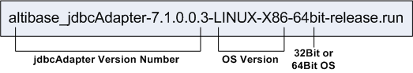

<!-- START doctoc generated TOC please keep comment here to allow auto update -->
<!-- DON'T EDIT THIS SECTION, INSTEAD RE-RUN doctoc TO UPDATE -->


- [Adapter for JDBC User’s Manual](#adapter-for-jdbc-users-manual)
  - [Preface](#preface)
    - [About This Manual](#about-this-manual)
  - [1. Introduction](#1-introduction)
    - [Adapter for JDBC](#adapter-for-jdbc)
  - [2. Installation and Configuration](#2-installation-and-configuration)
    - [Pre-installation Tasks](#pre-installation-tasks)
    - [Installation](#installation)
    - [Post-installation Tasks](#post-installation-tasks)
    - [Configuration](#configuration)
    - [Properties](#properties)
  - [3. Usage Instructions](#3-usage-instructions)
    - [jdbcAdapter Constraints](#jdbcadapter-constraints)
    - [Startup and Shutdown](#startup-and-shutdown)
    - [Data Types](#data-types)
    - [Adapter for JDBC Utility](#adapter-for-jdbc-utility)
    - [Command-Line Option](#command-line-option)
  - [Appendix A: FAQ](#appendix-a-faq)
  - [Appendix B: DDL execution order when using the jdbcAdapter](#appendix-b-ddl-execution-order-when-using-the-jdbcadapter)

<!-- END doctoc generated TOC please keep comment here to allow auto update -->

Altibase® Tool & Utilities

Adapter for JDBC User’s Manual
==============================


Altibase Tool & Utilities Adapter for Oracle User’s Manual

Release 7.1

Copyright ⓒ 2001\~2021 Altibase Corp. All Rights Reserved.

This manual contains proprietary information of Altibase Corporation; it is provided under a license agreement containing restrictions on use and disclosure and is also protected by copyright patent and other intellectual property law. Reverse engineering of the software is prohibited. All trademarks, registered or otherwise, are the property of their respective owners.

**Altibase Corp**

10F, Daerung PostTower II, 306, Digital-ro, Guro-gu, Seoul 08378, Korea Telephone: +82-2-2082-1000 Fax: 82-2-2082-1099

Customer Service Portal: http://support.altibase.com/en/

Homepage: [[http://www.altibase.com](http://www.altibase.com/)]

Preface
----

### About This Manual

This manual describes Adapter for JDBC, an utility replicating modified data in Altibase to other database supporting JDBC.

#### Audience

This manual has been prepared for the following Altibase users:

-   Database administrators
-   Performance administrators
-   Database users
-   Application developers
-   Technical Supporters

It is recommended for those reading this manual possess the following background knowledge:

-   Basic knowledge in the use of computers, operating systems, and operating system utilities
-   Experience in using relational database and an understanding of database concepts
-   Computer programming experience
-   Experience in database server management, operating system management, or network administration

#### Organization

This manual is organized as follows:

-   Chapter 1: Introduction  
    This chapter describes the concept of Adapter for JDBC and the structure of operation in which data changed in Altibase is replicated to other databases.
-   Chapter 2: Installation and Configuration  
    This chapter describes how to install and configure the Adapter for JDBC.

-   Chapter 3: Usage Instruction  
    This chapter describes how to use the Adapter for JDBC.

-   Appendix A: FAQ
-   Appendix B: DDL execution order when using the jdbcAdapter

#### Documentation Conventions

This section describes the conventions used in this manual. Understanding these conventions will make it easier to find information in this manual and in the other manuals in the series. 

There are two sets of conventions:

-   Syntax diagram convetions
-   Sample code conventions

##### Syntax Diagram Conventions

This manual describes command syntax using diagrams composed of the following elements:

| Elements                                                     | Meaning                                                      |
| ------------------------------------------------------------ | ------------------------------------------------------------ |
| [](https://github.com/ALTIBASE/Documents/blob/master/Manuals/Altibase_7.1/eng/media/SQL/image1.gif) | Indicates the start of a command. If a syntactic element starts with an arrow, it is not a complete command. |
| [](https://github.com/ALTIBASE/Documents/blob/master/Manuals/Altibase_7.1/eng/media/SQL/image2.gif) | Indicates that the command continues to the next line. If a syntactic element ends with this symbol, it is not a complete command. |
| [](https://github.com/ALTIBASE/Documents/blob/master/Manuals/Altibase_7.1/eng/media/SQL/image3.gif) | Indicates taht the command continues from the previous line. If a syntactic element starts witht his symbol, it is not a complete command. |
| [](https://github.com/ALTIBASE/Documents/blob/master/Manuals/Altibase_7.1/eng/media/SQL/image4.gif) | Indicates the end of a statement.                            |
| [](https://github.com/ALTIBASE/Documents/blob/master/Manuals/Altibase_7.1/eng/media/SQL/image5.gif) | Indicates a manatory element.                                |
| [](https://github.com/ALTIBASE/Documents/blob/master/Manuals/Altibase_7.1/eng/media/SQL/image6.gif) | Indicates an optional element.                               |
| [](https://github.com/ALTIBASE/Documents/blob/master/Manuals/Altibase_7.1/eng/media/SQL/image7.gif) | Indicates a mandatory element comprised of options. One, and only one, option must be specified. |
| [](https://github.com/ALTIBASE/Documents/blob/master/Manuals/Altibase_7.1/eng/media/SQL/image8.gif) | Indicates an optional element comprised of options.          |
| [](https://github.com/ALTIBASE/Documents/blob/master/Manuals/Altibase_7.1/eng/media/SQL/image9.gif) | Indicates an optional element in which multiple elements may be specified. A comman must precede all but the first element. |

##### Sample Code Conventions

The code examples explain SQL statements, stored procedures, iSQL statements, and other command line syntax.

The following table describes the printing conventions used in the code examples.

| Rules            | Meaning                                                      | Example                                                      |
| ---------------- | ------------------------------------------------------------ | ------------------------------------------------------------ |
| [ ]              | Indicates an optional item                                   | VARCHAR [(*size*)][[FIXED \|] VARIABLE]                      |
| { }              | Indicates a mandatory field for which one or more items must be selected. | { ENABLE \| DISABLE \| COMPILE }                             |
| \|               | A delimiter between optional or mandatory arguments.         | { ENABLE \| DISABLE \| COMPILE } [ ENABLE \| DISABLE \| COMPILE ] |
| . . .            | Indicates that the previous argument is repeated, or that sample code has been omitted. | SQL> SELECT ename FROM employee; ENAME ----------------------- SWNO HJNO HSCHOI . . . 20 rows selected. |
| Other Symbols    | Symbols other than those shown above are part of the actual code.Other Symbols | EXEC :p1 := 1; acc NUMBER(11,2);Symbols other than those shown above are part of the actual code. |
| Italics          | Statement elements in italics indicate variables and special values specified by the user. | SELECT * FROM *table_name*; CONNECT *userID*/*password*;     |
| Lower case words | Indicate program elements set by the user, such as table names, column names, file names, etc. | SELECT ename FROM employee;                                  |
| Upper case words | Keywords and all elements provided by the system appear in upper case. | DESC SYSTEM_.SYS_INDICES_;                                   |

#### Related Documentations

For more detailed information, please refer to the following documents.

-   Installation Guide

-   Administrator’s Manual

-   Replication Manual

-   Log Analyzer User's Manual

-   iSQL User’s Manual

-   Utilities Manual

-   Error Message Reference

#### Altibase Welcomes Your Comments and Feedbacks

Please let us know what you like or dislike about our manuals. To help us with better future versions of our manuals, please tell us if there is any corrections or classifications that you would find useful.

Include the following information:

- The name and version of the manual that you are using
- Any comments about the manual
- Your name, address, and phone number

If you need immediate assistance regarding any errors, omissions, and other technical issues, please contact Altibase's Support Portal (http://altibase.com/support-center/en/).

Thank you. We always welcome your feedbacks and suggestions.

## 1. Introduction

This chapter describes the concept of Adapter for JDBC and the structure of operation in which data changed in Altibase is replicated to other databases.

### Adapter for JDBC

Altibase's Adapter for JDBC(jdbcAdapter) is an utility which applies modified data in Altibase to other database supporing JDBC. jdbcAdapter has been implimented with Altibase Log Analysis API.

#### Structure and Concepts

In order to replicate modified data in Altibase to other databse, Altibase, jdbcAdapter, and other database, which supports JDBC, should be installed in the first place shown in Figure1-1.

jjdbcAdapter has been implimented with integration of Altibase Log Analysis API(ALA) and Java data base connectivity (JDBC). The ALA utility receives data that has been modified in Altibase whereas JDBC is used to send the data to other database. Refer to the L*og Analyzer User's Manual* for detailed information on ALA.

The following figure demonstrates how jdbcAdapter replicates from Altibase to other database.


[Figure 1-1] The structure of Adapter for JDBC

1.  XLogs within Altibase server creates XLog and meta information, and sends them to XLog collector. The meta information is only exchanged when handshaking takes place.
2.  The XLog collector existing within jdbcAdapter uses ALA to provide XLog and meta information to the user. If the call to ALA fails, a trace log will be written to the trc directory.
3.  jdbcAdapter uses ALA to covert data to apply obtained data to other database. 
4.  jdbcAdapter applies modified data to other database using JDBC through JNI.

#### Terms

##### XLog

An XLog is a logical log converted from a physical log. It stores transaction history involving DML(INSERT/UPDATE/DELETE) statements.

##### XLog Sender

XLog Sender analyzes active redologs and converts them into XLog form to send to XLog collector.

XLog sender is mainly responsible for handsaking and XLog transmission.

##### XLog Collector

XLog Collector receives meta data and XLog from the XLog Sender.

XLog Collector contains meta table, an XLog queue, a transaction table, and an XLog pool.

##### Handshaking

Handshaking is the task of checking the protocol version and meta data before the XLog Sender sends XLogs to the XLog Collector.

##### Log Analysis API

Log Analysis API is an interface provided by Altibase and it is used to implement jdbcAdapter. The API provides XLogs and meta data that are used to interpret the XLogs.

## 2. Installation and Configuration

This chapter describes how to install and configure the Adapter for JDBC.

### Pre-installation Tasks

The following system requirements should be satisfied in order to install and run jdbcAdapter. Also, there are some required configuration for jdbcAdapter to propery performs. 

For detailed information about system requirements, please contact Altibase's Customer Support site (http://support.altibase.com/en/).

#### OS

jdbcAdapter is currenly only supported in the following OS:

-   LINUX : x86-64bit

#### Datbase Versions

-   Altibase : Version 6.3.1 or later

-   OTHER DB : JDBC 4.1 or earlier version of other database

#### Database Character Set

This is the default character set for storing data.

#### National Character Set

The data for a language not supported by the database character set can be stored with NCHAR and NVARCHAR types.

#### Installing JDBC Driver

In order to use jdbcAdapter, JDBC driver should be installed on a machine in which jdbcAdapter will be operating. At this point, JDBC driver should be provided by a verder of the replication target database. For example, if the database to be replicated is Oracle DB, go to the Oracle website. Download and install the version of the JDBC driver that matches the ORacel database server version.

#### Installation JRE

jdbcAdapter is an application program running in JRE 7 or above versions; thus, JRE 7 or higher version should be installed in which jdbcAdapter will be performed. 

If the JDBC driver for the remote database to which jdbcAdapter will connect is running on  JRE version 7 or above, a version of the JRE compatible to the JDBC driver should be installed. 

After installing JRE, environment variables, such as JAVA_HOME and CLASSPATH should be installed. The following is an example of specifying environment variables for JRE in UNIX operation system.

```
$ export JAVA_HOME=The path in which export JAVA_HOME=JRE is installed.
$ export CLASSPATH=${JAVA_HOME}/lib:${CLASSPATH}
$ export PATH=${JAVA_HOME}/bin:${PATH}
$ export LD_LIBRARY_PATH=$JAVA_HOME/jre/lib/amd64/server:${ LD_LIBRARY_PATH )
```

### Installation

jdbcAdapter installer can be executed in GUI mode if DISPLAY environment variables are propery configured. jdbcAdapter installation is described in this manual with an assumption that the installation is being executed in GUI mode. Also, it is possible to install jdbcAdapter in text mode if the appropriate DISPLAY settings have not been properly made or the GUI mode cannot be used..

#### Installing jdbcAdapter

It is recommended to install jdbcAdapter on other user's account rather than Altibase server account of the original DB.

1.  The first task is to determine the version of jdbcAdapter installer suitable for the operating system in which jdbc Adapte will run. The naming convention for jdbcAdapter installer is shown as follows. The jdbcAdapter version must be the same as the version of Altibase with which it will be run.



2. When the installer is executed, the dialog box appears. Verify that the version of jdbcAdapter to be installed then click "Forward".
  
3. Select the dircetory in which jdbcAdapter will be installed in the next dialog box. A jdbcAdapter directory will be created within the home directory of the user account.
  
4. In order to use jdbcAdapter, Altibase Log Analyzer (ALA) property should be specified as in the following. Refer to ALA Properties section described later in this chapter.

-   ALA_SENDER_IP: This is the IP address of the server on which Altibase is installed. The default value is 127.0.0.1 on the assumption that Altibase and jdbcAdapter will be operating on the same machine. 
-   ALA_RECEIVER_PORT: This is a port number for jdbcAdapter to receive data. The number should be specified within the range from 1024 to 65536. 
-   ALA_REPLICATION_NAME: This is the name of a replication object existing in Altibase.
-   ALA_XLOG_POOL_SIZE: This is used to specify the maximum size of XLog pool. The default value is set to 100,000 XLogs. 
-   ALA_SOCKET_TYPE: This is used to set the communication socket type used by ALA. jdbcAdapter supports TCP/IP and UNIX Domain Socket.
-   ALA_LOGGING_ACTIVE:This is used to specify for ALA whether or not to write trace logs. If the value of this propery is 1, trace logs are written. The default value is 1.

5. Altibase property configuration should be implemented in the following dialog box. Refer to the *Properties for Checking Constraints* described later in this chapter for detailed information.

-   ALTIBASE_USER: This is the name of user account accessing to Altibase.

-   ALTIBASE_PASSWORD: This is the password for the user account accessing to Altibase.

-   ALTIBASE_IP: This is the IP address of the server on which Altibase is installed. Assuming that Altibase and jdbcAdapter work on the same machine, the default value of this property is 127.0.0.1.
  
-   ALTIBASE_PORT: This is the port number where the Altibase server is listening. It should be set to a value between 1024 and 65536.

6. Other DB properties should also be properly configured in order to use jdbcAdapter. Refer to the *Properties for DML* and *JDBC Properties* for detailed information on properties.

-   OTHER_DATABASE_USER: This is the name of a user account with which to access the Other DB.
-   OTHER_DATABASE_PASSWORD: This is the password corresponding to the user account accessing to other database which is the target database.
-   OTHER_ DATABASE_SKIP_INSERT: If "Yes" is selected, INSERT statement executed in Altibase will not be performed in Other DB. 
-   OTHER_DATABASE_SKIP_UPDATE: If "Yes" is selected, UPDATE statement executed in Altibase will not be performed in Other DB. 
-   OTHER_DATABASE_SKIP_DELETE: If "Yes" is selected, DELETE statement executed in Altibase will not be performed in Other DB. 
-   OTHER_DATABASE_GROUP_COMMIT: This property allows multiple transactions to be executed at once.
-   OTHER_DATABASE_BATCH_DML_MAX_SIZE: "Batch DML" means to process multiple DML statements with batch processing. This property specifies how many DML statements to batch. To disable the Batch DML function, set this property to 1.
-   OTHER_DATABASE_SET_USER_TO_TABLE : When applying DML to Other DB, the user of the target table is set as the user specified in XLog Sender. Set this property to 0 to disable the function.
-   OTHER_DATABASE_JDBC_MAX_HEAP_SIZE : This property determines the maximum size of Heap used in JVM. 
-   OTHER_DATABASE_JDBC_DRIVER_PATH :  This property specifies JDBC driver path for Other DB. 
-   OTHER_DATABASE_JDBC_DRIVER_CLASS : This property sets the name for Other DB JDBC driver class. 
-   OTHER_DATABASE_JDBC_CONNECTION_URL : This property specifies the connecion URL of Other DB.

7. Once all of the property settings pertaining to the use of jdbcAdapter, a dialog box showing specified values will appear. Then, verify if every property is propery specified,  and click "Forwawrd" to proceed to the next
8. Click “Forward” in the “Ready to Install” dialog box to start installation.
9. While the jdbcAdapter is being installed, the following two environment variables are set. In order for the new environment variable to be applied to the system, the user must log out and log in again.

-   JDBC_ADAPTER_HOME:  This enviroment variable will have jdbcAdapter home directory specified in previous step before the installation process as a value.
  
-   PATH: $JDBC_ADAPTER_HOME/bin path is included in this envrionment variable.

10. A completion dialog box will appear after the installation is successfully completed.

### Post-installation Tasks

#### Setting Environment Variables

After installing jdbcAdapter, it is required to configure environment variables, add a library path, and set the database and national character sets. 

Refer to the "Configuration" section described later in this chapter for more detailed information on configuring the environment variables. .

-   JDBC_ADAPTER_HOME  
    This environment variable is automatically set when installing jdbcAdapter

-   ALTIBASE_NLS_USE  
    The character set used in Altibase is specified in this environment variable. Refer to the Getting Started Guide for more detailed information on the character set.

#### Confirmation on Installation Directory

After jdbcAdapeter installation is complete, verify the bin, conf, msg and trc directories have been created under $JDBC_ADAPTER_HOME directory. The role and structure of each directory is as follows.

-   bin directory  
    The executable and internally used files of contains jdbcAdapter (Adapter for JDBC) and oaUtility (Adapter for JDBC utility) are located in this directory.
    
-   conf directory  
    This directory is located in jdbcAdapter.conf file storing jdbcAdapter property configuration.
    
-   msg directory  
    If an error occurs while jdbcAdapter is being installed, the error is written to the trace log. The error message which is located in the directory will be used. 
    
-   trc directory  
    jdbcAdapter writes trace logs to files located in this directory.

### Configuration

The following environment variables should be configured in order to use jdbcAdapter.

#### JDBC_ADAPTER_HOME

This is an environment variable specifying the directory in which jdbcAdapter was installed. This environment variable is automatically configured during the jdbcAdapter installation.

#### ALTIBASE_NLS_USE

This envronment variable specifies the character set used in Altibase for use in ALA. Refer to *Getting Started Guide*> Multilingual Support for more information on the character set.

### Properties

jdbcAdapter properties are used by ALTIBASE Log Analyzer and JDBC, and they are also used for determining an operation mode. 

The property file is jdbcAdapter.conf located in $JDBC_ADPATER_HOME/conf directory. 

The properties used in jdbcAdapter are classified as in the following

-   Properties for ALA 
-   Properties for verifying constraints 
-   Properties of other database which will be the target to which to send data
-   DML related properties

#### ALA Properties

The following property should be configured in order for jdbcAdapter to appropriately use Altibase Log Analyzer (ALA). Refer to *Log Analyzer User’s Manual* for detailed information.

##### ALA_SENDER_IP

This is a property specifying the IP address of Xlog sender. This property enables Altibase to set the IP address of server equiptment on which Altibase has been installed.

-   Default Value: 127.0.0.1

##### ALA_RECEIVER_PORT

XLog 콜렉터가 XLog를 수신하기 위해 사용하는 포트 번호를 지정하는 프로퍼티이다.
jdbcAdpater가 대기하고 있는 포트 번호를 지정하도록 한다.

-   Range: 1024 – 65535

##### ALA_SENDER_REPLICATION_PORT 

This property specifies the port number for XLog collector to receive XLog. This property is used to specify the port number on which jdbcAdapter is waiting. 

-   Default Value: 0

-   Range: 0 \~ 65535

-   0: The adapter waits until the sender of the ALA replication object attempts to connect.
  

(Depends on the value of the REPLICATION_SENDER_SLEEP_TIMEOUT attribute of the Altibase server).
    
-   1 or more: Adapter attempts to connect directly to the replication sender with the corresponding port number

##### ALA_RECEIVE_XLOG_TIMEOUT (Unit: Second)

This is a property specifying the waiting time for XLog collector to receive XLogs. 

-   Default Value: 300

-   Range: 1 – 4294967295

##### ALA_REPLICATION_NAME

This property specifies the name of replication object which is used as XLog sender. The name is identical to that of the replication object created within Altibase.

##### ALA_SOCKET_TYPE

This is is a property specifying the socket type which will be used by Altibase Log Analyzer. However, to use Unix Domain socket, Altibase and jdbcAapter should be located on the same machine.

-   TCP: Use of TCP/IP socket (Default value)

-   UNIX: Use of UNIX Domain socket

##### ALA_XLOG_POOL_SIZE (Unit: count)

This is a property specifying the maximum size of XLog pool in jdbcAdapter.

In the jdbcAdapter, the record changes before the transaction of the original DB is committed are accumulated in XLog, respectively. If a transaction occurring in the source DB changes a number of records, there is not enough XLog that jdbcAdapter can allocate, and it cannot be replicated normally. Therefore, the value of this property must be adjusted according to the transaction type of the original DB.

When the ALA Sender performs a Sync operation on the original DB, the commit is performed with the number set in the REPLICATION_SYNC_TUPLE_COUNT property. Therefore, if the ALA_XLOG_POOL_SIZE property value is smaller than the REPLICATION_SYNC_TUPLE_COUNT value, there is not enough XLog to allocate and sync operation does not proceed, so the property value must be set larger.

-   Default Value: 100,000

-   Range: 1 – 2147483647

##### ALA_LOGGING_ACTIVE

This propery determines whether to allow Altibase Log Analyzer to output trace logs.

-   0: Do not output the trace log.

-   1: Output the trace log (Default)

#### Properties for Checking Constraints

##### ALTIBASE_USER

This property specifies the name of user account with which to access Altibase.

##### ALTIBASE_PASSWORD

This property specifies the password of user account wich which to access Altibase.

##### ALTIBASE_IP

This property specifies the IP address of server machine on which Altibase is installed. 

-   Default Value: 127.0.0.1

##### ALTIBASE_PORT

This property specifies the number of a port at which Altibase listens. 

-   Range: 1024 – 65535

##### ADAPTER_ERROR_RESTART_COUNT (Unit: count)

This property specifies additioal operation on all errors of Adapter.

-   Default Value: 0

-   Range: 0 \~ 65535

-   0: An error message is output as terminating Adapter

-   1 or more: "Re-start Adapter and apply sync target DBMS access/record " is executed for specified number of times. If it exceeds the specified counts, error message is output as terminating Adapter.

##### ADAPTER_ERROR_RESTART_INTERVAL (Unit: count)

This property specifies the interval when re-attempting for the number of times specified in ADAPTER_ERROR_RESTART_COUNT.

-   Default Value: 0

-   Range: 0 \~ 65535

-   0: Immediately re-attempt without any interval.

#### Other Database Properties

The following properties must be set in order to use Other DB, which is the target to send data from jdbcAdapter.

##### OTHER_DATABASE_USER

This property specifies the name of the user account to access the other DB to which data is sent.

##### OTHER_DATABASE_PASSWORD

This property specifies the password of the user account to access the other DB to which data is sent.

##### OTHER_DATABASE_JDBC_MAX_HEAP_SIZE (Unit: Mega Bytes)

This specifies the maximum size of Heap JVM uses.

-   Default Value: 2048

-   Range: 0 – 10240

-   This property should be set to 0 to let JVM to automaically set the maximum size of Heap.

##### OTHER_DATABASE_JDBC_DRIVER_PATH 

This property specifies JDBC driver path for other DB.

##### OTHER_DATABASE_JDBC_DRIVER_CLASS 

This property specifies the class name of JDBC Driver for other DB.

##### OTHER_DATABASE_JDBC_CONNECTION_URL 

The connection URL of other DB is specified by this property.

#### DML-Related Properties

The following properties are used to set whether DML statements excuted in Altibase will also be executed in the other DB.

##### OTHER_DATABASE_GROUP_COMMIT

Multiple transactions can be processed at once. Even if commit execution is performed in the original Altibase server, the Target DB postpone to commit untill certain amount of transactaions are acculumated. Therefore, the overall performance can be improved, but the response time of individual transactions might be postponed.

-   Default Value: 1

-   0: Do not commit group.

-   1: Commit group.

##### OTHER_DATABASE_BATCH_DML_MAX_SIZE (Unit: count)

“Batch DML” means to batch process multiple DML statements of the same type. This results in improved performance by reducing network cost.

-   Default Value: 10

-   Range: 1 – 32767

-   In order to turn off Batch DML, this property should be set to 1.

##### OTHER_DATABASE_ERROR_RETRY_COUNT (Unit: count)

This indicates the number of retry attempts if an error occurs when applying to records. 

-   Default Value: 0

-   Range: 0 \~ 65535

-   0: Do not retry.

##### OTHER_DATABASE_ERROR_RETRY_INTERVAL (Unit: second)

This indicates retry invervals between error accurances when applying records.

-   Default Value: 0

-   Range: 0 \~ 65535

-   0: Immediately retry without any intervals

##### OTHER_DATABASE_SKIP_ERROR 

This determines whether to discard writing the relevant records if it fails to record even though retry was attempted as much as OTHER_DATABASE_ERROR_RETRY_TIME at invervals of OTHER_DATABASE_ERROR_RETRY_COUNT.

-   Default Value: 1
-   0: Error message is not output as terminating Adapter. (Discard writing the relevant records.)
    However, the record in which the error included in dbms_skip_error_include.list has occurred is abandoned and the next record is reflected.
-   1: Write from the next records. (Do not discard wriing the relevant records.)
    However, the adpater is terminated for records in which errors included in dbms_skip_error_exclude.list have occurred.

The error values included in dbms_skip_error_include.list and dbms_skip_error_exclude.list are SQLSTATE standard error values.

##### OTHER_DATABASE_SKIP_INSERT

This property determines whether the INSERT statement performed in Altibase is also executed in other DB to which data is sent. If this proerty is set to 1, the INSERT statement performed in Altibase is not executed in other DB.

-   Default Value: 0

-   0: Do not omit statement execution. Thus, the statement execution is normally executed.

-   1: Omit statement exection.

##### OTHER_DATABASE_SKIP_UPDATE

This is a property determines whether the UPDATE statement executed in Altibase is also execued in other DB to which data is sent. If this property is set to 1, the UPDATE statement executed in Altibase is not executed in other DB.

-   Default Value: 0

-   0: Do not omit statement excution. That is, the statement execution is normally executed.

-   1: Omit statement execution.

##### OTHER_DATABASE_SKIP_DELETE

This property determines whether the DELETE statement executed in Altibas eis also executed in other DB which is the target database to which data is sent. If this property is set to 1, the DELETE statement executed in Altibase is not executed in other DB.

-   Default Value: 0

-   0: Do not omit statement execution. That is, the statement execution is normally executed.

-   1: Omit statement execution.

##### OTHER_DATABASE_SET_USER_TO_TABLE 

When executing DML in other DB, set the user of the reflection table to the user specified in XLog Sender.

-   Default Value: 0

-   0: Do not specify a user

-   1: Specify a user

#### Property Constraints

Spaces or tabs cannot be used when setting property values.

Also, in order to use characters including special characters together, the property value must be handled with double quotation marks ("").

## 3. Usage Instructions

This chapter describes how to use the Adapter for JDBC.

### jdbcAdapter Constraints

There are several constraints in order to properly use jdbcAdapter. jdbcAdapter cannot be used If the following conditions are not satisfied.

#### Prerequisite 

-   If there is a conflict in input/modify/delete operation in the target DB(Other DB), the operation is canceled and the message is left in the error log file or ignored according to the setting. 
-   The error ocurred during the replication can be partially revoked. That is to say, if there is replication data while inputting multiple data, the rest of the data is completed except the replication data. 
-   The replication speed might be slower than the service speed

#### Data Constraints

-   The primary key must exist in the table to be replicated.

-   There should be no modification to the primary key of the table to be replicated.

-   Tables to be replicated on both servers must have the same order and primary key constraints.

#### Connection Constraints

The maximum number of possible XLog Senders and replicated connections in Altibase database is determined by the value set in the REPLICATION_MAX_COUNT property.

#### Allowed DDL Statements

Generally, replication target table cannot execute the data definition language (DDL). However, the following DDLs can be executed regardless of XLog Sender. Refer to Executing DDL Statements on Replication Target Tables in the *Replication Manual* for more information on other allowed DDL statements.

-   ALTER INDEX SET PERSISTENT = ON/OFF

-   ALTER INDEX REBUILD PARTITION

-   GRANT OBJECT

-   REVOKE OBJECT

-   CREATE TRIGGER

-   DROP TRIGGER

#### Allowed DDL statements in Replication Target Tables

In general, if a data definition language (DDL) is executed on a replication target table, jdbcAdapter is terminated after all changes that occurred before the current DDL are reflected in the target database. When jdbcAdapter is terminated, replication can be performed again by executing the same DDL on the target database to make the table schema the same and restarting jdbcAdapter.

For other DDLs that can be executed, please refer to Execution DDL Statements on Replication Target Tables in the *Replication Manual.*

### Startup and Shutdown

This section describes how to start and stop jdbcAdapter.

#### Startup

This section explains how to run jdbcAdapter step by step.

To use jdbcAdapter, Altibase and Other DB to which data is to be sent must be running first. Also, Adapter for JDBC properties and environment variables jdbcAdapter must be properly configured as an environment that can be executed.

If any environment variable or property is changed after jdbcAdapter is started, jdbcAdapter must be restarted to apply this change. For detailed information on setting environment variables, refer to Chapter 2, “Post Installation Tasks”.

1. Verify if Altibase's REPLICATION_PORT_NO<sup>1</sup> property is actually set to the replication port number. If the change of this property setting is needed, Altibase must be restarted.
  
   [<sup>1</sup>] REPLICATION_PORT_NO specifies the replication port number used by the local server for replication connections. For more information about this property, please refer to the *Getting Started Guide.*

2. Before starting jdbcAdapter, the user must configure the XLog sender so that Altibase Log Analyzer (ALA) can be used. XLog sender is used to send XLog and meta information from Altibase.  
   Using PROPAGABLE LOGGING to transfer the log of a replicated transaction to another server, FOR ANALYSIS PROPAGATION must be used.   
   The following statement creates XLog Sender to replicate data in the table t1 owned by the sys user in Altibase to the table t2 which is owned by user2 in Altibase DB.

```
CREATE REPLICATION ala FOR ANALYSIS WITH '127.0.0.1', 25090
FROM sys.t1 TO user1.t2;
```


3. Now, it is time to start jdbcAdapter. jdbcAdapter can be started by executing it directly or by using Adapter for JDBC utility. For more detailed information on how to start jdbcAdapter with the Adapter for JDBC utility, please refer to Adapter for JDBC Utility in this manual. It should be noted that the jdbcsAdapter can be started with the following command in the LINUX operating system. 

```
$ cd $JDBC_ADAPTER_HOME/bin
$ ./jdbcAdapter
```

4. Start XLog sender for Altibase Log Analyzer. Attempting to start the XLog sender before running jdbcAdapter will fail. 

```
iSQL> ALTER REPLICATION ala START;
```

#### Shutdown

The process of shutting down the jdbcAdapter includes stopping the XLog sender. If the jdbcAdapter is forcibly terminated using the Adapter for JDBC utility, it will be successfully terminated, but the Altibase XLog sender will continue to attempt to connect with the jdbcAdapter.

```
iSQL> ALTER REPLICATION ala STOP;
Alter success.
```

### Data Types

When Altibase data is applied to other db using JDBC, it is converted to JAVA String type and applied. However, the DATE type is converted to JAVA Timestamp type and applied.

The supported data types are FLOAT, NUMERIC, DOUBLE, REAL, BIGINT, INTEGER, SMALLINT, DATE, CHAR, VARCHAR, NCHAR, and NVARCHAR.

### Adapter for JDBC Utility

Adapter for JDBC utility (oaUtility) is a script that runs jdbcAdapter with the daemon and checks its status. This script is executed in the bash shell in which GNU sed is installed. Constraints on other DB are not checked.

The Adapter for JDBC Utility supports the following options:

-   oaUtility start

-   oaUtility stop

-   oaUtility status

-   oaUtility check

#### oaUtility start

##### Syntax

```
oaUtility {start}
```

##### Description

This is used to start jdbcAdapter as a daemon.

#### oaUtility stop

##### Syntax

```
oaUtility {stop}
```

##### Description

This option forcbily terminates jdbcAdapter which is currently processing.

#### oaUtility status

##### Syntax

```
oaUtility {status}
```

##### Description

This is used to check whether jdbcAdapter is running.

#### oaUtility check

##### Syntax

```
oaUtility { check [ alive ] }
```

##### Description

This option is used to continuously check whether jdbcAdapter operates or not, and restarts if oaUtility is terminated(regardless of normal shutdown or forcible shutdown). 

If the alive option is specified, only one check is made to see if jdbcAdapter is running, and then oaUtility is terminated

### Command-Line Option

jdbcAdapter provides the following command options.

#### Syntax

```
jdbcAdapter [ -v | -version ]
```

##### Description

This option is used to output the version of Altibase with which jdbcAdapter was compiled.

##### Example

```
$./jdbcAdapter -v
Adapter for JDBC version 7.1.0.0.2
...
```

## Appendix A: FAQ

#### What do I have to do after modifying environment variables or properties?

If environment variables or properties are modified after jdbcAdapter has been run, jdbcAdapter should be retstarted in order to apply the modifications.

#### What happens if data is not propery applied to Altibase DB?

If jdbcAdapter fails to apply data to Altibase DB, only log messages are left and the next data is applied.The log messages are written to a trace log file located in $JDBC_ADAPTER_HOME/trc directory.

## Appendix B: DDL execution order when using the jdbcAdapter

When using jdbcAdapter, DDL that is performing replication must be executed in the following order.

| No                                                           | Active Server                                                | jdbcAdapter                                                  | Standby Server                                           |
| ------------------------------------------------------------ | ------------------------------------------------------------ | ------------------------------------------------------------ | -------------------------------------------------------- |
| 1. Create schema on both servers                             | CREATE TABLE T1 ( C1 INTEGER PRIMARY KEY, C2 SMALLINT );     |                                                              | CREATE TABLE T1 ( C1 INTEGER PRIMARY KEY, C2 SMALLINT ); |
| 2. Creating replication with ANALYSIS                        | CREATE REPLICATION ala FOR ANALYSIS WITH 'Standby IP', Standby Port FROM SYS.T1 TO SYS T1; |                                                              |                                                          |
| 3. Start the jdbcAdapter                                     |                                                              | \$ oaUtility start                                           |                                                          |
| 4. Start the replication                                     | ALTER REPLICATION ala START;                                 |                                                              |                                                          |
| 5. Flush syntax to remove replication gaps                   | ALTER REPLICATION ALA FLUSH ALL;                             |                                                              |                                                          |
| 6. Setting property values related to replication for DDL execution | ALTER SYSTEM SET REPLICATION_DDL_ENABLE = 1; ALTER SYSTEM SET REPLICATION_DDL_ENABLE_LEVEL = 1; |                                                              |                                                          |
| 7. Execute DDL on the active server                          |                                                              | Adapter termination (due to DDL log processing)              |                                                          |
| 8. Check the jdbcAdapter trc log                             | SELECT REP_NAME, STATUS FROM V\$REPSENDER; Query to check STATUS 2 | 'Log Record : Meta change xlog was arrived, adapter will be finished' Check trc log message |                                                          |
| 9. Execyte DDL on the standby server                         |                                                              |                                                              | DDL                                                      |
| 10.Restart jdbcAdapter                                       |                                                              | \$ oaUtility start                                           |                                                          |
| 11.Stop and restart replication (optional)                   | (optional) ALTER REPLICATION ALA STOP; ALTER REPLICATION ALA START; |                                                              |                                                          |
| 12. Check for data replication                               | DML (Service)                                                |                                                              | Verify data replication                                  |
| 13.Setting property values related to replication to stop DDL | ALTER SYSTEM SET REPLICATION_DDL_ENABLE = 0; ALTER SYSTEM SET REPLICATION_DDL_ENABLE_LEVEL = 0; |                                                              |                                                          |

