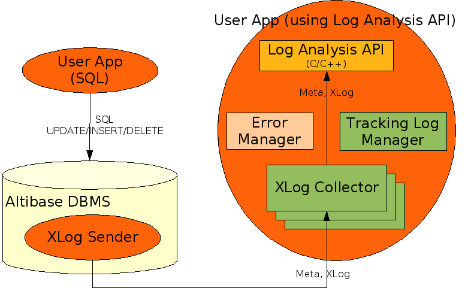

  

- [Log Analyzer User’s Manual](#log-analyzer-users-manual)
  - [Preface](#preface)
    - [About This Manual](#about-this-manual)
  - [1. Log Analyzer Introduction](#1-log-analyzer-introduction)
    - [Log Analyzer](#log-analyzer)
    - [How to Use the Log Analysis API](#how-to-use-the-log-analysis-api)
    - [Summary of the Log Analysis API](#summary-of-the-log-analysis-api)
  - [2. XLog Sender](#2-xlog-sender)
    - [SQL Statements Used to Manage the XLog Sender](#sql-statements-used-to-manage-the-xlog-sender)
    - [Meta Tables](#meta-tables)
    - [Performance Views](#performance-views)
  - [3. Analyzing Logs](#3-analyzing-logs)
    - [XLog](#xlog)
    - [Meta Data](#meta-data)
    - [Altibase Data Types and Internal Structure](#altibase-data-types-and-internal-structure)
    - [SAVEPOINT](#savepoint)
  - [4. Log Analysis API](#4-log-analysis-api)
    - [ALA_InitializeAPI](#ala_initializeapi)
    - [ALA_DestroyAPI](#ala_destroyapi)
    - [ALA_EnableLogging](#ala_enablelogging)
    - [ALA_DisableLogging](#ala_disablelogging)
    - [ALA_CreateXLogCollector](#ala_createxlogcollector)
    - [ALA_AddAuthInfo](#ala_addauthinfo)
    - [ALA_RemoveAuthInfo](#ala_removeauthinfo)
    - [ALA_SetHandshakeTimeout](#ala_sethandshaketimeout)
    - [ALA_SetReceiveXLogTimeout](#ala_setreceivexlogtimeout)
    - [ALA_SetXLogPoolSize](#ala_setxlogpoolsize)
    - [ALA_Handshake](#ala_handshake)
    - [ALA_ReceiveXLog](#ala_receivexlog)
    - [ALA_GetXLog](#ala_getxlog)
    - [ALA_SendACK](#ala_sendack)
    - [ALA_FreeXLog](#ala_freexlog)
    - [ALA_DestroyXLogCollector](#ala_destroyxlogcollector)
    - [ALA_GetXLogCollectorStatus](#ala_getxlogcollectorstatus)
    - [ALA_GetXLogHeader](#ala_getxlogheader)
    - [ALA_GetXLogPrimaryKey](#ala_getxlogprimarykey)
    - [ALA_GetXLogColumn](#ala_getxlogcolumn)
    - [ALA_GetXLogSavepoint](#ala_getxlogsavepoint)
    - [ALA_GetXLogLOB](#ala_getxloglob)
    - [ALA_GetProtocolVersion](#ala_getprotocolversion)
    - [ALA_GetReplicationInfo](#ala_getreplicationinfo)
    - [ALA_GetTableInfo](#ala_gettableinfo)
    - [ALA_GetTableInfoByName](#ala_gettableinfobyname)
    - [ALA_GetColumnInfo](#ala_getcolumninfo)
    - [ALA_GetIndexInfo](#ala_getindexinfo)
    - [ALA_IsHiddenColumn](#ala_ishiddencolumn)
    - [ALA_GetInternalNumericInfo](#ala_getinternalnumericinfo)
    - [ALA_GetAltibaseText](#ala_getaltibasetext)
    - [ALA_GetAltibaseSQL](#ala_getaltibasesql)
    - [ALA_GetODBCCValue](#ala_getodbccvalue)
    - [ALA\_ IsNullValue](#ala%5C_-isnullvalue)
    - [ALA_ClearErrorMgr](#ala_clearerrormgr)
    - [ALA_GetErrorCode](#ala_geterrorcode)
    - [ALA_GetErrorLevel](#ala_geterrorlevel)
    - [ALA_GetErrorMessage](#ala_geterrormessage)
  - [Appendix A. Error Codes](#appendix-a-error-codes)
    - [Error Code Table](#error-code-table)
  - [Appendix B. Sample Code](#appendix-b-sample-code)
    - [Sample Code: Replication to Altibase DBMS](#sample-code-replication-to-altibase-dbms)

Altibase® Application Development

Log Analyzer User’s Manual
==========================


Altibase Application Development Log Analyzer User’s Manual

Release 7.1

Copyright ⓒ 2001\~2021 Altibase Corp. All Rights Reserved.

This manual contains proprietary information of Altibase Corporation; it is provided under a license agreement containing restrictions on use and disclosure and is also protected by copyright patent and other intellectual property law. Reverse engineering of the software is prohibited. All trademarks, registered or otherwise, are the property of their respective owners.

**Altibase Corp**

10F, Daerung PostTower II, 306, Digital-ro, Guro-gu, Seoul 08378, Korea Telephone: +82-2-2082-1000 Fax: 82-2-2082-1099

Customer Service Portal: http://support.altibase.com/en/

Homepage: [[http://www.altibase.com](http://www.altibase.com/)]


Preface
----

### About This Manual

This manual describes the concept of the Altibase Log Analyzer and explains how to use it.

#### Audience

This manual has been prepared for the following users of Altibase:

-   Database administrators
-   Performance administrators
-   Database users
-   Application developers
-   Technical Supporters

It is recommended for those reading this manual possess the following background knowledge:

-   Basic knowledge in the use of computers, operating systems, and operating system utilities
-   Experience in using relational database and an understanding of database concepts
-   Computer programming experience
-   Experience in database server management, operating system management, or network administration

#### Organization

This manual is organized as follows:

-   Chapter 1: XLog Introduction 
    This chapter describes the concept behind the Altibase Log Analyzer and explains in simple terms how to use it.
-   Chapter 2: XLog Sender  
    This chapter explains how to use the XLog Sender, which is one of the components of the Altibase Log Analyzer
-   Chapter 3: XLog  
    This chapter describes XLogs, meta data and the Altibase internal data types, all of which are required in order to analyze XLogs.
-   Chapter 4: Log Analysis API  
    This chapter describes how to use the Log Analysis API component of the Altibase Log Analyzer.
-   Appendix A. Error Code
-   Appendix B. Sample Code

#### Documentation Conventions

This section describes the conventions used in this manual. Understanding these conventions will make it easier to find information in this manual and in the other manuals in the series. 

There are two sets of conventions:

-   Syntax diagram convetions
-   Sample code conventions

##### Syntax Diagram Conventions

This manual describes command syntax using diagrams composed of the following elements:

| Elements                                                     | Meaning                                                      |
| ------------------------------------------------------------ | ------------------------------------------------------------ |
| [](https://github.com/ALTIBASE/Documents/blob/master/Manuals/Altibase_7.1/eng/media/SQL/image1.gif) | Indicates the start of a command. If a syntactic element starts with an arrow, it is not a complete command. |
| [](https://github.com/ALTIBASE/Documents/blob/master/Manuals/Altibase_7.1/eng/media/SQL/image2.gif) | Indicates that the command continues to the next line. If a syntactic element ends with this symbol, it is not a complete command. |
| [](https://github.com/ALTIBASE/Documents/blob/master/Manuals/Altibase_7.1/eng/media/SQL/image3.gif) | Indicates taht the command continues from the previous line. If a syntactic element starts witht his symbol, it is not a complete command. |
| [](https://github.com/ALTIBASE/Documents/blob/master/Manuals/Altibase_7.1/eng/media/SQL/image4.gif) | Indicates the end of a statement.                            |
| [](https://github.com/ALTIBASE/Documents/blob/master/Manuals/Altibase_7.1/eng/media/SQL/image5.gif) | Indicates a manatory element.                                |
| [](https://github.com/ALTIBASE/Documents/blob/master/Manuals/Altibase_7.1/eng/media/SQL/image6.gif) | Indicates an optional element.                               |
| [](https://github.com/ALTIBASE/Documents/blob/master/Manuals/Altibase_7.1/eng/media/SQL/image7.gif) | Indicates a mandatory element comprised of options. One, and only one, option must be specified. |
| [](https://github.com/ALTIBASE/Documents/blob/master/Manuals/Altibase_7.1/eng/media/SQL/image8.gif) | Indicates an optional element comprised of options.          |
| [](https://github.com/ALTIBASE/Documents/blob/master/Manuals/Altibase_7.1/eng/media/SQL/image9.gif) | Indicates an optional element in which multiple elements may be specified. A comman must precede all but the first element. |

##### Sample Code Conventions

The code examples explain SQL statements, stored procedures, iSQL statements, and other command line syntax.

The following table describes the printing conventions used in the code examples.

| Rules            | Meaning                                                      | Example                                                      |
| ---------------- | ------------------------------------------------------------ | ------------------------------------------------------------ |
| [ ]              | Indicates an optional item                                   | VARCHAR [(*size*)][[FIXED \|] VARIABLE]                      |
| { }              | Indicates a mandatory field for which one or more items must be selected. | { ENABLE \| DISABLE \| COMPILE }                             |
| \|               | A delimiter between optional or mandatory arguments.         | { ENABLE \| DISABLE \| COMPILE } [ ENABLE \| DISABLE \| COMPILE ] |
| . . .            | Indicates that the previous argument is repeated, or that sample code has been omitted. | SQL> SELECT ename FROM employee; ENAME ----------------------- SWNO HJNO HSCHOI . . . 20 rows selected. |
| Other Symbols    | Symbols other than those shown above are part of the actual code.Other Symbols | EXEC :p1 := 1; acc NUMBER(11,2);Symbols other than those shown above are part of the actual code. |
| Italics          | Statement elements in italics indicate variables and special values specified by the user. | SELECT * FROM *table_name*; CONNECT *userID*/*password*;     |
| Lower case words | Indicate program elements set by the user, such as table names, column names, file names, etc. | SELECT ename FROM employee;                                  |
| Upper case words | Keywords and all elements provided by the system appear in upper case. | DESC SYSTEM_.SYS_INDICES_;                                   |

#### Related Documentations

For more detailed information, please refer to the following documents.

-   Getting Started Guide

-   Administrator’s Manual

-   Replication Manual

-   SQL Reference

-   CLI User's Manual

-   Spatial SQL Reference

-   Application Program Interface User’s Manual

-   iSQL User’s Manual

-   Error Message Reference

#### Altibase Welcomes Your Comments and Feedbacks

Please let us know what you like or dislike about our manuals. To help us with better future versions of our manuals, please tell us if there is any corrections or classifications that you would find useful.

Include the following information:

- The name and version of the manual that you are using
- Any comments about the manual
- Your name, address, and phone number

If you need immediate assistance regarding any errors, omissions, and other technical issues, please contact Altibase's Support Portal (http://altibase.com/support-center/en/).

Thank you. We always welcome your feedbacks and suggestions.

## 1. Log Analyzer Introduction

This chapter explains the concept of Log Analyzer and how to use it.

### Log Analyzer

The Altibase Log Analyzer consists of a module that is included with Altibase for use in providing a history of database DML transactions on the basis of active logs, an external module that is connected to the internal module, and an API that is provided for using XLogs.

Log Analyzer can be used for interlocking Altibase DBMS with other companies' DBMS or detecting  changes within Altibase from outside so as to respond to these changes in the desired manner.

#### Terms & Concepts

##### XLog

An XLog is a logical form of log that results from the conversion of a physical log. It is used to store a history of transactions involving DML (INSERT, UPDATE and DELETE) statements so that it can be accessed by users.

##### XLog Sender

The XLog Sender is the module that analyzes active logs to create XLogs, which it then passes to the XLog Collector.

The XLog Sender actively performs handshaking and XLog transmission.

##### XLog Collector

The XLog Collector is the module that receives meta data and XLogs from the XLog Sender.

The XLog Collector consists of meta data, an XLog queue, a transaction table and an XLog pool. It is called via the Log Analysis API.

##### Log Analysis API

The Log Analysis API is used to obtain XLogs and meta data that are used to interpret the XLogs.

##### Handshake

Handshaking is the task of checking the protocol version, meta data, etc. before the XLogs are Version, sent from the XLog Sender to the XLog Collector.

##### XLog Queue

The XLog Queue is the place where available XLogs are stored before they are accessed by users.

##### XLog Pool

The XLog Pool is memory that has been allocated for the storage of XLogs.

The purpose of the XLog Pool is to reuse the memory that has been allocated to XLogs in order to prevent excessive memory usage.

##### Transaction Table

The transaction table is the place where information about transactions, including the status of transactions, is stored.

##### Restart SN

The Restart SN is the SN of the active log from which reading will resume when the XLog Sender is restarted.

##### SN

The SN (Sequence Number) is the serial number of an individual log record.

##### Replication

Replication is a module that is used to synchronize data between two Altibase databases. For more information, please refer to the *Altibase Replication Manual.*

##### Replication SYNC

Replication SYNC is a replication function whereby all of the records in the replication target tables on the local server are sent to the remote server. 

Replication SYNC is used to match the contents of a replication table before starting replication based on an active log.

#### How the Altibase Log Analyzer Works

The location of the XLog Sender is within an Altibase database. It creates XLogs based on active logs and sends the XLogs along with related meta data to the XLog Collector. The XLog Collector exists within a client application, and provides end users with the XLogs and meta data via the Log Analysis API.

If for some reason a call to the Log Analysis API fails, it is of course necessary to take suitable measures, depending on the cause of the error. The most recent error information is stored in the Error Manager. Additionally, the Log Manager is provided for use in tracing errors. The Log Manager records simple trace and error information in the log files that are specified when the Log Manager is created.

The overall structure is shown in the following illustration:



[Figure 1-1] The Structure of the Altibase Log Analyzer

The Log Analysis API can be used to obtain XLogs and related meta data from the XLog Collector. The XLog Collector receives these meta data from the XLog Sender at the time of handshaking between the XLog Sender and the XLog Collector. The meta data are valid until the next time handshaking is performed.

The movement of XLogs and meta data within the XLog Collector is as follows:

1.  Memory for XLogs is obtained from the XLog Pool.

2.  The XLog Collector receives the data that constitute XLogs from the XLog Sender and uses the data to create XLogs.
  
3.  The XLogs are added to the XLog Queue, where they are accessed and used via the Log Analysis API.  
    When it is desired to obtain the XLogs for transactions in the order in which the transactions are committed, the XLogs are temporarily stored in the Transaction Table before they are added to the XLog Queue.
    
4.  After the XLogs are used, the memory that was assigned to them is returned to the XLog Pool..

The following illustration shows the movement of meta data and XLogs within the XLog Collector:


[Figure 1-2] The Structure of the XLog Collector

#### Features of the Log Analyzer

##### The XLog Sender uses the Replication module

The SQL statements that are used to manage the XLog Sender are almost the same as those that are used to manage Replication. 

For more information on replication, please refer to the *Replication Manual.*

##### Transaction XLogs can be obtained in the order in which transactions are committed

When creating the XLog Collector, it is possible to specify that transaction XLogs are to be obtained in the order in which transactions are committed. When the XLog Collector is set in this way, the following circumstances apply:

-   The XLogs pertaining to a given transaction can be obtained after the COMMIT XLog for the transaction has been received.  
    Because savepoint-related XLogs are not necessary, they are thus not provided.

-   XLogs for transactions that were rolled back cannot be obtained.

##### The TCP and UNIX Domain sockets are supported for use in transmitting XLogs

-   The UNIX Domain socket can be used only when the XLog Sender and XLog Collector reside on the same machine and the OS is UNIX or Linux.
  
-   A single XLog Sender can use only one type of socket.

##### Conversion to ODBC C data types is supported

Internal data of Altibase can be converted to corresponding ODBC C data types.

#### Log Analyzer Limitations

Because the XLog Sender uses the Replication module, the following limitations apply:

-   Only the SYS user can run the XLog Sender. 
-   The basic unit of analysis is the database table. 
-   A table to be analyzed must have a primary key.
-   The values in the columns that constitute the primary key of a table to be analyzed cannot be updated.  
    However, INSERT and DELETE operations can be performed on the columns that constitute the primary key.
-   DDL statements cannot be executed on a table to be analyzed. 
-   The combined total of XLog Senders and Replication Senders that coexist in a single Altibase database cannot exceed 32.
-   The same version of the Altibase Replication protocol must be used for both Replication and the Log Analysis API.  
    If more than one XLog Collector is being used within a single process, the Replication protocol version in all associated Altibase databases must be the same as the Replication protocol version being used by the Log Analysis API.

However, the Log Analyzer differs from Replication in the following ways:

-   The Log Analyzer can be used with tables having foreign keys. 
-   Only Lazy Mode is supported for use with the Log Analyzer. 
-   Replication SYNC is not supported.

For more information on Replication, please refer to the *Replication Manual.*

### How to Use the Log Analysis API

This section explains how to use the Log Analysis API, which is provided for use in client applications.

For complete information on the use of the XLog Sender, please refer to XLog Sender.

#### Required Files

<table>
<tbody>
<tr>
<td>
<p>File Type</p>
</td>
<td>
<p>File Name</p>
</td>
<td>
<p>Description</p>
</td>
</tr>
<tr>
<td rowspan="2" >
<p>Header</p>
</td>
<td >
<p>alaAPI.h</p>
</td>
<td >
<p>This file must be included when authorizing a client program
using the Log Analysis API. It includes the alaTypes.h file.</p>
</td>
</tr>
<tr>
<td >
<p>alaTypes.h</p>
</td>
<td >
<p>This file contains the definitions of data types and macros that
are necessary when writing a client program using the Log
Analysis API.</p>
</td>
</tr>
<tr>
<td rowspan="2">
<p>Library</p>
</td>
<td >
<p>libala_sl.x</p>
</td>
<td >
<p>This is the Log Analysis API shared library.</p>
</td>
</tr>
<tr>
<td >
<p>libala.x</p>
</td>
<td >
<p>This is the Log Analysis API static library.</p>
</td>
</tr>
</tbody>
</table>

[Table 1-1] Required Files

The following must be taken into consideration when creating and compiling source code:

-   The source code must reference the alaAPI.h file. 
-   When linking during the compile operation, it is necessary to link to either the shared library or the static library. 
-   The filename extension of the library files varies depending on the platform.

#### Data Types

The basic data types used by the Log Analysis API are as follows:

<table>
<tbody>
<tr>
<td >
<p>Tye</p>
</td>
<td>
<p>Data Type</p>
</td>
<td>
<p>Description</p>
</td>
</tr>
<tr>
<td>
<p>Boolean</p>
</td>
<td >
<p>ALA_BOOL</p>
</td>
<td>
<p>ALA_TRUE: true</p>
<p>ALA_FALSE: false</p>
</td>
</tr>
<tr>
<td >
<p>Return Code</p>
</td>
<td >
<p>ALA_RC</p>
</td>
<td >
<p>ALA_SUCCESS: success</p>
<p>ALA_FAILURE: failure</p>
</td>
</tr>
<tr>
<td  rowspan="2">
<p>Character</p>
</td>
<td >
<p>Char (SChar)</p>
</td>
<td >
<p>Signed Character (8 bits)</p>
</td>
</tr>
<tr >
<td >
<p>unsigned char (UChar)</p>
</td>
<td>
<p>Unsigned Character (8 bits)</p>
</td>
</tr>
<tr >
<td  rowspan="6">
<p>Integer</p>
</td>
<td>
<p>Short (SShort)</p>
</td>
<td>
<p>Signed Small Integer (16 bits)</p>
</td>
</tr>
<tr>
<td>
<p>unsigned short (UShort)</p>
</td>
<td >
<p>Unsigned Small Integer (16 bits)</p>
</td>
</tr>
<tr>
<td >
<p>Int (SInt)</p>
</td>
<td>
<p>Signed Integer (32 bits)</p>
</td>
</tr>
<tr >
<td >
<p>unsigned Int (UInt)</p>
</td>
<td>
<p>Unsigned Integer (32 bits)</p>
</td>
</tr>
<tr>
<td>
<p>Long (SLong)</p>
</td>
<td>
<p>Signed Big Integer (64 bits)</p>
</td>
</tr>
<tr>
<td>
<p>unsigned long (ULong)</p>
</td>
<td>
<p>Unsigned Big Integer (64 bits)</p>
</td>
</tr>
</tbody>
</table>

[Table 1-2] Log Analysis API Basic Data Types

#### Error Handling

Every Log Analysis API function takes the so-called “Error Manager” as an argument. If the result of a call to the Log Analysis API is ALA_FAILURE, it will be necessary to determine the cause of the error and take appropriate measures. The error information that is provided via the API consists of the Error Code, Error Level, and Error Message.

The structure of the Error Manager is as follows:

```
typedef struct ALA_ErrorMgr
{
    UInt    mErrorCode;     /* CODE  */
    SChar  mErrorState[6];   /* STATE */
    SChar  mErrorMessage[ALA_MAX_ERROR_MSG_LEN+256];
} ALA_ErrorMgr;
```

The following should be kept in mind when using the Error Manager:

-   The entity (e.g. process or thread) that calls the Log Analysis API is responsible for creating and storing the Error Manager.
-   The Error Manager only contains information about the most recent error. 
-   The functions provided in the Log Analysis API for handling errors cannot accept a NULL value for the Error Manager argument. 
-   If NULL is passed as the Error Manager argument to a Log Analysis API function other than an error-handling function, then any errors that occur will not be logged by the Log Manager. 
-   Because mErrorCode element of the Error Manager structure contains internal data, the error code must be obtained using ALA_GetErrorCode().

The ALA_GetErrorLevel() function is used to retrieve the value of ALA_ErrorLevel, which indicates the error level.

```
typedef enum
{
    ALA_ERROR_FATAL = 0,    /* Need to Destroy */
    ALA_ERROR_ABORT,        /* Need to Handshake */
    ALA_ERROR_INFO          /* Information */
} ALA_ErrorLevel;
```

The appropriate action to take in response to an error at each of the supported error levels is as follows:

-   ALA_ERROR_FATAL indicates a fatal error, and thus ALA_DestroyXLogCollector() must be called to terminate the corresponding XLog Collector. 
-   ALA_ERROR_ABORT indicates that the status of the corresponding XLog Collector is abnormal, so ALA_Handshake() must be called to perform handshaking again for the XLog Collector. 
-   ALA_ERROR_INFO indicates that the call to the Log Analysis API failed. The action that is appropriate in response to this kind of error depends on the error code.

Errors that have already occurred can be checked via the log files written by the Log Manager. For information on the use of the Log Manager, please refer to the descriptions of the ALA_EnableLogging and ALA_DisableLogging.

#### Basic Usage

The following diagram illustrates the steps involved when using the Log Analysis API.


The following must be kept in mind when using the Log Analysis API:

-   The XLog Collector can be monitored from Step 3a to Step 3d.
-   The Error Handling API is used in all steps.
-   ALA_SendACK() does not have to be called for every iteration of Step 3. For a detailed explanation of when it is necessary to send ACK, please refer to the descriptions of the ALA_CreateXLogCollector and ALA_SendACK. 
-   If, in Step 3c, the XLog is to be applied to the database using the ODBC interface, AUTOCOMMIT must be set to OFF. 
-   The XLog Sender must be started after STEP 3a. 
-   In Step 3b, ALA_ReceiveXLog() and ALA_GetXLog() do not have to be called by the same thread. 
-   Once ALA_FreeXLog has been called, the corresponding XLog and related data can no longer be used.

###  Summary of the Log Analysis API

#### Log Analysis API Environment Management

<table>
    <TR>
        <TH>Fuction Type</TH><TH>Log Analysis API Function Name</TH><TH>Description</TH>
    </TR>
    <TR>
        <TD rowspan="2">Creating and Destroying
the Log Analysis API
Environment</TD>
       		<td>ALA_InitializeAPI</td><td>Creates an environment in which the Log
Analysis API can be invoked.</td></tr>
    <tr><td>ALA_DestroyAPI</td><td>Terminates an environment which was
created to invoke the Log Analysis API.</td></tr>
    <tr>
        <td rowspan="2">Logging</td><td>ALA_EnableLogging</td><td>Enables logging for problem tracking</td>
    </tr>
    <tr>
        <td>ALA_DisableLogging</td><td>Disables logging.</td>
    </tr>
</table>


​            

#### XLog Collector Management

<table>
<thead>
<tr>
<th>Function Type</th>
<th>Log Analysis API Function Name</th>
<th>Description</th>
</tr>
<tr>
<td rowspan="5">
<p>Creating and Preparing
the XLog Collector</p>
</td>
<td>
<p>ALA_CreateXLogCollector</p>
</td>
<td>
<p>Creates an XLog Collector that corresponds to an XLog Sender.</p>
</td>
</tr>
<tr>
<td>
<p>ALA_AddAuthInfo</p>
</td>
<td>
<p>Adds XLog Sender authentication information.</p>
</td>
</tr>
<tr>
<td>
<p>ALA_RemoveAuthInfo</p>
</td>
<td>
<p>Removes XLog Sender authentication
information.</p>
</td>
</tr>
<tr>
<td>
<p>ALA_SetHandshakeTimeout</p>
</td>
<td>
<p>Specifies the handshake timeout.</p>
</td>
</tr>
<tr>
<td>
<p>ALA_SetReceiveXLogTimeout</p>
</td>
<td>
<p>Specifies the XLog reception timeout.</p>
</td>
</tr>
<tr>
<td rowspan="5">
<p>Receiving Meta Data
and XLogs</p>
</td>
<td>
<p>ALA_Handshake</p>
</td>
<td>
<p>Waits for a connection with an XLog
Sender and performs handshaking.</p>
</td>
</tr>
<tr>
<td>
<p>ALA_ReceiveXLog</p>
</td>
<td>
<p>Receives XLogs and adds them to the
XLog Queue.</p>
</td>
</tr>
<tr>
<td>
<p>ALA_GetXLog</p>
</td>
<td>
<p>Obtains an XLog from the XLog Queue.</p>
</td>
</tr>
<tr>
<td>
<p>ALA_SendACK</p>
</td>
<td>
<p>Sends ACK to the XLog Sender.</p>
</td>
</tr>
<tr>
<td>
<p>ALA_FreeXLog</p>
</td>
<td>
<p>Returns an XLog to the XLog Pool.</p>
</td>
</tr>
<tr>
<td>
<p>Terminating an XLog
Collector</p>
</td>
<td>
<p>ALA_DestroyXLogCollector</p>
</td>
<td>
<p>Terminates an XLog Collector.</p>
</td>
</tr>
<tr>
<td>
<p>XLog Collector Monitoring</p>
</td>
<td>
<p>ALA_GetXLogCollectorStatus</p>
</td>
<td>
<p>Queries the status of an XLog Collector.</p>
</td>
</tr>
</thead>
</table>


#### XLog Analysis & Conversion API

<table>
<tbody>
<tr>
    <th>Function Type</th> <th>Log Analysis API Function Name</th> <th>Description</th>
</tr>
<tr>
<td rowspan="5">
<p>XLog</p>
</td>
<td >
<p>ALA_GetXLogHeader</p>
</td>
<td>
<p>Obtains the header information from an
XLog.</p>
</td>
</tr>
<tr>
<td>
<p>ALA_GetXLogPrimaryKey</p>
</td>
<td>
<p>Obtains the data in the primary key column(s) from an XLog.</p>
</td>
</tr>
<tr>
<td>
<p>ALA_GetXLogColumn</p>
</td>
<td>
<p>Obtains the column data (before and after)
from an XLog.</p>
</td>
</tr>
<tr>
<td>
<p>ALA_GetXLogSavepoint</p>
</td>
<td>
<p>Obtains the savepoint information from an
XLog.</p>
</td>
</tr>
<tr>
<td>
<p>ALA_GetXLogLOB</p>
</td>
<td>
<p>Obtains the LOB data from an XLog.</p>
</td>
</tr>
<tr>
<td rowspan="7">
<p>Reading meta data</p>
</td>
<td >
<p>ALA_GetProtocolVersion</p>
</td>
<td >
<p>Obtains the Replication protocol version
of the Log Analysis API.</p>
</td>
</tr>
<tr>
<td >
<p>ALA_GetReplicationInfo</p>
</td>
<td >
<p>Obtains Replication information.</p>
</td>
</tr>
<tr>
<td >
<p>ALA_GetTableInfo</p>
</td>
<td >
<p>Retrieves information about a table using
the table OID.</p>
</td>
</tr>
<tr>
<td >
<p>ALA_GetTableInfoByName</p>
</td>
<td >
<p>Retrieves information about a table using
the table name and the table owner name.</p>
</td>
</tr>
<tr>
<td >
<p>ALA_GetColumnInfo</p>
</td>
<td >
<p>Retrieves information about a column in a
table using the column ID.</p>
</td>
</tr>
<tr>
<td >
<p>ALA_GetIndexInfo</p>
</td>
<td>
<p>Retrieves information about an index in a
table using the index ID.</p>
</td>
</tr>
<tr>
<td>
<p>ALA_IsHiddenColumn</p>
</td>
<td>
<p>Determines whether the column selected
by the Column ID is a hidden column.</p>
</td>
</tr>
<tr>
<td rowspan="3">
<p>Altibase Internal Data Type</p>
</td>
<td>
<p>ALA_GetInternalNumericInfo</p>
</td>
<td>
<p>Retrieves the sign and exponent of FLOAT and NUMERIC data.</p>
</td>
</tr>
<tr>
<td>
<p>ALA_GetAltibaseText</p>
</td>
<td>
<p>Converts Altibase internal data to strings.</p>
</td>
</tr>
<tr>
<td>
<p>ALA_GetAltibaseSQL</p>
</td>
<td>
<p>Converts transaction-related XLog into Altibase SQL string.</p>
</td>
</tr>
<tr>
<td>
<p>ODBC C Conversion</p>
</td>
<td>
<p>ALA_GetODBCCValue</p>
</td>
<td>
<p>Converts Altibase internal data to ODBC C data types.</p>
</td>
</tr>
</tbody>
</table>


#### Error Handling API

<table width="510">
<tbody>
<tr>
    <th>Function Type </th><th>Log Analysis API</th><th>Description</th>
</tr>
<tr>
<td rowspan="4" width="77">
<p>Error Handling</p>
</td>
<td width="153">
<p>ALA_ClearErrorMgr</p>
</td>
<td width="280">
<p>Initializes the Error Manager.</p>
</td>
</tr>
<tr>
<td width="153">
<p>ALA_GetErrorCode</p>
</td>
<td width="280">
<p>Obtains an error code.</p>
</td>
</tr>
<tr>
<td width="153">
<p>ALA_GetErrorLevel</p>
</td>
<td width="280">
<p>Obtains the error level.</p>
</td>
</tr>
<tr>
<td width="153">
<p>ALA_GetErrorMessage</p>
</td>
<td width="280">
<p>Obtains a specific error message.</p>
</td>
</tr>
</tbody>
</table>


## 2. XLog Sender

This chapter explains how to use the XLog Sender, which is one of the components of the Altibase Log Analyzer. 

 The XLog Sender combines log records together to create XLogs, and sends the XLogs to the XLog Collector. The XLog Sender is an internal Altibase module, and is managed in almost exactly the same way that Replication is managed, i.e. using the same SQL interface.

### SQL Statements Used to Manage the XLog Sender

#### Creating an XLog Sender

##### Syntax

```
CREATE REPLICATION replication_name FOR ANALYSIS [PROPAGATION]
   WITH {{'remote_host_ip', remote_host_ port_no}
   ...
   |UNIX_DOMAIN}
   FROM user_name.table_name TO user_name.table_name
   [, FROM user_name.table_name TO user_name.table_name] ... ;
```


##### Description

This statement is used to create an XLog Sender.

-   The XLog Sender is automatically created in LAZY mode. EAGER mode cannot be specified when creating an XLog Sender. 
-   Unlike Replication, it is possible to specify a UNIX domain connection. This is accomplished by specifying UNIX_DOMAIN in the WITH clause. 
-   It is acceptable to specify tables with foreign keys in the FROM clause.
-   PROPAGATION  
    FOR ANALYSIS PROPAGATION is used by XLog Sender to send logs of transactions replicated using PROPAGABLE LOGGING to another server.

The rest is identical to Replication. For more details, please refer to the *Replication Manual*.

##### Consideration

The UNIX domain connection protocol can only be used in UNIX and Linux.

##### Example

XLog Sender Name: log_analysis

XLog Collector Information: TCP(IP : 127.0.0.1, PORT : 35300)

IP is the IP of the server running XLog Collector

PORT is the PORT number defined by XLog Collector

Analysis Target Table: sys.t1

```
iSQL> CREATE REPLICATION log_analysis FOR ANALYSIS 
      WITH '127.0.0.1', 35300
      FROM sys.t1 TO sys.t1;
```


#### Deleting an XLog Sender

##### Syntax

```
DROP REPLICATION replication_name;
```


##### Description

The use of this statement with an XLog Sender is the same as in Replication.

For more information, please refer to the *Replication Manual*.

##### Example

Delete an XLog Sender named log_analysis.

```
iSQL> DROP REPLICATION log_analysis;
```


#### Starting an XLog Sender

##### Syntax

```
ALTER REPLICATION replication_name {START [AT SN (xlog_sender_start_sn)]|QUICKSTART};
```


##### Description

This statement is used to start an XLog Sender.

-   When using the UNIX domain protocol, the socket filename is automatically generated according to the pattern shown below: Socket Filename: $ALTIBASE_HOME/trc/rp-replication_name 
-   Unlike in Replication, an XLog Sender is not registered in the HeartBeat thread when started. 
-   Unlike the Replication Sender, an XLog Sender can start from the SN specified in the AT SN clause. xlog_sender_start_sn is the SN of the XLog from which to start transmission.

With the above exceptions, the use of this statement with an XLog Sender is the same as in Replication. For more information, please refer to the *Replication Manual*.

#####  Considerations

* Before the XLog Sender is started, the XLog Collector must be online and waiting for a connection. 
* When using the UNIX domain protocol, the setting for the $ALTIBASE_HOME environment variable must be the same as for the XLog Collector. 
* Because the maximum allowable socket filename length varies depending on the operating system, be sure to check and avoid exceeding the maximum allowable length on your system.

In order to start the XLog Sender with the AT SN clause, the following conditions must be satisfied.

-   The database must be running in Archivelog mode. 
-   The dedicated replication log buffer must be not used. That is, the REPLICATION_LOG_BUFFER_SIZE property must be set to 0.

##### Example

Start an XLog Sender named log_analysis at the point at which it was last stopped.

```
iSQL> ALTER REPLICATION log_analysis START;
```


#### Stopping an XLog Sender

##### Syntax

```
ALTER REPLICATION replication_name STOP;
```


##### Description

The use of this statement with an XLog Sender is the same as in Replication.

For more information, please refer to the *Replication Manual*.

##### Example

Stop an XLog Sender named log_analysis.

```
iSQL> ALTER REPLICATION log_analysis STOP;
```

#### Adding a Table to a Log Analysis Task

##### Syntax

```
ALTER REPLICATION replication_name ADD TABLE
FROM user_name.table_name TO user_name.table_name;
```


##### Description

This statement is used to add a table to an analysis task. 

It is acceptable to specify a table with a foreign key in the FROM clause. 

With the above exception, the use of this statement with an XLog Sender is the same as in Replication.

For more information, please refer to the *Replication Manual*.

##### Example

Add table t2, which belongs to the sys user, to the list of tables to be processed by the XLog Sender named log_analysis.

```
iSQL> ALTER REPLICATION log_analysis ADD TABLE  
    FROM sys.t2 TO sys.t2;
```


#### Removing a Table from a Log Analysis Task

##### Syntax

```
ALTER REPLICATION replication_name DROP TABLE
   FROM user_name.table_name TO user_name.table_name;
```

##### Description 

The use of this statement with an XLog Sender is the same as in Replication.

For more information, please refer to the *Replication Manual*.

##### Example

Remove table t2, which belongs to the sys user, from the list of tables to be processed by the XLog Sender named log_analysis.

```
iSQL> ALTER REPLICATION log_analysis DROP TABLE
   FROM sys.t2 TO sys.t2;
```


#### Adding a Host

##### Syntax

```
ALTER REPLICATION replication_name  
      ADD HOST 'remote_host_ip', remote_port_no;
```


##### Description

The use of this statement with an XLog Sender is the same as in Replication.

For more information, please refer to the *Replication Manual*.

##### Considerations

It is impossible to add a host when the UNIX domain protocol has been specified as the connection type. Furthermore, when adding a host, only TCP/IP can be specified for the new host.

##### Example

Add a host (having the IP address 127.0.0.1 and port number 30301) to an XLog Sender named log_analysis.

```
iSQL> ALTER REPLICATION log_analysis ADD HOST '127.0.0.1', 30301;
```


#### Removing a Host

##### Syntax

```
ALTER REPLICATION replication_name  
   DROP HOST 'remote_host_ip', remote_port_no;
```


##### Description

The use of this statement with an XLog Sender is the same as in Replication.

For more information, please refer to the *Replication Manual*.

##### Consideration

It is only possible to remove a host for which a TCP/IP type connection has been specified.

##### Example

Remove a host (having the IP address 127.0.0.1 and port number 30301) from an XLog Sender named log_analysis.

```
iSQL> ALTER REPLICATION log_analysis DROP HOST '127.0.0.1', 30301;
```


#### Setting a Host

##### Syntax

```
ALTER REPLICATION replication_name
   SET HOST 'remote_host_ip', remote_port_no;
```


##### Description

The use of this statement with an XLog Sender is the same as in Replication.

For more information, please refer to the *Replication Manual*.

##### Considerations

-   The newly set host will be used after the XLog Sender is restarted. 
-   Only a host for which the connection type is TCP/IP can be specified.

##### Example

Choose the XLog Collector having the IP address 127.0.0.1 and port number 20300 as the active host for an XLog Sender named log_analysis.

```
iSQL> ALTER REPLICATION log_analysis SET HOST '127.0.0.1', 30301;
```


#### Flushing XLogs

##### Syntax

```
ALTER REPLICATION replication_name FLUSH [ALL] [WAIT timeout_sec];
```


##### Description

The use of this statement with an XLog Sender is the same as in Replication.

For more information, please refer to the *Replication Manual*.

##### Consideration

If the XLog Collector does not send ACK, a timeout may occur.

##### Example

Flush the logs, up to the log that was current at the time point at which the flush command was executed, for the XLog Sender named log_analysis. Specify a 10-second timeout.

```
iSQL> ALTER REPLICATION log_analysis FLUSH WAIT 10;
```


### Meta Tables

The meta tables that are used to query the status of Replication objects are also used to query the status of the XLog Sender. For complete descriptions of these meta tables, please refer to the *Altibase General Reference.*

#### SYSTEM_.SYS_REPLICATIONS\_

This meta table contains information on the settings and status of the XLog Sender. A value of 1 in the ROLE column indicates that the Replication object is an XLog Sender.

#### SYSTEM_.SYS_REPL_HOSTS\_

This meta table contains information on the XLog Collector to which the XLog Sender will connect. For a host that was specified using the UNIX domain protocol, the value in the HOST_IP column is “UNIX_DOMAIN”, and the value in the PORT_NO column is the same as the value in the HOST_NO column.

#### SYSTEM_.SYS_REPL_ITEMS\_

This meta table contains information on the tables for which the XLog Sender sends XLogs.

### Performance Views

The performance views that are used to query the status of Replication objects are also used to query the status of the XLog Sender. For complete descriptions of these performance views, please refer to the *Altibase General Reference*.

#### V\$REPEXEC

This performance view displays information about the Replication port and the use of multiple Replication threads.

#### V\$REPSENDER

This performance view displays information on the status of the XLog Sender. 

When using the UNIX domain protocol, the value in the SENDER_IP and PEER_IP columns is “UNIX_DOMAIN” and the value in the SENDER_PORT and PEER_PORT columns is 0.

#### V\$REPSENDER_TRANSTBL

This performance view displays information about transaction tables.

#### V\$REPGAP

This performance view displays information about which log file is currently being read by the XLog Sender.

## 3. Analyzing Logs

This chapter describes XLogs, meta data and the Altibase internal data types, all of which are required in order to analyze XLogs. 

XLogs and meta data can be accessed using the Log Analysis API.

### XLog

This section describes the various kinds of XLogs and their constituent elements. 

In order to access XLogs, it is necessary to call ALA_GetXLog()

#### Types of XLog

```
typedef enum
{
    XLOG_TYPE_COMMIT            = 2,   /* Transaction Commit */
    XLOG_TYPE_ABORT             = 3,   /* Transaction Rollback */
    XLOG_TYPE_INSERT            = 4,   /* DML: Insert */
    XLOG_TYPE_UPDATE            = 5,   /* DML: Update */
    XLOG_TYPE_DELETE            = 6,   /* DML: Delete */
    XLOG_TYPE_SP_SET            = 8,   /* Savepoint Set */
    XLOG_TYPE_SP_ABORT          = 9,   /* Abort to savepoint */
    XLOG_TYPE_LOB_CURSOR_OPEN   = 14,  /* LOB Cursor open */
    XLOG_TYPE_LOB_CURSOR_CLOSE  = 15,  /* LOB Cursor close */
    XLOG_TYPE_LOB_PREPARE4WRITE = 16,  /* LOB Prepare for write */
    XLOG_TYPE_LOB_PARTIAL_WRITE = 17,  /* LOB Partial write */
    XLOG_TYPE_LOB_FINISH2WRITE  = 18,  /* LOB Finish to write */
    XLOG_TYPE_KEEP_ALIVE        = 19,  /* Keep Alive */
    XLOG_TYPE_REPL_STOP         = 21,  /* Replication Stop */
    XLOG_TYPE_LOB_TRIM          = 35,  /* LOB Trim */
    XLOG_TYPE_CHANGE_META       = 25  /* Meta change by DDL */
} ALA_XLogType;
```

There are 13 kinds of transaction related XLogs and two kinds of control related XLogs. 

The transaction related XLog ends with either XLOG_TYPE_COMMIT or XLOG_TYPE_ABORT. 

Because LOB data are typically voluminous, a LOB update task can be associated with more than one XLog. In this case, the LOB XLogs are received in the sequence shown below:

```
XLOG_TYPE_LOB_CURSOR_OPEN
{
    XLOG_TYPE_LOB_PREPARE4WRITE
    {
        XLOG_TYPE_LOB_PARTIAL_WRITE
        ...
    }
    XLOG_TYPE_LOB_FINISH2WRITE
    ...
     or
     XLOG_TYPE_LOB_TRIM
…
}
XLOG_TYPE_LOB_CURSOR_CLOSE

```


The control-related XLogs are KEEP_ALIVE and REPL_STOP.

The KEEP_ALIVE XLog is sent by the XLog to check whether the network connection is still valid when it has no XLog to send. 

The REPL_STOP Xlog indicates that the XLog Sender is shutting down normally. The connection is terminated after ALA_SendACK() is called. 

The CHANGE_META shows modification of meta information by DDL occurrence in the XLog Sender. 

The XLog Sender should resend the meta information as a new information to the application program after sending CHANGE_META.Therefore, the XLog Sender sends the REPL_STOP after sending the CHANGE_META which enables the ALA application program to process.

#### XLog Structure

```
typedef UInt   ALA_TID;     		/* Transaction ID */
typedef ULong  ALA_SN;          	/* Log Record SN */
typedef struct ALA_Value    		/* Altibase Internal Data */
{
    UInt         length;    		/* Length of value */
    const void * value;
} ALA_Value;
```


| Structure Member | Description                                    |
| ---------------- | ---------------------------------------------- |
| length           | The length of the internal Altibase data value |
| value            | The internal data value of Altibase            |

```
typedef struct ALA_XLogHeader   	/* XLog Header */
{
    ALA_XLogType mType;      	/* XLog Type */
    ALA_TID      mTID;          	/* Transaction ID */
    ALA_SN       mSN;         	/* SN */
    ALA_SN       mSyncSN;    	/* Reserved */
    ALA_SN       mRestartSN;    	/* Used internally */
    ULong        mTableOID;     	/* Table OID */
} ALA_XLogHeader;

typedef struct ALA_XLogPrimaryKey 	/* Primary Key */
{
    UInt         mPKColCnt;     	/* Primary Key Column Count */
    ALA_Value   *mPKColArray; 	/* Primary Key Column Value Array */
} ALA_XLogPrimaryKey;

typedef struct ALA_XLogColumn   		/* Column */
{
    UInt         mColCnt;     	/* Column Count */
    UInt        *mCIDArray;   	/* Column ID Array */
    ALA_Value   *mBColArray; 	/* Before Image Column Value Array */
    ALA_Value   *mAColArray; 	/* After Image Column Value Array */
} ALA_XLogColumn;

typedef struct ALA_XLogSavepoint   		/* Savepoint */
{
    UInt         mSPNameLen;    		/* Savepoint Name Length */
    SChar       *mSPName;       		/* Savepoint Name */
} ALA_XLogSavepoint;

typedef struct ALA_XLogLOB      		/* LOB */
{
    ULong        mLobLocator;   		/* LOB Locator of Altibase */
    UInt         mLobColumnID;
    UInt         mLobOffset;
    UInt         mLobOldSize;
    UInt         mLobNewSize;
    UInt         mLobPieceLen;
    UChar       *mLobPiece;
} ALA_XLogLOB;

typedef struct ALA_XLog         		/* XLog */
{
    ALA_XLogHeader      mHeader;
    ALA_XLogPrimaryKey  mPrimaryKey;
    ALA_XLogColumn      mColumn;
    ALA_XLogSavepoint   mSavepoint;
    ALA_XLogLOB         mLOB;

    /* Used internally */
    struct ALA_XLog    *mPrev;
    struct ALA_XLog    *mNext;
} ALA_XLog;
```

An XLog structure consists of a header, a primary key, a column, a savepoint, and LOB-related structures.

Each of these elements can be read either by accessing the ALA_XLog structure directly or via the XLog Log Analysis API.

ALA_XLogPrimaryKey does not actually contain the primary key column ID array values. These values can be accessed as individual mColumnID values in the mPKColumnArray[sIndex] array element in the ALA_Table structure that contains meta data about the table. The meta data, in turn, can be accessed using either ALA_GetTableInfo() or ALA_GetTableInfoByName().

####  Configuration Based on XLog Type

The type of XLog can be determined by checking the value of the mType member of the ALA_XLogHeader structure.

##### COMMIT XLog

```
Header (mType, mTID, mSN, mSyncSN)
```


##### ABORT XLog

```
Header (mType, mTID, mSN, mSyncSN)
```


##### INSERT XLog

```
Header (mType, mTID, mSN, mSyncSN, mTableOID)
Column (mColCnt, mCIDArray, mAColArray)
```


##### UPDATE XLog

```
Header (mType, mTID, mSN, mSyncSN, mTableOID)
Primary Key (mPKColCnt, mPKColArray)
Column (mColCnt, mCIDArray, mBColArray, mAColArray)
```


##### DELETE XLog

```
Header (mType, mTID, mSN, mSyncSN, mTableOID)
Primary Key (mPKColCnt, mPKColArray)
```


##### SP_SET XLog

```
Header (mType, mTID, mSN, mSyncSN)
Savepoint (mSPNameLen, mSPName)
```


-   If mSPName begins with “$$IMPLICIT”, it is an implicit savepoint.
-   If mSPName is “$$PSM_SVP”, it is a PSM Savepoint.

##### SP_ABORT XLog

```
Header (mType, mTID, mSN, mSyncSN)
Savepoint (mSPNameLen, mSPName)
```


-   If mSPName begins with “$$IMPLICIT”, it is an implicit savepoint.

-   If mSPName is “$$PSM_SVP”, it is a PSM Savepoint.

##### LOB_CURSOR_OPEN XLog

```
Header (mType, mTID, mSN, mSyncSN, mTableOID)
Primary Key (mPKColCnt, mPKColArray)
LOB (mLobLocator, mLobColumnID)
```


##### LOB_CURSOR_CLOSE XLog

```
Header (mType, mTID, mSN, mSyncSN)
LOB (mLobLocator)
```


##### LOB_PREPARE4WRITE XLog

```
Header (mType, mTID, mSN, mSyncSN)
LOB (mLobLocator, mLobOffset, mLobOldSize, mLobNewSize)
```


##### LOB_PARTIAL_WRITE XLog

```
Header (mType, mTID, mSN, mSyncSN)
LOB (mLobLocator, mLobOffset, mLobPieceLen, mLobPiece)
```


-   mLobOffset is the position relative to the value of mLobOffset in the LOB_PREPARE4WRITE XLog.

##### LOB_FINISH2WRITE XLog

```
Header (mType, mTID, mSN, mSyncSN)
LOB (mLobLocator)
```


##### KEEP_ALIVE XLog

```
Header (mType, mTID, mSN, mSyncSN)
```


##### REPL_STOP XLog

```
Header (mType, mTID, mSN, mSyncSN)
```


##### LOB_TRIM XLog

```
Header (mType, mTID, mSN, mSyncSN)
LOB (mLobLocator, mLobOffset)
```


-   mLobOffset is the position in which the trimmed LOB data byte starts.

##### CHANGE_META

```
Header (mType, mTID, mSN, mSyncSN)
```


-   mSN is the last sequence number of modified logs which have been processed up to now, mTID and mSyncSN is the value which has no meaning to a user.

### Meta Data

This section describes how to access the meta data that are used to interpret XLogs. 

Before the meta data can be accessed, it is necessary to call ALA_Handshake().

#### Meta Data Structure

```
typedef struct ALA_ProtocolVersion
{
    UShort      mMajor;             /* Major Version */
    UShort      mMinor;             /* Minor Version */
    UShort      mFix;               /* Fix Version */
} ALA_ProtocolVersion;

typedef struct ALA_Replication
{
    SChar        mXLogSenderName[ALA_NAME_LEN];   /* XLog Sender Name */
    UInt         mTableCount;       /* Table Count */
    ALA_Table   *mTableArray;     /* Table Array */
    SChar mDBCharSet[ULA_NAME_LEN]; /* DB Charter Set */
    SChar mDBNCharSet[ULA_NAME_LEN]; /* DB National Charter Set */
} ALA_Replication;

typedef struct ALA_Table
{
    ULong      mTableOID;                  /* Table OID */
    SChar      mFromUserName[ALA_NAME_LEN]; /* (From) User Name */
    SChar      mFromTableName[ALA_NAME_LEN]; /* (From) Table Name */
    SChar      mToUserName[ALA_NAME_LEN];  /* (To) User Name */
    SChar      mToTableName[ALA_NAME_LEN]; /* (To) Table Name */
    UInt       mPKIndexID;            /* Index ID of Primary Key */
    UInt       mPKColumnCount;       /* Primary Key Column Count */
    ALA_Column **mPKColumnArray;   /* Primary Key Column Array */
    UInt         mColumnCount;        /* Column Count */
    ALA_Column  *mColumnArray;      /* Column Array */
    UInt         mIndexCount;         /* Index Count */
    ALA_Index   *mIndexArray;        /* Index Array */
} ALA_Table;

typedef struct ALA_Column
{
    UInt            mColumnID;              /* Column ID */
    SChar        mColumnName[ALA_NAME_LEN]; /* Column Name */
    UInt            mDataType;              /* Column Data Type */
    UInt            mLanguageID;            /* Column Language ID */
    UInt            mSize;                  /* Column Size */
    SInt            mPrecision;             /* Column Precision */
    SInt            mScale;                 /* Column Scale */
    ALA_BOOL     mNotNull;                  /* Column Not Null? */
} ALA_Column;

typedef struct ALA_Index
{
    UInt          mIndexID;                 /* Index ID */
    SChar         mIndexName[ALA_NAME_LEN]; /* Index Name */
    ALA_BOOL      mUnique;                  /* Index Unique? */
    UInt          mColumnCount;             /* Index Column Count */
    UInt         *mColumnIDArray;           /* Index Column ID Array */
} ALA_Index;
```

The meta data include data about the Protocol Version, Replication, tables, columns and indexes.

The mPKColumnArray element of the ALA_Table structure is an array of ALA_Column pointers.

### Altibase Data Types and Internal Structure

This section describes the format in which the data are stored internally for each data type of Altibase.

Information about columns, which is stored in the ALA_Column structure, can be accessed by calling ALA_GetColumnInfo(), whereas actual column values, which are stored in the ALA_Value structure, can be accessed using the XLog Log Analysis API. 

The actual column value is stored in the value element of the ALA_Value structure, whereas the length of the column value is stored in the length element of the ALA_Value structure. 

Meanwhile, the type of data stored in the column can be determined by checking the value of mDataType in the ALA_Column structure.

<table>
<tbody>
<tr>
<th>Category</th><th>Data Type</th><th>Constant</th>
</tr>
<tr>
<td rowspan="7">
<p>Number</p>
</td>
<td >
<p>FLOAT</p>
</td>
<td >
<p>6</p>
</td>
</tr>
<tr>
<td>
<p>NUMERIC</p>
</td>
<td>
<p>2</p>
</td>
</tr>
<tr>
<td>
<p>DOUBLE</p>
</td>
<td>
<p>8</p>
</td>
</tr>
<tr>
<td>
<p>REAL</p>
</td>
<td>
<p>7</p>
</td>
</tr>
<tr>
<td>
<p>BIGINT</p>
</td>
<td>
<p>(UInt)-5</p>
</td>
</tr>
<tr>
<td>
<p>INTEGER</p>
</td>
<td>
<p>4</p>
</td>
</tr>
<tr>
<td>
<p>SMALLINT</p>
</td>
<td>
<p>5</p>
</td>
</tr>
<tr>
<td>
<p>Date/Time</p>
</td>
<td>
<p>DATE</p>
</td>
<td>
<p>9</p>
</td>
</tr>
<tr>
<td rowspan="10">
<p>Character/Binary</p>
</td>
<td>
<p>CHAR</p>
</td>
<td>
<p>1</p>
</td>
</tr>
<tr>
<td>
<p>VARCHAR</p>
</td>
<td>
<p>12</p>
</td>
</tr>
<tr>
<td>
<p>NCHAR</p>
</td>
<td>
<p>(UInt)-8</p>
</td>
</tr>
<tr>
<td>
<p>NVARCHAR</p>
</td>
<td>
<p>(UInt)-9</p>
</td>
</tr>
<tr>
<td>
<p>BYTE</p>
</td>
<td>
<p>20001</p>
</td>
</tr>
<tr>
<td>
<p>NIBBLE</p>
</td>
<td>
<p>20002</p>
</td>
</tr>
<tr>
<td>
<p>BIT</p>
</td>
<td>
<p>(UInt)-7</p>
</td>
</tr>
<tr>
<td>
<p>VARBIT</p>
</td>
<td>
<p>(UInt)-100</p>
</td>
</tr>
<tr>
<td>
<p>BLOB</p>
</td>
<td>
<p>30</p>
</td>
</tr>
<tr>
<td>
<p>CLOB</p>
</td>
<td>
<p>40</p>
</td>
</tr>
<tr>
<td>
<p>Spacial</p>
</td>
<td>
<p>GEOMETRY</p>
</td>
<td>
<p>10003</p>
</td>
</tr>
</tbody>
</table>

[Table 3-2] Altibase Data Types

#### FLOAT, NUMERIC

##### Internal Structure

The internal data structures of the FLOAT and NUMERIC types are the same.

```
typedef struct mtdNumericType
{
    UChar   length;        /* Length of (signExponent + mantissa) */
    UChar   signExponent;  /* Sign and Exponent */
    UChar   mantissa[1];   /* UChar Array (Base 100) */
} mtdNumericType;
```

To determine the sign and exponent of a FLOAT or NUMERIC value, call ALA_GetInternalNumericInfo(), or check the values of the mtdNumericType structural elements as shown below.

##### Obtaining the sign from mtdNumericType

```
if(signExponent is 128 ~ 255)
{
  Sign = '+';
}
else /* if(signExponent is 0 ~ 127) */
{
  Sign = '-';
}
```


##### Obtaining the exponent from mtdNumericType

This is the exponent of a decimal number.

```
if(signExponent is 128 ~ 255)
{
  Exponent = ((SInt)(signExponent & 0x7F) - 64) * 2
             + ((mantissa[0] < 10) ? -1 : 0);
}
else /* if(signExponent is 0 ~ 127) */
{
  Exponent = (64 - (SInt)(signExponent & 0x7F)) * 2
             + ((mantissa[0] >= 90) ? -1 : 0);
}
```


##### Obtaining the mantissa from mtdNumericType

The value of each UChar ranges from 0 and 99 inclusive, that is, each UChar is a base 100 number.

The result is a number between 0 and 1.

```
if(Sign is '+')
{
/* Example : 01 23 45 67 89 -> 0.123456789
/*           12 34 56 78 99 -> 0.1234567899
     */

/* mantissa[0] */
    if(mantissa[0] < 10)
    {
        MantissaStr = mantissa[0];
    }
    else
    {
        MantissaStr = mantissa[0] / 10;
        MantissaStr = MantissaStr + mantissa[0] % 10;
    }

    /* mantissa[1] ~ mantissa[mLength - 1] */
    for(Index = 1; Index < mLength - 1; Index++)
    {
        MantissaStr = MantissaStr + mantissa[Index] / 10;
        MantissaStr = MantissaStr + mantissa[Index] % 10;
    }
}
else /* if(Sign is '-') */
{
    /* Example : 98 76 54 32 10 -> 0.123456789
    /*           09 87 65 43 21 -> 0.9012345678
     */

/* mantissa[0] */
    if(mantissa[0] >= 90)
    {
        MantissaStr = MantissaStr + (99 - mantissa[0]);
    }
    else
    {
        MantissaStr = MantissaStr + (99 - mantissa[0]) / 10;
        MantissaStr = MantissaStr + (99 - mantissa[0]) % 10;
    }

    /* mantissa[1] ~ mantissa[mLength - 1] */
    for(Index = 1; Index < mLength - 1; Index++)
    {
        MantissaStr = MantissaStr + (99 - mantissa[Index]) / 10;
        MantissaStr = MantissaStr + (99 - mantissa[Index]) % 10;
    }
}
```


#### DOUBLE, REAL, BIGINT, INTEGER, SMALLINT

##### Internal Structure

Each type is mapped to a primitive data type.

```
typedef SDouble mtdDoubleType;      /* DOUBLE */
typedef SFloat  mtdRealType;        /* REAL */
typedef SLong   mtdBigintType;      /* BIGINT */
typedef SInt    mtdIntegerType;     /* INTEGER */
typedef SShort  mtdSmallintType;    /* SMALLINT */
```


#### DATE

##### Internal Structure

There is only one internal data type available for handling dates and times.

```
typedef struct mtdDateType
{
  SShort  year;           /* Year(16bit) */
  UShort  mon_day_hour;   /* Not Used(2bit), Month(4bit), */
  /* Day(5bit), Hour(5bit) */
  UInt    min_sec_mic;    /* Minute(6bit), Second(6bit), */
  /* MicroSec(20bit) */
} mtdDateType;
```


#### CHAR, VARCHAR, NCHAR, NVARCHAR, BYTE, NIBBLE, BIT, VARBIT, BLOB, CLOB

##### Internal Structure

These data types have similar structures.

```
typedef struct mtdCharType      /* CHAR, VARCHAR */
{
UShort  length;     		/* Length of value */
UChar   value[1];   		/* UChar Array */
} mtdCharType;

typedef struct mtdNcharType 
{ /*NCHAR, NVARCHAR */
    UShort length;    	/* Length of value */
    UChar  value[1];  	/* UChar Array */
} mtdNcharType;

typedef struct mtdByteType      /* BYTE */
{
UShort  length;    		/* Length of value */
UChar   value[1];   		/* UChar Array */
} mtdByteType;

typedef struct mtdNibbleType    /* NIBBLE */
{
UChar   length;     		/* Length of Nibbles */
UChar   value[1];    	/* UChar Array */
} mtdNibbleType;

typedef struct mtdBitType       /* BIT, VARBIT */
{
UInt    length;       	/* Length of Bits */
UChar   value[1];    	/* UChar Array */
} mtdBitType;

typedef struct mtdLobType
{
UInt    length;      		/* Length of value */
UChar   value[1];   		/* UChar Array */
} mtdLobType;

typedef mtdLobType mtdBlobType;     /* BLOB */
typedef mtdLobType mtdClobType;     /* CLOB */
```

The ALA_GetAltibaseText(), ALA_GetAltibaseSQL() and ALA_GetODBCCValue() functions cannot be used with BLOB or CLOB type values. 

Valid values for the length element of the NIBBLE type are between 0 and 254 inclusive. A length value of 255 indicates a NULL value.

#### GEOMETRY

##### Internal Structure

For information on the GEOMETRY data structure and how to handle GEOMETRY type data, please refer to the *Altibase Spatial SQL Reference.* 

The ALA_GetAltibaseText(), ALA_GetAltibaseSQL() and ALA_GetODBCCValue() functions cannot be used with GEOMETRY type values.

### SAVEPOINT

Savepoints are declared to temporarily save the interim results of partially processed transactions.

In Altibase, the following three types of savepoints are available for use:

-   Implicit Savepoint

-   Explicit Savepoint

-   PSM Savepoint

Implicit savepoints are used internally and managed in lists. One such list is maintained for each transaction. Implicit savepoints are used for partial rollback, which is performed automatically if the execution of a particular statement fails, so that only that statement, and not the entire transaction, needs to be rolled back.

It is also possible for users to expressly define explicit savepoints, which are also managed in lists that are maintained for individual transactions. (These lists are managed separately from the lists of implicit savepoints noted above.) Please refer to the *SQL Reference* for more details about explicit savepoints.

PSM savepoints are used internally when stored procedures are executed. These savepoints are only maintained during the execution of stored procedures. For more detailed information about stored procedures, please refer to the *Stored Procedures Manual*. 

Each kind of savepoint is managed separately, and savepoint xlogs can be processed in applications depending on the circumstances.

#### **Example**

```
    iSQL> CREATE TABLE T1 (I1 INTEGER PRIMARY KEY);
    Create success.
    iSQL> INSERT INTO T1 VALUES (2);
    1 row inserted.
    iSQL> CREATE OR REPLACE PROCEDURE PROC1
        2 AS
        3 BEGIN
        4     INSERT INTO T1 VALUES(1);
        5     SAVEPOINT EXPLICIT_SP;
        6     INSERT INTO T1 VALUES(2);
        7     INSERT INTO T1 VALUES(3);
        8 END;
        9 /
    Create success.
    iSQL> AUTOCOMMIT OFF;
    Set autocommit off success.
    iSQL> EXEC PROC1;
    [ERR-11058 : The row already exists in a unique index.
    0006 :     INSERT INTO T1 VALUES(2);
            ^                        ^
    ]
    iSQL> ROLLBACK TO SAVEPOINT EXPLICIT_SP;
    Rollback success.
```


## 4. Log Analysis API

This chapter describes how to use the Log Analysis API component of the Altibase Log Analyzer. The Log Analysis API is an API that is invoked by a client application. It provides functions for receiving XLogs from an XLog Sender and analyzing them. In the following function descriptions, any argument whose name begins with “aOut” is an output argument. All of the Log Analysis API functions, which are intended for use in the C and C++ languages, are described in detail in this chapter.

### ALA_InitializeAPI

#### Syntax

```
ALA_RC ALA_InitializeAPI(
      ALA_BOOL       aUseAltibaseODBCDriver,
      ALA_ErrorMgr * aOutErrorMgr);
```


#### Arguments

| Argument               | Description                                                  |
| ---------------------- | ------------------------------------------------------------ |
| aUseAltibaseODBCDriver | This indicates whether the ODBC driver of Altibase is being used. |
| aOutErrorMgr           | This is an Error Manager structure.                          |

#### Return Values

ALA_SUCCESS

ALA_FAILURE

#### Description

This creates an environment in which the Log Analysis API can be invoked.

#### Considerations

-   With the exception of ALA_ClearErrorMgr(), no other Log Analyzer API functions can be called before this function. 
-   If execution of this function fails, it will be impossible to use the Log Analysis API. 
-   When using the ODBC Driver of Altibase, it is necessary to call SQLAllocEnv() before calling this function.

#### Related Function

ALA_DestroyAPI

#### Example

```
#include <sqlcli.h>
#include <alaAPI.h>
...

/* When the Altibase ODBC driver is not used */
void testAPIEnvironment1()
{
/* Create Log Analysis API Environment */
(void)ALA_InitializeAPI(ALA_FALSE, NULL);
/* Invoke Log Analysis API */

...

/* Remove Log Analysis API Environment */
(void)ALA_DestroyAPI(ALA_FALSE, NULL);
}
/* When the Altibase ODBC driver is used */
void testAPIEnvironment2(ALA_BOOL aUseAltibaseODBCDriver)
{
SQLHENV sEnv = NULL;

/* Create Altibase ODBC Environment */
(void)SQLAllocEnv(&sEnv);
/* Create Log Analysis API Environment */
(void)ALA_InitializeAPI(ALA_TRUE, NULL);
/* Invoke Altibase ODBC API and Log Analysis API */

...

/* Remove Log Analysis API Environment */
(void)ALA_DestroyAPI(ALA_TRUE, NULL);
/* Remove Altibase ODBC Environment */
(void)SQLFreeEnv(sEnv);
}
```


### ALA_DestroyAPI

#### Syntax

```
ALA_RC ALA_DestroyAPI(
        ALA_BOOL      aUseAltibaseODBCDriver,
        ALA_ErrorMgr * aOutErrorMgr);
```


#### Arguments

| Argument               | Description                                                  |
| ---------------------- | ------------------------------------------------------------ |
| aUseAltibaseODBCDriver | This indicates whether the ODBC driver of Altibase was being used. |
| aOutErrorMgr           | This is an Error Manager structure.                          |

#### Return Values

ALA_SUCCESS

ALA_FAILURE

#### Description

This function terminates the environment that was created by calling ALA_InitializeAPI.

#### Considerations

-   Regardless of the result value, it will be impossible to call any of the Log Analysis API functions after this function has been called. 
-   When using the ODBC Driver of Altibase, this function must be called before SQLFreeEnv() is called, which is the last step in terminating the Log Analysis API environment.

#### Related Function

ALA_InitializeAPI

#### Example

Refer to ALA_InitializeAPI.

### ALA_EnableLogging

#### Syntax

```
ALA_RC ALA_EnableLogging(
      const SChar  * aLogDirectory,
      const SChar  * aLogFileName,
      UInt           aFileSize,
      UInt           aMaxFileNumber,
      ALA_ErrorMgr * aOutErrorMgr);
```


#### Argument	

| Argument       | Description                                        |
| -------------- | -------------------------------------------------- |
| aLogDirectory  | This is the log directory.                         |
| aLogFileName   | This is the name of the log file.                  |
| aFileSize      | This is the size of each log file.                 |
| aMaxFileNumber | This is the maximum number of completed log files. |
| aOutErrorMgr   | This is an Error Manager structure.                |

#### Return Values

ALA_SUCCESS

ALA_FAILURE

#### Description

This function enables logging for help in tracking the cause of problems.

If this function is not called, logging will not be performed.

If there is no log file having the specified name, a new log file is created. If a log file having the specified name already exists, logs will be appended to the end of this log file.

If the size of this log file reaches aFileSize, the log file is renamed and a new log file having the specified name is created. The header of each log file contains a number ranging from 1 to aMaxFileNumber. The log file is renamed with reference to this number. For example, if the header of a log file named “analysis.log” contains the number 1 and the size of the log file reaches the size specified in aFileSize, the name of the log file is changed from “analysis.log” to “analysis.log-1”, and a new log file, named “analysis.log” and having the number 2 in the header, is created.

The numbers in the log file headers start at 1 and are incremented by 1. If this number reaches aMaxFileNumber, the numbering restarts at 1. As a result, only the log file that is currently in use and the most recent aMaxFileNumber log files are kept.

#### Considerations

-   The maximum length of the log directory and file name (including NULL character) is 1024bytes. 
-   If logging has already been enabled, calling this function will result in an error. 
-   Calling another Log Analysis API function while execution of this function is underway will cause unexpected behavior. 
-   If the contents of the log file header are abnormal or unexpected, the log file is deleted and created again. 
-   Setting the value of aFileSize to 0 will allow the log file to grow infinitely large, depending on system resources.

#### Related Function

ALA_DisableLogging

#### Example

```
#include <alaAPI.h>
...

void testLogging()
{
/*  Create Log Analysis API Environment  */
        (void)ALA_InitializeAPI(ALA_FALSE, NULL);

    /* Enable logging
     * Log Directory            : The current directory
     * Log File Name            : analysis.log
     * The Size of Log File Size   : 10 MB
     * The Max. Number of Previous Log Files : 10
 */
        (void)ALA_EnableLogging(".",
                               "analysis.log",
                                10 * 1024 * 1024,
                                10,
                                NULL);

    /* Invoke Log Analysis API  */
        ...

    /* Disable logging */
        (void)ALA_DisableLogging(NULL);

    /* Remove Log Analysis API Environment */
        (void)ALA_DestroyAPI(ALA_FALSE, NULL);
}
```

### ALA_DisableLogging

#### Syntax

```
ALA_RC ALA_DisableLogging(  
      ALA_ErrorMgr * aOutErrorMgr);
```


#### Argument

| Argument     | Description                         |
| ------------ | ----------------------------------- |
| aOutErrorMgr | This is an Error Manager structure. |

#### Return Values

ALA_SUCCESS

ALA_FAILURE

#### Description

This function disables logging.

#### Considerations

-   If logging has not been enabled, calling this function will result in an error. 
-   Calling another Log Analysis API function while execution of this function is underway will cause unexpected behavior.

#### Related Function

ALA_EnableLogging

#### Example

Please refer to ALA_EnableLogging.

### ALA_CreateXLogCollector

#### Syntax

```
ALA_RC ALA_CreateXLogCollector(
     const SChar  * aXLogSenderName,
     const SChar  * aSocketInfo,
     SInt           aXLogPoolSize,
     ALA_BOOL       aUseCommittedTxBuffer,
     UInt           aACKPerXLogCount,
     ALA_Handle   * aOutHandle,
     ALA_ErrorMgr * aOutErrorMgr);
```


#### Arguments

| Argument              | Description                                                  |
| --------------------- | ------------------------------------------------------------ |
| aXLogSenderName       | This is the name of the corresponding XLog Sender. (length: 1 - 40) |
| aSocketInfo           | This is the socket type (TCP, UNIX Domain)                   |
| aXLogPoolSize         | This is the maximum size of the XLog Pool. (unit: the number of XLogs; range: from 1 upwards) |
| aUseCommittedTxBuffer | This indicates whether to obtain transaction XLogs in the order in which they were committed. |
| aACKPerXLogCount      | This is the actual number of XLogs for which ACK will be sent. (range: from 1 upwards) |
| aOutHandle            | This is the handle for the XLog Collector.                   |
| aOutErrorMgr          | This is an Error Manager structure.                          |

#### Return Values

ALA_SUCCESS

ALA_FAILURE

#### Description

This function creates an XLog Collector that corresponds to the specified XLog Sender.

The name of the XLog Sender can be a duplicate name, that is, it can be the same name specified when another XLog collector was created.

aSocketInfo is a string having the format “SOCKET=socket_type;IP_STACK=xlog_ip_stack;PEER_IP=xlog_sender_ip;MY_PORT=listen_port”, whereby:

-   *socket_type* can only be set to one of “TCP” or “UNIX.” If it is set to “UNIX,” a socket file having the path and name “$ALTIBASE_HOME/trc/rp-replication_name” is automatically created
  
-   *xlog_sender_ip* must be specified when *socket_type* is set to “TCP”. The valid length is in the range from 1 to 39 bytes. This is the IP address of the XLog Sender. This information is required in order to authenticate the XLog Sender.
  
-   *xlog_ip_stack* can be specified when *socket_type* is set to “TCP”. This indicates the kind of Internet Protocol Stack to be used.  
    If it is set to 0, an Internet Protocol Stack that supports only IPv4 will be used. If it is set to 1, a dual stack (i.e. an Internet Protocol Stack that supports both IPv4 and IPv6) will be used.  
    If the value is specified as 1, the Internet Protocol Stack, which supports only IPv6, is used.

aACKPerXLogCount is used when ALA_SendACK() is called.

#### Considerations

The following must be taken into consideration when the transaction XLogs are obtained in the order in which transactions were committed:

-   Because XLogs for a given transaction accumulate in the transaction table until the corresponding COMMIT XLog arrives, the size of the XLog Pool must be set sufficiently large. In other words, more memory space is required. 
-   No XLogs for a transaction can be obtained until after the corresponding COMMIT XLog has been received. In other words, the time interval between the time that an XLog arrives and the time that it is actually processed increases. This means that a decrease in performance is highly likely in situations in which individual transactions are used for batch processing.

If the number of XLogs for which ACK is to be sent out is set to a number greater than 1 (one), ACK may not be sent to the XLog Sender, even when ALA_SendACK() is called. 

When the socket type is set to “TCP”, the listen port must not be being used by any other process. 

When the socket type is set to “UNIX”, the value of the ALTIBASE_HOME environment variable must be set the same as in the Altibase database to which the XLog Sender belongs. Additionally, since the maximum allowable length of the socket filename varies depending on the operating system, be sure to check, and avoid exceeding, the maximum allowable length on your system.

#### Related Functions

ALA_AddAuthInfo

ALA_RemoveAuthInfo

ALA_DestroyXLogCollector

ALA_SetXLogPoolSize

#### Example

```
#include <alaAPI.h>
…

void testXLogCollectorTCP()
{
    ALA_Handle sHandle;

    /* Create XLog Collector that uses TCP
	* XLog Sender Name : log_analysis
	* XLog Sender Authentication Information : IP=127.0.0.1
	* Listening Port : 30300
	* The max. size of XLog Pool : 10000
	* Obtain transaction XLog in the order of commit : Disabled
	* The reference number of XLog for which ACK will be sent out : 100
	*/
    (void)ALA_CreateXLogCollector("log_analysis",
                "SOCKET=TCP;PEER_IP=127.0.0.1;MY_PORT=30300",
                10000,
                ALA_FALSE,
                100,
                &sHandle,
                NULL);

   /* Adde XLog Sender Authentication Information */
 (void) ALA_AddAuthInfo(sHandle, "PEER_IP=127.0.0.2", NULL);
 	
 	/* Remove XLog Sender Authentication Information */
 (void)ALA_RemoveAuthInfo(sHandle, "PEER_IP=127.0.0.2", NULL);
 
 /* Invoke Log Analysis API */
 
 …
 
 /* Remove XLog Collector */
 (void)ALA_DestroyXLogCollector(sHandle, NULL);

void testXLogCollectorUNIX()
{
    ALA_Handle sHandle;

    /* Create XLog Collector that uses a UNIX domain
	* XLog Sender Name : log_analysis
	* The max. size of XLog Pool : 20000
	* Obtain transaction XLog in the order of commit : Enabled
	* The reference number of XLog for which ACK will be sent out : 50
	*/
    (void)ALA_CreateXLogCollector("log_analysis",
                "SOCKET=UNIX",
                20000,
                ALA_TRUE,
                50,
                &sHandle,
                NULL);

    /* Invoke Log Analysis API */
    …

    /* Remove XLog Collector */
    (void)ALA_DestroyXLogCollector(sHandle, NULL);
}
```


### ALA_AddAuthInfo

#### Syntax

```
ALA_RC ALA_AddAuthInfo(
     ALA_Handle     aHandle,
     const SChar  * aAuthInfo,
     ALA_ErrorMgr * aOutErrorMgr);
```


#### Arguments

| Argument     | Description                                         |
| ------------ | --------------------------------------------------- |
| aHandle      | THis is the handle of the XLog Collector.           |
| aAuthInfo    | This is the XLog Sender authentication information. |
| aOutErrorMgr | This is an Error Manager structure.                 |

#### Return Values

ALA_SUCCESS

ALA_FAILURE

#### Description

This function adds authentication information for the XLog Sender.

When the connection type is TCP, aAuthInfo is a string having the format “PEER_IP=xlog_sender_ip”. The valid length of *xlog_sender_ip* is from 1 to 39 bytes.

#### Considerations

-   This function can only be called when the socket type is set to “TCP”. 
-   Up to 32 different pieces of XLog Sender authentication information can be specified.

#### Related Functions

ALA_CreateXLogCollector

ALA_RemoveAuthInfo

ALA_Handshake

#### Example

Refer to ALA_CreateXLogCollector.

### ALA_RemoveAuthInfo

#### Syntax

```
ALA_RC ALA_RemoveAuthInfo(
     ALA_Handle     aHandle,
     const SChar  * aAuthInfo,
     ALA_ErrorMgr * aOutErrorMgr);
```


#### Arguments

| Argument     | Description                                         |
| ------------ | --------------------------------------------------- |
| aHandle      | This is the handle of the XLog Collector            |
| aAuthInfo    | This is the XLog Sender authentication information. |
| aOutErrorMgr | This is an Error Manager structure.                 |

#### Return Values

ALA_SUCCESS

ALA_FAILURE

#### Description

This function removes the specified XLog Sender authentication information.

When the connection type is TCP, aAuthInfo is a string having the format “PEER_IP=xlog_sender_ip”. The valid length of *xlog_sender_ip* is from 1 to 39 bytes.

#### Considerations

-   This function can only be called when the socket type is set to “TCP”. 
-   At least one piece of XLog Sender authentication information is required.

#### Related Functions

ALA_CreateXLogCollector

ALA_AddAuthInfo

ALA_Handshake

#### Example

Refer to ALA_CreateXLogCollector.

### ALA_SetHandshakeTimeout

#### Syntax

```
ALA_RC ALA_SetHandshakeTimeout(
     ALA_Handle     aHandle,
     UInt           aSecond,
     ALA_ErrorMgr * aOutErrorMgr);
```


#### Arguments	

| Argument     | Description                                                  |
| ------------ | ------------------------------------------------------------ |
| aHandle      | This is the handle of the XLog Collector.                    |
| aSecond      | This is the handshake timeout. <br/>(unit: seconds, range: 1- 0xFFFFFFFE) |
| aOutErrorMgr | This is an Error Manager structure.                          |

#### Return Values

ALA_SUCCESS

ALA_FAILURE

#### Description 

This function sets the handshake timeout.

The handshake timeout is used when ALA_Handshake() is called.

The default handshake timeout is 600 seconds.

#### Related Function

ALA_Handshake

#### Example

Refer to ALA_Handshake.

### ALA_SetReceiveXLogTimeout

#### Syntax

```
ALA_RC ALA_SetReceiveXLogTimeout(
     ALA_Handle      aHandle,
     UInt              aSecond,
     ALA_ErrorMgr * aOutErrorMgr);
```


#### Arguments

| Argument     | Description                                                  |
| ------------ | ------------------------------------------------------------ |
| aHandle      | This is the handle of the XLog Collector.                    |
| aSecond      | This is the reception timeout. <br/>(unit: seconds, range: 1 - 0xFFFFFFFE) |
| aOutErrorMgr | This is an Error Manager structure.                          |

#### Return Values

ALA_SUCCESS

ALA_FAILURE

#### Description

This function sets the XLog reception timeout.

The XLog reception timeout is used when ALA_ReceiveXLog() is called. The default XLog reception timeout is 10 seconds.

#### Related Function	

ALA_ReceiveXLog

#### Example

Please refer to ALA_Handshake.

### ALA_SetXLogPoolSize

#### Syntax

```
ALA_RC ALA_SetXLogPoolSize (
     ALA_Handle      aHandle,
     SInt              aXLogPoolSize,
     ALA_ErrorMgr * aOutErrorMgr);
```


#### Arguments

| Argument      | Description                                         |
| ------------- | --------------------------------------------------- |
| aHandle       | This is the handle of the XLog Collector            |
| aXLogPoolSize | This is the size of the XLog Pool. |
| aOutErrorMgr  | This is an Error Manager structure.                 |

#### Return Values

ALA_SUCCESS

ALA_FAILURE

#### Description

This functions changes the size of XLog Pool which XLog Collector has.

#### Related Function

ALA_CreateXLogCollector

#### Example

```
#include <alaAPI.h>
…

int main()
{
    ALA_Handle sHandle;
    ALA_XLog * sXLog = NULL;
    ALA_XLogHeader * sXLogHeader = NULL;
    ALA_XLogCollectorStatus sXLogCollectorStatus;
    ALA_BOOL sInsertXLogInQueue = ALA_FALSE;
    ALA_BOOL sExitFlag = ALA_FALSE;


    /* Create XLog Collector that uses TCP
    * XLog Sender Name                   : log_analysis
    * XLog Sender Authentication Information               : IP=127.0.0.1
    * Listening Port                        : 30300
    * The max. size of XLog Pool                  : 10000
    * CObtain transaction XLog in the order of commit : Disable
    * The reference number of XLog for which ACK will be sent out        : 100
    */
    (void)ALA_CreateXLogCollector("log_analysis",
                "SOCKET=TCP;PEER_IP=127.0.0.1;MY_PORT=30300",
                10000,
                ALA_FALSE,
                100,
                &sHandle,
                NULL);

    ...    
    
    /* Receiving XLog until the XLog Sender terminates */
    while(sExitFlag != ALA_TRUE)
    {
        /* Receive XLog and Add to XLog Queue */
        sInsertXLogInQueue = ALA_FALSE;
        while(sInsertXLogInQueue != ALA_TRUE)
        {
            if(ALA_ReceiveXLog(aHandle, &sInsertXLogInQueue, NULL) != ALA_SUCCESS)
            {
                if(sErrorCode == 0x52033)   /* XLog Pool Empty */
                {
                    if(ALA_SetXLogPoolSize(aHandle,
                                20000, /* Increase XLog Pool Size */
                                aErrorMgr)
                                != ALA_SUCCESS)
                    {
                        return -1;
                    }
                    continue;
                }
            }
        }
        /* Retrieve XLog from XLog Queue
        * Assume that retrieve XLog of Transaction in the order that log record is recorded
        */
        (void)ALA_GetXLog(aHandle, &sXLog, NULL);
         
        /* XLog Analysis and Processing */
        (void)ALA_GetXLogHeader(sXLog, &sXLogHeader, NULL);
        if(sXLogHeader->mType == XLOG_TYPE_REPL_STOP)
        {
            sExitFlag = ALA_TRUE;
        }
        ...
         
        /* Send ACK to XLog Sender */
        (void)ALA_SendACK(aHandle, NULL);
         
        /* Return XLog to XLog Pool */
        (void)ALA_FreeXLog(aHandle, sXLog, NULL);
         
        /* Retrieve status of XLog Collector */
        (void)ALA_GetXLogCollectorStatus(aHandle,
                    &sXLogCollectorStatus,
                    NULL);
    }
    ...
    /* Terminate XLog Collector */
    (void)ALA_DestroyXLogCollector(sHandle, NULL);
    
    return 0;
}

```


### ALA_Handshake

#### Syntax

```
ALA_RC ALA_Handshake(
     ALA_Handle      aHandle,
     ALA_ErrorMgr * aOutErrorMgr);
```


#### Arguments

| Argument     | Description                               |
| ------------ | ----------------------------------------- |
| aHandle      | This is the handle of the XLog Collector. |
| aOutErrorMgr | This is an Error Manager structure.       |

#### Return Values

ALA_SUCCESS

ALA_FAILURE

#### Description

This function is used to tell the XLog Collector to listen for the XLog Sender and perform handshaking.

With the exception of user settings and the XLog Pool, all of the data in the XLog Collector are initialized. Meta data about the target tables are received and stored internally.

#### Considerations

-   When the connection type is TCP and the authentication information does not match, handshaking will fail. 
-   If the peer being connected to is not an XLog Sender, handshaking will fail.
-   If a connection with an XLog Sender is not established within the specified handshaking timeout period, a timeout event will occur. 
-   ALA_ReceiveXLog(), ALA_GetXLog() and ALA_SendACK() must not be called before handshaking is completed. 
-   Before commencing handshaking, ALA_FreeXLog() must be executed for all XLogs that were obtained using ALA_GetXLog(), in order to ensure that the XLog Pool is not depleted.

#### Related Functions

ALA_AddAuthInfo

ALA_RemoveAuthInfo

ALA_SetHandshakeTimeout

ALA_ReceiveXLog

ALA_SendACK

ALA_GetReplicationInfo

ALA_GetTableInfo

ALA_GetColumnInfo

ALA_GetIndexInfo

#### Example

```
#include <alaAPI.h>
…

void testXLogCollector(ALA_Handle aHandle)
{
ALA_XLog                * sXLog                = NULL;
ALA_XLogHeader          * sXLogHeader          = NULL;
ALA_XLogCollectorStatus   sXLogCollectorStatus;
ALA_BOOL                  sInsertXLogInQueue   = ALA_FALSE;
ALA_BOOL                  sExitFlag            = ALA_FALSE;

/* Set Handshake Timeout : 600 seconds */
(void)ALA_SetHandshakeTimeout(aHandle, 600, NULL);

/* Set XLog Receive Timeout : 10 seconds */
(void)ALA_SetReceiveXLogTimeout(aHandle, 10, NULL);

/* Listen for XLog Sender and Handshake */
(void)ALA_Handshake(aHandle, NULL);

/* Receive XLog until XLog Sender ends */
while(sExitFlag != ALA_TRUE)
{
//* Receive XLog and add it to XLog Queue */
sInsertXLogInQueue = ALA_FALSE;
while(sInsertXLogInQueue != ALA_TRUE)
{
    (void)ALA_ReceiveXLog(aHandle, &sInsertXLogInQueue, NULL);
}

/* Obtain XLog from XLog Queue
 * Assuming that transaction XLog is obtained in the order in which records are logged
 */
(void)ALA_GetXLog(aHandle, &sXLog, NULL);

/* Analyze and Process XLog */
(void)ALA_GetXLogHeader(sXLog, &sXLogHeader, NULL);
if(sXLogHeader->mType == XLOG_TYPE_REPL_STOP)
{
sExitFlag = ALA_TRUE;
}
…

/*  Send ACK to XLog Sender */
(void)ALA_SendACK(aHandle, NULL);

/*  Return XLog to XLog Pool */
(void)ALA_FreeXLog(aHandle, sXLog, NULL);

/* Obtain the Status of XLog Collector */
(void)ALA_GetXLogCollectorStatus(aHandle,
                                 &sXLogCollectorStatus,
NULL);
}
}
```


### ALA_ReceiveXLog

#### Syntax

```
ALA_RC ALA_ReceiveXLog(  
     ALA_Handle aHandle,  
     ALA_BOOL * aOutInsertXLogInQueue,  
     ALA_ErrorMgr * aOutErrorMgr);
```


#### Arguments

| Argument              | Description                                                  |
| --------------------- | ------------------------------------------------------------ |
| aHandle               | This is the handle of the XLog Collector                     |
| aOutInsertXLogInQueue | This indicates whether the received XLog was added to the XLog Queue. |
| aOutErrorMgr          | This is an Error Manager structure                           |

#### Ruturn Value

ALA_SUCCESS

ALA_FAILURE

#### Description

This function is used to receive an XLog and add it to the XLog Queue.

The memory for an XLog is obtained from the XLog Pool.

When transaction XLogs are obtained in the order in which transactions are committed, all of the XLogs pertaining to a given transaction are stored in the transaction table until the corresponding COMMIT XLog is received. 

This function can be called at the same time as ALA_GetXLog().

#### Considerations

-   ALA_Handshake() must be called before this function. If a network error occurs after a successful call to ALA_Handshake(), the call to this function will fail. 
-   If no XLogs are received within the XLog reception timeout period, a timeout event will occur. 
-   If there are no XLogs available in the XLog Pool, the call to this function will fail. 
-   When transaction XLogs are obtained in the order in which transactions are committed, XLogs that are received are not necessarily added to the XLog Queue. 
-   If a network error occurs or a REPL_STOP XLog is received, it will be necessary to roll back any uncommitted transactions for which XLogs have been obtained, and in connection with which the database contents have been changed. 
-   Memory for aOutInsertXLogInQueue must be allocated in advance.

#### Related Functions

ALA_SetReceiveXLogTimeout

ALA_Handshake

ALA_GetXLog

ALA_SendACK

ALA_FreeXLog

#### Example

Refer to ALA_Handshake.

### ALA_GetXLog

#### Syntax

```
ALA_RC ALA_GetXLog(
        ALA_Handle          aHandle,
        const ALA_XLog ** aOutXLog,
        ALA_ErrorMgr     * aOutErrorMgr);
```


#### Arguments

| Argument     | Description                                   |
| ------------ | --------------------------------------------- |
| aHandle      | This is the handle of the XLog Collector.     |
| aOutXLog     | This is an XLog obtained from the XLog Queue. |
| aOutErrorMgr | This is an Error Manager structure.           |

#### Return Values

ALA_SUCCESS

ALA_FAILURE

#### Description

This function is used to obtain an XLog from the XLog Queue. 

It can be called at the same time as ALA_ReceiveXLog(). 

If there are no XLogs in the XLog Queue, the value of aOutXLog will be NULL.

#### Consideration

XLogs must be managed by the client application until ALA_FreeXLog() is called.

#### Related Functions

ALA_ReceiveXLog

ALA_FreeXLog

ALA_GetXLogHeader

ALA_GetXLogPrimaryKey

ALA_GetXLogColumn

ALA_GetXLogSavepoint

ALA_GetXLogLOB

#### Example

Refer to ALA_Handshake.

### ALA_SendACK

#### Syntax

```
ALA_RC ALA_SendACK(
        ALA_Handle      aHandle,
        ALA_ErrorMgr * aOutErrorMgr);
```


#### Arguments

| Argument     | Description                               |
| ------------ | ----------------------------------------- |
| aHandle      | This is the handle of the XLog Collector. |
| aOutErrorMgr | This is an Error Manager structure.       |

#### Return Values

ALA_SUCCESS

ALA_FAILURE

#### Description	

This function sends ACK to the XLog Sender.

ACK is not sent to the XLog Sender immediately at the time that this function is called. Rather, ACK is sent to the XLog Sender some time after this function is called, when the number of successful calls to ALA_GetXLog() exceeds the number of XLogs for which ACK is to be sent out, or when a KEEP_ALIVE or REPL_STOP XLog is received.

When a REPL_STOP XLog is received, the network connection is disconnected. 

The ACK message contains the so-called “Restart SN”. The Restart SN is the SN having the lowest value among the following SNs:

-   The lowest XLog SN for active transactions that were checked at the time point at which ALA_GetXLog() was most recently called
-   If there are no active transactions, the SN of the last XLog that was obtained using ALA_GetXLog() 
-   When transaction XLogs are obtained in the order in which transactions are committed, the lowest XLog SN for uncommitted transactions that are currently stored in the transaction table.

#### Considerations

-   ACK has an influence on the XLog Sender's meta table and on flushing. If ACK is not sent within the time period specified in the REPLICATION_RECEIVE_TIMEOUT property on the XLog Sender, the XLog Sender drops the network connection. Moreover, if ACK is not sent for a long time, the XLog Sender may stop sending XLogs, update the Restart SN with the SN for the most recently recorded log, and resume attempting to send XLogs. 
-   Because the restart SN on the XLog Sender can be updated after the XLog Sender receives ACK, it is necessary to process all of the XLogs obtained by calling ALA_GetXLog() before calling ALA_SendACK(). 
-   If a network error occurs, the XLog Sender will periodically attempt handshaking. When handshaking succeeds, the XLog Sender will resume sending XLogs, beginning with the XLog having the Restart SN.

#### Related Functions

ALA_Handshake

ALA_ReceiveXLog

#### Example

Refer to ALA_Handshake.

### ALA_FreeXLog

#### Syntax

```
ALA_RC ALA_FreeXLog(
     ALA_Handle      aHandle,
     ALA_XLog      * aXLog,
     ALA_ErrorMgr * aOutErrorMgr);
```


#### Arguments

| Argument     | Description                                            |
| ------------ | ------------------------------------------------------ |
| aHandle      | This is the handle of the XLog Collector.              |
| aXLog        | THisis an XLog that will be returned to the XLog Pool. |
| aOutErrorMgr | This is an Error Manager structure.                    |

#### Return Values

ALA_SUCCESS

ALA_FAILURE

#### Description

This function returns an XLog to the XLog Pool.

#### Consideration

If XLogs obtained using ALA_GetXLog() are not returned to the XLog Pool for an excessively long period of time, the XLog Pool may become depleted.

#### Related Functions

ALA_ReceiveXLog

ALA_GetXLog

#### Example

Refer to ALA_Handshake.

### ALA_DestroyXLogCollector

#### Syntax

```
ALA_RC ALA_DestroyXLogCollector(
        ALA_Handle      aHandle,
        ALA_ErrorMgr * aOutErrorMgr);
```


#### Arguments

| Argument     | Description                               |
| ------------ | ----------------------------------------- |
| aHandle      | This is the handle of the XLog Collector. |
| aOutErrorMgr | This is an Error Manager structure.       |

#### Return Values

ALA_SUCCESS

ALA_FAILURE

#### Description

This function terminates an XLog Collector.

#### Considerations

Before this function is called, ALA_FreeXLog() must be executed for all XLogs that were obtained by calling ALA_GetXLog(). 

Regardless of the result value, any subsequent calls to the Log Analysis API functions in relation to the corresponding XLog Collector will fail.

#### Related Function

ALA_CreateXLogCollector

#### Example

Refer to ALA_CreateXLogCollector.

### ALA_GetXLogCollectorStatus

#### Syntax

```
ALA_RC ALA_GetXLogCollectorStatus(
       ALA_Handle                     aHandle,
       ALA_XLogCollectorStatus * aOutXLogCollectorStatus,
       ALA_ErrorMgr                * aOutErrorMgr);
```


#### Arguments

| Argument                | Description                                                  |
| ----------------------- | ------------------------------------------------------------ |
| aHandle                 | This is the handle of the XLog Collector                     |
| aOutXLogCollectorStatus | This is a structure in which information about the status of the XLog Collector is stored. |
| aOutErrorMgr            | This is an Error Manager structure.                          |

#### Return Values

ALA_SUCCESS

ALA_FAILURE

#### Description

This function is used to check the status of the XLog Collector. 

The structure for storing information about the status of the XLog Collector is defined as follows:

```
typedef struct ALA_XLogCollectorStatus
{
SChar            mMyIP[ALA_IP_LEN];
    SInt          mMyPort;
    SChar        mPeerIP[ALA_IP_LEN];
    SInt          mPeerPort;
    SChar        mSocketFile[ALA_SOCKET_FILENAME_LEN];
    UInt          mXLogCountInPool;
    ALA_SN      mLastArrivedSN;
    ALA_SN      mLastProcessedSN;
    ALA_BOOL    mNetworkValid;
} ALA_XLogCollectorStatus;
```


| Structure Member | Description                                                  |
| ---------------- | ------------------------------------------------------------ |
| mMyIP            | [TCP] This is the IP address of the XLog Collector.          |
| mMyPort          | [TCP] This is the port number being used on the XLog Collector. |
| mPeerIP          | [TCP] This is the IP address of the XLog Sender.             |
| mPeerPort        | [TCP] This is the port number being used on the XLog Sender. |
| mSocketFile      | [UNIX Domain] This is the name of the socket file.           |
| mXLogCountInPool | This is the number of XLogs remaining in the XLog Pool.      |
| mLastArrivedSN   | This is the SN of the most recently received XLog.           |
| mLastProcessedSN | This is the SN of the most recently processed XLog.          |
| mNetworkValid    | This indicates whether the network connection is valid.      |

These status values are maintained internally by the Log Analyzer, and the values are returned in the structure when this function is called. 

The internal values corresponding to mMyIP, mMyPort, mPeerIP, mPeerPort and mSocketFile are updated when ALA_Handshake() is called. 

When ALA_ReceiveXLog() is called, the value that is returned in mXLogCountInPool is incremented if a ROLLBACK XLog is received and decremented when other kinds of XLogs are received. It is incremented when ALA_FreeXLog() is called. 

mLastArrivedSN is the SN of the XLog that was most recently received by calling ALA_ReceiveXLog(). mLastProcessedSN is the SN of the XLog that was most recently obtained by calling ALA_GetXLog(). 

The status value corresponding to mNetworkValid might change when ALA_Handshake(), ALA_ReceiveXLog() or ALA_SendACK() is called.

#### Consideration

Memory for aOutXLogCollectorStatus must be allocated before this function is called.

#### Related Functions

ALA_Handshake

ALA_ReceiveXLog

ALA_GetXLog

ALA_SendACK

ALA_FreeXLog

#### Example

Refer to ALA_Handshake.

### ALA_GetXLogHeader

#### Syntax

```
ALA_RC ALA_GetXLogHeader(
        const ALA_XLog          * aXLog,
        const ALA_XLogHeader ** aOutXLogHeader,
        ALA_ErrorMgr             * aOutErrorMgr);
```


#### Arguments

| Argument       | Description                                            |
| -------------- | ------------------------------------------------------ |
| aXLog          | This is the XLog for which to retrieve the header.     |
| aOutXLogHeader | The XLog header of aXLog is returned in this argument. |
| aOutErrorMgr   | This is an Error Manager structure.                    |

#### Return Values

ALA_SUCCESS

ALA_FAILURE

#### Description

This function is used to obtain the XLog header for the specified XLog.

#### Related Functions

ALA_GetXLog

ALA_GetXLogPrimaryKey

ALA_GetXLogColumn

ALA_GetXLogSavepoint

ALA_GetXLogLOB

#### Example

```
#include <alaAPI.h>
…

void testXLogGetPart(const ALA_XLog * aXLog)
{
    ALA_XLogHeader     * sXLogHeader     = NULL;
    ALA_XLogPrimaryKey * sXLogPrimaryKey = NULL;
    ALA_XLogColumn     * sXLogColumn     = NULL;
    ALA_XLogSavepoint  * sXLogSavepoint  = NULL;
    ALA_XLogLOB        * sXLogLOB        = NULL;

   /* Obtain XLog Header */
 (void)ALA_GetXLogHeader(aXLog, &sXLogHeader, NULL);
 
 /* Obtain XLog Primary Key */
 (void)ALA_GetXLogPrimaryKey(aXLog, &sXLogPrimaryKey, NULL);
 
 /* Obtain XLog Column */
 (void)ALA_GetXLogColumn(aXLog, &sXLogColumn, NULL);
 
 /* Obtain XLog Savepoint */
 (void)ALA_GetXLogSavepoint(aXLog, &sXLogSavepoint, NULL);
 
 /* Obtain XLog LOB */
 (void)ALA_GetXLogLOB(aXLog, &sXLogLOB, NULL);
}
```


### ALA_GetXLogPrimaryKey

#### Syntax

```
ALA_RC ALA_GetXLogPrimaryKey(
        const ALA_XLog               * aXLog,
        const ALA_XLogPrimaryKey    ** aOutXLogPrimaryKey,
        ALA_ErrorMgr                 * aOutErrorMgr);
```


#### Arguments

| Argument           | Description                                                 |
| ------------------ | ----------------------------------------------------------- |
| aXLog              | This is the XLog for which to retrieve the primary key.     |
| aOutXLogPrimaryKey | The XLog primary key of aXLog is returned in this argument. |
| aOutErrorMgr       | This is an Error Manager structure.                         |

#### Return Values

ALA_SUCCESS

ALA_FAILURE

#### Description

This function is used to obtain the XLog primary key for the specified XLog.

#### Related Functions

ALA_GetXLog

ALA_GetXLogHeader

ALA_GetXLogColumn

ALA_GetXLogSavepoint

ALA_GetXLogLOB

#### Example

Refer to ALA_GetXLogHeader.

### ALA_GetXLogColumn

#### Syntax

```
ALA_RC ALA_GetXLogColumn(
        const ALA_XLog        * aXLog,
        const ALA_XLogColumn ** aOutXLogColumn,
        ALA_ErrorMgr          * aOutErrorMgr);
```


#### Arguments

| Argument       | Description                                            |
| -------------- | ------------------------------------------------------ |
| aXLog          | This is the XLog for which to retrieve the column.     |
| aOutXLogColumn | The XLog column of aXLog is returned in this argument. |
| aOutErrorMgr   | This is an Error Manager structure.                    |

#### Return Values

ALA_SUCCESS

ALA_FAILURE

#### Description

This function is used to obtain the XLog column for the specified XLog.

#### Related Functions

ALA_GetXLog

ALA_GetXLogHeader

ALA_GetXLogPrimaryKey

ALA_GetXLogSavepoint

ALA_GetXLogLOB

#### Example

Refer to ALA_GetXLogHeader.

### ALA_GetXLogSavepoint

#### Syntax

```
ALA_RC ALA_GetXLogSavepoint(
        const ALA_XLog           * aXLog,
        const ALA_XLogSavepoint ** aOutXLogSavepoint,
        ALA_ErrorMgr             * aOutErrorMgr);
```


#### Arguments

| Argument          | Description                                                  |
| ----------------- | ------------------------------------------------------------ |
| aXLog             | This is the XLog for which to retrieve the savepoint.        |
| aOutXLogSavepoint | THe XLog savepoint information of a XLog is returned in this argument. |
| aOutErrorMgr      | This is an Error Manager structure.                          |

#### Return Values

ALA_SUCCESS

ALA_FAILURE

#### Description

This function is used to obtain the XLog savepoint information for the specified XLog.

#### Related Functions

ALA_GetXLog

ALA_GetXLogHeader

ALA_GetXLogPrimaryKey

ALA_GetXLogColumn

ALA_GetXLogLOB

#### Example

Please refer to ALA_GetXLogHeader.

### ALA_GetXLogLOB

#### Syntax

```
ALA_RC ALA_GetXLogLOB(
        const ALA_XLog       * aXLog,
        const ALA_XLogLOB   ** aOutXLogLOB,
        ALA_ErrorMgr         * aOutErrorMgr);
```


#### Arguments

| Argument     | Description                                                  |
| ------------ | ------------------------------------------------------------ |
| aXLog        | This is the XLog for which to retrieve the XLog LOB information. |
| aOutXLogLOB  | The XLog LOB information of aXLog is returned in this argument. |
| aOutErrorMgr | This is an Error Manager structure.                          |

#### Return Values

ALA_SUCCESS

ALA_FAILURE

#### Description

This function is used to obtain the XLog LOB information for the specified XLog.

#### Related Functions

ALA_GetXLog

ALA_GetXLogHeader

ALA_GetXLogPrimaryKey

ALA_GetXLogColumn

ALA_GetXLogSavepoint

#### Example

Refer to ALA_GetXLogHeader.

### ALA_GetProtocolVersion

#### Syntax

```
ALA_RC ALA_GetProtocolVersion(
         const ALA_ProtocolVersion * aOutProtocolVersion,
         ALA_ErrorMgr              * aOutErrorMgr);
```


#### Arguments

| Argument            | Description                           |
| ------------------- | ------------------------------------- |
| aOutProtocolVersion | This is a Protocol Version structure. |
| aOutErrorMgr        | This is an Error Manager structure.   |

#### Return Values

ALA_SUCCESS

ALA_FAILURE

#### Description

This function is used to check the protocol version that is being used by the Log Analysis API. 

The protocol version can be checked regardless of whether handshaking has been performed.

#### Consideration

Before this function is executed, it is first necessary to allocated memory to hold the aOutProtocolVersion structure.

#### Example

```
#include <alaAPI.h>
…

void testProtocolVersion()
{
ALA_ProtocolVersion sProtocolVersion;

/* Obtain Protocol Version */
(void)ALA_GetProtocolVersion(&sProtocolVersion, NULL);
}
```


### ALA_GetReplicationInfo

#### Syntax

```
ALA_RC ALA_GetReplicationInfo(
        ALA_Handle                 aHandle,
        const ALA_Replication   ** aOutReplication,
        ALA_ErrorMgr             * aOutErrorMgr);
```


#### Arguments

| Argument        | Description                               |
| --------------- | ----------------------------------------- |
| aHandle         | This is the handle of the XLog Collector. |
| aOutReplication | This is information about Replication     |
| aOutErrorMgr    | This is an Error Manager structure.       |

#### Return Values

ALA_SUCCESS

ALA_FAILURE

#### Description

This function is used to obtain information about Replication.

#### Considerations

-   If there are no meta data pertaining to replication, this function returns NULL for the aOutReplication argument. 
-   Any meta data that were obtained using this function before handshaking was performed should not be used again after handshaking, as the information might be out of date.

#### Related Functions

ALA_Handshake

ALA_GetTableInfo

ALA_GetTableInfoByName

ALA_GetColumnInfo

ALA_GetIndexInfo

#### Example

```
#include <alaAPI.h>
…

void testMetaInformation(ALA_Handle aHandle)
{
    ALA_Replication * sReplication     = NULL;
    ALA_Table       * sTable           = NULL;
    ALA_Table       * sTableByTableOID = NULL;
    ALA_Table       * sTableByName     = NULL;
    ALA_Column      * sPKColumn        = NULL;
    ALA_Column      * sColumn          = NULL;
    ALA_Index       * sIndex           = NULL;
    UInt              sTablePos;
    UInt              sPKColumnPos;
    UInt              sColumnPos;
    UInt              sIndexPos;

    /* Obtain replication information */
    (void)ALA_GetReplicationInfo(aHandle, &sReplication, NULL);
    
    for(sTablePos = 0; sTablePos < sReplication->mTableCount; sTablePos++)
    {
        sTable = &(sReplication->mTableArray[sTablePos]);
        
        /* Obtain table information by table OID */
        (void)ALA_GetTableInfo(aHandle,
            sTable->mTableOID,
            &sTableByTableOID,
            NULL);
        
        if(sTableByTableOID != sTable)
        {
            /* Fatal Error : Error in Log Analysis API */
            break;
        }
        
        /* Obtain table information by name */
        (void)ALA_GetTableInfoByName(aHandle,
            sTable->mFromUserName,
            sTable->mFromTableName,
            &sTableByName,
            NULL);
    
        if(sTableByName != sTable)
        {
            /*  Fatal Error : Error in Log Analysis API */
            break;
        }
        
        /* Process primary key column */
        for(sPKColumnPos = 0; sPKColumnPos < sTable->mPKColumnCount; sPKColumnPos++)
        {         /* Obtain the primary key column information by primary key column ID */
    
            (void)ALA_GetColumnInfo(sTable,
                sTable->mPKColumnArray[sPKColumnPos]->mColumnID,
                &sPKColumn,
                NULL);
    
            if(sPKColumn != sTable->mPKColumnArray[sPKColumnPos])
            {    /* Fatal Error : Error in Log Analysis API */
                break;
            }
    
           /* Process primary key column */
            …
        }
    
        /* Process column */
    
        for(sColumnPos = 0; sColumnPos < sTable->mColumnCount; sColumnPos++)
        {        /*  Obtain column information by column ID */
            (void)ALA_GetColumnInfo(sTable,
                sTable->mColumnArray[sColumnPos].mColumnID,
                &sColumn,
                NULL);
    
            if(sColumn != &(sTable->mColumnArray[sColumnPos]))
            {      /*  Fatal Error : Error in Log Analysis API  */
                break;
            }
    
            /* Process column */
            …
        }
        
        /* Process Index */
        for(sIndexPos = 0; sIndexPos < sTable->mIndexCount; sIndexPos++)
        {        /* Obtain index information by index ID */
            (void)ALA_GetIndexInfo(sTable,
                sTable->mIndexArray[sIndexPos].mIndexID,
                &sIndex,
                NULL);
    
            if(sIndex != &(sTable->mIndexArray[sIndexPos]))
            {        /* Fatal Error : Error in Log Analysis API  */
                break;
            }
    
            /* Process index */
            …
        }
    }
}
```


### ALA_GetTableInfo

#### Syntax

```
ALA_RC ALA_GetTableInfo(
        ALA_Handle            aHandle,
        ULong                  aTableOID,
        const ALA_Table  ** aOutTable,
        ALA_ErrorMgr       * aOutErrorMgr);
```


#### Arguments

| Argument     | Description                                                  |
| ------------ | ------------------------------------------------------------ |
| aHandle      | This is the handle of the XLog Collector.                    |
| aTableOID    | This is the OID of the table for which to retrieve the information. |
| aOutTable    | This is information about the table                          |
| aOutErrorMgr | This is an Error Manager structure.                          |

#### Return Values

ALA_SUCCESS

ALA_FAILURE

#### Description

This function retrieves information about the table identified by the specified table OID.

#### Considerations

-   If there are no meta data corresponding to the specified table, or if the specified table could not be found, this function returns NULL for the aOutTable argument.

-   Any meta data that were obtained using this function before handshaking was performed should not be used again after handshaking, as the information might be out of date.

#### Related Functions

ALA_Handshake

ALA_GetReplicationInfo

ALA_GetTableInfoByName

ALA_GetColumnInfo

ALA_GetIndexInfo

#### Example

Please refer to ALA_GetReplicationInfo.

### ALA_GetTableInfoByName

#### Syntax

```
ALA_RC ALA_GetTableInfoByName(
      ALA_Handle            aHandle,
      const SChar        * aFromUserName,
      const SChar        * aFromTableName,
      const ALA_Table   ** aOutTable,
      ALA_ErrorMgr       * aOutErrorMgr);
```


#### Arguments

| Argument       | Description                                                  |
| -------------- | ------------------------------------------------------------ |
| aHandle        | This is the handle of the XLog Collector.                    |
| aFromUserName  | This is the name of the owner of the table for which to retrieve the information. |
| aFromTableName | This is the name of the table for which to retrieve the information. |
| aOutTable      | The table information is returned in this argument.          |
| aOutErrorMgr   | This is an Error Manager structure.                          |

#### Return Values

ALA_SUCCESS

ALA_FAILURE

#### Description

This function retrieves information about the table identified by the specified user (table owner) name and table name.

#### Considerations

-   If there are no meta data corresponding to the specified table, or if no table corresponding to the specified user name and table name could be found, this function returns NULL for the aOutTable argument. 
-   Any meta data that were obtained using this function before handshaking was performed should not be used again after handshaking, as the information might be out of date.

#### Related Functions

ALA_Handshake

ALA_GetReplicationInfo

ALA_GetTableInfo

ALA_GetColumnInfo

ALA_GetIndexInfo

#### Example

Refer to ALA_GetReplicationInfo.

### ALA_GetColumnInfo

#### Syntax

```
ALA_RC ALA_GetColumnInfo(
       const ALA_Table    * aTable,
       UInt                 aColumnID,
       const ALA_Column  ** aOutColumn,
       ALA_ErrorMgr       * aOutErrorMgr);
```


#### Arguments

| Argument     | Description                                                  |
| ------------ | ------------------------------------------------------------ |
| aTable       | This is the meta information about the table containing the column for which to retrieve the information. |
| aColumnID    | This is the ID of the column for which to retrieve the information. |
| aOutColumn   | The column information is returned in this argument.         |
| aOutErrorMgr | This is an Error Manager structure.                          |

#### Return Values

ALA_SUCCESS

ALA_FAILURE

#### Description

This function retrieves the information about the column identified by the specified Column ID in the specified table.

#### Considerations

-   If there are no meta data corresponding to the specified column or the specified table, this function returns NULL for the aOutColumn argument.

-   Any meta data that were obtained using this function before handshaking was performed should not be used again after handshaking, as the information might be out of date.

#### Related Functions

ALA_Handshake

ALA_GetReplicationInfo

ALA_GetTableInfo

ALA_GetTableInfoByName

ALA_GetIndexInfo

#### Example

Refer to ALA_GetReplicationInfo.

### ALA_GetIndexInfo

#### Syntax

```
ALA_RC ALA_GetIndexInfo(
        const ALA_Table  * aTable,
        UInt               aIndexID,
        const ALA_Index ** aOutIndex,
        ALA_ErrorMgr     * aOutErrorMgr);
```


#### Arguments

| Argument     | Description                                                  |
| ------------ | ------------------------------------------------------------ |
| aTable       | This is the meta information about the table containing the index for which to retrieve the information. |
| aIndexID     | This is the ID of the index for which to retrieve the information. |
| aOutIndex    | The index information is returned in this argument.          |
| aOutErrorMgr | This is an Error Manager structure.                          |

#### Return Values

ALA_SUCCESS

ALA_FAILURE

#### Description

This function retrieves the information about the index identified by the specified Index ID in the specified table.

#### Considerations

-   If there are no meta data corresponding to the specified index, or if the specified table or index could not be found, this function returns NULL for the aOutIndex argument.

-   Any meta data that were obtained using this function before handshaking was performed should not be used again after handshaking, as the information might be out of date.

#### Related Functions

ALA_Handshake

ALA_GetReplicationInfo

ALA_GetTableInfo

ALA_GetTableInfoByName

ALA_GetColumnInfo

#### Example

Refer to ALA_GetReplicationInfo.

### ALA_IsHiddenColumn

#### Syntax

```
ALA_RC ALA_GetReplicationInfo(
     ALA_Column   * aColumn,
     ALA_BOOL     * aIsHiddenColumn,
     ALA_ErrorMgr * aOutErrorMgr);
```


#### Arguments

| Argument        | Description                                   |
| --------------- | --------------------------------------------- |
| aColumn         | This is information of the column.            |
| aIsHiddenColumn | Whether or not the column is a hidden column. |
| aOutErrorMgr    | This is an Error Manager structure.           |

#### Result Values

ALA_SUCCESS

ALA_FAILURE

#### Description

This function determines whether the column selected by the Column ID is a hidden column. 

#### Consideration

-   Any meta data that were obtained using this function before handshaking was performed should not be used again after handshaking, as the information might be out of date.

#### Related Functions

ALA_GetColumnInfo

#### Example

```
#include <alaAPI.h>
…
 
void testColumnInformation(ALA_Handle aHandle)
 {
     ALA_Replication * sReplication = NULL;
     ALA_Table * sTable = NULL;
     ALA_Column * sColumn = NULL;
     ALA_BOOL    sIsHiddenColumn = ALA_FALSE;
     UInt sColumnPos;

      
     /* Obtain replication information */
     (void)ALA_GetReplicationInfo(aHandle, &sReplication, NULL);
     for(sTablePos = 0; sTablePos < sReplication->mTableCount; sTablePos++)
     {
         sTable = &(sReplication->mTableArray[sTablePos]);
         /* Table OID로 Table 정보 얻기 */
         (void)ALA_GetTableInfo( aHandle,
                             sTable->mTableOID,
                             &sTableByTableOID,
                             NULL);
         if(sTableByTableOID != sTable)
         {
             /* Fatal Error : Error in Log Analysis API */
             break;
         }

         /* Obtain table information by name */
         (void)ALA_GetTableInfoByName(aHandle,
                         sTable->mFromUserName,
                         sTable->mFromTableName,
                         &sTableByName,
                         NULL);
         if(sTableByName != sTable)
         {
             /* Fatal Error : Error in Log Analysis API */
             break;
         }

         /*  Process column */
         for(sColumnPos = 0; sColumnPos < sTable->mColumnCount; sColumnPos++)
         { /* Obtain column information by column ID */
             (void)ALA_GetColumnInfo(sTable,
                             sTable->mColumnArray[sColumnPos].mColumnID,
                             &sColumn,
                             NULL);
             if( sColumn != &(sTable->mColumnArray[sColumnPos]) )
             { /* Fatal Error : Error in Log Analysis API */
                 break;
             }
             /* Process column */
             (void)ALA_IsHiddenColumn( sColumn, &sIsHiddenColumn, NULL );
             if( sIsHiddenColumn != ALA_TRUE )
             {
                 /* Process column */
             }
             else
             {
                 /* Process hidden column */
             }
         }
         
         ...
     }
}
```


### ALA_GetInternalNumericInfo

#### Syntax

```
ALA_RC ALA_GetInternalNumericInfo(
        ALA_Column  * aColumn,
        ALA_Value    * aAltibaseValue,
        SInt           * aOutSign,
        SInt           * aOutExponent,
        ALA_ErrorMgr * aOutErrorMgr);
```


#### Arguments

| Argument       | Description                                    |
| -------------- | ---------------------------------------------- |
| aColumn        | This is the meta information about the column. |
| aAltibaseValue | This is the actual Altibase numeric data.      |
| aOutSign       | This is the sign of the numeric data.          |
| aOutExponent   | This is the exponent of the numeric data.      |
| aOutErrorMgr   | This is an Error Manager structure.            |

#### Return Values

ALA_SUCCESS

ALA_FAILURE

#### Description

This function is used to determine the sign and exponent of a FLOAT or NUMERIC type number.

An aOutSign value of 1 represents a positive number, whereas an aOutSign value of 0 represents a negative number.

aOutExponent is a base 10 exponent.

#### Example

```
#include <alaAPI.h>
…

void testInternalNumeric(ALA_Column * aColumn, ALA_Value * aAltibaseValue)
{
    SInt sNumericSign;
    SInt sNumericExponent;

    /* Obtain the internal numeric information */
    (void)ALA_GetInternalNumericInfo(aColumn,
        aAltibaseValue,
        &sNumericSign,
        &sNumericExponent,
        NULL);
}
```


### ALA_GetAltibaseText

#### Syntax

```
ALA_RC ALA_GetAltibaseText(
        ALA_Column   * aColumn,
        ALA_Value    * aValue,
        UInt           aBufferSize,
        SChar        * aOutBuffer,
        ALA_ErrorMgr * aOutErrorMgr);
```


#### Arguments

| Argument     | Description                                                  |
| ------------ | ------------------------------------------------------------ |
| aColumn      | This is the meta information about the column.               |
| aValue       | This is the actual data of Altibase to convert to a string.  |
| aBufferSize  | This is the size of the buffer in which the output string will be stored. |
| aOutBuffer   | This is the buffer containing the actual output string.      |
| aOutErrorMgr | This is an Error Manager structure.                          |

#### Return Values

ALA_SUCCESS

ALA_FAILURE

#### Description

This function converts Altibase data into string form. For date/time type data, the output string format is “YYYY-MM-DD HH:MI:SS.SSSSSS”. 

BIT type data are converted to the BIT‘value‘ format, and VARBIT type data are converted to the VARBIT‘value‘ format. 

NCHAR or NVARCHAR type data are always converted to the UCS-2 (UTF-16) character set

#### Considerations

In order to convert NCHAR or NVARCHAR type data between different character sets, it is necessary to set the value of the ALTIBASE_ALA_NCHARSET environment variable on the server on which the logs will be analyzed (i.e. on the XLog Collector side) to the value of the national character set on the server from which the data originate (i.e. on the XLog Sender side). 

For example, if the character set for NCHAR and NVARCHAR type data is set to UTF8 on the server acting as the data source, execute the following on the server on which the logs will be analyzed:

```
export ALTIBASE_ALA_NCHARSET=UTF8;
```

Then, when the ALA_GetAltibaseText function is executed on NCHAR or NVARCHAR type data, the data written to aOutBuffer are in UCS-2(UTF-16) form.

```
ex) \0031\\0020\\0020\\0020
```

This function cannot be used with BLOB, CLOB, or GEOMETRY type data.

#### Related Function

ALA_GetAltibaseSQL

#### Example

```
#include <alaAPI.h>
…

void testAltibaseText(ALA_Table * aTable, ALA_XLog * aXLog)
{
    SChar        sBuffer[1024];

    /* Obtain Altibase SQL */
    (void)ALA_GetAltibaseSQL(aTable,
        aXLog,
        1024,
        sBuffer,
        NULL);
}
```


### ALA_GetAltibaseSQL

#### Syntax

```
ALA_RC ALA_GetAltibaseSQL(
        ALA_Table     * aTable,
        ALA_XLog      * aXLog,
        UInt            aBufferSize,
        SChar         * aOutBuffer,
        ALA_ErrorMgr  * aOutErrorMgr);
```


#### Arguments

| Argument     | Description                         |
| ------------ | ----------------------------------- |
| aTable       | The table information for XLog      |
| aXLog        | XLog                                |
| aBufferSize  | Buffer Size                         |
| aOutBuffer   | Buffer                              |
| aOutErrorMgr | This is an Error Manager structure. |

#### Return Values

ALA_SUCCESS

ALA_FAILURE

#### Description

This function is used to convert information in an XLog into a SQL string of Altibase.

For date/time type data, the output string format is “YYYY-MM-DD HH:MI:SS.SSSSSS”.

BIT type data are converted to the BIT‘value‘ format, and VARBIT type data are converted to the VARBIT‘value‘ format. NCHAR and NVARCHAR type data are converted to the UNISTR(‘value‘) format.

NCHAR and NVARCHAR type data is converted to UNISTR ('value') format.

When an INSERT, UPDATE or DELETE SQL statement is reconstructed from XLogs, the target table in the SQL string is specified using the mToUserName and mToTableName elements of the aTable structure.

#### Considerations

-   This function cannot be used with BLOB, CLOB or GEOMETRY type data.

-   This function may generate SQL that is incompatible with other DBMS products.

#### Related Function

ALA_GetAltibaseText

#### Example

```
#include <alaAPI.h>
…

void testAltibaseSQL(ALA_Table * aTable, ALA_XLog * aXLog)
{
ALA_Column * sColumn;
SChar        sBuffer[1024];
UInt         sPKColumnPos;
UInt         sColumnPos;

/*  Process the primary key column */
for(sPKColumnPos = 0;
sPKColumnPos < aXLog->mPrimaryKey.mPKColCnt;
sPKColumnPos++)
{
/* The primary key sequence for the XLog and the primary key sequence for the table are the same */
sColumn = aTable->mPKColumnArray[sPKColumnPos];

/*  Obtain the Altibase text */
(void)ALA_GetAltibaseText(sColumn,
&(aXLog->mPrimaryKey.mPKColArray[sPKColumnPos]),
1024,
sBuffer,
NULL);
}

/* Process the column */
for(sColumnPos = 0; sColumnPos < aXLog->mColumn.mColCnt; sColumnPos++)
{
/* Obtain the column information */
(void)ALA_GetColumnInfo(aTable,
aXLog->mColumn.mCIDArray[sColumnPos],
&sColumn,
NULL);

/* Obtain the Altibase text for the Before Image */
(void)ALA_GetAltibaseText(sColumn,
&(aXLog->mColumn.mBColArray[sColumnPos]),
1024,
sBuffer,
NULL);

/* Obtain the Altibase text for the After Image */
(void)ALA_GetAltibaseText(sColumn,
&(aXLog->mColumn.mAColArray[sColumnPos]),
1024,
sBuffer,
NULL);
}
}
```


### ALA_GetODBCCValue

#### Syntax

```
ALA_RC ALA_GetODBCCValue(
        ALA_Column   * aColumn,
        ALA_Value    * aAltibaseValue,
        SInt           aODBCCTypeID,
        UInt           aODBCCValueBufferSize,
        void         * aOutODBCCValueBuffer,
        ALA_BOOL     * aOutIsNull,
        UInt         * aOutODBCCValueSize,
        ALA_ErrorMgr * aOutErrorMgr);
```

#### Arguments		

| Argument              | Description                                                  |
| --------------------- | ------------------------------------------------------------ |
| aColumn               | This is meta information about the column in which aAltibaseValue is stored. |
| aAltibaseValue        | This is the data in the internal format of Altibase.         |
| aODBCCTypeID          | This is the ODBC C type into which the data are to be converted. |
| aODBCCValueBufferSize | This is the size of the buffer in which to store the results. |
| aOutODBCCValueBuffer  | This is the buffer in which to store the results.            |
| aOutIsNull            | This indicates whether the data to be converted are NULL.    |
| aOutODBCCValueSize    | This is the size of the ODBC C value resulting from the conversion. |
| aOutErrorMgr          | This is an Error Manager structure.                          |

#### Return Values

ALA_SUCCESS

ALA_FAILURE

#### Description

This function is used to convert a value in an internal format of Altibase to an ODBC C type.The type conversions that are supported are shown in the following table:

| Altibase Data(Right)<br />\ <br />ODBC C Value(Bottom) | SQL_C_CHAR | SQL_C_NUMERIC | SQL_C_BIT | SQL_C_STINYINT SQL_C_UTINYINT | SQL_C_SSHORT SQL_C_USHORT | SQL_C_SLONG SQL_C_ULONG | SQL_C_SBIGINT SQL_C_UBIGINT | SQL_C_FLOAT | SQL_C_DOUBLE | SQL_C_BINARY | SQL_C_TYPE_DATE SQL_C_TYPE_TIME SQL_C_TYPE_TIMESTAMP |
| ------------------------------------------------------ | ---------- | ------------- | --------- | ----------------------------- | ------------------------- | ----------------------- | --------------------------- | ----------- | ------------ | ------------ | ---------------------------------------------------- |
| FLOAT                                                  | ○          | ○             | ○         | ○                             | ○                         | ○                       | ○                           | ○           | ○            | ○            |                                                      |
| NUMERIC                                                | ○          | ○             | ○         | ○                             | ○                         | ○                       | ○                           | ○           | ○            | ○            |                                                      |
| DOUBLE                                                 | ○          | ○             | ○         | ○                             | ○                         | ○                       | ○                           | ○           | ○            | ○            |                                                      |
| REAL                                                   | ○          | ○             | ○         | ○                             | ○                         | ○                       | ○                           | ○           | ○            | ○            |                                                      |
| BIGINT                                                 | ○          | ○             | ○         | ○                             | ○                         | ○                       | ○                           | ○           | ○            | ○            |                                                      |
| INTEGER                                                | ○          | ○             | ○         | ○                             | ○                         | ○                       | ○                           | ○           | ○            | ○            |                                                      |
| SMALLINT                                               | ○          | ○             | ○         | ○                             | ○                         | ○                       | ○                           | ○           | ○            | ○            |                                                      |
| DATE                                                   | ○          |               |           |                               |                           |                         |                             |             |              | ○            | ○                                                    |
| CHAR                                                   | ○          | ○             | ○         | ○                             | ○                         | ○                       | ○                           | ○           | ○            | ○            | ○                                                    |
| VARCHAR                                                | ○          | ○             | ○         | ○                             | ○                         | ○                       | ○                           | ○           | ○            | ○            | ○                                                    |
| NCHAR                                                  | ○          | ○             | ○         | ○                             | ○                         | ○                       | ○                           | ○           | ○            | ○            | ○                                                    |
| NVARCHAR                                               | ○          | ○             | ○         | ○                             | ○                         | ○                       | ○                           | ○           | ○            | ○            | ○                                                    |
| BYTE                                                   | ○          |               |           |                               |                           |                         |                             |             |              | ○            |                                                      |
| NIBBLE                                                 | ○          |               |           |                               |                           |                         |                             |             |              | ○            |                                                      |
| BIT                                                    | ○          | ○             | ○         | ○                             | ○                         | ○                       | ○                           | ○           | ○            | ○            |                                                      |
| VARBIT                                                 | ○          | ○             | ○         | ○                             | ○                         | ○                       | ○                           | ○           | ○            | ○            |                                                      |

[Table 4-1] ODBC C Conversion

#### Considerations

-   The BLOB, CLOB and GEOMETRY types cannot be converted using this function. 
-   This function supports ODBC 3.0 and subsequent versions.

#### Example

```
#include <alaAPI.h>
…

void testODBCCConversion(ALA_Table * aTable, ALA_XLog * aXLog)
{
ALA_Column * sColumn;
SChar        sBuffer[1024];
ALA_BOOL     sIsNull;
UInt         sODBCCValueSize;
UInt         sPKColumnPos;

/* Convert the primary key to SQL_C_CHAR */
for(sPKColumnPos = 0;
sPKColumnPos < aXLog->mPrimaryKey.mPKColCnt;
sPKColumnPos++)
{
/* The primary key sequence for XLog and the primary key sequence for the table are the same */
sColumn = aTable->mPKColumnArray[sPKColumnPos];

/* Convert the internal data to SQL_C_CHAR */
(void)ALA_GetODBCCValue(sColumn,
&(aXLog->mPrimaryKey.mPKColArray[sPKColumnPos],
SQL_C_CHAR,
1024,
sBuffer,
&sIsNull,
&sODBCCValueSize,
NULL);
}
}
```


### ALA\_ IsNullValue

#### Syntax

```
ALA_RC ALA_IsNullValue(
        ALA_Column     * aColumn,
        ALA_Value      * aValue,
        ALA_BOOL       * aOutIsNull,
        ALA_ErrorMgr   * aOutErrorMgr );
```


#### Arguments

| Argument     | Description                                                  |
| ------------ | ------------------------------------------------------------ |
| aColumn      | This is the meta information about the column in which aValue is stored. |
| aValue       | This is a column value.                                      |
| aOutIsNull   | This returns the result of a determination of whether aValue is NULL. |
| aOutErrorMgr | This is an Error Manager structure.                          |

#### Return Values

ALA_SUCCESS

ALA_FAILURE

#### Description

This function is used to determine whether a column value is NULL. 

#### Considerations

Because the NULL value that is passed as an XLog is in an internally used Altibase format that cannot be interpreted directly, this function must be used to determine whether a value is NULL.

#### Example

```
#include <alaAPI.h>
…

ALA_BOOL isAlaValueNull(  ALA_Column *aColumn,
                          ALA_Value  *aAlaValue,
                          ALA_BOOL   *aNullFlag)
{
    ALA_RC   sAlaRC  = ALA_SUCCESS;
    ALA_BOOL sIsNull = ALA_FALSE;
    /* TODO: ALA_GetIsNullValue() is not released. */
    sAlaRC= ALA_IsNullValue(aColumn,
                            aAlaValue,
                            &sIsNull,
                            NULL);
    if(sAlaRC != ALA_SUCCESSE)
    {
        return ALA_FAILURE;
    }
    if (sIsNull == ALA_TRUE)
    {
        *aNullFlag = ACP_TRUE;
    }
    else
    {
        *aNullFlag = ACP_FALSE;
    }
    return ALA_SUCCESS;
}
```


### ALA_ClearErrorMgr

#### Syntax

```
ALA_RC ALA_ClearErrorMgr(
         ALA_ErrorMgr * aOutErrorMgr);
```


#### Argument	

| Argument     | Description                         |
| ------------ | ----------------------------------- |
| aOutErrorMgr | This is an Error Manager structure. |

#### Return Values

ALA_SUCCESS

ALA_FAILURE

#### Description

This function initializes the Error Manager.

#### Consideration

Before an Error Manager is used for the first time, it must be initialized using this function.

#### Related Function

ALA_GetErrorCode

ALA_GetErrorLevel

ALA_GetErrorMessage

#### Example

```
#include <alaAPI.h>
…

void testErrorHandling()
{
ALA_ErrorMgr     sErrorMgr
UInt             sErrorCode;
ALA_ErrorLevel   sErrorLevel;
SChar          * sErrorMessage;

/* Initialize Error Manager */
(void)ALA_ClearErrorMgr(&sErrorMgr);

/* Invoking of Log Analysis API fails */
…

/* Obtain the error code */
(void)ALA_GetErrorCode(&sErrorMgr, &sErrorCode);

/* Obtain the error level */
(void)ALA_GetErrorLevel(&sErrorMgr, &sErrorLevel);

/* Obtain the error message */
(void)ALA_GetErrorMessage(&sErrorMgr, &sErrorMessage);
}
```


### ALA_GetErrorCode

#### Syntax

```
ALA_RC ALA_GetErrorCode(
        const ALA_ErrorMgr * aErrorMgr,
        UInt                   * aOutErrorCode);
```


#### Arguments	

| Argument      | Description                         |
| ------------- | ----------------------------------- |
| aErrorMgr     | This is an Error Manager structure. |
| aOutErrorCode | This is the Error Code.             |

#### Return Values

ALA_SUCCESS

ALA_FAILURE

#### Description

This function is used to obtain an error code. 

An error code is a unique numerical value that identifies the kind of error that has occurred.

#### Considerations

-   It is necessary to allocate memory in which to store aOutErrorCode before calling this function. 
-   Because the mErrorCode element of the ALA_ErrorMgr structure contains information that is internally used and thus not easy to parse or understand, it is necessary to use the ALA_GetErrorCode() function in order to obtain the error code.

#### Related Functions

ALA_ClearErrorMgr

ALA_GetErrorLevel

ALA_GetErrorMessage

#### Example

Refer to ALA_ClearErrorMgr.

### ALA_GetErrorLevel

#### Syntax

```
ALA_RC ALA_GetErrorLevel(
        const ALA_ErrorMgr   * aErrorMgr,
        ALA_ErrorLevel       * aOutErrorLevel);
```


#### Arguments

| Argument       | Description                        |
| -------------- | ---------------------------------- |
| aErrorMgr      | This is an Error Manager structure |
| aOutErrorLevel | This is the error level.           |

#### Return Values

ALA_SUCCESS

ALA_FAILURE

#### Description

This function is used to determine the error level from aErrorMgr.

Because the ALA_ERROR_FATAL error level indicates a fatal error, if this error level is returned, the corresponding XLog Collector must be terminated. This is accomplished using the ALA_DestroyXLogCollector() function. 

The ALA_ERROR_ABORT error level indicates that the state of the XLog Collector is abnormal. If this error level is returned, it will be necessary to call ALA_Handshake() for the corresponding XLog Collector in order to perform handshaking with the XLog Sender again. 

An error level of ALA_ERROR_INFO indicates failure to invoke the Log Analysis API. The action that is appropriate to take in response to this error level is determined based on the error code.

#### Consideration

It will be necessary to allocate memory in which to store aOutErrorLevel before calling this function.

#### Related Functions

ALA_ClearErrorMgr

ALA_GetErrorCode

ALA_GetErrorMessage

#### Example

Refer to ALA_ClearErrorMgr.

### ALA_GetErrorMessage

#### Syntax

```
ALA_RC ALA_GetErrorMessage(
        const ALA_ErrorMgr  * aErrorMgr,
        const SChar         ** aOutErrorMessage);
```


#### Arguments

| Argument         | Description                                     |
| ---------------- | ----------------------------------------------- |
| aErrorMgr        | This is an Error Manager structure.             |
| aOutErrorMessage | The error message is returned in this argument. |

#### Retun Values

ALA_SUCCESS

ALA_FAILURE

#### Description

This function is used to obtain the actual error message from an Error Manager.

#### Consideration

Since only a pointer to the actual error message is returned in aOutErrorMessage, there is no need to allocate memory in which to store aOutErrorMessage.

#### Related Functions

ALA_ClearErrorMgr

ALA_GetErrorCode

ALA_GetErrorLevel

#### Example

Refer to ALA_ClearErrorMgr.

## Appendix A. Error Codes

### Error Code Table

오류 The Log Analyzer error codes and the cause of each kind of error are set forth in the following table.코드와 발생 원인을 설명한다.

#### FATAL Error

<table>
<tbody>
<tr>
<th>Error Code</th><th>Description</th><th>Can be returned by</th>
</tr>
<tr>
<td>
<p>0x50008</p>
</td>
<td>
<p>Returned in response to an attempt to
begin a transaction that is already active</p>
</td>
<td>
<p>ALA_ReceiveXLog<br />ALA_GetXLog</p>
</td>
</tr>
<tr>
<td>
<p>0x5000A</p>
</td>
<td>
<p>Failed to initialize a mutex</p>
</td>
<td>
<p>ALA_CreateXLogCollector<br />ALA_Handshake</p>
</td>
</tr>
<tr>
<td>
<p>0x5000B</p>
</td>
<td>
<p>Failed to remove a mutex</p>
</td>
<td>
<p>ALA_Handshake<br />ALA_DestroyXLogCollector</p>
</td>
</tr>
<tr>
<td>
<p>0x5000C</p>
</td>
<td>
<p>Failed to lock a mutex </p>
</td>
<td rowspan="2" >
<p>ALA_AddAuthInfo<br />ALA_RemoveAuthInfo<br />ALA_Handshake<br />ALA_ReceiveXLog<br />ALA_GetXLog<br />ALA_SendACK<br />ALA_FreeXLog<br />ALA_DestroyXLogCollector<br />ALA_GetXLogCollectorStatus</p>
</td>
</tr>
<tr>
<td>
<p>0x5000D</p>
</td>
<td>
<p>Failed to unlock a mutex</p>
</td>
</tr>
</tbody>
</table>


#### ABORT Error

<table>
<tbody>
<tr>
<th>Error Code</th><th>Description</th><th>Can be returned by</th></tr>
<tr>
<td>
<p>0x51006</p>
</td>
<td>
<p>Failed to allocate memory</p>
</td>
<td>
<p>All Log Analysis API functions</p>
</td>
</tr>
<tr>
<td>
<p>0x5101E</p>
</td>
<td>
<p>Failed to allocate memory in pool</p>
</td>
<td>
<p>ALA_ReceiveXLog</p>
</td>
</tr>
<tr>
<td>
<p>0x5101F</p>
</td>
<td>
<p>Failed to free memory in pool </p>
</td>
<td>
<p>ALA_Handshake<br />ALA_ReceiveXLog<br />ALA_FreeXLog<br />ALA_DestroyXLogCollector</p>
</td>
</tr>
<tr>
<td>
<p>0x51020</p>
</td>
<td>
<p>Failed to initialize the memory pool</p>
</td>
<td>
<p>ALA_CreateXLogCollector</p>
</td>
</tr>
<tr>
<td>
<p>0x51021</p>
</td>
<td>
<p>Failed to remove the memory pool</p>
</td>
<td>
<p>ALA_DestroyXLogCollector</p>
</td>
</tr>
<tr>
<td>
<p>0x51013</p>
</td>
<td>
<p>Failed to initialize the network environment</p>
</td>
<td rowspan="3">
<p>ALA_Handshake<br />ALA_ReceiveXLog<br />ALA_SendACK</p>
</td>
</tr>
<tr>
<td>
<p>0x51019</p>
</td>
<td>
<p>NFailed to remove a network protocol</p>
</td>
</tr>
<tr>
<td>
<p>0x5101A</p>
</td>
<td>
<p>Failed to finalize the network environment</p>
</td>
</tr>
<tr>
<td>
<p>0x51017</p>
</td>
<td>
<p>The network session has already been
terminated.</p>
</td>
<td>
<p>ALA_ReceiveXLog<br />ALA_SendACK</p>
</td>
</tr>
<tr>
<td>
<p>0x51018</p>
</td>
<td>
<p>The network protocol is unfamiliar. </p>
</td>
<td rowspan="2">
<p>ALA_Handshake<br />ALA_ReceiveXLog</p>
</td>
</tr>
<tr>
<td>
<p>0x51016</p>
</td>
<td>
<p>Failed to read from the network</p>
</td>
</tr>
<tr>
<td>
<p>0x5101B</p>
</td>
<td>
<p>Failed to write to the network</p>
</td>
<td rowspan="2">
<p>ALA_Handshake<br />ALA_SendACK</p>
</td>
</tr>
<tr>
<td>
<p>0x5101C</p>
</td>
<td>
<p>Failed to flush the network</p>
</td>
</tr>
<tr>
<td>
<p>0x51015</p>
</td>
<td>
<p>A network timeout (and thus a probable
network error) has occurred.</p>
</td>
<td>
<p>ALA_Handshake</p>
</td>
</tr>
<tr>
<td>
<p>0x5102C</p>
</td>
<td>
<p>Failed to add a network session</p>
</td>
<td>
<p>ALA_Handshake</p>
</td>
</tr>
<tr>
<td>
<p>0x51024</p>
</td>
<td>
<p>Protocol versions are mismatched.</p>
</td>
<td>
<p>ALA_Handshake</p>
</td>
</tr>
<tr>
<td>
<p>0x51027</p>
</td>
<td>
<p>Failed to allocate a link</p>
</td>
<td>
<p>ALA_Handshake</p>
</td>
</tr>
<tr>
<td>
<p>0x51028</p>
</td>
<td>
<p>Failed to listen for a link</p>
</td>
<td>
<p>ALA_Handshake</p>
</td>
</tr>
<tr>
<td>
<p>0x51029</p>
</td>
<td>
<p>Failed to wait for a link</p>
</td>
<td>
<p>ALA_Handshake</p>
</td>
</tr>
<tr>
<td>
<p>0x5102A</p>
</td>
<td>
<p>Failed to accept a link</p>
</td>
<td>
<p>ALA_Handshake</p>
</td>
</tr>
<tr>
<td>
<p>0x5102B</p>
</td>
<td>
<p>Failed to set a link </p>
</td>
<td>
<p>ALA_Handshake</p>
</td>
</tr>
<tr>
<td>
<p>0x51022</p>
</td>
<td>
<p>Failed to shut down a link </p>
</td>
<td rowspan="2">
<p>ALA_Handshake<br />ALA_DestroyXLogCollector</p>
</td>
</tr>
<tr>
<td>
<p>0x51023</p>
</td>
<td>
<p>Failed to free a link</p>
</td>
</tr>
<tr>
<td>
<p>0x51012</p>
</td>
<td>
<p>The meta information does not exist.</p>
</td>
<td>
<p>ALA_Handshake<br />ALA_GetXLog<br />ALA_GetReplicationInfo<br />ALA_GetTableInfo<br />ALA_GetTableInfoByName</p>
</td>
</tr>
<tr>
<td>
<p>0x5103F</p>
</td>
<td>
<p>The table information does not exist. </p>
</td>
<td>
<p>ALA_GetXLog</p>
</td>
</tr>
<tr>
<td>
<p>0x51040</p>
</td>
<td>
<p>The column information does not exist.</p>
</td>
<td>
<p>ALA_GetXLog</p>
</td>
</tr>
</tbody>
</table>


#### INFO Error

| Error Code | Description                                                  | Can be returned by                                           |
| ---------- | ------------------------------------------------------------ | ------------------------------------------------------------ |
| 0x52034    | Log Analysis API Environment Create Failed                   | ALA_InitializeAPI                                            |
| 0x52035    | Log Analysis API Environment Remove Failed                   | ALA_DestroyAPI                                               |
| 0x52000    | Log Manager Initialization Failure                           | ALA_EnableLogging                                            |
| 0x52001    | Log File Open Failure                                        | ALA_EnableLogging                                            |
| 0x52004    | Log Manager Lock Failure                                     | All Log Analysis API functions                               |
| 0x52005    | Log Manager Unlock Failure                                   | All Log Analysis API functions                               |
| 0x52003    | Log Manager Remove Failure                                   | ALA_DisableLogging                                           |
| 0x52002    | Log File Close Failure                                       | ALA_DisableLogging                                           |
| 0x52009    | Not an active transaction                                    | ALA_GetXLog                                                  |
| 0x5200E    | The linked list is not empty                                 | ALA_Handshake<br />ALA_DestroyXLogCollector                  |
| 0x52033    | XLog Pool is emepty                                          | ALA_ReceiveXLog                                              |
| 0x5200F    | NULL Parameter                                               | All Log Analysis API functions                               |
| 0x5201D    | Invalid Parameter                                            | All Log Analysis API functions                               |
| 0x52014    | Network Timeout (can be retried)                             | ALA_ReceiveXLog                                              |
| 0x52026    | A socket type that is not supported.                         | ALA_Handshake                                                |
| 0x52025    | A socket type that is not supported.                         | ALA_Handshake                                                |
| 0x5202F    | The socket type does not support the corresponding Log Analysis API. | ALA_AddAuthInfo<br />ALA_RemoveAuthInfo                      |
| 0x5202D    | The XLog Sender name is different.                           | ALA_Handshake                                                |
| 0x52030    | There is only one piece of authentication information available. | ALA_RemoveAuthInfo                                           |
| 0x52031    | No more authentication information can be added.             | ALA_AddAuthInfo                                              |
| 0x52032    | There is no authentication information available for a peer. | ALA_Handshake                                                |
| 0x52010    | Invalid Role                                                 | ALA_Handshake                                                |
| 0x52011    | Invalid Replication Flags                                    | ALA_Handshake                                                |
| 0x52007    | Geometry Endian Conversion Failure                           | ALA_GetXLog                                                  |
| 0x52036    | Unable to obtain the MTD module.                             | ALA_GetXLog<br />ALA_GetAltibaseText<br />ALA_GetAltibaseSQL |
| 0x52037    | Failed to create text with the MTD module.                   | ALA_GetAltibaseText                                          |
| 0x52038    | CMT Initialization Failure                                   | ALA_GetODBCCValue                                            |
| 0x52039    | CMT End Failure                                              | ALA_GetODBCCValue                                            |
| 0x5203A    | Analysis Header Create Failed (ODBC Conversion)              | ALA_GetODBCCValue                                            |
| 0x5203B    | Analysis Header Remove Failure (ODBC Conversion)             | ALA_GetODBCCValue                                            |
| 0x5203C    | Failed to convert from MT to CMT.                            | ALA_GetODBCCValue                                            |
| 0x5203D    | Failed to convert from CMT to ulnColumn.                     | ALA_GetODBCCValue                                            |
| 0x5203E    | Failed to convert from ulnColumn to ODBC C.                  | ALA_GetODBCCValue                                            |


Appendix B. Sample Code
------------------

### Sample Code: Replication to Altibase DBMS

This sample code is available at $ALTIBASE_HOME/sample/ALA/Altibase/ReplToAltiSample.c

The following is a brief description of the use of the Log Analyzer with reference to sample code. For complete information, please refer to The XLog Sender for details.

##### XLog Sender Creation

```
CREATE REPLICATION ALA1 FOR ANALYSIS 
WITH '127.0.0.1', 47146
FROM ala.ala_t1 TO ala.ala_t1; 
```


##### XLog Collector Execution

```
./ReplToAltiSample
```


##### XLog Sender Startup

```
ALTER REPLICATION ALA1 START;
```


##### Sample Cod

```
$ALTIBASE_HOME/sample/ALA/Altibase/ReplToAltiSample.c
/******************************************************************************
 * Replication to Altibase DBMS Sample                                    *
 *      based on Committed Transaction Only                               *
 ******************************************************************************/

#include <string.h>
#include <stdlib.h>
#include <stdio.h>

/* Include Altibase ODBC header */
#include <sqlcli.h>

/* Include Altibase Log Analysis API header */
#include <alaAPI.h>

/* User-specific Definitions */
#define QUERY_SIZE      (4196)          /* SQL Query Buffer Size */
#define ALA_LOG_FILE    "ALA1.log"      /* Log File Name */
#define ALA_NAME        "ALA1"          /* XLog Sender Name */
#define SOCKET_TYPE     "TCP"           /* TCP or UNIX */
#define PEER_IP         "127.0.0.1"     /* TCP : XLog Sender IP */
#define MY_PORT         (47146)         /* TCP : XLog Collector Listen Port */
#define SLAVE_IP        "127.0.0.1"     /* ODBC : Target Altibase DBMS IP */
#define SLAVE_PORT      (43146)         /* ODBC : Target Altibase DBMS Port */

/* Get XLog from XLog Sender, after handshake with XLog Sender */
ALA_RC runXLogCollector(ALA_Handle, ALA_ErrorMgr *);

/* And, apply XLog to Altibase DBMS */
ALA_RC applyXLogToAltibase(ALA_Handle, ALA_XLog *, ALA_ErrorMgr *);

/* Print error to console */
void   printSqlErr(SQLHDBC, SQLHSTMT);
void   printAlaErr(ALA_ErrorMgr * aErrorMgr);

/* ODBC variables */
SQLHENV     gEnv;
SQLHDBC     gDbc;
SQLHSTMT    gStmt;

/* Start function */
int main(void)
{
    ALA_Handle      sHandle;            /* XLog Collector Handle */
    ALA_ErrorMgr    sErrorMgr;          /* Error Manager */
    char            sSocketInfo[128];   /* XLog Sender/Collector Socket Information */
    SQLCHAR         sConInfo[128];      /* ODBC Connection Information */
    unsigned int    sStep = 0;

    /**************************************************************************
     * Altibase ODBC Initialization                                          *
     **************************************************************************/

    /* If you call SQLAllocEnv() that is included in Altibase ODBC,
     * you have to set ALA_TRUE to the first parameter
   * when you call ALA_IntializeAPI()
     */
    if(SQLAllocEnv(&gEnv) != SQL_SUCCESS)
    {
        goto FINALYZE;
    }
    sStep = 1;

    if(SQLAllocConnect(gEnv, &gDbc) != SQL_SUCCESS)
    {
        goto FINALYZE;
    }
    sStep = 2;

    memset(sConInfo, 0x00, 128);
    sprintf((char *)sConInfo, "DSN=%s;UID=SYS;PWD=MANAGER;PORT_NO=%d",
SLAVE_IP,
                              SLAVE_PORT);

    if(SQLDriverConnect(gDbc, NULL, sConInfo, SQL_NTS, NULL, 0, NULL,
SQL_DRIVER_NOPROMPT)
            != SQL_SUCCESS)
    {
        printSqlErr(gDbc, gStmt);
        goto FINALYZE;
    }
    sStep = 3;

    /* Autocommit OFF */
    if(SQLSetConnectAttr(gDbc, SQL_ATTR_AUTOCOMMIT, (SQLPOINTER)SQL_AUTOCOMMIT_OFF, 0)
            != SQL_SUCCESS)
    {
        printSqlErr(gDbc, gStmt);
        goto FINALYZE;
    }

    /**************************************************************************
     * ALA Initialization                                                     *
     **************************************************************************/

    /* Initialize Error Manager */
    (void)ALA_ClearErrorMgr(&sErrorMgr);

    /* Initialize ALA API environment */
    if(ALA_InitializeAPI(ALA_TRUE, &sErrorMgr) != ALA_SUCCESS)
    {
        printAlaErr(&sErrorMgr);
        goto FINALYZE;
    }
    sStep = 4;

    /* Initialize ALA Logging */
    if(ALA_EnableLogging((const signed char *)".",          /* Current Directory */
                         (const signed char *)ALA_LOG_FILE, /* Log File Name */
                         10 * 1024 * 1024,                  /* Log File Size */
                         20,                     /* Maximum Previous Log File Count */
                         &sErrorMgr)
            != ALA_SUCCESS)
    {
        printAlaErr(&sErrorMgr);
        goto FINALYZE;
    }
    sStep = 5;

    /* Create XLogCollector */
    memset(sSocketInfo, 0x00, 128);
    sprintf(sSocketInfo, "SOCKET=%s;PEER_IP=%s;MY_PORT=%d",
                         SOCKET_TYPE,
                         PEER_IP,
                         MY_PORT);
    if(ALA_CreateXLogCollector((const signed char *)ALA_NAME,
                               (const signed char *)sSocketInfo,
                               10000,           /* XLog Pool Size */
                               ALA_TRUE,        /* Use Committed Transaction Buffer */
                               100,             /* ACK Per XLog Count */
                               &sHandle,
                               &sErrorMgr)
            != ALA_SUCCESS)
    {
        printAlaErr(&sErrorMgr);
        goto FINALYZE;
    }
    sStep = 6;

    /* Set Timeouts */
    if(ALA_SetHandshakeTimeout(sHandle,  600, &sErrorMgr) != ALA_SUCCESS)
    {
        printAlaErr(&sErrorMgr);
        goto FINALYZE;
    }

    if(ALA_SetReceiveXLogTimeout(sHandle, 10, &sErrorMgr) != ALA_SUCCESS)
    {
        printAlaErr(&sErrorMgr);
        goto FINALYZE;
    }

    /**************************************************************************
     * Using XLog Collector                                                  *
     **************************************************************************/

    (void)runXLogCollector(sHandle, &sErrorMgr);

  FINALYZE:
    /**************************************************************************
     * Finalization                                                           *
     **************************************************************************/

    switch(sStep)
    {
        case 6:
            /* Destroy XLog Collector */
            (void)ALA_DestroyXLogCollector(sHandle, &sErrorMgr);

        case 5:
            /* Finalize Logging */
            (void)ALA_DisableLogging(&sErrorMgr);

        case 4:
            /* Destroy ALA API environment */
            (void)ALA_DestroyAPI(ALA_TRUE, &sErrorMgr);

        case 3:
            (void)SQLDisconnect(gDbc);

        case 2:
            (void)SQLFreeConnect(gDbc);

        case 1:
            (void)SQLFreeEnv(gEnv);

        default:
            break;
    }
    return 0;
}

ALA_RC runXLogCollector(ALA_Handle aHandle, ALA_ErrorMgr * aErrorMgr)
{
    ALA_XLog       * sXLog         = NULL;
    ALA_XLogHeader * sXLogHeader   = NULL;
    UInt             sErrorCode;
    ALA_ErrorLevel   sErrorLevel;
    ALA_BOOL         sReplStopFlag = ALA_FALSE;
    ALA_BOOL         sDummyFlag    = ALA_FALSE;
    ALA_BOOL         sAckFlag;

    /* Run until ALA_ERROR_FATAL Error occurs or REPL_STOP XLog arrives */
    while(sReplStopFlag != ALA_TRUE)
    {
        /* Wait and Handshake with XLog Sender */
        if(ALA_Handshake(aHandle, aErrorMgr) != ALA_SUCCESS)
        {
            printAlaErr(aErrorMgr);
            (void)ALA_GetErrorLevel(aErrorMgr, &sErrorLevel);
            if(sErrorLevel == ALA_ERROR_FATAL)
            {
                return ALA_FAILURE;
            }
            /* Wait and Handshake with XLog Sender */
            continue;
        }

        while(sReplStopFlag != ALA_TRUE)
        {
            /* Get XLog from XLog Queue */
            if(ALA_GetXLog(aHandle, (const ALA_XLog **)&sXLog, aErrorMgr)
!= ALA_SUCCESS)
            {
                printAlaErr(aErrorMgr);
                (void)ALA_GetErrorLevel(aErrorMgr, &sErrorLevel);
                if(sErrorLevel == ALA_ERROR_FATAL)
                {
                    return ALA_FAILURE;
                }
                /* Wait and Handshake with XLog Sender */
                break;
            }
            else
            {
                /* If XLog is NULL, then Receive XLog */
                if(sXLog == NULL)
                {
                    /* Receive XLog and Insert into Queue */
                    if(ALA_ReceiveXLog(aHandle, &sDummyFlag, aErrorMgr)
!= ALA_SUCCESS)
                    {
                        printAlaErr(aErrorMgr);
                        (void)ALA_GetErrorLevel(aErrorMgr, &sErrorLevel);
                        if(sErrorLevel == ALA_ERROR_FATAL)
                        {
                            return ALA_FAILURE;
                        }
                        else
                        {
                            (void)ALA_GetErrorCode(aErrorMgr, &sErrorCode);
                            if(sErrorCode == 0x52014)   /* Timeout */
                            {
                                /* Receive XLog and Insert into Queue */
                                continue;
                            }
                        }
                        /* Wait and Handshake with XLog Sender */
                        break;
                    }

                    /* Get XLog from XLog Queue */
                    continue;
                }

                /* Get XLog Header */
                (void)ALA_GetXLogHeader(sXLog,
                                        (const ALA_XLogHeader **)&sXLogHeader,
                                        aErrorMgr);

                /* Check REPL_STOP XLog */
                if(sXLogHeader->mType == XLOG_TYPE_REPL_STOP)
                {
                    sReplStopFlag = ALA_TRUE;
                }

                /* Apply XLog to Altibase DBMS */
                sAckFlag = ALA_FALSE;
                switch(sXLogHeader->mType)
                {
                    case XLOG_TYPE_COMMIT            :
                    case XLOG_TYPE_ABORT             :  /* Unused in Committed Transaction Only */
                    case XLOG_TYPE_REPL_STOP         :
                        (void)applyXLogToAltibase(aHandle, sXLog, aErrorMgr);
                        sAckFlag = ALA_TRUE;
                        break;

                    case XLOG_TYPE_INSERT            :
                    case XLOG_TYPE_UPDATE            :
                    case XLOG_TYPE_DELETE            :
                    case XLOG_TYPE_SP_SET            :  /* Unused in Committed Transaction Only */
                    case XLOG_TYPE_SP_ABORT          :  /* Unused in Committed Transaction Only */
                        (void)applyXLogToAltibase(aHandle, sXLog, aErrorMgr);
                        break;

                    case XLOG_TYPE_KEEP_ALIVE        :
                        sAckFlag = ALA_TRUE;
                        break;

                    case XLOG_TYPE_LOB_CURSOR_OPEN   :
                    case XLOG_TYPE_LOB_CURSOR_CLOSE  :
                    case XLOG_TYPE_LOB_PREPARE4WRITE :
                    case XLOG_TYPE_LOB_PARTIAL_WRITE :
                    case XLOG_TYPE_LOB_FINISH2WRITE  :
                    default :
                        break;
                }

                /* Free XLog */
                if(ALA_FreeXLog(aHandle, sXLog, aErrorMgr) != ALA_SUCCESS)
                {
                    printAlaErr(aErrorMgr);
                    (void)ALA_GetErrorLevel(aErrorMgr, &sErrorLevel);
                    if(sErrorLevel == ALA_ERROR_FATAL)
                    {
                        return ALA_FAILURE;
                    }
                    /* Wait and Handshake with XLog Sender */
                    break;
                }

                /* Send ACK to XLog Sender */
                if(sAckFlag != ALA_FALSE)
                {
                    if(ALA_SendACK(aHandle, aErrorMgr) != ALA_SUCCESS)
                    {
                        printAlaErr(aErrorMgr);
                        (void)ALA_GetErrorLevel(aErrorMgr, &sErrorLevel);
                        if(sErrorLevel == ALA_ERROR_FATAL)
                        {
                            return ALA_FAILURE;
                        }
                        /* Wait and Handshake with XLog Sender */
                        break;
                    }
                }
            }   /* else */
        }   /* while */

        /* Rollback Current Transaction */
        (void)SQLEndTran(SQL_HANDLE_DBC, gDbc, SQL_ROLLBACK);

    }   /* while */

    return ALA_SUCCESS;
}

ALA_RC applyXLogToAltibase(ALA_Handle aHandle, ALA_XLog * aXLog, ALA_ErrorMgr * aErrorMgr)
{
    ALA_Table      * sTable = NULL;
    ALA_XLogHeader * sXLogHeader = NULL;
    char             sQuery[QUERY_SIZE];
    char           * sImplictSPPos;

    /* Get XLog Header */
    (void)ALA_GetXLogHeader(aXLog,
                             (const ALA_XLogHeader **)&sXLogHeader,
                             aErrorMgr);

    /* if COMMIT XLog, then Commit Current Transaction */
    if(sXLogHeader->mType == XLOG_TYPE_COMMIT)
    {
        (void)SQLEndTran(SQL_HANDLE_DBC, gDbc, SQL_COMMIT);
    }
    /* if ABORT XLog, then Rollback Current Transaction */
    else if(sXLogHeader->mType == XLOG_TYPE_ABORT)
    {
        (void)SQLEndTran(SQL_HANDLE_DBC, gDbc, SQL_ROLLBACK);
    }
    /* if REPL_STOP XLog, then Rollback Current Transaction */
    else if(sXLogHeader->mType == XLOG_TYPE_REPL_STOP)
    {
        (void)SQLEndTran(SQL_HANDLE_DBC, gDbc, SQL_ROLLBACK);
    }
    /* etc. */
    else
    {
        /* Get Table Information */
        if(ALA_GetTableInfo(aHandle,
                            sXLogHeader->mTableOID,
                            (const ALA_Table **)&sTable,
                            aErrorMgr) != ALA_SUCCESS)
        {
            printAlaErr(aErrorMgr);
            return ALA_FAILURE;
        }

        /* Get Altibase SQL from XLog */
        memset(sQuery, 0x00, QUERY_SIZE);
        if(ALA_GetAltibaseSQL(sTable,
                              aXLog,
                              QUERY_SIZE,
                              (signed char *)sQuery, aErrorMgr)
           != ALA_SUCCESS)
        {
            printAlaErr(aErrorMgr);
            return ALA_FAILURE;
        }

        /* In order to Apply Implicit Savepoint to Altibase DBMS,
         * '$' characters of Savepoint's Name has to be changed.
         * Unused in Committed Transaction Only */
        if((sXLogHeader->mType == XLOG_TYPE_SP_SET) ||
           (sXLogHeader->mType == XLOG_TYPE_SP_ABORT))
        {
            while((sImplictSPPos = strchr(sQuery, '$')) != NULL)
            {
               *sImplictSPPos = '_';
            }
        }

        /* Apply SQL to DBMS with ODBC */
        if(SQLAllocStmt(gDbc, &gStmt) != SQL_SUCCESS)
        {
            return ALA_FAILURE;
        }

        if(SQLExecDirect(gStmt,  (SQLCHAR *)sQuery, SQL_NTS) != SQL_SUCCESS)
        {
            printSqlErr(gDbc, gStmt);
            (void)SQLFreeStmt(gStmt, SQL_DROP);
            return ALA_FAILURE;
        }

        (void)SQLFreeStmt(gStmt, SQL_DROP);
    }

    return ALA_SUCCESS;
}

void printSqlErr(SQLHDBC aDbc, SQLHSTMT aStmt)
{
    SQLINTEGER  errNo;
    SQLSMALLINT msgLength;
    SQLCHAR     errMsg[1024];

    if(SQLError(SQL_NULL_HENV, aDbc, aStmt,
                NULL, &errNo,
                errMsg, sizeof(errMsg), &msgLength)
            == SQL_SUCCESS)
    {
        printf("SQL Error : %d, %s\n", (int)errNo, (char *)errMsg);
    }
}

void printAlaErr(ALA_ErrorMgr * aErrorMgr)
{
    char * sErrorMessage = NULL;
    int    sErrorCode;

    (void)ALA_GetErrorCode(aErrorMgr, (unsigned int *)&sErrorCode);
    (void)ALA_GetErrorMessage(aErrorMgr, (const signed char **)&sErrorMessage);
    printf("ALA Error : %d, %s\n", sErrorCode, sErrorMessage);
}
```

