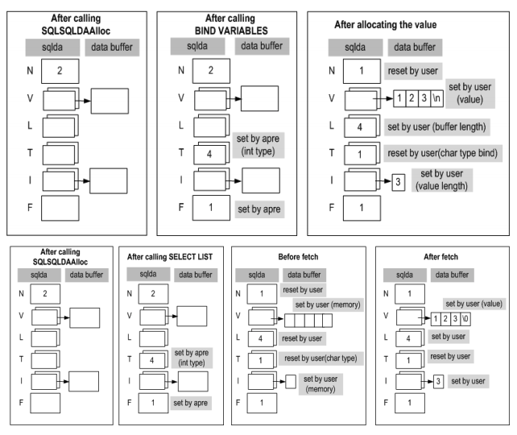

- [Precompiler User’s Manual](#precompiler-users-manual)
  - [Preface](#preface)
    - [About This Manual](#about-this-manual)
  - [1. The C/C++ Precompiler](#1-the-cc-precompiler)
    - [Introduction and Concepts](#introduction-and-concepts)
    - [Command-Line Options](#command-line-options)
    - [Programming using Embedded SQL Statements](#programming-using-embedded-sql-statements)
  - [2. Host Variables and Indicator Variables](#2-host-variables-and-indicator-variables)
    - [Host Variables](#host-variables)
    - [Classifying Host Variables](#classifying-host-variables)
    - [Indicator Variables](#indicator-variables)
    - [Classifying Indicator Variables](#classifying-indicator-variables)
    - [Meaning of Indicator Variables](#meaning-of-indicator-variables)
    - [Sample Programs](#sample-programs)
  - [3. Host Variable Declaration Section](#3-host-variable-declaration-section)
    - [Host Variable Declaration Section](#host-variable-declaration-section)
    - [Data Type Definition](#data-type-definition)
    - [Function Argument Declaration Section](#function-argument-declaration-section)
  - [4. C Preprocessor](#4-c-preprocessor)
    - [C Preprocessor Overview](#c-preprocessor-overview)
    - [C Preprocessor Directives](#c-preprocessor-directives)
    - [Limitations on the Use of the Preprocessor](#limitations-on-the-use-of-the-preprocessor)
    - [Preprocessor Example](#preprocessor-example)
    - [The ALTIBASE_APRE Macro](#the-altibase_apre-macro)
  - [5. Host Variable Data Types](#5-host-variable-data-types)
    - [Overview](#overview)
    - [Fundamental C/C++ Data Types](#fundamental-cc-data-types)
    - [Extended APRE Data Types](#extended-apre-data-types)
    - [Column and Host Variable Type Conversion](#column-and-host-variable-type-conversion)
  - [6. Embedded SQL Statements](#6-embedded-sql-statements)
    - [Overview](#overview-1)
    - [Connection related SQL statements](#connection-related-sql-statements)
    - [Using DDL and DML in Embedded SQL Statements](#using-ddl-and-dml-in-embedded-sql-statements)
    - [Using Other Embedded SQL Statements](#using-other-embedded-sql-statements)
    - [OPTION Statements](#option-statements)
  - [7. Handling Runtime Errors](#7-handling-runtime-errors)
    - [Overview](#overview-2)
    - [sqlca](#sqlca)
    - [SQLCODE](#sqlcode)
    - [SQLSTATE](#sqlstate)
    - [WHENEVER Statement](#whenever-statement)
    - [Sample Programs](#sample-programs-1)
  - [8. Using Cursor](#8-using-cursor)
    - [Overview](#overview-3)
    - [Cursor-Related SQL Statements](#cursor-related-sql-statements)
    - [Reusing a Cursor Name](#reusing-a-cursor-name)
    - [Sample Programs](#sample-programs-2)
  - [9. Using Arrays in Embedded SQL Statements](#9-using-arrays-in-embedded-sql-statements)
    - [Overview](#overview-4)
    - [Using Host Array Variables in Embedded SQL Statements](#using-host-array-variables-in-embedded-sql-statements)
    - [sqlca.sqlerrd](#sqlcasqlerrd)
    - [Limitations on the Use of Array-Type Host Variables](#limitations-on-the-use-of-array-type-host-variables)
    - [Structures and Arrays](#structures-and-arrays)
    - [Sample Programs](#sample-programs-3)
  - [10. Dynamic SQL Statements](#10-dynamic-sql-statements)
    - [Static versus Dynamic SQL Statements](#static-versus-dynamic-sql-statements)
    - [Using Dynamic SQL Statements](#using-dynamic-sql-statements)
    - [Sample Programs](#sample-programs-4)
  - [11. Using Stored Procedures in C/C++](#11-using-stored-procedures-in-cc)
    - [Using Stored Procedures](#using-stored-procedures)
    - [Using Array-Type Host Variables with the EXECUTE Statement](#using-array-type-host-variables-with-the-execute-statement)
    - [Sample Programs](#sample-programs-5)
  - [12. Applications with Multiple Database Connections](#12-applications-with-multiple-database-connections)
    - [Overview](#overview-5)
    - [SQL Statements for Multi-Connections](#sql-statements-for-multi-connections)
    - [Using Stored Procedures in Multiple-Connection Applications](#using-stored-procedures-in-multiple-connection-applications)
    - [Sample Programs](#sample-programs-6)
  - [13. Multithreaded Applications](#13-multithreaded-applications)
    - [Multithreaded Applications](#multithreaded-applications)
    - [Sample Program](#sample-program)
  - [14. Error Codes and Messages](#14-error-codes-and-messages)
    - [Precompiler Errors](#precompiler-errors)
  - [Appendix A. Using Files and LOBs](#appendix-a-using-files-and-lobs)
    - [Output Host Variables and Files](#output-host-variables-and-files)
    - [Input Host Variables](#input-host-variables)
  - [B. Appendix B. Porting Pro*C Applications to APRE](#b-appendix-b-porting-proc-applications-to-apre)
    - [Datatypes](#datatypes)
    - [Embedded Functions](#embedded-functions)
    - [Managing Database Connections](#managing-database-connections)
    - [Host Variables](#host-variables-1)
    - [Using Embedded SQL Statements](#using-embedded-sql-statements)
    - [Execution Results and Status Codes](#execution-results-and-status-codes)
    - [Commit Mode](#commit-mode)
    - [Sample Programs](#sample-programs-7)
  - [Appendix C. The Method 4 of Dynamic SQL](#appendix-c-the-method-4-of-dynamic-sql)
    - [SQLDA structure Data type](#sqlda-structure-data-type)
  - [Appendix D. Sample Applications](#appendix-d-sample-applications)
    - [Executing the Sample Applications](#executing-the-sample-applications)
    - [Table Information of the Example Programs](#table-information-of-the-example-programs)
  - [Appendix E. FAQ](#appendix-e-faq)
    - [Precompiler FAQ](#precompiler-faq)


Altibase® Application Development

Precompiler User’s Manual
=========================


Altibase Application Development Precompiler User’s Manual

Release 7.1

Copyright ⓒ 2001\~2021 Altibase Corp. All Rights Reserved.

This manual contains proprietary information of Altibase Corporation; it is provided under a license agreement containing restrictions on use and disclosure and is also protected by copyright patent and other intellectual property law. Reverse engineering of the software is prohibited. All trademarks, registered or otherwise, are the property of their respective owners.

**Altibase Corp**

10F, Daerung PostTower II, 306, Digital-ro, Guro-gu, Seoul 08378, Korea Telephone: +82-2-2082-1000 Fax: 82-2-2082-1099

Customer Service Portal: http://support.altibase.com/en/

Homepage: [[http://www.altibase.com](http://www.altibase.com/)]

Preface
----

### About This Manual

This manual explains how to use the embedded SQL statement of Altibase and C/C++ precompiler. The user can create an application using the embedded SQL statement of Altibase and precompile the created program

#### Audience

This manual has been prepared for the following Altibase users:

-   Database administrators
-   Performance administrators
-   Database users
-   Application developers
-   Technical Supporters

It is recommended for those reading this manual possess the following background knowledge:

-   Basic knowledge in the use of computers, operating systems, and operating system utilities
-   Experience in using relational database and an understanding of database concepts
-   Computer programming experience
-   Experience in database server management, operating system management, or network administration

#### Organization

This manual is organized as follows: 

-   Chapter 1: The C/C++ Precompiler  
    This chapter presents an introduction to the C/C++ precompiler and how to use it, and gives a detailed description of the procedure for writing applications that contain embedded SQL statements.
    
-   Chapter 2: Host Variables and Indicator Variables  
    This chapter describes both host variables and indicator variables, and explains how to interpret the meaning of indicator variables
    
-   Chapter 3: Host Variable Declaration Section  
    This chapter explains both the host variable declaration section and the function argument declaration section

-   Chapter 4: C Preprocessor

-   Chapter 5: Host Variable Data Types  
    This chapter describes the data types that are used for host variables.
    
-   Chapter 6: Embedded SQL Statements  
    This chapter explains how to use embedded SQL statements, including those for managing database connections and executing DDL and DML statements.
    
-   Chapter 7: Handling Runtime Errors  
    This chapter explains how to use the standard variables for handling runtime errors.

-   Chapter 8: Using Cursors  
    This chapter explains the statements used to manage cursors.

-   Chapter 9: Using Arrays in Embedded SQL Statements  
    This chapter covers how to use array-type host variables and discusses arrays of structures and the limitations on their use.

-   Chapter 10: Dynamic SQL Statements  
    This chapter explains dynamic SQL statements.

-   Chapter 11: Using Stored Procedures in C/C++  
    This chapter describes how to use stored functions and stored procedures.

-   Chapter 12: Application with Multiple Database Connections  
    This chapter covers how to write applications that use multiple database connections.

-   Chapter 13: Multithreaded Applications  
    This chapter discusses how to write multithreaded applications.

-   Chapter 14: Error Codes and Messages  
    This chapter explains the APRE error codes and messages.

-   Appendix A. Using Files and LOBs  
    This chapter describes how to use the file system to input or output BLOB and CLOB data.
    
-   Appendix B. Porting ProC Applications to APRE  
    This chapter discusses how to convert applications written with Oracle ProC(C++) to APRE.
    
-   Appendix C. The Method 4 of Dynamic SQL  
    This appendix should be thoroughly comprehended and referred especially when utilizing the method 4 of dynamic SQL since it can insert a value for parameter marker at a time of executing a program.
    
-   Appendix D. Sample Applications  
    This chapter explains the location of the sample applications.
    
-   Appendix E. FAQ  
    This chapter lists frequently asked questions about how to use APRE and embedded SQL statements.

#### Documentation Conventions

This section describes the conventions used in this manual. Understanding these conventions will make it easier to find information in this manual and in the other manuals in the series. 

There are two sets of conventions:

-   Syntax diagram convetions
-   Sample code conventions

##### Syntax Diagram Conventions

This manual describes command syntax using diagrams composed of the following elements:

| Elements                                                     | Meaning                                                      |
| ------------------------------------------------------------ | ------------------------------------------------------------ |
| [](https://github.com/ALTIBASE/Documents/blob/master/Manuals/Altibase_7.1/eng/media/SQL/image1.gif) | Indicates the start of a command. If a syntactic element starts with an arrow, it is not a complete command. |
| [](https://github.com/ALTIBASE/Documents/blob/master/Manuals/Altibase_7.1/eng/media/SQL/image2.gif) | Indicates that the command continues to the next line. If a syntactic element ends with this symbol, it is not a complete command. |
| [](https://github.com/ALTIBASE/Documents/blob/master/Manuals/Altibase_7.1/eng/media/SQL/image3.gif) | Indicates taht the command continues from the previous line. If a syntactic element starts witht his symbol, it is not a complete command. |
| [](https://github.com/ALTIBASE/Documents/blob/master/Manuals/Altibase_7.1/eng/media/SQL/image4.gif) | Indicates the end of a statement.                            |
| [](https://github.com/ALTIBASE/Documents/blob/master/Manuals/Altibase_7.1/eng/media/SQL/image5.gif) | Indicates a manatory element.                                |
| [](https://github.com/ALTIBASE/Documents/blob/master/Manuals/Altibase_7.1/eng/media/SQL/image6.gif) | Indicates an optional element.                               |
| [](https://github.com/ALTIBASE/Documents/blob/master/Manuals/Altibase_7.1/eng/media/SQL/image7.gif) | Indicates a mandatory element comprised of options. One, and only one, option must be specified. |
| [](https://github.com/ALTIBASE/Documents/blob/master/Manuals/Altibase_7.1/eng/media/SQL/image8.gif) | Indicates an optional element comprised of options.          |
| [](https://github.com/ALTIBASE/Documents/blob/master/Manuals/Altibase_7.1/eng/media/SQL/image9.gif) | Indicates an optional element in which multiple elements may be specified. A comman must precede all but the first element. |

##### Sample Code Conventions

The code examples explain SQL statements, stored procedures, iSQL statements, and other command line syntax.

The following table describes the printing conventions used in the code examples.

| Rules            | Meaning                                                      | Example                                                      |
| ---------------- | ------------------------------------------------------------ | ------------------------------------------------------------ |
| [ ]              | Indicates an optional item                                   | VARCHAR [(*size*)] [[FIXED \|] VARIABLE]                     |
| { }              | Indicates a mandatory field for which one or more items must be selected. | { ENABLE \| DISABLE \| COMPILE }                             |
| \|               | A delimiter between optional or mandatory arguments.         | { ENABLE \| DISABLE \| COMPILE } [ ENABLE \| DISABLE \| COMPILE ] |
| . . .            | Indicates that the previous argument is repeated, or that sample code has been omitted. | SQL\> SELECT ename FROM employee;<br/> ENAME<br/>  -----------------------<br/> SWNO<br/>  HJNO<br/>  HSCHOI<br/>  .<br/> .<br/> .<br/> 20 rows selected. |
| Other Symbols    | Symbols other than those shown above are part of the actual code. | EXEC :p1 := 1; acc NUMBER(11,2)                              |
| Italics          | Statement elements in italics indicate variables and special values specified by the user. | SELECT \* FROM *table_name*; <br/>CONNECT *userID*/*password*; |
| Lower case words | Indicate program elements set by the user, such as table names, column names, file names, etc. | SELECT ename FROM employee;                                  |
| Upper case words | Keywords and all elements provided by the system appear in upper case. | DESC SYSTEM_.SYS_INDICES_;                                   |

#### Related Documentations

For more detailed information, please refer to the following documents.

-   Installation Guide

-   Administrator’s Manual

-   CLI User's Manual

-   SQL Reference

-   Stored Procedures Manual

-   iSQL User’s Manual

-   Error Message Reference

#### Altibase Welcomes Your Comments and Feedbacks

Please let us know what you like or dislike about our manuals. To help us with better future versions of our manuals, please tell us if there is any corrections or classifications that you would find useful.

Include the following information:

- The name and version of the manual that you are using
- Any comments about the manual
- Your name, address, and phone number

If you need immediate assistance regarding any errors, omissions, and other technical issues, please contact [Altibase's Support Portal](http://support.altibase.com/en/).

Thank you. We always welcome your feedbacks and suggestions.

## 1. The C/C++ Precompiler

-------------------

### Introduction and Concepts

#### Introduction

APRE (the Altibase C/C++ Precompiler) is a programming tool that accepts source code containing embedded SQL as input, translates the embedded SQL statements into standard runtime library calls, and generates a modified source program that can be compiled in the host language and executed. 

APRE makes it easy for users to write and precompile applications that contain embedded SQL statements.

By embedding SQL statements into applications, users can create applications that have all of the functionality that is available when creating a program using the ODBC API, and can do so much more easily.

#### Precompiler Environment Settings

The following environment settings are required in order to compile and link a file that is output by APRE:

##### Required Header File

-   The ulpLibInterface.h header file is necessary. It is located in the $ALTIBASE_HOME/include directory.
  
-   In order to compile an application that was precompiled with APRE, it will be necessary to use the following option in your C/C++ compiler: -I $ALTIBASE_HOME/include

##### Required Library Files

-   The library files libapre.a and libodbccli.a (or apre.lib and odbccli.lib in Windows) are also necessary. They are located in the $ALTIBASE_HOME/lib directory.
-   In order to link a compiled application program with these libraries, it is necessary to use all of the following options:

```
–L $ALTIBASE_HOME/lib –lapre, –lodbccli, -lpthread
```

> #### Notes:
>
> The Altibase client library is not safe for system signal generation.
>
> Therefore, when the network connection is terminated due to an external cause, an application in progress may be forcibly terminated by receiving a SIGPIPE signal. To prevent this forced termination, the SIGPIPE signal must be handled by the user application. However, a function is called in the Altibase client library while processing SIGPIP signals, it should not call it because the program may stopped.
> 
> However, after signal processing, it is possible to call functions from the Altibase client library.

#### The Precompilation Process

APRE is used to precompile a program that was written in C or C++ and includes embedded SQL statements. It outputs a C or C++ program in which the embedded SQL has been converted into a form that is understandable by the C or C++ compiler. The input file is a text file containing C or C++ source code, and must have the .sc extension. The file output by APRE can have either the .c or .cpp extension. The user can choose the desired filename extension using the -t command-line argument. If this is omitted, the default extension is .c.

##### Executing the Precompile Command

```
apre [ <apre-options> ] <filename>
```

##### APRE Command-Line Options

-   \<*filename*\> : This is a text file that contains C or C++ source code, including embedded SQL statements. The filename extension must be .sc. It is possible to specify more than one file, in which case all of them will be preprocessed individually. When specifying multiple files, the asterisk (“*”) wildcard character is useful.

[Example 1] Precompile a program that was written in C. The precompilation operation creates the sample1.c file.

```
$ apre sample1.sc
```

[Example 2] Precompile multiple programs that were written in C. Note the use of the asterisk (“*”) wildcard character in the second example.

```
$ apre sample1.sc sample2.sc 
$ apre *.sc
```

-   \<*apre-options*\> : APRE*C/C++ command-line options are specified here, before the name of the file(s) to precompile. For details, please refer to the next section,Command-Line Options.

##### Precompile Messages

The screen that is displayed when APRE is executed is shown below.

```
$ apre sample1.sc
--------------------------------------------------------
  APRE C/C++ Precompiler.
  Release Version 7.1.0.0.0
  Copyright 2000, Altibase Corporation or its subsidiaries.
  All rights reserved.
--------------------------------------------------------
```

### Command-Line Options

The following command-line options can be used when precompiling applications. This section explains each of the command-line options in detail.

##### Run option

```
-h
```

When this option is used, the precompile operation is not performed, and APRE help information is displayed. The following screen will be shown:

```
$ apre -h
===========================================================
APRE (Altibase Precompiler) C/C++ Precompiler HELP Screen
===========================================================
Usage  :  apre [<options>] <filename>

-h               : Display this help information.
-t <c|cpp>       : Specify the file extension for the output file.
                   c   - File extension is '.c' (default)
                   cpp - File extension is '.cpp'
-o <output_path> : Specify the directory path for the output file.
                   (default : current directory)
-mt              : When precompiling a multithreaded application,
                   this option must be specified.
-I<include_path> : Specify the directory paths for files included using APRE C/C++.
                   (default : current directory)
-parse <none|partial|full>
                 : Control which non-SQL code is parsed.
-D<define_name>  : Use to define a preprocessor symbol.
-v               : Output the version of APRE.
-n               : Specify when CHAR variables are not null-padded.
-unsafe_null     : Specify to suppress errors when NULL values are fetched
                   and indicator variables are not used.
-align           : Specify when using alignment in AIX.
-spill <values>  : Specify the register allocation spill area size.
-keyword         : Display all reserved keywords.
-debug <macro|symbol>
                 : Use for debugging.
                   macro   - Display macro table.
                   symbol  - Display symbol table.
-nchar_var <variable_name_list>
                 : Process the specified variables using
                   the Altibase national character set.
-nchar_utf16     : Set client nchar encoding to UTF-16.
-lines           : Add #line directives to the generated code.
-silent          : No display Copyright.
================================================
```

#### \-t \<c\|cpp\>

This is used to choose the filename extension of the file created as a result of the APRE precompiling operation. When this option is set to “c”, the filename extension will be “.c”, whereas when this option is set to “cpp”, the filename extension will be “.cpp”. If neither extension is specified, the filename extension will be “.c”.

##### Example

Use the -t option to precompile a program written in C++. After APRE has executed the command, a file named “sample1.cpp” will be created.

```
$ apre –t cpp sample1.sc
```

#### \-o \<output_path\>

This is used to specify the location of the file(s) created by APRE. If this option is omitted, the resultant file(s) will be created in the current directory. Only one path can be specified. That is, when precompiling and creating multiple files, the resultant files must all be created in the same directory. 

#### \-mt

If the file to be preprocessed is a multi-threaded program, this option must be specified. this
This option cannot be applied to each source file (.sc), so an executable program is created by preprocessing more than one source file, this option must be applied to all source files.

```
EXEC SQL OPTION(THREADS=TRUE);
```

This can be replaced with the embedded SQL statement. That is, if the embedded SQL statement is declared within the file which will be precompiled, this option can be omitted. However, in the case of precompiling multiple files, this options is preferentially applied than the embedded SQL. Thus, if this option is selected, the precompiling files are applied all as well. 

Refer refer to Chapter6: Embedded SQL Statements on in-depth information on the OPTION statement.

#### \-I\<include_path\>

This option is used to specify the location(s) of the header file(s) to be used in the precompiling operation. Both absolute and relative paths can be specified. APRE will always look for the header file in the current directory first, followed by the directories specified here. 

In order to specify multiple locations, the -I option can be specified multiple times.

##### Example

Use the -I option to specify the location of header files to be used for precompiling. When this option is specified as shown, APRE will look for the header file in the current directory first, and will then look in the /include directory. 

```
$ apre –I. -I/include sample1.sc
```

#### \-parse \<none\|partial\|full\>

This option is used to specify the range within the source file(s), which are specified within the source code using the #include directive, that is parsed by the precompiler. When this option is not specified, it defaults to partial.

##### none

If this option is set to none, the precompiler processes only the macro commands and host variable declarations that are found within the EXEC SQL BEGIN/END DECLARE SECTION block, and ignores any macro commands and host variable declarations that are not found within that block. However, all embedded SQL statements found within the source file(s) are processed.

##### partial

If this option is set to partial, the precompiler processes all macro commands, but processes only the host variable declarations that are found within the EXEC SQL BEGIN/END DECLARE SECTION block. Additionally, the macro commands that are found in the header files that are included using the #include directive are processed, whereas the host variables found within these files are not. However, as with the none option, all embedded SQL statements found within the source file(s) are processed.

##### full

If this option is set to full, the precompiler executes an internal C parser and processes all host variables, regardless of whether they were declared inside or outside the EXEC SQL BEGIN/END DECLARE SECTION block, and all macro commands. Furthermore, not only all macro commands but also all host variables found within the header files included using the #include directive are also processed. Finally, all embedded SQL statements are then precompiled.

However, since performance loss can occur - regardless of this option being specified - the ALTIBASE precompiler does not parse the system header files that are included using the #include directive. Thus, an error is raised when types defined in the system header files are used as host variables. To avoid this, the user must define the desired type in the $ALTIBASE_HOME/include/aprePredefinedTypes.h file which is provided by Altibase.

In the “*.sc” source file, however, the system header files must be included using the #include directive, instead of the aprePredefinedTypes.h file. This is because the aprePredefinedTypes.h file is automatically referenced at APRE precompilation; at compilation, however, the system header files must be referenced.

> ##### Note:
>
> Because APRE's internal C parser is activated when the -parse option is set to full, an error will be raised if any C++ source code is encountered during the precompile operation. Therefore, when precompiling C++ source code, either avoid the use of the -parse option, or set it to partial or none.

##### Example

```
$ apre -parse none –t cpp sample1.sc
$ apre -parse partial –t cpp sample1.sc
$ apre -parse full –t cpp sample1.sc
```

#### \-D\<define_name\>

This option is used to specify the name of a macro during the precompile operation. This command has the same function as using the #define preprocessor directive in your code.

##### Example

Set the command-line option as shown below to define a macro named ALTIBASE when precompiling sample1.sc.

```
$ apre -DAltibase –t cpp sample1.sc
```

#### \-v

This displays the version of APRE.

##### Example

Check the version of the APRE C/C++ precompiler:

```
$ apre –v
Altibase Precompiler2(APRE) Ver. 7.1.0.0.1 XEON_LINUX_redhat_Enterprise_AS4-64bit-7.1.0.0.1-release-GCC3.4.6 (xeon-redhat-linux-gnu) Oct 23 2013 09:28:30
```

#### \-n

This option is used to indicate that any host variables of type CHAR are not null-padded. This option should be applied into all the necessary source files when creating an execution program through precompiling multiple source files(.sc) The length of a CHAR type input host variable must be the same as or shorter than that of the column in the database.

#### \-unsafe_null

This option is used to prevent an error from being raised even when a NULL value is fetched. This option should be applied to all the necessary source files when creating an executing program with precompiling multiple source files(.sc). 

An error occurs if the value of a column on which a SELECT or FETCH operation is executed is NULL in case that an indicator variable is not specified.

#### \-spill \<values\>

This option is specified only when precompiling in an AIX environment. This is the same as using the #pragma directive, as shown below:

```
#pragma options spill=<values>
```

#### \-keyword

The -keyword displays the list of reserved words in relation to embedded SQL.

##### Example

```
$ apre -keyword

:: Keywords for C code ::
:: Keywords for C code ::
ALTIBASE_APRE APRE_BINARY APRE_BINARY2 APRE_BIT APRE_BLOB APRE_BLOB_LOCATOR APRE_BYTES APRE_CLOB APRE_CLOB_LOCATOR APRE_DUPKEY_ERR APRE_INTEGER APRE_NIBBLE APRE_NUMERIC APRE_VARBYTES MAX_CHAR_PTR SESC_DECLARE SESC_INCLUDE SES_BINARY SES_BIT SES_BLOB SES_BLOB_LOCATOR SES_BYTES SES_CLOB SES_CLOB_LOCATOR SES_DUPKEY_ERR SES_INTEGER SES_NIBBLE SES_NUMERIC SES_VARBYTES SQLFailOverCallback SQLLEN SQL_DATE_STRUCT SQL_TIMESTAMP_STRUCT SQL_TIME_STRUCT SQL_NUMERIC_STRUCT VARCHAR

:: Keywords for Embedded SQL statement ::
ABSOLUTE ADD AFTER AGER ALL ALLOCATE ALTER AND ANY ARCHIVE ARCHIVELOG AS ASC ASENSITIVE AT AUTOCOMMIT BACKUP BATCH BEFORE BEGIN BETWEEN BLOB_FILE BREAK BY CASCADE CASE CAST CLEAR_RECPTRS CLOB_FILE CLOSE COALESCE COLUMN COMMIT COMPILE CONNECT CONSTANT CONSTRAINT CONSTRAINTS CONTINUE CREATE CUBE CURSOR CYCLE DATABASE DEALLOCATE DECLARE DEFAULT DELETE DEQUEUE DESC DESCRIPTOR DIRECTORY DISABLE DISABLE_RECPTR DISCONNECT DISTINCT DO DROP EACH ELSE ELSEIF ELSIF ENABLE ENABLEALL_RECPTRS ENABLE_RECPTR END ENQUEUE ESCAPE EXCEPTION EXEC EXECUTE EXISTS EXIT EXTENTSIZE FALSE FETCH FIFO FIRST FIXED FLUSH FOR FOREIGN FOUND FREE FROM FULL FUNCTION GOTO GRANT GROUP GROUPING HAVING HOLD IDENTIFIED IF IMMEDIATE IN INDEX INDICATOR INNER INSENSITIVE INSERT INTERSECT INTO IS ISOLATION JOIN KEY LAST LEFT LESS LEVEL LIFO LIKE LIMIT LOB LOCAL LOCK LOGANCHOR LOOP MAXROWS MERGE MINUS MODE MOVE MOVEMENT NEW NEXT NOARCHIVELOG NOCYCLE NOPARALLEL NOT NULL OF OFF OFFLINE OLD ON ONERR ONLINE ONLY OPEN OPTION OR ORDER OTHERS OUT OUTER PARALLEL PARTITION PARTITIONS PREPARE PRIMARY PRIOR PRIVILEGES PROCEDURE PUBLIC QUEUE RAISE READ REBUILD RECOVER REFERENCES REFERENCING RELATIVE RELEASE RENAME REPLACE REPLICATION RESTRICT RETURN REVERSE REVOKE RIGHT ROLLBACK ROLLUP ROW ROWCOUNT ROWTYPE SAVEPOINT SCROLL SELECT SENSITIVE SEQUENCE SESSION SET SETS SOME SPLIT SQLCODE SQLERRM SQLERROR SQLLEN START STATEMENT STEP STORE SYNONYM TABLE TABLESPACE TEMPORARY THAN THEN THREADS TO TRIGGER TRUE TRUNCATE TYPE TYPESET UNION UNIQUE UNTIL UPDATE USER USING VALUES VARCHAR VARIABLE VIEW VOLATILE WAIT WAKEUP_RECPTR WHEN WHENEVER WHERE WHILE WITH WORK WRITE
```

#### \-debug \<macro\|symbol\>

When this option is used, a symbol table containing the names of macros or declared variables in the source code is output. This option is provided for use in debugging source code.

##### macro

If -debug macro is specified, a macro list containing the names of all defined macros is output.

##### symbol

If -debug symbol is specified, a list of information about declared variables is output.

##### Example

Create the sample1.c file and output a macro list containing the names of all defined macros.

```
$ apre –debug macro sample1.sc
```

Create the sample1.c file and output a list of information about declared variables.

```
$ apre –debug symbol sample1.sc
```

Print both macros and variables.

```
$ apre –debug macro symbol sample1.sc
```

#### \-lines

The contents of the source file '* .sc' can be compared through specifying #line to be inserted into .c or .cpp file created by preprocessing

##### Example

It can be verified that there is #line after creating sample.sc file with preprocessing.

```
$ apre –debug macro symbol sample1.sc
```

#### \-nchar_utf16

When this option is used, national character type data are encoded as UTF-16 during the precompile operation. Since this option cannot be applied into each source file(.sc), this option should be applied into all the source files in the case of creating an execution program with precompiling two or more source files. The national character type data are encoded in the format specified by the ALTIBASE_NLS_USE property. 

However, when using the encoding method specified in the ALTIBASE_NLS_USE property, the potential data loss might be occurred since the Unicode values stored in the database cannot be accurately expressed when executing a query expression.

##### Example

Preprocess the program with UTF-16.

```
$ apre -nchar_utf16 -t cpp sample.sc
```

#### \-nchar_var \<variable_name_list\>

When this option is used, APRE processes the specified variables using the national character set of Altibase. Blanks between variable names are not allowed. Additionally, variables within structures cannot be specified.

#### -silent

This is an option to turn on silent mode. Turning on silent mode will not show additional description such as Copryright.

### Programming using Embedded SQL Statements

In this section, a brief explanation of the general flow of applications containing embedded SQL statements is provided, as well as a description of how to approach writing such applications. 

Generally, the order in which an application is authored should mirror the general flow of execution of the application, which is as follows:

#### Declaring Host Variables

When writing a program, it is first necessary to declare the host variables and indicator variables that will be used. Host variables must be declared in the host variable declaration section if the -partial precompiler option is not set to “full”.

For more information about host variables and indicator variables, please refer to Chapter 2: Host Variables and Indicator Variables.

##### Considerations when Declaring Host Variables

-   Nested structures cannot be used as host variables. In other words, a structure cannot be an element of another structure. 
-   When declaring array-type host variables, macros can be used only to specify the number of array elements. Macro definitions cannot be used, for example, to specify the location at which the value of a host variable is to be substituted in an embedded SQL statement. 
-   When declaring a character-type (i.e. char or varchar) output host variable, the length of the host variable must be defined so that it is at least one byte longer than the size of the corresponding column. Otherwise, when a SELECT or FETCH statement is executed, the value in the column will be truncated. In this case, the value returned in sqlca.sqlcode will be SQL_SUCCESS_WITH_INFO.

##### Special Considerations when Declaring Array-Type Host Variables

For complete information about using arrays with embedded SQL statements, please refer to Chapter 9: Using Arrays in Embedded SQL Statements.

-   Array-type host variables can only be one-dimensional arrays. The exception is that two-dimensional char and varchar type arrays are allowed.
-   An indicator variable cannot be used with a host variable that is an array of structures. 
-   When an array of structures is used as an output host variable in the INTO clause of a SELECT or FETCH statement, only one output host variable can be used. In other words, the array of structures cannot be used with other output host variables. Therefore, if the output host variable to be used in the INTO clause is an array of structures, the number of elements in the structure must be the same as the number of columns in the select list. 
-   When an array of structures is used as an insert host variable in the VALUES clause of an INSERT statement, only one input host variable can be used. In other words, the array of structures cannot be used with other input host variables. Therefore, if the input host variable to be used in the VALUES clause is an array of structures, the number of elements in the structure must be the same as the number of columns in the INSERT statement. 
-   Internally, the varchar type is handled as a kind of structure, so it is subject to the above limitations. 
-   Array-type host variables must not be used together with non-array type host variables in INSERT, UPDATE or DELETE statements. 
-   If an array-type output host variable is used when a SELECT or FETCH statement is executed, and the number of returned records is smaller than the array size, the value of sqlca.sqlcode will be SQL_SUCCESS. 
-   Array-type input host variables cannot be used with SELECT statements or cursor-related statements. 
-   The FOR clause can be used with array-type input host variables to execute an embedded INSERT, UPDATE, DELETE statements, but can be used with array-type output host variables to execute an embedded FETCH statement. 
-   When working with array-type host variables in AUTOCOMMIT mode, a “transaction” is not the totality of operations performed using the entire array. Rather, the operations corresponding to each element are individual transactions, and thus they are committed separately from one another. 
-   Arrays of pointers cannot be declared or used as host variables.

##### Considerations When Declaring Indicator Variables

-   The data type of indicator variables must be int. 
-   When using the varchar type as an input host variable without a separately defined indicator variable, it is necessary to specify the value of len, which is one of the elements of the varchar structure. If the value of the varchar array is not NULL, set the value of len to the length of the arr element. If the varchar array is NULL, set len to -1. 
-   For numeric type host variables, indicator variable values other than -1 are meaningless. 
-   Indicator variables must be used when working with binary type host variables.

##### Host Variable Declaration Section

For complete information about the host variable declaration section, please refer to Chapter 3: Host Variable Declaration Section.

-   Definitions of data types (typedef) to be used as host variable data types must be made in the host variable declaration section.

##### Example

The following is an example of a host variable declaration section:

< Sample program: insert.sc >

```
/* declare host variables */
EXEC SQL BEGIN DECLARE SECTION;
char usr[10];
char pwd[10];
char    s_gno[10+1];
char    s_gname[20+1];
char    s_goods_location[9+1];
int     s_stock;
double  s_price;
EXEC SQL END DECLARE SECTION;
```

#### Connecting to a Database Server

After the host variables have been declared, it is necessary to connect to a database server before any SQL statements can be executed. 

After a connection with a database server has been successfully established, it will then be possible to execute all embedded SQL statements. 

For detailed instructions on how to connect to database servers, please refer to Chapter 6: Embedded SQL Statements.

##### About Connections, Multiple Connections, and Sessions

-   To establish a new connection using the same name as an existing connection, it is first necessary to execute the FREE or DISCONNECT statement to terminate the existing connection. If the database server is online, execute the DISCONNECT statement, whereas if the database server is offline, execute the FREE statement. 
  
-   If the connection method (CONNTYPE) is set to 2 or 3 in the connection string in a USING clause, the DSN and PORT_NO options will be ignored even if they are set, and an attempt will be made to connect with the local database server.  When two sets of connection options are specified and a connection is successfully established using the first set of options, the value returned in sqlca.sqlcode is SQL_SUCCESS. If the connection attempt using the first set of options fails, but a connection is then successfully established using the second set of options, the value returned in sqlca.sqlcode is SQL_SUCCES_WITH_INFO. If a connection cannot be established using either set of options, the value returned in sqlca.sqlcode is SQL_ERROR. 
  
-   A maximum of 1024 embedded SQL statements can be executed per connection. 
  
-   In a session in which AUTOCOMMIT is set to OFF, if an application is shut down in the state in which uncommitted transactions exist, all transactions that were not committed at the time that the application is shut down will be rolled back. However, if the DISCONNECT statement is executed before the application is shut down, all pending transactions will be committed. 
  
-   The AT clause cannot be used in the following types of embedded SQL:
  
    INCLUDE statement: EXEC SQL INCLUDE …  
    OPTION statement: EXEC SQL OPTION …  
  WHENEVER statement: EXEC SQL WHENEVER …

##### Example

The following example shows how to connect to a database server:

\< Sample Program : connect1.sc \>

```
/* declare host variables */
EXEC SQL BEGIN DECLARE SECTION;
char usr[10];
char pwd[10];
EXEC SQL END DECLARE SECTION;

/* set username */
strcpy(usr, "SYS");
/* set password */
strcpy(pwd, "MANAGER");

EXEC SQL CONNECT :usr IDENTIFIED BY :pwd;  
if (sqlca.sqlcode == SQL_SUCCESS) /* check sqlca.sqlcode */
{
    printf("Success connection to altibase server\n\n");
}
else
{
    printf("Error : [%d] %s\n\n", SQLCODE, sqlca.sqlerrm.sqlerrmc);
    exit(1);
}
```

#### Executing Embedded SQL Statements

After a connection with a database server has been successfully established, it is possible to execute embedded SQL statements. The term “embedded SQL statements” encompasses DML statements such as the SELECT and INSERT statements, DDL statements such as object creation statements, system control statements, cursor-related SQL statements, dynamic SQL statements, and all other SQL statements of Altibase. 

For more information about using each of the various kinds of embedded SQL statements, please refer to Chapters 6 , 8 , 9 , 10 , and 11.

##### Examples

What follows are examples of the use of various kinds of embedded SQL statements.

[Example 1] The following is an example of an UPDATE statement:

\< Sample Program : update.sc \>

```
/* declare host variables */
EXEC SQL BEGIN DECLARE SECTION;
int      s_eno;
short    s_dno;
varchar  s_emp_job[15+1];
EXEC SQL END DECLARE SECTION;

s_eno = 2;
s_dno = 1001;
strcpy(s_emp_job.arr, "ENGINEER");
s_emp_job.len = strlen(s_emp_job.arr);

EXEC SQL UPDATE EMPLOYEES 
SET DNO     = :s_dno,
                EMP_JOB = :s_emp_job
            WHERE ENO = :s_eno;
```

[Example 2] The following is an example of the use of cursor control statements:

\< Sample Program : hostvar.h \>

```
EXEC SQL BEGIN DECLARE SECTION;
typedef struct department
{
    short dno; 
    char  dname[30+1];
    char  dep_location[9+1];
    int   mgr_no;
} department;

typedef struct dept_ind
{
    int dno; 
    int dname;
    int dep_location;
    int mgr_no;
} dept_ind;
EXEC SQL END DECLARE SECTION;
```

\< Sample Program : cursor1.sc \>

```
/* specify path of header file */
EXEC SQL OPTION (INCLUDE=./include);
/* include header file for precompile */
EXEC SQL INCLUDE hostvar.h;

/* declare host variables */
EXEC SQL BEGIN DECLARE SECTION;
/* structure host variables */
department s_department;
/* structure indicator variables */
dept_ind s_dept_ind;
EXEC SQL END DECLARE SECTION;

/* declare cursor */
EXEC SQL DECLARE DEPT_CUR CURSOR FOR 
             SELECT *
             FROM DEPARTMENTS; 
    
/* open cursor */
EXEC SQL OPEN DEPT_CUR;
    
/* fetch cursor in loop */
while(1)
{
    /* use indicator variables to check null value */
    EXEC SQL FETCH DEPT_CUR INTO :s_department :s_dept_ind;
    if (sqlca.sqlcode == SQL_SUCCESS) /* check sqlca.sqlcode */
    {
    printf("%d     %s %s          %d\n", 
              s_department.dno, s_department.dname, 
              s_department.dep_location, 
s_department.mgr_no);
}
else if (sqlca.sqlcode == SQL_NO_DATA)
{
    break;
}
else 
{
    printf("Error : [%d] %s\n", SQLCODE, sqlca.sqlerrm.sqlerrmc);
    break;
}
}

/* close cursor */
EXEC SQL CLOSE DEPT_CUR;
```

#### Handling Runtime Errors

-   After every embedded SQL statement has been executed, it is necessary to check the result of execution. The result of execution of embedded SQL statements is stored in the variable sqlca.sqlcode, and, depending on the value of sqlca.sqlcode, the variables SQLSTATE, SQLCODE, etc. can be checked to obtain more information about the result of execution.

For detailed information about all of the variables that can be checked to determine the result of execution of an embedded SQL statement, please refer to Chapter 7: Handling Runtime Errors.

##### Considerations when Handling Runtime Errors

The following are some considerations to keep in mind when using SQLCA, SQLCODE, SQLSTATE and WHENEVER to handle run-time errors.

-   Every time an embedded SQL statement is executed, be sure to check the value of sqlca.sqlcode so that any errors that occurred will be processed appropriately. 
-   When a SELECT statement is executed, if the size of an output host variable is smaller than the size of the corresponding character-type column, the data will be truncated so that they can be saved in the host variable. When this happens, the value of sqlca.sqlcode will be SQL_SUCCESS_WITH_INFO. 
-   If no records are affected by an UPDATE or DELETE operation, the value of sqlca.sqlcode will be SQL_NO_DATA. To determine the number of records that were affected by an UPDATE or DELETE operation, check the value of sqlca.sqlerrd[2]. If no records were affected, this value will be 0. 
-   The SQLCODE error code values are negative decimal integers. However, the error codes in the Error Message Reference are positive hexadecimal values. Therefore, when referring to the Error Message Reference, convert the absolute values of SQLCODE error codes into hexadecimal values. 
-   The scope of applicability of a WHENEVER statement is not the same as the overall program flow. In particular, a WHENEVER statement applies only to the file in which it is found. 
-   The WHENEVER statement must precede any embedded SQL statements to which it is intended to apply. 
-   WHENEVER statements are connection-independent. In other words, a WHENEVER statement in an application with more than one connection affects all embedded SQL statements within its scope of applicability, regardless of the connection to which the embedded SQL statements pertain.

##### Example

In this example, the variables in the sqlca structure are checked to determine the result of execution of an embedded SQL statement.

\< Sample Program : delete.sc \>

```
/* declare host variables */
EXEC SQL BEGIN DECLARE SECTION;
int      s_eno;
short    s_dno;
EXEC SQL END DECLARE SECTION;

s_eno = 5;
s_dno = 1000;

EXEC SQL DELETE FROM EMPLOYEES 
WHERE ENO > :s_eno AND 
DNO > :s_dno AND 
EMP_JOB LIKE 'P%';

/* check sqlca.sqlcode */
if (sqlca.sqlcode == SQL_SUCCESS) 
{
    /* sqlca.sqlerrd[2] holds the 
rows-processed(deleted) count */
    printf("%d rows deleted\n\n", sqlca.sqlerrd[2]);
}
else 
{
    printf("Error : [%d] %s\n\n", 
SQLCODE, sqlca.sqlerrm.sqlerrmc);
}
```

#### Disconnecting from the Database Server

After all embedded SQL statements have been executed, it will be necessary to disconnect from the database server before shutting down the application. Disconnecting from the database server frees all resources that were allocated for the connection. After disconnecting from the database server, it is of course impossible to execute any more embedded SQL statements. 

For detailed information about how to connect to and disconnect from database servers, please refer to Chapter6: Embedded SQL Statements.

##### Example

The following example shows how to disconnect from a database server:

\< Sample Program : connect1.sc \>

```
EXEC SQL DISCONNECT;
```

#### The Precompile Operation

This is how to execute the precompiling operation using the APRE precompiler:

```
apre [<apre – option>] <filename>
```

##### Example

In the following example, the connect1.sc file is precompiled:

```
$ apre connect1.sc
```

## 2. Host Variables and Indicator Variables

-------------------------

### Host Variables 

#### Overview

Host variables are responsible for data exchange between an application written in a host language and a database server. In other words, host variables store data that have been read from table columns, data that are to be inserted into table columns, etc. 

#### Declaring Host Variables

The host variable declaration method is as follows:

-   If an attempt is made to use a variable in an embedded SQL statement, and the variable was not first declared in either the host variable declaration section or the function argument declaration section, an error saying “The host variable [variable_name] is unknown.” will be raised during the precompile operation.  
    For more information about the host variable declaration section and the function argument declaration section, please refer to Chapter3: Host Variable Declaration Section.
    
-   The syntax for declaring host variables is as follows  
    datatype variable_name;  
    This is the same as when declaring variables in a C or C++ program. For detailed information about the data types that host variables can have, please refer to Chapter 5: Host Variable Data Types.
    
-   Host variables can also be declared as arrays. For the CHAR and VARCHAR types, it is possible to declare one- or two-dimensional arrays, whereas for the other types, it is only possible to declare one-dimensional arrays. For more information about using arrays with embedded SQL statements, please refer to Chapter9 : Using Arrays in Embedded SQL Statements.
  
-   APRE can use the CHAR and VARCHAR type host variables to process text data in any of the national character sets supported by Altibase. When handling data in the national character set, use the reserved word shown below:  
    character set [is] nchar_cs  
    Note that if the -nchar_var command-line option is used when precompiling the source code, it is not necessary to use the reserved word shown above.
    
-   The names of host variables must start with an alphabetic character (a ~ z, A ~ Z), the underscore character (‘_’), or a dollar sign (“$”), and must not be longer than 50 bytes.

#### Using Host Variables in Embedded SQL Statements

A host variable can be used anywhere in an embedded SQL statement where the use of a scalar expression would be allowed.

Host variables must be distinguished from the other elements in embedded SQL statements. This is accomplished by prepending the colon (“:”) character to the names of host variables whenever they appear in embedded SQL statements.

#### Example

In the following example, the host variables s_dno, s_dname, and s_dep_location are declared:

\< Sample Program : select.sc \>

```
EXEC SQL BEGIN DECLARE SECTION;
short      s_dno;
char       s_dname[30+1];
char       s_dep_location[9+1];
EXEC SQL END DECLARE SECTION;

EXEC SQL SELECT DNAME, DEP_LOCATION
INTO :s_dname, :s_dep_location
FROM DEPARTMENTS
WHERE DNO = :s_dno;
```

### Classifying Host Variables

Host variables are classified as either input host variables or output host variables depending on whether they are used to input data into a database server or extract data from a database server

#### Output Host Variables 

An output host variable is used in an INTO clause of a SELECT or FETCH statement to store query results. An output host variable thus plays the same role as a variable used in the ODBC SQLBindCol() function.

##### Example

The following is an example of the use of output host variables.

In this example, s_dname and s_dep_location are host variables. The values in the DNAME and DEP_LOCATION columns for the records that satisfy the condition in the WHERE clause are stored in the host variables s_dname and s_dep_location, respectively.

\< Sample Program : select.sc \>

```
EXEC SQL BEGIN DECLARE SECTION;
short      s_dno;
char       s_dname[30+1];
char       s_dep_location[9+1];
EXEC SQL END DECLARE SECTION;

s_dno = 1001;
EXEC SQL SELECT DNAME, DEP_LOCATION
INTO :s_dname, :s_dep_location
FROM DEPARTMENTS
WHERE DNO = :s_dno;
```

#### Input Host Variables 

Input host variables are used wherever output host variables are not used. Their primary role is to specify data to be used in SQL statements. For example, an input host variable can be used in the WHERE clause of a SELECT statement to specify a value that is part of a condition, or in the VALUES clause of an INSERT statement to specify a value to be inserted into a particular column of a record.

An input variable can be used anywhere in an embedded SQL statement where the use of a scalar expression would be allowed. Note however that in order to use a host variable in the select list or the GROUP BY or ORDER BY clause of a SELECT statement, its type must be specified using the CAST operator in the SQL statement. If the CAST operator is used in the GROUP BY clause to specify the host variable type, this expression cannot be used in the TARGET clause.

An input host variable can be used in a WHERE clause. However, be aware that when using a host variable in a join predicate in a WHERE clause, the query optimizer will be unaware of its data type, and thus can only use the NL join method when creating an execution plan. To overcome this limitation and allow the optimizer to choose a more efficient joining method, use the CAST operator in the SQL statement to let the optimizer know the type of the host variable.

##### Examples

The following examples illustrate the use of input host variables in various ways. 

[Example 1] The following example shows the use of the input host variables s_gno, s_gname, s_goods_location, s_stock, and s_price in an INSERT statement. The values stored in the input host variables are inserted into respective table columns.

\< Sample Program: insert.sc \>

```
EXEC SQL BEGIN DECLARE SECTION;
char    s_gno[10+1];
char    s_gname[20+1];
char    s_goods_location[9+1];
int     s_stock;
double  s_price;
EXEC SQL END DECLARE SECTION;

strcpy(s_gno, "F111100002");
strcpy(s_gname, "XX-101");
strcpy(s_goods_location, "FD0003");
s_stock = 5000;
s_price = 9980.21;

EXEC SQL INSERT INTO GOODS 
VALUES (:s_gno, :s_gname, :s_goods_location, 
:s_stock, :s_price);
```

[Example 2] The following example shows the use of the input host variables s_dno, s_emp_job, and s_eno in an UPDATE statement. The values in the DNO and EMP_JOB columns of the records that satisfy the condition in the WHERE clause are updated with the values of s_dno and s_emp_job, respectively.

\< Sample Program : update.sc \>

```
EXEC SQL BEGIN DECLARE SECTION;
int      s_eno;
short    s_dno;
varchar  s_emp_job[15+1];
EXEC SQL END DECLARE SECTION;

s_eno = 2;
s_dno = 1001;
strcpy(s_emp_job.arr, "ENGINEER");
s_emp_job.len = strlen(s_emp_job.arr);

EXEC SQL UPDATE EMPLOYEES 
SET DNO = :s_dno,
                          EMP_JOB = :s_emp_job
            WHERE ENO = :s_eno;
```

[Example 3] The following example shows the use of the input host variables s_eno and s_dno in a DELETE statement. The values of the host variables are used in the WHERE clause to determine which records are to be deleted.

\< Sample Program : delete.sc \>

```
EXEC SQL BEGIN DECLARE SECTION;
int      s_eno;
short    s_dno;
EXEC SQL END DECLARE SECTION;

s_eno = 5;
s_dno = 1000;

EXEC SQL DELETE FROM EMPLOYEES 
WHERE ENO > :s_eno AND 
DNO > :s_dno AND 
EMP_JOB LIKE 'P%';
```

[Example 4] The following example shows the use of the input host variable s_dno in a SELECT statement. The value of s_dno is used in the WHERE clause to determine which records to retrieve.

\< Sample Program : select.sc \>

```
EXEC SQL BEGIN DECLARE SECTION;
short      s_dno;
char       s_dname[30+1];
char       s_dep_location[9+1];
EXEC SQL END DECLARE SECTION;

s_dno = 1001;
EXEC SQL SELECT DNAME, DEP_LOCATION
INTO :s_dname, :s_dep_location
FROM DEPARTMENTS
WHERE DNO = :s_dno;
```

[Example 5] The following example shows the use of the input host variable s_call in the select list of a SELECT statement.

\< Sample Program : host_target.sc \>

```
EXEC SQL BEGIN DECLARE SECTION;
double s_call;
EXEC SQL END DECLARE SECTION;

s_call = 0.045;

EXEC SQL SELECT principal sum * ( 1 – CAST( :s_call AS DOUBLE ) ) FROM 계좌;
```

[Example 6] The following example shows the use of the input host variable s_period in the GROUP BY clause of a SELECT statement.

\< Sample Program : host_group.sc \>

```
int s_period;
EXEC SQL END DECLARE SECTION;

s_period = 1;    /* 1(month), 3(quarter year), 6(half year) */

EXEC SQL SELECT SUM(sale) FROM sales 
                 GROUP BY FLOOR( month / CAST( :s_period AS INTEGER ) );
```

[Example 7] The following example shows the use of the input host variable s_diff in the join predicate of a WHERE clause. 

< Sample Program : host_join.sc >

```
EXEC SQL BEGIN DECLARE SECTION;
int s_diff;
EXEC SQL END DECLARE SECTION;

s_diff = 1;

EXEC SQL SELECT * FROM t1, t2
                 WHERE t1.i1 = t2.i1 + CAST( :s_diff AS INTEGER );
```

### Indicator Variables 

#### Overview

Because NULL table column values cannot be expressed in the host language, a method of handling them separately is required. 

To enable APRE to process NULL values, the use of so-called “indicator variables” is supported. 

Indicator variables are used alongside host variables in embedded SQL statements to process NULL values. 

#### Why use indicator variables?

##### 		For Handling Null Values

-   Indicator variables can be used to provide information on the basis of which a programmer can judge whether or not a column value is NULL.   
    If an input indicator variable is set to -1 (SQL_NULL_DATA), the corresponding host variable will be processed as NULL. If the value of an output indicator variable is -1 (SQL_NULL_DATA), For example, an indicator variable can be used to indicate whether the value of a host variable to be used in an INSERT statement is NULL, or whether a column value returned by a SELECT statement is NULL. 
    
    ##### For Managing the Length of Data
    
- Indicator variables can also be used to specify the length of an input value or store the length of a column value returned by a SELECT statement. Indicator variables can be used to manage data length only for character or binary type host variables. To specify the length of an input value, an input indicator variable would be used, whereas an output indicator variable would be used to store the length of a returned column value. If a host variable is a character type variable, and the value to be input or the returned column value is terminated with a null terminator (“\0”) and is known not to be NULL, there is no need to use an indicator variable. When dealing with a binary type host variable, it is essential to use an indicator variable, even when the input value or the returned column value is known not to be NULL. This is because the binary type is not terminated with a NULL character, and the database needs a way of knowing the length of the input value, while the application needs a way of knowing the length of the returned column.) For more information about the use of binary type host variables, please refer to Chapter 5: Host Variable Data Types.

#### Declaring Indicator Variables

Indicator variables are declared as follows:

-   Indicator variables are declared in the host variable declaration section or the function argument declaration section. If an attempt is made to use an indicator variable in an embedded SQL statement, and the indicator variable was not previously declared in the host variable declaration section or the function argument declaration section, an error saying “The host variable [variable_name] is unknown.” will be raised during the precompile operation. For more information about the host variable declaration section and the function argument declaration section, please refer to Chapter 3: Host Variable Declaration Section. 

The syntax for declaring indicator variables is as follows:  

* datatype indicator_variable_name;  
  The data type of an indicator variable must be int or SQLLEN (a predefined type in ODBC). It can also be a data structure, as long as it consists of only the int and SQLLEN types. 

-   The names of indicator variables must start with an alphabetic character (a ~ z, A ~ Z), the underscore character (“_”), or a dollar sign (“$”), and must not be longer than 50 bytes.

#### Syntax

The syntax for using indicator variables within embedded SQL statements is as follows:

```
<:host_variable> [INDICATOR] <:indicator_variable>
```

The keyword “INDICATOR” can be omitted.

If the host variable is not a structure, the indicator variable must not be a structure either. However, if the host variable is a structure, the indicator variable must be a structure too.

#### When is it necessary to use indicator variables?

Indicator variables must be used in the following cases:

-   When an input value is NULL  
    When inputting a NULL value, an indicator variable must be used, and its value must be set to -1 (SQL_NULL_DATA). 

-   When querying a column that does not have a NOT NULL constraint  
    If the value of a selected or fetched column is NULL and an indicator variable is not being used, the result of execution of the embedded SQL statement (sqlca.sqlcode) will be SQL_SUCCESS_WITH_INFO, and a warning message will be returned in the variable sqlca.sqlerrm.sqlerrmc. 
    
-   When the type of an input or output host variable is APRE_BINARY, APRE_BLOB or APRE_BYTES  
    Because binary types are not NULL-terminated, the database needs a way of knowing the length of an input value. Therefore, the length of the input data must be specified using the indicator variable. In the same way, when dealing with output host variables, the length of returned column values must be stored in indicator variables. For more information about the APRE_BINARY, APRE_BLOB and APRE_BYTES data types, please refer to Chapter 5: Host Variable Data Types. 
    
-   When using an APRE_NIBBLE type output host variable  
    An indicator variable must be used when entering a NULL value in a NIBBLE type column or reading a NULL value from a NIBBLE type column. For more information about the use of the APRE_NIBBLE data type, please refer to Chapter 5: Host Variable Data Types

#### Considerations

-   When a host variable is a structure, the corresponding indicator variable must also be a structure. The two structures must have the same number of elements

```
Example) EXEC SQL BEGIN DECLARE SECTION;
struct tag1 { int i1; int i2; } var1;
struct tag2 { int i1_ind; int i2_ind; } var1_ind1;
struct tag3 { int i1_ind; int i2_ind; 
int i3_ind; } var1_ind2; 
EXEC SQL END DECLARE SECTION;

EXEC SQL INSERT INTO T1(I1, I2) 
VALUES (:var1 :var1_ind1);	(O)
EXEC SQL INSERT INTO T1(I1, I2) 
VALUES (:var1 :var1_ind2);	(X)
```

-   An indicator variable cannot be used with a host variable that is an array of structures.

```
Example) EXEC SQL BEGIN DECLARE SECTION;
struct tag1 { int i1; int i2; char i3[11]; } var1[10];
struct tag2 { int i1_ind; int i2_ind; int i3_ind; } var1_ind1[10];
EXEC SQL END DECLARE SECTION;

EXEC SQL INSERT INTO T1(I1, I2, I3) 
VALUES (:var1 :var1_ind1);	(X)
```

-   When dealing with a VARCHAR type host variable, if an indicator variable is specified for use with the host variable, it will be used as the indicator variable, whereas if no indicator variable is specified, the len variable, which is an element of the VARCHAR type, will automatically be used as the indicator variable. In this case it is acceptable to use the value of len as the indicator variable. 

```
Example) EXEC SQL BEGIN DECLARE SECTION;
varchar var1;
int var1_ind;
EXEC SQL END DECLARE SECTION;

/* Inserting 'TEST' in column I1 of table T1
when var1.len is used as an indicator variable  */
strcpy(var1.arr, “TEST”);
var1.len = strlen(var1.arr);
EXEC SQL INSERT INTO T1(I1) 
VALUES (:var1);

/*  Inserting NULL in column I1 of table T1
when var1.len is used as an indicator variable */
var1.len = -1;
EXEC SQL INSERT INTO T1(I1) 
VALUES (:var1);

/*  Inserting 'TEST' in column I1 of table T1
when var1_ind is used as an indicator variable */
strcpy(var1.arr, “TEST”);
var1_ind = strlen(var1.arr);
EXEC SQL INSERT INTO T1(I1) 
VALUES (:var1 :var1_ind);	
```

#### Examples

In the following example, s_goods_location_ind is used as the indicator variable for the s_goods_location host variable, and s_price_ind is used as the indicator variable for the s_price host variable. Because the value of both indicator variables is SQL_NULL_DATA, NULL will be inserted in the corresponding columns, even though the values of the s_goods_location and s_price host variables are not NULL.

\< Sample Program : indicator.sc \>

```
/* declare host variables */
EXEC SQL BEGIN DECLARE SECTION;
char    s_gno[10+1];
char    s_gname[20+1];
char    s_goods_location[9+1];
int     s_stock;
double  s_price;

/* declare indicator variables */
int      s_goods_location_ind;
int      s_price_ind;
EXEC SQL END DECLARE SECTION;

/* set host variables */
strcpy(s_gno, "X111100002");
strcpy(s_gname, "XX-101");
strcpy(s_goods_location, "FD0003");
s_stock = 5000;
s_price = 9980.21;

/* set indicator variables */
s_goods_location_ind = SQL_NULL_DATA;
s_price_ind          = SQL_NULL_DATA;

EXEC SQL INSERT INTO GOODS 
VALUES (:s_gno, 
:s_gname,
:s_goods_location :s_goods_location_ind,
:s_stock,
:s_price :s_price_ind);
```

### Classifying Indicator Variables

Indicator variables are classified as either input indicator variables or output indicator variables depending on whether they are used with output host variables or input host variables.

#### Output Indicator Variables

If the column corresponding to an output host variable does not have a NOT NULL constraint, it is essential that an indicator variable be used for the host variable. The reason for this is that when the value of a selected or fetched column is NULL and an indicator variable is not being used, the result of execution of the embedded SQL statement (sqlca.sqlcode) will be SQL_SUCCESS_WITH_INFO and a warning message will be returned in the variable sqlca.sqlerrm.sqlerrmc.

If the value of the indicator variable is -1 (SQL_NULL_DATA), this means that NULL will be returned from the column. Therefore, the value of the output host variable is not meaningful (i.e. a garbage value). If the value of the indicator variable is not -1 (SQL_NULL_DATA), this means that the value in the corresponding column is not NULL, and will be saved in the output host variable. For more detailed information about the value of the indicator variable in such cases, please refer to the next section "Meaning of Indicator Variables".

##### Examples

The following is an example of the use of an output indicator variable. 

In this example, the variable s_good_ind is used as an indicator variable for the variable s_goods. Because s_goods is a structure, s_good_ind must also be declared as a structure. The two structures will have the same number of components. After the SELECT statement is executed, each of the members of s_good_ind will be checked to determine if the value is -1. 

\< Sample Program : hostvar.h \>

```
EXEC SQL BEGIN DECLARE SECTION;
typedef struct goods
{
    char   gno[10+1];
    char   gname[20+1];
    char   goods_location[9+1];
    int    stock;
    double price;
} goods;

typedef struct good_ind
{
    int gno;
    int gname;
    int goods_location;
    int stock;
    int price;
} good_ind;
EXEC SQL END DECLARE SECTION;
```

\< Sample Program : indicator.sc \>

```
/* specify path of header file */
EXEC SQL OPTION (INCLUDE=./include);
/* include header file for precompile */
EXEC SQL INCLUDE hostvar.h;

EXEC SQL BEGIN DECLARE SECTION;
goods     s_goods;
good_ind s_good_ind;
EXEC SQL END DECLARE SECTION;

EXEC SQL SELECT * 
INTO :s_goods :s_good_ind 
FROM GOODS 
WHERE GNO = :s_gno;

/* Because the GNO and GNAME columns have the NOT NULL constraint, their indicator variables do not have to
be checked. */ 
if (sqlca.sqlcode == SQL_SUCCESS) 
{
        if (s_good_ind.goods_location == SQL_NULL_DATA)
        {
            strcpy(s_goods.goods_location, "NULL");
        }
        if (s_good_ind.stock == SQL_NULL_DATA)
        {
            s_goods.stock = -1;
        }
        if (s_good_ind.price == SQL_NULL_DATA)
        {
            s_goods.price = -1;
        }
}
```

#### Input Indicator Variables

To specify NULL as an input value, it is necessary to use an input indicator variable. In such cases, the value of the indicator variable must be set to -1.

When specifying a non-NULL input value, there is no need to use the corresponding indicator variable, but when using the indicator variable, care must be taken to ensure that there is no possibility that a NULL value will be entered. The meaning of the value of the indicator variable differs depending on the type of the input host variable. For more information, please refer to the next section "Meaning of Indicator Variables".

##### Example

The following is an example of the use of an input indicator variable. 

In this example, the variable s_goods_location_ind is used as an indicator variable for the variable s_goods_location, and the variable s_price_ind is used as an indicator variable for the variable s_price. The values of s_goods_location_ind and s_price_ind are set to SQL_NULL_DATA (-1) to insert NULL into the GOODS_LOCATION and PRICE columns, respectively. 

\< Sample Program : indicator.sc \>

```
EXEC SQL BEGIN DECLARE SECTION;
/* declare host variables */
char    s_gno[10+1];
char    s_gname[20+1];
char    s_goods_location[9+1];
int     s_stock;
double  s_price;

/* declare indicator variables */
int      s_goods_location_ind;
int      s_price_ind;
EXEC SQL END DECLARE SECTION;

/* set host variables */
strcpy(s_gno, "X111100002");
strcpy(s_gname, "XX-101");
strcpy(s_goods_location, "FD0003");
s_stock = 5000;
s_price = 9980.21;

/* set indicator variables */
s_goods_location_ind = SQL_NULL_DATA;
s_price_ind            = SQL_NULL_DATA;

EXEC SQL INSERT INTO GOODS 
VALUES (:s_gno, 
                   :s_gname, 
                   :s_goods_location :s_goods_location_ind, 
                   :s_stock, 
:s_price :s_price_ind);
```

### Meaning of Indicator Variables

The following table describes the meanings of indicator variable values depending on the type of the host variable and on whether the indicator variable is an input indicator variable or an output indicator variable. 

An indicator variable value of -1 always signifies a NULL host variable value. The meaning of indicator variable values other than -1, however, differs depending on the type of the host variable and on whether the indicator variable is an input indicator variable or an output indicator variable. Therefore, it is important to understand the information in the following table, and to refer back to it when using indicator variables. 

It is particularly important that the value of input indicator variables be set correctly, because these values are used internally by the precompiler and the database server

<table>
    <tr>
    	<th>Host Variable
Type
</th>
		<th colspan="2">Value of Input Indicator Variables</th>
		<th colspan="2">Value of Output Indicator Variables</th>	
    </tr>
    <tr>
    	<td>Host variable type / Indicator variable value</td>
    	<td>-1</td>
    	<td>-1 Values other than -1 </td>
    	<td>-1</td>
    	<td>Values other than -1</td>
    </tr>
    <tr>
    	<td>Numeric types</td>
    	<td rowspan="8">Means the input value is NULL</td>
    	<td>Not internally used. Not
meaningful.</td>
    	<td rowspan="8">Means the
returned
value is
NULL.
The actual value
of the
host variable does
not mean
anything.
(Garbage
value)
</td>
		<td>Contains the size of the host variable (sizeof).</td>
    </tr>
    <tr>
    	<td>Character types</td>
    	<td>Used to indicate the
length of the input value
(strlen). Must be set.</td>
    	<td>Contains the length of the returned
value (strlen).</td>   	
    </tr>
    <tr>
    	<td>Date type</td>
    	<td>Not internally used. Not
meaningful.</td>
    	<td>Contains the size of the host variable (sizeof).</td>
    </tr>
    <tr>
    	<td>APRE_BINARY</td>
    	<td>Used to indicate the
length, in bytes, of the
input value. Must be set.</td>
    	<td>Contains the length, in bytes, of the
returned value.</td>
    </tr>
    <tr>
    	<td>APRE_BINARY2</td>
    	<td>Must specifies the length in bytes of the input.</td>
    	<td>The length (bytes) of the returned value is stored.</td>
    </tr>
    <tr>
    	<td>APRE_BLOB</td>
    	<td>Used to indicate the
length, in bytes, of the
input value. Must be set.</td>
    	<td>Contains the length, in bytes, of the
returned value.</td>
    </tr>
    <tr>
    	<td>APRE_CLOB</td>
    	<td>Used to indicate the
length, in bytes, of the
input value. Must be set.</td>
    	<td>The length (bytes) of the returned value is stored.</td>
    </tr>
    <tr>
    	<td>APRE_BYTES</td>
    	<td>Must specify the length in bytes of the input.</td>
    	<td>
The length (bytes) of the returned value is stored.</td>
    </tr>
    <tr>
    	<td>APRE_NIBBLE</td>
    	<td>Not internally used. Not
meaningful.</td>
    	<td>The length, in bytes, of the returned
value is stored</td>
    </tr>
<table>


Indicator variables are usually used for handling NULL values. However, as shown in the above table, input indicator variable values other than -1 can be meaningful, and are checked and used within the system. Therefore, when using an input indicator variable, it is important to set its value accurately, even when the value of the corresponding host variable is not NULL.

When the value of an input indicator variable that corresponds to a CHAR or BINARY type host variable is not -1, the database server will take the value of the indicator variable as the length of the input value, and process the value accordingly

### Sample Programs

##### indicator.sc 

This example can be found at $ALTIBASE_HOME/sample/APRE/indicator.sc

##### Result of Execution

```
$ is –f schema/schema.sql
$ make indicator
$ ./indicator
<INDICATOR VARIABLES>
-----------------------------------------------------------
[Scalar Indicator Variables]                                      
-----------------------------------------------------------
Success insert

-----------------------------------------------------------
[Structure Indicator Variables]                                   
-----------------------------------------------------------
GNO        GNAME                GOODS_LOCATION  STOCK  PRICE      
-----------------------------------------------------------
X111100002 XX-101               NULL            5000   -1.00

-----------------------------------------------------------
 [Scalar Array Indicator Variables]                                
-----------------------------------------------------------
3 rows updated
3 times update success

-----------------------------------------------------------
 [Arrays In Structure]                                             
-----------------------------------------------------------
3 rows inserted
3 times inserte success

-----------------------------------------------------------
 [Indicator Variable(.len) of VARCHAR With Output Host Variables]  
-----------------------------------------------------------
v_address.arr = [Pusan University]
v_address.len = 16

-----------------------------------------------------------
 [Indicator Variable(.len) of VARCHAR With Input Host Variables]   
-----------------------------------------------------------
Success update

-----------------------------------------------------------
 [Indicator Variable of DATE Type With Input Host Variables]       
-----------------------------------------------------------
Success update

-----------------------------------------------------------
 [Indicator Variable of DATE Type With Output Host Variables]      
-----------------------------------------------------------
d_arrival_date2 = NULL
```


## 3. Host Variable Declaration Section

------------------

### Host Variable Declaration Section

The name, type, and length of host variables are critical information during the precompiling operation. Therefore, the host variables to be used must be defined in a form such that the C/C++ precompiler can be aware of them. This is accomplished in the host variable declaration section

In the host variable declaration secion, a host variable is declared to use in the program.

#### Syntax

The syntax shown below is supported for the host variable declaration section:

```
EXEC SQL BEGIN DECLARE SECTION;
/* variable_declarations */
EXEC SQL END DECLARE SECTION;
```

The host variable declaration section begins with the EXEC SQL BEGIN DECLARE SECTION statement and ends with the EXEC SQL END DECLARE SECTION statement. Host variables to be used in the program must be declared between these two statements.

A host variable declaration section can be present both in the file (.sc) to be precompiled and in any header files (.h) that are included in the precompile operation. 

Note however that when including a header file using the #include preprocessor directive, a host variable should be declared without host variable declaration section in the header file. Then it requires the -parse option set to full during the precompile operation. If the header file is included within EXEC SQL INCLUDE section, then a host variable should be declared in the host variable declaration section of the header file.

The reason for this is that a header file (.h) that is included using the #include preprocessor directive is referred to not only by the file to be precompiled (.sc), but may also be referred to by C (.c) or C++ (.cpp) source files that do not contain any embedded SQL, so errors may be raised during the compile operation. Please refer to Chapter 4: #include for more detail.

#### Scope of Host Variables

Host variables can be global or local in scope, depending on the location of the host variable declaration section. The method of determining the scope of declared variables is similar to that of C/C++. If a global host variable and a local host variable have the same name, the local variable (i.e. the variable having the narrower scope) will take precedence over the global variable (i.e. the variable having the broader scope).

The precompiler is capable of handling 50 levels of overlapping variables.

##### Example

The following example shows how the preprocessor handles multiple variables that have the same name but are declared such that they have different scopes. The locally declared variable name (indicated by #2) takes priority over the global variable name (indicated by #1) within the myfunc() function. Therefore, when reference is made to a variable called name within the function (at #3), this is handled as a reference to the local variable.

```
EXEC SQL BEGIN DECLARE SECTION;	
char name[20];			<- #1
EXEC SQL END DECLARE SECTION;	

int myfunc(void)
{
EXEC SQL BEGIN DECLARE SECTION;	
char name[20];			<- #2
EXEC SQL END DECLARE SECTION;	

EXEC SQL INSERT INTO T1 VALUES (:name);		<- #3
}
```

#### Example

The following example shows how to declare various kinds of host variables:

```
EXEC SQL BEGIN DECLARE SECTION;	<- #1
int x, y, z;	<- #2
char c1[50], c2[100]; 		<- #3
varchar v1[50]; 		<- #4
struct tag1 
{	
int  x;
char  y[50];
varchar  z[50];
} st1;            		<- #5
struct tag1 st2; 		<- #6
EXEC SQL END DECLARE SECTION; 	<- #7
```

\#1: Indicates the beginning of the host variable declaration section

\#2: Declares the variables x, y, and z as int type host variables. 

\#3: Declares the variables c1 and c2 as char type variables that are 50 and 100 bytes long, respectively. 

\#4: Declares the variable v1 as a varchar type variable 50 bytes long. 

\#5: Defines a structure type called tag1, and declares the variable st1, which is of type tag1. 

\#6: Declares the variable st2, which is also of type tag1.

\#7: Indicates the end of the host variable declaration section. 

### Data Type Definition 

In addition to the data types that are supported for use in embedded SQL statements, it is also possible to use host variables based on user-defined types in embedded SQL statements. Such user-defined types are defined using the typedef statement.

#### Description

Definitions of data types intended for use as host variable data types must be indicated in a way such that the preprocessor can recognize them. The data type definition (i.e. the typedef statement) can only be located in the host variable declaration section. Newly defined data types can be used as host variables, just like other data types.

#### Examples

Various examples of data type definitions are shown below.

[Example 1] The following example shows the use of the typedef keyword:

```
EXEC SQL BEGIN DECLARE SECTION;	
typdef unsigned int UINT;
typdef unsigned char UCHAR;
EXEC SQL END DECLARE SECTION; 
```

[Example 2] The following examples illustrate various ways to define data types and structures.

(1) This example shows a data type definition that follows the definition of the structure on which it is based:

```
EXEC SQL BEGIN DECLARE SECTION;	
struct department
{
    short dno;
    char  dname[30+1];
    char  dep_location[9+1];
    int   mgr_no;
};
typedef struct department department;
EXEC SQL END DECLARE SECTION; 
```

(2) This example shows how to define a structure and the corresponding data type at the same time:

```
EXEC SQL BEGIN DECLARE SECTION;	
typedef struct department
{
    short dno;
    char  dname[30+1];
    char  dep_location[9+1];
    int   mgr_no;
} department;
EXEC SQL END DECLARE SECTION; 	
```

(3) This example shows a data type definition that precedes the definition of the structure on which it is based:

```
EXEC SQL BEGIN DECLARE SECTION;	
typedef struct department department;
struct department
{
    short dno;
    char  dname[30+1];
    char  dep_location[9+1];
    int   mgr_no;
};
EXEC SQL END DECLARE SECTION; 	
```

### Function Argument Declaration Section

When using a function argument as a host variable, it is necessary to have a way to provide information about the function arguments to the C/C++ precompiler. The function argument declaration section plays the role of providing information about function arguments to the C/C++ precompiler.

#### Syntax

The syntax of the function argument declaration section is as follows: 

```
EXEC SQL BEGIN ARGUMENT SECTION;
/* Declare function arguments to be used as host variables */
EXEC SQL END ARGUMENT SECTION;
```

The function argument declaration section begins with the EXEC SQL BEGIN ARGUMENT SECTION statement and ends with the EXEC SQL END ARGUMENT SECTION statement. Function arguments to be used as host variables must be declared between these two statements. 

The function arguments that are declared within the function argument declaration section must be exactly the same as the function arguments declared in the function header.

#### Description

The function argument declaration section can be located only inside functions that are found inside the file to be precompiled (i.e. the file with the .sc extension). Additionally, the limitations that apply to the host variable declaration section also apply to the function argument declaration section.

####  Sample Program

##### argument.sc

The sample program can be found at $ALTIBASE_HOME/sample/APRE/argument.sc

##### Result of Execution

```
$ is –f schema/schema.sql
$ make argument
$ ./argument
         <ARGUMENT> 
```


## 4. C Preprocessor

--------------

### C Preprocessor Overview

The purpose of the APRE C/C++ preprocessor is to process C preprocessor directives. The APRE C/C++ preprocessor can handle most directives, including the #include directive for specifying source files to include, the #define directive for defining macros, and the #if directive for conditionally including source code.

#### How the C Preprocessor Works

The APRE C/C++ preprocessor recognizes most C preprocessor commands, and efficiently performs macro substitutions. It also includes files as required, and includes or excludes source text on the basis of conditions. The APRE C/C++ preprocessor uses the macro values obtained in the preprocessing step to modify the source text, and then generates an output file.

##### Example

The following example illustrates how the APRE C/C++ preprocessor handles preprocessor directives:

```
#include “my_header.h”
...
#if A
char name[10];
#endif
...
```

Assume that the file my_header.h is in the current directory and contains the following directive:

```
#define A 1
```

In the above example, the APRE C/C++ preprocessor first reads my_header.h and remembers the definition of the value A. Therefore, when it subsequently processes the #if condition, it substitutes 1 for A. Because the #if condition is thus true, the declaration of the name array is included in the source file (i.e. the output text). If the #if condition had evaluated to false, the name array declaration would have been excluded from the source file.

### C Preprocessor Directives

The C preprocessor directives that the APRE*C/C++ preprocessor recognizes are #define, #undef, #include, #if, #ifdef, #ifndef, #else, #elif and #endif.

#### \#define, \#undef

\#define defines the name of a macro to be used by the APRE C/C++ preprocessor, while #undef deletes a previously defined macro.

##### Example

```
...
#define A
#define func()
...
#undef A
#undef func
```

In the above example, the APRE C/C++ preprocessor handles the #define command and stores the names A and func() in a symbol table, and then performs the required macro substitutions whenever the names A and func() subsequently appear. Finally, when the APRE C/C++ preprocessor encounters the #undef command, it deletes the stored names from the symbol table.

#### \#include

This directive instructs the APRE C/C++ preprocessor to read the specified external source file and incorporate any #define macros and variables found in the external source file. 

The portion of the files referenced using #include directives that is actually incorporated in the source text varies depending on how the -parse option is set. 

#### \#if

When the APRE C/C++ preprocessor encounters the #if directive, it evaluates the given condition and uses the result of the evaluation as the basis on which to determine whether to include the source text between the #if and #endif directives in the precompile operation.

##### Example

```
#define A 1 + 1
#define B A - 2
...
#if B
int var;
#endif
...
#if defined(A)
int var2;
#endif
```

In the above example, the APRE C/C++ preprocessor substitutes A-2 for B, and then 1+1 for A, when evaluating the first #if condition. This results in the expression 1+1-2, which evaluates to 0, or false. Therefore, the source text between the first #if and #endif commands is not included in the output.

The second condition, #if defined, is handled in the same way as an #ifdef condition.

#### \#ifdef

When the APRE C/C++ preprocessor encounters the #ifdef condition, it determines whether to include the source text between the #ifdef and #endif directives based on whether the name that follows the #ifdef keyword is a defined name.

##### Example

```
#define A
#ifdef A
int var;
#endif
...
```

In the above example, the text “int var;” is included in the output of the precompile operation because A has been defined.

#### \#ifndef

If there is a reverse of \#ifdef and there is no defined name, the next source code is preprocessed.

##### Example

```
#define A
#ifndef A
int var;
#endif
...
```

In this example, the text “int var;“ is excluded from the output of the precompile operation because A has been defined.

#### \#else

If all \ #if, \ #ifdef and \ #ifndef conditional clauses are false, the source code following the last \#else is preprocessed.

##### Example

```
...
#define A 0
#if A
int var1;
#else
int var2;
#endif
...
```

In the above example, the source text between the #else and #endif directives will be included in the output of the precompile operation because the #if condition evaluates to false.

#### \#elif

If this directive is provided between an #if, #ifdef or #ifndef condition and the corresponding #endif directive, and the first condition evaluates to false, then the #elif condition is evaluated, and the source text between the #elif and #endif directives is included in the output of the precompile operation if the #elif condition evaluates to true.

##### Example

```
...
#define A 0
#define B 1
#if A
int var1;
#elif B
int var2;
#else
int var3;
#endif
...
```

In the above example, the source text between the #elif and #else directives is included in the output of the precompile operation, because the #if condition is not satisfied and the #elif condition is satisfied.

#### \#endif

This indicates the end of a block of text that is included or excluded based on the result of evaluation of an #if, #ifdef or #ifndef condition. 

### Limitations on the Use of the Preprocessor

This section covers a few limitations of the APRE C/C++ Preprocessor, including some directives that it ignores.

#### Ignored Directives

The APRE C/C++ preprocessor ignores some C preprocessor directives, because they are not necessary for the precompile operation. One example is the #pragma directive, which does not need to be processed by the precompiler because it is used only by the C compiler. 

The commands that are ignored by the APRE C/C++ preprocessor during the precompile operation are as follows:

##### \#

This directive converts a preprocessor macro parameter to a string constant.

##### \#\#

This directive merges two preprocessor tokens in a macro definition.

##### \#error

This directive is used to output a compile-time error message. 

##### \#pragma

The #pragma directive is used to pass implementation-dependent information to the C compiler.

##### \#line

This directive is used to provide line number information to the C compiler. 

#### Limitations on the Use of #define

The use of the #define directive with the APRE C/C++ precompiler is limited in one important way: names defined using the #define directive cannot be used within embedded SQL statements.

##### Example

```
#define RESEARCH_DEPT   40
...
EXEC SQL SELECT empno, sal
    INTO :emp_number, :salary /* host arrays */
    FROM emp
    WHERE deptno = RESEARCH_DEPT;  /* INVALID! */
```

In the above example, the embedded SQL statement would result in an error, because 40 will not be substituted for RESEARCH_DEPT in the WHERE clause.

#### Limitations on the Use of #if

When a user-defined macro function is used in an #if condition, the condition may not evaluate as expected, so it is recommended that #if conditions not contain user-defined macro functions.

##### Example

```
#define fun(X,Y) X-Y
...
#if fun(1,1)
int var;
#else
int var2;
#endif
...
```

#### Limitations on the Use of #include 

The APRE C/C++ Preprocessor raises an error if a header file that is included using the #include directive contains embedded SQL statements. Additionally, header files included in this way must not include declarations of VARCHAR type variables. If you need to include a header file that contains embedded SQL statements or VARCHAR declarations, you must use the EXEC SQL INCLUDE statement to include the header file.

When EXEC SQL INCLUDE is used to include a header file, the APRE C/C++ Preprocessor includes the entire contents of the header file in the output source file (i.e. the resultant output file with the .c or .cpp filename extension.). Therefore, it is acceptable for header files included in this way to contain embedded SQL statements and VARCHAR declarations. In contrast, when the #include directive is used to include a header file, APRE only processes the header file's macro commands and C variable declarations.

### Preprocessor Example

The following simple example illustrates how the #define and #ifdef directives can be used to conditionally input data into a database. Because a macro called ALTIBASE is defined, the host variable s_goods_alti is declared. If it were not defined, the host variable s_goods_ora would be declared.

##### Example

< Sample Program : macro.sc > 

```
/*********************************************************

 * SAMPLE : MACRO

 *          1. Using #define, #if, #ifdef 

 *********************************************************/


/* specify path of header file */

EXEC SQL OPTION (INCLUDE=./include);

/* include header file for precompile */

EXEC SQL INCLUDE hostvar.h;


/* define Altibase */

#define Altibase


int main()

{

    /* declare host variables */

    char usr[10];

    char pwd[10];

    char conn_opt[1024];


    /* structure type */

#ifdef Altibase

    goods   s_goods_alti;

#else

    goods   s_goods_ora;

#endif


    int i;


    printf("<INSERT>\n");


    /* set username */

    strcpy(usr, "SYS");

    /* set password */

    strcpy(pwd, "MANAGER");

    /* set various options */

    strcpy(conn_opt, "DSN=127.0.0.1;CONNTYPE=1"); /* PORT_NO=20300 */


    /* connect to altibase server */

    EXEC SQL CONNECT :usr IDENTIFIED BY :pwd USING :conn_opt;  

    /* check sqlca.sqlcode */

    if (sqlca.sqlcode != SQL_SUCCESS) 

    {

        printf("Error : [%d] %s\n\n", SQLCODE, sqlca.sqlerrm.sqlerrmc);

        exit(1);

    }


    /* use structure host variables */


#ifdef Altibase

    strcpy(s_goods_alti.gno, "F111100010");

    strcpy(s_goods_alti.gname, "Altibase");

    strcpy(s_goods_alti.goods_location, "AD0010");

    s_goods_alti.stock = 9999;

    s_goods_alti.price = 99999.99;

#else

    strcpy(s_goods_ora.gno, "F111100011");

    strcpy(s_goods_ora.gname, "ORACLE");

    strcpy(s_goods_ora.goods_location, "AD0011");

    s_goods_ora.stock = 0001;

    s_goods_ora.price = 00000.01;

#endif


    /* the select insertion useing #ifdef. */


EXEC SQL INSERT INTO GOODS VALUES (

#ifdef Altibase

:s_goods_alti

#else

:s_goods_ora

#endif

);


    printf("------------------------------------------------------------------\n");

    printf("[Structure Host Variables]                                        \n");

    printf("------------------------------------------------------------------\n");


    /* check sqlca.sqlcode */

    if (sqlca.sqlcode == SQL_SUCCESS) 

    {

        /* sqlca.sqlerrd[2] holds the rows-processed(inserted) count */

        printf("%d rows inserted\n\n", sqlca.sqlerrd[2]);

    }

    else 

    {

        printf("Error : [%d] %s\n\n", SQLCODE, sqlca.sqlerrm.sqlerrmc);

    }


    /* disconnect */

    EXEC SQL DISCONNECT;

    /* check sqlca.sqlcode */

    if(sqlca.sqlcode != SQL_SUCCESS) 

    {

        printf("Error : [%d] %s\n\n", SQLCODE, sqlca.sqlerrm.sqlerrmc);

    }

}
```

### The ALTIBASE_APRE Macro

The APRE C/C++ preprocessor contains a predefined macro called ALTIBASE_APRE, which is used when determining whether to precompile certain portions of source code. The ALTIBASE_APRE macro is particularly useful when preprocessing source code that contains large and unnecessary header files that are not necessary for the precompile operation.

The following example illustrates the use of the ALTIBASE_APRE macro to avoid precompiling the header.h file.

##### Example

```
#ifndef ALTIBASE_APRE
#include <header.h>
#endif
```

In the above example, the header.h file will not be read while the APRE C/C++ preprocessor precompiles the source code, because the ALTIBASE_APRE macro is defined within APRE, and thus APRE evaluates the #ifndef condition as false. However, the ALTIBASE_APRE macro is not defined within a separate C or C++ compiler, and thus the compiler will evaluate the #ifndef condition as true, and include the header.h file in the compile operation.

The ALTIBASE_APRE macro is intended for use with the #ifdef and #ifndef preprocessor directives.

> ### Consideration
>
> This section explains some considerations to keep in mind when using the APRE C/C++ Preprocessor.
>

#### Defining Macros

If a macro is defined using a command-line option when executing the C compiler, then in most cases the same macro must also be defined using the -D command-line option when using the APRE C/C++ precompiler. For example, if a C compiler is executed from the command line as shown below:

```
cc -DDEBUG ...
```

Then the DEBUG macro should also be defined when executing the APRE C/C++ precompiler, before executing the C compiler. This is shown below:

```
apre -DDEBUG ...
```

#### include Path

All locations for include files used during preprocessing must be specified with the -I option. For example, if the header file located at /home/project/include needs to be refered, the include path must be specified as follow when  APRE\*C/C++ preprocessing and C compilation.

```
apre -I/home/project/include test.sc
cc -I/home/project/include ... test.c
```


## 5. Host Variable Data Types

-----------------------

### Overview

Host variables differ from variables in C or C++ applications in how they are used, in their functionality, and in how they are declared. It follows that host variable data types are different from C data types. The following data types can be used as host variables:

-   Data type that can be used as data type of host variable

-   Extended data types provided by embedded SQL statements

-   Relationship between column type and host variable type

#### Term Description

This section describes some of the terms that will be used in this chapter

##### Host Variables

Host variables are variables declared in host variable declaration and used in embedded SQL statements.

##### Fundamental Variables

All variables declared and used in a C or C++ program. 

##### Host Variable Types (Host Variable Data Types)

Host variable types are data types of host variables, including most data types used in C or C ++ and extended data types provided by embedded SQL statements.

##### Fundamental Variable Types (Fundamental Variable Data Types)

Fundamental variable types are data types used in C or C ++ programs. In this chapter, they are used to compare with host variable types to help developers understand.

##### Column Types

The column type is a data type of a column defined in a table of a database server. When determining the data type of a host variable, a compatible data type should be used in consideration of the corresponding column type.

#### Host Variable Data Type

The following are the data types that can be used as data types of host variables.

-   Most data types used in C or C++
-   Extended data types provided by embedded SQL statements
-   Data type declated in host variable declaration.

### Fundamental C/C++ Data Types

Most of the fundamental data types supported for use as C and C++ data types can also be used for host variables. The fundamental C/C++ types that can be used for host variables are set forth below.

#### Numeric Types

The following numeric types can be used as host variable data types:

##### Integer Types

int, short int, long int, short, long, long long, unsigned int, unsigned short
int, unsigned long int, unsigned short, unsigned long, unsigned long long

##### Real Number Types

float, double

##### Unavailable Numeric Type

The long double type is not supported for use as a host variable data type.

####  Character Types

The following character types can be used as host variable data types:

##### Character types

char, unsigned char

> ##### Precautions
>
> An output host variable corresponding to a CHAR type database column must be declared so that its length is one (1) byte longer than the length of the database column. The reason for this is that the length of the data stored in a CHAR type column is fixed, so the length of the data that are returned will always be the same as the length of the column, and the host variable requires one additional byte to store the NULL terminating character at the end. If a host variable is not declared so that it is at least one byte longer than the database column to which it corresponds, then when a SELECT or FETCH statement is executed, the value returned inthe sqlca.sqlcode variable will be SQL_SUCCESS_WITH_INFO rather than SQL_SUCCESS.
> 
> When declaring a host variable for use with a database column, it is common to declare and use a single “input/output” host variable, that is, a host variable that is used as both an input and output variable for the column, rather than declaring separate input and output host variables. Therefore, for the above reason pertaining to output host variables, when declaring an input/output variable of this type for use with a CHAR type database column, it must be declared such that its length is one byte greater than the length of the column.

#### Pointer Types

All host variable types that are available in APRE can be used as base types for pointers.

##### char\*

A Pointer to a character string can be used as a host variable. 

The char* type is convenient for use when using a function argument as a host variable. For more information about using a function argument as a host variable, please refer to Chapter 3: Host Variable Declaration Section.

##### MAX_CHAR_PTR

When using a pointer to a character string as a host variable, the precompiler assumes that the maximum size of the string to which the host variable points is 65000 bytes, which is predefined in the internally provided MAX_CHAR_PTR macro. This is because the precompiler cannot know the actual allocated size. Therefore, when a smaller amount of memory than the value of the MAX_CHAR_PTR macro is allocated to a char* type output host variable, care must be taken because a character string that is longer than the allocated memory size and smaller than the value of the MAX_CHAR_PTR macro can be stored in the host variable. In this case, memory corruption will occur.

It may become necessary to declare a pointer to a string that is more than 65000 bytes long. In such cases, before declaring the char* type host variable, use the MAX_CHAR_PTR macro to redefine the maximum size of a string to which a char* type host variable can point.

Redefine the MAX_CHAR_PTR macro as follows: 

```
#define MAX_CHAR_PTR 90000
```

After the MAX_CHAR_PTR macro has been redefined, it becomes possible to allocate an amount of memory equal to the value of the MAX_CHAR_PTR macro, and to declare a char* type host variable that points to a string that occupies this much memory.

##### Structure Pointers

A pointer to a structure can be used as a host variable data type. A pointer to a structure is convenient to use when using a function argument as a host variable. For more information about using a function argument as a host variable, please refer to Chapter 3: Host Variable Declaration Section. 

After a pointer to a structure has been declared, be sure to allocate an appropriate amount of space in memory. This is critical, because the precompiler has no way of checking whether or not enough space for the structure has been allocated.

##### Pointer to an Array

The number of array elements should be specified with the FOR clause when replacing pointer type variables to a 1 dimensional array as input host variable within the INSEART statement. 

However, unwanted outcome could be caused when using a 2 dimensional pointer array as a host variable or using 1 dimensional array which indicates the point in the INSERT statement or FOR clause. 

char, varchar, APRE_BINARY, APRE_BINARY2, APRE_BYTES, APRE_NIBBLE,
APRE_NUMERIC, APRE_BLOB, APRE_CLOB, APRE_BIT, APRE_VARBYTES

To use a pointer to an array of integer values as an input host variable in an INSERT statement, use the FOR clause, as shown in the following example:

```
int sInt[10];
int *sIntptr;
sIntptr = sInt;

EXEC SQL FOR 10 INSERT INTO T2 VALUES ( :sIntptr );
```

For more information about the use of the FOR clause, please refer to Chapter 9: Using Arrays in Embedded SQL Statements. 

Also, it does not work properly when using a 2-dimensional pointer array as a host variable as follows:

```
int sInt[2][10];
int (*sIntptr)[10];
sIntptr = sInt;
EXEC SQL FOR 10 INSERT INTO T2 VALUES ( :sIntptr );
```

##### Example

[Example 1] This example demonstrates the use of the v_ename char* type input host variable.

\< Sample Program : argument.sc \>

```
void ins_employee(int v_eno, char* v_ename, short v_dno)
{
EXEC SQL BEGIN ARGUMENT SECTION;
    int    v_eno;
    char*  v_ename;
    short  v_dno;
    EXEC SQL END ARGUMENT SECTION;

    EXEC SQL INSERT INTO TODAY_EMPLOYEE 
VALUES (:v_eno, :v_ename, :v_dno);
}
```

[Example 2] The following example demonstrates how to define the MAX_CHAR_PTR macro.

```
#define MAX_CHAR_PTR 90000
EXEC SQL BEGIN DECLARE SECTION;
char* var1;
EXEC SQL END DECLARE SECTION;

Or

EXEC SQL BEGIN DECLARE SECTION;
#define MAX_CHAR_PTR 90000
char* var1;
EXEC SQL END DECLARE SECTION;
```

[Example 3] The followhing shows various example of defining structure pointers

(1) Declare a structure and a pointer to the structure in the same statement.

```
struct tag1 
{ 
    int a; 
} *A; 
A = (struct tag1*)(malloc(sizeof(struct tag1))); 
INSERT INTO T1 VALUES ( :A ); or INSERT INTO T1 VALUES (:A->a); 
```

(2) First declare the structure, and then declare a pointer to the structure in a separate statement.

```
struct tag1 
{ 
    int a; 
}; 
struct tag1 *A; 
A = (struct tag1*)(malloc(sizeof(struct tag1))); 
SELECT I1 INTO :A FROM T1; or SELECT I1 INTO :A->a FROM T1; 
```

(3) First declare a structure and define a type based on the structure in the same statement, and then declare a pointer to the type in a separate statement.

```
typedef struct tag1 
{ 
    int a; 
}tag1; 
tag1 *A; 
A = (tag1*)(malloc(sizeof(tag1))); 
SELECT I1 INTO :A FROM T1; or SELECT I1 INTO :A->a FROM T1; 
```

In the following example, vDataT2 is a pointer to a structure, and is used as an input host variable.

\< Sample Program : pointer.sc \>

```
EXEC SQL BEGIN DECLARE SECTION; 
typedef struct tag 
{    
    char n1[11]; 
    int  n2; 
}tag; 
     
tag *dataT2; 
EXEC SQL END DECLARE SECTION; 

 void ins_t2(tag* vDataT2) 
{ 
    EXEC SQL BEGIN ARGUMENT SECTION; 
    tag *vDataT2; 
    EXEC SQL END ARGUMENT SECTION; 

    EXEC SQL INSERT INTO T2 VALUES (:vDataT2->n1, :vDataT2->n2); 
}
```

#### Structure Types

##### struct

Structures (struct) can be used as host variable data types. 

Using the structure type obviates the need to list multiple host variables one by one in an embedded SQL statement when retrieving data from or inserting data into multiple columns in a table. Instead, it is possible to use a single host variable, which makes the development process much more convenient. For example, a structure-type host variable can be used in the VALUES clause of an INSERT statement, or in the INTO clause of a SELECT statement. 

Even arrays of structures and structures containing arrays are valid data types for use as host variables. For more information about the use of arrays, please refer to Chapter 9: Using Arrays in Embedded SQL Statements.

##### Limitations

-   When a host variable is a structure, the corresponding indicator variable must also be a structure, and must have the same number of elements as the host variable.

```
Example) EXEC SQL BEGIN DECLARE SECTION;
struct tag1 { int i1; int i2; } var1;
struct tag2 { int i1_ind; int i2_ind; } var1_ind1;
struct tag3 { int i1_ind; int i2_ind; int i3_ind; } var1_ind2; 
EXEC SQL END DECLARE SECTION;

EXEC SQL INSERT INTO T1(I1, I2) 
VALUES (:var1 :var1_ind1);	(O)
EXEC SQL INSERT INTO T1(I1, I2) 
VALUES (:var1 :var1_ind2);	(X)
```

-   Nested structures cannot be used as host variables. In other words, a structure cannot have another structure as one of its constituent elements.

```
Example) EXEC SQL BEGIN DECLARE SECTION;
struct tag1 
{ 	
int i1; 
struct tag2 
{ 
int i2; 
int i3; 
} sub_var; 
} var1; 		(X)
EXEC SQL END DECLARE SECTION;
```

-   It is impossible to use an indicator variable with a host variable that is an array of structures. This means that it is necessary to guarantee that no NULL column values are returned when using an array of structures as an output host variable. If a NULL column value is returned, the value stored in the sqlca.sqlcode variable will be SQL_SUCCESS_WITH_INFO.

```
Example) EXEC SQL BEGIN DECLARE SECTION;
struct tag1 {int i1; int i2; char i3[11]; } var1[10];
struct tag2 {int i1_ind; int i2_ind; int i3_ind; } var1_ind[10];
EXEC SQL END DECLARE SECTION;

EXEC SQL INSERT INTO T1(I1, i2, i3) 
VALUES (:var1 :var1_ind);	(X)
```

-   When using an array of structures as a host variable in the INTO clause of a SELECT or FETCH statement, only one output host variable can be used. In other words, such an output host variable cannot be used with other host variables. Therefore, when using an array of structures as an output host variable in the INTO clause, the underlying structure will need the same number of constituent elements as the number of columns in the select list.  
    Similarly, when using an array of structures as a host variable in the VALUES clause of an INSERT statement, only one input host variable can be used. In other words, such an input host variable  Host Variable Data Types cannot be used with other host variables. Therefore, when using an array of structures as an input host variable in the VALUES clause, the underlying structure will need the same number of constituent elements as the number of columns in the INSERT statement.

```
Example) EXEC SQL BEGIN DECLARE SECTION;
struct tag1 { int i1; int i2; } var1[10];
int var2[10];
EXEC SQL END DECLARE SECTION;

EXEC SQL INSERT INTO T1(I1, I2, i3) 
VALUES (:var1, :var2);		(X)
```

-   The last two limitations are due to the internal rule that requires all host variables to be included in the structure when the host variable is a structure array.

##### Examples

The following example demonstrates the use of the structure type. 

In this example, a structure type called goods is defined, and the host variable s_goods, which is of the goods type, is declared. The s_goods variable is then used as an input host variable in an INSERT statement. 

\< Sample Program : hostvar.h \>

```
EXEC SQL BEGIN DECLARE SECTION;
typedef struct goods
{
    char   gno[10+1];
    char   gname[20+1];
    char   goods_location[9+1];
    int    stock;
    double price;
} goods;
EXEC SQL END DECLARE SECTION;
```

\< Sample Program : insert.sc \>

```
/* specify path of header file */
EXEC SQL OPTION (INCLUDE=./include);
/* include header file for precompile */
EXEC SQL INCLUDE hostvar.h;

EXEC SQL BEGIN DECLARE SECTION;
goods   s_goods;
EXEC SQL END DECLARE SECTION;

strcpy(s_goods.gno, "F111100003");
strcpy(s_goods.gname, "XX-102");
strcpy(s_goods.goods_location, "AD0003");
s_goods.stock = 6000;
s_goods.price = 10200.96;

EXEC SQL INSERT INTO GOODS VALUES (:s_goods);
```

### Extended APRE Data Types

Beyond the fundamental C/C++ data types, APRE provides additional data types for use as host variables and in embedded SQL statements. These extended data types are described below, along with how to use them.

#### VARCHAR

##### varchar

The varchar type may be declared in either lower case or upper case, that is, as either varchar or VARCHAR. Internally, it is a kind of structure. For example, if a varchar type variable is declared as follows:

```
varchar a[10];
```

The underlying structure would appear thus:

```
struct { int len; char arr[10] ;}a;
```

The constituent elements of the varchar type variable can thus be referred to using the period (“.”) operator in this way: a.rr

The varchar type has its own built-in indicator variable. This role is played by the first constituent element, namely len. Therefore, when it is necessary to use an indicator variable with a varchar type host variable, there is no need to declare a separate indicator variable, thus making the use of the varchar type very convenient.

Although the varchar type comes with its own indicator variable, it is still possible to declare and use a separate indicator variable. This is useful when the varchar type is just one element inside another structure type host variable and a structure type indicator variable is declared for use with the structure type host variable, so that a separate indicator variable corresponding to the varchar type element can be provided inside the structure type indicator variable.

##### Advantage

Because the varchar type has its own internal indicator variable, there is no need for the user to specify a separate indicator variable. This makes it convenient to use the varchar type when it is necessary to use an indicator variable.

##### Considerations

-   Unless a separate indicator variable is specified for use with a varchar type host variable, len, one of its constituent elements, will function as the indicator variable. Therefore, when using a varchar type variable as an input host variable, it is necessary to expressly specify the value of len when not using a separate indicator variable. If it is desired to input NULL data, then set the value of len to -1. When entering non-NULL data, set the value of len to the actual length of the arr element, excluding the trailing NULL character.

```
Example) EXEC SQL BEGIN DECLARE SECTION;
varchar var1;
EXEC SQL END DECLARE SECTION;

strcpy(var1.arr, “ABC”);
var1.len = strlen(var1.arr);
EXEC SQL INSERT INTO T1(I1) 
VALUES (:var1);		(O)
```

-   When using the varchar type as an output host variable that will receive a value from a CHAR type column, be sure to declare the length of the host variable so that it is one (1) byte longer than the size of the corresponding CHAR type column. The reason for this is that the length of the data stored in a CHAR type column is fixed, so the length of the data that are returned will always be the same as the length of the column, and the host variable requires one additional byte to store the NULL terminating character at the end. If a host variable is not declared so that it is at least one character longer than the database column to which it corresponds, then when a SELECT or FETCH statement is executed, the value returned in the sqlca.sqlcode variable will be SQL_SUCCESS_WITH_INFO.
  
-   When using a two-dimensional varchar array as a host variable in the INTO clause of a SELECT or FETCH statement, only one output host variable can be used. In other words, such an output host variable cannot be used with other output host variables. Therefore, when using a two-dimensional varchar array as an output host variable in an INTO clause, the corresponding select list can contain only one column.  
    Similarly, when using a two-dimensional varchar array as a host variable in the VALUES clause of an INSERT statement, only one input host variable can be used. In other words, such an input host variable cannot be used with other input host variables. Therefore, when using a two-dimensional varchar array as an input host variable in the VALUES clause of an INSERT statement, the VALUES clause can contain only one column value.  
    The reason for this is that the varchar type is a structure, and thus the limitation on the use of structures also applies to the varchar type.

```
Example) EXEC SQL BEGIN DECLARE SECTION;
varchar var1[10][10+1];
int var2[10];
EXEC SQL END DECLARE SECTION;

EXEC SQL INSERT INTO T1(I1, I2) 
VALUES (:var1, :var2);		(X)
```

##### Example

The following example shows the use of the varchar type. 

In this example, both the input host variable and the output host variable are varchar type host variables. The variable s_cus_job is the input host variable, while the variable s_address is the output host variable. The programmer is responsible for checking the length of s_cus_job.arr and specifying it in s_cus_job.len. Although not shown in the example, after the SELECT statement is executed, it will be necessary to check whether the value of s_address.len is -1, which would indicate that a NULL value was returned.

\< Sample Program : varchar.sc \>

```
EXEC SQL BEGIN DECLARE SECTION;
char    s_cname[20+1];
varchar s_cus_job[20+1];
varchar s_address[60+1];
EXEC SQL END DECLARE SECTION;

strcpy(s_cus_job.arr, "WEBMASTER");
s_cus_job.len = strlen(s_cus_job.arr);

EXEC SQL SELECT CNAME, ADDRESS 
INTO :s_cname, :s_address 
FROM CUSTOMERS 
            WHERE CNO = BIGINT'7' 
AND CUS_JOB = :s_cus_job;
```

#### Date Types

APRE date types can be used only with DATE type database columns.

Three date types are provided for use within APRE. The developer can choose the date type that is most appropriate for the task at hand.

##### SQL_DATE_STRUCT 

This type consists of year, month, and date elements. Its structure is shown below:

```
typedef struct tagDATE_STRUCT {
SQLSMALLINT  year;
SQLSMALLINT month;
SQLSMALLINT day;
} DATE_STRUCT;
```

##### Example

The following example shows the use of the SQL_DATE_STRUCT type.

In this example, s_date is used as both an input and output host variable. 

\< Sample Program : date.sc \>

```
EXEC SQL BEGIN DECLARE SECTION;
SQL_DATE_STRUCT s_date;
int s_ind;
EXEC SQL END DECLARE SECTION;

EXEC SQL SELECT JOIN_DATE 
INTO :s_date :s_ind 
FROM EMPLOYEES 
WHERE ENO = 3;

s_date.year  = 2003;
s_date.month = 5;
s_date.day   = 9;

EXEC SQL UPDATE EMPLOYEES 
SET JOIN_DATE = :s_date 
WHERE ENO = 3;
```

##### SQL_TIME_STRUCT 

This type consists of hour, minute, and second elements. Its structure is shown below:

```
typedef struct tagTIME_STRUCT {
SQLSMALLINT hour;
SQLSMALLINT minute;
SQLSMALLINT second;
} TIME_STRUCT;
```

##### Example

The following example shows the use of the SQL_TIME_STRUCT type. 

In this example, s_time is used as both an input and output host variable. 

\< Sample Program : date.sc \>

```
EXEC SQL BEGIN DECLARE SECTION;
SQL_TIME_STRUCT s_time;
int s_ind;
EXEC SQL END DECLARE SECTION;

EXEC SQL SELECT JOIN_DATE 
INTO :s_time :s_ind 
FROM EMPLOYEES 
WHERE ENO = 3;

s_time.hour   = 12;
s_time.minute = 12;
s_time.second = 12;

EXEC SQL UPDATE EMPLOYEES 
SET JOIN_DATE = :s_time 
WHERE ENO = 4;
```

##### SQL_TIMESTAMP_STRUCT 

This type consists of year, month, date, hour, minute, second, and nanosecond elements. Its structure is shown below. The fraction element is the element in which the nanoseconds (i.e. billionths of a second) are stored.

```
typedef struct tagTIMESTAMP_STRUCT {
SQLSMALLINT  year;
SQLSMALLINT month;
SQLSMALLINT day;
SQLSMALLINT hour;
SQLSMALLINT minute;
SQLSMALLINT second;
SQLINTEGER  fraction;
} TIMESTAMP_STRUCT;
```

##### Example

The following example shows the use of the SQL_TIMESTAMP_STRUCT type.

In this example, s_timestamp is used as both an input and output host variable. 

\< Sample Program : date.sc \>

```
EXEC SQL BEGIN DECLARE SECTION;
SQL_TIMESTAMP_STRUCT s_timestamp;
int s_ind;
EXEC SQL END DECLARE SECTION;

EXEC SQL SELECT JOIN_DATE 
INTO :s_timestamp :s_ind 
FROM EMPLOYEES 
WHERE ENO = 3;

s_timestamp.year     = 2003;
s_timestamp.month    = 5;
s_timestamp.day      = 9;
s_timestamp.hour     = 4;
s_timestamp.minute   = 0;
s_timestamp.second   = 15;
s_timestamp.fraction = 100000;

EXEC SQL UPDATE EMPLOYEES 
SET JOIN_DATE = :s_timestamp 
WHERE ENO = 5;    
```

##### SQL_NUMERIC_STRUCT 

When using this type, NUMERIC data can be passed

The structure of this type is:

```
typedef struct tagSQL_NUMERIC_STRUCT
{
	SQLCHAR		precision;
	SQLSCHAR	scale;
	SQLCHAR		sign;	/* 1=pos 0=neg */
	SQLCHAR		val[SQL_MAX_NUMERIC_LEN];
} SQL_NUMERIC_STRUCT;
```

##### Example

The following is an example of using the SQL_NUMERIC_STRUCT type

This example uses s_price as an input or output host variable.

\< Sample Program : numeric.sc \>

```
/* declare host variables */
EXEC SQL BEGIN DECLARE SECTION;
char                 s_gno[10+1];
char                 s_gname[20+1];
char                 s_goods_location[9+1];
int                  s_stock;
SQL_NUMERIC_STRUCT   s_price;
EXEC SQL END DECLARE SECTION;

int s_price_val = 0;

/* use scalar host variables */
strcpy(s_gno, "F111100002");
strcpy(s_gname, "XX-101");
strcpy(s_goods_location, "FD0003");
s_stock = 5000;

/* set value 123.4 on SQL_NUMERIC_STRUCT */
memset(&s_price, 0, sizeof(s_price));
s_price.precision = 4;
s_price.scale = 1;
s_price.sign = 1;
s_price_val = 1234;
memcpy(&s_price.val, &s_price_val, sizeof(int));

printf("------------------------------------------------------------------\n");
printf("[SQL_NUMERIC_STRUCT Insert]\n");
printf("------------------------------------------------------------------\n");

EXEC SQL INSERT INTO GOODS VALUES (:s_gno, :s_gname, :s_goods_location, :s_stock, :s_price);

memset(s_gname, 0, sizeof(s_gname));
memset(s_goods_location, 0, sizeof(s_goods_location));
s_stock = 0;
memset(&s_price, 0, sizeof(s_price));

printf("------------------------------------------------------------------\n");
printf("[SQL_NUMERIC_STRUCT Select]\n");
printf("------------------------------------------------------------------\n");

EXEC SQL SELECT GNAME, GOODS_LOCATION, STOCK, PRICE INTO :s_gname, :s_goods_location, :s_stock, :s_price FROM GOODS WHERE GNO = :s_gno;
/* check sqlca.sqlcode */
if (sqlca.sqlcode == SQL_SUCCESS)
{
    /* sqlca.sqlerrd[2] holds the rows-processed(inserted) count */
    printf("%d rows select s_gno=%s, s_gname=%s, s_goods_location=%s, s_stock=%d, s_price=%.15G \n\n", 
            sqlca.sqlerrd[2], s_gno, s_gname, s_goods_location, s_stock, APRE_NUMERIC_TO_DOUBLE(s_price));
}
else
{
    printf("Error : [%d] %s\n\n", SQLCODE, sqlca.sqlerrm.sqlerrmc);
}   
```

#### Binary Types

The binary type can be used as a host variable type when a column type is blob, BYTE, or NIBBLE. 

The binary type is internally defined as following:

```
typedef char APRE_CLOB;
typedef char APRE_BLOB;
typedef char APRE_BINARY;
typedef char APRE_BINARY2;
typedef char APRE_BYTES;
typedef char APRE_NIBBLE;
typedef char APRE_VARBYTES;
```

Each of the type is described in detail as follows.

##### APRE_CLOB

This type can be used only with CLOB type database columns. It is essential that an indicator variable be declared and used with this type. 

When using the APRE_CLOB type as an input host variable, set the value of the corresponding indicator variable to -1 to indicate that the value of the host variable is NULL. When the value of the host variable is any other value (i.e. a non-NULL value), set the value of the indicator variable to the length of the data saved in the host variable. 

When using this type as an output host variable, NULL is returned when the indicator variable is -1, and if it is greater than 0, the length of the value stored in the host variable is stored in the indicator variable.

##### Example

The following example demonstrates the use of the APRE_CLOB type.

In this example, ins_clob is an input host variable, and ins_clob_ind is the corresponding input indicator variable. The value of ins_clob_ind is set to the length of the value stored in ins_clob. Meanwhile, sel_clob is an output host variable, and sel_clob_ind is its output indicator variable. After the execution of the SELECT statement, a sel_clob_ind value of -1 means that sel_clob is NULL, whereas a sel_clob_ind value greater than 0 indicates the length of the value stored in sel_clob.

\< Sample Program : binary.sc \>

```
EXEC SQL BEGIN DECLARE SECTION;
APRE_CLOB ins_clob[10+1];
APRE_CLOB sel_clob[10+1];
SQLLEN ins_clob_ind;  
SQLLEN sel_clob_ind; 
EXEC SQL END DECLARE SECTION;

memset(ins_clob, 0x41, 10);
ins_clob_ind = 10; /* set length of ins_clob value to indicator variable */

EXEC SQL INSERT INTO T_CLOB
VALUES (:ins_clob :ins_clob_ind);

EXEC SQL SELECT *
INTO :sel_clob :sel_clob_ind
FROM T_CLOB;
```

##### APRE_BLOB

This type can be used only with BLOB type database columns.

It is essential that an indicator variable be declared and used with this type.

When using the APRE_BLOB type as an input host variable, set the value of the corresponding indicator variable to -1 to indicate that the value of the host variable is NULL. When the value of the host variable is any other value (i.e. a non-NULL value), set the value of the indicator variable to the length of the data saved in the host variable. 

When using this type as an output host variable, a value of -1 in the corresponding indicator variable indicates that a NULL value was returned to the host variable, whereas an indicator variable value greater than 0 indicates that a non-NULL value was returned to the host variable, and furthermore indicates the length of the data saved in the host variable.

##### Example

The following example demonstrates the use of the APRE_BLOB type.

In this example, ins_blob is an input host variable, and ins_blob_ind is the corresponding input indicator variable. The value of ins_blob_ind is set to the length of the value stored in ins_blob. Meanwhile, sel_blob is an output host variable, and sel_blob_ind is its output indicator variable. After the execution of the SELECT statement, a sel_blob_ind value of -1 means that sel_blob is NULL, whereas a sel_blob_ind value greater than 0 indicates the length of the value stored in sel_blob

\< Sample Program : binary.sc \>

```
EXEC SQL BEGIN DECLARE SECTION;
APRE_BLOB ins_blob[10+1];
APRE_BLOB sel_blob[10+1];
SQLLEN ins_blob_ind; 
SQLLEN sel_blob_ind;
EXEC SQL END DECLARE SECTION;

memset(ins_blob, 0x21, 10);
ins_blob_ind = 10; /* set length of ins_blob value to indicator variable */

EXEC SQL INSERT INTO T_BLOB
VALUES (:ins_blob :ins_blob_ind);

EXEC SQL SELECT *
INTO :sel_blob :sel_blob_ind
FROM T_BLOB;
```

##### APRE_BINARY

This type is identical to the APRE_BLOB type. 

##### Example

The following example illustrates the use of the APRE_BINARY type.

Use ins_blob as the input host variable and ins_blob_ind as the input indicator variable. ins_blob_ind stores the length of ins_blob. Output sel_blob as output host variable Use the indicator variable sel_blob_ind. After executing the SELECT statement, sel_blob_ind stores –1 if the sel_blob value is NULL, otherwise the length of sel_blob is stored.

\< Sample Program : binary.sc \>

```
EXEC SQL BEGIN DECLARE SECTION;
APRE_BINARY ins_blob[10+1]; 
APRE_BINARY sel_blob[10+1];
int ins_blob_ind;   
int sel_blob_ind;  
EXEC SQL END DECLARE SECTION;

memset(ins_blob, 0x21, 10);
ins_blob_ind = 10; /* set length of ins_blob value to indicator variable */

EXEC SQL INSERT INTO T_BLOB 
VALUES (:ins_blob :ins_blob_ind);

EXEC SQL SELECT * 
INTO :sel_blob :sel_blob_ind 
FROM T_BLOB;
```

##### APRE_BINARY2

This has the same characteristics as APRE_BLOB and APRE_BINARY. However, when the data size of the input host variable is less than 128KB, the performance is improved, and the maximum data size is 100MB. When the data size exceeds 128KB, the use of the APRE_BLOB and APRE_BINARY types is recommended to improve performance and save memory.

##### Example

The following example shows how to use the APRE_BINARY2 type.

Use ins_blob as the input host variable and ins_blob_ind as the input indicator variable. ins_blob_ind stores the length of ins_blob. 

Output sel_blob as output host variable Use sel_blob_ind as an indicator variable. 

After executing the SELECT statement, sel_blob_ind stores –1 if the sel_blob value is NULL, otherwise the length of sel_blob is stored.

\< Sample Program : binary.sc \>

```
EXEC SQL BEGIN DECLARE SECTION;
APRE_BINARY2 ins_blob[10+1];
APRE_BINARY2 sel_blob[10+1];
int ins_blob_ind;
int sel_blob_ind;
EXEC SQL END DECLARE SECTION;

memset(ins_blob, 0x21, 10);
ins_blob_ind = 10; /* set length of ins_blob value to indicator variable */

EXEC SQL INSERT INTO T_BLOB
VALUES (:ins_blob :ins_blob_ind);

EXEC SQL SELECT *
INTO :sel_blob :sel_blob_ind 
FROM T_BLOB;
```

##### APRE_BYTES

The APRE_BYTES type can be used only with BYTE type database columns. In all other respects, it is identical to the APRE_BLOB type.

##### Example

The following example illustrates the use of the APRE_BYTES type.

In this example, ins_bytes is an input host variable, and ins_bytes_ind is the corresponding input indicator variable. The value of ins_bytes_ind is set to the length of the value stored in ins_bytes. 

Meanwhile, sel_bytes is an output host variable, and sel_bytes_ind is its output indicator variable. After the execution of the SELECT statement, a sel_bytes_ind value of -1 means that sel_bytes is NULL, whereas a sel_bytes_ind value greater than 0 indicates the length of the value stored in sel_bytes.

\< Sample Program : binary.sc \>

```
EXEC SQL BEGIN DECLARE SECTION;
APRE_BYTES ins_bytes[5+1]; 
APRE_BYTES sel_bytes[5+1];
int ins_bytes_ind;   
int sel_bytes_ind;  
EXEC SQL END DECLARE SECTION;

memset(ins_bytes, 0x21, 5);
ins_bytes_ind = 5; /* set length of ins_bytes value to indicator variable */

EXEC SQL INSERT INTO T_BYTES 
VALUES (:ins_bytes :ins_bytes_ind);

EXEC SQL SELECT * 
INTO :sel_bytes :sel_bytes_ind 
FROM T_BYTES;
```

##### APRE_NIBBLE

The APRE_NIBBLE type can be used only with NIBBLE type database columns. 

When using the APRE_NIBBLE type as an input host variable, use an indicator variable to indicate that the value of the host variable is NULL, but use the first byte of the host variable to indicate the length of the host variable when the value of the host value is any other value (i.e. a non-NULL value). Note that the indicator variable will take precedence over the first byte of the host variable. That is, the value of the indicator variable is first checked, and if it is found to be -1, the host variable is handled as having a NULL value. If the value of the indicator variable is anything other than -1, the first byte of the host variable is taken as the length of the input data. Therefore, to input NULL data, the indicator variable must be set to -1, whereas to input other (non-NULL) values, the length of the input data must be specified in the first byte of the host variable.

Because the length of the input data is stored in the first byte, the actual data will be stored starting in the second byte of the host variable. Therefore, the length of the input data, that is, the nibble count, will be counted from the second byte of the host variable. One nibble is 4 bits.

When using the APRE_NIBBLE type as an output host variable, a value of -1 in the corresponding indicator variable indicates that a NULL value was returned to the host variable. An indicator variable value greater than 0 indicates the total length, in bytes, of the data saved in the host variable. 

Meanwhile, as mentioned above, the length of the actual output data, in nibbles, (one nibble = 4 bits) is stored in the first byte of the host variable, and the actual data are stored starting in the second byte.

Therefore, when non-NULL data are returned, the data length is indicated by both the indicator variable and the first byte of the host variable. The relationship between the two data length values is as follows:

(indicator variable) = ((first byte of host variable + 1)/2 + 1)

##### Example

The following example illustrates the use of the APRE_NIBBLE type. 

In this example, ins_nibble is an input host variable. Because the value to be input is not NULL, the length of the actual data stored in ins_nibble is set in the first byte of ins_nibble. 

Meanwhile, sel_nibble is an output host variable, and sel_nibble_ind is its output indicator variable. After the execution of the SELECT statement, a sel_nibble_ind value of -1 means that sel_nibble is NULL, whereas a sel_nibble_ind value greater than 0 indicates the total length, in bytes, of the value stored in sel_nibble. Additionally, the first byte in sel_nibble (i.e. sel_nibble[0]) contains the total length, in nibbles, of the actual data, which are stored starting from the second byte of sel_nibble (i.e. sel_nibble[1]).

\< Sample Program : binary.sc \>

```
EXEC SQL BEGIN DECLARE SECTION;
APRE_NIBBLE ins_nibble[5+2]; 
APRE_NIBBLE sel_nibble[5+2];
int sel_nibble_ind;  
EXEC SQL END DECLARE SECTION;

memset(ins_nibble+1, 0x21, 5);
ins_nibble[0] = 10; /* set length of ins_nibble value to ins_nibble[0] */

EXEC SQL INSERT INTO T_NIBBLE 
VALUES (:ins_nibble);

EXEC SQL SELECT * 
INTO :sel_nibble :sel_nibble_ind 
FROM T_NIBBLE;
```

##### APRE_VARBYTES 

This is availble to use when a column type is VARBYTE; otherwise, other features are identicl to that of the APRE_BLOB.

#### Sample Program

##### varchar.sc 

This sample program can be found at $ALTIBASE_HOME/sample/APRE/varchar.sc.

##### Result of Execution

```
$ is –f schema/schema.sql
$ make varchar
$ ./varchar
<VARCHAR TYPE>
-----------------------------------------------------------
[Scalar VARCHAR]                                                  
-----------------------------------------------------------
s_cname       = [DKHAN               ]
s_address.arr = [YeongdeungpoGu Seoul]
s_address.len = [20]

-----------------------------------------------------------
[Array of VARCHAR]                                                
-----------------------------------------------------------
CUS_JOB                                                           
-----------------------------------------------------------
ENGINEER
DOCTOR
DESIGNER
ENGINEER
WEBMASTER
WEBPD
PLANER
PD
DESIGNER
NULL
MANAGER
BANKER
ENGINEER
BANKER
MANAGER
PLANER
NULL
ENGINEER
NULL
WEBMASTER

-----------------------------------------------------------
[Structure Included VARCHAR]                                      
-----------------------------------------------------------
Success insert

-----------------------------------------------------------
[Array of Structure Included VARCHAR]                             
-----------------------------------------------------------
3 rows inserted
3 times insert success
```

##### date.sc 

This sample program can be found at $ALTIBASE_HOME/sample/APRE/date.sc.

##### Result of Execution

```
$ is –f schema/schema.sql
$ make date
$ ./date
<DATE TYPE>
------------------------------------------------------
[SQL_DATE_STRUCT]                                                 
------------------------------------------------------
JOIN_DATE of ENO is 3 : 2000/1/11

------------------------------------------------------
[SQL_TIME_STRUCT]                                                 
------------------------------------------------------
JOIN_DATE of ENO is 3 : 0:0:0

------------------------------------------------------
[SQL_TIMESTAMP_STRUCT]                                            
------------------------------------------------------
JOIN_DATE of ENO is 3 : 2000/1/11 0:0:0:0

------------------------------------------------------
[SQL_DATE_STRUCT]                                                 
------------------------------------------------------
Success update with SQL_DATE_STRUCT
1 rows updated

------------------------------------------------------
[SQL_TIME_STRUCT]                                                 
------------------------------------------------------
Success update with SQL_TIME_STRUCT
1 rows updated

------------------------------------------------------
[SQL_TIMESTAMP_STRUCT]                                            
------------------------------------------------------
Success update with SQL_TIMESTAMP_STRUCT
1 rows updated

------------------------------------------------------
[Array of Structure Included Date Type]                           
------------------------------------------------------
Success insert
3 rows inserted
3 times insert success
```

##### binary.sc 

This sample program can be found at $ALTIBASE_HOME/sample/APRE/binary.sc.

##### Result of Execution

```
$ is –f schema/schema.sql
$ make binary
$ ./binary
<BINARY TYPE>
------------------------------------------------------
[APRE_CLOB]                                                     
------------------------------------------------------
Success insert with APRE_CLOB
sel_clob     = AAAAAAAAAA
sel_clob_ind = 10

------------------------------------------------------
 [APRE_BLOB]                                                     
------------------------------------------------------
Success insert with APRE_BLOB
sel_blob     = !!!!!!!!!!
sel_blob_ind = 10
------------------------------------------------------
[APRE_BINARY]                                                      
------------------------------------------------------
Success insert with APRE_BINARY
sel_blob     = !!!!!!!!!!
sel_blob_ind = 10

------------------------------------------------------
[APREBYTES]                                                       
------------------------------------------------------
Success insert with APRE_BYTES
sel_bytes     = !!!!!
sel_bytes_ind = 5

------------------------------------------------------
[APRE_NIBBLE]                                                      
------------------------------------------------------
Success insert with APRE_NIBBLE
sel_nibble     = !!!!!
sel_nibble_ind = 6
sel_nibble[0]  = 10
```

### Column and Host Variable Type Conversion

Various host variable types can be used with each database column type. The following tables set forth the type conversions that are possible between host variable types and column types.

#### Input Host Variables

The following table lists the available input host variable types by column type. In addition, Host Variable Type with Minimum Conversion Cost' is the recommended type and you can expect performance improvement when using this type.
<table>
	<tr>
		<th colspan="2">Column Type</th>
		<th>Host variable types that can be
converted into the column type
</th>
		<th>Host variable types that incur
the minimum conversion
expense
</th>
	</tr>
	<tr>
		<td rowspan="2">Character type</td>
		<td>CHAR</td>
		<td>char, varchar, 
short, int, long, long long,
double, float,
SQL_DATE_STRUCT,
SQL_TIME_STRUCT,
SQL_TIMESTAMP_STRUCT,
</td>
		<td>char, varchar</td>
	</tr>
	<tr>
		<td>VARCHAR</td>
		<td>char, varchar, 
short, int, long, long long,
double, float,
SQL_DATE_STRUCT,
SQL_TIME_STRUCT,
SQL_TIMESTAMP_STRUCT,
</td>
		<td>char, varchar</td>
	</tr>
	<tr>
		<td rowspan="3">Integer type</td>
		<td>SMALLINT</td>
		<td>char, varchar, 
short, int, long, long long,
double, float
</td>
		<td>short</td>
	</tr>
	<tr>
		<td>INTEGER</td>
		<td>char, varchar, 
short, int, long, long long,
double, float
</td>
		<td>int</td>
	</tr>
	<tr>
		<td>BIGINT</td>
		<td>char, varchar, 
short, int, long, long long,
double, float
</td>
		<td>long, long long</td>		
	</tr>
	<tr>
		<td rowspan="4">Real number
type</td>
		<td>NUMERIC
NUMBER
DECIMAL
</td>
		<td>char, varchar, 
short, int, long, long long,
double, float, SQL_NUMERIC_STRUCT
</td>
		<td>char,
long, long long,
float, double
</td>
	</tr>
    <tr>
    	<td>FLOAT</td>
    	<td>char, varchar, 
short, int, long, long long,
double, float
</td>
    	<td>float</td>
    </tr>
    <tr>
    	<td>REAL</td>
    	<td>char, varchar, 
short, int, long, long long,
double, float
</td>
    	<td>double</td>
    </tr>
    <tr>
    	<td>DOUBLE</td>
    	<td>char, varchar, 
short, int, long, long long,
double, float
</td>
    	<td>double</td>
    </tr>
    <tr>
    	<td>Date Type</td>
    	<td>DATE</td>
    	<td>char, 
SQL_DATE_STRUCT,
SQL_TIME_STRUCT,
SQL_TIMESTAMP_STRUCT
</td>
    	<td>char, 
SQL_DATE_STRUCT,
SQL_TIME_STRUCT, 
SQL_TIMESTAMP_STRUCT
</td>
    </tr>
    <tr>
    	<td rowspan="6">Binary Type</td>
    	<td>CLOB</td>
    	<td>APRE_CLOB</td>
    	<td>APRE_CLOB</td>
    </tr>
    <tr>
    	<td>BLOB</td>
    	<td>APRE_BLOB,
APRE_BINARY,
APRE_BINARY2</td>
    	<td>APRE_BLOB,
APRE_BINARY,
APRE_BINARY2</td>
    </tr>
    <tr>
    	<td>BYTE</td>
    	<td>APRE_BYTES, APRE_VARBYTES</td>
    	<td>APRE_BYTES, APRE_VARBYTES</td>
    </tr>
    <tr>
    	<td>NIBBLE</td>
    	<td>APRE_NIBFBLE</td>
    	<td>APRE_NIBBLE</td>
    </tr>
    <tr>
    	<td>VARBYTE</td>
    	<td>APRE_BYTES, APRE_VARBYTES</td>
    	<td>APRE_BYTES, APRE_VARBYTES</td>
    </tr>
</table>


#### Output Host Variables

This table sets forth the output host variable types into which each database column type can be converted.  In addition, 'Host variable type with minimum conversion cost' is the recommended type and can expect performance improvement when using this type.
<table>
	<tr>
		<th colspan="2">Column Type</th>
		<th>Host variable types into which the
column type can be converted
</th>
		<th>Host variable types that incur
the minimum conversion
expense
</th>
	</tr>
	<tr>
		<td rowspan="2">Character
Type</td>
		<td>CHAR</td>
		<td>char, varchar, 
APRE_BINARY, APRE_BINARY2
</td>
		<td>char, varchar</td>
	</tr>
	<tr>
		<td>VARCHAR</td>
		<td>char, varchar, 
APRE_BINARY, APRE_BINARY2
</td>
		<td>char, varchar</td>
	</tr>
	<tr>
		<td rowspan="3">Integer Type</td>
		<td>SMALLINT</td>
		<td>char, varchar, 
short, int, long, long long,
double, float,
APRE_BINARY, APRE_BINARY2
</td>
		<td>short</td>
	</tr>
	<tr>
		<td>INTEGER</td>
		<td>char, varchar, 
short, int, long, long long,
double, float,
APRE_BINARY, APRE_BINARY2
</td>
		<td>int</td>
	</tr>
	<tr>
		<td>BIGINT</td>
		<td>char, varchar, 
short, int, long, long long,
double, float,
APRE_BINARY, APRE_BINARY2
</td>
		<td>long, long long</td>		
	</tr>
	<tr>
		<td rowspan="4">Real Number
Type</td>
		<td>NUMERIC
NUMBER
DECIMAL
</td>
		<td>char, varchar, 
short, int, long, long long,
double, float,
APRE_BINARY, APRE_BINARY2, SQL_NUMERIC_STRUCT
</td>
		<td>char,
long, long long,
float, double
</td>
	</tr>
    <tr>
    	<td>FLOAT</td>
    	<td>char, varchar, 
short, int, long, long long,
double, float,
APRE_BINARY, APRE_BINARY2
</td>
    	<td>float</td>
    </tr>
    <tr>
    	<td>REAL</td>
    	<td>char, varchar, 
short, int, long, long long,
double, float,
APRE_BINARY, APRE_BINARY2
</td>
    	<td>double</td>
    </tr>
    <tr>
    	<td>DOUBLE</td>
    	<td>char, varchar, 
short, int, long, long long,
double, float,
APRE_BINARY, APRE_BINARY2
</td>
    	<td>double</td>
    </tr>
    <tr>
    	<td>Data Type</td>
    	<td>DATE</td>
    	<td>char, 
SQL_DATE_STRUCT,
SQL_TIME_STRUCT,
SQL_TIMESTAMP_STRUCT,
APRE_BINARY, APRE_BINARY2
</td>
    	<td>char, 
SQL_DATE_STRUCT,
SQL_TIME_STRUCT, 
SQL_TIMESTAMP_STRUCT
</td>
    </tr>
    <tr>
    	<td rowspan="6">Binary Type</td>
    	<td>CLOB</td>
    	<td>APRE_CLOB</td>
    	<td>APRE_CLOB</td>
    </tr>
    <tr>
    	<td>BLOB</td>
    	<td>APRE_BLOB,
APRE_BINARY,
APRE_BINARY2</td>
    	<td>APRE_BLOB,
APRE_BINARY,
APRE_BINARY2</td>
    </tr>
     <tr>
    	<td>BYTE</td>
    	<td>APRE_BYTES, APRE_VARBYTES,
APRE_BINARY, APRE_BINARY2
</td>
    	<td>APRE_BYTES, APRE_VARBYTES</td>
    </tr>
     <tr>
    	<td>NIBBLE</td>
    	<td>APRE_NIBBLE,
APRE_BINARY, APRE_BINARY2
</td>
    	<td>APRE_NIBBLE</td>
    </tr>
     <tr>
    	<td>VARBYTE</td>
    	<td>APRE_BYTES, APRE_VARBYTES, APRE_BINARY, APRE_BINARY2</td>
    	<td>APRE_BYTES, APRE_VARBYTES</td>
    </tr>
</table>

The APRE_BINARY type can be used as an output host variable for all column types. The APRE_BINARY type does not involve any type conversion, because assigning a value to this type merely invokes the memcpy() function to store the contents that were retrieved from the database in the host variable without change. It is thus necessary to understand how each column type stores data in memory and to be able to interpret the contents of memory in order to use the APRE_BINARY type as a host variable. 

Therefore, although the lack of type conversion means that performance will likely improve when the APRE_BINARY type is used as a host variable, the requirement to understand how data are stored in memory complicates development tasks. Therefore, in most cases it is recommended that the APRE_BINARY type be used only with BLOB type columns.


## 6. Embedded SQL Statements

----------

### Overview

The term “embedded SQL statement” refers to a SQL statement that resides within an application.

#### Syntax

```
EXEC SQL … ;
```

An embedded SQL statement begins with the words “EXEC SQL” and ends with a semicolon (“;”). 

Between the EXEC SQL keyword and the semicolon, various kinds of SQL statements can be used, including DML statements, such as SELECT and UPDATE statements, and DDL statements, such as CREATE and DROP statements.

##### Limitation

The maximum possible length of a SQL statement is 32KB (kilobytes).

##### Example

The following is an example of embedded SQL statement.

< SELECT statement : select.sc >

```
EXEC SQL BEGIN DECLARE SECTION;
short      s_dno;
char       s_dname[30+1];
char       s_dep_location[9+1];
EXEC SQL END DECLARE SECTION;

EXEC SQL SELECT DNAME, DEP_LOCATION 
INTO :s_dname, :s_dep_location
           FROM DEPARTMENTS 
WHERE DNO = :s_dno;
```

< INSERT statement : insert.sc >

```
EXEC SQL BEGIN DECLARE SECTION;
char    s_gno[10+1];
char    s_gname[20+1];
char    s_goods_location[9+1];
int     s_stock;
double  s_price;
EXEC SQL END DECLARE SECTION;

EXEC SQL INSERT INTO GOODS 
VALUES (:s_gno, :s_gname, 
:s_goods_location, 
:s_stock, :s_price);
```

More detailed information about the syntax of each embedded SQL statement will be provided later in this chapter.

#### Static Versus Dynamic SQL Statements

Embedded SQL statements can be broadly classified as either static SQL statements or dynamic SQL statements, depending on whether the contents of the SQL statement are determined when the application is written, or at runtime. This chapter describes only static SQL statements. For more information about dynamic SQL statements, please refer to the Chapter 10.

Embedded SQL statements can also classified into the following categories based on how they handle data and the role that they play.

##### Host Variable Declaration Section

These statements are used to delimit a block of code for declaring host variables for use in other embedded SQL statements. For more detailed information, please refer to Chapter 3: Host Variable Declaration Section.

##### Function Argument Declaration Section

These statements are used to delimit a block of code for declaring function arguments for use in other embedded SQL statements. For more detailed information, please refer to Chapter 3: Host Variable Declaration Section.

##### Connection-Related SQL Statements

These statements are used to connect to and disconnect from a database.

##### Basic Embedded SQL Statements

These statements include DML statements, such as SELECT, UPDATE, INSERT, and DELETE statements, as well as DDL statements, such as CREATE, DROP, and ALTER statements.

##### Cursor Control SQL Statements

These statements are used together with cursors to process data, and include statements for defining cursors, opening cursors, using cursors to retrieve data, and closing cursors. For more detailed information, please refer to Chapter 8: Using Cursors. 

##### SQL Statements for Controlling Stored Procedures and Functions

These statements are used for handling stored procedures and stored functions, and include statements for creating, recompiling, executing, and deleting stored procedures and functions. For more detailed information, please refer to Chapter 11: Using Stored Procedures in C/C++

##### Other Embedded SQL Statements

This category includes all SQL statements supported in Altibase that do not fall into one of the above categories. These statements include task control statements and DCL statements for controlling the system and individual transactions.

##### OPTION Statements

These statements are used to set various options provided by the APRE C/C++precompiler.

### Connection related SQL statements

Connection-related SQL statements are those that are used to manage a connection with a database server, including the CONNECT and DISCONNECT statements.

#### CONNECT

This statement is used to connect to the database server.

##### Syntax

```
EXEC SQL CONNECT <:user> IDENTIFIED BY <:passwd>
[ USING <:conn_opt1> [ , <:conn_opt2> ] ];
```

##### Arguments

-   \<:*user*\>: This is the name of the user with which to connect to the database server.

-   \<:*passwd*\>: This is the password corresponding to the user with which a connection is established to the database server.

-   \<:*conn_opt1*\>: This is used to specify various options related to the database server connection.

    -   DSN: This is the IP address of the database server with which to establish a connection.

    -   CONNTYPE: This is used to specify the protocol with which to communicate with the database server.

        -   1: TCP/IP

        -   2: UNIX DOMAIN

        -   3: IPC

    -   PORT_NO: This is used to specify the port number via which to communicate with the database server.

    -   NLS_USE: This is used to set the character set to use during the session.

        -   KO16KSC5601: Korean

        -   US7ASCII: English

        -   MS949

        -   BIG5

        -   GB231280

        -   MS936

        -   UTF8

        -   SHIFTJIS

        -   MS932

        -   EUCJP

    -   BATCH: This is used to specify the batch processing mode for the session.

        -   ON: Batch Processing Mode

        -   OFF: Non Batch Processing Mode

-   \<:*conn_opt2*\>: This is used to specify the same database server connection options that are specified using *conn_opt1*. If an attempt to connect with a database server using the options specified in *conn_opt1* fails, another connection attempt will automatically be made using the options specified in *conn_opt2.*

##### Description

One application is permitted to establish one or more connections to a database using embedded SQL statements. When multiple connections to a database are established within a single application, there can be only one connection that does not have a connection name. This chapter only describes the connection that does not have a connection name.

For more information about establishing multiple connections within a single application, please refer to Chapter 12: Applications with Multiple Database Connections. For more information about multi-threaded applications, please refer to Chapter 13: Multithreaded Applications.

> \* Note: If PORT_NO and NLS_USE are not specified in the connection string, then the environment variables shown below must exist, and must have the same values that are set in the corresponding properties in the altibase.properties file

```
export ALTIBASE_PORT_NO=20300
export ALTIBASE_NLS_USE=US7ASCII 
```

##### Specifying Two Sets of Connection Options

**SQL_SUCCESS**: This is returned when a connection is successfully established using the first set of options.

**SQL_SUCCESS_WITH_INFO**: This is returned when the connection attempt using the first set of options fails, but a connection is then successfully established using the second set of options. The error message related to the failure of the first connection attempt is stored in sqlca.sqlerrm.sqlerrmc.

**SQL_ERROR**: This is returned when both connection attempts fail. The error messages related to the failure of both connection attempts are consecutively stored in sqlca.sqlerrm.sqlerrmc. 

> ##### Considerations
>
> If an attempt to establish a connection is made when a connection already exists, an error message indicating that a connection has already been established will be displayed. Therefore, if it is desired to establish a connection while a connection exists, it is first necessary to execute FREE or DISCONNECT to terminate the existing connection. If the database server is running, the DISCONNECT statement must be executed, whereas if the database server is not running, the FREE statement must be executed.
> 
> If the connection method (CONNTYPE) is set to 2 or 3 in the connection string, the DSN and PORT_NO options will be ignored even if they are set, and an attempt will be made to connect with the local database server.

##### Example

Various database server connection examples are shown below.

[Example 1] This example shows how to connect to the database server by specifying only the user name and the user password. In this case, the other information that is necessary in order to establish a connection with the database server will be read from the environment variables.

\< Sample Program: connect1.sc \>

```
EXEC SQL BEGIN DECLARE SECTION;
char usr[10];
char pwd[10];
EXEC SQL END DECLARE SECTION;

strcpy(usr, "SYS");
strcpy(pwd, "MANAGER"); 

EXEC SQL CONNECT :usr IDENTIFIED BY :pwd; 
```

[Example 2] This example shows how to connect to the database server by specifying the connection method in the USING clause. In this case, the connection to the database server will be established using the user name and the user password stored in the usr and pwd host variables and the connection information stored in the conn_opt3 host variable. Any information that is necessary in order to establish a connection with the database server but could not be found in the conn_opt3 host variable will be read from the environment variables.

\< Sample Program : connect1.sc \>

```
EXEC SQL BEGIN DECLARE SECTION;
char usr[10];
char pwd[10];
char conn_opt3[100];
EXEC SQL END DECLARE SECTION;

strcpy(usr, "SYS");
strcpy(pwd, "MANAGER"); 
strcpy(conn_opt3, "DSN=192.168.11.12;CONNTYPE=1;PORT_NO=53000"); 

EXEC SQL CONNECT :usr IDENTIFIED BY :pwd USING :conn_opt3;  
```

[Example 3] This example shows how to connect to the database server by specifying two different sets of connection options in the USING clause. In this case, an attempt will be made to connect to the database server using the user name and the user password stored in the usr and pwd host variables and the connection information stored in the conn_opt1 host variable. If this attempt fails, another attempt will be made to connect to the database server using the same user name and user password, but this time with the connection information stored in the conn_opt2 host variable.

\< Sample Program: connect2.sc \>

```
EXEC SQL BEGIN DECLARE SECTION;
char usr[10];
char pwd[10];
char conn_opt1[100];
char conn_opt2[100];
EXEC SQL END DECLARE SECTION;

strcpy(usr, "SYS");
strcpy(pwd, "MANAGER"); 
strcpy(conn_opt1, "DSN=192.168.11.12;CONNTYPE=1;PORT_NO=53000"); 
strcpy(conn_opt2, "DSN=192.168.11.22;CONNTYPE=1;PORT_NO=53000");

EXEC SQL CONNECT :usr IDENTIFIED BY :pwd USING :conn_opt1, :conn_opt2;  
if (sqlca.sqlcode == SQL_SUCCESS) /* check sqlca.sqlcode */
{
    printf("Success connection to altibase server with first option\n\n");
}
else if (sqlca.sqlcode == SQL_SUCCESS_WITH_INFO)
{
    /* fail connection with first option and then success connection with second option */
    printf("Success connection to altibase server with second option\n");
    printf("First connection error : [%d] %s\n\n", SQLCODE, sqlca.sqlerrm.sqlerrmc);
}
else
{
    printf("Fail connection to altibase server both first option and second option\n");
    printf("Error : [%d]\n", SQLCODE);
    printf("%s\n\n", sqlca.sqlerrm.sqlerrmc);
    exit(1);
}
```

#### DISCONNECT

This statement is used to disconnect from the database server.

##### Syntax

```
EXEC SQL DISCONNECT;
```

##### Argument

None

##### Description

This statement disconnects from the database server and releases all resources that were allocated to the connection.

##### Example

The following example shows the use of the DISCONNECT statement.

\< Sample Program : connect1.sc \>

```
EXEC SQL DISCONNECT;
```

#### Sample Programs

##### connect1.sc 

This sample program can be found at $ALTIBASE_HOME/sample/APRE/connect1.sc.

##### Result of Execution

```
$ is –f schema/schema.sql
$ make connect1
$ connect1
<CONNECT 1>
------------------------------------------------------
[Connect]
------------------------------------------------------
Success connection to altibase server

------------------------------------------------------
[Disconnect]
------------------------------------------------------
Success disconnection from altibase server
```

##### connect2.sc 

This sample program can be found at $ALTIBASE_HOME/sample/APRE/connect2.sc.

##### Result of Execution

```
$ is –f schema/schema.sql
$ make connect2
$ connect2
<CONNECT 2>
------------------------------------------------------
[Connect With Two ConnOpt]
------------------------------------------------------
Fail connection to altibase server both first option and second option
Error : [-327730]
Failed first connection : Client unable to establish connection
Failed second connection : Client unable to establish connection
```

### Using DDL and DML in Embedded SQL Statements

The notional category “basic embedded SQL statements” essentially refers to those embedded SQL statements in which DML statements, such as SELECT, UPDATE, INSERT, and DELETE, and DDL statements, such as CREATE, DROP, and ALTER, are executed.

#### SELECT

This statement is used to search one or more database tables for records that meet the specified conditions and store the returned data in host variables. The basic syntax is the same as the general SELECT statement supported in Altibase SQL, however, in order to be able to use host variables, an additional INTO clause is needed.

##### Syntax

```
EXEC SQL SELECT [ ALL | DISTINCT ] <target_list>
INTO <host_var_list> 
FROM <table_expression> [ WHERE … ]; 
```

##### Argument

-   \<target_list\> : Please refer to the SQL Reference.

-   \<*host_var_list*\> : This is a list of output host variables and output indicator variables.

-   \<table_expression\> :  Please refer to the SQL Reference.

##### Description

Unless the host variable is an array, only one record must be returned. If more than one record is returned, the value returned in the sqlca.sqlcode variable will be SQL_ERROR, and the value returned in the sqlca.sqlerrm.sqlerrmc variable will be an error message indicating that too many rows were returned. When it is expected that more than one record is to be returned, it is necessary to use an array or a cursor.

If the host variable is an array, the number of returned records must be the same as or less than the size of the array. If the number of returned records is greater than the array size, the value returned in the sqlca.sqlcode variable will be SQL_ERROR and the value returned in the sqlca.sqlerrm.sqlerrmc variable will be an error message indicating that too many rows were returned. In such cases, it is necessary either to increase the size of the array, or use a cursor.

##### Result

<table>
	<tr>
		<th colspan="2">When the host variable is not an array</th>
		<th colspan="2">When the host variable is an array</th>	
	</tr>
	<tr>
		<td>Number of
returned records</td>
		<td>Result of Execution</td>
		<td>Number of returned
records</td>
		<td>Result of Execution</td>
	</tr>
	<tr>
		<td>0</td>
		<td>SQL_NO_DATA</td>
		<td>0</td>
		<td>SQL_NO_DATA</td>
	</tr>
	<tr>
		<td rowspan="2">1</td>
		<td rowspan="2">SQL_SUCCESS</td>
		<td>Fewer than the size of
the array</td>
		<td>SQL_SUCCESS</td>
	</tr>
	<tr>
		<td>The same number as the
size of the array</td>
		<td>SQL_SUCCESS</td>
	</tr>
	<tr>
		<td>More than 1 </td>
		<td>SQL_ERROR</td>
		<td>More than the size of the
array</td>
		<td>SQL_ERROR</td>
	</tr>
</table>


An sqlca.sqlcode value of SQL_NO_DATA means that zero (0) records were returned. In this case, the contents of the host variable will not have any meaning (i.e. will be a garbage value).

##### Limitations

-   An input host variable cannot be an array.

```
Example) EXEC SQL BEGIN DECLARE SECTION;
int var1;
int var2[10];
int var3[10];
EXEC SQL END DECLARE SECTION;

EXEC SQL SELECT * INTO :var1 
FROM T1 WHERE i1 = :var3;	(X)
          or
EXEC SQL SELECT * INTO :var2 
FROM T1 WHERE i1 = :var3;	(X)
```

-   If the CAST operator is used in the GROUP BY clause to specify the host variable type, this expression cannot be used in the TARGET clause.

```
Example) 
prepare select trunc(QTY - cast(:jstm as integer)) / cast(:unit as integer) from orders;		(O)

prepare SELECT trunc(QTY - cast(:jstm as integer)) from orders GROUP BY trunc(QTY - cast(:jstm as integer));	(X)
```

-   If the output host variable in the INTO clause is an array of structures, only one output host variable can be used. For more information, please refer to Chapter 5: Host Variable Data Types.
  
-   When the output host variable in an INTO clause is a varchar array, it cannot be used with any other output host variables. For more information, please refer to Chapter 5: Host Variable Data Types.
  
-   An input indicator variable cannot be used in the LIMIT clause of a SELECT statement; only an input host variable can be used for this purpose. Additionally, the only input host variable data type that is supported for use with the LIMIT clause is int.

##### Example

Various SELECT statement examples are shown below.

[Example 1] ] In the following example, the departments table is searched for records whose DNO column value matches the value of the s_dno host variable, and the values in the DNAME and DEP_LOCATION columns are loaded into the s_dname and s_dep_location host variables, respectively.

\< Sample Program : select.sc \>

```
EXEC SQL BEGIN DECLARE SECTION;
short s_dno;
char  s_dname[30+1];
char  s_dep_location[9+1];
EXEC SQL END DECLARE SECTION;

s_dno = 1001;
EXEC SQL SELECT DNAME, DEP_LOCATION 
INTO :s_dname, :s_dep_location
FROM DEPARTMENTS 
WHERE DNO = :s_dno;
```

[Example 2] The following example shows the use of a structure type host variable. In this example, the departments table is searched for records whose DNO column value matches the value of the s_dno input host variable, and the column values are stored in the corresponding elements of the s_department structure.

\< Sample Program : hostvar.h \>

```
EXEC SQL BEGIN DECLARE SECTION;
typedef struct department
{
    short dno; 
    char  dname[30+1];
    char  dep_location[9+1];
    int   mgr_no;
} department;
EXEC SQL END DECLARE SECTION;
```

< Sample Program : select.sc >

```
/* specify path of header file */
EXEC SQL OPTION (INCLUDE=./include);
/* include header file for precompile */
EXEC SQL INCLUDE hostvar.h;

EXEC SQL BEGIN DECLARE SECTION;
short s_dno;
department s_department;
EXEC SQL END DECLARE SECTION;

s_dno = 1002;
EXEC SQL SELECT * 
INTO :s_department
FROM DEPARTMENTS 
WHERE DNO = :s_dno;
```

[Example 3] The following is an example of retrieving the T_LOB table and storing the INTEGER column in the sI1 host variable and the CLOB column in the file sI2FName created with the APRE_FILE_CREATE option.

\< Sample Program : clobSample.sc\>

```
EXEC SQL BEGIN DECLARE SECTION;
int          sI1;
char         sI2FName[33];
unsigned int sI2FOpt;
SQLLEN       sI2Ind;
EXEC SQL END DECLARE SECTION;

strcpy(sI2FName, aOutFileName);
sI2FOpt = APRE_FILE_CREATE;
 
EXEC SQL SELECT * INTO :sI1, CLOB_FILE :sI2FName OPTION :sI2FOpt INDICATOR :sI2Ind FROM T_LOB;
```

> \* Refer to Appendix A for an example of retrieving data of BLOB and CLOB type columns and saving them to a file.

#### INSERT

This statement is used to insert new records into a table.

##### Syntax

```
Please refer to the SQL Reference.
```

##### Argument

None

##### Description

Host variables and indicator variables can both be used in the VALUES clause.

##### Example

Various INSERT statement examples are shown below. 

[Example 1] In the following example, new records are inserted into the GOODS table.

\< Sample Program: insert.sc \>

```
EXEC SQL BEGIN DECLARE SECTION;
char    s_gno[10+1];
char    s_gname[20+1];
char    s_goods_location[9+1];
int     s_stock;
double  s_price;
EXEC SQL END DECLARE SECTION;

strcpy(s_gno, "F111100002");
strcpy(s_gname, "XX-101");
strcpy(s_goods_location, "FD0003");
s_stock = 5000;
s_price = 9980.21;

EXEC SQL INSERT INTO GOODS 
VALUES (:s_gno, :s_gname, :s_goods_location, 
:s_stock, :s_price);
```

[Example 2] In the following example, a structure-type host variable is used to insert new records into the GOODS table.

\< Sample Program : hostvar.h \>

```
EXEC SQL BEGIN DECLARE SECTION;
typedef struct goods
{
    char   gno[10+1];
    char   gname[20+1];
    char   goods_location[9+1];
    int    stock;
    double price;
} goods;
EXEC SQL END DECLARE SECTION;
```

\< Sample Program : insert.sc \>

```
/* specify path of header file */
EXEC SQL OPTION (INCLUDE=./include);
/* include header file for precompile */
EXEC SQL INCLUDE hostvar.h;

EXEC SQL BEGIN DECLARE SECTION;
goods   s_goods;
EXEC SQL END DECLARE SECTION;

strcpy(s_goods.gno, "F111100003");
strcpy(s_goods.gname, "XX-102");
strcpy(s_goods.goods_location, "AD0003");
s_goods.stock = 6000;
s_goods.price = 10200.96;

EXEC SQL INSERT INTO GOODS VALUES (:s_goods);
```

> \* For an example of the use of an INSERT statement to insert data from a file into a BLOB or CLOB column, please refer to Appendix A.

#### UPDATE

This statement is used to find records that meet specified conditions and change the values in certain columns of those records.

##### Syntax

```
Please refer to the SQL Reference 
```

##### Arguments

None

##### Description

Both host variables and indicator variables can be used in both the SET and WHERE clauses.

##### Limitations

-   Arrays must not be used together with non-array type variables. For example, if the host variable used in the SET clause is an array, the host variable used in the WHERE clause must also be an array.

```
Example) EXEC SQL BEGIN DECLARE SECTION;
int var1[10]; 
int var2[10];
int var3;
EXEC SQL END DECLARE SECTION;

EXEC SQL UPDATE T1 
SET I1 = :var1, I2 = :var2 
WHERE I1 = :var3;       	    (X)
```

##### Example

Various UPDATE statement examples are shown below.

[Example 1] In this example, records for which the value in the ENO column matches the value of the s_eno host variable are found, and the values in the DNO and EMP_JOB columns for those records are updated with the values of the s_dno and s_emp_job.arr host variables, respectively.

\< Sample Program : update.sc \>

```
EXEC SQL BEGIN DECLARE SECTION;
int      s_eno;
short    s_dno;
varchar  s_emp_job[15+1];
EXEC SQL END DECLARE SECTION;

s_eno = 2;
s_dno = 1001;
strcpy(s_emp_job.arr, "ENGINEER");
s_emp_job.len = strlen(s_emp_job.arr);

EXEC SQL UPDATE EMPLOYEES 
SET DNO      = :s_dno,
     EMP_JOB = :s_emp_job
WHERE ENO = :s_eno;
```

[Example 2] This example illustrates the use of a structure-type host variable in an UPDATE statement. Records for which the value in the ENO column matches the value of the s_eno host variable are found, and the values in the DNO, EMP_JOB, and JOIN_DATE columns for those records are updated with the values of s_employee.s_dno, s_employee.s_emp_job.arr, and SYSDATE, respectively.

\< Sample Program : hostvar.h \>

```
EXEC SQL BEGIN DECLARE SECTION;
typedef struct employee
{
      int        eno;
      char      ename[20+1];
      varchar   emp_job[15+1];
      char      emp_tel[15+1];
      short     dno;
      double    salary;
      char      sex;
      char      birth[4+1];
      char      join_date[19+1];
      char      status[1+1];
} employee;
EXEC SQL END DECLARE SECTION;
```

\< Sample Program : update.sc \>

```
/* specify path of header file */
EXEC SQL OPTION (INCLUDE=./include);
/* include header file for precompile */
EXEC SQL INCLUDE hostvar.h;

EXEC SQL BEGIN DECLARE SECTION;
employee s_employee;
EXEC SQL END DECLARE SECTION;

s_eno = 20;
s_employee.dno = 2001;
strcpy(s_employee.emp_job.arr, "TESTER");
s_employee.emp_job.len = strlen(s_employee.emp_job.arr);

EXEC SQL UPDATE EMPLOYEES 
SET DNO        = :s_employee.dno,
     EMP_JOB   = :s_employee.emp_job,
               JOIN_DATE = SYSDATE
           WHERE ENO = :s_eno;
```

#### DELETE

This statement is used to delete the records that satisfy the specified conditions from the corresponding table. 

##### Syntax

```
Please refer to the SQL Reference
```

##### Argument

None

##### Description

Both host variables and indicator variables can be used in the WHERE clause.

##### Example

The following example shows how to delete records that satisfy the specified conditions from the employees table.

\< Sample Program : delete.sc \>

```
EXEC SQL BEGIN DECLARE SECTION;
int      s_eno;
short    s_dno;
EXEC SQL END DECLARE SECTION;

s_eno = 5;
s_dno = 1000;

EXEC SQL DELETE FROM EMPLOYEES 
           WHERE ENO > :s_eno AND 
DNO > :s_dno AND 
EMP_JOB LIKE 'P%';
```

#### Sample Programs

##### select.sc

This sample program can be found at $ALTIBASE_HOME/sample/APRE/select.sc.

##### Result of Execution

```
$ is –f schema/schema.sql
$ make select
$ ./select
<SELECT>
------------------------------------------------------
[Scalar Host Variables]                                           
------------------------------------------------------
DNO      DNAME                          DEP_LOCATION              
------------------------------------------------------
1001     RESEARCH DEVELOPMENT DEPT 1    New York 

------------------------------------------------------
[Structure Host Variables]                                        
------------------------------------------------------------------
DNO      DNAME                          DEP_LOCATION       MGR_NO 
------------------------------------------------------------------
1002     RESEARCH DEVELOPMENT DEPT 2    Sydney             13

------------------------------------------------------
[Error Case : Scalar Host Variables]                              
------------------------------------------------------
Error : [-594092] Returns too many rows
```

##### insert.sc 

This sample program can be found at $ALTIBASE_HOME/sample/APRE/insert.sc.

##### Result of Execution

```
$ is –f schema/schema.sql
$ make insert
$ ./insert
<INSERT>
------------------------------------------------------
[Scalar Host Variables]                                           
------------------------------------------------------
1 rows inserted

------------------------------------------------------
[Structure Host Variables]                                        
------------------------------------------------------
1 rows inserted
```

##### update.sc 

This sample program can be found at $ALTIBASE_HOME/sample/APRE/update.sc.

##### Result of Execution

```
$ is –f schema/schema.sql
$ make update
$ ./update
<UPDATE>
------------------------------------------------------
[Scalar Host Variables]                                           
------------------------------------------------------
1 rows updated

------------------------------------------------------
[Structure Host Variables]                                        
------------------------------------------------------
1 rows updated
```

##### delete.sc 

This sample program can be found at $ALTIBASE_HOME/sample/APRE/delete.sc.

##### Result of Execution

```
$ is –f schema/schema.sql
$ make delete
$ ./delete
<DELETE>
------------------------------------------------------
[Scalar Host Variables]                                           
------------------------------------------------------
7 rows deleted
```

### Using Other Embedded SQL Statements

This category includes task control statements, DCL statements for controlling the system and individual transactions, and the INCLUDE OPTION and THREAD OPTION statements. 

#### AUTOCOMMIT

##### Syntax

```
EXEC SQL AUTOCOMMIT { ON | OFF };
```

##### Argument

None

##### Description

This statement is used to change the AUTOCOMMIT mode for the current session.

##### Example

The following examples illustrate how to change the AUTOCOMMIT mode. 

```
EXEC SQL AUTOCOMMIT ON; -- To change to AUTOCOMMIT mode
EXEC SQL AUTOCOMMIT OFF; -- To change to Non-AUTOCOMMIT mode
```

#### COMMIT

##### Syntax

```
EXEC SQL COMMIT;
```

##### Argument

None

##### Description

This statement is used to indicate that the current transaction was successful and terminate it. The changes effected by the transaction will be stored in the database permanently.

> Note that an error is never raised when this statement is executed, even when the autocommit mode of the current session is AUTOCOMMIT.
>

##### Example

The following example shows how to use the COMMIT statement in an embedded SQL statement:

```
EXEC SQL COMMIT;
```

#### SAVEPOINT 

##### Syntax

```
EXEC SQL SAVEPOINT <savepoint_name>;
```

##### Argument

<savepoint_name>: This is the name to be given to the savepoint.

##### Description

A savepoint is a defined point in time at which the changes made by a transaction that has not finished executing are temporarily stored. The SAVEPOINT embedded SQL statement is used to define an explicit savepoint, to which the transaction can be rolled back if necessary

> Note that an error is never raised when this statement is executed, even when the autocommit mode of the current session is AUTOCOMMIT.
>

##### Example

The following example shows how to use the SAVEPOINT statement in an embedded SQL statement:

```
EXEC SQL SAVEPOINT sp;
```

#### ROLLBACK

##### Syntax

```
EXEC SQL ROLLBACK [ TO SAVEPOINT <savepoint_name> ];
```

##### Arguments

\<savepoint_name\> :  This is the name of a savepoint to which to return.

##### Description

This statement is used to restore the database to the state that existed prior to the commencement of execution of the current transaction, or to the state that existed when a specified savepoint was defined. That is, this statement undoes all or some of the operations that have been performed by the current transaction.

If a previously defined savepoint is specified in this statement, the current transaction will be only partially rolled back. That is, the operations performed since the savepoint was defined will be undone.

> Note that an error is never raised when this statement is executed, even when the autocommit mode of the current session is AUTOCOMMIT.
>

##### Example

The following example shows how to use the ROLLBACK statement in an embedded SQL statement:

```
EXEC SQL ROLLBACK;
or
EXEC SQL ROLLBACK TO SAVEPOINT sp;
```

#### BATCH

This statement is used to change a connection property so as to activate or deactivate batch processing.

##### Syntax

```
EXEC SQL BATCH { ON | OFF };
```

##### Argument

None

##### Description

When batch processing mode is active, the execution (i.e. transmission to the server) of embedded SQL statements is delayed until the transaction is committed or a SELECT statement is subsequently executed. Batch processing is possible because the result of uncommitted INSERT, UPDATE, and DELETE statements can only be read from within the same transaction.

Batch processing can improve performance in environments in which INSERT, UPDATE, and DELETE statements are frequently executed.

##### Example

The following examples show how to use the BATCH statement in an embedded SQL statement to change the batch mode. 

```
EXEC SQL BATCH ON;	- To activate batch processing mode
EXEC SQL BATCH OFF; 	- To deactivate batch processing mode
```

#### FREE

This statement is used to release all resources that were allocated when the connection with the database server was established and embedded SQL statements were executed. 

##### Syntax

```
EXEC SQL FREE;
```

##### Arguments

None

##### Description

If the connection with the server is lost while embedded SQL statements are being executed, it is necessary to execute the FREE statement before attempting to re-establish the connection. 

The database server must not be running when the FREE statement is executed. If the database server is running, use the DISCONNECT statement instead of the FREE statement.

##### Example

The following example shows the use of the FREE statement:

\< Sample Program : free.sc \>

```
EXEC SQL FREE;
```

#### INCLUDE

This statement is used to specify a header file that is to be included in a precompile operation. 

##### Syntax

```
EXEC SQL INCLUDE <filename>;
```

##### Argument

-   \<*filename*\> : This is the name of the header file to be included in the precompile operation.

##### Description

The definitions of host variables and host variable data types are important information that APRE needs to know in order to perform the precompile operation. Therefore, header files that contain host variable type definitions or host variable declarations to be used in the application must be included using the INCLUDE statement if the -parse precompiler option will not be set to “full”. 

The EXEC SQL INCLUDE command can be used both in the main source file to be precompiled (i.e. the file with the .sc extension) and in any header files (.h) that are also included using the EXEC SQL INCLUDE command. Note however that this command cannot be used within header files that are included using the #include command.

##### Limitation

Recursive header file inclusions are not allowed. In other words, if myheader2.h is included in myheader1.h, then myheader1.h must not also be included in myheader2.h

Example) <myheader1.h>

```
EXEC SQL INCLUDE myheader2.h;
…

<myheader2.h>
EXEC SQL INCLUDE myheader1.h;	(X)
…
```

##### Example

The following example shows how to use the INSERT statement to specify the header file hostvar.h for inclusion in a precompile operation.

\< Sample Program : insert.sc \>

```
EXEC SQL INCLUDE hostvar.h;
```

#### Sample Programs

##### free.sc 

This sample program can be found at $ALTIBASE_HOME/sample/APRE/free.sc.

##### Result of Execution

```
$ is –f schema/schema.sql
$ make free
$ ./free
<FREE>
------------------------------------------------------
[Connect]
------------------------------------------------------
Success connection to altibase server

------------------------------------------------------
[Free]
------------------------------------------------------
Error : [-331796] Function sequence error

------------------------------------------------------
[Reconnect]
------------------------------------------------------
Error : [-589826] Already connected
```

### OPTION Statements

Result of Execution

#### INCLUDE

APRE provides various methods of using embedded SQL statements to specify the location of the header files to be included in a precompile operation. One of them is the INCLUDE OPTION statement.

##### Syntax

```
EXEC SQL OPTION (INCLUDE = <pathname>);
```

##### Argument

-   \<*pathname*\> : This is the location of the header files to be included in the precompile operation. 

##### Description

This command is used to specify one or more locations in which to look for the header files to be included in the precompile operation. The current directory does not need to be specified. When specifying multiple locations, they must be separated by commas (“,”). The INCLUDE OPTION statement must precede all INCLUDE statements. 

##### Example

In the following example, the INCLUDE OPTION statement is used to specify the location in which to look for hostvar.h (namely, the ./include directory), after which the hostvar.h file is included using the INCLUDE statement.

\< Sample Program : insert.sc \>

```
EXEC SQL OPTION (INCLUDE=./include);
EXEC SQL INCLUDE hostvar.h;
```

#### THREADS

APRE supports the use of embedded SQL statements in multi-threaded applications. The THREADS OPTION statement provides a basis on which the precompiler can determine whether or not the file to be precompiled is a multi-threaded program. 

##### Syntax

```
EXEC SQL OPTION (THREADS = { TRUE | FALSE });
```

##### Argument

None

##### Description

The THREADS OPTION statement can have either of the following two values:

-   TRUE : When the file to be precompiled is a multi-threaded program

-   FALSE : When the file to be precompiled is not a multi-threaded program

If the THREADS OPTION statement is not specified, APRE assumes that the file to be precompiled is not a multi-threaded program. Therefore, if the file to be precompiled is a multi-threaded program, then the THREADS OPTION must specified, and must be set to TRUE. If the -mt option is used on the command line when precompiling a multi-threaded program, the THREADS OPTION statement can be omitted.

##### Example

The following example shows how to set the THREADS OPTION to TRUE using the OPTION statement when the file to be precompiled is a multi-threaded program.

\< Sample Program : mt1.sc \>

```
EXEC SQL OPTION (THREADS=TRUE); 
```

## 7. Handling Runtime Errors 

--------------------

### Overview

Applications must be able to handle internal runtime errors. APRE provides the programmer with numerous methods for handling runtime errors, including variables such as SQLCODE and SQLSTATE and the WHENEVER statement.

#### Return Values 

After an embedded SQL statement is executed, the result of execution is stored in **sqlca.sqlcode**. This variable can have the following values:

-   **SQL_SUCCESS**  
    This value indicates that the embedded SQL statement was executed successfully.

-   **SQL_SUCCESS_WITH_INFO**  
    This value indicates that the embedded SQL statement was executed but that a warning was detected.

-   **SQL_NO_DATA**  
    This value indicates that no records were returned by an executed SELECT or FETCH statement.

-   **SQL_ERROR**  
    This value indicates that an error occurred during execution of the embedded SQL statement.

### sqlca

sqlca is an instance of the ulpSqlca structure that is declared during the precompile operation. ulpSqlca is an internal structure that is used to store the results of execution of an embedded SQL statement, and is defined in the ulpLibInterface.h file. Developers can use the sqlca variable in their applications to check the result of execution of embedded SQL statements. 

#### ulpSqlca Data Structure Definition

```
typedef struct ulpSqlca
{
    char sqlcaid[8];  /* not used */
    int  sqlcabc;     /* not used */
    int  sqlcode;
    struct
    {
        short sqlerrml;
        char sqlerrmc[2048];
    }sqlerrm;
    char sqlerrp[8];  /* not used */
    int  sqlerrd[6];
    char sqlwarn[8]; /* not used */
    char sqlext[8];  /* not used */
} ulpSqlca;
```

#### sqlca Elements

The ulpSqlca structure consists of numerous constituent elements. Some of these elements are reserved for future use, and are thus not described here. 

The meaning of each element is as follows:

##### sqlcode

This element is used to store the result of execution of an embedded SQL statement. The value stored herein will be one of the following, which were described above:

-   SQL_SUCCESS

-   SQL_SUCCESS_WITH_INFO

-   SQL_NO_DATA

-   SQL_ERROR

##### sqlerrm.sqlerrmc 

This element is used to store error messages. The maximum error message length that can be saved herein is 2048 bytes.

##### sqlerrm.sqlerrml 

This element is used to store the length of the returned error message.

##### sqlerrd[2] 

This element is used to store the number of records that were affected by the execution of an INSERT, UPDATE, or DELETE statement.

When a SELECT or FETCH statement is executed and the output host variable is an array, this element is used to store the number of records that were returned. This is only the number of records that were returned by the most recently executed SELECT or FETCH statement, not a cumulative number of records returned by multiple statements. Therefore, this value will not be larger than the array size.

##### sqlerrd[3] 

The value of this variable can be checked after an array-type input host variable is used to execute an embedded SQL statement. This value indicates the number of elements of the array-type host variable for which the operation was successfully performed. Therefore, this value cannot be larger than the array size. 

For example, if an array-type input host variable whose size is 3 is used to execute an UPDATE statement, and the respective update operations are successful for the 0th array element, unsuccessful for the 1st array element, and successful for the 2nd array element, a value of 2 will be stored in this variable. Meanwhile, the number of records that were actually updated will be stored in sqlca.sqlerrd[2], which means that a value higher than 2 might be stored in sqlca.sqlerrd[2].

> #### Precautions
>
> -   In order to ensure that errors are reliably detected and handled, it is necessary to check sqlca.sqlcode every time an embedded SQL statement is executed.
>   
>-   When a SELECT statement is used to retrieve a value from a character type column, and the size of the corresponding output variable is smaller than (the size of the column + 1), the character column data will be truncated to the length of the host variable - 1 so that it can be stored therein. At this time, the contents of sqlca.sqlcode will be SQL_SUCCESS_WITH_INFO.
>   
> -   If no records are affected by an UPDATE or DELETE operation, the contents of sqlca.sqlcode will be SQL_NO_DATA. To check the number of records that were affected by an UPDATE or DELETE operation, check the value of sqlca.sqlerrd[2].
> 

### SQLCODE

If the result of execution of an embedded SQL statement is SQL_ERROR, the error code will be stored in SQLCODE. 

#### Data Structure Definition

```
int SQLCODE;
```

#### SQLCODE Return Values

0: This is returned upon successful execution of an embedded SQL statement. At this time, the value of sqlca.sqlcode will be SQL_SUCCESS.

1: This is returned when the embedded SQL statement was executed but a warning was detected. At this time, the value of sqlca.sqlcode will be SQL_SUCCESS_WITH_INFO.

100: This is returned when no records were returned by an executed SELECT or FETCH statement. At this time, the value of sqlca.sqlcode will be SQL_NO_DATA.

\-1: This is returned when an error occurred during execution of the embedded SQL statement, but there is no error code corresponding to the error that occurred. At this time, the value of sqlca.sqlcode will be SQL_ERROR

\-Other negative values indicate that an error occurred during execution of the embedded SQL statement. In this case, the return value is the actual error code.

#### Error Codes

Depending on the origin of the error, the error code that is returned when an error occurs during the execution of an embedded SQL statement will be either an APRE error code or a database server error code. 

##### Embedded SQL Statement Error Codes

Errors that are raised by embedded SQL statements at runtime will return APRE error codes. These include the following. (For information on errors other than the following, please refer to *Error Message Reference*.)

-   589826: This code is returned when a connection with the same name already exists. 
-   -589841: This code is returned when the name of the connection exceeds 50 bytes. 
-   -589857: This code is returned when an attempt is made to execute a SQL statement for handling a cursor, and the name of the cursor has not been declared. 
-   -589858: This code is returned when an attempt is made to execute a dynamic SQL statement using an identifier for a SQL statement that has not been prepared.

#####  Database Server Error Codes

When an error that occurs during the execution of a SQL statement originates in the database server, a database server error code will be returned. For complete information about all Altibase error codes, please refer to the Altibase Error Message Reference.

> #### Precaution
>
> The error codes returned by SQLCODE are negative decimal numbers. However, the error codes in the Error Message Reference are positive decimal and hexadecimal numbers. Therefore, when referring to the *Error Message Reference*, use the absolute value of the error code returned by SQLCODE, or convert this absolute value into a hexadecimal number.

### SQLSTATE

SQLSTATE is used to store a status code. This status code can be used to determine the error that occurred, or the warning that was raised. Checking the value of SQLSTATE is useful when the result of execution of an embedded SQL statement is SQL_ERROR or SQL_SUCCESS_WITH_INFO. 

#### Definition of Data Structure

```
char SQLSTATE[6];
```

#### Status Codes

-   00000 - This code is returned upon successful execution of an embedded SQL statement. 
-   01004 - This code is returned when the size of a character type output host variable is the same as or smaller than the corresponding column size. At this time, the returned data are truncated so that they can be stored in the host variable. 
-   07006 – This code is returned when the host variable type is not compatible with the corresponding column type. 
-   07009 – This code is returned when the number of the columns is greater than the number of corresponding host variables. 
-   08001 – This code is returned when the database server is not running. 
-   08S01 – This code is returned when the connection with the database server is interrupted. 
-   21S01 – This code is returned when the number of columns is not same as the number of corresponding input host variables for an INSERT statement. 
-   22002 – This code is returned when NULL data are returned and no indicator variable is being used to detect NULL data. 
-   HY000 – This code indicates a general error. 
-   HY001 – This code is returned when a memory allocation error occurs. 
-   HY009 – This code is returned when the host variable and the indicator variable are both NULL pointers. 
-   HY010 – This code is returned when an attempt is made to fetch records using a cursor that has not been opened.
-   HY090 – This code is returned when the value of the indicator variable is invalid.

### WHENEVER Statement

APRE provides the WHENEVER statement for use in handling runtime errors.

#### Syntax

```
EXEC SQL WHENEVER <condition> <action>;
```

##### Arguments

-   \<*condition*\> : This is the result of execution of an embedded SQL statement.

-   \<*action*\> : This is the action to take in response to the result of execution of the embedded SQL statement.

#### Conditions

The following conditions can be set in a WHENEVER statement:

##### SQLERROR

This condition is used to detect the occurrence of an error, meaning a sqlca.sqlcode value of SQL_ERROR, during the execution of an embedded SQL statement.

##### NOT FOUND

This condition is used to detect the state in which no records are returned in response to the execution of a SELECT or FETCH statement, at which time the value of sqlca.sqlcode is SQL_NO_DATA.

#### Actions

If the result of execution of an embedded SQL statement matches the condition specified in the WHENEVER statement, the action specified here will be taken. 

The following actions can be specified in the WHENEVER statement:

##### CONTINUE

This specifies that the condition is to be ignored and execution is to continue.

##### DO BREAK

This specifies that the current loop construct is to be exited, and that execution is to continue. This has the same effect as using the 'do break'; command in a loop construct. This action can only be specified within a loop construct, and a WHENEVER statement specifying the action will only have an effect within the loop. 

##### DO CONTINUE

This specifies that control is to be passed to the next iteration of the current loop construct, and that execution is to 'continue'. This has the same effect as using the continue; command in a loop construct. This action can only be specified within a loop construct, and a WHENEVER statement specifying the action will only have an effect within the loop.

##### DO *function_name*

This calls the function specified using *function_name.*

##### GOTO label_name

This specifies that control is to be passed to the statement immediately following *label_name*, and that execution is to continue. 

##### STOP

This specifies that the connection with the database server is to be closed, and that the application is to be shut down.

#### Description

The scope of applicability of a WHENEVER statement is not determined by the flow of execution of the application. A WHENEVER statement is valid only within the current file. 

The WHENEVER statement must precede any embedded SQL statements to which it is intended to apply. That is, all embedded SQL statements that follow a WHENEVER statement in the source file will be tested. 

A WHENEVER statement tests the results of execution of all embedded SQL statement in the routine in which it is declared and all routines within that routine). Therefore, whenever the result of execution of any embedded SQL statement in this scope matches the condition in the WHENEVER statement,
the corresponding action will be taken. 

A WHENEVER statement that checks for the SQLERROR condition and a WHENEVER statement that checks for the NOT FOUND condition can coexist without having any effect on each other.

When execution control moves out of the routine in which a WHENEVER statement was declared, the WHENEVER statement has no further effect. From that point onward, embedded SQL statements will be affected by WHENEVER statements located in the current routine or higher routines. 

If two WHENEVER statements that listen for the same condition are present within the same routine, the WHENEVER statement that appeared first will have no effect, and the more recent WHENEVER statement will apply. 

If two WHENEVER statements that check for the same condition exist, but have different scopes of applicability, the WHENEVER statement having the broader scope (i.e. the statement declared in an outer routine) will have no effect, and the WHENEVER statement having the narrower scope (i.e. the statement declared in an inner routine) will apply. 

WHENEVER statements are connection-independent. In other words, a WHENEVER statement in an application with more than one connection affects all embedded SQL statements within its scope of applicability, regardless of the connection to which the embedded SQL statements pertain. 

A WHENEVER statement that has a global scope will affect all embedded SQL statements in the file in which it appears.

### Sample Programs

##### runtime_error_check.sc

This example can be found at $ALTIBASE_HOME/sample/APRE/runtime_error_check.sc

##### Result of Execution

```
$ is –f schema/schema.sql
$ make runtime_error_check
$ ./runtime_error_check
<RUNTIME ERROR CHECK>
------------------------------------------------------
[SQL_SUCCESS]                                                     
------------------------------------------------------
sqlca.sqlcode = 0

-----------------------------------------------------------
 [SQL_SUCCESS_WITH_INFO With SQLSTATE=01004]                      
-----------------------------------------------------------
sqlca.sqlcode          = 1
sqlca.sqlerrm.sqlerrmc = String data right truncated.
SQLSTATE               = 01004
SQLCODE                = 1

-----------------------------------------------------------
[SQL_ERROR With SQLSTATE=22002]                      
-----------------------------------------------------------
sqlca.sqlcode          = -1
sqlca.sqlerrm.sqlerrmc = Indicator variable required but not supplied.
SQLSTATE               = 22002
SQLCODE                = -331841

-----------------------------------------------------------
[SQL_NO_DATA With SELECT]                                        
-----------------------------------------------------------
sqlca.sqlcode          = 100
sqlca.sqlerrm.sqlerrmc = Not found data
SQLSTATE               = 02000
SQLCODE                = 100

-----------------------------------------------------------
[SQL_NO_DATA With FETCH]                                         
-----------------------------------------------------------
sqlca.sqlcode          = 100
sqlca.sqlerrm.sqlerrmc = Not found data
SQLSTATE               = 02000
SQLCODE                = 100
2 rows fetched

-----------------------------------------------------------
[SQL_ERROR]                                                      
-----------------------------------------------------------
sqlca.sqlcode          = -1
sqlca.sqlerrm.sqlerrmc = The row already exists in a unique index.
SQLSTATE               = 23000
SQLCODE                = -69720

-----------------------------------------------------------
[SQL_ERROR With SQLSTATE=HY010]                                  
-----------------------------------------------------------
sqlca.sqlcode          = -1
sqlca.sqlerrm.sqlerrmc = Function sequence error.
SQLSTATE               = HY010
SQLCODE                = -331796

-----------------------------------------------------------
[sqlca.sqlerrd[2]]                                               
-----------------------------------------------------------
sqlca.sqlcode    = 0
sqlca.sqlerrd[2] = 12

-----------------------------------------------------------
sqlca.sqlerrd[3] With Array In-Binding]                          
-----------------------------------------------------------
sqlca.sqlcode    = 0
sqlca.sqlerrd[2] = 12
sqlca.sqlerrd[3] = 3
```

##### whenever1.sc 

This example can be found at $ALTIBASE_HOME/sample/APRE/whenever1.sc

##### whenever2.sc 

This example can be found at $ALTIBASE_HOME/sample/APRE/whenever2.sc

##### Result of Execution

```
$ is –f schema/schema.sql
$ make whenever
$ ./whenever
<WHENEVER>
Success connection

------------------------------------------------------------------
DNO      DNAME                          DEP_LOCATION       MGR_NO 
------------------------------------------------------------------
1001     PAPER TEAM                     New York           16
1002     RESEARCH DEVELOPMENT DEPT 2    Sydney             13
1003     SOLUTION DEVELOPMENT DEPT      Japan              14
2001     QUALITY ASSURANCE DEPT         Seoul              17
3001     CUSTOMER SUPPORT DEPT          London             4
3002     PRESALES DEPT                  Peking             5
4001     MARKETING DEPT                 Seoul              8
4002     BUSINESS DEPT                  LA                 7 
```


## 8. Using Cursor

### Overview

When it is expected that a query will return multiple records, a cursor can be declared and used to manipulate the records.

APRE supports the use of various embedded SQL statements for declaring and managing cursors.

Briefly, the Cursor-related SQL statements that are available in APRE are the DECLARE CURSOR statement, the OPEN statement, the FETCH statement, the CLOSE statement, and the CLOSE RELEASE statement, each of which provides a different cursor-related functionality.

#### Order of Execution of Cursor-Related SQL Statements

The order in which SQL statements for managing cursors are executed is as follows:

1. DECLARE CURSOR
2. OPEN
3. FETCH  
   The FETCH statement is repeatedly executed to retrieve all records that satisfy the given conditions until the result of execution is SQL_NO_DATA.
4. CLOSE or CLOSE RELEASE

> #### Notes
>
> If an OPEN, FETCH, CLOSE, or CLOSE RELEASE statement that references a cursor that has not been declared is executed, an error indicating that the cursor does not exist will be raised.
> 
>It is possible to declare more than one cursor with the same name within one application. When doing so, only the most recently declared cursor will be valid. This means that OPEN, FETCH, CLOSE, and CLOSE RELEASE statements will apply to the most recently declared cursor.

### Cursor-Related SQL Statements

Each cursor-related SQL statement is defined and described below in detail.

#### DECLARE CURSOR

This statement is used to declare a cursor.

##### Syntax

```
EXEC SQL DECLARE <cursor name> 
[SENSITIVE | INSENSITIVE] [SCROLL]
CURSOR [WITH HOLD] FOR <cursor specification>;
```

##### Arguments

\<*cursor name*\>:  This is the name of the cursor. It can be a maximum of 50 bytes long. It must start with an alphabetic character (a ~ z, A ~ Z), the underscore character (“_”), or a dollar sign (“$”).

SENSITIVE \| INSENSITIVE: A sensitive cursor reflects data changes in the result set of the cursor. If there is a need to repeatedly retrieve a row set, the latest data of the database is retrieved. An insensitive cursor maintains the data of the time point the cursor was opened in the result set of the cursor.

SCROLL: This argument enables the user to randomly move the cursor in the result set. SCROLL and SENSITIVE must be used together for effectiveness.

WITH HOLD:This argument keeps the cursor open after the transaction is complete. This argument is only valid if the session is in non-autocommit mode.

For more detailed information on cursor types such as SENSITIVE, SCROLL and WITH HOLD, please refer to *CLI User's Manual*.

\<cursor specification\>:  This is a SQL SELECT statement of Altibase. For complete information on authoring SELECT statements, please refer to the *Altibase SQL Reference.*

##### Description

The DECLARE CURSOR statement must be executed before any other cursor-related SQL statements. If another statement that references a cursor that has not been declared is executed, an error indicating that the cursor does not exist will be raised.

When the DECLARE CURSOR statement is executed, all SQL statement preparation tasks, such as syntax checking, semantics checking, optimization, and execution plan creation, are conducted on the server. (This is similar to the functionality of the SQLPrepare ODBC statement.) The SQL statement need only be prepared in advance one time in order to be executed multiple times using OPEN CURSOR (which is like the SQLExecute ODBC statement).

##### Limitations

All of the limitations that apply to the SELECT Altibase SQL statement also apply to the DECLARE CURSOR statement.

##### Example

The following example shows how to declare a cursor for retrieving all of the records in the *departments* table.

\< Sample Program : cursor1.sc \>

```
EXEC SQL DECLARE DEPT_CUR CURSOR FOR 
             SELECT *
             FROM DEPARTMENTS; 
```

#### OPEN

This statement is used to open a cursor.

##### Syntax

```
EXEC SQL OPEN <cursor name>;
```

##### Argument

\<cursor name\>: This is the name of the cursor to open.

##### Description

The OPEN statement executes the SQL statement that was specified using the DECLARE CURSOR statement. 

The SELECT statement that is executed using the OPEN statement was previously prepared for execution on the database server when the DECLARE CURSOR statement was executed. When the OPEN statement is executed, the server searches the corresponding table(s) for records that satisfy the conditions in the WHERE clause.

A cursor in the OPEN state can be opened without the CLOSE execution, which is identical to OPEN after executing CLOSE.

##### Example

The following example shows the statement that is used to open a cursor called DEPT_CUR.

\< Sample Program : cursor1.sc \>

```
EXEC SQL OPEN DEPT_CUR;
```

#### FETCH

This statement is used to read column values from an open cursor and store them in corresponding host variables.

##### Syntax

```
EXEC SQL FETCH [<fetch_orientation>]
<cursor name> INTO <host_var_list>;
```

##### Arguments

\<cursor name\>: This is the name of the cursor.

\<host_var_list\>: This is a list of output host variables and output indicator variables.

###### \<fetch_orientation\>

This argument specifies the position of the cursor within the result set and retrieves its value. The following values are available for specification:

- FIRST: The value of the first row of the result set is retrieved. 
- LAST: The value of the last row of the result set is retrieved. 
- PRIOR: The value of the row prior to the current cursor position is retrieved. 
- NEXT: The value of the row next to the current cursor position is retrieved. 
- CURRENT: The value of the current cursor position is retrieved. 
- RELATIVE n: The value of the nth row from the current cursor position is retrieved. 
- ABSOLUTE n: The value of the nth row of the result set is retrieved.

##### Description

The FETCH statement first instructs the cursor to move to the next record, and then stores that record's column values in corresponding host variables.

##### Result of Execution

The two possible results of execution of a FETCH statement are SQL_SUCCESS and SQL_NO_DATA, each of which is described below.

- SQL_SUCCESS  
  This result indicates that the value retrieved by the FETCH operation was successfully stored in the corresponding host variable, and that there are still data waiting to be returned on the database server.  
  Applications are typically written such that they will continue to fetch additional records when the result of a FETCH operation is SQL_SUCCESS. 
- SQL_NO_DATA  
  This result indicates that nothing was retrieved by the FETCH operation and that no data are stored in the corresponding host variable. The contents of the host variable are therefore meaningless (i.e. a garbage value). This result means one of two things: either that all records that satisfy the given conditions have been returned from the database server, or that there were originally no records that satisfied the given conditions.

##### Example

This example shows the use of the previously declared and opened DEPT_CUR cursor to fetch records. Each of the returned column values is stored in a corresponding element of the s_department structure. The s_dept_ind structure-type indicator variable can be used to check whether any of the returned column values is NULL. The while loop continues to perform the FETCH operation and retrieve records that satisfy the conditions until SQL_NO_DATA is returned. 

\< Sample Program : hostvar.h \>

```
EXEC SQL BEGIN DECLARE SECTION;
typedef struct department
{
    short dno; 
    char  dname[30+1];
    char  dep_location[9+1];
    int   mgr_no;
} department;

typedef struct dept_ind
{
    int dno; 
    int dname;
    int dep_location;
    int mgr_no;
} dept_ind;
EXEC SQL END DECLARE SECTION;
```

\< Sample Program : cursor1.sc \>

```
/* specify path of header file */
EXEC SQL OPTION (INCLUDE=./include);
/* include header file for precompile */
EXEC SQL INCLUDE hostvar.h;

EXEC SQL BEGIN DECLARE SECTION;
/* declare host variables */
department s_department;
/* structure indicator variables */
dept_ind s_dept_ind;
EXEC SQL END DECLARE SECTION;

while(1)
{
EXEC SQL FETCH DEPT_CUR
       INTO :s_department :s_dept_ind;
    if (sqlca.sqlcode == SQL_SUCCESS) 
{
        printf("%d     %s %s          %d\n",
                  s_department.dno, s_department.dname,
                  s_department.dep_location, 
s_department.mgr_no);
    }
    else if (sqlca.sqlcode == SQL_NO_DATA)
    {
        break;
    }
    else 
    {
        printf("Error : [%d] %s\n", SQLCODE, 
sqlca.sqlerrm.sqlerrmc);
        break;
    }
}
```

#### CLOSE

This statement is used to close a cursor.

##### Syntax

```
EXEC SQL CLOSE <cursor name>;
```

##### Argument

\<cursor name\>:  This is the name of the cursor to close.

##### Description

If the CLOSE statement is executed when there are still data left to return on the database server (i.e. when not all of the records have been fetched), then the unfetched results will be discarded. In other words, once the CLOSE statement has been executed, the FETCH statement cannot be executed using that cursor. If it is desired to use the cursor to perform another FETCH operation, it will be necessary to open the cursor before executing the FETCH statement again. 

When the CLOSE statement is executed, the resources allocated to the cursor are not released. Additionally, the results of the SQL statement preparation tasks that were conducted when the DECLARE CURSOR statement was executed are saved. To use this prepared SQL statement after the CLOSE statement has been executed, omit the DECLARE CURSOR statement and execute the OPEN statement using the same cursor name.

##### Example

The following example shows the use of the CLOSE statement to close the DEPT_CUR cursor.

\< Sample Program : cursor1.sc \>

```
EXEC SQL CLOSE DEPT_CUR;
```

#### CLOSE RELEASE

This statement is used to close a cursor and release all of the resources that were allocated to the cursor.

##### Syntax

```
EXEC SQL CLOSE RELEASE <cursor name>;
```

##### Argument

\<cursor name\>: This is the name of the cursor.

##### Description

The CLOSE RELEASE statement releases the resources allocated to the cursor and deletes the results of the SQL statement preparation tasks that were conducted when the DECLARE CURSOR statement was executed. If there are still data left to return on the database server when the CLOSE RELEASE statement is executed, then the unfetched results will be discarded. If it is desired to use the same cursor name after the CLOSE RELEASE statement has been executed, it will be necessary to execute the DECLARE CURSOR statement, followed by the OPEN statement. In other words, once the CLOSE RELEASE statement has been executed, the OPEN statement cannot be executed using that cursor name. 

##### Example

In the following example, the CLOSE RELEASE statement is executed on the EMP_CUR cursor. At this time, the SQL statement preparations that were made when the DECLARE EMP_CUR CURSOR statement was executed will be discarded, and the resources allocated to the EMP_CUR cursor will be released.

\< Sample Program : cursor2.sc \>

```
EXEC SQL CLOSE RELEASE EMP_CUR;
```

### Reusing a Cursor Name

This section explains how to use the same cursor name repeatedly. It sets forth the order in which to perform tasks and highlights some important considerations to keep in mind when reusing a cursor name.

#### Relationships between Cursor-Related Statements

The following describes the order in which cursor-related statements must be executed when reusing a cursor name. In detail, it sets forth the cursor-related statements that can precede each cursor-related statement.

- DECLARE CURSOR  
  When reusing a cursor name, the DECLARE CURSOR statement must be executed after the CLOSE statement or the CLOSE RELEASE statement.
- OPEN  
  When reusing a cursor name, the OPEN statement must be executed after the CLOSE statement. If all records have been fetched, it can also be executed after the FETCH statement.
- FETCH  
  When reusing a cursor name, the FETCH statement must be executed after the OPEN statement. It can also be executed after another FETCH statement if the result of execution of the previous FETCH statement was SQL_SUCCESS.
- CLOSE  
  When reusing a cursor name, the CLOSE statement can be executed after the DECLARE CURSOR statement, the OPEN statement, or the FETCH statement. When it is executed after a FETCH statement, it doesn't matter whether the result of execution of the FETCH statement was SQL_SUCCESS or SQL_NO_DATA.
- CLOSE RELEASE  
  When reusing a cursor name, the CLOSE RELEASE statement can be executed after any other statement. When it is executed after a FETCH statement, it doesn't matter whether the result of execution of the previous FETCH statement was SQL_SUCCESS or SQL_NO_DATA.

#### Cursor-Related SQL Statements and Host Variables

The following describes how cursor-related SQL statements must be used depending on whether the input host variables used to declare the cursor are global or local in scope.

- If the input host variables in the DECLARE CURSOR statement are global in scope, then the OPEN statement can be executed after the CLOSE statement when reusing a cursor name.

- If a host variable used in a DECLARE CURSOR statement is local in scope, that is, if the host variable was declared inside a function, then in order to use the same cursor name, the DECLARE CURSOR statement must be executed after the CLOSE statement. 
  
  The reason for this limitation is that the values of the host variable pointers used in the DECLARE CURSOR statement are stored internally when the DECLARE CURSOR statement is executed, and these stored values are used when the OPEN statement is executed. Therefore, if these host variables are local, then if the function is exited and then called again, the pointer values may be changed, and thus their values may no longer be valid when the OPEN statement is executed. This means that it is necessary to execute the DECLARE CURSOR statement to save the pointer values every time the function is called. Additionally, the local host variables must be declared in the function containing the DECLARE CURSOR and OPEN statements.

#### The CLOSE and CLOSE RELEASE Statements

The difference between the CLOSE and CLOSE RELEASE statements is described below:

- To reuse the name of a cursor that was released using the CLOSE RELEASE statement, it is necessary to execute the DECLARE CURSOR statement again. The reason for this is that when the CLOSE RELEASE statement is executed, all of the information and resources related to the cursor are deleted, so it is necessary to execute the DECLARE CURSOR statement to allocate necessary resources and prepare for the execution of the SQL statement. Therefore, when it is desired to reuse a cursor, in most cases it is more appropriate to execute the CLOSE statement, rather than the CLOSE RELEASE statement.
- After all results have been fetched (i.e. when the result returned by the FETCH statement is SQL_NO_DATA), it is possible to execute either the CLOSE statement or the CLOSE RELEASE statement. When planning to reuse the cursor, the CLOSE statement is more appropriate, whereas the CLOSE RELEASE statement is more appropriate when it is not expected that the cursor will be reused. It is possible to execute the CLOSE RELEASE statement after the CLOSE statement has been executed, but this is somewhat wasteful because the cursor closing operation is performed twice.
- In summary, the CLOSE statement is more appropriate when expecting to reuse the cursor, and the CLOSE RELEASE statement is more appropriate when not expecting to reuse it. In practice,  however, there are few cases in which a cursor is not used more than once, so the CLOSE RELEASE statement is almost never used. Reusing a cursor name by repeatedly executing the CLOSE RELEASE, DECLARE CURSOR and OPEN statements has a negative impact on performance.

### Sample Programs

##### cursor1.sc 

This example can be found at $ALTIBASE_HOME/sample/APRE/cursor1.sc

##### Result of Execution

```
$ is –f schema/schema.sql
$ make cursor1
$ ./cursor1
<CURSOR 1>
------------------------------------------------------
[Declare Cursor]                                                  
------------------------------------------------------
Success declare cursor

------------------------------------------------------
[Open Cursor]                                                     
------------------------------------------------------
Success open cursor

------------------------------------------------------
[Fetch Cursor]                                                    
------------------------------------------------------
DNO      DNAME                          DEP_LOCATION       MGR_NO 
------------------------------------------------------
1001     RESEARCH DEVELOPMENT DEPT 1    New York           16
1002     RESEARCH DEVELOPMENT DEPT 2    Sydney             13
1003     SOLUTION DEVELOPMENT DEPT      Japan              14
2001     QUALITY ASSURANCE DEPT         Seoul              17
3001     CUSTOMER SUPPORT DEPT          London             4
3002     PRESALES DEPT                  Peking             5
4001     MARKETING DEPT                 Seoul              8
4002     BUSINESS DEPT                  LA                 7

------------------------------------------------------
[Close Cursor]                                                    
------------------------------------------------------
Success close cursor
```

##### cursor2.sc 

This example can be found at $ALTIBASE_HOME/sample/APRE/cursor2.sc

##### Result of Execution

```
$ is –f schema/schema.sql
$ make cursor2
$ ./cursor2
<CURSOR 2>
------------------------------------------------------
[Declare Cursor]                                                  
------------------------------------------------------
Success declare cursor

------------------------------------------------------
[Open Cursor]                                                     
------------------------------------------------------
Success open cursor

------------------------------------------------------
[Fetch Cursor]                                                    
------------------------------------------------------
ENO     DNO      SALARY                        
------------------------------------------------------
2         -1     1500000.00
3       1001     2000000.00
4       3001     1800000.00
5       3002     2500000.00
6       1002     1700000.00
7       4002      500000.00
9       4001     1200000.00
10      1003     4000000.00
11      1003     2750000.00
12      4002     1890000.00
13      1002      980000.00
14      1003     2003000.00
15      1003     1000000.00
16      1001     2300000.00
17      2001     1400000.00
18      4001     1900000.00
19      4002     1800000.00

------------------------------------------------------
[Close Release Cursor]                                            
------------------------------------------------------
Success close release cursor
```

## 9. Using Arrays in Embedded SQL Statements

### Overview

This chapter explains how to declare and use array-type host variables in embedded SQL statements.

#### Definition and Declaration

The term “array host variable” refers to a one-dimensional or two-dimensional array of a data type that can be used as a host variable, that is itself declared for use as a host variable.

One- or two-dimensional arrays can be declared for use with character types and the varchar type, whereas only one-dimensional arrays can be declared for use with other data types. One exception is that an array of pointers cannot be declared.

##### Examples

Various examples that illustrate how array host variables are declared are shown below. 

[Example 1] The following example shows how to declare character-type and numeric-type arrays as host variables.

\< Sample Program : arrays1.sc \>

```
EXEC SQL BEGIN DECLARE SECTION;
char    a_gno[3][10+1];
char    a_gname[3][20+1];
char    a_goods_location[3][9+1];
int     a_stock[3];
double  a_price[3];
EXEC SQL END DECLARE SECTION;
```

[Example 2] The following example shows how to declare an array of structures as a host variable. 

< Sample Program: hostvar.h >

```
EXEC SQL BEGIN DECLARE SECTION;
typedef struct goods
{
    char   gno[10+1];
    char   gname[20+1];
    char   goods_location[9+1];
    int    stock;
    double price;
} goods;
EXEC SQL END DECLARE SECTION;
```

< Sample Program: arrays1.sc >

```
EXEC SQL BEGIN DECLARE SECTION;
goods   a_goods[3];
EXEC SQL END DECLARE SECTION;
```

[Example 3] The following example shows how to declare a structure that contains array elements and use it as a host variable. 

< Sample Program: arrays1.sc >

```
EXEC SQL BEGIN DECLARE SECTION;
struct
{
    char    gno[3][10+1];
    char    gname[3][20+1];
    char    goods_location[3][9+1];
    int     stock[3];
    double  price[3];
} a_goods2;
EXEC SQL END DECLARE SECTION;
```

#### Advantages

Using array-type host variables will have a positive impact on system performance.

The following explanations show how the performance benefits can be achieved.

Compare the use of an array-type host variable with the use of a non-array-type host variables in the execution of an INSERT statement. Suppose for example that it is desired to insert 1000 records. If an array-type host variable having 1000 elements is used, it is only necessary to execute an INSERT statement one time to insert all 1000 records. In contrast, when using a non-array-type host variable, it would be necessary to execute an INSERT statement 1000 times in order to insert all 1000 records. This requires 1000 separate communication events with the database server. It is thus evident that the use of an array-type host variable greatly reduces the consumption of network resources compared to when using a non-array-type host variable.

Now compare the use of an array-type host variable with the use of a non-array-type host variable in the execution of a FETCH statement. In order to fetch 1000 records into an array-type host variable having 1000 elements, it will only be necessary to execute the FETCH statement one time, and all 1000 records will be fetched in sequence into the array, starting with the 0th element. When using a non-array-type host variable, it would be necessary to execute the FETCH statement 1000 times in order to fetch all 1000 records; however, this would not entail a separate communication event with the database server every time the FETCH statement was executed. The reason for this is that internally a certain number of records are retrieved from the database in advance and saved, and every time the FETCH statement is executed, one previously saved record is assigned to the host variable. 

This shows that a notable improvement in performance cannot be expected when using array-type host variables to execute a FETCH statement. Only a slight performance improvement, attributable to the decrease in the number of times the FETCH statement is executed, can be expected. 

#### CONNTYPE and Host Array Variables

##### CONNTYPE

The CONNTYPE option is used to determine the method of communication with the database server, and is specified when attempting to establish a connection with the database server. The value of the CONNTYPE option has a strong effect on performance. The magnitude of this effect varies depending on whether array-type host variables are being used.

For information on how to set the CONNTYPE option, please refer to Chapter 6.

##### Supported Connection Types

The supported connection types are TCP, UNIX and IPC.

##### Relationship between CONNTYPE and Host Variable Array Size

Normally, the IPC connection type realizes the best performance, followed in descending order by the UNIX and TCP connection types. However, when using array-type input host variables, this is not necessarily the case. Therefore, when using array-type input host variables, it is suggested that you test each of the connection methods with various array sizes to determine the combination that yields the best performance in your environment.

### Using Host Array Variables in Embedded SQL Statements

Array-type host variables can be used in embedded SQL statements in various ways. 

#### INSERT

The array types that can be used with INSERT statements are as follows:

- Simple arrays 
- Arrays of structures 
- Structures comprising arrays as individual elements thereof

##### Example

The following example shows the use of an array-type host variable as an input host variable in an INSERT statement.

\< Sample Program : arrays1.sc \>

```
EXEC SQL BEGIN DECLARE SECTION;
char    a_gno[3][10+1];
char    a_gname[3][20+1];
char    a_goods_location[3][9+1];
int     a_stock[3];
double  a_price[3];
EXEC SQL END DECLARE SECTION;

strcpy(a_gno[0], "X111100001");
strcpy(a_gno[1], "X111100002");
strcpy(a_gno[2], "X111100003");
strcpy(a_gname[0], "XX-201");
strcpy(a_gname[1], "XX-202");
strcpy(a_gname[2], "XX-203");
strcpy(a_goods_location[0], "AD0010");
strcpy(a_goods_location[1], "AD0011");
strcpy(a_goods_location[2], "AD0012");
a_stock[0] = 1000;
a_stock[1] = 1000;
a_stock[2] = 1000;
a_price[0] = 5500.21;
a_price[1] = 5500.45;
a_price[2] = 5500.99;

EXEC SQL INSERT INTO GOODS 
VALUES (:a_gno, :a_gname, :a_goods_location, 
:a_stock, :a_price);
```

#### UPDATE

The array types that can be used with the UPDATE statement are as follows:

- Simple arrays 
- Structures comprising arrays as individual elements thereof

##### Limitation

If any of the host variables is an array, all host variables must be arrays, and furthermore, the number of elements in each array must be the same. Arrays of structures cannot be used as host variables in the SET or WHERE clause of UPDATE statements. However, it is possible to use an individual element of one structure that is itself one element in an array of structures in the SET or WHERE clause, as shown in the following example:

```
Example) EXEC SQL BEGIN DECLARE SECTION;
struct tag1 { int i1; int i2; int i3; } var1[10];
EXEC SQL END DECLARE SECTION;

EXEC SQL UPDATE T1 
SET I1 = :var1[0].i1, I2 = :var1[0].i2 
WHERE I1 = :var1[0].i3;		(O)
```

##### Example

The following example shows the use of an array-type host variable as an input host variable in an UPDATE statement. 

< Sample Program: arrays1.sc >

```
EXEC SQL BEGIN DECLARE SECTION;
int   a_eno[3];
short a_dno[3]; 
char  a_emp_tel[3][15+1];
EXEC SQL END DECLARE SECTION;

a_eno[0] = 10;
a_eno[1] = 11;
a_eno[2] = 12;
a_dno[0] = 2001;
a_dno[1] = 2001;
a_dno[2] = 2001;
strcpy(a_emp_tel[0], "01454112366");
strcpy(a_emp_tel[1], "0141237768");
strcpy(a_emp_tel[2], "0138974563");
  
EXEC SQL UPDATE EMPLOYEES 
SET DNO = :a_dno,
                 EMP_TEL = :a_emp_tel
            WHERE ENO = :a_eno; 
```

#### DELETE

The array types that can be used with the DELETE statement are as follows:

- Simple arrays
- Structures comprising arrays as individual elements

##### Limitation

As in the UPDATE statement, an array of structures cannot be used. One one array element of a structure array can be specified and used as in the example below.

```
Example) EXEC SQL BEGIN DECLARE SECTION;
struct tag1 { int i1; int i2; int i3; } var1[10];
EXEC SQL END DECLARE SECTION;

EXEC SQL DELETE FROM T1 
WHERE I1 = :var1[0].i1 AND 
I2 = :var1[0].i2 AND
I3 = :var1[0].i3;		(O)
```

##### Example

The following example shows the use of an array-type host variable as an input host variable in a DELETE statement.

< Sample Program: arrays1.sc >

```
EXEC SQL BEGIN DECLARE SECTION;
short a_dno[3]; 
EXEC SQL END DECLARE SECTION;

a_dno[0] = 4001;
a_dno[1] = 4002;
a_dno[2] = 2001;

EXEC SQL DELETE FROM EMPLOYEES
           WHERE DNO = :a_dno;
```

#### SELECT

The array types that can be used with the SELECT statement are as follows. The array types listed below can also be used in FETCH statements, and the same limitations apply.

- Simple arrays 
- Arrays of structures 
- Structures comprising arrays as individual elements

##### Limitation

If any of the host variables in the INTO clause of a SELECT statement is an array, all of the host variables in the INTO clause must be arrays. Array-type input host variables cannot be used in the WHERE clause of SELECT embedded SQL statements.

```
Example) EXEC SQL BEGIN DECLARE SECTION;
int var1;
int var2[10];
int var3[10];
EXEC SQL END DECLARE SECTION;
EXEC SQL SELECT * INTO :var1 
FROM T1 WHERE i1 = :var3;	(X)
또는 
EXEC SQL SELECT * INTO :var2 
FROM T1 WHERE i1 = :var3;	(X)
```

If the number of records that are returned is greater than the size of the array, an error indicating that too many rows were returned will be raised.

##### Example

The following example shows the use of an array-type host variable as an output host variable in a SELECT statement. Note that the input host variable is not an array.

\< Sample Program : arrays2.sc \>

```
EXEC SQL BEGIN DECLARE SECTION;
short s_dno;
short a_dno[5];
char  a_dname[5][30+1];
char  a_dep_location[5][9+1];
EXEC SQL END DECLARE SECTION;

s_dno = 3000;
EXEC SQL SELECT DNO, DNAME, DEP_LOCATION 
INTO :a_dno, :a_dname, :a_dep_location
            FROM DEPARTMENTS 
WHERE DNO > :s_dno;
```

#### FOR Clause

Sometimes, it is desired to process only some of the array elements in an embedded SQL statement that uses an array-type input host variable. For example, when using an array-type input host variable to fetch data and then insert the fetched data back into the database using the same host variable, the number of fetched data items may be smaller than the size of the array. In such cases, the number of elements to be inserted can be set using a FOR clause.

The FOR clause plays the role of determining the number of array elements to process when using an array-type input host variable. FETCH statements can only be made using output host variables.

When using a FOR clause, it takes priority over the size of the array-type host variable in determining the number of array elements that are processed. For example, when the size of a host variable array is 10 and the number of array elements to be processed, as specified by a FOR clause, is 5, only five of the elements in the array-type host variable, namely the 0th to 4th elements, will be processed.

The use of the FOR clause is particularly convenient in situations where the number of array elements to process changes every time the embedded SQL statement is executed. 

FOR clauses can be used with the following kinds of embedded SQL statements:

- INSERT
- UPDATE
- DELETE
- FETCH

##### Syntax

```
EXEC SQL FOR <:host_var | constant> { INSERT … | UPDATE … | DELETE …| FETCH …} 
```

##### Arguments

\<:*host_var*\>: This is used to set the number of array elements to be processed. host_var does not need to be declared in the host variable declaration section. 

\<*constant*\>: This is used to set a fixed number of array elements to be processed. 

> ##### Note:
>
> The value specified in the FOR clause must be at least one.
>

```
Example) EXEC SQL BEGIN DECLARE SECTION;
int cnt;
int var1[10];
int var2[10];
EXEC SQL END DECLARE SECTION;

cnt = 5;		(O)
EXEC SQL FOR :cnt INSERT INTO T1 VALUES (:var1, :var2);  
cnt = 0;		(X)
EXEC SQL FOR :cnt INSERT INTO T1 VALUES (:var1, :var2);
cnt = -1;		(X)
EXEC SQL FOR :cnt INSERT INTO T1 VALUES (:var1, :var2);
```

##### Examples

Examples of the use of FOR clauses in various kinds of SQL statements follow. 

[Example 1] The following example shows the use of a FOR clause in an INSERT statement. The number of array elements to be processed is determined by the host variable cnt in the FOR clause, and thus only the 0th and 1st elements in the a_goods array are inserted into the GOODS table. 

< Sample Program: hostvar.h >

```
EXEC SQL BEGIN DECLARE SECTION;
typedef struct goods
{
    char   gno[10+1];
    char   gname[20+1];
    char   goods_location[9+1];
    int    stock;
    double price;
} goods;
EXEC SQL END DECLARE SECTION;
```

< Sample Program: arrays1.sc >

```
EXEC SQL BEGIN DECLARE SECTION;
goods   a_goods[3];
int cnt;
EXEC SQL END DECLARE SECTION;

cnt = 2;
EXEC SQL FOR :cnt INSERT INTO GOODS VALUES (:a_goods);
```

[Example 2] The following example shows the use of a FOR clause in an UPDATE statement. The number of array elements to be processed is constant (2), and thus only two elements, starting with the 0th element, will be processed. That is, the dno and emp_tel columns in the records in the employees table for which the value in the eno column matches the first two values of a_employee.eno will be respectively updated with the 0th and 1st elements of a_employee.dno and a_employee.emp_tel.

< Sample Program: arrays1.sc >

```
EXEC SQL BEGIN DECLARE SECTION;
struct
{
    int   eno[3];
    short dno[3];
    char  emp_tel[3][15+1];
} a_employee;
EXEC SQL END DECLARE SECTION;

EXEC SQL FOR 2 UPDATE EMPLOYEES 
SET DNO = :a_employee.dno,
                        EMP_TEL = :a_employee.emp_tel,
JOIN_DATE = SYSDATE
WHERE ENO = :a_employee.eno;
```

[Example 3] The following example shows how to use the FOR clause in a DELETE statement. The number of array elements to be processed is specified using the host variable cnt, and only two arrays from the 0th array are processed. That is, only the 0th and 1st records of a_dno are deleted.

\< Sample Program : arrays1.sc \>

```
EXEC SQL BEGIN DECLARE SECTION;
short a_dno[3]; 
int cnt;
EXEC SQL END DECLARE SECTION;

cnt = 2;
EXEC SQL FOR :cnt DELETE FROM EMPLOYEES  WHERE DNO = :a_dno;
```

[Example 4] The following example shows how to use the FOR clause in a FETCH statement. The number of array elements to be processed is specified using the host variable cnt, and two data are obtained from the 0th array.

< Sample Program: cursor2.sc >

```
EXEC SQL BEGIN DECLARE SECTION;
/* declare array output host variables */
int     a_eno[ARRAY_SIZE];
short   a_dno[ARRAY_SIZE];
double  a_salary[ARRAY_SIZE];

/* declare input host variables */
double s_salary;

/* declare indicator variables */
SQLLEN a_eno_ind[ARRAY_SIZE];
SQLLEN a_dno_ind[ARRAY_SIZE];
SQLLEN a_salary_ind[ARRAY_SIZE];

int count;
EXEC SQL END DECLARE SECTION;
 
count = 2;
         /* Using with FOR clause */
         printf("FOR %d FETCH Result\n", count);
         EXEC SQL FOR :count FETCH EMP_CUR
                  INTO :a_eno     :a_eno_ind,
                       :a_dno     :a_dno_ind,

```

#### ATOMIC FOR Clause

When the ATOMIC FOR Clause is used with an array-type input host variable in an embedded SQL statement, multiple iterations of the statement corresponding to each of the array elements are combined and processed all at the same time using so-called “Atomic Array Insert”.

Therefore, when using ATOMIC FOR, if the execution of even one of the iterations fails, then the execution of the entire statement fails. The individual resultant values are never written to disk or shared with other processes. That is, either none of the values are inserted, or all of them are inserted.


[Figure 9-1] Values Resulting from Array Insert and Atomic Array Insert Operations

While “Non-Atomic Array Insert” (i.e. the use of an array input host variable with an INSERT embedded SQL statement) already offers the advantage of reduced communication costs, Atomic Array Insert increases performance even further, because it reduces the number of statements that must be executed. 

The following table compares Array Insert and Atomic Array Insert.

| Assortment                     | Array Insert             | Atomic Array Insert |
| ------------------------------ | ------------------------ | ------------------- |
| Number of Statement Executions | Number of Array Elements | One                 |
| Number of Resultant Values     | Number of Array Elements | One                 |
| Speed                          | Fast                     | Very Fast           |

[Table 9-1] Difference between Array Insert and Atomic Array Insert

##### Syntax

```
EXEC SQL ATOMIC FOR <:host_var | constant> {INSERT … }
```

##### Arguments

\<:*host_var*\>: This is used to set the number of array elements to be processed. This variable doesn't have to be declared in the host variable declaration section.

\<*constant*\>: This is used to set a fixed number of array elements to be processed.

> ##### Notes:
>
> The ATOMIC FOR clause can only be used with INSERT statements. It cannot be used with any other DML statements.
> 
> The ATOMIC FOR clause can be used with INSERT statements in which data are inserted into LOB type columns, but once the LOB data have been transferred, they cannot be rolled back if an error occurs. In such cases it will be necessary for the user to roll back the LOB data directly using a savepoint.
> 
> There are several other considerations to keep in mind when using the ATOMIC FOR clause, which are set forth in the following table:

|                                             | Array Insert                                   | Atomic Array Insert                                     |
| ------------------------------------------- | ---------------------------------------------- | ------------------------------------------------------- |
| Foreign Key                                 | Operates Normally                              | Operates Normally                                       |
| Unique Key                                  | Operates Normally                              | Operates Normally                                       |
| Not NULL                                    | Operates Normally                              | Operates Normally                                       |
| Check Constraint                            | Operates Normally                              | Operates Normally                                       |
| Trigger Each Row                            | Executed N times                               | Executed N times                                        |
| Trigger Each Statement                      | Executed N times                               | Executed once                                           |
| Partitioned Table                           | Operates Normally                              | Operates Normally                                       |
| Sequence                                    | Executed N times                               | Executed N time                                         |
| SYSDATE                                     | Executed N times                               | Executed once                                           |
| LOB Column                                  | Operates Normally                              | Atomicity cannot be guaranteed when an error occurs     |
| Procedure                                   | Operates Normally                              | Operates Normally                                       |
| When a INSERT statement contains a subquery | A new view for the subquery is created N times | The view corresponding to the first execution is reused |

[Table 9-2] Restrictions on Atomic Array Insert

##### Example

```
EXEC SQL ATOMIC FOR 20 INSERT INTO T1 VALUES( :data );
```

#### ONERR Clause

Using this clause with an embedded SQL statement that uses an array-type input host variable enables detection of whether execution corresponding to each of the array elements was successful. This makes it possible to manage the list of elements for which execution failed by defining some management tasks that use DML statements.

##### Syntax

```
EXEC SQL ONERR <:ret_code, :err_code> 
{INSERT | UPDATE | DELETE}
or
EXEC SQL ONERR <:ret_code, :err_code > 
FOR <:cnt | constant> {INSERT | UPDATE | DELETE}
```

##### Arguments

\<:*ret_code*, :*err_code*\>: The result of execution of the SQL statement is saved in the first host variable, ret_code. This variable must be declared as a pointer to an array of short. The error code is saved in the second host variable, err_code. This variable must be declared as a pointer to an array of int.

\<:*cnt*\>: This value is used to specify the number of array elements to be processed. This variable doesn't have to be declared in the host variable declaration section.

\<*constant*\>: This value is used to specify a fixed number of array elements to be processed.

> ##### Restrictions
>
> - The array-type host variables used in the ONERR clause, ret_code and err_code, must not be smaller than any of the arrays used in the SQL statement.
> - When using the ONERR clause together with the FOR clause, the size of the array-type host variable used in the ONERR clause must not be less than cnt, that is, the number of array elements to be processed.
> 

##### Example

```
EXEC SQL ONERR :err_rc , :err_code 
UPDATE T1 SET c2 = c2+1 WHERE c1 = :var1;
EXEC SQL ONERR :err_rc , :err_code FOR :arr_count 
UPDATE T1 SET c2 = c2+1 WHERE c1 = :var1;
```

### sqlca.sqlerrd

When using an array-type host variable in an embedded SQL statement, the value of the sqlca.sqlerrd variable can be checked after execution of the embedded SQL statement. 

This section explains the meaning of the contents that can be stored in the sqlca.sqlerrd variable.

#### sqlca.sqlerrd[2] 

When using non-array type host variables, this value can be checked after executing UPDATE and DELETE statements. 

When using array type host variables, this value can be checked after executing INSERT, UPDATE, DELETE, and SELECT statements. 

When the value stored in the sqlca.sqlcode variable is SQL_SUCCESS, the meaning of the value stored in the sqlca.sqlerrd[2] variable varies depending on the kind of embedded SQL statement that was executed. The following describes the meaning for each kind of embedded SQL statement.

##### INSERT

When not using an array type input host variable, the value of sqlca.sqlerrd[2] will be 1 after successful execution of an INSERT statement. This means simply that one record has been inserted.

For example, if an INSERT statement is executed using a host variable of which the array size is 3, and the insertion operations corresponding to all three array elements are successful, then three records will be inserted, and the value stored in sqlca.sqlerrd[2]will be 3. If the insertion operations corresponding to the first two array elements are successful but the insertion operation corresponding to the third array element fails, then two records will be inserted, and this value will be 2.

However, the value stored in sqlca.sqlerrd[2] is somewhat different when using Atomic Array Insert. If the Atomic Array Insert operation is completely successful, this value will be equal to the number of rows that were inserted, i.e. the number of array elements, but if even one insertion operation fails, this value will be 0.

##### UPDATE/DELETE

After a successful UPDATE or DELETE operation, the number of updated or deleted records will be stored in sqlca.sqlerrd[2]. 

Because there can be more than one record that meets a condition specified using each element of an array-type host variable, this value may be higher than the array size. 

For example, assume that you have performed an UPDATE operation using an array-type host variable having three elements, and that the operation was successful for each of the three array elements. If there were three records that satisfied the condition when using the 0th element, two records that satisfied the condition when using the 1st element, and no records that satisfied the condition when using the 2nd element, a total of five records would be updated, so the value stored in sqlca.sqlerrd[2] would be 5.

##### SELECT/FETCH

If the output host variable is not an array-type host variable, this value will be meaningless, i.e. a garbage value.

If the output host variable is an array-type host variable, the number of records that have been selected (or fetched) at the present moment in time will be stored in sqlca.sqlerrd[2]. Note that this value is not the cumulative number of records fetched using multiple FETCH statements. It is only the number of records that have been fetched by the current statement. Therefore, a value larger than the size of the array will never be observed.

If the number of records that were returned is the same as or smaller than the array size, then the value stored in sqlca.sqlcode will be SQL_SUCCESS, and the number of records that were returned will be stored in sqlca.sqlerrd[2].

If no records were returned, the value stored in sqlca.sqlcode will be SQL_NO_DATA, and zero (0) will be stored in sqlca.sqlerrd[2].

For example, assume that you have performed a SELECT operation using an array-type output host variable having ten (10) elements. If there were five records that met the conditions, those five records would be stored in the output host variable in sequence, starting with the 0th element. At this time, the value of sqlca.sqlcode would be SQL_SUCCESS, and 5 would be stored in sqlca.sqlerrd[2].

#### sqlca.sqlerrd[3] 

After the execution an embedded SQL statement using an array-type input host variable, this variable 배열 stores the number of array elements for which execution was successful, regardless of whether the statement is an INSERT, UPDATE, or DELETE statement. Therefore, a value larger than the size of the array will never be observed. If the value of sqlca.sqlcode is SQL_SUCCESS, the value of the sqlca.sqlerrd[3] variable will be equal to the size of the array.

All of the following conditions must be met in order for this variable to contain a meaningful value:

- This value must be checked only after the execution of an embedded SQL statement using an array-type input host variable. 
- The statement that was just executed before checking this value must be an INSERT, UPDATE, or DELETE SQL statement, or a stored procedure.

When using Atomic Array Insert, if the Atomic Array Insert operation is completely successful, this value will be 1, but if even one insertion operation fails, this value will be 0.

##### Example

For example, if an UPDATE statement is executed using a host variable of which the array size is 3, and the update operations corresponding to the 0th and 1st array elements are successful but no records are updated by the UPDATE operation corresponding to the 2nd array element, then the value returned in sqlca.sqlcode will not be SQL_SUCCESS and the value returned in sqlca.sqlerrd[3] will be 2. If there were three records that satisfied the condition when using the 0th element and two records that satisfied the condition when using the 1st element, a total of five records would be updated, so the value stored in sqlca.sqlerrd[2] would be 5.

> #### Notes
>
> - Unless the value of sqlca.sqlcode is SQL_SUCCESS, the value stored in the sqlca.sqlerrd[2] variable will have no meaning (i.e. will be a garbage value). Therefore, check the value of the sqlca.sqlerrd[2] variable only when the value of sqlca.sqlcode is SQL_SUCCESS.
> - When using an array-type host variable in AUTOCOMMIT mode, a “transaction” is not the totality of operations performed using the entire array. Rather, each of the operations corresponding to a single array element is one transaction. Therefore, the changes effected by each of the successful operations corresponding to individual array elements are permanently stored in the database, even if the operations corresponding to some of the other array elements fail.  
>   For example, if an INSERT statement is executed using a host variable of which the array size is 3, and the insertion operations corresponding to the first two array elements are successful but the insertion operation corresponding to the last array element fails, then two records will be permanently inserted into the table.
> 

### Limitations on the Use of Array-Type Host Variables

There are several factors that limit the use of arrays as host variables. Please keep the following in mind when writing applications

#### In the DECLARE section

- Host variables in pointer arrays cannot be declared or used in embedded SQL statements.

```
Example) EXEC SQL BEGIN DECLARE SECTION;
char *var1[10];	(X)
EXEC SQL END DECLARE SECTION;
```

- Only single-dimensional arrays can be used as host variables. The exception is that two-dimensional arrays are allowed for the char and varchar types.

Example of acceptable usage:

```
EXEC SQL BEGIN DECLARE SECTION;
char var1[10][10];
int var2[10];
EXEC SQL END DECLARE SECTION;
```

Example of unacceptable usage:

```
EXEC SQL BEGIN DECLARE SECTION;
char var3[10][10][10];
int var4[10]10];
EXEC SQL END DECLARE SECTION;
```

#### In SQL Statements

Arrays cannot be used as input host variables in SELECT statements and cursor-related statements.

```
Example) EXEC SQL BEGIN DECLARE SECTION;
int var1[10];
int var2[10];
int var3[10];
EXEC SQL END DECLARE SECTION;

EXEC SQL SELECT I1, I2 INTO :var1, :var2 
FROM T1 WHERE I1 = :var3;	(X)
```

### Structures and Arrays

Both arrays of structures and structures containing arrays as constituent elements thereof can be declared and used as host variables.

#### Arrays of Structure

The following explains how to declare arrays of structures and use them.

##### Advantages

- The use of an array of structures is convenient when using an INSERT statement to insert multiple records into all of the columns in a table. 
- Similarly, it is convenient to use an array of structures when using a SELECT or FETCH statement to retrieve multiple records from all of the columns in a table.

##### Disadvantages

- Because an indicator variable cannot be specified for use with an array of structures, it is impossible to use an array of structures when any of the values to be input, or any of the values to be retrieved using a SELECT or FETCH statement, are NULL.

##### Limitations

- Since two-dimensional arrays are not allowed, when using an array of structures, the components of that structure cannot be arrays.

```
Example) EXEC SQL BEGIN DECLARE SECTION;
struct tag1 { int i1[10]; int i2[10]; } var1[10];		(X)
EXEC SQL END DECLARE SECTION;
```

- When using an array of structures as an output host variable in the INTO clause of a SELECT or FETCH statement, only one output host variable can be used. In other words, the array of structures cannot be used with any other output host variables. Therefore, if the host variable to be used in the INTO clause of a SELECT or FETCH statement is an array of structures, the number of elements in the structure must be the same as the number of columns in the select list.
  
  Similarly, when using an array of structures as an input host variable in the VALUES clause of an INSERT statement, only one input host variable can be used. In other words, the array of structures cannot be used with any other input host variables. Therefore, if the host variable to be used in the VALUES clause of an INSERT statement is an array of structures, the number of elements in the structure must be the same as the number of columns specified in the INSERT statement. 

The foregoing two limitations are due to an internal rule that requires the structure to include all host variables when the host variable is an array of structures.  

```
Examplpe) EXEC SQL BEGIN DECLARE SECTION;
struct tag1 { int i1; int i2; } var1[10];
struct tag1 { int i3; int i4; } var2[10];
int var3;
EXEC SQL END DECLARE SECTION;

EXEC SQL SELECT I1, I2 INTO :var1 
FROM T1 WHERE I1 = :var3;	(O)
EXEC SQL SELECT I1, I2, I3, I4 INTO :var1, :var2 
FROM T1 WHERE I1 = :var3;	(X)
```

An indicator variable cannot be specified for use with a host variable that is an array of structures. Therefore, when an array of structures is used as an output host variable, it must be guaranteed that no NULL values will be returned.

```
Example) EXEC SQL BEGIN DECLARE SECTION;
struct tag1 { int i1; int i2; char i3[10]; } var1[10];
struct tag2 { int i1_ind; int i2_ind; int i3_ind; } var1_ind[10];
EXEC SQL END DECLARE SECTION;
	
EXEC SQL SELECT * INTO :var1 :var1_ind;	(X)
```

##### Examples 

Various examples of the declaration and use of arrays of structures as host variables are shown below. 

[Example 1] The following example shows the use of an array of structures as an input host variable in an INSERT statement.

< Sample Program: hostvar.h >

```
EXEC SQL BEGIN DECLARE SECTION;
typedef struct goods
{
    char   gno[10+1];
    char   gname[20+1];
    char   goods_location[9+1];
    int    stock;
    double price;
} goods;
EXEC SQL END DECLARE SECTION;
```

< Sample Program: arrays1.sc >

```
/* specify path of header file */
EXEC SQL OPTION (INCLUDE=./include);
/* include header file for precompile */
EXEC SQL INCLUDE hostvar.h;

EXEC SQL BEGIN DECLARE SECTION;
goods   a_goods[3];
EXEC SQL END DECLARE SECTION;

strcpy(a_goods[0].gno, "Z111100001");
strcpy(a_goods[1].gno, "Z111100002");
strcpy(a_goods[2].gno, "Z111100003");
strcpy(a_goods[0].gname, "ZZ-201");
strcpy(a_goods[1].gname, "ZZ-202");
strcpy(a_goods[2].gname, "ZZ-203");
strcpy(a_goods[0].goods_location, "AD0020");
strcpy(a_goods[1].goods_location, "AD0021");
strcpy(a_goods[2].goods_location, "AD0022");
a_goods[0].stock = 3000;
a_goods[1].stock = 4000;
a_goods[2].stock = 5000;
a_goods[0].price = 7890.21;
a_goods[1].price = 5670.45;
a_goods[2].price = 500.99;

EXEC SQL INSERT INTO GOODS VALUES (:a_goods);
```

[Example 2] The following example shows the use of an array of structures as an output host variable in a SELECT statement.

< Sample Program: hostvar.h >

```
EXEC SQL BEGIN DECLARE SECTION;
typedef struct department
{
    short dno; 
    char  dname[30+1];
    char  dep_location[9+1];
    int   mgr_no;
} department;
EXEC SQL END DECLARE SECTION;
```

< Sample Program: arrays2.sc >

```
/* specify path of header file */
EXEC SQL OPTION (INCLUDE=./include);
/* include header file for precompile */
EXEC SQL INCLUDE hostvar.h;

EXEC SQL BEGIN DECLARE SECTION;
short s_dno;
department a_department[5];
EXEC SQL END DECLARE SECTION;

s_dno = 2000;
EXEC SQL SELECT * INTO :a_department
           FROM DEPARTMENTS WHERE DNO < :s_dno;
```

#### Structures Containing Arrays

The following explains how to declare and use structures containing arrays as constituent elements.

##### Advantages

- The use of a structure containing arrays is convenient when using an INSERT statement to insert multiple records into all of the columns in a table. 
- Similarly, it is convenient to use a structure containing arrays when using a SELECT or FETCH statement to retrieve multiple records from all of the columns in a table. 
- Because indicator variables can be specified for use with structures containing arrays, it is possible to handle NULL values. 
- Because it is possible to specify the individual elements of structures as host variables, structures containing arrays can be used in UPDATE statements and in the WHERE clauses of SELECT, UPDATE, and DELETE statements. 
- The limitation on the use of arrays of structures as host variables, stating that the array of structures must be the only host variable in the input or output host variable list, does not also apply to the use of structures containing arrays as constituent elements. When a structure containing one or more arrays is used as a host variable, there is no requirement that the structure be the only input or output host variable. That is, structures containing arrays can be freely used together with other host variables in the input host variable list or output host variable list

##### Example

Various examples of the declaration and use of structures containing arrays as host variables are shown below.

[Example 1] The following example shows the use of a structure containing arrays as an input host variable in an UPDATE statement. Because the value SQL_NULL_DATA is set in the elements of the a_emp_tel_ind array, the values in the EMP_TEL column will be overwritten with NULL. 

\< Sample Program : arrays1.sc \>

```
EXEC SQL BEGIN DECLARE SECTION;
struct
{
    int   eno[3];
    short dno[3];
    char  emp_tel[3][15+1];
} a_employee;
int   a_emp_tel_ind[3];
EXEC SQL END DECLARE SECTION;

/* set host variables */
a_employee.eno[0] = 17;
a_employee.eno[1] = 16;
a_employee.eno[2] = 15;
a_employee.dno[0] = 1003;
a_employee.dno[1] = 1003;
a_employee.dno[2] = 1003;

/* set indicator variables */
a_emp_tel_ind[0] = SQL_NULL_DATA;
a_emp_tel_ind[1] = SQL_NULL_DATA;
a_emp_tel_ind[2] = SQL_NULL_DATA;

EXEC SQL UPDATE EMPLOYEES 
SET DNO = :a_employee.dno,
             EMP_TEL = :a_employee.emp_tel :a_emp_tel_ind,
             JOIN_DATE = SYSDATE
        WHERE ENO > :a_employee.eno;
```

[Example 2] The following example shows the use of a structure containing arrays as an output host variable in a SELECT statement. 

< Sample Program: arrays2.sc >

```
EXEC SQL BEGIN DECLARE SECTION;
short s_dno;
struct 
{
    short dno[5];
    char  dname[5][30+1];
    char  dep_location[5][9+1];
    int   mgr_no[5];
} a_department2;
EXEC SQL END DECLARE SECTION;

s_dno = 2000;
EXEC SQL SELECT * INTO :a_department2
FROM DEPARTMENTS WHERE DNO < :s_dno;

```

### Sample Programs

##### arrays1.sc 

This sample can be found at $ALTIBASE_HOME/sample/APRE/arrays1.sc.

##### Result of Execution

```
$ is –f schema/schema.sql
$ make arrays1
$ ./arrays1
<ARRAYS 1>
------------------------------------------------------
[Scalar Array Host Variables With Insert]                         
------------------------------------------------------
3 rows inserted
3 times insert success

------------------------------------------------------
[Structure Array Host Variables With Insert]                      
------------------------------------------------------
3 rows inserted
3 times insert success

------------------------------------------------------
[Arrays In Structure With Insert]                                 
------------------------------------------------------
3 rows inserted
3 times insert success

------------------------------------------------------
[Error Case : Array Host Variables With Insert]                   
------------------------------------------------------
SQLCODE                : -69720
sqlca.sqlerrm.sqlerrmc : [ROW-2] ERR-11058(23000) : The row already exists in a unique index.
[ROW-3] ERR-11058(23000) : The row already exists in a unique index.

1 rows inserted
1 times insert success

------------------------------------------------------
[Scalar Array Host Variables With Update]                         
------------------------------------------------------
3 rows updated
3 times update success

------------------------------------------------------
[Arrays In Structure With Update]                                 
------------------------------------------------------
12 rows updated
3 times update success

------------------------------------------------------
[Scalar Array Host Variables With Delete]                         
------------------------------------------------------
6 rows deleted
3 times delete success

------------------------------------------------------
[For Clause With Insert]                                          
------------------------------------------------------
2 rows inserted
2 times insert success

------------------------------------------------------
[For Clause With Update]                                          
------------------------------------------------------
2 rows updated
2 times update success

------------------------------------------------------
[For Clause With Delete]                                          
------------------------------------------------------
3 rows deleted
2 times delete success
```

##### arrays2.sc 

This sample can be found at $ALTIBASE_HOME/sample/APRE/arrays2.sc.

##### Result of Execution

```
$ is –f schema/schema.sql
$ make arrays2
$ ./arrays2
<ARRAYS 2>
------------------------------------------------------
[Scalar Array Host Variables With Select]                         
------------------------------------------------------
DNO      DNAME                          DEP_LOCATION              
------------------------------------------------------
3001     CUSTOMER SUPPORT DEPT          London   
3002     PRESALES DEPT                  Peking   
4001     MARKETING DEPT                 Seoul    
4002     BUSINESS DEPT                  LA       
4 rows selected

------------------------------------------------------
[Structure Array Host Variables With Select]                      
------------------------------------------------------
DNO      DNAME                          DEP_LOCATION       MGR_NO 
------------------------------------------------------
1001     RESEARCH DEVELOPMENT DEPT 1    New York           16
1002     RESEARCH DEVELOPMENT DEPT 2    Sydney             13
1003     SOLUTION DEVELOPMENT DEPT      Japan              14
3 rows selected

------------------------------------------------------
[Arrays In Structure With Select]                                 
------------------------------------------------------
DNO      DNAME                          DEP_LOCATION       MGR_NO 
------------------------------------------------------
1001     RESEARCH DEVELOPMENT DEPT 1    New York           16
1002     RESEARCH DEVELOPMENT DEPT 2    Sydney             13
1003     SOLUTION DEVELOPMENT DEPT      Japan              14
3 rows selected

------------------------------------------------------
[Error Case : Array Host Variables]                               
------------------------------------------------------
Error : [-594092] Returns too many rows

------------------------------------------------------
[Execute Procedure With Array In-Binding]                         
------------------------------------------------------
Success execute procedure
```

## 10. Dynamic SQL Statements

### Static versus Dynamic SQL Statements

#### Static SQL Statements

##### Concept

Static SQL statements are those that are defined by the programmer in advance, and are unchangeable. 

Static SQL statements are embedded SQL statements that are hard-coded into an application. 

For more information about static SQL statements, please refer to Chapter 6: Embedded SQL Statements and Chapter8: Using Cursors.

##### Disadvantages

* Static SQL statements cannot be used in applications in which the exact form of the SQL statement cannot be determined in advance. 
* The names of tables and columns to be referred to in static SQL statements must be determined by the programmer in advance. In other words, host variables cannot be used in place of table or column names and they cannot be changed. 
* Although the use of input host variables with static SQL statements affords a small amount of flexibility, static SQL statements are fundamentally fixed, and cannot be changed in any major way.

#### Dynamic SQL Statements

##### Concept

The text of dynamic SQL statements is composed in an area of memory (i.e. a character-type variable) set aside for that purpose at run time. Therefore, the SQL statement does not need to be hard-coded in the application source code.

##### Advantages

* The SQL statement to be executed does not need to be predetermined within the program in advance. That is, it becomes possible to use dynamic SQL statements. 
* The tables and columns to be accessed can be determined dynamically at run time.

##### Disadvantage

* Because the SQL statement to be executed, as well as the names of the tables and columns to be accessed, are determined only at run time, dynamic SQL statements may be less effective than static SQL statements from the aspect of performance.

### Using Dynamic SQL Statements

Altibase supports for the use of four dynamic SQL statements. The built-in SQL statements should be used in the order described in each method when implementing application programs with the dynamic SQL statements as demonstrated in the following section. The four methods are explained below: 

#### Method 1

This method consists of only one statement: the EXECUTE IMMEDIATE statement. 

This method is not suggested for use with frequently executed SQL statements, as it is inefficient and compromises performance. 

This method is useful when executing DDL statements for which the entire SQL string is not known until run time. 

This method cannot be used to execute SELECT statements.

##### Syntax

```
EXEC SQL EXECUTE IMMEDIATE <:host_var | string_literal>;
```

##### Arguments

- \<:*host_var*\>: This is a character-type variable that includes all of the SQL statement text.
- <*string_literal*\>: This is the entire SQL statement, hard-coded in the form of a string.

##### Description

When using a host variable, only one host variable can be used. This host variable must include all of the SQL statement text. Furthermore, this SQL statement text must not contain any host variables or the question mark (“?”) parameter marker.

##### Examples

[Example 1] The following example shows the use of Method 1 to execute a dynamic SQL statement using a provided SQL statement string.

< Sample Program: dynamic1.sc >

```
EXEC SQL EXECUTE IMMEDIATE DROP TABLE T1;

EXEC SQL EXECUTE IMMEDIATE CREATE TABLE T1 (I1 INTEGER, I2 INTEGER);
```

[Example 2] The following example shows the use of Method 1 to execute a dynamic SQL statement that is stored in a host variable

< Sample Program: dynamic1.sc >

```
char query[100];
strcpy(query, "drop table t2");
EXEC SQL EXECUTE IMMEDIATE :query;

strcpy(query, "create table t2(i1 integer)");
EXEC SQL EXECUTE IMMEDIATE :query;
```

#### Method 2

Method 2 consists of two steps: the PREPARE statement and the EXECUTE statement. This method is useful in situations where a SQL statement is prepared once and then executed several times.

The SQL statement string to be used in the PREPARE statement can include the question mark (“?”) parameter marker. This parameter marker will be replaced with the value of a host variable in the EXECUTE statement. 

The EXECUTE statement will always use the SQL statement in its most recently prepared form, that is, in the form that was prepared by the most recently executed PREPARE statement. This means that any changes to the contents of the prepared SQL statement or to any bound variables since the most recent execution of the PREPARE statement will be ignored by the EXECUTE statement unless the PREPARE statement is executed again. 

This method is not efficient in situations in which the text of the SQL statement change frequently, because the need to repeatedly execute the PREPARE and EXECUTE statements will have a negative effect on performance. 

This method is useful when executing INSERT, UPDATE, and DELETE statements for which the contents of the SQL statement are determined at run time. 

This method cannot be used to execute SELECT statements.

> \*Note: Although not required with Method 2, the DECLARE STATEMENT can be provided before the PREPARE statement. Doing so will not cause an error.
>

##### PREPARE

##### Syntax

```
EXEC SQL PREPARE <statement_name> FROM 
<:host_var | string_literal>;
```

##### Arguments

- \<*statement_name*\>: This is the identifier of the SQL statement. It must start with an alphabetic character (a ~ z, A ~ Z), the underscore character (“_”), or a dollar sign (“$”), and must not be longer than 50 bytes.
- \<:*host_var*\>: This is a character-type variable that includes all of the SQL statement text.
- \<*string_literal*\>: This is the entire SQL statement, hard-coded in the form of a string.

##### Description

This statement is used to prepare a SQL statement for execution. 

If the same SQL statement identifier is used in multiple PREPARE statements within the same application, then the SQL statement that is executed when the EXECUTE statement is called at run time will be the most recently prepared SQL statement having that identifier. 

The SQL statement cannot be a SELECT statement.

##### Example

In the following example, the text of a SQL statement is determined according to the conditions at run time, and the corresponding SQL statement is then prepared.

\< Sample Program : dynamic2.sc \>

```
char query[100];

EXEC SQL BEGIN DECLARE SECTION;
int  s_eno;
EXEC SQL END DECLARE SECTION;

if (s_eno < 20)
{
    strcpy(query, "delete from employees where eno = ? and e_lastname = ?");
}
else
{
    strcpy(query, "insert into employees(eno, e_lastname) values (?, ?)");
}

EXEC SQL PREPARE S FROM :query;
```

##### EXECUTE

##### Syntax

```
EXEC SQL EXECUTE <statement_name> 
[ USING <host_var_list> ];
```

##### Arguments

* <statement_name\>: This is the identifier of the SQL statement.

- \<*host_var_list*\>: This is a list of input host variables and input indicator variables.

##### Description

This statement can only be executed after a corresponding PREPARE statement. 

If an undefined SQL statement identifier is specified when this statement is executed, an error indicating that the SQL statement does not exist will be raised. 

The identifier that is specified when this statement is executed cannot be the identifier of a SELECT statement. 

The EXECUTE statement is used to execute a previously prepared SQL statement. 

When this statement is executed, each parameter marker (“?”) is replaced with a corresponding value. These values are specified as a list of host variables in the USING clause. The number of host variables in the USING clause must be the same as the number of parameter markers in the SQL statement. Furthermore, the type of each host variable must be compatible with the type of the database column to which it corresponds. 

If the same SQL statement identifier is used in multiple PREPARE statements in the same application, then when the EXECUTE statement is called at run time, the most recently prepared SQL statement having that identifier will be executed.

##### Example

The following example shows the use of the EXECUTE statement.

\< Sample Program : dynamic2.sc \>

```
EXEC SQL BEGIN DECLARE SECTION;
int  s_eno;
char s_ename[20+1];
EXEC SQL END DECLARE SECTION;
s_eno = 10;
strcpy(s_ename, "YHBAE");

EXEC SQL EXECUTE S USING :s_eno, :s_ename;
```

#### Method 3

Method 3 is the only way to use dynamic SQL to execute a SELECT statement, and cannot be used to execute any other kind of statement. 

Method 3 consists of the execution of five statements: the PREPARE statement, the DECLARE CURSOR statement, the OPEN statement, the FETCH statement, and the CLOSE statement. 

It is possible to rearrange the order of the first two statements so that the DECLARE CURSOR statement precedes the PREPARE statement. In this case, it is necessary to additionally provide the DECLARE STATEMENT statement before the DECLARE CURSOR statement.

##### DECLARE STATEMENT

##### Syntax

```
EXEC SQL DECLARE <statement_name> STATEMENT;
```

##### Argument

- \<*statement_name*\>: This is the identifier of the SQL statement. It must start with an alphabetic character (a ~ z, A ~ Z), the underscore character (“_”), or a dollar sign (“$”), and must not be longer than 50 bytes.

##### Description

This statement is used to declare an identifier for a SQL statement to be used in other embedded SQL statements.

This statement is only required if the DECLARE CURSOR statement precedes the PREPARE statement; it is not required if the PREPARE statement precedes the DECLARE CURSOR statement.

##### Example

In the following example, the DECLARE CURSOR statement precedes the PREPARE statement, and thus the DECLARE STATEMENT is required before the DECLARE CURSOR statement.

```
EXEC SQL DECLARE sql_stmt STATEMENT; 
EXEC SQL DECLARE emp_cursor CURSOR FOR sql_stmt; 
EXEC SQL PREPARE sql_stmt FROM :dyn_string;
```

##### PREPARE

##### Syntax

```
EXEC SQL PREPARE <statement_name> FROM 
<:host_var | string_literal>;
```

##### Argument

- \<*statement_name*\>: This is the identifier of the SQL statement. It can be a maximum of 50 characters.
- \<:*host_var*\>: This is a character-type variable that includes all of the SQL statement text.
- \<*string_literal*\>: This is the entire SQL statement, hard-coded in the form of a string.

##### Description

This statement is used to prepare a SQL statement for execution. 

If the same SQL statement identifier is used in multiple PREPARE statements within the same application, then the SQL statement that is used when the DECLARE CURSOR statement is called at run time will be the most recently prepared SQL statement having that identifier.

The SQL statement must be a SELECT statement.

##### Example

In the following example, the text of a SQL statement is determined according to the conditions at run time, and the corresponding SQL statement is then prepared.

\< Sample Program : dynamic3.sc \>

```
EXEC SQL BEGIN DECLARE SECTION;
char query[100];
EXEC SQL END DECLARE SECTION;

int  type;

switch (type)
{
case 1:
    strcpy(query, "select * from departments");
    break;
case 2:
    strcpy(query, "select * from goods");
    break;
case 3:
    strcpy(query, "select * from orders");
    break;
}

EXEC SQL PREPARE S FROM :query;
```

##### DECLARE CURSOR

##### Syntax

```
EXEC SQL DECLARE <cursor_name> CURSOR FOR 
<statement_name>;
```

##### Arguments

\<cursor_name\>: This is the name of the cursor.

\<statement_name\>: This is the identifier of the SQL statement.

##### Description

Declare a cursor with the specified SQL statement identifier.

This statement can be executed after a PREPARE statement, a CLOSE statement, or a CLOSE RELEASE statement. If an undefined SQL statement identifier is specified when the DECLARE CURSOR statement is executed, an error indicating that the SQL statement identifier does not exist will be raised.

The SQL statement identified by the specified SQL statement identifier must be a SELECT statement.

This statement declares a cursor that references the provided SQL statement identifier. 

If the same SQL statement identifier is used in multiple PREPARE statements within the same application, then the cursor that is declared will reference the most recently prepared SQL statement having that identifier at run time.

##### Example

In the following example, the cursor CUR, which references the SQL statement identified by the identifier S, is declared. 

< Sample Program: dynamic3.sc >

```
EXEC SQL DECLARE CUR CURSOR FOR S;
```

##### OPEN

##### Syntax

```
EXEC SQL OPEN <cursor_name> [ USING <host_var_list> ];
```

##### Arguments

* <cursor_name\>: This is the name of the cursor.

- \<*host_var_list*\>:  This is a list of output host variables and output indicator variables.

##### Description

The OPEN statement can be executed after the DECLARE CURSOR statement or the CLOSE statement. If an attempt is made to open a cursor that has not been defined, an error indicating that the cursor does not exist will be raised.

The OPEN statement executes the SQL statement that was declared using the DECLARE CURSOR statement. 

When this statement is executed, each parameter marker (“?”) is replaced with a corresponding value. These values are specified as a list of host variables in the USING clause. The number of host variables in the USING clause must be the same as the number of parameter markers in the SQL statement. Furthermore, the type of each host variable must be compatible with the type of the database column to which it corresponds. 

If the same cursor identifier is used in multiple DECLARE CURSOR statements within the same application, then the most recently declared cursor having that identifier at run time will be used.

##### Limitation

The limitations of the SELECT statement apply.

##### Example

The following example shows how to open a cursor called CUR. 

\< Sample Program : dynamic3.sc \>

```
EXEC SQL OPEN CUR;
```

##### FETCH

##### Syntax

```
EXEC SQL FETCH <cursor_name> INTO <host_var_list>;
```

#####  Arguments

* <cursor_name\>: This is the name of the cursor.

- \<*host_var_list*\>:  This is a list of output host variables and output indicator variables.

##### Description 

The FETCH statement can be executed after the OPEN statement. If an attempt is made to perform a FETCH operation using a cursor that has not been defined, an error indicating that operations are being performed out of sequence will be raised. 

This statement is used to return records that were retrieved when the cursor was opened. The host variables into which the records are returned are specified in the host variable list in the INTO clause. Unless a structure-type output host variable is being used, the number of host variables in the INTO clause must be the same as the number of columns in the SELECT clause. Furthermore, the type of each host variable must be compatible with the type of the database column to which it corresponds. 

If the same cursor identifier is used in multiple DECLARE CURSOR statements within the same application, then the most recently declared cursor having that identifier at run time will be used. 

##### Example

The following example shows the use of the cursor CUR to fetch results into different output host variables depending on the situation. Because an indicator variable has been defined for each host variable, it is possible to handle NULL values. The use of the while loop ensures that the FETCH operation is repeated until SQL_NO_DATA is returned. 

\< Sample Program : dynamic3.sc \>

```
int  type;

/* declare host variables */
EXEC SQL BEGIN DECLARE SECTION;
/*declare output host variables */
department s_department;
goods      s_goods;
orders     s_orders;		

/*declare indicator variables */
dept_ind  s_dept_ind;
good_ind  s_good_ind;
order_ind s_order_ind;
EXEC SQL END DECLARE SECTION;

while(1)
{
    /* use indicator variables to check null value */
    switch (type)
    {
    case 1:
        EXEC SQL FETCH CUR 
INTO :s_department :s_dept_ind;
        break;
    case 2:
        EXEC SQL FETCH CUR 
INTO :s_goods :s_good_ind;
        break;
    case 3:
        EXEC SQL FETCH CUR 
INTO :s_orders :s_order_ind;
        break;
    }

    if (sqlca.sqlcode == SQL_SUCCESS) 
{
        cnt++;
    }
    else if (sqlca.sqlcode == SQL_NO_DATA)
    {
        printf("%d rows selected\n\n", cnt);
        break;
    }
    else
    {
        printf("Error : [%d] %s\n\n", 
SQLCODE, sqlca.sqlerrm.sqlerrmc);
        break;
    }
}
```

##### CLOSE

##### Syntax

```
EXEC SQL CLOSE <cursor_name>;
```

##### Argument

\<cursor_name\>: This is the name of the cursor to close.

##### Description

The CLOSE statement can be executed after the DECLARE CURSOR statement, the OPEN statement, or the FETCH statement. If an attempt is made to close a cursor that has not been defined, an error indicating that the cursor does not exist will be raised. If the CLOSE statement is executed when there are still data left to return on the database server (i.e. when not all of the records have been fetched), then the unfetched results will be discarded. However, the resources allocated to the cursor are not freed at this time. Therefore, after the CLOSE statement is executed, the OPEN statement can be executed immediately, without first executing the DECLARE CURSOR statement.

##### Example

The following example shows the use of the CLOSE statement:

\< Sample Program : dynamic3.sc \>

```
EXEC SQL CLOSE CUR;
```

##### CLOSE RELEASE

##### Syntax

```
EXEC SQL CLOSE RELEASE <cursor_name>;
```

##### Argument

\<cursor_name\>: This is the name of the cursor.

##### Description

The CLOSE RELEASE statement can be executed after the DECLARE CURSOR statement, the OPEN statement, the FETCH statement, or the CLOSE statement. If an attempt is made to reference a cursor that has not been defined in the CLOSE RELEASE statement, an error indicating that the cursor does not exist will be raised.

If there are still data left to return on the database server when the CLOSE RELEASE statement is executed, then the unfetched results will be discarded. Additionally, all resources allocated to the cursor will be freed. Therefore, after the CLOSE RELEASE statement has been executed, it will be necessary to execute the DECLARE CURSOR and OPEN statements in sequence. In other words, the OPEN statement cannot be executed after the CLOSE RELEASE statement.

If it is desired to reuse a cursor, execute the CLOSE statement; if not, execute the CLOSE RELEASE statement. In practice, it is not common to use a cursor only once, so the CLOSE RELEASE statement is almost never used. Reusing a cursor name by repeatedly executing the CLOSE RELEASE, DECLARE CURSOR and OPEN statements has a negative impact on performance.

If more than one same cursor name is declared, it refers to the most recently declared cursor at runtime.

##### Example

In the following example, the cursor named CUR is closed, and all resources allocated to the cursor are freed.

```
EXEC SQL CLOSE RELEASE CUR;
```

#### Method 4

Method 4 supports the following methods; method 2 is comprised of PREPARE and EXECUTE statements, method 3 is comprised of PREPARE, DECLARE CURSOR, OPEN, TETCH, CLOSE, and they are supported in the method 4 in Altibase. 

The method 2 and method 3 specifies parameter markers which will be used in a SQL string at the compiling phase, whereas the method 4 specifies the parameter markers during program execution.

##### SQLDA Structure

The SQLDA is a structure which stores information of variables that are bound to the parameter marker. Refer to Appretix C: SQLDA Structure for in-depth description of the parameter variables of the structure

```
struct SQLDA
{
int       N;      /* the number of columns executing commands */
char    **V;      /* the data address */
int      *L;      /* the length of each data buffer */
short    *T;      /* each data type */ 
short   **I;      /* an indicator address */
int        F;     /* the number of analyzed columns */
}
```

- SQLSQLDAAlloc(int allocSize)Function: This function allocates the memory by using SQLDA structure. 
  
- SQLSQLDAFree( SQLDA *sqlda )Function: This function releases the SQLDA structure from the memory. 
  
- The following illustrations describe the SQLDA structure using the bind variables function and select list function, respectively. 
  



##### Sequential Operation Process

###### The Operation Process of executing INSERT, UPDATE, DELETE statement

1. CONNECT: Connect to DB. 
2. Initialize SQLDA 
3. PREPARE: Prepare for input of a dynamic query. 
4. BIND VARIABLES: Obtain information of parameter markers with SQL statements. 
5. Store the parameter information and relevant data obtained by the step 4. 
6. EXECUTE: Execute a query.

###### The Operation Sequence of SELECT statement

1. CONNECT: Connect to DB. 
2. Initialize SQLDA 
3. PREPARE: Prepare for input of a dynamic query. 
4. DECLARE CURSOR: Declare a cursor. 
5. BIND VARIABLES: Obtain information of parameter markers with SQL statements. 
6. Store the information of parameter and the relevant data obtained by step 5 to the SQLDA structure. 
7. OPEN CURSOR: Open the cursor. 
8. SELECT LIST: Obtain information of the SQL query column. 
9. Store the FETCH information obtained by 8 to the SQLDA structure. 
10. FETCH: Execute a query by using the cursor. 

###### ARRAY SIZE SET

*Syntax*

```
EXEC SQL FOR <statement_name> <:host_var>;
```

*Arguments*

- \<statement_name\> :  This is an identifier of a SQL statement. It should begin wtih an alphabet letter(a to z or A toZ), an underline("_") or a dollor sign ("$"), and its maximum length should be restricted within 50 bytes.
- \<:host_var\> : This is an array size which will be processed at once.

*Description*

The number of arrays which will be processed is defined, and it is the array size for executing the INSERT, UPDATE, and DELETE statements. 

*Example*

```
#define ARRAY_SIZE 3
/* declare host variables */
EXEC SQL BEGIN DECLARE SECTION; 
int arrSize = ARRAY_SIZE;
EXEC SQL END DECLARE SECTION;
EXEC SQL FOR INSERT_STMT :arrSize;
```

###### BIND VARIABLES

*Syntax*

```
EXEC SQL DESCRIBE BIND VARIABLES FOR <statement_name> INTO <:sqlda_var>;
```

*Arguments*

- <statement_name> : This is an identifier of a SQL statement. It should begin wtih an alphabet letter(a to z or A to Z), an underline("_") or a dollor sign ("$"), and its maximum length should be restricted within 50 bytes.
- \<:sqlda_var \> : This is a name of the SQLDA structure, and the type is identical with <:host_var>.

*Description*

The information of parameter markers in a SQL statement used in the PREPARE statement is retrieved.

*Example*

```
/* bind variables initialization */ 
bindInfo = (SQLDA*) SQLSQLDAAlloc( MAX_COLUMN_SIZE );
bindInfo->N = MAX_COLUMN_SIZE;
EXEC SQL DESCRIBE BIND VARIABLES FOR S INTO :bindInfo;
```

###### CURSOR OPEN

*Syntax*

```
EXEC SQL OPEN <cursor_name> USING DESCRIPTOR <:sqlda_var>;
```

*Argument*

- \<cursor_name\>:This indicates a cursor name.
- \<:sqlda_var \> : It is a variable name of the SQLDA structure, and the type is identical with <:host_var> type. 

*Description*

It opens a cursor. 

*Example*

```
EXEC SQL OPEN CUR USING DESCRIPTOR :bindInfo;
/* check sqlca.sqlcode */
if(sqlca.sqlcode != SQL_SUCCESS)
{
printf("Error : [%d] %s\n\n", SQLCODE, sqlca.sqlerrm.sqlerrmc);
}
```

###### EXECUTE

*Syntax*

```
EXEC SQL EXECUTE <statement_name> USING DESCRIPTOR <:sqlda_var>;
```

*Arguments*

- \<statement_name\> :  This is an identifier of a SQL statement. It should begin wtih an alphabet letter(a to z or A toZ), an underline("_") or a dollor sign ("$"), and its maximum length should be restricted within 50 bytes.
- \<:sqlda_var \> : It is a variable name of the SQLDA structure, and the type is identical with <:host_var> type.

*Description*

The EXECUTE command implements execution of a SQL statement. It can be executed after the PREPARE statement, and when executing without inserting a SQL statement, an error with a message "*The statement does not exist*." would be raised. The value for parameter markers must be specified in :sqlda_var.

*Example*

```
EXEC SQL EXECUTE S USING DESCRIPTOR :bindInfo;
/* check sqlca.sqlcode */
if(sqlca.sqlcode == SQL_SUCCESS)
{
printf("\nEXECUTE SUCCESS\n\n");
}
else
{
printf("Error : [%d] %s\n\n", SQLCODE, sqlca.sqlerrm.sqlerrmc);
}
```

###### FETCH

*Syntax*

```
EXEC SQL FETCH <cursor_name> USING DESCRIPTOR <:sqlda_var>;
```

*Arguments*

- \<cursor_name\>: This indicates a cursor name.
- \<:sqlda_var \> :  It is a variable name of the SQLDA structure, and the type is identical with <:host_var>.

*Description*

The result value is obtained by moving a cursor. The execution can be implemented after opening the cursor, and the variables of :sqlda_var should be also specified. An error stating "Function sequence error" would be incurred when executing FETCH on a cursor which in not open.

*Example*

```
while(1)
{
EXEC SQL FETCH CUR USING DESCRIPTOR :selectInfo;
if( sqlca.sqlcode == SQL_SUCCESS || sqlca.sqlcode == SQL_SUCCESS_WITH_INFO )
{
printf("\n");
for( i=0; i < selectInfo->N ; i++)
{
if( *(SQLLEN*)(selectInfo->I[i]) == -1 )
{
printf("NULL  ");
}
else
{
printf("%s  ", selectInfo->V[i]);
}
}
}
else if( sqlca.sqlcode == SQL_NO_DATA)
{
break;
}
else
{
printf("Error : [%d] %s\n\n", SQLCODE, sqlca.sqlerrm.sqlerrmc);
break;
}
}
```

### Sample Programs

##### dynamic1.sc

This sample program can be found at $ALTIBASE_HOME/sample/APRE/dynamic1.sc

##### Result of Execution

```
$ is -f schema/schema.sql
$ make dynamic1
$ ./dynamic1
<DYNAMIC SQL METHOD 1>
------------------------------------------------------
[Using String Literal]                                            
------------------------------------------------------
Success execution with string literal

------------------------------------------------------
[Using Host Variable]                                             
------------------------------------------------------
Success execution with host variable
```

##### dynamic2.sc

This sample program can be found at $ALTIBASE_HOME/sample/APRE/dynamic2.sc

##### Result of Execution

```
$ is –f schema/schema.sql
$ make dynamic2
$ ./dynamic2
<DYNAMIC SQL METHOD 2>
------------------------------------------------------
[Prepare]                                                         
------------------------------------------------------
Success prepare

------------------------------------------------------
[Execute]                                                         
------------------------------------------------------
Success execute
```

##### dynamic3.sc

This sample program can be found at $ALTIBASE_HOME/sample/APRE/dynamic3.sc

##### Result of Execution

```
$ is –f schema/schema.sql
$ make dynamic3
$ ./dynamic3
<DYNAMIC SQL METHOD 3>
------------------------------------------------------
[Prepare]                                                         
------------------------------------------------------
Success prepare

------------------------------------------------------
[Declare Cursor]                                                  
------------------------------------------------------
Success declare cursor

------------------------------------------------------
[Open Cursor]                                                     
------------------------------------------------------
Success open cursor

------------------------------------------------------
[Fetch Cursor]                                                    
------------------------------------------------------
30 rows selected

------------------------------------------------------
[Close Cursor]                                                    
------------------------------------------------------
Success close cursor
```

##### dynamic4.sc 

This sample program can be found at $ALTIBASE_HOME/sample/APRE/dynamic4.sc

##### Result of Execution

```
$ is –f schema/schema.sql
$ make dynamic4
$ ./dynamic4
<DYNAMIC SQL METHOD 4>
iSQL> insert into DEPARTMENTS values(?,?,?,?)
Enter value for 0 bind variable : 1
Enter value for 1 bind variable : 2
Enter value for 2 bind variable : 3
Enter value for 3 bind variable : 4
EXECUTE SUCCESS

iSQL> select * from DEPARTMENTS
1 2 3 4

iSQL> delete from DEPARTMENTS where DNO=?
Enter value for 0 bind variable : 1
EXECUTE SUCCESS 
iSQL> select * from DEPARTMENTS
iSQL> exit
```

## 11. Using Stored Procedures in C/C++

### Using Stored Procedures

Embedded SQL statements can be used to create and execute stored procedures and stored functions within applications.

#### CREATE

This statement is used to create a stored procedure or stored function.

##### Syntax

###### Stored procedure

```
EXEC SQL CREATE [ OR REPLACE ] PROCEDURE
<procedure_name> ( [ <parameter_declaration_list> ] ) ] 
AS | IS 
[ <declaration_section> ] 
BEGIN <statement> 
[ EXCEPTION <exception_handler> ] 
END 
[ <procedure_name> ] ; 
END-EXEC;
```

###### Stored function

```
EXEC SQL CREATE [ OR REPLACE ] FUNCTION 
<function_name> [ ( [ <parameter_declaration_list> ] ) ]
RETURN <data_type> 
AS | IS 
[ <declaration_section> ] 
BEGIN <statement> 
[ EXCEPTION <exception_handler> ] 
END 
[ <function_name> ] ; 
END-EXEC;
```

##### Arguments

- \<*procedure_name*\>: This is the name of the stored procedure.
- \<*function_name*\>: This is the name of the stored function.
- \<parameter_declaration_list\>: Please refer to the Stored Procedures Manual. 
- \<declaration_section\>: Please refer to the Stored Procedures Manual. 
- \<statement\>: Please refer to the Stored Procedures Manual. 
- \<exception_handler\>: Please refer to the Stored Procedures Manual. 
- \<data_type\>: Please refer to the Stored Procedures Manual. 

##### Examples

Various examples in which stored procedures and stored functions are created are shown below.

[Example 1] The following example illustrates the creation of a stored procedure. 

In this example, the stored procedure ORDER_PROC is created. This procedure searches for one record in which the value in the ONO column is the same as the value of the s_ono parameter of the stored procedure. If no records are found, then a new record having default values is inserted into the ORDERS table. If one record is found, then the values in the PROCESSING column in the record that is found are written to 'P'.

< Sample Program: psm1.sc >

```
EXEC SQL CREATE OR REPLACE PROCEDURE ORDER_PROC
(s_ono in bigint)
        AS
            p_order_date date;
            p_eno        integer;
            p_cno        bigint;
            p_gno        char(10);
            p_qty        integer;
        BEGIN
            SELECT ORDER_DATE, ENO, CNO, GNO, QTY 
            INTO p_order_date, p_eno, p_cno, p_gno, p_qty
            FROM ORDERS 
            WHERE ONO = s_ono;
        EXCEPTION
            WHEN NO_DATA_FOUND THEN
                p_order_date := SYSDATE;
                p_eno        := 13;
                p_cno        := BIGINT'7610011000001';
                p_gno        := 'E111100013';
                p_qty        := 4580;
                INSERT INTO ORDERS 
                        (ONO, ORDER_DATE, ENO, CNO, GNO, QTY) 
                VALUES 
                        (s_ono, p_order_date, p_eno, p_cno, p_gno, p_qty);
            WHEN OTHERS THEN
                UPDATE ORDERS 
                SET PROCESSING = 'P'
                WHERE ONO = s_ono;
        END;
    END-EXEC;
```

[Example 2] The following example illustrates the creation of a stored function.

This stored function inserts a new record into the ORDERS table, and then counts and returns the number of records in the ORDERS table.

< Sample Program: psm2.sc >

```
EXEC SQL CREATE OR REPLACE FUNCTION ORDER_FUNC(
            s_ono in bigint, s_order_date in date, 
            s_eno in integer, s_cno in char(13), 
            s_gno in char(10), s_qty in integer)
        RETURN INTEGER
        AS
            p_cnt integer;
        BEGIN
            INSERT INTO ORDERS 
(ONO, ORDER_DATE, ENO, CNO, GNO, QTY) 
VALUES 
(s_ono, s_order_date, s_eno, s_cno, s_gno, s_qty);
            SELECT COUNT(*) INTO p_cnt FROM ORDERS;
            RETURN p_cnt;
        END;
    END-EXEC;
```

#### ALTER

This statement is used to precompile a stored procedure or stored function.

##### Syntax

###### Stored procedure

```
EXEC SQL ALTER PROCEDURE <procedure_name> COMPILE; 
```

###### Stored functionment

```
EXEC SQL ALTER FUNCTION <function_name> COMPILE; 
```

##### Arguments

\<*procedure_name*\>: This is the name of the stored procedure.

\<*function_name*\>: This is the name of the stored function.

##### Description

This statement is used to recompile a currently invalid stored procedure or stored function to restore it to a valid state.

##### Example

Two examples in which stored procedures and stored functions are recompiled are shown below.

[Example 1] In the following example, the stored procedure ORDER_PROD is recompiled.

```
EXEC SQL ALTER PROCEDURE ORDER_PROC COMPILE;
```

[Example 2] In the following example, the stored function ORDER_FUNC is recompiled.

```
EXEC SQL ALTER FUNCTION ORDER_FUNC COMPILE;
```

#### DROP

This statement is used to delete the stored procedure or stored function.

##### Syntax

###### Stored procedure

```
EXEC SQL DROP PROCEDURE <procedure_name>; 
```

###### Stored procedure

```
EXEC SQL DROP FUNCTION <function_name>; 
```

##### Arguments

\<*procedure_name*\>: This is the name of the stored procedure.

\<*function_name*\>: This is the name of the stored function.

##### Example

Two examples in which stored procedures and stored functions are dropped are shown below.

[Example 1] In the following example, the stored procedure ORDER_PROC is dropped.

\< Sample Program : psm1.sc \>

```
EXEC SQL DROP PROCEDURE ORDER_PROC;
```

[Example 2] In the following example, the stored function ORDER_FUNC is dropped.

\< Sample Program : psm2.sc \>

```
EXEC SQL DROP FUNCTION ORDER_FUNC;
```

#### EXECUTE

This statement is used to execute a stored procedure or stored function.

##### Syntax

###### Stored procedure

```
EXEC SQL EXECUTE BEGIN 
<procedure_name>
[ ( [ <:host_var> [ IN | OUT | IN OUT ] [ , … ] ] ) ];
END;
END-EXEC;
```

###### Stored function

```
EXEC SQL EXECUTE BEGIN 
<:host_var> := <function_name> 
[ ( [ <:host_var> [ IN | OUT | IN OUT ] [ , … ] ] ) ];
END;
END-EXEC;
```

##### Argument

* <*procedure_name*\> : This is the name of the stored procedure.

* <*function_name*\> : This is the name of the stored function

- \<*:host_var*\>: This is used to specify any IN, OUT or IN/OUT parameters (i.e. input or output host variables) that are necessary for the execution of the stored procedure or function, as well as any output host variables for storing the result of the stored function.

Output host variable to store the result of the stored function

##### Examples

Examples of the execution of stored procedures and stored functions are shown below.

[Example 1] In the following example, the stored procedure ORDER_PROC is executed.

\< Sample Program : psm1.sc \>

```
EXEC SQL BEGIN DECLARE SECTION;
long long s_ono;
EXEC SQL END DECLARE SECTION;

s_ono = 111111;

EXEC SQL EXECUTE 
BEGIN
    ORDER_PROC(:s_ono in);
END;
END-EXEC;
```

[Example 2] In the following example, the stored function ORDER_FUNC is executed.

\< Sample Program : psm2.sc \>

```
EXEC SQL BEGIN DECLARE SECTION;
long long s_ono;
char      s_order_date[19+1];
int        s_eno;
char      s_cno[13+1];
char      s_gno[10+1];
int        s_qty;
int        s_cnt;
EXEC SQL END DECLARE SECTION;

s_ono = 200000001;
s_eno = 20;
s_qty = 2300;
strcpy(s_order_date, "19-May-03");
strcpy(s_cno, "7111111431202");
strcpy(s_gno, "C111100001");

EXEC SQL EXECUTE 
BEGIN
    :s_cnt := ORDER_FUNC(:s_ono in, :s_order_date in, 
                             :s_eno in, :s_cno in, :s_gno in, :s_qty in);
END;
END-EXEC;
```

#### ANONYMOUS BLOCK

This is a SQL statement that can be executed immediately without creating a stored procedure.

```
EXEC SQL EXECUTE 
<<LABEL_NAME_OPTION>>
[DECLARE]
[ <declaration_section> ] 
BEGIN 
<statement> 
[ EXCEPTION <exception_handler> ] 
END 
[ <label_name> ] ; 
END-EXEC;
```

##### Example

This is an exmaple of using an anonymous block.

< Sample Program : anon.sc \>

```
/* declare host variables */
EXEC SQL BEGIN DECLARE SECTION;
char usr[64];
char pwd[64];
char conn_opt[1024];

long long s_ono;
EXEC SQL END DECLARE SECTION;

s_ono = 999999;
/* execute anonymous block */
EXEC SQL EXECUTE
    <<LABEL1>>
    DECLARE
        p_order_date date;
        p_eno        integer;
        p_cno        bigint;
        p_gno        char(10);
        p_qty        integer;
    BEGIN
        SELECT ORDER_DATE, ENO, CNO, GNO, QTY
        INTO p_order_date, p_eno, p_cno, p_gno, p_qty
        FROM ORDERS
        WHERE ONO = :s_ono;
    EXCEPTION
        WHEN NO_DATA_FOUND THEN
            p_order_date := SYSDATE;
            p_eno        := 13;
            p_cno        := BIGINT'7610011000001';
            p_gno        := 'E111100013';
            p_qty        := 4580;
            INSERT INTO ORDERS (ONO, ORDER_DATE, ENO, CNO, GNO, QTY)
                   VALUES (:s_ono, p_order_date, p_eno, p_cno, p_gno, p_qty);
        WHEN OTHERS THEN
            UPDATE ORDERS
            SET ORDER_DATE = p_order_date,
                ENO        = p_eno,
                CNO        = p_cno,
                GNO        = p_gno,
                QTY        = p_qty
            WHERE ONO = :s_ono;
    END;
END-EXEC;
```

### Using Array-Type Host Variables with the EXECUTE Statement

Array-type host variables can be used with the EXECUTE statement. When array-type host variables are used with the EXECUTE statement, executing the EXECUTE statement a single time has the same effect as executing the EXECUTE statement a number of time equal to the size of the array, thereby realizing a performance improvement.

#### Array Types

When used with the EXECUTE statement, array-type host variables can only be used as IN parameters.

The following shows the array types that can be used in the EXECUTE statement:

- Simple arrays
- Structures containing arrays as elements thereof

#### Limitations

The use of array-type host variables with the EXECUTE statement is limited in the following ways. Please keep them in mind when writing applications.

- Array-type host variables cannot be used as OUT or IN/OUT parameters.

```
Example) EXEC SQL BEGIN DECLARE SECTION;
int var1[10];
int var2[10];
int var3[10];
EXEC SQL END DECLARE SECTION;

EXEC SQL EXECUTE BEGIN 
PROC1(:var1 in, :var2 out, :var3 in out);  	(X)
END;
END-EXEC;
```

- The value returned by a stored function cannot be assigned to an array-type host variable.

```
Example) EXEC SQL BEGIN DECLARE SECTION;
int var1[10];
int var2[10];
int var3[10];
EXEC SQL END DECLARE SECTION;

EXEC SQL EXECUTE BEGIN 
:var1 = FUNC1(:var2 in, :var3 in);  	(X)
END;
END-EXEC;
```

- Array-type host variables cannot be used together with non-array type host variables as parameters for stored procedures or functions.

```
Example) EXEC SQL BEGIN DECLARE SECTION;
int var1;
int var2;
int var3[10];
EXEC SQL END DECLARE SECTION;

EXEC SQL EXECUTE BEGIN 
	PROC1(:var1 in, :var2 in, :var3 in);  (X)
END;
END-EXEC;
```

Due to the last two limitations above, array-type host variables cannot be used in stored function execution statements

#### Example

The following example shows the use of array-type host variables as IN parameters in a stored procedure execution statement.

\< Sample Program : arrays2.sc \>

```
EXEC SQL BEGIN DECLARE SECTION;
char a_gno[3][10+1];
char a_gname[3][20+1];
EXEC SQL END DECLARE SECTION;

strcpy(a_gno[0], "G111100001");
strcpy(a_gno[1], "G111100002");
strcpy(a_gno[2], "G111100003");
strcpy(a_gname[0], "AG-100");
strcpy(a_gname[1], "AG-200");
strcpy(a_gname[2], "AG-300");

EXEC SQL EXECUTE
BEGIN
    GOODS_PROC(:a_gno in, :a_gname in);
END;
END-EXEC;
```

### Sample Programs

##### psm1.sc

This sample program can be found at $ALTIBASE_HOME/sample/APRE/psm1.sc

##### Result of Execution

```
$ is –f schema/schema.sql
$ make psm1
$ ./psm1
<SQL/PSM 1>
------------------------------------------------------
[Create Procedure]                                                
------------------------------------------------------
Success create procedure

------------------------------------------------------
[Execute Procedure]                                               
------------------------------------------------------
Success execute procedure

------------------------------------------------------
[Drop Procedure]                                                  
------------------------------------------------------
Success drop procedure
```

##### psm2.sc 

This sample program can be found at $ALTIBASE_HOME/sample/APRE/psm2.sc 

##### Result of Execution

```
$ is –f schema/schema.sql
$ make psm2
$ ./psm2
<SQL/PSM 2>
------------------------------------------------------
[Create Function]                                                 
------------------------------------------------------
Success create function

------------------------------------------------------
[Execute Function]                                                
------------------------------------------------------
31 rows selected

------------------------------------------------------
[Drop Function]                                                   
------------------------------------------------------
Success drop function
```

## 12. Applications with Multiple Database Connections

### Overview

APRE supports the authoring of applications that establish more than one database connection. This chapter describes multiple connections and explains how to establish and maintain them.

#### The Need for Multiple Connections

Here are some of the circumstances in which it might be desirable to implement multiple database connections within a single application:

- When it is necessary to access multiple database servers from the same application 
- When multiple users need to access a database server using the same application 
- In multi-threaded applications. For more information about multi-threaded applications, please refer to Chapter 13: Multithreaded Applications.

#### Connection Name

In an application with multiple database connections, the connections are distinguished from one another using the connection names. The name of each connection must be unique within the application. Only one connection that does not have a connection name can exist within an application. This connection is called the “default connection”.

The name of each connection is set when the connection with a database server is established. To use this connection in subsequently executed embedded SQL statements, the connection name must be specified. If an attempt is made to establish a connection using the name of a connection that has already been established, an error will be raised, indicating that an established connection with that name already exists.

Each connection name must start with an alphabetic character (a ~ z, A ~ Z), the underscore character (“_”), or a dollar sign (“$”), and must not be longer than 50 bytes

##### Syntax

To specify a desired connection when executing an embedded SQL statement, use the AT option, as shown below: 

```
EXEC SQL [ AT <conn_name | :conn_name> ] …
```

##### Arguments

Both hard-coded strings and host variables can be used to specify the connection name. If using a host variable, it does not need to be declared in the host variable declaration section.

- \<*conn_name*\>: This is the name of the connection in the form of a string literal. 
- \<:*conn_name*\>: This is the name of the connection, stored in a host variable.

#### Steps for Authoring a Multiple-Connection Application

The process of authoring an application that uses multiple database connections is not much different from the process of authoring an application that uses only one database connection. The steps to follow when writing an application with multiple database connections are as follows:

1. Establish a connection to the database server. The name of the connection is defined at this time. 
2. Execute embedded SQL statements using the name of the established connection. 
3. Terminate the established connection.

### SQL Statements for Multi-Connections

The method of using embedded SQL statements in applications with multiple database connections is not very different from when using embedded SQL statements in other applications. The basic syntax of each command is the same; all that is additionally required is to specify the name of the connection using the AT clause. The following describes how to use embedded SQL statements in applications with multiple database connections.

#### CONNECT

This statement is used to establish a connection to the database server and define a name for the connection.

##### Syntax

```
EXEC SQL [ AT <conn_name | :conn_name> ] 
CONNECT <:user> IDENTIFIED BY <:passwd> 
[ USING <:conn_opt1> [ , <:conn_opt2> ] ];
```

##### Arguments

- \<*conn_name*\>: This is the name to use for the connection in the form of a string literal.
- \<:*conn_name*\>: cThis is the name to use for the connection, stored in a host variable. 
- \<:*user*\>: This is the name of the user with which to connect to the database server.
- \<:*passwd*\>: This is the password for the user with which the connection to the database server is established.
- \<:*conn_opt1*\> : Please refer to Chapter 6: Embedded SQL Statements.
- \<:*conn_opt2*\> : Please refer to Chapter 6: Embedded SQL Statements.

##### Description

When establishing more than one connection in one application, it is necessary to specify a name for every connection except the default connection. The name of each connection must be unique within the application. After the connection has been established, the name of the connection to use in subsequently executed embedded SQL statements must be specified using the AT clause.

> ##### Notes
>
> - In an application with multiple database connections, only one connection that does not have a name is allowed. If no connection name is specified in subsequently executed embedded SQL statements, they will be processed using this connection (the default connection).
> - If an attempt is made to establish a connection using the name of an established connection, an error will be raised, indicating that an established connection with that name already exists. To establish a new connection using the same name as an existing connection, it is first necessary to execute the FREE or DISCONNECT statement. If the database server is online, execute the DISCONNECT statement, whereas if the database server is offline, execute the FREE statement.
> 

##### Examples

The following two examples illustrate how to specify the name of a connection when establishing a connection.

[Example 1] In the following example, a connection is established with a database server, and the connection is identified using the provided string literal. Thus, “CONN1” is the name of the established connection.

< Sample Program: mc1.sc >

```
EXEC SQL BEGIN DECLARE SECTION;
char usr[10];
char pwd[10];
EXEC SQL END DECLARE SECTION;

/* set username */
strcpy(usr, "SYS");
/* set password */
strcpy(pwd, "MANAGER");

/* connect to altibase server with CONN1 */
EXEC SQL AT CONN1 CONNECT :usr IDENTIFIED BY :pwd;  
```

[Example 2] In this example, a connection is established with a database server, and the connection is identified using the value of the host variable. Thus, “CONN2” is the name of the established connection.

\< Sample Program : mc2.sc \>

```
EXEC SQL BEGIN DECLARE SECTION;
char usr[10];
char pwd[10];
char conn_name2[10];
EXEC SQL END DECLARE SECTION;

/* set username */
strcpy(usr, "ALTITEST");
/* set password */
strcpy(pwd, "ALTITEST");
/* set connname */
strcpy(conn_name2, "CONN2");

/* connect to altibase server with :conn_name2 */
EXEC SQL AT :conn_name2 CONNECT :usr IDENTIFIED BY :pwd;  
```

#### DISCONNECT

This statement is used to terminate the database server connection identified by the specified connection name.

##### Syntax

```
EXEC SQL [ AT <conn_name | :conn_name> ]
DISCONNECT;
```

##### Arguments

- \<*conn_name*\>: This is the name of the connection to terminate in the form of a string literal. 
- \<:*conn_name*\>: This is the name of the connection to terminate, stored in a host variable. 

> ##### Notes
>
> The connection name, if specified, must be the name of a valid connection, that is, a connection that has already been established.
>
> In an application in which multiple database connections have been established, it will be necessary to specify the name of each connection, except for the default connection, when terminating the connection.

##### Examples

The following two examples illustrate how to terminate a connection.

[Example 1] In the following example, a connection with a database server, identified using a string literal, is terminated. The name of the connection to be terminated is “CONN1”.

< Sample Program: mc1.sc >

```
EXEC SQL AT CONN1 DISCONNECT;
```

[Example 2] In the following example, a connection with a database server, identified using a host variable, is terminated. The name of the connection to be terminated is “CONN2”.

< Sample Program: mc2.sc > 

```
EXEC SQL BEGIN DECLARE SECTION;
char conn_name2[10];
EXEC SQL END DECLARE SECTION;

strcpy(conn_name2, "CONN2");
EXEC SQL AT :conn_name2 DISCONNECT;
```

#### Executing Basic SQL Statements

The method of specifying the connection when executing DML statements such as SELECT and UPDATE and DDL statements such as CREATE and DROP is explained in this section.

##### Syntax

```
EXEC SQL [ AT <conn_name | :conn_name> ] 
[ SELECT | UPDATE | INSERT | DELETE | CREATE ] … 
```

##### Arguments

- \<*conn_name*\> : This is the name of the connection in the form of a string literal. 
- \<:*conn_name*\> : This is the name of the connection, stored in a host) variable. 

> ##### Note: 
>
> The connection name, if specified, must be the name of a valid connection, that is, a connection that has already been established.
>

#### Cursor Statements

The method of specifying the connection when executing cursor-related embedded SQL statements is explained in this section.

##### Syntax

```
EXEC SQL [ AT <conn_name | :conn_name> ] 
[ DELCARE | OPEN | FETCH | CLOSE ]  <cursor_name> … 
```

##### Arguments

- \<*conn_name*\>: This is the name of the connection in the form of a string literal. 
- \<:*conn_name*\>:  This is the name of the connection, stored in a host variable. 
- \<cursor_name\>: The cursor name

> ##### Note: 
>
> The connection name, if specified, must be the name of a valid connection, that is, a connection that has already been established.
>

#### Dynamic SQL Statements

The method of specifying the connection when executing dynamic SQL statements is explained in this section.

##### Syntax

###### Method 1

```
EXEC SQL [ AT <conn_name | :conn_name> ] 
EXECUTE IMMEDIATE … 
```

###### Method 2

```
EXEC SQL [ AT <conn_name | :conn_name> ] PREPARE … 
EXEC SQL [ AT <conn_name | :conn_name> ] EXECUTE … 
```

###### Method 3

```
EXEC SQL [ AT <conn_name | :conn_name> ] PREPARE … 
EXEC SQL [ AT <conn_name | :conn_name> ] DECLARE …
EXEC SQL [ AT <conn_name | :conn_name> ] OPEN …
EXEC SQL [ AT <conn_name | :conn_name> ] FETCH …
EXEC SQL [ AT <conn_name | :conn_name> ] CLOSE …
```

##### Arguments

- \<*conn_name*\>: This is the name of the connection in the form of a string literal. 
- \<:*conn_name*\>: This is the name of the connection, stored in a host variable.

> ##### Note: 
>
> The connection name, if specified, must be the name of a valid connection, that is, a connection that has already been established.
>

#### Other SQL statements

The method of specifying the connection when executing other SQL statements, such as those for setting the autocommit mode and committing and rolling back transactions, is explained in this section.

##### Syntax

```
EXEC SQL [ AT <conn_name | :conn_name> ] 
AUTOCOMMIT { ON | OFF };
EXEC SQL [ AT <conn_name | :conn_name> ]  
COMMIT;
EXEC SQL [ AT <conn_name | :conn_name> ]  
SAVEPOINT <savepoint_name>;
EXEC SQL [ AT <conn_name | :conn_name> ] 
ROLLBACK [ TO SAVEPOINT <savepoint_name> ];
EXEC SQL [ AT <conn_name | :conn_name> ] 
FREE;
EXEC SQL [ AT <conn_name | :conn_name> ] 
BATCH;
```

##### Arguments

- \<*conn_name*\> : This is the name of the connection in the form of a string literal.
- \<:*conn_name*\> : This is the name of the connection, stored in a host variable. 
- \<savepoint_name\> : This is the name of a savepoint.

> ##### Note:
>
> The connection name, if specified, must be the name of a valid connection, that is, a connection that has already been established.
>

#### Exceptions

The AT clause is never used with the following embedded SQL statements, even in applications in which multiple database connections have been established:

##### Syntax

```
EXEC SQL INCLUDE …
EXEC SQL OPTION …
EXEX SQL WHENEVER …
```


### Using Stored Procedures in Multiple-Connection Applications

SQL statements for managing stored procedures can also be used in applications with multiple database connections. The syntax for these statements is the same as was described in Chapter 12: Using Stored Procedures in C/C++, with the exception that the AT clause is additionally provided.

#### CREATE

This statement is used to create a stored procedure or stored function in an application with multiple active database connections.

##### Syntax

```
EXEC SQL [ AT <conn_name | :conn_name> ] 
CREATE [ OR REPLACE ] <PROCEDURE | FUNCTION>
…
END 
[ <procedure_name | function_name> ] ; 
END-EXEC;
```

##### Arguments

- \<*conn_name*\> : This is the name of the connection in the form of a string literal. 
- \<:*conn_name*\> : This is the name of the connection, stored in a host variable. 

* \<*procedure_name*\> : This is the name of the stored procedure to create.

* \<*function_name*\> : This is the name of the stored function to create.

> ##### Note:
>
> The connection name, if specified, must be the name of a valid connection, that is, a connection that has already been established.
>

#### ALTER

This statement is used to recompile a stored procedure or stored function in an application with multiple active database connections.

##### Syntax

```
EXEC SQL [ AT <conn_name | :conn_name> ] 
ALTER PROCEDURE 
<procedure_name | function_name> COMPILE; 
```

##### Arguments

- \<*conn_name*\> : This is the name of the connection in the form of a string literal. 
- \<:*conn_name*\> : This is the name of the connection, stored in a host variable. 
- \<*procedure_name*\> : This is the name of the stored procedure to recompile.
- \<*function_name*\> : This is the name of the stored function to recompile.

> ##### Note:
>
> The connection name, if specified, must be the name of a valid connection, that is, a connection that has already been established.
>

#### DROP

This statement is used to drop a stored procedure or stored function in an application with multiple active database connections.

##### Syntax

```
EXEC SQL [ AT <conn_name | :conn_name> ] 
DROP PROCEDURE <procedure_name | function_name>; 
```

##### Arguments

- \<*conn_name*\> : This is the name of the connection in the form of a string literal. 
- \<:*conn_name*\> : This is the name of the connection, stored in a host variable. 
- \<*procedure_name*\> : This is the name of the stored procedure to drop.
- \<*function_name*\> : This is the name of the stored function to drop.

> ##### Note: 
>
> The connection name, if specified, must be the name of a valid connection, that is, a connection that has already been established.
>

#### EXECUTE

This statement is used to execute a stored procedure or stored function in an application with multiple active database connections.

##### Syntax

```
EXEC SQL [ AT <conn_name | :conn_name> ] 
EXECUTE BEGIN 
/* Stored procedure block here */
END;
END-EXEC;
```

##### Arguments

- \<*conn_name*\>: This is the name of the connection in the form of a string literal. 
- \<:*conn_name*\>: This is the name of the connection, stored in a host variable.
- \<*procedure_name*\>: This is the name of the stored procedure to execute.
- \<*function_name*\>: This is the name of the stored function to execute.
- /\* Stored procedure block here \*/: Please refer to the *Stored Procedures Manual*.

> ##### Note: 
>
> The connection name, if specified, must be the name of a valid connection, that is, a connection that has already been established.
>

### Sample Programs

##### mc1.sc 

This sample application can be found at $ALTIBASE_HOME/sample/APRE/mc1.sc.

##### Result of Execution

```
$ is –f schema/schema.sql
$ make mc1
$ ./mc1
<MULTI CONNECTION 1>
-----------------------------------------------------------
[Declare Cursor With CONN1                                       ]
-----------------------------------------------------------
Success declare cursor with CONN1

-----------------------------------------------------------
[Open Cursor With CONN1]
-----------------------------------------------------------
Success open cursor with CONN1

-----------------------------------------------------------
[Fetch Cursor With CONN1 -> Insert With CONN2]                    
-----------------------------------------------------------
30 rows inserted

-----------------------------------------------------------
[Close Cursor With CONN1]                                         
-----------------------------------------------------------
Success close cursor with CONN1
```

##### mc2.sc 

This sample application can be found at $ALTIBASE_HOME/sample/APRE/mc2.sc.

##### Result of Execution

```
$ is –f schema/schema.sql
$ make mc2
$ ./mc2
<MULTI CONNECTION 2>
-----------------------------------------------------------
[Dynamic SQL Method 1 With :conn_name2]                           
-----------------------------------------------------------
Success dynamic sql method 1 with :conn_name2

-----------------------------------------------------------
[Dynamic SQL Method 2 (PREPARE) With :conn_name2]                 
-----------------------------------------------------------
Success dynamic sql method 2 (prepare) with :conn_name2

-----------------------------------------------------------
[Dynamic SQL Method 3 (PREPARE) With :conn_name1]                 
-----------------------------------------------------------
Success dynamic sql method 3 (prepare) with :conn_name1

-----------------------------------------------------------
[Dynamic SQL Method 3 (DECLARE CURSOR) With :conn_name1]          
-----------------------------------------------------------
Success dynamic sql method 3 (declare cursor) with :conn_name1

-----------------------------------------------------------
[Dynamic SQL Method 3 (OPEN CURSOR) With :conn_name1]             
-----------------------------------------------------------
Success dynamic sql method 3 (open cursor) with :conn_name1

-----------------------------------------------------------
[Dynamic SQL Method 3 (FETCH CURSOR) With :conn_name1             
 -> Dynamic SQL Method 2 (EXECUTE-INSERT) With :conn_name2]       
-----------------------------------------------------------
20 rows inserted

-----------------------------------------------------------
[Dynamic SQL Method 3 (CLOSE CURSOR) With :conn_name1]            
-----------------------------------------------------------
Success dynamic sql method 3 (close cursor) with :conn_name1
```

##### mc3.sc 

This sample application can be found at $ALTIBASE_HOME/sample/APRE/mc3.sc 

##### Result of Execution 

```
$ is –f schema/schema.sql
$ make mc3
$ ./mc3
<MULTI CONNECTION 3>
-----------------------------------------------------------
[Autocommit Off With CONN1]                                       
-----------------------------------------------------------
Autocommit mode of CONN1 session modified false

-----------------------------------------------------------
[Autocommit Off With CONN2]                                       
-----------------------------------------------------------
Autocommit mode of CONN2 session modified false

-----------------------------------------------------------
[Create Procedure With CONN1]                                     
-----------------------------------------------------------
Success create procedure

-----------------------------------------------------------
[Create Procedure With CONN2]                                     
-----------------------------------------------------------
Success create procedure

-----------------------------------------------------------
[Execute Procedure With CONN1]                                    
-----------------------------------------------------------
Success execute procedure

-----------------------------------------------------------
[Execute Procedure With CONN2]                                    
-----------------------------------------------------------
Success execute procedure

-----------------------------------------------------------
[Commit With CONN1]                                               
-----------------------------------------------------------
Success commit

-----------------------------------------------------------
[Commit With CONN2]                                               
-----------------------------------------------------------
Success commit

-----------------------------------------------------------
[Drop Procedure With CONN1]                                       
-----------------------------------------------------------
Success drop procedure

----------------------------------------------------------- 
[Drop Procedure With CONN2]                                       
-----------------------------------------------------------
Success drop procedure 
```

## 13. Multithreaded Applications

### Multithreaded Applications

APRE can be used to author multi-threaded applications. This chapter explains how to use embedded SQL statements in multi-threaded programs, and highlights some considerations to keep in mind when doing so.

#### Configuring an Application as a Multithreaded Application

When precompiling a multithreaded application, APRE needs to be informed that the application is a multithreaded application. This can be accomplished in either of the following two ways:

- By setting the -mt option on the command line:

\< Example \>

```
$ apre –mt sample1.sc
```

- Using the OPTION statement in the file to be precompiled:

\< Example \>

```
EXEC SQL OPTION (THREADS = TRUE);
```

#### Description

- Each thread must have its own database connection. In other words, it is impossible for multiple threads to share a single database connection. 
- The name of each connection must be unique within the application. If an attempt is made to establish a connection using the name of an established connection, an error will be raised, indicating that an established connection with that name already exists. 
- Only one connection that does not have a name (i.e. the default connection) is allowed. 
- The name of the connection to use must be specified within each embedded SQL statement. For more information about the use of connection names, please refer to Chapter 12: Applications with Multiple Database Connections.

> \* In previous versions of APRE (i.e. SESC versions 3.5.5 and earlier), it was necessary to use the EXEC SQL THREADS statement in all functions that contained embedded SQL statements and were intended for use in a multithreaded environment. In versions subsequent to version 3.5.5, this is not necessary, but there is no need to remove the EXEC SQL THREADS command from existing programs as its presence does not cause any compatibility problems.

### Sample Program

##### mt1.sc 

This sample can be found at $ALTIBASE_HOME/sample/APRE/mt1.sc.

##### Result of Execution  

```
$ is -f schema/schema.sql
$ make mt1
$ ./mt1
<MULTI THREADS 1>
```

##### mt2.sc 

```
This sample can be found at $ALTIBASE_HOME/sample/APRE/mt2.sc 
```

##### Result of Execution 

```
$ is –f schema/schema.sql
$ make mt2
$ ./mt2
<MULTI THREADS 2>
-----------------------------------------------------------
ORDER_DATE              ENO   GNO                                 
-----------------------------------------------------------
2000/11/29 00:00:00     12    A111100002
2000/11/29 00:00:00     12    E111100001
2000/11/29 00:00:00     19    E111100001
2000/12/10 00:00:00     19    D111100008
2000/12/01 00:00:00     19    D111100004
2000/12/29 00:00:00     12    C111100001
2000/12/29 00:00:00     20    E111100002
2000/12/30 00:00:00     20    D111100002
2000/12/30 00:00:00     19    D111100008
2000/12/30 00:00:00     20    A111100002
2000/12/30 00:00:00     12    D111100002
2000/12/30 00:00:00     20    D111100011
2000/12/30 00:00:00     20    D111100003
2000/12/30 00:00:00     19    D111100010
2000/12/30 00:00:00     20    C111100001
2000/12/30 00:00:00     12    E111100012
2000/12/30 00:00:00     20    C111100001
2000/12/30 00:00:00     12    F111100001 
```

## 14. Error Codes and Messages

### Precompiler Errors

The messages for the errors that can be raised during the precompile operation have the following format:

#### Error Format

```
[ERR-<error code> : <error message>]
File    : <file name>
Line    : <line number>
Offset  : <n-m>
Error_token : <error token>
<error code>: This is the numerical code corresponding to the error that occurred.
<error message>: This is the corresponding error message.
<file name>: This is the name of the file containing the code that caused the error.
<line number>: This is the number of the line in which the error occurred.
<n-m>: This is the start and end character indicating the portion of the line in which the error occurred.
<error statement>: This is the kind of statement that caused the error.
```

##### Example

The following example shows the error that is raised when the EXEC SQL END DECLARE SECTION statement is missing from the source code.

```
[ERR-302L : EXEC SQL END DECLARE SECTION is not exist.]
File  : tmp.sc
Line  : 4
Offset: 1-31
Error_token:EXEC SQL BEGIN DECLARE SECTION;
```

#### Error Code Format

The error code system that occurs during preprocessing is as follows.

ERR-xxxY

xxx: This is the error number. 

Y: This is a single alphabetic character that indicates the error category (see below).

#### Error Numbers

The error numbers fall within certain ranges that indicate the kind of error that occurred. These ranges are as follows:

101 – 199: These are system errors. 

201 – 299: These are errors related to host variables. 

301 – 399: These are cursor-related errors. 

401 – 499: These are general errors. 

701 – 799: These are errors related to the lack of support for some functionality in the current version.

#### Error Categories

These error categories indicate the precompiling task that was underway when the error occurred.

E: This indicates that the error occurred while processing the host variable declaration section. 

L: This indicates that the error occurred while processing an embedded SQL statement. 

M: This indicates that the error occurred while performing macro substitutions. 

H: This indicates that the error occurred when performing a task other than those listed above.

#### Error Codes/Messages List

##### 101H – 199H

| Error Code | Error Message                                                |
| ---------- | ------------------------------------------------------------ |
| 101H       | File '\<file name\>' open error.                             |
| 102H       | FileSize(\<file name\>) is zero.                             |
| 103H       | The include file [\<file name\>] does not exist in the folder. |
| 104H       | File '\<file name\>' delete error.                           |
| 105H       | Memory allocation error.                                     |
| 106H       | Latch initialize error. (\<file name\>:\<line\>)             |
| 107H       | Latch read error. (\<file name\>:\<line\>)                   |
| 108H       | Latch release error. (\<file name\>:\<line\>)                |
| 109H       | Latch write error. (\<file name\>:\<line\>)                  |
| 110H       | Latch destroy error. (\<file name\>:\<line\>)                |
| 111H       | File close error.                                            |
| 112H       | File \<file name\> write error.                              |

##### 201E – 299E

| Error Code | Error Message                                                |
| ---------- | ------------------------------------------------------------ |
| 201E       | C-type Comment is not closed.                                |
| 202E       | The structure name \<name\> is unknown.                      |
| 203E       | The structure name \<name\> is a duplicate.                  |
| 204E       | The symbol name \<name\> cannot be added to the symbol table. |
| 205E       | The symbol name exceeds the maximum length. [\<name\>]       |
| 206E       | Redefinition of '\<name\>'.                                  |
| 207E       | Unknown type '\<name\>'.                                     |
| 208E       | Invalid scope depth [\<depth\>].                             |
| 209E       | Inconsistent brace count.                                    |
| 210E       | Inconsistent parenthesis count error.                        |
| 211E       | The nested structure exceeds the maximum possible depth.     |
| 212E       | VARCHAR declarations are not permitted in \#include files.   |

##### 301L – 399L

| Error Code | Error Message                                                |
| ---------- | ------------------------------------------------------------ |
| 301L       | The C include file can't contain embedded SQL statements.    |
| 302L       | EXEC SQL END DECLARE SECTION does not exist.                 |
| 303L       | EXEC SQL BEGIN DECLARE SECTION does not exist.               |
| 304L       | EXEC SQL END ARGUMENT SECTION does not exist.                |
| 305L       | EXEC SQL BEGIN ARGUMENT SECTION does not exist.              |
| 306L       | Unterminated string error.                                   |
| 307L       | The connection name [\<name\>] is too long. (max length is 50) |
| 308L       | The cursor name [\<name\>] is too long. (max length is 50)   |
| 309L       | Statement name [\<name\>] is too long. (max length is 50)    |
| 310L       | The number of FOR loop iterations must be greater than zero. |
| 311L       | The host variable [\<name\>] is unknown.                     |
| 312L       | The host variable in a FREE LOB statement must be a LOB locator. |
| 313L       | Unterminated embedded SQL statement.                         |
| 314L       | The indicator variable [\<name\>] should be of type SQLLEN or a compatible type. |
| 315L       | Two or more arrays of structures are bound to host variables in the same statement. |

##### 401M – 499M

| Error Code | Error Message                                                |
| ---------- | ------------------------------------------------------------ |
| 401M       | An unknown macro is too long. (\>2k)                         |
| 402M       | Macro \#if statement syntax error                            |
| 403M       | Macro \#elif statement syntax error                          |
| 404M       | Macro \#elif statement sequence error                        |
| 405M       | Macro \#else statement sequence error                        |
| 406M       | Macro \#endif statement sequence error                       |
| 407M       | An empty char constant cannot be used with an \#if macro expression. |
| 408M       | Include files are nested too deeply. (maximum \<0%s\>)       |
| 409M       | No \#endif error.                                            |
| 410M       | A closing parenthesis ‘)’ is missing from the macro parameter list. |
| 411M       | Unknown macro name, or missing parenthesis after macro name. (\<0%s\>) |
| 412M       | Unterminated string error.                                   |

##### 501H – 599H

| Error Code | Error Message                                     |
| ---------- | ------------------------------------------------- |
| 501H       | \<option name\> option is repeated                |
| 502H       | Option string \<option string\> is too long.      |
| 503H       | The -mt and -sea options cannot be used together. |
| 504H       | Input file must be a form of '\*.sc'.             |
| 505H       | Unknown embedded SQL statement type.              |

##### 701L – 799L

| Error Code | Error Message                                      |
| ---------- | -------------------------------------------------- |
| 701L       | No CURSOR SENSITIVITY options are supported yet.   |
| 702L       | No CURSOR INSENSITIVITY options are supported yet. |
| 703L       | No CURSOR ASENSITIVITY options are supported yet.  |
| 704L       | WITH HOLD option is not supported yet.             |
| 705L       | WITH RETURN option is not supported yet.           |
| 706L       | READ ONLY option does is supported yet.            |
| 707L       | ALTER COMPACT option is not supported yet.         |

## Appendix A. Using Files and LOBs

This appendix explains how to use the file system with the BLOB and CLOB data types, so that data in files can be inserted into tables, or so that data from tables can be written to files.

### Output Host Variables and Files

When it is desired to select data from a BLOB or CLOB type column and store the data in a file, the following syntax is used to specify output host variables in the INTO clause of a SELECT statement:

#### Syntax

```
BLOB_FILE <:host_variable> OPTION <:file_type> INDICATOR <:indicator>
CLOB_FILE <:host_variable> OPTION <:file_type> INDICATOR <:indicator>
```

#### Arguments

<:host_varible>: This is a character-type variable containing the name of the file into which to store the data. 

<:file_type>: This is an integer-type variable that is used to specify the mode with which to access the file in order to write data to the file. The following modes are available:

- APRE_FILE_CREATE: In this mode, a new file is created, and the data are written to the new file. If a file having the specified name already exists, an error will be raised. 
- APRE_FILE_OVERWRITE: In this mode, an existing file is opened, and its contents are overwritten, starting from the beginning of the file. If no file having the specified name exists, a new file is created, and the data are written thereto. 
- APRE_FILE_APPEND: In this mode, an existing file is opened for appending, that is, the data are written at the end of the file, after any existing data. If no file having the specified name exists, an error will be raised.

\<:indicator\>: This is an indicator variable that is used to check for NULL returned values or to get the length of the data stored in the file.

#### Example

[Example] The following example shows the use of the CLOB_FILE keyword and a file open mode option. In this example, the T_LOB table is queried, an int type column value is stored in the sI1 output host variable, and a CLOB type column value is stored in a file whose name is specified in the string sI2FName, which is opened in APRE_FILE_CREATE mode.

\< Sample Program : clobSample.sc\>

```
EXEC SQL BEGIN DECLARE SECTION;
int          sI1;
char         sI2FName[33];
unsigned int sI2FOpt;
SQLLEN       sI2Ind;
EXEC SQL END DECLARE SECTION;

strcpy(sI2FName, aOutFileName);
sI2FOpt = APRE_FILE_CREATE;
 
EXEC SQL SELECT * 
INTO :sI1, CLOB_FILE :sI2FName OPTION :sI2FOpt INDICATOR :sI2Ind 
FROM T_LOB;
```

> \* An example of a blob is in \ $ ALTIBASE_HOME / sample / APRE / BLOB / blobSample.sc, and it is similar to CLOB.

### Input Host Variables

When it is desired to use an INSERT statement to insert all of the data from a file into a BLOB or CLOB type column, the following syntax for input host variables can be used.

#### Syntax

```
BLOB_FILE <:host_variable> OPTION <:file_type> INDICATOR <:indicator>
CLOB_FILE <:host_variable> OPTION <:file_type> INDICATOR <:indicator>
```

#### Arguments

<:host_varible> : This is a character-type variable containing the name of the file from which the data are to be read. 

<:file_type> : This is an integer variable to specify the file access mode when reading data from the file. 

Only the following mode is available:

- APRE_FILE_ READ: Open the file for reading. If no file having the specified name exists, an error will be raised.

\<:indicator\> : This is an indicator variable that is used to specify that NULL data are to be input.

#### Example

[Example] The following example shows how to insert a new record into the T_LOB table after reading binary data from a file in APRE_FILE_READ mode.

< Sample Program : blobSample.sc >

```
EXEC SQL BEGIN DECLARE SECTION;
int          sI1;
char         sI2FName[32];
unsigned int sI2FOpt;
SQLLEN       sI2Ind;
EXEC SQL END DECLARE SECTION;

sI1 = 1;
strcpy(sI2FName,aInputFileName);
sI2FOpt = APRE_FILE_READ;

EXEC SQL INSERT INTO T_LOB 
VALUES(:sI1, BLOB_FILE :sI2FName OPTION :sI2FOpt INDICATOR :sI2Ind); 
```

## B. Appendix B. Porting Pro*C Applications to APRE

Refer to this appendix when converting an application that was written using Oracle Pro*C/C++ so that it can be compiled using the Altibase C/C++ Precompiler.

### Datatypes

This section describes the Oracle data types and the corresponding data types of Altibase.

#### Datatype Comparison Table	

| ODBC SQL data type | Oracle      | Altibase    | Remarks                            |
| ------------------ | ----------- | ----------- | ---------------------------------- |
| SQL_CHAR           | CHAR        | CHAR        | 1-32000 length                     |
| SQL_TIMESTAMP      | DATE        | DATE        |                                    |
| SQL_LONGVARCHAR    | LONG        | BLOB        | Up to 2147483647bytes              |
| SQL_INTEGER        | INT         | INTEGER     |                                    |
| SQL_FLOAT          | NUMBER      | NUMBER      |                                    |
| SQL_DECIMAL        | NUMBER(P)   | NUMBER(P)   | 1-38                               |
| SQL_DECIMAL        | NUMBER(P,S) | NUMBER(P,S) | precision : 1-38 scale : -84 – 126 |
| SQL_BINARY         | RAW         | HSS_BYTES   | 1-32000                            |
| SQL_VARCHAR        | VARCHAR     | VARCHAR     | max 32000 bytes                    |
| SQL_VARCHAR        | VARCHAR2    | VARCHAR     | max 32000 bytes                    |

### Embedded Functions

Like Oracle, Altibase provides numeric functions, date functions, string functions, data type conversion functions, and other built-in functions.  This section explains which Altibase functions should be used in place of corresponding Oracle functions.

#### Built-in Functions Compared

The name, purpose, and method of use of each built-in function of Altibase is similar to its counterpart in Oracle.

The following built-in functions are supported in Altibase:

- Numeric Functions : ABS, ACOS, ASIN, ATAN, ATAN2, CEIL, COS, COSH, EXP, FLOOR,
  ISNUMERIC, LN, LOG, MOD, POWER, RANDOM, ROUND, SIGN, SIN, SINH, SQRT, TAN,
  TANH, TRUNC, BITTAND, BITOR, BITXOR, BITNOT
- Aggregate Functions: AVG, COUNT, GROUP_CONCAT, LISTAGG, MAX, MIN, PERCENTILE_CONT,
  PERCENTILE_DISC, STATS_ONE_WAY_ANOVA, STDDEV, STDDEV_POP, STDDEV_SAMP, SUM,
  VARIANCE, VAR_POP, VAR_SAMP
- Character Functions: ASCII, CHAR_LENGTH, CHOSUNG, CHR, CONCAT, DIGITS, INITCAP,
  INSTR, INSTRB, POSITION, LOWER, LPAD, LTRIM, NCHR, OCTET_LENGTH, PKCS7PAD16,
  PKCS7UNPAD16, RANDOM_STRING, REGEXP_COUNT, REGEXP_INSTR, REGEXP_SUBSTR,
  REPLACE2, REVERSE_STR, RPAD, RTRIM, SIZEOF, SUBSTR, TRANSLATE, TRIM, UPPER,
  REPLICATE, REVERSE_STR, STUFF, UPPER
- Date/time Functions: ADD_MONTHS, CURRENT_DATE, CURRENT_TIMESTAMP, CONV_TIMEZONE,
  DATEADD, DATEDIFF, DATENAME, DB_TIMEZONE, EXTRACT, LAST_DAY, MONTHS_BETWEEN,
  ROUND, NEXT_DAY, SESSION_TIMEZONE, SYSDATE, SYSTIMESTAMP, TRUNC, UNIX_DATE,
  UNIX_TIMESTAMP
- Data Type Conversion Functions: ASCIISTR, BIN_TO_NUM, CONVERT, DATE_TO_UNIX,
  HEX_ENCODE, HEX_DECODE, HEX_TO_NUM, OCT_TO_NUM, TO_BIN, TO_CHAR, TO_DATE,
  TO_HEX, TO_NCHAR, TO_NUMBER, TO_OCT, TO_RAW, UNISTR, UNIX_TO_DATE
- Encryption Functions: AESDECRYPT, AESENCRYPT, DESENCRYPT, DESDECRYPT,
  TDESDECRYPT/TRIPLE_DESDECRYPT,TDESENCRYPT/TRIPLE_DESENCRYPT
- Window Functions: AVG, COUNT, LISTAGG, MAX, MIN, PERCENTILE_CONT,
  PERCENTILE_DISC, STDDEV, SUM, VARIANCE, GROUP_CONCAT, RANK, DENSE_RANK,
  ROW_NUMBER, LAG, LEAD, FIRST_VALUE, LAST_VALUE, NTH_VALUE
- Miscellaneous Functions: BINARY_LENGTH, CASE2, CASE_WHEN, COALESCE, DECODE, DIGEST, DUMP,
  GREATEST, GROUPING, GROUPING_ID, HOST_NAME, LEAST, LNNVL, NULLIF, NVL, NVL2,
  RAW_SIZEOF, RAW_CONCAT, ROWNUM, NVL, NVL2, SENDMSG, SUBRAW,
  SYS_CONNECT_BY_PATH, USER_ID, USER_NAME, SESSION_ID

For more information, please refer to the *SQL Reference*.

### Managing Database Connections

This chapter describes the differences in the database connection and disconnection methods between Oracle and Altibase.

#### Connecting to a Database 

The command that is used to establish a default connection is the same in Oracle and Altibase. Oracle and Altibase are also similar in that multiple connections can be established if names are assigned to individual connections, and in that connection options can be set using the USING clause.

##### Connect Statement

- Oracle

```
EXEC SQL CONNECT {:user IDENTIFIED BY :oldpswd :usr_psw } 
[[ AT { dbname | :host_variable }] USING :connect_string ];
```

- Altibase

```
 EXEC SQL [AT {conn_name | :conn_name}] 
CONNECT <:user> IDENTIFIED BY <:passwd>
 [USING <:conn_opt>[,<:conn_opt2>]];
```

##### Establishing the Default Connection

- Oracle

```
char *username = "SCOTT";
char *password = "TIGER";
char *connstr = “ORA817”;
EXEC SQL WHENEVER SQLERROR
.
.
.
EXEC SQL CONNECT :username IDENTIFIED BY :password 
USING :connstr;
```

- Altibase

```
strcpy(username, "SYS");
strcpy(password, "MANAGER");
strcpy(connstr,“DSN=192.168.1.2;PORTNO=20310;CONNTYPE=3”);
EXEC SQL CONNECT :username IDENTIFIED BY :password 
USING :connstr;
```

- If the USING clause is not specified, the application will attempt to connect to an Altibase database on the same system.

##### Establishing a Named Connection

- Oracle 

```
char *username = "SCOTT";
char *password = "TIGER";
char *connstr = “ORA817”;
EXEC SQL WHENEVER SQLERROR 
.
.
.
EXEC SQL CONNECT :username IDENTIFIED BY :password
AT :db_name USING :connstr;
```

- Altibase

```
strcpy(user2, "ALTIBASE");
strcpy(passwd2, "ALTIBASE");
strcpy(conn_name, "CONN2");
strcpy(connstr,“DSN=192.168.1.12;PORTNO=20310;CONNTYPE=1”);
EXEC SQL AT :conn_name CONNECT :user2 IDENTIFIED BY :passwd2
USING :connstr;
```

#### Disconnecting from a Database

In Oracle, the EXEC SQL ROLLBACK WORK RELEASE statement is used to roll back any pending transactions and disconnect from the database in a single line of code. 

This statement is also supported in Altibase.

##### Disconnect Statement

- Oracle

```
EXEC SQL COMMIT WORK RELEASE;
또는
EXEC SQL ROLLBACK  WORK RELEASE;
```

- Altibase

```
EXEC SQL COMMIT WORK RELEASE;
또는
EXEC SQL ROLLBACK  WORK RELEASE;
```

### Host Variables

This section describes the differences between the host variables used with Oracle Pro*C and those used with the Altibase C/C++ Precompiler. 

#### Host Variable Compatibility

<table>
	<tr>
		<th colspan="2">Oracle</th>
		<th colspan="2">Altibase</th>
		<th rowspan="2">Remarks</th>
	</tr>
	<tr>
		<th>Database Column type</th>
		<th>Host Variable C type</th>
		<th>Database Column type</th>
		<th>Host Variable C type</th>
	</tr>
	<tr>
		<td>CHAR</td>
		<td>char</td>
		<td>CHAR</td>
		<td>char/char[2]</td>
		<td>single character</td>
	</tr>
	<tr>
		<td>VARCHAR2(X)
VARCHAR(X)
</td>
		<td>VARCHAR[X]</td>
		<td>VARCHAR</td>
		<td>VARCHAR</td>
		<td>n-byte variable-length character array</td>
	</tr>
	<tr>
		<td>CHAR[X]</td>
		<td>char[x]</td>
		<td>CHAR[X]</td>
		<td>char[x]</td>
		<td>n-byte character array</td>
	</tr>
	<tr>
		<td>NUMBER</td>
		<td>int</td>
		<td>NUMBER/
INTEGER
</td>
		<td>int/ APRE _INT</td>
		<td>integer</td>
	</tr>
	<tr>
		<td>NUMBER(P,S)</td>
		<td>short
int
long
float
double
</td>
		<td>NUMBER(P,S)</td>
		<td>short
int/APRE_INTEGER
long
float
double
</td>
		<td>small integer
integer
large integer
float-point number
double-precision floating-point number
</td>
	</tr>
	<tr>
		<td>DATE</td>
		<td>char[n]
varchar[n]
</td>
		<td>DATE</td>
		<td>char[n]
varchar[n]
</td>
		<td>n >= 20</td>
	</tr>
</table>

#### Host Variable Declaration Section

The statements used to delimit the host variable declaration section are the same in Altibase and Oracle.

- Oracle

```
EXEC SQL BEGIN DECLARE SECTION;
/* Host variable declaration */
EXEC SQL END DECLARE SECTION;
```

- Altibase

```
EXEC SQL BEGIN DECLARE SECTION;
/* Host variable declaration */
EXEC SQL END DECLARE SECTION;
```

### Using Embedded SQL Statements

This section compares the use of basic SQL statements (SELECT, UPDATE, INSERT, DELETE), cursor control SQL statements and dynamic SQL statements in Oracle Pro*C and the Altibase C/C++ Precompiler

#### Basic DML Statements

Basic DML statements, for example the SELECT, INSERT, UPDATE, and DELETE statements, are executed the same way (i.e. using EXEC SQL) in both Oracle and Altibase.

#### Cursor Control SQL Statements

The fundamental method of declaring cursors is the same in Oracle and Altibase. They only differ in that Oracle supports the declaration of cursor variables in the host variable declaration section, just like host variables, whereas Altibase does not.

##### Cursor Declaration

- Oracle

```
EXEC SQL DECLARE cur_emp CURSOR FOR 
SELECT ename, job, sal 
FROM emp;
```

- Altibase

```
EXEC SQL DECLARE cur_emp CURSOR FOR
SELECT ename, job, sal 
FROM emp;
```

##### Cursor Open and Fetch

The methods used to open cursors and fetch records are the same in Altibase and Oracle. 

However, the error code types and values differ between the two products, which means that error-handling code written inside the FETCH statement will need to be changed. The support for the use of the WHENEVER statement to handle runtime errors (e.g. EXEC SQL WHENEVER NOT FOUND DO BREAK;) is the same in Altibase as it is in Oracle.

- Oracle

```
EXEC SQL OPEN cur_emp;
if(sqlca.sqlcode != SQL_OK ) {
fprintf(stderr, "OPEN CSR ERROR%d\n",sqlca.sqlcode);
   close_db();
   exit(0);
}
for(;;)
{
EXEC SQL FETCH cur_emp 
 INTO :emp_name, :job_title, :salary;    
   switch(sqlca.sqlcode)
   {
        case 0:
                printf("emp_name : %s\n", emp_name);
                continue;
        case 1403:      /* Not Found Data */
                break;
        default :
                fprintf(stderr, "FETCH CSR ERROR %d",sqlca.sqlcode);
                close_db();
                exit(0);
   }
}
```

- Altibase

```
EXEC SQL OPEN cur_emp;
if(sqlca.sqlcode != SQL_SUCCESS ) {
    fprintf(stderr, "OPEN CSR ERROR %d\n",sqlca.sqlcode);
    close_db();
    exit(0);
}
for(;;)
{
    EXEC SQL  FETCH  cur_emp INTO :emp_name, :job_title, :salary;    
    switch(sqlca.sqlcode)
    {
        case SQL_SUCCESS:
                printf("emp_name : %s\n", emp_name);
                continue;
        case SQL_NO_DATA:      /* Not Found Data */
                break;
        default :
                fprintf(stderr, "FETCH CSR ERROR %d",sqlca.sqlcode);
                close_db();
                exit(0);
    }
}
```

##### Closing Cursors

The use of the CLOSE statement to close a cursor is the same in both Oracle Pro*C and APRE.

- Oracle

```
EXEC SQL CLOSE cur_emp;
```

- Altibase

```
EXEC SQL CLOSE cur_emp;
```

#### Dynamic SQL Statements

Altibase supports Oracle Dynamic SQL Methods 1, 2, 3, and 4.

In Oracle, both the syntax “:v[1...n]” and the question mark (“?”) can be used as parameter markers within embedded SQL statements. Altibase only supports the use of the question mark (“?”).

##### Method 1

- Oracle

```
char dynstmt1[80];    
strcpy(dynstmt1, "DROP TABLE EMP" );
EXEC SQL EXECUTE IMMEDIATE :dynstmt1;
```

- Altibase

```
EXEC SQL BEGIN DECLARE SECTION;
char dynstmt1[80];
EXEC SQL END DECLARE SECTION;    
strcpy(dynstmt1, "DROP TABLE EMP" );
EXEC SQL EXECUTE IMMEDIATE :dynstmt1;
```

##### Method 2

- Oralce

```
int emp_number;
char delete_stmt[120];
.
.
.
strcpy(delete_stmt, "DELETE FROM EMP WHERE EMPNO = :v1");
EXEC SQL PREPARE sql_stmt FROM :delete_stmt;
emp_number = 10;
EXEC SQL EXECUTE sql_stmt USING :emp_number;
```

- Altibase

```
EXEC SQL BEGIN DECLARE SECTION;
int emp_number;
char delete_stmt[120];
EXEC SQL END DECLARE SECTION;
.
.
.
strcpy(delete_stmt, "DELETE FROM EMP WHERE EMPNO = ?");

EXEC SQL PREPARE sql_stmt FROM :delete_stmt;
emp_number = 10;

EXEC SQL EXECUTE sql_stmt USING :emp_number;
```

##### Method 3

- Oracle

```
char sql_query[80];
int  deptno = 10;
char ename[10];
strcpy(sql_query,"SELECT ename FROM emp WHERE deptno > :v1");
EXEC SQL PREPARE S FROM : sql_query;
EXEC SQL DECLARE C CURSOR FOR S;
EXEC SQL OPEN C USING :deptno;
for (;;)
{
    EXEC SQL FETCH C INTO :ename;
    .
    .
    .
}
```

- Altibase

```
EXEC SQL BEGIN DECLARE SECTION;
char sql_query[80];
int  deptno = 10;
char ename[10];
EXEC SQL END DECLARE SECTION;
strcpy(sql_query,"SELECT ename FROM emp WHERE deptno > ? ");
EXEC SQL PREPARE S FROM : sql_query;
EXEC SQL DECLARE C CURSOR FOR S;
EXEC SQL OPEN C USING :deptno;
for (;;)
{
    EXEC SQL FETCH C INTO :ename;
    .
    .
    .
}
```

##### Method 4

- Oracle

```
#define MAX_COLUMN_SIZE 30

char name[10];
int number;

short ind_number;

char *sql_stmt = "INSERT INTO emp (empno, ename) VALUES(:e, :n);
SQLDA *binda;
.
.
.
binda = SQLSQLDAAlloc(SQL_SINGLE_RCTX, MAX_COLUMN_SIZE, 10, 10);
binda->N = MAX_COLUMN_SIZE;

EXEC SQL PREPARE stmt FROM :sql_stmt;
EXEC SQL DESCRIBE BIND VARIABLES FOR stmt INTO binda;
binda->N = binda->F;

binda->V[0] = (char*)&number;
binda->L[0] = (long)sizeof(int);
binda->T[0] = 3;
binda->I[0] = &ind_number;

binda->V[1] = (char*) name;
binda->L[1] = (long) 10;
binda->T[1] = 1;
binda->I[1] = (short*)0;
.
.
.
number = 1024;
strcpy(name, "ALLISON");
ind_number = 0;

EXECUTE stmt USING DESCRIPTOR binda;
```

- Altibase

```
#define MAX_COLUMN_SIZE 30

EXEC SQL BEGIN DECLARE SECTION;
char *sql_stmt = "INSERT INTO emp VALUES(?,?)";
SQLDA *binda;
EXEC SQL END DECLARE SECTION;

int number;
char name[10];

short ind_name;

binda = (SQLDA*) SQLSQLDAAlloc( MAX_COLUMN_SIZE );

EXEC SQL PREPARE stmt FROM :sql_stmt;

EXEC SQL DESCRIBE BIND VARIABLES FOR stmt INTO :binda;
binda->N = binda->F;

binda->V[0] = (char*)&number;
binda->L[0] = sizeof(int);
bidna->T[0] = SQLDA_TYPE_SINT;
binda->I[0] = NULL;

binda->V[1] = (char*)name;
binda->L[1] = 10;
binda->T[1] = SQLDA_TYPE_CHAR;
binda->I[1] = (short*)&ind_name;

number = 1024;
strcpy(name, "ALLISON");
ind_name = strlen(name);

EXEC SQL EXECUTE stmt USING DESCRIPTOR :binda;
```

### Execution Results and Status Codes

This section will explain the differences between Oracle and Altibase in the use of the SQLSTATE, SQLCODE and SQLCA variables to handle runtime errors.

#### SQLCA

SQLCA is a structure in which information about the results of execution of embedded SQL statements is saved. In Altibase, the supported elements of the structure are sqlcode, sqlerrm.sqlerrmc, sqlerrm.sqlerrml, sqlerrd[2] and sqlerrd[3]. Other SQLCA elements, such as sqlwarn, are implemented only in the Oracle SQLCA structure, and are not supported for use in Altibase.

##### SQLCA Declaration

- Oracle

```
EXEC SQL INCLUDE SQLCA; 
or
#include <sqlca.h>
```

- Altibase  
  In APRE, this structure is defined by default, and does not have to be explicitly declared.

##### sqlca.sqlcode Status

- Oracle

| Status Code | Description                                   |
| ----------- | --------------------------------------------- |
| 0           | Success                                       |
| \>0         | No rows returned                              |
| \<0         | database, system, network , application error |

- Altibase

| Status Code           | Description      |
| --------------------- | ---------------- |
| SQL_SUCCESS           | Success          |
| SQL_SUCCESS_WITH_INFO |                  |
| SQL_NO_DATA           | No rows returned |
| SQL_ERROR             |                  |
| SQL_INVALID_HANDLE    |                  |

##### sqlca.sqlerrm

sqlerrmc and sqlerrml are implemented identically in Oracle and Altibase.

##### sqlca.sqlerrd[2]

- Oracle

This element indicates the number of records that were affected by an INSERT, UPDATE, DELETE, or SELECT INTO operation. This number is cumulative.

- Altibase

Unlike Oracle, in Altibase the number stored in this element is not cumulative. When an INSERT, UPDATE, or DELETE operation is performed, this element indicates the number of records that were affected. When a SELECT or FETCH statement is executed using an array-type output host variable, this element indicates the number of records that were returned.

#### SQLSTATE

SQLSTATE is used to store a status code, which is used to determine the kind of error or exception that has occurred.

##### Declaration and Use of SQLSTATE

- Oracle  
  In Oracle, SQLSTATE must be declared and the MODE=ANSI precompiler option must be specified when precompiling.

```
char SQLSTATE[6];
```

- Altibase

  Can be used without declaration.

##### SQLSTATE Status Codes

The values of the SQLSTATE status codes and their meanings in Oracle differ from the ODBC standard. Therefore, it will be necessary to appropriately convert SQLSTATE status codes to the ODBC equivalents with reference to Chapter 7: Status Codes and the ODBC code table.

#### SQLCODE

SQLCODE is used to store error codes after the execution of an embedded SQL statement.

##### Declaring and Using SQLCODE

- Oracle  
  In Oracle, SQLCODE must be declared and the MODE=ANSI precompiler option must be specified when precompiling.

```
long SQLCODE;
```

- Altibase  
  Can be used without declaration

##### SQLCODE Status Code Values

- Oracle  
  The SQLCODE status codes are the same as for sqlca.sqlcode.
- Altibase

<table>
	<tr>
		<td>Status Code</td>
		<td>Description</td>
	</tr>		
	<tr>
		<td>0</td>
		<td>Upon successful execution of the embedded SQL statement, that is, when the
value of sqlca.sqlcode is SQL_SUCCESS</td>
	</tr>
	<tr>
		<td>1</td>
		<td>When the embedded SQL statement is executed successfully but a warning is
detected, at which time the value of sqlca.sqlcode is
SQL_SUCCESS_WITH_INFO</td>
	</tr>
	<tr>
		<td>100</td>
		<td>When no records were returned as the result of execution of a SELECT or
FETCH statement, that is, when the value of sqlca.sqlcode is SQL_NO_DATA</td>
	</tr>	
	<tr>
		<td>-1</td>
		<td>When an error occurred during the execution of an embedded SQL statement, but
there is no error code corresponding to the error. At this time, the value of
sqlca.sqlcode is SQL_ERROR.</td>
	</tr>
	<tr>
		<td>-2</td>
		<td>WWhen an attempt was made to execute an embedded SQL statement without first establishing a database connection, that is, when the value of sqlca.sqlcode is
SQL_INVALID_HANDLE</td>
	</tr>
	<tr>
		<td colspan="2">The presence of any value other than the values listed above in SQLCODE is an error message indicating the occurrence of an error in the corresponding SQL statement.</td>
	</tr>
</table>


### Commit Mode

This section explains the differences between Altibase and Oracle related to the commit mode, including the default commit mode, how to change the commit mode, and how to commit transactions.

#### Default Commit Mode

| Oracle              | Altibase        |
| ------------------- | --------------- |
| Non-Autocommit mode | Autocommit mode |

#### Changing the Commit Mode

- Oracle

EXEC SQL ALTER SESSION SET AUTOCOMMIT = TRUE or FALSE

```
EXEC SQL ALTER SESSION SET AUTOCOMMIT = TRUE or FALSE
```

- Altibase

```
EXEC SQL AUTOCOMMIT ON
or
EXEC SQL ALTER SESSION SET AUTOCOMMIT = TRUE or FALSE
```

#### Explicit Commit

- Oracle

```
EXEC SQL COMMIT;
or
EXEC SQL COMMIT WORK;
```

- Altibase

```
EXEC SQL COMMIT;
```

### Sample Programs

The following sample source code contains examples of the points described above.

#### Oracle

```
#include <stdio.h>
#include <stdlib.h>

EXEC SQL include sqlca.h;

EXEC SQL BEGIN DECLARE SECTION;
char    emp_name[21];
char    job_title[21];
int     salary;
int     emp_number;
EXEC SQL END DECLARE SECTION;

char uid[10] = "SCOTT";
char pwd[10] = "TIGER";

int main(void)
{
  int  dynamic_emp_number;
  char dynamic_stmt[120];

  EXEC SQL CONNECT :uid IDENTIFIED BY :pwd;
  if ( sqlca.sqlcode != 0 ) {
       fprintf(stderr, "DataBase Connect Error : [%d]!!!", sqlca.sqlcode);
       exit(-1);
  }

  /* INSERT */
  /* value setting */
  emp_number = 10;
  strcpy(emp_name,  "oracle1");
  strcpy(job_title, "oracle dba1");
  salary    = 10000;

  /* INSERT  DML */
  EXEC SQL INSERT INTO emp (empno, ename, job, sal) 
                  VALUES (:emp_number, :emp_name, :job_title, :salary);
  if ( sqlca.sqlcode != 0 ) {
       fprintf(stderr, "DataBase Connect Error : [%d]!!!", sqlca.sqlcode);
       exit(-1);
  }

  emp_number = 20;
  strcpy(emp_name,  "oracle2");
  strcpy(job_title, "oracle dba2");
  salary    = 10000;

  EXEC SQL INSERT INTO emp (empno, ename, job, sal) 
                  VALUES (:emp_number, :emp_name, :job_title, :salary);

  if ( sqlca.sqlcode != 0 ) {
       fprintf(stderr, "Insert Error : [%d]!!!", sqlca.sqlcode);
       exit(-1);
  }

  /* SELECT DML */
  emp_number = 10;
  EXEC SQL SELECT ename, job, sal INTO :emp_name, :job_title, :salary
           FROM emp
           WHERE empno = :emp_number;
  if ( sqlca.sqlcode != 0 ) {
       fprintf(stderr, "Select Error : [%d]!!!", sqlca.sqlcode);
       exit(-1);
  }
  printf(" SELECT result : ename=[%s], job=[%s], sal=[%d]\n", 
                            emp_name, job_title, salary);

  /* UPDATE DML */
  emp_number = 10;
  salary     = 2000;  
  EXEC SQL UPDATE emp SET sal = :salary WHERE empno = :emp_number;
  if ( sqlca.sqlcode != 0 ) {
       fprintf(stderr, "Update Error : [%d]!!!", sqlca.sqlcode);
       exit(-1);
  }

  /* Cursor  Create */
  EXEC SQL DECLARE cur_emp CURSOR FOR
                   SELECT ename, job, sal FROM   emp;
 
  /* Cursor Open */
  EXEC SQL  OPEN  cur_emp;
  if(sqlca.sqlcode != 0 ) {
  	   fprintf(stderr, "OPEN CSR ERROR %d\n",sqlca.sqlcode);
       exit(-1);
  }

  /* Fetch Cursor */ 
  for(;;)
  {
     EXEC SQL  FETCH  cur_emp INTO :emp_name, :job_title, :salary;
    
     switch(sqlca.sqlcode)
     {
        case 0:
                printf("Fetch Result : emp_name[%s], job[%s], sal=[%d]\n", 
                                        emp_name, job_title, salary );
                continue;
        case 1403:      /* Not Found Data */
                break;
        default :
                fprintf(stderr, "FETCH CSR ERROR %d",sqlca.sqlcode);
                exit(-1);
     }
     break;
   }
    
  /* Cursor Close */
  EXEC SQL CLOSE cur_emp; 

  /* Dynamic SQL */
  strcpy(dynamic_stmt, "DELETE FROM EMP WHERE EMPNO = :v1");
  EXEC SQL PREPARE sql_stmt FROM :dynamic_stmt;
  dynamic_emp_number = 10;
  EXEC SQL EXECUTE sql_stmt USING :dynamic_emp_number;

  /* Disconnect */
  EXEC SQL COMMIT WORK RELEASE;
 
  exit(0);
}
```

#### Altibase

```
#include <stdio.h>
#include <stdlib.h>

EXEC SQL BEGIN DECLARE SECTION;
char    emp_name[21];
char    job_title[21];
int     salary;
int     emp_number;
char    uid[10];
char    pwd[10];
char    dynamic_stmt[120];
int     dynamic_emp_number;
EXEC SQL END DECLARE SECTION;

int main(void)
{
  strcpy(uid, "SYS" );
  strcpy(pwd, "MANAGER");

  EXEC SQL CONNECT :uid IDENTIFIED BY :pwd;
  if ( sqlca.sqlcode != SQL_SUCCESS ) {
       fprintf(stderr, "DataBase Connect Error : [%d]!!!", sqlca.sqlcode);
       exit(-1);
  }

  /* INSERT */
  /* value setting */
  emp_number = 10;
  strcpy(emp_name,  "altibase1");
  strcpy(job_title, "dba1");
  salary    = 10000;
  /* INSERT  DML */
  EXEC SQL INSERT INTO emp (empno, ename, job, sal) 
                  VALUES (:emp_number, :emp_name, :job_title, :salary);
  if ( sqlca.sqlcode != SQL_SUCCESS ) {
       fprintf(stderr, "DataBase Connect Error : [%d]!!!", sqlca.sqlcode);
       exit(-1);
  }

  emp_number = 20;
  strcpy(emp_name,  "altibase2");
  strcpy(job_title, "dba2");
  salary    = 20000;
  EXEC SQL INSERT INTO emp (empno, ename, job, sal) 
                  VALUES (:emp_number, :emp_name, :job_title, :salary);


  /* SELECT DML */
  emp_number = 10;
  EXEC SQL SELECT ename, job, sal INTO :emp_name, :job_title, :salary
           FROM emp
           WHERE empno = :emp_number;
  if ( sqlca.sqlcode != SQL_SUCCESS ) {
       fprintf(stderr, "Select Error : [%d]!!!", sqlca.sqlcode);
       exit(-1);
  }
  printf(" SELECT result : ename=[%s], job=[%s], sal=[%d]\n", 
                            emp_name, job_title, salary);

  /* UPDATE DML */
  emp_number = 10;
  salary     = 2000;  
  EXEC SQL UPDATE emp SET sal = :salary WHERE empno = :emp_number;
  if ( sqlca.sqlcode != SQL_SUCCESS ) {
       fprintf(stderr, "Update Error : [%d]!!!", sqlca.sqlcode);
       exit(-1);
  }

  /* Cursor  Create */
  EXEC SQL DECLARE cur_emp CURSOR FOR
                   SELECT ename, job, sal FROM   emp;
 
  /* Cursor Open */
  EXEC SQL  OPEN  cur_emp;
  if(sqlca.sqlcode != SQL_SUCCESS ) {
  	   fprintf(stderr, "OPEN CSR ERROR %d\n",sqlca.sqlcode);
       exit(-1);
  }

  /* Fetch Cursor */ 
  for(;;)
  {
     EXEC SQL  FETCH  cur_emp INTO :emp_name, :job_title, :salary;
    
     switch(sqlca.sqlcode)
     {
        case SQL_SUCCESS:
                printf("Fetch Result : emp_name[%s], job[%s], sal=[%d]\n", 
                                        emp_name, job_title, salary );
                continue;
        case SQL_NO_DATA:      /* Not Found Data */
                break;
        default :
                fprintf(stderr, "FETCH CSR ERROR %d %s\n",
                            sqlca.sqlcode, sqlca.sqlerrm.sqlerrmc);
                exit(-1);
     }
   	 break;
   }
    
  /* Cursor Close */
  EXEC SQL CLOSE cur_emp;
 

  /* Dynamic SQL */
  strcpy(dynamic_stmt, "DELETE FROM EMP WHERE EMPNO = ?");

  EXEC SQL PREPARE sql_stmt FROM :dynamic_stmt;
  dynamic_emp_number = 10;

  EXEC SQL EXECUTE sql_stmt USING :dynamic_emp_number;

 
  /* Disconnect */
  EXEC SQL DISCONNECT;
 
exit(0);
}
```

## Appendix C. The Method 4 of Dynamic SQL

This appendix should be thoroughly comprehended and referred especially when utilizing the method 4 of dynamic SQL since it can insert a value for parameter marker at a time of executing a program. 

### SQLDA structure Data type

The SQLDA structure is used in the method 4 of dynamic SQL. The following section will be discussing the internal and external data type of variables defining a data type in the SQLDA structure.

#### SQLDA Structure

```
struct SQLDA
{
int N; /* number of columns executing commands */
char **V; /* data address */
int *L; /* the length of each data buffer */
short *T; /* each data type */
short **I; /* the indicator address */
int F; /* number of analyzed columns */
}
```

#### Internal Data Type

| DB DataType | Code | CLI type     |
| ----------- | ---- | ------------ |
| CHAR        | 1    | SQL_CHAR     |
| VARCHAR     | 12   | SQL_VARCHAR  |
| DECIMAL     | 3    | SQL_DECIMAL  |
| NUMERIC     | 2    | SQL_NUMERIC  |
| SMALLINT    | 5    | SQL_SMALLINT |
| INTEGER     | 4    | SQL_INTEGER  |
| BIGINT      | \-5  | SQL_BIGINT   |
| REAL        | 7    | SQL_REAL     |
| FLOAT       | 6    | SQL_FLOAT    |
| DOUBLE      | 8    | SQL_DOUBLE   |

#### External Data Type

| External DataType       | Code | C DataType             |
| ----------------------- | ---- | ---------------------- |
| SQLDA_TYPE_CHAR         | 1    | char, char[]           |
| SQLDA_TYPE_VARCHAR      | 2    | char, char[]           |
| SQLDA_TYPE_SSHORT       | 3    | short                  |
| SQLDA_TYPE_SINT         | 4    | int                    |
| SQLDA_TYPE_SSHORTINT    | 5    | short int              |
| SQLDA_TYPE_SINTSHORT    | 6    | int short              |
| SQLDA_TYPE_SLONGINT     | 7    | long int               |
| SQLDA_TYPE_SLONG        | 8    | long                   |
| SQLDA_TYPE_SLONGLONG    | 9    | long long              |
| SQLDA_TYPE_SLONGLONGINT | 10   | long long int          |
| SQLDA_TYPE_DOUBLE       | 11   | double                 |
| SQLDA_TYPE_FLOAT        | 12   | float                  |
| SQLDA_TYPE_USHORT       | 13   | unsigned short         |
| SQLDA_TYPE_UINT         | 14   | unsigned int           |
| SQLDA_TYPE_USHORTINT    | 15   | unsigned short int     |
| SQLDA_TYPE_UINTSHORT    | 16   | unsigned int short     |
| SQLDA_TYPE_ULONGINT     | 17   | unsigned long int      |
| SQLDA_TYPE_ULONG        | 18   | unsigned long          |
| SQLDA_TYPE_ULONGLONG    | 19   | unsigned long long     |
| SQLDA_TYPE_ULONGLONGINT | 20   | unsigned long long int |
| SQLDA_TYPE_DATE         | 21   | SQL_DATE_STRUCT        |
| SQLDA_TYPE_TIME         | 22   | SQL_TIME_STRUCT        |
| SQLDA_TYPE_TIMESTAMP    | 23   | SQL_TIMESTAMP_STRUCT   |

## Appendix D. Sample Applications

This Appendix gives the location of the sample programs used in the manual.

### Executing the Sample Applications

#### Elements

The $ALTIBASE_HOME/sample/APRE directory includes sample files, header files, schema creation files, and makefiles. 

The list of included files is as follows:

```
argument.sc
arrays1.sc
arrays2.sc
binary.sc
connect1.sc
connect2.sc
cparsefull.sc
cursor1.sc
cursor2.sc
date.sc
declare_stmt.sc
delete.sc
dynamic1.sc
dynamic2.sc
dynamic3.sc
free.sc
indicator.sc
insert.sc
mc1.sc
mc2.sc
mc3.sc
mt1.sc
mt2.sc
pointer.sc
psm1.sc
psm2.sc
runtime_error_check.sc
select.sc
update.sc
varchar.sc
whenever1.sc
whenever2.sc
include/hostvar.h
include/hostvar2.h
schema/schema.sql
Makefile
```

#### Installation

When Altibase is installed, the $ALTIBASE_HOME/sample/APRE directory will be automatically created. For more information about installing Altibase, please refer to the *Altibase Installation Guide*.

#### Execution

The user can use the makefile saved in the $ALTIBASE_HOME/sample/APRE directory to create an executable file. 

The Makefile included in example program is written by gmake rule, so gmake must be installed and then use it. Otherwise, an error will be generated when creating the executable file using the Makefile.

##### Compile

```
make file_name
```

[Example1] This example shows how to compile the delete.sc sample program.

```
$ make delete
apre -t cpp delete.sc
-----------------------------------------------------------------
     Altibase C/C++ Precompiler.
     Release Version 7.1.0.0.0
     Copyright 2000, Altibase Corporation or its subsidiaries.
     All Rights Reserved.
-----------------------------------------------------------------
g++ -D_GNU_SOURCE -W -Wall -pipe -D_POSIX_PTHREAD_SEMANTICS -D_POSIX_THREADS -D_POSIX_THREAD_SAFE_FUNCTIONS -D_REENTRANT -DPDL_HAS_AIO_CALLS -g -DDEBUG -fno-implicit-templates -fno-exceptions -fcheck-new -DPDL_NO_INLINE -DPDL_LACKS_PDL_TOKEN -DPDL_LACKS_PDL_OTHER -c -I/home/trunk/work/altidev4/altibase_home/include -I. -o delete.o delete.cpp

g++ -L. -g -L/home/trunk/work/altidev4/altibase_home/lib -o delete delete.o -lapre -lodbccli -ldl -lpthread -lcrypt -lrt
```

##### Execution

```
./file_name
```

[Example2] This example shows how to execute delete, the executable file created using the delete.sc sample application, and how to check the result.

```
$ ./delete
<DELETE>
-------------------------------------------------------
[Scalar Host Variables]                                           
-------------------------------------------------------
7 rows deleted
```

### Table Information of the Example Programs

Please refer to Appendix A in the *SQL Reference*.

## Appendix E. FAQ

### Precompiler FAQ

#### C/C++ Precopiler Related FAQs

##### Why were incorrect data inserted into my database table?

The application I created using APRE generates data and inserts the data into a database table. However, I have noticed that my application inserts unexpected values. 

##### Answer

One of the things to keep in mind when using APRE to develop an application is whether it is appropriate to declare host variables as local variables or global variables. Please check whether you have declared all of your host variables properly.

#### Compiler Related FAQ

##### An error occurred when attempting to link libraries in HP-UX. Why?

A link error occurred in HP-UX upon library linking. 

I used the following C compiler options

```
$ cc +DA2.0W -I../include -I/user1/altibase/altibase_home/include/ -I/user1/asn1/include -Ae -D_REENTRANT -DOAM -DSRC_LINE -DDEBUG -DDETAIL_DEBUG -g -c dbinit.c
```

I then linked the resultant object files as follows

```
$ cc +DA2.0W -o MKTDBD dbfunc.o main.o util.o dbif.o shm_msg.o file.o dbinit.o dbresult.o -L/user1/altibase/altibase_home/lib -L/user1/main/KTSLEE/lib -lcom -lprice.1.1.0 -lodbccli -lsesc -lxti -lpthread -lrt -ldld
```

##### Answer

From the execution results, it looks like you used a C compiler, rather than a C++ compiler, for the linking operation.

If you use a C++ compiler, the system library is automatically added during the compiling and linking operations. However, when using a C compiler, you have to add the system libraries manually, as shown below.

```
LIBS += -ldl -lstd -lstream -lCsup -lm -lcl -lc
```

Then make the following changes.

```
$ cc +DA2.0W -o MKTDBD dbfunc.o main.o util.o dbif.o shm_msg.o file.o dbinit.o dbresult.o -L/user1/altibase/altibase_home/lib -L/user1/main/KTSLEE/lib -lcom -lprice.1.1.0 -lodbccli -lsesc -lxti -lpthread -lrt -ldld -ldl -lstd -lstream -lCsup -lm -lcl –lc
$ cc +DA2.0W -o MKTDBD dbfunc.o main.o util.o dbif.o shm_msg.o file.o dbinit.o dbresult.o -L/user1/altibase/altibase_home/lib -L/user1/main/KTSLEE/lib -lcom -lprice.1.1.0 -lodbccli -lsesc -lxti -lpthread -lrt -ldld
```

##### If I want to query data in an MMDB on an authentication server from other servers, on which server should I compile the library file?

I understand that in order to query data in an MMDB on an authentication server from other servers, I will need to access the authentication server with an application written using APRE. 

To accomplish this, do I have to put APRE on all of the other servers and independently make a library for the executable files on each server? Or can I just create the library on the authentication server, distribute it to the other servers, and link them to create executable files? 

If I do it the first way, I have to put APRE on every server that accesses the authentication server, which is painful, and will be difficult to manage in the long term. If I do it the second way, that is, if I create a library on the authentication server, distribute it, and compile and link it on the other servers, will I encounter problems if the servers are different hardware and don't run the same OS? 

I would appreciate a suggestion as to how to go about this, and am curious about how your other clients have tackled this problem. 

Please provide a sample makefile that I should use in such a scenario

##### Answer

Unfortunately, when working with heterogeneous operating systems, there is no way to avoid installing the Altibase client module, which is required for compiling and linking, on all of the other servers. In the typical scenario, in which all machines are running the same OS, the program is compiled on a dedicated compiler machine or standard machine, and then only the library for executable files needs to be copied to the other servers. When working with a variety of operating systems, however, the linker must be available on all of the machines (because it refers to the system library for that OS). 

The makefile is in the $ALTIBASE_HOME/sample/APRE directory. Be sure to use the makefile with the libapre.a and libodbccli.a libraries provided by us when linking. Additionally, the altibase_env.mk contains all of the essential information required to compile and link APRE projects.

##### A compile error occurred while I was testing a simple piece of source code. Why?

It seems to me that there is a C++ standard I/O conflict between Altibase and g++.

##### Answer

The following example shows how to use gcc to compile an application:

```
$ apre -t cpp conn.sc
$ g++ -W -Wall -Wpointer-arith -pipe -D_POSIX_PTHREAD_SEMANTICS -D_REENTRANT  -fno-implicit-templates  -fno-exceptions -fcheck-new -I${ALTIBASE_HOME}/include -I. -c -o conn.o conn.cpp
$ g++ -W -Wall -Wpointer-arith -pipe -D_POSIX_PTHREAD_SEMANTICS -D_REENTRANT  -fno-implicit-templates  -fno-exceptions -fcheck-new -I${ALTIBASE_HOME}/include -I. -c -o main.o main.cpp
$ g++ -L. -L${ALTIBASE_HOME}/lib -o conn main.o conn.o -lapre -lodbccli -lstdc++ -lsocket -ldl -lnsl -lgen -lposix4 -lkvm -lkstat -lthread -lpthread
```

##### What is wrong with the makefile shown below?

I created the makefile shown below but can't use it to compile my project.

```
#include $(ALTIBASE_HOME)/install/altibase_env.mk
COMPILE.c = /bin/cc +DA2.0W +DS2.0W  -DPDL_NDEBUG 
CC_OUTPUT_FLAG = -c
LD = /opt/aCC/bin/aCC
LFLAGS = -L.   +DA2.0W +DS2.0W -Wl,+vnocompatwarnings -L$(ALTIBASE_HOME)/lib
GOPT =
INCLUDES = -I$(ALTIBASE_HOME)/include -I.
LIBDIRS = -L$(ALTIBASE_HOME)/lib
LIBS=-lxti -lpthread -lrt –ldld
SRCS=
OBJS=$(SRCS:.cpp=.o)
BINS=altitest
SESC=altitest.c
SOBJS=$(SESS:.cpp=.o)
%.o: %.c
	$(COMPILE.c) $(INCLUDES) $(CC_OUTPUT_FLAG) $@ $<
%.c : %.sc
	APRE $<
all: $(BINS)

altitest: altitest.o altitest.c
	$(LD) $(LFLAGS) $(GOPT) $(INCLUDES) -o $@ altitest.o -lsesc -lodbccli $(LIBS)
clean:
	-rm $(BINS) $(apre) *.o core *.class

```

##### Answer

```
%.c : %.sc
	apre $< 
```

As shown above, change APRE (in upper-case) to apre (in lower-case).

##### Why can't I link my project?

The precompile operation is successful, but the following error occurs during the link operation.

```
$ cc +DA2.0W -o MKTDBD dbfunc.o main.o util.o dbif.o shm_msg.o file.o dbinit.o dbresult.o -L/user1/altibase/altibase_home/lib -L/user1/main/KTSLEE/lib  -lcom -lprice.1.1.4 -lodbccli -lapre -lxti -lpthread -lrt -ldld -ldl -lstd -lstream -
lCsup -lm -lcl -lc 
ld: Unsatisfied symbol "SESStmtCount" in file /user1/altibase/altibase_home/lib/libsesc.a[sesSqlcli.o]
1 errors.
*** Error exit code 1
Stop.
```

I am running HP-UX 11.0 on an HP L class server.

##### Answer

Change the order in which the -lodbccli and -lapre link options are specified.
