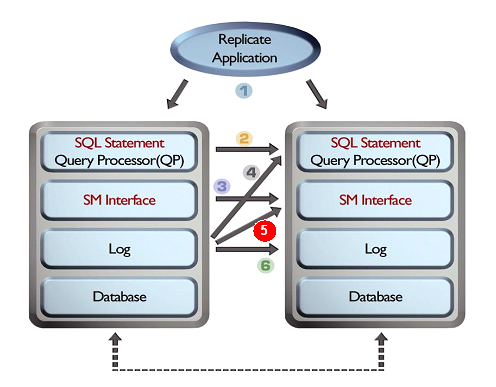

<!-- START doctoc generated TOC please keep comment here to allow auto update -->
<!-- DON'T EDIT THIS SECTION, INSTEAD RE-RUN doctoc TO UPDATE -->


- [Replication Manual](#replication-manual)
  - [Preface](#%EC%84%9C%EB%AC%B8)
    - [About This Manual](#%EC%9D%B4-%EB%A7%A4%EB%89%B4%EC%96%BC%EC%97%90-%EB%8C%80%ED%95%98%EC%97%AC)
  - [1. Replication Overview](#1%EC%9D%B4%EC%A4%91%ED%99%94-%EA%B0%9C%EC%9A%94)
    - [Introduction](#%EC%9D%B4%EC%A4%91%ED%99%94-%EC%86%8C%EA%B0%9C)
  - [2. Managing Replication](#2%EC%9D%B4%EC%A4%91%ED%99%94-%EA%B4%80%EB%A6%AC)
    - [Replication Procedures](#%EC%9D%B4%EC%A4%91%ED%99%94-%EC%88%9C%EC%84%9C)
    - [Troublshooting](#%EC%97%90%EB%9F%AC-%EB%B0%9C%EC%83%9D%EA%B3%BC-%ED%95%B4%EA%B2%B0)
    - [Conflict Resolution](#%EC%B6%A9%EB%8F%8C-%ED%95%B4%EA%B2%B0)
    - [Eager Replication Failback](#eager-%EC%9D%B4%EC%A4%91%ED%99%94-%EC%9E%A5%EC%95%A0-%EB%B3%B5%EA%B5%AC-eager-replication-failback)
    - [Parallel Replication](#%EB%B3%91%EB%A0%AC-%EC%9D%B4%EC%A4%91%ED%99%94)
    - [Performance View related to Replciation](#%EC%9D%B4%EC%A4%91%ED%99%94-%EA%B4%80%EB%A0%A8-%EC%84%B1%EB%8A%A5-%EB%B7%B0)
  - [3. Deploying Replication](#3%EC%9D%B4%EC%A4%91%ED%99%94-%EC%82%AC%EC%9A%A9)
    - [Considerations](#%EC%9D%B4%EC%A4%91%ED%99%94-%EC%A0%9C%EC%95%BD%EC%A1%B0%EA%B1%B4)
    - [CREATE REPLICATION](#%EC%9D%B4%EC%A4%91%ED%99%94-%EC%83%9D%EC%84%B1-create-replication)
    - [ALTER REPLICATION](#%EC%9D%B4%EC%A4%91%ED%99%94-%EC%8B%9C%EC%9E%91-%EC%A2%85%EB%A3%8C%EC%99%80-%EB%B3%80%EA%B2%BD-alter-replication)
    - [DROP REPLICATION](#%EC%9D%B4%EC%A4%91%ED%99%94-%EC%82%AD%EC%A0%9C-drop-replication)
    - [Executing DDL Statements on Replicaiton Target Tables](#%EC%9D%B4%EC%A4%91%ED%99%94-%EB%8C%80%EC%83%81-%ED%85%8C%EC%9D%B4%EB%B8%94%EC%97%90-ddl-%EC%8B%A4%ED%96%89)
    - [SQL Reflection Mode](#sql-%EB%B0%98%EC%98%81-%EB%AA%A8%EB%93%9C)
    - [Extra Features](#%EC%9D%B4%EC%A4%91%ED%99%94-%EB%B6%80%EA%B0%80%EA%B8%B0%EB%8A%A5)
    - [Replication in a Multiple IP Network Environment](#%EB%8B%A4%EC%A4%91-ip-%EB%84%A4%ED%8A%B8%EC%9B%8C%ED%81%AC-%ED%99%98%EA%B2%BD%EC%97%90%EC%84%9C%EC%9D%98-%EC%9D%B4%EC%A4%91%ED%99%94)
    - [Properties](#%EC%9D%B4%EC%A4%91%ED%99%94-%EA%B4%80%EB%A0%A8-%ED%94%84%EB%A1%9C%ED%8D%BC%ED%8B%B0)
  - [4. Fail-Over](#4fail-over)
    - [Fail-Over Overview](#fail-over-%EC%9D%98-%EA%B0%9C%EC%9A%94)
    - [Using Fail-Over](#fail-over-%EC%82%AC%EC%9A%A9-%EB%B0%A9%EB%B2%95)
    - [JDBC](#jdbc%EC%97%90%EC%84%9C-%EC%BD%9C%EB%B0%B1-%EC%9E%91%EC%84%B1)
    - [SQLCLI](#sqlcli)
    - [Embedded SQL](#embedded-sql)
    - [Create Callback in PDO](#pdo%EC%97%90%EC%84%9C-%EC%BD%9C%EB%B0%B1-%EC%9E%91%EC%84%B1)
  - [5. Sequence Replication](#5%EC%8B%9C%ED%80%80%EC%8A%A4-%EC%9D%B4%EC%A4%91%ED%99%94)
    - [Sequence Replication](#%EC%8B%9C%ED%80%80%EC%8A%A4-%EC%9D%B4%EC%A4%91%ED%99%94)
  - [Appendix A. FAQ](#a%EB%B6%80%EB%A1%9D-faq)
    - [Replication FAQ](#replication-faq)

<!-- END doctoc generated TOC please keep comment here to allow auto update -->

Altibase® Administration

# Replication Manual


Altibase Administration Replication Manual

Release 7.1

Copyright ⓒ 2001\~2019 Altibase Corp. All Rights Reserved.

This manual contains proprietary information of Altibase Corporation; it is provided under a license agreement containing restrictions on use and disclosure and is also protected by copyright patent and other intellectual property law. Reverse engineering of the software is prohibited. All trademarks, registered or otherwise, are the property of their respective owners.

**Altibase Corp**

10F, Daerung PostTower II, 306, Digital-ro, Guro-gu, Seoul 08378, Korea Telephone: +82-2-2082-1000 Fax: 82-2-2082-1099

Customer Service Portal: [http://support.altibase.com/en/]

Homepage: [[http://www.altibase.com](http://www.altibase.com/)]

## 1. Preface
----

### About This Manual

This manual explains the concepts, components, and basic use of Altibase.

#### Audience

This manual has been prepared for the following Altibase users:

-   Database managers
-   Performance managers
-   Database users
-   Application developers
-   Technical support engineers

It is recommended for those reading this manual possess the following background knowledge:

-   Basic knowledge in the use of computers, operating systems, and operating system utilities
-   Experience in using relational databases and understanding of database concepts
-   Computer programming experience
-   Experience in database server management, operating system management, or network administration

#### Organization

This manual has been organized as follows:

-   Chapter 1: Introduction  
    This chapter provides an overview of Altibase replication

-   Chapter 2: Managing Replication  
    This chapter explains how to manage Altibase replication.

-   Chapter 3: Deploying Replication  
    This chapter explains how to deploy Altibase replication.

-   Chapter 4: Fail-Over  
    This chapter explains the Fail-Over feature provided by Altibase and how to use it.

-   Appendix A. FAQ

#### Documentation Conventions

This section describes the conventions used in this manual. Understanding these conventions will make it easier to find information in this manual and other manuals in the series.

There are two sets of conventions:

-   Syntax diagrams
-   Sample code conventions

##### Syntax diagrams

This manual describes command syntax using diagrams composed of the following elements:

| Elements                                         | Meaning                                                      |
| ------------------------------------------------ | ------------------------------------------------------------ |
|  | Indicates the start of a command. If a syntactic element starts with an arrow, it is not a complete command. |
|               | Indicates that the command continues to the next line. if a syntactic element ends with this symbol, it is not a complete command. |
|               | Indicates that the command continues from the previous line. If a syntactic element starts with this symbol, it is not a complete command. |
|               | Indicates the end of a statement.                            |
|               | Indicates a mandatory element.                               |
|               | Indicates an optional element.                               |
|               | Indicates a mandatory element comprised of options. One, and only one, option must be specified. |
|               | Indicates an optional element comprised of options           |
|               | Indicates an optional element in which multiple elements may be specified. A comma must precede all but the first element. |

##### Sample Code Conventions

The code examples explain SQL, stored procedures, iSQL, and other command line syntax.

The following describes the conventions used in the cod examples:

| Rules            | Meaning                                                      | Example                                                      |
| ---------------- | ------------------------------------------------------------ | ------------------------------------------------------------ |
| [ ]              | Indicates optional fields                                    | VARCHAR [(*size*)][[FIXED \|] VARIABLE]                      |
| { }              | Indicates mandatory fields. Indicates to make sure to select at least one. | { ENABLE \| DISABLE \| COMPILE }                             |
| \|               | Argument indicating optional or mandatory fields             | { ENABLE \| DISABLE \| COMPILE } [ ENABLE \| DISABLE \| COMPILE ] |
| . . .            | Repetition of the previous argument. Omit the example codes. | SQL\> SELECT ename FROM employee; <br/>ENAME<br/> ------------------------<br/> SWNO<br/> HJNO<br/> HSCHOI<br/> .<br/> .<br/> . <br/>20 rows selected. |
| Other symbols    | Other symbols                                                | EXEC :p1 := 1; acc NUMBER(11,2);                             |
| Italicized words | Indicates variable or value taht must be provided by user    | SELECT \* FROM *table_name*;<br/> CONNECT *userID*/*password*; |
| Lower case words | Problem elements provided by the user such as table names, colum names, file names, etc | SELECT ename FROM employee;                                  |
| Upper case words | Elements provided by the system or keyword appeared in the syntax | DESC SYSTEM_.SYS_INDICES_;                                   |

#### Related Documents

Please refer to the following documents for more detailed information:

-   Installation Guide

-   Administrator’s Manual

-   Getting Started Guide

-   SQL Reference

-   iSQL User’s Manual

-   Error Message Reference

#### Altibase Welcomes Your Comments and Feedback

Please let us know what you like or dislike about our manuals. To help us with better future versions of our manuals, please tell us if there are any corrections or classifications that you would find useful.

Include the following information: 

-   The name and version of the manual that you are using
-   Any comments about the manual
-   Your name, address, and phone number

If you need immediate assistance regarding any errors, omissions, and other technical issues, please contact Altibase's Support Portal (http://altibase.com/support-center/en/).

Thank you. We always welcome your feedback and suggestions.

## 1. Replication Overview

-----------

### Introduction

The purpose of database replication is to maintain an up-to-date backup of the data on an Active Server and provide an uninterrupted service environment in which a substitute server can be used to resume service in the event that the Active Server unexpectedly goes offline for some reason.

This chapter covers the following subjects::

-   Altibase Replication Concepts and Terminology
-   Replication Function in Altibase
-   Choosing Replication Targers
-   Replication mode
-   Replicaiton and Data Definition Language (DDL)
-   Data Recovery Using Replication

#### Concepts

The log replay method is the basis of the Altibase replication functionality. First, a local server transfers transaction logs to a remote server when the logs change. Then the remote server “replays” the received logs to its database (that is, it implements the changes that have been recorded in the logs). Altibase also provides the altiComp utility for monitoring and managing the replication status. 

For more detailed information, please refer to the *Utilities Manual*.

#### Terminology

-   **Local Server:**  
    In this manual, the term "local server" always refers to the local node (that is, to the server on which the current task is performed), regardless of whehter it is an Active or Standyby Server, or whether it hosts a replication Sender or Receiver thread.
    
-   **Remote Server:**  
    This is a counterpart replication node (i.e., a node that has a 1:1 relationship with a local server to form a replication pair).
    
-   **Active Server:**  
    Among the database servers that are connected in replication, this is a replication node that is actively providing service to users and on which change operations related to master transacitons take place. 
    
-   **Standby Server:**  
    This is a replication node on which change transactions are not occurring. (It may be queried using SELECT DML statements).
    
-   **Sender:**  
    This is a thread that sends information about changes made to data caused by a transaction to a remote server. It changes logs that result from the execution of DML statements on replication target tables on the local server into XLog form so that they contain information about the actual (physical) changes made to the data and sends the resultant XLogs to the remote server.
    
-   **Receiver:**  
    This is a thread that receives XLogs (which contain information about changes to data) from a counterpart server. If there is no applier, the receiver replays the Logs on replication target objects on the local node. 
    
-   **Applier:**  
    This term indicates a thread that applies the XLog that the sender sent to the receiver, to the Storage Manager. 
    
    If the parallel receiver applier option is omitted, the receiver takes the role of the applier, and the applier is not created. 
    
-   **Ahead Analyzer:**  
    If the replication transaction grouping option has been specified and a replication gap occurs, this thread analyzes logs (before the sender does) and creates replication transaction groups. Replication transaction groups help dissolve gaps; the sender references these transaction groups to adjust the amount of XLogs it sends to the receiver.
    
-   **Sender Thread:**  
    This has the same meaning as "Sender" when not using parallel replication (i.e., when performing replication using only one Sender thread and one Receiver thread). When using parallel replication, one Sender consists of multiple Sender threads.
    
-   **Receiver Thread:**  
    This has the same meaning as "Receiver" when not using parallel replication (i.e., when performing replication using only one Sender thread and one Receiver thread). When using parallel replication, one Receiver consists of multiple Receiver threads.
    
-   **XSN:**  
    This stands for "XLog Sequence Number". It is not to be confused with "SN" (the sequence number of a redo log).

-   **Local Commit XSN:**  
    This is the sequence number of the committed log record that was most recently read by the Sender. The transaction corresponding to this XSN is not guaranteed to have been committed on the remote server. This value is returned when the COMMIT_XSN column of the V$REPSENDER performance view is queries. 
    
-   **Restart Sequence Number SN:**  
    This is the lowest Redo SN (not XSN) corresponding to a transaction for which an XLog for replication has not been sent. It is the position from which the transmission of XLogs will recommence when replication resumes.
    
-   **XLog:**  
    This is a kind of log that results from the transformation of one or more redo logs into logical form for replication. The replication Sender thread on a local server transmits an XLog to the replication Receiver thread on a remote server, which then replays the log so that the remote server contains the same data as the local server
    
-   **Master Transaction:**  
    This is a transaction taht takes place on an Active server when providing service to users. It involves the execution of one of more change (INSERT, UPDATE, or DELETE) operations on on or more replication targe tables.
    
-   **Replication Transaction:**  
    This is a transaction that replicates a master transaction on another server. It replays the execution of one or more change (INSERT, UPDATE, or DELETE) operations on one or more replication target tables. It occurs when the Receiver receives an XLog.
    
-   **Change Operation:**  
    This term indicates an INSERT, UPDATE, or DELETE DML operation. This term is used to distinguish these operations from SELECT operations (which do not change the contents of a database).
    
-   **Replication:**  
    This term indicates the concept and action of replicating, rather than a concrete object or entity.

-   **Synchronization:**  
    "Synchronization" is a unidirectional operation in which all data in the replication target tables or partitions on the local server are inserted into the corresponding tables or partitions on the remote server. If any data conflict occurs on the remote server during synchronization, conflict resolution will be applied on the remote server. It is performed by executing the ALTER REPLICATION DDL statement with either the SYNC or SYNC ONLY keyword.
    
-   **Replication Gap:**  
    Conceptually, the replication gap is an indicator of how far the replication process has fallen behind the current state of the database. In quantitative terms, it is the difference between the sequence number (not XSN) of the most recent redo log and the sequence number of the redo log for which the corresponding XLog is currently being sent.
    
-   **Replication Manager:**  
    This is the Altibase module that starts and stops the replication Sender and Receiver.

-   **Replication Object:**  
    This is an object created with the CREATE REPLICATION statement. It forms a replication pair with a counterpart replication object on another node. 
    
-   **Replication Pair:**  
    This is a pair of corresponding replication objects having the same name, one residing on each of the two different nodes. 

-   **Replication Target Column:**  
    This is a column that exists in corresponding replication target tables on local and remote servers. Replication target columns cannot be explicitly designated; rather, they are determined by the structure of the corresponding replication target tables.
    
-   **Replication Target Table:**  
    This is a table that is designated, using the CREATE REPLICATION or ALTER REPLICATION statement, to be replicated between corresponding replication nodes. 
    
-   **Replication Target Patition:**  
    This is a table parition that id designated, using the CREATE REPLICATION or ALTER REPLICATION statement, to be replicated corresponding replication nodes.
    
-   **EAGER Mode:**  
    This is one of two available replication modes which prioritizes data consistency over performance. In this mode, a transaction is not committed on the local server until the local server receives a message from the remote server stating that the task has been performed and the transaction replayed on the remote server.
    
-   **LAZY Mode:**  
    This is the other of the two available replication modes which prioritizes performance over data consistency. In this mode, a transaction is committed on the local server without waiting for confirmation from the remote server.
    
-   **Parallel Replication:**  
    This is the use of multiple Sender and Receiver threads to perform replication in EAGER mode. This is not to be confused with parallel synchronization.
    
-   **Parallel Synchronization:**  
    This is the use of multiple Sender and Receiver threads to accomplish a synchronization task (using "ALTER REPLICATION ... SYN" or "ALTER REPLICATION ... SYNC ONLY). This is not be confused with parallel replication.

#### How to Perform Replication in Altibase

Replication is conducted in this way: the local server sends information of changes made to the database contents to the remote server, and then the remost server makes the same changes to its database.

Thus,the local and remote servers operate additional threads (apart from the service threads) that are necessary for managing replication. 

The replication Sender thread on the local server sends information of changes made to the database contents to the remote server, and then the replication Receiver thread on the remote server makes the same changes to the database on the remote server. 

Also, the replication Sender and Receiver threads automatically detect whether or not the corresponding servers shut down normally, and perform the corresponding operation.

Figure [1-1] shows various ways in which replication is supported.

In Altibase, the best of these ways is to transform redo logs into a directly executable logical structure to maximize performnace and flexibility.



Figure 1-1 A Review of Replication Methods

1.  Performing replication using a client application  
  
    In this case, it downgrades performance and renders data consistency.
    
    If replication is performed by issuing commands in an application, the repeated execution of the same query or transaciton execution order can disrupt data consistency as Altibase performs replication by replaying logs.

2. Sending queries  
    This method increases the load on the QP (Query Processor) and renders validation difficult due to data collisions.

3. Sending execution plans  
    This method increases the communication load due to the increased volume of transmissions. 

4. Converting logs into query statements  
    This method increases high conversion and query processing costs. 

5. Converting logs directly into a form that can be executed  
    This method requires high conversion cost but improves replication performance.

6. Transmitting logs and performing log-based recovery  
    This method is fast but cannot be used in an "Active-Active" environemnt (one in which both servers are providing service).

#### Choosing a Repliation Server

To perform replication in Altibase, the database character sets and the national sets must be the same on both the local and remote servers. 

The character sets can be checked by querying the V$NLS_PARAMETERS performance view.

#### Choosing Replication Targets

Altibase uses object names to specify replication targets. 

When creating a replication object, the names of users and tables that are to be designated as replication targets must be directly specified. To replicate only a particular partition of a partitioned table, the name of the partition, the name of the table which contains the partition and the name of the owner of the table must be directly specified. Additionally, only columns that have the same names on both the local and remote servers at the time of replication can be replication targets.

The replication target columns can be checked by querying the V$REPRECEIVER_COLUMN performance view.

#### Replication Mode

In Altibase, replication can run in one of the following modes:

* LAZY Mode
* Eager Mode

In Table 1-1, each replication mode has different characteristics in terms of performance, the possibility of delayed replication, and the level of data consistency, as shown in the table below. 

| Mode  | Performance | Delayed Replication | Data Consistency |
| ----- | ----------- | ------------------- | ---------------- |
| LAZY  | High        | Possible            | Low              |
| EAGER | Medium      | Impossible          | High             |

##### LAZY Mode

In LAZY mode, when a transaction occurs on a local server ("Master Transaction") and a DML statement is executed on a replication target table, the Sender thread collects logs recorded by the Master Transaction, converts them into XLOGs and sends them out. The Receiver thread on the remote server receives these XLOGs and commits the replication transactions to its database.

Thus, the transcations do no not influence one another and the performance of the local server is excellent because the master transaction and replication transaction occur separately.

However, since the Sender thread always tracks the master transaction, replication may not always be completely up-to-date on very busy sites.

##### EAGER Mode

In EAGER mode, when a master transaction occurs on a local server, the local server commits the transaction only after it has received confirmation that all of the corresponding logs have been properly applied on the remote server. The remote server commits the replication transaction at the same time. In other words, replication in EAGER mode is a synchronization method<sup>1</sup>.

[<sup>1</sup>] Transaction Synchronization: Even if a master transaction is successfully performed on a local server, if a replication conflict occurs on a remote server, it will be impossible to commit the master transaction on the local server.

In such cases, the user must explicitly roll back the transaction to execute the next transaction. If the transaction is not rolled back, it will be impossible to apply any changes because a transaction that cannot be committed is continually pending. Under conditions in which the local server is internally required to commit a transaction (e.g., when running in Autocommit mode or when a session is terminated), the conflict causes the master transaction that could not be committed to be automatically rolled back. 

As a result, the master transaction that experienced the conflict and the replication transaction are both rolled back, thereby preventing data inconsistency due to replication.

#### Replication of Partitioned Tables 

As shown in the following figure, a particular partition of a partitioned table can be specified and replicated.


[Figure 1-2] The Structure of a Replicated Partitioned Table

#### Replication and DDL (Data Definition Language) clone

In Altibase, replication performs based on the column name of the table to be replicated, so that it can be replciated even for tables with different table schemas. For this reason, it allows some DDL to change the schema even if the table is subject to be replicated.

When the table schema is changed by executing DDL, only the data of the column with the same name in both nodes is replicated, and the column in the other name or only one side is not replicated. 

If the table schema is replicated in a different state, performance will be deteriorated. Therefore, if the table schema is changed by performing DDL, it is advantageous to perform the same DDL so that both nodes have the same schema.

DDL operation on the table included in the replication can be performed or replicated on a single node based on the user's choice. In the case of replication DDL, the DDL is replicated after synchronizing all the replication data.

When replication DDL, DML except SELECT cannot be performed while synchronizing the replication data, so use it with caution when replicated is performed.

#### Extra Features

Altibase provides the following additional features. A detaield description of how to use the add-ons and limitations is given in the section on Extra Features.

-   Recovery Option  
    : If experiencing abnormal server termination during the replicaiton, data recovery option is available for preventing data inconsistency between servers by replications.
    
-   Offline Option  
    : If an error occurred in the active server with the Active-Standy replication environment, this function allows applying untransffered logs to the Standy Server with the offline option.
    
-   Replication Gapless Option  
    : The replication gapless option resolves replication gaps.

-   Parallel Receiver Applier Option  
    : This option allows receivers to apply XLog received from the sender in parallel.

-   Replication Transaction Grouping Option  
    : This option sends logs to a sender thread by grouping multiple transaction to a single transaction when replciation gap occurs.

> #### Considerations
>
> Tables or partitions are items which can be replicated in Altibase and the corresponding replication target items on both servers must be the same type. Thus, a table can be replicated to a table and a partition can be replicated to a partition, but a crossover replication is impossible.
> 
> When dropping a replication target item from a replication object, the item must be specified exactly as it was added. For example, even if every partition of a partitioned table is added as replication targets, it is impossible to specify a partitioned table and exclude it from being a replication target; however, it is possible to specify each partition separately for exclusion.

## 2. Managing Replication

-----------

This chapter explains the replication steps and how to use Altibase replication functions for various faults and errors that can occur while performing replication.

### Replication Procedures


[Figure 2-1] Replication Procedures

1.  Choose the replication target servers  
    The database character sets and the national character sets of both servers must be the same. 
    
2.  Choose the tables or partitions to be replicated  
    Every table to be replicated must have a primary key.

3.  Create a replication object using the CREATE REPLICATION statement  
    The replication object must have the same name in both databases.
    
4. Start replication using the ALTER REPLICATION statement 

    When replication is started, the local server creates a replication Sender thread and this thread connects to a replication manager on the remote server. At this time, the replication manager on the remote server generates a repliation Receiver thread.

5.  The replication service is started.

### Troubleshooting

-   Abnormal local or remote server shutdown
-   Communication interruption between local and remote servers
-   Service line failure

#### Abnormal Local or Remote Server Shutdown


[Figure 2-2] Replication in the Event of Server Failure

##### Server A abnormally terminates

The Receiver thread on Server B terminates and the Sender thread on Server B attempts to connect to Server A at regular intervals (e.g., every 60 seconds).

##### Server A restarts (the Sender thread calls the Receiver thread on the remote server)

1.   Server A’s Sender thread automatically starts and performs replication with Server B. 
2.  Server B’s Sender thread starts Server A’s replication Receiver thread and it performs replication. 
3.  Server B’s Sender thread starts Server A’s Receiver thread. 
4.  Server A’s Sender thread starts Server B’s Receiver and it performs replication. 

#### Communication Interruption Between Local and Remote Servers


[Figure 2-3] Replication in Response to Communication Failure with Remote Server

##### The local and remote servers fail to communicate0

1.  The Receiver threads on Server A and B roll back and terminate uncommitted transactions
  
2.  The Sender threads on Server A and B record the Restart SN and attempt to connect to the corresponding servers every 60 seconds.

##### Connection is restored

1.  The Sender threads on Server A and B wake up the receiver threads on the corresponding servers and perform replication by transmitting all XLOGs, starting with the XLOG corresponding to the Redo Log having the Restart SN.
  
2.  Receiver threads on Server A and B are created in response to connection requests from the Sender threads on corresponding servers, and perform replication.

#### Service Line Failure


[Figure 2-4] Replication in the Event of Service Line Failure

##### • Primary line is disconnected

1.  Server B provides service with a backup line.

##### Primary Line is restored

1.  Once the primary line is restored, Server A provides service.

2.  Even if the primary line is down, Server B can still send task contents to Server A with the Altibase replication functionality.

### Conflict Resolution

A ”data conflict” occurs when the master transaction makes data changes, but the replication transaction cannot apply the changes due to duplicate primary keys or constraints.

For Deferred Replication, the best way to avoid data conflicts is to have different update data sets per database.

There are three types of data conflicts:

##### INSERT Conflicts

-   An INSERT conflict occurs if the replication transaction tries to insert data that has the same primary key as an existing record.

-   If the replication transaction tries to insert data into a table that is already locked by another local transaction, the replication transaction needs to wait to acquire a lock. An INSERT conflict occurs due to lock timeout. 
  
-   An INSERT conflict occurs if the replication transaction tries to insert a duplicate value into a primary key column. 

##### UPDATE Conflicts

-   An UPDATE conflict occurs if the replication transaction tries to update a record with a nonexistent primary key. 

-   An UPDATE conflict occurs if the replication transaction tries to update a record whose data is different from the record’s before image (i.e. data prior to changes ) updated by the master transaction. 
  
-   An UPDATE conflict occurs if a duplicate key value is created by an update operation. 

##### DELETE Conflicts

-   A DELETE conflict occurs if the replication transaction tries to delete a record that has a nonexistent primary key.
  
-   If the replication transaction tries to delete a record that is already locked by the local transaction, the replication transaction needs to wait to acquire a lock. A DELETE conflict occurs due to lock timeout.

Unlike distributed DBMSs that use the 2-Phase Commit (2-PC) or 3-Phase Commit (3-PC) protocols, the replication functionality cannot guarantee data consistency against conflicts for commercial DBMSs. Contrariwise, 2-PC/3-PC have performance degradation issues and additional measures are required for system or network failure.

As a result, commercial DBMSs mainly use deferred (asynchronous) replication to alleviate the constraints on data consistency and maintain solid performance. 

#### Conflict Resolution

“Conflict resolution” refers to a variety of methods for eliminating data conflicts. Deferred Replication does not offer a perfect solution to data conflicts. Once a conflict occurs, it is merely resolved by synchronizing the data on the database servers. Altibase provides the following conflict resolution methods to resolve data conflicts:

* User-Oriented Scheme 
* Master-Slave Scheme 
* Timestamp-Based Scheme

Altibase performs the following operations for the above methods:

-   Synchronizes a server’s data with another server.

-   Logs information about conflicts for issue tracking.

However, LOB columns are excluded from conflict resolution. LOB columns cannot detect data conflict because they neither log before images nor define primary or unique keys. 

The policies for each conflict situations are provided in detail below. 

Note: For more detailed description of the CREATE REPLICATION command, please refer to the description of the CREATE REPLICATION statement.

#### User-Oriented Scheme

##### Syntax

```
CREATE REPLICATION replication_name
WITH 'remote_host_ip', remote_host_port_no 
FROM user_name.table_name TO user_name.table_name
FROM user_name.table_name TO user_name.table_name,
… 
FROM user_name.table_name TO user_name.table_name;
```

##### Description

-   INSERT Conflict  
    If an INSERT conflict occurs, the INSERT statement fails and a conflict error message is output to altibase_rp.log.  
    Use the REPLICATION_INSERT_REPLACE property to set the conflict resolution policy for an INSERT conflict that arises due to trying to insert data having the same primary key as an existing record.  
    REPLICATION_INSERT_REPLACE=1: Delete and insert 
    REPLICATION_INSERT_REPLACE=0: Either does not delete or insert; outputs an error message
    
-   UPDATE Conflict  
    If an UPDATE conflict occurs, the UPDATE statement fails and a conflict error message is output to altibase_rp.log  
    Use the REPLICATION_UPDATE_REPLACE property to set the conflict resoultion policy for an UPDATE conflict that arises due to trying to update data with a different before image or update data with a nonexistent primary key.  
    For example, the following policies can be used when there is a data of the value 10 and the replication transaction tries to update that value from 20 to 30.  
    REPLICATION_UPDATE_REPLACE=1 : Update  
    REPLICATION_UPDATE_REPLACE=0 : Does not update; outputs a conflict error message
    
-   DELETE Conflict  
    If a DELETE conflicts occurs, the DELETE statement fails and a conflict error message is written to altibase_rp.log.

##### Summary

-   The user determine the conflict resolution policy on a case-by-case basis. 

-   The altiComp utility is provided as a solution for with data inconsistency. For more detailed information, please refer to the *Utilities Manual.* 

#### Master-Slave Scheme

##### Syntax

```
CREATE REPLICATION replication_name {as master|as slave}
WITH 'remote_host_ip', remote_host_ port_no
FROM user_name.table_name TO user_name.table_name,
FROM user_name.table_name TO user_name.table_name,
… 
FROM user_name.table_name TO user_name.table_name;
```

##### Description

- Specify ”MASTER” or “SLAVE” in the command to specify whether the server is the Master or Slave. On omission, the value specified by the REPLICATION_INSERT_REPLACE or REPLICATION_UPDATE_REPLACE property is used.
  
- The user can check whether a server is the Master or Slave from the CONFLICT_RESOLUTION column in the SYS_REPLICATIONS_ meta table. *
  
- 0 = not specified 
  
- 1 = Master; 
  
- 2 = Slave
  
- The handshake<sup>2</sup> is only successful if the CONFLICT_RESOLUTION column has the following values: 0 with 0, 1 with 2, and 2 with 1. Any other combinations will fail. If one server is specified as the Master but the other server is omitted , the following error will be output when replication starts: 
  
  [<sup>2</sup>] Handshaking is the process of checking whether the other server is alive and whether the information about the objects to be replicated between the local server and the remote server matches before replication starts.

```
iSQL> ALTER REPLICATION rep1 START
[ERR-6100D : [Sender] Failed to handshake with the peer server (Master/Slave conflict resolution not allowed [1:0])]
```

##### Master/Slave Replication Conflict Handling Method

###### Operating as Master

-   IINSERT conflict: Not committed. 
-   UPDATE conflict: Not committed. 
-   DELETE conflict: Not committed. 
-   Other: XLOG transferred from the Slave is processed as usual.

###### Operating as Slave

-   INSERT conflict:  If an insert conflict occurs because an attempt was made to insert data having the same primary key as an existing record, the existing record is deleted and a new record is added.  
    If an insert conflict occurs for any other reason, the INSERT statement fails, and a conflict error message is recorded in altibase_rp.log.
    
-   UPDATE conflict:  If an update conflict occurs because an attempt was made to update a record having a value different from the “Before Image” value on another database server, from which data for replication are propagated, the conflict is ignored, and the UPDATE statement succeeds despite the conflict.  
    If an update conflict occurs for any other reason, the UPDATE statement fails, and a conflict error message is recorded in altibase_rp.log.
-   DELETE conflict:  If a delete conflict occurs because no record having that primary key exists, the DELETE statement fails, and a conflict error message is not recorded in altibase_rp.log.  
    If a delete conflict occurs for any other reason, the DELETE statement fails, and a conflict error message is recorded in altibase_rp.log.
-   Other: The XLOG transferred from the Master is processed as usual.

##### Example

Suppose that the IP address and replication port number of the local server are 192.168.1.60 and 25524, and that the IP address and replication port number of the remote server are 192.168.1.12 and 35524, that there is a master-slave relationship between the local and remote servers, and that a table called employees and one called departments are replication target tables. In this situation, replication is specified as follows:

-   Local Server (IP: 192.168.1.60)

```
iSQL> CREATE REPLICATION rep1 AS MASTER
    WITH '192.168.1.12', 35524
    FROM sys.employees TO sys.employees,
    FROM sys.departments TO sys.departments;
Create success.
```

-   Remote Server (IP: 192.168.1.12)

```
iSQL> CREATE REPLICATION rep1 AS SLAVE
    WITH '192.168.1.60', 25524
    FROM sys.employees TO sys.employees,
    FROM sys.departments TO sys.departments;
Create success.
```

Whether a server is a Master or Slave can be determined by checking the CONFLICT_RESOLUTION field, which is located in the SYS_REPLICATIONS_ meta table. (0 = not specified; 1 = Master; 2 = Slave)

```
iSQL> SELECT replication_name, conflict_resolution FROM system_.sys_replications_;
REPLICATION_NAME    CONFLICT_RESOLUTION
---------------------------------------------------------------------------
REP1                   1
1 row selected.
```

#### Timestamp-based Scheme

##### Syntax

```
CREATE REPLICATION replication_name
WITH ‘remote_host_ip’, remote_host_port_no 
FROM user_name.table_name TO user_name.table_name,
FROM user_name.table_name TO user_name.table_name,
… 
FROM user_name.table_name TO user_name.table_name;
```

##### Description

The Timestamp-Based Scheme is provided to ensure that both servers have the same data in an Active-Active replication environment.

The following restrictions apply when using the Timestamp-Based Scheme:

-   Every table must contain a TIMESTAMP column.

-   The REPLICATION_TIMESTAMP_RESOLUTION property must be set to 1.

Because Altibase supports the Timestamp-Based Scheme on the basis of tables, even if a replication target table has a TIMESTAMP column, if the value of the REPLICATION_TIMESTAMP_RESOLUTION property for that table has been set to 0, a conventional conflict resolution scheme will be used. 

Supposing for example that a user wishes to replicate a table called "foo" and another called "bar" between two servers, if the REPLICATION_TIMESTAMP_RESOLUTION property is set to 1 for the "foo" table, the Timestamp-Based Scheme will be used for that table, whereas a conventional conflict resolution scheme will be used for the "bar" table.

```
CREATE TABLE foo (a DOUBLE PRIMARY KEY, b TIMESTAMP);
CREATE TABLE bar (a DOUBLE PRIMARY KEY, b CHAR(3));
CREATE REPLICATION rep WITH ’127.0.0.1’, 30300 FROM sys.foo TO sys.foo, FROM sys.bar TO sys.bar;
```

##### Timestamp-based Replication Processing Method

Altibase supports the Timestamp-Based Scheme only for INSERT and UPDATE operations.

###### INSERT

1.  If data to be inserted have the same key as existing data, the timestamp value of the After-Image of the data is compared with that of the existing data.
  
2.  If the TIMESTAMP value of the After-Image of the data is equal to or greater (i.e. more recent) than that of the existing data, the existing data are deleted, and new data, having the value of the After-Image of the data, are added.

###### UPDATE

1.  The TIMESTAMP value of the After-Image of the data is compared with that of the data to be updated.
  
2.  If the TIMESTAMP value of the After-Image of the data is equal to or greater (more recent) than that of the existing data, the data are updated with the After-Image of the data

3.  When UPDATE is performed, the TIMESTAMP value in the After-Image of the data is kept. In other words, independent system time values are not used.

> ##### Restrictions
>
> -   When a TIMESTAMP column is added to a table, 8 additional bytes of storage space are needed per record. 
>   
>-   If the time is set differently on the two servers to be replicated, database inconsistencies can result. 
> 

### Eager Replication Failback

This section examines how the data of both servers are synchronized and then failback when a node fails in the replication environemtn of eager mode.

To configure a replication environment in eager mode, replication of both servers in eager mode must be created and started. In addition, in order to failback in a replication environment of the eager mode, replication must be operated in the eager mode even in the failback environment (recovery).

#### Incremental Sync

In the replication environemtn in Eager mode, a failure (equipment issue or Altibase server failure) may occur on a Server A without a commit log written on one server (Server A) and the commit log is not sent to the other server (Server B). In this case, Server A returns an error to the application that executed the transaction commit, and Server B will roll back the transaction because it does not receive the commit log. Then, application will fail over and continue working on Server B. AS a result, there may be a situation in which data in the same record does not match on Server A and Server B.

Since this data affects the replication operation in the future, a failback process for inconsistent data of both nodes is required. This is called 'incremental sync', a data synchronization operation for removing inconsistencies caused by replication node failures of EAGER mode. Targets of this operation are records with any possibility of committed on only one node. Incremental Sync analyzes data that can be different from the other node, requests and synchronizes those missing transaction logs. 

When Server A comes back online, it is determined as the value of the REMOTE_FAULT_DETECT_TIME column in the SYS_REPLICATIONS meta tables of both servers (when the failure of the other nodes is detected), to become master or slave respectively. That is, the server with later value becomes the master. In this case, Server B will be the master server. Once the master and the slave are determined, the replication sender of the slave (Server A) analyzes its transaction log from the restart SN (sequence number) and determines the data that have not been sent to the other server (i.e., may be different from the master), and import the data from the master and perform the synchronization. The master's replication sender sends the data requested by the slave. That is, the replication senders of both servers operate as master and slave. 

Thus, in order to increment synchronization to complete successfullt, neither of the replications of both servers should be stopped.

Then, replication sender of Server A updates the restart SN (sequence number) to the latest. This is to prevent the replication sender of Server A from retransmitting the data that are already syncrhonized in the above process.

Incremental Sync can be enabled or disabled by adjusting the REPLICATION_FAILBACK_INCREMENTAL_SYSN property value, which must be set to the same value on both nodes' server.

#### Normal Sync

After the server completes or skips the incremental sync, before the Eager mode replication starts normally, it synchronizes the data from the transaction log that failed to transfer from Server B to Server A during the failure. This synchronization is called normal sync. When transmitting a log that could not be transmitted could be transmitted due to a failure, replication switches to the Lazy mode, and when all the logs are transmitted and there is no replication gap, replication starts by switching back to the Eager mode.

When the REPLICATION_FAILBACK_INCREMENTAL_SYNC property value is set to 1, normal synchronization will be performed after the above incremental sync. Otherwise, incremental sync will be skipped and noraml synchronization will be performed immediately. 

### Parallel Replication

Parallel replication indicates using multiple sending and receiving threads when executing the replication. 

Altibase supports the following parallel replication based upon the replication mode:

-   Lazy mode: This is one of the additional features which allows receiver parallel replication.
-   Eager mode: This allows sending parallel replciation by controlling properties

In the eager mode, the parallel replication is used by controlling REPLICATION_EAGER_PARALLEL_FACTOR property in order to manage multiple sneding threads.

In case of replication in the eager mode, it is available to replicate a transaction unit since commit execution is possible if nodes in both sides are read. Altibase materializes the parallel replication with multiple replication sender threads so that each thread can process one transaction. Also, this type of parallel replication offers much enhanced replication performance with rapid speed that that of the conventional synchronous replication.

The parallel replication method in lazy mode is described in the Extra Features section.

> #### Note*: 
>
> If using the parellel replication, there might be an impossible situation to commit due to reversred transaction sequence in the process of replicating. Thus, the application program should impliment logic in order to overtly execute a rollback if a commit failure is returned when using the parallel replication.

### Performance View related to Replication

The following performance views are provided to monitor replication progress. For more information on performance views, see the General Reference.

-   V\$REPEXEC

-   V\$REPGAP

-   V\$REPGAP_PARALLEL

-   V\$REPLOGBUFFER

-   V\$REPOFFLINE_STATUS

-   V\$REPRECEIVER

-   V\$REPRECEIVER_COLUMN

-   V\$REPRECEIVER_PARALLEL

-   V\$REPRECEIVER_STATISTICS

-   V\$REPRECEIVER_TRANSTBL

-   V\$REPRECEIVER_TRANSTBL_PARALLEL

-   V\$REPRECOVERY

-   V\$REPSENDER

-   V\$REPSENDER_PARALLEL

-   V\$REPSENDER_STATISTICS

-   V\$REPSENDER_TRANSTBL

-   V\$REPSENDER_TRANSTBL_PARALLEL

-   V\$REPSYNC

## 3.Deploying Replication

-----------

### Considerations 

There are several conditions apply when establishing replication. If these conditions are not met, replication cannot be deployed.

#### Prerequisites

-   If a conflict occurs during an INSERT, UPDATE, or DELETE operation, the operation is skipped, and a message is written to an error file. 
-   If an error occurs during replication, partial rollback is performed. For example, if a duplicate row is found while inserting rows into a table, only the insertion of the duplicate row is cancelled, while the remainder of the task is completed as usual. 
-   Replication is much slower than the main data provision service

#### Connection Constraints

-    The maximum number of replication connections possible from one Altibase database is determined by the REPLICATION_MAX_COUNT property. 
-   The database character sets and the national character sets must be the same on both servers in order for replication to be possible. Which character set is currently in use can be checked by viewing the values of NLS_CHARACTERSET and NLS_NCHAR_CHARACTERSET in the V$NLS_PARAMETERS performance view.

#### Replication Target Column Constraints

-   When an INSERT transaction is replicated, columns that are not replication targets will be filled with NULL values.
  
-   When configuring unique indexes and function-based indexes of a replicated column and a non-replicated column, it operates in the SQL reflection mode.

#### Replication Constraints in EAGER Mode

The following constraints apply to replication in EAGER mode. 

-   To ensure data consistency, replication in EAGER mode is not recommended for more than three nodes.

-   Data is not synchronized unless replication is performed in EAGER mode on both the remote and local servers.
  
-   If a network failure occurs while replication is being performed in EAGER mode (and even if the server manages to service properly), data consistency cannot be guaranteed. This is because when a network failure occurs, each node interprets the failure as an error on the other node, and both nodes update data. 
  
-   A table can only be replicated as a single corresponding table when replication is performed in EAGER mode. If a table is replicated into two or more tables in EAGER mode, data will be inconsistent and incremental synchronization will fail. 
  
-   Servers on which replication is being performed must have their time synchronized. If an error occurs and the time has not been synchronized, replication can be defective due to the time difference at error detection. 
  
-   Data can be lost if the server abnormally terminates before a committed XLog is applied on disk in EAGER mode. To prevent data loss, specify the recovery option or adjust the values for commit-related properties (COMMIT_WRITE_WAIT_MODE, REPLICATION_COMMIT_WRITE_WAIT_MODE, and REPLICATION_SYNC_LOG)
  
-   SQL reflection mode is not available for replication in theEAGER mode.

#### Partitioned Table Constraints

The following conditions must be met in order to successfully replicate partitioned tables.

-   The partitioning method must be the same on both the remote server and the local server.

-   For range or list partitions, the partitioning conditions must be the same. If only some partitions are to be replicated, the constraints on only those partitions need to be the same. The same applies to default partitions. 
  
-   For hash partitions, the number of partitions must be the same.

#### Constraints on Using Replication for Data Recovery

-   In order to use replication to perform data recovery, the following restrictions apply: 
    1. If both the local server and the remote server shut down abnormally, recovery using replication will not be possible. 
    2. Conflicting data cannot be recovered. 
    3. A single table cannot be recovered using two or more replication objects. 
    4. If transactions that have not been transferred are lost, the data cannot be recovered.

#### Additional Considerations when Using Replication for Data Recovery

-   If different update operations are performed on the same record on two replicated systems in an Active-Active replication environment, data may be mismatched between the systems. 
-   If a network error occurs or replication is stopped according to the setting of the REPLICATION_RECOVERY_MAX_TIME property by the user, data might not be recovered.

#### Allowed DDL Statements

Normally, DDL statements cannot be executed on replication target tables. However, the following DDL statements can be executed on replication target tables.

-   ALTER INDEX REBUILD PARTITION

-   GRANT OBJECT

-   REVOKE OBJECT

-   CREATE TRIGGER

-   DROP TRIGGER

> ##### Note:
>
> When DDL statements that are allowed for use with replication are executed on tables, those tables are locked. If the Sender thread transfers a replication log at this time, the Receiver thread won’t be able to properly implement the log’s changes.

### CREATE REPLICATION

Before starting replication, corresponding replication objects must be created on two servers first.

#### Syntax

```
CREATE [LAZY|EAGER] REPLICATION replication_name 
[FOR ANALYSIS | FOR PROPAGABLE LOGGING | FOR PROPAGATION | FOR ANALYSIS PROPAGATION] 
[AS MASTER|AS SLAVE] 
[OPTIONS options_name [option_name ... ] ] 
WITH { ‘remote_host_ip’, remote_host_ port_no [USING conn_type [ib_latency]]} 
...
FROM user_name.table_name [PARTITION partition_name] TO user_name.table_name [PARTITION partition_name]
[,FROM user_name.table_name [PARTITION partition_name] TO user_name.table_name [PARTITION partition_name]
...;
```

#### Prerequisites

Only the SYS user can execute replication-related statements.

#### Description

Before replication can be performed, a so-called "replication pair", comprising of a pair of replication objects between which a connection is established, must be set up.

Replication is conducted on a table-by-table or a partition-by-partition basis. Tables or partitions are matched one-to-one.

When creating a replication object, one of the LAZY and EAGER modes can be selected as the default mode. If the replication mode is not specified for a session, this default mode will be used. If no default mode is specified, replication will be performed in LAZY mode.

- ***replication_name***  
  This specifies the name of the replication object to be created. The same name must be used on both the local server and the remote server.
  
- ***FOR ANALYSIS \| FOR ANALYSIS PROPAGATION***  
  This creates the Xlog Sender. For more detailed information about properties, please refer to the Log Analyzer User’s Manaul.
  
- ***FOR PROPAGABLE LOGGING \| FOR PROPAGATION***  
  Replication recevier writes the logs received with FOR PROPAGABLE LOGGING. FOR PROPAGATION is used to send propagable logs to other target server. 
  
  This function cannot be used with recovery option.
  
- ***as master or as slave***  
  This specifies whether the server is the Master or the Slave. If not specified, the value specified using the REPLICATION_INSERT_REPLACE or REPLICATION_UPDATE_REPLACE property will be used. When attempting to perform handshaking, the following combinations of values will be successful: 0 with 0, 1 with 2, and 2 with 1. Other combinations will fail. (0 = not set; 1 = Master; 2 = Slave)
  
- ***remote_host_ip***  
  This is the IP address of the remote server.

- ***remote_host_port_no***  
  This is the port number at which the remote server Receiver thread listens. More specifically, this is the port number specified in REPLICATION_PORT_NO in the altibase.properties file on the remote server.
  
- ***conn_type***  
  This is the communication method with a remote sever (TCP/InfiniBand). The default value is TCP.

- ***ib_latency***  
  This is the RDMA_LATENCY option value for rsocket. It can be only inserted when conn_typoe is IB

- ***user_name***  
  This is the name of the owner of the table to be replicated.

- ***table_name***  
  This is the name of the table to be replicated.

- ***partition_name***  
  This is the name of the partition to be replicated.

- ***option_name***  
  This is the name of the additional functions pertaining to the replication object. For more detailed information, please refer to Extra Features

#### Error Codes

Please refer to the Altibase *Error Message Reference*.

#### Example

Suppose that the IP address and port number of the local server are 192.168.1.60 and 25524, and that the IP address and port number of the remote server are 192.168.1.12 and 35524. To replicate a table called employees and one called departments between the two servers, the required replication definition would be as follows: 

-   Local server (IP: 192.168.1.60)

```
iSQL> CREATE REPLICATION rep1
    WITH '192.168.1.12', 35524
    FROM sys.employees TO sys.employees,
    FROM sys.departments TO sys.departments;
Create success.
```

-   Remote Server (IP: 192.168.1.12)

```
iSQL> CREATE REPLICATION rep1
    WITH '192.168.1.60', 25524
    FROM sys.employees TO sys.employees,
    FROM sys.departments TO sys.departments;
Create success.
```

### Starting, Stopping and Modifying Replication using “ALTER REPLICATION”

#### Syntax

```
ALTER REPLICATION replication_name 
SYNC [PARALLEL parallel_factor] 
[TABLE user_name.table_name [PARTITION partition_name], … , user_name.table_name [PARTITION partition_name]];

ALTER REPLICATION replication_name 
SYNC ONLY [PARALLEL parallel_factor] 
[TABLE user_name.table_name [PARTITION partition_name], … , user_name.table_name [PARTITION partition_name]];

ALTER REPLICATION replication_name START [RETRY];

ALTER REPLICATION replication_name QUICKSTART [RETRY];

ALTER REPLICATION replication_name STOP; 

ALTER REPLICATION replication_name RESET;

ALTER REPLICATION replication_name DROP TABLE 
FROM user_name.table_name [PARTITION partition_name] TO user_name.table_name [PARTITION partition_name];

ALTER REPLICATION replication_name ADD TABLE 
FROM user_name.table_name [PARTITION partition_name] TO user_name.table_name [PARTITION partition_name]

ALTER REPLICATION replication_name FLUSH [ALL] [WAIT timeout_sec];
```

#### Prerequisites

Only the SYS user can execute replication-related statements.

#### Description

-   SYNC  
    After all of the records in the table to be replicated have been transmitted from the local server to the remote server, replication starts from the current position in the log. In order to prevent another transaction from changing data in the table on which synchronization is to be performed right at the time of determination of the log from which replication will start after synchronization, the Replication Sender Thread obtains an S Lock on the table on which synchronization is to be performed for a short time before synchronization. Therefore, if a synchronization attempt is made while another transaction is updating data in the table to be synchronized, the Replication Sender Thread will wait for the amount of time specified in the REPLICATION_SYNC_LOCK_TIMEOUT property, and will then start replication at the time at which the change transaction ends. If the change transaction is not completed within the amount of time specified in the REPLICATION_SYNC_LOCK_TIMEOUT property, synchronization will fail. If, during synchronization, records on the local server are found to have the same primary key values as records on the remote server, any conflicts are eliminated according to the rules for conflict resolution.
    
-   TABLE  
    This specifies the table that is the target for SYNC replication.

-   PARTITION  
    This specifies the partition that is the target for SYNC replication. 

-   PARALLEL  
    *Parallel_factor* may be omitted, in which case a value of 1 is used by default. The maximum possible value of *parallel_factor* is the number of CPUs * 2. If it is set higher than this number, the maximum number of threads that can be created is still equal to the number of CPUs * 2. If it is set to 0 or a negative number, an error message results. 
    
-   SYNC ONLY  
    All records in replication target tables are sent from the local server to the remote server. (In this case the Sender thread is not created.) If the same records exist on both the local server and the remote server, sources of conflict are eliminated according to the rules for conflict resolution. 
    
    Because only a single thread is responsible for handling SYNC or SYNC ONLY on disk tables, when some of the tables on which SYNC replication is to be performed are disk tables, setting *parallel_factor* higher than the number of disk tables confers a performance advantage. 
    
-   START  
    Replication will start from the time point of the most recent replication.

-   QUICKSTART  
    Replication will start from the current position in the log.

-   START/QUICKSTART RETRY  
    When starting or quickstarting replication with the RETRY option, even if handshaking fails, a Sender Thread is created on the local server. Afterwards, once handshaking between the local server and the remote server is successful, replication starts. 
    
    iSQL shows a success message even if the first handshake attempt fails. Therefore, the user must check the result of execution of this command by checking the trace logs or the V$REPSENDER performance view. 
    
    When starting replication without the RETRY option, if the first handshake attempt fails, an error is raised and execution is stopped.
    
-   STOP  
    This stops replication. If a SYNC task is stopped, the transmission of all data to be replicated to the remote server cannot be guaranteed. If a SYNC replication that is underway is stopped, in order to perform SYNC again, all records must be deleted from all replication target tables, and then the SYNC is performed again.
    
-   RESET  
    This command resets replication information (such as the restart SN (Sequence Number)). It can only be executed while replication is stopped, and can be used instead of executing DROP REPLICATION followed by CREATE REPLICATION.
    
-   DROP TABLE  
    This command excludes a table or a partition from a replication object. It can only be executed while replication is stopped. Because regular DDL statements cannot be executed on replication target tables, after a table is excluded from a replication object, DDL statements can be executed on the table or a partition. 
    
-   ADD TABLE  
    This command adds a table or a partition to a replication object. It can only be executed while replication is stopped.
    
-   FLUSH  
    The current session waits for the number of seconds specified by *timeout_sec* so that the replication Sender thread can send logs up to the log at the time at which the FLUSH statement is executed to the other server. If used together with the ALL keyword, the current session waits until the most recent log, rather than the log at the time at which the FLUSH statement is executed, is sent to the other server

#### Error Codes

Please refer to the *Error Message Reference*.

#### Example

Assuming that the name of a replication is rep1, replication can be started in one of the following three ways:

-   Replication is started after the data on the local server are transferred to the remote server.

```
iSQL> ALTER REPLICATION rep1 SYNC;
Alter success. 
```

-   Replication is started from the time point at which the replication rep1 was most recently executed.

```
iSQL> ALTER REPLICATION rep1 START;
Alter success.
```

-   Replication is started from the current time point.

```
iSQL> ALTER REPLICATION rep1 QUICKSTART;
Alter success.
```

Use the following commands to check the status of replication after it has started.

(Executing on a local server)

```
iSQL> SELECT rep_name, status, net_error_flag, sender_ip, sender_port,
             peer_ip, peer_port 
      FROM V$REPSENDER;
REP_NAME                                  STATUS               
------------------------------------------------------------------
NET_ERROR_FLAG       
-----------------------
SENDER_IP                                                         SENDER_PORT
---------------------------------------------------------------------------
PEER_IP                                                           PEER_PORT   
---------------------------------------------------------------------------
REP1                                      1                    
0                    
192.168.1.33                                                      11477       
192.168.1.34                                                      21300       
1 row selected.
```

(Executing on a remote server)

```
iSQL> SELECT rep_name, my_ip, my_port, peer_ip, peer_port 
      FROM V$REPRECEIVER;
REP_NAME                                  
--------------------------------------------
MY_IP                                                             MY_PORT     
---------------------------------------------------------------------------
PEER_IP                                                           PEER_PORT   
---------------------------------------------------------------------------
REP1                                      
192.168.1.33                                                      21300       
192.168.1.34                                                      7988        
1 row selected.
```

-   Assuming that the name of a replication is *rep1*, use the following command to stop replication.

```
iSQL> ALTER REPLICATION rep1 STOP;
Alter success.
```

-   • Assuming that the name of a replication is *rep1*, use the following commands to drop a table from a replication object.

```
iSQL> ALTER REPLICATION rep1 STOP;
Alter success.
iSQL> ALTER REPLICATION rep1 DROP TABLE FROM sys.employees TO sys.employees;
Alter success.
```

-   Assuming that the name of a replication is *rep1*, use the following commands to add a table to a replication object.

```
iSQL> ALTER REPLICATION rep1 STOP;
Alter success.
iSQL> ALTER REPLICATION rep1 ADD TABLE FROM sys.employees TO sys.employees;
Alter success.
```

-   If it is desired to check the cumulative time that each Sender replication object has spent waiting for WAIT_NEW_LOG events, execute the following query. This example assumes that the TIMER_THREAD_RESOLUTION property has been set to 1,000,000 microseconds.

```
select rep_name, avg(WAIT_NEW_LOG)/1000000 from x$repsender_statistics where wait_new_log > 0 group by rep_name order by rep_name;
```

-   If it is desired to check the cumulative time that each Receiver replication object has spent waiting for INSERT_ROW events, execute the following query. This example assumes that the TIMER_THREAD_RESOLUTION property has been set to 1,000,000 microseconds

```
select rep_name, avg(INSERT_ROW)/1000000 from x$repreceiver_statistics where recv_xlog > 0 group by rep_name order by rep_name;
```

### DROP REPLICATION 

#### Syntax

```
DROP REPLICATION replication_name;
```

#### Prerequisites

Only the SYS user can execute replication-related statements.

#### Description

This command is used to remove a replication object.

However, once a replication has been dropped, it cannot be executed using ALTER REPLICATION START. Additionally, in order to drop a replication object, it is first necessary to stop it using ALTER REPLICATION STOP.

#### Error Codes

Please refer to the *Error Message Reference*.

#### Example

-   In the following example, a replication object named *rep1* is removed.

```
iSQL> ALTER REPLICATION rep1 STOP;
Alter success.
iSQL> DROP REPLICATION rep1;
Drop success.
```

-   If an attempt is made to remove a replication object without first stopping it, the following error message appears.

```
iSQL> DROP REPLICATION rep1;
[ERR-610FE : Replication has already started.]
```

### Executing DDL Statements on Replication Target Tables

#### Syntax

Supported DDL statements differ depending on the REPLICATION_DDL_ENABLE_LEVEL property value. 

The following statements supported when the value of REPLICATION_DDL_ENABLE_LEVEL is 0.

```
ALTER TABLE table_name ADD COLUMN (column_name DATA_TYPE);

ALTER TABLE table_name DROP COLUMN column_name;

ALTER TABLE table_name ALTER COLUMN column_name SET DEFAULT;

ALTER TABLE table_name ALTER COLUMN column_name DROP DEFAULT;

ALTER TABLE table_name ALTER TABLESPACE;

ALTER TABLE table_name TRUNCATE PARTITION TRUNCATE TABLE table_name;

ALTER TABLE table_name SPLIT PARTITION partition_name(condition) INTO
( PARTITION partition_name
   PARTITION partition_name);

ALTER TABLE table_name MERGE PARTITIONS partition_name, partition_name INTO PARTITION partition_name;

ALTER TABLE table_name DROP PARTITION partiton_name; 

TRUNCATE TABLE table_name;

CREATE INDEX index_name ON table_name (column_name);

DROP INDEX index_name;
```

The following DDL statements are supported when the value of REPLICATION_DDL_ENABLE LEVEL is 1.

```
ALTER TABLE table_name ADD COLUMN (column_name DATA_TYPE NOT NULL);

ALTER TABLE table_name ADD COLUMN (column_name DATA_TYPE UNIQUE);

ALTER TABLE table_name ALTER COLUMN (column_name NOT NULL);

ALTER TABLE table_name ALTER COLUMN (column_name NULL);

ALTER TABLE table_name MODIFY COLUMN (column_name DATA_TYPE);

ALTER TABLE table_name MODIFY COLUMN (column_name NULL);

ALTER TABLE table_name MODIFY COLUMN (column_name NOT NULL);

ALTER TABLE table_name DROP COLUMN column_name; ( NOT NULL, NULL, Unique, function-base index columns can be dropped) 

ALTER TABLE table_name ADD CONSTRAINT constraint_name UNIQUE (column_name);

ALTER TABLE table_name ADD CONSTRAINT constraint_name UNIQUE (column_name) LOCAL;

ALTER TABLE table_name DROP CONSTRAINT constraint_name; 
 ( Unique, Local Unique columns can be dropped)

CREATE UNIQUE INDEX index_name ON table_name (column_name);

CREATE INDEX index_name ON table_name (expression);

DROP INDEX index_name; ( unique, function-base indexes can be dropped)
```

#### Description

Altibase supports the execution of DDL statements on replication target tables. However, the following property settings must be set

-   • The REPLICATION_DDL_ENABLE property must be set to 1.

-   The replication session property, set using the ALTER SESSION SET REPLICATION statement, must be set to some value other than NONE.
  
-   The target table should be locked by the LOCK TABLE...UNTIL NEXT DDL statement in order to execute SPLIT PARTITION, MERGE PARTITION, and DROP PARTITION on a replication target table. Moreover, the data should be checked to identify since there would be a replication gap between the local and remote server.

If the SPLIT, MERGE, or DROP is executed on a replication target partition, the identical replication partition is automatically removed or added to the local or remote server.

#### Restrictions

DDL statements cannot be executed on tables for which the replication recovery option has been specified. To execute DDL statements in such a case, drop the tables from the replication object and execute the DDL statements. Furthermore, DDL statements cannot be executed while replication is running in EAGER mode. To execute DDL statements in such a case, stop replication, execute the DDL statements, and start replication again. 

The restrictions that govern the use of particular DDL statements are as follows:

-   ALTER TABLE table_name ADD COLUMN  
    -A unique index cannot be added.  
    -A compressed column cannot be added.
-   ALTER TABLE table_name DROP COLUMN  
    -A primary key cannot be dropped.  
    -A compressed column cannot be dropped.
-   ALTER TABLE table_name [SPLIT \| MERGE \| DROP] PARTITION...  
    -Replication cannot be executed during the operation.  
    -LOCK TABLE is executed on a target table.  
    -The replication target should identify the replication gap between the local and remote server. In order to relieve the replication gap, the FLUSH ALL option of replication should be executed before executing a DDL statement.  
    -MERGE target partition should exists in all the replication target objects. There should be more than two partitions or tables in the replication object in order for DROP PARTITION to be executed.
-   TRUNCATE TABLE  
    - This is supported only for tables without compressed columns.

#### Example

Supposing that the name of a replicaiton target table is *t1*, DDL statements can be executed on the replication target table as follows

-   Execute the TRUNCATE TABLE statement

```
(SYS User)
iSQL> ALTER SYSTEM SET REPLICATION_DDL_ENABLE = 1;
Alter success.
(Table Owner)
iSQL> ALTER SESSION SET REPLICATION = DEFAULT;
Alter success.
iSQL> TRUNCATE TABLE t1;
Truncate success.
(SYS User)
iSQL> ALTER SYSTEM SET REPLICATION_DDL_ENABLE = 0;
Alter success.
```

(SPLIT TABLE) Create a table T1 by splitting partition P3 and P4 in partition P2. 

```
iSQL> LOCK TABLE T1 UNTIL NEXT DDL;
iSQL> ALTER REPLICATION REP1 FLUSH ALL;
iSQL> ALTER REPLICATION REP1 STOP;
iSQL> ALTER TABLE T1 SPLIT PARTITION P2 
       INTO (PARTITION P3, PARTITION P4 ); 
```

(MERGE TABLE) Create a table T1 by merging partition 2 and 3 in partition P2 and P3.

```
iSQL> LOCK TABLE T1 UNTIL NEXT DDL;
iSQL> ALTER REPLICATION REP1 FLUSH ALL;
iSQL> ALTER REPLICATION REP1 STOP;
iSQL> ALTER TABLE T1 MERGE PARTITIONS P2, P3 INTO PARTITION P23;
```

(DROP TABLE). Drop the partition P1.

```
iSQL> LOCK TABLE T1 UNTIL NEXT DDL;
iSQL> ALTER REPLICATION REP1 FLUSH ALL;
iSQL> ALTER REPLICATION REP1 STOP;
iSQL> ALTER TABLE T1 DROP PARTITIONS P1;
```

### Executing DDL Replication Statements on Replication Target Tables.

The DDL statements that Altibase supports for replication target tables to the replication remote server can be replicated.

All DDL statements supported by the REPLICATION_DDL_ENABLE_LEVEL property are supported for replication to the remote server. The following DDL statements support replication regardless of the value of REPLICATION_DDL_ENABLE_LEVEL.

```
ALTER INDEX index_name AGING;
ALTER TABLE table_name COMPACT;
ALTER TABLE table_name ALTER COLUMN ( column_name DROP DEFAULT );
ALTER TABLE table_name RENAME CONSTRAINT contraint_name TO constraint_name;
ALTER TABLE table_name ALTER COLUMN ( column_name SET DEFAULT default_value );  
```

#### Description

Altibase can replicate DDL statements for tables taht are subject to be replicated. However, for DDL replication statements, the properties must be set as follows:
-   Set the REPLICATION_DDL_ENABLE property to 1
-   Set the REPLICATION_DDL_ENABLE_LEVEL property to the same value of the replication local server that executes DDL and the replication remote server that receives DDL
-   Set the REPLICATION session property, which can be set with ALTER SESSION SET REPLICATION statemnet, to a value other than NONE.
-   Set the REPLICATION_DDL_SYNC property value to 1 for the replication local server session that executes DDL.
-   Set the REPLICATION_DDL_SYNC property value of the replication remote server system that receives DDL to 1.

#### Restrictions

-   DDL replication cannot be executed on a table for which the replication recovery option is specified.
-   DDL replication cannot be executed even when replication is running in EAGER mode. 
-   The table (partition) name and user name for DDL replication must be the same for both the replicaiton local and remote servers.
-   Replication must be executed for both local and remote servers that execute DDL replication.
-   When using the propagation option, DDL replication is not allowed.
-   DDL replication cannot be executed if there is a Global Non-Partitioned index when parititioning a table.
-   DDL replication is possible only if the patch version is the same.
-   No more than one DDL can be replicated at the same time.
-   DDL replication cannot be performed for the same table from different nodes to one node.
-   DDL replication on table included in a replication that executes DDL replicaiton cannot be executed.

According to the supported DDL, the restrictions are as follows:

-   ALTER TABLE table_name ADD COLUMN  
    A foreign key cannot be added  
    A compressed column cannot be added.

-   ALTER TABLE table_name DROP COLUMN  
    A primary key cannot be dropped.  
    A compressed column cannot be dropped.

-   TRUNCATE TABLE  
    This is only supported for tables without compressed columns.

#### Example

Assuming that the target table for replication is *t1*, execute DDL replication for the target table as follows:

-   Execute TRUNCATE TABLE:

```
(Local SYS User)
iSQL> ALTER SYSTEM SET REPLICATION_DDL_ENABLE = 1;
Alter success.
iSQL> ALTER SESSION SET REPLICATION_DDL_SYNC = 1;
Alter success.
(Remote SYS User)
iSQL> ALTER SYSTEM SET REPLICATION_DDL_ENABLE = 1;
Alter success.
iSQL> ALTER SYSTEM SET REPLICATION_DDL_SYNC = 1;
Alter success.
(Remote Table Owner)
iSQL> ALTER SESSION SET REPLICATION = DEFAULT;
Alter success.
(Local Table Owner)
iSQL> ALTER SESSION SET REPLICATION = DEFAULT;
Alter success.
iSQL> TRUNCATE TABLE t1;
Truncate success.
(Local SYS User)
iSQL> ALTER SYSTEM SET REPLICATION_DDL_ENABLE = 0;
Alter success.
iSQL> ALTER SESSION SET REPLICATION_DDL_SYNC = 0;
Alter success.
(Remote SYS User)
iSQL> ALTER SYSTEM SET REPLICATION_DDL_ENABLE = 0;
Alter success.
iSQL> ALTER SYSTEM SET REPLICATION_DDL_SYNC = 0;
Alter success.
```

(SPLIT TABLE) Create a table T1 by splitting partition P3 and P4 in partition P2.

```
iSQL> ALTER TABLE T1 SPLIT PARTITION P2 
       INTO (PARTITION P3, PARTITION P4 ); 
```

(MERGE TABLE) Create a table T1 by merging partition 2 and 3 in partition P2 and P3. 

```
iSQL> ALTER TABLE T1 MERGE PARTITIONS P2, P3 INTO PARTITION P23;
```

(DROP TABLE) Drop the partition P1.

```
iSQL> ALTER TABLE T1 DROP PARTITIONS P1;
```

### SQL Reflection Mode

When the information of meta of local server and remote is different. Log can be converted to SQL and reflected on a remote server. When reflecting to a remote server in SQL mode, the following conditions are possible:

-   REPLICATION_SQL_APPLY_ENABLE : 1

-   Column information  
    If the data types are different  
    If size, precision, and scale are different

-   Constraints  
    if the check constraints are different  
    if the not null constraints are different

-   Indexes  
    When a unique index or a function-based index consists of columns to be replicated and columns not to be replicated  
    If the configuration information for the unique index is different  
    If the configuration information for the function-based index is different

#### Restriction

-   SQL reflection mode only works in LAZY mode

-   If there is a security column in the table, it will not operate SQL reflection mode.

> #### Note*:
>
> Since converting XLog to SQL to reflect is slow, it is recommended to use it only temporarily.

### Extra Features

Altibase provides the following extra replication features: 

-   Recovery Option

-   Offline Option

-   Replication Gapless Option

-   Parallel Applier Option

-   Replicated Transaction Grouping Option

The status of replication option can be confirmed by the value of the OPTIONS column in SYS_REPLICATIONS_meta table. Please refer to the *General Reference* for in-deph information.

#### Recovery Option

##### Syntax

```
ALTER REPLICATION replication_name SET RECOVERY {ENABLE|DISABLE};
```

##### Description

If abnormal server termination occurs during the replication, the user can recover data by using the main transaction which was executed in normally operating server or replicated transactin logs. 

This feature is highly effieicnt if transaction logs are specified not to be written to disk in COMMIT_WRITE_WAIT_MODE or REPLICATION_COMMIT_WRITE_WAIT_MODE property. For example, a committed transaction can be lost if the system is abnormally shut down. However, in that case, the lost data can be consistent by the replication recovery option.

However, the recovery option cannot be changed while the replication is being processed. In case of not using the recovery option, the recovery related materials the system retains are all released. 

Please refer to the *General Reference* for in-depth information on properties.

##### Restriction

-   The recovery option cannot be used at the same time with the offline option.

##### Example

Assuming that the name of a replication object is rep1, the replication recovery option is used as follows:

-   To enable the replication recovery option:

```
iSQL> ALTER REPLICATION rep1 SET RECOVERY ENABLE;
Alter success.
```

-   To disable the replication recovery option:

```
iSQL> ALTER REPLICATION rep1 SET RECOVERY DISABLE;
Alter success.
```

#### Offline Option

##### Syntax

```
ALTER REPLICATION replication_name 
SET OFFLINE ENABLE WITH 'log_dir';
ALTER REPLICATION replication_name SET OFFLINE DISABLE;
ALTER REPLICATION replication_name START WITH OFFLINE;
```

##### Description

One of the other extra replication features provided with Altibase is the offline option. In an Active-Passive replication environment, when a server providing service (the “Active“ server) develops a fault, the logs cannot be sent to the remote (“Standby“) server. The use of offline replication allows the logs that could not be sent to the Standby Server before the fault occurred to be accessed by and implemented in the Standby Server afterwards. If the Standby Server directly accesses the log files on the Active Server by copying the files via FTP or using a shared disk file system, a network file system, etc, the logs that could not be sent can be processed using the OFFLINE option. However, the Standby Server can use the offline option only if the Active Server has performed replication on the Standby Server side. 

-   log_dir  
    This enables the Standby Server to access the log files directly by specifying the log path on the Active Server.
    
-   START WITH OFFLINE  
    This allows replication to take place using the specified offline path. Offline replication is a one-time operation which is terminated as soon as all the unsent logs are applied. The replication Sender and Receiver threads that were being executed on the Standby Server are automatically terminated when this command is issued. Replication can be restarted once offline replication is terminated.
    
-   SET OFFLINE DISABLE  
    This disables the offline replication option. This statement can only be executed while replication is stopped.

The below figure is an example of the offline option in use.


[Figure 3-1] Data Accordance Between Both Servers

##### Offline Option Restrictions

-   This option can only be used when executing replication in LAZY mode.
-   Offline replication is not supported for replication objects which designate compressed tables as replication targets.
-   The offline option cannot be used at the same time as the recovery option.
-   At the moment that offline replication starts, any replication Receiver thread having the same replication_name must be in a stopped state. If such a thread is still running, offline replication will terminate.
-   If the log file directory on the Active Server cannot be accessed due to a disk error, offline replication will fail.
-   The size of the log files on the Active and Standby Servers must be the same. Before the offline option is used, it must be ensured that the size of the log files is the same as the size that was specified at the time that the database was created.
-   If the user changes log files arbitrarily (i.e. renames or deletes them, or copies log files from another system), abnormal shutdown or some other problem may occur.
-   The Standby Server should not be restarted before starting offline replication, because the information used to analyze the logs that could not be received will disappear when starting up the Standby Server.
-   The attempt to start a replication for which the offline option has been enabled or a replication that was created with the offline option will fail if the information about the SM version, OS, the number of OS bits (i.e. 32 or 64), the size of the log files differs between the two database servers

##### Example

Assuming that the name of a replication object is rep1 and that the path of Active Server logs is active_server/altibase_home/logs, the offline option is used as follows:

-   Setting the offline option when creating a replication object:

```
iSQL>CREATE REPLICATION REP1 OPTIONS OFFLINE 'actiive_server/altibase_home/logs'
WITH '127.0.0.1',20300 FROM SYS.A TO SYS.B;
```

-   Setting the offline option for an existing replication object:

```
iSQL>ALTER REPLICATION REP1 SET OFFLINE ENABLE WITH 'active_server/altibase_home/logs';
```

-   Executing offline replication using the specified path:

```
iSQL>ALTER REPLICATION REP1 START WITH OFFLINE;
```

-   Specifying that the offline option is not to be used:

```
iSQL>ALTER REPLICATION REP1 SET OFFLINE DISABLE;
```

#### Replicatoin Gapless Option 

##### Syntax

```
CREATE REPLICATION replication_name OPTIONS GAPLESS ...;
ALTER REPLICATION replication_name SET GAPLESS [ENABLE|DISABLE};
```

##### Description

The replication gapless option dissolves replication gaps. If this option is specified and the sender expects the replication gap to still exist after the amount of time set for the REPLICATION_GAPLESS_ALLOW_TIME property, the transaction commit is delayed to buy time for the replication gap to dissolve. The user can set an appropriate value for the REPLICATION_GAPLESS_MAX_WAIT_TIME property to prevent too much time being spent waiting for the replication gap to dissolve before committing the transaction. However, the user should be reminded that delaying transaction commits can degrade service performance. 

For more detailed information about properties, please refer to the General Reference. 

##### Restriction

-   The replication gapless option can only be specified when replication is being performed in LAZY mode.

##### Example 

Assume that there is a replication object named *rep1*. Specify the replication gapless option to dissolve the replication gap for *rep1*. 

-   Specify the replication gapless option.

```
iSQL> CREATE REPLICATION rep1 OPTION GAPLESS;
WITH '192.168.1.12', 35524
FROM sys.employees TO sys.employees,
FROM sys.departments TO sys.departments;;
CREATE success.
```

-   Enable the gapless option.

```
iSQL> ALTER REPLICATION rep1 SET GAPLESS ENABLE;
Alter success.
```

#### Parallel Applier Option

##### Syntax

```
CREATE REPLICATION replication_name OPTIONS PARALLEL receiver_applier_count [buffer_size]...;
ALTER REPLICATION replication_name SET PARALLEL receiver_applier_count [buffer_size];
```

##### Description

The parallel applier creates several appliers that are to apply XLogs to the Storage Manager. The parallel receiver applier option enhances replication performance.

XLogs that the sender sends to the receiver are distributed to the applier in the unit of transactions, so that the XLogs can be applied in parallel. DML statements are executed in parallel and this enhances replication performance. 

Parallel execution requires the synchronization of transaction commits among the parallel appliers to ensure data consistency. During this synchronization process, all threads other than the appliers that are committing transactions wait; the user can anticipate more performance enhancement with a shorter synchronization process. Likewise, the user can anticipate performance degradation if the number of concurrently running transactions is smaller than the number of appliers, because appliers can only execute DML statements under concurrently running transactions, and this would incur unnecessary applier management. 

The parallel receiver applier option is suitable for replications with long-running transactions. Replications with short-running transactions encounter frequent synchronization processes for transaction commits; specifying this option would naturally degrade performance.

receiver_applier_count indicates the number of parallel appliers and can take a value between 0~512. If this value is set to 0, there will be no parallel appliers; in this case, receivers will do the appliers’ job. 

Receivers and appliers use queues to pass XLogs. The REPLICATION_RECEIVER_APPLIER_QUEUE_SIZE property determines the maximum number of XLogs that can be sent. If no value is entered, the value is set according to the following property.

The buffer_size property specifies the initial size of the queue. Values range from 0 to 1 TB. If this value is not specified or if the number of parallel applier queues is less than the property REPLICATION_RECEIVER_APPLIER_QUEUE_SIZE value, the number of parallel applier queues is set to the value specified in the property REPLICATION_RECEIVER_APPLIER_QUEUE_SIZE.

If the unit (K, M, G) is not input, it is recognized in units of Megabytes.

For more detailed information about properties, please refer to the *General Reference*.

##### Example

```
iSQL> CREATE REPLICATION replication_name OPTIONS PARALLEL receiver_applier_count 100M...;
iSQL> ALTER REPLICATION replication_name SET PARALLEL receiver_applier_count 100;
```

##### Restriction

-   The parallel receiver applier option can only be specified when replication is being performed in LAZY mode.

#### Replicated Transaction Grouping Option

##### Syntax

```
CREATE REPLICATION replication_name OPTIONS GROUPING...;
ALTER REPLICATION replication_name SET GROUPING [ENABLE|DISABLE];
```

##### Description

The replication transaction grouping option accumulates multiple transactions into single groups to reduce the number of transactions to be replayed. 

If the replication transaction grouping option has been specified and a replication gap occurs, the Ahead Analyzer which analyzes logs (before the sender does) and creates replication transaction groups, is created. The Ahead Analyzer analyzes as many XLogs as the value set for the REPLICATION_GROUPING_AHEAD_READ_NEXT_LOG_FILE property and starts with the file of the second largest number to the log file being analyzed by the sender. The REPLICATION_GROUPING_TRANSACTION_MAX_COUNT property determines the maximum number of transactions that can be accumulated into single replication transaction groups. 

Replication transactions are accumulated into two types of groups: commited transactions and rolled back transactions. The sender converts groups of committed transactions into a single transaction, whereas the sender does not send the XLogs for rolled-back transactions.

For more detailed information about properties, please refer to the *General Reference*. 

##### Restriction

-   The replication transaction grouping option can only be specified when replication is being performed in LAZY mode.

### Replication in a Multiple IP Network Environment

Replication is supported in a multiple IP network environment. In other words, it is possible to perform replication between two hosts having two or more physical network connections.

#### Syntax

```
CREATE REPLICATION replication_name {as master|as slave} 
WITH 'remotehostip', remoteportno 'remotehostip', remoteportno …
FROM user.localtableA TO user.remotetableA,
FROM user.localtableB TO user.remotetableB, …, 
FROM user.localtableC TO user.remotetableC;

ALTER REPLICATION replication_name
ADD HOST ‘remote_host_ip‘, remote_port_no [USING conn_type [ib_latency]];

ALTER REPLICATION replication_name
DROP HOST ‘remotehostip‘, remoteportno;

ALTER REPLICATION replication_name
SET HOST ‘remotehostip‘, remoteportno;
```

#### Description

In order to ensure high system performance and quickly overcome faults, systems can have multiple physical IP addresses assigned to them when a replication object is created. In such an environment, the Sender thread uses the first IP address to access peers and perform replication tasks when replication starts, but if a problem occurs while this task is underway, the Sender thread stops using this connection, connects using another IP address, and tries again.

-   CREATE REPLICATION  
    The name of the replication object is first specified, and then in the WITH clause, the IP addresses and reception ports of multiple remote servers are specified, with commas between each IP address and port, and with spaces between address/port pairs defining each host. The owner and name of the target table(s) on the local server are specified in the FROM clause and the owner and name of the corresponding target table(s) on the remote server are specified in the TO clause, with commas between multiple table specifications.
    
-   ALTER REPLICATION (ADD HOST):  
    This adds a host. A host can be added to a replication object after the replication object has been stopped. When ADD HOST is executed, before the Sender thread actually adds the host, the connection must be re-established using the IP address that was previously being used
    
-   *conn_type*  
    This is the communication method with a remote server (TCP/InfiniBand). The default is TCP.

-   *ib_latency*  
    This is the RDMA_LATENCY option value for rsocket. It can only be entered when conn_type is IB.

-   ALTER REPLICATION (DROP HOST) :  
    This drops a host. A host can be dropped from a replication object after the replication object has been stopped. When DROP HOST is executed, the Sender thread attempts to reconnect using the very first IP address.
    
-   ALTER REPLICATION (SET HOST) :  
    This means setting a particular host as the current host. The current host can be specified after the replication object has been stopped. After execution, the Sender thread attempts to connect using the currently designated IP address.

#### Examples

In the following double-IP network environment, a replication object having a table called employees and one called departments as its target objects is created, and then replication in Active-Standby mode is executed on the local server (IP: 192.168.1.51, PORT NO: 30570) and the remote server (‘IP: 192.168.1.154, PORT NO: 30570’, ‘IP: 192.168.2.154, PORT NO: 30570’).

-   On the remote (standby) server:

```
iSQL> CREATE REPLICATION rep1	
WITH '192.168.1.51', 30570	
FROM sys.employees TO sys.employees,
FROM sys.departments TO sys.departments;
Create success.
```

-   On the local (active) server:

```
iSQL> CREATE REPLICATION rep1
       WITH '192.168.1.154',30570 '192.168.2.154',30570
FROM sys.employees TO sys.employees,
FROM sys.departments TO sys.departments;
Create success.                               
	
iSQL> SELECT * FROM system_.sys_replications_;                               
```

<- The meta table enables the user to view the number of registered hosts, the number of replication target tables, and other related information.

```
REPLICATION_NAME        LAST_USED_HOST_NO    HOST_COUNT  
------------------------------------------------------------------------
IS_STARTED  XSN         ITEM_COUNT  CONFLICT_RESOLUTION REPL_MODE   
------------------------------------------------------------------------
ROLE        OPTIONS     INVALID_RECOVERY REMOTE_FAULT_DETECT_TIME
-----------------------------------------------------------------------
REP1                    2                    2           
0           -1          2           0                   0           
0           0           0                        
1 row selected.

iSQL> SELECT * FROM system_.sys_repl_hosts_;
SYS_REPL_HOSTS_.HOST_NO SYS_REPL_HOSTS_.REPLICATION_NAME          
-----------------------------------------------
SYS_REPL_HOSTS_.HOST_IP                   SYS_REPL_HOSTS_.PORT_NO 
-----------------------------------------------
2           REP1                                      
192.168.1.154                             30570       
3           REP1                                      
192.168.2.154                             30570       
2 rows selected.
```

<- Information about remote server by using meta table.

```
iSQL> ALTER REPLICATION rep1 START;
Alter success.
```

\<- Replication starts.

```
iSQL> SELECT rep_name, status, net_error_flag, sender_ip, sender_port,
             peer_ip, peer_port
FROM V$REPSENDER;
REP_NAME                                  STATUS               
------------------------------------------------------------------
NET_ERROR_FLAG       
-----------------------
SENDER_IP                                                         SENDER_PORT
------------------------------------------------------------------------PEER_IP                                                           PEER_PORT   
------------------------------------------------------------------------REP1                                      1                    
0                    
192.168.1.51                                                      13718       
192.168.1.154                                                     30570       
1 row selected. 
```

<- The status of replication is checked after replication starts. The Sender thread connects to the peer using the first IP and PORT.

!!!!!!!!!!!!! Network line disconnection !!!!!!!!!!!!!!!

```
<- The status of replication is checked after replication starts. The Sender thread connects to the peer using the first IP and PORT.iSQL> SELECT rep_name, status, net_error_flag, sender_ip, sender_port,
             peer_ip, peer_port 
FROM V$REPSENDER;
REP_NAME                                  STATUS               
------------------------------------------------------------------
NET_ERROR_FLAG       
-----------------------
SENDER_IP                                                         SENDER_PORT
-----------------------------------------------------------------------
PEER_IP                                                           PEER_PORT   
-----------------------------------------------------------------------
REP1                                      1                    
0                    
192.168.1.51                                                      40009       
192.168.1.154                                                     30570       
1 row selected. 
```

\<- The status of replication is checked after network failure occurs. This verifies reconnection using the second IP and PORT.

```
iSQL> ALTER REPLICATION rep1 STOP;
Alter success.
```

\<- Replication is stopped.

```
iSQL> ALTER REPLICATION rep1 START;
Alter success.
```

\<- Replication starts.

```
iSQL> SELECT rep_name, status, net_error_flag, sender_ip, sender_port,
             peer_ip, peer_port 
FROM V$REPSENDER;
REP_NAME                                  STATUS               
------------------------------------------------------------------
NET_ERROR_FLAG       
-----------------------
SENDER_IP                                                         SENDER_PORT
-----------------------------------------------------------------------
PEER_IP                                                           PEER_PORT   
-----------------------------------------------------------------------
REP1                                      1                    
0                    
192.168.1.51                                                      64351       
192.168.1.154                                                     30570       
1 row selected.
```

\<- When replication is started again after having been stopped, it can be verified to have been reconnected to the same IP and PORT to which it was connected before being stopped.

```
iSQL> ALTER REPLICATION rep1 ADD HOST '192.168.3.154',30570;
Alter success.
```

\<- Add host: Can be executed after replication.

```
iSQL> ALTER REPLICATION rep1 DROP HOST '192.168.3.154',30570;
Alter success.
```

\<- remove host: Can be executed after replication.

```
iSQL> ALTER REPLICATION rep1 SET HOST '192.168.1.154',30570;
Alter success.
```

\<- Designate the host: Can be executed after replication.

```
iSQL> ALTER REPLICATION rep1 START;
Alter success.
```

\<- Replication is restarted after setting the new host. The replication operation first attempts to connect using the currently designated IP and PORT.

```
iSQL> SELECT rep_name, status, net_error_flag, sender_ip, sender_port, 
             peer_ip, peer_port 
FROM V$REPSENDER;
REP_NAME                                  STATUS               
------------------------------------------------------------------
NET_ERROR_FLAG       
-----------------------
SENDER_IP                                                         SENDER_PORT
-----------------------------------------------------------------------
PEER_IP                                                           PEER_PORT   -----------------------------------------------------------------------
REP1                                      1                    
0                    
192.168.1.51                                                      11477       
192.168.1.154                                                     30570       
1 row selected.
```

<- Connection to the peer using the newly designated IP 192.168.1.154 and PORT number 30570 can be confirmed.

### Replication Related Properties

To use replication, the Altibase properties file should be modified to suit the purposes of the user. The following properties are described in the *General Reference Manual*.

-   REPLICATION_ACK_XLOG_COUNT
-   REPLICATION_BEFORE_IMAGE_LOG_ENABLE
-   REPLICATION_COMMIT_WRITE_WAIT_MODE
-   REPLICATION_CONNECT_RECEIVE_TIMEOUT
-   REPLICATION_CONNECT_TIMEOUT
-   REPLICATION_DDL_ENABLE
-   REPLICATION_DDL_SYNC
-   REPLICATION_DDL_SYNC_TIMEOUT
-   REPLICATION_EAGER_PARALLEL_FACTOR
-   REPLICATION_EAGER_RECEIVER_MAX_ERROR_COUNT
-   REPLICATION_FAILBACK_INCREMENTAL_SYNC
-   REPLICATION_GAPLESS_ALLOW_TIME
-   REPLICATION_GAPLESS_MAX_WAIT_TIME
-   REPLICATION_GROUPING_TRANSACTION_MAX_COUNT
-   REPLICATION_GROUPING_AHEAD_READ_NEXT_LOG_FILE
-   REPLICATION_HBT_DETECT_HIGHWATER_MARK
-   REPLICATION_HBT_DETECT_TIME
-   REPLICATION_INSERT_REPLACE
-   REPLICATION_KEEP_ALIVE_CNT
-   REPLICATION_LOCK_TIMEOUT
-   REPLICATION_LOG_BUFFER_SIZE
-   REPLICATION_MAX_COUNT
-   REPLICATION_MAX_LISTEN
-   REPLICATION_MAX_LOGFILE
-   REPLICATION_POOL_ELEMENT_COUNT
-   REPLICATION_POOL_ELEMENT_SIZE
-   REPLICATION_PORT_NO
-   REPLICATION_PREFETCH_LOGFILE_COUNT
-   REPLICATION_RECEIVE_TIMEOUT
-   REPLICATION_RECEIVER_APPLIER_ASSIGN_MODE
-   REPLICATION_RECEIVER_APPLIER_QUEUE_SIZE
-   REPLICATION_RECOVERY_MAX_LOGFILE
-   REPLICATION_RECOVERY_MAX_TIME
-   REPLICATION_SENDER_AUTO_START
-   REPLICATION_SENDER_COMPRESS_XLOG
-   REPLICATION_SENDER_SLEEP_TIME
-   REPLICATION_SENDER_SLEEP_TIMEOUT
-   REPLICATION_SENDER_START_AFTER_GIVING_UP
-   REPLICATION_SERVER_FAILBACK_MAX_TIME
-   REPLICATION_SYNC_LOCK_TIMEOUT
-   REPLICATION_SYNC_LOG
-   REPLICATION_SYNC_TUPLE_COUNT
-   REPLICATION_TIMESTAMP_RESOLUTION
-   REPLICATION_TRANSACTION_POOL_SIZE
-   REPLICATION_UPDATE_REPLACE

## 4. Fail-Over

---------

The Fail-Over feature is provided so that a fault that occurs while a database is providing service can be overcome and service can continue to be provided as though no fault had occurred. This chapter explains the Fail-Over feature that is provided with Altibase, and how to use it.

### Fail-Over Overview

#### Concept

“Fail-Over” refers to the ability to overcome a fault that occurs while a database is providing service, so that service can continue to be provided as though no fault had occurred.

The kinds of faults that can occur include the case in which the DBMS server hardware itself develops a fault, the case in which the server’s network connection is interrupted, and the case in which a software error causes the DBMS to shut down abnormally. When any of the above kinds of fault occurs, Fail-Over makes it possible to connect to another server, so that service can be provided without interruption, and so that client applications are never aware that a fault has occurred.

There are two types of Fail-Over, distinguished from each other according to the time of failure cognition.

-   CTF (Connection Time Fail-Over)

-   STF (Service Time Fail-Over)

CTF refers to the case where the fault is noted at the time of connection to the DBMS, and connection is made to a DBMS on another available node rather than to the DBMS suffering from the fault, so that service can continue to be provided.

In the case of STF, in contrast, because a fault occurs while service is being provided after successful connection to the DBMS, reconnection is made to a DBMS on another available node, and session properties are restored, so that the business logic of the user’s application can continue to be used. Therefore, tasks currently being executed on the DBMS in which the fault occurred may need to be reexecuted.

With this kind of Fail-Over, in order to have confidence in the results of a task, the databases on the DBMS in which the fault occurred and the DBMS that is available to provide service must be guaranteed to be in exactly the same state and to contain exactly the same data.

In order to guarantee that the databases match, Altibase copies the database using Off-Line Replication. In Off-Line Replication, the Standby Server reads the logs from the Active Server so that it can harmonize its database with that on the Active Server.

Because one of the characteristics of replication is that the databases might not be in exactly the same state, we recommend that the Fail-Over Callback function be used to confirm that the databases match.

Fail-Over settings of Altibase include a Fail-Over property, which is set to TRUE to specify that Fail-Over is to be executed. Additionally, the Fail-Over Callback function can be used to check whether the databases match before Fail-Over is executed.

The three kinds of Fail-Over-related tasks that must be executed by the client application are summarized as follows:

-   The Fail-Over properties must be registered

-   The Fail-Over Callback function must be registered.

-   Additional tasks may be necessary depending on the result of callback

### Callback - JDBC

#### Fail-Over related Callback Interface

ABFailOverCallback interface is defined as below:

```
public interface ABFailOverCallback
{
	int FO_BEGIN	= 0;
	int FO_END	= 1;
	int FO_ABORT	= 2;
	int FO_GO	= 3;
	int FO_QUIT	= 4;

	int failOverCallback(Connection aConnection,
		   Object aAppContext,
		   int aFailOverEvent);
};
```

The meaing of the values is as follows: 

-   FO_BEGIN  
    FailOverCallback is notified of the start of STF (Service Time FailOver).

-   FO_END  
    FailOverCallback is notified of the success of STF.

-   FO_ABORT  
    FailOverCallback is notified of the failure of STF.

-   FO_GO  
    FailOverCallback sends this to JDBC so that STF can advance to the next step.

-   FO_QUIT  
    This is used to notify JDBC of the failure of FailOverCallback.

-   aAppContext  
    This includes information about any objects that the user intends to save. If there are no objects to be saved, this is set to NULL.

#### Fail-Over Process

The Fail-Over registration and handling process is as shown in the following figure.


[Figure 4-1] Fail-Over Registration and Handling Process

Fail-Over Callback must be registered by the user, and, once registered, during the Fail-Over process the Altibase User Library (for example, the JDBC and CLI libraries) communicates with client applications, as shown in the picture above.

If Fail-Over Callback is not registered, Fail-Over takes place without communication with the client application, and a trace log of the steps shown above is kept. In a replicated Altibase database environment, the use of callback is strongly recommended, so that Fail-Over Validation can be conducted.


1. After connecting to the database, the user registers Fail-Over Callback in the connection attributes.

2. The business logic is conducted in the client application. While the client application is running, if it receives an error message about a fault occurring in the DBMS hardware (including a network error), it calls the Altibase User Library so that Fail-Over can be conducted.

3. This client library sends a Fail-Over Start Event (FO_BEGIN) to the registered Fail-Over Callback. Fail-Over Callback returns information about whether Fail-Over will continue to progress. 
4. If Fail-Over Callback determines that the Fail-Over process should continue (FO_GO), executed SQL statements are closed, an available server is located, and the Altibase User Library connects and logs in to that database. Additionally, the properties of the previous session (autocommit mode, optimization settings, XA connection settings, etc.) are restored on the new server. 
5. When step number 4 is complete, Fail-Over Callback sends an event indicating that the Fail-Over process has been completed successfully (FO_END). 
6. Fail-Over Callback executes a query to ensure that the databases match (Fail-Over Validation). In a replicated database environment, it is essential to ensure that the databases match.

### Using Fail-Over

#### Registering Connection Properties

Once the Fail-Over connection properties have been registered, when a fault occurs, Altibase detects this and internally conducts the Fail-Over tasks according to the expressly specified connection properties.

The properties can be specified in the following two ways:

-   By specifying the Connection String when calling the API’s connection function

-   By specifying connection properties in the appropriate Altibase settings file (altibase_cli.ini)

##### Specifying the Connection String in a Client Application

When the connection function is executed in the client application, the following connection strings can be specified:

[JDBC]

```
Jdbc:Altibase://192.168.3.51:20300/mydb?AlternateServers=(192.168.3.54:20300,192.168.3.53:20300) &ConnectionRetryCount=3&ConnectionRetryDelay=3&SessionFailOver=on;
```

[ODBC, Embedded SQL]

```
DSN=192.168.3.51;UID=altibase;PWD=altibase;PORT_NO=20300;AlternateServers=(192.168.3.54:20300,192.168.3.53:20300);ConnectionRetryCount=3;ConnectionRetryDelay=5;SessionFailOver=on;
```

[PDO]

```
Server=192.168.3.51;Port=20300;AlternateServers=(192.168.3.54:20300,192.168.3.53:20300);ConnectionRetryCount=3;ConnectionRetryDelay=5;SessionFailOver=on
```

AlternateServer indicates servers to which connection can be made in the event of a fault, and is expressed in the form (IP Address1:Port1, IP Address2:Port2,...).

ConnectionRetryDelay is the number of repeated connection attempts when a connection to an available server fails. It can be omitted, and the default value is 1.

ConnectionRetryDelay is the number of seconds to wait before attempting to reconnect if an available server connection fails. It can be omitted, and the default value is 1.

SessionFailOver indicates whether to perform a service time fail-over (STF). It can be omitted, and the default value is off. 

##### Specifying the Connection Properties in the Settings File

The Fail-Over connection settings can be specified in the Data Source portion of the altibase_cli.ini file, which is located in the \$ALTIBASE_HOME/conf directory, the $HOME directory, or the current directory of the relevant client application, and the DataSource name is specified in the Connection String of the connection function.

```
[MyDataSource1]
Server=192.168.3.51
Port=20300
User=altibase
Password=altibase
DataBase = mydb
AlternateServers=(192.168.3.54:20300,192.168.3.53:20300)
ConnectionRetryCount=3
ConnectionRetryDelay=5
SessionFailOver = off
```

The Connection String of the client application’s connection function appears as shown below, depending on the connection interface used by the client application.

-   JDBC  
    The data source name is specified as part of the Connection URL as follows:

```
Jdbc:Altibase://MyDataSource1//
```

-   ODBC, Embedded SQL  
    The data source name is specified in the DSN properties as follows. Settings are made in the odic.ini file in the same way that they are made in the altibase.cli.ini file.

```
DSN=MyDataSource1
```

-   PDO  
    The data source name is specified in the DSN properties as follows: 

```
altibase:MyDataSource1
```

#### Checking Whether Fail-Over Succeeded

Whether CTF (Connection Time Fail-Over) was successful can be quickly and easily determined merely by checking whether it is possible to connect to the database. In contrast, determining whether STF (Service Time Fail-Over) was successful involves checking for exceptions and errors.

For example, when using JDBC, a SQLException is caught, and the SQLException’s getSQLState() method is used to check the value of SQLStates.status. If this value is ES_08FO01, Fail-Over is determined to have been successful.

When using a CLI or ODBC, if the result of SQLPrepare, SQLExecute, SQLFetch or the like is an error, rather than SQL_SUCCESS, a statement handle is handed over to the SQLGetDiagRec function, and if the native error code that is returned in the 5th argument of this function has a diagnostic record equal to ALTIBASE_FAILOVER_SUCCESS, STF (Service Time Fail-Over) can be determined to have succeeded.

When using Embedded SQL, after executing the EXEC SQL command, if sqlca.sqlcode is not SQL_SUCCESS but ALTIBASE_FAILOVER_SUCCESS, this means that STF (Service Time Fail-Over) was successful.

The actual method of determining whether Fail-Over has succeeded varies according to the type of client application, as will be explained below.

In case of PDO, if the driver-specific error code is same as PDO::ALTIBASE_FAIL_SUCESS, this means that STF (Service Time Fail-Over) was sucecessful.

#### Writing Fail-Over Callback Functions

It is necessary to write a callback function to determine whether databases match when Fail-Over is executed. The method of writing Fail-Over Callback functions varies depending on the type of client application, but the basic structure is the same, and is as follows:

-   Define data structures related to Fail-Over 
-   Write Fail-Over Callback function bodies for handling Fail-Over-related events 
-   Write code to determine whether Fail-Over was successful

Either Fail-Over events are defined in the data structure definition, or else a defined interface (header file) is included in the data structure definition.

Various tasks must be conducted in response to Fail-Over-related events such as the start or completion of Fail-Over. Code for performing these tasks, including for example the task of checking whether the contents of databases match, is located in the callback function body.

Determining that Fail-Over has succeeded consists of the successful completion of Fail-Over and the successful execution of a Fail-Over callback function, and means that service that was suspended due to a fault can continue to be provided.

The actual method of writing callback functions is described below for various client application environments.

#### Writing Fail-Over Callback Functions

The MyFailOverCallback class, which implements the ABFailOverCallback Interface, must be written.

The tasks to be conducted in response to the FO_BEGIN and FO_END events, which are defined in the callback interface, must be handled by this class. That is to say, the required tasks for each of the Fail-Over events are described here.

For example, when the FO_BEGIN event occurs, code for handling tasks that are required before Fail-Over starts is provided, and when the FO_END event occurs, code for handling tasks that are required after Fail-Over ends and before service resumes is provided. One concrete example is the code that is used to check whether the data are consistent between available databases when the FO_END event occurs.

```
public class MyFailOverCallback implements ABFailOverCallback
{
    public int failOverCallback(Connection aConnection,
                               Object    aAppContext,
                               int        aFailOverEvent)
    {
        Statement sStmt  = null;
        ResultSet sRes  =  null;

        switch (aFailOverEvent)
        {
            case ABFailOverCallback.FO_BEGIN:
                System.out.println(“FailOver Started .... “);
                break;

            case ABFailOverCallback.FO_END:
                try
                {
                    sStmt = aConnection.createStatement();
                }
                catch( SQLException ex1 )
                {
                    try
                    {
                        sStmt.close();
                    }
                    catch( SQLException ex3 )
                    {
                    }
                    return ABFailOverCallback.FO_QUIT;
                } //catch  SQLException ex1

                try
                {
                    sRes = sStmt.executeQuery("select 1 from dual");
                    while(sRes.next())
                    {
                        if(sRes.getInt(1) == 1 )
                        {
                            break;
                        }
                    }//while;
                }
                catch ( SQLException ex2 )
                {
                    try
                    {
                        sStmt.close();
                    }
                    catch( SQLException ex3 )
                    {
                    }
                    return ABFailOverCallback.FO_QUIT;
                }//catch
                break;
        }//switch
        return ABFailOverCallback.FO_GO;
    }
}
```

Furthermore, the MyFailOverCallback class defined above is used to create a callback object.

```
MyFailOverCallback sMyFailOverCallback = new MyFailOverCallback();
Properties sProp = new Properties();
String sURL = "jdbc:Altibase://192.168.3.51:20300+"/mydb?AlternateServers=(192.168.3.54:20300,192.168.3.53:20300)&connectionRetryCount=3&
connectionRetryDelay=10&sessionFailOver=on";
```

The created callback object is registered with the connection object. 

```
((ABConnection)sCon).registerFailOverCallback(sMyFailOverCallback,null);
```

#### Checking Whether Fail-Over Succeeded

Checking whether Fail-Over, particularly STF (Service Time Fail-Over), was successful is conducted using SQLException. An SQLException is caught, and the SQLException’s getSQLState() method is used to check the value of SQLStates.status. If this value is ES_08FO01, Fail-Over is determined to have been successful.

The following example demonstrates how to check whether Fail-Over was successful.

```
while(true)
{
    try
    {
        sRes = sStmt.executeQuery(“SELECT C1 FROM T1”);
        while( sRes.next() )
        {
            System.out.println( "VALUE : " + sRes.getString(1)  );
        }//while
        break;
    }
    catch ( SQLException e )
    {
        if(e.getSQLState().equals(SQLStates.status[SQLStates.ES_08FO01])  == true)
        {
            continue;
        }
        System.out.println( "EXCEPTION : " + e.getMessage() );
        break;
    }
}
```

#### Sending Fail-Over Connection Settings to WAS

The Fail-Over property settings are added to the URL portion as follows:

```
"jdbc:Altibase://192.168.3.51:20300+"/mydb?AlternateServers=(128.1.3.53:20300,128.1.3.52:20300)&connectionRetryCount=3&connectionRetryDelay=10&sessionFailOver=on";
```

#### Example

When the callback functions defined above are used, client applications are authored as seen below. 

Please refer to the following example, which is included with the Altibase package and should have been installed in $ALTIBASE_HOME/sample/JDBC/Fail-Over/FailOverCallbackSample.java

When Fail-Over is completed, whether Fail-Over was successful is checked using SQLStates. The value of the element at index SQLStates.ES_08FO01 in the SQLStates.status array indicates that Fail-Over was successful, and that the client application can resume its tasks and service can be provided again

```
class   FailOverCallbackSample
{

    public static void main(String args[])  throws Exception
    {
        //---------------------------------------------------
        // Initialization
        //---------------------------------------------------
        // AlternateServers is the available node property
        String sURL = "jdbc:Altibase://127.0.0.1:" +
args[0]+"/mydb?AlternateServers=(128.1.3.53:20300,128.1.3.52:20301)&
ConnectionRetryCount=100&ConnectionRetryDelay=100&SessionFailOver=on";
        
        try
        {
            Class.forName("Altibase.jdbc.driver.AltibaseDriver");
        }
        catch ( Exception e )
        {
            System.err.println("Can't register Altibase Driver\n");
            return;
        }

        //---------------------------------------------------
        // Test Body
        //---------------------------------------------------

        //-----------------------
        // Preparation
        //-----------------------

        Properties sProp = new Properties();
        Connection sCon;
        PreparedStatement  sStmt = null;
        ResultSet sRes = null ;
        sProp.put("user", "SYS");
        sProp.put("password", "MANAGER");
        
        MyFailOverCallback sMyFailOverCallback = new MyFailOverCallback();
        sCon = DriverManager.getConnection(sURL, sProp);

        //FailOverCallback is registered.
        ((ABConnection)sCon).registerFailOverCallback(sMyFailOverCallback, null);

        // Programs must be written in the following form in order to support Session Fail-Over.
        /*
          while (true)
          {
            try
            {
            
            }
            catch(  SQLException e)
            {
                //Fail-Over occurs
                if(e.getSQLState().equals(SQLStates.status[SQLStates.ES_08FO01])  == true)
                {
                    continue;
                }
                System.out.println( "EXCEPTION : " + e.getMessage() );
                break;

            }       
             break;
          } // while
        */
        
        while(true)
        {
            try 
            {
                sStmt = sCon.prepareStatement("SELECT C1 FROM T2   ORDER BY C1");
                sRes = sStmt.executeQuery();
                while( sRes.next() )
                {
                    System.out.println( "VALUE : " + sRes.getString(1)  );
                }//while
            }
            
            catch ( SQLException e )
            {
                //FailOver Occurs
                if(e.getSQLState().equals(SQLStates.status[SQLStates.ES_08FO01])  == true)
                {
                    continue;
                }
                System.out.println( "EXCEPTION : " + e.getMessage() );
                break;
            }
            break;

        }
        sRes.close();
        //---------------------------------------------------
        // Finalize
        //---------------------------------------------------
        
        sStmt.close();
        sCon.close();
    }
}
```

### SQLCLI

In this section, the structure of sqlcli.h and the Fail-Over related constants that are declared therein will be examined, and how to register Fail-Over Callback will be explained with reference to an example.

#### Related Data Structures

The prototype of the Fail-Over callback function, used for communication between the client application and the CLI library during STF (Service Time Fail-Over), is shown below.

```
typedef  SQLUINTEGER  SQL_API (*SQLFailOverCallbackFunc)
           (SQLHDBC         aDBC,
            void            *aAppContext,
            SQLUINTEGER     aFailOverEvent);
```

aDBC is the SQLHDBC created by the client application using SQLAllocHandle.

aAppContext is a pointer, sent to the CLI library at the time of registration of FailOverCallbackContext, pointing to an object that the user wishes to save. When Fail-Over callback is called at the time of STF (Service Time FailOver), it is sent again to Fail-Over callback.

aFailOverEvent can be set to the following values, which have the meanings described below.

-   **ALTIBASE_FO_BEGIN: 0**  
    Fail-Over callback is notified of the start of STF (Service Time FailOver).

-   **ALTIBASE_FO_END: 1**  
    Fail-Over callback is notified of the success of STF (Service Time FailOver).

-   **ALTIBASE_FO_ABORT: 2**  
    Fail-Over callback is notified of the failure of STF (Service Time FailOver).

-   **ALTIBASE_FO_GO: 3**  
    Fail-Over callback sends aFailOverEvent to the CLI library so that STF can advance to the next step.
    
-   **ALTIBASE_FO_QUIT: 4**  
    Fail-Over callback sends aFailOverEvent to the CLI library to prevent STF from advancing to the next step.

The structure of SQLFailOverCallbackContext used when registering a fail-over callback in a CLI application is as follows:

```
typedef   struct SQLFailOverCallbackContext
{
    SQLHDBC                    mDBC;
    void                       *mAppContext;
    SQLFailOverCallbackFunc    mFailOverCallbackFunc;
}SQLFailOverCallbackContext;
```

In the case of CLI, mDBC can be set to NULL.

mAppContext includes information about any objects that the user intends to save. If there are no objects to be saved, this is set to NULL

mFailOverCallbackFunc is the name of the user-defined FailOverCallback function.

#### Registering Fail-Over

As can be seen below, the process of Fail-Over registration involves the creation of a SQLFailOverCallbackContext object, and after connection to the database is successful, FailOverCallbackContext is filled in with values.

The following is an example of Fail-Over registration.

```
SQLFailOverCallbackContext  sFailOverCallbackContext;
...... <<some code omitted here>>
 /* connect to server */
sRetCode = SQLDriverConnect(sDbc, NULL,
SQLCHAR*)”DSN=127.0.0.1;UID=unclee;PWD=unclee;PORT_NO=20300;
AlternateServers=(192.168.3.54:20300,192.168.3.53:20300);ConnectionRetryCount=3;
ConnectionRetryDelay=5;SessionFailOver=on;”),
SQL_NTS, NULL, 0, NULL, SQL_DRIVER_NOPROMPT);

sFailOverCallbackContext.mDBC = NULL;
sFailOverCallbackContext.mAppContext = NULL;
sFailOverCallbackContext.mFailOverCallbackFunc = myFailOverCallback;
sRetCode = SQLSetConnectAttr(sDbc,ALTIBASE_FAILOVER_CALLBACK,
                                 (SQLPOINTER)&sFailOverCallbackContext, 0);
```

The contents of myFailOverCallback are as follows.

```
SQLUINTEGER  myFailOverCallback(SQLHDBC aDBC,
void *aAppContext,
SQLUINTEGER aFailOverEvent)
{
    SQLHSTMT 	sStmt = SQL_NULL_HSTMT;
    SQLRETURN   	sRetCode;
    SQLINTEGER    	sVal;
    SQLLEN            	sLen;
    SQLUINTEGER 	sFailOverIntension = ALTIBASE_FO_GO;

    switch(aFailOverEvent)
    {
        case ALTIBASE_FO_BEGIN:                      // Fail-Over시작이다.
            break;
        case ALTIBASE_FO_END:
            sRetCode = SQLAllocStmt( aDBC,&sStmt);
            if(sRetCode != SQ_SUCCESS)
            {
                 printf("FailOver-Callback SQLAllocStmt Error ");
                 return ALTIBASE_FO_QUIT;
            } 
            sRetCode = SQLBindCol(sStmt, 1, SQL_C_SLONG , &sVal,0,&sLen);
            if(sRetCode != SQ_SUCCESS)
            {
                 printf("FailOver-Callback SQLBindCol");
                 return ALTIBASE_FO_QUIT;
             } 
            sRetCode =  SQLExecDirect(sStmt, (SQLCHAR *) "SELECT 1 FROM DUAL", 
                                          SQL_NTS);
            if(sRetCode != SQ_SUCCESS)
            {
                 printf("FailOVer-Callback SQLExecDirect");
                 return ALTIBASE_FO_QUIT;
            }
            while ( (sRetCode  = SQLFetch(sStmt)) != SQL_NO_DATA )
            {
                if(sRetCode != SQL_SUCCESS)
                {
                     printf("FailOver-Callback SQLBindCol");
                     sFailOverIntension =  ALTIBASE_FO_QUIT;
                     break;
                }
                printf("FailOverCallback->Fetch Value = %d \n",sVal );
                fflush(stdout);
            }

            sRetCode = SQLFreeStmt( sStmt, SQL_DROP );
            ATC_TEST(sRetCode,"SQLFreeStmt");
            break;

        default:
            break;
    }//switch 
    return  sFailOverIntension;
 }//myFailOverCallback
```

#### Checking Whether Fail-Over Succeeded

If the result of SQLPrepare, SQLExecute, SQLFetch or the like is an error, rather than SQL_SUCCESS, a statement handle is handed over to SQLGetDiagRec, and if aNativeError has a diagnostic record equal to ALTIBASE_FAILOVER_SUCCESS, STF (Service Time Fail-Over) can be determined to have succeeded.

The following example demonstrates how to check whether STF (Service Time Fail-Over) was successful.

```
UInt isFailOverErrorEvent(SQLHSTMT aStmt)
{
    SQLRETURN 	rc;
    SQLSMALLINT 	sRecordNo;
    SQLCHAR     	sSQLSTATE[6];
    SQLCHAR     	sMessage[2048];
    SQLSMALLINT 	sMessageLength;
    SQLINTEGER  	sNativeError;
    UInt        	sRet = 0;
    sRecordNo = 1;
    while ((rc = SQLGetDiagRec(SQL_HANDLE_STMT,
                                 aStmt,
                                 sRecordNo,
                                 sSQLSTATE,
                                 &sNativeError,
                                 sMessage,
                                 sizeof(sMessage),
                                 &sMessageLength)) != SQL_NO_DATA)
    {
        sRecordNo++;
        if(sNativeError == ALTIBASE_FAILOVER_SUCCESS)
        {
            sRet = 1;
            break;
        }
    }
    return sRet;
}
```

The following example shows that when a network error occurs while SQLExecDirect is being executed, whether STF (Service Time FailOver) was successful is checked, and it is re-executed if necessary (in a prepare/execute environment, re-execution would have to start at the prepare stage).

```
retry:
    sRetCode = SQLExecDirect(sStmt, 
(SQLCHAR *) "SELECT C1 FROM T2 WHERE C2 > ? ORDER BY C1", 
SQL_NTS);
    if(sRetCode != SQL_SUCCESS)
    {
        if(isFailOverErrorEvent(sStmt) == 1)
        {
            goto retry;
        }
        else
        {
            printf(“Error While DirectExeute....”);
            exit(-1).
        }
    }
```

#### Example

##### Environment Settings

To implement the example, a data source called Test1 is described in altibase_cli.ini as follows:

```
[ Test1  ]
Server=192.168.3.53
Port=20300
User=altibase
Password= altibase
DataBase = mydb
AlternateServers=(192.168.3.54:20300,192.168.3.53:20300)
ConnectionRetryCount=3
ConnectionRetryDelay=5
SessionFailOver = on
```

Additionally, the FailOverCallback function uses myFailOverCallback, which was described above.

When STF (Service Time Fail-Over) takes place, if it is successful, execution must be repeated starting with SQLPrepare (in the case of SQLDirectExecute, the prepare process is not necessary, and only SQLDirectExecute need be re-executed).

If STF (Service Time Fail-Over) occurs while data are being fetched, it will be necessary to call SQLCloseCursor and start over again from the prepare process (in the case of SQLDirectExecute, the prepare process is not necessary, and only SQLDirectExecute will need to be re-executed).

##### Sample Code

To view the complete contents of this example, please refer to $ALTIBASE_HOME/sample/SQLCLI/Fail-Over/FailOverCallbackSample.cpp.

```
#define ATC_TEST(rc, msg) if( ((rc)&(~1))!=0) { printf(msg); exit(1); }
//STF(Service Time FailOver) was successful.
UInt isFailOverErrorEvent(SQLHDBC aDBC,SQLHSTMT aStmt)
{
    SQLRETURN 	rc;
    SQLSMALLINT	sRecordNo;
    SQLCHAR   	sSQLSTATE[6];
    SQLCHAR   	sMessage[2048];
    SQLSMALLINT	sMessageLength;
    SQLINTEGER	sNativeError;
    UInt      		sRet = 0;
    sRecordNo = 1;

    while ((rc = SQLGetDiagRec(SQL_HANDLE_STMT, aStmt,
                                 sRecordNo, sSQLSTATE,
                                 &sNativeError,  sMessage,
                                 sizeof(sMessage),
                                 &sMessageLength)) != SQL_NO_DATA)
    {
        sRecordNo++;
        if(sNativeError == ALTIBASE_FAILOVER_SUCCESS)
        {
            sRet = 1;
            break;
        }
    }
    return sRet;
}

int main( SInt argc, SChar *argv[])
{
    SChar		sConnStr[BUFF_SIZE] = {0};
    SQLHANDLE   	sEnv  = SQL_NULL_HENV;
    SQLHANDLE   	sDbc  = SQL_NULL_HDBC;
    SQLHSTMT    	sStmt = SQL_NULL_HSTMT;
    SQLINTEGER  	sC2;
    SQLRETURN  	sRetCode;
    SQLINTEGER  	sInd;
    SQLINTEGER  	sValue;
    SQLLEN     	sLen;
    UInt        	sDidCreate = 0;
    SChar       	sBuff[BUFF_SIZE2];
    SChar       	sQuery[BUFF_SIZE];

    SQLFailOverCallbackContext  sFailOverCallbackContext;
    snprintf(sConnStr, sizeof(sConnStr), "DSN=Test1”);
    sprintf(sQuery,"SELECT C1 FROM T2  WHERE C2 > ? ORDER BY C1");
    sRetCode = SQLAllocHandle(SQL_HANDLE_ENV, NULL, &sEnv);
    ATC_TEST(sRetCode,"ENV");
    sRetCode = SQLAllocHandle(SQL_HANDLE_DBC, sEnv, &sDbc);
    ATC_TEST(sRetCode,"DBC");
    /* connect to server */
    sRetCode = SQLDriverConnect(sDbc, NULL, (SQLCHAR *)sConnStr,
                                    SQL_NTS, NULL, 0, NULL,
                                SQL_DRIVER_NOPROMPT);
    ATC_TEST(sRetCode,"SQLDriverConnect");
    sRetCode = SQLAllocStmt( sDbc,&sStmt);
    ATC_TEST(sRetCode,"SQLAllocStmt");
    sRetCode = SQLBindCol(sStmt, 1, SQL_C_CHAR , sBuff,BUFF_SIZE2,&sLen);
    ATC_TEST(sRetCode,"SQLBindCol");
    sRetCode = SQLBindParameter(sStmt, 1, SQL_PARAM_INPUT,
                                    SQL_C_SLONG, SQL_INTEGER,
                                    0, 0, &sC2, 0, NULL);
    ATC_TEST(sRetCode,"SQLBindParameter");
    sFailOverCallbackContext.mDBC = NULL;
    sFailOverCallbackContext.mAppContext = &sFailOverDirection;
    sFailOverCallbackContext.mFailOverCallbackFunc = myFailOverCallback;
    sRetCode = SQLSetConnectAttr(sDbc,ALTIBASE_FAILOVER_CALLBACK,
                                     (SQLPOINTER)&sFailOverCallbackContext,0);
    ATC_TEST(sRetCode,"SQLSetConnectAttr");
  retry:
    sRetCode = SQLPrepare(sStmt, (SQLCHAR *)sQuery, SQL_NTS);
    if(sRetCode != SQL_SUCCESS)
    {
        // If STF was successful, start over again from the prepare stage.
        if(isFailOverErrorEvent(sDbc,sStmt) == 1)
        {
            goto retry;
        }
        else
        {
            ATC_TEST(sRetCode,"SQLPrepare");
        }
    }
    sC2 = 0;
    sRetCode =  SQLExecute(sStmt);
    if(sRetCode != SQL_SUCCESS)
    {
         // If STF was successful, start over again from the prepare stage.
        if(isFailOverErrorEvent(sDbc,sStmt) == 1)
        {
            goto retry;
        }
        else
        {
            ATC_TEST(sRetCode,"SQLExecDirect");
        }
    }

    while ( (sRetCode  = SQLFetch(sStmt)) != SQL_NO_DATA )
    {
        if(sRetCode != SQL_SUCCESS)
        {
            if(isFailOverErrorEvent(sDbc,sStmt) == 1)
            {
                //If STF occurs during a fetch operation, it is absolutely essential to call SQLCloseCursor. 
                SQLCloseCursor(sStmt);
                goto retry;
            }
            else
            {
                ATC_TEST(sRetCode,"SQLExecDirect");
            }
        }
        printf("Fetch Value = %s \n", sBuff);
        fflush(stdout);
    }
    sRetCode = SQLFreeStmt( sStmt, SQL_DROP );
    ATC_TEST(sRetCode,"SQLFreeStmt");
    sRetCode = SQLDisconnect(sDbc);
    ATC_TEST(sRetCode,"Disconnect()");
    sRetCode = SQLFreeHandle(SQL_HANDLE_DBC, sDbc);
    ATC_TEST(sRetCode,"Free HDBC");
    sRetCode = SQLFreeHandle(SQL_HANDLE_ENV, sEnv);
    ATC_TEST(sRetCode,"Free HENV");
}
```

### Embedded SQL

Because the Fail-Over data structures used here are the same as those used in CLI, and because the structure of an ESQLC (Embedded SQL in C) application is similar to that of a CLI application, only the features unique to ESQLC will be described here

#### Registering Fail-Over Callback Functions

Because SQLHDBC of CLI cannot be directly checked in an Embedded SQL program, the process of registering a Fail-Over callback function is as shown below.

FailOverCallbackContext is declared in the declaration section.

```
EXEC SQL BEGIN DECLARE SECTION;
SQLFailOverCallbackContext sFailOverCallbackContext;
EXEC SQL END DECLARE SECTION;
```

FailOverCallbackContext is filled in with values.

```
sFailOverCallbackContext.mDBC = NULL;
sFailOverCallbackContext.mAppContext = NULL;
sFailOverCallbackContext.mFailOverCallbackFunc = myFailOverCallback;
```

myFailOverCallback is the function that was seen in the CLI Fail-Over example above, only the CLI function and Os function need to be written, and Embedded SQL commands cannot be used.

The following shows how a Fail-Over Callback function is registered in an Embedded SQL statement.

```
EXEC SQL [AT CONNECTUON-NAME] REGISTER FAIL_OVER_CALLBACK :sFailOverCallbackContext;
```

#### Checking Whether Fail-Over Succeeded

After the EXEC SQL command is executed, if the result of sqlca.sqlcode is ALTIBASE_FAILOVER_SUCCESS, rather than SQL_SUCCESS, then STF (Service Time Fail-Over) can be determined to have succeeded.

The following example demonstrates how to check whether STF (Service Time Fail-Over) was successful.

```
re-execute:
    EXEC SQL INSERT INTO T1 VALUES( 1 );
    if (sqlca.sqlcode != SQL_SUCCESS)
    {
        if (sqlca.sqlcode == ALTIBASE_FAILOVER_SUCCESS)
        {
            goto re-execute;
        }//if
        else
        {
            printf("SQLCODE                : %d\n", SQLCODE);
            printf("sqlca.sqlerrm.sqlerrmc : %s\n", sqlca.sqlerrm.sqlerrmc);
            printf("%d rows inserted\n", sqlca.sqlerrd[2]);
             printf("%d times insert success\n\n", sqlca.sqlerrd[3]);
       }//else
    }
```

#### Example 1

```
main()
{
    EXEC SQL BEGIN DECLARE SECTION;
    SQLFailOverCallbackContext sFailOverCallbackContext;
    char sUser[10];
    char sPwd[10];
    char sConnOpt[1024];
    EXEC SQL END DECLARE SECTION;

    strcpy(sUser, "SYS");
    strcpy(sPwd, "MANAGER");
    sprintf(sConnOpt,”DSN=127.0.0.1;UID=altibase;PWD= altibase;PORT_NO=20300;
          AlternateServers=(192.168.3.54:20300,192.168.3.53:20300);ConnectionRetryCount=3;
          ConnectionRetryDelay=5;SessionFailOver=on;”” );

    EXEC SQL CONNECT :sUser IDENTIFIED BY :sPwd USING : sConnOpt;

    if (sqlca.sqlcode != SQL_SUCCESS)
    {
        printf("SQLCODE                : %d\n", SQLCODE);
        printf("sqlca.sqlerrm.sqlerrmc : %s\n", sqlca.sqlerrm.sqlerrmc);
        return 0;
    }
    else
    {
        printf("CONNECTION SUCCESS\n");
    }

    //FailOverCallbackContext is populated with values
    sFailOverCallbackContext.mDBC = NULL;
    sFailOverCallbackContext.mAppContext = NULL;
    sFailOverCallbackContext.mFailOverCallbackFunc = myFailOverCallback;
    // FailOverCallbackContext is registered.
    EXEC SQL  REGISTER FAIL_OVER_CALLBACK :sFailOverCallbackContext;

re-execute:
    EXEC SQL INSERT INTO T1 VALUES( 1 );
    if (sqlca.sqlcode != SQL_SUCCESS)
    {
        if (SQLCODE == EMBEDED_ALTIBASE_FAILOVER_SUCCESS)
        {
              goto re-execute;
         }//if
         else
         {
             printf("SQLCODE                : %d\n", SQLCODE);
             printf("sqlca.sqlerrm.sqlerrmc : %s\n", sqlca.sqlerrm.sqlerrmc);
             printf("%d rows inserted\n", sqlca.sqlerrd[2]);
             printf("%d times insert success\n\n", sqlca.sqlerrd[3]);
            return 0;
        }//else
    }
    EXEC  SQL DISCONNECT;
}
```

#### Example 2

This example demonstrates the use of a cursor. If Fail-Over occurs while a cursor is being used, EXEC SQL CLOSE RELEASE Cursor is executed, and the EXEC SQL DECLARE CURSOR statement is executed again to Prepare on the available server again.

```
retry:
   EXEC SQL DECLARE CUR1 CURSOR FOR SELECT C1 FROM T2 ORDER BY C1;
    if (sqlca.sqlcode == SQL_SUCCESS)
   {
         printf("DECLARE CURSOR SUCCESS.!!! \n");
    }
   else
   {
        if( SQLCODE  == EMBEDED_ALTIBASE_FAILOVER_SUCCESS)
        {
             printf("Fail-Over  SUCCESS !!! \n");
             goto retry;
        }
        else
        {
             printf("Error : [%d] %s\n\n", SQLCODE, sqlca.sqlerrm.sqlerrmc);
             return(-1);
        }
    }
    EXEC SQL OPEN CUR1;
    if (sqlca.sqlcode == SQL_SUCCESS)
    {
        printf("DECLARE CURSOR SUCCESS !!!\n");
    }
    else
    {
        if( SQLCODE  == EMBEDED_ALTIBASE_FAILOVER_SUCCESS)
        {
            printf("Fail-Over SUCCESS !!! \n");
            /* If a cursor is OPEN when Fail-Over occurs, the cursor must be closed and released */
            EXEC SQL CLOSE RELEASE CUR1;
            goto retry;
        }
        else
        {
             printf("Error : [%d] %s\n\n", SQLCODE, sqlca.sqlerrm.sqlerrmc);
             return(-1);
        }
    } //else 

    while(1)
    {
         EXEC SQL FETCH CUR1 INTO :sC1;
         if (sqlca.sqlcode == SQL_SUCCESS)
         {
              printf("Fetch Value = %s \n",sC1);
         }
         else if (sqlca.sqlcode == SQL_NO_DATA)
         {
              break;
         }
         else
         {
              if(SQLCODE == EMBEDED_ALTIBASE_FAILOVER_SUCCESS)
              {
                   printf("DECLARE CURSOR SUCCESS !!!");
                   /* If a fetch operation is underway when Fail-Over occurs, the cursor must be closed and released  */
                   EXEC SQL CLOSE RELEASE CUR1;
                   goto retry;
              }
              else
              {
                   printf("Error : [%d] %s\n\n", SQLCODE, sqlca.sqlerrm.sqlerrmc);
                   return(-1);
              }//else
         }//else
    }//while

    EXEC SQL CLOSE CUR1;
```

### PDO - Callback

#### Fail-Over Callback Related Interfaces

In the application using PDO, FailOver Callback function is defined as below: 

```
function focbfunnc($db, $context, $event)
{
    // ...

    return PDO::ALTIBASE_FO_GO;
}
```

-   \$db  
    PDO object when Failover occurs

-   \$context  
    Arbitrary value refered in callback function, and it can be specified when registering callback.

-   \$event  
    Possible values for $event are as follows:

| event                  | Description |
| ---------------------- | ----------- |
| PDO::ALTIBASE_FO_BEGIN | STF Start   |
| PDO::ALTIBASE_FO_END   | STF Success |
| PDO::ALTIBASE_FO_ABORT | STF Fail    |

-   Callback returns of one the following values:

| Return Value          | Description     |
| --------------------- | --------------- |
| PDO::ALTIBASE_FO_GO   | STF Progressing |
| PDO::ALTIBASE_FO_QUIT | STF Stopped     |

#### 

#### Registering Fail-Over Callback

To register a FailOver callback in an applicaiton that uses PDO, use the following method:

```
...
public bool PDO::setFailoverCallback(string $callback, mixed $app_context)
...
```

-   \$callback  
    This is a function name to register as a callback.
-   \$app_context  
    This is an arbitrary variable used as a callback. A variable sent to $app_context is sent to $app_context parameter in the callback function. This value is referred when performing user callbacks, so do not use it if it is not needed.
    -   If registering callback is successful - TRUE
    -   If registering callback fails - FALSE

After a successful connection, the failover callback is specified. Examples are shown below: 

```
function focbfunc($db, $context, $event) {
    switch ($event) {
        case PDO::ALTIBASE_FO_BEGIN:
            if ($context == 1) {
                return PDO::ALTIBASE_FO_QUIT;
            }
            // ...
            break;

        case PDO::ALTIBASE_FO_END:
            // ...
            break;

        // ...
    }

    return PDO::ALTIBASE_FO_GO;
}

// ...

$db->setFailoverCallback('focbfunc', $appctx);
```

#### Checking Whether Fail-Over Succeeded

In case of Failover, if the driver-specific erro cod is PDO::ALTIBASE_FAILOVER_SUCCESS, STF is successful.

Failover only guarantees connection, so pelase be sure to check whether STF is succeeded and the execution is retried.

THe following is an example of checking whether STF is succeeded and the execution is retried.

```
FailoverRetry:
try {
    $stmt = $db->prepare("SELECT c1 FROM T2 WHERE c2 ? ORDER BY c1");
    $stmt->bindParam(1, $sC2);

    $sC2 = 0;

    $stmt->execute();

    while (($row = $stmt->fetch()) !== FALSE) {
        // ...
    }
}
catch (PDOException $ex) {
    $errInfo = $ex->errorInfo;
    if ($errInfo[1] == PDO::ALTIBASE_FAILOVER_SUCCESS) {
        goto FailoverRetry;
    }
    else {
        // ...
    }
}
```

## 5.Sequence Replication

-------------

Altibase only supports replication of table objects by default. Thus, sequence replication means to create tables only for sequence replication, not copying the sequence itself. 

This chapter will cover the conditions and methods supporting the sequence replication.

#### Sequence Replication Overview 

Altibase sequence replication is a feature allowing the remote and local server to use an identical sequence even in the situation of fail-over. Thus, the same sequence and program sources can be used in an application.

Sequence replication should replicate the cache start value so that the sequence vales are not duplicated on the two servers. The sequence equivalent to the cache size is stored in the memory to use, and if the stored sequence is used all, the cache size sequence is stored again in the memory.

The tables for sequence replication is internally created because Altibase replication only supports tables.

#### Usage Condition

It is required to configure the following property as shown below. please refer to Replication Reference and General Reference for more detailed information on this property.

```
REPLICATION_TIMESTAMP_RESOLUTION=1
```

The sequence option for the local and remote servers should be identical. Please refer to *SQL Reference* for more detailed information on the sequence option.

```
START WITH
INCREMENT BY
MAXVALUE
MINVALUE
CACHE
FLUSH CACHE
CYCLE
```

#### Syntax 

The major syntax for the sequence replication is as follows. Please refer to *SQL Reference* and *Replication Reference* for more detailed information.

##### Creating Sequence for Sequence Replication

If ENABLE SYNC TABLE option is specified, seq_name$ table for sequence replication is created. It is recommended to set cache size to 100 or more than 100. 

```
CREATE SEQUENCE user_name.seq_name START WITH 1 CACHE 100 ENABLE SYNC TABLE;
```

##### Creating Sequence Replication

The following syntax creates a replication object so that a table for sequence replication can be duplicated.

```
CREATE REPLICATION repl_name WITH 'remote_host_ip', remote_host_port_no FROM user_name.seq_name$seq TO user_name.seq_name$seq; 
```

##### Startup and Shutdown of Sequence Replication

The following syntax starts or shuts down the sequence replication.

```
ALTER REPLICATION repl_name START;
ALTER REPLICATION repl_name STOP;
```

##### Remove of Sequence Replication

After executing a query dropping a replication (DROP REPLICATION) or excluding a table from the replication target (ALTER TABLE table_name DROP COLUMN), the seq_name$seq table is removed.

```
ALTER SEQUENCE user_name.seq_name DISABLE SYNC TABLE; 
```

> #### Note*:
>
> -   It is recommended to perform sequence replication in the active-standby environment. The sequence value can be duplicated due to the replication gap between servers if it is performed in the active-active environment.
> -   The larger the size of the sequence cache, the faster the sequence creation. The cache size should be modified in advance since it cannot be modified after the table the for sequence replication is created.
> 
> ```
>ALTER SEQUENCE username.seq_name CACHE 100;
> ALTER SEQUENCE user1.seq1 ENABLE SYNC TABLE;
> ```
> 
> -   The sequence replication with tables is not recommended. If a fail-over occurs in the situation of sequence replication delay caused by a table replication delay, sequence duplicate key error might occur. 
>   
> -   If the fail-over occurs, there would be blanks among key values since the remote server start from the next cache vales when referencing the sequence.
>   
> -   Replication recreation, sequence recreation, and modification should be equivalently applied to all servers.
>

#### Example

The following example verifies the status of replication server when fail-over occurs during the execution of sequence replication.

| A Server                                                     | B Server                                                     |
| ------------------------------------------------------------ | ------------------------------------------------------------ |
| iSQL\> create sequence seq1 start with 1 increment by 1 cache 1000 enable sync table;<br/> Create success. | iSQL\> create sequence seq1 start with 1 increment by 1 cache 1000 enable sync table;<br/> Create success. |
| iSQL\> create replication rep1 with '192.168.1.2', 20002 from sys.seq1\$seq to sys.seq1\$seq;<br/> Create success. | iSQL\> create replication rep1 with '192.168.1.1', 20001 from sys.seq1\$seq to sys.seq1\$seq;<br/> Create success. |
| iSQL\> alter replication rep1 start;<br/> Alter success.     |                                                              |
| iSQL\> select LAST_SYNC_SEQ from seq1\$seq; LAST_SYNC_SEQ<br/> ----------------------<br/> 1<br/> 1 row selected. | iSQL\> select LAST_SYNC_SEQ from seq1\$seq; LAST_SYNC_SEQ<br/> ----------------------- <br/>1 <br/>1 row selected. |
| iSQL\> select seq1.nextval from dual; SEQ1.NEXTVAL<br/> ---------------------- <br/>1<br/> 1 row selected. |                                                              |
| iSQL\> select LAST_SYNC_SEQ from seq1\$seq; LAST_SYNC_SEQ<br/> ----------------------<br/> 1001<br/> 1 row selected. | iSQL\> select LAST_SYNC_SEQ from seq1\$seq; LAST_SYNC_SEQ<br/> ----------------------<br/> 1001<br/> 1 row selected. |
| iSQL\> select seq1.nextval from dual; SEQ1.NEXTVAL <br/>----------------------<br/> 2 <br/>1 row selected. <br/>iSQL\> select seq1.nextval from dual;<br/> SEQ1.NEXTVAL<br/> ----------------------<br/> 3<br/> 1 row selected. |                                                              |
| Fail-Over Occurrence                                         |                                                              |
|                                                              | iSQL\> select seq1.nextval from dual; SEQ1.NEXTVAL<br/> ----------------------<br/> 1001<br/> 1 row selected. <br/>iSQL\> select seq1.nextval from dual; SEQ1.NEXTVAL<br/> ---------------------- <br/>1002<br/> 1 row selected. <br/>iSQL\> select seq1.nextval from dual; SEQ1.NEXTVAL<br/> ----------------------<br/> 1003<br/> 1 row selected. |
| iSQL\> select LAST_SYNC_SEQ from seq1\$seq; LAST_SYNC_SEQ<br/> -------------------<br/> 2001<br/> 1 row selected. | iSQL\> select LAST_SYNC_SEQ from seq1\$seq; LAST_SYNC_SEQ <br/>---------------------- <br/>2001<br/> 1 row selected. |

## Appendix A. FAQ

### Replication FAQ

##### **Question**

I want to know how to resolve conflicts.

##### **Answer**

Please refer to the section "Troubleshooting" in Chapter 2.

##### **Question**

Is replication possible between two servers located on different local networks?

##### **Answer**

Yes, it's possible. However, because of the physical distance between two servers, replication performance may downgrade somewhat in aoccradance with bandwidth and  latency.

##### **Question**

Can I execute ADD COLUMN on a replication target table?

##### **Answer**

Yes, you many execute DDL statements on replication target tables.

First, set the following property settings: set the REPLICATION_DDL_ENABLE property to 1, and, using the ALTER SESSION SET REPLICATION command, set the REPLICATION property to some value other than NONE.

For more detailed information, please refer to Executing DDL Statements on Replication Target Tables.

##### **Question**

When one of two servers connected for replication goes down or offline and then comes back online, how can I check the current status of replication data to be sent to the other server? 

##### **Answer**

The replication gap, meaning the number of redo logs for which corresponding XLogs need to be sent but have not yet been sent, can be checked by querying the REP_GAP column in the V$REPGAP performance view. Performance views can also be used to check various other information related to replication execution.

##### **Question**

Is replication possible between two different kinds of servers? 

##### **Answer**

Yes, it's possible. The heterogeneous replication function of Altibase takes into account byte ordering, structure aligning, endian and bit count on both the Sender and Receiver in order to make replication between different kinds of servers possible.

To achieve this, when XLOGs are sent or received, the Sender thread adds data to be sent to a transmission buffer, and the Receiver thread receives data from a reception buffer in the same order in which it was sent by the Sender thread. 

However, when performing replication between heterogeneous servers, if the byte order is different, the necessary operation of changing the byte order will entail a reduction in performance.

##### **Question**

Can I add or delete tables while replication is active? 

##### **Answer**

This is impossible while replication is underway. To add or delete replication target tables, it is first necessary to stop replication.

##### **Question**

Can I perform replication between memory and disk tables? 

##### **Answer**

Yes, it's possible.
