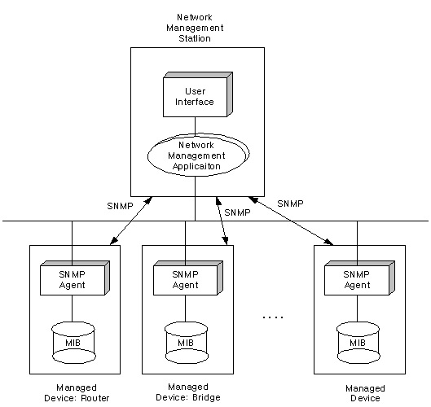
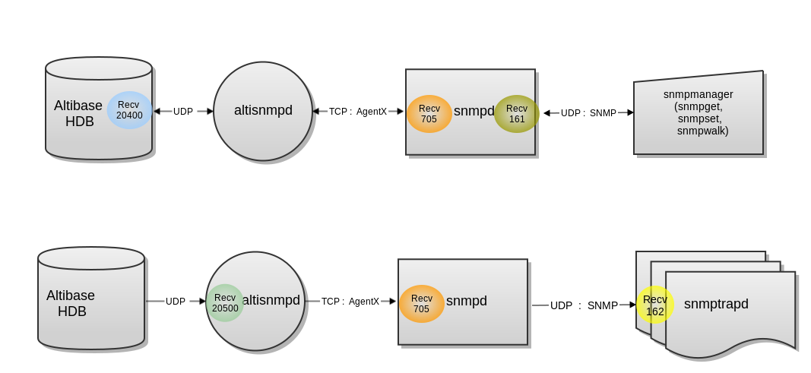

<!-- START doctoc generated TOC please keep comment here to allow auto update -->
<!-- DON'T EDIT THIS SECTION, INSTEAD RE-RUN doctoc TO UPDATE -->


- [SNMP Agent Guide](#snmp-agent-guide)
  - [Preface](#preface)
    - [About This Manual](#about-this-manual)
  - [1. Introduction to SNMP](#1-introduction-to-snmp)
    - [What is SNMP?](#what-is-snmp)
    - [Altibase SNMP Model](#altibase-snmp-model)
  - [2. Installing the SNMP Agent](#2-installing-the-snmp-agent)
    - [Installing the SNMP Agent](#installing-the-snmp-agent)
    - [Setting Altibase Properties](#setting-altibase-properties)
    - [Installing and Running the Altibase NET-SNMP Package](#installing-and-running-the-altibase-net-snmp-package)
    - [Configuration for a Previously Installed NET-SNMP](#configuration-for-a-previously-installed-net-snmp)
  - [3. How to Use SNMP](#3-how-to-use-snmp)
    - [SNMP Commands](#snmp-commands)
  - [4. Checking and Changing Properties](#4-checking-and-changing-properties)
    - [altiPropertyTable](#altipropertytable)
  - [5. Checking the Altibase Status](#5-checking-the-altibase-status)
    - [altiStatus](#altistatus)
  - [6. Traps](#6-traps)
    - [altiTrap](#altitrap)
    - [Trade Codes](#trade-codes)
  - [Appendix A. ALTIBASE-MIB](#appendix-a-altibase-mib)
    - [ALTIBASE-MIB.txt](#altibase-mibtxt)
  - [Appendix B. Troubleshooting](#appendix-b-troubleshooting)
    - [FAQ](#faq)

<!-- END doctoc generated TOC please keep comment here to allow auto update -->

Altibase® Administration

SNMP Agent Guide
================


Altibase Administration SNMP Agent Guide

Release 7.1

Copyright ⓒ 2001\~2021 Altibase Corp. All Rights Reserved.

This manual contains proprietary information of Altibase Corporation; it is provided under a license agreement containing restrictions on use and disclosure and is also protected by copyright patent and other intellectual property law. Reverse engineering of the software is prohibited. All trademarks, registered or otherwise, are the property of their respective owners.

**Altibase Corp**

10F, Daerung PostTower II, 306, Digital-ro, Guro-gu, Seoul 08378, Korea Telephone: +82-2-2082-1000 Fax: 82-2-2082-1099

Customer Service Portal: http://support.altibase.com/en/

Homepage: [[http://www.altibase.com](http://www.altibase.com/)]

Preface
----

### About This Manual

This manual describes how to use the SNMP (Simple Network Management Protocol).

#### Audience

This manual has been prepared for the following Altibase users:

-   Database administrators
-   Technical supporters

It is recommended for those reading this manual possess the following background knowledge:

-   Basic knowledge in the use of computers, operating systems, and operating system utilities
-   Experience in using relational database and an understanding of database concepts
-   Computer programming experience
-   Experience in database server management, operating system management, or network administration

#### Organization

This manual has been organized as follows:

-   Chapter 1: Introduction to SNMP  
    The chapter introduces Altibase's SNMP (Simple Network Management Protocol) and ALTIBASE MIB configuration.
    
-   Chapter 2: Installing the SNMP Agent  
    This chapter explains how to install the SNMP agent and configure Altibase to use SNMP.
    
-   Chapter 3: How to Use SNMP

-   Chapter 4: Checking and Changing Properties  
    This chapter describes how to check and change Altibase properties with altiPropertyTable.
    
-   Chapter 5: Checking the Altibase Status  
    This chapter describes how to check the Altibase status using SNMP.

-   Chapter 6: Traps  
    This chapter describes OIDs sent to the manager using traps when significant events occur in Altibase.
    
-   Appendix A. ALTIBASE-MIB

-   Appendix B. Troubleshooting

#### Documentation Conventions

This section describes the conventions used in this manual. Understanding these conventions will make it easier to find information in this manual and other manuals in the series.

These are two sets of conventions:

-   Syntax diagram conventions

-   Sample code conventions

##### Syntax Diagram Conventions

This manual describes command syntax using diagrams composed of the following elements: 

| Elements                                   | Meaning                                                      |
| ------------------------------------------ | ------------------------------------------------------------ |
|  | Indicates the start of a command. If a syntactic element starts with an arrow, it is not a complete command. |
|               | Indicates that the command continues to the next line. If a syntactic element ends with this symbol, it is not a complete command. |
|               | Indicates taht the command continues from the previous line. If a syntactic element starts witht his symbol, it is not a complete command. |
|               | Indicates the end of a statement.                            |
|               | Indicates a manatory element.                                |
|               | Indicates an optional element.                               |
|               | Indicates a mandatory element comprised of options. One, and only one, option must be specified. |
|               | Indicates an optional element comprised of options.          |
|               | Indicates an optional element in which multiple elements may be specified. A comman must precede all but the first element. |

##### Sample Code Conventions

The code examples explain SQL statements, stored procedures, iSQL statements, and other command line syntax.
The following table describes the printing conventions used in the code examples.

| Rules            | Meaning                                                      | Example                                                      |
| ---------------- | ------------------------------------------------------------ | ------------------------------------------------------------ |
| [ ]              | Indicates an optional item                                   | VARCHAR [(*size*)][[FIXED \|] VARIABLE]                      |
| { }              | Indicates a mandatory field for which one or more items must be selected. | { ENABLE \| DISABLE \| COMPILE }                             |
| \|               | A delimiter between optional or mandatory arguments.         | { ENABLE \| DISABLE \| COMPILE } [ ENABLE \| DISABLE \| COMPILE ] |
| . . .            | Indicates that the previous argument is repeated, or that sample code has been omitted. | SQL\> SELECT ename FROM employee;<br/> ENAME<br/>  -----------------------<br/> SWNO <br/> HJNO<br/>  HSCHOI <br/> .<br/> .<br/> . <br/>20 rows selected. |
| Other Symbols    | Symbols other than those shown above are part of the actual code. | EXEC :p1 := 1; acc NUMBER(11,2);                             |
| Italics          | Statement elements in italics indicate variables and special values specified by the user. | SELECT \* FROM *table_name*;<br/> CONNECT *userID*/*password*; |
| Lower case words | Indicate program elements set by the user, such as table names, column names, file names, etc. | SELECT ename FROM employee;                                  |
| Upper case words | Keywords and all elements provided by the system appear in upper case. | DESC SYSTEM_.SYS_INDICES_;                                   |

#### Related Documents

For more detailed information, please refer to the following documents.

-   Installation Guide

-   Administrator’s Manual

-   General Reference

-   Getting Started Guide

-   SSL/TLS User's Guide

-   Error Message Reference

#### Altibase Welcomes Your Comments and Feedbacks

Please let us know what you like or dislike about our manuals. To help us with better future versions of our manuals, please tell us if there is any corrections or classifications that you would find useful.

Include the following information:

- The name and version of the manual that you are using
- Any comments about the manual
- Your name, address, and phone number

If you need immediate assistance regarding any errors, omissions, and other technical issues, please contact Altibase's Support Portal (http://altibase.com/support-center/en/).

Thank you. We always welcome your feedbacks and suggestions.

## 1. Introduction to SNMP

---------

The chapter introduces the Simple Network Management Protocol (SNMP) and explains the components of ALTIBASE-MIB.

### What is SNMP?

#### Overview of SNMP

The Simple Network Management Protocol (SNMP) is a protocol that communicates the network server status and the process status to the manager.

Before the SNMP was used, the Internet Control Message Protocol (ICMP) was used to provide brief information, such as whether each network host was functioning properly, if so, its response time, and so on. One of the most useful tools using ICMP is probably the Ping program.

As the use of the internet became widespread, the number of network hosts increased, and this lead to a complex network environment. Since it became impossible to manage network using only ICMP efficiently,  research was conducted on alternative protocols, and this lead to the development of SGMP, HEMS, CMIP/SMIS, and so on. Among these, SNMP (an improvement to SGMP) became the standard protocol for network management. 

SNMP is an improvement to SGMP and accepts the MIB definition for HEMS. 

#### Management Information Base (MIB) Structure and OID

SNMP manages a Management Information Base (MIB), which is the categorized information of objects to be managed. System information, network usage, network interface information are examples of such objects. The SNMP agent monitors traffic and stores statistical information in its MIB. Variables defined by the MIB can be changed with a Network Management System (NMS) or by the SNMP manager.

The general structure of the MIB is shown below. MIB objects are structured as a tree for easy management.

Data is requested as below: 

```
ISO.org.dod.internet.mgmt.mib-2.system.sysDescr
```

However, this request is converted to numbers when requesting for data as below: 

```
1.3.6.1.2.1.1.1
```

Each MIB can be represented in numbers. These numbers are called OIDs.

Internet Assigned Number Authority (IANA) maintained MIBs are acknowledged as the standard. IANA OIDs are necessary to implement a standard MIB module. This way, users can use multiple MIBs without having to worry about duplicates.


[Figure 1-1] Typical MIB Structure

#### ALTIBASE-MIB

Altibase has registered an entity and uses the IANA OID altibase(17180) under enterprises(1)<sup>1</sup>.

[<sup>1</sup>]An MIB has a hierarchical structure and can be extended when necessary. The user may wish to add an MIB for a product only available for use in the office or a product that controls the network within a limited network area. In this case, the user can create user's own MIB and define it under private(4) and enterprises(1).


[Figure 1-2] ALTIBASE-MIB

ALTIBASE-MIB is classified as altiTrap, altiPropertyTable, and altiStatus. Each MIB contains the following information for which further information is given in the next chapter.

-   altiTrap MIB: Defines the OID used in the trap when a significant situation is detected.
  
-   altiPropertyTable MIB: Reads or changes Altibase's environment properties.

-   altiStatus MIB: Displays Altibase's status

#### SNMP Related Terminology

This section explains SNMP terminology in Altibase.



[Figure 1-3] Diagram of SNMP

-   **SNMP**((Simple Network Management Protocol))  
    : SNMP is a protocol for network management. Information such as the network server status, the process status, and so on is sent to the manager. 
    
-   **MIB** (Management Information Base)  
    : MIB is a categorical classification of the objects used by SNMP to monitor and control the network. System information, network usage, network interface information, and so on are target objects for management. MIB objects have a tree structure for easy management. 
    
-   **OID**  
    : When requesting information, MIB can be represented as numbers. OIDs are granted OID numbers from the Internet Assigned Number Authority (IANA) to implement a standard MIB.
    
-   **ALTIBASE-MIB**  
    : Altibase has registered an entity and uses the IANA OID altibase(17180) under enterprises(1)<sup>1</sup>. 
    
-   **SNMP Agent**  
    : The SNMP agent installs sniped and snmptrap in a monitor object, collects management information, and sends it to the manager.
    
-   **snmpd**  
    : snmpd is the SNMP master agent daemon.

-   **snmptrapd**  
    : snmptrapd is the daemon for SNMP traps.

-   **altisnmpd**  
    : altisnmpd is the SNMP subagent daemon installed on the Altibase server. 

### Altibase SNMP Model

This section discusses how SNMP manages a network.



[Figure 1-4] Altibase-SNMP Model

The figure above shows how snmpmanager imports Altibase MIB (The port number is net-snmp by default). This is the sync method. If snmpmanger sends a request on UDP port 161, snmpd passes this request to altisnmpd on TCP port 705, which in turn altisnmpd ultimately passes on to Altibase on UDP port 20400. When altisnmpd receives a response from Altibase, altisnmpd passes it on to snmpd and this is ultimately passed on to snmpmanger. 

The figure below shows how a trap raised in Altibase is passed on to snmpd. This is the async method. If Altibase passes the trap to altisnmpd on UDP port 20500, altisnmpd passes it on TCP port 705 to snmpd, and snmpd ultimately passes it on UDP port 162 to snmptrapd. 

Altibase’s own protocol is used between Altibase and altisnmpd. AgentX, the standard protocol for master agent/subagent communication is used between altisnmpd and snmpd.

The SNMP is used as the standard protocol between snmpd, snmpmanager, and snmptrapd.

## 2. Installing the SNMP Agent

---------------

This chapter explains how to install the SNMP agent and configure Altibase to use SNMP.

### Installing the SNMP Agent

This section describes how to install the SNMP agent and integrate it with Altibase. Altibase can be configured in two ways to run net-snmp.

-   Configure with the NET-SNMP package.

-   Configure with the NET-SNMP in a preinstalled environment.

The Altibase SNMP agent complies with the open source net-snmp. For further information about how to configure the NET-SNMP binary and environment configuration files, please refer to the net-snmp homepage (http://www.net-snmp.org/).

#### Downloading the Package

Visit the Altibase homepage (www.altibase.com), download the Altibase package, and install it. 

If altibase-snmp-xxx.tar.gz is unzipped, the user will see the following: 

```
$ gzip -d altibase-snmp-xxx.tar.gz

$ tar xvf altibase-snmp-xxx.tar

...

...

...

== bin

= snmp manger (snmpget, snmpset, snmpwak)

== sbin

= snmpd : snmp Master/Sub agent daemon

= snmptrapd : snmp trap daemon

= altisnmpd : Altibase snmp sub agent daemon

== share/snmp/mibs

= ALTIBASE-MIB.txt : Altibase MIB

== etc/snmp

= snmpd.conf : snmpd environment configuration file

= altisnmpd.conf : altisnmpd environment configuration file

= altisnmp.env : set environment variable
```

Apart from three files (altisnmpd, altisnmpd.conf, and ALTIBASE-MIB.txt), the files are binaries compiled with net-snmp source. 

Only the above three files need to be configured if snmp is used for net-snmp on a customer’s server

### Setting Altibase Properties

To use the SNMP feature in Altibase, the properties file must be changed accordingly. The Altibase properties file is located at $ALTIBASE_HOME/conf. 

The following are SNMP related properties. For more detailed information about each property, please refer to the *General Reference*.

-   SNMP_ENABLE

-   SNMP_PORT_NO

-   SNMP_TRAP_PORT_NO

-   SNMP_RECV_TIMEOUT

-   SNMP_SEND_TIMEOUT

-   SNMP_MSGLOG_FLAG

-   SNMP_ALARM_QUERY_TIMEOUT

-   SNMP_ALARM_FETCH_TIMEOUT

-   SNMP_ALARM_UTRANS_TIMEOUT

-   SNMP_ALARM_SESSION_FAILURE_COUNT

### Installing and Running the Altibase NET-SNMP Package

This section discusses how to configure and run the Altibase NET-SNMP package.

> Note: Please set the default port number to (existing value + 1000) so as to prevent it crashing with the snmp running on the system.

####  Setting Environment Variables

Environment variables can be set with the source command to easily execute binaries. In the following examples, this manual assumes that altisnmp.env is the set environment.

```
$ source altisnmp.env

ALTISNMP=/home/donlet/work/altibase-snmp-1.0.1.release

ALTISNMPCONF=/home/donlet/work/altibase-snmp-1.0.1.release/etc/snmp

ALTISNMPBIN=/home/donlet/work/altibase-snmp-1.0.1.release/bin

ALTISNMPSBIN=/home/donlet/work/altibase-snmp-1.0.1.release/sbin

SNMP_PERSISTENT_FILE=/home/donlet/work/altibase-snmp-1.0.1.release/var/net-snmp/snmpd.conf

SNMP_PERSISTENT_DIR=/home/donlet/work/altibase-snmp-1.0.1.release/var/net-snmp

MIBDIRS=/home/donlet/work/altibase-snmp-1.0.1.release/share/snmp/mibs

MIBS=ALL
```

#### Configuring and Executing snmpd

snmpd is the master agent daemon of SNMP. This section explains the necessary environment configuration for snmpd and how to execute it. 

##### Setting the Environment Configuration File

The port number and snmpd must be set to use SNMP.

Set the port number 1162 for snmpd and snmptrapd, and set snmpd as the master agent. 

```
$ cat $ALTISNMPCONF/snmpd.conf

rocommunity public

rwcommunity private

syslocation mysystem

syscontact admin@mail.com

sysservices 0

trap2sink localhost public 1162

master agentx
```

##### Execution

The execution options for the SNMP agent are [-f], [-l], [-s], and [-P]. [-f] allows the user to view snmpd execution in the foreground. [-l] writes logs into files, [-s] writes logs in syslogs, and [-P] creates pid files

The user can check whether snmpd is being executed in the foreground as below. 

```
$ $ALTISNMPSBIN/snmpd -f -L -c $ALTISNMPCONF/snmpd.conf -C -x localhost:1705 udp:localhost:1161
Turning on AgentX master support.
NET-SNMP version 5.0.8
```

In this example, snmpd and the altibase snmp subagent are communicating on TCP port 1705. snmpd and snmpmanager (snmpget, snmpset, snmpwalk, etc.) are communicating on UDP port 1161.

The user can terminate snmpd execution in the foreground and execute it in the background with "Ctrl+C". The [-f] and [-l] options have been removed to execute snmpd in the background.

```
$ $ALTISNMPSBIN/snmpd -c $ALTISNMPCONF/snmpd.conf -C -x localhost:1705 -l /tmp/snmpd.log -s -P /tmp/snmpd.pid udp:localhost:1161
```

##### Terminating snmpd

The SNMP agent can be terminated with the kill command.

```
$ kill `cat /tmp/snmpd.pid`
```

#### Executing snmptrapd

snmptrapd is a daemon for SNMP traps. This section explains how to use snmptrapd. 

The execution options [-f], [-o], [-s], and [-u] are available for snmptrapd. [-f]allows the user to view snmpdtrapd execution in the foreground. [-o] writes logs into files, [-s] writes logs in syslogs, and [-u] creates pid files. 

The user can check whether snmptrapd is being executed in the foreground as below. Since trap2sink is set to port 1162 for snmpd.conf, the option must be set to udp:localhost:1162.

```
$ $ALTISNMPSBIN/snmptrapd -f -P udp:localhost:1162
2014-10-28 14:46:32 NET-SNMP version 5.0.8 Started.
```

The user can terminate snmptrapd execution in the foreground and execute it in the background with "Ctrl+C". The [-f] option has been removed to execute snmpd in the background.

```
$ $ALTISNMPSBIN/snmptrapd -s -o /tmp/snmptrapd.log -u /tmp/snmptrapd.pid udp:localhost:1162
```

Start snmpd while snmptrapd is running. A trap that notifies that snmpd has restarted is written in syslog and the /tmp/snmptrapd.log file. 

The user is able to check that snmpd and snmptrapd are communicating properly.

```
$ cat /tmp/snmptrapd.log 
Starting snmptrapd 5.0.8
2014-10-28 14:57:40 NET-SNMP version 5.0.8 Started.
2014-10-28 14:58:12 localhost [127.0.0.1]:
        SNMPv2-MIB::sysUpTime.0 = Timeticks: (2) 0:00:00.02     SNMPv2-MIB::snmpTrapOID.0 = OID: SNMPv2-MIB::coldStart  SNMPv2-MIB::snmpTrapEnterprise.0 = OID: NET-SNMP-TC::linux
localhost [127.0.0.1]: Trap SNMPv2-MIB::sysUpTime.0 = Timeticks: (2) 0:00:00.02, SNMPv2-MIB::snmpTrapOID.0 = OID: SNMPv2-MIB::coldStart, SNMPv2-MIB::snmpTrapEnterprise.0 = OID: NET-SNMP-TC::linux
2014-10-28 14:58:14 localhost [127.0.0.1]:
        SNMPv2-MIB::sysUpTime.0 = Timeticks: (143) 0:00:01.43   SNMPv2-MIB::snmpTrapOID.0 = OID: NET-SNMP-AGENT-MIB::nsNotifyShutdown
localhost [127.0.0.1]: Trap SNMPv2-MIB::sysUpTime.0 = Timeticks: (143) 0:00:01.43, SNMPv2-MIB::snmpTrapOID.0 = OID: NET-SNMP-AGENT-MIB::nsNotifyShutdown
```

##### Terminating snmptrapd

The SNMP agent can be terminated with the kill command.

```
$ kill `cat /tmp/snmptrapd.pid`
```

#### Executing snmptrapd

altisnmpd is an SNMP subagent daemon installed in the Altibase server. This section explains how to set the environment configuration file and execute altisnmpd.

##### Setting the Environment Configuration File

For altisnmpd to communicate with the Altibase server, SNMP_PORT_NO must be set identically as it was set for the Altibase environment configuration file. 

altibase_trap must also be set identically as SNMP_TRAP_PORT_NO for Altibase.

```
$ cat $ALTISNMPCONF/altisnmpd.conf
# ALTIBASE PORT_NO SNMP_PORT_NO
altibase 52473 20400
# ALTIBASE_TRAP SNMP_TRAP_PORT_NO
altibase_trap 20500
```

To communicate with multiple Altibase servers, indicate the servers in the environment configuration file as below.

```
altibase 52473 20400
altibase 20300 20800
...
```

##### Executing altisnmpd

The execution options [-f], [-l], [-s], and [-P] are available for altisnmpd. [-f] allows the user to view snmpd execution in the foreground. [-l] writes logs into files, [-s] writes logs in syslogs, and [-P] creates pid files. 

Execute altisnmpd in the foreground to check whether it is running. 

```
$ $ALTISNMPSBIN/altisnmpd -f -L -c $ALTISNMPCONF/altisnmpd.conf -x localhost:1705
AgentX subagent for Altibase 
                              
NET-SNMP version 5.0.8      
                              
Altibase[0] : 52473     20400
                              
Trap : 20500
```

Since snmpd and altisnmpd communicate on TCP port 1705, the user can see that -x localhost is set to 1705. The[-f] option is removed for background execution.

```
$ $ALTISNMPSBIN/altisnmpd -c $ALTISNMPCONF/altisnmpd.conf -l /tmp/altisnmpd.log -s -P /tmp/altisnmpd.pid -x localhost:1705
```

##### Terminating altisnmpd 

altisnmpd can be terminated with the kill command.

```
$ kill `cat /tmp/altisnmpd pid`
```

If altisnmpd is executed or terminated, a trap is raised and this can be checked with snmptrapd.

```
2014-10-28 15:39:57 localhost [127.0.0.1]:
        SNMPv2-MIB::sysUpTime.0 = Timeticks: (1987) 0:00:19.87  SNMPv2-MIB::snmpTrapOID.0 = OID: SNMPv2-SMI::private    ALTIBASE-MIB::altiTrapAddress = STRING: 12944   ALTIBASE-MIB::altiTrapLevel = STRING: 3 ALTIBASE-MIB::altiTra
pCode = STRING: 10000003        ALTIBASE-MIB::altiTrapMessage = STRING: /home/donlet/work/altibase-snmp-1.0.1.release/sbin/altisnmpd is running.        ALTIBASE-MIB::altiTrapMoreInfo = STRING: coldstart
2014-10-28 15:41:29 localhost [127.0.0.1]:
        SNMPv2-MIB::sysUpTime.0 = Timeticks: (11225) 0:01:52.25 SNMPv2-MIB::snmpTrapOID.0 = OID: SNMPv2-SMI::private    ALTIBASE-MIB::altiTrapAddress = STRING: 12961   ALTIBASE-MIB::altiTrapLevel = STRING: 3 ALTIBASE-MIB::altiTra
pCode = STRING: 10000003        ALTIBASE-MIB::altiTrapMessage = STRING: /home/donlet/work/altibase-snmp-1.0.1.release/sbin/altisnmpd is running.        ALTIBASE-MIB::altiTrapMoreInfo = STRING: coldstart
```

#### Executing Altibase

In order execute Altibase, the following properties must be set according to the client environment. For more detailed information about properties, please refer to *Setting Altibase Properties.*

-   SNMP_ENABLE

-   SNMP_PORT_NO

-   SNMP_TRAP_PORT_NO

Run Altibase and execute the following command: 

```
$ $ALTISNMPBIN/snmpwalk -v 2c -c private udp:localhost:1161 altibase
ALTIBASE-MIB::altiPropertyIndex.1 = INTEGER: 1
ALTIBASE-MIB::altiPropertyAlarmQueryTimeout.1 = STRING: 1
ALTIBASE-MIB::altiPropertyAlarmUtransTimeout.1 = STRING: 1
ALTIBASE-MIB::altiPropertyAlarmFetchTimeout.1 = STRING: 1
ALTIBASE-MIB::altiPropertyAlarmSessionFailureCount.1 = STRING: 3
ALTIBASE-MIB::altiStatusIndex.1 = INTEGER: 1
ALTIBASE-MIB::altiStatusDBName.1 = STRING: mydb
ALTIBASE-MIB::altiStatusDBVersion.1 = STRING: 7.1.0.0.0
ALTIBASE-MIB::altiStatusRunningTime.1 = STRING: 00:00:02
ALTIBASE-MIB::altiStatusProcessID.1 = STRING: 12973
ALTIBASE-MIB::altiStatusSessionCount.1 = STRING: 0
```

If SNMP is running properly, ALTIBASE-MID information will be output properly.

### Configuration for a Previously Installed NET-SNMP

This section explains how to link net-snmp altisnmpd (the altibase snmp subagent) and net-snmp, when net-snmp is already installed on a customer’s server.

This section provides examples assuming that an snmpd package is already installed in /usr on the customer’s server.

-   Setting Altibase Properties

-   Registering ALTIBASE-MIB.txt

-   Configuring altisnmpd

-   altisnmpd.conf

#### Setting Altibase Properties

The following Altibase properties must be set according to the customer’s environment. 

-   SNMP_ENABLE

-   SNMP_PORT_NO

-   SNMP_TRAP_PORT_NO

#### Registering ALTIBASE-MIB.txt 

Copy ALTIBASE-MIB.txt and add it to the SNMP environment configuration file, snmp.conf. In this case, it is unnecessary to restart snmpd. 

```
sudo cp $ALTISNMP/share/snmp/mibs/ALTIBASE-MIB.txt /usr/share/snmp/mibs
 
# vi /etc/snmp/snmp.conf
mibs +ALTIBASE-MIB
```

#### Configuring and Running altisnmpd

For more detailed information about altisnmpd configuration, please refer to Executing altisnmpd.

The port used by snmpd must be specified. By default, it is set to localhost: 705. Otherwise, contact the system administrator. 

```
$ $ALTISNMPSBIN/altisnmpd -c $ALTISNMPCONF/altisnmpd.conf -l /tmp/altisnmpd.log -s -P /tmp/altisnmpd.pid -x localhost:705
```

After running Altibase, execute the snmpwalk command. 

```
$ /usr/bin/snmpwalk -v 2c -c private localhost:161 altibase
ALTIBASE-MIB::altiPropertyIndex.1 = INTEGER: 1                                
ALTIBASE-MIB::altiPropertyAlarmQueryTimeout.1 = STRING: 1                     
ALTIBASE-MIB::altiPropertyAlarmUtransTimeout.1 = STRING: 1                    
ALTIBASE-MIB::altiPropertyAlarmFetchTimeout.1 = STRING: 1                     
ALTIBASE-MIB::altiPropertyAlarmSessionFailureCount.1 = STRING: 3              
ALTIBASE-MIB::altiStatusIndex.1 = INTEGER: 1                                  
ALTIBASE-MIB::altiStatusDBName.1 = STRING: mydb                                
ALTIBASE-MIB::altiStatusDBVersion.1 = STRING: 7.1.0.0.0                       
ALTIBASE-MIB::altiStatusRunningTime.1 = STRING: 00:38:00                      
ALTIBASE-MIB::altiStatusProcessID.1 = STRING: 12973                           
ALTIBASE-MIB::altiStatusSessionCount.1 = STRING: 0
```

If the snmpwalk command is executed and the following is output, the user should check the ACL setting in /etc/snmp/snmpd.conf.

```
$ /usr/bin/snmpwalk -v 2c -c private localhost:161 altibase
Timeout: No Response from localhost:161
 
/etc/snmp/snmpd.conf
#  Full access from the local host
#rocommunity public  localhost
#rwcommunity private localhost
```

For the full access, the system administrator must remove the comment. 

## 3. How to Use SNMP

-------------

### SNMP Commands

SNMP receives network information either when there is a request or a significant event occurs. 

SNMP is an asynchronous protocol that communicates on User Datagram Protocol (UDP) and only performs the following four simple operations. 

#### SNMP GET

SNMP GET retrieves a certain OID value from the SNMP agent. The basic information used for this operation is the server address (or name) or community name (for privileges) of the server on which the agent is installed, and the OID number or MIB hierarchy name.

#### SNMP WAK

SNMP WAK retrieves the next OID of a certain OID from the SNMP agent. This is usually called in series to retrieve all the OIDs under a certain OID. 

#### SNMP SET

SNMP SET changes the value of a certain OID. 

#### SNMP TRAP

SNMP TRAP notifies that a significant event has occurred. Traps are used to notify asynchronous events.

## 4. Checking and Changing Properties

--------------------

The chapter describes how to check and change Altibase properties with altiPropertyTable.

### altiPropertyTable

Altibase settings can be checked or changed using altiPropertyTable. 


[Figure 4-1] altiPropertyTable MIB

altiPropertyTable(2) under altibase(17180) has 6 subobjects. If multiple databases exist on one server, subobjects are grouped for classification. In the above figure, 5 objects are grouped under altiPropertyEntry to separate one from another.

#### altiPropertyIndex MIB(1)

##### OID

1.3.6.1.4.1.17180.2.1.1

##### Syntax

```
DisplayString
```

##### Max-Access

Read-only

##### Description

Starting at 1, the altiPropertyIndex value increases by 1, depending on the number of Altibase servers managed by the Altibase SNMP subagent.

##### Example

```
$ snmpget -v 2c -c private localhost altiPropertyIndex.1
ALTIBASE-MIB::altiPropertyIndex.1 = INTEGER: 1
$ snmpwalk -v 2c -c private localhost altiPropertyIndex
ALTIBASE-MIB::altiPropertyIndex.1 = INTEGER: 1
ALTIBASE-MIB::altiPropertyIndex.2 = INTEGER: 1
```

#### altiPropertyAlarmQueryTimeout MIB(2)

##### OID

1.3.6.1.4.1.17180.2.1.2

##### Syntax

```
DisplayString
```

##### Max-Access

Read-Write

##### Description

altiPropertyAlarmQueryTimeout sets whether or not to raise a trap when a query timeout occurs in a session connected to Altibase. If this value is 0, a trap is not raised.

The initial value can be set for SNMP_ALARM_QUERY_TIMEOUT and the default value is 1.

##### Example

```
$ snmpwalk -v 2c -c private localhost altiPropertyAlarmQueryTimeout
ALTIBASE-MIB::altiPropertyAlarmQueryTimeout.1 = STRING: 1
ALTIBASE-MIB::altiPropertyAlarmQueryTimeout.1 = STRING: 2
$ snmpset -v 2c -c private localhost altiPropertyAlarmQueryTimeout.1 s 0
ALTIBASE-MIB::altiPropertyAlarmQueryTimeout.1 = STRING: 0
$ snmpget -v 2c -c private localhost altiPropertyAlarmQueryTimeout.1
ALTIBASE-MIB::altiPropertyAlarmQueryTimeout.1 = STRING: 0
```

#### altiPropertyAlarmFetchTimeout MIB(3)

##### OID

1.3.6.1.4.1.17180.2.1.3

##### Syntax

```
DisplayString
```

##### Max-Access

Read-write

##### Description

altiPropertyAlarmFetchTimeout sets whether or not to raise a trap when a query timeout occurs in a session connected to Altibase. If this value is 0, a trap is not raised.

The initial value can be set for SNMP_ALARM_QUERY_TIMEOUT, and the default value is 1.

##### Example

```
$ snmpwalk -v 2c -c private localhost altiPropertyAlarmFetchTimeout
ALTIBASE-MIB::altiPropertyAlarmFetchTimeout.1 = STRING: 1
ALTIBASE-MIB::altiPropertyAlarmFetchTimeout.1 = STRING: 2
$ snmpset -v 2c -c private localhost altiPropertyAlarmFetchTimeout.1 s 0
ALTIBASE-MIB::altiPropertyAlarmFetchTimeout.1 = STRING: 0
$ snmpget -v 2c -c private localhost altiPropertyAlarmFetchTimeout.1
ALTIBASE-MIB::altiPropertyAlarmFetchTimeout.1 = STRING: 0
```

#### altiPropertyAlarmUtransTimeout MIB(4)

##### OID

1.3.6.1.4.1.17180.2.1.4

##### Syntax

```
DisplayString
```

##### Max-Access

Read-write

##### Description

altiPropertyAlarmUtransTimeout sets whether or not to raise a trap when a utrans timeout occurs in a session connected to Altibase. 

If this value is 0, a trap is not raised. The initial value can be set for SNMP_ALARM_UTRANS_TIMEOUT, and the default value is 1.

##### Example

```
$ snmpwalk -v 2c -c private localhost altiPropertyAlarmUTransTimeout
ALTIBASE-MIB::altiPropertyAlarmUTransTimeout.1 = STRING: 1
ALTIBASE-MIB::altiPropertyAlarmUTransTimeout.1 = STRING: 2
$ snmpset -v 2c -c private localhost altiPropertyAlarmUTransTimeout.1 s 0
ALTIBASE-MIB::altiPropertyAlarmUTransTimeout.1 = STRING: 0
$ snmpget -v 2c -c private localhost altiPropertyAlarmUTransTimeout.1
ALTIBASE-MIB::altiPropertyAlarmUTransTimeout.1 = STRING: 0
```

#### altiPropertyAlarmSessionFailureCount MIB(5)

##### OID

1.3.6.1.4.1.17180.2.1.5

##### Syntax

```
DisplayString
```

##### Max-Access

Read-write

##### Description

altiPropertyAlarmUtransTimeout sets whether or not to raise a trap when a utrans timeout occurs in a session connected to Altibase. If this value is 0, a trap is not raised. 

The initial value can be set for SNMP_ALARM_UTRANS_TIMEOUT, and the default value is 3.

##### Example

```
$ snmpwalk -v 2c -c private localhost altiPropertyAlarmSessionFailureCount
ALTIBASE-MIB::altiPropertyAlarmSessionFailureCount.1 = STRING: 3
ALTIBASE-MIB::altiPropertyAlarmSessionFailureCount.2 = STRING: 3
$ snmpset -v 2c -c private localhost altiPropertyAlarmSessionFailureCount.1 s 2
ALTIBASE-MIB::altiPropertyAlarmSessionFailureCount.1 = STRING: 2
$ snmpget -v 2c -c private localhost altiPropertyAlarmSessionFailureCount.1
ALTIBASE-MIB::altiPropertyAlarmSessionFailureCount.1 = STRING: 2
```

## 5. Checking the Altibase Status

-------------

This chapter discusses how to check the Altibase status using SNMP.

### altiStatus

The Altibase status can be checked using altiStatus.


[Figure 5-1] altiStatus MIB

The altiStatus MIB has altiStatus(3) under altibase(17180). altiStatus has altiStatusTable(1) that contains status information of Altibase. This information is classified into 6 objects under altiStatusEntry.

#### altiStatusIndex MIB(1)

##### OID

1.3.6.1.4.1.17180.3.1.1.1

##### Syntax

```
DisplayString
```

##### Max-Access

Read-only

##### Description

Starting at 1, the altiPropertyIndex value increases by 1, depending on the number of Altibase servers managed by the Altibase SNMP subagent.

##### Example

```
$ snmpget -v 2c -c public localhost altiStatusIndex.1
ALTIBASE-MIB::altiStatusIndex.1 = INTEGER: 1
$ snmpwalk -v 2c -c public localhost altiStatusIndex
ALTIBASE-MIB::altiStatusIndex.1 = INTEGER: 1
ALTIBASE-MIB::altiStatusIndex.2 = INTEGER: 2
```

#### altiStatusDBName(2)

##### OID

1.3.6.1.4.1.17180.3.1.1.2

##### Syntax

```
DisplayString
```

##### Max-Access

Read-only

##### Description

altiStatusDBName displays the Altibase name.

##### Example 

```
$ snmpget -v 2c -c public localhost altiStatusIndex.1
ALTIBASE-MIB::altiStatusDBName.1 = STRING: mydb
$ snmpwalk -v 2c -c public localhost altiStatusIndex
ALTIBASE-MIB::altiStatusDBName.1 = STRING: mydb
ALTIBASE-MIB::altiStatusDBName.2 = STRING: mydb
```

#### altiStatusDBVersion MIB(3)

##### OID

1.3.6.1.4.1.17180.3.1.1.3

##### Syntax

```
DisplayString
```

##### Max-Access

Read-only

##### Description

altiStatusDBVersion displays the Altibase version.

##### Example

```
$ snmpget -v 2c -c public localhost altiStatusDBVersion.1
ALTIBASE-MIB::altiStatusDBVersion.1 = STRING: 6.5.1.0.1
$ snmpwalk -v 2c -c public localhost altiStatusDBVersion
ALTIBASE-MIB::altiStatusDBVersion.1 = STRING: 6.5.1.0.1
ALTIBASE-MIB::altiStatusDBVersion.2 = STRING: 7.1.1.0.0
```

#### altiStatusRunningTime MIB(4)

##### OID

1.3.6.1.4.1.17180.3.1.1.4

##### Syntax

```
DisplayString
```

##### Max-Access

Read-only

##### Description

altiStatusRunningTime displays the run time of the Altibase process. The run time consists of days, hours, minutes, and seconds.

##### Example

```
$ snmpwalk -v 2c -c public localhost altiStatusRunningTime.1
ALTIBASE-MIB::altiStatusRunningTime.1 = STRING: 00:00:14
$ snmpwalk -v 2c -c public localhost altiStatusRunningTime
ALTIBASE-MIB::altiStatusRunningTime.1 = STRING: 00:00:21
ALTIBASE-MIB::altiStatusRunningTime.2 = STRING: 1 days, 03:12:56
```

#### altiStatusProcessID MIB(5)

##### OID

1.3.6.1.4.1.17180.3.1.1.5

##### Syntax

```
DisplayString
```

##### Max-Access

Read-only

##### Description

altiStatusProcessID displays the Altibase process ID.

##### Example

```
$ snmpget -v 2c -c public localhost altiStatusProcessID.1
ALTIBASE-MIB::altiStatusProcessID.1 = STRING: 23201
$ snmpwalk -v 2c -c public localhost altiStatusProcessID
ALTIBASE-MIB::altiStatusProcessID.1 = STRING: 23201
ALTIBASE-MIB::altiStatusProcessID.2 = STRING: 23343
```

#### altiStatusSessionCount MIB(6)

##### OID

1.3.6.1.4.1.17180.3.1.1.6

##### Syntax

```
DisplayString
```

##### Max-Access

Read-only

##### Description

altiStatusSessionCount displays the number of Altibase sessions. This is equal to the number of clients currently connected to Altibase.

##### Example

```
$ snmpget -v 2c -c public localhost altiStatusSessionCount.1
ALTIBASE-MIB::altiStatusSessionCount.1 = STRING: 10
$ snmpwalk -v 2c -c public localhost altiStatusSessionCount
ALTIBASE-MIB::altiStatusSessionCount.1 = STRING: 10
ALTIBASE-MIB::altiStatusSessionCount.2 = STRING: 7 
```

## 6. Traps

----------

This chapter describes OIDs sent to the manager using traps when significant events occur in Altibase.

### altiTrap

altiTrap is a management information base (MIB) that shows the OIDs to be sent using traps. 


[Figure 6-1] altiTrap MIB

altiTrap MIB uses the trap altiTrap(1) under altibase(171780) to define the OIDs to be sent to the manager. These OIDs define information such as the port number, level, trap code, message, etc.

#### altiNotification MIB(1)

##### OID

1.3.6.1.4.1.17180.1.1

##### Syntax

```
OBJECT { altiTrapAddress, altiTrapLevel, altiTrapCode, altiTrapMessage,
altiTrapMoreInfo }
```

##### Description

altiNotification is an object type (notification) that contains 5 MIBs and is used to send a trap.

##### Example

```
# snmptrapd -f -P
2014-10-24 13:30:46 localhost [127.0.0.1]:
SNMPv2-MIB::sysUpTime.0 = Timeticks: (1017350) 2:49:33.50
SNMPv2-MIB::snmpTrapOID.0 = OID: SNMPv2-SMI::private
ALTIBASE-MIB::altiTrapAddress = STRING: 52473
ALTIBASE-MIB::altiTrapLevel = STRING: 3
ALTIBASE-MIB::altiTrapCode = STRING: 10000001
ALTIBASE-MIB::altiTrapMessage = STRING: Altibase is running.
ALTIBASE-MIB::altiTrapMoreInfo = STRING:
```

#### altiTrapAddress MIB(2)

##### OID

1.3.6.1.4.1.17180.1.2

##### Syntax

```
DisplayString
```

##### Description

altiTrapAddress displays the Altibase port number and is used to identify on which Altibase the trap was raised.

#### altiTrapLevel(3)

##### OID

1.3.6.1.4.1.17180.1.3

##### Syntax

```
DisplayString
```

##### Description

altiTrapLevel displays the trap priority. Each level means the following: 

1: This is a very important and urgent event.

2: This is a major event.

3: This is a common event.

#### altiTrapCode(4)

##### OID

1.3.6.1.4.1.17180.1.4

##### Syntax

```
DisplayString
```

##### Description

Codes are used to distinguish traps in Altibase. Trap codes are further discussed in [Trap Codes](#Trap Codes).

#### altiTrapMessage(5)

##### OID

1.3.6.1.4.1.17180.1.5

##### Syntax

```
DisplayString
```

##### Description

altiTrapMessage displays a description of the trap that was raised in Altibase.

#### altiTrapMoreInfo(6)

##### OID

1.3.6.1.4.1.17180.1.6

##### Syntax

```
DisplayString
```

##### Description

altiTrapMoreInfo displays additional information about traps raised in Altibase.

### Trade Codes

This section describes trap codes (altiTrapCode) and trap levels (altiTrapLevel) of Altibase. 

#### Altibase Running Status

##### Code

10000001

##### Level

3

##### Description

Altibase Running Status displays that Altibase is currently running.

##### Example

```
# snmptrapd -f -P
2014-10-24 13:30:46 localhost [127.0.0.1]:
SNMPv2-MIB::sysUpTime.0 = Timeticks: (1017350) 2:49:33.50
SNMPv2-MIB::snmpTrapOID.0 = OID: SNMPv2-SMI::private
ALTIBASE-MIB::altiTrapAddress = STRING: 52473
ALTIBASE-MIB::altiTrapLevel = STRING: 3
ALTIBASE-MIB::altiTrapCode = STRING: 10000001
ALTIBASE-MIB::altiTrapMessage = STRING: Altibase is running.
ALTIBASE-MIB::altiTrapMoreInfo = STRING:
```

#### Altibase UnRunning Status

##### Code

10000002

##### Level

3

##### Description

Altibase UnRunning Status displays that Altibase is currently not running.

##### Example

```
# snmptrapd -f -P

2014-10-24 13:33:38 localhost [127.0.0.1]:
SNMPv2-MIB::sysUpTime.0 = Timeticks: (1034562) 2:52:25.62
SNMPv2-MIB::snmpTrapOID.0 = OID: SNMPv2-SMI::private
ALTIBASE-MIB::altiTrapAddress = STRING: 52473
ALTIBASE-MIB::altiTrapLevel = STRING: 1
ALTIBASE-MIB::altiTrapCode = STRING: 10000002
ALTIBASE-MIB::altiTrapMessage = STRING: Altibase is not running.
ALTIBASE-MIB::altiTrapMoreInfo = STRING:
```

#### Altibase Subagent Running Status

##### Code

10000003

##### Level

3

##### Description

Altibase Subagent Running Status displays that Altibase’s subagent (altisnmpd) is running.

##### Example

```
# snmptrapd -f -P

2014-10-24 13:40:24 localhost [127.0.0.1]:
SNMPv2-MIB::sysUpTime.0 = Timeticks: (1075187) 2:59:11.87
SNMPv2-MIB::snmpTrapOID.0 = OID: SNMPv2-SMI::private
ALTIBASE-MIB::altiTrapAddress = STRING: 22082
ALTIBASE-MIB::altiTrapLevel = STRING: 3
ALTIBASE-MIB::altiTrapCode = STRING: 10000003
ALTIBASE-MIB::altiTrapMessage = STRING: Altisnmpd is running.
ALTIBASE-MIB::altiTrapMoreInfo = STRING: coldstart
```

#### Altibase Subagent UnRunning Status

##### Code

10000004

##### Level

3

##### Description

Altibase Subagent UnRunning Status displays that Altibase’s subagent (altisnmpd) is not running.

##### Example

```
# snmptrapd -f -P

2014-10-24 13:40:23 localhost [127.0.0.1]:
SNMPv2-MIB::sysUpTime.0 = Timeticks: (1075030) 2:59:10.30
SNMPv2-MIB::snmpTrapOID.0 = OID: SNMPv2-SMI::private
ALTIBASE-MIB::altiTrapAddress = STRING: 21947
ALTIBASE-MIB::altiTrapLevel = STRING: 1
ALTIBASE-MIB::altiTrapCode = STRING: 10000004
ALTIBASE-MIB::altiTrapMessage = STRING: Altisnmpd is not running.
ALTIBASE-MIB::altiTrapMoreInfo = STRING: nsNotifyShutdown
```

#### Session Query Timeout

##### Code

10000101

##### Level

2

##### Description

Session Query Timeout displays that altiPropertyAlarmQueryTimeout is 1 and a query timeout has occurred in an Altibase session.

##### Example

```
# snmptrapd -f -P

2014-10-24 14:00:01 localhost [127.0.0.1]:
SNMPv2-MIB::sysUpTime.0 = Timeticks: (1192924) 3:18:49.24
SNMPv2-MIB::snmpTrapOID.0 = OID: SNMPv2-SMI::private
ALTIBASE-MIB::altiTrapAddress = STRING: 52473
ALTIBASE-MIB::altiTrapLevel = STRING: 2
ALTIBASE-MIB::altiTrapCode = STRING: 10000101
ALTIBASE-MIB::altiTrapMessage = STRING: [Notify : Query Timeout] Session Closed by Server : Session ID = 2
ALTIBASE-MIB::altiTrapMoreInfo = STRING: Please check altibase_boot.log
```

#### Session Fetch Timeout

##### Code

10000102

##### Level

2

##### Description

Session Fetch Timeout displays that altiPropertyAlarmFetchTimeout is 1 and a fetch timeout has occurred in an Altibase session

##### Example

```
# snmptrapd -f -P

2014-10-24 14:00:01 localhost [127.0.0.1]:
SNMPv2-MIB::sysUpTime.0 = Timeticks: (1192924) 3:18:49.24
SNMPv2-MIB::snmpTrapOID.0 = OID: SNMPv2-SMI::private
ALTIBASE-MIB::altiTrapAddress = STRING: 52473
ALTIBASE-MIB::altiTrapLevel = STRING: 2
ALTIBASE-MIB::altiTrapCode = STRING: 10000102
ALTIBASE-MIB::altiTrapMessage = STRING: [Notify : Fetch Timeout] Session Closed by Server : Session ID = 2
ALTIBASE-MIB::altiTrapMoreInfo = STRING: Please check altibase_boot.log
```

#### Session Utrans Timeout

##### Code

10000103

##### Level

2

##### Description

Session Utrans Timeout displays that altiPropertyAlarmUtransTimeout is 1 and a utrans timeout has occurred in an Altibase session

##### Example

```
# snmptrapd -f -P

2014-10-24 14:12:01 localhost [127.0.0.1]:
SNMPv2-MIB::sysUpTime.0 = Timeticks: (1192924) 3:18:49.24
SNMPv2-MIB::snmpTrapOID.0 = OID: SNMPv2-SMI::private
ALTIBASE-MIB::altiTrapAddress = STRING: 52473
ALTIBASE-MIB::altiTrapLevel = STRING: 2
ALTIBASE-MIB::altiTrapCode = STRING: 10000103
ALTIBASE-MIB::altiTrapMessage = STRING: [Notify : Utrans Timeout] Session Closed by Server : Session ID = 2
ALTIBASE-MIB::altiTrapMoreInfo = STRING: Please check altibase_boot.log
```

#### Too Many Continuous Query Failure

##### Code

10000201

##### Level

2

##### Description

A trap raised when query execution continuously fails more than the number set in. 

##### Example

```
# snmptrapd -f -P

2014-10-24 14:12:01 localhost [127.0.0.1]:
SNMPv2-MIB::sysUpTime.0 = Timeticks: (1192924) 3:18:49.24
SNMPv2-MIB::snmpTrapOID.0 = OID: SNMPv2-SMI::private
ALTIBASE-MIB::altiTrapAddress = STRING: 52473
ALTIBASE-MIB::altiTrapLevel = STRING: 2
ALTIBASE-MIB::altiTrapCode = STRING: 10000103
ALTIBASE-MIB::altiTrapMessage = STRING: [Notify : Session Failure]  Session Failed Continuously : Session ID = 2, Count = 3
ALTIBASE-MIB::altiTrapMoreInfo = STRING: Please check altibase_boot.log 
```

## Appendix A. ALTIBASE-MIB

This appendix provides the ALTIBASE-MIB.txt file.

### ALTIBASE-MIB.txt

```
ALTIBASE-MIB DEFINITIONS::= BEGIN
     
IMPORTS
    OBJECT-TYPE, NOTIFICATION-TYPE, MODULE-IDENTITY, enterprises
        FROM SNMPv2-SMI
    DisplayString
        FROM SNMPv2-TC;
     
     
altibase MODULE-IDENTITY
    LAST-UPDATED "201410310000Z"
    ORGANIZATION "ALTIBASE R&D Division"
    CONTACT-INFO "Altibase Corporation
                  10F, DaerungPost Tower2, 182-13 Guro-dong,
                  Guro-gu, Seoul
                  150-790,
                  Korea
                  TEL. +82-2-2082-1000
                  http://support.altibase.com"
    DESCRIPTION  "This MIB module defines Altibase MIB."
    ::= { enterprises 17180 }
     
     
altiTrap OBJECT IDENTIFIER ::= { altibase 1 }
     
altiNotification NOTIFICATION-TYPE
    OBJECTS     { altiTrapAddress, altiTrapLevel, altiTrapCode,                                   
                  altiTrapMessage, altiTrapMoreInfo }                                             
    STATUS      current
    DESCRIPTION "altiNotification"      
    ::= { altiTrap 1 }
     
altiTrapAddress OBJECT-TYPE
    SYNTAX      DisplayString
    MAX-ACCESS  read-only
    STATUS      current
    DESCRIPTION "The Altibase port number in use."
    ::= { altiTrap 2 }
     
altiTrapLevel OBJECT-TYPE
    SYNTAX      DisplayString
    MAX-ACCESS  read-only
    STATUS      current
    DESCRIPTION "Trap Level = 1|2|3"
    ::= { altiTrap 3 }
     
altiTrapCode OBJECT-TYPE
    SYNTAX      DisplayString
    MAX-ACCESS  read-only
    STATUS      current
    DESCRIPTION "Trap Code."
    ::= { altiTrap 4 }
     
altiTrapMessage OBJECT-TYPE
    SYNTAX      DisplayString
    MAX-ACCESS  read-only
    STATUS      current 
    DESCRIPTION "The trap message."
    ::= { altiTrap 5 }
                                                                               
altiTrapMoreInfo OBJECT-TYPE                                                  
    SYNTAX      DisplayString                                                 
    MAX-ACCESS  read-only                                                     
    STATUS      current                                                       
    DESCRIPTION "The reserved field"                                         
    ::= { altiTrap 6 }                                                        
                                                                               
                                                                               
altiPropertyTable OBJECT-TYPE                                                 
    SYNTAX      SEQUENCE OF AltiPropertyEntry                                 
    MAX-ACCESS  not-accessible                                                
    STATUS      current                                                       
    DESCRIPTION "altiPropertyTable"                                          
    ::= { altibase 2 }                                                        
                                                                               
altiPropertyEntry OBJECT-TYPE                                                 
    SYNTAX      AltiPropertyEntry                                             
    MAX-ACCESS  not-accessible                                                
    STATUS      current                                                       
    DESCRIPTION "altiPropertyEntry"                                          
    INDEX       { altiPropertyIndex }                                         
    ::= { altiPropertyTable  1 }                                              
                                                                               
altiPropertyEntry ::= SEQUENCE {                                              
    altiPropertyIndex                    INTEGER,                             
    altiPropertyAlarmQueryTimeout        DisplayString,                       
    altiPropertyAlarmUtransTimeout       DisplayString,                       
    altiPropertyAlarmFetchTimeout        DisplayString,                       
    altiPropertyAlarmSessionFailureCount DisplayString,                       
}                                                                             
                                                                               
altiPropertyIndex OBJECT-TYPE                                                 
    SYNTAX      INTEGER                                                       
    MAX-ACCESS  read-only                                                     
    STATUS      current                                                       
    DESCRIPTION "altiPropertyIndex"                                          
    ::= { altiPropertyEntry 1 }                                               
                                                                               
altiPropertyAlarmQueryTimeout OBJECT-TYPE                                     
    SYNTAX      DisplayString                                                 
    MAX-ACCESS  read-write                                                    
    STATUS      current                                                       
    DESCRIPTION "altiPropertyAlarmQueryTimeout 0|1                           
                 Zero : Do nothing.                                           
                 One  : Send the trap when a query timeout occurs in a session." 
    ::= { altiPropertyEntry 2 }                                               
                                                                               
altiPropertyAlarmUtransTimeout OBJECT-TYPE                                    
    SYNTAX      DisplayString                                                 
    MAX-ACCESS  read-write                                                    
    STATUS      current                                                       
    DESCRIPTION "altiPropertyAlarmUtransTimeout 0|1                          
                 Zero : Do nothing.                                           
                 One  : Send the trap when a utrans timeout occurs in a session."
    ::= { altiPropertyEntry 3 }                                               
                                                                               
altiPropertyAlarmFetchTimeout OBJECT-TYPE                                     
    SYNTAX      DisplayString                                                 
    MAX-ACCESS  read-write                                                                                               
    STATUS      current                                                                                                  
    DESCRIPTION "altiPropertyAlarmFetchTimeout 0|1                                                                      
                 Zero : Do nothing.                                                                                      
                 One  : Send the trap when a fetch timeout occurs in a session. "                                            
    ::= { altiPropertyEntry 4 }                                                                                          
                                                                                                                          
altiPropertyAlarmSessionFailureCount OBJECT-TYPE                                                                         
    SYNTAX      DisplayString                                                                                            
    MAX-ACCESS  read-write                                                                                               
    STATUS      current                                                                                                  
    DESCRIPTION "altiPropertyAlarmessionFailureCount [0..4294967295]                                                     
                 Zero     : Do nothing.                                                                                  
                 Non-zero : Send the trap when query execution continues to fail for as many times as altiPropertyAlarmSessionFailureCount."
    ::= { altiPropertyEntry 5 }                                                                                          
                                                                                                                          
                                                                                                                          
                                                                                                                          
altiStatus OBJECT IDENTIFIER ::= { altibase 3 }                                                                          
                                                                                                                          
altiStatusTable OBJECT-TYPE                                                                                              
    SYNTAX      SEQUENCE OF altiStatusEntry                                                                              
    MAX-ACCESS  not-accessible                                                                                           
    STATUS      current                                                                                                  
    DESCRIPTION "altiStatusTable"                                                                                       
    ::= { altiStatus  1 }                                                                                                
                                                                                                                          
altiStatusEntry OBJECT-TYPE                                                                                              
    SYNTAX      altiStatusEntry                                                                                          
    MAX-ACCESS  not-accessible                                                                                           
    STATUS      current                                                                                                  
    DESCRIPTION "altiStatusEntry"                                                                                       
    INDEX       { altiStatusIndex }                                                                                      
    ::= { altiStatusTable 1 }                                                                                            
                                                                                                                          
altiStatusEntry ::= SEQUENCE {                                                                                           
    altiStatusIndex         INTEGER,                                                                                     
    altiStatusDBName        DisplayString,                                                                               
    altiStatusDBVersion     DisplayString,                                                                               
    altiStatusRunningTime   DisplayString,                                                                               
    altiStatusProcessID     DisplayString,                                                                               
    altiStatusSessionCount  DisplayString                                                                                
}                                                                                                                        
                                                                                                                          
altiStatusIndex OBJECT-TYPE                                                                                              
    SYNTAX      INTEGER                                                                                                  
    MAX-ACCESS  read-only                                                                                                
    STATUS      current                                                                                                  
    DESCRIPTION "altiStatusIndex"                                                                                       
    ::= { altiStatusEntry 1 }                                                                                            
                                                                                                                          
altiStatusDBName OBJECT-TYPE                                                                                             
    SYNTAX      DisplayString                                                                                            
    MAX-ACCESS  read-only                                                                                                
    STATUS      current                                                                                                  
    DESCRIPTION "The Altibase database name."                                                                      
    ::= { altiStatusEntry 2 }                                                                                            
                                                                                                                          
altiStatusDBVersion OBJECT-TYPE                                                                                          
    SYNTAX      DisplayString                               
    MAX-ACCESS  read-only                                   
    STATUS      current                                     
    DESCRIPTION "The Altibase version."                 
    ::= { altiStatusEntry 3 }                               
                                                             
altiStatusRunningTime OBJECT-TYPE                           
    SYNTAX      DisplayString                               
    MAX-ACCESS  read-only                                   
    STATUS      current                                     
    DESCRIPTION "altiStatusRunningTime = [dd days, HH:MM:SS]
                 The Altibase run time."                 
    ::= { altiStatusEntry 4 }                               
                                                             
altiStatusProcessID OBJECT-TYPE                             
    SYNTAX      DisplayString                               
    MAX-ACCESS  read-only                                   
    STATUS      current                                     
    DESCRIPTION "altiStatusProcessID = PID                  
                 Process ID of Altibase."                   
   ::= { altiStatusEntry 5 }                                
                                                             
altiStatusSessionCount OBJECT-TYPE                          
    SYNTAX      DisplayString                               
    MAX-ACCESS  read-only                                   
    STATUS      current                                     
    DESCRIPTION " The number of currently open Altibase sessions."       
   ::= { altiStatusEntry 6 }                                
                                                             
END
```

## Appendix B. Troubleshooting 

### FAQ

##### Question

When I run altisnmpd, I get the error message: "Error: Failed to connect to the agentx master agent: Unknown host (Connection refused)".

##### Answer

Verify that the snmpd daemon is running. 

If so, use the altisnmpd -x option to check whether the IP and port are correct.

##### Question

When I execute the snmpget and snmpwalk commands, I get the error message: "No Such Object available on this agent at this OID".

##### Answer

This error can occur if altisnmpd and snmpd are not communicating correctly. 

Verify that altisnmpd is running. If the user restarted snmpd, altisnmpd must also be restarted.

##### Question

When I execute the snmpset command, I get the error message: "Error in packet. Reason: notWritable (that object does not support modification)...".

##### Answer

This error can occur if the value for a read-only object has been set. If it is a read-write object, this is a network problem. In this case, refer to the manual. 

##### Question

When I execute the snmpget and snmpwalk commands, I get the error message: "No Such Instance currently exists at this OID". 

##### Answer

This checks whether the name for an OID or object is saved correctly. The user can view Altibase MIB information with the snmpwalk command.

```
ex> snmpwalk -v 2c -c private IP:PORT altibase
```

Also, verify that Altibase is running.

##### Question

When I execute the snmpget and snmpwalk commands, I get the error message : "Unknown Object Identifier (Sub-id not found: (top) -> xxx)"

##### Answer

Verify whether the OID name or the object name has been properly specified. 

If the ALTIBASE-MIB.txt file cannot be loaded, check whether the file exists in \$MIBDIRS and then check that $MIBS is set to ALL.

##### Question

 When I execute the snmpwalk command, the entire ALTIBASE MIB is not output.

```
ex> snmpwalk -v 2c -c private IP:PORT altibase
ALTIBASE-MIB::altiPropertyIndex.1 = INTEGER: 1
ALTIBASE-MIB::altiStatusIndex.1 = INTEGER: 1  
```

##### Answer

If the entire ALTIBASE MIB is not output, verify if Altibase is running.
