<!-- START doctoc generated TOC please keep comment here to allow auto update -->
<!-- DON'T EDIT THIS SECTION, INSTEAD RE-RUN doctoc TO UPDATE -->

- [SQL Reference](#sql-reference)
  - [Preface](#preface)
    - [About This Manual](#about-this-manual)
  - [1. Introduction to Altibase SQL](#1-introduction-to-altibase-sql)
    - [Overview of Altibase SQL](#overview-of-altibase-sql)
    - [Types of SQL Statements](#types-of-sql-statements)
  - [2. Altibase SQL Basics](#2-altibase-sql-basics)
    - [Comments](#comments)
    - [Altibase Objects](#altibase-objects)
    - [HINT](#hint)
    - [Hint List](#hint-list)
  - [3. Data Definition Language](#3-data-definition-language)
    - [ALTER DATABASE](#alter-database)
    - [ALTER DATABASE LINKER](#alter-database-linker)
    - [ALTER INDEX](#alter-index)
    - [ALTER JOB](#alter-job)
    - [ALTER QUEUE](#alter-queue)
    - [ALTER REPLICATION](#alter-replication)
    - [ALTER SEQUENCE](#alter-sequence)
    - [ALTER TABLE](#alter-table)
    - [ALTER TABLESPACE](#alter-tablespace)
    - [ALTER TRIGGER](#alter-trigger)
    - [ALTER USER](#alter-user)
    - [ALTER VIEW](#alter-view)
    - [ALTER MATERIALIZED VIEW](#alter-materialized-view)
    - [COMMENT](#comment)
    - [CONJOIN TABLE](#conjoin-table)
    - [CREATE DATABASE](#create-database)
    - [CREATE DATABASE LINK](#create-database-link)
    - [CREATE DIRECTORY](#create-directory)
    - [CREATE INDEX](#create-index)
    - [CREATE JOB](#create-job)
    - [CREATE QUEUE](#create-queue)
    - [CREATE REPLICATION](#create-replication)
    - [CREATE ROLE](#create-role)
    - [CREATE SEQUENCE](#create-sequence)
    - [CREATE SYNONYM](#create-synonym)
    - [CREATE TABLE](#create-table)

<!-- END doctoc generated TOC please keep comment here to allow auto update -->

Altibase® Application Development

# SQL Reference


Altibase Application Development SQL Reference

Release 7.1

Copyright ⓒ 2001\~2020 Altibase Corp. All Rights Reserved.

This manual contains proprietary information of Altibase Corporation; it is provided under a license agreement containing restrictions on use and disclosure and is also protected by copyright patent and other intellectual property law. Reverse engineering of the software is prohibited. All trademarks, registered or otherwise, are the property of their respective owners.

**Altibase Corp**

10F, Daerung PostTower II, 306, Digital-ro, Guro-gu, Seoul 08378, Korea Telephone: +82-2-2082-1000 Fax: 82-2-2082-1099

Customer Service Portal: http://support.altibase.com/en/

Homepage: [[http://www.altibase.com](http://www.altibase.com/)]


## Preface

### About This Manual

This manual explains how to use Structured Query Langauge (SQL) statements with Altibase

#### Audience

This manual has been prepared for the following Altibase users

- Database administrators
- Performance administrators
- Database users
- Application developers
- Technical Supporters

It is recommended for those reading this manual possess the following background knowledge:

- Basic knowledge in the use of computers, operating systems, and operating system utilities
- Experience in using relational database and an understanding of database concepts
- Computer programming experience
- Experience in database server management, operating system management, or network administration

#### Organization

This manual is organized as follows: 

- Chapter 1: Introduction to Altibase SQL  
  This chapter describes an overview of the structure and organization of SQL in Altibase.
- Chapter 2: Altibase SQL Basics  
  This chapter describes the basics for using Altibase's SQL.
- Chapter 3: Data Definition Language   
  This chpater explains each of the Data Definition Language (DDL) statements that are available in Altibase.
- Chapter 4: Data Manipulation Language  
  This chapter explains each of the Data Manipulation Language (DML) statements that are available in Altibase. 
- Chapter 5: Data Control Language  
  This chapter explains each of the Data Control Language (DCL) statements that are available in Altibase. 
- Chapter 6: Set Operators  
  This chapter explains the set operators that can be used in SQL statements in Altibase.
- Chapter 7: SQL Functions   
  This chapter describes the functions that are supported in Altibase.
- Chapter 8: Arithmetic Operators  
  This chapter describes the arithmetic operators that can be used in SQL statements in Altibase.
- Chapter 8: SQL Conditions  
  This chapter describes the conditional operators that can be used in conditional clauses in SQL statements in Altibase.
- Appendix A. Regular Expression  

#### Documentation Conventions

This section describes the conventions used in this manual. Understanding these conventions will make it easier to find information in this manual and other manuals in the series.

These are two sets of conventions:

-   Syntax diagram conventions

-   Sample code conventions

##### Syntax Diagram Conventions

This manual describes command syntax using diagrams composed of the following elements: 

| Elements                        | Meaning                                                      |
| ------------------------------- | ------------------------------------------------------------ |
|  | Indicates the start of a command. If a syntactic element starts with an arrow, it is not a complete command. |
|  | Indicates that the command continues to the next line. If a syntactic element ends with this symbol, it is not a complete command. |
|  | Indicates taht the command continues from the previous line. If a syntactic element starts witht his symbol, it is not a complete command. |
|  | Indicates the end of a statement.                            |
|  | Indicates a manatory element.                                |
|  | Indicates an optional element.                               |
|  | Indicates a mandatory element comprised of options. One, and only one, option must be specified. |
|  | Indicates an optional element comprised of options.          |
|  | Indicates an optional element in which multiple elements may be specified. A comman must precede all but the first element. |

##### Sample Code Conventions

The code examples explain SQL statements, stored procedures, iSQL statements, and other command line syntax.

The following table describes the printing conventions used in the code examples.

| Rules            | Meaning                                                      | Example                                                      |
| ---------------- | ------------------------------------------------------------ | ------------------------------------------------------------ |
| [ ]              | Indicates an optional item                                   | VARCHAR [(*size*)][[FIXED \|] VARIABLE]                      |
| { }              | Indicates a mandatory field for which one or more items must be selected. | { ENABLE \| DISABLE \| COMPILE }                             |
| \|               | A delimiter between optional or mandatory arguments.         | { ENABLE \| DISABLE \| COMPILE } [ ENABLE \| DISABLE \| COMPILE ] |
| . . .            | Indicates that the previous argument is repeated, or that sample code has been omitted. | SQL\> SELECT ename FROM employee;<br/> ENAME<br/>  -----------------------<br/> SWNO <br/> HJNO<br/>  HSCHOI <br/> .<br/> .<br/> . <br/>20 rows selected. |
| Other Symbols    | Symbols other than those shown above are part of the actual code.Other Symbols | EXEC :p1 := 1; acc NUMBER(11,2);Symbols other than those shown above are part of the actual code. |
| Italics          | Statement elements in italics indicate variables and special values specified by the user. | SELECT \* FROM *table_name*;<br/> CONNECT *userID*/*password*; |
| Lower case words | Indicate program elements set by the user, such as table names, column names, file names, etc. | SELECT ename FROM employee;                                  |
| Upper case words | Keywords and all elements provided by the system appear in upper case. | DESC SYSTEM_.SYS_INDICES_;                                   |

#### Related Documents 

For more detailed information, please refer to the following documents.

- Installation Guide
- Administrator’s Manual
- Replication Manual
- Precompiler User’s Manual
- CLI User’s Manual
- Application Program Interface User’s Manual
- iSQL User’s Manual
- Utilities Manual
- Error Message Reference

#### Altibase Welcomes Your Comments and Feedbacks

Please let us know what you like or dislike about our manuals. To help us with better future versions of our manuals, please tell us if there is any corrections or classifications that you would find useful.

Include the following information:

- The name and version of the manual that you are using
- Any comments about the manual
- Your name, address, and phone number

If you need immediate assistance regarding any errors, omissions, and other technical issues, please contact Altibase's Support Portal (http://altibase.com/support-center/en/).

Thank you. We always welcome your feedbacks and suggestions.

## 1. Introduction to Altibase SQL

This chapter describes the overview, classification, and structure of SQL for using Altibase.

### Overview of Altibase SQL

Structured Query Language (SQL) is a language for defining data objects and managing, manipulating and searching data in a database. This section describes the characteristics of Altibase SQL.

#### Altibase SQL Features 

##### Superior Query Performance

Altibase creates an optimized execution plan tree when it is preparing a SQL statement . This is because the system catalog information for most queries does not change between the preparation and execution of the statement. The execution plan tree can greatly improve execution speed when the query is repeatedly executed. This is useful for applications that frequently execute Data Manipulation Language (DML) statements but seldom execute Data Definition Language (DDL) statements.

##### • Support for SQL-92

Altibase SQL fully supports SQL-92. Users familiar with SQL can easily use Altibase.

##### • Powerful Subquery Support

Subqueries are usually used in expressions for SELECT statements, CREATE TABLE ~ AS SELECT statements, and expressions and IN clauses for INSERT~ AS SELECT statements as well. Subqueries that are used like this mainly return multiple records from multiple columns. 

If the subquery result is a single value (a single record from a single column), it can be used as a constant. It is more efficient to use subqueries than multiple SQL statements, as subqueries run faster. Complicated applications should use subqueries.

##### • Support for Various System Functions

Altibase supports a wide variety of system functions, apart from SQL-92.

#### Query Optimizer and Execution Plans

SQL statements need to be written efficiently to enhance query performance. Understanding how Altibase processes SQL statements will help users to write optimized SQL statements.

Altibase processes a SQL statement in the following two steps: 

- Preparation  
  This step analyzes SQL statement syntax, checks its validity, optimizes it, and then creates an execution plan tree. While doing so, Altibase accesses meta tables and reads information about tables and indexes to create an optimized access plan.  
  If the client performs the preparation and execution steps separately (instead of directly executing the SQL statement), the meta information should not have been changed after preparation to use the execution plan tree that was created at preparation. For example, if an index that existed at preparation no longer exists at execution, the optimized execution plan tree becomes invalid and cannot be used.
- Execution  
  This step executes the query statement according to the execution plan that was created at preparation. If the client prepares a SQL statement using host variables and repeatedly executes the statement by changing the host variable values, Altibase prepares the statement only once but sets variable values and executes the statement multiple times. 

### Types of SQL Statements

Altibase supports SQL statements of the following categories:

- Data Definition Language (DDL)
- Data Manipulation Language (DML)
- Data Control Language (DCL)

This chapter briefly introduces each SQL statement.

For more detailed informatuon about their use, please refer to Chapter 3: Data Definition Language (DDL), Chapter 4: Data Manipulation Language (DML), and Chapter 5: Data Control Language (DCL).

#### Data Definition Language (DDL)

DDL statements define and modify database objects. 

| SQL Statement      | Description                                                  |
| :----------------- | ------------------------------------------------------------ |
| ALTER DATABASE     | Changes a database defintion                                 |
| ALTER INDEX        | Changes an index definition                                  |
| ALTER JOB          | Changes a job                                                |
| ALTER REPLICATION  | Changes a replication definition                             |
| ALTER SEQUENCE     | Changes a sequence definition                                |
| ALTER TABLE        | Changes a table definition                                   |
| ALTER TABLESPACE   | Changes a tablespace definition                              |
| ALTER TRIGGER      | Change a trigger definition                                  |
| ALTER USER         | Changes a user password                                      |
| ALTER VIEW         | Recompiles a view                                            |
| CONJOIN TABLE      | Changes non-partitioned table to partition in partitioned table |
| CREATE DATABASE    | Creates a database                                           |
| CREATE DIRECTORY   | Creates a directory object for processing files in stored procedures |
| CREATE INDEX       | Creates an index                                             |
| CREATE JOB         | Create a job                                                 |
| CREATE QUEUE       | Creates a queue                                              |
| CREATE REPLICATION | Creates a replication object                                 |
| CREATE SEQUENCE    | Creates a sequence                                           |
| CREATE SYNONYM     | Creates an alias for an object                               |
| CREATE TABLE       | Creates a table                                              |
| CREATE TABLESPACE  | Creates a tablespace                                         |
| CREATE TRIGGER     | Creates a trigger                                            |
| CREATE USER        | Creates a user                                               |
| CREATE VIEW        | Creates a view                                               |
| DISJOIN TABLE      | Changes partition to non-partitioned tables                  |
| DROP DIRECTORY     | Removes a directory object                                   |
| DROP INDEX         | Removes an index                                             |
| DROP JOB           | Removes a job                                                |
| DROP QUEUE         | Removes a queue                                              |
| DROP REPLICATION   | Removes a replication object                                 |
| DROP SEQUENCE      | Removes a sequence                                           |
| DROP SYNONYM       | Removes a synonym                                            |
| DROP TABLE         | Removes a table                                              |
| DROP TABLESPACE    | Remove a tablespace                                          |
| DROP TRIGGER       | Removes a trigger                                            |
| DROP USER          | Removes a user                                               |
| DROP VIEW          | Removes a view                                               |
| FLASHBACK TABLE    | Recovers a table in the recycle bin                          |
| GRANT              | Grants privileges                                            |
| PURGE TABLE        | Drops a table in the recycle bin                             |
| RENAME             | Changes a table name                                         |
| REVOKE             | REVOKE Revokes privileges                                    |
| TRUNCATE TABLE     | Removes all rows from a table                                |

[Table 1-1 ] List of Data Definition Languages

These DDL statements change meta information. When a DDL statement is executed, existing transactions are terminated and a new transaction executes the statement, which is then terminated after executing the transaction. DDL statements are SQL statements that are executed as a single transaction. This means that even if autocommit is turned off while a DML statement is executed and the statement remains uncommitted, Altibase commits the previously executed DML statement when a DDL statement is executed. DML transactions that were executed before a DDL statement is executed cannot be rolled back after the DDL statement has been executed.

#### Data Manipulation Language (DML) 

DML statements manipulate data. Unlike DDL statements, they are not automatically committed if autocommit is turned off. Therefore, if a transaction executes multiple DML statements and then calls the ROLLBACK function while autocommit is turned off, the transaction is rolled back. 

| SQL Statement | Description                                                  |
| ------------- | ------------------------------------------------------------ |
| DELETE        | Removes data                                                 |
| INSERT        | Inserts data                                                 |
| LOCK TABLE    | Locks a table in a specific mode                             |
| SELECT        | Retrieves data                                               |
| UPDATE        | Changes data                                                 |
| MOVE          | Move data from one table to another                          |
| ENQUEUE       | Inserts a message into a queue                               |
| DEQUEUE       | Retrieves a message from a queue and removes it from the queue |

[Table 1‑2] List of Data Manipulation Languages

#### Data Control Language (DCL)

DCL (Data Control Language) statements are used to control data.

Session control statements and transaction control statements only affect each session, not other sessions. 

##### Replication Object Control Statement

| SQL Statement                  | Descrition                  |
| ------------------------------ | --------------------------- |
| ALTER REPLICATION...STOP/FLUSH | Control replication objects |

[Table 1‑3] List of Replication Object Control Statement

##### Database Link Object Control Statement

| SQL Statement         | Description                           |
| --------------------- | ------------------------------------- |
| ALTER DATABASE LINKER | Starts and terminates a database link |

[Table 1‑4] List of Database Link Object Control Statement

##### System Control Statement

| SQL Statement | Description                |
| ------------- | -------------------------- |
| ALTER SYSTEM  | Changes session properties |

[Table 1‑5] List of System Control Statement

##### Session Control Statement

| SQL Statement | Description                |
| ------------- | -------------------------- |
| ALTER SESSION | Changes session properties |

[Table 1‑6] List of Session Control Statement

##### Transaction Control Statements

| SQL Statement                                                | Description                                                  |
| ------------------------------------------------------------ | ------------------------------------------------------------ |
| COMMIT                                                       | Terminates a transaction normally                            |
| ROLLBACK <br />or <br />ROLLBACK TO SAVEPOINT *savepoint_name* | Rolls back an entire transaction or to the point in time specified as save_name |
| SAVEPOINT *savepoint_name*                                   | Sets a marker in a transaction                               |
| SET TRANSACTION                                              | Starts a read-only/read-write transaction, or changes the ISOLATION LEVEL of a transaction |

[Table 1‑7] List of Transaction Control Statements

##### Audit Control Statements

| SQL Statement | Description                    |
| ------------- | ------------------------------ |
| AUDIT         | Seting the auditing conditions |
| DELAUDIT      | Delete the auditing conditions |
| NOAUDIT       | Stop the auditing conditions   |

[Table 1‑8] List of Audit Control Statements.


## 2. Altibase SQL Basics

This chapter describes the basics for using Altibase's SQL.

### Comments

In Altibase, the following two types of comment delimiters can be used in SQL statements:

- /\*         \*/  
  In the same way as using the same syntax as in C, the start of a comment is indicated with '/*' and the end with '\*/'. This kind of comment can occupy multiple lines. 
- \--  
  Use two hyphen '-' chracters to indicate the start of a single-line comment.

###  Altibase Objects

Altibase provides the following data objects taht are either schema objects or non-schema objects:

- ###### Schema Objects
  - Constraint
  - Index
  - Sequence
  - Synonym
  - Table
  - Stored procedure
  - View
  - Trigger
  - Database link

- ###### Non-Schema Objects
  - User
  - Replication
  - Tablespace
  - Directory

#### Rules for Object Names

##### Object Names

Database objects are named using identifiers that follow these rules:

- The maximum length of an identifier is 40 bytes. 

- Users can choose to enclose an identifier in double quotation marks (“) or not. If users create  40 SQL Reference an object and specify its name in double quotation marks, it must always be referenced that way. 

- A nonquoted identifier is not surrounded by delimiters and is case insensitive. Altibase internally changes names to upper-case letters. Quoted identifiers are case sensitive.

  ```
  employees, EMPLOYEES, “EMPLOYEES”
  ```

- Nonquoted identifiers can contain upper and lowercases letters of the alphabet, numeric character between 0 ~ 9, the underscore character ('_'), the dollar-sign character ("$") and the pound-sign character ('#'). An identifier must start with either a letter or the underscore character('\_'). Nonquoted identified cannot begin with 'V\$', 'X\$, or 'D\$'.
  
  
  
  Quoted identifiers can contain characters, punctuation marks and spaces, but not double quotation marks.

- Altibase reserved words cannot be used as object names (A list of reserved words in Altibase is provided below.).
  
- Objects should not share the same name within the same namespace.

  - The following schema objects share one namespace:  
    Tables, Views, Sequences, Sysnonyms, Stored procedures
  - The following schema objects have their own namespace:  
    Constraints, Indexes, Triggers, Database link objects
  - A table and view in the same schema cannot share the same name because tables and views share the same namespace. However, a table and index can share the same name in the same namespace because tables and indexes exist in different namespaces.  
  - The following non-schema objects also have their own namespace:  
    Users, Replication objects, Tablespaces, Directory objects.

For mroe detailed information about Altibase objects, please refer to the *Administrator's Manual*.

##### Passwords

Altibase uses passowrd authentication. This means that the user has to enter a password when logging into the database.

The password the user uses to connect to Altibase also has similar constraints as the object name: characters for passwords are A\~Z, a\~z, 0~9, _, and $. In addition, Altibase's reserved words cannot be in passwords. The first character must be a letter or _. The maximum length of the password is 40 bytes.

Altibase automatically converts lowercase passwords to uppercase by default. However, you can create a case sensitive password by setting the value of CASE_SENSITIVE_PASSWORD to 1, and then enclosing the password in quotation marks, when creating a user with the CREATE USER statement. If you omit the quotation marks, the database will convert the string to uppercase, even if the value of CASE_SENSITIVE_PASSWORD is 1.

##### Reserved Words.

The following words are reserved words in Altibase, and cannot be used as database object names or passwords. The (O) indicates that the keyword cannot be used as a database object name but can be used as a column name. You should keep this in mind when creating database objects and writing SQL statements.

<table width="520">
<tbody>
<tr>
<td width="170">
<p>_PROWID</p>
</td>
<td width="189">
<p>FIFO(O)</p>
</td>
<td width="161">
<p>PRIMARY</p>
</td>
</tr>
<tr>
<td width="170">
<p>ACCESS(O)</p>
</td>
<td width="189">
<p>FIXED(O)</p>
</td>
<td width="161">
<p>PRIOR</p>
</td>
</tr>
<tr>
<td width="170">
<p>ADD</p>
</td>
<td width="189">
<p>FLASHBACK(O)</p>
</td>
<td width="161">
<p>PROCEDURE</p>
</td>
</tr>
<tr>
<td width="170">
<p>AFTER(O)</p>
</td>
<td width="189">
<p>FLUSH(O)</p>
</td>
<td width="161">
<p>PURGE</p>
</td>
</tr>
<tr>
<td width="170">
<p>AGER(O)</p>
</td>
<td width="189">
<p>FLUSHER(O)</p>
</td>
<td width="161">
<p>QUEUE</p>
</td>
</tr>
<tr>
<td width="170">
<p>ALL</p>
</td>
<td width="189">
<p>FOLLOWING(O)</p>
</td>
<td width="161">
<p>RAISE</p>
</td>
</tr>
<tr>
<td width="170">
<p>ALTER</p>
</td>
<td width="189">
<p>FOR</p>
</td>
<td width="161">
<p>READ</p>
</td>
</tr>
<tr>
<td width="170">
<p>AND</p>
</td>
<td width="189">
<p>FOREIGN</p>
</td>
<td width="161">
<p>REBUILD</p>
</td>
</tr>
<tr>
<td width="170">
<p>ANY</p>
</td>
<td width="189">
<p>FROM</p>
</td>
<td width="161">
<p>RECOVER</p>
</td>
</tr>
<tr>
<td width="170">
<p>APPLY</p>
</td>
<td width="189">
<p>FULL(O)</p>
</td>
<td width="161">
<p>REMOVE</p>
</td>
</tr>
<tr>
<td width="170">
<p>ARCHIVE(O)</p>
</td>
<td width="189">
<p>FUNCTION(O)</p>
</td>
<td width="161">
<p>RENAME</p>
</td>
</tr>
<tr>
<td width="170">
<p>ARCHIVELOG(O)</p>
</td>
<td width="189">
<p>GOTO(O)</p>
</td>
<td width="161">
<p>REPLACE</p>
</td>
</tr>
<tr>
<td width="170">
<p>AS</p>
</td>
<td width="189">
<p>GRANT</p>
</td>
<td width="161">
<p>RETURN</p>
</td>
</tr>
<tr>
<td width="170">
<p>ASC</p>
</td>
<td width="189">
<p>GROUP</p>
</td>
<td width="161">
<p>RETURNING</p>
</td>
</tr>
<tr>
<td width="170">
<p>AT(O)</p>
</td>
<td width="189">
<p>HAVING</p>
</td>
<td width="161">
<p>REVOKE</p>
</td>
</tr>
<tr>
<td width="170">
<p>AUDIT(O)</p>
</td>
<td width="189">
<p>IF(O)</p>
</td>
<td width="161">
<p>RIGHT</p>
</td>
</tr>
<tr>
<td width="170">
<p>AUTOEXTEND(O)</p>
</td>
<td width="189">
<p>IN</p>
</td>
<td width="161">
<p>ROLLBACK</p>
</td>
</tr>
<tr>
<td width="170">
<p>BACKUP(O)</p>
</td>
<td width="189">
<p>INDEX</p>
</td>
<td width="161">
<p>ROLLUP</p>
</td>
</tr>
<tr>
<td width="170">
<p>BEFORE(O)</p>
</td>
<td width="189">
<p>INITRANS(O)</p>
</td>
<td width="161">
<p>ROW</p>
</td>
</tr>
<tr>
<td width="170">
<p>BEGIN(O)</p>
</td>
<td width="189">
<p>INNER(O)</p>
</td>
<td width="161">
<p>ROWCOUNT</p>
</td>
</tr>
<tr>
<td width="170">
<p>BETWEEN</p>
</td>
<td width="189">
<p>INSERT</p>
</td>
<td width="161">
<p>ROWNUM</p>
</td>
</tr>
<tr>
<td width="170">
<p>BODY(O)</p>
</td>
<td width="189">
<p>INSTEAD</p>
</td>
<td width="161">
<p>ROWTYPE</p>
</td>
</tr>
<tr>
<td width="170">
<p>BULK</p>
</td>
<td width="189">
<p>INTERSECT</p>
</td>
<td width="161">
<p>SAVEPOINT</p>
</td>
</tr>
<tr>
<td width="170">
<p>BY</p>
</td>
<td width="189">
<p>INTO</p>
</td>
<td width="161">
<p>SEGMENT</p>
</td>
</tr>
<tr>
<td width="170">
<p>CASCADE(O)</p>
</td>
<td width="189">
<p>IS</p>
</td>
<td width="161">
<p>SELECT</p>
</td>
</tr>
<tr>
<td width="170">
<p>CASE</p>
</td>
<td width="189">
<p>ISOLATION(O)</p>
</td>
<td width="161">
<p>SEQUENCE</p>
</td>
</tr>
<tr>
<td width="170">
<p>CAST(O)</p>
</td>
<td width="189">
<p>JOIN(O)</p>
</td>
<td width="161">
<p>SESSION</p>
</td>
</tr>
<tr>
<td width="170">
<p>CHECKPOINT(O)</p>
</td>
<td width="189">
<p>KEY(O)</p>
</td>
<td width="161">
<p>SET</p>
</td>
</tr>
<tr>
<td width="170">
<p>CLOSE(O)</p>
</td>
<td width="189">
<p>LANGUAGE(O)</p>
</td>
<td width="161">
<p>SHARD</p>
</td>
</tr>
<tr>
<td width="170">
<p>COALESCE(O)</p>
</td>
<td width="189">
<p>LATERAL</p>
</td>
<td width="161">
<p>SOME</p>
</td>
</tr>
<tr>
<td width="170">
<p>COLUMN</p>
</td>
<td width="189">
<p>LEFT(O)</p>
</td>
<td width="161">
<p>SPLIT</p>
</td>
</tr>
<tr>
<td width="170">
<p>COMMENT(O)</p>
</td>
<td width="189">
<p>LESS(O)</p>
</td>
<td width="161">
<p>SQLCODE</p>
</td>
</tr>
<tr>
<td width="170">
<p>COMMIT(O)</p>
</td>
<td width="189">
<p>LEVEL</p>
</td>
<td width="161">
<p>SQLERRM</p>
</td>
</tr>
<tr>
<td width="170">
<p>COMPILE(O)</p>
</td>
<td width="189">
<p>LIBRARY(O)</p>
</td>
<td width="161">
<p>START</p>
</td>
</tr>
<tr>
<td width="170">
<p>COMPRESS</p>
</td>
<td width="189">
<p>LIFO(O)</p>
</td>
<td width="161">
<p>STEP</p>
</td>
</tr>
<tr>
<td width="170">
<p>COMPRESSED(O)</p>
</td>
<td width="189">
<p>LIKE</p>
</td>
<td width="161">
<p>STORAGE</p>
</td>
</tr>
<tr>
<td width="170">
<p>CONJOIN(O)</p>
</td>
<td width="189">
<p>LIMIT(O)</p>
</td>
<td width="161">
<p>STORE</p>
</td>
</tr>
<tr>
<td width="170">
<p>CONNECT</p>
</td>
<td width="189">
<p>LINK</p>
</td>
<td width="161">
<p>SYNONYM</p>
</td>
</tr>
<tr>
<td width="170">
<p>CONSTANT</p>
</td>
<td width="189">
<p>LINKER</p>
</td>
<td width="161">
<p>TABLE</p>
</td>
</tr>
<tr>
<td width="170">
<p>CONSTRAINTS(O)</p>
</td>
<td width="189">
<p>LOB</p>
</td>
<td width="161">
<p>THAN</p>
</td>
</tr>
<tr>
<td width="170">
<p>CONTINUE(O)</p>
</td>
<td width="189">
<p>LOCAL</p>
</td>
<td width="161">
<p>THEN</p>
</td>
</tr>
<tr>
<td width="170">
<p>CREATE</p>
</td>
<td width="189">
<p>LOCK</p>
</td>
<td width="161">
<p>TO</p>
</td>
</tr>
<tr>
<td width="170">
<p>CROSS</p>
</td>
<td width="189">
<p>LOGANCHOR</p>
</td>
<td width="161">
<p>TOP</p>
</td>
</tr>
<tr>
<td width="170">
<p>CUBE(O)</p>
</td>
<td width="189">
<p>LOGGING</p>
</td>
<td width="161">
<p>TRIGGER</p>
</td>
</tr>
<tr>
<td width="170">
<p>CURSOR(O)</p>
</td>
<td width="189">
<p>LOOP</p>
</td>
<td width="161">
<p>TRUE</p>
</td>
</tr>
<tr>
<td width="170">
<p>CYCLE(O)</p>
</td>
<td width="189">
<p>MAXROWS</p>
</td>
<td width="161">
<p>TRUNCATE</p>
</td>
</tr>
<tr>
<td width="170">
<p>DATABASE(O)</p>
</td>
<td width="189">
<p>MAXTRANS</p>
</td>
<td width="161">
<p>TYPE</p>
</td>
</tr>
<tr>
<td width="170">
<p>DECLARE(O)</p>
</td>
<td width="189">
<p>MERGE</p>
</td>
<td width="161">
<p>TYPESET</p>
</td>
</tr>
<tr>
<td width="170">
<p>DECRYPT(O)</p>
</td>
<td width="189">
<p>MINUS</p>
</td>
<td width="161">
<p>UNION</p>
</td>
</tr>
<tr>
<td width="170">
<p>DEFAULT</p>
</td>
<td width="189">
<p>MODE</p>
</td>
<td width="161">
<p>UNIQUE</p>
</td>
</tr>
<tr>
<td width="170">
<p>DELAUDIT(O)</p>
</td>
<td width="189">
<p>MODIFY</p>
</td>
<td width="161">
<p>UNLOCK</p>
</td>
</tr>
<tr>
<td width="170">
<p>DELETE</p>
</td>
<td width="189">
<p>MOVE</p>
</td>
<td width="161">
<p>UNPIVOT</p>
</td>
</tr>
<tr>
<td width="170">
<p>DEQUEUE(O)</p>
</td>
<td width="189">
<p>MOVEMENT</p>
</td>
<td width="161">
<p>UNTIL</p>
</td>
</tr>
<tr>
<td width="170">
<p>DESC</p>
</td>
<td width="189">
<p>NEW</p>
</td>
<td width="161">
<p>UPDATE</p>
</td>
</tr>
<tr>
<td width="170">
<p>DETERMINISTIC(O)</p>
</td>
<td width="189">
<p>NOAUDIT</p>
</td>
<td width="161">
<p>USING</p>
</td>
</tr>
<tr>
<td width="170">
<p>DIRECTORY(O)</p>
</td>
<td width="189">
<p>NOCOPY</p>
</td>
<td width="161">
<p>VALUES</p>
</td>
</tr>
<tr>
<td width="170">
<p>DISABLE(O)</p>
</td>
<td width="189">
<p>NOCYCLE</p>
</td>
<td width="161">
<p>VARIABLE</p>
</td>
</tr>
<tr>
<td width="170">
<p>DISASTER(O)</p>
</td>
<td width="189">
<p>NOLOGGING</p>
</td>
<td width="161">
<p>VC2COLL</p>
</td>
</tr>
<tr>
<td width="170">
<p>DISCONNECT(O)</p>
</td>
<td width="189">
<p>NOT</p>
</td>
<td width="161">
<p>VIEW</p>
</td>
</tr>
<tr>
<td width="170">
<p>DISJOIN(O)</p>
</td>
<td width="189">
<p>NULL</p>
</td>
<td width="161">
<p>VOLATILE</p>
</td>
</tr>
<tr>
<td width="170">
<p>DISTINCT</p>
</td>
<td width="189">
<p>NULLS</p>
</td>
<td width="161">
<p>WAIT</p>
</td>
</tr>
<tr>
<td width="170">
<p>DROP</p>
</td>
<td width="189">
<p>OF</p>
</td>
<td width="161">
<p>WHEN</p>
</td>
</tr>
<tr>
<td width="170">
<p>EACH(O)</p>
</td>
<td width="189">
<p>OFF</p>
</td>
<td width="161">
<p>WHENEVER</p>
</td>
</tr>
<tr>
<td width="170">
<p>ELSE</p>
</td>
<td width="189">
<p>OFFLINE</p>
</td>
<td width="161">
<p>WHERE</p>
</td>
</tr>
<tr>
<td width="170">
<p>ELSEIF(O)</p>
</td>
<td width="189">
<p>OLD</p>
</td>
<td width="161">
<p>WHILE</p>
</td>
</tr>
<tr>
<td width="170">
<p>ELSIF(O)</p>
</td>
<td width="189">
<p>ON</p>
</td>
<td width="161">
<p>WITH</p>
</td>
</tr>
<tr>
<td width="170">
<p>ENABLE(O)</p>
</td>
<td width="189">
<p>ONLINE</p>
</td>
<td width="161">
<p>WITHIN</p>
</td>
</tr>
<tr>
<td width="170">
<p>END(O)</p>
</td>
<td width="189">
<p>OPEN</p>
</td>
<td width="161">
<p>WORK</p>
</td>
</tr>
<tr>
<td width="170">
<p>ENQUEUE(O)</p>
</td>
<td width="189">
<p>OR</p>
</td>
<td width="161">
<p>WRAPPED</p>
</td>
</tr>
<tr>
<td width="170">
<p>ESCAPE(O)</p>
</td>
<td width="189">
<p>ORDER</p>
</td>
<td width="161">
<p>WRITE</p>
</td>
</tr>
<tr>
<td width="170">
<p>EXCEPTION</p>
</td>
<td width="189">
<p>OTHERS</p>
</td>
<td width="161">&nbsp;</td>
</tr>
<tr>
<td width="170">
<p>EXEC(O)</p>
</td>
<td width="189">
<p>OUT</p>
</td>
<td width="161">&nbsp;</td>
</tr>
<tr>
<td width="170">
<p>EXECUTE(O)</p>
</td>
<td width="189">
<p>OUTER</p>
</td>
<td width="161">&nbsp;</td>
</tr>
<tr>
<td width="170">
<p>EXISTS</p>
</td>
<td width="189">
<p>OVER</p>
</td>
<td width="161">&nbsp;</td>
</tr>
<tr>
<td width="170">
<p>EXIT(O)</p>
</td>
<td width="189">
<p>PACKAGE</p>
</td>
<td width="161">&nbsp;</td>
</tr>
<tr>
<td width="170">
<p>EXTENT(O)</p>
</td>
<td width="189">
<p>PARALLEL</p>
</td>
<td width="161">&nbsp;</td>
</tr>
<tr>
<td width="170">
<p>EXTENTSIZE(O)</p>
</td>
<td width="189">
<p>PARTITION</p>
</td>
<td width="161">&nbsp;</td>
</tr>
<tr>
<td width="170">
<p>FALSE</p>
</td>
<td width="189">
<p>PIVOT</p>
</td>
<td width="161">&nbsp;</td>
</tr>
<tr>
<td width="170">
<p>FETCH(O)</p>
</td>
<td width="189">
<p>PRECEDING</p>
</td>
<td width="161">&nbsp;</td>
</tr>
</tbody>
</table>
[[Table 2-1] List of Reserved Words]()

### HINT

#### Syntax

hints ::=


#### Prerequisites

The hint can be speicifed in the following:

- Simple SELECT, UPDATE, DELETE, and INSERT statements 
- The main query or subquery of a compound statement 
- The initial query of a compound statement (enclosed in a set operator)

#### Description

Users can specify the hint after the SELECT, UPDATE, DELETE, and INSERT keywords.

A plus sign (+) after a comment delimiter (/*) tells Altibase that the comment is a hint. The plus sign must follow immediately after the comment delimiter. 

Users can specify multiple hints in a single comment by separating them with blank spaces. If a hint has a syntax error, Altibase ignores the hint and executes the query. 

For more detailed information about each hint, please refer to the next section. 

For more detailed information about using hints for query tuning, please refer to the *Performance Tuning Guide*. 

#### Examples

##### Direct-Path INSERT Hint

 Insert all data from table T1 to table T2 as a direct-PATH INSERT operation. INSERT /*+ APPEND */ INTO T2 SELECT * FROM T1;

```
INSERT /*+ APPEND */ INTO T2 SELECT * FROM T1;
```


##### Table Access Method Hints (full scan, index scan, index ascending order scan, index descending order scan, no index scan)

The following query selects the employee numbers, names, and occupations of all the female employees.

```
SELECT eno, e_firstname, e_lastname, emp_job FROM employees WHERE sex = 'F';
```

For example, an index would be created on the Genter (SEX) column of the table EMPLOYEES witht he number of employees, and the value of this column would be either 'M' or 'F'.

If there are as many male employees as female employees, a full scan would be faster than an index scan. However, if there are many more male employees than female employees, an index scan would be faster than a full scan. If a column has only two different values, the query optimizer assumes that half of the rows contain each value and uses the cost-based approach to perform a full scan. 

Comparing the number of accesses in the queires below, the number of accesses are 20 and 4, respectively. 

<Query\> Select the employee numbers, names, and jobs of all female employees (use a full scan). 

```
iSQL> SELECT /*+ FULL SCAN(employees) */ eno, e_firstname, e_lastname, emp_job
 FROM employees 
 WHERE sex = 'F';
ENO E_FIRSTNAME E_LASTNAME EMP_JOB 
------------------------------------------------
.
.
.
------------------------------------------------
PROJECT ( COLUMN_COUNT: 4, TUPLE_SIZE: 65, COST: 0.18 )
 SCAN ( TABLE: EMPLOYEES, FULL SCAN, ACCESS: 20, COST: 0.14 )
------------------------------------------------
```

<Query\> Select the employee numbers, names, and jobs of all female employees (use an index scan). 

```
iSQL> CREATE INDEX gender_index ON employees(sex);
Create success.
iSQL> SELECT /*+ INDEX(employees, gender_INDEX) use gender_index because there are few female employees */ eno, e_firstname, e_lastname, emp_job
 FROM employees
 WHERE sex = 'F';
ENO E_FIRSTNAME E_LASTNAME EMP_JOB 
------------------------------------------------
.
.
.
------------------------------------------------
PROJECT ( COLUMN_COUNT: 4, TUPLE_SIZE: 65 )
 SCAN ( TABLE: EMPLOYEES, INDEX: GENDER_INDEX, ACCESS: 4, SELF_ID: 2 )
------------------------------------------------
```

<Query\> Select the order numbers, good numbers, and order quantities for all orders between January and March (use an index scan). The order table for each month is called ORDERS_##.

```
create view orders as
select ono, order_date, eno, cno, gno, qty from orders_01
union all
select ono, order_date, eno, cno, gno, qty from orders_02
union all
select ono, order_date, eno, cno, gno, qty from orders_03;
create index order1_gno on orders_01(gno);
create index order2_gno on orders_02(gno);
create index order3_gno on orders_03(gno);

iSQL> select /*+ index( orders, 
           orders1_gno, orders2_gno,orders3_gno ) */
           ONO, GNO, QTY
      from orders;
ONO                  GNO         QTY         
-------------------------------------------------
.
.
.
------------------------------------------------
PROJECT ( COLUMN_COUNT: 3, TUPLE_SIZE: 24 )
 VIEW ( ORDERS, ACCESS: 14, SELF_ID: 6 )
  PROJECT ( COLUMN_COUNT: 6, TUPLE_SIZE: 48 )
   VIEW ( ACCESS: 14, SELF_ID: 5 )
    BAG-UNION
     PROJECT ( COLUMN_COUNT: 6, TUPLE_SIZE: 48 )
      SCAN ( TABLE: ORDERS_01, INDEX: ORDERS1_GNO, ACCESS: , SELF_ID: 0 )
     PROJECT ( COLUMN_COUNT: 6, TUPLE_SIZE: 48 )
      SCAN ( TABLE: ORDERS_02, INDEX: ORDERS2_GNO, ACCESS: 4, SELF_ID: 1 )
     PROJECT ( COLUMN_COUNT: 6, TUPLE_SIZE: 48 )
      SCAN ( TABLE: ORDERS_03, INDEX: ORDERS3_GNO, ACCESS: 7, SELF_ID: 4 )
------------------------------------------------
```


##### Join Order Hints (ordered, optimized)

\<Query\> Select the employee number, name, and customer name of the employee who is in charge of the order (join the tables EMPLOYEES and CUSTOMERS, and then use the ORDERED hint to join that with the table ORDERS).

```
iSQL> SELECT /*+ ORDERED */ DISTINCT o.eno, e.e_lastname, c.c_lastname
FROM employees e, customers c, orders o
WHERE e.eno = o.eno AND o.cno = c.cno;
ENO E_LASTNAME C_LASTNAME 
------------------------------------------------
.
.
.
------------------------------------------------
PROJECT ( COLUMN_COUNT: 3, TUPLE_SIZE: 48 )
 DISTINCT ( ITEM_SIZE: 40, ITEM_COUNT: 21, BUCKET_COUNT: 1024, ACCESS: 21, SELF_ID: 4, REF_ID: 3 )
 JOIN
 JOIN
 SCAN ( TABLE: EMPLOYEES E, FULL SCAN, ACCESS: 20, SELF_ID: 1 )
 SCAN ( TABLE: CUSTOMERS C, FULL SCAN, ACCESS: 400, SELF_ID: 2 )
 SCAN ( TABLE: ORDERS O, FULL SCAN, ACCESS: 12000, SELF_ID: 3 )
------------------------------------------------
```

<Query\> Select the employee number, name, and customer name of the employee who is in charge of the order (let the optimizer determine the table join order, regardless of the table join order in the FORM clause).

```
iSQL> SELECT DISTINCT o.eno, e.e_lastname, c.c_lastname
FROM employees e, customers c, orders o 
WHERE e.eno = o.eno AND o.cno = c.cno;
ENO E_LASTNAME C_LASTNAME 
------------------------------------------------
.
.
.
------------------------------------------------
PROJECT ( COLUMN_COUNT: 3, TUPLE_SIZE: 48 )
 DISTINCT ( ITEM_SIZE: 40, ITEM_COUNT: 21, BUCKET_COUNT: 1024, ACCESS: 21, SELF_ID: 4, REF_ID: 1 )
 JOIN
 JOIN
 SCAN ( TABLE: CUSTOMERS C, FULL SCAN, ACCESS: 20, SELF_ID: 2 )
 SCAN ( TABLE: ORDERS O, INDEX: ODR_IDX2, ACCESS: 30, SELF_ID: 3 )
 SCAN ( TABLE: EMPLOYEES E, INDEX: __SYS_IDX_ID_366, ACCESS: 30, SELF_ID: 1 )
------------------------------------------------
```


##### Optimizer Mode Hints (rule, cost)

```
iSQL> SELECT /*+ RULE */ * FROM t1, t2 WHERE t1.i1 = t2.i1;
iSQL> SELECT /*+ COST */ * FROM t1, t2 WHERE t1.i1 = t2.i1;
```


##### Normal Form Hints (cnf, dnf)

```
iSQL> SELECT /*+ CNF */ * FROM t1 WHERE i1 = 1 OR i1 = 2;
iSQL> SELECT /*+ DNF */ * FROM t1 WHERE i1 = 1 OR i1 = 2;
```


##### Join Method Hints (nested loop, hash, sort, sort merge)

```
iSQL> SELECT /*+ USE_NL (t1,t2) */ * FROM t1, t2 WHERE t1.i1 = t2.i1;
iSQL> SELECT /*+ USE_HASH (t1,t2) */ * FROM t1, t2 WHERE t1.i1 = t2.i1;
iSQL> SELECT /*+ USE_SORT (t1,t2) */ * FROM t1, t2 WHERE t1.i1 = t2.i1;
iSQL> SELECT /*+ USE_MERGE (t1,t2) */ * FROM t1, t2 WHERE t1.i1 = t2.i1;
```


##### Hash Bucket Size Hints (hash bucket count, group bucket count, set bucket count)

```
iSQL> SELECT /*+ HASH BUCKET COUNT (20) */ DISTINCT * FROM t1;
iSQL> SELECT * FROM t1 GROUP BY i1, i2;
iSQL> SELECT /*+ GROUP BUCKET COUNT (20) */ * FROM t1 GROUP BY i1, i2;
iSQL> SELECT * FROM t1 INTERSECT SELECT * FROM t2;
iSQL> SELECT /*+ SET BUCKET COUNT (20) */  * FROM t1 INTERSECT SELECT * FROM t2;
```


##### Push Predicate Hints

<Query\> Select the customer list and good numbers for orders of more than 10,000 goods between January and March (use the PUSH PREDICATE hint to join the tables CUSTOMERS and ORDERS). 

```
iSQL> create view orders_t as
    2 select ono, order_date, eno, cno, gno, qty from orders orders_01
    3 union all
    4 select ono, order_date, eno, cno, gno, qty from orders orders_02
    5 union all
    6 select ono, order_date, eno, cno, gno, qty from orders orders_03;
Create success.
iSQL> alter session set explain plan = only;
Alter success.
iSQL> alter session set trclog_detail_predicate =1;
Alter success.
iSQL> select /*+ PUSH_PRED(orders_t) */ c_lastname, gno
    2 from customers, orders_t
    3 where customers.cno = orders_t.cno
    4 and orders_t.qty >= 10000;
C_LASTNAME            GNO
-------------------------------------
.
.
.
-----------------------------------------------------------
PROJECT ( COLUMN_COUNT: 2, TUPLE_SIZE: 34, COST: 1.68 )
 JOIN ( METHOD: NL, COST: 1.67 )
  SCAN ( TABLE: SYS.CUSTOMERS, FULL SCAN, ACCESS: ??, COST: 0.23 )
  VIEW ( SYS.ORDERS_T, ACCESS: ??, COST: 0.07 )
   PROJECT ( COLUMN_COUNT: 6, TUPLE_SIZE: 48, COST: 0.04 )
    VIEW ( ACCESS: ??, COST: 0.04 )
     BAG-UNION
      PROJECT ( COLUMN_COUNT: 6, TUPLE_SIZE: 48, COST: 0.01 )
       SCAN ( TABLE: SYS.ORDERS ORDERS_01, INDEX: SYS.ODR_IDX2, RANGE SCAN, ACCESS: ??, COST: 0.01 )
        [ VARIABLE KEY ]
        OR
         AND
          CUSTOMERS.CNO = ORDERS_01.CNO
        [ FILTER ]
        ORDERS_01.QTY >= 10000
      PROJECT ( COLUMN_COUNT: 6, TUPLE_SIZE: 48, COST: 0.01 )
       SCAN ( TABLE: SYS.ORDERS ORDERS_02, INDEX: SYS.ODR_IDX2, RANGE SCAN, ACCESS: ??, COST: 0.01 )
        [ VARIABLE KEY ]
        OR
         AND
          CUSTOMERS.CNO = ORDERS_02.CNO
        [ FILTER ]
        ORDERS_02.QTY >= 10000
      PROJECT ( COLUMN_COUNT: 6, TUPLE_SIZE: 48, COST: 0.01 )
       SCAN ( TABLE: SYS.ORDERS ORDERS_03, INDEX: SYS.ODR_IDX2, RANGE SCAN, ACCESS: ??, COST: 0.01 )
        [ VARIABLE KEY ]
        OR
         AND
          CUSTOMERS.CNO = ORDERS_03.CNO
        [ FILTER ]
        ORDERS_03.QTY >= 10000
-----------------------------------------------------------
```


### Hint List

This section briefly discusses how to use hints and their meanings. For more detailed information about how each hint is processed by the query optimizer, please refer to Chapter 3. Query Optimizer in the *Performance Tuning Guide.* 

| Category                     | Hint                                                         |
| ---------------------------- | ------------------------------------------------------------ |
| Optimizer Approach and Goal  | [COST](#cost) [RULE](#rule) [FIRST_ROWS](#first_rows)        |
| Normalization Form           | [CNF](#cnf) [DNF](#dnf) NO_EXPAND USE_CONCAT                 |
| Access Method                | [FULL SCAN](#full-scan) [INDEX](#index) [INDEX ASC](#index-asc) INDEX_ASC [INDEX DESC](#index-desc) <br />INDEX_DESC [NO INDEX](#no-index) NO_INDEX |
| Parallel Processing          | [PARALLEL](#parallel) NO_PARALLEL                            |
| Join Order                   | LEADING [ORDERED](#ORDERED)                                  |
| Join Method                  | [USE_NL](#use_nl) [USE_FULL_NL](#use_full_nl) [USE_FULL_STORE_NL](#use_full_store_nl) [USE_INDEX_NL](#use_index_nl) <br />[USE_ANTI](#use_anti) [USE_HASH](#use_hash) [USE_ONE_PASS_HASH](#use_one_pass_hash) [USE_TWO_PASS_HASH](#use_two_pass_hash) <br />[USE_INVERSE_HASH](#use_inverse_hash) [USE_SORT](#use_sort) [USE_ONE_PASS_SORT](#use_one_pass_sort) <br />[USE_TWO_PASS_SORT](#use_two_pass_sort) [USE_MERGE](#use_inverse_hash) |
| Join Method                  | [NL_SJ](#nl_sj) [HASH_SJ](#hash_sj) [SORT_SJ](#sort_sj) [MERGE_SJ](#merge_sj) [NL_AJ](#nl_aj) [HASH_AJ](#hash_aj) [SORT_AJ](#sort_aj) [MERGE_AJ](#merge_aj) [INVERSE_JOIN](#inverse_join) [NO_INVERSE_JOIN](#no_inverse_join) NO_USE_HASH NO_USE_MERGE <br />NO_USE_NL NO_USE_SORT |
| Query Conversion             | [NO_MERGE](#no_merge) [NO_TRANSITIVE_PRED](#no_transitive_pred) [NO_UNNEST](#no_unnest) [UNNEST](#unnest) |
| Intermediate Result Table    | [TEMP_TBS_DISK](#temp_tbs_disk) [TEMP_TBS_MEMORY](#temp_tbs_memory) |
| Hash Bucket Size             | [GROUP BUCKET COUNT](#group-bucket-count) [HASH BUCKET COUNT](#hash-bucket-count) [SET BUCKET COUNT](#set-bucket-count) |
| Group Process Method         | [GROUP_HASH](#group_hash) [GROUP_SORT](#group_sort)          |
| Duplicate Elimination Method | [DISTINCT_HASH](#distinct_hash) [DISTINCT_SORT](#datafile_spec) |
| View Optimization Method     | [NO_PUSH_SELECT_VIEW](#no_push_select_view) [PUSH_SELECT_VIEW](#push_select_view) [PUSH_PRED](#push_pred) |
| Simple Query                 | [EXEC_FAST](#exec_fast) [NO_EXEC_FAST](#no_exec_fast)        |
| Simple Filter                | [SERIAL_FILTER](#serial_filter) [NO_SERIAL_FILTER](#no_serial_filter) |
| Others                       | [APPEND](#append) [DELAY](#delay) HIGH_PRECISION [KEEP_PLAN](#keep_plan) [NO DELAY](#no-delay) <br />[NO_PLAN_CACHE](#no_plan_cache) RESULT_CACHE TOP_RESULT_CACHE<br />[PLAN_CACHE_KEEP](#PLAN_CACHE_KEEP) |

#### APPEND

This hint specifies a direct-path INSERT operation and can only be used in INSERT statements. Direct-path INSERT creates a new page and inserts data, instead of searching for free space in pages. The V$DIRECT_PATH_INSERT performnace view displays statistics for direct-Path INSERT operations. 


#### CNF

This hint specifies that predicates in the WHERE clause are to be normalized in the conjunctive normal form. 

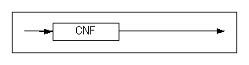

#### COST

If this hint is specified, the optimizer creates an execution plan with the lowest cost.


#### DELAY 

These hints activate a function which delays execution of hierarchy, sorting, windowing, grouping, set, and distinction based upon execution plan graphs regardless of properties in queries so that the execution can be carried out in fetch.


#### DISTINCT_HASH

This hint speicifies HASH for DISTINT.


#### DISTINCT_SORT

This hint specifies SORT for DISTINCT.


#### DNF

This hint specifies that predicates in the WHERE clause are to be normalized in the disjunctive normal form. 


#### EXEC_FAST 

If this hint is specified when EXECUTOR_FAST_SIMPLE_QUERY property is deactivated, simple statements, such as SELECT, INSERT, UPDATE, or DELETE statement are executed with SIMPLE
QUERY. If SIPLE QUERY is applied, it will be output on the execution plan.


#### FIRST_ROWS

If this hint is specified, the optimizer creates an execution plan that most efficiently returns the first n rows of a table. 


#### FULL SCAN

This hint specifies that the full table scan will be performed for the specified table.


#### GROUP BUCKET COUNT

This hint specifies the number of hash buckets for the GROUP-AGGREGATION and AGGREGATION execution nodes. 


#### GROUP_HASH

This hint specifies HASH for GROUP BY.


#### GROUP_SORT

This hint specifies SORT for GROUP BY.


#### HASH_AJ

If this hint is specified, a nested subquery uses a hash join to perform an anti-join. You need to specify this hint within the subquery. If the subquery cannot be unnested with an anti-join, this hint becomes invalid. 


#### HASH BUCKET COUNT

This hint specifies the number of hash buckets for the HASH and DISTINCT execution nodes. 


#### HASH_SJ

If this hint is specified, a nested subquery uses a hash join to perform a semi-join. You need to specify this hint within the subquery. If the subquery cannot be unnested with a semi-join, this hint becomes invalid.


#### HIGH_PRECISION

This is a hint used for preventing errors in the four fundamental arithmetic operations and mod operation. 

When this hint is used, the float type is used as the data type. When operating with a float type, computational performance may be lower than that of a real or double data type. But, the precision of up to 38 digits and mod oepration is guaranteed. 


#### INDEX

This hint specifies an index scan. 


#### INDEX ASC

This hint specifies an index scan in ascending order.


#### INDEX_ASC

This hint performs the same action equivalent to the INDEX ASC hint.


#### INDEX DESC

This hint specifies an index scan in descending order. 


#### INDEX_DESC

This hint performs the same action equivalent to the INDEX DESC hint.


#### INVERSE_JOIN

If this hint is specified, a nested subquery uses an inverse join[^1] to perform either an anti-join or a semi-join. You need to specify this hint within the subquery. 

[^1]: 1An inverse join can be either an inverse index nested loop join, an inverse hash join, or an inverse sort join. For more detailed information about inverse joins, please refer to the *Performance Tuning Guide*.

This hint can be used with other hints that force semi-joins or anti-joins. For example, this hint forces an inverse hash join if it is used with the HASH_SJ hint.


#### KEEP_PLAN

If this hint is specified, the optimizer uses an exisiting execution plan (instead of recreating it) whenever the statistics for a table that is referenced by the plan changes. This hint can be used to prepare/execute and direct/execute a query. 


#### LEADING

This hint firstly joins the tables that are used in a hint.


#### MERGE_AJ

If this hint is specified, a nested subquery uses a merge join to perform an anti-join. You need to specify this hint within the subquery. If the subquery cannot be unnested with an anti-join, this hint becomes invalid.


#### MERGE_SJ

If this hint is specified, a nested subquery uses a merge join to perform a semi-join. Users need to specify this hint within the subquery. If the subquery cannot be unnested with a semi-join, this hint becomes invalid. 


#### NL_AJ

If this hint is specified, a nested subquery uses a nested loop join to perform an anti-join. Users need to specify this hint within the subquery. If the subquery cannot be unnested with an anti-join, this hint becomes invalid. 


#### NL_SJ

If this hint is specified, a nested subquery uses a nested loop join to perform a semi-join. Users need to specify this hint within the subquery. If the subquery cannot be unnested with a semi-join, this hint becomes invalid. 


#### NO DELAY 

This hint deactivates aforementioned delaying function . Delaying execution of hierarchy, sorting, windowing, grouping, set, and distinction based upon execution plan graphs is not activated


#### NO_EXEC_FAST 

Even though SELECT, INSERT, UPDATE, DELETE statements are simple statements, they are not executed with SIMPLE QUERY if this hint is specified when EXECUTOR_FAST_SIMPLE_QUERY property is deactivated.


#### NO_EXPAND

This hint performs the same action equivalent to the CNF hint.

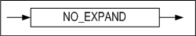

#### NO INDEX

This hint specifies not to perform an index scan. 

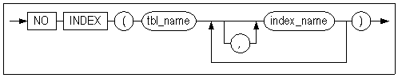

#### NO_INDEX

This hint performs the same action equivalent to the NO INDEX hint.


#### NO_INVERSE_JOIN

If this hint is specified, a nested subquery uses a one-pass hash join or a two-pass hash join to perform either an anti-join or a semi-join. Users need to specify this hint within the subquery. 

This hint can be used with other hints that force semi-joins or anti-joins. For example, this hint forces a one-pass hash join or a two-pass hash join if it is used with the HASH_SJ hint.

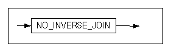

#### NO_MERGE

메인 쿼리와 인라인 뷰 쿼리를 하나의 쿼리로 병합하지 않도록 지시하는 힌트이다.


#### NO_PARALLEL

This hint performs the same action equivalent to the NOPARALLEL hint.


#### NO_PLAN_CACHE

This hint specifies that the plan cache is not to store plans. 


#### NO_PUSH_SELECT_VIEW

This hint specifies that a WHERE predicate outside a view is not to be pushed inside the view.


#### NO_SERIAL_FILTER

If a hint is specified while the SERIAL_EXECUTE_MODE property is enabled, it will not operate in Serial Excute Mode.

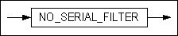

#### NO_TRANSITIVE_PRED

조건절 이행을 배제하는 힌트이다. 조건절 이행에 대해서는 "Performance Tuning
Guide \> 3장 쿼리 옵티마이저 \> 쿼리 변환 > 조건절 이행"을 참고한다. This hint specifies that predicate transitivity is not to be allowed. For more detailed information about predicate transitivity, please refer to the *Performance Tuning Guide* in Chapter 3: Query Optimizer.


#### NO_UNNEST

This hint specifies not to unnest a subquery. 


#### NO_USE_HASH

This hint selects a join method from among the hints excluding the HASH hint. 


#### NO_USE_MERGE

This hint selects a join method from among the hints excluding the MERGE hint.


#### NO_USE_NL

This hint selects a join method from among the hints excluding the NL hint.


#### NO_USE_SORT

This hint selects a join method from among the hints excluding the SORT hint.


#### PARALLEL

This hint specifies to execute queries in parallel when scanning partitioned tables. 

- NOPARALLEL: Does not execute in parallel
- PARALLEL integer: Executes as many threads in parallel as specified for integer


#### PLAN_CACHE_KEEP

This is used to instruct the plan to exclude it from the victim selection process and keep it in the plan cache. This hint is applied during the hardprepare process. So when users switch the plan to unkeep, the soft prepare will not go back tothe keep state.

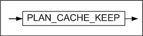

#### ORDERED

This hint specifies to follow the join order in the FROM clause. 


#### PUSH_PRED

This hint specifies that a WHERE predicate outside a view is to be pushed inside the view.


#### PUSH_SELECT_VIEW

This hint specifies that a WHERE predicate outside a view is to be pushed inside the view.


#### RESULT_CACHE

If this hint is specified, the intermediate results of the firstly query can be stored so that the results can be re-usable when the same query is executed. 


#### RULE

If this hint is specified, the optimizer creates a rule-based execution plan.


#### SET BUCKET COUNT

It is a hint to specify the number of hash buckets for SET-INTERECT and SET-DIFFERENCE execution nodes.

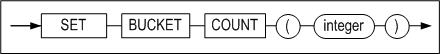

#### SERIAL_FILTER

If the hint is specifeid while the SERIAL_EXCUTE_MODE property is disabled, it operates in Serial Excute mode.

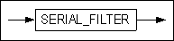

#### SORT_AJ

If this hint is specified, a nested subquery uses a sort join to perform an anti-join. You need to specify this hint within the subquery. If the subquery cannot be unnested with an anti-join, this hint becomes invalid. 


#### SORT_SJ

If this hint is specified, a nested subquery uses a sort join to perform a semi-join. You need to specify this hint within the subquery. If the subquery cannot be unnested with a semi-join, this hint becomes invalid. 

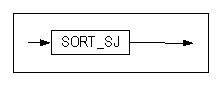

#### TEMP_TBS_DISK

This hint specifies that all intermediate query results are to be stored on disk temporary space.

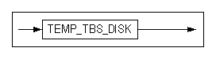

#### TEMP_TBS_MEMORY

This hint specifies that all intermediate query results are to be stored in memory temporary space.


#### TOP_RESULT_CACHE

This hints specifies the top result cache that the final results is cached. 


#### UNNEST

This hint specifies that a subquery is to be unnested.


#### USE_ANTI

This hint specifies that a left outer join and an anti outer join are to be performed on the table in the FULL OUTER JOIN query and to concatenate the results. This hint is only available if both of the joined columns have indexes. For more detailed information, please refer to the ANTI-OUTER-JOIN node. 


#### USE_CONCAT

This hint performs the same action equivalent to the DNF hint.


#### USE_FULL_NL

This hint specifies that a full nested loop join is to be used. 


#### USE_FULL_STORE_NL

This hint specifies that a full store nested loop join is to be used. 


#### USE_HASH

This hint specifies that a hash join is to be used. If there is no join predicate, a nested loop join is used. 


#### USE_INDEX_NL

This hint specifies that an index nested loop join is to be used. 


#### USE_INVERSE_HASH

This hint specifies that an inverse hash join is to be used. 


#### USE_MERGE

This hint specifies that a sort merge join is to be used. If there is no sort predicate, a nested loop join is used. 

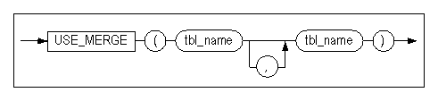

#### USE_NL

This hint specifies that a nested loop join is to be used. 


#### USE_ONE_PASS_HASH

This hint specifies that a one-pass hash join is to be used. 


#### USE_ONE_PASS_SORT

This hint specifies that a one-pass sort join is to be used. 


#### USE_SORT

This hint specifies that a sort join is to be used. If there is no sort predicate, a nested loop join is used. 


#### USE_TWO_PASS_HASH

This hint specifies that a two-pass hash join is to be used. 


#### USE_TWO_PASS_SORT

This hint specifies that a two-pass sort join is to be used. 


## 3. Data Definition Language

This chapter describes Data Definition Language (DDL), which are SQL statements used to create database objects.

### ALTER DATABASE 

#### Syntax

**alter_database :: =**


**startup_clause ::=**

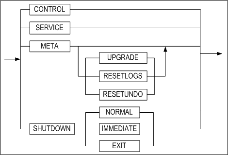

**rename_datafile_clause ::=**


**create_datafile_clause ::=**


**create_checkpoint_image_clause ::=**


**session_clause ::=**

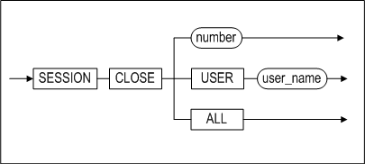

**archivelog_option ::=**


**backup_clause ::=**


**incremental_backup_clause ::=**


**incremental_level_clause ::=**


**with_tag_clause ::=**


**recover_clause ::=**

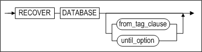

**from_tag_clause ::=**

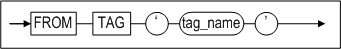

**until_option ::=**


**restore_clause ::=**


**restore_database_clause ::=**


**restore_tablespace_clause ::=**


**change_backup_directory_clause ::=**


**move_backup_clause ::=**


**delete_backup_clause ::=**


**change_tracking_clause ::=**


**snapshot_clause ::=**


#### Prerequisites

The ALTER DATABASE statement can only be executed in a startup phase preceding the SERVICE phase by the SYS user after connecting in SYSDBA mode. The exception is when using the SESSION CLOSE option, in which case it is not necessary to connect in SYSDBA mode in order to execute this statement.

#### Description

The ALTER DATABASE statement modifies, maintains, or restores an existing database.

*database_name*

This element is used to specify the name of the database to be managed.

*startup_clauses*

This element is used to specify the name of the startup phase in which to start up Altibase. 

*CONTROL*

This option is used to start the database in the CONTROL phase. When the database is started in this phase, database media recovery can be performed. Tablespaces can also be discarded in this phase. For more detailed information about the various Altibase startup phases, please refer to the *Administrator’s Manual.* 

To proceed to the phase immediately following the CONTROL phase, the META phase, execute this statement as follows:

```
ALTER DATABASE dababase_name META;
```

*META*

This option is used to start the database in the META phase. While proceeding to this phase from the previous phase, the CONTROL phase, the database meta data are loaded. To proceed to the next phase, execute the following statement:

```
ALTER DATABASE dababase_name SERVICE;
```

*SERVICE*

This option is used to start the database in the SERVICE phase. When the database is started in this phase, all memory and disk tables are loaded, and extended services such as replication and SNMP can be started. If the database can be successfully started in this phase, it means that any required recovery has been performed, and that the system is in a state in which service is being provided normally.

*UPGRADE*

This option is used to start the database in the META UPGRADE phase. When the database is started up to this phase, the meta data are upgraded, meaning that all recovery-related tasks have been completed. 

To proceed to the next phase, execute the following statement:

```
ALTER DATABASE dababase_name SERVICE;
```

RESETLOGS

This task is required to ensure normal startup of the server after incomplete recovery has been performed in the CONTROL phase. Logs that are no longer necessary once incomplete recovery has been performed are deleted while proceeding to this phase. 

To proceed to the next phase, execute the following statement:

```
ALTER DATABASE dababase_name SERVICE;
```

*META RESETUNDO*

In this phase, the SYS_TBS_DISK_UNDO tablespace is initialized, but the size of the tablespace file is not changed. Before executing this statement, check the integrity of the database, ensure that disk garbage collection has been performed, and shut down the database normally

*SHUTDOWN NORMAL*

The server waits until all client connections have been disconnected normally before shutting down normally.

*SHUTDOWN IMMEDIATE*

The server forcibly disconnects all clients and then shuts down normally.

*SHUTDOWN EXIT*

This option is used to kill the Altibase server forcibly. When Altibase is shut down in this way, the contents of the database will likely be invalid, and thus the next time the server is executed, recovery tasks will have to be performed.

*RENAME DATAFILE*

This command is used to change a reference to a data file within Altibase so that it points to a data file that has a different name or is located in a different directory. The data file specified in TO 'datafile_path' must exist. This command can only be executed in the CONTROL phase. datafile_path must be an absolute path. 

For reference, the ALTER TABLESPACE statement is used to move memory tablespace checkpoint image files.

*CREATE DATAFILE*

When a disk data file has been lost, this command is used to create a data file with reference to the log anchor data. After this statement is executed, complete media recovery is performed to restore the data file. 

This statement is available only during the CONTROL phase.

datafile_path, which is where the data file will be created, must be an absolute path. For reference, the ALTER TABLESPACE statement is used to create memory tablespace checkpoint image files.

*CREATE CHECKPOINT IMAGE*

When a memory checkpoint image file has been lost, this command is used to create a checkpoint image file with reference to the log anchor data. After this statement is executed, complete media recovery can be performed in order to restore the memory checkpoint image file.

Because the checkpoint image file is created in the checkpoint path specified for memory tablespaces, it is not necessary to specify the path; only the name of the file to be created need be provided.

This statement is available only during the CONTROL phase.

<Query\> Recreate the lost checkpoint image file MEM-TBS-1.

```
iSQL\> ALTER DATABASE CREATE CHECKPOINT IMAGE 'MEM-TBS-1';
```

*SESSION CLOSE*

This statement is used to forcibly terminate a session.

This statement can specify the session ID and user to terminate a session, and all sessions can be terminated with ALL statement. However, the session accessed by the current user cannot be terminated. If this statement is executed, a transaction of the session is rolled back.

> Note: It is impossible to terminate a session immediately if the session is waiting to obtain a lock.
>

*archivelog_option*

The database can be switched between archivelog mode and noarchivelog mode in the CONTROL phase.

*BACKUP LOGANCHOR*

When the database is operating in archivelog mode, this statement is used to back up log anchor files online without interrupting service.

*BACKUP TABLESPACE*

When the database is operating in archivelog mode, this statement is used to back up the specified tablespace to the backup directory without interrupting service.

*BACKUP DATABASE*

When the database is operating in archivelog mode, this statement is used to back up all memory and disk tablespaces and log anchor files without interrupting service.

*incremental_backup_clause*

This incrementally backs up the whole database or certain tablespaces.

*incremental_level_clause*

This specifies the incremental backup level.

*WITH TAG tag_name*

This specifies a tag name for a backup.

*RECOVER DATABASE*

This is used to perform complete media recovery. The log files in the archive log directory are read for use in recovering the data files that were affected by media errors to the current point in time.

*FROM TAG tag_name*

This specifies a database restoration or recovery from the backup with the tag name tag_name.

*RECOVER DATABASE UNTIL TIME*

This is used to perform incomplete media recovery to a specified point in time. The log files in the archive log directory are read for use in recovering the data files that were affected by media errors to the specified point in time.

*RECOVER DATABASE UNTIL CANCEL*

This is used to perform incomplete media recovery to the most recent point in time at which the logs in archive log files are valid. The log files in the archive log directory are read for use in recovering the data files that were affected by media errors to that point in time.

*restore_database_clause*

This performs a complete media restoration on a database, or an incomplete restoration to a specific point in time or a specific tag name.

*restore_tablespace_clause*

This performs a complete restoration on a tablespace.

*change_backup_directory_clause*

This specifies the location of backup files generated by incremental backups.

*move_backup_clause [WITH CONTENTS]*

This changes the incremental backup directory. If the WITH CONTENTS option is specified, previous backup files are transferred to the new directory. 

*delete_backup_clause*

This deletes incremental backup files which have expired.

change_tracking_clause

This enables or disables page change tracking for incremental backups.

*snapshot_clauses*

This option configures SNAPSHOT SCN on the basis of the time when BEGIN SNAPSHOT is executed, and exports data with iLoader based upon the configured SCN.

#### Examples

<Query\> Start up a database called mydb to provide normal service.

```
iSQL> ALTER DATABASE mydb SERVICE;
```

\<Query\> Switch the database to archievelog mode.

```
iSQL> ALTER DATABASE ARCHIVELOG;
```

\<Query\> Start up the database normally after the incomplete recovery.

```
iSQL> ALTER DATABASE mydb META RESETLOGS;
```

\<Query\> Initialize the SYS_TBS_DISK_UNDO tablespace.

```
iSQL> ALTER DATABASE mydb META RESETUNDO;
```

\<Query\> Back up the SYS_TBS_DISK_DATA tablespace to the /altibase backup directory.

```
iSQL> ALTER DATABASE TABLESPACE SYS_TBS_DISK_DATA TO ‘/altibase_backup/’;
```

\<Query\> Restore the database to Feb. 16, 2009, 12:00 PM from a previous backup.

```
iSQL> ALTER DATABASE RECOVER DATABASE UNTIL TIME ‘2008-02-16:12:00:00’;
```

\<질의\> Restore the database from a previous backup to reflect the entire contents of the log file #20000, which immediately precedes the log file #20001, which was lost.

```
iSQL> ALTER DATABASE RECOVER DATABASE UNTIL CANCEL;
```


### ALTER DATABASE LINKER 

For information on Database Link, please refer to the *Database Link User's Manual.*

### ALTER INDEX

#### Syntax

**alter_index ::=**


**directkey_mod_clause ::=**


**rebuild_clause ::=**


**index_attribute ::=**


**alter_index_properties::=**

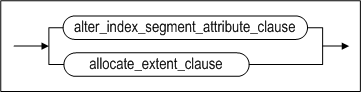

**alter_index_segment_attribute_clause::=**


**storage_clause::=**


**allocate_extent_clause::=**


#### Prerequisites

The SYS user, the owner of the schema containing the index, and users having the ALTER ANY INDEX system privilege can execute the ALTER INDEX statement.

#### Description

The ALTER INDEX statement is used to change or rebuild an existing index.

*user_name*

This specifies the name of the owner of the index to be altered.

If omitted, Altibase will assum that the index belongs to the schema of the user connected via the current session.

*index_name*

This specifies the name of the index to be altered.

*directkey_mod_clause*

This specifies whether to use a direct key index or not. For more detailed information about direct key indexes, please refer to [CREATE INDEX](#create-index).

- MAXSIZE integer  
  This sets the maximum size of a direct index.
- OFF  
  This changes a direct key index to a normal index.

*rebuild_clause*

This rebuilds an existing index or one of its partitions.

*index_attribute*

This specifies the tablespace in which the rebuilt index partition will be stored.

*RENAME*

This specifies the name of index to be changed.

*AGING*

This records a transaction commit SCN in an index page and deletes old versions of nodes. This statement is only available for disk-based indexes.

*REORGANIZATION*

The ALTER INDEX clause reorganizes the index space through integration of leaf nodes in memory B-tree index and neighboring nodes. 

The REORGANIZATION clause ensures high efficiency of index space especially when it is used in a case the index range is relatively greater than that of the data, or there is an occurrence of index fragmentation on particular indexes. The memory based B-tree indexes are available for use.

*alter_index_segment_attribute_clause*

- INITRANS Clause  
  This changes the initial number of Touched Transaction Slots (TTS).
- MAXTRANS Clause  
  This changes the maximum number of Touched Transaction Slots (TTS). 

*storage_clause*

Sets parameters for managing extents in segments. 

- INITEXTENTS Clause  
  This ignores the INITEXTENTS parameter in the ALTER INDEX statement.
- NEXTEXTENTS Clause  
  This determines the number of extents that are added to the segment every time the segment is increased in size. 
- MINEXTENTS Clause  
  This Sets the minimum number of extents in a segment.
- MAXEXTENTS Clause  
  This sets the maximum number of extents in a segment.

*allocate_extent_clause*

This explicitly allocates extents to the index segment. Set SIZE to the total size of extents that are to be added to the index segment. If the disk tablespace consists of several data files, extents are distributed equally between them,

#### Examples

##### Changing the Direct Key Index

\<Query\> Rebuild the index partition IDX_P5 in the tablespace TBS1

```
iSQL> ALTER INDEX idx1 DIRECTKEY;
```

\<Query\> Change the direct key index idx1 to a normal index.

```
iSQL> ALTER INDEX idx1 DIRECTKEY OFF;
```

<Query\> Change the index idx3 to a direct key index and set the maximum 

```
iSQL> ALTER INDEX idx3 DIRECTKEY MAXSIZE 10;
```


##### Rebuilding the Index Partition

<Query\> Rebuild the index partition idx_p5 in tablespace tbs1.

```
iSQL> ALTER INDEX IDX1 REBUILD PARTITION idx_p5 TABLESPACE tbs1;
```


##### Changing the Index Name

<Query\> Change the name of emp_idx1 to emp_idx2.

```
iSQL> ALTER INDEX emp_idx1 RENAME TO emp_idx2;
```


##### Allocating Extents to Indexes

\<Query\> Allocate extents totaling 10MB in size to the index LOCAL_IDX, which is located in a disk tablespace.

```
iSQL> ALTER INDEX felt_idx ALLOCATE EXTENT ( SIZE 10M );
```


##### Reorganization Indexes

<Query\> Execute reorganization of index idx1.

```
iSQL> ALTER INDEX idx1 REORGANIZATION;
```


### ALTER JOB 

#### Syntax

**alter_job ::=**


**execute_procedure_statement ::=**


#### Prerequisites

Only the SYS user can change the JOB with this statement. In order to perform the created JOB, it should be activated with ENABLE when creating or after creating the JOB.

#### Description

The definition of the JOB created with the CREATE JOB statement can be changed. The execution statement of the procedure registered for the JOB, the start time and end time of the JOB, the execution interval of the job and etc. can be changed with this statement.

*job_name*

This specifies the name of the JOB to be changed.

*START*

This specifies the time at which the JOB is to start.

*END*

This specifies the time at which the JOB is to end.

*expr1*

This accepts only a DATA type value or a DATE type expression.

*INTERVAL number*

This specifies the interval after which the JOB is to run again, after it has run for the first time. The unit of time is determined by the YEAR, MONTH, DAY, HOUR, MINUTE which is specified after the number.

*expr2*

This specifies the input argument value necessary for the execution of the defined procedure as a constant or an expression.

*ENABLE/DISABLE*

This is used to modify whether to execute each join in the job scheduler.

*COMMENT*

This allows users to modify the job description

#### Examples

\<Query\> Change job1 to the enabled state.

```
iSQL> ALTER JOB job2 SET ENABLE;
Alter success.
```

\<Query\> Change job2 to the disabled state.

```
iSQL> ALTER JOB job2 SET DISABLE;
Alter success.
```

\<Query\> Change the start time of job1 to ‘January 1st, 2013’. 

```
iSQL> ALTER JOB job1 SET START to_date('20130101','YYYYMMDD');
Alter success.
```

\<Query\> Change the procedure to execute in job2 to the proc1 procedure in usr1.

```
iSQL> alter job job2 set exec usr1.proc1;
Alter success.
```

\<Query\>Change the start time of job2 to 'June 3rd, 2013'.

```
iSQL> alter job job2 set start to_date('2013/06/03 10:00:00','YYYY/MM/DD HH24:MI:SS');
Alter success.
```

\<Query\> Change the end time of job2 to 'June 7th, 2013 10:00:00'.

```
iSQL> alter job job2 set end to_date('2013/06/07 10:00:00', 'YYYY/MM/DD HH24:MI:SS');
Alter success.
```

\<질의\> Change the interval after which job2 is to run to 10 minutes.

```
iSQL> alter job job2 set interval 10 minute;
Alter success.
```


### ALTER QUEUE 

#### Syntax

**alter_queue ::=**


#### Description

ALTER QUEUE alters the definition of a queue.

*COMPACT*

This returns empty pages to the tablespace in which the queue is located. No data is actually moved.

*MSGID RESET*

This resets the queue's MSGID

### ALTER REPLICATION 

#### Syntax

**alter_replication ::=**

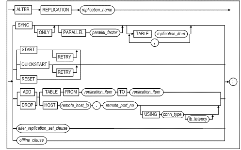


**replication_item ::=**


**alter_replication_set_clause ::=**


**offline_clause ::=**


#### Prerequisites

Only the SYS user can execute replication-related statements.

#### Description

ALTER REPLICATION controls the operation of a replication object that has been created with the CREATE REPLICATION statement. 

For more information about control statements such as replication termination, please refer to "Data Control Statements" > alter_replication_dcl.

For more information about replication, please refer to the Replication Manual. 

*replication_name*

Thi specifies the name of the replication object.

*SYNC*

Thi sends all data in replication target tables on the local server to the corresponding tables on the remote server and starts replication.

*SYNC ONLY*

This send all data in replication target tables on the local server to the corresponding tables on the remote server. It does not initiate a replication sender thread.

*PARALLEL parallel_factor*

The parallel_factor option does not need to be specified; on omission, the default value is 1. The maximum value of parallel_factor is (the number of CPUs * 2). This value cannot be exceeded, even if a higher maximum value is specified. If 0 (zero) or a negative value is specified, an error is returned.

*TABLE replication_item*

This specifies which of the replication tables or partitions on the local server to synchronize using the SYNC parameter. If this clause is specified, replication starts from the point in time up to which replication was last performed after the specified tables have been synchronized. If the TABLE clause is omitted, replication starts from the current position in the logs after all of the replication tables and partitions have been synchronized.

*START*

Replication starts from the point in time up to which replication was last performed.

*QUICKSTART*

Replication starts from the current point in time.

*START/ QUICKSTART RETRY*

When STARTing or QUICKSTARTing replication using the RETRY option, even if handshaking fails, a sender thread is created on the local server. When handshaking between the local server and the remote server subsequently succeeds, replication starts. 

When this option is used, iSQL will report handshaking success even if the first handshake attempt fails. Therefore, the user has to check the result of this command by viewing trace logs or performance views. 

When starting replication without the RETRY option, if the first handshaking attempt fails, an error is raised and execution stops. Note that the use of the RETRY option is not supported in EAGER mode.

*STOP*

Please refer to the ALTER REPLICATION caluse of the Data Control Statement.

*RESET*

This resets replication information (such as the restart SN). It can only be executed while replication is stopped. It is an alternative to executing the DROP REPLICATION and CREATE REPLICATION commands.

*ADD TABLE*

This is used to add a table to a replication object. A table can be added to a replication object only when replication is stopped.

*TABLE FROM replication_item TO replication_item*

This is used to specify the name of the replication target table or partition, together with the name of the table owner.

DROP TABLE

This is used to remove a table from a replication object. A table can be removed from a replication object only when replication is stopped.

*FLUSH*

Please refer to the ALTER REPLICATION clause of the Datat Control Statement.

*SET HOST*

This sets a particular host as the current one. It can be changed while replication is stopped.

*alter_replication_set_clause*

This clause allows the user to enable or disable the following options for replication in LAZY mode. 

- RECOVERY: Enables or disables data recovery. 
- GAPLESS: Enables or disables replication gap dissolution. 
- GROUPING: Enables or disables replication transaction grouping. 
- PARALLEL: Enables or disables parallel appliers. Also sets the number of parallel appliers.

*offline_cluase*

This clause allows the user to change the offline option or perform replication with a specified offline path.

#### Considerations

There are several points that users working with replication must keep in mind before using replication. Before executing an ALTER REPLICATION command, please refer to the *Replication Manual.*

#### Example

##### Start execution of the repl1 replication object 

\<Query\> Send the data on the local server data to the remote server, and start replication

```
iSQL> ALTER REPLICATION rep1 SYNC;
Alter success.
```

\<Query\> Start the rep1 replication from the time point at which replication was most recently executed:

```
iSQL> ALTER REPLICATION rep1 START;
Alter success.
```

\<Query\> Start the replication

```
iSQL> ALTER REPLICATION rep1 QUICKSTART;
Alter success.
```


##### Remove the replication target table employees from a replication object named rep1. 

```
iSQL> ALTER REPLICATION rep1 STOP;
Alter success.
iSQL> ALTER REPLICATION rep1 DROP TABLE FROM sys.employees TO sys.employees;
Alter success.
```


##### Add partition p2 of the partitioned table tbl_sales to the replication object of the name rep1.

```
iSQL> ALTER REPLICATION rep1 STOP;
Alter success.
iSQL> ALTER REPLICATION rep1 ADD TABLE
 FROM sys.tbl_sales PARTITION p2 TO sys.tbl_sales PARTITION p2;
Alter success.
```


##### Add the table employees to the replication object rep1. 

```
iSQL> ALTER REPLICATION rep1 STOP;
Alter success.
iSQL> ALTER REPLICATION rep1 ADD TABLE FROM sys.employees TO sys.employees;
Alter success.
```


### ALTER SEQUENCE 

#### Syntax

**alter_sequence ::=**


**sequence_options ::=**


**sync_table_clause ::=**


#### Prerequisites 

Only the SYS user, the owner of the schema to which the sequence belongs, users having the ALTER object privilege on the sequence, and users having the ALTER ANY SEQUENCE system privilege can execute this statement.

#### Description

After a sequence has been created using the CREATE SEQUENCE statement, this statement is used to change the definition of the sequence. For more detailed information, please refer to the description of the CREATE SEQUENCE statement.

*user_name*

This is used to specify the name of the owner of the sequence to be changed. If omitted, Altibase will assume that the sequence belongs to the schema of the user connected via the current session. 

*seq_name*

This is used to specify the name of the sequence to be altered.

*INCREMENT BY*

This is used to specify the interval between sequence numbers.

*MAXVALUE*

This is used to specify the maximum value that the sequence can generate.

*MINVALUE*

This is used to specify the minimum value of the sequence.

*CYCLE*

This is used to allow a sequence to continue to output values after it reaches the limit specified by MAXVALUE or MINVALUE. In the case of an ascending sequence, the minimum value will be output once its maximum value has been reached, whereas the opposite is true for a descending sequence: once it reaches its minimum value, it outputs its maximum value.

*CACHE*

This is used to specify the number of sequence values that are cached in memory so that they can be accessed more quickly. The first time the sequence is referred to, the cache is populated, and whenever values are subsequently requested from the sequence, they are retrieved from the cached values. After the last sequence value in the cache has been used, the next request for a key value from the sequence causes new sequence values to be created and cached in memory. The number of sequence values that are created and cached at this time is set using the CREATE SEQUENCE statement. If this option is omitted, the default value is 20.

*FLUSH CACHE*

This flushes the sequence values cached in memory. If the value of a sequence is requested after flushing the cache using this option, new sequence values are cached in memory.

*ENABLE SYNC TABLE*

This creates a custom table for sequence replication for the purpose of replicating sequence numbers. The custom table for sequence replication is automatically granted the name, "[sequence name]$seq".

*DISABLE SYNC TABLE*

This drops the custom table for sequence replication used for the purpose of replicating a sequence.

#### Restriction

When changing the definition of an existing sequence, the START WITH clause cannot be used, because the sequence has already been created.

 A custom table for sequence replication can be created only if the length of the sequence name is equal to or smaller than 36 bytes. 

For detailed more information about sequences, please refer to the description of the CREATE SEQUENCE statement.

#### Examples

\<Query\> Change the sequence seq1 so that the minimum value is 0, the maximum value is 100, and increments by 1.

```
iSQL> ALTER SEQUENCE seq1
    INCREMENT BY 1
    MINVALUE 0
    MAXVALUE 100;
Alter success.             
```

\<Query\> Change the minimum and maximum values of sequence seq2 to unlimited.

```
iSQL> ALTER SEQUENCE seq2
    NOMAXVALUE 
    NOMINVALUE;
Alter success.
```

\<Query\> Flush the sequence values cached in the sequence seq1.

```
iSQL> ALTER SEQUENCE seq1 FLUSH CACHE;
Alter success.
```

\<Query\> Create a custom table for sequence replication for the purpose of replicating the sequence seq1.

```
iSQL> ALTER SEQUENCE seq1 ENABLE SYNC TABLE;
```


### ALTER TABLE 

#### Syntax

**alter_table::=**


**log_compression_clause ::=**


**alter_table_properties::=**


**alter_table_tablespace::=**


**table_move_index_clause::=**


**table_lob_column_clause::=**


**logging_clause::=**


**parallel_clause::=**


**row_movement_clause::=**


**alter_table_segment_properties::=**


**alter_table_segment_attribute_clause::=**


**storage_clause::=**


**alter_table_partitioning::=**


**add_table_partition ::=**


**alter_partition ::=**


**partition_index_clause ::=**


**partition_lob_column_clause ::=**


**coalesce_table_partition ::=**


**drop_table_partition ::=**


**merge_table_partition ::=**


**rename_table_partition ::=**


**split_table_partition ::=**


**truncate_table_partition ::=**

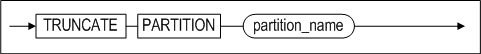

**partition_spec ::=**


**table_partition_description ::=**


**index_partition_spec ::=**


**index_partition_description ::=**


**partition_access_mode ::=**


**access_mode_clause ::=**

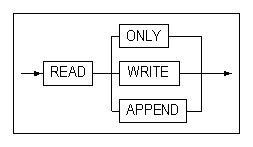

**column_clauses::=**


**add_column_clauses::=**


<a name="column_definition"><a/>

**column_definition::=**


**partition_lob_storage_clause ::=**


**alter_column_clause ::=**


**modify_column_clause::=**

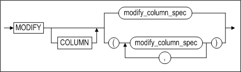

**modify_column_spec::=**

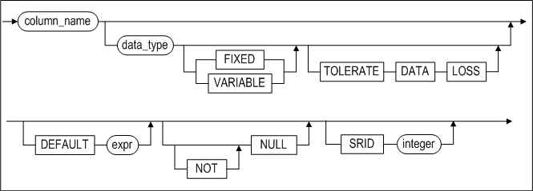

**drop_column_clause::=**


**rename_column_clause::=**


**reorganize_column_clause::=**

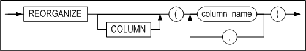

**constraints_clauses::=**


**add_table_constraint_clauses ::=**


**table_constraint_for_alter::=**


**constraint_state::=**


**modify_constraint_clause::=**


**rename_constraint_clauses ::=**


**drop_constraint_clause::=**


**aging_clause::=**


**compact_clause::=**


**allocate_extent_clause::=**

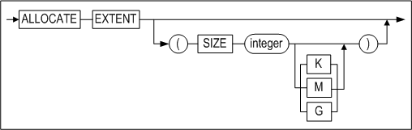

#### Prerequisites 

Only the SYS user, the owner of the schema to which the table belongs, users having the ALTER object privilege for the table, and users having the ALTER ANY TABLE system privilege can alter table definitions.

#### Description

The ALTER TABLE statement is a SQL statement which modifies the definition of a specified table. Execution of this statement alters the meta information of the table. 

The ALTER TABLE statement can modify the attributes of partitioned tables. The clauses related to partitioned tables are the ALTER, ADD, COALESCE, DROP, MERGE, RENAME, SPLIT and TRUNCATE clauses. 

The following table shows whether each statement can be used with range-, list- and hash-partitioned tables.

|          | Range-Partitioned Tables | List-Partitioned Tables | Hash-Partitioned Tables |
| -------- | ------------------------ | ----------------------- | ----------------------- |
| ALTER    | ○                        | ○                       | ○                       |
| ADD      | X                        | X                       | ○                       |
| COALESCE | X                        | X                       | ○                       |
| DROP     | ○                        | ○                       | X                       |
| MERGE    | ○                        | ○                       | X                       |
| RENAME   | ○                        | ○                       | ○                       |
| SLIP     | ○                        | ○                       | X                       |
| TRUNCATE | ○                        | ○                       | ○                       |

[Table 3-1] Operations Supported for Use with Different Partitioning Methods

*user_name*

This is used to specify the name of the owner of the table to be altered. If omitted, Altibase will assume that the table belongs to the schema of the user connected via the current session.

*tbl_name*

This is used to specify the name of the table to alter.

*parallel_clause*

Please refer to the parallel clause description of CREATE TABLE.

*alter_table_segment_attribute_clause*

- PCTFREE Clause  
  This is used to change the percentage of free space that is reserved for future use when updating records that have already been saved in pages. 
  
  An ALTER TABLE statement containing the alter_table_segment_attribute_clause, which is used to change segment attributes, can be executed while Altibase is running. However, the changes will not be immediately applied in all of the pages in the segment; rather, each table page will be changed individually the next time the page is accessed
  
- PCTUSED Clause  
  This is used to change the threshold below which the amount of used space in a page must decrease in order for the page to return to the state in which records can be inserted.
  
- INITRANS Clause  
  This is used to change the initial number of TTS (Touched Transaction Slots). 
  
- MAXTRANS Clause  
  This is used to change the maximum number of TTS (Touched Transaction Slots).

*storage_clause*

This is used to set parameters for managing extents in segments.

- INITEXTENTS Clause  
  The INITEXTENTS parameter in the ALTER TABLE statement is ignored.
- NEXTEXTENTS Clause  
  This determines the number of extents that are added to the segment every time the segment is increased in size
- MINEXTENTS Clause  
  This sets the minimum number of extents in a segment. 
- MAXEXTENTS Clause  
  This sets the maximum number of extents in a segment.

*add_table_partition*

This clause can add a partition into a partitioned table and it can be also used in hash-partitioned tables. The local indexes are automatically created in added partitions as well if the local indexes are already created in the existing partitions. At this point, names are automatically determined by the system, and the indexes are stored into tablespace where the newly added partitions located.

*partition_spec*

This is used to specify the name of the partition and the tablespace in which the partition will be stored. The name of the tablespace can be omitted. If it is omitted, the data pertaining the partition are stored in the tablespace in which the table is located. Furthermore, if an index has been defined for the table, the tablespace in which the index partition is stored can be specified.

*alter_partition*

This clause modifies the tablespace of partitions. It transfers not only the partition records which will be moved, but also transfers the local indexes and LOB columns that are created in the partitions. 

However, the index can be transferred to the tablespace of an equivalent storage medium, and the LOB column can be transferred only to a different tablespace when a partition is moved to the disk tablespace.

*partition_index_clause*

This clause specifies the tablespace in which the local index of partition will be located when modifying the tablespace of partition.

*partition_lob_column_clause*

This clause specifies the tablespace in which LOB column of partition will be located when modifying the tablespace of partition.

*table_partition_description*

This is used to specify the tablespace in which each partition is stored and the attributes of LOB columns, if any. 

If the tablespace clause is omitted, the data are stored in the default tablespace for the table. In the same way, if the tablespace statement for a LOB column is omitted, the LOB column data are stored in the tablespace in which the partition is stored. 

For more detailed information on using tablespaces, please refer to the explanation of table_partition_description in CREATE TABLE.

*index_partition_spec*

When the ALTER TABLE statement is executed with the SPLIT PARTITION, MERGE PARTITION or ADD PARTITION clause, a new partition is created. At this time, this clause can be used to specify the tablespace in which to store the index partition that is created along with the table partition.

*coalesce_table_partition*

This can only be used with hash partitions. It is used to coalesce hash partitions and reorganize the data. When partitions are coalesced, the last partition is chosen, its contents are distributed among the remaining partitions, and it is dropped.

*drop_table_partition*

This is used to remove a partition. The data in the partition are deleted, together with any local indexes. In order to avoid deleting the data, MERGE the partition with another partition before executing DROP on it.

*merge_table_partition*

This is used to merge two partitions into one. Use the INTO clause to specify the name of the new partition. The name can be the same as the name of one of the two partitions being merged, or can be a new name not belonging to any existing table partitions.

When merging range partitions, the partitions are merged into the partition having the higher upper limit. 

When merging list partitions, the partitions are merged into a partition having the union of the key values of the two partitions. 

When a partition is merged with the default partition, the domain of the default partition is increased to encompass the domain of the merged partition, and only the default partition remains. 

If any local indexes have been defined for the table, the local indexes of the merged partitions are deleted. If the table contains a LOB column, its attributes can be specified separately. 

If no tablespace is specified, the new partition is stored in the default tablespace for the table, even if the original partition having the same name as the name of the newly created partition was stored in another tablespace.

*rename_table_partition*

This is used to rename a partition.

*split_table_partition*

This is used to split a partition into two partitions.

The AT clause can only be used with range partitions. It is used to specify a partition key value, on the basis of which a partition is split into two. This value must be larger than the partition key value for the partition immediately preceding it, and smaller than the partition key value for the partition before it was split.

The VALUES clause can only be used with list partitions. It is used to specify a list of values to separate from the list of values for the existing partition. The values specified using the VALUES clause must be present in the list of values for the existing partition; however, not all of the values for the existing partition can be specified in the VALUES list.

The INTO clause is used to specify the names and tablespaces for the two partitions resulting from the SPLIT operation.

If any local indexes have been defined for the table, the local index partition is also split, along with the data partition.

If the table contains a LOB column, the attributes for the LOB column can be set separately.

*truncate_table_partition*

This is used to delete all of the data in a partition.

*partition_access_mode*

This switches the data access mode for the partition to Read-Only, Read/Write or Read/Append mode.

*add_column_clause*

This is used to add a new column to the table.

*partition lob storage_clause*

When a LOB column is added to a partitioned table, this clause is used to set the tablespace in which each of the LOB column partitions is stored. 

*alter_column_clause*

These clauses are used to change the default value for an existing column.

*modify_column_clause*

This is used to change the data type of an existing column. 

SRIC can be used an integer within the 4-byte range. If the SRID value is changed, only the value that matches the value entered in the table is selected.

The following table shows which data types can be changed into which data types.

△ means that the data type change might result in the loss of non-NULL data. To acknowledge the possibility of data loss and proceed with the data type change anyway, use the TOLERATE DATA LOSS option. When changing data into date type data, Altibase does so according to the DEFAULT_DATE_FORMAT property.

- ###### Prerequisites when changing data types

  - Character data type --> Numeric data type  
    Character data should consist only of numbers and decimal points  
    Character data must be within the rage of numeric data types.
  - Character data type --> Character data type  
    The column size must be greater than or equal to the length of the data type before the change
  - Numeric data type --\> Character data type  
    The column size must be greater than or equal to the length of the data type before the change
  - Numeric data type --\> Numeric data type 
    The data must be within the range of the numeric data type users want to change.
  - Character data type --> Data date type  
    The data before the change should stored as a date  
    The data format must match the DEFAULT_DATE_FORMAT property.
  - Date data type --> Character data type 
    When converted to the character type, it is changed to DEFAULT_DATE_FORMAT

| After Modification /  Before Modifaciton | char | var char | nchar | nvarchar | clob | big int | dou ble | float | int eger | num ber | num eric | real | small int | date | blob | byte | nibble | bit  | varbit | geometry |
| ---------------------------------------- | ---- | -------- | ----- | -------- | ---- | ------- | ------- | ----- | -------- | ------- | -------- | ---- | --------- | ---- | ---- | ---- | ------ | ---- | ------ | -------- |
| char                                     | o    | o        | o     | o        |      | △       | △       | △     | △        | △       | △        | △    | △         | △    |      |      |        |      |        |          |
| varchar                                  | o    | o        | o     | o        |      | △       | △       | △     | △        | △       | △        | △    | △         | △    |      |      |        |      |        |          |
| nchar                                    | o    | o        | o     | o        |      | △       | △       | △     | △        | △       | △        | △    | △         | △    |      |      |        |      |        |          |
| nvarchar                                 | o    | o        | o     | o        |      | △       | △       | △     | △        | △       | △        | △    | △         | △    |      |      |        |      |        |          |
| clob                                     |      |          |       |          |      |         |         |       |          |         |          |      |           |      |      |      |        |      |        |          |
| bigint                                   | o    | o        | o     | o        |      | o       | △       | △     | o        | △       | △        | △    | o         |      |      |      |        |      |        |          |
| double                                   | o    | o        | o     | o        |      | △       | o       | △     | △        | △       | △        | △    | △         |      |      |      |        |      |        |          |
| float                                    | o    | o        | o     | o        |      | △       | △       | △     | △        | △       | △        | △    | △         |      |      |      |        |      |        |          |
| integer                                  | o    | o        | o     | o        |      | o       | △       | △     | o        | △       | △        | △    | o         |      |      |      |        |      |        |          |
| number                                   | o    | o        | o     | o        |      | △       | △       | △     | △        | △       | △        | △    | △         |      |      |      |        |      |        |          |
| numeric                                  | o    | o        | o     | o        |      | △       | △       | △     | △        | △       | △        | △    | △         |      |      |      |        |      |        |          |
| real                                     | o    | o        | o     | o        |      | △       | △       | △     | △        | △       | △        | o    | △         |      |      |      |        |      |        |          |
| smallint                                 | o    | o        | o     | o        |      | o       | △       | △     | o        | △       | △        | △    | o         |      |      |      |        |      |        |          |
| date                                     | △    | △        | △     | △        |      |         |         |       |          |         |          |      |           | o    |      |      |        |      |        |          |
| blob                                     |      |          |       |          |      |         |         |       |          |         |          |      |           |      |      |      |        |      |        |          |
| byte                                     |      |          |       |          |      |         |         |       |          |         |          |      |           |      |      | o    |        |      |        |          |
| nibble                                   |      |          |       |          |      |         |         |       |          |         |          |      |           |      |      |      | o      |      |        |          |
| bit                                      |      |          |       |          |      |         |         |       |          |         |          |      |           |      |      |      |        | o    | o      |          |
| varbit                                   |      | o        |       |          |      |         |         |       |          |         |          |      |           |      |      |      |        | o    | o      |          |
| geometry                                 |      |          |       |          |      |         |         |       |          |         |          |      |           |      |      |      |        |      |        | o        |

O: If the data type change condition is satisfied, the data type of the existing column can be changed without specifying the TOLERATE DATA LOSS option  
△: The data type of existing column can be changed only when the data type change condition is satisfied and the TOLERATE DATA LOSS option is specified. 

*drop_column_clause*

This is used to delete one or more columns.

*rename_column_clause*

This is used to rename a column.

*reorganize_column_clause*

This specifies the column which is to reorganize data of the dictionary table in which data of the column is actually stored.

*column_definition*

- DEFAULT  
  When a new column is added, if the DEFAULT option is not specified, the value for each row in the new column will be NULL. However, if the DEFAULT option is specified, when the column is added to a table containing existing rows, it will be populated with the DEFAULT value.
- TIMESTAMP  
  This is used to add a timestamp column.

*column_constraint*

Specifies constraints for the column.

- NULL/NOT NULL  
  This specifies whether NULL values are allowed in the column. If NULL values are to be disallowed for a column, then the column can be added using the ALTER TABLE command only if a default value is also specified. In other words, in order to add a new column to a table, the column must either allow NULL values or have a default value specified.
- CHECK *condition*  
  This specifies an integrity rule that applies to the target column. Only the target column can be referenced within the condition of the column_constraint clause.
- USING INDEX TABLESPACE *tablespace_name*  
  This specifies the tablespace in which to store the index for the constraint.

> Many of the clauses in the ALTER TABLE statement have the same function as those in the CREATE TABLE statement. For more information about those clauses, please also refer to CREATE TABLE.


*constraints_clauses*

This clause is used to add a constraint to a table, delete an existing constraint, or change the name of an existing constraint.

- add_table_constraints_clause  
  This clause is used to add a constraint to a table.
- rename_table_constraints_clause  
  This clause is used to change the name of an existing constraint.
- drop_table_constraints_clause  
  This clause is used to delete an existing constraint. 
  - DROP CONSTRAINT  
    This is used to remove a constraint.
  - DROP PRIMARY KEY  
    This is used to remove the primary key from the table.
  - DROP UNIQUE  
    This is used to drop a UNIQUE constraint from one or more columns.
  - DROP LOCALUNIQUE

*RENAME TO*

This is used to change the name of the table.

*MAXROWS*

This is used to change the maximum number of records that the table can contain, which was set when the table was created. For more information, please refer to CREATE TABLE.

*ENABLE/DISABLE*

This clause is used to activate or deactivate all of the indexes in the table specified using tbl_name. The performance of the server can be improved by minimizing the time taken to build indexes, either when the database is started[^2]or while the database is providing service. 

For example, when using iLoader to load large amounts of data into a database (or relocate them to a new table), if many indexes exist in the table in which the data are to be saved, it will  take a lot of time[^3] to load the data due to the operations that must be performed on the indexes. In such cases, disabling indexes and then enabling them again after inserting a large amount of records can minimize the time required to build indexes, leading to improved performance.

[^2]: To maximize performance when the system is restarted, a command specifying that indexes are built using parallel processing can be used.

[^3]: The time required to build an index for a table that contains a large amount of data is proportional to the number of indexes that have been defined for the table. Although it is not possible to build multiple indexes for the same table simultaneously, the index building time can be minimized by building them one by one using parallel processing. 


*aging_clause*

This is used to physically eliminate previous versions of records that have already been logically deleted from the table. It can be executed by specifying a partition.

*compact_clause*

This is used to retrieve empty pages in which the queue is located. Even if when executing compression, Altibase does not actually transfer the data. This statement is only used and supported in the memory tables and volatile tables

*allocate_extent_clause*

This is used to explicitly allocate extents to table segments. The SIZE attribute determines the total size of extents to be allocated to the table segment. If the size specified here is not an exact multiple of the size of one extent, then the number of extents that are allocated is rounded up. If the disk tablespace consists of several data files, the extents are distributed among them equally.

ACCESS *access_mode_clause*

This switches the data access mode for the table to Read-Only, Read/Write or Read/Append mode.

*alter_table_tablespace*

This clause can modify the tablespace of a table, and transfer indexes and LOB columns created in the existing tables. At this time, depending on whether the table is partitioned, record movement and column attribute changes can be performed implicitly.

- ###### If case of non-partitioned table: 

  - Move records in the table.
  - When changing a tablespace from a disk tablespace to memory or volatile, VARIABLE-enabled columns are chaged to VARIABLE columns. 
  - When changing a table space from disk to disk in a memory or volatile tablespace, all columns are chaged to FIXED
  
- ###### In case of partitioned table: 

  - Only the tablespace of the partitioned table are changed. At this time, the tablespace of the partition is not changed, and the records of the partition are not moved.
  - To change the table space of a partition, see the alter_partition section.


*table_move_index_clause*

The tablespace that can store the relevant table index can be specified when modifying tablespace.

However, it can be transferred into the tablespace identical to the table type (memory, volatile, and disk).

*table_lob_column_clause*

The LOB columns the relevant table can specify the tablespace to store.

However, the tablespace stroing the LOB columns can specify different disk tablespace only in the case of transferring to the partitioned tablespace.

*TOUCH*

This clause intentionally manipulates the optimizer by increasing the SCN(System Commit Number) so that the optimizer can recognize that a table has been modified. Then, the query execution plan including a table is re-created.

#### Precautions

- The definition of a table that has been designated as a replication target table cannot be altered. This means that it is impossible to change the data type of a column in a replication target table because changing the data type would mean altering the table definition.
- If the table has only one partition, COALESCE/DROP TABLE PARTITION cannot be used.

- The DROP PARTITION and MERGE PARTITION clauses cannot be used with hash-partitioned tables. Instead, the COALESCE PARTITION clause should be used. Moreover, the SPLIT PARTITION clause cannot be used with hash-partitioned tables.
  
- For range-partitioned tables, the partitions to merge must be adjacent to each other.

- If the table contains a primary key or unique key, called the referenced key, that is referenced by any foreign key constraints in other tables, the definition of the table cannot be changed.
  
- Columns cannot be added to or removed from a table such that the total number of columns in the table is reduced to 0 (zero) or increased beyond 1024, which is the maximum allowable number of columns in a table. If a table contains one or more columns with the VARIABLE option, the maximum allowable number of columns in the table might be less than 1024, depending on the value specified in IN ROW SIZE clause.
  
- A table can have only one primary key defined for it.

- For a foreign key constraint, the foreign key and the unique or primary key being referred to in another table must have the same number of columns, and respective columns must have the same data type.
  
- The data type of a column that is the basis of a foreign key constraint cannot be changed. This is not permitted, either for foreign keys or for unique or primary keys that are referred to by foreign keys in other tables, because data values might be changed when the data type is changed.
  
- The maximum number of indexes that can be created in one table is 64. The maximum number of primary keys and unique keys combined that can exist in one table is 64.
  
- The record of each partition is not transferred when modifying to the tablespace of partitioned table.
  
- Modifying from memory or volatile tablespace to disk tablespace changes all the LOB columns to be FIXED.

#### Constraints 

- A timestamp constraint cannot be added to or removed from an existing column using the ADD/DROP CONSTRAINT clause.
- When an INSERT or UPDATE statement is executed on a table containing a column with the TIMESTAMP constraint, the system time is inserted into that column by default. Therefore, the DEFAULT value cannot be changed or dropped using the ALTER TABLE SET/DROP DEFAULT statement. For more information, please refer to the description of the CREATE TABLE statement.
- When the SRID of a GEOMETRY column is changed, values that match the values entered in the table can only be selected. For example, if a value with a SRID of 100, 101, or 102 is entered in a table, it cannot be cahnged to any value.

#### Example

##### Adding and Dropping Columns

\<query\>  Add the column shown below to the table book

```
isbn: CHAR(10) PRIMARY KEY
edition: INTEGER DEFAULT 1

iSQL> ALTER TABLE books
    ADD COLUMN (isbn CHAR(10) PRIMARY KEY,
    edition INTEGER DEFAULT 1);
Alter success.
```

Or

```
iSQL> ALTER TABLE books
    ADD COLUMN (isbn CHAR(10) CONSTRAINT const1
PRIMARY KEY, edition INTEGER DEFAULT 1);
Alter success.
```

\<Query\> Drop the isbn column from the table books.

```
iSQL> ALTER TABLE books
    DROP COLUMN isbn;
Alter success.
```

\<Query\> Add a TIMESTAMP colum to the table books

```
iSQL> ALTER TABLE books
ADD COLUMN (due_date TIMESTAMP);
Alter success.
```

\<Query\> Drop the isbn and due_date columns from the table books, due_date.

```
iSQL> ALTER TABLE books
     DROP COLUMN (isbn, due_date);
Alter success.
```


##### Adding and Dropping Constraints for Existing Columns

\<Query\> Add the UNIQUE constraint to the existing bno (book number) column in the table books.

```
iSQL> ALTER TABLE books
    ADD UNIQUE(bno);
Alter success.
```

Or

```
iSQL> ALTER TABLE books
    ADD CONSTRAINT const1 UNIQUE(bno);
Alter success
```

\<Query\> Change the name of the constraint const1 in the table books.

```
iSQL> ALTER TABLE books
    RENAME CONSTRAINT const1 TO const_unique;
Alter success
```

\<Query\> Drop the UNIQUE constraint from the bno column in the table books.

```
iSQL> ALTER TABLE books
    DROP UNIQUE(bno);
Alter success.
```

Or

```
iSQL> ALTER TABLE books
    DROP CONSTRAINT const_unique;
Alter success
```

\<Query\> While adding a column to the table inventory, place the FOREIGN KEY constraint fk_isbn, which refers to the isbn column in the table books, on the new column.

```
isbn: CHAR(10) 
iSQL> ALTER TABLE inventory
    ADD COLUMN(isbn CHAR(10) CONSTRAINT fk_isbn REFERENCES books(isbn));
Alter success.
```

\<Query\> Drop the constraint fk_isbn from the table inventory.

```
iSQL> ALTER TABLE inventory
  DROP CONSTRAINT fk_isbn;
Alter success.
```

\<Query\>  Drop the primary key constraint from the table books.

```
iSQL> ALTER TABLE books
    DROP PRIMARY KEY;
Alter success.
```

\<Query\> Add a primary key constraint to the existing bno (book number) column in the table books, and ensure that the index can be used even if a system or media fault occurs (LOGGING).

```
iSQL> ALTER TABLE books
    ADD PRIMARY KEY (bno) USING INDEX PARALLEL 4;
Alter success.
```

Or

```
iSQL> ALTER TABLE books
    ADD PRIMARY KEY (bno) USING INDEX LOGGING
 PARALLEL 4;
Alter success.
```

\<Query\> Add a primary key constraint to the existing bno (book number) column in the table books. Create an index using the NOLOGGING option. Use the FORCE option so that the index is available even if the server dies.

```
iSQL> ALTER TABLE books
    ADD PRIMARY KEY (bno) USING INDEX NOLOGGING  PARALLEL 4;
Alter success.
```

Or

```
iSQL> ALTER TABLE books
    ADD PRIMARY KEY (bno) USING INDEX NOLOGGING FORCE PARALLEL 4;
Alter success.
```

\<Query\> Add a primary key constraint to the existing bno (book number) column in the table books. Create an index using the NOLOGGING option. Use the NOFORCE option to prevent the index from being written to disk.

```
iSQL> ALTER TABLE books
    ADD PRIMARY KEY (bno) USING INDEX NOLOGGING NOFORCE PARALLEL 4;
Alter success.
```

\<Query\>  Add the CHECK constraint that values for column bno(book number) must be between 1 and 1000000 for the table books.

```
iSQL> ALTER TABLE books ADD CHECK ( bno >= 1 AND bno <= 1000000 );
Alter success.
```


##### Specifying Tablespaces for Individual Index Partitions

\<Query\> Add the i2 column, having the LOCALUNIQUE constraints, to the partitioned table T1.

```
iSQL> ALTER TABLE T1 ADD COLUMN 
(I2 INTEGER LOCALUNIQUE USING INDEX LOCAL
(
  PARTITION P1_LOCALUNIQUE ON P1 TABLESPACE TBS3,
  PARTITION P2_LOCALUNIQUE ON P2 TABLESPACE TBS2,
  PARTITION P3_LOCALUNIQUE ON P3 TABLESPACE TBS1
)
);
```

\<Query\> Add column i7 with the LOCALUNIQUE constraint to the partitioned table t3; however, specify the tablespace where each partition of the partitioned index to be created is to be stored.

```
iSQL> ALTER TABLE t3
ADD COLUMN ( i7 INTEGER LOCALUNIQUE USING INDEX LOCAL
(
  PARTITION p1_localunique ON p1 TABLESPACE PMT_TBS,
  PARTITION p2_localunique ON p2 TABLESPACE PMT_TBS,
  PARTITION p3_localunique ON p3 TABLESPACE PMT_TBS2,
  PARTITION p4_localunique ON p4 TABLESPACE PMT_TBS3,
  PARTITION pd_localunique ON pd TABLESPACE PMT_TBS4
)
);
Alter success.
```


##### Renaming Columns

This is used to change the name of one of the columns in a table. The new column name must not be the same as the name of any of the other columns in the table. When a column is renamed, the new column inherits all of the indexes and constraints that were originally defined for the column.

After renaming a column, any stored procedures that reference the column by its previous name become invalid. In order to be able to use such a stored procedure again, it will be necessary to rewrite the name of the column in the stored procedure.

\<Query\> Change the name of a column in the table departments from dno to dcode.

```
iSQL> ALTER TABLE departments
  RENAME COLUMN dno TO dcode;
Alter success.
```


##### Setting/Dropping Default Values

\<Query\> Set the default value for the gender (SEX column) in the table employees to "M".

```
iSQL> ALTER TABLE employees
  ALTER (sex SET DEFAULT 'M');
Alter success.
```

\<Query\> Change the gender (SEX) column in the table employees so that it has no default value.

```
iSQL> ALTER TABLE employees
  ALTER (sex DROP DEFAULT);
Alter success.
```


##### Change Column Data Type

\<Query\> Set the data type of the isbn column in the books table to CHAR(20) and that of the edition column to BIGINT.

```
iSQL> ALTER TABLE books MODIFY COLUMN (isbn CHAR(20), edition BIGINT);
Alter success.
```

\<Query\> Change the data type of the isbn column in the table books from CHAR(20) to BIGINT and the edition column to FLOAT.

```
iSQL> ALTER TABLE books MODIFY COLUMN (isbn BIGINT TOLERATE DATA LOSS, edition FLOAT TOLERATE DATA LOSS);
Alter success.
```

\<Query\> Change the data type of column i1 in the t1 table from CHAR(20) to DATE type.

```
iSQL> CREATE TABLE t1 (i1 CHAR(20));
insert into t1 values (sysdate);
Create success.

ALTER TABLE t1 MODIFY COLUMN (i1 DATE TOLERATE DATA LOSS);
Alter success.
```

\<Query\> Change the data type of column c4 in table t from CHAR (14) to DATE type.

```
iSQL> ALTER TABLE t ADD COLUMN (c4 CHAR(14));
Alter success.

iSQL> INSERT INTO t(c4) VALUES('20161123112119');
1 row inserted.

iSQL>ALTER SESSION SET DEFAULT_DATE_FORMAT = 'YYYYMMDDHHMISS';
Alter success.

iSQL> ALTER TABLE t MODIFY COLUMN (c4 DATE TOLERATE DATA LOSS);
Alter success.

```


##### Changing Table Names

\<Query\> Change the name of the table from books to ebooks.

```
iSQL> RENAME books TO ebooks;
Rename success.
```

Or

```
iSQL> ALTER TABLE books
RENAME TO ebooks;
Alter success.
```


##### Changing the Maximum Number of Rows for Tables

\<Query\>  Set the maximum number of records for the table departments to 6000000.

```
iSQL> ALTER TABLE departments MAXROWS 6000000;
Alter success.
```


##### Activating and Deactivating Indexes

\<Query\>  Disable all indexes in the table orders.

```
iSQL> ALTER TABLE orders ALL INDEX DISABLE;
Alter success.
```


##### Creating Partitioned Tables

\<Query\>  Create range-, list-, and hash-partitioned tables.

```
CREATE TABLE T1 
( 
	I1 INTEGER, 
	I2 INTEGER 
)    
PARTITION BY RANGE(I1)
( 
	PARTITION P1 VALUES LESS THAN (100),
	PARTITION P2 VALUES LESS THAN (200),
	PARTITION P3 VALUES DEFAULT 
) TABLESPACE SYS_TBS_DISK_DATA;

 CREATE TABLE T2 
( 
	I1 INTEGER, 
	I2 INTEGER 
)
PARTITION BY LIST (I1)
( 
	PARTITION P1 VALUES (1,2,3,4),
	PARTITION P2 VALUES (5,6,7,8),
	PARTITION P3 VALUES DEFAULT 
) TABLESPACE SYS_TBS_DISK_DATA;

 CREATE TABLE T3 
( 
	I1 INTEGER 
)   
PARTITION BY HASH (I1)
( 
	PARTITION P1, 
	PARTITION P2 
) TABLESPACE SYS_TBS_DISK_DATA;

CREATE TABLE T4
(
	I1 INTEGER,
	I2 INTEGER
)
PARTITION BY RANGE(I1)
(
	PARTITION P1 VALUES LESS THAN (100),
	PARTITION P2 VALUES DEFAULT
);

CREATE TABLE T5
(
	I1 INTEGER,
	I2 INTEGER
)
PARTITION BY LIST (I1)
(
	PARTITION P1 VALUES DEFAULT
);

CREATE TABLE T6
(
	I1 INTEGER
)
PARTITION BY HASH (I1)
(
	PARTITION P1
);
```


##### Adding Partitions

\<Query\>  Add a new partition to a hash-partitioned table

```
ALTER TABLE T3 ADD PARTITION P3;
```


##### Coalescing Partitions 

\<Query\>  Coalesce the partitions in the hash-partitioned table T3 so that only two hash partitions remain.

```
ALTER TABLE T3 COALESCE PARTITION;
```


##### Dropping Partitions

\<Query\> Delete partition P2 from table T1

```
ALTER TABLE T1 DROP PARTITION P2;
```


##### Merging Partitions

\<Query\> Merge the remaining partitions P1 and P3 in table T1 to form a new partition named P_1_3.

```
ALTER TABLE T1 MERGE PARTITIONS P1, P3 INTO PARTITION P_1_3;
```


##### Renaming Partitions

\<Query\> Change the name of a partition from P1 to P1_LIST.

```
ALTER TABLE T2 RENAME PARTITION P1 TO P1_LIST;
```


##### Splitting Partitions

\<Query\> Split the default partition P3 in the range-partitioned table T1 on the basis of the value 350. This will create a partition named P_200_350, which holds values from 200 - 350, and change the name of the default partition to P_OVER_350.

```
ALTER TABLE T1 SPLIT PARTITION P3
AT ( 350 ) INTO ( PARTITION P_200_350, PARTITION P_OVER_350 );
```

\<Query\> Use a VALUES clause instead of an AT clause to split a list-partitioned table.

```
ALTER TABLE T2 
SPLIT PARTITION P1_LIST VALUES ( 2, 4 ) 
INTO 
( 
	PARTITION P_2_4 TABLESPACE TBS1, 
	PARTITION P_1_3 TABLESPACE TBS2 
);
```


##### Truncating Partitions

\<Query\> Delete all data in partition P5

```
ALTER TABLE T1 TRUNCATE PARTITION P5;
```


##### Creating Partitioned Table Indexes

```
CREATE INDEX T4_IDX ON T4 ( I1 )
LOCAL
(
	PARTITION T4_P1_IDX ON P1,
	PARTITION T4_P2_IDX ON P2
);

CREATE INDEX T5_IDX ON T5 ( I1 )
LOCAL
(
	PARTITION T5_P1_IDX ON P1
);

CREATE INDEX T6_IDX ON T6 ( I1 )
LOCAL
(
	PARTITION T6_P1_IDX ON P1
);
```


##### Specifying Index Partition Names

\<Query\> When adding a new partition to the has partitioned table, specify the indexes partition name.

```
ALTER TABLE T6 ADD PARTITION P2 INDEX ( T6_IDX PARTITION T6_P2_IDX );
```

\<Query\> Merge the partitions P1 and P2 remaining in table T4 into P1 and specify the index partition name.

```
ALTER TABLE T4 MERGE PARTITIONS P1, P2 INTO PARTITION P1 INDEX ( T4_IDX
PARTITION T4_P1_IDX );


```

\<Query\> In the range partitioned table T4, the primary partition P1 is separated based on 100. Since P1 is in-place detached, an index partition name cannot be specified.

```
ALTER TABLE T4 SPLIT PARTITION P1 AT ( 100 ) INTO
(
  PARTITION P1,
  PARTITION P2 INDEX ( T4_IDX PARTITION T4_P2_IDX )
);
```

\<Query\> In the case of list-partitioned tables, use VALUES instead of AT to separate them. Since P1 is in-place detached, an index partition name cannot be specified. 

```
ALTER TABLE T5 SPLIT PARTITION P1 VALUES ( 2, 4 ) INTO
(
  PARTITION P1,
  PARTITION P2 INDEX ( T5_IDX PARTITION T5_P2_IDX )
);
```


##### Using row_movement_clause

<Query\> Table T1 must be a partitioned table. If it is a non-partitioned table, an error will occur. ALTER TABLE T1 ENABLE ROW MOVEMENT;

```
ALTER TABLE T1 ENABLE ROW MOVEMENT;
```


##### Allocating Extents to Tables

<Query\> Table T1 must be a partitioned table. If it is a non-partitioned table, an error will occur. ALTER TABLE T1 ENABLE ROW MOVEMENT;

```
iSQL> ALTER TABLE LOCAL_TBL ALLOCATE EXTENT ( SIZE 10M );
Alter success.
```


##### Modifying of Tablespace of a Table

<Query\> Create non-partitioned table and change it to a different tablespace of a different storage.

```
iSQL> CREATE MEMORY TABLESPACE mem_tbs_0 SIZE 32M AUTOEXTEND ON;
Create success.
iSQL> CREATE VOLATILE TABLESPACE vol_tbs_0 SIZE 32M AUTOEXTEND ON;
Create success.
iSQL> CREATE TABLE sales_table
 (
 sales_date DATE,
 sales_id NUMBER,
 sales_city VARCHAR(20)
 )
 TABLESPACE SYS_TBS_DISK_DATA UNCOMPRESSED LOGGING;
Create success.
iSQL> -- Disk -> Memory
iSQL> ALTER TABLE sales_table ALTER TABLESPACE SYS_TBS_MEM_DATA;
Alter success.
iSQL> -- Memory -> Memory
iSQL> ALTER TABLE sales_table ALTER TABLESPACE mem_tbs_0;
Alter success.
iSQL> -- Memory -> Volatile
iSQL> ALTER TABLE sales_table ALTER TABLESPACE vol_tbs_0;
Alter success.
iSQL> -- Volatile -> Disk
iSQL> ALTER TABLE sales_table ALTER TABLESPACE SYS_TBS_DISK_DATA;
Alter success.
iSQL> -- Disk -> Volatile
iSQL> ALTER TABLE sales_table ALTER TABLESPACE vol_tbs_0;
Alter success.
iSQL> -- Volatile -> Memory
iSQL> ALTER TABLE sales_table ALTER TABLESPACE mem_tbs_0;
Alter success.
iSQL> -- Memory -> Disk
iSQL> ALTER TABLE sales_table ALTER TABLESPACE SYS_TBS_DISK_DATA;
Alter success.
```

\<Query\> Create a partitioned table and change it to a different tablespace storage. 

```
iSQL> CREATE TABLE part_table
  (
  sales_date DATE,
  sales_id NUMBER,
  sales_city VARCHAR(20)
  )
  PARTITION BY LIST(sales_city)
  (
  PARTITION part_1 VALUES ( 'SEOUL' , 'INCHEON' ),
  PARTITION part_2 VALUES ( 'PUSAN' , 'JUNJU' ),
  PARTITION part_3 VALUES ( 'CHUNGJU' , 'DAEJUN' ),
  PARTITION part_def VALUES DEFAULT
  )
  TABLESPACE SYS_TBS_DISK_DATA UNCOMPRESSED LOGGING; 
Create success.

iSQL> -- Disk -> Memory
iSQL> ALTER TABLE part_table ALTER TABLESPACE SYS_TBS_MEM_DATA;
Alter success.

iSQL> -- Memory -> Memory
iSQL> ALTER TABLE part_table ALTER TABLESPACE mem_tbs_0;
Alter success.

iSQL> -- Memory -> Volatile
iSQL> ALTER TABLE part_table ALTER TABLESPACE vol_tbs_0;
Alter success.

iSQL> -- Volatile -> Disk
iSQL> ALTER TABLE part_table ALTER TABLESPACE SYS_TBS_DISK_DATA;
Alter success.

iSQL> -- Disk -> Volatile
iSQL> ALTER TABLE part_table ALTER TABLESPACE vol_tbs_0;
Alter success.

iSQL> -- Volatile -> Memory
iSQL> ALTER TABLE part_table ALTER TABLESPACE mem_tbs_0;
Alter success.

iSQL> -- Memory -> Disk
iSQL> ALTER TABLE part_table ALTER TABLESPACE SYS_TBS_DISK_DATA;
Alter success.
```


<Query\> Change the partitioned table to another tablespace, and chance the tablespace to store the indexes of the partitioned table.

```
iSQL> CREATE DISK TABLESPACE disk_tbs_0 DATAFILE '/tmp/tbs.user.0';
Create success.
iSQL> CREATE DISK TABLESPACE disk_tbs_1 DATAFILE '/tmp/tbs.user.1';
Create success.
iSQL> CREATE MEMORY TABLESPACE mem_tbs_0 SIZE 32M AUTOEXTEND ON;
Create success.
iSQL> CREATE MEMORY TABLESPACE mem_tbs_1 SIZE 32M AUTOEXTEND ON;
Create success.
iSQL> CREATE VOLATILE TABLESPACE vol_tbs_0 SIZE 32M AUTOEXTEND ON;
Create success.
iSQL> CREATE VOLATILE TABLESPACE vol_tbs_1 SIZE 32M AUTOEXTEND ON;
Create success.
iSQL> CREATE TABLE text_table
     (
     id NUMBER,
     date DATE,
     text VARCHAR(500)
     )
     PARTITION BY RANGE ( id )
     (
     PARTITION part_1 VALUES LESS THAN ( 100 ),
     PARTITION part_2 VALUES LESS THAN ( 200 ),
     PARTITION part_def VALUES DEFAULT
     )
     TABLESPACE disk_tbs_0 UNCOMPRESSED LOGGING;
Create success.

iSQL> CREATE INDEX text_table_idx on text_table ( date ) LOCAL;
Create success.

iSQL> -- Disk -> Memory
iSQL> ALTER TABLE text_table ALTER TABLESPACE mem_tbs_0 INDEX ( text_table_idx TABLESPACE mem_tbs_1 );
Alter success.

iSQL> -- Memory -> Volatile
iSQL> ALTER TABLE text_table ALTER TABLESPACE vol_tbs_0 INDEX ( text_table_idx TABLESPACE vol_tbs_1 );
Alter success.

iSQL> -- Volatile -> Disk
iSQL> ALTER TABLE text_table ALTER TABLESPACE disk_tbs_0 INDEX ( text_table_idx TABLESPACE disk_tbs_1 );
Alter success.

iSQL> -- Disk -> Volatile
iSQL> ALTER TABLE text_table ALTER TABLESPACE vol_tbs_1 INDEX ( text_table_idx TABLESPACE vol_tbs_0 );
Alter success.

iSQL> -- Volatile -> Memory
iSQL> ALTER TABLE text_table ALTER TABLESPACE mem_tbs_1 INDEX ( text_table_idx TABLESPACE mem_tbs_0 );
Alter success.

iSQL> -- Memory -> Disk
iSQL> ALTER TABLE text_table ALTER TABLESPACE disk_tbs_1 INDEX ( text_table_idx TABLESPACE disk_tbs_0 );
Alter success.
```

\<Query\> Change memory partitioned tables to disk tablespaces, and Lob columns to disk tablespaces.

```
iSQL> CREATE TABLE clob_table
     (
     id NUMBER,
     date DATE,
     text CLOB
     )
     PARTITION BY RANGE ( id )
     (
     PARTITION part_1 VALUES LESS THAN ( 100 ),
     PARTITION part_2 VALUES LESS THAN ( 200 ),
     PARTITION part_def VALUES DEFAULT
     )
     TABLESPACE mem_tbs_0 UNCOMPRESSED LOGGING;
Create success.

iSQL> -- Memory -> Disk
iSQL> ALTER TABLE clob_table ALTER TABLESPACE disk_tbs_0 LOB ( text TABLESPACE disk_tbs_1 );
Alter success.
```

\<Query\> Create a partitioned table and move the partition to a tablespace, which is another storage medium.

```
iSQL> CREATE TABLE data_table
     (
     id NUMBER,
     date DATE,
     data VARCHAR(500)
     )
     PARTITION BY RANGE ( id )
     (
     PARTITION part_1 VALUES LESS THAN ( 100 ),
     PARTITION part_2 VALUES LESS THAN ( 200 ),
     PARTITION part_def VALUES DEFAULT
     )
     TABLESPACE disk_tbs_0 UNCOMPRESSED LOGGING;
Create success.

iSQL> -- Disk -> Memory
iSQL> ALTER TABLE data_table ALTER PARTITION part_1 TABLESPACE mem_tbs_0;
Alter success.

iSQL> -- Memory -> Volatile
iSQL> ALTER TABLE data_table ALTER PARTITION part_1 TABLESPACE vol_tbs_0;
Alter success.

iSQL> -- Volatile -> Disk
iSQL> ALTER TABLE data_table ALTER PARTITION part_1 TABLESPACE disk_tbs_0;
Alter success.

iSQL> -- Disk -> Volatile
iSQL> ALTER TABLE data_table ALTER PARTITION part_1 TABLESPACE vol_tbs_1;
Alter success.

iSQL> -- Volatile -> Memory
iSQL> ALTER TABLE data_table ALTER PARTITION part_1 TABLESPACE mem_tbs_1;
Alter success.

iSQL> -- Memory -> Disk
iSQL> ALTER TABLE data_table ALTER PARTITION part_1 TABLESPACE disk_tbs_1;
Alter success.
```

\<Query\> Create a partitioned table and move the partitions to a tablespace on another storage medium, and move the index to another tablespace.

```
iSQL> CREATE TABLE data_table
     (
     id NUMBER,
     date DATE,
     data VARCHAR(500)
     )
     PARTITION BY RANGE ( id )
     (
     PARTITION part_1 VALUES LESS THAN ( 100 ),
     PARTITION part_2 VALUES LESS THAN ( 200 ),
     PARTITION part_def VALUES DEFAULT
     )
     TABLESPACE disk_tbs_0 UNCOMPRESSED LOGGING;
Create success.

iSQL> CREATE INDEX data_table_idx on data_table ( date ) LOCAL;
Create success.

iSQL> -- Disk -> Memory
iSQL> ALTER TABLE data_table ALTER PARTITION part_1 TABLESPACE mem_tbs_0 INDEX ( data_table_idx TABLESPACE mem_tbs_1 );
Alter success.

iSQL> -- Memory -> Volatile
iSQL> ALTER TABLE data_table ALTER PARTITION part_1 TABLESPACE vol_tbs_0 INDEX ( data_table_idx TABLESPACE vol_tbs_1 );
Alter success.

iSQL> -- Volatile -> Disk
iSQL> ALTER TABLE data_table ALTER PARTITION part_1 TABLESPACE disk_tbs_0 INDEX ( data_table_idx TABLESPACE disk_tbs_1 );
Alter success.

iSQL> -- Disk -> Volatile
iSQL> ALTER TABLE data_table ALTER PARTITION part_1 TABLESPACE vol_tbs_1 INDEX ( data_table_idx TABLESPACE vol_tbs_0 );
Alter success.

iSQL> -- Volatile -> Memory
iSQL> ALTER TABLE data_table ALTER PARTITION part_1 TABLESPACE mem_tbs_1 INDEX ( data_table_idx TABLESPACE mem_tbs_0 );
Alter success.

iSQL> -- Memory -> Disk
iSQL> ALTER TABLE data_table ALTER PARTITION part_1 TABLESPACE disk_tbs_1 INDEX ( data_table_idx TABLESPACE disk_tbs_0 );
Alter success.
```

\<Query\> Create a memory partitioned table, and disk memory partition part_1 to the tablespace, and change the Lob column to another disk tablespace disk_tbs_1.

```
iSQL> CREATE TABLE blob_table
     (
     id NUMBER,
     date DATE,
     data blob
     )
     PARTITION BY RANGE ( id )
     (
     PARTITION part_1 VALUES LESS THAN ( 100 ),
     PARTITION part_2 VALUES LESS THAN ( 200 ),
     PARTITION part_def VALUES DEFAULT
     )
     TABLESPACE mem_tbs_0 UNCOMPRESSED LOGGING;
Create success.

iSQL> -- Memory -> Disk
iSQL> ALTER TABLE blob_table ALTER PARTITION part_1 TABLESPACE disk_tbs_0 LOB ( data TABLESPACE disk_tbs_1 );
Alter success.
```


### ALTER TABLESPACE 

#### Syntax

**alter_tablespace ::=**

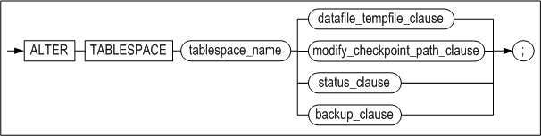

**datafile_tempfile_clause ::=**


**datafile_spec ::=**

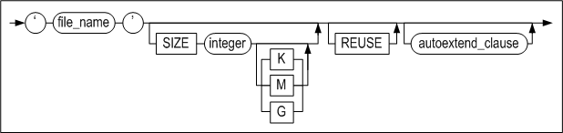

**autoextend_clause ::=**


**maxsize_clause ::=**


**modify_datafile_clause ::=**


**modify_autoextend_clause ::=**


**modify_checkpoint_path_clause ::=**


**status_clause ::=**


**backup_clause ::=**


#### Prerequisites

The SYS user and users to whom the ALTER TABLESPACE system privilege has been granted can use all of the functionality of the ALTER TABLESPACE statement.

#### Description

The ALTER TABLESPACE statement is used to change the definition of a disk, temporary, memory or volatile tablespace. This statement is also used to change other tablespace attributes, including the data and temporary files associated with the tablespace, the checkpoint paths, settings related to automatic extension, and the status of the tablespace.

*tablespace_name*

This is used to specify the name of the tablespace to change.

*datafile_tempfile_clause*

This is used to add, delete or change a data file or temporary file.

For more detailed information on the datafile_spec, maxsize_clause and autoextend_clause clauses, please refer to the description of the CREATE TABLESPACE statement.

*ADD DATAFILE \| TEMPFILE* 

This is used to add data or temporary files to the corresponding tablespace. 

*RENAME DATAFILE \| TEMPFILE* 

This is used to change the name of the data or temporary files in a tablespace. More than one file can be renamed at one time. A file having the same name as TO file_name must have already been created.

*modify_datafile_clause*

This is used to change the size or the autoextend attribute of a data or temporary file in a disk tablespace.

*modify_autoextend_clause*

This is used to change the autoextension-related attributes for a memory or volatile tablespace, including whether it is automatically extended in size, the unit (increment) by which it is extended, and its maximum size.

*DROP DATAFILE \| TEMPFILE* 

This is used to remove data or temporary files from a tablespace. More than one file can be removed at one time. Because this statement does not actually delete the physical files from the file system, they will need to be deleted (or otherwise managed) manually by the user.

*modify_checkpoint_path_clause*

This is used to add, change or delete a checkpoint image path. Operations related to checkpoint image paths can only be performed during the CONTROL phase

*ADD CHECKPOINT PATH Clause*

This is used to add a new checkpoint path to a memory tablespace. The DBA can move any checkpoint image files from the existing checkpoint paths to the new checkpoint path as desired. Because Altibase looks for checkpoint image files in all checkpoint paths when a memory tablespace is loaded, checkpoint image files can be stored in any of the checkpoint paths for the tablespace

When checkpointing takes place after a new checkpoint path has been added, the new checkpoint image files are distributed evenly among all of the checkpoint paths, including the new checkpoint path.

If the specified checkpoint path does not exist, or if the user who started up the Altibase server does not have write permissions for the checkpoint path, an error will be raised. Therefore, the DBA must manually create the checkpoint path to be added in the file system and add write permissions to the path for the user.

*RENAME CHECKPOINT PATH clause*

This is used to change an existing checkpoint path for a memory tablespace to the path specified in the clause following “TO“. The DBA must manually create or rename the actual checkpoint path in the file system. If the specified checkpoint path does not exist, or if the user who started up the Altibase server does not have suitable permissions for the checkpoint path, an error will be raised.

*DROP CHECKPOINT PATH clause*

This is used to delete an existing checkpoint path from a memory tablespace. It is the DBA's responsibility to physically move the checkpoint image files in the directory corresponding to the deleted checkpoint path to the remaining checkpoint paths in the tablespace. Because Altibase looks for checkpoint image files in all checkpoint paths when a memory tablespace is loaded, checkpoint image files can be stored in any of the valid checkpoint paths for the tablespace.

Deleting the actual checkpoint path on the file system must be done by the DBA.

The physical path corresponding to the dropped checkpoint path must be manually deleted from the file system. A memory tablespace must have at least one checkpoint path. If an attempt is made to delete the only checkpoint path remaining for a memory space, an error will be raised.

*status_clause*

This is used to change the status of a disk or memory tablespace to ONLINE, OFFLINE or DISCARD.

*OFFLINE*

When a disk tablespace is taken offline, the contents of all data pages in the buffer corresponding the tablespace are written to data files, and the pages in the buffer pool are invalidated. 

In the case of a memory tablespace, the contents of the data pages are written to checkpoint image files, and the page memory is released.

All memory that has been allocated to indexes in the tablespace is released, and the indexes for the tables in the tablespace become unavailable. In addition, the tables in the tablespace become unavailable until the tablespace is brought back online

*ONLINE*

When a disk tablespace is brought online, all of its data files become accessible, and the tables in the tablespace become available again.

When a memory tablespace is brought online, memory is assigned to all data pages again, and the contents of checkpoint image files are loaded back into the memory pages.

If a referenced tablespace is OFFLINE, an attempt to bring the tablespace ONLINE will succeed, but it may be impossible to access the tables that are stored in the tablespace. 

A so-called “referenced tablespace“ is, in the case of a disk tablespace, a tablespace containing a table that is associated with indexes, BLOB/CLOB columns, etc. that are stored in one or more other tablespaces, or containing a partitioned table having some of its partitions stored in one or more other tablespaces.

*DISCARD*

This is used during the CONTROL phase to switch the status of a disk or memory tablespace to DISCARD.

The tables, indexes and BLOB/CLOB columns in a discarded tablespace are unusable. Furthermore, discarded tablespaces are ignored when RESTART RECOVERY is executed and when unused data are removed from the database while the database is being started up.

Once a tablespace has been discarded, the only command that can be executed on it is DROP TABLESPACE. It cannot be brought back ONLINE.

*backup clause*

This statement is used to indicate that online backup (“hot backup”), in which the data files for a disk or memory tablespace are copied, is to be performed, or is complete.

*BEGIN BACKUP*

This is used to indicate that online backup is to be performed on all of the data files that constitute a tablespace. During the tablespace backup operation, which takes place between this statement and the END BACKUP statement, transactions are not prevented from accessing the tablespace.

Users must execute BEGIN BACKUP before performing online backup. In addition, it is 
possible to indicate that online backup is to be performed for multiple tablespaces at the same time. However, disk temporary tablespaces cannot be backed up online. 

*END BACKUP*

This is used to indicate that online backup of a disk or memory tablespace is complete. The user must execute the END BACKUP statement immediately after online backup is completed.

#### Consideration

- The ALTER TABLESPACE statement can be used to add data files and change tablespace attributes only when in online mode, and can be used to rename data files only during the CONTROL phase (STARTUP CONTROL).
- status_clause cannot be used with temporary or volatile tablespaces.

#### Examples

<Query\> Add the data file tbs2.user, which is 64 MB in size, to the user_disk_tbs tablespace. When more space is needed, automatically increase the size of the file in 512 kB increments.

```
iSQL> ALTER TABLESPACE user_disk_tbs
    ADD DATAFILE '/tmp/tbs2.user' SIZE 64M 
    AUTOEXTEND ON NEXT 512K; 
Alter success.
```

<Query 2\> To distribute disk I/O when checkpointing, add the '/home/path' checkpoint path to the user_memory_tbs tablespace. Additionally, change the tablespace attributes such that it increases in size in 256 MB increments and cannot grow larger than 1 GB. (Note that although table attributes can be changed during the SERVICE phase, checkpoint paths can be added only during the CONTROL phase.)

```
iSQL(sysdba)>>startup control; 
iSQL(sysdba)>>ALTER TABLESPACE user_memory_tbs ADD CHECKPOINT PATH '/home/path'; 
Alter success.

iSQL> ALTER TABLESPACE user_memory_tbs ALTER AUTOEXTEND ON NEXT 256M  MAXSIZE 1G; 
Alter success.
```

\<Query 3\> Change the attributes of the user_volatile_tbs tablespace such that it increases in size in 256 MB increments and cannot grow larger than 1 GB.

```
iSQL> ALTER TABLESPACE user_volatile_tbs ALTER AUTOEXTEND ON NEXT 256M MAXSIZE
1G;
Alter success.
```


### ALTER TRIGGER 

#### Syntax

**alter_trigger ::=**

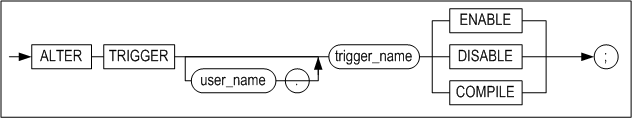

#### Prerequisites

Only the SYS user, the owner of the schema containing the trigger, and users having the ALTER ANY TRIGGER system privilege can execute the ALTER TRIGGER statement.

#### Description

This statement is used to enable, disable, or compile a specified database trigger.

*user_name*

This is used to specify the name of the owner of the trigger to be altered. If it is omitted, Altibase will assume that the trigger to be altered belongs to the schema of the user connected via the current session.

*trigger_name*

This is used to specify the name of the trigger to alter.

*ENABLE*

This is used to enable the trigger.

*DISABLE*

This is used to disable the trigger.

*COMPILE*

This is used to explicitly compile the trigger, regardless of whether or not it is valid. Explicit recompiling helps reduce the load on the system incurred by automatically compiling invalid triggers when they need to fire.

#### Example

\<Query\> This is used to disable a trigger so that it does not fire automatically. More examples involving the del_trigger trigger can be found in the explanation of the CREATE TRIGGER statement.

```
iSQL> ALTER TRIGGER del_trigger DISABLE;
Alter success.
```


### ALTER USER 

#### Syntax

**alter_user ::=**


[password_parameters ::=](#password_parameters)


#### Prerequisites

Only the SYS user and users having the ALTER USER system privilege can execute the ALTER USER statement. However, individual users can change their own passwords without this privilege.

#### Description

This statement is used to change a user's password and the tablespaces associated with the user.

*IDENTIFIED clause* 

This is used to specify a new password for the user. The new password is specified after the BY element.

Because the other commands are the same as the corresponding commands executed using the CREATE USER statement, please refer to the description of the CREATE USER statement.

*LIMIT clause*

This modifies password management policies for accounts. This clause can only be executed by the SYS user.
When a password management policy is changed, an existing policy taht is not specified is initialized.

*ACCOUNT LOCK/UNLOCK*

This explicitly locks or unlocks accounts.

*ENABLE/ DISABLE*

The user can restrict TCP connections. Only the SYS user can execute this clause. 

#### Precautions

- When changing the password for the SYS user, who can log on in SYSDBA mode, after the password is changed using the ALTER USER statement, it must be changed one more time by running the altipasswd utility in a console window of the operating system (Unix shell or DOS terminal window). For more information on the altipasswd utility, please refer to the *Utilities Manual.*
- After the password is changed using the ALTER USER statement, it must also be changed in the shell scripts files containing the password such as: server, is, and il to ensure that the script files will run without error.

#### Examples

\<Query\> Change the password of the user Tom to ab1rose.

```
iSQL> ALTER USER tom
    IDENTIFIED BY ab1rose;
Alter success.
```

\<Query\>  Change a user's default tablespace.

```
iSQL> ALTER USER tom
  DEFAULT TABLESPACE uare_data;
Alter success.
```

\<Query\> This statement modifies password management policies for user rose2.

```
iSQL> ALTER USER rose2 LIMIT (FAILED_LOGIN_ATTEMPTS 7, PASSWORD_LOCK_TIME 7);
```

\<Query\> Modify the managing policy of user rose2's password. Do not put a limit on the number of times for logging in, and maintain the account locked for 10 days.

```
iSQL> ALTER USER rose2 LIMIT (FAILED_LOGIN_ATTEMPTS UNLIMITED,
PASSWORD_LOCK_TIME 10);
```

\<Query\> Login fails for user rose2 after locking the account.

```
ALTER USER rose2 ACCOUNT LOCK;
iSQL> CONNECT rose2/rose2;
[ERR-31370 : The account is locked.]
```


### ALTER VIEW

#### Syntax

**alter_view ::=**


#### Prerequisites

Only the SYS user, the owner of the schema containing the view, and users having the ALTER ANY TABLE system privilege can execute the ALTER VIEW statement.

#### Description

This is used to explicitly recompile a view that has become invalid. As an example, when one of the tables on which the view is based has been changed using the ALTER TABLE statement, it will be necessary to explicitly recompile the view in order to use it.

*user_name*

This is used to specify the name of the owner of the view to recompile. If omitted, Altibase will assume that the view belongs to the schema of the user connected via the current session.

*view_name*

This is used to specify the name of the view to recompile. The name of the view must follow the "Rules of Object Name" in Chapter 1. 

When recompiling the view, Altibase reads the view creation statement and compiles the view again, so any errors that arose when the view was originally created will be raised again when the ALTER VIEW statement is executed. If the FORCE option was used when creating the view originally, the view may still be in an invalid state after the ALTER VIEW statement has executed successfully. 

The ALTER VIEW statement cannot be used to change the definition of an existing view. To change a view's definition, use the CREATE VIEW OR REPLACE VIEW statement.

#### Example

\<Query\>  After changing the definition of the table employees, on which the view avg_sal is based, recompile the view. (The definition of avg_sal can be found in the explanation of the CREATE VIEW statement.) 

```
iSQL> ALTER TABLE employees
     ADD COLUMN (email VARCHAR(20));
Alter success.
iSQL> ALTER VIEW avg_sal COMPILE;
Alter success.
iSQL> SELECT * FROM avg_sal;
DNO   EMP_AVG_SAL 
---------------------
..
6 rows selected.
```


### ALTER MATERIALIZED VIEW

#### Syntax

**alter_materialized_view ::=**


#### Prerequisites

Only the following users can alter the properties of the materialized view with this statement.

- The SYS user
- The ownder of the materialized view
- The user with the system privilege of ALTER ANY MATERIALIZED VIEW

#### Description

By using the ALTER MATERIALIZED VIEW statement, the method and time for refreshing for the existing materialized view can be altered. For more detailed information on each keyword, refer to the description on the CREATE MATERIALIZED VIEW statement.

#### Examples

\<Query\> Alter the refresh method of the materialized view.

```
ALTER MATERIALIZED VIEW mv1 REFRESH COMPLETE ON DEMAND;
```


### COMMENT

#### Syntax

**comment_on ::=**


#### Prerequisites

Only the SYS user, the owner of the schema to which the table (or view) belongs, users having the ALTER object privilege for the table (or view), and users having the ALTER ANY TABLE system privilege can use the COMMENT statement to write comments.

#### Description

This statement is used to write or modify comments for a specified table, view or column.

*user_name*

This is the name of the owner of the object on which the COMMENT statement is executed. If it is omitted, Altibase will assume that the object being commented on belongs to the schema of the user connected via the current session.

*table_name, view_name*

This is used to specify the name of the table or view being commented on.

*column_name*

This is used to specify the name of the column being commented on.

*comment*

This is the actual content of the comment. The comment can be up to 4000 bytes long. To delete an existing comment, execute the COMMENT statement with nothing between the single quotation marks (’’).

#### Example

\<Query\>  Add comments to the books table, which is owned by the user library1, and to one of its columns.

```
iSQL> COMMENT ON TABLE library1.books IS 'Table of Book Info';
Comment Created.
iSQL> COMMENT ON COLUMN library1.books.title IS 'Title of Book';
Comment Created.
```

<Query\> Read the table books of the user library 1 and comments for that column. 

```
iSQL> SET VERTICAL ON;
iSQL> SELECT * FROM system_.sys_comments_ WHERE user_name = ‘LIBRARY1’ AND table_name = ‘BOOKS’;
SYS_COMMENTS_.USER_NAME   : LIBRARY1
SYS_COMMENTS_.TABLE_NAME  : BOOKS
SYS_COMMENTS_.COLUMN_NAME : TITLE
SYS_COMMENTS_.COMMENTS    : title of book

SYS_COMMENTS_.USER_NAME   : LIBRARY1
SYS_COMMENTS_.TABLE_NAME  : BOOKS
SYS_COMMENTS_.COLUMN_NAME : 
SYS_COMMENTS_.COMMENTS    : table of book info

2 rows selected.
```

<Query\>  Delete the comments from the books table and the title column in that table.

```
iSQL> COMMENT ON TABLE library1.books IS ’’;
Comment created.
iSQL> COMMENT ON COLUMN library1.books.title IS ’’;
Comment created.
```


### CONJOIN TABLE

#### Syntax

**conjoin_table ::=**

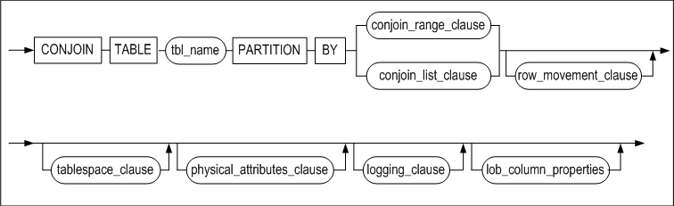

[row_movement_clause ::=](#row_movement_clause),
[tablespace_clause ::=](#tablespace_clause), [physical_attributes_clause
::=](#physical_attributes_clause), [logging_clause ::=](#logging_clause),
[lob_column_properties ::=](#lob_column_properties)

**conjoin_range_clause ::=**


**range_table_to_partition_clause ::=**


**conjoin_list_clause ::=**


**list_table_to_partition_clause ::=**

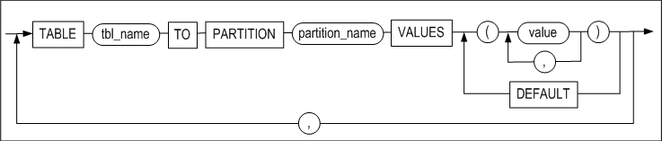

#### Prerequisites

It is necessary to be satisfied one or more of the following conditions in order to create table: 

- The SYS user	
- The user has the CREATE TABLE or CREATE ANY TABLE system privilege in own schema
- The user has the CREATE ANY TABLE system privilege in another user's schema.

It is necessary to be satisfied one or more of the following conditions in order to drop table:

- The SYS user 
- Table's owner 
- The user has the DROP ANY TABLE system privilege.

#### Description

More than one non-partitioned tables are grouped to create a partitioned and its associated partitions. A new partitioned table is created in the user's default tablespace unless the tablespace option is specified. The data located in existing non-partitioned table is transferred to a partition belonging to a new partitioned table, and the non-partitioned tables are removed. 

*conjoin_range_clause*

This clause enables to create a range partitioned table with multiple non-partitioned tables through the range partitioning. 

*conjoin_list_clause*

This clause enables to create a list partitioned table and multiple partitions are created through list partitioning method. 

*range_table_to_partition*

This clause specifies the name of the nonpartitioned table that is the target of the range partitioned table, the name of the partition to be created, and the range of values for the partitioning key.

*list_table_to_partition*

This clause specifies the name of the nonpartitioned table that is the target of the list partitioned table, the name of the partition to be created, and the set of partitioning key values to be the base. 

#### Precautions

- Do not specify the user name in front of the target table and partitioned table which will be converting. 
- After the CONJOIN, data that does not match the key value of the partition may exist on the partition. 
- A metatable related to a newly created partitioned table is created, and all the metatable in relation to the target table converted into a partitioned table is deleted. 
- PMS, packages, and views that are related to the target table cannot be used. 
- The hash partitioned table is not supported. 
- The schema created in partitioned tables must be identical with that of the target table. The target table must be identical with all the elements, such as the number of columns, name, sequence and data type, and in row and compressed logging option, as well as constraints of CHECK and NOT NULL. 
- There must not be hidden columns, security columns, and compressed columns in the target table. 
- Triggers operating with events must not exist in the target table. 

#### Example

\<Query\> Convert table t1 and t2 into a list partitioned table t3.

```
iSQL> conjoin table t3
partition by list(i1)
(
  table t1 to partition p1 values (1,2,3,4,5),
  table t2 to partition p2 values default
)
tablespace tbs3;
Conjoin success.
```


### CREATE DATABASE

#### Syntax

**create_database ::=**


#### Prerequisites

Because this statement can only be executed during the PROCESS phase, the only user who can execute this SQL statement is the SYS user, and only when running in -sysdba mode.

#### Description

This statement is used to create a database. When a database is created, various system tablespaces, including the dictionary tablespace, the undo tablespace, and temporary tablespaces are created. The names of these system tablespaces are defined by the system. 

Please note that user-defined tablespaces cannot be created during database creation; rather, they are subsequently added by users. 

The database character set and national character set must be specified when the database is created.

*database_name*

This is used to specify the name of the database to be created. The database name specified here must be the same as that specified using the DB_NAME property in the properties file. If they are not the same, an error will be raised.

*INITSIZE clause* 

The initial size of a memory database is specified here, using an expression such as “128M“ (i.e. 128 megabytes) or “4G“ (i.e. 4 gigabytes). If only a number is specified here, the size unit is assumed to be megabytes by default.

The system tablespaces related to a disk database are automatically created when the CREATE DATABASE statement is executed.

The default values for system tablespaces are determined by reading the following properties from the altibase.properties file.

- SYS_DATA_TBS_EXTENT_SIZE, SYS_TEMP_TBS_EXTENT_SIZE, SYS_UNDO_TBS_EXTENT_SIZE
- SYS_DATA_FILE_INIT_SIZE, SYS_TEMP_FILE_INIT_SIZE, SYS_UNDO_FILE_INIT_SIZE
- SYS_DATA_FILE_MAX_SIZE, SYS_TEMP_FILE_MAX_SIZE, SYS_UNDO_FILE_MAX_SIZE
- SYS_DATA_FILE_NEXT_SIZE, SYS_TEMP_FILE_NEXT_SIZE, SYS_UNDO_FILE_NEXT_SIZE

*ARCHIVELOG \| NOARCHIVELOG*

This is used to specify whether the database will initially run in archivelog mode or noarchivelog mode. Archivelog mode is used to prepare for media recovery, whereas noarchivelog mode does not support media recovery.

For more information about Altibase backup and recovery, please refer to the *Administrator's Manual.*

*charset*

This is used to specify the database character set and national character set.

- Available Database Character Sets 
  US7ASCII  
  KO16KSC5601  
  MS949  
  BIG5  
  GB231280  
  MS936  
  UTF8  
  SHIFTJIS  
  MS932  
  EUCJP
- Available National Character Sets  
  UTF8  
  UTF16

#### Example

\<Query\> Create a database named mydb that is initially 10MB in size, and for which the database character set is KSC5601 and the national character set is UTF16.

```
$ isql -s localhost -u sys -p manager -sysdba
..
iSQL> STARTUP PROCESS;
Trying Connect to Altibase.. Connected with Altibase.

TRANSITION TO PHASE: PROCESS
Command execute success.
iSQL> CREATE DATABASE mydb INITSIZE=10M 
NOARCHIVELOG 
CHARACTER SET KSC5601 
NATIONAL CHARACTER SET UTF16;
.
.
Create success.
```


### CREATE DATABASE LINK

For information on Database Link, please refer to the *Database Link User’s Manual.* 

### CREATE DIRECTORY

#### Syntax


#### Prerequisites

Only the SYS user and users having the CREATE ANY DIRECTORY system privilege can execute this statement.

#### Description

The fact that stored procedures are able to manipulate files means that it is possible to use SQL to read from and write to text files in the host's file system. This feature makes it possible to perform a wide variety of tasks, including leaving messages in files about the execution of stored procedures, writing reports and query results in files, and inserting data read from files into database tables.

The CREATE DIRECTORY statement is used to create a database object that corresponds to a directory that contains files that are manipulated by stored procedures in this way.

The owner of a DIRECTORY object created using the CREATE DIRECTORY statement is always the SYS user. The user who actually created the DIRECTORY object is only granted read and write privileges, including the WITH GRANT OPTION, for the object. 

The CREATE DIRECTORY statement records directory data in the SYS_DIRECTORIES_ meta table, but does not actually create the new directory in the file system. Therefore, the user must explicitly create the directory in the actual file system.

*OR REPLACE*

This option allows an existing DIRECTORY object to be replaced when a new DIRECTORY object is created with the same name. Note that the actual directory in the file system is not deleted.

*directory_name*

This is used to specify the name of the database object representing the directory. Refer to   "[Rules for Object Names](#object_name)" for more information on specifying names

*path_name*

This is used to specify the absolute path of the directory in the file system as a character string.

#### Examples

\<Query\> Create a directory object named alti_dir1 in the folder /home/altibase/altibase_home/psm_msg.

```
iSQL> create directory alti_dir1 as '/home/altibase/altibase_home/psm_msg';
Create success.
```

\<Query\>\> Create a directory object named alti_dir1 in the folder /home/altibase/altibase_home/psm_result. If a DIRECTORY object named alti_dir1 already exists in the database, replace it with this new one.

```
iSQL> create or replace directory alti_dir1 as '/home/altibase/altibase_home/psm_result';
Create success.
```


<a name="create_index"><a/>

### CREATE INDEX 

#### Syntax

**create_index ::=**


**table_index_clause ::=**


**memory_index_clause ::=**


**disk_index_clause::=**


**domain_index_clause ::=**


**directkey_clause ::=**

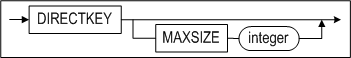

**memory_index_attributes ::=**

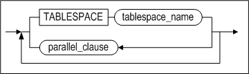

**storage_clause ::=**


**index_partitioning_clause ::=**


**index_partition_definition ::=**


**disk_index_attributes::=**


**parallel_clause ::=**


**logging_clause ::=**


**physical_attributes_clause ::=**


#### Prerequisites

Only the SYS user, users having the CREATE INDEX system privilege, and users having sufficient privileges to modify index objects in the table to which the index is to be added can execute this statement. 

In order to create function-based indexes, the same privileges as conventional indexes are required. However, if a user-defined function is included in the expression, the function must be marked DETERMINISTIC. The user must also have the EXECUTE object privilege on user-defined functions used in the function-based index owned by another user.

#### Description

This statement is used to create an index on the basis of one or more of the columns or expressions in a table. When a partitioned index (i.e. local index) is created, the LOCALUNIQUE keyword can be optionally specified. If the LOCALUNIQUE option or local keyword is not used, a non-partitioned index is created when creating an index on a disk partitioned table.

A partitioned index is classified as either a prefixed index or a non-prefixed index, depending on the relationship between the partition key and the index columns. If the leftmost index partition key is the same column as the leftmost index column, it is a prefixed index. If they are different columns, it is a non-prefixed index. 

Function-based indexes are based on expressions. Expressions can include built-in SQL functions or user-defined functions.

*user_name*

This is used to specify the name of the owner of the index to create. If omitted, Altibase will create the index in the schema of the user connected via the current session.

*index_name*

This is used to specify the name of the index to create. Refer to "[Rules for Object Names](#object_name)" for more information on specifying names.

*UNIQUE*

This keyword indicates that duplicate values are not allowed.

*LOCALUNIQUE*

This keyword is useful when creating a partitioned index. It indicates that the UNIQUE constraint must be satisfied within each index partition of a partitioned (local) index.

*index_expr*

This specifies the column or expression to be indexed.

Table columns, constants, SQL functions and user-defined functions can be included in expressions. When specifying an expression instead of a column, a function-based index is created. Limitations of function-based indexes:

- Only the columns of the table to be indexed can be included in expressions. Schema and table names cannot be specified in front of column names.
- Constants (character strings or integers) can be included in expressions.
- Aggregate functions like SUM cannot be included in expressions. 
- Cursors and cursor properties(%ISOPEN, SQLCODE, SQLERRM, etc.) cannot be used for stored procedures included in expressions. 
- For global partitioned indexes, expressions cannot be partitioning keys. 
- Regardless of the absence of function arguments, all functions must be specified with parentheses. On omission, database servers perceive them to be column names. 
- DATE constants not fully specified are permitted in expressions. If the year/month is not specified in the DATE type value, the current year/month is assumed as the default value. The time zone value cannot be specified for the DATE type of Altibase. 
- Built-in SQL functions that always return identical values can be included in expressions; for example, the SYSDATE function cannot be included. 
- User-defined functions included in expressions must be marked DETERMINISTIC. 
- Subqueries cannot be included in expressions. 
- Sequences cannot be included in expressions. 
- Pseudo columns of all sorts cannot be included in expressions.
- The PRIOR operator cannot be included in expressions. 
- LOB data cannot be included in expressions. 
- A function-based index can be selected during query optimization only if the QUERY_REWRITE_ENABLE property is set to 1.

*ASC/DESC*

The use of the ASC or DESC keywords respectively specifies that each column of the index is to be sorted in ascending or descending order.

*index_partitioning_clause*

This is used to specify that the index to be created is a partitioned index. If omitted, index partitions will be stored in the table's default tablespace. 

The easiest way to create a partitioned index is simply to specify the LOCAL keyword when creating the index. Alternatively, the attributes of the index partition to be created for each table partition can be specified in greater detail. 

If only the LOCAL keyword is specified, an index partition is created for each table partition, and the names of the partitions are automatically determined by the system. Index partitions are successively named SYS_IDX1, SYS_IDX2, etc. 

The attributes of index partitions can be expressly specified for some or all table partitions. When the attributes of only some index partitions are specified, the attributes of the index partitions for the remaining table partitions are determined automatically as outlined above. 

If no tablespace is specified when creating a partitioned index, the process for determining the tablespace in which each of the index partitions is stored is as shown in the following diagram:


> Note: Even if the tablespace in which each parititon is to be stored is specified, it is ignored, as memory indexes are not stored in tablespaces. 


*BTREE*

This is used to specify that the index is a B+ -tree index, which is useful in situations where ranges are often searched. An index can be either a B+ -tree or an R-tree index. If the INDEXTYPE IS clause is omitted, the index will be a B+ -tree index by default.

*RTREE*

This is used to specify that the index is an R-tree index, which is useful for processing multidimensional data.

*directkey_clause*

Creates direct key indexes. A direct key is a record stored in the index node; a direct key index can reduce index scan cost since it stores the actual record and the record pointer. 

- MAXSIZE integer  
  Sets the maximum size of a direct key; on omission, the default value is 8 bytes. Please refer to the table below for supported data types. 
  
  If a value larger than MAXSIZE is set for a data type that supports partial keys, it is stored as a prefix that corresponds to MAXSIZE and a direct key index is successfully created.
  
  If a value larger than MAXSIZE is set for a data type that does not support partial keys, a direct key index fails to be created. 
  
- Direct Key Index Restrictions
  - If a direct key index is created on composite index, the first column is set as the direct key.
  - A direct key index cannot be created on compressed or encrypted column.
  - A direct key index cannot be created for indexes residing on disk.

The following data types support direct key indexes.

<table>
<tbody>
<tr>
<th>
<p>Category</p>
</th>
<th>
<p>Data Type</p>
</th>
<th>
<p>MAXSIZE</p>
<p>(Supports Full Keys)</p>
</th>
<th>
<p>Support Partial Keys)</p>
</th>
</tr>
<tr>
<td rowspan="5" >
<p>Native Numeric Data Type</p>
</td>
<td>
<p>BINGINT</p>
</td>
<td>
<p>8</p>
</td>
<td>
<p>X</p>
</td>
</tr>
<tr>
<td>
<p>DOUBLE</p>
</td>
<td>
<p>8</p>
</td>
<td>
<p>X</p>
</td>
</tr>
<tr>
<td>
<p>INTEGER</p>
</td>
<td>
<p>4</p>
</td>
<td>
<p>X</p>
</td>
</tr>
<tr>
<td>
<p>REAL</p>
</td>
<td>
<p>4</p>
</td>
<td>
<p>X</p>
</td>
</tr>
<tr>
<td>
<p>SMALLINT</p>
</td>
<td>
<p>2</p>
</td>
<td>
<p>X</p>
</td>
</tr>
<tr>
<td rowspan="3">
<p>Non-Native Numeric Data Type</p>
</td>
<td >
<p>FLOAT</p>
<p>FLOAT(p)</p>
</td>
<td>
<p>23</p>
<p>3 + ( ( p + 2 ) / 2 )</p>
</td>
<td>
<p>X</p>
</td>
</tr>
<tr>
<td >
<p>NUMBER</p>
<p>NUMBER(p, s)</p>
<p>NUMBER(p)</p>
</td>
<td>
<p>23</p>
<p>3 + ( ( p + 2 ) / 2 )</p>
<p>3 + ( ( p + 2 ) / 2 )</p>
</td>
<td>
<p>X</p>
</td>
</tr>
<tr>
<td>
<p>NUMERIC</p>
<p>NUMERIC(p, s)</p>
<p>NUMERIC(p)<br /> &nbsp;(=DECIMAL)</p>
</td>
<td >
<p>23</p>
<p>3 + ( ( p + 2 ) / 2 )</p>
<p>3 + ( ( p + 2 ) / 2 )</p>
</td>
<td>
<p>X</p>
</td>
</tr>
<tr>
<td rowspan="4">
<p>Character Data Type</p>
</td>
<td>
<p>CHAR(M)</p>
</td>
<td>
<p>M + 2</p>
</td>
<td>
<p>O</p>
</td>
</tr>
<tr>
<td>
<p>VARCHAR(M)</p>
</td>
<td>
<p>M + 2</p>
</td>
<td>
<p>O</p>
</td>
</tr>
<tr>
<td>
<p>NCHAR(M)</p>
</td>
<td>
<p>(M * 2) + 2 &lt;UTF16&gt;</p>
<p>(M * 3) + 2 &lt;UTF8</p>
</td>
<td>
<p>O</p>
</td>
</tr>
<tr>
<td>
<p>NVARCHAR(M)</p>
</td>
<td>
<p>(M * 2) + 2 &lt;UTF16&gt;</p>
<p>(M * 3) + 2 &lt;UTF8&gt;</p>
</td>
<td>
<p>O</p>
</td>
</tr>
<tr>
<td>
<p>Date Data Type</p>
</td>
<td>
<p>DATE</p>
</td>
<td>
<p>8</p>
</td>
<td>
<p>X</p>
</td>
</tr>
<tr>
<td rowspan="4">
<p>Binary Data Type</p>
</td>
<td>
<p>BIT(M)</p>
</td>
<td>
<p>(M / 8) + 4</p>
</td>
<td>
<p>X</p>
</td>
</tr>
<tr>
<td>
<p>VARBIT(M)</p>
</td>
<td>
<p>(M / 8) + 4</p>
</td>
<td>
<p>&nbsp;</p>
</td>
</tr>
<tr>
<td>
<p>BYTE(M)</p>
</td>
<td>
<p>M + 2</p>
</td>
<td>
<p>X</p>
</td>
</tr>
<tr>
<td>
<p>NIBBLE(M)</p>
</td>
<td>
<p>(M / 2) + 1</p>
</td>
<td>
<p>&nbsp;</p>
</td>
</tr>
</tbody>
</table>


*physical_attributes_clause*

- INITRANS Clause  
  This is used to set the initial number of TTS (Touched Transaction Slots). The default is 8.
- MAXTRANS Clause  
  This is used to set the maximum number of TTS (Touched Transaction Slots). The default is 30.

*TABLESPACE Clause*

This is used to specify the name of the tablespace in which the index is to be stored. If this clause is omitted, Altibase stores the index in the default tablespace for the owner of the schema to which the index belongs. However, when an index is created for a memory table, even if the tablespace is specified, this clause is ignored because memory indexes are not stored in any tablespace.

*parallel_clause*

This is a hint for setting the number of threads used to create an index, with the aim of realizing a performance improvement. Altibase determines the optimal number of index creation threads in consideration of the user-defined parallel_factor, which is specified using a hint, the size of the tables for which the indexes are being created, and the amount of available memory at the time the index is created. 

The value of parallel_factor can be set within the range from 0 to 512. The default is the number of CPUs in the host on which Altibase is running. Because the number of index creation threads is determined using the above optimized determination method, it is safe to omit parallel_factor. 

If parallel_factor is not set, or is set to 0, the value of the INDEX_BUILD_THREAD_COUNT property in the altibase.properties file, which has the same meaning as parallel_factor, is used instead. If the INDEX_BUILD_THREAD_COUNT property has not been set either, the number of CPUs is used as a hint to set the optimum number of index creation threads.

If parallel_factor is set to a value taht is greater than the number of CPUs, or is set to a value greater than 512, the user-defined value is ignored and the number of CPUs is used as a hint for setting the optimum number of threads.

*logging_clause*

The LOGGING or NOLOGGING clause can be used to enable or disable logging when an index is created for a disk table. Logging is enabled by default, meaning that information about the creation of the index is logged when an index is created. 

The FORCE and NOFORCE options are used to determine whether to forcibly store a disk index to disk immediately after the index is created. 

For more details about logging_clause, please refer to the section pertaining to indexes in the “Objects and Privileges“ chapter of the *Administrator's Manual.*

*storage_clause*

This is used to set parameters for managing extents in segments.

- INITEXTENTS Clause  
  This sets the number of extents that are allocated by default when a segment is created. The default is 1.
- NEXTEXTENTS Clause  
  This sets the number of extents that are added to the segment every time the segment is increased in size. The default is 1.
- MINEXTENTS Clause  
  This sets the minimum number of extents in a segment. The default is 1. 
- MAXEXTENTS Clause  
  This set the maximum number of extents in a segment. If this isn't specified, there is no maximum limit on the number of extents in a segment.

#### Considerations

- In the case of an index for a partitioned table, i.e. a partitioned index, the tablespace in which each local index is stored is defined separately in index_partitioning_clause. disk_index_attributes cannot be used to specify the tablespace for an entire partitioned index. Additionally, a local index can only be a B+ -tree index.
- In the event of a system or media fault, the consistency of an index that was created using the NOLOGGING (FORCE/NOFORCE) option cannot be guaranteed. In this case, the error “The index is inconsistent” will be raised. To fix this error, locate the inconsistent index, drop it, and create it again. The consistency of an index can be checked using the V$DISK_BTREE_HEADER performance view.
  
- An index cannot be created on the basis of a LOB column.


#### Example

\<Query 1\> Create the index emp_idx2 on the column eno in ascending order and on the column dno in descending order.

```
iSQL> CREATE INDEX emp_idx2
    ON employees (eno ASC, dno DESC);
Create success.
```

\<Query 2\>  Create a unique index named emp_idx2 for the dno column in the employees table in descending order. (This is possible when there are no records in the employees table, or when there are only unique values in the column dno.)

```
iSQL> CREATE UNIQUE INDEX emp_idx2
    ON employees (dno DESC);
Create success.
```

\<Query 3\>  Create the B+ -tree index emp_idx3 in ascending order for the eno column in the employees table. Because a primary key already exists for the eno column of the employees table, it must first be deleted before the index emp_idx3 can be created. If it is not deleted first, the following error will be raised:

```
ERR-3104C: Duplicate key columns in an index

iSQL> ALTER TABLE employees
    DROP PRIMARY KEY;
Alter success.
iSQL> CREATE INDEX emp_idx3
    ON employees (eno ASC)
    INDEXTYPE IS BTREE;
Create success.
```

\<Query 4\>  Create the index idx1 in the user_data tablespace on the basis of the i1 column in the table_user table.

```
iSQL> CREATE INDEX idx1
    ON table_user (i1)
    TABLESPACE user_data;
Create success.
```

\<Query 5\>  Create the index idx2 in the user_data tablespace on the basis of the i1 column in the table_user table using the parallel option.

```
iSQL> CREATE INDEX idx1
    ON table_user (i1)
    TABLESPACE user_data PARALLEL 4;
Create success. 
```

\<Query 6\> Create a local index, that is, an index in which the partitions correspond to respective table partitions, based on product_id. Allow the partition names to be determined automatically

```
CREATE INDEX prod_idx ON products(product_id) LOCAL;
```

\<Query 7\> Create a local index, specifying the attributes for each index partition.

```
CREATE INDEX prod_idx ON products(product_id) 
LOCAL
( 
  PARTITION p_idx1 ON p1 TABLESPACE tbs_disk1,
  PARTITION p_idx2 ON p2 TABLESPACE tbs_disk2,
  PARTITION p_idx3 ON p3 TABLESPACE tbs_disk3 
);
```

\<Query 8\>  Create a local index, specifying the attributes for only some of the index partitions. The attributes for the other partitions are determined automatically.

```
CREATE INDEX prod_idx ON products(product_id) 
LOCAL
( 
  PARTITION p_idx1 ON p1 TABLESPACE tbs_disk1,
  PARTITION p_idx3 ON p3 TABLESPACE tbs_disk3 
);
```

\<Query 9\> Create the index idx1 in the table employees based on the employee number column (eno). Enable logging to ensure the availability of the index in the event of a system or media fault. Assume that the table employees is in a disk tablespace.

```
iSQL> CREATE INDEX idx1
    ON employees (eno);
Create success.

Or

iSQL> CREATE INDEX idx1
    ON employees (eno) LOGGING ;
Create success.
```

\<Query 10\>  Create the index idx1 in the table employees with the NOLOGGING option using the employee number column (eno) in ascending order and the department number column (dno) in ascending order. Ensure that the index is available in the event of a system fault after the index is created (FORCE). Assume that the table employees is in a disk tablespace.

```
iSQL> CREATE INDEX idx1
    ON employees (eno ASC, dno ASC)
    NOLOGGING;
Create success.

Or
employee number(eno): ASC
department number(dno): ASC
iSQL> CREATE INDEX idx1
    ON employees (eno ASC, dno ASC)
    NOLOGGING FORCE;
Create success.
```

\<Query 11\> Create the index idx1 in the table employees with the NOLOGGING option using the employee number column (eno) in ascending order and the department number column (dno) in ascending order. Specify that the index is not to be written to disk (NOFORCE). Assume that the table employees is in a disk tablespace.

```
iSQL> CREATE INDEX idx1
    ON employees (eno ASC, dno ASC)
    NOLOGGING NOFORCE;
Create success.
```

\<Query 12\> Create the index LOCAL_IDX in the disk tablespace USERTBS for the table LOCAL_TBL. Allocate one extent to the index when it is created and specify that 2 extents are to be added whenever it is necessary to increase the size of the index segment, and also that there is no upper limit to the total number of extents in the index segment.

```
iSQL> CREATE INDEX LOCAL_IDX ON LOCAL_TBL ( I1 ) 
 TABLESPACE USERTBS
 STORAGE ( INITEXTENTS 1 NEXTEXTENTS 2 MAXEXTENTS UNLIMITED );
Create success.
```

\<Query 13\> Create a function-based index on salary using the salary column of the employees table.

```
iSQL> CREATE INDEX income_idx ON employees (salary*12);
Create success.
```

\<Query 14\> Create the same index as <Query 13> using a user-defined function.

```
CREATE OR REPLACE FUNCTION get_annual_salary
(salary in integer) 
RETURN integer
DETERMINISTIC
AS
BEGIN
    RETURN salary*12;
END;
/

iSQL> CREATE INDEX income_idx ON employees(sys.get_annual_salary(salary));
Create success.
```

\<Query 15\> Create a direct key index on the eno column in the table employees.

```
iSQL> CREATE INDEX direct_idx ON employees ( eno ) DIRECTKEY ;
Create success.
```

\<Query 16\> Create a direct key index that can store 32 byte records on the name column (VARCHAR(100)) in the tab1 table.

```
iSQL> CREATE INDEX idx1 ON tab1 ( name ) DIRECTKEY MAXSIZE 32;
Create success.
```


### CREATE JOB 

#### Syntax

**create_job ::=**


**execute_procedure_statement ::=**


**start_end_clause ::=**


**interval_clause ::=**


#### Prerequisites

Only the SYS user can create a JOB with this statement. In order to perform the created JOB, it should be activated with ENABLE when creating or after creating the JOB.

#### Description

A JOB to be managed by the job scheduler can be created with the CREATE JOB statement. The procedure to be executed, the start time, the end time, the interval after which it is to be executed and etc. can be set for each JOB to be created.

*execute_procedure_statement*

This specifies the execution statement of the procedure to be registered for the JOB. Only one procedure can be registered per JOB and the user name of the procedure can be omitted; on omission, the SYS user is assumed by default. For expr2, the input argument value for the execution of the defined procedure is specified as a constant or an expression.

For more detailed information on procedures, please refer to the *Stored Procedures Manual*.

*start_end_clause*

This sets the start time and the end time at which the JOB starts to run and ends running. Expr1 only accepts a DATE type value or a DATE type expression.

*interval_clause*

This specifies the interval after which the JOB is to run repeatedly after it has run for the first time.
The unit of time is determined by the YEAR, MONTH, DAY, HOUR, MINUTE which is specified.
after the number.

*ENABLE/DISABLE*

This statement is used for a user to set whether or not to execute each job through selecting ENABLE/DIABLE in the job scheduler. The default value is set to DISABLE if omitted.

*COMMENT*

This statement is used for a user to set whether or not to execute each job through selecting ENABLE/DIABLE in the job scheduler. The default value is set to DISABLE if omitted.

#### Precautions

The following are issues which the DBA should keep in mind when using a JOB:

- A stored procedure which takes either an OUT type or an INOUT type argument cannot be registered for a JOB.
- For a JOB to be run by the job scheduler, the value of the JOB_SCHEDULER_ENABLE property must be 1 and the value of the JOB_THREAD_COUNT property must be larger than 0.
- If an error occurs within the procedure being executed by a JOB, logs - such as error messages - are stored to the trace log file (default: $ALTIBASE_HOME/trc/altibase_qp.log) set for the QP_MSGLOG_FILE property.
- If an output function, like SYSTEM_.PRINTLN, is used within a procedure, the output content is written to the trace log file (default: $ALTIBASE_HOME/trc/altibase_qp.log) set for the QP_MSGLOG_FILE property

#### Examples

\<Query\> Create a JOB which executes the procedure proc1 once per month, starting from the current point in time.

```
iSQL> CREATE JOB job1 EXEC proc1 START sysdate INTERVAL 1 MONTH;
Create success.
```

\<Quey\>  Create job2 executing the proc procedure everyday from August 1, 2016 to August 31, 2016, and get the job2 activated (ENABLE).

```
iSQL> CREATE JOB job2 EXEC proc
START to_date('2016/08/01 00:00:00', 'YYYY-MM-DD HH:MI:SS')
END to_date('2016/08/31 00:00:00', 'YYYY-MM-DD HH:MI:SS')
INTERVAL 1 DAY
ENABLE;
Create success.
```


### CREATE QUEUE 

#### Syntax

**create_queue ::=**


[column_definition ::=](#column_definition)

#### Prerequisites

It is necessary to be satisfied one or more of the following conditions in order to create table:

- The SYS user
- The user has the CREATE TABLE or CREATE ANY TABLE system privilege in own schema.
- The user has the CREATE ANY TABLE system privilege in another user's schema.

#### Description

This syntax either can configure the maximum length of messages that are inserted into a queue or allows the user to directly define a column in order to create a queue. It can also specifies the number of maximum records that can be stored in a queue table.

*queue_name*

This is used to specify the name of the queue. The maximum possible length of the queue name is 28 bytes.

*size*

This is used to set the maximum size (in bytes) of a message to be stored in the queue. This value can be set within the range from 1 to 32,000 bytes.

*FIXED\|variable_clause*

This is used to specify how messages are saved. (For more information, please refer to the *General Reference*).

*column_definition*

This clause specifies the user-defined column.

*MAXROWS count*

This is used to set the maximum number of records that can be stored in a queue table. This value can be set within the range from 1 to 4294967295 (or (2^32) -1). When not specified, it defaults to the maximum value of 4294967295. 

#### Considerations

- When a queue is created, an object having the name queue_name + "_NEXT_MSG_ID" is created in the database. Therefore, if any existing table, view, sequence, synonym or stored procedure has the same name as the queue to be created, or has the name queue_name + "_NEXT_MSG_ID", the CREATE QUEUE statement will return an error. 


#### Examples

\<Query\> \>Create the queue Q1, stipulating that the maximum message length is 40 bytes and that the maximum number of records is 1,000,000.

```
iSQL> CREATE QUEUE Q1(40) MAXROWS 1000000;
Create success.
```

\<Query\> Create 2 columns that can store values for numeric(5,2) type when creating a queue named Q1. 

```
iSQL> CREATE QUEUE Q1(c1 numeric(5,2), c2 numeric(5,2));
Create success.
```

\<Query\>  Create a queue named Q2 defining the user-defined column and delete it after writing messages into the pertinent column.

```
iSQL> CREATE QUEUE Q2(V1 VARCHAR(10), V2 INTEGER, V3 NUMERIC(5,3));
Create success.

iSQL> ENQUEUE INTO Q2(V1, V2, V3) VALUES ('abc', 1, 99.999);
1 row inserted.

iSQL> DEQUEUE V1, V2, V3 FROM Q2;
V1          V2          V3
----------------------------------------
abc         1           99.999
1 row selected.
```


### CREATE REPLICATION 

#### Syntax

**create_replication ::=**


**option_clause ::=**


**replication_item ::=**


#### Prerequisites

Only the SYS user can execute replication-related statements.

#### Description

This statement is used to create a replication object, set the connection between a local server and one or more remote servers, and establish replication therebetween. Replication takes place between tables on a 1:1 basis; that is, a table is matched to only one corresponding table.

In order to resolve conflicts, the AS MASTER or AS SLAVE clause can be specified in the statement. Doing so stipulates that a master-slave scheme is to be used to resolve conflicts. For more detailed information about replication conflict resolution, please refer to Chapter 2 of the *Replication Manual.*

*replication_name*

This is used to specify the name of the replication object. The replication object name must be the same on both the local server and the remote server. Refer to "[Rules for Object Names](#object_name)" for more information on specifying names.

*FOR ANALYSIS \| FOR ANALYSIS PROPAGATION*

This creates the Xlog Sender. For more detailed information about properties, please refer to the *Log Analyzer User's Manual*.

*FOR PROPAGABLE LOGGING*

This is used to write logs received by the propagable receiver from the local server in order to replicate into other server. However, this function cannot be used with the recovery option.

*FOR PROPAGATION*

The propagable logs are transmitted to other target server.

*option_clause*

This is used to optionally specify the RECOVERY, OFFLINE, GROUPING, PARALLEL, and GAPLESS functions for the replication object.  These features are for use in data recovery and when performing offline replication, respectively. For more information, please refer to Chapter 3 of the *Replication Manual.*

*replication_host_ip*

This is used to specify the IP address of the remote server.

*replication_host_port_no*

This is used to specify the port number used by the Receiver thread on the remote server. It is identical to the REPLICATION _PORT_NO property in the altibase.properties file on the remote server.

*USING conn_type [ib_latency]*

The communication method (TCP or InfiniBand) can be set with the remote server. The ib_latency value can be set only when using InfiniBand. To use InfiniBand, the IB_ENABLE property must have a value of 1. 

*user_name*

This is used to specify the name of the owner of the table to be replicated.

*tbl_name*

This is used to specify the name of the table to be replicated.

*partition_name*

This is used to specify the name of the partition to be replicated.

#### Examples

\<Query\> Create replication rep1 according to the following conditions:

- The IP address of the local server is 192.168.1.60. 

- The replication port number on the local server is 25524. 

- The IP address of the remote server is 192.168.1.12. 

- The replication port number on the remote server is 35524. 

  Create the replication object to replicate the employees and departments tables between the servers.

On the local server (IP: 192.168.60) :

```
iSQL> CREATE REPLICATION rep1
    WITH '192.168.1.12',35524
    FROM sys.employees TO sys.employees,
    FROM sys.departments TO sys.departments;
Create success.
```

On the remote server (IP: 192.168.1.12) :

```
iSQL> CREATE REPLICATION rep1
    WITH '192.168.1.60',25524
    FROM sys.employees TO sys.employees,
    FROM sys.departments TO sys.departments;
Create success. 
```

\<Query\> After the remote server received the log in replication Rep 1, create replication Rep2 for the propagable logs and sends them to target server.

```
iSQL> CREATE REPLICATION rep1 
    FOR PROPAGABLE LOGGING WITH '192.168.1.12',35524
    FROM sys.t1 TO sys.t1;
iSQL> SELECT replication_name, role 
    FROM system_.sys_replications_;
REPLICATION_NAME                          ROLE
---------------------------------------------------------
REP1                                      2
1 row selected.

iSQL> CREATE REPLICATION rep2
    FOR PROPAGATION WITH '192.168.1.60',25524 
    FROM sys.t1 TO sys.t1;
Create success.
iSQL> SELECT replication_name, role 
    FROM system_.sys_replications_;
REPLICATION_NAME                          ROLE
---------------------------------------------------------
REP2                                      3
1 row selected.
```


### CREATE ROLE

#### Syntax

**create_role ::=**


#### Prerequisites

Only the SYS user and users with the CREATE ROLE system privilege can create a role.

#### Description

A new role is created with the specified name. 

A set of privileges which can be granted to a user is called a role. 

If a role is created for the first time, it does not have any privilege. Add privileges to a role by using the GRANT statement, then grant the role to a user. 

In order for a user to use a privilege which is granted by a role, the user should re-access to the database. The privilege which can be granted to a role is a system privilege and object privilege. Further information on how to use them is delineated in examples of GRANT and REVOKE statements as well.

*role_name*

This is used to specify the name of the role to be created. This name must be unique within the database.

#### Example

\<Query\> Create a role with the name alti_role.

```
iSQL> CREATE ROLE alti_role;
Create success.
```


### CREATE SEQUENCE 

#### Syntax

**create_sequence ::=**


**sequence_options ::=**


**sync_table_clause ::=**


#### Prerequisites

Only the SYS user and users having the CREATE SEQUENCE system privilege can execute this statement. In addition, it is necessary to be the SYS user or have the CREATE ANY SEQUENCE system privilege in order to create a sequence in another user's schema

#### Description

This statement is used to define a new sequence having the specified name and automatically populate the sequence.

*user_name*

This is used to specify the name of the owner of the sequence to be created. If it is omitted, Altibase will create the sequence in the schema of the user who is connected via the current session.

*seq_name*

This is used to specify the name of the sequence to be created. Refer to "[Rules for Object Names](#object_name)" for more informaiton on specifying names.

*START WITH*

This is the initial value of the sequence. This can be set to any value between MINVALUE and MAXVALUE inclusive. If this value is omitted and the value for INCREMENT BY is more than 0, the default value is the same as the minimum value of the sequence. If this value is omitted and the value for INCREMENT BY is less than 0, the default value is the same as the maximum value of the sequence.

*INCREMENT BY*

This is the value by which the sequence increments. The default value is 1. The absolute of this value must be less than the difference between MAXVALUE and MINVALUE.

*MAXVALUE*

This is the maximum value of the sequence. This can be set to any value between -9223372036854775807 and 9223372036854775806. If the value for INCREMENT BY is more than 0, the default value is 9223372036854775806. If the value for INCREMENT BY is less than 0, the default value is -1.

*MINVALUE*

This is the minimum value of the sequence. This can be set to any value between -9223372036854775807 and 9223372036854775806. If the value for INCREMENT BY is more than 0, the default value is 1. If the value for INCREMENT BY is less than 0, the default value is -9223372036854775807.

*CYCLE*

This clause is used to ensure that the sequence will continue to generate values when it reaches the value specified using MAXVALUE or MINVALUE. The sequence cycles again from the minimum value in the case of an ascending sequence, or from the maximum value in the case of a descending sequence.

*CACHE*

A specified number of sequence values can be created in advance and cached in memory so that they can be accessed more quickly. The cache is populated when a key value is first requested from a new sequence, and is accessed every time another key value is requested from the sequence. After the last sequence value in the cache has been used, the next request for a key value from the sequence causes new sequence values to be created and cached in memory. When a sequence is created, the default CACHE value is 20.

*ENABLE \| DISABLE SYNC TABLE*

This specifies whether or not to create a custom table for sequence replication for the purpose of replicating a sequence. 

- ENABLE: Creates a custom table for sequence replication. The table is automatically granted the name, [sequence name]$seq.
- DISABLE: Does not create a custom table for sequence replication.

If this option is not specified, a custom table for sequence replication is not created by default.

#### Consideration

- Please note that the sequence_name.CURRVAL value of a newly created sequence cannot be accessed. In order to access the sequence_name.CURRVAL value for a newly created sequence, it is first necessary to access the sequence_name.NEXTVAL value.
- A custom table for sequence replication can be created only if the length of the sequence name is equal to or smaller than 36 bytes.


#### Examples

The following SQL statements show how to define new sequences and check sequence values and information.

```
iSQL> CREATE TABLE seqtbl(i1 INTEGER);
Create success.
iSQL> CREATE OR REPLACE PROCEDURE proc1
AS
BEGIN
  FOR i IN 1 .. 10 LOOP
    INSERT INTO seqtbl VALUES(i);
  END LOOP;
END;
/
Create success.
iSQL> EXEC proc1;
Execute success.
```

\<Query\> Use the following statements to check information on sequence objects.

```
iSQL> select * from v$seq;
```

This command displays information about all sequence objects that have been created. Unlike Select * from seq, querying the performance view allows information about other users' sequences to be viewed. For more information on the performance view V$SEQ, please refer to the section of the Data Dictionary that explains performance views in the *General Reference.*

\<Query\> Create a sequence named seq1 that begins at 13, increments by 3, and has a minimum value of 0 and no maximum value.

```
iSQL> CREATE SEQUENCE seq1
  START WITH 13
  INCREMENT BY 3
  MINVALUE 0 NOMAXVALUE;
Create success.

iSQL> INSERT INTO seqtbl VALUES(seq1.NEXTVAL);
1 row inserted.
iSQL> INSERT INTO seqtbl VALUES(seq1.NEXTVAL);
1 row inserted.
iSQL> SELECT * FROM seqtbl;
SEQTBL.I1   
--------------
1           
2           
3           
4           
5           
6           
7           
8           
9           
10          
13          
16          
12 rows selected.
```

\<Query\> Change seq1 so that it increments by 50 and starts over at the minimum value if it reaches the maximum value of 100.

```
iSQL> ALTER SEQUENCE sys.seq1
  INCREMENT BY 50
  MAXVALUE 100
  CYCLE;
Alter success.

iSQL> INSERT INTO sys.seqtbl VALUES(seq1.NEXTVAL);
1 row inserted.
iSQL> INSERT INTO sys.seqtbl VALUES(seq1.NEXTVAL);
1 row inserted.
iSQL> INSERT INTO sys.seqtbl VALUES(seq1.NEXTVAL);
1 row inserted.
iSQL> INSERT INTO sys.seqtbl VALUES(seq1.NEXTVAL);
1 row inserted.
iSQL> SELECT * FROM sys.seqtbl;
SEQTBL.I1   
--------------
1           
2           
3           
4           
5           
6           
7           
8           
9           
10          
13          
16          
66          
0           
50          
100         
16 rows selected.
```

\<Query\> Check the current value of seq1, which will cause a new value to be generated.

```
iSQL> SELECT seq1.CURRVAL FROM dual;
SEQ1.CURRVAL         
-----------------------
100                   
1 row selected.
```

\<Query\> Change the value in column i1 to the next value of the sequence, which is 0.

```
iSQL> UPDATE SEQTBL SET i1 = seq1.NEXTVAL;
16 rows updated.
```

\<Query\> Check the current value of seq1.

```
iSQL> SELECT seq1.CURRVAL FROM dual;
SEQ1.CURRVAL         
-----------------------
0                   
1 row selected.
```

\<Query\> Change seq1 so that the specified number of sequence values (25) are cached for the faster access.

```
iSQL> ALTER SEQUENCE seq1
INCREMENT BY 2
MAXVALUE 200
CACHE 25;
Alter success.

iSQL> CREATE OR REPLACE PROCEDURE proc2
AS
BEGIN
  FOR i IN 1 .. 30 LOOP
    INSERT INTO sqqtbl VALUES(seq1.NEXTVAL);
  END LOOP;
END;
/
Create success.
iSQL> EXEC proc2;
Execute success.
iSQL> SELECT * FROM seqtbl;
SEQTBL.I1   
--------------
0           
50          
100         
0           
50          
100         
0           
50          
100         
0           
50          
100         
0           
50          
100         
0           
2           
4           
6           
8           
10
12
14          
.
.
.         
58          
60          
46 rows selected.
```

<Query\> When connected to a database as the SYS user, output information on all sequences.

```
iSQL> SELECT * FROM SEQ;
USER_NAME 
--------------------------------------------
SEQUENCE_NAME      CURRENT_VALUE      INCREMENT_BY 
------------------------------------------------
MIN_VALUE          MAX_VALUE          CYCLE             CACHE_SIZE 
------------------------------------------------
SYS 
SEQ1               60                 2 
0                  200                YES               25 
1 row selected.
```

<Query\> The following SQL statements show how to define sequences and view sequence values and information using multiple user accounts. 

```
iSQL> CONNECT sys/manager;
Connect success.
iSQL> CREATE USER user1 IDENTIFIED BY user1;
Create success.
iSQL> CREATE USER user2 IDENTIFIED BY user2;
Create success.
iSQL> CONNECT user1/user1;
Connect success.
iSQL> CREATE SEQUENCE seq1 MAXVALUE 100 CYCLE;
Create success.
iSQL> CREATE SEQUENCE seq2;
Create success.
```

\<Query\> Output information on all sequences created by user1.

```
iSQL> SELECT * FROM SEQ;
SEQUENCE_NAME                             CURRENT_VALUE   INCREMENT_BY    
------------------------------------------------
MIN_VALUE              MAX_VALUE              CYCLE           CACHE_SIZE      
------------------------------------------------
SEQ1                                      1               1               
1                      100                    YES             20              
SEQ2                                      1               1               
1                      9223372036854775806    NO              20              
2 rows selected.
iSQL> CONNECT user2/user2;
Connect success.
iSQL> CREATE SEQUENCE seq1 INCREMENT BY -30;
Create success.
iSQL> CREATE SEQUENCE seq2 INCREMENT BY -10 MINVALUE -100;
Create success.
iSQL> CONNECT sys/manager;
Connect success.
iSQL> CREATE SEQUENCE seq2 START WITH 20 INCREMENT BY 30;
Create success.
iSQL> CREATE SEQUENCE seq3 CACHE 40;
Create success.
```

\<Query\> When connected to the database as the SYS user, output information on all sequences.

```
iSQL> SELECT * FROM SEQ;
USER_NAME 
--------------------------------------------
SEQUENCE_NAME      CURRENT_VALUE         INCREMENT_BY 
------------------------------------------------
MIN_VALUE          MAX_VALUE             CYCLE              CACHE_SIZE 
------------------------------------------------
SYS 
SEQ1               60                    2 
0                  200                   YES                25 
SYS 
SEQ2               20                    30 
1                  9223372036854775806   NO                 20 
SYS 
SEQ3               1                     1 
1                  9223372036854775806   NO                 40 
USER1 
SEQ1               1                     1 
1                  100                   YES                20 
USER1 
SEQ2               1                     1 
1                  9223372036854775806   NO                 20 
USER2 
SEQ1               -1                    -30 
-9223372036854775806 -1                  NO                 20 
USER2 
SEQ2               -1                    -10 
-100               -1                    NO                 20 
7 rows selected.
```

\<Query\> Create the sequence seq1 with the cache size 100, which creates a custom table for sequence replication. 

```
CREATE SEQUENCE seq1 CACHE 100 ENABLE SYNC TABLE;
```


### CREATE SYNONYM 

#### Syntax

**create_synonym ::=**


#### Prerequisites

At least one of the following conditions must be met: 

- The SYS user
- Users having the CREATE SYNONYM or CREATE ANY SYNONYM system privilege in order to create a synonym in own's schema can execute this statement. 
- Additionally, it is necessary to be the SYS user or have the CREATE ANY SYNONYM system privilege in order to create a synonym in another user's schema, and it is necessary to be the SYS user or have the CREATE PUBLIC SYNONYM system privilege in order to create a public synonym

#### Description

This statement is a SQL statement that generates synonyms. Synonyms are alternative names for the following objects:

- Table
- View
- Sequence
- Stored procedure and function
- Another synonym

Synonyms can be referred to using the following types of SQL statements:

| DML Statement                                                | DDL statement      |
| ------------------------------------------------------------ | ------------------ |
| SELECT <br />INSERT <br />UPDATE <br />DELETE <br />MOVE <br />LOCK TABLE <br />MERGE <br />ENQUEUE <br />DEQUEUE | GRANT <br />REVOKE |

*OR REPLACE*

This clause specifies the re-creation of a synonym, if it already exists. Using this clause, you can alter the definition of an existing synonym, without deleting it first.

*PUBLIC Synonyms vs. PRIVATE Synonyms*

A PUBLIC synonym is accessible by all users, whereas a PRIVATE synonym can only be accessed by its owner.

To create a public synonym, specify PUBLIC in the statement. If this keyword is not provided, a PRIVATE synonym will be created by default.

*user_name*

If a user name is provided in front of the synonym name, that user will be the owner of the synonym.

When creating a PUBLIC synonym, do not specify the name of the owner. 

When creating a PRIVATE synonym, it is possible to specify the name of the owner. If no user name is provided, the synonym will be created in the schema of the user connected via the current session.

*synonym_name*

If there is a table, view, sequence, stored procedure, stored function or another synonym that has the same name as the synonym to be created, an error will be raised. Because synonyms occupy the same namespace as these object types, the name for the synonym must be unique within the schema in which it is created. Refer to "Rules for Object Names"  for more information onf specifying names.

*FOR clause*

This clause is used to specify the object for which the synonym will serve as an alias.

*user_name*

This is used to specify the owner of the object for which the synonym will function as an alias. If no user name is specified, Altibase will assume that the object belongs to the schema of the user connected via the current session.

*object_name*

This is used to specify the name of the object for which the synonym will serve as an alias.

If this object does not exist in the database, no error will be raised, and the synonym will be created successfully regardless. In other words, the schema object need not currently exist, and it is not necessary to have privileges for the object for which the synonym will function as an alias.

#### Privileges and Synonyms

To execute DML statements on synonyms, it is necessary to have DML execution privileges for the underlying object. 

When DML execution privileges on a synonym are granted or revoked, the privileges are actually granted or revoked on the underlying objects. 

Therefore, when the execution of a DML statement on a synonym results in an error, check the SYS_GRANT_SYSTEM_ or SYS_GRANT_OBJECT_ meta table to determine whether the user has been granted suitable privileges for the underlying object. 

If the user has not been granted suitable privileges, grant the privileges to the user. When granting privileges to the user, they can be granted either by referencing the object itself, or by referencing the synonym. If the user already has appropriate privileges for the underlying object itself, it is necessary only to create the synonym. No additional privileges need to be granted for the synonym. 

Privileges granted for an object by referencing a synonym for the object are not revoked even if the synonym is subsequently dropped. This is because the privileges are actually granted for the object underlying the synonym, not the synonym itself, even though the synonym was referenced when the privileges were granted.

#### Object Name Search Order

In order to determine which objects match the objects referenced in a SQL statement, any tables, views, sequences, stored procedures or stored functions having corresponding names are first searched for. If they don't exist, other synonym objects having the names are searched for. 

PRIVATE synonyms are examined before PUBLIC synonyms.

For example, whether objects having the names referenced in a SQL statement exist in the database would be determined in the order shown below.

- SELECT \* FROM NAME

1. Any tables or views having the name “NAME” are searched for. 
2. If no tables or views having the name “NAME” exist, any PRIVATE synonym objects having the name are searched for in the schema of the user connected via the current session. 
3. If no PRIVATE synonyms having the name exist, any PUBLIC synonym objects are searched for.

- SELECT \* FROM USER.NAME

1. Any tables or views having the name “NAME” are searched for in the “USER” schema. 
2. If no tables or views having the name “NAME” exist, any PRIVATE synonym objects having the name are searched for in the “USER” schema. 
3. If no PRIVATE synonyms having the name exist, no PUBLIC synonym objects are searched for. Instead, an error is returned.

#### Examples

\<Query\> \>Create a synonym called my_dept for the table dept, which is owned by the user altibase, in the current user's schema and execute some DML statements using the synonym.

```
iSQL> CONNECT altibase/altibase;
Connect success.
iSQL> CREATE TABLE dept 
     (
     id integer,
     name char(10), 
     location varchar(40), 
     member integer
     );
Create success.
iSQL> GRANT INSERT ON dept TO mylee;
Grant success.
iSQL> GRANT SELECT ON dept TO mylee;
Grant success.
iSQL> CONNECT mylee/mylee;
Connect success.
iSQL> CREATE SYNONYM mylee.my_dept FOR altibase.dept;
Create success.
iSQL> INSERT INTO my_dept VALUES (1,'rndn1',NULL,4);
1 row inserted.
iSQL> SELECT * FROM my_dept;
MY_DEPT.ID  MY_DEPT.NAME  MY_DEPT.LOCATION 
-------------------------------------------------------
MY_DEPT.MEMBER 
-----------------
1           rndn1 
4           
1 row selected.
```


### CREATE TABLE

#### Syntax

**create_table ::=**


[table_constraint
::=](#table_constraint), [temporary_attributes_clause
::=](#temporary_attributes_clause),
[table_partitioning_clause](#table_partitioning_clause), [access_mode_clause
::=](#access_mode_clause_CREATETALBE), [physical_attributes_clause
::=](#create_table_physical_attributes_clause), [log_compression_clause
::=](#log_compression_clause), [logging_clause ::=](#logging_clause),
[parallel_clause::=](#parallel_clause), [table_compression_clause
::=](#table_compression_clause), [lob_column_properties
::=](#lob_column_properties)

**column_definition ::=**


**encrypt_clause::=**


**variable_clause::=**


**in_row_clause::=**


**default_clause::=**


**column_constraint ::=**


**unique_clause ::=**


**unique_specification ::=**


**sort_order_clause ::=**


**directkey_clause ::=**


**using_index_clause ::=**


**index_attribute_clause ::=**


[memory_index_attributes ::=](#memory_index_attributes), [disk_index_attributes
::=](#disk_index_attributes)

**references_clause::=**


**check_clause ::=**


<a name="table_constraint"><a/>

**table_constraint ::=**


**table_unique_clause ::=**


**referential_constraint ::=**


[references_clause ::=](#references_clause)

<a name="temporary_attributes_clause"><a/>

**temporary_attributes_clause ::=**


<a name="table_partitioning_clause"><a/>

**table_partitioning_clause ::=**


**range_partitioning ::=**


**partition_default_clause ::=**


<a name="table_partition_description"><a/>

**table_partition_description ::=**


[lob_column_properties ::=](#lob_column_properties)*,* [access_mode_clause
::=](#access_mode_clause_CREATETALBE)

**partition_range_clause ::=**


[table_partition_description ::=](#table_partition_description)


**hash_partitioning ::=**


[table_partition_description ::=](#table_partition_description)


**list_partitioning ::=**


[partition_default_clause ::=](#partition_default_clause)

**partition_list_clause ::=**


<a name="row_movement_clause"><a/>

**row_movement_clause ::=**


<a name="access_mode_clause_CREATETALBE)"><a/>

**access_mode_clause ::=**


<a name="tablespace_clause"><a/>

**tablespace_clause ::=**


<a name="physical_attributes_clause"><a/>

<a name="create_table_physical_attributes_clause"><a/>

**physical_attributes_clause ::=**


**storage_clause ::=**


<a name="log_compression_clause"><a/>

**log_compression_clause ::=**


<a name="logging_clause"><a/>

**logging_clause ::=**


<a name="parallel_clause"><a/>

**parallel_clause::=**


<a name="table_compression_clause"><a/>

**table_compression_clause ::=**


<a name="lob_column_properties"><a/>

**lob_column_properties ::=**


**LOB_storage_clause ::=**


**lob_attributes ::=**


#### Prerequisites 

At least one of the following conditions must be met: 

- The SYS user
- Users have the CREATE TABLE or CREATE ANY TABLE system privilege in order to create table in their schema 
- Users have the CREATE ANY TABLE system privilege in order to create table in another user's schema.

#### Description

This command is used to create a new table with the specified name. 

*[GLOBAL] TEMPORARY*

[GLOBAL] TEMPORARY specifies the table as a temporary table. There is no difference whether or not GLOBAL is specified; it can be omitted. Table definitions created in this manner are visible to all sessions; however, temporary table data is private to the session that inserts data into the table. 

When the user first creates a temporary table, only meta data of the table is stored in the data dictionary and space for table data is not allocated; table segment space is allocated when the first DML statement is operated on the table. Temporary table definitions persist in the database as do regular table definitions; however, table segments for temporary tables and all temporary table data are session-specific or transaction-specific. With the ON COMMIT keyword, the user can specify whether table segments and data are session-level or transaction-level. For more detailed information, refer to the temporary_attributes_clause below. 

For session-specific temporary tables, DDL operations(ALTER TABLE, DROP TABLE, CREATE INDEX, etc) are permitted only if a session is not bound to the temporary table. For transaction-specific temporary tables, DDL operations are permitted, regardless of whether or not a transaction is bound to the temporary table. However, Altibase internally commits before operating DDL statements; therefore, table data disappears after DDL statements are operated on temporary tables.

- Restriction on temporary tables:
  - Partitioning is impossible for temporary tables.
  - Foreign keys cannot be specified for temporary tables.
  - Only volatile tablespace can be specified for TABLESPACE of the lob_storage_clause for temporary tables.
  - Temporary tables can only be stored on volatile tablespace.
  - Distributed transactions are not supported for temporary tables.

*user_name*

This is used to set the owner of the table. If it is omitted, Altibase will create the table in the schema of the user connected via the current session.

*tbl_name*

This is used to specify the name of the table to be created. Refer to "[Rules for Object Names](#object_name)" for more information on specifying names.

*column_definition*

- DEFAULT  
  If no DEFAULT clause is specified for a column, the initial value for each row in the column is NULL.
- TIMESTAMP  
  A TIMESTAMP column is handled like other data types in many respects. When the data type of a column is specified as TIMESTAMP in a CREATE TABLE statement, a TIMESTAMP value having a size of 8 bytes is generated internally. However, because the value of a TIMESTAMP column is determined by the system, no DEFAULT value can be expressly specified. Furthermore, only one TIMESTAMP column can be created for one table.

*column_constraint*

This is used to specify the constraint for a column when a new table is created. A constraint name can be expressly specified by the user. The LOCALUNIQUE constraint is intended for use with partitioned tables.

- PRIMARY KEY

  The value(s) on which a primary key is based must be unique in the table. Additionally, none of the columns which a primary key is based can contain NULL values. Only one primary key can be defined in each table. A primary key can be created on the basis of up to 32 columns. 
  
- UNIQUE

  A UNIQUE constraint prohibits multiple rows from having the same value in the same column (or combination of columns). However, NULL values are allowed. 
  

A unique constraint and a primary key constraint cannot both be defined for the same column or combination of columns in one table. Additionally, only one unique constraint can be defined for a column or combination of columns. However, these limitations do not pertain to other columns or combinations of columns within the same table. A unique constraint can be created for a combination of up to 32 columns. 

- LOCALUNIQUE

  This keyword specifies that each local index must satisfy the UNIQUE constraint.

- (NOT) NULL

  This keyword specifies that the corresponding column can(cannot) contain NULL values.

- CHECK

  This clause specifies an integrity rule that applies to the target column. Only the target column can be referenced within the condition of the column_constraint clause. The following limitations concern the conditions of CHECK constraints:
  
  - Subqueries, sequences, all pseudo columns, such as LEVEL, ROWNUM, etc., and non-deterministic SQL functions, such as SYSDATE, USER_ID, etc., cannot be included. 
  - The PRIOR operator cannot be used. 
  - LOB type data cannot be used.
  
- Referential integrity

- TIMESTAMP


*directkey_clause*

Creates a direct key index. For more detailed information about direct key indexes, please refer to CREATE INDEX.

*check_clause*

This clause specifies the condition that the value for each record of the table must satisfy. The results of the condition must be evaluated to either TRUE, FALSE or NULL. 

This clause is valid as the column constraint or the table constraint.

*table_constraint*

This is used to specify the constraint for combination of columns or one column. The following table constraints exist:

- PRIMARY KEY
- UNIQUE
- LOCALUNIQUE
- CHECK
- Referential integrity

*using_index_clause*

This is used to specify the tablespace in which to store an index that is created to support a constraint. 

If any of the PRIMARY KEY, UNIQUE or LOCALUNIQUE constraints are specified, the tablespace in which to store the index of the local index for each index partition can be specified. For more information, please refer to *index_partitioning_clause* in the description of the CREATE INDEX statement

*references_clause*

This clause is used to define a foreign key. The referenced key, that is, the key that resides in another table and is referenced by a foreign key, must either have the UNIQUE constraint applied to it, or be the PRIMARY KEY for the table in which it resides. If the columns of a referenced key are not specified, the primary key for that table is automatically taken as the referenced key

- NO ACTION

  This is the default behavior for checking referential integrity. 
  
  Normally, when an INSERT, UPDATE, or DELETE operation is performed on a so-called “parent table”, that is, a table that contains a referenced key, the operation is performed only after an integrity check is performed on any so-called “child tables”, that is, tables containing foreign keys that reference the referenced key. The NO ACTION option prevents parent rows from being altered if integrity checking fails, and outputs an error instead. 
  

In this example, when an attempt is made to delete a department from the departments table, if the department code is referenced by a record in the employees table, the delete attempt will fail and an error will be raised.

  ```
  CREATE TABLE employees (
ENO INTEGER PRIMARY KEY, 
  DNO INTEGER, 
  NAME CHAR(10), 
  FOREIGN KEY(DNO) REFERENCES 
  departments(DNO) ON DELETE NO ACTION ); 
  ```


- ON DELETE CASCADE

  This option stipulates that if a row in the parent table is deleted, all rows in child tables that have foreign keys that reference this row will also be deleted.
  

For example, if the table employees is created as follows, when a department from the table departments is tried to be deleted, all rows referencing this department number in the table employees are also deleted.

  ```
  CREATE TABLE employees (
ENO INTEGER PRIMARY KEY, 
  DNO INTEGER, 
  NAME CHAR(10), 
  FOREIGN KEY(DNO) REFERENCES 
  departments (DNO) ON DELETE CASCADE ); 
  ```


- ON DELETE SET NULL

  This option specifies for every foreign key column value in the child table referencing a row in the parent table to be set to NULL, if the given row is deleted. 
  
  In order to enforce the referential integrity of this option, the target column must be nullable. 

For example, consider the case where the user creates the table employees that references the table departments and then deletes a certain department from the table departments. All the column values of the table employees referencing the deleted department number will be modified to NULL. 
  
  ```
CREATE TABLE employees (
  ENO INTEGER PRIMARY KEY, 
  DNO SMALLINT, 
  NAME CHAR(10), 
  CONSTRAINT dno_fk FOREIGN KEY (dno) REFERENCES 
  departments (dno) ON DELETE SET NULL ); 
  ```


*MAXROWS*

This is used to specify the maximum number of records that can be entered into a table. If an attempt is made to insert records such that the total number of records would be more than that specified using MAXROWS, the insert attempt will fail and an error will be returned. The MAXROWS clause cannot be specified with the table_partitioning_clause clause.

*temporary_attributes_clause*

This clause specifies whether the temporary table is transaction-specific or session-specific. The following two options are available:

*ON COMMIT DELETE ROWS*

This creates a transaction-specific temporary table. The transaction that first inserts data into the temporary table is bound to the temporary table. Transaction-level binding is unbound with the execution of the COMMIT or ROLLBACK statement. If the transaction is committed, Altibase truncates the temporary table.

*ON COMMIT PRESERVE ROWS*

This creates a session-specific temporary table. A session is bound to the temporary table when data is first inserted into the temporary table in the session. This binding is unbound when the session is terminated or TRUNCATE is operated on the table in the session. If the user terminates the session, Altibase truncates the session bound temporary table.

*table_partitioning_clause*

This is used to create a partitioned table. A partitioned table can be range-partitioned, hash-partitioned or list-partitioned. row_movement_clause can also be specified when a partitioned table is created.

*range_partitioning*

This specifies that the table will be partitioned based on ranges of partition key values. It is primarily used with the DATE data type. Because the table is partitioned based on user-specified values, there is no guarantee that the data will be uniformly distributed among the partitions. The range of each partition is determined by setting the maximum value of its range. 

Any values exceeding all of the specified ranges, along with any NULL values, will be saved in the default partition. The default partition clause cannot be omitted. A partition key can be defined on the basis of multiple columns.

*table_partition_description*

The tablespace for a partition can be specified. Additionally, if the table contains one or more LOB columns, the attributes for each LOB column can be specified separately. The data access mode for the partition can also be set. 

If the tablespace statement is omitted, the partition will be stored in the default tablespace for the table. 

Additionally, if the tablespace in which to store a LOB column is not specified, the LOB data will be stored in the tablespace for the partition. 

In the following example, the default tablespace for the user is tbs_05.

```
CREATE TABLE print_media_demo
( 
	product_id INTEGER,
	ad_photo BLOB,
	ad_print BLOB,
	ad_composite BLOB
)
PARTITION BY RANGE (product_id)
(
	PARTITION p1 VALUES LESS THAN (3000) TABLESPACE tbs_01 
	LOB (ad_photo) STORE AS (TABLESPACE tbs_02 ),
	PARTITION p2 VALUES DEFAULT 
	LOB (ad_composite) STORE AS (TABLESPACE tbs_03)
) TABLESPACE tbs_04;
```


Partition p1 will be stored in the tbs_01 tablespace because this was expressly specified. However, the ad_photo column for this partition will be stored in the tbs_02 tablespace. Because no tablespace was specified for partition p2, which is the default partition, it will be stored in tablespace tbs_04, where table T1 resides. If no tablespace for the table is specified either, it will be stored in the default tablespace, which is tbs_05. 

This is illustrated in the following diagram:


*partition_range_clause*

This is used to specify the noninclusive upper limit for a range partition. This value must not be set to the same value as that of any other partition.

*hash_partitioning*

This specifies that the table will be partitioned based on hash values corresponding to partition key values. This partitioning scheme is suitable for situations in which the data must be distributed uniformly among the partitions. A partition key can be defined on the basis of multiple columns.

*list_partitioning*

This specifies that the table will be partitioned based on sets of values. The default partition cannot be omitted because any values not specified as belonging to another partition are automatically included in this partition. 

When a new partition is defined, the values specified as belonging to that partition are removed from the default partition. This is because values cannot be specified as belonging to more than one partition. Additionally, the partition key for a list-partitioned table can be defined only on the basis of a single column.

*partition_list_clause*

The list that defines each list partition must comprise at least one value. A value in one list must not be present in any other list.

*row_movement_clause*

When a record in a partitioned table is updated in a way that changes the data in a column on which the partition key is defined such that the record (row) must be moved to another partition, this clause determines whether to move the record automatically or raise an error. If this clause is omitted, the DISABLE ROW MOVEMENT option (i.e. raise an error) is set by default.

*CREATE TABLE … AS SELECT*

When creating a table, to copy column attributes and data from other tables into the new table, use the CREATE TABLE ... AS SELECT statement. The number of columns in the new table cannot be set differently from the number of columns retrieved by the AS SELECT clause. Additionally, the data types of the new columns cannot be expressly set, as they are set the same as the original columns from which the data are retrieved.

If no column names are specified for the new table, the names of the original columns will be used as the column names for the new table. If the name of the search target is in the form of an expression, an alias must be provided. This alias will becomes the name of the column in the new table.

*access_mode_clause*

This sets the data access mode. A mode can be chosen among Read-Only, Read/Write and Read/Append modes and on omission, the Read/Write mode is set by default.

> Note: Even if the data access mode for the table or partition is set to ‘Read-Only’ or ‘Read/Append’, copying data through replication, TRUNCATE statement execution, and LOB column alteration are allowed.

*tablespace_clause*

This clause is used to set the tablespace in which to save the table. 

If this clause is omitted, the table will be saved in the DEFAULT TABLESPACE of the user in whose schema the table is being created. The user's DEFAULT TABLESPACE was specified when the user was created. If no DEFAULT TABLESPACE has been specified for the user, the table will be created in the SYSTEM MEMORY DEFAULT TABLESPACE.

If a UNIQUE or PRIMARY KEY constraint is specified in the CREATE TABLE statement, the index supporting the constraint will be saved in the tablespace in which the table is saved.

*physical_attributes_clause*

This clause is used to specify the PCTFREE, PCTUSED, INITRANS, and MAXTRANS. If this clause is specified for a partitioned table, the PCTFREE and PCTUSED values will apply to all of the partitions in the table.

- PCTFREE Clause  
  This is used to specify the amount of free space that is reserved for use in updating records that have already been saved in a page. Additional records can only be saved into the portion of the page that is not reserved in this way. This value represents the percentage of free space in the page.  
  For example, for a table in which PCTFREE is set to 20, records can only be inserted into 80% of the space in each page, and the remaining 20% of the page is reserved for use in updating existing records. This value is only meaningful for disk-based tables.  
  This option must be set to an integer value ranging from 0 to 99, representing the percentage. If this value is not set, the default PCTFREE value is 10. This option only applies to pages that have been assigned to tables.
- PCTUSED Clause  
  This is the threshold below which the amount of used space in a page must decrease in order for the page to return to the state in which records can be saved in it again. When the amount of free space in a page falls below the percentage specified in PCTFREE, it becomes impossible to save new records in the page. At this time it is permissible only to update and delete existing records. Once subsequent update or delete operations reduce the percentage of used space in the page below the threshold specified by PCTUSED, it becomes possible to save new records in the page again.  
  For example, assuming that PCTUSED has been set to 40, once the percentage of unused space in a page has decreased below the limit specified using PCTFREE (i.e. when the percentage of used space increases beyond 100 - PCTFREE), no more records are saved in that page until the percentage of used space falls to 39%. In other words, new records can be saved in the page only after the percentage of used space falls below 40%. This option only applies to disk-based tables.  
  This option must be set to an integer value ranging from 0 to 99, representing the percentage. If this value is not set, the default PCTUSED value is 40. This option only applies to pages that have been assigned to tables.
- INITRANS Clause  
  This clause is used to set the initial number of TTS (Touched Transaction Slots). The default value is 2.
- MAXTRANS Clause  
  This clause is used to set the maximum number of TTS (Touched Transaction Slots), to which the number of TTS can increase. The default value is 120.

> Note: 
>
> PCTFREE and PCTUSED are used together to optimize performance as follows. In this example, assume that PCTFREE has been set to 20 and PCTUSED to 40. 
> 
>20% of each page that is allocated to a table is reserved for use in updating existing records. New records can only be saved in the page until the remaining 80% of the space in the page has been filled. 
> 
> At this point, no more new records can be saved in the page. The only operations that can be performed are update and delete operations on records that already exist in the page. 20% of the page has been reserved for update operation. If enough records are deleted for the amount of used space in the page to fall below 40%, it becomes possible to save new records in the page again. 
>
> The values of PCTFREE and PCTUSED are used in this way to determine in a cyclical manner how the space in pages is used.

*storage_clause*

This clause is used to set storage parameters for managin extents in segments. 

- INITEXTENTS Clause  
  This is used to set the number of extents that are initially allocated when a segment is created. If this is not specified, one extent is allocated by default.
- NEXTEXTENTS Clause  
  This is used to set the number of extents that are added to a segment every time the segment is increased in size. If this is not specified, the default value is 1.
- MINEXTENTS Clause  
  This is used to set the minimum number of extents in a segment. If this is not specified, the default value is 1.
- MAXEXTENTS Clause  
  This is used to set the maximum number of extents in a segment. If this is not specified, there is no upper limit.

*LOB_storage_clause*

In a disk table, LOB column data can be stored in a tablespace other than that in which the table containing the LOB column is stored. However, in a memory table, LOB column data cannot be stored separately from the rest of the table; that is, they can only be stored in the same tablespace as the table.

*parallel_clause*

This is used to specify the number of threads which execute parallel queries. Omitting this clause is equivalent to specifying NOPARALLEL.

- NOPARALLEL : Does not execute queries in parallel.
- PARALLEL *integer* : Specification of integer indicates the number of threads to execute queries in parallel. A value from 1~65535 is valid for specification. PARALLEL 1 is equivalent to NOPARALLEL

Altibase currently supports only the following types of parallel queries.

- Parallel queries which scan partitioned tables.
- Parallel queries with HASH, SORT, GRAG nodes in their execution plans. For such nodes, however, only one parallel worker thread is created per node. 

*table_compression_clause*

This specifies each of the names of the columns to be compressed with the use of commas. The maximum number of rows that can be inserted to the dictionary table, which is automatically generated for each compressed column, is specified in the MAXROWS clause. On omission, the default value is the same as for normal tables, 2<sup>64</sup>-1.

The execution of table creation and data insertion in one statement by specifying this clause and subquery in the CREATE TABLE statement is not supported. 

The following table shows the data types valid for compression and the minimum size for each type

| Data Type                | Minimum Size |
| ------------------------ | ------------ |
| CHAR, VARCHAR, BYTE      | 6            |
| NCHAR, NVARCHAR (UTF-8)  | 6            |
| NCHAR, NVARCHAR (UTF-16) | 3            |
| NIBBLE                   | 13           |
| BIT, VARBIT              | 25           |
| DATE                     |              |

#### Consideration

What follows are general considerations to keep in mind when creating tables:

- If columns are created larger than their maximum allowable size or smaller than their minimum allowable size, an error occurs. The maximum and minimum sizes vary depending on the data type. 
- The maximum number of columns in one table is 1024. 
- A maximum of one primary key can be defined for a table. 
- For a foreign key constraint, the foreign key and the referenced key must have the same 
  number of columns. For a foreign key constraint, corresponding columns in the foreign key and the referenced key must have the same data types.
- The total number of indexes, primary keys and unique keys cannot exceed 1024.
- When executing a CREATE TABLE ... AS SELECT statement, if the names of the columns to create are specified, the number column names must be the same as the number of columns retrieved using the AS SELECT clause.
- When executing a CREATE TABLE ... AS SELECT statement, when the column name is not specified in the CREATE TABLE statement and the name of the column to be retrieved is provided in the form of an expression, an alias name must be specified for the purpose of determining the name of the column in the new table.
- The MAXROWS clause is not supported for use with partitioned tables. 
- For range- and hash-partitioned tables, up to 32 columns can be specified as partition key columns. (This is the same as the upper limit on the number of index columns when an index is created.) 
- In the event of a system or media fault, the consistency of an index that was created using the NOLOGGING (FORCE/NOFORCE) option cannot be guaranteed. After an index becomes inconsistent, the error message indicating that the index is inconsistent will be raised when the index is accessed. To fix this error, locate the inconsistent index, drop it, and create it again. The consistency of an index can be checked using the V$DISK_BTREE_HEADER performance view. 
- Just as when executing the CREATE INDEX statement, the tablespace in which a local partitioned index is saved cannot be specified. 
- The CHECK constraint cannot be specified for the CREATE TABLE … AS SELECT statement. 
- Columns with the PRIMARY KEY, UNIQUE and TIME STAMP constraints cannot be compressed.

#### Examples

##### Creating Tables

Create the following tables: 

- Table name: employees  
  Columns: employee number, employee first and last name, position, telephone number, department number, salary, gender, birthday, hiring date, and status.
  
```
  iSQL> CREATE TABLE employees(
    eno INTEGER PRIMARY KEY,
    e_lastname CHAR(20) NOT NULL, 
    e_firstname CHAR(20) NOT NULL,
    emp_job VARCHAR(15),
    emp_tel CHAR(15),
    dno SMALLINT,
    salary NUMBER(10,2) DEFAULT 0,
    sex CHAR(1) CHECK(sex IN ('M', 'F')),
    birth CHAR(6),
    join_date DATE,
    status CHAR(1) DEFAULT 'H');
  Create success.
```


- Table name: orders  
  Columns: order number, order date, salesperson, customer number, product number, quantity, estimated delivery date, and status.
  
```
  iSQL> CREATE TABLE orders(
    ono BIGINT,
    order_date DATE,
    eno INTEGER NOT NULL,
    cno BIGINT NOT NULL,
    gno CHAR(10) NOT NULL,
    qty INTEGER DEFAULT 1,
    arrival_date DATE,
    processing CHAR(1) DEFAULT '0', PRIMARY KEY(ono, order_date));
  Create success.
```


- Using CREATE TABLE … AS SELECT   
  Create a new table called dept_1002 and copy the column attributes and data that meet the condition shown from the employees table.
  
```
  iSQL> CREATE TABLE dept_1002
    AS SELECT * FROM employees
    WHERE dno = 1002;
  Create success.
```


- Create a table that has a TIMESTAMP type column.

  ```
  iSQL> CREATE TABLE tbl_timestamp(
  i1 TIMESTAMP CONSTRAINT const2 PRIMARY KEY, 
  i2 INTEGER,
  i3 DATE,
  i4 Byte(8));
  Create success.
  ```

  The attributes of the table tbl_timestamp are as shown below. 

  ```
  [ TABLESPACE : SYS_TBS_MEM_DATA ]
  [ ATTRIBUTE ]                                                         
  ------------------------------------------------------------------------------
  NAME                                     TYPE                        IS NULL 
  ------------------------------------------------------------------------------
  I1                                       TIMESTAMP       FIXED       NOT NULL
  I2                                       INTEGER         FIXED       
  I3                                       DATE            FIXED       
  I4                                       BYTE(8)         FIXED       
  [ INDEX ]                                                       
  ------------------------------------------------------------------------------
  NAME                                     TYPE     IS UNIQUE     COLUMN
  ------------------------------------------------------------------------------
  CONST2                                   BTREE    UNIQUE        I1 ASC
  [ PRIMARY KEY ]                                                 
  ------------------------------------------------------------------------------
  I1
  ```

  The way to distinguish between i4, which explicitly declares the Byte (8) data type, and i1, which is a TIMESTAMP data type column, is to check whether the colum type is TIMESTAMP by querying the SYS_CONSTRAINTS_ and SYS_CONSTRAINT_COLUMNs_ meta tables.
  
  > Note: If the DEFAULT keyword is used for a timestamp column when performing an INSERT or UPDATE operation, the system time at which the operation is performed will be written to the TIMESTAMP column.

  ```
  iSQL> INSERT INTO tbl_timestamp VALUES(DEFAULT, 2, '02-FEB-01', Byte'A1111002');
  1 row inserted.
  iSQL> UPDATE tbl_timestamp SET i1 = DEFAULT, i2 = 102, i3 = '02-FEB-02', i4 = Byte'B1111002' WHERE i2 = 2;
  1 row updated.
  iSQL> SELECT * FROM tbl_timestamp;
  I1                I2          I3           I4
  ------------------------------------------------------------------
  4E3778C900037AE9  102         02-FEB-2002  B111100200000000
  1 row selected.
  ```
  
Similarly, if the user does not specify a TIMESTAMP value when performing an INSERT or UPDATE operation on a TIMESTAMP column, the system time at which the operation is performed will be used to perform the INSERT or UPDATE operation.
  
```
  iSQL> INSERT INTO tbl_timestamp(i2, i3, i4) VALUES(4, '02-APR-01', Byte'C1111002');
  1 row inserted.
iSQL> UPDATE tbl_timestamp SET i2=104, i3='02-APR-02', i4=BYTE'D1111002' WHERE i2=4;
  1 row updated.
  iSQL> SELECT * FROM tbl_timestamp;
  I1                I2          I3           I4
  ------------------------------------------------------------------
  4E3778C900037AE9  102         02-FEB-2002  B111100200000000
  4E37794900083702  104         02-APR-2002  D111100200000000
  2 rows selected.
```


- Creating and Using Temporary Tables

  \<Query\> After creating a temporary table and inserting data in a session, the data is retrieved in that session and no data is retrieved in the other sessions. 
  
```
  iSQL> create volatile tablespace my_vol_tbs size 12M autoextend on maxsize 1G; 
  Create success. 
  iSQL> create temporary table t1(i1 integer, i2 varchar(10)) on commit delete rows tablespace my_vol_tbs; 
  Create success. 
  iSQL> create temporary table t2(i1 integer, i2 varchar(10)) on commit preserve rows tablespace my_vol_tbs; 
  Create success. 
  iSQL> desc t2; 
  [ TABLESPACE : MY_VOL_TBS ] 
  [ ATTRIBUTE ]                                                         
  ------------------------------------------------------------------------------ 
  NAME                                     TYPE                        IS NULL 
  ------------------------------------------------------------------------------ 
  I1                                       INTEGER         FIXED       
  I2                                       VARCHAR(10)     FIXED       
  T2 has no index 
  T2 has no primary key 
  iSQL> alter table t2 add constraint t2_pk primary key (i1); 
  Alter success. 
  iSQL> insert into t2 values (1, 'abc'); 
  1 row inserted. 
  iSQL> insert into t2 values (2, 'def'); 
  1 row inserted. 
  iSQL> select * from t2; 
  I1          I2          
  --------------------------- 
  1           abc         
  2           def         
  2 rows selected. 
  iSQL> connect sys/manager; 
  Connect success. 
  iSQL> select * from t2; 
  I1          I2          
  --------------------------- 
  No rows selected.
```


- Create a table in the tablespace specified in the query

  \<Query\>  Create table tbl1 in the user uare1's schema. (Assume that no default tablespace was specified when this user was created.)
  
```
  iSQL> CONNECT uare1/rose1;
  Connect success.
  iSQL> CREATE TABLE tbl1(
      i1 INTEGER,
      i2 VARCHAR(3));
  Create success.
```

> Note: The table will be created in the system memory default tablesapce when no default tablespace has been defined for the user. 

  \<Query\> Create the books and inventory tables in the user_data tablespace, which is the default tablespace for the user. 

  books columns: book number, book name, author, edition, publication year, price, and publication code (can contain a maximum of two rows).

inventory columns: subscription number, book number, store code, purchase date, quantity, and a character to indicate whether the item has been paid for.

  ```
iSQL> CREATE TABLE books(
    isbn CHAR(10) CONSTRAINT const1 PRIMARY KEY,
  title VARCHAR(50),
    author VARCHAR(30),
    edition INTEGER DEFAULT 1,
    publishingyear INTEGER,
    price NUMBER(10,2),
  pubcode CHAR(4)) MAXROWS 2
  TABLESPACE user_data;
  Create success.
  
  iSQL> CREATE TABLE inventory(
    subscriptionid CHAR(10) PRIMARY KEY,
    isbn CHAR(10) CONSTRAINT fk_isbn REFERENCES books (isbn),
    storecode CHAR(4),
    purchasedate DATE,
    quantity INTEGER,
  paid CHAR(1))
  TABLESPACE user_data;
  Create success.
  ```

  Or

  ```
iSQL> CREATE TABLE inventory(
    subscriptionid CHAR(10),
  isbn CHAR(10),
    storecode CHAR(4),
    purchasedate DATE,
    quantity INTEGER,
    paid CHAR(1),
    PRIMARY KEY(subscriptionid),
  CONSTRAINT fk_isbn FOREIGN KEY(isbn) REFERENCES books(isbn))
  TABLESPACE user_data;
  Create success.
  ```


- Creating a Table with a Direct Key Index

  \<Query\> Create an id(INTEGER) column in the tab1 table with the UNIQUE constraint and create a direct key index on it.
  
```
  iSQL> CREATE TABLE tab1 (id UNIQUE DIRECTKEY );
  Create success.
```


- Specifying Tablespaces for Index Partitions

  \<Query\> Create the partitioned table T1 having the UNIQUE constraint on column I1.

  ```
  CREATE TABLE T1 
  ( 
    I1 INTEGER UNIQUE USING INDEX LOCAL
    (
      PARTITION P1_UNIQUE ON P1 TABLESPACE TBS3,
      PARTITION P2_UNIQUE ON P2 TABLESPACE TBS2,
      PARTITION P3_UNIQUE ON P3 TABLESPACE TBS1
    )
  )
  PARTITION BY RANGE (I1)
  ( 
    PARTITION P1 VALUES LESS THAN (100),
    PARTITION P2 VALUES LESS THAN (200) TABLESPACE MEM_TBS1,
    PARTITION P3 VALUES DEFAULT TABLESPACE MEM_TBS2 
  ) TABLESPACE SYS_TBS_DISK_DATA;
  ```


- Range Partitioning

  \<Query 1\> Create the table range_sales, partitioning the year 2006 into respective quarters as shown below.
  
```
  CREATE TABLE range_sales
  ( 
    prod_id NUMBER(6),
    cust_id NUMBER,
    time_id DATE
  ) 
  PARTITION BY RANGE (time_id)
  (
    PARTITION Q1_2006 VALUES LESS THAN (TO_DATE('01-APR-2006')),
    PARTITION Q2_2006 VALUES LESS THAN (TO_DATE('01-JUL-2006')),
    PARTITION Q3_2006 VALUES LESS THAN (TO_DATE('01-OCT-2006')),
    PARTITION Q4_2006 VALUES LESS THAN (TO_DATE('01-JAN-2007')),
    PARTITION DEF VALUES DEFAULT 
  ) TABLESPACE SYS_TBS_DISK_DATA;
```


  \<Query 2\> Create a partitioned table, specifying the tablespace for some of the partitions

  ```
  CREATE TABLE T1 
  ( 
    I1 INTEGER, 
    I2 INTEGER 
  )
  PARTITION BY RANGE (I1)
  ( 
    PARTITION P1 VALUES LESS THAN (100),
    PARTITION P2 VALUES LESS THAN (200) TABLESPACE TBS1,
    PARTITION P3 VALUES DEFAULT TABLESPACE TBS2 
  ) TABLESPACE SYS_TBS_DISK_DATA;
  ```


  \<Query 3\> Create a partitioned table in which multiple columns are used as the partition key.

  ```
  CREATE TABLE T1 
  ( 
    I1 DATE, 
    I2 INTEGER 
  )
  PARTITION BY RANGE (I1, I2)
  ( 
    PARTITION P1 VALUES LESS THAN (TO_DATE('01-JUL-2006'), 100),
    PARTITION P2 VALUES LESS THAN (TO_DATE('01-JAN-2007'), 200),
    PARTITION P3 VALUES DEFAULT 
  ) TABLESPACE SYS_TBS_DISK_DATA;
  ```


  \<Query 4\> Create a partitioned table in which the data is moved automatically when required.

  ```
  CREATE TABLE T1 
  ( 
    I1 INTEGER, 
    I2 INTEGER 
  )
  PARTITION BY LIST (I1)
  ( 
    PARTITION P1 VALUES (100, 200),
    PARTITION P2 VALUES (150, 250),
    PARTITION P3 VALUES DEFAULT 
  ) ENABLE ROW MOVEMENT TABLESPACE SYS_TBS_DISK_DATA;
  ```


- List Partitioning

  \<Query\>  Create the table list_customers, which is list-partitioned on the basis of the nls_territory column into the asia partition for the values 'CHINA' and 'THAILAND', the europe partition for the values 'GERMANY', 'ITALY' and 'SWITZERLAND', the west partition for the value 'AMERICA', the east partition for the value 'INDIA', and the default partition for any other values.
  
  ```
  CREATE TABLE list_customers 
  ( 
  	customer_id	NUMBER(6), 
  	cust_first_name	VARCHAR(20), 
  	cust_last_name	VARCHAR(20), 
  	nls_territory	VARCHAR(30), 
  	cust_email	VARCHAR(30)
  )
  PARTITION BY LIST (nls_territory) 
  (
  	PARTITION asia VALUES ('CHINA', 'THAILAND'),
  	PARTITION europe VALUES ('GERMANY', 'ITALY', 'SWITZERLAND'),
  	PARTITION west VALUES ('AMERICA'),
  	PARTITION east VALUES ('INDIA'),
  	PARTITION rest VALUES DEFAULT 
  ) TABLESPACE SYS_TBS_DISK_DATA;
  ```


- Hash Partitioning

  \<Query\> Create a table that is hash-partitioned into 4 partitions based on product_id. CREATE TABLE hash_products.

  ```
  CREATE TABLE hash_products 
  ( 
  	product_id		NUMBER(6), 
  	product_name		VARCHAR(50), 
  	product_description 	VARCHAR(2000) 
  )
  PARTITION BY HASH (product_id)
  ( 
  	PARTITION p1, 
  	PARTITION p2, 
  	PARTITION p3, 
  	PARTITION p4 
  ) TABLESPACE SYS_TBS_DISK_DATA;
  ```

  \<Query\> Create a table in which the LOB data is stored in separate tablespaces; specifically, in which the LOB data in the image1 column is stored in the lob_data1 tablespace and the LOB data in the image2 column is stored in the lob_data2 tablespace. CREATE TABLE lob_products
  
  ```
  CREATE TABLE lob_products 
  (
    product_id integer, 
    image1 BLOB, 
    image2 BLOB
  ) TABLESPACE SYS_TBS_DISK_DATA
  LOB(image1) STORE AS ( TABLESPACE lob_data1 )
  LOB(image2) STORE AS ( TABLESPACE lob_data2 );
  ```


- Creating a Table in which the Extents in the Segment are Managed 

  \<Query\>  Create the table local_tbl in the usertbs disk tablespace. Allocate 10 extents to the table when it is created and specify that 1 extent is to be added whenever the size of the table needs to be increased.
  
```
  iSQL> CREATE TABLE local_tbl (i1 INTEGER, i2 VARCHAR(32) ) 
                      TABLESPACE usertbs
                      STORAGE ( INITEXTENTS 10 NEXTEXTENTS 1 );
  Create success.
```

\<Query\> Create the table local_tbl in the usertbs disk tablespace. Specify that the minimum number of extents in the table is 3, which is the same number that are allocated to the table when it is created, and limit the maximum number of extents to 100.

  ```
  iSQL> CREATE TABLE local_tbl ( i1 INTEGER, i2 VARCHAR(32) ) 
                    TABLESPACE usertbs
                      STORAGE ( INITEXTENTS 3 MINEXTENTS 3 MAXEXTENTS 100 );
  Create success.
  ```


